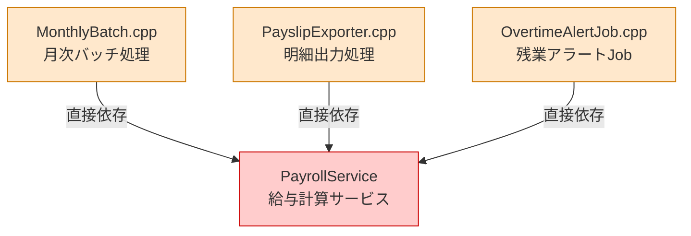
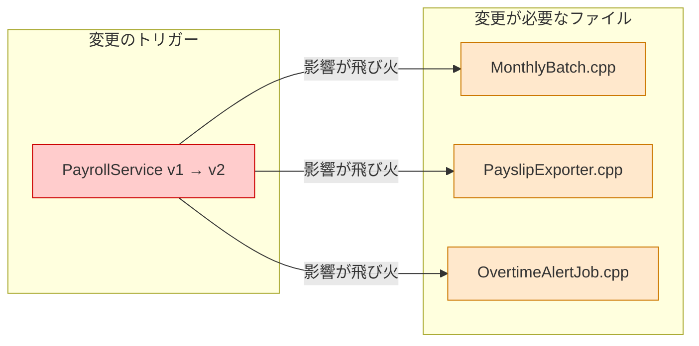
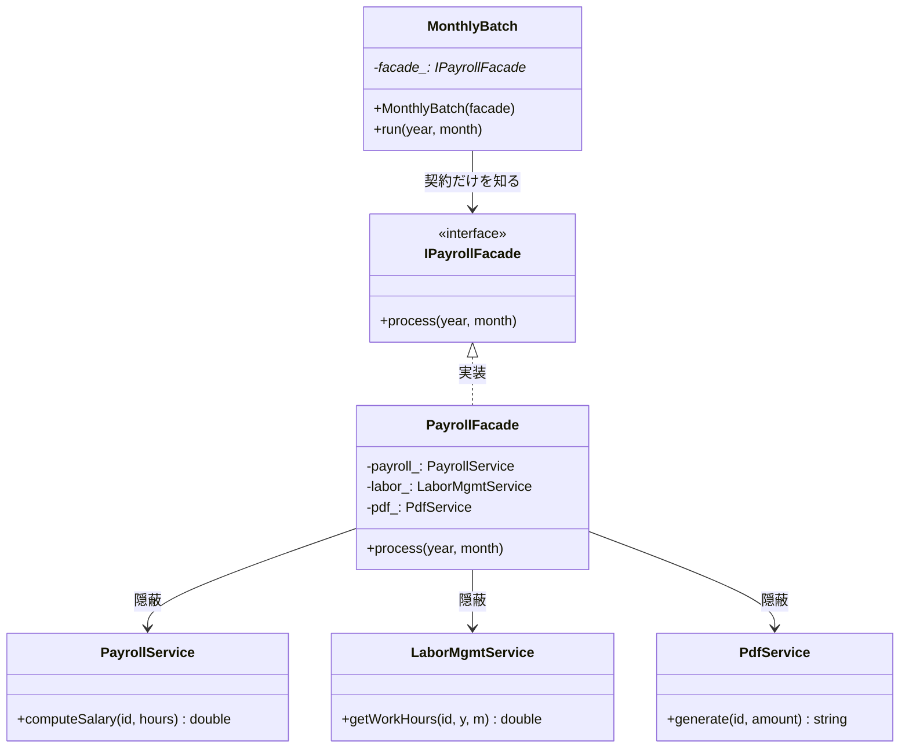
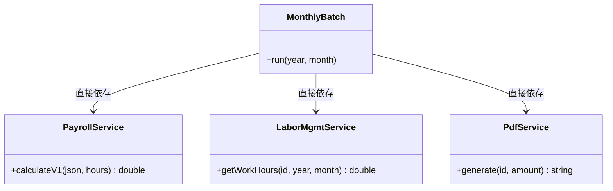
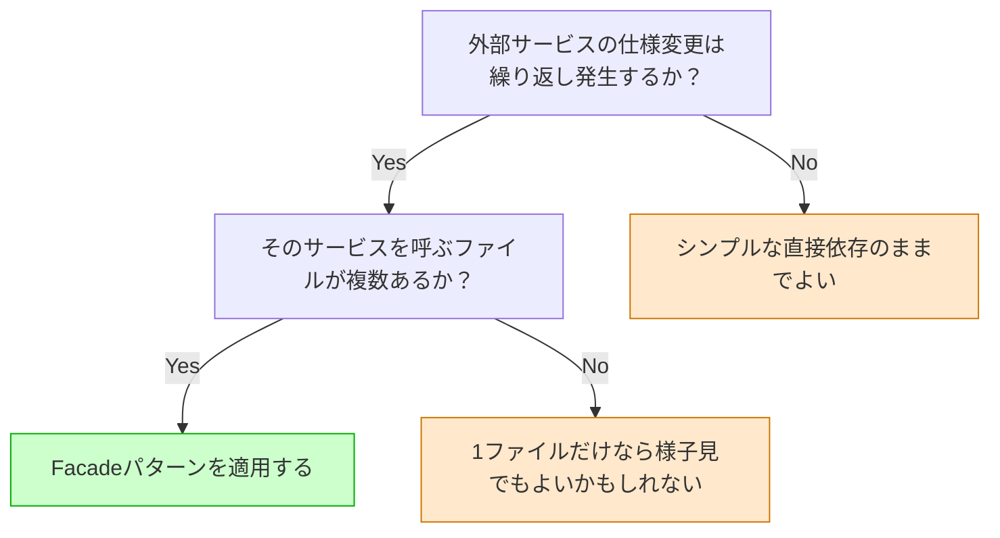
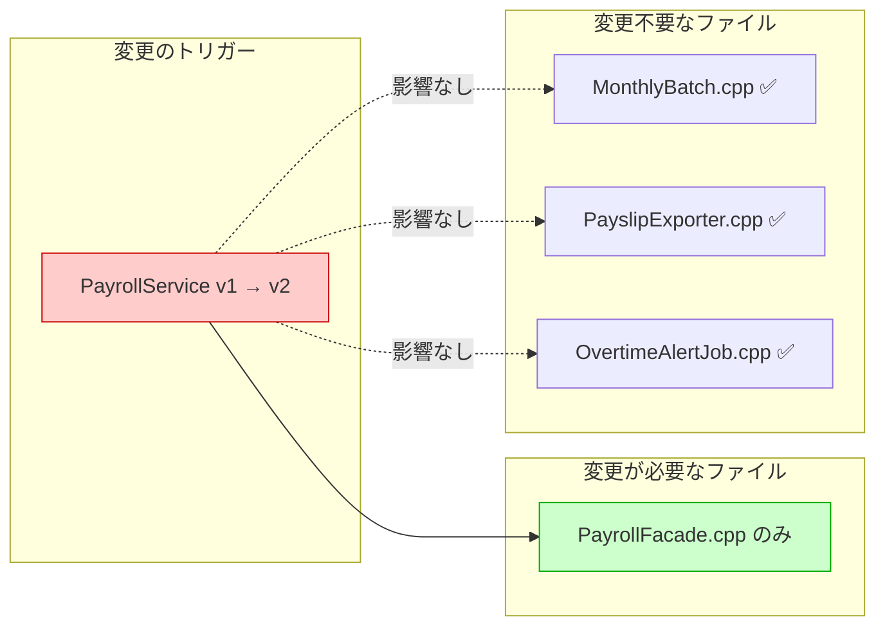

# 第2章　Facadeパターン：使う側に知らせない勇気
―― 思考の型：「各クラスの責任を把握し、責任外の関心が混在していないか確認する」

> **この章の核心**
> あるクラスが、本来自分の責任ではない知識を持ってしまうと、
> 他のクラスの変更に巻き込まれる。
> Facadeパターンは、その「余計な知識」を切り出して専用の窓口に渡す構造だ。

---

## ステップ0：視点のチューニング ―― 「設計のレンズ」をセットする

コードを読む前に、この章で使う問いをセットアップします。

**【全パターン共通の問い】**

> 「このコードの中に、**『変わる理由』が異なる2つのものが、
> 同じ場所に混在していないか？」**

「変わる理由」とは **「誰の判断で変わるか」** のことです。
答えが2人以上になるなら、「変わる理由」が複数混在しています。

### 2.0 変動と不変の仮説（コードを読む前に立てる）

| 分類 | この章での仮説 | 根拠 |
|---|---|---|
| 🔴 **変動する** | 各外部サービスのAPI仕様・引数形式 | 外部ベンダーの都合で変わる |
| 🔴 **変動する** | 給与計算の詳細アルゴリズム | 労務規則の改定で変わる |
| 🟢 **不変** | 「月末に全社員の給与処理を完了する」業務フロー | 会社がある限り変わらない |
| 🟢 **不変** | 「処理できたか」という結果の形 | 経理上の必須要件 |

---

## ステップ1：現状把握 ―― 各クラスの責任を把握し、責任外の関心がないか確認する

> **現状把握とは何か**
> コードを読んで「動きを追う」だけでは不十分です。
> 「各クラスの責任は何か」を定義し、
> 「責任範囲外の知識を持っていないか」を確認することが、
> 設計上の現状把握です。

### 2.1 今のシステムの仕様とコードの構造

**要するに変わりやすい複数の外部サービスを隠して、窓口を一本化するパターン。**

ある会社の月次給与バッチシステムです。
`MonthlyBatch` が毎月末に起動し、3つの外部サービスと連携して
給与処理を完了させます。

仕様の全体像：

| 機能 | 担当クラス | 入力 | 出力 |
|---|---|---|---|
| 勤怠取得 | LaborMgmtService | 社員ID・年・月 | 実働時間（double） |
| 給与計算 | PayrollService | 社員情報JSON・実働時間 | 給与額（double） |
| 明細生成 | PdfService | 社員ID・給与額 | PDFファイル名 |
| 処理統括 | MonthlyBatch | 年・月 | （記録・出力） |

---

**各クラスのコードと責任**

最初に、各クラスが「何をするクラスなのか」を実装を通じて確認します。
この確認が、後の「責任チェック」の土台になります。

```cpp
// LaborMgmtService
// 責任：「勤怠時間を管理する」
class LaborMgmtService {
public:
    // 社員IDと年月を受け取り、その月の実働時間を返す
    double getWorkHours(
        int employeeId, int year, int month
    );
};

double LaborMgmtService::getWorkHours(
    int employeeId, int year, int month
) {
    // 出退勤ログから実働時間を集計する
    // （実際はDBに問い合わせるが、ここでは固定値で代表）
    return 172.5; // 2024年12月の実働時間
}
```

LaborMgmtServiceが知っていること：社員IDと年月から実働時間を導く方法。
それだけです。給与の計算ルールも、PDFの生成方法も、知りません。

```cpp
// PayrollService
// 責任：「給与額を計算する」
class PayrollService {
public:
    // 社員情報JSON（基本給を含む）と実働時間を受け取り、
    // 給与額を返す。JSON形式: {"base":300000}
    double calculateV1(
        const std::string& employeeJson,
        double workHours
    );
private:
    double parseBaseSalary(const std::string& json);
};

double PayrollService::calculateV1(
    const std::string& employeeJson,
    double workHours
) {
    double base = parseBaseSalary(employeeJson); // 30万円
    // 160時間を超えた分は時給2500円で残業代を加算
    double overtime = (workHours > 160.0)
        ? (workHours - 160.0) * 2500.0
        : 0.0;
    return base + overtime;
}

double PayrollService::parseBaseSalary(
    const std::string& json
) {
    // {"base":300000} → 300000.0 を取り出す
    // 実際はJSONパーサーを使う。ここでは固定値で代表
    return 300000.0;
}
```

PayrollServiceが知っていること：給与の計算ルール（基本給・残業レート）、
そして自分のAPI形式（JSON形式）。
勤怠の集計方法も、PDFの生成方法も、知りません。

```cpp
// PdfService
// 責任：「給与明細PDFを生成する」
class PdfService {
public:
    // 社員IDと給与額を受け取り、PDFを生成してファイル名を返す
    std::string generate(int employeeId, double amount);
};

std::string PdfService::generate(
    int employeeId, double amount
) {
    // ファイル名規則: slip_{社員ID}_{給与額}.pdf
    return "slip_"
        + std::to_string(employeeId)
        + "_"
        + std::to_string((int)amount)
        + ".pdf";
}
```

PdfServiceが知っていること：ファイル命名規則、PDFのレイアウト。
給与の計算方法も、勤怠の集計方法も、知りません。

---

これで3つのサービスの責任と実装が見えました。
次に、これらを呼び出す `MonthlyBatch` を見ます。

```cpp
// MonthlyBatch
// 責任：「月次給与処理を完了させる」
class MonthlyBatch {
public:
    void run(int year, int month);
private:
    PayrollService   payroll_;
    LaborMgmtService labor_;
    PdfService       pdf_;
};

void MonthlyBatch::run(int year, int month) {
    int employeeId = 1001; // 説明のため1社員で単純化

    // LaborMgmtServiceに実働時間を問い合わせる
    double hours = labor_.getWorkHours(
        employeeId, year, month
    );

    // PayrollServiceに給与計算を依頼する
    std::string json = "{\"base\":300000}";
    double amount = payroll_.calculateV1(json, hours);

    // PdfServiceに明細生成を依頼する
    std::string slipFile = pdf_.generate(employeeId, amount);

    saveResult(year, month, amount, slipFile);
}

int main() {
    MonthlyBatch batch;
    batch.run(2024, 12);
    return 0;
}
```

**実行結果：**
```
[LaborMgmt]   社員1001: 実働 172.5時間
[Payroll]     基本給 300000円
              残業 12.5h × 2500円 = 31250円
              合計 331250円
[Pdf]         slip_1001_331250.pdf を生成
[MonthlyBatch] 2024年12月 処理完了
```

このコードは正しく動いています。問題は「構造」にあります。

---

**責任チェック：MonthlyBatchは自分の責任内だけで動いているか**

`MonthlyBatch` の責任は「月次給与処理を完了させること」です。
その責任を果たすために、MonthlyBatchが「知るべきこと」は何でしょうか。

> 対象の年・月。処理の流れ（勤怠を取得し、計算し、明細を出す）。

では、今のコードで `MonthlyBatch::run()` が実際に「知っていること」を
1行ずつ確認します。

| コードの行 | 知っていること | MonthlyBatchの責任内か |
|---|---|---|
| `labor_.getWorkHours(employeeId, year, month)` | 勤怠を取得する流れ | ○ 処理の流れとして自然 |
| `"{\"base\":300000}"` | PayrollServiceのJSON形式 | **✗ PayrollServiceの責任** |
| `payroll_.calculateV1(json, hours)` の "V1" | PayrollServiceのAPIバージョン | **✗ PayrollServiceの内部事情** |
| `pdf_.generate(employeeId, amount)` | PdfServiceの引数の意味 | △ 呼び出し自体は自然だが引数の意味まで知っている |

MonthlyBatchは `"{\"base\":300000}"` というJSON文字列を自分で組み立てています。
しかしこのJSON形式を決めているのはPayrollServiceです。
PayrollServiceの責任（API仕様の定義）が、MonthlyBatchのコードの中に
染み出してきています。

これが「責任範囲外の関心が混在している」状態です。

---

### 2.2 届いた変更要求

以上の「現状把握」を踏まえた上で、変更要求を受け取ります。

---

**インフラ担当**：「来月からPayrollServiceがv2になります。
引数の形式が変わって、`computeSalary(employeeId, hours)` になります。
JSON組み立ては不要です。」

**開発者**：「わかりました。修正します。」

---

「PayrollServiceのAPIが変わった」という変更です。
先ほどの責任チェックで確認した通り、
PayrollServiceのJSON形式の知識はMonthlyBatchの中にあります。
だからMonthlyBatchを開かなければなりません。

**依存の広がり（システム全体の確認）**



PayrollServiceのAPI知識を持っているファイルは3箇所です。

```bash
$ grep -r "calculateV1\|PayrollService" .
MonthlyBatch.cpp:9     PayrollService payroll_;
MonthlyBatch.cpp:24    payroll_.calculateV1(json, hours);
PayslipExporter.cpp:7  PayrollService payroll_;
PayslipExporter.cpp:19 payroll_.calculateV1(json, hours);
OvertimeAlertJob.cpp:5 PayrollService payroll_;
OvertimeAlertJob.cpp:15 payroll_.calculateV1(json, hours);
# → 3ファイル、それぞれにPayrollServiceの責任が染み出している
```

---

## ステップ2：変動と不変の峻別 ―― ステップ0の仮説をコードで検証する

### 2.3 仮説の検証と変動/不変の確定

コードを読んで、ステップ0の仮説を検証します。

**仮説との照合結果：**

- 🔴 **API仕様が変動する**：予想通り。`calculateV1` が変わる。
- 🔴 **JSON形式が変動する**：予想以上。MonthlyBatch内にJSON形式が染み出していた。
- 🟢 **業務フローは不変**：確認。「勤怠→計算→明細→保存」の流れは変わらない。

| 分類 | 具体的な内容 | 変わるタイミング | 設計への影響 |
|---|---|---|---|
| 🔴 変動 | PayrollServiceのAPI仕様・バージョン | ベンダーのリリース | 呼び出し元に置いてはいけない |
| 🔴 変動 | LaborMgmtServiceの引数形式 | 人事システム改修 | 呼び出し元に置いてはいけない |
| 🔴 変動 | PDFファイル命名規則 | PdfService仕様変更 | 呼び出し元に置いてはいけない |
| 🟢 不変 | 「給与処理を完了する」業務フロー | 変わる日は来ない | ここを抽象として固定する |
| 🟢 不変 | 「処理できたか」という結果の形 | 業務上の必須要件 | インターフェースの戻り値にする |

> **設計の決断**：🟢 不変な業務フローを「契約（インターフェース）」として固定し、
> 🔴 変動する各サービスの詳細を、その契約の裏側に押し込む。

---

## ステップ3：課題分析 ―― 変更しようとしたときの困難と痛み

### 2.4 変更しようとしたときの困難

PayrollService が v2 になる場合、実際にMonthlyBatchで
どんな修正が必要か確認します。

```cpp
// 変更前：MonthlyBatch がJSON形式を知っていた
std::string json = "{\"base\":300000}";
double amount = payroll_.calculateV1(json, hours);

// 変更後：API形式が変わったため、MonthlyBatch も変更
double amount = payroll_.computeSalary(employeeId, hours);
// JSON組み立ては不要になった
```

「PayrollServiceのAPIが変わっただけ」で、
「MonthlyBatch（月次処理の本体）」を変更しています。
MonthlyBatchの責任（月次処理の完了）は何も変わっていないにもかかわらず。

責任チェックで確認した通り、
「PayrollServiceのAPI知識」がMonthlyBatchの中に染み出していたため、
その知識の持ち主（PayrollService）が変わればMonthlyBatchも変わる。
これが痛みの原因です。

**変更影響グラフ（改善前）**



*PayrollServiceの責任範囲の変更が、
MonthlyBatch・PayslipExporter・OvertimeAlertJobの3ファイルに飛び火する。*

私自身、ここで何度も迷いました。「3箇所だけなら直せばいいでは？」と。
しかし今は3箇所でも、サービス変更が繰り返されるたびに積み重なります。

---

## ステップ4：原因分析 ―― 困難の根本にあるもの

### 2.5 困難の根本にあるもの

なぜこの痛みが生まれたのか、なぜなぜ分析で掘り下げます。

| 問い | 答え |
|---|---|
| なぜMonthlyBatchを変更しなければならないか？ | PayrollServiceのAPI知識（JSON形式）がMonthlyBatchの中にあるから |
| なぜMonthlyBatchにPayrollServiceの知識があるか？ | 「処理を完了させる（What）」と「各サービスをどう呼ぶか（How）」を同じクラスに書いたから |
| なぜ同じクラスに書いたか？ | まとめた方が追いやすいという自然な判断から |
| 根本原因は？ | **MonthlyBatch（処理の目的）** と **各サービスの責任** が同じ場所にいる |

**「各クラスの責任」を並べると、混在が見える**

| クラス | 本来の責任 | MonthlyBatchが代わりに持ってしまっている知識 |
|---|---|---|
| PayrollService | 給与計算ルールを知る | JSON形式 `{"base":300000}`・バージョン"V1" |
| LaborMgmtService | 勤怠ログを管理する | 引数の順序（employeeId, year, month） |
| PdfService | 明細レイアウトを知る | 引数の意味（id・amount の順） |

MonthlyBatchは3つのサービスそれぞれの「責任の一部」を
自分の中に持ち込んでしまっています。
これが「責任の混在」です。

**構造的原因の言語化：**

> MonthlyBatch が、自分の責任（月次処理の完了）を果たすために
> 必要以上の知識——各サービスの API 仕様——を内部に持っている。
> 「知りすぎているクラス」は、知っている相手が変わるたびに道連れになる。

---

## ステップ5：対策案の検討 ―― 責任の混在を解消する

### 2.6 最初の試み：【試行コード】

「MonthlyBatchから各サービスの知識を追い出す」ことを目指します。
最初の試みとして、3サービスへの呼び出しを専用クラスに移します。

```cpp
// 試み：3サービスの呼び出しを1クラスに集める
class PayrollFacade {
public:
    void process(int year, int month);
private:
    PayrollService   payroll_;
    LaborMgmtService labor_;
    PdfService       pdf_;
};

void PayrollFacade::process(int year, int month) {
    int employeeId = 1001;
    double hours = labor_.getWorkHours(
        employeeId, year, month
    );
    // サービスのAPI知識はここに集まる
    std::string json = "{\"base\":300000}";
    double amount = payroll_.calculateV1(json, hours);
    std::string slipFile = pdf_.generate(employeeId, amount);
    saveResult(year, month, amount, slipFile);
}

// MonthlyBatchはPayrollFacadeだけを持てばよい
class MonthlyBatch {
public:
    void run(int year, int month);
private:
    PayrollFacade facade_;
};

void MonthlyBatch::run(int year, int month) {
    facade_.process(year, month);
}
```

MonthlyBatchから各サービスの知識は消えました。
`run()` は「処理してくれ」と頼むだけになっています。

**試行コードの責任チェック（MonthlyBatch）**

| コードの行 | 知っていること | MonthlyBatchの責任内か |
|---|---|---|
| `facade_.process(year, month)` | 「給与処理を完了してほしい」という要求 | ○ |

MonthlyBatchの責任チェックは通過しました。一歩前進です。

**しかし、残る課題があります。**

PayrollFacadeは具象クラスです。MonthlyBatchは `PayrollFacade` を
内部に直接持っているため、テスト用の差し替えができません。

```cpp
// テストを書こうとすると...
TEST(MonthlyBatchTest, RunsPayrollProcess) {
    MonthlyBatch batch;
    // PayrollFacadeを差し替えられない。
    // テスト中に本物のPayrollService・LaborMgmtService・
    // PdfServiceが全て動いてしまう。
    batch.run(2024, 12);
}
```

MonthlyBatchが「PayrollFacadeという具体的なクラス」に依存している限り、
サービスなしで単独テストできません。

### 2.7 発想の転換：【解決コード】

残る課題を受けて、発想を転換します。

「MonthlyBatchが知るべきは `PayrollFacade` という具体クラスではなく、
『給与処理を完了してくれる何か』という**契約（インターフェース）**ではないか。」

インターフェースとは「どんな操作を提供するか」だけを定め、
「どう実装するか」は一切定めない型のことです（C++では純粋仮想クラス）。

```cpp
// 「給与処理を完了してくれる何か」という契約
class IPayrollFacade {
public:
    virtual ~IPayrollFacade() {}
    virtual void process(int year, int month) = 0;
};
```

```cpp
// 契約を実装するクラス。3サービスの知識はここに集まる
class PayrollFacade : public IPayrollFacade {
public:
    void process(int year, int month) override;
private:
    PayrollService   payroll_;
    LaborMgmtService labor_;
    PdfService       pdf_;
};

void PayrollFacade::process(int year, int month) {
    int employeeId = 1001;
    double hours = labor_.getWorkHours(
        employeeId, year, month
    );
    // PayrollService v2 に変わってもここだけ修正すればよい
    double amount = payroll_.computeSalary(employeeId, hours);
    std::string slipFile = pdf_.generate(employeeId, amount);
    saveResult(year, month, amount, slipFile);
}
```

```cpp
// MonthlyBatchは「契約」だけを知る
class MonthlyBatch {
public:
    explicit MonthlyBatch(IPayrollFacade* facade);
    void run(int year, int month);
private:
    IPayrollFacade* facade_;
};

MonthlyBatch::MonthlyBatch(IPayrollFacade* facade)
    : facade_(facade) {}

void MonthlyBatch::run(int year, int month) {
    facade_->process(year, month);
}
```

**本番での組み立て（依存注入）：**

```cpp
int main() {
    PayrollFacade facade;
    MonthlyBatch  batch(&facade);
    batch.run(2024, 12);
    return 0;
}
```

**実行結果：**
```
[LaborMgmt]    社員1001: 実働 172.5時間
[Payroll]      基本給 300000円
               残業 12.5h × 2500円 = 31250円
               合計 331250円
[Pdf]          slip_1001_331250.pdf を生成
[MonthlyBatch] 2024年12月 処理完了
```

試行コードと同じ実行結果です。外から見た動きは変わっていません。
変わったのは内部の構造だけです。

この構造を **Facadeパターン** といいます。
「Facade（ファサード）」は建築用語で「建物の正面」を意味します。
建物の裏（3サービスの詳細）を正面（IPayrollFacade）の陰に隠す、
という意味が込められています。

**変更後のクラス図**



**変更前のクラス図（対比のため再掲）**



- 変更前：MonthlyBatch → 3サービス（矢印3本。責任が混在）
- 変更後：MonthlyBatch → IPayrollFacade（矢印1本。責任が明確）

矢印の数が「3本 → 1本」になった。これが構造の変化の核心です。

---

## ステップ6：天秤にかける ―― 柔軟性とシンプルさのバランスを評価する

### 2.8 比較の基準を先に宣言する

**比較基準を先に宣言します。後から決めると結論ありきの比較になるためです。**

1. **変更の局所性** ―― サービス仕様変更の影響が1箇所に収まるか
2. **テストの独立性** ―― MonthlyBatchをサービスなしで単独テストできるか
3. **責任の明確さ** ―― 各クラスが自分の責任だけを持っているか
4. **実装コスト** ―― 今すぐ払う手間はどれくらいか

### 2.9 比較と判断

| 評価軸 | ❌ 改善前 | ✅ Facade適用後 |
|---|---|---|
| 変更の局所性 | PayrollService変更 → 3ファイル変更 | 変更はPayrollFacade内だけ |
| テストの独立性 | 本番サービスなしでMonthlyBatchをテスト不可 | スタブで単独テスト可 |
| 責任の明確さ | MonthlyBatchが3サービスの責任を混在させている | 各クラスが自分の責任だけを持つ |
| 実装コスト | 少ない（インターフェース不要） | やや多い（クラス・インターフェース増） |

正解はないのですが、一つの考え方として。
「責任の明確さ」が保たれている構造では、
変更の影響が予測しやすくなります。
「このクラスを変えれば、影響するのはここだけ」と言える状態です。

**適用判断のフローチャート**



デザインパターンはゴールではありません。
「将来発生する変更コスト」を「今の実装コスト」で買う投資判断です。
チームの状況に合わせて、一つの参考として受け取っていただければと思います。

### 2.10 より難しい変化への耐久テスト

「LaborMgmtServiceも引数形式が変わった」という変更が同時に来たとします。

**【深化コード】：Facade適用後の場合**

```cpp
void PayrollFacade::process(int year, int month) {
    int employeeId = 1001;

    // LaborMgmtService v2: getHours(year, month, id)
    // 引数の順序が変わっても、PayrollFacade内だけで対処
    double hours = labor_.getHours(year, month, employeeId);

    double amount = payroll_.computeSalary(employeeId, hours);
    std::string slipFile = pdf_.generate(employeeId, amount);
    saveResult(year, month, amount, slipFile);
}

// MonthlyBatch::run() は一行も変わらない
void MonthlyBatch::run(int year, int month) {
    facade_->process(year, month);
}
```

2つのサービスが同時に変わっても、
MonthlyBatchは変わりません。
変更はPayrollFacadeの中だけに局所化されています。

責任チェックで確認したように、
MonthlyBatchがPayrollServiceやLaborMgmtServiceの責任を持っていない状態を
作ったからこそ、この局所化が実現しています。

### 2.11 使う場面・使わない場面

**【過剰コード】**

```cpp
// ❌ やりすぎの例：変わらない1行の計算をFacadeで包む
class ITaxFacade {
public:
    virtual ~ITaxFacade() {}
    virtual double calculate(double amount) = 0;
};
class SimpleTaxFacade : public ITaxFacade {
public:
    double calculate(double amount) override {
        return amount * 0.1;
    }
};
// 「消費税10%」は変わらない。呼び出し元も1箇所だけ。
// 責任の混在が起きていない状況でFacadeを入れる必要はない。
```

| 使う場面 | 使わない場面 |
|---|---|
| 複数サービスの責任が呼び出し元に混在している | 呼び出し元に責任の混在がない |
| 外部サービスの仕様変更が繰り返し発生する | 一度作ったら変わらない処理 |
| サービスなしで呼び出し元を単独テストしたい | 結合テストで十分な場面 |

---

## ステップ7：決断と、手に入れた未来

### 2.12 解決後のコード

リファクタリングとは「外から見た動きを変えずに、内部の構造を変えること」です。
テストで「外から見た動きが変わっていない」ことを確認します。

```cpp
// スタブ：本物のサービスを呼ばずに動く差し替えクラス。
// IPayrollFacadeを継承するため、
// 本番のPayrollFacadeとそのまま入れ替えられる。
class StubPayrollFacade : public IPayrollFacade {
public:
    bool called      = false;
    int  calledYear  = 0;
    int  calledMonth = 0;

    void process(int year, int month) override {
        called      = true;
        calledYear  = year;
        calledMonth = month;
        // 本物のサービスは呼ばない
    }
};

TEST(MonthlyBatchTest, CallsFacadeWithCorrectYearMonth) {
    StubPayrollFacade stub;
    MonthlyBatch batch(&stub);
    // 依存注入：コンストラクタ経由でスタブを渡す

    batch.run(2024, 12);

    // EXPECT_TRUE(条件)：条件が真ならテスト通過。Google Testのマクロ。
    EXPECT_TRUE(stub.called);
    // EXPECT_EQ(期待値, 実際の値)：等しければテスト通過。
    EXPECT_EQ(2024, stub.calledYear);
    EXPECT_EQ(12,   stub.calledMonth);
}
```

```
[  PASSED  ] MonthlyBatchTest.CallsFacadeWithCorrectYearMonth
```

PayrollServiceへの本番接続なしに、MonthlyBatchの動作を確認できました。
MonthlyBatchが「IPayrollFacadeという契約だけを知っている」状態のため、
差し替えが可能になっています。

**変更影響グラフ（改善後）**



ステップ1の責任チェックで確認した問題——
MonthlyBatchがPayrollServiceの責任（JSON形式の知識）を持っていた状態——は
完全に解消されました。

PayrollServiceが v3 になっても、MonthlyBatchは一行も変わりません。
「誰の責任か」が明確になっているからです。

---

## 整理

### 2.13 8ステップとこの章でやったこと

| ステップ | この章でやったこと |
|---|---|
| ステップ0 | 「API仕様は変動、業務フローは不変」という仮説を立てた |
| ステップ1 | 各クラスの責任を定義し、MonthlyBatchに責任外の知識（PayrollServiceのJSON形式）が混在していることを確認した |
| ステップ2 | 変更要求を受け取り、責任の混在が「変更の飛び火」を生む構造を確認した |
| ステップ3 | PayrollService変更が3ファイルに飛び火する痛みを確認した |
| ステップ4 | 「知りすぎているクラスは、知っている相手の変更に道連れになる」という根本原因を言語化した |
| ステップ5 | 試行でFacadeクラスを作り、解決でIPayrollFacadeインターフェースを導入した |
| ステップ6 | 変更の局所性・責任の明確さを評価軸にして適用を判断した |
| ステップ7 | スタブを使ったテストで「動きが変わっていない」ことを確認した |

このプロセスを回した結果、コードに引かれた「MonthlyBatchと3サービスの間の境界線」こそが
**Facadeパターン** です。

設計に絶対の正解はありません。
ただ「各クラスの責任は何か」「責任外の知識を持っていないか」を問い続けることが、
変更に強いコードへの入り口になる。そういう感覚、うまく伝わっているでしょうか。
