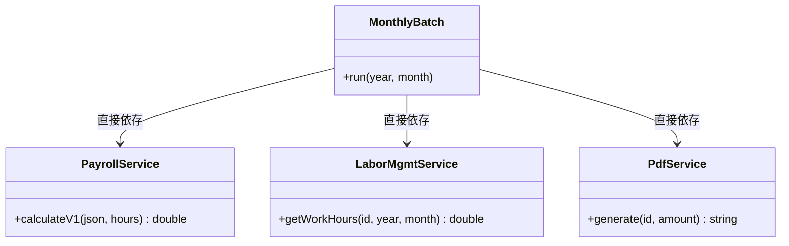
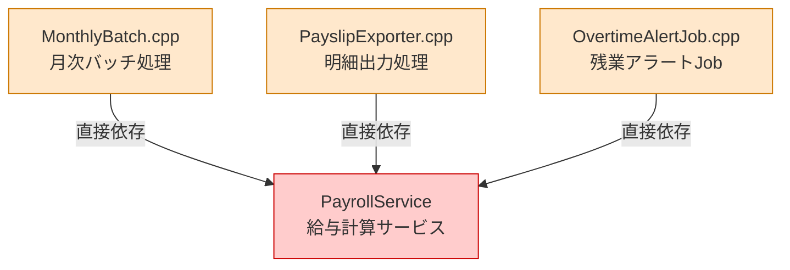
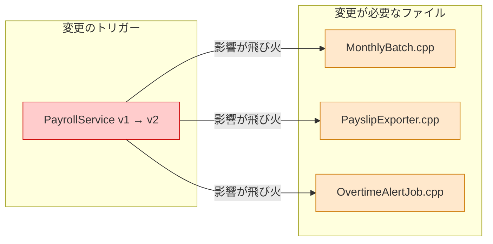
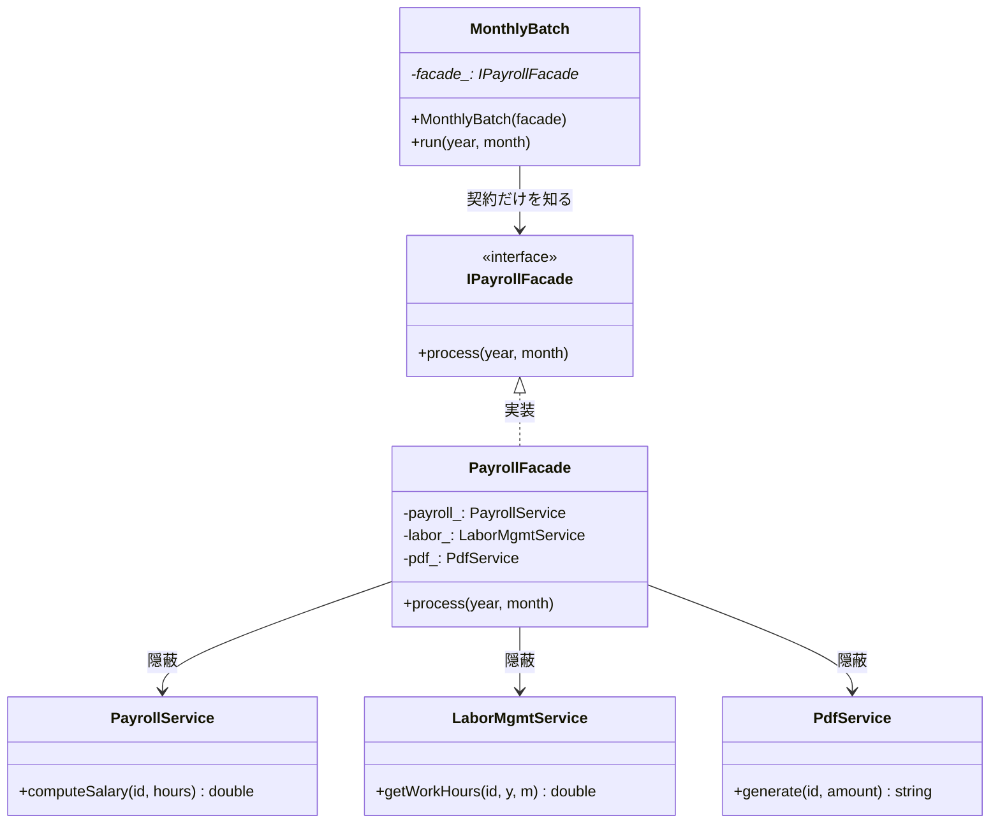
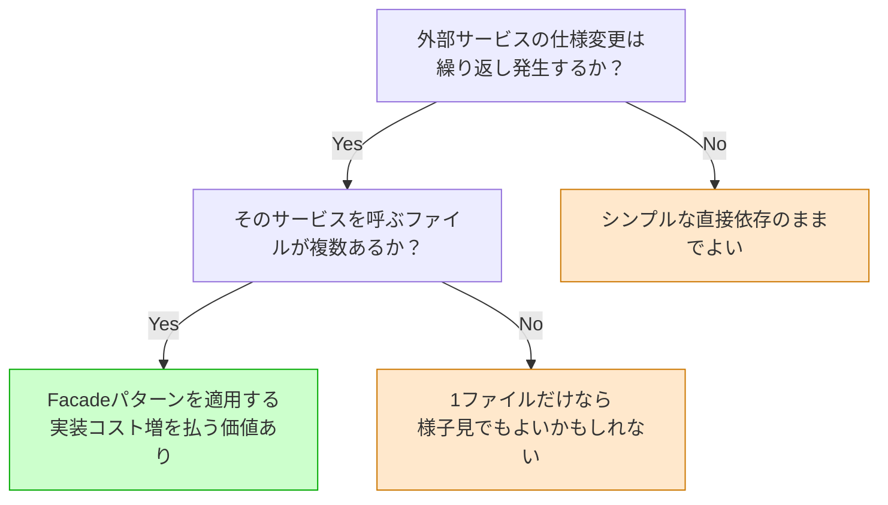
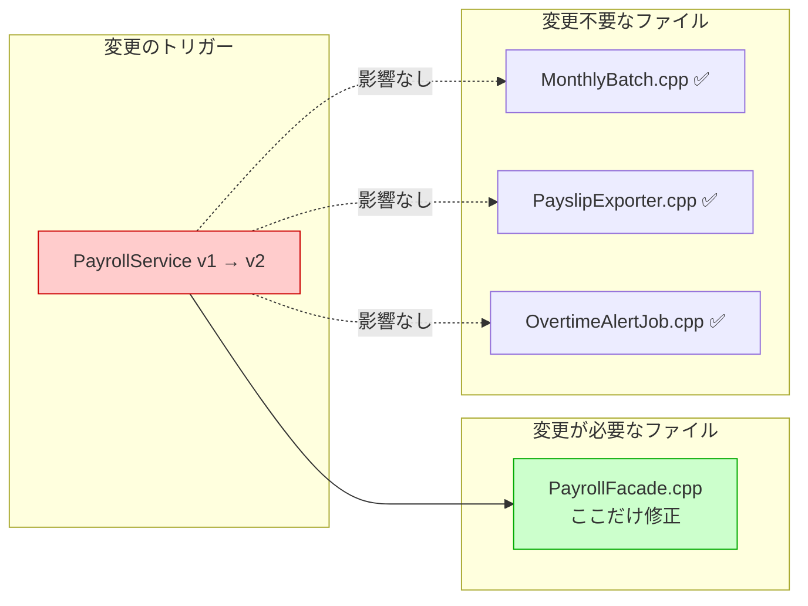

# 第2章　Facadeパターン：使う側に知らせない勇気
―― 思考の型：コードに潜む「委託した仕事に口を出したくなる衝動」を言語化し、「呼び出し元の要求」と「外部サービスの都合」を引き離す

> **この章の核心**
> 複数の外部サービスを「まとめて引き受ける窓口」を立て、
> 使う側がそれぞれのサービスの都合を知らなくて済む構造を作る。

---

## ステップ0：視点のチューニング ―― 「設計のレンズ」をセットする

コードを読む前に、この章で使う問いをセットアップします。
このレンズなしにコードを読むと、「動いている処理の羅列」にしか見えません。

**【全パターン共通の問い】**

> 「このコードの中に、**『変わる理由』が異なる2つのものが、
> 同じ場所に混在していないか？」**

この問いは、すべての設計パターンで使える。FacadeでもStrategyでも、
解こうとしている問題の本質はこれ1つだ。
「変わる理由」とは **「誰の判断で、何のために変更が発生するか」** のことだ。

| 変わる理由の種類 | 例 | 誰の判断で変わるか |
|---|---|---|
| 業務フロー | 「月末に給与処理を実行する」流れ | 人事・経営判断 |
| 外部サービス仕様 | APIのバージョン・引数形式 | 外部ベンダー |
| 計算ルール | 給与算出の詳細ロジック | 労務担当 |

> **判定の問い**：「このコードを変更するとき、誰に話を聞きに行くか？」
> 答えが2人以上になるなら、「変わる理由」が複数混在している。

### 2.0 変動と不変の仮説（コードを読む前に立てる）

コードを読む前に「変わりそうなもの」と「変わらないもの」を
仮説として立てます。この作業が、後の設計判断のブレを防ぐ安全装置になります。

| 分類 | この章での仮説 | 根拠 |
|---|---|---|
| 🔴 **変動する** | 各サービスのAPI仕様（引数形式・バージョン） | 外部ベンダーの都合で変わる |
| 🔴 **変動する** | 給与計算の詳細アルゴリズム | 労務規則の改定で変わる |
| 🟢 **不変** | 「月末に全社員の給与処理を完了する」業務フロー | 会社がある限り変わらない |
| 🟢 **不変** | 「処理結果（金額・明細）を記録する」要求 | 経理上の必須要件 |

> 「ここまでは変わらない」と仮定を置くことが、
> 設計の安定性の根拠になる。

---

## ステップ1：現状把握 ―― 使う側が「知りすぎている」事実をつかむ

### 2.1 今のシステムの仕様とコードの構造

**要するに変わりやすい複数の外部サービスを隠して、窓口を一本化するパターン。**

ある会社の月次給与バッチシステムを考えます。
`MonthlyBatch` が毎月末に起動し、3つの外部サービスと連携して
給与処理を完了させています。現時点では、このシステムは正しく動いています。
問題は「構造」にあります。

| 機能 | 入力 | 出力 |
|---|---|---|
| 勤怠取得 | 社員ID・年・月 | 実働時間（double） |
| 給与計算 | 社員情報JSON・実働時間 | 給与額（double） |
| 明細生成 | 社員ID・給与額 | PDFファイル名（string） |

**変更前のクラス図**



`MonthlyBatch` から矢印が3本出ている。これが今回の問題の起点です。

---

**【起点コード】**

このシステムを最初に書いた担当者が、仕様通りに誠実に実装した姿です。
当時の担当者の苦労を想像しながら、コードを観察します。

```cpp
// 給与計算サービス（外部APIのラッパー）
class PayrollService {
public:
    // JSON文字列と実働時間を受け取り、給与額を返す
    double calculateV1(
        const std::string& employeeJson,
        double workHours
    );
};

// 勤怠管理サービス（勤怠システムのラッパー）
class LaborMgmtService {
public:
    // 社員IDと年月で実働時間を返す
    double getWorkHours(
        int employeeId, int year, int month
    );
};

// 給与明細PDFを生成するサービス
class PdfService {
public:
    // 社員IDと給与額でPDFを生成し、ファイル名を返す
    std::string generate(int employeeId, double amount);
};

// 月次給与バッチの本体
class MonthlyBatch {
public:
    void run(int year, int month);
private:
    PayrollService   payroll_;
    LaborMgmtService labor_;
    PdfService       pdf_;
};

void MonthlyBatch::run(int year, int month) {
    int employeeId = 1001; // 説明のため1社員で単純化

    // 💭「ここは本来の仕事。年月を渡すのは自然だ。」
    double hours = labor_.getWorkHours(
        employeeId, year, month
    );

    // 💭「なぜMonthlyBatchがJSONを組み立てている？
    //     PayrollServiceの仕様まで知る必要があるのか？」
    std::string json =
        "{\"id\":"    + std::to_string(employeeId) +
        ",\"hours\":" + std::to_string(hours) + "}";
    //  ↑ このJSON形式はPayrollServiceの仕様。知らなくていい
    double amount = payroll_.calculateV1(json, hours);
    //                            ↑ "V1"も知らなくていい

    // 💭「generateの引数の順序も毎回確認している。
    //     PdfServiceのルールに縛られている感覚だ。」
    std::string slipFile = pdf_.generate(employeeId, amount);
    //  ↑ 引数の順序・意味を知らなくていい

    saveResult(year, month, amount, slipFile);
    // saveResultは省略（DBへの記録。本題ではない）
}

int main() {
    MonthlyBatch batch;
    batch.run(2024, 12);
    return 0;
}
```

**実行結果：**
```
[2024/12] 月次給与処理を開始します
  社員 1001: 実働 160.0h → 給与 350000円
  → 明細: slip_1001_2024_12.pdf
[2024/12] 月次給与処理が完了しました
```

このコードは正しく動いています。問題は「構造」にあります。

---

### 2.2 届いた変更要求

ある日、こんな連絡が届きました。

---

**インフラ担当**：「PayrollServiceのAPIが来月からv2になります。
引数の形式が変わり、`computeSalary(employeeId, hours)` に変わります。
JSON組み立ては不要です。」

**開発者**：「わかりました、修正します。」

*（心の中：給与計算のAPIが変わっただけなのに、
なぜMonthlyBatchを開いているんだろう...）*

---

この変更要求で「何が変わったか」を整理します。

**依存の広がり（システム全体の確認）**



*→ PayrollServiceに直接依存しているファイルが複数存在する。
　サービス変更が「飛び火」する全体像が見えてきた。*

`PayrollService` に直接依存しているファイルは3箇所です。

```bash
$ grep -r "PayrollService" .
MonthlyBatch.cpp:9     PayrollService payroll_;
PayslipExporter.cpp:7  PayrollService payroll_;
OvertimeAlertJob.cpp:5 PayrollService payroll_;
# → 3箇所ヒット
```

今回はそのうち `MonthlyBatch.cpp` に注目します。

---

## ステップ2：変動と不変の峻別 ―― ステップ0の仮説をコードで検証する

### 2.3 仮説の検証と変動/不変の確定

コードを読んで、ステップ0の仮説を検証します。

**仮説との照合結果：**

- 🔴 **API仕様が変動する**：予想通り。`calculateV1` が変わった。
- 🔴 **JSON形式が変動する**：予想以上。`MonthlyBatch` 内でJSON組み立てまでしていた。
- 🟢 **業務フローは不変**：確認。「勤怠取得→計算→明細生成→保存」の流れは変わらない。

| 分類 | 具体的な内容 | 変わるタイミング | 設計への影響 |
|---|---|---|---|
| 🔴 変動 | PayrollServiceのAPI仕様・バージョン | ベンダーのリリース | 呼び出し元に置いてはいけない |
| 🔴 変動 | LaborMgmtServiceの引数形式 | 人事システム改修 | 呼び出し元に置いてはいけない |
| 🔴 変動 | PDFファイル名の命名規則 | PdfService仕様変更 | 呼び出し元に置いてはいけない |
| 🟢 不変 | 「給与処理を完了する」業務フロー | 変わる日は来ない | ここを抽象として固定する |
| 🟢 不変 | 「処理できたか否か」という結果の形 | 業務上の必須要件 | インターフェースの戻り値にする |

> **設計の決断**：🟢 不変な業務フローを「インターフェース（契約）」として固定し、
> 🔴 変動する各サービスの詳細を、そのインターフェースの裏側に押し込む。

---

## ステップ3：課題分析 ―― 変更しようとしたときの困難と痛み

### 2.4 変更しようとしたときの困難

PayrollService が v2 になる場合、MonthlyBatch でどんな修正が必要か、
手を動かして確認します。

```cpp
// 変更前のコード
std::string json =
    "{\"id\":"    + std::to_string(employeeId) +
    ",\"hours\":" + std::to_string(hours) + "}";
double amount = payroll_.calculateV1(json, hours);

// 変更後のコード
double amount = payroll_.computeSalary(employeeId, hours);
// JSON組み立ては不要に。
// でも、なぜMonthlyBatchを触ることになったのか？
```

「`PayrollService` のAPIが変わっただけ」で、「月次処理の本体」が手術台に上がりました。

> MonthlyBatchの「月次処理を完了する」という責任は何も変わっていない。
> にもかかわらず、外部サービスの都合でMonthlyBatchを変更している。
> なぜこうなるのか？

**変更影響グラフ（改善前）**



*1つのサービス変更が、3つの無関係に見えるファイルを同時に変更対象にする。*

私自身、ここで何度も迷いました。
「変更箇所が少ないなら、このままでもいいのでは？」と思うこともあります。
しかし今は3箇所で済んでも、サービス変更が繰り返されるたびに同じ苦労が積み重なります。

---

## ステップ4：原因分析 ―― 困難の根本にあるもの

### 2.5 困難の根本にあるもの

なぜ外部サービスの都合が変わっただけで MonthlyBatch が痛むのか、
なぜなぜ分析で掘り下げます。

| 問い | 答え |
|---|---|
| なぜMonthlyBatchを変更しなければならないのか？ | PayrollServiceのAPI詳細（JSON形式・メソッド名）を直接知っているから |
| なぜ直接知っているのか？ | 「給与処理を完了する（What）」と「各サービスをどう呼ぶか（How）」を同じクラスに書いているから |
| なぜ同じクラスに書いたのか？ | 処理を1箇所にまとめた方がわかりやすいという自然な判断から |
| 根本原因は？ | **MonthlyBatchと3サービスの詳細が「同じ場所」にいる** |

**「知らなくていいこと」の確認**

```cpp
void MonthlyBatch::run(int year, int month) {
    int employeeId = 1001;

    double hours = labor_.getWorkHours(
        employeeId, year, month
        // ↑ 引数の順序（id, year, month）を知らなくていい
    );

    std::string json =
        "{\"id\":"    + std::to_string(employeeId) +
        ",\"hours\":" + std::to_string(hours) + "}";
        // ↑ PayrollServiceのJSON形式を知らなくていい
    double amount = payroll_.calculateV1(json, hours);
        // ↑ メソッド名とバージョンを知らなくていい

    std::string slipFile = pdf_.generate(employeeId, amount);
        // ↑ generate()の引数の順序・意味を知らなくていい

    saveResult(year, month, amount, slipFile);
}
```

| MonthlyBatchが知ってよいこと | 知らなくていいこと |
|---|---|
| 「給与処理を完了する」業務フロー | PayrollServiceのJSON引数形式 |
| 処理の順序（勤怠→計算→明細→保存） | LaborMgmtServiceの引数の順序 |
| 対象の社員IDと年月 | PDFのファイル名生成ルール |

**構造的原因の言語化：**

> **MonthlyBatch（目的）** と
> **PayrollService・LaborMgmtService・PdfService（手段）** が同じ場所にいる。
> 「目的は変わらないが手段は変わる」という状況で両者を同居させると、
> 手段が変わるたびに目的のコードが道連れになる。

---

## ステップ5：対策案の検討 ―― 構造を変える

### 2.6 最初の試み：【試行コード】

最初の試みとして、「3サービスの呼び出しを専用クラスに引っ越す」方法を考えます。

```cpp
// 試みの方向：3サービスの処理を1つのクラスに集める
class PayrollFacade {
public:
    void process(int year, int month);
private:
    PayrollService   payroll_;
    LaborMgmtService labor_;
    PdfService       pdf_;
};

void PayrollFacade::process(int year, int month) {
    int employeeId = 1001;
    double hours = labor_.getWorkHours(
        employeeId, year, month
    );
    std::string json =
        "{\"id\":"    + std::to_string(employeeId) +
        ",\"hours\":" + std::to_string(hours) + "}";
    double amount = payroll_.calculateV1(json, hours);
    std::string slipFile = pdf_.generate(employeeId, amount);
    saveResult(year, month, amount, slipFile);
}

// MonthlyBatchはPayrollFacadeだけを持てばよい
class MonthlyBatch {
public:
    void run(int year, int month);
private:
    PayrollFacade facade_; // ← 3サービスの代わりに1つ
};

void MonthlyBatch::run(int year, int month) {
    // 💭「3サービスへの直接呼び出しが消えた。すっきりした。」
    facade_.process(year, month);
}
```

**試行コードの依存注入と動作確認：**

```cpp
int main() {
    MonthlyBatch batch;
    batch.run(2024, 12);
    return 0;
}
// 実行結果：
// [2024/12] 月次給与処理を開始します
//   社員 1001: 実働 160.0h → 給与 350000円
//   → 明細: slip_1001_2024_12.pdf
// [2024/12] 月次給与処理が完了しました
```

MonthlyBatchからサービスの詳細は消えました。一歩前進です。

しかし、**残る課題があります**。

```cpp
// テストを書こうとすると...
TEST(MonthlyBatchTest, RunsPayrollProcess) {
    MonthlyBatch batch;
    // 💭「PayrollFacadeを差し替えられない。
    //     テスト中に本物のPayrollServiceが動いてしまう。
    //     本番サービスへの接続なしではテストできない。」
    batch.run(2024, 12);
}
```

`MonthlyBatch` が `PayrollFacade`（具象クラス）を内部に直接持っているため、
テスト用の差し替えができません。
「テストのたびに本番サービスに接続する」という状況は避けたいはずです。

### 2.7 発想の転換：【解決コード】

残る課題を受けて、発想を転換します。

「`MonthlyBatch` が知るべきは `PayrollFacade` という具体的なクラスではなく、
『給与処理を完了する』という **契約** ではないか。」

その契約をインターフェース（純粋仮想クラス）として定義します。
インターフェースとは「どんな操作を提供するか」だけを定め、
「どう実装するか」は一切定めない型のことです。

```cpp
// 契約を定義する（インターフェース）
// ← PayrollService / LaborMgmtService / PdfService の名前は
//    ここに一切登場しない
class IPayrollFacade {
public:
    virtual ~IPayrollFacade() {}
    virtual void process(int year, int month) = 0;
    //                   ↑「何月の給与処理か」だけを引数にする
};
```

```cpp
// 3サービスの詳細を引き受ける実装クラス
class PayrollFacade : public IPayrollFacade {
public:
    void process(int year, int month) override;
private:
    PayrollService   payroll_;
    LaborMgmtService labor_;
    PdfService       pdf_;
};

void PayrollFacade::process(int year, int month) {
    int employeeId = 1001;
    double hours = labor_.getWorkHours(
        employeeId, year, month
    );
    // PayrollService v2 に変わっても、ここだけ修正すればよい
    double amount = payroll_.computeSalary(employeeId, hours);
    std::string slipFile = pdf_.generate(employeeId, amount);
    saveResult(year, month, amount, slipFile);
}
```

```cpp
// MonthlyBatchは契約（インターフェース）だけを知る
class MonthlyBatch {
public:
    // 依存注入：コンストラクタで契約を受け取る
    explicit MonthlyBatch(IPayrollFacade* facade);
    void run(int year, int month);
private:
    IPayrollFacade* facade_;
    // ↑ 契約だけを知る。具体クラスは見えない
};

MonthlyBatch::MonthlyBatch(IPayrollFacade* facade)
    : facade_(facade) {}

void MonthlyBatch::run(int year, int month) {
    // 💭「3サービスの詳細は完全に見えなくなった。
    //     『給与処理を完了してくれ』と頼むだけでよい。」
    facade_->process(year, month);
}
```

**本番での組み立て：**

```cpp
int main() {
    PayrollFacade facade;     // 本番はPayrollFacadeを使う
    MonthlyBatch  batch(&facade);
    batch.run(2024, 12);
    return 0;
}
```

実行結果：
```
[2024/12] 月次給与処理を開始します
  社員 1001: 実働 160.0h → 給与 350000円
  → 明細: slip_1001_2024_12.pdf
[2024/12] 月次給与処理が完了しました
```

試行コード（インターフェースなし）と同じ結果が出ています。
外から見た動きは変わっていません。変わったのは内部の構造です。

この構造を **Facadeパターン** といいます。
「Facade（ファサード）」は建築用語で「建物の正面」を意味します。
建物の裏（3サービスの詳細）を正面（IPayrollFacade）の陰に隠す、
という意味が込められています。

**変更後のクラス図**



**変更前後の対比：**

- 変更前：MonthlyBatch → PayrollService / LaborMgmtService / PdfService（矢印3本）
- 変更後：MonthlyBatch → IPayrollFacade（矢印1本）

MonthlyBatchから出る矢印が「3本 → 1本」になった。
これが構造の変化の核心です。

---

## ステップ6：天秤にかける ―― 柔軟性とシンプルさのバランスを評価する

### 2.8 比較の基準を先に宣言する

設計パターンを導入する前に、**何を重視して評価するかを先に宣言します**。
後から基準を決めると、結論に都合のいい比較になってしまいます。

今回重視する評価軸：

1. **変更の局所性** ―― サービス仕様変更の影響が1箇所に収まるか
2. **テストの独立性** ―― MonthlyBatchをサービスなしで単独テストできるか
3. **読みやすさ** ―― 抽象レイヤーが増えて追いにくくなっていないか
4. **実装コスト** ―― 今すぐ払う手間はどれくらいか

### 2.9 比較と判断

| 評価軸 | ❌ 改善前 | ✅ Facade適用後 |
|---|---|---|
| 変更の局所性 | PayrollService変更 → 3ファイルを変更 | 変更はPayrollFacade内だけ |
| テストの独立性 | 本番サービスなしでMonthlyBatchをテスト不可 | IPayrollFacadeのスタブで単独テスト可 |
| 読みやすさ | runの中にサービス詳細が混在 | run()は「process()を呼ぶ」1行になる |
| 実装コスト | 少ない（インターフェース不要） | やや多い（クラス・インターフェースが増える） |

正解はないのですが、一つの考え方として。
実装コストは今日1回払えばよいですが、サービス変更への対応コストは繰り返し発生します。
変更が定期的に起こる外部サービスを扱う場合、
今日の実装コストは将来の変更コストへの投資とも見られます。

**適用判断のフローチャート**



> デザインパターンはゴールではありません。
> 「将来発生する変更コスト」を「今の実装コスト」で買う投資判断です。
> チームの状況に合わせて、一つの参考として受け取っていただければと思います。

### 2.10 より難しい変化への耐久テスト

今度は別のシナリオです。
「LaborMgmtServiceも引数形式が変わった」という変更要求が来たとします。
PayrollServiceとLaborMgmtServiceの両方が同時に変わるケースです。

**Facade適用後（【深化コード】）：**

```cpp
void PayrollFacade::process(int year, int month) {
    int employeeId = 1001;

    // LaborMgmtService v2: getHours(year, month, id)
    // 引数の順序が変わっても、PayrollFacade内だけで対処
    double hours = labor_.getHours(year, month, employeeId);
    //                    ↑ 変更はここ1行。MonthlyBatchは無関係

    // PayrollService v2 も引き続き対応済み
    double amount = payroll_.computeSalary(employeeId, hours);
    std::string slipFile = pdf_.generate(employeeId, amount);
    saveResult(year, month, amount, slipFile);
}

// MonthlyBatch::run() は一行も変わらない
void MonthlyBatch::run(int year, int month) {
    facade_->process(year, month); // ← これは変わらない
}
```

2つのサービスが同時に仕様変更されても、`MonthlyBatch` は変わりません。
変更は `PayrollFacade` の中だけに局所化されています。
この「変更が1箇所に収まる」という感覚、うまく伝わっているでしょうか。

### 2.11 使う場面・使わない場面

**【過剰コード】**

```cpp
// ❌ やりすぎの例：単純な計算を無理にFacadeに包む
class ITaxFacade {
public:
    virtual ~ITaxFacade() {}
    virtual double calculate(double amount) = 0;
};
class SimpleTaxFacade : public ITaxFacade {
public:
    double calculate(double amount) override {
        return amount * 0.1; // 消費税10%
    }
};
// 💭「1行の計算のためにインターフェースとFacadeを作った。
//     この税率が変わることは当面ない。
//     呼び出し元も1ファイルだけ。これは過剰設計だ。」
```

| 使う場面 | 使わない場面 |
|---|---|
| 外部サービスの仕様変更が繰り返し発生する | 一度作ったら変わらない処理 |
| 同じサービス群を複数ファイルから呼んでいる | 呼び出し元が1ファイルだけ |
| サービスなしで呼び出し元を単独テストしたい | 結合テストで十分な場面 |
| 複数サービスを順番に組み合わせる処理 | 処理が1サービス呼び出しのみ |

---

## ステップ7：決断と、手に入れた未来

### 2.12 解決後のコード

リファクタリングとは「外から見た動きを変えずに、内部の構造を変えること」です。
テストで「外から見た動きが変わっていない」ことを確認します。

```cpp
// スタブ：本物のサービスを呼ばずに
// 「あらかじめ決めた動作をする」差し替えクラス。
// IPayrollFacadeを継承することで、
// 本番のPayrollFacadeと入れ替えられる。
class StubPayrollFacade : public IPayrollFacade {
public:
    bool called      = false;
    int  calledYear  = 0;
    int  calledMonth = 0;

    void process(int year, int month) override {
        called      = true;
        calledYear  = year;
        calledMonth = month;
        // 本物のサービスは呼ばない
    }
};

TEST(MonthlyBatchTest, CallsFacadeWithCorrectYearMonth) {
    StubPayrollFacade stub;
    MonthlyBatch batch(&stub);
    // ↑ 依存注入：コンストラクタ経由でスタブを渡す

    batch.run(2024, 12);

    // EXPECT_TRUE(条件)：条件が真ならテスト通過。Google Testのマクロ。
    EXPECT_TRUE(stub.called);
    // EXPECT_EQ(期待値, 実際の値)：等しければテスト通過。
    EXPECT_EQ(2024, stub.calledYear);
    EXPECT_EQ(12,   stub.calledMonth);
}
```

このテストが通れば、
「MonthlyBatchが正しい年月でfacadeを呼んでいる」という動作が保証されます。
PayrollServiceへの本番接続なしに確認できています。

```
[  PASSED  ] MonthlyBatchTest.CallsFacadeWithCorrectYearMonth
```

**変更影響グラフ（改善後）**



ステップ1で感じた
「なぜMonthlyBatchがJSONを組み立てているのか」という違和感は完全に消えました。
`PayrollService` が v3 に変わっても、`MonthlyBatch` は一行も変わりません。

---

## 整理

### 2.13 8ステップとこの章でやったこと

| ステップ | この章でやったこと |
|---|---|
| ステップ0 | 「API仕様は変動、業務フローは不変」という仮説を立てた |
| ステップ1 | MonthlyBatchが3サービスの詳細を全て知っている状態を確認した |
| ステップ2 | コードを読み仮説を検証。変動/不変を表で確定した |
| ステップ3 | PayrollService変更が3ファイルに飛び火する痛みを確認した |
| ステップ4 | 「目的（MonthlyBatch）と手段（3サービス）が同じ場所にいる」という根本原因を言語化した |
| ステップ5 | 試行でFacadeクラスを作り、解決でIPayrollFacadeインターフェースを導入した |
| ステップ6 | 変更の局所性とテスト独立性を評価軸にして適用を判断した |
| ステップ7 | スタブを使ったテストで「動きが変わっていない」ことを確認した |

このプロセスを回した結果、コードに引かれた「MonthlyBatchと3サービスの間の境界線」こそが
**Facadeパターン** です。

設計に絶対の正解はありません。ただ、「誰が何を知るべきか」を問い続けることで、
変更に強いコードが自然に生まれてくる。そういう感覚、一つの参考として届いていれば幸いです。
