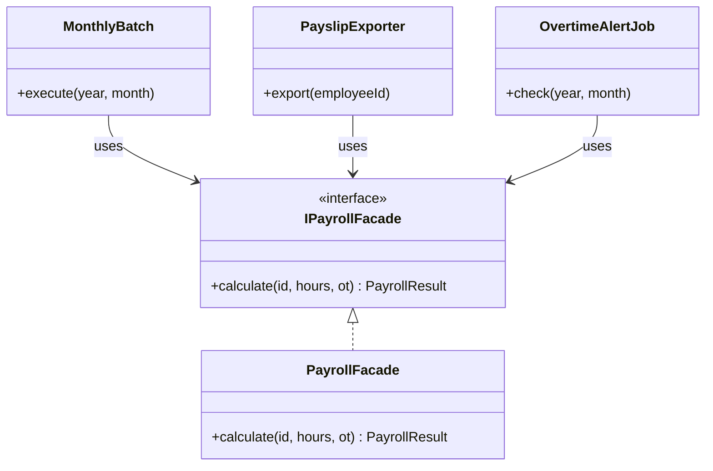

# 第2章　Facadeパターン：複雑な依存を一枚の壁に隠す
―― 今回の変化：「依存している外部サービスのAPIが変わる」

> **この章の核心**：変わりやすい外部サービスの詳細を専用クラスに閉じ込め、
> 使う側は「何を頼むか」だけを知っていればよい形にする。

> **第0章との対応**：この章では「呼び出し元が外部サービスの詳細を
> 知りすぎている」という問題に、5ステップの思考プロセスを適用します。
> どの章から読んでいただいても、同じ手順で考えを進められます。

---

## ステップ1：現状把握
> 今のシステムと、今日届いた変更要求を正確に把握する

### 2.1 今のシステムの仕様とコードの構造

**要するに変わりやすい機能を切り出して中継役を立てるパターン。**

#### このシステムが何をするか

従業員の出退勤打刻を記録し、月次で勤務時間・残業時間を集計して
給与計算と労務管理へ連携するシステムです。
打刻データは社内の勤怠DBで管理し、給与計算は外部ベンダーの
給与計算APIへ、36協定の管理は別の労務管理サービスへ
それぞれ連携しています。

#### 現在の仕様

| 機能 | 入力 | 出力 |
|:---|:---|:---|
| 月次集計バッチ | 月・年（例：2024年12月） | 従業員ごとの勤務時間・残業時間 |
| 給与計算連携 | 勤務時間・残業時間・従業員ID | 給与明細データ（基本給・残業代） |
| 労務管理連携 | 残業時間が45h超の従業員 | 36協定アラート通知 |
| 明細PDF保存 | 給与計算結果 | 社内ファイルサーバーへのPDF |

#### 【起点コード】

このシステムを最初に構築した担当者が、
要件通りに誠実に実装した姿がここにあります。
当時は給与計算APIのベンダーも1社だけで、連携先はシンプルでした。
要件が増えるたびに、連携処理が少しずつ育ってきた。
当時の担当者の苦労を想像しながら、コードを観察します。

```cpp
// 【起点コード】
// attendance/MonthlyBatch.cpp
// 月次集計バッチ。月末夜間に自動実行される。
// 給与計算APIとの接続詳細はここに直接書かれている。

class MonthlyBatch {
public:
    void execute(int year, int month) {
        // 1. 勤務時間を集計
        auto records =
            db_.fetchMonthlyRecords(year, month);
        auto summary = calculateSummary(records);

        // 2. 給与計算APIに送信
        HttpRequest req(
            "https://payroll-v1.example.com"
            "/api/calculate"              // ← APIのURLをここで管理
        );
        req.setHeader(
            "Authorization",
            "Bearer " + apiToken_         // ← 認証トークンをここで管理
        );
        req.setBody({
            {"employee_id", summary.employeeId},
            {"total_hours", summary.totalHours},
            {"overtime_hours", summary.overtimeHours}
        });
        auto raw = req.post();

        // 3. レスポンスのフィールド名をここで参照
        auto json = Json::parse(raw);
        double baseSalary =
            json["base_salary"];          // ← フィールド名をここで管理
        double overtimePay =
            json["overtime_pay"];         // ← フィールド名をここで管理
        db_.savePayroll(
            summary.employeeId,
            baseSalary + overtimePay
        );
        // 実行すると: DB に従業員ごとの給与額が保存される
        // 例: savePayroll("emp001", 350000.0)
    }
private:
    Database    db_;
    std::string apiToken_ = "tok_prod_xxxx";
};
```

このコードが月末のたびに正しく動いて、
給与計算に必要なデータを作り続けてきた事実は、
素直に認めたいと思います。

---

### 2.2 届いた変更要求

人事部から連絡が入りました。

「今使っている給与計算APIのベンダーが変わることになったんです。
　新しいAPIに切り替えてほしいんですが、3週間後がデッドラインで。
　あと、新しいAPIは認証方式も変わるらしくて……」

3週間後。変更範囲を確認するために検索をかけます。

```
$ grep -r "payroll-v1.example.com" .
attendance/MonthlyBatch.cpp:55
payslip/PayslipExporter.cpp:32
job/OvertimeAlertJob.cpp:28
// → 3か所ヒット
```

`MonthlyBatch`（月次集計）、`PayslipExporter`（明細PDF出力）、
`OvertimeAlertJob`（残業アラート）の3ファイルそれぞれに
給与計算APIの呼び出しコードが書かれています。

「またここに手が入るのか」という感覚、
うまく伝わっているでしょうか。

---

## ステップ2：課題の発見
> 変更要求を受けて「何が難しいのか」を具体化する

### 2.3 変更しようとしたときに現れる困難

変更要求を頭の中で試してみると、何が立ちはだかるかが見えてきます。

- **困難1：3か所を全て探して書き直す必要がある**
  エンドポイントURLが変わり、認証方式が変わる。
  `MonthlyBatch`・`PayslipExporter`・`OvertimeAlertJob`の3ファイルを開いて、
  それぞれに書かれた接続コードを書き直さなければならない。
  「1か所直せば終わる」ではなく、
  「3か所のうち1か所でも見落とすと本番で障害が起きる」状況です。

- **困難2：認証を直しながら、レスポンス解析の確認も3か所で必要になる**
  認証方式の変更作業を進めると、レスポンス形式も一緒に確認する必要に気づきます。
  `json["base_salary"]` というレスポンスフィールドへの依存が
  3つのファイルそれぞれに書かれているため、
  「このフィールド名は新APIでも大丈夫か」を3か所全てで確認しなければ
  作業が完了しているとは言えません。

> 「なぜ、外部APIの仕様が変わっただけで、
>　こんなに広い範囲を確認しなければならないのか？」

---

## ステップ3：原因特定
> 「なぜ難しいのか」の根本を突き止める

### 2.4 困難の根本にあるもの

コードを観察して、困難の原因を探ります。

- 観察1：給与計算APIの呼び出しが3か所（`MonthlyBatch`・`PayslipExporter`・
  `OvertimeAlertJob`）に散らばっている
- 観察2：APIのエンドポイントURLと認証トークンが各呼び出し元にそれぞれ書かれている
- 観察3：レスポンスのフィールド名（`"base_salary"`等）の知識が
  各呼び出し元に漏れ出している

この観察から、問題の構造が見えてきます。

#### 使う側が「知らなくていいこと」まで知っている

`MonthlyBatch`・`PayslipExporter`・`OvertimeAlertJob`は、
本来「勤務データを使って何かをする」のが責任のはずです。
しかし今は、それに加えて以下のことまで知っています。

起点コードの `MonthlyBatch::execute` の中で、
該当する行を確認してみましょう。

```cpp
// 【起点コード】の該当箇所（MonthlyBatch.cpp）
HttpRequest req(
    "https://payroll-v1.example.com/api/calculate"  // ← 知らなくていい
);
req.setHeader(
    "Authorization", "Bearer " + apiToken_          // ← 知らなくていい
);
auto json = Json::parse(raw);
double baseSalary  = json["base_salary"];            // ← 知らなくていい
double overtimePay = json["overtime_pay"];           // ← 知らなくていい
```

この4行が「知らなくていいことを知っている」箇所です。
行レベルで整理すると、次のようになります。

| 本来知っていればよいこと | 知らなくていいのに知っていること（コードの行） |
|:---|:---|
| 「給与計算の結果を取得したい」という意図 | APIのエンドポイントURL（55行目） |
| 入力（勤務時間・残業時間） | 認証方式・トークンの扱い（59行目） |
| 返ってくる計算結果の業務的な意味 | レスポンスのJSONフィールド名（73・74行目） |

これが3ファイル全てに繰り返されているため、
API仕様の変更が1か所（ベンダー変更）で起きると
3か所の呼び出し元に影響が波及します。

> **ここで立ち止まって考える**
>
> 「給与計算APIについての全知識を1か所に集められたら、
> 何が変わるでしょうか？」
>
> ベンダーが変わったとき、エンドポイントURLを書き直す場所は
> 1か所だけになります。
> 認証方式が変わったとき、その変更も1か所で完結します。
> `MonthlyBatch`・`PayslipExporter`・`OvertimeAlertJob` は
> 「給与計算の結果が欲しい」という意図だけを伝えれば済むようになります。

---

## ステップ4：対策案の検討
> 原因から論理的に案を導く

### 2.5 最初の試み：【試行コード】

「知らなくていいことを知っている」という原因を受けて、
最初の試みとして自然に思い浮かぶのは、
**変わりやすい部分（接続詳細）だけを専用クラスに集める**アプローチです。

認証・エンドポイントURLが主な変更点なら、そこだけを切り出せば
対処になるはずです。チームで話し合う価値がある部分だと思います。

```cpp
// 【試行コード】① クライアントクラス
// payroll/PayrollApiClient.h
// 認証とエンドポイントURLだけをここに集める。
// レスポンスの解析は呼び出し元の責任のまま残る。

class PayrollApiClient {
public:
    explicit PayrollApiClient(
        const std::string& token
    ) : token_(token) {}

    // 呼び出し元はURLと認証を知らなくてよくなる
    std::string calculate(const Json& body) {
        HttpRequest req(
            "https://payroll-v1.example.com"
            "/api/calculate"
        );
        req.setHeader(
            "Authorization", "Bearer " + token_
        );
        req.setBody(body);
        return req.post();    // 生のJSONをそのまま返す
    }
private:
    std::string token_;
};
```

`MonthlyBatch` はこのクライアントを使う形に変わります。
`json["base_salary"]` の行に注目してください。
URLと認証は消えましたが、レスポンスのフィールド名はまだここにいます。

```cpp
// 【試行コード】② 呼び出し元の変化
// attendance/MonthlyBatch.cpp（変更後）
// URLと認証は知らなくなった。
// ただし、レスポンスのフィールド名はまだここにいる。

void MonthlyBatch::execute(int year, int month) {
    auto records =
        db_.fetchMonthlyRecords(year, month);
    auto summary = calculateSummary(records);

    // URL・認証を知らなくてよくなった
    auto raw = apiClient_.calculate({
        {"employee_id",    summary.employeeId},
        {"total_hours",    summary.totalHours},
        {"overtime_hours", summary.overtimeHours}
    });

    // レスポンスのフィールド名はまだここにいる
    auto json = Json::parse(raw);
    double baseSalary  = json["base_salary"];   // ← まだ知らなくていい
    double overtimePay = json["overtime_pay"];  // ← まだ知らなくていい
    db_.savePayroll(
        summary.employeeId,
        baseSalary + overtimePay
    );
}
```

`MonthlyBatch` はコンストラクタで `PayrollApiClient` を受け取ります。
コンストラクタに外から渡す形（依存注入）にすることで、
テスト時に本物のAPIを呼ばないスタブへ差し替えられます。

```cpp
// 依存注入：MonthlyBatch はコンストラクタで PayrollApiClient を受け取る。
// 本番では本物のクライアントを、テストではスタブを渡す。
class MonthlyBatch {
public:
    explicit MonthlyBatch(
        PayrollApiClient& client,
        Database& db
    ) : apiClient_(client), db_(db) {}

    void execute(int year, int month);  // 上記の実装
private:
    PayrollApiClient& apiClient_;
    Database&         db_;
};

// 本番コードでの組み立て例
PayrollApiClient client("tok_prod_xxxx");
Database db;
MonthlyBatch batch(client, db);
batch.execute(2024, 12);
```

#### 試行コードのテスト

```cpp
// スタブ：本物のAPIを呼ばずに「あらかじめ決めた文字列を返す」差し替えクラス。
// PayrollApiClient を継承してメソッドをオーバーライドすることで
// MonthlyBatch に本物と同じように渡せる。
class StubPayrollApiClient : public PayrollApiClient {
public:
    StubPayrollApiClient()
        : PayrollApiClient("fake_token") {}

    std::string calculate(const Json&) override {
        // テスト用の固定レスポンスを返す
        return R"({"base_salary": 300000,
                   "overtime_pay": 50000})";
    }
};

// MockDatabase は「savePayroll が呼ばれたかどうか」と
// 「渡された値」を記録するだけのクラス（モック）。
// 本物のDBには一切アクセスしない。
class MockDatabase : public Database {
public:
    void savePayroll(
        const std::string&, double salary
    ) override { lastSaved_ = salary; }
    double lastSaved_ = 0.0;
};

TEST(MonthlyBatchTest, SavesCalculatedPayroll) {
    StubPayrollApiClient stub;
    MockDatabase mockDb;
    MonthlyBatch batch(stub, mockDb);
    batch.execute(2024, 12);

    // EXPECT_DOUBLE_EQ(期待値, 実際の値)：
    // 「等しければテスト通過」という検証（アサーション）。Google Test のマクロ。
    EXPECT_DOUBLE_EQ(350000.0, mockDb.lastSaved_);

    // このテストは通るが、MonthlyBatch の中には
    // json["base_salary"] という知識がまだ残っている。
    // 新APIでフィールド名が "base_salary_jpy" に変わると
    // MonthlyBatch・PayslipExporter・OvertimeAlertJob の
    // テストを含む3か所を変更する必要がある。
}
```

**URL・認証は1か所に集まりました。しかし残る課題があります。**

`json["base_salary"]` というレスポンスフィールドへの知識は、
3か所の呼び出し元にそれぞれ残り続けます。
新APIでフィールド名が変わったとき、また3か所を探すことになります。

---

### 2.6 発想の転換：【Facadeコード】

試行コードで「何かが残っている」という感覚があります。
URL・認証は集まりました。でも「レスポンスの解析」はまだ呼び出し元にいる。

**認証だけでなく、レスポンス解析まで含めた「給与計算APIへの全知識」を
1つのクラスに閉じ込めたら、何が変わるでしょうか。**

呼び出し元は「勤務時間を渡して計算結果を受け取る」という意図だけを表現すれば済みます。
APIのURL、認証方式、レスポンスのフィールド名——これら全ては
呼び出し元が「知らなくていいこと」のはずです。

そのためのインターフェース（使う側との約束事を定める型）を設けます。
インターフェースを使うことで、本番の実装クラスとテスト用スタブを
同じ形で差し替えられるようになります。

```cpp
// 【Facadeコード】① インターフェース
// payroll/IPayrollFacade.h
// 呼び出し元が知る必要があるのはこの形だけ。
// APIの詳細は一切出てこない。

struct PayrollResult {
    double      totalSalary;
    bool        success;
    std::string errorMessage;
};

class IPayrollFacade {
public:
    virtual ~IPayrollFacade() = default;
    virtual PayrollResult calculate(
        const std::string& employeeId,
        double totalHours,
        double overtimeHours
    ) = 0;
};
```

```cpp
// 【Facadeコード】② 実装クラス
// payroll/PayrollFacade.cpp
// 給与計算APIへの全知識がここに収まる。
// ベンダーが変わっても、このファイルだけを変更すればよい。

class PayrollFacade : public IPayrollFacade {
public:
    PayrollResult calculate(
        const std::string& employeeId,
        double totalHours,
        double overtimeHours
    ) override {
        HttpRequest req(
            "https://payroll-v1.example.com"
            "/api/calculate"
        );
        req.setHeader(
            "Authorization", "Bearer tok_prod_xxxx"
        );
        req.setBody({
            {"employee_id",    employeeId},
            {"total_hours",    totalHours},
            {"overtime_hours", overtimeHours}
        });
        auto raw = req.post();

        auto json = Json::parse(raw);
        if (json.contains("error")) {
            return {0.0, false, json["error"]};
        }
        // フィールド名の知識はPayrollFacadeだけが持つ
        double total =
            json["base_salary"].get<double>()
            + json["overtime_pay"].get<double>();
        return {total, true, ""};
    }
};
```

```cpp
// 【Facadeコード】③ 呼び出し元の変化
// attendance/MonthlyBatch.cpp（変更後）
// 給与計算APIについての知識がゼロになった。

void MonthlyBatch::execute(int year, int month) {
    auto records =
        db_.fetchMonthlyRecords(year, month);
    auto summary = calculateSummary(records);

    // 「計算してほしい」という意図だけを伝える
    auto result = payroll_.calculate(
        summary.employeeId,
        summary.totalHours,
        summary.overtimeHours
    );
    if (result.success) {
        db_.savePayroll(
            summary.employeeId, result.totalSalary
        );
    }
}
```

試行コードとの差を確認してください。
`json["base_salary"]` という行が消えました。
`MonthlyBatch` はフィールド名を一切知らずに書けています。

`MonthlyBatch` はコンストラクタで `IPayrollFacade`（インターフェース）を受け取ります。
インターフェース経由にすることで、本番では `PayrollFacade` を、
テストでは `StubPayrollFacade` を渡せます。

```cpp
// 依存注入：MonthlyBatch はコンストラクタで IPayrollFacade を受け取る。
// インターフェース経由なので、本番では PayrollFacade を、
// テストでは StubPayrollFacade を渡せる。
class MonthlyBatch {
public:
    explicit MonthlyBatch(
        IPayrollFacade& payroll,
        Database& db
    ) : payroll_(payroll), db_(db) {}

    void execute(int year, int month);
private:
    IPayrollFacade& payroll_;
    Database&       db_;
};

// 本番コードでの組み立て例
PayrollFacade facade;
Database db;
MonthlyBatch batch(facade, db);
batch.execute(2024, 12);
```



*図が表示されない環境のために補足します。*
中心に `IPayrollFacade`（インターフェース）があり、
`PayrollFacade` がそれを実装します。
`MonthlyBatch`・`PayslipExporter`・`OvertimeAlertJob` の3つは
`IPayrollFacade` という形だけを知っています。
給与計算APIの実装詳細は `PayrollFacade` の内側に完全に収まっています。

> 「この構造」を、先人たちは **Facadeパターン** と呼んでいます。
> 名前は、論理的に辿り着いた構造へのラベルです。
> 覚えることが目的ではありません。

#### 解決コードのテスト

試行コードのテストと何が変わったか、スタブのコードを比べてみてください。

```cpp
// スタブ：IPayrollFacade を実装した差し替えクラス。
// URLもフィールド名も一切持たない。
// インターフェースを実装しているので MonthlyBatch にそのまま渡せる。
class StubPayrollFacade : public IPayrollFacade {
public:
    PayrollResult calculate(
        const std::string&, double, double
    ) override {
        // 業務的な結果だけを返す。APIの詳細はここに存在しない。
        return {350000.0, true, ""};
    }
};

TEST(MonthlyBatchTest, SavesSuccessfulResult) {
    StubPayrollFacade stub;
    MockDatabase mockDb;
    MonthlyBatch batch(stub, mockDb);
    batch.execute(2024, 12);

    // MonthlyBatch はAPIの詳細を何も知らない。
    // 「結果を保存したか」だけをテストできる。
    EXPECT_DOUBLE_EQ(350000.0, mockDb.lastSaved_);
}
```

```cpp
// PayrollFacade 側のテスト
// APIの仕様（フィールド名・エラー処理）だけをここで確認する

TEST(PayrollFacadeTest, ParsesResponseCorrectly) {
    // "base_salary" の知識は PayrollFacade のテストだけにある
    PayrollFacade facade;
    auto result =
        facade.calculate("emp001", 160.0, 20.0);

    EXPECT_TRUE(result.success);
    EXPECT_DOUBLE_EQ(350000.0, result.totalSalary);
}

TEST(PayrollFacadeTest, HandlesApiError) {
    // EXPECT_FALSE(値)：「値が偽であればテスト通過」のアサーション。
    PayrollFacade facade;
    auto result =
        facade.calculate("emp001", 0.0, 0.0);

    EXPECT_FALSE(result.success);
    EXPECT_FALSE(result.errorMessage.empty());
}
```

`MonthlyBatch` のテストから「APIのレスポンス形式」という概念が消えました。
`"base_salary"` というフィールド名の知識は `PayrollFacade` のテストだけにあります。
新APIでフィールド名が変わっても、変更するのは `PayrollFacade` の1か所だけ。
`MonthlyBatch`・`PayslipExporter`・`OvertimeAlertJob` のテストは
変更不要です。

---

## ステップ5：天秤にかける・決断する
> 基準を先に宣言し、各案を等価に比較した上で決断する

### 2.7 比較の基準を先に宣言する

比較を始める前に「何を重視するか」を明示します。
基準を後から決めると、結論ありきの比較になってしまいます。

今回の状況で私が判断に使う基準は次の通りです。

| 基準 | なぜこの状況で重要か |
|:---|:---|
| 変更の局所性 | ベンダー変更で変更箇所が1か所に収まってほしい |
| テストの独立性 | 本物のAPIを使わずに各処理をテストしたい |
| 変化の継続性 | 認証だけでなくレスポンス形式も将来変わる可能性がある |

---

### 2.8 試行コードと解決コードをテストで比較する

試行コード（`PayrollApiClient`）と解決コード（`PayrollFacade`）を、
2.7で宣言した基準で比較します。

**変更の局所性で見ると：**
試行コードでは `json["base_salary"]` というレスポンスフィールド名が3か所に残っています。
新APIでフィールド名が変わると、`MonthlyBatch`・`PayslipExporter`・`OvertimeAlertJob` の
3か所を修正する必要があります。
解決コードでは、このフィールド名の知識が `PayrollFacade` の1ファイルに収まっています。
ベンダー変更時の変更箇所は1か所だけです。

**テストの独立性で見ると：**
試行コードのテストには `json["base_salary"]` という知識がまだ残っています。
解決コードのテストでは `MonthlyBatch` 側から APIの知識が完全に消えています。

#### 比較のまとめ

| 基準 | 試行コード（PayrollApiClient） | 解決コード（PayrollFacade） |
|:---|:---|:---|
| 変更の局所性 | △ レスポンス形式の変更は3か所に影響 | ○ 全知識が1か所に収まる |
| テストの独立性 | △ テストにJSONフィールド名の知識が残る | ○ 呼び出し元テストからAPIの知識が消える |
| 変化の継続性 | △ 次の変化でまた3か所を探すことになる | ○ 1か所の変更で完結する |
| 実装コスト | 少ない（既存クラスの小修正） | 多い（インターフェース設計が必要） |
| **この状況に合うか** | 認証変更のみが懸念で変化リスクが低い場合 | 継続的な外部仕様変更が見込まれる場合 |

*この比較はあくまで「今回の状況と基準」に対するものです。
別の状況・別の基準であれば、違う選択が正解になります。*

---

### 2.9 より難しい変化への耐久テスト

#### 新たな状況

再び人事部から連絡が入りました。

「実は、労務管理サービスの方も来期に別ベンダーへ移行することになって。
　36協定のアラートを送っているあのシステムなんですが、
　そちらも新しいAPIに対応してもらえますか？」

> **2.5〜2.6で導いた構造は、この変化にも通用するでしょうか？**
>
> 少し立ち止まって、考えてみてください。

試行コード（`PayrollApiClient`）のアプローチで対応するとなると、
労務管理サービス用に別の `LaborApiClient` を作れば認証・URLは集められます。
ただし、そのAPIのレスポンス解析は `OvertimeAlertJob` に残ったままです。
「外部サービスが増えるたびにクライアントクラスを作り、
レスポンス解析は呼び出し元に散らばる」というパターンが続きます。

解決コード（Facade）の場合は、
`LaborManagementFacade` を追加するだけで完結します。
`OvertimeAlertJob` はFacadeのインターフェースだけを知っていればよく、
労務管理サービスのAPI詳細を一切知らないまま切り替えられます。

#### 【深化コード】

```cpp
// 【深化コード】
// payroll/ILaborManagementFacade.h
// IPayrollFacade と対称的な構造。
// 呼び出し元は業務意図（「残業時間を通知したい」）だけを表現する。

class ILaborManagementFacade {
public:
    virtual ~ILaborManagementFacade() = default;
    virtual bool notifyOvertime(
        const std::string& employeeId,
        double overtimeHours
    ) = 0;
};

// LaborManagementFacade は労務管理サービスへの全知識を閉じ込める。
// PayrollFacade に触れずにこのファイルだけを変更すればよい。
class LaborManagementFacade
    : public ILaborManagementFacade {
public:
    bool notifyOvertime(
        const std::string& employeeId,
        double overtimeHours
    ) override {
        HttpRequest req(
            "https://labor-v2.example.com"
            "/api/overtime-alert"
        );
        req.setHeader("X-Api-Key", apiKey_);
        req.setBody({
            {"emp_id",   employeeId},
            {"ot_hours", overtimeHours}
        });
        auto raw = req.post();
        return Json::parse(raw)["accepted"];
    }
private:
    std::string apiKey_ = "key_labor_xxxx";
};
```

#### 深化コードのテスト

```cpp
// OvertimeAlertJob のテスト
// 労務管理サービスのAPIについて何も知らずに書ける

// スタブ：ILaborManagementFacade を実装した差し替えクラス。
// 「通知が呼ばれたかどうか」と「渡された値」だけを記録する。
class StubLaborFacade
    : public ILaborManagementFacade {
public:
    bool notifyOvertime(
        const std::string& id, double hours
    ) override {
        notifiedId_    = id;
        notifiedHours_ = hours;
        return true;
    }
    std::string notifiedId_;
    double      notifiedHours_ = 0.0;
};

TEST(OvertimeAlertJobTest, NotifiesWhenOverLimit) {
    StubLaborFacade stub;
    MockDatabase mockDb;
    OvertimeAlertJob job(stub, mockDb);
    job.check(2024, 12);

    // EXPECT_EQ(期待値, 実際の値)：「等しければテスト通過」のアサーション。
    EXPECT_EQ("emp001", stub.notifiedId_);
    // EXPECT_GT(実際の値, 下限)：「実際の値 > 下限ならテスト通過」のアサーション。
    EXPECT_GT(stub.notifiedHours_, 45.0);
}
```

`OvertimeAlertJob` は労務管理サービスについて何も知らないまま、
新ベンダーへの切り替えに対応できました。
`PayrollFacade` のときと同じ構造が、別の外部サービスにも
自然に適用できています。

*この耐久テストを経て、この状況では解決コード（Facade）が合っていると判断できます。
2.5〜2.6で論理的に導いた構造が、難しい変化にも通用することが確認できました。*

---

### 2.10 使う場面・使わない場面

「では、Facadeを常に選べばいいのか？」という問いは自然です。
間違えても大丈夫です。
この問いと向き合うことがステップ5の本質だと思っています。

#### 【過剰コード】：Facadeに本来の責任外の処理を入れてしまった例

```cpp
// 【過剰コード】
// PayrollFacade にAPIと無関係な処理が混入した例。
// 「依存を隠すのが得意」という理由で
// 何でも入れてしまっている。

class PayrollFacade : public IPayrollFacade {
public:
    PayrollResult calculate(...) override {
        // ← 本来の責任：外部APIを呼び出す
        // ...（APIの呼び出しコード）...
    }

    // ← 外部APIに関係のない処理が入り始めている
    bool validateEmployeeId(
        const std::string& id
    ) {
        return db_.exists(id);  // DBアクセスが混入
    }

    double computeBonus(double baseSalary) {
        return baseSalary * 0.1;  // ドメインロジックが混入
    }
private:
    Database db_;  // Facade 本来の役割に不要な依存
};
```

`PayrollFacade` の本来の責任は「外部APIへの依存を隠す」ことです。
バリデーションやボーナス計算は、給与計算APIの知識とは別の責任です。
ここに混入させると、Facadeが「便利な何でも屋クラス」になり、
本来の目的（外部との境界を管理する）が失われます。
Facadeクラスにこうした処理が混在し始めたら、
設計を見直す価値があるサインかもしれません。

#### 状況ごとの選択指針

| 状況 | 選ぶ形 | 次の判断タイミング |
|:---|:---|:---|
| 3週間・ベンダー移行が確定・呼び出し元が3か所 | Facade（解決コード） | — |
| 呼び出しが今は1か所のみ | 試行コード | 呼び出し元が2か所に増えたとき |
| プロトタイプ段階 | 直接呼び出し | 本番移行の前 |

> **どの形を選んでも守る一線**
>
> 「給与計算APIへの接続詳細（URL・認証・レスポンス形式）」を
> `MonthlyBatch`・`PayslipExporter`・`OvertimeAlertJob` に
> 直接書き続けることだけは避ける。
> 試行コードか解決コードかは、変化の見込みと 2.7 の基準が決めます。

---

## この章で踏んだ思考の整理

### 2.11 5ステップとこの章でやったこと

| ステップ | この章でやったこと |
|:---|:---|
| **1. 現状把握** | 勤怠管理システムの仕様・起点コード・API移行要求をひとつの状況として把握した |
| **2. 課題の発見** | 変更しようとすると3か所（`MonthlyBatch`・`PayslipExporter`・`OvertimeAlertJob`）を修正する必要があり、見落としリスクがあることがわかった |
| **3. 原因特定** | 「知らなくていい情報（API詳細）」を3か所の呼び出し元がそれぞれ直接持っていることを突き止めた |
| **4. 対策案検討** | 試行コード（接続詳細のみを集める）で部分解消し、解決コード（全知識を1か所に集める）で根本を解消した |
| **5. 天秤・決断** | 基準を宣言し、テストで比較し、この状況に合う形を選んだ |

この思考の結果として辿り着いた構造を、
先人たちは **Facadeパターン** と呼んでいます。
一つの参考として受け取っていただければと思います。
