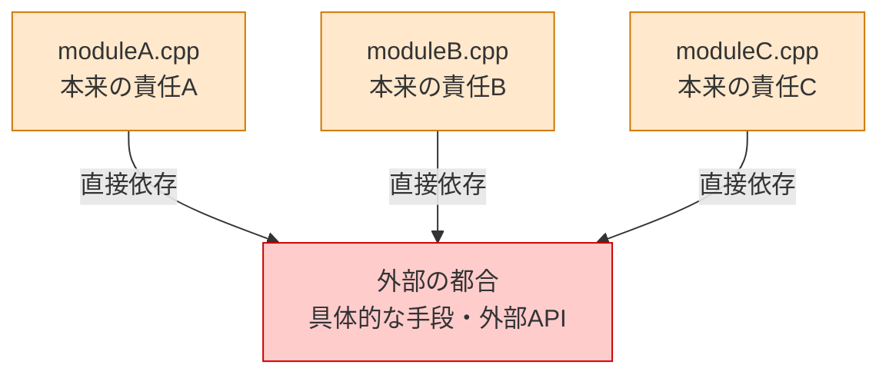
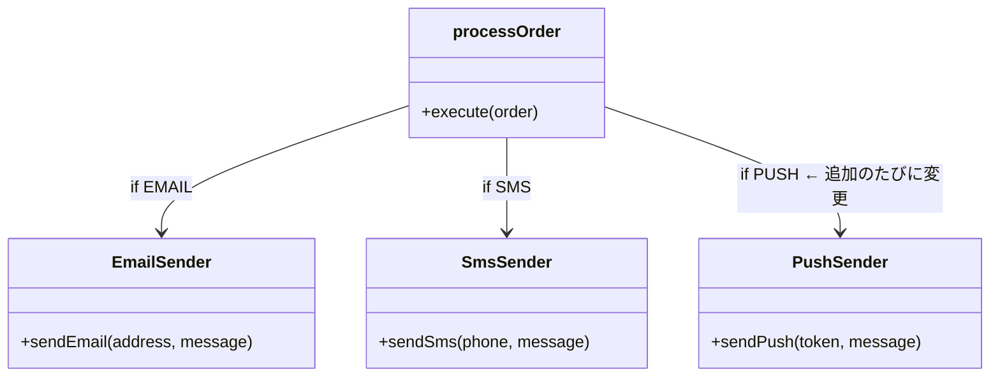
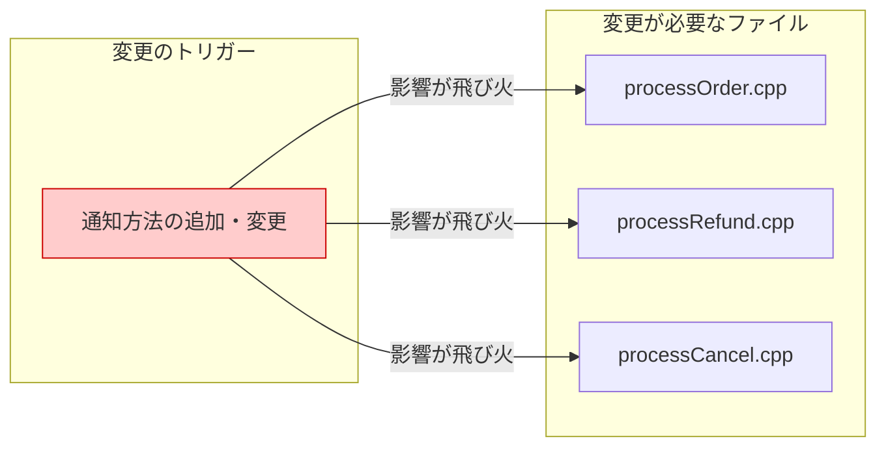
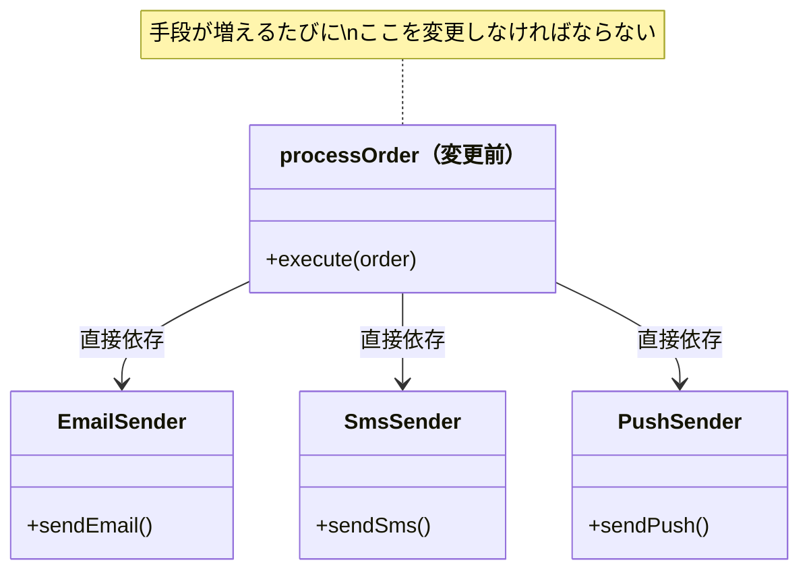
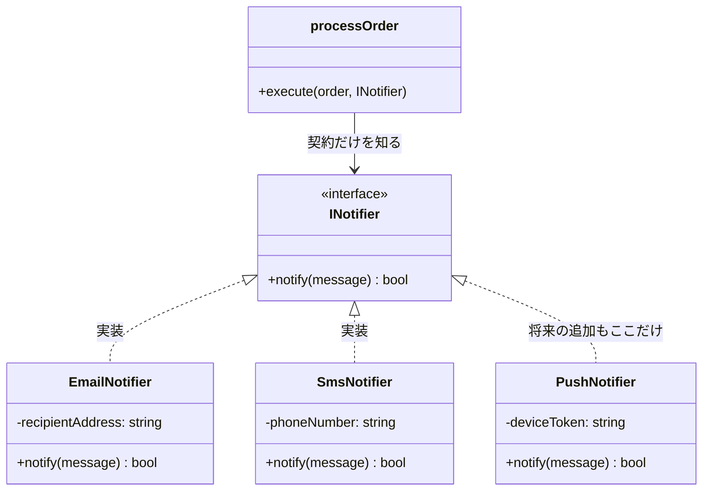
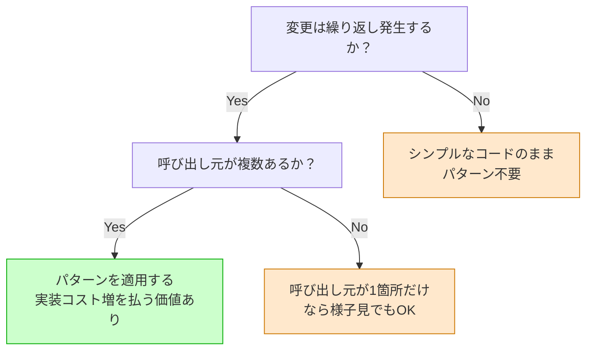
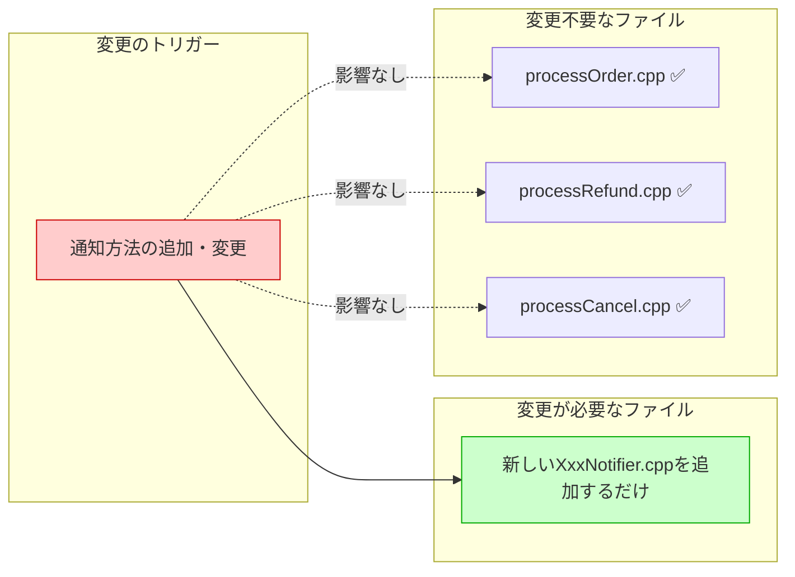

# 【全章共通】デザインパターン執筆テンプレート v2

---

## 第X章 【パターン名】パターン：【パターンが作る構造を一言で】
―― 思考の型：コードに潜む「【違和感の正体】」を言語化し、「【何と何を分離するか】」を引き出す

> **この章の核心**
> 【パターン特有の教訓を1〜2行で。例：「手段を隠し、目的だけで語る」「状態管理の責任を、振る舞いから切り離す」など】

---

## ステップ0：視点のチューニング ―― 「設計のレンズ」をセットする

コードを読む前に、本章で使う問いをセットアップします。
このレンズなしに読んでも、コードは「動いている処理の羅列」にしか見えません。

**【全パターン共通の問い】**

> 「このコードの中に、**『変わる理由』が異なる2つのものが、同じ場所に混在していないか？」**

この問いは、すべての設計パターンで使える。StrategyでもObserverでもFacadeでも、解こうとしている問題の本質はこれ1つだ。パターンの名前が違うのは「何と何が混在しているか」の具体的な組み合わせが違うだけで、構造的な問いは変わらない。

**「変わる理由」の見つけ方**

「変わる理由」とは、**「誰の判断で、何のために変更が発生するか」** のことだ。

同じコードに2つ以上の「変わる理由」があるとき、設計が混在している。

| 変わる理由の種類 | 例 | 誰の判断で変わるか |
|---|---|---|
| 業務ルール | 「注文を受けたら処理する」という流れ | ビジネスオーナー |
| 手段・実装方法 | 「メールで通知する」→「SMSに切り替える」 | インフラ担当・外部サービス都合 |
| 外部依存 | APIの仕様・認証方式・エンドポイント | 外部ベンダー |
| UI・表示仕様 | 画面のフォーマット・言語 | デザイナー・マーケティング |

> **判定の問い**：「このコードを変更するとき、誰に話を聞きに行くか？」  
> 答えが2人以上になるなら、そのコードには「変わる理由」が複数混在している。

*各パターンにおける「2つのもの」の具体例*

| パターン | 混在している「変わる理由の異なる2つのもの」 |
|---|---|
| Strategy | 「業務の流れ（変わらない）」× 「処理の手段・アルゴリズム（変わる）」 |
| Observer | 「自分の状態管理（変わらない）」× 「誰にどう通知するか（変わる）」 |
| Facade | 「呼び出し元の要求（変わらない）」× 「外部サービスの都合・手順（変わる）」 |
| Factory | 「何を使うか（変わらない）」× 「どのクラスをどう生成するか（変わる）」 |
| State | 「操作のインターフェース（変わらない）」× 「状態ごとの振る舞い（変わる）」 |

---

**【変動と不変の仮説（読む前に立てる）】**

コードを見る前に「変わりそうなもの」と「変わらないもの」を仮説として立てます。
この作業が、後の設計判断のブレを防ぐ安全装置になります。

| 分類 | この章の仮説 | 根拠 |
|---|---|---|
| 🔴 **変動する** | 【具体的な手段・アルゴリズム・外部仕様など】 | 【なぜ変わりやすいか】 |
| 🔴 **変動する** | 【同上】 | 【同上】 |
| 🟢 **不変** | 【本質的な業務ロジック・制御フロー】 | 【なぜ変わらないか】 |
| 🟢 **不変** | 【同上】 | 【同上】 |

> 「ここまでは変わらない」と仮定を置くことが、設計の安定性の根拠になる。

---

## ステップ1：現状把握 ―― 「依存の侵食」をマクロな視点で可視化する

> **システムレベルの目線**：「この問題を知ってしまっているファイルは、**いくつ**あるか？」

### 依存構造の俯瞰図



*→ 「外部の都合」がシステムのあちこちに侵食している。これが問題の全体像。*

---

### 変更前のクラス図（構造の問題を可視化）



**問題の構造**：`processOrder` が具体的な送信手段を全部知っている。手段が1つ増えるたびに `processOrder` を変更しなければならない。「変わる理由の異なるもの」が1つのクラスに同居している。

---

### 現状のコードと設計者の脳内の声

> **コード執筆ルール**：専門知識（通信・ファイルI/O・特定フレームワーク）を排除し、純粋な分岐と関数呼び出しだけで構成する。読者が「構造のマズさ」にだけ集中できるようにする。

```cpp
// ❌ 問題のあるコード例
void processOrder(Order& order) {
    // 💭 「これは本来の仕事。自然だ。」
    validateOrder(order);

    // 💭 「ん？ なぜ注文処理が、通知の"やり方"まで知っているんだ？」
    if (order.notifyType == "EMAIL") {
        sendEmail(order.userEmail, "注文を受け付けました");
    } else if (order.notifyType == "SMS") {
        sendSms(order.userPhone, "注文を受け付けました");
    }
    // 💭 「新しい通知方法が増えるたびに、この"注文処理"を触るのか？」

    // 💭 「本来の仕事に戻った。さっきのブロックだけが浮いている。」
    saveOrder(order);
}
```

**【脳内の声の整理：違和感の正体】**
`processOrder` は「注文を処理する」関数のはずです。
しかし今、「通知をどのように送るか」という別の関心事を知ってしまっています。
**「【本来の責任】」と「【知らなくていい他人の都合・手段】」** という2種類の知識が同居しています。

---

## ステップ2：変動と不変の峻別 ―― 設計の安定性を確保する根拠を作る

> **設計者の目線**：「ステップ0の仮説と、実際のコードは一致していたか？」

ステップ0で立てた仮説を、コードを読んだ後に検証・確定します。

| 分類 | 具体的な内容 | 変わるタイミング | 設計への影響 |
|---|---|---|---|
| 🔴 **変動する** | 通知の手段（Email / SMS / Push） | ビジネス要件・外部サービスの変更 | 中核コードに置いてはいけない |
| 🔴 **変動する** | 通知先アドレスや送信フォーマット | ユーザー設定・仕様変更 | 中核コードに置いてはいけない |
| 🟢 **不変** | 「注文したら誰かに通知する」という制御フロー | ビジネスの根幹ルール。変わる日は来ない | ここを抽象として固定する |
| 🟢 **不変** | 「通知の成否（成功 or 失敗）」という契約 | 呼び出し側が必要とする情報の形 | インターフェースの戻り値にする |

> **設計の決断**：🟢 不変な部分を「抽象（インターフェース）」として固定し、🔴 変動する部分を「実装の裏側」に押し込む。これがこの章のパターンを選ぶ根拠。

---

## ステップ3：課題分析 ―― 「放置すると何が壊れるか」を予測する

> **設計者の目線**：「この侵食を放置すれば、システム全体がどう破綻するか？」

**【痛みのシナリオ】**
「プッシュ通知」という新しい手段が追加されたとします。

```cpp
// 注文処理のコードを開き、こう変更しなければならない
if (order.notifyType == "EMAIL") {
    sendEmail(...);
} else if (order.notifyType == "SMS") {
    sendSms(...);
} else if (order.notifyType == "PUSH") {  // ← 追加
    sendPushNotification(...);            // ← 追加
}
```

**「外部の都合（通知手段）が変わっただけ」で、「システムの中核（注文処理）」が手術台に上がります。**

### 変更影響の比較（改善前）



*1つの変更が、無関係に見える複数ファイルを壊す。これが設計の病巣。*

---

## ステップ4：原因分析 ―― 根本にある「設計のバグ」を言語化する

> **設計者の目線**：「なぜ、外部の都合が変わっただけで中核が痛むのか？」

### なぜなぜ分析

| 問い | 答え |
|---|---|
| なぜ中核のコードを直さなければならないのか？ | `processOrder` が「通知の具体的な手段」を直接知っている（依存している）から |
| なぜ直接知っているのか？ | 「何をするか（What）」と「どうやるか（How）」を同じ関数に書いてしまっているから |
| 根本原因は？ | **「具体的な手段（How）を知っている者は、その手段が変わるたびに道連れになる」** |

---

## ステップ5：対策案の検討 ―― 「理想の契約」から逆算して構造を作る

> **設計者の目線**：「具体的な手段への依存を断ち切り、目的（What）だけで会話できる形を作る」

解決の順序は常に同じ：**「理想の契約を先に書く。実装は後」**。

### ① 理想の「契約」を定義する（インターフェース）

```cpp
// 思考の結晶①：手段を排した「理想の契約書」
// ← Email / SMS などの具体名はここに一切登場しない

class INotifier {
public:
    virtual ~INotifier() = default;
    virtual bool notify(const std::string& message) = 0;
    //                  ↑「何を伝えるか（What）」だけを引数にする
};
```

### ② 泥水をかぶる実装クラスを作る（変動部分の隔離）

```cpp
// 思考の結晶②：現実の泥臭さを引き受ける具象クラス
class EmailNotifier : public INotifier {
public:
    bool notify(const std::string& message) override {
        // あの煩わしかったif分岐は、ここに閉じ込めた
        return sendEmail(recipientAddress, message);
    }
private:
    std::string recipientAddress;
};

class SmsNotifier : public INotifier {
public:
    bool notify(const std::string& message) override {
        return sendSms(phoneNumber, message);
    }
private:
    std::string phoneNumber;
};
```

### クラス図：変更前 vs 変更後（構造の対比）





**変更前との対比**：
- 変更前：`processOrder` → `EmailSender` / `SmsSender` / `PushSender`（具体的な手段を全部知っている）
- 変更後：`processOrder` → `INotifier`（契約だけを知る。具体的な手段は見えない）

矢印の数が「3本→1本」に減った。これが設計の変化の核心。

---

## ステップ6：天秤にかける ―― 柔軟性とシンプルさのバランスを評価する

> **設計者の目線**：「この柔軟性は、将来発生する変更コストに見合うものか？」

設計パターンの導入には必ず代償が伴います。
**比較基準を先に宣言してから比較する**（後から基準を決めると「結論ありきの比較」になる）。

### 評価軸の宣言

1. **変更の局所性** ―― 仕様変更の影響が1箇所に収まるか
2. **テストの独立性** ―― 中核のロジックを単独でテストできるか
3. **読みやすさ** ―― 抽象レイヤーが増えて追うのが辛くなっていないか
4. **実装コスト** ―― 今すぐ払う手間はどれくらいか

### 比較表

| 評価軸 | ❌ 改善前 | ✅ パターン適用後 |
|---|---|---|
| 変更の局所性 | 通知方法の変更 → `processOrder` も変更 | 変更は `EmailNotifier` 等の実装クラスだけ |
| テストの独立性 | 通知送信なしに `processOrder` テスト不可 | `INotifier` のスタブを渡せば単独テスト可 |
| 読みやすさ | if分岐が膨らむほど中核が読みにくくなる | `notify()` 1行で意図が明確 |
| 実装コスト | 少ない（インターフェース不要） | やや多い（クラス数が増える） |

### 適用判断のフローチャート



> デザインパターンはゴールではない。「将来発生する変更コスト」を「今の実装コスト」で買う投資判断。

---

## ステップ7：決断と、手に入れた未来

> **設計者の目線**：構造を変えたことで、ステップ1の「脳内の声」がどう消えたかを確認する。

### 解決後のコード

```cpp
// ✅ 解決後：中核は「何をするか（What）」だけが残った
void processOrder(Order& order, INotifier& notifier) {
    //                          ↑ 契約だけを知る。Email か SMS かは知らない。

    validateOrder(order);

    // 💭 「よし。『通知してくれ』と契約に頼むだけになった。
    //      Email か SMS かを知る必要はもうない。」
    notifier.notify("注文を受け付けました: " + order.id);

    saveOrder(order);
}
```

### 変更影響の比較（改善後）



**変化の確認：**
ステップ1で感じた「なぜ注文処理が通知の"やり方"まで知っているんだ？」という違和感は完全に消えました。
新しい通知手段が追加されても、`INotifier` を実装した新しいクラスを追加するだけ。`processOrder` は一行も変わりません。

---

## まとめ：設計の型は「ツッコミ」から始まる

| ステップ | やること | 得られるもの |
|---|---|---|
| ステップ0 | 設計のレンズをセット・変動と不変の仮説を立てる | 読む前の準備。ブレを防ぐ |
| ステップ1 | システム全体を俯瞰し「侵食の広がり」をマクロで確認する | 問題の規模感の把握 |
| ステップ2 | 変動と不変を表で明示的に仕分ける | 設計判断の根拠が生まれる |
| ステップ3 | 放置した場合の「痛みのシナリオ」を具体的に予測する | 解決への動機づけ |
| ステップ4 | 「なぜ痛むのか」を根本原因まで掘り下げる | 解決の方向性が定まる |
| ステップ5 | 「理想の契約」から逆算して構造を設計する | 抽象と具象の分離 |
| ステップ6 | 評価軸を先に宣言し、天秤にかけて決断する | 「いつ使うか」の判断軸を持てる |
| ステップ7 | 解決後のコードで「ツッコミが消えたか」を確認する | パターン適用の効果を体感する |

この思考プロセスを回した結果、コード上に引かれた境界線こそが **「【パターン名】パターン」** です。
パターンを暗記するのではなく、「コードへの違和感の言語化」と「変動と不変の峻別」こそが、設計力を飛躍させます。

---

## 💡 各パターンへの適用ヒント

### 変動・不変の仕分け例（ステップ2用）

| パターン | 🔴 変動する（不安定） | 🟢 不変（安定） |
|---|---|---|
| **Strategy** | アルゴリズムの実装方法 | 「処理を実行して結果を返す」という制御フロー |
| **Observer** | 通知先の種類・数 | 「状態が変わったら誰かに知らせる」という仕組み |
| **Facade** | 外部APIの仕様・認証方法 | 「〇〇をお願いする」という呼び出し元の要求 |
| **Factory** | 生成するオブジェクトの種類 | 「何かを作って返す」という生成という行為そのもの |
| **State** | 状態に応じた振る舞い | 「処理を実行する」という呼び出しのインターフェース |

### 天秤の評価軸デフォルトセット（ステップ6用）

| 評価軸 | パターン適用を勧める条件 | シンプルなコードを選ぶ条件 |
|---|---|---|
| 変更の局所性 | 変更が繰り返し発生する | 一度作ったら変わらない |
| テストの独立性 | モジュール単独テストが必須 | 結合テストで十分 |
| 読みやすさ | 抽象レイヤーが全体の理解を助ける | 抽象レイヤーが追うのを辛くする |
| 実装コスト | 将来の変更コストがコストを上回る | 将来の変更確率が低い |
