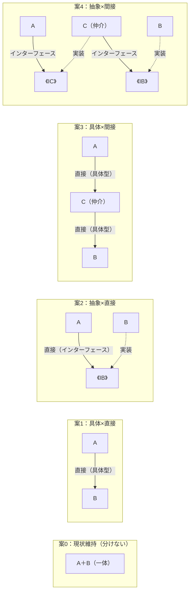
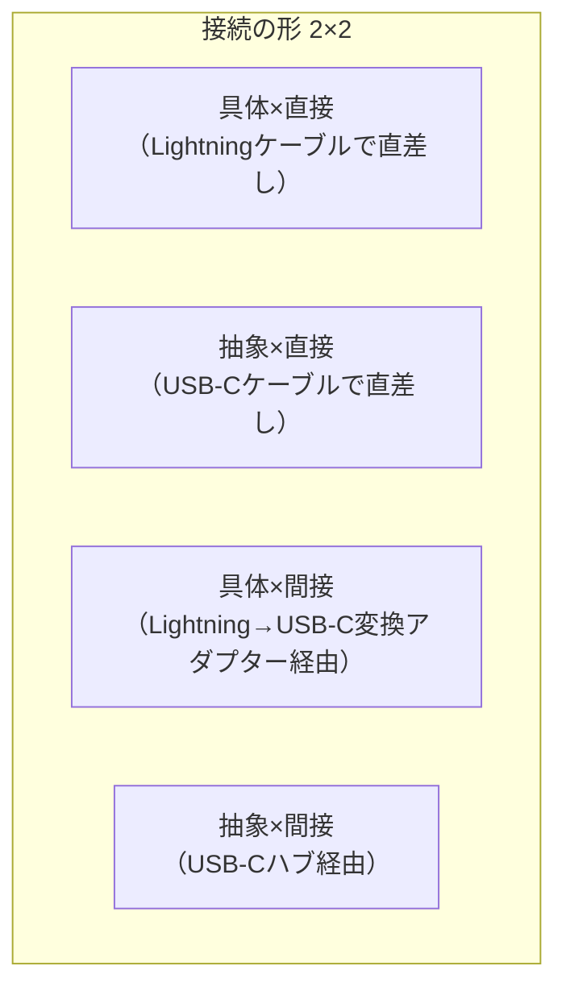

# AI コンテキスト ―― 「設計思考を鍛える本」執筆システム

## ★ このファイルの使い方

このファイルをAI（ChatGPT・Gemini等）に添付してください（毎章1回だけ）。

### 最初に送る指示文

```
添付ファイルを読み込んでください。
これから私が指定する章の内容を、このファイルのルールに従って執筆します。

ルールの優先順位：
1. PART 1（著者の人格・語り口・禁止表現）
2. PART 8（章生成エージェント指示）
3. PART 7（章テンプレート）
4. その他のPART

読み込みが完了したら「準備完了」とだけ返答してください。
```

### ステップ1：章を開始する（1行）

```
第1章・Strategy・ECサイト決済計算
```

ドメイン割り当て表（toc.md / CLAUDE.md 参照）：

| 章 | パターン | ドメイン |
|:---|:---|:---|
| 第1章 | Strategy | ECサイト決済計算 |
| 第2章 | Facade | ネット銀行の振り込み処理 |
| 第3章 | State | チケット予約管理 |
| 第4章 | Template Method | CSVインポート処理 |
| 第5章 | Command | 家計簿アプリの操作履歴 |
| 第6章 | Decorator | カスタマイズ注文システム |
| 第7章 | Observer | 在庫管理システム |
| 第8章 | Factory Method | 決済プロセッサーの切り替え |

### ステップ2：10分割シーケンスで依頼する

1章を以下の順番で1行ずつ送ります。各ステップで内容を確認・修正してから次へ進んでください。

```
① 前段を書いて
② フェーズ1を書いて
③ フェーズ2を書いて
④ フェーズ3を書いて
⑤ フェーズ4を書いて
⑥ フェーズ5を書いて
⑦ フェーズ6の6-1〜6-6を書いて
⑧ フェーズ6の6-7〜6-10を書いて
⑨ フェーズ7を書いて
⑩ 整理・振り返り・パターン解説を書いて
```

フェーズ6を⑦⑧に分割しているのは、案0〜案4のコードが重いためです。

### 部分修正

```
フェーズ4の核心一文を修正して：パターン名が出ているので取り除いて
フェーズ6の案2を修正して：コードの行数が80文字を超えている
```

---

## PART 1：著者の人格と語り口

# skills/author-voice.md
# 著者の人格と語り口の定義
# すべてのプロジェクト（Kindle本・Note記事）でこのファイルを参照する

---

## この本・記事を書いている人物

ソフトウェア開発歴約20年。
現在はチームリーダーとして、コードを書くよりも
「目的や考え方が正しいか」を一緒に考える役割を担っている。

自分のプログラミングスキルについては「ポンコツで周りに勝てない」と思っている。
だからこそ、一人で抱え込まず、周りの意見を尊重し、
みんなの知恵を借りて良い結果を導くことを大切にしてきた。

設計の楽しさに気づいたのはここ数年のこと。
SOLID原則やデザインパターンを学んで、
「原則に当てはめることで良いものが作れる」という感覚を初めて持てた。
その嬉しさを、同じように設計で悩んでいる人と共有したくて書いている。

---

## 語り口の原則

### 読者と同じ目線に立つ

著者は「答えを知っている人」ではなく「同じ道を先に歩んだ人」として書く。

✅ 良い例：
「私もこのコードを最初に見たとき、どこから手をつければいいかわかりませんでした。」
「これが唯一の正解というわけではありません。チームの状況に合わせて、
　一つの参考にしていただければと思います。」

❌ 悪い例：
「このコードは明らかに設計が間違っています。」
「こうすべきです。」
「なぜこんな書き方をしたのか理解に苦しみます。」

---

### 既存コードへのリスペクト

過去のコードを否定しない。
当時の担当者が、どんな制約の中でそのコードを書いたかを想像する。

✅ 良い例：
「このコードが今日まで現場を守ってきた事実を、まず率直に認めたいと思います。」
「当時の担当者が納期や仕様変更の中で必死につないできた跡が、
　このコードには詰まっています。」
「そろそろ、このコードに背負わせている重荷を少し分けてあげる時期が
　来たのかもしれません。」

❌ 悪い例：
「スパゲッティコードになっています。」
「このような書き方は避けるべきです。」
「リファクタリングが急務です。」

---

### 「正解がない」ことを正直に伝える

✅ 良い例：
「どちらが正しいかは、チームの状況やビジネスの文脈によって変わります。
　ここで紹介する方法も、あくまで一つの考え方として受け取ってください。」
「私自身、現場でこの判断を迷ったことが何度もあります。
　正解がないからこそ、チームで納得して決めるプロセスが大切だと感じています。」
「間違えても大丈夫です。設計は一度決めたら終わりではなく、
　状況が変わればまた考え直せばいい、という軽さで向き合ってほしいと思います。」

---

### 丁寧で誠実な言葉遣い

「一緒に考える同僚」のような距離感で書く。

✅ 使ってよい表現：
「少し立ち止まって、考えてみてください。」
「〜と感じるのは、自然なことだと思います。」
「〜かもしれません。」「〜ではないでしょうか。」

❌ 避ける表現：
「〜ですよね！」（馴れ馴れしい）
「簡単です。」（読者を見下す可能性）
「必ず〜してください。」（命令口調）
「〜に決まっています。」（断定）

---

### 著者の「口癖」として使ってよい表現

文脈に合う場所で自然に散りばめる（1章あたり3〜5箇所が目安）。

- 「〜と感じるのは、私だけでしょうか。」
- 「正解はないのですが、一つの考え方として〜」
- 「当時の担当者の苦労を想像しながら」
- 「私自身、ここで何度も迷いました。」
- 「チームで話し合う価値がある部分だと思います。」
- 「間違えても大丈夫です。」
- 「〜という感覚、うまく伝わっているでしょうか。」
- 「一つの参考として受け取っていただければと思います。」
- 「設計に絶対の正解はありません。」

---

## 著者の「やらない」こと（生成後に必ずチェック）

- [ ] 「〜すべき」「〜べきです」という断定を使っていない
- [ ] コードへの否定的なラベルがない（「悪いコード」「ダメな設計」禁止）
- [ ] 読者を試すような問いかけをしていない（「わかりますか？」禁止）
- [ ] 著者の知識をひけらかす表現がない（「ご存知の通り」「当然ながら」禁止）
- [ ] 一人で答えを出す表現がない（「チームで考える」姿勢を常に持つ）
- [ ] 口癖が3〜5箇所、不自然でなく散りばめられている

---

## PART 2：この本の目的と全体ルール

# CLAUDE.md — 設計思考を鍛える本（デザインパターンはおまけ）

**design-patterns プロジェクト固有の設定ファイル**

## 🎯 この本の絶対目的（全作業の最上位ルール）

この目的を一切忘れてはならない。章の生成・レビュー・修正のあらゆる判断は、この目的に照らして行うこと。

### この本が届けるもの（一言で）

> **どんな構造のコードに対しても、「変わる理由」を見つけ、分析し、対応できる思考力を身につける。**
> デザインパターンは、その思考を積み重ねた先に「ついでに知ってしまう」もの。

この順序を逆にしてはならない。「パターンを学んで、使い方を覚える」本ではない。

### 読者の悩み

- どこを直せばいいかわからないまま、とりあえずコードを足してしまう
- 設計を考えようとしても、何から手をつければいいかわからない
- デザインパターンの名前は知っているが、現場で「これだ」と気づけない

### この本が解決すること

7フェーズの思考プロセスを、実際のコードを題材に繰り返し体験することで、読者が「目の前のコードで何が変わるか・変わらないか・どう分けるか」を自分の頭で考えられるようになること。デザインパターンはそのプロセスの結果として自然に登場する。

### 執筆のすべての判断基準

章の内容・構成・言葉遣いのすべてについて、常に以下の問いで確認する：

> **「この文・この構成は、読者が次の現場で自分でこのプロセスを回せるようになることに貢献しているか？」**

**7フェーズの思考プロセスこそが読者への最大の贈り物。パターン名はラベルにすぎない。**
パターン解説は章末に置く。章の本体は常に「なぜこの構造になったか」の思考プロセスである。

---

## このプロジェクトが作るもの

コードの構造問題を自分で分析・解決できる思考力を身につけるための技術書（Kindle本）。デザインパターンはその思考の副産物として登場する。

- **読者**：コードは書けるが設計に自信がない中級エンジニア
- **目標**：7フェーズの思考プロセスを体で覚え、どんな現場のコードにも自力で適用できるようになる
    

---

## 必ず最初に読むファイル

エージェントは作業開始前に以下を必ずこの順番で読むこと：

1. `../../shared/skills/author-voice.md` — 著者の人格（最重要）
    
2. `design-philosophy.md` — 設計思想カタログ（読者の全疑問への回答定義）
    
3. `../../shared/personas/reader-profiles.md` — 読者ペルソナ
    
4. `../../shared/skills/markdown-checker.md` — 品質チェック基準
    

---

## このCLAUDE.md の残りのルール

### 著者の人格（核心を一言で）

> 「ポンコツだった自分が設計の楽しさに気づいた。同じように悩んでいる人に、一つの参考として届けたい。」

詳細は `../../shared/skills/author-voice.md` を参照。

---

## 章の構造ルール

### 章の骨格

この本の各章は以下のステップで進む。順序を崩してはいけない。

テンプレートの最新版は `templates/chapter-template.md` を参照。

|**区分**|**フェーズ**|**サブ項目**|**内容（要点）**|
|---|---|---|---|
|前段|—|前-1 章タイトル・前-2 核心・前-3 得られること|読者が現場で使えるようになること・判断できるようになることを3〜4項目で示す（詳細ルールは agents/chapter-agent.md を参照）|
|フェーズ1|🔵 現状把握|1-1〜1-8|システムの背景・仕様表・クラス構成図・責任配置テーブル・依存グラフ・実装コード・実行結果・責任チェック表。**仮説は立てない。** 事実の観察のみ|
|フェーズ2|🟠 仮説立案|2-1〜2-4|届いた変更要求（2-1）→ 仮説テーブル（2-2）→ 関係者ヒアリング問答（2-3）→ 確定テーブル（2-4）。ここで初めて仮説を立てる|
|フェーズ3|🟡 問題特定|3-1〜3-3|変更シミュレーション・変更影響グラフ（Mermaid LR）・痛みの言語化|
|フェーズ4|🔴 原因分析|4-1〜4-3|観察→原因テーブル・変わるもの/変わらないものテーブル・「ケーブルで考える」比喩 + ImagePrompt|
|フェーズ5|🟣 課題定義|5-1〜5-4|接続点の特定（具体/抽象・直接/間接の4視点）・非機能制約・クライアント影響範囲・課題まとめ表|
|フェーズ6|🟢 対策案検討|6-1〜6-10|2×2マトリクス（6-1）→ 案0〜案4（6-2〜6-6）→ 評価軸宣言（6-7）→ コスト天秤（6-8）→ 採用決定（6-9）→ 耐久テスト（6-10）。パターン名は6-2〜6-6で初登場|
|フェーズ7|🟤 対策実施|7-1〜7-3|最終コード全体（7-1）・変更影響グラフ改善後（7-2）・変更シナリオ表（7-3）|
|後段|—|整理・振り返り・パターン解説|7フェーズとこの章でやったことの対応表・最終責任テーブル・3つの設計原則の適用確認・GoFパターン解説・使いどころと限界（過剰コード含む）|

### 全パターン共通の問い（フェーズ1で使う）

すべての章でこの1つの問いを使う。パターンごとに変えない。

> 「このコードの中に、『変わる理由』が異なる2つのものが、同じ場所に混在していないか？」

「変わる理由」は「誰の判断で変わるか」で見分ける。答えが2人以上なら混在している。

---

## 図のルール（必須）

各ステップで以下の図を必ず入れる。

|**サブ項目**|**図の種類**|**目的**|
|---|---|---|
|フェーズ1（1-3）|classDiagram（変更前）|問題の構造を可視化|
|フェーズ1（1-5）|graph TD 依存グラフ|問題の広がりをマクロで示す|
|フェーズ3（3-2）|graph LR 変更影響グラフ（改善前）|変更が飛び火する様子|
|フェーズ6（6-1）|2×2マトリクス接続図 + classDiagram（変更後）|接続点の選択肢と解決後の構造を可視化|
|フェーズ7（7-2）|graph LR 変更影響グラフ（改善後）|変更が局所化された様子|

変更前後のクラス図は対比して示し、矢印の数の変化で構造改善を説明する。

---

## コードの専門知識排除ルール

コード例に専門知識（ファイルI/O・通信・特定フレームワーク・DB操作）を入れない。

`processOrder` / `INotifier` / `notify()` のような抽象的な名前を使い、読者が構造にだけ集中できるようにする。

---

## ドメイン多様性ルール（章をまたいだ重複禁止）

各章のコード例のドメイン（業務領域）は全章で重複してはならない。

同じドメインを繰り返すと「このパターンはECサイトにしか使えないもの」という誤解を与える。

ドメインを多様にすることで、パターンの普遍性（どの現場でも使える考え方）を読者に伝える。

**ドメイン割り当て表（変更禁止。新章追加時はここを更新すること）：**

|**章**|**章タイトル**|**パターン**|**ドメイン**|
|---|---|---|---|
|第1章|変わるアルゴリズム ―― Strategy パターン|Strategy|ECサイト決済計算|
|第2章|変わる処理の組み合わせ ―― Facade パターン|Facade|ネット銀行の振り込み処理|
|第3章|変わる状態ごとの振る舞い ―― State パターン|State|チケット予約管理|
|第4章|変わる処理のステップ ―― Template Method パターン|Template Method|CSVインポート処理|
|第5章|変わる操作の種類 ―― Command パターン|Command|家計簿アプリの操作履歴|
|第6章|変わる機能の組み合わせ ―― Decorator パターン|Decorator|カスタマイズ注文システム|
|第7章|変わる通知先 ―― Observer パターン|Observer|在庫管理システム|
|第8章|変わる生成の種類 ―― Factory Method パターン|Factory Method|決済プロセッサーの切り替え|
|第9章（応用）|—|Strategy × State|サポートチケット管理|
|第10章（応用）|—|Facade × Observer × Factory Method|外部連携バッチシステム|
|第11章（応用）|—|Template Method × Decorator × Command|レポート生成エンジン|
|第12章（応用）|—|State × Observer × Strategy|承認ワークフローシステム|

**ルール：**

- 第一部（第1〜8章）の各章は互いに異なるドメインを使う
    
- 第二部（第9〜11章）は複数パターンの複合応用のため、既存ドメインを参照することは許容する
    
- 章の執筆前に上記表を確認し、ドメインの一致がないことを必ず確認する
    

---

## コードの文法レベルルール

基本的なオブジェクト指向の文法のみを使う。読者が構文の解読に引っかからないようにするため。

**使ってよい文法：**

- `class` / `virtual` / コンストラクタ / メソッド呼び出し / `if` / `for`
    
- インターフェース相当の純粋仮想クラス（`virtual void foo() = 0`）
    
- ポインタ（生ポインタで十分。所有権の議論はしない）
    

**使わない文法：**

- templateメタプログラミング・lambda式・スマートポインタ（`unique_ptr`等）
    
- C++17以降の機能（`std::optional`・構造化束縛等）
    
- 複雑な演算子オーバーロード
    

---

## main()と実行結果のルール

コードは「全体の動きが一目で追える」ことを優先する。

**main()の責任：**

`main()` はプログラムの入り口。機能をキックするだけ。依存の組み立て（どのクラスをどう注入するか）は `main()` の責任ではない。組み立ての責任は `BatchApplication`（または相当するクラス）が持つ。

C++

```
// 正しいmain()の形
int main() {
    BatchApplication app;
    app.run(year, month);
    return 0;
}
```

- **変更前コード（フェーズ1）**：起点コードに `main()` を含め、動作をエンドツーエンドで見せる。`main()` の直後に実行結果を載せる。
    
    - **目的**：「このコードは正しく動く。問題は構造にある」を明示する
        
- **変更後コード（フェーズ7）**：`BatchApplication` + `main()` の最終形を示す。
    
    - テストコードで「変更前と同じ動作を保証」する
        
    - 変更シナリオ別に「変わるクラス・変わらないクラス」の一覧を示す
        

---

## インターフェース命名原則

インターフェースの名前は「ビジネス上の責任」で付ける。実装手段で付けない。

|**❌ 実装手段で命名**|**✅ ビジネス責任で命名**|**理由**|
|---|---|---|
|`IPdfService`|`IPaySlipOutputService`|出力先がExcelに変わっても名前は変わらない|
|`IEmailNotifier`|`INotifier`|手段がSMSに変わっても名前は変わらない|
|`IMySqlRepository`|`IOrderRepository`|DB変更も名前は変わらない|

インターフェース名が実装手段を含んでいたら、「実装が変わったときに名前も嘘になる」サイン。

**実装クラス名は技術手段で付けてよい（インターフェースとの使い分け）：**

|**クラスの種類**|**命名方針**|**例**|
|---|---|---|
|インターフェース|ビジネス責任で命名|`IPaySlipOutputService`|
|実装クラス|技術手段で命名してよい|`PdfServiceImpl` / `ExcelServiceImpl`|

`PdfServiceImpl` → `ExcelServiceImpl` への差し替えは `BatchApplication` の1行だけで完結する。インターフェースは変わらない——これが「名前の差し替え」ではなく「設計の変更耐性の実証」になる。

---

## 契約パラメータの隠蔽原則

インターフェースのパラメータ型が「変わるかもしれない」ときは、型をそのまま露出させるのではなく隠蔽を検討する。これはカプセル化の応用。

|**手段**|**内容**|**向いている場面**|
|---|---|---|
|**型を合意・固定**|関係者と合意して型を決める|型の変更リスクが低い・チームで合意できる|
|**DTO（データ転送オブジェクト）**|`EmployeeContext` 等の独自型を1つ定義|複数フィールドの変更をDTOに閉じ込めたい|
|**基底クラスで受け取る**|共通基底クラスを用意して渡す|OOP的に型ヒエラルキーが自然に存在する|
|__void_ / 不完全型_*|型情報をインターフェースに持たせない|型が全く予測できない・型安全より変更耐性を優先|

**各章のストーリーで言及すべき場所：**

- フェーズ2（2-3 関係者ヒアリング）で「この引数の型は変わりますか？」を問い、型安定性のリスクを確認する。
    
- 型変更リスクがある場合はフェーズ6（6-10 耐久テスト）でその選択肢を示す。
    

---

## 関係者ヒアリング原則

インターフェースの契約内容（メソッドシグネチャ・型・責任境界）は1人では決められない。

変動/不変を確定する前に、関係するサービスのオーナーに必ずヒアリングする：

- 「このAPIは将来変わる予定はありますか？」
    
- 「このIDの型（int）は今後変更になりますか？」
    
- 「出力先のフォーマットは固定ですか、それとも変わりえますか？」
    

ヒアリングの結果が変動/不変テーブルの根拠になる。

「設計に絶対の正解はありません」——だからこそチームで合意してから境界線を引く。

- 各章のストーリーでは、変動/不変を確定する場面（フェーズ2 2-3 関係者ヒアリング）でこのヒアリングの会話を入れる。
    
- 詳細は `chapter-template.md` の「関係者ヒアリング」節を参照。
    
- **ヒアリングで挙がったリスクはフェーズ6（6-10 耐久テスト）で必ず実演する**：
    
    ヒアリングで「将来〇〇に変わるかもしれない」と言及した変更は、6-10の深化シナリオとして登場させる。「フェーズ2で予告した変化がここで現れた」という伏線回収の構造にする。（例：ヒアリングで「PDF→Excelの可能性」→6-10で実際にExcel切り替えを実演）
    

---

## 既存システムへの影響特定原則

変更を加える前に、まず「どこが影響を受けるか」を特定することが設計の第一歩である。

この本が教えるのは「新しい構造を追加する方法」だけではない。既存コードに手を入れるとき、変更の波及範囲を事前に読み切る力こそが、現場での設計力の核心である。

各章では以下の問いを必ずストーリーに組み込む：

1. フェーズ3（問題特定）で「変更影響グラフ」を使い、変更が飛び火する箇所を可視化する
    
2. フェーズ6（対策案検討）で「変更前のコードに手を加えると何が壊れるか」を明示してから解決策を示す
    
3. フェーズ7（対策実施）で「変更シナリオ表」を示し、各シナリオで変わるクラス・変わらないクラスを明確にする
    

**読者に伝えるべきメッセージ：**

設計の価値は「新しいコードをきれいに書けること」だけではない。「既存のコードを変えるとき、影響をこの1箇所に閉じ込められること」が、設計の真の価値である。

---

## フェーズ5・フェーズ6の思考モデル（最重要）

詳細は `rules/design-decision-guide.md` を参照すること（唯一の正）。`agents/chapter-agent.md` のフェーズ5〜7節はこのファイルに準拠している。

**フェーズ5（課題定義）：**

接続点を「具体/抽象 × 直接/間接」の4視点で分析し、非機能制約（パフォーマンス・スレッド安全など）と合わせて課題まとめ表を作る。

**フェーズ6（対策案検討）：**

1. 2×2マトリクス接続図で現在の接続点位置を示す（6-1）
2. 案0（現状維持＝あえて何もしない選択）を必ず含む
3. 案0〜案4 を連番で並列に提示する（6-2〜6-6。優劣をつけない）
4. ここで初めてパターン名が登場する
5. 評価軸を先に宣言する（6-7）
6. 案の比較表を示す（6-8）
7. 採用を決定する（6-9）
8. 耐久テスト（6-10。フェーズ2のヒアリングで予告されたリスクを実演・伏線回収）
        

---

## 執筆スタイル：ChatGPT的な明快さ（全エージェント・Gemini共通）

この本は「分かりやすさ最優先」。以下の4つのスタイルルールを全ての文章に適用する。
読者が「今なぜこれをやっているのか分からない」「コードを読んだが何が言いたいのか分からない」状態にならないようにすることがゴール。

### スタイルルール1：ステップ冒頭に「なぜこのステップをやるか」を1文入れる

ステップが変わるたびに、読者は「なぜ今これをやるのか」を確認したい。
その問いに答える1文を、ステップ冒頭の最初の文として入れる。

- **NG**：「依存グラフを作ります。」（いきなり作業に入る）
- **OK**：「フェーズ1でクラスの責任は把握しました。次のフェーズ2では、変更要求を受けて『何が変わり、何が変わらないか』を整理します。実装と責任が一致しない箇所こそが、のちの問題の発生源になります。」

### スタイルルール2：フェーズ末尾に橋渡し文を入れる

各フェーズの最後の文は「次のフェーズへの橋渡し」にする。
読者が「これが終わったら次は何をするのか」を疑問なく進めるようにする。

- **NG**：（何もなく次の見出しへ）
- **OK**：「フェーズ1で責任チェックは完了しました。この観察をもとに、次のフェーズ2では変動・不変の仮説を立て、関係者に確認します。」

### スタイルルール3：コードブロックの直後に「何が分かったか」を1文入れる

コードを示した直後に、「このコードで何が分かったか」を1文で書く。
コードを読み終えた読者が「で、何が言いたいの？」と感じないようにする。

- **NG**：コードブロックの後に次の見出しが来る
- **OK**：「このコードを見ると、`OrderProcessor` がどの割引クラスを使うかを直接知っていることが分かります。」

### スタイルルール4：読者の現在地を定期的に示す

長い説明の途中で、定期的に「ここまでで○○が分かりました」という現在地確認を入れる。
1000行以上の章を読む読者が「今どこにいるのか」を見失わないようにする。

- 目安：各フェーズ（フェーズ1〜フェーズ7）の切れ目、または複雑な説明が続いた後
- 書き方：「ここまでで、〇〇という問題の根本原因が見えてきました。次のフェーズでは解決策を検討します。」

---

## 変更コスト最小化の原則

新しい仕組みを組み込むことが常に正解ではない。変更コストと影響範囲を秤にかけ、最小コストの解を選ぶ力も設計力である。

後段パターン解説の「使いどころと限界」で必ず示す：

- 「このパターンを使わない方が良い状況」を具体的なコード例（【過剰コード】ラベル）で示す
    
- 「変更頻度・チーム規模・将来の見通しで判断する」というメッセージを残す
    

---

## 最終コードの設計要件

各章の最終コード（フェーズ7）は以下の要件を満たす：

- **各サービスにインターフェース**：変動する実装クラスは必ずインターフェースを持つ
    
- **呼び出し元は契約だけを知る**：具体クラスへの依存を呼び出し元に残さない
    
- **BatchApplicationが組み立てを担う**：具体クラスを知っているのは1箇所だけ
    
- **main()はキックのみ**：`BatchApplication` を起動するだけ
    
- **変更シナリオ表**：どのシナリオで何が変わり何が変わらないかを表で示す
    
- **インターフェース名はビジネス責任で命名**：実装手段の名前を含めない
    

---

## 責任チェックルール（現状把握の核心）

現状把握（フェーズ1）では「各クラスの責任」を定義し、「責任外の知識が混在していないか」を確認する。

**手順：**

1. 各クラスの責任を1文で定義する
    
2. 各クラスの「知るべき知識」を列挙する
    
3. 実際のコードで「知っていること」を1行ずつ確認する
    
4. 「知るべきでない知識」を持っている行を特定する
    
5. その行が「誰の責任か」を明示する
    

責任外の知識が混在していれば「設計上の問題がある」と判定できる。

---

## 執筆品質ルール詳細

詳細は `rules/writing-rules.md` を参照すること（唯一の正）。

**主要ルール：**

- **章の独立性**：「前章で〜」「次章では〜」禁止。第0章だけ読めば各章が独立して読める
    
- **コードラベル**：`// ← 知らなくていい` / `// ← ここだけ変わる` / `【過剰コード】` 等
    
- **禁止表現**：文頭「まず〜」、次章予告、「悪いコード」、「〜すべき」
    
- **核心一言**：フェーズ1（1-8の直後）に **「要するに、[フェーズ1の観察]から[構造の問題]が見えてくる」** 形式で1文。「要するに〜するパターン」はNG（パターン名はフェーズ6まで出さない）
    
- **テスト**：1コード＋テストで完結してから次へ（後回し禁止）
    
- `// 💭 コメント禁止`
    

---

## Kindle本固有のチェック項目

**Kindle制限：**

- **コードブロック**：1行80文字以内（超える場合は折り返しコメントを入れる）
    
- **Mermaid図**：テキストでも意味が伝わる説明を必ず添える
    
- **脚注**：使わない
    
- **表**：列数は最大4列まで
    

**読みやすさと分量：**

- **1章の全体分量**：他の章と同等のボリューム感（1000〜1500行程度）を保つ。説明やコードを不自然に省略しないこと。
    
- **1節の長さ**：印刷換算で2〜4ページ
    
- **1段落の長さ**：5〜7行以内
    
- **コードブロックの前後**：必ず説明文を置く（コードの孤立禁止）
    
- **箇条書き**：5項目以上続く場合は散文に変換することを検討
    

**品質チェックリスト：**

詳細は `rules/checklist.md` を参照すること（唯一の正）。

---

## エージェントの作業ルール

**反論・提案ルール（鵜呑み禁止）**

著者の指示を受けたとき、より良い方法があれば必ず提案する。指示を単純に実行するだけでは、良い本にならない。

- 著者の意図を尊重しつつ、改善案・代替案があれば先に述べてから作業する
    
- 「この方向で行くとXXという問題が出ます。代わりにYYはどうでしょう」という形で提案する
    
- 提案しても著者が元の方針を選んだ場合は、その判断を尊重して実行する
    
- 何も提案がない場合でも「この判断で問題ありません」と一言添える（無条件服従との区別）
    

**指摘・修正の影響範囲ルール**

指摘を受けたとき、影響が及ぶ全ファイルを自分で特定して修正する。「テンプレートを変えたのにCLAUDE.mdは古いまま」は禁止。修正前に影響ファイルを洗い出し、1回の作業でまとめて直す。

**トークン節約ルール**

- 大量のトークンを使う作業（ファイル全体の書き換え・大規模な調査）は事前に確認してから実行する
    
- 確認なしに進めてよいのは、影響範囲が明確な小さな修正のみ
    
- 同じ内容を複数回確認しない。1回読んだら使い切る
    

**保存・同期ルール**

- ファイルを変更したらその都度すぐに保存する（まとめて最後に保存しない）
    
- デスクトップ（`C:\Users\kumac\OneDrive\デスクトップ\Claude`）と GitHub は常に同期させる
    
- 片方だけ更新することは禁止。変更したら必ず両方に反映する
    
- `git commit` は 1つの論理的な変更につき 1コミット。まとめすぎない
    

---

## 見直し指示を受けた時のワークフロー

ユーザーから「見直してほしい」などの指示（レビュー指示）を受けた場合、必ず以下の手順を実施すること。要するに、仕組みを存分に使って、見直して同じ指摘をもらわないように最適な対応をすること。

1. **CLAUDE.mdを確認**: このファイル（CLAUDE.md）のルールに違反していないか再確認する。
    
2. **各Agentを発動**: `agents/` ディレクトリにある各エージェント（orchestrator, chapter-agent, review-agent, logic-check-agent, readability-agentなど）のプロンプト・観点を読み込み、その視点で自己レビューを行う。
    
3. **スキルを発動**: `skills/` ディレクトリにあるスキル（consistency-checkerなど）の観点を適用し、品質チェックを行う。
    

---

## 本の構成

### はじめに（chapter00_1.md）

なぜパターンを覚えても使えないのか。3つの原則。本書の読み方。

### 第一部の説明（chapter00_2.md）

7フェーズの思考プロセス・ケーブル比喩・案0〜案4の全体像。
第1章〜第8章を読む前にここを読む。

### 第一部：基本パターンの思考体験（第1章〜第8章）

各章は1パターンを扱い、7フェーズの思考プロセスを体験する。

### 第二部の説明（chapter09_1.md）

第一部との違い・複合問題の読み方。第9章以降を読む前にここを読む。

### 第二部：応用演習（第9章〜第12章）

第一部で身につけた思考プロセスを、複数パターンが絡む複雑な問題に適用する。

**第二部の章構成：**

|**章**|**組み合わせ**|**題材**|
|---|---|---|
|第9章|Strategy × State|ECサイトの注文処理|
|第10章|Facade × Observer × Factory Method|外部連携バッチシステム|
|第11章|Template Method × Decorator × Command|レポート生成エンジン|
|第12章|State × Observer × Strategy|承認ワークフローシステム|

**第二部の特徴：**

- 1章の中に「変わる理由が異なるもの」が複数混在している複雑なコードを扱う
    
- 同じ7フェーズの思考プロセスで問題を分析するが、解決策として複数のパターンが組み合わさる
    
- 「このパターンを使え」という結論ありきではなく、問題を分析した結果として複数パターンが自然に選ばれる
    

**第二部の章テンプレート（第一部との差異）：**

- フェーズ1〜7の構造は同じ。ただし複数の「変わる理由の混在」が登場する
    
- フェーズ4（原因分析）で複数の根本原因が見つかる
    
- フェーズ6（対策案検討）で「1つのパターンでは解決しきれない部分」が現れ、2つ目のパターンが登場する
    
- 各パターンの詳細説明は省略し「第〇章で学んだ〇〇パターンを使います」という形で参照する（※ 章の独立性ルールの例外：第二部は第一部の知識を前提としてよい）
    
- まとめは「使ったパターン × 解消した問題」の対応表で示す
    

**第二部で扱う題材の選定基準：**

- 現実のシステムで「設計が複雑になりがち」な場面（状態管理＋通知、外部連携＋生成など）
    
- 読者が「あ、これは現場でよく見る」と思える題材
    
- コードに専門知識（フレームワーク等）を持ち込まないルールは第二部でも同じ
    

---

## ファイル構成

Plaintext

```
design-patterns/
├── CLAUDE.md                    ← このファイル（概要・骨格・参照先）
├── design-philosophy.md         ← 設計思想カタログ（全設計問いの唯一の正）
├── toc.md
├── rules/                       ← CLAUDE.mdから切り出した詳細ルール
│   ├── design-decision-guide.md ← 案0〜案4・コスト天秤・変更シナリオの思考モデル（最重要）
│   ├── writing-rules.md         ← 執筆品質ルール詳細
│   └── checklist.md             ← 品質チェックリスト
├── agents/
│   ├── orchestrator.md
│   ├── chapter-agent.md
│   ├── review-agent.md
│   ├── logic-check-agent.md
│   ├── readability-agent.md
│   ├── clarity-agent.md
│   ├── architecture-review-agent.md
│   ├── design-expert-agent.md
│   ├── devils-advocate-agent.md
│   ├── consistency-agent.md
│   └── structure-agent.md
├── skills/
│   ├── chapter-writer.md
│   └── test-writer.md
├── templates/
│   └── chapter-template.md
├── patterns/
│   ├── strategy.yaml
│   ├── facade.yaml
│   ├── state.yaml
│   ├── template-method.yaml
│   ├── command.yaml
│   ├── decorator.yaml
│   ├── observer.yaml
│   └── factory-method.yaml
└── output/
    ├── chapter00.md
    ├── chapter01.md
    ├── chapter02.md
    ├── chapter03.md
    ├── chapter04.md
    ├── chapter05.md
    └── chapter09.md
```
---

## PART 3：設計思想カタログ

# design-philosophy.md
# 設計思想カタログ ―― 章を生成する前に全ての問いに答えるための唯一の正

---

## このファイルの目的

読者がどの場面でも「なぜこの設計なのか」を理解できるよう、
**考えられる全ての設計上の問いとその答え方**を事前に定義する。

chapter-agent は章を生成する前にこのカタログを読み、
各問いへの答えが章に含まれているかを確認してから書き始める。

新しい設計上の問いが見つかったときは**このファイルに追加するだけ**でよい。
CLAUDE.md・chapter-template.md・chapter-agent.md は変えなくてよい。

---

## カタログの読み方

各問いは以下の形式で定義される：

```
Q：読者が感じる問い（どのパターンでも起きる普遍的な疑問）
A：章でどう答えるか（方法・場所・形式）
場所：どの節（〇.n）に入れるか
```

---

## テーマ1：責任の境界

### Q1-1 このクラスは何をするクラスなのか？

```
Q：各クラスの役割が分からない。何をするクラスなのか？
A：各クラスの責任を1文で定義した表を〇.1に置く。
   「このクラスが知っていること」を実装の直後に1文添える。
場所：〇.1（各クラスの直後、および起点コード直後の責任チェック表）
```

### Q1-2 このクラスは余計なことを知りすぎていないか？

```
Q：このクラスのこの行、本当に必要？余計なことを知っていない？
A：起点コードの直後に「責任チェック表」を置く。
   各行・持っている知識・責任内か否か の3列。
   責任外の行には「誰の責任か」まで明示する。
場所：〇.1（起点コード直後）
```

### Q1-3 変わる理由が複数あるクラスは「責任が多すぎる」のでは？

```
Q：集約クラスが複数の依存先を持っているなら、複数の理由で変わる。それは問題では？
A：試行コードで責任チェックを行い、責任が複数あることを明示する。
   次の試行でインターフェースを導入し、「知っている型がインターフェースに変わった」ことで
   責任が1つに絞られることを示す。
場所：〇.6（試行コードの責任チェック）→ 〇.7（解決コードで1責任を実証）
```

### Q1-4 最終的に各クラスの責任は何になったのか？

```
Q：全てのクラスの責任を一覧で確認したい。
A：最終責任チェック表（クラス名・責任・変わる理由）を〇.12またはまとめに置く。
場所：〇.12または〇.13
```

---

## テーマ2：依存関係の設計

### Q2-1 なぜインターフェースを使うのか？具体クラスを使えばいいのでは？

```
Q：インターフェースを挟むと複雑になる。なぜ必要なのか？
A：試行コードで具体クラスを直接持った場合の責任チェックを見せる。
   「呼び出し元が依存先の変更理由を引き継いでしまう」という構造的な問題を示す。
   インターフェースを挟むと呼び出し元の「変わる理由」が1つに絞られることを実証する。
場所：〇.6（試行） → 〇.7（解決）
```

### Q2-2 呼び出し元が具体クラスを知らないことを確認したい

```
Q：呼び出し元クラスは本当に具体クラスを知らないのか確認したい。
A：解決コードのクラス定義とコンストラクタ引数の型を明示する。
   インターフェース型のポインタが書いてあれば具体クラスを知らない、と示す。
   変更後クラス図で「呼び出し元→インターフェース」の矢印1本のみを可視化する。
場所：〇.7（解決コードとクラス図）
```

### Q2-3 集約クラス自身も変わりうるのでは？直接依存するのは問題では？

```
Q：集約クラスも変わる可能性がある。統括クラスが集約クラスを直接持つのは問題では？
A：集約クラスをインターフェース化し、統括クラスがインターフェースだけを知る形にする。
   「集約クラスの具体クラスを差し替えても、統括クラスは変わらない」シナリオを
   変更シナリオ表に入れる。
場所：〇.7（集約インターフェースの定義と解説）、〇.12（変更シナリオ表）
```

---

## テーマ3：組み立て点（Composition Root）

### Q3-1 具体クラスを生成しているのはどこか？

```
Q：誰かが具体クラスをnewしているはずだが、どこ？
A：組み立てクラス（Composition Root）を明示し、「唯一の組み立て場所」と説明する。
   組み立てクラスのコードで全ての具体クラスがnewされ、注入される形を示す。
場所：〇.7（組み立てクラスのコード）
```

### Q3-2 main()も具体クラスを知っていたら意味がないのでは？

```
Q：main()が組み立てクラスを作るなら、main()も具体クラスを知っているのでは？
A：「main()の責任はプログラムを起動すること。組み立てクラスを作ることだけが仕事」と説明する。
   main()のコードは組み立てクラスのインスタンス化と.run()の2行だけにする。
   「main()が知っているのは組み立てクラスという1クラスだけ」と示す。
場所：〇.7（main()のコードと解説）
```

### Q3-3 使う部品の組み合わせが変わったらどこを変えるのか？

```
Q：使うクラスの組み合わせが変わったとき、何クラス変えるのか？
A：変更シナリオ表に「使うクラスの組み合わせが変わる」シナリオを入れ、
   「組み立てクラスだけが変わる」と示す。
場所：〇.12（変更シナリオ表）
```

---

## テーマ4：インターフェースの命名

### Q4-1 インターフェース名はなぜこの名前なのか？

```
Q：このインターフェースの名前の根拠は？
A：「ビジネス上の責任（何をするか）で付けた」と説明する。
   「実装手段の名前にしなかった理由：実装が変わったとき名前が嘘になるから」を明示する。
   例：技術名（PDF・Email等）→ビジネス責任名に変えた経緯を示す。
場所：〇.7（インターフェース定義の直後）
```

### Q4-2 実装クラスの名前が実装手段を含んでいるが、実装が変わったら名前も変わる？

```
Q：実装クラス名が技術手段（Pdf・Emailなど）を含んでいると、実装切り替えで名前が変になる。
A：「実装クラス名は技術手段で付けてよい。差し替え後の実装クラス名がそのまま変更内容の説明になる」
   と示す。組み立てクラスの1行差し替えでコードとして実証する。
場所：フェーズ7（耐久テスト・実装クラス切り替えの実演）
```

---

## テーマ5：契約の合意プロセス

### Q5-1 このインターフェース設計は誰が決めたのか？

```
Q：インターフェースの設計を1人で決めてしまっていないか？本当にこの設計でいいのか？
A：フェーズ2（2-3）に関係者ヒアリングの会話シーンを入れる。
   サービスオーナー・業務担当者との対話を示す。
   ヒアリング結果を変動/不変テーブルの「根拠」列に紐付ける。
場所：フェーズ2（2-3 変動/不変確定の前）
```

### Q5-2 将来こんな変更が来たらどうなるのか？（読者が想定する変更）

```
Q：ヒアリングで挙がった「将来の変更リスク」は本当に対処できるのか？
A：ヒアリングで言及したリスクをフェーズ7（7-2）の耐久テストシナリオとして実演する。
   「フェーズ2で予告した変化がここで来た」という伏線回収の構造にする。
場所：フェーズ2（2-3 リスクの言及）→ フェーズ7（7-2 実演）
必須：ヒアリングで1件以上のリスクを挙げ、必ずフェーズ7で実演すること
```

---

## テーマ6：パラメータの型と隠蔽

### Q6-1 引数のプリミティブ型が将来変わったらどうなるのか？

```
Q：int型やstring型の引数が将来変わったら、全インターフェースのシグネチャが変わる。
   どんな設計構造があっても守れないのでは？
A：型変更リスクをヒアリングで確認（フェーズ2（2-3））する。
   複数インターフェースをまたぐ型変更はどんな設計構造でも防げないことをフェーズ7で正直に示す。
   「こういう状況ではパターンの限界ではなく、型をどう扱うかを先に決める問題」と位置づける。
場所：フェーズ2（2-3 ヒアリングで型の安定性を問う）、フェーズ7（型変更シナリオで問題を示す）
```

### Q6-2 型を隠す方法はないのか？

```
Q：型が変わっても影響を受けない設計にできないか？
A：型を隠蔽する選択肢テーブルと各選択肢の比較を〇.10に入れる。
   「どれが正解かはチームで決める」で締める。
   各選択肢のコード例は chapter00.md（技法1）を参照。
場所：〇.10（型変更シナリオの直後）
```

### Q6-3 カプセル化とは何のことか？引数の型も隠せるのか？

```
Q：カプセル化とインターフェースの関係が分からない。引数の型も隠蔽の対象になるのか？
A：「インターフェースは『呼び出し元が知らなくていい詳細』を隠す契約書」と説明する。
   メソッドシグネチャ（引数の型）もその詳細の一部であり、
   独自型等で型情報自体を呼び出し元から隠すことができると示す。
   これは第0章のカプセル化の応用として位置づける。
場所：〇.10（型隠蔽の選択肢を示す文脈で）
```

---

## テーマ7：変更耐性の実証

### Q7-1 「変更に強い」とはどういう意味か？本当に1箇所だけ変えればいいのか？

```
Q：「変更に強い」とよく言うが、本当に1クラスだけ変えればいいのか証明してほしい。
A：変更シナリオ表（シナリオ・変わるクラス・変わらないクラス）を〇.12に入れる。
   各シナリオで「変わるクラス」が1〜2クラスに収まることを表で示す。
   統括クラス（業務フロー管理）がサービス変更時に「変わらないクラス」にいることを明示。
場所：〇.12
```

### Q7-2 この設計で守れる変更と、守れない変更があるのでは？

```
Q：この設計はどんな変更にも対応できるのか？守れない変更はないのか？
A：「守れる変更」と「守れない変更」を正直に示す。
   型変更（複数インターフェースをまたぐ）はどんな設計構造でも守れないことを明記する。
   「こういう状況では、型を事前に安定させる戦略が必要」という思考の方向を示す。
   「設計に絶対の正解はありません」という著者の誠実さで締める。
場所：〇.10（耐久テストで守れない変更を正直に示す）
```

---

## テーマ8：このパターンを使う判断

### Q8-1 いつこのパターンを使えばいいのか？使わない方がいい場面は？

```
Q：どんな状況でもこのパターンを使えばいいのか？使いすぎる危険はないか？
A：適用判断フローチャート（〇.9）と使う場面・使わない場面テーブル（〇.11）を入れる。
   「依存が1つだけなら不要」「変更が繰り返し発生するか」を判断基準にする。
場所：〇.9、〇.11
```

### Q8-2 このパターンの導入コスト（クラスが増える）は見合うのか？

```
Q：クラスが増えて複雑になる。そのコストは変更耐性に見合うのか？
A：比較テーブル（〇.9）で「変更の局所性・テストの独立性・実装コスト」を軸に比較する。
   「将来の変更コストを今の実装コストで買う投資判断」という枠組みで説明する。
場所：フェーズ6（評価軸の宣言）、フェーズ6（比較テーブル）
```

---

## テーマ9：既存システムへの影響特定

### Q9-1 変更を加える前に、どこが壊れるか分かるのか？

```
Q：変更要求を受けたとき、どこまで影響するか事前に分かるのか？
A：フェーズ3の変更影響グラフ（mermaid graph LR）で、変更が飛び火するクラスを可視化する。
   「現状のコードに変更を加えようとすると何が起きるか」を図と散文2点で示す。
   フェーズ7の変更シナリオ表で「変わるクラス・変わらないクラス」を明示する。
   読者に伝えるメッセージ：「設計の価値は新しいコードをきれいに書けることだけではない。
   既存コードを変えるとき、影響をこの1箇所に閉じ込められることが設計の真の価値である」
場所：フェーズ3（変更影響グラフ）、フェーズ7（変更シナリオ表）
```

### Q9-2 既存コードを変えるとき、何クラスを開けばいいのか一目で分かるか？

```
Q：変更要求が来たとき、どのファイルを開けば済むのかが分からない。設計で解決できるのか？
A：フェーズ7の変更シナリオ表（シナリオ｜変わるクラス｜変わらないクラス）で示す。
   各シナリオで変わるクラスが1〜2クラスに収まることを表で証明する。
   フェーズ3（改善前）とフェーズ7（改善後）の変更影響グラフを対比して、
   「変更が局所化された」ことを視覚的に示す。
場所：フェーズ3（改善前グラフ）、フェーズ7（改善後グラフ＋変更シナリオ表）
```

---

## テーマ10：変更コストの最小化

### Q10-1 パターンを使わずに済む方法はないのか？

```
Q：パターンを使うとクラスが増えて複雑になる。本当に毎回使わなければならないのか？
A：フェーズ6に「使わない方が良い状況」と「最小コスト代替案」を具体的なコードで示す。
   「パターンを使わずに既存コードへの最小限の変更で対処できる場合」を【過剰コード】の逆として示す。
   「変更頻度・チーム規模・将来の見通し」の3軸で判断することを適用判断フローで示す。
   「設計に絶対の正解はありません」という言葉と共に、判断の基準を読者に渡す。
場所：フェーズ6（使う場面/使わない場面テーブル、適用判断フロー、最小コスト代替案の比較）
```

### Q10-2 シンプルなままでいることを選んでいいのか？

```
Q：「分けない」「インターフェースを使わない」という選択は設計の失敗なのか？
A：フェーズ6に「使わない場面」として「変更が繰り返し発生しない・依存が1箇所・チームが1人」
   などの具体的な条件を示す。
   【過剰コード】として「変化の予定がないものまでパターン化した例」を示し、
   そのコストの増加を読者に実感させる。
   「シンプルに保つこともエンジニアリングの選択である」というメッセージを残す。
場所：フェーズ6（【過剰コード】、使わない場面テーブル）
```

---

## テーマ11：語りの技法

### Q9-1 開発者の「呟き」はなぜ入れるのか？

```
Q：「なぜこのクラスまで変わるんだろう…」のような開発者の独り言は何のためにある？
A：現場で誰もが経験する「あの瞬間」を代弁し、読者の共感の入り口を作るためのもの。
   「自分もこの感覚を知っている」という感情的なフックとして機能し、
   直後の「なぜこうなるのか？」という原因分析への動機づけになる。

   使い方のルール：
   - 痛みのシナリオ（フェーズ3）で、変更影響が予期しないクラスに及んだ瞬間に入れる
   - 1章につき1〜2箇所まで（多すぎると説教くさくなる）
   - 現場で本当に言いそうな一言にする（抽象的すぎると響かない）
   - 著者の口癖（author-voice.md）と同じ「同じ目線の仲間」トーンで書く

場所：フェーズ3（痛みのシナリオの中、変更影響グラフの直前）
```

---

## chapter-agent への指示

章を生成する前に、このカタログの全問い（Q1-1〜Q8-2）に目を通し、
各問いへの答えが該当節に含まれているかを確認してから書き始める。

自己採点時（ステップ3）に以下を確認：

```
テーマ1（責任）         ：Q1-1〜Q1-4 全て回答済みか
テーマ2（依存）         ：Q2-1〜Q2-3 全て回答済みか
テーマ3（組み立て）     ：Q3-1〜Q3-3 全て回答済みか
テーマ4（命名）         ：Q4-1〜Q4-2 全て回答済みか
テーマ5（契約合意）     ：Q5-1〜Q5-2 全て回答済みか（伏線→回収の対応確認）
テーマ6（型と隠蔽）     ：Q6-1〜Q6-3 全て回答済みか
テーマ7（変更耐性）     ：Q7-1〜Q7-2 全て回答済みか
テーマ8（判断）         ：Q8-1〜Q8-2 全て回答済みか
テーマ9（影響特定）     ：Q9-1〜Q9-2 全て回答済みか（変更影響グラフ・変更シナリオ表）
テーマ10（コスト最小化）：Q10-1〜Q10-2 全て回答済みか（過剰コード例・最小コスト代替案）
```

未回答の問いがあれば、該当節を補完してから出力する。

---

## このカタログに新しい問いを追加するルール

設計上の新しい問いが見つかったとき：
1. **このファイルだけ**に追加する
2. CLAUDE.md・chapter-template.md・chapter-agent.md は変えない
3. 追加した問いは次の章生成から自動的に適用される

---

## PART 4：目次

# 目次：設計思考を鍛える本（デザインパターンはおまけ）

「名前を覚える」のではなく、「考え方を身につける」ことを目的とした技術書。
1章1パターン。よく使うパターンに絞った構成。

---

## 全体構成

### はじめに・第一部

| 役割 | 内容 | ファイル | 進捗 |
|:---|:---|:---|:---|
| **はじめに** | なぜパターンを覚えても使えないのか・3つの原則 | chapter00_1.md | ✅ 完成 |
| **第一部の説明** | 7フェーズの思考プロセス（フェーズ1〜7）・ケーブル比喩・案0〜案4 | chapter00_2.md | ✅ 完成 |
| **第1章** 変わるアルゴリズム ―― Strategy パターン | 増え続ける割引ルールをどう整理するか | chapter01.md | ✅ 完成 |
| **第2章** 変わる処理の組み合わせ ―― Facade パターン | 振り込み処理の裏側を、呼び出す側に見せない | chapter02.md | ✅ 完成 |
| **第3章** 変わる状態ごとの振る舞い ―― State パターン | 状態によって変わる振る舞いをどう整理するか | chapter03.md | ✅ 完成 |
| **第4章** 変わる処理のステップ ―― Template Method パターン | 手順は同じなのに3つのクラスに書き直していないか | chapter04.md | ✅ 完成 |
| **第5章** 変わる操作の種類 ―― Command パターン | 操作を取り消せるようにするにはどうするか | chapter05.md | ✅ 完成 |
| **第6章** 変わる機能の組み合わせ ―― Decorator パターン | 組み合わせが増えるたびにクラスを作っていないか | chapter06.md | ✅ 完成 |
| **第7章** 変わる通知先 ―― Observer パターン | 在庫が変わったとき、複数のシステムをどう連動させるか | chapter07.md | ✅ 完成 |
| **第8章** 変わる生成の種類 ―― Factory Method パターン | 決済手段が増えるたびに利用側も変わっていないか | chapter08.md | ✅ 完成 |

### 第二部

| 役割 | 内容 | ファイル | 進捗 |
|:---|:---|:---|:---|
| **第二部の説明** | 第一部との違い・複合問題の読み方 | chapter09_1.md | ✅ 完成 |
| **第9章** | 増え続けるルールと変わり続ける状態をどう整理するか | chapter09_2.md | 🔄 執筆中 |
| **第10章** | 外部連携・通知・生成が絡む複合設計 | chapter10.md | 🔄 執筆中 |
| **第11章** | 骨格・組み合わせ・操作履歴が絡む複合設計 | chapter11.md | 🔄 執筆中 |
| **第12章** | 状態変化・通知・判定ルールが絡む複合設計 | chapter12.md | 🔄 執筆中 |

---

## 各章の詳細（第一部）

| 章 | パターン | 変化の種類 | ドメイン | 切り口 |
|:---|:---|:---|:---|:---|
| 第1章 | Strategy | 「実行する振る舞い」が変わる | ECサイト決済計算 | A：変化の混在 |
| 第2章 | Facade | 「複雑な依存関係」を隠したい | ネット銀行の振り込み処理 | B：依存の過多 |
| 第3章 | State | 「状態」によって振る舞いが変わる | チケット予約管理 | C：状態と振る舞いの混在 |
| 第4章 | Template Method | 「処理の一部のステップ」が変わる | CSVインポート処理 | A：変化の混在 |
| 第5章 | Command | 「実行する操作」が変わる | 家計簿アプリの操作履歴 | A：変化の混在 |
| 第6章 | Decorator | 「機能の組み合わせ」が変わる | カスタマイズ注文システム | A：変化の混在 |
| 第7章 | Observer | 「変化に反応する相手」が変わる | 在庫管理システム | A：変化の混在 |
| 第8章 | Factory Method | 「作るオブジェクト」が変わる | 決済プロセッサーの切り替え | D：生成と利用の混在 |

---

## 原因特定の切り口（4種類）

| 切り口 | 一言で | 使うパターン |
|:---|:---|:---|
| A：変化の混在 | 変わるものと変わらないものが同じ場所にいる | Strategy / Template Method / Command / Decorator / Observer |
| B：依存の過多 | 使う側が知らなくていいことまで知っている | Facade |
| C：状態と振る舞いの混在 | 状態が増えるたびに振る舞いの記述も増殖する | State |
| D：生成と利用の混在 | 何を作るかの判断と、どう使うかが同じ場所にある | Factory Method |

---

## ファイル対応表

| 役割 | 定義ファイル | 出力ファイル |
|:---|:---|:---|
| はじめに | ― | output/chapter00_1.md |
| 第一部の説明 | ― | output/chapter00_2.md |
| 第1章 | patterns/strategy.yaml | output/chapter01.md |
| 第2章 | patterns/facade.yaml | output/chapter02.md |
| 第3章 | patterns/state.yaml | output/chapter03.md |
| 第4章 | patterns/template-method.yaml | output/chapter04.md |
| 第5章 | patterns/command.yaml | output/chapter05.md |
| 第6章 | patterns/decorator.yaml | output/chapter06.md |
| 第7章 | patterns/observer.yaml | output/chapter07.md |
| 第8章 | patterns/factory-method.yaml | output/chapter08.md |
| 第二部の説明 | ― | output/chapter09_1.md |
| 第9章 | ― | output/chapter09_2.md |
| 第10章 | ― | output/chapter10.md |
| 第11章 | ― | output/chapter11.md |
| 第12章 | ― | output/chapter12.md |

---

## PART 5：執筆品質ルール

# rules/writing-rules.md
# 執筆品質ルール詳細
# CLAUDE.md から参照される。このファイルが唯一の正。
# 対応フレームワーク：7フェーズ（フェーズ1〜7）・接続点2×2マトリクス

---

## ボリューム・文体ルール（最重要・全フェーズに適用）

### 1フェーズの出力量：2000〜3000文字（必須）

テンプレートの項目を箇条書きで埋めるだけでは足りない。
各項目を丁寧に展開し、読者が「理解した」と感じる水準まで書く。
要約・省略は禁止。

### 短段落で積み重ねる

1段落は1〜3文に収める。長い段落は分割する。
「この文で何かを伝えたら、次の段落で別のことを伝える」という積み重ね方をする。
行間（空行）を積極的に使い、読者が息継ぎできる文章にする。

### 発見を段階的に見せる（一度に全部見せない）

各フェーズの中で以下の流れで展開する：

1. **入り口**：なぜ今これを確認するか（文脈）
2. **一見良い点 or 現状の事実**：問題がなさそうに見える側面も見せる
3. **しかし…**：新しい問題・違和感が見え始める
4. **具体的な症状**：コードや表で示す
5. **反転・強調**：「つまり：」「ここで重要なのは」などで発見を際立てる
6. **次への橋渡し**：このステップで分かったことと次ステップのつながり

---

## フェーズ1の執筆パターン（ストーリーアーク型）

フェーズ1は「仕様表・クラス図・責任一覧を埋める」のではなく、**システムの物語として読めるように書く**。
以下のストーリーアークで展開する。各ブロックを `---` で区切り、独立した内部見出しを付ける。

### ブロック1：背景・文脈（2〜4段落）

このシステムはどんなビジネスの文脈で使われているか。
誰が使い、何を達成するために動いているか。
読者が「ああ、こういう現場だな」と感じられる具体的な描写にする。

### ブロック2：現在のコード（main()を必ず含む）

読者が「こういうコードね」と認識できる使用例（main()相当）を先に見せる。
コードの直後に「このコードで分かること」を1文入れる。

### ブロック3：一見すると整理されている

今の構造で「うまくいっている点」を正直に示す。
読者が「なるほど、良さそう」と思う段階を作る。
この段階をスキップして問題から入ってはいけない。

### ブロック4：しかし、違和感が見え始める

変更や拡張が来たときに見えてくる違和感を示す。
「ひどい設計だ」と断言せず、「違和感」「気になる点」として中立に提示する。
具体的なコード（if文が増えた場合・呼び出し側に漏れる場合など）で示す。

### ブロック5：責任整理の表（散文の後に出す）

問題を散文で説明し終えてから、「つまり：」の後に責任一覧表を出す。
表は「まとめ」であり、説明の代替ではない。

### ブロック6：次サブ項目への橋渡し文

「ここまでで〇〇が見えてきました。次の責任チェック表（1-8）では〇〇を1行ずつ確認します。」

### 内部見出しで分割する

1フェーズに複数の内部見出しを使う。目安は1フェーズあたり4〜8個。
見出しの後には必ず1〜2行の説明文を入れる（見出しだけで終わらない）。

### キーフレーズを強調する

重要な概念は次のいずれかで際立たせる：
- `> 引用ブロック` で核心を1行で示す
- **太字** で強調
- コードブロック（\`\`\`text）内に概念を書いて際立たせる（コードでなくても可）

### 表は発見の「まとめ」として使う

問題を散文で説明してから、「つまり：」の後に表を出す。
表だけを出して説明なしで終わらない。

---

## 章の独立性ルール（最重要）

第0章を読んでいれば、どの章から読んでも理解できる完全自己完結の構成。

- 「前章で学んだように」「第〇章と同様に」→ **使わない**
- 「次章では〜」「次章で〜を扱います」などの**次章予告は一切書かない**

---

## コードラベルのルール

| ラベル | 用途 |
|:---|:---|
| `// ← 知らなくていい` | 責任外の知識が染み出している行を示す |
| `// ← ここだけ変わる` | 変更影響が局所化された行を示す |
| 【深化コード】 | より難しい変化への対応 |
| 【過剰コード】 | 使いすぎた失敗例 |

コードへの気づきはコード外の散文で説明する。`// 💭` は使わない。

---

## コードとテストの順序ルール

1コード（本体）＋テストで完結してから次のコードへ進む。テスト後回し禁止。

---

## 禁止表現

| 禁止する表現 | 代替 |
|:---|:---|
| 文頭・段落冒頭の「まず〜」 | 「最初の試みとして〜」 |
| 「ここで答えは出さない」等 | 削除。問いを立てるだけでよい |
| 「次章では〜」等の次章予告 | 書かない |
| 「悪いコード」「スパゲッティ」 | 「この構造では〇〇が難しい」等の事実で |
| 「〜すべき」「〜べきです」 | 「〜が合うかもしれません」等 |
| 「このコードはちゃんと動きます」「正しく動いています」 | 「このシステムは〇〇の現場を支えてきた」等の事実で（上から目線禁止） |
| フェーズ1の見出しに「問題」「解決」「としない」を含む | 見出しは純粋な現状描写のみ（例：「システムの背景」「クラス構成を読む」） |

---

## 核心一言ルール

各章の **フェーズ1（現状把握）の直後** に、以下の形式で核心を1文で示す：

```
要するに、[フェーズ1で得た観察]から[どんな構造の問題]が見えてくる。
```

**形式のNG例（絶対に使わない）：**

```
要するに[パターン名]するパターン。     ← NG：パターンの説明になっている
```

**形式のOK例：**

```
要するに、複数のメソッドが同じステータス確認ロジックを抱えているという観察から、
「変わる理由（ステータス）」と「変わらない構造（判定の呼び出し順）」が
同じ場所に混在しているという構造の問題が見えてくる。
```

パターン名（Strategy・State等）はフェーズ6（6-2以降）より前に出さない。

---

## この章を読むと得られることルール

- 「〜できるようになる」または「〜がわかるようになる」形式で3〜4項目
- パターン名を前面に出さない
- 必ず含める視点：①問題を発見できる目、②使う/使わない判断、③影響範囲を読む目

---

## 仕様説明ルール

現状の仕様を文字だけで箇条書きにするのは禁止。必ず以下のいずれかで構造を見せる：
1. 入力→処理→出力の3列テーブル
2. 機能一覧テーブル
3. 実行結果をコードコメントで示す

---

## 数字根拠ルール

「〇箇所」「〇ファイル」という数字を出すときは根拠を必ず添える。
方法：ファイル名列挙、またはgrep例。

---

## 行レベル明示ルール

「責任外の知識が染み出している行」に `// ← 知らなくていい` コメントで明示する。

**使用できるフェーズ：フェーズ4・フェーズ7のコードのみ。**

フェーズ1のコードには入れない。フェーズ1の時点では責任外かどうかの分析がまだ完了していないため、このコメントを付ける根拠がない。フェーズ4で「この行が責務外だった」と判明した後に初めて意味を持つ。

---

## 依存注入コードルール

インターフェースを使う実装では、依存注入のコードを必ず示す：
1. コンストラクタでの受け取り（クラス定義）
2. 本番コードでの組み立て例
3. テストでの差し替え例

---

## テスト文法説明ルール

スタブ・モック・アサーションマクロが初めて登場する箇所に1〜2行の日本語コメントを添える。

```cpp
// スタブ：本物のAPIを呼ばずに「あらかじめ決めた値を返す」差し替えクラス。
class StubPayrollFacade : public IPayrollFacade { ... };

// EXPECT_EQ(期待値, 実際の値)：等しければテスト通過。Google Test のマクロ。
EXPECT_EQ(8800, calc.calculate(10000));
```

---

## Kindle品質ルール

- コードブロック：1行80文字以内
- Mermaid図：テキストでも意味が伝わる説明を必ず添える
- 脚注：使わない
- 表：列数は最大4列まで
- 1段落の長さ：5〜7行以内
- コードブロックの前後：必ず説明文を置く（コードの孤立禁止）

---

## PART 6：設計判断ガイド（案0〜案4・スコアリング）

# フェーズ5〜7 モデル定義

---

## フェーズ5：課題定義 ―― 対策に入る前に「何を解くか」を確定する

フェーズ4で「分けるべき場所がある」という判断ができた。しかしそのままフェーズ6の対策案に進むのは早すぎる。「分ける」という判断だけでは、まだ何を解くべきかが曖昧なままだ。

対策案を作る前に、解くべき課題を4つの視点で具体化しておくことで、的外れな案を作るリスクを下げる。

### 視点1：接続点の特定

フェーズ4で「分ける」と判断した場所に、接続点（ジョイント）が生まれる。その接続点がどこに何個あるかを明確にする。

```
例：
- 接続点A：注文処理クラス ←→ 割引ルールクラス の境界
- 接続点B：割引ルールクラス ←→ 料金計算サービス の境界
```

接続点が複数ある場合、それぞれ独立に課題を定義する。

### 視点2：非機能制約

接続点の形は「なぜ分けたか」だけで決まるわけではない。変更頻度・パフォーマンス・メモリ制約が、選択できる接続の形を絞ることがある。

| 確認項目 | 内容 |
|:---|:---|
| 変更頻度 | この接続点は頻繁に変わるか？変更頻度が高いほど抽象化のメリットが出る |
| パフォーマンス | この接続点はホットパス（頻繁に呼び出されるコードパス）か？ |
| メモリ | 間接層の追加でメモリオーバーヘッドが問題になるか？ |

ホットパス（頻繁に呼び出されるコードパス）に位置する接続点は、接続の形の選択肢が「具体×直接」寄りに絞られる。

### 視点3：クライアントへの影響範囲

「クライアント」とは、分離対象のクラスを呼び出している既存コードのことだ。分けることで、既存コードにどの程度の変更が波及するかを確認する。

```
例：
- OrderProcessor は DiscountRule を直接呼んでいる
  → 接続点の形を変えると修正が必要
- PaymentService は影響を受けない
```

クライアントへの影響が大きいほど、段階的なリファクタリングが必要になる。

### 視点4：課題まとめ表

以上の3視点を一覧に整理する。

| 接続点 | 分けた理由 | 非機能制約 | クライアント影響 |
|:---|:---|:---|:---|
| 接続点A | 変わる理由が異なる | ホットパスではない | OrderProcessor に影響 |
| 接続点B | 複雑さを隠したい | 呼び出し頻度は低い | 影響なし |

この表が埋まった状態がフェーズ6の出発点になる。

---

## フェーズ6：対策案検討 ―― 分け方と接続の形を段階的に決める

### 「なぜ分けたか → 接続の形が決まる」

このステップで最も重要なことは、**「デザインパターン名を最初から思い浮かべない」** ことだ。「なぜ分けたか」が決まれば、接続の形は自動的に決まる。

接続点の形を決める軸は2つある。

- **具体 vs 抽象**：特定クラスへの依存か、インターフェースへの依存か
- **直接 vs 間接**：直接呼び出すか、中間層を挟むか

### 「なぜ分けたか」と接続の形の対応

| なぜ分けたか | 接続の形 |
|:---|:---|
| 責任を整理したい | 具体×直接 |
| 実装を差し替えたい | 抽象×直接 |
| 知らせたくない・複雑さを隠したい | 具体×間接 |
| 差し替えたい かつ 知らせたくない | 抽象×間接 |

接続点が複数あれば、それぞれ独立に判断する。

### 2×2 接続マトリクス

| | **直接** | **間接** |
|:---:|:---:|:---:|
| **具体** | 具体×直接 | 具体×間接 |
| **抽象** | 抽象×直接 | 抽象×間接 |

### 対策案の作り方

**重要な前提：どの案も優劣はない。**
各案は異なるトレードオフを持つ並列の選択肢であり、変更頻度・チーム規模・パフォーマンス制約などプロジェクトの文脈によって合理的な選択は変わる。

**標準の5案（案0〜案4）：**

「案N」という表現は使わない。2×2マトリクスの各セルに対応する連番で示す。

| 案 | 接続の形 | 一言で |
|:---|:---|:---|
| **案0** | —（現状維持） | 構造を変えず、if 文追加や定数変更で対応する |
| **案1** | 具体×直接 | クラスを分けるが、呼び出し側は具体型を直接知る |
| **案2** | 抽象×直接 | インターフェースを挟み、呼び出し側は型だけを知る |
| **案3** | 具体×間接 | 仲介クラスを置くが、仲介役は具体型を知っている |
| **案4** | 抽象×間接 | インターフェース＋仲介役の両方を導入し、全層を抽象化する |

**案0と案1の違い（混同しやすいため明記）：**
案0は「クラスを分けない（AとBが一体のまま）」。案1は「クラスは分けるが、Aは具体型のBを直接知っている（`#include "B.h"` や `new B()` がAの中に書いてある）」。案0→案1への変化は「分ける/分けない」の決断。案1→案2への変化は「知り方を変える（具体型→インターフェース）」の決断。

**5案の並列出力ルール（フェーズ6では必ずこの構造を全案に適用する）：**

各案を以下の同一テンプレートで書く。案0〜案4のどれか1つだけ丁寧に書き、他を省略するのは禁止。

```
#### 案X：【接続の形】―― 【一言で】

**この形の考え方：**
【なぜこの構造になるか・どう考えてこの形を選ぶかを2〜3文で】

**この形にするための準備：**
【具体的に何を変えるかをステップで】

【コード例（main相当の呼び出し部分または変更箇所のみ、20〜30行程度）】

**この形のトレードオフ：**
- 変更容易性：【高/中/低とその理由】
- テスト容易性：【高/中/低とその理由】
- 実装コスト：【高/中/低とその理由】
```



### 各象限の非機能コスト対応表

接続の形によって異なる実行時コストがある。パフォーマンスが制約になる場合（視点2で確認済み）、この表を参照して案を絞る。

| 接続の形 | パフォーマンス上の特徴 |
|:---|:---|
| 具体×直接 | オーバーヘッド最小。コンパイラが最適化しやすい |
| 抽象×直接（virtual 関数） | vtable ルックアップのコスト。ヒープ確保が加わる場合もある |
| 抽象×直接（template） | 実行コストはゼロに近いが、コンパイル時間・バイナリサイズが増大する |
| 具体×間接 | 間接参照のコスト。中間層の分だけ呼び出しが1段増える |
| 抽象×間接 | vtable ルックアップ＋間接参照。最も柔軟だが実行時コストが最も高い |

ホットパスではオーバーヘッドを抑えた「具体×直接」寄りの案が合理的。ビジネスロジックが集中する部分では、置換のしやすさを優先して「抽象×直接」を選ぶことが多い。

---

## フェーズ6（後半）：コスト天秤で選ぶ（6-7〜6-10）

対策案を「現在の対応コスト」と「未来の対応コスト」で比較する。

| 対策案 | 現在の対応コスト | 未来の対応コスト |
|:---|:---|:---|
| 案0：現状維持 | 低 | 高 |
| 案1：具体×直接 | 低〜中 | 高 |
| 案2：抽象×直接 | 中 | 低〜中 |
| 案3：具体×間接 | 中 | 中 |
| 案4：抽象×間接 | 高 | 低 |

### コストを見積もるための評価ルール

#### パフォーマンス要件は VETO（拒否権）

パフォーマンスは「得点を加算する軸」ではなく「足切りの門」として扱う。
フェーズ5の視点2でホットパスと判定された接続点については、以下のルールが優先する：

- 「抽象×間接（案4）」や「抽象×直接（案2）」は vtable（仮想関数テーブル）ルックアップと間接参照のコストが加わる
- ホットパスにある接続点でこれらの案を選ぶ場合、パフォーマンス計測で問題なしと確認できない限り採用しない
- 計測せずに「たぶん大丈夫」と判断するのは VETO 違反

ホットパスでない接続点については VETO は発動しない。スコアリングだけで比較してよい。

#### 3軸スコアリング（パフォーマンス VETO を通過した案のみ）

パフォーマンス VETO を通過した案を、以下の3軸で採点する。軸ごとにウェイトが異なる。

| 評価軸 | 採点基準 | ウェイト |
|:---|:---|:---|
| **変更容易性**（置換・拡張のしやすさ） | 1箇所の変更だけで済むか。既存コードを触らずに新ケースを追加できるか | ×3 |
| **テスト容易性**（依存の切り離しやすさ） | 依存をスタブ/モックに差し替えてテストを書けるか | ×2 |
| **可読性**（実装複雑度・理解コスト） | 変更前に構造を理解する工数はどの程度か | ×1 |

採点は 1（低）〜3（高）の3段階。各軸の採点基準は以下の通り（章をまたいでぶれないよう固定する）。

| 点数 | 変更容易性 | テスト容易性 | 可読性 |
|:---:|:---|:---|:---|
| 3 | 変更が1クラスのみで完結する | スタブ1つで完全に切り離せる | クラス数が増えない・既存構造と同じ読み方で理解できる |
| 2 | 変更が2〜3クラスに及ぶ | 一部スタブが必要だが差し替え可能 | クラスが1〜2増える |
| 1 | 変更が4クラス以上に波及する | 実装に依存しテストが困難 | 中間層・インターフェースが複数増え理解コストが高い |

以下の2ステップで採点・集計する。

**ステップ1：採点表**（各案×3軸で採点）

| 案 | 変更容易性（×3） | テスト容易性（×2） | 可読性（×1） |
|:---|:---:|:---:|:---:|
| 案0：構造を変えない | 1 | 1 | 3 |
| 案1：具体×直接 | 1 | 2 | 3 |
| 案2：抽象×直接 | 2 | 3 | 2 |
| 案3：具体×間接 | 2 | 2 | 2 |
| 案4：抽象×間接 | 3 | 3 | 1 |

上記は典型値の例。実際の章の文脈に合わせて採点する。

**ステップ2：加重合計表**（変更容易性×3 ＋ テスト容易性×2 ＋ 可読性×1）

| 案 | 加重スコア | 判定 |
|:---|:---:|:---|
| 案0 | 1×3＋1×2＋3×1＝8 | |
| 案1 | 1×3＋2×2＋3×1＝10 | |
| 案2 | 2×3＋3×2＋2×1＝14 | ← 採用候補 |
| 案3 | 2×3＋2×2＋2×1＝12 | |
| 案4 | 3×3＋3×2＋1×1＝16 | ※VETOの確認が必要 |

加重スコアが最大の案を採用候補とし、採用理由を1文で明記する。

### トレードオフの判断基準

| 現在コスト | 未来コスト | 判断 |
|:---|:---|:---|
| 低い | 低い | 迷わず採用 |
| 高い | 低い | 長期重視なら採用。納期優先なら案0を暫定対応＋リファクタ計画 |
| 低い | 高い | 案0の暫定対応として採用。リファクタ計画を必ず明記 |
| 高い | 高い | その案を再検討 |

「今すぐ納期を間に合わせたいか、将来も低コストで完成させたいか」——この問いが判断の本質。

---

## フェーズ7：対策実施

採用した案でコードを修正し、以下を確認する。

**耐久テスト：**

フェーズ2のヒアリングで出た将来の変更を当ててみる。採用した案で「触る場所が最小限か」を確認する。

| 変更シナリオ | 触る場所 | コスト評価 |
|:---|:---|:---|
| （ヒアリングで出た変更1） | （クラス名） | 低/中/高 |
| （ヒアリングで出た変更2） | （クラス名） | 低/中/高 |

**変更シナリオ表：**

どのシナリオで何が変わり、何が変わらないかを一覧で示す。「変更が1クラスだけで済む」という事実を数字で示すことが目的。

| 変更シナリオ | 変わるクラス（触る場所） | 変わらないクラス |
|:---|:---|:---|
| （シナリオ1） | （変わるクラス） | （変わらないクラス） |

---

## PART 7：章テンプレート（各フェーズの詳細指示）

# 【第一部】デザインパターン執筆テンプレート v7

対象：第1〜8章（第二部の応用編は本テンプレートをベースに調整する）

このテンプレートは「Geminiが章を書くための設計図」である。
各サブ項目の `<!-- -->` コメントを必ず読み、目的・産物・禁止事項を把握してから本文を生成すること。

---

## 前段

<!--
【目的】読者が「この章で何を得られるか」を把握し、読み続ける動機を作る。
【禁止】パターン名を前面に出してはならない。「Strategyパターンを学びます」ではなく
　　　　「変わるアルゴリズムをどう分離するかを学びます」という表現にする。
【禁止】「前章で学んだ〜」「次章では〜」など他章への参照は禁止。この章だけで完結する。
-->

---

## 第X章　【パターン名】

―― 思考の型：【この章で直面する「混在の種類」を一言で】

<!--
タイトル形式：章番号 + パターン名 + サブタイトル（問題の本質を一言で）
サブタイトルは「〜が〜に混在している」という構造問題の形で書く。
例：「変わるアルゴリズムが、呼び出し側に直接埋め込まれている」
-->

### この章の核心

**【パターン特有の教訓を1〜2行で】**

<!--
【目的】この章を1文で要約する。読者が何を持ち帰るかを宣言する。
【形式】「〇〇が変わると△△も変わる。それは□□が混在しているからだ。」という因果構造で書く。
【禁止】パターン名から始めない。問題の痛みから始める。
-->

---

### この章を読むと得られること

<!--
【目的】読者が「この章を読む価値があるか」を判断できるようにする。
【形式】3〜4項目。「〜できるようになる」「〜と判断できるようになる」形式で書く。
【内容】以下の4観点から1項目ずつ書く：
　　　　1. 変動箇所の識別力（コードの何が変わるかを見つけられるか）
　　　　2. 接続形態の診断力（どこが変更の痛みの発生源かを判断できるか）
　　　　3. 構造改善の説明力（なぜ設計を変えると痛みが消えるかを説明できるか）
　　　　4. パターン特有の視点（この章固有のスキル）
【禁止】「Strategyパターンを理解できる」のような「パターン理解＝目的」の書き方は禁止。
-->

- **得られること1：** 「【この章の変化の観点】」という観点で、コードの変動箇所を識別できるようになる
- **得られること2：** 接続点が「【接続形態】」になっているクラスを見て、そこが変更の痛みの発生源だと判断できるようになる
- **得られること3：** 接続点の形を変えると変更がどのように局所化されるかを、構造から説明できるようになる
- **得られること4（任意）：** 【パターン特有の追加的な視点】

---

## 🔵 フェーズ1：現状把握 ―― 変更が来る前にコードを把握する

<!--
【フェーズ全体の目的】
　変更要求が来る前のシステムを「事実として」把握する。
　仮説は立てない。判断もしない。観察した事実をフェーズ2に持ち込む。

【フェーズ全体の産物】
　「このシステムは何をするものか（仕様）」と
　「どう実装されているか（コード）」の両方が把握できた状態。

【フェーズ全体の禁止事項】
　・「この設計には問題があります」「後で修正が必要です」など、評価・判断を含む表現
　・変更要求への言及（変更要求はフェーズ2で登場する）
　・解決策・パターン名の言及（フェーズ6まで出してはならない）
　・「混在している」「問題がある」などの判定（観察にとどめる）

【目安】全体で300〜400行
-->

---

### 1-1：システムの背景

<!--
【目的】
　読者に「こういう現場だな」と感じさせる。
　このシステムが長く現場を支えてきた事実を伝える。
　フェーズ1は純粋な現状把握。問題を解決しようとする文脈は一切持ち込まない。

【産物】
　システムの業務文脈（誰が使い、何のために動いているか）が理解できる状態。

【執筆ポイント】
　・誰が使い、何のために動いているかを2〜4段落で描写する
　・現場の雰囲気（担当者が増えてきた、リリース頻度が上がってきたなど）を入れると読者が共感しやすい
　・末尾の段落で「一見すると、このコードはうまく整理されている」という印象を添える
　・このコードが今日まで現場を支えてきた事実への敬意を忘れない

【禁止】
　・「このコードには問題があります」のような先取り評価
　・「問題」「解決」「としない」を見出しに含む（例：「まずは問題を解決しようとしない」はNG）
　・「このコードはちゃんと動きます」「正しく動いています」のような上から目線の確認表現
　　→ 代わりに「このシステムは〇〇の現場を支えてきた」という事実ベースの描写にする
　・設計用語（SRP・OCP・依存性注入など）の登場
　・パターン名の言及

【文字数目安】300〜500文字
-->

【このシステムはどんなビジネスの文脈で動いているか。誰が使い、何のために動いているかを2〜4段落で描写する。読者が「こういう現場だな」と感じられる具体的な説明にする。末尾に「一見すると、このコードはうまく整理されている」という印象を1段落で添える】

---

### 1-2：仕様表

<!--
【目的】
　「何のシステムか」を素早く把握できる一覧を提供する。
　読者がコードを読む前に「仕様の概要」を頭に入れられるようにする。

【産物】
　機能・担当クラス・入出力の対応が分かる表。

【執筆ポイント】
　・主要な機能を4〜8行で列挙する（全機能の網羅が目的ではない）
　・「担当クラス」列は1-3のクラス構成図と一致させる
　・入力・出力は具体的な型や値の例を書く（「文字列」ではなく「顧客ID（int）」など）

【禁止】
　・仕様の詳細解説（ここは概要表。詳細は実装コードで示す）
　・ビジネスルールの説明（それは1-1の仕事）
-->

| **機能名** | **担当クラス** | **入力** | **出力** |
|---|---|---|---|
| 【機能名】 | 【担当クラス】 | 【入力】 | 【出力】 |

---

### 1-3：クラス構成図

<!--
【目的】
　システムのクラス構成を可視化し、どのクラスがどのクラスを知っているかを一目で示す。
　この図は「変更前」の構造を示す。フェーズ7で「変更後」と対比する。

【産物】
　クラス名・関係（依存・継承・集約）が分かるクラス図。

【執筆ポイント】
　・問題の構造（後でフェーズ3〜4で取り上げる「変更が痛みになる箇所」）を必ず含める
　・矢印の数が多い箇所が問題の予告になる（ただし今の段階では指摘しない）
　・クラス名は実装コードと一致させる

【禁止】
　・「このクラスは責任が多すぎます」などの評価コメント
　・パターン適用後のクラスを混ぜない（あくまで変更前の現状）
-->

```mermaid
classDiagram
    %% 【変更前のクラス図。問題の構造を可視化する。矢印が集中する箇所が後の問題の伏線になる】
```

→ 【クラス図が示す構成を1文で。評価は加えない。「〇〇クラスが△△クラスを知っている」のような事実描写にする】

---

### 1-4：責任配置テーブル

<!--
【目的】
　各クラスが「何を知るべきか」を定義する。
　後の1-8（責任チェック表）で「実際に何を知っているか」と照合するための基準を作る。

【産物】
　クラス名・責任（1文）・知るべきことの対応表。

【執筆ポイント】
　・「責任」は1文で書く（「〜の計算を担当する」「〜を管理する」）
　・「知るべきこと」は「このクラスが責任を果たすために必要な知識」を列挙する
　・表の後に1〜2段落の散文を加える。「この表から何が読み取れるか」を中立に述べる

【禁止】
　・「知りすぎている」「責任が多い」などの評価（それは1-8の仕事）
　・解決策への言及

【目安】クラス数分の行
-->

| **クラス名** | **責任（1文）** | **知るべきこと** |
|---|---|---|
| 【クラス名】 | 【責任】 | 【知るべきこと】 |

【この表で何が見えるかを1〜2段落で。表だけで終わらない。「各クラスの責任と知識の定義が確認できた」という締め方にする】

---

### 1-5：依存グラフ

<!--
【目的】
　クラス間の「依存の方向」をマクロで示す。
　誰が誰を知っているかを矢印で可視化し、変更が連鎖するリスクの予告にする。

【産物】
　依存グラフ（graph TD）。矢印は「AがBを知っている（依存している）」方向で引く。

【クラス図(1-3)との違い】
　1-3：クラスの構造（継承・集約・コンポジション）を示す
　1-5：依存の方向（誰が誰を参照しているか）を示す
　　　　変更が波及するリスクを読み取るためのビュー

【執筆ポイント】
　・矢印が集中するクラス（多くから依存されているクラス）を目立たせる
　・後でフェーズ3の変更影響グラフと連動することを意識する
　・グラフの後に「このグラフで何が見えるか」を1文で書く

【禁止】
　・「このクラスへの依存が問題です」などの評価
-->

```mermaid
graph TD
    %% 【問題の広がりをマクロで示す依存グラフ。誰が誰に依存しているかを矢印で可視化する】
```

→ **【このグラフが示す依存関係を1文で。「〇〇クラスに矢印が集中している」のような事実描写にする】**

---

### 1-6：実装コード

<!--
【目的】
　「このシステムは正しく動いている」ことを、実際のコードで証明する。
　問題は機能にではなく構造にあることを、後のフェーズで示すための基盤を作る。

【産物】
　main()を含む起点コード全体（動くコード）。

【執筆ポイント】
　・コードを示す前に1〜2文で「このコードが何をするか」の文脈を説明する
　・main()を含め、エンドツーエンドで動作が追える形にする
　・コメントで「変わりそうな箇所」（後でフェーズ3〜4で取り上げる部分）を自然に目立たせる
　　　例：`// 割引ルール：条件ごとに if で分岐している`
　・コードは30〜60行程度。長すぎる場合は要点だけ抜粋して「// ... 省略 ...」を使う
　・1行80文字以内（Kindle制限）

【禁止】
　・templateメタプログラミング・lambda式・スマートポインタ（unique_ptr等）
　・ファイルI/O・通信・特定フレームワーク・DB操作などの専門知識
　・「// ← この設計には問題がある」などの評価コメント

【目安】30〜60行
-->

【コードを示す前に1〜2文で文脈を説明する】

```cpp
// 【起点コード（main()含む）。コメントで変わりそうな箇所に自然に言及する。動くコードを示す】
```

【コードの直後に「このコードで何が分かったか」を1文で書く。コードブロックの後に何もなく次の見出しへ進むのは禁止】

---

### 1-7：実行結果

<!--
【目的】
　「このコードは正しく動く。問題は構造にある」を読者に明示する。
　これが重要な理由：読者に「動いているコードを後でリファクタリングする」体験をさせるため。
　動かないコードを修正するのではなく、動くコードをより良い構造に改善することを示す。

【産物】
　実際の実行結果（標準出力）。

【執筆ポイント】
　・実行結果を示した後に「このコードは正しく動く。変えるのは構造だ」という1文を入れる
-->

【実行結果を示す。フォーマット例：`出力：XXX円（割引適用後）`】

> このコードは正しく動く。これから変えていくのは「機能」ではなく「構造」だ。

---

### 1-8：責任チェック表

<!--
【目的】
　1-4で定義した「知るべきこと」と、実際にコードが「知っていること」を照合する。
　「知るべきでない知識を持っている行」を特定し、フェーズ2以降の分析の起点にする。

【産物】
　責任チェック表（コードの行・持っている知識・管理者の観察）。
　「混在しているかもしれない」という観察の記録。

【執筆ポイント】
　・「管理者（観察）」列では「誰の判断でその知識は変わるか」を書く
　　（例：「営業チームが変更を決める」「法務部門が管理する」）
　・「管理者が2人以上いる」行が見つかれば、それが後のフェーズの核心になる
　・表の後に1〜2段落の散文を加える。「観察した事実」を中立に述べる

【重要：判定禁止ルール】
　この表では ❌/✅ の「判定」をしてはならない。あくまで「観察」にとどめる。
　「〜という知識が混在している可能性が見える」「〜は別の担当者が管理しているようだ」
　というレベルの表現にする。
　判定はフェーズ4（原因分析）で行う。

【禁止】
　・「責任外の知識を持っているため問題です」などの評価
　・解決策の提示
-->

【クラスの責任を1文で再確認し、「知るべきこと」を定義する】

| **コードの行** | **持っている知識** | **管理者（観察）** |
|---|---|---|
| `【コードの一部】` | 【その行が持つ知識】 | 【その知識を管理するのは誰か（観察）】 |

> 【責任チェックで見えたことを散文で1〜2段落。「混在している」「していない」を「観察として」述べる。まだ「問題だ」と判定しない。「〜という知識が同じ場所に並んでいることが見えた」程度の表現にとどめる】

フェーズ1で責任配置の観察が終わりました。次のフェーズ2では、変更要求を受けて「何が変わり、何が変わらないか」の仮説を立てます。

---

## 🟠 フェーズ2：仮説立案 ―― 変更要求を受けて、変動と不変を整理する

<!--
【フェーズ全体の目的】
　届いた変更要求を起点に「何が変わり得るか・変わらないか」を仮説立案し、
　関係者との確認で確定する。

【フェーズ全体の産物】
　確定した変動/不変テーブル（2-4）。これがフェーズ3〜6の分析の基盤になる。

【フェーズ全体の流れ】
　変更要求が届く（2-1）
　→ フェーズ1の観察から仮説を立てる（2-2）
　→ 関係者に確認する（2-3）
　→ 確定テーブルを作る（2-4）

【フェーズ全体の禁止事項】
　・設計の決断（どの案を採用するか）はここでは行わない。決断はフェーズ6で行う。
　・解決策・パターン名の言及

【目安】全体で180〜230行
-->

---

### 2-1：届いた変更要求

<!--
【目的】
　フェーズ2の起点となる「変更の引き金」を描く。
　「誰から・何の要求が・いつまでに」という現実感のあるシーンにする。

【産物】
　変更要求の内容と背景が分かる場面描写。

【執筆ポイント】
　・「誰から（役職・担当者名）」「何の変更要求が」「いつまでに」の3要素を含める
　・著者の口癖（「なるほど」「確かに」「ちょっと待ってくれ」）を1箇所入れると人間的な文体になる
　・変更要求の背景（ビジネス上の理由）を1〜2文で添える

【文字数目安】200〜300文字
-->

【変更要求のシーン。人間的な文体で書く。「誰から・何の要求が・いつまでに」の3要素を含める】

---

### 2-2：変動・不変の仮説テーブル

<!--
【目的】
　フェーズ1の観察（1-8の責任チェック表）を材料に、
　「変わりそうな部分」と「変わらなそうな部分」の仮説を立てる。
　まだ「確定」ではない。2-3のヒアリングで確認する。

【産物】
　仮説テーブル（変動しそう / 不変そう / 根拠）。

【執筆ポイント】
　・根拠列には「フェーズ1のどの観察から仮説を立てたか」を書く
　　（例：「1-8で〇〇クラスが割引ルールを直接知っていると観察した」）
　・🔴（変動しそう）の行は、2-3のヒアリング対象になる
　・断定しない：「〜と読み取れる」「〜しそうだ」のレベルにとどめる

【禁止】
　・「確定的に変わる」「間違いなく変わらない」などの断定表現
　・設計の方向性への言及
-->

| **分類** | **仮説** | **根拠（フェーズ1の観察から）** |
|---|---|---|
| 🔴 **変動しそう** | 【変わりそうな部分】 | 【なぜそう読み取れるか。1-8のどの観察から来ているか】 |
| 🟢 **不変そう** | 【変わらなそうな部分】 | 【なぜそう読み取れるか】 |

コードを読んだだけで「変わる」「変わらない」と断定するのは危険です。関係者に直接確認します。

---

### 2-3：関係者ヒアリング

<!--
【目的】
　2-2の仮説を関係者との対話で確認する。
　「将来の変化」についても聞き出し、フェーズ6-10（耐久テスト）の伏線を作る。

【産物】
　・2-2の仮説が確認された記録
　・将来の変化リスク（6-10の耐久テストに使う）

【執筆ポイント】
　・問答形式で書く。「開発者：〜」「関係者（役職）：〜」の会話形式
　・確認すべき質問：
　　　1. 「この部分は将来変わる予定はありますか？」
　　　2. 「このID・型は今後変更になりますか？」（型の安定性）
　　　3. 「他に変わりそうなものがあれば教えてください」（将来リスクの掘り起こし）
　・ヒアリングで挙がった「将来のリスク（まだ確定ではない変化）」は必ず記録する
　　→ これが6-10（耐久テスト）の伏線になる
　・「設計に絶対の正解はない。だからこそ確認する」という姿勢を文体に出す

【伏線回収ルール】
　ヒアリングで「将来〇〇に変わるかもしれない」と挙がった変化は、
　6-10の耐久テストで「あのとき言っていた変化が来た」として実演する。
　この伏線回収が読者の「ああそのためだったか」という体験になる。

【文字数目安】400〜600文字
-->

【問答形式のヒアリングシーン。最低3往復の会話を含める】

- **開発者：** 「【確認したい質問】」
- **【関係者の役職】：** 「【回答。将来の変化リスクを含める】」

---

### 2-4：確定した変動/不変テーブル

<!--
【目的】
　2-3のヒアリング結果を反映し、変動/不変を「確定」する。
　この表がフェーズ3（変更シミュレーション）・フェーズ4（原因分析）・フェーズ6（対策案）の基盤になる。

【産物】
　確定版の変動/不変テーブル。

【執筆ポイント】
　・「変わるタイミング」列が重要：いつ変わるかで対策の優先度が変わる
　・「根拠（誰との確認か）」列：設計の決断は合意に基づく、という姿勢を示す
　・🔴（変動する）の内容は、次のフェーズ3で「変更を試みる対象」になる

【禁止】
　・まだ解決策・接続形態への言及はしない
-->

| **分類** | **具体的な内容** | **変わるタイミング** | **根拠（誰との確認か）** |
|---|---|---|---|
| 🔴 **変動する** | 【変わる部分】 | 【いつ変わるか】 | 【誰への確認か】 |
| 🟢 **不変** | 【変わらない部分】 | 変わる日は来ない | 【誰との合意か】 |

フェーズ2で「何が変わり、何が変わらないか」が確定しました。次のフェーズ3では、変更要求を実際に試みて、何が起きるかを確認します。

---

## 🟡 フェーズ3：問題特定 ―― 変更を試みて、痛みを発見する

<!--
【フェーズ全体の目的】
　「変わると確定したものを、今のコードのままで変更しようとする」と何が起きるかを確認する。
　「痛み」を発見する段階。まだ「なぜ痛いか」の原因は分析しない（それはフェーズ4の仕事）。

【フェーズ全体の産物】
　「今の構造で変更しようとすると、〇〇という痛みが生じる」という事実の記録。

【フェーズ全体の言葉遣いルール】
　「痛みを確認しましょう」ではなく「変更を試みてみましょう」と書く。
　発見は中立に記述し、読者自身が不便さに気づく形にする。
　「これが問題です」と先に言わず、変更を試みる場面を丁寧に描く。

【目安】全体で150〜200行
-->

---

### 3-1：変更シミュレーション

<!--
【目的】
　2-4で確定した「変わる部分」を、今のコードで実際に変更しようとすると何が起きるかを描く。

【産物】
　「変更を試みたら何が起きたか」の場面描写。

【執筆ポイント】
　・「変更しようとした場面」を現在進行形で描く（「〜を追加しようとしたとき、気づいた」）
　・コードの何行目をどう変えようとしたかを具体的に書く
　・「思ったより多くの箇所を触ることになった」という発見を中立に描写する
　・変更を試みる「前」と「後」で何が起きたかを対比する

【禁止】
　・「これは設計が悪い」などの判定表現（発見の描写にとどめる）

【文字数目安】400〜600文字
-->

【変更を試みる場面。「やってみたら何が起きたか」を中立に描写する。読者が「自分も同じことをした」と感じられるリアルな描写にする】

---

### 3-2：変更影響グラフ

<!--
【目的】
　3-1の「変更が広がった様子」を図で可視化する。
　フェーズ7(7-2)の「改善後グラフ」と対比するための「改善前グラフ」。

【産物】
　graph LR形式の変更影響グラフ。

【執筆ポイント】
　・「変更要求 → 影響するクラスA → さらに影響するクラスB」の連鎖を矢印で示す
　・「飛び火」という表現が示す通り、変更が波及する様子を可視化する
　・同一シナリオをフェーズ7でも描き、「改善前」と「改善後」を対比できるようにする

【グラフの形式】
　T1["変更要求の内容"] -->|"影響が飛び火"| A["ClassName.cpp"]
　A -->|"さらに影響"| B["OtherClass.cpp"]
-->

```mermaid
graph LR
    %% 【変更が飛び火する様子を図示する。T1（変更要求）→影響クラスの連鎖を矢印で示す】
```

【グラフの直後に「このグラフで何が見えるか」を1文で書く。「〇〇という変更要求が、△△と□□の両方に影響していることが見える」のような形】

---

### 3-3：痛みの言語化

<!--
【目的】
　3-1と3-2で発見した「痛み」を、現場エンジニアが感じる言葉で言語化する。
　技術的な問題説明ではなく、「こういう状況は辛い」という共感を生む文章にする。

【産物】
　2点の「痛み」の散文。

【執筆ポイント】
　・「grep地獄（変更箇所を探すのが大変）」「影響範囲が読めない（変えると何が壊れるか分からない）」
　　など、現場の実体験に基づく具体的な辛さを言葉にする
　・「こういうとき困る」という読者の体験と一致させる
　・2点を箇条書きではなく散文で書く（各200〜300文字）

【禁止】
　・「この設計には問題があります」などの設計用語での評価
　・解決策の言及（それはフェーズ6）
　・「SRP違反」「OCP違反」などの原則名を使った断罪

【目安】2点、各200〜300文字
-->

【「痛み」を2点、散文で言語化する。grep地獄・影響範囲の広さなど、現場の実体験に基づく辛さを「こういうとき困る」という共感の言葉で書く】

フェーズ3で「変更が辛い」という事実が確認できました。次のフェーズ4では、なぜ辛いのかを構造的に言語化します。

---

## 🔴 フェーズ4：原因分析 ―― 「なぜ辛いのか」を構造的に言語化する

<!--
【フェーズ全体の目的】
　フェーズ3で「痛い」ことは分かった。このフェーズでは「なぜ痛いのか」を
　コードの構造（接続形態）の観点から言語化する。

【フェーズ全体の産物】
　「この設計の問題は〇〇である」という1つの原因の言語化。
　現在の接続形態（具体×直接 / 抽象×直接 / 具体×間接 / 抽象×間接）の診断。

【フェーズ全体の流れ】
　観察した事実 → 原因の方向性（4-1）
　変わるもの / 変わらないものの整理（4-2）
　ケーブル比喩で現在の接続形態を診断（4-3）

【目安】全体で120〜160行
-->

---

### 4-1：観察→原因テーブル

<!--
【目的】
　フェーズ3で観察した「痛み」と、その根本にある構造的な原因を対応させる。
　「痛いのは〇〇が△△を直接知っているから」という因果を言語化する。

【産物】
　観察事実と原因の方向性の対応表。

【執筆ポイント】
　・「観察」列：フェーズ3で発見した具体的な痛みを書く
　・「原因の方向」列：その痛みの構造的な理由を書く
　　　→ 「〇〇クラスが△△の具体的な条件を直接知っているから」
　　　→ 「変わる理由が異なる2つのものが同じ場所に混在しているから」
　・2〜3行の対応で十分

【禁止】
　・解決策・パターン名の言及
-->

| **観察** | **原因の方向** |
|---|---|
| 【フェーズ3で観察した痛み】 | 【なぜそうなるか。「〇〇が△△を直接知っているから」の形で書く】 |

---

### 4-2：変わるもの / 変わらないものテーブル

<!--
【目的】
　原因分析の結果として「変わる側」と「変わらない側」を明確に分ける。
　「変わる側をカプセル化できれば、変わらない側は安定する」という論理の基盤を作る。
　このテーブルが、フェーズ5（課題定義）・フェーズ6（対策案）の前提になる。

【産物】
　変わり続けるもの（🔴）/ 変わってほしくないもの（🟢）の対応表。

【執筆ポイント】
　・「変わり続けるもの」：ビジネスルール・状態・アルゴリズムなど、変化の理由があるもの
　・「変わってほしくないもの」：コアロジック・処理の骨格・呼び出し側のコードなど
　・2-4の確定テーブルと整合していることを確認する

【禁止】
　・解決策・パターン名の言及
-->

| **変わり続けるもの（🔴）** | **変わってほしくないもの（🟢）** |
|---|---|
| 【変わる部分。ビジネスルール・条件・状態など】 | 【変わらない部分。処理の骨格・呼び出し側など】 |

---

### 4-3：ケーブルで考える

<!--
【目的】
　現在の接続形態を「2×2マトリクス」のどのセルに当たるかで診断する。
　「今はLightningケーブルで直差しの状態（具体×直接）だ」という比喩で、
　接続形態の問題を直感的に示す。
　この診断が「どのセルに移動するか」という対策の方向性を示すフェーズ5〜6の前提になる。

【産物】
　・現在の接続形態の診断（1〜2文）
　・ImagePrompt（接続形態を図示するための画像生成プロンプト）

【2×2マトリクスの対応】
　具体×直接 → Lightningケーブルで直差し（iPhoneに専用ケーブルで直接つなぐ）
　抽象×直接 → USB-Cケーブルで直差し（規格に合うなら何でも直接つなげる）
　具体×間接 → Lightning→USB-C変換アダプター経由（専用アダプターを間に挟む）
　抽象×間接 → USB-Cハブ経由（ハブの先に何があるかを知らずに使う）

【執筆ポイント】
　・「現在の〇〇クラスと△△クラスの接続は、〜の状態になっている」という形で診断する
　・ImagePromptは必須。現在地のセルをハイライトした2×2マトリクス図のプロンプトを書く

【文字数目安】200〜400文字
-->

【現在の接続形態を2×2マトリクスのどのセルで診断するかを1〜2文で説明する。「〇〇クラスは△△の具体クラスを直接知っている。これはLightningケーブルで直差しの状態（具体×直接）だ」の形で】

[ImagePrompt: A clean flat 2x2 matrix diagram showing cable/connector metaphors. HIGHLIGHT the cell corresponding to the current connection form with a bright border. 具体×直接＝Lightning直差し、抽象×直接＝USB-C直差し、具体×間接＝専用アダプター経由、抽象×間接＝USB-Cハブ経由。Other cells are muted gray. Vertical axis: "具体（専用規格）" top, "抽象（汎用規格）" bottom. Horizontal axis: "直接（直差し）" left, "間接（アダプター経由）" right. Minimalist flat style, white background, no gradients.]

フェーズ4で根本原因が言語化できました。次のフェーズ5では、解決すべき問題を具体的に定めます。

---

## 🔴 フェーズ5：課題定義 ―― 解くべき問題を具体的に定める

<!--
【フェーズ全体の目的】
　フェーズ4で「分けるべき」と判断した場所に何が生まれるかを特定し、
　制約を整理して「何を解くか」を確定する。
　「どう解くか」（対策案）はフェーズ6の仕事。ここでは「何を解くか」だけを定める。

【フェーズ全体の産物】
　課題まとめ表（5-4）。これがフェーズ6の出発点になる。

【目安】全体で100〜130行
-->

---

### 5-1：接続点の特定

<!--
【目的】
　フェーズ4で「分ける」と判断した場所に生まれる「接続点（ジョイント）」を特定する。
　接続点の場所・数を明確にすることで、解くべき課題の対象を確定する。

【産物】
　接続点の列挙（どこに何個あるか）。

【執筆ポイント】
　・「接続点A：〇〇クラス ←→ △△クラスの境界」の形で列挙する
　・接続点が複数ある場合は、それぞれ独立に課題を定義する
　・接続点の「数」を明記する（1個なのか2個なのかで対策の規模が変わる）

【文字数目安】100〜200文字
-->

フェーズ4で「分ける」と判断した場所に、接続点（ジョイント）が生まれます。その接続点がどこに何個あるかを明確にします。

【接続点の列挙。「接続点A：〇〇クラス ←→ △△クラスの境界」の形で、どこに何個あるかを明示する】

---

### 5-2：非機能制約の確認

<!--
【目的】
　接続形態の選択に影響する制約を確認する。
　「なぜ分けたか」だけでなく「どんな制約があるか」が、フェーズ6の案選定に影響する。

【産物】
　非機能制約の確認表（変更頻度・パフォーマンス・メモリ）。

【執筆ポイント】
　・ホットパス（高頻度で呼ばれる処理）なら「具体×直接」寄りの選択が合理的
　・「変更頻度が低い」なら案0（変えない）も合理的な選択肢になる
　・この表の結果が6-7（評価軸宣言）で参照される

【パフォーマンスと接続形態の対応】
　具体×直接：オーバーヘッド最小。コンパイラが最適化しやすい。
　抽象×直接（virtual）：vtableルックアップのコスト。
　具体×間接：間接参照のコスト（呼び出しが1段増える）。
　抽象×間接：vtableルックアップ＋間接参照。最も柔軟だが実行時コストが最も高い。
-->

| **確認項目** | **内容** | **この章での判断** |
|---|---|---|
| 変更頻度 | この接続点はどのくらいの頻度で変わるか | 【高 / 中 / 低】 |
| パフォーマンス | ホットパスか（高頻度で呼ばれるか） | 【はい / いいえ】 |
| メモリ | 間接層の追加でオーバーヘッドが問題になるか | 【はい / いいえ】 |

---

### 5-3：クライアントへの影響範囲

<!--
【目的】
　「分けること」で既存コードにどの程度の変更が波及するかを確認する。
　影響範囲が大きいほど、段階的なリファクタリングが必要になる。

【用語】
　「クライアント」＝分離対象のクラスを呼び出している既存コード。
　（例：OrderProcessorがDiscountRuleを直接呼んでいれば、OrderProcessorがクライアント）

【産物】
　影響を受けるクラスの列挙と、その影響の内容。

【文字数目安】100〜200文字
-->

【どのクラスが影響を受けるかを列挙する。「〇〇クラスは△△を直接呼んでいるため、接続点の形を変えると修正が必要になる」の形で書く】

---

### 5-4：課題まとめ表

<!--
【目的】
　5-1〜5-3の内容を一覧にまとめ、フェーズ6の出発点を確定する。
　「この表が埋まった状態がフェーズ6のスタート地点」。

【産物】
　課題まとめ表（接続点・分けた理由・非機能制約・クライアント影響）。

【執筆ポイント】
　・接続点が複数ある場合、それぞれ1行ずつ記述する
　・この表の内容がフェーズ6の各案（案0〜案4）の設計根拠になる

【禁止】
　・この表の段階で「案Xを採用する」などの決断をしない
-->

| **接続点** | **分けた理由** | **非機能制約** | **クライアント影響** |
|---|---|---|---|
| 接続点A | 【変わる理由が異なる / 複雑さを隠したい / etc.】 | 【ホットパスか否か】 | 【影響するクラス名】 |

フェーズ5で「何を解くか」が確定しました。次のフェーズ6では、解決策を並べてコストで選びます。

---

## 🟢 フェーズ6：対策案検討 ―― 解決策を並べ、コストで選ぶ

<!--
【フェーズ全体の目的】
　フェーズ5の課題定義に対する解決策（案0〜案4）を並列に示し、
　評価軸を宣言した上でコスト比較し、採用案を決定する。

【フェーズ全体の構造】
　6-1 現在地の確認（2×2マトリクス）
　6-2〜6-6 案0〜案4を並列提示（優劣なし）
　6-7 評価軸を宣言
　6-8 コスト天秤（比較表）
　6-9 採用案の決定
　6-10 耐久テスト（フェーズ2の伏線回収）

【最重要ルール：パターン名の登場タイミング】
　パターン名は6-2〜6-6のいずれかの案として登場する。
　「案2 抽象×直接 ―― これをStrategyパターンと呼ぶ」という形で初登場させる。
　6-1より前にパターン名を出してはならない。

【最重要ルール：案の並列提示】
　案0〜案4はどれが「正解」かを誘導せず、優劣なく並列に提示する。
　「これが最善です」という書き方は禁止。
　「どれを選ぶかはプロジェクトの文脈で決まる」という姿勢を維持する。

【目安】全体で320〜420行
-->

---

### 6-1：接続の形 2×2マトリクス

<!--
【目的】
　現在地（フェーズ4で診断した接続形態）と、案0〜案4がどのセルに対応するかを可視化する。
　読者が「今どこにいて、どこに移動する選択肢があるか」を一目で把握できるようにする。

【産物】
　2×2マトリクス図（graph TD形式）。

【執筆ポイント】
　・現在地のセルを `style A fill:#ffcccc` でハイライトする
　・案ごとにどのセルに対応するかをコメントで示す

【禁止】
　・パターン名はこの図にはまだ出さない
-->



---

### 6-2：案0 現状維持 ―― 構造を変えない

<!--
【目的】
　「あえて何もしない」という選択肢を最初に提示する。
　案0が存在する理由：変更頻度が低い・納期が短い場合、現状維持が合理的な判断になるから。

【産物】
　案0の考え方・準備・コード例・トレードオフの4点セット。

【執筆ポイント】
　・「変更頻度が低く将来的な変化も見込めない場合に合理的」という文脈を必ず含める
　・コードは「if文追加」「定数変更」などの最小限の修正例を示す
　・トレードオフは変更容易性・テスト容易性・実装コストの3軸で書く

【禁止】
　・「案0は悪い選択肢です」などの評価（案0は正当な選択肢）
-->

**考え方：** クラスの分割も接続形態の変更もしない。既存の構造のまま、`if` 文の追加や定数の変更でその場の変更要求に対応する。変更頻度が低く、将来的な変化も見込めない場合に合理的な選択となる。

**準備：**
- 既存コードを触れる最小範囲（`if` の追加・定数の変更）を特定する
- 変更が波及しないことを確認してから実施する

【案0のコード（一部）。if 文追加や定数変更など最小限の修正例を示す】

**トレードオフ：**
- 変更容易性：低（次の変更要求が来たとき同じ作業が繰り返される）
- テスト容易性：低（ロジックが散在したまま）
- 実装コスト：低（今すぐ対応できる）

---

### 6-3：案1 具体×直接 ―― クラスを分けるが参照は具体型のまま

<!--
【目的】
　「責任を整理したい」という動機に応える最もシンプルな分離案を提示する。
　AはBの具体型を直接知っているが、責任の境界は引かれている状態。

【産物】
　案1の考え方・準備・コード例・トレードオフの4点セット。

【執筆ポイント】
　・「責任を分けたいが差し替えは不要」という場合に合う形、という文脈を含める
　・コードはクラスを分けた後の具体的な実装例を示す
-->

**考え方：** クラスを分割し責任を整理するが、AはBの具体型を直接知っている状態を維持する。「責任を分けたい」という動機はあるが、「差し替えは不要」という場合に合う形。

**準備：**
1. AとBの境界をどこに引くかを決める
2. `if` ブロックやメソッドを別クラスに移動する
3. AのコードからBの具体型を直接 `new` する部分は残す

【案1のコード（一部）】

**トレードオフ：**
- 変更容易性：低〜中（Bの実装が変わるとAの修正が必要）
- テスト容易性：低（Bを差し替えてテストできない）
- 実装コスト：低（リファクタリングの範囲が小さい）

---

### 6-4：案2 抽象×直接 ―― インターフェースを挟み、型だけで接続する

<!--
【目的】
　「実装を差し替えたい」という動機に応える案を提示する。
　インターフェース（純粋仮想クラス）を定義し、AはI/F型だけを知る状態。
　この案でパターン名が登場することが多い（章によってはここで「Strategyパターン」と命名）。

【産物】
　案2の考え方・準備・コード例・トレードオフの4点セット。
　＋ パターン名の初登場（この案が採用案になる場合）。

【パターン名の登場ルール】
　案2の説明の末尾またはコード例の後に：
　「この構造を【パターン名】パターンと呼ぶ」という形で自然に初登場させる。
　「パターンを適用しましょう」という説明はしない。
　「この構造にしたら、人々はそれを〇〇パターンと呼んでいる」という発見の形にする。
-->

**考え方：** AはBの具体型を知らなくてよい。Bが満たすべきインターフェース（契約）を定義し、AはそのI/Fだけを知る。BをCに差し替えるとき、Aはノータッチでよくなる。

**準備：**
1. 「BはAに何を提供するか」をI/F名・メソッド名で表現する
2. 既存のBにそのI/Fを実装させる
3. AのコードをBの具体型 → I/F型に書き換える

【案2のコード（一部）】

**トレードオフ：**
- 変更容易性：中〜高（Bの差し替えはAを触らずに済む）
- テスト容易性：高（スタブをI/Fに差し込んでテスト可）
- 実装コスト：中（I/Fの設計が必要）

---

### 6-5：案3 具体×間接 ―― 仲介クラスを置くが、具体型を知っている

<!--
【目的】
　「複雑さを隠したい」「Aに知らせたくない変化がある」という動機に応える案を提示する。
　間に仲介クラスCを置くが、CはBの具体型を直接知っている。

【産物】
　案3の考え方・準備・コード例・トレードオフの4点セット。
-->

**考え方：** AはBを直接知らなくてよい。CというオブジェクトがA〜B間の仲介役になる。ただしCはBの具体型を知っている。「Bの複雑さをAから隠したい」「生成の責任をAから切り出したい」場合に合う形。

**準備：**
1. A〜B間で何を仲介させるかを決める（生成・選択・変換など）
2. Cが持つ責任（どの具体型を使うかの判断）を定義する
3. AはCだけを知ればよい形に書き換える

【案3のコード（一部）】

**トレードオフ：**
- 変更容易性：中（BはCの修正で対応できる。Aは無影響）
- テスト容易性：中（CをスタブにすればAのテストは書ける）
- 実装コスト：中（仲介クラスの責任設計が必要）

---

### 6-6：案4 抽象×間接 ―― インターフェース＋仲介役を両立する

<!--
【目的】
　「差し替えたい かつ 知らせたくない」という2つの動機が重なる場合に対応する案を提示する。
　最も柔軟だが最も複雑な形。

【産物】
　案4の考え方・準備・コード例・トレードオフの4点セット。

【執筆ポイント】
　・「2つの動機が重なる場合にこの形が必要になる」という条件を明記する
　・クラス数の増加というコストを正直に示す
-->

**考え方：** AはCのI/Fだけを知り、CはBのI/Fだけを知る。実装の詳細はどの層も知らない。変更影響が最も局所化されるが、クラス数と間接層が増える。「差し替えたい かつ 知らせたくない」という2つの動機が重なる場合に合う形。

**準備：**
1. 案2の手順でI/Fを定義する
2. 案3の手順で仲介役Cを作る
3. CもI/F化して、AとCの間にも抽象を挟む

【案4のコード（一部）】

**トレードオフ：**
- 変更容易性：高（どの層の実装が変わっても他層は無影響）
- テスト容易性：高（全層でスタブに差し替え可）
- 実装コスト：高（I/F設計 × 2層＋仲介クラスが必要）

---

### 6-7：評価軸

<!--
【目的】
　コスト天秤（6-8）の「ものさし」を先に宣言する。
　評価軸は比較表の後ではなく「前」に宣言しなければならない。

【なぜ先に宣言するか】
　比較表を見せてから「この軸で評価しました」と言うのは後付けの評価。
　軸を先に宣言してから比較することで「透明な比較」になる。

【産物】
　評価軸の宣言表（3軸固定）。

【3軸固定ルール】
　変更容易性・パフォーマンス・実装複雑度の3軸は全章共通。変えない。
-->

| **評価軸** | **意味** | **ウェイト** |
|---|---|---|
| 変更容易性 | 変更要求が来たとき、触る場所が最小で済むか | ×3 |
| テスト容易性 | 依存をスタブ/モックに差し替えてテストを書けるか | ×2 |
| 可読性 | コードの読みやすさ・構造を理解する工数 | ×1 |

採点基準（章をまたいで固定）：

| 点数 | 変更容易性 | テスト容易性 | 可読性 |
|:---:|:---|:---|:---|
| 3 | 変更が1クラスのみで完結する | スタブ1つで完全に切り離せる | クラス数が増えない・既存構造と同じ読み方で理解できる |
| 2 | 変更が2〜3クラスに及ぶ | 一部スタブが必要だが差し替え可能 | クラスが1〜2増える |
| 1 | 変更が4クラス以上に波及する | 実装に依存しテストが困難 | 中間層・インターフェースが複数増え理解コストが高い |

パフォーマンスはスコアリング軸ではなく VETO（足切り）として扱う。フェーズ5でホットパスと判定された接続点に案2・案4（抽象を使う案）を採用する場合は、計測で問題なしを確認できない限り除外する。

---

### 6-8：コスト天秤

<!--
【目的】
　案0〜案4を3軸スコアリングで定量比較し、採用候補を決める。
　パフォーマンスVETOを先に適用し、通過した案だけをスコアリングする。

【産物】
　現在/未来コスト概観表 → 採点表（案×3軸）→ 加重合計表の3段構成。

【執筆ポイント】
　・採点は 1（低い）〜3（高い）の3段階
　・ウェイト：変更容易性×3、テスト容易性×2、可読性×1
　・加重スコアが最大の案を採用候補とする
　・パフォーマンスVETOで除外した案は採点表から外してよい
-->

| **案** | **現在の対応コスト** | **未来の対応コスト** |
|:---|:---|:---|
| 案0：構造を変えない | 低 | 高 |
| 案1：具体×直接 | 低〜中 | 高 |
| 案2：抽象×直接 | 中 | 低〜中 |
| 案3：具体×間接 | 中 | 中 |
| 案4：抽象×間接 | 高 | 低 |

**ステップ1：採点表**（1＝低い、2＝中程度、3＝高い）

| 案 | 変更容易性（×3） | テスト容易性（×2） | 可読性（×1） |
|:---|:---:|:---:|:---:|
| 案0：構造を変えない | （採点） | （採点） | （採点） |
| 案1：具体×直接 | （採点） | （採点） | （採点） |
| 案2：抽象×直接 | （採点） | （採点） | （採点） |
| 案3：具体×間接 | （採点） | （採点） | （採点） |
| 案4：抽象×間接 | （採点） | （採点） | （採点） |

**ステップ2：加重合計表**（変更容易性×3 ＋ テスト容易性×2 ＋ 可読性×1）

| 案 | 加重スコア | 判定 |
|:---|:---:|:---|
| 案0 | （合計値） | |
| 案1 | （合計値） | |
| 案2 | （合計値） | |
| 案3 | （合計値） | |
| 案4 | （合計値） | |

加重スコアが最大の案を採用候補とし、6-9で採用理由を1文で明記する。

---

### 6-9：採用案の決定

<!--
【目的】
　6-8のコスト天秤の結果を受けて、採用する案を1つ決定する。
　「なぜその案を選んだか」を現在/未来コストの観点から明示する。

【産物】
　採用案の宣言と理由。

【執筆ポイント】
　・「採用する案：案2」のように、選んだ案の番号（0〜4）を明示する
　・理由は「現在コストと未来コストのバランス」の観点から1〜2文で書く
　・「納期を優先するなら案0」「長期運用を重視するなら案2」のようなトレードオフを明記する

【文字数目安】100〜200文字
-->

**採用する案：** 案【X】

**理由：** 【現在/未来コストの観点から1〜2文で。「〇〇という変化に備えて長期コストを下げるため、案Xを選ぶ」「今は変更頻度が低いため案0を暫定対応とし、将来リファクタリングの計画を立てる」などの形で書く】

---

### 6-10：耐久テスト

<!--
【目的】
　フェーズ2（2-3のヒアリング）で挙がった「将来のリスク（まだ確定ではない変化）」が
　実際に発生した場面をシミュレートする。
　「あのとき言っていた変化が来た。でも採用案で対応できた」という伏線回収。

【産物】
　耐久テスト表（変更シナリオ・触る場所・コスト評価）。

【伏線回収ルール】
　2-3のヒアリングで「将来〇〇に変わるかもしれない」と挙がった変化を、
　ここで「その変化が来た」として実演する。
　例：「ヒアリングで『PDF→Excelに変わるかもしれない』と言っていた。
　　　　その変化が来た場合、採用案ではどうなるか」

【執筆ポイント】
　・2つ以上のシナリオを示す
　・「触る場所」が最小（1クラスだけ）であることを示す
　・採用案の「変更耐性」を実証する

【目安】100〜200文字 + 表
-->

フェーズ2のヒアリングで挙がった「将来のリスク」が実際に発生した場面をシミュレートします。

| **変更シナリオ** | **触る場所** | **コスト評価** |
|:---|:---|:---|
| 【2-3のヒアリングで出た変更1。「あのとき言っていた変化」として書く】 | 【クラス名。1クラスだけで済むことを示す】 | 低/中/高 |
| 【2-3のヒアリングで出た変更2】 | 【クラス名】 | 低/中/高 |

フェーズ6で採用案が決まりました。次のフェーズ7では、その決断をコードに落とし込みます。

---

## 🔵 フェーズ7：対策実施 ―― 決断し、変化に強い設計を手に入れる

<!--
【フェーズ全体の目的】
　採用案を実装し、変更が局所化された様子を可視化する。
　「何を手に入れたか（変更が1クラスに閉じた）」と「何を諦めたか（クラス数が増えた）」を明示する。

【フェーズ全体の産物】
　最終コード全体（7-1）・変更影響グラフ改善後（7-2）・変更シナリオ表（7-3）。

【最終コードの設計要件（必須）】
　・変動する実装クラスは必ずインターフェースを持つ
　・呼び出し元は契約（I/F）だけを知る。具体クラスへの依存を残さない
　・BatchApplicationが依存の組み立て（どの具体クラスを注入するか）を担う
　・main()はBatchApplicationを起動するだけ
　・インターフェース名はビジネス責任で命名する（`IPaySlipOutputService` ○、`IPdfService` ✕）

【目安】全体で150〜200行
-->

---

### 7-1：解決後のコード（全体）

<!--
【目的】
　採用案を実装した最終コード全体を示す。
　「変更前（フェーズ1-6）」と「変更後（フェーズ7）」の構造の違いを明確にする。

【産物】
　BatchApplication / main() を含む最終コード全体。

【執筆ポイント】
　・コードの前に「この実装で何が変わったか」を1〜2文で説明する
　・コメントで「// ← ここだけ変わる」「// ← 知らなくていい」などのラベルを使う
　・main()はBatchApplicationを起動するだけの形にする
　・コードの後に「このコードで何が変わったか」を1文で書く

【禁止】
　・templateメタプログラミング・lambda式・スマートポインタ
　・ファイルI/O・通信・フレームワーク・DB操作
　・1行80文字超え（Kindle制限）

【目安】60〜100行
-->

【コードを示す前に「この実装で何が変わったか」を1〜2文で説明する】

```cpp
// 【BatchApplication / main() を含む最終コード全体。
//   コメントで「// ← ここだけ変わる」「// ← 知らなくていい」のラベルを使う】
```

【コードの後に「このコードで何が変わったか」を1文で書く。「〇〇クラスは△△を知らなくなった」「新しいルールを追加するには〇〇だけを変えればよい」のような形】

---

### 7-2：変更影響グラフ（改善後）

<!--
【目的】
　フェーズ3（3-2）と同じシナリオで変更影響グラフを描き、改善前と対比する。
　変更が局所化された様子（矢印が1本だけになった）を可視化する。

【産物】
　graph LR形式の変更影響グラフ（改善後）。

【対比ルール】
　3-2と同じ変更要求・同じクラス名を使う。
　変わったのは矢印の数と行き先だけ、という対比にする。
　グラフの後に「フェーズ3のグラフと何が変わったか」を1文で書く。

【グラフの形式（改善後）】
　T1["変更要求"] --> F1["対象クラス（1つだけ）"]
　T1 -. "影響なし" .-> A["骨格クラス ✅"]
-->

```mermaid
graph LR
    %% 【改善後の変更影響グラフ。フェーズ3と同じシナリオで、変更が局所化された様子を示す。
    %%   変更が1クラスだけに閉じていることを矢印で示す。
    %%   影響を受けないクラスには「影響なし」の点線矢印を付ける】
```

→ **【フェーズ3の変更影響グラフと比較して、何が変わったかを1文で。「〇〇という変更要求が、△△クラスだけに閉じた」の形で】**

---

### 7-3：変更シナリオ表

<!--
【目的】
　「この設計で何を手に入れたか」を一覧表で示す。
　各変更シナリオで「触る場所（変わるクラス）」と「触らない場所（変わらないクラス）」を明示する。

【産物】
　変更シナリオ表。

【執筆ポイント】
　・「変わらないクラス」の多さが設計の価値を示す
　・フェーズ2のヒアリングで挙がった変化・フェーズ6-10の耐久テストのシナリオを含める
　・最後に「何を手に入れたか・何を諦めたか」を1〜2文で締める

【変更シナリオ表の後の締め文の例】
　「変更が来ても、触るのは1クラスだけ——それがこの設計で手に入れたものだ。
　　諦めたものは、クラス数の増加というわずかな複雑さだ。」
-->

| **シナリオ** | **変わるクラス** | **変わらないクラス** |
|---|---|---|
| 【シナリオ1：〇〇が変わった場合】 | 【変わるクラス（できるだけ少なく）】 | 【変わらないクラス（できるだけ多く）】 |
| 【シナリオ2：△△が変わった場合】 | 【変わるクラス】 | 【変わらないクラス】 |

【変更シナリオ表の後に「何を手に入れたか・何を諦めたか」を1〜2文で締める】

---

## 後段

<!--
【後段の目的】
　フェーズ1〜7の思考プロセスを振り返り、読者が「自分でもこのプロセスを回せる」
　という確信を持てるようにする。パターンの解説は最後に置く。
-->

---

## 整理

### 7フェーズとこの章でやったこと

<!--
【目的】
　フェーズ1〜7の構造と、この章で実際にやったことを対応させる。
　「7フェーズは汎用のプロセスであり、この章はその1つの体験だ」という理解を促す。
-->

| **フェーズ** | **この章でやったこと** |
|---|---|
| 🔵 フェーズ1：現状把握 | 【フェーズ1の概要。「〇〇システムのクラス構成と責任を観察した」の形で】 |
| 🟠 フェーズ2：仮説立案 | 【フェーズ2の概要】 |
| 🟡 フェーズ3：問題特定 | 【フェーズ3の概要】 |
| 🔴 フェーズ4：原因分析 | 【フェーズ4の概要】 |
| 🔴 フェーズ5：課題定義 | 【フェーズ5の概要】 |
| 🟢 フェーズ6：対策案検討 | 【フェーズ6の概要】 |
| 🔵 フェーズ7：対策実施 | 【フェーズ7の概要】 |

### 各クラスの最終的な責任

<!--
【目的】
　フェーズ7後のクラス構成を責任の観点で整理する。
　「フェーズ1の責任配置テーブル（1-4）と比較してどう変わったか」を示す。
-->

| **クラス名** | **責任（1文）** | **変わる理由** |
|---|---|---|
| 【クラス名】 | 【責任】 | 【変わる理由。「〇〇チームが決める」の形で】 |

> **このプロセスを回した結果にたどり着いた構造こそが 【パターン名】パターン です。**

---

## 振り返り：「この章を読むと得られること」は手に入ったか

<!--
【目的】
　前段で宣言した「得られること」が実際に章の中で示されたかを確認する。
　読者への「約束を守った」証拠になる。
-->

| **得られること** | **この章のどこで示したか** |
|---|---|
| 得られること1 | 【どのフェーズ・どのサブ項目で示したか】 |
| 得られること2 | 【どのフェーズ・どのサブ項目で示したか】 |
| 得られること3 | 【どのフェーズ・どのサブ項目で示したか】 |

---

## 振り返り：第0章の3つの設計原則はどう適用されたか

<!--
【目的】
　第0章で説明した3原則が、この章のコードのどこに現れているかを確認する。
　「原則は抽象論ではなく、具体的なコードに現れる」ことを示す。
-->

- **原則1「変わるものをカプセル化せよ」の現れ**

  - **具体化された場所：** 【どのクラス・どの構造に現れているか】
  - **解説：** 【散文で説明する。「〇〇クラスが分離されたことで、変わる部分が△△クラスに閉じた」の形で】

- **原則2「実装ではなくインターフェースに対してプログラムせよ」の現れ**

  - **具体化された場所：** 【どのクラス・どの構造に現れているか】
  - **解説：** 【散文で説明する】

- **原則3「継承よりコンポジションを優先せよ」の現れ**

  - **具体化された場所：** 【どのクラス・どの構造に現れているか】
  - **解説：** 【散文で説明する】

---

## パターン解説：【パターン名】パターン

<!--
【目的】
　フェーズ1〜7のプロセスで「結果として」現れた構造に、名前を与える。
　「最初からパターンを使おうとしたのではなく、問題を分析した結果この構造になった」
　という事実を強調する。

【重要】
　パターン解説は章末に置く。章の本体（フェーズ1〜7）が終わってから初めて詳細を解説する。
-->

### パターンの骨格

<!--
【目的】
　GoFの標準的なクラス図でパターンの抽象構造を示す。
　この図は「抽象ロール（Context・Strategy など）」で描く。
-->

【パターンが解決する構造問題を1〜2文で述べてから図を入れる】

```mermaid
classDiagram
    %% GoFパターンの標準的なクラス図。抽象ロール（Context・Strategy等）で描く。
```

---

### この章の実装との対応

<!--
【目的】
　GoFの抽象ロールと、この章の具体クラスを対応させる。
　「抽象のパターン」と「現実のコード」がつながることを示す。
-->

```mermaid
classDiagram
    %% 章固有のマッピング図。GoFの抽象ロールと実際のクラスを対応させる。
    %% 例：Context → OrderProcessor、Strategy → IDiscountRule、ConcreteStrategy → RegularDiscount
```

抽象ロールと実際に動く具象クラスの対応を1〜2文で説明する。

---

### 使いどころと限界

<!--
【目的】
　このパターンが有効な状況と、使わない方が良い状況を具体的に示す。
　「パターンは万能ではない」「文脈で判断する」というメッセージを残す。

【必須要素】
　・「このパターンを使うと良い状況」（変更頻度が高い・差し替えが必要）
　・「このパターンを使わない方が良い状況」（変更頻度が低い・変化の見通しがない）
　・【過剰コード】ラベル付きのコード例（シンプルに書けばいいものをパターン化した場合）

【文字数目安】200〜400文字
-->

【このパターンが有効な状況と、使わない方が良い状況を示す】

【過剰コード：変化の予定がないものまでパターン化した例】

```cpp
// 【過剰コードの例。if文1本で書けるものを無理にパターン化した場合を示す】
```

| **状況** | **適切な選択** | **理由** |
|---|---|---|
| 【変化の予定がある場合】 | 【このパターンを使う】 | 【理由】 |
| 【変化の予定がない場合】 | 【シンプルなコードで十分】 | 【理由】 |

---

### この章のまとめ

<!--
【目的】
　この章で読者が持ち帰るべき1点を2〜3文で締める。
　「構造が変わった」「接続点の形が変わった」という視点で締める。

【禁止】
　・次章への予告
　・「このパターンを使えば問題は解決します」的な安易な結論
-->

【このパターンが解決する構造問題・読者が持ち帰るべき1点を2〜3文で。「接続点の形が変わったことで、変更が1クラスに閉じるようになった」という視点で締める】

---

## PART 8：章生成エージェント指示

# agents/chapter-agent.md
# 1章分を担当するエージェント（design-patterns 固有版）

---

## 本の本質（執筆の第一原則）

この本は**デザインパターンを教える本ではない**。
「変更要求が来たとき、どう考えて設計を判断するか」という**思考プロセスを体験させる本**だ。
デザインパターンは、その思考の結果として自然に現れる「名前付きのラベル」に過ぎない。

**読者像：**
- オブジェクト指向の基礎（クラス・メソッド・継承）を知っている
- デザインパターンは知らない、または名前は聞いたことがある程度
- 「なぜ分けるのか」「どう分けるのか」が分からないと感じている

**この本の価値：**
- パターンの名前を暗記させるのではなく、「変わる理由を見つけて、接続点の形を選ぶ」思考を身につけさせる
- プログラミング言語を読める人なら誰でも理解できるレベルで噛み砕いて説明する
- 読み終えたとき、読者が自分のコードを見る目が変わっている

**執筆の第一原則：分かりやすさ最優先**

文章は常に「この読者が初めて読む」前提で書く。以下を守る：
- 抽象的な説明の前に必ず具体的なコードやシーン
- 専門用語（インターフェース、依存注入など）は初出時に必ず1文で説明
- 「なぜそうするのか」を「どうするか」より先に示す
- 1段落に1つのことだけ伝える

**第0章との関係：**
第0章（chapter00_1.md・chapter00_2.md）がこの本の「設計の言語」を定義している。
ケーブル比喩・7フェーズ・2×2マトリクス・案0〜案4——これらは全て第0章で導入済み。
各章はこの言語を使って新しい問題を解くだけでよい。第0章の言語を再説明しない。

---

## 役割

1章分を担当して完成させる。
他の章に依存しない。第0章の構造だけを前提とする。

---

## 受け取る引数

- `chapter_number` : int（例：2）
- `pattern_file` : patterns/{name}.yaml（例：patterns/facade.yaml）

※ 前章ファイルへの参照は不要。各章は完全独立。

---

## 実行手順

### ステップ1：インプットを読む

1. `../../shared/skills/author-voice.md` を読む（最重要・最初に読む）
2. `CLAUDE.md` を読む（執筆品質ルール・コードルール・読者視点チェックを熟読する）
3. **`rules/design-decision-guide.md` を読む**（フェーズ5〜7の執筆ルール。接続点の特定・2×2マトリクス接続図・コスト天秤・対策実施。ここを理解してから章を生成する）
4. **`design-philosophy.md` を読む**（設計思想カタログ。全テーマ・全問いを把握する）
5. 指定された `pattern_file` を読む
6. `templates/chapter-template.md` を読む（各節の生成指示の唯一の正）

---

### ステップ2：章を生成する

`chapter-template.md` を唯一の正とし、その指示通りに各節を生成する。
フェーズ1〜7のH2見出しを必ず使う（7フェーズ）。順序を崩さない。

**各節で何を書くかは `chapter-template.md` に定義されている。このファイルには書かない。**
章の構造フローを変えたい場合は `chapter-template.md` だけを変更すれば良い。

**【最優先ルール】1フェーズの出力量：2000〜3000文字（必須）**

テンプレートの項目を箇条書きで埋めるだけでは絶対に足りない。
各フェーズを丁寧に展開し、読者が「理解した」と感じる水準まで書く。
出力が短すぎる場合は必ず加筆して再生成する。要約・省略禁止。
詳細な文体ルールは `rules/writing-rules.md` の「ボリューム・文体ルール」を参照。

**生成前に `design-philosophy.md` の全問い（Q1-1〜Q8-2）を確認し、章がそれぞれに答えていることを確かめてから書き始める。**
新しい設計の問いが見つかったときは `design-philosophy.md` に追加するだけでよい。

重要な生成ルール（CLAUDE.mdより）：
- 章の冒頭（この章の核心の直後・フェーズ1の前）に `## この章を読むと得られること` を必ず書く
  - 「〜できるようになる」形式で3〜4項目。パターン名を前面に出さない
  - **【重要】構造分析の眼で書く。以下の3視点を基本とする：**
    1. どんな観点でコードの変動箇所を識別するか（変わる理由の見極め方）
    2. 接続点がどの形（2×2マトリクスのどのセル）になっているかをどう読み取るか
    3. 接続点の形を変えることで変更がどのように局所化されるか
  - パターン名は登場させない。「〇〇パターンを使える」ではなく「〇〇という構造の変化を見極められる」と書く
- この章のドメインが CLAUDE.md のドメイン割り当て表と一致しているか確認してから書き始める
- 各サービスは宣言だけでなく実体のある実装で示す
- フェーズ1（1-1〜1-8）はコードの事実のみ（仕様表・クラス図・責任一覧）。この段階では仮説を立てない
- **フェーズ1の1-8（責任チェック表）は「観察」にとどめる（判断しない）：** フェーズ1の時点では変更要求がまだ来ていない。責任チェック表の3列目は「この知識は誰が管理するか（観察）」であり、❌/✅の判定はまだ下さない。フェーズ3で変更シミュレーションをして痛みを確認し、フェーズ4で原因分析したときに初めて「この知識が変わったから痛みが生まれた → 責務外だった」と判定できる
- フェーズ2（2-2）で初めて仮説を立てる：フェーズ1の観察から仮説テーブルを作り、そのあと関係者ヒアリングで確定する
- **フェーズ2の末尾に「設計の決断」を書かない：** フェーズ2は仮説の確定（何が変わるか・誰が決めるか）までが役割。「〇〇を採用する」という設計の決断はフェーズ6（6-9）で初めて下す
- **フェーズ3は変更シミュレーション（痛みを前提にしない）：** 「痛みを確認しましょう」ではなく「変更を試みてみましょう」と書く。変更した結果として何が起きるかを中立的に記述し、読者自身が不便さに気づく形にする
- **フェーズ1末尾（1-8の直後）の核心一文はパターンの説明ではなく思考の気づき：** 「要するに〇〇するパターン」という形式はNG。「要するに、〇〇という観察から〇〇という構造の問題が見えてくる」という形式で書く。パターン名はフェーズ6以前に出さない
- **`// ← 知らなくていい` はフェーズ4・フェーズ7のコードのみ：** フェーズ1のコードにこのコメントを入れない。フェーズ1の時点では「知らなくていい理由」がまだ分析されていない。フェーズ4で「ここが責務外だった」と判明した後に、フェーズ4/フェーズ7のコードで初めてこのコメントが意味を持つ
- **「局所化」は初出時に必ず括弧で説明する：** 「局所化（変更の影響が1クラスだけで済む状態）」という形で書く。2回目以降はそのまま使ってよい
- **文章のトーンはニュートラルに保つ：** 変更前のコードを「ひどい」「最悪」と激しく批判しない。変更後を「完璧」「美しい」と過剰に褒めない。事実を淡々と描写し、読者自身が判断する余地を残す
- **業界用語・コンピュータ用語は初出時に必ず括弧で説明する：** 例：「ホットパス（頻繁に呼び出されるコードパス）」「vtable（仮想関数テーブル）」「ヒープ（動的メモリ領域）」など。読者が知っているかどうかが不明な用語は全て説明する
- **フェーズ冒頭に「なぜこのフェーズをやるか」を1文入れる：** 「フェーズ1でシステム全体を把握しました。次のフェーズ2では、変更要求を受けて『何が変わり、何が変わらないか』を整理します。」という形で、前のフェーズとの繋がりを必ず示す。いきなり作業に入らない
- **フェーズ末尾に橋渡し文を入れる：** 「フェーズ1の責任チェックが完了しました。この観察をもとに、次のフェーズ2では仮説を立てて関係者に確認します。」という形で、次のフェーズへの流れを示す
- **コードブロックの直後に「何が分かったか」を1文入れる：** コードを示した直後に「このコードを見ると、〇〇が分かります。」という1文を必ず入れる。コードの孤立禁止
- **読者の現在地を定期的に示す：** フェーズの切れ目や複雑な説明の後に「ここまでで〇〇が見えてきました」という現在地確認を入れる
- インターフェース名はビジネス責任で命名する（実装手段で付けない）
- 試行は責任チェックが通るまで繰り返す（複数回可）
- コードに `// 💭` は使わない。気づきは散文で説明する
- 使ってよい文法：class / virtual / コンストラクタ / メソッド呼び出し / if / for / 生ポインタ
- 使わない文法：lambda・スマートポインタ・templateメタプログラミング・C++17以降の機能

**責任チェックのルール：**

- 「具体型を呼んでいる＝責務外」ではない。判断基準は「その知識は誰の判断で変わるか」
- 変わる理由が別の担当者・別のタイミングであれば責務外（❌）
- 今後も変わらない・変わっても影響が軽微なら責務内（✅）
- 責任チェック表の各行に「なぜそう判断したか」を1文で必ず書く

**禁止事項：**

- 略語を使わない。初出時は必ず正式名称で書く。誰でも知っている略語（CPU、APIなど）以外は略さない
- ケーブル比喩で「ハンダ付け」「基板に固定」「溶接」など、実際には起こらない表現を使わない。起こりうる繋ぎ方（ケーブルを直差し、アダプターを挟む、ハブ経由など）のみで説明する
- 「最初からデザインパターンの正解を当てはめようとしない」「パターンを先に決めない」系の一文を書かない。この本の読者はパターンを知らない前提であり、言及すること自体が矛盾する
- パターン名（Strategy、State、Decoratorなど）はフェーズ6より前に登場させない

**フェーズ6の案構成ルール（必須）：**

フェーズ6では必ず案0〜案4の5案を連番で示す。「案N」「案X」のような変数的な表現は使わない（具体的な番号「案0」「案1」…を必ず書く）。

| 案 | 接続の形 | 一言で |
|:---|:---|:---|
| 案0 | —（現状維持） | 構造を変えず、if 文追加や定数変更で対応 |
| 案1 | 具体×直接 | クラスは分けるが、呼び出し側は具体型を直接知る |
| 案2 | 抽象×直接 | インターフェースを挟み、呼び出し側は型だけを知る |
| 案3 | 具体×間接 | 仲介クラスを置くが、仲介役は具体型を知っている |
| 案4 | 抽象×間接 | インターフェース＋仲介役の両方で全層を抽象化する |

**各案を完全に並列・同一構造で書く（最重要）：**
案0〜案4の全てに以下の4項目を必ず含める。1案だけ丁寧に書いて他を省略することは禁止。
1. **この形の考え方**（2〜3文：なぜこの構造になるか）
2. **この形にするための準備**（ステップ形式）
3. **コード例**（20〜30行程度）
4. **この形のトレードオフ**（変更容易性・テスト容易性・実装コストの3軸）

各案の間には `---` の水平線を入れて視覚的に区切る。

**フェーズ6（6-2〜6-6）では結論を出さない（最重要）。**
「この章では〇〇が目的のため〇〇を選びます」という一文は6-2〜6-6に書いてはいけない。
6-2〜6-6の役割は全案を並べることのみ。どの案を採用するかはフェーズ6の6-8（コスト天秤）・6-9（採用決定）で初めて決める。
コスト天秤（6-8）では全5案を比較してから採用案を選ぶ。

**接続点のコネクタ比喩（フェーズ4の原因分析末尾で使う）：**

比喩は章冒頭ではなく、フェーズ4で「なぜこの構造が痛みを生むか」が見えた後に登場させる。
読者が問題を理解した瞬間に「それはケーブルで言うとこういう状態だ」と示すことで、比喩が思考の道具として機能する。

- **具体×直接**：Lightningケーブルで直差し（iPhone専用端子・直接つなぐ）
- **抽象×直接**：USB-Cケーブルで直差し（どのメーカーでも使える規格・直接つなぐ）
- **具体×間接**：Lightning→USB-C変換アダプター経由（特定機種用アダプターを挟む）
- **抽象×間接**：MacBook→USB-Cハブ→モニター（ハブがどの機器を繋ぐか知らない）
- 軸の対応を比喩の近くに必ず明記すること：
  - 直接 ＝ ケーブルを直差し（間に別のモノを挟まない）
  - 間接 ＝ アダプターを挟む（間に別のモノが入る）
  - 具体 ＝ その機種専用（特定の相手を知っている）
  - 抽象 ＝ どれでも使える規格（型・インターフェースだけ知っている）
- フェーズ4で「現在の接続形態（例：具体×直接）」を示し、フェーズ6で「対策案がどの接続形態に変えるか」を示すことで、接続形態の変化が設計の変化として見えるようにする
- **「分ける」という判断はフェーズ4（4-3）末尾で下す。** フェーズ4の末尾で「○○と△△は変わる理由が異なるため分けるべき」と結論づけてからフェーズ5に進む。フェーズ5冒頭はその判断の続きとして書く

---

# 接続点マトリクス図のImagePromptルール

各章のフェーズ4（4-3「ケーブルで考える」）に、以下の形式でImagePromptを必ず出力してください。

## 出力形式

```
[ImagePrompt: A clean flat 2x2 matrix diagram showing cable/connector metaphors for software design patterns.
The matrix has two axes: vertical axis labeled "具体（専用規格）" (top) to "抽象（汎用規格）" (bottom), horizontal axis labeled "直接（直差し）" (left) to "間接（アダプター経由）" (right).
Four cells:
- Top-left (具体×直接): Lightning cable plugged directly into iPhone. Label: "Lightning直差し"
- Top-right (具体×間接): Lightning-to-USB-C adapter between iPhone and charger. Label: "専用アダプター経由"
- Bottom-left (抽象×直接): USB-C cable plugged directly. Label: "USB-C直差し"
- Bottom-right (抽象×間接): MacBook connected via USB-C hub to monitor, USB drive, and SD card. Label: "USB-Cハブ経由"
HIGHLIGHT the [該当セル名] cell with a bright colored border and slightly larger size. All other cells are muted gray.
Minimalist flat illustration style, white background, no gradients, Japanese labels on axes.]
```

## 該当セル名の対応表（章ごとに差し替え）

| パターン | 該当セル名（ハイライト対象） |
|---|---|
| Strategy | bottom-left (抽象×直接) |
| Template Method | top-left (具体×直接) |
| Facade | top-right (具体×間接) |
| Factory Method | bottom-left (抽象×直接) |
| Observer | bottom-right (抽象×間接) |
| Decorator | bottom-right (抽象×間接)、かつ「複数のアダプターを直列に重ねる」旨を追記 |
| Composite | bottom-left (抽象×直接)、かつ「ハブ自身もUSB-C機器としてネスト可能」旨を追記 |
| Command | CommandはImagePromptを出力しない（代わりに録画予約リモコンの比喩をテキストで説明する） |

## chapter00_2 専用ルール

chapter00_2では、接続点を1象限ずつ紹介するため、各象限を紹介するタイミングで単独のImagePromptを出力する（4回出力）。
その際は該当セルのみをハイライトし、残り3セルはグレーアウトする。

## 禁止事項
- ImagePromptに "Note" という文字を含めないこと（既存ルールと同じ）
- 1章につきImagePromptは原則1回のみ（Decoratorは積み重ねの図を追記してよい）

---

**フェーズ5の出力ルール（課題定義）：**
- 接続点の特定（どこに何個の接続点があるか）を必ず出力すること
- 非機能制約（変更頻度・パフォーマンス・メモリ）を確認し表で示すこと
- クライアント影響範囲（どのクラスが影響を受けるか）を明記すること
- 課題まとめ表（接続点・分けた理由・非機能制約・クライアント影響の4列）を必ず出力すること

**フェーズ6の出力ルール（対策案検討）：**
- 冒頭に必ず2×2マトリクス接続図（mermaid）を入れること（6-1）
- 案0（分けない）から案4（完全対応）の順で展開すること（6-2〜6-6）
- 評価軸を比較表より前に宣言すること（6-7）
- 採用案をフェーズ6末尾で決定すること（6-9）
- 耐久テストでフェーズ2ヒアリングの伏線を回収すること（6-10）

- パターン解説（後段）に「使いどころと限界」「過剰コード例」を必ず含める
- フェーズ7（7-3）の変更シナリオ表で「変わるクラス・変わらないクラス」を明示する（影響範囲の可視化）

---

### ステップ3：自己採点

生成した章を**読者として上から一度通読**し、以下を確認する。問題があれば該当節を再生成してから次に進む。

**意味・品質チェック（構造の有無ではなく、内容の質を確認する）：**

| チェック項目 | 確認する問い | よくある失敗パターン |
|:---|:---|:---|
| F1_responsibility_each_row_has_justification | 責任チェック表（1-8）の全行に「判断理由」列があり、1文以上書いてあるか | 行がある＝OKとして理由が空のまま |
| F1_no_absolute_claim_concrete_equals_bad | 「具体型を使っている＝責務外」という根拠なし断言がないか | 変更可能性を示さずに❌をつけている |
| F4_split_decision_stated_at_end | フェーズ4（4-3）末尾に「○○と△△は変わる理由が異なるため分けるべき」という結論文があるか | フェーズ4末尾が「ケーブルで考える」比喩だけで終わり、判断が明示されていない |
| F4_cable_metaphor_no_soldering_or_welding | ケーブル比喩にハンダ付け・溶接・基板固定などの表現がないか | 日常では起こらない行為を比喩に使っている |
| F6_all_5_cases_present | 案0〜案4（5案）が全て見出しとして存在するか（6-2〜6-6） | 案0と案4だけ、または案0と案2だけなど一部省略 |
| F6_no_conclusion_in_6_2_to_6_6 | 6-2〜6-6に「この章では〇〇が目的のため〇〇を選びます」という一文がないか | 案を並べる前・並べた後に結論を出してしまっている |
| F6_each_case_has_howto_explanation | 案1〜案4それぞれに「この形にするための考え方と準備」の説明があるか | コード例だけあって「どう考えてこの形に変えるか」が書かれていない |
| F6_conclusion_only_in_6_9 | 「採用する対策案：案X」という採用決定が6-9にのみ現れるか | 6-2〜6-6にも採用決定の文が混入している |
| F6_all_5_cases_compared | 6-8のコスト天秤表に案0〜案4が全行あるか | 案0と採用案の2行しかない |
| pattern_name_not_before_F6 | フェーズ1〜5のどこにもパターン名（Strategy, Facade等）が出ていないか | フェーズ1末尾の「要するに〜パターン」などで早出しされている |
| no_unexplained_abbreviations | MES・ERP・ORM等の業界略語が初出時に正式名称＋括弧説明つきか | 略語をそのまま使い「分かるだろう」と前提している |
| no_pattern_application_sermon | 「最初からパターンを当てはめようとしない」系の説教文がないか | 読者がパターンを知っている前提の文が混入している |
| review_section_has_promises_fulfillment_table | 振り返りセクションに「得られること1〜4がどのフェーズで示されたか」の対応表があるか | 振り返りが設計原則の確認だけで章冒頭の約束に戻っていない |
| chapter_body_is_process_not_pattern | 章の本体（フェーズ1〜7）が「思考プロセスの体験」になっているか。パターン解説が章の本体になっていないか | フェーズ6以降がパターンの説明で埋まり、「なぜこの構造になったか」の論理が薄い |
| pattern_explanation_is_label_not_lesson | パターン解説セクションが「ラベルの紹介」として章末に収まっているか。「パターンを理解させる」が章の目的になっていないか | パターン解説が長くなりすぎ、思考プロセスより目立っている |
| F1_no_annotated_comments_before_F4 | フェーズ1のコード内に `// ← 知らなくていい` コメントが混入していないか | 責任チェック前に責務外を示すコメントを入れてしまう |
| F1_core_sentence_is_thinking_insight | フェーズ1末尾（1-8の直後）の核心一文が「要するに〇〇するパターン」ではなく「〇〇という観察から〇〇が見えてくる」の形式か | 「要するに〇〇パターン」という形で書いてしまう |
| F3_no_presupposed_pain | フェーズ3が「痛みを確認しましょう」ではなく「変更を試みてみましょう」という中立的な書き出しか | 痛みが前提になり、読者に感想を押し付けている |
| F2_no_design_decision | フェーズ2末尾に「〇〇を採用する」という設計の決断文がないか | フェーズ2の末尾で採用案を出してしまう |
| no_excessive_praise_or_blame | ベタ褒め（「完璧な設計」「美しいコード」）や激責め（「ひどいコード」「スパゲッティ」）がないか | 変更前コードを強く批判し、パターン適用後を過剰に称賛する |
| technical_terms_explained_on_first_use | 「ホットパス」「vtable」「ヒープ」等の技術用語が初出時に括弧説明付きか | 用語をそのまま使い前提知識を要求する |
| localization_explained_on_first_use | 「局所化」の初出時に「（変更の影響が1クラスだけで済む状態）」の括弧説明が付いているか | 局所化を説明なしで使う |

**構造・品質チェック（CLAUDE.md を参照）：**

**設計思想チェック（design-philosophy.md の全問いを確認）：**
- テーマ1（責任）：Q1-1〜Q1-4 全て回答済みか
- テーマ2（依存）：Q2-1〜Q2-3 全て回答済みか
- テーマ3（組み立て）：Q3-1〜Q3-3 全て回答済みか
- テーマ4（命名）：Q4-1〜Q4-2 全て回答済みか
- テーマ5（契約合意）：Q5-1〜Q5-2 全て回答済みか（ヒアリングリスク→フェーズ6（6-10）伏線回収の対応確認）
- テーマ6（型と隠蔽）：Q6-1〜Q6-3 全て回答済みか
- テーマ7（変更耐性）：Q7-1〜Q7-2 全て回答済みか
- テーマ8（判断）：Q8-1〜Q8-2 全て回答済みか

**構造・品質チェック（CLAUDE.md を参照）：**
- 構造チェック（H2見出し・クラス図・図一式・起点コード・BatchApplication）
- 責任チェック（責任定義・責任チェック表・最終責任テーブル）
- 執筆品質チェック（禁止表現・仕様説明・数字根拠・次章予告なし）
- 著者の人格チェック（口癖3〜5箇所・否定的ラベルなし）

---

### ステップ3.5：出力ルール（Gemini・Claude 共通）

- 「フェーズ〇を出力してください」と指示されたら、そのフェーズだけを即座に出力する
- 確認・返答・前置き・要約は一切不要。指示されたら本文のみ出力する
- 出力が途中で切れた場合は「続きを出力してください」と送られる。続きだけを出力する
- 1ステップの出力目安：2000〜3000文字。要約・省略禁止

---

### ステップ4：ファイルを書き出す

`output/chapter{nn}.md` に書き出す。
（例：chapter_number=2 なら `output/chapter02.md`）

---

### ステップ5：完了報告

```json
{
  "agent": "chapter-agent",
  "chapter": 2,
  "pattern": "Facade",
  "status": "complete",
  "output": "output/chapter02.md",
  "self_check": {
    "reader_benefit_section_exists": true,
    "reader_benefit_no_pattern_name_upfront": true,
    "reader_benefit_3_to_4_items": true,
    "domain_matches_assignment_table": true,
    "phase1_to_7_headings": true,
    "system_overview_before_universal_question": true,
    "universal_question_used": true,
    "before_class_diagram": true,
    "after_class_diagram": true,
    "dependency_graphs_complete": true,
    "basic_oop_syntax_only": true,
    "no_💭_comments": true,
    "main_with_result_in_phase1": true,
    "responsibility_check_table_in_phase1": true,
    "stakeholder_interview_in_phase2": true,
    "interface_named_by_business_not_implementation": true,
    "phase5_connection_points_identified": true,
    "phase5_nonfunctional_constraints_checked": true,
    "phase5_summary_table_exists": true,
    "phase6_2x2_matrix_diagram_exists": true,

    "F1_responsibility_each_row_has_justification": true,
    "F1_no_absolute_claim_concrete_equals_bad": true,

    "F4_split_decision_stated_at_end": true,
    "F4_cable_metaphor_no_soldering_or_welding": true,

    "F6_all_5_cases_present": true,
    "F6_no_conclusion_in_6_2_to_6_6": true,
    "F6_each_case_has_howto_explanation": true,

    "F6_conclusion_only_in_6_9": true,
    "F6_all_5_cases_compared": true,

    "pattern_name_not_before_F6": true,

    "no_unexplained_abbreviations": true,
    "no_pattern_application_sermon": true,

    "review_section_has_promises_fulfillment_table": true,

    "batch_application_assembles": true,
    "main_kicks_only": true,
    "test_proves_same_behavior_in_phase7": true,
    "final_responsibility_table": true,
    "change_scenario_table": true,
    "impact_analysis_graph_in_phase3": true,
    "min_cost_alternative_in_pattern_section": true,
    "overdesign_example_in_pattern_section": true,
    "core_sentence_after_section1": true,
    "no_forbidden_phrases": true,
    "no_next_chapter_preview": true,
    "spec_in_table": true,
    "numbers_have_evidence": true,
    "line_level_annotations": true,
    "di_code_included": true,
    "test_syntax_explained": true,
    "no_other_chapter_ref": true,
    "reader_perspective_ok": true,
    "author_voice_3_to_5": true,
    "no_draft_comments": true,
    "F1_no_annotated_comments_before_F4": true,
    "F1_core_sentence_is_thinking_insight": true,
    "F3_no_presupposed_pain": true,
    "F2_no_design_decision": true,
    "no_excessive_praise_or_blame": true,
    "technical_terms_explained_on_first_use": true,
    "localization_explained_on_first_use": true
  }
}
```
