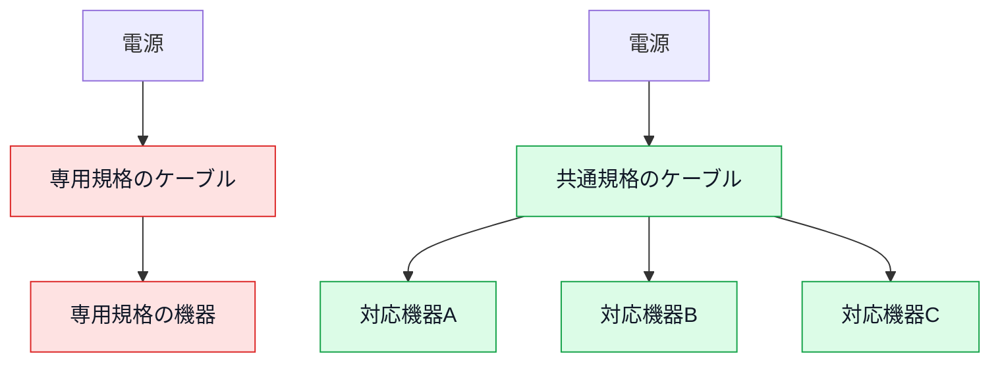

# はじめに
―― デザイン構造は「考えた結果」に過ぎない

---

## この本は、完成した型から覚える本ではありません

最初にお伝えしておきたいことがあります。

**この本は、デザインパターンの完成図を先に覚え、目の前のコードへ当てはめるための本ではありません。**

デザインパターンの一覧を覚えたい、23個の構造を順番に押さえたい——そういう目的であれば、他に良い本がたくさんあります。GoFの原典もありますし、パターンごとに図と用途をまとめた本も出ています。

この本が扱いたいのは、その手前にあるものです。

**変更要求を受けたとき、現状のどこに痛みが生まれ、なぜその痛みが生まれ、どんな境界を作ればよいかを順に考える方法**です。構造は、その判断を積み重ねた結果として現れます。

### だから、パターンは3つに絞りました

本書に出てくるデザインパターンは、Strategy、State、Observerの3つです。これは網羅を諦めたのではなく、一つの問題を現状把握から実装結果まで追うための選択です。

| 章 | 扱う問題 |
|---|---|
| 第1章 | ルールの追加で既存の計算処理まで変わる |
| 第2章 | 状態が増えると、状態を調べる箇所が連鎖して変わる |
| 第3章 | 届ける相手が増えると、出来事を起こす処理まで変わる |

ここで示しているのは、各章の**出発点**だけです。どんなクラスへ分け、誰が生成し、どこで再びつなぐかは示していません。その答えは、各章で事実とコードを追いながら導きます。

### この本で持ち帰ってほしいもの

覚えて帰ってほしいのは、完成したクラス図ではありません。

- このコードは、**何が変わったときに**痛むのか
- 痛む理由は、**どの責任や前提の置き方**にあるのか
- 解くべき境界は、**どこにあるのか**
- 分けた部品を、**誰がどこでつなぐのか**
- 変更後に、**要求を満たしたことと痛みが減ったことをどう確かめるか**

この問いは、本書に出てこない構造にも、パターン名のない自作の構造にも使えます。コードの形ではなく、結論へ至る根拠を持ち帰ってください。

---

## なぜ「デザイン構造を覚えても使えない」のか

ソフトウェア設計を学ぼうとすると、よくGoFのデザインパターンに出会います。GoF（Gang of Four）とは、1994年出版の書籍『Design Patterns』を書いた4人の著者の総称で、彼らが整理した23の設計の型は、今も設計の共通言語として使われています。

本で構造図を覚えても、実際の変更依頼を前にすると、次の疑問が残ります。

「このコードのどこに使うのか」

「今、本当にその構造が必要なのか」

「似た形に直したが、元の問題は解けたのか」

構造は答えの形を教えてくれますが、目の前の状況がその答えを必要としているかまでは決めてくれません。必要性を判断するには、変更要求を現状コードへ当て、修正範囲と確認範囲を観測する必要があります。

本書では、変更要求と課題から導いた責任・依存・接続点（部品同士が値や処理を受け渡す境目）の形を**デザイン構造（設計構造）**と呼びます。この二つの言葉は同じ意味で使います。その設計構造が、繰り返し現れる問題と解決の組として既知の名前を持つとき、その名前が**デザインパターン**です。

つまり本書の順番は、次のとおりです。

1. 現状と変更要求を理解する
2. 変更を試して痛みを観測する
3. 痛みを生む原因と、解くべき課題を確定する
4. 必要な構造を考え、コードで成立を確かめる
5. 最後に、その構造を共有する名前を確認する

章のタイトルには扱うパターン名を索引として載せていますが、設計判断の出発点には使いません。名前を隠して当てものにすることではなく、名前から答えを逆算しないことが重要だからです。

---

## 設計の基本 ―― 「分ける」と「接続点の形」

この本を通じて、ソフトウェア設計を**責任を分け、必要な場所で再びつなぐこと**として捉えます。

役割ごとに部品を分けると、一部を交換したり改良したりしやすくなります。ただし、分ければ必ず良くなるわけではありません。分けた数だけ、部品を見つけてつなぐ手間も増えます。

そこで、先に見るのはクラス数ではなく変更です。同じ場所にある処理が別々の理由で変わるなら、境界を検討する価値があります。いつも一緒に変わるなら、分けない方が読みやすい場合もあります。

分けた後には、部品同士が情報や処理を受け渡す**接続点**ができます。本書では、接続点について次の四つを確かめます。

1. 何を受け渡すのか
2. 両側は、相手について何を知る必要があるのか
3. 実際に使う部品を、誰が用意して渡すのか
4. 変更したとき、どこまで確認し直すのか

### 充電ケーブルで考える接続点

スマートフォンの充電端子を想像してみてください。専用の端子では、つなげる相手が限られます。共通規格の端子なら、規格を守る範囲で接続先を替えられます。

次の図では、同じ電源側に対して、接続点の形が専用か共通かによって交換できる機器の範囲がどう変わるかを比べます。

共通規格という接続点を決めておけば、規格を変えない範囲で接続先を替えられます。ソフトウェアでも、接続点で受け渡す値や操作が安定していれば、片側の実装を替えても、もう片側を直さずに済む場面が増えます。

ただし、端子を共通にするだけで問題が解けるわけではありません。複数の機器からどれを使うか、誰がケーブルを用意するか、接続中の機器を誰が管理するかは別の判断です。本書では、分離だけで終わらず、生成・所有・受け渡し・実行までを一続きで確認します。

---

> [!INFO] 本書の前提と言語について
> 本書では、すべてのサンプルコードを **C++** で記述しています。C++を選んだ理由は、契約、参照、所有、オーバーライドといった構造上の違いがコードに現れやすいためです。
>
> Java・Python・TypeScriptなどを普段使っている方も、構文より、クラスの役割と依存の向きに注目してください。
>
> | C++の書き方 | この本で読む意味 |
> |---|---|
> | `virtual void foo() = 0;` | 実装を持たず、呼び出せる操作だけを示す |
> | `class A : public IFoo` | 基底型との関係を示す。契約の実装か、実装の継承かは基底型の中身で区別する |
> | `IFoo* ptr;` | 相手をポインタで参照する。所有か借用かは、生成と破棄を見て判断する |
> | `void foo() override` | 基底型が公開した操作を、派生側で実装し直す |
> | `void foo() const` | その操作では、自分の状態を変更しない |
> | `IFoo& ref;` | 相手を所有せず、参照として借りる |
> | `explicit Ctor(...)` | 引数一つのコンストラクタが暗黙に呼ばれることを防ぐ |
> | `~Foo() = default;` | デストラクタの既定実装を使う |
> | `auto it = v.begin();` | 右辺から変数の型を決める |
> | `namespace Code { ... }` | 関連する定数や型を一つの名前の内側へまとめる |
> | `std::cref(x)` / `std::reference_wrapper<T>` | 参照をコンテナへ入れ、実体を所有せずに扱う |

> [!INFO] サンプルで使うC++標準ライブラリ
> 各章では、業務データを保持するために次の標準コンテナを使います。コンテナ自体の実装を学ぶ必要はありません。
>
> | 記法 | この本で表すもの | よく出る操作 |
> |---|---|---|
> | `std::vector<T>` | 順番に並んだ複数件 | `push_back`で末尾へ追加、`at(i)`で取得、`erase`で削除 |
> | `std::map<K, V>` | キーから値を引く保存領域 | `find`で存在確認、`at`で値を取得 |
> | `std::deque<T>` | 両端から出し入れできる列 | `push_back`で末尾へ追加、`front()`で先頭を確認、`pop_front()`で先頭を削除 |
>
> `front()`と`back()`は見るだけで、要素を削除しません。削除には別の操作が必要です。

> [!INFO] 生ポインタの使用について
> 掲載コードでは、構造を短く見せるために生ポインタを使います。生ポインタには、所有と借用の二つの使い方があります。
>
> - **所有するポインタ：** `new`で生成した実体を保持し、所有者が破棄する
> - **借用するポインタ：** 別の場所が所有する実体を参照し、借用側は破棄しない
>
> 各章では、誰が実体を作り、誰が保持し、いつ破棄するかをコードの近くで確認します。

---

## この本の地図

「はじめに」は判断の土台になる問いを示し、第0章は、その問いを現状コードへ当てる7つのフェーズを説明します。三つの実践章では、別々のシステムを使って7つのフェーズを最初から最後までたどります。

| 位置 | 役割 |
|---|---|
| はじめに | 本書の目的、接続点の見方、C++の前提をつかむ |
| 第0章 | 現状把握から対策実施まで、判断をつなぐ順序をつかむ |
| 第1章 | ルール追加で計算処理へ影響が広がる問題を追う |
| 第2章 | 状態追加で状態判定へ影響が広がる問題を追う |
| 第3章 | 届ける相手の追加で主処理へ影響が広がる問題を追う |
| おわりに | 三つの判断を横に並べ、自分のコードへ持ち帰る |

ここでも、問題の入口だけを示しています。各章で採用するクラス、生成場所、所有関係、受け渡し方は示しません。

三つの実践章は互いに独立しています。ただし、第0章だけは先に読むことをおすすめします。問題・原因・課題・対策を区別し、前のフェーズで確定した結果を次のフェーズへ渡すための地図だからです。

---

## 7つのフェーズが主に扱う場面

本書の7つのフェーズは、**すでに動いているシステムへ、具体的な仕様変更や機能追加の依頼が届いた場面**を主な対象にしています。現行仕様と変更前コードがあるからこそ、変更前の動作を基準にでき、変更を試したときに修正範囲や確認範囲がどこまで広がったかを観測できます。三つの実践章も、すべてこの前提で進みます。新規設計へ転用するときとの違いは、次のとおりです。

| 見る点 | 既存システムの変更――本書の主対象 | 新規設計への転用 |
|---|---|---|
| 出発点 | 現行仕様、動作中のコード、具体的な変更依頼 | 初期要求、構造案や試作、起こりそうな変更の仮説 |
| 影響の確かめ方 | 実際に変更を試し、開いたコードと再確認範囲を記録する | 構造案へ変更を当てたつもりで、直す責任と確認範囲を洗い出す |
| 得られる根拠 | 現行コードで観測した事実 | 構造案による予測。業務知識や関係者への確認で確からしさを上げる |
| 分離の判断 | 観測した痛みの原因を解く | 起こる見込みと影響が大きい変化に限って、先に境界を作る |

何も作られていない新規開発へ、7つのフェーズをそのまま当てはめるわけではありません。現状コードがなければ、フェーズ1で既存の構造を把握することも、フェーズ3で実際の変更の痛みを観測することもできないからです。

ただし、7つのフェーズを支える**「何が変わるかを考え、変化の影響がどこへ届くかを確かめる」思考**は、新規設計にも使えます。新規設計では、初期要求から作った構造案や小さな試作を出発点にして、起こりそうな変更を設計上のテストとして当てます。

たとえば、将来ルールが増えたときに、ルールとは別の責任まで毎回直す構造になっていないかを構造案へ問いかけます。異なる理由で変わるものが一つの部品に集まり、その変更が繰り返される根拠もあるなら、実装前に分離しておく判断ができます。

一方で、新規設計時点の影響は、まだ観測した事実ではなく仮説です。考えられる変更をすべて先回りして分離すると、使われない柔軟性のために構造だけが複雑になります。変更の見込み、影響の大きさ、分離するコストを確かめ、備える根拠があるものだけを対象にします。実装ができた後や運用開始後に具体的な変更が届いたら、そこからは7つのフェーズを本書どおりに使えます。

---

## 判断の土台になる三つの問い

三つの問いは、結論ではありません。**設計案を考える前に、見落としを減らすための問い**です。問い1〜3の番号は、本文のどこでも同じ問いを指すための固定番号です。実施順や優先順位を表すものではなく、必要な問いから使い、前の問いへ戻っても構いません。

この三つだけで、すべてのデザインパターンを導けるわけではありません。生成方法を切り替える、複雑な構造を一つの窓口で扱う、互換性のない表現を変換するなど、目的が違えば追加の問いが要ります。本書では、**責任を分け、境界を決め、実体を再びつないで動かす設計**に共通する確認軸として使います。

### 問い1：同じ場所に、別々の理由で変わるものがないか

一つのメソッドに複数の処理があること自体は問題ではありません。見るのは行数ではなく、変更のきっかけです。

たとえば、税率の計算と画面向けの文字整形は、別々の要求で変わる可能性があります。一方、税率の条件と計算式が常に一つの制度変更で同時に変わるなら、無理に二つへ分ける必要はありません。

次の順で確かめます。

1. 直近の変更で、どの行を開いたか
2. その行は、何の機能・仕様変更で変わったか
3. 同じ場所にある別の行は、同じ理由で変わるか
4. 一方だけ変えたとき、もう一方まで再確認したか

異なる理由で変わるものが同じ場所にあり、変更のたびに互いを道連れにしているなら、そこで初めて分離を検討します。

### 問い2：境界では、何を約束すれば足りるか

部品を分けても、利用側が相手の細かな手順や種類を知っていれば、その知識を直す変更が利用側へ届きます。そこで、接続点で本当に必要な値と操作を確認します。

問うのは次の三つです。

- 利用側は、相手へ何を頼みたいのか
- 相手の種類を知らなければ、実行できないのか
- 受け渡す引数と結果は、変更のたびに一緒に変わるのか

ここでいう**契約**は、クラス名の先頭に`I`を付けることではありません。境界の両側が守る、最小の値と操作の約束です。実装が一つで、差し替える根拠もなければ、契約用の型を増やさない判断もあります。

### 問い3：実体を、誰が作り、持ち、渡すのか

境界を決めただけではコードは動きません。実際に処理する実体が必要です。

- 誰が具体的な実体を生成するか
- 誰がその実体を所有するか
- 利用側へ、どの時点で渡すか
- 複数候補があるなら、誰が選ぶか
- 利用が終わるまで、実体は生きているか

継承で親の実装を受け継ぐのか、別の部品として持つのかも、この目的から決めます。分類や固定手順を表したいなら継承が素直な場合があります。独立した部品を組み替えたいなら、外から受け取って持つ形が候補になります。

「継承は悪い」「インターフェースは多いほどよい」という規則ではありません。何を固定し、何を替えたいかを説明できることが判断基準です。

### 三つの問いは、往復して使う

三つの問いは、機械的に一方向へ進む手順ではありません。境界を考えた結果、受け渡す値が不安定だと分かれば、分け方を見直します。所有者を決めた結果、利用側が具体の選択まで抱えるなら、生成場所を見直します。

ただし、本文で迷いの過程をそのまま見せることはしません。各章では、検討した結果を次の順で整理して示します。

1. どの事実を使ったか
2. そこから何を判断したか
3. どんな構造にすると判断を満たせるか
4. コードのどこへ反映したか
5. 実行結果と変更影響で何を確かめたか

この順番が、第0章で扱う7つのフェーズへつながります。

---

## 答えは、各章の中で初めて確定します

導入で共有したのは、判断に使う言葉と問いです。題材ごとの完成コード、最終クラス図、具体クラスの生成場所、所有関係、登録や選択の方法は、各章の根拠から確定します。

第0章では、各フェーズが何を入力として受け取り、何を確定して次へ渡すかを説明します。その後の実践章で、初めて題材ごとの答えをコードとして組み立てます。

先へ進むときは、完成形を当てにいくのではなく、直前のフェーズで確定した言葉を次の判断へ使えているかを確かめてください。結論だけでなく、結論へつながる根拠を追えることが、この本の目標です。
