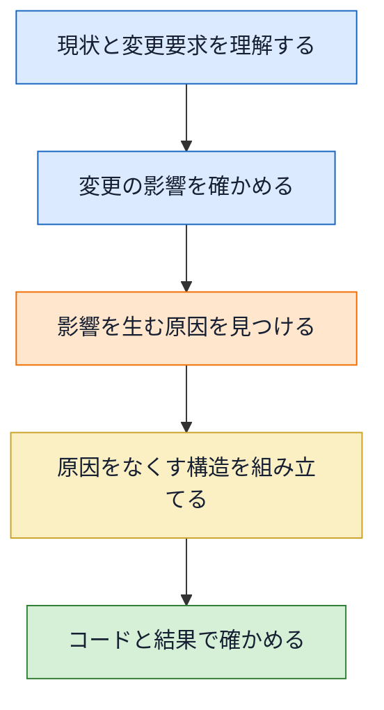
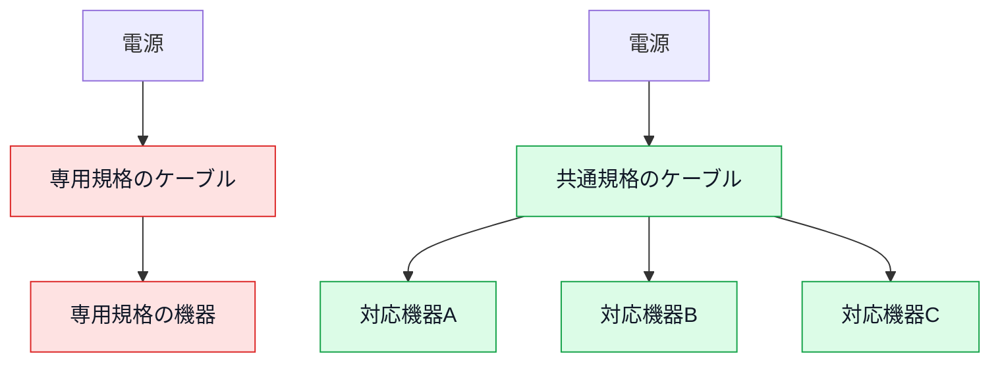
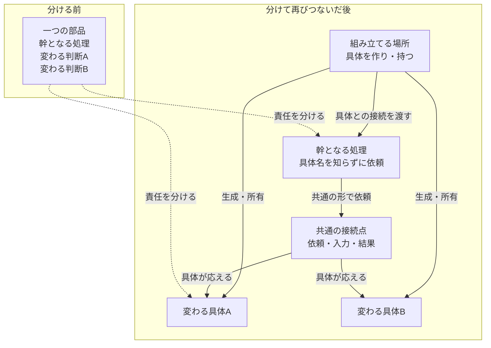

# はじめに
―― デザイン構造は「考えた結果」に過ぎない

---

## 完成した型から始めない理由

最初にお伝えしておきたいことがあります。

**この本は、デザインパターンの完成図を先に覚え、目の前のコードへ当てはめるための本ではありません。**

デザインパターンの一覧を覚えたい、23個の構造を順番に押さえたい——そういう目的であれば、他に良い本がたくさんあります。GoFの原典もありますし、パターンごとに図と用途をまとめた本も出ています。

この本が扱いたいのは、その手前にあるものです。

**変更要求を受けたとき、現状のどこに痛みが生まれ、なぜその痛みが生まれ、どんな境界を作ればよいかを順に考える方法**です。構造は、その判断を積み重ねた結果として現れます。

> [!IMPORTANT] 本書で示す設計案の位置づけ
> ソフトウェア設計に唯一の正解はありません。本書の完成構造は、各章で示す仕様、変更要求、現状コード、制約を前提に、**私が妥当だと考えた一案**です。コスト、チーム、変更の見込みが違えば、別の分け方や、あえて分けない判断の方がよい場合もあります。7つのフェーズは一つの形を押しつける手順ではなく、どの事実から何を判断したかを確かめられるようにするための考え方です。

### 扱うパターンを3つに絞った理由

本書に出てくるデザインパターンは、Strategy、State、Observerの3つです。これは網羅を諦めたのではなく、一つの問題を現状把握から実装結果まで追うための選択です。

| 章 | 扱う問題 |
|---|---|
| 第1章 | ルールの追加で既存の計算処理まで変わる |
| 第2章 | 状態が増えると、状態を調べる箇所が連鎖して変わる |
| 第3章 | 届ける相手が増えると、出来事を起こす処理まで変わる |

ここで示しているのは、各章の**出発点**だけです。どんなクラスへ分け、誰が生成し、どこで再びつなぐかは示していません。各章では、事実とコードを根拠に一つの設計案を組み立てます。

### この本で持ち帰っていただきたいもの

覚えて帰っていただきたいのは、完成したクラス図ではありません。

- このコードは、**何が変わったときに**痛むのか
- 痛む理由は、**どの責任や前提の置き方**にあるのか
- 解くべき境界は、**どこにあるのか**
- 分けた部品を、**誰がどこでつなぐのか**
- 変更後に、**要求を満たしたことと痛みが減ったことをどう確かめるか**

この問いは、本書に出てこない構造にも、パターン名のない自作の構造にも使えます。コードの形ではなく、結論へ至る根拠こそ、持ち帰っていただきたいものです。

---

## なぜ「デザイン構造を覚えても使えない」のか

ソフトウェア設計を学ぼうとすると、よくGoFのデザインパターンに出会います。GoF（Gang of Four）とは、1994年出版の書籍『Design Patterns』を書いた4人の著者の総称で、彼らが整理した23の設計の型は、今も設計の共通言語として使われています。

本で構造図を覚えても、実際の変更依頼を前にすると、次の疑問が残ります。

「このコードのどこに使うのか」

「今、本当にその構造が必要なのか」

「似た形に直したが、元の問題は解けたのか」

既知の構造は選択肢を教えてくれますが、目の前の状況でその選択肢が妥当かまでは決めてくれません。必要性を判断するには、変更要求を現状コードへ当て、修正範囲と確認範囲を観測する必要があります。

本書では、変更要求と課題から導いた責任・依存・接続点（部品同士が値や処理を受け渡す境目）の形を**デザイン構造（設計構造）**と呼びます。この二つの言葉は同じ意味で使います。その設計構造が、繰り返し現れる問題と解決の組として既知の名前を持つとき、その名前が**デザインパターン**です。

完成したパターン名から逆算せず、次の流れで構造を導きます。

図の上から下へ進むほど、現状の事実が設計判断へ変わります。工程の終点は、選んだ構造をコードと結果で確かめることです。

扱うパターン名は書名と章題に最初から示しています。名前を伏せて当てものにする意図はありません。ただし、Strategyだからこのクラスを作る、Stateだから継承する、という決め方もしません。名称を知ったうえで、採用する構造は各章の事実と制約から判断します。

---

## 設計の基本 ―― 「分ける」と「接続点の形」

この本を通じて、ソフトウェア設計を**責任を分け、必要な場所で再びつなぐこと**として捉えます。

役割ごとに部品を分けると、一部を交換したり改良したりしやすくなります。ただし、分ければ必ず良くなるわけではありません。分けた数だけ、部品を見つけてつなぐ手間も増えます。

そこで、先に見るのはクラス数ではなく変更です。同じ場所にある処理が別々の理由で変わるなら、境界を検討する価値があります。いつも一緒に変わるなら、分けない方が読みやすい場合もあります。

分けた後には、部品同士が情報や処理を受け渡す**接続点**ができます。本書では、接続点について次の四つを確かめます。

1. 何を受け渡すのか
2. 両側は、相手について何を知る必要があるのか
3. 実際に使う部品を、誰が用意して渡すのか
4. 変更したとき、どこまで確認し直すのか

### 充電ケーブルで考える接続点

スマートフォンの充電端子を想像してみてください。専用の端子では、つなげる相手が限られます。共通規格の端子なら、規格を守る範囲で接続先を替えられます。

次の図では、同じ電源側に対して、接続点の形が専用か共通かによって交換できる機器の範囲がどう変わるかを比べます。

共通規格という接続点を決めておけば、規格を変えない範囲で接続先を替えられます。ソフトウェアでも、接続点で受け渡す値や操作が安定していれば、片側の実装を替えても、もう片側を直さずに済む場面が増えます。

ただし、端子を共通にするだけで問題が解けるわけではありません。複数の機器からどれを使うか、誰がケーブルを用意するか、接続中の機器を誰が管理するかは別の判断です。本書では、分離だけで終わらず、生成・所有・受け渡し・実行までを一続きで確認します。
---

> [!INFO] 本書の前提と言語について
> 本書では、すべてのサンプルコードを **C++** で記述しています。C++を選んだ理由は、契約、参照、所有、オーバーライドといった構造上の違いがコードに現れやすいためです。
>
> Java・Python・TypeScriptなどを普段使っている方も、構文より、クラスの役割と依存の向きに注目してください。
>
> | C++の書き方 | この本で読む意味 |
> |---|---|
> | `virtual void foo() = 0;` | 実装を持たず、呼び出せる操作だけを示す |
> | `class A : public IFoo` | 基底型との関係を示す。契約の実装か、実装の継承かは基底型の中身で区別する |
> | `IFoo* ptr;` | 相手をポインタで参照する。所有か借用かは、生成と破棄を見て判断する |
> | `void foo() override` | 基底型が公開した操作を、派生側で実装し直す |
> | `void foo() const` | その操作では、自分の状態を変更しない |
> | `IFoo& ref;` | 相手を所有せず、参照として借りる |
> | `explicit Ctor(...)` | 引数一つのコンストラクタが暗黙に呼ばれることを防ぐ |
> | `~Foo() = default;` | デストラクタの既定実装を使う |
> | `for (const auto& x : v)` | コンテナの要素を先頭から順に読み、要素自体は変更しない |
> | `namespace Code { ... }` | 関連する定数や型を一つの名前の内側へまとめる |
> | `std::cref(x)` / `std::reference_wrapper<T>` | 参照をコンテナへ入れ、実体を所有せずに扱う |

> [!INFO] サンプルで使うC++標準ライブラリ
> 各章では、業務データを保持するために次の標準コンテナを使います。コンテナ自体の実装を学ぶ必要はありません。
>
> | 記法 | この本で表すもの | よく出る操作 |
> |---|---|---|
> | `std::vector<T>` | 順番に並んだ複数件 | `push_back`で末尾へ追加、`at(i)`で取得、`erase`で削除 |
> | `std::map<K, V>` | キーから値を引く保存領域 | `find`で存在確認、`at`で値を取得 |
> | `std::deque<T>` | 両端から出し入れできる列 | `push_back`で末尾へ追加、`front()`で先頭を確認、`pop_front()`で先頭を削除 |
> | `std::list<T>` | 要素の場所を動かさずに保持する列 | `emplace_back`で末尾へ追加、`remove`で一致する要素を削除 |
>
> `front()`と`back()`（先頭・末尾の要素を返す操作）は見るだけで、要素を削除しません。削除には別の操作が必要です。

> [!INFO] 生ポインタの使用について
> 掲載コードでは、構造を短く見せるために生ポインタを使います。生ポインタには、所有と借用の二つの使い方があります。
>
> - **所有するポインタ：** `new`で生成した実体を保持し、所有者が破棄する
> - **借用するポインタ：** 別の場所が所有する実体を参照し、借用側は破棄しない
>
> 各章では、誰が実体を作り、誰が保持し、いつ破棄するかをコードの近くで確認します。

---

## この本の地図

「はじめに」は判断の土台になる問いを示し、第0章は、その問いを現状コードへ当てる7つのフェーズを説明します。三つの実践章では、別々のシステムを使って7つのフェーズを最初から最後までたどります。

| 位置 | 役割 |
|---|---|
| はじめに | 本書の目的、接続点の見方、C++の前提をつかむ |
| 第0章 | 現状把握から対策実施まで、判断をつなぐ順序をつかむ |
| 第1章 | ルール追加で計算処理へ影響が広がる問題を追う |
| 第2章 | 状態追加で状態判定へ影響が広がる問題を追う |
| 第3章 | 届ける相手の追加で主処理へ影響が広がる問題を追う |
| おわりに | 三つの判断を横に並べ、自分のコードへ持ち帰る |

ここでも、問題の入口だけを示しています。各章で採用するクラス、生成場所、所有関係、受け渡し方は示しません。

三つの実践章は互いに独立しています。ただし、第0章だけは先に読むことをおすすめします。問題・原因・課題・対策を区別し、前のフェーズで確定した結果を次のフェーズへ渡すための地図だからです。本書が主に扱うのは、すでに動いているシステムへ変更依頼が届く場面です。新規設計へ転用するときの違いは、第0章で7つのフェーズを説明した後に整理します。

---

## 設計を導く思考と、三つの確認

三つの問いだけを覚えても、設計は導けません。問いは、設計案を作るための手順ではなく、**考えた結果が目的から外れていないかを確かめ、必要なら前へ戻るための確認点**だからです。

問いより先に置くのは、次の思考です。まず、利用者が得たい結果と今回守るべき動作を確定します。次に、変更を当てたときにどこまで修正と確認が広がるかを観測し、その広がりを生む「別々の理由で変わるものの同居」を探します。分けると決めたら、両側に共通して必要な入力・操作・結果だけを接続点へ残します。最後に、具体的な実体を選んで生成し、守る側へ渡し、守る側が具体を知らずに実行できるところまでつなぎます。

この思考が目指す価値は、クラスを増やすことでも、三問すべてに丸を付けることでもありません。**要求された価値と既存動作を保ちながら、次の変更で無関係な責任を巻き込まないこと**です。分けた結果、同じ理由で変わる処理まで離れて流れが読みにくくなるなら、その分離はやりすぎです。

三つの問いは、この思考を進めた後の確認に使います。問い1〜3の番号は、本文のどこでも同じ確認を指す固定番号です。実施順や優先順位ではなく、判断に無理があれば前の問いへ戻ります。

この三つだけで、すべてのデザインパターンを導けるわけではありません。生成方法を切り替える、複雑な構造を一つの窓口で扱う、互換性のない表現を変換するなど、目的が違えば追加の問いが要ります。本書では、**責任を分け、境界を決め、実体を再びつないで動かす設計**に共通する確認軸として使います。

### 三つの問いで確かめる構造

次の図は、問いの実施順ではなく、三つの問いを使って確かめる**分離前後の構造**を示します。上が、幹となる処理と変わる判断が一つの部品に入った状態です。下が、両者を分け、共通の接続点を通して再び動かせるようにした状態です。

分けた後、幹となる処理は具体A・Bの名前や内部手順を知りません。組み立てる場所だけが具体を作って持ち、幹から使えるように接続します。具体が一つだけの場合や、専用の組み立てクラスを置かない場合もあるため、この図は完成形の指定ではなく、各章で確かめる役割の配置を示しています。

### 問い1：同じ場所に、別々の理由で変わるものがないか

一つのメソッドに複数の処理があること自体は問題ではありません。見るのは行数ではなく、変更のきっかけです。

問い1で見るのは、直前の図にある「分ける前」の箱です。幹となる処理、判断A、判断Bについて、変更の依頼元、変わる時点、参照する情報を比べます。それらが違う理由で変わるなら、一つの部品の中に境界候補があります。

別々の理由は、次の四方向から探します。

- **変更履歴と依頼元：** 同じ場所が、料金担当、運用担当、外部連携担当など、別の判断者の依頼で変わっていないか
- **見る情報：** 一方は利用区分、もう一方は現在の進行状況というように、判断材料が違わないか
- **変わる時点：** 日々の施策変更、処理の進行、外部から遅れて届く結果など、変更や実行の時点が違わないか
- **外部との接続：** APIの引数、通信方式、失敗条件、結果が返る時点の変更が、中心の業務判断まで巻き込んでいないか

たとえば、税率の条件と計算式が常に一つの制度変更で同時に変わるなら、無理に二つへ分ける必要はありません。反対に、一方だけを変更したのに、同じ部品にある別の処理まで読み直し、再確認したなら、異なる変更理由が同居している手がかりです。

次の順で確かめます。

1. 直近の変更で、どの箇所に手を入れたか
2. その箇所は、誰のどんな判断や外部条件で変わったか
3. 同じ場所にある別の処理は、同じ情報を見て、同じ時点・同じ理由で変わるか
4. 一方だけ変えたとき、もう一方まで修正・再確認したか

異なる理由で変わるものが同じ場所にあり、変更のたびに互いを道連れにしているなら、そこで初めて分離を検討します。

### 問い2：境界では、何を約束すれば足りるか

問い2で見るのは、直前の図にある「共通の接続点」です。部品を分けても、利用側が相手の細かな手順や種類を知っていれば、その知識を直す変更が利用側へ届きます。そこで、接続点で本当に必要な値と操作を確認します。

問うのは次の三つです。

- 利用側は、相手へ何を頼みたいのか
- 相手の種類を知らなければ、実行できないのか
- 受け渡す入力・結果・失敗は、どの具体でも同じ意味か
- 結果がすぐ返るか後で届くかは、利用側が知る必要のある約束か

ここでいう**契約**は、境界の両側が守る、最小の値と操作の約束です。複数の具体に共通しない値まで詰め込むと、共通契約の変更が全実装へ波及します。反対に、受付結果だけを共通にして後から届く結果を消すなど、必要な違いまで削れば要求を表せません。共通部分と具体固有の情報を分け、利用側が本当に必要な約束だけを残します。実装が一つで、差し替える根拠もなければ、契約用の型を増やさない判断もあります。

### 問い3：実体を、誰が作り、持ち、渡すのか

問い3で見るのは、直前の図にある「組み立てる場所」から幹と具体へ伸びる接続です。境界を決めただけではコードは動きません。実際に処理する実体が必要です。

- 誰が具体的な実体を生成するか
- 誰がその実体を所有するか
- 利用側へ、どの時点で渡すか
- 複数候補があるなら、誰が選ぶか
- 利用が終わるまで、実体は生きているか
- 分けた側同士が互いを直接参照し、循環していないか

問い3の出口は、**生成場所だけを指せることではありません。** 作る側が実体を所有し、必要なら登録・選択し、利用側へ渡し、利用側が具体名を知らずに契約から実行できるところまでを一続きで確認します。分けた二つが互いを直接知る構造になったなら、処理またはIDを渡す第三の境界へ置き換えられないかも考えます。

継承で親の実装を受け継ぐのか、別の部品として持つのかも、この目的から決めます。分類や固定手順を表したいなら継承が素直な場合があります。独立した部品を組み替えたいなら、外から受け取って持つ形が候補になります。

「継承は悪い」「インターフェースは多いほどよい」という規則ではありません。何を固定し、何を替えたいかを説明できることが判断基準です。

### 三つの問いは、往復して使う

三つの問いは、機械的に一方向へ進む手順ではありません。境界を考えた結果、受け渡す値が不安定だと分かれば、分け方を見直します。所有者を決めた結果、利用側が具体の選択まで抱えるなら、生成場所を見直します。

ただし、本文で迷いの過程をそのまま見せることはしません。各章では、検討した結果を次の順で整理して示します。

1. どの事実を使ったか
2. そこから何を判断したか
3. どんな構造にすると判断を満たせるか
4. コードのどこへ反映したか
5. 実行結果と変更影響で何を確かめたか

この順番が、第0章で扱う7つのフェーズへつながります。

実践章では、問い1を原因の確定、問い2を契約の決定、問い3を生成・所有・受け渡しの決定で使います。問いを置いただけで通過とはせず、判断した構造がコードと実行結果で成立したときに、その確認を終えます。

---

## 各章で組み立てる一つの設計案

導入で共有したのは、判断に使う言葉と問いです。題材ごとの完成コード、最終クラス図、具体クラスの生成場所、所有関係、登録や選択の方法は、各章の根拠から組み立てます。

第0章では、各フェーズで何を考え、何を確かめ、その判断を次へどう渡すかを説明します。その後の実践章では、示した前提のもとで私が選んだ設計案をコードにします。別案を否定するためではなく、選択の根拠と結果を読者が検討できる形にするためです。

先へ進むときは、完成形を当てにいくのではなく、直前のフェーズで確定した言葉が次の判断へどう使われたかを追います。示した案に同意することではなく、同じ前提なら採用するか、別の制約なら何を変えるかを自分で判断できることが、この本の目標です。
