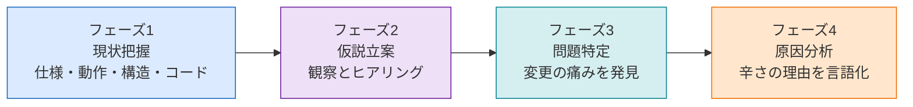
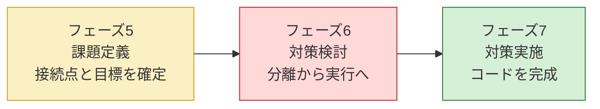
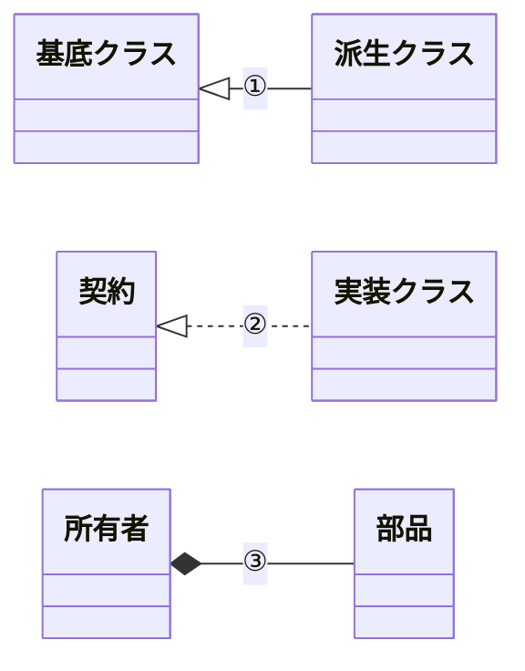
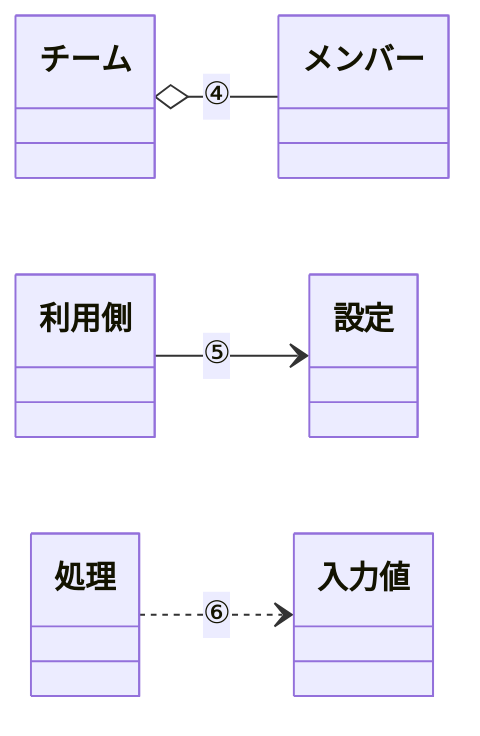

# 第0章 設計判断の地図
―― 3つの構造を貫く7つのフェーズ

---

## 私がたどり着いた「7つのフェーズ」

> [!TIP] この章の読み方
> この章は全7フェーズの詳細な説明書です。最初から通読してもよいですが、**各フェーズの冒頭にある「目的」「入力」「成果物」だけ読んで先の章へ進み、疑問が出たときに戻ってくる**という使い方が馴染みやすいかもしれません。「このフェーズで何を受け取り、何に変えているんだろう？」と感じたら、この章の該当セクションが手がかりになります。

**このプロセスを「いつ」使うのか**

この思考プロセスは一般的な問題解決の進め方に沿って設計の思考を進めます。仕様変更を起点として動き、**「すでに稼働しているシステムに、新たな仕様変更や機能追加の要望が来たとき」**に、7つを一続きの工程として使います。本書の三つの実践章も、すべてこの場面を扱います。特に、以下のような状況で威力を発揮します。

- 既存システムをあまり把握していない人が、安全に変更を加えるアプローチを探るとき
- 熟練の担当者が、複雑化した課題を改めて整理し直し、設計の妥当性を検証するとき

> [!IMPORTANT] 新規設計では、そのままではなく「設計上のテスト」として使う
> 新規設計には、把握する現状コードも、変更を試して観測する痛みもまだありません。そのため、7つのフェーズを既存システムと同じ意味では使えません。
>
> ただし、初期要求から作った構造案や小さな試作へ、起こりそうな変更を当てることはできます。「その変更で、関係のない責任まで直すことにならないか」を調べ、変更の見込みと影響が大きければ、実装前に境界を作ります。この時点の結果は観測した事実ではなく仮説なので、あらゆる可能性を先回りして分離せず、業務知識や関係者への確認で根拠を持てたものに絞ります。

設計に悩み、何度も失敗を繰り返す中で、私は「きれいなコードを書く」ことよりも「変更要求に対してどう思考するか」というプロセスこそが重要だと気づきました。試行錯誤の末にたどり着いたのが、7つのフェーズを同じ順で進むというやり方です。**一段ごとに前の段で確定した事実を使うので、根拠を置き去りにせず先へ進めます。**

7つが何を受け取って何を次へ渡すのかは、この章の「7つのフェーズ」で図にしています。各章の見出しには、フェーズごとに同じ色の絵文字が付くので、いま自分がどのフェーズにいるかも見て分かります。

> [!IMPORTANT] 本質は「ビジネスの課題解決プロセス」と同じ
> 以下の7フェーズはプログラミング特有の魔法ではありません。たとえば店舗の売上が落ちたときも、まず現状を整理し、変わりそうな要因の仮説を立て、どこで問題が起きているかを確かめ、原因を特定し、解くべき課題を定めてから対策を選びます。ソフトウェア設計も、**現状把握 ⇒ 仮説立案 ⇒ 問題特定 ⇒ 原因分析 ⇒ 課題定義 ⇒ 対策検討 ⇒ 実施**という同じ論理で進められます。
> 現状を把握せずに原因を見誤ったり、原因を特定せずに対策（構造）を打ったりすると、期待する効果が得られないのはビジネス課題も設計課題も同じです。本質がずれたまま進めないよう、この工程を一つずつ踏んでいくことが何より重要です。

### 本書の番号の読み方

本文を読むときの主役は、あくまで**7つのフェーズ**です。
各章は、フェーズ1からフェーズ7までを同じ順序で進みます。

本書で繰り返し使う番号は、英字の略語ではなく日本語で役割を示します。「何を管理する番号か」を、表記だけで見分けられるようにするためです。

番号には、括弧で短い名前が付きます。

> 変更ID1（送料の無料条件を変える）

括弧の中は中身を思い出すための手がかりで、正式な内容はその番号を確定した節にあります。

| 番号 | 付ける場所 | この番号で追うもの |
|---|---|---|
| 要求ID1 | フェーズ1 | システムが満たす要求と、最終的な受入・回帰結果 |
| 変更ID1 | フェーズ1 | 今回の変更依頼、変更後要求、変更影響 |
| リスクID1 | フェーズ2 | 将来変わる可能性と、設計での備え |
| 問題ID1 | フェーズ3 | 変更を試して観測した修正・再テストの広がり |
| 原因ID1 | フェーズ4 | 痛みを生んだ責任の集まり方 |
| 課題ID1 | フェーズ5 | 解くべき構造上の課題から、コードと改善結果まで |

追跡に使う番号は、この6つだけです。フェーズ1で要求IDと変更IDを付け、フェーズ2でリスクID、フェーズ3で問題ID、フェーズ4で原因ID、フェーズ5で課題IDを付けます。**IDを付けるフェーズは確定した一覧で締め、後続フェーズは受け取ったIDに分析結果・設計判断・実装結果を紐づけます。** こうして、前の結論が次の入力になったことを確認します。

番号の意味は、**それぞれのフェーズを説明するところで改めて書きます。** ここでは「6種類あって、どのフェーズで付くか」だけ掴んでおけば十分です。

覚えておいてほしいのは、次の1本の線です。

1. **変更ID** ―― 今回届いた変更依頼
2. **変更を試す** ―― その依頼を現状のコードへ当ててみる
3. **問題ID** ―― 当ててみて観測した痛み
4. **原因ID** ―― その痛みを生んでいる構造上の理由
5. **課題ID** ―― 解くべき境界

課題IDは、この線からだけ導きます。要求IDと課題IDを直接つなぐことはしません。要求を小さな変更で満たせて課題が生じないこともあれば、1つの変更試行から複数の課題が見つかることもあるからです。

---

### 掲載コードを手元で動かす

各章の掲載コードは、そのまま手元で動かせます。読むだけでなく実行してみると、変更要求で何が起きるかを自分の目で確かめられます。

1. 章のコード（フェーズ1の現状コード、またはフェーズ7の最終コード）を1つの `.cpp` ファイルに貼り付けます。
2. コンパイルして実行します（例：`g++ chapter01.cpp -o app && ./app`。C++が使える環境なら `clang++` でも構いません）。
3. `main()` は自由に組み替えて構いません。各章の境界クラス（`〜Database` / `〜Repository` など）は、実行終了まで状態を覚えるインメモリの保存です。`save()` で新しいデータ（顧客・口座・イベント・メニュー・承認者など）を足し、その値で処理を呼べば、追加したデータの結果がその場の出力に表れます。

**掲載コードを1つの `.cpp` にまとめているのは、手元ですぐ動かせるようにするためです。** 実務でこう書くという意味ではありません。実際にはクラスごとに `.h` と `.cpp` へ分けます。**どう分けるかも設計判断の一つ**なので、各章の完成コードのあとに、その章の構造ならどのファイル構成になるかを表で示します。読んでいる途中で「これを1ファイルに書くのか」と気になったら、その表まで待ってください。

**掲載コードは、本物のシステムではありません。** データベースも外部APIも画面もなく、標準出力へ文字を出しているだけです。プログラムを終了すれば、`save()` したデータも消えます。

ですから、たとえば `cout` で「PDF出力完了」と表示していても、**PDFファイルはできていません。** 実物ができるのは、標準出力に出た文字だけです。

どこが実物でどこが代役かは、コードの直前に「実システムでは何をするところか」「掲載コードでは何で代えているか」として書いてあります。

なぜ削るのかというと、永続化も外部通信もエラー処理も入れると、コードが長くなって**構造の話が見えなくなる**からです。この本で追いたいのは「変更が来たときにどこを直すことになるか」なので、そこに関係しない部分は落としています。

### 図では、「新しく作る」と「開いて直す」を塗り分けます

この本の中心にあるのは、**変更が来たときに既にあるコードを開くことになるかどうか**です。新しいクラスを1つ足して終わるのと、動いている3クラスを開いて直すのとでは、かかる手間も壊す危険もまったく違います。図では、そこを**文字ラベルと色の両方**で分けます。

| 図中の文字 | 見え方 | 意味 |
|---|---|---|
| `［新規］`／`<<new>>` | **淡い青の面と細い青灰色の枠** | 今回新しく作るもの |
| `［変更］`／`<<changed>>` | **淡い黄の面と少し太い茶色の枠** | もとからあって、開いて直すもの |
| 差分ラベルなし | 色なし | 触らないもの |

たとえば、変更前の構造では `［変更］` の箱ばかり、完成後の構造では `［新規］` の箱へ差分が閉じる、という形で図が変わります。**変更の箱が減っていれば、既存コードを開くところが減ったということです。** 端末や印刷で色が分かりにくくても、文字ラベルだけで差分を読めます。

図の**形**（四角・ひし形・平行四辺形）は、そのノードの役割（処理・判定・入力）を表します。形と色は別のことを言っているので、色が付いていても役割は形から読み取れます。

システム内部の処理フローでは、形に加えて次の淡い色も補助的に使います。**色だけを覚える必要はなく、形とノード内の文言が正本です。** クラス図や変更影響グラフでは、この役割色ではなく、前表の「新規／変更」の差分色を使います。

| 処理フローの色 | 補助的に示す役割 |
|---|---|
| 淡い青 | 入力 |
| 淡い水色 | 保存データ・保持値 |
| 淡いオレンジ | 処理・加工 |
| 淡い黄色 | 判定 |
| 淡い緑 | 正常な出力・結果 |

コードでも、変更前と変更後を並べる場面では、**変更後の側で前と変わった行に青い帯**を敷いてあります。行末の `// ← 追加` `// ← 変更` は、その帯が何なのかを言葉で補うものです。帯の無い行は、変更前のままです。

### 7つのフェーズ

各章は、次の7つのフェーズを同じ順で進みます。

**フェーズ1〜4：現状から構造上の原因を確定する**

次の図では、現状を理解してから、変更を試して原因を確定するまでを追います。

ここで「仮説立案」をフェーズ2に置いていますが、**仮説を立てる行為がこの場所だけに限られるわけではありません。** 問題を探すときは「この変更でここまで影響しそうだ」、原因を調べるときは「この二つの責任が同居しているからではないか」と見当を置き、コードで確かめます。本書でフェーズ2として独立させたのは、仕様変更を構造へ落とす前に、**今後も何が変わる見込みか、今回どこを守るか**を関係者と確定し、設計へ掛けるコストの根拠にするためです。ほかのフェーズの仮説は、そのフェーズ内で観測・検証して確定事項へ変えます。



フェーズ4で確定した原因を、解くべき課題へ変換したところから後半へ進みます。

**フェーズ5〜7：課題から完成コードまでつなぐ**

次の図では、接続点を決め、構造を検討し、コードで完了条件を満たすまでを追います。



前のフェーズの出力が、次のフェーズの入力になります。受け渡すものと、次に何へ変えるかを一列にすると、次のようになります。

| 受け渡し | 次のフェーズで行うこと |
|---|---|
| フェーズ1の現状・変更ID | フェーズ2で、変わる見込みと今回維持する範囲を確定する |
| フェーズ2の確定変更・変わる側／守る側 | フェーズ3で、守る側まで開く変更を「痛み」として観測する |
| フェーズ3の問題ID・変更影響グラフ | フェーズ4で、痛みを生んだ責任の集まり方を原因へ変える |
| フェーズ4の原因ID・異なる変更理由を持つ責任 | フェーズ5で、どこに境界を引くかを検討して課題へ変える |
| フェーズ5の課題ID・接続点・完了条件 | フェーズ6で、契約から実行までつながる一つの構想へ変える |
| フェーズ6の採用構造・生成／所有／注入規則 | フェーズ7で、全体コードへ統合して要求と構造を検証する |

一つの成果物を、後の判断でも再利用することがあります。フェーズ2からフェーズ3へ渡すのは、今回の確定変更と「変える側／守る側」です。未確定の将来リスクそのものは痛みの根拠にせず、リスクIDの一覧をフェーズ6まで持ち越して採用構造の評価に使います。要求IDも、フェーズ1で確定した後、フェーズ7の受入・回帰確認でもう一度使います。**次へ渡すとは、すべての一覧を直後へ混ぜることではありません。直後の判断に必要な確定事項を渡し、用途が決まっている一覧は意味を変えずに所定のフェーズまで持ち越します。**

また、**7つのフェーズは、同じ説明を7回繰り返すための章立てではありません。** 現状の全体コードはフェーズ1、完成した全体コードはフェーズ7だけに置きます。フェーズ3は変更で開く箇所、フェーズ4は原因が見える箇所、フェーズ6は構想を成立させる箇所だけを抜粋します。すでに確定した仕様・表・図・コードは、後のフェーズでは必要な行を参照し、同じ内容を丸ごと再掲しません。

各フェーズの**深さも同じである必要はありません。** 原因が一つで接続点も明白なら、フェーズ4・5は短くて構いません。非同期完了や共有状態まで関係するなら、生成・所有・別の入口を確かめるためにフェーズ6が長くなります。長さをそろえるのではなく、そのフェーズの成果物を次へ渡すのに必要な証拠だけを残します。

どこかで話が飛んでいると感じたら、直前のフェーズの確定事項が足りないか、次のフェーズでそれを実際に使っていない、と考えてみてください。

各フェーズで何を確かめるかは、この後それぞれの節で説明します。

### クラス図の線の意味

本書のクラス図は、クラスの配置と依存の向き（誰が誰を知っているか）を示します。使う線は6種類だけです。

ここからは、3種類ずつ **クラス図と読み方を一組** にして確認します。線の横の番号と、図の直後にある表の番号が対応します。クラス名は、線の意味が分かるように付けた仮の名前です。

**継承・契約の実装・所有**

次のクラス図では、**上下の関係**（継承と実装）と、**持つ関係**を見ます。



直前のクラス図の①〜③は、次のように読みます。図の番号と同じ行を見てください。

| 番号と関係 | 読み方 | コードで確かめること |
|---|---|---|
| ① 継承 | 派生側が基底側の実装を受け継ぐ | 派生側の `: public` と基底側の共通実装 |
| ② 契約の実装 | 実装側が契約の操作を実現する | 契約側の純粋仮想関数と実装側の `override` |
| ③ 所有 | ひし形側が部品を値で持つ | 部品が値メンバーで所有者と寿命を共にすること |

**集約・継続的な利用・一時的な利用**

次のクラス図では、**まとめる関係**と、2種類の**使う関係**を見ます。



直前のクラス図の④〜⑥は、次のように読みます。ここでは、相手を所有するかではなく、どれだけ長く関係するかを見ます。

| 番号と関係 | 読み方 | コードで確かめること |
|---|---|---|
| ④ 集約 | ひし形側が独立して存在できる相手をまとめる | 借りた実体の集まりを保持し寿命は支配しないこと |
| ⑤ 継続的な利用 | 矢印側が相手を借りて使い続ける | 参照やポインタをメンバーとして保持すること |
| ⑥ 一時的な利用 | 矢印側が操作の間だけ相手を使う | 引数・戻り値・ローカル変数だけに型が現れること |

見分けるポイントは2つだけです。**線が実線か点線か**と、**線の先端が何か**（白抜きの三角・黒いひし形・白いひし形・矢印）です。この2つの組み合わせのうち、本書で使うのは6種類です。

この凡例で確認するのは、クラス図の線が表す関係です。各章の実際のクラス名や所有関係は、それぞれの課題から構造を導く場面で初めて現れます。

⑤と⑥の違いは、**メンバーに持つかどうか**です。持っていれば実線（⑤）、その場で受け取るだけなら点線（⑥）になります。

③と⑤は、どちらも実線なので紛らわしいところです。**先端がひし形なら持っている側、矢印なら借りているだけ**、と読み分けてください。

線の形とコードが食い違っていたら、図かコードのどちらかが誤りです。値で持っているなら黒ひし形、借りているだけなら矢印になります。

## 🔵 フェーズ1：現状把握 ―― 仕様を整理し、システムと紐付ける

**目的：仕様・動作例・クラス構成をそろえ、後続フェーズで同じ対象を追える土台を作ること**

> **入力：** 題材システム、現行要求、代表動作、登場クラス、変更前コード、今回の変更依頼
>
> **成果物：** 現行・変更後要求ベースライン、仕様構造、動作例、責任一覧、変更ID

### このフェーズの考え方

**`if` 文は、それだけ見ても意味が分かりません。**

コードから読み始めると、分岐の中身は追えても「なぜこの分岐があるのか」に戻れなくなります。分岐の理由は、コードの外にある仕様のほうに書いてあるからです。

各実践章の入口では、まず最小限の `main()` と実行結果を一組だけ見せます。これは、読者が「何を渡すと、どんな動きをするシステムか」を先にイメージするための**動作の予告**です。この時点では、クラスの責任や構造の良し悪しを判断しません。

予告の後の正式な現状把握では、**仕様を先に、構造とコードを後に**見ます。順序を守ることで、同じ `if` 文が「業務上こういう区別があるから、ここで分けている」と読めるようになります。

要求は、内部の状態名やクラス構成ではなく、**利用者が何を達成でき、失敗時に何を失わずに済むか**で書きます。状態遷移や戻り値の型は、その要求を実現する設計または受入確認の手段です。手段を要求として固定すると、同じ価値をもっと安く安全に届けられる案まで除外してしまいます。

もう1つ、代表実行で見えたクラス名は**操作の入口を示す仮のラベルとしてだけ**読みます。詳細な責任は仕様を読み終えてから確認します。先にクラス名へ責任を決めつけると、仕様を「そのクラスがやること」として読んでしまい、構造を疑う目が働かなくなるためです。仕様は仕様として、いったんコードから切り離して読みます。

**エラーは、正常系を見た後で分けます。** 正常に進む流れを1本つかんでから「どこで止まるか」を確かめます。最初から成功と失敗を混ぜると、どちらが本筋か分からなくなります。

**変更依頼は、現状を押さえた後で読みます。** 順番が逆だと、変更依頼に引きずられて現状を「変えるべきもの」として見てしまいます。先に現状を押さえておけば、変更依頼は**差**として読めます。この差が、そのままフェーズ3で当てる対象になり、変わらなかった部分はフェーズ7で「守れたもの」として確認できます。

本書のコードには、関数の役割や掲載上の省略を短いコメントで添えます。これは、別の関数設計書を置かない本書で、仕様とコードの対応を追いやすくするためです。**実務で全関数へコメントを書くべき、という規則ではありません。** コードを読めば分かる処理をコメントで言い換えるだけなら二重管理になり、コードだけ変わったときに古い説明が読者を誤らせます。実務では、理由・制約・意図など、コードだけでは分からないことを優先して残します。

このフェーズを終えたとき、次を自分の言葉で言えていれば十分です。

- このシステムは何を受け取り、何をして、何を返すのか
- どのクラスが何を担っているのか
- 今回、何を変えてほしいと言われているのか

## 🟣 フェーズ2：仮説立案 ―― 何が変わるかを観察し、ヒアリングで裏付ける

**目的：仕様とシステムの現状から「何が変わりそうで、今回どこを維持するか」の仮説を立て、ヒアリングで裏付けること**

> **入力：** フェーズ1の仕様・クラス・コードの事実、変更ID、関係者情報
>
> **成果物：** フェーズ3で試す確定変更、変わる側、当面守る部分、フェーズ6でも使うリスクID付き将来リスク

> [!NOTE] フェーズ2では「責務の混在」を断定しない
> ここで決めるのは「どの仕様に変更の見込みがあり、今回どこを維持するか」の見立てです。責務の配置は、変更要求を当てたときの痛みと合わせてフェーズ3・4で確認します。

### このフェーズの考え方

**ここで立てる仮説は、「この先どこが変わりそうか」の1つだけです。**

「どこが悪いか」の仮説ではありません。悪いところを探すのはフェーズ3以降で、しかも推測ではなく観測で行います。ここでやるのは、**将来の変更の当たりを付ける**ことだけです。

**変更の見当だけなら、具体的な変更依頼が届く前にも付けられます。** ここで述べているのはフェーズ2の仮説立案であり、現状のないまま7つのフェーズをすべて実行できるという意味ではありません。既存システムなら変更履歴や運用上の要望、新規設計なら業務知識や関係者への確認から、「価格の施策は繰り返し見直される」といった変化のきっかけを探します。依頼前に備える場合も、まだ起きていない変更は仮説として扱います。

**場所ではなく、変わるきっかけを見ます。** 「この関数は長いから変わりそう」ではなく、「価格の施策が変われば、この判定が変わる」と考えます。行数や `if` の数ではなく、**何が起きたときに手を入れることになるか**が判断材料です。

**なぜ見当が先に要るのか。** 設計にどこまで手をかけるかは、この先の変更回数で決まります。もう変更が来ないなら、凝った構造を入れるコストは見合いません。何度も来るなら、その都度あちこちを書き換える痛みが積み上がります。**どちらかを決めないと、投資の量が決められません。**

見当は見当のままにせず、**確かめます。** 業務を決める人に「これは今後も変わりますか」と聞くのがいちばん早い方法です。

**確かめる相手がいないときもあります。** その場合は `git log` などの変更履歴が代わりの証言になります。同じ場所が何度も直されていれば、そこはまた変わります。

このフェーズの最後に、次の2つを分けます。

| 区分 | 判断すること |
|---|---|
| 変わる側 | この先も変わる見込みがあり、差し替えられるようにする部分 |
| 守る側 | 今回は変えない部分 |

**「守る側」は「将来も変わらない」という意味ではありません。** 今回の変更では触らない、というだけです。ここを混同すると、必要のない場所まで作り込むことになります。

見当が外れることもあります。外れたら、そのとき直せばよいと私は考えています。大事なのは、**何を根拠にそう考えたかを残しておくこと**です。根拠が残っていれば、外れた理由も分かります。

> **三つの問いへの準備：** ここで確定する「変わる側／守る側」は、問い1「同じ場所に、別々の理由で変わるものがないか」を考える材料です。この時点では、まだ分離する場所も方法も決めません。

## 🟣 フェーズ3：問題特定 ―― 変更の痛みを発見する

**目的：変更を試みた際に発生する「無関係なコードまで修正が必要になる」という痛みを具体的に発見すること**

> **入力：** フェーズ2で確定した変更ID・変わる側／守る側と、フェーズ1の変更前コード
>
> **成果物：** 変更IDごとの修正箇所・確認範囲・再テスト範囲、触ることになった箇所の広がりを1枚にした**変更影響グラフ**、観測した痛みの問題ID一覧

### このフェーズの考え方

**設計の問題は、コードを眺めているだけでは見えません。**

きれいに見えるコードが変更に弱いことも、雑に見えるコードが平気なこともあります。**変更を通してみて初めて、どこが硬いかが分かります。**

そこでこのフェーズでは、変更IDを**一つずつ追跡します。** そのときフェーズ2の「守る側」まで開くなら、変更要求とは別の責任を道連れにした痛みとして記録します。複数の変更IDが同じ実行経路で一緒に成立する場合も、どの変更IDがどの修正を生んだかは分けて残します。

> **「追跡する」は「実装する」ではありません。**
>
> ここでやるのは、**「この変更を入れるなら、どこを触ることになるか」を洗い出す**ことです。コードを読み、呼び出し元をたどり、触る場所を数え上げます。**多くの場合、1行も書かずに終わります。**
>
> 手を動かすのは、読むだけでは追いきれないときだけです。そのときも**捨てる前提**で書きます。動かして触った場所を確かめたら、その変更は破棄します。**ここで書いたコードは、そのまま本実装にはしません。**
>
> 本書では、この追跡の結果を分かりやすくするために、変更を当てたコードを載せています。**「まずコードを書き換えてから考える」という手順ではありません。** 順序は逆で、**触る場所を知るために追跡し、その事実をフェーズ4の原因分析へ渡します。原因を確定してフェーズ5で課題に変換し、フェーズ6で初めて対策構造を組み立てます。**

**大きなシステムでは、全部を追いきれません。** 数百のクラスを端から追うのは現実的ではないので、**変更が最初に届く1点から、影響が止まるところまで**を追います。止まらずに広がり続けるなら、その時点で十分に痛みは観測できています。全部を数え切る必要はありません。

### どうやって「痛み」と判断するのか

触る場所を洗い出したら、1つずつ次を問います。

**「この場所は、今回の変更の理由と関係があるか？」**

たとえば「送料の計算式を変える」という変更で、送料を計算するクラスを触るのは当然です。**関係があるので、痛みではありません。** 一方、同じ変更で画面表示のクラスや保存処理まで触ることになったら、そこは変更の理由と関係がありません。**これが痛みです。**

言い換えると、痛みとは**「変更の理由と、修正する場所がずれている」状態**です。ずれの大きさが、そのまま設計を見直す動機になります。

変更が変える側だけに収まり、守る側を開かず、再確認も局所で済むなら、構造上の痛みは観測されていません。その場合は問題IDを作って分離を正当化せず、**今の構造へ必要な変更だけを入れる**のが結論です。後続フェーズでは「原因なし・構造課題なし」を確認し、フェーズ7で要求の受入と回帰だけを行います。7つの見出しを埋めるために、存在しない問題を作ってはいけません。

痛みは、次のような形で現れます。

| 痛み | コードで観察すること |
|---|---|
| 無関係なコードの同時修正 | 1つの変更で、理由の違う場所まで開く |
| 修正箇所の特定しにくさ | 直す場所を探すのに時間がかかる |
| 差し替えの難しさ | 実装を替えるだけなのに、周りも書き換える |
| テスト準備の過大さ | 1か所の確認に、関係ない部品まで必要になる |

**変更を1つも入れなくても、痛みは分かります。** 「もしこの変更が来たら」を追跡するだけで十分です。実際の依頼が来る前に、この追跡をしておくのが本来の姿だと私は考えています。

### 観測した事実だけを書く

痛みとして書くのは、**実際に追跡して確かめた修正箇所・波及範囲・再テスト範囲だけ**です。仮定の機能を足して痛みを大きく見せません。「たぶんここも直すことになる」は、追跡していないなら書きません。

洗い出した箇所は、最後に1枚の図へまとめます。本書ではこれを**変更影響グラフ**と呼びます。変更要求を起点に、触ることになったクラスと、そこからさらに触ることになった先を矢印でつないだものです。**同じ変更を完成した構造へ当て直したとき、この図がどう縮むか**が、フェーズ7で「何を手に入れたか」を測るものさしになります。

このフェーズの出口は、「変更を1つ当てると、どの修正・確認・再テストが増えるのか」を、**感想ではなく観察結果として**言えるところです。

---

## 🟠 フェーズ4：原因分析 ―― なぜ辛いのかを構造で言語化する

**目的：発見した痛みの根本にある「変わる理由の混在」という構造的な原因を言語化すること**

> **入力：** フェーズ3の問題ID、変更途中コード、変更影響グラフ
>
> **成果物：** 痛みを生んだ混在・依存・漏れた前提を示す原因ID一覧と、異なる変更理由を持つ責任の組

### このフェーズの考え方

フェーズ3で「どこが痛むか」は分かりました。ここで問うのは、**なぜそこが痛むのか**です。

本書でいう**責任**は、クラス名やメソッド数ではありません。ある業務上の判断を行い、そのために必要な状態を持ち、結果をほかの部分へ約束するまとまりです。たとえば「値を更新する」は処理の名前ですが、「入力を検証し、業務データを更新して、更新結果を返す」までを一つの理由で変更するなら、一つの責任として調べます。

責任を調べる目的は、単にクラスを小さくすることではありません。**何を変えると、どの判断・状態・約束が一緒に変わるか**を確かめ、別の理由で変わるものが同じ担当へ集まっている場合に、境界を引き直すためです。境界を引けば両側は情報を交換するため、その直後に接続点の見直しが必要になります。

痛みの理由は、たいてい次のどれかです。

| 原因 | コードで見える状態 |
|---|---|
| 混在 | 変わる理由が違う処理が、同じクラスやメソッドにある |
| 直接依存 | 呼び出し側が、具体クラス名や生成方法まで知っている |
| 前提の漏れ | 本来閉じるべき判断や順序が、呼び出し側へ出ている |

### どうやって原因を見つけるのか

手順は3つです。

**1つ目：痛んだ場所を1つ選び、そこにある処理を並べて書き出します。**

1つのメソッドなら、その中でやっていることを箇条書きにします。「値を受け取る」「条件で分ける」「金額を出す」「結果を組み立てる」のように、意味の単位で切ります。

**2つ目：並べた1つずつに、「これが変わるのはどんなときか」を書きます。**

ここが要です。**変わる場所ではなく、変わるきっかけを書きます。** 「運送会社との契約が変わったとき」「画面の仕様が変わったとき」「消費税率が変わったとき」のように、業務の側の出来事で書きます。

**3つ目：きっかけが違うものが、同じ場所に並んでいないかを見ます。**

たとえば「送料を出す」と「送料を画面へ整形する」が同じメソッドにあるとします。運送会社との契約が変われば前者は変わりますが、後者はそのままです。画面を作り直せば後者は変わりますが、前者はそのままです。**別々の理由で、別々のタイミングで変わるものが同じ場所にある**——これが混在です。

きっかけが同じなら、同じ場所にあってよいものです。**行数が多いことも、`if` が多いことも、それだけでは原因になりません。**

**痛みと原因は1対1とは限りません。** 1つの痛みが2つの原因から来ていることも、2つの痛みが同じ原因から来ていることもあります。フェーズ3で挙げた痛みを1つずつこの手順にかけ、出てきた原因を突き合わせます。

**分ける場所が見つかると、次に見るものが決まります。** 分けた両側は、どこかで情報を受け渡すことになります。その受け渡し口が**接続点**です。フェーズ5では、この接続点をどう決めるかを扱います。

このフェーズでは、**まだ対策を決めません。** 「インターフェースを作る」「クラスを分ける」といった話はフェーズ6です。ここで書くのは「なぜ痛むのか」だけです。原因を飛ばして対策へ行くと、後で「なぜこの構造なのか」を説明できなくなります。

> **問い1を使う：** 原因分析では、「同じ場所に、別々の理由で変わるものがないか」を問います。「ある」なら、何と何が、どの変更理由で変わるのかを原因として確定します。直接依存や漏れた前提が見つかっても、ここでは契約を先に決めず、次のフェーズで境界候補へ変換します。

## 🟡 フェーズ5：課題定義 ―― 原因から課題を検討して確定する

**目的：フェーズ4の原因から課題候補を導き、システム全体で統合・分割・除外を判断したうえで、解くべき接続点と完了状態を確定すること**

> **入力：** フェーズ4で確定した原因ID、異なる変更理由を持つ責任、問題IDまでの根拠、制約
>
> **成果物：** 線の引き方の候補と、落としたものとその理由、課題ID付き接続点表、課題ごとの完了条件

### このフェーズの考え方

フェーズ4で「なぜ痛むのか」は分かりました。それでも、そのまま対策には進めません。**原因と課題は、別のものだから**です。

- **原因**は、なぜ痛むかの説明です。「判定と計算が同じメソッドに混ざっている」
- **課題**は、何をどこまで変えれば解けたと言えるかの宣言です。「判定と計算を、価格計算の流れから外に出す。外に出せたと言えるのは、価格計算が個別の条件式を1つも知らなくなったとき」

原因のまま対策へ行くと、**「どこまでやれば終わりか」が決まらないまま**コードを書き始めることになります。途中で「ここも直すべきか」と迷い、たいてい直しすぎるか、足りないかのどちらかになります。

そこで、このフェーズでは次の順に考えます。

**1つ目は、変える側と守る側の間に線を引くことです。** フェーズ4で別々の変更理由を確定しているので、「何を細かく分けられるか」ではなく、**片方を変えたときに、もう片方を開かずに済ませたい境界はどこか**を探します。同じ理由で一緒に変わるものは、一つの部品にまとめたままにします。

**2つ目は、線を越えて本当に必要な共通部分を探すことです。** 変わる具体処理を横に並べ、守る側から見て共通する依頼、入力、結果を抜き出します。そこが、次のフェーズで契約にできる接続点です。名前だけが似ていて入力や完了の意味が異なるなら、無理に一つの契約へ押し込みません。

**3つ目は、部分的な切り出しで原因が残らないかをシステム全体で確かめることです。** 関数へ移しただけで具体名・条件・順序が守る側に残るなら、それは完成候補ではなく途中状態です。原因をすべて解く完成構造が一つしかないなら、比較表は作りません。責任配置や依存方向が異なる完成構造が複数成立するときだけ、変更影響と導入コストを比較します。

最後に、確定した境界へ課題IDを付け、「何が流れるか」「どちらが変わる側か」「どちらが守る側か」「どうなれば完了か」を書きます。課題の数を変更依頼の数へ合わせません。一つの変更が複数の構造原因を表すことも、複数の変更が一つの原因から生じることもあるからです。

完了条件は、**フェーズ4で確定した原因を、完成コードで真偽判定できる文へ裏返して**作ります。たとえば「呼び出し側が具体クラス名を知っている」なら、「呼び出し側に具体クラス名が一つも出ない」が候補です。「疎結合になる」「拡張しやすい」のように、コードを見ても判定できない表現は使いません。

反転した候補は、ほかの原因を残さず、既存要求を失わず、導入コストに見合うかをシステム全体で確かめてから確定します。条件を書けないときは、原因か境界がまだ曖昧です。要求は機能の受入、課題は構造の改善を確認するため、別々に追います。

> **問い1から課題へ：** フェーズ4で答えた「別々の理由で変わるもの」を、実際に線を引ける境界候補へ言い直します。ここではまだ、境界の両側が何を約束するかも、実体を誰が作るかも決めません。それは問い2・問い3を使うフェーズ6の仕事です。

このフェーズの出口は、「どの原因からどこへ境界を引いたか」「接続点で何を共通の約束にできそうか」「全部解くとシステム全体がどうなるか」を説明できるところです。

---

## 🔴 フェーズ6：対策検討 ―― 構想を一つのコード経路へ変える

**目的：フェーズ5で確定した全課題を、一つの実行可能な構想へまとめ、その構想を成立させる要点コードを続けて確認すること**

> **入力：** フェーズ5の課題ID付き接続点表、完了条件、システム全体の到達状態
>
> **成果物：** 主要クラスと接続順を示す構想、契約・具体・生成・所有・章固有の接続方法・実行の要点コード、課題と構想の対応、将来リスクの評価

### このフェーズの考え方

ここでようやく、対策の形を決めます。

このフェーズでいちばん伝えたいのは、**契約を作っただけでは再結合できず、コードは動かない**ということです。

境界の両側が守る契約を決めたら、その契約を満たす具体を用意します。次に、構成を知ってよい場所で、必要な具体を生成・所有し、利用側へ渡します。利用側は受け取った契約だけを呼び、具体の種類や生成方法を知らずに実行します。本書が各章で追う関係は、**契約を決める → 具体が契約を満たす → 実体を組み立てて渡す → 利用側が契約から実行する**です。

これはプログラムの実行時刻を一列に固定する規則ではありません。Strategyでは起動時に複数の具体を生成・登録し、注文時に一つを選びます。Stateでは生成済みの状態を保持し、遷移元が次状態を渡します。Observerでは登録済みの具体を一つに選ばず、全件を実行します。**設計を説明する順序と、実行時に選択・生成・受け渡しが起きる順序を分けて書きます。**

この一列を途切れさせないため、次の五点を**一度にまとめて**決めます。これを本書では「構想」と呼びます。

| 構想の要点 | 決めること |
|---|---|
| 契約と具体 | 守る処理が呼ぶ最小の操作と、その操作を実現する具体 |
| 生成・所有 | どの具体の実体を誰が生成し、いつまで保持するか |
| 選択・登録・遷移 | 一つを選ぶのか、複数を登録するのか、次状態を渡すのか。その時点と条件 |
| 受け渡し | 生成済みのどの実体を、どの利用側へ、どの行で渡すか |
| 実行 | 公開入口から契約を通り、該当する具体が動いて結果を返すまでの順序 |

構想には、この時点で主要なクラス名・メソッド名・生成場所まで書きます。完成コードを先に見せるためではありません。**五点が同時に成り立つ案かどうかを確かめるため**です。仮の名前なので、次にコードで確かめて成り立たなければ、構想へ戻って直します。

構想を書いたら、契約、具体、生成・所有、受け渡し、実行を、同じ実体を追えるコードでつなぎます。全部のクラスを再掲する必要はありませんが、**異なる条件を持つ具体を一つで代表させてはいけません。** 同期と非同期、値を持つ状態と持たない状態など、契約の成立条件が異なるものはそれぞれ確認します。省いた具体についても、確認済みのものと同じ理由で契約を満たすと言える根拠を記載します。

最後に、フェーズ5で書いた完了条件へ戻ります。課題ごとに「構想のどの責任・どの接続で解いたか」「なぜ完了条件を満たすと言えるか」を確認します。あわせて、フェーズ2で挙げた将来リスクについて、**この構想なら何を守れて、何が守れないか**を書きます。守れない部分があること自体は問題ではありません。分かっていて選んだのか、気づかずに選んだのかが違います。

> **問い2と問い3を使う：** まず「境界では、何を約束すれば足りるか」を問い、必要最小限の値と操作を決めます。次に「実体を、誰が作り、持ち、渡すのか」を問い、生成から公開入口での実行までをつなぎます。問い3は継承を禁じる規則ではありません。固定したいものと差し替えたいものに応じて、契約実装・実装継承・コンポジションを選び分けます。

このフェーズの出口は、「なぜこの構想なら課題を解けるのか」「生成から実行まで、どこも途切れていないか」を説明できるところです。

---

## 🟢 フェーズ7：対策実施 ―― 変化に強いコードを完成させる

**目的：決定した対策をコードとして実装し、今回の確定要求に対する効果を実証すること**

> **入力：** フェーズ6の採用構造、生成・所有・注入規則、変更後要求ベースライン
>
> **成果物：** 最終コード、全有効要求IDの受入・回帰エビデンス、課題IDの構造結果、変更IDの改善後影響

### このフェーズの考え方

実装して動いたら終わり、とはしません。このフェーズで確かめたいのは、**2つの別々のこと**だからです。

**1つ目は、頼まれたことが全部できているか**です。今回追加した要求だけでなく、**変更のなかった既存の要求も含めて**、1つずつ確認します。設計を組み替えたときに怖いのは、新しい要求を満たした裏で、前からあった動作が静かに落ちていることです。要求IDごとに「どのコードで満たし、どの実行結果で確かめたか」を並べたものを、本書では**受入・回帰エビデンス**と呼びます。新しく足した分の確認が「受入」、前からあった分が消えていないことの確認が「回帰」です。

**2つ目は、構造の痛みが消えたか**です。フェーズ5で書いた完了条件を、実際のコードが満たしているかを見ます。

この2つを**分けて追う**ことに意味があります。1本の表にまとめてしまうと、次の2つを見逃します。

- 要求は満たしたが、設計課題は残っている（動くが、次の変更でまた同じところが痛む）
- 設計課題は解けたが、既存動作を落とした（きれいになったが、動かない）

そして、**何を諦めたかも書きます。** たとえば「中心の処理へ条件分岐を増やさずに済む代わりに、クラス数と登録処理が増える」。これはこの本で扱う構造に共通して現れるトレードオフです。得たものだけを書くと、次に同じ判断をするとき、コストの側を思い出せません。

最後に、**今回の変更依頼をもう一度当ててみます。** フェーズ3では現状の構造へ当てて痛みを観測しました。完成構造では、今回追加した機能だけがまだ無い状態を基準に置き、同じ変更IDを加えるならどの既存部品を開き、どの新規部品を足すかを数えます。別の将来変更へ置き換えず、今回の変更に必要な部品を省きません。同じ要求・同じ粒度で比べて初めて、修正範囲がどう変わったかを説明できます。「何を手に入れたのか」に、これがいちばん直接答えます。

実行結果を載せるときは、結果の名前だけでなく**数値の動き**まで出します。「更新に成功しました」ではなく「対象ID：値 8 → 3（上限 5）」のように、対象・変更前・変更後・基準を並べます。前者は書いてあることを信じるしかありませんが、後者はその場で検算できます。エラーの場合も同じで、失敗したときに値が変わっていないことまで見せます。

> [!NOTE] コラム：実装の小手先と、設計の「分け方」の違い
> 引数の追加や小さな条件分岐で十分に解決できる変更もあります。一方、同じ種類の変更で条件分岐や影響確認が増え続けるなら、実装上の対処だけでなく、責任の境界を引き直す設計を検討します。変更規模に対して過不足のない対策を選ぶことが大切です。

### 決断し、変化に強い設計を手に入れる

設計の判断は、コードを書いて終わりではありません。
「何を得て、何を諦めたか」を言語化できると、同じ問題に次に直面したとき、
また同じフェーズを踏まなくても自分の判断基準として使い回せます。

このフェーズの出口は、「改善後、どこを触ればよくなり、どこを触らずに済むのか」「代わりにどんなコストを受け入れたのか」を説明できるところです。

---

## 第0章のまとめ ―― 答えではなく、根拠を追うための地図

この章で持ち帰っていただきたいのは、パターン名の一覧ではありません。変更が届いたとき、現状の仕様とコードへ実際に当て、痛みを観測し、原因から課題を確定して、境界の契約、具体の実現、生成・所有、受け渡し、実行を一つの構想へまとめ、要点コードで成立を確かめるという流れです。

迷ったときは、次の一列へ戻ってください。

```text
要求を確定する
→ 変更を試して痛みを観測する
→ 痛みを生んだ原因を特定する
→ 解くべき接続点と完了条件を決める
→ 主要クラスと生成から実行までの構想を決める
→ 契約 → 具体 → 生成・所有 → 章固有の選択・登録・遷移 → 実行をコードでつなぐ
→ コードと結果で要求・課題・変更影響を別々に確かめる
```

設計に絶対の正解はありません。それでも、どの事実から何を判断し、どんなコストと引き換えにその構造を選んだかは説明できます。続く各章では、題材の違うコードにこの地図を当て、同じ問いから異なる構造へたどり着く過程を一緒に確かめていきます。
