# 第0章 設計判断の地図
―― 3つの構造を貫く7つのフェーズ

---

## 私がたどり着いた「7つのフェーズ」

> [!TIP] この章の読み方
> この章は全7フェーズの詳細な説明書です。最初から通読してもよいですが、**各フェーズの冒頭にある「このフェーズで考えること」と「確認ポイント」を先に読む**と、判断の流れをつかみやすくなります。実践章で「なぜここを確認するのだろう」と感じたら、この章の該当フェーズへ戻ってください。

**このプロセスを「いつ」使うのか**

この思考プロセスは、一般的な問題解決の進め方に沿って設計を考えるものです。仕様変更を起点とし、**「すでに稼働しているシステムに、新たな仕様変更や機能追加の要望が来たとき」**に、7つを一続きの工程として使います。本書の三つの実践章も、すべてこの場面を扱います。特に、以下のような状況で威力を発揮します。

- 既存システムをあまり把握していない人が、安全に変更を加えるアプローチを探るとき
- 熟練の担当者が、複雑化した課題を改めて整理し直し、設計の妥当性を検証するとき

> [!NOTE] 新規設計への使い方
> 本書の主対象は既存システムの変更です。新規設計では同じ意味のまま使えないため、違いと転用方法は、7つのフェーズを説明した後の「既存システムの変更と、新規設計への転用」で整理します。

設計で失敗しやすいのは、現状を確かめる前に問題を決め、目に見える症状だけから対策を選んでしまうときです。現状が分からなければ問題かどうかを判断できず、原因が分からなければ、選んだ構造が効く理由も説明できません。そこで本書では、現状、問題、原因、課題、対策を順につなぐ7つのフェーズを使います。

**一段ごとに前の段で確定した事実を使うため、判断根拠を置き去りにせず、要求から実装確認までを体系的に追えます。**

7つが何を受け取って何を次へ渡すのかは、この章の「7つのフェーズ」で図にしています。各章の見出しには、フェーズごとに色を変えた丸印が付くので、いま自分がどのフェーズにいるかも見て分かります。

> [!IMPORTANT] 本質は「ビジネスの課題解決プロセス」と同じ
> 以下の7フェーズはプログラミング特有の魔法ではありません。たとえば店舗の売上が落ちたときも、まず現状を整理し、変わりそうな要因の仮説を立て、どこで問題が起きているかを確かめ、原因を特定し、解くべき課題を定めてから対策を選びます。ソフトウェア設計も、**現状把握 ⇒ 仮説立案 ⇒ 問題特定 ⇒ 原因分析 ⇒ 課題定義 ⇒ 対策検討 ⇒ 実施**という同じ論理で進められます。
> 現状を把握せずに原因を見誤ったり、原因を特定せずに対策（構造）を打ったりすると、期待する効果が得られないのはビジネス課題も設計課題も同じです。本質がずれたまま進めないよう、この工程を一つずつ踏んでいくことが何より重要です。

### 本書の番号の読み方

本文を読むときの主役は、あくまで**7つのフェーズ**です。
各章は、フェーズ1からフェーズ7までを同じ順序で進みます。

本書で繰り返し使う番号は、英字の略語ではなく日本語で役割を示します。「何を管理する番号か」を、表記だけで見分けられるようにするためです。

番号には、括弧で短い名前が付きます。

> 変更ID1（送料の無料条件を変える）

括弧の中は中身を思い出すための手がかりで、正式な内容はその番号を確定した節にあります。

| 番号 | 付ける場所 | この番号で追うもの |
|---|---|---|
| 要求ID1 | フェーズ1 | システムが満たす要求と、最終的な受入・回帰結果 |
| 変更ID1 | フェーズ1 | 今回の変更依頼、変更後要求、変更影響 |
| リスクID1 | フェーズ2 | 将来変わる可能性と、設計での備え |
| 問題ID1 | フェーズ3 | 変更を試して観測した修正・再テストの広がり |
| 原因ID1 | フェーズ4 | 痛みを生んだ責任の集まり方 |
| 課題ID1 | フェーズ5 | 解くべき構造上の課題から、コードと改善結果まで |

追跡に使う番号は、この6つだけです。フェーズ1で要求IDと変更IDを付け、フェーズ2でリスクID、フェーズ3で問題ID、フェーズ4で原因ID、フェーズ5で課題IDを付けます。**IDを付けるフェーズは確定した一覧で締め、後続フェーズは受け取ったIDに分析結果・設計判断・実装結果を紐づけます。** こうして、前の結論が次の入力になったことを確認します。

番号の意味は、**それぞれのフェーズを説明するところで改めて書きます。** ここでは「6種類あって、どのフェーズで付くか」だけ掴んでおけば十分です。

六つのIDは一列ではありません。次の図の中央が、設計課題を導く因果関係です。要求IDとリスクIDは、別の目的で中央の判断を確かめます。

```mermaid
flowchart TB
    subgraph DESIGN["設計課題を導く因果関係"]
        direction LR
        CHANGE["変更ID<br>今回届いた変更依頼"]
        PROBLEM["問題ID<br>観測した影響の広がり"]
        CAUSE["原因ID<br>影響を生む構造上の理由"]
        TASK["課題ID<br>原因をなくす境界と完了条件"]
        CHANGE --> PROBLEM --> CAUSE --> TASK
    end

    subgraph REQUIREMENT["要求の追跡"]
        direction LR
        REQ["要求ID<br>現行・変更・追加・廃止"]
        REQCHECK["フェーズ7<br>受入・回帰を確認"]
        REQ --> REQCHECK
    end

    subgraph FUTURE["変化の見込みの追跡"]
        direction LR
        RISK["リスクID<br>裏付けた変化の見込み"]
        RISKCHECK["フェーズ6<br>採用構造の耐性を評価"]
        RISK --> RISKCHECK
    end

    classDef main fill:#dbeafe,stroke:#1565c0,color:#172033;
    classDef side fill:#fbf0c4,stroke:#c9a227,color:#172033;
    class CHANGE,PROBLEM,CAUSE,TASK main;
    class REQ,REQCHECK,RISK,RISKCHECK side;
```

変更を試すのは、変更IDから問題IDを観測するためです。要求IDと課題IDを直接対応させる図ではありません。

課題IDは、この線からだけ導きます。要求IDと課題IDを直接つなぐことはしません。要求を小さな変更で満たせて課題が生じないこともあれば、1つの変更試行から複数の課題が見つかることもあるからです。

---

### 本書で動かすのは、メモリと標準出力だけの模擬システム

各実践章のフェーズ1で最初に示す `main()` と実行結果は、業務システムの動きを短いコードで観察するための**模擬環境**です。データベース、画面、メールや外部APIは接続しません。代わりに、データはC++のオブジェクトがメモリ上に持ち、操作は `main()` から直接呼び、結果は `cout` で標準出力へ表示します。

たとえば `SampleDataStore store;` は、クラスを定義する行ではなく、`SampleDataStore` の**オブジェクトを生成する行**です。生成時にコンストラクタが動き、サンプルデータを内部の `map` へ登録します。その後に `main()` がIDを渡すと、処理クラスが対応するデータを取得・更新し、結果を標準出力へ出します。各実践章では、この仕組みを題材固有の台帳やマスターへ置き換えます。

本書の模擬システムでは、次の流れだけを動かします。

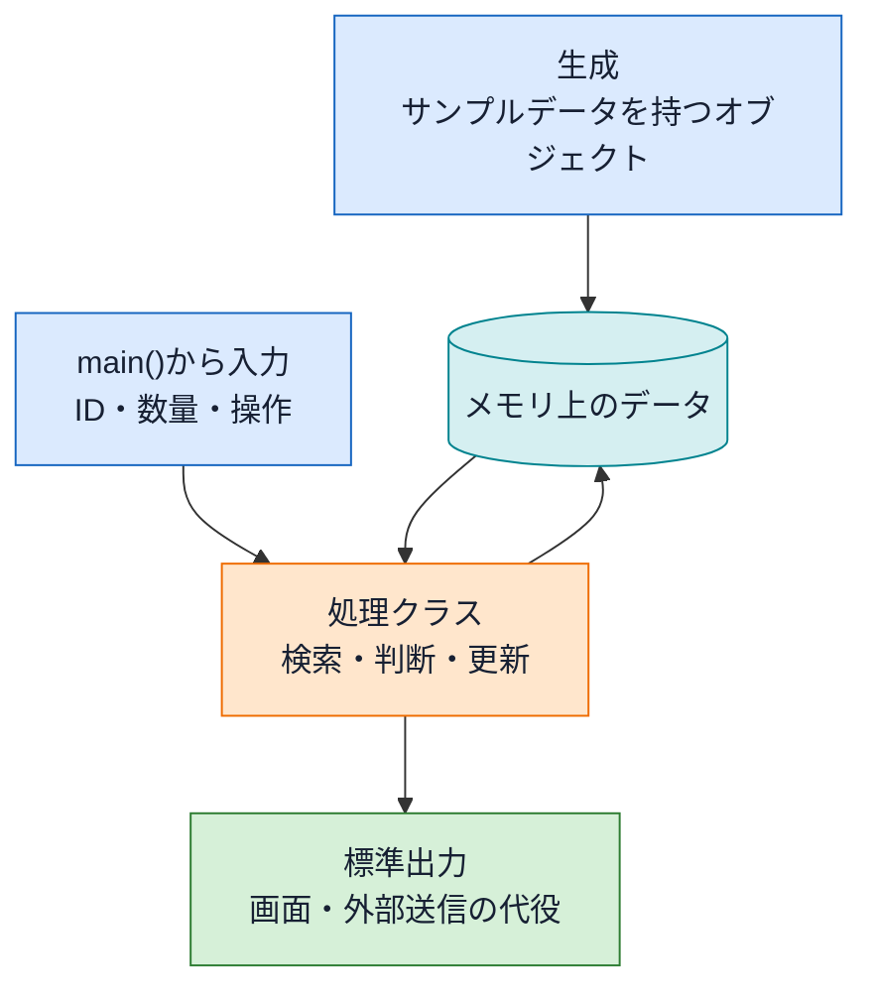

プログラムを終了すると、メモリ上の追加・更新データは消えます。また、標準出力に「メール送信」「PDF出力」と表示されても、実際のメールやファイルは作られません。本書では、永続化や通信の実装を省き、**変更要求によってクラスの責任と依存がどう動くか**へ焦点を合わせます。

### 掲載コードを手元で動かす

各章の掲載コードは、そのまま手元で動かせます。読むだけでなく実行してみると、変更要求で何が起きるかを自分の目で確かめられます。

1. 章のコード（フェーズ1の現状コード、またはフェーズ7の最終コード）を1つの `.cpp` ファイルに貼り付けます。
2. C++14を指定してコンパイルします（例：`g++ -std=c++14 chapter01.cpp -o app`）。
3. macOS・Linuxでは `./app`、Windows PowerShellでは `.\app.exe` を実行します。C++14を使える環境なら `clang++` でも構いません。
4. `main()` は自由に組み替えて構いません。`save()` でメモリ上のデータを足し、そのIDで処理を呼べば、追加した値が実行結果へ表れます。

**掲載コードを1つの `.cpp` にまとめているのは、手元ですぐ動かせるようにするためです。** 実務でこう書くという意味ではありません。実際にはクラスごとに `.h` と `.cpp` へ分けます。**どう分けるかも設計判断の一つ**なので、各章の完成コードのあとに、その章の構造ならどのファイル構成になるかを表で示します。読んでいる途中で「これを1ファイルに書くのか」と気になった場合は、その表で実務上の分け方を確認できます。

どこが実物でどこが代役かは、3か所で分かります。**代表の実行を見た直後に、置き換えた境界の一覧**があります。変更依頼で新しい境界が増えるときは、その依頼を読むところで**増える分の一覧**が続きます。そして個々の出力については、**その出力が出た場所**で「これは代役です」と書いてあります。

なぜ削るのかというと、永続化も外部通信もエラー処理も入れると、コードが長くなって**構造の話が見えなくなる**からです。この本で追いたいのは「変更が来たときにどこを直すことになるか」なので、そこに関係しない部分は落としています。

### 図の差分色：新規と変更

この本の中心にあるのは、**変更が来たときに既存コードのどこへ手を入れることになるか**です。新しいクラスを1つ足して終わるのと、動いている3クラスを修正するのとでは、かかる手間も壊す危険もまったく違います。図では、そこを**文字ラベルと色の両方**で分けます。

| 図中の文字 | 見え方 | 意味 |
|---|---|---|
| `［新規］`／`<<new>>` | **淡い青の面と細い青灰色の枠** | 今回新しく作るもの |
| `［変更］`／`<<changed>>` | **淡い黄の面と少し太い茶色の枠** | もとからあって、開いて直すもの。フロー図では箱の中に変更内容も示す |
| 差分ラベルなし | 色なし | 触らないもの |

次の見本では、色と文字が同じ意味を示します。左は開いて直す既存コード、中央は新しく作るコード、右は今回触らないコードです。

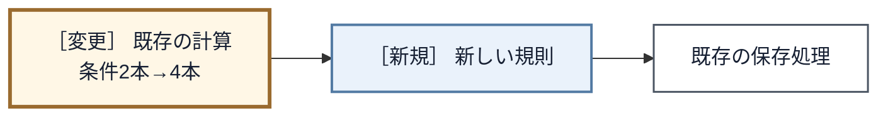

`［変更］` は変更箇所を示す目印であって、それだけでは変更内容を表しません。フロー図と変更影響グラフでは、同じ箱に変更内容も書きます。数や方法が変わるものは「条件2本→4本」のように`変更前→変更後`で書き、項目が加わるものは、変更後の全項目を並べて、加わった項目へ「（追加）」を付けます。たとえば、変更前の構造では既存の複数箱に変更が広がり、完成後の構造では新規の箱へ差分が閉じる、という形で図が変わります。**変更の箱が減っていれば、既存コードの修正箇所が減ったということです。** 端末や印刷で色が分かりにくくても、文字と枠で差分を読めます。

図の**形**（四角・ひし形・平行四辺形）は、そのノードの役割（処理・判定・入力）を表します。形と色は別のことを言っているので、色が付いていても役割は形から読み取れます。

システム内部の処理フローでは、形に加えて次の淡い色も補助的に使います。**色だけを覚える必要はなく、形とノード内の文言が正本です。** クラス図や変更影響グラフでは、この役割色ではなく、前表の「新規／変更」の差分色を使います。

| 処理フローの色 | 補助的に示す役割 |
|---|---|
| 淡い青 | 入力 |
| 淡い水色 | 保存データ・保持値 |
| 淡いオレンジ | 処理・加工 |
| 淡い黄色 | 判定 |
| 淡い緑 | 正常な出力・結果 |

次の見本は、対象IDを受け取り、保存データから対象レコードを取得し、値を更新して、条件を満たしたら結果を出す流れです。平行四辺形は入力・出力、円柱は保存データ、四角は処理、ひし形は判定を表します。

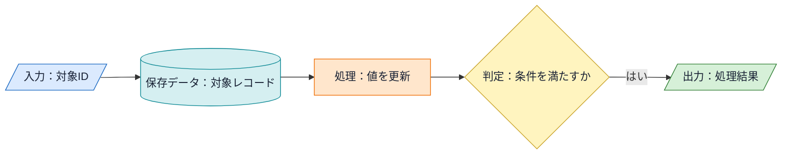

ここで示した差分色、処理フローの形と役割色、後述するクラス図の線種は、全章で共通です。各実践章では凡例を繰り返さず、その図で特に見る箱・線・番号だけを説明します。

コードでも、変更前と変更後を並べる場面では、**変更後の側で前と変わった行に青い帯**を敷いてあります。行末の `// ← 追加` `// ← 変更` は、その帯が何なのかを言葉で補うものです。帯の無い行は、変更前のままです。

### 7つのフェーズ

各章は、次の7つのフェーズを上から下へ進みます。矢印の言葉は、前のフェーズで確定し、次の判断へ渡すものです。

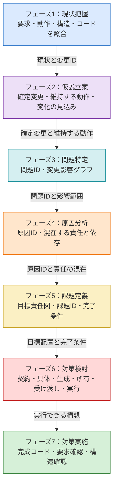

前のフェーズの結論を、次のフェーズで言い換えるだけではありません。問題IDは観測した影響を原因へつなぎ、原因IDは責任の目標配置へつなぎ、課題IDと完了条件は完成コードの合否判定へつなぎます。

ここで「仮説立案」をフェーズ2に置いていますが、仮説を立てる行為がこの場所だけに限られるわけではありません。本書で独立させたのは、仕様変更を構造へ落とす前に、**今後も何が変わる見込みか、今回どこを守るか**を関係者と確定し、設計へ掛けるコストの根拠にするためです。ほかのフェーズの仮説は、そのフェーズ内で観測・検証して確定事項へ変えます。

一つの成果物を、後の判断でも再利用することがあります。フェーズ2からフェーズ3へ渡すのは、今回の確定変更と「今回維持する動作」です。未確定の将来リスクそのものは痛みの根拠にせず、リスクIDの一覧をフェーズ6まで持ち越して採用構造の評価に使います。要求IDも、フェーズ1で確定した後、フェーズ7の受入・回帰確認でもう一度使います。**次へ渡すとは、すべての一覧を直後へ混ぜることではありません。直後の判断に必要な確定事項を渡し、用途が決まっている一覧は意味を変えずに所定のフェーズまで持ち越します。**

また、**7つのフェーズは、同じ説明を7回繰り返すための章立てではありません。** 現状の全体コードはフェーズ1、完成した全体コードはフェーズ7だけに置きます。フェーズ3は変更で手が入る箇所、フェーズ4は原因が見える箇所、フェーズ6は構想を成立させる箇所だけを抜粋します。すでに確定した仕様・表・図・コードは、後のフェーズでは必要な行を参照し、同じ内容を丸ごと再掲しません。

各フェーズの**深さも同じである必要はありません。** 原因が一つで接続点も明白なら、フェーズ4・5は短くて構いません。非同期完了や共有状態まで関係するなら、生成・所有・別の入口を確かめるためにフェーズ6が長くなります。長さをそろえるのではなく、そのフェーズの成果物を次へ渡すのに必要な証拠だけを残します。

どこかで話が飛んでいると感じたら、直前のフェーズの確定事項が足りないか、次のフェーズでそれを実際に使っていない、と考えてみてください。

各フェーズで何を確かめるかは、この後それぞれの節で説明します。

### クラス図の線の意味

本書のクラス図は、クラスの配置と依存の向き（誰が誰を知っているか）を示します。使う線は6種類だけです。

ここからは、3種類ずつ **クラス図と読み方を一組** にして確認します。線の横の番号と、図の直後にある表の番号が対応します。クラス名は、線の意味が分かるように付けた仮の名前です。

**継承・契約の実装・所有**

次のクラス図では、**上下の関係**（継承と実装）と、**持つ関係**を見ます。

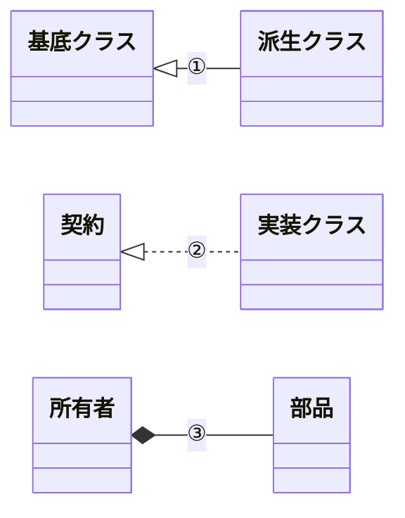

直前のクラス図の①〜③は、次のように読みます。図の番号と同じ行を見てください。

| 番号と関係 | 読み方 | コードで確かめること |
|---|---|---|
| ① 継承 | 派生側が基底側の実装を受け継ぐ | 派生側の `: public` と基底側の共通実装 |
| ② 契約の実装 | 実装側が契約の操作を実現する | 契約側の純粋仮想関数と実装側の `override` |
| ③ 所有 | ひし形側が部品を値で持つ | 部品が値メンバーで所有者と寿命を共にすること |

**集約・継続的な利用・一時的な利用**

次のクラス図では、**まとめる関係**と、2種類の**使う関係**を見ます。

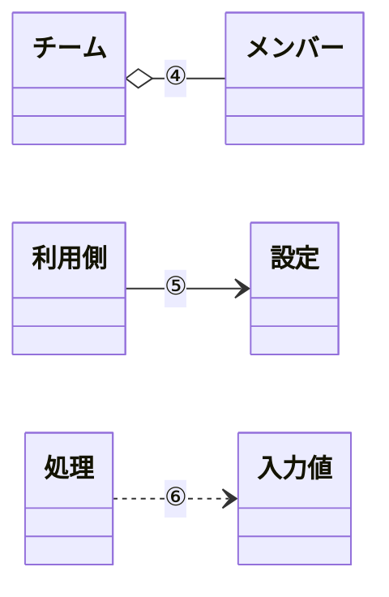

直前のクラス図の④〜⑥は、次のように読みます。ここでは、相手を所有するかではなく、どれだけ長く関係するかを見ます。

| 番号と関係 | 読み方 | コードで確かめること |
|---|---|---|
| ④ 集約 | ひし形側が独立して存在できる相手をまとめる | 借りた実体の集まりを保持し寿命は支配しないこと |
| ⑤ 継続的な利用 | 矢印側が相手を借りて使い続ける | 参照やポインタをメンバーとして保持すること |
| ⑥ 一時的な利用 | 矢印側が操作の間だけ相手を使う | 引数・戻り値・ローカル変数だけに型が現れること |

見分けるポイントは2つだけです。**線が実線か点線か**と、**線の先端が何か**（白抜きの三角・黒いひし形・白いひし形・矢印）です。この2つの組み合わせのうち、本書で使うのは6種類です。

この凡例で確認するのは、クラス図の線が表す関係です。各章の実際のクラス名や所有関係は、それぞれの課題から構造を導く場面で初めて現れます。

⑤と⑥の違いは、**メンバーに持つかどうか**です。持っていれば実線（⑤）、その場で受け取るだけなら点線（⑥）になります。

③と⑤は、どちらも実線なので紛らわしいところです。**先端がひし形なら持っている側、矢印なら借りているだけ**、と読み分けてください。

線の形とコードが食い違っていたら、図かコードのどちらかが誤りです。値で持っているなら黒ひし形、借りているだけなら矢印になります。

ここからは、各フェーズで**何を考え、何を確かめるか**を説明します。案件によって使える資料や残す成果物は変わります。共通にするのは書類の形式ではなく、前のフェーズで確かめた事実を使って判断し、その判断を次へ渡す考え方です。

## 🔵 フェーズ1：現状把握 ―― 仕様を整理し、システムと紐付ける

**このフェーズで考えること：要求、実際の動作、構造、コードが、同じ現状システムを説明しているか。**

> **確認ポイント**
> - 何を入力すると、どんな判断・状態変化・結果が起きるかを具体例で説明できるか
> - 現行要求が、動作とコードのどこで実現されているかを追えるか
> - 今回の変更依頼を、現状の一部と混ぜず「何がどう変わるか」という差として言えるか

現状把握では、一つの資料だけを唯一の根拠にしません。次の図の四つの入口を、同じ動作へ重ねます。

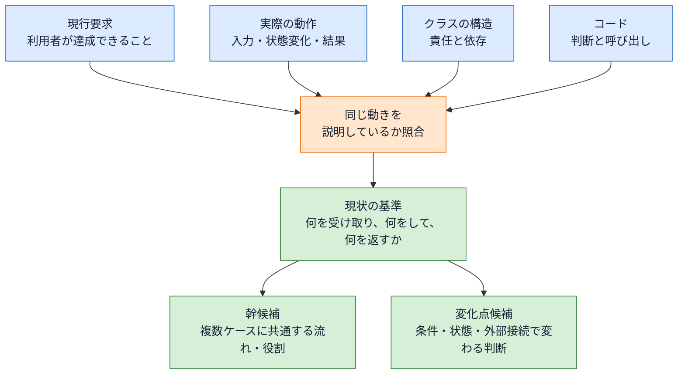

食い違いがあれば、そこで止めて確認します。`if` 文だけを読んでも区別の理由は分からず、仕様だけを読んでも実際にどこが動くかは分からないからです。小さな `main()` と実行結果は動作像をつかむ入口であり、それだけを現状把握の唯一の根拠にはしません。

要求は、内部の状態名やクラス構成ではなく、**利用者が何を達成でき、失敗時に何を失わずに済むか**で書きます。状態遷移や戻り値の型は、その要求を実現する設計または受入確認の手段です。手段を要求として固定すると、同じ価値をもっと安く安全に届けられる案まで除外してしまいます。

もう1つ、代表実行で見えたクラス名は**操作の入口を示す仮のラベルとしてだけ**読みます。詳細な責任は仕様を読み終えてから確認します。先にクラス名へ責任を決めつけると、仕様を「そのクラスがやること」として読んでしまい、構造を疑う目が働かなくなるためです。仕様は仕様として、いったんコードから切り離して読みます。

**エラーは、正常系を見た後で分けます。** 正常に進む流れを1本つかんでから「どこで止まるか」を確かめます。最初から成功と失敗を混ぜると、どちらが本筋か分からなくなります。

**変更依頼は、現状を押さえた後で読みます。** 順番が逆だと、変更依頼に引きずられて現状を「変えるべきもの」として見てしまいます。先に現状を押さえておけば、変更依頼は**差**として読めます。この差が、そのままフェーズ3で当てる対象になり、変わらなかった部分はフェーズ7で「守れたもの」として確認できます。

要求、動作、構造、コードを重ねると、複数のケースに共通する流れや役割と、特定の条件・状態・外部接続で変わる判断が見えてきます。前者を**幹候補**、後者を**変化点候補**としてメモします。分離の要否は、フェーズ3の影響とフェーズ4の原因を根拠に、フェーズ5で確定します。

本書のコードには、関数の役割や掲載上の省略を短いコメントで添えます。これは、別の関数設計書を置かない本書で、仕様とコードの対応を追いやすくするためです。**実務で全関数へコメントを書くべき、という規則ではありません。** コードを読めば分かる処理をコメントで言い換えるだけなら二重管理になり、コードだけ変わったときに古い説明が読者を誤らせます。実務では、理由・制約・意図など、コードだけでは分からないことを優先して残します。

このフェーズを終えたとき、次を自分の言葉で言えていれば十分です。

- このシステムは何を受け取り、何をして、何を返すのか
- どのクラスが何を担っているのか
- 今回、何を変えてほしいと言われているのか

## 🟣 フェーズ2：仮説立案 ―― 何が変わるかを観察し、ヒアリングで裏付ける

**このフェーズで考えること：今回確実に変えることと、今後変わる見込みを分け、設計へかけるコストの根拠を持てるか。**

> **確認ポイント**
> - 今回の確定変更と、将来変わりそうだという仮説を混ぜていないか
> - 変化の見込みを、関係者の判断・変更履歴・運用上の事実で裏付けられるか
> - 今回の変更から守る現行動作を、変更を試す前に言えているか

> [!NOTE] フェーズ2では「責務の混在」を断定しない
> ここで決めるのは「どの仕様に変更の見込みがあり、今回どの動作を維持するか」の見立てです。どの責任を分離し、どんな境界を作るかは、変更要求を当てたときの痛みと原因を確認した後、フェーズ5で課題として定めます。

フェーズ1の候補を、次の図のように事実で確かめます。

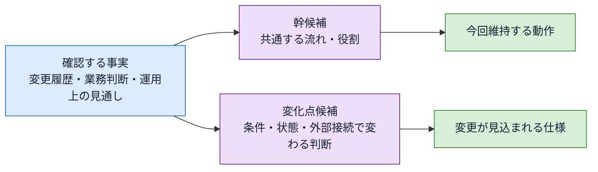

幹は永久に変わらない部分ではありません。今回の変更と確認できた見通しに対して維持する部分です。見通しが変われば、幹候補と変化点候補も見直します。

**ここで立てる仮説は、「この先どこが変わりそうか」の1つだけです。**

「どこが悪いか」の仮説ではありません。悪いところを探すのはフェーズ3以降で、しかも推測ではなく観測で行います。ここでやるのは、**将来の変更の当たりを付ける**ことだけです。

**変更の見当だけなら、具体的な変更依頼が届く前にも付けられます。** ここで述べているのはフェーズ2の仮説立案であり、現状のないまま7つのフェーズをすべて実行できるという意味ではありません。既存システムなら変更履歴や運用上の要望、新規設計なら業務知識や関係者への確認から、「価格の施策は繰り返し見直される」といった変化のきっかけを探します。依頼前に備える場合も、まだ起きていない変更は仮説として扱います。

**場所ではなく、変わるきっかけを見ます。** 「この関数は長いから変わりそう」ではなく、「価格の施策が変われば、この判定が変わる」と考えます。行数や `if` の数ではなく、**何が起きたときに手を入れることになるか**が判断材料です。

**なぜ見当が先に要るのか。** 設計にどこまで手をかけるかは、この先の変更回数で決まります。もう変更が来ないなら、凝った構造を入れるコストは見合いません。何度も来るなら、その都度あちこちを書き換える痛みが積み上がります。**どちらかを決めないと、投資の量が決められません。**

見当は見当のままにせず、**確かめます。** 業務を決める人に「これは今後も変わりますか」と聞くのがいちばん早い方法です。

**確かめる相手がいないときもあります。** その場合は `git log` などの変更履歴が代わりの証言になります。同じ場所が何度も直されていれば、そこはまた変わります。

このフェーズの最後に、次の2つを分けます。

| 区分 | 判断すること |
|---|---|
| 変更が見込まれる仕様 | 今回の確定変更に加え、ヒアリングで今後も変わると裏付けられた仕様 |
| 今回維持する動作 | 今回の変更依頼には含まれず、変更前と同じ結果・順序・失敗時動作を保つもの |

**この2つを先に分けておくのは、次のフェーズで「痛み」と呼べるものを、変更を当てる前に決めておくためです。** 変更を当てたあとで「ここも直すことになった、これも痛みだ」と言い始めると、どこまでも痛みにできてしまいます。**維持すると先に宣言した動作まで修正・確認が広がったときだけ**を痛みとします。

**「今回維持する動作」は「将来も変わらない」という意味ではありません。** 今回の変更では動作を変えない、というだけです。コードを触るかどうかは、フェーズ3で変更を試して観測します。

見当が外れることもあります。外れたら、そのとき直せばよいと私は考えています。大事なのは、**何を根拠にそう考えたかを残しておくこと**です。根拠が残っていれば、外れた理由も分かります。

> **三つの問いへの準備：** ここで確定する「変更が見込まれる仕様／今回維持する動作」は、問い1「同じ場所に、別々の理由で変わるものがないか」を考える材料です。分離する場所は変更の痛みと原因を確定したあと、フェーズ5で導きます。

## 🟣 フェーズ3：問題特定 ―― 変更の痛みを発見する

**このフェーズで考えること：確定した変更を現状構造へ当てると、依頼にない修正や再確認がどこまで広がるか。**

> **確認ポイント**
> - 変更依頼が直接求めた修正と、同じ場所にあるため巻き込まれた修正・確認を分けたか
> - 推測ではなく、呼び出し経路や小さな仮実装で実際の影響を確かめたか
> - 変更箇所だけでなく、守る動作の再テスト範囲まで記録したか

**設計の問題は、コードを眺めているだけでは見えません。**

きれいに見えるコードが変更に弱いことも、雑に見えるコードが平気なこともあります。**変更を通してみて初めて、どこが硬いかが分かります。**

そこでこのフェーズでは、変更IDを**一つずつ追跡します。** そのとき「今回維持する動作」を担うコードまで修正・確認が広がるなら、変更要求とは別の責任を道連れにした痛みとして記録します。複数の変更IDが同じ実行経路で一緒に成立する場合も、どの変更IDがどの修正を生んだかは分けて残します。

> **「追跡する」は「実装する」ではありません。**
>
> ここでやるのは、**「この変更を入れるなら、どこを触ることになるか」を洗い出す**ことです。コードを読み、呼び出し元をたどり、触る場所を数え上げます。**多くの場合、1行も書かずに終わります。**
>
> 手を動かすのは、読むだけでは追いきれないときだけです。そのときも**捨てる前提**で書きます。動かして触った場所を確かめたら、その変更は破棄します。**ここで書いたコードは、そのまま本実装にはしません。**
>
> 実務では、作ってから痛みに気づくと手戻りが大きいので、**作る前にどこが痛むかを見積もります。** 本書が変更を当てたコードまで載せているのは、その見積もりの結果を読者の目に見える形にするためです。実際の現場で毎回この仮実装を書く、という意味ではありません。
>
> 本書では、この追跡の結果を分かりやすくするために、変更を当てたコードを載せています。**「まずコードを書き換えてから考える」という手順ではありません。** 順序は逆で、**触る場所を知るために追跡し、その事実をフェーズ4の原因分析へ渡します。原因を確定してフェーズ5で課題に変換し、フェーズ6で初めて対策構造を組み立てます。**

**大きなシステムでは、全部を追いきれません。** 数百のクラスを端から追うのは現実的ではないので、**変更が最初に届く1点から、影響が止まるところまで**を追います。止まらずに広がり続けるなら、その時点で十分に痛みは観測できています。全部を数え切る必要はありません。

### どうやって「痛み」と判断するのか

**変更依頼が来れば、どこかを直すのは当然です。** 依頼された機能を書くこと自体は痛みではありません。分かれ目は次の一点です。

**「依頼が名指ししたもの以外まで、書き換えるか確認することになっていないか？」**

言い換えると、こうなります。

| 依頼の形 | 痛みではない | 痛み |
|---|---|---|
| 何かを**足す** | 新しいものを、新しい場所へ書く | **すでに動いている既存のものを書き換えた** |
| 何かを**直す** | 名指しされたところを直す | **名指しされていないところまで書き換えた** |
| どちらでも | — | **書き換えていないのに、壊していないかの確認が要った** |

たとえば「配送業者を1社足す」という依頼で、新しい業者の料金計算を新しいクラスへ書くのは当然です。**足しただけなので、痛みではありません。** 一方、その1社を足すために**既存2社の判定の条件と順序まで書き換える**ことになったら、依頼は足すことしか求めていないのに、動いていたものへ手が入りました。**これが痛みです。** 同じ変更で画面表示や保存処理まで読み直すことになった場合も、触っていないのに確認が要ったという意味で痛みです。

**新しいものを新しい場所へ書くだけなら、ファイルやクラスが何本増えても痛みではありません。** 既に動いているものへ手が入った瞬間に、回帰の危険が生まれます。痛みの大きさは、その危険の広さです。

変更が直接届く場所と、現在の構造のため巻き込まれた場所を分けます。

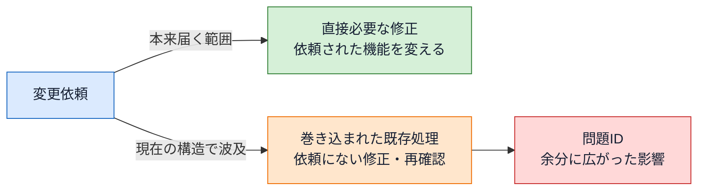

直接必要な修正は問題ではありません。依頼が求めていないのに既存処理へ手が入り、修正や回帰確認が増えた部分が、理想と現状の差です。

前のフェーズで「今回維持する動作」を先に宣言しておくのは、この「依頼が名指ししたもの以外」を、変更を当てる前に確定しておくためです。

変更が今回維持する動作へ影響せず、修正・再確認も局所で済むなら、構造上の痛みは観測されていません。その場合は問題IDを作って分離を正当化せず、**今の構造へ必要な変更だけを入れる**のが結論です。後続フェーズでは「原因なし・構造課題なし」を確認し、フェーズ7で要求の受入と回帰だけを行います。7つの見出しを埋めるために、存在しない問題を作ってはいけません。

痛みは、次のような形で現れます。

| 痛み | コードで観察すること |
|---|---|
| 無関係なコードの同時修正 | 1つの変更で、理由の違う場所まで手を入れることになる |
| 修正箇所の特定しにくさ | 直す場所を探すのに時間がかかる |
| 差し替えの難しさ | 実装を替えるだけなのに、周りも書き換える |
| テスト準備の過大さ | 1か所の確認に、関係ない部品まで必要になる |

**変更を1つも入れなくても、痛みは分かります。** 「もしこの変更が来たら」を追跡するだけで十分です。実際の依頼が来る前に、この追跡をしておくのが本来の姿だと私は考えています。

### 観測した事実だけを書く

痛みとして書くのは、**実際に追跡して確かめた修正箇所・波及範囲・再テスト範囲だけ**です。仮定の機能を足して痛みを大きく見せません。「たぶんここも直すことになる」は、追跡していないなら書きません。

洗い出した箇所は、最後に1枚の図へまとめます。本書ではこれを**変更影響グラフ**と呼びます。変更要求を起点に、触ることになった場所と、そこからさらに触ることになった先を矢印でつないだものです。

**箱はクラスの中の仕事、枠はクラス、矢印のラベルは依頼が動かすもの**です。今回書き換えた箱には色を付け、書き換えなかった箱は白のまま同じ枠の中へ並べます。

**クラス図ではなく、この形にしています。** 理由は二つです。クラス図の箱は1クラスで1つなので、**1つのメソッドの中に別々のものが同居している**という、本書がいちばん見せたい状態が消えてしまいます。もう一つは、クラス図には変更依頼を置く場所がないことです。どの依頼がどの仕事へ届いたかは、この本では矢印によって読み取ります。

この図は、次の三つの見方で読みます。

1. **一つの枠の中に、違うものを見ている箱が2つ以上並んでいないか。** 片方だけを書き換えても、もう片方まで読み直すことになります。**矢印の本数ではありません。** 同じ箱へ2本届いているだけなら、同居は起きていません。
2. **一つの依頼から、複数の枠へ矢印が伸びていないか。** その依頼に専用の置き場所がまだありません。
3. **点線（回帰確認）が伸びていないか。** 変えていないのに確認が要るところです。

**ただし、三つとも「候補」までです。** 同居していても、その仕事が今後変わらないなら痛みは起きません。確定はフェーズ4で行います。

**同じ変更を完成した構造へ当て直したとき、この図がどう縮むか**が、フェーズ7で「何を手に入れたか」を測るものさしになります。

このフェーズの出口は、「変更を1つ当てると、どの修正・確認・再テストが増えるのか」を、**感想ではなく観察結果として**言えるところです。

---

## 🟠 フェーズ4：原因分析 ―― なぜ辛いのかを構造で言語化する

**このフェーズで考えること：観測した影響の広がりは、どの責任の混在や依存によって生まれたのか。**

> **確認ポイント**
> - 変更影響グラフで番号を付けた場所が、何を見て何を決めているかをコードで説明できるか
> - 同じクラスに、異なる情報・時点・依頼元で変わる責任が同居していないか
> - 問題IDごとに「この原因があるから、この巻き込みが起きた」と因果を言えるか

フェーズ3では、変更で実際に手が入った範囲を問題として確定しました。ここでは、**なぜそこまで広がったのか**を調べます。調べる対象は、変更影響グラフで**色の付いた箱を含むクラス**です。

やることは一つです。**接続情報を行にして、それを見て動く場所を並べます。**

接続情報とは、そのクラスが外とやり取りするものです。コードの3か所に書いてあります。変更影響グラフの矢印ラベルが、そのまま行になります。

| 見るところ | 何が読めるか |
|---|---|
| 公開する操作と引数 | 外から何を受け取るか |
| 戻り値 | 外へ何を返すか |
| 保持するメンバー（呼ぶ相手を含む） | 中に何を持ち、外の誰を呼ぶか |

一つの関数の中でも、**前半と後半が違う引数を見ている**ことがあります。そこが分け目です。見ているものが違えば、変更は別々の日に別々の依頼として届きます。

次の図では、別の変更理由を持つ二つの仕事が、同じクラスにあります。片方だけが変わっても、同じ枠のもう片方まで読み直す形です。

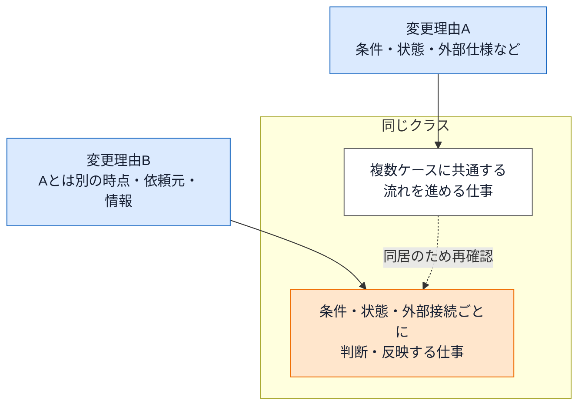

実践章では二つの仕事を、コードから読んだ題材固有の責任名へ置き換えます。別の情報を見て別の理由で変わる仕事が同居し、その配置が問題IDの巻き込みを生んだとき、責任の混在を原因として確定します。

**修正箇所が2つ以上あること自体は、問題ではありません。** 一つの仕事のためだけに用意された場所が並んでいるだけなら、それは分かれている形です。問題は、**違うものを見ている仕事が、同じクラスに同居しているとき**です。片方を直すために、もう片方まで読み直すことになります。

本書でいう**責任**は、**同じ接続情報を見て一緒に変わる仕事の束**です。フィールドやメソッド、今回増えた作業の数には合わせません。**表の行が、そのまま責任になります。** 「方針」「管理」「処理」だけで終わる名前にはしません。何を対象に、何を判断・計算・保持・選択・更新するのかが読める名前にします。

痛みの理由は、たいてい次のどれかです。

| 原因 | コードで見える状態 |
|---|---|
| 混在 | 変わる理由が違う処理が、同じクラスやメソッドにある |
| 直接依存 | 呼び出し側が、具体クラス名や生成方法まで知っている |
| 前提の漏れ | 本来閉じるべき判断や順序が、呼び出し側へ出ている |

### 原因を確定する

フェーズ3で問題箇所と変更影響は確定しています。ここでは、変更影響グラフで色が付いたクラスについて、関係するコードが**何を見て、何をしているか**を並べます。同じ接続情報を見て一緒に変わる処理を一つの責任としてまとめ、対象と動作が分かる短い責任名を付けます。

次に、直接変わった責任と、同じクラスにあるため巻き込まれた責任を分けます。二つが別の情報・時点・依頼元で変わり、その同居によって問題IDの修正・再確認が広がったなら、その配置を原因IDとして確定します。

複数の責任があるだけでは原因ではありません。今回の変更で影響していない同居は記録にとどめます。原因として確定した責任は、同じクラスの枠へ置いた**対策前責任図**にします。この図が、フェーズ5で配置を変える比較元です。

> **問い1：同じ場所に、別々の理由で変わるものがないか**
>
> 「ある」なら、どの責任がどの理由で変わるのかを原因として書きます。問題と原因は1対1とは限りません。

## 🟡 フェーズ5：課題定義 ―― 原因から課題を検討して確定する

**このフェーズで考えること：原因をなくすには、責任をどう置き直し、境界で何を受け渡せばよいか。**

> **確認ポイント**
> - フェーズ4と同じ責任名で、混在をなくした目標配置を図にできるか
> - 分けた両側が必要とする依頼・入力・結果だけを接続点として言えるか
> - 完了条件を、完成コードと実行結果で合否判定できる文にしたか

原因は「なぜ問題が起きたか」です。課題は「どうなれば原因がなくなったと言えるか」です。

たとえば、原因が「呼び出し側が業務ルール固有の条件と計算を持つ」なら、課題は「固有の業務ルールを呼び出し側から分ける」です。完了条件は「呼び出し側に具体的なルール名・条件・計算がない」のように、完成コードで確認できる文にします。

フェーズ4の対策前責任図を、同じ責任名のまま次の配置へ変えます。

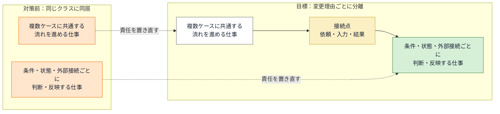

この段階で決めるのはクラス名ではなく、責任の置き場所と、分けた両側が受け渡す情報です。実践章では、対策前と目標の図で題材固有の責任名をそろえます。フェーズ6で同じ図の責任をC++の型と操作へ置き換えます。

### 課題を決める3つの手順

1. **原因をなくす責任配置を決める。** フェーズ4の対策前図と同じ責任名を使い、混在していた仕事を分けた目標図を作ります。一部を関数へ移しただけで具体名や判断が残る配置は、原因が残るため途中案として退けます。打ち手は、その仕事がどう変わるかで決まります。

    | 仕事の変わり方 | 打ち手 |
    |---|---|
    | 種類が増えていく | 差し替えられる形にして外へ出す |
    | 中身だけが入れ替わる | 決める場所を一つに閉じる |
    | 扱う時点が分かれる | 進行状態を持つ場所を作る |
    | 今回も将来も変わらない | いまの場所に残す |

2. **分けた実体が複数になるなら、どれを使うかを決める。** 仕事を外へ出すと、その仕事は複数の実体になります。「どれを使うか」を使う側が持つと、実体が増えるたびに使う側へ手を入れることになり、原因が戻ります。個々の実体が持つと、実体どうしが互いを知ることになり、1つ足すたびに既存へ手が入ります。どちらも避けるには、選ぶ仕事を**第三の場所**へ置きます。全部を使う場合は選ぶ必要がないので、配る仕組みだけを決めます。分けた両側で何を受け渡すかも、ここで決めます。
3. **課題と完了条件を確定する。** 目標図で分ける箇所に番号を付けます。各番号を、解く原因、構造の変更、接続点で渡す情報、コードで確認できる完了条件の順に短い課題カードへまとめます。目標構造は図で確定済みなので、別の文章や表で定義し直しません。

フェーズ5の図には、「料金条件の判定・金額計算」「工程別の操作可否・次工程選択」のような**責任名**を使います。フェーズ6では、その責任配置をクラス／インターフェース名、具体クラス名、操作名、生成場所へ順に変換します。

接続点では、分けた両側の動作をつなぐ業務上の依頼・入力・結果／反映を決めます。フェーズ6では同じ情報を選び直さず、C++の型、操作、引数、戻り値へ翻訳します。翻訳中に過不足が見つかった場合は、フェーズ5の課題カードへ戻って修正します。

課題の数を、変更IDやメソッドの数へ合わせてはいけません。一つの業務上の理由で一緒に変わるものは、一つの責任として扱います。

原因をすべて解く構造が一つなら、案の比較は不要です。異なる完成構造が複数ある場合だけ比較します。

---

## 🔴 フェーズ6：対策検討 ―― 構想を一つのコード経路へ変える

**このフェーズで考えること：目標の責任配置を、契約から具体の実行まで途切れないコード構造へ変えられるか。**

> **確認ポイント**
> - フェーズ5で決めた接続を、増減させずC++の型・操作へ翻訳したか
> - 具体を誰が生成・所有し、必要なら登録・選択して利用側へ渡すかを決めたか
> - 利用側が具体名や生成方法を知らず、契約から実行できるか

フェーズ6では、課題として確定した責任配置と接続を、実行できるC++の構造へ変えます。

このフェーズでいちばん伝えたいのは、**契約を作っただけでは再結合できず、コードは動かない**ということです。

境界の両側が守る契約を決めたら、その契約を満たす具体を用意します。次に、構成を知ってよい場所で、必要な具体を生成・所有し、利用側へ渡します。利用側は受け取った契約だけを呼び、具体の種類や生成方法を知らずに実行します。本書が各章で追う関係は、**契約を決める → 具体が契約を満たす → 実体を組み立てて渡す → 利用側が契約から実行する**です。

これはプログラムの実行時刻を一列に固定する規則ではありません。Strategyでは起動時に複数の具体を生成・登録し、注文時に一つを選びます。Stateでは生成済みの状態を保持し、遷移元が次状態を渡します。Observerでは登録済みの具体を一つに選ばず、全件を実行します。**設計を説明する順序と、実行時に選択・生成・受け渡しが起きる順序を分けて書きます。**

この一列を途切れさせないため、次の関係を**一つの構造として**決めます。これを本書では「構想」と呼びます。

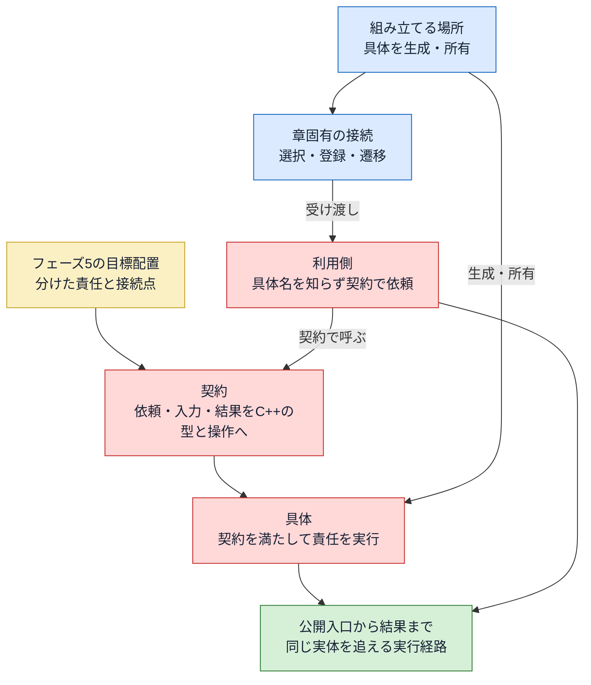

この図は説明項目の関係を示し、実行時刻を固定する図ではありません。各章では、同じ実体を追いながら、契約と具体、生成と所有、章固有の接続、受け渡し、公開入口からの実行を確定します。

実践章では、フェーズ5の目標責任図を同じ形のままC++のクラス名へ置き換え、責任名とクラス名の対応を最初に示します。その対応を出発点に、契約、具体、生成・所有、受け渡し、実行の順で判断理由と部分コードを示します。

構想を書いたら、契約、具体、生成・所有、受け渡し、実行を、同じ実体を追えるコードでつなぎます。全部のクラスを再掲する必要はありませんが、**異なる条件を持つ具体を一つで代表させてはいけません。** 同期と非同期、値を持つ状態と持たない状態など、契約の成立条件が異なるものはそれぞれ確認します。省いた具体についても、確認済みのものと同じ理由で契約を満たすと言える根拠を記載します。

契約から実行までがつながったら、構想を短い文章で確定します。完了したかどうかは、フェーズ7でフェーズ5の条件を一つずつコードや実行結果へ照合します。あわせて、フェーズ2で挙げた将来リスクについて、**この構想なら何を守れて、何が守れないか**を書きます。守れない部分があること自体は問題ではありません。分かっていて選んだのか、気づかずに選んだのかが違います。

> **問い2と問い3を使う：** まず「境界では、何を約束すれば足りるか」を問い、フェーズ5で確定した入力・結果をC++の型と操作へ翻訳します。次に「実体を、誰が作り、持ち、渡すのか」を問い、生成から公開入口での実行までをつなぎます。問い3は継承を禁じる規則ではありません。固定したいものと差し替えたいものに応じて、契約実装・実装継承・コンポジションを選び分けます。

このフェーズの出口は、「なぜこの構想なら課題を解けるのか」「生成から実行まで、どこも途切れていないか」を説明できるところです。

---

## 🟢 フェーズ7：対策実施 ―― 変化に強いコードを完成させる

**このフェーズで考えること：完成コードは要求を満たし、既存動作を守り、構造上の原因も取り除けたか。**

> **確認ポイント**
> - 変更後の全要求と、変更されなかった既存要求をコードと実行結果で確認したか
> - フェーズ5の完了条件を、一項目ずつ証拠と照合したか
> - 同じ変更を再び当てたときの影響範囲と、増えた構造コストの両方を説明できるか

実装して動いたら終わり、とはしません。次の図の三方向を、別々の根拠で確かめます。

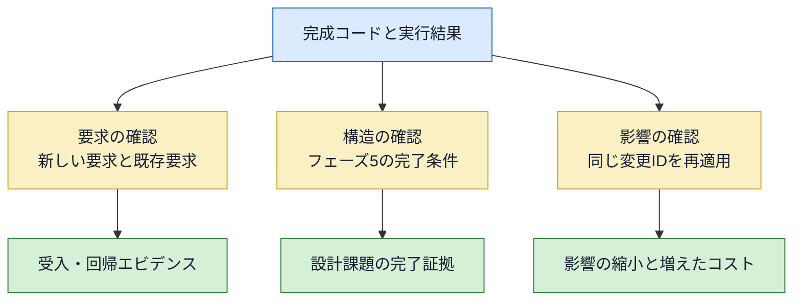

要求だけを見ると、動くが次の変更でも同じ場所が痛む設計を見逃します。構造だけを見ると、きれいに分けた裏で既存動作を落とすデグレを見逃します。要求IDごとの受入・回帰と、完了条件ごとの構造確認を分けて残します。

そして、**何を諦めたかも書きます。** たとえば「中心の処理へ条件分岐を増やさずに済む代わりに、クラス数と登録処理が増える」。これはこの本で扱う構造に共通して現れるトレードオフです。得たものだけを書くと、次に同じ判断をするとき、コストの側を思い出せません。

最後に、**今回の変更依頼をもう一度当ててみます。** フェーズ3では現状の構造へ当てて痛みを観測しました。完成構造では、今回追加した機能だけがまだ無い状態を基準に置き、同じ変更IDを加えるならどの既存部品へ手を入れ、どの新規部品を足すかを数えます。別の将来変更へ置き換えず、今回の変更に必要な部品を省きません。同じ要求・同じ粒度で比べて初めて、修正範囲がどう変わったかを説明できます。この比較が、構造変更で得られた効果を最も直接に示します。

実行結果を載せるときは、結果の名前だけでなく**数値の動き**まで出します。「更新に成功しました」ではなく「対象ID：値 8 → 3（上限 5）」のように、対象・変更前・変更後・基準を並べます。前者は書いてあることを信じるしかありませんが、後者はその場で検算できます。エラーの場合も同じで、失敗したときに値が変わっていないことまで見せます。

> [!NOTE] コラム：実装の小手先と、設計の「分け方」の違い
> 引数の追加や小さな条件分岐で十分に解決できる変更もあります。一方、同じ種類の変更で条件分岐や影響確認が増え続けるなら、実装上の対処だけでなく、責任の境界を引き直す設計を検討します。変更規模に対して過不足のない対策を選ぶことが大切です。

### 決断し、変化に強い設計を手に入れる

設計の判断は、コードを書いて終わりではありません。
「何を得て、何を諦めたか」を言語化できると、同じ問題に次に直面したとき、
また同じフェーズを踏まなくても自分の判断基準として使い回せます。

このフェーズの出口は、「改善後、どこを触ればよくなり、どこを触らずに済むのか」「代わりにどんなコストを受け入れたのか」を説明できるところです。

---

### 既存システムの変更と、新規設計への転用

7フェーズを一続きで使える主な場面は、すでに動いているシステムの変更です。新規設計では、現状コードも実際の変更影響もないため、同じ根拠では進められません。

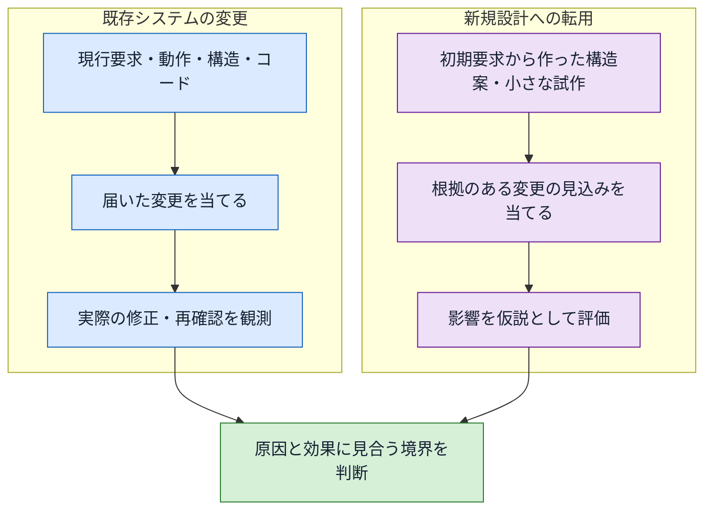

既存システムでは、変更による影響を観測事実として扱えます。新規設計では、業務知識、変更履歴に似た実績、関係者の見通しで裏付けた変更だけを構造案へ当て、結果を仮説として扱います。あらゆる可能性を先回りして分離せず、変更の可能性と影響が、増える構造コストに見合う場合だけ境界を作ります。

---

## 第0章のまとめ ―― 設計判断の根拠を追う地図

この章で持ち帰っていただきたいのは、パターン名の一覧ではありません。変更が届いたとき、現状の仕様とコードへ実際に当て、痛みを観測し、原因から課題を確定して、境界の契約、具体の実現、生成・所有、受け渡し、実行を一つの構想へまとめ、要点コードで成立を確かめるという流れです。

迷ったときは、この章前半の「7つのフェーズ」の図へ戻り、直前の矢印に書かれた確定事項がそろっているかを確認してください。

設計に絶対の正解はありません。本書の7フェーズも、唯一の構造を自動的に導く公式ではなく、私が設計を考えるときの一つの進め方です。それでも、どの事実から何を判断し、どんなコストと引き換えにその構造を選んだかは説明できます。続く各章では、題材の違うコードにこの地図を当て、それぞれの前提から一つの設計案を組み立てる過程を確かめます。
