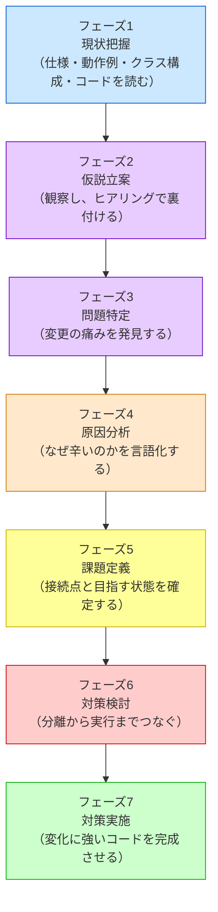
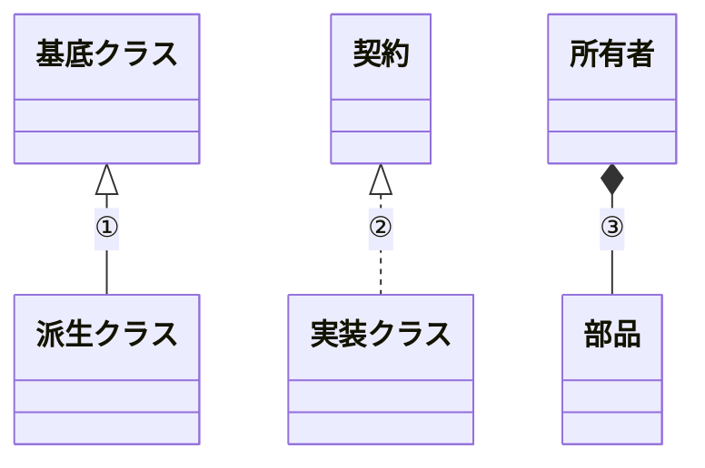
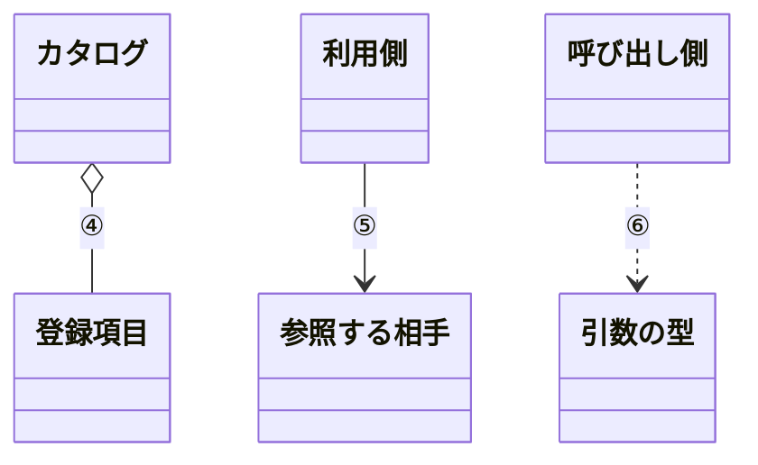

# 第0章 設計判断の地図
―― 3つの構造を貫く7つのフェーズ

---

## 私がたどり着いた「7つのフェーズ」

> [!TIP] この章の読み方
> この章は全7フェーズの詳細な説明書です。最初から通読してもよいですが、**各フェーズの冒頭にある「目的」「入力」「成果物」だけ読んで先の章へ進み、疑問が出たときに戻ってくる**という使い方が馴染みやすいかもしれません。「このフェーズで何を受け取り、何に変えているんだろう？」と感じたら、この章の該当セクションが手がかりになります。

**このプロセスを「いつ」使うのか**

この思考プロセスは一般的な問題解決の進め方に沿って設計の思考を進めます。仕様変更を起点として動き、**「すでに稼働しているシステムに、新たな仕様変更や機能追加の要望が来たとき」** に発動するプロセスです。特に、以下のような状況で威力を発揮します。

- 既存システムをあまり把握していない人が、安全に変更を加えるアプローチを探るとき
- 熟練の担当者が、複雑化した課題を改めて整理し直し、設計の妥当性を検証するとき

設計書やコードをただ眺めるのではなく、次の順で進めます。

> 1. 現状を把握する
> 2. 仮説を立てる
> 3. 問題を特定する
> 4. 原因を突き止める
> 5. 課題を定義する
> 6. 対策を考える
> 7. 実装する

この順で進めると、一段ごとに前の段の出力を確かめられるため、変更の影響を見ながら先へ進めます。

設計に悩み、何度も失敗を繰り返す中で、私は「きれいなコードを書く」ことよりも「変更要求に対してどう思考するか」というプロセスこそが重要だと気づきました。
試行錯誤の末にたどり着いたのが、以下の7つのフェーズに沿って考えるというアプローチです。

各章は、このフェーズを1つの問題に対して一貫して適用します。
ここで、各フェーズが何を受け取り、何を次へ渡すのかを押さえます。各章の見出しには同じ色の絵文字が使われているので、「今どのフェーズにいるか」が一目でわかる仕組みになっています。

> [!IMPORTANT] 本質は「ビジネスの課題解決プロセス」と同じ
> 以下の7フェーズはプログラミング特有の魔法ではありません。たとえば店舗の売上が落ちたときも、まず現状を整理し、変わりそうな要因の仮説を立て、どこで問題が起きているかを確かめ、原因を特定し、解くべき課題を定めてから対策を選びます。ソフトウェア設計も、**現状把握 ⇒ 仮説立案 ⇒ 問題特定 ⇒ 原因分析 ⇒ 課題定義 ⇒ 対策検討 ⇒ 実施**という同じ論理で進められます。
> 現状を把握せずに原因を見誤ったり、原因を特定せずに対策（構造）を打ったりすると、期待する効果が得られないのはビジネス課題も設計課題も同じです。本質がずれたまま進めないよう、この工程を一つずつ踏んでいくことが何より重要です。

### 本書の番号の読み方

本文を読むときの主役は、あくまで**7つのフェーズ**です。
各章は、フェーズ1からフェーズ7までを同じ順序で進みます。

本書で繰り返し使う番号は、英字の略語ではなく日本語で役割を示します。「何を管理する番号か」を、表記だけで見分けられるようにするためです。

**番号には、短い名前を添えます。**

> 変更ID1（サマーセール追加）

番号だけだと、10ページ先で出てきたときに「変更ID1って何の話だったか」と戻ることになります。そこで、**その場で中身を思い出せるように、括弧で短い名前を付けています。** 名前は正式な定義ではなく、思い出すための手がかりです。正式な内容は、その番号を確定した節に書いてあります。

番号のほうを残しているのは、**追跡のためです。** 「要求ID3の受入結果はどこか」「課題ID2はどのコードで解いたか」を表で突き合わせるとき、名前より番号のほうが取り違えません。

| 表記例 | 意味 | 採番する場所 | 何を追うか |
|---|---|---|---|
| 要求ID1 | システムが満たす要求 | フェーズ1 | 変更前・変更後の要求と最終受入・回帰結果 |
| 変更ID1 | 今回届いた変更依頼 | フェーズ1 | 変更内容、変更後要求、変更影響 |
| リスクID1 | 将来変わる可能性 | フェーズ2 | 設計時の考慮と、将来の主な変更先 |
| 問題ID1 | 変更を試して観測した痛み | フェーズ3 | どの変更IDで、どこが修正・再テストの起点になるか |
| 原因ID1 | 痛みを生む構造上の原因 | フェーズ4 | どの問題IDが、何が同じ責任へ集まって起きるか |
| 課題ID1 | 構造として解く設計課題 | フェーズ5 | 完了条件、構造差分、コード、改善結果 |

追跡に使う番号は、この6つだけです。フェーズ1で要求IDと変更IDを付け、フェーズ2でリスクID、フェーズ3で問題ID、フェーズ4で原因ID、フェーズ5で課題IDを付けます。各フェーズは自分が付けた番号の一覧で締め、それが次のフェーズの入力になります。

番号の意味は、**それぞれのフェーズを説明するところで改めて書きます。** ここでは「6種類あって、どのフェーズで付くか」だけ掴んでおけば十分です。

覚えておいてほしいのは、次の1本の線です。

1. **変更ID** ―― 今回届いた変更依頼
2. **変更を試す** ―― その依頼を現状のコードへ当ててみる
3. **問題ID** ―― 当ててみて観測した痛み
4. **原因ID** ―― その痛みを生んでいる構造上の理由
5. **課題ID** ―― 解くべき境界

課題IDは、この線からだけ導きます。要求IDと課題IDを直接つなぐことはしません。要求を小さな変更で満たせて課題が生じないこともあれば、1つの変更試行から複数の課題が見つかることもあるからです。

---

### 掲載コードを手元で動かす

各章の掲載コードは、そのまま手元で動かせます。読むだけでなく実行してみると、変更要求で何が起きるかを自分の目で確かめられます。

1. 章のコード（フェーズ1の現状コード、またはフェーズ7の最終コード）を1つの `.cpp` ファイルに貼り付けます。
2. コンパイルして実行します（例：`g++ chapter01.cpp -o app && ./app`。C++が使える環境なら `clang++` でも構いません）。
3. `main()` は自由に組み替えて構いません。各章の境界クラス（`〜Database` / `〜Repository` など）は、実行終了まで状態を覚えるインメモリの保存です。`save()` で新しいデータ（顧客・口座・イベント・メニュー・承認者など）を足し、その値で処理を呼べば、追加したデータの結果がその場の出力に表れます。

**掲載コードは、本物のシステムではありません。** データベースも外部APIも画面もなく、標準出力へ文字を出しているだけです。プログラムを終了すれば、`save()` したデータも消えます。

ですから、たとえば `cout` で「PDF出力完了」と表示していても、**PDFファイルはできていません。** 実物ができるのは、標準出力に出た文字だけです。

紛らわしくならないよう、各章ではコードの直前に「実システムでは何をするところか」「掲載コードでは何で代えているか」を書いています。章末の「手元で動かすには」にも、実際に自分の目で確認できることだけを書いています。

なぜ削るのかというと、永続化も外部通信もエラー処理も入れると、コードが長くなって**構造の話が見えなくなる**からです。この本で追いたいのは「変更が来たときにどこを直すことになるか」なので、そこに関係しない部分は落としています。

### 7つのフェーズ

各章は、次の7つのフェーズを同じ順で進みます。



前のフェーズの出力が、次のフェーズの入力になります。どこかで話が飛んでいると感じたら、その前のフェーズの出力が足りていない、と考えてみてください。

各フェーズで何を確かめるかは、この後それぞれの節で説明します。

### クラス図の線の意味

本書のクラス図は、クラスの配置と依存の向き（誰が誰を知っているか）を示します。使う線は6種類だけです。

**まず、実物を見てください。** 線の横に付いた①〜⑥が、このあとの一覧の番号と対応しています。クラス名は、線の意味が分かるように付けた仮の名前です。

最初の3種類は、**上下の関係**（継承と実装）と、**持つ関係**です。



残りの3種類は、**まとめる関係**と、**使う関係**です。



見分けるポイントは2つだけです。**線が実線か点線か**と、**線の先端が何か**（白抜きの三角・黒いひし形・白いひし形・矢印）です。この2つの組み合わせで6種類になります。

**①　実線＋白抜き三角**

- **意味**：継承。派生クラスが、共通実装を持つ基底クラスを `public` 継承する
- **使う場面**：共通実装を受け継ぎ、一部を上書きするとき

**②　点線＋白抜き三角**

- **意味**：契約の実装。具象クラスが、純粋仮想関数だけを持つ契約を `public` 継承して実装する
- **使う場面**：呼び出し側を共通契約だけに依存させるとき

**③　実線＋黒ひし形**

- **意味**：合成・強い所有。ひし形側が部品を値や所有ポインタで持ち、部品の寿命を管理する
- **使う場面**：所有者が消えたら部品も消える関係を示すとき

**④　実線＋白ひし形**

- **意味**：共有集約。ひし形側が「全体」、反対側が共有できる「部分」。部分は全体から独立して存在できる
- **使う場面**：カタログと登録項目など、業務上の全体・部分関係を示すとき

**⑤　実線＋矢印**

- **意味**：関連・継続的な利用。一方が他方をメンバーなどから継続して参照する
- **使う場面**：所有しない借用参照を含め、「知っていて利用する」ことを示すとき

**⑥　点線＋矢印**

- **意味**：一時的な依存。引数、戻り値、ローカル変数など、その操作中だけ型を使う
- **使う場面**：保持せず、一時的に受け渡す型を示すとき

③と⑤は、どちらも実線なので紛らわしいところです。**先端がひし形なら持っている側、矢印なら借りているだけ**、と読み分けてください。

線の形とコードが食い違っていたら、図かコードのどちらかが誤りです。値で持っているなら黒ひし形、借りているだけなら矢印になります。

### 変更影響グラフの読み方（全章共通の規約）

各章のフェーズ3とフェーズ7に、変更影響グラフを置きます。1つの変更要求が、どこまで届いたかを1枚で見る図です。矢印の向きは「影響が伝わる向き」で、上が起点、下が届いた先です。

箱の書き方は3種類あり、種類ごとに形を変えています。

| 箱 | 書き方 | 意味 |
|---|---|---|
| 起点 | `変更要求：〇〇` | 今回当てた変更要求。図の一番上に1つか2つ置く |
| 届いた先 | `クラス名`＋改行＋`（何が変わるか）` | その変更で実際に手を入れるクラスと、変わる中身 |
| 届かなかった先 | `クラス名 ✅` | 同じ変更を当てても触らずに済むもの。改善後のグラフで使う |
| 再テスト | `テスト`＋改行＋`（何を確かめるか）` | コードの修正には出ないが、変更のたびに走らせ直すもの |

フェーズ3のグラフは「今の構造だと、どこまで広がるか」を示します。フェーズ7のグラフは**同じ変更要求を、改善後の構造へもう一度当てた結果**です。2枚を見比べると、矢印がどこで止まるようになったかが分かります。矢印の本数が減っていなくても、届いた先が「新しく足すクラス1つ」に変われば、それが構造改善の成果です。

---

## 🔵 フェーズ1：現状把握 ―― 仕様を整理し、システムと紐付ける

**目的：仕様・動作例・クラス構成をそろえ、後続フェーズで同じ対象を追える土台を作ること**

> **入力：** 題材システム、現行要求、代表動作、登場クラス、変更前コード、今回の変更依頼
> **成果物：** 現行・変更後要求ベースライン、仕様構造、動作例、責任一覧、変更ID

### このフェーズの考え方

**コードより先に、システムを読みます。**

いきなり実装から入ると、`if` 文の中身を追うだけで終わってしまい、「なぜこの分岐があるのか」に戻れなくなります。そこで各章では、次の順で読みます。

1. **誰がこのシステムを使い、外と何をやり取りするのか**（システム全体図）
2. **入力が、どの加工を通って、どの出力になるのか**（システム内部図）
3. **どんなクラスがあり、それぞれ何を担っているのか**（クラス一覧と構成図）
4. **実際のコード**
5. **今回届いた変更依頼**

1と2ではクラス名を出しません。仕様を理解する前にクラス構造を推測してしまうからです。

**エラーの話は、正常系を見た後で分けます。** 正常に進む流れを1本つかんでから、「どこで止まるか」を別の表で確認します。最初から成功と失敗を混ぜると、どちらが本筋か分からなくなります。

**変更依頼は、このフェーズの最後に読みます。** 現状を先に押さえてから変更を見ることで、「何が変わって、何が変わらないのか」を差として捉えられます。変更前後で同じままの部分は、フェーズ7で「守れたもの」として確認します。

このフェーズを終えたとき、次を自分の言葉で言えていれば十分です。

- このシステムは何を受け取り、何をして、何を返すのか
- どのクラスが何を担っているのか
- 今回、何を変えてほしいと言われているのか

## 🟣 フェーズ2：仮説立案 ―― 何が変わるかを観察し、ヒアリングで裏付ける

**目的：仕様とシステムの現状から「何が変わりそうで、今回どこを維持するか」の仮説を立て、ヒアリングで裏付けること**

> **入力：** フェーズ1の仕様・クラス・コードの事実、変更ID、関係者情報
> **成果物：** 確定変更、リスクID付き将来リスク、変わる側、当面守る部分

> [!NOTE] フェーズ2では「責務の混在」を断定しない
> ここで決めるのは「どの仕様に変更の見込みがあり、今回どこを維持するか」の見立てです。責務の配置は、変更要求を当てたときの痛みと合わせてフェーズ3・4で確認します。

### このフェーズの考え方

フェーズ1で読んだ事実から、**「この先どこが変わりそうか」を見当づけます。** ただし、見当は見当のままにしません。関係者に確かめて、確定させます。

**場所ではなく、変わるきっかけを見ます。** 「この関数は長いから変わりそう」ではなく、「価格の施策が変われば、この判定が変わる」と考えます。行数や `if` の数ではなく、**何が起きたときに手を入れることになるか**が判断材料です。

**なぜ見当が先に要るのか。** 設計にどこまで手をかけるかは、この先の変更回数で決まります。もう変更が来ないなら、凝った構造を入れるコストは見合いません。何度も来るなら、その都度あちこちを書き換える痛みが積み上がります。**どちらかを決めないと、投資の量が決められません。**

**確かめる相手がいないときもあります。** その場合は `git log` などの変更履歴が代わりの証言になります。同じ場所が何度も直されていれば、そこはまた変わります。

このフェーズの最後に、次の2つを分けます。

- **変わる側**：この先も変わる見込みがあり、差し替えられるようにしておきたい部分
- **守る側**：今回は変えない部分

**「守る側」は「将来も変わらない」という意味ではありません。** 今回の変更では触らない、というだけです。ここを混同すると、必要のない場所まで作り込むことになります。

見当が外れることもあります。外れたら、そのとき直せばよいと私は考えています。大事なのは、**何を根拠にそう考えたかを残しておくこと**です。根拠が残っていれば、外れた理由も分かります。

> **原則との関係**：ここで分けた「変わる側／守る側」が、そのまま**原則1（変わるものを分けて囲う）**の
> 「変わるもの」にあたります。原則1は「分けろ」と言っているだけで、**何が変わるのかは教えてくれません。**
> それを決めるのがこのフェーズです。

## 🟣 フェーズ3：問題特定 ―― 変更の痛みを発見する

**目的：変更を試みた際に発生する「無関係なコードまで修正が必要になる」という痛みを具体的に発見すること**

> **入力：** フェーズ1で確定した変更IDと、変更要求を当てる前のコード
> **成果物：** 変更IDごとの修正箇所・確認範囲・再テスト範囲と、観測した痛みの問題ID一覧

### 変更シミュレーション ―― どこが辛いかを確認する

ここでは、フェーズ1で明文化し、フェーズ2で裏付けた変更要求を現在のコードへ当て、実際に変更を試みます。

設計の問題は、コードを静的に眺めているだけでは気づきにくいものです。
「変更要求が来たとき、どこに手が入るか」を実際にシミュレートしてみると、
問題の輪郭がリアルに見えてきます。

フェーズ2で裏付けた変更要求を、今のコードに加えようとします。
加えようとすると、何が起きるかを追います。

- どのファイルを開くことになるか
- 変更の影響がどこまで波及するか
- 変えたくないはずのコードに触れることになるか

これが「痛み」の例です。無関係なコードの同時修正だけでなく、修正箇所を特定しにくい、差し替えや組み合わせが難しい、テストの準備が過大になる、といった変更時の具体的な困難もここで記録します。

たとえば「ある業務ルールの条件値を変更する」という変更要求が来たとします。これは個別ルールという機能種類の変更です。しかし実際に変更しようとすると、個別ルールのコードだけでなく、主処理の関数も開かなければならない——「なぜ個別ルールの変更で、主処理の関数を触るのだろう？」という違和感が生まれたなら、それが問題の所在を示す観察結果です。なぜそうなるかは、次のフェーズで分析します。

**置換・拡張のやりづらさも、ここで発見する**

「この実装を別のものに差し替えたい」と思ったとき差し替えられないなら、それが問題です。
「新しいケースを追加したい」と思ったとき既存コードを大量に書き換える必要があるなら、それも問題です。
フェーズ4では、この痛みの根本にある「分けるべき場所」を特定します。

**フェーズ3の末尾：今回観測した痛みを確定する**

3-3（痛みの言語化）の問題文は、今回の確定要求を現状コードへ当てて実際に観測した修正箇所、波及範囲、再テスト範囲だけから書きます。仮定の機能を追加して痛みを大きく見せず、フェーズ3のコードと変更影響グラフで確認できた事実だけを根拠にします。

このフェーズの出口は、「変更要求を当てると、どの修正・確認・再テストが増えるのか」を、単なる感想ではなく観察結果として言えるところです。

---

## 🟠 フェーズ4：原因分析 ―― なぜ辛いのかを構造で言語化する

**目的：発見した痛みの根本にある「変わる理由の混在」という構造的な原因を言語化すること**

> **入力：** フェーズ3の問題ID、変更途中コード、変更影響グラフ
> **成果物：** 痛みを生んだ混在・依存・漏れた前提を示す原因ID一覧

### このフェーズの考え方

フェーズ3で「どこが痛むか」は分かりました。ここで問うのは、**なぜそこが痛むのか**です。

痛みの理由は、たいてい次のどれかです。

- **混在**：変わる理由が違うものが、同じクラスや同じメソッドに一緒に置かれている
- **直接依存**：呼び出し側が、相手の具体クラス名や生成方法まで知っている
- **前提の漏れ**：本来あるクラスに閉じているべき判断や順序が、呼び出し側へにじみ出ている

見つけ方は1つの問いです。**「この塊の中に、独立して変わる部分があるか？」**

たとえば「割引の判定」と「合計金額の計算」が同じメソッドにあるとします。割引の施策が変わっても合計の出し方は変わりません。逆も同じです。**別々の理由で変わるなら、それは独立した2つ**です。

**分ける場所が見つかると、次に見るものが決まります。** 分けた両側は、どこかで情報を受け渡すことになります。その受け渡し口が**接続点**です。フェーズ5では、この接続点をどう決めるかを扱います。

このフェーズでは、**まだ対策を決めません。** 「インターフェースを作る」「クラスを分ける」といった話はフェーズ6です。ここで書くのは「なぜ痛むのか」だけです。原因を飛ばして対策へ行くと、後で「なぜこの構造なのか」を説明できなくなります。

> **原則との関係**：ここで挙げた3つの理由は、**原則1と原則2を裏側から見たもの**です。
> 「混在」は原則1（変わるものを分けて囲う）が守られていない状態、「直接依存」は
> 原則2（具体ではなく契約に向かって書く）が守られていない状態です。
> つまり原因分析とは、**どの原則から外れているかを言い当てる作業**でもあります。

## 🟡 フェーズ5：課題定義 ―― 原因から課題を検討して確定する

**目的：フェーズ4の原因から課題候補を導き、システム全体で統合・分割・除外を判断したうえで、解くべき接続点と完了状態を確定すること**

> **入力：** フェーズ4で確定した原因ID、問題IDまでの根拠、接続点候補、制約
> **成果物：** 候補の評価、課題ID付き接続点表、課題ごとの完了条件、システム全体の完了状態

### このフェーズの考え方

フェーズ4で「なぜ痛むのか」は分かりました。それでも、そのまま対策には進めません。**原因と課題は、別のものだから**です。

- **原因**は、なぜ痛むかの説明です。「判定と計算が同じメソッドに混ざっている」
- **課題**は、何をどこまで変えれば解けたと言えるかの宣言です。「判定と計算を、価格計算の流れから外に出す。外に出せたと言えるのは、価格計算が個別の条件式を1つも知らなくなったとき」

原因のまま対策へ行くと、**「どこまでやれば終わりか」が決まらないまま**コードを書き始めることになります。途中で「ここも直すべきか」と迷い、たいてい直しすぎるか、足りないかのどちらかになります。

そこで、このフェーズでは3つを順に決めます。

**1つ目は、候補を出すことです。** 原因ごとに「何を変えれば痛みが減るか」を書きます。このとき書くのは**変えるべき構造**であって、解決手段の名前ではありません。「Strategyパターンを使う」は候補ではなく、答えの先取りです。

**2つ目は、候補を整理することです。** 候補を1つずつ独立した課題にすると、同じ原因を二重に解いたり、片方だけ解いて痛みを残したりします。そこで、候補を並べて次の5つを問います。

1. **必要性**：解かなければ、フェーズ3で見た影響が残るか
2. **重複**：別の候補と、同じ責任・同じ接続点を扱っていないか
3. **独立性**：別々の理由・タイミングで変わるので、分けて追うべきか
4. **網羅性**：残した候補を全部解けば、原因は解消するか
5. **完了状態**：何がどうなれば、解けたと判断できるか

**3つ目は、解く接続点を決めることです。** 残った候補に課題IDを付け、接続点ごとに「何が流れるか」「どちらが変わる側か」「どちらが守る側か」「どうなれば完了か」を書きます。

このうち、いちばん効くのは**完了条件**だと私は考えています。完了条件がないと、フェーズ6で構想を作っても「これで良い」と言える根拠がありません。逆に完了条件が書けているなら、構想が正しいかどうかは、その条件を満たすかどうかで判定できます。

なお、**要求と課題は別々に追います。** 要求は「頼まれたことが全部できているか」、課題は「構造の痛みが消えたか」を見るものです。片方をもう片方に合わせて増減させると、どちらの確認も甘くなります。

> **原則との関係**：課題定義は、**原則1（変わるものを分けて囲う）の「どこで分けるか」を決める作業**です。
> フェーズ4で見つけた「変わる理由の境界」を、実際に線を引ける場所として言い直したものが課題です。
> ここではまだ、線の向こう側をどんな形にするか（原則2の契約）は決めません。

このフェーズの出口は、「どの原因からどんな候補が出たか」「なぜ統合・分割・除外したか」「全部解くとシステム全体がどうなるか」を説明できるところです。

---

## 🔴 フェーズ6：対策検討 ―― 構想を一つのコード経路へ変える

**目的：フェーズ5で確定した全課題を、一つの実行可能な構想へまとめ、その構想を成立させる要点コードを続けて確認すること**

> **入力：** フェーズ5の課題ID付き接続点表、完了条件、システム全体の到達状態
> **成果物：** 主要クラスと接続順を示す構想、契約・具体・生成・受け渡し・実行の要点コード、課題と構想の対応、将来リスクの評価

### このフェーズの考え方

ここでようやく、対策の形を決めます。

このフェーズでいちばん伝えたいのは、**契約だけを先に決めることはできない**ということです。

一見、「まずインターフェースを決めて、あとは実装すればいい」と思えます。ですが実際にやってみると、そう進みません。どの具体をどう選ぶかが決まらなければ、**渡す相手が決まりません**。誰が生成して誰が持ち続けるかが決まらなければ、**実行するときにその実体を参照できません**。契約・生成・実行は、互いに相手が決まらないと決まらない関係にあります。

そこで、次の五点を**一度にまとめて**決めます。これを本書では「構想」と呼びます。

| 構想の要点 | 決めること |
|---|---|
| 契約と具体 | 守る処理が呼ぶ最小の操作と、その裏へ移す変更判断 |
| 生成・所有 | 具体を誰がいつ作り、いつまで保持するか |
| 登録・選択 | 複数の具体があるとき、何を基準にどこで選ぶか |
| 受け渡し | 生成済みのどの実体を、どの利用側へ、どの行で渡すか |
| 実行 | 公開入口から契約を通り、選ばれた具体が動いて結果を返すまでの順序 |

構想には、この時点で主要なクラス名・メソッド名・生成場所まで書きます。完成コードを先に見せるためではありません。**五点が同時に成り立つ案かどうかを確かめるため**です。仮の名前なので、次にコードで確かめて成り立たなければ、構想へ戻って直します。

構想を書いたら、そのまま順にコードでつなぎます。契約 → 代表的な具体1つ → 生成・選択・受け渡し → 実行骨格 → 公開入口、の順です。**全部のクラスを並べる必要はありません。** ここで確かめたいのは「この構想で生成から実行までつながるか」だけなので、代表が1つ通れば構想は成立します。残りの具体と全体コードは、フェーズ7で見ます。

最後に、フェーズ5で書いた完了条件へ戻ります。課題ごとに「構想のどの責任・どの接続で解いたか」「なぜ完了条件を満たすと言えるか」を確認します。あわせて、フェーズ2で挙げた将来リスクについて、**この構想なら何を守れて、何が守れないか**を書きます。守れない部分があること自体は問題ではありません。分かっていて選んだのか、気づかずに選んだのかが違います。

> **原則との関係**：契約を決めるところが**原則2（具体ではなく契約に向かって書く）**、
> 具体を外で作って渡すところが**原則3（継承より「持つ」を先に考える）**にあたります。
> ただし原則3は「継承を使うな」ではありません。手順を固定して一部だけ差し替えたいなら、
> 継承を骨格にするほうが素直です。**原則から外れるときに理由を言えるか**が、このフェーズの
> 一番のポイントだと私は考えています。

このフェーズの出口は、「なぜこの構想なら課題を解けるのか」「生成から実行まで、どこも途切れていないか」を説明できるところです。

---

## 🟢 フェーズ7：対策実施 ―― 変化に強いコードを完成させる

**目的：決定した対策をコードとして実装し、今回の確定要求に対する効果を実証すること**

> **入力：** フェーズ6の採用構造、生成・所有・注入規則、変更後要求ベースライン
> **成果物：** 最終コード、全有効要求IDの受入・回帰エビデンス、課題IDの構造結果、変更IDの改善後影響

### このフェーズの考え方

実装して動いたら終わり、とはしません。このフェーズで確かめたいのは、**2つの別々のこと**だからです。

**1つ目は、頼まれたことが全部できているか**です。今回追加した要求だけでなく、**変更のなかった既存の要求も含めて**、1つずつ確認します。設計を組み替えたときに怖いのは、新しい要求を満たした裏で、前からあった動作が静かに落ちていることです。

**2つ目は、構造の痛みが消えたか**です。フェーズ5で書いた完了条件を、実際のコードが満たしているかを見ます。

この2つを**分けて追う**ことに意味があります。1本の表にまとめてしまうと、次の2つを見逃します。

- 要求は満たしたが、設計課題は残っている（動くが、次の変更でまた同じところが痛む）
- 設計課題は解けたが、既存動作を落とした（きれいになったが、動かない）

そして、**何を諦めたかも書きます。** たとえば「中心の処理へ条件分岐を増やさずに済む代わりに、クラス数と登録処理が増える」。これはこの本で扱う構造に共通して現れるトレードオフです。得たものだけを書くと、次に同じ判断をするとき、コストの側を思い出せません。

最後に、**今回の変更依頼をもう一度当ててみます。** フェーズ3では現状の構造へ当てて痛みを観測しました。同じ変更依頼を完成した構造へ当て直すと、修正範囲がどう変わったかを比べられます。「何を手に入れたのか」に、これがいちばん直接答えます。

実行結果を載せるときは、結果の名前だけでなく**数値の動き**まで出します。「在庫更新に成功しました」ではなく「P001：在庫 8 → 3（閾値 5）」です。前者は読者に信じてもらうしかありませんが、後者は読者が自分で検算できます。エラーの場合も同じで、失敗したときに値が変わっていないことまで見せます。

> [!NOTE] コラム：実装の小手先と、設計の「分け方」の違い
> 引数の追加や小さな条件分岐で十分に解決できる変更もあります。一方、同じ種類の変更で条件分岐や影響確認が増え続けるなら、実装上の対処だけでなく、責任の境界を引き直す設計を検討します。変更規模に対して過不足のない対策を選ぶことが大切です。

### 決断し、変化に強い設計を手に入れる

設計の判断は、コードを書いて終わりではありません。
「何を得て、何を諦めたか」を言語化できると、同じ問題に次に直面したとき、
また同じフェーズを踏まなくても自分の判断基準として使い回せます。

このフェーズの出口は、「改善後、どこを触ればよくなり、どこを触らずに済むのか」「代わりにどんなコストを受け入れたのか」を説明できるところです。

---

### 設計構造とデザインパターンの関係

ここまで、あえてパターン名を出さずに、変わる判定／処理／生成判断を分け、接続点に残す約束を小さくする考え方で設計を解説してきました。本書では、課題から導いた責任・依存・接続点の形を**設計構造**と呼びます。その構造が、繰り返し現れる問題と解決の組として既知の名前を持つとき、その共有名が**デザインパターン**です。したがって、パターン名は設計の出発点ではなく、導いた構造の意図を共有するための語彙です。

たとえば、呼び出し元から変化するルールを切り離し、同じ操作で交換できる契約を定めたとします。

- もしその振る舞いが「アルゴリズムやルール」なら、その設計構造は **Strategyパターン（本書ではルール差し替え構造）** と対応します。

- もしその振る舞いが「状態による変化」なら、その設計構造は **Stateパターン（本書では状態分離構造）** と対応します。

- もし一つの変化を登録済みの複数の相手へ伝えるなら、その設計構造は **Observerパターン（本書では通知分離構造）** と対応します。

また、呼び出し元に複雑な変換や調整の手順を知らせないため、境界へ役割を追加したとします。

- その役割が「形を変換する」ものなら、既知の **Adapterパターン** と対応します。

- その役割が「交通整理をする」ものなら、既知の **Mediatorパターン** と対応します。

- その役割が「同じ操作を受け取る代理」なら、既知の **Proxyパターン** と対応します。

これらに共通するのは、接続点に漏れている判断や前提を見つけ、必要な役割へ移すことです。

問題の原因を見極め、「どの判定／処理／生成判断を、どちら側から切り離すか」を言語化する。その結果の設計構造に既知の名前があるなら、対応するデザインパターン名で意図を共有できます。

> [!INFO] この本で扱わない構造名について
> 本書の接続点レビューだけで、GoFの全23パターンを一つの分類体系へ収めようとはしません。
> 本書で扱うルール差し替え構造・状態分離構造・通知分離構造も、それぞれ異なる問題と意図を持つ構造です。
> 構造名を覚えることより、変更要求を接続点へ当て、「どの機能・仕様の知識を持ちすぎているか」「何を移せば変更影響が小さくなるか」を説明できることを本書の目的とします。

この考え方を練習すると、未知の問題でも、変更要求と原因からシステム全体に必要な構造を導きやすくなります。完成構造が複数成立するときは、既知の構造名が差分と意図を共有する語彙になります。以降の章では、この考え方を具体的なコードに適用し、どの判断がどの構造へつながるのかを追体験します。

---

## 今日から始める：自分のコードで7つのフェーズを試す

この本を読み終えたあとに「わかった気がするが、自分のコードでどう使えばいいか」と迷うことがあります。最初の一歩を具体的にするために、5つのステップを用意しました。

**STEP 1：「触るたびに怖い」クラスを1つ選ぶ**
修正のたびに「他が壊れないか不安」「どこを直せばいいかわからない」と感じるクラスが1つあれば、それが出発点です。

**STEP 2：そのクラスの「責任」を1文で書く**
「このクラスは〇〇するクラスだ」と1文で書いてみてください。書けない、または複数の独立した変更理由を列挙しないと説明できない場合は、責任が混在している可能性を調べます。名前を付けにくいことだけで分割を決めるのではなく、実際の変更要求で確かめます。

**STEP 3：実装コードを見て「知りすぎている行」を探す**
STEP 2で書いた責任と関係ない知識（別種類の仕様・別の業務ロジック）を持っている行を見つけてください。その行が「変わる理由が混在している場所」の候補です。

**STEP 4：「どの種類の変更でその行は変わるか」を確認する**
見つけた行について、どの機能・仕様変更で、どのようなきっかけ・頻度で変更されるかを確認します。依頼者が複数でも一つの契約を共同管理している場合があり、依頼者が一人でも独立した複数の仕様を管理している場合があります。担当者名は分かる場合の補助情報として扱い、要求内容・変更契機・頻度・同時に変わる範囲を合わせて判断してください。

**STEP 5：似た構造を扱う章を探す**
STEP 4で見つけた「変わる理由の種類（振る舞いの差し替え？状態の切り替え？生成の隠蔽？）」に近い章を1つ選んで、その章の判断を参考に、自分のコードの分け方を検討してみてください。

> 週1回、1クラス。小さく続けると、「設計を考える」視点を日常のコード確認に組み込みやすくなります。

---

## 第0章のまとめ ―― 答えではなく、根拠を追うための地図

この章で持ち帰っていただきたいのは、パターン名の一覧ではありません。変更が届いたとき、現状の仕様とコードへ実際に当て、痛みを観測し、原因から課題を確定して、契約・具体・生成・選択・受け渡し・実行を一つの構想へまとめ、要点コードで成立を確かめるという流れです。

迷ったときは、次の一列へ戻ってください。

```text
要求を確定する
→ 変更を試して痛みを観測する
→ 痛みを生んだ原因を特定する
→ 解くべき接続点と完了条件を決める
→ 主要クラスと生成から実行までの構想を決める
→ 契約・具体・生成・選択・受け渡し・実行の要点コードをつなぐ
→ コードと結果で要求・課題・変更影響を別々に確かめる
```

設計に絶対の正解はありません。それでも、どの事実から何を判断し、どんなコストと引き換えにその構造を選んだかは説明できます。続く各章では、題材の違うコードにこの地図を当て、同じ問いから異なる構造へたどり着く過程を一緒に確かめていきます。
