# 第1章 変わるものをカプセル化する ―― Strategy パターン

### この章の核心

**場面。** 同じ目的を果たす計算方法が複数あり、条件に応じて選び替える。

**兆候。** 計算方法を1つ増やすたびに、選ぶ側の `if` や、選ぶ側が用意する入力まで直している。**変わる計算を、変わらないはずの手順が抱え込んでいます。**

**判断軸。** 選ぶ側が共通の契約だけを知る形にして、**どの計算を使うかの判断と、その計算の中身を、1か所へ閉じ込められるか。**

---

### この章を読むと得られること

この章で身につけるのは、割引計算の知識ではありません。同じ目的を果たす複数の振る舞いを、どこで分け、どう選び、安定した処理へどう戻すかを構造から考える力です。題材の固有名詞を離れて、次の判断を持ち帰ります。

- **得られること1：変動と安定の切り分け。** 変更要求を現状構造へ当て、差し替わる振る舞いと、それを使い続ける安定した処理を切り分けられるようになる
- **得られること2：変更が広がる原因の特定。** 利用側が具体的な選択条件・処理内容・適用順を知っている依存を見つけ、変更が複数箇所へ広がる理由を説明できるようになる
- **得られること3：契約と再結合の設計。** 複数の振る舞いに共通する入力と結果から最小の契約を定め、具体を分離し、生成・所有・選択・受け渡しによって安定側へ再結合できるようになる
- **得られること4：効果と適用可否の検証。** 振る舞いの追加・差し替えが具体部品と組み立てへ局所化したかを確かめ、単純な分岐のままでよい場合との境界を判断できるようになる

---

## 🔵 フェーズ1：現状把握 ―― 仕様を整理し、システムと紐付ける

> **フェーズ1の確認観点：** 「何を受け取り、何をして、何を返すか」「どのクラスが何を担うか」「今回何を変えるのか」を、仕様→構造→コードの順で確定します。

ECサイトの支払金額計算が何を入力として受け取り、どの処理で加工し、何を出力するのかを整理します。

### 1-1：このシステムの仕様

このシステムは、ECサイトでお客様が商品を購入する際の**支払金額を計算**します。顧客IDと、商品（名前と単価）の一覧と、キャンペーン期間中かどうかを受け取り、顧客IDから会員種別を登録データで引きます。入力を検証して小計を求め、会員種別とキャンペーン条件に合う割引を1つ選んで適用し、小計と最終支払金額を注文結果へまとめて表示します。

#### まず代表入力と実行結果から動きをつかむ

詳細な仕様やコードへ入る前に、現状コードの`main()`でRegular会員の佐藤花子さんがワイヤレスイヤホン（10,000円）を、キャンペーンなし／ありで注文する2ケースを確認します。

**代表入力（この2ケースだけを取り出して組んだ `main()`。現状コード全体は実装コードのところで読みます）：**
```cpp
    // 準備：顧客台帳・表示・注文入口を組み立てる
    CustomerDatabase db;
    CheckoutResultRenderer renderer;
    OrderProcessor processor(db, renderer);
    CampaignContext context;

    // 注文を1件つくる（C002はRegular会員）
    Order order1;
    order1.customerId = "C002";
    order1.items.push_back(Item("ワイヤレスイヤホン", 10000));

    // ケース1：キャンペーンなし
    context.isCampaignActive = false;   // キャンペーンなし
    processor.process(order1, context);
```

ケース1の実行結果です。

```
佐藤 花子 さんの注文: ワイヤレスイヤホン 10000円
  条件: 会員=Regular, キャンペーン=なし
  小計 10000円 → 支払金額 10000円
```

**渡したのは `"C002"` という顧客IDだけなのに、「佐藤 花子」と「Regular」が出ています。** この2つは、準備の1行目で作った顧客台帳（`CustomerDatabase`）の中にあります。**実システムならデータベースの顧客テーブルにある行を、掲載コードではこのクラスが自分の中に持っています。** 今回引いたのは、次の1行です。

| 顧客ID | 氏名 | 会員種別 |
|---|---|---|
| C002 | 佐藤 花子 | Regular |

**この本のコードでは、`〜Database` という名前のクラスが「あらかじめ登録されているデータ」を持ちます。** いま引いたのは、その中の1行です。

**利用者の操作にあたるのは、`processor.process(order1, context)` の1行だけです。** その上の4行は、実システムなら起動時に一度だけ済ませておく組み立てです（顧客台帳につなぎ、表示先を用意し、注文の入口を作る）。この先も、**実行するのは注文1件を渡す1行**で、変わるのは渡す注文と条件だけです。

続けて、同じ注文のキャンペーン条件だけを変えます。

```cpp
    // ケース2：キャンペーンあり
    context.isCampaignActive = true;
    processor.process(order1, context);
```

ケース2の実行結果です。

```
佐藤 花子 さんの注文: ワイヤレスイヤホン 10000円
  条件: 会員=Regular, キャンペーン=あり
  小計 10000円 → 支払金額 9000円
```

ケース2に注目してください。**Regular会員の同じ注文でキャンペーンを有効にすると、支払金額が10,000円から9,000円へ変わります。** 入力条件が割引判定へ渡り、結果へ反映される基本の動きを最初に確認できます。Premium会員の排他条件は、動作例の表と現状コードの別ケースで確認します。

この入力と出力から、(1)顧客・商品・会員条件を受け取り、(2)会員種別とキャンペーンで割引を判定して金額を計算し、(3)小計と支払金額が表示される、という一連の動きが読み取れます。

**この章での簡略化**

実際のECサイトでは、顧客情報はデータベースに保存され、計算結果は画面に表示され、注文は購入フォームから届きます。この章では割引計算の設計に集中するため、次の境界を掲載用の実装へ置き換えます。

| 実システムでの動き | 掲載コードでの表現 | この章で省くもの |
|---|---|---|
| 顧客情報をDBから取得 | `CustomerDatabase` が固定の登録データを返す | DB接続、障害時の復旧 |
| 金額を画面・帳票へ表示 | `CheckoutResultRenderer` が標準出力へ出す | UI、帳票生成 |
| 注文を購入フォームで受け取る | `main()` が `Order` を組み立てる | Web/APIの入力処理 |

省いた処理が存在しないという意味ではありません。**掲載コードのどこが実システムの境界に相当するか**を先に明らかにしたうえで、割引条件と計算式の変更影響だけを追います。

#### 現行要求ベースライン

| 要求ID  | 現行要求                                    | 受入条件                      |
| ----- | --------------------------------------- | ------------------------- |
| 要求ID1（小計から支払金額） | 商品リストの小計から最終支払金額を計算する                   | 3,000円と1,000円の2商品を合算し、小計4,000円を返す   |
| 要求ID2（Premium20%） | Premium会員へ20%割引を適用し、他割引と併用しない           | Premiumの10,000円が8,000円になる |
| 要求ID3（Regularキャンペーン10%） | Regular会員はキャンペーン中だけ10%割引する              | 対象時9,000円、対象外時10,000円になる  |
| 要求ID4（未登録IDを拒否） | 未登録の顧客IDでは注文を受け付けない                         | 登録顧客を取得し、未登録IDは計算を進めない    |
| 要求ID5（購入結果の表示） | 計算結果を注文確定時の購入結果として表示する | 顧客・会員種別・キャンペーン状態・小計・支払金額を表示する |
| 要求ID6（プレビュー） | 注文確定前に同じ条件の支払金額をプレビューする | 同じ顧客ID・商品・キャンペーン条件なら購入結果と同額を返す |

入力として「顧客ID」「商品リスト（各商品の名前と単価）」「キャンペーン期間中フラグ（以後キャンペーンフラグ）」を受け取ります。会員種別（Premium / Regular）は顧客IDから取得します。システムは全商品の小計を算出し、割引ルールを適用した支払金額を、注文確定結果と事前プレビューの二つの入口から返します。

この章の掲載コードと実行例に現れる値を、抜けなく整理します。商品名や金額は入力例ですが、会員種別、キャンペーン状態、現行の割引種別、公開する出力は、現状システムが扱う全種類です。

| 仕様項目 | この章で使う値 | 役割 |
|---|---|---|
| 商品入力 | ワイヤレスイヤホン10,000円、スマホケース3,000円、USBケーブル1,000円 | 掲載する正常系・異常系の入力 |
| 登録顧客 | C001（Premium）、C002・C003（Regular） | 顧客IDから氏名と会員種別を取得する |
| 会員種別 | Premium、Regular | 現行の全会員種別 |
| キャンペーン状態 | 期間中、期間外 | 現行の全状態 |
| 現行の割引 | Premium20%、Regular向けキャンペーン10%、割引なし | 現行の全計算結果 |
| 競合方針 | Premiumは他割引と併用しない | 複数条件が成立したときの優先規則 |
| 公開する出力 | 購入結果、事前プレビュー | 同じ条件で同額になることを確かめる二つの入口 |

ここで確認する対象は、どの入力がどの判定や計算に使われ、最終金額へつながるかです。

**登録済みの顧客**

顧客IDから会員種別を引くため、次の3名があらかじめ登録されています。

| 顧客ID | 氏名 | 会員種別 |
|---|---|---|
| C001 | 田中 一郎 | Premium |
| C002 | 佐藤 花子 | Regular |
| C003 | 鈴木 次郎 | Regular |

未登録の顧客IDを指定すると、会員種別を取得できずエラーになります。

まず、ECサイトの購入機能、支払金額計算、保存済み顧客情報、表示先の境界を確認します。

**システム全体図：ECサイトと支払金額計算の境界**

最も大きな境界は「購入者 → EC購入システム」です。購入機能、金額計算、顧客情報は対象システムの内側にまとめます。次の図は責任の境界を示し、内部の処理順は続くシーケンス図で確認します。

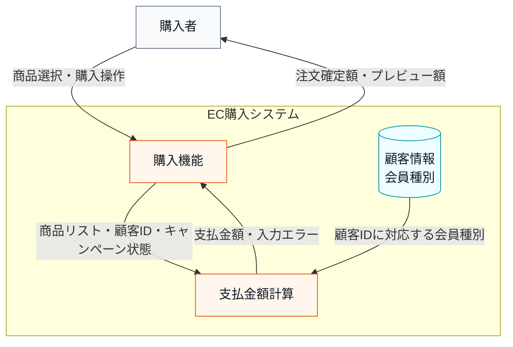

直前のシステム全体図では、支払金額計算を一つのシステムとして見て、どこから入力を受け、どの保存データを参照し、どこへ結果を返すかだけを示しています。

次に計算システムの箱を開き、正常に計算できる場合の入力・判定・加工・出力を整理します。

**次のシステム内部図は、代表となる1件の注文を最後まで通したものです。** 数字は「Premium会員が10,000円の商品を1つ買う」という具体的な1ケースで、他の会員種別やキャンペーンの組み合わせは動作例でまとめて確認します。ここで見てほしいのは**箱の並びと矢印の向き**で、数字はそれを追いやすくするために置いています。

**システム内部図：正常系の入力・判定・加工・出力**
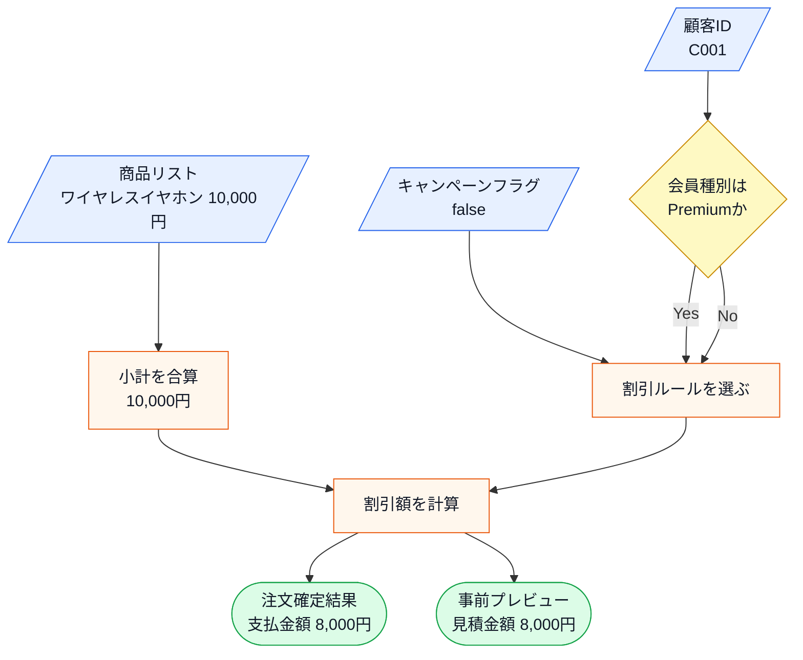

直前のシステム内部図から読み取ることは、次の3点です。

- 支払金額は、商品リストだけでは決まらず、顧客IDから取得する会員種別とキャンペーンフラグによって変わる。
- 加工の中心は、小計の合算ではなく、どの割引ルールを選んで適用するかにある。
- 同じ顧客ID・商品・キャンペーン条件から、注文確定結果と事前プレビューの二つへ同じ支払金額を返す。

直前のシステム内部図で注目するのは、中央の「加工」にある**割引ルールの選択と適用**です。入力された会員種別とキャンペーンフラグから、どの割引をいくら適用するかが決まり、支払金額が出力されます。

この仕様は、次の状態変化として読めます。

| 観点 | 内容 |
|---|---|
| 事前状態 | 顧客ID、商品リスト、キャンペーンフラグが渡されている |
| 加工 | 顧客IDから会員種別を取得し、小計を計算し、割引ルールを適用する |
| 事後状態 | 正常系では支払金額が表示される |

割引ルールは「誰に・いつ・どれだけ還元するか」というビジネス上の決定から生まれます。会員種別による優遇はリピーター獲得施策、キャンペーンは新規顧客向けの期間限定施策と、それぞれ担当チームが異なる目的で設計しています。

**割引ルール一覧**

| ルール名 | 適用条件 | 計算結果 |
|---|---|---|
| プレミアム割引 | 会員種別が Premium | 20%引き |
| キャンペーン割引 | Regularかつキャンペーン期間中 | 10%引き |
| 割引なし | 上記以外 | 定価 |

Premium会員にキャンペーン割引が重ならない理由は、業務上の判断からきています。Premium会員はすでに年会費や利用実績の対価として恒常的な20%引きを受けており、さらにキャンペーン割引を重ねると採算が合わなくなる可能性があるためです。

**優先・排他ルール**

| 条件 | 動作 |
|---|---|
| Premium かつ キャンペーン中 | Premium のみ適用（キャンペーン割引は無効） |

「クーポンと会員割引は併用不可」という注意書きをショッピングサイトで見かけたことはないでしょうか。このシステムの排他ルールは、その「併用不可」ルールと同じ発想です。どちらを優先するかは会社のポリシーによりますが、上位会員の特典を守ることを優先しています。

**割引計算で確認する前提**

現状仕様の時点では、Premium割引とキャンペーン割引は排他であり、1件の注文へ両方を逐次適用しません。ここでは、変更要求を読む前から存在する複雑さだけを整理します。

| 複雑さ | この章での扱い | 設計判断への影響 |
|---|---|---|
| 排他条件 | Premium会員にはキャンペーンを重ねない | どのルールを選ぶかの判定が計算本体にあることを確認する |
| 複数の利用場所 | 注文確定とカートプレビューが同じ計算を使う | ルール変更時に両方の出力が一致するか確認する |
| 顧客情報取得失敗 | 顧客IDから会員種別を取得できない場合はエラーにする | 外部境界の失敗は注文処理で扱い、割引ルール差し替えとは別軸にする |

**この3行は、複雑さの出どころが違います。** 排他条件は割引ルールが増えるたびに動くもの、複数の利用場所は同じ計算を2か所から呼ぶことから来るもの、顧客情報取得失敗は外部境界が失敗しうることから来るものです。**この章で構造を変えて減らすのは、1つ目だけです。** 残る2つは、別の理由で動く複雑さとして分けて扱います。

**この割引計算を使う場所**

| 使用場所 | 用途 |
|---|---|
| 決済計算処理 | 注文確定時の支払金額の確定 |
| カートプレビュー機能 | カート画面の金額プレビュー表示 |

**エラー条件**

正常系の金額計算へ進めない入力は、次のように分けて扱います。

- **登録されていない顧客IDで注文する**と、「登録されていません」と表示して終わります。金額の計算には進みません。
- **商品を1つも入れずに注文する**と、「注文が空です」と表示して終わります。
- **顧客データの取得そのものが失敗した**場合も、エラーを表示して終わります。掲載コードでは起きませんが、実運用のDB・API障害を `try` / `catch` で代替しています。

どのエラーでも、**保存や通知は起きません。** 何も変えずに終わります。

### 1-2：動作例テーブル

仕様を定義したところで、実際にどのような入力に対してどのような結果が返るかを確認します。このテーブルは「このシステムが正しく動いているとはどういう状態か」の基準になります。後で設計の改善（リファクタリング）を段階的に進めるときも、この表に立ち返ります。

| 会員種別    | キャンペーン | 適用ルール             | 小計/支払金額          |
| ------- | ------ | ----------------- | ---------------- |
| Premium | ✗      | プレミアム20%引き        | 10,000円 → 8,000円 |
| Premium | ✓      | プレミアム優先（キャンペーン無効） | 10,000円 → 8,000円 |
| Regular | ✓      | キャンペーン10%引き       | 10,000円 → 9,000円 |
| Regular | ✗      | 割引なし              | 10,000円 → 10,000円 |

この表が、後で構造を変えても守る現行動作です。次は、この仕様を担うクラスの顔ぶれと責任を確認します。

---

### 1-3：登場クラスとクラス構成図

このシステムに登場するクラスと、それぞれがどの仕様を担うかを一覧で押さえます。次に読む現状コードは、この責任分担に沿って並んでいます。

| クラス名 | 役割 | 担当する仕様 |
|---|---|---|
| `Item` | 商品データの保持 | 商品名・単価の元データ |
| `Order` | 注文データの保持 | 顧客IDとカート内商品リスト |
| `CampaignContext` | キャンペーン状態の保持 | キャンペーン有効フラグ |
| `CustomerInfo` | 顧客1件分の情報 | 氏名と会員種別の受け渡し |
| `CustomerDatabase` | 顧客情報の管理 | IDから会員種別・氏名を引く。エラー条件の一次判定 |
| `PaymentCalculator` | 支払金額の計算 | 小計の算出と割引ルールの適用 |
| `CartPreviewService` | カート画面のプレビュー表示 | 顧客IDから会員種別を取得し、計算結果をプレビューとして返す |
| `CheckoutResultRenderer` | 注文確定結果を表示する境界 | 支払金額またはエラーの表示 |
| `OrderProcessor` | 注文処理の統合 | バリデーション・計算・結果表示の一連の流れを担う |

責任を把握したうえで、次の図でクラス同士の依存関係を確認します。注文確定を担う`OrderProcessor`と事前表示を担う`CartPreviewService`は、どちらも`CustomerDatabase`から会員種別を取得し、同じ`PaymentCalculator`へ渡します。これにより、プレビューの呼び出し元が会員種別を顧客IDとは別に指定して食い違うことを防ぎます。

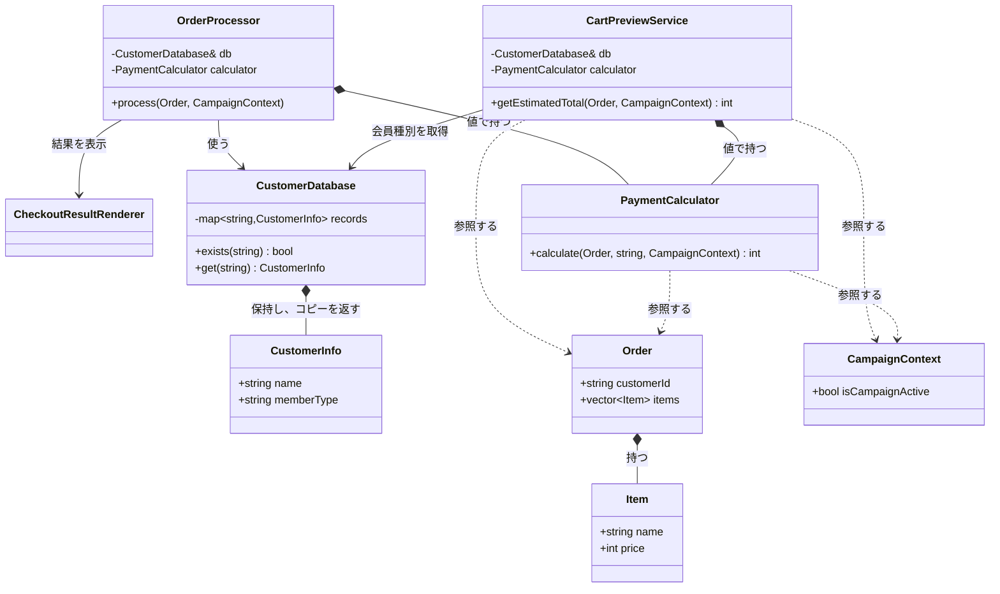

**クラス図に出てくる主なメンバーと操作**

| クラス | メンバー・操作 | 何ができるか |
|---|---|---|
| `CustomerDatabase` | `records` | 顧客IDと顧客情報を保持する |
| `CustomerDatabase` | `exists()` / `get()` | 顧客IDが登録済みか確認し、会員種別を取り出す |
| `OrderProcessor` | `db` / `calculator` | 顧客情報の取得と支払金額計算を呼び出す |
| `PaymentCalculator` | `calculate()` | 注文、会員種別、キャンペーン状態から支払金額を計算する |
| `CartPreviewService` | `db` / `getEstimatedTotal()` | 顧客IDから会員種別を取得し、注文確定前に同じ計算結果を返す |
| `Order` / `Item` / `CampaignContext` | データ項目 | 計算に必要な顧客ID、商品、キャンペーン状態を渡す |


`OrderProcessor`と`CartPreviewService`は別の入口ですが、どちらも注文の`customerId`を`CustomerDatabase`へ渡し、取得した会員種別で同じ`PaymentCalculator`を呼びます。クラス図の全型をコード定義と照合すると、各依存線はメンバー、引数、または呼び出しとして実在し、孤立した型はありません。

**現状システムの処理シーケンス**

クラス図は「誰が誰を持つか」という静的な関係を示します。次のシーケンス図は、正常系（会員種別あり・キャンペーン中）で、注文1件を処理する間に各クラスがどの順で呼ばれ、どの値を受け渡すかを時系列で示します。割引額を決める具体の分岐は `PaymentCalculator` の注記に書き出し、エラー系はメモとして添えます。現状コードを読む前の地図として使ってください。

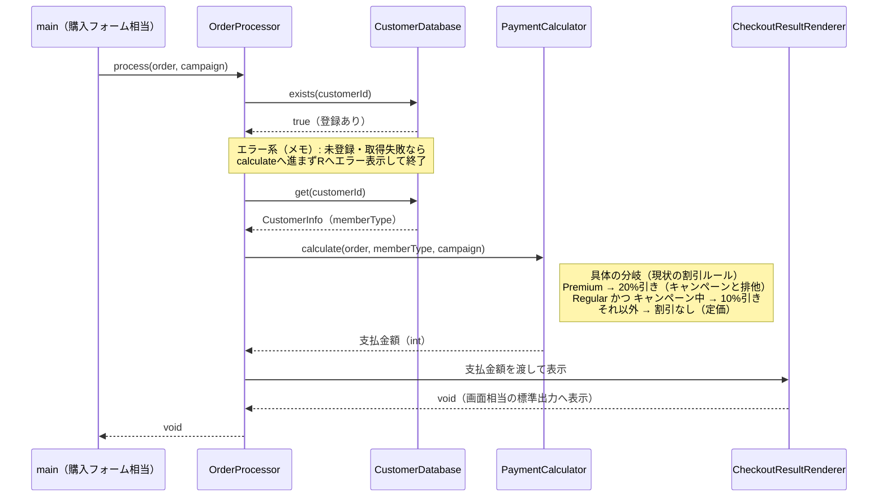

直前の処理シーケンス図からは3つのことが読み取れます。

1つ目は、`OrderProcessor` が「顧客の存在確認 → 顧客情報の取得 → 支払金額の計算 → 結果表示」の順に各クラスを呼ぶことです。

2つ目は、割引額の算出が `PaymentCalculator::calculate()` の**内側**で決まることです。会員種別×キャンペーンの分岐（Premium 20%／Regular×キャンペーン中 10%／それ以外なし）が、このメソッドの中にあります。

3つ目は、顧客の取得に失敗した場合、図のメモのとおり `calculate` へ進まず、エラー表示で終わることです。あわせて、どのクラスがどの値（`memberType`・`int` 金額）を受け渡すかも、この時系列から確認できます。

> [!INFO] コラム：実運用での外部I/O — 失敗・非同期・API呼び出し
>
> 簡略化した外部I/O（顧客DB＝`CustomerDatabase`、結果表示＝`CheckoutResultRenderer`）は、実運用では失敗することがあります。DB接続やAPI呼び出しは、接続失敗・タイムアウト・データ不整合で例外を返しえます。実際には、これらの境界クラスがDBドライバやREST APIの呼び出しになり、本番ではさらにリトライ、タイムアウト、エラー戻り値、ログ記録などを加えます。掲載コードでも、この外部I/Oの失敗をどこで扱うかは現状コードで確認します。
>
> また実運用では、外部I/Oを非同期で実行することが多くあります。非同期にすると、クラス間で受け渡す値の形が変わります。たとえば割引計算が非同期や失敗を伴うなら、`int` をそのまま返すのではなく、結果を後で受け取る形（成否や将来値を含む戻り値）になります。
>
> ただし、これらは「割引ルールをどう差し替えるか」という本章の設計論点を変えません。本章は同期・正常系を中心に据え、外部I/Oの失敗・非同期は実運用での補足として扱います。

---

### 1-4：実装コード（現状）

コードは、クラス構成図で確認した責任の順に、固まりごとに読みます。取得に失敗したときは注文計算を続けず、例外を注文単位のエラーへ変換します。先に、あらかじめ登録されている3件の顧客データを把握しておきます。

| 顧客ID | 氏名 | 会員種別 |
|---|---|---|
| C001 | 田中 一郎 | Premium |
| C002 | 佐藤 花子 | Regular |
| C003 | 鈴木 次郎 | Regular |

どのIDがPremiumでどれがRegularかを覚えておくと、実行結果と仕様の対応を追いやすくなります。

#### 現状コード

クラスを1つずつ、上から順に読みます。メンバー変数と、それを使う処理を同じ場所で確認できるようにしています。`OrderProcessor` は処理順が長いため、最初に保持する相手と公開操作を確認し、その後で `process()` の中を順に追います。

`main()` と実行結果は最後に、動作例ごとに並べます。

---

**共通ヘッダー**

```cpp
#include <iostream>
#include <string>
#include <vector>
#include <map>
#include <stdexcept>
```

以降のすべてのクラスが使います。

---

**Item**

仕様で見た入力「商品リスト」と、それを束ねる注文1件です。

```cpp
class Item {
public:
    std::string name;   // 商品名
    int price;          // 単価（円）
    Item(std::string n, int p) : name(n), price(p) {}
};
```

**Order**

```cpp
class Order {
public:
    std::string customerId;   // 注文した顧客のID
    std::vector<Item> items;  // カートに入っている商品の一覧
};
```

`Item` が商品1件、`Order` が「誰が（`customerId`）」「何を（`items`）」買うかです。**会員種別は `Order` に持たせず、IDから後で引きます。**

---

**CampaignContext**

```cpp
class CampaignContext {
public:
    bool isCampaignActive = false;  // キャンペーン期間中なら true
};
```

仕様で見た入力「キャンペーンフラグ」です。注文とは別に渡すので、同じ注文へ条件を変えて当て直せます。

---

**CustomerInfo**

顧客IDから会員種別を引きます。仕様で見た「会員種別（Premium / Regular）」と、エラー条件「顧客IDが存在しない」を担います。

```cpp
struct CustomerInfo {
    std::string name;        // 顧客の氏名
    std::string memberType;  // "Premium" または "Regular"
};
```

**CustomerDatabase**

```cpp
class CustomerDatabase {
private:
    std::map<std::string, CustomerInfo> records;  // ID→顧客情報
public:
    CustomerDatabase() {
        records["C001"] = {"田中 一郎", "Premium"};
        records["C002"] = {"佐藤 花子", "Regular"};
        records["C003"] = {"鈴木 次郎", "Regular"};
    }

    bool exists(const std::string& id) const {
        return records.count(id) > 0;   // IDが登録済みか
    }

    CustomerInfo get(const std::string& id) const {
        return records.at(id);          // IDから顧客情報を取り出す
    }
};
```

- **責任：** 顧客IDから存在確認と情報取得を行う
- **副作用：** なし。掲載例では登録済みデータを参照するだけ

`exists()` はエラー条件「顧客IDが存在しない」の判定に使い、`get()` は割引判定に使う `memberType` を返します。実システムのDB問い合わせを、実行終了まで覚えているインメモリの登録表で代替しています。

`records` を `static` にしなくてもデータが保持されるのは、`CustomerDatabase` の実体を `main()` が1つだけ生成し、`OrderProcessor` などへ参照で渡して全員が同じ登録表を共有しているからです。`static` で持つと所有者が見えなくなり、保存先を差し替える変更も難しくなるため、共有ストアは組み立て側が所有して注入します。

---

**PaymentCalculator**

この章の中心です。仕様で見た「加工」——小計の合算と割引ルールの適用——に対応します。

```cpp
class PaymentCalculator {
public:
    int calculate(const Order& order,
                  const std::string& memberType,
                  const CampaignContext& context) {
        // (1) 小計：商品の単価を全部足す
        int total = 0;

        for (const auto& item : order.items) {
            total += item.price;
        }

        // (2) 割引：会員種別とキャンペーンで割引率を決める
        if (memberType == "Premium") {
            total = total * 80 / 100;   // プレミアム割引 20%引き
        } else if (memberType == "Regular" &&
                   context.isCampaignActive) {
            total = total * 90 / 100;   // キャンペーン割引 10%引き
        }

        // どちらにも当てはまらなければ割引なし（定価）

        return total;
    }
};
```

- **計算と判断が同居：** 前半は小計を足すだけの**計算**、後半は会員種別とキャンペーンから割引率を選ぶ**判断**です。性質の違う2つが1つのメソッドに並んでいます
- **順序に意味：** `Premium` を先に判定するので、Premium会員はキャンペーン中でも20%引きのままです（排他ルール）。`if` の順を入れ替えると仕様が変わります

各分岐が仕様で見た割引ルール一覧に対応します。`Premium` は `* 80 / 100`、`Regular` かつキャンペーン中は `* 90 / 100`、どちらでもなければ定価です。

---

**CartPreviewService**

カート画面でも、注文確定前に同じ支払金額を見せます。

```cpp
class CartPreviewService {
private:
    CustomerDatabase& db;
    PaymentCalculator calculator;
public:
    explicit CartPreviewService(CustomerDatabase& database)
        : db(database) {}

    int getEstimatedTotal(const Order& order,
                          const CampaignContext& context) {
        if (!db.exists(order.customerId)) {
            throw std::runtime_error("顧客IDが登録されていません");
        }

        CustomerInfo customer = db.get(order.customerId);

        return calculator.calculate(order,
                                    customer.memberType,
                                    context);
    }
};
```

割引条件を書き直さず、同じ `PaymentCalculator` へ計算を任せています。**このため、プレビューと決済で金額が食い違いません。** 未登録IDでは金額を返さず例外を投げます。

---

**CheckoutResultRenderer**

計算結果を注文結果の表示へ変換します。

```cpp
class CheckoutResultRenderer {
public:
    void showOrderResult(const CustomerInfo& customer,
                         const Order& order,
                         const CampaignContext& context,
                         int subtotal,
                         int finalPrice) {
        std::cout << customer.name << " さんの注文:";

        for (const auto& item : order.items) {
            std::cout << " " << item.name << " " << item.price
                      << "円";
        }

        std::cout << "\n  条件: 会員=" << customer.memberType
                  << ", キャンペーン="
                  << (context.isCampaignActive ? "あり" : "なし");
        std::cout << "\n  小計 " << subtotal << "円 → 支払金額 "
                  << finalPrice << "円\n";
    }
};
```

会員種別とキャンペーン条件も出すので、実行結果だけでどの割引ルールが効いたかを追えます。実システムの画面描画を、標準出力で代替しています。

---

**OrderProcessor の宣言**

エラー確認 → 会員種別の取得 → 計算 → 表示、という一連の流れを担います。

```cpp
class OrderProcessor {
private:
    CustomerDatabase& db;
    CheckoutResultRenderer& renderer;
    PaymentCalculator calculator;
public:
    OrderProcessor(CustomerDatabase& db,
                   CheckoutResultRenderer& renderer)
        : db(db), renderer(renderer) {}

    void process(const Order& order,
                 const CampaignContext& context);
};
```

`db` と `renderer` は外から受け取って参照で持ち、`calculator` は自分で持ちます。**差し替えられるのは前の2つだけです。**

---

**OrderProcessor::process()**

```cpp
void OrderProcessor::process(const Order& order,
                             const CampaignContext& context) {
    // エラー条件1：顧客IDが存在しない
    if (!db.exists(order.customerId)) {
        std::cout << "エラー: 顧客ID " << order.customerId
                  << " は登録されていません\n";
        return;
    }

    // エラー条件2：注文が空
    if (order.items.empty()) {
        std::cout << "エラー: 注文が空です\n";
        return;
    }

    // 会員種別をIDから取得して計算へ渡す
    // 実運用ではDB/API呼び出し。接続失敗などに備えて捕捉する
    CustomerInfo customer;
    try {
        customer = db.get(order.customerId);
    } catch (const std::exception&) {
        std::cout << "エラー: 顧客情報の取得に失敗しました\n";
        return;
    }

    int finalPrice =
        calculator.calculate(order,
                             customer.memberType, context);

    // 表示形式はRenderer境界へ委ねる
    int subtotal = 0;

    for (const auto& item : order.items) {
        subtotal += item.price;
    }

    renderer.showOrderResult(customer, order, context,
                             subtotal, finalPrice);
}
```

- **順序に意味：** 先頭の2つの `if` が仕様で見たエラー条件です。存在しないIDや空注文は、計算へ進まず中断します
- **失敗の扱い：** `db.get()` は実運用でDB/API呼び出しになり接続失敗しうるので、`try/catch` で捕捉して注文単位のエラーへ変換します
- `Order` は会員種別を持たないので、IDから `db.get()` で補ってから計算へ渡します

---

#### `main()` と実行結果

動作例の表と排他ルール・エラー条件を、ケースごとに区切って実行します。以降、実行コードと結果には同じケース番号を付け、必ず一組で示します。

---

**組み立てと、ケース1：Premium会員・キャンペーンなし**

```cpp
int main() {
    CustomerDatabase db;
    CheckoutResultRenderer renderer;
    OrderProcessor processor(db, renderer);
    CartPreviewService preview(db);
    CampaignContext context;

    // ケース1：C001（Premium）/ キャンペーンなし → 20%引き
    std::cout << "--- ケース1: Premium会員・キャンペーンなし ---\n";
    Order order1;
    order1.customerId = "C001";
    order1.items.push_back(Item("ワイヤレスイヤホン", 10000));
    context.isCampaignActive = false;
    processor.process(order1, context);
```

```
--- ケース1: Premium会員・キャンペーンなし ---
田中 一郎 さんの注文: ワイヤレスイヤホン 10000円
  条件: 会員=Premium, キャンペーン=なし
  小計 10000円 → 支払金額 8000円
```

`db` を1つだけ作り、`processor` と `preview` の両方へ参照で渡しています。10000円が20%引きで8000円になりました。

---

**ケース2：同じPremium会員にキャンペーンを当てる**

```cpp
    // ケース2：同じPremium会員にキャンペーンを当てても優先は変わらない
    std::cout << "--- ケース2: Premium会員・キャンペーンあり ---\n";
    context.isCampaignActive = true;
    processor.process(order1, context);   // → 8000（キャンペーン無効）
    context.isCampaignActive = false;
```

```
--- ケース2: Premium会員・キャンペーンあり ---
田中 一郎 さんの注文: ワイヤレスイヤホン 10000円
  条件: 会員=Premium, キャンペーン=あり
  小計 10000円 → 支払金額 8000円
```

同じ注文へキャンペーンを当てても8000円のままです。`calculate()` が `Premium` を先に判定して抜けるため、キャンペーン割引の行に到達しません。

---

カートプレビューは、同じ計算を「注文確定」と「事前確認」の二つの入口から使う要求ID6（プレビュー）を表します。次の例では、先に金額を確認してから `process()` を呼び、プレビューが注文確定の後処理ではないことを明示します。

**ケース3：Regular会員・キャンペーンあり**

```cpp
    // ケース3：C002（Regular）/ キャンペーンあり → 10%引き
    std::cout << "--- ケース3: Regular会員・キャンペーンあり ---\n";
    Order order2;
    order2.customerId = "C002";
    order2.items.push_back(Item("ワイヤレスイヤホン", 10000));
    context.isCampaignActive = true;
    int estimated = preview.getEstimatedTotal(order2, context);
    std::cout << "  注文確定前のカートプレビュー: "
              << estimated << "円\n";
    processor.process(order2, context);
```

```
--- ケース3: Regular会員・キャンペーンあり ---
  注文確定前のカートプレビュー: 9000円
佐藤 花子 さんの注文: ワイヤレスイヤホン 10000円
  条件: 会員=Regular, キャンペーン=あり
  小計 10000円 → 支払金額 9000円
```

決済とプレビューが同じ9000円を返しました。両方が同じ `PaymentCalculator` を使っているためです。

---

**ケース4：Regular会員・キャンペーンなし**

```cpp
    // ケース4：C003（Regular）/ キャンペーンなし → 割引なし
    std::cout << "--- ケース4: Regular会員・キャンペーンなし ---\n";
    Order order3;
    order3.customerId = "C003";
    order3.items.push_back(Item("スマホケース", 3000));
    order3.items.push_back(Item("USBケーブル", 1000));
    context.isCampaignActive = false;
    processor.process(order3, context);
```

```
--- ケース4: Regular会員・キャンペーンなし ---
鈴木 次郎 さんの注文: スマホケース 3000円 USBケーブル 1000円
  条件: 会員=Regular, キャンペーン=なし
  小計 4000円 → 支払金額 4000円
```

2商品の3,000円と1,000円が4,000円へ合算され、どちらの分岐にも当てはまらないので定価のままです。これで`Order::items`が複数商品を持つ現行要求も、ケースを増やさず確認できます。

---

**エラー条件：存在しない顧客ID**

```cpp
    // ケース5：エラー条件（存在しない顧客ID）
    std::cout << "--- ケース5: 未登録の顧客ID ---\n";
    Order order4;
    order4.customerId = "UNKNOWN";
    order4.items.push_back(Item("USBケーブル", 1000));
    processor.process(order4, context);

    return 0;
}
```

```
--- ケース5: 未登録の顧客ID ---
エラー: 顧客ID UNKNOWN は登録されていません
```

`OrderProcessor::process()` の先頭にある `db.exists(order.customerId)` が偽になり、そこで止まります。金額は計算されません。

---

各ケースの入力と結果を一覧にすると次のとおりです。

| 動作例 | 会員・キャンペーン | 商品（単価） | 小計→支払金額 |
|---|---|---|---|
| 1 | Premium・なし | イヤホン(10000円) | 10000 → 8000（20%引き） |
| 2 | Premium・あり | イヤホン(10000円) | 10000 → 8000（優先で無効） |
| 3 | Regular・あり | イヤホン(10000円) | 10000 → 9000（10%引き） |
| 3 | カートプレビュー | 同上 | 9000（同じ計算を共有） |
| 4 | Regular・なし | スマホケース(3000円)、USBケーブル(1000円) | 4000 → 4000（割引なし） |
| 異常 | 未登録ID | USBケーブル(1000円) | 「登録されていません」 |

`OrderProcessor` は `CustomerDatabase` からの情報を使ってバリデーションと計算を行います。`CartPreviewService` も同じ `PaymentCalculator` を使うため、注文確定前のプレビュー表示でも同じ金額になります。

---

### 1-5：変更要求

マーケティング部から以下の変更要求が来ました。

「来週から『サマーセール』を開始します。期間中はRegular会員を対象に5%オフを追加してください。プレミアム会員はすでに20%引きが適用されているため、今回のセールは対象外です。」

この変更要求では、割引を**加算**するのではなく、すでに適用された割引後の金額に次の割引を掛ける**逐次割引**として扱います。つまり、キャンペーン10%引きとサマーセール5%引きが重なった場合は「合計15%引き」ではなく、「10,000円 → 9,000円 → 8,550円」と計算します。

**仕様変更で加わる簡略化**

| 実システムの変更対象 | 掲載コードでの表現 | この章で省くもの |
|---|---|---|
| サマーセールの開催期間 | `main()` が `CampaignContext` へ開催中かどうかを設定する | 施策管理画面、開始・終了日時、タイムゾーン判定 |

開催中かどうかを得る入口は簡略化しますが、対象会員の判定、割引の優先順位、逐次割引の計算は掲載コードで実際に動かします。

依頼文を、実行結果で判定できる変更依頼へ分けます。

| 変更ID | 変更内容 | 確認する具体例 |
| --------------- | ----------------------------------- | ----------------------------------------- |
| 変更ID1（サマーセール追加） | Regular会員へ5%引きを追加し、Premium会員は対象外にする | セール中のRegularだけ5%引きになり、Premiumの20%引きは変わらない |
| 変更ID2（逐次割引）     | 既存キャンペーンと重なる場合は、割引後の金額へ続けて適用する      | 10,000円が10%引き後に5%引きされ、8,550円になる           |

#### 変更後要求ベースライン

| 要求ID・種別 | 変更後も満たす要求 | 受入条件 |
|---|---|---|
| 要求ID1（継続） | 商品リストの小計から最終支払金額を計算する | 3,000円と1,000円の2商品を合算し、小計4,000円を返す |
| 要求ID2（継続） | Premium会員へ20%割引を適用し、他割引と併用しない | セール中でも8,000円になる |
| 要求ID3（継続） | Regular会員はキャンペーン中だけ10%割引する | キャンペーンだけなら9,000円になる |
| 要求ID4（継続） | 未登録の顧客IDでは注文を受け付けず、その旨を表示する | 登録・未登録の既存動作を維持する |
| 要求ID5（継続） | 計算結果を注文確定時の購入結果として表示する | 顧客・会員種別・キャンペーン状態・小計・支払金額を表示する |
| 要求ID6（継続） | 注文確定前に同じ条件の支払金額をプレビューする | 購入結果と同じ金額を返す |
| 要求ID7（追加） | Regularへサマーセール5%を追加し、既存割引後へ逐次適用する | セールのみ9,500円、併用8,550円、Premiumは対象外になる |

要求ID7（サマーセール5%）は、変更ID1（サマーセール追加）・変更ID2（逐次割引）から生じた追加要求です。要求ID5（購入結果の表示）は、表示する金額の値こそ変わりますが、表示項目と表示の責任は変更しない継続要求です。

要求ID1（小計から支払金額）〜要求ID6（プレビュー）は継続し、要求ID7（サマーセール5%）だけを追加します。要求ID5（購入結果の表示）へ渡る金額は8,550円や9,500円に変わりますが、表示項目と表示責任は変えません。**出力値の変化と、出力契約の変更は分けて扱います。**

リリースは来週末。既存の `if` 文の隙間に `else if` を追加すれば間に合うかもしれません。


#### 変更後に有効な業務ルール

次の表では、コードの条件と式に必要な割引ルールを、`継続`と`追加`に分けます。`継続`は既存動作を守る基準、`追加`は今回コードへ加えるルールです。

| 今回の扱い | 変更後に有効な割引ルール |
|---|---|
| 継続 | Premium会員は20%引き。最優先で、ほかの割引とは併用しない |
| 継続 | Regular会員はキャンペーン中に10%引き |
| 追加 | Regular会員はサマーセール中に5%引き。重複時は10%引き後へ適用する |

今回変えるのは割引ルールです。顧客情報の取得と購入結果の表示は仕様変更の対象ではないため、次の共通基盤は変更前後で同じ契約のまま維持します。

| 変更対象外の共通基盤 | 変更前 | 変更後 |
|---|---|---|
| `CustomerDatabase` | 会員種別を取得する | 変更なし |
| `CheckoutResultRenderer` | 顧客・既存キャンペーン状態・小計・支払金額を表示する | 変更なし |


**変更後の動作例**

| 会員と有効な施策 | 変更前 | 変更後 |
|---|---|---|
| Premium・両方あり | 8,000円（20%引き） | 8,000円（変更なし） |
| Regular・両方あり | 9,000円 | **8,550円（10%引き後に5%引き）** |
| Regular・サマーセールのみ | 10,000円 | **9,500円（5%引き）** |
| Regular・キャンペーンのみ | 9,000円 | 9,000円（変更なし） |
| Regular・どちらもなし | 10,000円 | 10,000円（変更なし） |

最初のケース（Premium・両方あり）が変わらないのは、プレミアム割引が最優先で、キャンペーンもサマーセールも無効になる仕様だからです。

Regular会員はサマーセール中に5%引きが新たに加わります。キャンペーン割引と重なる場合は、キャンペーン適用後の金額にサマーセール割引を掛けます。プレミアム会員はすでに20%引きが適用されているため、今回のサマーセールの対象外となります。

**変更前後の入力・判定・加工・出力差分**

変更の前と後を、同じ粒度で並べます。ここから先の分析は、この差分だけを追います。

| 要素 | 変更前 | 変更後 |
|---|---|---|
| 入力 | 商品、顧客ID、キャンペーン状態 | **サマーセール状態が加わる** |
| 判定 | Premiumか、キャンペーン中か | **Regularかつサマーセール中かが加わる** |
| 加工 | 小計へ既存割引を適用 | **既存割引後へ5%引きを逐次適用** |
| 出力 | 最終支払金額 | **Regular会員はサマーセール反映後の金額になる** |

**変更後の入力・加工・出力**

変更後の仕様を、現状の仕様と同じ粒度で、正常系の入力・判定・加工・出力として確認します。**新しく足したノードは、淡い青の面とノード内の `［新規］` で示します。** この図には、もとからあって中身が変わったノードはありません。差分は3つで、入力に「サマーセールフラグ」が加わること、「Regular会員かつサマーセール中か」という判定が1つ増えること、割引額を計算したあとに「サマーセール5%を逐次適用する」という加工が挟まることです。サマーセールの対象はRegular会員なので、この図だけは代表の1件を C002（佐藤 花子・Regular）の注文へ替えて、新しく増えた経路を通したところを示します。

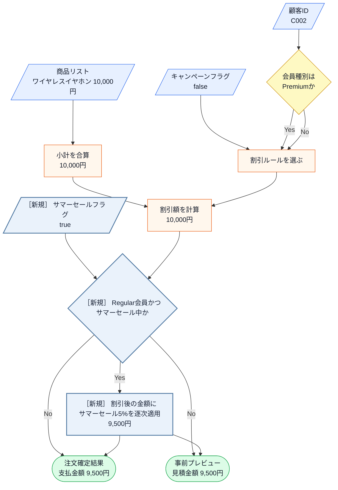

直前の変更後システム内部図から読み取ることは、次の3点です。

- 商品リスト・顧客ID・キャンペーンフラグの入力と、小計の合算・割引ルールの選択・割引額の計算は、現状のまま変わらない。
- 新しい入力はサマーセールフラグで、「Regular会員かつサマーセール中か」という判定と、割引額を計算したあとの金額に5%を掛ける「逐次適用」という加工が、1つずつ加わる。
- Premium会員は新しい判定でNo側を通るため、変更後も支払金額は変わらない。

変更後も、エラー条件は正常系図へ混ぜずに別で確認します。

- **登録されていない顧客IDで注文する**と、「登録されていません」と表示して終わります。金額の計算には進みません。
- **商品を1つも入れずに注文する**と、「注文が空です」と表示して終わります。
- **顧客データの取得そのものが失敗した**場合も、エラーを表示して終わります。掲載コードでは起きませんが、実運用のDB・API障害を `try` / `catch` で代替しています。

どのエラーでも、**保存や通知は起きません。** 何も変えずに終わります。

図に加わった「逐次適用」が実際にコードのどこへ書かれるかは、フェーズ3「問題特定」で変更を試すコードと、フェーズ7の最終コード・実行結果で追います。

**フェーズ1のまとめ：今回追う変更ID一覧**

このフェーズで確定した変更依頼を一覧にして締めます。フェーズ2「仮説立案」でこの変更IDを仮説・ヒアリングへ、フェーズ3「問題特定」で一つずつ試して痛みへ、と順につなぎます。

| 変更ID | 変更依頼の要点 | 関係する要求ID（追加は変更後ID） |
|---|---|---|
| 変更ID1（サマーセール追加） | Regular会員へサマーセール5%を追加し、Premiumは対象外にする | 要求ID2（Premium20%）、要求ID7（サマーセール5%） |
| 変更ID2（逐次割引） | 既存キャンペーンと重なる場合は逐次割引する | 要求ID7（サマーセール5%） |

フェーズ1「現状把握」でシステムの現状と変更要求が把握できました。次のフェーズ2「仮説立案」では、「何を変え、何を守るか」を整理します。

## 🟣 フェーズ2：仮説立案 ―― 何が変わるかを観察し、ヒアリングで裏付ける

> **フェーズ2の確認観点：** 「どの仕様が、どんな理由・きっかけ・頻度で変わりそうか」「今回、何を維持するか」を、フェーズ1の事実から仮説にしてヒアリングで確かめます。

### 2-1：変わりそうな仕様の見当をつける

ここで作る一覧は、思いつきで「変わりそう」と感じたものを並べる表ではありません。フェーズ1「現状把握」で確認した仕様・動作例・クラス図を材料に、次の順で候補を絞ります。

1. 仕様図と動作例から、入力・判定・加工・出力のうち条件や値が変わりそうな箇所を拾う。
2. その箇所が、どのクラス・メソッドに書かれているかを対応づける。
3. その仕様が、どんな理由で、何をきっかけに、どのくらいの頻度で変わりそうかを仮説として書く。
4. 逆に、当面変えない前提にできる処理の骨格も分けておく。

この手順で見ると、「金額を計算する」という大きな処理全体ではなく、その中のどの条件・計算式・判定が変更候補なのかを読者自身で追えるようになります。

フェーズ1「現状把握」で整理した仕様をもとに、「どの仕様に変更の見込みがあり、今回どこを維持するか」を見立てます。責務配置の評価は、変更を当てたときの痛みと合わせてフェーズ3「問題特定」とフェーズ4「原因分析」で確認します。

変わりそうな割引ルールは、クラス構成図の中心 `PaymentCalculator` の `calculate()` の中にあります。この中身を、小計の合算と各割引に分け、誰がどんなきっかけで変えるかと一緒に整理します。

| `calculate()` 内の処理 | 変える主体・きっかけ | 現時点の仮説 |
|---|---|---|
| 商品単価の合算ロジック | 今回の要求では変更対象外。計算順の変更時に見直す | 今回維持する |
| プレミアム割引の条件・割引率 | 料金・プロモーション管理の施策 | 変更候補 |
| キャンペーン割引の条件・割引率 | マーケティング・通知管理の施策 | 変更候補 |

見えてくるのは、**1つの `calculate()` を、料金・プロモーション管理とマーケティング・通知管理という別々の主体が、別々のきっかけで変えうる**という見立てです。

ここで言えるのはそこまでです。責務は設計者が決めるもので、「割引も含めて支払金額を計算する」という今の責務配置は、それ自体が間違いというわけではありません。複数の主体が同じメソッドを変えうることが**実際に痛みになるか**はフェーズ3「問題特定」で変更を当てて確かめ、なぜ辛いのか（＝変わる理由の異なるものが同居している）はフェーズ4「原因分析」で原因として言語化します。ここは、その検証対象に当たりをつける段階です。

#### ヒアリングで確認すること

ここまでの見当のうち、事実だけでは決められない点を質問へ変換します。この質問を先に決めてから、ヒアリングへ進みます。

| 確認したい仮説 | 確認する質問 | 確認先 |
|---|---|---|
| 新しい割引条件が継続して増える | 季節キャンペーンは今後も追加されるか | マーケティング部 |
| パーセント引き以外の計算式も増える | 定額割引など別の計算方法を予定しているか | マーケティング部 |

### 2-2：今回の変更で確実に変わること

- **変更ID1：Regular会員へサマーセール5%を追加し、Premium会員は対象外にする**
- **変更ID2：既存キャンペーンと重なる場合は逐次割引する**

ただし「この変更が1回限りか、今後も続くか」によって、どこまで設計を変えるべきかが大きく変わります。関係者に確認します。

#### 補足：ヒアリングに向けた背景確認

このシステムは、ある中堅ECサイトの決済計算を担っています。数年前にサービスが立ち上がった当初は、お客様が商品を選んでカートに入れ、そのままの合計金額で決済するシンプルな流れでした。

しかし、サービスが成長し競合他社との競争が激しくなるにつれて、様々な施策が打たれるようになりました。新規顧客向けの期間限定キャンペーンや、リピーター向けのプレミアム会員制度など、ビジネス上の要求は日々増えています。

### 2-3：関係者ヒアリング


- **開発者：** 「サマーセールの件、承知しました。今後もこのような新しい割引ルールは追加される予定はありますか？」
- **マーケティング部リーダー：** 「はい、もちろんです。秋にはハロウィンキャンペーン、冬には年末大感謝祭など、毎月のように新しい企画を予定しています。」
- **開発者：** 「ちなみに、割引の計算方法自体が変わることはありますか？今はパーセント引きですが、定額割引などです。」
- **マーケティング部リーダー：** 「実は秋のキャンペーンでは、一律1000円引きクーポンの配布を検討しています。これも対応できますか？」

### 2-4：ヒアリングで判明した将来リスク

ヒアリングで浮かび上がった「確定ではないが、近い将来起こりうる変化」を記録します。これは今回の設計判断の材料です。

| リスクID | 変わる可能性 | 根拠 |
|---|---|---|
| リスクID1（割引ルールが毎月増える） | 新しい割引ルールの追加が毎月続く | マーケティング責任者から直接確認 |
| リスクID2（定額引きへ変わる） | パーセント引き以外の計算方法が加わる | 定額クーポンの企画として言及 |

なお、計算結果の出力方法自体（画面表示からレシート印刷・APIレスポンスへの変更）もヒアリングで話題になりましたが、今回の変更対象ではないためリスクIDには起こさず対象外として記録します。出力方法は割引計算の軸とは独立した境界であり、本章で扱う割引ルールの分離には影響しません。

フェーズ2「仮説立案」で「今変わること（確定）」と「将来変わるかもしれないこと（リスク）」を分けて整理できました。次はリスクをもう少し具体的な「仕様の変化」として整理します。

### 2-5：変わる見込みと今回維持する範囲を確定する

ヒアリングで挙げたリスクIDを、設計で扱う変化軸へ整理します。ここで「はい」とした項目は、機能を先に実装するという意味ではありません。フェーズ6で、**変わる側を当面守る部分から分離し、その変化が起きても影響を局所化できる構造か**を判断するための印です。

| このコードが持っているもの | 変わると見込む根拠 | どちら側か |
|---|---|---|
| どの割引を当てるかの条件 | リスクID1：新しい割引が毎月増える | **変わる** |
| 割引額の計算式 | リスクID2：定額クーポンの企画がある | **変わる** |
| 商品単価を順に足して小計を出す | どちらのリスクでも触らない | **守る** |
| 割引前金額の受け渡しと結果表示 | どちらのリスクでも触らない | **守る** |
| 注文処理の流れ | どちらのリスクでも触らない | **守る** |

したがって変わる側と守る側を分けた結果は、「割引ルールと計算式は差し替え対象にし、小計の合算から結果表示までの流れは守る」という設計条件です。フェーズ3「問題特定」では変更ID1（サマーセール追加）・変更ID2（逐次割引）だけを現在の構造へ適用し、このリスクIDはフェーズ6で採用構造を評価するときに使います。

---

## 🟣 フェーズ3：問題特定 ―― 変更の痛みを発見する

> **フェーズ3の確認観点：** 「この場所は、今回の変更の理由と関係があるか？」
>
> `CampaignContext`へサマーセールの入力を足し、新しい割引を実装・実行すること自体は変更に直接必要なので、痛みではありません。新しい施策のために、既存のPremium・キャンペーン分岐の条件と順序まで開いて書き換え、その計算を使う既存経路まで広く確認する部分を痛みとして追います。

### 3-1：変更を試みる

フェーズ2で確定した「割引ルールと計算式は変える側、小計の合算から結果表示までは守る側」という区分を引き継ぎます。「サマーセール：Regular会員に5%オフを追加」を**構造は今のまま**当て、守る側まで開くかを観測します。

`Item`、`Order`、`CustomerInfo`、`CustomerDatabase`、`CartPreviewService`、`OrderProcessor` は現状のまま使えます。手が入るのは、入力型、計算本体、入力値を組み立てる `main()` の3箇所です。

| 変更ID | 仮に変更するコード | 変更内容 |
|---|---|---|
| 変更ID1（サマーセール追加） | `CampaignContext`、`PaymentCalculator`、`main()` | 有効状態を入力へ加え、対象判定と5%引きを足し、サマーセール中の入力を渡す |
| 変更ID2（逐次割引） | `PaymentCalculator`、`main()` | 既存10%引きの結果へ5%引きを続けて適用する分岐を足し、重複時の入力を確認する |

---

**CampaignContext（変更あり）**

```cpp
// CampaignContext クラスへの変更（サマーセールフラグの追加が必要）
class CampaignContext {
public:
    bool isCampaignActive = false;
    bool isSummerSale = false;   // ← 変更ID1で追加
};
```

フラグが1つ増えただけです。**ここは痛くありません。** ただし、**1つの施策追加が入力データと計算本体の両方へ波及している**ことは覚えておいてください。

---
フェーズ1で確認した `PaymentCalculator::calculate()` の2分岐へ、サマーセールの条件と式を加えます。判定追加では、同じ変更前コードを再掲せず、変更が入った分岐全体を示します。

**変更試行後の抜粋：`PaymentCalculator::calculate(...)`（割引判定全体）**

```cpp
// サマーセール対応：Regular会員向けに条件を追加
if (memberType == "Premium") {
    total = total * 80 / 100;  // 20%引き（サマーセール対象外）
// ← ここから追加。サマーセール単独と、
//    キャンペーンとの重なりを別の枝にする
} else if (context.isSummerSale && context.isCampaignActive) {
    total = (total * 90 / 100) * 95 / 100; // 逐次割引（Regular会員）
} else if (context.isSummerSale) {
    total = total * 95 / 100;  // 5%引き（Regular会員）
// ← ここまで
} else if (context.isCampaignActive) {  // ← 変更
    total = total * 90 / 100;  // 10%引き
}
```

- **`else if` を1行足すだけでは済まない：** サマーセールは「Regular会員のみ」「キャンペーンと重なると逐次割引」という複合条件なので、組み合わせの分岐まで要ります。2分岐が4分岐になりました
- **既存分岐の書き換えを巻き込む：** キャンペーン分岐から `memberType == "Regular"` の条件が落ちています。直前でPremiumを処理していれば残るのはRegularだけ、という**分岐の順序に依存した省略**です
- **順序に意味：** `isSummerSale && isCampaignActive` を単独条件より先に置かないと、両方有効な顧客が5%引きだけで止まります。この行を入れ忘れると金額がずれますが、コンパイルは通ります

逐次割引は `* 90 / 100` のあと `* 95 / 100` で、15%引きとして `* 85 / 100` する仕様ではありません。**1つの施策追加で、既存分岐の順序と組み合わせまで見直すことになりました。**

---

#### `main()` と実行結果

上の2定義を現状コードへ当てはめ、1万円の注文で4ケースを通します。実行コードの直後に同じ番号の結果を置きます。**見るのは動くかどうかだけでなく、サマーセールを足したことで `PaymentCalculator` の割引分岐がどれだけ増えたかです。**

**ケース1の実行コード：Premium・両施策あり**

```cpp
// 変更後のクラスを使った動作確認
int main() {
    CustomerDatabase db;
    CheckoutResultRenderer renderer;
    OrderProcessor processor(db, renderer);
    CampaignContext context;
    Order order;
    order.items.push_back(Item("ワイヤレスイヤホン", 10000));

    order.customerId = "C001";
    context.isSummerSale = true;
    context.isCampaignActive = true;
    processor.process(order, context);
```

**ケース1の実行結果**

```
田中 一郎 さんの注文: ワイヤレスイヤホン 10000円
  条件: 会員=Premium, キャンペーン=あり
  小計 10000円 → 支払金額 8000円
```

**ケース2の実行コード：Regular・両施策あり**

```cpp
    order.customerId = "C002";
    context.isSummerSale = true;
    context.isCampaignActive = true;
    processor.process(order, context);
```

**ケース2の実行結果**

```
佐藤 花子 さんの注文: ワイヤレスイヤホン 10000円
  条件: 会員=Regular, キャンペーン=あり
  小計 10000円 → 支払金額 8550円
```

**ケース3の実行コード：Regular・サマーセールのみ**

```cpp
    context.isSummerSale = true;
    context.isCampaignActive = false;
    processor.process(order, context);
```

**ケース3の実行結果**

```
佐藤 花子 さんの注文: ワイヤレスイヤホン 10000円
  条件: 会員=Regular, キャンペーン=なし
  小計 10000円 → 支払金額 9500円
```

**ケース4の実行コード：Regular・施策なし**

```cpp
    context.isSummerSale = false;
    context.isCampaignActive = false;
    processor.process(order, context);

    return 0;
}
```

**ケース4の実行結果**

```
佐藤 花子 さんの注文: ワイヤレスイヤホン 10000円
  条件: 会員=Regular, キャンペーン=なし
  小計 10000円 → 支払金額 10000円
```

上から順に、Premium優先（10000円→8000円）、Regularの逐次割引（10000円→9000円→8550円）、Regularのサマーセール単独（10000円→9500円）、割引なし（10000円のまま）です。小計→支払金額が、変更要求の変更後の動作例と対応しています。**金額の計算は正しくなっています。**

要求ID5（購入結果の表示）は、既存と同じ表示項目のまま、計算後の支払金額を表示できています。サマーセール状態や割引名を新たな表示項目にはしていません。

痛いのは結果ではなく、そこへ至る過程です。施策を1つ足しただけで、入力データ（`CampaignContext`）、計算本体（`PaymentCalculator`）、入力値を組み立てる `main()` の3箇所を触り、既存2分岐の条件と順序まで書き換えました。しかも4分岐のうち3つは、施策どうしの組み合わせを表すためだけに存在します。**施策が3つになれば、組み合わせは分岐の数として増えていきます。**

### 3-2：変更影響グラフ

変更を試した結果、二つの変更IDがどのクラス・組み立て箇所まで届いたかを図にします。**開いて修正するノードは、淡い黄の面・茶色の枠と `［変更］` で示し、ノード内の`変更前→変更後`で修正内容も示します。**

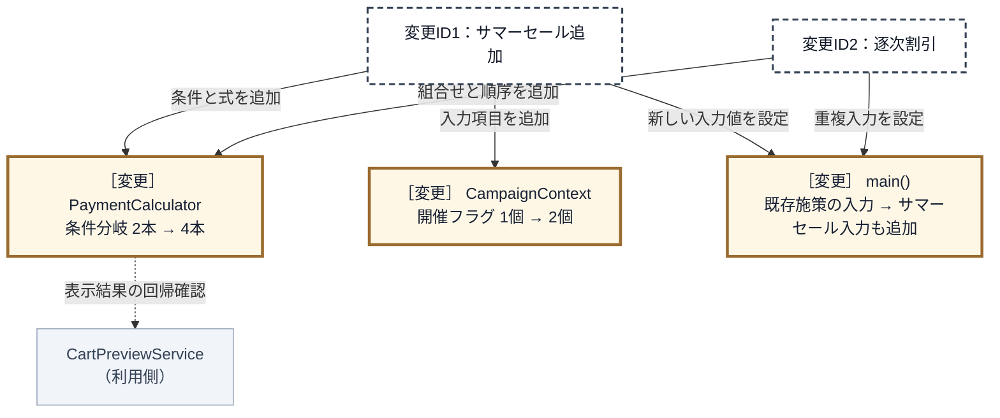

新しいルールを1つ足すだけなのに、新規に分けた変更先はなく、既に動いている `PaymentCalculator`、`CampaignContext`、入力を組み立てる `main()` を開いて書き換えることになります。表示契約は変えませんが、同じ計算を使う購入結果とカートプレビューの回帰確認は要ります。

### 3-3：痛みの言語化

変更試行で確認した問題は、次の一つです。

| 問題ID | 変更を試して観測した痛み | 起点 |
|---|---|---|
| 問題ID1（既存割引まで修正） | 新しい割引の追加で、既存割引の条件と順序まで修正した | 変更ID1・変更ID2 |

次は、なぜ既存割引まで直すことになったのかを調べます。

---

## 🟠 フェーズ4：原因分析 ―― なぜ辛いのかを構造で言語化する

フェーズ3から受け取るのは、問題ID1（既存割引まで修正）と、変更途中の `PaymentCalculator::calculate()` です。このコードから、問題が起きた理由を調べます。

### 4-1：問題が起きたコードを確認する

**問題ID1（既存割引まで修正）。** 変えたかったのは、サマーセールの条件・計算・適用順序です。しかし同じ `if-else` に、既存Premium条件、キャンペーン条件、小計計算、結果返却まであります。そのため、`isSummerSale && isCampaignActive` を加える変更で、`memberType == "Premium"` から `return total` までを読み直して修正しました。

### 4-2：一つのクラスに混在する責任を特定する

責任は、今回の作業項目ではなく、同じ業務上の理由で変わる仕事のまとまりです。仕事が増えた数だけ責任を増やすのではありません。ここでは `PaymentCalculator` が以前から担っている仕事を、変更理由の違いで三つに分けて捉えます。

1行が一つの責任です。左から、問題が起きたコードで担うこと、今回の変更との関係を読みます。直接変わるのは責任の名前ではなく、その責任が担うルールや処理です。

| 責任 | 問題が起きたコードで担うこと | 今回の変更との関係 |
|---|---|---|
| 販促方針 | 会員・セール条件から割引可否と金額を決める | この責任内のルールが、サマー割引と重複割引で直接変わった |
| 競合方針 | 複数の割引候補から適用順を決める | この責任内のルールが、重複時の優先順で直接変わった |
| 注文計算 | 商品小計へ選ばれた割引結果を反映する | この責任内のルールは変わらないが、同じメソッドにあるため確認対象になった |

新しい責任が三つ増えたのではありません。変更理由の違う三つの責任が、同じ `calculate()` に置かれていたことが見えました。

### 4-3：原因を確定する

前の表で分かったのは、`PaymentCalculator` が変更理由の違う責任を三つ持つことです。ここから、その同居が前節で確認した変更影響を生んだかを `calculate()` で確認します。

**原因ID1（注文計算と販促方針が同じクラスにある）。** 割引ごとの条件と計算が、小計を作って返す処理の中にあります。そのため、Regular会員のサマー5%割引への対応で、既存の注文計算まで直しました。

**原因ID2（注文計算と競合方針が同じクラスにある）。** どの割引を優先するかが、同じ `if-else` の並び順で決まります。そのため、新しい割引の追加で既存条件の順序まで読み直しました。

二つとも、問題ID1（既存割引まで修正）の原因です。

> **問い1：同じ場所に、別々の理由で変わるものがないか**
>
> 答えは「ある」です。注文計算、販促方針、競合方針は別々の理由で変わりますが、`calculate()` に集まっています。

原因は確定しました。次は、二つの原因をなくす責任配置を決めます。

---

## 🟡 フェーズ5：課題定義 ―― 原因から課題を検討して確定する

入力は、原因ID1（注文計算と販促方針が同じクラスにある）と原因ID2（注文計算と競合方針が同じクラスにある）です。

### 5-1：原因をなくす責任配置を決める

**原因ID1への対応。** 販促方針を注文計算から分けます。適用条件と計算式は同じ販促方針で一緒に変わるため、二つには分けません。

**原因ID2への対応。** 競合方針を注文計算から分けます。注文計算は優先順を判断せず、選ばれた販促方針だけを使います。

条件だけを外しても注文計算に割引式が残り、具体的な販促名と優先順を残しても原因は消えません。そこで、変更試行後の同居構造を、次の責任配置へ変えます。

**対策前：変更を現状構造へ当てた状態**

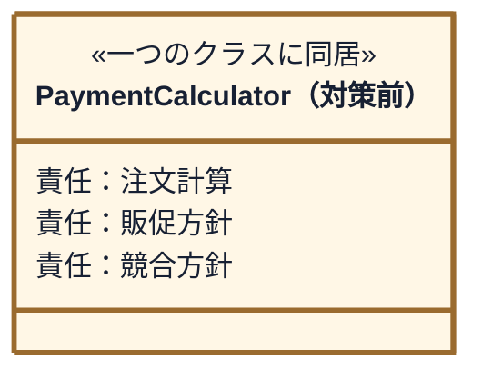

**目標：変化理由の異なる責任を分けてつなぐ**

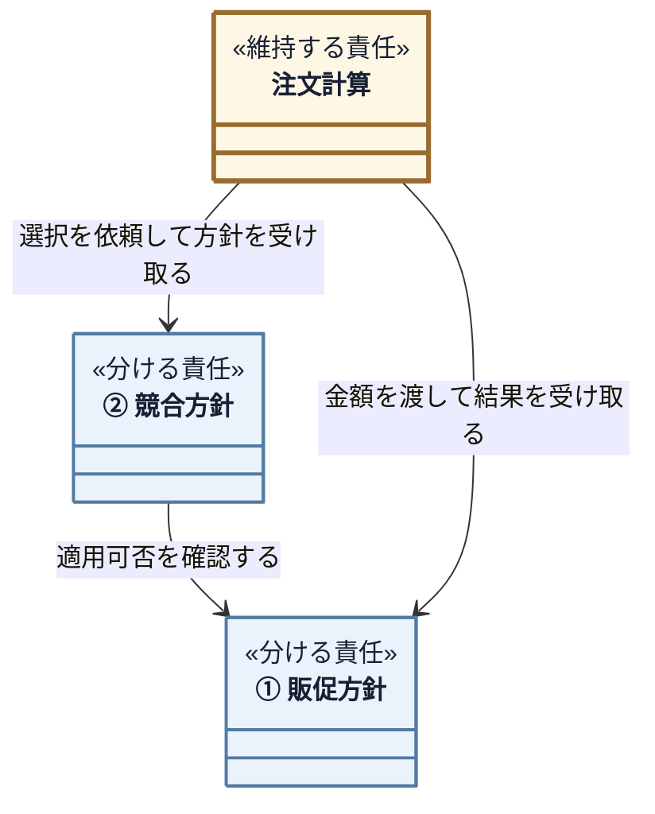

黄色は既存の注文計算、青は外へ分ける責任です。①と②は次の課題表に対応します。ここで決めたのは責任の配置と情報の向きまでで、型名・操作名・生成場所はフェーズ6で決めます。

### 5-2：課題と完了条件を確定する

課題は「原因をなくせた」とコードで判断できる状態です。1行が一つの課題で、左から「どの原因を解くか」「何を分けるか」「分けた両側を何でつなぐか」を読みます。3列目の「入力」は施策を使う側から分けた側へ渡すもの、「結果」は分けた側から使う側へ返すものです。

| 課題（解く原因） | 分ける責任 | 分けた後のつなぎ方 |
|---|---|---|
| ① 課題ID1（販促方針の境界）<br>解く原因：原因ID1 | 販促方針を注文計算から分ける | 入力：会員種別・施策状態・適用前金額<br>結果：適用可否・適用後金額 |
| ② 課題ID2（競合方針の分離）<br>解く原因：原因ID2 | 競合方針を注文計算から分ける | 入力：会員種別・施策状態<br>結果：選ばれた施策 |

#### 課題ID1（販促方針の境界）の完了条件

- `PaymentCalculator`に具体的な施策名・条件・割引式がない
- 条件と計算を施策単位で変更できる
- 注文計算が全施策を同じ方法で利用する

#### 課題ID2（競合方針の分離）の完了条件

- `PaymentCalculator`に競合方針の具体的な優先順がない
- 選択処理に具体的な施策名と優先順がない
- 優先順を別の一か所で変更できる

二つとも満たせば、注文計算は施策の内容も優先順も知らずに計算できます。

最後に、問題から課題までのつながりを確認します。1行が一つの原因で、同じ問題に原因が二つあれば問題IDは二行に現れます。

| 観測した問題 | 確定した原因 | 課題で目指す状態 |
|---|---|---|
| 問題ID1：新しい割引の追加で既存割引まで修正 | 原因ID1：注文計算と販促方針が同じクラスにある | 課題ID1：販促方針を注文計算から分ける |
| 問題ID1：新しい割引の追加で既存順序まで修正 | 原因ID2：注文計算と競合方針が同じクラスにある | 課題ID2：競合方針を注文計算から分ける |

## 🔴 フェーズ6：対策検討 ―― 構想を一つのコード経路へ変える

> **フェーズ6の確認観点：** 「契約と具体」「生成・所有」「選択・登録」「受け渡し」「実行」が、課題ID1（販促方針の境界）・課題ID2（競合方針の分離）を同時に解く一つの経路としてつながるかを確認します。

### 分離した責任をコードの構造へ変える

フェーズ5では、販促方針と競合方針を注文計算から分けるところまで決めました。ここからは、販促方針の契約、施策ごとの具体、競合順を持つ場所、実体の生成・所有、二つの利用側への受け渡し、実行の順にC++の構造へ変えます。

完成した答えを先に表へ置かず、各判断を部分クラス図と対応コードで確定します。すべてを接続した完成クラス図はフェーズ7で確認します。

### 構想をコードでつなぐ

変更前の分岐と、契約→具体→所有・登録→選択・受け渡し→実行の要点コードだけを比べます。全体コードはフェーズ7で確認します。

#### 契約：境界の形と受け渡しを決める

> **問い2：境界では、何を約束すれば足りるか**
>
> 選択側が各施策へ適用可否を尋ね、計算側が選ばれた施策へ合計金額を渡せれば、具体条件と計算式を知る必要はありません。したがって、`matches()` と `apply()` の二つを最小の契約として検討します。

実際に枝の追加と並べ替えが起き、追加も続くため、分岐を関数へ移すだけでは足りません。条件と式を施策単位で増やせるクラス契約まで分けます。

**変更前から抜き出す箇所：`PaymentCalculator::calculate(const Order&, const string&, const CampaignContext&)`** ―― 変更を試したときに変更要求を当てた後の割引判定部分（対策前）

```cpp
// サマーセール対応：Regular会員向けに条件を追加
// ← 出て行く側（対象条件）
if (memberType == "Premium") {
    // ← 出て行く側（計算式）
    total = total * 80 / 100;
} else if (context.isSummerSale && context.isCampaignActive) {
    // 逐次割引（Regular会員）
    total = (total * 90 / 100) * 95 / 100;
} else if (context.isSummerSale) {
    total = total * 95 / 100;
} else if (context.isCampaignActive) {
    total = total * 90 / 100;
}
```

増えるのは施策の条件と計算です。小計計算と結果返却は変わりません。課題ID1（販促方針の境界）では、会員種別と施策状態を渡して適用可否を受け取ります。

| 接続する値 | 形 | 理由 |
|---|---|---|
| 会員種別 | 引数 | 値は顧客照合側にあり、判定は施策側が行う |
| 施策状態 | 引数 | システムの現在値を、施策側の判定へ渡す |

同じ課題ID1（販促方針の境界）で、適用前金額を渡して適用後金額を受け取ります。条件と計算は、一つの施策の中に置きます。

| 接続する値 | 形 | 理由 |
|---|---|---|
| 適用前金額 | 引数 | 小計計算をルール側へ重複させないため |
| 適用後金額 | 戻り値 | 呼び出し側が必要とする結果はこの金額だけだから |

**契約の名前を決めます。** 割引の施策が満たすべき約束なので `IDiscountRule` とします。要求ID5（購入結果の表示）の表示項目は変更しないため、表示名のような今回の境界に不要な操作は足しません。

次の部分クラス図は、**今決める「計算側が契約だけを知り、具体施策がそれを実現する」関係だけ**を描いたものです。他の割引クラス、生成者、選択器は、フェーズ7の完成図でこの関係へ統合します。

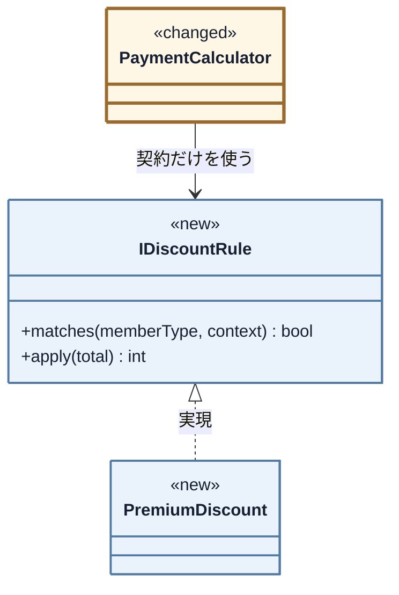

`PaymentCalculator` から具体施策への線を消し、`IDiscountRule` への1本だけを残します。

**ここで確認するコード：`IDiscountRule`（クラス全体）**

```cpp
class IDiscountRule {
public:
    virtual bool matches(const std::string& memberType,
                         const CampaignContext& context) const =
                             0;
    virtual int apply(int total) const = 0;
    virtual ~IDiscountRule() = default;
};
```

`matches()` と `apply()` は、どちらも課題ID1（販促方針の境界）です。同じ施策の条件と計算なので、一つの契約に置きます。課題ID2（競合方針の分離）は、このあと生成・登録の箇所で確認します。

**ここで確認するコード：`PremiumDiscount`（クラス全体）** ―― プレミアム会員向け

```cpp
class PremiumDiscount : public IDiscountRule {
public:
    bool matches(const std::string& memberType,
                 const CampaignContext&) const override {
        return memberType == MemberType::Premium;
    }

    int apply(int total) const override {
        return total * 80 / 100;
    }
};
```

`PremiumDiscount` は会員種別だけで対象を判断し、`apply()` は金額だけを返します。施策状態を使わず、表示・保存も持ちません。変更前の一つの枝が、同じ施策クラス内の条件と式に分かれました。

---

> **組み合わせ用クラスを許容する理由。** 同時成立する組は現在1組だけなので、逐次割引を一クラスに明示します。組が増えて組み合わせクラスが増殖するなら、割引を重ねる別構造へ見直します。現在の要求には先回りしません。

#### 具体：契約の裏へ変わる判断を置く

施策ごとの真偽値フィールドを残すと、追加のたびに入力型と契約が変わります。そこで `CampaignContext` は施策コードを保持し、具体ルールが `isActive()` で問い合わせます。複数条件と逐次計算を持つ実装を一つ確認します。

**ここで確認するコード：`SummerSaleAndCampaignDiscount`（クラス全体）** ―― 変更要求で生まれた逐次割引

```cpp
class SummerSaleAndCampaignDiscount : public IDiscountRule {
public:
    bool matches(const std::string& memberType,
                 const CampaignContext& context)
                 const override {
        return memberType == MemberType::Regular
            && context.isActive(CampaignCode::SummerSale)
            && context.isActive(CampaignCode::RegularCampaign);
    }

    int apply(int total) const override {
        return (total * 90 / 100) * 95 / 100;
    }
};
```

変更前は上位の `Premium` 分岐に隠れていた一般会員条件も、このクラス内へ明示されました。ほかの具体との違いは次の一覧で足ります。

| 登録順 | 施策クラス | 当てはまる条件 | 3-1での対応箇所 |
|---|---|---|---|
| 1 | `PremiumDiscount` | プレミアム会員 | 1本目の枝 |
| 2 | `SummerSaleAndCampaignDiscount` | 一般・サマーセール・キャンペーン | 2本目の枝（変更要求で追加） |
| 3 | `SummerSaleDiscount` | 一般・サマーセール | 3本目の枝（変更要求で追加） |
| 4 | `CampaignDiscount` | 一般・キャンペーン | 4本目の枝 |
| 5 | `NoDiscount` | いつでも（何も引かない） | どの枝にも入らなかった場合 |

`NoDiscount` を最後の必ず一致する具体にすることで、選択側へ未選択分岐を残しません。各具体は条件と式だけを持ち、小計計算・表示・全体の競合順を持ちません。

#### 生成・所有・受け渡しを決める

> **問い3：実体を、誰が作り、持ち、渡すのか**
>
> ルール集合が具体ルールを生成・所有し、競合方針の順に登録します。選択器はその実体を借りて選び、選択結果を計算器へ渡します。生成した実体が注文計算まで同一であることを、ここからコードで確かめます。

##### 起動時：ルール集合を生成し、Selectorを利用側へ渡す

これから定義する選択器 `RuleSelector` は、具体ルールを所有しません。`DiscountRuleSet` が所有する実体への参照を、登録された順で保持します。どのルールをどの順に積むかは`DiscountRuleSet`、同じ問いを順に投げる処理は`RuleSelector`の責任です。

次の部分クラス図は、**生成・所有・登録・受け渡しを決める範囲だけ**を示します。代表として `PremiumDiscount` だけを載せ、その他の具体と周辺クラスは省いています。

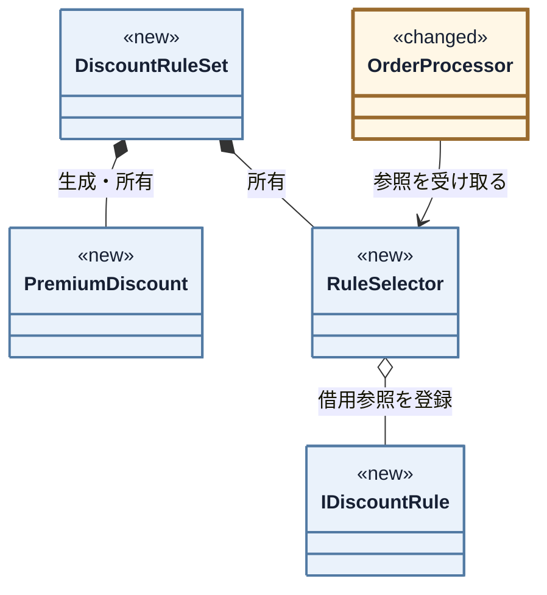

図の所有・借用・受け渡しが、次のメンバー保持と `add()` に対応します。

**ここで確認するコード：`RuleSelector`（クラス宣言・完成）**

```cpp
class RuleSelector {
private:
    std::vector<std::reference_wrapper<
            const IDiscountRule>> rules;
public:
    void add(const IDiscountRule& rule) {
        rules.push_back(std::cref(rule));
    }

    const IDiscountRule& select(const std::string& memberType,
                    const CampaignContext& context) const;
};
```

C++の`vector`には参照を直接入れられないため、`reference_wrapper`で包みます。ここで保持するのはコピーでも所有ポインタでもなく、`DiscountRuleSet`にある実体への借用参照です。

具体ルールのメンバー宣言が所有、コンストラクタの `add()` が優先順の登録です。

**ここで確認するコード：`DiscountRuleSet`（クラス全体）** ―― 具体ルールの所有と優先順の登録

```cpp
class DiscountRuleSet {
private:
    PremiumDiscount premium;
    SummerSaleAndCampaignDiscount summerAndCampaign;
    SummerSaleDiscount summer;
    CampaignDiscount campaign;
    NoDiscount none;
    RuleSelector ruleSelector;
public:
    DiscountRuleSet() {
        // Premiumは他施策と併用しない
        ruleSelector.add(premium);
        ruleSelector.add(summerAndCampaign); // 複合条件を単独条件より先にする
        ruleSelector.add(summer);
        ruleSelector.add(campaign);
        ruleSelector.add(none);              // 必ず一致するため最後にする
    }

    // ルールの実体はこのクラスが所有し、Selectorはその参照だけを持つ。
    // コピーすると複製側のSelectorが元の実体を指したままになるため、禁じる。
    DiscountRuleSet(const DiscountRuleSet&) = delete;
    DiscountRuleSet& operator=(const DiscountRuleSet&) = delete;

    const RuleSelector& selector() const {
        return ruleSelector;
    }
};
```

> **優先順の表現。** 変更者が限られ、変更も年数回なので、数値優先度ではなく登録順と隣接コメントで理由を示します。頻繁に並べ替える運用なら、明示的な優先度を検討します。

`DiscountRuleSet` が具体を先に生成・所有し、その参照をSelectorへ登録します。`main()` は完成した集合だけを利用側へ渡します。

**ここで確認するコード：`main()`** ―― ルール集合の生成とSelectorの注入

```cpp
    DiscountRuleSet discountRules;

    OrderProcessor processor(db,
                             renderer,
                             discountRules.selector());
    CartPreviewService preview(db, discountRules.selector());
```

ここで生成・所有、登録、二つの利用側への注入がつながります。所有者が利用側より先に生成され、後に破棄されるため、借用参照の寿命も成立します。

##### 注文時：生成済みルールを選び、Calculatorへ渡す

注文時は、起動時に生成・登録した具体ルールを利用します。会員種別と施策状態を入力として、登録済み実体の中から1つへの参照を取得します。

**ここで確認するコード：`OrderProcessor`（クラス全体）** ―― 選択からCalculatorの実行まで

```cpp
class OrderProcessor {
private:
    CustomerDatabase& db;
    CheckoutResultRenderer& renderer;
    const RuleSelector& selector;
public:
    OrderProcessor(CustomerDatabase& db,
                   CheckoutResultRenderer& renderer,
                   const RuleSelector& selector)
        : db(db), renderer(renderer), selector(selector) {}

    void process(const Order& order,
                 const CampaignContext& context) {
        if (!db.exists(order.customerId)) {
            std::cout << "エラー: 顧客ID " << order.customerId
                      << " は登録されていません\n";
            return;
        }

        if (order.items.empty()) {
            std::cout << "エラー: 注文が空です\n";
            return;
        }

        CustomerInfo customer;
        try {
            customer = db.get(order.customerId);
        } catch (const std::exception&) {
            std::cout << "エラー: 顧客情報の取得に失敗しました\n";
            return;
        }

        const IDiscountRule& rule =
            selector.select(customer.memberType, context);
        PaymentCalculator calculator(rule);
        const int finalPrice = calculator.calculate(order);
        int subtotal = 0;
        for (const auto& item : order.items) {
            subtotal += item.price;
        }
        renderer.showOrderResult(customer, order, context,
                                 subtotal, finalPrice);
    }
};
```

`select()` は登録済みルールを選ぶだけです。次の `PaymentCalculator calculator(rule)` が選択結果を注入し、計算結果を既存の表示境界へ戻します。選択と注入を同じ操作として扱いません。

#### 実行骨格：組み立てた実体を契約から呼ぶ

守る骨格は、Selectorが登録順に `matches()` を問い、Calculatorが小計を `apply()` へ渡す二点です。施策追加で変えるのは具体ルールと所有・登録一覧だけです。

#### 公開入口から具体の実行まで追う

##### Calculatorから選択済みルールを呼ぶ

**ここで確認するコード：`PaymentCalculator`（クラス全体）** ―― 小計から具体ルールの実行まで

```cpp
class PaymentCalculator {
private:
    const IDiscountRule& rule;
public:
    explicit PaymentCalculator(const IDiscountRule& r)
            : rule(r) {}

    int calculate(const Order& order) const {
        int subtotal = 0;

        for (const auto& item : order.items) subtotal +=
            item.price;
        return rule.apply(subtotal);
    }
};
```

`rule` はルール集合が所有し、Selectorが選んだ同じ実体です。Calculatorは具体名を知らず、小計を求めて `apply()` だけを呼びます。顧客照合、結果返却、公開入口は変えません。

### 構想を確定する

販促施策を注文計算へ残す形や、具体的な施策名と優先順を選択処理へ固定する形では原因が残ります。原因を二つともなくす構造はここまでで一つに定まり、フェーズ7で統合図と完成コードを示します。

#### 課題から確定した構想までを照合する

1行が一つの課題です。フェーズ5で分けた責任を、どの構造とコードで実現するかを左から確認します。

| 課題 | 決定した構造 | コード上の実現 |
|---|---|---|
| 課題ID1（販促方針の境界） | 販促方針を共通契約の後ろへ置く | `IDiscountRule`と各施策クラス |
| 課題ID2（競合方針の分離） | 競合順を注文計算・選択処理の外で保持する | `DiscountRuleSet`の登録順と`RuleSelector` |

会員情報の取得は `CustomerDatabase`、購入結果の表示は `CheckoutResultRenderer` の既存契約を維持します。

#### 将来リスクに対して構想を確認する

フェーズ2のリスクIDを採用構造へ再適用し、現在の境界で何を守れ、どこに弱点が残るかを評価します。

| 将来リスク | 変更を閉じ込める場所 | 守れる範囲と限界 |
|---|---|---|
| リスクID1（割引ルールが毎月増える） | 新しいRuleと `DiscountRuleSet` の所有・登録 | 注文処理を守れる。優先関係が複雑になれば競合規則は見直す |
| リスクID2（定額引きへ変わる） | 対象Ruleの `matches()` と `apply()` | 計算経路を守れる。複数Ruleの併用へ変われば単一選択の契約は見直す |

リスクID1（割引ルールが毎月増える）・リスクID2（定額引きへ変わる）は、採用構造を評価する根拠の一部です。ただし今回実装する機能は変更後要求ベースラインの要求IDで確定した範囲だけであり、リスクIDは構造が将来の変化を局所化できるかの評価に使います。

## 🟢 フェーズ7：対策実施 ―― 変化に強いコードを完成させる

> **フェーズ7の確認観点：** 「変更後の全要求IDを満たし、既存要求も落としていないか」と「フェーズ5の構造上の完了条件を満たし、同じ変更IDの影響が縮んだか」を分けて確認します。

### 7-1：解決後のコード（全体）

フェーズ6で確定・実装した採用構造を、実行可能な完全なコードとして組み上げます。

#### 完成後のクラス一覧

完成コードの全型を先に示します。

- `Item`、`Order`、`CampaignContext`、`CustomerInfo`
- `CustomerDatabase`、`CheckoutResultRenderer`、`OrderProcessor`
- `PaymentCalculator`、`CartPreviewService`、`IDiscountRule`、`RuleSelector`、`DiscountRuleSet`
- `PremiumDiscount`、`CampaignDiscount`、`SummerSaleDiscount`、`SummerSaleAndCampaignDiscount`
- `NoDiscount`

> **採用構造のコスト：** `DiscountRuleSet` は具体ルールと優先順を知るため、施策追加で変わります。知識を消すのではなく、`PaymentCalculator` から方針の一か所へ移した結果です。

#### 完成後のクラス図

部分図を完成図へ統合します。`<<new>>` は新規、`<<changed>>` は変更、表示なしは現状維持です。最初の図は、契約・具体ルール・所有・選択の関係を示します。

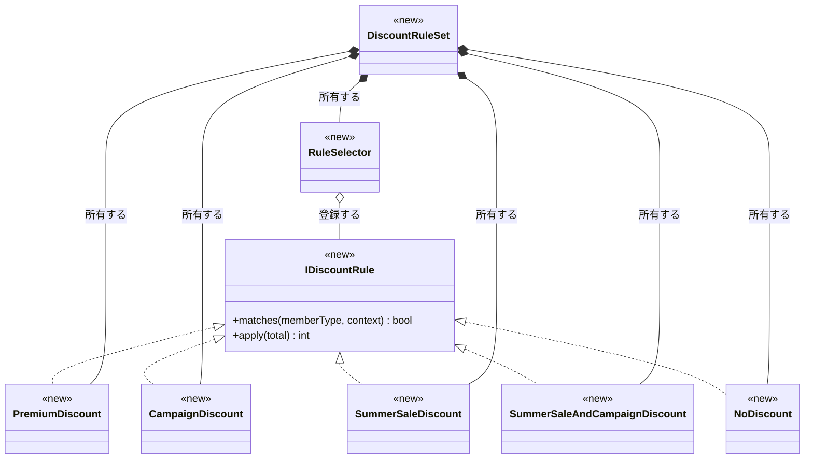

次は、注文確定とプレビューが同じ選択・計算経路を使う関係です。

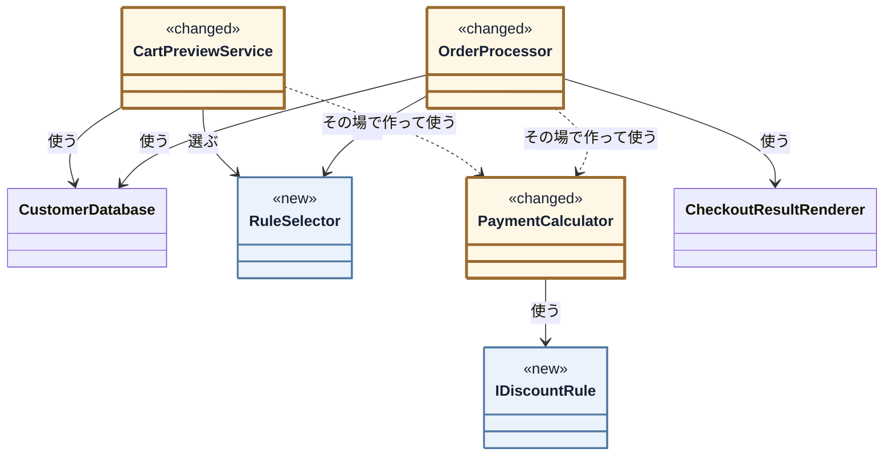

両入口は具体名を知らず、同じ `RuleSelector` と `PaymentCalculator` を使います。顧客取得と結果表示は現状維持です。最後の図で、間を流れる値を確認します。

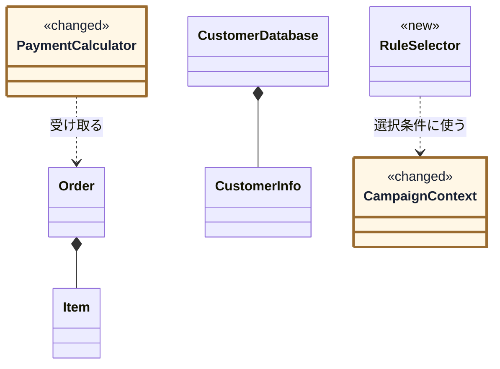

フェーズ4で `PaymentCalculator` に混在していた三つの責任は、完成図では分かれています。`PaymentCalculator` は注文計算、各 `IDiscountRule` 実装は販促方針、`DiscountRuleSet` は競合方針を担い、`RuleSelector` は登録順に選択を実行します。`CampaignContext` は施策コード一覧を渡すだけです。対象とした三つの変更理由を、一つのクラスが同時に持つ構造ではなくなりました。

#### 完成後の実行シーケンス

起動時の生成・注入と、注文時の実行を順に示します。

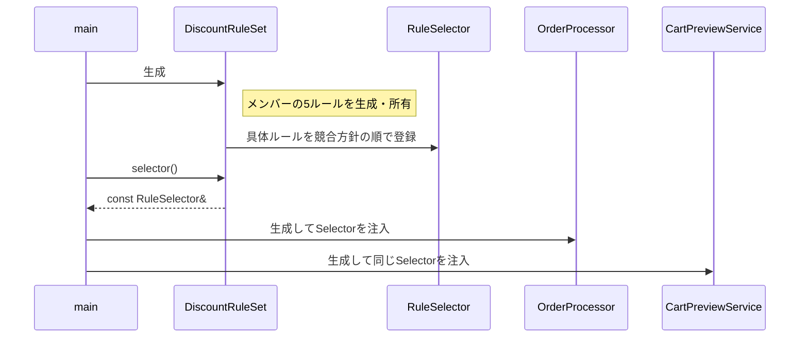

`main()` は `DiscountRuleSet` の同じSelectorを二つの入口へ渡します。次の図は実行時の共通経路です。

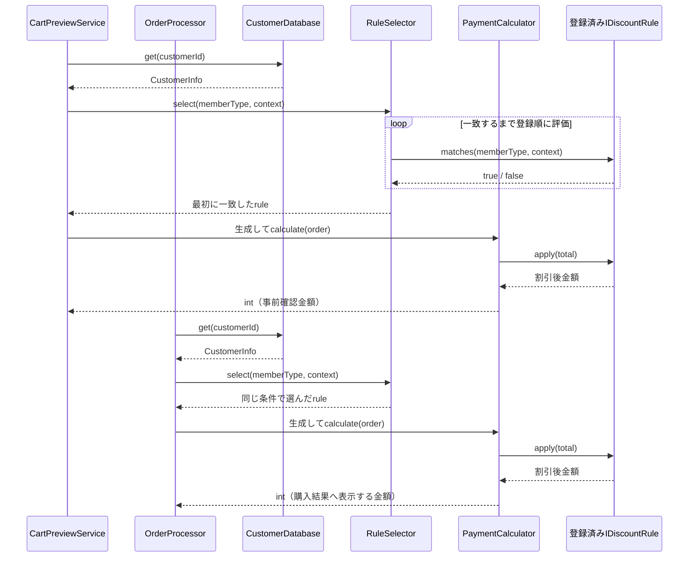

実行時に具体名は現れず、両入口が同じ選択経路を通ります。

#### 完成コード

クラス名 → コード → 要点の順で読み、最後に `main()` と結果をシナリオごとに確認します。

---

**共通ヘッダー**

完成コードで使う標準ライブラリです。

```cpp
#include <iostream>
#include <string>
#include <vector>
#include <functional>
#include <map>
#include <stdexcept>
```

**MemberType**

```cpp
// 会員種別（ルール判定で使う直文字列を名前へ置き換える）
namespace MemberType {
    const std::string Premium = "Premium";
    const std::string Regular = "Regular";
}
```

**CampaignCode**

```cpp
namespace CampaignCode {
    const std::string RegularCampaign = "REGULAR_CAMPAIGN";
    const std::string SummerSale = "SUMMER_SALE";
}
```

**Item**

```cpp
class Item {
public:
    std::string name;
    int price;
    Item(std::string n, int p) : name(n), price(p) {}
};
```

**CampaignContext**

```cpp
class CampaignContext {
private:
    std::vector<std::string> activeCampaigns;
public:
    void activate(const std::string& code) {
        activeCampaigns.push_back(code);
    }

    bool isActive(const std::string& code) const {
        for (const auto& active : activeCampaigns) {
            if (active == code) return true;
        }

        return false;
    }
};
```

**Order**

```cpp
class Order {
public:
    std::string customerId;
    std::vector<Item> items;
};
```

`MemberType` は直文字列を避け、`CampaignContext` は有効な施策コードだけを保持します。施策追加で個別の `bool` は増えません。

---

**CustomerInfo**

```cpp
struct CustomerInfo {
    std::string name;
    std::string memberType;
};
```

**CustomerDatabase**

```cpp
class CustomerDatabase {
private:
    std::map<std::string, CustomerInfo> records;
public:
    CustomerDatabase() {
        records["C001"] = {"田中 一郎", "Premium"};
        records["C002"] = {"佐藤 花子", "Regular"};
        records["C003"] = {"鈴木 次郎", "Regular"};
    }

    bool exists(const std::string& id) const {
        return records.count(id) > 0;
    }
    CustomerInfo get(const std::string& id) const {
        return records.at(id);
    }
};
```

顧客情報と登録データは現状のままです。

---

**IDiscountRule**

割引ルールの共通契約です。

```cpp
class IDiscountRule {
public:
    virtual bool matches(const std::string& memberType,
                         const CampaignContext& context) const =
                             0;
    virtual int apply(int total) const = 0;
    virtual ~IDiscountRule() = default;
};
```

`matches()` と `apply()` が、施策ごとの条件と式の接続点です。

---

**NoDiscount**

各具体は適用条件と計算式を一緒に持ちます。

```cpp
class NoDiscount : public IDiscountRule {
public:
    bool matches(const std::string&,
                 const CampaignContext&) const override {
        return true;
    }

    int apply(int total) const override { return total; }
};
```

**PremiumDiscount**

```cpp
class PremiumDiscount : public IDiscountRule {
public:
    bool matches(const std::string& memberType,
                 const CampaignContext&) const override {
        return memberType == MemberType::Premium;
    }

    int apply(int total) const override {
        return total * 80 / 100;
    }
};
```

**SummerSaleAndCampaignDiscount**

```cpp
class SummerSaleAndCampaignDiscount : public IDiscountRule {
public:
    bool matches(const std::string& memberType,
                 const CampaignContext& context)
                 const override {
        return memberType == MemberType::Regular
            && context.isActive(CampaignCode::SummerSale)
            && context.isActive(CampaignCode::RegularCampaign);
    }

    int apply(int total) const override {
        return (total * 90 / 100) * 95 / 100;
    }
};
```

---

**SummerSaleDiscount**

```cpp
class SummerSaleDiscount : public IDiscountRule {
public:
    bool matches(const std::string& memberType,
                 const CampaignContext& context)
                 const override {
        return memberType == MemberType::Regular
            && context.isActive(CampaignCode::SummerSale);
    }

    int apply(int total) const override {
        return total * 95 / 100;
    }
};
```

**CampaignDiscount**

```cpp
class CampaignDiscount : public IDiscountRule {
public:
    bool matches(const std::string& memberType,
                 const CampaignContext& context)
                 const override {
        return memberType == MemberType::Regular
            && context.isActive(CampaignCode::RegularCampaign);
    }

    int apply(int total) const override {
        return total * 90 / 100;
    }
};
```

逐次割引も一つの具体ルールです。各ルールは会員条件まで自分で確認し、登録順だけに適用条件を隠しません。最後の `NoDiscount` が必ず一致するため、未選択にはなりません。

---

**PaymentCalculator**

計算を行う本体クラスです。具体的な割引ルールを知らず、契約を通じて計算を委譲します。

```cpp
class PaymentCalculator {
private:
    const IDiscountRule& rule;
public:
    explicit PaymentCalculator(const IDiscountRule& r)
            : rule(r) {}

    int calculate(const Order& order) const {
        int subtotal = 0;

        for (const auto& item : order.items) subtotal +=
            item.price;
        return rule.apply(subtotal);
    }
};
```

具体条件を知らず `apply()` へ委譲し、戻り値 `int` は維持します。

---

**RuleSelector**

組み立て側から登録されたルールへ同じ `matches()` を順に問い、最初に一致したものを返します。具体的な条件やクラス名は知りません。

```cpp
class RuleSelector {
private:
    std::vector<std::reference_wrapper<
            const IDiscountRule>> rules;
public:
    void add(const IDiscountRule& rule) {
        rules.push_back(std::cref(rule));
    }

    const IDiscountRule& select(
            const std::string& memberType,
            const CampaignContext& context) const {
        // 競合方針は組み立て側の登録順で表す。
        // Selectorは個別条件を知らず、最初に一致したものを返す。
        for (const auto& registered : rules) {
            const IDiscountRule& rule = registered.get();

            if (rule.matches(memberType, context)) return rule;
        }

        throw std::logic_error("適用可能な割引ルールがありません");
    }
};
```

---

**DiscountRuleSet**

具体ルールとSelectorを所有し、競合方針の順で登録するクラスです。`main()`へ具体ルール名と優先順を漏らさず、利用側には完成したSelectorだけを公開します。

```cpp
class DiscountRuleSet {
private:
    PremiumDiscount premium;
    SummerSaleAndCampaignDiscount summerAndCampaign;
    SummerSaleDiscount summer;
    CampaignDiscount campaign;
    NoDiscount none;
    RuleSelector ruleSelector;
public:
    DiscountRuleSet() {
        // Premiumは他施策と併用しない
        ruleSelector.add(premium);
        ruleSelector.add(summerAndCampaign); // 複合条件を単独条件より先にする
        ruleSelector.add(summer);
        ruleSelector.add(campaign);
        ruleSelector.add(none);              // 必ず一致するため最後にする
    }

    // ルールの実体はこのクラスが所有し、Selectorはその参照だけを持つ。
    // コピーすると複製側のSelectorが元の実体を指したままになるため、禁じる。
    DiscountRuleSet(const DiscountRuleSet&) = delete;
    DiscountRuleSet& operator=(const DiscountRuleSet&) = delete;

    const RuleSelector& selector() const {
        return ruleSelector;
    }
};
```

具体ルールを所有し、競合順にSelectorへ登録します。利用側には変更できない `const` 参照だけを返します。

---

**CartPreviewService**

要求ID6（プレビュー）のプレビューを独立した入口として実装します。顧客IDから会員種別を取得し、注文確定と同じSelectorと計算器を使いますが、`OrderProcessor::process()` は呼びません。

```cpp
class CartPreviewService {
private:
    CustomerDatabase& db;
    const RuleSelector& selector;
public:
    CartPreviewService(CustomerDatabase& db,
                       const RuleSelector& selector)
        : db(db), selector(selector) {}

    int getEstimatedTotal(
            const Order& order,
            const CampaignContext& context) const {
        if (!db.exists(order.customerId))
            throw std::invalid_argument("未登録の顧客IDです");
        if (order.items.empty())
            throw std::invalid_argument("注文が空です");

        const CustomerInfo customer = db.get(order.customerId);
        const IDiscountRule& rule =
            selector.select(customer.memberType, context);
        PaymentCalculator calculator(rule);

        return calculator.calculate(order);
    }
};
```

---

**CheckoutResultRenderer**

結果表示は注文確定の結果だけを受け取ります。プレビュー値を引数に含めないことで、購入結果の表示と事前プレビューを同じ操作へ戻してしまうのを防ぎます。

```cpp
class CheckoutResultRenderer {
public:
    void showOrderResult(const CustomerInfo& customer,
                         const Order& order,
                         const CampaignContext& context,
                         int subtotal,
                         int finalPrice) {
        std::cout << customer.name << " さんの注文:";

        for (const auto& item : order.items) {
            std::cout << " " << item.name << " " << item.price
                      << "円";
        }

        std::cout << "\n  条件: 会員=" << customer.memberType
                  << ", キャンペーン="
          << (context.isActive(CampaignCode::RegularCampaign)
                      ? "あり" : "なし");
        std::cout << "\n  小計 " << subtotal
                  << "円 → 支払金額 " << finalPrice << "円\n";
    }
};
```

---

**OrderProcessor**

`CustomerDatabase`・`RuleSelector`・`PaymentCalculator`・`CheckoutResultRenderer` を接続し、注文確定だけを担います。

```cpp
class OrderProcessor {
private:
    CustomerDatabase& db;
    CheckoutResultRenderer& renderer;
    const RuleSelector& selector;
public:
    OrderProcessor(CustomerDatabase& db,
                   CheckoutResultRenderer& renderer,
                   const RuleSelector& selector)
        : db(db), renderer(renderer), selector(selector) {}

    void process(const Order& order,
                 const CampaignContext& context) {
        if (!db.exists(order.customerId)) {
            std::cout << "エラー: 顧客ID " << order.customerId
                      << " は登録されていません\n";
            return;
        }

        if (order.items.empty()) {
            std::cout << "エラー: 注文が空です\n";
            return;
        }

        // 顧客情報の取得（実運用ではDB/API。接続失敗などに備える）
        CustomerInfo customer;
        try {
            customer = db.get(order.customerId);
        } catch (const std::exception&) {
            std::cout << "エラー: 顧客情報の取得に失敗しました\n";
            return;
        }

        const IDiscountRule& rule =
            selector.select(customer.memberType, context);
        PaymentCalculator calculator(rule);

        const int finalPrice = calculator.calculate(order);
        int subtotal = 0;
        for (const auto& item : order.items) {
            subtotal += item.price;
        }
        renderer.showOrderResult(customer, order, context,
                                 subtotal, finalPrice);
    }
};
```

`RuleSelector` は登録済みルールへ同じ `matches()` を問うだけです。注文確定とプレビューは同じSelector・計算器を使います。Selectorは所有ルールへの参照を借りるため、`DiscountRuleSet` はコピーを禁止します。施策追加は具体ルールと所有・登録へ閉じ、入力語彙が増える場合だけ定数とシナリオデータも変わります。

---

#### `main()` と実行結果

`DiscountRuleSet` が対応ルールと競合順を、`CampaignContext` が注文ごとの有効施策を表します。`main()` は同じSelectorを注文確定とプレビューへ渡します。

---

**組み立てと、ケース1：Premium会員の20%引き**

```cpp
int main() {
    CustomerDatabase db;
    CheckoutResultRenderer renderer;

    DiscountRuleSet discountRules;

    OrderProcessor processor(db,
                             renderer,
                             discountRules.selector());
    CartPreviewService preview(db, discountRules.selector());

    // C001（Premium）/ キャンペーンなし / サマーセールなし → 20%引き
    std::cout << "--- ケース1: Premium割引 ---\n";
    Order order1;
    order1.customerId = "C001";
    order1.items.push_back(Item("ワイヤレスイヤホン", 10000));
    CampaignContext context1;
    int preview1 =
        preview.getEstimatedTotal(order1, context1);
    std::cout << "  カートプレビュー: "
              << preview1 << "円\n";
    processor.process(order1, context1);
```

ケース1の実行結果：

```
--- ケース1: Premium割引 ---
  カートプレビュー: 8000円
田中 一郎 さんの注文: ワイヤレスイヤホン 10000円
  条件: 会員=Premium, キャンペーン=なし
  小計 10000円 → 支払金額 8000円
```

`main()` はこのまま続きます。ケース2は、同じPremium会員にキャンペーンとサマーセールを当てても、Premium優先で20%引きのままです。

```cpp
    // C001（Premium）/ キャンペーンあり / サマーセール中 → Premium優先
    std::cout << "\n--- ケース2: Premium排他 ---\n";
    Order order2;
    order2.customerId = "C001";
    order2.items.push_back(Item("ワイヤレスイヤホン", 10000));
    CampaignContext context2;
    context2.activate(CampaignCode::RegularCampaign);
    context2.activate(CampaignCode::SummerSale);
    int preview2 =
        preview.getEstimatedTotal(order2, context2);
    std::cout << "  カートプレビュー: "
              << preview2 << "円\n";
    processor.process(order2, context2);
```

ケース2の実行結果：

```
--- ケース2: Premium排他 ---
  カートプレビュー: 8000円
田中 一郎 さんの注文: ワイヤレスイヤホン 10000円
  条件: 会員=Premium, キャンペーン=あり
  小計 10000円 → 支払金額 8000円
```

同じ `main()` の中で、ケース3はRegular会員へサマーセールとキャンペーンを逐次適用です。

```cpp
    // C002（Regular）/ キャンペーンあり / サマーセール中 → 逐次割引
    std::cout << "\n--- ケース3: 逐次割引 ---\n";
    Order order3;
    order3.customerId = "C002";
    order3.items.push_back(Item("ワイヤレスイヤホン", 10000));
    CampaignContext context3;
    context3.activate(CampaignCode::RegularCampaign);
    context3.activate(CampaignCode::SummerSale);
    int preview3 =
        preview.getEstimatedTotal(order3, context3);
    std::cout << "  カートプレビュー: "
              << preview3 << "円\n";
    processor.process(order3, context3);
```

ケース3の実行結果：

```
--- ケース3: 逐次割引 ---
  カートプレビュー: 8550円
佐藤 花子 さんの注文: ワイヤレスイヤホン 10000円
  条件: 会員=Regular, キャンペーン=あり
  小計 10000円 → 支払金額 8550円
```

同じ `main()` の中で、ケース4はRegular会員へサマーセール単独（5%引き）です。

```cpp
    // C002（Regular）/ サマーセールのみ → 5%引き
    std::cout << "\n--- ケース4: サマーセール単独 ---\n";
    Order order4;
    order4.customerId = "C002";
    order4.items.push_back(Item("ワイヤレスイヤホン", 10000));
    CampaignContext context4;
    context4.activate(CampaignCode::SummerSale);
    int preview4 =
        preview.getEstimatedTotal(order4, context4);
    std::cout << "  カートプレビュー: "
              << preview4 << "円\n";
    processor.process(order4, context4);
```

ケース4の実行結果：

```
--- ケース4: サマーセール単独 ---
  カートプレビュー: 9500円
佐藤 花子 さんの注文: ワイヤレスイヤホン 10000円
  条件: 会員=Regular, キャンペーン=なし
  小計 10000円 → 支払金額 9500円
```

同じ `main()` の中で、ケース4bはRegular会員へキャンペーン単独（10%引き）です。動作例のケース3にあたり、サマーセール追加後も変わらないことを確認する継続要求（要求ID3（Regularキャンペーン10%））の回帰です。

```cpp
    // C002（Regular）/ キャンペーンのみ → 10%引き（変更前と同じ）
    std::cout << "\n--- ケース4b: キャンペーン単独 ---\n";
    Order order4b;
    order4b.customerId = "C002";
    order4b.items.push_back(Item("ワイヤレスイヤホン", 10000));
    CampaignContext context4b;
    context4b.activate(CampaignCode::RegularCampaign);
    int preview4b =
        preview.getEstimatedTotal(order4b, context4b);
    std::cout << "  カートプレビュー: "
              << preview4b << "円\n";
    processor.process(order4b, context4b);
```

ケース4bの実行結果：

```
--- ケース4b: キャンペーン単独 ---
  カートプレビュー: 9000円
佐藤 花子 さんの注文: ワイヤレスイヤホン 10000円
  条件: 会員=Regular, キャンペーン=あり
  小計 10000円 → 支払金額 9000円
```

サマーセールを追加しても、キャンペーン単独の支払金額は変更前と同じ9,000円のままです。要求ID3（Regularキャンペーン10%）の回帰はこの1件で確認できます。

同じ `main()` の中で、ケース5はRegular会員で割引なしです。

```cpp
    // C003（Regular）/ 割引なし
    std::cout << "\n--- ケース5: 割引なし ---\n";
    Order order5;
    order5.customerId = "C003";
    order5.items.push_back(Item("スマホケース", 3000));
    order5.items.push_back(Item("USBケーブル", 1000));
    CampaignContext context5;
    int preview5 =
        preview.getEstimatedTotal(order5, context5);
    std::cout << "  カートプレビュー: "
              << preview5 << "円\n";
    processor.process(order5, context5);
```

ケース5の実行結果：

```
--- ケース5: 割引なし ---
  カートプレビュー: 4000円
鈴木 次郎 さんの注文: スマホケース 3000円 USBケーブル 1000円
  条件: 会員=Regular, キャンペーン=なし
  小計 4000円 → 支払金額 4000円
```

同じ `main()` の中で、ケース6は未登録顧客のエラーです。

```cpp
    // エラー条件も、正常系と同じ最終コードで確認する
    std::cout << "\n--- ケース6: 未登録顧客 ---\n";
    Order unknown;
    unknown.customerId = "UNKNOWN";
    unknown.items.push_back(Item("USBケーブル", 1000));
    processor.process(unknown, context5);
```

ケース6の実行結果：

```
--- ケース6: 未登録顧客 ---
エラー: 顧客ID UNKNOWN は登録されていません
```

同じ `main()` の中で、ケース7は空注文のエラーです。

```cpp
    std::cout << "\n--- ケース7: 空注文 ---\n";
    Order empty;
    empty.customerId = "C002";
    processor.process(empty, context5);
```

ケース7の実行結果：

```
--- ケース7: 空注文 ---
エラー: 注文が空です
```

`main()` を終了します。

```cpp
    return 0;
}
```

次の表は、`main()` の各ケースの入力（条件・商品）と実行結果（小計→支払金額）を1行ずつ並べたものです。離れた `main()` と出力を行き来せず、その場で照合できます。

| 会員・キャンペーン・サマー | 商品(単価) | 小計→支払金額 | プレビュー |
|---|---|---|---|
| Premium・なし・なし | イヤホン(10000) | 10000 → 8000 | 8000 |
| Premium・あり・あり | イヤホン(10000) | 10000 → 8000（優先で無効） | 8000 |
| Regular・あり・あり | イヤホン(10000) | 10000 → 8550（逐次割引） | 8550 |
| Regular・なし・あり | イヤホン(10000) | 10000 → 9500（5%引き） | 9500 |
| Regular・あり・なし | イヤホン(10000) | 10000 → 9000（10%引き） | 9000 |
| Regular・なし・なし | スマホケース(3000)、USBケーブル(1000) | 4000 → 4000（割引なし） | 4000 |
| 未登録顧客 | USBケーブル(1000) | 計算せず顧客エラー | 表示なし |
| Regular・空注文 | 商品なし | 計算せず空注文エラー | 表示なし |

小計→支払金額を変更後の動作例と照らすと、リファクタリング後も同じ金額になることを確認できます。カートプレビューも同じ計算を共有するため支払金額と一致します。

#### 最終要求の実装・受入エビデンス

変更後要求ベースラインの全有効要求IDを同じ順序で照合します。今回変わらなかった既存要求も対象にするため、要求の消失を検出できます。

| 要求ID | 実装箇所 | 実行結果で確認したこと |
|---|---|---|
| 要求ID1（小計から支払金額） | `PaymentCalculator::calculate()` | ケース5で3,000円と1,000円を合算し、小計4,000円を出力 |
| 要求ID2（Premium20%） | `PremiumDiscount`、`RuleSelector` | セール併用でも8,000円 |
| 要求ID3（キャンペーン10%） | `CampaignDiscount` | ケース4bで9,000円（変更前と同額） |
| 要求ID4（未登録IDを拒否） | `CustomerDatabase`、`OrderProcessor` | 未登録IDをエラー表示して計算しない |
| 要求ID5（購入結果の表示） | `CheckoutResultRenderer` の `showOrderResult()` | 変更前と同じ項目で顧客・条件・小計・支払金額を表示 |
| 要求ID6（プレビュー） | `CartPreviewService::getEstimatedTotal()` | 各正常ケースで購入結果と同額 |
| 要求ID7（サマーセール5%） | `SummerSaleDiscount`、`SummerSaleAndCampaignDiscount` | セールのみ9,500円、併用8,550円、Premiumは対象外 |

全7件が合格です。

上の表は継続（要求ID1（小計から支払金額）〜要求ID6（プレビュー））と追加（要求ID7（サマーセール5%））を同じ順序で並べ、変わらなかった既存要求も回帰対象に含めています。継続要求が合格していることで、既存動作が落ちていないことを確認できます。要求の受入・回帰はここで完了します。課題IDへ直接対応付けず、以下では変更試行の痛みから導いた構造課題だけを別に確認します。

#### 設計課題の完了確認

要求の受入とは分けて、フェーズ5の完了条件を完成コードへ照合します。1行が一つの完了条件で、左から条件、コード上の証拠、判定の順に読みます。

**課題ID1（販促方針の境界）**

| フェーズ5の完了条件 | コード上の証拠 | 判定 |
|---|---|---|
| `PaymentCalculator`に具体的な施策名・条件・割引式がない | 保持するのは`IDiscountRule`で、呼ぶのは`apply()`だけ | 合格 |
| 条件と計算を施策単位で変更できる | 各施策クラスが`matches()`と`apply()`を持つ | 合格 |
| 注文計算が全施策を同じ方法で利用する | 選ばれた施策を`IDiscountRule`として受け取る | 合格 |

**課題ID2（競合方針の分離）**

| フェーズ5の完了条件 | コード上の証拠 | 判定 |
|---|---|---|
| `PaymentCalculator`に競合方針の具体的な優先順がない | `calculate()`は受け取った施策を適用するだけ | 合格 |
| 選択処理に具体的な施策名と優先順がない | `select()`は登録済み施策を先頭から調べるだけ | 合格 |
| 優先順を別の一か所で変更できる | `DiscountRuleSet`の登録順だけが競合順を持つ | 合格 |

全条件が合格です。販促方針の変更は対象となる施策クラスへ、競合順の変更は `DiscountRuleSet` へ閉じました。判定に使う入力語彙そのものが変わる場合はシナリオ入力も変わりますが、注文計算へ具体的な条件・式・優先順は戻りません。

#### 変更前→変更後の不変条件照合

| 守る対象 | 変更前→変更後 | 確認根拠 |
|---|---|---|
| 顧客・注文の取得 | `CustomerDatabase` の同じ取得契約を使う | 現状コードと完成コードのDB呼び出し |
| 結果表示の境界 | `CheckoutResultRenderer` へ渡す点と表示項目は同じ | 7-1の正常・エラー出力 |

> **実務でファイルを分けるなら**
>
> 掲載用の1ファイルを、実務では責任ごとに次のように分けます。
>
> | ファイル | 入れるもの | なぜそこか |
> |---|---|---|
> | `Order.h` | 注文・顧客・結果の値クラス | 誰もが使う入れ物。ここだけは全員が見る |
> | `IDiscountRule.h` | 契約だけ | 利用側がインクルードするのはこれだけにしたい |
> | `Discounts.h` / `.cpp` | 5つの具体ルール | 施策が増えたとき、ここだけを開けば済む |
> | `RuleSelector.h` / `.cpp` | 選択の骨格 | 具体ルールを知らないので、施策が増えても変わらない |
> | `DiscountRuleSet.h` / `.cpp` | 所有と優先順の登録 | **業務方針が入る唯一の場所**。ここだけがすべての具体を知る |
> | `PaymentCalculator.h` / `.cpp` | 金額計算と、それを呼ぶ注文処理・プレビュー・結果表示 | 契約と選択役までしか見ない。`Discounts.h` を含めない |
> | `main.cpp` | 生成と受け渡し | 具体ルール名も優先順も書かない |
>
> ファイル一式: `sources/chapter01/`（`make run`）。`PaymentCalculator.cpp` が `Discounts.h` を直接含むなら、分離が崩れた合図です。

### 7-3：変更影響グラフ（改善後）

フェーズ3で当てた**同じ変更ID1（サマーセール追加）・変更ID2（逐次割引）**を、完成構造からサマーセール固有の定義だけを除いた基準へ当て直します。**新規は淡い青の面と `［新規］`、変更は淡い黄の面・茶色の枠と `［変更］` で示し、変更ノードには`変更前→変更後`も書きます。差分表示のないノードは触りません。**

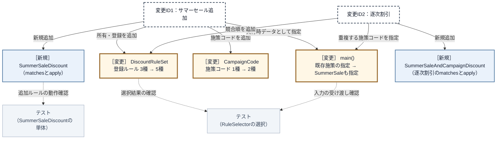

フェーズ3では入力型 `CampaignContext`、計算本体 `PaymentCalculator`、入力を組み立てる `main()` を開きました。完成構造では、`CampaignContext` と `PaymentCalculator` を触らず、施策語彙を足す `CampaignCode`、所有・競合順を示す `DiscountRuleSet`、実行時の施策コードを渡す `main()` を開きます。施策固有の条件と式は `SummerSaleDiscount` と `SummerSaleAndCampaignDiscount` という新規部品へ置けます。コード変更数の単純な減少ではなく、**既存の計算経路から施策固有の変更理由を外せたこと**が改善です。

| 変更影響グラフで影響した場所 | 完成構造での修正 | 構造変更との対応 |
|---|---|---|
| `PaymentCalculator` の既存分岐全体 | **修正しない** | 小計計算だけを残し、条件と式を各ルールへ移した |
| `CampaignContext` | **修正しない**。`CampaignCode`へ定数を足し、既存の施策コード一覧へ値を渡す | 施策ごとの真偽値フィールドを持たない入力形式にした |
| `main()` の入力組み立て | **施策コード一覧へ値を追加する** | 新しい入力値の指定は必要だが、入力型と計算本体へ影響させない |
| `CartPreviewService` | **修正しない** | 注文確定とは独立した入口のまま、同じDB・Selector・計算器を使う |
| 変更影響グラフには分離先がなかった | 二つのサマーセールルールを追加し、`DiscountRuleSet`へ所有・登録する | 施策固有の変更先と競合方針の置き場を作った |
| 変更影響グラフには存在しなかった選択役 | **`RuleSelector` は修正しない** | 具体条件を持たず、登録順に `matches()` を呼び最初の一致を返す固定処理にした |

代わりに、具体ルールと登録を管理するコストは増えます。そのコストを含めても、継続して増える施策の変更理由を既存の計算経路から外せるため、この構造を採用しました。

---

## 整理

| 判断 | 結論 |
|---|---|
| 問題 | 割引追加のたびに計算本体と入力を修正し、利用側まで再確認する |
| 原因 | `PaymentCalculator` が全ルールの条件と式を抱えている |
| 境界 | 条件と式をルールへ移し、計算側には共通契約だけを残す |
| 再結合 | `DiscountRuleSet` が具体を所有・登録し、選択結果を計算側へ渡す |
| 結果 | 逐次割引と排他条件はルール側へ閉じ、顧客取得失敗は別境界に保つ |

## 振り返り

### 「この章を読むと得られること」は手に入ったか

| 持ち帰る構造判断 | この章で確認した根拠 |
|---|---|
| 変動と安定の切り分け | フェーズ2・3：割引ルールを変え、購入とプレビューを守る |
| 変更が広がる原因の特定 | フェーズ4：計算側が条件・式・優先順を知る依存 |
| 契約と再結合の設計 | フェーズ6：共通契約→所有・登録→選択→受け渡し |
| 効果と適用可否の検証 | フェーズ6・7：継続追加を根拠に分離し、変更先を検証 |

## あなたのコードで考えてみてください

題材名を自分のシステムへ置き換え、次の順で構造を確かめてください。

1. 利用者が達成したいことと、変更後も失ってはいけない現行動作は何か。
2. 実際の変更を一つ当てると、条件・計算式・利用側のどこまで修正と再確認が広がるか。
3. その範囲には、施策の条件、計算式、小計計算など、別々の理由で変わるものが同居していないか。
4. 変わる側へ何を渡し、何を受け取れば、守る側は具体的な施策名を知らずに済むか。
5. 具体ルールを誰が選択・生成・所有し、二つ以上の利用側へどう渡すか。
6. 変更後、守る側が具体ルールを知らずに実行でき、現行要求と変更要求を同じ受入結果で確認できるか。

ここまで問題から導いた「ルール差し替え構造」は、一般に **Strategyパターン**と呼ばれます。ここからは題材を離れ、この名前で共有される抽象的な骨格を確認します。

## パターン解説：Strategy パターン

### パターンの骨格

Strategy パターンは、アルゴリズムのファミリーを定義し、それぞれをカプセル化して、呼び出し側から自由に差し替えられるようにするパターンです。

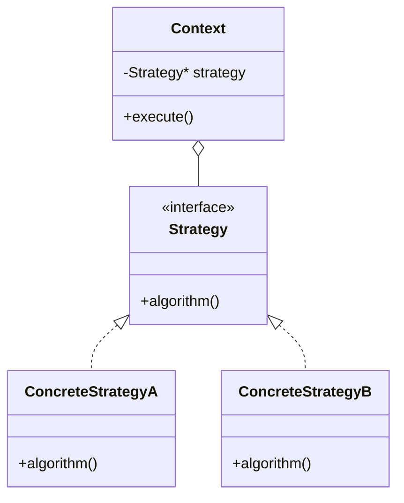

`Context` は `Strategy` の契約だけを保持し、どの具体が入っているかを知りません。具体を増やしても、線が増えるのは `Strategy` の下側だけです。

### この章の実装との対応

| GoFの名前 | この章での対応 |
|---|---|
| Context | `PaymentCalculator` |
| Strategy | `IDiscountRule` |
| ConcreteStrategy | `PremiumDiscount` / `SummerSaleDiscount` / `CampaignDiscount` 等 |

`OrderProcessor` と `CartPreviewService` はStrategyのContextそのものではなく、入力からルールを選び `PaymentCalculator` を組み立てる二つの利用側です。

### 使いどころと限界

- **使うと良い：** 似たような振る舞いが複数あり、状況に応じて切り替えたい場合。または今後も新しいアルゴリズムが追加される可能性が高い場合。
- **使わない方が良い：** ルールが1種類しかなく、今後増える見込みがない場合。ファイル数とクラス数が増えるコストが見合わない。
- **別の構造も検討する：** 独立したルールを同時に複数重ね、組み合わせが増え続ける場合。規則差し替えを組み合わせ用クラスだけで表すとクラス数が増えるため、実行順を持つルール列や装飾連結構造などと比較する。
- **非同期・失敗を伴う場合：** 割引計算が外部I/Oを伴って非同期化・失敗しうるなら、接続点の契約は `int apply(int)` から「将来値や成否を返す形」へ変わる。Strategyの「ルールを差し替える」分離は保てるが、境界を流れる値の形が変わる設計判断になる。

### 過剰適用になる例

割引ルールが「プレミアム割引」1種類しかなく、ヒアリングでも当面増える見込みがないなら、`IDiscountRule` インターフェース、各実装クラス、`RuleSelector` を導入するのは過剰です。この場合、`PaymentCalculator` の中に `if (memberType == "Premium")` を1つ持つだけのほうが、読む人にとってはたどる段数が少なく理解しやすくなります。

本章で共通契約とSelectorを採用した根拠は「毎月新しい割引が追加される」というヒアリング結果でした。変更頻度の裏付けがない別の題材なら、まず変わる側と守る側を定め直します。単純な分岐のままで守る側へ影響が広がらないなら、構造を増やさない方が適切な場合もあります。

### この章のまとめ

#### 構造の着目点

一つの条件分岐が、具体を選ぶ判断と、具体ごとの処理内容を同時に知っていないかを見ます。さらに、選択の条件と処理の入力が同じかを分けて確認します。

#### 構造の変更点

同じ理由で変わる選択条件と処理を一つの具体へまとめ、守る側は共通契約だけを使います。具体の生成・所有・優先順は組み立て側へ置き、利用側へ戻さないことが再結合の要点です。
