# 第2章 状態ごとの振る舞いを分離する ―― State パターン

―― 思考の型：状態によって振る舞いが変わる処理が、条件分岐で混在している

### この章の核心

**場面。** 同じ操作でも、いまの状態によって、許可されるかどうか・結果・次の状態が変わる。

**兆候。** 状態を1つ増やすたびに、いくつものメソッドの分岐を**同時に**直している。**次にどうなるかの規則が、一箇所ではなく操作ごとに散らばっています。**

**判断軸。** 状態そのものに「許可する操作と次の状態」を持たせて、**利用側から状態の判定を外せるか。**

### この章を読むと得られること

この章で身につけるのは、予約業務の手順ではありません。同じ操作でも現在の状態によって許可・結果・次の状態が変わる構造を読み解き、状態ごとの判断を分けて実行の入口へ戻す力です。題材の固有名詞を離れて、次の判断を持ち帰ります。

* **得られること1：状態依存の変動の特定。** 複数の操作を横断して、現在の状態によって変わる許可・処理・遷移と、状態が変わっても守る公開入口を切り分けられるようになる
* **得られること2：分岐が広がる原因の特定。** 状態判定と状態固有の動作が複数の操作へ散っている依存を見つけ、状態追加で同時変更が起きる理由を説明できるようになる
* **得られること3：状態契約と遷移の再結合。** 各状態に共通する操作を契約として定め、具体状態へ判断と遷移を移し、現在状態の生成・所有・受け渡しを安定した入口へつなげられるようになる
* **得られること4：効果と適用可否の検証。** 状態やイベントの追加が関係する状態と組み立てへ局所化したかを確かめ、状態値と単純な分岐のままでよい場合との境界を判断できるようになる

## 🔵 フェーズ1：現状把握 ―― 仕様を整理し、システムと紐付ける

> **フェーズ1の確認観点：** 「何を受け取り、何をして、何を返すか」「どのクラスが何を担うか」「今回何を変えるのか」を、仕様→構造→コードの順で確定します。

チケット予約管理システムが受け取る入力、内部で行う判定、返す出力を整理します。

### 1-1：このシステムの仕様

このシステムは、イベントごとに**チケット予約の状態を管理**します。利用者からイベントIDと予約・支払い・キャンセルなどの操作を受け取り、イベント台帳から席数と現在の予約状態を取得します。現在状態で操作が許可されるかを判定し、成立した場合だけ席数と状態を更新して保存し、対象イベント名と状態遷移またはエラーを表示します。

#### まず代表入力と実行結果から動きをつかむ

詳細な仕様やコードへ入る前に、現状コードの`main()`で利用者がイベントEVT001（春の音楽祭）を予約し、続けて支払う入力を確認します。

**代表入力（現状コードの`main()`から抜粋）：**

```cpp
    // 準備：イベント台帳（EVT001＝春の音楽祭）を用意する
    EventDatabase db;

    // ケース1（1席目）：予約して支払う（空席 → 予約済み → 支払い済み）
    TicketReservation seat1(db, "EVT001");
    seat1.showAvailability();
    seat1.reserve();
    seat1.pay();
```

ケース1の実行結果です。

```
[席数確認] EVT001 20/100（空席80）
予約対象：春の音楽祭
[予約数] EVT001 20/100 -> 21/100
予約完了しました
支払い完了しました
```

**渡したのは `"EVT001"` というイベントIDだけなのに、「春の音楽祭」が出ています。** イベント名は、準備の行で作ったイベント台帳（`EventDatabase`）の中にあります。**実システムならデータベースのイベントテーブルにある行を、掲載コードではこのクラスが自分の中に持っています。** 今回参照したは、次のデータです。

| イベントID | イベント名 | 定員 | 予約数 |
|---|---|---|---|
| EVT001 | 春の音楽祭 | 100 | 20 |

**この本のコードでは、`〜Database` という名前のクラスが「あらかじめ登録されているデータ」を持ちます。** 満席のイベントを含む全件は、後の「登録済みのイベント」で並べます。

続けて、同じイベントの別の座席を予約して取り消します。

```cpp
    // ケース2（2席目）：予約して取り消す（空席 → 予約済み → 空席）
    TicketReservation seat2(db, "EVT001");
    seat2.showAvailability();
    seat2.reserve();
    seat2.cancel();
```

ケース2の実行結果です。

```
[席数確認] EVT001 21/100（空席79）
予約対象：春の音楽祭
[予約数] EVT001 21/100 -> 22/100
予約完了しました
[予約数] EVT001 22/100 -> 21/100
予約をキャンセルしました
```

2つの結果を呼び出しと対応させると、予約後に支払うケースと、予約後に取り消すケースの両方が成功しています。`Available → Reserved → Paid`、`Available → Reserved → Available` という内部の状態名は、この出力だけから推測するのではなく、後続の状態表とコードで確認します。

**この章での簡略化**

この章では予約状態に応じて振る舞いが切り替わる部分へ集中します。実際の予約DBとイベントDBは`EventDatabase`のメモリ上の表で表し、状態上許可された `pay()` は決済成功として扱います。データベース接続、同時予約制御、決済API、発券処理は扱いません。ただし、状態遷移と予約数の増減は実際に行い、数値で確認します。

この入力と出力から、(1)イベントを指定して予約後に支払いまたは取消を行い、(2)各操作が順に受け付けられ、(3)操作の成否が表示される、という一連の動きが読み取れます。

#### 現行要求ベースライン

| 要求ID | 現行要求 | 受入条件 |
|---|---|---|
| 要求ID1（予約対象と空席の確認） | 予約前に対象と空席数を確認し、誤予約を防ぐ | 登録済みは現在値を表示。未登録・満席の予約では状態と予約数を変えない |
| 要求ID2（席の確保） | 空席があれば利用者が1席を確保し、予約できたことを確認できる | 予約完了を表示し、予約数が1増える |
| 要求ID3（購入の確定） | 予約した席の支払いを完了し、以後の処置が不要だと確認できる | 支払完了を表示し、内部状態がPaidになる |
| 要求ID4（予約の取消） | 不要になった予約を取り消し、ほかの利用者が使える席へ戻せる | 取消完了を表示し、予約数が1減る |
| 要求ID5（誤操作からの保護） | その時点で受け付けられない操作によって、確保済みの結果を失わない | エラー前後の状態・予約数が一致する |

各予約は「予約可能（Available）」「予約済み（Reserved）」「支払済み（Paid）」の3つの状態を持ちます。お客様の操作（予約・支払・キャンセル）に応じて状態が遷移し、状態によって許可される操作が異なります。

この章の現状コードに登場する値を、抜粋せずに次へ示します。設定として増やせるイベントと、コードが列挙している状態・操作・結果を分けて読むと、どこまでが現状仕様かを誤解しません。

| 仕様項目 | この章で使う値 | 役割 |
|---|---|---|
| 登録イベント | EVT001 春の音楽祭、EVT002 夏のフェス、EVT003 秋の映画会 | 現状コードの登録3件。設定データなので追加できる |
| 公開操作 | `showAvailability()`、`reserve()`、`pay()`、`cancel()` | 現状コードが利用者へ公開する全操作。空席確認は状態を変えない |
| 予約状態 | Available、Reserved、Paid | 現状コードが保持する全状態 |
| 成功結果 | 予約完了、支払い完了、予約をキャンセル | 現状コードが出す全成功結果 |
| 拒否結果 | 未登録、満席、現在予約不可、支払不可、取消不可 | 現状コードが出す全エラー結果 |

ここで確認する対象は、どの状態でどの操作が許可され、どの結果になるかです。

**登録済みのイベント**

イベントの空席は、次の3件の定員と現在の予約数から判定します。予約数が定員に達しているイベントは満席で、予約するとエラーになります。

| イベントID | タイトル | 定員 | 現在の予約数 |
|---|---|---|---|
| EVT001 | 春の音楽祭 | 100 | 20（空きあり） |
| EVT002 | 夏のフェス | 500 | 499（残り1席） |
| EVT003 | 秋の映画会 | 50 | 50（満席） |

登録されていないイベントIDを指定すると、イベントを取得できずエラーになります。

この章では、利用者が「現在状態」を毎回指定するのではありません。現在状態は予約管理システムが予約1件ごとに保持し、利用者はイベントIDと操作を指定します。状態は操作のたびにシステム内部で読み出され、更新されます。

予約は利用者ごとに1件ずつ作られ、その1件分の状態（Available/Reserved/Paid）を持ちます。イベント全体の残席数はイベント情報の保存領域が別に管理し、予約時に空席を1つ減らし、キャンセルや期限切れで1つ戻します。したがって、ある予約が Reserved（予約済み・未払い）のまま支払いを待っていても、残席がある限り別の利用者は自分の予約を進められます。押さえているのは在庫のうちの1席だけで、「予約済みの間は次の人が予約できない」わけではありません。状態マトリクスの「Reserved で『予約する』が——」は、イベントの占有ではなく、同じ予約1件を二重予約させないという意味です。

**システム全体図：予約管理と保存データの境界**

最も大きな境界は「利用者 → チケット予約管理システム」です。イベント情報、予約状態、結果表示は対象システムの内側にまとめ、どの保存データを使うかだけを示します。

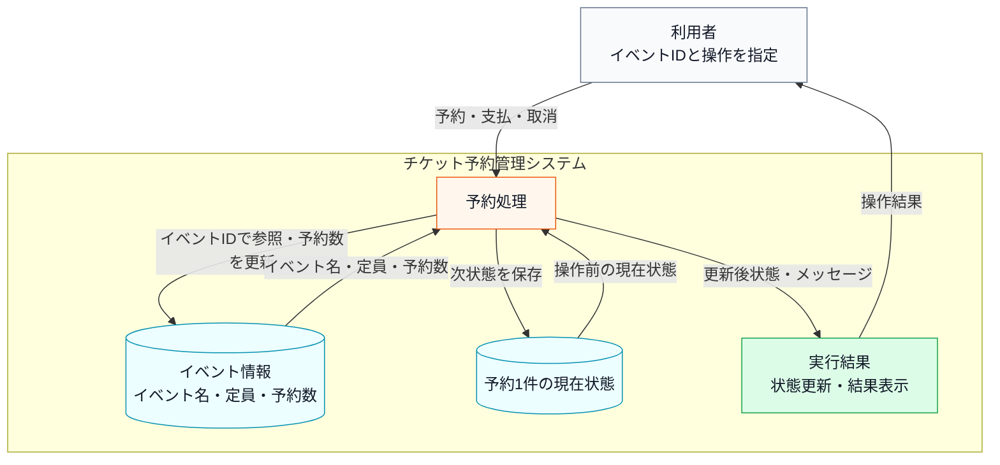

上の文章と表で仕様を一通り確認したので、まず正常に状態更新できる場合の入力・判定・加工・出力の流れとして整理します。

**次のシステム内部図は、代表となる1件の予約を最後まで通したものです。** 他の状態や操作の組み合わせは動作例でまとめて確認します。ここで見てほしいのは**箱の並びと矢印の向き**です。

**システム内部図：正常系の入力・判定・加工・出力**

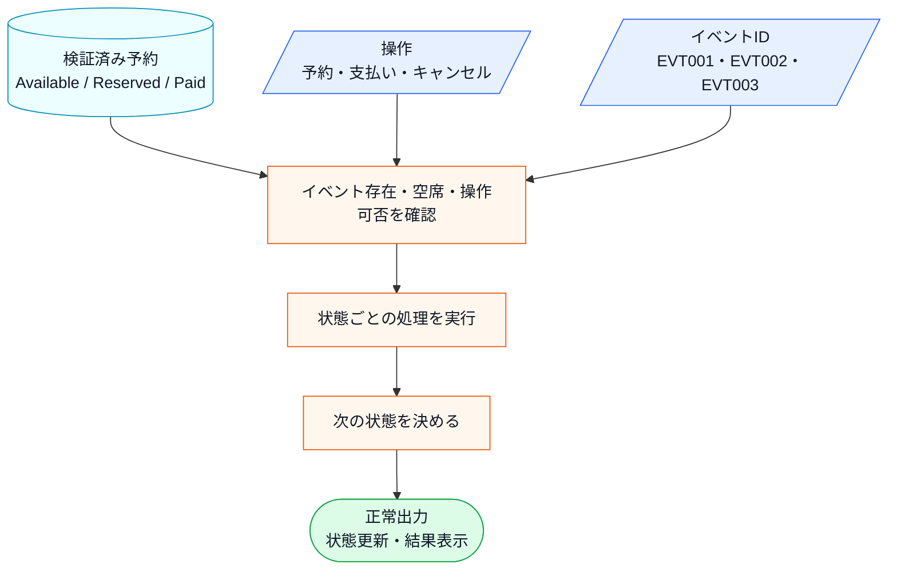

直前のシステム内部図から読み取ることは、次の3点です。

- 同じ操作でも、現在の予約状態によって受け付けられるかどうかが変わる。
- 状態更新へ進む前に、イベントの存在、空席、操作可否を順に確認する必要がある。
- 正常系では、現在状態と操作から次の状態を決め、状態更新と結果表示を行う。

**状態遷移マトリクス**

この表は、現在の状態ごとに、各操作を受け付けたとき次にどの状態へ進むかを整理したものです。行は「いまの状態」、列は「利用者が行う操作」、セルは「操作後の状態」を表します。予約可能な状態で予約すると予約済みに進み、予約済みの状態で支払うと支払済みに進む、という基本の流れを確認します。

| 現在の状態 | 予約する | 支払う | キャンセルする |
|---|---|---|---|
| Available（予約可能） | → Reserved | —— | —— |
| Reserved（予約済み） | —— | → Paid | → Available |
| Paid（支払済み） | —— | —— | —— |

「——」は、その状態では操作を受け付けず、エラーメッセージを出力して終了することを表します。これは表の中心ではなく、基本の状態遷移に当てはまらない操作を明示するための記号です。

表の各行に着目すると、それぞれのルールには明確な業務上の理由があります。

- **Available（予約可能）で「支払う」「キャンセルする」が——の理由**：予約が存在しない状態で支払いを受け付けると「どの予約に対する支払いか」が確定しません。キャンセルについても、そもそも予約がなければキャンセルする対象がなく、操作自体が無意味です。
- **Reserved（予約済み）で「予約する」が——の理由**：同じ予約枠を二重予約することは、業務上あり得ないためです。
- **Paid（支払済み）でのすべての操作が——の理由**：支払いが完了した予約は「確定済み」扱いになります。この状態からのキャンセルを認める場合は、返金処理・在庫の戻し・会計記録の修正など、複数の業務プロセスが連動して動く必要があります。この章では、返金処理はこの章の設計論点から外れるため扱いません。キャンセルポリシーを設ける場合は、「キャンセル済み（Cancelled）」という別の状態を追加して対応できます。

**現状の状態遷移図**

表で確認した正常な遷移だけを、次の状態遷移図でつなぎます。エラーになる組み合わせは状態を変えないため、矢印には含めません。

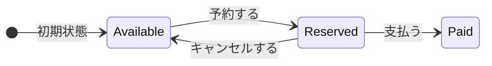

直前の状態遷移図と、その前のマトリクスが、後のフェーズで「新しい状態が増えるとどこが変わるか」を確認する基準になります。

**エラー条件**

正常系の仕様を一通り確認したうえで、最後に、状態更新へ進めない入力や操作を分けて整理します。

- **存在しないイベントIDを指定する**と、「対象なし」と表示して終わります。
- **満席のイベントを予約する**と、「満席」と表示して終わります。
- **いまの状態では許されない操作をする**（支払済みの予約を取り消すなど）と、「操作不可」と表示して終わります。

どの場合も、**予約の状態と予約数は変わりません。**

---

### 1-2：動作例テーブル

このシステムへ渡す**データ**と、そのデータに対して指示する**操作**を分けて確認します。入力を別の値へ加工するのではありません。イベントIDと現在状態を使って可否を判定し、成功した場合だけ予約数と状態を更新して、結果を外へ返します。この章で構造を変えても、次の現行動作は維持します。

| ケース | 入力データ | 操作 | 判定・更新 | 外部出力 |
|---|---|---|---|---|
| 1：予約して支払う | EVT001 | 空席確認 → 予約 → 支払 | 空席なら予約数+1、Available→Reserved→Paid | 現在席数、予約完了、支払完了 |
| 2：予約して取り消す | EVT001 | 空席確認 → 予約 → 取消 | 予約数+1後に-1、Reserved→Available | 現在席数、予約完了、取消完了 |
| 3：満席で予約する | EVT003 | 空席確認 → 予約 | 50/50を確認し、状態・予約数は不変 | 満席表示、満席エラー |
| 4：未登録IDを指定 | UNKNOWN | 空席確認 | 未登録を検出し、予約へ進まない | ID不存在エラー |
| 5：予約前に支払う | EVT001 / Available | 支払 | 状態・予約数は不変 | 支払不可エラー |
| 6：支払後に取り消す | EVT001 | 空席確認 → 予約 → 支払 → 取消 | Paidで拒否し、確保済み結果は不変 | 取消不可エラー |

確認したいことは、通常の予約・支払いフロー、キャンセルフロー、予約前の外部条件による拒否、状態に合わない操作の拒否が、それぞれ入力と出力で対応していることです。

この動作テーブルは、後のフェーズでステップを比較するときに「同じ入力なら同じ出力を返すことで動作不変を確認する」ための基準として使います。この章で変えたいのは内部の構造であり、利用者から見える動作ではありません。

---

### 1-3：登場クラスとクラス構成図

#### このシステムの登場クラス

| クラス名 | 役割 | 担当する仕様 |
|---|---|---|
| `EventInfo` | イベント1件分の情報 | イベント名・定員・予約数の受け渡し |
| `EventDatabase` | イベント情報の保持と検索 | イベントIDの存在確認・満席判定 |
| `TicketReservation` | チケット予約の状態管理と各状態の振る舞い | `Available` / `Reserved` / `Paid` の状態遷移 |

データの流れは、次のように分かれます。

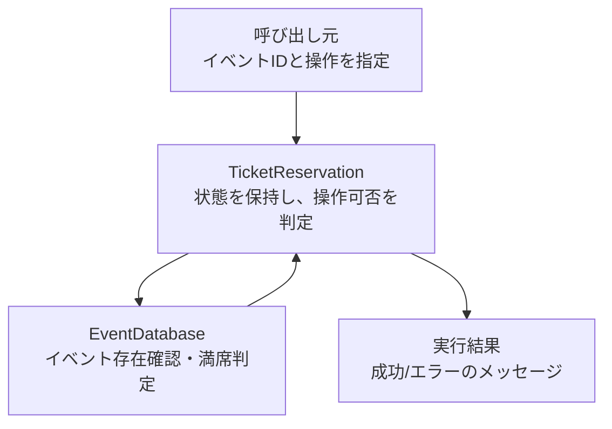

**クラス図に出てくる主なメンバーと操作**

| クラス | メンバー・操作 | 何ができるか |
|---|---|---|
| `EventDatabase` | `records` | イベントIDごとの情報を保持する |
| `EventDatabase` | `exists()` / `get()` / `hasCapacity()` | 対象イベントの存在確認、情報取得、満席判定を行う |
| `TicketReservation` | `db` / `eventId` / `status` | 予約対象イベントと現在状態を保持する |
| `TicketReservation` | `reserve()` / `pay()` / `cancel()` | 現在状態に応じて予約、支払い、キャンセルを実行する |
| `TicketReservation` | `handleReserveError()` など | 操作できない状態のエラーを返す |


各クラスの役割を把握したところで、クラス間の関係を図で整理します。

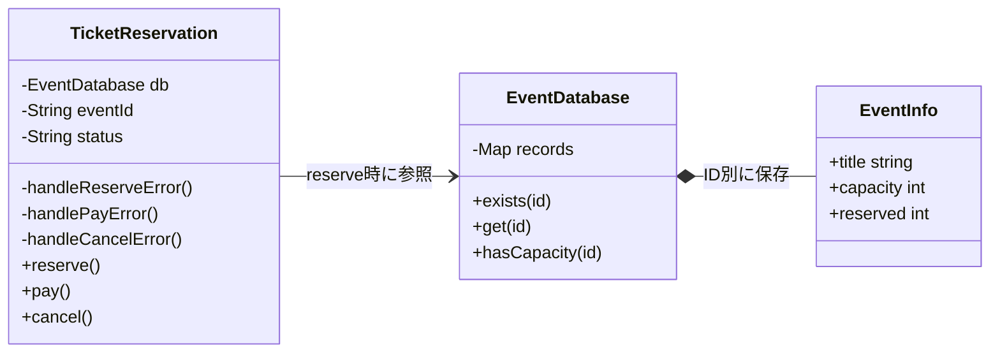

直前の現状クラス図から分かるのは、予約する、支払う、キャンセルするという操作が同じ予約管理クラスに集まっていることです。各操作の中で状態をどう判定しているかは、次の実装コードで確認します。

**現状システムの処理シーケンス**

静的な関係に続けて、正常系（予約→支払い）で各操作がどの順に呼ばれ、状態がどう遷移するかを時系列で示します。状態ごとの具体の分岐は `TicketReservation` の注記に、エラー系はメモとして添えます。現状コードの現状コードを読む前の地図です。

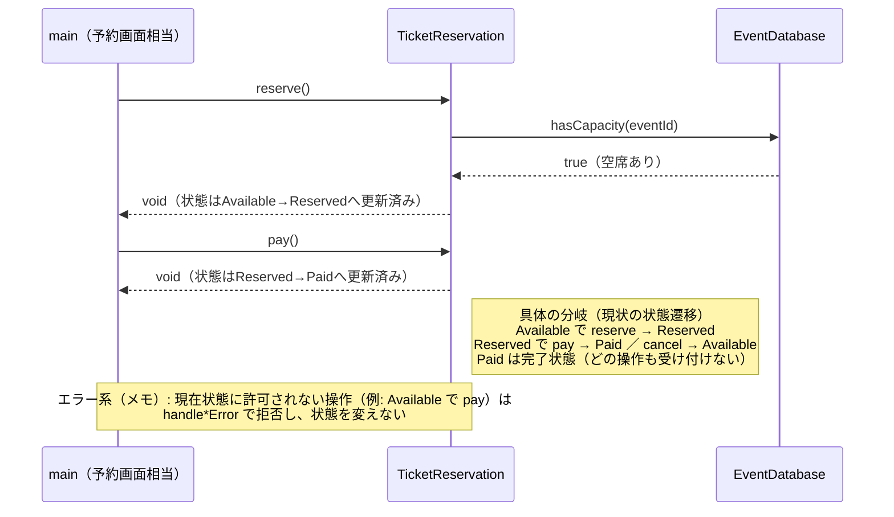

直前の処理シーケンス図から読み取れるのは、公開操作（`reserve`／`pay`／`cancel`）が同じ `TicketReservation` に集まり、各操作が現在の `status` を見て遷移先を決めていること、席の空きは `EventDatabase.hasCapacity()` で確認すること、許可されない操作はメモのとおり状態を変えずに拒否されることです。状態ごとに「どの操作で何が起きるか」がこの時系列と注記で確認できます。


---

### 1-4：実装コード（現状）

予約成功で件数を増やし、キャンセル・期限切れで減らすという在庫の契約を次のコードで確認します。

#### 現状コード

クラスを1つずつ、上から順に読みます。**メンバー変数と、それを使う処理を同じ場所で見られるように**しています。宣言と定義を分けるのは `TicketReservation` だけです。**処理順が長く、メンバーを見ながら追う必要があるクラスだけ**、宣言と定義を分けています。


`main()` と実行結果は最後に、行のまとまりごとに並べます。

---

**共通ヘッダー**

```cpp
#include <iostream>
#include <string>
#include <map>
```

以降のすべてのクラスが使います。

---

**EventInfo**

仕様で見た「イベント」にあたるデータと在庫です。イベントIDから定員・予約数を引き、エラー条件「存在しないID」「満席」もここで判定します。

```cpp
struct EventInfo {
    std::string title;   // イベント名
    int capacity;        // 定員
    int reserved;        // 現在の予約数
};
```

**EventDatabase**

```cpp
class EventDatabase {
private:
    std::map<std::string, EventInfo> records;
public:
    // この章で使うイベント台帳を初期化する
    EventDatabase() {
        records["EVT001"] = {"春の音楽祭",  100,  20};
        records["EVT002"] = {"夏のフェス",  500, 499};
        records["EVT003"] = {"秋の映画会",   50,  50};  // 満席
    }

    // 指定したイベントIDが台帳にあるかを返す
    bool exists(const std::string& id) const {
        return records.count(id) > 0;
    }

    // 指定したイベントの現在値を返す
    EventInfo get(const std::string& id) const {
        return records.at(id);
    }

    // 定員と予約数を比較し、1席以上空いているかを返す
    bool hasCapacity(const std::string& id) const {
        const auto& e = records.at(id);

        return e.reserved < e.capacity;
    }

    // 予約成立時に予約数を1増やす
    void reserveSeat(const std::string& id) {
        auto& event = records.at(id);
        int before = event.reserved;

        ++event.reserved;
        std::cout << "[予約数] " << id << " "
                  << before << "/" << event.capacity
                  << " -> " << event.reserved << "/"
                  << event.capacity;
        if (event.reserved == event.capacity)
            std::cout << "（満席）";
        std::cout << std::endl;
    }

    // 取消成立時に予約数を1減らす
    void cancelSeat(const std::string& id) {
        auto& event = records.at(id);
        int before = event.reserved;

        if (event.reserved > 0) --event.reserved;
        std::cout << "[予約数] " << id << " "
                  << before << "/" << event.capacity
                  << " -> " << event.reserved << "/"
                  << event.capacity << std::endl;
    }
};
```

- **責任：** イベントIDから空席を確認し、予約数を増減する
- **副作用：** `reserveSeat()` / `cancelSeat()` が `records` の予約数を書き換える

`std::map` はイベントIDから `EventInfo` を引くメモリ上のイベント表です。EVT002は499件なので、1件予約すると500件で満席になり、その予約をキャンセルすると499件へ戻ります。実システムのDBを、実行終了まで覚えているインメモリの登録表で代替しています。

---

**TicketReservation の宣言**

この章の中心です。仕様で見た「予約・支払い・キャンセル」という利用者操作を受け取ります。

```cpp
class TicketReservation {
private:
    // --- データ ---
    EventDatabase& db;   // 共有の在庫データ（外部から注入）
    std::string eventId; // 予約対象のイベント
    std::string status;  // 状態 "Available"/"Reserved"/"Paid"

    // 各状態で操作できないときのエラー出力
    void handleReserveError() { std::cout << "現在予約できません\n"; }
    void handlePayError() {
        std::cout << "支払いに適した状態ではありません\n";
    }
    void handleCancelError()  { std::cout << "キャンセルできません\n"; }

public:
    TicketReservation(EventDatabase& db,
                      const std::string& eventId)
        : db(db), eventId(eventId), status("Available") {}

    bool showAvailability() const;
    void reserve();
    void pay();
    void cancel();
};
```

在庫は外から受け取って参照で持ち、対象イベントと現在状態は自分で持ちます。**この `status` が、3つの操作すべての可否を決めます。** 同型で並列な3つのエラー出力は、並列関係が縦に見えるよう1行揃えにしています。定義を3つ、上のメンバーを見ながら読んでいきます。

---

**空席照会**

予約操作の前に、状態を変えない問い合わせ `showAvailability()` で現在の数値を表示します。未登録IDなら `false` を返し、呼び出し側は予約へ進みません。

```cpp
bool TicketReservation::showAvailability() const {
    if (!db.exists(eventId)) {
        std::cout << "エラー：イベントID " << eventId
                  << " は存在しません\n";
        return false;
    }

    EventInfo info = db.get(eventId);
    int available = info.capacity - info.reserved;
    std::cout << "[席数確認] " << eventId << " "
              << info.reserved << "/" << info.capacity
              << "（空席" << available << "）";
    if (available == 0) std::cout << "（満席）";
    std::cout << std::endl;
    return true;
}
```

**TicketReservation::reserve()**

```cpp
void TicketReservation::reserve() {
    if (!db.exists(eventId)) {
        std::cout << "エラー：イベントID " << eventId << " は存在しません\n";
        return;
    }

    if (!db.hasCapacity(eventId)) {
        std::cout << "エラー：" << db.get(eventId).title
                  << " は満席です\n";
        return;
    }

    if (status == "Available") {
        std::cout << "予約対象：" << db.get(eventId).title << "\n";
        db.reserveSeat(eventId);
        status = "Reserved";
        std::cout << "予約完了しました\n";
    } else {
        handleReserveError();
    }
}
```

`reserve()`の役割は、利用者の予約要求を一件受け付け、イベントの存在・空席・現在状態がすべて予約可能な場合だけ席を確保することです。存在確認を先に行うため、未登録IDを`hasCapacity()`へ渡して`at()`の例外にすることはありません。予約が成立したときだけ予約数を1増やし、現在状態を`Reserved`へ変えます。どこか一つでも満たさなければ、状態も予約数も変えずに理由を表示します。

`hasCapacity()` で先に満席を弾いてから呼ぶ前提なので、ここでは満席かどうかを見ていません。未登録のIDを渡した場合は `at()` が `std::out_of_range` を投げます。

---

**TicketReservation::pay()**

```cpp
void TicketReservation::pay() {
    if (status == "Reserved") {
        status = "Paid";
        std::cout << "支払い完了しました\n";
    } else {
        handlePayError();
    }
}
```

`status` が `Reserved` のときだけ、上の枝を通ります。ほかの状態はすべて `handlePayError()` へ落ち、`status` も予約数も変わりません。

---

**TicketReservation::cancel()**

```cpp
void TicketReservation::cancel() {
    if (status == "Reserved") {
        db.cancelSeat(eventId);
        status = "Available";
        std::cout << "予約をキャンセルしました\n";
    } else {
        handleCancelError();
    }
}
```

`Reserved` のときだけ通り、在庫を1件戻します。**`Paid` からは戻せません。**

3つの定義を並べて見ると、`reserve` `pay` `cancel` のどれもが冒頭で `status` を見ています。現在状態の判定が3か所へ散らばっています。

---

#### `main()` と実行結果

動作例の表を、行ごとに区切って実行します。**在庫は行をまたいで引き継がれます。**

---

**組み立てと、ケース1：EVT001 予約 → 支払い**

```cpp
int main() {
    EventDatabase db;

    // ケース1: 正常な予約から支払いまで
    std::cout << "--- ケース1: EVT001 予約 → 支払い ---\n";
    TicketReservation seat1(db, "EVT001");
    seat1.showAvailability();
    seat1.reserve();  // Available → Reserved
    seat1.pay();      // Reserved  → Paid
```

```
--- ケース1: EVT001 予約 → 支払い ---
[席数確認] EVT001 20/100（空席80）
予約対象：春の音楽祭
[予約数] EVT001 20/100 -> 21/100
予約完了しました
支払い完了しました
```

`db` を1つだけ作り、以降のすべての `TicketReservation` へ参照で渡します。在庫が共有されるのはこのためです。

---

**ケース2：EVT001 予約 → キャンセル**

```cpp
    // ケース2: 予約からキャンセルまで
    std::cout << "\n--- ケース2: EVT001 予約 → キャンセル ---\n";
    TicketReservation seat2(db, "EVT001");
    seat2.showAvailability();
    seat2.reserve();  // Available → Reserved
    seat2.cancel();   // Reserved  → Available
```

```
--- ケース2: EVT001 予約 → キャンセル ---
[席数確認] EVT001 21/100（空席79）
予約対象：春の音楽祭
[予約数] EVT001 21/100 -> 22/100
予約完了しました
[予約数] EVT001 22/100 -> 21/100
予約をキャンセルしました
```

予約で1件増え、キャンセルで1件戻りました。EVT001の予約数はケース1の分だけ増えた状態で残ります。

---

**ケース3：EVT003 満席イベントへの予約**

```cpp
    // ケース3: 満席イベントへの予約試み
    std::cout << "\n--- ケース3: EVT003 満席イベントへの予約 ---\n";
    TicketReservation seat3(db, "EVT003");
    seat3.showAvailability();
    seat3.reserve();  // エラー（満席）
```

```
--- ケース3: EVT003 満席イベントへの予約 ---
[席数確認] EVT003 50/50（空席0）（満席）
エラー：秋の映画会 は満席です
```

`hasCapacity()` で止まりました。状態は `Available` のままです。

---

**ケース4：UNKNOWN 存在しないイベントへの予約**

```cpp
    // ケース4: 存在しないイベントへの予約試み
    std::cout << "\n--- ケース4: UNKNOWN 存在しないイベントへの予約 ---\n";
    TicketReservation seat4(db, "UNKNOWN");
    if (seat4.showAvailability()) {
        seat4.reserve();
    }
```

```
--- ケース4: UNKNOWN 存在しないイベントへの予約 ---
エラー：イベントID UNKNOWN は存在しません
```

`TicketReservation::reserve()` の先頭にある `db.exists(eventId)` が偽になり、そこで止まります。満席判定へは進みません。

---

**ケース5：予約なしで支払いを試みる**

```cpp
    // ケース5: 状態エラー — 予約前に支払いを試みる
    std::cout << "\n--- ケース5: 予約なしで支払いを試みる ---\n";
    TicketReservation seat5(db, "EVT001");
    seat5.pay();      // エラー（Available状態）
```

```
--- ケース5: 予約なしで支払いを試みる ---
支払いに適した状態ではありません
```

---

**ケース6：支払い済みをキャンセルしようとする**

```cpp
    // ケース6: 状態エラー — 支払い済みをキャンセルしようとする
    std::cout << "\n--- ケース6: 支払い済みをキャンセルしようとする ---\n";
    TicketReservation seat6(db, "EVT001");
    seat6.showAvailability();
    seat6.reserve();  // Available → Reserved
    seat6.pay();      // Reserved  → Paid
    seat6.cancel();   // エラー（Paid状態）

    return 0;
}
```

```
--- ケース6: 支払い済みをキャンセルしようとする ---
[席数確認] EVT001 21/100（空席79）
予約対象：春の音楽祭
[予約数] EVT001 21/100 -> 22/100
予約完了しました
支払い完了しました
キャンセルできません
```

同じ `cancel()` が、ケース2では成功しケース6では拒否されました。違いは現在状態だけです。

---

`main()` はイベントIDと操作の組み合わせを指示するだけで、存在確認・満席判定・状態チェックはすべて `TicketReservation` 内部で行っています。

次のフェーズで変更が来たときに何が起きるかを確認します。

---

### 1-5：変更要求

ある週明けの朝、イベント運営担当から開発チームへ、新しい施策についての連絡が入りました。

「来月から、リピーター向けに『キャンセル待ち』機能を実装したいのです。予約枠がいっぱいの場合でも、空きが出たら自動的に予約が割り当てられるようにしたい。また、それに伴い『予約一時保留』という状態も追加してほしい。イベント開始の24時間前までなら、予約を確保したまま決済を24時間待つ仕組みです。」

運営担当は、この機能が実装されれば、直前キャンセルによる空き枠を減らし、収益が大きく改善すると期待しています。ここで整理しておくと、「キャンセル待ち」とは予約枠が満杯のときに空き待ちを登録する状態、「予約一時保留」とは予約を確保したまま決済の期限を延期する状態です。

依頼文だけでは待機順や期限切れ時の処理まで決められません。そこで運営担当へ確認し、実行結果で判定できる次の業務ルールを合意しました。

- 満席時の通常の予約要求は、システムが空席数を確認して自動的にキャンセル待ちへ登録する。利用者が満席を判断して別操作を選ぶ必要はない。
- 空席が1席出るたびに待ち行列の先頭1件だけを自動昇格し、後続の待機者は先着順のまま残る。複数席空けば、席数分だけ同じ処理を繰り返す。
- 利用者は `Reserved` と `Held` のどちらからも明示的にキャンセルできる。いずれも席を解放し、待機者がいれば自動昇格する。
- 通常の `Reserved` は15分の決済期限を持つ。利用者が明示的に一時保留を選ぶと `Held` へ移り、期限が24時間へ延長される。どちらも期限切れはスケジューラから届き、席を解放する。
- 本章ではキャンセル待ち自体の取り下げ、イベント開始時刻との厳密な比較、プロセス再起動後のタイマー復元は扱わない。

| 変更ID | 変更内容 | 確認する具体例 |
|---|---|---|
| 変更ID1（キャンセル待ち） | 満席時に待機登録し、空席発生時に先頭を自動昇格する | 取消後の49/50から、手動操作なしで先頭を昇格して50/50へ戻す |
| 変更ID2（一時保留） | 15分の決済期限を、明示操作で24時間へ延長する | Reserved・Heldの期限中は席を確保し、期限切れでは席の解放後に自動昇格する |

#### 変更後要求ベースライン

| 要求ID・種別 | 変更後も満たす要求 | 受入条件 |
|---|---|---|
| 要求ID1（変更） | 空席確認を保ち、満席時は待機登録する | 現在値を表示。未登録は不変、満席は50/50のまま `Waitlisted` になる |
| 要求ID2（継続） | 空席があれば1席を確保し、予約できたことを確認できる | 予約完了を表示し、残り1席なら予約後に満席になる |
| 要求ID3（変更） | 通常予約または一時保留した席の支払いを完了し、以後の処置が不要だと確認できる | 支払成功を表示し、内部状態がPaidになる |
| 要求ID4（変更） | 取消や期限切れで空いた席を、待っている利用者へ手動操作なしで引き継げる | 50/50→49/50→50/50となり、先頭が自動昇格する |
| 要求ID5（継続） | その時点で受け付けられない操作によって、確保済みの結果を失わない | エラー前後の状態・予約数が一致する |
| 要求ID6（追加） | 満席でも順番待ちへ参加し、空席時に先頭から予約できる | 通常の予約操作だけで待機登録と自動昇格が行われる |
| 要求ID7（追加） | 標準期限または24時間保留中に支払い、期限切れの席を戻す | Reservedは15分、Heldは24時間。期限切れ後は自動昇格する |

要求ID1（予約対象と空席の確認）のうち、予約前に数値を見せる部分は継続し、満席時の結果だけが変更ID1（キャンセル待ち）で「拒否」から「待機登録」へ変わります。要求ID4（空席の引き継ぎ）・要求ID6（順番待ち）も変更ID1（キャンセル待ち）から、要求ID3（購入の確定）・要求ID7（支払期限と一時保留）は変更ID2（一時保留）から生じた変更です。要求ID2（席の確保）と要求ID5（誤操作からの保護）は、新しい状態でも既存動作を失わないことを確認する継続要求です。

期限切れイベントを受けるスケジューラ境界は、変更ID2（一時保留）の期限切れを実現する内部の入力経路です。独立した利用者要求として数えません。

実際の予約システムでは、入力は利用者のボタン操作だけではありません。キャンセルで空席が出たときの予約昇格イベントと、決済期限を過ぎたときのタイマーイベントも、予約状態を動かす入力になります。この章では、それらを「状態によって扱いが変わる入力」として同じ粒度で整理します。

#### 変更後に有効な業務ルール

要求一覧をもう一度言い換えるのではなく、これからコードの状態判断と遷移へ落とすルールを確定します。既存状態は残し、新しい状態と遷移だけを加えます。

**状態の変化**

| 種別 | 状態 | この変更での扱い |
|---|---|---|
| 変更なし | Available / Reserved / Paid | 既存状態として残し、新しい遷移だけを接続する |
| 新規追加 | **Waitlisted（キャンセル待ち）** | 満席時に入り、空席発生でReservedへ自動昇格する |
| 新規追加 | **Held（一時保留）** | Reservedから入り、決済期限を24時間へ延長する |

今回変えるのは予約状態と遷移です。イベント情報と空席数を管理する保存基盤は仕様変更の対象ではないため、`EventDatabase` の取得・更新契約は変更前後で**変更なし**とします。

**新しく追加される遷移ルール**

| 現在状態 | 入力 | 結果 |
|---|---|---|
| Available | 満席時の `reserve()` | Waitlistedへ移り、待機列へ登録 |
| Waitlisted | `promoteBySystem()` | 空席発生時にReservedへ自動昇格 |
| Reserved | `hold()` | 席を確保したままHeldへ移り、期限を24時間へ延長 |
| Reserved | `expire()` | 15分経過で席を解放し、Availableへ戻る |
| Held | `pay()` | Paidへ移る |
| Held | `cancel()` / `expire()` | 席を解放し、Availableへ戻る |

**実運用での状態の動き（イメージ）**

各遷移が「誰の・何をきっかけに」起きるかを、時間の流れで並べると次のようになります。

1. **予約する（Available→Reserved／Waitlisted）**：利用者は常に「予約」を押します。空席があれば席数から1席を引いて予約済み（未払い）となり、満席ならシステムが自動でキャンセル待ちへ登録します。`Reserved` の標準決済期限は15分です。
2. **一時保留する（Reserved→Held）**：利用者が明示的に「一時保留」を選ぶと、席を確保したまま決済期限を24時間へ延長します。予約の放置を自動で保留へ変える操作ではありません。
3. **支払う（Reserved／Held→Paid）**：期限内に決済すると確定します。
4. **期限切れ（Reserved／Held→Available）**：Reservedは15分、Heldは24時間が経過しても未払いなら、タイマーイベントが枠を空きに戻します。空いた1席は、キャンセル待ち（Waitlisted）の先頭が自動昇格して受け取ります。

現状の `if` 文を使った状態分岐ロジックに、この2状態と、操作・イベントによる6種類の遷移/状態維持を追加することになります。

**実システムのイベントと掲載コードでの模擬方法**

実運用では、期限時刻を永続化し、バックグラウンドのタイマー基盤が期限到来を検知して予約システムへイベントを送ります。掲載コードは実時間を待たず、実行ハーネスがタイマー基盤の代役として期限到来イベントを直接送ります。呼び出し行は利用者操作の実装ではなく、外部タイマーからイベントが届いた状況を即時再現するテストハーネスです。時刻計算・ジョブ再実行・永続化は省略しても、予約オブジェクトが期限切れイベントを受けた後の遷移は実際に動かします。

| 入力元と具体例 | 状態への影響 | 確認すること |
|---|---|---|
| 利用者：予約・支払・取消・一時保留 | 現在状態で許可と遷移先が変わる | 操作メソッドの状態分岐が増えるか |
| システム：待機者の予約昇格 | WaitlistedからReservedへ進む | 自動処理も現在状態へ委譲できるか |
| タイマー：期限切れ | Reserved・HeldからAvailableへ戻る | 時間起点でも同じ接続点を使えるか |

**仕様変更後の状態遷移マトリクス（全体像）**

既存の3状態に「キャンセル待ち」と「一時保留」を足すと、**成立する遷移は次の10通り**になります。**この表に無い組み合わせは、その状態では操作を受け付けず、エラーメッセージを出して終わります。**

| 現在の状態 | 操作 | 次の状態 |
|---|---|---|
| Available（予約可能） | 予約する（空席あり） | → Reserved |
| Available（予約可能） | 予約する（満席） | → Waitlisted |
| Reserved（予約済み） | 支払う | → Paid |
| Reserved（予約済み） | キャンセルする | → Available |
| Reserved（予約済み） | 一時保留 | → Held |
| Reserved（予約済み） | 期限切れ（15分） | → Available |
| Waitlisted（キャンセル待ち） | 予約昇格（空席発生） | → Reserved |
| Held（一時保留） | 支払う | → Paid |
| Held（一時保留） | キャンセルする | → Available |
| Held（一時保留） | 期限切れ（24時間） | → Available |

`Paid`（支払済み）は行に出てきません。支払いが済んだ予約は確定扱いで、どの操作も受け付けないからです。`Waitlisted` も、出てくるのは「予約昇格」の1行だけです。満席で登録された後にできるのは、空席が出るのを待つことだけだからです。

次の状態遷移図では、直前の表が示した遷移を1枚にまとめ、どの状態からどの操作で、どこへ移れるのかを見ます。

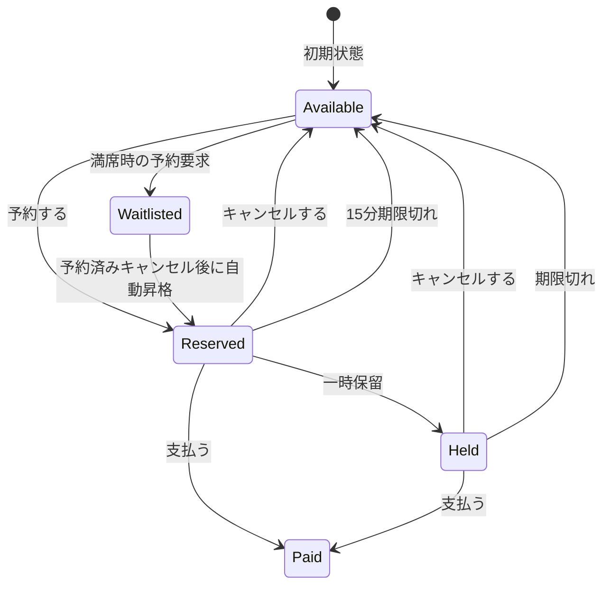

操作不可と満席は状態を変えない結果なので、状態遷移の矢印には含めません。これらは直後のエラー条件表で「状態保存なし」として扱います。

**変更前後の入力・判定・加工・出力差分**

現状の仕様を退避し、変更要求を当てた後の仕様と同じ粒度で並べます。以降の分析では、この差分を追います。

| 要素 | 変更前 | 変更後 |
|---|---|---|
| 入力 | イベントID、3操作、3状態 | **システムイベントと2状態が加わる** |
| 判定 | 現在状態で操作可能か | **期限切れを含む状態別判断が加わる** |
| 加工 | 予約・支払・取消で状態更新 | **待機登録・自動昇格・保留・期限切れが加わる** |
| 出力 | 操作結果と更新後状態 | Waitlisted・Heldを含む結果 |

**変更後の入力・加工・出力**

変更後の仕様を、現状の仕様と同じ粒度で、正常系の入力・判定・加工・出力として確認します。**もとからあって中身が変わったノードは、淡い黄の面・茶色の枠とノード内の `［変更］` で示します。** この図には新しい箱はありません。増えるのは箱の中身です。差分は、内部に保持する「現在状態」が3種類から5種類へ、「操作・イベント」が3種類から7種類へ増えることです。満席のときのキャンセル待ち登録は新しい操作ではなく、「予約する」を満席のときに呼んだときの行き先が増えたものです。判定・加工・出力の流れ自体は変わりません。図中のイベントIDも、現状データに存在する3件を省略せず示します。

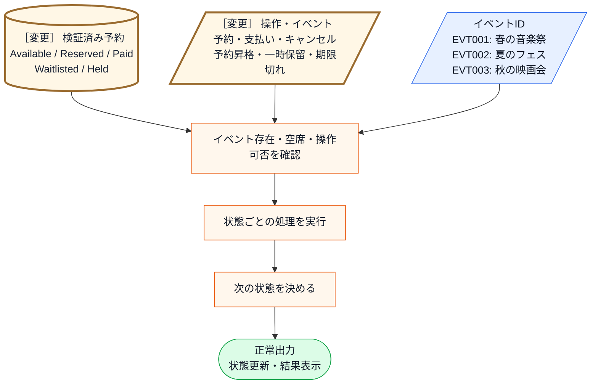

直前の変更後システム内部図から読み取ることは、次の3点です。

- 新しい入力は「Waitlisted・Held」の2状態と「予約昇格・一時保留・期限切れ」の3操作/イベントで、図の箱そのものは増えていない。
- 増えるのは「操作は現在状態で可能か」で受け付ける組み合わせと、「次の状態を決める」の行き先である。
- 受け付けられない組み合わせは、変更後も既存の「操作不可エラー」として扱う。

変更後も、失敗条件は正常系図へ混ぜずに別で確認します。

- **存在しないイベントIDを指定する**と、「対象なし」と表示して終わります。予約の状態は変わりません。
- **満席のイベントを予約する**と、席数は増やさず、待機登録されたことを表示して `Waitlisted` へ移ります。
- **いまの状態では許されない操作をする**と、「操作不可」と表示して終わります。予約の状態は変わりません。

増えた状態と操作の組み合わせが実際にコードのどこへ書かれるかは、フェーズ3「問題特定」で変更を試すコードと、フェーズ7の最終コード・実行結果で追います。

**フェーズ1のまとめ：今回追う変更ID一覧**

| 変更ID | 変更依頼の要点 | 関係する要求ID（追加は変更後ID） |
|---|---|---|
| 変更ID1（キャンセル待ち） | 満席時にキャンセル待ちへ登録し、空席発生時に先頭を自動昇格する | 要求ID1（予約対象と空席の確認）、要求ID4（空席の引き継ぎ）、要求ID6（順番待ち） |
| 変更ID2（一時保留） | 予約済みを24時間の一時保留へ移し、期限切れで席を解放する | 要求ID3（購入の確定）、要求ID7（支払期限と一時保留） |


---

## 🟣 フェーズ2：仮説立案 ―― 何が変わるかを観察し、ヒアリングで裏付ける

> **フェーズ2の確認観点：** 「どの仕様が、どんな理由・きっかけ・頻度で変わりそうか」「今回、何を維持するか」を、フェーズ1の事実から仮説にしてヒアリングで確かめます。

### 2-1：変わりそうな仕様の見当をつける

フェーズ1「現状把握」で整理した仕様をもとに、「どの仕様に変更の見込みがあり、今回どこを維持するか」を見立てます。責務配置の評価は、変更を当てたときの痛みと合わせてフェーズ3「問題特定」とフェーズ4「原因分析」で確認します。

変わりそうな仕様は、クラス図の中心 `TicketReservation` にあります。`reserve()` / `pay()` / `cancel()` の中で判定している「どの状態なら操作できるか」と「操作後にどの状態へ遷移するか」を、どんな仕様が、誰の何をきっかけに変わりそうかと一緒に整理します。

| 仕様 | 現状コードの場所 | 見立てと理由 |
|---|---|---|
| 状態の種類 | `TicketReservation.status` | 新機能の追加で増えるため、変更候補 |
| 操作できる状態 | 各メソッドの `if (status == ...)` | 運用ルールの見直しで変わるため、変更候補 |
| 操作後の遷移先 | 各メソッドの `status = ...` | 運用ルールの見直しで変わるため、変更候補 |
| 状態を動かす入力 | 利用者操作を受ける各メソッド | 外部イベントが加わるため、変更候補 |
| 操作結果の返却 | 各メソッドの表示処理 | 今回の要求では変えないため、維持する |

見えてくるのは、**1つの `TicketReservation` の中で、「どの状態なら何ができるか」「操作後どの状態へ移るか」という状態遷移の仕様に、企画担当の施策や運用見直しによる変更が見込まれる**という仮説です。一方、予約完了・支払い完了などの結果を返す流れは、今回維持する前提に置きます。

ここで見るのは所在だけです。責任の多さや構造の善し悪しは、変更を当てて痛みを観測してから判断します。上の表は、変わりそうな仕様が `TicketReservation` のどのメソッドのどの行にあるかという所在の見立てです。状態遷移の仕様を1つのクラスにまとめている今の配置が、変更要求を当てたときに**実際に痛みになるか**はフェーズ3「問題特定」で確かめ、なぜ辛いのかはフェーズ4「原因分析」で原因として言語化します。ここは、その検証対象に当たりをつける段階です。

#### ヒアリングで確認すること

状態に関する見当を、設計判断に必要な二つの質問へ絞ります。

| 確認したい仮説 | 確認する質問 | 確認先 |
|---|---|---|
| 新しい予約状態が今後も増える | キャンセル待ち以外の状態も追加されるか | 企画担当 |
| 同じ状態でも操作可否が変わる | 状態間の遷移条件を今後見直す予定があるか | 企画担当 |

この二点をヒアリングで確認し、「状態名が増えるだけ」なのか「振る舞いも変わる」のかを分けます。

### 2-2：今回の変更で確実に変わること

- **変更ID1：満席時の予約要求を自動でキャンセル待ちへ登録し、空席発生時に先頭を自動昇格する**
- **変更ID2：通常の15分決済期限を、明示的な一時保留で24時間へ延長し、期限切れで席を解放する**

これらが今回確実に変わる範囲です。将来どれだけ変わり続けるかは、次の関係者ヒアリングで確認します。

### ヒアリングに向けた背景確認

このシステムは、イベントチケットの予約管理を担っています。イベントごとに予約、支払い、発券といった一連のプロセスを管理する、イベント運営の中核となるシステムです。

現在このシステムは、「Available（予約可能）」「Reserved（予約済み）」「Paid（支払い済み）」という3つの状態で動作しています。チケットの予約、支払い、キャンセルという操作に対して、現在の状態に応じた処理が実行される仕組みです。

### 2-3：関係者ヒアリング

仮説を確実なものにするため、企画担当の鈴木氏にヒアリングを行いました。このシステムでは「状態の種類」と「状態遷移ルール」が密接に結びついています。どちらにどんな変更が見込まれるかによって設計の方向が変わるため、この2点を重点的に確認します。


* **開発者：** 「キャンセル待ちや一時保留など、状態がかなり増えますが、今後さらに状態が増える予定はありますか？」
* **企画担当 鈴木：** 「実は、上映後のアンケート回答者に付与する『特別優待予約』なども今後検討しています。状態は今後も増えていくはずです。」
* **開発者：** 「なるほど。状態遷移のルール、例えば『保留中からキャンセル待ちへ移行できるか』などは、今後ルールが変わる可能性はありますか？」
* **企画担当 鈴木：** 「それも十分にあり得ます。今は保留中からのキャンセルを認めていますが、来月には『一度保留にしたらキャンセル不可』というルール変更も考えられます。」

ヒアリングの結果、「状態の種類」だけでなく「状態遷移ルールそのもの」も頻繁に変わり続けるという事実が見えてきました。

### 2-4：ヒアリングで判明した将来リスク

ヒアリングで浮かび上がった「確定ではないが、近い将来起こりうる変化」を記録します。これは今回の設計判断の材料です。

| リスクID | 変わりそうなこと | 根拠 |
|---|---|---|
| リスクID1（遷移ルール） | 状態ごとの操作可否と遷移先 | 運用見直しで変わると企画担当者に確認 |
| リスクID2（状態追加） | 特別優待予約などの状態 | 新機能として増えると企画担当者に確認 |
| リスクID3（イベント追加） | 状態を動かす外部イベント | 期限切れ・空席発生など利用者以外の入力がすでにある |

なお、予約結果の通知方法自体（画面表示からメール・SMSへの変更）もヒアリングで話題になりましたが、今回の変更対象ではないためリスクIDには起こさず対象外として記録します。通知手段は状態遷移の軸とは独立した境界であり、本章で扱う状態管理の分離には影響しません。


### 2-5：変わる見込みと今回維持する範囲を確定する

ヒアリングで挙げたリスクIDを、**変わる側**と**今回守る側**へ分けます。3つとも変わる見込みがあると確認できたものです。

| リスク | 変わる側 | 今回守る側 |
|---|---|---|
| ID1 遷移ルール | 状態ごとの許可操作と遷移先 | 予約の入口、席数の保存 |
| ID2 状態の種類 | 状態の種類と固有の振る舞い | ID の受け渡し、予約結果 |
| ID3 イベント | イベントと遷移の接続 | 状態保存、待ち順、操作の入口 |

したがって変わる側と守る側を分けた結果は、「状態・遷移・イベント接続は変えられるようにし、予約の受付・保存・席数管理は守る」という設計条件です。フェーズ3「問題特定」では変更ID1（キャンセル待ち）・変更ID2（一時保留）だけを現在の構造へ適用し、リスクIDはフェーズ6の構造評価に使います。

---

## 🟣 フェーズ3：問題特定 ―― 変更の痛みを発見する

> **フェーズ3の確認観点：** 「この場所は、今回の変更の理由と関係があるか？」
>
> 新しい状態、待ち行列、期限切れ入力を追加すること自体は変更に直接必要なので、痛みではありません。一つの状態を追加するために既存の複数操作を横断して判定を修正・確認することと、待機順だけを変える場合にも状態分岐を開くことを痛みとして追います。

フェーズ2で確定した「状態・遷移・イベント接続は変える側、予約の受付・保存・席数管理は守る側」という区分を引き継ぎます。このフェーズでは、確定した新しい状態遷移（キャンセル待ち・一時保留）を今のコードの構造のまま適用し、守る側まで開くかを観測します。

### 3-1：変更を試みる

フェーズ2の変更要求を、**構造は今のまま**当ててみます。「一時保留（Held）」と「キャンセル待ち（Waitlisted）」の2状態を足すと、どこを開くことになるかを見ます。

第0章で定めたとおり、この仮実装は対策案ではありません。変更IDを現状構造へ当て、開く場所と連動する修正を観測したら捨てます。ここで得た事実だけをフェーズ4へ渡します。

イベント存在確認と座席数の読み書きは `EventDatabase` のまま使えます。手が入るのは `TicketReservation` の状態分岐です。

| 追加する仕様 | 修正対象 | 必要な変更 |
|---|---|---|
| `Held`（一時保留） | `pay()`、`cancel()`、新しい`expire()` | 支払・取消と、期限切れ後の遷移を加える |
| `Waitlisted`（キャンセル待ち） | `reserve()`、`cancel()`、`expire()` | 満席時に登録し、空席発生直後に先頭を自動昇格する |

変更IDごとに、現状構造のどこへ手を入れることになるかを先に整理します。

| 変更ID | 現状構造へ加える振る舞い | 開く必要があるコード |
|---|---|---|
| 変更ID1（キャンセル待ち） | 満席時の待機登録と、取消・期限切れ直後の先頭昇格 | `TicketReservation`の保持データ、`reserve()`、`cancel()`、新しい昇格処理 |
| 変更ID2（一時保留） | 一時保留と2状態の支払・取消・期限切れ | 状態値、`pay()`、`cancel()`、新しい3操作 |

---

**TicketReservation の宣言（変更あり）**

新しく登場する待ち行列は、在庫（`EventDatabase`）と同じく組み立て側が所有する共有ストアとしてコンストラクタで外から受け取ります。グローバルな `static` で持つと生成順や実行順に依存し、どのインスタンスがいつ書いたのか追えなくなるためです。仮実装でも現状コードと同じ `EventDatabase` とイベントIDを残し、予約数の増減を省略しません。変えるのは構造ではなく、状態分岐へ二つの要求を足す部分だけです。

待機中の `TicketReservation` も `waitlist` を保持します。昇格後は通常の予約済み状態になり、その予約が後で取消・期限切れになったとき、同じ待ち行列から**次の待機者**を自動昇格させるためです。フェーズ7では、昇格した予約をもう一度取り消して席数が戻るところまで実行し、この参照が待機中だけの一時的なものではないことを確認します。

```cpp
#include <iostream>
#include <string>
#include <deque>

// 変更後の TicketReservation（Held・Waitlisted を追加した状態）
// 在庫（EventDatabase）は現状コードのものをそのまま使う想定で、この抜粋では
// 状態遷移と、状態処理に絡む待ち行列だけを示す。
class TicketReservation {
    // --- データ ---
    EventDatabase& db;                 // 現状と同じイベント台帳
    std::string eventId;               // 現状と同じ予約対象
    // ← 追加。共有の待ち行列（借用ポインタ）
    std::deque<TicketReservation*>& waitlist;
    // 状態 Available/Reserved/Paid/Held/Waitlisted
    std::string status;

    // ← ここから追加。空席発生時にシステムが呼ぶ内部遷移
    void promoteBySystem();
    // 待ち行列の先頭を1件だけ取り出して昇格させる
    void promoteNextWaitlisted();
    // ← ここまで

    // 各状態で操作できないときのエラー出力
    void handleReserveError()  { std::cout << "現在予約できません\n"; }
    void handleHoldError()     { std::cout << "保留できません\n"; }
    void handlePayError() {
        std::cout << "支払いに適した状態ではありません\n";
    }
    void handleCancelError()   { std::cout << "キャンセルできません\n"; }
    void handleExpireError() {
        std::cout << "期限切れ処理は行えません\n";
    }
public:
    // ← 変更。共有の待ち行列を受け取る
    TicketReservation(
            EventDatabase& db,
            const std::string& eventId,
            std::deque<TicketReservation*>& waitlist)
        : db(db), eventId(eventId), waitlist(waitlist),
          status("Available") {}

    void reserve();
    void hold();                    // ← 追加
    void pay();
    void cancel();
    void expire();                  // ← 追加
};
```

現状コードから増えたのは、待ち行列への参照、状態値2つ（`Held`・`Waitlisted`）、内部遷移2つ、エラー出力2つ、公開操作2つ（`hold()`・`expire()`）です。**公開操作は3つから5つになりました。**

---

**TicketReservation::promoteBySystem() と promoteNextWaitlisted()（追加）**

空席が出たときに、待ち行列の先頭を予約へ昇格させます。

```cpp
void TicketReservation::promoteBySystem() {
    if (status == "Waitlisted") {
        db.reserveSeat(eventId);
        status = "Reserved";
        std::cout << "空席発生を検知し、予約へ自動昇格しました\n";
    }
}

void TicketReservation::promoteNextWaitlisted() {
    if (waitlist.empty()) return;

    TicketReservation* next = waitlist.front();
    waitlist.pop_front();
    next->promoteBySystem();
}
```

`front()` は先頭の借用ポインタを読むだけで、予約オブジェクトを削除しません。続く `pop_front()` がキューからそのポインタ1件を除きますが、参照先の `TicketReservation` は呼び出し側が所有したままです。「はじめに」で説明した `deque` の「先頭参照」と「先頭要素の除去」を、この待ち行列へ適用しています。

**利用側からは呼べません。** 昇格は利用者の操作ではなく、空席発生に伴ってシステムが起こす遷移だからです。

---

**TicketReservation::reserve()（変更あり）**

```cpp
// 通常の予約要求。現状と同じEventDatabaseで存在と空席を確認する。
void TicketReservation::reserve() {
    if (!db.exists(eventId)) {
        std::cout << "エラー：イベントID " << eventId
                  << " は存在しません\n";
        return;
    }

    if (status == "Available") {
        if (db.hasCapacity(eventId)) {
            std::cout << "予約対象："
                      << db.get(eventId).title << "\n";
            db.reserveSeat(eventId);
            status = "Reserved";
            std::cout << "予約完了しました\n";
        } else {                        // ← 追加
            status = "Waitlisted";
            waitlist.push_back(this);
            std::cout << "満席のためキャンセル待ちに登録しました\n";
        }
    } else {
        handleReserveError();
    }
}
```

満席のときの分岐が増えました。**`Available` の中がさらに2つに割れています。** 状態判定の中へ、在庫の判定が入れ子で入りました。

---

**TicketReservation::hold()（追加）**

```cpp
// 一時保留する（Reserved のときだけ24時間の保留枠へ）
void TicketReservation::hold() {
    if (status == "Reserved") {
        status = "Held";
        std::cout << "保留にしました\n";
    } else {
        handleHoldError();
    }
}
```

新しい公開操作です。現状コードの3つの操作と同じ形で、冒頭で `status` を見ます。

---

**TicketReservation::pay()（変更あり）**

```cpp
// 支払う（Reserved と Held の両方から支払済みへ）
void TicketReservation::pay() {
    if (status == "Reserved") {
        status = "Paid";
        std::cout << "支払い完了しました\n";
    } else if (status == "Held") {   // ← Held 対応を追加
        status = "Paid";
        std::cout << "保留から支払い完了しました\n";
    } else {
        handlePayError();
    }
}
```

`else if` を1本足しました。**中身は上の分岐とほぼ同じで、表示文だけが違います。**

---

**TicketReservation::cancel()（変更あり）**

```cpp
// キャンセルする（Reserved と Held から予約可能へ）
void TicketReservation::cancel() {
    if (status == "Reserved") {
        db.cancelSeat(eventId);
        status = "Available";
        std::cout << "予約をキャンセルしました\n";
        promoteNextWaitlisted();     // ← 追加。空いた枠へ先頭を昇格
    } else if (status == "Held") {   // ← Held 対応を追加
        db.cancelSeat(eventId);
        status = "Available";
        std::cout << "保留からキャンセルしました\n";
        promoteNextWaitlisted();
    } else {
        handleCancelError();
    }
}
```

- **2か所へ同じ2行を書く：** `Held` の分岐にも `promoteNextWaitlisted()` が要ります。片方だけ書き忘れても、もう一方は正しく動きます
- **順序に意味：** 状態を `Available` にしてから昇格を呼びます。逆にすると、空いていない枠へ昇格させることになります

---

**TicketReservation::expire()（追加）**

```cpp
// 決済期限切れ（Reservedは15分、Heldは24時間で枠を解放）
void TicketReservation::expire() {
    if (status == "Reserved" || status == "Held") {
        db.cancelSeat(eventId);
        status = "Available";
        std::cout << "決済期限が切れました\n";
        promoteNextWaitlisted();
    } else {
        handleExpireError();
    }
}
```

`cancel()` と**ほぼ同じ処理**です。状態を戻し、昇格を呼びます。違うのは表示文と、2状態を `||` で1本にまとめている点だけです。

---

#### `main()` と実行結果

変更要求後の代表ケース1〜3を、シナリオごとに区切って実行します。**見るのは動くかどうかではなく、変更ID1（キャンセル待ち）・変更ID2（一時保留）を当てたことで条件分岐と新しいメソッドが `TicketReservation` へどれだけ集まるかです。**

---

**ケース1：予約 → 保留 → 支払い**

```cpp
int main() {
    EventDatabase db;  // 現状コードと同じイベント台帳
    // 全予約で共有する待ち行列（組み立て側が持ち、外から渡す）
    std::deque<TicketReservation*> waitlist;

    // ケース1：予約 → 保留 → 支払い
    TicketReservation t1(db, "EVT001", waitlist);
    t1.reserve(); t1.hold(); t1.pay();

    std::cout << "---" << std::endl;
```

```
予約対象：春の音楽祭
[予約数] EVT001 20/100 -> 21/100
予約完了しました
保留にしました
保留から支払い完了しました
---
```

新しい `hold()` を挟んでも、`pay()` は `Held` から支払えます。

---

**ケース2：予約 → 保留 → 期限切れ**

```cpp
    // ケース2：予約 → 保留 → 期限切れ → Available に戻る
    TicketReservation t2(db, "EVT001", waitlist);
    t2.reserve(); t2.hold(); t2.expire();

    std::cout << "---" << std::endl;
```

```
予約対象：春の音楽祭
[予約数] EVT001 21/100 -> 22/100
予約完了しました
保留にしました
[予約数] EVT001 22/100 -> 21/100
決済期限が切れました
---
```

`Held` から `expire()` で `Available` へ戻りました。

---

**ケース3：満席時の自動待機登録 → キャンセル → 自動昇格 → 支払い**

EVT002は開始時点で499/500です。最初の予約で500/500にしたあと、次の利用者も通常の `reserve()` を呼びます。満席判定値を外から渡さず、現状と同じ `EventDatabase::hasCapacity()` で再確認します。
```cpp
    // ケース3：既存予約のキャンセル → 待ち行列の先頭を自動昇格 → 支払い
    TicketReservation occupied(db, "EVT002", waitlist);
    occupied.reserve();            // 499/500 → 500/500
    TicketReservation waiting(db, "EVT002", waitlist);
    waiting.reserve();             // 台帳で満席を再確認し、自動待機登録
    occupied.cancel();             // 利用側が行うのはキャンセルだけ
    waiting.pay();                 // 昇格済みなので支払える

    return 0;
}
```

```
予約対象：夏のフェス
[予約数] EVT002 499/500 -> 500/500（満席）
予約完了しました
満席のためキャンセル待ちに登録しました
[予約数] EVT002 500/500 -> 499/500
予約をキャンセルしました
[予約数] EVT002 499/500 -> 500/500（満席）
空席発生を検知し、予約へ自動昇格しました
支払い完了しました
```

利用側が空席発生後に呼んだのは `cancel()` だけで、昇格は自動で起きました。予約数も500→499→500と動き、現状システムの台帳更新を保っています。**動作は正しくなっています。** 変更要求は満たせました。

---

痛いのは結果ではなく、そこへ至る過程です。変更ID1（キャンセル待ち）・変更ID2（一時保留）のために、`reserve()`・`pay()`・`cancel()`・`hold()`・`expire()` の5つすべてへ状態判定を書きました。

状態遷移マトリクスで見ると、Held を追加するとは「行を1行増やす」ことに見えます。

| 現在の状態 | `reserve()` | `pay()` | `cancel()` |
|---|---|---|---|
| Available | → Reserved | —— | —— |
| Reserved | —— | → Paid | → Available |
| Paid | —— | —— | —— |
| **Held（新規）** | —— | → Paid | → Available |

しかし実装では、Heldの1行を追加するために`pay()`と`cancel()`を開いて`else if`を追加し、`reserve()`でも保留中の予約操作を拒否する必要があるか確認しました。変更ID1（キャンセル待ち）のWaitlistedも含めると、二つの確定要求だけで複数の公開操作を横断して状態数×操作数の組み合わせを点検しています。一箇所でも条件を漏らすと、変更ID1（キャンセル待ち）・変更ID2（一時保留）の受入条件を満たせません。

### 3-2：変更影響グラフ

変更を試した結果、2本の変更要求がどのクラスのどの部分まで届いたかを図にします。**開いて修正するノードは、淡い黄の面・茶色の枠と `［変更］` の両方で示します。**

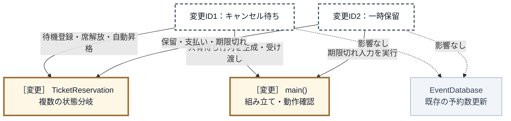

クラスと組み立て箇所の粒度で数えると、変更先は `TicketReservation` と `main()` の2か所です。ただし `TicketReservation` という1箱の内側では、`reserve()`・`pay()`・`cancel()`・`hold()`・`expire()`・昇格処理を横断して直しています。箱をメソッドごとに分けて変更先を多く見せず、**1クラスの中に複数状態の判断が散ったこと**を痛みとして扱います。`EventDatabase` の予約数更新は既存のままです。改善後も同じく、クラスと組み立て箇所の粒度で比べます。

### 3-3：痛みの言語化

変更を試みてみた結果、現場でよく直面する3つの辛い状況が浮かび上がってきました。

1つ目は、修正漏れが受入条件の不成立に直結することです。変更ID2（一時保留）では、`pay()`で保留中からの支払いを許可するだけでなく、`reserve()`・`cancel()`・`expire()`でもHeldの扱いを確認しました。一つの確定要求に対してクラス内の複数操作を点検する必要があります。

2つ目は、変更ID1（キャンセル待ち）・変更ID2（一時保留）の振る舞いを追うために複数メソッドの`if`と`else if`を行き来する必要があることです。「今この状態なら、この操作は何をするか」を一つの場所で読めず、今回修正した全操作をまとめて確認しなければなりません。

3つ目は、変更ID1（キャンセル待ち）で足したキャンセル待ちが、状態判定とは別の知識を予約本体へ持ち込んだことです。誰が待っているかという待機列そのものを予約本体が持ち、席が空いたときに先頭を昇格させる判断も、待機列へ積む判断も、状態分岐が並ぶ同じメソッドの中にあります。待機順の決め方を変えたいだけでも、状態分岐と同じ場所を開くことになります。


---
> **📌 問題（確定）**
> 変更ID1（キャンセル待ち）のキャンセル待ちと変更ID2（一時保留）の一時保留を追加しただけで、`reserve()`・`pay()`・`cancel()`・`expire()`など複数のメソッドへ条件分岐を追加する必要がある。状態ごとの許可操作と遷移先が`TicketReservation`全体へ散らばり、一つの確定要求に対する修正・確認範囲が広い。
---

観測した痛みへ`問題ID`を付け、どの変更IDから来たかを対応づけます。

| 問題ID | 変更を試して観測した痛み | 起点 |
|---|---|---|
| 問題ID1（修正漏れ） | 2状態を足すだけで `reserve()`・`pay()`・`cancel()`・`expire()` に分岐が増えた | 変更ID1・変更ID2 |
| 問題ID2（横断確認） | 1状態の振る舞いを知るために、全操作を横断して読んだ | 変更ID2（一時保留） |
| 問題ID3（待機責任の散在） | 自動昇格と待機順の管理が予約本体の各所へ散らばった | 変更ID1（キャンセル待ち） |

## 🟠 フェーズ4：原因分析 ―― なぜ辛いのかを構造で言語化する

フェーズ3から受け取るのは、問題ID1（修正漏れ）・問題ID2（横断確認）・問題ID3（待機責任の散在）と、変更途中の `TicketReservation` です。ここでは具体的な分離方法をまだ選ばず、痛んだ場所にどの責任が集まったかを調べます。

### 4-1：痛んだ場所の責任を並べる

**1つ目：痛んだ場所を1つ選び、そこにある処理を並べて書き出します。** 問題ID1（修正漏れ）・問題ID2（横断確認）では `TicketReservation` の `reserve()`・`pay()`・`cancel()`・`expire()` を横断し、問題ID3（待機責任の散在）では同じ操作群へ待機登録と自動昇格が入りました。コードが行っている処理・判断の単位で分けます。

| 着目箇所 | そこで行っている処理・判断 | 対応する問題ID |
|---|---|---|
| 公開操作 | 利用者やタイマーから予約・支払い・取消・期限切れを受け取る | 問題ID1・問題ID2 |
| 各操作の状態分岐 | 現在状態で操作を許可するか判断する | 問題ID1・問題ID2 |
| 各操作の状態更新 | 次状態と席数の増減を決める | 問題ID1・問題ID2 |
| 満席時の処理 | 予約を待機列へ加える | 問題ID3 |
| 席解放後の処理 | 待機列の先頭を選び、予約へ昇格させる | 問題ID3 |
| 待機列 | イベントごとの待機者と順序を保持する | 問題ID3 |

### 4-2：各責任が変わるきっかけを分ける

**2つ目：並べた処理・判断ごとに、「これが変わるのはどんなときか」を書きます。** コードの場所ではなく、状態ルール、待機方針、保存方法など、業務上の変更のきっかけを確認します。今回の変更に対する変える／守るであり、永続的な分類ではありません。

| 処理・判断が担う責任 | 変わるきっかけ | 今回の位置づけ |
|---|---|---|
| 公開操作から依頼を受ける | システムが受け付ける操作そのものが変わる | **守る** |
| 予約1件が現在状態を一つ持つ | 予約の管理単位が変わる | **守る** |
| 状態ごとの可否・次状態・席数更新 | 予約状態の業務ルールが変わる | **変える** |
| 待機者を追加し、順序を保持する | キャンセル待ちの運用方針が変わる | **変える** |
| 席解放後に先頭を昇格させる | 席を次の申込者へ引き継ぐ業務フローが変わる | **変える** |
| イベント台帳の席数を保存する | イベント在庫の保存方法が変わる | **守る** |

状態ごとの可否・次状態・席数更新は、同じ状態ルールとして一緒に変わります。待機順はキャンセル待ちの運用方針で変わり、席を解放した後に何をするかという予約遷移とは別の理由を持ちます。それでも変更途中コードでは、これらを `TicketReservation` の状態分岐の中で同時に扱っています。

### 4-3：接続点に漏れている判断や前提を確認する

#### 異なる変更理由の同居を原因として確定する

**3つ目：きっかけが違うものが、同じ場所に並んでいないかを見ます。**

公開操作が `status` の文字列を読み、状態ごとの可否・次状態・副作用まで直接決めるため、新しい状態を加えると複数の操作を横断します。さらに、待機順の保持と先頭選択まで同じ本体へ置いたため、待機方針の変更でも状態処理を開くことになります。

| 原因ID | 異なる理由で変わる責任の同居 | 対応する問題ID |
|---|---|---|
| 原因ID1（状態判断と処理が同居） | 公開操作の流れが、各状態の可否・遷移・副作用を直接持つ | 問題ID1・問題ID2 |
| 原因ID2（待ち行列が状態処理へ絡む） | 状態遷移の流れが、待機者の保持・待機順・先頭選択まで持つ | 問題ID3 |

> **問い1：同じ場所に、別々の理由で変わるものがないか**
>
> 答えは「ある」です。公開操作、状態固有のルール、待機順の方針は別々の理由で変わりますが、`TicketReservation` の操作メソッドへ集まっています。

フェーズ4で確定したのは、原因ID1（状態判断と処理が同居）・原因ID2（待ち行列が状態処理へ絡む）と、それぞれで同居している責任です。まだ境界やコード上の手段は決めていません。次のフェーズでは、この二つの原因から境界候補を導きます。

## 🟡 フェーズ5：課題定義 ―― 原因から課題を検討して確定する

入力は、フェーズ4で確定した原因ID1（状態判断と処理が同居）と原因ID2（待ち行列が状態処理へ絡む）です。原因ごとに、変える側と守る側の間へ必要な境界を考えます。

### 5-1：原因から境界候補を導く

**1つ目：変える側と守る側の間に線を引きます。** 原因ID1（状態判断と処理が同居）の状態固有動作と公開操作、原因ID2（待ち行列が状態処理へ絡む）の待機順と席解放後の流れの間を分けます。

**2つ目：線を越えて本当に必要な共通部分を探します。** 状態ごとの動作と待機処理を横に並べ、公開操作から渡す依頼と、反映・返却する結果だけを次の表へ残します。

| 元の原因 | 変える側 | 守る側 | 境界を越える必要がある業務情報 |
|---|---|---|---|
| 原因ID1（状態判断と処理が同居） | 状態ごとの可否・次状態・席数更新 | 公開操作と現在状態の保持 | 予約・支払い・取消・期限切れの依頼を渡し、状態変更と席数更新を反映する |
| 原因ID2（待ち行列が状態処理へ絡む） | 待機者の保持・待機順・先頭選択 | 満席判定と席解放後の処理 | イベントと待機対象を渡し、次に昇格する予約を受け取る |

ここで確定したのは業務上の依頼と結果までです。状態をどの型で表すか、どの操作を契約にするか、待機列の実体を誰が作るかはフェーズ6で決めます。

### 5-2：部分対応で原因が残らないか確認する

**3つ目：部分的な切り出しで原因が残らないかを、システム全体で確かめます。**

`status` を列挙型へ変えるだけでは、状態ごとの判断が各公開操作に残るため原因ID1（状態判断と処理が同居）は消えません。状態判定を補助関数へ集めても、状態数と操作数の組み合わせを中心クラスが知る状態は同じです。また、状態固有処理だけを外へ出して待機順を予約本体に残すと原因ID2（待ち行列が状態処理へ絡む）が残り、利用側が昇格を手で呼ぶ構造では席解放からの処理がシステム内でつながりません。

したがって、状態固有の判断を公開操作から分ける境界と、待機順を状態処理から分けながら席解放へ接続する境界の両方が必要です。これは別々の完成案ではなく、一つの完成システムに必要な二つの境界です。責任配置の異なる別の完成構造は成立していないため、手段の比較は行いません。

### 5-3：課題ID・接続点・完了条件を確定する

| 課題ID | 元の原因ID | 変える側 | 守る側 |
|---|---|---|---|
| 課題ID1（状態固有動作の境界） | 原因ID1（状態判断と処理が同居） | 状態ごとの可否・遷移・副作用 | 公開操作と現在状態の保持 |
| 課題ID2（待ち行列の境界） | 原因ID2（待ち行列が状態処理へ絡む） | 待機者の保持・待機順・先頭選択 | 満席判定と席解放後の流れ |

| 課題ID | 接続点で流す業務情報 |
|---|---|
| 課題ID1（状態固有動作の境界） | 操作の依頼を現在状態へ渡し、状態変更と席数更新を反映する |
| 課題ID2（待ち行列の境界） | イベントと待機対象を渡し、次に昇格する予約を受け取る |

#### 課題ID1（状態固有動作の境界）の完了条件

- `TicketReservation` の公開操作に、状態名による条件分岐がない
- 可否・次状態・副作用を、現在状態へ委ねている
- 状態追加で、すべての公開操作を修正しない

#### 課題ID2（待ち行列の境界）の完了条件

- 待機順の保持と先頭選択が、予約本体の状態分岐にない
- 取消・期限切れで席が空くと、システム内から先頭が昇格する
- 利用側に、待機者を昇格させる操作がない

**二つとも満たした完成状態**では、公開操作は現在状態へ処理を渡し、待機順は別の責任が管理します。取消・期限切れで空席が出たときだけ両者が接続され、利用側の追加操作なしで先頭が昇格します。

| 問題ID（フェーズ3の痛み） | 原因ID（フェーズ4の構造原因） | 課題ID（フェーズ5の達成目標） |
|---|---|---|
| 問題ID1・問題ID2：状態追加で複数操作を横断修正・確認する | 原因ID1（状態判断と処理が同居） | 課題ID1（状態固有動作の境界） |
| 問題ID3：自動昇格と待機順が予約本体へ散在する | 原因ID2（待ち行列が状態処理へ絡む） | 課題ID2（待ち行列の境界） |

## 🔴 フェーズ6：対策検討 ―― 構想を一つのコード経路へ変える

課題ID1（状態固有動作）と課題ID2（待ち行列）を、取消から自動昇格まで動く一つの構想にします。

> **フェーズ6の確認観点：** 「契約と具体」「生成・所有」「選択・遷移」「受け渡し」「実行」が、二つの課題を同時に解き、取消から自動昇格まで途切れずにつながるかを確認します。

### 構想を決める

公開操作から状態判定を外し、状態ごとの許可操作・遷移・副作用を具体状態へ置きます。待機順は別クラスへ分け、席解放から自動昇格だけを接続します。

| 決めること | システム全体での決定 | 守る側から隠れる詳細 |
|---|---|---|
| 契約と具体 | 状態別の可否・遷移を状態単位へ、待ち順を別の境界へ置く | 状態の遷移と待ち順 |
| 生成・所有・受け渡し | 組み立て役が状態、DB、待ち行列の寿命を保証し、予約本体へ境界として渡す | 具体状態の寿命と共有データ |
| 公開入口からの実行 | 利用側は公開操作だけを呼び、状態委譲と席解放後の昇格を内部で続ける | 現在状態と待機者選択 |

この時点で決めたのは、予約本体から状態固有判断と待機順を二つの境界へ出し、席解放から自動昇格までをシステム内でつなぐことです。次の部分クラス図では、その責任の向きだけを示します。`StateBoundary`と`WaitlistBoundary`は役割を表す仮名で、型名・具体状態・生成場所はこのあと決めます。

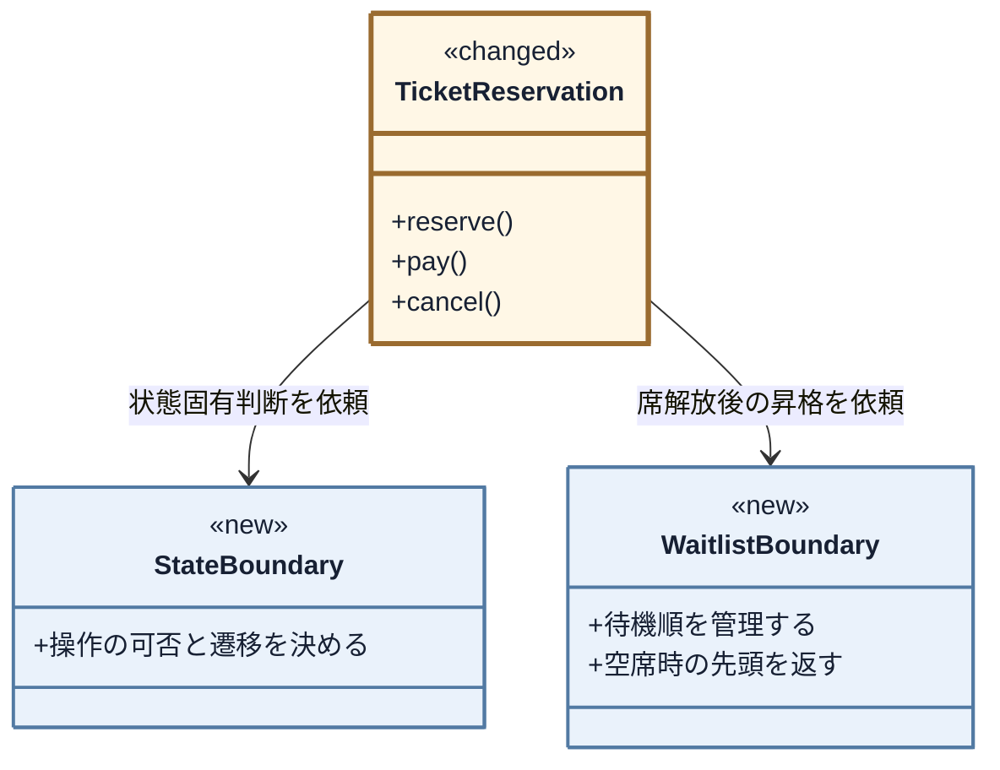

ここから、状態契約、具体状態、生成・共有、待機列、公開操作からの委譲と自動昇格の順で具体化します。完成クラス図はフェーズ7で確認します。

### 構想をコードでつなぐ

> **現在位置：** 契約 → 具体状態 → 生成・共有 → 公開操作からの委譲、の順で確認します。

#### 契約：境界の形と受け渡しを決める

> **問い2：境界では、何を約束すれば足りるか**
>
> 予約本体が具体状態を判定せず、同じ公開操作とイベントを現在状態へ渡せれば十分です。そこで状態側には六つの共通操作を約束します。一方、待ち行列は実装が一つで差し替える根拠がないため、専用クラスへ分けても契約用の型は増やしません。

状態ごとの可否と遷移は五つの公開操作に分散しています。状態・遷移・イベントが増える見込みもあるため、関数の切り出しではなく、全操作を同じ形で呼べる状態契約まで分けます。

**変更前から抜き出す箇所：`TicketReservation::cancel()`** ―― 変更を試したときの分岐から、変更要求で保留対応を足した部分（対策前）

```cpp
void TicketReservation::cancel() {
    if (status == "Reserved") {
        status = "Available";                    // ← 出て行く側（遷移先）
        // ← 出て行く側（可否とメッセージ）
        std::cout << "予約をキャンセルしました\n";
        // ← 出て行く側（この遷移固有の副作用）
        promoteNextWaitlisted();
    } else if (status == "Held") {               // ← 出て行く側（可否）
        status = "Available";
        std::cout << "保留からキャンセルしました\n";
        promoteNextWaitlisted();
    } else {
        handleCancelError();
    }
}
```

状態追加で変わる可否・遷移・副作用を外し、公開操作には現在状態へ委譲する役割だけを残します。接続点は次のとおりです。

| 接続候補 | 決めた形 | 理由 |
|---|---|---|
| 現在状態 | オブジェクトそのもので表し、引数では渡さない | 値で渡すと、受け取った側へ状態分岐が残る |
| 操作・イベント | 操作ごとに別メソッドを置く | 種別値で渡すと、操作を選ぶ分岐が残る |
| 次状態 | 次の状態オブジェクトを設定する | 状態名による再分岐を作らない |
| 結果 | 不可ならその場で表示し、戻り値は増やさない | 呼び出し側は成否で分岐していない |

重要なのは次状態の決め方です。状態名を返すだけでは、呼び出し元が「席を戻し昇格させる遷移」と「昇格させない遷移」を再判定します。そこで遷移元の状態が、次状態への切替と固有の副作用をまとめて実行し、操作対象の予約を引数で受け取ります。

| 接続するもの（追加で決めたこと） | 決めた形 | そう決めた理由 |
|---|---|---|
| 操作対象の予約 | **引数で契約へ渡す** | 状態が席数・待ち行列・次状態を動かすには、動かす相手が要る |

現在状態はオブジェクト、操作はメソッド名で表し、境界には操作対象だけを渡します。契約名は `IReservationState` とし、次の図で関係を確認してからコードで定義します。

次の部分クラス図は、**今決める「予約本体が現在状態を保持し、状態ごとの具体が共通基底を継承する」関係だけ**を示します。代表として予約済み状態だけを載せ、他の状態、待ち行列、席数台帳はまだ対象外です。

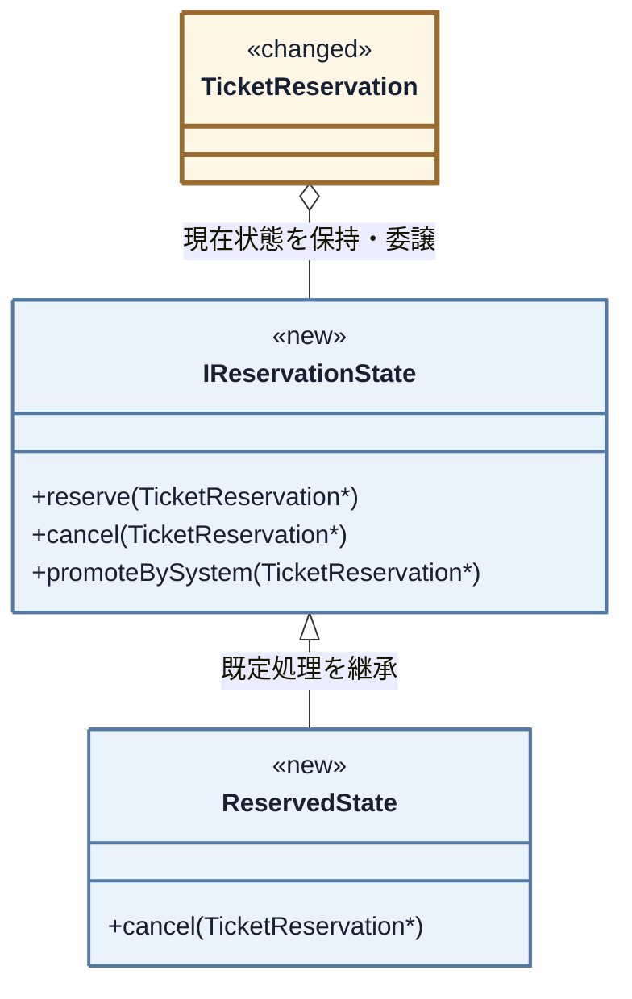

白三角が実線なのは、`IReservationState` が不可操作の既定処理を持つ実装継承だからです。

**ここで確認するコード：`IReservationState`（クラス全体・抜粋）** ―― 6操作のうち3つ

```cpp
// 状態ごとの共通操作と、許可されない操作の既定処理を持つ基底クラス
class IReservationState {
public:
    // 引数は操作対象の予約コンテキスト（TicketReservation*）。
// 既定実装では使わないため仮引数名を省略し、派生側では reservation と名付ける。

    virtual void reserve(TicketReservation*) {
        std::cout << "現在予約できません\n";
    }

    virtual void cancel(TicketReservation*) {
        std::cout << "キャンセルできません\n";
    }

    virtual void promoteBySystem(TicketReservation*) {
        std::cout << "システム昇格の対象ではありません\n";
    }

    // pay / hold / expire も同じ形で、既定は断りのメッセージ
    virtual ~IReservationState() = default;
};
```

利用者操作4種とシステム入力2種はいずれも状態で振る舞いが変わるため、同じ契約に置きます。許可されない操作は基底の既定処理へ任せ、呼ぶ側の状態判定をなくします。

**ここで確認するコード：`ReservedState`（クラス全体・抜粋）** ―― 予約済みの状態

```cpp
// Reserved（予約済み）：支払い・保留・取消ができる
class ReservedState : public IReservationState {
public:
    void cancel(TicketReservation* reservation) override {
        reservation->cancelSeat();                 // この遷移固有の副作用
        std::cout << "予約をキャンセルしました\n";
        reservation->setState(availableState());   // 次状態を設定する
        // 席が空いたので1件昇格
        reservation->promoteNextWaitlisted();
    }

    // pay / hold も同じ形で、それぞれの遷移先と副作用を持つ
};
```

> **設計判断：次状態は遷移元が決める。** 遷移表へ集約すると全体像は見やすい反面、状態追加のたびに中央の表を変更します。本章は変更範囲を遷移元の近くへ閉じる目的を優先します。代わりに、全遷移の把握には複数クラスを見るコストが残ります。

`ReservedState` 自体が現在状態を、`cancel()` が操作を表します。受け取った `reservation` に対して次状態・席数・昇格を変更するため、元の `if` の中身だけが状態クラスへ移ります。新状態への進入元を直す必要は残り、完了条件も「新状態と遷移接続に閉じる」としています。

次に、課題ID2（待ち行列の境界）の待機順を分けます。

**変更前から抜き出す箇所：`TicketReservation` の `promoteNextWaitlisted()`** ―― 変更を試したときの待ち行列操作（対策前）

```cpp
void TicketReservation::promoteNextWaitlisted() {
    if (waitlist.empty()) return;           // ← 出て行く側（探索方針）
    // ← 出て行く側（先頭選択）
    TicketReservation* next = waitlist.front();
    waitlist.pop_front();                   // ← 出て行く側（削除）
    next->promoteBySystem();                // ← 残る側（昇格を1件だけ起こす）
}
```

接続点は、待機者の追加・先頭取出し・昇格イベントです。

| 接続候補 | 決めた形 | 理由 |
|---|---|---|
| 待機者の追加 | 予約とイベントIDを渡す | 待ち行列に予約内部を探させない |
| 先頭取出し | イベントIDを渡し、先頭の予約を1件返す | 誰を選ぶかを待ち順の方針へ閉じる |
| 昇格イベント | 待ち行列へ渡さず、呼び出し側が選ばれた予約へ伝える | 昇格は状態遷移の契約であり、待ち順とは別責任だから |

待ち行列は選択までを担当し、状態遷移である昇格は担当しません。

次の部分クラス図は、**待機順の責任を予約本体から分ける関係だけ**を示します。状態クラスと生成者は省いた部分図です。

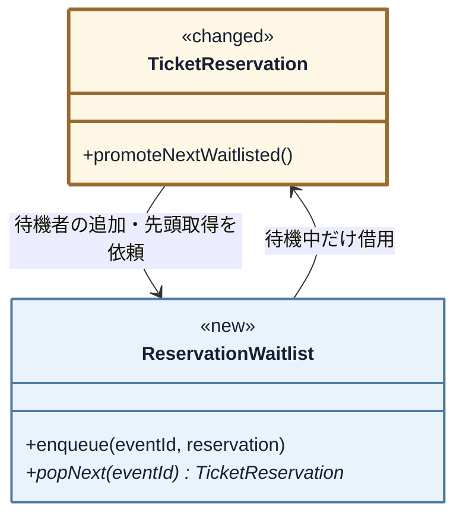

待機順は `ReservationWaitlist`、空席後の昇格開始は `TicketReservation` に置きます。次のコードに状態名がないことを確認します。

**ここで確認するコード：`ReservationWaitlist`（クラス全体）**

```cpp
class ReservationWaitlist {
    std::map<std::string,
             std::deque<TicketReservation*> > queues;
public:
    void enqueue(const std::string& eventId,
                 TicketReservation* reservation) {
        queues[eventId].push_back(reservation);
        // …待機数の1行表示（省略。詳細は完成コード）…
    }

    TicketReservation* popNext(const std::string& eventId) {
        std::deque<TicketReservation*>& queue = queues[eventId];

        if (queue.empty()) return NULL;

        TicketReservation* next = queue.front();
        queue.pop_front();
        // …待機数の1行表示（省略。詳細は完成コード）…
        return next;
    }
};
```

状態を知らないため、待機順の変更は `popNext()` 内へ閉じます。また、別イベントの待機者を昇格させないよう、行列はイベントIDごとに持ちます。

> **導入コスト：** 状態ごとにクラスが増え、全遷移は複数クラスに分散します。本章で受け入れるのは、フェーズ2で状態追加が見込まれ、横断的な分岐修正を減らす効果が上回るためです。

#### 具体：契約の裏へ変わる判断を置く

具体状態には「許可する操作」と「遷移先・副作用」だけを置きます。対照例として、システム昇格だけを許可する `WaitlistedState` を見ます。

**ここで確認するコード：`WaitlistedState`（クラス全体）** ―― 変更要求で追加したキャンセル待ちの状態

```cpp
// Waitlisted（キャンセル待ち）：システムからの昇格だけを受け付ける
class WaitlistedState : public IReservationState {
public:
    void promoteBySystem(
            TicketReservation* reservation) override {
        reservation->reserveSeat();
        std::cout << "空席発生を検知し、予約へ自動昇格しました\n";
        reservation->setState(reservedState());
    }
};
```

自分で操作できない規則は、該当メソッドを上書きせず、基底の断り処理を使うことで表します。

5クラスを並べると、状態遷移表がそのままクラスの一覧になります。

| 状態クラス | 上書きする操作 | 遷移先と副作用 |
|---|---|---|
| `AvailableState` | `reserve()` | 空席あり→予約済み・席を1つ減らす／満席→キャンセル待ち・待機登録 |
| `ReservedState` | `pay()` / `hold()` / `cancel()` / `expire()` | 支払済み／保留中／受付可能・席を戻して1件昇格／15分期限切れも同じ |
| `HeldState` | `pay()` / `cancel()` / `expire()` | 支払済み／受付可能・席を戻して1件昇格／24時間期限切れも同じ |
| `PaidState` | 無し | すべて既定の断り（支払済みは終端） |
| `WaitlistedState` | `promoteBySystem()` | 予約済み・席を1つ減らす |

`PaidState` は全操作を拒否する終端状態なので空のクラスです。待ち行列は実装の差し替え要求がなく、専用クラスへの責任分離だけで課題を満たすため、未使用の抽象は足しません。

**守る範囲との照合：** 予約で席を1つ減らし、取消・期限切れで1つ戻す規則は変えません。席を戻す4遷移はいずれも直後に `promoteNextWaitlisted()` を呼び、自動昇格を保ちます。

---

#### 生成・所有・受け渡しを決める

> **問い3：実体を、誰が作り、持ち、渡すのか**
>
> 状態取得関数がメンバーを持たない五つの状態実体を生成・静的所有し、`TicketReservation`が現在状態へのポインタを持ちます。外側の実行役は座席数・待ち行列を所有して予約へ渡します。作った状態が公開操作から呼ばれ、遷移後も同じ共有資源へ戻れる経路を確かめます。

##### 生成・所有：実体と所有者をコードで示す

五つの状態はデータを持たず、渡された予約だけを動かすため、各一実体を全予約で共有します。

**ここで確認するコード：`availableState()` ほか、状態を返す5つの関数** ―― 宣言と、1つの実装

```cpp
IReservationState* availableState();
IReservationState* reservedState();
IReservationState* paidState();
IReservationState* waitlistedState();
IReservationState* heldState();

IReservationState* reservedState() {
    static ReservedState instance;   // 最初の呼び出しで1つだけ作る

    return &instance;
}
```

状態同士が遷移先を呼ぶため宣言を先に置きます。関数内 `static` は終了まで生存し、`state` は共有実体を借り、`setState()` で参照先だけを替えます。

**ここで確認するコード：`TicketReservation`（クラス宣言・完成）**

```cpp
class TicketReservation {
    IReservationState* state;      // 共有の状態を借りる
    EventDatabase* db;             // 在庫（境界）
    ReservationWaitlist* waitlist; // 課題ID2の係
    std::string eventId;
public:
    TicketReservation(IReservationState* initialState,
                      EventDatabase* db,
                      ReservationWaitlist* waitlist,
                      const std::string& eventId);
    void setState(IReservationState* nextState) {
        state = nextState;
    }
    void reserveSeat();
    void cancelSeat();
    void joinWaitlist();
    void promoteNextWaitlisted();
    // 公開操作 reserve / pay / cancel / hold / expire
};
```

三つは借用ポインタです。とくに待ち行列は同一イベントの全予約で共有するため、予約ごとに値で持てません。実体は外側の実行役が所有します。次のコードで、その実行役を `BatchApplication` として定義します。

**ここで確認するコード：`BatchApplication` のメンバー** ―― 共有される実体の置き場

```cpp
class BatchApplication {
    EventDatabase db;
    ReservationWaitlist waitlist;   // 全予約で1つを共有する
    // …予約の生成と実行（省略。詳細は完成コード）…
};
```

`db` と `waitlist` は各予約より長く生存し、状態実体だけは状態取得関数が静的所有します。

---

##### 状態の受け渡し：初期状態と次状態を渡す

状態は、予約生成時の初期設定と、各遷移時の切替の2回に分けて渡されます。

**ここで確認するコード：`BatchApplication::run()`** ―― 予約を1件作る行

```cpp
        EventInfo i1 = db.get("EVT001");
        TicketReservation r(availableState(), &db,
                            &waitlist, "EVT001");
```

`availableState()` の戻りが初期状態になります。遷移時は次の一行で切り替えます。

**ここで確認するコード：`ReservedState` の `cancel()`** ―― 具体コードで書いた1行目（引数は `TicketReservation*`）

```cpp
        // ←ここで次の実装が入る
        reservation->setState(availableState());
```

遷移元が次状態を渡し、予約本体は具体型を判定しません。

| 課題 | 実装の決まり方 | 骨格へ渡る場所 |
|---|---|---|
| 課題ID1（状態固有動作の境界） | 現在の状態と受けた操作から、遷移元の状態が次状態を決める | `TicketReservation::setState()` |
| 課題ID2（待ち行列の境界） | 実装は1つなので選ばない | `BatchApplication` が起動時に渡す |

待ち行列は一実装なので選択せず、`BatchApplication` が同じ実体を全予約へ渡します。


---

#### 実行骨格：組み立てた実体を契約から呼ぶ

公開操作は現在状態へ委譲します。席が空くと `promoteNextWaitlisted()` が待ち行列から一件取り出し、状態イベントで自動昇格させます。

#### 公開入口から具体の実行まで追う

##### 公開入口から骨格・契約・具体へつなぐ

最後に、公開入口の差だけを確認します。

**変更前から抜き出す箇所：`main()`** ―― 変更を試したときの予約と取消（対策前）

```cpp
    r.reserve(true);
    r.cancel();
```

**ここで確認するコード：`BatchApplication::run()`** ―― 同じ操作（対策後）

```cpp
    r.reserve();
    r.cancel();
```

満席判定は在庫を使う `AvailableState` へ移り、`reserve()` の引数から消えます。取消の呼び方は同じで、昇格を `main()` から呼ぶ行もありません。依存を三つ渡す組み立てコストと引き換えに、状態追加を新状態と遷移元へ、待機順変更を `ReservationWaitlist` へ閉じます。最終的な不変条件はフェーズ7で検証します。

### 構想を採用する

`TicketReservation` は公開入口、状態クラスは可否・遷移・副作用、`ReservationWaitlist` は待機順を持ちます。待ち行列まで状態クラスへ置く案は課題ID2（待ち行列の境界）を解かない途中状態であり、完成構造は一つなので比較しません。完成クラス図はフェーズ7で示します。

#### 課題から採用構想までを照合する

| 対象 | 採用した構造とコード | 確認する効果 |
|---|---|---|
| 課題ID1（状態固有動作の境界） | `TicketReservation` が `IReservationState` の各状態へ委譲する | 状態追加を新状態と遷移接続へ閉じる |
| 課題ID2（待ち行列の境界） | `ReservationWaitlist` を席解放処理へ接続する | 取消・期限切れの直後に先頭を自動昇格する |
| 公開入口・席数 | `TicketReservation` の公開操作と `EventDatabase` を保つ | 50/50→49/50→50/50を同じ入口で実行する |

#### 将来リスクに対して構想を確認する

| 将来リスク | 変更を閉じ込める場所 | 守れる範囲と限界 |
|---|---|---|
| リスクID1（遷移ルール） | 遷移元の状態クラス | 他状態と公開入口を守れる。共通規則は重複しやすい |
| リスクID2（状態追加） | 新状態と、その状態へ入る遷移 | 既存状態を守れる。進入元が多いと複数状態の修正は残る |
| リスクID3（イベント追加） | 新イベント入口、状態契約、必要なスケジューラ | 状態判断を各状態へ保てる。実行基盤は別に必要になる |

## 🟢 フェーズ7：対策実施 ―― 変化に強いコードを完成させる

> **フェーズ7の確認観点：** 「変更後の全要求IDを満たし、既存要求も落としていないか」と「フェーズ5の構造上の完了条件を満たし、同じ変更IDの影響が縮んだか」を分けて確認します。

状態判定を各状態クラスへ、待機順を `ReservationWaitlist` へ移した完成コードを示します。

### 7-1：解決後のコード（全体）


#### 完成後のクラス一覧

完成コードの全型を先に示します。期限切れはシステム入力なので、実行役が予約の `expire()` を呼びます。

- `TicketReservation`、`IReservationState`、`EventInfo`
- `EventDatabase`、`ReservationWaitlist`、`AvailableState`
- `ReservedState`、`PaidState`、`WaitlistedState`、`HeldState`
- `ReservationExpiryScheduler`、`BatchApplication`

> **採用構造のコスト：** データを持たない状態は `static` で共有できますが、テスト用実体へは差し替えにくくなります。状態が予約固有データを持つなら共有せず、予約ごとの所有を設計します。

#### 完成後のクラス図

部分図を完成図へ統合します。`<<new>>` は新規、`<<changed>>` は変更、表示なしは現状維持です。最初の図は、予約本体・状態契約・五つの具体状態を示します。

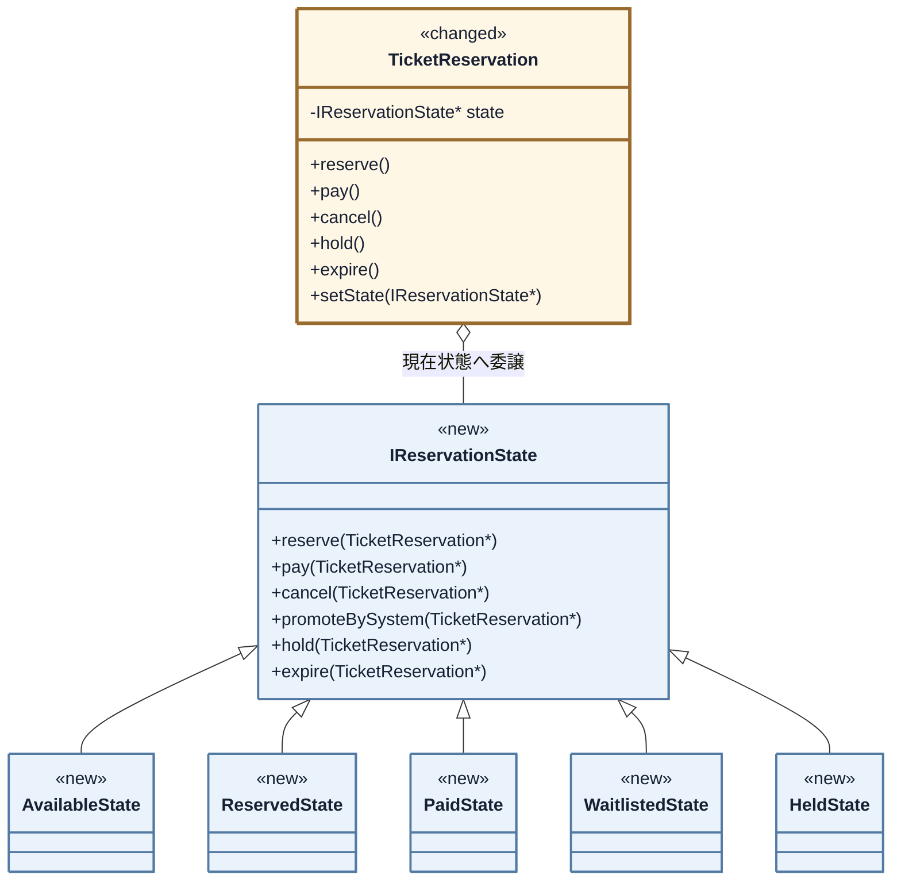

予約本体は現在状態へ操作を渡します。次の図で在庫・待ち行列・期限入力・組み立てとの関係を確認します。

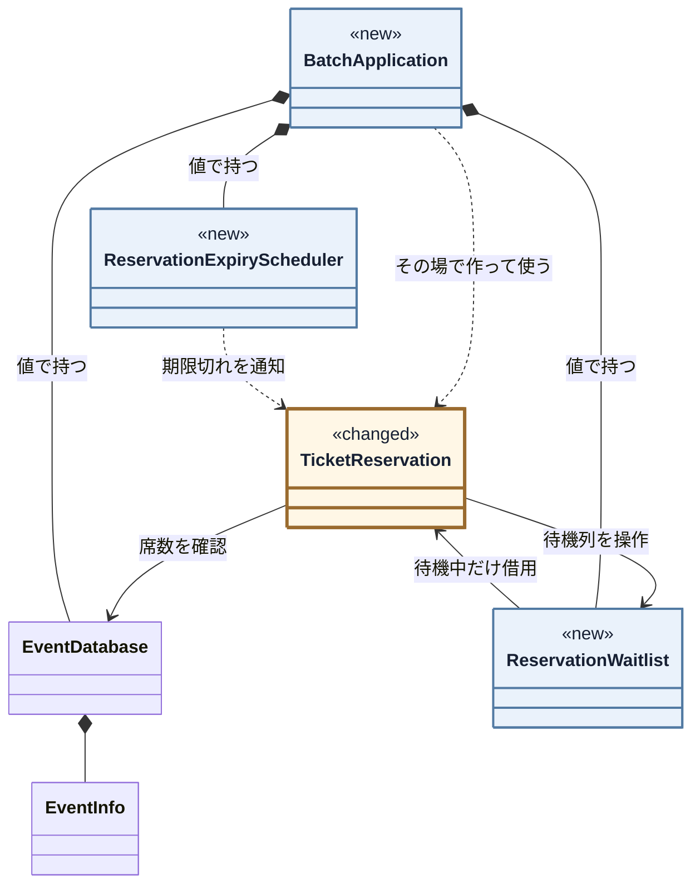

`EventDatabase` と `EventInfo` は現状維持です。新しい待ち行列・期限監視・組み立てを含め、掲載コードの全クラスを図に載せています。

#### 完成後の実行シーケンス

満席イベントの既存予約に `cancel()` が呼ばれたとき、空席作成から待機者の自動昇格までをどのクラスが担うか確認します。

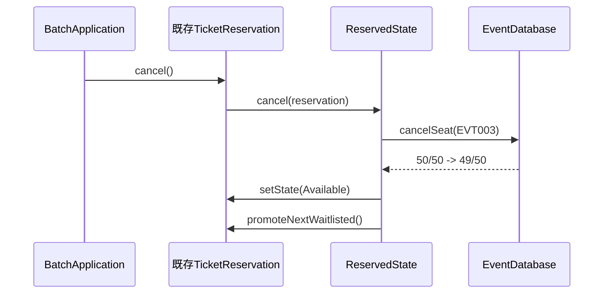

席を解放した直後、`promoteNextWaitlisted()` から自動昇格へ続きます。

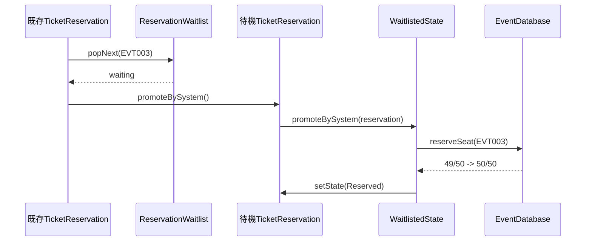

`BatchApplication` や運用者は昇格を呼びません。取消処理が待ち行列へつなぎ、待機状態が席を確保します。期限切れもタイマー境界から同じ解放・昇格経路へ入ります。

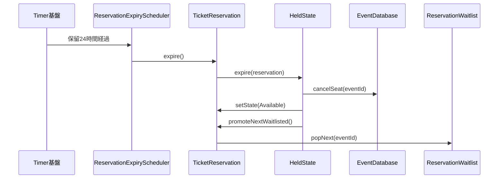

`main()` は `BatchApplication::run()` だけを起動します。

#### 完成コード

クラス名 → コード → 要点の順で読み、`BatchApplication::run()` と結果をシナリオごとに確認します。

---

**共通ヘッダー**

完成コードで使う標準ライブラリです。

```cpp
#include <iostream>
#include <string>
#include <map>
#include <deque>
#include <algorithm>
```

**EventInfo**

```cpp
struct EventInfo {
    std::string title;   // イベント名
    int capacity;        // 定員
    int reserved;        // 現在の予約数
};
```

**EventDatabase**

```cpp
class EventDatabase {
private:
    std::map<std::string, EventInfo> records;
public:
    EventDatabase() {
        records["EVT001"] = {"春の音楽祭",  100,  20};
        records["EVT002"] = {"夏のフェス",  500, 499};
        records["EVT003"] = {"秋の映画会",   50,  50};  // 満席
    }

    bool exists(const std::string& id) const {
        return records.count(id) > 0;
    }

    EventInfo get(const std::string& id) const {
        return records.at(id);
    }

    bool hasCapacity(const std::string& id) const {
        const auto& e = records.at(id);

        return e.reserved < e.capacity;
    }

    void reserveSeat(const std::string& id) {
        auto& event = records.at(id);
        int before = event.reserved;
        ++event.reserved;
        std::cout << "[予約数] " << id << " "
                  << before << "/" << event.capacity
                  << " -> " << event.reserved << "/"
                  << event.capacity;
        if (event.reserved == event.capacity)
            std::cout << "（満席）";
        std::cout << std::endl;
    }

    void cancelSeat(const std::string& id) {
        auto& event = records.at(id);
        int before = event.reserved;

        if (event.reserved > 0) --event.reserved;
        std::cout << "[予約数] " << id << " "
                  << before << "/" << event.capacity
                  << " -> " << event.reserved << "/"
                  << event.capacity
                  << std::endl;
    }
};
```

---

**ReservationWaitlist**

イベントごとの先着順キューです。先にポインタ型だけを使うため、`TicketReservation` を前方宣言します。

```cpp
class TicketReservation;
```

**ReservationWaitlist**

```cpp
class ReservationWaitlist {
    std::map<std::string,
             std::deque<TicketReservation*>> queues;
public:
    void enqueue(const std::string& eventId,
                 TicketReservation* reservation) {
        queues[eventId].push_back(reservation);
        std::cout << "[待ち行列] " << eventId
                  << " 待機数=" << queues[eventId].size()
                  << std::endl;
    }

    TicketReservation* popNext(const std::string& eventId) {
        auto& queue = queues[eventId];

        if (queue.empty()) return nullptr;

        TicketReservation* next = queue.front();
        queue.pop_front();
        std::cout << "[待ち行列] " << eventId
                  << " 待機数=" << queue.size()
                  << std::endl;
        return next;
    }

    // 待機中の予約が先に破棄された場合も、借用ポインタを残さない
    void remove(TicketReservation* reservation) {
        for (auto it = queues.begin(); it != queues.end(); ) {
            auto& queue = it->second;
            auto newEnd = std::remove(
                queue.begin(), queue.end(), reservation);
            queue.erase(newEnd, queue.end());
            if (queue.empty()) {
                it = queues.erase(it);
            } else {
                ++it;
            }
        }
    }
};
```

予約と待ち行列は互いを参照しますが所有しません。`BatchApplication` が待ち行列を長く生かし、予約破棄時の `remove(this)` で無効な借用ポインタを残しません。

---

**IReservationState**

基底クラスが不可操作の既定処理を持ち、具体状態は許可する操作だけを上書きします。

**IReservationState**

```cpp
// 状態ごとの共通操作と、許可されない操作の既定処理を持つ基底クラス
class IReservationState {
public:
    // 引数は操作対象の予約コンテキスト（TicketReservation*）。
// 既定実装では使わないため仮引数名を省略し、派生側では reservation と名付ける。

    virtual void reserve(TicketReservation*) {
        std::cout << "現在予約できません\n";
    }

    virtual void pay(TicketReservation*) {
        std::cout << "支払いに適した状態ではありません\n";
    }

    virtual void cancel(TicketReservation*) {
        std::cout << "キャンセルできません\n";
    }

    virtual void promoteBySystem(TicketReservation*) {
        std::cout << "システム昇格の対象ではありません\n";
    }

    virtual void hold(TicketReservation*) {
        std::cout << "保留できません\n";
    }

    virtual void expire(TicketReservation*) {
        std::cout << "期限切れ処理は行えません\n";
    }

    virtual ~IReservationState() = default;
};
```

---

**TicketReservation**

状態クラスを保持し、操作を現在の状態に委譲する中心クラス（コンテキスト）です。

```cpp
// 予約クラス：状態を保持し操作を委譲するだけ
class TicketReservation {
private:
    IReservationState* state;
    EventDatabase* db;           // 在庫の保存データ（境界）
    ReservationWaitlist* waitlist;
    std::string eventId;

    // キャンセル待ち昇格は外部公開せず、システム連鎖からだけ呼ぶ
    void promoteBySystem() {
        state->promoteBySystem(this);
    }
public:
    TicketReservation(IReservationState* initialState,
                      EventDatabase* db,
                      ReservationWaitlist* waitlist,
                      const std::string& eventId)
        : state(initialState), db(db), waitlist(waitlist),
          eventId(eventId) {}

    // 待機中に予約オブジェクトが破棄されても参照を残さない
    ~TicketReservation() {
        waitlist->remove(this);
    }

    // キューがthisのアドレスを借用するため、実体の複製・移動を禁止する
    TicketReservation(const TicketReservation&) = delete;
    TicketReservation& operator=(
        const TicketReservation&) = delete;
    TicketReservation(TicketReservation&&) = delete;
    TicketReservation& operator=(TicketReservation&&) = delete;

    // 状態遷移時に、共有状態オブジェクトへの借用ポインタを差し替える。
    // 状態は関数ローカルstaticが所有するため、ここではdeleteしない。
    void setState(IReservationState* nextState) {
        state = nextState;
    }

    // 状態遷移の副作用：在庫の増減
    void reserveSeat() { db->reserveSeat(eventId); }
    void cancelSeat()  { db->cancelSeat(eventId); }
    bool hasCapacity() const {
        return db->hasCapacity(eventId);
    }
    void joinWaitlist() {
        waitlist->enqueue(eventId, this);
    }

    void promoteNextWaitlisted() {
        TicketReservation* next = waitlist->popNext(eventId);

        if (next != nullptr) next->promoteBySystem();
    }

    // 操作を現在の状態に委譲するだけ
    void reserve()         { state->reserve(this); }
    void pay()             { state->pay(this); }
    void cancel()          { state->cancel(this); }
    void hold()            { state->hold(this); }
    void expire()          { state->expire(this); }
};
```

`state` は共有状態への非所有ポインタです。予約は待ち行列から借用されるため複製・移動を禁じ、破棄時に登録を外します。席数更新と自動昇格は状態処理から連続して呼ばれます。

---

**状態取得関数の宣言と AvailableState**

状態同士が遷移先を参照するため、状態取得関数を先に宣言します。

```cpp
IReservationState* availableState();
IReservationState* reservedState();
IReservationState* paidState();
IReservationState* waitlistedState();
IReservationState* heldState();

// Available（予約可能）：空席なら予約、満席なら自動待機登録する
class AvailableState : public IReservationState {
public:
    void reserve(TicketReservation* reservation) override {
        if (!reservation->hasCapacity()) {
            reservation->joinWaitlist();
            std::cout << "満席のためキャンセル待ちに登録しました\n";
            reservation->setState(waitlistedState());
            return;
        }

        reservation->reserveSeat();
        std::cout << "予約完了しました\n";
        reservation->setState(reservedState());
    }
};
```

`AvailableState` は空席の有無で予約または待機登録へ進めます。**現状コードでは `TicketReservation::reserve()` の中にあった判定が、状態クラスへ移りました。**

---

**ReservedState**

```cpp
// Reserved（予約済み）：支払い、取消、保留、期限切れを処理する
class ReservedState : public IReservationState {
public:
    void pay(TicketReservation* reservation) override {
        std::cout << "支払い完了しました\n";
        reservation->setState(paidState());
    }

    void cancel(TicketReservation* reservation) override {
        reservation->cancelSeat();
        std::cout << "予約をキャンセルしました\n";
        reservation->setState(availableState());
        reservation->promoteNextWaitlisted();
    }

    void hold(TicketReservation* reservation) override {
        std::cout << "保留にしました\n";
        reservation->setState(heldState());
    }

    void expire(TicketReservation* reservation) override {
        reservation->cancelSeat();
        std::cout << "通常の決済期限が切れました\n";
        reservation->setState(availableState());
        reservation->promoteNextWaitlisted();
    }

};
```

`ReservedState` は支払・取消・一時保留・標準期限切れを担当します。取消と期限切れは、席を戻した直後に待機者の昇格まで起動します。

**PaidState**

```cpp
// Paid（支払い済み）：完了状態のため、すべて既定の拒否を使う
class PaidState : public IReservationState {};
```

`PaidState` は既定の拒否だけを使います。**中身が空なのは、許可する操作が1つもないからです。** 禁止の組み合わせを書き並べる必要がありません。

---

**WaitlistedState**

```cpp
// Waitlisted（キャンセル待ち）：システムからの昇格だけを受ける
class WaitlistedState : public IReservationState {
public:
    void promoteBySystem(
            TicketReservation* reservation) override {
        reservation->reserveSeat();
        std::cout << "空席発生を検知し、予約へ自動昇格しました\n";
        reservation->setState(reservedState());
    }
};
```

`WaitlistedState` が受け付けるのは、空席発生後にシステムが送る昇格イベントだけです。利用者向けの公開操作から直接昇格できません。

**HeldState**

```cpp
// Held（一時保留）：支払い、取消、期限切れを処理する
class HeldState : public IReservationState {
public:
    void pay(TicketReservation* reservation) override {
        std::cout << "保留から支払い完了しました\n";
        reservation->setState(paidState());
    }

    void cancel(TicketReservation* reservation) override {
        reservation->cancelSeat();
        std::cout << "保留からキャンセルしました\n";
        reservation->setState(availableState());
        reservation->promoteNextWaitlisted();
    }

    void expire(TicketReservation* reservation) override {
        reservation->cancelSeat();
        std::cout << "保留期限が切れました\n";
        reservation->setState(availableState());
        reservation->promoteNextWaitlisted();
    }

};
```

**ReservationExpiryScheduler**

```cpp
// タイマー基盤から期限切れイベントを予約へ渡す境界。
// 利用者や運用者がexpire()を手動実行する構造にはしない。
class ReservationExpiryScheduler {
public:
    void onPaymentDeadlineExpired(
            TicketReservation& reservation) {
        reservation.expire();
    }
};

// 状態オブジェクト取得関数。関数ローカルstaticが所有する。
IReservationState* availableState() {
    static AvailableState state;

    return &state;
}

IReservationState* reservedState() {
    static ReservedState state;

    return &state;
}

IReservationState* paidState() {
    static PaidState state;

    return &state;
}

IReservationState* waitlistedState() {
    static WaitlistedState state;

    return &state;
}

IReservationState* heldState() {
    static HeldState state;

    return &state;
}
```

---

**BatchApplication――`run()` とシナリオ別の実行結果**

依存の組み立てと実行の責任を分離します。**状態オブジェクトの具体クラス名は、`availableState()` の呼び出し以外に出てきません。**

```cpp
// BatchApplication：依存の組み立てを担う入口
class BatchApplication {
    EventDatabase db;
    ReservationWaitlist waitlist;
    ReservationExpiryScheduler expiryScheduler;

    bool validateExists(const std::string& eventId) {
        if (!db.exists(eventId)) {
            std::cout << "エラー：イベントID " << eventId
                      << " は存在しません\n";
            return false;
        }

        return true;
    }

    // 予約前に現在の席数を表示する。満席判定と待機登録はreserve()側が行う。
    bool showAvailability(const std::string& eventId) {
        if (!validateExists(eventId)) return false;

        EventInfo info = db.get(eventId);
        int available = info.capacity - info.reserved;
        std::cout << "[席数確認] " << eventId << " "
                  << info.reserved << "/" << info.capacity
                  << "（空席" << available << "）";
        if (available == 0) std::cout << "（満席）";
        std::cout << std::endl;

        return true;
    }

public:
    void run() {
        // ケース1：通常予約フロー (Available → Reserved → Paid)
        std::cout << "--- ケース1: 通常予約 ---\n";

        if (showAvailability("EVT001")) {
            EventInfo i1 = db.get("EVT001");
            std::cout << "予約対象：" << i1.title << "\n";
            TicketReservation seat1(availableState(), &db,
                                    &waitlist, "EVT001");
            seat1.reserve();
            seat1.pay();
        }
```

ケース1の実行結果：

```
--- ケース1: 通常予約 ---
[席数確認] EVT001 20/100（空席80）
予約対象：春の音楽祭
[予約数] EVT001 20/100 -> 21/100
予約完了しました
支払い完了しました
```

---

**ケース2：通常キャンセル（Reserved→Available）**

同じ `BatchApplication::run()` の中の続きです。

```cpp
        // ケース2：通常キャンセル (Available → Reserved → Available)
        std::cout << "--- ケース2: 通常キャンセル ---\n";

        if (showAvailability("EVT001")) {
            TicketReservation seat2(availableState(), &db,
                                    &waitlist, "EVT001");
            seat2.reserve();
            seat2.cancel();
        }
```

「在席」は会場に現在いる人数を意味するため、予約枠については「席数確認」「予約数」と表記します。

ケース2の実行結果：

```
--- ケース2: 通常キャンセル ---
[席数確認] EVT001 21/100（空席79）
[予約数] EVT001 21/100 -> 22/100
予約完了しました
[予約数] EVT001 22/100 -> 21/100
予約をキャンセルしました
```

---

**ケース3：保留と支払い（Reserved→Held→Paid）**

同じ `BatchApplication::run()` の中の続きです。

```cpp
        // ケース3：保留と支払い (Available → Reserved → Held → Paid)
        std::cout << "--- ケース3: 保留と支払い ---\n";

        if (showAvailability("EVT002")) {
            std::cout << "予約対象："
                      << db.get("EVT002").title << "\n";
            TicketReservation seat3(availableState(), &db,
                                    &waitlist, "EVT002");
            seat3.reserve();
            seat3.hold();
            seat3.pay();
        }
```

ケース3の実行結果：

```
--- ケース3: 保留と支払い ---
[席数確認] EVT002 499/500（空席1）
予約対象：夏のフェス
[予約数] EVT002 499/500 -> 500/500（満席）
予約完了しました
保留にしました
保留から支払い完了しました
```

---

**ケース4：保留期限切れ（Held→Available）**

同じ `BatchApplication::run()` の中の続きです。

```cpp
        // ケース4：保留期限切れ
        // (Available → Reserved → Held → Available)
        std::cout << "--- ケース4: 保留期限切れ ---\n";

        if (showAvailability("EVT001")) {
            TicketReservation seat4(availableState(), &db,
                                    &waitlist, "EVT001");
            seat4.reserve();
            seat4.hold();
            // テストハーネスから「24時間経過」を即時注入する。
            // 本番では利用者でなくタイマー基盤が同じ境界を呼ぶ。
            expiryScheduler.onPaymentDeadlineExpired(seat4);
        }
```

ケース4の実行結果：

```
--- ケース4: 保留期限切れ ---
[席数確認] EVT001 21/100（空席79）
[予約数] EVT001 21/100 -> 22/100
予約完了しました
保留にしました
[予約数] EVT001 22/100 -> 21/100
保留期限が切れました
```

ケース4aは、一時保留を選ばず `Reserved` の標準15分期限が切れた場合です。テストハーネスが同じ期限切れ境界へイベントを注入し、予約を放置しても席が永久に確保されないことを確認します。

```cpp
        // ケース4a：通常の15分決済期限切れ (Reserved → Available)
        std::cout << "--- ケース4a: 通常決済期限切れ ---\n";

        if (showAvailability("EVT001")) {
            TicketReservation seat4a(availableState(), &db,
                                     &waitlist, "EVT001");
            seat4a.reserve();
            expiryScheduler.onPaymentDeadlineExpired(seat4a);
        }
```

ケース4aの実行結果：

```
--- ケース4a: 通常決済期限切れ ---
[席数確認] EVT001 21/100（空席79）
[予約数] EVT001 21/100 -> 22/100
予約完了しました
[予約数] EVT001 22/100 -> 21/100
通常の決済期限が切れました
```

---

**ケース5：満席→2件の待機登録→先着順に自動昇格**

同じ `BatchApplication::run()` の中の続きです。

```cpp
        // ケース5：満席確認 → 通常の予約要求で自動待機登録 →
        // 既存予約のキャンセルを起点に自動昇格
        std::cout << "--- ケース5: 満席からの自動昇格 ---\n";
        // 50/50を表示。reserve()が満席を判定する
        showAvailability("EVT003");

        TicketReservation waiting(availableState(), &db,
                                  &waitlist, "EVT003");
        waiting.reserve(); // 利用者は通常の予約操作だけ。満席なので自動待機登録
        TicketReservation waitingSecond(availableState(), &db,
                                         &waitlist, "EVT003");
        waitingSecond.reserve(); // 2番目として同じ待ち行列へ入る

        // 初期50件のうち1件を表す既存予約。利用側はcancel()だけを呼ぶ。
        TicketReservation occupied(reservedState(), &db,
                                   &waitlist, "EVT003");
        occupied.cancel(); // 50→49、その直後にwaitingを49→50へ自動昇格
        // 1番目の再取消で、2番目が続けて自動昇格する
        waiting.cancel();
        // 昇格後も同じ予約として操作できることを確認し、席を49へ戻す
        waitingSecond.cancel();
```

ケース5の実行結果：

```
--- ケース5: 満席からの自動昇格 ---
[席数確認] EVT003 50/50（空席0）（満席）
[待ち行列] EVT003 待機数=1
満席のためキャンセル待ちに登録しました
[待ち行列] EVT003 待機数=2
満席のためキャンセル待ちに登録しました
[予約数] EVT003 50/50 -> 49/50
予約をキャンセルしました
[待ち行列] EVT003 待機数=1
[予約数] EVT003 49/50 -> 50/50（満席）
空席発生を検知し、予約へ自動昇格しました
[予約数] EVT003 50/50 -> 49/50
予約をキャンセルしました
[待ち行列] EVT003 待機数=0
[予約数] EVT003 49/50 -> 50/50（満席）
空席発生を検知し、予約へ自動昇格しました
[予約数] EVT003 50/50 -> 49/50
予約をキャンセルしました
```

待機数は1、2と増え、空席が生じるたびに1、0と先頭から減ります。`popNext()`が`front()`を取り出すコードと、この2回の連続昇格を合わせることで、1番目の`waiting`、2番目の`waitingSecond`の順に自動昇格したことを確認できます。昇格した予約をそのまま再取消できるため、待機中に受け取った予約実体も有効なままです。

---

**ケース5b：保留の期限切れを起点にした自動昇格**

同じ `BatchApplication::run()` の中の続きです。ケース4は待ち行列が空だったため昇格が発動せず、要求ID7（支払期限と一時保留）の受入条件「期限切れ時は空席へ戻して待機者がいれば自動昇格する」の後半が未確認でした。ここでは待機者がいる状態で期限を切らせます。

```cpp
        // ケース5b：待機者がいる状態での期限切れ → 自動昇格
        std::cout << "--- ケース5b: 期限切れからの自動昇格 ---\n";
        // 直前の再取消で49/50。別の予約で満席へ戻してから保留にする
        TicketReservation held(availableState(), &db,
                               &waitlist, "EVT003");
        held.reserve();
        // 席は確保したまま、期限だけ24時間へ延長（席数は動かない）
        held.hold();
        TicketReservation waiting2(availableState(), &db,
                                   &waitlist, "EVT003");
        waiting2.reserve(); // 満席判定により自動待機登録
        // 24時間経過。席が空き、待機者が自動昇格する
        expiryScheduler.onPaymentDeadlineExpired(held);
```

ケース5bの実行結果：

```
--- ケース5b: 期限切れからの自動昇格 ---
[予約数] EVT003 49/50 -> 50/50（満席）
予約完了しました
保留にしました
[待ち行列] EVT003 待機数=1
満席のためキャンセル待ちに登録しました
[予約数] EVT003 50/50 -> 49/50
保留期限が切れました
[待ち行列] EVT003 待機数=0
[予約数] EVT003 49/50 -> 50/50（満席）
空席発生を検知し、予約へ自動昇格しました
```

期限切れは利用者操作ではなくスケジューラから届くイベントですが、席を解放したあとの自動昇格はキャンセル起点（ケース5）とまったく同じ経路を通ります。`HeldState::expire()` も `ReservedState::cancel()` も、席を戻したあとに共通の `promoteNextWaitlisted()` を呼ぶだけだからです。待ち行列の方針を変えても、状態クラス側は書き換えずに済みます。

ケース6は、無効な操作（未予約でのpay）の拒否です。

```cpp
        // ケース6：無効な操作の拒否 (Available → pay)
        std::cout << "--- ケース6: 無効な操作の拒否 ---\n";

        if (validateExists("EVT001")) {
            TicketReservation seat6(availableState(), &db,
                                    &waitlist, "EVT001");
            seat6.pay();
        }
```

ケース6の実行結果：

```
--- ケース6: 無効な操作の拒否 ---
支払いに適した状態ではありません
```

---

**ケース7：存在しないイベントIDのエラー**

同じ `BatchApplication::run()` の中の続きです。

```cpp
        // ケース7：存在しないイベントIDのエラー
        std::cout << "--- ケース7: 存在しないイベントID ---\n";
        validateExists("EVT999");
```

ケース7の実行結果：

```
--- ケース7: 存在しないイベントID ---
エラー：イベントID EVT999 は存在しません
```

最後に `BatchApplication::run()` を閉じ、`main()` から1回だけ実行します。上で並べた出力は、すべてこの `app.run()` の中で各シナリオを実行した結果です。

```cpp
    }
};

int main() {
    BatchApplication app;
    app.run();

    return 0;
}
```

この実行結果は、フェーズ1の動作例テーブルと、変更要求で追加した仕様遷移の代表ケースに対応しています。EVT003は、まず `50/50` の満席が見え、通常の予約要求が自動待機登録になり、既存予約のキャンセルで `50→49`、直後の自動昇格で `49→50` へ戻ります。さらに昇格した同じ予約を取り消して `50→49` にできるため、待機中だけ動く別物ではなく、通常の予約済み状態へ戻ったことも確認できます。利用側が待機登録の専用メソッドを呼ぶ行はなく、利用側が昇格メソッドを呼ぶ行はありません。


#### 最終要求の実装・受入エビデンス

ここで照合する要求IDは、**変更後要求ベースラインにある最終有効要求ID**です。変更前だけの要求一覧ではありません。継続・変更・追加を同じ順序で確認するため、変更されなかった既存要求の消失も検出できます。

変更IDの受入証拠も省略しません。要求ID表の後に、変更シナリオ表で変更ID1（キャンセル待ち）・変更ID2（一時保留）を「どの最終要求へ反映し、どの実行結果で確認したか」の単位で再照合します。つまり、要求ID表は最終仕様全体の受入・回帰、変更ID表は今回の依頼差分の受入という二つの役割です。

| 要求ID | 実装箇所 | 実行結果で確認したこと |
|---|---|---|
| 要求ID1（予約対象と空席の確認） | `showAvailability()`、`AvailableState` | 現在値を表示。未登録は拒否、満席は50/50のままWaitlistedになる |
| 要求ID2（席の確保） | `AvailableState::reserve()` | 残り1席から満席へ変わる |
| 要求ID3（購入の確定） | `ReservedState`、`HeldState` | 支払成功時だけPaidになる |
| 要求ID4（空席の引き継ぎ） | `ReservedState::cancel()`、`ReservationWaitlist` | 50/50→49/50→50/50となり、手動昇格がない |
| 要求ID5（誤操作からの保護） | 各 `IReservationState` 実装 | エラー前後の状態・件数が一致する |
| 要求ID6（順番待ち） | `AvailableState`、`WaitlistedState`、`ReservationWaitlist` | ケース5で2件を登録し、待機数2→1→0の順で先頭から自動昇格する |
| 要求ID7（支払期限と一時保留） | `ReservedState`、`HeldState`、`ReservationExpiryScheduler` | 通常期限と保留期限のどちらも席解放後に自動昇格する |

全7件が合格です。

上の表は継続（要求ID2（席の確保）・要求ID5（誤操作からの保護））・変更（要求ID1（予約対象と空席の確認）・要求ID3（購入の確定）・要求ID4（空席の引き継ぎ））・追加（要求ID6（順番待ち）・要求ID7（支払期限と一時保留））を同じ順序で並べ、変わらなかった既存要求も回帰対象に含めています。継続要求が合格していることで、既存動作が落ちていないことを確認できます。要求の受入・回帰はここで完了します。課題IDへ直接対応付けず、以下では変更試行の痛みから導いた構造課題だけを別に確認します。

#### 設計課題の構造改善結果

要求の受入とは分けて、課題IDごとに構造と変更影響を確認します。

変更前は、状態文字列の判定と状態ごとの処理が複数の公開操作へ散らばっていました。公開操作を保ったまま、許可・遷移・副作用を具体状態へ移し、別の理由で変わる待ち順を専用責任へ分けたことで、状態追加時に横断する分岐を減らせました。

| 課題ID | コードで変えた構造 | 得られた効果と残る変更先 |
|---|---|---|
| 課題ID1（状態固有動作の境界） | 状態別動作を `IReservationState` の各実装へ移した | 状態追加を新状態と遷移接続へ閉じた |
| 課題ID2（待ち行列の境界） | `ReservationWaitlist` を席解放経路へ接続した | 取消・期限切れから自動昇格まで閉じた。待ち順の変更はここに残る |
#### 変更前→変更後の不変条件照合

| 守る対象 | 変更前→変更後 | 確認根拠 |
|---|---|---|
| イベント・定員データ | `EventDatabase` の同じ数値を更新する | 満席前後の50/50ログ |
| 利用側の取消入口 | どちらも予約の `cancel()` だけを呼ぶ | 自動昇格シナリオの呼び出しコード |

> **実務でファイルを分けるなら**
>
> 掲載用の1ファイルを、実務では責任ごとに次のように分けます。
>
> | ファイル | 入れるもの | なぜそこか |
> |---|---|---|
> | `EventDatabase.h` | イベント情報と席数の台帳 | 状態の話とは別に変わる |
> | `IReservationState.h` | 状態の契約 | 骨格がインクルードするのはこれだけ |
> | `States.h` / `.cpp` | 各状態クラス | **状態を1つ足すとき、開くのはここだけ**にしたい |
> | `TicketReservation.h` | 骨格と、待ち行列・期限監視・組み立て | 具体状態を知らないので、状態が増えても変わらない |
> | `main.cpp` | 生成と実行 | 状態クラス名を書かない |
>
> ファイル一式: `sources/chapter02/`（`make run`）。相互参照する五状態は、一覧性を優先して `States.h` / `.cpp` にまとめます。

### 7-3：変更影響グラフ（改善後）

フェーズ3で当てた**同じ二つの変更ID**を、完成構造からキャンセル待ちと一時保留だけを除いた基準へ当て直します。**新規は淡い青の面と `［新規］`、変更は淡い黄の面・茶色の枠と `［変更］` で示します。差分表示のないノードは触りません。**

```mermaid
graph TD
    T1["変更ID1：キャンセル待ち"]:::req
        -->|状態を追加| N1["［新規］ WaitlistedState"]:::added
    T1 -->|待機順を追加| N2["［新規］ ReservationWaitlist"]:::added
    T1 -->|満席時の行先を追加| C1["［変更］ AvailableState<br>reserve()"]:::touched
    T1 -->|取消後の昇格を接続| C2["［変更］ ReservedState<br>cancel()・hold()・expire()"]:::touched
    T1 -->|昇格イベントを契約へ追加| C3["［変更］ IReservationState<br>状態操作の契約"]:::touched
    T1 -->|待機列への委譲を追加| C5["［変更］ TicketReservation<br>公開入口と委譲"]:::touched

    T2["変更ID2：一時保留"]:::req
        -->|状態を追加| N3["［新規］ HeldState"]:::added
    T2 -->|期限入力を追加| N4["［新規］ ReservationExpiryScheduler"]:::added
    T2 -->|保留・期限切れを追加| C2
    T2 -->|状態操作を契約へ追加| C3
    T2 -->|公開操作と委譲を追加| C5

    T1 -->|共有部品を生成・受け渡し| C4["［変更］ BatchApplication<br>生成・注入"]:::touched
    T2 -->|期限監視を生成・受け渡し| C4
    T1 -. "影響なし" .-> K1["PaidState"]:::keep
    T2 -. "影響なし" .-> K2["EventDatabase"]:::keep

    classDef req fill:#ffffff,stroke:#334155,stroke-width:2px,stroke-dasharray:6 4,color:#111827;
    classDef keep fill:#f1f5f9,stroke:#94a3b8,color:#334155;
    classDef added fill:#eaf2fb,stroke:#527aa3,stroke-width:2px,color:#172033;
    classDef touched fill:#fff7e6,stroke:#9a6b2f,stroke-width:3px,color:#172033;
```

フェーズ3と同じく、クラスと組み立て箇所の粒度で示しました。完成構造では変更先の箱数が自動的に減るわけではありません。既存状態で振る舞いが変わる `AvailableState`・`ReservedState`、状態操作の契約を増やす `IReservationState`、公開入口を委譲する `TicketReservation`、生成と受け渡しを担う `BatchApplication` は変更します。一方、新しい状態・待ち順・期限入力は、巨大な状態分岐へ埋め込まず、`WaitlistedState`・`HeldState`・`ReservationWaitlist`・`ReservationExpiryScheduler` という担当へ追加できます。改善は箱数ではなく、**状態ごとの判断を該当状態へ局所化し、待ち順を別の変更理由へ分けたこと**です。`PaidState` と `EventDatabase` は触りません。

| 変更影響グラフで影響した場所 | 完成構造での修正 | 構造変更との対応 |
|---|---|---|
| `reserve()` の満席分岐 | 予約可能状態を変更し、待機状態と待ち行列を追加 | 待機登録を他状態から分けた |
| `pay()`・`hold()` の状態分岐 | `HeldState` を追加し、状態契約と `ReservedState` の必要な操作だけを変更 | 一時保留を、関係する状態へ閉じた |
| 取消・期限切れ後の席解放と昇格 | 両状態から待ち行列の共通処理へ接続 | 空席発生から先頭昇格までを自動化した |
| `promoteBySystem()` と期限入力 | 状態契約・`TicketReservation` を変更し、`ReservationExpiryScheduler` を追加 | 利用者以外の入力も現在状態へ委譲した |
| `main()` の共有待ち行列・期限切れ入力 | `BatchApplication` で共有資源とスケジューラを生成し、予約へ渡す | 生成・所有・受け渡しを組み立て箇所へ集めた |

状態ごとのクラスと遷移の組み立てを管理するコストは増えます。その代わり、状態追加時の判断を関係する状態へ閉じ、待ち順を別の変更理由として扱えます。

---

## 整理

| 判断 | 結論 |
|---|---|
| 問題 | 状態追加のたびに複数の操作メソッドを修正・確認する |
| 原因 | 状態別の可否・遷移と公開操作が `TicketReservation` に混在している |
| 境界 | 状態固有の可否と遷移を共通状態契約の向こうへ移す |
| 再結合 | 現在状態へ操作を委譲し、席解放から先頭昇格までを接続する |
| 結果 | 待機昇格と期限切れを関係する状態へ閉じ、公開入口と保存を守る |

## 振り返り

### 「この章を読むと得られること」は手に入ったか

| 持ち帰る構造判断 | この章で確認した根拠 |
|---|---|
| 状態依存の変動の特定 | フェーズ2・3：状態と遷移を変え、公開入口と保存を守る |
| 分岐が広がる原因の特定 | フェーズ4：状態判定と固有処理が複数操作へ分散 |
| 状態契約と遷移の再結合 | フェーズ6：共通操作→具体状態→現在状態の受け渡し |
| 効果と適用可否の検証 | フェーズ6・7：状態は契約、単一方針は一クラスで止めて検証 |

## あなたのコードで考えてみてください

題材名を自分のシステムへ置き換え、次の順で構造を確かめてください。

1. 利用者が達成したいことと、変更後も失ってはいけない現行動作は何か。
2. 状態やイベントを一つ増やすと、可否判定・遷移・副作用・待機順のどこまで修正と再確認が広がるか。
3. 状態固有の判断と、席数・待機順など別の理由で変わる責任が同じ場所に集まっていないか。
4. 各状態へどの共通操作を約束すれば、公開入口は現在の具体状態を知らずに依頼できるか。
5. 具体状態を誰が生成・所有し、予約へどう渡すか。待ち行列や期限切れは、どの業務イベントから自動接続するか。
6. 変更後、公開入口は具体状態を意識せず実行でき、現行要求と変更要求を状態・席数・数値ログで確認できるか。

ここまで問題から導いた「状態分離構造」は、一般に **Stateパターン**と呼ばれます。ここからは題材を離れ、この名前で共有される抽象的な骨格を確認します。

## パターン解説：State パターン

Stateパターンは、オブジェクトの内部状態が変化したときに、そのオブジェクトの振る舞いを変更できるようにするパターンです。

### パターンの骨格

状態ごとに専用のクラスを作成し、コンテキスト（状態を持つオブジェクト）は現在の状態オブジェクトに処理を委譲します。

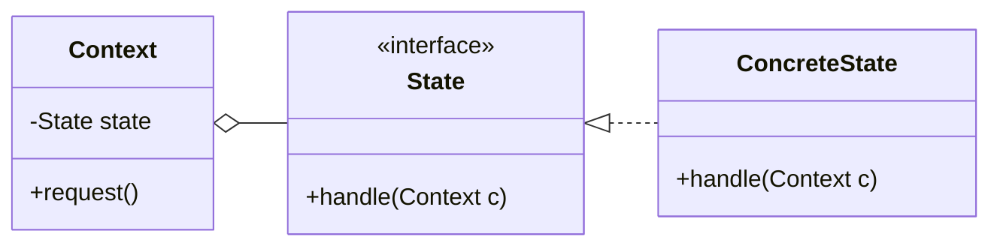

`Context` は現在の状態を契約として持つだけで、どの具象状態かを判定しません。状態を増やしても、線が増えるのは `State` の下側だけです。

### この章の実装との対応

| GoFの名前 | この章での対応 |
|---|---|
| Context | `TicketReservation` |
| State | `IReservationState` |
| ConcreteState | `AvailableState` / `ReservedState` / `PaidState` 等 |

`IReservationState` は既定処理を持つ共通基底なので、純粋な `<<interface>>` ではありません。

### 使いどころと限界

| **状況** | **適切な選択** | **理由** |
|---|---|---|
| **変化の予定がある場合** | **状態ごとの振る舞いを別クラスへ移す** | 状態の追加が他のロジックを汚染しないため |
| **変化の予定がない場合** | **シンプルなif文で十分** | クラス数の増加というコストに見合わないため |

### この章のまとめ

#### 構造の着目点

同じ状態値を複数の操作が繰り返し判定し、状態ごとの許可・遷移・副作用が散らばっていないかを見ます。その周囲に、状態とは別の理由で変わる責任が混ざっていないかも分けて確認します。

#### 構造の変更点

状態ごとの判断と処理を共通契約の具体状態へまとめ、公開入口は現在状態へ委譲します。共有データや別の運用方針は専用責任へ分け、状態遷移から必要な処理へ自動接続することが再結合の要点です。
