# 第2章 状態ごとの振る舞いを分離する ―― State パターン

### この章で解く設計課題

チケット予約では、現在の状態によって、同じ操作でも許可されるか、何を行うか、次にどの状態になるかが変わります。現在の実装は、状態を一つ増やすたびに、予約・支払い・取消など複数の操作にある条件分岐を同時に修正しなければなりません。

この章では、状態ごとの規則が操作別に散らばっている構造を見つけ、利用側が現在状態を判定せず、同じ操作を呼べる構造へどう変えるかを考えます。

### この章を読むと得られること

この章で身につけるのは、予約業務の手順ではありません。同じ操作でも現在の状態によって許可・結果・次の状態が変わる構造を読み解き、状態ごとの判断を分けて実行の入口へ戻す力です。題材の固有名詞を離れて、次の判断を持ち帰ります。

* **得られること1：状態依存の変動の特定。** 複数の操作を横断して、現在の状態によって変わる許可・処理・遷移と、状態が変わっても守る公開入口を切り分けられるようになる
* **得られること2：分岐が広がる原因の特定。** 状態判定と状態固有の動作が複数の操作へ散っている依存を見つけ、状態追加で同時変更が起きる理由を説明できるようになる
* **得られること3：状態契約と遷移の再結合。** 各状態に共通する操作を契約として定め、具体状態へ判断と遷移を移し、現在状態の生成・所有・受け渡しを安定した入口へつなげられるようになる
* **得られること4：効果と適用可否の検証。** 状態やイベントの追加が関係する状態と組み立てへ局所化したかを確かめ、状態値と単純な分岐のままでよい場合との境界を判断できるようになる

## 🔵 フェーズ1：現状把握 ―― 仕様を整理し、システムと紐付ける

> **フェーズ1の確認観点：** 「何を受け取り、何をして、何を返すか」「どのクラスが何を担うか」「今回何を変えるのか」を、仕様→構造→コードの順で確定します。

チケット予約管理システムが受け取る入力、内部で行う判定、返す出力を整理します。

### 1-1：このシステムの仕様

このシステムは、イベントごとに**チケット予約の状態を管理**します。利用者からイベントIDと予約・支払い・キャンセルなどの操作を受け取り、イベント台帳から席数を、予約1件ごとに持つ現在状態をそれぞれ読み出します。現在状態で操作が許可されるかを判定し、成立した場合だけ席数と状態を更新し、対象イベント名と状態遷移またはエラーを表示します。

#### まず代表入力と実行結果から動きをつかむ

> [!NOTE] この動作例は、第0章で説明した模擬環境で動きます。`EventDatabase db;` でオブジェクトを作ると、コンストラクタがイベント名・定員・予約数をメモリへ登録します。`main()` はイベントIDと操作を渡し、検索・状態更新・表示を直接呼びます。表示されるイベント名や予約数は、その処理結果を画面の代わりに標準出力へ出したものです。

詳細な仕様やコードへ入る前に、現状コードの`main()`で利用者がイベントEVT001（春の音楽祭）を予約し、続けて支払う入力を確認します。

**代表入力（現状コードの`main()`から抜粋）：**
```cpp
    // 準備：イベント台帳を用意する。生成時に3件のイベントと
    // 現在の予約数が登録される（EVT001は定員100・予約20）
    EventDatabase db;

    // ケース1（1席目）：予約して支払う
    TicketReservation seat1(db, "EVT001"); // 状態: Available
    seat1.showAvailability();  // 空席数の表示。状態は不変
    seat1.reserve();  // Available → Reserved（予約数+1）
    seat1.pay();      // Reserved  → Paid
```

ケース1の実行結果です。

```
[席数確認] EVT001 20/100（空席80）
予約対象：春の音楽祭
[予約数] EVT001 20/100 -> 21/100
予約完了しました
支払い完了しました
```

**出力のイベント名「春の音楽祭」と「20/100」（予約数/定員）は、`main()` が渡した値ではありません。** `main()` が渡したのはイベントID `"EVT001"` だけです。イベント名・予約数・定員は、準備の行で作ったイベント台帳（`EventDatabase`）から、このIDをキーに引いた値です。**実システムならデータベースのイベントテーブルにある行を、掲載コードではこのクラスが自分の中に持っています。** 今回参照したのは、次のデータです。

| イベントID | イベント名 | 定員 | 予約数 |
|---|---|---|---|
| EVT001 | 春の音楽祭 | 100 | 20 |

**この本のコードでは、`〜Database` という名前のクラスが「あらかじめ登録されているデータ」を持ちます。** 満席のイベントを含む全件は、後の「登録済みのイベント」で並べます。

続けて、同じイベントの別の座席を予約して取り消します。

```cpp
    // ケース2（2席目）：予約して取り消す
    TicketReservation seat2(db, "EVT001"); // 状態: Available
    seat2.showAvailability();  // 空席数の表示。状態は不変
    seat2.reserve();  // Available → Reserved（予約数+1）
    seat2.cancel();   // Reserved  → Available（予約数-1）
```

ケース2の実行結果です。

```
[席数確認] EVT001 21/100（空席79）
予約対象：春の音楽祭
[予約数] EVT001 21/100 -> 22/100
予約完了しました
[予約数] EVT001 22/100 -> 21/100
予約をキャンセルしました
```

**ケース2の1行目が「21/100」から始まっているのは、ケース1で1席予約した結果が残っているからです。** `seat1` と `seat2` は別々の予約ですが、席数はイベントEVT001の台帳に1つだけあり、両方の予約が同じ `db` を見ています。予約1件ごとの状態は各オブジェクトが持ち、イベントの予約数は全予約で共有する、という形です。

2つの結果を呼び出しと対応させると、予約後に支払うケースと、予約後に取り消すケースの両方が成功しています。各行のコメントに書いた状態の移り変わりは、出力には表示されません。予約1件ごとにシステムの内部で保持している状態で、名前と意味はこの後の状態表とコードで確認します。

> [!NOTE] 実システムと掲載コードの違い
> この章では予約状態に応じて振る舞いが切り替わる部分へ集中します。実際のイベントDBは`EventDatabase`のメモリ上の表で、予約DBの1件分は`TicketReservation`のオブジェクト1個で表します（対応はシステム全体図の後で確認します）。また、状態上許可された `pay()` は決済成功として扱います。データベース接続、同時予約制御、決済API、発券処理は扱いません。ただし、状態遷移と予約数の増減は実際に行い、数値で確認します。

#### 現行要求ベースライン

| 要求ID | 現行要求 | 受入条件 |
|---|---|---|
| 要求ID1（予約対象と空席の確認） | 予約前に対象と空席数を確認し、誤予約を防ぐ | 登録済みは現在値を表示。未登録・満席の予約では状態と予約数を変えない |
| 要求ID2（席の確保） | 空席があれば利用者が1席を確保し、予約できたことを確認できる | 予約完了を表示し、予約数が1増える |
| 要求ID3（購入の確定） | 予約した席の支払いを完了し、以後の処置が不要だと確認できる | 支払完了を表示し、内部状態がPaidになる |
| 要求ID4（予約の取消） | 不要になった予約を取り消し、ほかの利用者が使える席へ戻せる | 取消完了を表示し、予約数が1減る |
| 要求ID5（誤操作からの保護） | その時点で受け付けられない操作によって、確保済みの結果を失わない | エラー前後の状態・予約数が一致する |

各予約は「予約可能（Available）」「予約済み（Reserved）」「支払済み（Paid）」の3つの状態を持ちます。お客様の操作（予約・支払・キャンセル）に応じて状態が遷移し、状態によって許可される操作が異なります。

この章の現状コードに登場する値を、抜粋せずに次へ示します。設定として増やせるイベントと、コードが列挙している状態・操作・結果を分けて読むと、どこまでが現状仕様かを誤解しません。

| 仕様項目 | この章で使う値 | 役割 |
|---|---|---|
| 登録イベント | EVT001 春の音楽祭、EVT002 夏のフェス、EVT003 秋の映画会 | 現状コードの登録3件。設定データなので追加できる |
| 公開操作 | `showAvailability()`、`reserve()`、`pay()`、`cancel()` | 現状コードが利用者へ公開する全操作。空席確認は状態を変えない |
| 予約状態 | Available、Reserved、Paid | 現状コードが保持する全状態 |
| 成功結果 | 予約完了、支払い完了、予約をキャンセル | 現状コードが出す全成功結果 |
| 拒否結果 | 未登録、満席、現在予約不可、支払不可、取消不可 | 現状コードが出す全エラー結果 |

**登録済みのイベント**

イベントの空席は、次の3件の定員と現在の予約数から判定します。予約数が定員に達しているイベントは満席で、予約するとエラーになります。

| イベントID | タイトル | 定員 | 現在の予約数 |
|---|---|---|---|
| EVT001 | 春の音楽祭 | 100 | 20（空きあり） |
| EVT002 | 夏のフェス | 500 | 499（残り1席） |
| EVT003 | 秋の映画会 | 50 | 50（満席） |

登録されていないイベントIDを指定すると、イベントを取得できずエラーになります。

この章では、利用者が「現在状態」を毎回指定するのではありません。現在状態は予約管理システムが予約1件ごとに保持し、利用者はイベントIDと操作を指定します。状態は操作のたびにシステム内部で読み出され、更新されます。

予約は利用者ごとに1件ずつ作られ、その1件分の状態（Available/Reserved/Paid）を持ちます。イベント全体の残席数はイベント情報の保存領域が別に管理し、予約時に空席を1つ減らし、キャンセルで1つ戻します。したがって、ある予約が Reserved（予約済み・未払い）のまま支払いを待っていても、残席がある限り別の利用者は自分の予約を進められます。押さえているのは在庫のうちの1席だけで、「予約済みの間は次の人が予約できない」わけではありません。状態マトリクスの「Reserved で『予約する』が——」は、イベントの占有ではなく、同じ予約1件を二重予約させないという意味です。

**システム全体図：予約管理と保存データの境界**

最も大きな境界は「利用者 → チケット予約管理システム」です。システムの内側には、性質の違う2種類の保存データがあります。一つはイベントごとに1行ある**イベント情報**（イベント名・定員・予約数）、もう一つは予約ごとに1行ある**予約情報**（対象イベントと現在状態）です。予約処理は、操作のたびに対象の予約1件を読み出し、許可された場合だけ予約数と状態を書き換えます。図の番号は、1回の操作の中で処理が進む順番です。

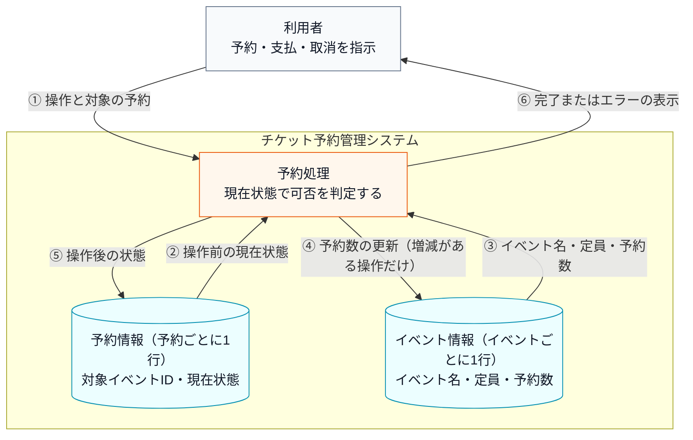
```mermaid
flowchart TB
    U["利用者<br>予約・支払・取消を指示"] -->|"① 操作と対象の予約"| T

    subgraph RESERVATION["チケット予約管理システム"]
        T["予約処理<br>現在状態で可否を判定する"]
        S[("予約情報（予約ごとに1行）<br>対象イベントID・現在状態")]
        D[("イベント情報（イベントごとに1行）<br>イベント名・定員・予約数")]
        S -->|"② 操作前の現在状態"| T
        D -->|"③ イベント名・定員・予約数"| T
        T -->|"④ 予約数の更新（増減がある操作だけ）"| D
        T -->|"⑤ 操作後の状態"| S
    end

    T -->|"⑥ 完了またはエラーの表示"| U

    classDef actor fill:#f8fafc,stroke:#64748b,color:#111827;
    classDef data fill:#ecfeff,stroke:#0891b2,color:#111827;
    classDef process fill:#fff7ed,stroke:#ea580c,color:#111827;
    class U actor;
    class D,S data;
    class T process;
```

**掲載コードでは、予約情報の表を作らず、予約1件をオブジェクト1個で表します。** 実システムの予約テーブルは多くの予約を行として持ちますが、掲載コードで予約1件分を扱う `TicketReservation` は、対象イベントIDと現在状態をメンバー変数に持ち、状態の書き換えもそのオブジェクトの中で行います。複数の予約は、`seat1`・`seat2` のようにオブジェクトを予約の数だけ作って表します。

| 実システム | 掲載コード | 違い |
|---|---|---|
| イベントテーブル（イベントごとに1行） | `EventDatabase` の `map` に登録した3件 | 全予約で共有するため、実体を1つだけ作り、各予約へ参照で渡す |
| 予約テーブル（予約ごとに1行） | `TicketReservation` のオブジェクト1個が予約1件 | 表は作らず、状態は `status` に持つ（終了時に消える） |
| 予約IDで対象の行を探す | `main()` が対象のオブジェクト（`seat1` など）の操作を直接呼ぶ | 予約IDによる検索を省く |

この対応により、図の②と⑤（予約情報の読み書き）は、掲載コードでは予約のオブジェクトが自分のメンバー変数 `status` を読み書きする処理になります。④（予約数の更新）は、全予約で共有する `EventDatabase` への書き込みです。席数が動くのは予約・取消・期限切れ・昇格のときで、支払いのように席数が動かない操作では④は起きません。

**現状：何を突き合わせて予約の結果を決めるか**

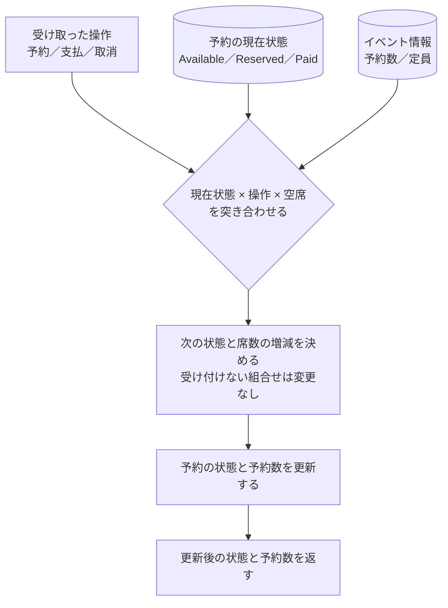
```mermaid
flowchart TB
    ACTION["受け取った操作<br>予約／支払／取消"] --> MATCH{"現在状態 × 操作 × 空席<br>を突き合わせる"}
    STATE[("予約の現在状態<br>Available／Reserved／Paid")] --> MATCH
    EVENT[("イベント情報<br>予約数／定員")] --> MATCH
    MATCH --> PLAN["次の状態と席数の増減を決める<br>受け付けない組合せは変更なし"]
    PLAN --> APPLY["予約の状態と予約数を更新する"]
    APPLY --> DONE["更新後の状態と予約数を返す"]
```

**状態遷移マトリクス**

この表は、現在の状態ごとに、各操作を受け付けたとき次にどの状態へ進むかを整理したものです。行は「いまの状態」、列は「利用者が行う操作」、セルは「操作後の状態」を表します。予約可能な状態で予約すると予約済みに進み、予約済みの状態で支払うと支払済みに進む、という基本の流れを確認します。

| 現在の状態 | 予約する | 支払う | キャンセルする |
|---|---|---|---|
| Available（予約可能） | → Reserved | —— | —— |
| Reserved（予約済み） | —— | → Paid | → Available |
| Paid（支払済み） | —— | —— | —— |

「——」は、その状態では操作を受け付けず、エラーメッセージを出力して終了することを表します。これは表の中心ではなく、基本の状態遷移に当てはまらない操作を明示するための記号です。

表の各行に着目すると、それぞれのルールには明確な業務上の理由があります。

- **Available（予約可能）で「支払う」「キャンセルする」が——の理由**：予約が存在しない状態で支払いを受け付けると「どの予約に対する支払いか」が確定しません。キャンセルについても、そもそも予約がなければキャンセルする対象がなく、操作自体が無意味です。
- **Reserved（予約済み）で「予約する」が——の理由**：同じ予約枠を二重予約することは、業務上あり得ないためです。
- **Paid（支払済み）でのすべての操作が——の理由**：支払いが完了した予約は「確定済み」扱いになります。この状態からのキャンセルを認める場合は、返金処理・在庫の戻し・会計記録の修正など、複数の業務プロセスが連動して動く必要があります。この章では、返金処理はこの章の設計論点から外れるため扱いません。キャンセルポリシーを設ける場合は、「キャンセル済み（Cancelled）」という別の状態を追加して対応できます。

**現状の状態遷移図**

表で確認した正常な遷移だけを、次の状態遷移図でつなぎます。エラーになる組み合わせは状態を変えないため、矢印には含めません。

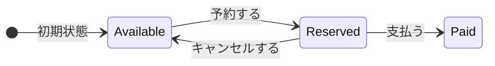
```mermaid
stateDiagram-v2
    direction LR
    [*] --> Available : 初期状態
    Available --> Reserved : 予約する
    Reserved --> Paid : 支払う
    Reserved --> Available : キャンセルする
```

直前の状態遷移図と、その前のマトリクスが、後のフェーズで「新しい状態が増えるとどこが変わるか」を確認する基準になります。

**エラー条件**

正常系の仕様を一通り確認したうえで、最後に、状態更新へ進めない入力や操作を分けて整理します。

- **存在しないイベントIDを指定する**と、「対象なし」と表示して終わります。
- **満席のイベントを予約する**と、「満席」と表示して終わります。
- **いまの状態では許されない操作をする**（支払済みの予約を取り消すなど）と、「操作不可」と表示して終わります。

どの場合も、**予約の状態と予約数は変わりません。**

---

### 1-2：動作例テーブル

このシステムへ渡す**データ**と、そのデータに対して指示する**操作**を分けて確認します。入力を別の値へ加工するのではありません。イベントIDと現在状態を使って可否を判定し、成功した場合だけ予約数と状態を更新して、結果を外へ返します。この章で構造を変えても、次の現行動作は維持します。

| ケース        | 入力データ              | 操作                  | 判定・更新                                           | 外部出力           |
| ---------- | ------------------ | ------------------- | ----------------------------------------------- | -------------- |
| 1：予約して支払う  | EVT001             | 空席確認 → 予約 → 支払      | 空席なら予約数+1、Available→Reserved→Paid               | 現在席数、予約完了、支払完了 |
| 2：予約して取り消す | EVT001             | 空席確認 → 予約 → 取消      | 予約数+1後に-1、Reserved→Available                    | 現在席数、予約完了、取消完了 |
| 3：満席で予約する  | EVT003             | 空席確認 → 予約           | 50/50を確認し、状態・予約数は不変                             | 満席表示、満席エラー     |
| 4：未登録IDを指定 | UNKNOWN            | 空席確認                | 未登録を検出し、予約へ進まない                                 | ID不存在エラー       |
| 5：予約前に支払う  | EVT001 / Available | 支払                  | Availableは支払いを受け付けないので拒否し、状態・予約数は不変            | 支払不可エラー        |
| 6：支払後に取り消す | EVT001             | 空席確認 → 予約 → 支払 → 取消 | 支払い後は取り消せないので拒否し、確保済みの結果は不変               | 取消不可エラー        |

確認したいことは、通常の予約・支払いフロー、キャンセルフロー、予約前の外部条件による拒否、状態に合わない操作の拒否が、それぞれ入力と出力で対応していることです。

この動作テーブルは、後のフェーズでステップを比較するときに「同じ入力なら同じ出力を返すことで動作不変を確認する」ための基準として使います。この章で変えたいのは内部の構造であり、利用者から見える動作ではありません。

---

### 1-3：登場クラスとクラス構成図

| クラス名 | 役割 | 担当する仕様 |
|---|---|---|
| `EventInfo` | イベント1件分の情報 | イベント名・定員・予約数の受け渡し |
| `EventDatabase` | イベント情報の保持と検索 | イベントIDの存在確認・満席判定 |
| `TicketReservation` | 予約操作を受け、現在状態に応じて可否と遷移を決める | `Available` / `Reserved` / `Paid` の状態遷移 |

データの流れは、次のように分かれます。

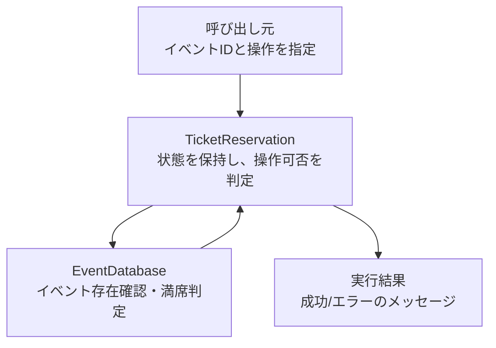
```mermaid
flowchart TB
    C["呼び出し元<br/>イベントIDと操作を指定"]
    T["TicketReservation<br/>状態を保持し、操作可否を判定"]
    D["EventDatabase<br/>イベント存在確認・満席判定"]
    R["実行結果<br/>成功/エラーのメッセージ"]

    C --> T
    T --> D
    D --> T
    T --> R
```

`EventDatabase` はイベント情報と予約数を保持し、`TicketReservation` は一件の予約対象と現在状態を持って、予約・支払い・キャンセルを実行します。クラス間の保持と参照は、次の図で確認します。

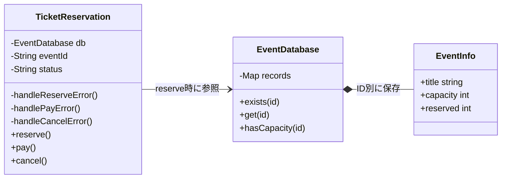
```mermaid
classDiagram
    direction LR
    class EventDatabase {
        -Map records
        +exists(id)
        +get(id)
        +hasCapacity(id)
    }
    class EventInfo {
        +title string
        +capacity int
        +reserved int
    }
    class TicketReservation {
        -EventDatabase db
        -String eventId
        -String status
        -handleReserveError()
        -handlePayError()
        -handleCancelError()
        +reserve()
        +pay()
        +cancel()
    }

    EventDatabase *-- EventInfo : ID別に保存
    TicketReservation --> EventDatabase : reserve時に参照
```

直前の現状クラス図から分かるのは、予約する、支払う、キャンセルするという操作が同じ予約管理クラスに集まっていることです。各操作の中で状態をどう判定しているかは、次の実装コードで確認します。

**現状システムの処理シーケンス**

静的な関係に続けて、正常系（予約→支払い）で各操作がどの順に呼ばれ、状態がどう遷移するかを時系列で示します。状態ごとの具体の分岐は `TicketReservation` の注記に、エラー系はメモとして添えます。

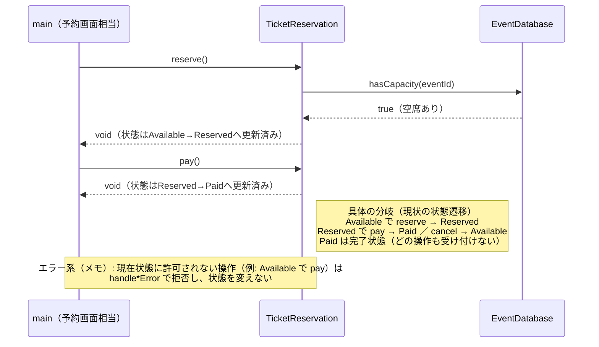
```mermaid
sequenceDiagram
    participant Main as main（予約画面相当）
    participant TR as TicketReservation
    participant DB as EventDatabase
    Main->>TR: reserve()
    TR->>DB: hasCapacity(eventId)
    DB-->>TR: true（空席あり）
    TR-->>Main: void（状態はAvailable→Reservedへ更新済み）
    Main->>TR: pay()
    TR-->>Main: void（状態はReserved→Paidへ更新済み）
    Note right of TR: 具体の分岐（現状の状態遷移）<br>Available で reserve → Reserved<br>Reserved で pay → Paid ／ cancel → Available<br>Paid は完了状態（どの操作も受け付けない）
    Note over Main,TR: エラー系（メモ）: 現在状態に許可されない操作（例: Available で pay）は<br>handle*Error で拒否し、状態を変えない
```

直前の処理シーケンス図から読み取れるのは、公開操作（`reserve`／`pay`／`cancel`）が同じ `TicketReservation` に集まり、各操作が現在の `status` を見て遷移先を決めていること、席の空きは `EventDatabase.hasCapacity()` で確認すること、許可されない操作はメモのとおり状態を変えずに拒否されることです。状態ごとに「どの操作で何が起きるか」がこの時系列と注記で確認できます。


---

### 1-4：実装コード（現状）

#### 現状コード

メンバー変数と、それを使う処理は同じ場所に置いています。宣言と定義を分けるのは `TicketReservation` だけです。処理順が長く、メンバーを見ながら追う必要があるからです。


---

**共通ヘッダー**

```cpp
#include <iostream>
#include <string>
#include <map>
```

以降のすべてのクラスが使います。

---

**EventInfo**

`EventInfo` は、仕様で見た「イベント」1件分のデータ（イベント名・定員・予約数）です。続く `EventDatabase` がイベントIDからこのデータを引き、エラー条件「存在しないID」「満席」の判定も担います。

```cpp
struct EventInfo {
    std::string title;   // イベント名
    int capacity;        // 定員
    int reserved;        // 現在の予約数
};
```

**EventDatabase**

```cpp
class EventDatabase {
private:
    std::map<std::string, EventInfo> records;
public:
    // この章で使うイベント台帳を初期化する
    EventDatabase() {
        records["EVT001"] = {"春の音楽祭",  100,  20};
        records["EVT002"] = {"夏のフェス",  500, 499};
        records["EVT003"] = {"秋の映画会",   50,  50};  // 満席
    }

    // 指定したイベントIDが台帳にあるかを返す
    bool exists(const std::string& id) const {
        return records.count(id) > 0;
    }

    // 指定したイベントの現在値を返す
    EventInfo get(const std::string& id) const {
        return records.at(id);
    }

    // 定員と予約数を比較し、1席以上空いているかを返す
    bool hasCapacity(const std::string& id) const {
        const auto& e = records.at(id);

        return e.reserved < e.capacity;
    }

    // 予約成立時に予約数を1増やす
    void reserveSeat(const std::string& id) {
        auto& event = records.at(id);
        int before = event.reserved;

        ++event.reserved;
        std::cout << "[予約数] " << id << " "
                  << before << "/" << event.capacity
                  << " -> " << event.reserved << "/"
                  << event.capacity;
        if (event.reserved == event.capacity)
            std::cout << "（満席）";
        std::cout << std::endl;
    }

    // 取消成立時に予約数を1減らす
    void cancelSeat(const std::string& id) {
        auto& event = records.at(id);
        int before = event.reserved;

        if (event.reserved > 0) --event.reserved;
        std::cout << "[予約数] " << id << " "
                  << before << "/" << event.capacity
                  << " -> " << event.reserved << "/"
                  << event.capacity << std::endl;
    }
};
```

- **責任：** イベントIDから空席を確認し、予約数を増減する
- **副作用：** `reserveSeat()` / `cancelSeat()` が `records` の予約数を書き換える

`std::map` はイベントIDから `EventInfo` を引くメモリ上のイベント表です。EVT002は499件なので、1件予約すると500件で満席になり、その予約をキャンセルすると499件へ戻ります。実システムのDBを、実行終了まで覚えているインメモリの登録表で代替しています。

---

**TicketReservation の宣言**

この章の中心です。仕様で見た「予約・支払い・キャンセル」という利用者操作を受け取ります。

```cpp
class TicketReservation {
private:
    // --- データ ---
    EventDatabase& db;   // 共有の在庫データ（外部から注入）
    std::string eventId; // 予約対象のイベント
    std::string status;  // 状態 "Available"/"Reserved"/"Paid"

    // 各状態で操作できないときのエラー出力
    void handleReserveError() { std::cout << "現在予約できません\n"; }
    void handlePayError() {
        std::cout << "支払いに適した状態ではありません\n";
    }
    void handleCancelError()  { std::cout << "キャンセルできません\n"; }

public:
    TicketReservation(EventDatabase& db,
                      const std::string& eventId)
        : db(db), eventId(eventId), status("Available") {}

    bool showAvailability() const;
    void reserve();
    void pay();
    void cancel();
};
```

在庫は外から受け取って参照で持ち、対象イベントと現在状態は自分で持ちます。**この `status` が、3つの操作すべての可否を決めます。** 同型で並列な3つのエラー出力は、並列関係が縦に見えるよう1行揃えにしています。定義を3つ、上のメンバーを見ながら読んでいきます。

---

**空席照会**

予約操作の前に、状態を変えない問い合わせ `showAvailability()` で現在の数値を表示します。未登録IDなら `false` を返し、呼び出し側は予約へ進みません。

```cpp
bool TicketReservation::showAvailability() const {
    if (!db.exists(eventId)) {
        std::cout << "エラー：イベントID " << eventId
                  << " は存在しません\n";
        return false;
    }

    EventInfo info = db.get(eventId);
    int available = info.capacity - info.reserved;
    std::cout << "[席数確認] " << eventId << " "
              << info.reserved << "/" << info.capacity
              << "（空席" << available << "）";
    if (available == 0) std::cout << "（満席）";
    std::cout << std::endl;
    return true;
}
```

> [!NOTE] 状態を文字列で持っていることについて
> 現状コードは、状態を `std::string status` に `"Available"` などの文字列で持っています。実務なら、まず `enum` や定数へ置き換えるところです。ここで文字列のままにしているのは、**現状のコードを、著者が手を入れる前の姿のまま読んでもらうため**です。
>
> ただし、`enum` へ変えても、この章で追う痛みは減りません。綴り間違いはコンパイラが止めてくれますが、「どの状態でどの操作を許すか」という判定は、依然として操作ごとの分岐に散ったままだからです。フェーズ7の完成コードでは、状態が値ではなくクラスになり、状態名で分岐する行そのものがなくなります。そのため本章では、途中で定数へ置き換える手を入れず、状態の持ち方が変わるところまで一気に進みます。

**TicketReservation::reserve()**

```cpp
void TicketReservation::reserve() {
    if (!db.exists(eventId)) {
        std::cout << "エラー：イベントID " << eventId << " は存在しません\n";
        return;
    }

    if (!db.hasCapacity(eventId)) {
        std::cout << "エラー：" << db.get(eventId).title
                  << " は満席です\n";
        return;
    }

    if (status == "Available") {
        std::cout << "予約対象：" << db.get(eventId).title << "\n";
        db.reserveSeat(eventId);
        status = "Reserved";
        std::cout << "予約完了しました\n";
    } else {
        handleReserveError();
    }
}
```

`reserve()`の役割は、利用者の予約要求を一件受け付け、イベントの存在・空席・現在状態がすべて予約可能な場合だけ席を確保することです。存在確認を先に行うため、未登録のイベントIDが空席判定まで進むことはありません。予約が成立したときだけ予約数を1増やし、現在状態を`Reserved`へ変えます。どこか一つでも満たさなければ、状態も予約数も変えずに理由を表示します。

呼び出される `EventDatabase::reserveSeat()` は、`TicketReservation::reserve()` がイベントの存在と空席を確認済みであることを前提に、予約数の加算だけを行います。台帳は存在しないIDを渡されることを想定していないので、確認の順番はこのままにします。

---

**TicketReservation::pay()**

```cpp
void TicketReservation::pay() {
    if (status == "Reserved") {
        status = "Paid";
        std::cout << "支払い完了しました\n";
    } else {
        handlePayError();
    }
}
```

`status` が `Reserved` のときだけ、上の枝を通ります。ほかの状態はすべて `handlePayError()` へ落ち、`status` も予約数も変わりません。

---

**TicketReservation::cancel()**

```cpp
void TicketReservation::cancel() {
    if (status == "Reserved") {
        db.cancelSeat(eventId);
        status = "Available";
        std::cout << "予約をキャンセルしました\n";
    } else {
        handleCancelError();
    }
}
```

`Reserved` のときだけ通り、在庫を1件戻します。**`Paid` からは戻せません。**

3つの定義を並べて見ると、`reserve` `pay` `cancel` のどれもが冒頭で `status` を見ています。現在状態の判定が3か所へ散らばっています。

---

#### `main()` と実行結果

動作例の表を、行ごとに区切って実行します。**在庫は行をまたいで引き継がれます。**

---

**組み立てと、ケース1：EVT001 予約 → 支払い**

```cpp
int main() {
    // イベント台帳を用意する。生成時に3件のイベントと
    // 現在の予約数が登録される（EVT001は定員100・予約20）
    EventDatabase db;

    // ケース1: 正常な予約から支払いまで
    std::cout << "--- ケース1: EVT001 予約 → 支払い ---\n";
    TicketReservation seat1(db, "EVT001"); // 状態: Available
    seat1.showAvailability();  // 空席数の表示。状態は不変
    seat1.reserve();  // Available → Reserved（予約数+1）
    seat1.pay();      // Reserved  → Paid
```

```
--- ケース1: EVT001 予約 → 支払い ---
[席数確認] EVT001 20/100（空席80）
予約対象：春の音楽祭
[予約数] EVT001 20/100 -> 21/100
予約完了しました
支払い完了しました
```

`db` を1つだけ作り、以降のすべての `TicketReservation` へ参照で渡します。在庫が共有されるのはこのためです。

---

**ケース2：EVT001 予約 → キャンセル**

```cpp
    // ケース2: 予約からキャンセルまで
    std::cout << "\n--- ケース2: EVT001 予約 → キャンセル ---\n";
    TicketReservation seat2(db, "EVT001"); // 状態: Available
    seat2.showAvailability();  // 空席数の表示。状態は不変
    seat2.reserve();  // Available → Reserved（予約数+1）
    seat2.cancel();   // Reserved  → Available（予約数-1）
```

```
--- ケース2: EVT001 予約 → キャンセル ---
[席数確認] EVT001 21/100（空席79）
予約対象：春の音楽祭
[予約数] EVT001 21/100 -> 22/100
予約完了しました
[予約数] EVT001 22/100 -> 21/100
予約をキャンセルしました
```

予約で1件増え、キャンセルで1件戻りました。EVT001の予約数はケース1の分だけ増えた状態で残ります。

---

**ケース3：EVT003 満席イベントへの予約**

```cpp
    // ケース3: 満席イベントへの予約試み
    std::cout << "\n--- ケース3: EVT003 満席イベントへの予約 ---\n";
    TicketReservation seat3(db, "EVT003");
    seat3.showAvailability();
    seat3.reserve();  // エラー（満席）
```

```
--- ケース3: EVT003 満席イベントへの予約 ---
[席数確認] EVT003 50/50（空席0）（満席）
エラー：秋の映画会 は満席です
```

`hasCapacity()` で止まりました。状態は `Available` のままです。

---

**ケース4：UNKNOWN 存在しないイベントへの予約**

```cpp
    // ケース4: 存在しないイベントへの予約試み
    std::cout << "\n--- ケース4: UNKNOWN 存在しないイベントへの予約 ---\n";
    TicketReservation seat4(db, "UNKNOWN");
    if (seat4.showAvailability()) {
        seat4.reserve();
    }
```

```
--- ケース4: UNKNOWN 存在しないイベントへの予約 ---
エラー：イベントID UNKNOWN は存在しません
```

`TicketReservation::reserve()` の先頭にある `db.exists(eventId)` が偽になり、そこで止まります。満席判定へは進みません。

---

**ケース5：予約なしで支払いを試みる**

```cpp
    // ケース5: 状態エラー — 予約前に支払いを試みる
    std::cout << "\n--- ケース5: 予約なしで支払いを試みる ---\n";
    TicketReservation seat5(db, "EVT001");
    seat5.pay();      // エラー（Available状態）
```

```
--- ケース5: 予約なしで支払いを試みる ---
支払いに適した状態ではありません
```

---

**ケース6：支払い済みをキャンセルしようとする**

```cpp
    // ケース6: 状態エラー — 支払い済みをキャンセルしようとする
    std::cout << "\n--- ケース6: 支払い済みをキャンセルしようとする ---\n";
    TicketReservation seat6(db, "EVT001");
    seat6.showAvailability();
    seat6.reserve();  // Available → Reserved
    seat6.pay();      // Reserved  → Paid
    seat6.cancel();   // エラー（Paid状態）

    return 0;
}
```

```
--- ケース6: 支払い済みをキャンセルしようとする ---
[席数確認] EVT001 21/100（空席79）
予約対象：春の音楽祭
[予約数] EVT001 21/100 -> 22/100
予約完了しました
支払い完了しました
キャンセルできません
```

同じ `cancel()` が、ケース2では成功しケース6では拒否されました。違いは現在状態だけです。ケース2は予約した直後なので `Reserved` で、`cancel()` は席を戻して `Available` へ進みます。ケース6は支払いを済ませた後なので `Paid` で、`cancel()` の分岐に当てはまらず `handleCancelError()` が動きます。呼んだメソッドは同じでも、そのとき持っている状態で結果が変わります。

---

`main()` はイベントIDと操作の組み合わせを指示するだけで、存在確認・満席判定・状態チェックはすべて `TicketReservation` 内部で行っています。

---

### 1-5：変更要求

ある週明けの朝、イベント運営担当から開発チームへ、新しい施策についての連絡が入りました。

「来月から二つの機能を追加したいです。一つ目は『キャンセル待ち』です。満席のイベントでも予約の申し込みを受け付けて順番待ちに並べ、キャンセルなどで席が空いたら、先に並んだ人から自動で予約を割り当ててください。二つ目は『一時保留』です。いまは予約した後、支払わないまま席を押さえ続けられてしまいます。予約後15分以内に支払いがなければ席を自動で戻すようにし、すぐに払えない人は『一時保留』を選べば支払期限を24時間まで延ばせるようにしたいのです。」
運営担当は、支払われないまま押さえられた席や、キャンセルで空いた席を待っている人へすぐ回せるようになり、空席による機会損失が減ると期待しています。

依頼の内容を、現状との違いで整理すると次のようになります。

| 仕組み | 現状 | 変更後 |
|---|---|---|
| 満席のときの予約 | 「満席」エラーで終わる | 自動でキャンセル待ちの列に並ぶ（`Waitlisted`） |
| 席が空いたとき | 次に予約した人が取る | キャンセル待ちの先頭が自動で予約済み（`Reserved`）になる |
| 予約後の支払期限 | 期限はない。支払うか取り消すまで席を確保し続ける | **新設**：予約後15分で未払いなら席を自動で戻す |
| 一時保留 | ない | 利用者が選ぶと、席を確保したまま支払期限を24時間へ延ばす（`Held`） |

**15分の決済期限は、現状の仕様にはありません。** 一時保留の「延長」は、延ばす元の期限があって初めて意味を持ちます。そのため、標準の期限も今回の変更であわせて新設します。

加わる二つの仕組みを、利用者から見た流れで1枚にすると次のようになります。

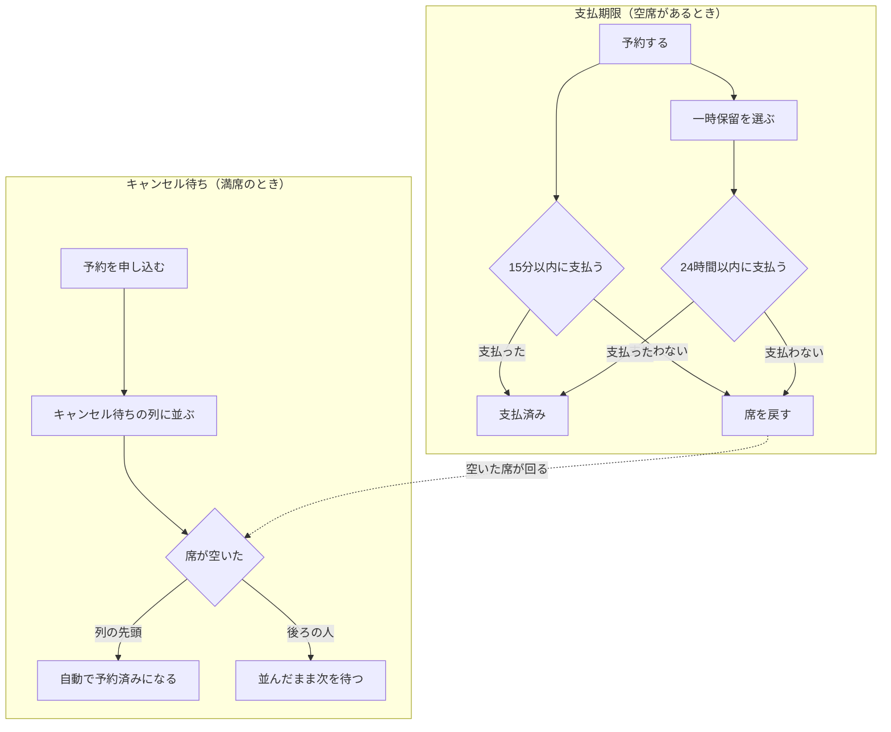
```mermaid
flowchart TB
    subgraph WAIT["キャンセル待ち（満席のとき）"]
        W1["予約を申し込む"] --> W2["キャンセル待ちの列に並ぶ"]
        W2 --> W3{"席が空いた"}
        W3 -->|"列の先頭"| W4["自動で予約済みになる"]
        W3 -->|"後ろの人"| W5["並んだまま次を待つ"]
    end

    subgraph LIMIT["支払期限（空席があるとき）"]
        H1["予約する"] --> H2{"15分以内に支払う"}
        H2 -->|"支払った"| H3["支払済み"]
        H2 -->|"支払わない"| H4["席を戻す"]
        H1 --> H5["一時保留を選ぶ"]
        H5 --> H6{"24時間以内に支払う"}
        H6 -->|"支払った"| H3
        H6 -->|"支払わない"| H4
    end

    H4 -.->|"空いた席が回る"| W3
```

左は満席のときの流れ、右は席を確保した後の流れです。二つは、席が空く出来事（取消・期限切れ）で1本につながります。空いた席は、次に予約操作をした人ではなく、待っている列の先頭へ回ります。

依頼文だけでは待機順や期限切れ時の処理まで決められません。そこで運営担当へ確認し、実行結果で判定できる次の業務ルールを合意しました。

- 満席時の通常の予約要求は、システムが空席数を確認して自動的にキャンセル待ちへ登録する。利用者が満席を判断して別操作を選ぶ必要はない。
- 空席が1席出るたびに待ち行列の先頭1件だけを自動昇格し、後続の待機者は先着順のまま残る。複数席空けば、席数分だけ同じ処理を繰り返す。
- 利用者は `Reserved` と `Held` のどちらからも、期限内ならいつでもキャンセルできる。いずれも席を解放し、待機者がいれば自動昇格する。
- `Reserved` は予約から15分の決済期限を持つ。利用者が一時保留を選ぶと `Held` へ移り、期限が24時間へ延びる。期限までに支払われなければ期限切れとして席を解放する。
- キャンセル待ちの取り下げ（並ぶのをやめる操作）は、今回の依頼に含めない。実運用では必要になるが、増えるのは「待機を取り下げる」という遷移が1本だけで、状態ごとの判断をどこへ置くかという本章の論点は変わらないため、範囲外とする。

**時間の経過は、「期限切れ」イベントとして再現します。** 実システムでは、期限を監視するタイマー（スケジューラ）が、期限を過ぎた予約へ「期限切れ」を通知します。掲載コードは実際に15分や24時間を待たず、時刻の計算もしません。実行部分が「期限が来た」というイベントを直接渡し、その時点で期限を過ぎた状況をすぐに再現します。

依頼と合意したルールを、実行結果で判定できる変更依頼へ分けます。

| 変更ID | 変更内容 | 確認する具体例 |
|---|---|---|
| 変更ID1（キャンセル待ち） | 満席時に待機登録し、空席発生時に先頭を自動昇格する | 取消後の49/50から、手動操作なしで先頭を昇格して50/50へ戻す |
| 変更ID2（一時保留） | 予約後15分の決済期限を新設し、一時保留を選ぶと24時間へ延長する | Reserved・Heldの期限中は席を確保し、期限切れでは席を解放して待機者を自動昇格する |

#### 変更後要求ベースライン


| 要求ID | 変更後の要求 | 現行からの変化 | 受入条件 |
|---|---|---|---|
| 要求ID1（予約対象と空席の確認） | 予約前に対象と空席数を確認し、満席なら待機登録する | 変更：満席は拒否から待機登録へ | 現在値を表示。未登録は不変、満席は50/50のまま `Waitlisted` になる |
| 要求ID2（席の確保） | 空席があれば1席を確保し、予約できたことを確認できる | 変更なし | 予約完了を表示し、残り1席なら予約後に満席になる |
| 要求ID3（購入の確定） | 予約または一時保留した席の支払いを完了できる | 変更：支払える状態に `Held` が加わる | 支払成功を表示し、内部状態がPaidになる |
| 要求ID4（空席の引き継ぎ） | 取消や期限切れで空いた席を、待つ利用者へ手動操作なしで引き継ぐ | 変更：席を戻すだけから、引き継ぎまで含める | 50/50→49/50→50/50となり、先頭が自動昇格する |
| 要求ID5（誤操作からの保護） | その時点で受け付けられない操作で、確保済みの結果を失わない | 変更なし | エラー前後の状態・予約数が一致する |
| 要求ID6（順番待ち） | 満席でも順番待ちへ参加し、空席時に先頭から予約できる | 追加 | 通常の予約操作だけで待機登録と自動昇格が行われる |
| 要求ID7（支払期限と一時保留） | 決済期限内に支払い、期限切れの席は戻す | 追加 | Reservedは15分、Heldは24時間。期限切れ後は自動昇格する |

期限切れイベントを受けるスケジューラ境界は、変更ID2（一時保留）の期限切れを実現する内部の入力経路です。独立した利用者要求として数えません。

実際の予約システムでは、入力は利用者のボタン操作だけではありません。キャンセルで空席が出たときの予約昇格イベントと、決済期限を過ぎたときのタイマーイベントも、予約状態を動かす入力になります。この章では、それらを「状態によって扱いが変わる入力」として同じ粒度で整理します。

#### 変更後に有効な業務ルール

次の表では、コードの状態判断と遷移に必要なルールを、既存状態と新しい状態に分けます。既存状態は残し、新しい状態と遷移だけを加えます。

**状態の変化**

| 種別 | 状態 | この変更での扱い |
|---|---|---|
| 変更なし | Available / Reserved / Paid | 既存状態として残し、新しい遷移だけを接続する |
| 新規追加 | **Waitlisted（キャンセル待ち）** | 満席時に入り、空席発生でReservedへ自動昇格する |
| 新規追加 | **Held（一時保留）** | Reservedから入り、決済期限を24時間へ延長する |

今回変えるのは予約状態と遷移です。イベント情報と空席数を管理する保存基盤は仕様変更の対象ではないため、`EventDatabase` の取得・更新契約は変更前後で**変更なし**とします。

**新しく追加される遷移ルール**

| 現在状態 | 入力 | 結果 |
|---|---|---|
| Available | 満席時の `reserve()` | Waitlistedへ移り、待機列へ登録 |
| Waitlisted | `promoteBySystem()` | 空席発生時にReservedへ自動昇格 |
| Reserved | `hold()` | 席を確保したままHeldへ移り、期限を24時間へ延長 |
| Reserved | `expire()` | 15分経過で席を解放し、Availableへ戻る |
| Held | `pay()` | Paidへ移る |
| Held | `cancel()` | 席を解放し、Availableへ戻る |
| Held | `expire()` | 24時間経過で席を解放し、Availableへ戻る |

**実運用での状態の動き（イメージ）**

各遷移が「誰の・何をきっかけに」起きるかを、時間の流れで並べると次のようになります。

1. **予約する（Available→Reserved／Waitlisted）**：利用者は常に「予約」を押します。空席があれば席数から1席を引いて予約済み（未払い）となり、満席ならシステムが自動でキャンセル待ちへ登録します。`Reserved` の決済期限は、今回新設する15分です。
2. **一時保留する（Reserved→Held）**：利用者が明示的に「一時保留」を選ぶと、席を確保したまま決済期限を24時間へ延長します。予約の放置を自動で保留へ変える操作ではありません。
3. **支払う（Reserved／Held→Paid）**：期限内に決済すると確定します。
4. **期限切れ（Reserved／Held→Available）**：Reservedは15分、Heldは24時間が経過しても未払いなら、タイマーイベントが枠を空きに戻します。空いた1席は、キャンセル待ち（Waitlisted）の先頭が自動昇格して受け取ります。

現状の `if` 文を使った状態分岐ロジックに、この2状態と、上の表の7通りの遷移を追加することになります。

> [!NOTE] 実システムの変更を、掲載コードではどう再現するか
> | 実システムの変更対象 | 掲載コードでの表現 | この章で省くもの |
> |---|---|---|
> | キャンセル待ち | `ReservationWaitlist` のメモリ上の先着順キュー | 永続化、同時操作、再起動後の復元、待機の取り下げ |
> | 決済期限の到来 | 実行ハーネスが `ReservationExpiryScheduler` へ期限到来を直接渡す | 実時間の待機、ジョブ再実行、タイマーの永続化 |
>
> 期限イベントの入力元と待ち行列の保存は簡略化しますが、取消・期限切れによる席の解放、その直後の先頭1件の自動昇格、状態遷移は掲載コードで実際に動かします。期限到来を直接渡す行は利用者の手動運用ではなく、外部タイマーからイベントが届いた状況を即時再現するテストハーネスです。

**仕様変更後の状態遷移マトリクス（全体像）**

既存の3状態に「キャンセル待ち」と「一時保留」を足すと、**成立する遷移は次の10通り**になります。**この表に無い組み合わせは、その状態では操作を受け付けず、エラーメッセージを出して終わります。**

| 現在の状態               | 操作         | 次の状態         |
| ------------------- | ---------- | ------------ |
| Available（予約可能）     | 予約する（空席あり） | → Reserved   |
| Available（予約可能）     | 予約する（満席）   | → Waitlisted |
| Reserved（予約済み）      | 支払う        | → Paid       |
| Reserved（予約済み）      | キャンセルする    | → Available  |
| Reserved（予約済み）      | 一時保留       | → Held       |
| Reserved（予約済み）      | 期限切れ（15分）  | → Available  |
| Waitlisted（キャンセル待ち） | 予約昇格（空席発生） | → Reserved   |
| Held（一時保留）          | 支払う        | → Paid       |
| Held（一時保留）          | キャンセルする    | → Available  |
| Held（一時保留）          | 期限切れ（24時間） | → Available  |

`Paid`（支払済み）は行に出てきません。支払いが済んだ予約は確定扱いで、どの操作も受け付けないからです。`Waitlisted` も、出てくるのは「予約昇格」の1行だけです。満席で登録された後にできるのは、空席が出るのを待つことだけで、待機の取り下げは今回の依頼に含めていません。

**キャンセル待ちからの取り下げは、今回の仕様に入れません。** 実運用では「並ぶのをやめる」操作が必要になりますが、加わるのは `Waitlisted` から抜ける遷移が1本だけで、状態ごとの判断をどこへ置くかという本章の論点は変わらないためです。待機中の予約は、席が空いて自動昇格するまで列に残ります。

次の状態遷移図では、直前の表が示した遷移を1枚にまとめ、どの状態からどの操作で、どこへ移れるのかを見ます。期限切れは、`Reserved` が15分、`Held` が24時間です。

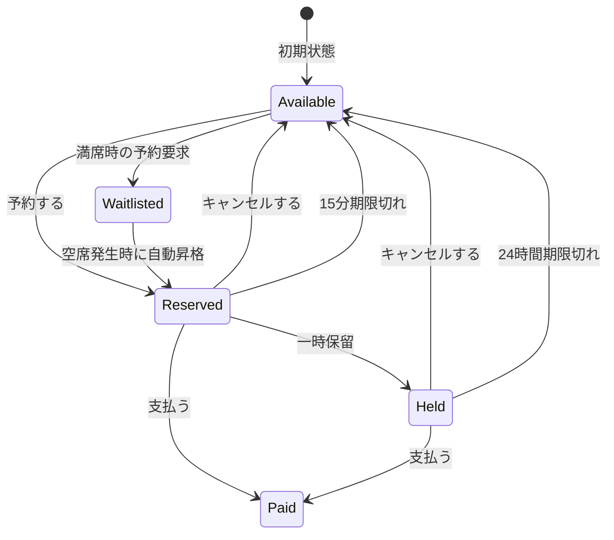
```mermaid
stateDiagram-v2
    [*] --> Available : 初期状態
    Available --> Reserved : 予約する
    Reserved --> Paid : 支払う
    Reserved --> Available : キャンセルする
    Available --> Waitlisted : 満席時の予約要求
    Waitlisted --> Reserved : 空席発生時に自動昇格
    Reserved --> Held : 一時保留
    Reserved --> Available : 15分期限切れ
    Held --> Paid : 支払う
    Held --> Available : キャンセルする
    Held --> Available : 24時間期限切れ
```

操作不可と未登録のイベントIDは状態を変えない結果なので、状態遷移の矢印には含めません。これらは後のエラー条件で確認します。

外から見た姿がどう変わるかを、最初に見たシステム全体図と同じ骨格で示します。番号の意味も同じで、1回の操作の中で処理が進む順番です。

**変更後のシステム全体図：予約管理と保存データの境界**

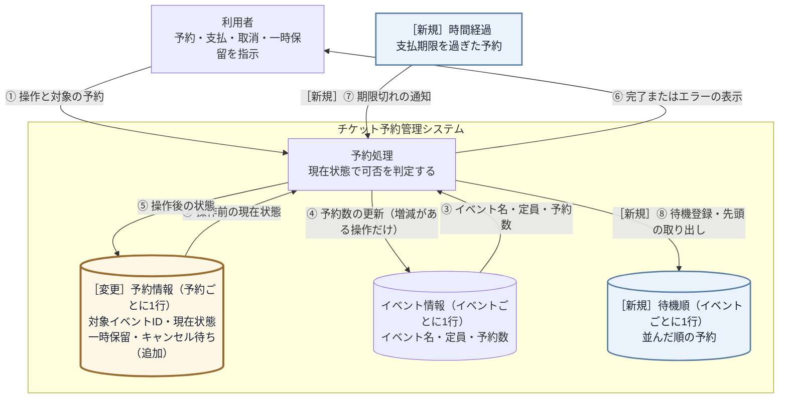
```mermaid
flowchart TB
    U["利用者<br>予約・支払・取消・一時保留を指示"] -->|"① 操作と対象の予約"| T
    CLOCK["［新規］時間経過<br>支払期限を過ぎた予約"]:::added -->|"［新規］⑦ 期限切れの通知"| T

    subgraph RESERVATION["チケット予約管理システム"]
        T["予約処理<br>現在状態で可否を判定する"]
        S[("［変更］予約情報（予約ごとに1行）<br>対象イベントID・現在状態<br>一時保留・キャンセル待ち（追加）")]:::touched
        D[("イベント情報（イベントごとに1行）<br>イベント名・定員・予約数")]
        W[("［新規］待機順（イベントごとに1行）<br>並んだ順の予約")]:::added
        S -->|"② 操作前の現在状態"| T
        D -->|"③ イベント名・定員・予約数"| T
        T -->|"④ 予約数の更新（増減がある操作だけ）"| D
        T -->|"⑤ 操作後の状態"| S
        T -->|"［新規］⑧ 待機登録・先頭の取り出し"| W
    end

    T -->|"⑥ 完了またはエラーの表示"| U

    classDef added fill:#eaf2fb,stroke:#527aa3,stroke-width:2px,color:#172033;
    classDef touched fill:#fff7e6,stroke:#9a6b2f,stroke-width:3px,color:#172033;
```

**増えたのは、入口が1つと保存データが1つです。** 利用者の操作に一時保留が加わり、それとは別に、時間経過が期限切れとしてシステムへ入ってきます。利用者以外から操作が届くのは、これが初めてです。保存データには、イベントごとの待機順が加わります。イベント情報と、①〜⑥の既存の受け渡しは変わりません。

次の図では、`［変更］` は手を入れて直す箱そのものの印、`（追加）` はその箱の中で今回加わる項目の印です。箱に付いた印で「どこへ手を入れるか」、箱の中の印で「何が増えるか」を読みます。

**変更後：何を突き合わせて予約の結果を決めるか**

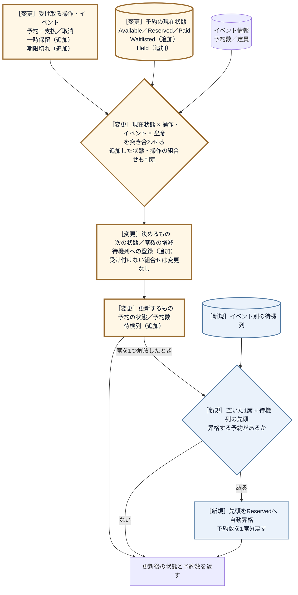
```mermaid
flowchart TB
    ACTION["［変更］受け取る操作・イベント<br>予約／支払／取消<br>一時保留（追加）<br>期限切れ（追加）"]:::touched --> MATCH{"［変更］現在状態 × 操作・イベント × 空席<br>を突き合わせる<br>追加した状態・操作の組合せも判定"}:::touched
    STATE[("［変更］予約の現在状態<br>Available／Reserved／Paid<br>Waitlisted（追加）<br>Held（追加）")]:::touched --> MATCH
    EVENT[("イベント情報<br>予約数／定員")] --> MATCH
    MATCH --> PLAN["［変更］決めるもの<br>次の状態／席数の増減<br>待機列への登録（追加）<br>受け付けない組合せは変更なし"]:::touched
    PLAN --> APPLY["［変更］更新するもの<br>予約の状態／予約数<br>待機列（追加）"]:::touched
    APPLY --> DONE["更新後の状態と予約数を返す"]

    APPLY -->|席を1つ解放したとき| HEAD{"［新規］空いた1席 × 待機列の先頭<br>昇格する予約があるか"}:::added
    WAITLIST[("［新規］イベント別の待機列")]:::added --> HEAD
    HEAD -->|ある| PROMOTE["［新規］先頭をReservedへ自動昇格<br>予約数を1席分戻す"]:::added
    HEAD -->|ない| DONE
    PROMOTE --> DONE

    classDef added fill:#eaf2fb,stroke:#527aa3,stroke-width:2px,color:#172033;
    classDef touched fill:#fff7e6,stroke:#9a6b2f,stroke-width:3px,color:#172033;
```

- **存在しないイベントIDを指定する**と、「対象なし」と表示して終わります。予約の状態は変わりません。
- **満席のイベントを予約する**と、席数は増やさず、待機登録されたことを表示して `Waitlisted` へ移ります。
- **いまの状態では許されない操作をする**と、「操作不可」と表示して終わります。予約の状態は変わりません。

増えた状態と操作の組み合わせが実際にコードのどこへ書かれるかは、フェーズ3「問題特定」で変更を試すコードと、フェーズ7の最終コード・実行結果で追います。

**フェーズ1のまとめ：今回追う変更ID一覧**

| 変更ID | 変更依頼の要点 | 関係する要求ID（追加は変更後ID） |
|---|---|---|
| 変更ID1（キャンセル待ち） | 満席時にキャンセル待ちへ登録し、空席発生時に先頭を自動昇格する | 要求ID1（予約対象と空席の確認）、要求ID4（空席の引き継ぎ）、要求ID6（順番待ち） |
| 変更ID2（一時保留） | 15分の決済期限を新設し、一時保留で24時間へ延ばす | 要求ID3（購入の確定）、要求ID7（支払期限と一時保留） |


---

## 🟣 フェーズ2：仮説立案 ―― 何が変わるかを観察し、ヒアリングで裏付ける

> **フェーズ2の確認観点：** 「どの仕様が、どんな理由・きっかけ・頻度で変わりそうか」「今回、何を維持するか」を、フェーズ1の事実から仮説にしてヒアリングで確かめます。

### 2-1：変わりそうな仕様の見当をつける

変わりそうな仕様は、クラス図の中心 `TicketReservation` にあります。`reserve()` / `pay()` / `cancel()` の中で判定している「どの状態なら操作できるか」と「操作後にどの状態へ遷移するか」を、どんな仕様が、誰の何をきっかけに変わりそうかと一緒に整理します。

| 仕様 | 現状コードの場所 | 見立てと理由 |
|---|---|---|
| 状態の種類 | `TicketReservation.status` | 新機能の追加で増えるため、変更候補 |
| 操作できる状態 | 各メソッドの `if (status == ...)` | 運用ルールの見直しで変わるため、変更候補 |
| 操作後の遷移先 | 各メソッドの `status = ...` | 運用ルールの見直しで変わるため、変更候補 |
| 状態を動かす入力 | 利用者操作を受ける各メソッド | 外部イベントが加わるため、変更候補 |
| 操作結果の返却 | 各メソッドの表示処理 | 今回の要求では変えないため、維持する |

見えてくるのは、**1つの `TicketReservation` の中で、「どの状態なら何ができるか」「操作後どの状態へ移るか」という状態遷移の仕様に、企画担当の施策や運用見直しによる変更が見込まれる**という仮説です。一方、予約完了・支払い完了などの結果を返す流れは、今回維持する前提に置きます。

上の表は、変わりそうな仕様が `TicketReservation` のどのメソッドのどの行にあるかという所在の見立てです。状態遷移の仕様を1つのクラスにまとめている今の配置が、変更要求を当てたときに**実際に痛みになるか**はフェーズ3「問題特定」で確かめ、なぜ辛いのかはフェーズ4「原因分析」で原因として言語化します。

#### ヒアリングで確認すること

状態に関する見当を、設計判断に必要な二つの質問へ絞ります。

| 確認したい仮説 | 確認する質問 | 確認先 |
|---|---|---|
| 新しい予約状態が今後も増える | キャンセル待ち以外の状態も追加されるか | 企画担当 |
| 同じ状態でも操作可否が変わる | 状態間の遷移条件を今後見直す予定があるか | 企画担当 |

この二点をヒアリングで確認し、「状態名が増えるだけ」なのか「振る舞いも変わる」のかを分けます。

### 2-2：今回の変更で確実に変わること

- **変更ID1：満席時の予約要求を自動でキャンセル待ちへ登録し、空席発生時に先頭を自動昇格する**
- **変更ID2：予約後15分の決済期限を新設し、明示的な一時保留で24時間へ延長する。期限切れで席を解放する**

これらが今回確実に変わる範囲です。将来どれだけ変わり続けるかは、次の関係者ヒアリングで確認します。

#### ヒアリングに向けた背景確認

現在このシステムは、「Available（予約可能）」「Reserved（予約済み）」「Paid（支払い済み）」という3つの状態で動作しています。チケットの予約、支払い、キャンセルという操作に対して、現在の状態に応じた処理が実行される仕組みです。

### 2-3：関係者ヒアリング

仮説を確実なものにするため、企画担当の鈴木氏にヒアリングを行いました。このシステムでは「状態の種類」と「状態遷移ルール」が密接に結びついています。どちらにどんな変更が見込まれるかによって設計の方向が変わるため、この2点を重点的に確認します。


* **開発者：** 「キャンセル待ちや一時保留など、状態がかなり増えますが、今後さらに状態が増える予定はありますか？」
* **企画担当 鈴木：** 「実は、上映後のアンケート回答者に付与する『特別優待予約』なども今後検討しています。状態は今後も増えていくはずです。」
* **開発者：** 「状態が増えると、その状態で何を許すかも決めることになります。たとえば今回の一時保留は、保留中でも利用者がキャンセルできる決まりですが、この可否のルールが後から変わることはありますか？」
* **企画担当 鈴木：** 「それも十分にあり得ます。今は保留中からのキャンセルを認めていますが、来月には『一度保留にしたらキャンセル不可』というルール変更も考えられます。」

### 2-4：ヒアリングで判明した将来リスク

ヒアリングで浮かび上がった「確定ではないが、近い将来起こりうる変化」を記録します。これは今回の設計判断の材料です。

| リスクID | 変わりそうなこと | 根拠 |
|---|---|---|
| リスクID1（遷移ルール） | 状態ごとの操作可否と遷移先 | 運用見直しで変わると企画担当者に確認 |
| リスクID2（状態追加） | 特別優待予約などの状態 | 新機能として増えると企画担当者に確認 |
| リスクID3（イベント追加） | 状態を動かす外部イベント | 期限切れ・空席発生など利用者以外の入力がすでにある |

なお、予約結果の通知方法自体（画面表示からメール・SMSへの変更）もヒアリングで話題になりましたが、今回の変更対象ではないためリスクIDには起こさず対象外として記録します。通知手段は状態遷移の軸とは独立した境界であり、本章で扱う状態別処理の分離には影響しません。


### 2-5：次に試す変更と、守る動作を決める

フェーズ3では、変更ID1（キャンセル待ち）と変更ID2（一時保留）だけを現状の構造へ当てます。リスクID1（遷移ルール）・リスクID2（状態追加）・リスクID3（イベント追加）は実装せず、フェーズ6の構造評価へ引き継ぎます。

**そのとき、次の2つは動作を変えません。**

- イベントIDと操作を受け付け、予約ごとの状態を保持する
- 予約数を正しく増減し、キャンセル待ちを先着順に保つ

**この2つが、フェーズ3で「痛み」と呼べるものを決める基準です。** 変更を当てたときに、ここまで修正・確認が広がったときだけを痛みとして記録します。先に宣言しておかないと、あとから「ここも直すことになった」と言い足せてしまい、どこまでも痛みにできます。

---

## 🟣 フェーズ3：問題特定 ―― 変更の痛みを発見する

> **フェーズ3の確認観点：** 「依頼が名指ししたもの以外まで、書き換えるか確認することになっていないか？」
>
> 今回の依頼は「キャンセル待ちと一時保留という状態を2つ足す」ことです。新しい状態の振る舞い、待ち行列、期限切れの入力を書くのは、依頼が名指しした範囲なので痛みではありません。**痛みとして追うのは、そのために既存の予約・支払い・取消の判定を横断して書き換えることと、待機順だけを足すときにも状態の判定へ手が入ることです。** なぜそうなるのかは、次のフェーズ4で調べます。

フェーズ2で確定した変更ID1（キャンセル待ち）・変更ID2（一時保留）と、「予約の受付・保存・席数・待ち順の動作を維持する」という観察条件を引き継ぎます。このフェーズでは、新しい状態遷移（キャンセル待ち・一時保留）を今のコードの構造のまま適用し、維持する動作を担うコードまで修正・確認が広がるかを観測します。

### 3-1：変更を試みる

フェーズ2の変更要求を、**構造は今のまま**当ててみます。「一時保留（Held）」と「キャンセル待ち（Waitlisted）」の2状態を足すと、どこへ手を入れることになるかを見ます。

第0章で定めたとおり、この仮実装は対策案ではありません。変更IDを現状構造へ当て、修正箇所と連動する確認範囲を観測したら捨てます。ここで得た事実だけをフェーズ4へ渡します。**実務なら、ここまで書かずにコードを読んで触る場所を数えるのが普通です。** 本書が変更を当てたコードを載せているのは、どこが痛むのかを目で確かめられるようにするためです。

イベント存在確認と座席数の読み書きは `EventDatabase` のまま使えます。手が入るのは `TicketReservation` の状態分岐です。

- **変更ID1（キャンセル待ち）**では、`TicketReservation`の保持データと`reserve()`・`cancel()`へ手を入れ、満席時の待機登録と、席を解放した直後の自動昇格を加えます。
- **変更ID2（一時保留）**では、状態値と`pay()`・`cancel()`へ手を入れ、`hold()`・`expire()`・期限切れ入力を加えます。

---

**TicketReservation の宣言（変更あり）**

新しく登場する待ち行列は、在庫（`EventDatabase`）と同じく、組み立て側が所有する共有ストアとして外から受け取ります。変えるのは構造ではなく、状態分岐へ二つの要求を足す部分だけです。

待機中の `TicketReservation` も `waitlist` を保持します。昇格後は通常の予約済み状態になり、その予約が後で取消・期限切れになったとき、同じ待ち行列から**次の待機者**を自動昇格させるためです。フェーズ7では、昇格した予約をもう一度取り消して席数が戻るところまで実行し、この参照が待機中だけの一時的なものではないことを確認します。

```cpp
#include <iostream>
#include <string>
#include <deque>

// 変更後の TicketReservation（Held・Waitlisted を追加した状態）
// 在庫（EventDatabase）は現状コードのものをそのまま使う想定で、この抜粋では
// 状態遷移と、状態処理に絡む待ち行列だけを示す。
class TicketReservation {
    // --- データ ---
    EventDatabase& db;                 // 現状と同じイベント台帳
    std::string eventId;               // 現状と同じ予約対象
    // ← 追加。共有の待ち行列（借用ポインタ）
    std::deque<TicketReservation*>& waitlist;
    // 状態 Available/Reserved/Paid/Held/Waitlisted
    std::string status;

    // ← ここから追加。空席発生時にシステムが呼ぶ内部遷移
    void promoteBySystem();
    // 待ち行列の先頭を1件だけ取り出して昇格させる
    void promoteNextWaitlisted();
    // ← ここまで

    // 各状態で操作できないときのエラー出力
    void handleReserveError()  { std::cout << "現在予約できません\n"; }
    void handleHoldError()     { std::cout << "保留できません\n"; }
    void handlePayError() {
        std::cout << "支払いに適した状態ではありません\n";
    }
    void handleCancelError()   { std::cout << "キャンセルできません\n"; }
    void handleExpireError() {
        std::cout << "期限切れ処理は行えません\n";
    }
public:
    // ← 変更。共有の待ち行列を受け取る
    TicketReservation(
            EventDatabase& db,
            const std::string& eventId,
            std::deque<TicketReservation*>& waitlist)
        : db(db), eventId(eventId), waitlist(waitlist),
          status("Available") {}

    void reserve();
    void hold();                    // ← 追加
    void pay();
    void cancel();
    void expire();                  // ← 追加
};
```

現状コードから増えたのは、待ち行列への参照、状態値2つ（`Held`・`Waitlisted`）、内部遷移2つ、エラー出力2つ、公開操作2つ（`hold()`・`expire()`）です。**状態を変える公開操作は3つから5つになりました。** 試行コードでは、待ち行列へ登録する予約を同じ実行スコープの末尾まで生存させるため、格納したポインタはこの動作例の途中では無効になりません。

---

**TicketReservation::reserve()（変更あり）**

```cpp
// 通常の予約要求。現状と同じEventDatabaseで存在と空席を確認する。
void TicketReservation::reserve() {
    if (!db.exists(eventId)) {
        std::cout << "エラー：イベントID " << eventId
                  << " は存在しません\n";
        return;
    }

    if (status == "Available") {
        if (db.hasCapacity(eventId)) {
            std::cout << "予約対象："
                      << db.get(eventId).title << "\n";
            db.reserveSeat(eventId);
            status = "Reserved";
            std::cout << "予約完了しました\n";
        } else {                        // ← 追加
            status = "Waitlisted";
            waitlist.push_back(this);
            std::cout << "満席のためキャンセル待ちに登録しました\n";
        }
    } else {
        handleReserveError();
    }
}
```

満席のときの分岐が増えました。**`Available` の中がさらに2つに割れています。** 状態判定の中へ、在庫の判定が入れ子で入りました。

---

**TicketReservation::hold()（追加）**

```cpp
// 一時保留する（Reserved のときだけ24時間の保留枠へ）
void TicketReservation::hold() {
    if (status == "Reserved") {
        status = "Held";
        std::cout << "保留にしました\n";
    } else {
        handleHoldError();
    }
}
```

新しい公開操作です。現状コードの3つの操作と同じ形で、冒頭で `status` を見ます。

---

**TicketReservation::pay()（変更あり）**

```cpp
// 支払う（Reserved と Held の両方から支払済みへ）
void TicketReservation::pay() {
    if (status == "Reserved") {
        status = "Paid";
        std::cout << "支払い完了しました\n";
    } else if (status == "Held") {   // ← Held 対応を追加
        status = "Paid";
        std::cout << "保留から支払い完了しました\n";
    } else {
        handlePayError();
    }
}
```

`else if` を1本足しました。**中身は上の分岐とほぼ同じで、表示文だけが違います。**

---

**TicketReservation::cancel()（変更あり）**

```cpp
// キャンセルする（Reserved と Held から予約可能へ）
void TicketReservation::cancel() {
    if (status == "Reserved") {
        db.cancelSeat(eventId);
        status = "Available";
        std::cout << "予約をキャンセルしました\n";
        promoteNextWaitlisted();     // ← 追加。空いた枠へ先頭を昇格
    } else if (status == "Held") {   // ← Held 対応を追加
        db.cancelSeat(eventId);
        status = "Available";
        std::cout << "保留からキャンセルしました\n";
        promoteNextWaitlisted();
    } else {
        handleCancelError();
    }
}
```

- **2か所へ同じ2行を書く：** `Held` の分岐にも `promoteNextWaitlisted()` が要ります。片方だけ書き忘れても、もう一方は正しく動きます
- **順序に意味：** 状態を `Available` にしてから昇格を呼びます。逆にすると、空いていない枠へ昇格させることになります

---

**TicketReservation::expire()（追加）**

```cpp
// 決済期限切れ（Reservedは15分、Heldは24時間で枠を解放）
void TicketReservation::expire() {
    if (status == "Reserved" || status == "Held") {
        db.cancelSeat(eventId);
        status = "Available";
        std::cout << "決済期限が切れました\n";
        promoteNextWaitlisted();
    } else {
        handleExpireError();
    }
}
```

`cancel()` と**ほぼ同じ処理**です。状態を戻し、昇格を呼びます。違うのは表示文と、2状態を `||` で1本にまとめている点だけです。

---

**TicketReservation::promoteBySystem() と promoteNextWaitlisted()（追加）**

空席が出たときに、待ち行列の先頭を予約へ昇格させます。

```cpp
void TicketReservation::promoteBySystem() {
    if (status == "Waitlisted") {
        db.reserveSeat(eventId);
        status = "Reserved";
        std::cout << "空席発生を検知し、予約へ自動昇格しました\n";
    }
}

void TicketReservation::promoteNextWaitlisted() {
    if (waitlist.empty()) return;

    // 先頭の待機者を読む（この時点では列から外れない）
    TicketReservation* next = waitlist.front();
    // 読んだ1件を列から外す（同じ人を二重に昇格させない）
    waitlist.pop_front();
    // 外した待機者へ、予約済みへ上がるよう依頼する
    next->promoteBySystem();
}
```

`front()` は先頭の借用ポインタを読むだけで、予約オブジェクトを削除しません。続く `pop_front()` がキューからそのポインタ1件を除きますが、参照先の `TicketReservation` は呼び出し側が所有したままです。「はじめに」で説明した `deque` の「先頭参照」と「先頭要素の除去」を、この待ち行列へ適用しています。

**利用側からは呼べません。** 昇格は利用者の操作ではなく、空席発生に伴ってシステムが起こす遷移だからです。


---

#### `main()` と実行結果

変更要求後の代表ケース1〜3を、シナリオごとに区切って実行します。**見るのは動くかどうかではなく、変更ID1（キャンセル待ち）・変更ID2（一時保留）を当てたことで条件分岐と新しいメソッドが `TicketReservation` へどれだけ集まるかです。**

---

**ケース1：予約 → 保留 → 支払い**

```cpp
int main() {
    EventDatabase db;  // 現状コードと同じイベント台帳
    // 全予約で共有する待ち行列（組み立て側が持ち、外から渡す）
    std::deque<TicketReservation*> waitlist;

    // ケース1：予約 → 保留 → 支払い
    TicketReservation t1(db, "EVT001", waitlist);
    t1.reserve();  // Available → Reserved（予約数+1）
    t1.hold();     // Reserved  → Held（席は確保したまま）
    t1.pay();      // Held      → Paid

    std::cout << "---" << std::endl;
```

```
予約対象：春の音楽祭
[予約数] EVT001 20/100 -> 21/100
予約完了しました
保留にしました
保留から支払い完了しました
---
```

新しい `hold()` を挟んでも、`pay()` は `Held` から支払えます。

---

**ケース2：予約 → 保留 → 期限切れ**

`expire()` を呼ぶのは、**24時間の経過をその場で再現するため**です。実システムでは、期限を監視するタイマーが期限切れを知らせます。掲載コードは時間を待たず、実行部分がそのイベントを直接渡します。

```cpp
    // ケース2：予約 → 保留 → 期限切れ → Available に戻る
    TicketReservation t2(db, "EVT001", waitlist);
    t2.reserve();  // Available → Reserved（予約数+1）
    t2.hold();     // Reserved  → Held（期限は24時間）
    // 24時間の経過を、タイマーの代わりにここで再現する
    t2.expire();   // Held      → Available（予約数-1）

    std::cout << "---" << std::endl;
```

```
予約対象：春の音楽祭
[予約数] EVT001 21/100 -> 22/100
予約完了しました
保留にしました
[予約数] EVT001 22/100 -> 21/100
決済期限が切れました
---
```

`Held` から `expire()` で `Available` へ戻りました。

---

**ケース3：満席時の自動待機登録 → キャンセル → 自動昇格 → 支払い**

EVT002は開始時点で499/500です。最初の予約で500/500にしたあと、次の利用者も通常の `reserve()` を呼びます。満席判定値を外から渡さず、現状と同じ `EventDatabase::hasCapacity()` で再確認します。

```cpp
    // ケース3：既存予約のキャンセル → 待ち行列の先頭を自動昇格 → 支払い
    TicketReservation occupied(db, "EVT002", waitlist);
    occupied.reserve();            // 499/500 → 500/500
    TicketReservation waiting(db, "EVT002", waitlist);
    waiting.reserve();             // 台帳で満席を再確認し、自動待機登録
    occupied.cancel();             // 利用側が行うのはキャンセルだけ
    waiting.pay();                 // 昇格済みなので支払える

    return 0;
}
```

```
予約対象：夏のフェス
[予約数] EVT002 499/500 -> 500/500（満席）
予約完了しました
満席のためキャンセル待ちに登録しました
[予約数] EVT002 500/500 -> 499/500
予約をキャンセルしました
[予約数] EVT002 499/500 -> 500/500（満席）
空席発生を検知し、予約へ自動昇格しました
支払い完了しました
```


`occupied` と `waiting` は、どちらも `TicketReservation` の実体ですが、役割が違います。`occupied` は先に席を取って満席にした予約（`Reserved`）で、`waiting` は満席になった後に申し込んで列へ並んだ予約（`Waitlisted`）です。同じクラスでも、持っている状態が違えば同じ `reserve()` の結果が変わる、という点がこのケースの見どころです。

利用側が空席発生後に呼んだのは `cancel()` だけで、昇格は自動で起きました。予約数も500→499→500と動き、現状システムの台帳更新を保っています。**動作は正しくなっています。** 変更要求は満たせました。

---

痛いのは結果ではなく、そこへ至る過程です。変更ID1（キャンセル待ち）・変更ID2（一時保留）のために、`reserve()`・`pay()`・`cancel()`・`hold()`・`expire()` の5つすべてへ状態判定を書きました。

状態遷移マトリクスで見ると、Held を追加するとは「行を1行増やす」ことに見えます。

| 現在の状態 | `reserve()` | `pay()` | `cancel()` |
|---|---|---|---|
| Available | → Reserved | —— | —— |
| Reserved | —— | → Paid | → Available |
| Paid | —— | —— | —— |
| **Held（新規）** | —— | → Paid | → Available |

しかし実装では、Heldの1行を追加するために`pay()`と`cancel()`を開いて`else if`を追加し、`reserve()`でも保留中の予約操作を拒否する必要があるか確認しました。変更ID1（キャンセル待ち）のWaitlistedも含めると、二つの確定要求だけで複数の公開操作を横断して状態数×操作数の組み合わせを点検しています。一箇所でも条件を漏らすと、変更ID1（キャンセル待ち）・変更ID2（一時保留）の受入条件を満たせません。

### 3-2：変更影響グラフ

変更を試した結果、二つの変更IDがどこまで届いたかを図にします。**箱はクラスの中の仕事、矢印のラベルは依頼が動かすもの、淡い黄の面・茶色の枠と `［変更］` は今回書き換えたところ**です。ノード内の`変更前→変更後`で修正内容も示します。

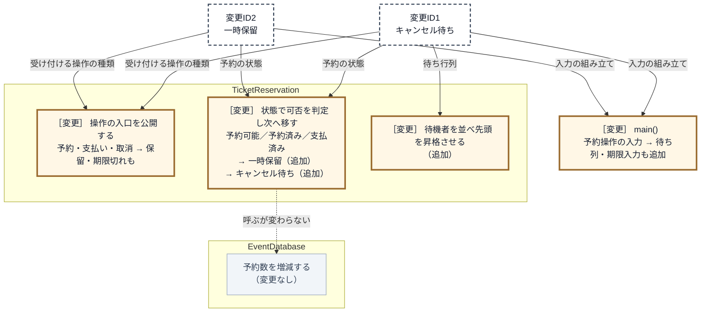
```mermaid
graph TD
    T1["変更ID1<br>キャンセル待ち"]:::req
    T2["変更ID2<br>一時保留"]:::req

    subgraph TR["TicketReservation"]
        R1["［変更］ 操作の入口を公開する<br>予約・支払い・取消 → 保留・期限切れも"]:::touched
        R2["［変更］ 状態で可否を判定し次へ移す<br>予約可能／予約済み／支払済み<br>→ 一時保留（追加）<br>→ キャンセル待ち（追加）"]:::touched
        R3["［変更］ 待機者を並べ先頭を昇格させる<br>（追加）"]:::touched
    end

    subgraph EDB["EventDatabase"]
        D1["予約数を増減する<br>（変更なし）"]:::keep
    end

    M["［変更］ main()<br>予約操作の入力 → 待ち列・期限入力も追加"]:::touched

    T1 -->|"受け付ける操作の種類"| R1
    T1 -->|"予約の状態"| R2
    T1 -->|"待ち行列"| R3
    T1 -->|"入力の組み立て"| M
    T2 -->|"受け付ける操作の種類"| R1
    T2 -->|"予約の状態"| R2
    T2 -->|"入力の組み立て"| M
    R2 -.->|"呼ぶが変わらない"| D1

    classDef req fill:#ffffff,stroke:#334155,stroke-width:2px,stroke-dasharray:6 4,color:#111827;
    classDef keep fill:#f1f5f9,stroke:#94a3b8,color:#334155;
    classDef touched fill:#fff7e6,stroke:#9a6b2f,stroke-width:3px,color:#172033;
```

この図は、次のように読みます。

**二つの依頼が、`TicketReservation` の枠の中の3つの箱すべてへ届いています。** 操作を1つ足しても、状態を1つ足しても、待たせ方を決めても、同じクラスに手が入ります。`reserve()`・`pay()`・`cancel()`・`hold()`・`expire()`・昇格処理を横断して直すことになりました。

**矢印のラベルは3種類に分かれています。** 受け付ける操作の種類、予約の状態、待ち行列。**別々のものを見ている仕事が、一つの枠に入っている**ということです。

**`EventDatabase` の予約数は、別の枠にあります。** 呼びはしますが中身は変わらず、上の3つを直すときに巻き込まれることもありません。

### 3-3：痛みの言語化

痛みは、**理想と現状の差**として書きます。

依頼は「キャンセル待ちと一時保留という状態を2つ足すこと」です。**理想は、新しい2つの状態の振る舞いを書き足し、待機順の仕組みを1つ作るだけで済むこと**です。既存の予約可能・予約済み・支払い済みの振る舞いには触りません。

**ところが実際には、** 既存の予約・支払い・取消の判定を横断して書き換えました。待機順を足すためには、予約本体が持つデータと席解放の処理まで書き換えることになりました。

**この差が問題です。** 足すだけのはずが、動いていた既存の判定へ手が入りました。上の読み方のうち、一つめと二つめがそれにあたります。

| 問題ID | 変更を試して観測した痛み | 起点 |
|---|---|---|
| 問題ID1（状態追加の横断修正） | Held・Waitlisted追加で、既存3操作の判定を書き換え、新規2操作にも同じ判定を書いた | 変更ID1・変更ID2 |
| 問題ID2（待機処理で予約本体を修正） | 待機順と自動昇格を足すために、予約本体の保持データと席解放処理まで書き換えた | 変更ID1 |

## 🟠 フェーズ4：原因分析 ―― なぜ辛いのかを構造で言語化する

> **フェーズ4の確認観点：** 「同じクラスの中に、違う接続情報を見ている場所が並んでいないか？」
>
> フェーズ3で、問題ID1（状態追加の横断修正）と問題ID2（待機処理で予約本体を修正）、その二つが起きた変更途中の `TicketReservation` は特定できました。フェーズ4ではこれらを入力にし、なぜ状態追加と待機順の変更が予約本体へ同時に広がったのかを調べます。フェーズ3は**どこまで広がったか**を見る場所、フェーズ4は**なぜ広がったか**を見る場所です。使う材料は同じ変更影響グラフで、見方だけを変えます。

### 4-1：責任の混在を原因として確定する

変更影響グラフで、色の付いた箱が3つ並んでいたのは `TicketReservation` です。ここを調べます。

そのグラフの箱と矢印を、ここへ書き出します。**以降は図へ戻らず、この表だけを見ます。**

| クラスの枠 | 枠の中の箱 | 届いた矢印のラベル |
|---|---|---|
| `TicketReservation` | 操作の入口を公開する（色つき） | 受け付ける操作の種類 |
| `TicketReservation` | 状態で可否を判定し次へ移す（色つき） | 予約の状態 |
| `TicketReservation` | 待機者を並べ先頭を昇格させる（色つき） | 待ち行列 |
| `EventDatabase` | 予約数を増減する | （点線）呼ぶが変わらない |
| （枠の外） | `main()` | 入力の組み立て |

手順は5つです。

1. **矢印のラベルを集めます。** 右の列にあるのは「受け付ける操作の種類」「予約の状態」「待ち行列」「入力の組み立て」の4種類です。フェーズ3では**依頼が動かすもの**として書きました。ここからは、**その場所が見ているもの**として読み直します。これを接続情報と呼びます。
2. **`main()` の行を外します。** `main()` は入力を組み立てるだけで、接続情報を見て動く場所ではありません。残るのは3種類です。
3. **複合のラベルはありません。** 重複をまとめると、接続情報は3つです。
4. **ラベルごとに、同じ行の箱を書きます。** コードで言えば、操作の入口は公開メソッドの入口、状態の判定は各メソッドの `if`、待機者を並べる処理は待機順の保持と先頭の昇格です。
5. **色の付いていない箱も行にします。** 別の枠にある「予約数を増減する」です。点線が届くだけで書き換えていません。見ているのは `EventDatabase` の予約数です。

4行になります。

| 接続情報 | それを見て動く場所 |
|---|---|
| 受け付ける操作の種類 | `TicketReservation` の公開メソッドの入口 |
| 予約の状態 | `reserve()`・`pay()`・`cancel()`・`hold()`・`expire()` の各 `if` |
| 待ち行列 | `TicketReservation` の待機順の保持と先頭の昇格 |
| `EventDatabase` の予約数 | `EventDatabase`（別クラス） |

右の列がコードのどこなのかを、変更を試したあとの `reserve()` で見ます。4つとも1つのメソッドに現れます。

**変更試行後の抜粋：`TicketReservation::reserve()`**

```cpp
// 受け付ける操作の種類：この関数名そのもの
void TicketReservation::reserve() {
    if (!db.exists(eventId)) {
        std::cout << "エラー：イベントID " << eventId
                  << " は存在しません\n";
        return;
    }

    if (status == "Available") {        // 予約の状態を見る
        if (db.hasCapacity(eventId)) {
            db.reserveSeat(eventId);    // 予約数を見る
            status = "Reserved";
        } else {
            status = "Waitlisted";
            waitlist.push_back(this);   // 待ち行列を見る
        }
    } else {
        handleReserveError();           // 予約の状態を見る
    }
}
```

`pay()`・`cancel()`・`hold()`・`expire()` も同じ形です。どれも先頭で `status` を見て、許される操作かどうかを自分で判定しています。表で**予約の状態**が「5つの場所」と書いているのは、この5つのことです。

読み方は三つです。

1. **予約の状態は、5つの場所に散っています。** 状態を1つ足すと、5か所すべてに手が入ります。**この5つは一つの置き場所へまとめる**対象です。
2. **受け付ける操作の種類・予約の状態・待ち行列は、どれも `TicketReservation` の中にあります。** けれど見ているものが違います。操作を1つ足すだけのつもりでも、状態の判定を読み直すことになる。**これが混在です。引き離す対象です。**
3. **`EventDatabase` の予約数だけは、別のクラスにあります。** 上の3つに手を入れても巻き込まれません。分けたあとも、ここはそのまま残します。

まとめた場所と、残った行が、そのまま責任になります。

| 責任 | 見ている接続情報 |
|---|---|
| 予約操作の受付 | 受け付ける操作の種類 |
| 状態別の操作可否・遷移 | 予約の状態 |
| イベント別の待機順・先頭昇格 | 待ち行列 |
| 予約数の増減・空席判定 | `EventDatabase` の予約数 |

**「どれも予約の話だから、責任は一つではないか」と感じるかもしれません。** 責任は、扱う題材ではなく見ているもので分けます。題材は同じ予約でも、操作の種類・状態の規則・待たせ方は、別々の人が別々の時期に決めます。今回も、一時保留とキャンセル待ちは別々の依頼として届きました。

**業務の判断と仕組みの骨格で二つに分ける見方もあります。** その線引きだと、状態の規則と待たせ方が同じ側に入ります。しかし今回は、待たせ方を足したときにも状態の判定に手が入りました。別々に動くものを一つにまとめると、片方の変更でもう片方に手を入れることになります。ここでは、実際に別々に動いた三つを、そのまま三つの責任として扱います。

変更を試した時点の配置は、次の構造です。

**対策前：変更を現状構造へ当てた状態**

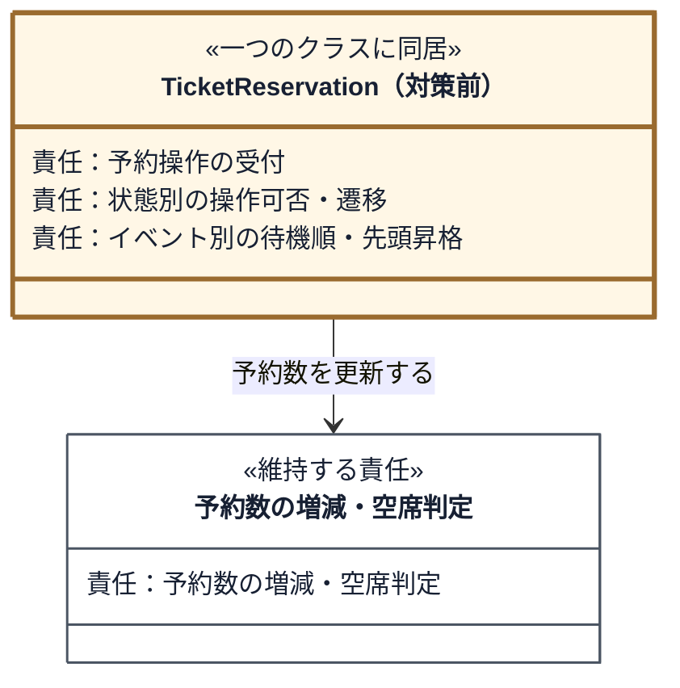
```mermaid
classDiagram
    %% provisional-role-diagram
    direction TB
    class TrialReservation["TicketReservation（対策前）"]:::current {
        <<一つのクラスに同居>>
        責任：予約操作の受付
        責任：状態別の操作可否・遷移
        責任：イベント別の待機順・先頭昇格
    }
    class SeatCount["予約数の増減・空席判定"]:::stable {
        <<維持する責任>>
        責任：予約数の増減・空席判定
    }
    TrialReservation --> SeatCount : 予約数を更新する

    classDef stable fill:#ffffff,stroke:#4b5563,stroke-width:1.5px,color:#172033;
    classDef current fill:#fff7e6,stroke:#9a6b2f,stroke-width:3px,color:#172033;
```

今回、状態別の操作可否・遷移とイベント別の待機順・先頭昇格は直接変わりました。予約操作の受付にも一時保留と期限切れの入口が増えましたが、既存の予約・支払い・取消の入口の中にも状態の判定が書かれているため、入口ごとに修正・確認へ巻き込まれました。予約数の増減・空席判定は `EventDatabase` にあり、この混在には含まれません。

**原因ID1（予約操作の受付と状態別の操作可否・遷移が同じクラスにある）。** 予約操作の受付が、各状態の可否・遷移・副作用を直接持つ配置が、問題ID1（状態追加の横断修正）を生みました。

**原因ID2（予約操作の受付とイベント別の待機順・先頭昇格が同じクラスにある）。** 予約操作の受付が、満席時の扱い、待機順、空席時の先頭選択と昇格開始まで持つ配置が、問題ID2（待機処理で予約本体を修正）を生みました。

> **問い1：同じ場所に、別々の理由で変わるものがないか**
>
> 答えは「ある」です。予約操作の受付、状態別の操作可否・遷移、イベント別の待機順・先頭昇格は別々の理由で変わりますが、`TicketReservation` の操作メソッドへ集まっています。

目指す形は、**どの置き場所も、一つのことのためだけに手を入れれば済む状態**です。原因は確定しました。次は、二つの原因をなくす責任配置を決めます。

## 🟡 フェーズ5：課題定義 ―― 原因から課題を検討して確定する

> **フェーズ5の確認観点：** 「原因をなくすには何を分け、どうなれば終わったと言えるか？」を、完成コードで確かめられる文まで決めます。
>
> 入力は、原因ID1（予約操作の受付と状態別の操作可否・遷移が同じクラスにある）と原因ID2（予約操作の受付とイベント別の待機順・先頭昇格が同じクラスにある）です。

### 5-1：原因をなくす責任配置を決める

**原因ID1への対応。** 状態別の操作可否・遷移を予約操作の受付から分けます。予約本体は操作を現在状態へ渡し、状態クラスが可否・次状態・席数への作用を決めます。

**原因ID2への対応。** イベント別の待機順・先頭昇格を予約操作の受付から分けます。待ち行列は満席時の昇格対象を受け取り、空席時に先頭へ昇格を依頼します。

状態値を列挙型へ変えるだけでは公開操作の分岐が残り、状態別の操作可否・遷移だけを分けてもイベント別の待機順・先頭昇格を予約操作の受付へ残せば原因は消えません。また、利用側が昇格を別に呼ぶ形では自動運用になりません。そこで、フェーズ4の対策前図を次の責任配置へ変え、席解放から昇格までは内部でつなぎます。

**目標：状態別の判断と待機順を予約本体から分け、自動昇格へつなぐ**

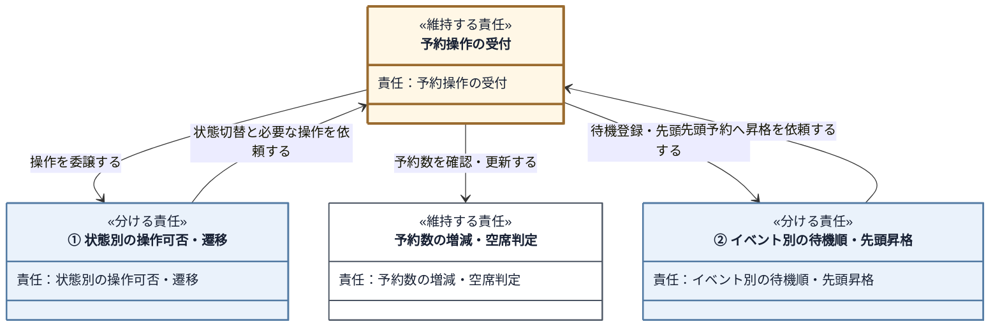
```mermaid
classDiagram
    %% provisional-role-diagram
    direction TB
    class ReservationEntry["予約操作の受付"]:::current {
        <<維持する責任>>
        責任：予約操作の受付
    }
    class StatePolicy["① 状態別の操作可否・遷移"]:::separated {
        <<分ける責任>>
        責任：状態別の操作可否・遷移
    }
    class WaitPolicy["② イベント別の待機順・先頭昇格"]:::separated {
        <<分ける責任>>
        責任：イベント別の待機順・先頭昇格
    }
    class SeatCount["予約数の増減・空席判定"]:::stable {
        <<維持する責任>>
        責任：予約数の増減・空席判定
    }
    ReservationEntry --> StatePolicy : 操作を委譲する
    StatePolicy --> ReservationEntry : 状態切替と必要な操作を依頼する
    ReservationEntry --> SeatCount : 予約数を確認・更新する
    ReservationEntry --> WaitPolicy : 待機登録・先頭昇格を依頼する
    WaitPolicy --> ReservationEntry : 先頭予約へ昇格を依頼する

    classDef stable fill:#ffffff,stroke:#4b5563,stroke-width:1.5px,color:#172033;
    classDef separated fill:#eaf2fb,stroke:#527aa3,stroke-width:2px,color:#172033;
    classDef current fill:#fff7e6,stroke:#9a6b2f,stroke-width:3px,color:#172033;
```

黄色は既存の予約操作の受付、青は外へ分ける責任、白は規則を維持する予約数の増減・空席判定です。①と②は次の課題表に対応します。

この配置になると、フェーズ4で並べた接続情報は、次のように分かれます。

| 分けたあとの置き場所（責任） | 見ている接続情報 |
|---|---|
| 予約操作の受付 | 受け付ける操作の種類 |
| 状態別の操作可否・遷移 | 予約の状態 |
| イベント別の待機順・先頭昇格 | 待ち行列 |
| 予約数の増減・空席判定 | `EventDatabase` の予約数 |

フェーズ4では、三つの接続情報が `TicketReservation` の中に同居していました。分けたあとは、置き場所ごとに見ているものが一つになります。状態を1つ足すとき手を入れるのは状態別の判断、待たせ方を変えるときは待機順、操作を増やすときは受付の置き場所だけです。型名・状態クラス・生成場所はフェーズ6で決めます。

### 5-2：課題と完了条件を確定する

直前の目標図で決めた①と②に課題IDを付けます。図の各変更について、原因・接続・完了の見分け方を確定します。

#### 課題ID1（状態固有動作の境界）の完了条件

**解く原因：** 原因ID1（予約操作の受付と状態別の操作可否・遷移が同じクラスにある）

**構造の変更：** 目標図の①のとおり、状態別の操作可否・遷移を予約操作の受付から分けます。

**接続：** 予約本体から現在状態へ操作を渡し、状態クラスから予約本体へ次状態と必要な在庫・待機列操作を反映します。

完成コードで次の三点を満たせば完了です。

- 公開操作に状態名の条件分岐がない
- 可否・次状態・副作用を現在状態へ委ねる
- 状態追加で全公開操作を修正しない

#### 課題ID2（待ち行列の境界）の完了条件

**解く原因：** 原因ID2（予約操作の受付とイベント別の待機順・先頭昇格が同じクラスにある）

**構造の変更：** 目標図の②のとおり、イベント別の待機順・先頭昇格を予約操作の受付から分けます。

**接続：** 予約本体から待ち行列へイベントIDと昇格対象を渡して登録し、空席後は待ち行列から先頭の昇格対象へシステム昇格を依頼します。昇格結果は、予約本体の状態とイベントの予約数へ反映します。

完成コードで次の三点を満たせば完了です。

- 待機順の保持と先頭選択が状態分岐にない
- 席が空くとシステム内から先頭が昇格する
- 利用側に待機者を昇格させる操作がない

二つとも満たせば、公開操作は現在状態へ処理を渡し、待機順と先頭昇格は待ち行列へ閉じます。席が空くと、利用側の追加操作なしで先頭が昇格します。

最後に、問題から課題までのつながりを確認します。1行が一つの原因です。問題が同じでも、原因が二つあれば二行になります。

| 観測した問題 | 確定した原因 | 課題で目指す状態 |
|---|---|---|
| 問題ID1：状態追加で複数操作を修正 | 原因ID1：予約操作の受付と状態別の操作可否・遷移が同じクラスにある | 課題ID1：状態別の操作可否・遷移を予約操作の受付から分ける |
| 問題ID2：待機処理の追加で予約本体を修正 | 原因ID2：予約操作の受付とイベント別の待機順・先頭昇格が同じクラスにある | 課題ID2：イベント別の待機順・先頭昇格を予約操作の受付から分ける |

## 🔴 フェーズ6：対策検討 ―― 構想を一つのコード経路へ変える

> **フェーズ6の確認観点：** 「契約と具体」「生成・所有」「選択・登録」「受け渡し」「実行」が、課題ID1（状態固有動作）・課題ID2（待ち行列）を同時に解く一つの経路としてつながるかを確認します。
>
> 取消から自動昇格まで動く一つの構想にします。

> **フェーズ6の確認観点：** 「契約と具体」「生成・所有」「選択・遷移」「受け渡し」「実行」が、二つの課題を同時に解き、取消から自動昇格まで途切れずにつながるかを確認します。

### 分離した責任をコードの構造へ変える

フェーズ5では、状態別の操作可否・遷移とイベント別の待機順・先頭昇格を予約操作の受付から分け、席解放から自動昇格までを内部でつなぐところまで決めました。ここからは、状態契約、具体状態、生成・共有、待ち行列、公開操作からの委譲、自動昇格の順にC++の構造へ変えます。

フェーズ5の目標図で使った責任名を、C++のクラス名へ置き換えると次の対応になります。

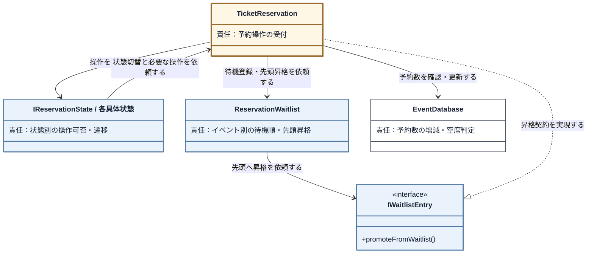
```mermaid
classDiagram
    direction TB
    class ReservationEntry["TicketReservation"]:::current {
        責任：予約操作の受付
    }
    class StatePolicy["IReservationState / 各具体状態"]:::separated {
        責任：状態別の操作可否・遷移
    }
    class WaitPolicy["ReservationWaitlist"]:::separated {
        責任：イベント別の待機順・先頭昇格
    }
    class WaitEntry["IWaitlistEntry"]:::separated {
        <<interface>>
        +promoteFromWaitlist()
    }
    class SeatCount["EventDatabase"]:::stable {
        責任：予約数の増減・空席判定
    }
    ReservationEntry --> StatePolicy : 操作を委譲する
    StatePolicy --> ReservationEntry : 状態切替と必要な操作を依頼する
    ReservationEntry --> SeatCount : 予約数を確認・更新する
    ReservationEntry --> WaitPolicy : 待機登録・先頭昇格を依頼する
    WaitEntry <|.. ReservationEntry : 昇格契約を実現する
    WaitPolicy --> WaitEntry : 先頭へ昇格を依頼する

    classDef stable fill:#ffffff,stroke:#4b5563,stroke-width:1.5px,color:#172033;
    classDef separated fill:#eaf2fb,stroke:#527aa3,stroke-width:2px,color:#172033;
    classDef current fill:#fff7e6,stroke:#9a6b2f,stroke-width:3px,color:#172033;
```

図の「予約操作の受付」「状態別の操作可否・遷移」「イベント別の待機順・先頭昇格」「予約数の増減・空席判定」はフェーズ5と同じ責任名です。待ち行列が予約の具体型を知らずに先頭を昇格できるよう、二つの間へ `IWaitlistEntry` を置きました。ここから、各責任を表す契約・操作・所有・受け渡しを部分クラス図と対応コードで確定します。完成クラス図はフェーズ7で確認します。

### 構想をコードでつなぐ

> **現在位置：** 契約 → 具体状態 → 生成・共有 → 公開操作からの委譲、の順で確認します。

#### 契約：状態操作と待ち行列の接続をC++の型にする

> **問い2：境界では、何を約束すれば足りるか**
>
> フェーズ5で確定した二つの接続を、C++の型と操作へ変えます。状態別の操作可否・遷移には共通の基底クラスを置きます。待ち行列と予約本体の間には、具体クラス同士の相互参照を避けるため、先頭昇格だけを約束する小さな契約を置きます。

状態ごとの可否と遷移は五つの公開操作に分散しています。状態・遷移・イベントが増える見込みもあるため、関数の切り出しではなく、全操作を同じ形で呼べる状態契約まで分けます。

課題ID1（状態固有動作の境界）で確定した接続は、「予約操作を現在状態へ渡し、状態変更と席数更新を予約へ反映する」です。C++では、現在状態を `IReservationState` のオブジェクトで表し、六つの操作を同名の仮想メソッドにします。各メソッドは操作対象の `TicketReservation*` を受け取ります。状態名や操作種別を値で渡すと呼び出し側に再び分岐ができるため、それらを引数や戻り値にはしません。

次状態の切替と、その遷移で必要な席数更新・自動昇格は、遷移元の具体状態が予約へ反映します。状態名だけを返す形にすると、呼び出し元が副作用の有無を再判定するためです。操作できない場合も呼び出し側で分岐していないので、戻り値は増やさず、状態側の既定動作で扱います。

次の部分クラス図は、**今決める「予約本体が現在状態を保持し、状態ごとの具体が共通基底を継承する」関係だけ**を示します。代表として予約済み状態だけを載せ、他の状態、待ち行列、席数台帳はまだ対象外です。

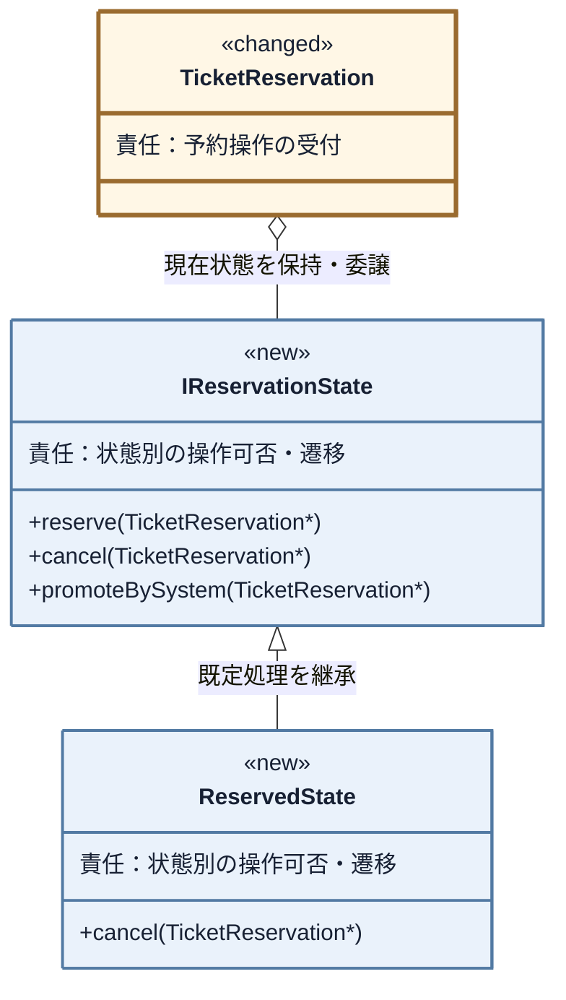
```mermaid
classDiagram
    direction TB
    class TicketReservation:::touched {
        <<changed>>
        責任：予約操作の受付
    }
    class IReservationState:::added {
        <<new>>
        責任：状態別の操作可否・遷移
        +reserve(TicketReservation*)
        +cancel(TicketReservation*)
        +promoteBySystem(TicketReservation*)
    }
    class ReservedState:::added {
        <<new>>
        責任：状態別の操作可否・遷移
        +cancel(TicketReservation*)
    }
    TicketReservation o-- IReservationState : 現在状態を保持・委譲
    IReservationState <|-- ReservedState : 既定処理を継承

    classDef added fill:#eaf2fb,stroke:#527aa3,stroke-width:2px,color:#172033;
    classDef touched fill:#fff7e6,stroke:#9a6b2f,stroke-width:3px,color:#172033;
```

白三角が実線なのは、`IReservationState` が不可操作の既定処理を持つ実装継承だからです。

**ここで確認するコード：`IReservationState`** ―― 6操作のうち関係を判断する3つの契約

```cpp
class IReservationState {
public:
    virtual void reserve(TicketReservation*);
    virtual void cancel(TicketReservation*);
    virtual void promoteBySystem(TicketReservation*);
    virtual ~IReservationState() = default;
};
```

利用者操作4種とシステム入力2種はいずれも状態で振る舞いが変わるため、同じ基底クラスに置きます。許可されない操作は基底の既定処理へ任せ、呼ぶ側の状態判定をなくします。`ReservedState::cancel()` は席を戻し、受付可能状態へ切り替え、待機者を一件昇格させます。この具体処理の完成コードはフェーズ7で示します。

> **設計判断：次状態は遷移元が決める。** 遷移表へ集約すると全体像は見やすい反面、状態追加のたびに中央の表を変更します。本章は変更範囲を遷移元の近くへ閉じる目的を優先します。代わりに、全遷移の把握には複数クラスを見るコストが残ります。

`ReservedState` 自体が現在状態を、`cancel()` が操作を表します。受け取った `reservation` に対して次状態・席数・昇格を変更するため、元の `if` の中身だけが状態クラスへ移ります。新状態への進入元を直す必要は残り、完了条件も「新状態と遷移接続に閉じる」としています。

ただし、これは代表の `ReservedState` に当てただけです。**五つの状態すべてが同じ形で成り立つかは、具体を並べるときに当てて確かめます。**

次に、課題ID2（待ち行列の境界）の待機順を分けます。

課題ID2（待ち行列の境界）で確定した接続は、「イベントIDと昇格対象を登録し、空席時に先頭を昇格する」です。C++では、昇格対象を `IWaitlistEntry`、登録を `enqueue(eventId, entry)`、先頭昇格を `promoteNext(eventId)` と表します。`ReservationWaitlist` は先頭の `IWaitlistEntry` を呼ぶだけなので、その実体が `TicketReservation` であることも、内部の状態も知りません。

次の部分クラス図は、**予約本体の具体型を待ち行列から隠す関係**を、直前の構造へ追加したものです。状態クラスと生成者は省いた部分図です。

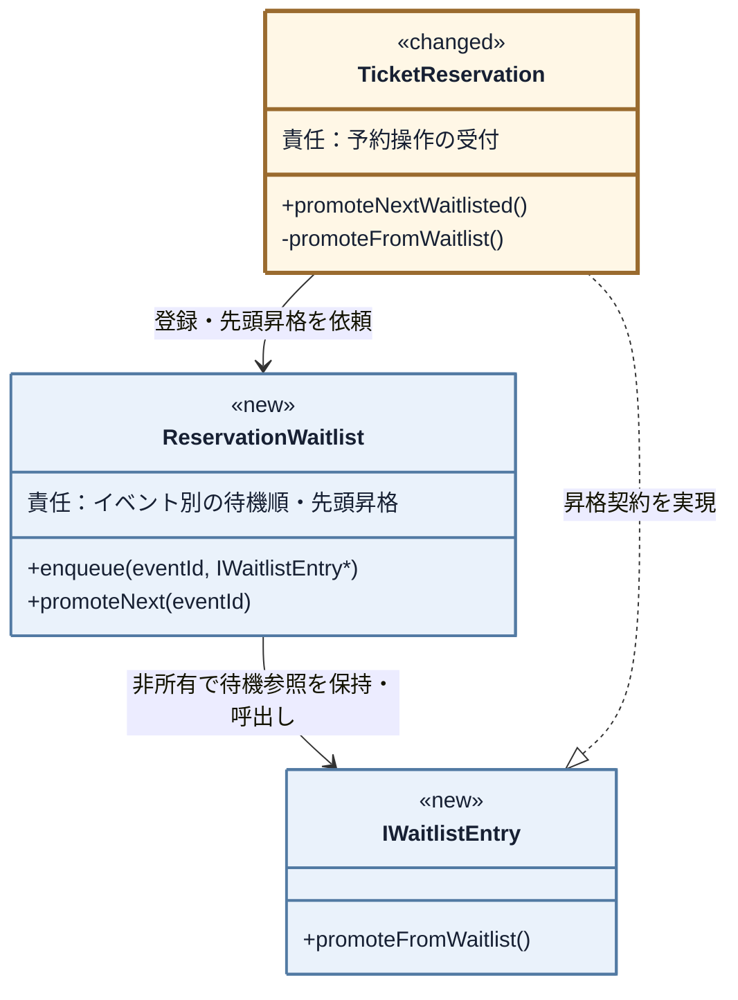
```mermaid
classDiagram
    direction TB
    class TicketReservation:::touched {
        <<changed>>
        責任：予約操作の受付
        +promoteNextWaitlisted()
        -promoteFromWaitlist()
    }
    class IWaitlistEntry:::added {
        <<new>>
        <<interface>>
        +promoteFromWaitlist()
    }
    class ReservationWaitlist:::added {
        <<new>>
        責任：イベント別の待機順・先頭昇格
        +enqueue(eventId, IWaitlistEntry*)
        +promoteNext(eventId)
    }
    IWaitlistEntry <|.. TicketReservation : 昇格契約を実現
    TicketReservation --> ReservationWaitlist : 登録・先頭昇格を依頼
    ReservationWaitlist --> IWaitlistEntry : 非所有で待機参照を保持・呼出し

    classDef added fill:#eaf2fb,stroke:#527aa3,stroke-width:2px,color:#172033;
    classDef touched fill:#fff7e6,stroke:#9a6b2f,stroke-width:3px,color:#172033;
```

`TicketReservation` は待機登録と空席後の先頭昇格を依頼し、`ReservationWaitlist` はイベント別の先着順を保持して先頭の契約を呼びます。`TicketReservation` が `IWaitlistEntry` を実現するため、昇格依頼は現在状態の `promoteBySystem()` へ届きます。待ち行列は予約の状態を判定しません。別イベントの待機者を昇格させないよう、行列はイベントIDごとに持ちます。完成実装はフェーズ7で確認します。

**ここで確認するコード：`IWaitlistEntry`** ―― 待ち行列が知る一つの操作

```cpp
class IWaitlistEntry {
public:
    virtual void promoteFromWaitlist() = 0;
    virtual ~IWaitlistEntry() = default;
};
```

> **導入コスト：** 状態ごとにクラスが増え、全遷移は複数クラスに分散します。本章で受け入れるのは、フェーズ2で状態追加が見込まれ、横断的な分岐修正を減らす効果が上回るためです。

#### 具体：契約の裏へ変わる判断を置く

具体状態には「許可する操作」と「遷移先・副作用」だけを置きます。たとえばキャンセル待ち状態を受け持つ `WaitlistedState` は `promoteBySystem()` だけを上書きし、席を確保して予約済み状態へ切り替えます。自分で操作できない規則は、該当メソッドを上書きせず、基底の断り処理を使うことで表します。

六つの操作を、五つの状態すべてへ当てます。状態遷移表が、そのままクラスの一覧になります。

| 状態クラス | 上書きする操作 | 遷移先と副作用 |
|---|---|---|
| `AvailableState` | `reserve()` | 空席あり→予約済み・席を1つ減らす／満席→キャンセル待ち・待機登録 |
| `ReservedState` | `pay()` / `hold()` / `cancel()` / `expire()` | 支払済み／保留中／受付可能・席を戻して1件昇格／15分期限切れも同じ |
| `HeldState` | `pay()` / `cancel()` / `expire()` | 支払済み／受付可能・席を戻して1件昇格／24時間期限切れも同じ |
| `PaidState` | 無し | すべて既定の断り（支払済みは終端） |
| `WaitlistedState` | `promoteBySystem()` | 予約済み・席を1つ減らす |

五つとも収まりました。ただし、形が危なかったところが二つあります。

**`PaidState` は、上書きする操作が一つもありません。** 状態ごとに全操作を必ず書く形にしていたら、断るだけの実装を六つ並べることになります。基底が断り処理を持っているので、`PaidState` は空のままで成り立ちます。

**`WaitlistedState` が動くのは、利用者操作ではありません。** 昇格を起こすのは席が空いたシステム側です。契約を利用者操作の四つだけにしていたら、ここで成り立ちませんでした。`promoteBySystem()` を同じ基底へ置いて、六つで一つの形にします。

**状態が一つでも収まらなければ、その形は契約にしません。** `IWaitlistEntry` は待ち行列の差し替え用ではなく、`ReservationWaitlist` から `TicketReservation` の具体型を隠し、先頭昇格だけを許す境界です。

**守る範囲との照合：** 予約で席を1つ減らし、取消・期限切れで1つ戻す規則は変えません。席を戻す4遷移はいずれも直後に `promoteNextWaitlisted()` を呼び、自動昇格を保ちます。

---

#### 生成・所有・受け渡しを決める

> **問い3：実体を、誰が作り、持ち、渡すのか**
>
> 状態取得関数がメンバーを持たない五つの状態実体を生成・静的所有し、`TicketReservation`が現在状態へのポインタを持ちます。組み立て専用の`ReservationAssembly`は座席数・待ち行列・期限入力を所有して予約へ渡します。作った状態が公開操作から呼ばれ、遷移後も同じ共有資源へ戻れる経路を確かめます。

直前までに決めた状態契約と待ち行列の境界へ、所有者と借用先を追加します。代表状態、期限入力、実行役は省いた部分クラス図です。

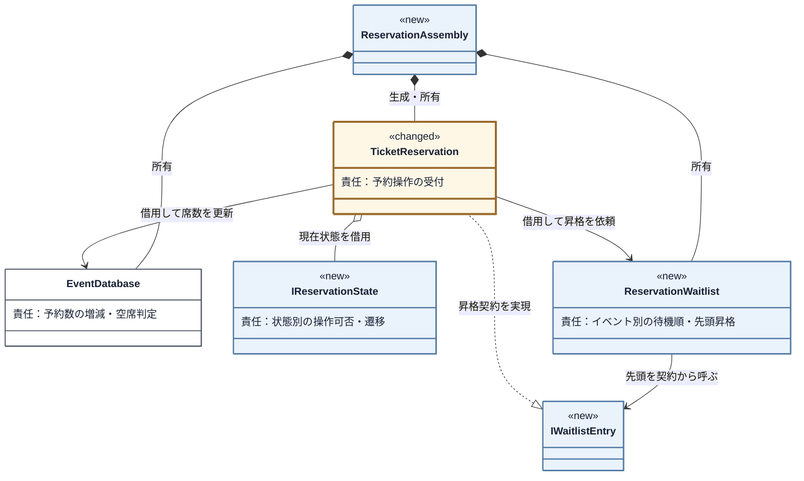
```mermaid
classDiagram
    direction TB
    class ReservationAssembly:::added {
        <<new>>
    }
    class TicketReservation:::touched {
        <<changed>>
        責任：予約操作の受付
    }
    class EventDatabase:::stable {
        責任：予約数の増減・空席判定
    }
    class IReservationState:::added {
        <<new>>
        責任：状態別の操作可否・遷移
    }
    class ReservationWaitlist:::added {
        <<new>>
        責任：イベント別の待機順・先頭昇格
    }
    class IWaitlistEntry:::added {
        <<new>>
        <<interface>>
    }
    ReservationAssembly *-- TicketReservation : 生成・所有
    ReservationAssembly *-- EventDatabase : 所有
    ReservationAssembly *-- ReservationWaitlist : 所有
    TicketReservation o-- IReservationState : 現在状態を借用
    TicketReservation --> EventDatabase : 借用して席数を更新
    TicketReservation --> ReservationWaitlist : 借用して昇格を依頼
    IWaitlistEntry <|.. TicketReservation : 昇格契約を実現
    ReservationWaitlist --> IWaitlistEntry : 先頭を契約から呼ぶ

    classDef stable fill:#ffffff,stroke:#4b5563,stroke-width:1.5px,color:#172033;
    classDef added fill:#eaf2fb,stroke:#527aa3,stroke-width:2px,color:#172033;
    classDef touched fill:#fff7e6,stroke:#9a6b2f,stroke-width:3px,color:#172033;
```

`ReservationAssembly` が予約より長く生きる在庫と待ち行列を所有し、各予約へ借用ポインタを渡します。状態実体は状態取得関数が静的所有します。これで、契約、具体状態、待ち行列、所有と注入までが一つの構造につながりました。

##### 生成・所有：実体と所有者をコードで示す

五つの状態はデータを持たず、渡された予約だけを動かすため、各一実体を全予約で共有します。

**ここで確認するコード：`reservedState()`** ―― 共有状態の生成と所有

```cpp
IReservationState* reservedState() {
    static ReservedState instance;
    return &instance;
}
```

五つの状態取得関数を同じ形で用意します。関数内 `static` は終了まで生存し、`state` は共有実体を借り、`setState()` で参照先だけを替えます。

**ここで確認するコード：`TicketReservation`** ―― 3つの借用と状態切替

```cpp
IReservationState* state;
EventDatabase* db;
ReservationWaitlist* waitlist;

void setState(IReservationState* nextState) {
    state = nextState;
}
```

三つは借用ポインタです。とくに待ち行列は同一イベントの全予約で共有するため、予約ごとに値で持てません。実体は組み立て専用の`ReservationAssembly`が所有します。

**ここで確認するコード：`ReservationAssembly::startReservation()`** ―― 共有実体の受け渡し

```cpp
TicketReservation& startReservation(
        const std::string& eventId) {
    reservations.emplace_back(availableState(), &db,
                              &waitlist, eventId);
    return reservations.back();
}
```

`db` と `waitlist` は各予約より長く生存します。`ReservationAssembly`は共有実体の生成・所有・受け渡しだけを担い、実行ケースや表示は持ちません。状態実体だけは状態取得関数が静的所有します。

---

##### 状態の受け渡し：初期状態と次状態を渡す

状態は、予約生成時の初期設定と、各遷移時の切替の2回に分けて渡されます。

**ここで確認するコード：`BatchApplication::run()`** ―― 組み立て済みの共有実体から予約を1件作る行

```cpp
        TicketReservation& r =
            assembly.startReservation("EVT001");
        r.showAvailability();
```

`startReservation()`の内部で`availableState()`を初期状態として渡します。空席確認も予約の公開入口へ任せるため、実行役は台帳や具体状態を知りません。遷移時は次の一行で切り替えます。

**ここで確認するコード：`ReservedState` の `cancel()`** ―― 具体コードで書いた1行目（引数は `TicketReservation*`）

```cpp
        // 状態を Available に切り替える
        reservation->setState(availableState());
```

遷移元が次状態を渡し、予約本体は具体型を判定しません。

課題ID1（状態固有動作の境界）は、遷移元の状態が次状態を決め、`TicketReservation::setState()`へ渡すことで実現します。課題ID2（待ち行列の境界）は一実装なので選択せず、`ReservationAssembly`が同じ実体を全予約へ渡します。`BatchApplication`は組み立ての詳細を知らず、作成済みの入口から実行ケースを動かします。


---

#### 実行骨格：組み立てた実体を契約から呼ぶ

守る骨格は、公開入口が操作を現在状態へ渡すことと、席を解放した状態が待ち行列へ昇格を依頼することの二点です。状態追加で変えるのは、新しい状態クラスと、その状態へ入る遷移元だけです。

#### 公開入口から具体の実行まで追う

##### 取消から先頭昇格の開始までをつなぐ

ここまでに決めたクラスを、取消から先頭昇格の開始までつなぎます。昇格先の状態変更と席数ログは、フェーズ7の完成シーケンスで加える範囲です。

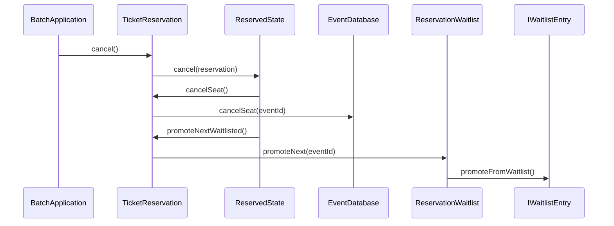
```mermaid
sequenceDiagram
    participant BA as BatchApplication
    participant R as TicketReservation
    participant S as ReservedState
    participant DB as EventDatabase
    participant WQ as ReservationWaitlist
    participant E as IWaitlistEntry

    BA->>R: cancel()
    R->>S: cancel(reservation)
    S->>R: cancelSeat()
    R->>DB: cancelSeat(eventId)
    S->>R: promoteNextWaitlisted()
    R->>WQ: promoteNext(eventId)
    WQ->>E: promoteFromWaitlist()
```

利用側が呼ぶのは `cancel()` だけです。取消状態が席を戻して待ち行列へつなぎ、待ち行列は予約の具体型を知らずに先頭の昇格契約を呼びます。依存を三つ渡す組み立てコストと引き換えに、状態追加を新状態と遷移元へ、待機順変更を `ReservationWaitlist` へ閉じます。最終的な状態遷移と不変条件はフェーズ7で検証します。

### 構想を確定する

`TicketReservation` は公開入口、状態クラスは可否・遷移・副作用、`ReservationWaitlist` は待機順を持ちます。待ち行列まで状態クラスへ置く案では課題ID2（待ち行列の境界）が残ります。二つの課題を解く構造はここまでで一つに定まり、フェーズ7で完成クラス図を示します。

公開入口は `TicketReservation`、予約数の増減・空席判定は `EventDatabase` の既存契約を維持します。

#### 将来リスクに対して構想を確認する

| 将来リスク | 変更を閉じ込める場所 | 守れる範囲と限界 |
|---|---|---|
| リスクID1（遷移ルール） | 遷移元の状態クラス | 他状態と公開入口を守れる。共通規則は重複しやすい |
| リスクID2（状態追加） | 新状態と、その状態へ入る遷移 | 既存状態を守れる。進入元が多いと複数状態の修正は残る |
| リスクID3（イベント追加） | 新イベント入口、状態契約、必要なスケジューラ | 状態判断を各状態へ保てる。実行基盤は別に必要になる |

## 🟢 フェーズ7：対策実施 ―― 変化に強いコードを完成させる

> **フェーズ7の確認観点：** 「変更後の全要求IDを満たし、既存要求も落としていないか」と「フェーズ5の構造上の完了条件を満たし、同じ変更IDの影響が縮んだか」を分けて確認します。

状態判定を各状態クラスへ、待機順を `ReservationWaitlist` へ移した完成コードを示します。

### 7-1：解決後のコード（全体）


#### 完成後のクラス一覧

期限切れはシステム入力なので、実行役が予約の `expire()` を呼びます。

- `TicketReservation`、`IReservationState`、`IWaitlistEntry`、`EventInfo`
- `EventDatabase`、`ReservationWaitlist`、`AvailableState`
- `ReservedState`、`PaidState`、`WaitlistedState`、`HeldState`
- `ReservationExpiryScheduler`、`ReservationAssembly`、`BatchApplication`

> **採用構造のコスト：** データを持たない状態は `static` で共有できますが、テスト用実体へは差し替えにくくなります。状態が予約固有データを持つなら共有せず、予約ごとの所有を設計します。

#### 完成後のクラス図

部分図を完成図へ統合します。`<<new>>` は新規、`<<changed>>` は変更、表示なしは現状維持です。図は3枚で、**前の2枚が「誰が誰を持つか」、最後の1枚が「境界を何が流れるか」**です。持ち方とやり取りを分けると、状態を増やしたときに動く線がどれなのかが見分けられます。

1枚目は、予約本体・状態契約・五つの具体状態を示します。

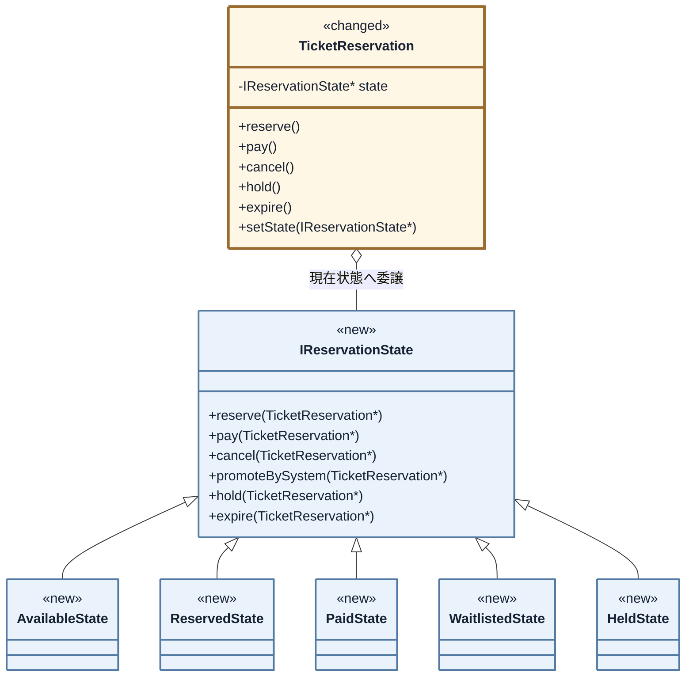
```mermaid
classDiagram
    direction TB
    class TicketReservation:::touched {
        <<changed>>
        -IReservationState* state
        +reserve()
        +pay()
        +cancel()
        +hold()
        +expire()
        +setState(IReservationState*)
    }
    class IReservationState:::added {
        <<new>>
        +reserve(TicketReservation*)
        +pay(TicketReservation*)
        +cancel(TicketReservation*)
        +promoteBySystem(TicketReservation*)
        +hold(TicketReservation*)
        +expire(TicketReservation*)
    }
    class AvailableState:::added {
        <<new>>
    }
    class ReservedState:::added {
        <<new>>
    }
    class PaidState:::added {
        <<new>>
    }
    class WaitlistedState:::added {
        <<new>>
    }
    class HeldState:::added {
        <<new>>
    }
    TicketReservation o-- IReservationState : 現在状態へ委譲
    IReservationState <|-- AvailableState
    IReservationState <|-- ReservedState
    IReservationState <|-- PaidState
    IReservationState <|-- WaitlistedState
    IReservationState <|-- HeldState

    classDef added fill:#eaf2fb,stroke:#527aa3,stroke-width:2px,color:#172033;
    classDef touched fill:#fff7e6,stroke:#9a6b2f,stroke-width:3px,color:#172033;
```

予約本体は現在状態へ操作を渡します。2枚目は、誰が誰を生成して持つかです。

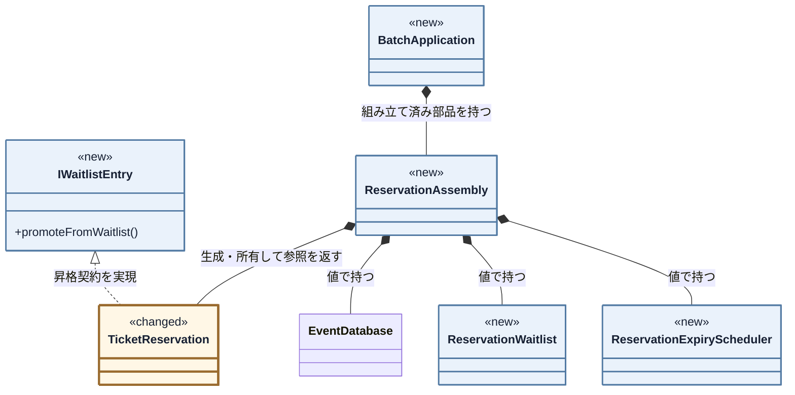
```mermaid
classDiagram
    direction TB
    class TicketReservation:::touched {
        <<changed>>
    }
    class EventDatabase
    class ReservationWaitlist:::added {
        <<new>>
    }
    class IWaitlistEntry:::added {
        <<new>>
        <<interface>>
        +promoteFromWaitlist()
    }
    class ReservationExpiryScheduler:::added {
        <<new>>
    }
    class ReservationAssembly:::added {
        <<new>>
    }
    class BatchApplication:::added {
        <<new>>
    }
    IWaitlistEntry <|.. TicketReservation : 昇格契約を実現
    ReservationAssembly *-- TicketReservation : 生成・所有して参照を返す
    ReservationAssembly *-- EventDatabase : 値で持つ
    ReservationAssembly *-- ReservationWaitlist : 値で持つ
    ReservationAssembly *-- ReservationExpiryScheduler : 値で持つ
    BatchApplication *-- ReservationAssembly : 組み立て済み部品を持つ

    classDef added fill:#eaf2fb,stroke:#527aa3,stroke-width:2px,color:#172033;
    classDef touched fill:#fff7e6,stroke:#9a6b2f,stroke-width:3px,color:#172033;
```

共有する実体は、すべて `ReservationAssembly` が1か所で作って持ちます。`TicketReservation` が `IWaitlistEntry` を実現しているのは、待ち行列から自分を呼んでもらうためです。

3枚目は、**境界を何が流れるか**です。**具体の状態クラスは出てきません。** どの状態にいても、外との受け渡しは同じだからです。

```mermaid
classDiagram
    direction TB
    class TicketReservation:::touched {
        <<changed>>
    }
    class EventDatabase
    class EventInfo
    class IWaitlistEntry:::added {
        <<new>>
        <<interface>>
        +promoteFromWaitlist()
    }
    class ReservationWaitlist:::added {
        <<new>>
    }
    class ReservationExpiryScheduler:::added {
        <<new>>
    }
    TicketReservation --> EventDatabase : イベントIDを渡し席数を受け取る
    EventDatabase *-- EventInfo : イベントID別に保存
    TicketReservation --> ReservationWaitlist : イベントIDと昇格対象を渡す
    ReservationWaitlist --> IWaitlistEntry : 先頭へ昇格だけを依頼する
    ReservationExpiryScheduler ..> TicketReservation : 期限切れを通知する

    classDef added fill:#eaf2fb,stroke:#527aa3,stroke-width:2px,color:#172033;
    classDef touched fill:#fff7e6,stroke:#9a6b2f,stroke-width:3px,color:#172033;
```

**待ち行列へ渡るのは、イベントIDと昇格対象の2つだけです。** 状態の名前も、いま何席空いているかも、この線には乗りません。`ReservationWaitlist` が呼べるのは `promoteFromWaitlist()` の1本だけで、予約がいまどの状態かは問いません。だから状態が1つ増えても、待ち行列側の線は動きません。

`EventDatabase` と `EventInfo` は現状維持です。新しい待ち行列・期限監視・組み立て・実行役を含め、掲載コードの全クラスを3枚のどれかに載せています。フェーズ4で `TicketReservation` に混在していた三つの責任は、完成図では、予約操作を受けて現在状態へ渡す `TicketReservation`、状態別に操作可否と遷移を決める各状態クラス、イベント別に待機順を保持して先頭を昇格させる `ReservationWaitlist` に分かれました。待ち行列は `IWaitlistEntry` だけを呼ぶため、予約本体の具体型を知りません。共有実体の生成・所有・受け渡しは`ReservationAssembly`、入力例の実行と表示は`BatchApplication`へ分かれています。違うものを見ている仕事と組み立ての処理を、一つのクラスが同時に抱える構造ではなくなりました。

#### 完成後の実行シーケンス

満席イベントの既存予約に `cancel()` が呼ばれたとき、空席作成から待機者の自動昇格までをどのクラスが担うか確認します。

```mermaid
sequenceDiagram
    participant BA as BatchApplication
    participant C as 既存TicketReservation
    participant RS as ReservedState
    participant DB as EventDatabase

    BA->>C: cancel()
    C->>RS: cancel(reservation)
    RS->>DB: cancelSeat(EVT003)
    DB-->>RS: 50/50 -> 49/50
    RS->>C: setState(Available)
    RS->>C: promoteNextWaitlisted()
```

席を解放した直後、`promoteNextWaitlisted()` から自動昇格へ続きます。

```mermaid
sequenceDiagram
    participant C as 既存TicketReservation
    participant WQ as ReservationWaitlist
    participant W as 待機TicketReservation
    participant WS as WaitlistedState
    participant DB as EventDatabase

    C->>WQ: promoteNext(EVT003)
    WQ->>W: promoteFromWaitlist()
    W->>WS: promoteBySystem(reservation)
    WS->>DB: reserveSeat(EVT003)
    DB-->>WS: 49/50 -> 50/50
    WS->>W: setState(Reserved)
```

`BatchApplication` や運用者は昇格を呼びません。取消処理が待ち行列へつなぎ、待機状態が席を確保します。

**期限切れも、同じ2枚をたどります。** 違うのは入口だけです。掲載コードでは `main()` が代役をしている時間経過が `ReservationExpiryScheduler` を起こし、`expire()` を呼びます。そこから先は `HeldState` が `cancelSeat()` で席を戻し、`setState(Available)` と `promoteNextWaitlisted()` へ進むので、上の `ReservedState` の場合と同じ経路になります。**席が戻る道が1本しかない**ということです。

`main()` は `BatchApplication::run()` だけを起動します。

#### 完成コード

---

**共通ヘッダー**

完成コードで使う標準ライブラリです。

```cpp
#include <iostream>
#include <string>
#include <map>
#include <deque>
#include <list>
#include <algorithm>
```

**EventInfo**

```cpp
struct EventInfo {
    std::string title;   // イベント名
    int capacity;        // 定員
    int reserved;        // 現在の予約数
};
```

**EventDatabase**

```cpp
class EventDatabase {
private:
    std::map<std::string, EventInfo> records;
public:
    EventDatabase() {
        records["EVT001"] = {"春の音楽祭",  100,  20};
        records["EVT002"] = {"夏のフェス",  500, 499};
        records["EVT003"] = {"秋の映画会",   50,  50};  // 満席
    }

    bool exists(const std::string& id) const {
        return records.count(id) > 0;
    }

    EventInfo get(const std::string& id) const {
        return records.at(id);
    }

    bool hasCapacity(const std::string& id) const {
        const auto& e = records.at(id);

        return e.reserved < e.capacity;
    }

    void reserveSeat(const std::string& id) {
        auto& event = records.at(id);
        int before = event.reserved;
        ++event.reserved;
        std::cout << "[予約数] " << id << " "
                  << before << "/" << event.capacity
                  << " -> " << event.reserved << "/"
                  << event.capacity;
        if (event.reserved == event.capacity)
            std::cout << "（満席）";
        std::cout << std::endl;
    }

    void cancelSeat(const std::string& id) {
        auto& event = records.at(id);
        int before = event.reserved;

        if (event.reserved > 0) --event.reserved;
        std::cout << "[予約数] " << id << " "
                  << before << "/" << event.capacity
                  << " -> " << event.reserved << "/"
                  << event.capacity
                  << std::endl;
    }
};
```

---

**IWaitlistEntry**

待ち行列が知るのは、先頭になった対象を昇格させる操作だけです。実体のクラス名や状態は契約の外へ隠します。

```cpp
class IWaitlistEntry {
public:
    virtual void promoteFromWaitlist() = 0;
    virtual ~IWaitlistEntry() = default;
};
```

---

**ReservationWaitlist**

イベントごとの先着順キューです。待機中は `IWaitlistEntry` の参照を借り、空席時に先頭の昇格操作を呼びます。

```cpp
class ReservationWaitlist {
    std::map<std::string,
             std::deque<IWaitlistEntry*>> queues;
public:
    void enqueue(const std::string& eventId,
                 IWaitlistEntry* entry) {
        queues[eventId].push_back(entry);
        std::cout << "[待ち行列] " << eventId
                  << " 待機数=" << queues[eventId].size()
                  << std::endl;
    }

    void promoteNext(const std::string& eventId) {
        auto& queue = queues[eventId];

        if (queue.empty()) return;

        IWaitlistEntry* next = queue.front();
        queue.pop_front();
        std::cout << "[待ち行列] " << eventId
                  << " 待機数=" << queue.size()
                  << std::endl;
        next->promoteFromWaitlist();
    }

    // 待機中の対象が先に破棄された場合も、借用ポインタを残さない
    void remove(IWaitlistEntry* entry) {
        for (auto it = queues.begin(); it != queues.end(); ) {
            auto& queue = it->second;
            auto newEnd = std::remove(
                queue.begin(), queue.end(), entry);
            queue.erase(newEnd, queue.end());
            if (queue.empty()) {
                it = queues.erase(it);
            } else {
                ++it;
            }
        }
    }
};
```

`ReservationWaitlist` は `TicketReservation` を参照しません。先頭がどの具体クラスかを判定せず、`IWaitlistEntry::promoteFromWaitlist()` を呼びます。これで待ち行列から予約本体への具体的な依存を外し、先頭昇格だけを許しています。

借用ポインタの寿命をそろえるコストは残ります。本章では `ReservationAssembly` が待ち行列と予約を所有し、待ち行列を予約より長く生かします。さらに予約破棄時の `remove(this)` で無効な借用ポインタを残しません。実システムで待機列を永続化する場合は、ポインタではなく予約IDを保存し、保存先から予約を取得する境界が必要です。本章はメモリ上の動作例なので、その境界を省いています。

---

**IReservationState**

基底クラスが不可操作の既定処理を持ち、具体状態は許可する操作だけを上書きします。

```cpp
class TicketReservation;

// 状態ごとの共通操作と、許可されない操作の既定処理を持つ基底クラス
class IReservationState {
public:
    // 引数は操作対象の予約コンテキスト（TicketReservation*）。
// 既定実装では使わないため仮引数名を省略し、派生側では reservation と名付ける。

    virtual void reserve(TicketReservation*) {
        std::cout << "現在予約できません\n";
    }

    virtual void pay(TicketReservation*) {
        std::cout << "支払いに適した状態ではありません\n";
    }

    virtual void cancel(TicketReservation*) {
        std::cout << "キャンセルできません\n";
    }

    virtual void promoteBySystem(TicketReservation*) {
        std::cout << "システム昇格の対象ではありません\n";
    }

    virtual void hold(TicketReservation*) {
        std::cout << "保留できません\n";
    }

    virtual void expire(TicketReservation*) {
        std::cout << "期限切れ処理は行えません\n";
    }

    virtual ~IReservationState() = default;
};
```

---

**TicketReservation**

状態クラスを保持し、操作を現在の状態に委譲する中心クラス（コンテキスト）です。

```cpp
// 予約クラス：状態を保持し操作を委譲する
class TicketReservation : public IWaitlistEntry {
private:
    IReservationState* state;
    EventDatabase* db;           // 在庫の保存データ（境界）
    ReservationWaitlist* waitlist;
    std::string eventId;

    // 待ち行列はこの契約だけを呼び、予約の具体型を知らない
    void promoteFromWaitlist() override {
        state->promoteBySystem(this);
    }
public:
    TicketReservation(IReservationState* initialState,
                      EventDatabase* db,
                      ReservationWaitlist* waitlist,
                      const std::string& eventId)
        : state(initialState), db(db), waitlist(waitlist),
          eventId(eventId) {}

    // 待機中に予約オブジェクトが破棄されても参照を残さない
    ~TicketReservation() {
        waitlist->remove(this);
    }

    // キューがthisのアドレスを借用するため、実体の複製・移動を禁止する
    TicketReservation(const TicketReservation&) = delete;
    TicketReservation& operator=(
        const TicketReservation&) = delete;
    TicketReservation(TicketReservation&&) = delete;
    TicketReservation& operator=(TicketReservation&&) = delete;

    // 状態遷移時に、共有状態オブジェクトへの借用ポインタを差し替える。
    // 状態は関数ローカルstaticが所有するため、ここではdeleteしない。
    void setState(IReservationState* nextState) {
        state = nextState;
    }

    // 状態遷移の副作用：在庫の増減
    void reserveSeat() { db->reserveSeat(eventId); }
    void cancelSeat()  { db->cancelSeat(eventId); }
    bool hasCapacity() const {
        return db->hasCapacity(eventId);
    }
    bool showAvailability() const {
        if (!db->exists(eventId)) {
            std::cout << "エラー：イベントID " << eventId
                      << " は存在しません\n";
            return false;
        }

        EventInfo info = db->get(eventId);
        int available = info.capacity - info.reserved;
        std::cout << "[席数確認] " << eventId << " "
                  << info.reserved << "/" << info.capacity
                  << "（空席" << available << "）";
        if (available == 0) std::cout << "（満席）";
        std::cout << std::endl;

        return true;
    }
    std::string eventTitle() const {
        return db->get(eventId).title;
    }
    void joinWaitlist() {
        waitlist->enqueue(eventId, this);
    }

    void promoteNextWaitlisted() {
        waitlist->promoteNext(eventId);
    }

    // 操作を現在の状態に委譲するだけ
    void reserve()         { state->reserve(this); }
    void pay()             { state->pay(this); }
    void cancel()          { state->cancel(this); }
    void hold()            { state->hold(this); }
    void expire()          { state->expire(this); }
};
```

`state` は共有状態への非所有ポインタです。待ち行列は `IWaitlistEntry` として予約のアドレスを借りるため、コピー・移動を禁止して登録中のアドレスが変わらないようにし、デストラクタで `remove(this)` を呼んで破棄済みの対象を残しません。組み立て役も、要素を追加しても既存要素の場所が動かない `std::list` で予約を所有します。席数更新と自動昇格は状態処理から連続して呼ばれます。

---

**状態取得関数の宣言と AvailableState**

状態同士が遷移先を参照するため、状態取得関数を先に宣言します。

```cpp
IReservationState* availableState();
IReservationState* reservedState();
IReservationState* paidState();
IReservationState* waitlistedState();
IReservationState* heldState();

// Available（予約可能）：空席なら予約、満席なら自動待機登録する
class AvailableState : public IReservationState {
public:
    void reserve(TicketReservation* reservation) override {
        if (!reservation->hasCapacity()) {
            reservation->joinWaitlist();
            std::cout << "満席のためキャンセル待ちに登録しました\n";
            reservation->setState(waitlistedState());
            return;
        }

        reservation->reserveSeat();
        std::cout << "予約完了しました\n";
        reservation->setState(reservedState());
    }
};
```

`AvailableState` は空席の有無で予約または待機登録へ進めます。**現状コードでは `TicketReservation::reserve()` の中にあった判定が、状態クラスへ移りました。**

---

**ReservedState**

```cpp
// Reserved（予約済み）：支払い、取消、保留、期限切れを処理する
class ReservedState : public IReservationState {
public:
    void pay(TicketReservation* reservation) override {
        std::cout << "支払い完了しました\n";
        reservation->setState(paidState());
    }

    void cancel(TicketReservation* reservation) override {
        reservation->cancelSeat();
        std::cout << "予約をキャンセルしました\n";
        reservation->setState(availableState());
        reservation->promoteNextWaitlisted();
    }

    void hold(TicketReservation* reservation) override {
        std::cout << "保留にしました\n";
        reservation->setState(heldState());
    }

    void expire(TicketReservation* reservation) override {
        reservation->cancelSeat();
        std::cout << "通常の決済期限が切れました\n";
        reservation->setState(availableState());
        reservation->promoteNextWaitlisted();
    }

};
```

`ReservedState` は支払・取消・一時保留・標準期限切れを担当します。取消と期限切れは、席を戻した直後に待機者の昇格まで起動します。

**PaidState**

```cpp
// Paid（支払い済み）：完了状態のため、すべて既定の拒否を使う
class PaidState : public IReservationState {};
```

`PaidState` は既定の拒否だけを使います。**中身が空なのは、許可する操作が1つもないからです。** 禁止の組み合わせを書き並べる必要がありません。

---

**WaitlistedState**

```cpp
// Waitlisted（キャンセル待ち）：システムからの昇格だけを受ける
class WaitlistedState : public IReservationState {
public:
    void promoteBySystem(
            TicketReservation* reservation) override {
        reservation->reserveSeat();
        std::cout << "空席発生を検知し、予約へ自動昇格しました\n";
        reservation->setState(reservedState());
    }
};
```

`WaitlistedState` が受け付けるのは、空席発生後にシステムが送る昇格イベントだけです。利用者向けの公開操作から直接昇格できません。

**HeldState**

```cpp
// Held（一時保留）：支払い、取消、期限切れを処理する
class HeldState : public IReservationState {
public:
    void pay(TicketReservation* reservation) override {
        std::cout << "保留から支払い完了しました\n";
        reservation->setState(paidState());
    }

    void cancel(TicketReservation* reservation) override {
        reservation->cancelSeat();
        std::cout << "保留からキャンセルしました\n";
        reservation->setState(availableState());
        reservation->promoteNextWaitlisted();
    }

    void expire(TicketReservation* reservation) override {
        reservation->cancelSeat();
        std::cout << "保留期限が切れました\n";
        reservation->setState(availableState());
        reservation->promoteNextWaitlisted();
    }

};
```

**ReservationExpiryScheduler**

```cpp
// タイマー基盤から期限切れイベントを予約へ渡す境界。
// 利用者や運用者がexpire()を手動実行する構造にはしない。
class ReservationExpiryScheduler {
public:
    void onPaymentDeadlineExpired(
            TicketReservation& reservation) {
        reservation.expire();
    }
};

// 状態オブジェクト取得関数。関数ローカルstaticが所有する。
IReservationState* availableState() {
    static AvailableState state;

    return &state;
}

IReservationState* reservedState() {
    static ReservedState state;

    return &state;
}

IReservationState* paidState() {
    static PaidState state;

    return &state;
}

IReservationState* waitlistedState() {
    static WaitlistedState state;

    return &state;
}

IReservationState* heldState() {
    static HeldState state;

    return &state;
}
```

---

**ReservationAssembly**

席数の台帳、全予約で共有する待ち行列、期限入力を所有し、それらを接続した予約を返します。実行ケースや表示は持ちません。

```cpp
// ReservationAssembly：共有実体の生成・所有・受け渡しを担う
class ReservationAssembly {
    EventDatabase db;
    ReservationWaitlist waitlist;
    ReservationExpiryScheduler expiryScheduler;
    std::list<TicketReservation> reservations;
public:
    ReservationExpiryScheduler& expiry() {
        return expiryScheduler;
    }

    TicketReservation& startReservation(
            const std::string& eventId) {
        reservations.emplace_back(availableState(), &db,
                                  &waitlist, eventId);
        return reservations.back();
    }

    TicketReservation& existingReserved(
            const std::string& eventId) {
        reservations.emplace_back(reservedState(), &db,
                                  &waitlist, eventId);
        return reservations.back();
    }
};
```

二つの生成操作が返す予約は`reservations`に保存され、同じ`db`と`waitlist`を借ります。通常の新規操作は受付可能状態、満席テスト用の既存予約は予約済み状態から始めます。具体状態の選択、予約の所有、共有実体の受け渡しを組み立て側に閉じています。

---

#### `BatchApplication::run()` と実行結果

**BatchApplication**

組み立て済みの部品を使い、入力例の実行と結果表示を担当します。共有実体の生成・所有・受け渡しは`ReservationAssembly`へ分けています。

```cpp
// BatchApplication：入力例の実行と結果表示を担う
class BatchApplication {
    ReservationAssembly assembly;

public:
    void run() {
        // ケース1：通常予約フロー (Available → Reserved → Paid)
        std::cout << "--- ケース1: 通常予約 ---\n";

        TicketReservation& seat1 =
            assembly.startReservation("EVT001");
        if (seat1.showAvailability()) {
            std::cout << "予約対象：" << seat1.eventTitle() << "\n";
            seat1.reserve();
            seat1.pay();
        }
```

ケース1の実行結果：

```
--- ケース1: 通常予約 ---
[席数確認] EVT001 20/100（空席80）
予約対象：春の音楽祭
[予約数] EVT001 20/100 -> 21/100
予約完了しました
支払い完了しました
```

---

**ケース2：通常キャンセル（Reserved→Available）**

同じ `BatchApplication::run()` の中の続きです。

```cpp
        // ケース2：通常キャンセル (Available → Reserved → Available)
        std::cout << "--- ケース2: 通常キャンセル ---\n";

        TicketReservation& seat2 =
            assembly.startReservation("EVT001");
        if (seat2.showAvailability()) {
            seat2.reserve();
            seat2.cancel();
        }
```

ケース2の実行結果：

```
--- ケース2: 通常キャンセル ---
[席数確認] EVT001 21/100（空席79）
[予約数] EVT001 21/100 -> 22/100
予約完了しました
[予約数] EVT001 22/100 -> 21/100
予約をキャンセルしました
```

---

**ケース3：保留と支払い（Reserved→Held→Paid）**

同じ `BatchApplication::run()` の中の続きです。

```cpp
        // ケース3：保留と支払い (Available → Reserved → Held → Paid)
        std::cout << "--- ケース3: 保留と支払い ---\n";

        TicketReservation& seat3 =
            assembly.startReservation("EVT002");
        if (seat3.showAvailability()) {
            std::cout << "予約対象：" << seat3.eventTitle() << "\n";
            seat3.reserve();
            seat3.hold();
            seat3.pay();
        }
```

ケース3の実行結果：

```
--- ケース3: 保留と支払い ---
[席数確認] EVT002 499/500（空席1）
予約対象：夏のフェス
[予約数] EVT002 499/500 -> 500/500（満席）
予約完了しました
保留にしました
保留から支払い完了しました
```

---

**ケース4：保留期限切れ（Held→Available）**

同じ `BatchApplication::run()` の中の続きです。

```cpp
        // ケース4：保留期限切れ
        // (Available → Reserved → Held → Available)
        std::cout << "--- ケース4: 保留期限切れ ---\n";

        TicketReservation& seat4 =
            assembly.startReservation("EVT001");
        if (seat4.showAvailability()) {
            seat4.reserve();
            seat4.hold();
            // テストハーネスから「24時間経過」を即時注入する。
            // 本番では利用者でなくタイマー基盤が同じ境界を呼ぶ。
            assembly.expiry().onPaymentDeadlineExpired(seat4);
        }
```

ケース4の実行結果：

```
--- ケース4: 保留期限切れ ---
[席数確認] EVT001 21/100（空席79）
[予約数] EVT001 21/100 -> 22/100
予約完了しました
保留にしました
[予約数] EVT001 22/100 -> 21/100
保留期限が切れました
```

ケース4aは、一時保留を選ばず `Reserved` の標準15分期限が切れた場合です。テストハーネスが同じ期限切れ境界へイベントを注入し、予約を放置しても席が永久に確保されないことを確認します。

```cpp
        // ケース4a：通常の15分決済期限切れ (Reserved → Available)
        std::cout << "--- ケース4a: 通常決済期限切れ ---\n";

        TicketReservation& seat4a =
            assembly.startReservation("EVT001");
        if (seat4a.showAvailability()) {
            seat4a.reserve();
            assembly.expiry().onPaymentDeadlineExpired(seat4a);
        }
```

ケース4aの実行結果：

```
--- ケース4a: 通常決済期限切れ ---
[席数確認] EVT001 21/100（空席79）
[予約数] EVT001 21/100 -> 22/100
予約完了しました
[予約数] EVT001 22/100 -> 21/100
通常の決済期限が切れました
```

---

**ケース5：満席→2件の待機登録→先着順に自動昇格**

同じ `BatchApplication::run()` の中の続きです。

```cpp
        // ケース5：満席確認 → 通常の予約要求で自動待機登録 →
        // 既存予約のキャンセルを起点に自動昇格
        std::cout << "--- ケース5: 満席からの自動昇格 ---\n";

        TicketReservation& waiting =
            assembly.startReservation("EVT003");
        // 50/50を表示。reserve()が満席を判定する
        waiting.showAvailability();
        waiting.reserve(); // 利用者は通常の予約操作だけ。満席なので自動待機登録
        TicketReservation& waitingSecond =
            assembly.startReservation("EVT003");
        waitingSecond.reserve(); // 2番目として同じ待ち行列へ入る

        // 初期50件のうち1件を表す既存予約。利用側はcancel()だけを呼ぶ。
        TicketReservation& occupied =
            assembly.existingReserved("EVT003");
        occupied.cancel(); // 50→49、その直後にwaitingを49→50へ自動昇格
        // 1番目の再取消で、2番目が続けて自動昇格する
        waiting.cancel();
        // 昇格後も同じ予約として操作できることを確認し、席を49へ戻す
        waitingSecond.cancel();
```

ケース5の実行結果：

```
--- ケース5: 満席からの自動昇格 ---
[席数確認] EVT003 50/50（空席0）（満席）
[待ち行列] EVT003 待機数=1
満席のためキャンセル待ちに登録しました
[待ち行列] EVT003 待機数=2
満席のためキャンセル待ちに登録しました
[予約数] EVT003 50/50 -> 49/50
予約をキャンセルしました
[待ち行列] EVT003 待機数=1
[予約数] EVT003 49/50 -> 50/50（満席）
空席発生を検知し、予約へ自動昇格しました
[予約数] EVT003 50/50 -> 49/50
予約をキャンセルしました
[待ち行列] EVT003 待機数=0
[予約数] EVT003 49/50 -> 50/50（満席）
空席発生を検知し、予約へ自動昇格しました
[予約数] EVT003 50/50 -> 49/50
予約をキャンセルしました
```

待機数は1、2と増え、空席が生じるたびに1、0と先頭から減ります。`promoteNext()`が`front()`を取り出して昇格契約を呼ぶコードと、この2回の連続昇格を合わせることで、1番目の`waiting`、2番目の`waitingSecond`の順に自動昇格したことを確認できます。昇格した予約をそのまま再取消できるため、待機中に受け取った予約実体も有効なままです。

---

**ケース5b：保留の期限切れを起点にした自動昇格**

同じ `BatchApplication::run()` の中の続きです。ケース4は待ち行列が空だったため昇格が発動せず、要求ID7（支払期限と一時保留）の受入条件「期限切れ時は空席へ戻して待機者がいれば自動昇格する」の後半が未確認でした。ここでは待機者がいる状態で期限を切らせます。

```cpp
        // ケース5b：待機者がいる状態での期限切れ → 自動昇格
        std::cout << "--- ケース5b: 期限切れからの自動昇格 ---\n";
        // 直前の再取消で49/50。別の予約で満席へ戻してから保留にする
        TicketReservation& held =
            assembly.startReservation("EVT003");
        held.reserve();
        // 席は確保したまま、期限だけ24時間へ延長（席数は動かない）
        held.hold();
        TicketReservation& waiting2 =
            assembly.startReservation("EVT003");
        waiting2.reserve(); // 満席判定により自動待機登録
        // 24時間経過。席が空き、待機者が自動昇格する
        assembly.expiry().onPaymentDeadlineExpired(held);
```

ケース5bの実行結果：

```
--- ケース5b: 期限切れからの自動昇格 ---
[予約数] EVT003 49/50 -> 50/50（満席）
予約完了しました
保留にしました
[待ち行列] EVT003 待機数=1
満席のためキャンセル待ちに登録しました
[予約数] EVT003 50/50 -> 49/50
保留期限が切れました
[待ち行列] EVT003 待機数=0
[予約数] EVT003 49/50 -> 50/50（満席）
空席発生を検知し、予約へ自動昇格しました
```

期限切れは利用者操作ではなくスケジューラから届くイベントですが、席を解放したあとの自動昇格はキャンセル起点（ケース5）とまったく同じ経路を通ります。`HeldState::expire()` も `ReservedState::cancel()` も、席を戻したあとに共通の `promoteNextWaitlisted()` を呼ぶだけだからです。先着順から別の選び方へ変えても、状態クラス側は書き換えずに済みます。

ケース6は、無効な操作（未予約でのpay）の拒否です。

```cpp
        // ケース6：無効な操作の拒否 (Available → pay)
        std::cout << "--- ケース6: 無効な操作の拒否 ---\n";

        TicketReservation& seat6 =
            assembly.startReservation("EVT001");
        seat6.pay();
```

ケース6の実行結果：

```
--- ケース6: 無効な操作の拒否 ---
支払いに適した状態ではありません
```

---

**ケース7：存在しないイベントIDのエラー**

同じ `BatchApplication::run()` の中の続きです。

```cpp
        // ケース7：存在しないイベントIDのエラー
        std::cout << "--- ケース7: 存在しないイベントID ---\n";
        TicketReservation& missing =
            assembly.startReservation("EVT999");
        missing.showAvailability();
```

ケース7の実行結果：

```
--- ケース7: 存在しないイベントID ---
エラー：イベントID EVT999 は存在しません
```

最後に `BatchApplication::run()` を閉じ、`main()` から1回だけ実行します。上で並べた出力は、すべてこの `app.run()` の中で各シナリオを実行した結果です。

```cpp
    }
};

int main() {
    BatchApplication app;
    app.run();

    return 0;
}
```

この実行結果は、フェーズ1の動作例テーブルと、変更要求で追加した仕様遷移の代表ケースに対応しています。EVT003は、まず `50/50` の満席が見え、通常の予約要求が自動待機登録になり、既存予約のキャンセルで `50→49`、直後の自動昇格で `49→50` へ戻ります。さらに昇格した同じ予約を取り消して `50→49` にできるため、待機中だけ動く別物ではなく、通常の予約済み状態へ戻ったことも確認できます。利用側が待機登録の専用メソッドを呼ぶ行はなく、利用側が昇格メソッドを呼ぶ行はありません。


#### 最終要求の実装・受入エビデンス

ここで照合する要求IDは、**変更後要求ベースラインにある最終有効要求ID**です。変更前だけの要求一覧ではありません。継続・変更・追加を同じ順序で確認するため、変更されなかった既存要求の消失も検出できます。

**外から見た入出力は、フェーズ1で決めた変更後の姿から動いていません。** 受け取るものも、返すものも、表示の形も同じです。完成後の全体図やフロー図を置いていないのは、そこが同じ絵になるからです。変わったのは中の置き場所だけで、それをこの表と、続く完了条件で確かめます。

| 要求ID | 実装箇所 | 実行結果で確認したこと |
|---|---|---|
| 要求ID1（予約対象と空席の確認） | `TicketReservation::showAvailability()`、`AvailableState` | 現在値を表示。未登録は拒否、満席は50/50のままWaitlistedになる |
| 要求ID2（席の確保） | `AvailableState::reserve()` | 残り1席から満席へ変わる |
| 要求ID3（購入の確定） | `ReservedState`、`HeldState` | 支払成功時だけPaidになる |
| 要求ID4（空席の引き継ぎ） | `ReservedState::cancel()`、`ReservationWaitlist` | 50/50→49/50→50/50となり、手動昇格がない |
| 要求ID5（誤操作からの保護） | 各 `IReservationState` 実装 | エラー前後の状態・件数が一致する |
| 要求ID6（順番待ち） | `AvailableState`、`WaitlistedState`、`ReservationWaitlist` | ケース5で2件を登録し、待機数2→1→0の順で先頭から自動昇格する |
| 要求ID7（支払期限と一時保留） | `ReservedState`、`HeldState`、`ReservationExpiryScheduler` | 通常期限と保留期限のどちらも席解放後に自動昇格する |

全7件が合格です。

上の表は継続（要求ID2（席の確保）・要求ID5（誤操作からの保護））・変更（要求ID1（予約対象と空席の確認）・要求ID3（購入の確定）・要求ID4（空席の引き継ぎ））・追加（要求ID6（順番待ち）・要求ID7（支払期限と一時保留））を同じ順序で並べ、変わらなかった既存要求も回帰対象に含めています。継続要求が合格していることで、既存動作が落ちていないことを確認できます。

#### 設計課題の完了確認

要求の受入とは分けて、フェーズ5の完了条件を完成コードと実行結果へ照合します。

**課題ID1（状態固有動作の境界）**

| フェーズ5の完了条件 | コード上の証拠 | 判定 |
|---|---|---|
| 公開操作に状態名の条件分岐がない | 各操作は`state->reserve()`などへ委譲するだけ | 合格 |
| 可否・次状態・副作用を現在状態へ委ねる | 各状態クラスが許可操作と遷移を実装する | 合格 |
| 状態追加で全公開操作を修正しない | 状態名の列挙は各状態と遷移元に閉じている | 合格 |

**課題ID2（待ち行列の境界）**

| フェーズ5の完了条件 | コード・実行結果の証拠 | 判定 |
|---|---|---|
| 待機順の保持と先頭選択が状態分岐にない | `ReservationWaitlist`が保持と先頭取出しを行う | 合格 |
| 席が空くとシステム内から先頭が昇格する | 取消・期限切れ後に49/50から50/50へ戻る | 合格 |
| 利用側に待機者を昇格させる操作がない | `BatchApplication::run()`は取消・期限切れだけを実行する | 合格 |

全条件が合格です。状態の変更は該当する状態クラスと遷移元へ、待機順の変更は `ReservationWaitlist` へ閉じました。

#### 変更前→変更後の不変条件照合

| 守る対象 | 変更前→変更後 | 確認根拠 |
|---|---|---|
| イベント・定員データ | `EventDatabase` の同じ数値を更新する | 満席前後の50/50ログ |
| 利用側の取消入口 | どちらも予約の `cancel()` だけを呼ぶ | 自動昇格シナリオの呼び出しコード |

> **実務でファイルを分けるなら**
>
> 掲載用の1ファイルを、実務では責任ごとに次のように分けます。
>
> | ファイル | 入れるもの | なぜそこか |
> |---|---|---|
> | `EventDatabase.h` | イベント情報と席数の台帳 | 状態の話とは別に変わる |
> | `IReservationState.h` | 状態の契約 | 骨格がインクルードするのはこれだけ |
> | `States.h` / `.cpp` | 各状態クラス | **状態を1つ足すとき、手を入れるのはここだけ**にしたい |
> | `TicketReservation.h` | 予約の骨格と、待ち行列・期限監視 | 具体状態を知らないので、状態が増えても変わらない |
> | `ReservationAssembly.h` | 共有実体の生成・所有・受け渡し | 組み立て以外の処理を持たない |
> | `BatchApplication.h` | 入力例の実行と結果表示 | 席数台帳・待ち行列・具体状態を直接持たない |
> | `main.cpp` | 実行役の起動 | 状態クラス名を書かない |
>
> ファイル一式: `sources/chapter02/`（`make run`）。相互参照する五状態は、一覧性を優先して `States.h` / `.cpp` にまとめます。

### 7-3：変更影響グラフ（改善後）

フェーズ3で当てた**同じ二つの変更ID**を、完成構造からキャンセル待ちと一時保留だけを除いた基準へ当て直します。**新規は淡い青の面と `［新規］`、変更は淡い黄の面・茶色の枠と `［変更］` で示し、変更ノードには`変更前→変更後`も書きます。差分表示のないノードは触りません。**

```mermaid
graph TD
    T1["変更ID1：キャンセル待ち"]:::req
        -->|状態を追加| N1["［新規］ WaitlistedState"]:::added
    T1 -->|待機順を追加| N2["［新規］ ReservationWaitlist"]:::added
    T1 -->|満席時の行先を追加| C1["［変更］ AvailableState<br>満席エラー → 待機登録"]:::touched
    T1 -->|取消後の昇格を接続| C2["［変更］ ReservedState<br>支払・取消 → 保留・期限切れも追加"]:::touched
    T1 -->|昇格イベントを契約へ追加| C3["［変更］ IReservationState<br>状態操作 3種 → 6種"]:::touched
    T1 -->|待機列への委譲を追加| C5["［変更］ TicketReservation<br>公開操作 4種 → 6種＋システム内昇格"]:::touched

    T2["変更ID2：一時保留"]:::req
        -->|状態を追加| N3["［新規］ HeldState"]:::added
    T2 -->|期限入力を追加| N4["［新規］ ReservationExpiryScheduler"]:::added
    T2 -->|保留・期限切れを追加| C2
    T2 -->|状態操作を契約へ追加| C3
    T2 -->|公開操作と委譲を追加| C5

    T1 -->|共有部品を生成・受け渡し| C4["［変更］ ReservationAssembly<br>予約台帳の構成 → 待ち列・期限監視も接続"]:::touched
    T2 -->|期限監視を生成・受け渡し| C4
    T1 -. "影響なし" .-> K1["PaidState"]:::keep
    T2 -. "影響なし" .-> K2["EventDatabase"]:::keep

    classDef req fill:#ffffff,stroke:#334155,stroke-width:2px,stroke-dasharray:6 4,color:#111827;
    classDef keep fill:#f1f5f9,stroke:#94a3b8,color:#334155;
    classDef added fill:#eaf2fb,stroke:#527aa3,stroke-width:2px,color:#172033;
    classDef touched fill:#fff7e6,stroke:#9a6b2f,stroke-width:3px,color:#172033;
```

フェーズ3と同じく、クラスと組み立て箇所の粒度で示しました。完成構造では変更先の箱数が自動的に減るわけではありません。既存状態で振る舞いが変わる `AvailableState`・`ReservedState`、状態操作の契約を増やす `IReservationState`、公開入口を委譲する `TicketReservation`、生成と受け渡しを担う `ReservationAssembly` は変更します。一方、新しい状態・待ち順・期限入力は、巨大な状態分岐へ埋め込まず、`WaitlistedState`・`HeldState`・`ReservationWaitlist`・`ReservationExpiryScheduler` という担当へ追加できます。改善は箱数ではなく、**状態ごとの判断を該当状態へ局所化し、待ち順を別の置き場所へ分けたこと**です。`BatchApplication`は組み立ての詳細を知らないため、入力例の流れを変える場合にだけ修正します。`PaidState` と `EventDatabase` は触りません。

| 変更影響グラフで影響した場所 | 完成構造での修正 | 構造変更との対応 |
|---|---|---|
| `reserve()` の満席分岐 | 予約可能状態を変更し、待機状態と待ち行列を追加 | 待機登録を他状態から分けた |
| `pay()`・`hold()` の状態分岐 | `HeldState` を追加し、状態契約と `ReservedState` の必要な操作だけを変更 | 一時保留を、関係する状態へ閉じた |
| 取消・期限切れ後の席解放と昇格 | 両状態から待ち行列の共通処理へ接続 | 空席発生から先頭昇格までを自動化した |
| `promoteBySystem()` と期限入力 | 状態契約・`TicketReservation` を変更し、`ReservationExpiryScheduler` を追加 | 利用者以外の入力も現在状態へ委譲した |
| `main()` の共有待ち行列・期限切れ入力 | `ReservationAssembly` で共有資源とスケジューラを生成し、予約へ渡す | 生成・所有・受け渡しを組み立て箇所へ集めた |

状態ごとのクラスと遷移の組み立てを管理するコストは増えます。その代わり、状態追加時の判断を関係する状態へ閉じ、待ち順を別の置き場所として扱えます。

---

## 整理

| 判断 | 結論 |
|---|---|
| 問題 | 状態追加のたびに複数の操作メソッドを修正・確認する |
| 原因 | 状態別の可否・遷移と待機順が、公開操作と同じ `TicketReservation` に混在している |
| 境界 | 状態固有の可否と遷移を共通状態契約の向こうへ移す |
| 再結合 | 現在状態へ操作を委譲し、席解放から先頭昇格までを接続する |
| 結果 | 待機昇格と期限切れを関係する状態へ閉じ、公開入口と保存を守る |

## あなたのコードで考えてみてください

題材名を自分のシステムへ置き換え、次の順で構造を確かめてください。

1. 利用者が達成したいことと、変更後も失ってはいけない現行動作は何か。
2. 状態やイベントを一つ増やすと、可否判定・遷移・副作用・待機順のどこまで修正と再確認が広がるか。
3. 状態固有の判断と、席数・待機順など別の理由で変わる責任が同じ場所に集まっていないか。
4. 各状態へどの共通操作を約束すれば、公開入口は現在の具体状態を知らずに依頼できるか。
5. 具体状態を誰が生成・所有し、予約へどう渡すか。待ち行列や期限切れは、どの業務イベントから自動接続するか。
6. 変更後、公開入口は具体状態を意識せず実行でき、現行要求と変更要求を状態・席数・数値ログで確認できるか。

ここまで問題から導いた「状態分離構造」は、一般に **Stateパターン**と呼ばれます。ここからは題材を離れ、この名前で共有される抽象的な骨格を確認します。

## パターン解説：State パターン

Stateパターンは、オブジェクトの内部状態が変化したときに、そのオブジェクトの振る舞いを変更できるようにするパターンです。

### パターンの骨格

状態ごとに専用のクラスを作成し、コンテキスト（状態を持つオブジェクト）は現在の状態オブジェクトに処理を委譲します。

```mermaid
classDiagram
    direction LR
    class Context {
        -State state
        +request()
    }
    class State {
        <<interface>>
        +handle(Context c)
    }
    class ConcreteState {
        +handle(Context c)
    }
    Context o-- State
    State <|.. ConcreteState
```

`Context` は現在の状態を契約として持つだけで、どの具象状態かを判定しません。状態を増やしても、線が増えるのは `State` の下側だけです。

### この章の実装との対応

| GoFの名前 | この章での対応 |
|---|---|
| Context | `TicketReservation` |
| State | `IReservationState` |
| ConcreteState | `AvailableState` / `ReservedState` / `PaidState` 等 |

`IReservationState` は既定処理を持つ共通基底なので、純粋な `<<interface>>` ではありません。

### 使いどころと限界

| **状況** | **適切な選択** | **理由** |
|---|---|---|
| **変化の予定がある場合** | **状態ごとの振る舞いを別クラスへ移す** | 状態の追加が他のロジックを汚染しないため |
| **変化の予定がない場合** | **シンプルなif文で十分** | クラス数の増加というコストに見合わないため |

### この章のまとめ

冒頭で掲げた四つを、この章で得た判断として確認します。

- **得られること1：状態依存の変動の特定。** 操作の受付を守る側、状態ごとの可否・遷移・副作用とイベント別の待機順・先頭昇格を変わる側として切り分けました。
- **得られること2：分岐が広がる原因の特定。** 予約の受付、状態別の操作可否・遷移、イベント別の待機順・先頭昇格が `TicketReservation` に同居していたため、状態追加で複数の公開操作を横断して直すと説明できました。
- **得られること3：状態契約と遷移の再結合。** 共通操作を `IReservationState` に定め、具体状態へ判断と遷移を移し、現在状態への委譲と席解放後の自動昇格を一つの実行経路につなぎました。
- **得られること4：効果と適用可否の検証。** 状態と待機順の変更先がそれぞれの担当へ分かれたことを確認し、状態変化が少ないなら単純な状態値と分岐を選ぶ判断基準も示しました。

この四つがそろうことで、状態名をクラスへ置き換えるだけでなく、状態ごとの振る舞いが独立して変わるかを根拠にStateを採用するか判断できます。
