# 第2章 状態ごとの振る舞いを分離する ―― State パターン

―― 思考の型：状態によって振る舞いが変わる処理が、条件分岐で混在している

### この章の核心

**場面。** 同じ操作でも、いまの状態によって、許可されるかどうか・結果・次の状態が変わる。

**兆候。** 状態を1つ増やすたびに、いくつものメソッドの分岐を**同時に**直している。**次にどうなるかの規則が、一箇所ではなく操作ごとに散らばっています。**

**判断軸。** 状態そのものに「許可する操作と次の状態」を持たせて、**利用側から状態の判定を外せるか。**

### この章を読むと得られること

この章の痛みは「状態が1つ増えるたびに、すべての処理分岐を書き直さなければならない」という問題です。

* **得られること1：** 「状態の変化に伴う振る舞いの切り替え」という観点で、コードの変動箇所を識別できるようになる
* **得られること2：** 条件分岐が複雑に絡み合ったクラスを見て、そこが状態管理の痛みの発生源だと判断できるようになる
* **得られること3：** 状態ごとの振る舞いを別クラスに分離することで、条件分岐を排除した構造改善の説明ができるようになる
* **得られること4：** 状態が増える可能性がある設計において、既存のフローを壊さずに状態を追加する判断ができるようになる

## 🔵 フェーズ1：現状把握 ―― 仕様を整理し、システムと紐付ける
はじめに、チケット予約管理システムの現状を整理します。

このシステムが受け取る入力、内部で行う判定、返す出力を整理します。

### 1-1：このシステムの仕様

このシステムは、イベントごとに**チケット予約の状態を管理**します。利用者からイベントIDと予約・支払い・キャンセルなどの操作を受け取り、イベント台帳から席数と現在の予約状態を取得します。現在状態で操作が許可されるかを判定し、成立した場合だけ席数と状態を更新して保存し、対象イベント名と状態遷移またはエラーを表示します。

#### まず代表入力と実行結果から動きをつかむ

詳細な仕様やコードへ入る前に、現状コードの`main()`で利用者がイベントEVT001（春の音楽祭）を予約し、続けて支払う入力を確認します。

**代表入力（現状コードの`main()`から抜粋）：**

```cpp
    // 準備：イベント台帳（EVT001＝春の音楽祭）を用意する
    EventDatabase db;

    // 1回目（1席目）：予約して支払う（空席 → 予約済み → 支払い済み）
    TicketReservation seat1(db, "EVT001");
    seat1.reserve();
    seat1.pay();
```

1回目の実行結果です。

```
予約対象：春の音楽祭
予約完了しました
支払い完了しました
```

**渡したのは `"EVT001"` というイベントIDだけなのに、「春の音楽祭」が出ています。** イベント名は、準備の行で作ったイベント台帳（`EventDatabase`）の中にあります。**実システムならデータベースのイベントテーブルにある行を、掲載コードではこのクラスが自分の中に持っています。** 今回引いたのは、次の1行です。

| イベントID | イベント名 | 定員 | 予約数 |
|---|---|---|---|
| EVT001 | 春の音楽祭 | 100 | 20 |

**この本のコードでは、`〜Database` という名前のクラスが「あらかじめ登録されているデータ」を持ちます。** 満席のイベントを含む全件は、後の「登録済みのイベント」で並べます。

続けて、同じイベントの別の座席を予約して取り消します。

```cpp
    // 2回目（2席目）：予約して取り消す（空席 → 予約済み → 空席）
    TicketReservation seat2(db, "EVT001");
    seat2.reserve();
    seat2.cancel();
```

2回目の実行結果です。

```
予約対象：春の音楽祭
予約完了しました
予約をキャンセルしました
```

2つの結果を呼び出しと対応させると、予約後に支払うケースと、予約後に取り消すケースの両方が成功しています。`Available → Reserved → Paid`、`Available → Reserved → Available` という内部の状態名は、この出力だけから推測するのではなく、後続の状態表とコードで確認します。

この入力と出力から、(1)イベントを指定して予約後に支払いまたは取消を行い、(2)各操作が順に受け付けられ、(3)操作の成否が表示される、という一連の動きが読み取れます。各操作に対応する内部状態は、後続の状態表とコードで対応づけます。同じ入力を含む完全なコードと実行結果は現状コードとして後で載せます。

#### 最初にシステム全体をつかむ

- **入力：** イベントIDと予約・支払・キャンセルの操作を受け取る。
- **処理：** 保存済みの予約状態とイベントの予約数を読み、現在状態で操作できるかを判定して、成功時だけ状態と予約数を更新する。
- **出力：** 操作結果と変更後状態を返し、不正操作では状態も予約数も変えない。
- **掲載コードでの代替：** 実システムの予約DBとイベントDBはメモリ上の登録表で表す。状態遷移と予約数の増減は実際に行う。一時保留・期限切れ・キャンセル待ちは変更要求で加わる範囲で、現状コードにはない。

まずこの一連の動きを押さえ、以降で要求、状態と操作、保存データ、クラス、コードの順に詳細を確認します。

#### 現行要求ベースライン

| 要求ID | 現行要求 | 受入条件 |
|---|---|---|
| 要求ID1（未登録IDを拒否） | 存在しないイベントでは予約を受け付けない | 未登録イベント・満席では予約状態を変えない |
| 要求ID2（予約で予約数+1） | 予約可能から予約済みへ遷移し、予約数を1増やす | 残り1席の予約後に満席の数値になる |
| 要求ID3（支払済みへ遷移） | 予約済みを支払済みへ遷移する | 支払成功時だけPaidになる |
| 要求ID4（取消で予約数−1） | 予約済みをキャンセルして予約可能へ戻し、予約数を1減らす | 取消直後に空席数が数値で増える |
| 要求ID5（不許可操作で変えない） | 現在状態で許可されない操作はエラーにし、状態と予約数を変えない | エラー前後の状態・件数が一致する |

各予約は「予約可能（Available）」「予約済み（Reserved）」「支払済み（Paid）」の3つの状態を持ちます。お客様の操作（予約・支払・キャンセル）に応じて状態が遷移し、状態によって許可される操作が異なります。

この章で扱う現状仕様は、次の範囲です。**「一例」と書いた行は、値を替えてもこの章の話は変わりません**（イベントを替えても、設計の論点は同じです）。**「これで全部」と書いた行は、ほかの選択肢がありません。**

| 仕様項目 | この章で使う値 | 役割 |
|---|---|---|
| イベント | 春の音楽祭・夏のフェス・秋の映画会（**一例**） | 存在と空席を確認する |
| 操作 | 予約・支払・キャンセル（**これで全部**） | 現在状態で許可されるか判定する |
| 予約状態 | 予約可能・予約済み・支払済み（**これで全部**） | 操作後の遷移先を決める |
| 出力 | 予約完了、満席、操作不可（**これで全部**） | 状態が変わる結果と変わらない結果を照合する |

ここで確認する対象は、どの状態でどの操作が許可され、どの結果になるかです。

**登録済みのイベント**

イベントの空席は、次の3件の定員と現在の予約数から判定します。予約数が定員に達しているイベントは満席で、予約するとエラーになります。

| イベントID | タイトル | 定員 | 現在の予約数 |
|---|---|---|---|
| EVT001 | 春の音楽祭 | 100 | 20（空きあり） |
| EVT002 | 夏のフェス | 500 | 499（残り1席） |
| EVT003 | 秋の映画会 | 50 | 50（満席） |

登録されていないイベントIDを指定すると、イベントを取得できずエラーになります。

この章では、利用者が「現在状態」を毎回指定するのではありません。現在状態は予約管理システムが予約1件ごとに保持し、利用者はイベントIDと操作を指定します。状態は操作のたびにシステム内部で読み出され、更新されます。

予約は利用者ごとに1件ずつ作られ、その1件分の状態（Available/Reserved/Paid）を持ちます。イベント全体の残席数はイベント情報の保存領域が別に管理し、予約時に空席を1つ減らし、キャンセルや期限切れで1つ戻します。したがって、ある予約が Reserved（予約済み・未払い）のまま支払いを待っていても、残席がある限り別の利用者は自分の予約を進められます。押さえているのは在庫のうちの1席だけで、「予約済みの間は次の人が予約できない」わけではありません。状態マトリクスの「Reserved で『予約する』が——」は、イベントの占有ではなく、同じ予約1件を二重予約させないという意味です。

**システム全体図：予約管理と保存データの境界**

最も大きな境界は「利用者 → チケット予約管理システム」です。イベント情報、予約状態、結果表示は対象システムの内側にまとめ、どの保存データを使うかだけを示します。

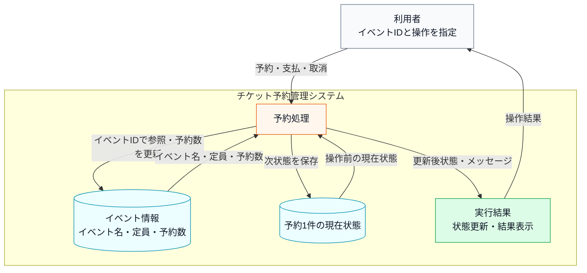

上の文章と表で仕様を一通り確認したので、まず正常に状態更新できる場合の入力・判定・加工・出力の流れとして整理します。

**次のシステム内部図は、代表となる1件の予約を最後まで通したものです。** 他の状態や操作の組み合わせは動作例でまとめて確認します。ここで見てほしいのは**箱の並びと矢印の向き**です。

**システム内部図：正常系の入力・判定・加工・出力**


直前のシステム内部図から読み取ることは、次の3点です。

- 同じ操作でも、現在の予約状態によって受け付けられるかどうかが変わる。
- 状態更新へ進む前に、イベントの存在、空席、操作可否を順に確認する必要がある。
- 正常系では、現在状態と操作から次の状態を決め、状態更新と結果表示を行う。

**状態遷移マトリクス**

この表は、現在の状態ごとに、各操作を受け付けたとき次にどの状態へ進むかを整理したものです。行は「いまの状態」、列は「利用者が行う操作」、セルは「操作後の状態」を表します。予約可能な状態で予約すると予約済みに進み、予約済みの状態で支払うと支払済みに進む、という基本の流れを確認します。

| 現在の状態 | 予約する | 支払う | キャンセルする |
|---|---|---|---|
| Available（予約可能） | → Reserved | —— | —— |
| Reserved（予約済み） | —— | → Paid | → Available |
| Paid（支払済み） | —— | —— | —— |

「——」は、その状態では操作を受け付けず、エラーメッセージを出力して終了することを表します。これは表の中心ではなく、基本の状態遷移に当てはまらない操作を明示するための記号です。

表の各行に着目すると、それぞれのルールには明確な業務上の理由があります。

- **Available（予約可能）で「支払う」「キャンセルする」が——の理由**：予約が存在しない状態で支払いを受け付けると「どの予約に対する支払いか」が確定しません。キャンセルについても、そもそも予約がなければキャンセルする対象がなく、操作自体が無意味です。
- **Reserved（予約済み）で「予約する」が——の理由**：同じ予約枠を二重予約することは、業務上あり得ないためです。
- **Paid（支払済み）でのすべての操作が——の理由**：支払いが完了した予約は「確定済み」扱いになります。この状態からのキャンセルを認める場合は、返金処理・在庫の戻し・会計記録の修正など、複数の業務プロセスが連動して動く必要があります。この章では、返金処理はこの章の設計論点から外れるため扱いません。キャンセルポリシーを設ける場合は、「キャンセル済み（Cancelled）」という別の状態を追加して対応できます。

**現状の状態遷移図**

表で確認した正常な遷移だけを、次の状態遷移図でつなぎます。エラーになる組み合わせは状態を変えないため、矢印には含めません。

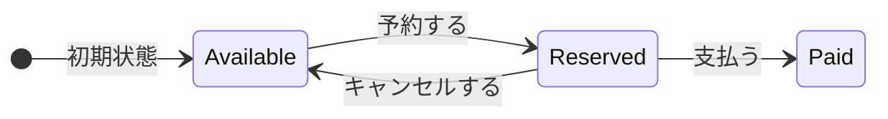

直前の状態遷移図と、その前のマトリクスが、後のフェーズで「新しい状態が増えるとどこが変わるか」を確認する基準になります。

**エラー条件**

正常系の仕様を一通り確認したうえで、最後に、状態更新へ進めない入力や操作を分けて整理します。

- **存在しないイベントIDを指定する**と、「対象なし」と表示して終わります。
- **満席のイベントを予約する**と、「満席」と表示して終わります。
- **いまの状態では許されない操作をする**（支払済みの予約を取り消すなど）と、「操作不可」と表示して終わります。

どの場合も、**予約の状態と予約数は変わりません。**

---

### 1-2：動作例テーブル

コードを読む前に、このシステムがどんな入力に対してどんな出力を返すかを確認します。この章のどのステップも、以下の動作を実現します。

| ケース | 入力 | 加工 | 出力 |
|---|---|---|---|
| ケース1：予約して支払う | 空きありイベント / 予約する → 支払う | 空きありのイベントを予約し、予約済みから支払いへ進める | 予約対象、予約完了、支払い完了 |
| ケース2：予約してキャンセルする | 空きありイベント / 予約する → キャンセルする | 空きありのイベントを予約し、予約済みから予約可能へ戻す | 予約対象、予約完了、キャンセル完了 |
| ケース3：満席イベントを予約する | 満席イベント / 予約する | 満席イベントを検出する | 満席エラー |
| ケース4：存在しないイベントを予約する | 存在しないイベント / 予約する | 存在しないイベントIDを検出する | イベントID不存在エラー |
| ケース5：予約前に支払う | 空きありイベント / 支払う | 予約可能状態で支払いを試みる | 支払い不可エラー |
| ケース6：支払後にキャンセルする | 空きありイベント / 予約する → 支払う → キャンセルする | 支払済み状態でキャンセルを試みる | キャンセル不可エラー |

確認したいことは、通常の予約・支払いフロー、キャンセルフロー、予約前の外部条件による拒否、状態に合わない操作の拒否が、それぞれ入力と出力で対応していることです。

この動作テーブルは、後のフェーズでステップを比較するときに「同じ入力なら同じ出力を返すことで動作不変を確認する」ための基準として使います。この章で変えたいのは内部の構造であり、利用者から見える動作ではありません。

---

### 1-3：登場クラスとクラス構成図

#### このシステムの登場クラス

| クラス名 | 役割 | 担当する仕様 |
|---|---|---|
| `EventInfo` | イベント1件分の情報 | イベント名・定員・予約数の受け渡し |
| `EventDatabase` | イベント情報の保持と検索 | イベントIDの存在確認・満席判定 |
| `TicketReservation` | チケット予約の状態管理と各状態の振る舞い | `Available` / `Reserved` / `Paid` の状態遷移 |

データの流れは、次のように分かれます。

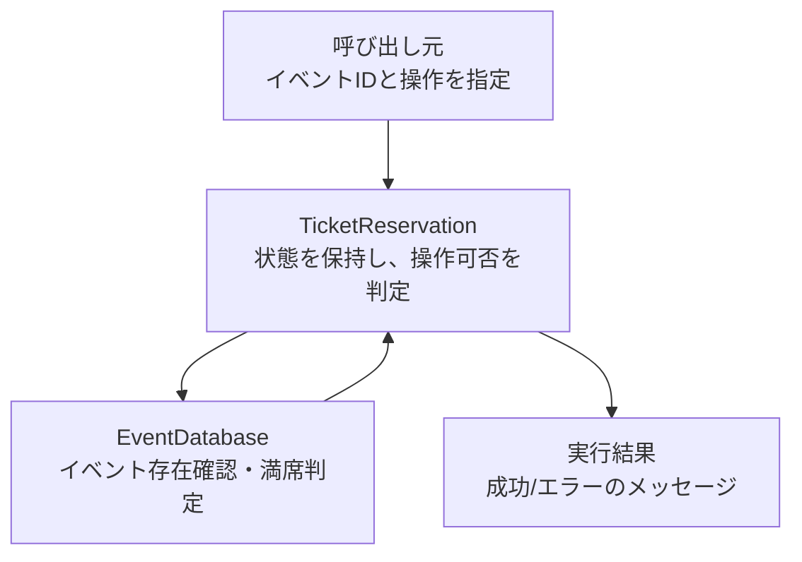

**クラス図に出てくる主なメンバーと操作**

| クラス | メンバー・操作 | 何ができるか |
|---|---|---|
| `EventDatabase` | `records` | イベントIDごとの情報を保持する |
| `EventDatabase` | `exists()` / `get()` / `hasCapacity()` | 対象イベントの存在確認、情報取得、満席判定を行う |
| `TicketReservation` | `db` / `eventId` / `status` | 予約対象イベントと現在状態を保持する |
| `TicketReservation` | `reserve()` / `pay()` / `cancel()` | 現在状態に応じて予約、支払い、キャンセルを実行する |
| `TicketReservation` | `handleReserveError()` など | 操作できない状態のエラーを返す |


各クラスの役割を把握したところで、クラス間の関係を図で整理します。

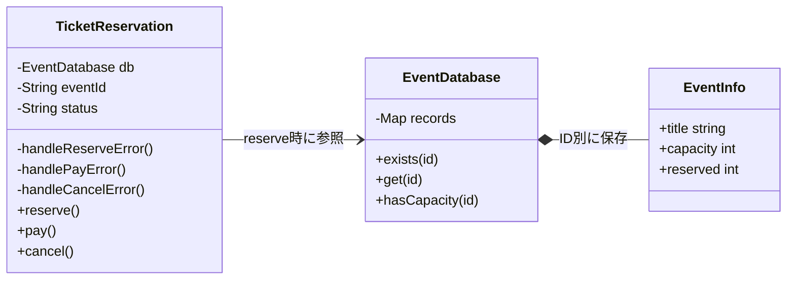

直前の現状クラス図から分かるのは、予約する、支払う、キャンセルするという操作が同じ予約管理クラスに集まっていることです。各操作の中で状態をどう判定しているかは、次の実装コードで確認します。

**現状システムの処理シーケンス**

静的な関係に続けて、正常系（予約→支払い）で各操作がどの順に呼ばれ、状態がどう遷移するかを時系列で示します。状態ごとの具体の分岐は `TicketReservation` の注記に、エラー系はメモとして添えます。現状コードの現状コードを読む前の地図です。

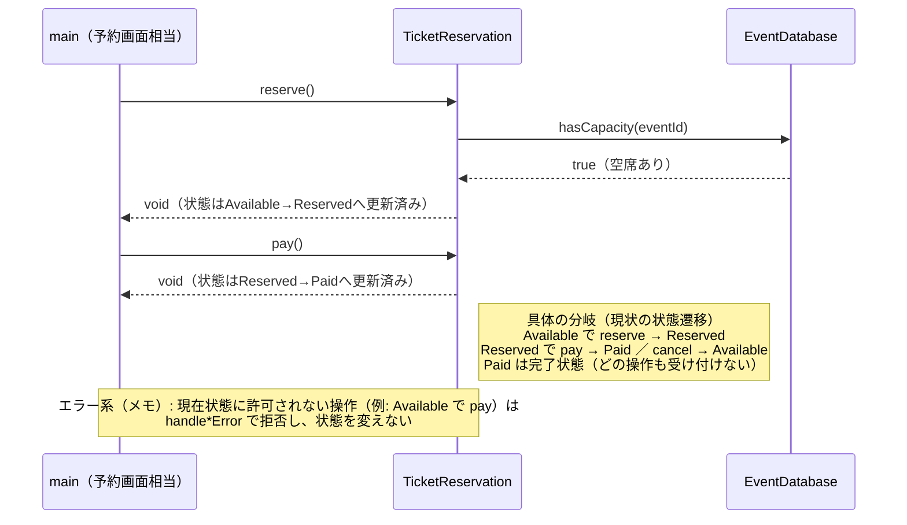

直前の処理シーケンス図から読み取れるのは、公開操作（`reserve`／`pay`／`cancel`）が同じ `TicketReservation` に集まり、各操作が現在の `status` を見て遷移先を決めていること、席の空きは `EventDatabase.hasCapacity()` で確認すること、許可されない操作はメモのとおり状態を変えずに拒否されることです。状態ごとに「どの操作で何が起きるか」がこの時系列と注記で確認できます。


**この章での簡略化**

この章の主役は、`Available` / `Reserved` / `Paid` という**予約状態に応じて振る舞いが切り替わる部分**です。イベントIDの存在確認や満席判定は、実際の予約システムなら必要な周辺処理ですが、この章の設計論点ではありません。そのため、この章では `EventDatabase` というメモリ上の簡易データで表現し、データベース接続、同時予約制御、決済API、発券処理は扱いません。

---

### 1-4：実装コード（現状）

予約成功で件数を増やし、キャンセル・期限切れで減らすという在庫の契約を次のコードで確認します。

#### 現状コード

クラスを1つずつ、上から順に読みます。**メンバー変数と、それを使う処理を同じ場所で見られるように**しています。宣言と定義を分けるのは `TicketReservation` だけです。**処理順が長く、メンバーを見ながら追う必要があるクラスだけ**、宣言と定義を分けています。


`main()` と実行結果は最後に、行のまとまりごとに並べます。

---

**共通ヘッダー**

```cpp
#include <iostream>
#include <string>
#include <map>
#include <stdexcept>
```

以降のすべてのクラスが使います。

---

**EventInfo と EventDatabase**

仕様で見た「イベント」にあたるデータと在庫です。イベントIDから定員・予約数を引き、エラー条件「存在しないID」「満席」もここで判定します。

```cpp
struct EventInfo {
    std::string title;   // イベント名
    int capacity;        // 定員
    int reserved;        // 現在の予約数
};
```

**EventDatabase**

```cpp
class EventDatabase {
private:
    std::map<std::string, EventInfo> records;
public:
    EventDatabase() {
        records["EVT001"] = {"春の音楽祭",  100,  20};
        records["EVT002"] = {"夏のフェス",  500, 499};
        records["EVT003"] = {"秋の映画会",   50,  50};  // 満席
    }

    bool exists(const std::string& id) const {
        return records.count(id) > 0;
    }

    EventInfo get(const std::string& id) const {
        return records.at(id);
    }

    bool hasCapacity(const std::string& id) const {
        const auto& e = records.at(id);

        return e.reserved < e.capacity;
    }

    void reserveSeat(const std::string& id) {
        ++records.at(id).reserved;
    }

    void cancelSeat(const std::string& id) {
        auto& e = records.at(id);

        if (e.reserved > 0) --e.reserved;
    }

    void save(const std::string& id, const EventInfo& info) {
        records[id] = info;             // 実行中のイベント表へ追加
    }
};
```

- **責任：** イベントIDから空席を確認し、予約数を増減する
- **副作用：** `reserveSeat()` / `cancelSeat()` / `save()` だけが `records` を書き換える

`std::map` はイベントIDから `EventInfo` を引くメモリ上のイベント表です。EVT002は499件なので、1件予約すると500件で満席になり、その予約をキャンセルすると499件へ戻ります。実システムのDBを、実行終了まで覚えているインメモリの登録表で代替しています。

---

**TicketReservation の宣言**

この章の中心です。仕様で見た「予約・支払い・キャンセル」という利用者操作を受け取ります。

```cpp
class TicketReservation {
private:
    // --- データ ---
    EventDatabase& db;   // 共有の在庫データ（外部から注入）
    std::string eventId; // 予約対象のイベント
    std::string status;  // 状態 "Available"/"Reserved"/"Paid"

    // 各状態で操作できないときのエラー出力
    void handleReserveError() { std::cout << "現在予約できません\n"; }
    void handlePayError() {
        std::cout << "支払いに適した状態ではありません\n";
    }
    void handleCancelError()  { std::cout << "キャンセルできません\n"; }

public:
    TicketReservation(EventDatabase& db,
                      const std::string& eventId)
        : db(db), eventId(eventId), status("Available") {}

    void reserve();
    void pay();
    void cancel();
};
```

在庫は外から受け取って参照で持ち、対象イベントと現在状態は自分で持ちます。**この `status` が、3つの操作すべての可否を決めます。** 同型で並列な3つのエラー出力は、並列関係が縦に見えるよう1行揃えにしています。定義を3つ、上のメンバーを見ながら読んでいきます。

---

**TicketReservation::reserve()**

```cpp
void TicketReservation::reserve() {
    if (!db.exists(eventId)) {
        std::cout << "エラー：イベントID " << eventId << " は存在しません\n";
        return;
    }

    if (!db.hasCapacity(eventId)) {
        std::cout << "エラー：" << db.get(eventId).title
                  << " は満席です\n";
        return;
    }

    if (status == "Available") {
        db.reserveSeat(eventId);
        status = "Reserved";
        std::cout << "予約対象：" << db.get(eventId).title << "\n";
        std::cout << "予約完了しました\n";
    } else {
        handleReserveError();
    }
}
```

- **判断が3つ：** イベントの存在、空席の有無、現在状態。3つとも別々の理由で失敗します
- **順序に意味：** 存在確認を先に置かないと、`hasCapacity()` の `at()` が未登録IDで落ちます
- **副作用：** 3つとも通ったときだけ在庫を1件増やし、状態を `Reserved` にします

`hasCapacity()` で先に満席を弾いてから呼ぶ前提なので、ここでは満席かどうかを見ていません。未登録のIDを渡した場合は `at()` が `std::out_of_range` を投げます。

---

**TicketReservation::pay()**

```cpp
void TicketReservation::pay() {
    if (status == "Reserved") {
        status = "Paid";
        std::cout << "支払い完了しました\n";
    } else {
        handlePayError();
    }
}
```

`status` が `Reserved` のときだけ、上の枝を通ります。ほかの状態はすべて `handlePayError()` へ落ち、`status` も予約数も変わりません。

---

**TicketReservation::cancel()**

```cpp
void TicketReservation::cancel() {
    if (status == "Reserved") {
        db.cancelSeat(eventId);
        status = "Available";
        std::cout << "予約をキャンセルしました\n";
    } else {
        handleCancelError();
    }
}
```

`Reserved` のときだけ通り、在庫を1件戻します。**`Paid` からは戻せません。**

3つの定義を並べて見ると、`reserve` `pay` `cancel` のどれもが冒頭で `status` を見ています。現在状態の判定が3か所へ散らばっています。

---

#### `main()` と実行結果

動作例の表を、行ごとに区切って実行します。**在庫は行をまたいで引き継がれます。**

---

**組み立てと、行1：EVT001 予約 → 支払い**

```cpp
int main() {
    EventDatabase db;

    // 行1: 正常な予約から支払いまで
    std::cout << "--- 行1: EVT001 予約 → 支払い ---\n";
    TicketReservation seat1(db, "EVT001");
    seat1.reserve();  // Available → Reserved
    seat1.pay();      // Reserved  → Paid
```

```
--- 行1: EVT001 予約 → 支払い ---
予約対象：春の音楽祭
予約完了しました
支払い完了しました
```

`db` を1つだけ作り、以降のすべての `TicketReservation` へ参照で渡します。在庫が共有されるのはこのためです。

---

**行2：EVT001 予約 → キャンセル**

```cpp
    // 行2: 予約からキャンセルまで
    std::cout << "\n--- 行2: EVT001 予約 → キャンセル ---\n";
    TicketReservation seat2(db, "EVT001");
    seat2.reserve();  // Available → Reserved
    seat2.cancel();   // Reserved  → Available
```

```
--- 行2: EVT001 予約 → キャンセル ---
予約対象：春の音楽祭
予約完了しました
予約をキャンセルしました
```

予約で1件増え、キャンセルで1件戻りました。EVT001の予約数は行1の分だけ増えた状態で残ります。

---

**行3：EVT003 満席イベントへの予約**

```cpp
    // 行3: 満席イベントへの予約試み
    std::cout << "\n--- 行3: EVT003 満席イベントへの予約 ---\n";
    TicketReservation seat3(db, "EVT003");
    seat3.reserve();  // エラー（満席）
```

```
--- 行3: EVT003 満席イベントへの予約 ---
エラー：秋の映画会 は満席です
```

`hasCapacity()` で止まりました。状態は `Available` のままです。

---

**行4：UNKNOWN 存在しないイベントへの予約**

```cpp
    // 行4: 存在しないイベントへの予約試み
    std::cout << "\n--- 行4: UNKNOWN 存在しないイベントへの予約 ---\n";
    TicketReservation seat4(db, "UNKNOWN");
    seat4.reserve();  // エラー（存在しない）
```

```
--- 行4: UNKNOWN 存在しないイベントへの予約 ---
エラー：イベントID UNKNOWN は存在しません
```

`TicketReservation::reserve()` の先頭にある `db.exists(eventId)` が偽になり、そこで止まります。満席判定へは進みません。

---

**行5：予約なしで支払いを試みる**

```cpp
    // 行5: 状態エラー — 予約前に支払いを試みる
    std::cout << "\n--- 行5: 予約なしで支払いを試みる ---\n";
    TicketReservation seat5(db, "EVT001");
    seat5.pay();      // エラー（Available状態）
```

```
--- 行5: 予約なしで支払いを試みる ---
支払いに適した状態ではありません
```

---

**行6：支払い済みをキャンセルしようとする**

```cpp
    // 行6: 状態エラー — 支払い済みをキャンセルしようとする
    std::cout << "\n--- 行6: 支払い済みをキャンセルしようとする ---\n";
    TicketReservation seat6(db, "EVT001");
    seat6.reserve();  // Available → Reserved
    seat6.pay();      // Reserved  → Paid
    seat6.cancel();   // エラー（Paid状態）

    return 0;
}
```

```
--- 行6: 支払い済みをキャンセルしようとする ---
予約対象：春の音楽祭
予約完了しました
支払い完了しました
キャンセルできません
```

同じ `cancel()` が、行2では成功し行6では拒否されました。違いは現在状態だけです。

---

`main()` はイベントIDと操作の組み合わせを指示するだけで、存在確認・満席判定・状態チェックはすべて `TicketReservation` 内部で行っています。

> **手元で動かすには**
> このコードは1つの `.cpp` に貼り付けて、そのままコンパイル・実行できます（例：`g++ chapter02.cpp -o app && ./app`）。`main()` は自由に組み替えて構いません。たとえば `db.save("EVT010", {"冬の演劇祭", 80, 0});` でイベントを足し、`TicketReservation seat(db, "EVT010");` を作って `reserve()` や `pay()` を呼べば、追加したイベントの予約と状態遷移がその場の実行結果に表れます。イベントデータはプロセス実行中だけ有効で、終了すると消えます（DBのような永続化はこの章の論点ではありません）。


次のフェーズで変更が来たときに何が起きるかを確認します。

---

#### 仕様入力が現状コードで使われるまで

この章では操作種別を文字列で渡さず、`reserve()` / `pay()` / `cancel()` という入口そのものが利用者の操作を表します。イベントIDと現在状態を合わせて、どの処理へ進むかが決まります。

| 入力 | コードでたどる経路 | 結果にどう現れるか |
|---|---|---|
| イベントID | `TicketReservation` → `EventDatabase` の存在・空席・席数更新 | 対象イベントの予約数が増減し、未登録IDは拒否される |
| 予約・支払・取消 | `reserve()` / `pay()` / `cancel()` → 現在状態の分岐 | 状態遷移または操作不可になる |
| 現在状態 | `TicketReservation::status` → 各操作の条件判定 | 同じ操作でも成功・拒否が変わる |

### 1-5：変更要求

ある週明けの朝、イベント運営担当から開発チームへ、新しい施策についての連絡が入りました。

「来月から、リピーター向けに『キャンセル待ち』機能を実装したいのです。予約枠がいっぱいの場合でも、空きが出たら自動的に予約が割り当てられるようにしたい。また、それに伴い『予約一時保留』という状態も追加してほしい。イベント開始の24時間前までなら、予約を確保したまま決済を24時間待つ仕組みです。」

運営担当は、この機能が実装されれば、直前キャンセルによる空き枠を減らし、収益が大きく改善すると期待しています。ここで整理しておくと、「キャンセル待ち」とは予約枠が満杯のときに空き待ちを登録する状態、「予約一時保留」とは予約を確保したまま決済の期限を延期する状態です。

依頼文を、実行結果で判定できる変更依頼へ分けます。先に曖昧さをなくすため、本章では次の業務ルールを固定します。

- 満席時の通常の予約要求は、システムが空席数を確認して自動的にキャンセル待ちへ登録する。利用者が満席を判断して別操作を選ぶ必要はない。
- 空席が1席出るたびに待ち行列の先頭1件だけを自動昇格し、後続の待機者は先着順のまま残る。複数席空けば、席数分だけ同じ処理を繰り返す。
- 利用者は `Reserved` と `Held` のどちらからも明示的にキャンセルできる。いずれも席を解放し、待機者がいれば自動昇格する。
- 通常の `Reserved` は15分の決済期限を持つ。利用者が明示的に一時保留を選ぶと `Held` へ移り、期限が24時間へ延長される。どちらも期限切れはスケジューラから届き、席を解放する。
- 本章ではキャンセル待ち自体の取り下げ、イベント開始時刻との厳密な比較、プロセス再起動後のタイマー復元は扱わない。

| 変更ID | 何を変えるか | 何ができれば完了か |
|---|---|---|
| 変更ID1（キャンセル待ち） | 満席時に待機登録し、空席発生時に先頭を自動昇格する | 取消後の49/50から、手動操作なしで先頭を昇格して50/50へ戻す |
| 変更ID2（一時保留） | 15分の決済期限を、明示操作で24時間へ延長する | Reserved・Heldの期限中は席を確保し、期限切れでは席の解放後に自動昇格する |

#### 変更後要求ベースライン

| 要求ID・種別 | 変更後も満たす要求 | 受入条件 |
|---|---|---|
| 要求ID1（継続） | 存在しないイベントでは予約を受け付けない | 未登録イベントを拒否する |
| 要求ID2（継続） | 予約可能から予約済みへ遷移し、予約数を1増やす | 残り1席の予約後に満席になる |
| 要求ID3（変更） | ReservedまたはHeldからPaidへ遷移する | 支払成功時だけPaidになる |
| 要求ID4（変更） | 取消で席を解放し、待機者がいれば同じ処理で自動昇格する | 50/50→49/50→50/50となり、手動昇格を要しない |
| 要求ID5（変更） | 不許可操作や決済失敗では状態と予約数を変えない | エラー前後の状態・件数が一致する |
| 要求ID6（追加） | 満席時の予約要求をキャンセル待ちへ登録する | 通常の予約操作だけで待機し、空席発生時に先頭から昇格する |
| 要求ID7（追加） | Reservedは15分、Heldは24時間の期限を持つ | 期限中は席を確保し、期限切れ後は待機者を自動昇格する |

要求ID3（支払済みへ遷移）・要求ID5（不許可操作で変えない）・要求ID7（15分と24時間の期限）は変更ID2（一時保留）から、要求ID4（取消と自動昇格）・要求ID6（キャンセル待ち登録）は変更ID1（キャンセル待ち）から生じた変更です。

**変更前→変更後の要求対照（今回変える要求IDだけ）**

現行ベースラインと変更後ベースラインを往復せずに済むよう、今回変える要求IDだけを取り出し、変更前と変更後を同じ行へ並べます。

| 要求ID | 変更前 | 変更後 |
|---|---|---|
| 要求ID3（支払済みへ遷移） | ReservedからPaidへ遷移 | ReservedまたはHeldからPaidへ遷移 |
| 要求ID4（取消と自動昇格） | 取消で席を1席空ける | 席を空け、待機者がいれば同じ処理で先頭を昇格する |
| 要求ID6（キャンセル待ち登録） | なし | 満席時の予約要求を待機登録する |
| 要求ID7（15分と24時間の期限） | なし | Reservedは15分、Heldは24時間で期限切れにする |

要求ID1（未登録・満席を拒否）・要求ID2（予約で予約数+1）・要求ID5（不許可操作で変えない）は変更前と変更後が同じなので、下の対照表には出てきません。変更後ベースラインで内容を確認できます。

決済失敗時に状態を変えない戻り値と、期限切れイベントを受けるスケジューラ境界は、変更ID1（キャンセル待ち）・変更ID2（一時保留）を安全に実行するための内部契約です。独立した利用者要求として数えません。

実際の予約システムでは、入力は利用者のボタン操作だけではありません。キャンセルで空席が出たときの予約昇格イベント、保留期限を過ぎたときのタイマーイベント、決済APIから返る失敗結果も、予約状態を動かす入力になります。この章では、それらを「状態によって扱いが変わる入力」として同じ粒度で整理します。

**仕様変更の内容**

変更要求を受けて、状態の種類と遷移ルールがどう変わるかを整理します。

**状態の変化**

| 状態 | 変更前 | 変更後 |
|---|---|---|
| Available（予約可能） | あり | 変更なし |
| Reserved（予約済み） | あり | 変更なし |
| Paid（支払済み） | あり | 変更なし |
| **Waitlisted（キャンセル待ち）** | なし | **新規追加** |
| **Held（一時保留）** | なし | **新規追加** |

今回変えるのは予約状態と遷移です。イベント情報と空席数を管理する保存基盤は仕様変更の対象ではないため、`EventDatabase` の取得・更新契約は変更前後で**変更なし**とします。

**新しく追加される遷移ルール**

| 現在状態 | 入力 | 結果 |
|---|---|---|
| Available | 満席時の `reserve()` | Waitlistedへ移り、待機列へ登録 |
| Waitlisted | `promoteBySystem()` | 空席発生時にReservedへ自動昇格 |
| Reserved | `hold()` | 席を確保したままHeldへ移り、期限を24時間へ延長 |
| Reserved | `expire()` | 15分経過で席を解放し、Availableへ戻る |
| Held | `pay()` | Paidへ移る |
| Held | `cancel()` / `expire()` | 席を解放し、Availableへ戻る |
| Reserved / Held | `paymentFailed()` | 状態を保ち、決済を再試行できる |

**実運用での状態の動き（イメージ）**

各遷移が「誰の・何をきっかけに」起きるかを、時間の流れで並べると次のようになります。

1. **予約する（Available→Reserved／Waitlisted）**：利用者は常に「予約」を押します。空席があれば席数から1席を引いて予約済み（未払い）となり、満席ならシステムが自動でキャンセル待ちへ登録します。`Reserved` の標準決済期限は15分です。
2. **一時保留する（Reserved→Held）**：利用者が明示的に「一時保留」を選ぶと、席を確保したまま決済期限を24時間へ延長します。予約の放置を自動で保留へ変える操作ではありません。
3. **支払う（Reserved／Held→Paid）**：期限内に決済すると確定します。
4. **期限切れ（Reserved／Held→Available）**：Reservedは15分、Heldは24時間が経過しても未払いなら、タイマーイベントが枠を空きに戻します。空いた1席は、キャンセル待ち（Waitlisted）の先頭が自動昇格して受け取ります。
5. **決済失敗（Reserved／Held を維持）**：決済APIが失敗を返しても状態は進めず、同じ状態のまま再試行できます。

現状の `if` 文を使った状態分岐ロジックに、この2状態と、操作・イベントによる6種類の遷移/状態維持を追加することになります。

**実システムのイベントと掲載コードでの模擬方法**

実運用では、期限時刻を永続化し、バックグラウンドのタイマー基盤が期限到来を検知して予約システムへイベントを送ります。掲載コードは実時間を待たず、実行ハーネスがタイマー基盤の代役として期限到来イベントを直接送ります。呼び出し行は利用者操作の実装ではなく、外部タイマーからイベントが届いた状況を即時再現するテストハーネスです。時刻計算・ジョブ再実行・永続化は省略しても、予約オブジェクトが期限切れイベントを受けた後の遷移は実際に動かします。

| 入力元と具体例 | 状態への影響 | 確認すること |
|---|---|---|
| 利用者：予約・支払・取消・一時保留 | 現在状態で許可と遷移先が変わる | 操作メソッドの状態分岐が増えるか |
| システム：待機者の予約昇格 | WaitlistedからReservedへ進む | 自動処理も現在状態へ委譲できるか |
| タイマー：期限切れ | Reserved・HeldからAvailableへ戻る | 時間起点でも同じ接続点を使えるか |
| 決済API：失敗 | Reserved・Heldを維持する | 失敗時の振る舞いも状態へ閉じられるか |

**仕様変更後の状態遷移マトリクス（全体像）**

既存の3状態に「キャンセル待ち」と「一時保留」を足すと、**成立する遷移は次の10通り**になります。**この表に無い組み合わせは、その状態では操作を受け付けず、エラーメッセージを出して終わります。**

| 現在の状態 | 操作 | 次の状態 |
|---|---|---|
| Available（予約可能） | 予約する（空席あり） | → Reserved |
| Available（予約可能） | 予約する（満席） | → Waitlisted |
| Reserved（予約済み） | 支払う | → Paid |
| Reserved（予約済み） | キャンセルする | → Available |
| Reserved（予約済み） | 一時保留 | → Held |
| Reserved（予約済み） | 期限切れ（15分） | → Available |
| Waitlisted（キャンセル待ち） | 予約昇格（空席発生） | → Reserved |
| Held（一時保留） | 支払う | → Paid |
| Held（一時保留） | キャンセルする | → Available |
| Held（一時保留） | 期限切れ（24時間） | → Available |

`Paid`（支払済み）は行に出てきません。支払いが済んだ予約は確定扱いで、どの操作も受け付けないからです。`Waitlisted` も、出てくるのは「予約昇格」の1行だけです。満席で登録された後にできるのは、空席が出るのを待つことだけだからです。

次の状態遷移図では、直前の表が示した遷移を1枚にまとめ、どの状態からどの操作で、どこへ移れるのかを見ます。

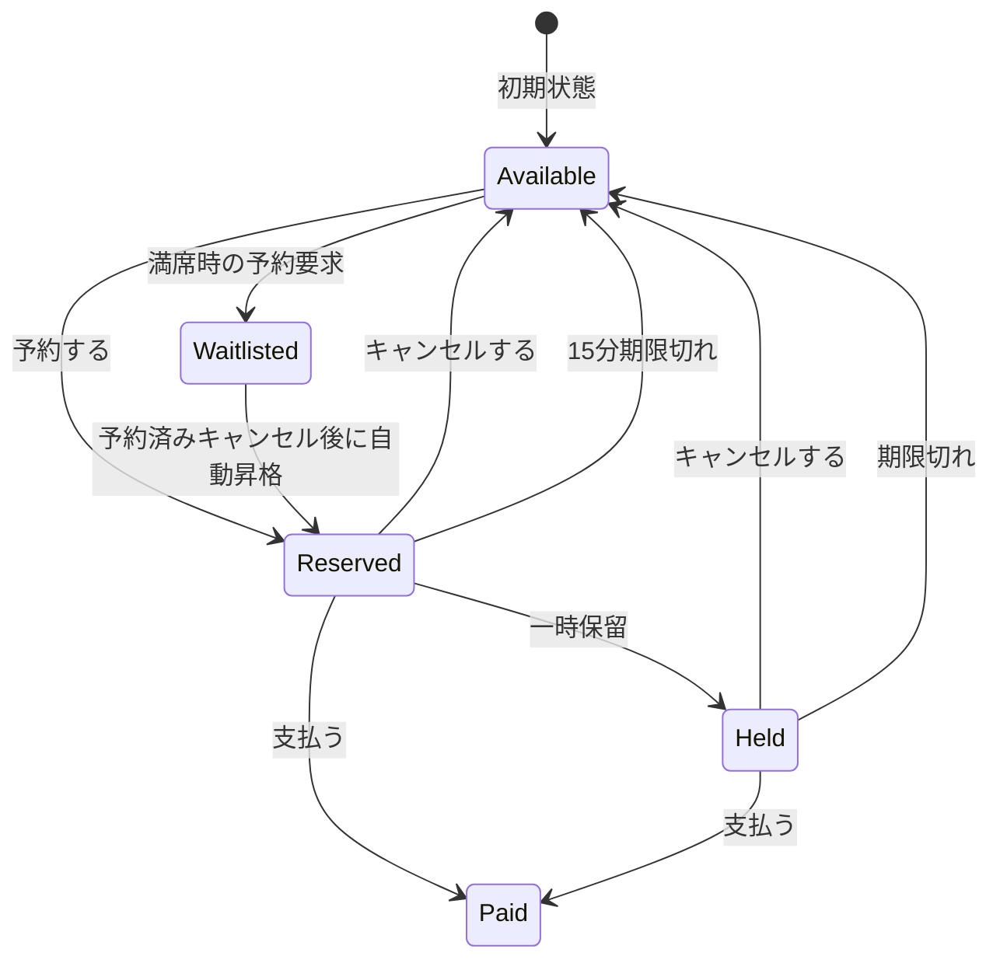

操作不可・満席・決済失敗は状態を変えない結果なので、状態遷移の矢印には含めません。これらは直後のエラー条件表で「状態保存なし」として扱います。

**変更前後の入力・判定・加工・出力差分**

現状の仕様を退避し、変更要求を当てた後の仕様と同じ粒度で並べます。以降の分析では、この差分を追います。

| 要素 | 変更前 | 変更後 |
|---|---|---|
| 入力 | イベントID、3操作、3状態 | **システムイベントと2状態が加わる** |
| 判定 | 現在状態で操作可能か | **期限・決済失敗を含む状態別判断が加わる** |
| 加工 | 予約・支払・取消で状態更新 | **待機登録・自動昇格・保留・期限切れが加わる** |
| 出力 | 操作結果と更新後状態 | Waitlisted・Heldを含む結果 |

**変更後の入力・加工・出力**

変更後の仕様を、現状の仕様と同じ粒度で、正常系の入力・判定・加工・出力として確認します。現状の内部図との差分は、内部に保持する「現在状態」が3種類から5種類へ、「操作・イベント」が3種類から8種類へ増えることです。判定・加工・出力の流れ自体は変わりません。図中のイベントIDも、現状データに存在する3件を省略せず示します。

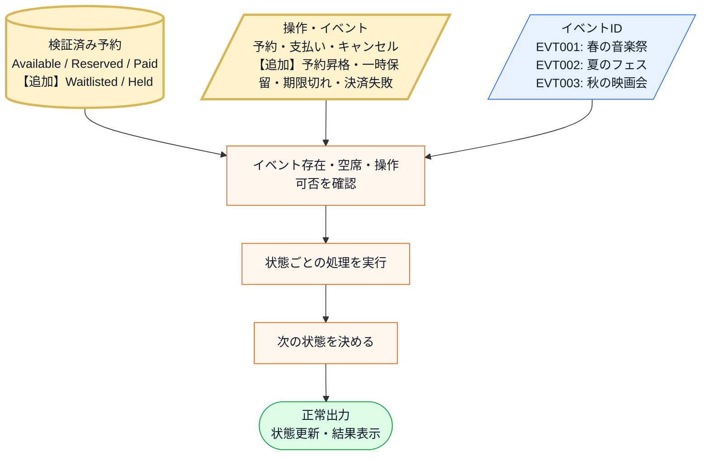

直前の変更後システム内部図から読み取ることは、次の3点です。

- 新しい入力は「Waitlisted・Held」の2状態と「満席時の自動待機登録・予約昇格・一時保留・期限切れ・決済失敗」の5操作/イベントで、図の箱そのものは増えていない。
- 増えるのは「操作は現在状態で可能か」で受け付ける組み合わせと、「次の状態を決める」の行き先である。
- 受け付けられない組み合わせは、変更後も既存の「操作不可エラー」として扱う。

変更後も、失敗条件は正常系図へ混ぜずに別で確認します。

- **存在しないイベントIDを指定する**と、「対象なし」と表示して終わります。予約の状態は変わりません。
- **満席のイベントを予約する**と、「満席」と表示します。**ここが変更後で変わるところ**で、キャンセル待ちへ登録する場合は状態が変わります。
- **いまの状態では許されない操作をする**と、「操作不可」と表示して終わります。予約の状態は変わりません。
- **決済APIが失敗した**ときは、「決済に失敗しました」と表示し、`Reserved` または `Held` のまま再試行できます。

増えた状態と操作の組み合わせが実際にコードのどこへ書かれるかは、フェーズ3「問題特定」で変更を試すコードと、フェーズ7の最終コード・実行結果で追います。

**フェーズ1のまとめ：今回追う変更ID一覧**

| 変更ID | 変更依頼の要点 | 関係する要求ID（追加は変更後ID） |
|---|---|---|
| 変更ID1（キャンセル待ち） | 満席時にキャンセル待ちへ登録し、空席発生時に先頭を自動昇格する | 要求ID4（取消と自動昇格）、要求ID6（キャンセル待ち登録） |
| 変更ID2（一時保留） | 予約済みを24時間の一時保留へ移し、期限切れで席を解放する | 要求ID3（支払済みへ遷移）、要求ID7（15分と24時間の期限） |


---

## 🟣 フェーズ2：仮説立案 ―― 何が変わるかを観察し、ヒアリングで裏付ける
### 2-1：変わりそうな仕様の見当をつける

フェーズ1「現状把握」で整理した仕様をもとに、「どの仕様に変更の見込みがあり、今回どこを維持するか」を見立てます。責務配置の評価は、変更を当てたときの痛みと合わせてフェーズ3「問題特定」とフェーズ4「原因分析」で確認します。

変わりそうな仕様は、クラス図の中心 `TicketReservation` にあります。`reserve()` / `pay()` / `cancel()` の中で判定している「どの状態なら操作できるか」と「操作後にどの状態へ遷移するか」を、どんな仕様が、誰の何をきっかけに変わりそうかと一緒に整理します。

| 仕様 | 現状コードの場所 | 見立てと理由 |
|---|---|---|
| 状態の種類 | `TicketReservation.status` | 新機能の追加で増えるため、変更候補 |
| 操作できる状態 | 各メソッドの `if (status == ...)` | 運用ルールの見直しで変わるため、変更候補 |
| 操作後の遷移先 | 各メソッドの `status = ...` | 運用ルールの見直しで変わるため、変更候補 |
| 状態を動かす入力 | 利用者操作を受ける各メソッド | 外部イベントが加わるため、変更候補 |
| 操作結果の返却 | 各メソッドの表示処理 | 今回の要求では変えないため、維持する |

見えてくるのは、**1つの `TicketReservation` の中で、「どの状態なら何ができるか」「操作後どの状態へ移るか」という状態遷移の仕様に、企画担当の施策や運用見直しによる変更が見込まれる**という仮説です。一方、予約完了・支払い完了などの結果を返す流れは、今回維持する前提に置きます。

ここで見るのは所在だけです。責任の多さや構造の善し悪しは、変更を当てて痛みを観測してから判断します。上の表は、変わりそうな仕様が `TicketReservation` のどのメソッドのどの行にあるかという所在の見立てです。状態遷移の仕様を1つのクラスにまとめている今の配置が、変更要求を当てたときに**実際に痛みになるか**はフェーズ3「問題特定」で確かめ、なぜ辛いのかはフェーズ4「原因分析」で原因として言語化します。ここは、その検証対象に当たりをつける段階です。

#### ヒアリングで確認すること

状態に関する見当を、設計判断に必要な二つの質問へ絞ります。

| 確認したい仮説 | 確認する質問 | 確認先 |
|---|---|---|
| 新しい予約状態が今後も増える | キャンセル待ち以外の状態も追加されるか | 企画担当 |
| 同じ状態でも操作可否が変わる | 状態間の遷移条件を今後見直す予定があるか | 企画担当 |

この二点をヒアリングで確認し、「状態名が増えるだけ」なのか「振る舞いも変わる」のかを分けます。

### 2-2：今回の変更で確実に変わること

変更要求で確定した変更IDを、そのまま今回確実に変わることとして確認します。章ごとに異なる色や記号は使わず、以降でも同じ変更IDで追跡します。

- **変更ID1：満席時の予約要求を自動でキャンセル待ちへ登録し、空席発生時に先頭を自動昇格する**
- **変更ID2：通常の15分決済期限を、明示的な一時保留で24時間へ延長し、期限切れで席を解放する**

これらが今回確実に変わる範囲です。将来どれだけ変わり続けるかは、次の関係者ヒアリングで確認します。

### ヒアリングに向けた背景確認

このシステムは、イベントチケットの予約管理を担っています。イベントごとに予約、支払い、発券といった一連のプロセスを管理する、イベント運営の中核となるシステムです。

現在このシステムは、「Available（予約可能）」「Reserved（予約済み）」「Paid（支払い済み）」という3つの状態で動作しています。チケットの予約、支払い、キャンセルという操作に対して、現在の状態に応じた処理が実行される仕組みです。

### 2-3：関係者ヒアリング

仮説を確実なものにするため、企画担当の鈴木氏にヒアリングを行いました。このシステムでは「状態の種類」と「状態遷移ルール」が密接に結びついています。どちらにどんな変更が見込まれるかによって設計の方向が変わるため、この2点を重点的に確認します。


* **開発者：** 「キャンセル待ちや一時保留など、状態がかなり増えますが、今後さらに状態が増える予定はありますか？」
* **企画担当 鈴木：** 「実は、上映後のアンケート回答者に付与する『特別優待予約』なども今後検討しています。状態は今後も増えていくはずです。」
* **開発者：** 「なるほど。状態遷移のルール、例えば『保留中からキャンセル待ちへ移行できるか』などは、今後ルールが変わる可能性はありますか？」
* **企画担当 鈴木：** 「それも十分にあり得ます。今は保留中からのキャンセルを認めていますが、来月には『一度保留にしたらキャンセル不可』というルール変更も考えられます。」

ヒアリングの結果、「状態の種類」だけでなく「状態遷移ルールそのもの」も頻繁に変わり続けるという事実が見えてきました。

### 2-4：ヒアリングで判明した将来リスク

ヒアリングで浮かび上がった「確定ではないが、近い将来起こりうる変化」を記録します。これは今回の設計判断の材料です。

| リスクID | 変わりそうなこと | 根拠 |
|---|---|---|
| リスクID1（遷移ルール） | 状態ごとの操作可否と遷移先 | 運用見直しで変わると企画担当者に確認 |
| リスクID2（状態追加） | 特別優待予約などの状態 | 新機能として増えると企画担当者に確認 |
| リスクID3（イベント追加） | 状態を動かす外部イベント | 決済失敗・期限切れ・空席発生など利用者以外の入力がすでにある |

なお、予約結果の通知方法自体（画面表示からメール・SMSへの変更）もヒアリングで話題になりましたが、今回の変更対象ではないためリスクIDには起こさず対象外として記録します。通知手段は状態遷移の軸とは独立した境界であり、本章で扱う状態管理の分離には影響しません。


### 2-5：変わる見込みと今回維持する範囲を確定する

ヒアリングで挙げたリスクIDを、**変わる側**と**今回守る側**へ分けます。3つとも変わる見込みがあると確認できたものです。

| リスク | 変わる側 | 今回守る側 |
|---|---|---|
| ID1 遷移ルール | 状態ごとの許可操作と遷移先 | 予約の入口、履歴、席数の保存 |
| ID2 状態の種類 | 状態の種類と固有の振る舞い | ID の受け渡し、予約結果 |
| ID3 イベント | イベントと遷移の接続 | 状態保存、待ち順、操作の入口 |

したがって変わる側と守る側を分けた結果は、「状態・遷移・イベント接続は変えられるようにし、予約の受付・保存・席数管理は守る」という設計条件です。フェーズ3「問題特定」では変更ID1（キャンセル待ち）・変更ID2（一時保留）だけを現在の構造へ適用し、リスクIDはフェーズ6の構造評価に使います。

---

## 🟣 フェーズ3：問題特定 ―― 変更の痛みを発見する
フェーズ2「仮説立案」で「状態遷移のルールは頻繁に変わる」という確信が持てました。このフェーズでは、確定した新しい状態遷移（キャンセル待ち・一時保留）を、今のコードの構造のまま適用しようとしたとき、システムにどのような「痛み」が生じるのかを観察してみます。

### 3-1：変更を試みる

フェーズ2の変更要求を受けて、今のコードに「一時保留（Held）」と「キャンセル待ち（Waitlisted）」の両方の状態を追加してみます。追加する必要がある仕様と、その修正対象箇所は次の通りです。

> **これは設計前の追跡です。** どこを触ることになるかを知るために当てているだけで、**このコードはこのあと捨てます。** ここから設計を始めるのはフェーズ4以降です。


> **この抜粋の外は、現状のままです。** 以下は `TicketReservation` の状態分岐だけを抜き出します。フェーズ1の `EventDatabase` によるイベント存在確認と座席数の読み書きは維持し、予約成立・キャンセル・期限切れに伴う座席更新の前後で、この状態処理を呼びます。

| 追加する仕様 | 修正対象 | 必要な変更 |
|---|---|---|
| `Held`（一時保留） | `pay()`、`cancel()`、新しい`expire()` | 支払・取消と、期限切れ後の遷移を加える |
| `Waitlisted`（キャンセル待ち） | `reserve()`、`cancel()`、`expire()` | 満席時に登録し、空席発生直後に先頭を自動昇格する |
| 決済失敗 | `pay()` | `Reserved`と`Held`で、再試行できる戻り先を分ける |

変更した定義は6つです。現状コードと同じ並び順で、上から見ていきます。座席在庫の存在確認・空席判定・座席の増減は現状コードの `EventDatabase` がそのまま担うため、この抜粋では在庫まわりを省き、状態遷移に絡む部分へ集中します。

| 1-4での掲載単位 | 今回の変更 | 根拠 |
|---|---|---|
| `TicketReservation` の宣言 | 待ち行列を受け取り、状態値を5つへ、内部遷移と2つのエラー出力を追加 | 変更ID1（キャンセル待ち）・変更ID2（一時保留） |
| `TicketReservation::reserve()` | 満席時に待ち行列へ自動登録する分岐を追加 | 変更ID1（キャンセル待ち） |
| （新規） | `hold()` を追加 | 変更ID2（一時保留） |
| `TicketReservation::pay()` | `Held` からの支払いを追加 | 変更ID2（一時保留） |
| `TicketReservation::cancel()` | `Held` からのキャンセルと、空席発生時の自動昇格を追加 | 変更ID1（キャンセル待ち）・変更ID2（一時保留） |
| （新規） | `expire()` を追加 | 変更ID2（一時保留） |

---

**TicketReservation の宣言（変更あり）**

新しく登場する待ち行列は、0章「共有データの持ち方」の全章共通規約に従い、在庫（`EventDatabase`）と同じく組み立て側が所有する共有ストアとしてコンストラクタで外から受け取ります。グローバルな `static` で持つと生成順や実行順に依存し、どのインスタンスがいつ書いたのか追えなくなるためです。こうすると、在庫も待ち行列も「外から渡される共有ストア」で管理場所がそろいます。

```cpp
#include <iostream>
#include <string>
#include <deque>

// 変更後の TicketReservation（Held・Waitlisted を追加した状態）
// 在庫（EventDatabase）は現状コードのものをそのまま使う想定で、この抜粋では
// 状態遷移と、状態処理に絡む待ち行列だけを示す。
class TicketReservation {
    // --- データ ---
    // ← 追加。共有の待ち行列（借用ポインタ）
    std::deque<TicketReservation*>& waitlist;
    // 状態 Available/Reserved/Paid/Held/Waitlisted
    std::string status;

    // ← ここから追加。空席発生時にシステムが呼ぶ内部遷移
    void promoteBySystem();
    // 待ち行列の先頭を1件だけ取り出して昇格させる
    void promoteNextWaitlisted();
    // ← ここまで

    // 各状態で操作できないときのエラー出力
    void handleReserveError()  { std::cout << "現在予約できません\n"; }
    void handleHoldError()     { std::cout << "保留できません\n"; }
    void handlePayError() {
        std::cout << "支払いに適した状態ではありません\n";
    }
    void handleCancelError()   { std::cout << "キャンセルできません\n"; }
    void handleExpireError() {
        std::cout << "期限切れ処理は行えません\n";
    }
public:
    // ← 変更。共有の待ち行列を受け取る
    explicit TicketReservation(
            std::deque<TicketReservation*>& waitlist)
        : waitlist(waitlist), status("Available") {}

    void reserve(bool hasCapacity = true);
    void hold();                    // ← 追加
    void pay();
    void cancel();
    void expire();                  // ← 追加
};
```

現状コードから増えたのは、待ち行列への参照、状態値2つ（`Held`・`Waitlisted`）、内部遷移2つ、エラー出力2つ、公開操作2つ（`hold()`・`expire()`）です。**公開操作は3つから5つになりました。**

---

**TicketReservation::promoteBySystem() と promoteNextWaitlisted()（追加）**

空席が出たときに、待ち行列の先頭を予約へ昇格させます。

```cpp
void TicketReservation::promoteBySystem() {
    if (status == "Waitlisted") {
        status = "Reserved";
        std::cout << "空席発生を検知し、予約へ自動昇格しました\n";
    }
}

void TicketReservation::promoteNextWaitlisted() {
    if (waitlist.empty()) return;

    TicketReservation* next = waitlist.front();
    waitlist.pop_front();
    next->promoteBySystem();
}
```

`front()` は先頭の借用ポインタを読むだけで、予約オブジェクトを削除しません。続く `pop_front()` がキューからそのポインタ1件を除きますが、参照先の `TicketReservation` は呼び出し側が所有したままです。「はじめに」で説明した `deque` の「先頭参照」と「先頭要素の除去」を、この待ち行列へ適用しています。

**利用側からは呼べません。** 昇格は利用者の操作ではなく、空席発生に伴ってシステムが起こす遷移だからです。

---

**TicketReservation::reserve()（変更あり）**

```cpp
// 通常の予約要求。満席判定結果は周辺のEventDatabaseからシステムが渡す。
void TicketReservation::reserve(bool hasCapacity) {
    if (status == "Available") {
        if (hasCapacity) {
            status = "Reserved";
            std::cout << "予約完了しました\n";
        } else {                        // ← 追加
            status = "Waitlisted";
            waitlist.push_back(this);
            std::cout << "満席のためキャンセル待ちに登録しました\n";
        }
    } else {
        handleReserveError();
    }
}
```

満席のときの分岐が増えました。**`Available` の中がさらに2つに割れています。** 状態判定の中へ、在庫の判定が入れ子で入りました。

---

**TicketReservation::hold()（追加）**

```cpp
// 一時保留する（Reserved のときだけ24時間の保留枠へ）
void TicketReservation::hold() {
    if (status == "Reserved") {
        status = "Held";
        std::cout << "保留にしました\n";
    } else {
        handleHoldError();
    }
}
```

新しい公開操作です。現状コードの3つの操作と同じ形で、冒頭で `status` を見ます。

---

**TicketReservation::pay()（変更あり）**

```cpp
// 支払う（Reserved と Held の両方から支払済みへ）
void TicketReservation::pay() {
    if (status == "Reserved") {
        status = "Paid";
        std::cout << "支払い完了しました\n";
    } else if (status == "Held") {   // ← Held 対応を追加
        status = "Paid";
        std::cout << "保留から支払い完了しました\n";
    } else {
        handlePayError();
    }
}
```

`else if` を1本足しました。**中身は上の分岐とほぼ同じで、表示文だけが違います。**

---

**TicketReservation::cancel()（変更あり）**

```cpp
// キャンセルする（Reserved と Held から予約可能へ）
void TicketReservation::cancel() {
    if (status == "Reserved") {
        status = "Available";
        std::cout << "予約をキャンセルしました\n";
        promoteNextWaitlisted();     // ← 追加。空いた枠へ先頭を昇格
    } else if (status == "Held") {   // ← Held 対応を追加
        status = "Available";
        std::cout << "保留からキャンセルしました\n";
        promoteNextWaitlisted();
    } else {
        handleCancelError();
    }
}
```

- **2か所へ同じ2行を書く：** `Held` の分岐にも `promoteNextWaitlisted()` が要ります。片方だけ書き忘れても、もう一方は正しく動きます
- **順序に意味：** 状態を `Available` にしてから昇格を呼びます。逆にすると、空いていない枠へ昇格させることになります

---

**TicketReservation::expire()（追加）**

```cpp
// 決済期限切れ（Reservedは15分、Heldは24時間で枠を解放）
void TicketReservation::expire() {
    if (status == "Reserved" || status == "Held") {
        status = "Available";
        std::cout << "決済期限が切れました\n";
        promoteNextWaitlisted();
    } else {
        handleExpireError();
    }
}
```

`cancel()` と**ほぼ同じ処理**です。状態を戻し、昇格を呼びます。違うのは表示文と、2状態を `||` で1本にまとめている点だけです。

---

#### `main()` と実行結果

変更要求後の代表シナリオ1〜3を、シナリオごとに区切って実行します。**見るのは動くかどうかではなく、変更ID1（キャンセル待ち）・変更ID2（一時保留）を当てたことで条件分岐と新しいメソッドが `TicketReservation` へどれだけ集まるかです。**

---

**シナリオ1：予約 → 保留 → 支払い**

```cpp
int main() {
    // 全予約で共有する待ち行列（在庫と同じく組み立て側が持ち、外から渡す）
    std::deque<TicketReservation*> waitlist;

    // シナリオ1：予約 → 保留 → 支払い
    TicketReservation t1(waitlist);
    t1.reserve(); t1.hold(); t1.pay();

    std::cout << "---" << std::endl;
```

```
予約完了しました
保留にしました
保留から支払い完了しました
---
```

新しい `hold()` を挟んでも、`pay()` は `Held` から支払えます。

---

**シナリオ2：予約 → 保留 → 期限切れ**

```cpp
    // シナリオ2：予約 → 保留 → 期限切れ → Available に戻る
    TicketReservation t2(waitlist);
    t2.reserve(); t2.hold(); t2.expire();

    std::cout << "---" << std::endl;
```

```
予約完了しました
保留にしました
決済期限が切れました
---
```

`Held` から `expire()` で `Available` へ戻りました。

---

**シナリオ3：満席時の自動待機登録 → キャンセル → 自動昇格 → 支払い**

`false` は周辺の `EventDatabase::hasCapacity()` による満席判定結果を表します。利用者は通常の `reserve()` 以外の待機登録操作を選びません。
```cpp
    // シナリオ3：既存予約のキャンセル → 待ち行列の先頭を自動昇格 → 支払い
    TicketReservation occupied(waitlist);
    occupied.reserve();
    TicketReservation waiting(waitlist);
    waiting.reserve(false);        // システムが満席判定を渡し、自動待機登録
    occupied.cancel();             // 利用側が行うのはキャンセルだけ
    waiting.pay();                 // 昇格済みなので支払える

    return 0;
}
```

```
予約完了しました
満席のためキャンセル待ちに登録しました
予約をキャンセルしました
空席発生を検知し、予約へ自動昇格しました
支払い完了しました
```

利用側が呼んだのは `cancel()` だけで、昇格は自動で起きました。**動作は正しくなっています。** 変更要求は満たせました。

---

痛いのは結果ではなく、そこへ至る過程です。変更ID1（キャンセル待ち）・変更ID2（一時保留）のために、`reserve()`・`pay()`・`cancel()`・`hold()`・`expire()` の5つすべてへ状態判定を書きました。

状態遷移マトリクスで見ると、Held を追加するとは「行を1行増やす」ことに見えます。

| 現在の状態 | `reserve()` | `pay()` | `cancel()` |
|---|---|---|---|
| Available | → Reserved | —— | —— |
| Reserved | —— | → Paid | → Available |
| Paid | —— | —— | —— |
| **Held（新規）** | —— | → Paid | → Available |

しかし実装では、Heldの1行を追加するために`pay()`と`cancel()`を開いて`else if`を追加し、`reserve()`でも保留中の予約操作を拒否する必要があるか確認しました。変更ID1（キャンセル待ち）のWaitlistedも含めると、二つの確定要求だけで複数の公開操作を横断して状態数×操作数の組み合わせを点検しています。一箇所でも条件を漏らすと、変更ID1（キャンセル待ち）・変更ID2（一時保留）の受入条件を満たせません。

### 3-2：変更影響グラフ

変更を試みようとしたときに頭の中で起きた「影響の広がり」を図にしてみます。

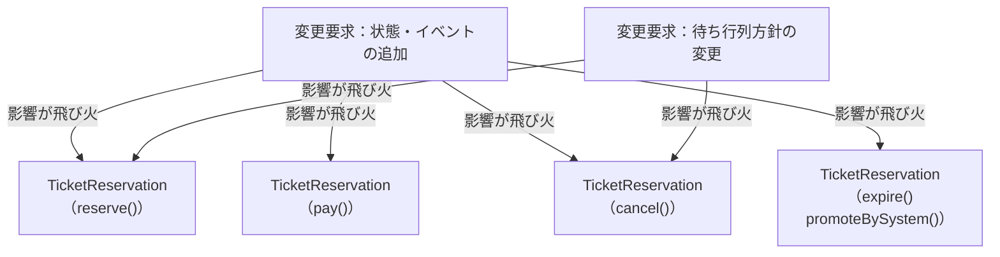

このグラフが示す通り、「状態追加」や「状態を動かすイベント追加」という変更要求が、クラス内の複数のロジックに飛び火しています。もう1本の `T2` は、状態そのものではなく待機順の決め方を変える要求です。待機列を予約本体が持っているため、状態分岐と同じ `reserve()`・`cancel()` を開くことになります。改善後の変更影響グラフで、この2本を同じ粒度で当て直して比べます。

### 3-3：痛みの言語化

変更を試みてみた結果、現場でよく直面する3つの辛い状況が浮かび上がってきました。

1つ目は、修正漏れが受入条件の不成立に直結することです。変更ID2（一時保留）では、`pay()`で保留中からの支払いを許可するだけでなく、`reserve()`・`cancel()`・`expire()`でもHeldの扱いを確認しました。一つの確定要求に対してクラス内の複数操作を点検する必要があります。

2つ目は、変更ID1（キャンセル待ち）・変更ID2（一時保留）の振る舞いを追うために複数メソッドの`if`と`else if`を行き来する必要があることです。「今この状態なら、この操作は何をするか」を一つの場所で読めず、今回修正した全操作をまとめて確認しなければなりません。

3つ目は、変更ID1（キャンセル待ち）で足したキャンセル待ちが、状態判定とは別の知識を予約本体へ持ち込んだことです。誰が待っているかという待機列そのものを予約本体が持ち、席が空いたときに先頭を昇格させる判断も、待機列へ積む判断も、状態分岐が並ぶ同じメソッドの中にあります。待機順の決め方を変えたいだけでも、状態分岐と同じ場所を開くことになります。


---
> **📌 問題（確定）**
> 変更ID1（キャンセル待ち）のキャンセル待ちと変更ID2（一時保留）の一時保留を追加しただけで、`reserve()`・`pay()`・`cancel()`・`expire()`など複数のメソッドへ条件分岐を追加する必要がある。状態ごとの許可操作と遷移先が`TicketReservation`全体へ散らばり、一つの確定要求に対する修正・確認範囲が広い。
---

観測した痛みへ`問題ID`を付け、どの変更IDから来たかを対応づけます。

| 問題ID | 変更を試して観測した痛み | 起点 |
|---|---|---|
| 問題ID1（修正漏れ） | 2状態を足すだけで `reserve()`・`pay()`・`cancel()`・`expire()` に分岐が増えた | 変更ID1・変更ID2 |
| 問題ID2（横断確認） | 1状態の振る舞いを知るために、全操作を横断して読んだ | 変更ID2（一時保留） |
| 問題ID3（待機責任の散在） | 自動昇格と待機順の管理が予約本体の各所へ散らばった | 変更ID1（キャンセル待ち） |

## 🟠 フェーズ4：原因分析 ―― なぜ辛いのかを構造で言語化する
フェーズ3「問題特定」で確認した「状態追加のたびに条件分岐が増え、修正漏れの可能性が高まる」という痛み。このフェーズでは、状態の知識がどこへ漏れているかを接続点から掘り下げます。

### 4-1：痛みの根源を探る（観察と原因）

「ステータスと振る舞いが同じクラスに混在すること」は、それ自体を誤りとは判断できません。問題は「変わる理由が異なる2つのもの」が混在しているかどうかです。`status` という状態は「業務ルール管理（どの遷移を許可するか）」という業務機能で変わり、`reserve()` などの処理フローは「処理の骨格（どんな操作ができるか）」という業務機能で変わります。ここでの判定軸は「**状態遷移のルールがどの業務機能によるか**」です。業務ルール管理と処理の骨格という2つの業務機能が異なるなら、この2つは別々の変わる理由を持っています。同じクラスに入っていると、片方だけを変更したい場合にも同じクラスを開くことになり、影響確認の範囲が重なります。それが下の表で示す「原因の方向」です。

この表は「フェーズ3「問題特定」で感じた痛み」を出発点にして、その痛みが生まれた構造的な理由を探る表です。痛みを1つ取り上げ、「なぜそうなるのか？」と問いかけ続けることで、根本原因の方向が見えてきます。

| 観測した痛み | コード上の原因 |
|---|---|
| 状態追加で全操作の分岐を書き換える | 状態名と状態固有の振る舞いが `TicketReservation` に同居している |
| 現在状態を意識しないと変更できない | 遷移条件が複数メソッドのロジックへ埋まっている |
| タイマーやAPI結果のたびに中心クラスが膨らむ | 入力元が違っても、状態別の扱いを中心クラスが選んでいる |

### 4-2：今回変える責任/ほかの変更から守る責任

> **「今回守る」と「変わらない」は異なります。** 左列は今回の変更試行とヒアリングで変更理由を確認した責任、右列はその変更に巻き込まず守りたい責任です。将来ずっと変わる／変わらないという分類ではありません。

原因分析の結果から、「今回変える責任」と「ほかの変更から守る責任」を整理します。分類は色付き記号に頼らず、列名と各行の内容で示します。

| **今回変える責任** | **ほかの変更から守る責任** |
|---|---|
| 状態の種類（キャンセル待ち、保留中などの追加） | 予約システムとしての基本的な業務フロー |
| 各状態における振る舞い（状態ごとのアクション） | 状態を管理するという概念（状態があること自体） |
| 状態を動かす入力（利用者操作、タイマー、外部API結果） | 呼び出し元が「予約に対して操作/イベントを渡す」という入口 |

この表をコードの上に置き直すと、こうなります。

守りたい側は、`TicketReservation::reserve()` / `pay()` / `cancel()` という**公開操作の名前と呼び出し方**です。利用側は今も「予約に対して操作を渡す」だけで、これは状態がいくつ増えても変えたくありません。

変えたい側は、その3つのメソッドの**中身**です。今はどれも `status`（`"Available"` / `"Reserved"` / `"Paid"` の文字列）を見て可否を決めており、**状態を1つ足すと3つのメソッドすべてを開く**ことになります。

つまり守りたいのは「予約管理という入口があること」で、切り離したいのは「`status` を見て分岐する部分」です。

### 4-3：接続点に漏れている状態の知識を確認する

ここでは原因から対策へ飛ばず、`TicketReservation` と状態ごとの判断の間で何を受け渡せばよいかを確認します。利用側が必要とするのは、状態名や分岐条件ではなく、現在の状態に対して操作を依頼し、結果を受け取ることです。

現在、`TicketReservation`の各操作メソッドは、`status`の文字列と状態ごとの遷移ルールを知っています。本来の接続点は「現在の状態へ操作を依頼すること」ですが、状態名と分岐条件がコンテキスト側へ漏れています。

状態の知識が漏れている根拠は次の3点です。

| コードの証拠 | そこから分かること |
|---|---|
| `if (status == "Available")` | 状態名と条件が文字列として直書きされている |
| 各操作が `status` を直接読み書きする | 状態判断を差し替える境界がない |
| `expire()` などの入力ごとに条件を追記する | 入力が増えるほど状態判断が同じクラスへ集まる |

`Available`などの状態名と遷移条件が複数メソッドに埋め込まれているため、状態が増えるたびに既存の操作メソッドを横断して確認する必要があります。

フェーズ4「原因分析」で根本原因が言語化できました。「どこを分けるか」は明確です。次のフェーズ5「課題定義」では、その境界で実際に何が流れているかを値・型のレベルで具体化し、「何を変え、何を守るか」を明確にします。

---
> **📌 原因（確定）**
> `TicketReservation`が「現在の状態の判断」と「操作/イベントごとの処理フロー」の両方を保持している。状態の追加や遷移ルールの変更では、関係する操作メソッドとイベント処理を横断して修正・再テストする必要がある。
---

フェーズ3の問題IDに対応づけて、構造上の原因へ`原因ID`を付けます。次のフェーズ5は、この原因IDから課題IDを導きます。

| 原因ID | 同じ責任へ集まっているもの | 対応する問題 |
|---|---|---|
| 原因ID1（状態判断と処理が同居） | 現在状態の判断と、操作・イベントごとの処理 | 問題ID1・問題ID2 |
| 原因ID2（待ち行列が状態処理へ絡む） | 席解放後の自動昇格と待機順の管理 | 問題ID3 |

## 🟡 フェーズ5：課題定義 ―― 原因から課題を検討して確定する

### 5-1：原因から課題候補を洗い出す

| 確定した原因 | 放置したときの痛み | 課題候補 |
|---|---|---|
| 原因ID1（状態判断と処理が同居） | 状態追加で無関係な操作まで修正する | 状態固有の許可操作と遷移を状態ごとに分離する |
| 原因ID2（待ち行列が状態処理へ絡む） | 席解放後の昇格が手動操作として残り得る | 席解放から先頭選択・自動昇格までを接続する |

### 5-2：課題候補の重複と依存を整理する

| 課題候補 | 確認できた必要性 | 整理結果 |
|---|---|---|
| 状態固有動作の分離 | 2状態の追加で全分岐が広がった | 公開入口を保つ独立課題にする |
| 待機列と自動昇格の接続 | 状態だけ分けても手動昇格なら要求を満たさない | 状態分離と連携する別の課題にする |

変更IDと課題IDは一対一とは限らないため、変更依頼の数に合わせて課題を増減させません。

### 5-3：課題IDと接続点を確定する

| 課題ID | 変わる側と守る側をどう接続するか | 完了条件 |
|---|---|---|
| 課題ID1（状態固有動作の境界） | 状態別の可否・遷移へ現在状態とイベントを渡し、結果を公開入口・席数・履歴へ返す | 状態追加が新状態と遷移登録に閉じる |
| 課題ID2（待ち行列の境界） | 待ち順の管理へ追加・先頭取出しを任せ、席解放直後の昇格へつなぐ | 取消・期限切れから自動昇格までシステム内で完了する |

📌 **システム全体の完了状態**：公開操作は現在状態へ処理を委ね、取消・期限切れで空席が出た場合は保存された待機順に従う自動昇格までシステム内で完了する。

課題IDを定義できたので、ここまでの追跡を一列で見渡します。

| 問題ID（フェーズ3の痛み） | 原因ID（フェーズ4の構造原因） | 課題ID（達成目標） |
|---|---|---|
| 問題ID1・問題ID2：状態追加で複数操作を横断修正・確認 | 原因ID1（状態判断と処理が同居）：現在状態の判断と処理フローが同居 | 課題ID1（状態固有動作の境界）：状態固有の動作と遷移判断を公開フローから分離 |
| 問題ID3（昇格と待機順が散らばる）：キャンセル待ちで昇格・待機順が散在 | 原因ID2（待ち行列が状態処理へ絡む）：待ち行列の責任が状態処理へ絡む | 課題ID2（待ち行列の境界）：待ち順の管理と席解放後の自動昇格を一つの流れへ接続 |

## 🔴 フェーズ6：対策検討 ―― 構想を一つのコード経路へ変える

フェーズ5で確定した全課題を、別々の部品案ではなく、生成から実行まで動く一つの構想としてまとめます。先に主要クラスと接続順を示し、その直後に同じ順でコードを確認します。

### 構想を決める

**この構想が何を解こうとしているのか**を、先に確認します。2つの課題は、それぞれ別の痛みから別の原因を経て出てきたものです。

- **課題ID1** ← 原因ID1（現在状態の判断と、処理フローが同居している）← 問題ID1（複数メソッドへ分岐追加）・問題ID2（状態を1つ足すと、複数の操作を横断して直し、確認することになる）
- **課題ID2** ← 原因ID2（待ち行列の責任が、状態処理へ絡んでいる）← 問題ID3（キャンセル待ちで、昇格と待機順の扱いが予約本体の各所へ散らばる）

この2つを分離対象にします。

**この課題（何を解きたいか）：** 「保留中」を1つ足すだけで `reserve`・`pay`・`cancel`・`expire` の各分岐を横断して直し、待機順の扱いを変えるだけで状態処理まで再確認になる。**公開操作は状態を判定せず、状態ごとの許可操作と遷移先だけを差し替えられる**ようにするのが課題ID1（状態固有動作の境界）、**待機順の管理を状態処理から切り離す**のが課題ID2（待ち行列の境界）です。

**このフェーズで決めること：** 状態ごとの判断と待機順の管理を公開フローからどこまで外し、現在状態への操作と席解放後の自動昇格をどう接続するかをコードで示します。

まず、契約、具体、生成・所有、受け渡し、実行を一枚の構想へまとめます。

| 決めること | システム全体での決定 | 守る側から隠れる詳細 |
|---|---|---|
| 契約と具体 | 状態別動作を各状態クラスへ、待ち順を`ReservationWaitlist`へ置く | 状態の遷移と待ち順 |
| 生成・所有・受け渡し | `BatchApplication`がDB・履歴・待ち行列を所有し、予約へ貸す | 具体状態と共有データ |
| 実行 | 利用側は公開操作だけを呼び、状態委譲と席解放後の昇格を内部で続ける | 現在状態と待機者選択 |

**構想上のコード経路**

1. `BatchApplication` ―― 状態と待ち行列を所有する
2. `TicketReservation::cancel()` ―― 公開入口
3. `IReservationState::cancel()` ―― 契約
4. これから確認する `ReservedState::cancel()` ―― 予約済みの具体状態
5. 待ち行列から次の予約を昇格する

この経路が成立するには、契約だけでなく、具体を選ぶ方法、実体の生成・所有、利用側へ渡す行、公開入口からの呼び出しが同時に必要です。以下では、この構想を分断せず、コードの依存順に続けて確認します。

### 構想をコードでつなぐ

> **コードの読み方：** 「契約→具体→生成・選択・受け渡し→公開入口からの実行」の順に読みます。変更前の抜粋は境界を引く根拠、変更後の断片は構想を成立させるコードです。断片はフェーズ7「解決後のコード」でクラス単位の全文へ統合します。

#### 契約：境界の形と受け渡しを決める

**関数を一つ切り出すだけでは、変更を閉じ込められません。** 状態ごとの可否は `reserve`・`hold`・`pay`・`cancel`・`expire` の5つの関数それぞれに `if (status == ...)` として現れます。そしてヒアリングで挙げたリスクID1（可否の変更）、リスクID2（状態の種類の追加）、リスクID3（入力イベントの追加）が、3方向とも「増える」と言っています。**現に変更要求で、保留中とキャンセル待ちの2状態が増えました。** そのため、各操作が同じ問い方で状態固有の判断を呼べるクラス契約まで分けます。

分けると決めたので、コードに線を引きます。

**変更前から抜き出す箇所：`TicketReservation::cancel()`** ―― 変更を試したときの分岐から、変更要求で保留対応を足した部分（対策前）

```cpp
void TicketReservation::cancel() {
    if (status == "Reserved") {
        status = "Available";                    // ← 出て行く側（遷移先）
        // ← 出て行く側（可否とメッセージ）
        std::cout << "予約をキャンセルしました\n";
        // ← 出て行く側（この遷移固有の副作用）
        promoteNextWaitlisted();
    } else if (status == "Held") {               // ← 出て行く側（可否）
        status = "Available";
        std::cout << "保留からキャンセルしました\n";
        promoteNextWaitlisted();
    } else {
        handleCancelError();
    }
}
```

**割り方の根拠は、状態が増えたときに触るかどうかです。** 「特別優待予約」を足すと `else if` が1本増えます。5つの関数すべてで増えます。**残るのは「操作を受け付ける入口であること」だけ**で、これは状態が何種類あっても変わりません。

**接続点を確定したところで挙げた候補は4つです。** 現在状態、操作・タイマー・空席イベント、次状態、結果について、境界を流す形を1つずつ確定します。

| 接続候補 | 決めた形 | 理由 |
|---|---|---|
| 現在状態 | オブジェクトそのもので表し、引数では渡さない | 値で渡すと、受け取った側へ状態分岐が残る |
| 操作・イベント | 操作ごとに別メソッドを置く | 種別値で渡すと、操作を選ぶ分岐が残る |
| 次状態 | 次の状態オブジェクトを設定する | 状態名による再分岐を作らない |
| 結果 | 不可ならその場で表示し、戻り値は増やさない | 呼び出し側は成否で分岐していない |

**3つ目が、この章のいちばん大事な判断です。** 「次はどの状態か」を名前で返して、呼び出し元に書き換えさせる形も考えられます。**その形をこの章で採れない理由があります。**

上の変更前コードを見てください。`Reserved` からの取消は、状態を変えるだけでなく `promoteNextWaitlisted()` を呼びます。`Held` からの期限切れも同じです。**ところが `Reserved` からの支払いは呼びません。** つまり**遷移ごとに副作用が違います。** 名前だけを返す形にすると、受け取った側が「どの遷移のときに席を戻し、どの遷移のときに昇格させるか」を知ることになります。**それは状態ごとの知識そのもので、いま外へ出そうとしているものです。**

**だから、遷移も副作用も状態の側が実行します。** そのために、状態は操作対象（予約そのもの）を受け取る必要があります。

| 接続するもの（追加で決めたこと） | 決めた形 | そう決めた理由 |
|---|---|---|
| 操作対象の予約 | **引数で契約へ渡す** | 状態が席数・履歴・待ち行列・次状態を動かすには、動かす相手が要る |

**境界を実際に流れるのは、下りの1つだけです。** 候補4つのうち、現在状態と操作はクラスとメソッド名が体現し、次状態と結果は戻り値になりません。**代わりに、操作対象が引数として境界を下っていきます。** 状態は受け取った予約へ、遷移と副作用を書き戻します。

**契約の名前を決めます。** 予約の状態が満たすべき約束なので `IReservationState` とします。

**ここで確認するコード：`IReservationState`（クラス全体・抜粋）** ―― 7操作のうち3つ

```cpp
// 状態ごとの共通操作と、許可されない操作の既定処理を持つ基底クラス
class IReservationState {
public:
    // 引数は操作対象の予約コンテキスト（TicketReservation*）。
// 既定実装では使わないため仮引数名を省略し、派生側では reservation と名付ける。

    virtual void reserve(TicketReservation*) {
        std::cout << "現在予約できません\n";
    }

    virtual void cancel(TicketReservation*) {
        std::cout << "キャンセルできません\n";
    }

    virtual void promoteBySystem(TicketReservation*) {
        std::cout << "システム昇格の対象ではありません\n";
    }

    // pay / hold / expire / paymentFailed も同じ形で、既定は断りのメッセージ
    virtual ~IReservationState() = default;
};
```

**7つ並びます。** 利用者の操作が5つ（予約・支払い・取消・保留・期限切れ）、システム側の入力が2つ（空席発生による昇格・決済失敗）です。**リスクID3が「入力イベントの追加」を予告していたので、利用者操作とシステム入力を同じ契約に並べておきます。**

**許可されない操作は既定実装が引き受けます。** 変更前の `handleCancelError()` などが、そのまま既定の中身になりました。**呼ぶ側は状態を判定しません。**

**契約だけでは、決めた形が本当に成立するのか確かめられません。** 実装を1つ見ます。

**ここで確認するコード：`ReservedState`（クラス全体・抜粋）** ―― 予約済みの状態

```cpp
// Reserved（予約済み）：支払い・保留・取消ができる
class ReservedState : public IReservationState {
public:
    void cancel(TicketReservation* reservation) override {
        reservation->setState(availableState());   // 次状態を設定する
        reservation->cancelSeat();                 // この遷移固有の副作用
        reservation->record("cancel");
        std::cout << "予約をキャンセルしました\n";
        // 席が空いたので1件昇格
        reservation->promoteNextWaitlisted();
    }

    // pay / hold も同じ形で、それぞれの遷移先と副作用を持つ
};
```

> **悩みどころ：次の状態を誰が決めるのか**
>
> 状態を分けると、次に決めることがあります。**「予約済みの次はキャンセルで予約可能へ」という遷移の知識を、どこに置くか**です。
>
> いま見たとおり、遷移元の状態クラスが次の状態を名指ししています。`ReservedState::cancel()` の中に「次は予約可能状態（後で定義する `AvailableState`）」と書く形です。素直ですが、**遷移の全体像がコードのあちこちに散ります。** 「この状態からどこへ行けるのか」を知りたいとき、全クラスを開くことになります。
>
> もう一つの案は、遷移表を1か所に持つことです。全体像は見やすくなりますが、今度は**状態を1つ足すたびにその表も直す**ことになり、「状態追加を1クラスで閉じる」という目的が崩れます。
>
> 私は前者を選びました。この章で解きたいのが「状態追加のたびに全メソッドを触る」痛みだからです。**逆に、遷移の全体像を頻繁に確認する現場なら、後者のほうが合っている**と思います。どちらを選んでも、失うものは残ります。

- **「現在状態を引数で渡さない」の実態。** `cancel()` に状態の引数がありません。それでも「予約済みからの取消」と分かるのは、**このクラスであること自体が『予約済み』だから**です。**メンバー変数が1つもない**のはそのためです
- **「操作ごとに別メソッド」の実態。** `if (status == ...)` の比較がありません。メソッド名が操作そのものになっています
- **「操作対象を引数で渡す」の実態。** `reservation` を受け取り、次状態・席数・履歴・昇格の4つをすべてこのクラスが動かしています。**変更前の `cancel()` の `if` の中身が、そっくりここへ来ました**

**この形を採ると、状態どうしが互いの名前を知ります。** `ReservedState::cancel()` は `availableState()` を呼びます。**状態を1つ足すと、そこへ遷移する既存の状態も触ることになります。** これは完了条件が「状態追加が新しい状態動作と**遷移登録**に閉じる」と書いているとおりで、遷移元を触ることは条件に含まれています。

**課題ID2（待ち行列軸）。** 同じことを待機順の管理にします。

**変更前から抜き出す箇所：`TicketReservation` の `promoteNextWaitlisted()`** ―― 変更を試したときの待ち行列操作（対策前）

```cpp
void TicketReservation::promoteNextWaitlisted() {
    if (waitlist.empty()) return;           // ← 出て行く側（探索方針）
    // ← 出て行く側（先頭選択）
    TicketReservation* next = waitlist.front();
    waitlist.pop_front();                   // ← 出て行く側（削除）
    next->promoteBySystem();                // ← 残る側（昇格を1件だけ起こす）
}
```

**接続点を確定したところで挙げた候補は3つです。** 待機者の追加、先頭取出し、昇格イベント。こちらも形を決めます。

| 接続候補 | 決めた形 | 理由 |
|---|---|---|
| 待機者の追加 | 予約とイベントIDを渡す | 待ち行列に予約内部を探させない |
| 先頭取出し | イベントIDを渡し、先頭の予約を1件返す | 誰を選ぶかを待ち順の方針へ閉じる |
| 昇格イベント | 待ち行列へ渡さず、呼び出し側が選ばれた予約へ伝える | 昇格は状態遷移の契約であり、待ち順とは別責任だから |

**候補3つのうち、境界を流れるのは2つです。** 3つ目は「流さない」と決めました。**これが2つの軸を1本の細い経路だけでつなぐための判断です。**

**ここで確認するコード：`ReservationWaitlist`（クラス全体）**

```cpp
class ReservationWaitlist {
    std::map<std::string,
             std::deque<TicketReservation*> > queues;
public:
    void enqueue(const std::string& eventId,
                 TicketReservation* reservation) {
        queues[eventId].push_back(reservation);
        // …待機数の1行表示（省略。詳細は完成コード）…
    }

    TicketReservation* popNext(const std::string& eventId) {
        std::deque<TicketReservation*>& queue = queues[eventId];

        if (queue.empty()) return NULL;

        TicketReservation* next = queue.front();
        queue.pop_front();
        // …待機数の1行表示（省略。詳細は完成コード）…
        return next;
    }
};
```

**このクラスは状態を1つも知りません。** `Reserved` も `Waitlisted` も出てきません。**待機順の方針を先着順から抽選へ変えるなら、触るのは `popNext()` の中だけです。**

**イベントIDごとに待ち行列が分かれています。** 変更前は1本の `deque` を全予約で共有していました。**イベントが2つ以上あると別のイベントの待機者を昇格させてしまう**ので、ここで分けます。これは待機順の方針に属する話なので、この軸の中で決めます。


**では、この2つを誰が呼ぶのか。**

---

> **悩みどころ：状態ごとにクラスを作ると、ファイルが増える**
>
> このあと状態クラスが5つできます。`if` 文なら1つのファイルに収まっていたものが、5つに分かれます。**「かえって読みにくくないか」**という感覚は、私にもよく分かります。
>
> 実際、**状態が2〜3個で、増える見込みもないなら、`if` のままで十分**だと考えています。分けることで得られるのは「状態を1つ足すときに他を読まなくて済む」ことなので、足す予定がなければ得るものがありません。
>
> この章で分けたのは、フェーズ2で「状態は今後も増える」と確認したからです。実際この後、キャンセル待ちと一時保留の2つが増えます。**判断の根拠は状態の個数ではなく、増える見込みのほうにあります。**
>
> なお、クラスが増えても実ファイルまで増やす必要はありません。関連する状態クラスを1ファイルにまとめる、という選び方もあります。ファイルの分け方も設計判断の一つです。

#### 具体：契約の裏へ変わる判断を置く

契約の形を決め、代表実装で引数・戻り値が成立することを確認しました。ここでは、もう1つの具体を見て、変わる判断が契約の裏へ閉じることを確かめます。

**課題ID1（状態軸）。** 直前の契約コードで見た `ReservedState` の疑問が、ここで解けます。**`if (status == ...)` を書かないのは、クラスであること自体が状態を表しているからです。** 契約の裏に置くのは「この状態で何が許されるか」「許されたとき次はどこで、何が起きるか」の2つだけです。

残りの4クラスも同じ形です。ここでは `ReservedState` と対照的なものを1つ見ます。

**ここで確認するコード：`WaitlistedState`（クラス全体）** ―― 変更要求で追加したキャンセル待ちの状態

```cpp
// Waitlisted（キャンセル待ち）：システムからの昇格だけを受け付ける
class WaitlistedState : public IReservationState {
public:
    void promoteBySystem(
            TicketReservation* reservation) override {
        reservation->setState(reservedState());
        reservation->reserveSeat();
        reservation->record("promote");
        std::cout << "空席発生を検知し、予約へ自動昇格しました\n";
    }
};
```

**`reserve()` も `pay()` も `cancel()` もありません。** キャンセル待ちの人は自分では何もできない、という規則を、**書かないことで表しています。** 書かなければ `IReservationState` の既定が断りのメッセージを引き受けます。変更前は「その `if` に該当の分岐が無い」という不在で表していたものが、「そのクラスに `override` が無い」という不在へ移りました。

5クラスを並べると、状態遷移表がそのままクラスの一覧になります。

| 状態クラス | 上書きする操作 | 遷移先と副作用 |
|---|---|---|
| `AvailableState` | `reserve()` | 空席あり→予約済み・席を1つ減らす／満席→キャンセル待ち・待機登録 |
| `ReservedState` | `pay()` / `hold()` / `cancel()` | 支払済み／保留中／受付可能・席を戻して1件昇格 |
| `HeldState` | `pay()` / `cancel()` / `expire()` | 支払済み／受付可能・席を戻して1件昇格／同左 |
| `PaidState` | 無し | すべて既定の断り（支払済みは終端） |
| `WaitlistedState` | `promoteBySystem()` | 予約済み・席を1つ減らす |

**`PaidState` には何も書きません。** 支払済みからは何もできないので、7操作すべてが既定のままです。**クラスは空でも要ります。** 「支払済みという状態が存在する」ことを型で表しているからです。

**課題ID2（待ち行列軸）。こちらは直前の契約コードで見た `ReservationWaitlist` がそのまま完成形です。** 待機順を扱う以外に書くことがないので、増える段がありません。**実装も1つだけです。** 待機順の方針は今1つで、抽選や優先度つきに替える予定はヒアリングで挙がっていません。**替えられる形にしておく必要が無いので、契約を作らず、クラス1つで止めます。**

**分けたのに契約を作らない、という選択があります。** 課題ID2（待ち行列の境界）で止めたかったのは「待機順の扱いが状態処理へ絡むこと」でした。専用クラスへ移した時点でそれは達成されます。**差し替えの必要が出たときに契約を足せばよく、いま足すと使われない抽象が1つ増えます。**

**もう一度検算します。契約のメソッド以外に書きたくなるものがあるか。** どちらの軸でも出てきませんでした。

**守る範囲との照合：** **座席数更新**と**履歴**に触りました。どちらも呼ぶ場所が公開操作の中から状態クラスの中へ移っただけで、予約で1つ減らし取消と期限切れで1つ戻すことも、状態が変わった操作を記録することも変わっていません。**席解放直後に1件を昇格する契約**にも触りましたが、`ReservedState::cancel()` と `HeldState::cancel()`・`HeldState::expire()` の3か所すべてで `promoteNextWaitlisted()` を呼んでいます。変更を試したときに昇格していた遷移と同じ3つです。

**境界の契約と具体をコードで確認できました。** 次は、構想で仮置きした生成・所有・受け渡しを、実コードとして確定します。

---

#### 生成・所有・受け渡しを決める

契約と具体がコードで確認できたので、構想で仮置きした生成・所有・受け渡しを実コードで確かめます。生成しただけで止めず、同じ実体が公開入口から使われる直前までをつなぎます。

ここからは、具体を作る行から、契約として骨格へ入り、公開入口から実行される行までを一つの経路として追います。

##### 生成・所有：実体と所有者をコードで示す

構想で定めた接続点は2つです。骨格の `state` に入る実体と、状態が呼び返す先（席数・履歴・待ち行列）です。ここでは、その所有と生存期間をコードで確かめます。

**まず状態の実体を確認します。** 5つの状態クラスは**メンバー変数を1つも持ちません**。直前の具体コードで確認したとおり、どれも「渡された予約を動かす」だけです。**同じ状態の実体を、何個の予約が共有しても壊れません。**

**だから、状態は予約ごとに作りません。** 5つを1つずつ用意して全予約で共有します。作る場所は、状態を返す関数です。

**ここで確認するコード：`availableState()` ほか、状態を返す5つの関数** ―― 宣言と、1つの実装

```cpp
IReservationState* availableState();
IReservationState* reservedState();
IReservationState* paidState();
IReservationState* waitlistedState();
IReservationState* heldState();

IReservationState* reservedState() {
    static ReservedState instance;   // 最初の呼び出しで1つだけ作る

    return &instance;
}
```

**宣言を5つ先に並べるのは、状態どうしが互いの遷移先を呼ぶからです。** 契約コードで「状態どうしが互いの名前を知る」と書いたコストが、ここに形として出ます。

**`static` にすると、最初の呼び出しで1つだけ作られ、プログラムが終わるまで生きます。** `new` も `delete` も書きません。骨格が持つ `state` は**この共有実体を指すだけの借用ポインタ**なので、`setState()` は指す先を切り替えるだけです。**借りているものが先に消えることはありません。**

**次に、状態が呼び返す先を確認します。** 具体コードで `reservation->cancelSeat()`・`record()`・`promoteNextWaitlisted()` と書きました。これらを実行するには、骨格が在庫・履歴・待ち行列を持っている必要があります。

**ここで確認するコード：`TicketReservation`（クラス宣言・完成）**

```cpp
class TicketReservation {
    IReservationState* state;      // 共有の状態を借りる
    EventDatabase* db;             // 在庫（境界）
    ReservationHistory* history;   // 予約履歴
    ReservationWaitlist* waitlist; // 課題ID2の係
    std::string eventId;
    std::string title;
public:
    TicketReservation(IReservationState* initialState,
                      EventDatabase* db,
                      ReservationHistory* history,
                      ReservationWaitlist* waitlist,
                      const std::string& eventId,
                      const std::string& title);
    void setState(IReservationState* nextState) {
        state = nextState;
    }
    void reserveSeat();
    void cancelSeat();
    void record(const std::string& action);
    void joinWaitlist();
    void promoteNextWaitlisted();
    // 公開操作 reserve / pay / cancel / hold / expire /
    //          paymentFailed
};
```

**4つとも借用ポインタです。** 所有しません。**とくに `waitlist` は借りる必要があります。** 同じイベントの予約が全員で1つの待ち行列を見なければ、待機順が成り立たないからです。値で持つと予約ごとに別の行列ができます。

**では、待ち行列と在庫と履歴の実体は誰が持つのか。** 全予約より外側にいる者です。この章では組み立て役の `BatchApplication` がそれにあたります。

**ここで確認するコード：`BatchApplication`（メンバー。生成は `BatchApplication::run()` の中）** ―― 共有される実体の置き場

```cpp
class BatchApplication {
    EventDatabase db;
    ReservationHistory history;
    ReservationWaitlist waitlist;   // 全予約で1つを共有する
    // …予約の生成と実行（省略。詳細は完成コード）…
};
```

ここまでで、5つの状態、待ち行列、在庫、履歴の生成と所有を確認できました。次に `IReservationState*` を受け取る行を見て、同じ状態実体が予約から参照されることを確かめます。

---

##### 状態の受け渡し：初期状態と次状態を渡す

**構想で仮置きした骨格には、`state->cancel(this)` としか書いてありません。** `ReservedState` とも `HeldState` とも書いていません。それでも予約済みの予約を取り消せば予約済み用の処理が動きます。**ここで見るのは、いつ・何によって、その実装が入るのかです。**

**この章では、実装が2回に分けて入ります。**

**1回目は、予約を作るときです。**

**ここで確認するコード：`BatchApplication::run()`** ―― 予約を1件作る行

```cpp
        TicketReservation r(availableState(), &db, &history,
                            &waitlist, "EVT001", "夏フェス");
```

**`availableState()` の戻りが、骨格の `state` へ入ります。** 最初の状態は必ず受付可能なので、ここは組み立て時に1回決まります。

**2回目は、状態が遷移するたびです。**

**ここで確認するコード：`ReservedState` の `cancel()`** ―― 具体コードで書いた1行目（引数は `TicketReservation*`）

```cpp
        // ←ここで次の実装が入る
        reservation->setState(availableState());
```

**この1行が状態遷移です。** `setState()`へ次状態の参照を渡すと、骨格の `IReservationState*` が `AvailableState` を指します。次状態を決めて渡すのは遷移元の状態で、骨格は具体型を判定しません。

**この章は、呼び出しのたびに実装を引き当てます。ただし引き当てる主体が特徴的です。** 骨格が状態値から引くのではなく、**遷移元の状態が次の状態を名指しします。** 決め手は「いまどの状態にいて、どの操作を受けたか」の組です。

| 課題 | 実装の決まり方 | 骨格へ渡る場所 |
|---|---|---|
| 課題ID1（状態固有動作の境界） | 現在の状態と受けた操作から、遷移元の状態が次状態を決める | `TicketReservation::setState()` |
| 課題ID2（待ち行列の境界） | 実装は1つなので選ばない | `BatchApplication` が起動時に渡す |

**課題ID2には決め手がありません。** 直前の具体コードで確認したとおり実装が1つしかないので、選ぶ判断そのものが存在しません。**「決め手が要る」構造と「要らない」構造が、同じ章に並んでいます。**

**骨格が状態を借りる方法（ポインタで共有実体を指す）は、生成・所有のコードで示した話です。** 値で持つと遷移のたびにオブジェクトを作り直します。この章で実際に起きるのは、生成済みの次状態を `setState()` へ渡す状態遷移です。


---

#### 実行骨格：組み立てた実体を契約から呼ぶ

前節で、`TicketReservation`へ初期状態と、座席・履歴・待ち行列の共有実体を渡しました。公開操作は現在の`IReservationState`へ委譲し、状態は必要な更新だけを予約へ返します。

席が空いた後は、`promoteNextWaitlisted()`が`ReservationWaitlist::popNext()`へ次の予約を尋ねます。状態を追加しても公開操作の呼び方は変わらず、待機順を変えても昇格側は同じ操作を呼びます。状態の選択、共有実体の受け渡し、自動昇格が一つの実行手順として成立しています。

#### 公開入口から具体の実行まで追う

次は、公開入口へ入った要求が、直前に組み立てた同じ実体へ届き、契約を通って具体処理が呼ばれるまでをコードの呼び出し順で追います。

##### 公開入口から骨格・契約・具体へつなぐ

組み立てが終わりました。呼び出し側がどう変わったかを、変更前と並べて見ます。

**変更前から抜き出す箇所：`main()`** ―― 変更を試したときの予約と取消（対策前）

```cpp
    r.reserve(true);
    r.cancel();
```

**ここで確認するコード：`BatchApplication::run()`** ―― 同じ操作（対策後）

```cpp
    r.reserve();
    r.cancel();
```

**引数が1つ減りました。** 変更前は満席かどうかを呼び出し側が渡していましたが、いまは `AvailableState` が在庫へ直接聞きます。**空席があるかは在庫が知っていることで、呼び出し側が調べて渡すことではありませんでした。**

**取消の呼び方は変わっていません。** そして**昇格を呼ぶ行は、変更前も変更後も `main()` にありません。** 席が空いた瞬間に状態処理が待ち行列へつなぐので、利用側は昇格を意識しません。**これが課題ID2（待ち行列の境界）の完了条件「取消・期限切れから自動昇格まで一つのユースケースで完了する」です。**

**組み立ての行は増えました。** 予約を1件作るのに、状態・在庫・履歴・待ち行列の4つを渡します。**この対策が払ったコストは、引数4つぶんです。** 増えたぶんは、状態を1つ足すときに触る範囲が新しいクラス1つと遷移元に収まることと引き換えです。

**契約・具体・組み立てで決めた呼び方を、ここで実コードとしてつなぎます。** 見るのは、組み立てで作った同じ実体が、公開入口から具体の処理まで届いているかです。

**守る範囲との照合：** **公開入口**を保っていることを、いま確認しました。`reserve()` の引数が1つ減りましたが、これは呼び出し側が持つべきでない在庫の知識を返しただけで、操作の形は変わっていません。分離と組み立てを通して、守る範囲の4つはいずれも定義に反していません。最終確認はフェーズ7の受入・回帰エビデンスで行います。

### 構想を採用する

ここまでの構想表と要点コードを合わせると、責任配置と実行経路が一つにつながります。`TicketReservation` が公開入口と副作用の実行を持ち、5つの状態クラスが可否と遷移を持ち、`ReservationWaitlist` が待機順を持ちます。

**この章の完成構造は一つに定まります。** 各状態クラスに待ち行列操作まで持たせる案も置けますが、待機順の方針を変えるたびに複数の状態クラスを開くことになり、課題ID2（待ち行列の境界）を解いていない途中状態です。責任配置が異なる完成構造が複数残ったわけではないので、当て馬を並べた比較は行いません。

完成クラス図は、構想を実装した結果としてフェーズ7「対策実施」だけに示します。ここでは、課題との対応と将来リスクへの備えを表で確定します。

#### 課題から採用構想までを照合する

ここまでの決定を、課題ID1（状態固有動作の境界）→課題ID2（待ち行列の境界）の順に一望へまとめます。この表は設計課題だけを追います。変更要求の受入はフェーズ7の要求ID表、変更影響は変更シナリオ表で別に確認します。

| 対象 | 採用した構造とコード | 確認する効果 |
|---|---|---|
| 課題ID1（予約状態） | `TicketReservation` が `IReservationState` の各状態へ委譲する | 状態追加を新状態と遷移接続へ閉じる |
| 課題ID2（待ち行列） | `ReservationWaitlist` を席解放処理へ接続する | 取消・期限切れの直後に先頭を自動昇格する |
| 公開入口・席数・履歴 | `TicketReservation` の公開操作と `EventDatabase` を保つ | 50/50→49/50→50/50を同じ入口で実行する |

#### 将来リスクに対して構想を確認する

フェーズ2のリスクIDを採用構造へ再適用し、現在状態へ委譲する入口をどこまで守れ、何が弱点として残るかを評価します。

| 将来リスク | 変更を閉じ込める場所 | 守れる範囲と限界 |
|---|---|---|
| リスクID1（遷移ルール） | 遷移元の状態クラス | 他状態と公開入口を守れる。共通規則は重複しやすい |
| リスクID2（状態追加） | 新状態と、その状態へ入る遷移 | 既存状態を守れる。進入元が多いと複数状態の修正は残る |
| リスクID3（イベント追加） | 新イベント入口、状態契約、必要なスケジューラ | 状態判断を各状態へ保てる。実行基盤は別に必要になる |

リスクID1（遷移ルールの変更）〜リスクID3（イベントが増える）により、状態分離が現在の要求だけの分岐整理ではなく、状態とイベントの将来変更をどこへ閉じるかという判断になっていることを確認できます。

## 🟢 フェーズ7：対策実施 ―― 変化に強いコードを完成させる
フェーズ6で確定した課題ID1（状態固有動作の境界）・課題ID2（待ち行列の境界）を同時に満たす設計を、実際のコードに実装します。`TicketReservation`が抱えていた状態分岐を各状態クラスへ移し、キャンセル待ちの探索・先頭選択・自動昇格を`ReservationWaitlist`へ移します。

この設計変更の最大の価値は、今後「キャンセル待ち」や「特別優待」といった新しい状態がどれだけ増えても、既存の業務フローの条件分岐を変更せず、新しい状態クラスと組み立て設定を追加することで機能拡張ができる安定性を手に入れたことです。

### 7-1：解決後のコード（全体）


#### 完成後のクラス一覧

完成コードで定義する型を先に一覧化します。各型の依存方向と実現関係は、直後のクラス図で確認します。

このうち3つは、変更前には無かった型です。

- **これから完成コードで定義する `ReservationRecord` と `ReservationHistory`** ―― 要求ID5（不許可操作で変えない）を実行結果で確かめるには、「何が起きて、何が起きなかったか」が後から読めなければなりません。そこで操作の記録（イベントID・イベント名・操作種別）を1件ずつ積み、最後にまとめて出せるようにしました。
- **これから完成コードで定義する `ReservationExpiryScheduler`** ―― 要求ID7（15分と24時間の期限）で足した期限切れは、**利用者が操作したわけではないのに状態が変わる**入力です。利用者操作の入口（`reserve()` など）と同じ場所に置くと、誰が起こしたのかが混ざります。期限を検知する側を別に置き、そこから `expire()` を呼ぶ形にしました。

- `TicketReservation`、`IReservationState`、`EventInfo`、`ReservationRecord`
- `EventDatabase`、`ReservationHistory`、`ReservationWaitlist`、`AvailableState`
- `ReservedState`、`PaidState`、`WaitlistedState`、`HeldState`
- `ReservationExpiryScheduler`、`BatchApplication`

> **悩みどころ：状態を共有すると、テストで差し替えにくい**
>
> 状態オブジェクトは `static` で1つだけ作り、すべての予約が同じ実体を共有します。`new` も `delete` も要らず、寿命の心配もありません。素直な選び方です。
>
> ただし、**この形はテストで差し替えられません。** 「予約済みの状態だけ、テスト用の偽物に置き換えたい」と思っても、`reservedState()` が返す実体は固定です。関数を書き換えるしかありません。
>
> なぜそれでもこの形を選んだか。**状態クラスがデータを持っていないから**です。持っているのは「この操作を受けたらどうするか」という手順だけで、予約ごとに違う値はすべて骨格の側にあります。データがなければ共有しても壊れません。
>
> **逆に、状態がデータを持つ設計なら、この形は使えません。** 予約ごとに状態オブジェクトを作り、誰が壊すかを決めることになります。`static` を選べるかどうかは、**状態が空かどうか**で決まります。

#### 完成後のクラス図

フェーズ6で確定したクラス・操作・関係線を完成図にします。`TicketReservation` が骨格、`IReservationState` が状態ごとの振る舞いの契約、各状態クラスがその具象に対応します。

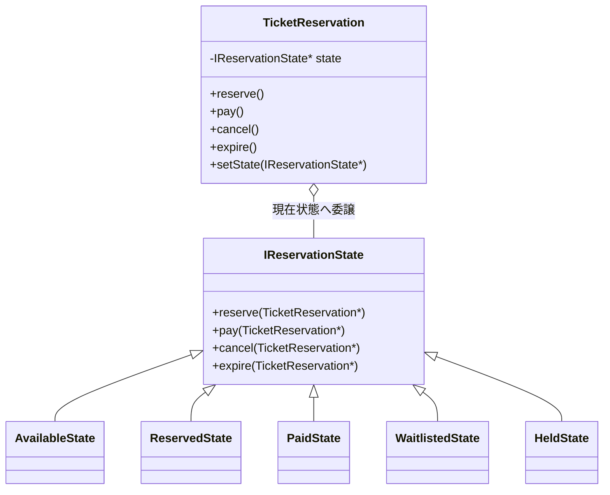

骨格の `TicketReservation` は現在状態を1つ持ち、操作をそのまま渡します。状態が5つに増えても、骨格側の線は `IReservationState` への1本だけです。

次の図は、この骨格が周辺のどのクラスと繋がるかです。

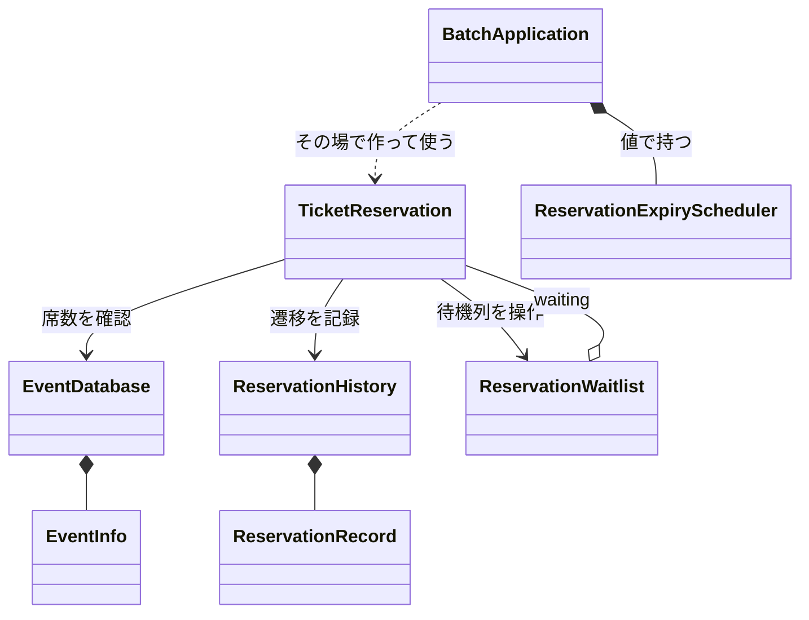

この完成図では、`TicketReservation` が現在状態へ操作を委譲し、`IReservationState` が状態ごとの共通契約、5つの状態クラスがその具体動作を担います。掲載コードに登場する在庫・履歴・待ち行列・組み立てクラスも省略せず記載しています。予約数の増減と待機者の自動昇格は状態処理から予約本体を経由して実行され、`BatchApplication` はシナリオを起動するだけです。

#### 完成後の実行シーケンス

満席イベントの既存予約に `cancel()` が呼ばれたとき、空席作成から待機者の自動昇格までをどのクラスが担うか確認します。

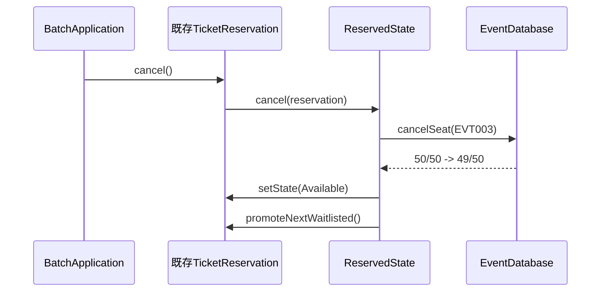

ここまでがキャンセルです。席が1つ空き、状態は `Available` になりました。`promoteNextWaitlisted()` から先が、キャンセル待ちの自動昇格です。

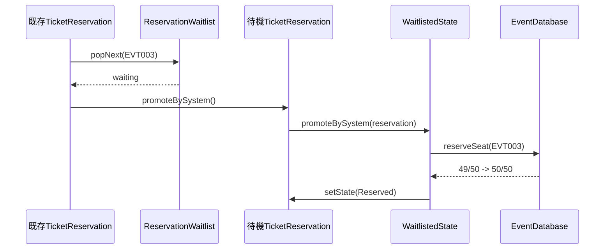

`BatchApplication` は昇格を呼びません。`ReservedState::cancel()` が座席解放後に待ち行列を進め、`WaitlistedState` が同じ席を確保して `Reserved` へ遷移します。したがって途中で運用者が介入する空白はありません。

期限切れも同様に、利用者や運用者が予約の状態を手動で進めません。掲載コードでは実際の時計を待たないため、タイマー基盤から届く期限到来イベントをスタブで再現します。

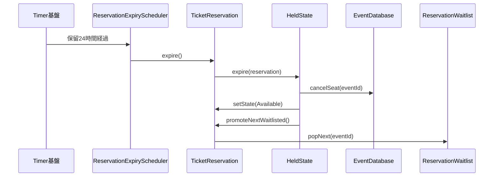

`main()`は`BatchApplication::run()`を起動するだけで、期限切れを直接呼びません。実運用ではTimer基盤が時刻を監視し、期限到達時に同じスケジューラ境界を呼びます。

#### 完成コード

クラスを1つずつ、上から順に読みます。**メンバー変数と、それを使う処理を同じ場所で見られるように**しています。現状コードと同じ顔ぶれが並ぶので、どこが変わったかを見比べてください。

`main()` と実行結果は最後に、シナリオごとに並べます。

---

**共通ヘッダーと EventInfo と EventDatabase（現状コードのまま）**

イベントの定員と予約数を持つ在庫クラスです。

```cpp
#include <iostream>
#include <string>
#include <map>
#include <vector>
#include <deque>
#include <stdexcept>
```

**EventInfo**

```cpp
struct EventInfo {
    std::string title;   // イベント名
    int capacity;        // 定員
    int reserved;        // 現在の予約数
};
```

**EventDatabase**

```cpp
class EventDatabase {
private:
    std::map<std::string, EventInfo> records;
public:
    EventDatabase() {
        records["EVT001"] = {"春の音楽祭",  100,  20};
        records["EVT002"] = {"夏のフェス",  500, 499};
        records["EVT003"] = {"秋の映画会",   50,  50};  // 満席
    }

    bool exists(const std::string& id) const {
        return records.count(id) > 0;
    }

    EventInfo get(const std::string& id) const {
        return records.at(id);
    }

    bool hasCapacity(const std::string& id) const {
        const auto& e = records.at(id);

        return e.reserved < e.capacity;
    }

    void reserveSeat(const std::string& id) {
        auto& event = records.at(id);

        if (event.reserved >= event.capacity) {
            throw std::runtime_error("満席のイベントは予約できません");
        }

        int before = event.reserved;
        ++event.reserved;
        std::cout << "[予約数] " << id << " "
                  << before << "/" << event.capacity
                  << " -> " << event.reserved << "/"
                  << event.capacity;
        if (event.reserved == event.capacity)
            std::cout << "（満席）";
        std::cout << std::endl;
    }

    void cancelSeat(const std::string& id) {
        auto& event = records.at(id);
        int before = event.reserved;

        if (event.reserved > 0) --event.reserved;
        std::cout << "[予約数] " << id << " "
                  << before << "/" << event.capacity
                  << " -> " << event.reserved << "/"
                  << event.capacity
                  << std::endl;
    }

    void save(const std::string& id, const EventInfo& info) {
        records[id] = info;             // 実行中のイベント表へ追加
    }
};
```

---

**ReservationRecord と ReservationHistory**

予約履歴（`ReservationHistory`）はシステム起動時は空で、予約・決済・キャンセルが行われるたびに1件追記されます。ここではファイルへの保存は行わず、実行中のメモリ上にのみ保持します。

```cpp
struct ReservationRecord {
    std::string eventId;
    std::string eventTitle;
    std::string action;   // "予約", "決済", "キャンセル"
};
```

**ReservationHistory**

```cpp
// 予約履歴を管理するクラス
class ReservationHistory {
    std::vector<ReservationRecord> records;
public:
    void add(const std::string& eventId,
             const std::string& eventTitle,
             const std::string& action) {
        records.push_back({eventId, eventTitle, action});
    }

    void printAll() const {
        for (const auto& r : records) {
            std::cout << "[" << r.eventId << "] "
                      << r.eventTitle
                      << " -> " << r.action << std::endl;
        }
    }

    int size() const { return (int)records.size(); }
};
```

---

**ReservationWaitlist**

キャンセル待ちはイベントごとの先着順キューです。利用者や `main()` が昇格を指示するのではなく、予約済み・保留中の席が解放された直後に、状態処理から先頭を取り出します。

```cpp
class TicketReservation;
```

**ReservationWaitlist**

```cpp
class ReservationWaitlist {
    std::map<std::string,
             std::deque<TicketReservation*>> queues;
public:
    void enqueue(const std::string& eventId,
                 TicketReservation* reservation) {
        queues[eventId].push_back(reservation);
        std::cout << "[待ち行列] " << eventId
                  << " 待機数=" << queues[eventId].size()
                  << std::endl;
    }

    TicketReservation* popNext(const std::string& eventId) {
        auto& queue = queues[eventId];

        if (queue.empty()) return nullptr;

        TicketReservation* next = queue.front();
        queue.pop_front();
        std::cout << "[待ち行列] " << eventId
                  << " 待機数=" << queue.size()
                  << std::endl;
        return next;
    }
};
```

---

**IReservationState**

新しい設計の基盤となる状態インターフェースを定義します。このインターフェースが「すべての状態クラスが守るべき契約」を定めます。C++では、基底クラスの仮想関数にデフォルト挙動（エラーメッセージを出力する、または何もしない）を実装しておくことで、各状態の具体クラスは自分に関係するメソッドだけをオーバーライドすればよくなります。

```cpp
class TicketReservation;
```

**IReservationState**

```cpp
// 状態ごとの共通操作と、許可されない操作の既定処理を持つ基底クラス
class IReservationState {
public:
    // 引数は操作対象の予約コンテキスト（TicketReservation*）。
// 既定実装では使わないため仮引数名を省略し、派生側では reservation と名付ける。

    virtual void reserve(TicketReservation*) {
        std::cout << "現在予約できません\n";
    }

    virtual void pay(TicketReservation*) {
        std::cout << "支払いに適した状態ではありません\n";
    }

    virtual void cancel(TicketReservation*) {
        std::cout << "キャンセルできません\n";
    }

    virtual void promoteBySystem(TicketReservation*) {
        std::cout << "システム昇格の対象ではありません\n";
    }

    virtual void hold(TicketReservation*) {
        std::cout << "保留できません\n";
    }

    virtual void expire(TicketReservation*) {
        std::cout << "期限切れ処理は行えません\n";
    }

    virtual void paymentFailed(TicketReservation*) {
        std::cout << "決済失敗を扱える状態ではありません\n";
    }

    virtual ~IReservationState() = default;
};
```

---

**TicketReservation**

状態クラスを保持し、操作を現在の状態に委譲する中心クラス（コンテキスト）です。

```cpp
// 予約クラス：状態を保持し操作を委譲するだけ
class TicketReservation {
private:
    IReservationState* state;
    EventDatabase* db;           // 在庫の保存データ（境界）
    ReservationHistory* history; // 予約履歴
    ReservationWaitlist* waitlist;
    std::string eventId;
    std::string title;

    // キャンセル待ち昇格は外部公開せず、システム連鎖からだけ呼ぶ
    void promoteBySystem() {
        state->promoteBySystem(this);
    }
public:
    TicketReservation(IReservationState* initialState,
                      EventDatabase* db,
                      ReservationHistory* history,
                      ReservationWaitlist* waitlist,
                      const std::string& eventId,
                      const std::string& title)
        : state(initialState), db(db), history(history),
          waitlist(waitlist),
          eventId(eventId), title(title) {}

    // 状態遷移時に、共有状態オブジェクトへの借用ポインタを差し替える。
    // 状態は関数ローカルstaticが所有するため、ここではdeleteしない。
    void setState(IReservationState* nextState) {
        state = nextState;
    }

    // 状態遷移の副作用：在庫の増減と履歴の記録
    void reserveSeat() { db->reserveSeat(eventId); }
    void cancelSeat()  { db->cancelSeat(eventId); }
    bool hasCapacity() const {
        return db->hasCapacity(eventId);
    }
    void record(const std::string& action) {
        history->add(eventId, title, action);
    }

    void joinWaitlist() {
        waitlist->enqueue(eventId, this);
    }

    void promoteNextWaitlisted() {
        TicketReservation* next = waitlist->popNext(eventId);

        if (next != nullptr) next->promoteBySystem();
    }

    // 操作を現在の状態に委譲するだけ
    void reserve()         { state->reserve(this); }
    void pay()             { state->pay(this); }
    void cancel()          { state->cancel(this); }
    void hold()            { state->hold(this); }
    void expire()          { state->expire(this); }
    void paymentFailed()   { state->paymentFailed(this); }
};
```

状態オブジェクトは振る舞いだけを持つため、関数ローカルの静的オブジェクトを共有し、遷移のたびに `new` しない形にします。`state` はそれらへの非所有ポインタなので、`setState()` は参照先を切り替えるだけです。古い状態オブジェクトはプログラム終了まで共有され、削除対象になりません。席数の増減（`reserveSeat`/`cancelSeat`）と履歴記録は、呼び出し側が手動で行うのではなく、状態遷移の副作用として各状態のメソッド内から予約コンテキスト経由で実行します。さらに席を解放した状態処理が `promoteNextWaitlisted()` まで呼ぶため、キャンセルと自動昇格が1つのシステム処理として完結します。

---

**状態取得関数の宣言と AvailableState**

先に `TicketReservation` の完全な定義を置いたので、ここからは各状態クラスの宣言とオーバーライド実装を分断せず、クラス単位でまとめて読めます。状態取得関数の宣言だけは、状態同士の遷移先を互いに参照するためクラス定義の直前へ置きます。

```cpp
IReservationState* availableState();
IReservationState* reservedState();
IReservationState* paidState();
IReservationState* waitlistedState();
IReservationState* heldState();

// Available（予約可能）：空席なら予約、満席なら自動待機登録する
class AvailableState : public IReservationState {
public:
    void reserve(TicketReservation* reservation) override {
        if (!reservation->hasCapacity()) {
            reservation->joinWaitlist();
            std::cout << "満席のためキャンセル待ちに登録しました\n";
            reservation->setState(waitlistedState());
            return;
        }

        reservation->reserveSeat();
        reservation->record("予約");
        std::cout << "予約完了しました\n";
        reservation->setState(reservedState());
    }
};
```

`AvailableState` は空席の有無で予約または待機登録へ進めます。**現状コードでは `TicketReservation::reserve()` の中にあった判定が、状態クラスへ移りました。**

---

**ReservedState と PaidState**

```cpp
// Reserved（予約済み）：支払い、取消、保留、期限切れを処理する
class ReservedState : public IReservationState {
public:
    void pay(TicketReservation* reservation) override {
        reservation->record("決済");
        std::cout << "支払い完了しました\n";
        reservation->setState(paidState());
    }

    void cancel(TicketReservation* reservation) override {
        reservation->cancelSeat();
        reservation->record("キャンセル");
        std::cout << "予約をキャンセルしました\n";
        reservation->setState(availableState());
        reservation->promoteNextWaitlisted();
    }

    void hold(TicketReservation* reservation) override {
        std::cout << "保留にしました\n";
        reservation->setState(heldState());
    }

    void expire(TicketReservation* reservation) override {
        reservation->cancelSeat();
        reservation->record("通常決済期限切れ");
        std::cout << "通常の決済期限が切れました\n";
        reservation->setState(availableState());
        reservation->promoteNextWaitlisted();
    }

    void paymentFailed(
            TicketReservation* reservation) override {
        reservation->record("決済失敗");
        std::cout << "決済に失敗しました。予約済みのまま再試行できます\n";
    }
};
```

**PaidState**

```cpp
// Paid（支払い済み）：完了状態のため、すべて既定の拒否を使う
class PaidState : public IReservationState {};
```

`ReservedState` は席を解放する操作から待機者の自動昇格まで完結させ、`PaidState` は既定の拒否だけを使います。**`PaidState` の中身が空なのは、許可する操作が1つもないからです。** 禁止の組み合わせを書き並べる必要がありません。

---

**WaitlistedState と HeldState と ReservationExpiryScheduler**

```cpp
// Waitlisted（キャンセル待ち）：システムからの昇格だけを受ける
class WaitlistedState : public IReservationState {
public:
    void promoteBySystem(
            TicketReservation* reservation) override {
        reservation->reserveSeat();
        reservation->record("キャンセル待ちから自動昇格");
        std::cout << "空席発生を検知し、予約へ自動昇格しました\n";
        reservation->setState(reservedState());
    }
};
```

**HeldState**

```cpp
// Held（一時保留）：支払い、取消、期限切れ、決済失敗を処理する
class HeldState : public IReservationState {
public:
    void pay(TicketReservation* reservation) override {
        reservation->record("決済");
        std::cout << "保留から支払い完了しました\n";
        reservation->setState(paidState());
    }

    void cancel(TicketReservation* reservation) override {
        reservation->cancelSeat();
        reservation->record("キャンセル");
        std::cout << "保留からキャンセルしました\n";
        reservation->setState(availableState());
        reservation->promoteNextWaitlisted();
    }

    void expire(TicketReservation* reservation) override {
        reservation->cancelSeat();
        reservation->record("保留期限切れ");
        std::cout << "保留期限が切れました\n";
        reservation->setState(availableState());
        reservation->promoteNextWaitlisted();
    }

    void paymentFailed(
            TicketReservation* reservation) override {
        reservation->record("決済失敗");
        std::cout << "決済に失敗しました。保留中のまま再試行できます\n";
    }
};
```

**ReservationExpiryScheduler**

```cpp
// タイマー基盤から期限切れイベントを予約へ渡す境界。
// 利用者や運用者がexpire()を手動実行する構造にはしない。
class ReservationExpiryScheduler {
public:
    void onPaymentDeadlineExpired(
            TicketReservation& reservation) {
        reservation.expire();
    }
};

// 状態オブジェクト取得関数。関数ローカルstaticが所有する。
IReservationState* availableState() {
    static AvailableState state;

    return &state;
}

IReservationState* reservedState() {
    static ReservedState state;

    return &state;
}

IReservationState* paidState() {
    static PaidState state;

    return &state;
}

IReservationState* waitlistedState() {
    static WaitlistedState state;

    return &state;
}

IReservationState* heldState() {
    static HeldState state;

    return &state;
}
```

---

**BatchApplication**

依存の組み立てと実行の責任を分離します。**状態オブジェクトの具体クラス名は、`availableState()` の呼び出し以外に出てきません。**

```cpp
// BatchApplication：依存の組み立てを担う入口
class BatchApplication {
    EventDatabase db;
    ReservationHistory history;
    ReservationWaitlist waitlist;
    ReservationExpiryScheduler expiryScheduler;

    bool validateExists(const std::string& eventId) {
        if (!db.exists(eventId)) {
            std::cout << "エラー：イベントID " << eventId
                      << " は存在しません\n";
            return false;
        }

        return true;
    }

    // 予約前に現在の席数を表示する。満席判定と待機登録はreserve()側が行う。
    bool showAvailability(const std::string& eventId) {
        if (!validateExists(eventId)) return false;

        EventInfo info = db.get(eventId);
        std::cout << "[席数確認] " << eventId << " "
                  << info.reserved << "/" << info.capacity;
        if (info.reserved == info.capacity) std::cout << "（満席）";
        std::cout << std::endl;

        return true;
    }

public:
    void run() {
        // シナリオ1：通常予約フロー (Available → Reserved → Paid)
        std::cout << "--- 行1: 通常予約 ---\n";

        if (showAvailability("EVT001")) {
            EventInfo i1 = db.get("EVT001");
            std::cout << "予約対象：" << i1.title << "\n";
            TicketReservation seat1(availableState(), &db,
                                    &history, &waitlist,
                                    "EVT001", i1.title);
            seat1.reserve();
            seat1.pay();
        }
```

```
--- 行1: 通常予約 ---
[席数確認] EVT001 20/100
予約対象：春の音楽祭
[予約数] EVT001 20/100 -> 21/100
予約完了しました
支払い完了しました
```

---

**シナリオ2：通常キャンセル（Reserved→Available）**

同じ `BatchApplication::run()` の中の続きです。

```cpp
        // シナリオ2：通常キャンセル (Available → Reserved → Available)
        std::cout << "--- 行2: 通常キャンセル ---\n";

        if (showAvailability("EVT001")) {
            EventInfo i2 = db.get("EVT001");
            TicketReservation seat2(availableState(), &db,
                                    &history, &waitlist,
                                    "EVT001", i2.title);
            seat2.reserve();
            seat2.cancel();
        }
```

「在席」は会場に現在いる人数を意味するため、予約枠については「席数確認」「予約数」と表記します。

```
--- 行2: 通常キャンセル ---
[席数確認] EVT001 21/100
[予約数] EVT001 21/100 -> 22/100
予約完了しました
[予約数] EVT001 22/100 -> 21/100
予約をキャンセルしました
```

---

**シナリオ3：保留と支払い（Reserved→Held→Paid）**

同じ `BatchApplication::run()` の中の続きです。

```cpp
        // シナリオ3：保留と支払い (Available → Reserved → Held → Paid)
        std::cout << "--- 行3: 保留と支払い ---\n";

        if (showAvailability("EVT002")) {
            EventInfo i3 = db.get("EVT002");
            std::cout << "予約対象：" << i3.title << "\n";
            TicketReservation seat3(availableState(), &db,
                                    &history, &waitlist,
                                    "EVT002", i3.title);
            seat3.reserve();
            seat3.hold();
            seat3.pay();
        }
```

シナリオ3の実行結果：

```
--- 行3: 保留と支払い ---
[席数確認] EVT002 499/500
予約対象：夏のフェス
[予約数] EVT002 499/500 -> 500/500（満席）
予約完了しました
保留にしました
保留から支払い完了しました
```

---

**シナリオ4：保留期限切れ（Held→Available）**

同じ `BatchApplication::run()` の中の続きです。

```cpp
        // シナリオ4：保留期限切れ
        // (Available → Reserved → Held → Available)
        std::cout << "--- 行4: 保留期限切れ ---\n";

        if (showAvailability("EVT001")) {
            EventInfo i4 = db.get("EVT001");
            TicketReservation seat4(availableState(), &db,
                                    &history, &waitlist,
                                    "EVT001", i4.title);
            seat4.reserve();
            seat4.hold();
            // テストハーネスから「24時間経過」を即時注入する。
            // 本番では利用者でなくタイマー基盤が同じ境界を呼ぶ。
            expiryScheduler.onPaymentDeadlineExpired(seat4);
        }
```

シナリオ4の実行結果：

```
--- 行4: 保留期限切れ ---
[席数確認] EVT001 21/100
[予約数] EVT001 21/100 -> 22/100
予約完了しました
保留にしました
[予約数] EVT001 22/100 -> 21/100
保留期限が切れました
```

シナリオ4aは、一時保留を選ばず `Reserved` の標準15分期限が切れた場合です。テストハーネスが同じ期限切れ境界へイベントを注入し、予約を放置しても席が永久に確保されないことを確認します。

```cpp
        // シナリオ4a：通常の15分決済期限切れ (Reserved → Available)
        std::cout << "--- 行4a: 通常決済期限切れ ---\n";

        if (showAvailability("EVT001")) {
            EventInfo i4a = db.get("EVT001");
            TicketReservation seat4a(availableState(), &db,
                                     &history, &waitlist,
                                     "EVT001", i4a.title);
            seat4a.reserve();
            expiryScheduler.onPaymentDeadlineExpired(seat4a);
        }
```

シナリオ4aの実行結果：

```
--- 行4a: 通常決済期限切れ ---
[席数確認] EVT001 21/100
[予約数] EVT001 21/100 -> 22/100
予約完了しました
[予約数] EVT001 22/100 -> 21/100
通常の決済期限が切れました
```

---

**シナリオ5：満席→待機登録→キャンセルで自動昇格**

同じ `BatchApplication::run()` の中の続きです。

```cpp
        // シナリオ5：満席確認 → 通常の予約要求で自動待機登録 →
        // 既存予約のキャンセルを起点に自動昇格
        std::cout << "--- 行5: 満席からの自動昇格 ---\n";
        EventInfo full = db.get("EVT003");
        // 50/50を表示。reserve()が満席を判定する
        showAvailability("EVT003");

        TicketReservation waiting(availableState(), &db,
                                  &history, &waitlist,
                                  "EVT003", full.title);
        waiting.reserve(); // 利用者は通常の予約操作だけ。満席なので自動待機登録

        // 初期50件のうち1件を表す既存予約。利用側はcancel()だけを呼ぶ。
        TicketReservation occupied(reservedState(), &db,
                                   &history, &waitlist,
                                   "EVT003", full.title);
        occupied.cancel(); // 50→49、その直後にwaitingを49→50へ自動昇格
        waiting.pay();
```

シナリオ5の実行結果：

```
--- 行5: 満席からの自動昇格 ---
[席数確認] EVT003 50/50（満席）
[待ち行列] EVT003 待機数=1
満席のためキャンセル待ちに登録しました
[予約数] EVT003 50/50 -> 49/50
予約をキャンセルしました
[待ち行列] EVT003 待機数=0
[予約数] EVT003 49/50 -> 50/50（満席）
空席発生を検知し、予約へ自動昇格しました
支払い完了しました
```

---

**シナリオ5b：保留の期限切れを起点にした自動昇格**

同じ `BatchApplication::run()` の中の続きです。シナリオ4は待ち行列が空だったため昇格が発動せず、要求ID7（15分と24時間の期限）の受入条件「期限切れ時は空席へ戻して待機者がいれば自動昇格する」の後半が未確認でした。ここでは待機者がいる状態で期限を切らせます。

```cpp
        // シナリオ5b：待機者がいる状態での期限切れ → 自動昇格
        std::cout << "--- 行5b: 期限切れからの自動昇格 ---\n";
        EventInfo f2 = db.get("EVT003");
        // 50/50の満席状態。1件を保留にしてから待機者を登録する
        TicketReservation held(reservedState(), &db,
                               &history, &waitlist,
                               "EVT003", f2.title);
        // 席は確保したまま、期限だけ24時間へ延長（席数は動かない）
        held.hold();
        TicketReservation waiting2(availableState(), &db,
                                   &history, &waitlist,
                                   "EVT003", f2.title);
        waiting2.reserve(); // 満席判定により自動待機登録
        // 24時間経過。席が空き、待機者が自動昇格する
        expiryScheduler.onPaymentDeadlineExpired(held);
```

シナリオ5bの実行結果：

```
--- 行5b: 期限切れからの自動昇格 ---
保留にしました
[待ち行列] EVT003 待機数=1
満席のためキャンセル待ちに登録しました
[予約数] EVT003 50/50 -> 49/50
保留期限が切れました
[待ち行列] EVT003 待機数=0
[予約数] EVT003 49/50 -> 50/50（満席）
空席発生を検知し、予約へ自動昇格しました
```

期限切れは利用者操作ではなくスケジューラから届くイベントですが、席を解放したあとの自動昇格はキャンセル起点（シナリオ5）とまったく同じ経路を通ります。`HeldState::expire()` も `ReservedState::cancel()` も、席を戻したあとに共通の `promoteNextWaitlisted()` を呼ぶだけだからです。待ち行列の方針を変えても、状態クラス側は書き換えずに済みます。

シナリオ6は、無効な操作（未予約でのpay）の拒否です。

```cpp
        // シナリオ6：無効な操作の拒否 (Available → pay)
        std::cout << "--- 行6: 無効な操作の拒否 ---\n";

        if (validateExists("EVT001")) {
            EventInfo i6 = db.get("EVT001");
            TicketReservation seat6(availableState(), &db,
                                    &history, &waitlist,
                                    "EVT001", i6.title);
            seat6.pay();
        }
```

シナリオ6の実行結果：

```
--- 行6: 無効な操作の拒否 ---
支払いに適した状態ではありません
```

---

**シナリオ7：存在しないイベントIDのエラー**

同じ `BatchApplication::run()` の中の続きです。

```cpp
        // シナリオ7：存在しないイベントIDのエラー
        std::cout << "--- 行7: 存在しないイベントID ---\n";
        validateExists("EVT999");
```

シナリオ7の実行結果：

```
--- 行7: 存在しないイベントID ---
エラー：イベントID EVT999 は存在しません
```

シナリオ8は、決済失敗（予約済みのまま再試行できる）です。状態別動作を共通契約の裏へ分けているため、`IReservationState` に `paymentFailed` を足し、`Reserved`／`Held` だけが「状態を変えずに失敗を記録する」振る舞いで応じます。呼び出し元は現在状態を意識しません。

```cpp
// シナリオ8：決済失敗 (Available → Reserved → 決済失敗、Reservedのまま)

        std::cout << "--- 行8: 決済失敗（再試行可能） ---\n";

        if (showAvailability("EVT001")) {
            EventInfo i8 = db.get("EVT001");
            TicketReservation seat8(availableState(), &db,
                                    &history, &waitlist,
                                    "EVT001", i8.title);
            seat8.reserve();
            seat8.paymentFailed();
        }
```

シナリオ8の実行結果：

```
--- 行8: 決済失敗（再試行可能） ---
[席数確認] EVT001 21/100
[予約数] EVT001 21/100 -> 22/100
予約完了しました
決済に失敗しました。予約済みのまま再試行できます
```

最後に予約履歴を出力し、`main()` から実行します。

```cpp
        std::cout << "\n--- 行9: 予約履歴 ---\n";
        history.printAll();
    }
};

int main() {
    BatchApplication app;
    app.run();

    return 0;
}
```

予約履歴の実行結果：

```
--- 行9: 予約履歴 ---
[EVT001] 春の音楽祭 -> 予約
[EVT001] 春の音楽祭 -> 決済
[EVT001] 春の音楽祭 -> 予約
[EVT001] 春の音楽祭 -> キャンセル
[EVT002] 夏のフェス -> 予約
[EVT002] 夏のフェス -> 決済
[EVT001] 春の音楽祭 -> 予約
[EVT001] 春の音楽祭 -> 保留期限切れ
[EVT001] 春の音楽祭 -> 予約
[EVT001] 春の音楽祭 -> 通常決済期限切れ
[EVT003] 秋の映画会 -> キャンセル
[EVT003] 秋の映画会 -> キャンセル待ちから自動昇格
[EVT003] 秋の映画会 -> 決済
[EVT003] 秋の映画会 -> 保留期限切れ
[EVT003] 秋の映画会 -> キャンセル待ちから自動昇格
[EVT001] 春の音楽祭 -> 予約
[EVT001] 春の音楽祭 -> 決済失敗
```

この実行結果は、フェーズ1の動作例テーブルと、変更要求で追加した仕様遷移の代表ケースに対応しています。EVT003は、まず `50/50` の満席が見え、通常の予約要求が自動待機登録になり、既存予約のキャンセルで `50→49`、直後の自動昇格で `49→50` へ戻ります。利用側が待機登録の専用メソッドを呼ぶ行はなく、利用側が昇格メソッドを呼ぶ行はありません。


#### 最終要求の実装・受入エビデンス

ここで照合する要求IDは、**変更後要求ベースラインにある最終有効要求ID**です。変更前だけの要求一覧ではありません。継続・変更・追加を同じ順序で確認するため、変更されなかった既存要求の消失も検出できます。

変更IDの受入証拠も省略しません。要求ID表の後に、変更シナリオ表で変更ID1（キャンセル待ち）・変更ID2（一時保留）を「どの最終要求へ反映し、どの実行結果で確認したか」の単位で再照合します。つまり、要求ID表は最終仕様全体の受入・回帰、変更ID表は今回の依頼差分の受入という二つの役割です。

| 要求ID | 実装箇所 | 実行結果で確認したこと |
|---|---|---|
| 要求ID1（未登録を拒否） | `EventDatabase`、`AvailableState` | 未登録IDを拒否し、状態を変えない |
| 要求ID2（予約数を増やす） | `AvailableState::reserve()` | 残り1席から満席へ変わる |
| 要求ID3（支払済みへ遷移） | `ReservedState`、`HeldState` | 支払成功時だけPaidになる |
| 要求ID4（取消と自動昇格） | `ReservedState::cancel()`、`ReservationWaitlist` | 50/50→49/50→50/50となり、手動昇格がない |
| 要求ID5（不許可操作で変えない） | 各 `IReservationState` 実装 | エラー前後の状態・件数が一致する |
| 要求ID6（キャンセル待ち登録） | `AvailableState`、`WaitlistedState`、`ReservationWaitlist` | `reserve()` だけで待機登録し、先頭から昇格する |
| 要求ID7（15分と24時間の期限） | `ReservedState`、`HeldState`、`ReservationExpiryScheduler` | 通常期限と保留期限のどちらも席解放後に自動昇格する |

全7件が合格です。

上の表は継続（要求ID1（未登録・満席を拒否）・要求ID2（予約で予約数+1）・要求ID5（不許可操作で変えない））・変更（要求ID3（支払済みへ遷移）・要求ID4（取消と自動昇格））・追加（要求ID6（キャンセル待ち登録）・要求ID7（15分と24時間の期限））を同じ順序で並べ、変わらなかった既存要求も回帰対象に含めています。継続要求が合格していることで、既存動作が落ちていないことを確認できます。要求の受入・回帰はここで完了します。課題IDへ直接対応付けず、以下では変更試行の痛みから導いた構造課題だけを別に確認します。

#### 設計課題の構造改善結果

要求の受入とは分けて、課題IDごとに構造と変更影響を確認します。

| 課題ID | コードで変えた構造 | 得られた効果と残る変更先 |
|---|---|---|
| 課題ID1（状態固有動作の境界） | 状態別動作を `IReservationState` の各実装へ移した | 状態追加を新状態と遷移接続へ閉じた |
| 課題ID2（待ち行列の境界） | `ReservationWaitlist` を席解放経路へ接続した | 取消・期限切れから自動昇格まで閉じた。待ち順の変更はここに残る |
#### 変更前→変更後の不変条件照合

| 守る対象 | 変更前→変更後 | 確認根拠 |
|---|---|---|
| イベント・定員データ | `EventDatabase` の同じ数値を更新する | 満席前後の50/50ログ |
| 利用側の取消入口 | どちらも予約の `cancel()` だけを呼ぶ | 自動昇格シナリオの呼び出しコード |

> **実務でファイルを分けるなら**
>
> 完成コードは1つの `.cpp` にまとめてあります。手元でそのまま動かせるようにするためで、実務ではここまでに決めた責任のとおりにファイルを分けます。
>
> | ファイル | 入れるもの | なぜそこか |
> |---|---|---|
> | `IReservationState.h` | 状態の契約 | 骨格がインクルードするのはこれだけ |
> | `States.h` / `.cpp` | 各状態クラス | **状態を1つ足すとき、開くのはここだけ**にしたい |
> | `TicketReservation.h` / `.cpp` | 骨格 | 具体状態を知らないので、状態が増えても変わらない |
> | `EventDatabase.h` / `.cpp` | 席数の管理 | 状態の話とは別に変わる |
> | `main.cpp` | 生成と実行 | 状態クラス名を書かない |
>
> **このとおりに分けたファイル一式を用意しています。** 本書のリポジトリの次の場所に、上の表どおりのヘッダーと `States.cpp`、`main.cpp`、`Makefile` が入っています。`make run` でそのまま動きます。
>
> > `books/volume01-core-patterns/`
> > `sources/chapter02/`
>
> ここで1つ引っかかる点があります。**状態クラスどうしが互いを参照します**（`ReservedState` が `AvailableState` を名指しする）。1ファイルに全状態を入れれば素直に書けますが、状態ごとにファイルを分けると、前方宣言や相互インクルードの扱いが要ります。この章のように状態が5つ程度なら、**`States.h` に全部入れるほうが読みやすい**と私は考えています。

### 7-2：動作シーケンス図の検証

完成クラス図と実行シーケンスは、完成コードへ入る前に示しました。ここまでのコード、要求追跡表、不変条件照合を証拠として、次節で変更影響を再確認します。

### 7-3：変更影響グラフ（改善後）

変更影響グラフで当てたのと**同じ2つの変更要求**を、完成した構造へもう一度当てます。

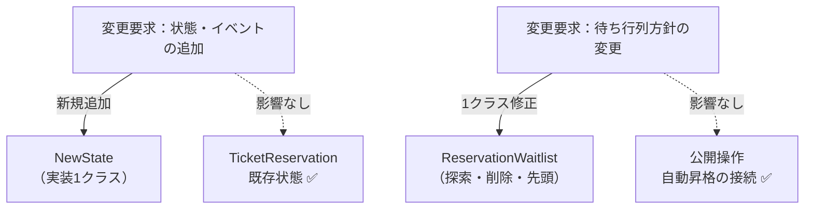

同じ要求・同じ粒度で比べると、課題ID1（状態固有動作の境界）の状態追加は共通契約 `IReservationState` の実装1クラスへ、課題ID2（待ち行列の境界）の待ち行列方針変更は `ReservationWaitlist` の中だけへ限定されました。`TicketReservation` の公開操作と、キャンセル直後の自動昇格の接続はどちらの変更でも触りません。

| 3-2で影響した場所 | 修正後 | 構造変更との対応 |
|---|---|---|
| 公開操作ごとの `status` 文字列分岐（課題ID1（状態固有動作の境界）） | **修正しない** | 振る舞いを各状態クラスへ移した |
| 状態処理に絡む待ち行列操作と昇格処理（課題ID2（待ち行列の境界）） | `ReservationWaitlist` の中だけ修正 | キュー方針を専用クラスへ閉じた |
| 3-2には状態部品の契約がなかった | `NewState` を1クラス追加する | 状態の変更先を新しく作った |

### 7-4：変更シナリオ表

今回の変更ID1（キャンセル待ち）・変更ID2（一時保留）について、フェーズ1の構造で必要だった修正と完成構造の結果を整理します。

| 変更ID | 現状構造での影響 | 完成構造での結果 |
|---|---|---|
| 変更ID1（キャンセル待ち） | `TicketReservation` の予約・取消へ待ち行列と昇格条件を追加 | `reserve()` だけで待機し、取消直後に49/50から50/50へ自動昇格 |
| 変更ID2（一時保留） | 複数操作へ通常・保留の期限分岐を追加 | `ReservedState` と `HeldState` が期限切れを扱い、席解放後まで自動実行 |

変更ID1（キャンセル待ち）・変更ID2（一時保留）の判断を状態クラスへ分けた代わりに、状態ごとのクラスと遷移の組み立てを管理するコストを引き受けます。

---

## 整理

### 問題・原因・課題・解決策

| 整理 | 結論 |
|---|---|
| 問題 | 状態追加のたびに複数の操作メソッドを修正・確認する |
| 原因 | 状態別の可否・遷移と公開操作が `TicketReservation` に混在している |
| 課題 | 状態固有動作を分け、待機順と自動昇格を一続きにする |
| 解決策 | `IReservationState` へ委譲し、`ReservationWaitlist` を席解放経路へ接続する |

### フェーズとこの章でやったこと

| フェーズ | この章で確定したこと |
|---|---|
| 1 現状把握 | 3状態・3操作の現行仕様と、2状態を加える要求 |
| 2 仮説立案 | 状態・遷移・イベントは今後も変わる |
| 3 問題特定 | 状態追加が複数操作の修正と横断確認へ広がる |
| 4 原因分析 | 状態判断と公開操作が同じクラスに混在している |
| 5 課題定義 | 状態固有動作と待ち行列の2つの境界 |
| 6 対策検討 | 状態委譲と、席解放から自動昇格までの一経路 |
| 7 対策実施 | 変更を状態クラスと待ち行列へ局所化 |

### 責任の移動

今回の設計変更により、`TicketReservation` が抱え込んでいた責任がどこへ移動したかを示します。

| **責任** | **変更前** | **変更後** |
|---|---|---|
| 予約コンテキストの保持と委譲 | `TicketReservation` | `TicketReservation`（変わらず） |
| 各状態での操作可否の判断 | `TicketReservation`（if-else直書き） | `ReservedState` 等の各実装クラス |
| 状態遷移後の状態値の設定 | `TicketReservation`（if-else直書き） | `ReservedState` 等の各実装クラス |
| 状態の振る舞い契約の定義 | —（なし） | `IReservationState` |
| キャンセル待ちの探索・先頭選択 | 呼び出し元の手順 | `ReservationWaitlist` |
| 席解放後の昇格 | 手動呼び出しになり得る | `TicketReservation`から`ReservationWaitlist`へ自動委譲 |

### 複雑さを足しても対策は変わるか

| 追加した複雑さ | この構造での扱い |
|---|---|
| 待機者の予約昇格 | `WaitlistedState` が昇格を扱う |
| 保留期限切れ | `HeldState` が期限切れ遷移を扱う |
| 決済失敗 | `ReservedState` と `HeldState` が状態維持を決める |

> このプロセスを回した結果にたどり着いた構造こそが 状態分離構造です。

---

## 振り返り

### 「この章を読むと得られること」は手に入ったか

| 得られる視点 | この章で確認した場所 |
|---|---|
| 変動箇所の識別 | フェーズ2で、状態の種類と遷移ルールが変わる見込みを確認した |
| 痛みの発生源の判断 | フェーズ4で、状態判断と状態固有処理の同居を原因として確定した |
| 構造改善の説明 | フェーズ7で、状態追加の中心が新状態と遷移の組み立てへ移ったことを確認した |
| 状態追加の判断 | フェーズ6で、状態処理と待ち行列を別の変更先にする完成構造を決めた |

### 「はじめに」の3つの設計原則はどう適用されたか

| 原則 | この章での適用 |
|---|---|
| 変わるものを分けて囲う | 状態ごとの許可操作と遷移先を、`ReservedState`など各状態クラスへ置いた |
| 具体ではなく契約に向かって書く | `TicketReservation`は具体状態を判定せず、`IReservationState`の共通操作だけを呼ぶ |
| 継承より「持つ」を先に考える | 予約本体が現在状態を保持する。継承は共通の拒否処理に限定した |

この章では、状態交換にはコンポジション、全状態に共通する拒否処理には浅い継承を使い、二つの目的を分けています。

---

## あなたのコードで考えてみてください

この章で辿った思考プロセスを、あなた自身のコードに当てはめてみましょう。以下の判定ツリーに沿って確認してください。

**Q1：** 同じメソッドの中に「状態フラグや種別によって全く異なる処理をする」分岐がありますか？

- **No →** 現時点では状態分離構造は不要です。シンプルなコードを維持してください。
- **Yes → Q2へ**

**Q2：** 状態の種類が1つ増えたとき、修正が必要なメソッドは2つ以上になりますか？

- **No →** 分岐の数が少なく影響範囲が限定的です。今すぐ構造を適用する必然性はありません。
- **Yes → Q3へ**

**Q3：** 今後も状態の種類やルールが増える見込みがありますか（ヒアリングまたは変更履歴から判断）？

- **No →** 一時的な複雑さとして許容し、コメントで意図を明記する方が現実的です。
- **Yes →** 状態分離構造の適用を検討してください。状態ごとにクラスを切り出すことで、次の変更の影響を1クラスに閉じ込めることができます。

---

**題材を置き換えるときの共通手順**

この章の題材名を、自分の現場のシステム名に置き換えて考えます。

1. そのシステムは、誰が何を達成するために使うものか。
2. 入力、加工、出力は何か。
3. 最近入った変更要求、または次に来そうな変更要求は何か。
4. その変更で、触りたくない場所まで修正や再テストが広がるか。
5. 変えたいものと守りたいものを分けると、接続点には何を残すべきか。
6. 全課題を満たす完成構造が複数成立するか。成立するなら、責任配置・変更影響・導入コストの差は何か。

ここまで問題から導いた「状態分離構造」は、一般に **Stateパターン**と呼ばれます。ここからは題材を離れ、この名前で共有される抽象的な骨格を確認します。

## パターン解説：State パターン

Stateパターンは、オブジェクトの内部状態が変化したときに、そのオブジェクトの振る舞いを変更できるようにするパターンです。

### パターンの骨格

状態ごとに専用のクラスを作成し、コンテキスト（状態を持つオブジェクト）は現在の状態オブジェクトに処理を委譲します。

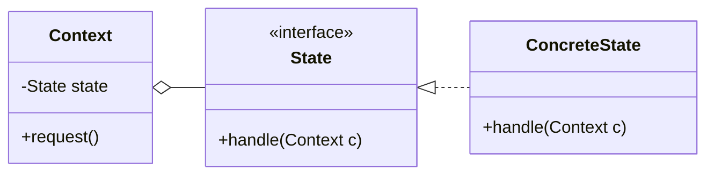

`Context` は現在の状態を契約として持つだけで、どの具象状態かを判定しません。状態を増やしても、線が増えるのは `State` の下側だけです。

### 抽象骨格の実行シーケンス

次の実行シーケンス図では、委譲された状態オブジェクトが、いつ次の状態を決めるのかを時間の順に見ます。

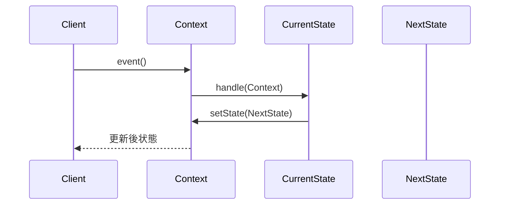

Clientは現在状態を指定せず、Contextが保持するStateへイベントを委譲します。

### この章の実装との対応

| GoFの名前 | この章での対応 |
|---|---|
| Context | `TicketReservation` |
| State | `IReservationState` |
| ConcreteState | `AvailableState` / `ReservedState` / `PaidState` 等 |

次のクラス図では、直前の対応表を本章のクラス名で描き直し、骨格の形が同じであることを見ます。

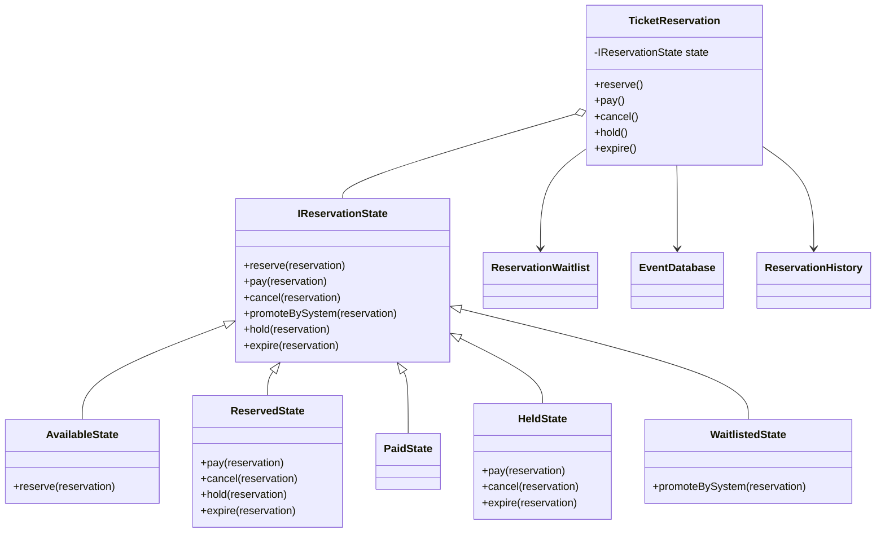

共通基底ロールである `IReservationState` が、`ReservedState` などの具体クラスと結びついています。型名の`I`は命名上残っていますが、既定処理を持つため、第0章のクラス図規約では`<<interface>>`を付けません。

### 使いどころと限界

* **使うと良い状況：** 状態に応じてオブジェクトの振る舞いが劇的に変わる場合。また、状態の種類が将来的に増える見込みがある場合。

* **使わない方が良い状況：** 状態が2〜3つ程度で、今後も増える可能性がほとんどない場合。状態が少なければ `if` 文1本で全パターンを見通せるため、クラスを分けるコスト（ファイル数の増加・クラス間の依存関係の把握）が得られる利点を上回ります。「状態が増えたときにどこを直すか」が1メソッド内で完結するうちは、パターンの導入は過剰設計になります。

【過剰コード：状態が固定で増えないのにパターン化した例】

```cpp
// 「開いている」「閉まっている」の2状態しかなく
// 今後も増える予定がない扉の状態管理
// — この程度ならif文で十分
class IDoorState {
public:
    virtual void open() = 0;
    virtual void close() = 0;
    virtual ~IDoorState() = default;
};
```

**OpenState**

```cpp
class OpenState : public IDoorState {
public:
    void open()  { std::cout << "既に開いています\n"; }
    void close() { std::cout << "閉めました\n"; }
};
```

**ClosedState**

```cpp
class ClosedState : public IDoorState {
public:
    void open()  { std::cout << "開けました\n"; }
    void close() { std::cout << "既に閉まっています\n"; }
};
```

上記は状態が2つしかなく今後も増えない場合の例です。`if (isOpen)` の1行で済む処理のために4クラスを導入するのは、コードの見通しを悪化させます。

| **状況** | **適切な選択** | **理由** |
|---|---|---|
| **変化の予定がある場合** | **状態ごとの振る舞いを別クラスへ移す** | 状態の追加が他のロジックを汚染しないため |
| **変化の予定がない場合** | **シンプルなif文で十分** | クラス数の増加というコストに見合わないため |

### この章のまとめ

チケット予約というドメインと Stateパターンの関係を一言で言うなら、状態と振る舞いを同じクラスに置く限り、状態が増えるたびに関連する条件分岐を開かなければならない、ということです。「仮予約」「確定」「キャンセル」という状態ごとに異なる振る舞いが `TicketReservation` の中に同居していた。その構造が条件分岐の増殖を生んでいた——そこまで分析できれば、「状態の振る舞いを状態クラスへ移す」という方向性は自然に見えてきます。

7つのフェーズを通じて、読者は `status` 文字列の直書きという観察から「どの業務機能によるか」の分析へ、そして状態クラスへの分離という判断へと進みました。フェーズ2のヒアリングで「状態の種類は今後も増える」と確認した時点で変化軸が確定し、フェーズ4で「状態と振る舞いの混在」を接続点として特定した時点で解決の方向が定まる——その気づきの積み上げが、パターン名の暗記では得られない体験です。

あなたのコードの中にも、ステータス文字列や状態フラグで分岐している箇所があるはずです。それぞれの分岐が「どの業務機能によるか」を問うことが、状態をクラスとして分離する理由を見つける入口になります。
