# 第3章 通知先への依存を切る ―― Observer パターン

―― 思考の型：一つの変化を、複数の相手にどう伝えるか

### この章の核心

**一つの状態変化を複数の相手へ伝える場面では、変化を検知する責任と、受け取る相手・伝え方を選ぶ責任を分けて考えます。受け手の追加や入れ替えのたびに発生元まで直しているなら、発生した事実ではなく受け手の具体知識を送る側が抱えていることが兆候です。発生元が共通の通知契約だけを知り、受け手の構成を外から登録できる境界を守れるかが判断軸になります。**

---

### この章を読むと得られること

この章のテーマは「誰に伝えるか」という問いです。通知先を増やすたびに通知元のコードを書き換えている——そんな設計の「伝言の密結合」がこの章で扱う問題です。

* **得られること1：** 「変化の発生元」と「変化を受け取る側」という観点で、コードの変動箇所を識別できるようになる
* **得られること2：** 通知元が通知先の種類と送信方法をどこまで知っているかを接続点から調べ、通知先追加の痛みが生まれる理由を説明できるようになる
* **得られること3：** 通知操作の約束をそろえると、通知先追加の変更を通知先の実装と登録処理へ寄せられることを説明できるようになる
* **得られること4：** 通知を送る側が通知先を具体的に知らなくても、動的に通知先を増やしたり減らしたりできる視点

## 🔵 フェーズ1：現状把握 ―― 仕様を整理し、システムと紐付ける

### 1-1：このシステムの仕様

このシステムは、運用者から商品IDと入庫・出庫数量を受け取り、商品マスターから現在在庫と通知閾値を取得します。入力と在庫不足を検証して在庫を更新し、出庫後の在庫が閾値以下かを判定します。判定が成立した場合は、商品ID・商品名・更新後在庫を一つの警告メッセージへ加工して登録済みの通知手段へ送り、最後に在庫の変更前後と通知件数を記録します。

#### まず代表入力と実行結果から動きをつかむ

詳細な仕様やコードへ入る前に、1-4（実装コード）の`main()`で在庫減少（通知なし）、在庫減少（通知あり）、補充の3ケースを確認します。

**代表入力（1-4の`main()`から抜粋）：**

```cpp
    // 準備：商品マスタを持つ在庫管理の入口を作る
    InventoryManager manager;

    // 1回目：PRD001（在庫50・閾値10）を5減らす → 閾値より上
    manager.reduceStock("PRD001", 5);
```

1回目の実行結果です。

```
商品 PRD001（ワイヤレスマウス） の在庫を 5 減らしました。在庫: 50 -> 45
```

続けて、閾値5のPRD002を3から2へ減らします。

```cpp
    // 2回目：PRD002（在庫3・閾値5）を1減らす → 閾値以下になり通知が飛ぶ
    manager.reduceStock("PRD002", 1);
```

2回目の実行結果です。

```
商品 PRD002（USBハブ） の在庫を 1 減らしました。在庫: 3 -> 2
Email(1件) [在庫アラート] 商品 PRD002（USBハブ） の在庫が閾値以下です。
Dashboard(1件): PRD002 の在庫表示を 2 に更新
Chat(1件) #inventory-alert
  商品 PRD002（USBハブ） の在庫が閾値以下です。 -> POST-1
```

最後に、PRD001を補充します。

```cpp
    // 3回目：PRD001を20補充する → 在庫が増え、通知は飛ばない
    manager.replenishStock("PRD001", 20);
```

3回目の実行結果です。

```
商品 PRD001（ワイヤレスマウス）
  在庫を 20 補充しました。在庫: 45 -> 65
```

入力コメントの閾値と3つの結果を対応させると、1回目は在庫45で閾値10より上なので通知行がなく、2回目は在庫2が閾値5を下回って**3つの通知先の出力が続きます**。3回目の補充結果にも通知行はありません。あわせて、3つの通知先が**それぞれ違う形式で出力している**ことにも注目してください。メールは件名付き、ダッシュボードは在庫数、チャットは投稿IDを返しています。この違いが、この章の出発点です。

この入力と出力から、(1)商品と増減数を受け取り、(2)在庫更新→閾値判定→通知の順に進み、(3)更新後の在庫が表示される（閾値を下回れば通知が飛ぶ）、という一連の動きが読み取れます。同じ入力を含む完全なコードと実行結果は1-4に掲載します。

#### 最初にシステム全体をつかむ

- **入力：** 商品IDと入庫・出庫の数量を受け取る。
- **処理：** 商品と数量を検証して在庫数を更新し、出庫後の数値が商品ごとの閾値以下かを判定する。
- **出力：** 在庫数の変更前後を記録し、閾値へ到達したときだけ登録済みの全通知手段へ同じ在庫警告を送る。不正入力では在庫も通知件数も変えない。
- **掲載コードでの代替：** 商品DBはメモリ上の登録表、メールなどの外部送信は通知内容を蓄積して標準出力へ出すスタブで表す。在庫更新、閾値判定、通知件数の集計は実際に行う。

まずこの一連の動きを押さえ、以降で要求、在庫データ、通知条件、クラス、コードの順に詳細を確認します。

#### 現行要求ベースライン

**要求ID1**

- **現行要求**：登録商品の入出庫で在庫数を更新する
- **受入条件**：対象IDと変更前→変更後の数量を記録する

**要求ID2**

- **現行要求**：出庫後の在庫が閾値以下になったら、登録済みの全通知先へ同じ在庫イベントを送る
- **受入条件**：閾値到達時だけ、メール・ダッシュボード・チャットが各1件受け取る

**要求ID3**

- **現行要求**：未登録商品・不正数量・在庫不足を拒否する
- **受入条件**：エラー時に在庫数と通知件数を変えない

**要求ID4**

- **現行要求**：在庫の内部数値変化を実行ログへ残す
- **受入条件**：商品ID・変更前→変更後・単位を確認できる（閾値は通知文面にだけ出る）

在庫の増減を記録し、出庫後の在庫が一定数以下になると、登録されているすべての通知先へメッセージを送ります。

この章で扱う現状仕様は、次の範囲です。

| 仕様項目 | この章で扱う値 | 具体例 | 何に使うか |
|---|---|---|---|
| 商品ID | 在庫管理対象の商品 | PRD002: USBハブ | 商品の現在在庫と閾値を取得する |
| 在庫変動 | 入荷・出荷などの数量変化 | 3個から2個へ減る | 現在在庫を更新する |
| 通知条件 | 閾値以下 | 閾値5個、現在2個 | 在庫不足として通知するかを判定する |
| 出力 | 在庫更新結果と通知 | 在庫2個、メール通知送信 | 在庫更新と通知発生を照合する |

ここで確認する対象は、どの在庫変動で通知が発生するかです。

通知を受け取る相手は倉庫担当者や在庫管理チームです。メール、ダッシュボード、チャットは、その相手へ届ける**通知手段**です。通知手段のアダプターはシステムの構成時に準備・保持され、出庫後在庫が閾値以下になった在庫更新時に利用されます。

**システム全体図：在庫管理と通知先の境界**

最も大きな境界は「担当者 → 在庫管理システム → 外部の通知手段」です。商品マスターと実行結果は対象システムの内側に、メール等の通知先は外側に置きます。

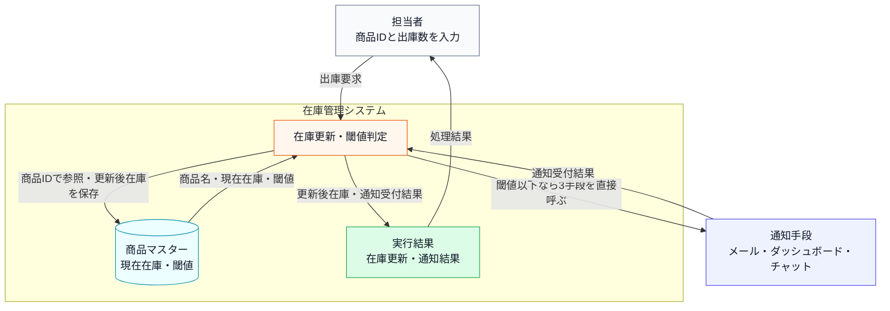

上の文章と表で仕様を一通り確認したので、ここでは商品IDと出庫数の検証が済んだ**正常系**だけを、入力・加工・出力の順に整理します。商品不存在や在庫不足は、後段のエラー条件表で別に扱います。正常系の図に片側しかない判定を置かないのは、存在しない分岐を読者に推測させないためです。

**システム内部図：正常系の入力・判定・加工・出力**

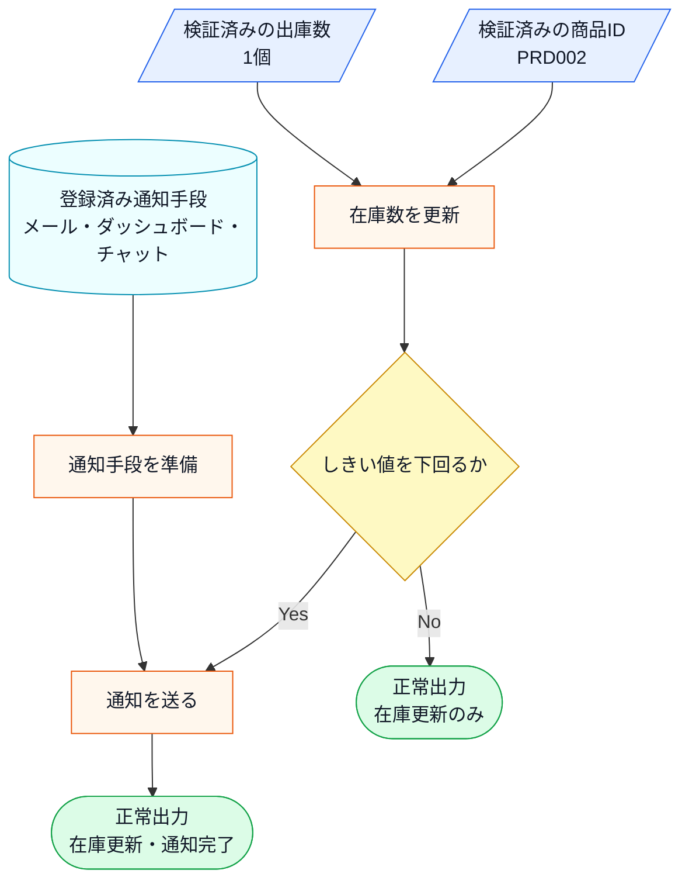

この図から読み取ることは、次の3点です。

- 通知は在庫更新そのものではなく、出庫後の在庫が閾値以下のときに発生する。
- 商品の特定、在庫更新、閾値判定、通知は順番に依存している。
- 出力には在庫状態と通知メッセージがあり、通知先が増えると影響を受けるのは後者である。

**通知の動作ルール**

通知を送るかどうかの判断は「出庫後の在庫数が閾値以下か」という一点だけで決まります。補充のような在庫の増加は通知の対象外です。現状コードは閾値をまたいだ瞬間だけでなく、閾値以下で出庫した更新ごとに通知します。また、「通知先が0件のときにエラーにしない」のは、通知先が一時的にゼロになっても在庫管理そのものは止めたくないという運用上の理由があります——夜間バッチ処理や通知先の切り替え作業中でも、在庫の記録は続けなければならないからです。

| 状況 | 動作 |
|---|---|
| 在庫が閾値以下に減少した | 登録済みの全通知先へ通知を送る |
| 在庫が閾値を超えている | 通知しない |
| 通知先が1件も登録されていない | 何もしない（エラーにならない） |

「閾値以下になったら全通知先へ」という動作は、発注漏れを防ぐための安全策です。一部の通知先だけに送ると、担当者によって情報の到達タイミングがずれてしまうため、同時に全員へ届ける設計になっています。

**現在登録されている受信者と通知手段**

受信者は人またはチームであり、メールなどは受信者へ届ける手段です。コード上の通知アダプターは、この通知手段の違いを担当します。

| 受信者 | 通知手段 | コード上のアダプター |
|---|---|---|
| 倉庫担当者 | メール | メール通知境界 |
| 在庫管理チーム | 社内ダッシュボード | 社内ダッシュボード通知境界 |
| 在庫担当者 | 社内チャット | 社内チャット通知境界 |

この3つの通知先は、それぞれ異なるシステムや担当チームによって管理されています。メールはインフラ管理部門が、ダッシュボードはフロントエンドチームが、チャットは各部門のマネージャーが運用を担っています。

**この仕様を決める業務機能**

このシステムでは、異なる理由で変更される知識がどの業務機能に属するかを見ておきます。メール宛先はインフラ・システム管理の範囲、ダッシュボードの表示はUI・表示管理の範囲、チャット連絡網は通知・連携管理の範囲です。

| 業務機能 | この章の仕様で決めていること |
|---|---|
| インフラ・システム管理 | メール等の通知手段の採用・廃止 |
| UI・表示管理 | ダッシュボードの表示仕様 |
| 通知・連携管理 | チャット等の連絡網の変更 |
| 処理の骨格（開発設計判断） | 閾値判定ロジック・システム保守 |

後のフェーズで変更要求を扱うとき、どの業務機能の知識なのかを確認するための名前として使います。

**エラー条件**

正常系の仕様を一通り確認したうえで、最後に、在庫更新へ進めない入力や外部境界の懸念を分けて整理します。

| エラー条件 | どこで分かるか | 出力 | 保存・通知などの副作用 |
|---|---|---|---|
| 商品IDが商品マスタに存在しない | 商品確認時 | 商品IDエラー | 在庫更新なし、通知なし |
| 出庫数が現在在庫を超えている | 在庫確認時 | 在庫不足エラー | 在庫更新なし、通知なし |
| 通知送信に失敗する | 通知境界での送信時 | この章の現状コードでは詳細扱いなし | 実システムでは送信ログ、リトライ、失敗通知を検討する |

### 1-2：動作例テーブル

コードを読む前に、変更要求が届く前の在庫システムがどんな入力に対して
どんな通知を行うか確認します。

| シナリオ | 操作 | 通知・更新の結果 |
| --- | --- | --- |
| 在庫が閾値を超えたまま減少 | ワイヤレスマウス（PRD001）の在庫を5減らす | 50→45（閾値10）→ 通知なし |
| 在庫が閾値以下に減少 | USBハブ（PRD002）の在庫を1減らす | 3→2（閾値5）→ 全通知手段へ送信 |
| 在庫が補充される（閾値超え） | ワイヤレスマウス（PRD001）の在庫を20補充する | 45→65 → 送信されない・更新のみ |
| 在庫0の商品を減らす（エラー） | キーボード（PRD003）の在庫を1減らす | 出庫エラー・通知なし |
| 存在しない商品ID（エラー） | PRD999を操作する | マスタ不存在エラー・通知なし |

在庫が閾値以下になったときは現在の3通知先すべてへ送り、閾値を超えて
いるときは通知しないことが核心です。

次は、この仕様を担うクラスの顔ぶれと責任を確認します。

---

### 1-3：登場クラスとクラス構成図

このシステムに登場するクラスを先に確認します。

| クラス名 | 役割 | 担当する仕様 |
|---|---|---|
| `ProductDatabase` | 商品マスタを保持し、在庫数・アラート閾値を提供する | 商品IDの存在確認、在庫数と閾値の参照 |
| `ProductInfo` | 商品1件分の在庫情報を表す | 商品名・在庫数・通知閾値の受け渡し |
| `InventoryManager` | 在庫数を管理し、必要な通知を呼び出す | 在庫更新、閾値判定、通知実行 |
| `EmailNotifier` | メール通知を送る（件名と本文を受け、成否を真偽値で返す） | メール通知 |
| `DashboardUpdater` | ダッシュボード表示を更新する（商品コードと在庫数を受け、戻り値は無い） | 管理画面への反映 |
| `ChatNotifier` | チャット通知を送る（投稿先と本文を受け、投稿IDを返す） | チャット連絡 |

各クラスの責任を把握したところで、クラス同士の関係を図で確認します。

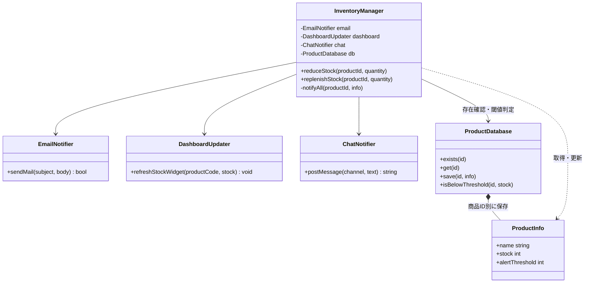

**クラス図に出てくる主なメンバーと操作**

**`InventoryManager`**

- **メンバー・操作**：`reduceStock()` / `replenishStock()`
- **何ができるか**：商品マスタの現在在庫を減少、補充する
- **メンバー・操作**：`notifyAll()`
- **何ができるか**：出庫後の在庫がしきい値以下のとき、手段ごとに違う引数を組み立てて各通知先を呼び分け、違う戻り値をそれぞれ解釈する

**`ProductDatabase`**

- **メンバー・操作**：`exists()` / `get()` / `save()` / `isBelowThreshold()`
- **何ができるか**：商品ID・現在在庫・しきい値を一元管理する

**`EmailNotifier`**

- **メンバー・操作**：`sendMail(subject, body)`
- **何ができるか**：メール通知を送り、送れたかを `bool` で返す

**`DashboardUpdater`**

- **メンバー・操作**：`refreshStockWidget(productCode, stock)`
- **何ができるか**：在庫数で画面を描き直す。戻り値が無く、成否を確かめられない

**`ChatNotifier`**

- **メンバー・操作**：`postMessage(channel, text)`
- **何ができるか**：投稿先へ本文を送り、投稿IDを返す。空文字列が失敗を表す


この図が示す通り、InventoryManager という単一のクラスが、通知先であるすべてのクラス（メール、ダッシュボード、チャット）を直接保持している構成になっています。

**現状システムの処理シーケンス**

静的な関係に続けて、正常系（出庫でしきい値以下になり通知が走る）で各クラスがどの順に呼ばれ何を受け渡すかを時系列で示します。通知の具体の分岐は `InventoryManager` の注記に、エラー系はメモとして添えます。1-4の現状コードを読む前の地図です。

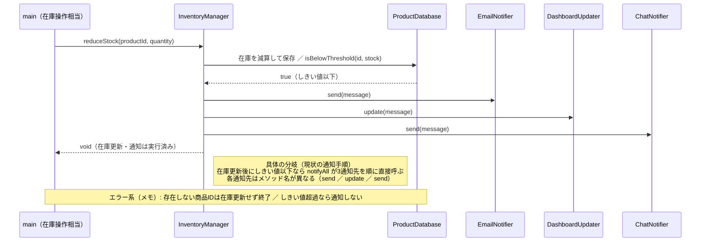

図から読み取れるのは、`InventoryManager` が在庫更新後にしきい値を判定し、しきい値以下のときだけ `notifyAll` で3つの通知先を順に直接呼ぶこと、各通知先のメソッド名（`send`／`update`／`send`）まで通知元が知っていることです。通知先の名前と呼び方が通知元に集まっている呼び出し順を、この時系列と注記で確認できます。

---

**この章での簡略化**

掲載コードが実際に更新する状態と、外部サービスの代わりに表現する境界を分けて確認します。

| 実システムの対象 | 掲載コードでの表現 | 実行して確認できること | 扱わないこと |
|---|---|---|---|
| 商品マスター | `ProductDatabase`内の`std::map` | 商品検索、在庫更新、閾値判定 | 永続DB、同時更新、認証 |
| メール・ダッシュボード・チャット | 3つの通知クラスの受信箱と`std::cout` | 誰へ何件伝わったか、呼び出し順 | 実通信、再送、タイムアウト |
| 在庫操作画面 | `main()`からの商品ID・数量指定 | 入力検証から結果表示まで | 実GUI、利用者セッション |
| 運用ログ | 在庫変更と通知件数の標準出力 | 変更前後の在庫と通知発生 | 外部ログ基盤、監視通知 |

したがって、在庫更新、閾値判定、受信箱への蓄積は実際に行いますが、メール送信などの外部通信は行いません。現状コードの通知メソッドは同期的な`void`であり、通信失敗や非同期完了は本章の現行要求に含めません。

---

### 1-4：実装コード（現状）

#### コードを読む前に：開始データ

コードは、次の3件を商品マスターの開始値として使います。どの入力が通知またはエラーになるかを先に確認してください。

| 商品ID | 商品名 | 在庫数 | アラート閾値 |
|---|---|---:|---:|
| PRD001 | ワイヤレスマウス | 50 | 10 |
| PRD002 | USBハブ | 3 | 5 |
| PRD003 | キーボード | 0 | 5 |

この表と`ProductDatabase::ProductInfo::stock`は同じデータです。別の在庫表は作らず、コード内の商品マスターを唯一の在庫データとして使います。

通知は同期的に3クラスへ順番実行します。現状には通知先の登録一覧や登録解除操作はなく、`notifyAll()` が3つの具体クラスを名指しします。3つは提供元が違うため呼び方がそろっておらず、引数の組み立てと戻り値の解釈も `notifyAll()` の側にあります。

#### 現状コード

クラスを1つずつ、上から順に読みます。**メンバー変数と、それを使う処理を同じ場所で見られるように**しています。宣言と定義を分けるのは `InventoryManager` だけです。判断の基準は次の一行です。


`main()` と実行結果は最後に、行のまとまりごとに並べます。

---

**共通ヘッダー**

```cpp
#include <iostream>
#include <string>
#include <vector>
#include <map>
#include <unordered_map>

using namespace std;
```

以降のすべてのクラスが使います。

---

**ProductInfo と ProductDatabase**

1-1（このシステムの仕様）の「商品」にあたるデータです。商品IDから在庫数・アラート閾値を引き、エラー条件「存在しないID」と閾値判定をここで担います。

```cpp
// 商品マスタの1件分
struct ProductInfo {
    string name;         // 商品名
    int    stock;        // 在庫数
    int    alertThreshold; // アラート閾値
};
```

**ProductDatabase**

```cpp
// 商品マスタ（データ駆動バリデーション用）
class ProductDatabase {
private:
    map<string, ProductInfo> records;
public:
    ProductDatabase() {
        records["PRD001"] = {"ワイヤレスマウス", 50, 10};
        records["PRD002"] = {"USBハブ",           3,  5}; // 閾値以下
        records["PRD003"] = {"キーボード",         0,  5}; // 在庫なし
    }

    bool exists(const string& id) const {
        return records.count(id) > 0;
    }

    ProductInfo get(const string& id) const {
        return records.at(id);
    }

    void save(const string& id, const ProductInfo& info) {
        records[id] = info;           // 実行中の商品マスタへ追加
    }

    bool isBelowThreshold(const string& id, int currentStock) const {
        return currentStock <= records.at(id).alertThreshold;
    }
};
```

- **責任：** 商品IDで在庫と閾値を読み書きし、閾値以下かを判定する
- **副作用：** `save()` だけが `records` を書き換える

閾値は商品ごとに違います。判定は `isBelowThreshold()` の1か所だけで行います。実システムのDBを、実行中のインメモリ表で代替しています。

---

次の3つが1-1の通知先です。**導入時期も提供元も違うため、呼び方がそろっていません。** 関数名、引数、戻り値のどれもが手段ごとに違います。この違いは作り話ではなく、別々に導入した外部基盤を1つのシステムから使うときに実際に起きることです。実際のメール・ダッシュボード・チャットへの送信は標準出力で代替します。各クラスが数える件数は、要求ID2どおり同じ通知を各手段が1件ずつ受け取ったことを確認するテスト用の観測点です。

---

**EmailNotifier**

```cpp
// メール基盤：件名と本文が分かれ、送れたかどうかだけを返す
class EmailNotifier {
    vector<string> inbox;
public:
    bool sendMail(const string& subject, const string& body) {
        inbox.push_back(body);
        cout << "Email(" << inbox.size() << "件) [" << subject << "] "
             << body << endl;
        return true;
    }
};
```

件名と本文を**2つに分けて**受け取り、`bool` で成否を返します。

---

**DashboardUpdater**

```cpp
// 社内ダッシュボード：文言ではなく商品コードと在庫数を受け取る。
// 画面を描き直すだけなので、成否を返さない
class DashboardUpdater {
    int refreshCount;
public:
    DashboardUpdater() : refreshCount(0) {}
    void refreshStockWidget(const string& productCode, int stock) {
        ++refreshCount;
        cout << "Dashboard(" << refreshCount << "件): " << productCode
             << " の在庫表示を " << stock << " に更新" << endl;
    }
};
```

文言を受け取りません。商品コードと在庫数という**生の値**を受け取り、画面を描き直します。戻り値が `void` なので、**送れたかどうかを確かめる手段がありません。**

---

**ChatNotifier**

```cpp
// チャット基盤：投稿先チャンネルが要り、投稿IDを返す。
// 空の投稿IDが失敗を表す
class ChatNotifier {
    vector<string> posted;
public:
    string postMessage(const string& channel, const string& text) {
        posted.push_back(text);
        string postId = "POST-" + to_string(posted.size());
        cout << "Chat(" << posted.size() << "件) #" << channel << "\n"
             << "  " << text << " -> " << postId << endl;
        return postId;
    }
};
```

投稿先チャンネルが要ります。返すのは投稿IDで、**空文字列が失敗**を表します。

---

3つの違いを並べると、そろっていないのが名前だけではないことが分かります。

| 通知手段 | 関数名 | 引数 | 戻り値と、失敗の表し方 |
|---|---|---|---|
| メール | `sendMail` | 件名と本文の2つ | `bool`。`false` が失敗 |
| ダッシュボード | `refreshStockWidget` | 商品コードと在庫数 | `void`。**失敗を表せない** |
| チャット | `postMessage` | 投稿先と本文 | `string`（投稿ID）。空文字列が失敗 |

引数の形が違うので、通知元は手段ごとに違う値を組み立てなければなりません。メールへ渡す本文とチャットへ渡す本文は同じ文言ですが、ダッシュボードは文言を受け取らず在庫数そのものを受け取ります。戻り値の意味も3通りで、ダッシュボードにいたっては送れたかどうかを確かめる手段がありません。通知元は、この3つの関数名・引数・戻り値をそれぞれ書き分けて呼び出しています。

---

**InventoryManager の宣言**

この章の中心です。1-1の「在庫の増減」と「閾値以下での全通知先への通知」に対応します。

```cpp
class InventoryManager {
private:
    EmailNotifier    email;
    DashboardUpdater dashboard;
    ChatNotifier     chat;
    ProductDatabase  db;

public:
    void reduceStock(string productId, int quantity);
    void replenishStock(string productId, int quantity);

private:
    void notifyAll(const string& productId, const ProductInfo& info);
};
```

**3つの通知クラスを具体名で値メンバとして持っています。** 外から差し替える余地はありません。公開操作は2つで、通知は非公開の `notifyAll()` に閉じています。定義を3つ、上のメンバーを見ながら読んでいきます。

---

**InventoryManager::reduceStock()**

```cpp
void InventoryManager::reduceStock(string productId, int quantity) {
    if (!db.exists(productId)) {
        cout << "[エラー] 商品ID " << productId
             << " はマスタに存在しません。処理を中断します。"
             << endl;
        return;
    }

    ProductInfo info = db.get(productId);

    if (quantity <= 0 || quantity > info.stock) {
        cout << "[エラー] 商品 " << productId << "（" << info.name << "）"
             << " は " << quantity << " 個出庫できません。現在在庫: "
             << info.stock << endl;
        return;
    }

    int before = info.stock;
    info.stock -= quantity;
    db.save(productId, info);
    cout << "商品 " << productId << "（" << info.name << "）"
         << " の在庫を " << quantity << " 減らしました。在庫: "
         << before << " -> " << info.stock << endl;

    if (db.isBelowThreshold(productId, info.stock)) {
        notifyAll(productId, info);
    }
}
```

- **判断が3つ：** 商品の存在、数量の妥当性、更新後在庫が閾値以下か
- **順序に意味：** 保存してから閾値を判定します。保存前に判定すると、通知した在庫数と保存された在庫数がずれます
- **失敗の扱い：** 存在確認と数量検証で落ちたら、在庫も通知も動かしません

閾値を下回ったときだけ `notifyAll()` を呼びます。

---

**InventoryManager::replenishStock()**

```cpp
void InventoryManager::replenishStock(string productId, int quantity) {
    if (!db.exists(productId)) {
        cout << "[エラー] 商品ID " << productId
             << " はマスタに存在しません。処理を中断します。"
             << endl;
        return;
    }

    ProductInfo info = db.get(productId);
    int before = info.stock;
    info.stock += quantity;
    db.save(productId, info);
    cout << "商品 " << productId << "（" << info.name << "）\n"
         << "  在庫を " << quantity << " 補充しました。在庫: "
         << before << " -> " << info.stock << endl;
}
```

補充では閾値判定をしません。**通知が出るのは減少のときだけです。**

---

**InventoryManager::notifyAll()**

```cpp
void InventoryManager::notifyAll(const string& productId,
                                 const ProductInfo& info) {
    // 通知先が増えるたびに、ここが修正される。
    // 3つの基盤は引数の形も戻り値の意味も違うので、
    // 呼び分けと結果の解釈をこのメソッドが全部引き受けている。
    string message = "商品 " + productId + "（" + info.name + "）"
                   + " の在庫が閾値以下です。";

    // メールは件名と本文に分け、真偽値で成否を見る
    if (!email.sendMail("在庫アラート", message)) {
        cout << "[通知受付失敗] Email" << endl;
    }

    // ダッシュボードは文言を受け取らず、成否も返さない。
    // 送れたかどうかを確かめる手段がない
    dashboard.refreshStockWidget(productId, info.stock);

    // チャットは投稿先が要り、空の投稿IDが失敗を表す
    string postId = chat.postMessage("inventory-alert", message);

    if (postId.empty()) {
        cout << "[通知受付失敗] Chat" << endl;
    }
}
```

3つの通知先を名指しで直接呼び出しています。呼ぶだけでなく、**手段ごとに違う引数を組み立て、違う戻り値をそれぞれの流儀で解釈するところまで引き受けています。** 同じ `message` を作っておきながら、ダッシュボードへは渡していません。成否の確認も、メールは `!` で、チャットは `.empty()` で、ダッシュボードは確認なしと3通りです。この `notifyAll()` が、通知先が増えるたびに修正される箇所です。

---

#### `main()` と実行結果

動作例5行を、行ごとに区切って実行します。**在庫は行をまたいで引き継がれます。**

---

**組み立てと、行1：PRD001を5減らす**

```cpp
int main() {
    InventoryManager manager;

    cout << "--- 行1: PRD001を5減らす ---" << endl;
    manager.reduceStock("PRD001", 5);
```

```
--- 行1: PRD001を5減らす ---
商品 PRD001（ワイヤレスマウス） の在庫を 5 減らしました。在庫: 50 -> 45
```

`InventoryManager` が通知クラスも商品マスタも内部で作るので、`main()` で組み立てるものはありません。45は閾値10を上回るので通知は出ません。

---

**行2：PRD002を1減らす**

```cpp
    cout << "--- 行2: PRD002を1減らす ---" << endl;
    manager.reduceStock("PRD002", 1);
```

```
--- 行2: PRD002を1減らす ---
商品 PRD002（USBハブ） の在庫を 1 減らしました。在庫: 3 -> 2
Email(1件) [在庫アラート] 商品 PRD002（USBハブ） の在庫が閾値以下です。
Dashboard(1件): PRD002 の在庫表示を 2 に更新
Chat(1件) #inventory-alert
  商品 PRD002（USBハブ） の在庫が閾値以下です。 -> POST-1
```

2は閾値5以下なので3件とも通知されました。**出力の形が3行とも違います。** メールとチャットは同じ文言を、ダッシュボードは在庫数の `2` を表示しています。

---

**行3：PRD001を20補充する**

```cpp
    cout << "--- 行3: PRD001を20補充する ---" << endl;
    manager.replenishStock("PRD001", 20);
```

```
--- 行3: PRD001を20補充する ---
商品 PRD001（ワイヤレスマウス）
  在庫を 20 補充しました。在庫: 45 -> 65
```

45から始まっているのは、行1の減少が保存されているからです。補充なので通知は出ません。

---

**行4：PRD003を1減らす**

```cpp
    cout << "--- 行4: PRD003を1減らす ---" << endl;
    manager.reduceStock("PRD003", 1);
```

```
--- 行4: PRD003を1減らす ---
[エラー] 商品 PRD003（キーボード） は 1 個出庫できません。現在在庫: 0
```

在庫0からは出庫できません。数量検証で止まるので、在庫も通知も動きません。

---

**行5：存在しない商品IDを操作する**

```cpp
    cout << "--- 行5: 存在しない商品IDを操作する ---" << endl;
    manager.reduceStock("PRD999", 1);

    return 0;
}
```

```
--- 行5: 存在しない商品IDを操作する ---
[エラー] 商品ID PRD999 はマスタに存在しません。処理を中断します。
```

先頭の `exists()` で止まります。

---

動作例テーブルの各行について、在庫が閾値以下になった減少では3通知先へ送信され、補充では通知されず、在庫0・未登録IDはエラーになることを確認できました。同時に、`InventoryManager` が通知先のクラス名、引数の形、戻り値の意味をすべて直接知っていることも分かります。

---

> **手元で動かすには**
> このコードは1つの `.cpp` に貼り付けて、そのままコンパイル・実行できます（例：`g++ chapter03.cpp -o app && ./app`）。開始在庫は `ProductDatabase` の登録値を使います。在庫データはプロセス実行中だけ有効で、終了すると消えます（通知手段への実送信はアダプタースタブで簡略化しています）。
>
> **実務でファイルを分けるなら：** 1ファイルにまとめてあるのは、手元で動かしやすくするためです。実務では次のように分けます。
>
> | ファイル | 入れるもの | なぜそこか |
> |---|---|---|
> | `INotification.h` | 通知先の契約 | 通知元がインクルードするのはこれだけ |
> | `Notifiers.h` / `.cpp` | 4つの通知先 | **通知先を1つ足すとき、開くのはここだけ**にしたい |
> | `InventoryManager.h` / `.cpp` | 在庫更新と通知の呼び出し | 具体の通知先を知らないので、通知先が増えても変わらない |
> | `DeliveryStatusLog.h` / `.cpp` | 配信結果の記録 | 非同期の結果を扱う唯一の場所 |
> | `SMSDeliveryCallback.h` / `.cpp` | 後から届く結果の受け口 | 通知元を太らせないために分けた |
> | `main.cpp` | 生成と登録 | どの通知先を何個つなぐかだけを書く |
>
> **このとおりに分けたファイル一式を用意しています。** 本書のリポジトリの `books/volume01-core-patterns/sources/chapter03/` に、上の表どおりのヘッダーと `main.cpp`、`Makefile` が入っています。`make run` でそのまま動きます。
>
> 通知先ごとにファイルを分けるかどうかは、**提供元が別かどうか**で決めています。メール基盤とチャット基盤が別チームの持ち物なら、別ファイルにしたほうが変更がぶつかりません。この章のように4つとも同じ規模なら、`Notifiers.h` にまとめても困りません。
>
> なお、この一式も実装まで `.h` に書いています。**通知先を1つ直すと `Notifiers.h` を含むファイルがすべて再ビルドされます。** 開く場所は変わらないまま待ち時間だけが増えるので、通知先が増えてきたら実装を `.cpp` へ移すことになります（第1章の「実装をヘッダーに書くと、直したとき何が再ビルドされるか」で触れました）。

#### 仕様入力が現状コードで使われるまで

ここまでに確認した識別子を使い、1-1の仕様入力が受け取り口から判定・更新・結果まで途切れず使われているかを検算します。コードを読んだ後に、未使用入力や固定値への置き換えがないことを確認する表です。

| 仕様入力・構成 | コード上の受け取り口 | 実際に使う箇所 | 結果への現れ方 |
|---|---|---|---|
| 商品ID | `reduceStock()` / `replenishStock()` | `exists()` / `get()` / `save()` | 対象商品の在庫更新、または未登録IDエラーになる |
| 出庫・補充数量 | 同じ2メソッドの`quantity` | 正数・在庫不足の検証と在庫の加減算 | 更新前後の在庫数に差として現れる |
| 商品ごとの閾値 | `ProductInfo::alertThreshold` | `isBelowThreshold()` | 更新後在庫が閾値以下のときだけ通知される |
| 3つの通知手段 | `InventoryManager`のメンバー | `notifyAll()`が手段別に引数を組み立てて各具体メソッドを呼ぶ | 3つの受信件数が増える。ダッシュボードだけは成否が返らない |

### 1-5：変更要求

**変更要求の発生チーム：** 今回の変更要求は店舗運営チームから届いています。通知先の増減を判断するチームです。一方で、在庫の管理自体はシステム基盤チームが担っています。この点は、フェーズ2「仮説立案」で「どの業務機能によるか」を確認する際に使います。


ある週の月曜日、店舗運営部の田中部長から、在庫管理システムの改善依頼がメールで届きました。

「在庫が少なくなった時に、倉庫担当者のスマホへSMS（ショートメッセージ）で直接通知を送れるようにしたいんだ。今はメールだけだから、どうしても確認が遅れて発注が漏れることがあってね。来月の店舗改装のタイミングで運用を変えたいから、なんとか対応してくれないか？」

開発チームは依頼を変更IDへ落とす前に、採用予定のSMS基盤のAPI仕様と失敗時の運用を確認しました。SMS基盤は送信要求に受付IDを返し、端末への最終配信結果を後からコールバックします。その場で配信完了を返す同期APIはありません。

**開発者：** 「受付または最終配信に失敗した場合、在庫更新やメールなどの他通知も失敗扱いに戻しますか。また、最終結果のために在庫操作画面を変えますか？」

**田中部長：** 「在庫の事実と届いた通知まで戻ると困るので、SMSだけ失敗として残してほしい。最終結果は履歴へ記録できればよく、今回、在庫操作画面は変えなくてよい。」

この外部API制約と運用判断により、単なる通知先追加に加え、「受付と最終配信を二段階で記録する」「SMSの失敗を在庫更新と他通知から切り離す」「操作UIは変更しない」が今回の確定範囲になりました。

依頼とSMS境界の制約を、一つの確定要求として固定します。

**変更ID1**

- **確定した変更内容**：非同期SMSを追加し、受付・最終配信の失敗でも在庫更新と他通知を止めない
- **入力**：商品ID、更新後在庫、SMS宛先、受付ID、受付結果、最終配信結果
- **受入条件**：4手段の受付を集計し、SMSの保留を後日の配信完了・配信失敗へ更新する

#### 変更後要求ベースライン

**要求ID1**

- **変更種別**：継続
- **根拠**：—
- **変更後要求**：登録商品の入出庫で在庫数を更新する
- **受入条件**：対象IDと変更前→変更後の数量を記録する

**要求ID2**

- **変更種別**：変更
- **根拠**：変更ID1
- **変更後要求**：出庫後の在庫が閾値以下になったら、登録済みの全通知先へ在庫イベントを送り、非同期SMSの受付結果と後日確定する最終配信結果を記録する
- **受入条件**：閾値到達時だけ全4手段の受付を集計し、SMS受付IDが保留から配信完了または配信失敗へ更新される

**要求ID3**

- **変更種別**：変更
- **根拠**：変更ID1
- **変更後要求**：未登録商品・不正数量・在庫不足を従来どおり拒否し、個別通知失敗を在庫更新・他通知から局所化する
- **受入条件**：不正操作では在庫数と通知件数を変えず、在庫更新成功後の1通知失敗では他通知を止めない

**要求ID4**

- **変更種別**：継続
- **根拠**：—
- **変更後要求**：在庫の内部数値変化を実行ログへ残す
- **受入条件**：商品ID・変更前→変更後・単位を確認できる
**変更前→変更後の要求対照（今回変える要求IDだけ）**

現行ベースラインと変更後ベースラインを往復せずに済むよう、今回変える要求IDだけを取り出し、変更前と変更後を同じ行へ並べます。

**要求ID2**

- **変更前の要求（現行）**：出庫後の在庫が閾値以下になったら、登録済みの全通知先へ同じ在庫イベントを送る
- **変更後の有効要求**：出庫後の在庫が閾値以下になったら、登録済みの全通知先へ在庫イベントを送り、非同期SMSの受付結果と後日確定する最終配信結果を記録する
- **根拠変更ID**：変更ID1

**要求ID3**

- **変更前の要求（現行）**：未登録商品・不正数量・在庫不足を拒否する
- **変更後の有効要求**：未登録商品・不正数量・在庫不足を従来どおり拒否し、個別通知失敗を在庫更新・他通知から局所化する
- **根拠変更ID**：変更ID1

要求ID1・要求ID4は継続（変更前＝変更後）のため対照表には載せません。要求ID3の変更は、変更ID1に明記された「SMSの受付・最終配信の失敗でも在庫更新と他通知を止めない」という受入条件を、従来の入力拒否と両立させるためのものです。変更依頼にない在庫ログ項目の追加は行いません。

なるほど、倉庫担当者のスマホへのSMS通知ですね。バックヤードで作業中の担当者にとって、メールよりも気づきやすい手段が必要というのは、現場のオペレーションとして理にかなっています。

**仕様変更の内容**

変更要求を受けて、通知先の構成がどう変わるかを整理します。

| 通知先 | 変更前 | 変更後 |
|---|---|---|
| EmailNotifier（メール） | あり | 変更なし |
| DashboardUpdater（ダッシュボード） | あり | 変更なし |
| ChatNotifier（チャット） | あり | 変更なし |
| **SMSNotifier（SMS通知）** | なし | **新規追加** |

今回変えるのは通知先の種類です。商品情報と在庫数を取得する保存基盤は仕様変更の対象ではないため、`ProductDatabase` の取得・更新契約は変更前後で**変更なし**とします。

出庫後の在庫が閾値以下のとき、これまでの3チャネル（メール・ダッシュボード・チャット）に加えて、倉庫担当者のスマートフォンへSMSが送信されるようになります。

通知のトリガー条件（在庫が閾値以下になること）と、「登録されている全通知先へ同時に通知する」という動作ルールは変わりません。変わるのは「通知先の種類が1つ増える」ことと、SMSだけは受付IDを返した後、別の時点で最終配信結果が到着することです。既存のメール・ダッシュボード・チャットのようにその場で完了する同期通知とは、結果が二段階になります。

**SMS追加時の通知処理と確認点**

通知先が1つ増えるだけに見える変更でも、現実には次の複雑さが同時に入ります。この章では、これらが通知元（`InventoryManager`）へ漏れるかどうかを追います。

| 追加する複雑さ | 具体例 | この章で見ること |
|---|---|---|
| 在庫不足イベント | 出庫後の在庫が閾値以下なら通知が発生する | 通知元がイベント発生だけに集中できるか |
| 複数通知先 | メール・ダッシュボード・チャット・SMSへ同報する | 通知先の数が増えても通知元の分岐が増えないか |
| 非同期通知 | SMSは受付IDを返し、最終結果は後日のコールバックで確定する | 受付と完了を別の境界で扱い、状態を追跡できるか |
| 部分失敗 | SMSだけ受付または最終配信に失敗する | どちらの失敗でも他の通知と在庫更新が止まらないか |

**変更前後の入力・判定・加工・出力差分**

1-1の現状仕様を退避し、変更要求を当てた後の仕様と同じ粒度で並べます。以降の分析では、この差分を追います。

**入力**

- **変更前（1-1の現状仕様）**：商品ID、在庫変動、通知先リスト
- **変更後（今回の要求）**：商品ID、在庫変動、通知先リスト、SMS通知先、後日届く配信結果コールバック
- **差分として追うもの**：通知先が増え、別時点の入力も加わる

**判定**

- **変更前（1-1の現状仕様）**：商品存在、在庫十分、閾値以下
- **変更後（今回の要求）**：同じ判定を維持
- **差分として追うもの**：判定条件は変わらない

**加工**

- **変更前（1-1の現状仕様）**：在庫更新後、登録済み通知先へ通知
- **変更後（今回の要求）**：各先の受付を集計し、SMS受付IDを保留として記録後、コールバックで最終状態を更新する
- **差分として追うもの**：配布と非同期完了の責任を分ける

**出力**

- **変更前（1-1の現状仕様）**：在庫更新結果と既存通知
- **変更後（今回の要求）**：在庫更新・受付集計と、受付IDごとの配信完了／配信失敗ログ
- **差分として追うもの**：即時結果と後日結果の二段階になる

**変更後の入力・加工・出力**

変更後の仕様も、1-1と同じく入力検証済みの正常系として確認します。登録済み通知手段へSMSが加わる即時経路と、後日届く最終配信結果の入力経路が差分です。全章共通の表現として、変更したノードを黄色にし、ラベルへ `【追加】` または `【変更】` を付けます。

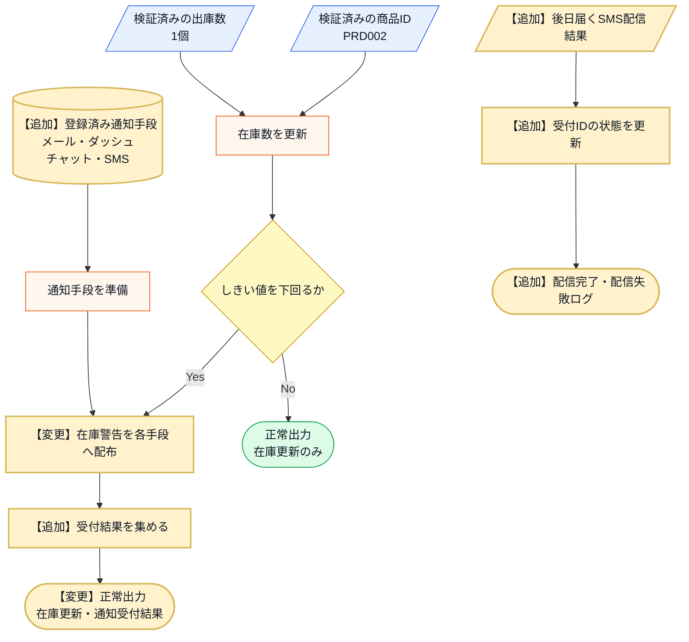

この図から読み取ることは、次の3点です。

- 在庫更新・しきい値判定・「同報する」という加工の骨格は、通知先が増えても変わらない。
- 変わるのはSMSが加わる即時経路と、受付IDを使って最終配信状態を更新する後日経路である。
- 受付失敗と最終配信失敗のどちらでも、在庫更新と他通知を止めずに結果だけを追跡できるかが、フェーズ3「問題特定」で確認する点になる。

変更後も、失敗条件は正常系図へ混ぜずに別で確認します。

| エラー条件 | どこで分かるか | 出力 | 保存・通知などの副作用 |
|---|---|---|---|
| 商品IDが商品マスタに存在しない | 商品確認時 | 商品IDエラー | 在庫更新なし、通知なし |
| 出庫数が現在在庫を超えている | 在庫確認時 | 在庫不足エラー | 在庫更新なし、通知なし |
| SMS通知の受付に失敗する（部分失敗） | SMS境界の受付結果 | 受付失敗として返す | 在庫更新は確定、他通知先は継続。SMSのみ失敗として記録 |
| SMSの最終配信に失敗する（非同期） | 後日の配信結果コールバック | 受付IDを配信失敗へ更新する | 在庫更新と他通知は確定済みのまま、SMSの履歴だけ更新 |

受付失敗と後日の配信失敗は、正常系の在庫更新を止めません。即時の通知元はイベントを出して受付結果を集め、後日のコールバック境界は受付IDに対応する状態だけを更新します。この二つを現在の構造へ入れるとどこまで修正が広がるかを、フェーズ3「問題特定」で確認します。

**フェーズ1のまとめ：今回追う変更ID一覧**

このフェーズで確定した変更依頼を一覧にして締めます。フェーズ2「仮説立案」でこの変更IDを仮説・ヒアリングへ、フェーズ3「問題特定」で試して痛みへ、と順につなぎます。

| 変更ID | 変更依頼の要点 | 関係する要求ID（追加は変更後ID） |
|---|---|---|
| 変更ID1 | 非同期SMSを追加し、受付・最終配信の失敗でも在庫更新と他通知を止めない | 要求ID2、要求ID3 |

---

## 🟣 フェーズ2：仮説立案 ―― 何が変わるかを観察し、ヒアリングで裏付ける
ここからフェーズ2（仮説立案）に進みます。フェーズ1「現状把握」で観察した事実をもとに、「何が変わる見込みか・今回何を維持するか」を仮説として立て、関係者へのヒアリングで裏付けます。

### 2-1：変わりそうな仕様の見当をつける

フェーズ2「仮説立案」では、フェーズ1「現状把握」で見た仕様のうち、どの通知先・通知方法・しきい値判定が変わりそうかを見当づけます。責務の配置は、変更要求を当てた後の痛みと合わせて確認します。

| 仕様候補 | 仕様上の場所 | フェーズ1の現状コードでの場所 | 見立て |
|---|---|---|---|
| 在庫しきい値 | 判定 | `InventoryManager.reduceStock()` | 在庫不足とみなす条件が変わる可能性があるため、今回見る |
| メール通知 | 出力、通知処理 | `InventoryManager.reduceStock()` | 通知文面・宛先・送信方法が変わる可能性があるため、今回見る |
| ダッシュボード更新 | 出力、画面更新 | `InventoryManager.reduceStock()` | 表示先や更新方式が変わる可能性があるため、今回見る |
| SMS通知（非同期） | 1-5の変更要求で追加 | フェーズ1の現状コードにはない | 受付だけ返す新しい通知先として見る |
| 通知先ごとの受付結果 | 出力、部分失敗の扱い | `InventoryManager.notifyAll()` | 同期・非同期・失敗が混在し、扱い方が変わるため今回見る |

この表から、今回の検討対象は「在庫判定」と「通知先の増減」に加えて「通知先ごとの受付結果（同期・非同期・部分失敗）」に絞れます。通知先が同じ場所に書かれて困るかどうかは、フェーズ3「問題特定」で変更を入れてから確認します。

#### ヒアリングで確認すること

通知先の増減だけでなく、通知条件と失敗時の扱いを分けて確認します。

| 見当 | 現時点の仮説 | 確認する質問 | 確認先 |
|---|---|---|---|
| 通知先 | SMS以外も追加される | 新しい通知手段は今後も増えるか | 店舗運営部 |
| 通知条件 | 在庫しきい値の判定は維持される | 今回、通知の基準自体は変えないか | 店舗運営部 |
| 部分失敗 | 一つの失敗で在庫更新を止めない | 非同期受付や失敗があっても他処理を続けるか | 店舗運営部 |

この三点を2-3（関係者ヒアリング）で確認し、変わる通知先と守る在庫処理を区別します。

### 2-2：今回の変更で確実に変わること

1-5（変更要求）で確定した変更IDを、そのまま今回確実に変わることとして確認します。章ごとに異なる色や記号は使わず、以降でも同じ変更IDで追跡します。

- **変更ID1：非同期SMSを追加し、受付・最終配信の失敗でも在庫更新と他通知を止めない**

ただし「この変更が1回限りか、今後も続くか」によって、どこまで設計を変えるべきかが大きく変わります。関係者に確認します。

コードを読んだだけで「ここは間違いなく変わる」「今回はここを維持する」と自分一人で断定してしまうのは危険です。今の設計思想では、新しい通知先が増えるたびに `InventoryManager` 自体を書き換える必要があると読み取れますが、本当に将来もこのまま追加し続ける運用でよいのか、関係者に直接確認します。

### ヒアリングに向けた背景確認

このシステムは、あるPC周辺機器メーカーの在庫管理システムを支える一部です。日々、全国の店舗から刻々と送られてくる売上データを受けて、倉庫にある在庫数を減らし、規定数を下回れば追加発注をかける、といった業務の流れを管理しています。

システムが立ち上がった当初は、在庫が減ったことを倉庫の担当者に「メール」で送るだけで十分でした。しかし、昨今のデジタル化の流れを受け、在庫状況をリアルタイムで「社内ダッシュボード」に反映させたり、在庫が少なくなったら「在庫担当者のチャット」に通知したりと、在庫の変動を追いかける相手がどんどん増えてきました。

コードを眺めてみると、在庫が減ったことを検知する InventoryManager クラスの中で、メール送信クラス、ダッシュボード更新クラス、チャット通知クラスといった、具体的な通知先クラスを直接呼び出す構成になっています。システムが小さかった頃は、これらすべてを InventoryManager が把握していても問題はありませんでした。

一見すると、このコードは処理が一つにまとまっており、何が起きているか分かりやすく整理されているように見えます。

### 2-3：関係者ヒアリング

仮説を携えて、店舗運営部の田中部長と開発チームのミーティングを行いました。チームで話し合う価値がある部分だと思います。

**開発者：** 「田中部長、SMS通知の件承知しました。一点確認ですが、今回のような新しい通知手段は、今後もキャンペーンや業務効率化のたびに追加されていく予定でしょうか？」

**田中部長：** 「そうなんだよ。次は店舗のバックヤードにある音声通知システムと連携したいという話もあってね。しばらくは、新しい通知方法がどんどん増えていくと思うよ。」

**開発者：** 「なるほど。通知手段の入れ替わりは激しそうですね。では、通知のタイミング（出庫後の在庫が閾値以下のとき）といった『通知の基準』自体は、今回の変更範囲では固定と考えてよいでしょうか？」

**田中部長：** 「ああ、今回そこは変えないよ。あくまで『在庫が切迫した時』に知らせるというルール自体は固定だ。」

**開発者：** 「承知しました。通知手段（先）は頻繁に増減するけれど、通知の基準（トリガー）は安定しているということですね。もう一点、SMSは外部の送信基盤へ依頼する形になるので、その場では受け付けだけ返って結果は後から確定します。もし受付に失敗しても、在庫の記録や他の通知は止めないという理解でよいですか？」

**田中部長：** 「そうしてほしい。SMSが一時的に詰まっても、メールやダッシュボードには届いてほしいし、在庫の数字が止まるのは困る。SMSだけ後で再送する運用は別で考えるよ。」

**開発者：** 「受付後に確定する配信完了・失敗は、SMS基盤のコールバックでこのシステムへ戻し、受付IDごとに履歴化しますか。既存の在庫操作画面にも表示が必要ですか？」

**田中部長：** 「最終結果は再送判断に必要なので履歴化してほしい。今回はバックグラウンドで受けて実行ログへ残せればよく、在庫操作画面は変えなくてよい。将来、運用画面が必要になったら、その履歴を読む形で別に相談しよう。」

**開発者：** 「承知しました。今回の受入範囲は、即時の受付結果を記録し、後日のコールバックで同じ受付IDを配信完了または配信失敗へ更新するところまでです。UI操作は変更しません。」

ヒアリングの結果、通知先が今後も増えること、同期・非同期や部分失敗が混ざっても在庫記録を止めないこと、SMSの最終配信結果を受付IDごとに履歴化することが確定しました。今回のUI操作変更はありません。これまでのように `InventoryManager` に通知先と非同期完了処理をハードコードし続けるのは、システムの拡張性として限界がきているようです。

### 2-4：ヒアリングで判明した将来リスク

ヒアリングで明らかになった「将来変わるかもしれないこと」を、確定した変更とは分けて整理します。これは今すぐ対応するかどうかの判断材料であり、設計の方向性に影響します。

| リスクID | 将来リスク | 時期の目安 | 根拠 |
|---|---|---|---|
| リスクID1 | 通知先となるクラスの種類とその実装（音声通知システムなど） | 業務要件の変更があるたび | 田中部長との合意 |
| リスクID2 | 通知先の増減（動的な登録・解除） | 随時 | 設計側の予見（ヒアリング外） |
| リスクID3 | 通知先ごとの受付と最終配信結果、失敗の扱い | 送信基盤や外部連携が増えるたび | 田中部長との合意（在庫は止めず、最終結果を履歴化する） |

一方、「在庫更新が成功した後に、更新後在庫で閾値を判定して通知イベントを発生させる」という処理順は、田中部長と確認した業務ロジックであり、今回は維持する前提です（次のフェーズ2「変わる見込みと今回維持する範囲（2-5（変わる見込みと今回維持する範囲を確定する））」で確定します）。

通知先という「管理者が異なる知識」が今後も増え続けることが確定しました。今の `InventoryManager` クラスにこれ以上責任を背負わせるのは、そろそろ限界かもしれません。

> **悩みどころ：すぐ結果が返らない通知をどう扱うか**
>
> このあとSMS通知を足しますが、SMSは「受け付けました」だけを即座に返し、**実際に届いたかどうかは後で分かります。** メールやチャットのように、その場で成否が確定しません。
>
> ここで迷いました。**受付だけを結果として扱うのか、最終的な配信結果まで追うのか。** 受付だけなら通知元は変わりませんが、「送ったつもりで届いていない」を検知できません。最終結果まで追うなら、後から届く通知をどこかで受け取る必要があり、**通知元がまた太ります。**
>
> この章では、受付と最終結果を**別の記録**として扱い、後から届く結果は専用のクラスが受けることにしました。通知元は受付までを見て、その先は別の担当に任せる形です。
>
> **現場では「受付だけで十分」と決めることも多い**と思います。届いたかを追うには、受付IDの保管、後から届く通知の受け口、突き合わせが要ります。その手間に見合うかは、通知が届かなかったときに何が困るかで決まります。私は「在庫切れの連絡が届かないと発注が遅れる」ため、追う側を選びました。

### 2-5：変わる見込みと今回維持する範囲を確定する

2-4（ヒアリングで判明した将来リスク）のリスクIDを、通知先ごとに変わる側と、在庫更新の安定側へ分けます。「はい」は、フェーズ6で**通知先や受付方法が変わっても、在庫更新と通知条件へ影響を広げない構造か**を判定するための印です。

**リスクID1：通知先となるクラスの種類とその実装（音声通知システムなど）**

- **変わる見込み**：はい
- **変わる側**：通知手段ごとの送信処理
- **今回守る側**：在庫更新、閾値判定、通知データ

**リスクID2：通知先の増減（動的な登録・解除）**

- **変わる見込み**：はい
- **変わる側**：通知先の構成と登録
- **今回守る側**：出庫処理の入口、登録済み通知先を順に呼ぶ流れ

**リスクID3：通知先ごとの受付と最終配信結果、失敗の扱い**

- **変わる見込み**：はい
- **変わる側**：通知先ごとの受付結果と非同期完了履歴
- **今回守る側**：通知失敗で在庫更新と他通知を止めない規則

したがって2-5の出力は、「通知手段・登録・受付結果・非同期完了履歴は変えられるようにし、在庫更新と閾値判定は守る」という設計条件です。フェーズ3「問題特定」では変更ID1だけを現在の構造へ適用し、リスクIDはフェーズ6の構造評価に使います。

---

## 🟣 フェーズ3：問題特定 ―― 変更の痛みを発見する
### 3-1：変更を試みる

田中部長からの「倉庫担当者のスマホへSMSで通知を送りたい」という要求を、今のコードで実装しようと試みます。

> **この抜粋の外は、現状のままです。** 以下は通知先追加の差分抜粋です。フェーズ1の `ProductDatabase` による商品存在・在庫数の確認、出庫数の検証、在庫更新、しきい値判定は維持し、在庫更新が確定した後の `notifyAll()` だけを変更します。

変更した定義は6つです。1-4（実装コード）と同じ並び順で、上から見ていきます。既存3クラスは変わりませんが、`notifyAll()` から見た扱いを確認するため再掲します。上から順に連結すると1つの実行可能なコードです。

| 1-4での掲載単位 | 今回の変更 | 根拠 |
|---|---|---|
| （新規） | `StockAlert` と受付結果の型を追加 | 変更ID1 |
| `EmailNotifier` / `DashboardUpdater` / `ChatNotifier` | **変更なし**（再掲） | ― |
| （新規） | `SMSNotifier` を追加 | 変更ID1 |
| `InventoryManager` の宣言 | SMSのメンバ・コンストラクタ・受付IDの状態表を追加 | 変更ID1 |
| （新規） | `receiveSMSCompletion()` を追加 | 変更ID1 |
| `InventoryManager::notifyAll()` | SMSの呼び出しと戻り値解釈、受付集計を追加 | 変更ID1 |

---

**StockAlert と受付結果の型（追加）**

即時の受付結果と、後日の最終配信結果を同じ受付IDで結ぶ試行用の型です。

```cpp
struct StockAlert {
    std::string productId;
    std::string productName;
    int stock;
    int threshold;
};

enum TrialDeliveryStatus {
    TRIAL_ACCEPTED,
    TRIAL_PENDING,
    TRIAL_FAILED,
    TRIAL_DELIVERED,
    TRIAL_DELIVERY_FAILED
};
```

**TrialDeliveryResult**

```cpp
struct TrialDeliveryResult {
    TrialDeliveryStatus status;
    std::string channel;
    std::string requestId;
};
```

3つの状態（受付・保留・失敗）と2つの最終状態（配信済み・配信失敗）を、1つの列挙で表します。`requestId` が、受付と最終結果をつなぐ唯一の手がかりです。

---

**EmailNotifier / DashboardUpdater / ChatNotifier（変更なし・再掲）**

1-4の3クラスをそのまま使います。**関数名も引数も戻り値もそろっていません。**

```cpp
// 1-4のまま。件名と本文に分かれ、成否は真偽値
class EmailNotifier {
public:
    bool sendMail(const std::string& subject, const std::string& body) {
        std::cout << "[Email] 件名:" << subject << " / " << body
                  << std::endl;
        return true;
    }
};
```

**DashboardUpdater**

```cpp
// 1-4のまま。商品コードと在庫数を受け取り、成否を返さない
class DashboardUpdater {
public:
    void refreshStockWidget(const std::string& productCode, int stock) {
        std::cout << "[Dashboard] " << productCode
                  << " | 残" << stock << " | 要発注" << std::endl;
    }
};
```

**ChatNotifier**

```cpp
// 1-4のまま。投稿先が要り、空の投稿IDが失敗
class ChatNotifier {
    int posted;
public:
    ChatNotifier() : posted(0) {}
    std::string postMessage(const std::string& channel,
                            const std::string& text) {
        ++posted;
        std::string postId = "POST-" + std::to_string(posted);
        std::cout << "[Chat] #" << channel << " " << text
                  << " -> " << postId << std::endl;
        return postId;
    }
};
```

3クラスは変わっていませんが、通知元が手段ごとに引数を組み立て、戻り値の意味も個別に解釈することになります。**SMSを足すと、そこへ4通り目が加わります。**

---

**SMSNotifier（追加）**

試行コードでも受付結果を握りつぶしません。正常受付は非同期処理中を表す `TRIAL_PENDING`、受付拒否は `TRIAL_FAILED` として返します。

```cpp
class SMSNotifier {
    bool willFail;
    int nextRequestNumber = 1;
public:
    explicit SMSNotifier(bool fail = false) : willFail(fail) {}

    TrialDeliveryResult requestAsync(const StockAlert& a) {
        if (willFail) {
            std::cout << "[SMS] 受付失敗 " << a.productId << std::endl;

            return {TRIAL_FAILED, "SMS", ""};
        }

        std::string requestId = "SMS-" +
                                std::to_string(nextRequestNumber++);
        std::cout << "[SMS受付] 在庫警告 " << a.productId
                  << " 残" << a.stock
                  << " 受付ID:" << requestId << std::endl;
        return {TRIAL_PENDING, "SMS", requestId};
    }
};
```

**4通り目の呼び方です。** `requestAsync()` という4つ目の関数名で、`StockAlert` を丸ごと受け取り、`TrialDeliveryResult` という4つ目の戻り値型を返します。

---

**InventoryManager の宣言（変更あり）**

```cpp
class InventoryManager {
    EmailNotifier    email;
    DashboardUpdater dashboard;
    ChatNotifier     chat;
    SMSNotifier      sms;                                     // ← 追加
    std::map<std::string, TrialDeliveryStatus> smsStatuses;   // ← 追加
    std::string lastRequestId;                                // ← 追加
public:
    explicit InventoryManager(bool smsShouldFail = false)     // ← 追加
        : sms(smsShouldFail) {}

    void reduceStock(const std::string& productId,
                     const std::string& productName,
                     int stockAfter, int threshold) {
        notifyAll({productId, productName, stockAfter, threshold});
    }

    const std::string& latestSMSRequestId() const {           // ← 追加
        return lastRequestId;
    }

    void receiveSMSCompletion(const std::string& requestId, bool delivered);
private:
    void notifyAll(const StockAlert& alert);
};
```

**SMSを1つ足すために、5か所を書き換えました。** メンバ変数、受付IDの状態表、直近の受付ID、コンストラクタ、公開操作です。在庫管理の本体である `InventoryManager` を開き、通知手段の変更が在庫更新コードを同時に確認対象へ巻き込んでいます。

---

**InventoryManager::receiveSMSCompletion()（追加）**

非同期通知の最終結果を受け取ります。

```cpp
// 現状構造へ最終結果を足すと、在庫管理クラスがSMS受付IDまで知る
void InventoryManager::receiveSMSCompletion(const std::string& requestId,
                                            bool delivered) {
    auto found = smsStatuses.find(requestId);

    if (found == smsStatuses.end() || found->second != TRIAL_PENDING) {
        std::cout << "[SMS最終結果エラー] " << requestId << std::endl;
        return;
    }

    found->second = delivered
                  ? TRIAL_DELIVERED : TRIAL_DELIVERY_FAILED;
    std::cout << "[SMS最終結果] " << requestId << ": PENDING -> "
              << (delivered ? "DELIVERED" : "DELIVERY_FAILED")
              << std::endl;
}
```

**在庫管理クラスが、SMS基盤の受付IDと状態遷移まで知ることになりました。** 在庫の増減とは何の関係もない知識です。

---

**InventoryManager::notifyAll()（変更あり）**

```cpp
void InventoryManager::notifyAll(const StockAlert& alert) {
    int accepted = 0, pending = 0, failed = 0;

    // 手段ごとに違う引数を組み立て、違う戻り値を個別に解釈する
    std::string body = alert.productName + " 残" +
                       std::to_string(alert.stock) + " 閾値" +
                       std::to_string(alert.threshold);

    if (email.sendMail("在庫不足", body)) accepted++;
    else failed++;

    // ダッシュボードは成否を返さないので、成功として数えるしかない
    dashboard.refreshStockWidget(alert.productId, alert.stock);
    accepted++;

    if (!chat.postMessage("inventory-alert", body).empty()) accepted++;
    else failed++;

    TrialDeliveryResult smsResult = sms.requestAsync(alert);

    if (smsResult.status == TRIAL_PENDING) {
        pending++;
        lastRequestId = smsResult.requestId;
        smsStatuses[lastRequestId] = TRIAL_PENDING;
    } else if (smsResult.status == TRIAL_FAILED) {
        failed++;
    } else {
        accepted++;
    }

    std::cout << "[受付結果] 成功:" << accepted
              << " 保留:" << pending
              << " 失敗:" << failed << std::endl;
}
```

**4手段の呼び方が4通りとも違うまま、1つの関数に並んでいます。**

| 手段 | 引数の組み立て | 戻り値の解釈 |
|---|---|---|
| Email | 件名＋`body` | `if` の真偽で成功／失敗 |
| Dashboard | 商品コード＋在庫数 | **解釈できない**（成功として数えるしかない） |
| Chat | チャンネル＋`body` | `.empty()` で成功／失敗 |
| SMS | `StockAlert` を丸ごと | `status` を3値で分岐し、受付IDを保存 |

SMSだけが3値を返すので、集計に `pending` という3つ目のカウンタが必要になりました。ダッシュボードは相変わらず成否を返さないので、失敗しても `accepted` に数えられます。

---

#### `main()` と実行結果

受付成功と受付失敗の2ケースを通します。**見るのは動くかどうかではなく、変更要求を現状の構造へ当てはめたときに修正箇所と痛みがどこに出るかです。**

```cpp
int main() {
    InventoryManager pendingManager;
    pendingManager.reduceStock("PRD002", "USBハブ", 2, 5);
    pendingManager.receiveSMSCompletion(
        pendingManager.latestSMSRequestId(), true);

    std::cout << "--- 行6: SMS受付失敗 ---" << std::endl;
    InventoryManager failedManager(true);
    failedManager.reduceStock("PRD002", "USBハブ", 1, 5);

    return 0;
}
```

```
[Email] 件名:在庫不足 / USBハブ 残2 閾値5
[Dashboard] PRD002 | 残2 | 要発注
[Chat] #inventory-alert USBハブ 残2 閾値5 -> POST-1
[SMS受付] 在庫警告 PRD002 残2 受付ID:SMS-1
[受付結果] 成功:3 保留:1 失敗:0
[SMS最終結果] SMS-1: PENDING -> DELIVERED
--- 行6: SMS受付失敗 ---
[Email] 件名:在庫不足 / USBハブ 残1 閾値5
[Dashboard] PRD002 | 残1 | 要発注
[Chat] #inventory-alert USBハブ 残1 閾値5 -> POST-1
[SMS] 受付失敗 PRD002
[受付結果] 成功:3 保留:0 失敗:1
```

SMS基盤への受付結果を `TrialDeliveryResult` として受け取り、後日の最終結果で同じ受付IDを `PENDING` から `DELIVERED` へ更新できました。**動作は正しくなっています。** 変更要求は満たせました。

---

痛いのは結果ではなく、そこへ至る過程です。**`SMSNotifier` を1クラス足しただけで、`InventoryManager` を6か所書き換えました。** メンバ変数、受付IDの状態表、直近の受付ID、コンストラクタ、コールバック受信メソッド、そして `notifyAll()` の呼び出しと戻り値解釈です。

田中部長の要求は「SMSでも通知したい」という一言でした。それが在庫管理クラスの中身にこれだけ広がるのは、**4つの通知手段の呼び方の違いを、通知元がすべて引き受けているから**です。今回の1手段の追加で、引数の組み立て方が1通り、戻り値の解釈が1通り、`notifyAll()` へ加わりました。

### 3-2：変更影響グラフ

変更を試みた結果、コード内の依存関係がどうなっているかを図にしてみます。

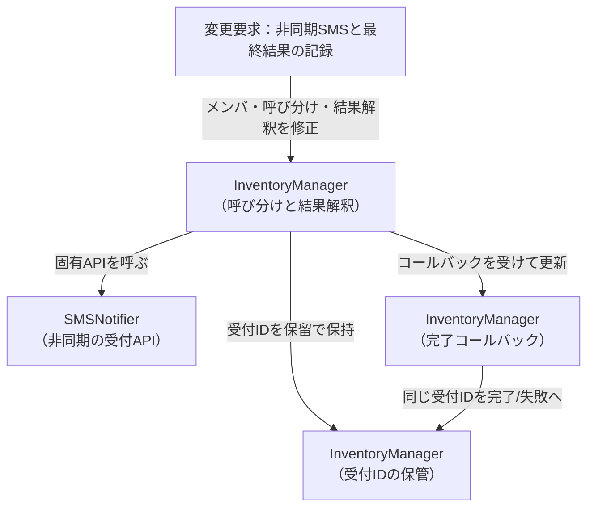

変更影響グラフから、今回のSMS追加だけで`InventoryManager`が送信方法、受付IDの保管、後日の完了コールバックまで新たに知ったことが読み取れます。

### 3-3：痛みの言語化

変更を試みる中で、構造上の問題が3つ浮かび上がりました。

1つ目は、`InventoryManager`が変更ID1のために「SMS通知先の存在」「送信方法」「受付結果」を新たに抱えたことです。在庫更新と閾値判定を担うクラスへ、通知手段の具体知識が追加されました。

2つ目は、今回のSMS追加のために通知元の`InventoryManager`まで修正したことです。「在庫管理」と「通知手段の選択」という異なる変更理由のコードが一つのクラスにあります。

3つ目は、変更ID1の同期・非同期・部分失敗の違いまで通知元へ入ったことです。変更途中コードの`notifyAll()`はSMSの受付結果を解釈し、`receiveSMSCompletion()`は受付IDを使って後日の最終状態まで更新します。通知元が即時配布と非同期完了という二つの入口を抱えました。

フェーズ3「問題特定」では、変更ID1によって通知元クラスを書き換え、通知先ごとの成否・待ち方まで通知元へ入った痛みを確認しました。次のフェーズ4「原因分析」では、通知元と通知先の接続点に漏れている知識を確認します。

---
> **📌 問題（確定）**
> 変更ID1のSMS追加で、通知元の`InventoryManager`のメンバ変数・コンストラクタ・`notifyAll()`が連動して変わった。通知手段と受付結果が在庫管理ロジックに混在し、一つの確定要求が通知元まで修正対象にした。
---

観測した痛みへ`問題ID`を付け、どの変更IDから来たかを対応づけます。

**問題ID1**

- **観測した痛み（変更途中コード）**：SMS追加で `InventoryManager` のメンバ・コンストラクタ・`notifyAll()` が連動して変わった
- **起点の変更ID**：変更ID1

**問題ID2**

- **観測した痛み（変更途中コード）**：「在庫管理」と「通知手段の選択」という異なる変更理由のコードが同じクラスに同居する
- **起点の変更ID**：変更ID1

**問題ID3**

- **観測した痛み（変更途中コード）**：同期送信と非同期受付の違いが通知元へ入り、`notifyAll()` の呼び分けに加えて受付IDの状態表と完了コールバックまで持つ
- **起点の変更ID**：変更ID1

ここまでで「何が痛いか」が見えました。次のフェーズ4「原因分析」では、その痛みが「なぜ起きているか」を構造の言葉で言語化します。

---

## 🟠 フェーズ4：原因分析 ―― なぜ辛いのかを構造で言語化する
### 4-1：痛みの根源を探る（観察と原因）

第一に、新しい通知先を追加するとき、なぜ毎回 `InventoryManager` を開かなければならないのでしょうか？それは、このクラス自身が「`EmailNotifier` へは件名と本文を渡して真偽値を見る」「`DashboardUpdater` へは商品コードと在庫数を渡すが成否は分からない」「`ChatNotifier` へは投稿先と本文を渡して投稿IDの空を見る」といった**手段ごとに違う呼び方と結果の読み方を全部直接知ってしまっている（抱え込んでいる）**からです。

第二に、なぜ変更の影響範囲が読めず、修正を重ねるたびに不安を感じるのでしょうか？それは、「在庫が減った」というイベントの管理という本来の骨格ロジックと、「誰にどうやって知らせるか」という通知先ごとの実装が、**同じクラスの中で物理的に混ざり合っている**からです。

**構造的な原因（痛みの根源）**

- **新しい通知先を追加するたびに、通知元の InventoryManager クラスの修正が必要になる**：InventoryManager が、通知する必要がある相手の「具体的なクラス名」と「通知方法」を直接知っているから
- **通知先のクラスが変わったり増えたりするたびに、通知元クラスが影響を受ける**：在庫管理という「守りたい前提」と、通知先という「変わる見込み」が、同じクラスの中に混在しているから
- **SMSの受付と最終配信結果の扱いが、在庫更新のコードへ入り込もうとする**：通知手段ごとの同期・非同期・受付ID・最終状態という「通知先の事情」を、イベントを出すだけの通知元が抱え込もうとするから

こうして整理すると、問題の本質が見えてきます。通知元である InventoryManager は、「在庫が減った」という事実を伝えたいだけなのに、その情報を「誰が」「どう受け取るか」という詳細な実装までを全部抱え込んでしまっているのです。これでは、通知先が増えるたびにこのクラスを汚していくことになり、影響範囲が広がり続けるのは避けられません。

### 4-2：今回変える責任/ほかの変更から守る責任

> **「今回守る」と「変わらない」は異なります。** 左列は今回の変更試行とヒアリングで変更理由を確認した責任、右列はその変更に巻き込まず守りたい責任です。将来ずっと変わる／変わらないという分類ではありません。

原因の方向性が見えたところで、「今回変える責任」と「ほかの変更から守る責任」を明確に切り分けます。

**通知先のクラス（メール、ダッシュボード、チャット等）、その追加や削除、具体的な通知手段、および通知先ごとの受付・最終配信状態**

- **ほかの変更から守る責任**：「在庫が少なくなった」というイベントの発生通知そのもの、およびそのトリガーとなる在庫管理ロジック。一部の通知先が失敗しても在庫更新を止めないという骨格

両者は別々の無所属コードではなく、同じ `InventoryManager` の `reduceStock()` と、そこから呼ぶ `notifyAll()` です。所属、メンバ、関数境界を残した一つの抜粋で並べると、守る処理から変わる知識へ接続している箇所が分かります。

```cpp
class InventoryManager {
    ProductDatabase& db;
    EmailNotifier email;
    DashboardUpdater dashboard;
    ChatNotifier chat;

public:
    void reduceStock(string productId, int quantity) {
        ProductInfo info = db.get(productId);
        info.stock -= quantity;  // 【守る】在庫を更新する
        db.save(productId, info);

        // 【守る】更新後在庫で閾値を判定する
        if (db.isBelowThreshold(productId, info.stock)) {
            string message = productId + " の在庫が閾値以下です。";
            // 【接続】在庫イベントを通知処理へ渡す
            notifyAll(productId, info.stock, message);
        }
    }

private:
    void notifyAll(const string& productId, int stock,
                   const string& message) {
        // 【変わる】固有の引数と戻り値
        email.sendMail("在庫不足", message);
        dashboard.refreshStockWidget(productId, stock);
        chat.postMessage("inventory-alert", message);
    }
};
```

「在庫が少なくなった」という出来事は、通知先が増えようが減ろうがシステムの中では等しく起きています。この「イベント発生の事実」が、今回の通知手段追加から守りたい部分です。一方、通知先は今回実際に変わりました。将来ずっと変わる／変わらないと決めるのではなく、今回異なる理由で変わった二つを区別します。

### 4-3：接続点に漏れている通知先の知識を確認する

現在の`InventoryManager`が、通知先について何を知っているかを確認します。

`InventoryManager`は、`EmailNotifier`や`ChatNotifier`というクラス名に加え、手段ごとに違う**3つのこと**を知っています。呼ぶ関数の名前（`sendMail` / `refreshStockWidget` / `postMessage`）、渡す引数の形（件名と本文／商品コードと在庫数／投稿先と本文）、そして返る値の意味（真偽値／無し／投稿IDの空判定）です。ここへSMSの非同期・受付失敗を素直に足そうとすると、4つ目の流儀として「受付IDと保留状態」まで通知元が知ることになります。接続点で必要なのは「在庫警告を1件渡し、受付結果を1つ受け取ること」だけです。

新しい通知先を追加すると、通知元へメンバー変数・初期化・呼び出しを追加する必要があります。通知先の種類・関数名・引数の形・戻り値の意味・同期非同期の別が通知元へ漏れているためです。とくに引数の形と戻り値の意味は、通知先ごとに変換が必要な差です。ダッシュボードは成否を返さないため、通知元は「成功として数えるしかない」という判断まで抱えています。接続点で必要なのは在庫警告と受付結果だけですが、現在はその最小の受け渡しへ揃っていません。差をどこへ置くかは、課題を確定してからフェーズ6で決めます。

現状の `InventoryManager` と各通知先は、その「変わる理由」が異なります。それにもかかわらず、通知先固有の知識を `InventoryManager` が持つため、一方の変更がもう一方へ波及しています。次のフェーズでは、この波及を止めるために接続点で何を達成すべきかを課題として定義します。

フェーズ4「原因分析」で根本原因が言語化できました。「どこを分けるか」は明確です。次のフェーズ5「課題定義」では、その境界で実際に何が流れているかを値・型のレベルで具体化し、「何を変え、何を守るか」を明確にします。

---
> **📌 原因（確定）**
> `InventoryManager`が通知先のクラス名・関数名・引数の形・戻り値の意味・同期非同期の別まで知っている。3手段はもともと提供元が違い呼び方がそろっていないため、通知元が手段ごとの翻訳を引き受けている。通知先を追加したり、非同期や部分失敗が加わるたびに、在庫管理のクラスへメンバー・初期化・引数の組み立て・戻り値の解釈を追加する必要がある。
---

フェーズ3の問題IDに対応づけて、構造上の原因へ`原因ID`を付けます。次のフェーズ5は、この原因IDから課題IDを導きます。

**原因ID1**

- **構造上の原因（何が同じ責任へ集まっているか）**：`InventoryManager` が通知先のクラス名・関数名・引数の形・戻り値の意味・同期非同期まで持ち、在庫管理の骨格と手段ごとの翻訳が同居している
- **対応する問題ID**：問題ID1・問題ID2・問題ID3

「何が痛いか（問題）」と「なぜ痛いか（原因）」が揃いました。次のフェーズ5「課題定義」では、「何を切り離す必要があるか（課題）」を、接続点で流れるデータのレベルで言語化します。

---

## 🟡 フェーズ5：課題定義 ―― 原因から課題を検討して確定する

### 5-1：原因から課題候補を洗い出す

**原因ID1：在庫更新処理がメール・ダッシュボード等の具体通知を直接呼ぶ**

- **そのままだと残る痛み**：通知手段追加で在庫更新本体を修正し、個別失敗が他通知へ波及する
- **課題候補**：通知手段の種類と実行を在庫更新から分離する
- **候補を導いた理由**：在庫計算と通知配送は別の理由で変わる

### 5-2：課題候補の重複と依存を整理する

| 課題候補 | 必要性・他候補との関係 | 統合／分割の判断 | 整理結果 |
|---|---|---|---|
| 通知手段の分離 | 必須。変更ID1で種類・非同期・失敗処理が在庫更新へ集中した | 登録・反復・個別結果を一つの通知接続点へ統合 | 課題として残す |

変更IDと課題IDは一対一とは限らないため、変更依頼の数に合わせて課題を増減させません。

### 5-3：課題IDと接続点を確定する

**課題ID1：在庫更新と通知手段の境界**

- **接続**：商品ID・名称・更新後在庫・閾値と個別配送結果
- **変わる側**：通知種類・文面・同期／非同期・受付成否
- **守る側**：商品確認、在庫更新、閾値判定、他通知の継続
- **完了条件**：新通知は登録だけで加わり、1件失敗しても在庫更新と他通知が完了する

📌 **システム全体の完了状態**：在庫管理は在庫イベントを登録済み通知先へ配信し、通知手段ごとの同期・非同期・失敗を知らずに全結果を回収できる。

課題IDを定義できたので、ここまでの追跡を一列で見渡します。本章は在庫更新と通知手段という一つの軸なので、3つの痛みは一つの原因・一つの課題へ集約します。

**問題ID1・問題ID2・問題ID3：通知手段と成否が在庫管理へ混在**

- **原因ID（フェーズ4の構造原因）**：原因ID1：通知先のクラス名・送信方法・成否まで在庫管理が抱える
- **課題ID（達成目標）**：課題ID1：通知手段の種類と実行を在庫更新から分離

要求ID4の在庫変動記録は、通知手段の混在から生じた設計課題ではありません。フェーズ6でシステム全体の生成・所有を決めるときに実装場所も確定しますが、課題ID1の追跡には混ぜず、要求IDとしてフェーズ7で検証します。

## 🔴 フェーズ6：対策検討 ―― 構想を一つのコード経路へ変える

フェーズ5で確定した全課題を、別々の部品案ではなく、生成から実行まで動く一つの構想としてまとめます。先に主要クラスと接続順を示し、その直後に同じ順でコードを確認します。

### 構想を決める

**【課題の原因】** 課題ID1は、問題ID1・問題ID2・問題ID3（通知手段と成否が在庫管理へ混在する）＝原因ID1（通知先のクラス名・関数名・引数の形・戻り値の意味・同期非同期まで在庫管理が抱える）。これを分離対象にします。

**この課題（何を解きたいか）：** SMSを1つ足すだけで `InventoryManager` のメンバ・受付IDの状態表・コンストラクタ・公開操作・`notifyAll()` まで連動する。**在庫変化の事実を配るだけにし、通知先を共通の契約で登録・差し替えできるようにする**のが課題ID1です。

**このフェーズで決めること：** 在庫警告と受付結果をどの形で接続し、手段ごとの呼び方・文面・結果解釈をどこへ置き、通知先を誰が生成・登録するかをコードで示します。

まず、契約、具体、生成・所有、受け渡し、実行を一枚の構想へまとめます。

**契約と具体**

- **システム全体での設計判断**：課題ID1の文面・送信・受付結果を`INotification`の各具体へ、最終結果を`DeliveryStatusLog`と`SMSDeliveryCallback`へ置く
- **守る側が知らなくなる詳細**：通知手段の種類・数・文面・同期非同期

**生成・所有・受け渡し**

- **システム全体での設計判断**：`main()`がDB・ログ・通知先・後日入口を所有し、通知元へ参照を渡して通知先を`attach()`する
- **守る側が知らなくなる詳細**：具体通知先・ログ・コールバックの実体と生存期間

**公開入口からの実行**

- **システム全体での設計判断**：在庫更新が登録先へ一律`send(alert)`を呼び、保留IDは状態ログ、後日の最終結果はコールバックへつながる
- **守る側が知らなくなる詳細**：各手段の配信処理と完了時期

**構想上のコード経路：** `main()`（通知先を生成・登録）→ `InventoryManager::reduceStock()`（公開入口）→ `notifyAll()`（登録順に反復）→ `INotification::send()`（契約）→ 各通知先（具体処理）

この経路が成立するには、契約だけでなく、具体を選ぶ方法、実体の生成・所有、利用側へ渡す行、公開入口からの呼び出しが同時に必要です。以下では、この構想を分断せず、コードの依存順に続けて確認します。

### 構想をコードでつなぐ

> **コードの読み方：** 「契約→具体→生成・選択・受け渡し→公開入口からの実行」の順に読みます。変更前の抜粋は境界を引く根拠、変更後の断片は構想を成立させるコードです。断片はフェーズ7「解決後のコード」でクラス単位の全文へ統合します。

#### 契約：境界の形と受け渡しを決める

**関数を一つ切り出すだけでは、変更を閉じ込められません。** 手段ごとの知識は `notifyAll()` の中だけでなく、`InventoryManager` のメンバ宣言・コンストラクタ・受付IDの状態表・`receiveSMSCompletion()` にも現れます。3-1（変更を試みる）でSMSを足したとき、書き換えた場所は6か所でした。そして2-4（ヒアリングで判明した将来リスク）のリスクID1（通知先の種類と実装）、リスクID2（通知先の増減）、リスクID3（受付と最終配信結果の扱い）が、どれも「増える・変わる」と言っています。**現に変更要求で、SMSという通知先が1つ増えました。** だから各通知手段を同じ問い方で呼べる契約まで進みます。

分けると決めたので、コードに線を引きます。線を引いただけでは分けられません。**隙間を何が行き来するかを決めて、はじめて切り離せます。**

**変更前から抜き出す箇所：`InventoryManager::notifyAll(const StockAlert&)`** ―― 3-1の4手段の呼び分けから、メールとダッシュボードの2件を抜き出したもの（対策前）

```cpp
    std::string body = alert.productName + " 残" +
                       std::to_string(alert.stock) + " 閾値" +
                       // ← 出て行く側（文面）
                       std::to_string(alert.threshold);

    // ← 出て行く側（呼び方）
    if (email.sendMail("在庫不足", body)) accepted++;
    else failed++;                                       // ← 残る側（集計）

    dashboard.refreshStockWidget(alert.productId, alert.stock); // ← 出て行く側
    accepted++;                                          // ← 残る側（集計）
```

**割り方の根拠は、通知先が増えたときに触るかどうかです。** 音声通知を足すと、引数の組み立てと呼び方は1通り増えます。集計と結果の出力は1行も増えません。変更前のコードでは、この2種類が同じ関数の中で交互に並んでいます。

**5-3（課題IDと接続点を確定する）が挙げた候補は5つです。** 商品ID、商品名、更新後在庫、閾値、個別配送結果について、境界を流す形を1つずつ確定します。

**商品ID**

- **決めた形**：**引数で渡す。** 警告1件を表す値の1項目にする
- **そう決めた理由**：ダッシュボードは商品コードとして、メールとチャットは文面の一部として使う。用途が手段ごとに違うので、通知元が完成した文面を渡すと、文面を使わない手段が困る（1-4で `message` をダッシュボードへ渡せなかったのが実例）

**商品名**

- **決めた形**：同じ値の1項目として**引数で渡す**
- **そう決めた理由**：メールとチャットの文面が商品名を使う。文面を作るのは手段側だと決めた以上、材料として渡すしかない

**更新後在庫**

- **決めた形**：同じ値の1項目として**引数で渡す**
- **そう決めた理由**：ダッシュボードは数値そのものを画面へ出す。文字列にしてから渡すと、数値へ戻せない

**閾値**

- **決めた形**：同じ値の1項目として**引数で渡す**
- **そう決めた理由**：メールの本文が「閾値5」を出す。1-4ではこの埋め込みを通知元がしていた

**個別配送結果**

- **決めた形**：**戻り値で返す。** 状態・手段名・受付IDの3項目を1つの値にする
- **そう決めた理由**：変更前は真偽値・戻り値なし・投稿IDの3通りを通知元が翻訳していた。SMSで4通り目が加わる。形をそろえないと、手段が増えるたびに通知元の解釈が1通り増える

**候補は5つでしたが、境界を実際に流れるのは2つです。** 前の4つは警告1件を表す1つの値へまとめたので、引数としては1つです。個別配送結果が戻り値として1つ。**4つが消えたのではなく、1つの値の項目として運ばれます。** 呼ぶ側から見ると、渡すものが1つ、返るものが1つになりました。

**候補の数と実数が一致しないのが普通です。** 5-3は境界を跨ぐものを漏れなく挙げる表で、ここはそれを形へ変える段です。まとめてよいものをまとめると、数は減ります。

**「返す情報の形を、まだ使い道が決まっていないのに決めてよいのか」** ——ここは踏み外しやすいので、根拠を書きます。**使い道は、変更前のコードにあります。** 3-1の `notifyAll()` が実際に消費していたのは次の3つでした。

- `accepted++` / `pending++` / `failed++` ―― 受付できたか、保留か、失敗かという**3区分**
- `lastRequestId = smsResult.requestId;` ―― 保留のときだけ意味を持つ**受付ID**
- 1-4（実装コード）の `cout << "[通知受付失敗] Email"` ―― どの手段が失敗したかという**手段名**

3つ目は、変更前は通知元がその場で文字列として書いていました。**通知元が具体名を知らなくなる以上、手段名は結果に添えて返してもらうしかありません。** 将来こう使うだろうという見込みではなく、変更前のコードが消費していたものをそのまま契約の戻り値にしています。

**それでも、書いてみるまで確定はしません。** 構想の確認で骨格を実際に書き、この3項目で足りることを確かめます。足りなければここへ戻って取り直します。**戻る先が1段だけで済むのは、変更前のコードという確かめようのある根拠から決めているからです。**

まず、境界を流れる2つの値を置きます。状態の5区分は、3-1で試した `TrialDeliveryStatus` の区分をそのまま引き継ぎます。

**ここで確認するコード：`DeliveryStatus`（列挙型全体）** ―― 通知受付から最終配信までの状態

```cpp
// 通知の受付結果と、非同期SMSの最終配信結果
enum DeliveryStatus {
    ACCEPTED, PENDING, FAILED, DELIVERED, DELIVERY_FAILED
};
```

**DeliveryResult**

**ここで確認するコード：`DeliveryResult`（構造体全体）** ―― 通知先1件の受付・配信結果

```cpp
struct DeliveryResult {
    DeliveryStatus status; // 受付成功・保留・受付失敗・配信完了・配信失敗
    string channel;        // どの通知手段か
    string requestId;      // 非同期受付だけが設定する
};
```

> **悩みどころ：失敗を例外で投げるのか、戻り値で返すのか**
>
> ここで通知の失敗を `DeliveryResult` という**戻り値**で表しました。一方、第1章では未登録の顧客IDや空の注文を `throw` で弾いています。**同じ本の中で流儀が2つある**ので、その理由を書いておきます。
>
> 私は「**呼び出し側が続けられるかどうか**」で分けています。第1章の未登録IDは、そのまま進めても意味のある結果が作れません。呼び出し側にできることは中止だけなので、例外で止めます。この章のSMS受付失敗は違います。**4件のうち1件が失敗しても、残り3件は届いていて、在庫更新も成功しています。** 呼び出し側はその事実を受け取って先へ進む必要があるため、結果として返します。
>
> 迷ったのは、通知先の1件が例外を投げてきたらどうするかです。**通知先は他社が作ることもあり、契約どおりに戻り値だけを返してくれる保証はありません。** この章では通知元が `try` / `catch` で囲むところまでは踏み込まず、契約で「結果を返す」と決めるだけにしました。**現場では、通知元の側で受け止めて `FAILED` に翻訳する**ことが多いと思います。1つの通知先の事故で在庫更新まで巻き添えにしないためです。
>
> どちらが正しいという話ではないと考えています。ただ、**1つのシステムの中で基準がぶれると、呼び出し側は毎回どちらに備えるか調べることになります。** 「続けられないなら例外、続けられるなら戻り値」のように、チームで一度決めておくほうが効きます。

**StockAlert**

**ここで確認するコード：`StockAlert`（構造体全体）** ―― 通知元から通知先へ渡す在庫警告

```cpp
// 通知手段ごとに表現を変えるための、共通の在庫警告データ
struct StockAlert {
    string productId;
    string productName;
    int stock;
    int threshold;
};
```

そのうえで契約を置きます。

**ここで確認するコード：`INotification`（クラス全体）** ―― 通知先が共有する契約

```cpp
// 通知先が満たす必要がある契約（インターフェース）
class INotification {
public:
    virtual ~INotification() = default;
    // 在庫警告を受け取り、手段別に表現して受付結果を1つ返す
    virtual DeliveryResult send(const StockAlert& alert) = 0;
};
```

引数1つ、戻り値1つ、操作1つです。**契約だけでは、決めた形が本当に成立するのか確かめられません。** 実装を1つ見ます。

**ここで確認するコード：`EmailNotifier`（クラス全体）** ―― 同期のメール通知

```cpp
// 通知先1：メール通知（同期）
// メール基盤の呼び方（件名と本文、真偽値）は1-4のまま変えない。
// 契約からその形へ変換する責任を、このクラスの中へ引き取る。
class EmailNotifier : public INotification {
    vector<string> inbox;

    // 1-4と同じメール基盤の操作
    bool sendMail(const string& subject, const string& body) {
        inbox.push_back(body);
        cout << "Email(" << inbox.size() << "件) [" << subject << "] "
             << body << endl;
        return true;
    }
public:
    DeliveryResult send(const StockAlert& a) override {
        string body = a.productName + "(" + a.productId + ") 残"
                    + to_string(a.stock) + " 閾値" + to_string(a.threshold);
        bool ok = sendMail("在庫不足", body);   // 契約→メール基盤へ変換

        return ok ? DeliveryResult{ACCEPTED, "Email", ""}
                  : DeliveryResult{FAILED, "Email", ""};
    }
};
```

- **「商品ID・商品名・更新後在庫・閾値を1つの値で渡す」の実態。** `a.productName`・`a.productId`・`a.stock`・`a.threshold` の4項目が、この1クラスの中で1本の文字列へ組み立てられています。1-4ではこの組み立てが通知元にありました
- **「個別配送結果を返す」の実態。** `{ACCEPTED, "Email", ""}` の1つ目が状態、2つ目が手段名、3つ目が受付IDです。同期のメールは受付IDを持たないので空です
- **メール基盤の呼び方は1文字も変えていません。** `sendMail(件名, 本文)` と真偽値のまま、このクラスの非公開関数として残っています

変更前の `if (...) accepted++; else failed++;` が、ここにはありません。**では、結果を集計するのは誰の仕事になるのか。それは構想の確認で決めます。**


**では、この契約を誰が呼ぶのか。**

---

> **悩みどころ：1つの通知が失敗したら、残りはどうするのか**
>
> 通知先を4つ登録すると、必ずこの問いが出ます。**3つ目が失敗したとき、4つ目を送るのか、そこで止めるのか。**
>
> この章では続けます。在庫はすでに減っており、通知が届かないことと在庫の数字が合わないことは別の問題だからです。**1つの通知先の不調で在庫管理が止まるほうが困る**、という判断です。
>
> ただし、これが常に正しいわけではありません。**「全員に届かないなら誰にも送らない」が要件になる場面もあります**（たとえば、複数の担当者へ同じ承認依頼を送る場合）。そのときは、送る前に全員の可否を確かめるか、失敗したら取り消す仕組みが要ります。どちらも通知元の仕事が増えます。
>
> 私がここで大事だと思っているのは、**「続ける／止める」を決めずに実装しないこと**です。決めていないと、たまたま最初に書いた順番がそのまま仕様になります。

#### 具体：契約の裏へ変わる判断を置く

契約の形を決め、代表実装で引数・戻り値が成立することを確認しました。ここでは、もう1つの具体を見て、変わる判断が契約の裏へ閉じることを確かめます。

**ここが決めるのは個数ではありません。** 個数は契約コードで「手段ごとに別クラス」と決めた時点で確定しています。ここで決めるのは、**各具体が何を書かないか**です。直前の契約コードで見た `EmailNotifier` と対照的なものを1つ見ます。

**ここで確認するコード：`DashboardUpdater`（クラス全体）** ―― 成否を返さない画面更新

```cpp
// 通知先2：ダッシュボード更新（同期）
// 画面更新は成否を返さない。その事実をどう契約へ写すかを、
// 通知元ではなくこのクラスが決める。
class DashboardUpdater : public INotification {
    int refreshCount;

    // 1-4と同じ画面更新の操作。戻り値が無い
    void refreshStockWidget(const string& productCode, int stock) {
        ++refreshCount;
        cout << "Dashboard(" << refreshCount << "件): " << productCode
             << " の在庫表示を " << stock << " に更新" << endl;
    }
public:
    DashboardUpdater() : refreshCount(0) {}
    DeliveryResult send(const StockAlert& a) override {
        refreshStockWidget(a.productId, a.stock);
        // 呼べたことをもって受付成功とする。この割り切りはここに閉じる
        return {ACCEPTED, "Dashboard", ""};
    }
};
```

**文面を作っていません。** ダッシュボードは商品コードと在庫数という生の値しか受け取らないので、`StockAlert` の4項目のうち2つだけを使います。**そして失敗を返す道がありません。** 1-4では「成否が返らないので成功として数えるしかない」という割り切りを通知元が持っていました。**判断そのものは消えていません。それが妥当かどうかを判断できる場所へ移しただけです。**

残りの3クラスも同じ形で、変更前の呼び分けの1本ずつに対応します。

**`EmailNotifier`**

- **上書きする操作**：`send()`
- **返す値**：送れたら `ACCEPTED`、送れなければ `FAILED`
- **書かないこと**：受付IDの保管、集計、他手段の成否

**`DashboardUpdater`**

- **上書きする操作**：`send()`
- **返す値**：常に `ACCEPTED`
- **書かないこと**：失敗の表現、文面の組み立て

**`ChatNotifier`**

- **上書きする操作**：`send()`
- **返す値**：投稿IDが空なら `FAILED`、そうでなければ `ACCEPTED`
- **書かないこと**：投稿IDの保管、集計

**`SMSNotifier`**

- **上書きする操作**：`send()`
- **返す値**：受付できたら受付ID付きの `PENDING`、受付を断られたら `FAILED`
- **書かないこと**：最終配信結果の待ち受け、受付IDの状態管理

**もう一度検算します。契約のメソッド以外に書きたくなるものがあるか。** SMSの最終配信結果を保つ場所がありません。**しかしそれは `send()` の裏に書くものではありません。** 受付IDは通知手段をまたいで追跡する情報で、`SMSNotifier` の中に閉じ込めると、通知先が破棄されたときに履歴も消えます。**置き場所は生成・所有のコードで決めます。**

**守る範囲との照合：** 守る範囲の4つのどれにも触っていません。通知の文面は5-3で変わる側と決めたものなので、守る範囲には入っていません。

**境界の契約と具体をコードで確認できました。** 次は、構想で仮置きした生成・所有・受け渡しを、実コードとして確定します。

---

#### 生成・所有・受け渡しを決める

契約と具体がコードで確認できたので、構想で仮置きした生成・所有・受け渡しを実コードで確かめます。生成しただけで止めず、同じ実体が公開入口から使われる直前までをつなぎます。

ここからは、具体を作る行から、契約として骨格へ入り、公開入口から実行される行までを一つの経路として追います。

##### 生成・所有：実体と所有者をコードで示す

構想で定めた接続点は2つです。`observers` の中身と `record(r)` の持ち主を、生成・所有・登録のコードで確かめます。

**まず、通知先の具体を誰が作り、誰が持つか。** 持つ者に必要な条件は、構想表から分かります。

- **具体クラスを全部知っていること。** `EmailNotifier` の実体を作る以上、その名前を書きます
- **`InventoryManager` ではないこと。** 構想表で確認したとおり、知った時点で分離が壊れます

**ここで、まとめ役の箱を1つ作るかどうかを考えます。** **軸を足したときに触る場所で比べます。**

- **箱を作る。** 通知先を1つ足すとき、箱のメンバへ1行と、箱が返すリストへ1行。組み立て側は箱を作るだけ
- **組み立て側が直接持つ。** 通知先を1つ足すとき、組み立て側の変数へ1行と、登録へ1行

**触る場所の数は同じで、箱を作ると型が1つ増えます。** そして決め手は、**この章には引き当てる仕事が無いこと**です。この章の通知元は登録された全員へ一律に配るので、**値から実体を引く関数が要りません。** 引く仕事が無いのに引く場所を作ると、中身が「持っているだけ」の箱になります。**組み立て側が直接持つ形を採ります。**

**組み立て側は `main()` です。** 通知先の実体は `main()` のローカル変数として宣言します。値なので、**この宣言がそのまま生成です。**

**ここで確認するコード：`main()`** ―― 実体の生成（ここで決まるところまで）

```cpp
int main() {
    ProductDatabase  productDatabase;
    EmailNotifier    email;
    DashboardUpdater dashboard;
    ChatNotifier     chat;
    SMSNotifier      sms(false);   // false: 受付成功→保留を返す
```

**次に、`record(r)` の持ち主を確認します。** 構想で定めた接続点であり、持つ者に必要な条件は記録の生存期間から出ます。

- **受付IDと状態だけを持ち、在庫を知らないこと。** 3-1では `InventoryManager` が持ち、在庫管理クラスがSMS基盤の状態遷移まで知ることになりました
- **通知先より長く生きること。** 行6・行7のように通知先を差し替えても、受付IDの履歴は残る必要があります

**この2つを満たす場所は、通知元でも通知先でもありません。新しい箱が要ります。** 受付IDごとの配信状態だけを持つので `DeliveryStatusLog` とします。そして、後日届く最終結果を受け取る入口も要ります。3-1では `InventoryManager::receiveSMSCompletion()` が公開操作として通知元にありました。**在庫操作の入口とは別の起点なので、別のクラスへ置きます。** SMS基盤からのコールバックを受けるので `SMSDeliveryCallback` とします。

**ここで確認するコード：`DeliveryStatusLog`（クラス全体）** ―― 受付IDごとの最終配信状態を所有する台帳

```cpp
// 非同期SMSの受付IDと最終配信状態を管理する
class DeliveryStatusLog {
    map<string, DeliveryStatus> statuses;

    static string statusName(DeliveryStatus status) {
        if (status == PENDING) return "PENDING";
        if (status == DELIVERED) return "DELIVERED";
        if (status == DELIVERY_FAILED) return "DELIVERY_FAILED";

        return "対象外";
    }
public:
    void record(const DeliveryResult& result) {
        if (result.status != PENDING || result.requestId.empty()) return;

        statuses[result.requestId] = PENDING;
        cout << "[SMS状態] " << result.requestId << ": PENDINGを記録" << endl;
    }

    bool complete(const string& requestId, bool delivered) {
        auto it = statuses.find(requestId);

        if (it == statuses.end() || it->second != PENDING) {
            cout << "[SMS最終結果エラー] 未知または確定済みの受付ID: "
                 << requestId << endl;
            return false;
        }

        DeliveryStatus before = it->second;
        it->second = delivered ? DELIVERED : DELIVERY_FAILED;
        cout << "[SMS最終結果] " << requestId << ": "
             << statusName(before) << " -> " << statusName(it->second)
             << endl;
        return true;
    }
};
```

**`record()` は保留だけを記録します。** 同期の3手段は受付IDを持たないので、渡されても何もしません。**通知元は「保留かどうか」を判定して渡し分ける必要がありません。** これも分離で確定した骨格に分岐を増やさないための形です。

**ここで確認するコード：`SMSDeliveryCallback`（クラス全体）** ―― 後日届くSMS配信結果の入口

```cpp
// SMS基盤から後日届くコールバックの入口。在庫更新から独立させる
class SMSDeliveryCallback {
    DeliveryStatusLog& statusLog;
public:
    explicit SMSDeliveryCallback(DeliveryStatusLog& log) : statusLog(log) {}

    bool receive(const string& requestId, bool delivered) {
        return statusLog.complete(requestId, delivered);
    }
};
```

**この2つも `main()` が作ります。** `SMSDeliveryCallback` は `DeliveryStatusLog` を参照で借ります。通知元とコールバックが**同じ状態表**を見なければ、受付IDが突き合わせられないからです。

**5-3で課題ID1と分けておいた要求ID4の記録先も、ここで配置を確定します。** 1-4の `cout` だけでは実行の最後に全在庫変動を取り出せないため、在庫変動を1件ずつ積む `StockEventLog` を置き、`main()` が最後に `printAll()` で一覧します。これは通知分離の対策ではなく、要求ID4の実装です。

**ここで確認するコード：`main()`** ―― ログと後日入口の生成、そして通知元の生成

```cpp
    StockEventLog    eventLog;
    DeliveryStatusLog deliveryStatusLog;
    SMSDeliveryCallback smsCallback(deliveryStatusLog);
    InventoryManager manager(productDatabase, eventLog, deliveryStatusLog);
```

**`InventoryManager` の宣言が、ここで完成します。**

**ここで確認するコード：`InventoryManager`（クラス宣言・完成）**

```cpp
// 通知元クラス（Subject に相当）
class InventoryManager {
private:
    // 非所有ポインタ。登録中の通知先はInventoryManagerより長く生存すること。
    vector<INotification*> observers;
    ProductDatabase&        db;
    StockEventLog&          eventLog;
    DeliveryStatusLog&      deliveryStatusLog;

public:
    InventoryManager(ProductDatabase& database, StockEventLog& log,
                     DeliveryStatusLog& statusLog)
        : db(database), eventLog(log), deliveryStatusLog(statusLog) {}

    void reduceStock(string productId, int quantity);
    void replenishStock(string productId, int quantity);

private:
    void notifyAll(const StockAlert& alert);
};
```

**構想の確認で `ProductDatabase db;` と書いた値メンバが、参照になりました。** 在庫の正本と在庫変動ログは、同じ1件の在庫更新を記録する対です。片方を `main()` が持ち、もう片方を通知元が内側に隠すと、対応が読み取れなくなります。**課題ID1の分離とは別の判断なので、そのことを書いておきます。** 1-4のまま値メンバにしても、課題ID1は成立します。

構想で定めた記録先が、ここで実コードにつながります。

**ここで確認するコード：`InventoryManager::notifyAll(const StockAlert&)`** ―― 構想の確認で `record(r)` と書いた行

```cpp
        DeliveryResult r = o->send(alert);
        deliveryStatusLog.record(r);   // ←構想で定めた記録先へつなぐ
```

**骨格は1行も変わっていません。** 変わったのは `record()` の前に `deliveryStatusLog.` が付いたことだけです。変わっていたら、骨格の切り方を間違えていたことになります。

在庫更新側にも、ログ記録の1行が入ります。

**ここで確認するコード：`InventoryManager::reduceStock(string, int)`** ―― 分離で確定した制御順へ、在庫変動の記録を足す

```cpp
    db.save(productId, info);
    eventLog.add(productId, info.name, "出荷", quantity,
                 before, info.stock);
```

ここまでで、通知先4つと各ログの生成、通知元への登録まで確認できました。次に `observers` の受取側を見て、同じ通知先が契約として保持・実行されることを確かめます。

---

##### 登録：生成済み通知先を通知元へ登録する

**構想で仮置きした骨格には、`INotification*` としか書いてありません。** メールとも、SMSとも書いていません。それでも実行すれば4手段へ届きます。**ここで見るのは、いつ・何によって、どの実装が入るのかです。**

**ここで確認するコード：`InventoryManager::attach(INotification*)`** ―― 契約だけを受け取る登録操作

```cpp
    // nullと重複登録を拒否する
    bool attach(INotification* o) {
        if (o == nullptr) return false;

        if (find(observers.begin(), observers.end(), o)
                != observers.end()) {
            return false;
        }

        observers.push_back(o);

        return true;
    }

    // 破棄前や購読停止時に登録を解除する
    void detach(INotification* o) {
        observers.erase(
            remove(observers.begin(), observers.end(), o),
            observers.end());
    }
```

受け取るのは `INotification*` です。具体クラスの型では受け取りません。そして、この登録の行がこの設計の中心です。

**ここで確認するコード：`main()`** ―― 生成・所有のコードで作った実体を、契約として通知元へ渡す

```cpp
    manager.attach(&email);
    manager.attach(&dashboard);
    manager.attach(&chat);
    manager.attach(&sms);
```

**この4行は通知先の登録です。** `main()` が生成済み実体を `attach()` へ渡し、通知元は `INotification*` として保持します。通知時は登録された同じ実体を順に呼び、具体型を判定しません。

登録した実体を通知元が保持し、以降の通知はその同じ実体を使います。通知先を一つ選んで渡す操作ではありません。

この章では通知先を1つ選びません。`main()` が生成した4つの実体を借用ポインタとして登録し、`notifyAll()` が登録順に全員へ同じ `StockAlert` を渡します。具体名、通知手段の数、同期か非同期かは通知元へ入りません。

登録は組み立て時に行い、以後は同じ実体を使います。`detach()` と `attach()` で登録を変えれば次の通知から反映されます。コンストラクタで受け取る商品マスタと2つのログは別の依存であり、課題ID1で登録する通知先とは混同しません。


---

#### 実行骨格：組み立てた実体を契約から呼ぶ

前節で、`main()`が所有する通知先を`InventoryManager::attach()`へ登録し、同じ`DeliveryStatusLog`を通知元とSMSの後日入口へ渡しました。`reduceStock()`は在庫を更新し、閾値以下なら`notifyAll()`を呼びます。

`notifyAll()`は登録順に`INotification::send(alert)`を呼び、返った受付結果を同じ状態ログへ記録します。通知先が増えても、在庫更新と反復手順は変わりません。生成・登録・同期結果・後日結果が、受付IDを介して一つの流れになっています。

#### 公開入口から具体の実行まで追う

次は、公開入口へ入った要求が、直前に組み立てた同じ実体へ届き、契約を通って具体処理が呼ばれるまでをコードの呼び出し順で追います。

##### 公開入口から骨格・契約・具体へつなぐ

組み立てが終わりました。呼び出し側がどう変わったかを、変更前と並べて見ます。

**変更前から抜き出す箇所：`main()`** ―― 3-1の出庫と後日の完了（対策前）

```cpp
    InventoryManager pendingManager;
    pendingManager.reduceStock("PRD002", "USBハブ", 2, 5);
    pendingManager.receiveSMSCompletion(
        pendingManager.latestSMSRequestId(), true);
```

**ここで確認するコード：`main()`** ―― 同じ操作（対策後）

```cpp
    manager.reduceStock("PRD002", 1);
    smsCallback.receive("SMS-1", true);
```

**2つ変わりました。**

出庫の呼び方は、引数が4つから2つへ戻りました。3-1では商品名・更新後在庫・閾値を呼び出し側が用意していましたが、それは通知の材料を通知元が組み立てられなかったからです。**契約コードで「4項目を1つの値で渡す」と決め、構想の確認でその値を通知元が商品マスタから作ると決めた結果、呼び出し側が用意するものが無くなりました。** 1-4の `reduceStock(productId, quantity)` と同じ形です。

後日の完了は、呼ぶ相手が変わりました。3-1では通知元の公開操作 `receiveSMSCompletion()` を、直近の受付IDを取り出してから呼んでいました。**生成・所有のコードで後日の入口を別のクラスへ置いたので、在庫操作の入口とは別の起点になりました。** 受付IDは行2の実行結果に出た `SMS-1` を使います。

**組み立ての行は増えました。** 3-1は `InventoryManager pendingManager;` の1行でしたが、対策後は実体の生成が9行と登録が4行です。**通知元が自分で通知先を作らなくなった分、作る場所が外へ出たからです。** 隠さずに書くと、この章の対策で `main()` が払ったコストは12行です。その代わり、通知先を1つ足すときに `InventoryManager` を開く必要がなくなりました。

利用側が `INotification::send()` や `notifyAll()` を直接呼ぶことはありません。

**守る範囲との照合：** **公開操作**を保っていることを、いま確認しました。「`reduceStock()` で出庫し、`replenishStock()` で補充する」という入口の形は1-4のままです。分離と組み立てを通して、守る範囲の4つはいずれも定義に反していません。最終確認はフェーズ7の受入・回帰エビデンスで行いますが、**そこで初めて確かめるのではなく、分離から実行までのコードで照合済みです。**

### 構想を採用する

ここまでの構想表と要点コードを合わせると、責任配置と実行経路が一つにつながります。**この章の完成構造は一つに定まります。** 通知手段ごとの専用メンバを残したまま契約だけを足す形も置けますが、それは課題ID1の波及を解消しない途中状態なので比較しません。責任配置や依存が異なる完成構造が複数残ったわけではないので、当て馬を並べた比較は行いません。採用するのは、共通契約を実装した通知クラスを組み立て側が生成・登録し、通知元が登録リストへ一律配布する**通知分離構造**です。

分離から実行までに決めたコードで確定した部分がすべて入っているかを、次の図で照合します。

完成クラス図は、構想を実装した結果としてフェーズ7「対策実施」だけに示します。ここでは、課題との対応と将来リスクへの備えを表で確定します。

#### 課題から採用構想までを照合する

ここまでの決定を一望へまとめます。この表は設計課題だけを追います。変更要求の受入はフェーズ7の要求ID表、変更影響は7-4（変更シナリオ表）の変更ID表で別に確認します。

**課題ID1（通知手段・非同期完了）**

- **採用構造と生成・接続場所**：通知連結。`InventoryManager`が登録リストへ一律配布し、各アダプターが文面・送信・受付結果を持つ。最終結果は状態ログへ接続する
- **完成コードの主な場所**：`INotification::send()`、`StockAlert`、各Notifier、`attach()`、`DeliveryStatusLog`、`SMSDeliveryCallback`
- **確認**：手段追加が具象クラスと登録に閉じ、受付・最終配信の失敗でも他通知と在庫更新が確定する

**変更対象外**

- **採用構造と生成・接続場所**：在庫更新・閾値判定・ログ。事実を作る側は変えない
- **完成コードの主な場所**：`InventoryManager::reduceStock()`、`ProductDatabase`、`StockEventLog`
- **確認**：1-4、在庫50→45

#### 将来リスクに対して構想を確認する

フェーズ2のリスクIDを採用構造へ再適用し、在庫更新をどこまで守れ、配信運用に何が残るかを評価します。

**リスクID1：通知先となるクラスの種類とその実装（音声通知システムなど）**

- **現在の構造による備え**：StockAlertを受けるINotification実装として通知先を追加する
- **リスク発生時の変更先**：新Notifierと登録・所有箇所
- **守れる範囲・残る弱点**：InventoryManagerを守り、追加を新Notifierと登録へ限定できる。通知先固有設定の取得場所は追加時に決める必要がある

**リスクID2：通知先の増減（動的な登録・解除）**

- **現在の構造による備え**：通知先の所有と列挙をInventoryManagerの購読境界へ集める
- **リスク発生時の変更先**：登録解除操作、通知先の所有方法
- **守れる範囲・残る弱点**：在庫計算を守れる。実行中の解除とオブジェクト破棄が重なる場合の生存期間規則は現在未定義である

**リスクID3：通知先ごとの受付と最終配信結果、失敗の扱い**

- **現在の構造による備え**：`DeliveryResult`で受付状態とIDを共通化し、`DeliveryStatusLog`とコールバックで最終状態を更新する
- **リスク発生時の変更先**：各Notifier、状態ログ、コールバックアダプター、将来の再送処理
- **守れる範囲・残る弱点**：受付と最終結果を在庫更新から分離できる。重複・順序逆転コールバックへの冪等規則と自動再送は今後の運用設計に残る

リスクID1〜リスクID3は、通知契約と所有方法を評価する材料です。今回合意したSMS最終結果の記録までは実装し、自動再送や専用運用UIは将来機能として区別します。

## 🟢 フェーズ7：対策実施 ―― 変化に強いコードを完成させる
フェーズ6で確定した通知分離構造を実装し、通知元が通知先の種類を知らなくてよい構造へ変えます。`InventoryManager`は登録済みの通知先へ同じ操作を呼び出します。

**この構造は、通知分離構造（オブザーバー）と呼ばれています。**

名前の由来は、Subject（被観察者・通知を送る側）がオブザーバー（観察者・通知先）へ通知する仕組みだからです。通知を「受け取る側」の役割名が、この構造の名称になっています。

通知を送る側（Subject）がオブザーバーのリストを保持し、状態が変化したときに一斉に通知を送るという構造が、私たちがフェーズ6で選んだ構造そのものです。フェーズ1から積み上げてきた思考の結果、たどり着いた構造に名前があった——というのが本書の伝えたいことです。

### 7-1：解決後のコード（全体）
インターフェース `INotification` を定義し、通知先クラスがこれを実装するようにします。`InventoryManager` は `INotification*` のリストを管理するだけで済みます。

#### 完成後のクラス一覧

完成コードで定義する型を先に一覧化します。各型の依存方向と実現関係は、直後のクラス図で確認します。

- `ProductDatabase`、`StockEventLog`、`StockAlert`、`InventoryManager`
- `INotification`、`EmailNotifier`、`DashboardUpdater`、`ChatNotifier`
- `SMSNotifier`

> **悩みどころ：4つの通知を順番に送ると、在庫更新が待たされる**
>
> 完成した形では、在庫を1つ減らすたびに4つの通知先を**順番に呼びます。** メールが3秒かかれば、その3秒だけ在庫更新の処理が止まります。通知先が増えるほど待ち時間は伸びます。
>
> 本番では、これは無視できない問題になります。**在庫更新は速く終わるべき処理**で、通知が遅いせいで止まるのは筋が違います。
>
> 実務では、通知をキューへ積んで別の処理で送る形にすることが多いと思います。ただ、そうすると**この章で見たかったものが見えなくなります。** キューの実装、失敗した通知の再試行、順序の保証——どれも通知の話ではなく、非同期の話です。
>
> ですからこの章では同期のままにしました。**構造の分離と、実行のタイミングは別の問題**だからです。分離ができていれば、後からキューを挟むのは通知元を触らずにできます。`INotification` を実装した「キューへ積むだけのクラス」を1つ足せばよく、**そこが分離しておく効き目**です。

#### 完成後のクラス図

フェーズ6で確定したクラス・操作・関係線を完成図にします。`InventoryManager` が通知元、`INotification` が通知先の契約、各Notifierがその具象に対応します。値クラスは、どの操作が受け渡すかを線で示します。

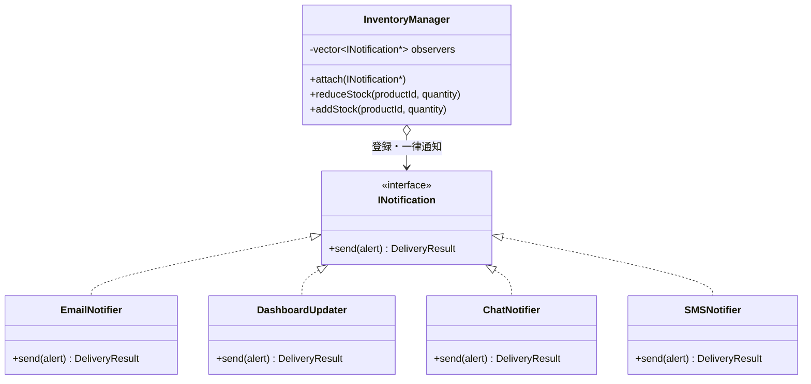

通知先が増えても、増えるのは `INotification` の下にぶら下がる具体と、`attach()` の登録行だけです。次の図は、通知元が扱う周辺クラスと値クラスです。

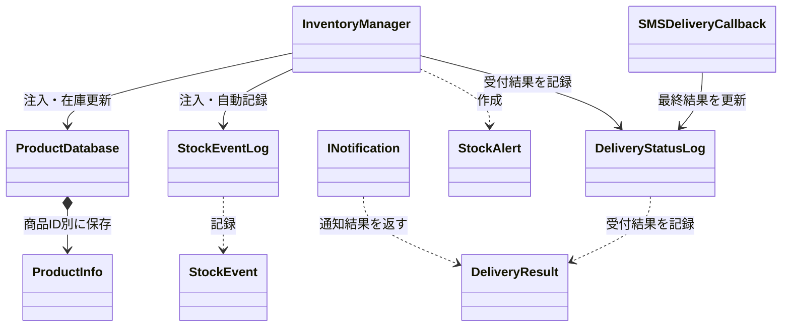

この完成図では、`InventoryManager`が在庫変化の事実を配る側、`INotification`が通知先の共通契約、各通知クラスが具体的な通知先です。

#### 完成後の実行シーケンス

フェーズ6で到達した通知分離構造の実行時のやり取りを確認します。組み立て側が依存を注入・登録し、`InventoryManager` が在庫更新後の `StockAlert` を、具象クラスを知らずに配る流れです。

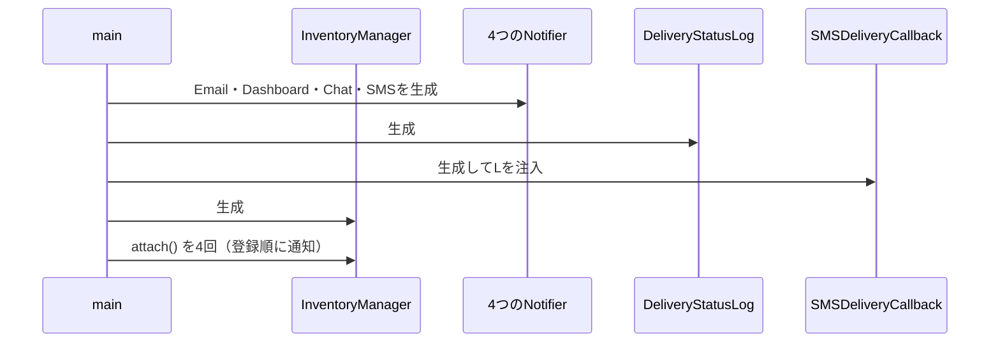

組み立てで `main()` がすることは、通知先を作って登録することだけです。通知先が増えても増えるのは `attach()` の行だけで、`InventoryManager` は変わりません。

次の図は、在庫が減ったときに実際へ配られる流れです。

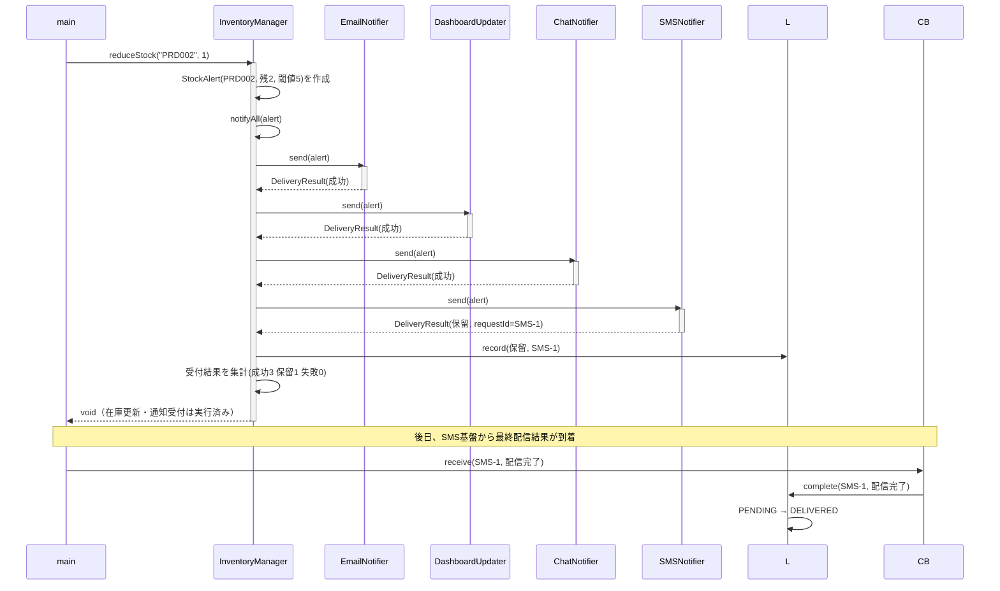

同期の3件は成功を即返し、非同期のSMSは受付ID付きの保留を返します。通知元は手段別に分岐せず、結果を集計して保留IDを状態ログへ渡すだけです。後日の最終結果はコールバック境界から同じIDを更新するため、在庫更新の呼び出しスタックを再開しません。受付失敗でも最終配信失敗でも、在庫更新と他通知は確定済みのままです。

#### 完成コード

クラスを1つずつ、上から順に読みます。**メンバー変数と、それを使う処理を同じ場所で見られるように**しています。1-4（実装コード）と同じ顔ぶれが並ぶので、どこが変わったかを見比べてください。

`main()` と実行結果は最後に、行のまとまりごとに並べます。

---

**共通ヘッダーと ProductInfo と ProductDatabase と DeliveryResult**

商品マスタと、送信1件分の結果型です。

```cpp
#include <iostream>
#include <vector>
#include <string>
#include <map>
#include <algorithm>

using namespace std;
```

**ProductInfo**

```cpp
// 商品マスタの1件分
struct ProductInfo {
    string name;           // 商品名
    int    stock;          // 在庫数
    int    alertThreshold; // アラート閾値
};
```

**ProductDatabase**

```cpp
// 商品マスタ（データ駆動バリデーション用）
class ProductDatabase {
private:
    map<string, ProductInfo> records;
public:
    ProductDatabase() {
        records["PRD001"] = {"ワイヤレスマウス", 50, 10};
        records["PRD002"] = {"USBハブ",           3,  5}; // 閾値以下
        records["PRD003"] = {"キーボード",         0,  5}; // 在庫なし
    }

    bool exists(const string& id) const {
        return records.count(id) > 0;
    }

    ProductInfo get(const string& id) const {
        return records.at(id);
    }

    void save(const string& id, const ProductInfo& info) {
        records[id] = info;           // 実行中の商品マスタへ追加
    }

    bool isBelowThreshold(const string& id, int currentStock) const {
        return currentStock <= records.at(id).alertThreshold;
    }
};

// 通知の受付結果と、非同期SMSの最終配信結果
enum DeliveryStatus {
    ACCEPTED, PENDING, FAILED, DELIVERED, DELIVERY_FAILED
};
```

**DeliveryResult**

```cpp
struct DeliveryResult {
    DeliveryStatus status; // 受付成功・保留・受付失敗・配信完了・配信失敗
    string channel;        // どの通知手段か
    string requestId;      // 非同期受付だけが設定する
};

// 通知手段ごとに表現を変えるための、共通の在庫警告データ
```

---

**StockAlert と INotification**

すべての通知先が実装する契約と、そこへ渡す在庫警告データです。

```cpp
struct StockAlert {
    string productId;
    string productName;
    int stock;
    int threshold;
};
```

**INotification**

```cpp
// 通知先が満たす必要がある契約（インターフェース）
class INotification {
public:
    virtual ~INotification() = default;
    // 在庫警告を受け取り、手段別に表現して受付結果を1つ返す
    virtual DeliveryResult send(const StockAlert& alert) = 0;
};
```

`ProductDatabase` が商品マスタと現在在庫を一元管理します。`INotification` は、完成済みの同一文面ではなく `StockAlert` を受け取る契約です。各通知手段は自分の用途に合う文面を作れます。戻り値を `DeliveryResult` に揃えたため、同期の通知手段は受付成功か失敗を即返し、非同期のSMSは受付ID付きの保留を返せます。

---

**StockEvent と StockEventLog と DeliveryStatusLog**

在庫変動ログ（`StockEventLog`）はシステム起動時は空で、在庫の入荷・出荷・閾値警告が発生するたびに1件追記されます。ファイルへの保存は行わず、実行中のメモリ上にのみ保持します。

```cpp
struct StockEvent {
    std::string productId;
    std::string productName;
    std::string eventType;  // "入荷", "出荷", "閾値警告"
    int amount;
    int stockBefore;
    int stockAfter;
};
```

**StockEventLog**

```cpp
// 在庫変動ログを管理するクラス
class StockEventLog {
    std::vector<StockEvent> records;
public:
    void add(const std::string& productId, const std::string& productName,
             const std::string& eventType, int amount,
             int stockBefore, int stockAfter) {
        records.push_back({productId, productName, eventType,
                           amount, stockBefore, stockAfter});
    }

    void printAll() const {
        // 要求ID4：商品ID・変更前→変更後・単位をそろえて残す
        for (const auto& r : records) {
            std::cout << "[" << r.productId << "] " << r.productName
                      << " " << r.eventType << " " << r.amount
                      << "個 (" << r.stockBefore << "->" << r.stockAfter
                      << ")" << std::endl;
        }
    }

    int size() const { return (int)records.size(); }
};
```

**DeliveryStatusLog**

```cpp
// 非同期SMSの受付IDと最終配信状態を管理する
class DeliveryStatusLog {
    map<string, DeliveryStatus> statuses;

    static string statusName(DeliveryStatus status) {
        if (status == PENDING) return "PENDING";
        if (status == DELIVERED) return "DELIVERED";
        if (status == DELIVERY_FAILED) return "DELIVERY_FAILED";

        return "対象外";
    }
public:
    void record(const DeliveryResult& result) {
        if (result.status != PENDING || result.requestId.empty()) return;

        statuses[result.requestId] = PENDING;
        cout << "[SMS状態] " << result.requestId << ": PENDINGを記録" << endl;
    }

    bool complete(const string& requestId, bool delivered) {
        auto it = statuses.find(requestId);

        if (it == statuses.end() || it->second != PENDING) {
            cout << "[SMS最終結果エラー] 未知または確定済みの受付ID: "
                 << requestId << endl;
            return false;
        }

        DeliveryStatus before = it->second;
        it->second = delivered ? DELIVERED : DELIVERY_FAILED;
        cout << "[SMS最終結果] " << requestId << ": "
             << statusName(before) << " -> " << statusName(it->second)
             << endl;
        return true;
    }
};

// SMS基盤から後日届くコールバックの入口。在庫更新から独立させる
```

---

**SMSDeliveryCallback**

SMS基盤から後日届くコールバックの入口です。在庫更新から独立させます。

```cpp
class SMSDeliveryCallback {
    DeliveryStatusLog& statusLog;
public:
    explicit SMSDeliveryCallback(DeliveryStatusLog& log) : statusLog(log) {}

    bool receive(const string& requestId, bool delivered) {
        return statusLog.complete(requestId, delivered);
    }
};
```

`StockEventLog` を使うことで、実行中に発生した全在庫変動を後から一覧できます。別の `DeliveryStatusLog` は非同期SMSの受付IDだけを追跡し、後日の `SMSDeliveryCallback` が最終状態を更新します。在庫変動の事実と配信運用の状態を混ぜません。

---

**EmailNotifier**

`INotification` を実装する具体的な通知先です。**メール基盤の呼び方（件名と本文、真偽値）は1-4のまま変えません。** 契約からその形へ変換する責任を、このクラスの中へ引き取ります。

```cpp
// 通知先1：メール通知（同期）
// メール基盤の呼び方（件名と本文、真偽値）は1-4のまま変えない。
// 契約からその形へ変換する責任を、このクラスの中へ引き取る。
class EmailNotifier : public INotification {
    vector<string> inbox;

    // 1-4と同じメール基盤の操作
    bool sendMail(const string& subject, const string& body) {
        inbox.push_back(body);
        cout << "Email(" << inbox.size() << "件) [" << subject << "] "
             << body << endl;
        return true;
    }
public:
    DeliveryResult send(const StockAlert& a) override {
        string body = a.productName + "(" + a.productId + ") 残"
                    + to_string(a.stock) + " 閾値" + to_string(a.threshold);
        bool ok = sendMail("在庫不足", body);   // 契約→メール基盤へ変換

        return ok ? DeliveryResult{ACCEPTED, "Email", ""}
                  : DeliveryResult{FAILED, "Email", ""};
    }
};
```

---

**DashboardUpdater**

画面更新は成否を返しません。**その事実をどう契約へ写すかを、通知元ではなくこのクラスが決めます。**

```cpp
// 通知先2：ダッシュボード更新（同期）
// 画面更新は成否を返さない。その事実をどう契約へ写すかを、
// 通知元ではなくこのクラスが決める。
class DashboardUpdater : public INotification {
    int refreshCount;

    // 1-4と同じ画面更新の操作。戻り値が無い
    void refreshStockWidget(const string& productCode, int stock) {
        ++refreshCount;
        cout << "Dashboard(" << refreshCount << "件): " << productCode
             << " の在庫表示を " << stock << " に更新" << endl;
    }
public:
    DashboardUpdater() : refreshCount(0) {}
    DeliveryResult send(const StockAlert& a) override {
        refreshStockWidget(a.productId, a.stock);
        // 呼べたことをもって受付成功とする。この割り切りはここに閉じる
        return {ACCEPTED, "Dashboard", ""};
    }
};
```

---

**ChatNotifier**

空の投稿IDが失敗という約束も、このクラスの中で契約へ翻訳します。

```cpp
// 通知先3：チャット通知（同期）
// 空の投稿IDが失敗という約束も、このクラスの中で契約へ翻訳する。
class ChatNotifier : public INotification {
    vector<string> posted;

    // 1-4と同じチャット基盤の操作。投稿IDを返す
    string postMessage(const string& channel, const string& text) {
        posted.push_back(text);
        string postId = "POST-" + to_string(posted.size());
        cout << "Chat(" << posted.size() << "件) #" << channel << "\n"
             << "  " << text << " -> " << postId << endl;
        return postId;
    }
public:
    DeliveryResult send(const StockAlert& a) override {
        string text = a.productName + " 残" + to_string(a.stock)
                    + "個。発注を確認してください。";
        string postId = postMessage("inventory-alert", text);

        return postId.empty() ? DeliveryResult{FAILED, "Chat", ""}
                              : DeliveryResult{ACCEPTED, "Chat", ""};
    }
};
```

SMS通知は外部の送信基盤へ依頼した時点で受付結果を返し、最終配信結果は後からコールバックで受け取る非同期の通知先です。受付が通れば保留（`PENDING`）、受付に失敗すれば失敗（`FAILED`）を返します。受付後の `PENDING` は配信完了コールバックで `DELIVERED` または `DELIVERY_FAILED` へ更新します。受付失敗と最終配信失敗を分け、どちらでも在庫更新と他通知を巻き戻さないことを確認します。

---

**SMSNotifier**

`SMSNotifier::send()` は受付結果だけを返し、最終配信結果は後日コールバックで受け取ります。

```cpp
// 新しい通知先の実装を追加し、組み立て側で登録する
// 通知先4：SMS通知（非同期。受付だけ返す）
class SMSNotifier : public INotification {
    bool willFail;  // 受付に失敗する状況を再現するための指定
    vector<string> inbox;  // 受付できた通知だけを蓄積する
    int nextRequestNumber = 1;
public:
    SMSNotifier(bool fail) : willFail(fail) {}
    DeliveryResult send(const StockAlert& a) override {
        if (willFail) {
            cout << "SMS: 受付失敗（後で再送対象）" << endl;

            return {FAILED, "SMS", ""};
        }

        string text = "在庫警告 " + a.productId + " 残" + to_string(a.stock);
        inbox.push_back(text);
        string requestId = "SMS-" + to_string(nextRequestNumber++);
        cout << "SMS(" << inbox.size() << "件受付): " << text
             << " / 受付ID=" << requestId << endl;
        return {PENDING, "SMS", requestId};
    }
};
```

4つの通知クラスはいずれも `INotification` を実装し、同じ `StockAlert` から用途別の表現を作ります。同期の3つは受付成功を、非同期のSMSは保留か失敗を返しますが、戻り値は同じ `DeliveryResult` 契約です。

ここで起きたことを、1-4と並べて確認します。**メール基盤・ダッシュボード・チャット基盤の呼び方は1つも変えていません。** 変えたのは、その呼び方へ翻訳する場所です。

| 手段 | 1-4で通知元が抱えていた翻訳 | 7-1でそれを持つ場所 |
|---|---|---|
| メール | 件名と本文へ分けて渡し、`bool` を成否として読む | `EmailNotifier::send()` の中 |
| ダッシュボード | 商品コードと在庫数を渡し、戻り値が無いので成功とみなす | `DashboardUpdater::send()` の中 |
| チャット | 投稿先と本文を渡し、投稿IDが空かどうかで成否を判定する | `ChatNotifier::send()` の中 |

とくにダッシュボードの「成否が返らないので、呼べたことをもって受付成功とする」という割り切りに注目してください。1-4ではこの判断が `InventoryManager::notifyAll()` にありました。判断そのものは消えていません。**消せない判断を、それが妥当かどうかを判断できる場所へ移した**のがこの変更です。手段が1つ増えても、通知元はこの種の割り切りを新しく抱えません。

---

**InventoryManager**

通知元となる中心クラスです。`INotification*` のリストを持ち、閾値以下になると登録済みの全通知先へ同じ `send` を呼びます。SMSの `send` が返す `PENDING` と受付IDを `DeliveryStatusLog` へ渡しますが、後日の最終結果を受ける入口は持ちません。`SMSDeliveryCallback` が同じ受付IDを更新するため、在庫操作と非同期完了を切り離したまま、2-3（関係者ヒアリング）で合意した最終配信履歴まで実装できます。

```cpp
// 通知元クラス（Subject に相当）
class InventoryManager {
private:
    // 非所有ポインタ。登録中の通知先はInventoryManagerより長く生存すること。
    vector<INotification*> observers;
    ProductDatabase&        db;
    StockEventLog&          eventLog;
    DeliveryStatusLog&      deliveryStatusLog;

public:
    InventoryManager(ProductDatabase& database, StockEventLog& log,
                     DeliveryStatusLog& statusLog)
        : db(database), eventLog(log), deliveryStatusLog(statusLog) {}

    // nullと重複登録を拒否する
    bool attach(INotification* o) {
        if (o == nullptr) return false;

        if (find(observers.begin(), observers.end(), o)
                != observers.end()) {
            return false;
        }

        observers.push_back(o);

        return true;
    }

    // 破棄前や購読停止時に登録を解除する
    void detach(INotification* o) {
        observers.erase(
            remove(observers.begin(), observers.end(), o),
            observers.end());
    }

    void reduceStock(string productId, int quantity) {
        if (!db.exists(productId)) {
            cout << "[エラー] 商品ID " << productId
                 << " はマスタに存在しません。処理を中断します。"
                 << endl;
            return;
        }

        ProductInfo info = db.get(productId);

        if (quantity <= 0 || quantity > info.stock) {
            cout << "[エラー] 商品 " << productId
                 << " は " << quantity << " 個出庫できません。現在在庫: "
                 << info.stock << endl;
            return;
        }

        int before = info.stock;
        info.stock -= quantity;
        db.save(productId, info);
        eventLog.add(productId, info.name, "出荷", quantity,
                     before, info.stock);
        cout << "商品 " << productId << "（" << info.name << "）"
             << " の在庫を " << quantity << " 減らしました。"
             << " 在庫: " << before
             << " -> " << info.stock << endl;

        if (db.isBelowThreshold(productId, info.stock)) {
            eventLog.add(productId, info.name, "閾値警告", quantity,
                         before, info.stock);
            notifyAll({productId, info.name, info.stock, info.alertThreshold});
        }
    }
```

`reduceStock()` は在庫を更新し、閾値を下回ったときだけ `notifyAll()` を呼びます。**手段ごとの分岐はありません。**

---

**InventoryManager の続き（replenishStock ほか）**

同じクラスの続きです。`InventoryManager::replenishStock()` から先を読みます。

```cpp
    void replenishStock(string productId, int quantity) {
        if (!db.exists(productId)) {
            cout << "[エラー] 商品ID " << productId
                 << " はマスタに存在しません。処理を中断します。"
                 << endl;
            return;
        }

        ProductInfo info = db.get(productId);
        int before = info.stock;
        info.stock += quantity;
        db.save(productId, info);
        eventLog.add(productId, info.name, "入荷", quantity,
                     before, info.stock);
        cout << "商品 " << productId << "（" << info.name << "）\n"
             << "  在庫を " << quantity
             << " 補充しました。在庫: " << before
             << " -> " << info.stock
             << "（通知なし）" << endl;
    }

private:
    // 各通知先の受付結果を集計する。通知先の種類ごとに分岐しない
    void notifyAll(const StockAlert& alert) {
        int accepted = 0, pending = 0, failed = 0;

        for (auto* o : observers) {
            DeliveryResult r = o->send(alert);
            deliveryStatusLog.record(r);

            if (r.status == ACCEPTED) {
                accepted++;
            } else if (r.status == PENDING) {
                pending++;
                cout << "  保留: " << r.channel
                     << " 受付ID=" << r.requestId << endl;
            } else {
                failed++;
                cout << "  失敗: " << r.channel << endl;
            }
        }

        cout << "[受付結果] 成功:" << accepted
             << " 保留:" << pending
             << " 失敗:" << failed << endl;
    }
};
```

`InventoryManager` は注入された `ProductDatabase` を唯一の在庫データとして更新し、その処理内で `StockEventLog` へ自動記録します。利用者が更新後にログを手動追加する必要はありません。通知時は `StockAlert` を作り、各手段へ同じ `send` を呼び、保留IDだけを状態ログへ渡します。SMSの受付失敗でも在庫更新と他通知は止まらず、最終配信失敗は後日のコールバックで状態ログだけを更新します。この例の通知ポインタは非所有なので、組み立て側が通知中の生存期間を保証します。

> [!NOTE] 応用：通知中の通知先リスト変更（再入可能性）について
> 本書の実装では、`notifyAll` をシンプルなループで処理しています。もし「通知処理（`send`）を実行している最中に、ある通知先が自分自身を `detach`（登録解除）する」といった複雑な動的変更が発生する場合、反復子が破損してクラッシュする原因になります。実務の設計でそのような動的変更に対応する必要がある場合は、`notifyAll` 開始時にリストのコピー（スナップショット）を作成し、そのコピーに対してループを回すといった再入可能性への対策が必要になります。

---

#### `main()` と実行結果

**確認したいのは、外部から見える結果を保ちながら、変更理由ごとの責任が分離されていることです。** シナリオ（行1〜行7）ごとに、実行するコードとその実行結果を並べます。

---

**組み立てと、行1：閾値を超えたまま在庫が減る通常ケース**

```cpp
int main() {
    // 組み立て側が依存を生成・所有し、InventoryManagerへ注入・登録する
    ProductDatabase  productDatabase;
    StockEventLog    eventLog;
    DeliveryStatusLog deliveryStatusLog;
    SMSDeliveryCallback smsCallback(deliveryStatusLog);
    EmailNotifier    email;
    DashboardUpdater dashboard;
    ChatNotifier     chat;
    SMSNotifier      sms(false);   // false: 受付成功→保留を返す
    InventoryManager manager(productDatabase, eventLog, deliveryStatusLog);

    manager.attach(&email);
    manager.attach(&dashboard);
    manager.attach(&chat);
    manager.attach(&sms);

    // PRD001: 在庫50、閾値10 → 5減らしても閾値超えのまま
    cout << "--- 行1: 在庫が閾値を超えたまま減少（通知なし） ---" << endl;
    manager.reduceStock("PRD001", 5);
    cout << endl;
```

行1の実行結果（閾値超えのままなので通知は出ない）：

```
--- 行1: 在庫が閾値を超えたまま減少（通知なし） ---
商品 PRD001（ワイヤレスマウス） の在庫を 5 減らしました。 在庫: 50 -> 45
```

同じ `main()` の中で、行2は在庫が閾値以下に下がり、同期3件＋非同期SMS1件へ通知するケースです。

```cpp
    // PRD002: 在庫3、閾値5 → 最初から閾値以下。SMSは保留を返す
    cout << "--- 行2: 在庫が閾値以下に減少（同期3件＋非同期SMS） ---" << endl;
    manager.reduceStock("PRD002", 1);
    cout << endl;
```

行2の実行結果（成功3・保留1・失敗0）：

```
--- 行2: 在庫が閾値以下に減少（同期3件＋非同期SMS） ---
商品 PRD002（USBハブ） の在庫を 1 減らしました。 在庫: 3 -> 2
Email(1件) [在庫不足] USBハブ(PRD002) 残2 閾値5
Dashboard(1件): PRD002 の在庫表示を 2 に更新
Chat(1件) #inventory-alert
  USBハブ 残2個。発注を確認してください。 -> POST-1
SMS(1件受付): 在庫警告 PRD002 残2 / 受付ID=SMS-1
[SMS状態] SMS-1: PENDINGを記録
  保留: SMS 受付ID=SMS-1
[受付結果] 成功:3 保留:1 失敗:0
```

SMS基盤はこの呼び出し中に最終結果を返しません。同じ `main()` の中で、後日届いた配信完了コールバックを、行2で受け取った同じ受付IDへ接続します。

```cpp
    cout << "--- 行2の後日結果: SMS-1が配信完了 ---" << endl;
    smsCallback.receive("SMS-1", true);
    cout << endl;
```

行2の後日結果：

```
--- 行2の後日結果: SMS-1が配信完了 ---
[SMS最終結果] SMS-1: PENDING -> DELIVERED
```

`main()` の続きです。行3は、在庫が補充されて閾値を超え、通知が出ないケースです。

```cpp
    cout << "--- 行3: 在庫が補充された（閾値超え） ---" << endl;
    manager.replenishStock("PRD001", 20);
    cout << endl;
```

行3の実行結果：

```
--- 行3: 在庫が補充された（閾値超え） ---
商品 PRD001（ワイヤレスマウス）
  在庫を 20 補充しました。在庫: 45 -> 65（通知なし）
```

同じ `main()` で、行4は在庫0の商品を出庫しようとするエラーです。

```cpp
    // PRD003: 在庫0 → 出庫エラー
    cout << "--- 行4: 在庫0の出庫操作 ---" << endl;
    manager.reduceStock("PRD003", 1);
    cout << endl;
```

行4の実行結果：

```
--- 行4: 在庫0の出庫操作 ---
[エラー] 商品 PRD003 は 1 個出庫できません。現在在庫: 0
```

`main()` の続きで、行5は存在しない商品IDを操作するエラーです。

```cpp
    // 行5: 存在しない商品IDのエラー確認
    cout << "--- 行5: 存在しない商品IDを操作する ---" << endl;
    manager.reduceStock("PRD999", 1);
    cout << endl;
```

行5の実行結果：

```
--- 行5: 存在しない商品IDを操作する ---
[エラー] 商品ID PRD999 はマスタに存在しません。処理を中断します。
```

同じ `main()` の中で、行6はSMSを受付失敗する実装へ差し替え、部分失敗（成功3・保留0・失敗1）でも在庫更新と他通知が止まらないことを確認します。

```cpp
    // 行6: SMSを受付失敗する設定へ差し替え、部分失敗を確認する
    cout << "--- 行6: SMSだけ受付失敗（部分失敗） ---" << endl;
    SMSNotifier smsFail(true);     // true: 受付失敗を返す
    manager.detach(&sms);
    manager.attach(&smsFail);
    manager.reduceStock("PRD002", 1);
```

行6の実行結果（SMSだけ失敗、在庫更新と他通知は継続）：

```
--- 行6: SMSだけ受付失敗（部分失敗） ---
商品 PRD002（USBハブ） の在庫を 1 減らしました。 在庫: 2 -> 1
Email(2件) [在庫不足] USBハブ(PRD002) 残1 閾値5
Dashboard(2件): PRD002 の在庫表示を 1 に更新
Chat(2件) #inventory-alert
  USBハブ 残1個。発注を確認してください。 -> POST-2
SMS: 受付失敗（後で再送対象）
  失敗: SMS
[受付結果] 成功:3 保留:0 失敗:1
```

`main()` の続きで、行7は受付に成功した元のSMS通知へ戻し、別の受付IDが後日の配信失敗へ更新されるケースです。受付後の失敗でも在庫更新と同期3通知を巻き戻さないことを確認します。

```cpp
    cout << "--- 行7: SMS受付後に最終配信失敗 ---" << endl;
    manager.detach(&smsFail);
    manager.attach(&sms);
    manager.reduceStock("PRD002", 1);
    smsCallback.receive("SMS-2", false);
```

行7の実行結果（受付は保留、後日の最終状態だけが配信失敗へ変わる）：

```
--- 行7: SMS受付後に最終配信失敗 ---
商品 PRD002（USBハブ） の在庫を 1 減らしました。 在庫: 1 -> 0
Email(3件) [在庫不足] USBハブ(PRD002) 残0 閾値5
Dashboard(3件): PRD002 の在庫表示を 0 に更新
Chat(3件) #inventory-alert
  USBハブ 残0個。発注を確認してください。 -> POST-3
SMS(2件受付): 在庫警告 PRD002 残0 / 受付ID=SMS-2
[SMS状態] SMS-2: PENDINGを記録
  保留: SMS 受付ID=SMS-2
[受付結果] 成功:3 保留:1 失敗:0
[SMS最終結果] SMS-2: PENDING -> DELIVERY_FAILED
```

最後に、在庫変動ログを出力して `main()` を終了します。

```cpp
    cout << "\n--- 行8: 在庫変動ログ ---\n";
    eventLog.printAll();

    return 0;
}
```

在庫変動ログの実行結果：

```
--- 行8: 在庫変動ログ ---
[PRD001] ワイヤレスマウス 出荷 5個 (50->45)
[PRD002] USBハブ 出荷 1個 (3->2)
[PRD002] USBハブ 閾値警告 1個 (3->2)
[PRD001] ワイヤレスマウス 入荷 20個 (45->65)
[PRD002] USBハブ 出荷 1個 (2->1)
[PRD002] USBハブ 閾値警告 1個 (2->1)
[PRD002] USBハブ 出荷 1個 (1->0)
[PRD002] USBハブ 閾値警告 1個 (1->0)
```

各行に商品ID・種別・数量と単位・変更前→変更後がそろっています。要求ID4の受入条件はこの8行で確認できます。閾値は要求ID2の判定と通知文面にだけ使い、変更依頼にないログ項目は追加していません。

行2は受付ID `SMS-1` を保留から配信完了へ更新し、行6はSMS受付失敗でも在庫と他通知を継続し、行7は `SMS-2` を保留から最終配信失敗へ更新しました。受付失敗と最終配信失敗の両方で在庫更新と同期3通知は止まりません。SMSを差し替えても、`InventoryManager` の通知ループには手を入れず、後日の結果も在庫操作へ戻していません。

このコードにより、`InventoryManager` は通知先の具体的な実装ではなく `INotification` という契約へ依存します。契約が安定している限り、新しい通知方法や、同期・非同期・部分失敗の違いは通知クラス側と `DeliveryResult` に閉じ、`InventoryManager` の通知ループへ分岐を増やさずに済みます。

#### 最終要求の実装・受入エビデンス

変更後要求ベースラインの全有効要求IDを同じ順序で照合します。今回変わらなかった既存要求も対象にするため、要求の消失を検出できます。

**要求ID1**

- **最終要求**：登録商品の入出庫で在庫数を更新する
- **適用コード**：`InventoryManager`、`ProductDatabase`
- **実行シナリオ**：商品IDと変更前→変更後の数量を出力
- **判定**：合格

**要求ID2**

- **最終要求**：出庫後の在庫が閾値以下になったら、登録済みの全通知先へ在庫イベントを送り、非同期SMSの受付結果と後日確定する最終配信結果を記録する
- **適用コード**：`InventoryManager::reduceStock()`、`INotification`一覧、`SMSNotifier`、`DeliveryStatusLog`、`SMSDeliveryCallback`
- **実行シナリオ**：閾値到達時だけ全4手段を集計し、行2で `SMS-1` を保留→配信完了、行7で `SMS-2` を保留→配信失敗へ更新
- **判定**：合格

**要求ID3**

- **最終要求**：未登録商品・不正数量・在庫不足を従来どおり拒否し、個別通知失敗を在庫更新・他通知から局所化する
- **適用コード**：在庫検証、`notifyAll()`、`SMSDeliveryCallback`
- **実行シナリオ**：不正操作では在庫と通知を変えず、行6の受付失敗・行7の最終配信失敗でも在庫更新と他通知が完了
- **判定**：合格

**要求ID4**

- **最終要求**：在庫の内部数値変化を実行ログへ残す
- **適用コード**：`StockEvent`、`StockEventLog`
- **実行シナリオ**：在庫変動ログ8行に商品ID・変更前→変更後・単位が並ぶ
- **判定**：合格

上の表は継続（要求ID1・要求ID2・要求ID4）・変更（要求ID3・要求ID3）を同じ順序で並べ、変わらなかった既存要求も回帰対象に含めています。継続要求が合格していることで、既存動作が落ちていないことを確認できます。要求の受入・回帰はここで完了します。課題IDへ直接対応付けず、以下では変更試行の痛みから導いた構造課題だけを別に確認します。

#### 設計課題の構造改善結果

要求の受入とは分けて、課題IDごとに構造と変更影響を確認します。

| 課題ID | 構造差分・コード適用先 | 確認できた効果 | 残る変更先 |
|---|---|---|---|
| 課題ID1 | 具体通知を`INotification`実装と登録一覧へ分離 | SMS追加・失敗が在庫更新と他通知へ波及しない | 新Notifierと起動時登録 |
#### 変更前→変更後の不変条件照合

| 変更対象外 | 変更前 | 変更後 | 確認根拠 |
|---|---|---|---|
| 商品・在庫の正本 | `ProductDatabase` の在庫を更新 | 同じ商品ID・商品名・数量を更新 | 在庫50→45などの数値ログ |
| 在庫イベントログ | 更新結果を記録 | 通知の成否と独立して記録 | 通知失敗ケース後のログ |

### 7-2：動作シーケンス図の検証

完成クラス図と実行シーケンスは、完成コードへ入る前に示しました。ここまでのコード、要求追跡表、不変条件照合を証拠として、次節で変更影響を再確認します。

### 7-3：変更影響グラフ（改善後）

フェーズ3で確認した「SMS通知の追加」のシナリオを、3-2（変更影響グラフ）と同じ粒度で再度適用します。

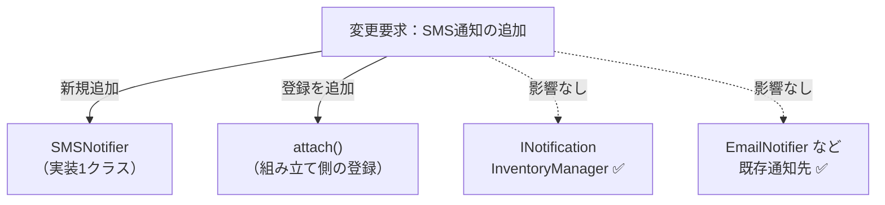

フェーズ3の変更影響グラフと同じ要求・同じ粒度で比べると、共通契約 `INotification` と通知元 `InventoryManager`、既存通知先は変更先から消えました。SMS通知の追加は、`SMSNotifier` の1クラスと登録（`attach`）だけに限定されます。

| 3-2で影響した場所 | 修正後 | 構造変更との対応 |
|---|---|---|
| `InventoryManager` のメンバ・`notifyAll()` の呼び出し | **修正しない** | 送信手段を各通知クラスへ移した |
| 3-2には通知部品の契約がなかった | `SMSNotifier` を1クラス追加する | 通知先の変更先を新しく作った |
| 通知先の登録 | 組み立て側で `attach` を1行増やす | 登録だけを増やす |

### 7-4：変更シナリオ表

今回の変更ID1について、フェーズ1の構造で必要だった修正と完成構造の結果を対比します。

**変更ID1：非同期SMSを追加し、受付・最終配信の失敗でも在庫更新と他通知を止めない**

- **フェーズ1の現状構造での影響**：`InventoryManager`へSMSの生成・固有呼び出し・受付IDの状態表・完了コールバックを追加
- **完成構造での結果**：`SMSNotifier`を登録し、受付IDを`DeliveryStatusLog`へ記録。`SMSDeliveryCallback`が後日更新し、受付失敗・最終配信失敗の両方で在庫更新と他通知が完了することを確認

通知責任を分けた代わりに、インターフェースを介する間接性、通知先の登録、クラス数を管理する必要があります。

---

## 整理

### 問題・原因・課題・解決策

**通知先が変わるたびに `InventoryManager` のメンバ変数・コンストラクタ・`notifyAll` が連動して変わる。非同期SMSでは受付IDの状態表と完了コールバックまで通知元へ入り込む**

- **原因**：`InventoryManager` が通知先の具体クラス名・送信メソッド・受付方法・最終状態の更新方法を直接知り、通知先の増加や失敗の扱いが通知元クラスの修正に直結している
- **課題**：通知元と通知先を切り離し、即時配布は共通契約、後日の最終結果は受付IDの状態ログへ接続して、在庫更新から分離する
- **解決策**：通知分離構造：`INotification::send()` が受付IDを含む `DeliveryResult` を返し、`InventoryManager` は登録先へ一律配布する。`DeliveryStatusLog` と `SMSDeliveryCallback` が保留から最終配信状態への更新を担う

### フェーズとこの章でやったこと

**この章でやったこと**

- **🔵 フェーズ1：現状把握**：在庫管理システムにおいて、通知元と複数の通知先クラスが密接に結合している構造を観察した。
- **🟣 フェーズ2：仮説立案**：在庫通知の運用担当者へのヒアリングを通じ、通知先が今後も頻繁に入れ替わることを「変動要因」として確定した。
- **🟣 フェーズ3：問題特定**：新しい通知手段を追加しようとすると、既存の通知元クラスを毎回修正する必要が生じるという「痛み」を確認した。
- **🟠 フェーズ4：原因分析**：通知元が、通知先の具体的な実装を直接知っていることが、影響範囲を広げる根本原因だと特定した。
- **🟡 フェーズ5：課題定義**：`StockAlert` と `DeliveryResult` を課題ID1の接続データとし、通知手段の種類・文面・同期非同期を在庫処理から外す課題を定めた。
- **🔴 フェーズ6：対策検討**：通知契約と4つの具体、配信状態ログと後日入口を決め、組み立て側が所有・登録した通知先が在庫更新から実行され、保留結果は後日のコールバックまでつながる構造を確定した。
- **🟢 フェーズ7：対策実施**：通知元はインターフェースのリストを保持し受付結果を集計するだけに留め、保留IDと最終配信結果は状態ログ・コールバック境界へ分離した。受付失敗・最終配信失敗でも通知ループと在庫更新を変えない構造を実現した。

### 責任の移動

| **責任** | **変更前** | **変更後** |
| --- | --- | --- |
| 在庫減算と通知先への通知 | `InventoryManager` | `InventoryManager`（変わらず） |
| 具体的な通知先クラスの直接保持 | `InventoryManager`（メンバとして直接宣言） | 組み立て側が共通契約の登録リストへ追加・解除 |
| 個別の通知手段と文面 | `EmailNotifier` 等（固有メソッド） | `EmailNotifier` 等が `StockAlert` から手段別に整形 |
| 同期・非同期・受付成否の扱い | 通知元へ入り込みそうだった | 各通知先が受付ID付きの `DeliveryResult` で返す |
| 受付結果の集約 | —（なし） | `InventoryManager` が件数を数える |
| 最終配信結果の更新 | —（なし） | `SMSDeliveryCallback` が `DeliveryStatusLog` の同じ受付IDを更新する |
| 通知受け取り契約の定義 | —（なし） | `INotification`（`DeliveryResult` を返す） |

> **このプロセスを回した結果にたどり着いた構造こそが 通知分離構造 です。**

---

### 複雑さを足しても対策は変わるか

この章に足した4つの複雑さが、7フェーズのどこで見え、どの構造で解けたかを対応させます。複雑度が上がっても、即時受付を通知先と `DeliveryResult`、後日の最終結果を状態ログとコールバック境界へ寄せることで、通知元は在庫イベントの発生と受付結果の集約だけに集中できました。

**在庫不足イベント**

- **見えた原因**：通知の発生が在庫更新に埋まっている
- **定めた課題**：通知元はイベント発生に集中する
- **採用した構造**：閾値判定で `notifyAll` を呼ぶだけに留める

**複数通知先**

- **見えた原因**：通知先の具体名が通知元へ漏れる
- **定めた課題**：通知先を同じ契約で束ねる
- **採用した構造**：`INotification` の登録リストで同報する

**非同期通知**

- **見えた原因**：待ち方と完了更新が通知元へ入り込もうとする
- **定めた課題**：即時受付と後日完了の入口を分ける
- **採用した構造**：`send()` が受付ID付きの保留を返し、コールバックが状態ログを更新する

**部分失敗**

- **見えた原因**：通知先ごとの成否分岐が通知元へ入る
- **定めた課題**：受付・最終配信の失敗でも在庫と他通知を止めない
- **採用した構造**：受付失敗は件数で集計し、最終配信失敗は同じ受付IDの状態だけを更新する

---

## 振り返り

### 「この章を読むと得られること」は手に入ったか

**この章のどこで示したか**

- **変動箇所の識別力**：フェーズ2の変わる見込み／今回維持する範囲の表で特定しました。
- **接続点の診断力**：フェーズ4で、通知先の種類・送信方法・同期非同期・受付成否が通知元へ漏れていることを確認しました。
- **構造改善の説明力**：フェーズ7の変更影響グラフ対比で証明しました。
- **動的な通知先管理**：フェーズ6と7で、`attach()` による動的登録の仕組みを学びました。

### 「はじめに」の3つの設計原則はどう適用されたか

* **原則1「変わるものを分けて囲う」の現れ**
* **具体化された場所：** 各通知先クラス（`EmailNotifier`, `ChatNotifier` など）
* **解説：** 送信という「変わる理由」を個別のクラスに分離し、具体的な実装を隠蔽しました。


* **原則2「具体ではなく契約に向かって書く」の現れ**
* **具体化された場所：** `INotification` インターフェース
* **解説：** 通知元は具体的な通知先クラスを知らず、インターフェースを通じて通知を送るようになりました。


* **原則3「継承より「持つ」を先に考える」の判断**
* **判断：** `InventoryManager`が`vector<INotification*>`へ通知先を登録し、同じ在庫イベントを全件へ配る。通知先追加のために`InventoryManager`を派生させない。
* **継承との区別：** 各通知先の`: public INotification`は異なる外部基盤を共通入口へ合わせる契約実装である。通知先を増減できる理由は、通知元が実体の一覧を保持するコンポジションにある。

---

## あなたのコードで考えてみてください

この章で辿った思考プロセスを、あなた自身のコードに当てはめてみましょう。

1. **変動の兆候を探す：** あなたのコードに「ある処理が完了したとき、複数の箇所に通知や後処理を追加する必要があった」メソッドがありますか？
2. **変える理由を問う：** 通知先（ログ、メール、画面更新など）の増減は、どの業務機能に属する変更ですか？その業務機能の知識が通知元のコードに埋め込まれていませんか？
3. **結合の強さを測る：** 通知先を1つ追加するとき、通知元のクラスを直接書き換える必要がありますか？そのとき既存の通知ロジックが壊れる可能性はどのくらいですか？
4. **分けた後を想像する：** もし「通知元」と「通知先」が互いの具体クラスを知らなくて済むとしたら、新しい通知先の追加は何ファイルの変更で完結しますか？

---

**題材を置き換えるときの共通手順**

この章の題材名を、自分の現場のシステム名に置き換えて考えます。

1. そのシステムは、誰が何を達成するために使うものか。
2. 入力、加工、出力は何か。
3. 最近入った変更要求、または次に来そうな変更要求は何か。
4. その変更で、触りたくない場所まで修正や再テストが広がるか。
5. 変えたいものと守りたいものを分けると、接続点には何を残すべきか。
6. 全課題を満たす完成構造が複数成立するか。成立するなら、責任配置・変更影響・導入コストの差は何か。

ここまで問題から導いた「通知分離構造」は、一般に **Observerパターン**と呼ばれます。ここからは題材を離れ、この名前で共有される抽象的な骨格を確認します。

## パターン解説：Observer パターン

Observer（観察者）という名の通り、あるオブジェクトの状態変化を、複数の「観察者」に自動的に通知する仕組みです。

### パターンの骨格

「通知を送る側（Subject）」が「通知を受け取る側（Observer）」のリストを保持し、状態が変化したときに一斉に通知を送ります。

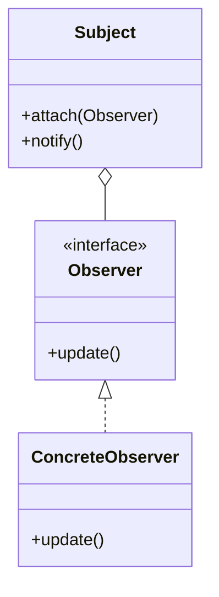

`Subject` は登録された相手を契約として持つだけで、何件いるか、どの具象かを判定しません。通知先を増やしても、線が増えるのは `Observer` の下側だけです。

### 抽象骨格の実行シーケンス

この図では、1つの変化が登録順に何件へ配られるのかを時間の順に見ます。

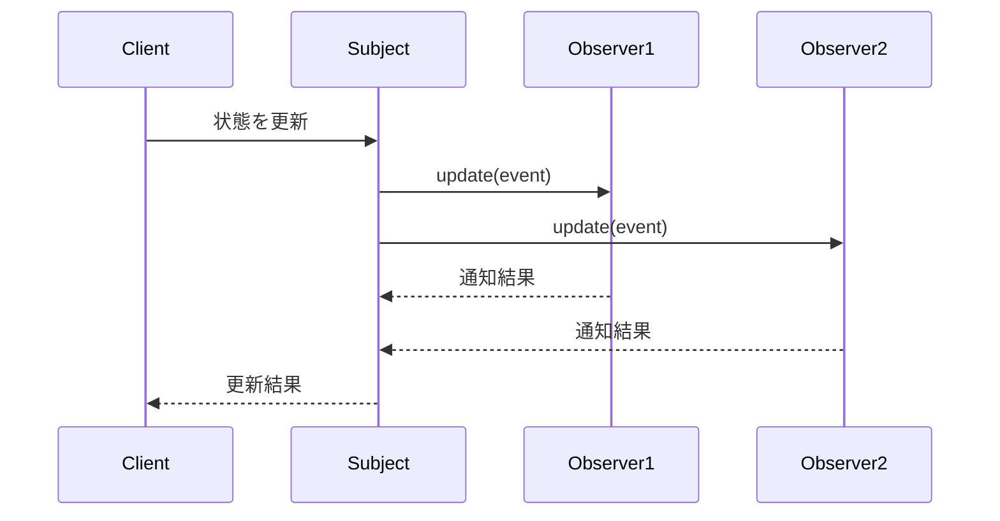

Subjectは具象通知先ではなくObserver契約の登録一覧だけを走査します。

### この章の実装との対応

`InventoryManager` が `Subject`（通知を送る側）、`INotification` が `Observer`（抽象ロール）、`EmailNotifier` 等が `ConcreteObserver`（具象観察者）に対応します。

### 使いどころと限界

* **使うと良い状況**：ある状態の変化を、複数の相手に即座に伝えたい場合。また、通知先が将来増えることが分かっている場合。
* **使わない方が良い状況**：（1）通知先が固定で増減の予定がない場合（例：ログ出力先が1か所のみで将来も変わらない）。（2）通知元が各通知先の**完了を順序どおり待ち合わせ**、その成否で自分の後続処理を分岐させる必要がある場合（例：処理AがBの完了を確認してからCを実行する二相的な連鎖）。この場合、通知元が各通知先の完了と順序を知る必要があり、「発信して受付結果を集める」Observerの切り分けと合いません。なお本章のように、通知元が在庫更新を確定させたうえで各手段へ一律配信し、返ってきた受付結果（成功・保留・失敗）を集約するだけ――どの手段がどの状態かを通知元が個別に待ち分岐しない――のであれば、非同期や部分失敗が混ざってもObserverは有効です。

* **寿命と通知中の変更に注意する状況**：SubjectがObserverを生ポインタで保持する場合、Observerを先に破棄するとダングリングポインタになります。登録解除を必須にする、所有期間を上位でそろえる、寿命の契約を決めます。また通知中の登録・解除、同一Observerの重複登録、Observer例外時に残りへ通知するかも仕様として定めます。

【過剰コード：変化の予定がないものまでパターン化した例】

```cpp
// そもそも通知先がメール一択で、今後も増える予定がないなら、
// 複雑な登録リストを管理するObserverパターンは過剰です。
```

### この章のまとめ

在庫通知というドメインと Observerパターンの関係を一言で言うなら、通知元が通知先を「具体的なクラス名で知ること」をやめ、「通知できる何か」という契約に置き換えることです。新しい通知先はリスナークラスとして追加し、組み立て箇所で登録します。通知契約が変わらない限り、在庫管理クラスの通知ループへ通知先ごとの分岐を増やさずに済みます。

7つのフェーズを通じて、読者は在庫管理クラスが通知先のクラス名を直接知っているという観察から始まり、「通知先が増えるたびに在庫管理を修正する」という痛みの分析を経て、通知先をリストとして管理し契約だけを通じて呼ぶという判断へと進みました。フェーズ2のヒアリングで「通知先は今後も追加される」と確認した時点で変化軸が確定し、フェーズ4で通知先の具体クラス名が接続点を越えて漏れていることを特定した時点で解決の方向が定まる——その気づきの順序こそが、この章の体験の核心です。

あなたのコードの中にも、ある処理が完了したときに複数の場所へ通知・連携を行っている箇所があるはずです。その通知先が「どの業務機能に属するか」を問うことが、通知先を登録して増減できる構造が必要かどうかを判断する入口になります。
