# 第3章 通知先への依存を切る ―― Observer パターン

―― 思考の型：一つの変化を、複数の相手にどう伝えるか

### この章の核心

**場面。** 一つの変化を、複数の相手へ伝える。

**兆候。** 伝える相手を足したり入れ替えたりするたびに、変化が起きた側まで直している。**起きた事実だけを持てばよいはずの側が、相手ごとの呼び方まで抱えています。**

**判断軸。** 起きた側が共通の通知契約だけを知る形にして、**誰に伝えるかを外から登録できるか。**

---

### この章を読むと得られること

この章で身につけるのは、在庫通知の作り方ではありません。ある出来事を起こす側と、その事実を受けて別々に動く側の依存を読み解き、両者を共通の接続へ組み直す力です。題材の固有名詞を離れて、次の判断を持ち帰ります。

* **得られること1：発生元と受信側の依存の特定。** 受信側を追加したときに発生元で開くメンバー・呼び分け・入力変換・結果解釈を、変更影響として特定できるようになる
* **得られること2：異なる責任の切り分け。** 出来事の発生と配布、受信側固有の変換、同期・非同期の完了管理を区別し、同じ場所へ置くべきでない理由を説明できるようになる
* **得られること3：通知契約と登録による再結合。** 受信側へ共通して渡す事実と返す結果から最小の契約を定め、具体を分離し、生成・所有・登録によって発生元へ再結合できるようになる
* **得られること4：効果と適用可否の検証。** 受信側の追加・削除が発生元を変えないかを確かめ、独立した同報、順序依存の処理、単一の直接呼び出しを構造から選び分けられるようになる

## 🔵 フェーズ1：現状把握 ―― 仕様を整理し、システムと紐付ける

### 1-1：このシステムの仕様

このシステムは、運用者から商品IDと入庫・出庫数量を受け取り、商品マスターから現在在庫と通知閾値を取得します。入力と在庫不足を検証して在庫を更新し、出庫後の在庫が閾値以下かを判定します。判定が成立した場合は、商品ID・商品名・更新後在庫を一つの**在庫警告の事実**として登録済みの通知手段へ渡します。各手段は必要な項目を使って固有の文面や表示を作り、最後に在庫の変更前後と通知件数を記録します。

#### まず代表入力と実行結果から動きをつかむ

詳細な仕様やコードへ入る前に、現状コードの`main()`で在庫減少（通知なし）、在庫減少（通知あり）、補充の3ケースを確認します。

**代表入力（現状コードの`main()`から抜粋）：**

```cpp
    // 準備：商品マスタを持つ在庫管理の入口を作る
    InventoryManager manager;

    // ケース1：PRD001（在庫50・閾値10）を5減らす → 閾値より上
    manager.reduceStock("PRD001", 5);
```

ケース1の実行結果です。

```
商品 PRD001（ワイヤレスマウス） の在庫を 5 減らしました。在庫: 50 -> 45
```

**渡したのは `"PRD001"` という商品IDと数量だけなのに、「ワイヤレスマウス」と「在庫: 50」が出ています。** どちらも、準備の行で作った在庫管理の入口（`InventoryManager`）が内側に持つ商品マスタから引いたものです。**実システムならデータベースの商品テーブルにある行を、掲載コードではこのクラスが自分の中に持っています。** 今回引いたのは、次の1行です。

| 商品ID | 商品名 | 在庫数 | アラート閾値 |
|---|---|---:|---:|
| PRD001 | ワイヤレスマウス | 50 | 10 |

**この本のコードでは、`〜Database` という名前のクラスが「あらかじめ登録されているデータ」を持ちます。** 在庫0の商品を含む全3件は、この後の現状仕様でまとめて示します。

続けて、閾値5のPRD002を3から2へ減らします。

```cpp
    // ケース2：PRD002（在庫3・閾値5）を1減らす → 閾値以下になり通知が飛ぶ
    manager.reduceStock("PRD002", 1);
```

ケース2の実行結果です。

```
商品 PRD002（USBハブ） の在庫を 1 減らしました。在庫: 3 -> 2
Email(1件) [在庫アラート] 商品 PRD002（USBハブ） の在庫が閾値以下です。
Dashboard(1件): PRD002 の在庫表示を 2 に更新
Chat(1件) #inventory-alert
  商品 PRD002（USBハブ） の在庫が閾値以下です。 -> POST-1
```

**メールは届きません。** `Email(1件)` の行は、掲載コードが標準出力へ書いた文字です。**実システムならメールサーバーへ送るところを、この本では「送ったつもりで1行出す」に置き換えています。** ダッシュボードもチャットも同じで、画面は更新されず、チャンネルへも投稿されません。この章で見たいのは「誰に送るか」が増えたときにどこを直すことになるかなので、送信そのものは代役で足ります。

**代役でも、通知が何件出たかは本物です。** `(1件)` は各クラスが自分で数えた件数で、要求ID2（在庫不足の通知）の「3つがそれぞれ1件ずつ受け取る」を、この出力で確かめられます。

最後に、PRD001を補充します。

```cpp
    // ケース3：PRD001を20補充する → 在庫が増え、通知は飛ばない
    manager.replenishStock("PRD001", 20);
```

ケース3の実行結果です。

```
商品 PRD001（ワイヤレスマウス）
  在庫を 20 補充しました。在庫: 45 -> 65
```

入力コメントの閾値と3つの結果を対応させると、ケース1は在庫45で閾値10より上なので通知行がなく、ケース2は在庫2が閾値5以下になって**3つの通知先の出力が続きます**。ケース3の補充結果にも通知行はありません。あわせて、3つの通知先が**それぞれ違う形式で出力している**ことにも注目してください。メールは件名付き、ダッシュボードは在庫数、チャットは投稿IDを返しています。この違いが、この章の出発点です。

この入力と出力から、(1)商品と増減数を受け取り、(2)在庫更新→閾値判定→通知の順に進み、(3)更新後の在庫が表示される（閾値以下なら通知が飛ぶ）、という一連の動きが読み取れます。

**この章での簡略化**

掲載コードが実際に更新する状態と、外部サービスの代役を分けておきます。

| 実システムの対象 | 掲載コードでの表現 | この章で省くもの |
|---|---|---|
| 商品マスター | `ProductDatabase` 内の `std::map` | 永続DB、排他制御 |
| メール・ダッシュボード・チャット | 各通知クラスの受信箱と標準出力 | 外部通信、認証、再試行 |
| 在庫操作画面 | `main()` からの商品ID・数量指定 | GUI、Web/APIの入力処理 |
| 運用ログ | メモリ上の記録と標準出力 | ログ基盤、長期保存 |

在庫更新、閾値判定、受信件数は実際に動かします。外部通信の代役は使いますが、**どの通知先をどう呼ぶかという依存関係は省略せず、現状コードどおりに再現します。**

#### 現行要求ベースライン

| 要求ID | 現行要求 | 受入条件 |
|---|---|---|
| 要求ID1（正確な在庫の維持） | 登録商品の入出庫を在庫数へ正しく反映する | 出庫で在庫が減り、補充で増える |
| 要求ID2（在庫不足の通知） | 閾値以下なら3手段へ知らせる | 全手段を呼び、1件が失敗しても残りを続ける |
| 要求ID3（誤更新の防止） | 未登録商品・不正数量・在庫不足による誤った在庫更新を防ぐ | 在庫数と通知件数を変えない |
| 要求ID4（在庫変動の追跡） | 在庫がいくつからいくつになったかを、あとで追えるようにする | 商品ID・変更前→変更後・単位を確認できる |

在庫の増減を記録し、出庫後の在庫が一定数以下になると、登録されているすべての通知先へメッセージを送ります。

この章の掲載コードが扱う値と規則を、抜けなく整理します。商品と在庫数は開始データ、通知条件と通知手段は現状システムの全種類です。

| 仕様項目 | この章で使う値 | 役割 |
|---|---|---|
| 商品マスター | PRD001：ワイヤレスマウス、在庫50、閾値10 | 開始データ |
|  | PRD002：USBハブ、在庫3、閾値5 | 開始データ |
|  | PRD003：キーボード、在庫0、閾値5 | 開始データ |
| 在庫操作 | 出庫、補充 | 現行の全公開操作 |
| 通知条件 | 出庫後の在庫が閾値以下 | 通知を出す唯一の条件 |
| 通知手段 | メール、ダッシュボード、チャット | 現行の全通知手段 |
| 出力 | 在庫の変更前後、通知先ごとの受信内容と件数 | 在庫更新と通知発生を照合する |

ここで確認する対象は、どの在庫変動で通知が発生するかです。

通知を受け取る相手は倉庫担当者や在庫管理チームです。メール、ダッシュボード、チャットは、その相手へ届ける**通知手段**です。3手段には業務上の前後関係がなく、メールの結果をダッシュボードの入力にすることもありません。同じ在庫不足という事実をそれぞれ独立して受け取り、1件が失敗しても残りを続けます。掲載コードは順に呼びますが、**登録順は業務上の優先順位ではありません。**

**システム全体図：在庫管理と通知先の境界**

最も大きな境界は「担当者 → 在庫管理システム → 外部の通知手段」です。商品マスターと実行結果は対象システムの内側に、メール等の通知先は外側に置きます。

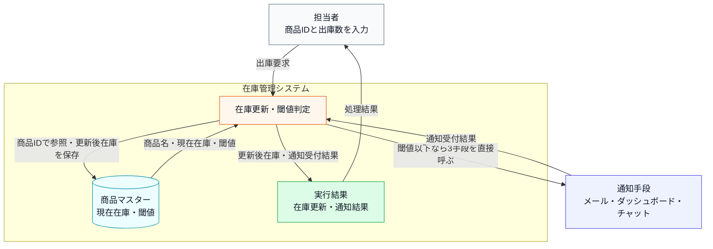

**次のシステム内部図は、代表となる1件の出庫を最後まで通したものです。** 他の商品や数量の組み合わせは動作例でまとめて確認します。ここで見てほしいのは**箱の並びと矢印の向き**です。

**システム内部図：正常系の入力・判定・加工・出力**


直前のシステム内部図から読み取ることは、次の3点です。

- 通知は在庫更新そのものではなく、出庫後の在庫が閾値以下のときに発生する。
- 商品の特定、在庫更新、閾値判定、通知は順番に依存している。
- 出力には在庫状態と通知メッセージがあり、通知先が増えると影響を受けるのは後者である。

**通知の動作ルール**

通知を送るかどうかの判断は「出庫後の在庫数が閾値以下か」という一点だけで決まります。補充のような在庫の増加は通知の対象外です。閾値をまたいだ瞬間だけでなく、**閾値以下で出庫するたびに毎回**通知します。

| 状況 | 動作 |
|---|---|
| 在庫が閾値以下に減少した | 登録済みの全通知先へ通知を送る |
| 在庫が閾値を超えている | 通知しない |
| 通知先が1件も登録されていない | 何もしない（エラーにならない） |

「閾値以下になったら全通知先へ」という動作は、発注漏れを防ぐための安全策です。一部の通知先だけに送ると、担当者によって情報の到達タイミングがずれてしまうため、同時に全員へ届ける設計になっています。

**現在登録されている受信者と通知手段**

受信者は人またはチームであり、メールなどは受信者へ届ける手段です。コード上の通知アダプターは、この通知手段の違いを担当します。

| 受信者 | 通知手段 | コード上のアダプター |
|---|---|---|
| 倉庫担当者 | メール | メール通知境界 |
| 在庫管理チーム | 社内ダッシュボード | 社内ダッシュボード通知境界 |
| 在庫担当者 | 社内チャット | 社内チャット通知境界 |

この3つの通知先は、それぞれ異なるシステムや担当チームによって管理されています。メールはインフラ管理部門が、ダッシュボードはフロントエンドチームが、チャットは各部門のマネージャーが運用を担っています。

**この仕様を決める業務機能**

このシステムでは、異なる理由で変更される知識がどの業務機能に属するかを見ておきます。メール宛先はインフラ・システム管理の範囲、ダッシュボードの表示はUI・表示管理の範囲、チャット連絡網は通知・連携管理の範囲です。

| 業務機能 | この章の仕様で決めていること |
|---|---|
| インフラ・システム管理 | メール等の通知手段の採用・廃止 |
| UI・表示管理 | ダッシュボードの表示仕様 |
| 通知・連携管理 | チャット等の連絡網の変更 |
| 処理の骨格（開発設計判断） | 閾値判定ロジック・システム保守 |

後のフェーズで変更要求を扱うとき、どの業務機能の知識なのかを確認するための名前として使います。

**エラー条件**

在庫更新へ進めない入力は3種類です。

- **登録されていない商品IDを指定する**と、「マスタに存在しません」と表示して終わります。
- **在庫より多い数を出庫しようとする**と、「出庫できません」と表示して終わります。
- **0以下の数量を出庫・補充しようとする**と、不正数量として表示して終わります。

どちらの場合も、**在庫は変わらず、通知も送りません。**

在庫を更新したあと、**通知そのものが失敗したときの扱いは、手段によって違います。**

| 通知手段 | 失敗したとき |
|---|---|
| メール | 「通知受付失敗」と表示する |
| ダッシュボード | **失敗したかどうかが分からない**（成否を返さないため） |
| チャット | 「通知受付失敗」と表示する |

**どれが失敗しても、在庫は戻しませんし、残りの手段への通知も止めません。** 再送もしません。なお掲載コードの通知先は必ず成功するので、この表示は実行結果には出てきません。

### 1-2：動作例テーブル

変更要求が届く前の在庫システムが、どの入力で在庫を変え、どの条件で通知するかを確認します。

| シナリオ            | 操作                         | 通知・更新の結果            |
| --------------- | -------------------------- | ------------------- |
| 在庫が閾値を超えたまま減少   | ワイヤレスマウス（PRD001）の在庫を5減らす   | 50→45（閾値10）→ 通知なし   |
| 在庫が閾値以下に減少      | USBハブ（PRD002）の在庫を1減らす      | 3→2（閾値5）→ 全通知手段へ送信  |
| 在庫が補充される（閾値超え）  | ワイヤレスマウス（PRD001）の在庫を20補充する | 45→65 → 送信されない・更新のみ |
| 在庫0の商品を減らす（エラー） | キーボード（PRD003）の在庫を1減らす      | 出庫エラー・通知なし          |
| 存在しない商品ID（エラー）  | PRD999を操作する                | マスタ不存在エラー・通知なし      |
| 0個の補充（エラー） | PRD001を0個補充する | 不正数量エラー・在庫65のまま・通知なし |

在庫が閾値以下になったときは現在の3通知先すべてへ送り、閾値を超えて
いるときは通知しないことが核心です。

次は、この仕様を担うクラスの顔ぶれと責任を確認します。

---

### 1-3：登場クラスとクラス構成図

このシステムに登場するクラスを先に確認します。

| クラス名 | 役割 | 担当する仕様 |
|---|---|---|
| `ProductDatabase` | 商品マスタを保持し、在庫数・アラート閾値を提供する | 商品IDの存在確認、在庫数と閾値の参照 |
| `ProductInfo` | 商品1件分の在庫情報を表す | 商品名・在庫数・通知閾値の受け渡し |
| `InventoryManager` | 在庫数を管理し、必要な通知を呼び出す | 在庫更新、閾値判定、通知実行 |
| `EmailNotifier` | メール通知を送る（件名と本文を受け、成否を真偽値で返す） | メール通知 |
| `DashboardUpdater` | ダッシュボード表示を更新する（商品コードと在庫数を受け、戻り値は無い） | 管理画面への反映 |
| `ChatNotifier` | チャット通知を送る（投稿先と本文を受け、投稿IDを返す） | チャット連絡 |

各クラスの責任を把握したところで、クラス同士の関係を図で確認します。

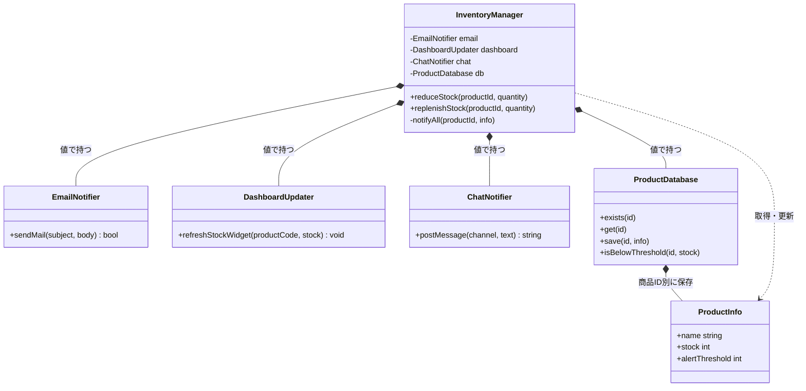

**クラス図に出てくる主なメンバーと操作**

| クラス | 主な操作 | 役割・戻り値の違い |
|---|---|---|
| `InventoryManager` | `reduceStock()` / `replenishStock()` / `notifyAll()` | 在庫を更新し、閾値以下なら3手段を固有の呼び方で呼ぶ |
| `ProductDatabase` | `exists()` / `get()` / `save()` / `isBelowThreshold()` | 商品ID・現在在庫・閾値を管理する |
| `EmailNotifier` | `sendMail()` | 成否を `bool` で返す |
| `DashboardUpdater` | `refreshStockWidget()` | 戻り値がなく、成否を返さない |
| `ChatNotifier` | `postMessage()` | 投稿IDを返し、空文字列が失敗を表す |


直前の現状クラス図が示す通り、InventoryManager という単一のクラスが、通知先であるすべてのクラス（メール、ダッシュボード、チャット）を直接保持している構成になっています。

**現状システムの処理シーケンス**

静的な関係に続けて、正常系（出庫でしきい値以下になり通知が走る）で各クラスがどの順に呼ばれ何を受け渡すかを時系列で示します。通知の具体の分岐は `InventoryManager` の注記に、エラー系はメモとして添えます。現状コードの現状コードを読む前の地図です。

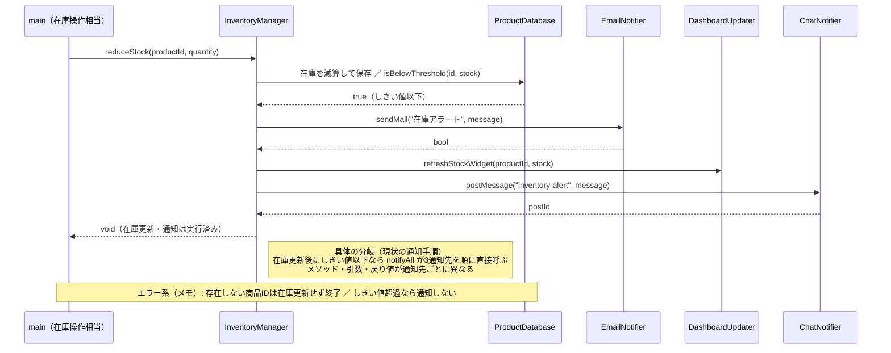

直前の処理シーケンス図から読み取れるのは、`InventoryManager` が在庫更新後にしきい値を判定し、しきい値以下のときだけ `notifyAll` で3つの通知先を順に直接呼ぶこと、各通知先のメソッド名（`send`／`update`／`send`）まで通知元が知っていることです。通知先の名前と呼び方が通知元に集まっている呼び出し順を、この時系列と注記で確認できます。

### 1-4：実装コード（現状）

通知は同期的に3クラスへ順番実行します。現状には通知先の登録一覧や登録解除操作はなく、`notifyAll()` が3つの具体クラスを名指しします。3つは呼び方がそろっておらず、引数の組み立てと戻り値の解釈も `notifyAll()` の側にあります。

#### 現状コード

クラスを1つずつ、上から順に読みます。**メンバー変数と、それを使う処理を同じ場所で見られるように**しています。宣言と定義を分けるのは `InventoryManager` だけです。**処理順が長く、メンバーを見ながら追う必要があるクラスだけ**、宣言と定義を分けています。


`main()` と実行結果は最後に、行のまとまりごとに並べます。

---

**共通ヘッダー**

```cpp
#include <iostream>
#include <string>
#include <vector>
#include <map>
#include <unordered_map>

using namespace std;
```

以降のすべてのクラスが使います。

---

**ProductInfo と ProductDatabase**

仕様で見た「商品」にあたるデータです。商品IDから在庫数・アラート閾値を引き、エラー条件「存在しないID」と閾値判定をここで担います。

```cpp
// 商品マスタの1件分
struct ProductInfo {
    string name;         // 商品名
    int    stock;        // 在庫数
    int    alertThreshold; // アラート閾値
};
```

**ProductDatabase**

```cpp
// 商品マスタ（データ駆動バリデーション用）
class ProductDatabase {
private:
    map<string, ProductInfo> records;
public:
    ProductDatabase() {
        records["PRD001"] = {"ワイヤレスマウス", 50, 10};
        records["PRD002"] = {"USBハブ",           3,  5}; // 閾値以下
        records["PRD003"] = {"キーボード",         0,  5}; // 在庫なし
    }

    bool exists(const string& id) const {
        return records.count(id) > 0;
    }

    ProductInfo get(const string& id) const {
        return records.at(id);
    }

    void save(const string& id, const ProductInfo& info) {
        records[id] = info;           // 実行中の商品マスタへ追加
    }

    bool isBelowThreshold(const string& id,
                          int currentStock) const {
        return currentStock <= records.at(id).alertThreshold;
    }
};
```

- **責任：** 商品IDで在庫と閾値を読み書きし、閾値以下かを判定する
- **副作用：** `save()` だけが `records` を書き換える

閾値は商品ごとに違います。判定は `isBelowThreshold()` の1か所だけで行います。実システムのDBを、実行中のインメモリ表で代替しています。

---

次の3つが通知先です。**関数名も、引数も、戻り値も、3つともそろっていません。** 実際のメール・ダッシュボード・チャットへの送信は、標準出力で代替します。各クラスが数える件数は、要求ID2（在庫不足の通知）どおり同じ通知機会に各手段が1件ずつ受け取ったことを確認するテスト用の観測点です。

---

**EmailNotifier**

```cpp
// メール基盤：件名と本文が分かれ、送れたかどうかだけを返す
class EmailNotifier {
    vector<string> inbox;
public:
    bool sendMail(const string& subject, const string& body) {
        inbox.push_back(body);
        cout << "Email(" << inbox.size() << "件) [" << subject
             << "] "
             << body << endl;
        return true;
    }
};
```

件名と本文を**2つに分けて**受け取り、`bool` で成否を返します。

---

**DashboardUpdater**

```cpp
// 社内ダッシュボード：文言ではなく商品コードと在庫数を受け取る。
// 画面を描き直すだけなので、成否を返さない
class DashboardUpdater {
    int refreshCount;
public:
    DashboardUpdater() : refreshCount(0) {}
    void refreshStockWidget(const string& productCode,
                            int stock) {
        ++refreshCount;
        cout << "Dashboard(" << refreshCount << "件): "
             << productCode
             << " の在庫表示を " << stock << " に更新" << endl;
    }
};
```

文言を受け取りません。商品コードと在庫数という**生の値**を受け取り、画面を描き直します。戻り値が `void` なので、**送れたかどうかを確かめる手段がありません。**

---

**ChatNotifier**

```cpp
// チャット基盤：投稿先チャンネルが要り、投稿IDを返す。
// 空の投稿IDが失敗を表す
class ChatNotifier {
    vector<string> posted;
public:
    string postMessage(const string& channel,
                       const string& text) {
        posted.push_back(text);
        string postId = "POST-" + to_string(posted.size());
        cout << "Chat(" << posted.size() << "件) #" << channel
             << "\n"
             << "  " << text << " -> " << postId << endl;
        return postId;
    }
};
```

投稿先チャンネルが要ります。返すのは投稿IDで、**空文字列が失敗**を表します。

---

3つを並べます。

| 通知手段 | 関数名 | 引数 | 戻り値と、失敗の表し方 |
|---|---|---|---|
| メール | `sendMail` | 件名と本文の2つ | `bool`。`false` が失敗 |
| ダッシュボード | `refreshStockWidget` | 商品コードと在庫数 | `void`。**失敗を表せない** |
| チャット | `postMessage` | 投稿先と本文 | `string`（投稿ID）。空文字列が失敗 |

メールとチャットへ渡す文言は同じですが、ダッシュボードは文言を受け取らず、在庫数そのものを受け取ります。戻り値は `bool`・`void`・`string` の3通りで、`void` のダッシュボードだけは送れたかどうかが返りません。

---

**InventoryManager の宣言**

この章の中心です。仕様で見た「在庫の増減」と「閾値以下での全通知先への通知」に対応します。

```cpp
class InventoryManager {
private:
    EmailNotifier    email;
    DashboardUpdater dashboard;
    ChatNotifier     chat;
    ProductDatabase  db;

public:
    void reduceStock(string productId, int quantity);
    void replenishStock(string productId, int quantity);

private:
    void notifyAll(const string& productId,
                   const ProductInfo& info);
};
```

**3つの通知クラスを具体名で値メンバとして持っています。** 外から差し替える余地はありません。外から呼べるのは、出庫の `reduceStock()` と入庫の `replenishStock()` の2つで、通知は非公開の `notifyAll()` に閉じています。定義を3つ、上のメンバーを見ながら読んでいきます。

---

**InventoryManager::reduceStock()**

```cpp
void InventoryManager::reduceStock(string productId,
                                   int quantity) {
    if (!db.exists(productId)) {
        cout << "[エラー] 商品ID " << productId
             << " はマスタに存在しません。処理を中断します。"
             << endl;
        return;
    }

    ProductInfo info = db.get(productId);

    if (quantity <= 0 || quantity > info.stock) {
        cout << "[エラー] 商品 " << productId << "（" << info.name
             << "）"
             << " は " << quantity << " 個出庫できません。現在在庫: "
             << info.stock << endl;
        return;
    }

    int before = info.stock;
    info.stock -= quantity;
    db.save(productId, info);
    cout << "商品 " << productId << "（" << info.name << "）"
         << " の在庫を " << quantity << " 減らしました。在庫: "
         << before << " -> " << info.stock << endl;

    if (db.isBelowThreshold(productId, info.stock)) {
        notifyAll(productId, info);
    }
}
```

- **役割：** 商品と数量を検証し、在庫を保存した後、低在庫なら通知処理へつなぐ
- **順序に意味：** 保存してから閾値を判定します。保存前に判定すると、通知した在庫数と保存された在庫数がずれます
- **失敗の扱い：** 存在確認と数量検証で落ちたら、在庫も通知も動かしません

在庫が閾値以下になったときだけ `notifyAll()` を呼びます。

---

**InventoryManager::replenishStock()**

入庫のときに呼ぶ、`reduceStock()` の対になる操作です。仕入れが届いたり、キャンセルで戻ってきたりした分を在庫へ足します。要求ID1（正確な在庫の維持）の「入庫」がこれにあたります。

```cpp
void InventoryManager::replenishStock(string productId,
                                      int quantity) {
    if (!db.exists(productId)) {
        cout << "[エラー] 商品ID " << productId
             << " はマスタに存在しません。処理を中断します。"
             << endl;
        return;
    }

    ProductInfo info = db.get(productId);

    if (quantity <= 0) {
        cout << "[エラー] 商品 " << productId << "（" << info.name
             << "） は " << quantity
             << " 個補充できません。現在在庫: "
             << info.stock << endl;
        return;
    }

    int before = info.stock;
    info.stock += quantity;
    db.save(productId, info);
    cout << "商品 " << productId << "（" << info.name << "）\n"
         << "  在庫を " << quantity << " 補充しました。在庫: "
         << before << " -> " << info.stock << endl;
}
```

このコードには `isBelowThreshold()` も `notifyAll()` も出てきません。**在庫が増える側では、閾値を判定しないからです。** 通知が出るのは減少のときだけで、そこは `reduceStock()` の末尾にあります。

---

**InventoryManager::notifyAll()**

```cpp
void InventoryManager::notifyAll(const string& productId,
                                 const ProductInfo& info) {
    // 通知先が増えるたびに、ここが修正される。
    // 3つの基盤は引数の形も戻り値の意味も違うので、
    // 呼び分けと結果の解釈をこのメソッドが全部引き受けている。
    string message = "商品 " + productId + "（" + info.name + "）"
                   + " の在庫が閾値以下です。";

    // メールは件名と本文に分け、真偽値で成否を見る
    if (!email.sendMail("在庫アラート", message)) {
        cout << "[通知受付失敗] Email" << endl;
    }

    // ダッシュボードは文言を受け取らず、成否も返さない。
    // 送れたかどうかを確かめる手段がない
    dashboard.refreshStockWidget(productId, info.stock);

    // チャットは投稿先が要り、空の投稿IDが失敗を表す
    string postId = chat.postMessage("inventory-alert",
                                     message);

    if (postId.empty()) {
        cout << "[通知受付失敗] Chat" << endl;
    }
}
```

3つの通知先を名指しで直接呼び出しています。呼ぶだけでなく、**手段ごとに違う引数を組み立て、違う戻り値をそれぞれの流儀で解釈するところまで引き受けています。** 同じ `message` を作っておきながら、ダッシュボードへは渡していません。成否の確認も、メールは `!` で、チャットは `.empty()` で、ダッシュボードは確認なしと3通りです。この `notifyAll()` が、通知先が増えるたびに修正される箇所です。

---

#### `main()` と実行結果

動作例の5ケースを一つずつ実行します。**在庫はケースをまたいで引き継がれます。**

---

**組み立てと、ケース1：PRD001を5減らす**

```cpp
int main() {
    InventoryManager manager;

    cout << "--- ケース1: PRD001を5減らす ---" << endl;
    manager.reduceStock("PRD001", 5);
```

```
--- ケース1: PRD001を5減らす ---
商品 PRD001（ワイヤレスマウス） の在庫を 5 減らしました。在庫: 50 -> 45
```

`InventoryManager` が通知クラスも商品マスタも内部で作るので、`main()` で組み立てるものはありません。45は閾値10を上回るので通知は出ません。

---

**ケース2：PRD002を1減らす**

```cpp
    cout << "--- ケース2: PRD002を1減らす ---" << endl;
    manager.reduceStock("PRD002", 1);
```

```
--- ケース2: PRD002を1減らす ---
商品 PRD002（USBハブ） の在庫を 1 減らしました。在庫: 3 -> 2
Email(1件) [在庫アラート] 商品 PRD002（USBハブ） の在庫が閾値以下です。
Dashboard(1件): PRD002 の在庫表示を 2 に更新
Chat(1件) #inventory-alert
  商品 PRD002（USBハブ） の在庫が閾値以下です。 -> POST-1
```

2は閾値5以下なので3件とも通知されました。**出力の形が3行とも違います。** メールとチャットは同じ文言を、ダッシュボードは在庫数の `2` を表示しています。

---

**ケース3：PRD001を20補充する**

```cpp
    cout << "--- ケース3: PRD001を20補充する ---" << endl;
    manager.replenishStock("PRD001", 20);
```

```
--- ケース3: PRD001を20補充する ---
商品 PRD001（ワイヤレスマウス）
  在庫を 20 補充しました。在庫: 45 -> 65
```

45から始まっているのは、ケース1の減少が保存されているからです。補充なので通知は出ません。

---

**ケース4：PRD003を1減らす**

```cpp
    cout << "--- ケース4: PRD003を1減らす ---" << endl;
    manager.reduceStock("PRD003", 1);
```

```
--- ケース4: PRD003を1減らす ---
[エラー] 商品 PRD003（キーボード） は 1 個出庫できません。現在在庫: 0
```

在庫0からは出庫できません。数量検証で止まるので、在庫も通知も動きません。

---

**ケース5：存在しない商品IDを操作する**

```cpp
    cout << "--- ケース5: 存在しない商品IDを操作する ---" << endl;
    manager.reduceStock("PRD999", 1);
```

```
--- ケース5: 存在しない商品IDを操作する ---
[エラー] 商品ID PRD999 はマスタに存在しません。処理を中断します。
```

`reduceStock()` の先頭にある `db.exists(productId)` が偽になり、そこで `return` します。在庫も通知も動きません。

**ケース6：0個の補充を拒否する**

ケース6は、登録済み商品でも0個以下の補充を拒否できることを確認します。

```cpp
    cout << "--- ケース6: 0個の補充を拒否する ---" << endl;
    manager.replenishStock("PRD001", 0);

    return 0;
}
```

```
--- ケース6: 0個の補充を拒否する ---
[エラー] 商品 PRD001（ワイヤレスマウス） は 0 個補充できません。現在在庫: 65
```

---

動作例テーブルの各行について、在庫が閾値以下になった減少では3通知先へ送信され、正常な補充では通知されず、在庫0・未登録ID・0個の補充はエラーになることを確認できました。

---

### 1-5：変更要求

**変更要求の発生チーム：** 今回の変更要求は店舗運営チームから届いています。通知先の増減を判断するチームです。一方で、在庫の管理自体はシステム基盤チームが担っています。


ある週の月曜日、店舗運営部の田中部長から、在庫管理システムの改善依頼がメールで届きました。

「在庫が少なくなった時に、倉庫担当者のスマホへSMS（ショートメッセージ）でも直接通知を送れるようにしたいんだ。メール、ダッシュボード、チャットはあるけれど、作業中に確認が遅れて発注が漏れることがあってね。来月の店舗改装のタイミングで運用を変えたいから、なんとか対応してくれないか？」

開発チームは依頼を変更IDへ落とす前に、採用予定のSMS基盤のAPI仕様と失敗時の運用を確認しました。SMS基盤は送信要求に受付IDを返し、端末への最終配信結果を後からコールバックします。その場で配信完了を返す同期APIはありません。

**開発者：** 「受付または最終配信に失敗した場合、在庫更新やメールなどの他通知も失敗扱いに戻しますか。また、最終結果のために在庫操作画面を変えますか？」

**田中部長：** 「在庫の事実と届いた通知まで戻ると困るので、SMSだけ失敗として残してほしい。最終結果は履歴へ記録できればよく、今回、在庫操作画面は変えなくてよい。」

この外部API制約と運用判断により、単なる通知先追加に加え、「受付と最終配信を二段階で記録する」「SMSの失敗を在庫更新と他通知から切り離す」「操作UIは変更しない」が今回の確定範囲になりました。

依頼とSMS境界の制約を、一つの変更IDと、その変更で更新・追加する要求として固定します。

| 変更ID | 変更内容 | 確認する具体例 |
|---|---|---|
| 変更ID1（非同期SMS追加） | SMSを加え、受付・最終配信の失敗でも在庫更新と他通知を止めない | 4手段の受付件数を集計し、SMSの受付IDを保留から配信完了または配信失敗へ更新できる |

#### 変更後要求ベースライン

| 要求ID・種別   | 変更後も満たす要求                             | 受入条件                                                                    |
| --------- | ------------------------------------- | ----------------------------------------------------------------------- |
| 要求ID1（継続） | 登録商品の入出庫で在庫数を更新する                     | 出庫で在庫が減り、補充で増える                                                         |
| 要求ID2（変更） | 閾値以下なら4手段へ在庫不足を知らせ、1手段の不調で残りを止めない | SMSを含む4手段をそれぞれ呼び、受付・配信失敗でも在庫更新と残りの通知を戻さない |
| 要求ID3（継続） | 未登録商品・不正数量・在庫不足による誤った在庫更新を防ぐ          | 不正操作では在庫数と通知件数を変えない                                                     |
| 要求ID4（継続） | 在庫の内部数値変化をログへ残す                       | 商品ID・変更前→変更後・単位を確認できる                                                   |
| 要求ID5（追加） | SMSへ依頼した結果を担当者があとから確認し、再送の要否を判断できる | SMSごとの受付結果と最終配信結果を対応づけて記録できる |

要求ID2（在庫不足の通知）の通知先追加と、要求ID5（SMS配信結果の確認）は、変更ID1（非同期SMS追加）による変更です。1件が失敗しても残りを続ける規則は変更前から要求ID2（在庫不足の通知）に含まれており、新しい要求として増やしません。受付IDや保留状態は、要求ID5（SMS配信結果の確認）を実現するためにSMS基盤との境界で必要になる識別子と状態であって、利用者要求そのものではありません。
要求ID1（正確な在庫の維持）・要求ID3（誤更新の防止）・要求ID4（在庫変動の追跡）は継続し、要求ID2（在庫不足の通知）を3手段から4手段へ変更し、要求ID5（SMS配信結果の確認）を追加します。これにより、既存の入力拒否と、新しく必要になった通知失敗の扱いを別々に検証できます。変更依頼にない在庫ログ項目の追加は行いません。

#### 変更後に有効な業務ルール

要求一覧をもう一度言い換えるのではなく、これからコードの通知処理へ落とすルールを確定します。既存3手段は継続し、SMSだけを追加します。
| 区分 | 通知先 | 変更内容 |
|---|---|---|
| 継続 | EmailNotifier、DashboardUpdater、ChatNotifier | 現行の3手段をそのまま使う |
| 新規 | **SMSNotifier** | 受付IDを返す非同期SMSを追加する |

今回変えるのは通知先の種類です。商品情報と在庫数を取得する保存基盤は仕様変更の対象ではないため、`ProductDatabase` の取得・更新契約は変更前後で**変更なし**とします。

出庫後の在庫が閾値以下のとき、これまでの3チャネル（メール・ダッシュボード・チャット）に加えて、倉庫担当者のスマートフォンへSMSが送信されるようになります。

通知のトリガー条件（在庫が閾値以下になること）と、「登録されている全通知先へ同じ警告機会に通知する」という動作ルールは変わりません。掲載コードは登録順に呼びますが、各通知は互いの結果に依存しません。変わるのは「通知先の種類が1つ増える」ことと、SMSだけは受付IDを返した後、別の時点で最終配信結果が到着することです。既存のメール・ダッシュボード・チャットのようにその場で完了する同期通知とは、結果が二段階になります。

**SMS追加時の通知処理と確認点**

通知先が1つ増えるだけに見える変更でも、現実には次の複雑さが同時に入ります。この章では、これらを通知元（`InventoryManager`）が抱え込むことになるかどうかを追います。

| 追加する複雑さ | 具体例 | この章で見ること |
|---|---|---|
| 在庫不足イベント | 出庫後の在庫が閾値以下なら通知が発生する | 通知元がイベント発生だけに集中できるか |
| 複数通知先 | メール・ダッシュボード・チャット・SMSへ同報する | 通知先の数が増えても通知元の分岐が増えないか |
| 非同期通知 | SMSは受付IDを返し、最終結果は後日のコールバックで確定する | 受付と完了を別の境界で扱い、状態を追跡できるか |
| 部分失敗 | SMSだけ受付または最終配信に失敗する | どちらの失敗でも他の通知と在庫更新が止まらないか |

**変更前後の入力・判定・加工・出力差分**

現状の仕様を退避し、変更要求を当てた後の仕様と同じ粒度で並べます。以降の分析では、この差分を追います。

| 要素 | 変更前 | 変更後 |
|---|---|---|
| 入力 | 商品ID、数量、3通知手段 | **SMSと後日の配信結果が加わる** |
| 判定 | 商品存在、在庫十分、閾値以下 | 変更なし |
| 加工 | 在庫更新後に3手段へ通知 | **4手段の受付を集計し、SMSの最終状態を後日更新** |
| 出力 | 在庫更新結果と3通知 | **受付集計と受付ID別の完了・失敗ログが加わる** |

**変更後の入力・加工・出力**

最初にシステム境界の変化を確認します。担当者から見た在庫操作と商品マスターは変わりません。外部通知手段にSMSが加わり、SMS基盤から後日の配信結果が戻る境界だけが増えます。**本章では外部システムとの境界そのものが増えるため、この図を置きます。第1章・第2章の変更はシステム内部に閉じるため、内部の差分図だけで足ります。章ごとの図の数をそろえるのではなく、変わる境界だけを描きます。**

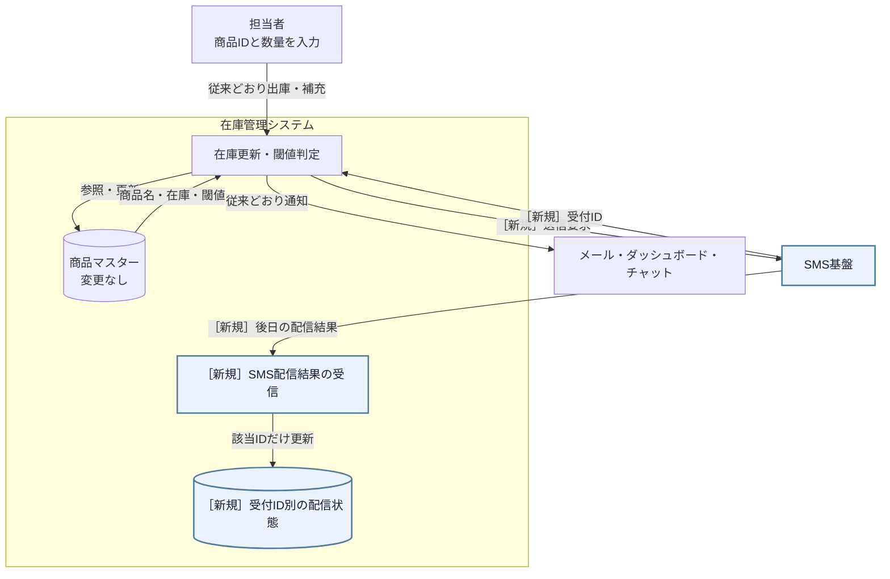

このシステム全体図で外部境界を押さえたうえで、同じ変更をシステム内部の処理順へ落とします。箱の形と淡い色は入力・保持値・処理・判定・出力という**役割**を補助し、箱の先頭に置いた `［新規］`・`［変更］` と控えめな差分色は現状からの**差分**を表します。役割も差分も、色だけで判別させません。


直前の変更後システム内部図から読み取ることは、次の3点です。

- 在庫更新・しきい値判定・「同報する」という加工の骨格は、通知先が増えても変わらない。
- 変わるのはSMSが加わる即時経路と、受付IDを使って最終配信状態を更新する後日経路である。
- 受付失敗と最終配信失敗のどちらでも、在庫更新と他通知を止めずに結果だけを追跡できるかが、フェーズ3「問題特定」で確認する点になる。

変更後も、失敗条件は正常系図へ混ぜずに別で確認します。

- **登録されていない商品IDを指定する**と、「マスタに存在しません」と表示して終わります。在庫は変わらず、通知も送りません。
- **在庫より多い数を出庫しようとする**と、「出庫できません」と表示して終わります。こちらも在庫は変わりません。
- **SMSの受付が失敗した**ときは、**在庫の更新はそのまま確定し、他の通知先へも送り続けます。** 失敗したのはSMSだけとして記録します。
- **SMSの最終配信が後から失敗した**ときは、届いた配信結果で受付IDの記録を「配信失敗」へ更新します。**在庫更新と他の通知はすでに確定していて動かず、SMSの履歴だけが変わります。**

受付失敗と後日の配信失敗は、正常系の在庫更新を止めません。即時の通知元はイベントを出して受付結果を集め、後日のコールバック境界は受付IDに対応する状態だけを更新します。この二つを現在の構造へ入れるとどこまで修正が広がるかを、フェーズ3「問題特定」で確認します。

**フェーズ1のまとめ：今回追う変更ID一覧**

このフェーズで確定した変更依頼を一覧にして締めます。フェーズ2「仮説立案」でこの変更IDを仮説・ヒアリングへ、フェーズ3「問題特定」で試して痛みへ、と順につなぎます。

| 変更ID | 変更依頼の要点 | 関係する要求ID（追加は変更後ID） |
|---|---|---|
| 変更ID1（非同期SMS追加） | SMSの失敗でも在庫更新と他通知を続ける | 要求ID2（通知）、要求ID5（配信結果の確認） |

---

## 🟣 フェーズ2：仮説立案 ―― 何が変わるかを観察し、ヒアリングで裏付ける
ここからフェーズ2（仮説立案）に進みます。フェーズ1「現状把握」で観察した事実をもとに、「何が変わる見込みか・今回何を維持するか」を仮説として立て、関係者へのヒアリングで裏付けます。

### 2-1：変わりそうな仕様の見当をつける

フェーズ2「仮説立案」では、フェーズ1「現状把握」で見た仕様のうち、どの通知先・通知方法・しきい値判定が変わりそうかを見当づけます。責務の配置は、変更要求を当てた後の痛みと合わせて確認します。

| 確認する仕様 | 現状コードの場所 | 今回見る理由 |
|---|---|---|
| 在庫しきい値 | `InventoryManager.reduceStock()` | 在庫不足とみなす条件が変わる可能性がある |
| メール通知 | `InventoryManager.reduceStock()` | 文面・宛先・送信方法が変わる可能性がある |
| ダッシュボード更新 | `InventoryManager.reduceStock()` | 表示先や更新方式が変わる可能性がある |
| SMS通知（非同期） | 現状コードにはない | 受付だけ返す新しい通知先として追加される |
| 通知先ごとの受付結果 | `InventoryManager.notifyAll()` | 同期・非同期・失敗が混在する |

この表から、今回の検討対象は「在庫判定」と「通知先の増減」に加えて「通知先ごとの受付結果（同期・非同期・部分失敗）」に絞れます。通知先が同じ場所に書かれて困るかどうかは、フェーズ3「問題特定」で変更を入れてから確認します。

#### ヒアリングで確認すること

通知先の増減だけでなく、通知条件と失敗時の扱いを分けて確認します。

| 確認したい仮説 | 確認する質問 | 確認先 |
|---|---|---|
| SMS以外の通知手段も追加される | 新しい通知手段は今後も増えるか | 店舗運営部 |
| 在庫しきい値の判定は維持される | 今回、通知の基準自体は変えないか | 店舗運営部 |
| 一つの通知失敗で在庫更新を止めない | 非同期受付や失敗があっても他処理を続けるか | 店舗運営部 |

この三点をヒアリングで確認し、変わる通知先と守る在庫処理を区別します。

### 2-2：今回の変更で確実に変わること

- **変更ID1：非同期SMSを追加し、受付・最終配信の失敗でも在庫更新と他通知を止めない**

ただし「この変更が1回限りか、今後も続くか」によって、どこまで設計を変えるべきかが大きく変わります。関係者に確認します。

コードを読んだだけで「ここは間違いなく変わる」「今回はここを維持する」と自分一人で断定してしまうのは危険です。今の設計思想では、新しい通知先が増えるたびに `InventoryManager` 自体を書き換える必要があると読み取れますが、本当に将来もこのまま追加し続ける運用でよいのか、関係者に直接確認します。

### ヒアリングに向けた背景確認

このシステムは、あるPC周辺機器メーカーの在庫管理システムを支える一部です。日々、全国の店舗から刻々と送られてくる売上データを受けて、倉庫にある在庫数を減らし、規定数以下になれば追加発注をかける、といった業務の流れを管理しています。

システムが立ち上がった当初は、在庫が減ったことを倉庫の担当者に「メール」で送るだけで十分でした。しかし、昨今のデジタル化の流れを受け、在庫状況をリアルタイムで「社内ダッシュボード」に反映させたり、在庫が少なくなったら「在庫担当者のチャット」に通知したりと、在庫の変動を追いかける相手がどんどん増えてきました。

コードを眺めてみると、在庫が減ったことを検知する InventoryManager クラスの中で、メール送信クラス、ダッシュボード更新クラス、チャット通知クラスといった、具体的な通知先クラスを直接呼び出す構成になっています。システムが小さかった頃は、これらすべてを InventoryManager が把握していても問題はありませんでした。

一見すると、このコードは処理が一つにまとまっており、何が起きているか分かりやすく整理されているように見えます。

### 2-3：関係者ヒアリング

仮説を携えて、店舗運営部の田中部長と開発チームのミーティングを行いました。コードだけでは決められない運用条件を、関係者と確認します。

**開発者：** 「田中部長、SMS通知の件承知しました。一点確認ですが、今回のような新しい通知手段は、今後もキャンペーンや業務効率化のたびに追加されていく予定でしょうか？」

**田中部長：** 「そうなんだよ。次は店舗のバックヤードにある音声通知システムと連携したいという話もあってね。しばらくは、新しい通知方法がどんどん増えていくと思うよ。」

**開発者：** 「なるほど。通知手段の入れ替わりは激しそうですね。では、通知のタイミング（出庫後の在庫が閾値以下のとき）といった『通知の基準』自体は、今回の変更範囲では固定と考えてよいでしょうか？」

**田中部長：** 「ああ、今回そこは変えないよ。あくまで『在庫が切迫した時』に知らせるというルール自体は固定だ。」

**開発者：** 「承知しました。通知手段（先）は頻繁に増減するけれど、通知の基準（トリガー）は安定しているということですね。もう一点、SMSは外部の送信基盤へ依頼する形になるので、その場では受け付けだけ返って結果は後から確定します。もし受付に失敗しても、在庫の記録や他の通知は止めないという理解でよいですか？」

**田中部長：** 「そうしてほしい。SMSが一時的に詰まっても、メールやダッシュボードには届いてほしいし、在庫の数字が止まるのは困る。SMSだけ後で再送する運用は別で考えるよ。」

**開発者：** 「通知同士に順序はありますか。たとえば、メールが成功した場合だけチャットを送る、といった前後関係です。」

**田中部長：** 「ありません。同じ在庫不足を各手段へ独立に知らせてください。呼び出す順番に業務上の優先順位はありません。」

**開発者：** 「受付後に確定する配信完了・失敗は、SMS基盤のコールバックでこのシステムへ戻し、受付IDごとに履歴化しますか。既存の在庫操作画面にも表示が必要ですか？」

**田中部長：** 「最終結果は再送判断に必要なので履歴化してほしい。今回はバックグラウンドで受けて実行ログへ残せればよく、在庫操作画面は変えなくてよい。将来、運用画面が必要になったら、その履歴を読む形で別に相談しよう。」

**開発者：** 「承知しました。今回の受入範囲は、即時の受付結果を記録し、後日のコールバックで同じ受付IDを配信完了または配信失敗へ更新するところまでです。UI操作は変更しません。」

ヒアリングの結果、通知先が今後も増えること、各通知は独立していて登録順に業務上の意味がないこと、同期・非同期や部分失敗が混ざっても在庫記録を止めないこと、SMSの最終配信結果を受付IDごとに履歴化することが確定しました。今回のUI操作変更はありません。これまでのように `InventoryManager` に通知先と非同期完了処理をハードコードし続けるのは、システムの拡張性として限界がきているようです。

### 2-4：ヒアリングで判明した将来リスク

ヒアリングで明らかになった「将来変わるかもしれないこと」を、確定した変更とは分けて整理します。これは今すぐ対応するかどうかの判断材料であり、設計の方向性に影響します。

| リスクID | 変わりそうなこと | 根拠 |
|---|---|---|
| リスクID1（通知先の種類） | 音声通知など新しい手段が増える | 通知先を増やす方針を田中部長に確認 |
| リスクID2（通知先の構成） | 起動時に組み立てる通知先の種類と数が変わる | 新しい通知手段を今後も追加すると田中部長に確認 |
| リスクID3（受付と最終結果） | 手段ごとに受付・完了時期・失敗方法が異なる | 在庫を止めず最終結果を履歴化すると合意 |

一方で、変えない側もあります。「在庫更新が成功した後に、更新後の在庫で閾値を判定し、通知イベントを発生させる」という**処理順**です。これは田中部長と確認した業務ロジックなので、今回は維持します。この維持する範囲は、このあと変わる側と守る側を分けるところで正式に確定します。

通知先という「管理者が異なる知識」が今後も増え続けることが確定しました。今の `InventoryManager` クラスにこれ以上責任を背負わせるのは、そろそろ限界かもしれません。

### 2-5：変わる見込みと今回維持する範囲を確定する

ヒアリングで挙げたリスクIDを、通知先ごとに変わる側と、在庫更新の安定側へ分けます。この分類は、フェーズ6で**通知先や受付方法が変わっても、在庫更新と通知条件へ影響を広げない構造か**を判定するために使います。

| リスク | 変わる側 | 今回守る側 |
|---|---|---|
| ID1 通知先の種類が増える | 手段ごとの送信処理 | 在庫更新、閾値判定、通知データ |
| ID2 通知先の構成 | 通知先の生成と登録 | 出庫の入口、登録済み全件を呼ぶ流れ |
| ID3 受付と最終結果 | 受付結果と完了履歴 | 失敗で在庫と他通知を止めない規則 |

したがって変わる側と守る側を分けた結果は、「通知手段・登録・受付結果・非同期完了履歴は変えられるようにし、在庫更新と閾値判定は守る」という設計条件です。フェーズ3「問題特定」では変更ID1（非同期SMS追加）だけを現在の構造へ適用し、リスクIDはフェーズ6の構造評価に使います。

---

## 🟣 フェーズ3：問題特定 ―― 変更の痛みを発見する
### 3-1：変更を試みる

フェーズ2で確定した「通知手段・登録・受付結果・非同期完了履歴は変える側、在庫更新と閾値判定は守る側」という区分を引き継ぎます。「倉庫担当者のスマホへSMSで通知を送りたい」という要求を**構造は今のまま**当て、守る側まで開くかを観測します。

在庫更新と閾値判定はそのままです。触るのは、在庫更新が確定した後の通知側だけになります。変更IDを起点に、仮実装で開く場所を整理します。

| 変更ID | 仮に変更するコード | 変更内容 |
|---|---|---|
| 変更ID1（非同期SMS追加） | `StockAlert`、受付結果の型、`SMSNotifier` | SMSへ警告を渡し、受付IDと状態を返す型を足す |
| 変更ID1（非同期SMS追加） | `InventoryManager` の宣言・コンストラクタ・`notifyAll()` | SMSを所有し、固有APIを呼び、受付結果を解釈する |
| 変更ID1（非同期SMS追加） | `InventoryManager::receiveSMSCompletion()` | 受付IDを使って最終配信結果を更新する入口を足す |

---

**StockAlert と受付結果の型（追加）**

即時の受付結果と、後日の最終配信結果を同じ受付IDで結ぶ試行用の型です。

```cpp
struct StockAlert {
    string productId;
    string productName;
    int    stock;
};

enum TrialDeliveryStatus {
    TRIAL_PENDING,
    TRIAL_FAILED,
    TRIAL_DELIVERED,
    TRIAL_DELIVERY_FAILED
};
```

**TrialDeliveryResult**

```cpp
struct TrialDeliveryResult {
    TrialDeliveryStatus status;
    string channel;
    string requestId;
};
```

呼んだ時点で分かるのは、SMS業者が**預かったか（`TRIAL_PENDING`）断ったか（`TRIAL_FAILED`）**の2つだけです。実際に端末へ届いたか（`TRIAL_DELIVERED`／`TRIAL_DELIVERY_FAILED`）は、業者から**別の呼び出しで折り返し届きます。**呼び出しが返ってきた時点では、まだ決まっていません。`requestId` は、その折り返しがどの送信の結果なのかを照合するための番号です。

---

**EmailNotifier / DashboardUpdater / ChatNotifier（変更なし・再掲）**

現状コードの3クラスをそのまま使います。**関数名も引数も戻り値もそろっていません。**

```cpp
// 現状コードのまま。件名と本文に分かれ、成否は真偽値
class EmailNotifier {
    vector<string> inbox;
public:
    bool sendMail(const string& subject, const string& body) {
        inbox.push_back(body);
        cout << "Email(" << inbox.size() << "件) [" << subject
             << "] "
             << body << endl;
        return true;
    }
};
```

**DashboardUpdater**

```cpp
// 現状コードのまま。商品コードと在庫数を受け取り、成否を返さない
class DashboardUpdater {
    int refreshCount;
public:
    DashboardUpdater() : refreshCount(0) {}
    void refreshStockWidget(const string& productCode,
                            int stock) {
        ++refreshCount;
        cout << "Dashboard(" << refreshCount << "件): "
             << productCode
             << " の在庫表示を " << stock << " に更新" << endl;
    }
};
```

**ChatNotifier**

```cpp
// 現状コードのまま。投稿先が要り、空の投稿IDが失敗
class ChatNotifier {
    vector<string> posted;
public:
    string postMessage(const string& channel,
                       const string& text) {
        posted.push_back(text);
        string postId = "POST-" + to_string(posted.size());
        cout << "Chat(" << posted.size() << "件) #" << channel
             << "\n"
             << "  " << text << " -> " << postId << endl;
        return postId;
    }
};
```

3クラスは変わっていませんが、通知元が手段ごとに引数を組み立て、戻り値の意味も個別に解釈することになります。**SMSを足すと、そこへ4通り目が加わります。**

---

**SMSNotifier（追加）**

預かれたときは、まだ届いていないことを表す `TRIAL_PENDING` と受付IDを返します。断ったときは `TRIAL_FAILED` です。

```cpp
// SMS基盤：在庫警告をまとめて受け取り、受付IDだけを返す。
// 送れたかどうかは、後日コールバックで届く
class SMSNotifier {
    bool willFail;
    int  accepted;
public:
    explicit SMSNotifier(bool fail = false)
        : willFail(fail), accepted(0) {}

    TrialDeliveryResult requestAsync(const StockAlert& a) {
        if (willFail) {
            cout << "SMS 受付拒否: " << a.productId << endl;
            return {TRIAL_FAILED, "SMS", ""};
        }
        ++accepted;
        string requestId = "SMS-" + to_string(accepted);
        cout << "SMS(" << accepted << "件) 在庫警告 " << a.productId
             << " 残" << a.stock << " -> 受付ID:" << requestId
             << endl;
        return {TRIAL_PENDING, "SMS", requestId};
    }
};
```

**4通り目の呼び方です。** `requestAsync()` という4つ目の関数名で、`StockAlert` を丸ごと受け取り、`TrialDeliveryResult` という4つ目の戻り値型を返します。

---

**InventoryManager の宣言（変更あり）**

```cpp
class InventoryManager {
private:
    EmailNotifier    email;
    DashboardUpdater dashboard;
    ChatNotifier     chat;
    ProductDatabase  db;
    // ← 追加
    SMSNotifier      sms;
    // ← 追加
    map<string, TrialDeliveryStatus> smsStatuses;

public:
    // ← 追加
    explicit InventoryManager(bool smsShouldFail = false)
        : sms(smsShouldFail) {}

    void reduceStock(string productId, int quantity);
    void replenishStock(string productId, int quantity);

    // ← 追加
    void receiveSMSCompletion(const string& requestId,
                              bool delivered);

private:
    void notifyAll(const string& productId,
                   const ProductInfo& info);
};
```

**公開操作の2つは現状コードのままです。** `reduceStock()` と `replenishStock()` は、宣言も中身も変えていません。商品の存在確認、出庫数の検証、在庫の更新、閾値の判定は、これまでどおり動きます。

そのうえで、**SMSを1つ足すために、宣言へ4つ書き足しました。** SMS基盤のメンバ、受付IDごとの配信状態を覚える表、受付失敗を試すためのコンストラクタ、そして最終結果を受け取る操作です。在庫管理の本体である `InventoryManager` を開かないと、通知手段を1つ増やせません。

---

**`InventoryManager` の `receiveSMSCompletion()`（追加）**

非同期通知の最終結果を受け取ります。

```cpp
// 最終結果を受けると、在庫管理クラスが受付IDまで知る
void InventoryManager::receiveSMSCompletion(
        const string& requestId, bool delivered) {
    auto found = smsStatuses.find(requestId);

    if (found == smsStatuses.end() ||
        found->second != TRIAL_PENDING) {
        cout << "[SMS最終結果エラー] " << requestId << endl;
        return;
    }

    found->second = delivered ? TRIAL_DELIVERED
                              : TRIAL_DELIVERY_FAILED;
    cout << "[SMS最終結果] " << requestId << ": PENDING -> "
         << (delivered ? "DELIVERED" : "DELIVERY_FAILED")
         << endl;
}
```

**在庫管理クラスが、SMS基盤の受付IDと状態遷移まで知ることになりました。** 在庫の増減とは何の関係もない知識です。

---

**InventoryManager::notifyAll()（変更あり）**

```cpp
void InventoryManager::notifyAll(const string& productId,
                                 const ProductInfo& info) {
    // ← 追加。4手段の受付結果を数える
    int accepted = 0, pending = 0, failed = 0;

    string message = "商品 " + productId + "（" + info.name + "）"
                   + " の在庫が閾値以下です。";

    if (!email.sendMail("在庫アラート", message)) {
        cout << "[通知受付失敗] Email" << endl;
        failed++;                       // ← 追加
    } else {
        accepted++;                     // ← 追加
    }

    // ダッシュボードは成否を返さないので、成功として数えるしかない
    dashboard.refreshStockWidget(productId, info.stock);
    accepted++;                         // ← 追加

    string postId = chat.postMessage("inventory-alert",
                                     message);

    if (postId.empty()) {
        cout << "[通知受付失敗] Chat" << endl;
        failed++;                       // ← 追加
    } else {
        accepted++;                     // ← 追加
    }

    // ← ここから追加。SMSだけは3項目を1つの値にして渡し、
    //    預かりと拒否の2通りを通知元が解釈して覚える
    StockAlert alert = {productId, info.name, info.stock};
    TrialDeliveryResult result = sms.requestAsync(alert);
    if (result.status == TRIAL_PENDING) {
        pending++;
        smsStatuses[result.requestId] = TRIAL_PENDING;
    } else {
        cout << "[通知受付失敗] SMS" << endl;
        failed++;
    }
    cout << "[受付結果] 成功:" << accepted
         << " 保留:" << pending
         << " 失敗:" << failed << endl;
    // ← ここまで
}
```

**4手段の呼び方が4通りとも違うまま、1つの関数に並んでいます。**

| 手段 | 渡すもの | 返ってくる値 | 読み方 |
|---|---|---|---|
| Email | 件名と本文 | 成功／失敗 | `!` の真偽 |
| Dashboard | 商品コードと在庫数 | **無し** | 確かめる手段が無い |
| Chat | チャンネルと本文 | 成功／失敗 | `.empty()` |
| SMS | `StockAlert` を丸ごと | **保留**／失敗＋受付ID | `status` で分岐 |

**表の「返ってくる値」を縦に見ると、SMSの行にだけ「保留」があります。** 他の3つは呼んだ時点で成否が決まるのに、SMSだけは決まりません。そのため受付IDを覚えて折り返しを待つことになり、集計にも `pending` という3つ目の数え口が要ります。この「覚える」ためのメンバが、宣言に足した `smsStatuses` です。

**ダッシュボードは相変わらず成否を返しません。** 失敗しても `accepted` に数えられます。**通知手段を1つ増やすたびに、この呼び分けと数え方を `InventoryManager` の中で決め直すことになります。**

---

#### `main()` と実行結果

現状コードの動作例のうち、通知が出るケース2をもう一度通します。あわせて、SMSの受付が断られた場合も見ます。**見るのは動くかどうかではなく、変更要求を現状の構造へ当てはめたときに修正箇所と痛みがどこに出るかです。**

**ケース2：PRD002を1減らし、あとから配信完了を受ける**

```cpp
int main() {
    InventoryManager manager;

    cout << "--- ケース2: PRD002を1減らす ---" << endl;
    manager.reduceStock("PRD002", 1);
    manager.receiveSMSCompletion("SMS-1", true);
```

```
--- ケース2: PRD002を1減らす ---
商品 PRD002（USBハブ） の在庫を 1 減らしました。在庫: 3 -> 2
Email(1件) [在庫アラート] 商品 PRD002（USBハブ） の在庫が閾値以下です。
Dashboard(1件): PRD002 の在庫表示を 2 に更新
Chat(1件) #inventory-alert
  商品 PRD002（USBハブ） の在庫が閾値以下です。 -> POST-1
SMS(1件) 在庫警告 PRD002 残2 -> 受付ID:SMS-1
[受付結果] 成功:3 保留:1 失敗:0
[SMS最終結果] SMS-1: PENDING -> DELIVERED
```

在庫が3から2へ減り、既存3手段の出力は現状コードのままです。そこへSMSの1行と `[受付結果]` の集計が加わりました。SMSの行に出ている `SMS-1` が受付IDです。最後の `[SMS最終結果]` は、その `SMS-1` が保留から配信完了へ変わったことを示しています。

`receiveSMSCompletion("SMS-1", true)` の `"SMS-1"` は、**本来はSMS基盤が折り返しの呼び出しで渡してくる値**です。掲載コードにはSMS基盤の折り返しが無いので、`main()` が出力に出た受付IDをそのまま書いて代役にしています。

---

**ケース6：SMSの受付が拒否される**

```cpp
    cout << "--- ケース6: SMSの受付が拒否される ---" << endl;
    InventoryManager rejecting(true);
    rejecting.reduceStock("PRD002", 1);

    return 0;
}
```

```
--- ケース6: SMSの受付が拒否される ---
商品 PRD002（USBハブ） の在庫を 1 減らしました。在庫: 3 -> 2
Email(1件) [在庫アラート] 商品 PRD002（USBハブ） の在庫が閾値以下です。
Dashboard(1件): PRD002 の在庫表示を 2 に更新
Chat(1件) #inventory-alert
  商品 PRD002（USBハブ） の在庫が閾値以下です。 -> POST-1
SMS 受付拒否: PRD002
[通知受付失敗] SMS
[受付結果] 成功:3 保留:0 失敗:1
```

SMSは断られましたが、在庫更新も他の3手段も止まっていません。**動作は正しくなっています。** 変更ID1（非同期SMS追加）の完了条件――4手段の受付件数を集計し、受付IDを最終結果へ更新する――を満たせました。

---

痛いのは結果ではなく、そこへ至る過程です。**`SMSNotifier` を1クラス足しただけで、`InventoryManager` を6か所書き換えました。** 宣言へ足した4つ（SMS基盤のメンバ、受付IDごとの配信状態表、コンストラクタ、最終結果を受け取る操作）と、`notifyAll()` の末尾、そして `receiveSMSCompletion()` の中身です。

田中部長の要求は「SMSでも通知したい」という一言でした。それが在庫管理クラスの中身にこれだけ広がるのは、**4つの通知手段の呼び方の違いを、通知元がすべて引き受けているから**です。今回の1手段の追加で、引数の組み立て方が1通り、戻り値の解釈が1通り、`notifyAll()` へ加わりました。

### 3-2：変更影響グラフ

変更を試した結果、1本の変更要求がどのクラスのどの部分まで届いたかを図にします。**新規は淡い青の面と `［新規］`、変更は淡い黄の面・茶色の枠と `［変更］` で示します。**

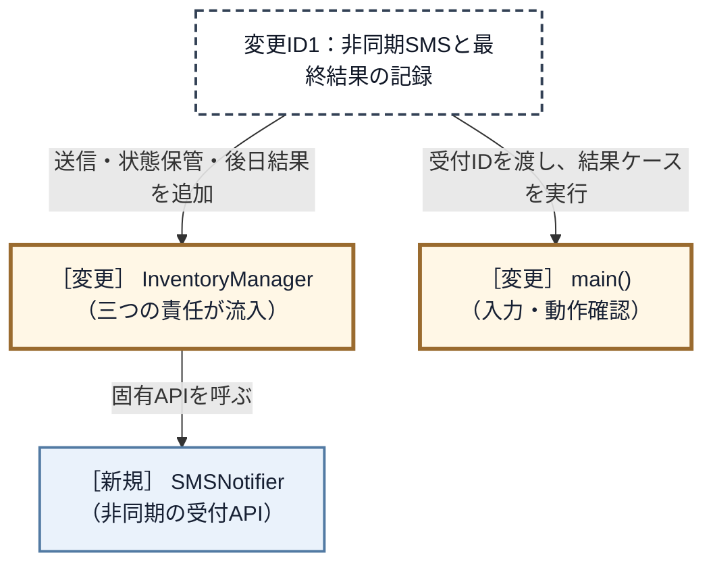

**クラス・組み立て箇所の粒度では、変更が2つ、新規が1つです。** 新しく作れるのは `SMSNotifier` だけで、既存の `InventoryManager` と入力・動作確認を担う `main()` を開きます。`InventoryManager` の一つの箱へ、送信方法、受付IDの保管、後日の完了コールバックという三つの責任が流入したことが読み取れます。責任ごとの6か所の修正は、直前のコードで確認したとおりです。

### 3-3：痛みの言語化

変更を試みる中で、構造上の問題が3つ浮かび上がりました。

1つ目は、`InventoryManager`が変更ID1（非同期SMS追加）のために「SMS通知先の存在」「送信方法」「受付結果」を新たに抱えたことです。在庫更新と閾値判定を担うクラスへ、通知手段の具体知識が追加されました。

2つ目は、今回のSMS追加のために通知元の`InventoryManager`まで修正したことです。「在庫管理」と「通知手段の選択」という異なる変更理由のコードが一つのクラスにあります。

3つ目は、変更ID1（非同期SMS追加）の同期・非同期・部分失敗の違いまで通知元へ入ったことです。変更途中コードの`notifyAll()`はSMSの受付結果を解釈し、`receiveSMSCompletion()`は受付IDを使って後日の最終状態まで更新します。通知元が即時配布と非同期完了という二つの入口を抱えました。

フェーズ3「問題特定」では、変更ID1（非同期SMS追加）によって通知元クラスを書き換え、通知先ごとの成否・待ち方まで通知元へ入った痛みを確認しました。次のフェーズ4「原因分析」では、通知先の事情を通知元がどこまで持っているかを確かめます。

---
> **📌 問題（確定）**
> 変更ID1（非同期SMS追加）のSMS追加で、通知元の`InventoryManager`のメンバ変数・コンストラクタ・`notifyAll()`が連動して変わり、`main()` にも受付IDと失敗ケースの入力が加わった。通知手段と受付結果が在庫管理ロジックに混在し、一つの確定要求が通知元まで修正対象にした。
---

観測した痛みへ`問題ID`を付け、どの変更IDから来たかを対応づけます。

| 問題ID | SMS追加で観測した痛み |
|---|---|
| 問題ID1（連動修正） | `InventoryManager` のメンバー・コンストラクタ・`notifyAll()` が一緒に変わった |
| 問題ID2（異なる責任の同居） | 在庫管理と通知手段の選択が同じクラスにある |
| 問題ID3（非同期処理の混入） | 受付IDの状態表と完了コールバックまで通知元へ入った |

3件とも起点は変更ID1（非同期SMS追加）です。

ここまでで「何が痛いか」が見えました。次のフェーズ4「原因分析」では、その痛みが「なぜ起きているか」を構造の言葉で言語化します。

---

## 🟠 フェーズ4：原因分析 ―― なぜ辛いのかを構造で言語化する
### 4-1：痛みの根源を探る（観察と原因）

第一に、新しい通知先を追加するとき、なぜ毎回 `InventoryManager` を開かなければならないのでしょうか。

それは、このクラス自身が**手段ごとに違う呼び方と結果の読み方を、全部直接知ってしまっている**からです。具体的には、次の3つを抱え込んでいます。

- `EmailNotifier` へは、件名と本文を渡して**真偽値**を見る
- `DashboardUpdater` へは、商品コードと在庫数を渡すが、**成否は分からない**
- `ChatNotifier` へは、投稿先と本文を渡して**投稿IDが空かどうか**を見る

引数の組み立て方も、結果の読み方も、3つとも違います。4つ目が来れば4通り目を覚えることになり、それを覚える場所が `InventoryManager` しかありません。

第二に、なぜ変更の影響範囲が読めず、修正を重ねるたびに不安を感じるのでしょうか？それは、「在庫が減った」というイベントの管理という本来の骨格ロジックと、「誰にどうやって知らせるか」という通知先ごとの実装が、**同じクラスの中で物理的に混ざり合っている**からです。

| 観測した痛み | コード上の原因 |
|---|---|
| 通知先追加で `InventoryManager` を修正する | 通知元が具体クラス名と固有の呼び方を知っている |
| 通知先の変更が在庫管理へ届く | 在庫更新と通知手段の選択が同じクラスにある |
| SMSの完了処理まで在庫側へ入る | 同期・非同期・受付ID・最終状態を通知元が解釈している |

3行に共通しているのは、`InventoryManager` が出したいのは「在庫が閾値以下になった」という事実1つなのに、**それを誰がどう受け取るかまで持っている**ことです。受け取り方が1つ増えるたびに、事実を出す側が変わります。

### 4-2：今回変える責任/ほかの変更から守る責任

> **「今回守る」と「変わらない」は異なります。** 左列は今回の変更試行とヒアリングで変更理由を確認した責任、右列はその変更に巻き込まず守りたい責任です。将来ずっと変わる／変わらないという分類ではありません。

ここでいう責任は「処理を実行すること」だけではなく、**どの業務判断を行い、何を保持し、外へどんな結果を約束するか**というまとまりです。現在の`InventoryManager`は、在庫を更新して通知の要否を決める責任に加え、各通知手段の呼び方と結果の読み方まで引き受けています。変更試行では、さらにSMS受付IDの状態と後日の完了入口まで同じクラスへ入りました。

どの責任を移すべきか判断するため、手が入った行数だけでなく、**何の判断がどの変更理由で動いたか**を一つずつ並べます。

| このコードが持っているもの | 変更を当てたとき | どちら側か |
|---|---|---|
| 在庫を減らして保存する | 触っていない | **守る** |
| 閾値以下かを判定する | 触っていない | **守る** |
| 1つの通知が失敗しても在庫を戻さない決まり | 触っていない | **守る** |
| 通知先が何種類あるか | 3つから4つへ変えた | **変える** |
| 手段ごとの呼び方（関数名と引数の形） | SMS用に4通り目を足した | **変える** |
| 手段ごとの結果の読み方 | 「保留」という読み方を足した | **変える** |
| 受付IDごとの配信状態を覚える | 新しく足した | **変える** |

在庫数の検証・保存・閾値判定は在庫業務の理由で変わります。通知先ごとの引数・結果の翻訳は外部手段の理由で変わり、受付後の配信状態はSMS基盤から別の時点で届きます。したがって、通知先固有の翻訳を各通知手段へ、後日の状態管理を専用の受信境界へ移す候補が得られます。通知元には「在庫警告を登録済みの相手へ渡す」という役割を残し、次の課題定義で三者の接続点を決めます。

両者は別々の無所属コードではなく、同じ `InventoryManager` の `reduceStock()` と、そこから呼ぶ `notifyAll()` です。所属、メンバ、関数境界を残した一つの抜粋で並べると、守る処理から変わる知識へ接続している箇所が分かります。

```cpp
class InventoryManager {
    ProductDatabase& db;
    EmailNotifier email;
    DashboardUpdater dashboard;
    ChatNotifier chat;

public:
    void reduceStock(string productId, int quantity) {
        // ……存在確認と数量検証は省略（掲載コードのまま）……
        info.stock -= quantity;      // 【守る】在庫を更新する
        db.save(productId, info);

        // 【守る】更新後在庫で閾値を判定する
        if (db.isBelowThreshold(productId, info.stock)) {
            // 【接続】在庫が減った事実を通知処理へ渡す
            notifyAll(productId, info);
        }
    }

private:
    void notifyAll(const string& productId,
                   const ProductInfo& info) {
        string message = "商品 " + productId
                       + "（" + info.name + "）"
                       + " の在庫が閾値以下です。";

        // 【変わる】手段ごとに引数の形が違う
        if (!email.sendMail("在庫アラート", message)) {
            // 【変わる】真偽値で成否を読む
            cout << "[通知受付失敗] Email" << endl;
        }

        // 【変わる】文言を受け取らず、成否も返さない
        dashboard.refreshStockWidget(productId, info.stock);

        // 【変わる】投稿先が要り、戻り値は投稿ID
        string postId = chat.postMessage("inventory-alert",
                                         message);

        // 【変わる】空文字が失敗を表す
        if (postId.empty()) {
            cout << "[通知受付失敗] Chat" << endl;
        }
    }
};
```

これをコードの上に置き直すと、`InventoryManager::reduceStock()` の中で境目がはっきりします。

守りたいのは、**在庫を減らし、閾値以下かを判定するところまで**です。「在庫が少なくなった」という出来事は、通知先が増えようが減ろうが、同じ条件で同じように起きます。

変えたいのは、その直後に呼ばれる **`notifyAll()` の中身**です。**`【変わる】` を付けた行が5つあります。** 引数の形が3通り、戻り値の読み方が3通り、それが1つの関数に並んでいます。今回はここに4つ目の流儀が加わりました。

**もし `notifyAll()` が3行を呼ぶだけなら、この章の分割は要りません。** 引数も戻り値もそろっていて、手段が増えても1行足すだけだからです。分ける理由が生まれるのは、**呼び方と結果の読み方が手段ごとに違い、その違いを通知元が引き受けている**ときです。上の抜粋で `【変わる】` が5行に散っているのが、その状態です。

将来ずっと変わる／変わらないと決めているのではありません。**今回の変更で実際に触った側と、触らずに済んだ側**を、この位置で区別しています。

ここで考えやすい別案も、原因に照らして確認します。「3手段を三つの補助関数へ分ければ十分では」という案です。関数分割をすれば一つの関数は短くなります。しかし、`InventoryManager` が三つの具体クラスをメンバーに持ち、各補助関数を名指しし、結果の違いを解釈する依存は残ります。SMSを足せば、メンバー、生成、呼び出し、結果解釈を再び `InventoryManager` へ加えます。したがって、**関数分割は可読性を改善しても、原因ID1（通知先の呼び方を抱える）を解消しません。**

### 4-3：接続点に漏れている判断や前提を確認する

#### 通知元が知りすぎているもの

現在の`InventoryManager`が、通知先について何を知っているかを確認します。

`InventoryManager`は、`EmailNotifier`や`ChatNotifier`というクラス名に加え、手段ごとに違う**3つのこと**を知っています。呼ぶ関数の名前（`sendMail` / `refreshStockWidget` / `postMessage`）、渡す引数の形（件名と本文／商品コードと在庫数／投稿先と本文）、そして返る値の意味（真偽値／無し／投稿IDの空判定）です。ここへSMSの非同期・受付失敗を素直に足そうとすると、4つ目の流儀として「受付IDと保留状態」まで通知元が知ることになります。接続点で必要なのは「在庫警告を1件渡し、受付結果を1つ受け取ること」だけです。

新しい通知先を追加すると、通知元へメンバー変数・初期化・呼び出しを足すことになります。**通知先の種類・関数名・引数の形・戻り値の意味・同期か非同期かを、通知元が全部知っているから**です。とくに引数の形と戻り値の意味は、手段ごとに変換が要る差です。ダッシュボードは成否を返さないので、通知元は「成功として数えるしかない」という判断まで抱えています。**通知元が本当に渡したいのは在庫警告1件、受け取りたいのは受付結果1件だけです。** 今はその形になっていません。差をどこへ置くかは、課題を確定してからフェーズ6で決めます。

現状の `InventoryManager` と各通知先は、その「変わる理由」が異なります。それにもかかわらず、通知先固有の知識を `InventoryManager` が持つため、一方の変更がもう一方へ波及しています。次のフェーズでは、この波及を止めるために接続点で何を達成すべきかを課題として定義します。

フェーズ4「原因分析」で根本原因が言語化できました。「どこを分けるか」は明確です。次のフェーズ5「課題定義」では、その境界で実際に何が流れているかを値・型のレベルで具体化し、「何を変え、何を守るか」を明確にします。

---
> **📌 原因（確定）**
> `InventoryManager`が通知先のクラス名・関数名・引数の形・戻り値の意味・同期非同期の別まで知っている。3手段の呼び方がそろっていないため、通知元が手段ごとの翻訳を引き受けている。通知先を追加したり、非同期や部分失敗が加わるたびに、在庫管理のクラスへメンバー・初期化・引数の組み立て・戻り値の解釈を追加する必要がある。
---

| 原因ID | 同じ責任へ集まっているもの | 対応する問題 |
|---|---|---|
| 原因ID1（通知先の呼び方を抱える） | 在庫管理の骨格と、通知先のクラス名・引数・即時結果の翻訳 | 問題ID1・問題ID2 |
| 原因ID2（非同期の完了管理を抱える） | 在庫操作の入口と、受付IDの保管・最終結果を受ける入口 | 問題ID3 |

> **問い1：同じ場所に、別々の理由で変わるものがないか**
>
> この章の答えは「ある」です。在庫更新と閾値判定は在庫業務で変わり、通知先の関数名・引数・即時結果の翻訳は通知手段で変わります。さらに、受付後の最終配信状態は在庫操作とは別の時点・入口で変わります。ところが、三つが`InventoryManager`へ集まっています。原因ID1（通知先の呼び方を抱える）と原因ID2（非同期の完了管理を抱える）は、この異なる変更理由の同居を確定したものです。

「何が痛いか（問題）」と「なぜ痛いか（原因）」が揃いました。次のフェーズ5「課題定義」では、「何を切り離す必要があるか（課題）」を、接続点で流れるデータのレベルで言語化します。

---

## 🟡 フェーズ5：課題定義 ―― 原因から課題を検討して確定する

### 5-1：原因から課題候補を洗い出す

原因は2つです。`InventoryManager` が通知先の**クラス名・関数名・引数の形・即時結果**を知ることと、**受付IDの保管・最終結果の受け口**まで持つことです。まず、即時通知の境界をどこに引くかを確認します。

原因ID1（通知先の呼び方を抱える）を解くには、通知先のクラス名・関数名・引数の形・結果の意味・具体一覧を、**まとめて**境界の向こうへ移す必要があります。通知元から境界へ渡すのは在庫警告の業務事実、境界から返すのは一件の受付結果です。通知元に残すのは「登録済みの全件へ同じ事実を配り、結果を集計する」という骨格です。

引数だけ、または関数名だけをそろえても、具体一覧や結果の解釈が通知元に残れば原因は消えません。メール件名、チャット投稿先、SMS受付IDの作り方まで各通知手段の側へ移せる接続を、最初の課題候補にします。

ただし、SMSの**後から届く最終結果**はこの境界だけでは扱えません。呼んだ時点で成否が決まらないので、受付IDを覚えて後で更新する仕事がどこかに要ります。これを通知元に置くと原因ID2（非同期の完了管理を抱える）が残るため、状態台帳と外部結果の入口を別に切る必要があります。

### 5-2：二つの原因を一つの完成システムで解く

最初の境界で原因ID1（通知先の呼び方を抱える）は解けます。しかし、SMSの最終配信結果は呼び出し後に別の入口から到着するため、同報の境界だけでは原因ID2（非同期の完了管理を抱える）を解けません。受付IDごとの状態を持つ場所と、最終結果を受けてその状態だけを更新する入口が必要です。これは別の完成案ではなく、**一つの完成システムへ同時に必要な二つ目の境界**です。

したがって課題は2つです。通知先の固有APIを在庫更新から分ける課題と、非同期の完了管理を在庫操作から分ける課題を別々の完了条件で追います。両方を満たして初めて、変更ID1（非同期SMS追加）の完成構造になります。

**数を合わせるために課題を割らないでください。** 変更依頼が2件あっても課題が1つのことはありますし、その逆もあります。

### 5-3：課題IDと接続点を確定する

| 課題ID | 変わる側と守る側をどう接続するか | 完了条件 |
|---|---|---|
| 課題ID1（在庫更新と通知手段の境界） | 商品ID・商品名・更新後在庫を渡し、手段・受付状態・必要な受付IDを受け取る | 具体APIを知らず、1件失敗しても他を続ける |
| 課題ID2（在庫操作と非同期完了の境界） | SMS受付IDと後日届く配信成否を対応づけ、同じ受付の状態を更新する | 在庫操作が状態表と受信入口を持たない |

ここでは型名を決めていません。確定したのは、境界の両側が交換しなければならない**業務上の情報と結果**です。どの型にまとめ、どの操作で渡すかは、次の対策検討で決めます。

3つの痛みを、2つの構造原因に分け、2つの課題へ確定した結果を一列で見ます。

| 問題 | 原因 | 課題 |
|---|---|---|
| 問題ID1・問題ID2：通知先追加で在庫管理を連動修正 | 原因ID1：通知先のクラス名・送信方法・即時結果を在庫管理が抱える | 課題ID1：通知手段の種類と実行を在庫更新から分離する |
| 問題ID3：受付IDと最終結果の入口が在庫管理へ混入 | 原因ID2：非同期の配信状態まで在庫管理が抱える | 課題ID2：配信状態台帳と外部結果の入口を在庫操作から分離する |

要求ID4（在庫変動の追跡）の在庫変動記録は、通知手段の混在から生じた設計課題ではありません。フェーズ6でシステム全体の生成・所有を決めるときに実装場所も確定しますが、課題ID1（在庫更新と通知手段の境界）の追跡には混ぜず、要求IDとしてフェーズ7で検証します。

## 🔴 フェーズ6：対策検討 ―― 構想を一つのコード経路へ変える

課題ID1（通知手段）と課題ID2（非同期完了）を、在庫更新からSMSの最終結果まで動く一つの構想にします。

### 構想を決める

通知先は同じ在庫不足を互いに独立して受け取り、一件が失敗しても残りを続けます。したがって順序付き工程ではなく同報として扱い、手段固有処理を共通契約の裏へ置きます。受付IDの台帳と後日結果の入口は、在庫操作から分けます。

| 決めること | システム全体での決定 | 守る側から隠れる詳細 |
|---|---|---|
| 契約と具体 | 即時の受付を通知手段の境界へ、後日の最終結果を完了管理の境界へ置く | 手段、文面、完了時期 |
| 生成・所有・受け渡し | 組み立て役がDB、完了記録、通知手段、後日結果の入口を所有し、必要な境界を渡す | 具体通知先と受信入口の実体・生存期間 |
| 公開入口からの実行 | 在庫更新は全登録先へ同じ警告を渡し、非同期の受付IDだけを後日の結果へつなぐ | 各手段の送信処理と同期方式 |

この時点で決めたのは、在庫管理から手段固有の送信判断と非同期の完了管理を二つの境界へ出すことです。次の部分クラス図では、その責任の向きだけを示します。`NotificationBoundary`と`DeliveryTrackingBoundary`は役割を表す仮名で、型名・具体通知先・生成場所はこのあと決めます。

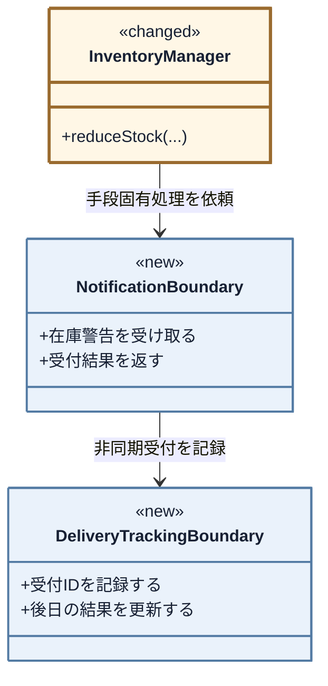

ここから、通知契約、性質の異なる具体、生成・登録、非同期結果の台帳と入口、在庫操作からの同報の順で具体化します。完成クラス図はフェーズ7で確認します。

### 構想をコードでつなぐ

> **現在位置：** 契約 → 性質の異なる具体 → 生成・登録 → 在庫操作からの同報、の順で確認します。

#### 契約：境界の形と受け渡しを決める

> **問い2：境界では、何を約束すれば足りるか**
>
> 通知元が在庫警告一件を渡し、受付結果一件を受け取れれば、通知手段ごとの呼び方を知る必要はありません。そこで「警告を受け取り、受付結果を返す」一操作を共通の約束にし、引数・文面・結果の翻訳は各通知先の内側へ置きます。

四つの通知が使う入力を並べ、共通契約に必要な情報を決めます。

| 通知先 | 商品ID | 商品名 | 更新後在庫 |
|---|---:|---:|---:|
| メール | ○ | ○ | — |
| ダッシュボード | ○ | — | ○ |
| チャット | ○ | ○ | — |
| SMS | ○ | — | ○ |

商品ID・商品名・更新後在庫はいずれも在庫不足という事実です。件名・投稿先・宛先・認証情報は手段固有なので各具体に残します。

返る結果も同様に、各手段がその場で何を返せるかを分けます。

| 通知先 | 受付成功 | 受付失敗 | 保留・受付ID |
|---|---:|---:|---:|
| メール | ○ | ○ | — |
| ダッシュボード | ○ | — | — |
| チャット | ○ | ○ | — |
| SMS | — | ○ | ○ |

境界へ渡す共通入力は「在庫警告」、各通知先から返す即時結果は「配送結果」とします。閾値は通知要否の判断なので渡しません。共通入力を肥大化させないため、全通知が共有する事実だけを契約に置きます。手段固有知識は `notifyAll()` 以外にメンバー、生成、受付状態にも分散しているため、関数抽出ではなくクラス契約まで分けます。

**変更前から抜き出す箇所：`InventoryManager::notifyAll()`** ―― 変更を試したときの4手段の呼び分けから、メールとダッシュボードの2件を抜き出したもの（対策前）

```cpp
    // ← 出て行く側（文面の組み立て）
    string message = "商品 " + productId + "（" + info.name + "）"
                   + " の在庫が閾値以下です。";

    // ← 出て行く側（呼び方と、戻り値の読み方）
    if (!email.sendMail("在庫アラート", message)) {
        cout << "[通知受付失敗] Email" << endl;
        failed++;                       // ← 残る側（集計）
    } else {
        accepted++;                     // ← 残る側（集計）
    }

    // ← 出て行く側（呼び方）
    dashboard.refreshStockWidget(productId, info.stock);
    accepted++;                         // ← 残る側（集計）
```

通知先追加で変わる文面・呼び方・戻り値解釈を具体へ移し、共通の結果集計を通知元に残します。`void` のダッシュボードを含め、各具体が共通結果へ翻訳します。

| 接続候補 | 決めた形 | 理由 |
|---|---|---|
| 商品ID・商品名・在庫 | 在庫警告の3項目として渡す | 現状の文面・表示とSMS入力を不足なく作れる |
| 個別配送結果 | 状態・手段名・受付IDを配送結果として返す | 手段ごとに違う戻り値の解釈を通知元から外せる |

境界を流れるのは、三項目をまとめた警告一件と、受付区分・手段名・受付IDをまとめた結果一件です。手段名も具体から返すため、通知元に具体名を残しません。同期手段の即時成功を表す `ACCEPTED` を加えます。

**ここで確認するコード：`DeliveryStatus`（列挙型全体）** ―― 通知受付から最終配信までの状態

```cpp
// 通知の受付結果と、非同期SMSの最終配信結果
enum DeliveryStatus {
    ACCEPTED, PENDING, FAILED, DELIVERED, DELIVERY_FAILED
};
```

**ここで確認するコード：`DeliveryResult`（構造体全体）** ―― 通知先1件の受付・配信結果

```cpp
struct DeliveryResult {
    DeliveryStatus status; // 受付成功・保留・受付失敗・配信完了・配信失敗
    string channel;        // どの通知手段か
    string requestId;      // 非同期受付だけが設定する
};
```

> **設計判断：失敗は戻り値で返す。** 一件の通知失敗後も在庫更新と残りの通知を続けるためです。処理を継続できない入力不備を例外にする第1章とは、呼び出し側が続行できるかどうかで使い分けます。

**ここで確認するコード：`StockAlert`（構造体全体）** ―― 通知元から通知先へ渡す在庫警告

```cpp
// 通知手段ごとに表現を変えるための、共通の在庫警告データ
struct StockAlert {
    string productId;
    string productName;
    int stock;
};
```

次の部分クラス図は、**今決める「通知元が具体手段ではなく共通契約を保持し、各通知手段が契約を実現する」関係だけ**を示します。代表具体は `EmailNotifier` だけで、他の通知先、在庫台帳、配信状態はまだ対象外です。

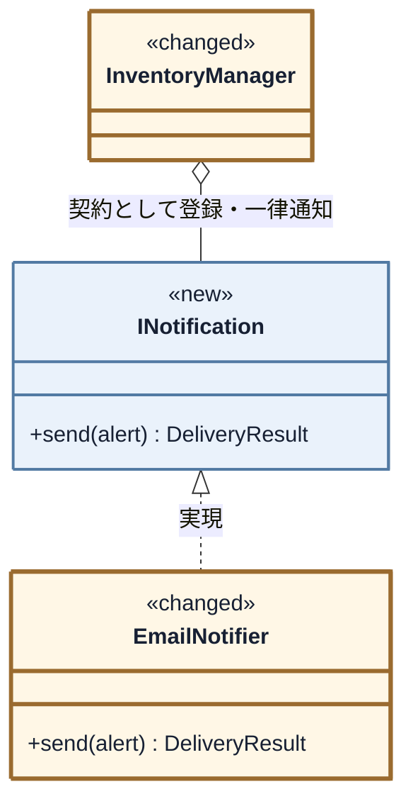

通知元から具体通知先への複数の依存を、`INotification` への一本に替えます。

**ここで確認するコード：`INotification`（クラス全体）** ―― 通知先が共有する契約

```cpp
// 通知先が満たす必要がある契約（インターフェース）
class INotification {
public:
    virtual ~INotification() = default;
    // 在庫警告を受け取り、手段別に表現して受付結果を1つ返す
    virtual DeliveryResult send(const StockAlert& alert) = 0;
};
```

引数・戻り値・操作は各一つです。まず同期通知で成立するか確かめます。

**ここで確認するコード：`EmailNotifier`（クラス全体）** ―― 同期のメール通知

```cpp
// 通知先1：メール通知（同期）
// メール基盤の呼び方（件名と本文、真偽値）は現状コードのまま変えない。
// 契約からその形へ変換する責任を、このクラスの中へ引き取る。
class EmailNotifier : public INotification {
    vector<string> inbox;

    // 現状コードと同じメール基盤の操作
    bool sendMail(const string& subject, const string& body) {
        inbox.push_back(body);
        cout << "Email(" << inbox.size() << "件) [" << subject
             << "] "
             << body << endl;
        return true;
    }
public:
    DeliveryResult send(const StockAlert& a) override {
        string body = "商品 " + a.productId + "（" + a.productName
                    + "） の在庫が閾値以下です。";
        bool ok = sendMail("在庫アラート", body);

        return ok ? DeliveryResult{ACCEPTED, "Email", ""}
                  : DeliveryResult{FAILED, "Email", ""};
    }
};
```

メールは `StockAlert` から現状と同じ文面を作り、固有APIの真偽値を共通結果へ翻訳します。集計は通知元に残り、具体通知は知りません。

---

> **設計判断：一件が失敗しても残りを続ける。** 在庫はすでに更新されており、通知先ごとの成否は独立しているという現行要求・運用規則に従います。

#### 具体：契約の裏へ変わる判断を置く

対照例として、成否を返さない画面APIを共通結果へ翻訳する `DashboardUpdater` を見ます。

**ここで確認するコード：`DashboardUpdater`（クラス全体）** ―― 成否を返さない画面更新

```cpp
// 通知先2：ダッシュボード更新（同期）
// 画面更新は成否を返さない。その事実をどう契約へ写すかを、
// 通知元ではなくこのクラスが決める。
class DashboardUpdater : public INotification {
    int refreshCount;

    // 現状コードと同じ画面更新。戻り値が無い
    void refreshStockWidget(const string& productCode,
                            int stock) {
        ++refreshCount;
        cout << "Dashboard(" << refreshCount << "件): "
             << productCode
             << " の在庫表示を " << stock << " に更新" << endl;
    }
public:
    DashboardUpdater() : refreshCount(0) {}
    DeliveryResult send(const StockAlert& a) override {
        refreshStockWidget(a.productId, a.stock);
        // 呼べたことをもって受付成功とする。この割り切りはここに閉じる
        return {ACCEPTED, "Dashboard", ""};
    }
};
```

ダッシュボードは商品IDと在庫だけを使い、戻り値のないAPIを `ACCEPTED` と解釈します。この割り切りを通知元ではなくアダプター内へ閉じます。四つの具体の差は次のとおりです。

| 具体クラス | `send()` が返す結果 | このクラスでは扱わないこと |
|---|---|---|
| `EmailNotifier` | 送信成功なら `ACCEPTED`、失敗なら `FAILED` | 集計、他手段の成否 |
| `DashboardUpdater` | `ACCEPTED` | 集計、他手段の成否 |
| `ChatNotifier` | 投稿IDがあれば `ACCEPTED`、空なら `FAILED` | 投稿IDの保管、集計 |
| `SMSNotifier` | 受付ID付きの `PENDING` または `FAILED` | 後日結果の受信・確定 |

SMSの最終配信状態は通知先の寿命から独立して残すため、`SMSNotifier` 自身ではなく、組み立て側が所有する台帳へ置きます。

---

#### 生成・所有・受け渡しを決める

> **問い3：実体を、誰が作り、持ち、渡すのか**
>
> 起動時の組み立て役が通知先とログを生成・所有し、通知先への参照を`InventoryManager::attach()`で初期登録します。`InventoryManager`は具体型を知らず、登録された同じ実体へ`INotification`として通知します。非同期SMSの完了先まで含め、生成から実行までをつなぎます。

##### 生成・所有：実体と所有者をコードで示す

具体型・寿命・初期登録を利用側と `InventoryManager` から隠すため、全実体を所有して起動時に組み立てる `InventoryApplication` をこれから定義します。

**ここで確認するコード：`InventoryApplication`（構成に関わる部分）**

```cpp
class InventoryApplication {
    ProductDatabase productDatabase;
    DeliveryStatusLog deliveryStatusLog;
    EmailNotifier email;
    DashboardUpdater dashboard;
    ChatNotifier chat;
    SMSNotifier sms;
    InventoryManager manager;
    SMSDeliveryCallback smsCallback;

public:
    explicit InventoryApplication(bool smsWillFail = false)
        : sms(deliveryStatusLog, smsWillFail),
          manager(productDatabase),
          smsCallback(deliveryStatusLog) {
        // 4件の登録をここで完了させ、失敗した構成では起動しない
        // ……attach() と検査の実装は完成コードで示す……
    }
};
```

通知先を `InventoryManager` より先に宣言し、借用中の寿命を保証します。受付IDと配信状態だけを持つ `DeliveryStatusLog` もここで所有し、SMS送信時と後で定義する `SMSDeliveryCallback` から共有します。在庫操作とは入口が異なるため、後日結果を `InventoryManager` へ戻しません。

**ここで確認するコード：`DeliveryStatusLog`（クラス全体）** ―― 受付IDごとの最終配信状態を所有する台帳

```cpp
// 非同期SMSの受付IDと最終配信状態を管理する
class DeliveryStatusLog {
    map<string, DeliveryStatus> statuses;

    static string statusName(DeliveryStatus status) {
        if (status == PENDING) return "PENDING";
        if (status == DELIVERED) return "DELIVERED";
        if (status == DELIVERY_FAILED) return "DELIVERY_FAILED";

        return "対象外";
    }
public:
    void record(const DeliveryResult& result) {
        if (result.status != PENDING ||
            result.requestId.empty()) return;

        statuses[result.requestId] = PENDING;
        cout << "[SMS状態] " << result.requestId << ": PENDINGを記録"
             << endl;
    }

    bool complete(const string& requestId, bool delivered) {
        auto it = statuses.find(requestId);

        if (it == statuses.end() || it->second != PENDING) {
            cout << "[SMS最終結果エラー] 未知または確定済みの受付ID: "
                 << requestId << endl;
            return false;
        }

        DeliveryStatus before = it->second;
        it->second = delivered ? DELIVERED : DELIVERY_FAILED;
        cout << "[SMS最終結果] " << requestId << ": "
             << statusName(before) << " -> "
             << statusName(it->second)
             << endl;
        return true;
    }
};
```

`SMSNotifier` が受付ID発行直後に `PENDING` を記録するため、通知元にSMS固有の分岐は入りません。

**ここで確認するコード：`SMSNotifier`（状態台帳との接続部分）** ―― 発行した受付IDを、その場で共用台帳へ記録

```cpp
class SMSNotifier : public INotification {
    DeliveryStatusLog& statusLog;  // 所有せず、組み立て側から借りる
    bool willFail;
    vector<string> inbox;
    int nextRequestNumber = 1;
public:
    SMSNotifier(DeliveryStatusLog& log, bool fail)
        : statusLog(log), willFail(fail) {}

    DeliveryResult send(const StockAlert& alert) override {
        if (willFail) {
            cout << "SMS: 受付失敗（後で再送対象）" << endl;
            return {FAILED, ChannelName::SMS, ""};
        }

        string text = "在庫警告 " + alert.productId + " 残"
            + to_string(alert.stock);
        inbox.push_back(text);
        string requestId = "SMS-"
            + to_string(nextRequestNumber++);
        cout << "SMS(" << inbox.size() << "件受付): " << text
             << " / 受付ID=" << requestId << endl;
        DeliveryResult result{
            PENDING, ChannelName::SMS, requestId};
        statusLog.record(result);
        return result;
    }
};
```

SMSアダプターは借りた台帳へ同じ受付IDを記録し、台帳の寿命は `InventoryApplication` が保証します。

**ここで確認するコード：`SMSDeliveryCallback`（クラス全体）** ―― 後日届くSMS配信結果の入口

```cpp
// SMS基盤から後日届くコールバックの入口。在庫更新から独立させる
class SMSDeliveryCallback {
    DeliveryStatusLog& statusLog;
public:
    explicit SMSDeliveryCallback(DeliveryStatusLog& log)
            : statusLog(log) {}

    bool receive(const string& requestId, bool delivered) {
        return statusLog.complete(requestId, delivered);
    }
};
```

> **設計判断：受付と最終結果を分ける。** 要求ID5（SMS配信結果の確認）は到達結果まで確認するため、受付IDを台帳へ残し、後日結果は専用入口で照合します。`SMSNotifier` と `SMSDeliveryCallback` は同じ台帳を借り、`InventoryManager` は知りません。

次の部分クラス図では、SMS送信時と後日受信時が同じ台帳を使い、`InventoryManager` から台帳への依存がない点を見ます。

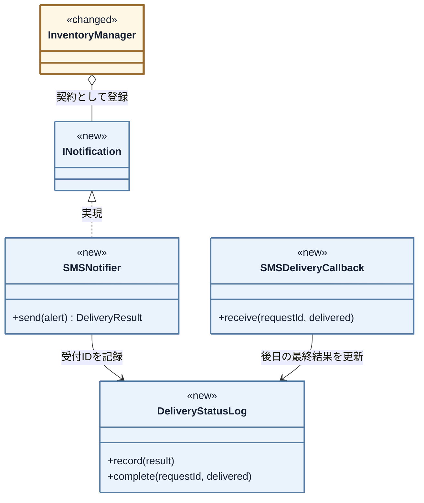

この共有関係を、生成コードで確かめます。

**ここで確認するコード：`InventoryApplication` のメンバーと初期化** ―― 配信状態と後日入口の生成、そして通知元の生成

```cpp
class InventoryApplication {
    ProductDatabase productDatabase;
    DeliveryStatusLog deliveryStatusLog;
    // ……同期通知の所有メンバーは省略……
    SMSNotifier sms;
    InventoryManager manager;
    SMSDeliveryCallback smsCallback;

public:
    InventoryApplication()
        : sms(deliveryStatusLog, false),
          manager(productDatabase),
          smsCallback(deliveryStatusLog) {
        // ……初期登録は省略……
    }
};
```

**ここで確認するコード：`InventoryManager`（クラス宣言・完成）**

```cpp
// 通知元クラス（Subject に相当）
class InventoryManager {
private:
    // 非所有ポインタ。登録中の通知先はInventoryManagerより長く生存すること。
    vector<INotification*> observers;
    ProductDatabase& db;

public:
    explicit InventoryManager(ProductDatabase& database)
        : db(database) {}

    void reduceStock(string productId, int quantity);
    void replenishStock(string productId, int quantity);

private:
    void notifyAll(const StockAlert& alert);
};
```

`InventoryManager` には在庫の正本と通知契約の一覧だけが残り、状態台帳は入りません。

**ここで確認するコード：`InventoryManager::notifyAll(const StockAlert&)`** ―― 引数の到着点と、一律に呼ぶ骨格

```cpp
class InventoryManager {
    // ……DB・登録一覧は省略……

    void notifyAll(const StockAlert& alert) {
        int accepted = 0, pending = 0, failed = 0;

        for (auto* observer : observers) {
            // reduceStock() が作った同じ alert を、契約から全員へ渡す
            DeliveryResult result = observer->send(alert);

            // ……ACCEPTED / PENDING / FAILED の件数集計は省略……
        }

        // ……受付結果の出力は省略……
    }
};
```

`alert` は次の `reduceStock()` が更新後在庫から作り、閾値以下の場合だけ渡します。

**ここで確認するコード：`InventoryManager::reduceStock(string, int)`** ―― 在庫更新から警告作成までの接続

```cpp
class InventoryManager {
public:
    void reduceStock(string productId, int quantity) {
        // ……商品存在と数量の検証、ProductInfoの取得は省略……
        int before = info.stock;
        info.stock -= quantity;
        db.save(productId, info);
        cout << "商品 " << productId << "（" << info.name << "）"
             << " の在庫を " << quantity << " 減らしました。"
             << " 在庫: " << before
             << " -> " << info.stock << endl;

        if (db.isBelowThreshold(productId, info.stock)) {
            StockAlert alert{productId, info.name, info.stock};
            notifyAll(alert);
        }
    }

    // ……replenishStock() は省略……
};
```

在庫を保存し、変更前後の数値を記録してから閾値を判定します。通知元は作成した同じ `StockAlert` を全登録先へ渡します。

---

##### 登録：生成済み通知先を通知元へ登録する

**ここで確認するコード：`InventoryManager::attach()`** ―― 契約だけを受け取る登録操作（引数は `INotification*`）

```cpp
class InventoryManager {
    // ……他のメンバーは省略……
public:
    // nullと重複登録を拒否する
    bool attach(INotification* o) {
        if (o == nullptr) return false;

        if (find(observers.begin(), observers.end(), o)
                != observers.end()) {
            return false;
        }

        observers.push_back(o);

        return true;
    }
    // ……他のメンバー関数は省略……
};
```

**ここで確認するコード：通知先の登録処理**

`registerNotifications()` が、所有する実体を契約として通知元へ渡します。

```cpp
void registerNotifications() {
    bool registered = manager.attach(&email)
                   && manager.attach(&dashboard)
                   && manager.attach(&chat)
                   && manager.attach(&sms);
    if (!registered) {
        throw logic_error("通知先の初期登録に失敗しました");
    }
}
```

四件を初期登録し、一件でも失敗すれば構成不良として起動を止めます。通知元は借用した `INotification*` を反復し、具体型や同期方式を判定しません。動的な登録解除は現行要求にないため実装しません。


---

#### 実行骨格：組み立てた実体を契約から呼ぶ

`reduceStock()` は在庫更新後に `notifyAll()` を呼び、登録済みの契約へ同じ警告を渡して受付結果を集計します。SMSだけは発行した受付IDを共有台帳へ記録します。

#### 公開入口から具体の実行まで追う

##### 公開入口から骨格・契約・具体へつなぐ

最後に、公開入口の差を確認します。

**変更前から抜き出す箇所：`main()`** ―― 変更を試したときの出庫と後日の完了（対策前）

```cpp
    InventoryManager manager;
    manager.reduceStock("PRD002", 1);
    manager.receiveSMSCompletion("SMS-1", true);
```

**ここで確認するコード：`main()`** ―― 同じ操作（対策後）

```cpp
    InventoryApplication app;
    app.inventory().reduceStock("PRD002", 1);
    app.smsDelivery().receive("SMS-1", true);
```

出庫は同じ `reduceStock()` のままです。SMSの最終結果だけは、在庫操作から分けた `smsDelivery()` へ渡します。`main()` は `InventoryApplication` を一つ作るだけで、具体通知や登録順を知りません。受入・回帰はフェーズ7で検証します。

### 構想を採用する

採用するのは、組み立て側が具体通知を登録し、通知元が契約の一覧へ同報し、独立した台帳と受信入口が最終結果を追う構造です。専用メンバーや状態表を `InventoryManager` に残す形は課題を解かない途中状態で、完成構造は一つなので比較しません。完成クラス図はフェーズ7で示します。

#### 課題から採用構想までを照合する

| 対象 | 採用した構造とコード | 確認する効果 |
|---|---|---|
| 課題ID1（在庫更新と通知手段の境界） | `send()`、各Notifier、`attach()` | 手段追加を具体と登録へ閉じ、在庫更新を変えない |
| 課題ID2（在庫操作と非同期完了の境界） | `DeliveryStatusLog`、`SMSDeliveryCallback` | 受付IDと最終結果を在庫操作から分け、該当状態だけ更新する |
| 在庫更新・閾値判定・数値ログ | `InventoryManager::reduceStock()`、`ProductDatabase`、標準出力を保つ | 通知手段が変わっても在庫50→45の更新と記録を変えない |

#### 将来リスクに対して構想を確認する

| 将来リスク | 変更を閉じ込める場所 | 守れる範囲と限界 |
|---|---|---|
| リスクID1（通知先の種類） | 新Notifierと登録・所有 | 在庫管理を守れる。固有設定の取得場所は追加時に決める |
| リスクID2（通知先の構成） | 組み立て側の生成・登録 | 在庫計算を守れる。今回の実装は起動時の構成変更までに限定する |
| リスクID3（受付と最終結果） | 各Notifier、状態ログ、コールバック | 在庫更新から分離できる。重複通知や再送規則は別途必要になる |

## 🟢 フェーズ7：対策実施 ―― 変化に強いコードを完成させる
通知元は登録済みの契約へ同報し、非同期結果は別の台帳と入口で更新する完成コードを示します。

### 7-1：解決後のコード（全体）
#### 完成後のクラス一覧

完成コードの全型を先に示します。

- `ProductDatabase`、`StockAlert`、`InventoryManager`
- `INotification`、`EmailNotifier`、`DashboardUpdater`、`ChatNotifier`
- `SMSNotifier`、`DeliveryStatusLog`、`SMSDeliveryCallback`
- 生成・所有・登録を閉じる `InventoryApplication`

> **実行条件：** 四通知を同一プロセスで順に呼び、一件の失敗後も続けます。外部送信は標準出力のスタブで表します。

#### 完成後のクラス図

部分図を完成図へ統合します。`<<new>>` は新規、`<<changed>>` は変更、表示なしは現状維持です。最初の図は通知契約・各具体・組み立て役を示します。

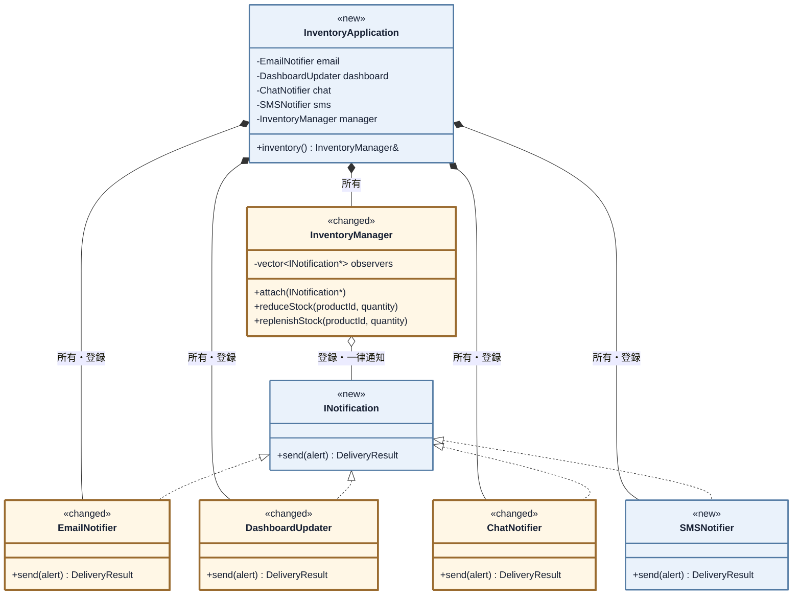

次の図で在庫台帳、通知値、配信状態との関係を確認します。

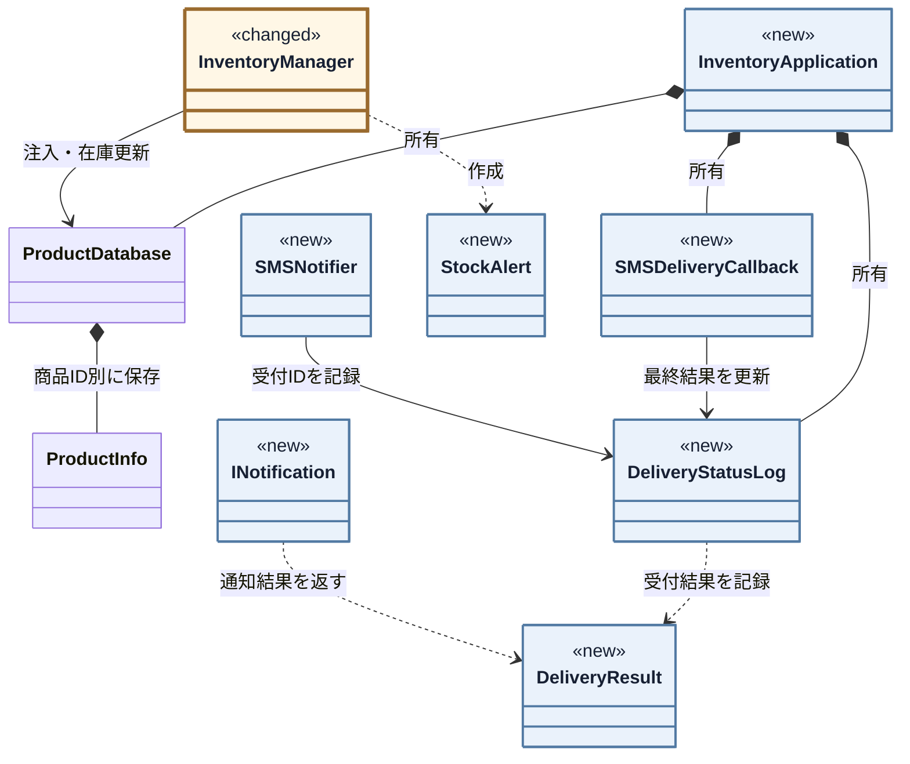

在庫台帳は現状維持です。`InventoryApplication` が具体通知・状態台帳・受信入口を所有し、借用先の寿命を保証します。

#### 完成後の実行シーケンス

起動時の生成・登録と、在庫更新後の同報を順に示します。

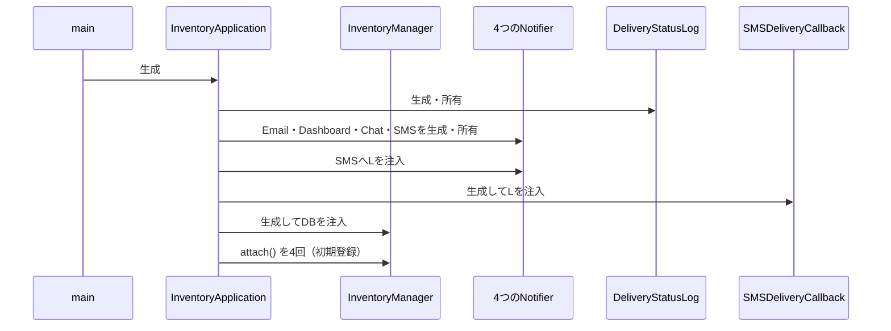

`main()` は `InventoryApplication` を生成するだけです。次の図は在庫更新と通知受付の経路です。

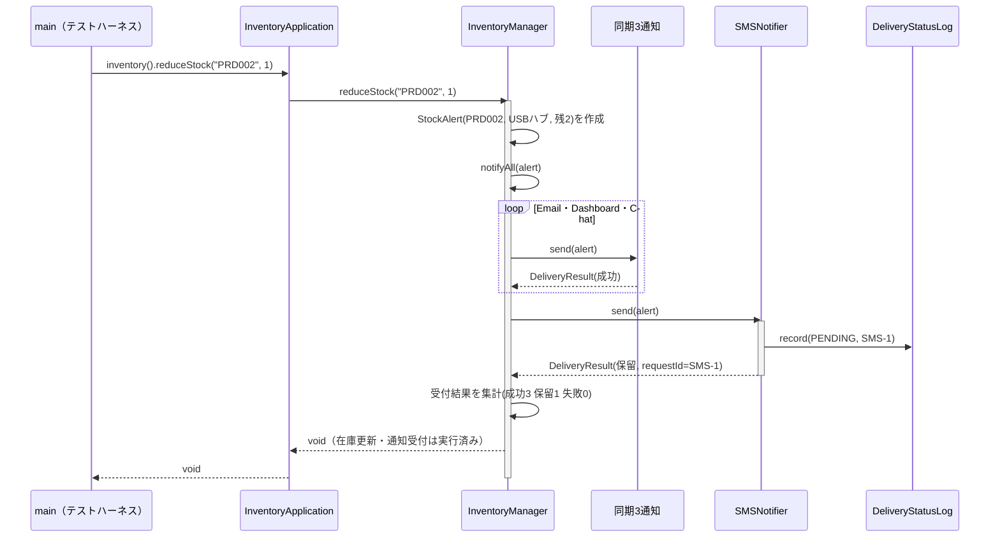

後日のSMS結果は、在庫更新とは別経路で受けます。

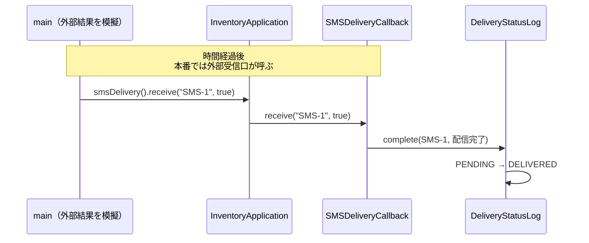

同期三件は成功を即返し、SMSは受付ID付きの保留を返します。後の `receive()` は外部コールバックを模擬し、在庫更新を再開しません。

#### 完成コード

クラス名 → コード → 要点の順で読み、最後に `main()` と結果をシナリオごとに確認します。

---

**共通ヘッダーと ProductInfo と ProductDatabase と DeliveryResult**

商品マスタと、送信1件分の結果型です。

```cpp
#include <iostream>
#include <vector>
#include <string>
#include <map>
#include <algorithm>
#include <stdexcept>

using namespace std;
```

**ProductInfo**

```cpp
// 商品マスタの1件分
struct ProductInfo {
    string name;           // 商品名
    int    stock;          // 在庫数
    int    alertThreshold; // アラート閾値
};
```

**ProductDatabase**

```cpp
// 商品マスタ（データ駆動バリデーション用）
class ProductDatabase {
private:
    map<string, ProductInfo> records;
public:
    ProductDatabase() {
        records["PRD001"] = {"ワイヤレスマウス", 50, 10};
        records["PRD002"] = {"USBハブ",           3,  5}; // 閾値以下
        records["PRD003"] = {"キーボード",         0,  5}; // 在庫なし
    }

    bool exists(const string& id) const {
        return records.count(id) > 0;
    }

    ProductInfo get(const string& id) const {
        return records.at(id);
    }

    void save(const string& id, const ProductInfo& info) {
        records[id] = info;           // 実行中の商品マスタへ追加
    }

    bool isBelowThreshold(const string& id,
                          int currentStock) const {
        return currentStock <= records.at(id).alertThreshold;
    }
};

// 通知の受付結果と、非同期SMSの最終配信結果
enum DeliveryStatus {
    ACCEPTED, PENDING, FAILED, DELIVERED, DELIVERY_FAILED
};
```

**DeliveryResult**

```cpp
struct DeliveryResult {
    DeliveryStatus status; // 受付成功・保留・受付失敗・配信完了・配信失敗
    string channel;        // どの通知手段か
    string requestId;      // 非同期受付だけが設定する
};

// ログや結果で使う通知手段名を一か所に定義する
namespace ChannelName {
    const char* const EMAIL = "Email";
    const char* const DASHBOARD = "Dashboard";
    const char* const CHAT = "Chat";
    const char* const SMS = "SMS";
}
```

---

**StockAlert と INotification**

すべての通知先が実装する契約と、そこへ渡す在庫警告データです。

```cpp
// 通知手段ごとに表現を変えるための、共通の在庫警告データ
struct StockAlert {
    string productId;
    string productName;
    int stock;
};
```

**INotification**

```cpp
// 通知先が満たす必要がある契約（インターフェース）
class INotification {
public:
    virtual ~INotification() = default;
    // 在庫警告を受け取り、手段別に表現して受付結果を1つ返す
    virtual DeliveryResult send(const StockAlert& alert) = 0;
};
```

商品マスタは現状どおり `ProductDatabase` が管理します。通知元は同じ `StockAlert` を渡し、同期方式にかかわらず `DeliveryResult` を受け取ります。文面・API・結果の翻訳は各具体に残ります。

---

**DeliveryStatusLog**

```cpp
// 非同期SMSの受付IDと最終配信状態を管理する
class DeliveryStatusLog {
    map<string, DeliveryStatus> statuses;

    static string statusName(DeliveryStatus status) {
        if (status == PENDING) return "PENDING";
        if (status == DELIVERED) return "DELIVERED";
        if (status == DELIVERY_FAILED) return "DELIVERY_FAILED";

        return "対象外";
    }
public:
    void record(const DeliveryResult& result) {
        if (result.status != PENDING ||
            result.requestId.empty()) return;

        statuses[result.requestId] = PENDING;
        cout << "[SMS状態] " << result.requestId << ": PENDINGを記録"
             << endl;
    }

    bool complete(const string& requestId, bool delivered) {
        auto it = statuses.find(requestId);

        if (it == statuses.end() || it->second != PENDING) {
            cout << "[SMS最終結果エラー] 未知または確定済みの受付ID: "
                 << requestId << endl;
            return false;
        }

        DeliveryStatus before = it->second;
        it->second = delivered ? DELIVERED : DELIVERY_FAILED;
        cout << "[SMS最終結果] " << requestId << ": "
             << statusName(before) << " -> "
             << statusName(it->second)
             << endl;
        return true;
    }
};

// SMS基盤から後日届くコールバックの入口。在庫更新から独立させる
```

---

**SMSDeliveryCallback**

SMS基盤から後日届くコールバックの入口です。在庫更新から独立させます。

```cpp
class SMSDeliveryCallback {
    DeliveryStatusLog& statusLog;
public:
    explicit SMSDeliveryCallback(DeliveryStatusLog& log)
            : statusLog(log) {}

    bool receive(const string& requestId, bool delivered) {
        return statusLog.complete(requestId, delivered);
    }
};
```

`DeliveryStatusLog` が受付IDを追跡し、`SMSDeliveryCallback` が最終状態を更新します。

---

**EmailNotifier**

`INotification` を実装する具体的な通知先です。**メール基盤の呼び方（件名と本文、真偽値）は現状コードのまま変えません。** 契約からその形へ変換する責任を、このクラスの中へ引き取ります。

```cpp
// 通知先1：メール通知（同期）
// メール基盤の呼び方（件名と本文、真偽値）は現状コードのまま変えない。
// 契約からその形へ変換する責任を、このクラスの中へ引き取る。
class EmailNotifier : public INotification {
    vector<string> inbox;

    // 現状コードと同じメール基盤の操作
    bool sendMail(const string& subject, const string& body) {
        inbox.push_back(body);
        cout << "Email(" << inbox.size() << "件) [" << subject
             << "] "
             << body << endl;
        return true;
    }
public:
    DeliveryResult send(const StockAlert& a) override {
        string body = "商品 " + a.productId + "（" + a.productName
                    + "） の在庫が閾値以下です。";
        bool ok = sendMail("在庫アラート", body);

        if (ok) {
            return {ACCEPTED, ChannelName::EMAIL, ""};
        }
        return {FAILED, ChannelName::EMAIL, ""};
    }
};
```

---

**DashboardUpdater**

画面更新は成否を返しません。**その事実をどう契約へ写すかを、通知元ではなくこのクラスが決めます。**

```cpp
// 通知先2：ダッシュボード更新（同期）
// 画面更新は成否を返さない。その事実をどう契約へ写すかを、
// 通知元ではなくこのクラスが決める。
class DashboardUpdater : public INotification {
    int refreshCount;

    // 現状コードと同じ画面更新。戻り値が無い
    void refreshStockWidget(const string& productCode,
                            int stock) {
        ++refreshCount;
        cout << "Dashboard(" << refreshCount << "件): "
             << productCode
             << " の在庫表示を " << stock << " に更新" << endl;
    }
public:
    DashboardUpdater() : refreshCount(0) {}
    DeliveryResult send(const StockAlert& a) override {
        refreshStockWidget(a.productId, a.stock);
        // 呼べたことをもって受付成功とする。この割り切りはここに閉じる
        return {ACCEPTED, ChannelName::DASHBOARD, ""};
    }
};
```

---

**ChatNotifier**

空の投稿IDが失敗という約束も、このクラスの中で契約へ翻訳します。

```cpp
// 通知先3：チャット通知（同期）
// 空の投稿IDが失敗という約束も、このクラスの中で契約へ翻訳する。
class ChatNotifier : public INotification {
    vector<string> posted;

    // 現状コードと同じチャット基盤。投稿IDを返す
    string postMessage(const string& channel,
                       const string& text) {
        posted.push_back(text);
        string postId = "POST-" + to_string(posted.size());
        cout << "Chat(" << posted.size() << "件) #" << channel
             << "\n"
             << "  " << text << " -> " << postId << endl;
        return postId;
    }
public:
    DeliveryResult send(const StockAlert& a) override {
        string text = "商品 " + a.productId + "（" + a.productName
                    + "） の在庫が閾値以下です。";
        string postId = postMessage("inventory-alert", text);

        if (postId.empty()) {
            return {FAILED, ChannelName::CHAT, ""};
        }
        return {ACCEPTED, ChannelName::CHAT, ""};
    }
};
```

同期三通知は即時結果を返します。SMSは受付時に `PENDING` または `FAILED` を返し、後日の結果で `DELIVERED` または `DELIVERY_FAILED` へ更新します。

---

**SMSNotifier**
`SMSNotifier::send()` は受付結果だけを返し、最終配信結果は後日コールバックで受け取ります。

`inbox` と `posted` は呼出回数を見せるスタブ、`DeliveryStatusLog` は要求ID5（SMS配信結果の確認）の業務記録であり、統合しません。手段名は `ChannelName` に集約します。

```cpp
// 新しい通知先の実装を追加し、組み立て側で登録する
// 通知先4：SMS通知（非同期。受付だけ返す）
class SMSNotifier : public INotification {
    DeliveryStatusLog& statusLog;  // 組み立て側が所有する台帳を借りる
    bool willFail;  // 受付に失敗する状況を再現するための指定
    vector<string> inbox;  // 受付できた通知だけを蓄積する
    int nextRequestNumber = 1;
public:
    SMSNotifier(DeliveryStatusLog& log, bool fail)
        : statusLog(log), willFail(fail) {}
    DeliveryResult send(const StockAlert& a) override {
        if (willFail) {
            cout << "SMS: 受付失敗（後で再送対象）" << endl;

            return {FAILED, ChannelName::SMS, ""};
        }

        string text = "在庫警告 " + a.productId + " 残"
            + to_string(a.stock);
        inbox.push_back(text);
        string requestId = "SMS-"
            + to_string(nextRequestNumber++);
        cout << "SMS(" << inbox.size() << "件受付): " << text
             << " / 受付ID=" << requestId << endl;
        DeliveryResult result{
            PENDING, ChannelName::SMS, requestId};
        statusLog.record(result);
        return result;
    }
};
```

固有APIは変えず、共通契約との翻訳場所だけを各通知クラスへ移しました。

| 手段 | 1-4で通知元が抱えていた翻訳 | 7-1でそれを持つ場所 |
|---|---|---|
| メール | 件名と本文へ分けて渡し、`bool` を成否として読む | `EmailNotifier::send()` の中 |
| ダッシュボード | 商品コードと在庫数を渡し、戻り値が無いので成功とみなす | `DashboardUpdater::send()` の中 |
| チャット | 投稿先と本文を渡し、投稿IDが空かどうかで成否を判定する | `ChatNotifier::send()` の中 |

ダッシュボードの「戻り値がないため受付成功とみなす」判断も、その妥当性を決められる具体側へ移ります。

---

**InventoryManager**

在庫を更新し、閾値以下なら登録済みの `INotification` へ同報します。SMSの台帳と後日入口は持ちません。

```cpp
// 通知元クラス（Subject に相当）
class InventoryManager {
private:
    // 非所有ポインタ。登録中の通知先はInventoryManagerより長く生存すること。
    vector<INotification*> observers;
    ProductDatabase& db;

public:
    explicit InventoryManager(ProductDatabase& database)
        : db(database) {}

    // nullと重複登録を拒否する
    bool attach(INotification* o) {
        if (o == nullptr) return false;

        if (find(observers.begin(), observers.end(), o)
                != observers.end()) {
            return false;
        }

        observers.push_back(o);

        return true;
    }

    void reduceStock(string productId, int quantity) {
        if (!db.exists(productId)) {
            cout << "[エラー] 商品ID " << productId
                 << " はマスタに存在しません。処理を中断します。"
                 << endl;
            return;
        }

        ProductInfo info = db.get(productId);

        if (quantity <= 0 || quantity > info.stock) {
            cout << "[エラー] 商品 " << productId << "（" << info.name
                 << "）"
                 << " は " << quantity << " 個出庫できません。現在在庫: "
                 << info.stock << endl;
            return;
        }

        int before = info.stock;
        info.stock -= quantity;
        db.save(productId, info);
        cout << "商品 " << productId << "（" << info.name << "）"
             << " の在庫を " << quantity << " 減らしました。"
             << " 在庫: " << before
             << " -> " << info.stock << endl;

        if (db.isBelowThreshold(productId, info.stock)) {
            notifyAll({productId, info.name, info.stock});
        }
    }
```

`reduceStock()` は在庫を更新し、在庫が閾値以下になったときだけ `notifyAll()` を呼びます。**手段ごとの分岐はありません。**

---

**InventoryManager の続き（replenishStock ほか）**

同じクラスの続きです。`InventoryManager::replenishStock()` から先を読みます。

```cpp
    void replenishStock(string productId, int quantity) {
        if (!db.exists(productId)) {
            cout << "[エラー] 商品ID " << productId
                 << " はマスタに存在しません。処理を中断します。"
                 << endl;
            return;
        }

        ProductInfo info = db.get(productId);

        if (quantity <= 0) {
            cout << "[エラー] 商品 " << productId << "（" << info.name
                 << "） は " << quantity
                 << " 個補充できません。現在在庫: "
                 << info.stock << endl;
            return;
        }

        int before = info.stock;
        info.stock += quantity;
        db.save(productId, info);
        cout << "商品 " << productId << "（" << info.name << "）\n"
             << "  在庫を " << quantity
             << " 補充しました。在庫: " << before
             << " -> " << info.stock
             << "（通知なし）" << endl;
    }

private:
    // 各通知先の受付結果を集計する。通知先の種類ごとに分岐しない
    void notifyAll(const StockAlert& alert) {
        int accepted = 0, pending = 0, failed = 0;

        for (auto* o : observers) {
            DeliveryResult r = o->send(alert);

            if (r.status == ACCEPTED) {
                accepted++;
            } else if (r.status == PENDING) {
                pending++;
                cout << "  保留: " << r.channel
                     << " 受付ID=" << r.requestId << endl;
            } else {
                failed++;
                cout << "  失敗: " << r.channel << endl;
            }
        }

        cout << "[受付結果] 成功:" << accepted
             << " 保留:" << pending
             << " 失敗:" << failed << endl;
    }
};
```

在庫の正本と数値ログは維持し、通知結果だけを集計します。通知ポインタは借用なので、次の組み立て役が全実体を長く所有します。

---

**InventoryApplication**

このクラスがアプリケーション全体の**組み立て役**です。通知先を生成・所有し、`InventoryManager` へ登録した後、在庫操作とSMS結果受信という二つの公開入口だけを渡します。

```cpp
// 生成・所有・登録を一か所に閉じるアプリケーションの組み立て役
class InventoryApplication {
    // 上から生成され、下から破棄される。
    // InventoryManagerより通知先を先に宣言し、借用先の寿命を保証する。
    ProductDatabase productDatabase;
    DeliveryStatusLog deliveryStatusLog;
    EmailNotifier email;
    DashboardUpdater dashboard;
    ChatNotifier chat;
    SMSNotifier sms;
    InventoryManager manager;
    SMSDeliveryCallback smsCallback;

    void registerNotifications() {
        bool registered = manager.attach(&email)
                       && manager.attach(&dashboard)
                       && manager.attach(&chat)
                       && manager.attach(&sms);
        if (!registered) {
            throw logic_error("通知先の初期登録に失敗しました");
        }
    }

public:
    explicit InventoryApplication(bool smsWillFail = false)
        : sms(deliveryStatusLog, smsWillFail),
          manager(productDatabase),
          smsCallback(deliveryStatusLog) {
        registerNotifications();
    }

    InventoryManager& inventory() { return manager; }
    SMSDeliveryCallback& smsDelivery() { return smsCallback; }
};
```

生成・所有・登録を完了し、`main()` には在庫操作とSMS結果受信の入口だけを公開します。

---

#### `main()` と実行結果

各シナリオのコードと結果を対にし、在庫の変更前後と通知結果を確認します。

---

**組み立てと、ケース1：閾値を超えたまま在庫が減る通常ケース**

```cpp
int main() {
    // mainは具体的な通知先や登録順を知らない
    InventoryApplication app;

    // PRD001: 在庫50、閾値10 → 5減らしても閾値超えのまま
    cout << "--- ケース1: 在庫が閾値を超えたまま減少（通知なし） ---" << endl;
    app.inventory().reduceStock("PRD001", 5);
    cout << endl;
```

ケース1の実行結果（閾値超えのままなので通知は出ない）：

```
--- ケース1: 在庫が閾値を超えたまま減少（通知なし） ---
商品 PRD001（ワイヤレスマウス） の在庫を 5 減らしました。 在庫: 50 -> 45
```

同じ `main()` の中で、ケース2は在庫が閾値以下に下がり、同期3件＋非同期SMS1件へ通知するケースです。

```cpp
    // PRD002: 在庫3、閾値5 → 最初から閾値以下。SMSは保留を返す
    cout << "--- ケース2: 在庫が閾値以下に減少"
            "（同期3件＋非同期SMS） ---" << endl;
    app.inventory().reduceStock("PRD002", 1);
    cout << endl;
```

ケース2の実行結果（成功3・保留1・失敗0）：

```
--- ケース2: 在庫が閾値以下に減少（同期3件＋非同期SMS） ---
商品 PRD002（USBハブ） の在庫を 1 減らしました。 在庫: 3 -> 2
Email(1件) [在庫アラート] 商品 PRD002（USBハブ） の在庫が閾値以下です。
Dashboard(1件): PRD002 の在庫表示を 2 に更新
Chat(1件) #inventory-alert
  商品 PRD002（USBハブ） の在庫が閾値以下です。 -> POST-1
SMS(1件受付): 在庫警告 PRD002 残2 / 受付ID=SMS-1
[SMS状態] SMS-1: PENDINGを記録
  保留: SMS 受付ID=SMS-1
[受付結果] 成功:3 保留:1 失敗:0
```

既存三通知の表示は変えず、翻訳場所だけを移しています。SMSの最終結果は、後続行で外部コールバックを模擬します。

```cpp
    cout << "--- ケース2のコールバック模擬: SMS-1が配信完了 ---" << endl;
    app.smsDelivery().receive("SMS-1", true);
    cout << endl;
```

ケース2のコールバック模擬結果：

```
--- ケース2のコールバック模擬: SMS-1が配信完了 ---
[SMS最終結果] SMS-1: PENDING -> DELIVERED
```

`main()` の続きです。ケース3は、在庫が補充されて閾値を超え、通知が出ないケースです。

```cpp
    cout << "--- ケース3: 在庫が補充された（閾値超え） ---" << endl;
    app.inventory().replenishStock("PRD001", 20);
    cout << endl;
```

ケース3の実行結果：

```
--- ケース3: 在庫が補充された（閾値超え） ---
商品 PRD001（ワイヤレスマウス）
  在庫を 20 補充しました。在庫: 45 -> 65（通知なし）
```

同じ `main()` で、ケース4は在庫0の商品を出庫しようとするエラーです。

```cpp
    // PRD003: 在庫0 → 出庫エラー
    cout << "--- ケース4: 在庫0の出庫操作 ---" << endl;
    app.inventory().reduceStock("PRD003", 1);
    cout << endl;
```

ケース4の実行結果：

```
--- ケース4: 在庫0の出庫操作 ---
[エラー] 商品 PRD003（キーボード） は 1 個出庫できません。現在在庫: 0
```

`main()` の続きで、ケース5は存在しない商品IDを操作するエラーです。

```cpp
    // ケース5: 存在しない商品IDのエラー確認
    cout << "--- ケース5: 存在しない商品IDを操作する ---" << endl;
    app.inventory().reduceStock("PRD999", 1);
    cout << endl;
```

ケース5の実行結果：

```
--- ケース5: 存在しない商品IDを操作する ---
[エラー] 商品ID PRD999 はマスタに存在しません。処理を中断します。
```

同じ `main()` の中で、ケース6はSMSを受付失敗する実装へ差し替え、部分失敗（成功3・保留0・失敗1）でも在庫更新と他通知が止まらないことを確認します。

```cpp
    // ケース6: SMSを受付失敗する設定へ差し替え、部分失敗を確認する
    cout << "--- ケース6: SMSだけ受付失敗（部分失敗） ---" << endl;
    // 失敗動作の別構成も、具体通知の生成・登録は組み立て役へ任せる
    InventoryApplication failureApp(true);
    failureApp.inventory().reduceStock("PRD002", 1);
```

ケース6の実行結果（SMSだけ失敗、在庫更新と他通知は継続）：

```
--- ケース6: SMSだけ受付失敗（部分失敗） ---
商品 PRD002（USBハブ） の在庫を 1 減らしました。 在庫: 3 -> 2
Email(1件) [在庫アラート] 商品 PRD002（USBハブ） の在庫が閾値以下です。
Dashboard(1件): PRD002 の在庫表示を 2 に更新
Chat(1件) #inventory-alert
  商品 PRD002（USBハブ） の在庫が閾値以下です。 -> POST-1
SMS: 受付失敗（後で再送対象）
  失敗: SMS
[受付結果] 成功:3 保留:0 失敗:1
```

`main()` の続きで、ケース7は最初に組み立てた `manager` を使い、受付に成功するSMS通知で別の受付IDを作ります。そのIDが後日の配信失敗へ更新されても、在庫更新と同期3通知を巻き戻さないことを確認します。

```cpp
    cout << "--- ケース7: SMS受付後に最終配信失敗 ---" << endl;
    app.inventory().reduceStock("PRD002", 1);
    app.smsDelivery().receive("SMS-2", false);
```

ケース7の実行結果（受付は保留、後日の最終状態だけが配信失敗へ変わる）：

```
--- ケース7: SMS受付後に最終配信失敗 ---
商品 PRD002（USBハブ） の在庫を 1 減らしました。 在庫: 2 -> 1
Email(2件) [在庫アラート] 商品 PRD002（USBハブ） の在庫が閾値以下です。
Dashboard(2件): PRD002 の在庫表示を 1 に更新
Chat(2件) #inventory-alert
  商品 PRD002（USBハブ） の在庫が閾値以下です。 -> POST-2
SMS(2件受付): 在庫警告 PRD002 残1 / 受付ID=SMS-2
[SMS状態] SMS-2: PENDINGを記録
  保留: SMS 受付ID=SMS-2
[受付結果] 成功:3 保留:1 失敗:0
[SMS最終結果] SMS-2: PENDING -> DELIVERY_FAILED
```

**ケース8：0個の補充を拒否する**

```cpp
    cout << endl;
    cout << "--- ケース8: 0個の補充を拒否する ---" << endl;
    app.inventory().replenishStock("PRD001", 0);

    return 0;
}
```

ケース8の実行結果：

```
--- ケース8: 0個の補充を拒否する ---
[エラー] 商品 PRD001（ワイヤレスマウス） は 0 個補充できません。現在在庫: 65
```

不正入力では在庫と通知件数が変わりません。SMSは受付成功・受付失敗・最終配信失敗を分け、いずれも在庫更新と他通知を止めません。通知元には具体手段や後日処理の分岐が残りません。

#### 最終要求の実装・受入エビデンス

変更後要求ベースラインの全有効要求IDを同じ順序で照合します。今回変わらなかった既存要求も対象にするため、要求の消失を検出できます。

| 要求ID | 実装箇所 | 実行結果で確認したこと |
|---|---|---|
| 要求ID1（正確な在庫の維持） | `InventoryManager`、`ProductDatabase` | ケース1・2・6・7で在庫が減り、ケース3で補充した分だけ増える |
| 要求ID2（在庫不足の通知） | `InventoryManager::reduceStock()`、各Notifier | 閾値以下のとき4手段が1件ずつ受け取る |
| 要求ID3（誤更新の防止） | `InventoryManager` の入力検証 | ケース4・5・8の不正操作では在庫と通知件数を変えない |
| 要求ID4（在庫変動の追跡） | `InventoryManager::reduceStock()`、`replenishStock()` | 各成功操作に商品ID・操作数・変更前→変更後を出力 |
| 要求ID5（SMS配信結果の確認） | `SMSNotifier`、`DeliveryStatusLog`、`SMSDeliveryCallback` | SMS-1は受付時に記録して完了へ、SMS-2は最終失敗へ更新する |

最終要求5件がすべて合格です。

上の表は継続（要求ID1（正確な在庫の維持）・要求ID3（誤更新の防止）・要求ID4（在庫変動の追跡））、変更（要求ID2（在庫不足の通知））、追加（要求ID5（SMS配信結果の確認））を同じ順序で並べ、変わらなかった既存要求も回帰対象に含めています。継続要求が合格していることで、既存動作が落ちていないことを確認できます。要求の受入・回帰はここで完了します。課題IDへ直接対応付けず、以下では変更試行の痛みから導いた構造課題だけを別に確認します。

#### 設計課題の構造改善結果

要求の受入とは分けて、課題IDごとに構造と変更影響を確認します。

| 課題ID | コードで変えた構造 | 得られた効果と残る変更先 |
|---|---|---|
| 課題ID1（在庫更新と通知手段の境界） | 具体通知を `INotification` 実装と登録一覧へ分離 | SMS追加・失敗が在庫更新へ波及しない。新手段ではNotifierと登録を追加する |
| 課題ID2（在庫操作と非同期完了の境界） | 状態を台帳へ、受信入口をコールバックへ分離 | 在庫操作を変えず、該当IDの状態だけを更新する |

#### 変更前→変更後の不変条件照合

| 守る対象 | 変更前→変更後 | 確認根拠 |
|---|---|---|
| 商品・在庫の正本 | 同じ `ProductDatabase` の商品・数量を更新する | 在庫50→45などの数値ログ |
| 在庫変動の数値ログ | 通知の成否と独立して入出庫結果を出力する | 通知失敗時の在庫2→1ログ |

> **実務でファイルを分けるなら**
>
> 掲載用の1ファイルを、実務では責任ごとに次のように分けます。
>
> | ファイル | 入れるもの | なぜそこか |
> |---|---|---|
> | `ProductDatabase.h` | 商品・在庫・警告の値クラス | 通知の話とは別に変わる |
> | `INotification.h` | 通知先の契約 | 通知元がインクルードするのはこれだけ |
> | `Notifiers.h` / `.cpp` | 4つの通知先 | 通知固有APIと共通契約への翻訳を置く |
> | `InventoryManager.h` / `.cpp` | 在庫更新と通知の呼び出し | 具体の通知先を知らないので、通知先が増えても変わらない |
> | `DeliveryStatusLog.h` / `.cpp` | 配信結果の記録と、後から届く結果の受け口 | SMS送信側と後日受信側が共有し、通知元を太らせない |
> | `InventoryApplication.h` | 生成・所有・登録 | 通知構成と借用先の寿命を一か所で保証する |
> | `main.cpp` | 公開入口の呼び出し | 具体通知や登録順を知らず、在庫操作と外部結果を模擬する |
>
> ファイル一式: `sources/chapter03/`（`make run`）。通知先が大きくなれば提供元ごとに分け、小規模な間は `Notifiers.h` / `.cpp` にまとめます。

### 7-3：変更影響グラフ（改善後）

フェーズ3で当てた**同じ変更ID1（非同期SMS追加）**を、完成構造からSMS固有の部品だけを除いた基準へ当て直します。**新規は淡い青の面と `［新規］`、変更は淡い黄の面・茶色の枠と `［変更］` で示します。差分表示のないノードは触りません。**

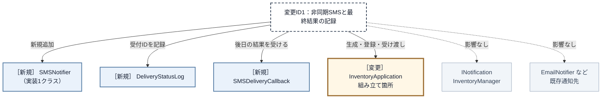

**クラス・組み立て箇所の同じ粒度で、変更2つ＋新規1つから、変更1つ＋新規3つへ変わりました。** 既存コードで開く場所は `InventoryManager` と `main()` の2箇所から、組み立て役 `InventoryApplication` の1箇所へ減ります。SMS固有の送信・受付ID保管・後日の完了受付は三つの新規部品として追加されます。共通契約 `INotification`、通知元 `InventoryManager`、既存通知先と利用側の `main()` は変更先から消えました。

| 変更影響グラフで影響した場所 | 完成構造での修正 | 構造変更との対応 |
|---|---|---|
| 呼び分けと結果の解釈 | `SMSNotifier` を追加する。`InventoryManager` は修正しない | SMS固有APIと共通結果への翻訳を新規部品へ閉じた |
| 受付IDの保管 | `DeliveryStatusLog` を追加する | 受付IDごとの状態を在庫操作から分けた |
| 後日の完了コールバック | `SMSDeliveryCallback` を追加する | 外部結果の入口を在庫操作から分けた |
| 通知先の登録と完了先の接続 | `InventoryApplication` の所有・`attach()`・受け渡しを変更する | 構成を知る変更を組み立て箇所へ集めた |

組み立て側にはSMS・状態台帳・完了受付の接続が増え、間接性と登録を管理するコストも生じます。その代わり、在庫更新へSMS固有の知識を戻さず、受信側の追加を具体通知と組み立てへ閉じられます。

---

## 整理

| 判断 | 結論 |
|---|---|
| 問題 | 通知先追加で `InventoryManager` の構造が連動して変わる |
| 原因 | 通知元が固有APIと即時結果を知り、在庫操作が後日の完了まで持つ |
| 境界 | 通知契約と、受付IDを追う状態台帳・受信入口を分ける |
| 再結合 | 組み立て役が具体通知を登録し、通知元は同じ事実を全件へ配る |
| 結果 | 即時受付は集約し、後日の成否は該当する受付IDだけを更新する |

## 振り返り

### 「この章を読むと得られること」は手に入ったか

| 持ち帰る構造判断 | この章で確認した根拠 |
|---|---|
| 発生元と受信側の依存の特定 | フェーズ2・3：受信側追加で発生元が開く影響を観察 |
| 異なる責任の切り分け | フェーズ4：発生・固有変換・非同期完了の同居 |
| 通知契約と登録による再結合 | フェーズ6：共通契約→生成・所有・登録→同報 |
| 効果と適用可否の検証 | フェーズ6・7：独立した複数受信を根拠に分離し検証 |

## あなたのコードで考えてみてください

題材名を自分のシステムへ置き換え、次の順で構造を確かめてください。

1. 利用者が達成したいことと、通知先が変わっても失ってはいけない現行動作は何か。
2. 通知先を一つ追加すると、発生元のメンバー・生成・呼び分け・引数変換・結果解釈のどこまで修正が広がるか。
3. 発生元の業務判断と、通知手段ごとのAPI・文面・完了方式が同じクラスに集まっていないか。
4. 全通知先の入力と出力を並べると、共通の事実と受付結果をどの型で約束できるか。
5. 各通知先は独立しているか。順序依存や前段結果の受け渡しがあるなら、同報ではなく誰が手順を制御するか。
6. 具体通知先を誰が生成・所有・登録し、発生元が具体名を知らずに全員を実行できるか。非同期の最終結果はどの別境界で追跡するか。

ここまで問題から導いた「通知分離構造」は、一般に **Observerパターン**と呼ばれます。ここからは題材を離れ、この名前で共有される抽象的な骨格を確認します。

## パターン解説：Observer パターン

Observer（観察者）という名の通り、あるオブジェクトの状態変化を、複数の「観察者」に自動的に通知する仕組みです。

### パターンの骨格

「通知を送る側（Subject）」が「通知を受け取る側（Observer）」のリストを保持し、状態が変化したときに一斉に通知を送ります。

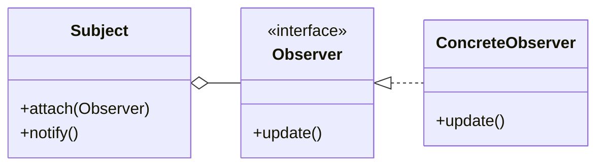

`Subject` は登録された相手を契約として持つだけで、何件いるか、どの具象かを判定しません。通知先を増やしても、線が増えるのは `Observer` の下側だけです。

### この章の実装との対応

`InventoryManager` が `Subject`（通知を送る側）、`INotification` が `Observer`（抽象ロール）、`EmailNotifier` 等が `ConcreteObserver`（具象観察者）に対応します。

### 使いどころと限界

| 状況 | 判断 |
|---|---|
| 独立した通知先が複数あり、増減する | Observerで契約と登録一覧へ分ける |
| 通知先が一つで固定 | 直接呼出しの方が単純 |
| 各処理を順番に完了させ、結果で次を変える | Observerではなく順序制御を設計する |

生ポインタで登録する場合は、通知先の寿命、重複登録、通知中の登録変更、例外後も続けるかを決めます。本章は上位の組み立て役が寿命を保証し、重複を拒否します。

### この章のまとめ

Observerパターンは、通知元が具体クラス名を知る依存を、通知契約と登録一覧へ置き換えます。通知先が独立して増減するなら、具体を追加・登録しても通知ループを変えずに済みます。複数連携を見つけたら、まず相互に独立しているかを確認することが適用判断の入口です。
