# 第3章 通知先への依存を切る ―― Observer パターン

### この章で解く設計課題

在庫が閾値以下になると、在庫管理はメール、ダッシュボード、チャットへ警告を送ります。現在の実装は、通知先を増やすたびに、在庫管理側へメンバー、呼び分け、入力変換、結果の解釈を追加しなければなりません。

この章では、在庫更新と通知先固有の知識が同居する構造を見つけ、在庫管理を変えずに通知先を追加・差し替えられるよう、何を分けてどうつなぎ直すかを考えます。

---

### この章を読むと得られること

この章で身につけるのは、在庫通知の作り方ではありません。ある出来事を起こす側と、その事実を受けて別々に動く側の依存を読み解き、両者を共通の接続へ組み直す力です。題材の固有名詞を離れて、次の判断を持ち帰ります。

* **得られること1：発生元と受信側の依存の特定。** 受信側を追加したときに発生元で手が入るメンバー・呼び分け・入力変換・結果解釈を、変更影響として特定できるようになる
* **得られること2：異なる責任の切り分け。** 在庫警告の発生、通知先別の送信・結果変換、受付ID別の配信状態更新を区別し、同じ場所へ置くべきでない理由を説明できるようになる
* **得られること3：通知契約と登録による再結合。** 受信側へ共通して渡す事実と返す結果から最小の契約を定め、具体を分離し、生成・所有・登録によって発生元へ再結合できるようになる
* **得られること4：効果と適用可否の検証。** 受信側の追加・削除が発生元を変えないかを確かめ、独立した同報、順序依存の処理、単一の直接呼び出しを構造から選び分けられるようになる

## 🔵 フェーズ1：現状把握 ―― 仕様を整理し、システムと紐付ける

> **フェーズ1の確認観点：** 「何を受け取り、何をして、何を返すか」「どのクラスが何を担うか」「今回何を変えるのか」を、仕様→構造→コードの順で確定します。

### 1-1：このシステムの仕様

このシステムは、運用者から商品IDと入庫・出庫数量を受け取り、商品マスターから現在在庫と通知閾値を取得します。入力と在庫不足を検証して在庫を更新し、出庫後の在庫が閾値以下かを判定します。判定が成立した場合は、商品ID・商品名・更新後在庫を一つの**在庫警告の事実**として登録済みの通知手段へ渡します。各手段は必要な項目を使って固有の文面や表示を作り、最後に在庫の変更前後と通知件数を記録します。

#### まず代表入力と実行結果から動きをつかむ

> [!NOTE] この動作例は、第0章で説明した模擬環境で動きます。`InventoryManager manager;` でオブジェクトを作ると、内側の `ProductDatabase` も生成され、コンストラクタが商品名・在庫数・しきい値をメモリへ登録します。`main()` は商品IDと数量を渡し、検索・在庫更新・通知を直接呼びます。表示される在庫変化や通知文は、画面や外部サービスの代わりに標準出力へ出したものです。

詳細な仕様やコードへ入る前に、現状コードの`main()`で在庫減少（通知なし）、在庫減少（通知あり）、補充の3ケースを確認します。

**代表入力（現状コードの`main()`から抜粋）：**

```cpp
    // 準備：商品マスタを持つ在庫管理の入口を作る
    InventoryManager manager;

    // ケース1：PRD001（在庫50・閾値10）を5減らす → 閾値より上
    manager.reduceStock("PRD001", 5);
```

ケース1の実行結果です。

```
商品 PRD001（ワイヤレスマウス） の在庫を 5 減らしました。在庫: 50 -> 45
```

**出力の「ワイヤレスマウス」と「在庫: 50」は、`main()` が渡した値ではありません。** `main()` が渡したのは商品ID `"PRD001"` と数量だけです。商品名と変更前の在庫数は、準備の行で作った在庫管理の入口（`InventoryManager`）が内側に持つ商品マスタから、このIDをキーに引いた値です。**実システムならデータベースの商品テーブルにある行を、掲載コードではこのクラスが自分の中に持っています。** 今回引いたのは、次の1行です。

| 商品ID | 商品名 | 在庫数 | アラート閾値 |
|---|---|---:|---:|
| PRD001 | ワイヤレスマウス | 50 | 10 |

**この本のコードでは、`〜Database` という名前のクラスが「あらかじめ登録されているデータ」を持ちます。** 在庫0の商品を含む全3件は、この後の現状仕様でまとめて示します。

続けて、閾値5のPRD002を3から2へ減らします。

```cpp
    // ケース2：PRD002（在庫3・閾値5）を1減らす → 閾値以下になり通知が飛ぶ
    manager.reduceStock("PRD002", 1);
```

ケース2の実行結果です。

```
商品 PRD002（USBハブ） の在庫を 1 減らしました。在庫: 3 -> 2
Email(1件) [在庫アラート] 商品 PRD002（USBハブ） の在庫が閾値以下です。
Dashboard(1件): PRD002 の在庫表示を 2 に更新
Chat(1件) #inventory-alert
  商品 PRD002（USBハブ） の在庫が閾値以下です。 -> POST-1
```

**メールは届きません。** `Email(1件)` の行は、掲載コードが標準出力へ書いた文字です。**実システムならメールサーバーへ送るところを、この本では「送ったつもりで1行出す」に置き換えています。** ダッシュボードもチャットも同じで、画面は更新されず、チャンネルへも投稿されません。この章で見たいのは「誰に送るか」が増えたときにどこを直すことになるかなので、送信そのものは代役で足ります。

**代役でも、通知が何件出たかは本物です。** `(1件)` は各クラスが自分で数えた件数で、要求ID2（在庫不足の通知）の「閾値以下なら3手段へ知らせる」を、この出力で確かめられます。

最後に、PRD001を補充します。

```cpp
    // ケース3：PRD001を20補充する → 在庫が増え、通知は飛ばない
    manager.replenishStock("PRD001", 20);
```

ケース3の実行結果です。

```
商品 PRD001（ワイヤレスマウス）
  在庫を 20 補充しました。在庫: 45 -> 65
```

入力コメントの閾値と3つの結果を対応させると、ケース1は在庫45で閾値10より上なので通知行がなく、ケース2は在庫2が閾値5以下になって**3つの通知先の出力が続きます**。ケース3の補充結果にも通知行はありません。あわせて、3つの通知先が**それぞれ違う形式で出力している**ことにも注目してください。メールは件名付き、ダッシュボードは在庫数、チャットは投稿IDを返しています。この違いが、この章の出発点です。

> [!NOTE] 実システムと掲載コードの違い
> 掲載コードが実際に更新する状態と、外部サービスの代役を分けておきます。
>
> | 実システムの対象 | 掲載コードでの表現 | この章で省くもの |
> |---|---|---|
> | 商品マスター | `ProductDatabase` 内の `std::map` | 永続DB、排他制御 |
> | メール・ダッシュボード・チャット | 各通知クラスの受信箱と標準出力 | 外部通信、認証、再試行 |
> | 在庫操作画面 | `main()` からの商品ID・数量指定 | GUI、Web/APIの入力処理 |
> | 運用ログ | メモリ上の記録と標準出力 | ログ基盤、長期保存 |
>
> 在庫更新、閾値判定、受信件数は実際に動かします。外部通信の代役は使いますが、**どの通知先をどう呼ぶかという依存関係は省略せず、現状コードどおりに再現します。**

#### 現行要求ベースライン

| 要求ID | 現行要求 | 受入条件 |
|---|---|---|
| 要求ID1（正確な在庫の維持） | 登録商品の入出庫を在庫数へ正しく反映する | 出庫で在庫が減り、補充で増える |
| 要求ID2（在庫不足の通知） | 閾値以下なら3手段へ知らせる | 全手段を呼び、1件が失敗しても残りを続ける |
| 要求ID3（誤更新の防止） | 未登録商品・不正数量・在庫不足による誤った在庫更新を防ぐ | 在庫数と通知件数を変えない |
| 要求ID4（在庫変動の追跡） | 在庫がいくつからいくつになったかを、あとで追えるようにする | 商品ID・変更前→変更後・単位を確認できる |

この章の掲載コードが扱う値と規則を、抜けなく整理します。商品と在庫数は開始データ、通知条件と通知手段は現状システムの全種類です。

| 仕様項目 | この章で使う値 | 役割 |
|---|---|---|
| 商品マスター | PRD001：ワイヤレスマウス、在庫50、閾値10 | 開始データ |
|  | PRD002：USBハブ、在庫3、閾値5 | 開始データ |
|  | PRD003：キーボード、在庫0、閾値5 | 開始データ |
| 在庫操作 | 出庫、補充 | 現行の全公開操作 |
| 通知条件 | 出庫後の在庫が閾値以下 | 通知を出す唯一の条件 |
| 通知手段 | メール、ダッシュボード、チャット | 現行の全通知手段 |
| 出力 | 在庫の変更前後、通知先ごとの受信内容と件数 | 在庫更新と通知発生を照合する |

通知を受け取る相手は倉庫担当者や在庫管理チームです。メール、ダッシュボード、チャットは、その相手へ届ける**通知手段**です。3手段には業務上の前後関係がなく、メールの結果をダッシュボードの入力にすることもありません。同じ在庫不足という事実をそれぞれ独立して受け取り、1件が失敗しても残りを続けます。掲載コードは順に呼びますが、**登録順は業務上の優先順位ではありません。**

**システム全体図：在庫管理と通知先の境界**

最も大きな境界は「担当者 → 在庫管理システム → 外部の通知手段」です。商品マスターと実行結果は対象システムの内側に、メール等の通知先は外側に置きます。図の番号は、1回の出庫で処理が進む順番です。

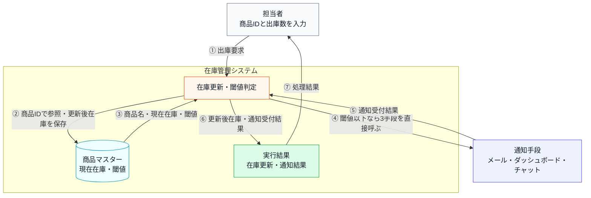

**現状：何を組み合わせて在庫警告を作るか**

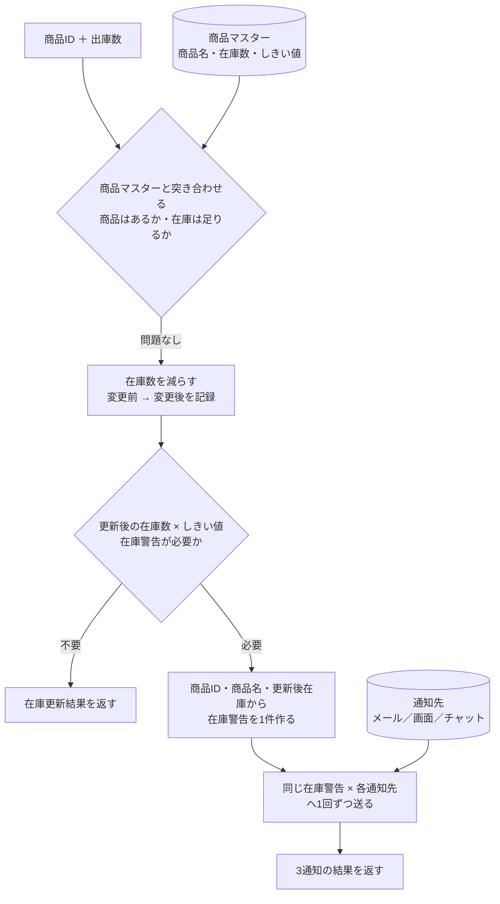

**通知の動作ルール**

通知を送るかどうかの判断は「出庫後の在庫数が閾値以下か」という一点だけで決まります。補充のような在庫の増加は通知の対象外です。閾値をまたいだ瞬間だけでなく、**閾値以下で出庫するたびに毎回**通知します。

| 状況 | 動作 |
|---|---|
| 在庫が閾値以下に減少した | 登録済みの全通知先へ通知を送る |
| 在庫が閾値を超えている | 通知しない |
| 通知先が1件も登録されていない | 何もしない（エラーにならない） |

「閾値以下になったら全通知先へ」という動作は、発注漏れを防ぐための安全策です。一部の通知先だけに送ると、担当者によって情報の到達タイミングがずれてしまうため、同時に全員へ届ける設計になっています。

**現在登録されている受信者と通知手段**

受信者は人またはチームであり、メールなどは受信者へ届ける手段です。コード上の通知アダプターは、この通知手段の違いを担当します。

| 受信者 | 通知手段 | コード上のアダプター |
|---|---|---|
| 倉庫担当者 | メール | メール通知境界 |
| 在庫管理チーム | 社内ダッシュボード | 社内ダッシュボード通知境界 |
| 在庫担当者 | 社内チャット | 社内チャット通知境界 |

この3つの通知先は、それぞれ異なるシステムや担当チームによって管理されています。メールはインフラ管理部門が、ダッシュボードはフロントエンドチームが、チャットは各部門のマネージャーが運用を担っています。

**この仕様を決める業務機能**

このシステムでは、異なる理由で変更される知識がどの業務機能に属するかを見ておきます。メール宛先はインフラ・システム管理の範囲、ダッシュボードの表示はUI・表示管理の範囲、チャット連絡網は通知・連携管理の範囲です。

| 業務機能 | この章の仕様で決めていること |
|---|---|
| インフラ・システム管理 | メール等の通知手段の採用・廃止 |
| UI・表示管理 | ダッシュボードの表示仕様 |
| 通知・連携管理 | チャット等の連絡網の変更 |
| 処理の骨格（開発設計判断） | 閾値判定ロジック・システム保守 |

後のフェーズで変更要求を扱うとき、どの業務機能の知識なのかを確認するための名前として使います。

**エラー条件**

在庫更新へ進めない入力は3種類です。

- **登録されていない商品IDを指定する**と、「マスタに存在しません」と表示して終わります。
- **在庫より多い数を出庫しようとする**と、「出庫できません」と表示して終わります。
- **0以下の数量を出庫・補充しようとする**と、不正数量として表示して終わります。

どの場合も、**在庫は変わらず、通知も送りません。**

在庫を更新したあと、**通知そのものが失敗したときの扱いは、手段によって違います。**

| 通知手段 | 失敗したとき |
|---|---|
| メール | 「通知受付失敗」と表示する |
| ダッシュボード | **失敗したかどうかが分からない**（成否を返さないため） |
| チャット | 「通知受付失敗」と表示する |

**どれが失敗しても、在庫は戻しませんし、残りの手段への通知も止めません。** 再送もしません。なお掲載コードの通知先は必ず成功するので、この表示は実行結果には出てきません。

### 1-2：動作例テーブル

| シナリオ            | 操作                         | 通知・更新の結果            |
| --------------- | -------------------------- | ------------------- |
| 在庫が閾値を超えたまま減少   | ワイヤレスマウス（PRD001）の在庫を5減らす   | 50→45（閾値10）→ 通知なし   |
| 在庫が閾値以下に減少      | USBハブ（PRD002）の在庫を1減らす      | 3→2（閾値5）→ 全通知手段へ送信  |
| 在庫が補充される（閾値超え）  | ワイヤレスマウス（PRD001）の在庫を20補充する | 45→65 → 送信されない・更新のみ |
| 在庫0の商品を減らす（エラー） | キーボード（PRD003）の在庫を1減らす      | 出庫エラー・通知なし          |
| 存在しない商品ID（エラー）  | PRD999を操作する                | マスタ不存在エラー・通知なし      |
| 0個の補充（エラー） | PRD001を0個補充する | 不正数量エラー・在庫65のまま・通知なし |

---

### 1-3：登場クラスとクラス構成図

| クラス名 | 役割 | 担当する仕様 |
|---|---|---|
| `ProductDatabase` | 商品マスタを保持し、在庫数・アラート閾値を提供する | 商品IDの存在確認、在庫数と閾値の参照 |
| `ProductInfo` | 商品1件分の在庫情報を表す | 商品名・在庫数・通知閾値の受け渡し |
| `InventoryManager` | 商品IDごとに在庫数を増減し、閾値以下なら通知する | 在庫更新、閾値判定、通知実行 |
| `EmailNotifier` | メール通知を送る（件名と本文を受け、成否を真偽値で返す） | メール通知 |
| `DashboardUpdater` | ダッシュボード表示を更新する（商品コードと在庫数を受け、戻り値は無い） | 管理画面への反映 |
| `ChatNotifier` | チャット通知を送る（投稿先と本文を受け、投稿IDを返す） | チャット連絡 |

次の図で、通知元が3つの通知先をどう保持しているかを確認します。

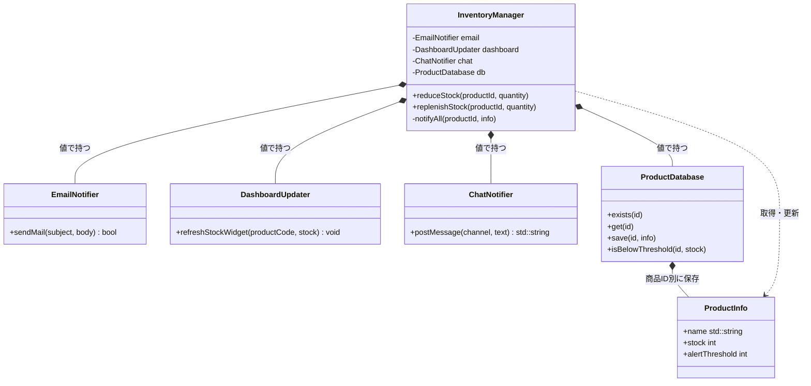

直前の現状クラス図が示す通り、`ProductDatabase` が商品と在庫を保持し、`InventoryManager` が在庫操作に加えて、メール、ダッシュボード、チャットの全通知先を直接保持しています。

**現状システムの処理シーケンス**

静的な関係に続けて、正常系（出庫でしきい値以下になり通知が走る）で各クラスがどの順に呼ばれ何を受け渡すかを時系列で示します。通知の具体の分岐は `InventoryManager` の注記に、エラー系はメモとして添えます。

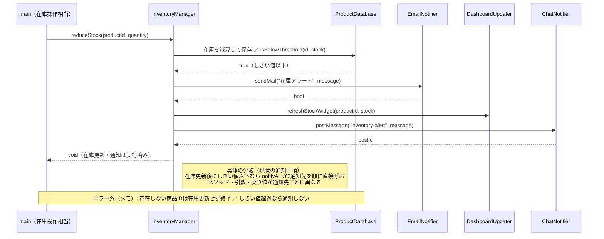

直前の処理シーケンス図から読み取れるのは、`InventoryManager` が在庫更新後にしきい値を判定し、しきい値以下のときだけ `notifyAll` で3つの通知先を順に直接呼ぶこと、各通知先のメソッド名（`sendMail`／`refreshStockWidget`／`postMessage`）まで通知元が知っていることです。通知先の名前と呼び方が通知元に集まっている呼び出し順を、この時系列と注記で確認できます。

### 1-4：実装コード（現状）

通知は同期的に3クラスへ順番実行します。現状には通知先の登録一覧や登録解除操作はなく、`notifyAll()` が3つの具体クラスを名指しします。3つは呼び方がそろっておらず、引数の組み立てと戻り値の解釈も `notifyAll()` の側にあります。

#### 現状コード

メンバー変数と、それを使う処理は同じ場所に置いています。宣言と定義を分けるのは `InventoryManager` だけです。処理順が長く、メンバーを見ながら追う必要があるからです。


---

**共通ヘッダー**

```cpp
#include <iostream>
#include <string>
#include <vector>
#include <map>
#include <unordered_map>

```

以降のすべてのクラスが使います。

---

**ProductInfo**

`ProductInfo` は、仕様で見た「商品」1件分のデータ（商品名・在庫数・アラート閾値）です。続く `ProductDatabase` が商品IDからこのデータを引き、エラー条件「存在しないID」と閾値判定を担います。

```cpp
// 商品マスタの1件分
struct ProductInfo {
    std::string name;            // 商品名
    int         stock;           // 在庫数
    int         alertThreshold;  // これ以下になったら通知する在庫数
};
```

**ProductDatabase**

```cpp
// 商品マスタ（データ駆動バリデーション用）
class ProductDatabase {
private:
    std::map<std::string, ProductInfo> records;
public:
    ProductDatabase() {
        records["PRD001"] = {"ワイヤレスマウス", 50, 10};
        records["PRD002"] = {"USBハブ",           3,  5}; // 閾値以下
        records["PRD003"] = {"キーボード",         0,  5}; // 在庫なし
    }

    bool exists(const std::string& id) const {
        return records.count(id) > 0;
    }

    ProductInfo get(const std::string& id) const {
        return records.at(id);
    }

    void save(const std::string& id, const ProductInfo& info) {
        records[id] = info;           // 実行中の商品マスタへ追加
    }

    bool isBelowThreshold(const std::string& id,
                          int currentStock) const {
        return currentStock <= records.at(id).alertThreshold;
    }
};
```

- **責任：** 商品IDで在庫と閾値を読み書きし、閾値以下かを判定する
- **副作用：** `save()` だけが `records` を書き換える

閾値は商品ごとに違います。判定は `isBelowThreshold()` の1か所だけで行います。実システムのDBを、実行中のインメモリ表で代替しています。

---

次の3つが通知先です。**関数名も、引数も、戻り値も、3つともそろっていません。** 実際のメール・ダッシュボード・チャットへの送信は、標準出力で代替します。各クラスが数える件数は、閾値以下の出庫1回につき各手段が1件ずつ受け取ったことを確認するテスト用の観測点です。

---

**EmailNotifier**

```cpp
// メール基盤：件名と本文が分かれ、送れたかどうかだけを返す
class EmailNotifier {
    std::vector<std::string> inbox;
public:
    bool sendMail(
        const std::string& subject,
        const std::string& body) {
        inbox.push_back(body);
        std::cout << "Email(" << inbox.size()
                  << "件) [" << subject << "] "
                  << body << std::endl;
        return true;
    }
};
```

件名と本文を**2つに分けて**受け取り、`bool` で成否を返します。

---

**DashboardUpdater**

```cpp
// 社内ダッシュボード：文言ではなく商品コードと在庫数を受け取る。
// 画面を描き直すだけなので、成否を返さない
class DashboardUpdater {
    int refreshCount;
public:
    DashboardUpdater() : refreshCount(0) {}
    void refreshStockWidget(const std::string& productCode,
                            int stock) {
        ++refreshCount;
        std::cout << "Dashboard(" << refreshCount << "件): "
             << productCode
             << " の在庫表示を " << stock << " に更新" << std::endl;
    }
};
```

文言を受け取りません。商品コードと在庫数という**生の値**を受け取り、画面を描き直します。戻り値が `void` なので、**送れたかどうかを確かめる手段がありません。**

---

**ChatNotifier**

```cpp
// チャット基盤：投稿先チャンネルが要り、投稿IDを返す。
// 空の投稿IDが失敗を表す
class ChatNotifier {
    std::vector<std::string> posted;
public:
    std::string postMessage(const std::string& channel,
                       const std::string& text) {
        posted.push_back(text);
        std::string postId =
            "POST-" + std::to_string(posted.size());
        std::cout << "Chat(" << posted.size()
                  << "件) #" << channel << "\n"
                  << "  " << text << " -> " << postId
                  << std::endl;
        return postId;
    }
};
```

投稿先チャンネルが要ります。返すのは投稿IDで、**空文字列が失敗**を表します。

---

3つを並べます。

| 通知手段 | 関数名 | 引数 | 戻り値と、失敗の表し方 |
|---|---|---|---|
| メール | `sendMail` | 件名と本文の2つ | `bool`。`false` が失敗 |
| ダッシュボード | `refreshStockWidget` | 商品コードと在庫数 | `void`。**失敗を表せない** |
| チャット | `postMessage` | 投稿先と本文 | `std::string`（投稿ID）。空文字列が失敗 |

メールとチャットへ渡す文言は同じですが、ダッシュボードは文言を受け取らず、在庫数そのものを受け取ります。戻り値は `bool`・`void`・`std::string` の3通りで、`void` のダッシュボードだけは送れたかどうかが返りません。

---

**InventoryManager の宣言**

この章の中心です。仕様で見た「在庫の増減」と「閾値以下での全通知先への通知」に対応します。

```cpp
class InventoryManager {
private:
    EmailNotifier    email;
    DashboardUpdater dashboard;
    ChatNotifier     chat;
    ProductDatabase  db;

public:
    void reduceStock(std::string productId, int quantity);
    void replenishStock(std::string productId, int quantity);

private:
    void notifyAll(const std::string& productId,
                   const ProductInfo& info);
};
```

**3つの通知クラスを具体名で値メンバとして持っています。** 外から差し替える余地はありません。外から呼べるのは、出庫の `reduceStock()` と入庫の `replenishStock()` の2つで、通知は非公開の `notifyAll()` に閉じています。定義を3つ、上のメンバーを見ながら読んでいきます。

---

**InventoryManager::reduceStock()**

```cpp
void InventoryManager::reduceStock(std::string productId,
                                   int quantity) {
    if (!db.exists(productId)) {
        std::cout << "[エラー] 商品ID " << productId
             << " はマスタに存在しません。処理を中断します。"
             << std::endl;
        return;
    }

    ProductInfo info = db.get(productId);

    if (quantity <= 0 || quantity > info.stock) {
        std::cout << "[エラー] 商品 " << productId
             << "（" << info.name
             << "）"
             << " は " << quantity << " 個出庫できません。現在在庫: "
             << info.stock << std::endl;
        return;
    }

    int before = info.stock;
    info.stock -= quantity;
    db.save(productId, info);
    std::cout << "商品 " << productId << "（" << info.name << "）"
         << " の在庫を " << quantity << " 減らしました。在庫: "
         << before << " -> " << info.stock << std::endl;

    if (db.isBelowThreshold(productId, info.stock)) {
        notifyAll(productId, info);
    }
}
```

- **役割：** 商品と数量を検証し、在庫を保存した後、低在庫なら通知処理へつなぐ
- **順序に意味：** 保存してから閾値を判定します。保存前に判定すると、通知した在庫数と保存された在庫数がずれます
- **失敗の扱い：** 存在確認と数量検証で落ちたら、在庫も通知も動かしません

在庫が閾値以下になったときだけ `notifyAll()` を呼びます。

---

**InventoryManager::replenishStock()**

入庫のときに呼ぶ、`reduceStock()` の対になる操作です。仕入れが届いたり、キャンセルで戻ってきたりした分を在庫へ足します。要求ID1（正確な在庫の維持）の「入庫」がこれにあたります。

```cpp
void InventoryManager::replenishStock(std::string productId,
                                      int quantity) {
    if (!db.exists(productId)) {
        std::cout << "[エラー] 商品ID " << productId
             << " はマスタに存在しません。処理を中断します。"
             << std::endl;
        return;
    }

    ProductInfo info = db.get(productId);

    if (quantity <= 0) {
        std::cout << "[エラー] 商品 " << productId
             << "（" << info.name
             << "） は " << quantity
             << " 個補充できません。現在在庫: "
             << info.stock << std::endl;
        return;
    }

    int before = info.stock;
    info.stock += quantity;
    db.save(productId, info);
    std::cout << "商品 " << productId << "（" << info.name << "）\n"
         << "  在庫を " << quantity << " 補充しました。在庫: "
         << before << " -> " << info.stock << std::endl;
}
```

このコードには `isBelowThreshold()` も `notifyAll()` も出てきません。**在庫が増える側では、閾値を判定しないからです。** 通知が出るのは減少のときだけで、そこは `reduceStock()` の末尾にあります。

---

**InventoryManager::notifyAll()**

```cpp
void InventoryManager::notifyAll(const std::string& productId,
                                 const ProductInfo& info) {
    // 通知先が増えるたびに、ここが修正される。
    // 3つの基盤は引数の形も戻り値の意味も違うので、
    // 呼び分けと結果の解釈をこのメソッドが全部引き受けている。
    std::string message =
        "商品 " + productId + "（" + info.name + "）"
        + " の在庫が閾値以下です。";

    // メールは件名と本文に分け、真偽値で成否を見る
    if (!email.sendMail("在庫アラート", message)) {
        std::cout << "[通知受付失敗] Email" << std::endl;
    }

    // ダッシュボードは文言を受け取らず、成否も返さない。
    // 送れたかどうかを確かめる手段がない
    dashboard.refreshStockWidget(productId, info.stock);

    // チャットは投稿先が要り、空の投稿IDが失敗を表す
    std::string postId = chat.postMessage("inventory-alert",
                                     message);

    if (postId.empty()) {
        std::cout << "[通知受付失敗] Chat" << std::endl;
    }
}
```

3つの通知先を名指しで直接呼び出しています。呼ぶだけでなく、**手段ごとに違う引数を組み立て、違う戻り値をそれぞれの流儀で解釈するところまで引き受けています。** 同じ `message` を作っておきながら、ダッシュボードへは渡していません。成否の確認も、メールは `!` で、チャットは `.empty()` で、ダッシュボードは確認なしと3通りです。この `notifyAll()` が、通知先が増えるたびに修正される箇所です。

---

#### `main()` と実行結果

動作例の6ケースを一つずつ実行します。**在庫はケースをまたいで引き継がれます。**

---

**組み立てと、ケース1：PRD001を5減らす**

```cpp
int main() {
    InventoryManager manager;

    std::cout << "--- ケース1: PRD001を5減らす ---" << std::endl;
    manager.reduceStock("PRD001", 5);
```

```
--- ケース1: PRD001を5減らす ---
商品 PRD001（ワイヤレスマウス） の在庫を 5 減らしました。在庫: 50 -> 45
```

`InventoryManager` が通知クラスも商品マスタも内部で作るので、`main()` で組み立てるものはありません。45は閾値10を上回るので通知は出ません。

---

**ケース2：PRD002を1減らす**

```cpp
    std::cout << "--- ケース2: PRD002を1減らす ---" << std::endl;
    manager.reduceStock("PRD002", 1);
```

```
--- ケース2: PRD002を1減らす ---
商品 PRD002（USBハブ） の在庫を 1 減らしました。在庫: 3 -> 2
Email(1件) [在庫アラート] 商品 PRD002（USBハブ） の在庫が閾値以下です。
Dashboard(1件): PRD002 の在庫表示を 2 に更新
Chat(1件) #inventory-alert
  商品 PRD002（USBハブ） の在庫が閾値以下です。 -> POST-1
```

2は閾値5以下なので3件とも通知されました。**出力の形が3行とも違います。** メールとチャットは同じ文言を、ダッシュボードは在庫数の `2` を表示しています。

---

**ケース3：PRD001を20補充する**

```cpp
    std::cout << "--- ケース3: PRD001を20補充する ---" << std::endl;
    manager.replenishStock("PRD001", 20);
```

```
--- ケース3: PRD001を20補充する ---
商品 PRD001（ワイヤレスマウス）
  在庫を 20 補充しました。在庫: 45 -> 65
```

45から始まっているのは、ケース1の減少が保存されているからです。補充なので通知は出ません。

---

**ケース4：PRD003を1減らす**

```cpp
    std::cout << "--- ケース4: PRD003を1減らす ---" << std::endl;
    manager.reduceStock("PRD003", 1);
```

```
--- ケース4: PRD003を1減らす ---
[エラー] 商品 PRD003（キーボード） は 1 個出庫できません。現在在庫: 0
```

在庫0からは出庫できません。数量検証で止まるので、在庫も通知も動きません。

---

**ケース5：存在しない商品IDを操作する**

```cpp
    std::cout << "--- ケース5: 存在しない商品IDを操作する ---" << std::endl;
    manager.reduceStock("PRD999", 1);
```

```
--- ケース5: 存在しない商品IDを操作する ---
[エラー] 商品ID PRD999 はマスタに存在しません。処理を中断します。
```

`reduceStock()` の先頭にある `db.exists(productId)` が偽になり、そこで `return` します。在庫も通知も動きません。

**ケース6：0個の補充を拒否する**

ケース6は、登録済み商品でも0個以下の補充を拒否できることを確認します。

```cpp
    std::cout << "--- ケース6: 0個の補充を拒否する ---" << std::endl;
    manager.replenishStock("PRD001", 0);

    return 0;
}
```

```
--- ケース6: 0個の補充を拒否する ---
[エラー] 商品 PRD001（ワイヤレスマウス） は 0 個補充できません。現在在庫: 65
```

---

動作例テーブルの各行について、在庫が閾値以下になった減少では3通知先へ送信され、正常な補充では通知されず、在庫0・未登録ID・0個の補充はエラーになることを確認できました。

---

### 1-5：変更要求

**変更要求の発生チーム：** 今回の変更要求は店舗運営チームから届いています。通知先の増減を判断するチームです。一方で、在庫の管理自体はシステム基盤チームが担っています。


ある週の月曜日、店舗運営部の田中部長から、在庫管理システムの改善依頼がメールで届きました。

「在庫が少なくなった時に、倉庫担当者のスマホへSMS（ショートメッセージ）でも直接通知を送れるようにしたいんだ。メール、ダッシュボード、チャットはあるけれど、作業中に確認が遅れて発注が漏れることがあってね。来月の店舗改装のタイミングで運用を変えたいから、なんとか対応してくれないか？」

開発チームは依頼を変更IDへ落とす前に、採用予定のSMS基盤のAPI仕様と失敗時の運用を確認しました。SMS基盤は送信要求に受付IDを返し、端末への最終配信結果を後からコールバックします。その場で配信完了を返す同期APIはありません。

**開発者：** 「受付または最終配信に失敗した場合、在庫更新やメールなどの他通知も失敗扱いに戻しますか。また、最終結果のために在庫操作画面を変えますか？」

**田中部長：** 「在庫の事実と届いた通知まで戻ると困るので、SMSだけ失敗として残してほしい。最終結果は履歴へ記録できればよく、今回、在庫操作画面は変えなくてよい。」

この外部API制約と運用判断により、単なる通知先追加に加え、「受付と最終配信を二段階で記録する」「SMSの失敗を在庫更新と他通知から切り離す」「操作UIは変更しない」が今回の確定範囲になりました。

SMSは「送信要求を受け付けた」と「端末へ届いた」が同じ時点に決まりません。この二段階を一つの同期結果へ潰すと、配信失敗だけを記録しながら在庫更新と他通知を確定させる境界を設計できないため、本章ではコールバックまで扱います。

> [!NOTE] 実システムの変更を、掲載コードではどう再現するか
> | 実システムの変更対象 | 掲載コードでの表現 | この章で省くもの |
> |---|---|---|
> | 外部のSMS基盤への送信と受付IDの取得 | `SMSNotifier` が受付IDを作り、メモリへ記録する | 通信、認証、タイムアウト、再試行 |
> | 送信後にSMS基盤が呼ぶ最終配信結果 | `main()` が後続の別呼び出しとして `SMSDeliveryCallback::receive()` を直接呼ぶ | 実際の時間経過、非同期通信、Webhook受信サーバー、署名検証 |
> | SMS配信状態の保存と確認 | `SMSDeliveryTracker` がメモリへ記録し、標準出力へ表示する | 永続DB、検索画面 |
> | SMS基盤から返る受付失敗・配信失敗 | `willFail` と `receive()` の真偽値で二つの失敗を再現する | 実際の事業者応答 |
>
> 以降の「後から届く」「後日のコールバック」は、**実運用でのタイミング**を表します。掲載コードには待ち時間・スレッド・通信はなく、受付結果を表示した後、同じ `main()` から受信入口をもう一度呼びます。再現するのは、受付と最終結果が別の呼び出しであること、同じ受付IDで対応づけること、`PENDING` から最終状態へ変わることです。
>
> 外部通信と画面は簡略化しますが、同じ受付IDによる受付・最終結果の対応づけ、配信状態の更新、SMS失敗時も在庫更新と他通知を止めない処理は掲載コードで実際に動かします。今回の範囲は再送要否を判断できる記録までで、再送の実行機能は含みません。

依頼とSMS境界の制約を、一つの変更IDと、その変更で更新・追加する要求として固定します。

| 変更ID | 変更内容 | 確認する具体例 |
|---|---|---|
| 変更ID1（非同期SMS追加） | SMSを加え、受付・最終配信の失敗でも在庫更新と他通知を止めない | 4手段の受付件数を集計し、SMSの受付IDを保留から配信完了または配信失敗へ更新できる |

#### 変更後要求ベースライン

| 要求ID | 変更後の要求 | 現行からの変化 | 受入条件 |
|---|---|---|---|
| 要求ID1（正確な在庫の維持） | 登録商品の入出庫を在庫数へ正しく反映する | 変更なし | 出庫で在庫が減り、補充で増える |
| 要求ID2（在庫不足の通知） | 閾値以下なら4手段へ知らせ、1手段の不調で残りを止めない | 変更：3手段から4手段へ | 4手段をそれぞれ呼び、SMSの失敗でも在庫更新と残りの通知を戻さない |
| 要求ID3（誤更新の防止） | 未登録商品・不正数量・在庫不足による誤った在庫更新を防ぐ | 変更なし | 不正操作では在庫数と通知件数を変えない |
| 要求ID4（在庫変動の追跡） | 在庫がいくつからいくつになったかを、あとで追えるようにする | 変更なし | 商品ID・変更前→変更後・単位を確認できる |
| 要求ID5（SMS配信結果の確認） | SMSへ依頼した結果をあとから確認し、再送の要否を判断できる | 追加 | SMSごとの受付結果と最終配信結果を対応づけて記録できる |

「現行からの変化」の列が、今回の依頼で動くところです。要求ID2（在庫不足の通知）は3手段から4手段へ変わり、要求ID5（SMS配信結果の確認）が加わります。どちらも変更ID1（非同期SMS追加）による変更です。1件が失敗しても残りを続ける規則は変更前から要求ID2（在庫不足の通知）に含まれており、新しい要求として増やしません。受付IDや保留状態は、要求ID5（SMS配信結果の確認）を実現するためにSMS基盤との境界で必要になる識別子と状態であって、利用者要求そのものではありません。

#### 変更後に有効な業務ルール

次の表では、コードの通知処理に必要なルールを、既存の通知先と新しい通知先に分けます。既存3手段は継続し、SMSだけを追加します。

| 区分 | 通知先 | 変更内容 |
|---|---|---|
| 継続 | EmailNotifier、DashboardUpdater、ChatNotifier | 現行の3手段をそのまま使う |
| 新規 | **SMSNotifier** | 受付IDを返す非同期SMSを追加する |

今回変えるのは通知先の種類です。商品情報と在庫数を取得する保存基盤は仕様変更の対象ではないため、`ProductDatabase` の取得・更新契約は変更前後で**変更なし**とします。

出庫後の在庫が閾値以下のとき、これまでの3チャネル（メール・ダッシュボード・チャット）に加えて、倉庫担当者のスマートフォンへSMSが送信されるようになります。

通知のトリガー条件（在庫が閾値以下になること）と、「登録されている全通知先へ同じ警告機会に通知する」という動作ルールは変わりません。掲載コードは登録順に呼びますが、各通知は互いの結果に依存しません。変わるのは「通知先の種類が1つ増える」ことと、SMSだけは受付IDを返した後、別の時点で最終配信結果が到着することです。既存のメール・ダッシュボード・チャットのようにその場で完了する同期通知とは、結果が二段階になります。

**SMS追加時の通知処理と確認点**

通知先が1つ増えるだけに見える変更でも、現実には次の複雑さが同時に入ります。この章では、これらを通知元（`InventoryManager`）が抱え込むことになるかどうかを追います。

| 追加する複雑さ | 具体例 | この章で見ること |
|---|---|---|
| 在庫不足イベント | 出庫後の在庫が閾値以下なら通知が発生する | 通知元がイベント発生だけに集中できるか |
| 複数通知先 | メール・ダッシュボード・チャット・SMSへ同報する | 通知先の数が増えても通知元の分岐が増えないか |
| 非同期通知 | SMSは受付IDを返し、実運用では最終結果が後からコールバックされる | 受付と完了を別の境界で扱い、状態を追跡できるか |
| 部分失敗 | SMSだけ受付または最終配信に失敗する | どちらの失敗でも他の通知と在庫更新が止まらないか |

外から見た姿がどう変わるかを、最初に見たシステム全体図と同じ骨格で示します。番号の意味も同じで、1回の出庫で処理が進む順番です。

**変更後のシステム全体図：在庫管理と通知先の境界**

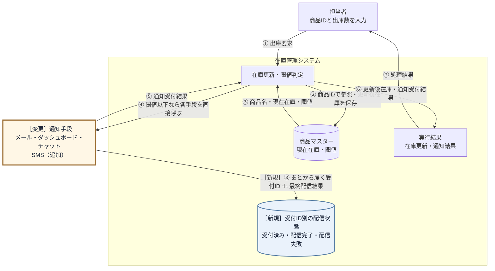

**増えたのは、通知先が1つと、戻ってくる経路が1つです。** ①〜⑦は変わりません。変わるのは④の呼ぶ相手にSMSが加わることと、⑤で受付結果を受け取ったあと、**⑧として最終配信結果があとから別に届く**ことです。この⑧を受けるために、受付ID別の配信状態という保存データが要ります。①から⑦までが1回の出庫で完結するのに対し、⑧だけは出庫が終わったあとに届きます。

**変更後：何を組み合わせて在庫警告とSMS結果を作るか**

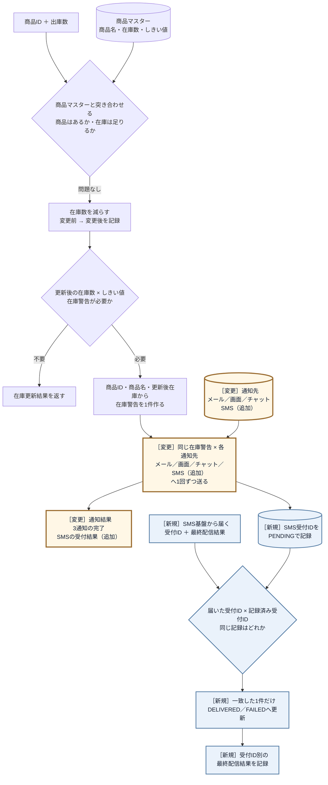

- **登録されていない商品IDを指定する**と、「マスタに存在しません」と表示して終わります。在庫は変わらず、通知も送りません。
- **在庫より多い数を出庫しようとする**と、「出庫できません」と表示して終わります。こちらも在庫は変わりません。
- **SMSの受付が失敗した**ときは、**在庫の更新はそのまま確定し、他の通知先へも送り続けます。** 失敗したのはSMSだけとして記録します。
- **SMSの最終配信が後から失敗した**ときは、届いた配信結果で受付IDの記録を「配信失敗」へ更新します。**在庫更新と他の通知はすでに確定していて動かず、SMSの履歴だけが変わります。**

受付失敗と最終配信の失敗は、正常系の在庫更新を止めません。即時の通知元はイベントを出して受付結果を集め、別経路のコールバック境界は受付IDに対応する状態だけを更新します。この二つを現在の構造へ入れるとどこまで修正が広がるかを、フェーズ3「問題特定」で確認します。

**フェーズ1のまとめ：今回追う変更ID一覧**

このフェーズで確定した変更依頼を一覧にして締めます。フェーズ2「仮説立案」でこの変更IDを仮説・ヒアリングへ、フェーズ3「問題特定」で試して痛みへ、と順につなぎます。

| 変更ID | 変更依頼の要点 | 関係する要求ID（追加は変更後ID） |
|---|---|---|
| 変更ID1（非同期SMS追加） | SMSを通知先へ加え、SMSの失敗でも在庫更新と他通知を続ける | 要求ID2（通知）、要求ID5（配信結果の確認） |

---

## 🟣 フェーズ2：仮説立案 ―― 何が変わるかを観察し、ヒアリングで裏付ける

> **フェーズ2の確認観点：** 「どの仕様が、どんな理由・きっかけ・頻度で変わりそうか」「今回、何を維持するか」を、フェーズ1の事実から仮説にしてヒアリングで確かめます。

### 2-1：変わりそうな仕様の見当をつける

フェーズ2「仮説立案」では、フェーズ1「現状把握」で見た仕様のうち、どの通知先・通知方法・しきい値判定が変わりそうかを見当づけます。責務の配置は、変更要求を当てた後の痛みと合わせて確認します。

| 確認する仕様 | 現状コードの場所 | 今回見る理由 |
|---|---|---|
| 在庫しきい値 | `ProductDatabase.isBelowThreshold()` | 在庫不足とみなす条件が変わる可能性がある |
| メール通知 | `InventoryManager.notifyAll()` | 文面・宛先・送信方法が変わる可能性がある |
| ダッシュボード更新 | `InventoryManager.notifyAll()` | 表示先や更新方式が変わる可能性がある |
| SMS通知（非同期） | 現状コードにはない | 受付だけ返す新しい通知先として追加される |
| 通知先ごとの受付結果 | `InventoryManager.notifyAll()` | 同期・非同期・失敗が混在する |

この表から、今回の検討対象は「在庫判定」と「通知先の増減」に加えて「通知先ごとの受付結果（同期・非同期・部分失敗）」に絞れます。通知先が同じ場所に書かれて困るかどうかは、フェーズ3「問題特定」で変更を入れてから確認します。

#### ヒアリングで確認すること

通知先の増減だけでなく、通知条件と失敗時の扱いを分けて確認します。

| 確認したい仮説 | 確認する質問 | 確認先 |
|---|---|---|
| SMS以外の通知手段も追加される | 新しい通知手段は今後も増えるか | 店舗運営部 |
| 在庫しきい値の判定は維持される | 今回、通知の基準自体は変えないか | 店舗運営部 |
| 一つの通知失敗で在庫更新を止めない | 非同期受付や失敗があっても他処理を続けるか | 店舗運営部 |

この三点をヒアリングで確認し、変わる通知先と守る在庫処理を区別します。

### 2-2：今回の変更で確実に変わること

- **変更ID1：非同期SMSを追加し、受付・最終配信の失敗でも在庫更新と他通知を止めない**

ただし「この変更が1回限りか、今後も続くか」によって、どこまで設計を変えるべきかが大きく変わります。関係者に確認します。

コードを読んだだけで「ここは間違いなく変わる」「今回はここを維持する」と自分一人で断定してしまうのは危険です。今の設計思想では、新しい通知先が増えるたびに `InventoryManager` 自体を書き換える必要があると読み取れますが、本当に将来もこのまま追加し続ける運用でよいのか、関係者に直接確認します。

#### ヒアリングに向けた背景確認

このシステムは、あるPC周辺機器メーカーの在庫管理システムを支える一部です。日々、全国の店舗から刻々と送られてくる売上データを受けて、倉庫にある在庫数を減らし、規定数以下になれば追加発注をかける、といった業務の流れを管理しています。

システムが立ち上がった当初は、在庫が減ったことを倉庫の担当者に「メール」で送るだけで十分でした。しかし、昨今のデジタル化の流れを受け、在庫状況をリアルタイムで「社内ダッシュボード」に反映させたり、在庫が少なくなったら「在庫担当者のチャット」に通知したりと、在庫の変動を追いかける相手がどんどん増えてきました。

コードを眺めてみると、在庫が減ったことを検知する InventoryManager クラスの中で、メール送信クラス、ダッシュボード更新クラス、チャット通知クラスといった、具体的な通知先クラスを直接呼び出す構成になっています。システムが小さかった頃は、これらすべてを InventoryManager が把握していても問題はありませんでした。

一見すると、このコードは処理が一つにまとまっており、何が起きているか分かりやすく整理されているように見えます。

### 2-3：関係者ヒアリング

仮説を携えて、店舗運営部の田中部長と開発チームのミーティングを行いました。コードだけでは決められない運用条件を、関係者と確認します。

**開発者：** 「田中部長、SMS通知の件承知しました。一点確認ですが、今回のような新しい通知手段は、今後もキャンペーンや業務効率化のたびに追加されていく予定でしょうか？」

**田中部長：** 「そうなんだよ。次は店舗のバックヤードにある音声通知システムと連携したいという話もあってね。しばらくは、新しい通知方法がどんどん増えていくと思うよ。」

**開発者：** 「なるほど。通知手段の入れ替わりは激しそうですね。では、通知のタイミング（出庫後の在庫が閾値以下のとき）といった『通知の基準』自体は、今回の変更範囲では固定と考えてよいでしょうか？」

**田中部長：** 「ああ、今回そこは変えないよ。あくまで『在庫が切迫した時』に知らせるというルール自体は固定だ。」

**開発者：** 「承知しました。通知手段（先）は頻繁に増減するけれど、通知の基準（トリガー）は安定しているということですね。もう一点、SMSは外部の送信基盤へ依頼する形になるので、その場では受け付けだけ返って結果は後から確定します。もし受付に失敗しても、在庫の記録や他の通知は止めないという理解でよいですか？」

**田中部長：** 「そうしてほしい。SMSが一時的に詰まっても、メールやダッシュボードには届いてほしいし、在庫の数字が止まるのは困る。SMSだけ後で再送する運用は別で考えるよ。」

**開発者：** 「通知同士に順序はありますか。たとえば、メールが成功した場合だけチャットを送る、といった前後関係です。」

**田中部長：** 「ありません。同じ在庫不足を各手段へ独立に知らせてください。呼び出す順番に業務上の優先順位はありません。」

**開発者：** 「受付後に確定する配信完了・失敗は、SMS基盤のコールバックでこのシステムへ戻し、受付IDごとに履歴化しますか。既存の在庫操作画面にも表示が必要ですか？」

**田中部長：** 「最終結果は再送判断に必要なので履歴化してほしい。今回はバックグラウンドで受けて実行ログへ残せればよく、在庫操作画面は変えなくてよい。将来、運用画面が必要になったら、その履歴を読む形で別に相談しよう。」

**開発者：** 「承知しました。今回の受入範囲は、即時の受付結果を記録し、実運用では後から届くコールバックで同じ受付IDを配信完了または配信失敗へ更新するところまでです。UI操作は変更しません。」

ヒアリングの結果、通知先が今後も増えること、各通知は独立していて登録順に業務上の意味がないこと、同期・非同期や部分失敗が混ざっても在庫記録を止めないこと、SMSの最終配信結果を受付IDごとに履歴化することが確定しました。今回のUI操作変更はありません。これまでのように `InventoryManager` に通知先と非同期完了処理をハードコードし続けるのは、システムの拡張性として限界がきているようです。

### 2-4：ヒアリングで判明した将来リスク

ヒアリングで明らかになった「将来変わるかもしれないこと」を、確定した変更とは分けて整理します。これは今すぐ対応するかどうかの判断材料であり、設計の方向性に影響します。

| リスクID | 変わりそうなこと | 根拠 |
|---|---|---|
| リスクID1（通知先の種類） | 音声通知など新しい手段が増える | 通知先を増やす方針を田中部長に確認 |
| リスクID2（通知先の構成） | 起動時に組み立てる通知先の種類と数が変わる | 新しい通知手段を今後も追加すると田中部長に確認 |
| リスクID3（受付と最終結果） | 手段ごとに受付・完了時期・失敗方法が異なる | 在庫を止めず最終結果を履歴化すると合意 |

一方、「在庫更新が成功した後に、更新後の在庫で閾値を判定し、通知イベントを発生させる」という**処理順**は、田中部長と確認した業務ロジックなので今回は維持します。このあと、変更を試すときの観察条件として確定します。

通知先が今後も増え続けることは確認できました。この変更が現状の `InventoryManager` にどこまで影響するかは、フェーズ3で変更を試して観測します。

### 2-5：次に試す変更と、守る動作を決める

フェーズ3では、変更ID1（非同期SMS追加）だけを現状の構造へ当てます。リスクID1（通知先の種類）・リスクID2（通知先の構成）・リスクID3（受付と最終結果）は実装せず、フェーズ6の構造評価へ引き継ぎます。

**そのとき、次の3つは動作を変えません。**

- 商品を確認し、在庫を更新する
- 更新後の在庫で閾値を判定して通知を始める
- 一つの通知が失敗しても、在庫更新と他の通知を止めない

**この3つが、フェーズ3で「痛み」と呼べるものを決める基準です。** 変更を当てたときに、ここまで修正・確認が広がったときだけを痛みとして記録します。先に宣言しておかないと、あとから「ここも直すことになった」と言い足せてしまい、どこまでも痛みにできます。

---

## 🟣 フェーズ3：問題特定 ―― 変更の痛みを発見する

> **フェーズ3の確認観点：** 「依頼が名指ししたもの以外まで、書き換えるか確認することになっていないか？」
>
> 今回の依頼は「SMSという通知先を1つ足す」ことです。新しい `SMSNotifier` を作り、SMSを使うケースを実行するのは、依頼が名指しした範囲なので痛みではありません。**痛みとして追うのは、そのために既存の `InventoryManager` のメンバー・生成・呼び分け・集計まで書き換えることと、受付後の状態表と別時点の完了入口まで同じクラスへ足すことです。** なぜそうなるのかは、次のフェーズ4で調べます。

### 3-1：変更を試みる

フェーズ2で確定した変更ID1（非同期SMS追加）と、「在庫更新・閾値判定・他通知の継続を維持する」という観察条件を引き継ぎます。「倉庫担当者のスマホへSMSで通知を送りたい」という要求を**構造は今のまま**当て、維持する動作を担うコードまで修正・確認が広がるかを観測します。

在庫更新と閾値判定はそのままです。**変更ID1（非同期SMS追加）**を入れるため、在庫警告（`StockAlert`）・受付結果型・`SMSNotifier`を追加します。現状構造ではさらに、既存の`InventoryManager`のメンバー・コンストラクタ・`notifyAll()`を開いてSMS固有APIと受付結果を扱い、受付IDの最終結果を更新する入口まで同じクラスへ足すことになります。

---

**StockAlert（追加）**

SMSへ渡す在庫警告1件分の試行用の型です。

```cpp
// 通知先へ渡す在庫警告（手段ごとに表現を変えるための共通データ）
struct StockAlert {
    std::string productId;    // 商品コード
    std::string productName;  // 商品名
    int         stock;        // 更新後の在庫数
};
```

**TrialDeliveryStatus（追加）**

即時の受付結果と、実運用では後から別経路で届く最終配信結果を区別します。

```cpp
// SMSの受付結果と、あとから折り返し届く最終配信結果
enum TrialDeliveryStatus {
    TRIAL_PENDING,          // 受け付けた（配信結果はまだ不明）
    TRIAL_FAILED,           // 受付そのものを断られた
    TRIAL_DELIVERED,        // 端末まで届いた
    TRIAL_DELIVERY_FAILED   // 受け付けたが届かなかった
};
```

**TrialDeliveryResult**

```cpp
// 通知1件の受付・配信結果
struct TrialDeliveryResult {
    TrialDeliveryStatus status;  // 受付・配信のどの段階か
    std::string channel;         // どの通知手段か
    std::string requestId;       // 折り返しを照合するための受付番号
};
```

呼んだ時点で分かるのは、SMS業者が**預かったか（`TRIAL_PENDING`）断ったか（`TRIAL_FAILED`）**の2つだけです。実際に端末へ届いたか（`TRIAL_DELIVERED`／`TRIAL_DELIVERY_FAILED`）は、業者から**別の呼び出しで折り返し届きます。**呼び出しが返ってきた時点では、まだ決まっていません。`requestId` は、その折り返しがどの送信の結果なのかを照合するための番号です。

---

**EmailNotifier・DashboardUpdater・ChatNotifier（変更なし）**

既存の3つの通知先は、実装コード（現状）で読んだままです。`sendMail()` は件名と本文を受けて真偽値を返し、`refreshStockWidget()` は商品コードと在庫数を受けて何も返さず、`postMessage()` は投稿先と本文を受けて投稿IDを返します。**関数名も引数も戻り値もそろっていません。**

3クラスは変わっていませんが、通知元が手段ごとに引数を組み立て、戻り値の意味も個別に解釈することになります。**SMSを足すと、そこへ4通り目が加わります。**

---

**SMSNotifier（追加）**

預かれたときは、まだ届いていないことを表す `TRIAL_PENDING` と受付IDを返します。断ったときは `TRIAL_FAILED` です。

```cpp
// SMS基盤：在庫警告をまとめて受け取り、受付IDだけを返す。
// 端末へ届いたかは、実運用では後から別経路で届く
class SMSNotifier {
    bool willFail;
    int  accepted;
public:
    explicit SMSNotifier(bool fail = false)
        : willFail(fail), accepted(0) {}

    TrialDeliveryResult requestAsync(const StockAlert& a) {
        if (willFail) {
            std::cout << "SMS 受付拒否: "
                      << a.productId << std::endl;
            return {TRIAL_FAILED, "SMS", ""};
        }
        ++accepted;
        std::string requestId =
            "SMS-" + std::to_string(accepted);
        std::cout << "SMS(" << accepted << "件) 在庫警告 "
                  << a.productId << " 残" << a.stock
                  << " -> 受付ID:" << requestId
                  << std::endl;
        return {TRIAL_PENDING, "SMS", requestId};
    }
};
```

**4通り目の呼び方です。** `requestAsync()` という4つ目の関数名で、`StockAlert` を丸ごと受け取り、`TrialDeliveryResult` という4つ目の戻り値型を返します。

---

**InventoryManager の宣言（変更あり）**

```cpp
class InventoryManager {
private:
    EmailNotifier    email;
    DashboardUpdater dashboard;
    ChatNotifier     chat;
    ProductDatabase  db;
    // ← 追加
    SMSNotifier      sms;
    // ← 追加
    std::map<std::string, TrialDeliveryStatus> smsStatuses;

public:
    // ← 追加
    explicit InventoryManager(bool smsShouldFail = false)
        : sms(smsShouldFail) {}

    void reduceStock(std::string productId, int quantity);
    void replenishStock(std::string productId, int quantity);

    // ← 追加
    void receiveSMSCompletion(const std::string& requestId,
                              bool delivered);

private:
    void notifyAll(const std::string& productId,
                   const ProductInfo& info);
};
```

**公開操作の2つは現状コードのままです。** `reduceStock()` と `replenishStock()` は、宣言も中身も変えていません。商品の存在確認、出庫数の検証、在庫の更新、閾値の判定は、これまでどおり動きます。

そのうえで、**SMSを1つ足すために、宣言へ4つ書き足しました。** SMS基盤のメンバ、受付IDごとの配信状態を覚える表、受付失敗を試すためのコンストラクタ、そして最終結果を受け取る操作です。在庫管理の本体である `InventoryManager` へ手を入れないと、通知手段を1つ増やせません。

---

**`InventoryManager` の `receiveSMSCompletion()`（追加）**

非同期通知の最終結果を受け取ります。

```cpp
// 最終結果を受けると、在庫管理クラスが受付IDまで知る
void InventoryManager::receiveSMSCompletion(
        const std::string& requestId, bool delivered) {
    auto found = smsStatuses.find(requestId);

    if (found == smsStatuses.end() ||
        found->second != TRIAL_PENDING) {
        std::cout << "[SMS最終結果エラー] " << requestId << std::endl;
        return;
    }

    found->second = delivered ? TRIAL_DELIVERED
                              : TRIAL_DELIVERY_FAILED;
    std::cout << "[SMS最終結果] " << requestId << ": PENDING -> "
         << (delivered ? "DELIVERED" : "DELIVERY_FAILED")
         << std::endl;
}
```

**在庫管理クラスが、SMS基盤の受付IDと状態遷移まで知ることになりました。** 在庫の増減とは何の関係もない知識です。

---

**InventoryManager::notifyAll()（変更あり）**

```cpp
void InventoryManager::notifyAll(const std::string& productId,
                                 const ProductInfo& info) {
    // ← 追加。4手段の受付結果を数える
    int accepted = 0;  // 受付に成功した件数
    int pending  = 0;  // 受付だけ済み、結果待ちの件数
    int failed   = 0;  // 受付に失敗した件数

    std::string message =
        "商品 " + productId + "（" + info.name + "）"
        + " の在庫が閾値以下です。";

    if (!email.sendMail("在庫アラート", message)) {
        std::cout << "[通知受付失敗] Email" << std::endl;
        failed++;                       // ← 追加
    } else {
        accepted++;                     // ← 追加
    }

    // ダッシュボードは成否を返さないので、成功として数えるしかない
    dashboard.refreshStockWidget(productId, info.stock);
    accepted++;                         // ← 追加

    std::string postId = chat.postMessage("inventory-alert",
                                     message);

    if (postId.empty()) {
        std::cout << "[通知受付失敗] Chat" << std::endl;
        failed++;                       // ← 追加
    } else {
        accepted++;                     // ← 追加
    }

    // ← ここから追加。SMSだけは3項目を1つの値にして渡し、
    //    預かりと拒否の2通りを通知元が解釈して覚える
    StockAlert alert = {productId, info.name, info.stock};
    TrialDeliveryResult result = sms.requestAsync(alert);
    if (result.status == TRIAL_PENDING) {
        pending++;
        smsStatuses[result.requestId] = TRIAL_PENDING;
    } else {
        std::cout << "[通知受付失敗] SMS" << std::endl;
        failed++;
    }
    std::cout << "[受付結果] 成功:" << accepted
         << " 保留:" << pending
         << " 失敗:" << failed << std::endl;
    // ← ここまで
}
```

**4手段の呼び方が4通りとも違うまま、1つの関数に並んでいます。**

| 手段 | 渡すもの | 返ってくる値 | 読み方 |
|---|---|---|---|
| Email | 件名と本文 | 成功／失敗 | `!` の真偽 |
| Dashboard | 商品コードと在庫数 | **無し** | 確かめる手段が無い |
| Chat | チャンネルと本文 | 成功／失敗 | `.empty()` |
| SMS | `StockAlert` を丸ごと | **保留**／失敗＋受付ID | `status` で分岐 |

**表の「返ってくる値」を縦に見ると、SMSの行にだけ「保留」があります。** 他の3つは呼んだ時点で成否が決まるのに、SMSだけは決まりません。そのため受付IDを覚えて折り返しを待つことになり、集計にも `pending` という3つ目の数え口が要ります。この「覚える」ためのメンバが、宣言に足した `smsStatuses` です。

**ダッシュボードは相変わらず成否を返しません。** 失敗しても `accepted` に数えられます。**通知手段を1つ増やすたびに、この呼び分けと数え方を `InventoryManager` の中で決め直すことになります。**

---

#### `main()` と実行結果

現状コードの動作例のうち、通知が出るケース2をもう一度通します。あわせて、SMSの受付が断られた場合も見ます。**見るのは動くかどうかではなく、変更要求を現状の構造へ当てはめたときに修正箇所と痛みがどこに出るかです。**

**ケース2：PRD002を1減らし、あとから配信完了を受ける**

```cpp
int main() {
    InventoryManager manager;

    std::cout << "--- ケース2: PRD002を1減らす ---" << std::endl;
    manager.reduceStock("PRD002", 1);
    manager.receiveSMSCompletion("SMS-1", true);
```

```
--- ケース2: PRD002を1減らす ---
商品 PRD002（USBハブ） の在庫を 1 減らしました。在庫: 3 -> 2
Email(1件) [在庫アラート] 商品 PRD002（USBハブ） の在庫が閾値以下です。
Dashboard(1件): PRD002 の在庫表示を 2 に更新
Chat(1件) #inventory-alert
  商品 PRD002（USBハブ） の在庫が閾値以下です。 -> POST-1
SMS(1件) 在庫警告 PRD002 残2 -> 受付ID:SMS-1
[受付結果] 成功:3 保留:1 失敗:0
[SMS最終結果] SMS-1: PENDING -> DELIVERED
```

在庫が3から2へ減り、既存3手段の出力は現状コードのままです。そこへSMSの1行と `[受付結果]` の集計が加わりました。SMSの行に出ている `SMS-1` が受付IDです。最後の `[SMS最終結果]` は、その `SMS-1` が保留から配信完了へ変わったことを示しています。

`receiveSMSCompletion("SMS-1", true)` の `"SMS-1"` は、**本来はSMS基盤が折り返しの呼び出しで渡してくる値**です。掲載コードにはSMS基盤の折り返しが無いので、`main()` が出力に出た受付IDをそのまま書いて代役にしています。

---

**ケース6：SMSの受付が拒否される**

```cpp
    std::cout << "--- ケース6: SMSの受付が拒否される ---" << std::endl;
    InventoryManager rejecting(true);
    rejecting.reduceStock("PRD002", 1);

    return 0;
}
```

```
--- ケース6: SMSの受付が拒否される ---
商品 PRD002（USBハブ） の在庫を 1 減らしました。在庫: 3 -> 2
Email(1件) [在庫アラート] 商品 PRD002（USBハブ） の在庫が閾値以下です。
Dashboard(1件): PRD002 の在庫表示を 2 に更新
Chat(1件) #inventory-alert
  商品 PRD002（USBハブ） の在庫が閾値以下です。 -> POST-1
SMS 受付拒否: PRD002
[通知受付失敗] SMS
[受付結果] 成功:3 保留:0 失敗:1
```

SMSは断られましたが、在庫更新も他の3手段も止まっていません。**動作は正しくなっています。** 変更ID1（非同期SMS追加）で確認する具体例――4手段の受付件数を集計し、受付IDを最終結果へ更新する――を満たせました。

---

痛いのは結果ではなく、そこへ至る過程です。**`SMSNotifier` を1クラス足しただけで、`InventoryManager` を6か所書き換えました。** 宣言へ足した4つ（SMS基盤のメンバ、受付IDごとの配信状態表、コンストラクタ、最終結果を受け取る操作）と、`notifyAll()` の末尾、そして `receiveSMSCompletion()` の中身です。

田中部長の要求は「SMSでも通知したい」という一言でした。それが在庫管理クラスの中身にこれだけ広がるのは、**4つの通知手段の呼び方の違いを、通知元がすべて引き受けているから**です。今回の1手段の追加で、引数の組み立て方が1通り、戻り値の解釈が1通り、`notifyAll()` へ加わりました。

### 3-2：変更影響グラフ

変更を試した結果、1本の変更要求がどこまで届いたかを図にします。**箱はクラスの中の仕事、矢印のラベルは依頼が動かすもの、淡い黄の面・茶色の枠と `［変更］` は今回書き換えたところ、淡い青の面と `［新規］` は新しく作ったところ**です。変更ノードには`変更前→変更後`も書きます。

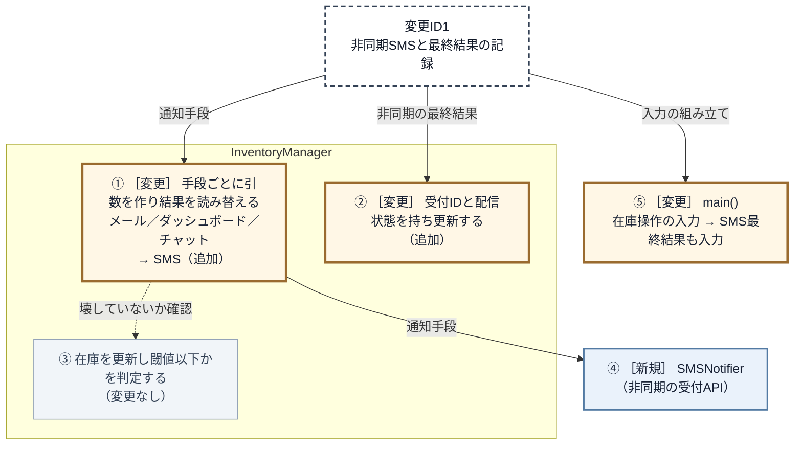

この図は、次のように読みます。

**新しく作れたのは `SMSNotifier` だけです。** SMSを1つ足す依頼なのに、矢印は `InventoryManager` の既存の箱へも届いています。手段ごとの送信と結果の読み替えを横断して直すことになりました。6か所の修正は、直前のコードで確認したとおりです。

**同じ枠の中には、今回変えない「在庫を更新し閾値以下かを判定する」も並んでいます。** 変えていないのに、同じクラスにあるので壊していないかを読み直すことになります。点線がそれです。

**矢印のラベルは2種類に分かれています。** 通知手段と、非同期の最終結果。**別々のものを見ている仕事が、一つの枠に入っている**ということです。

### 3-3：痛みの言語化

痛みは、**理想と現状の差**として書きます。

依頼は「SMSという通知先を1つ足すこと」です。**理想は、新しい通知役を1つ作り、通知先の一覧へ加えるだけで済むこと**です。既存のメール・ダッシュボード・チャットの扱いにも、在庫の更新と閾値の判定にも触りません。

**ところが実際には、** `InventoryManager` のメンバー・コンストラクタ・呼び分け・集計まで書き換えました。さらに、受付IDの状態表と、あとから届く結果を受ける入口まで、同じクラスへ足すことになりました。

**この差が問題です。** 変更影響グラフの①では既存通知の呼び分けと結果変換を修正し、②では受付ID別の状態保持と完了入口を `InventoryManager` へ追加しています。さらに③の在庫更新・閾値判定は変更していないのに、同じクラスにあるため回帰確認が必要になりました。

| 問題ID | 変更を試して観測した痛み | 起点 |
|---|---|---|
| 問題ID1（SMS追加で在庫管理を修正） | `InventoryManager` のメンバー・コンストラクタ・`notifyAll()` を修正した | 変更ID1 |
| 問題ID2（非同期完了を在庫管理へ追加） | 受付IDの状態表と完了入口を `InventoryManager` へ追加した | 変更ID1 |

---

## 🟠 フェーズ4：原因分析 ―― なぜ辛いのかを構造で言語化する

> **フェーズ4の確認観点：** 「同じクラスの中に、違う接続情報を見ている場所が並んでいないか？」
>
> フェーズ3で、問題ID1（SMS追加で在庫管理を修正）と問題ID2（非同期完了を在庫管理へ追加）、その二つが起きた変更途中の `InventoryManager` は特定できました。フェーズ4ではこれらを入力にし、なぜ通知手段と配信完了の変更が在庫管理へ広がったのかを調べます。フェーズ3は**どこまで広がったか**を見る場所、フェーズ4は**なぜ広がったか**を見る場所です。使う材料は同じ変更影響グラフで、見方だけを変えます。

### 4-1：責任の混在を原因として確定する

変更影響グラフで、色の付いた箱と別の箱が同じ枠に並んでいたのは `InventoryManager` です。ここを調べます。

変更影響グラフの番号を使い、各場所が何を見て動くかと、該当実装を対応させます。原因を調べる中心は、同じ `InventoryManager` に入っている①〜③です。④と⑤は、新規の通知役と入力の入口を区別するために残します。

| 図の番号 | その場所が見ている情報 | 該当実装 | 責任としての読み方 |
|---|---|---|---|
| ① | 通知先ごとの呼び方と結果の形 | `InventoryManager::notifyAll()` と通知先メンバー | 通知先別の送信・結果変換 |
| ② | 受付IDと後から届く最終結果 | `InventoryManager::smsStatuses` と `receiveSMSCompletion()` | 受付ID別の配信状態更新 |
| ③ | 商品マスターの在庫数と閾値 | `InventoryManager::reduceStock()`・`replenishStock()` | 在庫更新・警告要否の判定 |
| ④ | SMS受付APIの入出力 | `SMSNotifier` | 新しく作る通知役。混在の判定対象外 |
| ⑤ | 在庫操作とSMS完了イベント | `main()` | 変更要求を渡す入口。混在の判定対象外 |

表の「該当実装」が本当に同じクラスへ並んでいるかを、変更を試したあとの宣言で確かめます。

**変更試行後の抜粋：`InventoryManager` の宣言**

```cpp
class InventoryManager {
private:
    EmailNotifier    email;      // 通知手段
    DashboardUpdater dashboard;  // 通知手段
    ChatNotifier     chat;       // 通知手段
    ProductDatabase  db;         // 商品マスタの在庫と閾値
    SMSNotifier      sms;        // 通知手段

    // 非同期の最終結果
    std::map<std::string, TrialDeliveryStatus> smsStatuses;

public:
    // 商品マスタの在庫と閾値を見る2操作
    void reduceStock(std::string productId, int quantity);
    void replenishStock(std::string productId, int quantity);

    // 非同期の最終結果を受ける入口
    void receiveSMSCompletion(const std::string& requestId,
                              bool delivered);

private:
    // 通知手段ごとに引数を作り、結果を読み替える
    void notifyAll(const std::string& productId,
                   const ProductInfo& info);
};
```

保持しているメンバーが、そのまま表の3行に分かれます。`db` が**商品マスタの在庫と閾値**、通知先4つと `notifyAll()` が**通知手段**、`smsStatuses` と `receiveSMSCompletion()` が**非同期の最終結果**です。

この対応から、次の3点が分かります。

1. **通知手段は、2つの場所に散っています。** 手段を1つ足すと、引数の組み立ても受付結果の集計も動きます。**この二つは一つの置き場所へまとめる**対象です。
2. **表の①〜③は、すべて `InventoryManager` の中にあります。** しかし、①は通知手段、②は非同期の最終結果、③は商品マスターを見ています。通知を直すたびに在庫の判定まで読み直す構造が責任の混在であり、分ける対象です。
3. **商品マスタの在庫と閾値は、今回変わりません。** それでも同じクラスにあるので巻き込まれます。ヒアリングでは閾値の基準は当面固定と確認できているので、いまは動かしませんが、置き場所は分けておきます。

まとめた場所と、残った行が、そのまま責任になります。

| 責任 | 見ている接続情報 |
|---|---|
| 在庫更新・警告要否の判定 | 商品マスタの在庫と閾値 |
| 通知先別の送信・結果変換 | 通知手段（呼び方と戻り値の形） |
| 受付ID別の配信状態更新 | 非同期の最終結果 |

**「どれも在庫管理の話だから、責任は一つでは」と感じるかもしれません。** 責任は、扱う題材ではなく見ているもので分けます。通知手段を決めるのは運営の施策、受付後の結果をどう追うかは外部基盤の都合で、在庫の数え方とは別々に変わります。

変更を試した時点の配置は、次の構造です。

**対策前：変更を現状構造へ当てた状態**

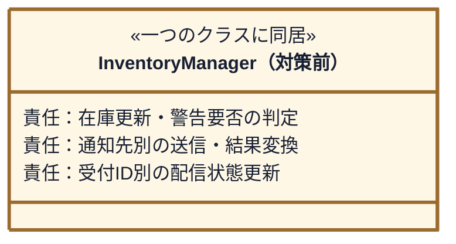

今回、通知先別の送信・結果変換と受付ID別の配信状態更新は、SMS対応で直接変わりました。在庫更新と警告条件は変わりませんが、三つが同じ `InventoryManager` にあるため修正・確認へ巻き込まれました。

**原因ID1は、在庫更新・警告要否の判定と通知先別の送信・結果変換が同じクラスにあることです。** 在庫管理が通知先固有のクラス名・引数・結果の扱いを直接持つため、問題ID1（SMS追加で在庫管理を修正）が起きました。

**原因ID2は、在庫更新・警告要否の判定と受付ID別の配信状態更新が同じクラスにあることです。** 在庫管理が受付IDの保持と別経路の最終結果を受ける入口まで持つため、問題ID2（非同期完了を在庫管理へ追加）が起きました。

> **問い1：同じ場所に、別々の理由で変わるものがないか**
>
> 答えは「ある」です。在庫更新・警告要否の判定、通知先別の送信・結果変換、受付ID別の配信状態更新は別々の理由で変わりますが、三つが `InventoryManager` へ集まっています。

目指す形は、**どの置き場所も、一つのことのためだけに手を入れれば済む状態**です。原因は確定しました。次は、二つの原因をなくす責任配置を決めます。

---

## 🟡 フェーズ5：課題定義 ―― 原因から課題を検討して確定する

> **フェーズ5の確認観点：** 「原因をなくすには何を分け、どうなれば終わったと言えるか？」を、完成コードで確かめられる文まで決めます。
>
> 入力は、原因ID1（在庫更新・警告要否の判定と通知先別の送信・結果変換が同じクラスにある）と原因ID2（在庫更新・警告要否の判定と受付ID別の配信状態更新が同じクラスにある）です。

### 5-1：原因をなくす責任配置を決める

**原因ID1への対応。** 通知先別の送信・結果変換を在庫更新・警告要否の判定から分けます。在庫側は商品ID・商品名・更新後在庫を渡し、手段ごとの差を共通化した受付結果を受け取ります。

**原因ID2への対応。** 受付ID別の配信状態更新を在庫更新・警告要否の判定から分けます。受付IDと配信成否を受け取り、該当する状態だけを更新します。

通知先ごとの補助関数だけでは在庫管理に具体名と結果解釈が残り、呼び方だけをそろえても受付IDの状態表を残せば原因は消えません。そこで、フェーズ4の対策前図を次の責任配置へ変え、送信受付と別経路の最終結果は同じ受付IDでつなぎます。

**目標：通知先別の送信と配信状態更新を在庫処理から分ける**

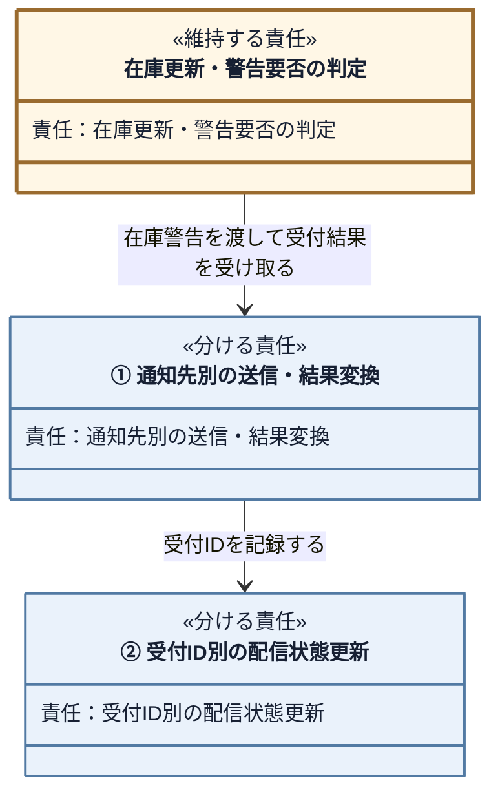

黄色は在庫管理に残す責任、青は外へ分ける責任です。図の①と②を、続く課題と完了条件で課題ID1（通知手段の境界）・課題ID2（非同期完了の境界）として確定します。

この配置になると、フェーズ4で並べた接続情報は、次のように分かれます。

| 分けたあとの置き場所（責任） | 見ている接続情報 |
|---|---|
| 通知先別の送信・結果変換 | 通知手段（呼び方と戻り値の形） |
| 受付ID別の配信状態更新 | 非同期の最終結果 |
| 在庫更新・警告要否の判定 | 商品マスタの在庫と閾値 |

フェーズ4では、三つの接続情報が `InventoryManager` の中に同居していました。分けたあとは、置き場所ごとに見ているものが一つになります。通知先を1つ足すとき手を入れるのは通知手段の置き場所、受付後の結果の扱いが変わるときは配信状態の置き場所で、在庫更新には手を入れません。型名・具体通知先・生成場所はフェーズ6で決めます。

### 5-2：課題と完了条件を確定する

直前の目標図で決めた①と②に課題IDを付けます。図の各変更について、原因・接続・完了の見分け方を確定します。

#### 課題ID1（通知手段の境界）の完了条件

| 確定すること | 内容 |
|---|---|
| **解く原因：** | 原因ID1：在庫判断と通知先別処理が同じクラスにある |
| **構造の変更：** | 通知先別の送信・結果変換を目標図①へ分ける |
| 守る責任 | 在庫更新・警告要否の判定 |
| **接続：** | 商品ID・商品名・更新後在庫を通知側へ渡す |
| 返す結果 | 通知側から受付結果を返す |

**完了条件：** 完成コードで次の3点を満たせば完了です。

- 在庫管理に具体的な通知先名・関数名がない
- 在庫管理に手段固有の変換・結果解釈がない
- 全通知先へ同じ依頼を行う

#### 課題ID2（非同期完了の境界）の完了条件

| 確定すること | 内容 |
|---|---|
| **解く原因：** | 原因ID2：在庫判断と配信状態更新が同じクラスにある |
| **構造の変更：** | 受付ID別の配信状態更新を目標図②へ分ける |
| 守る責任 | 在庫更新・警告要否の判定 |
| **接続：** | 別経路から受付IDと配信成否を渡す |
| 反映する結果 | 該当する配信状態だけを更新する |

**完了条件：** 完成コードで次の2点を満たせば完了です。

- 在庫管理に配信状態表と完了入口がない
- 該当する受付IDの状態だけを更新する

「1件が失敗しても他の通知を続ける」は構造課題ではなく、機能要求です。フェーズ7で確認します。

二つとも満たせば、在庫管理は通知先ごとの呼び方も、受付ID別の配信状態も知りません。

この表の1行は、一つの原因と、それに対応する問題・課題の組です。左から、観測した問題、それを生んだ原因、原因をなくす課題を対応させます。

| 観測した問題 | 確定した原因 | 課題で目指す状態 |
|---|---|---|
| 問題ID1：SMS追加で在庫管理を修正 | 原因ID1：在庫更新・警告要否の判定と通知先別の送信・結果変換が同じクラスにある | 課題ID1：通知先別の送信・結果変換を在庫更新・警告要否の判定から分ける |
| 問題ID2：非同期完了を在庫管理へ追加 | 原因ID2：在庫更新・警告要否の判定と受付ID別の配信状態更新が同じクラスにある | 課題ID2：受付ID別の配信状態更新を在庫更新・警告要否の判定から分ける |

在庫変動の記録も構造課題ではなく、要求ID4（在庫変動の追跡）です。フェーズ7で確認します。

## 🔴 フェーズ6：対策検討 ―― 構想を一つのコード経路へ変える

> **フェーズ6の確認観点：** 「契約と具体」「生成・所有」「選択・登録」「受け渡し」「実行」が、課題ID1（通知手段）・課題ID2（非同期完了）を同時に解く一つの経路としてつながるかを確認します。
>
> 在庫更新からSMSの最終結果まで動く一つの構想にします。

### 分離した責任をコードの構造へ変える

フェーズ5では、通知先別の送信・結果変換と受付ID別の配信状態更新を在庫更新・警告要否の判定から分け、受付IDでつなぐところまで決めました。ここからは、通知契約、性質の異なる具体、生成・登録、配信状態の台帳と完了入口、在庫操作からの同報の順にC++の構造へ変えます。

フェーズ5の目標図で使った責任名を、C++のクラス名へ置き換えると次の対応になります。これは完成図ではなく、周辺クラスを省略した責任とクラスの対応図です。

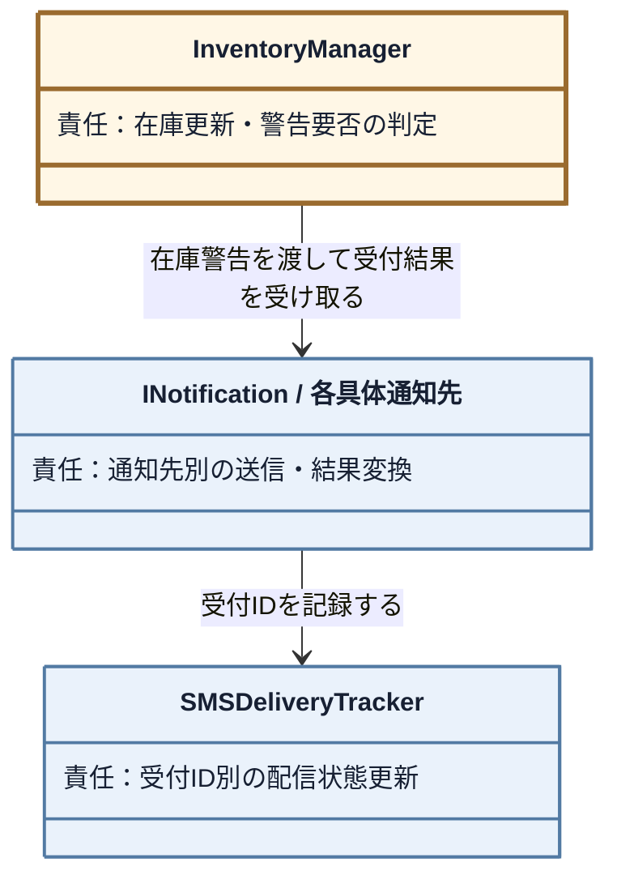

図の「在庫更新・警告要否の判定」「通知先別の送信・結果変換」「受付ID別の配信状態更新」はフェーズ5と同じ責任名です。ここから、各責任を表す契約・操作・所有・受け渡しを部分クラス図と対応コードで確定します。完成クラス図はフェーズ7で確認します。

### 構想をコードでつなぐ

> **現在位置：** 契約 → 性質の異なる具体 → 生成・登録 → 在庫操作からの同報、の順で確認します。

#### 契約：通知先別の送信・結果変換をC++の型と操作にする

> **問い2：境界では、何を約束すれば足りるか**
>
> フェーズ5で確定した「在庫警告を渡し、受付結果を受け取る」という接続を、C++の型と操作へ変えます。業務上の入力と結果は再検討せず、通知元が具体的な通知手段を知らずに使える最小の形を決めます。

課題ID1（通知手段の境界）の入力である商品ID・商品名・更新後在庫は、一件の在庫警告を表す値オブジェクトにまとめます。結果も、受付状態・通知手段名・受付IDを持つ一件の配送結果にまとめます。通知先固有の宛先・認証情報・文面はこの接続を通る業務データではないため、各具体の内側に残します。

通知手段が四つあり、呼び方と結果の表現も異なるので、単なる補助関数ではなく「在庫警告を一件受け取り、配送結果を一件返す」クラス契約にします。課題ID2（非同期完了の境界）の受付IDと別経路の最終結果は配信状態の更新へ渡す情報であり、この通知契約へ別の操作として足しません。

通知先追加で変わる文面・呼び方・戻り値解釈を具体へ移し、共通の結果集計を通知元に残します。`void` のダッシュボードを含め、各具体が共通の配送結果へ翻訳します。

**`DeliveryStatus`：通知受付から最終配信までの状態**

```cpp
// 通知の受付結果と、非同期SMSの最終配信結果
enum DeliveryStatus {
    ACCEPTED,        // 受け付けられた（同期手段の成功）
    PENDING,         // 受け付けたが、配信結果はまだ不明
    FAILED,          // 受付そのものに失敗した
    DELIVERED,       // 端末まで届いた
    DELIVERY_FAILED  // 受け付けたが届かなかった
};

```

同期手段の即時成功は `ACCEPTED`、SMSの受付中は `PENDING` と表します。

**`DeliveryResult`：通知先1件の受付・配信結果**

```cpp
// 通知1件の受付・配信結果
struct DeliveryResult {
    DeliveryStatus status;    // 受付・配信のどの段階か
    std::string    channel;   // どの通知手段か
    std::string    requestId; // 非同期受付だけが設定する照合番号
};
```

> **設計判断：失敗は戻り値で返す。** 一件の通知失敗後も在庫更新と残りの通知を続けるためです。入力不備で処理を続けられないときに例外を投げる第1章のカートプレビューとは、呼び出し側が続行できるかどうかで使い分けます。

**`StockAlert`：通知元から通知先へ渡す在庫警告**

```cpp
// 通知手段ごとに表現を変えるための、共通の在庫警告データ
struct StockAlert {
    std::string productId;    // 商品コード
    std::string productName;  // 商品名
    int         stock;        // 更新後の在庫数
};
```

次の部分クラス図は、**今決める「通知元が具体手段ではなく共通契約を保持し、各通知手段が契約を実現する」関係だけ**を示します。代表具体は `EmailNotifier` だけで、他の通知先、在庫台帳、配信状態はまだ対象外です。

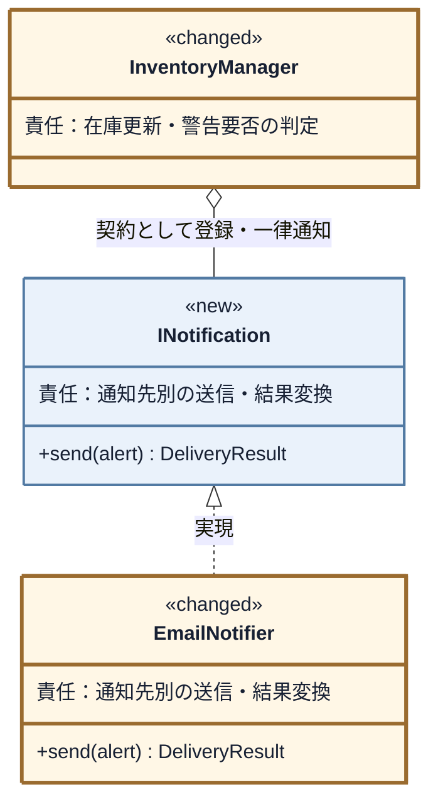

通知元から具体通知先への複数の依存を、`INotification` への一本に替えます。

**`INotification`：通知先が共有する契約**

```cpp
// 通知先が満たす必要がある契約（インターフェース）
class INotification {
public:
    virtual ~INotification() = default;
    // 在庫警告を受け取り、手段別に表現して受付結果を1つ返す
    virtual DeliveryResult send(const StockAlert& alert) = 0;
};
```

引数・戻り値・操作は各一つです。`EmailNotifier` なら、`StockAlert` から現状と同じ文面を作り、メールAPIの真偽値を `ACCEPTED` または `FAILED` へ翻訳できます。

ただし、これは代表の1つに当てただけです。**残り3つでも成り立たなければ、契約にはできません。** 次の節で1つずつ当てます。

---

> **設計判断：一件が失敗しても残りを続ける。** 在庫はすでに更新されており、通知先ごとの成否は独立しているという現行要求・運用規則に従います。

#### 具体：契約の裏へ変わる判断を置く

四つの呼び方は、現状コードで見たとおりばらばらです。`send(alert)` が `DeliveryResult` を1つ返すという形へ、1つずつ当てます。

| 具体クラス | 今の呼び方と戻り値 | `send()` の中で何をするか |
|---|---|---|
| `EmailNotifier` | `sendMail(件名, 本文)` → `bool` | 警告から件名と本文を作り、真偽値を `ACCEPTED`／`FAILED` へ |
| `DashboardUpdater` | `refreshStockWidget(商品コード, 在庫数)` → `void` | 警告から商品コードと在庫数を取り、`ACCEPTED` を返す |
| `ChatNotifier` | `postMessage(投稿先, 本文)` → `std::string` | 警告から本文を作り、投稿IDが空なら `FAILED` |
| `SMSNotifier` | 受付APIが受付IDを返し、結果は後から届く | 警告を渡して受付IDを受け取り、`PENDING` と受付IDを返す |

四つとも埋まりました。ただし、形が危なかったところが二つあります。

**ダッシュボードは、失敗を表せません。** `void` からは `FAILED` を作れないので、`ACCEPTED` 固定と決めます。この割り切りは通知元へ出さず、`DashboardUpdater` の中に閉じます。

**SMSは、届いたかどうかを返せません。** 契約を「配信結果を返す」と決めていたら、ここで成り立たなくなります。返せるのは受け付けたところまでなので、**契約は受付結果までとします。** 最終結果は課題ID2（非同期完了の境界）の側で扱います。

**四つのうち一つでも当てはまらなければ、その形は契約にしません。** 代表1つで決めてしまうと、当てはまらない具体が出たときに、通知元へ手段別の分岐が戻ります。

SMSの最終配信状態は通知先の寿命から独立して残すため、`SMSNotifier` 自身ではなく、組み立て側が所有する台帳へ置きます。

---

#### 生成・所有・受け渡しを決める

> **問い3：実体を、誰が作り、持ち、渡すのか**
>
> 起動時の組み立て役が通知先とログを生成・所有し、通知先への参照を`InventoryManager::attach()`で初期登録します。`InventoryManager`は具体型を知らず、登録された同じ実体へ`INotification`として通知します。非同期SMSの完了先まで含め、生成から実行までをつなぎます。

##### 生成・所有：実体と所有者をコードで示す

具体型・寿命・初期登録を利用側と `InventoryManager` から隠すため、全実体を所有して起動時に組み立てる `InventoryApplication` を置きます。所有関係はこの後の部分クラス図で確定し、メンバーの全定義はフェーズ7にまとめます。

通知先を `InventoryManager` より先に宣言し、借用中の寿命を保証します。SMSの受付IDと配信状態だけを持つ `SMSDeliveryTracker` もここで所有し、SMS送信時と `SMSDeliveryCallback` から共有します。在庫操作とは入口が異なるため、最終結果を `InventoryManager` へ戻しません。

`SMSDeliveryTracker` は `record(result)` で受付IDを `PENDING` として記録し、`complete(requestId, delivered)` で該当IDだけを最終状態へ変えます。`SMSNotifier` が受付ID発行直後に同じ台帳へ記録するため、通知元にSMS固有の分岐は入りません。

追加する型も、責任が混ざっていないか確認します。

| 型 | 一つに絞った役割 | 別の型へ分けたこと |
|---|---|---|
| `INotification` | 在庫警告を受け取り、受付結果を返す契約 | 具体API・文面・配信状態を持たない |
| 各Notifier | 通知先固有APIの呼び出しと共通結果への変換 | 生成・登録・他通知先の制御を持たない |
| `SMSDeliveryTracker` | SMS受付IDごとの配信状態を保存・更新 | 外部結果の受信を持たない |
| `SMSDeliveryCallback` | 外部から届いたSMS結果を台帳へ渡す | 配信状態を自分では持たない |
| `DeliveryStatusText` | 配信状態を表示文字列へ変換 | SMS受付IDや配信状態を持たない |
| `InventoryApplication` | 実体の生成・所有・初期接続 | 在庫判断や通知処理を持たない |

この分け方なら、それぞれの変更理由は一つです。特にSMS固有の追跡へ汎用名を付けず、状態表示の変換だけを `DeliveryStatusText::name()` へ分けます。

**`SMSDeliveryCallback::receive()`：別経路の最終結果から台帳への受け渡し**

```cpp
bool SMSDeliveryCallback::receive(
        const std::string& requestId, bool delivered) {
    return tracker.complete(requestId, delivered);
}
```

> **設計判断：受付と最終結果を分ける。** 要求ID5（SMS配信結果の確認）は到達結果まで確認するため、受付IDを台帳へ残し、別経路の最終結果は専用入口で照合します。`SMSNotifier` と `SMSDeliveryCallback` は同じ台帳を借り、`InventoryManager` は知りません。

次の部分クラス図では、SMS送信時と最終結果の受信時が同じ台帳を使い、`InventoryManager` から台帳への依存がない点を見ます。

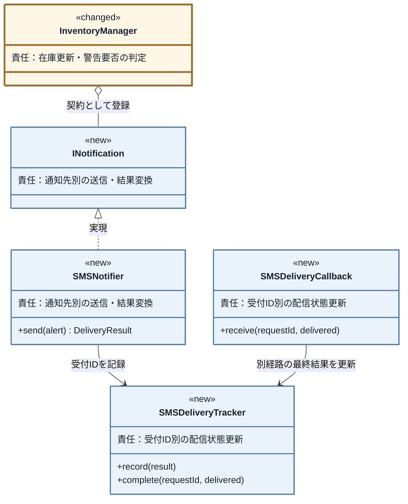

この共有関係を、所有メンバーと初期化の要点で確かめます。

**`InventoryApplication`のコンストラクタ：所有した同じ台帳の受け渡し**

```cpp
explicit InventoryApplication(bool smsWillFail = false)
    : sms(smsDeliveryTracker, smsWillFail),
      manager(productDatabase),
      smsCallback(smsDeliveryTracker) {
    registerNotifications();
}
```

`InventoryManager` には在庫の正本と `std::vector<INotification*> observers` だけが残り、配信状態の台帳は入りません。

**`InventoryManager::notifyAll(const StockAlert&)`：一律に呼ぶ骨格**

```cpp
void InventoryManager::notifyAll(const StockAlert& alert) {
    for (auto* o : observers) {
        DeliveryResult r = o->send(alert);
    }
}
```

`alert` は次の `reduceStock()` が更新後在庫から作り、閾値以下の場合だけ渡します。

**`InventoryManager::reduceStock()`：在庫更新から警告作成までの接続**

```cpp
int before = info.stock;
info.stock -= quantity;
db.save(productId, info);
std::cout << "商品 " << productId << "（" << info.name << "）"
     << " の在庫を " << quantity << " 減らしました。"
     << " 在庫: " << before
     << " -> " << info.stock << std::endl;

if (db.isBelowThreshold(productId, info.stock)) {
    notifyAll({productId, info.name, info.stock});
}
```

在庫を保存し、変更前後の数値を記録してから閾値を判定します。通知元は作成した同じ `StockAlert` を全登録先へ渡します。

---

##### 登録：生成済み通知先を通知元へ登録する

**`InventoryManager::attach()`：契約だけを受け取る登録操作**

```cpp
bool InventoryManager::attach(INotification* observer) {
    if (observer == nullptr) return false;
    if (std::find(observers.begin(), observers.end(), observer)
            != observers.end()) return false;
    observers.push_back(observer);
    return true;
}
```

**`registerNotifications()`：通知先の登録処理**

`registerNotifications()` が、所有する実体を契約として通知元へ渡します。

```cpp
void registerNotifications() {
    bool registered = manager.attach(&email)
                   && manager.attach(&dashboard)
                   && manager.attach(&chat)
                   && manager.attach(&sms);
    if (!registered) {
        throw std::logic_error("通知先の初期登録に失敗しました");
    }
}
```

四件を起動時に登録し、一件でも失敗すれば構成不良として起動を止めます。通知元は借用した `INotification*` を反復し、具体型や同期方式に依存しません。通知構成は起動時に確定する範囲とします。


---

#### 実行骨格：組み立てた実体を契約から呼ぶ

`reduceStock()` は在庫更新後に `notifyAll()` を呼び、登録済みの契約へ同じ警告を渡して受付結果を集計します。SMSだけは発行した受付IDを共有台帳へ記録します。

#### 公開入口から具体の実行まで追う

##### 公開入口から骨格・契約・具体へつなぐ

最後に、在庫操作と最終配信結果が別々の公開入口へ届くことを確認します。

**`main()`：出庫とコールバックの模擬**

```cpp
    InventoryApplication app;
    app.inventory().reduceStock("PRD002", 1);

    // 実運用では後から外部基盤が呼ぶ入口を、別の呼び出しで模擬する
    app.smsDelivery().receive("SMS-1", true);
```

出庫は同じ `reduceStock()` のままです。SMSの最終結果だけは、在庫操作から分けた `smsDelivery()` へ渡します。`main()` は `InventoryApplication` を一つ作るだけで、具体通知や登録順を知りません。受入・回帰はフェーズ7で検証します。

### 構想を確定する

採用するのは、組み立て側が具体通知を登録し、通知元が契約の一覧へ同報し、独立した台帳と受信入口が最終結果を追う構造です。専用メンバーや状態表を `InventoryManager` に残す形では二つの課題が残ります。原因を二つともなくす構造はここまでで一つに定まり、フェーズ7で完成クラス図を示します。

在庫更新、閾値判定、数値ログは `InventoryManager` と `ProductDatabase` の既存契約を維持します。

#### 将来リスクに対して構想を確認する

| 将来リスク | 変更を閉じ込める場所 | 守れる範囲と限界 |
|---|---|---|
| リスクID1（通知先の種類） | 新Notifierと登録・所有 | 在庫管理を守れる。固有設定の取得場所は追加時に決める |
| リスクID2（通知先の構成） | 組み立て側の生成・登録 | 在庫計算を守れる。今回の実装は起動時の構成変更までに限定する |
| リスクID3（受付と最終結果） | 各Notifier、状態ログ、コールバック | 在庫更新から分離できる。重複通知や再送規則は別途必要になる |

## 🟢 フェーズ7：対策実施 ―― 変化に強いコードを完成させる

> **フェーズ7の確認観点：** 「変更後の全要求IDを満たし、既存要求も落としていないか」と「フェーズ5の構造上の完了条件を満たし、同じ変更IDの影響が縮んだか」を分けて確認します。

通知元は登録済みの契約へ同報し、非同期結果は別の台帳と入口で更新する完成コードを示します。

### 7-1：解決後のコード（全体）

#### 完成後のクラス一覧

- `ProductDatabase`、`StockAlert`、`InventoryManager`
- `INotification`、`EmailNotifier`、`DashboardUpdater`、`ChatNotifier`
- `SMSNotifier`、`SMSDeliveryTracker`、`SMSDeliveryCallback`
- 生成・所有・登録を閉じる `InventoryApplication`

> **実行条件：** 四通知を同一プロセスで順に呼び、一件の失敗後も続けます。外部送信は標準出力のスタブで表します。

#### 完成後のクラス図

部分図を完成図へ統合します。`<<new>>` は新規、`<<changed>>` は変更、表示なしは現状維持です。図は3枚で、**前の2枚が「誰が誰を持つか」、最後の1枚が「境界を何が流れるか」**です。持ち方とやり取りを分けると、通知先を増やしたときに動く線がどれなのかが見分けられます。

1枚目は、通知契約と各具体の関係です。

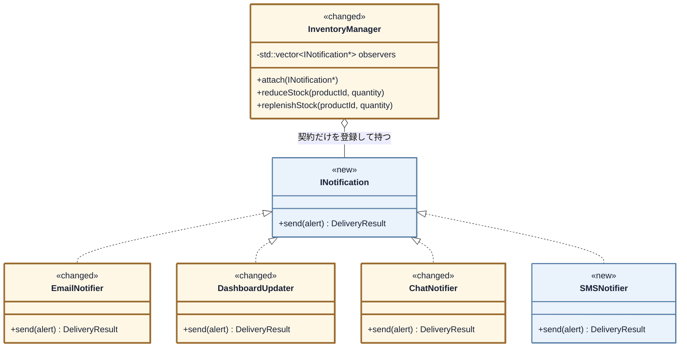

通知元が持つのは契約1本だけです。2枚目は、誰が誰を生成して持つかです。

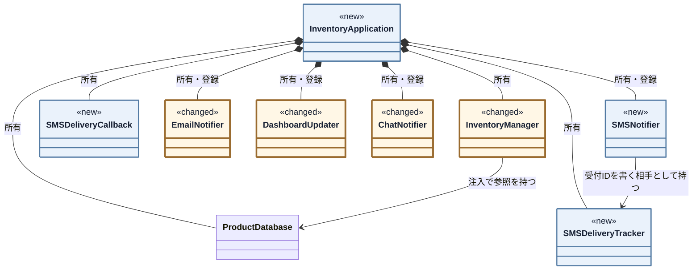

**具体の通知先を知っているのは、`InventoryApplication` だけです。** 在庫台帳へ伸びる線は `InventoryManager` からの1本で、通知先が何種類あっても動きません。`SMSNotifier` だけが `SMSDeliveryTracker` を持つのは、受付IDを書き残すのがSMSだけだからです。この線を共通契約へ出すと、書き残すもののない他の3つにも同じ相手を持たせることになります。

3枚目は、**境界を何が流れるか**です。**具体の通知先は出てきません。** どの手段であっても流れるものは同じで、それがこの構造の要点だからです。

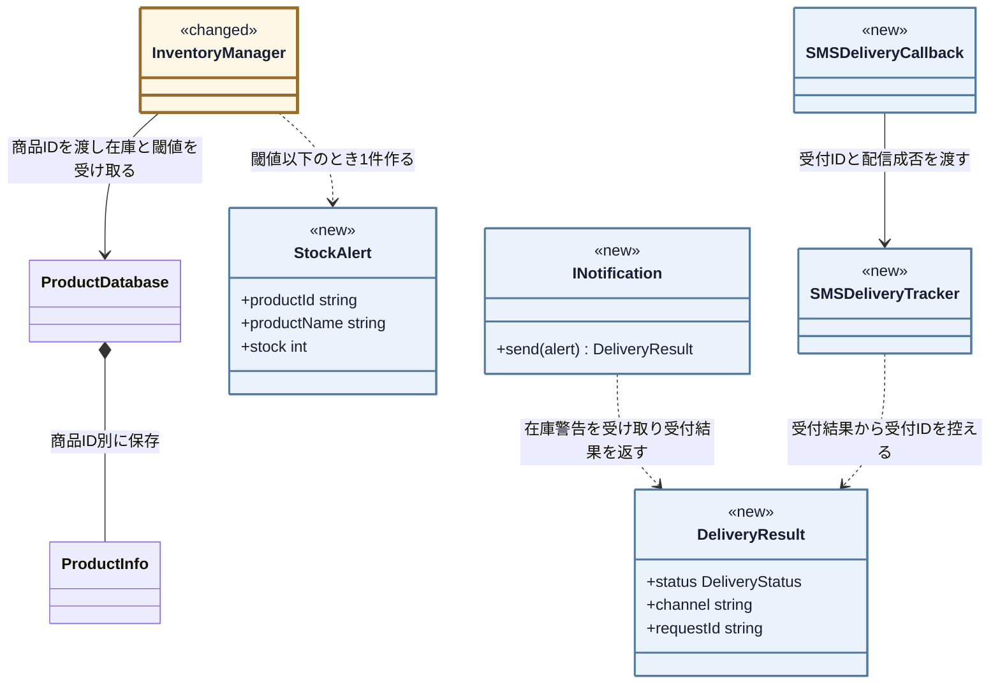

**契約を渡るのは、在庫警告1件と受付結果1件だけです。** 宛先も、文面も、APIの呼び方も、この線には乗りません。だから通知先が1つ増えても、`InventoryManager` 側の線は1本のままです。

**受付IDをたどる線は、`SMSDeliveryTracker` に集まっています。** 受付結果から受付IDを控え、あとから届いた最終結果で確定させるのは `SMSDeliveryCallback` です。どちらも在庫台帳とはつながっていません。

フェーズ4で `InventoryManager` に混在していた三つの責任は、在庫更新・警告要否の判定を持つ `InventoryManager`、通知先別の送信・結果変換を持つ各 `INotification` 実装、受付ID別の配信状態更新を持つ `SMSDeliveryTracker` と `SMSDeliveryCallback` に分かれました。違うものを見ている責任が分かれ、元の `InventoryManager` には在庫更新・警告要否の判定だけが残ります。

#### 完成後の実行シーケンス

起動時の生成・登録と、在庫更新後の同報を順に示します。

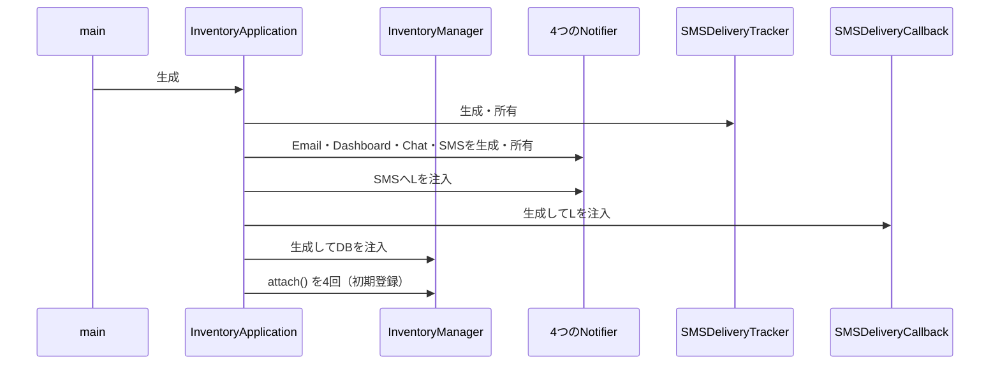

`main()` は `InventoryApplication` を生成するだけです。次の図は在庫更新と通知受付の経路です。

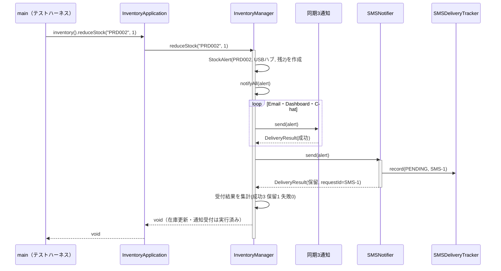

実運用では後から届くSMS結果を、在庫更新とは別経路で受けます。掲載コードでは、時間を待たずに `main()` の別の呼び出しでこの経路を模擬します。

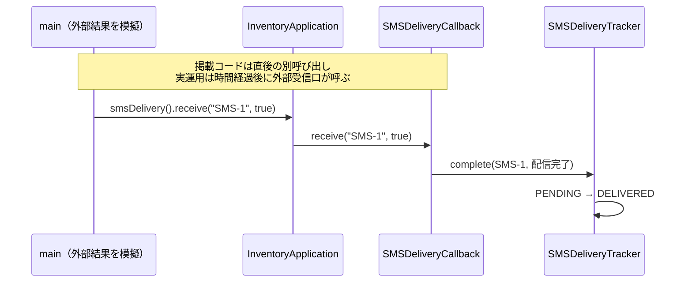

同期三件は成功を即返し、SMSは受付ID付きの保留を返します。後の `receive()` は外部コールバックを模擬し、在庫更新を再開しません。

#### 完成コード

---

**共通ヘッダー**

完成コードで使う標準ライブラリです。

```cpp
#include <iostream>
#include <vector>
#include <string>
#include <map>
#include <algorithm>
#include <stdexcept>

```

**ProductInfo**

```cpp
// 商品マスタの1件分
struct ProductInfo {
    std::string name;           // 商品名
    int    stock;          // 在庫数
    int    alertThreshold; // アラート閾値
};
```

**ProductDatabase**

```cpp
// 商品マスタ（データ駆動バリデーション用）
class ProductDatabase {
private:
    std::map<std::string, ProductInfo> records;
public:
    ProductDatabase() {
        records["PRD001"] = {"ワイヤレスマウス", 50, 10};
        records["PRD002"] = {"USBハブ",           3,  5}; // 閾値以下
        records["PRD003"] = {"キーボード",         0,  5}; // 在庫なし
    }

    bool exists(const std::string& id) const {
        return records.count(id) > 0;
    }

    ProductInfo get(const std::string& id) const {
        return records.at(id);
    }

    void save(const std::string& id, const ProductInfo& info) {
        records[id] = info;           // 実行中の商品マスタへ追加
    }

    bool isBelowThreshold(const std::string& id,
                          int currentStock) const {
        return currentStock <= records.at(id).alertThreshold;
    }
};
```

**DeliveryStatus**

```cpp
// 通知の受付結果と、非同期SMSの最終配信結果
enum DeliveryStatus {
    ACCEPTED,        // 受け付けられた（同期手段の成功）
    PENDING,         // 受け付けたが、配信結果はまだ不明
    FAILED,          // 受付そのものに失敗した
    DELIVERED,       // 端末まで届いた
    DELIVERY_FAILED  // 受け付けたが届かなかった
};
```

**DeliveryStatusText**

```cpp
namespace DeliveryStatusText {
    const char* name(DeliveryStatus status) {
        if (status == PENDING) return "PENDING";
        if (status == DELIVERED) return "DELIVERED";
        if (status == DELIVERY_FAILED) return "DELIVERY_FAILED";
        return "対象外";
    }
}
```

**DeliveryResult**

```cpp
// 通知1件の受付・配信結果
struct DeliveryResult {
    DeliveryStatus status;    // 受付・配信のどの段階か
    std::string    channel;   // どの通知手段か
    std::string    requestId; // 非同期受付だけが設定する照合番号
};
```

**ChannelName**

```cpp
// ログや結果で使う通知手段名を一か所に定義する
namespace ChannelName {
    const char* const EMAIL     = "Email";      // メール通知
    const char* const DASHBOARD = "Dashboard";  // ダッシュボード表示
    const char* const CHAT      = "Chat";       // 社内チャット
    const char* const SMS       = "SMS";        // SMS（非同期）
}
```

---

**StockAlert**

すべての通知先が実装する契約と、そこへ渡す在庫警告データです。

```cpp
// 通知手段ごとに表現を変えるための、共通の在庫警告データ
struct StockAlert {
    std::string productId;    // 商品コード
    std::string productName;  // 商品名
    int         stock;        // 更新後の在庫数
};
```

**INotification**

```cpp
// 通知先が満たす必要がある契約（インターフェース）
class INotification {
public:
    virtual ~INotification() = default;
    // 在庫警告を受け取り、手段別に表現して受付結果を1つ返す
    virtual DeliveryResult send(const StockAlert& alert) = 0;
};
```

商品マスタは現状どおり `ProductDatabase` が管理します。通知元は同じ `StockAlert` を渡し、同期方式にかかわらず `DeliveryResult` を受け取ります。文面・API・結果の翻訳は各具体に残ります。

---

**SMSDeliveryTracker**

現状で非同期の最終結果を追うのはSMSだけなので、汎用名にはしません。`SMSDeliveryTracker` はSMSの受付IDと配信状態の対応だけを管理します。状態名の文字列化はSMS固有ではないため、`DeliveryStatusText::name()` へ分けています。

```cpp
// 受付IDごとに、非同期SMSの最終配信状態を更新する
class SMSDeliveryTracker {
    std::map<std::string, DeliveryStatus> statuses;
public:
    void record(const DeliveryResult& result) {
        if (result.status != PENDING ||
            result.requestId.empty()) return;

        statuses[result.requestId] = PENDING;
        std::cout << "[SMS状態] " << result.requestId
                  << ": PENDINGを記録" << std::endl;
    }

    bool complete(
        const std::string& requestId,
        bool delivered) {
        auto it = statuses.find(requestId);

        if (it == statuses.end() || it->second != PENDING) {
            std::cout << "[SMS最終結果エラー] 未知または確定済みの受付ID: "
                 << requestId << std::endl;
            return false;
        }

        DeliveryStatus before = it->second;
        it->second = delivered ? DELIVERED : DELIVERY_FAILED;
        std::cout << "[SMS最終結果] " << requestId << ": "
             << DeliveryStatusText::name(before) << " -> "
             << DeliveryStatusText::name(it->second)
             << std::endl;
        return true;
    }
};
```

---

**SMSDeliveryCallback**

実運用でSMS基盤から後から届くコールバックの入口です。掲載コードでは `main()` が直接呼び、在庫更新から独立した経路を模擬します。

```cpp
class SMSDeliveryCallback {
    SMSDeliveryTracker& tracker;
public:
    explicit SMSDeliveryCallback(SMSDeliveryTracker& tracker)
            : tracker(tracker) {}

    bool receive(const std::string& requestId, bool delivered) {
        return tracker.complete(requestId, delivered);
    }
};
```

`SMSDeliveryTracker` が受付IDを追跡し、`SMSDeliveryCallback` は外部から届く値をそこへ渡すだけです。

---

**EmailNotifier**

`INotification` を実装する具体的な通知先です。**メール基盤の呼び方（件名と本文、真偽値）は現状コードのまま変えません。** 契約からその形へ変換する責任を、このクラスの中へ引き取ります。

```cpp
// 通知先1：メール通知（同期）
// メール基盤の呼び方（件名と本文、真偽値）は現状コードのまま変えない。
// 契約からその形へ変換する責任を、このクラスの中へ引き取る。
class EmailNotifier : public INotification {
    std::vector<std::string> inbox;

    // 現状コードと同じメール基盤の操作
    bool sendMail(
        const std::string& subject,
        const std::string& body) {
        inbox.push_back(body);
        std::cout << "Email(" << inbox.size()
                  << "件) [" << subject << "] "
                  << body << std::endl;
        return true;
    }
public:
    DeliveryResult send(const StockAlert& a) override {
        std::string body =
            "商品 " + a.productId + "（" + a.productName
            + "） の在庫が閾値以下です。";
        bool ok = sendMail("在庫アラート", body);

        if (ok) {
            return {ACCEPTED, ChannelName::EMAIL, ""};
        }
        return {FAILED, ChannelName::EMAIL, ""};
    }
};
```

---

**DashboardUpdater**

画面更新は成否を返しません。**その事実をどう契約へ写すかを、通知元ではなくこのクラスが決めます。**

```cpp
// 通知先2：ダッシュボード更新（同期）
// 画面更新は成否を返さない。その事実をどう契約へ写すかを、
// 通知元ではなくこのクラスが決める。
class DashboardUpdater : public INotification {
    int refreshCount;

    // 現状コードと同じ画面更新。戻り値が無い
    void refreshStockWidget(const std::string& productCode,
                            int stock) {
        ++refreshCount;
        std::cout << "Dashboard(" << refreshCount << "件): "
             << productCode
             << " の在庫表示を " << stock << " に更新" << std::endl;
    }
public:
    DashboardUpdater() : refreshCount(0) {}
    DeliveryResult send(const StockAlert& a) override {
        refreshStockWidget(a.productId, a.stock);
        // 呼べたことをもって受付成功とする。この割り切りはここに閉じる
        return {ACCEPTED, ChannelName::DASHBOARD, ""};
    }
};
```

---

**ChatNotifier**

空の投稿IDが失敗という約束も、このクラスの中で契約へ翻訳します。

```cpp
// 通知先3：チャット通知（同期）
// 空の投稿IDが失敗という約束も、このクラスの中で契約へ翻訳する。
class ChatNotifier : public INotification {
    std::vector<std::string> posted;

    // 現状コードと同じチャット基盤。投稿IDを返す
    std::string postMessage(
        const std::string& channel,
        const std::string& text) {
        posted.push_back(text);
        std::string postId =
            "POST-" + std::to_string(posted.size());
        std::cout << "Chat(" << posted.size()
                  << "件) #" << channel << "\n"
                  << "  " << text << " -> " << postId
                  << std::endl;
        return postId;
    }
public:
    DeliveryResult send(const StockAlert& a) override {
        std::string text =
            "商品 " + a.productId + "（" + a.productName
            + "） の在庫が閾値以下です。";
        std::string postId =
            postMessage("inventory-alert", text);

        if (postId.empty()) {
            return {FAILED, ChannelName::CHAT, ""};
        }
        return {ACCEPTED, ChannelName::CHAT, ""};
    }
};
```

同期三通知は即時結果を返します。SMSは受付時に `PENDING` または `FAILED` を返し、別経路の最終結果で `DELIVERED` または `DELIVERY_FAILED` へ更新します。

---

**SMSNotifier**

`SMSNotifier::send()` は受付結果だけを返し、最終配信結果は別経路のコールバックで受け取ります。実運用では後からSMS基盤が呼び、掲載コードでは `main()` がその呼び出しを模擬します。

`inbox` と `posted` は呼出回数を見せるスタブ、`SMSDeliveryTracker` は要求ID5（SMS配信結果の確認）の業務記録であり、統合しません。手段名は `ChannelName` に集約します。

```cpp
// 新しい通知先の実装を追加し、組み立て側で登録する
// 通知先4：SMS通知（非同期。受付だけ返す）
class SMSNotifier : public INotification {
    SMSDeliveryTracker& tracker;  // 組み立て側が所有する台帳を借りる
    bool willFail;  // 受付に失敗する状況を再現するための指定
    std::vector<std::string> inbox;  // 受付できた通知だけを蓄積する
    int nextRequestNumber = 1;
public:
    SMSNotifier(SMSDeliveryTracker& tracker, bool fail)
        : tracker(tracker), willFail(fail) {}
    DeliveryResult send(const StockAlert& a) override {
        if (willFail) {
            std::cout << "SMS: 受付失敗（後で再送対象）" << std::endl;

            return {FAILED, ChannelName::SMS, ""};
        }

        std::string text = "在庫警告 " + a.productId + " 残"
            + std::to_string(a.stock);
        inbox.push_back(text);
        std::string requestId = "SMS-"
            + std::to_string(nextRequestNumber++);
        std::cout << "SMS(" << inbox.size() << "件受付): " << text
             << " / 受付ID=" << requestId << std::endl;
        DeliveryResult result{
            PENDING, ChannelName::SMS, requestId};
        tracker.record(result);
        return result;
    }
};
```

固有APIは変えず、共通契約との翻訳場所だけを各通知クラスへ移しました。

| 手段 | 1-4で通知元が抱えていた翻訳 | 7-1でそれを持つ場所 |
|---|---|---|
| メール | 件名と本文へ分けて渡し、`bool` を成否として読む | `EmailNotifier::send()` の中 |
| ダッシュボード | 商品コードと在庫数を渡し、戻り値が無いので成功とみなす | `DashboardUpdater::send()` の中 |
| チャット | 投稿先と本文を渡し、投稿IDが空かどうかで成否を判定する | `ChatNotifier::send()` の中 |

ダッシュボードの「戻り値がないため受付成功とみなす」判断も、その妥当性を決められる具体側へ移ります。

---

**InventoryManager**

在庫を更新し、閾値以下なら登録済みの `INotification` へ同報します。SMSの台帳と最終結果の受信入口は持ちません。

```cpp
// 通知元クラス（Subject に相当）
class InventoryManager {
private:
    // 非所有ポインタ。登録中の通知先はInventoryManagerより長く生存すること。
    std::vector<INotification*> observers;
    ProductDatabase& db;

public:
    explicit InventoryManager(ProductDatabase& database)
        : db(database) {}

    // nullと重複登録を拒否する
    bool attach(INotification* o) {
        if (o == nullptr) return false;

        if (std::find(observers.begin(), observers.end(), o)
                != observers.end()) {
            return false;
        }

        observers.push_back(o);

        return true;
    }

    void reduceStock(std::string productId, int quantity) {
        if (!db.exists(productId)) {
            std::cout << "[エラー] 商品ID " << productId
                 << " はマスタに存在しません。処理を中断します。"
                 << std::endl;
            return;
        }

        ProductInfo info = db.get(productId);

        if (quantity <= 0 || quantity > info.stock) {
            std::cout << "[エラー] 商品 " << productId
                 << "（" << info.name << "）"
                 << " は " << quantity << " 個出庫できません。現在在庫: "
                 << info.stock << std::endl;
            return;
        }

        int before = info.stock;
        info.stock -= quantity;
        db.save(productId, info);
        std::cout << "商品 " << productId
             << "（" << info.name << "）"
             << " の在庫を " << quantity << " 減らしました。"
             << " 在庫: " << before
             << " -> " << info.stock << std::endl;

        if (db.isBelowThreshold(productId, info.stock)) {
            notifyAll({productId, info.name, info.stock});
        }
    }
```

`reduceStock()` は在庫を更新し、在庫が閾値以下になったときだけ `notifyAll()` を呼びます。**手段ごとの分岐はありません。**

---

**InventoryManager の続き（replenishStock ほか）**

同じクラスの続きです。`InventoryManager::replenishStock()` から先を読みます。

```cpp
    void replenishStock(std::string productId, int quantity) {
        if (!db.exists(productId)) {
            std::cout << "[エラー] 商品ID " << productId
                 << " はマスタに存在しません。処理を中断します。"
                 << std::endl;
            return;
        }

        ProductInfo info = db.get(productId);

        if (quantity <= 0) {
            std::cout << "[エラー] 商品 " << productId
                 << "（" << info.name << "） は " << quantity
                 << " 個補充できません。現在在庫: "
                 << info.stock << std::endl;
            return;
        }

        int before = info.stock;
        info.stock += quantity;
        db.save(productId, info);
        std::cout << "商品 " << productId
             << "（" << info.name << "）\n"
             << "  在庫を " << quantity
             << " 補充しました。在庫: " << before
             << " -> " << info.stock
             << "（通知なし）" << std::endl;
    }

private:
    // 各通知先の受付結果を集計する。通知先の種類ごとに分岐しない
    void notifyAll(const StockAlert& alert) {
        int accepted = 0;  // 受付に成功した件数
        int pending  = 0;  // 受付だけ済み、結果待ちの件数
        int failed   = 0;  // 受付に失敗した件数

        for (auto* o : observers) {
            DeliveryResult r = o->send(alert);

            if (r.status == ACCEPTED) {
                accepted++;
            } else if (r.status == PENDING) {
                pending++;
                std::cout << "  保留: " << r.channel
                     << " 受付ID=" << r.requestId << std::endl;
            } else {
                failed++;
                std::cout << "  失敗: " << r.channel << std::endl;
            }
        }

        std::cout << "[受付結果] 成功:" << accepted
             << " 保留:" << pending
             << " 失敗:" << failed << std::endl;
    }
};
```

在庫の正本と数値ログは維持し、通知結果だけを集計します。通知ポインタは借用なので、次の組み立て役が全実体を長く所有します。

---

**InventoryApplication**

このクラスがアプリケーション全体の**組み立て役**です。通知先を生成・所有し、`InventoryManager` へ登録した後、在庫操作とSMS結果受信という二つの公開入口だけを渡します。

```cpp
// 生成・所有・登録を一か所に閉じるアプリケーションの組み立て役
class InventoryApplication {
    // 上から生成され、下から破棄される。
    // InventoryManagerより通知先を先に宣言し、借用先の寿命を保証する。
    ProductDatabase productDatabase;
    SMSDeliveryTracker smsDeliveryTracker;
    EmailNotifier email;
    DashboardUpdater dashboard;
    ChatNotifier chat;
    SMSNotifier sms;
    InventoryManager manager;
    SMSDeliveryCallback smsCallback;

    void registerNotifications() {
        bool registered = manager.attach(&email)
                       && manager.attach(&dashboard)
                       && manager.attach(&chat)
                       && manager.attach(&sms);
        if (!registered) {
            throw std::logic_error("通知先の初期登録に失敗しました");
        }
    }

public:
    explicit InventoryApplication(bool smsWillFail = false)
        : sms(smsDeliveryTracker, smsWillFail),
          manager(productDatabase),
          smsCallback(smsDeliveryTracker) {
        registerNotifications();
    }

    InventoryManager& inventory() { return manager; }
    SMSDeliveryCallback& smsDelivery() { return smsCallback; }
};
```

メンバーは宣言順に生成され、逆順に破棄されます。各Notifierを `InventoryManager` より前へ置くことで、`InventoryManager` が借用している間は通知先が必ず生存します。`registerNotifications()` の失敗は実行前の構成不良なので例外で起動を止め、実行中の通知失敗は結果として返して残りの通知を続けます。

生成・所有・登録を完了し、`main()` には在庫操作とSMS結果受信の入口だけを公開します。

---

#### `main()` と実行結果

各シナリオのコードと結果を対にし、在庫の変更前後と通知結果を確認します。

---

**組み立てと、ケース1：閾値を超えたまま在庫が減る通常ケース**

```cpp
int main() {
    // mainは具体的な通知先や登録順を知らない
    InventoryApplication app;

    // PRD001: 在庫50、閾値10 → 5減らしても閾値超えのまま
    std::cout
        << "--- ケース1: 在庫が閾値を超えたまま減少"
           "（通知なし） ---"
        << std::endl;
    app.inventory().reduceStock("PRD001", 5);
    std::cout << std::endl;
```

ケース1の実行結果（閾値超えのままなので通知は出ない）：

```
--- ケース1: 在庫が閾値を超えたまま減少（通知なし） ---
商品 PRD001（ワイヤレスマウス） の在庫を 5 減らしました。 在庫: 50 -> 45
```

同じ `main()` の中で、ケース2は在庫が閾値以下に下がり、同期3件＋非同期SMS1件へ通知するケースです。

```cpp
    // PRD002: 在庫3、閾値5 → 最初から閾値以下。SMSは保留を返す
    std::cout << "--- ケース2: 在庫が閾値以下に減少"
            "（同期3件＋非同期SMS） ---" << std::endl;
    app.inventory().reduceStock("PRD002", 1);
    std::cout << std::endl;
```

ケース2の実行結果（成功3・保留1・失敗0）：

```
--- ケース2: 在庫が閾値以下に減少（同期3件＋非同期SMS） ---
商品 PRD002（USBハブ） の在庫を 1 減らしました。 在庫: 3 -> 2
Email(1件) [在庫アラート] 商品 PRD002（USBハブ） の在庫が閾値以下です。
Dashboard(1件): PRD002 の在庫表示を 2 に更新
Chat(1件) #inventory-alert
  商品 PRD002（USBハブ） の在庫が閾値以下です。 -> POST-1
SMS(1件受付): 在庫警告 PRD002 残2 / 受付ID=SMS-1
[SMS状態] SMS-1: PENDINGを記録
  保留: SMS 受付ID=SMS-1
[受付結果] 成功:3 保留:1 失敗:0
```

既存三通知の表示は変えず、翻訳場所だけを移しています。SMSの最終結果は、後続行で外部コールバックを模擬します。

```cpp
    std::cout
        << "--- ケース2のコールバック模擬: "
           "SMS-1が配信完了 ---"
        << std::endl;
    app.smsDelivery().receive("SMS-1", true);
    std::cout << std::endl;
```

ケース2のコールバック模擬結果：

```
--- ケース2のコールバック模擬: SMS-1が配信完了 ---
[SMS最終結果] SMS-1: PENDING -> DELIVERED
```

`main()` の続きです。ケース3は、在庫が補充されて閾値を超え、通知が出ないケースです。

```cpp
    std::cout << "--- ケース3: 在庫が補充された（閾値超え） ---" << std::endl;
    app.inventory().replenishStock("PRD001", 20);
    std::cout << std::endl;
```

ケース3の実行結果：

```
--- ケース3: 在庫が補充された（閾値超え） ---
商品 PRD001（ワイヤレスマウス）
  在庫を 20 補充しました。在庫: 45 -> 65（通知なし）
```

同じ `main()` で、ケース4は在庫0の商品を出庫しようとするエラーです。

```cpp
    // PRD003: 在庫0 → 出庫エラー
    std::cout << "--- ケース4: 在庫0の出庫操作 ---" << std::endl;
    app.inventory().reduceStock("PRD003", 1);
    std::cout << std::endl;
```

ケース4の実行結果：

```
--- ケース4: 在庫0の出庫操作 ---
[エラー] 商品 PRD003（キーボード） は 1 個出庫できません。現在在庫: 0
```

`main()` の続きで、ケース5は存在しない商品IDを操作するエラーです。

```cpp
    // ケース5: 存在しない商品IDのエラー確認
    std::cout << "--- ケース5: 存在しない商品IDを操作する ---" << std::endl;
    app.inventory().reduceStock("PRD999", 1);
    std::cout << std::endl;
```

ケース5の実行結果：

```
--- ケース5: 存在しない商品IDを操作する ---
[エラー] 商品ID PRD999 はマスタに存在しません。処理を中断します。
```

同じ `main()` の中で、ケース6はSMSを受付失敗する実装へ差し替え、部分失敗（成功3・保留0・失敗1）でも在庫更新と他通知が止まらないことを確認します。

```cpp
    // ケース6: SMSを受付失敗する設定へ差し替え、部分失敗を確認する
    std::cout << "--- ケース6: SMSだけ受付失敗（部分失敗） ---" << std::endl;
    // 失敗動作の別構成も、具体通知の生成・登録は組み立て役へ任せる
    InventoryApplication failureApp(true);
    failureApp.inventory().reduceStock("PRD002", 1);
```

ケース6の実行結果（SMSだけ失敗、在庫更新と他通知は継続）：

```
--- ケース6: SMSだけ受付失敗（部分失敗） ---
商品 PRD002（USBハブ） の在庫を 1 減らしました。 在庫: 3 -> 2
Email(1件) [在庫アラート] 商品 PRD002（USBハブ） の在庫が閾値以下です。
Dashboard(1件): PRD002 の在庫表示を 2 に更新
Chat(1件) #inventory-alert
  商品 PRD002（USBハブ） の在庫が閾値以下です。 -> POST-1
SMS: 受付失敗（後で再送対象）
  失敗: SMS
[受付結果] 成功:3 保留:0 失敗:1
```

`main()` の続きで、ケース7は最初に組み立てた `app` を使い、受付に成功するSMS通知で別の受付IDを作ります。次の別呼び出しで、実運用では後から届く配信失敗を模擬し、在庫更新と同期3通知を巻き戻さないことを確認します。

```cpp
    std::cout << "--- ケース7: SMSを受け付ける ---" << std::endl;
    app.inventory().reduceStock("PRD002", 1);
    std::cout
        << "--- ケース7のコールバック模擬: "
           "SMS-2が配信失敗 ---"
        << std::endl;
    app.smsDelivery().receive("SMS-2", false);
```

ケース7の実行結果（受付は保留、別のコールバック模擬で最終状態だけが配信失敗へ変わる）：

```
--- ケース7: SMSを受け付ける ---
商品 PRD002（USBハブ） の在庫を 1 減らしました。 在庫: 2 -> 1
Email(2件) [在庫アラート] 商品 PRD002（USBハブ） の在庫が閾値以下です。
Dashboard(2件): PRD002 の在庫表示を 1 に更新
Chat(2件) #inventory-alert
  商品 PRD002（USBハブ） の在庫が閾値以下です。 -> POST-2
SMS(2件受付): 在庫警告 PRD002 残1 / 受付ID=SMS-2
[SMS状態] SMS-2: PENDINGを記録
  保留: SMS 受付ID=SMS-2
[受付結果] 成功:3 保留:1 失敗:0
--- ケース7のコールバック模擬: SMS-2が配信失敗 ---
[SMS最終結果] SMS-2: PENDING -> DELIVERY_FAILED
```

**ケース8：0個の補充を拒否する**

```cpp
    std::cout << std::endl;
    std::cout << "--- ケース8: 0個の補充を拒否する ---" << std::endl;
    app.inventory().replenishStock("PRD001", 0);

    return 0;
}
```

ケース8の実行結果：

```
--- ケース8: 0個の補充を拒否する ---
[エラー] 商品 PRD001（ワイヤレスマウス） は 0 個補充できません。現在在庫: 65
```

不正入力では在庫と通知件数が変わりません。SMSは受付成功・受付失敗・最終配信失敗を分け、いずれも在庫更新と他通知を止めません。通知元には具体手段や別経路の結果処理が残りません。

#### 最終要求の実装・受入エビデンス

変更後要求ベースラインの全有効要求IDを同じ順序で照合します。今回変わらなかった既存要求も対象にするため、要求の消失を検出できます。

**外から見た入出力は、フェーズ1で決めた変更後の姿から動いていません。** 受け取るものも、返すものも、表示の形も同じです。完成後の全体図やフロー図を置いていないのは、そこが同じ絵になるからです。変わったのは中の置き場所だけで、それをこの表と、続く完了条件で確かめます。

| 要求ID | 実装箇所 | 実行結果で確認したこと |
|---|---|---|
| 要求ID1（正確な在庫の維持） | `InventoryManager`、`ProductDatabase` | ケース1・2・6・7で在庫が減り、ケース3で補充した分だけ増える |
| 要求ID2（在庫不足の通知） | `InventoryManager::reduceStock()`、各Notifier | 閾値以下のとき4手段が1件ずつ受け取る |
| 要求ID3（誤更新の防止） | `InventoryManager` の入力検証 | ケース4・5・8の不正操作では在庫と通知件数を変えない |
| 要求ID4（在庫変動の追跡） | `InventoryManager::reduceStock()`、`replenishStock()` | 各成功操作に商品ID・操作数・変更前→変更後を出力 |
| 要求ID5（SMS配信結果の確認） | `SMSNotifier`、`SMSDeliveryTracker`、`SMSDeliveryCallback` | SMS-1は受付時に記録して完了へ、SMS-2は最終失敗へ更新する |

最終要求5件がすべて合格です。

上の表は継続（要求ID1（正確な在庫の維持）・要求ID3（誤更新の防止）・要求ID4（在庫変動の追跡））、変更（要求ID2（在庫不足の通知））、追加（要求ID5（SMS配信結果の確認））を同じ順序で並べ、変わらなかった既存要求も回帰対象に含めています。継続要求が合格していることで、既存動作が落ちていないことを確認できます。

#### 設計課題の完了確認

要求の受入とは分けて、フェーズ5の完了条件を完成コードへ照合します。

**課題ID1（通知手段の境界）**

| フェーズ5の完了条件 | コード上の証拠 | 判定 |
|---|---|---|
| 在庫管理に具体的な通知先名・関数名がない | 保持するのは`INotification`の参照だけ | 合格 |
| 在庫管理に手段固有の変換・結果解釈がない | 各Notifierが入力と結果を共通形式へ変換する | 合格 |
| 全通知先へ同じ依頼を行う | `notifyAll()`が同じ`StockAlert`を全件へ渡す | 合格 |

**課題ID2（非同期完了の境界）**

| フェーズ5の完了条件 | コード上の証拠 | 判定 |
|---|---|---|
| 在庫管理に配信状態表と完了入口がない | 台帳と入口は在庫管理とは別の実体 | 合格 |
| 該当する受付IDの状態だけを更新する | `receive()`が受付IDを指定して台帳を更新する | 合格 |

全条件が合格です。通知先別の送信・結果変換は各Notifierと登録へ、SMSの受付ID別状態は `SMSDeliveryTracker`、外部結果の入口は `SMSDeliveryCallback` へ閉じました。

#### 変更前→変更後の不変条件照合

| 守る対象 | 変更前→変更後 | 確認根拠 |
|---|---|---|
| 商品・在庫の正本 | 同じ `ProductDatabase` の商品・数量を更新する | 在庫50→45などの数値ログ |
| 在庫変動の数値ログ | 通知の成否と独立して入出庫結果を出力する | 通知失敗時の在庫2→1ログ |

> **実務でファイルを分けるなら**
>
> 掲載用の1ファイルを、実務では責任ごとに次のように分けます。
>
> | ファイル | 入れるもの | なぜそこか |
> |---|---|---|
> | `ProductDatabase.h` | 商品・在庫・警告の値クラス | 通知の話とは別に変わる |
> | `INotification.h` | 通知先の契約 | 通知元がインクルードするのはこれだけ |
> | `Notifiers.h` / `.cpp` | 4つの通知先 | 通知固有APIと共通契約への翻訳を置く |
> | `InventoryManager.h` / `.cpp` | 在庫更新と通知の呼び出し | 具体の通知先を知らないので、通知先が増えても変わらない |
> | `SMSDeliveryTracker.h` / `.cpp` | SMS受付IDごとの配信状態を記録・更新 | SMS送信側と最終結果の受信側が共有し、通知元を太らせない |
> | `InventoryApplication.h` | 生成・所有・登録 | 通知構成と借用先の寿命を一か所で保証する |
> | `main.cpp` | 公開入口の呼び出し | 具体通知や登録順を知らず、在庫操作と外部結果を模擬する |
>
> ファイル一式: `sources/chapter03/`（`make run`）。通知先が大きくなれば提供元ごとに分け、小規模な間は `Notifiers.h` / `.cpp` にまとめます。

### 7-3：変更影響グラフ（改善後）

フェーズ3で当てた**同じ変更ID1（非同期SMS追加）**を、完成構造からSMS固有の部品だけを除いた基準へ当て直します。**新規は淡い青の面と `［新規］`、変更は淡い黄の面・茶色の枠と `［変更］` で示し、変更ノードには`変更前→変更後`も書きます。差分表示のないノードは触りません。**

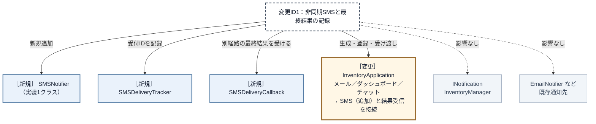

**クラス・組み立て箇所の同じ粒度で、変更2つ＋新規1つから、変更1つ＋新規3つへ変わりました。** 既存コードの修正箇所は `InventoryManager` と `main()` の2箇所から、組み立て役 `InventoryApplication` の1箇所へ減ります。SMS固有の送信・受付ID保管・最終結果の受信は三つの新規部品として追加されます。共通契約 `INotification`、通知元 `InventoryManager`、既存通知先と利用側の `main()` は変更先から消えました。

| 変更影響グラフで影響した場所 | 完成構造での修正 | 構造変更との対応 |
|---|---|---|
| 呼び分けと結果の解釈 | `SMSNotifier` を追加する。`InventoryManager` は修正しない | SMS固有APIと共通結果への翻訳を新規部品へ閉じた |
| 受付IDの保管 | `SMSDeliveryTracker` を追加する | SMS受付IDごとの状態を在庫操作から分けた |
| 別経路の最終結果 | `SMSDeliveryCallback` を追加する | 外部結果の入口を在庫操作から分けた |
| 通知先の登録と完了先の接続 | `InventoryApplication` の所有・`attach()`・受け渡しを変更する | 構成を知る変更を組み立て箇所へ集めた |

組み立て側にはSMS・状態台帳・完了受付の接続が増え、間接性と登録箇所を保守するコストも生じます。その代わり、在庫更新へSMS固有の知識を戻さず、受信側の追加を具体通知と組み立てへ閉じられます。

---

## あなたのコードで考えてみてください

題材名を自分のシステムへ置き換え、次の順で構造を確かめてください。

1. 利用者が達成したいことと、通知先が変わっても失ってはいけない現行動作は何か。
2. 通知先を一つ追加すると、発生元のメンバー・生成・呼び分け・引数変換・結果解釈のどこまで修正が広がるか。
3. 発生元の業務判断と、通知手段ごとのAPI・文面・完了方式が同じクラスに集まっていないか。
4. 全通知先の入力と出力を並べると、共通の事実と受付結果をどの型で約束できるか。
5. 各通知先は独立しているか。順序依存や前段結果の受け渡しがあるなら、同報ではなく誰が手順を制御するか。
6. 具体通知先を誰が生成・所有・登録し、発生元が具体名を知らずに全員を実行できるか。非同期の最終結果はどの別境界で追跡するか。

ここまで問題から導いた「通知分離構造」は、一般に **Observerパターン**と呼ばれます。ここからは題材を離れ、この名前で共有される抽象的な骨格を確認します。

## パターン解説：Observer パターン

Observer（観察者）という名の通り、あるオブジェクトの状態変化を、複数の「観察者」に自動的に通知する仕組みです。

### パターンの骨格

「通知を送る側（Subject）」が「通知を受け取る側（Observer）」のリストを保持し、状態が変化したときに一斉に通知を送ります。

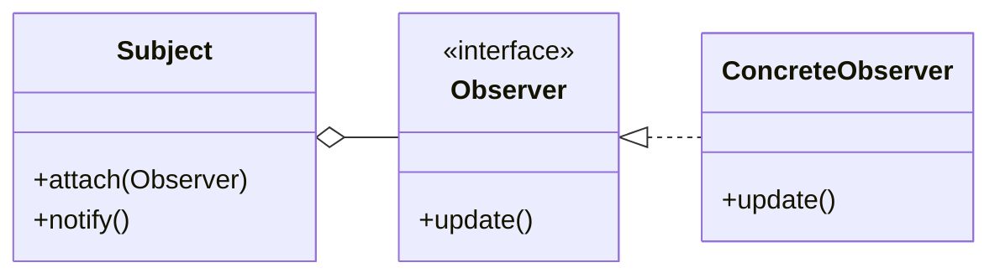

`Subject` は登録された相手を契約として持つだけで、何件いるか、どの具象かを判定しません。通知先を増やしても、線が増えるのは `Observer` の下側だけです。

### この章の実装との対応

`InventoryManager` が `Subject`（通知を送る側）、`INotification` が `Observer`（抽象ロール）、`EmailNotifier` 等が `ConcreteObserver`（具象観察者）に対応します。

### 使いどころと限界

- **使うと良い：** 一つの出来事を、互いに独立した複数の相手へ知らせ、通知先の増減を発生元から分けたい場合。本章で在庫警告を4つの通知先へ同報した構造が、この条件の具体例です。
- **使わない方が良い：** 通知先が一つに固定され、増える見込みもない場合。登録一覧と共通契約を置くより、直接呼ぶ方が処理経路を短くできます。
- **別の構造も検討する：** 前の処理結果によって次の処理を変える場合。Observerは独立した相手への同報を表すため、順序や分岐を制御するワークフローには向きません。
- **非同期結果は別に設計する：** Observerがそろえるのは通知受付までです。本章のSMSのように結果が後から届くなら、受付ID、状態の保存先、結果の受信口を別の責任として設計します。

生ポインタで登録する場合は、通知先の寿命、重複登録、通知中の登録変更、例外後も続けるかを決めます。本章は上位の組み立て役が寿命を保証し、重複を拒否します。

### 過剰適用になる例

在庫警告を固定の画面一つへ表示するだけなら、`INotification` と登録一覧を導入する必要はありません。`InventoryManager` から表示境界を一つ呼ぶ方が、生成・登録・寿命管理を追わずに済みます。

本章でObserverを採用した根拠は、通知先がすでに複数あり、SMS追加で通知元に具体名・引数変換・結果解釈が増えたことです。判断基準は通知件数だけではなく、**各通知先が独立して同じ出来事を受け取り、その構成が発生元とは別の理由で変わるか**です。

### この章のまとめ

冒頭で掲げた四つを、この章で得た判断として確認します。

- **得られること1：発生元と受信側の依存の特定。** 通知先の追加で `InventoryManager` に増えた具体名・呼び分け・入力変換・結果解釈を、変更影響として特定しました。
- **得られること2：異なる責任の切り分け。** 在庫更新・警告要否の判定、通知先別の送信・結果変換、受付ID別の配信状態更新が別々の理由で変わる責任だと分けました。
- **得られること3：通知契約と登録による再結合。** 共通の通知事実と受付結果を `INotification` に定め、具体通知を組み立て側で所有・登録し、発生元から同じ契約で呼ぶ構造にしました。
- **得られること4：効果と適用可否の検証。** 通知先固有の変更を実装と登録へ閉じたことを確認し、独立した同報、順序依存の処理、単一の直接呼び出しを選び分ける基準も示しました。

この四つがそろうことで、呼び出しを一律にObserverへ置き換えるのではなく、受信側が独立して同じ事実を受け取るかを根拠に採用を判断できます。
