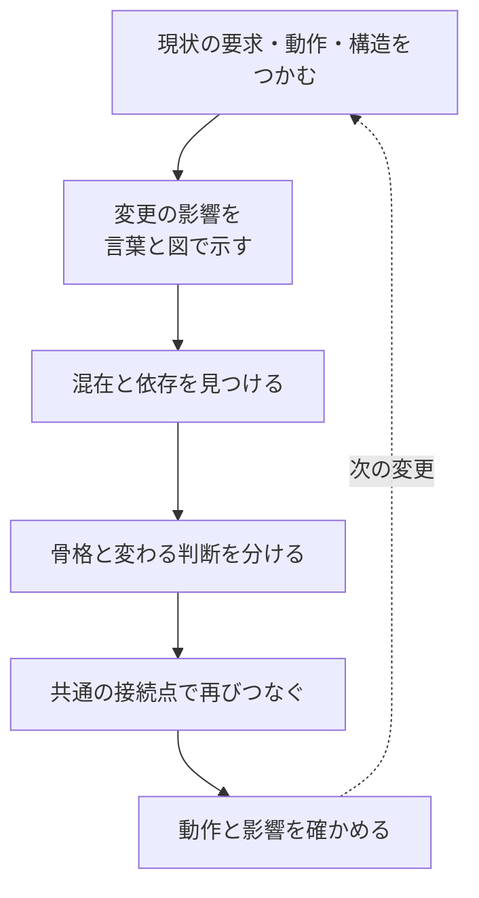
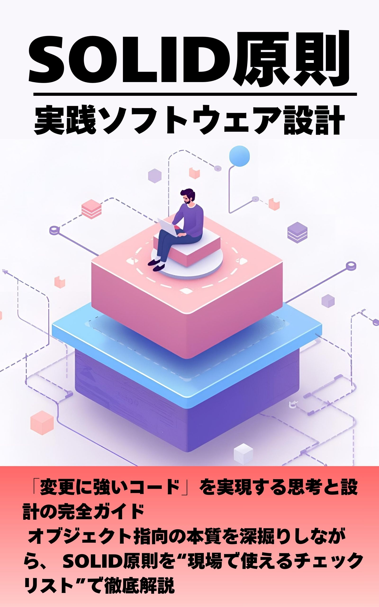

# おわりに
―― 万能な型はない。だからこそ、追い続けられる。

---

ここまで読み進めてくださって、ありがとうございます。

三つの実践章を通じて、私が伝えたかったのは「デザインパターンの使い方」ではありませんでした。「変わる理由を見つけて、分けて、繋ぎ直す」という、たった一つの思考プロセスを、異なるコードで繰り返し体験してもらうことでした。それが伝わっていたとすれば、この本を書いた甲斐があります。

---

## 万能な設計の型は、存在しない

この本を書きながら、ずっと思っていたことがあります。

「この章で紹介したパターンが、いつでも正解とは言えない」ということです。

コストはどのくらいかけられるか。修正のタイミングはいつか。変更の影響範囲はどこまでか。チームの規模は、将来の見通しは——。これらの状況が変われば、最適な設計の形も変わります。「このパターンを使えば正解」という万能な型は存在しないと、私は思っています。

だからこそ、型を暗記することよりも、その型のメリットとデメリットを理解すること、状況によって柔軟に判断できる思考プロセスを持つことの方が、ずっと大切だと感じています。

この本がパターン名ではなく「変わる理由を問う思考」を中心に置いたのは、そういう理由です。唯一の正解がないからこそ、前提を確かめ、複数の選択肢からその場に合う案を組み立て、結果を検証する力が必要です。それが、私がたどり着いた一つの考え方です。

だから私は、この本を「考え方を知るための本」にしたいと思いました。万能な完成形としての型がない以上、目の前の仕様と制約から、その場に合う構造を自分で組み立てる必要があります。そのとき、知っている考え方が一つしかなければ、検討できる方向も一つに偏ります。分離の単位、責任の置き場所、生成と接続の仕方、変更コストの見積もり方など、複数の見方を知っていることが、状況に応じて判断するための材料になります。

本書の7フェーズは、どのシステムにも同じ完成形を当てはめるための型ではありません。仕様から判断の根拠を失わないための思考順序です。その順序を使いながら、各章で異なる分け方と繋ぎ方を見比べることで、自分の状況に必要な構造を考えられるようにする。それが、この本で目指したことです。

---

## 「これから何が変わるか」を見積もる ―― 仮説立案の費用対効果

変更要求を受けたとき、私がいちばん大切にしているのが、「これから何が、どれくらいの頻度で変わりそうか」を見積もる仮説立て（本書のフェーズ2）です。地味な工程ですが、ここでの見積もりが、設計にどこまで投資するかをそのまま決めます。

もし、この先もう変更の予定がほとんどないなら、凝った構造を入れるコストは見合いません。柔軟性は、使われなければただの複雑さです。今動いているコードを最小限の修正で済ませ、シンプルなまま残すほうが、その場では正しい判断になります。

逆に、同じ場所への変更がこれからも何度も来ると見込めるなら、その都度あちこちを書き換える痛みが積み上がっていきます。ここでは、変更しやすい構造へ設計し直す投資が、回数を重ねるほど報われます。最初の一手間は増えても、二度目・三度目の変更で取り返せる、という費用対効果の勘定です。

どちらが設計への投資として見合うかは、コードの美しさではなく、この「将来の変更回数」の見積もりで変わります。だからこそ、仮説立案とヒアリングで「もう変わらないのか、まだ変わり続けるのか」を確かめる一手間が、現場ではとても大切なのです。費用対効果を抜きに「良い設計だから」と柔軟性を足すのも、「面倒だから」と混在を放置するのも、どちらも判断を放棄しているだけだと私は思います。見積もった変更の見通しと、掛けられるコストを天秤にかける——この判断こそ、現場の設計で最も問われる部分だと感じています。

---

## 設計の目的は、価値を届けること

ここまで、将来の変更回数と設計への投資をどう釣り合わせるかを書きました。しかし、その費用対効果を考える前に、もう一つ確かめなければならないことがあります。**その変更は、誰のどのような困りごとを解決し、どんな価値を生むのか**という問いです。

ソフトウェア設計は、あくまで手段です。変更しやすい構造を作れても、それだけで価値のあるソフトウェアになったとは限りません。利用者にとっての価値は、製品やサービスを使うことで、抱えていた困りごとが解決されることにあります。困りごとを解決しない機能は、要求どおりに実装されていても、期待した価値を届けられません。

要求は、価値そのものではなく、困りごとを解決する手段として表されていることがあります。そのため、「要求に書かれているから作る」だけでは足りません。誰の何を、どのように変えれば成功なのかを要求元と確かめ、その本質を共有する必要があります。

本書では、確定した変更要求を現状コードへ当て、問題、原因、課題、対策へつなぐ過程を扱いました。実務では、その変更要求を確定する前に、次のことも確認します。

- 誰が、どのような場面で困っているのか
- 提案された機能は、その困りごとを本当に解決するか
- 利用者の行動や結果から、解決をどう確かめるか

ソフトウェアの構造と変更コストを理解していれば、開発する側から要求元へ別の方法も提案できます。求められた機能を否定するのではなく、目的を共有し、同じ困りごとをより確実に、より小さな負担で解決できないかを一緒に考える。その提案が、利用者へ届く価値を高めます。

一方、提供する側も価値を届け続けられなければなりません。満足の対価から利益を残せて初めて、製品やサービスを継続して改善できます。作成と保守のコストが大きすぎれば事業は続かず、販売や提供の計画に間に合わなければ、利用者が必要とする時期にも届けられません。

だから、価値はQCDのバランスで届けます。**Quality（品質）**は困りごとを安全かつ確実に解決すること、**Cost（コスト）**は開発と保守を続けられる負担に収めること、**Delivery（納期）**は価値が必要な時期に間に合わせることです。どれか一つだけを最大にせず、目的と制約に合わせて釣り合いを決めます。

最も抽象化された構造が、最も良い設計なのではありません。**必要な価値を、必要な品質で、成り立つコストと意味のある時期に届けられる構造**が、その状況における良い設計です。変更要求へうまく対応できたかを確かめるときも、コードがきれいになったかだけで終わらず、その変更が本来の困りごとの解決につながったかまで見届けたいと思います。

---

## 仕事では許されなくても、考えるのは自由だ

仕事の現場では、「理想の設計」を追求する時間はなかなか取れません。コストと納期と現実の制約の中で、できる範囲の判断をするしかない場面がほとんどです。

それでも、自分の時間に、自分の頭の中や他者へ影響しない試作の範囲で理想を考えることは自由です。「このコードを設計し直すとしたら、どこから変えるか」「あの境界線はもっとうまく引けたはずだ」と考え、試してみる。その思考実験は、自分なりの判断を育てる練習になります。

ただし、これは仕事で自己満足を優先してよいという意味ではありません。仕事のコード、予算、納期は関係者と利用者に影響します。実際の変更は、解決したい困りごと、関係者の合意、QCD、運用上の制約に照らして判断します。自由な思考実験で増やした選択肢の中から、仕事では価値と制約に合うものを選びます。

---

## 学んだ考え方を、それぞれの設計へつなげる

この本で紹介した7つのフェーズは、要求から構造までの根拠を失わないための**標準の思考順序**です。まずは同じ順序で使い、前工程の判断が次工程の入力になっているかを確かめながら進める形をおすすめします。案件に合わせて説明量を減らす場合も、工程そのものを無意識に飛ばすのではなく、どの判断をどこで済ませたかを説明できることが前提です。

本書では、判断がつながる様子を省略しないため、分析内容と確認結果をフェーズごとに詳しく記載しました。実務では同じ分量の図や表を毎回作る時間がないこともあります。変更の影響、失敗したときの損失、関係者へ説明する必要性を見て、詳しく調べる場所と簡潔に済ませる場所を選びます。

慣れた後は、調査の入口や成果物の詳しさを案件に合わせて調整できます。ただし、現状把握から結果確認までの論理を逆転させず、変更要求、問題、原因、課題、対策、実装結果を追跡できることが条件です。**省くのは思考そのものではなく、すでに確かめたことの記録量です。** 本書で使った観点を手札として持っていれば、限られた時間でも、今回どこを深く考えるべきかを選べます。これが、本書でいう「自分なりの思考プロセス」です。

その先に、「ああ、ここが変わる理由の境界線だ」という瞬間が来ます。その瞬間が、私が設計を好きになった理由です。

明日、自分の現場のシステムを見るなら、まず小さく始めてください。大きなアーキテクチャ全体を一度に診断しようとしなくて構いません。

まず、いま困っている一つの変更を選び、その変更が届いた処理と、巻き込まれた処理を確かめます。影響が小さければ短いメモで十分です。影響が広い、失敗時の損失が大きい、関係者へ判断根拠を示す必要がある場合は、第0章の確認ポイントや実践章の図を使って、原因と境界を詳しく確かめます。大切なのは書類をすべて作ることではなく、現状から実装結果までの判断を途切れさせないことです。

そして、どの題材でも最後に確かめた問いは共通していました。**変わる判断をどの境界で分けるか。境界の両側をどんな契約と具体で表すか。その実体を章で実際に必要な生成・登録・選択・遷移・受け渡しによってどうつなぎ、守る処理から実行するか。** 割引ルールも、予約の状態も、通知先も、操作は違っても、変わる部分を守る処理から分けて再接続した点は同じです。Strategy、State、Observerという名前を知ることより、目の前のコードで境界から実行までを根拠付きで組み立て、その案が状況に合うかを判断できること。それが本書を通していちばん持ち帰っていただきたい設計の醍醐味です。

同じ感覚が、あなたにも届いていたらうれしいです。

---

## AIと一緒に考える時代だからこそ

今は、AIと一緒に仕事を進めることが特別ではなくなりつつあります。AIは、与えられた情報からコードや説明を素早く形にしてくれます。一方で、前提が足りなかったり、問いの方向がずれていたりすれば、整って見えても目的から外れた答えが出てきます。案件ごとに異なる事情や、何を変え、何を守りたいのかまでは、こちらが言葉にしなければ伝わりません。

だからAIを使う場面でも、重要なのは「どのような考え方で進めるか」だと思います。現状仕様をそろえ、変更要求を固定し、問題と原因を分け、守りたいものを示す。本書で繰り返した思考は、AIへ設計を依頼するときの前提を組み立て、出てきた案が目的に合っているかを確かめるためにも使えます。

毎回使える唯一の正解はありません。だからこそ、様々な考え方を学び、そのときの前提をAIと共有し、結果を自分で判断できるようになることが大切です。AIに答えを任せきるのではなく、自分の思考を広げる相手として使う。そうすることで、人とAIのどちらか一方だけでは見えなかった選択肢にも近づけるのではないかと思っています。

---

ここまでが、この本から読者の皆さんに持ち帰っていただきたい内容です。最後に、本編から少し離れて、私自身の現在地と、この本ができるまでのことを記します。

## 私自身、まだまだ途中にいる

正直に言うと、私は今も最適解を一人で出せる状況にありません。

現在は、自分で設計案を組み立て、お客さまや有識者からレビューと助言をいただいています。設計に唯一の正解がないからこそ、助言をそのまま採用するのではなく、どの前提と問題を見ているのかを理解します。自分でもその方がよいと納得できれば取り入れ、納得できなければ疑問を伝えて相談します。

助言から新しい見方を得たら、自分の思考プロセスのどこで、その観点を見落としたのかを振り返ります。次の設計では、同じ観点を最初から問いに加えられます。周囲の考え方を一つずつ吸収し、自分の判断方法を更新する。この繰り返しが、前向きな成長につながると考えています。

指摘を受けると、「自分はまだ駄目なのではないか」と感じることもあります。それでも見方を変えれば、指摘があるのは、まだ改善できる場所が見つかったということです。指摘の意図を理解し、前より少し分かりやすい形へ直せたとき、自分の判断も少しずつ変わっていると実感できます。

この積み重ねを続けるのは簡単ではありません。だからこそ、不足を責める材料にするのではなく、昨日は見えなかったものが見えるようになる楽しさへ変えていきたいと思っています。小さな変化を感じながら成長を続けられること自体が、とても大切なことだと感じています。

そして何より、楽しいと感じています。

設計に正解がないということは、「より良い」は常に存在するということです。今の自分よりも、半年後の自分の方が少しだけ良い判断ができるかもしれない——その感覚が、学び続ける原動力になっています。

---

## この本ができるまで ―― 半年間の書き直し

正直に打ち明けると、この本を書き上げるまでに、およそ半年かかりました。

時間はかかりましたが、様々な考え方を知り、言葉とコードで説明し直す過程は、私自身の成長にもつながりました。知識として名前を増やすだけでなく、「なぜこの判断になるのか」を何度も問い直したことが、以前とは違う見方を育ててくれたのだと思います。

一度書いた原稿には何度も指摘が入り、そのたびに考え直しました。「この章の順番では、読者は前の判断を持ったまま次へ進めない」と気づいて、構成そのものを組み替えたことも、一度や二度ではありません。分かりづらい説明は、伝わる形になるまで何度も書き直しました。図を描いては消し、表を並べ替え、コードを載せては実行結果と突き合わせる——その繰り返しでした。

苦労は、細かいところにこそ潜んでいました。ひとつの章のつじつまを合わせると、別の章の言葉づかいや前提とずれてしまい、全体を通して読み直しては直す、という作業が延々と続きました。専門用語に頼れば説明は短くなりますが、それでは「名前を覚える本」に逆戻りしてしまう。かといって噛み砕きすぎると、今度は文章が間延びして要点がぼやける。この「短さ」と「分かりやすさ」のあいだで、どの一文も何度も往復しました。本文とコードと図の三つが少しでも食い違えば、読者はそこで迷子になります。だから、コードを一行直すたびに図と本文まで見直す——地味で、終わりの見えない照合の連続でした。

正直、心が折れかけたこともあります。「本当にこれで伝わるのだろうか」と、書いた自分がいちばん自信を持てなくなる夜もありました。それでも書き続けられたのは、「デザインパターンの名前を覚えるための本」だけは作りたくない、という一点を手放さなかったからです。

### 収録パターンを3つに絞った経緯

打ち明けると、当初はもっと多くのデザインパターンを扱うつもりでした。Facade、Template Method、Command、Decorator、Factory Method——それぞれ原稿も書き上げ、コードも実行結果も揃っていました。さらに、複数の構造が絡み合う応用編まで用意していました。

ところが、全部を1冊に詰めてみて愕然としました。**2,000ページを超えていたのです。**

技術書として、これは読み通せる分量ではありません。「名前を覚える本にはしない」と決めて1つの構造を深く追ったぶん、1章あたりが厚くなっていました。それを何章も重ねれば、当然そうなります。

悩んだ末、**3つに絞りました。** 選んだ基準は「網羅」ではなく「**構造の違い**」です。Strategyは選んだ一つへ委譲し、Stateは現在の状態に応じて委譲先が変わり、Observerは登録された複数へ伝えます。**同じ「分けて再結合する」でも、再結合後の動きが三通り違う**——この差を見比べることが、目的から構造を選ぶ練習になると考えました。

書き上げた原稿を外すのは、正直つらい判断でした。ただ、読み通せない本を出すより、読み切れる本を出すほうが、読者にとっても私にとっても意味があると思い直しました。外した章は捨てていません。続きとして出せる形で残してあります。

私が最後まで目指していたのは、読者が**それぞれの現場で、自分自身の判断で設計を組み立てられるようになること**でした。既成の型を暗記して当てはめるのではなく、目の前のコードから「変わる理由の境界」を自分で見つけ、その場に合った構造を柔軟に発想できる——そんな考え方を届けたかったのです。パターン名は選択肢を理解する助けになりますが、どの案を採用するかは、現場の要求と制約から判断します。

その中でも、いちばん意識したのは**問題解決のプロセス**そのものでした。

「はじめに」で触れた充電ケーブルの例えを、私は本書全体を貫く軸として何度も思い返していました。専用の端子では、相手を替えたくても替えられません。ここで大切なのは、すぐに「入れ替えできる形にしよう」と対策へ飛びつかないことです。まず、**なぜ替えられないのか**を問う。分析すると、端子の形（接続点）と、その先につながる機器（接続先）の都合が分かちがたく一体になっている、つまり「変わる理由の違うものが同じ場所に混ざっている」と分かります。これが**原因**です。この原因を見抜いてはじめて、共通規格として残すべき接続点の形が決まり、つなぐ相手（接続先）だけを自由に入れ替えられるようになります。

私がいちばん伝えたかったのは、個々の用語の順番ではなく、**現状から構造を読み直し続ける思考**でした。

まず、要求、実際の動作、コードを突き合わせ、いまのシステムが何をしているかをつかみます。次に、変更が届いた場所と巻き込まれた場所を言葉と図で示し、そこに何が混在し、どの依存が影響を運んだのかを確かめます。現状が分からなければ、何を問題と呼ぶかも決められません。

構造を変えるときは、システムの流れとして残したい骨格と、業務要求によって変わりやすい判断を見分けます。違う理由で変わるものは切り離し、両側に本当に共通する依頼・入力・結果だけを接続点に残します。そして、分けた具体を生成・所有し、守る側へ渡し、具体を意識せず実行できるところまで再びつなぎます。

この循環を繰り返すと、次の変更でまた現状が変わっても、以前の構造を固定的な前提にせず、その時点の要求と制約から境界を見直せます。原因を飛ばして対策から入らないのは、この循環の一部だけを切り取ると、別の場所へ痛みを移す可能性があるからです。

私は今も、胸を張れるほどの書き手でも設計者でもありません。最適な設計を一発で出せるわけでもありません。それでも、この本を半年かけて書き直し続けたことで、デザインパターンの考え方も、設計そのものへの向き合い方も、以前より確かに深まった実感があります。結局のところ、書くことが私自身にとっていちばんの学びでした。

---

## 最後に

設計の楽しさに気づいたのは、私の場合ここ数年のことです。それまでは「とにかくコードを動かすこと」に必死で、構造を考える余裕などありませんでした。自分は設計向きじゃないと思っていた時期も、正直ありました。

それでも、「変わる理由を問う」という考え方に出会ったとき、少しずつコードへの向き合い方が変わってきた気がしています。

その感覚を、一人でも多くの方と共有したくて、この本を書きました。

あなたのコードの中にも、まだ意識されていない「変わる理由の境界線」がいくつもあるはずです。最初から完璧な設計を目指す必要はありません。「このメソッドの変わる理由は誰の判断か」——その一問から始まる探索が、きっと楽しくなると思います。

最後に、私自身がいちばん忘れたくないのは、楽しさを持ち続けることです。人からもらった意見は考え直す大切な材料ですが、最後に何を選び、何を作りたいかを決めるのは自分です。一度きりの時間を、自分がやりたいと思えることへ使い、その中で昨日との違いを見つけられる。変化していけるから楽しい。これからも、その感覚を大切にしながら進んでいきたいと思います。

一つの参考として受け取っていただければ、とてもうれしいです。

---

*ここまで読んでくださったあなたへ、心からありがとうございました。*

---

## 著書紹介

### 『SOLID原則 実践ソフトウェア設計』

<a href="https://www.amazon.co.jp/dp/B0FR4FNM67">Amazonの商品ページを見る</a>

### 『SOLID原則 C言語ソフトウェア設計』

<a href="https://www.amazon.co.jp/dp/B0GSMK45YY">Amazonの商品ページを見る</a>

## Noteブログ

ブログでも、分離そのものを目的にせず、**何の価値を守るために分けるのか、同じ理由で一緒に変わるものは一緒に置けないか**を考えています。本書で繰り返した「変わる理由の違いを見つけ、必要な契約だけを残して再接続する」という考え方と同じ方向です。責任、契約、依存、QCDについて、書籍とは異なる題材で考えた記事も公開しています。

[設計やソフトウェア開発についての記事を読む](https://note.com/rosy_flax9582)
