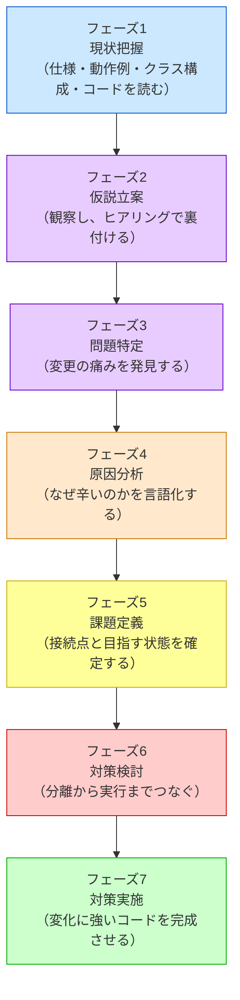
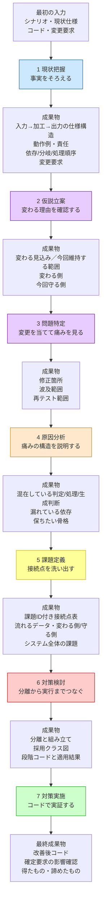
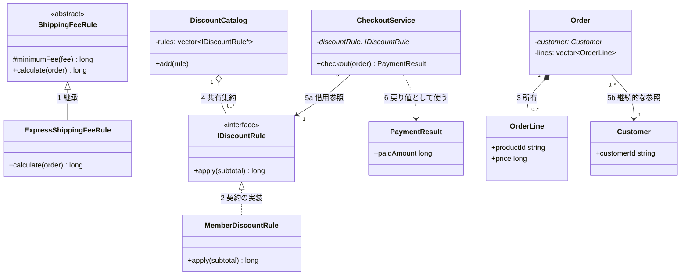
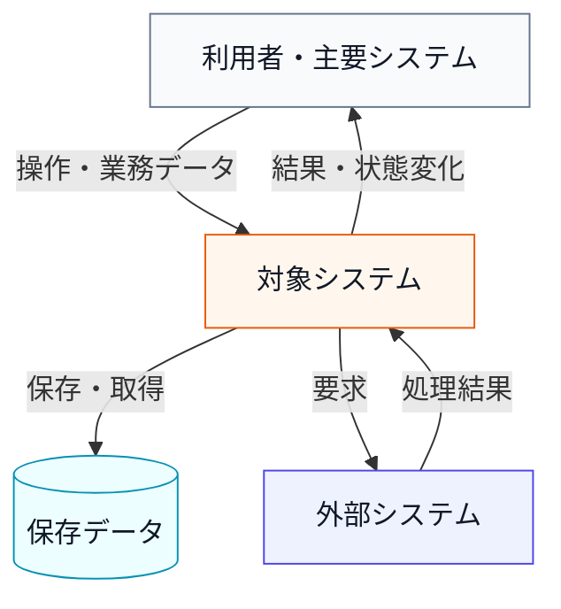
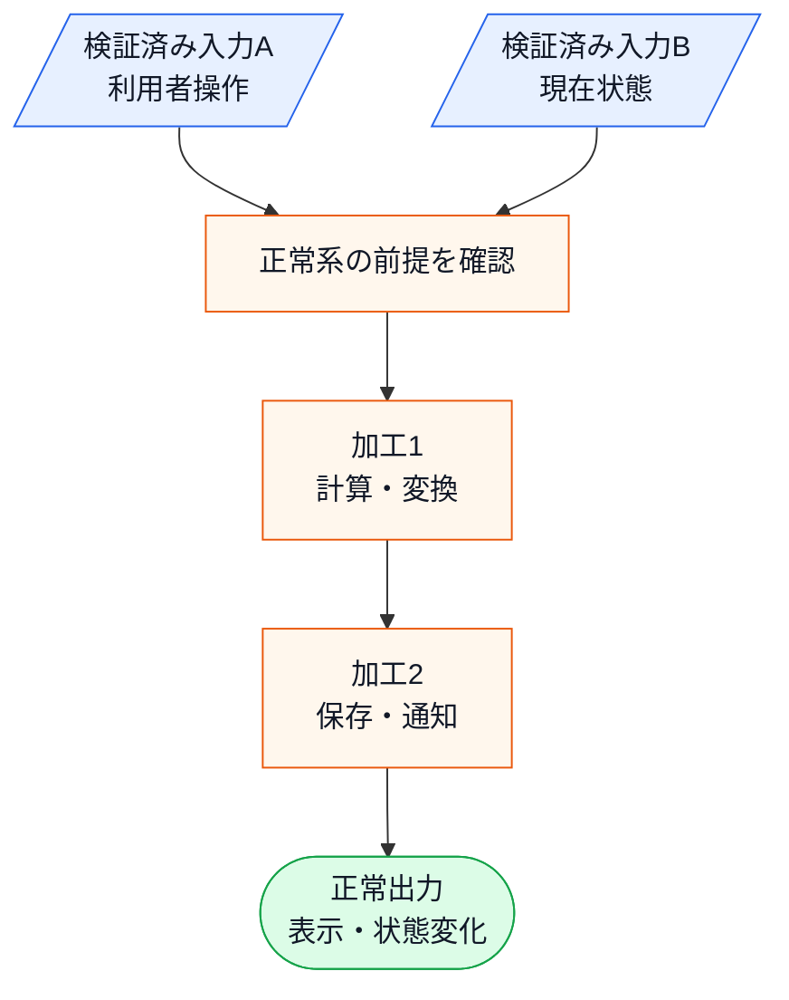

# 第0章 設計判断の地図
―― 3つの構造を貫く7つのフェーズ

---

## 私がたどり着いた「7つのフェーズ」

> [!TIP] この章の読み方
> この章は全7フェーズの詳細な説明書です。最初から通読してもよいですが、**各フェーズの冒頭にある「目的」「入力」「成果物」だけ読んで先の章へ進み、疑問が出たときに戻ってくる**という使い方が馴染みやすいかもしれません。「このフェーズで何を受け取り、何に変えているんだろう？」と感じたら、この章の該当セクションが手がかりになります。

**このプロセスを「いつ」使うのか**

この思考プロセスは一般的な問題解決の進め方に沿って設計の思考を進めます。仕様変更を起点として動き、**「すでに稼働しているシステムに、新たな仕様変更や機能追加の要望が来たとき」** に発動するプロセスです。特に、以下のような状況で威力を発揮します。

- 既存システムをあまり把握していない人が、安全に変更を加えるアプローチを探るとき
- 熟練の担当者が、複雑化した課題を改めて整理し直し、設計の妥当性を検証するとき

設計書やコードをただ眺めるのではなく、このプロセスに沿って「現状を把握する → 仮説を立てる → 問題を特定する → 原因を突き止める → 課題を定義する → 対策を考える → 実装する」と進めることで、変更の影響を確認しながら進めやすくなります。

設計に悩み、何度も失敗を繰り返す中で、私は「きれいなコードを書く」ことよりも「変更要求に対してどう思考するか」というプロセスこそが重要だと気づきました。
試行錯誤の末にたどり着いたのが、以下の7つのフェーズに沿って考えるというアプローチです。

各章は、このフェーズを1つの問題に対して一貫して適用します。
ここで、各フェーズが何を受け取り、何を次へ渡すのかを押さえます。各章の見出しには同じ色の絵文字が使われているので、「今どのフェーズにいるか」が一目でわかる仕組みになっています。

> [!IMPORTANT] 本質は「ビジネスの課題解決プロセス」と同じ
> 以下の7フェーズはプログラミング特有の魔法ではありません。たとえば店舗の売上が落ちたときも、まず現状を整理し、変わりそうな要因の仮説を立て、どこで問題が起きているかを確かめ、原因を特定し、解くべき課題を定めてから対策を選びます。ソフトウェア設計も、**現状把握 ⇒ 仮説立案 ⇒ 問題特定 ⇒ 原因分析 ⇒ 課題定義 ⇒ 対策検討 ⇒ 実施**という同じ論理で進められます。
> 現状を把握せずに原因を見誤ったり、原因を特定せずに対策（構造）を打ったりすると、期待する効果が得られないのはビジネス課題も設計課題も同じです。本質がずれたまま進めないよう、この工程を一つずつ踏んでいくことが何より重要です。

### 本書の番号の読み方

本文を読むときの主役は、あくまで**7つのフェーズ**です。
各章は、フェーズ1からフェーズ7までを同じ順序で進みます。

本書で繰り返し使う番号は、英字の略語ではなく日本語で役割を示します。「何を管理する番号か」を、表記だけで見分けられるようにするためです。

| 表記例 | 意味 | 採番する場所 | 何を追うか |
|---|---|---|---|
| 要求ID1 | システムが満たす要求 | フェーズ1 | 変更前・変更後の要求と最終受入・回帰結果 |
| 変更ID1 | 今回届いた変更依頼 | フェーズ1 | 変更内容、変更後要求、変更影響 |
| リスクID1 | 将来変わる可能性 | フェーズ2 | 設計時の考慮と、将来の主な変更先 |
| 問題ID1 | 変更を試して観測した痛み | フェーズ3 | どの変更IDで、どこが修正・再テストの起点になるか |
| 原因ID1 | 痛みを生む構造上の原因 | フェーズ4 | どの問題IDが、何が同じ責任へ集まって起きるか |
| 課題ID1 | 構造として解く設計課題 | フェーズ5 | 完了条件、構造差分、コード、改善結果 |

追跡に使う番号は、この6つだけです。現場の管理表では、利用者・運用者から見た「まとまった働き」を一つの単位として束ねる番号（機能IDなどと呼ばれます）を、要求とは別に置くことがあります。本書では設けません。変更の前後で要求がどう変わり、最終コードで満たせたかは要求IDだけで追えるため、もう一段の番号を重ねると同じことを二重に管理することになるからです。既存の働きが落ちていないかは、要求IDごとの回帰で確認します。

フェーズ1では、現状コードが満たす要求へ`要求ID1`、`要求ID2`……を付けてベースライン化します。正常系だけでなく、エラー時に値を変えないこと、保存・通知・内部診断など、変更後も維持する要求を含めます。

今回届いた変更依頼には`変更ID1`、`変更ID2`……を付け、対象となる要求IDを示します。要求の意図が同じなら、内部クラスが変わっても要求IDは維持し、扱いを継続・変更として記録します。新規要求には新しい要求IDを付け、廃止したIDは削除・再利用しません。分割・統合では新IDと旧IDの系譜を残します。変更後の要求ベースラインはコード変更前に確定し、フェーズ7で全有効要求IDをコードと実行結果へ照合します。

フェーズ2では、将来リスクへリスクID1、リスクID2、リスクID3の連番を付け、「変わる側」と「当面守る部分」を確定します。リスクIDを扱うのはフェーズ2と6です。フェーズ6で採用構造へ再適用し、変化が起きても守る部分へ影響を広げない構造かを評価します。フェーズ3と7-4（変更シナリオ表）は今回の変更IDだけを扱い、フェーズ7-1（解決後のコード）の受入確認は変更後ベースラインの全要求IDを扱います。

フェーズ3では、変更IDを試して観測した痛みへ`問題ID1`、`問題ID2`……を付け、各痛みがどの変更IDから来たかを示してフェーズ3末で一覧にします。フェーズ4では、その問題IDを生む構造上の原因へ`原因ID1`、`原因ID2`……を付け、どの問題IDに対応するかを示してフェーズ4末で一覧にします。問題ID・原因IDは要求のような管理番号ではなく、`変更ID→問題ID→原因ID→課題ID`という設計線を追跡可能にするための途中トレースです。各フェーズは自分が付けた番号の一覧でフェーズを締め、それが次フェーズの入力になります。

フェーズ5では、原因から課題IDへ飛びません。まず課題候補を洗い出し、システム全体で必要性、重複、統合／分割、完了状態を検討します。その後、解くべき接続点ごとに「何が流れるか」「どちら側が変わるか」「どちら側を守るか」「何ができれば完了か」を課題ID1、課題ID2、課題ID3の連番で確定します。要求IDと課題IDは直接対応させません。要求を局所変更で満たして課題が生じない場合、一つの変更試行から複数課題が見つかる場合、複数の変更試行が同じ課題を露呈する場合があるからです。課題は`変更ID→変更試行→問題ID（痛み）→原因ID（構造原因）→課題ID`の線だけで導きます。課題IDを確定したら、5-3（課題IDと接続点を確定する）末で問題ID→原因ID→課題IDを一列に並べ、設計線がひと目で追える一覧を置きます。

フェーズ6では、フェーズ5で確定した全課題から、**契約、具体、生成・所有、登録・選択、受け渡し、実行を含む一つの構想**を先に作ります。選ぶ方法が未定のまま注入方法は決められず、所有者が未定のまま実行時の参照も決められないため、別々の判断として完成させることはできません。

構想には主要なクラス名、メソッド名、生成場所も書きます。これは完成コードを決め打ちするためではなく、生成から実行まで同時に成立する案かを確かめるためです。その後、「契約→代表具体→生成・選択・受け渡し→実行骨格→公開入口」の順に要点コードを続けて示し、成立しない点があれば構想へ戻ります。

**生成・登録・選択・注入は別の操作です。** 注入とは、利用側が契約として保持・利用する場所へ、外で用意した実体を渡すことです。登録は候補を預けること、選択は生成済み候補から使う実体を決めることです。派生型の生成で振る舞いが決まる章では、別の注入操作がない場合もあります。各章では実際の操作名を使います。

登録順が競合時の優先関係を表す場合、その順序は業務方針です。第1章では、具体ルールの所有と優先順登録を`DiscountRuleSet`へまとめます。`main()`は完成したルール集合を生成して利用側へ渡すだけで、個々のルール名や優先関係を知りません。登録に業務上の意味がない章では、単純な配線として組み立て側へ置けます。

フェーズ6では要点コードだけを扱い、完成クラス図、全クラスのコード、実行シーケンス、実行結果はフェーズ7に一度だけ置きます。課題との対応と将来リスクを確認したら、同じ設計を別の要約表へ繰り返しません。

### 掲載コードを手元で動かす

各章の掲載コードは、そのまま手元で動かせます。読むだけでなく実行してみると、変更要求で何が起きるかを自分の目で確かめられます。

1. 章のコード（フェーズ1の現状コード、またはフェーズ7の最終コード）を1つの `.cpp` ファイルに貼り付けます。
2. コンパイルして実行します（例：`g++ chapter01.cpp -o app && ./app`。C++が使える環境なら `clang++` でも構いません）。
3. `main()` は自由に組み替えて構いません。各章の境界クラス（`〜Database` / `〜Repository` など）は、実行終了まで状態を覚えるインメモリの保存です。`save()` で新しいデータ（顧客・口座・イベント・メニュー・承認者など）を足し、その値で処理を呼べば、追加したデータの結果がその場の出力に表れます。

保存はプロセス実行中だけ有効で、終了すると消えます（DBのような永続化は本書の設計論点ではありません）。外部API・DB・画面・通知・ファイル出力をどこまで再現するかは章ごとに異なります。各章はコード直前で、実システムの処理、掲載コードの代替、生成される実物、生成されない実物を明記します。たとえば `cout` でPDF出力完了と表示するだけなら、PDFファイルを生成したとは扱いません。各章の「手元で動かすには」には、その章で実際に確認できる結果だけを書きます。

### 掲載ブロックと実ファイルの分け方

本書では、読む単位と、実務でファイルへ配置する単位を分けて考えます。

- **掲載上の単位**：一度に何を読むかを決めます。1つのコードブロックには、原則としてトップレベルのクラス、構造体、列挙型を1つだけ置きます。兄弟クラスが短くても、同じブロックへ詰めません。比較したい場合は、共通の説明の下へ1クラスずつ隣接して置きます。
- **実ファイルの単位**：どこから利用され、何と一緒に変更・ビルドされるかで決めます。コードが短いか、紙面へ収まるかでは決めません。

各章で1つの `.cpp` へ連結できるようにしているのは、読者がビルド設定を用意せず動作確認できるようにするためです。実務で「すべてを1ファイルへ置く」ことを勧めているわけではありません。たとえば第1章の一部を実ファイルへ分けるなら、次の配置になります。

```text
include/discount/
  IDiscountRule.h          # 利用側と具体ルールが共有する契約
  PremiumDiscount.h        # PremiumDiscountの宣言
  DiscountRuleSet.h        # ルール集合の所有・参照取得の宣言
src/discount/
  PremiumDiscount.cpp      # PremiumDiscountの処理本体
  DiscountRuleSet.cpp      # 競合方針に沿った優先順登録
src/app/
  main.cpp                 # ルール集合を生成し、利用側へ注入する場所
```

| 配置先 | 書くもの | 書かないもの |
|---|---|---|
| `.h` | 公開するクラス宣言、契約、引数・戻り値に必要な型 | 長い判定手順、具体的な組み立て |
| `.cpp` | `.h`で宣言したメソッドの処理本体、外へ見せない補助処理、業務方針を伴う登録 | 他の利用側が知る必要のない実装詳細を公開しない |
| `main.cpp` | 完成した部品の生成・所有・注入、公開入口の呼び出し | 個別ルールの判定式、優先順、業務処理本体 |

インターフェースのように処理本体を持たない型は、宣言と仮想デストラクタなどの短い定義をヘッダーへ置き、対応する`.cpp`を作らない構成もあります。反対に、テンプレートなど定義を利用側から見せる必要があるC++固有の例外もありますが、本書の掲載コードでは扱いません。また、第1章の`Order`と`PaymentResult`のような小さな値の型は、同じ機能境界で一緒に変更されるなら`OrderTypes.h`へまとめても構いません。**1掲載ブロック＝1ファイルではなく、掲載は読解、ファイルは依存と変更単位の判断**です。

**共有データの持ち方（全章共通の規約）**

各章の模擬DB・台帳（`〜Database` / `〜Repository` / `〜Registry` など）は、コンストラクタで**登録済みの初期データ**（顧客・口座・イベント・メニュー・承認者など）を持って始まります。実行中は、その初期データを土台に `save()` などで新しいデータを足したり内容を更新したりでき、変えた結果はその実行の出力へそのまま表れます。更新はプロセス実行中だけ有効で、実行が終わると消え、次の実行はまた同じ初期データから始まります（実行をまたいで残す永続化は本書の設計論点ではありません）。どの保存を誰が持つか（`static` か、メンバか、注入か）は実装の細部で、章によって異なります。大事なのは「初期データから始まり、実行のたびに更新して結果を確かめられる」ことです。

### 掲載コードの読み方 ―― 断片・分割・全貌表

各章の掲載コードには、通しで動く**全文**と、論点だけを取り出した**断片**の2種類があります。読み分ける手がかりを先に決めておきます。

**1. 断片には、出どころと確認目的が書いてあります。**

フェーズ3・4・6の抜粋は、クラスや関数の途中から始まります。とくに対策検討（フェーズ6）では、変更前の材料と、そこで新しく決めたコードを区別します。

> **変更前から抜き出す箇所：** 第1章のフェーズ3「変更を試みる（3-1）」にある`PaymentCalculator::calculate()`の割引判定
>
> **ここで確認するコード：** `IDiscountRule`の契約と、代表具体`PremiumDiscount`の割引判定

「変更前から抜き出す箇所」は、既存コードのどの行を境界の材料として見るかを示します。これは既存コードをそのまま新しいクラスへ移すという意味ではありません。分岐・生成・呼び出しのどこに変わる判断があるかを読者と共有するための抜粋です。「ここで確認するコード」は、その判断から初めて決めた型や処理を示します。

それ以外のフェーズでも、コードブロックの直前の文が「どのクラスのどの関数の、どの部分か」を書きます。たとえば「同じ `PaymentCalculator::calculate()` の割引判定部分へ条件を追加すると」と書いてあれば、そのコードは `PaymentCalculator` というクラスの `calculate()` という関数の中の一部分です。前後の小計計算や `return` は、紙面に出ていないだけで消えていません。所属が `main()` と書いてある断片は、組み立て側（生成・注入・呼び出し）のコードです。

**2. 分割されたブロックは、上から順につなげると1本のコードになります。**

フェーズ7の完成コードは、「値・列挙」「境界クラス」「契約」「具体クラス」「組み立て」といった責任の順に並べ、トップレベルの型を1ブロックに1つだけ置きます。分割理由は行数や紙面への収まりではなく、読者が今どの定義を読んでいるかを見失わないためです。上から順に1つの `.cpp` ファイルへ貼れば、そのまま1つのC++14プログラムとして動きます。実務のファイル配置は、直前の「掲載ブロックと実ファイルの分け方」に従って別に判断します。

**3. 断片は、設計を決める順に読んでください。**

フェーズ6では、まず契約・具体・生成・選択や登録・受け渡し・実行を一緒に成立させる構想を、主要なクラス名と処理名を含む一本の経路で示します。次に、その経路を成り立たせる要点だけをコードで続けて確認します。最初の構想は完成コードの配置を言い当てるものではなく、後続のコードを同じ実体の流れとして追うための仮置きです。途中のコードで成立しなければ、構想へ戻って直します。

### 各章に入る前の見取り図

次の表は、各章で共通して使う7フェーズの進み方です。
この節では、全章に共通する読み進め方を把握します。

**各章で扱うこと**

- **1：現状把握**：仕様・動作例・クラス構成・フェーズ1の現状コード・変更要求をそろえる
- **2：仮説立案**：どの仕様が変わりそうか、今回どの範囲を維持するかを仮説化し、根拠を確認する
- **3：問題特定**：変更要求を当てたとき、修正箇所・波及範囲・再テスト範囲として痛みを確認する
- **4：原因分析**：痛みの原因になっている混在・依存・漏れている前提を言語化する
- **5：課題定義**：解くべき接続点を洗い出し、流れるデータと変わる側・守る側、システム全体で目指す状態を定める
- **6：対策検討**：契約と具体、生成・所有・受け渡し、公開入口からの実行を順にコードへ落とす
- **7：対策実施**：コードで実装し、変更要求に対する効果と限界を確かめる

大切なのは、構造名より先に、**「どの種類の機能・仕様が、何をきっかけに変更されるのか」** と **「実際の変更要求を当てたとき、どこが痛むのか」** を見ることです。担当者やチームが分かる場合は、補助情報として使います。




この7フェーズは、単に順番に並んでいるだけではありません。
ここで使う言葉を分けておきます。
**出力**は、システムが利用者や外部へ返す結果を指します。
**成果物**は、各フェーズを終えた時点で、次のフェーズへ渡す整理結果を指します。

各フェーズは、前のフェーズで得た成果物を入力として受け取り、次のフェーズで使える形に加工します。
つまり、読み進めるほど「材料」が変わっていきます。



この図で大切なのは、**フェーズの出口が次フェーズの入口になる**ことです。
フェーズ1で事実をそろえないままフェーズ2へ進むと、仮説が思いつきになります。
フェーズ2で変わるものを根拠付きで確定しないままフェーズ3へ進むと、何を当てて痛みを見るのかが曖昧になります。
フェーズ5で接続点の変わる側と守る側を定めないままフェーズ6へ進むと、システム全体の構造設計がパターン名選びになってしまいます。

7つのフェーズは、目的の異なる **7つの局面** に分かれています。

| フェーズ | 内容 |
|:---|:---|
| 🔵 **フェーズ1：現状把握** | 仕様・動作例・クラス責任・フェーズ1の現状コード・変更要求をそろえる |
| 🟣 **フェーズ2：仮説立案** | 観察から仮説を立て、ヒアリングで裏付ける |
| 🟣 **フェーズ3：問題特定** | 変更を試みたとき、何が痛いかを発見する |
| 🟠 **フェーズ4：原因分析** | 痛みの根本にある設計の問題を言語化する |
| 🟡 **フェーズ5：課題定義** | 解くべき接続点と変わる側・守る側、システム全体で目指す状態を定める |
| 🔴 **フェーズ6：対策検討** | 契約と具体、生成・所有・受け渡し、公開入口からの実行を順に決める |
| 🟢 **フェーズ7：対策実施** | 変化に強いコードを完成させる |

各章では、この7フェーズをさらに小さな項目に分けて進みます。
フェーズ1だけでなく、フェーズ2以降も「何を確認し、何を次へ渡すか」が分かる単位に分けます。

**1：現状把握**

- **章内の項目**：1-1：このシステムの仕様
- **何のために読むか**：最初に入力・主要処理・出力・掲載コードの代替をつかみ、その後に詳細仕様と現行要求をそろえる
- **章内の項目**：1-2：動作例テーブル
- **何のために読むか**：代表入力から結果を予測できるようにし、後の実行結果と照合する
- **章内の項目**：1-3：登場クラスとクラス構成図
- **何のために読むか**：図を見る前に登場クラスの責任を把握し、依存関係を追えるようにする
- **章内の項目**：1-4：実装コード（現状）
- **何のために読むか**：フェーズ1の現状コードが動作例をどう実現しているかを確認する
- **章内の項目**：1-5：変更要求
- **何のために読むか**：変更ID1から変更依頼IDを付け、要求IDごとの継続・変更・追加・廃止と変更後要求ベースラインを確定する

**2：仮説立案**

- **章内の項目**：2-1：変わりそうな仕様の見当をつける
- **何のために読むか**：フェーズ1の事実から、変化しそうな仕様を仮説として言語化する
- **章内の項目**：2-2：今回の変更で確実に変わること
- **何のために読むか**：変更IDを確定し、将来リスク・内部契約・対象外と分ける
- **章内の項目**：2-3：関係者ヒアリング
- **何のために読むか**：仮説を独断で確定せず、変更される機能の種類・理由・頻度を確認する
- **章内の項目**：2-4：ヒアリングで判明した将来リスク
- **何のために読むか**：今すぐ対応する変更と、将来起きそうな変更を分ける
- **章内の項目**：2-5：変わる見込みと今回維持する範囲を確定する
- **何のために読むか**：リスクIDごとに変わる側と今回守る側を定め、フェーズ6の構造評価条件にする

**3：問題特定**

- **章内の項目**：3-1：変更を試みる
- **何のために読むか**：確定変更IDだけを現状コードへ当て、変えるクラスと変えないクラスを先に示してから差分を見る
- **章内の項目**：3-2：変更影響グラフ
- **何のために読むか**：修正箇所・波及範囲・再確認範囲を図で見えるようにする
- **章内の項目**：3-3：痛みの言語化
- **何のために読むか**：「大変そう」ではなく、何が設計上の痛みなのかを言葉にする

**4：原因分析**

- **章内の項目**：4-1：痛みの根源を探る
- **何のために読むか**：条件分岐・処理順序・生成判断・依存のどれが混在しているかを見る
- **章内の項目**：4-2：今回変える責任/ほかの変更から守る責任
- **何のために読むか**：今回変更理由を確認した責任と、その変更へ巻き込まず守る責任を切り分ける
- **章内の項目**：4-3：接続点に漏れている判断や前提
- **何のために読むか**：分離前に、境界へ流れる判断・値・前提を確認する

**5：課題定義**

- **章内の項目**：5-1：原因から課題候補を洗い出す／5-2：課題候補の重複と依存を整理する／5-3：課題IDと接続点を確定する
- **何のために読むか**：原因から候補を出し、システム全体で必要性・重複・統合／分割・完了状態を検討してから、接続点・流れるデータ・変わる側・守る側・完了条件を課題IDで確定する

**6：対策検討**

- **章内の項目**：構想を決める
- **何のために読むか**：主要クラスと、契約・具体・生成・選択・受け渡し・実行の全体経路を先に一つへまとめる
- **章内の項目**：構想をコードでつなぐ
- **何のために読むか**：契約、代表具体、生成・選択・受け渡し、実行骨格、公開入口の要点コードを続けて照合する
- **章内の項目**：構想を採用する
- **何のために読むか**：課題IDと将来リスクへ照合し、完成物を重複掲載せず採否を決める

**7：対策実施**

- **章内の項目**：7-1：解決後のコード
- **何のために読むか**：完成クラス一覧・採用構想を実コードの関係として表した完成クラス図・実行シーケンスを先に示し、クラス単位のコードと全有効要求ID別の受入エビデンスで照合する
- **章内の項目**：7-2：動作シーケンス図の検証
- **何のために読むか**：7-1でコード前に示した呼び出し順が、完成コードと実行結果に一致することを確認する
- **章内の項目**：7-3：変更影響グラフ
- **何のために読むか**：改善後の主な修正先と確認範囲を見えるようにする
- **章内の項目**：7-4：変更シナリオ表
- **何のために読むか**：今回の変更IDごとに、フェーズ1の修正範囲と完成構造の結果を照合する

この表はチェックリストではありません。各章を読むときの地図です。今読んでいる項目が全体のどこにあり、前の項目から何を受け取り、次の項目へ何を渡すのかを俯瞰したいときに、この表へ戻ってください。

各章のフェーズ1「このシステムの仕様（1-1（このシステムの仕様））」では、要求表や詳しい仕様へ入る前に「最初にシステム全体をつかむ」を置きます。入力、システムが行う主要処理、利用者や外部へ返す出力、実DB・外部API・画面・通知などを掲載コードで何に置き換えるかを先に説明します。ここで大筋をつかんだ後、要求、保存データ、図、クラス、コードへ進むため、スタブの正体をコードで初めて知ることはありません。

各項目は前の項目の結論を受けて次へ進みます。仕様図で入力と出力が分かったら動作例で代表ケースを確認し、動作例が分かったらフェーズ1の現状コードで実現方法を見て、変更要求を当てて痛みが見えたら原因を探す、という流れです。

また、本書では文章だけで全体像を説明しきろうとはしません。
入力から出力までの流れ、クラス間の関係、変更影響の広がり、改善前後の差分は、できるだけ図や表で先に見えるようにします。
ただし、図は「入力」「加工」「出力」という箱へ分類するためのものではありません。図に出した値・条件・状態・出力名が、後で動作例、実行結果、変更要求、接続点のどこで使われるのかまで追える必要があります。クラス名・メソッド名・変数名との対応は、1-3（登場クラスとクラス構成図）以降で段階的に確認します。
図は装飾ではなく、「いま何を見ているのか」「入力がどう加工され、どの結果に分かれるのか」を読者が迷わないための地図です。
ただし、図だけで新しい仕様や判断を初出しすることはしません。図に出る名前・値・状態は、本文や表で説明したうえで使います。

### クラス図の読み方（全章共通の規約）

本書のクラス図は、クラスの配置と依存の向き（誰が誰を知っているか）を示す静的な構成図です。図はMermaidという描画ツールで生成しますが、読者が記法を覚える必要はありません。読む対象は、表示されたクラス名・操作・関係線です。そのうえで、矢印に「商品情報を取得」のような**やり取りの説明ラベル**を付けることがあります。厳密なUMLではデータの流れはシーケンス図の領分ですが、本書では「この依存は何のためにあるか」を図だけで掴めるよう、依存の説明としてラベルを許容しています。呼び出しの時間順を追いたいときは、各章のフェーズ7「解決後のコード（7-1）」で完成コードの前に示す実行シーケンスを見てください。フェーズ7「動作シーケンス図（7-2（動作シーケンス図の検証））」では、そのシーケンスが完成コードと実行結果に一致することを検証します。

最初に、実際のクラス図で関係線を見てみます。線の横の番号は、その下の表と対応しています。図を読むときは、クラスの上下左右よりも、**線の形、先端の記号、その記号が付いている側**を見ます。

C++には`abstract`キーワードも`interface`キーワードもありません。純粋仮想関数を1つ以上持つクラスは、C++の型としてはすべて抽象クラスです。そのうち、データメンバーや業務上の共通実装を持たず、公開する業務操作を純粋仮想関数だけで示すものを、本書では狭い意味で「インターフェース」と呼びます。つまり、**インターフェースはC++では抽象クラスの一種**であり、2つの記号は言語機能の違いではなく設計上の役割を読み分けるために使います。

全章で、コード上の事実を次の規約に揃えます。契約だけを表す型には`<<interface>>`と点線の白抜き三角、共通実装を持つ抽象基底には`<<abstract>>`と実線の白抜き三角を使います。純粋仮想関数がなく直接生成できる通常の基底クラスにはステレオタイプを付けず、派生関係は実線で描きます。型名が`I`で始まるかどうかでは決めません。




この図では、`CheckoutService`が割引規則を借りて会計し、`DiscountCatalog`は独立して存在する割引規則を一覧としてまとめ、`Order`が明細を所有しています。速達用の送料規則は`minimumFee()`という共通処理を持つ抽象基底クラスを継承し、会員割引は割引契約だけを具体化しています。線は、こうした**コード上の事実を短く表したもの**です。

**この送料・割引の例は、6種類の線を1枚で見せるためだけに用意したもので、各章には出てきません。** 1章に6種類すべてが揃うことはないため、ここでまとめて見ておきます。各章では次のように現れます。

| 線 | 第1章（Strategy） | 第2章（State） | 第3章（Observer） |
|---|---|---|---|
| 1 継承 `<\|--` | 出てこない | `IReservationState` と各状態クラス | 出てこない |
| 2 契約の実装 `<\|..` | `IDiscountRule` と各割引クラス | 骨格の説明図だけ | `INotification` と各Notifier |
| 3 合成・強い所有 `*--` | `Order` と `Item`、`DiscountRuleSet` と各割引クラス | `EventDatabase` と `EventInfo` | `ProductDatabase` と `ProductInfo` |
| 4 共有集約 `o--` | `RuleSelector` と `IDiscountRule` | `TicketReservation` と `IReservationState` | `InventoryManager` と `INotification` |
| 5 関連・継続的な利用 `-->` | `PaymentCalculator` と `IDiscountRule` | `TicketReservation` と `EventDatabase` | `InventoryManager` と `ProductDatabase` |
| 6 一時的な依存 `..>` | `PaymentCalculator` と `PaymentResult` | `ReservationExpiryScheduler` と `TicketReservation` | `InventoryManager` と `StockAlert` |

ひし形の線に矢先を付けた `o-->` と `*-->` も使います。意味は `o--`・`*--` と同じで、「どちら側から相手を辿るか」を足した表記です。ひし形の付いた側が全体、矢先の側が部分です。

まず、クラスの箱の中を上から読みます。

**`<<abstract>>`**

- **意味**：直接生成できず、共通実装や状態も持てる抽象基底クラス
- **C++で確認する場所**：純粋仮想関数を1つ以上含み、業務上の共通実装またはデータメンバーも持つ

**`<<interface>>`**

- **意味**：利用側と実装側を結ぶ、契約だけの抽象クラス
- **C++で確認する場所**：データメンバーや業務上の共通実装を持たず、公開する業務操作が純粋仮想関数になっている。仮想デストラクタの既定実装は持てる

**ステレオタイプなし**

- **意味**：通常のクラス。別クラスの基底になる場合もある
- **C++で確認する場所**：純粋仮想関数がなければ直接生成できる。継承の有無だけで`abstract`や`interface`にはならない

**`+` / `-`**

- **意味**：`public` / `private`
- **C++で確認する場所**：クラス定義のアクセス指定

**`-discountRule: IDiscountRule*`**

- **意味**：`名前: 型`で表すメンバー
- **C++で確認する場所**：`IDiscountRule* discountRule;`

**`+checkout(order) PaymentResult`**

- **意味**：引数を受け取る公開操作と戻り値の型
- **C++で確認する場所**：`PaymentResult checkout(const Order& order);`

次に関係線を読みます。線の両端にある`1`はちょうど1個、`0..*`は0個以上を表します。たとえば1つの`Order`が0個以上の`OrderLine`を所有し、複数の`Order`がそれぞれ1人の`Customer`を参照できます。多重度は業務上の個数制約を説明するときだけ書き、コード上の型だけでは個数を確定できない場合は本文の仕様とも照合します。

**1**

- **図での見え方**：実線＋白抜き三角
- **意味とコードで確認する事実**：継承。派生クラスが、共通実装を持つ抽象基底または通常の基底クラスを`public`継承する
- **この線を使う場面**：共通実装を受け継ぎ、一部を上書きするとき

**2**

- **図での見え方**：点線＋白抜き三角
- **意味とコードで確認する事実**：契約の実装。具象クラスが、純粋仮想関数だけを持つ契約を`public`継承して実装する
- **この線を使う場面**：呼び出し側を共通契約だけに依存させるとき

**3**

- **図での見え方**：実線＋黒ひし形
- **意味とコードで確認する事実**：合成・強い所有。ひし形側が部品を値や所有ポインタで持ち、部品の寿命を管理する。図では1注文が0個以上の明細を所有する
- **この線を使う場面**：所有者が消えたら部品も消える関係を示すとき

**4**

- **図での見え方**：実線＋白ひし形
- **意味とコードで確認する事実**：共有集約。ひし形側が「全体」、反対側が共有可能な「部分」。部分は全体から独立して存在できる。図では1カタログが0個以上の規則をまとめる
- **この線を使う場面**：カタログと登録項目など、ドメイン上の全体・部分関係を示すとき

**5a・5b**

- **図での見え方**：実線＋矢印
- **意味とコードで確認する事実**：関連・継続的な利用。一方が他方をメンバーなどから継続して参照する
- **この線を使う場面**：所有しない借用参照を含め、「知っていて利用する」ことを示すとき

**6**

- **図での見え方**：点線＋矢印
- **意味とコードで確認する事実**：一時的な依存。引数、戻り値、ローカル変数など、その操作中だけ型を使う
- **この線を使う場面**：保持せず、一時的に受け渡す型を示すとき

同じ関係をC++の骨格で見ると、次のようになります。派生側だけを見れば、どちらも`: public 基底型`で同じです。違いは基底側にあります。まず、`ShippingFeeRule`は純粋仮想関数に加えて、派生クラスが再利用する共通処理を持ちます。

```cpp
class ShippingFeeRule {
protected:
    long minimumFee(long fee) const {
        return fee < 0 ? 0 : fee;
    }

public:
    virtual long calculate(const Order& order) const = 0;
    virtual ~ShippingFeeRule() = default;
};
```

`IDiscountRule`には共通処理もデータもなく、利用側へ約束する操作だけがあります。

```cpp
class IDiscountRule {
public:
    virtual long apply(long subtotal) const = 0;
    virtual ~IDiscountRule() = default;
};
```

この基底側の違いを確認したうえで派生側を見ると、同じC++構文に異なる設計上の意味があることが分かります。

```cpp
class ExpressShippingFeeRule : public ShippingFeeRule { /* 1：継承 */ };
```

**MemberDiscountRule**

```cpp
class MemberDiscountRule : public IDiscountRule { /* 2：契約の実装 */ };
```

**Order**

```cpp
class Order {
    vector<OrderLine> lines;  // 3：値として所有する
    Customer* customer;      // 5b：顧客を参照するが所有しない
};
```

**DiscountCatalog**

```cpp
class DiscountCatalog {
    vector<IDiscountRule*> rules;  // 4：独立した規則群を一覧として集約する
};
```

**CheckoutService**

```cpp
class CheckoutService {
    IDiscountRule* discountRule;  // 5a：外から受け取り、借りて保持する
public:
    PaymentResult checkout(const Order& order);  // 6：結果型を戻り値に使う
};
```

迷ったときは、ドメイン上の関係とコード上の寿命を分けて確認します。所有者が部品の寿命を管理する全体・部分なら黒ひし形、独立して存在できる部品を全体がまとめる関係なら白ひし形です。単にポインタや参照を保持して破棄しないだけなら、白ひし形とは限らず通常の関連で表します。保持せず引数・戻り値・ローカル変数として操作中だけ使うなら点線矢印です。そのうえで、基底クラスの実装を受け継ぐなら実線の白三角、契約だけを実装するなら点線の白三角を使います。図の線種と、所有・破棄・引数・戻り値が一致しない場合は、図かコードのどちらかが誤りです。

また、本書のクラス図では、載せるどのクラスも必ず何らかの関係線（継承・実装・利用・保持・依存など）で他のクラスとつながります。線が一本もない浮いたクラスは置きません。値・列挙・結果などデータの受け渡しだけに登場する型も、それを生成する側・利用する側から点線矢印で結び、「誰が作り、誰が使うのか」を図の上で追えるようにします。もし関係線を引けないクラスが出てきたら、それはその図で追う必要のないクラスなので、図から外して本文や別の表で説明します。

対策検討では、主要クラスの構想表と要点コードで、どの具象を生成・所有・登録・選択し、どの利用側へ渡すかを決めます。完成クラス図は対策実施で一度だけ示します。`main()`は関数なので完成クラス図へ架空のクラスとして足さず、優先順などの業務方針を担う組み立てクラスは実クラスとして描きます。起動時の生成や受け渡しは、完成後の実行シーケンスとコードで確認します。

### 変更影響グラフの読み方（全章共通の規約）

各章のフェーズ3とフェーズ7に、変更影響グラフを置きます。1つの変更要求が、どこまで届いたかを1枚で見る図です。矢印の向きは「影響が伝わる向き」で、上が起点、下が届いた先です。

箱の書き方は3種類あり、種類ごとに形を変えています。

| 箱 | 書き方 | 意味 |
|---|---|---|
| 起点 | `変更要求：〇〇` | 今回当てた変更要求。図の一番上に1つか2つ置く |
| 届いた先 | `クラス名`＋改行＋`（何が変わるか）` | その変更で実際に手を入れるクラスと、変わる中身 |
| 届かなかった先 | `クラス名 ✅` | 同じ変更を当てても触らずに済むもの。改善後のグラフで使う |
| 再テスト | `テスト`＋改行＋`（何を確かめるか）` | コードの修正には出ないが、変更のたびに走らせ直すもの |

フェーズ3のグラフは「今の構造だと、どこまで広がるか」を示します。フェーズ7のグラフは**同じ変更要求を、改善後の構造へもう一度当てた結果**です。2枚を見比べると、矢印がどこで止まるようになったかが分かります。矢印の本数が減っていなくても、届いた先が「新しく足すクラス1つ」に変われば、それが構造改善の成果です。

---

### 世の中のシステムへ当てはめる入口

各章の題材は、ECサイト、予約、決済、通知、ワークフローなどに分かれています。しかし、読者に持ち帰ってほしいのは題材そのものではありません。自分の目の前にある任意のシステムを見たときに、どこから観察し、どの順番で判断するかです。

知らないシステムへこの本の考え方を当てるときは、いきなりパターン名やクラス図から入りません。まず、次の5つを集めます。

**確認する問い**

- **システムの目的**：誰が、何を達成するために使うシステムか
- **入力・加工・出力**：何を受け取り、どの判断や変換を通り、何を返すか
- **最近の変更要求**：何が増えたか、何が変わったか、次に何が来そうか
- **変更時に痛い場所**：修正箇所、再テスト範囲、影響確認が広がる場所はどこか
- **守りたいもの**：業務フロー、共通手順、既存の利用側コード、性能、失敗時の扱いなど、簡単に壊したくないものは何か

この5つが分かると、世の中のどんなシステムでも7フェーズへ載せられます。

```text
目的・入出力を説明する        → フェーズ1
変わりそうな仕様を見立てる    → フェーズ2
変更要求を当てて痛みを見る    → フェーズ3
痛みの原因を言語化する        → フェーズ4
接続点を一表にまとめ、システム全体の課題を定める → フェーズ5
契約と具体、生成・所有・受け渡し、公開入口からの実行を順に決める → フェーズ6
変更影響が小さくなったか見る  → フェーズ7
```

たとえば、請求書発行システムなら「税率や端数処理が変わる」「PDFとCSVの出力形式が増える」「承認済みだけ発行できる」といった変更軸を見るかもしれません。倉庫管理システムなら「在庫引当ルール」「通知先」「外部配送API」が変化軸になるかもしれません。題材が違っても、見る順番は同じです。

### 複雑度を上げても、見る順番は変えない

実際のシステムでは、処理が1回の関数呼び出しで終わるとは限りません。外部APIを順番に呼ぶ、結果を後で確認する、イベントを受けて状態を変える、通知の一部だけ失敗する、重い処理をジョブやスレッドに逃がす、といった複雑さが出てきます。

この本では、こうした複雑さを無理に消しません。ただし、複雑さを足す目的は「現実っぽく見せること」ではありません。複雑になっても、同じ7フェーズで設計判断できることを確認するためです。

複雑度が上がったときも、見る順番は次のままです。

| 複雑さの種類 | フェーズ1で見ること | フェーズ4・5で課題にすること | フェーズ6で決める構造 |
|---|---|---|---|
| 順次実行 | どの処理がどの順番で実行され、前の結果が次にどう使われるか | 呼び出し元が細かい手順を知りすぎていないか | 手順を関数へ分ける、窓口へ寄せる、骨格を固定する |
| 非同期・ポーリング | 最初の要求で何を返し、後で何を照会するか | 保留状態や完了確認が利用側へ漏れていないか | 状態や結果オブジェクトを導入する、確認処理を境界へ寄せる |
| イベント型 | どの出来事が発生し、誰が反応するか | 発生元が通知先や反応内容を知りすぎていないか | 通知先を登録制にする、イベントだけを渡す |
| 失敗・部分失敗 | どこで失敗し、何を保存・通知・再試行するか | 失敗時の判断が本来の業務処理へ混ざっていないか | 結果型、境界クラス、再試行責任を分ける |
| ジョブ・スレッド | 重い処理をいつ開始し、完了結果をどこで受け取るか | 処理開始と完了後処理が同じ場所に押し込まれていないか | 実行依頼、進捗、完了通知の責任を分ける |

大切なのは、複雑さを見つけた瞬間にパターン名へ飛ばないことです。まずフェーズ1で「何が入力され、どの順序で加工され、どの状態や出力になるか」をそろえます。次にフェーズ2で「どの仕様が変わりそうか」を見ます。フェーズ3で変更を当てたときの痛みを確認し、フェーズ4・5で原因と接続点を言葉にしてから、フェーズ6でシステム全体の構造を決めます。

複雑度が上がったときほど、この順番を守る意味が強くなります。単純な例で使えた考え方が、同期・非同期、イベント、失敗、ジョブ化を含む題材でも崩れないかを、各章で確認していきます。

この本の各章は、最終的に読者が次の一文を自分で作れるようになるための練習です。

```text
このシステムでは、【変わるもの】が【守りたいもの】の中に入り込んでいる。
だから、【接続点に残す約束】だけを残して、【変わるもの】を外へ出す。
ただし、【導入コストや制約】があるので、今回は【採用する深さ】で止める。
```

この一文を作れるようになれば、本書と同じ題材でなくても、自分の現場のシステムに対して設計判断を始められます。

もう一つ大切なのは、仕様を「コードと照合できる粒度」まで具体化することです。
仕様説明が分かりやすくても、後で出てくる `main()`、実行結果、クラス名、状態名、判定条件と結びつかなければ、読者はコードを読んだ瞬間に迷います。
そのため各章では、まずシステムの目的・利用者・扱うデータ・代表入力・判定条件・正常出力を文章や表で一通り説明します。その後で、仕様の入力・加工・出力を図として整理し、各要素が後続のどの動作例・実行結果・変更要求で使われるのかを確認します。図は「入力」「加工」「出力」の3箱だけで終わらせず、代表的な入力がどの判定・計算・変換を通り、どの正常出力へ至るのかまで細分します。エラー条件は正常系の流れを確認した後、別表で「どこで分かるか」「何を出力するか」「保存や通知を行うか」を整理します。
実際のシステムなら画面、DB、外部API、ファイル出力、通知などがあるのに、章では `print` や固定データで簡略化する場合もあります。その場合は「この図では何を省略し、掲載コードでは何で代替しているのか」を明示します。

絵文字の色は、フェーズ見出しの「局面」だけを示します。青（🔵）は現状把握、紫（🟣）は仮説立案・問題特定、橙（🟠）は原因分析、黄（🟡）は課題定義、赤（🔴）は対策検討、緑（🟢）は対策実施です。「変わる見込み」と「今回維持する」の分類には色を使いません。赤を「変わる」、緑を「変えない」という意味にも使うと、フェーズ色と読み分けられなくなるためです。以下では各フェーズの役割を順に見ていきます。

> [!INFO] 本書で使う主要な言葉
> この本では、よく似た言葉を次のように使い分けます。
>
> - **「現状」**（フェーズ1で把握）：変更要求を当てる前に、システムが今どう動き、どのクラスが何を担い、どんな入力・加工・出力を持っているかという現在の状態のこと。
> - **「要求ベースライン」**（フェーズ1で確定）：システムが満たす要求を要求ID付きで並べた一覧です。変更前と変更後を比較し、継続・変更・追加・廃止を明示します。最終コードは変更後ベースラインの全有効要求IDで受入確認します。
> - **「変更依頼」**（フェーズ1で変更ID化）：利用者や業務から届いた変更のきっかけです。変更IDは、どの要求IDをどう変えたかの根拠であり、要求IDや課題IDそのものではありません。
> - **「仮説」**（フェーズ2で立てる）：フェーズ1で見た事実から、「これは今後変わりそうだ」「今回はここを維持する」と見当をつけたもの。独断で確定せず、ヒアリングや変更要求の背景で裏付けます。
> - **「問題」**（フェーズ3で発見）：変更を試みたとき、本来触りたくないコードまで同時に修正しなければならない「痛み」の状態のこと。「このクラスを変えると、あちらも変えなければならない」という変更の波及が問題の正体です。
> - **「原因」**（フェーズ4で言語化）：問題が発生している構造的な理由のこと。たとえば、独立して変わる判定/処理/生成判断の混在、具体実装への過剰な依存、処理順序や生成方法の漏出（本来あるクラスに閉じているべき判断や前提が、別のクラスへにじみ出てしまっている状態）などが原因になります。
> - **「課題候補」**（フェーズ5で検討）：確定原因を解消するために必要そうな状態です。必要性、重複、統合／分割、完了状態をシステム全体で検討するまでは課題IDを付けません。
> - **「課題」**（フェーズ5で確定）：候補検討後に「次に解くべき接続点」を具体的に絞り込んだもの。問題（症状）でも原因（診断）でもなく、「どの境界で、何が流れ、どちら側が変わり、どちら側を守り、何ができれば完了か」を課題ID1からの連番で一表にまとめます。ここで確定するのは接続点と完了状態であり、具体的なクラス配置はフェーズ6の入力になります。
> - **「システム全体の課題」**（フェーズ5で定義）：課題ID1、課題ID2……をすべて解いたとき、変わる詳細を意識せず守る処理を実行できる、という到達状態を一文にしたものです。課題別に別々の最終案を採用するのではなく、この一文を満たす一つのシステム構造をフェーズ6で考えます。
> - **「対策」**（フェーズ6で確定）：契約と具体をセットで分け、その具体を誰が生成・所有し、契約として骨格へ渡し、公開入口から実行するかを一つの経路で決めた最終構造のこと。関数化やクラス分離は、その最終構造へ到達するためのコード変更として扱います。
> - **「対策実施」**（フェーズ7で確認）：採用した対策をコードとして組み上げ、動作例・変更影響・得たもの/諦めたものを確認することです。
> - **「成果物」**：各フェーズを終えた時点で、次のフェーズへ渡す整理結果のこと。システムが返す「出力」とは区別します。
>
> 構造を語るときは、次の言葉を使います。フェーズ4以降で繰り返し出てきます。
>
> - **「接続点」**：あるクラスが別のクラスへ何かを渡す境界のこと。関数の引数・戻り値・登録・イベント通知など、受け渡しが起きる場所を指します。「どこを直せば済むか」は、この境界がどこにあり、何が流れているかで決まります。
> - **「混在」**：変わる理由が違うものが、同じクラスやメソッドの中に一緒に置かれている状態。片方の理由で修正するとき、もう片方も一緒に読み書きすることになるため、痛みの直接の原因になります。
> - **「変わる側」**：今回の変更要求で実際に書き換わる部分。接続点の向こう側へ分けて、増減しても手前が影響を受けないようにする対象です。
> - **「守る側」**：今回は書き換えない部分。「守る」は「今回触らない」という意味で、「将来も絶対に変わらない」という意味ではありません。
> - **「契約」**：変わる側と守る側の間に置く約束。C++では純粋仮想関数だけを持つ抽象クラスとして表し、守る側はこの契約だけを見て呼び出します。
> - **「具体」**：契約を実装した実物のクラス。増えても守る側のコードは変わりません。
> - **「骨格」**：契約だけを見て処理を進める側のコード。手順は固定し、変わる判断は契約の向こうへ委ねます。
> - **「注入」**：骨格が使う具体を、骨格の外で作って渡すこと。骨格が具体クラス名を書かずに済むようにします。渡し方は章によって違い、生成した実体を持たせる場合と、呼び出しのたびに引き当てる場合があります。

---
## 🔵 フェーズ1：現状把握 ―― 仕様を整理し、システムと紐付ける

**目的：仕様・動作例・クラス構成をそろえ、後続フェーズで同じ対象を追える土台を作ること**

> **入力：** 題材システム、現行要求、代表動作、登場クラス、変更前コード、今回の変更依頼
> **成果物：** 現行・変更後要求ベースライン、仕様構造、動作例、責任一覧、変更ID

### 仕様・動作例・クラス責任を読む

この節では、システムのシナリオ説明、仕様表、動作例、登場クラスの責任一覧を読み、入力→加工→出力の仕様構造と責任一覧を事実として整理します。実装コードの確認は1-4（実装コード）へ続きます。

実装コードに飛び込む前に、「このシステムに何があるか」を把握しておかないと、
コードの詳細に引きずられて「動きを追う読み方」になってしまいます。

ここでの把握対象は実装の詳細（`if` 文の中身など）ではありません。
まず「誰が対象システムを使い、どの保存データ・外部システムと何を受け渡すか」をシステム全体図で押さえます。次に、対象システムの箱を開き、「何を入力として受け取り、業務上どんな加工を行い、何を出力するか」をシステム内部図で確認します。そのうえで、1-3（登場クラスとクラス構成図）から「どんなクラスが存在し、それぞれの責任は何か」を対応づけます。

**システム全体図：利用者・対象システム・保存データ・外部境界**



全体図ではクラス名やメソッド名を使いません。対象システムを一つの箱として扱い、境界を越えるデータと保存場所だけを示します。ここで実装語彙を出すと、読者は仕様を理解する前にクラス構造を推測することになるためです。

**システム内部図：正常系の入力・処理順・出力**



正常系で成功する側しか示さない判定は、ひし形と `Yes` の矢印にしません。上図のように検証済み入力と処理順として描き、失敗条件は別のエラー条件表へ分けます。正常系の中に価格帯や通知要否など複数の有効な結果がある場合だけ、両方の枝を持つ判定として描きます。

この内部図は、システムを評価するための図ではありません。
コードを読む前に、読者が「このシステムは何を受け取り、何をして、何を返すのか」を同じ粒度で見るための図です。ただし、箱を3つ並べるだけでは不十分です。入力が加工のどの段階で使われ、どの正常出力へつながるのかまで示します。これにより、読者は動作例を見る前に、基本の流れを自分の言葉で説明できるようになります。

この図から読者が得るものは、次の3点です。

- どの入力が、どの判定や加工に使われるのかを事前に把握できる。
- 正常に進む流れを先に把握できる。
- 後でコードを読んだときに、細部へ入る前に「これは仕様上どの処理を実現しているのか」を見失いにくくなる。

二つの図は同じ内容の言い換えではありません。全体図は「対象システムの外側との境界」、内部図は「対象システムの中で入力が出力へ変わる順序」を示します。各章では必ずこの順に置き、クラス名・メソッド名・結果型はフェーズ1「登場クラスとクラス構成図（1-3）」まで出しません。

また、変更前後を比べるときは、変更要求を基準に「今回変える要素」と「変えない共通基盤」を分けて読みます。保存方法・結果契約・入力検証・履歴・内部デバッグログ・外部境界が変更要求に含まれないなら、それらは変更前後で同じままで、1-4と7-1（解決後のコード）の差分は変更要求または課題IDで説明できる部分に限られます。内部デバッグログは業務監査ログや再実行用の操作履歴と用途を分け、現状にあるものを新しい要求へ数え直したり、要求外として削除したりしません。

正常系の流れを押さえたうえで、エラー条件は別に整理します。

| エラー条件 | どこで分かるか | 出力 | 保存・通知などの副作用 |
|---|---|---|---|
| 受付できない入力や状態 | 判定1 | 受付不可エラー | 保存・通知は行わない |

仕様が分かりづらくなる主な原因は、情報量の少なさではありません。読者が「この値は後でどこに出るのか」「この判定は何のためにあるのか」「この出力はどのケースの結果なのか」を追えないことです。

**直し方**

- **入力・加工・出力を3つの箱にまとめただけで、値の通り道が見えない**：代表入力が、どの判定・計算・変換を通り、まず正常出力へ至るかを書く
- **図に出した値が、動作例・コード・変更要求・接続点で使われない**：後続で使わない要素は図から外し、後続で必要な要素は仕様へ戻して追加する
- **仕様語彙とコード語彙が対応していない**：仕様語彙を先に説明し、1-3以降でクラス名・メソッド名・変数名へ対応づける
- **正常系と異常系が同じ扱いで並んでいる**：正常系（図と各種仕様表）をすべて先に示し、異常系はその後の表で、どの条件で止まるかを示す
- **「この章では省略する処理」と「本当に存在しない処理」が混ざっている**：実際はどう動くか、掲載コードでは何で代替するか、なぜ論点外にするかを書く

動作例テーブルは、この仕様構造の代表ケースとして読みます。

仕様図は、後でコードを読むための地図でもあります。
コードに出てくる入力値、状態名、フラグ、金額、エラー条件、出力名は、ここで説明した仕様の流れに対応している必要があります。
逆に、仕様図に出ていない入力や状態が動作例や `main()` に突然出てきたら、読者は「これはどこから来たのか」と迷います。図に入れた要素が後で使われない場合も、読者は「なぜこの図にあるのか」と迷います。

入力は「図とコードに同じ名前がある」だけでは対応したことになりません。1-1（このシステムの仕様）で定義した入力が、1-4の公開メソッドまたはデータ取得境界へ入り、判定・計算・取得先の選択・外部送信のどこで使われるかまで追います。受け取っただけで使わない引数や、注文・在庫などの業務データを `"data"` のような固定文字列へ置き換えたコードがあれば、仕様と実装の経路は切れています。仕様変更で入力を変えない場合は、フェーズ3・6・7でも同じ入力契約とデータ起点を維持します。

また、章では説明を単純にするために、実際の入出力を簡略化することがあります。
簡略化の説明は、代替関係をコードと対応付けられる1-4の直前に置きます。仕様図の段階より、どのクラスやコードが何を代替するかを具体的に確認できます。
本書では、まず仕様・動作例・登場クラス・クラス構成を確認し、その後、1-4のコードへ入る直前で「実システムでは何があり、掲載コードでは何で代替するか」を整理します。

たとえば実際のシステムでは画面に表示する、DBへ保存する、外部APIへ送る、ファイルを出す、といった処理があります。掲載コードでは、業務ロジック本体から `Repository`、`Client`、`Gateway`、`Renderer`、`Notifier` などの境界を呼び、その先のスタブ実装だけを `print` や固定データで表す場合があります。
その場合は、次のように「実システムの要素」と「掲載コードでの表現」を対応づけます。

| 実システムの要素 | 掲載コードでの表現 | この章での扱い |
|---|---|---|
| 画面表示 | `ViewRenderer` などを呼び、スタブ実装で `print` | 表示方式そのものは設計論点ではないため簡略化 |
| DBやファイル | `Repository` や `FileGateway` を呼び、スタブ実装で固定データを返す | 永続化ではなく責任分担を見たい場合に省略 |
| 外部APIや通知 | `ApiClient` や `Notifier` を呼び、スタブ実装で `print` | 通信詳細ではなく接続点だけを見る |

この表には、さらに「掲載コードを実行すると何が生成・更新されるか」と「何は生成・送信されないか」を章固有の具体名で書きます。ログ文字列、模擬データ、プレーンテキストの確認用ファイルと、実際のPDF・Excel・メール・API送信を区別します。境界を呼んだ事実と、外部成果物が本当に作られた事実を同一視しません。

省略した要素は「存在しない」ことにしてはいけません。
この章では扱わないだけなのか、現状仕様として本当に存在しないのかを区別します。

論点から外す処理は、ただ削るのではなく、次の4点を短く補足します。

| 補足すること | 例 |
|---|---|
| 実際はどう動くか | 画面から入力され、DBへ保存される |
| 掲載コードでは何で代替するか | `main()` の固定データと `print` で表す |
| なぜ割愛するか | この章では保存処理ではなく責任分担を見たい |
| 設計論点への影響 | 保存方法を省略しても、変更影響の広がりは同じ |

この補足があると、読者は「実際の処理を忘れている」のではなく、「章の論点に集中するためにあえて省略している」と理解できます。

システムのシナリオ説明を読み、入力→加工→出力の仕様構造、動作例、登場クラスの責任を確認します。動作例テーブルは、後で掲載コードと実行結果を照合するための基準になります。クラス構成図は、クラス名と責任を把握してから読むことで、依存関係を追いやすくなります。
仕様、動作例、実行結果は同じケースを扱います。仕様で説明していない値や状態を、コードで突然使わないようにします。また、仕様図に置いた入力・加工・出力は、動作例、変更要求、接続点のいずれかで再利用されるものに絞ります。コードとの対応は、登場クラスとフェーズ1の現状コードを読む段階で確認します。

ここまでに観察した事実がフェーズ2の入力です。フェーズ2では、その事実から「変わりそうな仕様は何か・今回どこを維持するか」を考えます。

最後に、この章全体で使う「設計のレンズ（問い）」をセットします。

> 「このコードの中に、**『変わる理由』が異なる複数のものが、同じ場所に混在していないか？」**

---

### 実装コードと変更要求を読む ―― 依存関係と処理順序を記録する

この節では、先に把握した仕様・動作例・クラス責任へ実装コードと変更要求を重ね、動作例と実行結果、依存、条件分岐、処理順序、受け渡すデータを対応づけます。

クラスの責任を把握したら、実装コードを読み、現在の依存関係と処理順序を確認します。`main()` と実行結果は、動作例テーブルと対応している必要があります。コードに出るID、状態名、金額、エラー条件が、1-1の仕様語彙や1-2（動作例テーブル）の動作例と対応しているかも確認します。

実行結果を載せるときは、「どのコードを実行した結果なのか」「動作例テーブルのどのケースに対応するのか」「何を確認するための出力なのか」を直前に示します。
複数ケースを並べる場合は、`Case 1`、`Case 2` のように区切りを入れます。
現状コード、変更途中のコード、最終コードの実行結果が混ざると読者はすぐ迷うので、見出しやラベルで対象コードを分けます。
特に「現状コード」という言葉は、読むタイミングによって指す対象がぶれやすいので、本書では必要に応じて次のように呼び分けます。これは全箇所へ長いラベルを強制する一覧ではなく、複数段階のコードが近くに並ぶときの表記規約です。

| 呼び方           | 指すコード                                |
| ------------- | ------------------------------------ |
| フェーズ1の現状コード   | 変更要求を当てる前に、仕様と動作例を実現している掲載コード        |
| フェーズ3の変更途中コード | 変更要求を当てて、どこに修正が広がるかを確認するためのコード       |
| フェーズ6の段階コード   | 確定したシステム構造を、責任と依存の差分ごとに実装したコード       |
| フェーズ7の最終コード   | フェーズ6で確定したシステム構造を反映し、動作例と変更要求を満たすコード |

本文で単に「現状コード」と書くと曖昧になる場合は、「フェーズ1の現状コード」「フェーズ3の変更途中コード」のように、対象フェーズを付けて書きます。

ここで記録するのは、次のフェーズで仮説を立てるためのコード上の材料です。

#### 実装を観察する4つの視点

1. **具体クラス名を直接知っている場所** — どのクラスが、どの実装を生成・呼び出しているか。
2. **条件分岐が集まっている場所** — `if` / `switch` は何を選んでいるか。
3. **処理の順序を決めている場所** — どのメソッドが一連の流れを統括しているか。
4. **境界を越えるデータ** — 引数、戻り値、メソッド名は何か（例：メソッドの引数として `int` などのプリミティブ型を渡しているか、専用のオブジェクトを渡しているか等）。

この4つは、必ず4行の表として毎章に出すという意味ではありません。
ただし、各章のフェーズ1「実装コード（現状）（1-4）」では、このうち章の問題に関係する観察結果を本文で回収します。
たとえば「`MainService` が種類ごとの条件分岐を持っている」「`BatchExecutor` が具体クライアント名を直接生成している」「`import()` が処理順序を固定している」「接続点では `int amount` が渡されている」のように、後続フェーズの仮説・問題・原因につながる材料として記録します。
観察しただけで終わらせず、2-1（変わりそうな仕様の見当をつける）の仮説、3-1（変更を試みる）の変更シミュレーション、4-1（痛みの根源を探る）の原因分析で同じ事実が再利用される状態にします。

システムの全コードを読むわけではありません。プロセスを始めるきっかけとなった依頼の背景と、先に把握したクラス構成に基づき、関係するクラスへ範囲を絞ります。

```text
【フェーズ1で記録する事実の例】
MainService が type と optionFlag を判定している。
同じ判定条件が PreviewService にも書かれている。
どちらのメソッドも、加工後の値を int で返している。
```

フェーズ1では、現状コードが満たす要求へ`要求ID1`から欠番なくIDを付けます。利用者または運用者が入力と結果で識別できる単位で書き、メソッドやクラス一つずつを要求として数えません。正常系だけでなく、エラー時に値を変えないこと、保存・通知・内部診断など、変更後も維持する要求を含めます。

最後に、この章で検証する具体的な変更依頼へ`変更ID1`からIDを付けます。各変更IDが対象とする要求IDの継続・変更・追加・廃止を確認し、変更後の要求ベースラインを確定します。廃止した要求も行ごと消さず、理由と系譜を残します。コードに登場する役割、種類、状態、処理順、操作は、その役割が現状にあるなら1-1で、変更依頼により追加されるなら1-5（変更要求）で先に説明します。読者がコードを見て初めて仕様を知る状態にはしません。

このフェーズの出口は、「現行要求IDの一覧は何か」「変更IDによって各要求が継続・変更・追加・廃止のどれになったか」「変更後の有効な要求IDは何か」「この章のシステムは何をし、どの入力からどの出力を返し、どのクラスが何を担うか」を言えるところです。

---

## 🟣 フェーズ2：仮説立案 ―― 何が変わるかを観察し、ヒアリングで裏付ける

**目的：仕様とシステムの現状から「何が変わりそうで、今回どこを維持するか」の仮説を立て、ヒアリングで裏付けること**

> **入力：** フェーズ1の仕様・クラス・コードの事実、変更ID、関係者情報
> **成果物：** 確定変更、リスクID付き将来リスク、変わる側、当面守る部分

> [!NOTE] フェーズ2では「責務の混在」を断定しない
> ここで決めるのは「どの仕様に変更の見込みがあり、今回どこを維持するか」の見立てです。責務の配置は、変更要求を当てたときの痛みと合わせてフェーズ3・4で確認します。

### 変わりそうな仕様の見当をつける

フェーズ1のクラス構成・責任一覧と実装コードの観察結果を使い、変わる見込みと今回維持する範囲を根拠付きで整理します。

> [!NOTE] フェーズ1との関係
> フェーズ1では「どこに依存・分岐・処理順序があるか」を記録しました。フェーズ2では、その記録をもとに「何が変わりそうか」の仮説を立て、ヒアリングで裏付けます。各章のフェーズ2「変わりそうな仕様の見当をつける（2-1）」は、この作業に当たります。

フェーズ1で観察した事実を踏まえ、「何が変わりそうか」の仮説を立て、今回確実に変わることを切り分け、ヒアリングで裏付け、最終的に変わる見込みと今回維持する範囲を確定します。各章では、フェーズ2「変わりそうな仕様の見当をつける（2-1（変わりそうな仕様の見当をつける））」で仮説を立て、「今回の変更で確実に変わること（2-2（今回の変更で確実に変わること））」で変更IDを固定し、「関係者ヒアリング（2-3）」で確認し、「ヒアリングで判明した将来リスク（2-4（ヒアリングで判明した将来リスク））」でリスクIDを固定し、「変わる見込みと今回維持する範囲（2-5（変わる見込みと今回維持する範囲を確定する））」で次のフェーズに渡す見通しをそろえます。今回の要求を実現するための戻り値や結果型などは「内部契約」、採用対象から外す動作は「対象外」として別に置きます。フェーズ3と7の実装対象は確定要求に限定し、将来リスク・内部契約・対象外は構造評価と範囲管理に使います。

**第1段：仮説を立てる**

> 「このシステムの中で、どの仕様が変わりそうで、今回どの部分を維持するか？ それぞれ、どんなビジネス上・技術上の根拠があるか？」

フェーズ1で把握した仕様とコード上の事実を照らし合わせ、「変わりそうな仕様はどれか」の仮説を立てます。「業務ルールの種類は事業戦略の変化で増えそうだ」「APIの認証仕様はセキュリティ要件の変更を受けそうだ」というように、変化が予想される仕様をビジネス・技術の観点から見当をつけます。

仮説を立てるときの問いかけ：

1. **この仕様はどんな事業上・技術上の理由で変わりそうか**
2. **何をきっかけに、どのくらいの頻度で変わるか**
3. **今回の変更で維持する仕様・処理はどこか。その前提を見直す契機は何か**

各章の2-1では、この3つを必ず回収します。
3つのうちどれかが抜けると、「なぜそれを変動箇所と見たのか」「どの頻度なら設計投資に見合うのか」「逆に何を守るべきなのか」が曖昧になり、フェーズ3以降の判断が弱くなります。

| 分類 | 仮説 | 根拠（フェーズ1の観察から） |
|---|---|---|
| 変わる見込み（仮説） | （例）各外部サービスのAPI仕様 | 外部ベンダーによる形式変更の予定がある |
| 今回維持する | （例）受付から結果返却までの業務順序 | 今回の要求と関係者確認では変更対象に含まれない |

**見当をつけるときの経験則：場所ではなく、変わるきっかけを見る**

個別のヒアリングの前に、変更のきっかけを仮説の初期値として使えます。画面、保存先、外部API、通知手段などの境界は、利用端末・ベンダー・運用基盤の都合で置き換わることがあります。一方で、金額の計算、状態の意味、確定順序などの業務ルールも、施策・法令・運用方針によって変わります。**境界だから変わる、業務の核だから変わらないとは決めず、何をきっかけに変わるのかを分けて考えます。**

この見立てはヒアリングで裏付けます。変わるきっかけが異なると確認できたものは、片方の変更がもう片方を巻き込まない境界を検討します。各章で入力を `main()` に、保存を `〜Database`／`〜Repository` に寄せているのは、外部との接続と業務判断を別々に観察できるようにするためです。

**なぜ仮説が先に必要か（仮説の価値）**

仮説なしに「今後何が変わりますか？」と漠然と聞いても、関係者は答えられません。「外部ベンダーの都合で、このAPI仕様が変わる可能性はありますか？」と具体的にぶつけることで初めて、意味のある回答（リスクの確定）が得られます。仮説は「ヒアリングで何を確認するか」の地図になります。

そのため各章では、2-1の最後に見当を質問へ変換します。質問は思いつきで足さず、フェーズ1で見た事実と現時点の仮説から導きます。

| 見当 | 現時点の仮説 | 確認する質問 | 確認先 |
|---|---|---|---|
| 外部API | ベンダー都合で形式が変わる | 形式・認証・呼出順の変更予定はあるか | API担当者 |
| 業務ルール | 季節ごとに条件が増える | 誰が、どの頻度で条件を変えるか | 業務担当者 |

この表が2-3のヒアリング計画です。2-3の会話や資料確認では、各質問の回答を得て、仮説が裏付いたか、修正されたかを記録します。2-1で見当を出しただけで、質問を決めないままヒアリングへ進みません。

**第2段：ヒアリングで裏付ける**

コードを読んだだけで「変わる」「変わらない」と断定するのは危険です。
関係者へのヒアリングに加えて、仕様書、変更履歴、障害記録、外部契約なども確認し、変化の見通しを複数の根拠から判断します。

仮説を携えて、関係者ヒアリングを行います。

> 「このAPIは今後バージョンアップの予定はありますか？」
> 「このルールは今後どのような変化が考えられますか？」
> 「この型（int）は将来変わる可能性はありますか？」

仮説のまま進むと、見当違いの部分を「変わるもの」として分離してしまうリスクがあります。また、「今回は維持する」と思っていた処理が、実は今回の変更対象にも含まれると分かることがあります。ヒアリングで仮説の精度を上げることが、フェーズ3以降の思考の土台になります。

**第3段：変わる見込みと今回維持する範囲を確定する**

ヒアリングで得た回答をもとに、変わる見込みと今回維持する範囲を確定します。

| 分類 | 具体的な内容 | 変わるタイミング | 根拠 |
|---|---|---|---|
| 変わる見込み | （変更が見込まれる仕様） | （いつ変わるか） | （要求内容、仕様書、変更履歴、分かれば担当者など） |
| 今回維持する | （今回の変更で守る仕様・処理） | （前提を見直す契機） | （合意、契約、履歴など） |

「根拠」の列に、要求内容、仕様書・変更履歴、関係者確認など、判断に使った材料を書ける状態にします。担当者名は分かる場合だけ補助情報として使います。将来を確定することはできないため、「変わらない」ではなく、見直し条件を伴う「当面は安定」として扱います。

> **【フェーズ2のコツ：「何が変わりそうか」を具体化する】**
> 変わる見込みと今回維持する範囲の仮説を立てるとき、「仕様は変わりそうか？」という漠然とした問いより、「この仕様は、どんな事業上・技術上の理由で変わりそうか？」と問う方が精度の高い仮説になります。
>
> ヒアリングで確認する問いは次の3つです：
> 1. 「この仕様は今後どのような変化が考えられますか？」（変化の方向性）
> 2. 「どのくらいの頻度で変わる可能性がありますか？」（変更頻度の把握）
> 3. 「変わるとしたら、どんなきっかけが考えられますか？」（変化のトリガー）
>
> 同じ「変わりそう」でも、変更のきっかけや頻度が異なれば、設計の優先度が変わります。複数の仕様がそれぞれ異なる理由で変わるなら、それが分離の根拠になります。

**仮説が外れたら**

ヒアリングの結果がフェーズ1の観察から立てた仮説と食い違うことがあります。「変わると思っていたが、変わらない」「変わらないと思っていたが、実は頻繁に変わる」——この逆転は設計判断を変えます。

- 「当面は安定」と判断した部分は、今回の要求だけを理由に分離する優先度が下がります。既存の責任境界、テスト容易性、再利用性など別の根拠がなければ、単純な構造を保つ案が有力です。
- 「頻繁に変わる」とわかった部分は、フェーズ6で改めて分け方を検討します。

仮説が外れること自体は失敗ではありません。ヒアリング前の仮説は「どこを重点的に確認するか」の地図として機能します。外れた仮説は確認の精度を高めた証拠です。

**フェーズ2の末尾：変わる見込みと今回維持する範囲の確定**

ヒアリングで判明したリスクIDごとに、「変わる見込み」「変わる側」「今回守る側」を一表で整理します。「変わる見込み＝はい」は、その機能を今回実装するという意味ではありません。フェーズ6で、変える側と守る側をどの境界で分離し、採用構造が影響を局所化できるかを判断するための設計条件です。

このフェーズの出口は、リスクIDの変化が起きても守る部分へ影響を広げない設計にするため、何を変えられるようにし、何を当面守るかを根拠付きで説明できるところです。フェーズ3へ渡す変更対象は変更IDだけです。

---

## 🟣 フェーズ3：問題特定 ―― 変更の痛みを発見する

**目的：変更を試みた際に発生する「無関係なコードまで修正が必要になる」という痛みを具体的に発見すること**

> **入力：** フェーズ1で確定した変更IDと、変更要求を当てる前のコード
> **成果物：** 変更IDごとの修正箇所・確認範囲・再テスト範囲と、観測した痛みの問題ID一覧

### 変更シミュレーション ―― どこが辛いかを確認する

ここでは、フェーズ1で明文化し、フェーズ2で裏付けた変更要求を現在のコードへ当て、実際に変更を試みます。

設計の問題は、コードを静的に眺めているだけでは気づきにくいものです。
「変更要求が来たとき、どこに手が入るか」を実際にシミュレートしてみると、
問題の輪郭がリアルに見えてきます。

フェーズ2で裏付けた変更要求を、今のコードに加えようとします。
加えようとすると、何が起きるかを追います。

- どのファイルを開くことになるか
- 変更の影響がどこまで波及するか
- 変えたくないはずのコードに触れることになるか

これが「痛み」の例です。無関係なコードの同時修正だけでなく、修正箇所を特定しにくい、差し替えや組み合わせが難しい、テストの準備が過大になる、といった変更時の具体的な困難もここで記録します。

たとえば「ある業務ルールの条件値を変更する」という変更要求が来たとします。これは個別ルールという機能種類の変更です。しかし実際に変更しようとすると、個別ルールのコードだけでなく、主処理の関数も開かなければならない——「なぜ個別ルールの変更で、主処理の関数を触るのだろう？」という違和感が生まれたなら、それが問題の所在を示す観察結果です。なぜそうなるかは、次のフェーズで分析します。

**置換・拡張のやりづらさも、ここで発見する**

「この実装を別のものに差し替えたい」と思ったとき差し替えられないなら、それが問題です。
「新しいケースを追加したい」と思ったとき既存コードを大量に書き換える必要があるなら、それも問題です。
フェーズ4では、この痛みの根本にある「分けるべき場所」を特定します。

**フェーズ3の末尾：今回観測した痛みを確定する**

3-3（痛みの言語化）の問題文は、今回の確定要求を現状コードへ当てて実際に観測した修正箇所、波及範囲、再テスト範囲だけから書きます。仮定の機能を追加して痛みを大きく見せず、フェーズ3のコードと変更影響グラフで確認できた事実だけを根拠にします。

このフェーズの出口は、「変更要求を当てると、どの修正・確認・再テストが増えるのか」を、単なる感想ではなく観察結果として言えるところです。

---

## 🟠 フェーズ4：原因分析 ―― なぜ辛いのかを構造で言語化する

**目的：発見した痛みの根本にある「変わる理由の混在」という構造的な原因を言語化すること**

> **入力：** フェーズ3の問題ID、変更途中コード、変更影響グラフ
> **成果物：** 痛みを生んだ混在・依存・漏れた前提を示す原因ID一覧

### 痛みを生んだ原因を、コード構造から特定する

フェーズ3で発見した「痛み」は症状です。
症状に対して対症療法を施すだけでは、根本は変わりません。
「なぜこの痛みが発生しているのか」を構造的に言語化することで、
適切な設計のアプローチを選べるようになります。

痛みを観察して、構造的な原因を見つけます。原因は「結論として提示する」ものではなく、症状から逆算して辿り着くものです。

**症状から原因を辿る2つの問い**

第一の問い：「なぜ、毎回このクラスを開かなければならないのか？」
このクラス自身が、別種類の機能変更に属する具体的な知識（条件・計算ルール等）をすべて直接抱え込んでいるからです。知っているものが変わると、知っているクラスも道連れになります。

第二の問い：「なぜ、変更の影響範囲が読めないのか？」
「今回維持したい処理順」と「今回変更した条件」が、同じメソッドの中で物理的に混ざり合っているからです。一方を変えると、もう一方への影響が読めなくなります。業務の中心も変更対象になり得るため、骨格やビジネスロジックという名前だけで安定性を決めません。

```text
【原因分析の問い】
「なぜ、個別ルールが変わると主処理の関数も変わるのか？」
→ 主処理の関数が、個別ルールの具体的な条件を直接知っているから。
→ 「知りすぎているクラスは、知っているものが変わると道連れになる」
```

原因が言語化できると、次に必要な境界が見えます。
「知りすぎている」なら、どの具体的な判断を知らなくてよい状態にするかを課題にします。
「変わる理由が2つ混在している」なら、どの責任同士の間へ境界を置くかを課題にします。境界を関数・表・クラス契約のどれで表すかは、フェーズ6で具体化します。

**フェーズ4の中心的な問い：「この塊の中に、独立して変わる部分があるか？」**

本書が扱う多くの設計問題では、「変化をどう管理するか」が重要な視点になります。フェーズ4では、痛みを観察しながら、まず次の問いを置きます。

フェーズ2の「変わりそう／今回維持する」は、ヒアリングで裏付けた**仕様の見通し**です。フェーズ4の「今回変える責任／ほかの変更から守る責任」は、今回の変更試行で観測した痛みをもとに、**どの責任を別々の変更へ閉じたいか**を比較する言葉です。将来ずっと変わる、または永久に変わらないという性質を表しているわけではありません。

> 「この塊の中に、独立して変わる部分があるか？」

この問いに答えるとき、判断基準は「変化の理由」です。

| 観察した状況 | 判断 |
|---|---|
| 機能種類・変更のきっかけ・頻度が異なり、独立して変わる | → **分ける候補** |
| 同じ契約のもとで一緒に変わり、分離する別の根拠がない | → **まとめておく候補** |

「個別ルール」と「主処理のフロー」——機能の種類、変更のきっかけ、変更頻度が異なるなら、それらは独立して変わる可能性が高く、分離する候補になります。担当者や関係者が分かる場合は、その判断を裏付ける補助情報として使います。

逆に「税率と消費税計算は同じ法改正をきっかけに見直す」場合、変更理由だけを根拠に別々の拡張機構を設ける必要はありません。ただし、税率を設定データとして扱う、計算を単体テストする、といった別の目的で境界を設ける判断はあります。

**分離候補を見つけると、次に調べる接続点が見える**

レゴブロックを分解すると、「ブロック単体」と「ブロックをつなぐジョイント」が生まれます。コードでも同じことが起きます。

```text
分ける前：[====A====B====]  ← A と B が一体になっている

分けた後： [====A====]  ＋  ◎  ＋  [====B====]
                           ↑
                       接続点（ジョイント）
```

フェーズ4で確定するのは、「AとBが別々の理由で変わるため、境界を調べる必要がある」という原因までです。フェーズ5では、このジョイントで実際に何が流れ、どちら側を守り、何ができれば完了かを課題として確定します。契約やクラスという接続点の形は、フェーズ6で決めます。

> [!NOTE] フェーズ1でセットした問いの回収
> フェーズ1の実装観察で「設計のレンズ」として立てた問い——「このコードの中に、変わる理由が異なる複数のものが同じ場所に混在していないか？」——への答えは、このフェーズ4で確定します。
> フェーズ3で発見した「痛み」は、まさにその混在が原因でした。この問いは各章で繰り返し使う確認軸です。

**フェーズ4が答えること・答えないこと**

フェーズ4が答えるのは「なぜ辛いか」です。独立して変わる判定/処理/生成判断の混在、依存方向、生成や処理順序の漏出など、その章の痛みを生む構造と根拠を言語化することがゴールです。

フェーズ1では、どこで何のデータが行き来しているかを確認しました。フェーズ4では、その観察結果から原因を説明します。フェーズ5では観察結果を改めて整理し、接続点で受け渡す型・値と、変わる側／守る側を課題として確定します。フェーズ6は、この課題を具体的な契約、メソッドシグネチャ、クラス設計、置き場所へ展開します。

このフェーズの出口は、「痛みの原因はどの混在・依存・漏れている前提なのか」を、フェーズ1〜3の事実に戻って説明できるところです。ここで言い当てた原因の種類（判定/条件・処理手順・生成判断・データ/状態・通知/副作用のどれか）は、続くフェーズ5で「接続点で何を見るか」、フェーズ6で「どう分離し、組み立てるか」を決める入力になります。原因タイプは、フェーズ5で接続点を切る位置の手がかりになります。判定・条件の混在なら「どの条件で選ぶか」を、処理手順の混在なら「どの順で呼ぶか」を、生成判断の混在なら「何を作るか」を、データ・状態の混在なら「いまどの状態か」を、通知・副作用の混在なら「誰へ伝えるか」を、接続点の向こう側へ渡す対象として切り出します。

---

## 🟡 フェーズ5：課題定義 ―― 原因から課題を検討して確定する

**目的：フェーズ4の原因から課題候補を導き、システム全体で統合・分割・除外を判断したうえで、解くべき接続点と完了状態を確定すること**

> **入力：** フェーズ4で確定した原因ID、問題IDまでの根拠、接続点候補、制約
> **成果物：** 候補の評価、課題ID付き接続点表、課題ごとの完了条件、システム全体の完了状態

### 5-1：原因から課題候補を導く

原因からいきなり課題IDを採番しません。まず、原因を生んでいる混在・依存・漏れた前提ごとに、「何を変えれば痛みが減るか」を候補として書きます。候補は解決手段の名前ではなく、変えるべき構造です。

**原因ID1：価格計算の流れが、施策ごとの判定条件と計算式を知っている**

- **そのままだと残る痛み**：施策の追加ごとに中心処理を修正・再確認する
- **課題候補**：施策の判定と計算を価格計算の流れから分離する
- **候補を導いた理由**：施策と価格計算の流れは変わる理由が異なるため

**原因ID2：利用側が施策の具体名と生成方法を知っている**

- **そのままだと残る痛み**：施策の切替や組合せのたびに利用側も変わる
- **課題候補**：施策の生成・選択を利用側から外す
- **候補を導いた理由**：実行と組み立ては別の責任だから

フェーズ5で扱うのは、境界を流れる情報、変わる側、守る側、完了状態です。インターフェース名、具体クラス名、生成場所はフェーズ6で、この構造に後から付くパターン名は章末で確認します。変更IDは候補を見つける観測条件になり得ますが、一つの変更IDから複数候補が出ることも、複数の変更IDが同じ候補を露呈することもあります。

### 5-2：課題候補の重複と依存を整理する

候補を一行ずつ独立した課題にすると、同じ原因を重複して解いたり、片方だけ解いて痛みを残したりします。そこで、候補同士を並べ、次の順で整理します。

1. **必要性**：その候補を解かないと、フェーズ3の影響が残るか。
2. **重複**：別の候補と同じ責任・同じ接続点を扱っていないか。
3. **独立性**：別々の理由・タイミングで変わるため、分けて追跡すべきか。
4. **網羅性**：残した候補をすべて解けば、フェーズ4の原因全体が解消するか。
5. **完了状態**：コードや構造がどうなれば、解いたと判断できるか。

| 課題候補 | 必要性と依存関係 | 統合・分割 | 整理結果 |
|---|---|---|---|
| 施策の判定・計算を分離する | 中心処理への知識漏れを止めるため必須 | 独立した接続点として残す | 独立課題として残す |
| 施策の生成・選択を利用側から外す | 分離した部品を利用側へ再び直書きしないため必須 | 一つ目と連携するが、変更理由が異なるため分ける | 独立課題として残す |

この段では対策案を採用・却下するのではなく、原因から出した候補を統合するか、別の変更理由を持つ課題として残すかを決めます。部分的に条件式だけを関数へ移し、生成・選択を利用側へ残す案の比較はフェーズ6で行います。

### 5-3：課題IDと接続点を確定する

整理した候補に、課題ID1から欠番なく課題IDを付けます。接続点ごとに、流れるもの、変わる側、守る側、完了条件を一表へまとめます。

**課題ID1：個別ルールの呼び出し**

- **接続するもの・変わる側**：**接続:** `Order` と割引額 `int`<br/>**変わる側:** ルールの判定条件と計算式
- **守る側**：価格計算の流れ
- **完了条件**：価格計算が個別条件・計算式を知らず、同じ操作だけで各ルールを実行できる

**課題ID2：個別ルールの組み立て**

- **接続するもの・変わる側**：**接続:** 生成済みのルール群と適用順<br/>**変わる側:** 具体ルールの種類・生成・選択
- **守る側**：利用側と価格計算
- **完了条件**：具体ルールの追加・切替が組み立て箇所に閉じ、価格計算と利用側の実行手順が変わらない

表の後に、全課題IDを解いたシステム全体の完了状態を一文で書きます。例では「価格計算の流れは個別ルールの詳細を意識せず実行でき、ルールの追加・切替は組み立て箇所で完結する」です。この完了状態が、フェーズ6で具体的な契約名・配置クラス・生成場所を決める基準になります。

要求と課題は別の目的で追跡します。`要求ID → 最終コード → 受入結果`は要求の過不足を、`課題ID → 構造差分 → コード → 変更影響`は設計課題の解消を確認します。変更IDと課題IDを一対一にするために課題を増減させません。

このフェーズの出口は、「どの原因からどんな候補が出たか」「なぜ候補を統合・分割・除外したか」「確定した全課題IDを解くとシステム全体がどうなるか」を説明できることです。この課題表とシステム全体の完了状態が、そのままフェーズ6の入力になります。

---

## 🔴 フェーズ6：対策検討 ―― 構想を一つのコード経路へ変える

**目的：フェーズ5で確定した全課題を、一つの実行可能な構想へまとめ、その構想を成立させる要点コードを続けて確認すること**

> **入力：** フェーズ5の課題ID付き接続点表、完了条件、システム全体の到達状態
> **成果物：** 主要クラスと接続順を示す構想、契約・具体・生成・受け渡し・実行の要点コード、課題と構想の対応、将来リスクの評価

### 構想を決める

契約だけ、生成だけ、実行だけを別々に決めることはできません。どの具体をどう選ぶかが決まらなければ渡す相手を決められず、誰が生成・所有するかが決まらなければ実行時の参照も成立しないからです。そこで、最初に次の五点を一つの構想としてまとめます。

| 構想の要点 | 最初に決めること |
|---|---|
| 契約と具体 | 守る処理が呼ぶ最小の操作と、その裏へ移す変更判断 |
| 生成・所有 | 具体を誰がいつ作り、いつまで保持するか |
| 登録・選択 | 複数の具体がある場合、何を基準にどこで選ぶか |
| 受け渡し | 生成済みのどの実体を、どの利用側へ、どの行で渡すか |
| 実行 | 公開入口から契約を通り、選ばれた具体が動いて結果を返すまでの順序 |

構想には、この時点から主要なクラス名・メソッド名・生成場所を書きます。これらは完成コードを先出しするためではなく、五点が同時に成立する案かを確かめるための仮の設計名です。後続コードで成立しなければ、この構想へ戻って直します。

第1章の構想なら、起動時と注文時を次のように分けます。

```text
起動時：main()
  ├─ 5つの具体ルールを生成・所有する
  ├─ RuleSelectorを生成し、具体ルールを優先順に登録する
  ├─ OrderProcessorへRuleSelectorを渡す
  └─ CartPreviewServiceへ同じRuleSelectorを渡す

注文時：OrderProcessor::process()
  ├─ RuleSelectorが登録済みルールから1つを選ぶ
  ├─ 選択したルールを渡してPaymentCalculatorを生成する
  └─ calculate()が契約を通して選択済みルールのapply()を呼ぶ
```

この全体経路を先に置けば、`select()`は選択、`PaymentCalculator calculator(rule)`は生成と受け渡し、`apply()`は具体の実行だと区別できます。登録・選択・引数渡しをまとめて「注入」と呼ばず、各章で実際に起きる操作名を使います。

### 構想をコードでつなぐ

構想の五点を、次の順に間を空けず確認します。

1. **契約**：境界を通る値・型・操作を宣言する。
2. **具体**：代表的な一つで、契約の引数・戻り値と変更判断がかみ合うか確かめる。
3. **生成・選択・受け渡し**：具体を作り、必要なら登録・選択し、利用側へ渡す実際の行を示す。
4. **実行骨格**：組み立てた同じ実体を、守る処理が契約から呼ぶコードを示す。
5. **公開入口**：入口から具体の結果が返るまでをコード名でつなぐ。

変更前コードは、境界を引く根拠になる数行だけをフェーズ3「変更を試みる」から抜き出します。変更後コードは、構想の成立判断に必要な契約、代表具体、生成・受け渡し、実行だけを示します。同型の具体一覧と統合した全コードはフェーズ7で確認するため、フェーズ6で全クラスを再掲しません。

> **コードブロックの表示**
>
> - **変更前から抜き出す箇所**：所属するクラス・メソッドと、境界を判断する範囲を示します。
> - **ここで確認するコード**：契約、代表具体、生成・受け渡し、実行のどの点を確かめるコードかを示します。

### 構想を採用する

コードがつながったら、次の二表だけで採用判断を終えます。同じ内容を「分離の確認」「配置の確認」「実行の確認」と別々の要約表へ繰り返しません。

| 課題ID | 構想のどの責任・接続で解くか | 完了条件を満たす根拠 |
|---|---|---|
| 課題ID1 | 【主要クラス、生成場所、受け渡し、実行箇所】 | 【変更先がどこへ閉じるか】 |

| リスクID・将来リスク | 現在の構想による備え | リスク発生時の変更先 | 守れる範囲・残る弱点 |
|---|---|---|---|
| リスクID1：【2-4と同じリスク文】 | 【現在の境界・責任配置】 | 【クラス・契約・生成場所】 | 【守れる範囲と見直しが必要な条件】 |

完成後のクラス図、完成コード、実行シーケンス、実行結果はフェーズ7「対策実施」にだけ置きます。フェーズ6は、完成物を重複掲載する場所ではなく、なぜその構想なら課題を解き、生成から実行まで成立するのかを短く決める場所です。

---

## 🟢 フェーズ7：対策実施 ―― 変化に強いコードを完成させる

**目的：決定した対策をコードとして実装し、今回の確定要求に対する効果を実証すること**

> **入力：** フェーズ6の採用構造、生成・所有・注入規則、変更後要求ベースライン
> **成果物：** 最終コード、全有効要求IDの受入・回帰エビデンス、課題IDの構造結果、変更IDの改善後影響

完成コードでは、構造だけでなくシステムとして処理が閉じているかを確認します。利用者の操作後にシステムが続けるべき処理（待ち行列の昇格、通知、補償、履歴記録など）は、`main()` や運用者が次のメソッドを手動で呼んで成立させず、起点となるユースケースから自動的に接続します。

内部の件数・残高・在庫・予約数などが変わる場合は、結果名だけでなく「対象ID・変更前の値→変更後の値・上限や単位」をログへ出します。満席や上限エラーは、直前の数値でその状態になったことを確認してから再操作し、エラー時に値が変わらないことまで示します。状態不変のエラーは状態遷移ではないため、状態遷移図の自己遷移へ含めず、エラー条件表と実行結果で扱います。

> [!NOTE] コラム：実装の小手先と、設計の「分け方」の違い
> 引数の追加や小さな条件分岐で十分に解決できる変更もあります。一方、同じ種類の変更で条件分岐や影響確認が増え続けるなら、実装上の対処だけでなく、責任の境界を引き直す設計を検討します。変更規模に対して過不足のない対策を選ぶことが大切です。

### 決断し、変化に強い設計を手に入れる

設計の判断は、コードを書いて終わりではありません。
「何を得て、何を諦めたか」を言語化できると、同じ問題に次に直面したとき、
また同じフェーズを踏まなくても自分の判断基準として使い回せます。

最初に、完成コードへ登場するクラス一覧、フェーズ6の構想を実コードの関係として表した完成後クラス図、完成コードに対応する実行シーケンスを示します。読者が全体の責任と呼び出し順を把握してから、値・境界・契約・具体クラス・組み立て・`main()`の順に、クラス単位でコードを示します。最後に全有効要求IDの受入・回帰エビデンス、課題IDごとの構造改善結果、変更IDごとの変更影響を、それぞれ別の追跡表で整理します。

「中心となる処理へ条件分岐を増やさず、変更箇所を実装クラスと組み立て箇所へ絞る代わりに、クラス数や登録処理が増える」——これがこのフェーズで言語化する代表的なトレードオフです。

「変更シナリオ表」は、今回の変更IDをフェーズ1の現状構造と完成構造へ同じように当て、修正範囲と実装結果を比較するものです。
目的は「今回の変更に対して何を手に入れたか」の可視化です。変更依頼、現状構造で必要だった修正、完成構造で確認できた結果を一行で示します。
「何を得て何を諦めたか」という中心の問いに直接答えます。

次の表は、今回の変更依頼と、その変更に対して観測した影響を示す形式です。各章では、フェーズ1「変更要求（1-5（変更要求））」と同じ変更ID・同じ変更文を使います。

| 変更依頼 | フェーズ1の現状構造での影響 | 完成構造での結果 |
|---|---|---|
| 変更ID1：【1-5と同じ変更文】 | 【フェーズ3で実際に修正・確認した範囲】 | 【完成コードと実行結果で確認した効果】 |

要求の過不足は、全章で次の同一形式の受入エビデンス表を使って確認します。

**要求ID1**

- **最終要求**：【変更後要求ベースラインと同じ要求文】
- **適用コード**：【クラス／メソッド】
- **実行シナリオ・観測結果・判定**：**入力:** 【確認方法】<br/>**期待:** 【受入条件】<br/>**結果:** 【ログ・戻り値・状態】<br/>**判定:** 合格／不合格

この表には、変更のなかった既存要求も含め、変更後要求ベースラインの全有効要求IDを載せます。継続・変更・追加・廃止のいずれについても、要求が過不足なく回収され、既存動作の一部が落ちていないかを確認します。要求追跡と課題追跡を分離することで、「要求は満たしたが設計課題が残った」「設計課題は解いたが既存動作を落とした」の両方を検出できます。「諦めたもの」は、クラス数や組み立て管理など、採用構造によって増えたコストとして別に明記します。

このフェーズの出口は、「改善後、どこを触ればよくなり、どこを触らずに済むのか」「代わりにどんなコストを受け入れたのか」を説明できるところです。

---

### 設計構造とデザインパターンの関係

ここまで、あえてパターン名を出さずに、変わる判定／処理／生成判断を分け、接続点に残す約束を小さくする考え方で設計を解説してきました。本書では、課題から導いた責任・依存・接続点の形を**設計構造**と呼びます。その構造が、繰り返し現れる問題と解決の組として既知の名前を持つとき、その共有名が**デザインパターン**です。したがって、パターン名は設計の出発点ではなく、導いた構造の意図を共有するための語彙です。

たとえば、呼び出し元から変化するルールを切り離し、同じ操作で交換できる契約を定めたとします。

- もしその振る舞いが「アルゴリズムやルール」なら、その設計構造は **Strategyパターン（本書ではルール差し替え構造）** と対応します。

- もしその振る舞いが「状態による変化」なら、その設計構造は **Stateパターン（本書では状態分離構造）** と対応します。

- もし一つの変化を登録済みの複数の相手へ伝えるなら、その設計構造は **Observerパターン（本書では通知分離構造）** と対応します。

また、呼び出し元に複雑な変換や調整の手順を知らせないため、境界へ役割を追加したとします。

- その役割が「形を変換する」ものなら、既知の **Adapterパターン** と対応します。

- その役割が「交通整理をする」ものなら、既知の **Mediatorパターン** と対応します。

- その役割が「同じ操作を受け取る代理」なら、既知の **Proxyパターン** と対応します。

これらに共通するのは、接続点に漏れている判断や前提を見つけ、必要な役割へ移すことです。

問題の原因を見極め、「どの判定／処理／生成判断を、どちら側から切り離すか」を言語化する。その結果の設計構造に既知の名前があるなら、対応するデザインパターン名で意図を共有できます。

> [!INFO] この本で扱わない構造名について
> 本書の接続点レビューだけで、GoFの全23パターンを一つの分類体系へ収めようとはしません。
> 本書で扱うルール差し替え構造・状態分離構造・通知分離構造も、それぞれ異なる問題と意図を持つ構造です。
> 構造名を覚えることより、変更要求を接続点へ当て、「どの機能・仕様の知識を持ちすぎているか」「何を移せば変更影響が小さくなるか」を説明できることを本書の目的とします。

この考え方を練習すると、未知の問題でも、変更要求と原因からシステム全体に必要な構造を導きやすくなります。完成構造が複数成立するときは、既知の構造名が差分と意図を共有する語彙になります。以降の章では、この考え方を具体的なコードに適用し、どの判断がどの構造へつながるのかを追体験します。

---

## 今日から始める：自分のコードで7つのフェーズを試す

この本を読み終えたあとに「わかった気がするが、自分のコードでどう使えばいいか」と迷うことがあります。最初の一歩を具体的にするために、5つのステップを用意しました。

**STEP 1：「触るたびに怖い」クラスを1つ選ぶ**
修正のたびに「他が壊れないか不安」「どこを直せばいいかわからない」と感じるクラスが1つあれば、それが出発点です。

**STEP 2：そのクラスの「責任」を1文で書く**
「このクラスは〇〇するクラスだ」と1文で書いてみてください。書けない、または複数の独立した変更理由を列挙しないと説明できない場合は、責任が混在している可能性を調べます。名前を付けにくいことだけで分割を決めるのではなく、実際の変更要求で確かめます。

**STEP 3：実装コードを見て「知りすぎている行」を探す**
STEP 2で書いた責任と関係ない知識（別種類の仕様・別の業務ロジック）を持っている行を見つけてください。その行が「変わる理由が混在している場所」の候補です。

**STEP 4：「どの種類の変更でその行は変わるか」を確認する**
見つけた行について、どの機能・仕様変更で、どのようなきっかけ・頻度で変更されるかを確認します。依頼者が複数でも一つの契約を共同管理している場合があり、依頼者が一人でも独立した複数の仕様を管理している場合があります。担当者名は分かる場合の補助情報として扱い、要求内容・変更契機・頻度・同時に変わる範囲を合わせて判断してください。

**STEP 5：似た構造を扱う章を探す**
STEP 4で見つけた「変わる理由の種類（振る舞いの差し替え？状態の切り替え？生成の隠蔽？）」に近い章を1つ選んで、その章の判断を参考に、自分のコードの分け方を検討してみてください。

> 週1回、1クラス。小さく続けると、「設計を考える」視点を日常のコード確認に組み込みやすくなります。

---

## 第0章のまとめ ―― 答えではなく、根拠を追うための地図

この章で持ち帰っていただきたいのは、パターン名の一覧ではありません。変更が届いたとき、現状の仕様とコードへ実際に当て、痛みを観測し、原因から課題を確定して、契約・具体・生成・選択・受け渡し・実行を一つの構想へまとめ、要点コードで成立を確かめるという流れです。

迷ったときは、次の一列へ戻ってください。

```text
要求を確定する
→ 変更を試して痛みを観測する
→ 痛みを生んだ原因を特定する
→ 解くべき接続点と完了条件を決める
→ 主要クラスと生成から実行までの構想を決める
→ 契約・具体・生成・選択・受け渡し・実行の要点コードをつなぐ
→ コードと結果で要求・課題・変更影響を別々に確かめる
```

設計に絶対の正解はありません。それでも、どの事実から何を判断し、どんなコストと引き換えにその構造を選んだかは説明できます。続く各章では、題材の違うコードにこの地図を当て、同じ問いから異なる構造へたどり着く過程を一緒に確かめていきます。
