# 第1章 変わるものをカプセル化する ―― Strategy パターン

### この章の核心

**同じ目的を達成する複数の振る舞いがあり、条件に応じて選び替える場面では、利用側の手順と交換可能な判断・計算を分けて考えます。種類を増やすたびに利用側の条件分岐や入力まで直しているなら、変わるアルゴリズムが安定した処理へ漏れていることが兆候です。利用側が共通の契約だけを知り、選択と実装を局所化できるかが判断軸になります。**

---

### この章を読むと得られること

「割引ルールが増えるたびに、既存の計算ロジックに手を入れなければならない」——この痛みを経験したことがあるなら、この章はそのまま使える答えを持っています。

- **得られること1：** 「実行する振る舞い」という観点で、コードの変動箇所を識別できるようになる
- **得られること2：** 接続点で呼び出し元がどの知識を抱えているかを調べ、「変わる理由が異なる知識が同じ場所に混在している」と現状の問題を認識できるようになる
- **得られること3：** 接続点の形を変えると変更がどのように局所化されるかを構造から説明でき、改善後にどんな効果が生まれるかを見通せるようになる
- **得られること4：** 増え続けるルールに対して、いつ・どのように構造を分けるべきかの判断ができるようになる

---

## 🔵 フェーズ1：現状把握 ―― 仕様を整理し、システムと紐付ける

ECサイトの支払金額計算が何を入力として受け取り、どの処理で加工し、何を出力するのかを整理します。

### 1-1：このシステムの仕様

このシステムは、ECサイトでお客様が商品を購入する際の**支払金額を計算**します。会員ID、商品ID、数量、キャンペーンIDを受け取り、顧客情報と商品価格を登録データから取得します。入力を検証して小計を求め、会員種別とキャンペーン条件に合う割引を順に適用し、適用理由と最終支払金額を注文結果へまとめて表示します。

#### まず代表入力と実行結果から動きをつかむ

詳細な仕様やコードへ入る前に、1-4（実装コード）の`main()`でRegular会員の佐藤花子さんがワイヤレスイヤホン（10,000円）を、キャンペーンなし／ありで注文する2ケースを確認します。

**代表入力（1-4の`main()`を、この2ケースだけに絞って示したもの）：**
```cpp
    // 準備：顧客台帳・表示・注文入口を組み立てる
    CustomerDatabase db;
    CheckoutResultRenderer renderer;
    OrderProcessor processor(db, renderer);
    CampaignContext context;

    // 注文を1件つくる（C002はRegular会員）
    Order order1;
    order1.customerId = "C002";
    order1.items.push_back(Item("ワイヤレスイヤホン", 10000));

    // 1回目：キャンペーンなし
    context.isCampaignActive = false;   // キャンペーンなし
    processor.process(order1, context);
```

1回目の実行結果です。

```
佐藤 花子 さんの注文: ワイヤレスイヤホン 10000円
  条件: 会員=Regular, キャンペーン=なし
  小計 10000円 → 支払金額 10000円
```

続けて、同じ注文のキャンペーン条件だけを変えます。

```cpp
    // 2回目：キャンペーンあり
    context.isCampaignActive = true;
    processor.process(order1, context);
```

2回目の実行結果です。

```
佐藤 花子 さんの注文: ワイヤレスイヤホン 10000円
  条件: 会員=Regular, キャンペーン=あり
  小計 10000円 → 支払金額 9000円
```

2回目に注目してください。**Regular会員の同じ注文でキャンペーンを有効にすると、支払金額が10,000円から9,000円へ変わります。** 入力条件が割引判定へ渡り、結果へ反映される基本の動きを最初に確認できます。Premium会員の排他条件は、1-2（動作例テーブル）と1-4の別ケースで確認します。

この入力と出力から、(1)顧客・商品・会員条件を受け取り、(2)会員種別とキャンペーンで割引を判定して金額を計算し、(3)小計と支払金額が表示される、という一連の動きが読み取れます。同じ入力を含む完全なコードと実行結果は1-4に掲載します。

#### 最初にシステム全体をつかむ

- **入力：** 顧客ID、商品リスト、キャンペーンフラグを受け取る。
- **処理：** 顧客IDから会員種別を取得し、商品の小計を求め、会員種別とキャンペーン条件に合う割引を一つ適用する。
- **出力：** 顧客、小計、適用した割引、最終支払金額を購入結果として返し、不正な顧客や入力では計算を進めない。
- **掲載コードでの代替：** 実システムの顧客DBはメモリ上の登録表、画面や帳票への表示は標準出力を使う境界スタブで表す。割引判定と金額計算そのものは実際に行う。

まずこの一連の動きを押さえ、以降で要求、入力データ、システム境界、クラス、コードの順に詳細を確認します。

#### 現行要求ベースライン

| 要求ID  | 現行要求                                    | 受入条件                      |
| ----- | --------------------------------------- | ------------------------- |
| 要求ID1 | 商品リストの小計から最終支払金額を計算する                   | 登録商品10,000円の小計と割引後金額を返す   |
| 要求ID2 | Premium会員へ20%割引を適用し、他割引と併用しない           | Premiumの10,000円が8,000円になる |
| 要求ID3 | Regular会員はキャンペーン中だけ10%割引する              | 対象時9,000円、対象外時10,000円になる  |
| 要求ID4 | 顧客IDから会員種別を取得する                         | 登録顧客を取得し、未登録IDは計算を進めない    |
| 要求ID5 | 計算結果を注文確定時の購入結果として表示する | 顧客・小計・適用割引・支払金額を表示する |
| 要求ID6 | 注文確定前に同じ条件の支払金額をプレビューする | 同じ顧客ID・商品・キャンペーン条件なら購入結果と同額を返す |

入力として「顧客ID」「商品リスト（各商品の名前と単価）」「キャンペーン期間中フラグ（以後キャンペーンフラグ）」を受け取ります。会員種別（Premium / Regular）は顧客IDから取得します。システムは全商品の小計を算出し、割引ルールを適用した支払金額を、注文確定結果と事前プレビューの二つの入口から返します。

この章で扱う現状仕様は、次の範囲です。

| 仕様項目 | この章で扱う値 | 具体例 | 何に使うか |
|---|---|---|---|
| 商品リスト | 商品名と単価の一覧 | ワイヤレスイヤホン 10,000円 | 小計10,000円を計算する |
| 顧客IDと会員種別 | 登録済み顧客のID、Premium / Regular | C001 は Premium、C002 は Regular | 顧客IDから会員種別を確認し、Premiumなら会員割引を適用する |
| キャンペーンフラグ | 期間中 / 期間外 | 期間中なら true、期間外なら false | 期間中の場合だけキャンペーン割引を適用する |
| 割引適用順序 | 優先・排他のルール | Premiumは他割引と併用しない | 複数割引が同時に成り立つ場合の計算順序を決める |
| 出力 | 購入結果と事前プレビュー | 10,000円から割引後の8,000円を両方で返す | 同じ入力条件なら二つの入口が同額か照合する |

ここで確認する対象は、どの入力がどの判定や計算に使われ、最終金額へつながるかです。

**登録済みの顧客**

顧客IDから会員種別を引くため、次の3名があらかじめ登録されています。

| 顧客ID | 氏名 | 会員種別 |
|---|---|---|
| C001 | 田中 一郎 | Premium |
| C002 | 佐藤 花子 | Regular |
| C003 | 鈴木 次郎 | Regular |

未登録の顧客IDを指定すると、会員種別を取得できずエラーになります。

まず、ECサイトの購入機能、支払金額計算、保存済み顧客情報、表示先の境界を確認します。

**システム全体図：ECサイトと支払金額計算の境界**

最も大きな境界は「購入者 → EC購入システム」です。購入機能、金額計算、顧客情報は対象システムの内側にまとめます。この図は責任の境界を示し、内部の処理順は続くシーケンス図で確認します。

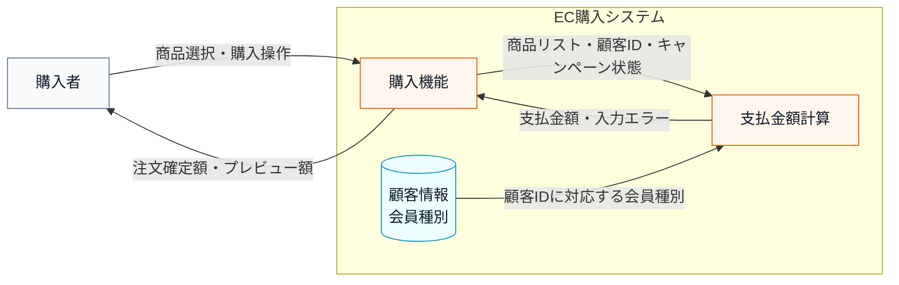

この図では、支払金額計算を一つのシステムとして見て、どこから入力を受け、どの保存データを参照し、どこへ結果を返すかだけを示しています。

次に計算システムの箱を開き、正常に計算できる場合の入力・判定・加工・出力を整理します。

**システム内部図：正常系の入力・判定・加工・出力**
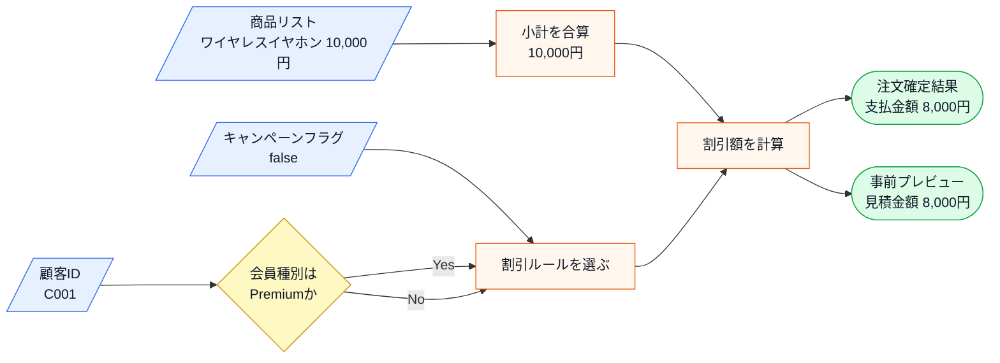

この図から読み取ることは、次の3点です。

- 支払金額は、商品リストだけでは決まらず、顧客IDから取得する会員種別とキャンペーンフラグによって変わる。
- 加工の中心は、小計の合算ではなく、どの割引ルールを選んで適用するかにある。
- 同じ顧客ID・商品・キャンペーン条件から、注文確定結果と事前プレビューの二つへ同じ支払金額を返す。
- 未登録顧客や空注文のように計算へ進めない場合は、次のエラー条件表で分けて扱う。

この図で注目するのは、中央の「加工」にある**割引ルールの選択と適用**です。入力された会員種別とキャンペーンフラグから、どの割引をいくら適用するかが決まり、支払金額が出力されます。

この仕様は、次の状態変化として読めます。

| 観点 | 内容 |
|---|---|
| 事前状態 | 顧客ID、商品リスト、キャンペーンフラグが渡されている |
| 加工 | 顧客IDから会員種別を取得し、小計を計算し、割引ルールを適用する |
| 事後状態 | 正常系では支払金額が表示される |

割引ルールは「誰に・いつ・どれだけ還元するか」というビジネス上の決定から生まれます。会員種別による優遇はリピーター獲得施策、キャンペーンは新規顧客向けの期間限定施策と、それぞれ担当チームが異なる目的で設計しています。

**割引ルール一覧**

| ルール名     | 適用条件                        | 割引の内容    | 業務機能                |
| -------- | --------------------------- | -------- | ------------------- |
| プレミアム割引  | 会員種別が "Premium"             | 20%引き    | 料金・プロモーション管理        |
| キャンペーン割引 | 会員種別が "Regular" かつキャンペーン期間中 | 10%引き    | マーケティング・通知管理        |
| 割引なし     | 上記以外                        | 定価（割引なし） | —（変更不要）              |

Premium会員にキャンペーン割引が重ならない理由は、業務上の判断からきています。Premium会員はすでに年会費や利用実績の対価として恒常的な20%引きを受けており、さらにキャンペーン割引を重ねると採算が合わなくなる可能性があるためです。

**優先・排他ルール**

| 条件 | 動作 |
|---|---|
| Premium かつ キャンペーン中 | Premium のみ適用（キャンペーン割引は無効） |

「クーポンと会員割引は併用不可」という注意書きをショッピングサイトで見かけたことはないでしょうか。このシステムの排他ルールは、その「併用不可」ルールと同じ発想です。どちらを優先するかは会社のポリシーによりますが、上位会員の特典を守ることを優先しています。

**割引計算で確認する前提**

現状仕様の時点では、Premium割引とキャンペーン割引は排他であり、1件の注文へ両方を逐次適用しません。ここでは、変更要求を読む前から存在する複雑さだけを整理します。

| 複雑さ | この章での扱い | 設計判断への影響 |
|---|---|---|
| 排他条件 | Premium会員にはキャンペーンを重ねない | どのルールを選ぶかの判定が計算本体にあることを確認する |
| 複数の利用場所 | 注文確定とカートプレビューが同じ計算を使う | ルール変更時に両方の出力が一致するか確認する |
| 顧客情報取得失敗 | 顧客IDから会員種別を取得できない場合はエラーにする | 外部境界の失敗は注文処理で扱い、割引ルール差し替えとは別軸にする |

この表で見たいのは、「割引が複数あるから複雑」という事実だけではありません。複雑さには、割引ルールの追加・変更に関係するものと、顧客情報取得失敗のように外部境界の信頼性に属するものがあり、両者は性質の異なる複雑さです。

**この割引計算を使う場所**

| 使用場所 | 用途 |
|---|---|
| 決済計算処理 | 注文確定時の支払金額の確定 |
| カートプレビュー機能 | カート画面の金額プレビュー表示 |

**エラー条件**

正常系の金額計算へ進めない入力は、次のように分けて扱います。

| エラー条件 | どこで分かるか | 出力 | 保存・通知などの副作用 |
|---|---|---|---|
| 顧客IDが顧客データに存在しない | 顧客IDから会員種別を取得する前 | 未登録顧客エラー | なし |
| 顧客情報取得に失敗する | 顧客データ取得時 | 顧客情報取得エラー | なし（掲載コードでは発生しない。実運用のDB／API失敗を代替する`try`/`catch`で表す） |
| 注文の商品リストが空 | 小計を合算する前 | 空注文エラー | なし |

### 1-2：動作例テーブル

仕様を定義したところで、実際にどのような入力に対してどのような結果が返るかを確認します。このテーブルは「このシステムが正しく動いているとはどういう状態か」の基準になります。後で設計の改善（リファクタリング）を段階的に進めるときも、この表に立ち返ります。

| 会員種別    | キャンペーン | 適用ルール             | 小計/支払金額          |
| ------- | ------ | ----------------- | ---------------- |
| Premium | ✗      | プレミアム20%引き        | 10,000円 → 8,000円 |
| Premium | ✓      | プレミアム優先（キャンペーン無効） | 10,000円 → 8,000円 |
| Regular | ✓      | キャンペーン10%引き       | 10,000円 → 9,000円 |
| Regular | ✗      | 割引なし              | 3,000円 → 3,000円  |

コードを読む前に、このシステムが「何をする必要があるか」をこの表で確認できました。次は、この仕様を担うクラスの顔ぶれと責任を確認します。

---

### 1-3：登場クラスとクラス構成図

このシステムに登場するクラスと、それぞれが1-1（このシステムの仕様）のどの仕様を担うかを一覧で押さえます。1-4のコードは、この責任分担に沿って読み進めます。

| クラス名 | 役割 | 担当する仕様 |
|---|---|---|
| `Item` | 商品データの保持 | 商品名・単価の元データ |
| `Order` | 注文データの保持 | 顧客IDとカート内商品リスト |
| `CampaignContext` | キャンペーン状態の保持 | キャンペーン有効フラグ |
| `CustomerInfo` | 顧客1件分の情報 | 氏名と会員種別の受け渡し |
| `CustomerDatabase` | 顧客情報の管理 | IDから会員種別・氏名を引く。エラー条件の一次判定 |
| `PaymentCalculator` | 支払金額の計算 | 小計の算出と割引ルールの適用 |
| `CartPreviewService` | カート画面のプレビュー表示 | 顧客IDから会員種別を取得し、計算結果をプレビューとして返す |
| `CheckoutResultRenderer` | 注文確定結果を表示する境界 | 支払金額またはエラーの表示 |
| `OrderProcessor` | 注文処理の統合 | バリデーション・計算・結果表示の一連の流れを担う |

責任を把握したうえで、次の図でクラス同士の依存関係を確認します。注文確定を担う`OrderProcessor`と事前表示を担う`CartPreviewService`は、どちらも`CustomerDatabase`から会員種別を取得し、同じ`PaymentCalculator`へ渡します。これにより、プレビューの呼び出し元が会員種別を顧客IDとは別に指定して食い違うことを防ぎます。

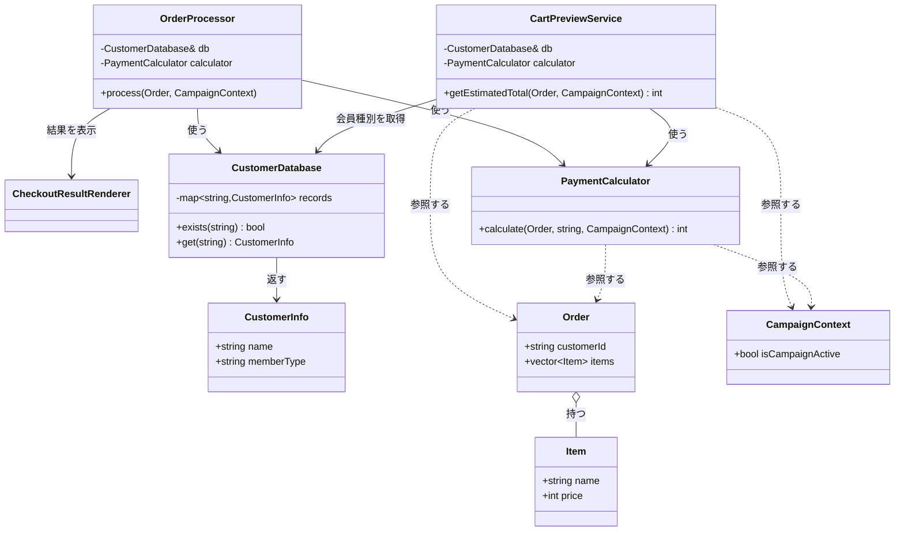

**クラス図に出てくる主なメンバーと操作**

| クラス | メンバー・操作 | 何ができるか |
|---|---|---|
| `CustomerDatabase` | `records` | 顧客IDと顧客情報を保持する |
| `CustomerDatabase` | `exists()` / `get()` | 顧客IDが登録済みか確認し、会員種別を取り出す |
| `OrderProcessor` | `db` / `calculator` | 顧客情報の取得と支払金額計算を呼び出す |
| `PaymentCalculator` | `calculate()` | 注文、会員種別、キャンペーン状態から支払金額を計算する |
| `CartPreviewService` | `db` / `getEstimatedTotal()` | 顧客IDから会員種別を取得し、注文確定前に同じ計算結果を返す |
| `Order` / `Item` / `CampaignContext` | データ項目 | 計算に必要な顧客ID、商品、キャンペーン状態を渡す |


`OrderProcessor`と`CartPreviewService`は別の入口ですが、どちらも注文の`customerId`を`CustomerDatabase`へ渡し、取得した会員種別で同じ`PaymentCalculator`を呼びます。クラス図の全型をコード定義と照合すると、各依存線はメンバー、引数、または呼び出しとして実在し、孤立した型はありません。

**現状システムの処理シーケンス**

クラス図は「誰が誰を持つか」という静的な関係を示します。次のシーケンス図は、正常系（会員種別あり・キャンペーン中）で、注文1件を処理する間に各クラスがどの順で呼ばれ、どの値を受け渡すかを時系列で示します。割引額を決める具体の分岐は `PaymentCalculator` の注記に書き出し、エラー系はメモとして添えます。1-4の現状コードを読む前の地図として使います。

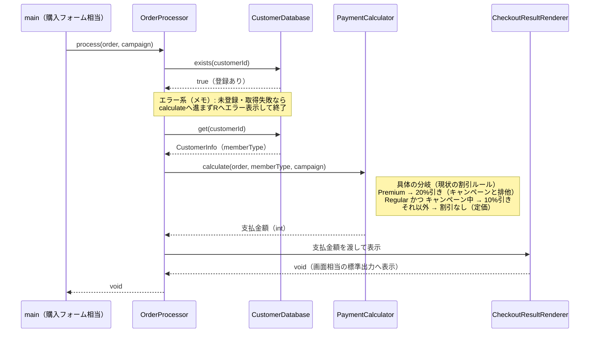

図から読み取れるのは、`OrderProcessor` が「顧客の存在確認 → 顧客情報の取得 → 支払金額の計算 → 結果表示」の順に各クラスを呼ぶこと、割引額の算出は `PaymentCalculator::calculate()` の内側で会員種別×キャンペーンの分岐（Premium 20%／Regular×キャンペーン中 10%／それ以外なし）で決まること、顧客の取得失敗はメモのとおり `calculate` へ進まずエラー表示で終わることです。どのクラスがどの値（`memberType`・`int` 金額）を受け渡すかを、この時系列で確認できます。

**この章での簡略化**

実際のECサイトでは、顧客情報はデータベースに保存され、計算結果は画面に表示され、注文は購入フォームから届きます。この章では割引計算の設計に集中するため、これらを次のように簡略化して掲載します。

| 実システムでの動き | 掲載コードでの表現 | 割愛する理由 |
|---|---|---|
| 顧客情報をDBから取得 | `CustomerDatabase` を顧客情報Repositoryスタブとして使い、固定データを返す | 永続化は本章の論点ではない |
| 金額を画面・帳票へ表示 | `CheckoutResultRenderer` を呼び、Rendererスタブ内で表示内容を出す | 表示方式は本章の論点ではない |
| 注文を購入フォームで受け取る | `main()` で組み立てる `Order` | 入力経路は本章の論点ではない |

これらを省略しても、割引計算へ渡るデータと「割引ルールが変わるたびにどこを直すか」という本章の論点は変わりません。省略した処理は存在しないのではなく、この章では扱わない範囲として扱います。

> [!INFO] コラム：実運用での外部I/O — 失敗・非同期・API呼び出し
>
> 簡略化した外部I/O（顧客DB＝`CustomerDatabase`、結果表示＝`CheckoutResultRenderer`）は、実運用では失敗することがあります。DB接続やAPI呼び出しは、接続失敗・タイムアウト・データ不整合で例外を返しえます。実際には、これらの境界クラスがDBドライバやREST APIの呼び出しになり、本番ではさらにリトライ、タイムアウト、エラー戻り値、ログ記録などを加えます。掲載コードでも、この外部I/Oの失敗をどこで扱うかは1-4で確認します。
>
> また実運用では、外部I/Oを非同期で実行することが多くあります。非同期にすると、クラス間で受け渡す値の形が変わります。たとえば割引計算が非同期や失敗を伴うなら、`int` をそのまま返すのではなく、結果を後で受け取る形（成否や将来値を含む戻り値）になります。
>
> ただし、これらは「割引ルールをどう差し替えるか」という本章の設計論点を変えません。本章は同期・正常系を中心に据え、外部I/Oの失敗・非同期は実運用での補足として扱います。

---

### 1-4：実装コード（現状）

コードは、1-3（登場クラスとクラス構成図）で確認した責任の順に、固まりごとに読みます。取得に失敗したときは注文計算を続けず、例外を注文単位のエラーへ変換します。先に、あらかじめ登録されている3件の顧客データを把握しておきます。

| 顧客ID | 氏名 | 会員種別 |
|---|---|---|
| C001 | 田中 一郎 | Premium |
| C002 | 佐藤 花子 | Regular |
| C003 | 鈴木 次郎 | Regular |

どのIDがPremiumでどれがRegularかを覚えておくと、実行結果と仕様の対応を追いやすくなります。

#### 現状コード

クラスを1つずつ、上から順に読みます。メンバー変数と、それを使う処理を同じ場所で確認できるようにしています。`OrderProcessor` は処理順が長いため、最初に保持する相手と公開操作を確認し、その後で `process()` の中を順に追います。

`main()` と実行結果は最後に、動作例ごとに並べます。上から順に連結すれば、そのまま1つのC++14プログラムとして動きます。

---

**共通ヘッダー**

```cpp
#include <iostream>
#include <string>
#include <vector>
#include <map>
#include <stdexcept>
```

以降のすべてのクラスが使います。

---

**Item と Order**

1-1の入力「商品リスト」と、それを束ねる注文1件です。

```cpp
class Item {
public:
    std::string name;   // 商品名
    int price;          // 単価（円）
    Item(std::string n, int p) : name(n), price(p) {}
};
```

**Order**

このブロックでは `Order` の定義だけを確認します。

```cpp
class Order {
public:
    std::string customerId;   // 注文した顧客のID
    std::vector<Item> items;  // カートに入っている商品の一覧
};
```

`Item` が商品1件、`Order` が「誰が（`customerId`）」「何を（`items`）」買うかです。**会員種別は `Order` に持たせず、IDから後で引きます。**

---

**CampaignContext**

```cpp
class CampaignContext {
public:
    bool isCampaignActive = false;  // キャンペーン期間中なら true
};
```

1-1の入力「キャンペーンフラグ」です。注文とは別に渡すので、同じ注文へ条件を変えて当て直せます。

---

**CustomerInfo と CustomerDatabase**

顧客IDから会員種別を引きます。1-1の「会員種別（Premium / Regular）」と、エラー条件「顧客IDが存在しない」を担います。

```cpp
struct CustomerInfo {
    std::string name;        // 顧客の氏名
    std::string memberType;  // "Premium" または "Regular"
};
```

**CustomerDatabase**

このブロックでは `CustomerDatabase` の定義だけを確認します。

```cpp
class CustomerDatabase {
private:
    std::map<std::string, CustomerInfo> records;  // ID→顧客情報
public:
    CustomerDatabase() {
        records["C001"] = {"田中 一郎", "Premium"};
        records["C002"] = {"佐藤 花子", "Regular"};
        records["C003"] = {"鈴木 次郎", "Regular"};
    }

    bool exists(const std::string& id) const {
        return records.count(id) > 0;   // IDが登録済みか
    }

    CustomerInfo get(const std::string& id) const {
        return records.at(id);          // IDから顧客情報を取り出す
    }

    void save(const std::string& id, const CustomerInfo& info) {
        records[id] = info;             // 実行中の登録表へ顧客を追加
    }
};
```

- **責任：** 顧客IDから存在確認と情報取得を行う
- **副作用：** `save()` を呼んだときだけ登録表が増える

`exists()` はエラー条件「顧客IDが存在しない」の判定に使い、`get()` は割引判定に使う `memberType` を返します。実システムのDB問い合わせを、実行終了まで覚えているインメモリの登録表で代替しています。

`records` を `static` にしなくてもデータが保持されるのは、`CustomerDatabase` の実体を `main()` が1つだけ生成し、`OrderProcessor` などへ参照で渡して全員が同じ登録表を共有しているからです（0章「共有データの持ち方」の全章共通規約）。`static` で持つと所有者が見えなくなり、保存先を差し替える変更も難しくなるため、共有ストアは組み立て側が所有して注入します。

---

**PaymentCalculator**

この章の中心です。1-1の「加工」——小計の合算と割引ルールの適用——に対応します。

```cpp
class PaymentCalculator {
public:
    int calculate(const Order& order,
                  const std::string& memberType,
                  const CampaignContext& context) {
        // (1) 小計：商品の単価を全部足す
        int total = 0;

        for (const auto& item : order.items) {
            total += item.price;
        }

        // (2) 割引：会員種別とキャンペーンで割引率を決める
        if (memberType == "Premium") {
            total = total * 80 / 100;   // プレミアム割引 20%引き
        } else if (memberType == "Regular" && context.isCampaignActive) {
            total = total * 90 / 100;   // キャンペーン割引 10%引き
        }

        // どちらにも当てはまらなければ割引なし（定価）

        return total;
    }
};
```

- **判断が2つ：** 小計の合算と、割引率の選択が同じメソッドに並んでいます
- **順序に意味：** `Premium` を先に判定するので、Premium会員はキャンペーン中でも20%引きのままです（排他ルール）。`if` の順を入れ替えると仕様が変わります

各分岐が1-1の割引ルール一覧に対応します。`Premium` は `* 80 / 100`、`Regular` かつキャンペーン中は `* 90 / 100`、どちらでもなければ定価です。

---

**CartPreviewService**

カート画面でも、注文確定前に同じ支払金額を見せます。

```cpp
class CartPreviewService {
private:
    CustomerDatabase& db;
    PaymentCalculator calculator;
public:
    explicit CartPreviewService(CustomerDatabase& database)
        : db(database) {}

    int getEstimatedTotal(const Order& order,
                          const CampaignContext& context) {
        if (!db.exists(order.customerId)) {
            throw std::runtime_error("顧客IDが登録されていません");
        }

        CustomerInfo customer = db.get(order.customerId);

        return calculator.calculate(order, customer.memberType, context);
    }
};
```

割引条件を書き直さず、同じ `PaymentCalculator` へ計算を任せています。**このため、プレビューと決済で金額が食い違いません。** 未登録IDでは金額を返さず例外を投げます。

---

**CheckoutResultRenderer**

計算結果を注文結果の表示へ変換します。

```cpp
class CheckoutResultRenderer {
public:
    void showOrderResult(const CustomerInfo& customer,
                         const Order& order,
                         const CampaignContext& context,
                         int subtotal,
                         int finalPrice) {
        std::cout << customer.name << " さんの注文:";

        for (const auto& item : order.items) {
            std::cout << " " << item.name << " " << item.price << "円";
        }

        std::cout << "\n  条件: 会員=" << customer.memberType
                  << ", キャンペーン="
                  << (context.isCampaignActive ? "あり" : "なし");
        std::cout << "\n  小計 " << subtotal << "円 → 支払金額 "
                  << finalPrice << "円\n";
    }
};
```

会員種別とキャンペーン条件も出すので、実行結果だけでどの割引ルールが効いたかを追えます。実システムの画面描画を、標準出力で代替しています。

---

**OrderProcessor の宣言**

エラー確認 → 会員種別の取得 → 計算 → 表示、という一連の流れを担います。

```cpp
class OrderProcessor {
private:
    CustomerDatabase& db;
    CheckoutResultRenderer& renderer;
    PaymentCalculator calculator;
public:
    OrderProcessor(CustomerDatabase& db, CheckoutResultRenderer& renderer)
        : db(db), renderer(renderer) {}

    void process(const Order& order, const CampaignContext& context);
};
```

`db` と `renderer` は外から受け取って参照で持ち、`calculator` は自分で持ちます。**差し替えられるのは前の2つだけです。**

---

**OrderProcessor::process()**

```cpp
void OrderProcessor::process(const Order& order,
                             const CampaignContext& context) {
    // エラー条件1：顧客IDが存在しない
    if (!db.exists(order.customerId)) {
        std::cerr << "エラー: 顧客ID " << order.customerId
                  << " は登録されていません\n";
        return;
    }

    // エラー条件2：注文が空
    if (order.items.empty()) {
        std::cerr << "エラー: 注文が空です\n";
        return;
    }

    // 会員種別をIDから取得して計算へ渡す
    // 実運用ではDB/API呼び出し。接続失敗などに備えて捕捉する
    CustomerInfo customer;
    try {
        customer = db.get(order.customerId);
    } catch (const std::exception&) {
        std::cerr << "エラー: 顧客情報の取得に失敗しました\n";
        return;
    }

    int finalPrice =
        calculator.calculate(order, customer.memberType, context);

    // 表示形式はRenderer境界へ委ねる
    int subtotal = 0;

    for (const auto& item : order.items) {
        subtotal += item.price;
    }

    renderer.showOrderResult(customer, order, context,
                             subtotal, finalPrice);
}
```

- **順序に意味：** 先頭の2つの `if` が1-1のエラー条件です。存在しないIDや空注文は、計算へ進まず中断します
- **失敗の扱い：** `db.get()` は実運用でDB/API呼び出しになり接続失敗しうるので、`try/catch` で捕捉して注文単位のエラーへ変換します
- `Order` は会員種別を持たないので、IDから `db.get()` で補ってから計算へ渡します

---

#### `main()` と実行結果

1-2の動作例テーブル（4行）と排他ルール・エラー条件を、ケースごとに区切って実行します。

---

**組み立てと、動作例1：Premium会員・キャンペーンなし**

```cpp
int main() {
    CustomerDatabase db;
    CheckoutResultRenderer renderer;
    OrderProcessor processor(db, renderer);
    CartPreviewService preview(db);
    CampaignContext context;

    // 動作例1：C001（Premium）/ キャンペーンなし → 20%引き
    Order order1;
    order1.customerId = "C001";
    order1.items.push_back(Item("ワイヤレスイヤホン", 10000));
    context.isCampaignActive = false;
    processor.process(order1, context);
```

```
田中 一郎 さんの注文: ワイヤレスイヤホン 10000円
  条件: 会員=Premium, キャンペーン=なし
  小計 10000円 → 支払金額 8000円
```

`db` を1つだけ作り、`processor` と `preview` の両方へ参照で渡しています。10000円が20%引きで8000円になりました。

---

**動作例2：同じPremium会員にキャンペーンを当てる**

```cpp
    // 動作例2：同じPremium会員にキャンペーンを当てても優先は変わらない
    context.isCampaignActive = true;
    processor.process(order1, context);   // → 8000（キャンペーン無効）
    context.isCampaignActive = false;
```

```
田中 一郎 さんの注文: ワイヤレスイヤホン 10000円
  条件: 会員=Premium, キャンペーン=あり
  小計 10000円 → 支払金額 8000円
```

同じ注文へキャンペーンを当てても8000円のままです。`calculate()` が `Premium` を先に判定して抜けるため、キャンペーン割引の行に到達しません。

---

カートプレビューは、同じ計算を「注文確定」と「事前確認」の二つの入口から使う要求ID6を表します。次の例では、先に金額を確認してから `process()` を呼び、プレビューが注文確定の後処理ではないことを明示します。

**動作例3：Regular会員・キャンペーンあり**

```cpp
    // 動作例3：C002（Regular）/ キャンペーンあり → 10%引き
    Order order2;
    order2.customerId = "C002";
    order2.items.push_back(Item("ワイヤレスイヤホン", 10000));
    context.isCampaignActive = true;
    int estimated = preview.getEstimatedTotal(order2, context);
    std::cout << "  注文確定前のカートプレビュー: "
              << estimated << "円\n";
    processor.process(order2, context);
```

```
  注文確定前のカートプレビュー: 9000円
佐藤 花子 さんの注文: ワイヤレスイヤホン 10000円
  条件: 会員=Regular, キャンペーン=あり
  小計 10000円 → 支払金額 9000円
```

決済とプレビューが同じ9000円を返しました。両方が同じ `PaymentCalculator` を使っているためです。

---

**動作例4：Regular会員・キャンペーンなし**

```cpp
    // 動作例4：C003（Regular）/ キャンペーンなし → 割引なし
    Order order3;
    order3.customerId = "C003";
    order3.items.push_back(Item("スマホケース", 3000));
    context.isCampaignActive = false;
    processor.process(order3, context);
```

```
鈴木 次郎 さんの注文: スマホケース 3000円
  条件: 会員=Regular, キャンペーン=なし
  小計 3000円 → 支払金額 3000円
```

どちらの分岐にも当てはまらないので定価のままです。

---

**エラー条件：存在しない顧客ID**

```cpp
    // エラー条件：存在しない顧客ID
    Order order4;
    order4.customerId = "UNKNOWN";
    order4.items.push_back(Item("ケーブル", 1000));
    processor.process(order4, context);

    return 0;
}
```

```
エラー: 顧客ID UNKNOWN は登録されていません
```

先頭の `exists()` で止まり、金額は計算されません。

---

入力と結果を1行ずつ並べると次のとおりです。

| 動作例 | 会員・キャンペーン | 商品（単価） | 小計→支払金額 |
|---|---|---|---|
| 1 | Premium・なし | イヤホン(10000円) | 10000 → 8000（20%引き） |
| 2 | Premium・あり | イヤホン(10000円) | 10000 → 8000（優先で無効） |
| 3 | Regular・あり | イヤホン(10000円) | 10000 → 9000（10%引き） |
| 3 | カートプレビュー | 同上 | 9000（同じ計算を共有） |
| 4 | Regular・なし | ケース(3000円) | 3000 → 3000（割引なし） |
| 異常 | 未登録ID | ケーブル(1000円) | 「登録されていません」 |

> **手元で動かすには**
> このコードは1つの `.cpp` に貼り付けて、そのままコンパイル・実行できます（例：`g++ chapter01.cpp -o app && ./app`）。`main()` は自由に組み替えて構いません。たとえば `db.save("C010", {"高橋 三郎", "Premium"});` で顧客を足し、その顧客IDで `process()` を呼べば、追加した顧客の割引計算がその場の実行結果に表れます。登録はプロセス実行中だけ有効で、終了すると消えます（DBのような永続化はこの章の論点ではありません）。
>
> **掲載用1ファイルと実務の分割：** この1つの`.cpp`は、手元で動かすための掲載形式です。実務では、第0章「掲載ブロックと実ファイルの分け方」に従い、公開する契約・宣言を`.h`、処理本体を`.cpp`へ置きます。優先順のような業務方針を伴う登録は専用の組み立てクラスへまとめ、`main.cpp`は完成した部品の生成と利用側への受け渡しを担います。

`OrderProcessor` は `CustomerDatabase` からの情報を使ってバリデーションと計算を行います。`CartPreviewService` も同じ `PaymentCalculator` を使うため、注文確定前のプレビュー表示でも同じ金額になります。

---

#### 仕様入力が現状コードで使われるまで

1-1の入力を、受け取り口から利用箇所、確認できる結果まで追います。構造体に値があるだけでなく、各値が判定または計算に実際に使われることを確認します。

| 仕様入力 | コード上の受け取り口 | 実際に使う箇所 | 結果への現れ方 |
|---|---|---|---|
| 商品リスト | `Order::items` を `OrderProcessor::process()` へ渡す | `PaymentCalculator::calculate()` が全商品の `price` を合計する | 小計と支払金額に反映される |
| 顧客ID | `Order::customerId` | `CustomerDatabase::exists()` / `get()` で会員種別を取得する | Premium・Regularの割引、未登録IDエラーに分かれる |
| キャンペーン状態 | `CampaignContext::isCampaignActive` | `PaymentCalculator::calculate()` のRegular向け条件判定 | 有効時だけキャンペーン割引が反映される |

### 1-5：変更要求

マーケティング部から以下の変更要求が来ました。

「来週から『サマーセール』を開始します。期間中はRegular会員を対象に5%オフを追加してください。プレミアム会員はすでに20%引きが適用されているため、今回のセールは対象外です。」

この変更要求では、割引を**加算**するのではなく、すでに適用された割引後の金額に次の割引を掛ける**逐次割引**として扱います。つまり、キャンペーン10%引きとサマーセール5%引きが重なった場合は「合計15%引き」ではなく、「10,000円 → 9,000円 → 8,550円」と計算します。

依頼文を、実行結果で判定できる変更依頼へ分けます。

| 変更依頼ID | 確定した変更内容 | 入力 | 受入条件 |
|---|---|---|---|
| 変更ID1 | Regular会員へサマーセール5%を追加し、Premium会員は対象外にする | 会員種別、サマーセールフラグ | Regularかつセール中だけ5%が適用され、Premiumの20%は変わらない |
| 変更ID2 | 既存キャンペーンと重なる場合は逐次割引する | キャンペーンフラグ、変更ID1適用前の金額 | 10,000円へ10%引き後に5%引きを適用し、8,550円になる |

#### 変更後要求ベースライン

| 要求ID | 変更種別・根拠となる変更ID | 変更後要求 | 受入条件 |
|---|---|---|---|
| 要求ID1 | 継続<br/>根拠: — | 商品リストの小計から最終支払金額を計算する | 登録商品10,000円の小計と割引後金額を返す |
| 要求ID2 | 継続<br/>根拠: 変更ID1 | Premium会員へ20%割引を適用し、他割引と併用しない | セール中でもPremiumは8,000円になる |
| 要求ID3 | 継続<br/>根拠: — | Regular会員はキャンペーン中だけ10%割引する | キャンペーンだけなら9,000円になる |
| 要求ID4 | 継続<br/>根拠: — | 顧客IDから会員種別を取得する | 登録・未登録の既存動作を維持する |
| 要求ID5 | 変更<br/>根拠: 変更ID1, 変更ID2 | 計算結果を購入結果として表示する | サマーセールの有無と適用した割引名を含め、全割引と最終金額を表示する |
| 要求ID6 | 継続<br/>根拠: — | 注文確定前に同じ条件の支払金額をプレビューする | 顧客IDから会員種別を取得し、購入結果と同じ金額を返す |
| 要求ID7 | 追加<br/>根拠: 変更ID1, 変更ID2 | Regularへサマーセール5%を追加し、既存割引後へ逐次適用する | セールのみ9,500円、キャンペーン併用8,550円、Premiumは対象外になる |

**変更前→変更後の要求対照（今回変える要求IDだけ）**

現行ベースラインと変更後ベースラインを往復せずに済むよう、今回変える要求IDだけを取り出し、変更前と変更後を同じ行へ並べます。

| 要求ID | 変更前の要求（現行） | 変更後の有効要求 | 根拠変更ID |
|---|---|---|---|
| 要求ID5 | 顧客・小計・適用割引・支払金額を表示する | サマーセールの有無と適用した割引名を含め、全割引と最終金額を表示する | 変更ID1・変更ID2 |
| 要求ID7 | （新規・現行なし） | Regularへサマーセール5%を追加し、既存割引後へ逐次適用する | 変更ID1・変更ID2 |

要求ID1〜要求ID4と要求ID6は継続（変更前＝変更後）のため対照表には載せません。変更後ベースラインで内容を確認できます。要求ID5を変更に含めたのは、サマーセールという新しい条件と、逐次適用したときの割引名を購入結果へ出す必要があり、`CheckoutResultRenderer` へ渡す値が増えるためです。

リリースは来週末。既存の `if` 文の隙間に `else if` を追加すれば間に合うかもしれません。


**仕様変更の内容**

変更要求を受けて、現在の割引ルールがどう変わるかを整理します。

| ルール名 | 変更前 | 変更後 |
|---|---|---|
| プレミアム割引 | Premium会員に20%引き | 変更なし |
| キャンペーン割引 | Regular会員にキャンペーン10%引き | 変更なし |
| **サマーセール割引（新規）** | —（なし） | **Regular会員に5%引きを逐次適用** |

今回変えるのは割引ルールです。顧客情報の取得と購入結果の表示は仕様変更の対象ではないため、次の共通基盤は変更前後で同じ契約のまま維持します。

| 変更対象外の共通基盤 | 変更前 | 変更後 |
|---|---|---|
| `CustomerDatabase` | 会員種別を取得する | **変更なし** |

表示クラス `CheckoutResultRenderer` は変更対象外ではありません。サマーセールの有無と適用した割引名を購入結果へ出す必要があるため、要求ID5の受入条件が変わり、表示に渡す値も増えます（下の変更後ベースラインを参照）。

※表の1行目（Premium・キャンペーン・サマーセールがすべて重なった場合）は、「プレミアム割引（20%引き）」が最優先され、他のキャンペーンやサマーセールは無効になるという仕様を表しています。そのため、変更後も8,000円のままとなります。


**変更後の動作例**

| 会員種別    | キャンペーン     | サマーセール | 変更前/後の支払金額（1万円の場合）                                |
| ------- | ---------- | ------ | ------------------------------------------------- |
| Premium | ✓          | ✓      | 8,000円（20%引き）→ 8,000円（変更なし）                       |
| Regular | ✓          | ✓      | 9,000円（10%引き）→ **8,550円（9,000円にサマーセール5%引きを逐次適用）** |
| Regular | ✗          | ✓      | 10,000円（割引なし）→ **9,500円（5%引き）**                   |
| Regular | ✓ | ✗ | 9,000円 → 9,000円（変更なし） |
| Regular | ✗ | ✗ | 10,000円 → 10,000円（変更なし） |

Regular会員はサマーセール中に5%引きが新たに加わります。キャンペーン割引と重なる場合は、キャンペーン適用後の金額にサマーセール割引を掛けます。プレミアム会員はすでに20%引きが適用されているため、今回のサマーセールの対象外となります。

**変更前後の入力・判定・加工・出力差分**

1-1の現状仕様を退避し、変更要求を当てた後の仕様と同じ粒度で並べます。以降の分析では、この差分を追います。

| 要素 | 変更前（1-1の現状仕様） | 変更後（今回の要求） | 差分として追うもの |
|---|---|---|---|
| 入力 | 商品リスト、顧客ID、キャンペーンフラグ | 商品リスト、顧客ID、キャンペーンフラグ、サマーセールフラグ | サマーセールフラグが追加される |
| 判定 | Premiumか、キャンペーン中か | Premiumか、キャンペーン中か、Regularかつサマーセール中か | サマーセール対象判定が追加される |
| 加工 | 小計を合算し、既存割引を適用する | 既存割引後の金額へサマーセール5%を逐次適用する | 割引の適用順序が分析対象になる |
| 出力 | 最終支払金額 | サマーセール反映後の最終支払金額 | Regular会員の出力金額が変わる |

**変更後の入力・加工・出力**

変更後の仕様を、1-1と同じ粒度で、正常系の入力・判定・加工・出力として確認します。1-1の図との差分は、入力に「サマーセールフラグ」が加わることと、割引額を計算したあとに「サマーセール5%を逐次適用する」という加工が挟まることの2点です。

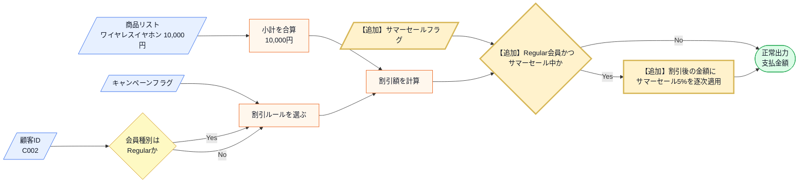

この図から読み取ることは、次の3点です。

- 商品リスト・顧客ID・キャンペーンフラグの入力と、小計の合算・割引ルールの選択・割引額の計算は、1-1のまま変わらない。
- 新しい入力はサマーセールフラグで、割引額を計算したあとの金額に5%を掛ける「逐次適用」という加工が1つ加わる。
- Premium会員は新しい判定でNo側を通るため、変更後も支払金額は変わらない。

変更後も、エラー条件は正常系図へ混ぜずに別で確認します。

| エラー条件 | どこで分かるか | 出力 | 保存・通知などの副作用 |
|---|---|---|---|
| 顧客IDが顧客データに存在しない | 顧客IDから会員種別を取得する前 | 未登録顧客エラー | なし |
| 顧客情報取得に失敗する | 顧客データ取得時 | 顧客情報取得エラー | なし（掲載コードでは発生しない。実運用のDB／API失敗を代替する`try`/`catch`で表す） |
| 注文の商品リストが空 | 小計を合算する前 | 空注文エラー | なし |

図に加わった「逐次適用」が実際にコードのどこへ書かれるかは、フェーズ3「問題特定」で変更を試すコードと、フェーズ7の最終コード・実行結果で追います。

**フェーズ1のまとめ：今回追う変更ID一覧**

このフェーズで確定した変更依頼を一覧にして締めます。フェーズ2「仮説立案」でこの変更IDを仮説・ヒアリングへ、フェーズ3「問題特定」で一つずつ試して痛みへ、と順につなぎます。

| 変更ID | 変更依頼の要点 | 関係する要求ID（追加は変更後ID） |
|---|---|---|
| 変更ID1 | Regular会員へサマーセール5%を追加し、Premiumは対象外にする | 要求ID2、要求ID5、要求ID7 |
| 変更ID2 | 既存キャンペーンと重なる場合は逐次割引する | 要求ID5、要求ID7 |

フェーズ1「現状把握」でシステムの現状と変更要求が把握できました。次のフェーズ2「仮説立案」では、「何を変え、何を守るか」を整理します。

## 🟣 フェーズ2：仮説立案 ―― 何が変わるかを観察し、ヒアリングで裏付ける
### 2-1：変わりそうな仕様の見当をつける

ここで作る一覧は、思いつきで「変わりそう」と感じたものを並べる表ではありません。フェーズ1「現状把握」で確認した仕様・動作例・クラス図を材料に、次の順で候補を絞ります。

1. 仕様図と動作例から、入力・判定・加工・出力のうち条件や値が変わりそうな箇所を拾う。
2. その箇所が、1-3（登場クラスとクラス構成図）のどのクラス・メソッドに書かれているかを対応づける。
3. その仕様が、どんな理由で、何をきっかけに、どのくらいの頻度で変わりそうかを仮説として書く。
4. 逆に、当面変えない前提にできる処理の骨格も分けておく。

この手順で見ると、「金額を計算する」という大きな処理全体ではなく、その中のどの条件・計算式・判定が変更候補なのかを読者自身で追えるようになります。

フェーズ1「現状把握」で整理した仕様をもとに、「どの仕様に変更の見込みがあり、今回どこを維持するか」を見立てます。責務配置の評価は、変更を当てたときの痛みと合わせてフェーズ3「問題特定」とフェーズ4「原因分析」で確認します。

変わりそうな割引ルールは、1-3のクラス図の中心 `PaymentCalculator` の `calculate()` の中にあります。この中身を、小計の合算と各割引に分け、誰がどんなきっかけで変えるかと一緒に整理します。

| `calculate()` 内の処理 | 変える主体・きっかけ | 現時点の仮説 |
|---|---|---|
| 商品単価の合算ロジック | 今回の要求では変更対象外。計算順の変更時に見直す | 今回維持する |
| プレミアム割引の条件・割引率 | 料金・プロモーション管理の施策 | 変更候補 |
| キャンペーン割引の条件・割引率 | マーケティング・通知管理の施策 | 変更候補 |

見えてくるのは、**1つの `calculate()` を、料金・プロモーション管理とマーケティング・通知管理という別々の主体が、別々のきっかけで変えうる**という見立てです。

ここで言えるのはそこまでです。責務は設計者が決めるもので、「割引も含めて支払金額を計算する」という今の責務配置は、それ自体が間違いというわけではありません。複数の主体が同じメソッドを変えうることが**実際に痛みになるか**はフェーズ3「問題特定」で変更を当てて確かめ、なぜ辛いのか（＝変わる理由の異なるものが同居している）はフェーズ4「原因分析」で原因として言語化します。2-1（変わりそうな仕様の見当をつける）は、その検証対象に当たりをつける段階です。

#### ヒアリングで確認すること

2-1の見当のうち、事実だけでは決められない点を質問へ変換します。この質問を先に決めてから、2-3のヒアリングへ進みます。

| 見当 | 現時点の仮説 | 確認する質問 | 確認先 |
|---|---|---|---|
| 割引条件 | 新しい企画が継続して増える | 季節キャンペーンは今後も追加されるか | マーケティング部 |
| 計算式 | パーセント引き以外も増える | 定額割引など別の計算方法を予定しているか | マーケティング部 |

### 2-2：今回の変更で確実に変わること

1-5（変更要求）で確定した変更IDを、そのまま今回確実に変わることとして確認します。章ごとに異なる色や記号は使わず、以降でも同じ変更IDで追跡します。

- **変更ID1：Regular会員へサマーセール5%を追加し、Premium会員は対象外にする**
- **変更ID2：既存キャンペーンと重なる場合は逐次割引する**

ただし「この変更が1回限りか、今後も続くか」によって、どこまで設計を変えるべきかが大きく変わります。関係者に確認します。

#### 補足：ヒアリングに向けた背景確認

このシステムは、ある中堅ECサイトの決済計算を担っています。数年前にサービスが立ち上がった当初は、お客様が商品を選んでカートに入れ、そのままの合計金額で決済するシンプルな流れでした。

しかし、サービスが成長し競合他社との競争が激しくなるにつれて、様々な施策が打たれるようになりました。新規顧客向けの期間限定キャンペーンや、リピーター向けのプレミアム会員制度など、ビジネス上の要求は日々増えています。

### 2-3：関係者ヒアリング


- **開発者：** 「サマーセールの件、承知しました。今後もこのような新しい割引ルールは追加される予定はありますか？」
- **マーケティング部リーダー：** 「はい、もちろんです。秋にはハロウィンキャンペーン、冬には年末大感謝祭など、毎月のように新しい企画を予定しています。」
- **開発者：** 「ちなみに、割引の計算方法自体が変わることはありますか？今はパーセント引きですが、定額割引などです。」
- **マーケティング部リーダー：** 「実は秋のキャンペーンでは、一律1000円引きクーポンの配布を検討しています。これも対応できますか？」

### 2-4：ヒアリングで判明した将来リスク

ヒアリングで浮かび上がった「確定ではないが、近い将来起こりうる変化」を記録します。これは今回の設計判断の材料です。

| リスクID | 将来リスク | 時期の目安 | 根拠 |
|---|---|---|---|
| リスクID1 | 新しい割引ルールの追加が毎月続く | 継続的に | マーケティング責任者から直接確認 |
| リスクID2 | 計算方法が「パーセント引き」から「定額引き」に変わる | 数ヶ月後 | 秋のクーポン企画として言及 |

なお、計算結果の出力方法自体（画面表示からレシート印刷・APIレスポンスへの変更）もヒアリングで話題になりましたが、今回の変更対象ではないためリスクIDには起こさず対象外として記録します。出力方法は割引計算の軸とは独立した境界であり、本章で扱う割引ルールの分離には影響しません。

フェーズ2「仮説立案」で「今変わること（確定）」と「将来変わるかもしれないこと（リスク）」を分けて整理できました。次はリスクをもう少し具体的な「仕様の変化」として整理します。

### 2-5：変わる見込みと今回維持する範囲を確定する

2-4（ヒアリングで判明した将来リスク）のリスクIDを、設計で扱う変化軸へ整理します。ここで「はい」とした項目は、機能を先に実装するという意味ではありません。フェーズ6で、**変えられるようにする部分を当面守る部分から分離し、その変化が起きても影響を局所化できる構造か**を判断するための印です。

| リスクID・変化軸 | 変わる見込み | 変えられるようにする部分 | 今回維持する部分 |
|---|---|---|---|
| リスクID1：新しい割引ルールの追加が毎月続く | はい | 割引ルールの追加と選択 | 小計の合算、注文処理、支払金額の返却 |
| リスクID2：計算方法が「パーセント引き」から「定額引き」に変わる | はい | 割引条件と金額計算式 | 割引前金額の受け渡し、注文処理、結果表示 |

したがって2-5（変わる見込みと今回維持する範囲を確定する）の出力は、「割引ルールと計算式は差し替え対象にし、小計の合算から結果表示までの流れは守る」という設計条件です。フェーズ3「問題特定」では変更ID1・変更ID2だけを現在の構造へ適用し、このリスクIDはフェーズ6で採用構造を評価するときに使います。

---

## 🟣 フェーズ3：問題特定 ―― 変更の痛みを発見する
### 3-1：変更を試みる

「サマーセール：Regular会員に5%オフを追加」を、今のコードにそのまま実装してみます。

> **この抜粋の外は、現状のままです。** `Item`、`Order`、`CustomerInfo`、`CustomerDatabase`、`CartPreviewService`、`OrderProcessor` は1-4の定義をそのまま使います。以下は1-4で読んだ順に、変更が入った定義だけを並べたものです。

変更した定義は3つです。1-4（実装コード）と同じ並び順で、上から見ていきます。

| 1-4での掲載単位 | 今回の変更 | 根拠 |
|---|---|---|
| `CampaignContext` | `isSummerSale` フラグを1つ追加 | 変更ID1 |
| `PaymentCalculator` | 割引判定を2分岐から4分岐へ書き換え | 変更ID1・変更ID2 |
| `CheckoutResultRenderer` | 条件表示へサマーセールの有無を1項目追加 | 変更ID1・要求ID5 |

---

**CampaignContext（変更あり）**

```cpp
// CampaignContext クラスへの変更（サマーセールフラグの追加が必要）
class CampaignContext {
public:
    bool isCampaignActive = false;
    bool isSummerSale = false;   // ← 変更ID1で追加
};
```

フラグが1つ増えただけです。**ここは痛くありません。** ただし、**1つの施策追加が入力データと計算本体の両方へ波及している**ことは覚えておいてください。

---

**PaymentCalculator::calculate() の割引判定（変更前）**

変える場所を先に確認します。`PaymentCalculator::calculate()` のうち、`memberType` と `context` から割引を選ぶ部分です。商品の合算はこの直前で `order.items` から `total` へ済んでいます。

```cpp
if (memberType == "Premium") {
    total = total * 80 / 100;   // 20%引き
} else if (memberType == "Regular"
           && context.isCampaignActive) {
    total = total * 90 / 100;   // 10%引き
}
```

Premiumを先に見て、次にRegular＋キャンペーンを見る、2分岐です。ここへ「Regular会員へサマーセール5%引きを追加」を入れます。

---

**PaymentCalculator::calculate() の割引判定（変更後）**

```cpp
// サマーセール対応：Regular会員向けに条件を追加
if (memberType == "Premium") {
    total = total * 80 / 100;  // 20%引き（サマーセール対象外）
} else if (context.isSummerSale && context.isCampaignActive) {
    total = (total * 90 / 100) * 95 / 100; // 逐次割引（Regular会員）
} else if (context.isSummerSale) {
    total = total * 95 / 100;  // 5%引き（Regular会員）
} else if (context.isCampaignActive) {
    total = total * 90 / 100;  // 10%引き
}
```

- **`else if` を1行足すだけでは済まない：** サマーセールは「Regular会員のみ」「キャンペーンと重なると逐次割引」という複合条件なので、組み合わせの分岐まで要ります。2分岐が4分岐になりました
- **既存分岐の書き換えを巻き込む：** キャンペーン分岐から `memberType == "Regular"` の条件が落ちています。直前でPremiumを処理していれば残るのはRegularだけ、という**分岐の順序に依存した省略**です
- **順序に意味：** `isSummerSale && isCampaignActive` を単独条件より先に置かないと、両方有効な顧客が5%引きだけで止まります。この行を入れ忘れると金額がずれますが、コンパイルは通ります

逐次割引は `* 90 / 100` のあと `* 95 / 100` で、15%引きとして `* 85 / 100` する仕様ではありません。**1つの施策追加で、既存分岐の順序と組み合わせまで見直すことになりました。**

---

#### `main()` と実行結果

上の2定義を1-4のコードへ当てはめ、1万円の注文で4ケースを通します。**見るのは動くかどうかではなく、サマーセールを足したことで `PaymentCalculator` の割引分岐がどれだけ増えたかです。**

```cpp
// 変更後のクラスを使った動作確認
int main() {
    CustomerDatabase db;
    CheckoutResultRenderer renderer;
    OrderProcessor processor(db, renderer);
    CampaignContext context;
    Order order;
    order.items.push_back(Item("ワイヤレスイヤホン", 10000));

    // C001（Premium）/ キャンペーンあり / サマーセール中
    // → Premium優先（キャンペーン・サマーセール無効）
    order.customerId = "C001";
    context.isSummerSale     = true;
    context.isCampaignActive = true;
    processor.process(order, context);

    // C002（Regular）/ キャンペーンあり / サマーセール中
    // → 逐次割引（10%引き後の金額に5%引き）
    order.customerId = "C002";
    context.isSummerSale     = true;
    context.isCampaignActive = true;
    processor.process(order, context);

    // C002（Regular）/ キャンペーンなし / サマーセール中 → 5%引き
    order.customerId = "C002";
    context.isSummerSale     = true;
    context.isCampaignActive = false;
    processor.process(order, context);

    // C002（Regular）/ キャンペーンなし / サマーセールなし → 割引なし
    order.customerId = "C002";
    context.isSummerSale     = false;
    context.isCampaignActive = false;
    processor.process(order, context);

    return 0;
}
```

**CheckoutResultRenderer::showOrderResult() の条件表示（変更後）**

このブロックでは条件表示の1文だけを確認します。引数と他の出力は1-4のままです。

```cpp
        std::cout << "\n  条件: 会員=" << customer.memberType
                  << ", キャンペーン="
                  << (context.isCampaignActive ? "あり" : "なし")
                  << ", サマーセール="
                  << (context.isSummerSale ? "あり" : "なし");
```

```
田中 一郎 さんの注文: ワイヤレスイヤホン 10000円
  条件: 会員=Premium, キャンペーン=あり, サマーセール=あり
  小計 10000円 → 支払金額 8000円
佐藤 花子 さんの注文: ワイヤレスイヤホン 10000円
  条件: 会員=Regular, キャンペーン=あり, サマーセール=あり
  小計 10000円 → 支払金額 8550円
佐藤 花子 さんの注文: ワイヤレスイヤホン 10000円
  条件: 会員=Regular, キャンペーン=なし, サマーセール=あり
  小計 10000円 → 支払金額 9500円
佐藤 花子 さんの注文: ワイヤレスイヤホン 10000円
  条件: 会員=Regular, キャンペーン=なし, サマーセール=なし
  小計 10000円 → 支払金額 10000円
```

上から順に、Premium優先（10000円→8000円）、Regularの逐次割引（10000円→9000円→8550円）、Regularのサマーセール単独（10000円→9500円）、割引なし（10000円のまま）です。小計→支払金額が、1-5（変更要求）の変更後の動作例と対応しています。**金額の計算は正しくなっています。**

ただし要求ID5は、まだ満たせていません。受入条件は「サマーセールの有無と**適用した割引名**を含めて表示する」ですが、出せているのは条件と金額だけです。`PaymentCalculator` は分岐の中で金額を引くだけで、どの割引を当てたかを名前として持っていないため、表示側へ渡す値がありません。割引名を出すには、4分岐それぞれに名前を持たせて戻り値へ足すことになります。これはフェーズ4で原因として扱います。

痛いのは結果ではなく、そこへ至る過程です。施策を1つ足しただけで、入力データ（`CampaignContext`）、計算本体（`PaymentCalculator`）、表示（`CheckoutResultRenderer`）の3つを触り、既存2分岐の条件と順序まで書き換えました。しかも4分岐のうち3つは、施策どうしの組み合わせを表すためだけに存在します。**施策が3つになれば、組み合わせは分岐の数として増えていきます。**

### 3-2：変更影響グラフ

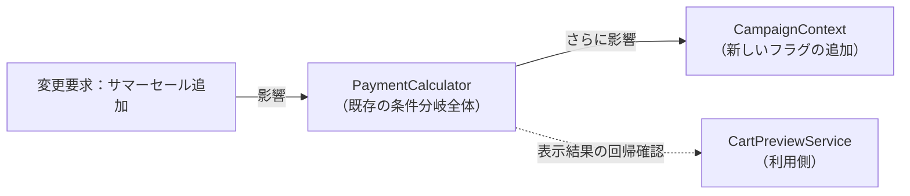

新しいルールを1つ追加するだけで、既存の計算ロジック全体とデータクラスを修正し、同じ計算結果を表示するカートプレビューも回帰確認する必要があります。ここでは、**ソースを修正する場所**と**動作を再確認する場所**を区別します。

### 3-3：痛みの言語化

**1つ目：影響範囲が広いこと。** 変更ID1のサマーセールを追加するために、`CampaignContext`と`PaymentCalculator`を同時に修正し、既存のPremium・キャンペーン割引も回帰確認しました。

**2つ目：既存分岐の解読が必要なこと。** 変更ID2の逐次割引を入れる位置を決めるために、`PaymentCalculator`内の既存キャンペーン条件、Premium条件、計算順序をまとめて読み直す必要がありました。

**3つ目：適用順序・排他条件を壊しやすい。** 先ほどのサマーセール追加で見たように、「キャンペーン後にサマーセールを掛ける」逐次割引や「Premiumは他割引と併用しない」排他条件が、個別の割引計算と同じ `if-else` に埋もれています。新しい割引を差し込むと、既存の適用順序や排他を意図せず崩しやすくなります。

---
> **📌 問題（確定）**
> 変更ID1・変更ID2を適用すると、`PaymentCalculator`と`CampaignContext`を修正し、その計算を使う`CartPreviewService`まで回帰確認する必要があった。割引条件・計算式・入力フラグが計算本体に混在し、一つの確定変更が広い影響確認を強いた。
---

観測した3つの痛みへ`問題ID`を付け、どの変更IDから来たかを対応づけます。

| 問題ID | 観測した痛み（変更途中コード） | 起点の変更ID |
|---|---|---|
| 問題ID1 | サマーセール追加で `PaymentCalculator` と `CampaignContext` を同時修正し、既存割引まで回帰確認した | 変更ID1 |
| 問題ID2 | 逐次割引の差し込み位置を決めるのに、既存の施策条件・会員条件・計算順序を読み直した | 変更ID2 |
| 問題ID3 | 適用順序・排他条件が個別割引と同じ `if-else` に埋もれ、差し込みで既存順序を壊しやすい | 変更ID1 |

フェーズ3「問題特定」で「変更が辛い」ことが確認できました。次のフェーズ4「原因分析」では、なぜ辛いのかを構造的に言語化します。

---

## 🟠 フェーズ4：原因分析 ―― なぜ辛いのかを構造で言語化する
### 4-1：痛みの根源を探る（観察と原因）

フェーズ3「問題特定」で確認した「変更の辛さ」は、コードのどこから来ているのでしょうか。コードを注意深く観察すると、痛みを引き起こしている2つの事実が浮かび上がってきます。

第一に、新しい割引を追加するとき、なぜ毎回 `PaymentCalculator` を開かなければならないのでしょうか？
フェーズ2「仮説立案」で見立てたとおり、現状の PaymentCalculator はこれらすべての割引ルールを自分の責任として持っています。フェーズ3「問題特定」で痛みを確かめた今、その配置の問題がはっきりします。問題は、その責任を**複数の業務機能からの変更要求によって変えなければならない点**です。複数の業務機能の変化が1つのクラスに集中してしまっているため、仕様変更の影響がここに密集してしまうのです。

それは、このクラス自身が「プレミアム会員なら20%引き」「サマーセールなら5%引き」といった**具体的な割引の条件をすべて直接知ってしまっている（抱え込んでいる）**からです。

第二に、なぜ変更の影響範囲が読めず、全テストをやり直す恐怖を感じるのでしょうか？
それは、「商品をループで回して金額を足し合わせる」という土台となる骨格ロジックと、「特定のキャンペーンを判定して割引する」というビジネスロジックが、**同じメソッドの中で物理的に混ざり合っている**からです。

この「症状（痛み）」と「根本原因」を整理すると、以下のようになります。

| **観察した症状（痛み）** | **構造的な原因（痛みの根源）**                                                                                                                    |
| -------------- | ------------------------------------------------------------------------------------------------------------------------------------ |
| 影響範囲が読めない恐怖    | `PaymentCalculator` が各割引の具体的な条件を直接知っているから                                                                                            |
| 検索・解読コストの増大 | 変わる理由が違う2つのもの（「合算ロジック」と「割引条件」）が同じメソッドの中に混在しているから。異なる理由で変わるロジックが分離されず、同じメソッド内に直接書かれているため、割引条件が変わるたびに合算ロジックも含めたメソッド全体を確認する作業が発生する。 |
| 逐次割引の順序を壊しやすい | 「キャンペーン後にサマーセールを掛ける」「Premiumは他割引と併用しない」といった適用順序・排他条件が、個別の割引計算と同じ `if-else` に埋まっているから。 |

### 4-2：今回変える責任/ほかの変更から守る責任

> **「今回守る」と「変わらない」は異なります。** 左列は今回の変更試行とヒアリングで変更理由を確認した責任、右列はその変更に巻き込まず守りたい責任です。将来ずっと変わる／変わらないという分類ではありません。

| **今回変える責任** | **ほかの変更から守る責任** |
|---|---|
| 各キャンペーンの適用条件（サマーセール、ハロウィン等） | 商品単価を順番に足す合算ロジック |
| 割引額の計算方法（パーセント引き・定額引きなど） | 計算を依頼して最終金額を受け取る呼び出し側のフロー |

**【変わる部分（変わり続けるif文と計算）】**

1-4（実装コード）で示した `calculate` メソッドの割引判定ブロックが、キャンペーンのたびに変わる箇所です。フェーズ3「問題特定」でサマーセールを足した後の割引判定を、省略せず全体で示します。

```cpp
        // 割引：会員種別・キャンペーン・サマーセールで割引率を決める
        if (memberType == "Premium") {
            total = total * 80 / 100;              // 20%引き（サマーセール対象外）
        } else if (context.isSummerSale && context.isCampaignActive) {
            total = (total * 90 / 100) * 95 / 100; // 逐次割引（10%引き後に5%引き）
        } else if (context.isSummerSale) {
            total = total * 95 / 100;              // サマーセール5%引き
        } else if (context.isCampaignActive) {
            total = total * 90 / 100;              // キャンペーン10%引き
        }

        // ← 新しいキャンペーンが来るたびに、ここに else if が増え続ける
```

**【今回の変更から守る部分（守りたい骨格）】**

1-4の `PaymentCalculator::calculate(const Order&, const std::string&, const CampaignContext&)` のうち、「商品を順に足して合計を出し、最終金額を返す」という骨格部分は変えたくありません。次のコードのうち、割引判定を挟む前後の小計計算と `return` が守りたい骨格です。

```cpp
        int total = 0;

        for (const auto& item : order.items) {
            total += item.price;             // 小計計算（変えたくない）
        }

        // ← ここに「変わる部分」（割引判定）が割り込んでいる
        return total;                        // 結果を返す（変えたくない）
```

### 4-3：接続点に漏れている判断や前提を確認する

今、`PaymentCalculator`は割引ルールの条件（`memberType == "Premium"`や`isSummerSale`等）を自分の中に抱えています。接続点で見ると、計算の骨格が必要としているのは「合計金額を渡し、割引後の金額を受け取ること」だけです。それにもかかわらず、骨格側が個々の適用条件と割引率まで知っています。

現在の `PaymentCalculator` は、すべての割引ルールを自分自身の中に直接抱え込んでいます。同じ構造の分岐が並んでいること自体が接続点の重要な判断材料なので、1-4（実装コード）のコードを略さずに再掲します。

**【接続点へ割引条件が漏れているコード】**
```cpp
class PaymentCalculator {
public:
    int calculate(const Order& order,
                  const std::string& memberType,
                  const CampaignContext& context) {
        // (1) 小計：商品の単価を全部足す（守りたい骨格）
        int total = 0;

        for (const auto& item : order.items) {
            total += item.price;
        }

        // (2) 割引ルール（具体）を、自分自身で直接判断して処理している
        if (memberType == "Premium") {
            total = total * 80 / 100;   // 適用条件も割引率も骨格側にある
        } else if (memberType == "Regular" && context.isCampaignActive) {
            total = total * 90 / 100;   // 同じ構造の分岐が施策の数だけ並ぶ
        }

        // どちらにも当てはまらなければ割引なし（定価）

        return total;                   // 結果を返す（守りたい骨格）
    }
};
```

新しいキャンペーンが増えるたびに、計算の骨格を持つクラスを開き、`else if`を追加する作業が発生します。割引ルールの適用条件（`memberType == "Premium"` など）と割引率（`* 80 / 100` など）が、接続点を越えて骨格側へ漏れているためです。

決済の合算ロジックと個別の割引ルールは、変わる理由が全く異なります。これらが同じ場所に混在していることが、根本原因として確認できました。

今回着目する接続点は、「合計金額」と「割引後の金額」を受け渡す境界です。個々のキャンペーン条件は、この境界の外へ移せます。

---
> **📌 原因（確定）**
> 割引ルールが「毎月追加される」と確認できているのに、その全種類を`PaymentCalculator`が抱え込んでいる。追加のたびに計算の骨格を開く必要があり、割引担当の変更が注文計算の再テストへ波及する。
---

フェーズ3の問題IDに対応づけて、構造上の原因へ`原因ID`を付けます。次のフェーズ5は、この原因IDから課題IDを導きます。

| 原因ID | 構造上の原因（何が同じ責任へ集まっているか） | 対応する問題ID |
|---|---|---|
| 原因ID1 | 施策選択の流れが、会員種別・施策条件・競合時の適用順序まで抱えている | 問題ID2・問題ID3 |
| 原因ID2 | 金額計算の骨格が、施策ごとの割引計算式まで抱えている | 問題ID1 |

問題ID1の「同時修正」は、選択条件（原因ID1）と計算式（原因ID2）が同じクラスへ同居していることの複合症状です。したがって、次のフェーズでは両方の原因から別々の課題候補を導き、片方だけを直して終わらないようにします。

フェーズ4「原因分析」で根本原因が言語化できました。「どこを分けるか」は明確です。次のフェーズ5「課題定義」では、フェーズ2「仮説立案」で確定した変化の見込みと、フェーズ4「原因分析」で整理した守りたい骨格を振り返りながら、その境界で実際に何が流れているかを値・型のレベルで具体化します。

---

## 🟡 フェーズ5：課題定義 ―― 原因から課題を検討して確定する

フェーズ4「原因分析」で確定した原因から、変えるべき構造を候補として導きます。システム全体で候補の関係を整理した後、解くべき接続点を課題として確定します。

### 5-1：原因から課題候補を洗い出す

| 原因ID・確定した事実 | そのままだと残る痛み | 課題候補 | 候補を導いた理由 |
|---|---|---|---|
| 原因ID1：割引選択の流れが会員種別・施策条件を知る | 施策追加のたびに選択処理へ分岐が増える | 施策ごとの適用条件を選択の流れから分離する | 施策と選択手順は別の理由で変わる |
| 原因ID2：金額計算の骨格が施策ごとの計算式を知る | 式・適用順の変更で小計計算まで再確認する | 施策ごとの計算式を小計計算から分離する | 小計の合算と割引式は別の理由で変わる |

ここで挙げるのは、原因のどの構造を変える必要があるかまでです。それをどのクラスへどう置くかは、課題を確定してからフェーズ6で決めます。

### 5-2：課題候補の重複と依存を整理する

| 課題候補 | 必要性・他候補との関係 | 統合／分割の判断 | 整理結果 |
|---|---|---|---|
| 適用条件の分離 | 必須。変更ID1で選択処理への分岐追加が観測された | 計算式の分離と連携するが変更理由が異なるため独立 | 独立課題として残す |
| 計算式の分離 | 必須。変更ID2で計算骨格と各式の同時修正が観測された | 選択後の共通実行契約として残す | 独立課題として残す |

ここで判定するのは案の採否ではなく、原因から出した候補を統合するか、別の変更理由を持つ課題として残すかです。この章では2候補を別課題として残し、選択結果を計算へ渡す1本の経路で接続します。

変更IDと課題IDは一対一とは限らないため、変更依頼の数に合わせて課題を増減させません。

### 5-3：課題IDと接続点を確定する

整理した候補に課題ID1から欠番なくIDを付けます。

| 課題ID・接続点 | 接続するもの・変わる側 | 守る側 | 完了条件 |
|---|---|---|---|
| 課題ID1：ルール選択と個別条件の境界 | **接続:** 会員種別、施策状態<br/>**変わる側:** 施策ごとの対象条件 | 登録順に条件を問い合わせ、最初に一致した施策を選ぶ流れ | 施策追加時の主な変更先が、対象条件を持つ新ルールと優先順を管理するルール集合になる |
| 課題ID2：割引実行と金額計算の境界 | **接続:** 適用前金額と適用後金額<br/>**変わる側:** 施策ごとの計算式 | 小計計算と結果返却 | 計算側が個別式を知らず、同じ操作で逐次適用できる |

📌 **システム全体の完了状態**：価格計算は個別施策の条件・式を知らず、選ばれた施策を共通操作で順に適用できる。施策の追加・切替は施策部品と組み立て箇所に閉じる。

課題IDを定義できたので、ここまでの追跡を一列で見渡します。3つの痛みは2つの構造原因へ集約し、2つの課題IDへ結びます。

| 問題ID（フェーズ3の痛み） | 原因ID（フェーズ4の構造原因） | 課題ID（達成目標） |
|---|---|---|
| 問題ID2・問題ID3：選択条件と適用順序の解読・破壊 | 原因ID1：選択の流れが施策条件と競合時の順序を抱える | 課題ID1：適用条件をルールへ、競合時の順序を組み立てへ分離 |
| 問題ID1：施策追加で選択と計算を同時修正 | 原因ID2：金額計算の骨格が施策ごとの計算式を抱える | 課題ID2：施策ごとの計算式を小計計算から分離 |

この表と完了状態が、そのままフェーズ6の入力です。要求の受入は要求ID、設計課題の解消は課題ID、今回の変更影響は変更IDで別々に追跡します。
## 🔴 フェーズ6：対策検討 ―― 構想を一つのコード経路へ変える

フェーズ5で確定した全課題を、別々の部品案ではなく、生成から実行まで動く一つの構想としてまとめます。先に主要クラスと接続順を示し、その直後に同じ順でコードを確認します。

### 構想を決める

**【課題の原因】** 課題ID1は、問題ID2・問題ID3（選択条件と適用順序の解読・破壊）＝原因ID1（選択の流れが施策条件と競合時の順序を抱える）。課題ID2は、問題ID1（施策追加で選択と計算を同時修正）＝原因ID2（金額計算の骨格が施策ごとの計算式を抱える）。この2つを分離対象にします。

**この課題（何を解きたいか）：** 施策を1つ足すたびに `if` 連鎖のどこへ挿すかを読み解き、順序を間違えると既存の施策が効かなくなる。そして条件と計算式が同じ枝に書かれているので、片方だけを直すことができない。**施策追加の主な変更先が、対象条件を持つ新ルールと組み立て時の登録になる**ようにするのが課題ID1、**計算側が個別式を知らず、同じ操作で適用できる**ようにするのが課題ID2です。

**このフェーズで決めること：** 施策ごとの対象条件と計算式を共通の選択・計算手順からどう切り離し、何を接続点にして、誰が生成・登録するかをコードで示します。

まず、契約、具体、生成・所有、受け渡し、実行を一枚の構想へまとめます。

| 接続点を変える観点 | システム全体での設計判断 | 変えたくない側が知らなくなる詳細 |
|---|---|---|
| 契約と具体 | 課題ID1の適用条件と課題ID2の計算式を`IDiscountRule`と5つの具体へ置く | 具体条件と計算式 |
| 生成・所有・受け渡し | `DiscountRuleSet`が具体を所有し、競合方針の順で`RuleSelector`へ登録する。`main()`は完成したルール集合から同じSelectorを注文処理とプレビューへ渡す。各入口は選択した`const IDiscountRule&`を計算役へ渡す | 具体クラスの生成方法・登録順・選択結果 |
| 公開入口からの実行 | Selectorは`matches()`、計算側は`apply()`だけを呼ぶ | 条件・式・生成の詳細 |

構想は、起動時の準備と注文時の実行に分けると一望できます。

```text
起動時：main()
  ├─ DiscountRuleSetを生成する
  │   ├─ 5つの具体ルールとRuleSelectorを所有する
  │   └─ 具体ルールを競合方針の順でRuleSelectorへ登録する
  ├─ OrderProcessorへRuleSelectorを渡す
  └─ CartPreviewServiceへ同じRuleSelectorを渡す

注文時：OrderProcessor::process()
  ├─ RuleSelectorが登録済みルールから1つを選ぶ
  ├─ 選択したルールを渡してPaymentCalculatorを生成する
  └─ calculate()が契約を通して選択済みルールのapply()を呼ぶ
```

この経路が成立するには、契約だけでなく、具体を選ぶ方法、実体の生成・所有、利用側へ渡す行、公開入口からの呼び出しが同時に必要です。以下では、この構想を分断せず、コードの依存順に続けて確認します。

### 構想をコードでつなぐ

> **コードの読み方：** 「契約→具体→生成・選択・受け渡し→公開入口からの実行」の順に読みます。変更前の抜粋は境界を引く根拠、変更後の断片は構想を成立させるコードです。断片はフェーズ7「解決後のコード」でクラス単位の全文へ統合します。

#### 契約：境界の形と受け渡しを決める

**この章では、境界をクラス契約で表します。** 割引の `if` 連鎖自体は1か所ですが、変更要求で枝の追加と並べ替えが実際に起き、2-4（ヒアリングで判明した将来リスク）では新しい割引が毎月増えると確認できています。関数へ切り出すだけでは、その関数の中に同じ条件連鎖と順序依存が残ります。複数の施策へ同じ問いを投げ、条件と式を施策単位で追加できる形が必要なので、共通のクラス契約まで進みます。

分けると決めたので、コードに線を引きます。

**変更前から抜き出す箇所：`PaymentCalculator::calculate(const Order&, const string&, const CampaignContext&)`** ―― 3-1（変更を試みる）で変更要求を当てた後の割引判定部分（対策前）

```cpp
// サマーセール対応：Regular会員向けに条件を追加
if (memberType == "Premium") {                        // ← 出て行く側（対象条件）
    total = total * 80 / 100;                         // ← 出て行く側（計算式）
} else if (context.isSummerSale && context.isCampaignActive) {
    total = (total * 90 / 100) * 95 / 100;            // 逐次割引（Regular会員）
} else if (context.isSummerSale) {
    total = total * 95 / 100;
} else if (context.isCampaignActive) {
    total = total * 90 / 100;
}
```

**割り方の根拠は、施策が増えたときに触るかどうかです。** 施策を1つ足すと枝が1本増えます。**小計を求めることと、結果を返すことは1行も増えません。**

**出て行く側が2種類あることに注意してください。** 1つは `if` の**条件**（誰に当てはまるか）、もう1つは `total = ...` の**式**（いくら引くか）です。5-3（課題IDと接続点を確定する）が課題を2つに分けたのは、この2つが別の理由で変わるからです。

**課題ID1（選択軸）。まず条件のほうを決めます。**

**5-3が挙げた接続値は2つです。** 会員種別と施策状態を、1つずつ形にします。競合時の適用順序はルール内部の値ではなく、システム全体の方針として組み立て側へ置きます。

| 接続するもの（5-3の候補） | 決めた形 | そう決めた理由 |
|---|---|---|
| 会員種別 | **引数で渡す** | 判定するのは施策の側だが、値を持っているのは顧客照合の側。持っていない側が判定するには渡すしかない |
| 施策状態 | **引数で渡す** | 同上。キャンペーン中かサマーセール中かは、施策ではなくシステムの状態 |

3-1で痛かったのは、枝の**順序が計算処理の内部に隠れていたこと**でした。ただし、複数の条件が同時に成立する以上、どれを採るかという方針そのものは消せません。これを各ルールの数値へ分散すると、新しいルールが既存ルールの数値を知らなければ追加できなくなります。そこで、各ルールは自分の適用条件だけを答え、`DiscountRuleSet` が「上から最初に一致したものを採る」登録順を明示します。個別ルール同士も`main()`も優先関係を知らず、全体の競合方針だけがルール集合へ集まります。

**課題ID2（計算軸）。次に式のほうを決めます。**

**5-3が挙げた候補は2つです。** 適用前金額と、適用後金額。

| 接続するもの（5-3の候補） | 決めた形 | そう決めた理由 |
|---|---|---|
| 適用前金額 | **引数で渡す** | 小計を求めるのは守る範囲。施策が注文の中身を見に行くと、小計計算が施策の数だけ散る |
| 適用後金額 | **戻り値で返す** | 変更前も `total` を書き換えて次へ渡していた。呼び出し側が実際に消費していたのは、この1つの数値だけ |

**候補2つが、そのまま2つとも境界を流れます。** 課題ID1では3つのうち1つが形を変えましたが、こちらは変わりません。**候補の数と実数が一致する課題も、しない課題もあります。**

**戻り値を「金額1つ」と決めてよい根拠は、変更前のコードにあります。** 3-1の `if` 連鎖は、どの枝も `total` を書き換えるだけでした。表示もしていなければ、理由も返していません。**将来こう使うだろうという見込みではなく、変更前が実際に消費していたものを、そのまま契約の戻り値にしています。**

**契約の名前を決めます。** 割引の施策が満たすべき約束なので `IDiscountRule` とします。表示用の名前を返す操作も添えます。要求ID5が「適用した割引名を表示する」ことを求めていて、その名前を知っているのは施策の側だけだからです。

**ここで確認するコード：`IDiscountRule`（クラス全体）**

```cpp
class IDiscountRule {
public:
    virtual bool matches(const std::string& memberType,
                         const CampaignContext& context) const = 0;
    virtual int apply(int total) const = 0;
    virtual std::string name() const = 0;
    virtual ~IDiscountRule() = default;
};
```

**3操作のうち、1つが課題ID1、1つが課題ID2、1つが守る範囲のためです。** `matches()` が選択、`apply()` が計算、`name()` が要求ID5の購入結果表示に使われます。`name()` はログのために追加した操作ではありません。**2つの課題が1つの契約に同居しています。** 分ける単位（施策）が同じだからです。

**契約だけでは、決めた形が本当に成立するのか確かめられません。** 実装を1つ見ます。

**ここで確認するコード：`PremiumDiscount`（クラス全体）** ―― プレミアム会員向け

```cpp
class PremiumDiscount : public IDiscountRule {
public:
    bool matches(const std::string& memberType,
                 const CampaignContext&) const override {
        return memberType == "Premium";
    }

    int apply(int total) const override { return total * 80 / 100; }
    std::string name() const override { return "Premium会員割引"; }
};
```

- **「会員種別を引数で渡す」の実態。** `memberType` を受け取って比較しています。**渡さなければ、この施策は自分が対象かどうかを答えられません**
- **「施策状態を引数で渡す」の実態。** 第2引数を受け取っていますが、**この施策は使いません。** 仮引数の名前が無いのはそのためです。プレミアム会員はキャンペーンと無関係だからです
- **「金額1つを返す」の実態。** `apply()` は `total * 80 / 100` を返すだけで、表示も保存もしていません

**3-1の1本目の枝が、条件と式に分かれて、1つのクラスに収まりました。** 変更前は `if (memberType == "Premium") { total = total * 80 / 100; }` という1つの塊でしたが、条件は `matches()`、式は `apply()` になっています。**同じクラスの中にあるので離れていませんが、別々に直せます。**


**では、この契約を誰が呼ぶのか。**

---

#### 具体：契約の裏へ変わる判断を置く

契約の形を決め、代表実装で引数・戻り値が成立することを確認しました。ここでは、もう1つの具体を見て、変わる判断が契約の裏へ閉じることを確かめます。

**直前の契約コードで見た `PremiumDiscount` の疑問が、ここで解けます。** 施策が `total` を直接書き換えないのは、書き換えるのが分離で確定した骨格の仕事だからです。契約の裏に置くのは「自分は誰に当てはまるか」「いくら引くか」「何という名前か」の3つだけで、それ以外は書きません。

**入力側も、同じ理由で形を変えます。** 課題ID1（選択条件）は「施策が増えても選択側を変えない」ことを完了条件にしています。ところが `CampaignContext` が `isCampaignActive`・`isSummerSale` のようにフラグを並べる形のままだと、施策を1つ足すたびにメンバが1つ増え、その型を引数に取る `matches()` の宣言まで巻き込まれます。分岐を契約の裏へ移しても、**入力の形が施策の数を知っている**かぎり、課題ID1は解けません。そこで施策を名前（`CampaignCode`）で持ち、`activate()` で登録して `isActive()` で問い合わせる形にします。施策が増えても増えるのは登録の行数だけで、型は変わりません。

残りの4クラスも同じ形です。ここでは `PremiumDiscount` と対照的なものを1つ見ます。

**ここで確認するコード：`SummerSaleAndCampaignDiscount`（クラス全体）** ―― 変更要求で生まれた逐次割引

```cpp
class SummerSaleAndCampaignDiscount : public IDiscountRule {
public:
    bool matches(const std::string& memberType,
                 const CampaignContext& context) const override {
        return memberType == "Regular"
            && context.isActive(CampaignCode::SummerSale)
            && context.isActive(CampaignCode::RegularCampaign);
    }

    int apply(int total) const override {
        return (total * 90 / 100) * 95 / 100;
    }

    std::string name() const override { return "サマーセール＋キャンペーン"; }
};
```

**条件が3つ重なっています。** 一般会員で、サマーセール中で、かつキャンペーン中です。このクラスだけを読めば、自分が対象かどうかを判断できます。

**3-1の2本目の枝が、そのままここへ来ました。** 変更前は `else if (context.isSummerSale && context.isCampaignActive)` という枝で、**上に `Premium` の枝があるおかげで**一般会員に限られていました。いまは `memberType == "Regular"` と自分で書いています。**枝の位置に頼っていた条件が、明示されました。**

変更前は、条件の一部が「どこに書かれているか」に隠れていました。読むには上の枝を全部読む必要があります。**いまは1クラスを読めば、その施策が当てはまる条件が全部書いてあります。** 複数ルールが一致したときの全体方針だけは、組み立て側の登録一覧で上から読めます。

5クラスを並べると、3-1の `if` 連鎖がそのままクラスの一覧になります。

| 登録順 | 施策クラス | 当てはまる条件 | 3-1での対応箇所 |
|---|---|---|---|
| 1 | `PremiumDiscount` | プレミアム会員 | 1本目の枝 |
| 2 | `SummerSaleAndCampaignDiscount` | 一般・サマーセール・キャンペーン | 2本目の枝（変更要求で追加） |
| 3 | `SummerSaleDiscount` | 一般・サマーセール | 3本目の枝（変更要求で追加） |
| 4 | `CampaignDiscount` | 一般・キャンペーン | 4本目の枝 |
| 5 | `NoDiscount` | いつでも（何も引かない） | どの枝にも入らなかった場合 |

**`NoDiscount` は、3-1では枝ですらありませんでした。** どの `else if` にも当てはまらなかったときに、何もせず抜けていました。**いまは「割引なし」という施策が1つあります。** そうしないと、選ぶ側が「見つからなかった場合」を毎回書くことになります。

各具体クラスの役割は、適用条件・計算式・表示名の3点です。競合時の順序や画面表示まで持たせないことで、施策固有の知識だけに限定します。

**守る範囲との照合：** 4つのどれにも触っていません。施策の中身を5クラスへ移しただけで、小計計算も選ぶ流れも結果返却も顧客照合も変えていません。

**境界の契約と具体をコードで確認できました。** 次は、構想で仮置きした生成・所有・受け渡しを、実コードとして確定します。

---

#### 生成・所有・受け渡しを決める

契約と具体がコードで確認できたので、構想で仮置きした生成・所有・受け渡しを実コードで確かめます。生成しただけで止めず、同じ実体が公開入口から使われる直前までをつなぎます。

ここでは、契約と具体で決めた役割を、**起動時**と**注文時**の二つの時間帯で組み立てます。「生成」「登録」「選択」「注入」「実行」を独立した設計段階として並べるのではなく、同じ実体が次の処理へどう渡るかを追います。

##### 起動時：ルール集合を生成し、Selectorを利用側へ渡す

`RuleSelector` は具体ルールを所有しません。`DiscountRuleSet` が所有する実体への参照を、登録された順で保持します。どのルールをどの順に積むかは`DiscountRuleSet`、同じ問いを順に投げる処理は`RuleSelector`の責任です。

**ここで確認するコード：`RuleSelector`（クラス宣言・完成）**

```cpp
class RuleSelector {
private:
    std::vector<std::reference_wrapper<const IDiscountRule>> rules;
public:
    void add(const IDiscountRule& rule) {
        rules.push_back(std::cref(rule));
    }

    const IDiscountRule& select(const std::string& memberType,
                                const CampaignContext& context) const;
};
```

C++の`vector`には参照を直接入れられないため、`reference_wrapper`で包みます。ここで保持するのはコピーでも所有ポインタでもなく、`DiscountRuleSet`にある実体への借用参照です。

優先順を知るクラスを次に示します。具体ルールのメンバー宣言が**所有関係**、コンストラクタ内の`add()`が**優先順の登録**です。この後に示す`DiscountRuleSet discountRules;`を実行すると、C++がこれらのメンバー実体を生成します。

**ここで確認するコード：`DiscountRuleSet`（クラス全体）** ―― 具体ルールの所有と優先順の登録

```cpp
class DiscountRuleSet {
private:
    PremiumDiscount premium;
    SummerSaleAndCampaignDiscount summerAndCampaign;
    SummerSaleDiscount summer;
    CampaignDiscount campaign;
    NoDiscount none;
    RuleSelector ruleSelector;
public:
    DiscountRuleSet() {
        ruleSelector.add(premium);           // Premiumは他施策と併用しない
        ruleSelector.add(summerAndCampaign); // 複合条件を単独条件より先にする
        ruleSelector.add(summer);
        ruleSelector.add(campaign);
        ruleSelector.add(none);              // 必ず一致するため最後にする
    }

    const RuleSelector& selector() const {
        return ruleSelector;
    }
};
```

`DiscountRuleSet`の構築時に、メンバーは宣言順で生成されます。5つの具体ルールが先に存在し、その後でコンストラクタが参照を`ruleSelector`へ登録します。優先関係を変更するときに読む場所も、このコンストラクタの一覧へ定まります。

次が、起動時の組み立て全体です。`main()`は個々のルール名や登録順を扱わず、完成したルール集合を利用側へ接続します。

**ここで確認するコード：`main()`** ―― ルール集合の生成とSelectorの注入

```cpp
    DiscountRuleSet discountRules;

    OrderProcessor processor(db, renderer, discountRules.selector());
    CartPreviewService preview(db, discountRules.selector());
```

この二つのクラスを続けて読むと、処理の意味が三つに分かれます。

- `DiscountRuleSet discountRules;`がルール集合を**生成**し、5つの具体ルールはそのメンバーとして同時に生成・所有されます。
- `DiscountRuleSet`の`ruleSelector.add(...)`が、生成済み実体への参照の**優先順登録**を表します。
- `OrderProcessor(..., discountRules.selector())`と`CartPreviewService(..., discountRules.selector())`が、同じSelectorへの参照の**注入**を表します。

`DiscountRuleSet`、Processor、Previewの順で生成され、借りる側が先に破棄されるため、参照が宙に浮きません。競合時の方針は`DiscountRuleSet`内の`add()`の順に一か所で見え、`main()`はその方針から独立します。

##### 注文時：生成済みルールを選び、Calculatorへ渡す

注文時は、起動時に生成・登録した具体ルールを利用します。会員種別と施策状態を入力として、登録済み実体の中から1つへの参照を取得します。

**ここで確認するコード：`OrderProcessor::process(const Order&, const CampaignContext&)`** ―― 選択からCalculatorの実行まで

```cpp
        const CustomerInfo customer = db.get(order.customerId);
        const IDiscountRule& rule =
            selector.select(customer.memberType, context);
        PaymentCalculator calculator(rule);
        PaymentResult result = calculator.calculate(order);
        renderer.showOrderResult(customer, order, context, result);
```

この5行は、次の順で読みます。

1. `db.get()`が、選択に使う会員種別を取得する。
2. `selector.select()`が、生成・登録済みのルールから1つを**選択**する。
3. `PaymentCalculator calculator(rule)`がCalculatorを生成し、同時に選択済みルールへの参照を**注入**する。
4. `calculate()`が注入されたルールを使って計算する。
5. 戻った結果を既存の表示境界へ渡す。

`select()`自身は注入ではありません。選択した参照を受け取る行です。実際にCalculatorへ渡しているのは、その直後のコンストラクタです。また、この行で生成しているのは`PaymentCalculator`であり、具体ルールではありません。

#### 実行骨格：組み立てた実体を契約から呼ぶ

前節のコードで、登録済みルールの並びと、選択済みルールを受け取る`PaymentCalculator`までつながりました。ここで守る手順は二つだけです。

- `RuleSelector`は登録順に`matches()`を呼び、最初に一致した契約を返す。
- `PaymentCalculator`は小計を求め、受け取った契約の`apply()`と`name()`を呼ぶ。

新しい施策を足しても、この二つの手順は変わりません。変わるのは具体ルールと`DiscountRuleSet`の所有・登録一覧です。これで、前節の生成・登録・選択・注入が、具体名を知らない実行手順へ接続できています。

#### 公開入口から具体の実行まで追う

次は、公開入口へ入った要求が、直前に組み立てた同じ実体へ届き、契約を通って具体処理が呼ばれるまでをコードの呼び出し順で追います。

##### Calculatorから選択済みルールを呼ぶ

Calculatorは、渡された実体の具体クラス名を知りません。小計を求めた後、契約にある`apply()`だけを呼びます。

**ここで確認するコード：`PaymentCalculator::calculate(const Order&)`** ―― 小計から具体ルールの実行まで

```cpp
        int subtotal = 0;

        for (const auto& item : order.items) subtotal += item.price;
        const int finalPrice = rule.apply(subtotal);

        return {subtotal, finalPrice, rule.name()};
```

ここで`rule`が指すのは、`DiscountRuleSet`が生成・登録し、注文時にSelectorが選択した実体です。`calculate()`は選択結果を契約として受け取り、`apply()`を呼びます。

**守る範囲との照合：** 顧客照合、小計計算、結果返却、公開入口`process()`の形は維持しています。変えたのは、個別条件と計算式の置き場、および起動時にそれらを組み立てる経路です。生成・登録・選択・受け渡し・実行の各操作は、ここまでに示したコードブロックで途切れずにつながっています。

### 構想を採用する

ここまでの構想表と要点コードを合わせると、責任配置と実行経路が一つにつながります。5つの施策が `IDiscountRule` を実装し、`RuleSelector` が登録順に条件を問い、最初に一致した1つを `PaymentCalculator` へ渡します。

**この章の完成構造は一つに定まります。** 選ぶことと計算することを1つのクラスにまとめる案も置けますが、それは課題ID1と課題ID2を別々に変えられない形で、5-2（課題候補の重複と依存を整理する）で「変更理由が異なるため独立」と判断したことに反します。責任配置が異なる完成構造が複数残ったわけではないので、当て馬を並べた比較は行いません。

完成クラス図は、構想を実装した結果としてフェーズ7「対策実施」に示します。対策検討の結論は、課題との対応と将来リスクへの備えを表で確定します。

#### 課題から採用構想までを照合する

ここまでの決定を、課題ID1→課題ID2の順に一望へまとめます。この表は設計課題だけを追います。変更要求の受入はフェーズ7の要求ID表、変更影響は7-4（変更シナリオ表）の変更ID表で別に確認します。

| 課題ID | 採用構造と生成・接続場所 | 完成コードの主な場所 | 確認 |
|---|---|---|---|
| 課題ID1（選択条件） | ルール差し替え。`DiscountRuleSet`が各ルールを所有して競合方針の順で登録し、`RuleSelector`が最初の一致を選ぶ | `IDiscountRule::matches()`、`PremiumDiscount`／`CampaignDiscount`／`SummerSaleDiscount`／`SummerSaleAndCampaignDiscount`／`NoDiscount`、`DiscountRuleSet`、`RuleSelector` | 施策追加が新ルールとルール集合の登録に閉じ、選択側と`main()`が具体条件・優先順を持たない |
| 課題ID2（計算式） | ルール差し替え。骨格は契約`apply()`だけを呼ぶ | `IDiscountRule::apply()`、`PaymentCalculator` | 計算側が個別式を知らず、同じ操作で逐次適用できる |
| 変更対象外 | 会員情報の取得。骨格はそのまま利用する | `CustomerDatabase` | 1-4、登録・未登録の既存動作 |
| 境界を動かさない | 購入結果の表示。1-5のとおり要求ID5の受入条件が変わるため`showOrderResult()`の引数は変わるが、結果を渡す相手と場所は変えない | `CheckoutResultRenderer` | 7-1の正常・エラー出力 |

#### 将来リスクに対して構想を確認する

フェーズ2のリスクIDを採用構造へ再適用し、現在の境界で何を守れ、どこに弱点が残るかを評価します。

| リスクID・将来リスク | 現在の構造による備え | リスク発生時の変更先 | 守れる範囲・残る弱点 |
|---|---|---|---|
| リスクID1：新しい割引ルールの追加が毎月続く | 割引ごとの差分をIDiscountRule実装として追加し、選択と計算の共通経路から分ける | 新しいRule、`DiscountRuleSet`の所有・登録一覧 | OrderProcessorと`main()`を守り、追加を新Ruleとルール集合へ限定できる。ルール間優先順位が複雑化した場合はルール集合の競合規則が追加課題になる |
| リスクID2：計算方法が「パーセント引き」から「定額引き」に変わる | 条件と計算式を同じ具体Ruleへ置き、金額を返す契約を維持する | 対象Ruleのmatches()とapply() | 計算経路を守り、式の変更を対象Ruleへ閉じられる。複数Rule併用へ変わる場合は単一選択の契約を見直す必要がある |

リスクID1・リスクID2は、採用構造を評価する根拠の一部です。ただし今回実装する機能は変更後要求ベースラインの要求IDで確定した範囲だけであり、リスクIDは構造が将来の変化を局所化できるかの評価に使います。

## 🟢 フェーズ7：対策実施 ―― 変化に強いコードを完成させる
### 7-1：解決後のコード（全体）

フェーズ6で確定・実装した採用構造を、実行可能な完全なコードとして組み上げます。

#### 完成後のクラス一覧

完成コードで定義する型を先に一覧化します。各型の依存方向と実現関係は、直後のクラス図で確認します。

- `Item`、`Order`、`CampaignContext`、`CustomerInfo`
- `CustomerDatabase`、`CheckoutResultRenderer`、`OrderProcessor`、`PaymentResult`
- `PaymentCalculator`、`CartPreviewService`、`IDiscountRule`、`RuleSelector`、`DiscountRuleSet`
- `PremiumDiscount`、`CampaignDiscount`、`SummerSaleDiscount`、`SummerSaleAndCampaignDiscount`
- `NoDiscount`

#### 完成後のクラス図

フェーズ6で確定したクラス・操作・関係線を完成図にします。`PaymentCalculator` と `CartPreviewService` が計算を依頼する利用側、`IDiscountRule` が差し替え可能なルール契約、各割引クラスがその具象ルールに対応します。`DiscountRuleSet` は具体ルールを所有して競合方針の順に登録し、`RuleSelector` は具体条件を知らずに登録ルールを選びます。

```mermaid
classDiagram
    direction TB
    class Item
    class Order
    class CampaignContext {
        -vector~string~ activeCampaigns
        +activate(code)
        +isActive(code) bool
    }
    class CustomerInfo
    class CustomerDatabase
    class CheckoutResultRenderer
    class OrderProcessor {
        -CustomerDatabase& db
        -RuleSelector& selector
        +process(Order, CampaignContext)
    }
    class PaymentResult
    class PaymentCalculator {
        -IDiscountRule& rule
        +calculate(Order) PaymentResult
    }
    class CartPreviewService {
        -CustomerDatabase& db
        -RuleSelector& selector
        +getEstimatedTotal(Order, CampaignContext) PaymentResult
    }
    class IDiscountRule {
        <<interface>>
        +matches(memberType, context) bool
        +apply(total) int
        +name() string
    }
    class RuleSelector {
        +add(rule)
        +select(memberType, context) IDiscountRule
    }
    class DiscountRuleSet {
        -RuleSelector ruleSelector
        +selector() RuleSelector
    }
    class PremiumDiscount
    class CampaignDiscount
    class SummerSaleDiscount
    class SummerSaleAndCampaignDiscount
    class NoDiscount

    Order o--> Item
    CustomerDatabase o--> CustomerInfo
    OrderProcessor --> CustomerDatabase : 使う
    OrderProcessor --> RuleSelector : 選ぶ
    OrderProcessor --> PaymentCalculator : 組み立てる
    OrderProcessor --> CheckoutResultRenderer : 使う
    CartPreviewService --> CustomerDatabase : 使う
    CartPreviewService --> RuleSelector : 選ぶ
    CartPreviewService --> PaymentCalculator : 組み立てる
    PaymentCalculator --> IDiscountRule : 使う
    PaymentCalculator ..> Order : 参照する
    PaymentCalculator ..> PaymentResult : 返す
    CartPreviewService ..> Order : 参照する
    CartPreviewService ..> CampaignContext : 参照する
    CartPreviewService ..> PaymentResult : 返す
    RuleSelector o--> IDiscountRule : 登録する
    RuleSelector ..> CampaignContext : 参照する
    DiscountRuleSet *--> RuleSelector : 所有する
    DiscountRuleSet *--> PremiumDiscount : 所有する
    DiscountRuleSet *--> CampaignDiscount : 所有する
    DiscountRuleSet *--> SummerSaleDiscount : 所有する
    DiscountRuleSet *--> SummerSaleAndCampaignDiscount : 所有する
    DiscountRuleSet *--> NoDiscount : 所有する
    IDiscountRule <|.. PremiumDiscount
    IDiscountRule <|.. CampaignDiscount
    IDiscountRule <|.. SummerSaleDiscount
    IDiscountRule <|.. SummerSaleAndCampaignDiscount
    IDiscountRule <|.. NoDiscount

    note for PaymentCalculator "【課題ID2・残した】小計計算<br/>具体的な式を知らない"
    note for OrderProcessor "注文確定を処理し<br/>選択したルールで計算役を生成"
    note for CartPreviewService "注文確定とは別の入口<br/>同じDB・Selectorを使う"
    note for IDiscountRule "【課題ID1】matches条件<br/>【課題ID2】apply計算"
    note for RuleSelector "【課題ID1・新設】登録順にmatchesを評価し<br/>最初の一致を選ぶ"
    note for DiscountRuleSet "【課題ID1・新設】具体ルールを所有し<br/>競合方針の順で登録する"
    note for PremiumDiscount "【課題ID1】Premium条件<br/>【課題ID2】20%引き"

    classDef focus fill:#FFF2CC,stroke:#D6B656,stroke-width:2px,color:#222222
    cssClass "OrderProcessor,PaymentCalculator,IDiscountRule,RuleSelector,DiscountRuleSet,PremiumDiscount,CampaignDiscount,SummerSaleDiscount,SummerSaleAndCampaignDiscount,NoDiscount" focus
```

現状では、割引条件と計算式が `PaymentCalculator` の内部に集まっていました。完成後は、計算を依頼する2つの利用側が同じルール契約を参照し、適用条件と計算式は各具象ルールへ移っています。競合方針は`DiscountRuleSet`、固定の選択手順は`RuleSelector`へ分かれ、`main()`にもSelectorにも施策固有の条件分岐はありません。

#### 完成後の実行シーケンス

フェーズ6で採用した構造について、起動時の生成・注入から注文時の実行までを可視化します。`main()` は`DiscountRuleSet`から同じSelectorを受け取り、注文確定とプレビューへ注入します。実行時は、どちらも同じDB・Selector・計算規則を使います。

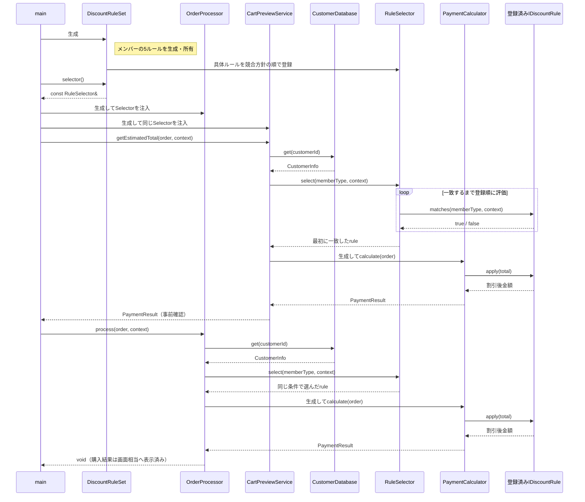

#### 完成コード

クラスを1つずつ、上から順に読みます。**メンバー変数と、それを使う処理を同じ場所で見られるように**しています。1-4（実装コード）と同じ顔ぶれが並ぶので、どこが変わったかを見比べてください。

`main()` と実行結果は最後に、シナリオごとに並べます。上から順に連結すれば、そのまま1つのC++14プログラムとして動きます。

---

**共通ヘッダーと値の型**

会員種別・キャンペーンコードを名前で扱う `MemberType`／`CampaignCode`、値クラス `Item`、施策状態を持つ `CampaignContext`、注文の `Order` です。どのクラスにも属さない宣言で、以降のすべてのクラスが使います。

```cpp
#include <iostream>
#include <string>
#include <vector>
#include <functional>
#include <map>
#include <stdexcept>

// 会員種別（ルール判定で使う直文字列を名前へ置き換える）
namespace MemberType {
    const std::string Premium = "Premium";
    const std::string Regular = "Regular";
}

namespace CampaignCode {
    const std::string RegularCampaign = "REGULAR_CAMPAIGN";
    const std::string SummerSale = "SUMMER_SALE";
}
```

**Item**

このブロックでは `Item` の定義だけを確認します。

```cpp
class Item {
public:
    std::string name;
    int price;
    Item(std::string n, int p) : name(n), price(p) {}
};
```

**CampaignContext**

このブロックでは `CampaignContext` の定義だけを確認します。

```cpp
class CampaignContext {
private:
    std::vector<std::string> activeCampaigns;
public:
    void activate(const std::string& code) {
        activeCampaigns.push_back(code);
    }

    bool isActive(const std::string& code) const {
        for (const auto& active : activeCampaigns) {
            if (active == code) return true;
        }

        return false;
    }
};
```

**Order**

このブロックでは `Order` の定義だけを確認します。

```cpp
class Order {
public:
    std::string customerId;
    std::vector<Item> items;
};
```

`MemberType` は会員種別を名前付き定数へまとめたものです。各割引ルールの `matches()` はこの定数で判定し、直文字列の打ち間違いを防ぎます。**`CampaignContext` は実行時に有効な施策コードだけを持ちます。** 3-1（変更を試みる）で足した `isSummerSale` のような施策ごとの `bool` フィールドは、もう増えません。

---

**CustomerInfo と CustomerDatabase と PaymentResult**

```cpp
struct CustomerInfo {
    std::string name;
    std::string memberType;
};
```

**CustomerDatabase**

このブロックでは `CustomerDatabase` の定義だけを確認します。

```cpp
class CustomerDatabase {
private:
    std::map<std::string, CustomerInfo> records;
public:
    CustomerDatabase() {
        records["C001"] = {"田中 一郎", "Premium"};
        records["C002"] = {"佐藤 花子", "Regular"};
        records["C003"] = {"鈴木 次郎", "Regular"};
    }

    bool exists(const std::string& id) const { return records.count(id) > 0; }
    CustomerInfo get(const std::string& id) const { return records.at(id); }
};
```

**PaymentResult**

このブロックでは `PaymentResult` の定義だけを確認します。

```cpp
// 割引ルールの共通インターフェース（ルール差し替え構造）
// 支払計算の結果オブジェクト：小計・適用ルール名・支払金額
struct PaymentResult {
    int subtotal;
    int finalPrice;
    std::string appliedRule;
};
```

`CustomerInfo` と `CustomerDatabase` は1-4と同じです。`PaymentResult` は、金額だけの `int` をやめて小計・適用ルール名・支払金額をまとめた結果オブジェクトです。

---

**IDiscountRule**

割引ルールの共通契約です。

```cpp
class IDiscountRule {
public:
    virtual bool matches(const std::string& memberType,
                         const CampaignContext& context) const = 0;
    virtual int apply(int total) const = 0;
    virtual std::string name() const = 0;
    virtual ~IDiscountRule() = default;
};
```

`matches()` は適用条件、`apply()` は計算式、`name()` は要求ID5の購入結果表示名を表します。**条件と式を施策単位で差し替える接続点です。**

---

**NoDiscount と PremiumDiscount と SummerSaleAndCampaignDiscount**

契約を満たす具体的な割引クラスです。割引計算の追加・変更は主にこのクラス群へ閉じ、利用するルールの選択は組み立て箇所で行います。

```cpp
class NoDiscount : public IDiscountRule {
public:
    bool matches(const std::string&,
                 const CampaignContext&) const override {
        return true;
    }

    int apply(int total) const override { return total; }
    std::string name() const override { return "割引なし"; }
};
```

**PremiumDiscount**

このブロックでは `PremiumDiscount` の定義だけを確認します。

```cpp
class PremiumDiscount : public IDiscountRule {
public:
    bool matches(const std::string& memberType,
                 const CampaignContext&) const override {
        return memberType == MemberType::Premium;
    }

    int apply(int total) const override {
        return total * 80 / 100;
    }

    std::string name() const override { return "プレミアム割引"; }
};
```

**SummerSaleAndCampaignDiscount**

このブロックでは `SummerSaleAndCampaignDiscount` の定義だけを確認します。

```cpp
class SummerSaleAndCampaignDiscount : public IDiscountRule {
public:
    bool matches(const std::string& memberType,
                 const CampaignContext& context) const override {
        return memberType == MemberType::Regular
            && context.isActive(CampaignCode::SummerSale)
            && context.isActive(CampaignCode::RegularCampaign);
    }

    int apply(int total) const override {
        return (total * 90 / 100) * 95 / 100;
    }

    std::string name() const override {
        return "サマーセール+キャンペーン";
    }
};
```

---

**SummerSaleDiscount と CampaignDiscount**

```cpp
class SummerSaleDiscount : public IDiscountRule {
public:
    bool matches(const std::string& memberType,
                 const CampaignContext& context) const override {
        return memberType == MemberType::Regular
            && context.isActive(CampaignCode::SummerSale);
    }

    int apply(int total) const override {
        return total * 95 / 100;
    }

    std::string name() const override { return "サマーセール割引"; }
};
```

**CampaignDiscount**

このブロックでは `CampaignDiscount` の定義だけを確認します。

```cpp
class CampaignDiscount : public IDiscountRule {
public:
    bool matches(const std::string& memberType,
                 const CampaignContext& context) const override {
        return memberType == MemberType::Regular
            && context.isActive(CampaignCode::RegularCampaign);
    }

    int apply(int total) const override {
        return total * 90 / 100;
    }

    std::string name() const override { return "キャンペーン割引"; }
};
```

- 各割引が `IDiscountRule` を実装した独立クラスです。適用条件と計算式（`* 80 / 100` など）は、同じ施策クラスの中にあります。
- 逐次割引は `SummerSaleAndCampaignDiscount` という1つのルールとして表します（フェーズ5の方針）。
- Premium以外のルールは `memberType == "Regular"` も自分で確認します。登録順だけに排他条件を隠さず、ルール単体でも適用条件を読めるようにするためです。
- `NoDiscount` は「割引なし」を表し、必ず一致して定価を返します。`DiscountRuleSet`の登録一覧の最後へ置くため、他のどのルールも一致しないときだけ選ばれ、Selectorがルール未選択になりません。
- `name()` は要求ID5の購入結果へ適用割引名を表示するために実装します。選択や計算だけが要件なら不要ですが、本章では表示要求に追跡できるため契約に含めます。

---

**PaymentCalculator**

計算を行う本体クラスです。具体的な割引ルールを知らず、契約を通じて計算を委譲します。

```cpp
class PaymentCalculator {
private:
    const IDiscountRule& rule;
public:
    explicit PaymentCalculator(const IDiscountRule& r) : rule(r) {}

    PaymentResult calculate(const Order& order) {
        int subtotal = 0;

        for (const auto& item : order.items) subtotal += item.price;
        PaymentResult result;
        result.subtotal = subtotal;
        result.finalPrice = rule.apply(subtotal);
        result.appliedRule = rule.name();

        return result;
    }
};
```

- `PaymentCalculator` は具体的な割引を知らず、受け取った `rule` の `apply()` に計算を委ねます。割引を選ぶ `if` はありません。
- 戻り値は金額だけの `int` ではなく、小計・適用したルール名・支払金額をまとめた `PaymentResult`（結果オブジェクト）です。会員種別やキャンペーンによって「どの割引が効いたか」を、金額とあわせて呼び出し側へ返せます。

---

**RuleSelector**

組み立て側から登録されたルールへ同じ `matches()` を順に問い、最初に一致したものを返します。具体的な条件やクラス名は知りません。

```cpp
class RuleSelector {
private:
    std::vector<std::reference_wrapper<const IDiscountRule>> rules;
public:
    void add(const IDiscountRule& rule) {
        rules.push_back(std::cref(rule));
    }

    const IDiscountRule& select(
            const std::string& memberType,
            const CampaignContext& context) const {
        // 競合方針は組み立て側の登録順で表す。
        // Selectorは個別条件を知らず、最初に一致したものを返す。
        for (const auto& registered : rules) {
            const IDiscountRule& rule = registered.get();

            if (rule.matches(memberType, context)) return rule;
        }

        throw std::logic_error("適用可能な割引ルールがありません");
    }
};
```

---

**DiscountRuleSet**

具体ルールとSelectorを所有し、競合方針の順で登録するクラスです。`main()`へ具体ルール名と優先順を漏らさず、利用側には完成したSelectorだけを公開します。

```cpp
class DiscountRuleSet {
private:
    PremiumDiscount premium;
    SummerSaleAndCampaignDiscount summerAndCampaign;
    SummerSaleDiscount summer;
    CampaignDiscount campaign;
    NoDiscount none;
    RuleSelector ruleSelector;
public:
    DiscountRuleSet() {
        ruleSelector.add(premium);           // Premiumは他施策と併用しない
        ruleSelector.add(summerAndCampaign); // 複合条件を単独条件より先にする
        ruleSelector.add(summer);
        ruleSelector.add(campaign);
        ruleSelector.add(none);              // 必ず一致するため最後にする
    }

    const RuleSelector& selector() const {
        return ruleSelector;
    }
};
```

5つの具体ルールは`DiscountRuleSet`のメンバーとして生成・所有されます。コンストラクタは、その実体への参照を競合方針の順でSelectorへ登録します。`selector()`の戻り値は同じSelectorへの`const`参照なので、利用側は登録内容を変更できません。

---

**CartPreviewService**

要求ID6のプレビューを独立した入口として実装します。顧客IDから会員種別を取得し、注文確定と同じSelectorと計算器を使いますが、`OrderProcessor::process()` は呼びません。

```cpp
class CartPreviewService {
private:
    CustomerDatabase& db;
    const RuleSelector& selector;
public:
    CartPreviewService(CustomerDatabase& db,
                       const RuleSelector& selector)
        : db(db), selector(selector) {}

    PaymentResult getEstimatedTotal(
            const Order& order,
            const CampaignContext& context) const {
        if (!db.exists(order.customerId))
            throw std::invalid_argument("未登録の顧客IDです");
        if (order.items.empty())
            throw std::invalid_argument("注文が空です");

        const CustomerInfo customer = db.get(order.customerId);
        const IDiscountRule& rule =
            selector.select(customer.memberType, context);
        PaymentCalculator calculator(rule);

        return calculator.calculate(order);
    }
};
```

---

**CheckoutResultRenderer**

結果表示は注文確定の結果だけを受け取ります。プレビュー値を引数に含めないことで、購入結果の表示と事前プレビューを同じ操作へ戻してしまうのを防ぎます。

```cpp
class CheckoutResultRenderer {
public:
    void showOrderResult(const CustomerInfo& customer,
                         const Order& order,
                         const CampaignContext& context,
                         const PaymentResult& result) {
        std::cout << customer.name << " さんの注文:";

        for (const auto& item : order.items) {
            std::cout << " " << item.name << " " << item.price << "円";
        }

        std::cout << "\n  条件: 会員=" << customer.memberType
                  << ", キャンペーン="
                  << (context.isActive(CampaignCode::RegularCampaign)
                      ? "あり" : "なし")
                  << ", サマーセール="
                  << (context.isActive(CampaignCode::SummerSale)
                      ? "あり" : "なし");
        std::cout << "\n  小計 " << result.subtotal
                  << "円 → 適用 " << result.appliedRule
                  << " → 支払金額 " << result.finalPrice << "円\n";
    }
};
```

---

**OrderProcessor**

`CustomerDatabase`・`RuleSelector`・`PaymentCalculator`・`CheckoutResultRenderer` を接続し、注文確定だけを担います。

```cpp
class OrderProcessor {
private:
    CustomerDatabase& db;
    CheckoutResultRenderer& renderer;
    const RuleSelector& selector;
public:
    OrderProcessor(CustomerDatabase& db,
                   CheckoutResultRenderer& renderer,
                   const RuleSelector& selector)
        : db(db), renderer(renderer), selector(selector) {}

    void process(const Order& order, const CampaignContext& context) {
        if (!db.exists(order.customerId)) {
            std::cerr << "エラー: 顧客ID " << order.customerId
                      << " は登録されていません\n";
            return;
        }

        if (order.items.empty()) {
            std::cerr << "エラー: 注文が空です\n";
            return;
        }

        // 顧客情報の取得（実運用ではDB/API。接続失敗などに備える）
        CustomerInfo customer;
        try {
            customer = db.get(order.customerId);
        } catch (const std::exception&) {
            std::cerr << "エラー: 顧客情報の取得に失敗しました\n";
            return;
        }

        const IDiscountRule& rule =
            selector.select(customer.memberType, context);
        PaymentCalculator calculator(rule);

        PaymentResult result = calculator.calculate(order);
        renderer.showOrderResult(customer, order, context, result);
    }
};
```

- `RuleSelector::select()` に施策固有の `if` はありません。条件は各ルールの `matches()` に分かれ、Selectorは同じ問い合わせを繰り返すだけです。
- `OrderProcessor` は、エラー条件の確認 → 会員種別の取得（実運用ではDB/APIなので `try/catch` で失敗に備える）→ Selectorでルール選択 → 注文結果の計算と表示、という手順だけを担います。
- `CartPreviewService` は別の公開操作として、同じ入力から同じSelector・計算器を使います。このため購入確定を実行せずに、同額を事前取得できます。
- `std::reference_wrapper` は、`DiscountRuleSet` が所有するルールへの非所有参照をコンテナへ登録するために使います。`new` / `delete` は発生しません。
- 新しい割引を足すときに触るのは「適用条件と式を持つ新しいルールクラス」と「`DiscountRuleSet`の所有・登録一覧」です。`main()`、`PaymentCalculator`、`RuleSelector` の処理は変わりません。

---

#### `main()` と実行結果

1-5（変更要求）の変更後の動作例を、シナリオごとに再現します。競合時の方針は`DiscountRuleSet`の`add()`順に集約済みです。`main()`はルール集合の内部を知らず、同じSelectorを注文確定とプレビューへ渡します。

`DiscountRuleSet`の登録一覧は「この実行環境が対応できる施策」と競合時の順序を表します。個々の注文で有効な施策は `CampaignContext` の施策コード一覧が表します。この二つを分けることで、対応可能なルール集合を起動時に一度組み立て、注文ごとの状態だけを実行時入力として渡せます。

---

**組み立てと、シナリオ1：Premium会員の20%引き**

```cpp
int main() {
    CustomerDatabase db;
    CheckoutResultRenderer renderer;

    DiscountRuleSet discountRules;

    OrderProcessor processor(db, renderer, discountRules.selector());
    CartPreviewService preview(db, discountRules.selector());

    // C001（Premium）/ キャンペーンなし / サマーセールなし → 20%引き
    std::cout << "--- 行1: Premium割引 ---\n";
    Order order1;
    order1.customerId = "C001";
    order1.items.push_back(Item("ワイヤレスイヤホン", 10000));
    CampaignContext context1;
    PaymentResult preview1 = preview.getEstimatedTotal(order1, context1);
    std::cout << "  カートプレビュー: "
              << preview1.finalPrice << "円\n";
    processor.process(order1, context1);
```

シナリオ1の実行結果：

```
--- 行1: Premium割引 ---
  カートプレビュー: 8000円
田中 一郎 さんの注文: ワイヤレスイヤホン 10000円
  条件: 会員=Premium, キャンペーン=なし, サマーセール=なし
  小計 10000円 → 適用 プレミアム割引 → 支払金額 8000円
```

`main()` はこのまま続きます。シナリオ2は、同じPremium会員にキャンペーンとサマーセールを当てても、Premium優先で20%引きのままです。

```cpp
    // C001（Premium）/ キャンペーンあり / サマーセール中 → Premium優先
    std::cout << "\n--- 行2: Premium排他 ---\n";
    Order order2;
    order2.customerId = "C001";
    order2.items.push_back(Item("ワイヤレスイヤホン", 10000));
    CampaignContext context2;
    context2.activate(CampaignCode::RegularCampaign);
    context2.activate(CampaignCode::SummerSale);
    PaymentResult preview2 = preview.getEstimatedTotal(order2, context2);
    std::cout << "  カートプレビュー: "
              << preview2.finalPrice << "円\n";
    processor.process(order2, context2);
```

シナリオ2の実行結果：

```
--- 行2: Premium排他 ---
  カートプレビュー: 8000円
田中 一郎 さんの注文: ワイヤレスイヤホン 10000円
  条件: 会員=Premium, キャンペーン=あり, サマーセール=あり
  小計 10000円 → 適用 プレミアム割引 → 支払金額 8000円
```

同じ `main()` の中で、シナリオ3はRegular会員へサマーセールとキャンペーンを逐次適用です。

```cpp
    // C002（Regular）/ キャンペーンあり / サマーセール中 → 逐次割引
    std::cout << "\n--- 行3: 逐次割引 ---\n";
    Order order3;
    order3.customerId = "C002";
    order3.items.push_back(Item("ワイヤレスイヤホン", 10000));
    CampaignContext context3;
    context3.activate(CampaignCode::RegularCampaign);
    context3.activate(CampaignCode::SummerSale);
    PaymentResult preview3 = preview.getEstimatedTotal(order3, context3);
    std::cout << "  カートプレビュー: "
              << preview3.finalPrice << "円\n";
    processor.process(order3, context3);
```

シナリオ3の実行結果：

```
--- 行3: 逐次割引 ---
  カートプレビュー: 8550円
佐藤 花子 さんの注文: ワイヤレスイヤホン 10000円
  条件: 会員=Regular, キャンペーン=あり, サマーセール=あり
  小計 10000円 → 適用 サマーセール+キャンペーン → 支払金額 8550円
```

同じ `main()` の中で、シナリオ4はRegular会員へサマーセール単独（5%引き）です。

```cpp
    // C002（Regular）/ サマーセールのみ → 5%引き
    std::cout << "\n--- 行4: サマーセール単独 ---\n";
    Order order4;
    order4.customerId = "C002";
    order4.items.push_back(Item("ワイヤレスイヤホン", 10000));
    CampaignContext context4;
    context4.activate(CampaignCode::SummerSale);
    PaymentResult preview4 = preview.getEstimatedTotal(order4, context4);
    std::cout << "  カートプレビュー: "
              << preview4.finalPrice << "円\n";
    processor.process(order4, context4);
```

シナリオ4の実行結果：

```
--- 行4: サマーセール単独 ---
  カートプレビュー: 9500円
佐藤 花子 さんの注文: ワイヤレスイヤホン 10000円
  条件: 会員=Regular, キャンペーン=なし, サマーセール=あり
  小計 10000円 → 適用 サマーセール割引 → 支払金額 9500円
```

同じ `main()` の中で、シナリオ4bはRegular会員へキャンペーン単独（10%引き）です。1-2（動作例テーブル）動作例の行3にあたり、サマーセール追加後も変わらないことを確認する継続要求（要求ID3）の回帰です。

```cpp
    // C002（Regular）/ キャンペーンのみ → 10%引き（変更前と同じ）
    std::cout << "\n--- 行4b: キャンペーン単独 ---\n";
    Order order4b;
    order4b.customerId = "C002";
    order4b.items.push_back(Item("ワイヤレスイヤホン", 10000));
    CampaignContext context4b;
    context4b.activate(CampaignCode::RegularCampaign);
    PaymentResult preview4b = preview.getEstimatedTotal(order4b, context4b);
    std::cout << "  カートプレビュー: "
              << preview4b.finalPrice << "円\n";
    processor.process(order4b, context4b);
```

シナリオ4bの実行結果：

```
--- 行4b: キャンペーン単独 ---
  カートプレビュー: 9000円
佐藤 花子 さんの注文: ワイヤレスイヤホン 10000円
  条件: 会員=Regular, キャンペーン=あり, サマーセール=なし
  小計 10000円 → 適用 キャンペーン割引 → 支払金額 9000円
```

サマーセールを追加しても、キャンペーン単独の支払金額は変更前と同じ9,000円のままです。要求ID3の回帰はこの1件で確認できます。

同じ `main()` の中で、シナリオ5はRegular会員で割引なしです。

```cpp
    // C003（Regular）/ 割引なし
    std::cout << "\n--- 行5: 割引なし ---\n";
    Order order5;
    order5.customerId = "C003";
    order5.items.push_back(Item("スマホケース", 3000));
    CampaignContext context5;
    PaymentResult preview5 = preview.getEstimatedTotal(order5, context5);
    std::cout << "  カートプレビュー: "
              << preview5.finalPrice << "円\n";
    processor.process(order5, context5);
```

シナリオ5の実行結果：

```
--- 行5: 割引なし ---
  カートプレビュー: 3000円
鈴木 次郎 さんの注文: スマホケース 3000円
  条件: 会員=Regular, キャンペーン=なし, サマーセール=なし
  小計 3000円 → 適用 割引なし → 支払金額 3000円
```

同じ `main()` の中で、シナリオ6は未登録顧客のエラーです。

```cpp
    // エラー条件も、正常系と同じ最終コードで確認する
    std::cout << "\n--- 行6: 未登録顧客 ---\n";
    Order unknown;
    unknown.customerId = "UNKNOWN";
    unknown.items.push_back(Item("ケーブル", 1000));
    processor.process(unknown, context5);
```

シナリオ6の実行結果：

```
--- 行6: 未登録顧客 ---
エラー: 顧客ID UNKNOWN は登録されていません
```

同じ `main()` の中で、シナリオ7は空注文のエラーです。

```cpp
    std::cout << "\n--- 行7: 空注文 ---\n";
    Order empty;
    empty.customerId = "C002";
    processor.process(empty, context5);
```

シナリオ7の実行結果：

```
--- 行7: 空注文 ---
エラー: 注文が空です
```

`main()` を終了します。

```cpp
    return 0;
}
```

次の表は、`main()` の各ケースの入力（条件・商品）と実行結果（小計→支払金額）を1行ずつ並べたものです。離れた `main()` と出力を行き来せず、その場で照合できます。

| 会員・キャンペーン・サマー | 商品(単価) | 小計→支払金額 | プレビュー |
|---|---|---|---|
| Premium・なし・なし | イヤホン(10000) | 10000 → 8000 | 8000 |
| Premium・あり・あり | イヤホン(10000) | 10000 → 8000（優先で無効） | 8000 |
| Regular・あり・あり | イヤホン(10000) | 10000 → 8550（逐次割引） | 8550 |
| Regular・なし・あり | イヤホン(10000) | 10000 → 9500（5%引き） | 9500 |
| Regular・あり・なし | イヤホン(10000) | 10000 → 9000（10%引き） | 9000 |
| Regular・なし・なし | ケース(3000) | 3000 → 3000（割引なし） | 3000 |
| 未登録顧客 | ケーブル(1000) | 計算せず顧客エラー | 表示なし |
| Regular・空注文 | 商品なし | 計算せず空注文エラー | 表示なし |

小計→支払金額を1-5「変更後の動作例」と照らすと、リファクタリング後も同じ金額になることを確認できます。カートプレビューも同じ計算を共有するため支払金額と一致します。

#### 最終要求の実装・受入エビデンス

変更後要求ベースラインの全有効要求IDを同じ順序で照合します。今回変わらなかった既存要求も対象にするため、要求の消失を検出できます。

| 要求ID | 最終要求 | 適用コード | 実行シナリオ・観測結果・判定 |
|---|---|---|---|
| 要求ID1 | 商品リストの小計から最終支払金額を計算する | `PaymentCalculator::calculate()` | 10,000円の小計と割引後金額を出力<br/>**判定:** 合格 |
| 要求ID2 | Premium会員へ20%割引を適用し、他割引と併用しない | `PremiumDiscount`、`RuleSelector` | セール併用でも8,000円<br/>**判定:** 合格 |
| 要求ID3 | Regular会員はキャンペーン中だけ10%割引する | `CampaignDiscount` | シナリオ4bでキャンペーン単独9,000円（変更前と同額）<br/>**判定:** 合格 |
| 要求ID4 | 顧客IDから会員種別を取得する | `CustomerDatabase`、`OrderProcessor` | 登録顧客を取得し、未登録IDをエラー表示<br/>**判定:** 合格 |
| 要求ID5 | 計算結果を購入結果として表示する | `CheckoutResultRenderer::showOrderResult()` | 全シナリオで会員種別・キャンペーン・サマーセールの条件と、適用した割引名・支払金額を表示<br/>**判定:** 合格 |
| 要求ID6 | 注文確定前に同じ条件の支払金額をプレビューする | `CartPreviewService::getEstimatedTotal()` | 各正常シナリオで購入結果と同額のプレビューを独立操作で取得<br/>**判定:** 合格 |
| 要求ID7 | Regularへサマーセール5%を追加し、既存割引後へ逐次適用する | `SummerSaleDiscount`、`SummerSaleAndCampaignDiscount` | セールのみ9,500円、併用8,550円、Premium対象外<br/>**判定:** 合格 |

上の表は継続・変更（要求ID1〜要求ID6）と追加（要求ID7）を同じ順序で並べ、変わらなかった既存要求も回帰対象に含めています。継続要求が合格していることで、既存動作が落ちていないことを確認できます。要求の受入・回帰はここで完了します。課題IDへ直接対応付けず、以下では変更試行の痛みから導いた構造課題だけを別に確認します。

#### 設計課題の構造改善結果

要求の受入とは分けて、課題IDごとに構造と変更影響を確認します。

| 課題ID | 構造差分・コード適用先 | 確認できた効果 | 残る変更先 |
|---|---|---|---|
| 課題ID1 | `IDiscountRule::matches()`へ個別条件を、`DiscountRuleSet`の登録順へ競合方針を分離 | 新施策が具象ルールとルール集合に閉じ、`main()`から優先順が消えた | 新ルールと`DiscountRuleSet`の所有・登録位置 |
| 課題ID2 | 各`apply()`へ式を移し、`PaymentCalculator`は共通操作だけを実行 | 小計計算が個別式を知らず逐次適用できた | 対象ルールの式 |
#### 変更前→変更後の不変条件照合

| 変更対象外 | 変更前 | 変更後 | 確認根拠 |
|---|---|---|---|
| 顧客・注文の取得 | `CustomerDatabase` から取得 | 同じID・同じ取得契約 | 現状コードと完成コードのDB呼び出し |
| 結果表示 | `CheckoutResultRenderer` へ渡す | 同じ結果境界へ渡す（渡す値は`subtotal`／`finalPrice`から`PaymentResult`へ変わる） | 7-1の正常・エラー出力 |

### 7-2：動作シーケンス図の検証

完成クラス図と実行シーケンスは、完成コードへ入る前に示しました。ここまでのコード、要求追跡表、不変条件照合を証拠として、次節で変更影響を再確認します。

### 7-3：変更影響グラフ（改善後）

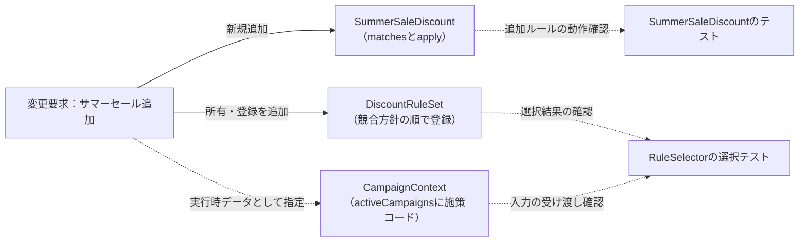

フェーズ3の変更影響グラフと同じ要求・同じ粒度で比べると、`PaymentCalculator`、`CartPreviewService`、`CampaignContext`、`main()` の処理は変更先から消えました。さらに、条件を各ルールの `matches()` へ分けたため、`RuleSelector` の固定ループも変更しません。コード変更として残るのは、新しいルールクラス内の`matches()`・`apply()`と、`DiscountRuleSet`の所有・登録一覧です。注文ごとの有効状態は既存の施策コード一覧へ入力する実行時データです。登録位置は競合時の方針なので、ルール集合で明示します。

| 3-2で影響した場所 | 修正後 | 構造変更との対応 |
|---|---|---|
| `PaymentCalculator` の既存分岐全体 | **修正しない** | 小計計算だけを残し、条件と式を各ルールへ移した |
| `CampaignContext` | **修正しない**。既存の施策コード一覧へ値を渡す | 施策ごとの真偽値フィールドを持たない入力形式にした |
| `CartPreviewService` | **修正しない** | 注文確定とは独立した入口のまま、同じDB・Selector・計算器を使う |
| 3-2には分離先がなかった | `SummerSaleDiscount` と`DiscountRuleSet`の所有・登録行を追加する | 施策固有の変更先と競合方針の置き場を作った |
| 3-2には存在しなかった選択役 | **`RuleSelector` は修正しない** | 具体条件を持たず、登録順に `matches()` を呼び最初の一致を返す固定処理にした |

この結果は、コードを書く前に確定した採用設計を完成コードへ統合した後に得たものです。関数抽出やFactoryだけでは `PaymentCalculator` または選択側の分岐が残るため、この変更影響にはなりません。CIで既存テスト一式を実行することと、変更影響として個別に再確認する範囲は区別します。

### 7-4：変更シナリオ表

ここでは今回の変更ID1・変更ID2だけを完成構造へ再適用し、フェーズ1で必要だった修正範囲と、実装後の結果を比較します。

| 変更依頼 | フェーズ1の現状構造での影響 | 完成構造での結果 |
|---|---|---|
| 変更ID1：Regular会員へサマーセール5%を追加し、Premium会員は対象外にする | `CampaignContext`と`PaymentCalculator`の分岐を同時に修正 | `SummerSaleDiscount`へ条件と式を置き、Regularだけに5%を適用。既存Premiumルールは変更しない |
| 変更ID2：既存キャンペーンと重なる場合は逐次割引する | `PaymentCalculator`の既存分岐と適用順を修正 | `DiscountRuleSet`の順序により複合ルールを先に選び、その`apply()`で10,000円から8,550円になることを実行結果で確認 |

---

## 整理

### 問題・原因・課題・解決策

| | 内容 |
|---|---|
| **問題** | 割引の「実行する振る舞い」が変わるたびに計算本体と入力モデルを修正し、利用側まで広く回帰確認する。変わる理由が異なる知識が同じ場所に混在しているため |
| **原因** | 割引ルールが「毎月追加される」と確認できているのに、`PaymentCalculator`が全種類の条件と計算方法を抱え込んでいる |
| **課題ID1** | 割引種類の条件を具象ルールへ分離し、固定の選択手順へ登録できるようにする |
| **課題ID2** | 割引の計算式を具象ルールへ分離し、`PaymentCalculator` は `apply()` を呼ぶだけにする |
| **解決策** | ルール差し替え構造：各 `IDiscountRule` に適用条件と計算式を閉じ、`DiscountRuleSet`が所有・優先順登録したSelectorを利用側へ注入する |

### フェーズとこの章でやったこと

| **フェーズ** | **この章でやったこと** |
|---|---|
| 🔵 フェーズ1：現状把握 | 仕様と動作例テーブルを確認した後、コードをクラス単位で読んだ。クラス構成図と変更要求を把握した |
| 🟣 フェーズ2：仮説立案 | 割引ルールに変更の見込みがあると見立て、誰がなぜ変えるかをヒアリングで裏付けた。今回の確定変更と将来リスクを分けて整理した |
| 🟣 フェーズ3：問題特定 | サマーセールの追加を試み、`PaymentCalculator` の条件分岐と `CampaignContext` のフラグ追加、`CartPreviewService` の回帰確認まで必要になることを確認した |
| 🟠 フェーズ4：原因分析 | 小計の骨格と割引詳細が混在し、割引詳細の中にも「種類」と「計算方法」の2軸があると特定した |
| 🟡 フェーズ5：課題定義 | 選択を課題ID1、計算を課題ID2として分け、`matches()` と `apply()` の接続点を定めた |
| 🔴 フェーズ6：対策検討 | 課題ID1・課題ID2を一つのシステムとして扱い、`IDiscountRule`と5つの具体を決め、`DiscountRuleSet`で生成・登録した同じ実体が選択・受け渡しを経て`apply()`へ届くまでを確定した |
| 🟢 フェーズ7：対策実施 | 最終コードを実装し、変更影響グラフで変更の局所化を確認した |

### 責任の移動

| **責任** | **変更前** | **変更後** |
|---|---|---|
| 支払金額の計算フローの進行 | `PaymentCalculator` | `PaymentCalculator`（変わらず） |
| 個別の割引計算の実行 | `PaymentCalculator`（if-else直書き） | `PremiumDiscount` 等の各実装クラス |
| 各割引の適用条件 | `PaymentCalculator` の `if-else` | 各実装クラスの `matches()` |
| 一致するルールの選択手順 | `PaymentCalculator` の分岐順 | `RuleSelector` の固定ループ |
| 競合時のルール順序 | `if-else` の記述順に埋没 | `DiscountRuleSet` の登録順として一か所に明示 |
| 割引ルールの契約定義 | —（なし） | `IDiscountRule` |

### 複雑さを足しても対策は変わるか

第1章では、単純な「1つの割引を掛ける」例に留めず、割引の順次適用、排他条件、顧客情報取得失敗を含めました。それでも対策の論理は変わりません。複雑さを足した結果、どの複雑さがルール差し替え構造の対象で、どれが別軸なのかを分けて見られるようになりました。

| 追加した複雑さ | 見えた原因 | 定めた課題 | 採用した扱い |
|---|---|---|---|
| キャンペーン後にサマーセールを適用する逐次割引 | 適用順序が計算本体の分岐に埋まっている | 割引後金額を返す契約を守りつつ、適用順序をルール側へ寄せる | 組み合わせルールとして `IDiscountRule` の実装に閉じる |
| Premiumは他割引と併用しない排他条件 | 選択条件が `PaymentCalculator` に漏れている | 計算本体と選択役は具体条件を知らない形にする | `PremiumDiscount::matches()` が条件を持ち、最優先でSelectorへ登録する |
| 顧客情報取得失敗 | 外部境界の失敗であり、割引計算の変化軸とは違う | 割引ルールの接続点へ失敗処理を混ぜない | `OrderProcessor` の顧客取得エラーとして扱い、割引ルール差し替え（接続点）の対象外にする |

---

## 振り返り

### 「この章を読むと得られること」は手に入ったか

| **得られること** | **この章のどこで示したか** |
|---|---|
| 1. 変動箇所の識別 | フェーズ2で割引ルールに変更の見込みがあると見立て、フェーズ4でその混在を原因として言語化した |
| 2. 接続点の診断 | フェーズ4で、割引条件の知識が計算の骨格へ漏れている状態を確認した |
| 3. 変更局所化の説明 | フェーズ7の変更シナリオ表で、変更の中心が新しい実装クラスへ移る構造を示した |
| 4. いつ構造を分けるか | フェーズ6「構想を採用する」で判断基準を示した |

### 「はじめに」の3つの設計原則はどう適用されたか

**原則1「変わるものをカプセル化せよ」の現れ**

- 具体化された場所：`PremiumDiscount` / `SummerSaleDiscount` 等の実装クラス
- 解説：頻繁に変わる「適用条件」と「割引の計算詳細」を施策ごとのクラスに閉じ込めた。新しいルールでは登録や入力モデルが変わる場合もあるが、`PaymentCalculator` と `RuleSelector` の処理は保てる。

**原則2「実装ではなくインターフェースに対してプログラムせよ」の現れ**

- 具体化された場所：`PaymentCalculator` のメンバ変数 `const IDiscountRule& rule`
- 解説：具体的な割引クラスではなく `IDiscountRule` インターフェースだけを知ることで、実行時にどの割引が適用されるかを気にせず計算フローを進められる。

**原則3「継承よりコンポジションを優先せよ」の判断**

- 判断：`PaymentCalculator`は選択済みの`IDiscountRule`を借り、計算本体とルールを注文時に組み合わせる。
- 継承との区別：各具体ルールの`: public IDiscountRule`は、共通入口を満たす契約実装であり、親の計算式を再利用して機能を重ねる実装継承ではない。組み替えを実現しているのは、Calculatorがルールを保持する側のコンポジションである。
- 限界：複数割引を同時に重ねる要求には、ルール列や包む構造など、組み合わせ自体を表す追加設計が必要になる。

---

## あなたのコードで考えてみてください

1. **変動の兆候を探す：** あなたのコードに「条件が1つ増えるたびに、既存の `if-else` チェーンを開いて書き足している」メソッドがありますか？
2. **変える理由を問う：** そのメソッド内の各条件は、どの業務機能に属しますか？同じ業務機能で完結していますか、それとも複数の業務機能が絡んでいますか？
3. **テストの範囲を測る：** 新しい条件を1つ追加したとき、再確認が必要だったテストは何件でしたか？
4. **最終構造を描く：** 適用条件と計算方法を分離したとき、選択手順と計算骨格は具体ルールを知らずに実行できますか？

---

**題材を置き換えるときの共通手順**

この章の題材名を、自分の現場のシステム名に置き換えて考えます。

1. そのシステムは、誰が何を達成するために使うものか。
2. 入力、加工、出力は何か。
3. 最近入った変更要求、または次に来そうな変更要求は何か。
4. その変更で、触りたくない場所まで修正や再テストが広がるか。
5. 変えたいものと守りたいものを分けると、接続点には何を残すべきか。
6. 分離と組み立ての二つを決めると最終構造は一つに定まるか。異なる完成構造へ分岐するときだけ、変更影響と導入コストを比較したか。

ここまで問題から導いた「ルール差し替え構造」は、一般に **Strategyパターン**と呼ばれます。ここからは題材を離れ、この名前で共有される抽象的な骨格を確認します。

## パターン解説：Strategy パターン

### パターンの骨格

Strategy パターンは、アルゴリズムのファミリーを定義し、それぞれをカプセル化して、呼び出し側から自由に差し替えられるようにするパターンです。

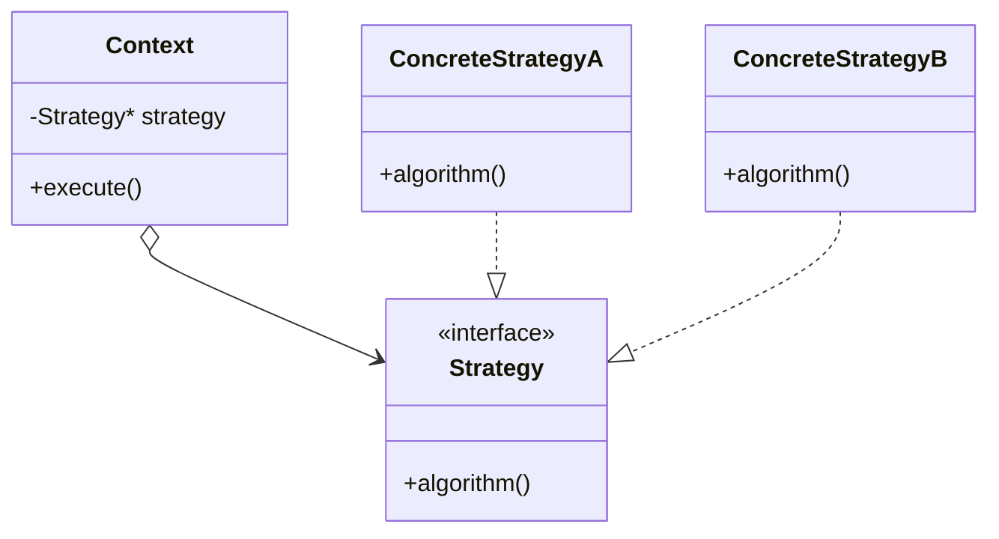

### 抽象骨格の実行シーケンス

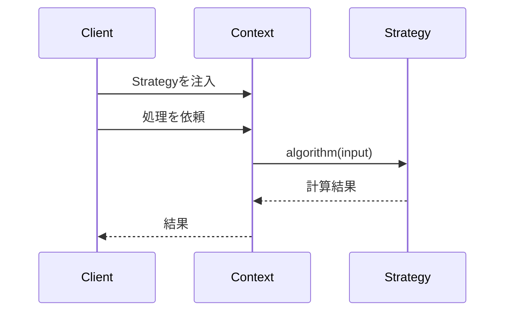

Contextは具体Strategy名を判断せず、注入された契約へ計算を委譲します。

### この章の実装との対応

GoF（Gang of Four）とは、1994年に出版された書籍『Design Patterns』の4人の著者の総称です。彼らが整理した23のパターンは、現在も設計の共通言語として広く使われています。

| GoFの名前 | この章での対応 |
|---|---|
| Context | `PaymentCalculator` |
| Strategy | `IDiscountRule` |
| ConcreteStrategy | `PremiumDiscount` / `SummerSaleDiscount` / `CampaignDiscount` 等 |

`OrderProcessor` と `CartPreviewService` はStrategyのContextそのものではなく、入力からルールを選び `PaymentCalculator` を組み立てる二つの利用側です。

### 使いどころと限界

- **使うと良い：** 似たような振る舞いが複数あり、状況に応じて切り替えたい場合。または今後も新しいアルゴリズムが追加される可能性が高い場合。
- **使わない方が良い：** ルールが1種類しかなく、今後増える見込みがない場合。ファイル数とクラス数が増えるコストが見合わない。
- **別の構造も検討する：** 独立したルールを同時に複数重ね、組み合わせが増え続ける場合。規則差し替えを組み合わせ用クラスだけで表すとクラス数が増えるため、実行順を持つルール列や装飾連結構造などと比較する。
- **非同期・失敗を伴う場合：** 割引計算が外部I/Oを伴って非同期化・失敗しうるなら、接続点の契約は `int apply(int)` から「将来値や成否を返す形」へ変わる。Strategyの「ルールを差し替える」分離は保てるが、境界を流れる値の形が変わる設計判断になる。

### 過剰適用になる例

割引ルールが「プレミアム割引」1種類しかなく、ヒアリングでも当面増える見込みがないなら、`IDiscountRule` インターフェース、各実装クラス、`RuleSelector` を導入するのは過剰です。この場合、`PaymentCalculator` の中に `if (memberType == "Premium")` を1つ持つだけのほうが、読む人にとってはたどる段数が少なく理解しやすくなります。

本章で共通契約とSelectorを採用した根拠は「毎月新しい割引が追加される」というヒアリング結果でした。変更頻度の裏付けがない別の題材なら、まず変わる側と守る側を定め直します。単純な分岐のままで守る側へ影響が広がらないなら、構造を増やさない方が適切な場合もあります。

### この章のまとめ

割引計算というドメインとStrategyパターンの関係を一言で言えば、条件分岐の中に「どの割引を使うか」と「選んだ割引をどう計算するか」という2つの変化軸が隠れていた、ということです。課題ID1の条件を `matches()`、課題ID2の式を `apply()` として施策クラスへ移したことで、選択手順と小計計算は具体ルールを知らずに実行できるようになりました。

7つのフェーズを通じて、読者は「動くコード」の観察から「変わる理由の発見」へ、そして「接続点を金額の授受だけに絞る」という判断へと、一歩ずつ進みました。フェーズ2のヒアリングで「ルールは今後も増える」と分かった時点で問題の輪郭が見え、フェーズ4で接続点の分析をした時点で解決の方向が決まる——その気づきの順序こそが、パターン名を先に覚えることでは得られない体験です。

あなたのコードの中にも、同じ条件分岐がいくつかのルールを束ねている箇所がきっとあるはずです。それぞれのケースが「どの業務機能に属する知識か」を問うことが、次の変化に備えた構造を見つける入口になります。

この章で見どころとして持ち帰ってほしいのは、割引の「判定（どの割引に当てはまるか）」と「処理（いくら引くか）」が、どちらも同じ共通情報（注文・会員種別・キャンペーン状態）を入力に取りながら、`IDiscountRule` の `matches()` と `apply()` という別々の契約として分かれている点です。とくに、判定そのものが `matches()` という契約になっているからこそ、「どの判定を使うか」を選ぶ役割（`RuleSelector`）を独立して用意できます。選ぶ側は具体的な割引条件を知らず、登録されたルールへ同じ `matches()` を尋ねるだけ、計算する側も具体式を知らず、選ばれたルールの `apply()` を呼ぶだけです。判定と処理を別の契約に切り出すことで、「選ぶ」と「計算する」がそれぞれ独立して差し替えられるようになります。
