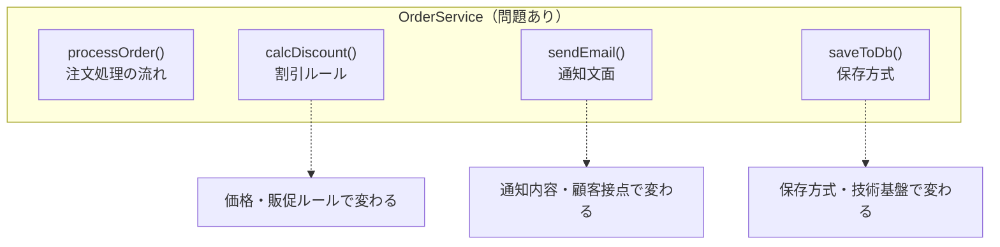
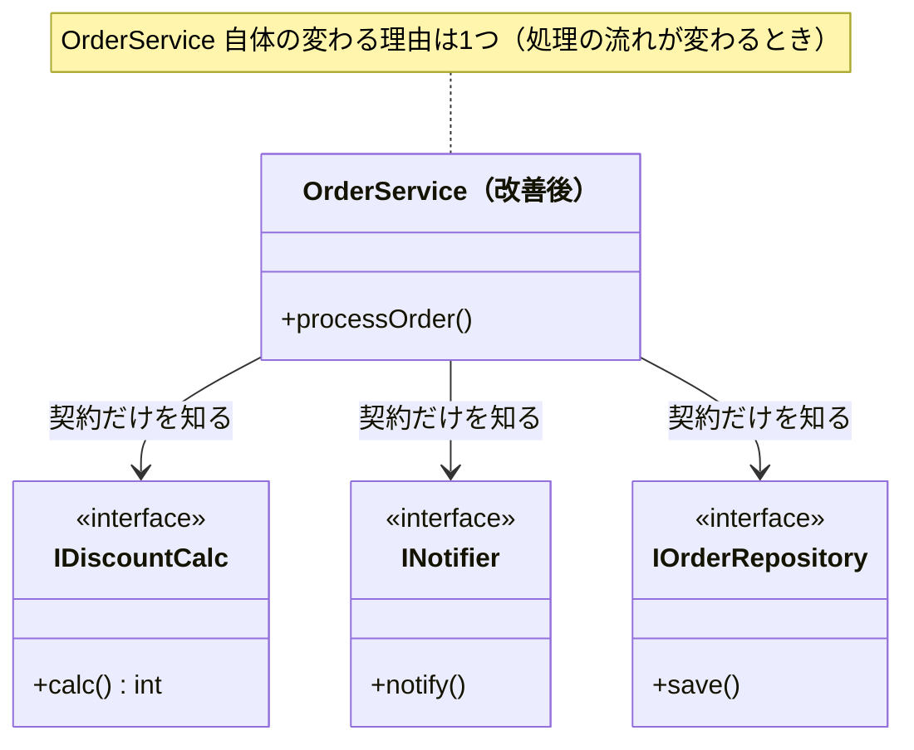
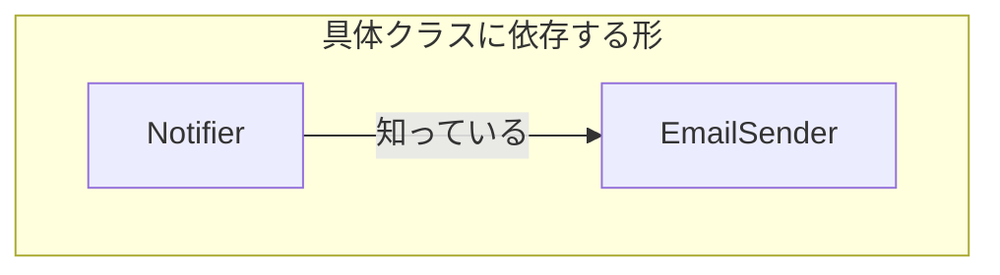
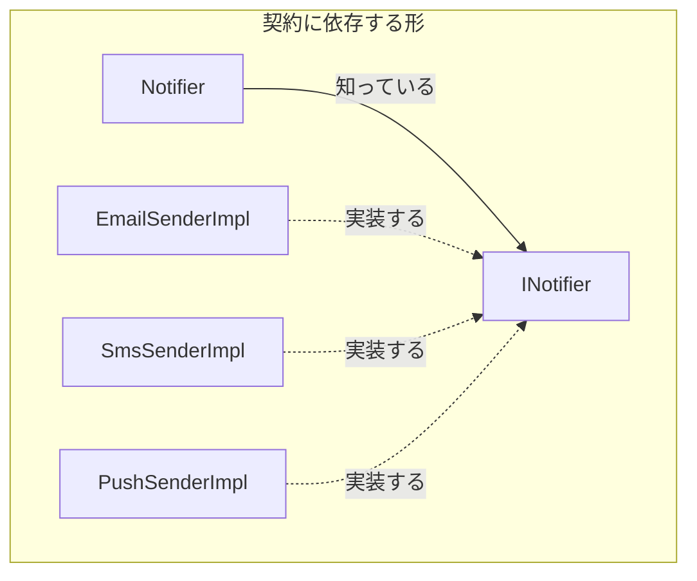
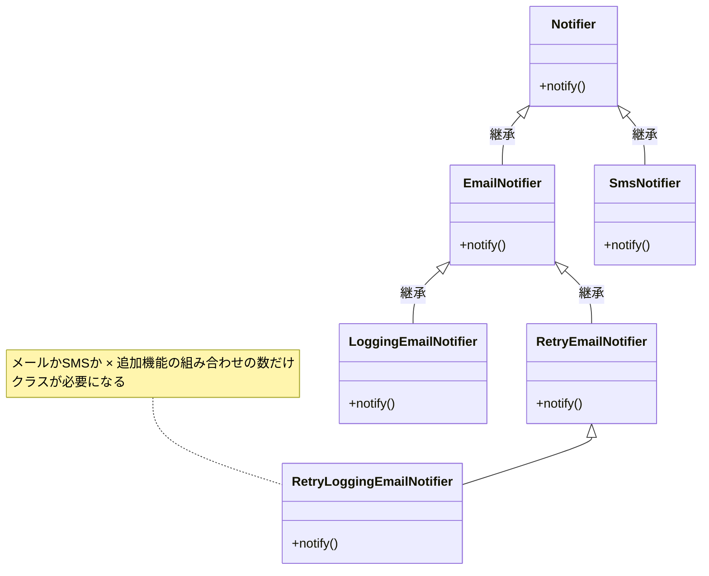
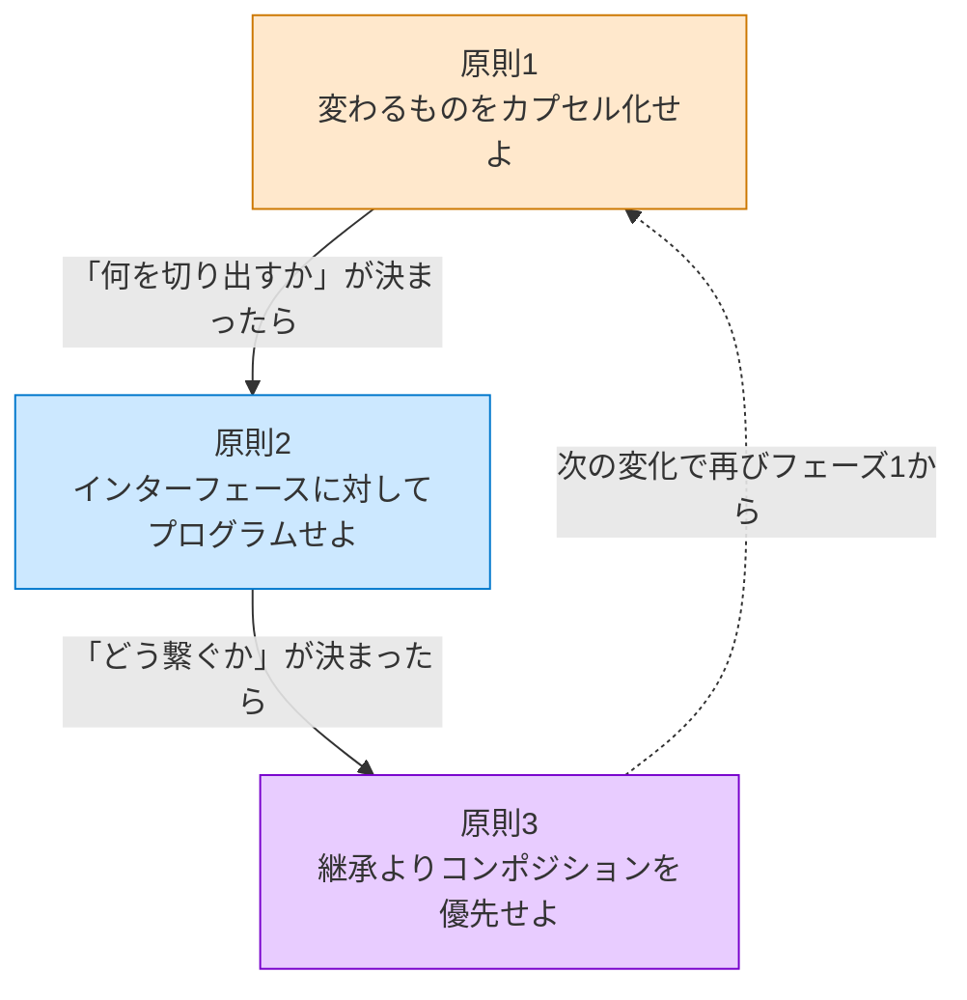

# はじめに
―― デザイン構造は「考えた結果」に過ぎない

---

## なぜ「デザイン構造を覚えても使えない」のか

ソフトウェア設計を学ぼうとすると、よく
「GoFのデザインパターン」に出会います。
GoF（Gang of Four）とは、1994年出版の書籍『Design Patterns』を書いた
4人の著者の総称で、彼らが整理した23の設計の型は
今も設計の共通言語として使われています。
本で学び、構造図を頭に入れ、いざ自分のコードに使おうとしたとき——

「どこに適用すればいいのか、わからない。」
「無理に使ってみたら、かえってコードが複雑になった。」

私自身、同じ壁に何度もぶつかりました。
正直に言うと、私は構造の形を暗記しようとしていました。
でも、いざ現場で「いつ使えばいいのか」がわからず、
自分の判断で構造を使いこなせたことは、一度もなかったように思います。

「ルール差し替え構造？通知分離構造？あのコードに使えそうな気はするんだけど、
どこにどう当てはめればいいか分からない」——
もしあなたが同じように悩んでいるなら、
私のこの経験が一つの参考になるかもしれません。

私は、「どうすればデザイン構造のようなきれいな設計ができるのか」と悩み続けました。
そして気づいたのは、そもそもデザイン構造の形にすることが目的ではなく、
「考え方」を理解して構造の本質を見抜き、自分なりの最適解を導くことが
大切なのではないか、ということです。

そこで、デザイン構造の本質を理解して、自分で思考を深めようと思い、
この本を書き始めました。
この本では私の思考プロセスを扱いますので、
少しでも読んでくださった方の参考になればと思っています。


なぜ、実績のある優れた設計手法が、
時にはコードをより複雑にしてしまうのか。

理由はシンプルです。
**構造を「最初から目指す必要がある答え」として扱っているから**です。

本書では、変更要求と課題から導いた責任・依存・接続点の形を**デザイン構造（設計構造）**と呼びます（本書ではこの2語を同じ意味で使います）。その設計構造が、繰り返し現れる問題と解決の組として既知の名前を持つとき、その名前が**デザインパターン**です。デザインパターンは、先人たちが泥臭い現場で問題に向き合い、
いくつかの選択肢を天秤にかけ、
「この状況ではこれが一番割に合う」と判断した
**決断の結果**として生まれたものです。

結果だけを真似ても、状況が違えばうまく機能しません。
大切なのは、その結果に至るまでの**思考のプロセス**を体験することです。

この本を読むことで、デザイン構造という「結果」がどのような思考で生まれたのか、その本質を理解することができます。構造の形を暗記して無理に適用するのではなく、目の前の状況に合わせて適切な考え方で対処する――いわば、**「自分なりの設計の型」** を身につけるためのヒントになればと思っています。

実は、私自身も最初はろくにプログラミングができない状態でした。設計なんて、もってのほかです。
それでも少しずつ「コードを分ける」ことを意識してみると、変更しやすくなり、構造がきれいになっていく恩恵を感じて、設計の楽しさにすっかりはまってしまいました。
この本を手に取ってくださった方にも、そんな設計の楽しみを知ってもらえたらと願っています。
まずは本書の標準である7フェーズを同じ順序で使い、要求から構造までの根拠を追えるようにしてください。その目的を保てるようになった後で、案件の規模に応じて成果物の詳しさを調整し、ご自身なりの進め方へ育てる手助けになれば、とてもうれしいです。

この本を読み終えたとき、一つの目標としてこんな状態になっていれば素晴らしいのではないでしょうか。

> **「このコードに変更が来たとき、まずどこを確認すべきかを、構造から説明できる。」**

それだけです。派手な知識は一つも必要ありません。「変わる理由が混在している」と見抜く目と、「変わる機能・仕様の種類が異なるコードを異なるクラスに分ける」という判断ができれば、デザイン構造のような構造は自然についてくると私は考えています。

> [!INFO] 設計の基本：「分ける」と「接続点の形」
> この本を通じて、ソフトウェア設計の考え方を「**責任を分けて作る**」という視点で説明します。
>
> 何かを作るとき、役割ごとに部品を分けて組み立てると、一部を交換したり改良したりしやすくなります。ソフトウェアも同じで、「どの種類の機能・仕様変更で変わるか」ごとに責任を分けて作ることが設計の出発点です。
>
> そして、分けた後には必ず、部品同士が情報や処理を受け渡す**接続点**ができます。本書では、この接続点で「何を渡すか」「どちらが何を知るか」「変更時にどこまで影響するか」を確かめます。
>
> スマートフォンの充電端子を想像してみてください。Lightning対応ケーブルでは、つなげる相手がその端子に対応したiPhoneに限られます。一方、USB Type-Cのような共通規格なら、Type-C対応のiPhone、タブレット、ノートPCなどへ接続先を替えられます。
>
> 次の図では、同じ電源側に対して、接続点の形が専用か共通かによって交換できる機器の範囲がどう変わるかを比べます。
>
> ```mermaid
> flowchart TB
>     P1["電源"] --> L["Lightning対応ケーブル"]
>     L --> I1["Lightning対応iPhone"]
>
>     P2["電源"] --> C["USB Type-C対応ケーブル"]
>     C --> I2["Type-C対応iPhone"]
>     C --> T["タブレット"]
>     C --> N["ノートPC"]
>
>     classDef dedicated fill:#fee2e2,stroke:#dc2626,color:#111827;
>     classDef common fill:#dcfce7,stroke:#16a34a,color:#111827;
>     class L,I1 dedicated;
>     class C,I2,T,N common;
> ```
>
> **共通規格という「接続点の形」を決めておけば、接続先の機器だけを取り替えやすくなります。** ソフトウェアでも同じで、接続点の形（受け渡す情報や操作）が安定していれば、片側の実装を替えても、もう片側を作り直さずに済む場面が増えます。
>
> 図を見るときは、①接続点で何を受け渡すか、②どちらが端子の詳細を知るか、③機器を替えたときにどこを直すか、の三点を確かめてください。大切なのは分類名を覚えることではなく、「相手を替えたいのに、専用の端子や変換手順に縛られて替えられない」という変更時の困りごとを見つけることです。
>
> 構造の名前を覚える前に、変更要求がこの境界を通るとき、どちら側の知識まで書き換えることになるかを考えてみてください。本書では、この見方を三つの異なる構造で繰り返します。

> [!INFO] 本書の前提と言語について
> 本書では、すべてのサンプルコードを **C++** で記述しています。C++を選んだ理由は、「インターフェース（純粋仮想クラス）」「ポインタによる差し替え」「オーバーライド」という設計の構造が、余分なフレームワークの仕組みなしに最もシンプルに見えるからです。
>
> Java・Python・TypeScript などを普段使っている方も、構文より**構造の形**に注目して読んでいただければ、そのまま自分の言語に置き換えられます。
>
> | C++の書き方 | 他言語での対応 |
> |---|---|
> | `virtual void foo() = 0;` | Java: `interface`、Python: `ABC`、TS: `interface` |
> | `class A : public IFoo` | Java/TS: `implements IFoo`、Python: `class A(IFoo)` |
> | `IFoo* ptr;` | Java/TS/Python: `IFoo foo;`（参照型） |
> | `void foo() override` | Java: `@Override`、TS: 明示なし、Python: 明示なし。基底の同名関数を置き換えることを示します |
> | `void foo() const` | 引数の後ろの `const` は「このメソッドは自分の状態を変えない」という宣言です。他言語には対応する書き方がありません |
> | `IFoo& ref;` | Java/TS/Python: `IFoo foo;`。ポインタと違い、後から別の相手へ差し替えられません。所有せず借りているだけの相手を表します |
> | `explicit Ctor(...)` | 引数1つのコンストラクタが暗黙に呼ばれるのを防ぐ指定です。他言語には対応する書き方がありません |
> | `~Foo() = default;` | デストラクタの既定実装をそのまま使う、という指定です。`{}` と書くのと同じ意味です |
> | `auto it = v.begin();` | Java: `var`、TS: 型推論、Python: 型注釈なし。右辺から型を決めます |
> | `namespace Code { ... }` | Java: パッケージ、Python: モジュール、TS: 名前空間。関連する定数や型をひとまとめにします |
> | `std::cref(x)` / `std::reference_wrapper<T>` | 参照をコンテナへ入れるための包みです。`vector` は参照をそのまま持てないため、参照を値のように扱えるようにします |
>
> コードの構文が読み解けない箇所があっても、クラス図とコメントで「何が何に依存しているか」を追えれば、設計の学習として十分です。

> [!INFO] サンプルで使うC++標準ライブラリ
> 各章では、業務データを保持するために次の標準コンテナを使います。コンテナ自体の実装を学ぶ必要はなく、「順番に並べる」「キーで検索する」「先頭から順に処理する」のどれを表しているかだけ押さえれば、設計上の役割を追えます。
>
> | 記法 | この本で表すもの | 読むときの要点 |
> |---|---|---|
> | `std::vector<T>` | 同じ型の値を順番に並べた複数件 | `push_back`は末尾へ追加、`at(i)`は位置`i`の取得、`front()`は先頭の参照、`back()`は末尾の参照、`pop_back()`は末尾を取り除く、`erase(...)`は指定要素の削除 |
> | `std::map<K, V>` | IDなどのキーから値を検索する保存領域 | `find` は存在確認、`at` は対応する値の取得 |
> | `std::deque<T>` | 先頭・末尾の両端から追加・削除できる順序付き列 | `front()`は先頭を参照するだけ、`back()`は末尾を参照するだけ、`pop_front()`は先頭を取り除く、`pop_back()`は末尾を取り除く、`push_back()`は末尾へ追加 |
>
> `front()`は要素を取り出して消す操作ではありません。先頭を確認した後に削除する場合、`std::vector`では`erase(begin())`、`std::deque`では`pop_front()`を別に呼びます。各章では、コンテナに何を保存し、誰が読み書きするかも本文で説明します。

> [!INFO] 生ポインタの使用について
> 本書の掲載コードでは、`IFoo* ptr`のような通常のポインタ（生ポインタ）を使い、`std::unique_ptr`などのスマートポインタは使いません。生ポインタには、次の二つの役割があります。
>
> - **所有するポインタ：** `new`で生成したオブジェクトを保持します。所有者を本文で明示し、その所有者のデストラクタまたは処理の完了箇所で`delete`します。
> - **借用するポインタ：** 別の場所が所有するオブジェクトを一時的に参照します。借りる側は`delete`せず、所有者より長く使わないことを本文で明示します。
>
> つまり、「生ポインタを使えば常に自分で確保・解放する」という意味ではありません。所有権を持つ側が解放し、借用側は所有者の生存期間を超えて参照しません。本書では、差し替え可能な参照の構造に加えて、この所有・借用・破棄の関係もコードの近くで説明します。

---

## この本の地図

この「はじめに」と第0章が、本書全体の「設計の言語」を定義します。
三つの実践章は、ここで定義した言語と思考の型を、異なる種類の変化へ適用します。

### 収録する三つの構造

**はじめに**

- **直面する問題・痛みと、分けるべき「変わる理由」**：「構造を使えない」理由の考察と、すべての土台となる3つの原則

**第0章** 設計判断の地図

- **直面する問題・痛みと、分けるべき「変わる理由」**：各章で使う「7つのフェーズ」と、変更影響を接続点から見直す方法

**第1章** ルール差し替え構造（Strategy）

- **直面する問題・痛みと、分けるべき「変わる理由」**：**【痛みの種類】条件分岐の爆発**<br>「どのルールを適用するか」が変わるたびにコード全体が揺らぐ痛みを解消する。

**第2章** 状態分離構造（State）

- **直面する問題・痛みと、分けるべき「変わる理由」**：**【痛みの種類】状態による振る舞いの変化**<br>「今の状態」に応じたif文が散らばり、状態追加のたびに全箇所を修正する痛みを解消する。

**第3章** 通知分離構造（Observer）

- **直面する問題・痛みと、分けるべき「変わる理由」**：**【痛みの種類】通知先への依存**<br>「誰に通知するか」が増えるたび、主処理のコードに影響が及ぶ痛みを解消する。

三章とも、変わる部分を契約の向こう側へ分け、外から再結合します。ただし、Strategyは選んだ一つのルールへ委譲し、Stateは現在状態に応じて委譲先が変わり、Observerは登録された複数の相手へ伝えます。この差を見比べることが、目的から構造を選ぶ練習になります。

**実践章は単独でも読めます。** 第0章を先に読むと、問題・原因・課題・対策をつなぐ共通の設計言語が整い、三章の構造差を比較しやすくなります。

---

## この本を最大限に活かすために

**1. 章タイトルの構造名は、いったん脇に置いて読む**
章タイトルに構造名が書いてありますが、名前を覚えることが目的ではありません。「なぜこのコードが変えにくいのか」「どこを分けると楽になるのか」という問いを、自分の頭で一緒に追ってください。構造名は、その問いの答えにたどり着いた後に自然についてくるラベルです。

**2. ヒアリングシーンは「理想形」**
各章のヒアリングでは、関係者がちょうど設計に役立つ情報を答えてくれます。現実には「変わるかどうか分からない」「たぶん変わらない」という答えが返ることも多いです。それでも「この問いを関係者に投げる習慣」だけは持ち帰ってください。答えが得られないときは、`git log` などコードの変更履歴が代わりの証言になります。

**3. 比較は「完成可能な構造が複数残るとき」だけ行う**
各章のフェーズ6では、フェーズ5で決めた全課題から、主要クラスと契約・具体・生成・選択・受け渡し・実行を含む構想を先に一つへまとめます。その後、構想の要点コードを同じ順に続けて示し、生成から実行まで成立するかを確認します。完成クラス図と全コードはフェーズ7だけに置きます。責任配置や依存関係が異なる完成可能な構想が複数残る場合だけ、目的・変更影響・導入コストを比較します。

**4. 章末の「あなたのコードで考えてみてください」を飛ばさないで**
各章の最後に、その章の思考プロセスをあなた自身のコードに当てはめるための問いを用意しました。読み終えた後、一度でも自分のコードを思い浮かべながら向き合ってみてください。

**5. 「コードがきれいすぎる」と感じたときは、問いだけを持ち帰る**
各章のコードは「構造にだけ集中できるよう」業務の複雑さを意図的に省いています。現実のコードがどれだけ混沌としていても、「このメソッドには、どの種類の機能変更が集まっているか？」という問いだけは同じように使えます。担当者やチームが分かるなら補助線になりますが、分からない場合は要求の内容そのものを見ます。

---

## すべての構造を貫く3つの原則

> **【定義】本書における「原則」とは**
> ここでいう「原則」とは、いかなる時も絶対に守らなければならない法律ではありません。**「設計の判断に迷ったとき、メリットとデメリットを測るための評価基準（北極星）」** です。構造を適用するか迷ったとき、この原則に照らして「良い方向に向かっているか」を判断します。

GoFの23のデザインパターンは、一見バラバラに見えます。
でも、すべての構造は、たった3つの原則を
それぞれの状況に具体化したものに過ぎない——と、私は整理しています。

これを先に知っておくと、構造が「暗記する公式の集まり」から
「同じ原則を別の形で表現したもの」に見え始めます。

---

### 原則1：変わるものをカプセル化せよ

この原則の核心は、**「どの種類の機能・仕様変更で変わるか」を基準に、コードを分離する**ことです。

なぜ機能・仕様の種類ごとに分けるのか——私はこう考えています。割引ルールの変更、通知文面の変更、保存先の変更は、それぞれ変更される理由もタイミングも異なります。これらが同じクラスにいると、割引だけを変えたいのに通知や保存処理まで影響確認の対象になりがちです。そこで変更の種類ごとに責任を分けておくと、1つの要求が別種類の機能へ飛び火しにくくなる、という見方です。分離それ自体がゴールなのではなく、変化の種類をそろえた結果として構造が決まってくる、と捉えています。

#### なぜこの原則が生まれたのか

コードが変わる理由は、ビジネスや技術前提の変化によって生まれます。
割引ルールの変更、API仕様の変更、出力フォーマットの変更は、それぞれ別の種類の変化です。
分かる場合は担当者や関係者を補助情報として使えますが、主軸は「何の機能・仕様が変わるのか」です。

なぜ「変わる理由」を見るときに担当者やチームの話が出てくるのでしょうか？
多くの業務変更には、判断する人や組織がいます。ただし、現実には変更要求の発信元を正確に特定できないことも多いため、担当者名を境界の主軸に置くのは避けたほうがよい、と私は考えています。法改正、外部APIの変更、障害、性能要件、技術基盤の更新など、特定のチーム名ではなく仕様の種類として捉えた方がよい変化もあります。コンウェイの法則が示唆する組織構造は境界を探す補助線ですが、コード構造と常に一対一で一致させる規則ではありません。

> [!INFO] コンウェイの法則とは
> 1968年にメルヴィン・コンウェイが提唱した経験則です。「組織が設計するシステムの構造は、その組織のコミュニケーション構造を反映する傾向がある」というものです。価格施策を扱う領域と技術基盤を扱う領域が別々に動いていれば、システムも自然とその境界でモジュールが分かれやすい、という観察です。本書では「機能・仕様の境界」を探る補助線として参照しています。ただし、組織構造とコード構造が必ず一致しなければならないわけではありません。

**2種類の機能変更に関わるコードが同じメソッドやクラスに混在していると、一方だけを変えても「他方が壊れていないか」を確認せざるを得ません。同じ場所に混在しているため、変更が道連れを起こすのです。**

割引ルールを変えただけなのに、出力フォーマットや保存処理まで確認が必要になる——
現場で何度もこの「確認作業」に追われた先人たちが、
「変わる機能・仕様の種類ごとに分離していたら、この不安は生まれにくかった」と気づいたのが
この原則の出発点です。

#### 「変わる理由」を見つける問い

この原則を使うための問いは1つです。

> **「このコードは、どの種類の機能・仕様変更で変わるのか？」**

変更の種類が1つなら、変わる理由は1つです。
変更の種類が複数あるなら、変わる理由が複数混在しています。
**「どの機能・仕様の種類で変わるか」が境界線を引く基準になります。**

担当者や関係者が分かるなら、それは補助情報として使えます。分からないとき——お客さんからの要求だが社内のどの部門が出したかわからない、伝達者は毎回同じ窓口担当者でそこからはたどれない——というケースでは、人を探すのをやめて、**要求の内容そのもの**に着目します。

> **「この変更は、何の業務上の判断か？」**

「価格・条件に関する変更」なら料金や販促の領域、「文面・タイミングに関する変更」なら通知や顧客接点の領域、「保存先・フォーマットに関する変更」なら技術基盤の領域——という具合に、要求が属する業務の種類で分類できます。関係者の名前は見えなくても、**「何の業務判断か」という性質は要求の内容に含まれている**ことが多いです。

変更の履歴が複数あるときは、この問いも使えます。

> **「この変更とあの変更は、いつも一緒に来るか、別々に来るか？」**

セットで変わるものは同じ業務の関心事に属し、独立して変わるものは別の関心事です。

| 見える情報 | 使う問い |
|---|---|
| まず見るもの | 「これは何の機能・仕様変更か？」 |
| 分かれば補助に使うもの | 「変更を決定する担当者・チーム・外部要因は何か？」 |
| 変更の履歴が見える | 「この変更はいつも一緒に来るか、別々か？」 |

たとえば「ECサイトの注文処理システム」を想像してください。
- 割引キャンペーンの適用条件は、**価格・販促ルール**の変更で変わります。
- 注文完了メールの文面は、**通知内容・顧客接点**の変更で変わります。
- 注文データの保存先（データベースなど）は、**保存方式・技術基盤**の変更で変わります。

関係者が分かる場合は補助線になりますが、分離の主軸はあくまで機能の種類です。これらの処理が1つの `OrderService` クラスに混在していると、メール文面を変える際に、データベース保存処理に影響が出ないかテストする必要が生じます。だからこそ、割引計算・通知・保存のように、変更の種類ごとに分離するのです。

下の図で、問題のある構造と解決後の構造を比べてみてください。



1つのクラスの中に、変わるきっかけが3つ同居しています。次の図は、その3つを外へ出した後の形です。



*改善前の OrderService は3つの理由で変わる可能性があった。改善後は1つだけ。*

#### コードで確かめる(C++)

以下に、3種類の変更理由が1つのクラスに混ざった形のコードを示します。

```cpp
#include <iostream>
#include <string>

// 注文処理フロー、割引計算、通知送信、DB保存が同じクラスに混在している
//      どれか1つの仕様が変わっても、この1つのクラスを変更することになる
class OrderService {
public:
    void processOrder(double price, const std::string& customerType) {
        // 1. 割引計算（価格・キャンペーン仕様で変わる）
        double discount = 0;

        if (customerType == "Premium") {
            discount = price * 0.2; // プレミアム20%引き
        }

        double finalPrice = price - discount;

        // 2. DB保存（保存方式・保存先仕様で変わる）
        std::cout << "[DB保存] 支払金額 " << finalPrice
                  << " 円で注文を保存しました。\n";

        // 3. 通知送信（通知内容・通知手段の仕様で変わる）
        std::string emailBody =
            "ご購入ありがとうございます。支払金額: "
            + std::to_string(static_cast<int>(finalPrice))
            + "円";
        std::cout << "[メール送信] " << emailBody << "\n";
    }
};

int main() {
    OrderService service;
    service.processOrder(10000, "Premium");
    // 上記コードの実行結果：
    // [DB保存] 支払金額 8000 円で注文を保存しました。
    // [メール送信] ご購入ありがとうございます。支払金額: 8000円
    return 0;
}
```

次に、変わる理由ごとにクラスを分離した「OKコード」です。

```cpp
#include <iostream>
#include <string>
```

**IDiscountCalc**

```cpp
// インターフェース（契約）
class IDiscountCalc {
public:
    virtual double calc(double price) = 0;
    virtual ~IDiscountCalc() {}
};
```

**INotifier**

```cpp
class INotifier {
public:
    virtual void notify(double price) = 0;
    virtual ~INotifier() {}
};
```

**IOrderRepository**

```cpp
class IOrderRepository {
public:
    virtual void save(double price) = 0;
    virtual ~IOrderRepository() {}
};
```

**PremiumDiscount**

```cpp
// 具体実装①：プレミアム割引（割引ルール）
class PremiumDiscount : public IDiscountCalc {
public:
    double calc(double price) override {
        return price * 0.2; // 20%引き
    }
};
```

**MarketingEmail**

```cpp
// 具体実装②：注文完了メール（通知ルール）
class MarketingEmail : public INotifier {
public:
    void notify(double price) override {
        std::cout << "[メール送信] ご購入ありがとうございます。支払金額: "
                  << static_cast<int>(price) << "円\n";
    }
};
```

**DbRepository**

```cpp
// 具体実装③：データベース保存（保存ルール）
class DbRepository : public IOrderRepository {
public:
    void save(double price) override {
        std::cout << "[DB保存] 支払金額 " << price
                  << " 円で注文を保存しました。\n";
    }
};
```

**OrderService**

```cpp
// 変わる理由ごとに分離した結果、OrderServiceは骨格だけになった形
class OrderService {
    IDiscountCalc*    discountCalc_;
    INotifier*        notifier_;
    IOrderRepository* repo_;
public:
    OrderService(IDiscountCalc* d, INotifier* n, IOrderRepository* r)
        : discountCalc_(d), notifier_(n), repo_(r) {}

    void processOrder(double price) {
        double discount = discountCalc_->calc(price);
        double finalPrice = price - discount;
        repo_->save(finalPrice);
        notifier_->notify(finalPrice);
    }
};

int main() {
    PremiumDiscount discount;
    MarketingEmail email;
    DbRepository repo;
    OrderService service(&discount, &email, &repo);
    service.processOrder(10000);
    // 上記コードの実行結果：
    // [DB保存] 支払金額 8000 円で注文を保存しました。
    // [メール送信] ご購入ありがとうございます。支払金額: 8000円
    return 0;
}
```

**混ざった形と分けた形で、変更のたびにどこを開くことになるかを比べます。**

**割引ルールを20%→15%に変更したい**

- **混ざった形で触る場所**：`OrderService` を開いて割引計算の箇所を修正
- **分けた形で触る場所**：`PremiumDiscount` だけを修正

**メール文面を変更したい**

- **混ざった形で触る場所**：`OrderService` を開いてメール生成の箇所を修正
- **分けた形で触る場所**：`MarketingEmail` だけを修正

**注文データの保存先を変更したい**

- **混ざった形で触る場所**：`OrderService` を開いてDB保存の箇所を修正
- **分けた形で触る場所**：`DbRepository` だけを修正（または新しいリポジトリを追加）

**計算ルールを変更しながら同時にメール文面も変えたい**

- **混ざった形で触る場所**：`OrderService` を1つ開いて両方修正——影響範囲が重なって混乱する
- **分けた形で触る場所**：`PremiumDiscount` と `MarketingEmail` をそれぞれ独立して修正——影響が交わらない

混ざった形では、どちらの変更でも `OrderService` を開くことになります。分けた形では、機能の種類ごとに主な修正先が分かれます。どちらを選ぶかは、この先どの種類の変更が何回来そうかによって変わる、と私は考えています。

> [!INFO] 三つのインターフェース仕様が変わると、OrderServiceも変わるのでは？
> その理解で合っています。`IDiscountCalc`、`INotifier`、`IOrderRepository`の**契約そのもの**が別々に変われば、それらを呼ぶ`OrderService`にも三種類の変更理由が生まれます。インターフェースを持てば、あらゆる変更から守られるわけではありません。
>
> 具象クラスを直接持つ場合との違いは、契約が変わらない範囲にあります。たとえば`PremiumDiscount`を別の割引実装へ替えても、`IDiscountCalc::calc(double)`が同じなら、`OrderService`は変更せず、組み立て側で差し替えられます。一方、具象クラスを直接持つと、実装の種類や生成方法の変更まで`OrderService`へ届きます。
>
> 契約の引数や戻り値にも変更が見込まれる場合は、その変化を消すのではなく、どの型を境界へ出すかを見直します。次の原則2では、複数の値を安定した要求型・結果型へまとめる、または変化理由が異なる操作を別の契約へ分けることで、契約変更の波及を小さくする考え方を扱います。

**この原則を使うための問い——この本を通じて使い回せる1つの問い：**

先ほどの基本形「このコードは、どの種類の機能・仕様変更で変わるのか？」を、実際のコードに当てはめるときはこう展開します。

> **「このコードの中に、異なる種類の機能・仕様変更が、同じ場所に混在していないか？」**

これは基本形の応用形です。「どの機能・仕様が変わる？」を一点に絞るのが基本形、「異なる種類の変更が混在していないか？」と混在を探すのが応用形です。構造が違っても、問いはこの1つです。

> [!NOTE] この考え方は、全章を通じた基礎になります
> ここで紹介する「機能・仕様の種類を基準に分離する」という考え方は、原則1の説明に登場しますが、本書のすべての設計判断の根底にある考え方です。担当者やチームは、分かる場合にその境界を裏付ける補助情報として扱います。各章のフェーズ1〜4でも、この問いに戻ってきます。

#### 原則がどのように形になるか

> 以下の表は、各章を読み進めた後に「あのデザインパターンは、何を分離した結果なのか」を確認するための参照表です。構造名の隣に一般的なパターン名も示しますが、まずは何を分けた構造なのかを追ってください。

| 構造 | 「変わらない」骨格・全体 | 分離した「変わるもの」 |
|---|---|---|
| ルール差し替え構造（Strategy、第1章） | 注文処理の流れと目的 | 適用する割引ルール |
| 状態分離構造（State、第2章） | 予約の同一性と操作の入口 | 現在状態ごとの許可・結果・次状態 |
| 通知分離構造（Observer、第3章） | 在庫を更新する主処理 | 通知先の種類と通知方法 |

GoFの構造は、決して最初から目指すものではありません。「変わるものをカプセル化せよ」という原則を適用し、守りたい骨格から変動する部分を分離した結果の姿に過ぎないのです。

#### 補足：なぜ「すべての構造」が登場しないのか

本書はGoFの23パターンを網羅しません。ルール、状態、通知先という違いが明瞭で、同じ「分離と再結合」から異なる完成構造へ進む三つに絞ります。少数の題材を深く追うことで、名前から型を当てるのではなく、変更の痛みと原因から必要な境界を考える練習を優先します。

本書で扱わないパターンにも、それぞれ固有の問題と意図があります。三つの構造だけですべてを解けるとは考えません。ここで身につけるのは、未知のパターンにも同じ形を当てはめることではなく、まず変更の種類と痛みを観察し、必要な責任と接続点を言葉にしてから既知の構造と照合する順序です。

「この原因なら、どこをどんな契約で分け、誰が具体を選び、どうつなぐか」を三つの題材で繰り返します。その後に別のパターンを学ぶときも、構造名ではなく設計判断の根拠から理解するための土台になります。

#### この原則を「あえて」外すとき

> [!NOTE] 意図的に外すケース
> 「当面は変わる可能性が低い」と関係者間で確認できる部分は、分離のコストをかけない判断もあります。長期間変わっていない仕様であれば、シンプルに一体で書く案もチームで検討できます。

原則として原則1を適用するのがよいですが、**「あえて原則の適用を見送る（カプセル化しない）」**判断が必要なケースもあります。分離による複雑さの増大（コスト）が、分離によるメリットを上回ってしまう危険性がある場合です。

- **変わる見通しがない**場合。関係者に確認して「この処理は変わらない」と合意できたものは分離不要です。分離のコストが価値を超えます。
- **大規模なレガシーコードで、絡み合いが深い**場合。一気の分離はリスクです。段階的な置き換え（新しい機能から新しい構造で書く）の方が現実的です。
- **変わる理由が同じものを分離しようとしている**場合。たとえば、割引計算の `if` 文が3つある関数を「if が多いから」という理由だけで分離しても意味がありません。3つの割引条件が同じ機能種類に属し、同じタイミングで変わるなら、1か所にまとめていて良い場合があります。「変わる機能・仕様の種類がいくつあるか」が分離の基準であり、「コードの行数」や「if の数」ではありません。

---

### 原則2：実装ではなくインターフェースに対してプログラムせよ

「何をするか（契約）」と「どうやるか（実装）」を分ける。

#### なぜこの原則が生まれたのか

原則1で「変わるものを切り出した」あとに残る問題があります。
切り出した部品を「どう呼び出すか」です。

具体的なクラス名（`EmailSender`）を呼び出し元が知っていると、Email→SMS→Pushに切り替わるたびに呼び出し元も変わります。なぜなら、呼び出し元のコードに「`EmailSender` を使う」という前提が書き込まれているため、`EmailSender` を `SmsSender` に替えるときに呼び出し元のコードも修正が必要になるからです。
でも「通知する何か（`INotifier`）」という契約だけを知っていれば、切り替えが起きても呼び出し元はまったく変わりません。

インターフェースは、安定した呼び出し側と不安定な実装側の間に立つ「緩衝材」です。

#### 依存の方向を図で理解する

まず、具体クラスを直接知っている形を見ます。



`Notifier` が `EmailSender` を名指ししているため、送り先を替えると `Notifier` も変わります。次の図は、間に契約を置いた形です。



*具体へ直接依存すると、実装クラスが変わったとき Notifier も変わります。*
*OKでは INotifier の裏側がどう変わっても Notifier はまったく変わらない。*
> [!INFO] コラム：インターフェースの名前は「ビジネス責任」で付ける
>
> 原則2を実践するとき、インターフェース名の付け方で迷うことがあります。基本的なルールは「**実装手段ではなく、ビジネス上の責任で命名する**」です。
>
> | ❌ 実装手段で命名 | ✅ ビジネス責任で命名 | なぜ変えるか |
> |---|---|---|
> | `IEmailNotifier` | `INotifier` | 手段がSMSに変わっても名前は変わらない |
> | `IPdfOutputService` | `IReportOutputService` | 出力先がExcelに変わっても名前は変わらない |
> | `IMySqlRepository` | `IOrderRepository` | DBが変わっても名前は変わらない |
>
> インターフェース名に実装手段（Email・PDF・MySQL）が入っていると、手段が変わったときに名前が「嘘」になります。`IEmailNotifier` のままSMSを実装したクラスを作ると、コードを読んだ人が「なぜEmail専用のインターフェースをSMSが実装しているのか？」と混乱します。
>
> **実装クラス名のほうは技術手段で付けても困りません。**`EmailSenderImpl` や `SmsSenderImpl` は手段の名前でよいと考えています。気にしているのは、呼び出し側が依存するインターフェースの名前が「手段の変化」に左右されないかどうかです。
>
> この本の各章でも、`IDiscountRule`（割引ルールの契約、第1章）・`IReservationState`（予約状態ごとの振る舞いの契約、第2章）・`INotification`（通知先の契約、第3章）のように、ビジネス責任で命名したインターフェースが登場します。名前を見たときに「この境界線は何のためにあるか」がわかるかどうかを、私はインターフェース名を決めるときの目安にしています。

#### コードで確かめる（依存の方向）

**混ざった形のコード**

```cpp
// 具体クラスに直接依存している形
// EmailSender が変わるたびに Notifier も変わる

// 具体クラス：メール送信の実装
class EmailSender {
public:
    void send(std::string msg) {
        std::cout << "[EMAIL] " << msg << std::endl;
    }
};
```

**Notifier**

```cpp
class Notifier {
    EmailSender* sender_; // 具体クラスを知っている
public:
    void notify(std::string msg) { sender_->send(msg); }
};
```

**分けた形のコード**

```cpp
// 契約に依存する形
//     IMessageSender の実装が Email→SMS→Push に変わっても
//     Notifier は変わらない
class IMessageSender {
public:
    virtual void send(std::string msg) = 0;
    virtual ~IMessageSender() {}
};
```

**EmailSender**

```cpp
// 具体的な実装①：メール送信
class EmailSender : public IMessageSender {
public:
    void send(std::string msg) override {
        std::cout << "[EMAIL] " << msg << std::endl;
    }
};
```

**SmsSender**

```cpp
// 具体的な実装②：SMS送信（後から追加しても Notifier は変わらない）
class SmsSender : public IMessageSender {
public:
    void send(std::string msg) override {
        std::cout << "[SMS] " << msg << std::endl;
    }
};
```

**Notifier**

```cpp
class Notifier {
    IMessageSender* sender_; // 契約（インターフェース）だけを知っている
public:
    // コンストラクタ注入：使う実装を外から渡す（依存注入）
    explicit Notifier(IMessageSender* sender) : sender_(sender) {}
    void notify(std::string msg) { sender_->send(msg); }
};

// 組み立ては呼び出し元（main()相当）だけが知っている
int main() {
    EmailSender email;
    Notifier notifier(&email);   // Email版で使う
    notifier.notify("注文完了");

    SmsSender sms;
    Notifier notifier2(&sms);    // SMS版に差し替えても Notifier は変わらない
    notifier2.notify("注文完了");

    return 0;
}
```

#### インターフェースを設計するとき「引数の型」をどう決めるか

インターフェースは「呼び出し元を変化から守る壁」ですが、引数の型が変わるときは、呼び出し側と実装側の双方に修正が及びます。
たとえば、`int userId` を使っている箇所を「IDを文字列に変えたい」となった場合、インターフェース自体の変更は避けられません。

この問題に対する基本的なアプローチは次の2つです。

**① 型を合意・固定する**
シンプルですが、型が変われば全インターフェースのシグネチャが変わります。

```cpp
class IUserService {
public:
    virtual void process(int userId) = 0;
};
```

**② 独自型（構造体など）でくるむ**
将来の型変更が予想される場合、`UserId` という独自の型（構造体やクラス）でラップして受け渡します。内部の表現が `int` から `std::string` に変わっても、インターフェースの引数型自体は `UserId` のままで維持できるため、呼び出し元への影響を最小限に抑えられます。

```cpp
struct UserId {
    std::string value; // 型表現の変更をUserIdの内側に寄せる
};
```

**IUserService**

```cpp
class IUserService {
public:
    virtual void process(UserId id) = 0; // 引数の型はUserIdで固定される
};
```

私は、まず「その型が十分に安定しているか」を関係者と確認し、変化に備えたい場合にだけ独自型で包む、という順で考えるようにしています。
各章では、構造が直面したこの問題と、関係者との確認を経て選んだ判断を示します。

#### この原則を「あえて」外すとき

> [!NOTE] 意図的に外すケース
> 実装が1つしか存在せず、将来も増えないと確信できる場合は、インターフェースを挟むコストの方が高くなります。「今後も具体実装はこれ1つ」とヒアリングで確認できた箇所は、直接依存で十分です。

原則2も同様に、**「あえてインターフェースを使わず、直接依存させる」**判断が必要なケースがあります。

- **実装が1つしかなく、差し替えの見込みがない**場合。インターフェースは間接レイヤーのコストだけになります。「将来変わるかもしれない」という根拠のない予測でインターフェースを作ると、コードを読む人の認知負荷が上がるだけです。
- **チームやコードの規模が小さい**場合。インターフェースが増えると「どこで実装しているか」を探す手間が積み重なります。直接依存の方が読みやすい場面があります。

---

### 原則3：継承よりコンポジションを優先せよ

機能を組み合わせるときは、安易に「継承（is-a）」を使うのではなく、まず「コンポジション（has-a：部品として持つ）」を検討するという原則です。

C++では、インターフェースの契約を満たすときも、基底クラスの実装を受け継ぐときも、派生側には同じ `: public 基底型` と書きます。しかし、設計上の意味は異なります。前者は**共通の入口を約束するための契約の実装**、後者は**親の状態や処理を再利用する実装継承**です。原則3が慎重に扱うのは、機能を組み合わせるために後者を重ねることです。契約を実装するクラスが多く見えても、それだけで「コンポジションを採用していない」ことにはなりません。

本書の各章でも一律にどちらかへ寄せません。利用側が契約型をメンバーとして受け取り、具体を差し替える箇所では、**具体側の契約実装と利用側のコンポジションを併用**します。一方、処理順という安定した骨格を基底クラスで固定する箇所では、目的を明示して実装継承を選びます。私が見ているのは継承の本数ではなく、**何を固定し、何を外から組み替えたいのか**です。

「継承を使ってはいけない」という意味ではありません。継承には「骨格を固定して一部を差し替える」という強力な使い道があります。しかし、「機能を組み合わせる・拡張する」という目的に対して継承を使うと、あとで深刻な罠にはまることが多いため、デフォルトの選択肢をコンポジションにしておくのが安全です。

どちらを選ぶのが良いかは、実現したい目的によって明確に分かれます。

**複数の具体を同じ入口から差し替えたい**

- **推奨される手段**：**具体側は契約を実装し、利用側は契約を持つ**
- **なぜか**：C++では前者を`public`継承で、後者をメンバーへの受け渡しで表す。2つは競合せず、セットで使えるため。

**複数の機能を自由に組み合わせたい**<br>（例：リトライ付き＋ログ付きのメール通知）

- **推奨される手段**：**コンポジション（優先）**
- **なぜか**：実行時に部品を付け外すことができ、クラスの爆発を防げるため。

**処理の「骨格（順序）」を固定したい**<br>（例：準備→実行→片付けという流れ）

- **推奨される手段**：**継承**
- **なぜか**：親クラスで流れを強制し、子クラスは「中身」を書くだけに集中させるため。

**完全な「is-a」関係であり、分類だけしたい**<br>（例：管理者ユーザーはユーザーの一種）

- **推奨される手段**：**継承**
- **なぜか**：概念の分類としては最も素直。ただし後から別の機能との「組み合わせ」が発生した場合はコンポジションへ移行する。

なぜ機能拡張において継承が危険なのか、実際のコードでその理由を確認します。

#### 継承による機能の追加がもたらす問題

継承は「is-a（〜は〜である）」の関係を表すと言われます。
たとえば、システムに通知機能の共通インターフェース（`INotifier`）があり、「Eメール通知（`EmailNotifier`）」と「SMS通知（`SmsNotifier`）」がどちらもその同じインターフェース（`INotifier`）を実装する具体クラスだとします。「`EmailNotifier` は `INotifier` である」——これが is-a 関係です。

しかし、ここに別の軸の機能が追加されたらどうなるでしょうか。
「送信に失敗したとき、リトライ（再実行）したい」という機能です。

> [!INFO] コラム：C++ に「インターフェース」はあるか
> C++ には `interface` というキーワードはありません。本書では、**データメンバーや業務上の共通実装を持たず、公開する業務操作を純粋仮想関数（`= 0`）で示す抽象クラス**をインターフェースと呼びます。仮想デストラクタの既定実装は、この定義の例外です。`I`で始まる名前だけでは判定せず、クラスの中身を見ます。
> ```cpp
> class INotifier {
> public:
>     virtual void notify(const std::string& msg) = 0;
>     virtual ~INotifier() = default;
> };
> ```

> 「インターフェースを実装する」ときもC++の構文は`public`継承です。一方、「具体クラスを継承する」は親の実装も引き継ぎます。派生側の1行ではなく、基底型が契約だけか、状態や共通処理も持つかで区別します。全章のクラス図でも、前者は点線、後者は実線で表します。

#### 問題①：具体クラスを継承すると「何者か」が固定される

```cpp
class EmailNotifier { // 具体クラス：メールを送る実装が入っている
    std::string smtpHost_;
public:
    EmailNotifier(const std::string& host) : smtpHost_(host) {}
    virtual void notify(const std::string& msg) {
        std::cout << "[Email: " << smtpHost_ << "] " << msg << "\n";
    }
};
```

**RetryEmailNotifier**

```cpp
// リトライ付きメール通知クラス
class RetryEmailNotifier : public EmailNotifier {
public:
    RetryEmailNotifier(const std::string& host) : EmailNotifier(host) {}
    void notify(const std::string& msg) override {
        for (int i = 0; i < 3; ++i) {
            try {
                EmailNotifier::notify(msg); // 親のメソッドを呼ぶ
                return; // 成功したら終了
            } catch (...) {
                std::cout << "Retry " << i + 1 << "\n";
            }
        }
    }
};
```

「親の実装を再利用できるから便利だ」と思うかもしれません。
しかし、`RetryEmailNotifier` は `EmailNotifier` を継承した時点で、**永遠に「メールを送る通知クラス」として固定されます**。

「SMS通知にもリトライ機能を追加してほしい」と言われたら、`RetrySmsNotifier` を作って同じリトライロジックを書かなければなりません。

**機能追加のために具体クラスの実装を継承せず、利用側が依存できる契約を用意する**、というのが原則2との連携です。

#### 問題②：振る舞いを組み合わせようとするとクラスが爆発する

これが原則3の本題です。「リトライ機能」だけでなく「ログ出力機能」や「制限機能」も必要になった場合、継承で組み合わせようとすると何が起きるか——



機能が4つになれば組み合わせは指数的に増えます。上の図はEmailとSMSの2種類を出発点としていますが、追加機能が4種類（リトライ・ログ・制限・暗号化）まで増えると、その組み合わせは 2 × 2^4 = 32クラスが必要になります（図はその一部のみ示しています）。機能を1つ追加するたびに既存の全クラス分だけクラスを追加することになり、現実的に管理しきれなくなっていきます。

#### コンポジションはこう解決する

「コンポジション」とは、オブジェクトを部品として内部に持ち、その部品に処理を委譲（依頼）することです。継承（親から引き継ぐ）ではなく、持つ（外から受け取る）ことで振る舞いを組み合わせます。

基本となる「持つ」だけの解決策から確認します。

**① 単純なコンポジション（持つだけ）**

一番シンプルな解決策は、リトライ処理専用の部品（`RetryExecutor`）を作り、それを `EmailNotifier` が「持つ」ことです。

```cpp
class RetryExecutor {
public:
    typedef void (*Action)(const std::string&);

    void execute(Action action, const std::string& message) const {
        for (int i = 0; i < 3; ++i) {
            try {
                action(message);
                return;
            } catch (...) {
                std::cout << "Retry " << i + 1 << "\n";
            }
        }
    }
};
```

**EmailNotifier**

このブロックでは、`EmailNotifier`が契約を実装する関係と、リトライ部品を借りる関係を見分けます。

```cpp
class EmailNotifier : public INotifier {
    RetryExecutor& retry_; // 具体のリトライ部品を借りる（コンポジション）

    static void sendEmail(const std::string& msg) {
        std::cout << "[Email] " << msg << "\n";
    }

public:
    EmailNotifier(RetryExecutor& retry) : retry_(retry) {}

    void notify(const std::string& msg) override {
        retry_.execute(&EmailNotifier::sendEmail, msg);
    }
};
```

ここには別々の2つの関係があります。`EmailNotifier : public INotifier` は**通知契約の実装**です。`RetryExecutor& retry_` は**別のオブジェクトを受け取って使うコンポジション**であり、継承ではありません。`RetryExecutor`はこの例では具体クラスです。リトライ方式が1つで固定なら、差し替え用のインターフェースを増やす必要はありません。複数方式を実行時に入れ替える要求が出たときに初めて、`IRetryPolicy`のような契約を用意し、その契約を受け取る形へ広げます。

これで「通知」と「リトライ」のロジックが分かれました。ただし、`EmailNotifier`自身がリトライ部品を持つため、あとからログ機能まで組み合わせるには`EmailNotifier`の修正が必要です。

では、継承で問題になった `RetryLoggingEmailNotifier`（リトライ＋ログ＋メール送信の組み合わせ）は、コンポジションでどう解決するのか？——答えは「包む」です。

**② 発展形：同じ契約を持つ部品で包む**

コンポジションには、同じ契約を実装する部品を外側から重ねる形もあります。機能の組み合わせを実行時に変えたいときに有効ですが、これは本書で扱う三つとは別の問題に対する構造です。本書では深入りせず、**継承で組み合わせを固定する以外にも、部品を持って委譲する選択肢がある**ことだけを押さえます。

#### この原則を「あえて」外すとき

> [!NOTE] 意図的に外すケース
> 「is-a 関係が明確で、組み合わせの爆発が起きない」と判断できる場合は継承が素直な選択です。後から組み合わせが増えた時点でコンポジションへの移行を検討してください（本章の原則3参照）。

原則3においても、**「あえてコンポジションではなく継承を選ぶ」**判断が適切なケースがあります。

- **is-a 関係が成立し、振る舞いを「重ねる」必要がない**場合。たとえばシステムに「管理者ユーザー」と「一般ユーザー」という2種類があって、管理者が一般ユーザーの機能をすべて持ちつつ追加権限を持つ——この場合は `AdminUser extends User` という継承が概念を正直に表現します。振る舞いを後から組み合わせるのではなく、分類するだけなら継承は素直な選択です。
  > **[注意] 継承の罠**：誰もが最初は「is-a 関係だ」と思って継承で実装します。しかし後から「A機能付きの一般ユーザー」「B機能付きの管理者」のように**組み合わせの追加**が発生したときに、そのまま継承を続けると破綻します。組み合わせが発生した時点で、継承からコンポジション（装飾連結構造など）へ作り替える勇気が必要です。
- **骨格（流れ）を固定して、各ステップの中身だけを変えたい**場合。「処理のステップ順序は変えず、各ステップの実装だけをサブクラスで差し替える」という場面では継承を意図的に使います。**骨格固定構造**がこれに対応します。
  対策を選ぶときは、第0章の「フェーズ6：対策検討」と同じく、目的と変更影響から継承が必要かを判断します。
- **コンポジションが委譲コードを増やしすぎる**場合。has-a で持つと「そのメソッドを呼ぶだけのメソッド」が増え、コードが薄く長くなることがあります。継承なら1行のオーバーライドで済む場面では、継承の方が読みやすいことがあります。

---

> **「原則」をどう読むか**
>
> ここで「原則」と呼ぶのは、「常に守るべき絶対ルール」ではありません。
> **「特別な理由がない限りここを出発点にする、デフォルト値」** です。これは冒頭で定義した「判断に迷ったときの評価基準（北極星）」の言い換えで、同じ「原則」を実務での使い方の側から述べたものです。
>
> 3つの原則を読んで気づいた通り、どの原則にも「あえて外すとき」があります。
> 原則は「守らせるもの」ではなく、**「逸脱するときに理由を言語化させるもの」** です。
>
> 「インターフェースを使わない。なぜなら実装は1種類しかなく、テストでの差し替えも不要だから」
> ——この判断は妥当な設計判断になりえます。理由があっての逸脱は偶然の設計とは違います。
>
> 各章で「なぜこの構造を選んだか」を追うとき、
> 常にこの問いに戻ってきます：**「この状況で、どの原則がどこに適用されているか」**。

---

### 3つの原則の連携

3つの原則は独立しているのではなく、順番に適用される連携関係にあります。


1. **原則1**で「変わる機能・仕様の種類を特定し、変わる部分を分離する」（結果として変わる見込みと今回維持する範囲が分かれる）
2. **原則2**で「分離した部分をインターフェース経由で接続する」
3. **原則3**で「インターフェースで接続した部品をどう組み合わせるか」を決める

各章で登場する構造は、この3つの原則を「今回の問題状況」に
具体化したバリエーションです。

**現場での使い方：診断フロー**

目の前のコードに設計の問題を感じたとき、この3原則を次の順で使います。

1. まず「このメソッド（クラス）には、異なる種類の機能・仕様変更が混在していないか？」と問う（**原則1**）。複数なら分離の候補。
2. 分離が必要と判断したら「呼び出し元は具体クラスを知る必要があるか？」と問う（**原則2**）。知る必要がなければインターフェースを挟む。
3. 組み合わせの数が増えそうなら「継承でクラスを増やさずに、後から外から組み合わせられるか？」と問う（**原則3**）。組み合わせが発生するならコンポジションへ。

「どの原則を使うか」は状況が決めます。すべてを一度に適用する必要はありません。最初に原則1の問いだけ習慣にするだけで、コードの構造問題は相当数見えるようになります。

---
