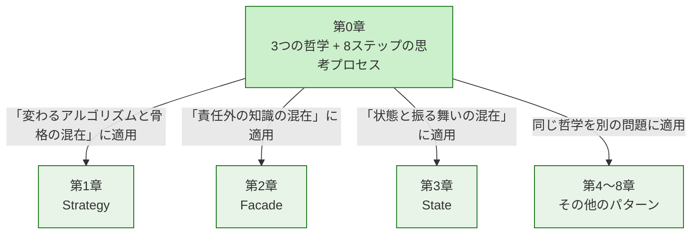
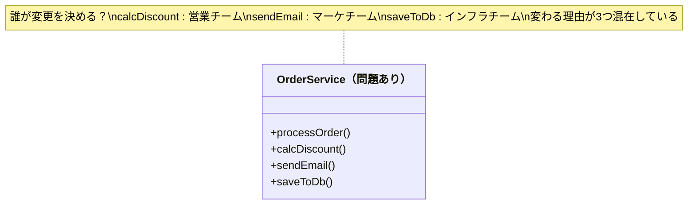
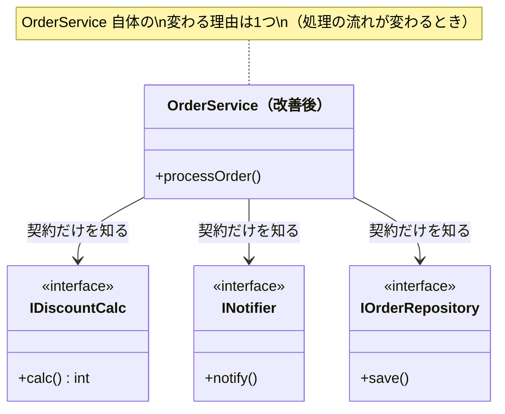
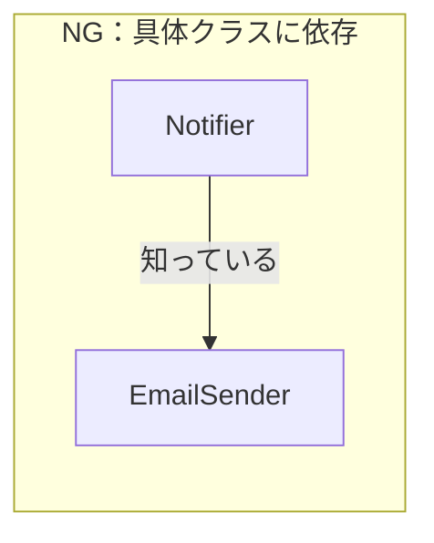
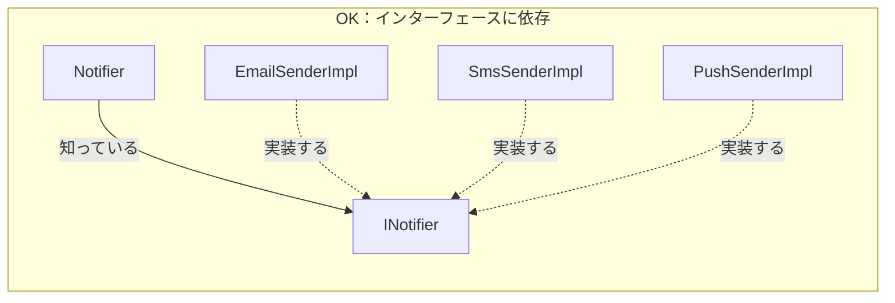
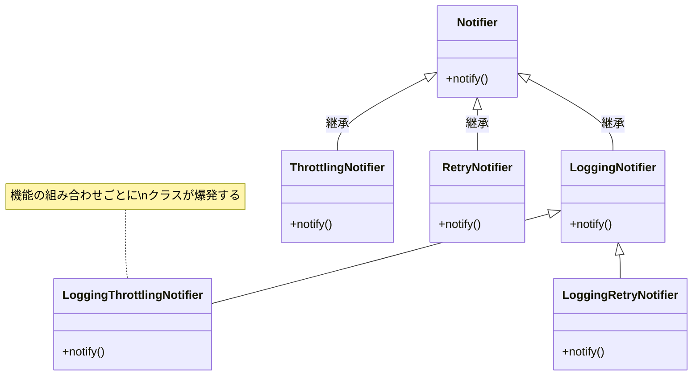
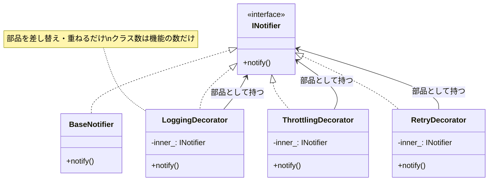
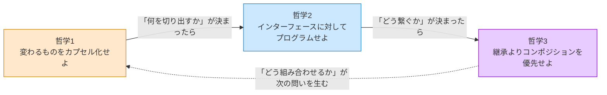
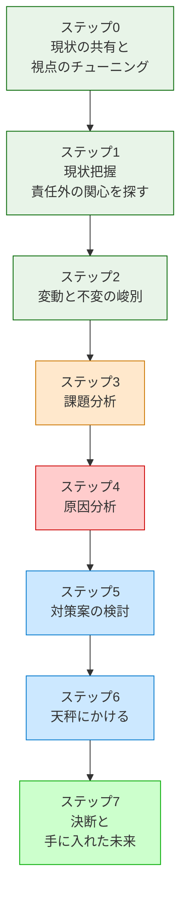

# 第0章　この本の読み方
―― デザインパターンは「考えた結果」に過ぎない

---

## なぜ「パターンを覚えても使えない」のか

ソフトウェア設計を学ぼうとすると、必ずと言っていいほど
「GoFのデザインパターン」に出会います。
本で学び、構造図を頭に入れ、いざ自分のコードに使おうとしたとき——

「どこに適用すればいいのか、わからない。」
「無理に使ってみたら、かえってコードが複雑になった。」

私自身、同じ壁に何度もぶつかりました。
パターンの名前と図は頭に入った。でも、
目の前の問題にどう当てはめればいいのか、
まるでわからなかったのです。

その感覚、うまく伝わっているでしょうか。

なぜ、実績のある優れた設計手法が、
時にはコードをより複雑にしてしまうのか。

理由はシンプルです。
**パターンを「最初から目指すべき答え」として扱っているから**です。

デザインパターンは、先人たちが泥臭い現場で問題に向き合い、
いくつかの選択肢を天秤にかけ、
「この状況ではこれが一番割に合う」と判断した
**決断の結果**として生まれたものです。

結果だけを真似ても、状況が違えばうまく機能しません。
大切なのは、その結果に至るまでの**思考のプロセス**を体験することです。

---

## この章の地図

この第0章は、本書全体の「設計の言語」を定義する場所です。
第1章以降でどのパターンを扱うときも、ここで定義した言語と思考の型を使います。



*第0章が「基礎言語」。各章はその言語を特定の問題に適用するだけ。*
*各章の「違い」は「何と何が混在しているか」という状況の違いだけです。*

---

## すべてのパターンを貫く3つの哲学

GoFの23のデザインパターンは、一見バラバラに見えます。
でも、すべてのパターンは、たった3つの哲学を
それぞれの状況に具体化したものに過ぎない——と、私は整理しています。

これを先に知っておくと、パターンが「暗記する公式の集まり」から
「同じ哲学を別の形で表現したもの」に見え始めます。

---

### 哲学1：変わるものをカプセル化せよ

「変わりやすい部分」と「変わってほしくない部分」を、同じ場所に書かない。

#### なぜこの哲学が生まれたのか

「変わる理由」が2つ以上混在しているクラスは、
どちらかの理由で変わるたびに変更対象になります。
このクラスに接触した人間は、
もう一方の責任まで壊していないか確認しなければなりません。

現場で何度もこの「確認作業」に追われた先人たちが、
「変わる理由ごとに分離していたら、この不安は生まれなかった」と気づいたのが
この哲学の出発点です。

#### 「変わる理由」を見つける問い

> 「このコードを変更するとき、変更を決定するのは誰か？」

答えが1人（1チーム）なら、変わる理由は1つです。
答えが2人以上なら、変わる理由が複数混在しています。

下の図で、問題のある構造と解決後の構造を比べてみてください。





*改善前の OrderService は3つの理由で変わる可能性があった。改善後は1つだけ。*

#### コードで確かめる

```cpp
// NG：計算ロジックと出力形式が同じクラスに混在
//      calcAmount が変わっても、format が変わっても、
//      この1つのクラスを変更しなければならない
class ReportService {
    void generate() {
        double value = calcAmount();      // 変わる理由1：計算ルール担当
        std::string text = format(value); // 変わる理由2：出力形式担当
        writeToPdf(text);
    }
};

// OK：変わる理由ごとに分離する
//     計算が変わっても ReportFormatter は変わらない
//     出力が変わっても Calculator は変わらない
class Calculator     { virtual double calcAmount() = 0; };
class ReportFormatter { virtual std::string format(double v) = 0; };

class ReportService {
    Calculator*      calc_;
    ReportFormatter* fmt_;
public:
    void generate() { fmt_->format(calc_->calcAmount()); }
};
```

**この哲学を使うための問い——この本を通じて使い回せる1つの問い：**

> 「このコードの中に、**『変わる理由』が異なる2つのものが、同じ場所に混在していないか？**」

パターンが違っても、問いはこれひとつです。
「何と何が混在しているか」の組み合わせが違うだけで、
本質的に問いかけていることは変わりません。

#### この哲学がどのパターンに現れるか

| パターン | 分離した「変わるもの」 |
|---|---|
| Strategy | アルゴリズムの実装 |
| Template Method | 処理の各ステップ |
| Command | 実行する操作 |
| Decorator | 追加する機能の組み合わせ |
| Observer | 通知先の種類 |
| State | 状態ごとの振る舞い |

GoF 23パターンのほぼすべては、この1つの哲学から導けます。

---

### 哲学2：実装ではなくインターフェースに対してプログラムせよ

「何をするか（契約）」と「どうやるか（実装）」を分ける。

#### なぜこの哲学が生まれたのか

哲学1で「変わるものを切り出した」あとに残る問題があります。
切り出した部品を「どう呼び出すか」です。

具体的なクラス名（`EmailSender`）を呼び出し元が知っていると、
Email→SMS→Pushに切り替わるたびに呼び出し元も変わります。
でも「通知する何か（`INotifier`）」という契約だけを知っていれば、
切り替えが起きても呼び出し元はまったく変わりません。

インターフェースは、安定した呼び出し側と不安定な実装側の間に立つ「緩衝材」です。

#### 依存の方向を図で理解する





*NGでは実装クラスが変わると Notifier も変わる。*
*OKでは INotifier の裏側がどう変わっても Notifier はまったく変わらない。*

#### コードで確かめる（依存の方向）

```cpp
// NG：具体クラスに直接依存している
//     EmailSender が変わるたびに Notifier も変わる
class Notifier {
    EmailSender* sender_; // 具体クラスを知っている
public:
    void notify(std::string msg) { sender_->send(msg); }
};

// OK：インターフェースに依存する
//     IMessageSender の実装が Email→SMS→Push に変わっても
//     Notifier は変わらない
class IMessageSender {
public:
    virtual void send(std::string msg) = 0;
    virtual ~IMessageSender() {}
};

class Notifier {
    IMessageSender* sender_; // 契約（インターフェース）だけを知っている
public:
    void notify(std::string msg) { sender_->send(msg); }
};
```

#### インターフェースが守れない変更がある：型の安定性

ただし、インターフェースが守れないものがひとつあります。**引数の型が変わるとき**です。

同じ引数の型（例：`int userId`）を複数のインターフェースで共有しているとき、
「`int` を `string` に変えてほしい」という要求が来ると、
そのすべてのインターフェースのシグネチャが変わります。
どんな設計構造があっても、この変更からは逃げられません。

こういう状況に直面したとき、立てるべき問いは「なぜこのパターンでは守れないのか」ではなく、
**「この型はどこまで安定していると言えるか？チームで合意できているか？」** です。
型を決める前に、システムの所有者や連携する部署の担当者に確認することが、最初の一手になります。

**コードで確かめる（型の安定性）：**

```cpp
// ① 型を合意・固定する
//    シンプルだが、型が変われば全インターフェースのシグネチャが変わる
class IUserService {
public:
    virtual void process(int userId) = 0;
};

// ② 独自型でくるむ
//    インターフェースのシグネチャは変わらない
//    型の変更は UserId の中だけに留まる
struct UserId {
    std::string value;  // int → string に変わってもここだけ直す
};
class IUserService {
public:
    virtual void process(UserId id) = 0;
};

// ③ void* で型情報をインターフェースに持たせない
//    インターフェースは絶対に変わらない
//    代わりに型安全を失う
class IUserService {
public:
    virtual void process(void* context) = 0;
};
```

| 選択肢 | インターフェース変更 | 型安全 | コードの複雑さ |
|---|---|---|---|
| ①合意・固定 | 型が変われば変わる | ✅ 高い | シンプル |
| ②独自型でくるむ | **変わらない** | ✅ 高い | 型定義が1つ増える |
| ③void\* | **絶対変わらない** | ❌ 低い | キャストが必要 |

どれが正解かは状況次第です。
各章では、パターンが直面したこの問題と、
関係者との確認を経て選んだ判断を示します。

---

### 哲学3：継承よりコンポジションを優先せよ

機能を「is-a（〜は〜である）」ではなく「has-a（〜を部品として持つ）」で組み合わせる。

#### なぜこの哲学が生まれたのか

継承は「コードの再利用」として便利に見えます。
でも、継承を重ねると「親クラスが変わると子クラスも変わる」という依存が積み重なります。
さらに、「ログ付き通知クラス」「スロットリング付き通知クラス」
「ログ付きスロットリング付き通知クラス」……と組み合わせが爆発します。

コンポジションは部品を差し替えるだけで振る舞いを変えられます。
DecoratorやStrategyが「インターフェースを実装したオブジェクトを内部に持つ」
という構造をしているのは、この哲学に従っているからです。

#### 継承だとなぜ組み合わせが爆発するか





*継承：組み合わせの数だけクラスが増える。*
*コンポジション：部品を重ねるだけ。クラス数は増えない。*

#### コードで確かめる

```cpp
// NG：継承（is-a）で機能を拡張する
//     LoggingNotifier は Notifier に依存している
//     Notifier の実装が変わると LoggingNotifier も影響を受ける
class LoggingNotifier : public Notifier {
    void notify(std::string msg) override {
        log(msg);
        Notifier::notify(msg); // 親の実装に依存
    }
};

// OK：コンポジション（has-a）で振る舞いを組み合わせる
//     inner_ を差し替えるだけで、ログ付き通知の相手を自由に変えられる
class LoggingNotifier {
    IMessageSender* inner_; // インターフェースとして持つ
public:
    explicit LoggingNotifier(IMessageSender* inner)
        : inner_(inner) {}

    void notify(std::string msg) {
        log(msg);
        inner_->send(msg); // 差し替え可能
    }
};
```

---

### 3つの哲学の連携

3つの哲学は独立しているのではなく、順番に適用される連携関係にあります。



1. **哲学1**で「変わる部分と変わらない部分」を見分けて分離する
2. **哲学2**で「分離した部分をインターフェース経由で接続する」
3. **哲学3**で「インターフェースで接続した部品をどう組み合わせるか」を決める

各章で登場するパターンは、この3つの哲学を「今回の問題状況」に
具体化したバリエーションです。

---

## 先人たちが使っていた「8ステップの思考プロセス」

先人たちも、私たちと同じように混沌としたコードの前で頭を抱えていました。
彼らが問題を解決するとき、意識的かどうかはともかく、
以下の8つのステップを踏んでいたと解釈することができます。

この8ステップを先に理解しておくと、
各章で同じ流れが繰り返されるときに「今どこにいるか」がわかります。
「迷子にならずに読める」ということが、理解の速度に直結します。



*緑：問題の把握。橙：問題の深掘り。青：解決策の設計。最終緑：決断と実装。*

各ステップは次のような問いに対応しています。

| ステップ | 問い |
|---|---|
| ステップ0 | このコードを読む前に、どんな「設計のレンズ」を持つべきか |
| ステップ1 | 各クラスの責任は何か。責任外の関心を持っていないか |
| ステップ2 | 何が変わりやすく、何は変わらないか。それはコードで確認できるか |
| ステップ3 | 変更要求が来たとき、どこが辛いか。その辛さの輪郭は何か |
| ステップ4 | 辛さの根本原因は何か。コードの構造のどこに問題があるか |
| ステップ5 | 解決策の候補は何か。最初の試みはなぜ限界に当たるか |
| ステップ6 | 解決策は今後の変化にどこまで耐えられるか。トレードオフはあるか |
| ステップ7 | 何を手に入れ、何を諦めたか。設計の判断を言葉にできるか |

各章は、この8ステップを1つの問題に対して一貫して適用します。
章が変わっても問いの順序は変わりません。
「今どこにいるか」さえわかれば、どのパターンの章を読んでも迷子になりません。

---

第1章から、この8ステップを使ってパターンをひとつずつ見ていきます。
