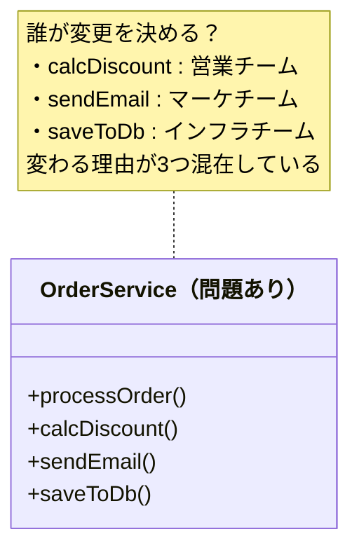
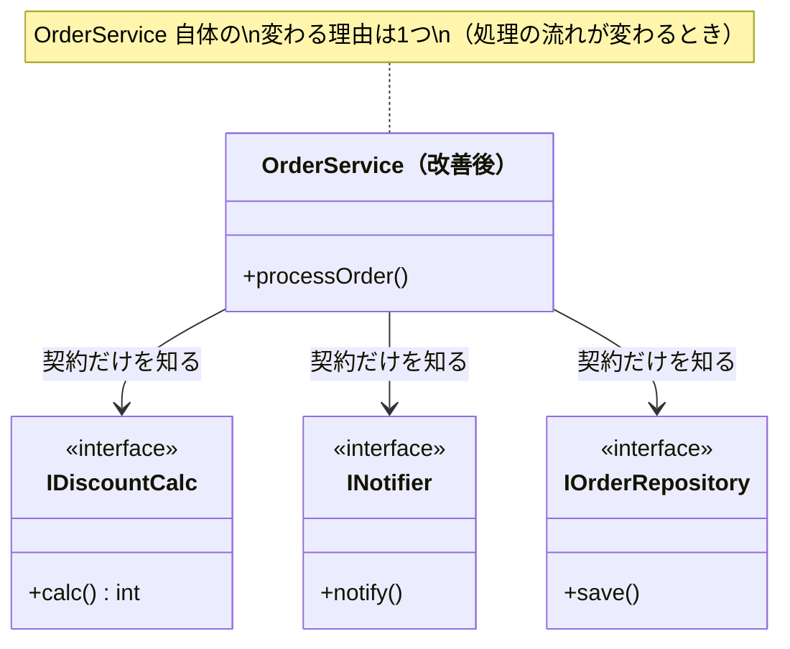
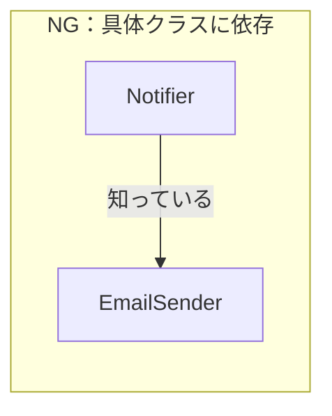
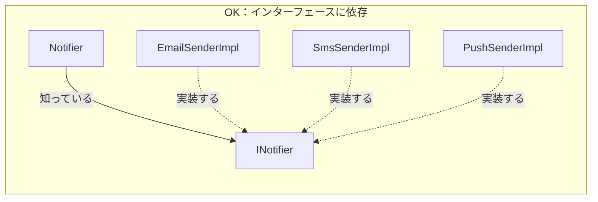
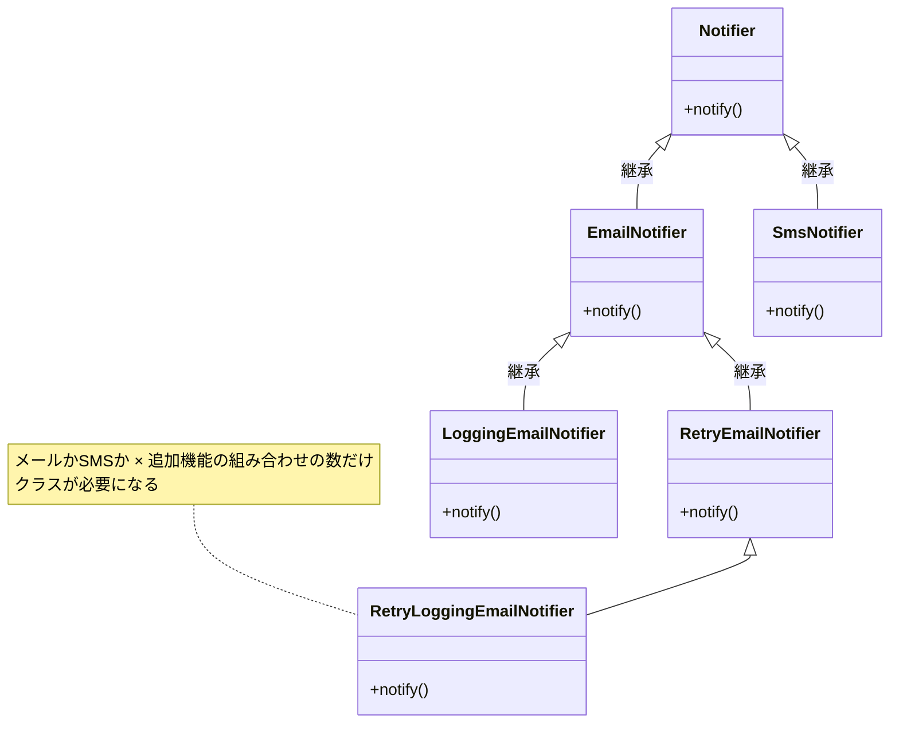
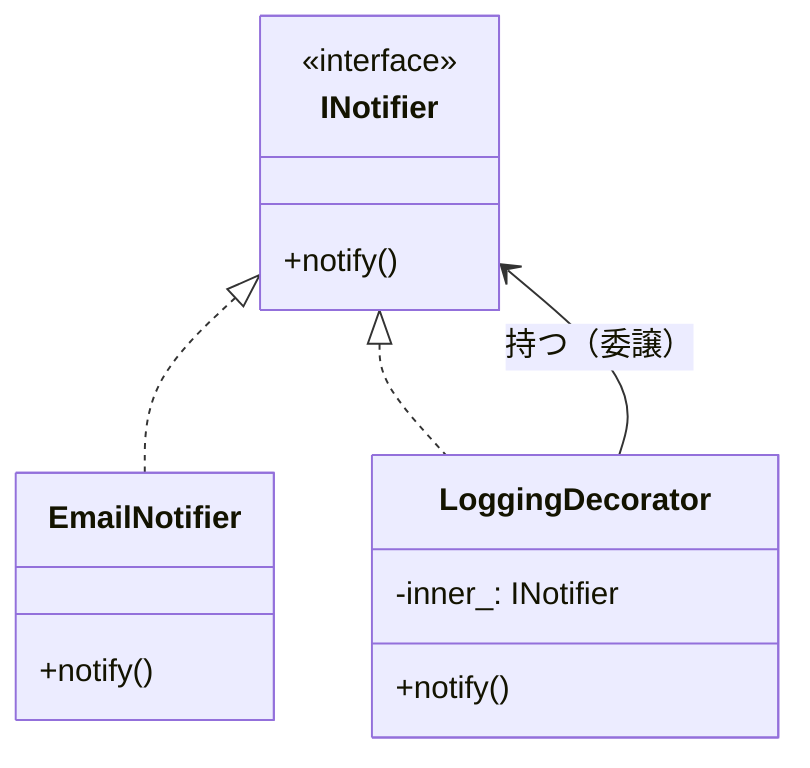
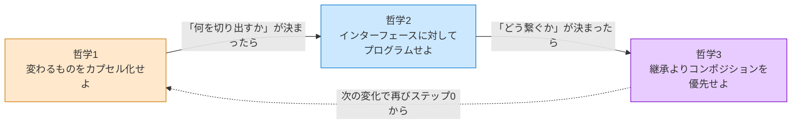
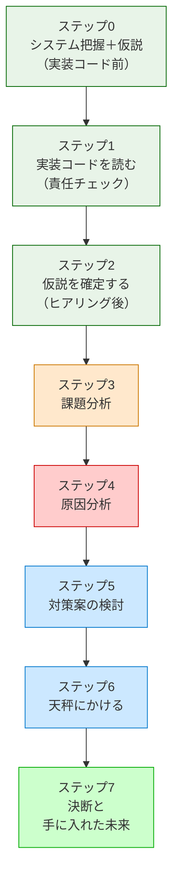

# 第0章　この本の読み方
―― デザインパターンは「考えた結果」に過ぎない

---

## なぜ「デザインパターンを覚えても使えない」のか

ソフトウェア設計を学ぼうとすると、必ずと言っていいほど
「GoFのデザインパターン」に出会います。
本で学び、構造図を頭に入れ、いざ自分のコードに使おうとしたとき——

「どこに適用すればいいのか、わからない。」
「無理に使ってみたら、かえってコードが複雑になった。」

私自身、同じ壁に何度もぶつかりました。
パターンの名前と図は頭に入った。でも、
目の前の問題にどう当てはめればいいのか、
まるでわからなかったのです。

その感覚、うまく伝わっているでしょうか。

なぜ、実績のある優れた設計手法が、
時にはコードをより複雑にしてしまうのか。

理由はシンプルです。
**パターンを「最初から目指すべき答え」として扱っているから**です。

デザインパターンは、先人たちが泥臭い現場で問題に向き合い、
いくつかの選択肢を天秤にかけ、
「この状況ではこれが一番割に合う」と判断した
**決断の結果**として生まれたものです。

結果だけを真似ても、状況が違えばうまく機能しません。
大切なのは、その結果に至るまでの**思考のプロセス**を体験することです。

この本を読むことで、デザインパターンという「結果」がどのような思考で生まれたのか、その本質を理解することができます。パターンの形を暗記して無理に適用するのではなく、目の前の状況に合わせて適切な考え方で対処する――いわば、**「自分なりの設計の型」** を身につけることができるようになります。

> [!INFO] レゴブロックで考える設計
> この本を通じて、ソフトウェア設計の考え方を**レゴブロック**に例えて説明します。
>
> レゴブロックを使って何かを作るとき、私たちは自然と「どのブロックをどこにつなぐか」を考えます。「このブロックが大きすぎる」「ここに壁が必要だ」「あそこの柱は取り外せるようにしたい」——こうした直感は、ソフトウェア設計の思考と全く同じです。
>
> 子どもがレゴで遊ぶように、**ブロックを分けたり・まとめたり・間に挟んだり・新しいパーツを作ったり**する4つの操作で、どんな設計の問題も解決できます。パターンの名前を覚える前に、まずその「手の動き」を理解してください。

> [!INFO] 本書の前提と言語について
> 本書では、すべてのサンプルコードを **C++** で記述しています。ただし、ここで学ぶ「思考の型」はC++に依存するものではありません。オブジェクト指向の概念を備えた言語であれば、どのような言語でも同じように活かせる知識となっています。

---

## この章の地図

この第0章は、本書全体の「設計の言語」を定義する場所です。
第1章以降でどのパターンを扱うときも、ここで定義した言語と思考の型を使います。

| 章       | 扱うパターン          | 変わるもの（カプセル化の対象）          |
| ------- | --------------- | ------------------------ |
| **第0章** | （基礎知識）          | **3つの哲学 + 8ステップの思考プロセス** |
| **第1章** | Strategy        | 実行する振る舞い（アルゴリズムやルール）     |
| **第2章** | Facade          | 複雑な外部連携の詳細               |
| **第3章** | State           | 状態とそれに伴う振る舞い             |
| **第4章** | Template Method | 処理の各ステップの実装              |
| **第5章** | Command         | 実行する操作そのもの（要求の発生と実行）     |
| **第6章** | Decorator       | 追加する機能の組み合わせ             |
| **第7章** | Observer        | 通知先の種類や依存方向              |
| **第8章** | Factory Method  | 作るオブジェクトの種類（生成と利用）       |
| **第9章** | （応用演習）          | 複数の要因が絡み合う複雑な問題の解決       |

*第0章が「基礎言語」。各章はその言語を特定の問題に適用するだけ。*
*各章の「違い」は「何と何が混在しているか」という状況の違いだけです。*

---

## すべてのパターンを貫く3つの哲学

GoFの23のデザインパターンは、一見バラバラに見えます。
でも、すべてのパターンは、たった3つの哲学を
それぞれの状況に具体化したものに過ぎない——と、私は整理しています。

これを先に知っておくと、パターンが「暗記する公式の集まり」から
「同じ哲学を別の形で表現したもの」に見え始めます。

---

### 哲学1：変わるものをカプセル化せよ

この哲学の核心は、**「誰の判断で変わるか」という決定者を基準に、コードを分離する**ことです。

決定者を特定して分離すると、おのずと「変わるもの」と「変わらないもの」が分かれます。
分離はゴールではなく、決定者を1つにそろえた結果として生まれる構造です。

#### なぜこの哲学が生まれたのか

コードが変わる理由は、ビジネスの変化によって生まれます。
割引ルールを決めるのは「営業チーム」です。API仕様を変えるのは「インフラ担当」です。
出力フォーマットを決めるのは「経理担当」です。

**決定権者が2人以上いるコードを1か所に書くと、一方の変更がもう一方を道連れにします。**

営業チームが割引ルールを変えただけなのに、経理担当の処理まで確認しなければならない——
現場で何度もこの「確認作業」に追われた先人たちが、
「変わる理由ごとに分離していたら、この不安は生まれなかった」と気づいたのが
この哲学の出発点です。

#### 「変わる理由」を見つける問い

この哲学を使うための問いは1つです。

> **「このコードを変更するとき、変更を決定するのは誰か？」**

答えが1人（1チーム）なら、変わる理由は1つです。
答えが2人以上なら、変わる理由が複数混在しています。
**「誰の判断で変わるか」が境界線を引く基準になります。**

たとえば「ECサイトの注文処理システム」を想像してください。
- 割引キャンペーンの適用条件を決めるのは**営業担当**です。
- 注文完了メールの文面を決めるのは**マーケティング担当**です。
- クレジットカード決済の仕様を決めるのは**外部の決済代行会社**です。

判断者はそこまで多くありませんが、これらの処理が1つの `OrderService` クラスに混在していると、マーケティング担当の要望でメール文面を変える際に、決済処理に影響が出ないかテストする必要が生じます。だからこそ、決裁者ごとに分離するのです。

下の図で、問題のある構造と解決後の構造を比べてみてください。





*改善前の OrderService は3つの理由で変わる可能性があった。改善後は1つだけ。*

#### コードで確かめる(C++)

以下に、問題のある「NGコード」を示します。

```cpp
#include <iostream>
#include <string>

// NG：計算ロジックと出力形式が同じクラスに混在
//      calcAmount が変わっても、format が変わっても、
//      この1つのクラスを変更しなければならない
class ReportService {
    double totalSales_; // 売上合計（コンストラクタで受け取る）
public:
    explicit ReportService(double sales) : totalSales_(sales) {}
    void generate() {
        double value = calcAmount();      // 変わる理由1：計算ルール担当（営業チーム）
        std::string text = format(value); // 変わる理由2：出力形式担当（経理チーム）
        writeToPdf(text);
    }
private:
    double calcAmount() { return totalSales_ * 0.1; }           // 手数料10%：営業チームが決める
    std::string format(double v) {                              // CSV形式：経理チームが決める
        return "金額," + std::to_string(static_cast<int>(v));
    }
    void writeToPdf(const std::string& text) {
        std::cout << "[PDF] " << text << "\n";
    }
};

int main() {
    ReportService service(1000);
    service.generate();
    // 実行結果:
    // [PDF] 金額,100
    return 0;
}
```

次に、変わる理由ごとにクラスを分離した「OKコード」です。

```cpp
#include <iostream>
#include <string>

// インターフェース（契約）
class Calculator {
public:
    virtual double calcAmount() = 0;
    virtual ~Calculator() {}
};
class ReportFormatter {
public:
    virtual std::string format(double v) = 0;
    virtual ~ReportFormatter() {}
};

// 具体実装①：手数料10%（営業チームが管理）
class CommissionCalc : public Calculator {
    double totalSales_;
public:
    explicit CommissionCalc(double sales) : totalSales_(sales) {}
    double calcAmount() override { return totalSales_ * 0.1; }
};

// 具体実装②：CSV形式（経理チームが管理）
class CsvFormatter : public ReportFormatter {
public:
    std::string format(double v) override {
        return "金額," + std::to_string(static_cast<int>(v));
    }
};

// OK：変わる理由ごとに分離した結果、ReportServiceは骨格だけになる
class ReportService {
    Calculator*      calc_;
    ReportFormatter* fmt_;
public:
    ReportService(Calculator* c, ReportFormatter* f) : calc_(c), fmt_(f) {}
    void generate() {
        std::string text = fmt_->format(calc_->calcAmount());
        std::cout << "[PDF] " << text << "\n";
    }
};

int main() {
    CommissionCalc calc(1000);
    CsvFormatter formatter;
    ReportService service(&calc, &formatter);
    service.generate();
    // 実行結果:
    // [PDF] 金額,100
    return 0;
}
```

> [!INFO] ReportService の変更理由は複数あるのでは？
> OKコードを見たとき、「各機能の担当都合で実装クラス（CommissionCalcなど）が差し替わるなら、ReportService 自体も直す必要があるのでは？」と疑問に思うかもしれません。
> しかし、`ReportService` は `Calculator` や `ReportFormatter` という**インターフェース（契約）**しか知りません。そのため、営業チームが新しい計算ルールを追加しても、経理チームが新しいフォーマットを追加しても、`ReportService` のコード自体は1行も変わりません（main関数などの外側で差し替えるだけです）。
> これこそが、次項で説明する「**哲学2：インターフェースに対してプログラムせよ**」の力です。

**この哲学を使うための問い——この本を通じて使い回せる1つの問い：**

> **「このコードの中に、『変更を決定する人（決裁者）』が異なる2つのものが、同じ場所に混在していないか？」**

パターンが違っても、問いはこれひとつです。
「誰の決定で変わるか」が違うものが混在していないかを常に問いかけます。

#### 哲学がどのように形になるか

> 以下の表は、各章を読み進めた後に「あのパターンは、何を分離した結果なのか」を確認するための参照表です。今はパターン名を知らなくて構いません。

| パターン | 「変わらない」骨格・全体 | 分離した「変わるもの」 |
|---|---|---|
| Strategy（第1章） | 処理全体の流れや目的 | 実行する振る舞い（アルゴリズムやルール） |
| Facade（第2章） | システムが実現したいビジネス要件 | 複雑な外部連携の詳細な手順やAPI |
| State（第3章） | オブジェクトの全体的なライフサイクル | 特定の状態における個別の振る舞い |
| Template Method（第4章） | 処理の全体的な骨格・順序 | 骨格内の個別ステップの実装 |
| Command（第5章） | コマンドを呼び出して実行する仕組み | 実行する操作そのもの（要求の発生と実行） |
| Decorator（第6章） | コアとなる処理のインターフェース | 追加する機能のバリエーションや組み合わせ |
| Observer（第7章） | 状態更新などの主たる処理 | 通知先の種類や依存方向 |
| Factory Method（第8章） | オブジェクトを利用する側のロジック | 作るオブジェクトの種類（生成と利用） |

GoFのパターンは、決して最初から目指すものではありません。「変わるものをカプセル化せよ」という哲学を適用し、不変の骨格から変動する部分を分離した結果の姿に過ぎないのです。

#### 補足：なぜ「すべてのパターン」が登場しないのか

本書はGoFの23個のパターンすべてを網羅していません。しかし、それは「不足」ではありません。**設計の「思考の型」としては、この8章で完全に網羅できている**からです。

現場で開発者を苦しめる「痛みのベクトル（何が変わるか）」は、ロジック、状態、依存、組み合わせ、生成など、概ね上記の8種類に代表されます。この8つの痛みを解消する「型の適用プロセス」さえ脳にインストールできれば、本に登場しない残りのパターンに遭遇したとしても、自力でその構造を導き出すことができます。

- **基本思想の応用で自力で到達できるもの**：たとえば「Adapter（翻訳層）」や「Proxy（代理人）」は、FacadeやDecoratorの章で学ぶ「間にクッションを挟んで依存を切る」という基本思想の派生に過ぎません。
- **言語やフレームワークが解決済みのもの**：要素の走査（Iterator）は現代の言語機能（foreach等）に吸収されています。
- **特定ドメインに特化しすぎているもの**：木構造の処理（Composite）や複雑なデータ構造と処理の分離（Visitor）などは、日常的なビジネスロジックの整理というより特定のデータ構造に対する特殊手札です。
- **現代では使用を慎重に考えるもの**：Singleton（グローバル状態）は、現代ではテストを困難にするため、本章で学ぶDI（依存の外部注入）で置き換えることが多いパターンです。

「この原因には、この手札を当てる」。その結果としてパターンが立ち現れる。
このプロセスを8つの代表例で完全にマスターすれば、あなたはパターンの「暗記者」ではなく「設計者」になっています。

もちろん、GoFの23のパターンをすべて知る必要がないというわけではありません。残りのパターンを学ぶことで、特定のドメインや特殊な問題に対する設計の引き出し（ボキャブラリー）は確実に増え、設計の知識はさらに深まります。23個のパターンは、多様な問題解決のカタログとして非常に価値のあるものです。しかし、最初からすべてを暗記しようとして混乱するよりも、まずはこの8つを通じて「型の適用プロセス」を脳にインストールすることが先決です。

#### この哲学を「あえて」外すとき

原則として哲学1を適用するのがよいですが、**「あえて哲学の適用を見送る（カプセル化しない）」**判断が必要なケースもあります。分離による複雑さの増大（コスト）が、分離によるメリットを上回ってしまう危険性がある場合です。

- **変わる見通しがない**場合。関係者に確認して「この処理は変わらない」と合意できたものは分離不要です。分離のコストが価値を超えます。
- **大規模なレガシーコードで、絡み合いが深い**場合。一気の分離はリスクです。段階的な置き換え（新しい機能から新しい構造で書く）の方が現実的です。
- **変わる理由が同じものを分離しようとしている**場合。たとえば、割引計算の `if` 文が3つある関数を「if が多いから」という理由だけで分離しても意味がありません。3つの割引条件がすべて同じ担当チームが管理していて、同じタイミングで変わるなら、1か所にまとめていて良いのです。「変わる理由が何人いるか」が分離の基準であり、「コードの行数」や「if の数」ではありません。

---

### 哲学2：実装ではなくインターフェースに対してプログラムせよ

「何をするか（契約）」と「どうやるか（実装）」を分ける。

#### なぜこの哲学が生まれたのか

哲学1で「変わるものを切り出した」あとに残る問題があります。
切り出した部品を「どう呼び出すか」です。

具体的なクラス名（`EmailSender`）を呼び出し元が知っていると、
Email→SMS→Pushに切り替わるたびに呼び出し元も変わります。
でも「通知する何か（`INotifier`）」という契約だけを知っていれば、
切り替えが起きても呼び出し元はまったく変わりません。

インターフェースは、安定した呼び出し側と不安定な実装側の間に立つ「緩衝材」です。

#### 依存の方向を図で理解する





*NGでは実装クラスが変わると Notifier も変わる。*
*OKでは INotifier の裏側がどう変わっても Notifier はまったく変わらない。*

#### コードで確かめる（依存の方向）

**NGコード**

```cpp
// NG：具体クラスに直接依存している
//     EmailSender が変わるたびに Notifier も変わる
class Notifier {
    EmailSender* sender_; // 具体クラスを知っている
public:
    void notify(std::string msg) { sender_->send(msg); }
};
```

**OKコード**

```cpp
// OK：インターフェースに依存する
//     IMessageSender の実装が Email→SMS→Push に変わっても
//     Notifier は変わらない
class IMessageSender {
public:
    virtual void send(std::string msg) = 0;
    virtual ~IMessageSender() {}
};

// 具体的な実装①：メール送信
class EmailSender : public IMessageSender {
public:
    void send(std::string msg) override {
        std::cout << "[EMAIL] " << msg << std::endl;
    }
};

// 具体的な実装②：SMS送信（後から追加しても Notifier は変わらない）
class SmsSender : public IMessageSender {
public:
    void send(std::string msg) override {
        std::cout << "[SMS] " << msg << std::endl;
    }
};

class Notifier {
    IMessageSender* sender_; // 契約（インターフェース）だけを知っている
public:
    // コンストラクタ注入：使う実装を外から渡す（依存注入）
    explicit Notifier(IMessageSender* sender) : sender_(sender) {}
    void notify(std::string msg) { sender_->send(msg); }
};

// 組み立ては呼び出し元（main()相当）だけが知っている
int main() {
    EmailSender email;
    Notifier notifier(&email);   // Email版で使う
    notifier.notify("注文完了");

    SmsSender sms;
    Notifier notifier2(&sms);    // SMS版に差し替えても Notifier は変わらない
    notifier2.notify("注文完了");
    return 0;
}
```

#### インターフェースを設計するとき「引数の型」をどう決めるか

インターフェースは「呼び出し元を変化から守る壁」ですが、壁にも破れ目があります。
**引数の型が変わるとき**です。

たとえば、`int userId` をインターフェースの引数として複数箇所で使っているとき、
「IDを文字列に変えたい」という要求が来ると、すべてのインターフェースのシグネチャが変わります。
インターフェースを使っていても、この変更からは逃げられません。

こういう状況に直面したとき、立てるべき問いは「なぜこのパターンでは守れないのか」ではなく、
**「この型はどこまで安定していると言えるか？関係者と合意できているか？」** です。
型を決める前に、その型を使う担当者に確認することが、最初の一手になります。


型変更リスクに対処するコードの選択肢は3つあります：

**① 型を合意・固定する**
シンプルですが、型が変われば全インターフェースのシグネチャが変わります。

```cpp
class IUserService {
public:
    virtual void process(int userId) = 0;
};
```

**② 独自型でくるむ**
インターフェースのシグネチャは変わりません。型の変更は `UserId` の中だけに留まります。

```cpp
struct UserId {
    std::string value;  // int → string に変わってもここだけ直す
};

class IUserService {
public:
    virtual void process(UserId id) = 0;
};
```

**③ void* で型情報をインターフェースに持たせない**
インターフェースは絶対に変わりませんが、代わりに型安全を失います。

```cpp
class IUserService {
public:
    virtual void process(void* context) = 0;
};
```

| 選択肢 | インターフェース変更 | 型安全 | コードの複雑さ |
|---|---|---|---|
| ①合意・固定 | 型が変われば変わる | ✅ 高い | シンプル |
| ②独自型でくるむ | **変わらない** | ✅ 高い | 型定義が1つ増える |
| ③void\* | **絶対変わらない** | ❌ 低い | キャストが必要 |

実際の採用頻度は ① が最も多く、② が型変更リスクが判明しているときの選択肢です。
③ は組み込みや性能に極めて厳しい文脈を除き、選ぶことはほぼありません。
各章では、パターンが直面したこの問題と、関係者との確認を経て選んだ判断を示します。

#### この哲学を「あえて」外すとき

哲学2も同様に、**「あえてインターフェースを使わず、直接依存させる」**判断が必要なケースがあります。

- **実装が1つしかなく、差し替えの見込みがない**場合。インターフェースは間接レイヤーのコストだけになります。「将来変わるかもしれない」という根拠のない予測でインターフェースを作ると、コードを読む人の認知負荷が上がるだけです。
- **チームやコードの規模が小さい**場合。インターフェースが増えると「どこで実装しているか」を探す手間が積み重なります。直接依存の方が読みやすい場面があります。

---

### 哲学3：継承よりコンポジションを優先せよ

機能を「is-a（〜は〜である）」ではなくコンポジション「has-a（〜を部品として持つ）」で組み合わせる。

#### 継承による機能の追加がもたらす問題

継承は「is-a（〜は〜である）」の関係を表すと言われます。
たとえば、システムに通知機能（`Notifier`）があり、その派生として「Eメール通知（`EmailNotifier`）」と「SMS通知（`SmsNotifier`）」があるとします。ここまでは自然な「is-a」関係です。

しかし、ここに別の軸の機能が追加されたらどうなるでしょうか。
「送信に失敗したとき、リトライ（再実行）したい」という機能です。

> [!INFO] コラム：C++ に「インターフェース」はあるか
> C++ には `interface` というキーワードはありません。C++ での「インターフェース」は、**純粋仮想関数（`= 0`）だけで構成された抽象クラス**のことを指します。
> ```cpp
> class INotifier {
> public:
>     virtual void notify(const std::string& msg) = 0;
>     virtual ~INotifier() {}
> };
> ```
> 「インターフェースを実装する」= この純粋仮想クラスを継承して実装すること。
> 「具体クラスを継承する」= 実装を持つクラスから引き継ぐこと。問題になるのは後者です。

#### 問題①：具体クラスを継承すると「何者か」が固定される

```cpp
class EmailNotifier { // 具体クラス：メールを送る実装が入っている
    std::string smtpHost_;
public:
    EmailNotifier(const std::string& host) : smtpHost_(host) {}
    virtual void notify(const std::string& msg) {
        std::cout << "[Email: " << smtpHost_ << "] " << msg << "\n";
    }
};

// リトライ付きメール通知クラス
class RetryEmailNotifier : public EmailNotifier {
public:
    RetryEmailNotifier(const std::string& host) : EmailNotifier(host) {}
    void notify(const std::string& msg) override {
        for (int i = 0; i < 3; ++i) {
            try {
                EmailNotifier::notify(msg); // 親のメソッドを呼ぶ
                return; // 成功したら終了
            } catch (...) {
                std::cout << "Retry " << i + 1 << "\n";
            }
        }
    }
};
```

「親の実装を再利用できるから便利だ」と思うかもしれません。
しかし、`RetryEmailNotifier` は `EmailNotifier` を継承した時点で、**永遠に「メールを送る通知クラス」として固定されます**。

「SMS通知にもリトライ機能を追加してほしい」と言われたら、`RetrySmsNotifier` を作って同じリトライロジックを書かなければなりません。

**継承するなら具体クラスではなく純粋仮想クラス（インターフェース）から**、というのが哲学2との連携です。

#### 問題②：振る舞いを組み合わせようとするとクラスが爆発する

これが哲学3の本題です。「リトライ機能」だけでなく「ログ出力機能」や「制限機能」も必要になった場合、継承で組み合わせようとすると何が起きるか——



機能が4つになれば組み合わせは指数的に増えます。
1つ機能を追加するたびに、既存の全組み合わせ分だけクラスを追加しなければなりません。

#### コンポジションはこう解決する

「コンポジション」とは、オブジェクトを部品として内部に持ち、その部品に処理を委譲（依頼）することです。継承（親から引き継ぐ）ではなく、持つ（外から受け取る）ことで振る舞いを組み合わせます。

基本となる「持つ」だけの解決策から見ていきましょう。

**① 単純なコンポジション（持つだけ）**

一番シンプルな解決策は、リトライ処理専用の部品（`RetryExecutor`）を作り、それを `EmailNotifier` が「持つ」ことです。

```cpp
class EmailNotifier : public INotifier {
    RetryExecutor* retry_; // リトライ部品を持つ（コンポジション）
public:
    EmailNotifier(RetryExecutor* r) : retry_(r) {}
    void notify(const std::string& msg) override {
        // リトライ部品に実際の処理を依頼（委譲）する
        retry_->execute([&]() {
            std::cout << "[Email] " << msg << "\n";
        });
    }
};
```

これで「通知」と「リトライ」のロジックが分かれました。これがコンポジション（has-a）の基本です。インターフェースを実装せずに単に別のクラスを持つだけでも、設計の柔軟性は上がります。
しかし、この方法では「EmailNotifier自身がリトライ部品を持つ必要がある」ため、機能の追加や入れ替えにはクラス（EmailNotifier）の修正が必要です。

では、継承で問題になった `RetryLoggingEmailNotifier`（リトライ＋ログ＋メール送信の組み合わせ）は、コンポジションでどう解決するのか？——答えは「包む」です。

**② 応用編：包む（インターフェースを実装しながら、持つ）**

もし、「既存のクラスに一切手を触れずに、後からリトライ機能やログ機能を追加したり外したりしたい」なら、もう一歩進んだ特殊なコンポジションの形を使います。
それが、**インターフェースを実装しつつ、同じインターフェースを内側に持つ** という手法です。

```cpp
// リトライ機能を追加する「ラッパー（包む）」クラス
class RetryDecorator : public INotifier {  // ① INotifier を実装（外から INotifier として使える）
    INotifier* inner_;                     // ② 本物の通知クラスをメンバーとして持つ
public:
    RetryDecorator(INotifier* inner) : inner_(inner) {}

    void notify(const std::string& msg) override {
        // 自分の仕事（リトライ制御）をする
        for (int i = 0; i < 3; ++i) {
            try {
                inner_->notify(msg); // 本物に委譲（実際の通知は inner_ がやる）
                return;
            } catch (...) {}
        }
    }
};
```

「インターフェースを実装しているのになぜ、同じインターフェースを持つのか？」への答えは明確です。
- **実装する理由**：外から `INotifier` として扱われるため（呼び出し元を変更しないため）
- **持つ理由**：実際の処理を中身（`EmailNotifier`など）に委譲するため

この「実装」と「持つ」をセットにすることで、外からマトリョーシカのように「包む」だけで機能を無数に組み合わせられるようになります。

**クラス図の読み方**



クラス図で使う矢印には2種類あります。

`点線 ＋ 白抜き三角（ ──▷ を点線にしたもの）` は「インターフェースを実装している」を意味します。`EmailNotifier` と `LoggingDecorator` はどちらも `INotifier` を実装しているので、`INotifier` に向かって点線の白抜き三角が伸びています。

`実線矢印（──>）` は「メンバーとして持っている（参照している）」を意味します。`LoggingDecorator` は `INotifier* inner_` というメンバーを持っているので、`INotifier` に向かって実線矢印が伸びています。

つまり `LoggingDecorator` から `INotifier` へは **2本の線** が出ています。点線三角は「私はINotifierとして振る舞える」、実線矢印は「私はINotifierを内部に持っている」という2つの異なる関係を表しています。

**3機能をクラス追加なしで組み合わせる**

```cpp
// インターフェース
class INotifier {
public:
    virtual void notify(const std::string& msg) = 0;
    virtual ~INotifier() {}
};

// 具体クラス：メール送信（smtpHost_ と port_ を内部状態として持つ）
class EmailNotifier : public INotifier {
    std::string smtpHost_;
    int         port_;
public:
    EmailNotifier(const std::string& host, int port)
        : smtpHost_(host), port_(port) {}
    void notify(const std::string& msg) override {
        std::cout << "[Email → " << smtpHost_ << ":" << port_ << "] " << msg << "\n";
    }
};

// ログを追加する「包み紙」（log_ を内部状態として持つ）
class LoggingDecorator : public INotifier {
    INotifier*    inner_;
    std::ostream& log_;
public:
    LoggingDecorator(INotifier* inner, std::ostream& log)
        : inner_(inner), log_(log) {}
    void notify(const std::string& msg) override {
        log_ << "[LOG] " << msg << "\n";
        inner_->notify(msg);
    }
};

// リトライを追加する「包み紙」（maxRetries_ を内部状態として持つ）
class RetryDecorator : public INotifier {
    INotifier* inner_;
    int        maxRetries_;
public:
    RetryDecorator(INotifier* inner, int maxRetries)
        : inner_(inner), maxRetries_(maxRetries) {}
    void notify(const std::string& msg) override {
        for (int attempt = 1; attempt <= maxRetries_; ++attempt) {
            try {
                inner_->notify(msg);
                return;          // 送信成功 → 即リターン
            } catch (...) {
                std::cerr << "[Retry] 試行 " << attempt << "/" << maxRetries_ << " 失敗\n";
            }
        }
    }
};
```

組み合わせは外から「包む」だけです。新しいクラスは不要です。

```cpp
// リトライ付き・ログ付きメール通知
EmailNotifier    email("smtp.example.com", 587);
RetryDecorator   retry(&email, 3);             // email を包む（最大3回リトライ）
LoggingDecorator logging(&retry, std::cout);   // retry をさらに包む

logging.notify("給与処理完了");
// → [LOG] 給与処理完了
// → [Email → smtp.example.com:587] 給与処理完了（リトライは成功時0回）
```

この「包む」構造——「インターフェースを実装しながら、同じインターフェースを内部に持ち、処理を委譲する」——を **Decoratorパターン** と呼びます。「クラスを追加せず、包むことで機能を後付けする」パターンです。

*継承：組み合わせの数だけクラスが増える。*
*コンポジション：包むだけ。クラス数は機能の種類の数だけ。*

> [!INFO] コンポジションは「哲学1」に反するのでは？という疑問
> 「コンポジションで機能を組み合わせたら、それは結局『変わる理由の決定者が複数いる（＝NG）』という状態に戻ってしまうのでは？」と思うかもしれません。
> しかし、ここが哲学1の真髄です。哲学1が禁止しているのは「1つのクラスの中に混在して書くこと」です。
> `LoggingDecorator` や `RetryDecorator` はそれぞれ別のクラスに分離されているため、ログ担当者がログの仕様を変えても、リトライ担当者のコードには一切影響しません（再コンパイルすら不要です）。
> そして、それらを「どう組み合わせるか」を決めるのは、利用側（`main`関数やDIコンテナ）の責任になります。それぞれの部品は自分の仕事だけに集中できる。これこそが哲学1を守り抜いた姿なのです。

#### この哲学を「あえて」外すとき

哲学3においても、**「あえてコンポジションではなく継承を選ぶ」**判断が適切なケースがあります。

- **is-a 関係が成立し、振る舞いを「重ねる」必要がない**場合。たとえばシステムに「管理者ユーザー」と「一般ユーザー」という2種類があって、管理者が一般ユーザーの機能をすべて持ちつつ追加権限を持つ——この場合は `AdminUser extends User` という継承が概念を正直に表現します。振る舞いを後から組み合わせるのではなく、分類するだけなら継承は素直な選択です。
  > **[注意] 継承の罠**：誰もが最初は「is-a 関係だ」と思って継承で実装します。しかし後から「A機能付きの一般ユーザー」「B機能付きの管理者」のように**組み合わせの追加**が発生したときに、そのまま継承を続けると破綻します。組み合わせが発生した時点で、継承からコンポジション（Decoratorパターンなど）へリファクタリングする勇気が必要です。
- **骨格（流れ）を固定して、各ステップの中身だけを変えたい**場合。「処理のステップ順序は変えず、各ステップの実装だけをサブクラスで差し替える」という場面では継承を意図的に使います。**骨格・ステップ分離**がこれに対応します。
  （→ 手札の詳細はこの章の「ステップ5：対策案の検討」および末尾の「構造的対策案の網羅的リスト」を参照）
- **コンポジションが委譲コードを増やしすぎる**場合。has-a で持つと「そのメソッドを呼ぶだけのメソッド」が増え、コードが薄く長くなることがあります。継承なら1行のオーバーライドで済む場面では、継承の方が読みやすいことがあります。

---

> **「哲学」をどう読むか**
>
> ここで「哲学」と呼ぶのは、「常に守るべき絶対ルール」ではありません。
> **「特別な理由がない限りここを出発点にする、デフォルト値」** です。
>
> 3つの哲学を読んで気づいた通り、どの哲学にも「あえて外すとき」があります。
> 哲学は「守らせるもの」ではなく、**「逸脱するときに理由を言語化させるもの」** です。
>
> 「インターフェースを使わない。なぜなら実装は1種類しかなく、テストでの差し替えも不要だから」
> ——この判断は正しい設計です。理由があっての逸脱は偶然の設計とは違います。
>
> 各章で「なぜこのパターンを選んだか」を追うとき、
> 常にこの問いに戻ってきます：**「この状況で、どの哲学がどこに適用されているか」**。

---

### 3つの哲学の連携

3つの哲学は独立しているのではなく、順番に適用される連携関係にあります。


1. **哲学1**で「決定者を特定し、変わる部分を分離する」（結果として変わるもの/変わらないものが分かれる）
2. **哲学2**で「分離した部分をインターフェース経由で接続する」
3. **哲学3**で「インターフェースで接続した部品をどう組み合わせるか」を決める

各章で登場するパターンは、この3つの哲学を「今回の問題状況」に
具体化したバリエーションです。

---

★ここでChapter0は区切った方がよさそう。以降は次の章に変えるか、Chapter0-1にするか
## 先人たちが使っていた「8ステップの思考プロセス」

**このプロセスを「いつ」使うのか**

この8ステップは、**「すでに稼働しているシステムに、新たな仕様変更や機能追加の要望が来たとき」** に発動するプロセスです。特に、以下のような状況で威力を発揮します。

- 既存システムをあまり把握していない人が、安全に変更を加えるアプローチを探るとき
- 熟練の担当者が、複雑化した課題を改めて整理し直し、設計の妥当性を検証するとき

設計書やコードをただ眺めるのではなく、このプロセスに沿って「現状把握 → 課題特定 → 原因特定 → 対策検討 → 比較決定」と進めることで、安全で確実な変更が可能になります。

先人たちの記録を紐解くと、彼らもまた複雑化する要求とコードの絡み合いに向き合っていたことが窺えます。
彼らが問題を解決するとき、意識的かどうかはともかく、以下の8つのステップを踏んでいたと解釈することができます。

各章は、このステップを1つの問題に対して一貫して適用します。
ここで、各ステップが「なぜ必要か」「何をするか」「3つの哲学とどう繋がるか」を
丁寧に押さえておきましょう。後の章で「あのステップの話だ」と気づけるようになります。

> [!IMPORTANT] 本質は「ビジネスの課題解決プロセス」と同じ
> 以下の8ステップはプログラミング特有の魔法ではありません。ビジネスの現場で行われる基本的な課題解決プロセス（**現状把握 ⇒ 課題特定 ⇒ 原因特定 ⇒ 対策検討 ⇒ 比較・決定**）と完全に一致しています。
> 現状を把握せずに原因を見誤ったり、原因を特定せずに対策（パターン）を打ったりすると、期待する効果が得られないのはビジネスも設計も同じです。本質がずれたまま進めないよう、この工程を一つずつ踏んでいくことが何より重要です。




★以下のステップでカテゴリ分けしたい
★**現状把握 ⇒ 課題特定 ⇒ 原因特定 ⇒ 対策検討 ⇒ 比較・決定**

8ステップは、目的の異なる **3つのフェーズ** に分かれています。

| フェーズ        | ステップ    | 問いかけ          |
| :---------- | :------ | :------------ |
| 🔵 **現状把握** | ステップ0〜2 | 「何が・なぜ問題か」を掴む |
| 🟠 **設計**   | ステップ3〜6 | 「どう解決するか」を考える |
| 🟢 **検証**   | ステップ7   | 「変化に強いか」を確かめる |

色分けはフェーズを示しています（緑系＝現状把握、橙・赤・青＝設計、明緑＝検証）。以下では各フェーズの役割とステップを順に見ていきます。

ステップ0〜2が「問題の把握」をそれぞれ異なる対象に対して行うことに注目してください。

| ステップ | 読む対象 | やること |
|---|---|---|
| **ステップ0** | クラス構成の概要（仕様表・責任一覧） | クラスの責任を把握し、「何が変わりそうか」の仮説を立てる |
| **ステップ1** | 実装コード（`if` 文の中身・各行） | 各行が責任範囲内かを確認し、責任外の知識を見つける |
| **ステップ2** | 関係者（ヒアリング） | 「なぜ変わるのか・誰が決めるのか」を確認し、仮説を確定する |

---

## 🔵 フェーズ1：現状把握（ステップ0〜2）―― 「何が・なぜ問題か」を掴む

### ステップ0：システムを把握し、仮説を立てる ―― クラス構成を見てから「変わりそうな場所」を予測する

> **入力：** システムのシナリオ説明 ＋ クラス構成の概要（クラス名・責任一覧・仕様表）。実装コードはまだ読まない。
> **産物：** 変動と不変の「仮説テーブル」

**なぜこのステップが必要か**

実装コードに飛び込む前に、「このシステムに何があるか」を把握しておかないと、
コードの詳細に引きずられて「動きを追う読み方」になってしまいます。

ここでの把握対象は実装の詳細（`if` 文の中身など）ではありません。
「どんなクラスが存在し、それぞれの責任は何か」というアーキテクチャの概要です。

**このステップでやること**

システムのシナリオ説明を聞き、**クラス構成の概要**（クラス名・責任一覧・仕様表）を確認します。
「どのクラスが何を担当するか」が把握できた段階で、仮説テーブルを埋めます。

> 「このシステムの中で、何が変わりやすく、何は変わらないか？ そしてそれは『誰の決定（都合）』で変わるのか？」

クラスの責任一覧を見れば、「このクラスは営業部長の施策変更で変わりそうだ」「このフローは会社の根幹だから変わらない」というように、変更の決定権を持つ人ベースでの仮説を立てることができます。

| 分類 | 仮説 | 根拠（クラス構成から読み取れること） |
|---|---|---|
| 🔴 変動しそう | （例）各外部サービスのAPI仕様 | 外部ベンダーの都合で変わりそうなクラスが見える |
| 🟢 変わらなそう | （例）業務フローの骨格 | 会社の業務根幹を担うクラスは変わりにくい |

**なぜ仮説を立てるのか？**

この仮説は、ステップ2で関係者にヒアリングするための「的を絞った問い」を作るために不可欠です。
仮説なしに「今後何が変わりますか？」と漠然と聞いても、関係者は答えられません。「外部ベンダーの都合で、このAPI仕様が変わる可能性はありますか？」と具体的にぶつけることで初めて、意味のある回答（リスクの確定）が得られます。仮説なきヒアリングは、ただの雑談で終わってしまいます。

最後に、この章全体で使う「設計のレンズ（問い）」をセットします。

> 「このコードの中に、**『変わる理由』が異なる2つのものが、同じ場所に混在していないか？」**

**3つの哲学との接続**

これは**哲学1**「変わるものをカプセル化せよ」の問いを意識にセットするステップです。
「クラスの責任が何か」を把握することが、「変わるもの」を見分ける出発点になります。

---

### ステップ1：実装コードを読む ―― 責任チェックで問題の行を見つける

> **入力：** ステップ0で把握したクラス責任 ＋ 実際の実装コード
> **産物：** 責任チェック表。「このクラスが持つべきでない知識」が混在している行の発見。

**なぜこのステップが必要か**

ステップ0でクラスの責任は把握しました。
このステップでは、**実装コードがその責任通りに書かれているか**を1行ずつ確認します。

「バグがあるか」ではなく「責任範囲外の知識がコードに混入していないか」という目線で読みます。
この違いが、設計の問題を見つけられるかどうかの分かれ目です。

#### 責任チェックの手順

「変化」を特定するには、次の3つの問いに答えます。

1. **「誰の判断で変わるか」を問う** — ビジネスルールが変わったとき、どこを触るか？
2. **「なぜ変わるか」の理由が1つか確認する** — 変わる理由が2つ以上ある箇所は、責任が混在しています。
3. **「変えたときに他に影響が出るか」を確認する** — 影響が出るなら、変わるものと変わらないものが同じ場所にいます。

この3問に答えると、「変化の単位」が自然に浮かび上がります。

**このステップでやること**

システムの全コードを読むわけではありません。ステップ0の仮説に基づき、「今回の仕様変更の影響を受けそうなクラス」や「変更を加える予定の箇所」に当たりをつけ、その対象クラスの実装コードを1行ずつ読んでいきます。

ステップ0で確認した「クラスの責任」を念頭に置きながら、読み進める中で問うのは「このコードの行は、このクラスの責任の範囲内か？」です。

```
【責任チェックの問い】
このクラスが持っている知識を変えたいとき、
誰の判断で変更が起きるか？
自分のクラスの責任オーナーとは別の人間が登場するなら、
その知識はこのクラスが持つべきではない。
```

責任の範囲外の知識を持っているコードの行が見つかれば、それが問題の核心です。

**3つの哲学との接続**

これは**哲学1**の「変わる理由」を1行ずつ確認するステップです。
「誰の判断で変わるか」という問いが、責任の境界線を引く基準になります。
また、責任を「1文で言えない」クラスは、複数の責任を持っている可能性があります。

---

### ステップ2：仮説を確定する ―― 関係者ヒアリングで「変わる理由」に根拠をつける

> **入力：** ステップ0の仮説 × ステップ1の責任チェック表。関係者（営業・業務担当など）に直接確認する。
> **産物：** 確定した変動/不変テーブル（根拠付き）。「誰の判断で変わるか」が明記されたもの。

**ステップ0との違い**

ステップ0では「変わりそう」という予測を立てました。
このステップでは「なぜ変わるのか」「誰が決めるのか」を関係者に確認して、**予測を事実に変えます**。

コードを読んだだけで「変わる」「変わらない」と断定するのは危険です。
変わるかどうかを知っているのは、そのコードを管理している人間だけだからです。

**なぜこのステップが必要か**

仮説のまま進むと、見当違いの部分を「変わるもの」として分離してしまうリスクがあります。
また、「この処理は変わらないはず」と思っていたものが、実は毎シーズン変わると分かることもあります。

**このステップでやること**

ステップ0の仮説を携えて、関係者ヒアリングを行います。

> 「このAPIは今後バージョンアップの予定はありますか？」
> 「このルールは担当チームが独立して判断できますか？」
> 「この型（int）は将来変わる可能性はありますか？」

ヒアリングで得た回答をもとに、変動/不変テーブルを確定します。

| 分類 | 具体的な内容 | 変わるタイミング | 根拠 |
|---|---|---|---|
| 🔴 変動 | （変わりやすい部分） | （いつ変わるか） | （誰がそう言ったか） |
| 🟢 不変 | （変わらない部分） | 変わる日は来ない | （誰と合意したか） |

「根拠」の列に「〇〇担当との確認」と書けるまで、仮説は仮説のままにしておきます。

**仮説が外れたら**

ヒアリングの結果がステップ0の仮説と食い違うことがあります。「変わると思っていたが、変わらない」「変わらないと思っていたが、実は頻繁に変わる」——この逆転は設計判断を変えます。

- 「変わらない」とわかった部分は、分離のコストをかける必要がなくなります。分離しないことが正しい判断です。
- 「頻繁に変わる」とわかった部分は、ステップ5で改めて分離の方法を検討します。

仮説が外れること自体は失敗ではありません。ヒアリング前の仮説は「どこを重点的に確認するか」の地図として機能します。外れた仮説は確認の精度を高めた証拠です。

**3つの哲学との接続**

これは**哲学1**の「変わるもの」を確定するステップです。
ここで正確に変動/不変を峻別できていないと、ステップ5の対策が的外れになります。
ヒアリングで分かった「変わりやすい部分」こそが、後でインターフェースの境界線になります。

---

## 🟠 フェーズ2：設計（ステップ3〜6）―― 「どう解決するか」を考える

### ステップ3：課題分析 ―― 変更が来たとき、どこが辛いかを確認する

**なぜこのステップが必要か**

設計の問題は、コードを静的に眺めているだけでは気づきにくいものです。
「変更要求が来たとき、どこに手が入るか」を実際にシミュレートしてみると、
問題の輪郭がリアルに見えてきます。

**このステップでやること**

ステップ2で受け取った変更要求（または想定される変更）を、今のコードに加えようとします。
加えようとすると、何が起きるかを追います。

- どのファイルを開くことになるか
- 変更の影響がどこまで波及するか
- 変えたくないはずのコードに触れることになるか

これが「痛み」の正体です。

たとえば「夏セールの割引率を15%から20%に変える」という変更要求が来たとします。この変更の決定権者は営業チームです。しかし実際に変更しようとすると、割引計算のコードだけでなく、注文処理の関数も開かなければならない——「なぜ営業施策の変更で、注文処理の関数を触るのだろう？」という違和感が生まれたなら、それが課題の所在を指しています。

**3つの哲学との接続**

**哲学1**が守られていないとき、ここで「変更の飛び火」が現れます。
変わる理由が異なる2つのものが同じ場所にいると、片方を変えると必ずもう片方が道連れになります。

---

### ステップ4：原因分析 ―― 痛みの根本にある設計の問題を言語化する

**なぜこのステップが必要か**

ステップ3で発見した「痛み」は症状です。
症状に対して対症療法を施すだけでは、根本は変わりません。
「なぜこの痛みが発生しているのか」を構造的に言語化することで、
正しい処方箋を選べるようになります。

**このステップでやること**

痛みを観察して、構造的な原因を見つけます。

```
【原因分析の問い】
「なぜ、割引ルールが変わると請求計算の関数も変わるのか？」
→ 請求計算の関数が、割引ルールの具体的な条件を直接知っているから。
→ 「知りすぎているクラスは、知っているものが変わると道連れになる」
```

原因が言語化できると、解決の方向性が自然に定まります。
「知りすぎている」なら、「知る量を減らす」——インターフェースで境界を引けばいい。
「変わる理由が2つ混在している」なら、「1つに絞る」——分離すればいい。

**「3次元・6つの手札」との接続**

原因は、この章の末尾で解説する **「要素」「関係」「発展」という3つの次元** のどこかに必ず問題を抱えています。原因の次元を特定できれば、打つべき手札（物理的な操作）が自然に絞り込まれます。

| **観察できる痛みの種類**                          | **問題の次元**    | **対応する手札の方向性（物理操作）**                           |
| --------------------------------------- | ------------ | ---------------------------------------------- |
| 変わるものと変わらないものが同じ場所にある<br>無防備にデータが露出している | **1. 要素の定義** | 大きすぎるなら **①分割する**<br>見えすぎるなら **②隠蔽する**         |
| 使う側が具体詳細を直接知っている<br> 直接繋がっていて引き剥がせない    | **2. 関係の構築** | 相手に縛られるなら **③規格化する**<br>直接触れると事故るなら **④間接化する** |
| 条件によって動きを変えたい<br>将来的に新しい機能が増えそう         | **3. 構造の発展** | 動きを変えたいなら **⑤置換する**<br>機能を増やしたいなら **⑥拡張する**    |

これが、次のステップ5で「手札のリスト」を引く際の入力になります。

---

### ステップ5：対策案の検討 ―― 手札を引いて、手段を試す

**なぜこのステップが必要か**

原因が言語化できれば、次にやることは1つです。この章の末尾にある **「構造的対策案の網羅的リスト」を引く** ことです。

ステップ4で特定した原因の次元に当てはめ、対応する「手札（6つの物理操作）」を選びます。

ここで最も重要なのは、**「デザインパターン名を最初から思い浮かべない」** ことです。原因と物理操作（どうブロックを動かすか）だけを考えます。

**このステップでやること**

原因に対する構造的対策の網羅的リストから原因に対応する手札を特定し、対策案を練ります。
ステップ5は「ではどうやって原因を取り除くか」を検討する場所です。

ここで最も重要なのは、**「デザインパターンを手札にしない」** ということです。

「Strategyパターンを使う」「Facadeパターンを使う」というのは、手札ではありません。現場の泥臭いコードが、カタログにある特定のパターンに都合よく1対1で当てはまることは稀です。

私たちが本当に持つべき手札とは、特定のパターン名ではなく、ステップ4で特定した **「問題の原因（何が変わるのか）」 に対して打てる、網羅的な「構造的対策」** です。

### 実装の小手先と、設計の「手札」の違い

痛みに直面したとき、「とりあえず引数を増やす」「if文を追加する」といった実装レベルの対処は、問題を先送りするだけで根本解決にはなりません。設計の手札とは、コードの骨格（責任の境界線）を引き直す根本的な操作のことです。

---

## 原因に対する構造的対策の網羅的リスト ―― 「考え方」で戦う

ステップ5は「特定した原因をどう取り除くか」を検討するフェーズです。

この本では、設計の具体的な操作のことを「構造的対策案（手札）」と呼びます。

### 設計の核心：構造を操る「6つの物理操作」

ソフトウェアの設計は、難しい専門用語の集まりではありません。目の前に広がる「レゴブロック」をどう扱うかという、極めて物理的でシンプルな工作と同じです。

対象の「空間（内と外）」と「時間」という次元において、私たちがブロックに対して取れる物理的アプローチは、以下の**6つの基本動作**しか存在しません。これが、漏れなくダブりない（MECEな）設計の全手札です。

そして、これまでに学んだ **「3つの哲学」は、この6つの物理操作を「どう安全に行うか」を示すガイドライン** として機能します。

★以下の①～⑥のそれぞれにレゴブロックの画像を入れたい
#### 1. 要素の定義（境界線を引く操作）

対象の「粒度」を変え、内部を守る操作です。**【哲学1：変わるものをカプセル化せよ】** に従い、誰の決定で変わるかを基準に境界線を引きます。

- **① 分割する（切る）：** 大きな塊を解体し、独立した小さな塊に分ける。（責任の分離）
    ![[417cad0d-82b8-4ce4-a5cd-8950901fd9c9.png]]
 
- **② 隠蔽する（包む）：** 複雑な仕組みを箱に入れ、外からは中身を見せない。（状態や詳細の保護）
    ![[808ae3c1-f77b-4bab-a516-8451a5c31c35.png]]

#### 2. 関係の構築（接点と距離を操る操作）

独立した部品同士を連携させる操作です。**【哲学2：インターフェースに対してプログラムせよ】** に従い、直接的な結合を避けて間接的に繋ぎます。

- **③ 規格化する（形を揃える）：** 相手を直接掴むのではなく、互いの「接点の形」を特定のルールに合わせる。（抽象への依存）
    ![[959fb6a3-16a9-4c88-a191-1f143fb65209 6.png]]
- **④ 間接化する（間に挟む）：** 直接繋がず、間に「別の部品（クッション）」を挟み込む。（直接結合の回避）
    

#### 3. 構造の発展（時間と総量を操る操作）

将来の変更要求に対して、既存の構造を崩さずに適応していく操作です。この次元において、**【哲学3：継承よりコンポジションを優先せよ】**　が最も重要になります。「継承」でブロック同士を溶接して置換・拡張するのではなく、「コンポジション（①＋③の組み合わせ）」によって安全に置換・拡張を行います。

- **⑤ 置換する（入れ替える）：** 規格が揃っている穴に対し、既存の部品を外し、別の部品をはめる。（振る舞いの動的変更）
    
- **⑥ 拡張する（付け足す）：** 既存の構造は一切いじらずに、空いているポッチに新しい部品を足す。（新機能の追加）
    

---

### 構造的対策案の網羅的リスト

ソフトウェア設計におけるあらゆる「臭い（問題）」は、この6つの操作のいずれか（あるいは組み合わせ）で必ず解決できます。「パターンの名前」ではなく、「物理的にどう動かすか」という手札として原因と対策を紐付けます。

| **次元** | **物理操作（手札）**           | **本質的な原因（何が問題か）**                             | **使うべき構造的対策案（本質）**                    |
| ------ | ---------------------- | --------------------------------------------- | ------------------------------------- |
| **要素** | **① 分割する**<br>（切る）     | 複数の異なる責任や変更理由が、一つの塊に癒着・混在している。                | **責任ごとの分割**<br>（単一責任化・共通化）            |
| **要素** | **② 隠蔽する**<br>（包む）     | 内部の複雑な処理や脆いデータ（状態）が、無防備に露出している。               | **境界によるカプセル化**<br>（状態の保護・窓口の単一化）      |
| **関係** | **③ 規格化する**<br>（形を揃える） | 特定の相手の「具体的な実装」に直接依存しており、結合が固着している。            | **インターフェースの統一**<br>（抽象への依存・依存の逆転）     |
| **関係** | **④ 間接化する**<br>（間に挟む）  | 部品同士の「直接の結合」が不都合（規格不一致、多対多の複雑化、アクセス制約）を生んでいる。 | **中間層の導入**<br>（緩衝材の配置）                |
| **発展** | **⑤ 置換する**<br>（入れ替える）  | 状況（状態やルール）に応じて、システムの一部の振る舞いを切り替えたい。           | **同一規格の別部品への差し替え**<br>（ポリモーフィズムの活用）   |
| **発展** | **⑥ 拡張する**<br>（付け足す）   | 既存のコード（土台）を一切書き換えずに、新しい機能を追加したい。              | **拡張ポイントへの新部品の追加**<br>（オープン・クローズドの原則） |

### 【コラム】継承と多態性をレゴで考える

- **継承（機能拡張）：** 標準的なブロックに、新しい飾りを「足して」拡張すること。
    
- **多態性（仕組みによる判断）：** 接点（凸凹）さえ同じなら、どんなブロックが来ても土台側は「パチッとはめる（呼び出す）」だけで済む仕組みのこと。
    


その結果によって、次の3つのケースに分かれます。ケース①②は「対策案が1つに収束する」ケース、ケース③は「複数の対策案を比較する必要がある」ケースです。

> **「手段」とは何か：** 手札のリストから選んだ対策の候補を「手段」と呼びます。手段は1つの場合も複数の場合もあります。複数の手段が存在する場合にのみ、ステップ6で天秤にかけます。

1. **ケース①：対策案（手段）が1つだけ出た場合**
    
    その手段を直接適用します。コードで実装し、変更後のクラス図を示します。パターン名は実装の後に「結果として」初登場します。ステップ6では天秤（比較表）は不要で、耐久テストと「使う/使わない判断」だけを行います。
    
2. **ケース②：対策案（手段）が複数・組み合わせで解決できる場合**
    
    「③規格化して、⑤置換する」のように、複数の手札を組み合わせ、1つの統合された実装として示します。結果として対策案は1つに収束するため、ステップ6で天秤は不要です。
    
3. **ケース③：対策案（手段）が複数・別々に試す必要がある場合**
    
    手段①を実装し、「残る課題」を言語化します——これが次の手段への橋渡しになります。手段②（場合によっては③以降も）を実装し、残る課題を解消します。ステップ6では複数の手段を天秤にかけます。
    

**3つの哲学との接続**

手札を選んで適用するプロセスは、3つの哲学の実践そのものです。

「要素を分ける・包む（①②）」手札を選べば**哲学1**の実現となり、「規格化する・間接化する（③④）」手札を選べば**哲学2**の実現となります。そして「置換・拡張（⑤⑥）」を継承ではなくコンポジションで行えば、**哲学3**の達成です。

---

### ステップ6：天秤にかける ―― 手段を評価し、耐久を確認する

**なぜこのステップが必要か**

手段を適用した後に、一度立ち止まる必要があります。どんな設計も万能ではなく、必ず複雑化というコストを伴うからです。「本当にこの複雑さのコストを払ってまでパターンを使うべきか？」を判断します。

**このステップでやること**

**ケース③（複数の手段を別々に試した場合）のみ：**

比較の前に、**評価軸を先に宣言**します（比較表より前に）。例えば：
- 「変更の局所性（1つの変更が1箇所で済むか）」
- 「テストの独立性（各部品を単独でテストできるか）」
- 「実装のシンプルさ（コードが理解しやすいか）」

次に、手段①と手段②をこの評価軸で比較した表を作成します。基準を先に置くことで、結論ありきの後付けの比較を防ぎます。比較の結果、今回の状況において優れている手段を正式に採用します。

**全ケース共通・必ず行うこと：**

ステップ2のヒアリングで出た「将来の変化」を実際にコードで試す**耐久テスト**を行います。「新しい部品を追加するだけ」でその変化に対応できることを実証し、設計の正しさを確信に変えます。

また、「この手段を使わない方が良い状況」を具体的なコード例（【過剰コード】）で示します。設計は常に採用するとよいわけではなく、変更頻度・チーム規模・将来の見通しによって判断が変わります。

**3つの哲学との接続**

天秤にかけるプロセスは、**哲学3**（コンポジションを優先して柔軟性を得る）ために払う「複雑さ」という代償が、得られるメリット（哲学1・2の恩恵）に見合っているかを検証する作業です。耐久テストで「部品の入れ替え」がスムーズに行えるなら、哲学が正しく機能している証拠です。


---

## 🟢 フェーズ3：検証（ステップ7）―― 「変化に強いか」を確かめる

### ステップ7：決断と、手に入れた未来

**なぜこのステップが必要か**

設計の判断は、コードを書いて終わりではありません。
「何を得て、何を諦めたか」を言語化できると、同じ問題に次に直面したとき、
また同じ8ステップを踏まなくても自分の判断基準として使い回せます。

**このステップでやること**

解決後のコードを全体として示します。
その後、変更シナリオごとに「変わるクラス・変わらないクラス」を表で整理します。

「変更シナリオ表」は、ステップ0〜6を通じて特定した変化の可能性を一覧にしたものです。
目的は「何を手に入れたか」の可視化——「変更が1クラスだけで済む」という事実を数字で示すことです。
「何を得て何を諦めたか」という中心の問い（ステップ7の問い）に直接答えます。

変化に強い設計とは、「仕様変更が起きたとき、触る場所が最小限で済む」設計です。
次の表は、よくある変更シナリオと、どこを触れば済むかを示しています。

例として、第1章のシナリオで示します：

| 変更シナリオ | 変わるクラス（触る場所） | 変わらないクラス |
|---|---|---|
| 新しい割引ルールが追加された（秋セール廃止・新キャンペーン追加） | 新しいルールクラス1つだけ | 骨格クラス・他の全ルールクラス |
| 割引率を変更（10%→15%） | 対象ルールクラスの1行だけ | 骨格クラス・他の全ルールクラス |
| 法人向け割引の条件が変わった | 法人ルールクラス1つだけ | 一般向けルールクラス・骨格クラス全て |

この表が埋まったとき、「変更が来ても、触るのは1クラスだけ」という事実が可視化されます。
それが「何を手に入れたか」の答えです。「諦めたもの」は、クラス数の増加という複雑さです。

最後に、変更した設計を3つの哲学と照らし合わせます。
「哲学1がコードのどこに現れているか」を指差せることが、
次の設計判断で同じ思考を使いこなせる証拠になります。

**3つの哲学との接続**

振り返りのセクションで、**哲学1・2・3**がそれぞれコードのどの部分に現れているかを確認します。
この確認が習慣になると、コードを読むとき自然に「これは哲学2の実現だ」と気づくようになります。
パターンの名前を覚えるより先に、この見方が身につくことが、この本の狙いです。

---

★８ステップのそれぞれを哲学と紐づける意味はあるか？むしろ、原因と対策のところで、哲学と紐づけたい
### 8ステップと3つの哲学の関係

各ステップがどの哲学と最も強く結びついているかを整理すると、次のようになります。

> **【復習】3つの哲学**
> - **哲学1**：変わるものをカプセル化せよ（変わる理由・決定者ごとの分離）
> - **哲学2**：インターフェースに対してプログラムせよ（抽象への依存）
> - **哲学3**：継承よりコンポジションを優先せよ（包んで組み合わせる）

| ステップ  | タイミング             | 中心の問い                   | 主な哲学との接続         |
| ----- | ----------------- | ----------------------- | ---------------- |
| ステップ0 | クラス構成を把握→**仮説**   | 誰の責任が何か。何が変わりやすそうか      | 哲学1（分離）への準備      |
| ステップ1 | 実装コードを**読みながら**   | 各クラスの責任は実装通りか。責任外の行はどこか | 哲学1（責任の単一性）      |
| ステップ2 | コードの後・**ヒアリング**   | 変わる理由を誰が決めるか（確定）        | 哲学1（変化の特定）       |
| ステップ3 | 変更要求を受け取ったとき      | 変更が来たとき、どこが痛いか          | 哲学1違反の症状確認       |
| ステップ4 | 課題分析の後・**原因特定**   | 痛みの原因は構造のどこか            | 哲学1〜3のどれを違反しているか |
| ステップ5 | 原因が確定した後・**手札選択** | 原因から手札を選び、適用する          | 哲学1→哲学2→哲学3の順に適用 |
| ステップ6 | 手札を適用した後・**耐久検証** | 解決策は未来の変化に耐えるか          | 哲学1・2が機能しているか検証  |
| ステップ7 | 解決策が確定した後・**決断**  | 何を得て何を諦めたか              | 全哲学の確認と言語化       |

各章で同じ流れが繰り返されるとき、「今どこにいるか」がわかれば迷子になりません。
ステップが変わっても、問いの根本にある哲学は変わりません。

第1章から、この8ステップを1つの問題に対して適用していきます。

---
### デザインパターンは「手札を使った結果」に過ぎない

ここまで、あえて「デザインパターン」の名前を出さずに手札を解説してきました。それは、**デザインパターンとは目的ではなく、これら6つの手札を組み合わせた「結果」** だからです。

たとえば、「振る舞いが変わる」という原因に対して、「③規格化する」と「⑤置換する」という手札を組み合わせます。この時、哲学3に従い「継承ではなくコンポジション」で置換を実現したとします。

- もしその振る舞いが「アルゴリズムやルール」なら、人々はその構造を **Strategyパターン** と呼びます。
    
- もしその振る舞いが「状態による変化」なら、人々はそれを **Stateパターン** と呼びます。
    

また、「直接結合するとマズい」という原因に対して、「④間接化する（間に挟む）」という手札を使います。

- 間に挟むものが「形を変換するブロック」なら、**Adapterパターン** と呼びます。
    
- 間に挟むものが「交通整理をするハブブロック」なら、**Mediatorパターン** と呼びます。
    
- 間に挟むものが「外見が同じダミーブロック」なら、**Proxyパターン** と呼びます。
    

これらはすべて、根っこにある手札は同じ物理操作です。

問題の「原因」を見極め、網羅的なリストの中から「手札（対策）」を選ぶ。その手札を適用した結果の構造に、たまたま名前がついているなら、それをデザインパターンと呼べばいいのです。パターンに紐づくかどうかは「その次の話」に過ぎません。

「3つの哲学」という判断基準を持ち、この「6つの手札」という物理操作をマスターすれば、23のパターンを知らなくても、目の前の原因に対して適切な構造を自力で導き出せるようになります。以降の章では、この抽象的な手札を具体的なコードにどう適用し、その結果としてどんなパターンが浮かび上がるのかを追体験していきます。


### 【完全版】具体と抽象を行き来する、設計の羅針盤

#### 1. 要素の定義（境界線を引く操作）

対象の「粒度」を変え、内部を守る操作です。

##### ① 分割する（切る）

大きな塊を解体し、役割ごとに独立させる操作。

| **具体：コードの不吉な臭い**                                                | **抽象：物理操作の理由**                                 | **具体：構造的対策案**                                            |
| --------------------------------------------------------------- | ---------------------------------------------- | -------------------------------------------------------- |
| ・1つのファイルが数千行に膨れ上がっている<br><br>  <br><br>・「〇〇Manager」という名前のクラスがある | 変更の理由が異なる機能が癒着して固まっているため、**物理的に切り離す**。         | クラスの分割<br>★クラス分割は手段ですよね？関数分割でもよいのでは？<br>  <br><br>（単一責任） |
| ・あちこちのファイルに似たようなコードがある                                          | 別の場所に埋め込まれた重複部分を切り抜き、**独立した一つの部品として分ける**。      | 処理の共通化                                                   |
| 使う側のコードの中に、複雑な初期化や `new`（生成ロジック）が散乱している                         | **「部品を使う責任」と「部品を組み立てる責任」が混ざっているため、工場として切り離す。** | **生成の分離**<br><br>  <br><br>（Factory等）                    |

##### ② 隠蔽する（包む）

複雑なものや無防備なものを箱に入れ、外から直接触らせない操作。

| **具体：コードの不吉な臭い**            | **抽象：物理操作の理由**                             | **具体：構造的対策案**                                                       |
| --------------------------- | ------------------------------------------ | ------------------------------------------------------------------- |
| ・`int` などの生データがそのまま引き回されている | 生データを箱で包み込み、直接書き換えられないよう**蓋をして守る**。        | 値オブジェクト化★構造体やクラス等でラップして中身を隠蔽するという事ですよね？値オブジェクト化という表現が伝わるのかよくわかりません。 |
| ・外部APIを呼ぶための手順や順番が複雑すぎる     | 複雑な手順を一つの箱に閉じ込め、外には**「代表のポッチ（窓口）」だけを見せる**。 | 窓口の集約<br>★これは関係の構築にも該当しないですか？<br>  <br><br>(Facade)                 |
| ・オブジェクトの内部状態を取り出して保存している    | その瞬間の内部構造を、中身が透けない**密閉箱に入れて外部に預ける**。       | スナップショット<br><br>  <br><br>(Memento)                                 |

---

#### 2. 関係の構築（接点と距離の操作）

独立した部品同士を、どう安全に連携させるかという操作です。

##### ③ 規格化する（形を揃える）

直接相手を掴むのではなく、互いの「接点の形」を特定のルールに合わせる操作。

| **具体：コードの不吉な臭い**                    | **抽象：物理操作の理由**                                     | **具体：構造的対策案**                                         |
| ----------------------------------- | -------------------------------------------------- | ----------------------------------------------------- |
| ・`if (type == A)` のような型による分岐が無限に増える | 中身が違う複数の部品の、**上面のポッチの形（呼び出し方）を全く同じ規格に統一する**。       | インターフェース抽出<br>★関数抽出でもよいのでは？<br>  <br><br>(Strategy 等) |
| ・上位の処理が、下位の具体的なモジュール名を直接呼ぶ          | 相手を名指しせず、「この形のポッチなら誰でも受け入れる」という**穴（規格）だけを定義して待つ**。 | 依存の逆転<br><br>  <br><br>(Observer / DIP)               |

##### ④ 間接化する（間に挟む）

AとBを直接繋がず、間に「別の部品（C）」を挟み込む操作。
★翻訳、仲介、代理の導入は、全て中間層の導入でまとめられませんか？考え方さえ押さえておきたい。本質は同じですよね？

| **具体：コードの不吉な臭い**            | **抽象：物理操作の理由（何を挟むか）**                      | **具体：構造的対策案**                        |
| --------------------------- | ------------------------------------------ | ------------------------------------ |
| ・使いたい既存ライブラリと、自システムの型が合わない  | 無理やり繋がず、形の合わないAとBの間に**「変換用ブロック」**を挟んで繋ぐ。   | 翻訳層の導入<br><br>  <br><br>(Adapter)    |
| ・多数のオブジェクトが互いに呼び出し合っている     | 全員が直接繋がるのをやめ、中央に交通整理をする**「ハブとなるブロック」**を挟む。 | 仲介者の導入<br><br>  <br><br>(Mediator)   |
| ・重い処理の生成を遅らせたい、アクセス制御したい    | 本物に直接触らせず、手前に外見が同じ**「ダミーブロック」**を挟んで代理させる。  | 代理人の導入<br><br>  <br><br>(Proxy)      |
| ・処理の要求タイミングと、実行したいタイミングがズレる | 要求と実行の間に、処理内容を記録した**「手順書を入れた箱」**を一時的に挟む。   | 振る舞いのデータ化<br><br>  <br><br>(Command) |

---

#### 3. 構造の発展（時間と総量の操作）

将来の変更要求に対して、既存の構造を崩さずにどう適応していくかという操作です。

##### ⑤ 置換する（入れ替える）

規格（③）が揃っている穴に対し、既存の部品を外し、別の部品をはめる操作。

|**具体：コードの不吉な臭い**|**抽象：物理操作の理由**|**具体：構造的対策案**|
|---|---|---|
|・状態（`is_active`等）でメソッド内の振る舞いが丸ごと変わる|「今の状態」を表すブロックを外し、**別の状態ブロックに丸ごと差し替える**。|状態クラス化<br><br>  <br><br>(State)|
|・「単体」と「リスト（集合）」で、処理を書き分けている|「単体」も「集合体」も規格を同じにし、使う側は気にせず**丸ごと差し替えて扱えるようにする**。|階層構造の同一視<br><br>  <br><br>(Composite)|

##### ⑥ 拡張する（付け足す）

既存の構造は一切いじらずに、空いているポッチに新しい部品を足す操作。

| **具体：コードの不吉な臭い**              | **抽象：物理操作の理由**                                      | **具体：構造的対策案**                              |
| ----------------------------- | --------------------------------------------------- | ------------------------------------------ |
| ・新機能を追加するたびに、既存のコアロジックを修正している | 既存のブロック（土台）はそのままに、用意しておいた穴に**「新機能のブロック」をカチッとはめ足す**。 | 拡張ポイントの設計<br><br>  <br><br>(OCP)           |
| 機能の組み合わせの数だけ、サブクラスが爆発的に増えている  | **継承で専用ブロックを作るのをやめ、既存ブロックの外側から「追加機能のブロック」を被せて足す。**  | **機能の動的な追加**<br><br>  <br><br>（Decorator等） |

---

