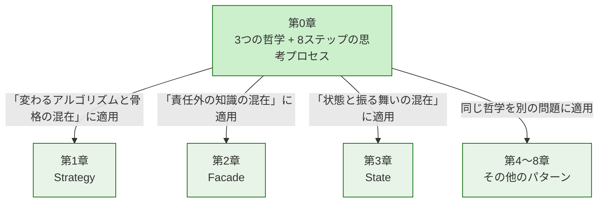
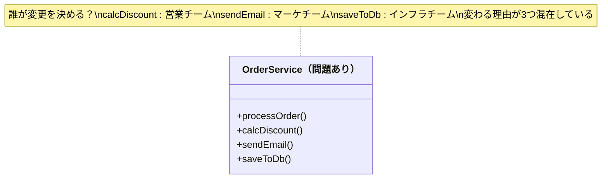
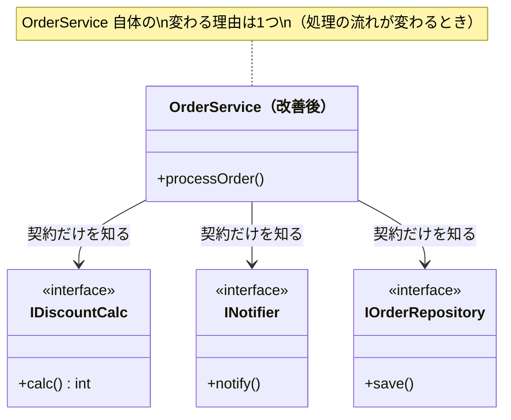
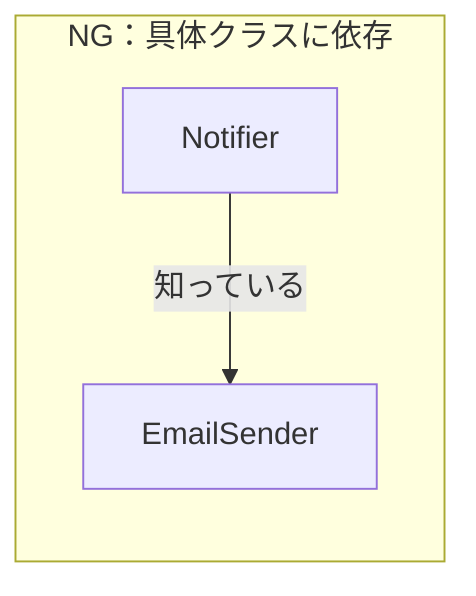
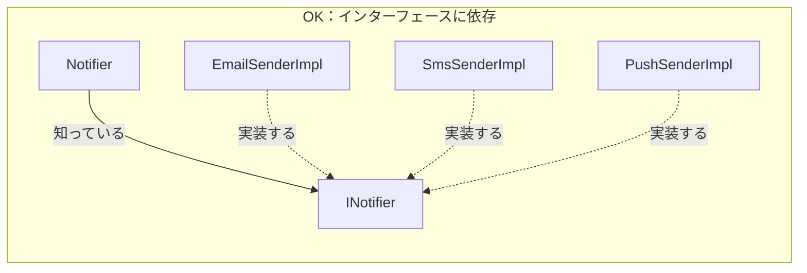
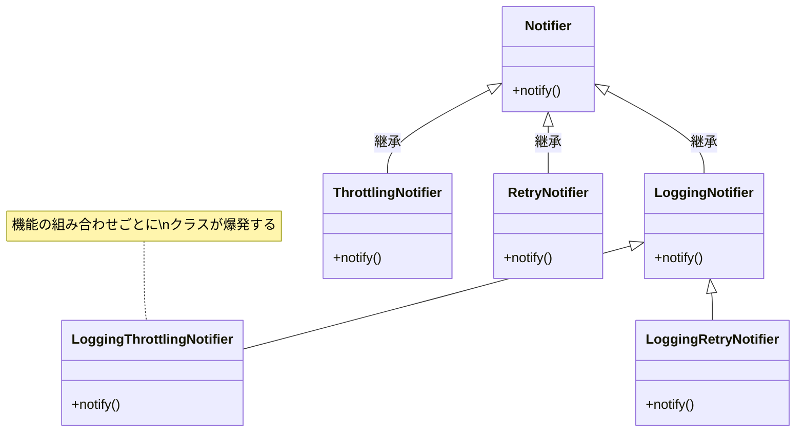
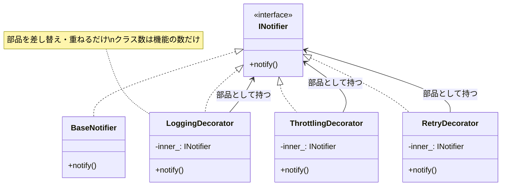
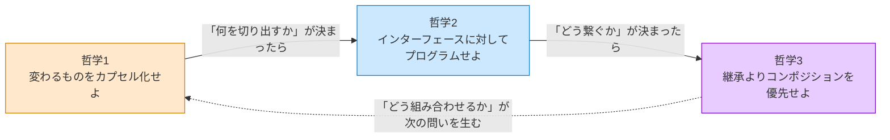
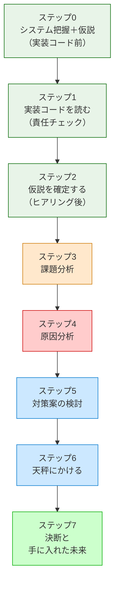

# 第0章　この本の読み方
―― デザインパターンは「考えた結果」に過ぎない

---

## なぜ「パターンを覚えても使えない」のか

ソフトウェア設計を学ぼうとすると、必ずと言っていいほど
「GoFのデザインパターン」に出会います。
本で学び、構造図を頭に入れ、いざ自分のコードに使おうとしたとき——

「どこに適用すればいいのか、わからない。」
「無理に使ってみたら、かえってコードが複雑になった。」

私自身、同じ壁に何度もぶつかりました。
パターンの名前と図は頭に入った。でも、
目の前の問題にどう当てはめればいいのか、
まるでわからなかったのです。

その感覚、うまく伝わっているでしょうか。

なぜ、実績のある優れた設計手法が、
時にはコードをより複雑にしてしまうのか。

理由はシンプルです。
**パターンを「最初から目指すべき答え」として扱っているから**です。

デザインパターンは、先人たちが泥臭い現場で問題に向き合い、
いくつかの選択肢を天秤にかけ、
「この状況ではこれが一番割に合う」と判断した
**決断の結果**として生まれたものです。

結果だけを真似ても、状況が違えばうまく機能しません。
大切なのは、その結果に至るまでの**思考のプロセス**を体験することです。

---

## この章の地図

この第0章は、本書全体の「設計の言語」を定義する場所です。
第1章以降でどのパターンを扱うときも、ここで定義した言語と思考の型を使います。



*第0章が「基礎言語」。各章はその言語を特定の問題に適用するだけ。*
*各章の「違い」は「何と何が混在しているか」という状況の違いだけです。*

---

## すべてのパターンを貫く3つの哲学

GoFの23のデザインパターンは、一見バラバラに見えます。
でも、すべてのパターンは、たった3つの哲学を
それぞれの状況に具体化したものに過ぎない——と、私は整理しています。

これを先に知っておくと、パターンが「暗記する公式の集まり」から
「同じ哲学を別の形で表現したもの」に見え始めます。

---

### 哲学1：変わるものをカプセル化せよ

「変わりやすい部分」と「変わってほしくない部分」を、同じ場所に書かない。

#### なぜこの哲学が生まれたのか

「変わる理由」が2つ以上混在しているクラスは、
どちらかの理由で変わるたびに変更対象になります。
このクラスに接触した人間は、
もう一方の責任まで壊していないか確認しなければなりません。

現場で何度もこの「確認作業」に追われた先人たちが、
「変わる理由ごとに分離していたら、この不安は生まれなかった」と気づいたのが
この哲学の出発点です。

#### 「変わる理由」を見つける問い

> 「このコードを変更するとき、変更を決定するのは誰か？」

答えが1人（1チーム）なら、変わる理由は1つです。
答えが2人以上なら、変わる理由が複数混在しています。

下の図で、問題のある構造と解決後の構造を比べてみてください。





*改善前の OrderService は3つの理由で変わる可能性があった。改善後は1つだけ。*

#### コードで確かめる

```cpp
// NG：計算ロジックと出力形式が同じクラスに混在
//      calcAmount が変わっても、format が変わっても、
//      この1つのクラスを変更しなければならない
class ReportService {
    void generate() {
        double value = calcAmount();      // 変わる理由1：計算ルール担当
        std::string text = format(value); // 変わる理由2：出力形式担当
        writeToPdf(text);
    }
};

// OK：変わる理由ごとに分離する
//     計算が変わっても ReportFormatter は変わらない
//     出力が変わっても Calculator は変わらない
class Calculator     { virtual double calcAmount() = 0; };
class ReportFormatter { virtual std::string format(double v) = 0; };

class ReportService {
    Calculator*      calc_;
    ReportFormatter* fmt_;
public:
    void generate() { fmt_->format(calc_->calcAmount()); }
};
```

**この哲学を使うための問い——この本を通じて使い回せる1つの問い：**

> 「このコードの中に、**『変わる理由』が異なる2つのものが、同じ場所に混在していないか？**」

パターンが違っても、問いはこれひとつです。
「何と何が混在しているか」の組み合わせが違うだけで、
本質的に問いかけていることは変わりません。

#### この哲学がどのパターンに現れるか

| パターン | 分離した「変わるもの」 |
|---|---|
| Strategy | アルゴリズムの実装 |
| Template Method | 処理の各ステップ |
| Command | 実行する操作 |
| Decorator | 追加する機能の組み合わせ |
| Observer | 通知先の種類 |
| State | 状態ごとの振る舞い |

GoF 23パターンのほぼすべては、この1つの哲学から導けます。

---

### 哲学2：実装ではなくインターフェースに対してプログラムせよ

「何をするか（契約）」と「どうやるか（実装）」を分ける。

#### なぜこの哲学が生まれたのか

哲学1で「変わるものを切り出した」あとに残る問題があります。
切り出した部品を「どう呼び出すか」です。

具体的なクラス名（`EmailSender`）を呼び出し元が知っていると、
Email→SMS→Pushに切り替わるたびに呼び出し元も変わります。
でも「通知する何か（`INotifier`）」という契約だけを知っていれば、
切り替えが起きても呼び出し元はまったく変わりません。

インターフェースは、安定した呼び出し側と不安定な実装側の間に立つ「緩衝材」です。

#### 依存の方向を図で理解する





*NGでは実装クラスが変わると Notifier も変わる。*
*OKでは INotifier の裏側がどう変わっても Notifier はまったく変わらない。*

#### コードで確かめる（依存の方向）

```cpp
// NG：具体クラスに直接依存している
//     EmailSender が変わるたびに Notifier も変わる
class Notifier {
    EmailSender* sender_; // 具体クラスを知っている
public:
    void notify(std::string msg) { sender_->send(msg); }
};

// OK：インターフェースに依存する
//     IMessageSender の実装が Email→SMS→Push に変わっても
//     Notifier は変わらない
class IMessageSender {
public:
    virtual void send(std::string msg) = 0;
    virtual ~IMessageSender() {}
};

class Notifier {
    IMessageSender* sender_; // 契約（インターフェース）だけを知っている
public:
    void notify(std::string msg) { sender_->send(msg); }
};
```

#### インターフェースが守れない変更がある：型の安定性

ただし、インターフェースが守れないものがひとつあります。**引数の型が変わるとき**です。

同じ引数の型（例：`int userId`）を複数のインターフェースで共有しているとき、
「`int` を `string` に変えてほしい」という要求が来ると、
そのすべてのインターフェースのシグネチャが変わります。
どんな設計構造があっても、この変更からは逃げられません。

こういう状況に直面したとき、立てるべき問いは「なぜこのパターンでは守れないのか」ではなく、
**「この型はどこまで安定していると言えるか？チームで合意できているか？」** です。
型を決める前に、システムの所有者や連携する部署の担当者に確認することが、最初の一手になります。

**コードで確かめる（型の安定性）：**

```cpp
// ① 型を合意・固定する
//    シンプルだが、型が変われば全インターフェースのシグネチャが変わる
class IUserService {
public:
    virtual void process(int userId) = 0;
};

// ② 独自型でくるむ
//    インターフェースのシグネチャは変わらない
//    型の変更は UserId の中だけに留まる
struct UserId {
    std::string value;  // int → string に変わってもここだけ直す
};
class IUserService {
public:
    virtual void process(UserId id) = 0;
};

// ③ void* で型情報をインターフェースに持たせない
//    インターフェースは絶対に変わらない
//    代わりに型安全を失う
class IUserService {
public:
    virtual void process(void* context) = 0;
};
```

| 選択肢 | インターフェース変更 | 型安全 | コードの複雑さ |
|---|---|---|---|
| ①合意・固定 | 型が変われば変わる | ✅ 高い | シンプル |
| ②独自型でくるむ | **変わらない** | ✅ 高い | 型定義が1つ増える |
| ③void\* | **絶対変わらない** | ❌ 低い | キャストが必要 |

どれが正解かは状況次第です。
各章では、パターンが直面したこの問題と、
関係者との確認を経て選んだ判断を示します。

---

### 哲学3：継承よりコンポジションを優先せよ

機能を「is-a（〜は〜である）」ではなく「has-a（〜を部品として持つ）」で組み合わせる。

#### なぜこの哲学が生まれたのか

継承は「コードの再利用」として便利に見えます。
でも、継承を重ねると「親クラスが変わると子クラスも変わる」という依存が積み重なります。
さらに、「ログ付き通知クラス」「スロットリング付き通知クラス」
「ログ付きスロットリング付き通知クラス」……と組み合わせが爆発します。

コンポジションは部品を差し替えるだけで振る舞いを変えられます。
DecoratorやStrategyが「インターフェースを実装したオブジェクトを内部に持つ」
という構造をしているのは、この哲学に従っているからです。

#### 継承だとなぜ組み合わせが爆発するか





*継承：組み合わせの数だけクラスが増える。*
*コンポジション：部品を重ねるだけ。クラス数は増えない。*

#### コードで確かめる

```cpp
// NG：継承（is-a）で機能を拡張する
//     LoggingNotifier は Notifier に依存している
//     Notifier の実装が変わると LoggingNotifier も影響を受ける
class LoggingNotifier : public Notifier {
    void notify(std::string msg) override {
        log(msg);
        Notifier::notify(msg); // 親の実装に依存
    }
};

// OK：コンポジション（has-a）で振る舞いを組み合わせる
//     inner_ を差し替えるだけで、ログ付き通知の相手を自由に変えられる
class LoggingNotifier {
    IMessageSender* inner_; // インターフェースとして持つ
public:
    explicit LoggingNotifier(IMessageSender* inner)
        : inner_(inner) {}

    void notify(std::string msg) {
        log(msg);
        inner_->send(msg); // 差し替え可能
    }
};
```

---

### 3つの哲学の連携

3つの哲学は独立しているのではなく、順番に適用される連携関係にあります。



1. **哲学1**で「変わる部分と変わらない部分」を見分けて分離する
2. **哲学2**で「分離した部分をインターフェース経由で接続する」
3. **哲学3**で「インターフェースで接続した部品をどう組み合わせるか」を決める

各章で登場するパターンは、この3つの哲学を「今回の問題状況」に
具体化したバリエーションです。

---

## 先人たちが使っていた「8ステップの思考プロセス」

先人たちも、私たちと同じように混沌としたコードの前で頭を抱えていました。
彼らが問題を解決するとき、意識的かどうかはともかく、
以下の8つのステップを踏んでいたと解釈することができます。

各章は、このステップを1つの問題に対して一貫して適用します。
まずここで、各ステップが「なぜ必要か」「何をするか」「3つの哲学とどう繋がるか」を
丁寧に押さえておきましょう。後の章で「あのステップの話だ」と気づけるようになります。



*緑（ステップ0〜2）：問題を正確に把握する。橙：問題を深掘りする。青：解決策を設計する。最終緑：決断と実装。*

ステップ0〜2が「問題の把握」をそれぞれ異なる対象に対して行うことに注目してください。

| ステップ | 読む対象 | やること |
|---|---|---|
| **ステップ0** | クラス構成の概要（仕様表・責任一覧） | クラスの責任を把握し、「何が変わりそうか」の仮説を立てる |
| **ステップ1** | 実装コード（`if` 文の中身・各行） | 各行が責任範囲内かを確認し、責任外の知識を見つける |
| **ステップ2** | 関係者（ヒアリング） | 「なぜ変わるのか・誰が決めるのか」を確認し、仮説を確定する |

---

### ステップ0：システムを把握し、仮説を立てる ―― クラス構成を見てから「変わりそうな場所」を予測する

> **入力：** システムのシナリオ説明 ＋ クラス構成の概要（クラス名・責任一覧・仕様表）。実装コードはまだ読まない。
> **産物：** 変動と不変の「仮説テーブル」

**なぜこのステップが必要か**

実装コードに飛び込む前に、「このシステムに何があるか」を把握しておかないと、
コードの詳細に引きずられて「動きを追う読み方」になってしまいます。

ここでの把握対象は実装の詳細（`if` 文の中身など）ではありません。
「どんなクラスが存在し、それぞれの責任は何か」というアーキテクチャの概要です。

**このステップでやること**

まず、システムのシナリオ説明を聞きます。そして**クラス構成の概要**（クラス名・責任一覧・仕様表）を確認します。
「どのクラスが何を担当するか」が把握できた段階で、仮説テーブルを埋めます。

> 「このシステムの中で、何が変わりやすく、何は変わらないか？」

クラスの責任一覧を見れば、「このクラスの責任は営業施策で変わりそうだ」「このフローは会社の根幹だから変わらない」という判断ができます。

| 分類 | 仮説 | 根拠（クラス構成から読み取れること） |
|---|---|---|
| 🔴 変動しそう | （例）各外部サービスのAPI仕様 | 外部ベンダーの都合で変わりそうなクラスが見える |
| 🟢 変わらなそう | （例）業務フローの骨格 | 会社の業務根幹を担うクラスは変わりにくい |

この仮説はステップ2でヒアリングを経て「確定」します。あくまで予測です。

最後に、この章全体で使う「設計のレンズ（問い）」をセットします。

> 「このコードの中に、**『変わる理由』が異なる2つのものが、同じ場所に混在していないか？」**

**3つの哲学との接続**

これは**哲学1**「変わるものをカプセル化せよ」の問いを意識にセットするステップです。
「クラスの責任が何か」を把握することが、「変わるもの」を見分ける出発点になります。

---

### ステップ1：実装コードを読む ―― 責任チェックで問題の行を見つける

> **入力：** ステップ0で把握したクラス責任 ＋ 実際の実装コード
> **産物：** 責任チェック表。「このクラスが持つべきでない知識」が混在している行の発見。

**なぜこのステップが必要か**

ステップ0でクラスの責任は把握しました。
このステップでは、**実装コードがその責任通りに書かれているか**を1行ずつ確認します。

「バグがあるか」ではなく「責任範囲外の知識がコードに混入していないか」という目線で読みます。
この違いが、設計の問題を見つけられるかどうかの分かれ目です。

**このステップでやること**

ステップ0で確認した「クラスの責任」を念頭に置きながら、実装コードを1行ずつ読みます。
読みながら問うのは「このコードの行は、このクラスの責任の範囲内か？」です。

```
【責任チェックの問い】
このクラスが持っている知識を変えたいとき、
誰の判断で変更が起きるか？
自分のクラスの責任オーナーとは別の人間が登場するなら、
その知識はこのクラスが持つべきではない。
```

責任の範囲外の知識を持っているコードの行が見つかれば、それが問題の核心です。

```
【責任チェックの問い】
このクラスが持っている知識を変えたいとき、
誰の判断で変更が起きるか？
自分のクラスの責任オーナーとは別の人間が登場するなら、
その知識はこのクラスが持つべきではない。
```

**3つの哲学との接続**

これは**哲学1**の「変わる理由」を1行ずつ確認するステップです。
「誰の判断で変わるか」という問いが、責任の境界線を引く基準になります。
また、責任を「1文で言えない」クラスは、複数の責任を持っている可能性があります。

---

### ステップ2：仮説を確定する ―― 関係者ヒアリングで「変わる理由」に根拠をつける

> **入力：** ステップ0の仮説 × ステップ1の責任チェック表。関係者（営業・業務担当など）に直接確認する。
> **産物：** 確定した変動/不変テーブル（根拠付き）。「誰の判断で変わるか」が明記されたもの。

**ステップ0との違い**

ステップ0では「変わりそう」という予測を立てました。
このステップでは「なぜ変わるのか」「誰が決めるのか」を関係者に確認して、**予測を事実に変えます**。

コードを読んだだけで「変わる」「変わらない」と断定するのは危険です。
変わるかどうかを知っているのは、そのコードを管理している人間だけだからです。

**なぜこのステップが必要か**

仮説のまま進むと、見当違いの部分を「変わるもの」として分離してしまうリスクがあります。
また、「この処理は変わらないはず」と思っていたものが、実は毎シーズン変わると分かることもあります。

**このステップでやること**

ステップ0の仮説を携えて、関係者ヒアリングを行います。

> 「このAPIは今後バージョンアップの予定はありますか？」
> 「このルールは担当チームが独立して判断できますか？」
> 「この型（int）は将来変わる可能性はありますか？」

ヒアリングで得た回答をもとに、変動/不変テーブルを確定します。

| 分類 | 具体的な内容 | 変わるタイミング | 根拠 |
|---|---|---|---|
| 🔴 変動 | （変わりやすい部分） | （いつ変わるか） | （誰がそう言ったか） |
| 🟢 不変 | （変わらない部分） | 変わる日は来ない | （誰と合意したか） |

「根拠」の列に「〇〇担当との確認」と書けるまで、仮説は仮説のままにしておきます。

**3つの哲学との接続**

これは**哲学1**の「変わるもの」を確定するステップです。
ここで正確に変動/不変を峻別できていないと、ステップ5の対策が的外れになります。
ヒアリングで分かった「変わりやすい部分」こそが、後でインターフェースの境界線になります。

---

### ステップ3：課題分析 ―― 変更が来たとき、どこが辛いかを確認する

**なぜこのステップが必要か**

設計の問題は、コードを静的に眺めているだけでは気づきにくいものです。
「変更要求が来たとき、どこに手が入るか」を実際にシミュレートしてみると、
問題の輪郭がリアルに見えてきます。

**このステップでやること**

ステップ2で受け取った変更要求（または想定される変更）を、今のコードに加えようとします。
加えようとすると、何が起きるかを追います。

- どのファイルを開くことになるか
- 変更の影響がどこまで波及するか
- 変えたくないはずのコードに触れることになるか

これが「痛み」の正体です。
「PayrollServiceを変えただけなのに、なぜMonthlyBatchを開いているのだろう」
この違和感が生まれたなら、それが課題の所在を指しています。

**3つの哲学との接続**

**哲学1**が守られていないとき、ここで「変更の飛び火」が現れます。
変わる理由が異なる2つのものが同じ場所にいると、片方を変えると必ずもう片方が道連れになります。

---

### ステップ4：原因分析 ―― 痛みの根本にある設計の問題を言語化する

**なぜこのステップが必要か**

ステップ3で発見した「痛み」は症状です。
症状に対して対症療法を施すだけでは、根本は変わりません。
「なぜこの痛みが発生しているのか」を構造的に言語化することで、
正しい処方箋を選べるようになります。

**このステップでやること**

痛みを観察して、構造的な原因を見つけます。

```
【原因分析の問い】
「なぜ、PayrollServiceが変わるとMonthlyBatchも変わるのか？」
→ MonthlyBatchがPayrollServiceの内部仕様（API形式）を直接知っているから。
→ 「知りすぎているクラスは、知っているものが変わると道連れになる」
```

原因が言語化できると、解決の方向性が自然に定まります。
「知りすぎている」なら、「知る量を減らす」——インターフェースで境界を引けばいい。
「変わる理由が2つ混在している」なら、「1つに絞る」——分離すればいい。

**3つの哲学との接続**

原因は必ず3つの哲学のいずれかの違反として言語化できます。

| 原因の種類 | 違反している哲学 |
|---|---|
| 変わるものと変わらないものが同居している | 哲学1 |
| 具体クラスを直接知っている（インターフェースを使っていない） | 哲学2 |
| 継承で機能を重ねているためクラスが爆発している | 哲学3 |

---

### ステップ5：対策案の検討 ―― 最初の試みと、その限界から学ぶ

**なぜこのステップが必要か**

問題の原因が分かっても、最初に思い浮かぶ解決策は多くの場合、不完全です。
不完全な試みを「なぜ限界があるか」まで追うことで、
正しい解決策がどこにあるかが見えてきます。

**このステップでやること**

まず「一番シンプルな解決策」を試みます。たとえば引数として外から渡す、関数に切り出す、など。
試みた結果、どこで限界に当たるかを確認します。

```
【試み①】引数として外から渡す
→ 複雑な条件（100個以上の時だけ）を数値1つで表現できない
→ 判断ロジックが呼び出し元に移っただけで、問題は解消されない
```

限界の理由を掴んだら、次の試みに進みます。

```
【試み②】「振る舞い」をインターフェースとして切り出す
→ 呼び出し元は「何が」実行されるかを知らなくていい
→ 新しいルールを追加しても、呼び出し元は変わらない
```

**3つの哲学との接続**

試み②の発想の転換が、**哲学1**（分離）と**哲学2**（インターフェースで繋ぐ）の適用そのものです。
試みが失敗した理由を分析するとき、「どの哲学が実現できていないか」を問うと方向が定まります。
解決後の組み立て（Composition Root）は**哲学3**（コンポジション）の具体化です。

---

### ステップ6：天秤にかける ―― 解決策は未来の変化に耐えられるか

**なぜこのステップが必要か**

解決策を導き出した後に、一度立ち止まる必要があります。
「今の問題を解決したとき、次の問題に備えられているか」を確かめずに実装すると、
数ヶ月後に同じ痛みが別の形で再発します。

**このステップでやること**

まず、評価の基準を先に宣言します。

> 「変更の局所性（1つの変更が何ファイルに波及するか）」
> 「テストの独立性（各クラスを単独でテストできるか）」

基準を先に置くことで、評価が後付けの正当化にならないようにします。

次に、ステップ2のヒアリングで出た「将来変わりうるもの」を実際に変化させてみます（耐久テスト）。
たとえば「新しい割引ルールを1つ追加するとき、何クラスを変更するか」をカウントします。

最後に、「このアプローチをいつ使うか、いつ使わないか」を言語化します。
どんな設計も万能ではありません。複雑さのコストに見合う状況と、見合わない状況があります。

**3つの哲学との接続**

耐久テストで確認しているのは、**哲学1**（変わるものが分離されているか）と
**哲学2**（インターフェース越しに繋がれているか）が実際に機能しているかどうかです。
「新しい部品を追加するだけ」で変化に対応できるなら、哲学が正しく機能しています。

---

### ステップ7：決断と、手に入れた未来

**なぜこのステップが必要か**

設計の判断は、コードを書いて終わりではありません。
「何を得て、何を諦めたか」を言語化できると、同じ問題に次に直面したとき、
また同じ8ステップを踏まなくても自分の判断基準として使い回せます。

**このステップでやること**

解決後のコードを全体として示します。
その後、変更シナリオごとに「変わるクラス・変わらないクラス」を表で整理します。

| 変更シナリオ | 変わるクラス | 変わらないクラス |
|---|---|---|
| 新しいルールを追加 | 新しいRuleクラス1つ | BillingCalculator・その他全て |
| 割引率を変更 | 対象のRuleクラス | BillingCalculator・その他全て |

この表が埋まったとき、「何を手に入れたか」が具体的な数字として見えます。

最後に、変更した設計を3つの哲学と照らし合わせます。
「哲学1がコードのどこに現れているか」を指差せることが、
次の設計判断で同じ思考を使いこなせる証拠になります。

**3つの哲学との接続**

振り返りのセクションで、**哲学1・2・3**がそれぞれコードのどの部分に現れているかを確認します。
この確認が習慣になると、コードを読むとき自然に「これは哲学2の実現だ」と気づくようになります。
パターンの名前を覚えるより先に、この見方が身につくことが、この本の狙いです。

---

### 8ステップと3つの哲学の関係

各ステップがどの哲学と最も強く結びついているかを整理すると、次のようになります。

| ステップ | タイミング | 中心の問い | 主な哲学との接続 |
|---|---|---|---|
| ステップ0 | クラス構成を把握→**仮説** | 誰の責任が何か。何が変わりやすそうか | 哲学1への準備 |
| ステップ1 | 実装コードを**読みながら** | 各クラスの責任は実装通りか。責任外の行はどこか | 哲学1（責任の単一性） |
| ステップ2 | コードの後・**ヒアリング** | 変わる理由を誰が決めるか（確定） | 哲学1（変化の特定） |
| ステップ3 | 変更が来たとき、どこが痛いか | 哲学1違反の症状確認 |
| ステップ4 | 痛みの原因は構造のどこか | 哲学1〜3のどれを違反しているか |
| ステップ5 | どうすれば変わる部分を分離できるか | 哲学1→哲学2→哲学3の順に適用 |
| ステップ6 | 解決策は未来の変化に耐えるか | 哲学1・2が機能しているか検証 |
| ステップ7 | 何を得て何を諦めたか | 全哲学の確認と言語化 |

各章で同じ流れが繰り返されるとき、「今どこにいるか」がわかれば迷子になりません。
ステップが変わっても、問いの根本にある哲学は変わりません。

---

第1章から、この8ステップを1つの問題に対して適用していきます。
