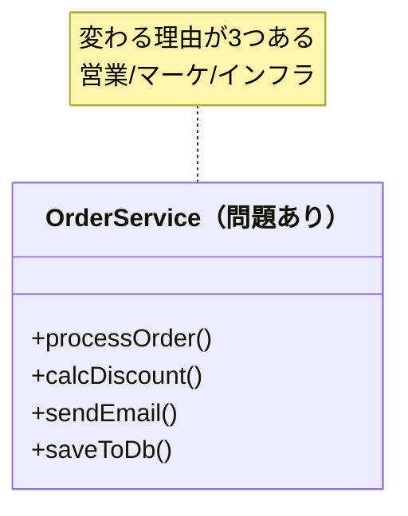
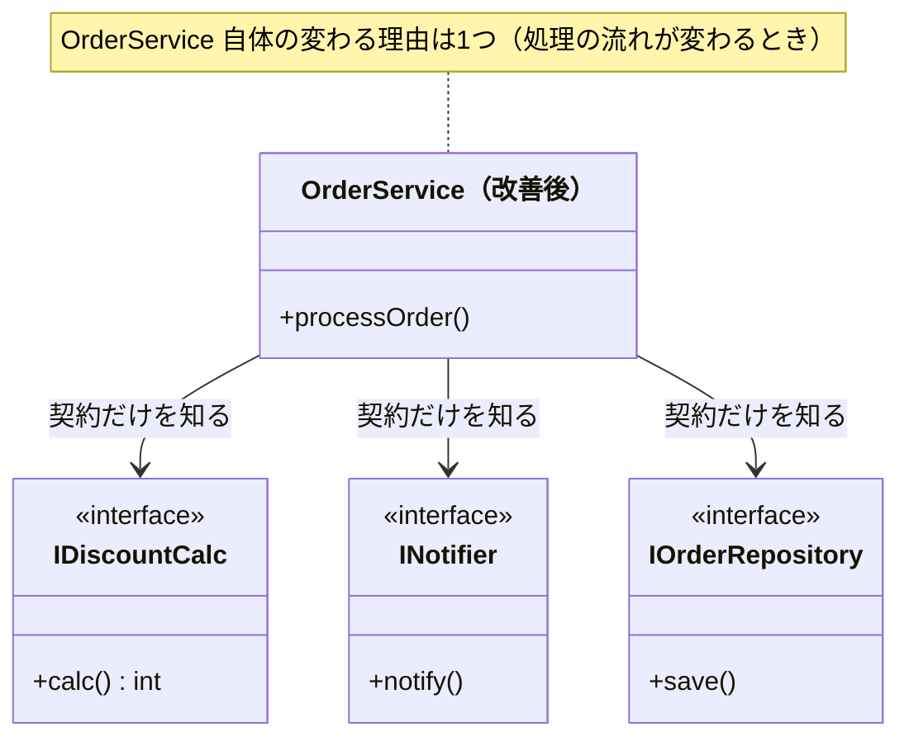
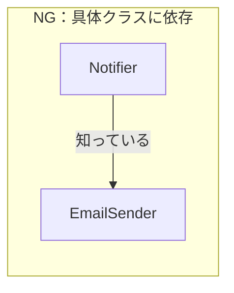
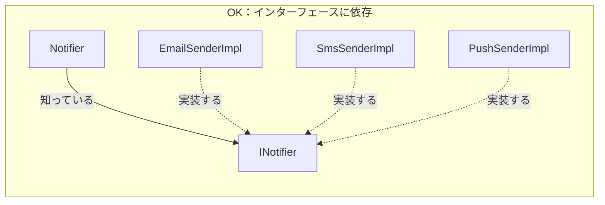
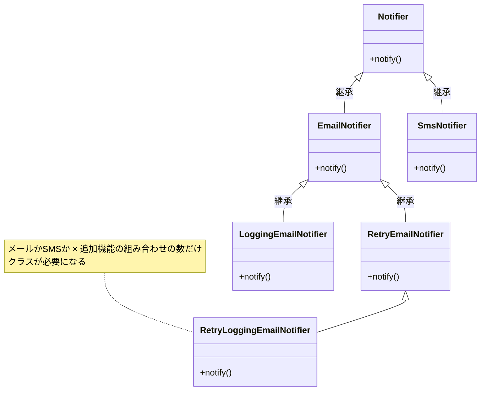
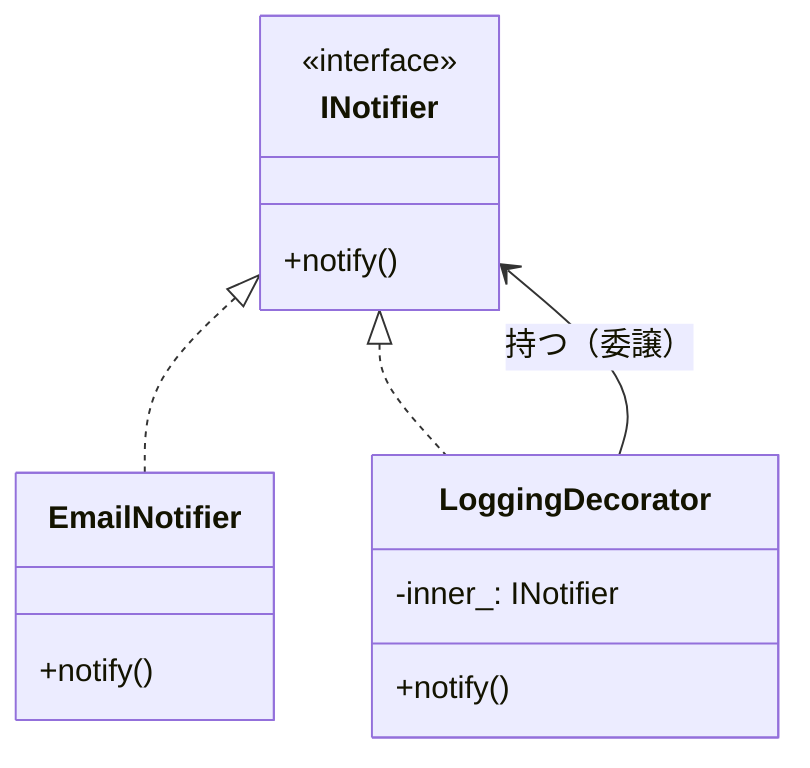
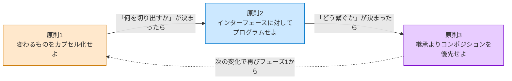

# はじめに
―― デザインパターンは「考えた結果」に過ぎない

---

## なぜ「デザインパターンを覚えても使えない」のか

ソフトウェア設計を学ぼうとすると、必ずと言っていいほど
「GoFのデザインパターン」に出会います。
本で学び、構造図を頭に入れ、いざ自分のコードに使おうとしたとき——

「どこに適用すればいいのか、わからない。」
「無理に使ってみたら、かえってコードが複雑になった。」

私自身、同じ壁に何度もぶつかりました。
正直に言うと、私はパターンの形を暗記しようとしていました。
でも、いざ現場で「いつ使えばいいのか」がわからず、
自分の判断でパターンを使いこなせたことは、一度もなかったように思います。

「Strategy？Observer？あのコードに使えそうな気はするんだけど、
どこにどう当てはめればいいか分からない」——
もしあなたが同じように悩んでいるなら、
私のこの経験が一つの参考になるかもしれません。

私は、「どうすればデザインパターンのようなきれいな設計ができるのか」と悩み続けました。
そして気づいたのは、そもそもデザインパターンの形にすることが目的ではなく、
「考え方」を理解して構造の本質を見抜き、自分なりの最適解を導くことが
大切なのではないか、ということです。

そこで、デザインパターンの本質を理解して、自分で思考を深めようと思い、
この本を書き始めました。
この本では私の思考プロセスを扱いますので、
少しでも読んでくださった方の参考になればと思っています。


なぜ、実績のある優れた設計手法が、
時にはコードをより複雑にしてしまうのか。

理由はシンプルです。
**パターンを「最初から目指する必要がある答え」として扱っているから**です。

デザインパターンは、先人たちが泥臭い現場で問題に向き合い、
いくつかの選択肢を天秤にかけ、
「この状況ではこれが一番割に合う」と判断した
**決断の結果**として生まれたものです。

結果だけを真似ても、状況が違えばうまく機能しません。
大切なのは、その結果に至るまでの**思考のプロセス**を体験することです。

この本を読むことで、デザインパターンという「結果」がどのような思考で生まれたのか、その本質を理解することができます。パターンの形を暗記して無理に適用するのではなく、目の前の状況に合わせて適切な考え方で対処する――いわば、**「自分なりの設計の型」** を身につけるためのヒントになればと思っています。

実は、私自身も最初はろくにプログラミングができない状態でした。設計なんて、もってのほかです。
それでも少しずつ「コードを分ける」ことを意識してみると、変更しやすくなり、構造がきれいになっていく恩恵を感じて、設計の楽しさにすっかりはまってしまいました。
この本を手に取ってくださった方にも、そんな設計の楽しみを知ってもらえたらと願っています。
どのような思考をすればよいかは人それぞれだと思いますので、ご自身なりのプロセスやパターンを見つける手助けになれば、とてもうれしいです。

この本を読み終えたとき、一つの目標としてこんな状態になっていれば素晴らしいのではないでしょうか。

> **「このコードに変更が来たとき、どこを触れば済むかが、コードを読んで5分で分かる。」**

それだけです。派手な知識は一つも必要ありません。「変わる理由が混在している」と見抜く目と、「変わる理由の決定者が異なるコードを異なるクラスに分ける」という判断ができれば、デザインパターンのような構造は自然についてくると私は考えています。

> [!INFO] 設計の基本：「分ける」と「接続点の形」
> この本を通じて、ソフトウェア設計の考え方を「**責任を分けて作る**」という視点で説明します。
>
> 何かを作るとき、役割ごとに部品を分けて組み立てると、一部を交換したり改良したりしやすくなります。ソフトウェアも同じで、「誰の判断で変わるか」ごとに責任を分けて作ることが設計の出発点です。
>
> そして、分けた後には必ず、部品同士が情報や処理を受け渡す**接続点**ができます。本書では、この接続点で「何を渡すか」「どちらが何を知るか」「変更時にどこまで影響するか」を確かめます。
>
> 充電器と端末をつなぐケーブルを想像してみてください。大切なのはケーブルを4種類に分類することではありません。端末を交換したいのにケーブルが本体から外せない、端子の変換手順を利用者が毎回知る必要がある、といった**変更時の困りごと**を見つけることです。
>
> ```text
> 🔌 電源側 ──── 接続点 ──── 📱 利用する機器
>                     ↑
>          ここで何を受け渡すのか
>          どちらが端子の詳細を知るのか
>          機器を替えたらどこを直すのか
> ```
>
> パターンの名前を覚える前に、変更要求がこの境界を通るとき、どちら側の知識まで書き換えることになるかを考えてみてください。第一部では、この見方を各章で繰り返します。

> [!INFO] 本書の前提と言語について
> 本書では、すべてのサンプルコードを **C++** で記述しています。C++を選んだ理由は、「インターフェース（純粋仮想クラス）」「ポインタによる差し替え」「オーバーライド」という設計の構造が、余分なフレームワークの仕組みなしに最もシンプルに見えるからです。
>
> Java・Python・TypeScript などを普段使っている方も、構文より**構造の形**に注目して読んでいただければ、そのまま自分の言語に置き換えられます。
>
> | C++の書き方 | 他言語での対応 |
> |---|---|
> | `virtual void foo() = 0;` | Java: `interface`、Python: `ABC`、TS: `interface` |
> | `class A : public IFoo` | Java/TS: `implements IFoo`、Python: `class A(IFoo)` |
> | `IFoo* ptr;` | Java/TS/Python: `IFoo foo;`（参照型） |
>
> コードの構文が読み解けない箇所があっても、クラス図とコメントで「何が何に依存しているか」を追えれば、設計の学習として十分です。

---

## この章の地図

この「はじめに」と「第一部の説明」が、本書全体の「設計の言語」を定義します。
第1章以降でどのパターンを扱うときも、ここで定義した言語と思考の型を使います。

### 第一部：基本パターンの思考体験

| 役割 | 直面する問題・痛みと、分けるべき「変わる理由」 |
| --- | --- |
| **はじめに** | 「パターンを使えない」理由の考察と、すべての土台となる3つの原則 |
| **第一部の説明** | 第1章以降と同じ「7つのフェーズ」と、変更影響を接続点から見直す方法 |
| **第1章** Strategy | **【痛みの種類】条件分岐の爆発**<br>「どのルールを適用するか」が変わるたびにコード全体が揺らぐ痛みを解消する。 |
| **第2章** Facade | **【痛みの種類】外部連携の複雑さ**<br>外部システムの手順が変わるたびに、ビジネスロジックまで壊れる痛みを解消する。 |
| **第3章** State | **【痛みの種類】状態による振る舞いの変化**<br>「今の状態」に応じたif文が散らばり、状態追加のたびに全箇所を修正する痛みを解消する。 |
| **第4章** Template Method | **【痛みの種類】手順と中身の混在**<br>「全体の流れ」は同じなのに「一部のステップ」だけが異なる処理をコピペしてしまう痛みを解消する。 |
| **第5章** Command | **【痛みの種類】操作の実行タイミングと処理の密結合**<br>「何をいつ実行するか」と「処理の実体」が強く結びつく痛みを解消する。 |
| **第6章** Decorator | **【痛みの種類】機能の組み合わせ爆発**<br>機能の組み合わせパターンの数だけクラスを作らざるを得ない痛みを解消する。 |
| **第7章** Observer | **【痛みの種類】通知先への依存**<br>「誰に通知するか」が増えるたび、主処理のコードに影響が及ぶ痛みを解消する。 |
| **第8章** Factory Method | **【痛みの種類】生成と利用の混在**<br>「何を作るか」が変わるだけなのに、「使う側」のコードまで修正が必要になる痛みを解消する。 |

### 第二部：応用演習

| 役割 | 内容 |
| --- | --- |
| **第二部の説明** | 第一部との違い・複合問題の読み方 |
| **第9章** | 複数パターンの融合：複雑な問題への適用 |
| **第10章** | 依存の過多・変化の混在・生成と利用の混在 |
| **第11章** | 複数の「変わる理由」が複雑に絡み合う複合課題 |
| **第12章** | 状態変化・通知・判定ルールの混在 |

*「はじめに」と「第一部の説明」が基礎言語。各章はその言語を特定の問題に適用するだけ。*
*各章の「違い」は「何と何が混在しているか」という状況の違いだけです。*

**各章は独立して読めます。** 第1章〜第8章は、どの章から読み始めても内容が理解できるよう設計されています。気になるパターンがあれば、そこから読み始めてください。「はじめに」と「第一部の説明」を先に読んでおくと全章で使う設計の言語が整いますが、必須ではありません。

---

## この本を最大限に活かすために

**1. 章タイトルのパターン名は、いったん脇に置いて読む**
「第1章 Strategy」と書いてありますが、Strategyを覚えることが目的ではありません。「なぜこのコードが変えにくいのか」「どこを分けると楽になるのか」という問いを、自分の頭で一緒に追ってください。パターン名は、その問いの答えにたどり着いた後に自然についてくるラベルです。

**2. ヒアリングシーンは「理想形」**
各章のヒアリングでは、関係者がちょうど設計に役立つ情報を答えてくれます。現実には「変わるかどうか分からない」「たぶん変わらない」という答えが返ることも多いです。それでも「この問いを関係者に投げる習慣」だけは持ち帰ってください。答えが得られないときは、`git log` などコードの変更履歴が代わりの証言になります。

**3. トレードオフの比較は「チームの議論を整理する道具」**
各章のフェーズ6で登場する対策案のトレードオフ評価は、あくまで私の考える一つの参考例です。チームによってプロジェクトの状況や優先したい価値観は異なります。大切なのは結果をそのまま受け入れることではなく、比較する際にチームで評価軸を話し合うプロセスそのものです。

**4. 章末の「あなたのコードで考えてみてください」を飛ばさないで**
各章の最後に、その章の思考プロセスをあなた自身のコードに当てはめるための問いを用意しました。読み終えた後、一度でも自分のコードを思い浮かべながら向き合ってみてください。

**5. 「コードがきれいすぎる」と感じたときは、問いだけを持ち帰る**
各章のコードは「構造にだけ集中できるよう」業務の複雑さを意図的に省いています。現実のコードがどれだけ混沌としていても、「このメソッドの変わる理由は誰の判断か？」という問いだけは同じように使えます。最初の1歩は、その1問だけで十分です。

---

## すべてのパターンを貫く3つの原則

> **【定義】本書における「原則」とは**
> ここでいう「原則」とは、いかなる時も絶対に守らなければならない法律ではありません。**「設計の判断に迷ったとき、メリットとデメリットを測るための評価基準（北極星）」**です。パターンを適用するか迷ったとき、この原則に照らして「良い方向に向かっているか」を判断します。

GoFの23のデザインパターンは、一見バラバラに見えます。
でも、すべてのパターンは、たった3つの原則を
それぞれの状況に具体化したものに過ぎない——と、私は整理しています。

これを先に知っておくと、パターンが「暗記する公式の集まり」から
「同じ原則を別の形で表現したもの」に見え始めます。

---

### 原則1：変わるものをカプセル化せよ

この原則の核心は、**「誰の判断で変わるか」という決定者を基準に、コードを分離する**ことです。

なぜ決定者ごとに分けるのか——理由は明確です。決定者Aが変わるたびに変更要求が来るのはAだけです。AとBが同じクラスにいると、Aへの要求がBのコードへ飛び火します。だからこそ、決定者ごとに責任を分けることで、1つの要求が別の決定者のコードに波及しない構造が生まれます。分離はゴールではなく、決定者を1つにそろえた結果として生まれる構造です。

#### なぜこの原則が生まれたのか

コードが変わる理由は、ビジネスの変化によって生まれます。
割引ルールを決めるのは「営業チーム」です。API仕様を変えるのは「インフラ担当」です。
出力フォーマットを決めるのは「経理担当」です。

なぜ「変わる理由」が「誰の判断か」に行き着くのでしょうか？
それは、ソフトウェアの変更要求は常に「人間（ステークホルダー）」からやってくるからです。コンウェイの法則（システムはそれを作る組織の構造を模倣する）が示唆するように、決定権を持つ組織の構造とコードの構造を一致させておかないと、摩擦が起きます。

**2つの決定権者のコードが同じメソッドやクラスに混在していると、一方だけを変えても「他方が壊れていないか」を確認せざるを得ません。同じ場所に混在しているため、変更が道連れを起こすのです。**

営業チームが割引ルールを変えただけなのに、経理担当の処理まで確認が必要になる——
現場で何度もこの「確認作業」に追われた先人たちが、
「変わる理由（＝決定権を持つ人）ごとに分離していたら、この不安は生まれなかった」と気づいたのが
この原則の出発点です。

#### 「変わる理由」を見つける問い

この原則を使うための問いは1つです。

> **「このコードを変更するとき、変更を決定するのは誰か？」**

答えが1人（1チーム）なら、変わる理由は1つです。
答えが2人以上なら、変わる理由が複数混在しています。
**「誰の判断で変わるか」が境界線を引く基準になります。**

たとえば「ECサイトの注文処理システム」を想像してください。
- 割引キャンペーンの適用条件を決めるのは**営業担当**です。
- 注文完了メールの文面を決めるのは**マーケティング担当**です。
- クレジットカード決済の仕様を決めるのは**外部の決済代行会社**です。

判断者はそこまで多くありませんが、これらの処理が1つの `OrderService` クラスに混在していると、マーケティング担当の要望でメール文面を変える際に、決済処理に影響が出ないかテストする必要が生じます。だからこそ、決裁者ごとに分離するのです。

下の図で、問題のある構造と解決後の構造を比べてみてください。





*改善前の OrderService は3つの理由で変わる可能性があった。改善後は1つだけ。*

#### コードで確かめる(C++)

以下に、問題のある「NGコード」を示します。

```cpp
#include <iostream>
#include <string>

// NG：計算ロジックと出力形式が同じクラスに混在
//      calcAmount が変わっても、format が変わっても、
//      この1つのクラスを変更することになる
class ReportService {
    double totalSales_; // 売上合計（コンストラクタで受け取る）
public:
    explicit ReportService(double sales) : totalSales_(sales) {}
    void generate() {
        double value = calcAmount();      // 変わる理由1：計算ルール担当（営業チーム）
        std::string text = format(value); // 変わる理由2：出力形式担当（経理チーム）
        writeToPdf(text);
    }
private:
    double calcAmount() { return totalSales_ * 0.1; }  // 手数料10%：営業チームが決める
    std::string format(double v) {  // CSV形式：経理チームが決める
        return "金額," + std::to_string(static_cast<int>(v));
    }
    void writeToPdf(const std::string& text) {
        std::cout << "[PDF] " << text << "\n";
    }
};

int main() {
    ReportService service(1000);
    service.generate();
    // 上記コードの実行結果：
    // [PDF] 金額,100
    return 0;
}
```

**NGとOKで「どこが改善されたか」を変更シナリオで比べます。**

| 変更シナリオ | NGコードで触る場所 | OKコードで触る場所 |
|---|---|---|
| 手数料を10%→15%に変更したい | `ReportService` を開いて `calcAmount` を修正 | `CommissionCalc` だけを修正 |
| CSV形式→JSON形式に変更したい | `ReportService` を開いて `format` を修正 | `CsvFormatter` だけを修正（または新しい`JsonFormatter`を追加） |
| 計算ルールを変更しながら同時にフォーマットも変えたい | `ReportService` を1つ開いて両方修正——影響範囲が重なって混乱する | `CommissionCalc` と `CsvFormatter` をそれぞれ独立して修正——影響が交わらない |

NGコードでは「どちらの変更でも必ず `ReportService` を開く必要がある」のに対し、OKコードでは「変更の決定者ごとに触るクラスが1つに決まる」ことが分かります。

次に、変わる理由ごとにクラスを分離した「OKコード」です。

```cpp
#include <iostream>
#include <string>

// インターフェース（契約）
class Calculator {
public:
    virtual double calcAmount() = 0;
    virtual ~Calculator() {}
};
class ReportFormatter {
public:
    virtual std::string format(double v) = 0;
    virtual ~ReportFormatter() {}
};

// 具体実装①：手数料10%（営業チームが管理）
class CommissionCalc : public Calculator {
    double totalSales_;
public:
    explicit CommissionCalc(double sales) : totalSales_(sales) {}
    double calcAmount() override { return totalSales_ * 0.1; }
};

// 具体実装②：CSV形式（経理チームが管理）
class CsvFormatter : public ReportFormatter {
public:
    std::string format(double v) override {
        return "金額," + std::to_string(static_cast<int>(v));
    }
};

// OK：変わる理由ごとに分離した結果、ReportServiceは骨格だけになる
class ReportService {
    Calculator*      calc_;
    ReportFormatter* fmt_;
public:
    ReportService(Calculator* c, ReportFormatter* f) : calc_(c), fmt_(f) {}
    void generate() {
        std::string text = fmt_->format(calc_->calcAmount());
        std::cout << "[PDF] " << text << "\n";
    }
};

int main() {
    CommissionCalc calc(1000);
    CsvFormatter formatter;
    ReportService service(&calc, &formatter);
    service.generate();
    // 上記コードの実行結果：
    // [PDF] 金額,100
    return 0;
}
```

> [!INFO] ReportService の変更理由は複数あるのでは？
> OKコードを見たとき、「各機能の担当都合で実装クラス（CommissionCalcなど）が差し替わるなら、ReportService 自体も直す必要があるのでは？」と疑問に思うかもしれません。
> しかし、`ReportService` は `Calculator` や `ReportFormatter` という**インターフェース（契約）**しか知りません。そのため、営業チームが新しい計算ルールを追加しても、経理チームが新しいフォーマットを追加しても、`ReportService` のコード自体は1行も変わりません（main関数などの外側で差し替えるだけです）。
> この疑問の答えは「原則1だけでは説明しきれず、次の原則2が必要になる」という、まさにその境界線です。原則2で詳しく解説します。

**この原則を使うための問い——この本を通じて使い回せる1つの問い：**

先ほどの基本形「このコードを変更するとき、変更を決定するのは誰か？」を、実際のコードに当てはめるときはこう展開します。

> **「このコードの中に、『変更を決定する人（決裁者）』が異なる2つのものが、同じ場所に混在していないか？」**

これは基本形の応用形です。「誰が決める？」を一点に絞るのが基本形、「異なる決定者のものが混在していないか？」と混在を探すのが応用形です。パターンが違っても、問いはこの1つです。

> [!NOTE] この考え方は、全章を通じた基礎になります
> ここで紹介する「決定者を基準に分離する」という考え方は、原則1の説明に登場しますが、本書のすべての設計判断の根底にある考え方です。各章のフェーズ1〜4でも、この問いに戻ってきます。

#### 原則がどのように形になるか

> 以下の表は、各章を読み進めた後に「あのパターンは、何を分離した結果なのか」を確認するための参照表です。今はパターン名を知らなくて構いません。

| パターン | 「変わらない」骨格・全体 | 分離した「変わるもの」 |
|---|---|---|
| Strategy（第1章） | 処理全体の流れや目的 | 実行する振る舞い（アルゴリズムやルール） |
| Facade（第2章） | システムが実現したいビジネス要件 | 複雑な外部連携の詳細な手順やAPI |
| State（第3章） | オブジェクトの全体的なライフサイクル | 特定の状態における個別の振る舞い |
| Template Method（第4章） | 処理の全体的な骨格・順序 | 骨格内の個別ステップの実装 |
| Command（第5章） | コマンドを呼び出して実行する仕組み | 実行する操作そのもの（要求の発生と実行） |
| Decorator（第6章） | コアとなる処理のインターフェース | 追加する機能のバリエーションや組み合わせ |
| Observer（第7章） | 状態更新などの主たる処理 | 通知先の種類や依存方向 |
| Factory Method（第8章） | オブジェクトを利用する側のロジック | 作るオブジェクトの種類（生成と利用） |

GoFのパターンは、決して最初から目指すものではありません。「変わるものをカプセル化せよ」という原則を適用し、不変の骨格から変動する部分を分離した結果の姿に過ぎないのです。

#### 補足：なぜ「すべてのパターン」が登場しないのか

本書はGoFの23個のパターンすべてを網羅していません。代わりに、8つの代表例を通じて、ほかのパターンにも応用できる設計の「思考の型」を扱います。

現場で開発者を苦しめる「痛みのベクトル（何が変わるか）」は、ロジック、状態、依存、組み合わせ、生成など、概ね上記の8種類に代表されます。この8つの痛みを解消する「型の適用プロセス」さえ脳にインストールできれば、本に登場しない残りのパターンに遭遇したとしても、自力でその構造を導き出すことができます。

- **基本思想の応用で自力で到達できるもの**：たとえば「Adapter（翻訳層）」や「Proxy（代理人）」は、FacadeやDecoratorの章で学ぶ「間にクッションを挟んで依存を切る」という基本思想の派生に過ぎません。
- **言語やフレームワークが解決済みのもの**：要素の走査（Iterator）は現代の言語機能（foreach等）に吸収されています。
- **特定ドメインに特化しすぎているもの**：木構造の処理（Composite）や複雑なデータ構造と処理の分離（Visitor）などは、日常的なビジネスロジックの整理というより特定のデータ構造に対する特殊手札です。
- **現代では使用を慎重に考えるもの**：Singleton（グローバル状態）は、現代ではテストを困難にするため、本章で学ぶDI（依存の外部注入）で置き換えることが多いパターンです。

「この原因には、この手札を当てる」。その結果としてパターンが立ち現れる。
このプロセスを8つの代表例で繰り返すことで、パターン名を暗記するだけでなく、設計判断の根拠を説明する練習ができます。

もちろん、GoFの23のパターンをすべて知る必要がないというわけではありません。残りのパターンを学ぶことで、特定のドメインや特殊な問題に対する設計の引き出し（ボキャブラリー）は確実に増え、設計の知識はさらに深まります。23個のパターンは、多様な問題解決のカタログとして非常に価値のあるものです。しかし、最初からすべてを暗記しようとして混乱するよりも、はじめにこの8つを通じて「型の適用プロセス」を脳にインストールすることが先決です。

#### この原則を「あえて」外すとき

> [!NOTE] 意図的に外すケース
> 「当面は変わる可能性が低い」と関係者間で確認できる部分は、分離のコストをかけない判断もあります。長期間変わっていない仕様であれば、シンプルに一体で書く案もチームで検討できます。

原則として原則1を適用するのがよいですが、**「あえて原則の適用を見送る（カプセル化しない）」**判断が必要なケースもあります。分離による複雑さの増大（コスト）が、分離によるメリットを上回ってしまう危険性がある場合です。

- **変わる見通しがない**場合。関係者に確認して「この処理は変わらない」と合意できたものは分離不要です。分離のコストが価値を超えます。
- **大規模なレガシーコードで、絡み合いが深い**場合。一気の分離はリスクです。段階的な置き換え（新しい機能から新しい構造で書く）の方が現実的です。
- **変わる理由が同じものを分離しようとしている**場合。たとえば、割引計算の `if` 文が3つある関数を「if が多いから」という理由だけで分離しても意味がありません。3つの割引条件がすべて同じ担当チームが管理していて、同じタイミングで変わるなら、1か所にまとめていて良いのです。「変わる理由が何人いるか」が分離の基準であり、「コードの行数」や「if の数」ではありません。

---

### 原則2：実装ではなくインターフェースに対してプログラムせよ

「何をするか（契約）」と「どうやるか（実装）」を分ける。

#### なぜこの原則が生まれたのか

原則1で「変わるものを切り出した」あとに残る問題があります。
切り出した部品を「どう呼び出すか」です。

具体的なクラス名（`EmailSender`）を呼び出し元が知っていると、Email→SMS→Pushに切り替わるたびに呼び出し元も変わります。なぜなら、呼び出し元のコードに「`EmailSender` を使う」という前提が書き込まれているため、`EmailSender` を `SmsSender` に替えるときに呼び出し元のコードも修正が必要になるからです。
でも「通知する何か（`INotifier`）」という契約だけを知っていれば、切り替えが起きても呼び出し元はまったく変わりません。

インターフェースは、安定した呼び出し側と不安定な実装側の間に立つ「緩衝材」です。

#### 依存の方向を図で理解する





*NGでは実装クラスが変わると Notifier も変わる。*
*OKでは INotifier の裏側がどう変わっても Notifier はまったく変わらない。*
> [!INFO] コラム：インターフェースの名前は「ビジネス責任」で付ける
>
> 原則2を実践するとき、インターフェース名の付け方で迷うことがあります。基本的なルールは「**実装手段ではなく、ビジネス上の責任で命名する**」です。
>
> | ❌ 実装手段で命名 | ✅ ビジネス責任で命名 | なぜ変えるか |
> |---|---|---|
> | `IEmailNotifier` | `INotifier` | 手段がSMSに変わっても名前は変わらない |
> | `IPdfOutputService` | `IReportOutputService` | 出力先がExcelに変わっても名前は変わらない |
> | `IMySqlRepository` | `IOrderRepository` | DBが変わっても名前は変わらない |
>
> インターフェース名に実装手段（Email・PDF・MySQL）が入っていると、手段が変わったときに名前が「嘘」になります。`IEmailNotifier` のままSMSを実装したクラスを作ると、コードを読んだ人が「なぜEmail専用のインターフェースをSMSが実装しているのか？」と混乱します。
>
> **実装クラス名は技術手段で付けてよい**のとは対照的です。`EmailSenderImpl` や `SmsSenderImpl` は手段の名前で構いません。重要なのは、呼び出し側が依存するインターフェースの名前が「手段の変化」に左右されないことです。
>
> この本の各章でも、`IDiscountRule`（割引の計算ルール）・`IWorkflowState`（状態遷移の契約）・`IDrink`（ドリンクの価格と名前の契約）のように、ビジネス責任で命名したインターフェースが登場します。名前を見たときに「この境界線は何のためにあるか」がわかることが、良いインターフェース名の基準です。

#### コードで確かめる（依存の方向）

**NGコード**

```cpp
// NG：具体クラスに直接依存している
//     EmailSender が変わるたびに Notifier も変わる

// 具体クラス：メール送信の実装
class EmailSender {
public:
    void send(std::string msg) {
        std::cout << "[EMAIL] " << msg << std::endl;
    }
};

class Notifier {
    EmailSender* sender_; // 具体クラスを知っている
public:
    void notify(std::string msg) { sender_->send(msg); }
};
```

**OKコード**

```cpp
// OK：インターフェースに依存する
//     IMessageSender の実装が Email→SMS→Push に変わっても
//     Notifier は変わらない
class IMessageSender {
public:
    virtual void send(std::string msg) = 0;
    virtual ~IMessageSender() {}
};

// 具体的な実装①：メール送信
class EmailSender : public IMessageSender {
public:
    void send(std::string msg) override {
        std::cout << "[EMAIL] " << msg << std::endl;
    }
};

// 具体的な実装②：SMS送信（後から追加しても Notifier は変わらない）
class SmsSender : public IMessageSender {
public:
    void send(std::string msg) override {
        std::cout << "[SMS] " << msg << std::endl;
    }
};

class Notifier {
    IMessageSender* sender_; // 契約（インターフェース）だけを知っている
public:
    // コンストラクタ注入：使う実装を外から渡す（依存注入）
    explicit Notifier(IMessageSender* sender) : sender_(sender) {}
    void notify(std::string msg) { sender_->send(msg); }
};

// 組み立ては呼び出し元（main()相当）だけが知っている
int main() {
    EmailSender email;
    Notifier notifier(&email);   // Email版で使う
    notifier.notify("注文完了");

    SmsSender sms;
    Notifier notifier2(&sms);    // SMS版に差し替えても Notifier は変わらない
    notifier2.notify("注文完了");
    return 0;
}
```

#### インターフェースを設計するとき「引数の型」をどう決めるか

インターフェースは「呼び出し元を変化から守る壁」ですが、壁にも破れ目があります。
**引数の型が変わるとき**です。

たとえば、`int userId` をインターフェースの引数として複数箇所で使っているとき、
「IDを文字列に変えたい」という要求が来ると、すべてのインターフェースのシグネチャが変わります。
インターフェースを使っていても、この変更からは逃げられません。

こういう状況に直面したとき、代表的な選択肢は次のとおりです。先に全体像を示します。

- **①型を合意・固定する**：シンプルだが型が変われば全シグネチャが変わる
- **②独自型でくるむ**：型の変更を独自型の内部に閉じ込め、シグネチャを守る
- **③候補が有限なら`std::variant`を使う**：許可する型を列挙し、コンパイラの検査を残す
- **④型消去を使う**：プラグイン境界など、型を隠す必要がある場所で専用のラッパーを設計する
- **⑤`void*`を使う**：C APIとの相互運用などに限る低レベル手段。通常の業務コードでは原則として選ばない

まず立てるべき問いは「なぜこのパターンでは守れないのか」ではなく、
**「この型はどこまで安定していると言えるか？関係者と合意できているか？」** です。
型を決める前に、その型を使う担当者に確認することが、最初の一手になります。

まずは①と②を検討し、要件に応じて③と④を選びます。⑤は通常の設計案ではなく、制約の強い境界でだけ検討する例外です。

**① 型を合意・固定する**
シンプルですが、型が変われば全インターフェースのシグネチャが変わります。

```cpp
class IUserService {
public:
    virtual void process(int userId) = 0;
};
```

**② 独自型でくるむ**
インターフェースのシグネチャは変わりません。型の変更は `UserId` の中だけに留まります。

```cpp
struct UserId {
    std::string value;  // int → string に変わってもここだけ直す
};

class IUserService {
public:
    virtual void process(UserId id) = 0;
};
```

**③ 候補が有限なら `std::variant` を使う**
受け付ける型を列挙できる場合は、型安全を保ったまま複数形式を扱えます。

```cpp
#include <string>
#include <variant>

using UserId = std::variant<int, std::string>;

class IUserService {
public:
    virtual void process(const UserId& userId) = 0;
};
```

**④ 専用の型消去ラッパーを使う**
プラグイン境界などで具体型を隠す必要がある場合は、所有権と利用可能な操作を定義した型消去ラッパーを検討します。`std::any`を使う場合も、格納可能な型と失敗時の扱いを境界の契約として決めます。

**⑤ `void*` で型情報をインターフェースに持たせない（原則非推奨）**
これはC APIとの相互運用や、既存の低レベルAPIへ接続する場合に見かける手段です。コンパイラは実際の型、`nullptr`、オブジェクトの寿命、所有権を検査できません。誤ったキャストは未定義動作につながるため、初読者向けの通常の設計案としては推奨しません。

```cpp
class IUserService {
public:
    virtual void process(void* context) = 0;
};
```

| 選択肢 | インターフェース変更 | 型安全 | 主な用途 |
|---|---|---|---|
| ①合意・固定 | 型が変われば変わる | ✅ 高い | 安定した単一の型 |
| ②独自型でくるむ | 内部表現の変更を閉じ込めやすい | ✅ 高い | ドメイン上の意味を持つ値 |
| ③`std::variant` | 候補追加時に変わる | ✅ 高い | 有限個の型候補 |
| ④型消去ラッパー | 契約次第 | △ 設計次第 | プラグイン・汎用ライブラリ境界 |
| ⑤`void*` | シグネチャは維持しやすい | ❌ 低い | C APIなどの低レベル境界 |

実際には①が最も単純で、型変更リスクが見えている場合は②が有力です。複数型が必要でも、まず③または④で型と所有権の契約を表現できないか検討します。
各章では、パターンが直面したこの問題と、関係者との確認を経て選んだ判断を示します。

#### この原則を「あえて」外すとき

> [!NOTE] 意図的に外すケース
> 実装が1つしか存在せず、将来も増えないと確信できる場合は、インターフェースを挟むコストの方が高くなります。「今後も具体実装はこれ1つ」とヒアリングで確認できた箇所は、直接依存で十分です。

原則2も同様に、**「あえてインターフェースを使わず、直接依存させる」**判断が必要なケースがあります。

- **実装が1つしかなく、差し替えの見込みがない**場合。インターフェースは間接レイヤーのコストだけになります。「将来変わるかもしれない」という根拠のない予測でインターフェースを作ると、コードを読む人の認知負荷が上がるだけです。
- **チームやコードの規模が小さい**場合。インターフェースが増えると「どこで実装しているか」を探す手間が積み重なります。直接依存の方が読みやすい場面があります。

---

### 原則3：継承よりコンポジションを優先せよ

機能を組み合わせるときは、安易に「継承（is-a）」を使うのではなく、まず「コンポジション（has-a：部品として持つ）」を検討するという原則です。

「継承を使ってはいけない」という意味ではありません。継承には「骨格を固定して一部を差し替える」という強力な使い道があります。しかし、「機能を組み合わせる・拡張する」という目的に対して継承を使うと、あとで深刻な罠にはまることが多いため、デフォルトの選択肢をコンポジションにしておくのが安全です。

どちらを選ぶのが良いかは、実現したい目的によって明確に分かれます。

| 目的 | 推奨される手段 | なぜか |
| --- | --- | --- |
| **複数の機能を自由に組み合わせたい**<br>（例：リトライ付き＋ログ付きのメール通知） | **コンポジション（優先）** | 実行時に部品を付け外すことができ、クラスの爆発を防げるため。 |
| **処理の「骨格（順序）」を固定したい**<br>（例：準備→実行→片付けという流れ） | **継承** | 親クラスで流れを強制し、子クラスは「中身」を書くだけに集中させるため。 |
| **完全な「is-a」関係であり、分類だけしたい**<br>（例：管理者ユーザーはユーザーの一種） | **継承** | 概念の分類としては最も素直。ただし後から別の機能との「組み合わせ」が発生した場合はコンポジションへ移行する。 |

なぜ機能拡張において継承が危険なのか、実際のコードでその理由を見ていきましょう。

#### 継承による機能の追加がもたらす問題

継承は「is-a（〜は〜である）」の関係を表すと言われます。
たとえば、システムに通知機能の共通インターフェース（`INotifier`）があり、「Eメール通知（`EmailNotifier`）」と「SMS通知（`SmsNotifier`）」がどちらもその同じインターフェース（`INotifier`）を実装する具体クラスだとします。「`EmailNotifier` は `INotifier` である」——これが is-a 関係です。

しかし、ここに別の軸の機能が追加されたらどうなるでしょうか。
「送信に失敗したとき、リトライ（再実行）したい」という機能です。

> [!INFO] コラム：C++ に「インターフェース」はあるか
> C++ には `interface` というキーワードはありません。C++ での「インターフェース」は、**純粋仮想関数（`= 0`）だけで構成された抽象クラス**のことを指します。
> ```cpp
> class INotifier {
> public:
>     virtual void notify(const std::string& msg) = 0;
>     virtual ~INotifier() {}
> };
> ```
> 「インターフェースを実装する」= この純粋仮想クラスを継承して実装すること。
> 「具体クラスを継承する」= 実装を持つクラスから引き継ぐこと。問題になるのは後者です。

#### 問題①：具体クラスを継承すると「何者か」が固定される

```cpp
class EmailNotifier { // 具体クラス：メールを送る実装が入っている
    std::string smtpHost_;
public:
    EmailNotifier(const std::string& host) : smtpHost_(host) {}
    virtual void notify(const std::string& msg) {
        std::cout << "[Email: " << smtpHost_ << "] " << msg << "\n";
    }
};

// リトライ付きメール通知クラス
class RetryEmailNotifier : public EmailNotifier {
public:
    RetryEmailNotifier(const std::string& host) : EmailNotifier(host) {}
    void notify(const std::string& msg) override {
        for (int i = 0; i < 3; ++i) {
            try {
                EmailNotifier::notify(msg); // 親のメソッドを呼ぶ
                return; // 成功したら終了
            } catch (...) {
                std::cout << "Retry " << i + 1 << "\n";
            }
        }
    }
};
```

「親の実装を再利用できるから便利だ」と思うかもしれません。
しかし、`RetryEmailNotifier` は `EmailNotifier` を継承した時点で、**永遠に「メールを送る通知クラス」として固定されます**。

「SMS通知にもリトライ機能を追加してほしい」と言われたら、`RetrySmsNotifier` を作って同じリトライロジックを書かなければなりません。

**継承するなら具体クラスではなく純粋仮想クラス（インターフェース）から**、というのが原則2との連携です。

#### 問題②：振る舞いを組み合わせようとするとクラスが爆発する

これが原則3の本題です。「リトライ機能」だけでなく「ログ出力機能」や「制限機能」も必要になった場合、継承で組み合わせようとすると何が起きるか——



機能が4つになれば組み合わせは指数的に増えます。上の図はEmailとSMSの2種類を出発点としていますが、追加機能が4種類（リトライ・ログ・制限・暗号化）まで増えると、その組み合わせは 2 × 2^4 = 32クラスが必要になります（図はその一部のみ示しています）。機能を1つ追加するたびに既存の全クラス分だけクラスを追加しなければならず、管理が不可能になります。

#### コンポジションはこう解決する

「コンポジション」とは、オブジェクトを部品として内部に持ち、その部品に処理を委譲（依頼）することです。継承（親から引き継ぐ）ではなく、持つ（外から受け取る）ことで振る舞いを組み合わせます。

基本となる「持つ」だけの解決策から見ていきましょう。

**① 単純なコンポジション（持つだけ）**

一番シンプルな解決策は、リトライ処理専用の部品（`RetryExecutor`）を作り、それを `EmailNotifier` が「持つ」ことです。

```cpp
class EmailNotifier : public INotifier {
    RetryExecutor* retry_; // リトライ部品を持つ（コンポジション）
public:
    EmailNotifier(RetryExecutor* r) : retry_(r) {}
    void notify(const std::string& msg) override {
        // リトライ部品に実際の処理を依頼（委譲）する
        retry_->execute([&]() {
            std::cout << "[Email] " << msg << "\n";
        });
    }
};
```

これで「通知」と「リトライ」のロジックが分かれました。これがコンポジション（has-a）の基本です。インターフェースを実装せずに単に別のクラスを持つだけでも、設計の柔軟性は上がります。
しかし、この方法では「EmailNotifier自身がリトライ部品を持つ必要がある」ため、機能の追加や入れ替えにはクラス（EmailNotifier）の修正が必要です。

では、継承で問題になった `RetryLoggingEmailNotifier`（リトライ＋ログ＋メール送信の組み合わせ）は、コンポジションでどう解決するのか？——答えは「包む」です。

**② 応用編：包む（インターフェースを実装しながら、持つ）**

> [!INFO] スキップ可能：Decoratorパターンの予告
> ここから先は「Decoratorパターン」の仕組みを先取りして解説しています。少し難易度が上がるため、今の時点で完全に理解できなくてもまったく問題ありません。「コンポジションを応用すると、既存コードを触らずに機能を追加できるらしい」という雰囲気だけ掴んでいただければ十分です。読み飛ばして次の「第一部の説明」に進んでも構いません。詳細は第6章でじっくり解説します。

もし、「既存のクラスに一切手を触れずに、後からリトライ機能やログ機能を追加したり外したりしたい」なら、もう一歩進んだ特殊なコンポジションの形を使います。
構造を先に示すと、**「同じインターフェース（`INotifier`）を実装し、かつ内部にも同じインターフェース（`INotifier`）を持つ」** クラスを作ります。外からは `INotifier` として見え、内側では別の `INotifier` を呼び出す——この二重の役割が「包む」の正体です。

```cpp
// リトライ機能を追加する「ラッパー（包む）」クラス
// ① INotifier を実装（外から INotifier として使える）
class RetryDecorator : public INotifier {
    INotifier* inner_;  // ② 本物の通知クラスをメンバーとして持つ
public:
    RetryDecorator(INotifier* inner) : inner_(inner) {}

    void notify(const std::string& msg) override {
        // 自分の仕事（リトライ制御）をする
        for (int i = 0; i < 3; ++i) {
            try {
                inner_->notify(msg); // 本物に委譲（実際の通知は inner_ がやる）
                return;
            } catch (...) {}
        }
    }
};
```

「インターフェースを実装しているのになぜ、同じインターフェースを持つのか？」への答えは明確です。
- **実装する理由**：外から `INotifier` として扱われるため（呼び出し元を変更しないため）
- **持つ理由**：実際の処理を中身（`EmailNotifier`など）に委譲するため

この「実装」と「持つ」をセットにすることで、外からマトリョーシカのように「包む」だけで機能を無数に組み合わせられるようになります。

**クラス図の読み方**



クラス図で使う矢印には2種類あります。

`点線 ＋ 白抜き三角（ ──▷ を点線にしたもの）` は「インターフェースを実装している」を意味します。`EmailNotifier` と `LoggingDecorator` はどちらも `INotifier` を実装しているので、`INotifier` に向かって点線の白抜き三角が伸びています。

`実線矢印（──>）` は「メンバーとして持っている（参照している）」を意味します。`LoggingDecorator` は `INotifier* inner_` というメンバーを持っているので、`INotifier` に向かって実線矢印が伸びています。

つまり `LoggingDecorator` から `INotifier` へは **2本の線** が出ています。点線三角は「私はINotifierとして振る舞える」、実線矢印は「私はINotifierを内部に持っている」という2つの異なる関係を表しています。

**3機能をクラス追加なしで組み合わせる**

```cpp
// インターフェース
class INotifier {
public:
    virtual void notify(const std::string& msg) = 0;
    virtual ~INotifier() {}
};

// 具体クラス：メール送信（smtpHost_ と port_ を内部状態として持つ）
class EmailNotifier : public INotifier {
    std::string smtpHost_;
    int         port_;
public:
    EmailNotifier(const std::string& host, int port)
        : smtpHost_(host), port_(port) {}
    void notify(const std::string& msg) override {
        std::cout << "[Email → " << smtpHost_ << ":" << port_
                  << "] " << msg << "\n";
    }
};

// ログを追加する「包み紙」（log_ を内部状態として持つ）
class LoggingDecorator : public INotifier {
    INotifier*    inner_;
    std::ostream& log_;
public:
    LoggingDecorator(INotifier* inner, std::ostream& log)
        : inner_(inner), log_(log) {}
    void notify(const std::string& msg) override {
        log_ << "[LOG] " << msg << "\n";
        inner_->notify(msg);
    }
};

// リトライを追加する「包み紙」（maxRetries_ を内部状態として持つ）
class RetryDecorator : public INotifier {
    INotifier* inner_;
    int        maxRetries_;
public:
    RetryDecorator(INotifier* inner, int maxRetries)
        : inner_(inner), maxRetries_(maxRetries) {}
    void notify(const std::string& msg) override {
        for (int attempt = 1; attempt <= maxRetries_; ++attempt) {
            try {
                inner_->notify(msg);
                return;          // 送信成功 → 即リターン
            } catch (...) {
                std::cerr << "[Retry] 試行 "
                          << attempt << "/" << maxRetries_ << " 失敗\n";
            }
        }
    }
};
```

組み合わせは外から「包む」だけです。新しいクラスは不要です。

```cpp
// リトライ付き・ログ付きメール通知
EmailNotifier    email("smtp.example.com", 587);
RetryDecorator   retry(&email, 3);             // email を包む（最大3回リトライ）
LoggingDecorator logging(&retry, std::cout);   // retry をさらに包む

logging.notify("給与処理完了");
// → [LOG] 給与処理完了
// → [Email → smtp.example.com:587] 給与処理完了（リトライは成功時0回）
```

この「包む」構造——「インターフェースを実装しながら、同じインターフェースを内部に持ち、処理を委譲する」——を **Decoratorパターン** と呼びます。「クラスを追加せず、包むことで機能を後付けする」パターンです。

> [!INFO] Q：Decoratorは「原則1に反するのでは？」という疑問
> Decoratorで機能を組み合わせると、それは結局「変わる理由の決定者が複数いる（＝NG）」という状態に戻ってしまうのでは？と思うかもしれません。
> しかし、ここが原則1の真髄です。原則1が禁止しているのは「1つのクラスの中に混在して書くこと」です。`LoggingDecorator` や `RetryDecorator` はそれぞれ別のクラスに分離されているため、ログ担当者がログの仕様を変えても、リトライ担当者のコードには一切影響しません。それぞれの部品は自分の仕事だけに集中できる。これこそが原則1を守り抜いた姿なのです。

*継承：組み合わせの数だけクラスが増える。*
*コンポジション：包むだけ。クラス数は機能の種類の数だけ。*

#### この原則を「あえて」外すとき

> [!NOTE] 意図的に外すケース
> 「is-a 関係が明確で、組み合わせの爆発が起きない」と判断できる場合は継承が素直な選択です。後から組み合わせが増えた時点でコンポジションへの移行を検討してください（本章の原則3参照）。

原則3においても、**「あえてコンポジションではなく継承を選ぶ」**判断が適切なケースがあります。

- **is-a 関係が成立し、振る舞いを「重ねる」必要がない**場合。たとえばシステムに「管理者ユーザー」と「一般ユーザー」という2種類があって、管理者が一般ユーザーの機能をすべて持ちつつ追加権限を持つ——この場合は `AdminUser extends User` という継承が概念を正直に表現します。振る舞いを後から組み合わせるのではなく、分類するだけなら継承は素直な選択です。
  > **[注意] 継承の罠**：誰もが最初は「is-a 関係だ」と思って継承で実装します。しかし後から「A機能付きの一般ユーザー」「B機能付きの管理者」のように**組み合わせの追加**が発生したときに、そのまま継承を続けると破綻します。組み合わせが発生した時点で、継承からコンポジション（Decoratorパターンなど）へリファクタリングする勇気が必要です。
- **骨格（流れ）を固定して、各ステップの中身だけを変えたい**場合。「処理のステップ順序は変えず、各ステップの実装だけをサブクラスで差し替える」という場面では継承を意図的に使います。**骨格・ステップ分離**がこれに対応します。
  （→ 対策の詳細は、次の「第一部の説明」の「フェーズ6：対策検討」を参照）
- **コンポジションが委譲コードを増やしすぎる**場合。has-a で持つと「そのメソッドを呼ぶだけのメソッド」が増え、コードが薄く長くなることがあります。継承なら1行のオーバーライドで済む場面では、継承の方が読みやすいことがあります。

---

> **「原則」をどう読むか**
>
> ここで「原則」と呼ぶのは、「常に守るべき絶対ルール」ではありません。
> **「特別な理由がない限りここを出発点にする、デフォルト値」** です。
>
> 3つの原則を読んで気づいた通り、どの原則にも「あえて外すとき」があります。
> 原則は「守らせるもの」ではなく、**「逸脱するときに理由を言語化させるもの」** です。
>
> 「インターフェースを使わない。なぜなら実装は1種類しかなく、テストでの差し替えも不要だから」
> ——この判断は正しい設計です。理由があっての逸脱は偶然の設計とは違います。
>
> 各章で「なぜこのパターンを選んだか」を追うとき、
> 常にこの問いに戻ってきます：**「この状況で、どの原則がどこに適用されているか」**。

---

### 3つの原則の連携

3つの原則は独立しているのではなく、順番に適用される連携関係にあります。


1. **原則1**で「決定者を特定し、変わる部分を分離する」（結果として変わるもの/変わらないものが分かれる）
2. **原則2**で「分離した部分をインターフェース経由で接続する」
3. **原則3**で「インターフェースで接続した部品をどう組み合わせるか」を決める

各章で登場するパターンは、この3つの原則を「今回の問題状況」に
具体化したバリエーションです。

**現場での使い方：診断フロー**

目の前のコードに設計の問題を感じたとき、この3原則を次の順で使います。

1. まず「このメソッド（クラス）の変更を決定する人は1人か？」と問う（**原則1**）。複数なら分離の候補。
2. 分離が必要と判断したら「呼び出し元は具体クラスを知る必要があるか？」と問う（**原則2**）。知る必要がなければインターフェースを挟む。
3. 組み合わせの数が増えそうなら「継承でクラスを増やさずに、後から外から組み合わせられるか？」と問う（**原則3**）。組み合わせが発生するならコンポジションへ。

「どの原則を使うか」は状況が決めます。すべてを一度に適用する必要はありません。最初に原則1の問いだけ習慣にするだけで、コードの構造問題は相当数見えるようになります。

---
