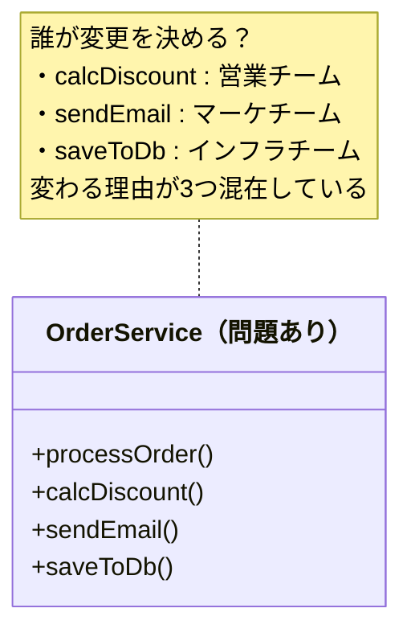
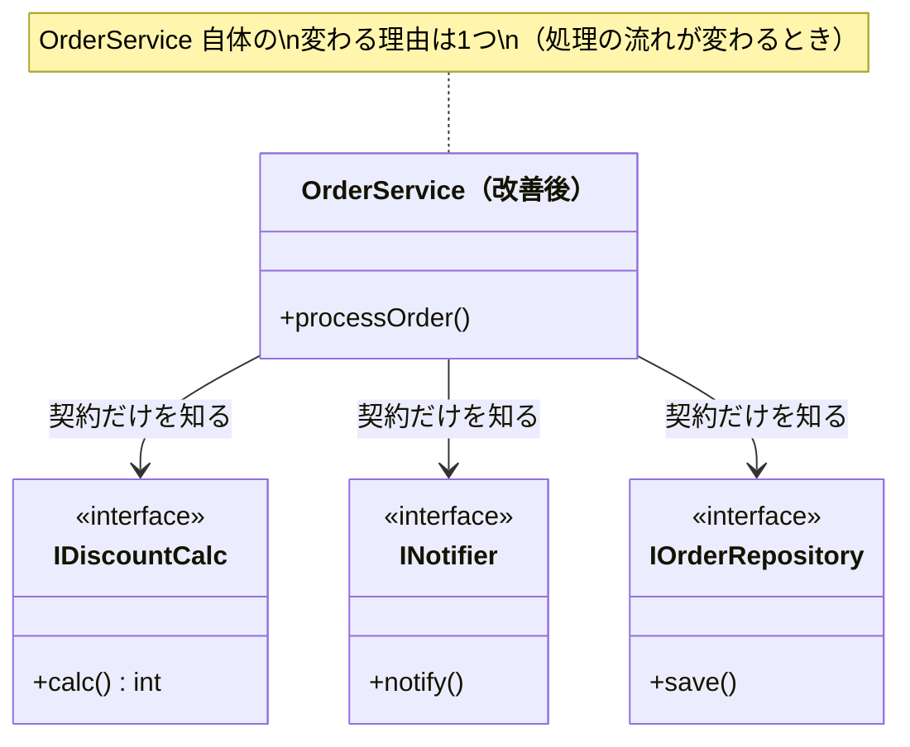
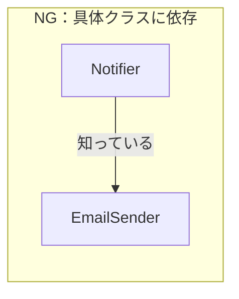
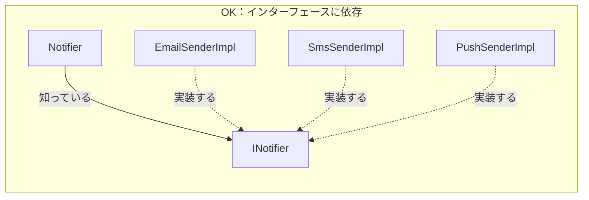
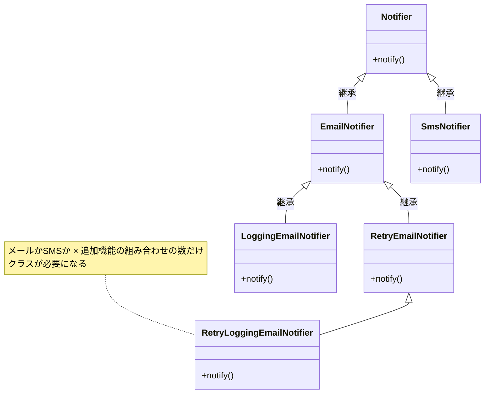
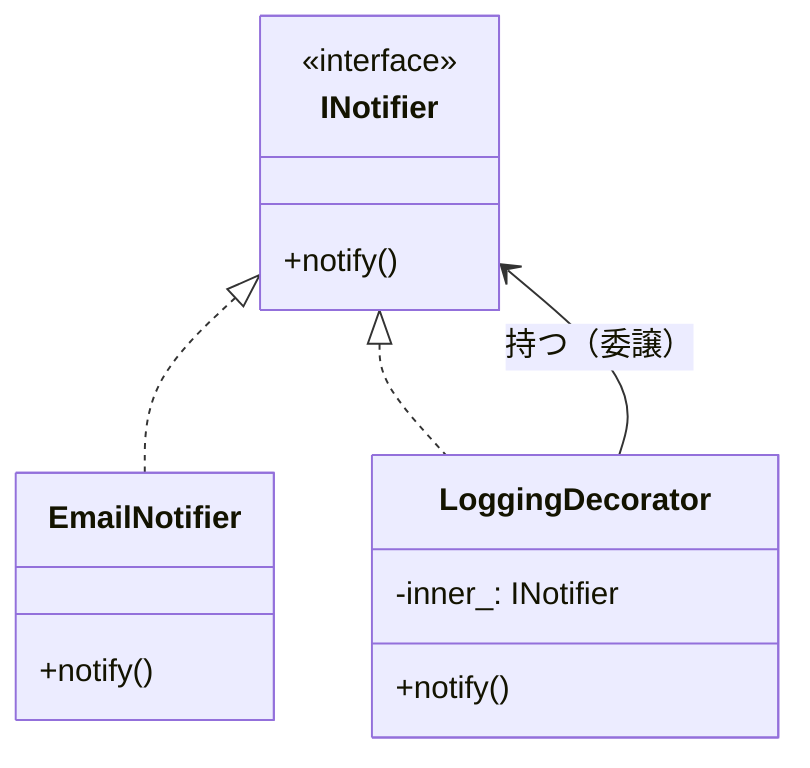
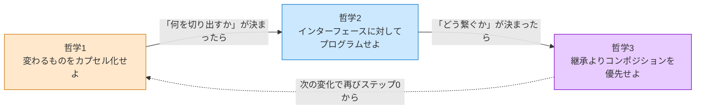

# 第0章　この本の読み方
―― デザインパターンは「考えた結果」に過ぎない

---

## なぜ「デザインパターンを覚えても使えない」のか

ソフトウェア設計を学ぼうとすると、必ずと言っていいほど
「GoFのデザインパターン」に出会います。
本で学び、構造図を頭に入れ、いざ自分のコードに使おうとしたとき——

「どこに適用すればいいのか、わからない。」
「無理に使ってみたら、かえってコードが複雑になった。」

私自身、同じ壁に何度もぶつかりました。
パターンの名前と図は頭に入った。でも、
目の前の問題にどう当てはめればいいのか、
まるでわからなかったのです。

その感覚、うまく伝わっているでしょうか。

なぜ、実績のある優れた設計手法が、
時にはコードをより複雑にしてしまうのか。

理由はシンプルです。
**パターンを「最初から目指すべき答え」として扱っているから**です。

デザインパターンは、先人たちが泥臭い現場で問題に向き合い、
いくつかの選択肢を天秤にかけ、
「この状況ではこれが一番割に合う」と判断した
**決断の結果**として生まれたものです。

結果だけを真似ても、状況が違えばうまく機能しません。
大切なのは、その結果に至るまでの**思考のプロセス**を体験することです。

この本を読むことで、デザインパターンという「結果」がどのような思考で生まれたのか、その本質を理解することができます。パターンの形を暗記して無理に適用するのではなく、目の前の状況に合わせて適切な考え方で対処する――いわば、**「自分なりの設計の型」** を身につけることができるようになります。

> [!INFO] レゴブロックで考える設計
> この本を通じて、ソフトウェア設計の考え方を**レゴブロック**に例えて説明します。
>
> レゴブロックを使って何かを作るとき、私たちは自然と「どのブロックをどこにつなぐか」を考えます。「このブロックが大きすぎる」「ここに壁が必要だ」「あそこの柱は取り外せるようにしたい」——こうした直感は、ソフトウェア設計の思考と全く同じです。
>
> 子どもがレゴで遊ぶように、**ブロックを分けたり・まとめたり・間に挟んだり・新しいパーツを作ったり**する4つの操作で、どんな設計の問題も解決できます。パターンの名前を覚える前に、まずその「手の動き」を理解してください。

> [!INFO] 本書の前提と言語について
> 本書では、すべてのサンプルコードを **C++** で記述しています。ただし、ここで学ぶ「思考の型」はC++に依存するものではありません。オブジェクト指向の概念を備えた言語であれば、どのような言語でも同じように活かせる知識となっています。

---

## この章の地図

この第0章は、本書全体の「設計の言語」を定義する場所です。
第1章以降でどのパターンを扱うときも、ここで定義した言語と思考の型を使います。

★以下の表は実態と異なるため、見直してほしい。

| 章       | 扱うパターン          | 変わるもの（カプセル化の対象）          |
| ------- | --------------- | ------------------------ |
| **第0章** | （基礎知識）          | **3つの哲学 + 8ステップの思考プロセス** |
| **第1章** | Strategy        | 実行する振る舞い（アルゴリズムやルール）     |
| **第2章** | Facade          | 複雑な外部連携の詳細               |
| **第3章** | State           | 状態とそれに伴う振る舞い             |
| **第4章** | Template Method | 処理の各ステップの実装              |
| **第5章** | Command         | 実行する操作そのもの（要求の発生と実行）     |
| **第6章** | Decorator       | 追加する機能の組み合わせ             |
| **第7章** | Observer        | 通知先の種類や依存方向              |
| **第8章** | Factory Method  | 作るオブジェクトの種類（生成と利用）       |
| **第9章** | （応用演習）          | 複数の要因が絡み合う複雑な問題の解決       |

*第0章が「基礎言語」。各章はその言語を特定の問題に適用するだけ。*
*各章の「違い」は「何と何が混在しているか」という状況の違いだけです。*

---

## すべてのパターンを貫く3つの哲学

GoFの23のデザインパターンは、一見バラバラに見えます。
でも、すべてのパターンは、たった3つの哲学を
それぞれの状況に具体化したものに過ぎない——と、私は整理しています。

これを先に知っておくと、パターンが「暗記する公式の集まり」から
「同じ哲学を別の形で表現したもの」に見え始めます。

---

### 哲学1：変わるものをカプセル化せよ

この哲学の核心は、**「誰の判断で変わるか」という決定者を基準に、コードを分離する**ことです。

決定者を特定して分離すると、おのずと「変わるもの」と「変わらないもの」が分かれます。
分離はゴールではなく、決定者を1つにそろえた結果として生まれる構造です。

#### なぜこの哲学が生まれたのか

コードが変わる理由は、ビジネスの変化によって生まれます。
割引ルールを決めるのは「営業チーム」です。API仕様を変えるのは「インフラ担当」です。
出力フォーマットを決めるのは「経理担当」です。

**決定権者が2人以上いるコードを1か所に書くと、一方の変更がもう一方を道連れにします。**

営業チームが割引ルールを変えただけなのに、経理担当の処理まで確認しなければならない——
現場で何度もこの「確認作業」に追われた先人たちが、
「変わる理由ごとに分離していたら、この不安は生まれなかった」と気づいたのが
この哲学の出発点です。

#### 「変わる理由」を見つける問い

この哲学を使うための問いは1つです。

> **「このコードを変更するとき、変更を決定するのは誰か？」**

答えが1人（1チーム）なら、変わる理由は1つです。
答えが2人以上なら、変わる理由が複数混在しています。
**「誰の判断で変わるか」が境界線を引く基準になります。**

たとえば「ECサイトの注文処理システム」を想像してください。
- 割引キャンペーンの適用条件を決めるのは**営業担当**です。
- 注文完了メールの文面を決めるのは**マーケティング担当**です。
- クレジットカード決済の仕様を決めるのは**外部の決済代行会社**です。

判断者はそこまで多くありませんが、これらの処理が1つの `OrderService` クラスに混在していると、マーケティング担当の要望でメール文面を変える際に、決済処理に影響が出ないかテストする必要が生じます。だからこそ、決裁者ごとに分離するのです。

下の図で、問題のある構造と解決後の構造を比べてみてください。





*改善前の OrderService は3つの理由で変わる可能性があった。改善後は1つだけ。*

#### コードで確かめる(C++)

以下に、問題のある「NGコード」を示します。

```cpp
#include <iostream>
#include <string>

// NG：計算ロジックと出力形式が同じクラスに混在
//      calcAmount が変わっても、format が変わっても、
//      この1つのクラスを変更しなければならない
class ReportService {
    double totalSales_; // 売上合計（コンストラクタで受け取る）
public:
    explicit ReportService(double sales) : totalSales_(sales) {}
    void generate() {
        double value = calcAmount();      // 変わる理由1：計算ルール担当（営業チーム）
        std::string text = format(value); // 変わる理由2：出力形式担当（経理チーム）
        writeToPdf(text);
    }
private:
    double calcAmount() { return totalSales_ * 0.1; }           // 手数料10%：営業チームが決める
    std::string format(double v) {                              // CSV形式：経理チームが決める
        return "金額," + std::to_string(static_cast<int>(v));
    }
    void writeToPdf(const std::string& text) {
        std::cout << "[PDF] " << text << "\n";
    }
};

int main() {
    ReportService service(1000);
    service.generate();
    // 実行結果:
    // [PDF] 金額,100
    return 0;
}
```

次に、変わる理由ごとにクラスを分離した「OKコード」です。

```cpp
#include <iostream>
#include <string>

// インターフェース（契約）
class Calculator {
public:
    virtual double calcAmount() = 0;
    virtual ~Calculator() {}
};
class ReportFormatter {
public:
    virtual std::string format(double v) = 0;
    virtual ~ReportFormatter() {}
};

// 具体実装①：手数料10%（営業チームが管理）
class CommissionCalc : public Calculator {
    double totalSales_;
public:
    explicit CommissionCalc(double sales) : totalSales_(sales) {}
    double calcAmount() override { return totalSales_ * 0.1; }
};

// 具体実装②：CSV形式（経理チームが管理）
class CsvFormatter : public ReportFormatter {
public:
    std::string format(double v) override {
        return "金額," + std::to_string(static_cast<int>(v));
    }
};

// OK：変わる理由ごとに分離した結果、ReportServiceは骨格だけになる
class ReportService {
    Calculator*      calc_;
    ReportFormatter* fmt_;
public:
    ReportService(Calculator* c, ReportFormatter* f) : calc_(c), fmt_(f) {}
    void generate() {
        std::string text = fmt_->format(calc_->calcAmount());
        std::cout << "[PDF] " << text << "\n";
    }
};

int main() {
    CommissionCalc calc(1000);
    CsvFormatter formatter;
    ReportService service(&calc, &formatter);
    service.generate();
    // 実行結果:
    // [PDF] 金額,100
    return 0;
}
```

> [!INFO] ReportService の変更理由は複数あるのでは？
> OKコードを見たとき、「各機能の担当都合で実装クラス（CommissionCalcなど）が差し替わるなら、ReportService 自体も直す必要があるのでは？」と疑問に思うかもしれません。
> しかし、`ReportService` は `Calculator` や `ReportFormatter` という**インターフェース（契約）**しか知りません。そのため、営業チームが新しい計算ルールを追加しても、経理チームが新しいフォーマットを追加しても、`ReportService` のコード自体は1行も変わりません（main関数などの外側で差し替えるだけです）。
> これこそが、次項で説明する「**哲学2：インターフェースに対してプログラムせよ**」の力です。

**この哲学を使うための問い——この本を通じて使い回せる1つの問い：**

> **「このコードの中に、『変更を決定する人（決裁者）』が異なる2つのものが、同じ場所に混在していないか？」**

パターンが違っても、問いはこれひとつです。
「誰の決定で変わるか」が違うものが混在していないかを常に問いかけます。

★以下の話が哲学1の話の途中で出てきますが、全体にかかわる話では？変わるものと変わらないものを分離の話の流れから？
#### 哲学がどのように形になるか

> 以下の表は、各章を読み進めた後に「あのパターンは、何を分離した結果なのか」を確認するための参照表です。今はパターン名を知らなくて構いません。

| パターン | 「変わらない」骨格・全体 | 分離した「変わるもの」 |
|---|---|---|
| Strategy（第1章） | 処理全体の流れや目的 | 実行する振る舞い（アルゴリズムやルール） |
| Facade（第2章） | システムが実現したいビジネス要件 | 複雑な外部連携の詳細な手順やAPI |
| State（第3章） | オブジェクトの全体的なライフサイクル | 特定の状態における個別の振る舞い |
| Template Method（第4章） | 処理の全体的な骨格・順序 | 骨格内の個別ステップの実装 |
| Command（第5章） | コマンドを呼び出して実行する仕組み | 実行する操作そのもの（要求の発生と実行） |
| Decorator（第6章） | コアとなる処理のインターフェース | 追加する機能のバリエーションや組み合わせ |
| Observer（第7章） | 状態更新などの主たる処理 | 通知先の種類や依存方向 |
| Factory Method（第8章） | オブジェクトを利用する側のロジック | 作るオブジェクトの種類（生成と利用） |

GoFのパターンは、決して最初から目指すものではありません。「変わるものをカプセル化せよ」という哲学を適用し、不変の骨格から変動する部分を分離した結果の姿に過ぎないのです。

#### 補足：なぜ「すべてのパターン」が登場しないのか

本書はGoFの23個のパターンすべてを網羅していません。しかし、それは「不足」ではありません。**設計の「思考の型」としては、この8章で完全に網羅できている**からです。

現場で開発者を苦しめる「痛みのベクトル（何が変わるか）」は、ロジック、状態、依存、組み合わせ、生成など、概ね上記の8種類に代表されます。この8つの痛みを解消する「型の適用プロセス」さえ脳にインストールできれば、本に登場しない残りのパターンに遭遇したとしても、自力でその構造を導き出すことができます。

- **基本思想の応用で自力で到達できるもの**：たとえば「Adapter（翻訳層）」や「Proxy（代理人）」は、FacadeやDecoratorの章で学ぶ「間にクッションを挟んで依存を切る」という基本思想の派生に過ぎません。
- **言語やフレームワークが解決済みのもの**：要素の走査（Iterator）は現代の言語機能（foreach等）に吸収されています。
- **特定ドメインに特化しすぎているもの**：木構造の処理（Composite）や複雑なデータ構造と処理の分離（Visitor）などは、日常的なビジネスロジックの整理というより特定のデータ構造に対する特殊手札です。
- **現代では使用を慎重に考えるもの**：Singleton（グローバル状態）は、現代ではテストを困難にするため、本章で学ぶDI（依存の外部注入）で置き換えることが多いパターンです。

「この原因には、この手札を当てる」。その結果としてパターンが立ち現れる。
このプロセスを8つの代表例で完全にマスターすれば、あなたはパターンの「暗記者」ではなく「設計者」になっています。

もちろん、GoFの23のパターンをすべて知る必要がないというわけではありません。残りのパターンを学ぶことで、特定のドメインや特殊な問題に対する設計の引き出し（ボキャブラリー）は確実に増え、設計の知識はさらに深まります。23個のパターンは、多様な問題解決のカタログとして非常に価値のあるものです。しかし、最初からすべてを暗記しようとして混乱するよりも、まずはこの8つを通じて「型の適用プロセス」を脳にインストールすることが先決です。

#### この哲学を「あえて」外すとき

原則として哲学1を適用するのがよいですが、**「あえて哲学の適用を見送る（カプセル化しない）」**判断が必要なケースもあります。分離による複雑さの増大（コスト）が、分離によるメリットを上回ってしまう危険性がある場合です。

- **変わる見通しがない**場合。関係者に確認して「この処理は変わらない」と合意できたものは分離不要です。分離のコストが価値を超えます。
- **大規模なレガシーコードで、絡み合いが深い**場合。一気の分離はリスクです。段階的な置き換え（新しい機能から新しい構造で書く）の方が現実的です。
- **変わる理由が同じものを分離しようとしている**場合。たとえば、割引計算の `if` 文が3つある関数を「if が多いから」という理由だけで分離しても意味がありません。3つの割引条件がすべて同じ担当チームが管理していて、同じタイミングで変わるなら、1か所にまとめていて良いのです。「変わる理由が何人いるか」が分離の基準であり、「コードの行数」や「if の数」ではありません。

---

### 哲学2：実装ではなくインターフェースに対してプログラムせよ

「何をするか（契約）」と「どうやるか（実装）」を分ける。

#### なぜこの哲学が生まれたのか

哲学1で「変わるものを切り出した」あとに残る問題があります。
切り出した部品を「どう呼び出すか」です。

具体的なクラス名（`EmailSender`）を呼び出し元が知っていると、
Email→SMS→Pushに切り替わるたびに呼び出し元も変わります。
でも「通知する何か（`INotifier`）」という契約だけを知っていれば、
切り替えが起きても呼び出し元はまったく変わりません。

インターフェースは、安定した呼び出し側と不安定な実装側の間に立つ「緩衝材」です。

#### 依存の方向を図で理解する





*NGでは実装クラスが変わると Notifier も変わる。*
*OKでは INotifier の裏側がどう変わっても Notifier はまったく変わらない。*

#### コードで確かめる（依存の方向）

**NGコード**

```cpp
// NG：具体クラスに直接依存している
//     EmailSender が変わるたびに Notifier も変わる
class Notifier {
    EmailSender* sender_; // 具体クラスを知っている
public:
    void notify(std::string msg) { sender_->send(msg); }
};
```

**OKコード**

```cpp
// OK：インターフェースに依存する
//     IMessageSender の実装が Email→SMS→Push に変わっても
//     Notifier は変わらない
class IMessageSender {
public:
    virtual void send(std::string msg) = 0;
    virtual ~IMessageSender() {}
};

// 具体的な実装①：メール送信
class EmailSender : public IMessageSender {
public:
    void send(std::string msg) override {
        std::cout << "[EMAIL] " << msg << std::endl;
    }
};

// 具体的な実装②：SMS送信（後から追加しても Notifier は変わらない）
class SmsSender : public IMessageSender {
public:
    void send(std::string msg) override {
        std::cout << "[SMS] " << msg << std::endl;
    }
};

class Notifier {
    IMessageSender* sender_; // 契約（インターフェース）だけを知っている
public:
    // コンストラクタ注入：使う実装を外から渡す（依存注入）
    explicit Notifier(IMessageSender* sender) : sender_(sender) {}
    void notify(std::string msg) { sender_->send(msg); }
};

// 組み立ては呼び出し元（main()相当）だけが知っている
int main() {
    EmailSender email;
    Notifier notifier(&email);   // Email版で使う
    notifier.notify("注文完了");

    SmsSender sms;
    Notifier notifier2(&sms);    // SMS版に差し替えても Notifier は変わらない
    notifier2.notify("注文完了");
    return 0;
}
```

#### インターフェースを設計するとき「引数の型」をどう決めるか

インターフェースは「呼び出し元を変化から守る壁」ですが、壁にも破れ目があります。
**引数の型が変わるとき**です。

たとえば、`int userId` をインターフェースの引数として複数箇所で使っているとき、
「IDを文字列に変えたい」という要求が来ると、すべてのインターフェースのシグネチャが変わります。
インターフェースを使っていても、この変更からは逃げられません。

こういう状況に直面したとき、立てるべき問いは「なぜこのパターンでは守れないのか」ではなく、
**「この型はどこまで安定していると言えるか？関係者と合意できているか？」** です。
型を決める前に、その型を使う担当者に確認することが、最初の一手になります。


型変更リスクに対処するコードの選択肢は3つあります：

**① 型を合意・固定する**
シンプルですが、型が変われば全インターフェースのシグネチャが変わります。

```cpp
class IUserService {
public:
    virtual void process(int userId) = 0;
};
```

**② 独自型でくるむ**
インターフェースのシグネチャは変わりません。型の変更は `UserId` の中だけに留まります。

```cpp
struct UserId {
    std::string value;  // int → string に変わってもここだけ直す
};

class IUserService {
public:
    virtual void process(UserId id) = 0;
};
```

**③ void* で型情報をインターフェースに持たせない**
インターフェースは絶対に変わりませんが、代わりに型安全を失います。

```cpp
class IUserService {
public:
    virtual void process(void* context) = 0;
};
```

| 選択肢 | インターフェース変更 | 型安全 | コードの複雑さ |
|---|---|---|---|
| ①合意・固定 | 型が変われば変わる | ✅ 高い | シンプル |
| ②独自型でくるむ | **変わらない** | ✅ 高い | 型定義が1つ増える |
| ③void\* | **絶対変わらない** | ❌ 低い | キャストが必要 |

実際の採用頻度は ① が最も多く、② が型変更リスクが判明しているときの選択肢です。
③ は組み込みや性能に極めて厳しい文脈を除き、選ぶことはほぼありません。
各章では、パターンが直面したこの問題と、関係者との確認を経て選んだ判断を示します。

★後続の章で、実際に哲学を意図的に外すケースはあるか？すべての哲学に該当するような説明になると、無理やりあてはめに行っていないかと思ってしまう。例えば、パターンを使う場面と使わない場面の説明が各章にありますので、そこで、こういう場合は哲学を外す、という説明を追加してもよいと思います。
#### この哲学を「あえて」外すとき

哲学2も同様に、**「あえてインターフェースを使わず、直接依存させる」**判断が必要なケースがあります。

- **実装が1つしかなく、差し替えの見込みがない**場合。インターフェースは間接レイヤーのコストだけになります。「将来変わるかもしれない」という根拠のない予測でインターフェースを作ると、コードを読む人の認知負荷が上がるだけです。
- **チームやコードの規模が小さい**場合。インターフェースが増えると「どこで実装しているか」を探す手間が積み重なります。直接依存の方が読みやすい場面があります。

---

### 哲学3：継承よりコンポジションを優先せよ

機能を「is-a（〜は〜である）」ではなくコンポジション「has-a（〜を部品として持つ）」で組み合わせる。

#### 継承による機能の追加がもたらす問題

継承は「is-a（〜は〜である）」の関係を表すと言われます。
たとえば、システムに通知機能（`Notifier`）があり、その派生として「Eメール通知（`EmailNotifier`）」と「SMS通知（`SmsNotifier`）」があるとします。ここまでは自然な「is-a」関係です。

しかし、ここに別の軸の機能が追加されたらどうなるでしょうか。
「送信に失敗したとき、リトライ（再実行）したい」という機能です。

> [!INFO] コラム：C++ に「インターフェース」はあるか
> C++ には `interface` というキーワードはありません。C++ での「インターフェース」は、**純粋仮想関数（`= 0`）だけで構成された抽象クラス**のことを指します。
> ```cpp
> class INotifier {
> public:
>     virtual void notify(const std::string& msg) = 0;
>     virtual ~INotifier() {}
> };
> ```
> 「インターフェースを実装する」= この純粋仮想クラスを継承して実装すること。
> 「具体クラスを継承する」= 実装を持つクラスから引き継ぐこと。問題になるのは後者です。

#### 問題①：具体クラスを継承すると「何者か」が固定される

```cpp
class EmailNotifier { // 具体クラス：メールを送る実装が入っている
    std::string smtpHost_;
public:
    EmailNotifier(const std::string& host) : smtpHost_(host) {}
    virtual void notify(const std::string& msg) {
        std::cout << "[Email: " << smtpHost_ << "] " << msg << "\n";
    }
};

// リトライ付きメール通知クラス
class RetryEmailNotifier : public EmailNotifier {
public:
    RetryEmailNotifier(const std::string& host) : EmailNotifier(host) {}
    void notify(const std::string& msg) override {
        for (int i = 0; i < 3; ++i) {
            try {
                EmailNotifier::notify(msg); // 親のメソッドを呼ぶ
                return; // 成功したら終了
            } catch (...) {
                std::cout << "Retry " << i + 1 << "\n";
            }
        }
    }
};
```

「親の実装を再利用できるから便利だ」と思うかもしれません。
しかし、`RetryEmailNotifier` は `EmailNotifier` を継承した時点で、**永遠に「メールを送る通知クラス」として固定されます**。

「SMS通知にもリトライ機能を追加してほしい」と言われたら、`RetrySmsNotifier` を作って同じリトライロジックを書かなければなりません。

**継承するなら具体クラスではなく純粋仮想クラス（インターフェース）から**、というのが哲学2との連携です。

#### 問題②：振る舞いを組み合わせようとするとクラスが爆発する

これが哲学3の本題です。「リトライ機能」だけでなく「ログ出力機能」や「制限機能」も必要になった場合、継承で組み合わせようとすると何が起きるか——



機能が4つになれば組み合わせは指数的に増えます。
1つ機能を追加するたびに、既存の全組み合わせ分だけクラスを追加しなければなりません。

#### コンポジションはこう解決する

「コンポジション」とは、オブジェクトを部品として内部に持ち、その部品に処理を委譲（依頼）することです。継承（親から引き継ぐ）ではなく、持つ（外から受け取る）ことで振る舞いを組み合わせます。

基本となる「持つ」だけの解決策から見ていきましょう。

**① 単純なコンポジション（持つだけ）**

一番シンプルな解決策は、リトライ処理専用の部品（`RetryExecutor`）を作り、それを `EmailNotifier` が「持つ」ことです。

```cpp
class EmailNotifier : public INotifier {
    RetryExecutor* retry_; // リトライ部品を持つ（コンポジション）
public:
    EmailNotifier(RetryExecutor* r) : retry_(r) {}
    void notify(const std::string& msg) override {
        // リトライ部品に実際の処理を依頼（委譲）する
        retry_->execute([&]() {
            std::cout << "[Email] " << msg << "\n";
        });
    }
};
```

これで「通知」と「リトライ」のロジックが分かれました。これがコンポジション（has-a）の基本です。インターフェースを実装せずに単に別のクラスを持つだけでも、設計の柔軟性は上がります。
しかし、この方法では「EmailNotifier自身がリトライ部品を持つ必要がある」ため、機能の追加や入れ替えにはクラス（EmailNotifier）の修正が必要です。

では、継承で問題になった `RetryLoggingEmailNotifier`（リトライ＋ログ＋メール送信の組み合わせ）は、コンポジションでどう解決するのか？——答えは「包む」です。

**② 応用編：包む（インターフェースを実装しながら、持つ）**

もし、「既存のクラスに一切手を触れずに、後からリトライ機能やログ機能を追加したり外したりしたい」なら、もう一歩進んだ特殊なコンポジションの形を使います。
それが、**インターフェースを実装しつつ、同じインターフェースを内側に持つ** という手法です。

```cpp
// リトライ機能を追加する「ラッパー（包む）」クラス
class RetryDecorator : public INotifier {  // ① INotifier を実装（外から INotifier として使える）
    INotifier* inner_;                     // ② 本物の通知クラスをメンバーとして持つ
public:
    RetryDecorator(INotifier* inner) : inner_(inner) {}

    void notify(const std::string& msg) override {
        // 自分の仕事（リトライ制御）をする
        for (int i = 0; i < 3; ++i) {
            try {
                inner_->notify(msg); // 本物に委譲（実際の通知は inner_ がやる）
                return;
            } catch (...) {}
        }
    }
};
```

「インターフェースを実装しているのになぜ、同じインターフェースを持つのか？」への答えは明確です。
- **実装する理由**：外から `INotifier` として扱われるため（呼び出し元を変更しないため）
- **持つ理由**：実際の処理を中身（`EmailNotifier`など）に委譲するため

この「実装」と「持つ」をセットにすることで、外からマトリョーシカのように「包む」だけで機能を無数に組み合わせられるようになります。

**クラス図の読み方**



クラス図で使う矢印には2種類あります。

`点線 ＋ 白抜き三角（ ──▷ を点線にしたもの）` は「インターフェースを実装している」を意味します。`EmailNotifier` と `LoggingDecorator` はどちらも `INotifier` を実装しているので、`INotifier` に向かって点線の白抜き三角が伸びています。

`実線矢印（──>）` は「メンバーとして持っている（参照している）」を意味します。`LoggingDecorator` は `INotifier* inner_` というメンバーを持っているので、`INotifier` に向かって実線矢印が伸びています。

つまり `LoggingDecorator` から `INotifier` へは **2本の線** が出ています。点線三角は「私はINotifierとして振る舞える」、実線矢印は「私はINotifierを内部に持っている」という2つの異なる関係を表しています。

**3機能をクラス追加なしで組み合わせる**

```cpp
// インターフェース
class INotifier {
public:
    virtual void notify(const std::string& msg) = 0;
    virtual ~INotifier() {}
};

// 具体クラス：メール送信（smtpHost_ と port_ を内部状態として持つ）
class EmailNotifier : public INotifier {
    std::string smtpHost_;
    int         port_;
public:
    EmailNotifier(const std::string& host, int port)
        : smtpHost_(host), port_(port) {}
    void notify(const std::string& msg) override {
        std::cout << "[Email → " << smtpHost_ << ":" << port_ << "] " << msg << "\n";
    }
};

// ログを追加する「包み紙」（log_ を内部状態として持つ）
class LoggingDecorator : public INotifier {
    INotifier*    inner_;
    std::ostream& log_;
public:
    LoggingDecorator(INotifier* inner, std::ostream& log)
        : inner_(inner), log_(log) {}
    void notify(const std::string& msg) override {
        log_ << "[LOG] " << msg << "\n";
        inner_->notify(msg);
    }
};

// リトライを追加する「包み紙」（maxRetries_ を内部状態として持つ）
class RetryDecorator : public INotifier {
    INotifier* inner_;
    int        maxRetries_;
public:
    RetryDecorator(INotifier* inner, int maxRetries)
        : inner_(inner), maxRetries_(maxRetries) {}
    void notify(const std::string& msg) override {
        for (int attempt = 1; attempt <= maxRetries_; ++attempt) {
            try {
                inner_->notify(msg);
                return;          // 送信成功 → 即リターン
            } catch (...) {
                std::cerr << "[Retry] 試行 " << attempt << "/" << maxRetries_ << " 失敗\n";
            }
        }
    }
};
```

組み合わせは外から「包む」だけです。新しいクラスは不要です。

```cpp
// リトライ付き・ログ付きメール通知
EmailNotifier    email("smtp.example.com", 587);
RetryDecorator   retry(&email, 3);             // email を包む（最大3回リトライ）
LoggingDecorator logging(&retry, std::cout);   // retry をさらに包む

logging.notify("給与処理完了");
// → [LOG] 給与処理完了
// → [Email → smtp.example.com:587] 給与処理完了（リトライは成功時0回）
```

この「包む」構造——「インターフェースを実装しながら、同じインターフェースを内部に持ち、処理を委譲する」——を **Decoratorパターン** と呼びます。「クラスを追加せず、包むことで機能を後付けする」パターンです。

*継承：組み合わせの数だけクラスが増える。*
*コンポジション：包むだけ。クラス数は機能の種類の数だけ。*

> [!INFO] コンポジションは「哲学1」に反するのでは？という疑問
> 「コンポジションで機能を組み合わせたら、それは結局『変わる理由の決定者が複数いる（＝NG）』という状態に戻ってしまうのでは？」と思うかもしれません。
> しかし、ここが哲学1の真髄です。哲学1が禁止しているのは「1つのクラスの中に混在して書くこと」です。
> `LoggingDecorator` や `RetryDecorator` はそれぞれ別のクラスに分離されているため、ログ担当者がログの仕様を変えても、リトライ担当者のコードには一切影響しません（再コンパイルすら不要です）。
> そして、それらを「どう組み合わせるか」を決めるのは、利用側（`main`関数やDIコンテナ）の責任になります。それぞれの部品は自分の仕事だけに集中できる。これこそが哲学1を守り抜いた姿なのです。

#### この哲学を「あえて」外すとき

哲学3においても、**「あえてコンポジションではなく継承を選ぶ」**判断が適切なケースがあります。

- **is-a 関係が成立し、振る舞いを「重ねる」必要がない**場合。たとえばシステムに「管理者ユーザー」と「一般ユーザー」という2種類があって、管理者が一般ユーザーの機能をすべて持ちつつ追加権限を持つ——この場合は `AdminUser extends User` という継承が概念を正直に表現します。振る舞いを後から組み合わせるのではなく、分類するだけなら継承は素直な選択です。
  > **[注意] 継承の罠**：誰もが最初は「is-a 関係だ」と思って継承で実装します。しかし後から「A機能付きの一般ユーザー」「B機能付きの管理者」のように**組み合わせの追加**が発生したときに、そのまま継承を続けると破綻します。組み合わせが発生した時点で、継承からコンポジション（Decoratorパターンなど）へリファクタリングする勇気が必要です。
- **骨格（流れ）を固定して、各ステップの中身だけを変えたい**場合。「処理のステップ順序は変えず、各ステップの実装だけをサブクラスで差し替える」という場面では継承を意図的に使います。**骨格・ステップ分離**がこれに対応します。
  （→ 手札の詳細はこの章の「ステップ5：対策案の検討」および末尾の「構造的対策案の網羅的リスト」を参照）
- **コンポジションが委譲コードを増やしすぎる**場合。has-a で持つと「そのメソッドを呼ぶだけのメソッド」が増え、コードが薄く長くなることがあります。継承なら1行のオーバーライドで済む場面では、継承の方が読みやすいことがあります。

---

> **「哲学」をどう読むか**
>
> ここで「哲学」と呼ぶのは、「常に守るべき絶対ルール」ではありません。
> **「特別な理由がない限りここを出発点にする、デフォルト値」** です。
>
> 3つの哲学を読んで気づいた通り、どの哲学にも「あえて外すとき」があります。
> 哲学は「守らせるもの」ではなく、**「逸脱するときに理由を言語化させるもの」** です。
>
> 「インターフェースを使わない。なぜなら実装は1種類しかなく、テストでの差し替えも不要だから」
> ——この判断は正しい設計です。理由があっての逸脱は偶然の設計とは違います。
>
> 各章で「なぜこのパターンを選んだか」を追うとき、
> 常にこの問いに戻ってきます：**「この状況で、どの哲学がどこに適用されているか」**。

---

### 3つの哲学の連携

3つの哲学は独立しているのではなく、順番に適用される連携関係にあります。


1. **哲学1**で「決定者を特定し、変わる部分を分離する」（結果として変わるもの/変わらないものが分かれる）
2. **哲学2**で「分離した部分をインターフェース経由で接続する」
3. **哲学3**で「インターフェースで接続した部品をどう組み合わせるか」を決める

各章で登場するパターンは、この3つの哲学を「今回の問題状況」に
具体化したバリエーションです。

---

