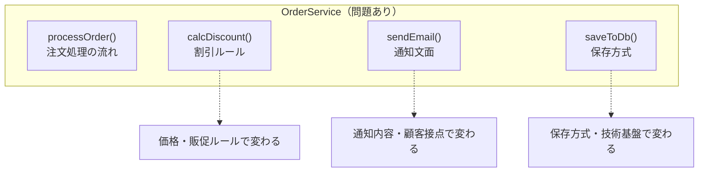
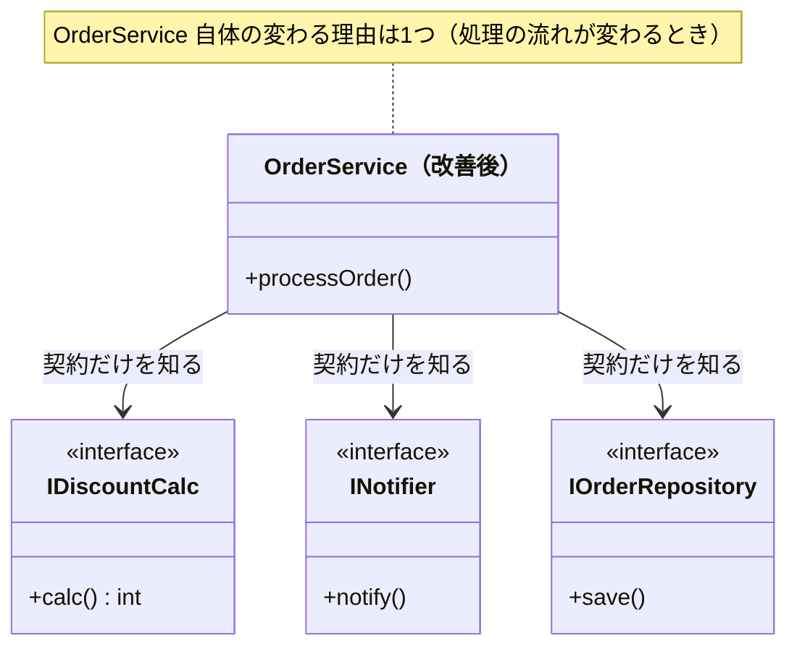
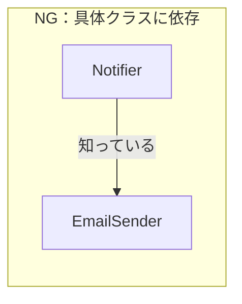
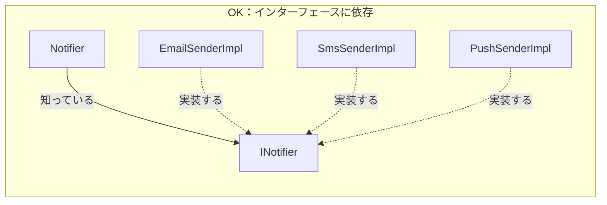
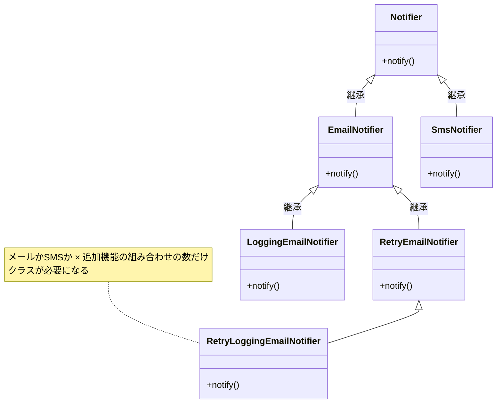
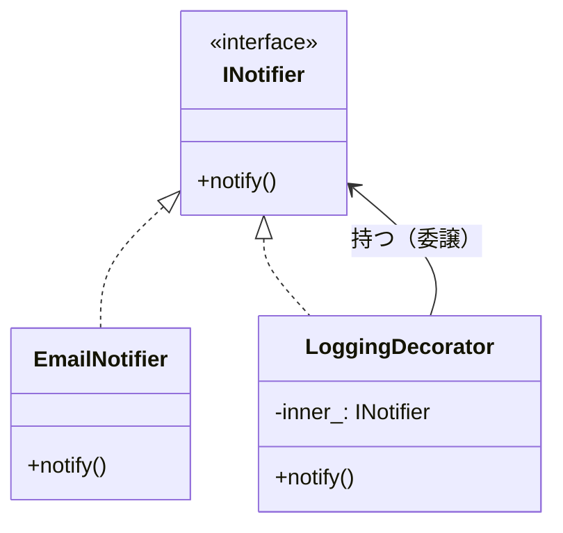
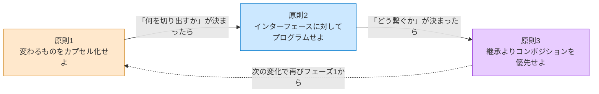

# はじめに
―― デザイン構造は「考えた結果」に過ぎない

---

## なぜ「デザイン構造を覚えても使えない」のか

ソフトウェア設計を学ぼうとすると、よく
「GoFのデザイン構造」に出会います。
GoF（Gang of Four）とは、1994年出版の書籍『Design Patterns』を書いた
4人の著者の総称で、彼らが整理した23の設計の型は
今も設計の共通言語として使われています。
本で学び、構造図を頭に入れ、いざ自分のコードに使おうとしたとき——

「どこに適用すればいいのか、わからない。」
「無理に使ってみたら、かえってコードが複雑になった。」

私自身、同じ壁に何度もぶつかりました。
正直に言うと、私は構造の形を暗記しようとしていました。
でも、いざ現場で「いつ使えばいいのか」がわからず、
自分の判断で構造を使いこなせたことは、一度もなかったように思います。

「ルール差し替え構造？通知分離構造？あのコードに使えそうな気はするんだけど、
どこにどう当てはめればいいか分からない」——
もしあなたが同じように悩んでいるなら、
私のこの経験が一つの参考になるかもしれません。

私は、「どうすればデザイン構造のようなきれいな設計ができるのか」と悩み続けました。
そして気づいたのは、そもそもデザイン構造の形にすることが目的ではなく、
「考え方」を理解して構造の本質を見抜き、自分なりの最適解を導くことが
大切なのではないか、ということです。

そこで、デザイン構造の本質を理解して、自分で思考を深めようと思い、
この本を書き始めました。
この本では私の思考プロセスを扱いますので、
少しでも読んでくださった方の参考になればと思っています。


なぜ、実績のある優れた設計手法が、
時にはコードをより複雑にしてしまうのか。

理由はシンプルです。
**構造を「最初から目指す必要がある答え」として扱っているから**です。

デザイン構造は、先人たちが泥臭い現場で問題に向き合い、
いくつかの選択肢を天秤にかけ、
「この状況ではこれが一番割に合う」と判断した
**決断の結果**として生まれたものです。

結果だけを真似ても、状況が違えばうまく機能しません。
大切なのは、その結果に至るまでの**思考のプロセス**を体験することです。

この本を読むことで、デザイン構造という「結果」がどのような思考で生まれたのか、その本質を理解することができます。構造の形を暗記して無理に適用するのではなく、目の前の状況に合わせて適切な考え方で対処する――いわば、**「自分なりの設計の型」** を身につけるためのヒントになればと思っています。

実は、私自身も最初はろくにプログラミングができない状態でした。設計なんて、もってのほかです。
それでも少しずつ「コードを分ける」ことを意識してみると、変更しやすくなり、構造がきれいになっていく恩恵を感じて、設計の楽しさにすっかりはまってしまいました。
この本を手に取ってくださった方にも、そんな設計の楽しみを知ってもらえたらと願っています。
どのような思考をすればよいかは人それぞれだと思いますので、ご自身なりのプロセスや構造を見つける手助けになれば、とてもうれしいです。

この本を読み終えたとき、一つの目標としてこんな状態になっていれば素晴らしいのではないでしょうか。

> **「このコードに変更が来たとき、まずどこを確認すべきかを、構造から説明できる。」**

それだけです。派手な知識は一つも必要ありません。「変わる理由が混在している」と見抜く目と、「変わる機能・仕様の種類が異なるコードを異なるクラスに分ける」という判断ができれば、デザイン構造のような構造は自然についてくると私は考えています。

> [!INFO] 設計の基本：「分ける」と「接続点の形」
> この本を通じて、ソフトウェア設計の考え方を「**責任を分けて作る**」という視点で説明します。
>
> 何かを作るとき、役割ごとに部品を分けて組み立てると、一部を交換したり改良したりしやすくなります。ソフトウェアも同じで、「どの種類の機能・仕様変更で変わるか」ごとに責任を分けて作ることが設計の出発点です。
>
> そして、分けた後には必ず、部品同士が情報や処理を受け渡す**接続点**ができます。本書では、この接続点で「何を渡すか」「どちらが何を知るか」「変更時にどこまで影響するか」を確かめます。
>
> スマートフォンの充電端子を想像してみてください。Lightningは主にiPhone専用で、つなげる相手はその端子に対応した機器に限られます。一方、USB Type-C のような共通規格なら、Type-C に対応した iPhone も、Type-C の差込口を持つ他の機器も、同じ1本のケーブルで充電できます。**共通規格という「接続点の形」を決めておけば、つなぐ相手（機器）だけを自由に取り替えられる**――これがまさに変更しやすい作りです。ソフトウェアでも同じで、接続点の形（受け渡す情報や操作）を共通化しておけば、片側の部品を別の実装へ入れ替えても、もう片側は作り直さずに済みます。大切なのは分類名を覚えることではなく、「相手を替えたいのに、専用の端子や変換手順に縛られて替えられない」という**変更時の困りごと**を見つけ、接続点を共通の形にして取り替え可能にすることです。
>
> ```text
> 🔌 電源側 ──── 接続点 ──── 📱 利用する機器
>                     ↑
>          ここで何を受け渡すのか
>          どちらが端子の詳細を知るのか
>          機器を替えたらどこを直すのか
> ```
>
> 構造の名前を覚える前に、変更要求がこの境界を通るとき、どちら側の知識まで書き換えることになるかを考えてみてください。第一部では、この見方を各章で繰り返します。

> [!INFO] 本書の前提と言語について
> 本書では、すべてのサンプルコードを **C++** で記述しています。C++を選んだ理由は、「インターフェース（純粋仮想クラス）」「ポインタによる差し替え」「オーバーライド」という設計の構造が、余分なフレームワークの仕組みなしに最もシンプルに見えるからです。
>
> Java・Python・TypeScript などを普段使っている方も、構文より**構造の形**に注目して読んでいただければ、そのまま自分の言語に置き換えられます。
>
> | C++の書き方 | 他言語での対応 |
> |---|---|
> | `virtual void foo() = 0;` | Java: `interface`、Python: `ABC`、TS: `interface` |
> | `class A : public IFoo` | Java/TS: `implements IFoo`、Python: `class A(IFoo)` |
> | `IFoo* ptr;` | Java/TS/Python: `IFoo foo;`（参照型） |
>
> コードの構文が読み解けない箇所があっても、クラス図とコメントで「何が何に依存しているか」を追えれば、設計の学習として十分です。

> [!INFO] サンプルで使うC++標準ライブラリ
> 各章では、業務データを保持するために次の標準コンテナを使います。コンテナ自体の実装を学ぶ必要はなく、「複数件」「キーで検索」「所有権を持つ参照」のどれを表しているかだけ押さえれば、設計上の役割を追えます。
>
> | 記法 | この本で表すもの | 読むときの要点 |
> |---|---|---|
> | `std::vector<T>` | 同じ型の値を順番に並べた複数件 | `push_back` は末尾への追加、`for` は全件の走査 |
> | `std::map<K, V>` | IDなどのキーから値を検索する保存領域 | `find` は存在確認、`at` は対応する値の取得 |
> | `std::unique_ptr<T>` | 所有者が1つのオブジェクト | 所有者が破棄されると指し先も破棄される |
> | `std::shared_ptr<T>` | 複数箇所で寿命を共有するオブジェクト | 最後の所有者がなくなると破棄される |
> | `std::weak_ptr<T>` | 寿命を延ばさずに参照するオブジェクト | 通知先などの循環所有を避けるときに使う |
>
> 各章でこれらが初めて現れる箇所では、コンテナに何を保存し、誰が読み書きするかを本文で説明します。標準ライブラリの全機能ではなく、その章の値の流れに必要な操作だけを扱います。

> [!INFO] 生ポインタの使用について
> `IFoo* ptr` のように、指し先の破棄を自動管理しない通常のポインタを、C++では「生ポインタ」と呼びます。本書では、この記法を「別の実装へ差し替えられる参照」として使います。実務では `std::unique_ptr` や `std::shared_ptr` で寿命を管理する場面もありますが、ここでは所有権ではなく、利用側が具象クラスではなくインターフェースを参照する構造に焦点を絞ります。

---

## この章の地図

この「はじめに」と「第一部の説明」が、本書全体の「設計の言語」を定義します。
各章でどの構造を扱うときも、ここで定義した言語と思考の型を使います。

### 第一部：基本構造の思考体験

| 役割 | 直面する問題・痛みと、分けるべき「変わる理由」 |
| --- | --- |
| **はじめに** | 「構造を使えない」理由の考察と、すべての土台となる3つの原則 |
| **第一部の説明** | 各章で使う「7つのフェーズ」と、変更影響を接続点から見直す方法 |
| **第1章** ルール差し替え構造（Strategy） | **【痛みの種類】条件分岐の爆発**<br>「どのルールを適用するか」が変わるたびにコード全体が揺らぐ痛みを解消する。 |
| **第2章** 窓口構造（Facade） | **【痛みの種類】外部連携の複雑さ**<br>外部システムの手順が変わるたびに、ビジネスロジックまで壊れる痛みを解消する。 |
| **第3章** 状態分離構造（State） | **【痛みの種類】状態による振る舞いの変化**<br>「今の状態」に応じたif文が散らばり、状態追加のたびに全箇所を修正する痛みを解消する。 |
| **第4章** 骨格固定構造（Template Method） | **【痛みの種類】手順と中身の混在**<br>「全体の流れ」は同じなのに「一部のステップ」だけが異なる処理をコピペしてしまう痛みを解消する。 |
| **第5章** 操作記録構造（Command） | **【痛みの種類】操作の実行タイミングと処理の密結合**<br>「何をいつ実行するか」と「処理の実体」が強く結びつく痛みを解消する。 |
| **第6章** 装飾連結構造（Decorator） | **【痛みの種類】機能の組み合わせ爆発**<br>機能の組み合わせ構造の数だけクラスを作らざるを得ない痛みを解消する。 |
| **第7章** 通知分離構造（Observer） | **【痛みの種類】通知先への依存**<br>「誰に通知するか」が増えるたび、主処理のコードに影響が及ぶ痛みを解消する。 |
| **第8章** 生成分離構造（Factory Method） | **【痛みの種類】生成と利用の混在**<br>「何を作るか」が変わるだけなのに、「使う側」のコードまで修正が必要になる痛みを解消する。 |

### 第二部：応用演習

| 役割 | 内容 |
| --- | --- |
| **第二部の説明** | 第一部との違い・複合問題の読み方 |
| **第9章** | 複数構造の融合：複雑な問題への適用 |
| **第10章** | 依存の過多・変化の混在・生成と利用の混在 |
| **第11章** | 複数の「変わる理由」が複雑に絡み合う複合課題 |
| **第12章** | 状態変化・通知・判定ルールの混在 |

*「はじめに」と「第一部の説明」が基礎言語。各章はその言語を特定の問題に適用するだけ。*
*各章の「違い」は「何と何が混在しているか」という状況の違いだけです。*

**各章は独立して読めます。** 第一部の各章は、どの章から読み始めても内容が理解できるよう設計されています。気になる構造があれば、そこから読み始めてください。「はじめに」と「第一部の説明」を先に読んでおくと全章で使う設計の言語が整いますが、必須ではありません。

---

## この本を最大限に活かすために

**1. 章タイトルの構造名は、いったん脇に置いて読む**
章タイトルに構造名が書いてありますが、名前を覚えることが目的ではありません。「なぜこのコードが変えにくいのか」「どこを分けると楽になるのか」という問いを、自分の頭で一緒に追ってください。構造名は、その問いの答えにたどり着いた後に自然についてくるラベルです。

**2. ヒアリングシーンは「理想形」**
各章のヒアリングでは、関係者がちょうど設計に役立つ情報を答えてくれます。現実には「変わるかどうか分からない」「たぶん変わらない」という答えが返ることも多いです。それでも「この問いを関係者に投げる習慣」だけは持ち帰ってください。答えが得られないときは、`git log` などコードの変更履歴が代わりの証言になります。

**3. トレードオフの比較は「チームの議論を整理する道具」**
各章のフェーズ6で登場する対策案のトレードオフ評価は、あくまで私の考える一つの参考例です。チームによってプロジェクトの状況や優先したい価値観は異なります。大切なのは結果をそのまま受け入れることではなく、比較する際にチームで評価軸を話し合うプロセスそのものです。

**4. 章末の「あなたのコードで考えてみてください」を飛ばさないで**
各章の最後に、その章の思考プロセスをあなた自身のコードに当てはめるための問いを用意しました。読み終えた後、一度でも自分のコードを思い浮かべながら向き合ってみてください。

**5. 「コードがきれいすぎる」と感じたときは、問いだけを持ち帰る**
各章のコードは「構造にだけ集中できるよう」業務の複雑さを意図的に省いています。現実のコードがどれだけ混沌としていても、「このメソッドには、どの種類の機能変更が集まっているか？」という問いだけは同じように使えます。担当者やチームが分かるなら補助線になりますが、分からない場合は要求の内容そのものを見ます。

---

## すべての構造を貫く3つの原則

> **【定義】本書における「原則」とは**
> ここでいう「原則」とは、いかなる時も絶対に守らなければならない法律ではありません。**「設計の判断に迷ったとき、メリットとデメリットを測るための評価基準（北極星）」** です。構造を適用するか迷ったとき、この原則に照らして「良い方向に向かっているか」を判断します。

GoFの23のデザイン構造は、一見バラバラに見えます。
でも、すべての構造は、たった3つの原則を
それぞれの状況に具体化したものに過ぎない——と、私は整理しています。

これを先に知っておくと、構造が「暗記する公式の集まり」から
「同じ原則を別の形で表現したもの」に見え始めます。

---

### 原則1：変わるものをカプセル化せよ

この原則の核心は、**「どの種類の機能・仕様変更で変わるか」を基準に、コードを分離する**ことです。

なぜ機能・仕様の種類ごとに分けるのか——理由は明確です。割引ルールの変更、通知文面の変更、保存先の変更は、それぞれ変更される理由もタイミングも異なります。これらが同じクラスにいると、割引だけを変えたいのに通知や保存処理まで影響確認の対象になります。だからこそ、変更の種類ごとに責任を分けることで、1つの要求が別種類の機能へ飛び火しにくい構造が生まれます。分離はゴールではなく、変化の種類をそろえた結果として生まれる構造です。

#### なぜこの原則が生まれたのか

コードが変わる理由は、ビジネスや技術前提の変化によって生まれます。
割引ルールの変更、API仕様の変更、出力フォーマットの変更は、それぞれ別の種類の変化です。
分かる場合は担当者や関係者を補助情報として使えますが、主軸は「何の機能・仕様が変わるのか」です。

なぜ「変わる理由」を見るときに担当者やチームの話が出てくるのでしょうか？
多くの業務変更には、判断する人や組織がいます。ただし、現実には変更要求の発信元を正確に特定できないことも多く、担当者名を境界の主軸にするのは危険です。法改正、外部APIの変更、障害、性能要件、技術基盤の更新など、特定のチーム名ではなく仕様の種類として捉えた方がよい変化もあります。コンウェイの法則が示唆する組織構造は境界を探す補助線ですが、コード構造と常に一対一で一致させる規則ではありません。

> [!INFO] コンウェイの法則とは
> 1968年にメルヴィン・コンウェイが提唱した経験則です。「組織が設計するシステムの構造は、その組織のコミュニケーション構造を反映する傾向がある」というものです。価格施策を扱う領域と技術基盤を扱う領域が別々に動いていれば、システムも自然とその境界でモジュールが分かれやすい、という観察です。本書では「機能・仕様の境界」を探る補助線として参照しています。ただし、組織構造とコード構造が必ず一致しなければならないわけではありません。

**2種類の機能変更に関わるコードが同じメソッドやクラスに混在していると、一方だけを変えても「他方が壊れていないか」を確認せざるを得ません。同じ場所に混在しているため、変更が道連れを起こすのです。**

割引ルールを変えただけなのに、出力フォーマットや保存処理まで確認が必要になる——
現場で何度もこの「確認作業」に追われた先人たちが、
「変わる機能・仕様の種類ごとに分離していたら、この不安は生まれにくかった」と気づいたのが
この原則の出発点です。

#### 「変わる理由」を見つける問い

この原則を使うための問いは1つです。

> **「このコードは、どの種類の機能・仕様変更で変わるのか？」**

変更の種類が1つなら、変わる理由は1つです。
変更の種類が複数あるなら、変わる理由が複数混在しています。
**「どの機能・仕様の種類で変わるか」が境界線を引く基準になります。**

担当者や関係者が分かるなら、それは補助情報として使えます。分からないとき——お客さんからの要求だが社内のどの部門が出したかわからない、伝達者は毎回同じ窓口担当者でそこからはたどれない——というケースでは、人を探すのをやめて、**要求の内容そのもの**に着目します。

> **「この変更は、何の業務上の判断か？」**

「価格・条件に関する変更」なら料金や販促の領域、「文面・タイミングに関する変更」なら通知や顧客接点の領域、「保存先・フォーマットに関する変更」なら技術基盤の領域——という具合に、要求が属する業務の種類で分類できます。関係者の名前は見えなくても、**「何の業務判断か」という性質は要求の内容に含まれている**ことが多いです。

変更の履歴が複数あるときは、この問いも使えます。

> **「この変更とあの変更は、いつも一緒に来るか、別々に来るか？」**

セットで変わるものは同じ業務の関心事に属し、独立して変わるものは別の関心事です。

| 見える情報 | 使う問い |
|---|---|
| まず見るもの | 「これは何の機能・仕様変更か？」 |
| 分かれば補助に使うもの | 「変更を決定する担当者・チーム・外部要因は何か？」 |
| 変更の履歴が見える | 「この変更はいつも一緒に来るか、別々か？」 |

たとえば「ECサイトの注文処理システム」を想像してください。
- 割引キャンペーンの適用条件は、**価格・販促ルール**の変更で変わります。
- 注文完了メールの文面は、**通知内容・顧客接点**の変更で変わります。
- 注文データの保存先（データベースなど）は、**保存方式・技術基盤**の変更で変わります。

関係者が分かる場合は補助線になりますが、分離の主軸はあくまで機能の種類です。これらの処理が1つの `OrderService` クラスに混在していると、メール文面を変える際に、データベース保存処理に影響が出ないかテストする必要が生じます。だからこそ、割引計算・通知・保存のように、変更の種類ごとに分離するのです。

下の図で、問題のある構造と解決後の構造を比べてみてください。





*改善前の OrderService は3つの理由で変わる可能性があった。改善後は1つだけ。*

#### コードで確かめる(C++)

以下に、問題のある「NGコード」を示します。

```cpp
#include <iostream>
#include <string>

// NG：注文処理フロー、割引計算、通知送信、DB保存が同じクラスに混在
//      どれか1つの仕様が変わっても、この1つのクラスを変更することになる
class OrderService {
public:
    void processOrder(double price, const std::string& customerType) {
        // 1. 割引計算（価格・キャンペーン仕様で変わる）
        double discount = 0;
        if (customerType == "Premium") {
            discount = price * 0.2; // プレミアム20%引き
        }
        double finalPrice = price - discount;

        // 2. DB保存（保存方式・保存先仕様で変わる）
        std::cout << "[DB保存] 支払金額 " << finalPrice << " 円で注文を保存しました。\n";

        // 3. 通知送信（通知内容・通知手段の仕様で変わる）
        std::string emailBody =
            "ご購入ありがとうございます。支払金額: "
            + std::to_string(static_cast<int>(finalPrice))
            + "円";
        std::cout << "[メール送信] " << emailBody << "\n";
    }
};

int main() {
    OrderService service;
    service.processOrder(10000, "Premium");
    // 上記コードの実行結果：
    // [DB保存] 支払金額 8000 円で注文を保存しました。
    // [メール送信] ご購入ありがとうございます。支払金額: 8000円
    return 0;
}
```

次に、変わる理由ごとにクラスを分離した「OKコード」です。

```cpp
#include <iostream>
#include <string>

// インターフェース（契約）
class IDiscountCalc {
public:
    virtual double calc(double price) = 0;
    virtual ~IDiscountCalc() {}
};

class INotifier {
public:
    virtual void notify(double price) = 0;
    virtual ~INotifier() {}
};

class IOrderRepository {
public:
    virtual void save(double price) = 0;
    virtual ~IOrderRepository() {}
};

// 具体実装①：プレミアム割引（割引ルール）
class PremiumDiscount : public IDiscountCalc {
public:
    double calc(double price) override {
        return price * 0.2; // 20%引き
    }
};

// 具体実装②：注文完了メール（通知ルール）
class MarketingEmail : public INotifier {
public:
    void notify(double price) override {
        std::cout << "[メール送信] ご購入ありがとうございます。支払金額: " 
                  << static_cast<int>(price) << "円\n";
    }
};

// 具体実装③：データベース保存（保存ルール）
class DbRepository : public IOrderRepository {
public:
    void save(double price) override {
        std::cout << "[DB保存] 支払金額 " << price << " 円で注文を保存しました。\n";
    }
};

// OK：変わる理由ごとに分離した結果、OrderServiceは骨格だけになる
class OrderService {
    IDiscountCalc*    discountCalc_;
    INotifier*        notifier_;
    IOrderRepository* repo_;
public:
    OrderService(IDiscountCalc* d, INotifier* n, IOrderRepository* r)
        : discountCalc_(d), notifier_(n), repo_(r) {}

    void processOrder(double price) {
        double discount = discountCalc_->calc(price);
        double finalPrice = price - discount;
        repo_->save(finalPrice);
        notifier_->notify(finalPrice);
    }
};

int main() {
    PremiumDiscount discount;
    MarketingEmail email;
    DbRepository repo;
    OrderService service(&discount, &email, &repo);
    service.processOrder(10000);
    // 上記コードの実行結果：
    // [DB保存] 支払金額 8000 円で注文を保存しました。
    // [メール送信] ご購入ありがとうございます。支払金額: 8000円
    return 0;
}
```

**NGとOKで「どこが改善されたか」を変更シナリオで比べます。**

| 変更シナリオ | NGコードで触る場所 | OKコードで触る場所 |
|---|---|---|
| 割引ルールを20%→15%に変更したい | `OrderService` を開いて割引計算の箇所を修正 | `PremiumDiscount` だけを修正 |
| メール文面を変更したい | `OrderService` を開いてメール生成の箇所を修正 | `MarketingEmail` だけを修正 |
| 注文データの保存先を変更したい | `OrderService` を開いてDB保存の箇所を修正 | `DbRepository` だけを修正（または新しいリポジトリを追加） |
| 計算ルールを変更しながら同時にメール文面も変えたい | `OrderService` を1つ開いて両方修正——影響範囲が重なって混乱する | `PremiumDiscount` と `MarketingEmail` をそれぞれ独立して修正——影響が交わらない |

NGコードでは「どちらの変更でも `OrderService` を開くことになる」のに対し、OKコードでは「機能の種類ごとに主な修正先を分けられる」ことが分かります。

> [!INFO] OrderService の変更理由は複数あるのでは？
> OKコードを見たとき、「割引ルールや通知手段の仕様変更で実装クラス（PremiumDiscountなど）が差し替わるなら、OrderService 自体も直す必要があるのでは？」と疑問に思うかもしれません。
> しかし、`OrderService` は `IDiscountCalc` や `INotifier` などの**インターフェース（契約）**しか知りません。そのため、新しい割引ルールを追加しても、新しい通知手段を追加しても、`OrderService` のコード自体は1行も変わりません（main関数などの外側で差し替えるだけです）。
> この疑問の答えは「原則1だけでは説明しきれず、次の原則2が必要になる」という、まさにその境界線です。原則2で詳しく解説します。

**この原則を使うための問い——この本を通じて使い回せる1つの問い：**

先ほどの基本形「このコードは、どの種類の機能・仕様変更で変わるのか？」を、実際のコードに当てはめるときはこう展開します。

> **「このコードの中に、異なる種類の機能・仕様変更が、同じ場所に混在していないか？」**

これは基本形の応用形です。「どの機能・仕様が変わる？」を一点に絞るのが基本形、「異なる種類の変更が混在していないか？」と混在を探すのが応用形です。構造が違っても、問いはこの1つです。

> [!NOTE] この考え方は、全章を通じた基礎になります
> ここで紹介する「機能・仕様の種類を基準に分離する」という考え方は、原則1の説明に登場しますが、本書のすべての設計判断の根底にある考え方です。担当者やチームは、分かる場合にその境界を裏付ける補助情報として扱います。各章のフェーズ1〜4でも、この問いに戻ってきます。

#### 原則がどのように形になるか

> 以下の表は、各章を読み進めた後に「あのデザインパターンは、何を分離した結果なのか」を確認するための参照表です。構造名の隣に一般的なパターン名も示しますが、まずは何を分けた構造なのかを追ってください。

| 構造 | 「変わらない」骨格・全体 | 分離した「変わるもの」 |
|---|---|---|
| ルール差し替え構造（Strategy、第1章） | 処理全体の流れや目的 | 実行する振る舞い（アルゴリズムやルール） |
| 窓口構造（Facade、第2章） | システムが実現したいビジネス要件 | 複雑な外部連携の詳細な手順やAPI |
| 状態分離構造（State、第3章） | オブジェクトの全体的なライフサイクル | 特定の状態における個別の振る舞い |
| 骨格固定構造（Template Method、第4章） | 処理の全体的な骨格・順序 | 骨格内の個別ステップの実装 |
| 操作記録構造（Command、第5章） | コマンドを呼び出して実行する仕組み | 実行する操作そのもの（要求の発生と実行） |
| 装飾連結構造（Decorator、第6章） | コアとなる処理のインターフェース | 追加する機能のバリエーションや組み合わせ |
| 通知分離構造（Observer、第7章） | 状態更新などの主たる処理 | 通知先の種類や依存方向 |
| 生成分離構造（Factory Method、第8章） | オブジェクトを利用する側のロジック | 作るオブジェクトの種類（生成と利用） |

GoFの構造は、決して最初から目指すものではありません。「変わるものをカプセル化せよ」という原則を適用し、守りたい骨格から変動する部分を分離した結果の姿に過ぎないのです。

#### 補足：なぜ「すべての構造」が登場しないのか

本書はGoFの23個の構造すべてを網羅していません。代わりに、8つの代表例を通じて、ほかの構造にも応用できる設計の「思考の型」を扱います。

現場で開発者を苦しめる「痛みのベクトル（何が変わるか）」は、ロジック、状態、依存、組み合わせ、生成など、概ね上記の8種類に代表されます。この8つの痛みを解消する「型の適用プロセス」を身につければ、本に登場しない構造に遭遇したときも、原因から構造を考える手がかりになります。

- **基本思想の応用で自力で到達できるもの**：たとえば「Adapter（翻訳層）」や「Proxy（代理人）」は、窓口構造や装飾連結構造の章で学ぶ「間にクッションを挟んで依存を切る」という基本思想の派生に過ぎません。
- **言語やフレームワークが解決済みのもの**：要素の走査（Iterator）は現代の言語機能（foreach等）に吸収されています。
- **特定ドメインに特化しすぎているもの**：木構造の処理（Composite）や複雑なデータ構造と処理の分離（Visitor）などは、日常的なビジネスロジックの整理というより特定のデータ構造に対する特殊手札です。
- **現代では使用を慎重に考えるもの**：Singleton（グローバル状態）は、現代ではテストを困難にするため、使う部品を外から渡す「依存注入（DI）」で置き換えることが多い構造です。依存注入のコード例は、この後の原則2で登場します。

「この原因には、この手札を当てる」。その結果として構造が立ち現れる。
このプロセスを8つの代表例で繰り返すことで、構造名を暗記するだけでなく、設計判断の根拠を説明する練習ができます。

もちろん、GoFの23の構造をすべて知る必要がないというわけではありません。残りの構造を学ぶことで、特定のドメインや特殊な問題に対する設計の引き出し（ボキャブラリー）は増え、設計の知識も深まりやすくなります。23個の構造は、多様な問題解決のカタログとして価値のあるものです。しかし、最初からすべてを暗記しようとして混乱するよりも、はじめにこの8つを通じて「原因から構造を選ぶ考え方」を練習します。

#### この原則を「あえて」外すとき

> [!NOTE] 意図的に外すケース
> 「当面は変わる可能性が低い」と関係者間で確認できる部分は、分離のコストをかけない判断もあります。長期間変わっていない仕様であれば、シンプルに一体で書く案もチームで検討できます。

原則として原則1を適用するのがよいですが、**「あえて原則の適用を見送る（カプセル化しない）」**判断が必要なケースもあります。分離による複雑さの増大（コスト）が、分離によるメリットを上回ってしまう危険性がある場合です。

- **変わる見通しがない**場合。関係者に確認して「この処理は変わらない」と合意できたものは分離不要です。分離のコストが価値を超えます。
- **大規模なレガシーコードで、絡み合いが深い**場合。一気の分離はリスクです。段階的な置き換え（新しい機能から新しい構造で書く）の方が現実的です。
- **変わる理由が同じものを分離しようとしている**場合。たとえば、割引計算の `if` 文が3つある関数を「if が多いから」という理由だけで分離しても意味がありません。3つの割引条件が同じ機能種類に属し、同じタイミングで変わるなら、1か所にまとめていて良い場合があります。「変わる機能・仕様の種類がいくつあるか」が分離の基準であり、「コードの行数」や「if の数」ではありません。

---

### 原則2：実装ではなくインターフェースに対してプログラムせよ

「何をするか（契約）」と「どうやるか（実装）」を分ける。

#### なぜこの原則が生まれたのか

原則1で「変わるものを切り出した」あとに残る問題があります。
切り出した部品を「どう呼び出すか」です。

具体的なクラス名（`EmailSender`）を呼び出し元が知っていると、Email→SMS→Pushに切り替わるたびに呼び出し元も変わります。なぜなら、呼び出し元のコードに「`EmailSender` を使う」という前提が書き込まれているため、`EmailSender` を `SmsSender` に替えるときに呼び出し元のコードも修正が必要になるからです。
でも「通知する何か（`INotifier`）」という契約だけを知っていれば、切り替えが起きても呼び出し元はまったく変わりません。

インターフェースは、安定した呼び出し側と不安定な実装側の間に立つ「緩衝材」です。

#### 依存の方向を図で理解する





*NGでは実装クラスが変わると Notifier も変わる。*
*OKでは INotifier の裏側がどう変わっても Notifier はまったく変わらない。*
> [!INFO] コラム：インターフェースの名前は「ビジネス責任」で付ける
>
> 原則2を実践するとき、インターフェース名の付け方で迷うことがあります。基本的なルールは「**実装手段ではなく、ビジネス上の責任で命名する**」です。
>
> | ❌ 実装手段で命名 | ✅ ビジネス責任で命名 | なぜ変えるか |
> |---|---|---|
> | `IEmailNotifier` | `INotifier` | 手段がSMSに変わっても名前は変わらない |
> | `IPdfOutputService` | `IReportOutputService` | 出力先がExcelに変わっても名前は変わらない |
> | `IMySqlRepository` | `IOrderRepository` | DBが変わっても名前は変わらない |
>
> インターフェース名に実装手段（Email・PDF・MySQL）が入っていると、手段が変わったときに名前が「嘘」になります。`IEmailNotifier` のままSMSを実装したクラスを作ると、コードを読んだ人が「なぜEmail専用のインターフェースをSMSが実装しているのか？」と混乱します。
>
> **実装クラス名は技術手段で付けてよい**のとは対照的です。`EmailSenderImpl` や `SmsSenderImpl` は手段の名前で構いません。重要なのは、呼び出し側が依存するインターフェースの名前が「手段の変化」に左右されないことです。
>
> この本の各章でも、`IDiscountRule`（割引ルールの契約、第1章）・`IReservationState`（予約状態ごとの振る舞いの契約、第3章）・`IDrink`（ドリンクの価格と説明の契約、第6章）のように、ビジネス責任で命名したインターフェースが登場します。名前を見たときに「この境界線は何のためにあるか」がわかることが、良いインターフェース名の基準です。

#### コードで確かめる（依存の方向）

**NGコード**

```cpp
// NG：具体クラスに直接依存している
//     EmailSender が変わるたびに Notifier も変わる

// 具体クラス：メール送信の実装
class EmailSender {
public:
    void send(std::string msg) {
        std::cout << "[EMAIL] " << msg << std::endl;
    }
};

class Notifier {
    EmailSender* sender_; // 具体クラスを知っている
public:
    void notify(std::string msg) { sender_->send(msg); }
};
```

**OKコード**

```cpp
// OK：インターフェースに依存する
//     IMessageSender の実装が Email→SMS→Push に変わっても
//     Notifier は変わらない
class IMessageSender {
public:
    virtual void send(std::string msg) = 0;
    virtual ~IMessageSender() {}
};

// 具体的な実装①：メール送信
class EmailSender : public IMessageSender {
public:
    void send(std::string msg) override {
        std::cout << "[EMAIL] " << msg << std::endl;
    }
};

// 具体的な実装②：SMS送信（後から追加しても Notifier は変わらない）
class SmsSender : public IMessageSender {
public:
    void send(std::string msg) override {
        std::cout << "[SMS] " << msg << std::endl;
    }
};

class Notifier {
    IMessageSender* sender_; // 契約（インターフェース）だけを知っている
public:
    // コンストラクタ注入：使う実装を外から渡す（依存注入）
    explicit Notifier(IMessageSender* sender) : sender_(sender) {}
    void notify(std::string msg) { sender_->send(msg); }
};

// 組み立ては呼び出し元（main()相当）だけが知っている
int main() {
    EmailSender email;
    Notifier notifier(&email);   // Email版で使う
    notifier.notify("注文完了");

    SmsSender sms;
    Notifier notifier2(&sms);    // SMS版に差し替えても Notifier は変わらない
    notifier2.notify("注文完了");
    return 0;
}
```

#### インターフェースを設計するとき「引数の型」をどう決めるか

インターフェースは「呼び出し元を変化から守る壁」ですが、引数の型が変わるときは、呼び出し側と実装側の双方に修正が及びます。
たとえば、`int userId` を使っている箇所を「IDを文字列に変えたい」となった場合、インターフェース自体の変更は避けられません。

この問題に対する基本的なアプローチは次の2つです。

**① 型を合意・固定する**
シンプルですが、型が変われば全インターフェースのシグネチャが変わります。

```cpp
class IUserService {
public:
    virtual void process(int userId) = 0;
};
```

**② 独自型（構造体など）でくるむ**
将来の型変更が予想される場合、`UserId` という独自の型（構造体やクラス）でラップして受け渡します。内部の表現が `int` から `std::string` に変わっても、インターフェースの引数型自体は `UserId` のままで維持できるため、呼び出し元への影響を最小限に抑えられます。

```cpp
struct UserId {
    std::string value; // 型表現の変更をUserIdの内側に寄せる
};

class IUserService {
public:
    virtual void process(UserId id) = 0; // 引数の型はUserIdで固定される
};
```

基本的には、まず「その型が十分に安定しているか」を関係者と合意し、変化に備える必要がある場合のみ独自型で包むといったアプローチを検討します。
各章では、構造が直面したこの問題と、関係者との確認を経て選んだ判断を示します。

#### この原則を「あえて」外すとき

> [!NOTE] 意図的に外すケース
> 実装が1つしか存在せず、将来も増えないと確信できる場合は、インターフェースを挟むコストの方が高くなります。「今後も具体実装はこれ1つ」とヒアリングで確認できた箇所は、直接依存で十分です。

原則2も同様に、**「あえてインターフェースを使わず、直接依存させる」**判断が必要なケースがあります。

- **実装が1つしかなく、差し替えの見込みがない**場合。インターフェースは間接レイヤーのコストだけになります。「将来変わるかもしれない」という根拠のない予測でインターフェースを作ると、コードを読む人の認知負荷が上がるだけです。
- **チームやコードの規模が小さい**場合。インターフェースが増えると「どこで実装しているか」を探す手間が積み重なります。直接依存の方が読みやすい場面があります。

---

### 原則3：継承よりコンポジションを優先せよ

機能を組み合わせるときは、安易に「継承（is-a）」を使うのではなく、まず「コンポジション（has-a：部品として持つ）」を検討するという原則です。

「継承を使ってはいけない」という意味ではありません。継承には「骨格を固定して一部を差し替える」という強力な使い道があります。しかし、「機能を組み合わせる・拡張する」という目的に対して継承を使うと、あとで深刻な罠にはまることが多いため、デフォルトの選択肢をコンポジションにしておくのが安全です。

どちらを選ぶのが良いかは、実現したい目的によって明確に分かれます。

| 目的 | 推奨される手段 | なぜか |
| --- | --- | --- |
| **複数の機能を自由に組み合わせたい**<br>（例：リトライ付き＋ログ付きのメール通知） | **コンポジション（優先）** | 実行時に部品を付け外すことができ、クラスの爆発を防げるため。 |
| **処理の「骨格（順序）」を固定したい**<br>（例：準備→実行→片付けという流れ） | **継承** | 親クラスで流れを強制し、子クラスは「中身」を書くだけに集中させるため。 |
| **完全な「is-a」関係であり、分類だけしたい**<br>（例：管理者ユーザーはユーザーの一種） | **継承** | 概念の分類としては最も素直。ただし後から別の機能との「組み合わせ」が発生した場合はコンポジションへ移行する。 |

なぜ機能拡張において継承が危険なのか、実際のコードでその理由を確認します。

#### 継承による機能の追加がもたらす問題

継承は「is-a（〜は〜である）」の関係を表すと言われます。
たとえば、システムに通知機能の共通インターフェース（`INotifier`）があり、「Eメール通知（`EmailNotifier`）」と「SMS通知（`SmsNotifier`）」がどちらもその同じインターフェース（`INotifier`）を実装する具体クラスだとします。「`EmailNotifier` は `INotifier` である」——これが is-a 関係です。

しかし、ここに別の軸の機能が追加されたらどうなるでしょうか。
「送信に失敗したとき、リトライ（再実行）したい」という機能です。

> [!INFO] コラム：C++ に「インターフェース」はあるか
> C++ には `interface` というキーワードはありません。C++ での「インターフェース」は、**純粋仮想関数（`= 0`）だけで構成された抽象クラス**のことを指します。
> ```cpp
> class INotifier {
> public:
>     virtual void notify(const std::string& msg) = 0;
>     virtual ~INotifier() {}
> };
> ```
> 「インターフェースを実装する」= この純粋仮想クラスを継承して実装すること。
> 「具体クラスを継承する」= 実装を持つクラスから引き継ぐこと。問題になるのは後者です。

#### 問題①：具体クラスを継承すると「何者か」が固定される

```cpp
class EmailNotifier { // 具体クラス：メールを送る実装が入っている
    std::string smtpHost_;
public:
    EmailNotifier(const std::string& host) : smtpHost_(host) {}
    virtual void notify(const std::string& msg) {
        std::cout << "[Email: " << smtpHost_ << "] " << msg << "\n";
    }
};

// リトライ付きメール通知クラス
class RetryEmailNotifier : public EmailNotifier {
public:
    RetryEmailNotifier(const std::string& host) : EmailNotifier(host) {}
    void notify(const std::string& msg) override {
        for (int i = 0; i < 3; ++i) {
            try {
                EmailNotifier::notify(msg); // 親のメソッドを呼ぶ
                return; // 成功したら終了
            } catch (...) {
                std::cout << "Retry " << i + 1 << "\n";
            }
        }
    }
};
```

「親の実装を再利用できるから便利だ」と思うかもしれません。
しかし、`RetryEmailNotifier` は `EmailNotifier` を継承した時点で、**永遠に「メールを送る通知クラス」として固定されます**。

「SMS通知にもリトライ機能を追加してほしい」と言われたら、`RetrySmsNotifier` を作って同じリトライロジックを書かなければなりません。

**継承するなら具体クラスではなく純粋仮想クラス（インターフェース）から**、というのが原則2との連携です。

#### 問題②：振る舞いを組み合わせようとするとクラスが爆発する

これが原則3の本題です。「リトライ機能」だけでなく「ログ出力機能」や「制限機能」も必要になった場合、継承で組み合わせようとすると何が起きるか——



機能が4つになれば組み合わせは指数的に増えます。上の図はEmailとSMSの2種類を出発点としていますが、追加機能が4種類（リトライ・ログ・制限・暗号化）まで増えると、その組み合わせは 2 × 2^4 = 32クラスが必要になります（図はその一部のみ示しています）。機能を1つ追加するたびに既存の全クラス分だけクラスを追加しなければならず、管理が不可能になります。

#### コンポジションはこう解決する

「コンポジション」とは、オブジェクトを部品として内部に持ち、その部品に処理を委譲（依頼）することです。継承（親から引き継ぐ）ではなく、持つ（外から受け取る）ことで振る舞いを組み合わせます。

基本となる「持つ」だけの解決策から確認します。

**① 単純なコンポジション（持つだけ）**

一番シンプルな解決策は、リトライ処理専用の部品（`RetryExecutor`）を作り、それを `EmailNotifier` が「持つ」ことです。

```cpp
class EmailNotifier : public INotifier {
    RetryExecutor* retry_; // リトライ部品を持つ（コンポジション）
public:
    EmailNotifier(RetryExecutor* r) : retry_(r) {}
    void notify(const std::string& msg) override {
        // リトライ部品に実際の処理を依頼（委譲）する
        retry_->execute("[Email] " + msg);
    }
};
```

これで「通知」と「リトライ」のロジックが分かれました。これがコンポジション（has-a）の基本です。インターフェースを実装せずに単に別のクラスを持つだけでも、設計の柔軟性は上がります。
しかし、この方法では「EmailNotifier自身がリトライ部品を持つ必要がある」ため、機能の追加や入れ替えにはクラス（EmailNotifier）の修正が必要です。

では、継承で問題になった `RetryLoggingEmailNotifier`（リトライ＋ログ＋メール送信の組み合わせ）は、コンポジションでどう解決するのか？——答えは「包む」です。

**② 応用編：包む（インターフェースを実装しながら、持つ）**

> [!INFO] スキップ可能：装飾連結構造の予告
> ここから先は「装飾連結構造」の仕組みを先取りして解説しています。少し難易度が上がるため、この段階では「コンポジションを応用すると、既存コードへの変更を抑えながら機能を追加できる場合がある」と把握できれば先へ進めます。詳細は第6章で扱います。

もし、「既存のクラスへの変更を抑えながら、後からリトライ機能やログ機能を追加したり外したりしたい」なら、もう一歩進んだ特殊なコンポジションの形を使います。
構造を先に示すと、**「同じインターフェース（`INotifier`）を実装し、かつ内部にも同じインターフェース（`INotifier`）を持つ」** クラスを作ります。外からは `INotifier` として見え、内側では別の `INotifier` を呼び出す——この二重の役割が「包む」の正体です。

```cpp
// リトライ機能を追加する「ラッパー（包む）」クラス
// ① INotifier を実装（外から INotifier として使える）
class RetryDecorator : public INotifier {
    INotifier* inner_;  // ② 本物の通知クラスをメンバーとして持つ
public:
    RetryDecorator(INotifier* inner) : inner_(inner) {}

    void notify(const std::string& msg) override {
        // 自分の仕事（リトライ制御）をする
        for (int i = 0; i < 3; ++i) {
            try {
                inner_->notify(msg); // 本物に委譲（実際の通知は inner_ がやる）
                return;
            } catch (...) {}
        }
    }
};
```

「インターフェースを実装しているのになぜ、同じインターフェースを持つのか？」への答えは明確です。
- **実装する理由**：外から `INotifier` として扱われるため（呼び出し元を変更しないため）
- **持つ理由**：実際の処理を中身（`EmailNotifier`など）に委譲するため

この「実装」と「持つ」をセットにすることで、外からマトリョーシカのように「包む」だけで機能を無数に組み合わせられるようになります。

**クラス図の読み方**



クラス図で使う矢印には2種類あります。

`点線 ＋ 白抜き三角（ ──▷ を点線にしたもの）` は「インターフェースを実装している」を意味します。`EmailNotifier` と `LoggingDecorator` はどちらも `INotifier` を実装しているので、`INotifier` に向かって点線の白抜き三角が伸びています。

`実線矢印（──>）` は「メンバーとして持っている（参照している）」を意味します。`LoggingDecorator` は `INotifier* inner_` というメンバーを持っているので、`INotifier` に向かって実線矢印が伸びています。

つまり `LoggingDecorator` から `INotifier` へは **2本の線** が出ています。点線三角は「私はINotifierとして振る舞える」、実線矢印は「私はINotifierを内部に持っている」という2つの異なる関係を表しています。

**3機能をクラス追加なしで組み合わせる**

```cpp
// インターフェース
class INotifier {
public:
    virtual void notify(const std::string& msg) = 0;
    virtual ~INotifier() {}
};

// 具体クラス：メール送信（smtpHost_ と port_ を内部状態として持つ）
class EmailNotifier : public INotifier {
    std::string smtpHost_;
    int         port_;
public:
    EmailNotifier(const std::string& host, int port)
        : smtpHost_(host), port_(port) {}
    void notify(const std::string& msg) override {
        std::cout << "[Email → " << smtpHost_ << ":" << port_
                  << "] " << msg << "\n";
    }
};

// ログを追加する「包み紙」（log_ を内部状態として持つ）
class LoggingDecorator : public INotifier {
    INotifier*    inner_;
    std::ostream& log_;
public:
    LoggingDecorator(INotifier* inner, std::ostream& log)
        : inner_(inner), log_(log) {}
    void notify(const std::string& msg) override {
        log_ << "[LOG] " << msg << "\n";
        inner_->notify(msg);
    }
};

// リトライを追加する「包み紙」（maxRetries_ を内部状態として持つ）
class RetryDecorator : public INotifier {
    INotifier* inner_;
    int        maxRetries_;
public:
    RetryDecorator(INotifier* inner, int maxRetries)
        : inner_(inner), maxRetries_(maxRetries) {}
    void notify(const std::string& msg) override {
        for (int attempt = 1; attempt <= maxRetries_; ++attempt) {
            try {
                inner_->notify(msg);
                return;          // 送信成功 → 即リターン
            } catch (...) {
                std::cerr << "[Retry] 試行 "
                          << attempt << "/" << maxRetries_ << " 失敗\n";
            }
        }
    }
};
```

組み合わせは外から「包む」だけです。新しいクラスは不要です。

```cpp
// リトライ付き・ログ付きメール通知
EmailNotifier    email("smtp.example.com", 587);
RetryDecorator   retry(&email, 3);             // email を包む（最大3回リトライ）
LoggingDecorator logging(&retry, std::cout);   // retry をさらに包む

logging.notify("給与処理完了");
// → [LOG] 給与処理完了
// → [Email → smtp.example.com:587] 給与処理完了（リトライは成功時0回）
```

この「包む」構造——「インターフェースを実装しながら、同じインターフェースを内部に持ち、処理を委譲する」——を **装飾連結構造** と呼びます。「クラスを追加せず、包むことで機能を後付けする」構造です。

> [!INFO] Q：装飾連結構造は「原則1に反するのでは？」という疑問
> 装飾連結構造で機能を組み合わせると、それは結局「変わる理由が複数ある（＝NG）」という状態に戻ってしまうのでは？と思うかもしれません。
> しかし、ここが原則1の真髄です。原則1が禁止しているのは「1つのクラスの中に混在して書くこと」です。`LoggingDecorator` や `RetryDecorator` はそれぞれ別のクラスに分離されているため、ログ仕様の変更がリトライ側のコードへ波及しにくくなります。それぞれの部品は自分の仕事に集中しやすくなる。これこそが原則1を適用した姿なのです。

*継承：組み合わせの数だけクラスが増える。*
*コンポジション：包むだけ。クラス数は機能の種類の数だけ。*

#### この原則を「あえて」外すとき

> [!NOTE] 意図的に外すケース
> 「is-a 関係が明確で、組み合わせの爆発が起きない」と判断できる場合は継承が素直な選択です。後から組み合わせが増えた時点でコンポジションへの移行を検討してください（本章の原則3参照）。

原則3においても、**「あえてコンポジションではなく継承を選ぶ」**判断が適切なケースがあります。

- **is-a 関係が成立し、振る舞いを「重ねる」必要がない**場合。たとえばシステムに「管理者ユーザー」と「一般ユーザー」という2種類があって、管理者が一般ユーザーの機能をすべて持ちつつ追加権限を持つ——この場合は `AdminUser extends User` という継承が概念を正直に表現します。振る舞いを後から組み合わせるのではなく、分類するだけなら継承は素直な選択です。
  > **[注意] 継承の罠**：誰もが最初は「is-a 関係だ」と思って継承で実装します。しかし後から「A機能付きの一般ユーザー」「B機能付きの管理者」のように**組み合わせの追加**が発生したときに、そのまま継承を続けると破綻します。組み合わせが発生した時点で、継承からコンポジション（装飾連結構造など）へ作り替える勇気が必要です。
- **骨格（流れ）を固定して、各ステップの中身だけを変えたい**場合。「処理のステップ順序は変えず、各ステップの実装だけをサブクラスで差し替える」という場面では継承を意図的に使います。**骨格・ステップ分離**がこれに対応します。
  （→ 対策の詳細は、次の「第一部の説明」の「フェーズ6：対策検討」を参照）
- **コンポジションが委譲コードを増やしすぎる**場合。has-a で持つと「そのメソッドを呼ぶだけのメソッド」が増え、コードが薄く長くなることがあります。継承なら1行のオーバーライドで済む場面では、継承の方が読みやすいことがあります。

---

> **「原則」をどう読むか**
>
> ここで「原則」と呼ぶのは、「常に守るべき絶対ルール」ではありません。
> **「特別な理由がない限りここを出発点にする、デフォルト値」** です。
>
> 3つの原則を読んで気づいた通り、どの原則にも「あえて外すとき」があります。
> 原則は「守らせるもの」ではなく、**「逸脱するときに理由を言語化させるもの」** です。
>
> 「インターフェースを使わない。なぜなら実装は1種類しかなく、テストでの差し替えも不要だから」
> ——この判断は妥当な設計判断になりえます。理由があっての逸脱は偶然の設計とは違います。
>
> 各章で「なぜこの構造を選んだか」を追うとき、
> 常にこの問いに戻ってきます：**「この状況で、どの原則がどこに適用されているか」**。

---

### 3つの原則の連携

3つの原則は独立しているのではなく、順番に適用される連携関係にあります。


1. **原則1**で「変わる機能・仕様の種類を特定し、変わる部分を分離する」（結果として変わる見込み/当面安定の前提が分かれる）
2. **原則2**で「分離した部分をインターフェース経由で接続する」
3. **原則3**で「インターフェースで接続した部品をどう組み合わせるか」を決める

各章で登場する構造は、この3つの原則を「今回の問題状況」に
具体化したバリエーションです。

**現場での使い方：診断フロー**

目の前のコードに設計の問題を感じたとき、この3原則を次の順で使います。

1. まず「このメソッド（クラス）には、異なる種類の機能・仕様変更が混在していないか？」と問う（**原則1**）。複数なら分離の候補。
2. 分離が必要と判断したら「呼び出し元は具体クラスを知る必要があるか？」と問う（**原則2**）。知る必要がなければインターフェースを挟む。
3. 組み合わせの数が増えそうなら「継承でクラスを増やさずに、後から外から組み合わせられるか？」と問う（**原則3**）。組み合わせが発生するならコンポジションへ。

「どの原則を使うか」は状況が決めます。すべてを一度に適用する必要はありません。最初に原則1の問いだけ習慣にするだけで、コードの構造問題は相当数見えるようになります。

---
