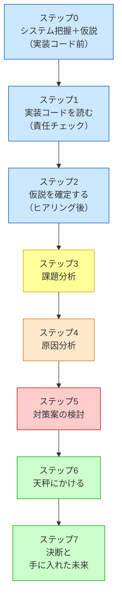

## 先人たちが使っていた「8ステップの思考プロセス」

**このプロセスを「いつ」使うのか**

この8ステップは、**「すでに稼働しているシステムに、新たな仕様変更や機能追加の要望が来たとき」** に発動するプロセスです。特に、以下のような状況で威力を発揮します。

- 既存システムをあまり把握していない人が、安全に変更を加えるアプローチを探るとき
- 熟練の担当者が、複雑化した課題を改めて整理し直し、設計の妥当性を検証するとき

設計書やコードをただ眺めるのではなく、このプロセスに沿って「現状把握 → 課題特定 → 原因特定 → 対策検討 → 比較決定」と進めることで、安全で確実な変更が可能になります。

先人たちの記録を紐解くと、彼らもまた複雑化する要求とコードの絡み合いに向き合っていたことが窺えます。
彼らが問題を解決するとき、意識的かどうかはともかく、以下の8つのステップを踏んでいたと解釈することができます。

各章は、このステップを1つの問題に対して一貫して適用します。
ここで、各ステップが「なぜ必要か」「何をするか」「3つの哲学とどう繋がるか」を
丁寧に押さえておきましょう。後の章で「あのステップの話だ」と気づけるようになります。

> [!IMPORTANT] 本質は「ビジネスの課題解決プロセス」と同じ
> 以下の8ステップはプログラミング特有の魔法ではありません。ビジネスの現場で行われる基本的な課題解決プロセス（**現状把握 ⇒ 課題特定 ⇒ 原因特定 ⇒ 対策検討 ⇒ 比較・決定**）と完全に一致しています。
> 現状を把握せずに原因を見誤ったり、原因を特定せずに対策（パターン）を打ったりすると、期待する効果が得られないのはビジネスも設計も同じです。本質がずれたまま進めないよう、この工程を一つずつ踏んでいくことが何より重要です。




8ステップは、目的の異なる **5つのフェーズ** に分かれています。

| フェーズ | ステップ | 問いかけ |
|:---|:---|:---|
| 🔵 **現状把握** | ステップ0〜2 | 「コードの今の状態」を読み取る |
| 🟡 **課題特定** | ステップ3 | 「変更が来たとき、どこが辛いか」を炙り出す |
| 🟠 **原因特定** | ステップ4 | 「分けるべき場所があるか」を特定する |
| 🔴 **対策検討** | ステップ5 | 「接続の形をどう決めるか」を検討する |
| 🟢 **比較・決定** | ステップ6〜7 | 「現在・未来のコストで対策案を選ぶ」 |

色分けはフェーズを示しています（青＝現状把握、黄＝課題特定、橙＝原因特定、赤＝対策検討、緑＝比較・決定）。以下では各フェーズの役割とステップを順に見ていきます。

ステップ0〜2が「問題の把握」をそれぞれ異なる対象に対して行うことに注目してください。

| ステップ | 読む対象 | やること |
|---|---|---|
| **ステップ0** | クラス構成の概要（仕様表・責任一覧） | クラスの責任を把握し、「何が変わりそうか」の仮説を立てる |
| **ステップ1** | 実装コード（`if` 文の中身・各行） | 各行が責任範囲内かを確認し、責任外の知識を見つける |
| **ステップ2** | 関係者（ヒアリング） | 「なぜ変わるのか・誰が決めるのか」を確認し、仮説を確定する |

---

## 🔵 フェーズ1：現状把握（ステップ0〜2）―― 「何が・なぜ問題か」を掴む

### ステップ0：システムを把握し、仮説を立てる ―― クラス構成を見てから「変わりそうな場所」を予測する

> **入力：** システムのシナリオ説明 ＋ クラス構成の概要（クラス名・責任一覧・仕様表）。実装コードはまだ読まない。
> **産物：** 変動と不変の「仮説テーブル」

**なぜこのステップが必要か**

実装コードに飛び込む前に、「このシステムに何があるか」を把握しておかないと、
コードの詳細に引きずられて「動きを追う読み方」になってしまいます。

ここでの把握対象は実装の詳細（`if` 文の中身など）ではありません。
「どんなクラスが存在し、それぞれの責任は何か」というアーキテクチャの概要です。

**このステップでやること**

システムのシナリオ説明を聞き、**クラス構成の概要**（クラス名・責任一覧・仕様表）を確認します。
「どのクラスが何を担当するか」が把握できた段階で、仮説テーブルを埋めます。

> 「このシステムの中で、何が変わりやすく、何は変わらないか？ そしてそれは『誰の決定（都合）』で変わるのか？」

クラスの責任一覧を見れば、「このクラスは営業部長の施策変更で変わりそうだ」「このフローは会社の根幹だから変わらない」というように、変更の決定権を持つ人ベースでの仮説を立てることができます。

| 分類 | 仮説 | 根拠（クラス構成から読み取れること） |
|---|---|---|
| 🔴 変動しそう | （例）各外部サービスのAPI仕様 | 外部ベンダーの都合で変わりそうなクラスが見える |
| 🟢 変わらなそう | （例）業務フローの骨格 | 会社の業務根幹を担うクラスは変わりにくい |

**なぜ仮説を立てるのか？**

この仮説は、ステップ2で関係者にヒアリングするための「的を絞った問い」を作るために不可欠です。
仮説なしに「今後何が変わりますか？」と漠然と聞いても、関係者は答えられません。「外部ベンダーの都合で、このAPI仕様が変わる可能性はありますか？」と具体的にぶつけることで初めて、意味のある回答（リスクの確定）が得られます。仮説なきヒアリングは、ただの雑談で終わってしまいます。

最後に、この章全体で使う「設計のレンズ（問い）」をセットします。

> 「このコードの中に、**『変わる理由』が異なる2つのものが、同じ場所に混在していないか？」**

**3つの哲学との接続**

これは**哲学1**「変わるものをカプセル化せよ」の問いを意識にセットするステップです。
「クラスの責任が何か」を把握することが、「変わるもの」を見分ける出発点になります。

---

### ステップ1：実装コードを読む ―― 責任チェックで問題の行を見つける

> **入力：** ステップ0で把握したクラス責任 ＋ 実際の実装コード
> **産物：** 責任チェック表。「このクラスが持つべきでない知識」が混在している行の発見。

**なぜこのステップが必要か**

ステップ0でクラスの責任は把握しました。
このステップでは、**実装コードがその責任通りに書かれているか**を1行ずつ確認します。

「バグがあるか」ではなく「責任範囲外の知識がコードに混入していないか」という目線で読みます。
この違いが、設計の問題を見つけられるかどうかの分かれ目です。

#### 責任チェックの手順

「変化」を特定するには、次の3つの問いに答えます。

1. **「誰の判断で変わるか」を問う** — ビジネスルールが変わったとき、どこを触るか？
2. **「なぜ変わるか」の理由が1つか確認する** — 変わる理由が2つ以上ある箇所は、責任が混在しています。
3. **「変えたときに他に影響が出るか」を確認する** — 影響が出るなら、変わるものと変わらないものが同じ場所にいます。

この3問に答えると、「変化の単位」が自然に浮かび上がります。

**このステップでやること**

システムの全コードを読むわけではありません。ステップ0の仮説に基づき、「今回の仕様変更の影響を受けそうなクラス」や「変更を加える予定の箇所」に当たりをつけ、その対象クラスの実装コードを1行ずつ読んでいきます。

ステップ0で確認した「クラスの責任」を念頭に置きながら、読み進める中で問うのは「このコードの行は、このクラスの責任の範囲内か？」です。

```
【責任チェックの問い】
このクラスが持っている知識を変えたいとき、
誰の判断で変更が起きるか？
自分のクラスの責任オーナーとは別の人間が登場するなら、
その知識はこのクラスが持つべきではない。
```

責任の範囲外の知識を持っているコードの行が見つかれば、それが問題の核心です。

**3つの哲学との接続**

これは**哲学1**の「変わる理由」を1行ずつ確認するステップです。
「誰の判断で変わるか」という問いが、責任の境界線を引く基準になります。
また、責任を「1文で言えない」クラスは、複数の責任を持っている可能性があります。

---

### ステップ2：仮説を確定する ―― 関係者ヒアリングで「変わる理由」に根拠をつける

> **入力：** ステップ0の仮説 × ステップ1の責任チェック表。関係者（営業・業務担当など）に直接確認する。
> **産物：** 確定した変動/不変テーブル（根拠付き）。「誰の判断で変わるか」が明記されたもの。

**ステップ0との違い**

ステップ0では「変わりそう」という予測を立てました。
このステップでは「なぜ変わるのか」「誰が決めるのか」を関係者に確認して、**予測を事実に変えます**。

コードを読んだだけで「変わる」「変わらない」と断定するのは危険です。
変わるかどうかを知っているのは、そのコードを管理している人間だけだからです。

**なぜこのステップが必要か**

仮説のまま進むと、見当違いの部分を「変わるもの」として分離してしまうリスクがあります。
また、「この処理は変わらないはず」と思っていたものが、実は毎シーズン変わると分かることもあります。

**このステップでやること**

ステップ0の仮説を携えて、関係者ヒアリングを行います。

> 「このAPIは今後バージョンアップの予定はありますか？」
> 「このルールは担当チームが独立して判断できますか？」
> 「この型（int）は将来変わる可能性はありますか？」

ヒアリングで得た回答をもとに、変動/不変テーブルを確定します。

| 分類 | 具体的な内容 | 変わるタイミング | 根拠 |
|---|---|---|---|
| 🔴 変動 | （変わりやすい部分） | （いつ変わるか） | （誰がそう言ったか） |
| 🟢 不変 | （変わらない部分） | 変わる日は来ない | （誰と合意したか） |

「根拠」の列に「〇〇担当との確認」と書けるまで、仮説は仮説のままにしておきます。

**仮説が外れたら**

ヒアリングの結果がステップ0の仮説と食い違うことがあります。「変わると思っていたが、変わらない」「変わらないと思っていたが、実は頻繁に変わる」——この逆転は設計判断を変えます。

- 「変わらない」とわかった部分は、分離のコストをかける必要がなくなります。分離しないことが正しい判断です。
- 「頻繁に変わる」とわかった部分は、ステップ5で改めて分け方を検討します。

仮説が外れること自体は失敗ではありません。ヒアリング前の仮説は「どこを重点的に確認するか」の地図として機能します。外れた仮説は確認の精度を高めた証拠です。

**3つの哲学との接続**

これは**哲学1**の「変わるもの」を確定するステップです。
ここで正確に変動/不変を峻別できていないと、ステップ5の対策が的外れになります。
ヒアリングで分かった「変わりやすい部分」こそが、後でインターフェースの境界線になります。

---

## 🟡 フェーズ2：課題特定（ステップ3）―― 「変更が来たとき、どこが辛いか」を炙り出す

### ステップ3：課題分析 ―― 変更が来たとき、どこが辛いかを確認する

**なぜこのステップが必要か**

設計の問題は、コードを静的に眺めているだけでは気づきにくいものです。
「変更要求が来たとき、どこに手が入るか」を実際にシミュレートしてみると、
問題の輪郭がリアルに見えてきます。

**このステップでやること**

ステップ2で受け取った変更要求（または想定される変更）を、今のコードに加えようとします。
加えようとすると、何が起きるかを追います。

- どのファイルを開くことになるか
- 変更の影響がどこまで波及するか
- 変えたくないはずのコードに触れることになるか

これが「痛み」の正体です。

たとえば「夏セールの割引率を15%から20%に変える」という変更要求が来たとします。この変更の決定権者は営業チームです。しかし実際に変更しようとすると、割引計算のコードだけでなく、注文処理の関数も開かなければならない——「なぜ営業施策の変更で、注文処理の関数を触るのだろう？」という違和感が生まれたなら、それが課題の所在を指しています。

**3つの哲学との接続**

**哲学1**が守られていないとき、ここで「変更の飛び火」が現れます。
変わる理由が異なる2つのものが同じ場所にいると、片方を変えると必ずもう片方が道連れになります。

**置換・拡張のやりづらさも、ここで発見する**

「この実装を別のものに差し替えたい」と思ったとき差し替えられないなら、それが課題です。
「新しいパターンを追加したい」と思ったとき既存コードを大量に書き換える必要があるなら、それも課題です。
ステップ4では、この痛みの根本にある「分けるべき場所」を特定します。

---

## 🟠 フェーズ3：原因特定（ステップ4）―― 「なぜ辛いのか」を構造的に言語化する

### ステップ4：原因分析 ―― 痛みの根本にある設計の問題を言語化する

**なぜこのステップが必要か**

ステップ3で発見した「痛み」は症状です。
症状に対して対症療法を施すだけでは、根本は変わりません。
「なぜこの痛みが発生しているのか」を構造的に言語化することで、
正しい処方箋を選べるようになります。

**このステップでやること**

痛みを観察して、構造的な原因を見つけます。

```
【原因分析の問い】
「なぜ、割引ルールが変わると請求計算の関数も変わるのか？」
→ 請求計算の関数が、割引ルールの具体的な条件を直接知っているから。
→ 「知りすぎているクラスは、知っているものが変わると道連れになる」
```

原因が言語化できると、解決の方向性が自然に定まります。
「知りすぎている」なら、「知る量を減らす」——インターフェースで境界を引けばいい。
「変わる理由が2つ混在している」なら、「1つに絞る」——分離すればいい。

**ステップ4の核心：「この塊の中に、独立して変わる部分があるか？」**

設計の問題は全て「変化をどう管理するか」に集約されます。ステップ4では、痛みを観察しながら次の1つの問いだけを問います。

> 「この塊の中に、独立して変わる部分があるか？」

この問いに答えるとき、判断基準は「変化の理由」です。

| 観察した状況 | 判断 |
|---|---|
| 変わる理由（決定者）が異なる | → **分ける** |
| いつも一緒に変わる | → **分けない** |

「割引ルールは営業チームが決め、注文処理のフローは業務チームが決める」——変わる理由が異なるなら、それらは独立して変わる部分です。分けることが原因への回答になります。

逆に「税率と消費税計算は、法改正のたびに必ず一緒に変わる」——一緒に変わるなら、分けることにコストをかける必要はありません。

**分けると「単体」と「接続点」が生まれる**

レゴブロックを分解すると、「ブロック単体」と「ブロックをつなぐジョイント」が生まれます。コードでも同じことが起きます。

```
分ける前：[====A====B====]  ← A と B が一体になっている

分けた後： [====A====]  ＋  ◎  ＋  [====B====]
                           ↑
                       接続点（ジョイント）
```

「分ける」という判断をしたとき、次に問うべきは「この接続点をどんな形にするか」です。これがステップ5の仕事になります。

**3つの哲学との接続**

これは**哲学1**「変わるものをカプセル化せよ」を実践するステップです。
「変わる理由が異なる」という発見が、分ける境界線になります。どこで分けるかが決まれば、ステップ5で接続点の形を決める作業に進めます。

---

## 設計の核心：「なぜ分けたか」が接続の形を決める

ステップ4で「分ける」という判断をしました。では、分けた後の接続点をどんな形にすればよいのでしょうか。

答えは「**なぜ分けたか**」の理由の中にあります。

### 接続の2軸

接続点の形を決める軸は2つあります。

**軸1：具体 vs 抽象**（「何に依存するか」）

- **具体**：接続点が特定のクラスへの直接依存。Aは「Bというクラスが存在する」ことを知っている。
- **抽象**：接続点がインターフェース（抽象クラス）への依存。Aは「こういう形のものが来る」とだけ知っている。

**軸2：直接 vs 間接**（「どう呼び出すか」）

- **直接**：AがBを直接呼び出す。AとBは直接つながっている。
- **間接**：AはCを通じてBに働きかける。AとBは直接接触しない。

### 2×2 接続マトリクス

この2軸を組み合わせると、4つの接続の形が生まれます。

| | **直接** | **間接** |
|:---:|:---:|:---:|
| **具体** | 具体×直接 | 具体×間接 |
| **抽象** | 抽象×直接 | 抽象×間接 |

### 「なぜ分けたか」と「接続の形」の対応

分けた理由が、接続の形を自動的に決めます。

| なぜ分けたか | 接続の形 |
|---|---|
| 責任を整理したい | 具体×直接 |
| 実装を差し替えたい | 抽象×直接 |
| 知らせたくない・複雑さを隠したい | 具体×間接 |
| 差し替えたい かつ 知らせたくない | 抽象×間接 |

**具体×直接**は最もシンプルな形です。Aは「Bが何をするか」を直接知っています。「責任の整理」が目的なら、まずここから始めれば十分です。

**抽象×直接**は、AがBの「型（インターフェース）」だけを知る形です。Bの実装がCに替わっても、Aのコードは変わりません。「差し替え」が目的のとき、この形を選びます。

**具体×間接**は、AがBの存在を知らない形です。間にCが入り、複雑さや変化をAから隠します。「複雑さを隠したい」「Aに知らせたくない変化がある」とき、この形を選びます。

**抽象×間接**は最も柔軟な形です。Aは中間層Cの型だけを知り、CがBに処理を委譲します。「差し替えたい かつ 知らせたくない」という2つの理由が重なるとき、この形が必要になります。

> [!NOTE] 「置換・拡張」は接続形態選択の根拠
> 「将来、実装を置換できるか」「機能を拡張できるか」は、上記の接続の形を適切に選んだ結果として得られる**設計の目標状態**です。
> 置換・拡張のしやすさは、ステップ6の**コスト評価**の算出根拠として登場します。

**接続点が複数ある場合**

実際の設計では、分けた後に接続点が複数できることがあります。その場合、それぞれの接続点に対して「なぜ分けたか」を独立に問います。接続点ごとに接続の形が異なることは自然なことです。

---

## 🔴 フェーズ4：対策検討（ステップ5）―― 「接続の形をどう決めるか」を検討する

### ステップ5：対策案の検討 ―― 分け方と接続の形を段階的に決める

**対策案は必ず「案0：構造を変えない」から始める**

どんな状況でも、「構造を変えずに仕様変更に対応する案（案0）」は必ず候補に入れます。
納期が短い場合、案0が最善の選択肢になることがあります。

**なぜこのステップが必要か**

ステップ4で「分けるべき場所」が特定できました。次にやることは、「どう分けて、どう繋ぐか」を具体的な対策案として形にすることです。

ここで最も重要なのは、**「デザインパターン名を最初から思い浮かべない」** ことです。「なぜ分けたか」と「接続の形」だけを考えます。

**このステップでやること**

対策案は「案0（構造を変えない）」から始まり、接続の形を段階的に変えながら案Nまで積み上げます。

### 対策案の作り方

| 案 | 内容 |
|:---|:---|
| **案0：分けない** | コード構造はそのまま。`if` 文追加・定数変更などで対応 |
| **案1：分けるが、接続は具体×直接** | 責任ごとにクラスを分ける。接続はシンプルな直接依存のまま |
| **案2〜N：接続形態を段階的に変える** | 接続点ごとに、必要な接続の形（抽象×直接・具体×間接・抽象×間接）を選ぶ |

案の数は内容次第。**必須は案0と案Nの2つ。** 中間の案は、接続点が複数あるときに「1つの接続点の形を変えるごとに1案」として作ります。意味のある段階がある場合だけ追加します。

### 「接続の形を変える」とはどういうことか

レゴブロックに例えると、案0から案Nに向かうほど「接続するジョイントの形が高度になる」と考えられます。

```
案0：[A+B が一体]                     ← ジョイントがない（くっついたまま）
案1：[A] → [B]                        ← 具体×直接（シンプルな接続）
案2：[A] → «interface» → [B]          ← 抽象×直接（型だけで接続）
案N：[A] → «interface» → [C] → [B]   ← 抽象×間接（型＋間接経路）
```

どこまで変えるかは、ステップ6のコスト天秤で判断します。

### 実装の小手先と、設計の「分け方」の違い

痛みに直面したとき、「とりあえず引数を増やす」「if文を追加する」といった実装レベルの対処は、問題を先送りするだけで根本解決にはなりません。設計の「分け方」とは、コードの骨格（責任の境界線）を引き直す根本的な操作のことです。

### ケース分け：対策案の数と比較の要否

対策案の数によって、次の3つのケースに分かれます。

1. **ケース①：対策案（手段）が1つだけ出た場合**

    その手段を直接適用します。コードで実装し、変更後のクラス図を示します。パターン名は実装の後に「結果として」初登場します。ステップ6では天秤（比較表）は不要で、耐久テストと「使う/使わない判断」だけを行います。

2. **ケース②：対策案（手段）が複数・組み合わせで解決できる場合**

    複数の接続点に対して、それぞれの接続の形を一度に適用し、1つの統合された実装として示します。結果として対策案は1つに収束するため、ステップ6で天秤は不要です。

3. **ケース③：対策案（手段）が複数・別々に試す必要がある場合**

    手段①を実装し、「残る課題」を言語化します——これが次の手段への橋渡しになります。手段②（場合によっては③以降も）を実装し、残る課題を解消します。ステップ6では複数の手段を天秤にかけます。

**3つの哲学との接続**

対策案を作るプロセスは、3つの哲学の実践そのものです。

「分ける」という判断は**哲学1**の実現です。「接続を抽象にする」という選択は**哲学2**の実現です。そして「置換・拡張」を継承ではなくコンポジションで行えば、**哲学3**の達成です。

---

## 🟢 フェーズ5：比較・決定（ステップ6〜7）―― 「どの案を選ぶか」を決めて実装・検証する

### ステップ6：コスト天秤にかける ―― 「現在」と「未来」で対策案を比べる

**なぜこのステップが必要か**

対策案が複数ある場合、どれを選ぶかを決める必要があります。どんな設計も万能ではなく、必ず何らかのコストを伴うからです。「このコストを払ってまで、この設計を選ぶべきか？」を判断します。

### コスト天秤 ―― 「現在」と「未来」で対策案を比べる

| 対策案 | 現在の対応コスト | 未来の対応コスト |
|:---|:---|:---|
| 案0：構造を変えない | 低 | 高 |
| 案1〜N-1：部分対応（※内容に応じて追加） | 中 | 中 |
| 案N：完璧に対応 | 高 | 低 |

案の数は内容次第。**必須は案0と案Nの2つ。** 意味のある中間段階がある場合のみ追加する。

**コストを見積もる5つの根拠：**

- **置換のしやすさ**：実装を差し替えるとき、変更箇所は最小限で済むか
- **拡張のしやすさ**：新しいケースを追加するとき、既存コードを触らずに済むか
- **テストのしやすさ**：依存を切り離してテストを書けるか
- **読みやすさ**：変更前に構造を理解する工数
- **メモリ・パフォーマンスへの影響**：接続の形によって異なるオーバーヘッドがある

接続の形とパフォーマンスコストの対応は次のとおりです。

| 接続の形 | パフォーマンス上の特徴 |
|---|---|
| 具体×直接 | オーバーヘッド最小。コンパイラが最適化しやすい |
| 抽象×直接（virtual 関数） | vtable ルックアップのコスト。ヒープ確保が加わる場合もある |
| 抽象×直接（template） | 実行コストはゼロに近いが、コンパイル時間・バイナリサイズが増大する |
| 具体×間接 | 間接参照のコスト。中間層の分だけ呼び出しが1段増える |
| 抽象×間接 | vtable ルックアップ＋間接参照。最も柔軟だが実行時コストが最も高い |

パフォーマンスが重要なホットパスでは、接続の形を「具体×直接」寄りに保つ判断が合理的です。一方、ビジネスロジックが集中する部分では、置換のしやすさを優先して「抽象×直接」を選ぶことが多くなります。

**判断パターン：**

| 現在コスト | 未来コスト | 判断 |
|:---|:---|:---|
| 低い | 低い | 迷わず採用 |
| 高い | 低い | 長期重視なら採用。納期優先なら案0を暫定対応＋リファクタ計画を立てる |
| 低い | 高い | 案0の暫定対応として採用。リファクタ計画を必ず明記する |
| 高い | 高い | 対策案を再検討する |

「今すぐ納期を間に合わせたいか、将来も低コストで完成させたいか」——この問いが判断の本質。

**全ケース共通・必ず行うこと：**

ステップ2のヒアリングで出た「将来の変化」を実際にコードで試す**耐久テスト**を行います。「新しい部品を追加するだけ」でその変化に対応できることを実証し、設計の正しさを確信に変えます。

また、「この手段を使わない方が良い状況」を具体的なコード例（【過剰コード】）で示します。設計は常に採用するとよいわけではなく、変更頻度・チーム規模・将来の見通しによって判断が変わります。

**3つの哲学との接続**

コストを測るプロセスは、**哲学3**（コンポジションを優先して柔軟性を得る）ために払う「複雑さ」という代償が、得られるメリット（哲学1・2の恩恵）に見合っているかを検証する作業です。耐久テストで「部品の入れ替え」がスムーズに行えるなら、哲学が正しく機能している証拠です。


---


### ステップ7：決断と、手に入れた未来

**なぜこのステップが必要か**

設計の判断は、コードを書いて終わりではありません。
「何を得て、何を諦めたか」を言語化できると、同じ問題に次に直面したとき、
また同じ8ステップを踏まなくても自分の判断基準として使い回せます。

**このステップでやること**

解決後のコードを全体として示します。
その後、変更シナリオごとに「変わるクラス・変わらないクラス」を表で整理します。

「変更シナリオ表」は、ステップ0〜6を通じて特定した変化の可能性を一覧にしたものです。
目的は「何を手に入れたか」の可視化——「変更が1クラスだけで済む」という事実を数字で示すことです。
「何を得て何を諦めたか」という中心の問い（ステップ7の問い）に直接答えます。

変化に強い設計とは、「仕様変更が起きたとき、触る場所が最小限で済む」設計です。
次の表は、よくある変更シナリオと、どこを触れば済むかを示しています。

例として、第1章のシナリオで示します：

| 変更シナリオ | 変わるクラス（触る場所） | 変わらないクラス |
|---|---|---|
| 新しい割引ルールが追加された（秋セール廃止・新キャンペーン追加） | 新しいルールクラス1つだけ | 骨格クラス・他の全ルールクラス |
| 割引率を変更（10%→15%） | 対象ルールクラスの1行だけ | 骨格クラス・他の全ルールクラス |
| 法人向け割引の条件が変わった | 法人ルールクラス1つだけ | 一般向けルールクラス・骨格クラス全て |

この表が埋まったとき、「変更が来ても、触るのは1クラスだけ」という事実が可視化されます。
それが「何を手に入れたか」の答えです。「諦めたもの」は、クラス数の増加という複雑さです。

最後に、変更した設計を3つの哲学と照らし合わせます。
「哲学1がコードのどこに現れているか」を指差せることが、
次の設計判断で同じ思考を使いこなせる証拠になります。

**3つの哲学との接続**

振り返りのセクションで、**哲学1・2・3**がそれぞれコードのどの部分に現れているかを確認します。
この確認が習慣になると、コードを読むとき自然に「これは哲学2の実現だ」と気づくようになります。
パターンの名前を覚えるより先に、この見方が身につくことが、この本の狙いです。

---

### 8ステップと3つの哲学の関係

各ステップがどの哲学と最も強く結びついているかを整理すると、次のようになります。

> **【復習】3つの哲学**
> - **哲学1**：変わるものをカプセル化せよ（変わる理由・決定者ごとの分離）
> - **哲学2**：インターフェースに対してプログラムせよ（抽象への依存）
> - **哲学3**：継承よりコンポジションを優先せよ（包んで組み合わせる）

| ステップ  | タイミング             | 中心の問い                   | 主な哲学との接続         |
| ----- | ----------------- | ----------------------- | ---------------- |
| ステップ0 | クラス構成を把握→**仮説**   | 誰の責任が何か。何が変わりやすそうか      | 哲学1（分離）への準備      |
| ステップ1 | 実装コードを**読みながら**   | 各クラスの責任は実装通りか。責任外の行はどこか | 哲学1（責任の単一性）      |
| ステップ2 | コードの後・**ヒアリング**   | 変わる理由を誰が決めるか（確定）        | 哲学1（変化の特定）       |
| ステップ3 | 変更要求を受け取ったとき      | 変更が来たとき、どこが痛いか          | 哲学1違反の症状確認       |
| ステップ4 | 課題分析の後・**原因特定**   | 独立して変わる部分があるか。分けるべきか    | 哲学1の適用判断         |
| ステップ5 | 分ける場所が確定した後・**接続設計** | なぜ分けたかから接続の形を決める   | 哲学1→哲学2→哲学3の順に適用 |
| ステップ6 | 接続の形を決めた後・**耐久検証** | 解決策は未来の変化に耐えるか         | 哲学1・2が機能しているか検証  |
| ステップ7 | 解決策が確定した後・**決断**  | 何を得て何を諦めたか              | 全哲学の確認と言語化       |

> [!INFO] 8ステップと3つの哲学の関係
> 3つの哲学は「設計の価値観」、8ステップは「設計の手順」です。
> この2つは「縦と横」の関係にあります。
>
> | | 哲学1（変わるものをカプセル化） | 哲学2（インターフェースに依存） | 哲学3（コンポジション優先） |
> |---|---|---|---|
> | 現状把握（ステップ0〜2） | 「誰の判断で変わるか」を見極める | — | — |
> | 原因特定（ステップ4） | 独立して変わる部分を見つける | 接続の形を「抽象」にするか判断 | 置換・拡張の安全な実現方法 |
> | 対策検討（ステップ5） | 分ける境界線の引き方 | 接続点のインターフェース設計 | 継承を避けた拡張 |

各章で同じ流れが繰り返されるとき、「今どこにいるか」がわかれば迷子になりません。
ステップが変わっても、問いの根本にある哲学は変わりません。

第1章から、この8ステップを1つの問題に対して適用していきます。

---

### デザインパターンは「接続の形の選択結果」に過ぎない

ここまで、あえて「デザインパターン」の名前を出さずに、「分ける」と「接続の形」という考え方で設計を解説してきました。それは、**デザインパターンとは目的ではなく、「なぜ分けたか」と「接続の形」を選んだ「結果」** だからです。

たとえば、「振る舞いが変わる」という原因に対して、「分けて、差し替えたいから接続を抽象×直接にする」という手順を踏んだとします。

- もしその振る舞いが「アルゴリズムやルール」なら、人々はその構造を **Strategyパターン** と呼びます。

- もしその振る舞いが「状態による変化」なら、人々はそれを **Stateパターン** と呼びます。

また、「直接繋ぐとマズい」という原因に対して、「分けて、知らせたくないから接続を具体×間接（または抽象×間接）にする」という手順を踏んだとします。

- 間に挟むものが「形を変換する中間層」なら、**Adapterパターン** と呼びます。

- 間に挟むものが「交通整理をするハブ」なら、**Mediatorパターン** と呼びます。

- 間に挟むものが「外見が同じ代理」なら、**Proxyパターン** と呼びます。

これらはすべて、根っこにある考え方は「分ける」と「接続の形を決める」という同じ2ステップです。

問題の「原因」を見極め、「なぜ分けるのか」を言語化し、その理由から接続の形を選ぶ。その選択の結果の構造に、たまたま名前がついているなら、それをデザインパターンと呼べばいいのです。パターンに紐づくかどうかは「その次の話」に過ぎません。

> [!INFO] この本で扱わないパターン名について
> 本書で扱う「分ける」「接続の形を決める」という考え方は、GoFの全23パターンを網羅しているわけではありません。
> 各章で登場するデザインパターン名（Strategy・Facade・Stateなど）は、「分けた後の接続の形を選んだ結果として現れる構造の名前」です。
> 本書で扱わないパターン（Singleton・Builderなど）も、同じ「分ける」と「接続の形」の考え方で理解できます。パターン名を覚えることより、「なぜ分けて、なぜその接続の形を選ぶか」を身につけることが本書の目的です。

この考え方をマスターすれば、23のパターンを知らなくても、目の前の原因に対して適切な構造を自力で導き出せるようになります。以降の章では、この考え方を具体的なコードにどう適用し、その結果としてどんなパターンが浮かび上がるのかを追体験していきます。
