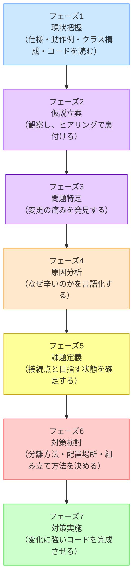
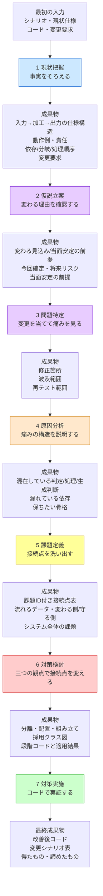
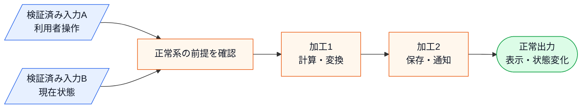

# 第一部の説明
―― 全章を貫く7つのフェーズ

---

## 私がたどり着いた「7つのフェーズ」

> [!TIP] この章の読み方
> この章は全7フェーズの詳細な説明書です。最初から通読してもよいですが、**各フェーズの冒頭にある「目的」「入力」「成果物」だけ読んで先の章へ進み、疑問が出たときに戻ってくる**という使い方が馴染みやすいかもしれません。「このフェーズで何を受け取り、何に変えているんだろう？」と感じたら、この章の該当セクションが手がかりになります。

**このプロセスを「いつ」使うのか**

この思考プロセスは一般的な問題解決の進め方に沿って設計の思考を進めます。仕様変更を起点として動き、**「すでに稼働しているシステムに、新たな仕様変更や機能追加の要望が来たとき」** に発動するプロセスです。特に、以下のような状況で威力を発揮します。

- 既存システムをあまり把握していない人が、安全に変更を加えるアプローチを探るとき
- 熟練の担当者が、複雑化した課題を改めて整理し直し、設計の妥当性を検証するとき

設計書やコードをただ眺めるのではなく、このプロセスに沿って「現状を把握する → 仮説を立てる → 問題を特定する → 原因を突き止める → 課題を定義する → 対策を考える → 実装する」と進めることで、変更の影響を確認しながら進めやすくなります。

設計に悩み、何度も失敗を繰り返す中で、私は「きれいなコードを書く」ことよりも「変更要求に対してどう思考するか」というプロセスこそが重要だと気づきました。
試行錯誤の末にたどり着いたのが、以下の7つのフェーズに沿って考えるというアプローチです。

各章は、このフェーズを1つの問題に対して一貫して適用します。
ここで、各フェーズが「なぜ必要か」「何をするか」を
ここで、各フェーズが何を受け取り、何を次へ渡すのかを押さえます。各章の見出しには同じ色の絵文字が使われているので、「今どのフェーズにいるか」が一目でわかる仕組みになっています。

> [!IMPORTANT] 本質は「ビジネスの課題解決プロセス」と同じ
> 以下の7フェーズはプログラミング特有の魔法ではありません。たとえば店舗の売上が落ちたときも、まず現状を整理し、変わりそうな要因の仮説を立て、どこで問題が起きているかを確かめ、原因を特定し、解くべき課題を定めてから対策を選びます。ソフトウェア設計も、**現状把握 ⇒ 仮説立案 ⇒ 問題特定 ⇒ 原因分析 ⇒ 課題定義 ⇒ 対策検討 ⇒ 実施**という同じ論理で進められます。
> 現状を把握せずに原因を見誤ったり、原因を特定せずに対策（構造）を打ったりすると、期待する効果が得られないのはビジネス課題も設計課題も同じです。本質がずれたまま進めないよう、この工程を一つずつ踏んでいくことが何より重要です。

### 本書の番号の読み方

本文を読むときの主役は、あくまで**7つのフェーズ**です。
各章は、フェーズ1からフェーズ7までを同じ順序で進みます。

フェーズ5では、解くべき接続点を洗い出し、接続点ごとに「何が流れるか」「どちら側が変わるか」「どちら側を守るか」をP1、P2、P3の連番で確定します。最後に、現在の波及と目指す状態をシステム全体の課題として文章化します。フェーズ6では、その接続点を変える三つの観点――分離方法、配置場所、組み立て方法――を順に考え、最終構造をコードを書く前に確定します。組み立て方法には、生成・所有・登録・選択・注入までを含めます。その後の「ステップ1」「ステップ2」は、案が揺れた履歴ではなく、確定した構造を理解できる単位で実装する順序です。
ステップ番号は、その章の採用設計をコードへ反映する順番を示します。章をまたいで同じコード操作を表す番号ではありません。

### 掲載コードを手元で動かす

各章の掲載コードは、そのまま手元で動かせます。読むだけでなく実行してみると、変更要求で何が起きるかを自分の目で確かめられます。

1. 章のコード（フェーズ1の現状コード、またはフェーズ7の最終コード）を1つの `.cpp` ファイルに貼り付けます。
2. コンパイルして実行します（例：`g++ chapter01.cpp -o app && ./app`。C++が使える環境なら `clang++` でも構いません）。
3. `main()` は自由に組み替えて構いません。各章の境界クラス（`〜Database` / `〜Repository` など）は、実行終了まで状態を覚えるインメモリの保存です。`save()` で新しいデータ（顧客・口座・イベント・メニュー・承認者など）を足し、その値で処理を呼べば、追加したデータの結果がその場の出力に表れます。

保存はプロセス実行中だけ有効で、終了すると消えます（DBのような永続化は本書の設計論点ではありません）。外部API・DB・画面・通知・ファイル出力は、境界クラスの先のスタブ（`print` / `cout`）で簡略化しています。各章の「手元で動かすには」に、その章で試せる具体例を書いています。

**共有データの持ち方（全章共通の規約）**

複数のオブジェクトから参照される保存データ（模擬DB・台帳・待ち行列など）は、全章とも**組み立て側（`main()` や Application）が所有し、使う側へコンストラクタや引数で渡す**形に統一しています。`static` なグローバル変数として持てばコードは短くなりますが、どのインスタンスがいつ書いたのか追いにくくなり、生成順や実行順に暗黙に依存し、テストで差し替えることもできません。「誰が所有し、誰に渡されているか」がコードに明示されていれば、保存先をファイルや実DBへ替える変更も、渡す実体の差し替えとして扱えます。各章で `EventDatabase` や待ち行列がコンストラクタ経由で渡されているのを見たら、この規約を思い出してください。

### 各章に入る前の見取り図

次の表は、各章で共通して使う7フェーズの進み方です。
ここでは特定の章の内容を先取りせず、各章がどの順序で進むかを把握します。

| フェーズ | 各章で扱うこと |
|---|---|
| 1：現状把握 | 仕様・動作例・クラス構成・フェーズ1の現状コード・変更要求をそろえる |
| 2：仮説立案 | どの機能・仕様が変わりやすいかを仮説化し、根拠を確認する |
| 3：問題特定 | 変更要求を当てたとき、修正箇所・波及範囲・再テスト範囲として痛みを確認する |
| 4：原因分析 | 痛みの原因になっている混在・依存・漏れている前提を言語化する |
| 5：課題定義 | 解くべき接続点を洗い出し、流れるデータと変わる側・守る側、システム全体で目指す状態を定める |
| 6：対策検討 | 接続点の分離方法・配置場所・組み立て方法を決め、最終構造と実装順を確定する |
| 7：対策実施 | コードで実装し、変更要求に対する効果と限界を確かめる |

大切なのは、構造名より先に、**「どの種類の機能・仕様が、何をきっかけに変更されるのか」** と **「実際の変更要求を当てたとき、どこが痛むのか」** を見ることです。担当者やチームが分かる場合は、補助情報として使います。




この7フェーズは、単に順番に並んでいるだけではありません。
ここで使う言葉を分けておきます。
**出力**は、システムが利用者や外部へ返す結果を指します。
**成果物**は、各フェーズを終えた時点で、次のフェーズへ渡す整理結果を指します。

各フェーズは、前のフェーズで得た成果物を入力として受け取り、次のフェーズで使える形に加工します。
つまり、読み進めるほど「材料」が変わっていきます。



この図で大切なのは、**フェーズの出口が次フェーズの入口になる**ことです。
フェーズ1で事実をそろえないままフェーズ2へ進むと、仮説が思いつきになります。
フェーズ2で変わるものを根拠付きで確定しないままフェーズ3へ進むと、何を当てて痛みを見るのかが曖昧になります。
フェーズ5で接続点の変わる側と守る側を定めないままフェーズ6へ進むと、システム全体の構造設計がパターン名選びになってしまいます。

7つのフェーズは、目的の異なる **7つの局面** に分かれています。

| フェーズ | 内容 |
|:---|:---|
| 🔵 **フェーズ1：現状把握** | 仕様・動作例・クラス責任・フェーズ1の現状コード・変更要求をそろえる |
| 🟣 **フェーズ2：仮説立案** | 観察から仮説を立て、ヒアリングで裏付ける |
| 🟣 **フェーズ3：問題特定** | 変更を試みたとき、何が痛いかを発見する |
| 🟠 **フェーズ4：原因分析** | 痛みの根本にある設計の問題を言語化する |
| 🟡 **フェーズ5：課題定義** | 解くべき接続点と変わる側・守る側、システム全体で目指す状態を定める |
| 🔴 **フェーズ6：対策検討** | 接続点の分離方法・配置場所・組み立て方法を決める |
| 🟢 **フェーズ7：対策実施** | 変化に強いコードを完成させる |

各章では、この7フェーズをさらに小さな項目に分けて進みます。
フェーズ1だけでなく、フェーズ2以降も「何を確認し、何を次へ渡すか」が分かる単位に分けます。
各項目は、読者に情報を渡すためだけではなく、次の項目へ進むための理解を作るために置かれています。

| 章内の項目 | 何のために読むか |
|---|---|
| 1-1：このシステムの仕様 | コードを読む前に、入力・加工・出力・業務上の前提をそろえる |
| 1-2：動作例テーブル | 代表入力から結果を予測できるようにし、後の実行結果と照合する |
| 1-3：登場クラスとクラス構成図 | 図を見る前に登場クラスの責任を把握し、依存関係を追えるようにする |
| 1-4：実装コード（現状） | フェーズ1の現状コードが動作例をどう実現しているかを確認する |
| 1-5：変更要求 | 現状仕様と変更後仕様の差分を固定し、以降の分析対象を決める |
| 2-1：変わりそうな仕様の見当をつける | フェーズ1の事実から、変化しそうな仕様を仮説として言語化する |
| 2-2：今回の変更で確実に変わること | 今回対応する変更と、まだ先の話を分ける |
| 2-3：関係者ヒアリング | 仮説を独断で確定せず、変更される機能の種類・理由・頻度を確認する |
| 2-4：将来リスク | 今すぐ対応する変更と、将来起きそうな変更を分ける |
| 2-5：変わる見込み/当面安定の前提の確定 | 次のフェーズで当てる変更対象と、守る前提を確定する |
| 3-1：変更を試みる | フェーズ1の現状コードへ変更を当てたとき、どこを触ることになるかを見る |
| 3-2：変更影響グラフ | 修正箇所・波及範囲・再確認範囲を図で見えるようにする |
| 3-3：痛みの言語化 | 「大変そう」ではなく、何が設計上の痛みなのかを言葉にする |
| 4-1：痛みの根源を探る | 条件分岐・処理順序・生成判断・依存のどれが混在しているかを見る |
| 4-2：変わるもの/変わってほしくないもの | 分けるべきものと、保ちたい骨格を切り分ける |
| 4-3：接続点に漏れている判断や前提 | 分離前に、境界へ流れる判断・値・前提を確認する |
| フェーズ5内：接続点を特定する | 変更が波及する境界を見つけ、課題ID・流れるデータ・変わる側・守る側を一表で確定する |
| フェーズ5内：システム全体の課題を確定する | 現在の波及と、対策後に守りたい範囲を文章化する。クラスや接続方法はまだ書かない |
| フェーズ6内：接続点を変える三つの観点 | 分離方法で境界、配置場所で責任の置き場、組み立て方法で生成・所有・登録・選択・注入を決める |
| フェーズ6内：最終構造を決める | 三つの観点から完成構造が一つに定まるなら比較せず、実現可能な完成構造が複数残る場合だけ目的と構造差を比較する |
| フェーズ6内：責任を見直す | フェーズ1のクラス図を同じ粒度で更新し、着目クラスを色で示す |
| フェーズ6内：課題箇所をおさらいする | フェーズ3のコードから、P1〜Pnに直接関係する部分だけを再掲する |
| フェーズ6内：ステップ1〜n | 確定した構造の責任分離、生成、依存の受け渡し、安定側からの実行を順にコードへ反映する |
| フェーズ6内：コード適用結果 | P1〜Pnごとに目指した状態・適用コード・結果を追い、システム全体で一度だけ達成を判定する |
| 7-1：解決後のコード | 採用した形を実行可能なコードとして示す |
| 7-2：動作シーケンス図 | 改善後にオブジェクト間で何が起きるかを追えるようにする |
| 7-3：変更影響グラフ | 改善後の主な修正先と確認範囲を見えるようにする |
| 7-4：変更シナリオ表 | 将来の変更ごとに、主な修正先と確認観点を整理する |

この表はチェックリストではありません。各章を読むときの地図です。今読んでいる項目が全体のどこにあり、前の項目から何を受け取り、次の項目へ何を渡すのかを俯瞰したいときに、この表へ戻ってください。

各項目は、情報を並べるためではなく、次の判断へ進むために置きます。したがって本文では、「前の項目で何が分かったか」「だから次に何を見るのか」を短くつなぎます。たとえば、仕様図で入力と出力が分かったから動作例で代表ケースを確認する、動作例が分かったからフェーズ1の現状コードで実現方法を見る、変更要求を当てて痛みが見えたから原因を探す、という流れです。

このつながりが書けない場合、その項目は順序が早すぎるか、別フェーズへ移すべき内容か、章の目的に対して不要な説明である可能性があります。

また、本書では文章だけで全体像を説明しきろうとはしません。
入力から出力までの流れ、クラス間の関係、変更影響の広がり、改善前後の差分は、できるだけ図や表で先に見えるようにします。
ただし、図は「入力」「加工」「出力」という箱へ分類するためのものではありません。図に出した値・条件・状態・出力名が、後で動作例、実行結果、変更要求、接続点のどこで使われるのかまで追える必要があります。クラス名・メソッド名・変数名との対応は、1-3以降で段階的に確認します。
図は装飾ではなく、「いま何を見ているのか」「入力がどう加工され、どの結果に分かれるのか」を読者が迷わないための地図です。
ただし、図だけで新しい仕様や判断を初出しすることはしません。図に出る名前・値・状態は、本文や表で説明したうえで使います。

**クラス図の読み方（全章共通の規約）**

本書のクラス図は、クラスの配置と依存の向き（誰が誰を知っているか）を示す静的な構成図です。そのうえで、矢印に「商品情報を取得」のような**やり取りの説明ラベル**を付けることがあります。厳密なUMLではデータの流れはシーケンス図の領分ですが、本書では「この依存は何のためにあるか」を図だけで掴めるよう、依存の説明としてラベルを許容しています。呼び出しの時間順を追いたいときは、各章7-2のシーケンス図を見てください。

また、クラス図の中で他のクラスと線がつながっていないクラスが出てくることがあります。それは「使われていないクラス」ではなく、**その図の焦点の外で使われるクラス**です（例：検証にだけ使われ、中心の処理からは呼ばれない）。本書では、浮いて見えるクラスには「誰が使うか」の注記を図または直後の本文で必ず添えます。

対策検討では、フェーズ1のクラス図を同じ粒度で変更前後に並べ、責任や依存を変えるクラスへ色を付けます。`main()`は関数なので架空のクラスとして図へ足さず、どの具象クラスを生成・所有・登録・注入するかを図の注記、対応表、コードで示します。フェーズ7の完成後クラス図は、フェーズ6で採用した図と同じMermaid定義を使います。見た目が変わる場合は、設計から実装までに構造が変わっていないかを確認します。

### 世の中のシステムへ当てはめる入口

各章の題材は、ECサイト、予約、決済、通知、ワークフローなどに分かれています。しかし、読者に持ち帰ってほしいのは題材そのものではありません。自分の目の前にある任意のシステムを見たときに、どこから観察し、どの順番で判断するかです。

知らないシステムへこの本の考え方を当てるときは、いきなりパターン名やクラス図から入りません。まず、次の5つを集めます。

| 観察するもの | 確認する問い |
|---|---|
| システムの目的 | 誰が、何を達成するために使うシステムか |
| 入力・加工・出力 | 何を受け取り、どの判断や変換を通り、何を返すか |
| 最近の変更要求 | 何が増えたか、何が変わったか、次に何が来そうか |
| 変更時に痛い場所 | 修正箇所、再テスト範囲、影響確認が広がる場所はどこか |
| 守りたいもの | 業務フロー、共通手順、既存の利用側コード、性能、失敗時の扱いなど、簡単に壊したくないものは何か |

この5つが分かると、世の中のどんなシステムでも7フェーズへ載せられます。

```text
目的・入出力を説明する        → フェーズ1
変わりそうな仕様を見立てる    → フェーズ2
変更要求を当てて痛みを見る    → フェーズ3
痛みの原因を言語化する        → フェーズ4
接続点を一表にまとめ、システム全体の課題を定める → フェーズ5
分離・配置・組み立てで目標構造を決める         → フェーズ6
変更影響が小さくなったか見る  → フェーズ7
```

たとえば、請求書発行システムなら「税率や端数処理が変わる」「PDFとCSVの出力形式が増える」「承認済みだけ発行できる」といった変更軸を見るかもしれません。倉庫管理システムなら「在庫引当ルール」「通知先」「外部配送API」が変化軸になるかもしれません。題材が違っても、見る順番は同じです。

### 複雑度を上げても、見る順番は変えない

実際のシステムでは、処理が1回の関数呼び出しで終わるとは限りません。外部APIを順番に呼ぶ、結果を後で確認する、イベントを受けて状態を変える、通知の一部だけ失敗する、重い処理をジョブやスレッドに逃がす、といった複雑さが出てきます。

この本では、こうした複雑さを無理に消しません。ただし、複雑さを足す目的は「現実っぽく見せること」ではありません。複雑になっても、同じ7フェーズで設計判断できることを確認するためです。

複雑度が上がったときも、見る順番は次のままです。

| 複雑さの種類 | フェーズ1で見ること | フェーズ4・5で課題にすること | フェーズ6で決める構造 |
|---|---|---|---|
| 順次実行 | どの処理がどの順番で実行され、前の結果が次にどう使われるか | 呼び出し元が細かい手順を知りすぎていないか | 手順を関数へ分ける、窓口へ寄せる、骨格を固定する |
| 非同期・ポーリング | 最初の要求で何を返し、後で何を照会するか | 保留状態や完了確認が利用側へ漏れていないか | 状態や結果オブジェクトを導入する、確認処理を境界へ寄せる |
| イベント型 | どの出来事が発生し、誰が反応するか | 発生元が通知先や反応内容を知りすぎていないか | 通知先を登録制にする、イベントだけを渡す |
| 失敗・部分失敗 | どこで失敗し、何を保存・通知・再試行するか | 失敗時の判断が本来の業務処理へ混ざっていないか | 結果型、境界クラス、再試行責任を分ける |
| ジョブ・スレッド | 重い処理をいつ開始し、完了結果をどこで受け取るか | 処理開始と完了後処理が同じ場所に押し込まれていないか | 実行依頼、進捗、完了通知の責任を分ける |

大切なのは、複雑さを見つけた瞬間にパターン名へ飛ばないことです。まずフェーズ1で「何が入力され、どの順序で加工され、どの状態や出力になるか」をそろえます。次にフェーズ2で「どの仕様が変わりそうか」を見ます。フェーズ3で変更を当てたときの痛みを確認し、フェーズ4・5で原因と接続点を言葉にしてから、フェーズ6でシステム全体の構造を決めます。

複雑度が上がったときほど、この順番を守る意味が強くなります。単純な例で使えた考え方が、同期・非同期、イベント、失敗、ジョブ化を含む題材でも崩れないかを、各章で確認していきます。

この本の各章は、最終的に読者が次の一文を自分で作れるようになるための練習です。

```text
このシステムでは、【変わるもの】が【守りたいもの】の中に入り込んでいる。
だから、【接続点に残す約束】だけを残して、【変わるもの】を外へ出す。
ただし、【導入コストや制約】があるので、今回は【採用する深さ】で止める。
```

この一文を作れるようになれば、本書と同じ題材でなくても、自分の現場のシステムに対して設計判断を始められます。

もう一つ大切なのは、仕様を「コードと照合できる粒度」まで具体化することです。
仕様説明が分かりやすくても、後で出てくる `main()`、実行結果、クラス名、状態名、判定条件と結びつかなければ、読者はコードを読んだ瞬間に迷います。
そのため各章では、まずシステムの目的・利用者・扱うデータ・代表入力・判定条件・正常出力を文章や表で一通り説明します。その後で、仕様の入力・加工・出力を図として整理し、各要素が後続のどの動作例・実行結果・変更要求で使われるのかを確認します。図は「入力」「加工」「出力」の3箱だけで終わらせず、代表的な入力がどの判定・計算・変換を通り、どの正常出力へ至るのかまで細分します。エラー条件は正常系の流れを確認した後、別表で「どこで分かるか」「何を出力するか」「保存や通知を行うか」を整理します。
実際のシステムなら画面、DB、外部API、ファイル出力、通知などがあるのに、章では `print` や固定データで簡略化する場合もあります。その場合は「この図では何を省略し、掲載コードでは何で代替しているのか」を明示します。

絵文字の色は思考の「局面」を示しています。青（🔵）は現状把握、紫（🟣）は仮説立案・問題特定、橙（🟠）は原因分析、黄（🟡）は課題定義、赤（🔴）は対策検討、緑（🟢）は対策実施です。各章の見出しでも同じ色が使われているので、今どの局面にいるかが一目でわかります。以下では各フェーズの役割を順に見ていきます。

> [!INFO] 本書で使う主要な言葉
> この本では、よく似た言葉を次のように使い分けます。
>
> - **「現状」**（フェーズ1で把握）：変更要求を当てる前に、システムが今どう動き、どのクラスが何を担い、どんな入力・加工・出力を持っているかという現在の状態のこと。
> - **「仮説」**（フェーズ2で立てる）：フェーズ1で見た事実から、「これは今後変わりそうだ」「ここは当面安定しそうだ」と見当をつけたもの。独断で確定せず、ヒアリングや変更要求の背景で裏付けます。
> - **「問題」**（フェーズ3で発見）：変更を試みたとき、本来触りたくないコードまで同時に修正しなければならない「痛み」の状態のこと。「このクラスを変えると、あちらも変えなければならない」という変更の波及が問題の正体です。
> - **「原因」**（フェーズ4で言語化）：問題が発生している構造的な理由のこと。たとえば、独立して変わる判定/処理/生成判断の混在、具体実装への過剰な依存、処理順序や生成方法の漏出（本来あるクラスに閉じているべき判断や前提が、別のクラスへにじみ出てしまっている状態）などが原因になります。
> - **「課題」**（フェーズ5で定義）：原因を踏まえて「次に解くべき接続点」を具体的に絞り込んだもの。問題（症状）でも原因（診断）でもなく、「どの境界で、何が流れ、どちら側が変わり、どちら側を守るのか」をP1からの連番で一表にまとめます。この時点では、対策の形（どんなクラスを作り、どこへ移すか）はまだ決めません。
> - **「システム全体の課題」**（フェーズ5で定義）：P1、P2……をすべて解いたとき、変わる詳細を意識せず守る処理を実行できる、という到達状態を一文にしたものです。課題別に別々の最終案を採用するのではなく、この一文を満たす一つのシステム構造をフェーズ6で考えます。
> - **「対策」**（フェーズ6で確定）：接続点をどう切るか（分離方法）、切り出した責任をどこへ置くか（配置場所）、誰が生成・所有・登録・選択・注入して繋ぐか（組み立て方法）を決めた最終構造のこと。関数化やクラス分離は、その最終構造へ到達するためのコード変更として扱います。
> - **「実施」**（フェーズ7で確認）：採用した対策をコードとして組み上げ、動作例・変更影響・得たもの/諦めたものを確認することです。
> - **「成果物」**：各フェーズを終えた時点で、次のフェーズへ渡す整理結果のこと。システムが返す「出力」とは区別します。

---
## 🔵 フェーズ1：現状把握 ―― 仕様を整理し、システムと紐付ける

**目的：仕様・動作例・クラス構成をそろえ、後続フェーズで同じ対象を追える土台を作ること**

### 仕様・動作例・クラス責任を読む

> **入力：** システムのシナリオ説明、仕様表、動作例、登場クラスの責任一覧。実装コードはまだ読まない。
> **成果物：** 入力→加工→出力の仕様構造、動作例、責任一覧（事実のみ。この段階では仮説を立てない）

実装コードに飛び込む前に、「このシステムに何があるか」を把握しておかないと、
コードの詳細に引きずられて「動きを追う読み方」になってしまいます。

ここでの把握対象は実装の詳細（`if` 文の中身など）ではありません。
まず「何を入力として受け取り、業務上どんな加工を行い、何を出力するか」を構造として押さえます。
そのうえで、「どんなクラスが存在し、それぞれの責任は何か」という現状の概要を確認します。



正常系で成功する側しか示さない判定は、ひし形と `Yes` の矢印にしません。上図のように検証済み入力と処理順として描き、失敗条件は別のエラー条件表へ分けます。正常系の中に価格帯や通知要否など複数の有効な結果がある場合だけ、両方の枝を持つ判定として描きます。

この図は、システムを評価するための図ではありません。
コードを読む前に、読者が「このシステムは何を受け取り、何をして、何を返すのか」を同じ粒度で見るための図です。ただし、箱を3つ並べるだけでは不十分です。入力が加工のどの段階で使われ、どの正常出力へつながるのかまで示します。これにより、読者は動作例を見る前に、基本の流れを自分の言葉で説明できるようになります。

この図から読者が得るものは、次の3点です。

- どの入力が、どの判定や加工に使われるのかを事前に把握できる。
- 正常に進む流れを先に把握できる。
- 後でコードを読んだときに、細部へ入る前に「これは仕様上どの処理を実現しているのか」を見失いにくくなる。

正常系の流れを押さえたうえで、エラー条件は別に整理します。

| エラー条件 | どこで分かるか | 出力 | 保存・通知などの副作用 |
|---|---|---|---|
| 受付できない入力や状態 | 判定1 | 受付不可エラー | 保存・通知は行わない |

仕様が分かりづらくなる主な原因は、情報量の少なさではありません。読者が「この値は後でどこに出るのか」「この判定は何のためにあるのか」「この出力はどのケースの結果なのか」を追えないことです。

| 分かりづらくなる原因 | 直し方 |
|---|---|
| 入力・加工・出力を3つの箱にまとめただけで、値の通り道が見えない | 代表入力が、どの判定・計算・変換を通り、まず正常出力へ至るかを書く |
| 図に出した値が、動作例・コード・変更要求・接続点で使われない | 後続で使わない要素は図から外し、後続で必要な要素は仕様へ戻して追加する |
| 仕様語彙とコード語彙が対応していない | 仕様語彙を先に説明し、1-3以降でクラス名・メソッド名・変数名へ対応づける |
| 正常系と異常系が同じ扱いで並んでいる | 正常系（図と各種仕様表）をすべて先に示し、異常系はその後の表で、どの条件で止まるかを示す |
| 「この章では省略する処理」と「本当に存在しない処理」が混ざっている | 実際はどう動くか、掲載コードでは何で代替するか、なぜ論点外にするかを書く |

動作例テーブルは、この仕様構造の代表ケースとして読みます。

仕様図は、後でコードを読むための地図でもあります。
コードに出てくる入力値、状態名、フラグ、金額、エラー条件、出力名は、ここで説明した仕様の流れに対応している必要があります。
逆に、仕様図に出ていない入力や状態が動作例や `main()` に突然出てきたら、読者は「これはどこから来たのか」と迷います。図に入れた要素が後で使われない場合も、読者は「なぜこの図にあるのか」と迷います。

また、章では説明を単純にするために、実際の入出力を簡略化することがあります。
ただし、簡略化の説明は早く出しすぎません。仕様図だけを見た段階では、まだどのクラスやコードが何を代替しているのかが見えていないからです。
本書では、まず仕様・動作例・登場クラス・クラス構成を確認し、その後、1-4のコードへ入る直前で「実システムでは何があり、掲載コードでは何で代替するか」を整理します。

たとえば実際のシステムでは画面に表示する、DBへ保存する、外部APIへ送る、ファイルを出す、といった処理があります。掲載コードでは、業務ロジック本体から `Repository`、`Client`、`Gateway`、`Renderer`、`Notifier` などの境界を呼び、その先のスタブ実装だけを `print` や固定データで表します。
その場合は、次のように「実システムの要素」と「掲載コードでの表現」を対応づけます。

| 実システムの要素 | 掲載コードでの表現 | この章での扱い |
|---|---|---|
| 画面表示 | `ViewRenderer` などを呼び、スタブ実装で `print` | 表示方式そのものは設計論点ではないため簡略化 |
| DBやファイル | `Repository` や `FileGateway` を呼び、スタブ実装で固定データを返す | 永続化ではなく責任分担を見たい場合に省略 |
| 外部APIや通知 | `ApiClient` や `Notifier` を呼び、スタブ実装で `print` | 通信詳細ではなく接続点だけを見る |

省略した要素は「存在しない」ことにしてはいけません。
この章では扱わないだけなのか、現状仕様として本当に存在しないのかを区別します。

論点から外す処理は、ただ削るのではなく、次の4点を短く補足します。

| 補足すること | 例 |
|---|---|
| 実際はどう動くか | 画面から入力され、DBへ保存される |
| 掲載コードでは何で代替するか | `main()` の固定データと `print` で表す |
| なぜ割愛するか | この章では保存処理ではなく責任分担を見たい |
| 設計論点への影響 | 保存方法を省略しても、変更影響の広がりは同じ |

この補足があると、読者は「実際の処理を忘れている」のではなく、「章の論点に集中するためにあえて省略している」と理解できます。

システムのシナリオ説明を読み、入力→加工→出力の仕様構造、動作例、登場クラスの責任を確認します。動作例テーブルは、後で掲載コードと実行結果を照合するための基準になります。クラス構成図は、クラス名と責任を把握してから読むことで、依存関係を追いやすくなります。
仕様、動作例、実行結果は同じケースを扱います。仕様で説明していない値や状態を、コードで突然使わないようにします。また、仕様図に置いた入力・加工・出力は、動作例、変更要求、接続点のいずれかで再利用されるものに絞ります。コードとの対応は、登場クラスとフェーズ1の現状コードを読む段階で確認します。

この段階では仮説を立てません。観察した事実をフェーズ2に持ち込み、そこで初めて「変わりそうか・変わらないか」を考えます。

最後に、この章全体で使う「設計のレンズ（問い）」をセットします。

> 「このコードの中に、**『変わる理由』が異なる2つのものが、同じ場所に混在していないか？」**

---

### 実装コードと変更要求を読む ―― 依存関係と処理順序を記録する

> **入力：** 先に把握した仕様・動作例・クラス責任 ＋ 実際の実装コード ＋ 今回の変更要求
> **成果物：** 動作例と実行結果の対応、具体クラスへの依存、条件分岐、処理順序、受け渡すデータの観察結果

クラスの責任を把握したら、実装コードを読み、現在の依存関係と処理順序を確認します。`main()` と実行結果は、動作例テーブルと対応している必要があります。コードに出るID、状態名、金額、エラー条件が、1-1の仕様語彙や1-2の動作例と対応しているかも確認します。

実行結果を載せるときは、「どのコードを実行した結果なのか」「動作例テーブルのどのケースに対応するのか」「何を確認するための出力なのか」を直前に示します。
複数ケースを並べる場合は、`Case 1`、`Case 2` のように区切りを入れます。
現状コード、変更途中のコード、最終コードの実行結果が混ざると読者はすぐ迷うので、見出しやラベルで対象コードを分けます。
特に「現状コード」という言葉は、読むタイミングによって指す対象がぶれやすいので、本書では必要に応じて次のように呼び分けます。

| 呼び方 | 指すコード |
|---|---|
| フェーズ1の現状コード | 変更要求を当てる前に、仕様と動作例を実現している掲載コード |
| フェーズ3の変更途中コード | 変更要求を当てて、どこに修正が広がるかを確認するためのコード |
| フェーズ6の段階コード | 確定したシステム構造を、責任と依存の差分ごとに実装したコード |
| フェーズ7の最終コード | フェーズ6で確定したシステム構造を反映し、動作例と変更要求を満たすコード |

本文で単に「現状コード」と書くと曖昧になる場合は、「フェーズ1の現状コード」「フェーズ3の変更途中コード」のように、対象フェーズを付けて書きます。

ここで記録するのは、次のフェーズで仮説を立てるためのコード上の材料です。

#### 実装を観察する4つの視点

1. **具体クラス名を直接知っている場所** — どのクラスが、どの実装を生成・呼び出しているか。
2. **条件分岐が集まっている場所** — `if` / `switch` は何を選んでいるか。
3. **処理の順序を決めている場所** — どのメソッドが一連の流れを統括しているか。
4. **境界を越えるデータ** — 引数、戻り値、メソッド名は何か（例：メソッドの引数として `int` などのプリミティブ型を渡しているか、専用のオブジェクトを渡しているか等）。

この4つは、必ず4行の表として毎章に出すという意味ではありません。
ただし、各章の1-4では、このうち章の問題に関係する観察結果を本文で回収します。
たとえば「`MainService` が種類ごとの条件分岐を持っている」「`BatchExecutor` が具体クライアント名を直接生成している」「`import()` が処理順序を固定している」「接続点では `int amount` が渡されている」のように、後続フェーズの仮説・問題・原因につながる材料として記録します。
観察しただけで終わらせず、2-1の仮説、3-1の変更シミュレーション、4-1の原因分析で同じ事実が再利用される状態にします。

システムの全コードを読むわけではありません。プロセスを始めるきっかけとなった依頼の背景と、先に把握したクラス構成に基づき、関係するクラスへ範囲を絞ります。

```text
【フェーズ1で記録する事実の例】
MainService が type と optionFlag を判定している。
同じ判定条件が PreviewService にも書かれている。
どちらのメソッドも、加工後の値を int で返している。
```

フェーズ1の最後に、この章で検証する具体的な変更要求を確認します。現状仕様と変更後仕様の差分をここで固定することで、フェーズ2以降の分析対象がぶれなくなります。

このフェーズの出口は、「この章のシステムは何をし、どの入力からどの出力を返し、どのクラスが何を担い、今回どんな変更要求を受けたのか」を言えるところです。

---

## 🟣 フェーズ2：仮説立案 ―― 何が変わるかを観察し、ヒアリングで裏付ける

**目的：仕様とシステムの現状から「何が変わりやすく、何を当面安定と見るか」の仮説を立て、ヒアリングで裏付けること**

> [!NOTE] フェーズ2では「責務の混在」を断定しない
> ここで決めるのは「どの仕様が変わりやすいか」の見立てです。責務の配置は、変更要求を当てたときの痛みと合わせてフェーズ3・4で確認します。

### 変わりそうな仕様の見当をつける

> **入力：** フェーズ1のクラス構成・責任一覧 ＋ 実装コードの観察結果
> **成果物：** 変わる見込み/当面安定の前提の確定表（根拠付き）。今回確実に変わること、将来リスク、当面安定している前提が分けて整理されたもの。

> [!NOTE] フェーズ1との関係
> フェーズ1では「どこに依存・分岐・処理順序があるか」を記録しました。フェーズ2では、その記録をもとに「何が変わりそうか」の仮説を立て、ヒアリングで裏付けます。各章の「2-1：変わりそうな仕様の見当をつける」は、この作業に当たります。

フェーズ1で観察した事実を踏まえ、「何が変わりそうか」の仮説を立て、今回確実に変わることを切り分け、ヒアリングで裏付け、最終的に変わる見込み/当面安定の前提として確定します。各章では、2-1で仮説を立て、2-2で今回の変更を固定し、2-3で関係者に確認し、2-4で将来リスクを整理し、2-5で次のフェーズに渡す見通しをそろえます。

**第1段：仮説を立てる**

> 「このシステムの中で、どの仕様が変わりやすく、どの部分は変わらないか？ それはどんなビジネス上の理由・技術的な変化によるものか？」

フェーズ1で把握した仕様とコード上の事実を照らし合わせ、「変わりそうな仕様はどれか」の仮説を立てます。「業務ルールの種類は事業戦略の変化で増えそうだ」「APIの認証仕様はセキュリティ要件で変わりやすい」というように、変化が予想される仕様をビジネス・技術の観点から見当をつけます。

仮説を立てるときの問いかけ：

1. **この仕様はどんな事業上・技術上の理由で変わりそうか**
2. **何をきっかけに、どのくらいの頻度で変わるか**
3. **変わりにくい安定した部分はどこか（ドメインの本質）**

各章の2-1では、この3つを必ず回収します。
3つのうちどれかが抜けると、「なぜそれを変動箇所と見たのか」「どの頻度なら設計投資に見合うのか」「逆に何を守るべきなのか」が曖昧になり、フェーズ3以降の判断が弱くなります。

| 分類 | 仮説 | 根拠（フェーズ1の観察から） |
|---|---|---|
| 🔴 変動しそう | （例）各外部サービスのAPI仕様 | 外部ベンダーの都合で変わりそうなクラスが見える |
| 🟢 変わらなそう | （例）業務フローの骨格 | 会社の業務根幹を担うクラスは変わりにくい |

**見当をつけるときの経験則：システムの「端」は変わりやすい**

個別のヒアリングの前に、次の経験則を仮説の初期値として使えます。**入力と出力の端——画面・ボタンなどの入力手段、データの保存先、外部API、通知手段——は、変わりやすいという前提で疑ってかかる**ことです。画面はボタン操作からAPI呼び出しやバッチ起動へ、保存先はメモリからファイルやDBへ、通知はメールからチャットへと、業務の中身が同じでも周辺の都合で置き換わります。一方、業務の核——金額をどう計算するか、状態が何を意味するか、どの順で確定させるか——は、事業そのものが変わらない限り比較的安定します。

この経験則は断定ではなく初期値です。「端だから変わる」と決めつけず、ヒアリングで裏付けます。ただし設計上は、端は変わっても業務の核を巻き込まない位置（境界クラスの向こう側）に置いておくのが安全です。各章で入力を `main()` に、保存を `〜Database`／`〜Repository` に寄せているのは、この前提の表れです。

**なぜ仮説が先に必要か（仮説の価値）**

仮説なしに「今後何が変わりますか？」と漠然と聞いても、関係者は答えられません。「外部ベンダーの都合で、このAPI仕様が変わる可能性はありますか？」と具体的にぶつけることで初めて、意味のある回答（リスクの確定）が得られます。仮説は「ヒアリングで何を確認するか」の地図になります。

**第2段：ヒアリングで裏付ける**

コードを読んだだけで「変わる」「変わらない」と断定するのは危険です。
関係者へのヒアリングに加えて、仕様書、変更履歴、障害記録、外部契約なども確認し、変化の見通しを複数の根拠から判断します。

仮説のまま進むと、見当違いの部分を「変わるもの」として分離してしまうリスクがあります。また、「この処理は当面安定している」と思っていたものが、実は毎シーズン変わると分かることもあります。ヒアリングで仮説の精度を上げることが、フェーズ3以降の思考の土台になります。

**第3段：変わる見込み/当面安定の前提を確定する**

仮説を携えて、関係者ヒアリングを行います。

> 「このAPIは今後バージョンアップの予定はありますか？」
> 「このルールは今後どのような変化が考えられますか？」
> 「この型（int）は将来変わる可能性はありますか？」

ヒアリングで得た回答をもとに、変わる見込み/当面安定の前提を確定します。

| 分類 | 具体的な内容 | 変わるタイミング | 根拠 |
|---|---|---|---|
| 🔴 変動 | （変わりやすい部分） | （いつ変わるか） | （要求内容、仕様書、変更履歴、分かれば担当者など） |
| 🟢 当面は安定 | （今回の検討範囲で変わりにくい部分） | （見直しの契機） | （合意、契約、履歴など） |

「根拠」の列に、要求内容、仕様書・変更履歴、関係者確認など、判断に使った材料を書ける状態にします。担当者名は分かる場合だけ補助情報として使います。将来を確定することはできないため、「変わらない」ではなく、見直し条件を伴う「当面は安定」として扱います。

> **【フェーズ2のコツ：「何が変わりそうか」を具体化する】**
> 変わる見込み/当面安定の前提の仮説を立てるとき、「仕様は変わりそうか？」という漠然とした問いより、「この仕様は、どんな事業上・技術上の理由で変わりそうか？」と問う方が精度の高い仮説になります。
>
> ヒアリングで確認する問いは次の3つです：
> 1. 「この仕様は今後どのような変化が考えられますか？」（変化の方向性）
> 2. 「どのくらいの頻度で変わる可能性がありますか？」（変更頻度の把握）
> 3. 「変わるとしたら、どんなきっかけが考えられますか？」（変化のトリガー）
>
> 同じ「変わりそう」でも、変更のきっかけや頻度が異なれば、設計の優先度が変わります。複数の仕様がそれぞれ異なる理由で変わるなら、それが分離の根拠になります。

**仮説が外れたら**

ヒアリングの結果がフェーズ1の観察から立てた仮説と食い違うことがあります。「変わると思っていたが、変わらない」「変わらないと思っていたが、実は頻繁に変わる」——この逆転は設計判断を変えます。

- 「当面は安定」と判断した部分は、今回の要求だけを理由に分離する優先度が下がります。既存の責任境界、テスト容易性、再利用性など別の根拠がなければ、単純な構造を保つ案が有力です。
- 「頻繁に変わる」とわかった部分は、フェーズ6で改めて分け方を検討します。

仮説が外れること自体は失敗ではありません。ヒアリング前の仮説は「どこを重点的に確認するか」の地図として機能します。外れた仮説は確認の精度を高めた証拠です。

**フェーズ2の末尾：変わる見込み/当面安定の前提の確定**

ヒアリングで判明した内容をもとに、今回確定した変更、将来リスク、当面安定している前提をテーブルで整理します。これはフェーズ3以降の設計判断の材料です。「現在（今回追加後）」と「将来（数ヶ月後）」を対比し、今回の変更と将来の変更を同じ軸で見えるようにします。将来の仕様がまだ固まっていない場合でも、「どの変更軸が将来も繰り返されうるか」という視点で整理します。

このフェーズの出口は、「今回確実に変わるもの」「将来変わりそうなもの」「当面安定として扱うもの」を根拠付きで区別できるところです。

---

## 🟣 フェーズ3：問題特定 ―― 変更の痛みを発見する

**目的：変更を試みた際に発生する「無関係なコードまで修正が必要になる」という痛みを具体的に発見すること**

### 変更シミュレーション ―― どこが辛いかを確認する

ここでは、フェーズ1で明文化し、フェーズ2で裏付けた変更要求を現在のコードへ当て、実際に変更を試みます。

設計の問題は、コードを静的に眺めているだけでは気づきにくいものです。
「変更要求が来たとき、どこに手が入るか」を実際にシミュレートしてみると、
問題の輪郭がリアルに見えてきます。

フェーズ2で裏付けた変更要求を、今のコードに加えようとします。
加えようとすると、何が起きるかを追います。

- どのファイルを開くことになるか
- 変更の影響がどこまで波及するか
- 変えたくないはずのコードに触れることになるか

これが「痛み」の例です。無関係なコードの同時修正だけでなく、修正箇所を特定しにくい、差し替えや組み合わせが難しい、テストの準備が過大になる、といった変更時の具体的な困難もここで記録します。

たとえば「ある業務ルールの条件値を変更する」という変更要求が来たとします。これは個別ルールという機能種類の変更です。しかし実際に変更しようとすると、個別ルールのコードだけでなく、主処理の関数も開かなければならない——「なぜ個別ルールの変更で、主処理の関数を触るのだろう？」という違和感が生まれたなら、それが問題の所在を示す観察結果です。なぜそうなるかは、次のフェーズで分析します。

**置換・拡張のやりづらさも、ここで発見する**

「この実装を別のものに差し替えたい」と思ったとき差し替えられないなら、それが問題です。
「新しいケースを追加したい」と思ったとき既存コードを大量に書き換える必要があるなら、それも問題です。
フェーズ4では、この痛みの根本にある「分けるべき場所」を特定します。

**フェーズ3の末尾：ヒアリング予告の変更の目処づけ**

3-3の痛みの言語化の後に、ヒアリングで予告された将来の変更が届いたとき、痛みがどこで積み重なるかを1〜2段落のテキストで示します。コードブロックは不要です。「ヒアリング段階ではまだ仕様が固まっていないため全コードを書ける状況ではないが、〇〇が増えるたびに同じクラスに変更が積み重なる構造は変わらない」という形を基本とします。将来変更の完全実装を示すのではなく、現在の構造が将来の変更でも繰り返しコストを生むことを読者に見えるようにすることが目的です。

このフェーズの出口は、「変更要求を当てると、どの修正・確認・再テストが増えるのか」を、単なる感想ではなく観察結果として言えるところです。

---

## 🟠 フェーズ4：原因分析 ―― なぜ辛いのかを構造で言語化する

**目的：発見した痛みの根本にある「変わる理由の混在」という構造的な原因を言語化すること**

### 痛みの根本にある設計の問題を言語化する

フェーズ3で発見した「痛み」は症状です。
症状に対して対症療法を施すだけでは、根本は変わりません。
「なぜこの痛みが発生しているのか」を構造的に言語化することで、
適切な設計のアプローチを選べるようになります。

痛みを観察して、構造的な原因を見つけます。原因は「結論として提示する」ものではなく、症状から逆算して辿り着くものです。

**症状から原因を辿る2つの問い**

第一の問い：「なぜ、毎回このクラスを開かなければならないのか？」
このクラス自身が、別種類の機能変更に属する具体的な知識（条件・計算ルール等）をすべて直接抱え込んでいるからです。知っているものが変わると、知っているクラスも道連れになります。

第二の問い：「なぜ、変更の影響範囲が読めないのか？」
「処理の骨格（変わらない構造）」と「ビジネスロジック（変わり続ける条件）」が、同じメソッドの中で物理的に混ざり合っているからです。一方を変えると、もう一方への影響が読めなくなります。

```text
【原因分析の問い】
「なぜ、個別ルールが変わると主処理の関数も変わるのか？」
→ 主処理の関数が、個別ルールの具体的な条件を直接知っているから。
→ 「知りすぎているクラスは、知っているものが変わると道連れになる」
```

原因が言語化できると、解決の方向性が自然に定まります。
「知りすぎている」なら、「知る量を減らす」——インターフェースで境界を引けばいい。
「変わる理由が2つ混在している」なら、「1つに絞る」——分離すればいい。

**フェーズ4の中心的な問い：「この塊の中に、独立して変わる部分があるか？」**

本書が扱う多くの設計問題では、「変化をどう管理するか」が重要な視点になります。フェーズ4では、痛みを観察しながら、まず次の問いを置きます。

> 「この塊の中に、独立して変わる部分があるか？」

この問いに答えるとき、判断基準は「変化の理由」です。

| 観察した状況 | 判断 |
|---|---|
| 機能種類・変更のきっかけ・頻度が異なり、独立して変わる | → **分ける候補** |
| 同じ契約のもとで一緒に変わり、分離する別の根拠がない | → **まとめておく候補** |

「個別ルール」と「主処理のフロー」——機能の種類、変更のきっかけ、変更頻度が異なるなら、それらは独立して変わる可能性が高く、分離する候補になります。担当者や関係者が分かる場合は、その判断を裏付ける補助情報として使います。

逆に「税率と消費税計算は同じ法改正をきっかけに見直す」場合、変更理由だけを根拠に別々の拡張機構を設ける必要はありません。ただし、税率を設定データとして扱う、計算を単体テストする、といった別の目的で境界を設ける判断はあります。

**分けると「単体」と「接続点」が生まれる**

レゴブロックを分解すると、「ブロック単体」と「ブロックをつなぐジョイント」が生まれます。コードでも同じことが起きます。

```text
分ける前：[====A====B====]  ← A と B が一体になっている

分けた後： [====A====]  ＋  ◎  ＋  [====B====]
                           ↑
                       接続点（ジョイント）
```

「分ける」という判断をしたとき、次に必要なのはフェーズ5の課題定義です。課題が明確になってから、フェーズ6で接続点の形を決めます。

> [!NOTE] フェーズ1でセットした問いの回収
> フェーズ1の実装観察で「設計のレンズ」として立てた問い——「このコードの中に、変わる理由が異なる2つのものが同じ場所に混在していないか？」——への答えは、このフェーズ4で確定します。
> フェーズ3で発見した「痛み」は、まさにその混在が原因でした。この問いは各章で繰り返し使う確認軸です。

**フェーズ4が答えること・答えないこと**

フェーズ4が答えるのは「なぜ辛いか」です。独立して変わる判定/処理/生成判断の混在、依存方向、生成や処理順序の漏出など、その章の痛みを生む構造と根拠を言語化することがゴールです。

フェーズ1では、どこで何のデータが行き来しているかを確認しました。フェーズ4では、その観察結果から原因を説明します。フェーズ5では観察結果を改めて整理し、解決後も接続点へ残す契約として型・値・メソッドシグネチャを定義します。

このフェーズの出口は、「痛みの原因はどの混在・依存・漏れている前提なのか」を、フェーズ1〜3の事実に戻って説明できるところです。

---

## 🟡 フェーズ5：課題定義 ―― 解くべき接続点を洗い出す

**目的：原因を踏まえて解くべき接続点を洗い出し、システム全体で何を変え、何を守るかを確定すること**

### 対策に入る前に「何を解くか」を確定する

> **入力：** フェーズ4で特定した「分けるべき場所」と「接続点の存在」
> **成果物：** P1から連番の接続点定義表と、全課題を束ねたシステム全体の課題

フェーズ4は「なぜ分けるか」に答えました。フェーズ5が答えるのは「その境界で何のデータが流れているか」「どちら側が変わり、どちら側を守るのか」です。

このフェーズでは、**対策の形をまだ決めません**。どんなクラスを作るか、切り出した知識をどこへ置くか、どう繋ぎ直すかは、すべてフェーズ6の仕事です。フェーズ5でやることは3つです。

1. **接続点を洗い出す**：変更要求のたびに知識が漏れて修正が波及する境界を、全部リストにする。
2. **接続点を定義する**：それぞれの境界で、何（値・型・操作・イベント）が流れ、どちら側が変わり、どちら側を守りたいのかを書く。
3. **システム全体の課題へ束ねる**：すべての接続点を解いたとき、変わる詳細を意識せず守る処理を実行できる状態を一文にする。

フェーズ1で観察した型・値・メソッドシグネチャを、フェーズ5では「分離後の境界に何を残すか」という設計の問いとして整理し直します。

「分けるべき場所がある」という判断だけではフェーズ6に進むには早すぎます。対策を作る前に「接続点でどんなデータが行き来しているか」を具体化しておくことで、的外れな設計になるリスクを下げます。

接続点は、次の一表まで落とします。

| 課題ID・接続点 | 接続するデータ | 変わる側 | 守る側 |
|---|---|---|---|
| P1：個別ルールの呼び出し | `Order` と割引額 `int` | ルールの判定条件と計算式 | 価格計算の流れと利用側 |

表の後には、たとえば「価格計算の流れは個別ルールの詳細を意識せず実行でき、ルールの追加・切替は組み立て側で完結する」のように、全課題を解いたシステム全体の状態を書きます。ここではまだ、インターフェース名、具体クラス名、生成場所は決めません。

以下の2つの視点から、課題を整理します。

**視点1：接続点の特定（データレベルで見る）**

フェーズ4で「分ける」と判断した場所に、接続点（ジョイント）が生まれます。クラス名だけでなく、「何が」「どんな形で」つながっているかをメソッド呼び出しのレベルで確認します。クラスの境界はフェーズ1の時点で見えていますが、ここで重要なのは「どんなデータ・メソッド名・引数の型」が接続されているか、その依存の具体的な中身です。

接続点は、クラス図の線やインターフェース名から探し始めるものではありません。変更要求を1つ置き、その要求で「変えたい側」と「変えたくない側」を分けます。その2つが、どのメソッド呼び出し・引数・戻り値・生成・イベントでつながっているかを見ます。そのつながりのうち、変更要求のたびに知識が漏れて修正が波及する場所が、フェーズ5で解くべき接続点です。

| 特定の手がかり | 見ること |
|---|---|
| 変更要求 | 今回どの仕様・機能が変わるのか |
| 変えたい側 | 判定・処理・生成判断・通知先など、差し替えたいもの |
| 変えたくない側 | 処理の骨格、業務フロー、利用側コードなど、安定させたいもの |
| つながり | メソッド呼び出し、引数、戻り値、生成、イベント |
| 解くべき接続点 | その変更要求で知識が漏れ、修正が波及する境界 |

```text
例：
- 接続点：MainService が個別ルール（RuleHandler）を呼び出す箇所
  → 引数（type, optionFlag）の型や渡し方が変わるたびに
    MainService の修正が必要になる
```

接続点が複数ある場合、それぞれ独立に課題を定義します。

**視点2：接続点定義表へまとめる**

視点1で特定した接続点を一覧に整理します。接続点ごとに、流れるデータと、変わる側・守る側を書きます。

| 課題ID・接続点 | 接続するデータ（型・値・操作・イベント） | 変わる側 | 守る側 |
|---|---|---|---|
| P1：個別ルールの呼び出し | 引数 `(type: string, optionFlag: bool)` と戻り値 `(int)` | ルールの判定条件と計算式 | 呼び出しの流れと利用側 |

この表が埋まった状態がフェーズ6の出発点になります。

**フェーズ5内：変わるものを一緒に分離するか、分けて分離するか**

フェーズ4で見つけた接続点が複数ある場合、または1つの接続点に複数の変化軸がある場合、課題IDを分けるかを判断します。変わる機能・仕様の種類や変更タイミングが異なり、別々に追跡する必要があるならP1、P2へ分けます。同じ理由・同じタイミングで変わる一つの境界なら、一つのIDにまとめます。これは分離先を決める話ではなく、フェーズ4の原因を重複なく識別するための整理です。

このフェーズの出口は、接続点表の各行を説明でき、さらに「全行を解くとシステム全体がどうなるか」を一文で言えるところです。同じ内容を引き渡し表、受け入れ条件表、課題カードへ分けません。この一表と一文が、そのままフェーズ6の入力になります。

---

## 🔴 フェーズ6：対策検討 ―― 接続点の分離・配置・組み立てを決める

**目的：フェーズ5の全課題を解くシステム構造を、分離方法・配置場所・組み立て方法の三つで確定し、関連コードへ段階的に反映すること**

### 三つの決定：分離方法・配置場所・組み立て方法

フェーズ5の接続点定義表とシステム全体の課題から、次の三つを直接決めます。この三つが揃って初めて、コードへ落とせる対策になります。

| 接続点を変える観点 | システム全体の問い | 決めること |
|---|---|---|
| **分離方法** | 変わる部分と守る部分を、どの契約で切るか | どの判断・処理・生成・データを境界の向こうへ出し、値・型・操作・イベントの何を接続点へ残すか |
| **配置場所** | 切り出した責任を、どこへ置くか | どの既存クラスまたは新しい具体クラスが責任を持ち、守る側に何を残すか |
| **組み立て方法** | 分離した部品を、誰がどうシステムへ接続するか | 誰が生成・所有・登録・選択・注入し、安定側がどの契約だけを呼ぶか |

### 判断を整理してから、採用設計を段階的に実装する

フェーズ5で確定した複数の課題IDは、独立した接続点（変化軸）を追跡するためのものです。フェーズ6では課題ごとに別の設計を採用せず、すべてを同時に解く一つのシステムとして考えます。

1. フェーズ5の接続点表を読み、全課題を解く分離方法・配置場所・組み立て方法を決める。
2. 採用する完成構造を、変更前と同じ粒度のクラス図へ反映する。
3. 課題に関係する変更前コードだけをおさらいする。
4. クラス図の差分を、課題ID・変更理由・変更後コード・減る影響が対応する段階へ分けて実装する。
5. フェーズ7で全体コードを完成させ、同じ変更要求を当てて変更影響が縮んだか確認する。

三つを決めた結果、完成構造が一つに定まるなら比較は行いません。全課題を満たし、責任配置や依存関係が異なる完成構造が複数残る場合だけ、システム全体の効果・変更影響・導入コストで比較します。関数化だけ、責任の一部だけを移す案など、課題を残す途中状態は最終候補ではありません。読者が考えそうな場合は「なぜ途中状態に留まるか」を短く補足します。

したがって、段階コードは「試したら駄目だったので次を考えた」という失敗履歴ではありません。採用設計を一度に完成コードとして見せると理解しにくいため、責任分離、生成・選択、依存の受け渡し、安定側からの実行という意味のある単位に分けて説明します。

### 全章に共通する思考の型

全章に共通する核は、**変わる詳細を具体クラスへ分離し、その具体クラスの生成・選択を安定側から外し、安定した接続点を通して渡すことで、変えたくない処理が詳細を知らずに実行できる構造へ変える**ことです。章ごとに違うのは、分離する責任、配置するクラス、生成・所有・登録・選択・注入の方法です。

| 三つの観点 | 確認すること | 章ごとに変わる代表例 |
|---|---|---|
| 分離方法 | 条件、計算式、処理手順、状態別動作、生成判断、通知処理のどれを、どの契約の向こうへ出すか | 施策ルール、状態別動作、処理ステップ、通知処理 |
| 配置場所 | 切り出した責任をどの具体クラスが持ち、安定側に何を残すか | ルールクラス、状態クラス、コマンド、通知先 |
| 組み立て方法 | 誰が生成・所有・登録・選択・注入し、安定側は何だけを呼ぶか | Composition Root、Factory、Context、登録処理、状態遷移処理、継承フック |

「外から依存注入する」は重要な代表形ですが、すべての章を同じ注入方法へ揃えるわけではありません。Stateでは状態遷移の主体とタイミング、Observerでは登録と通知、Commandでは操作オブジェクトの生成と実行、Template Methodでは継承フックが接続方法になります。違いを曖昧にせず、**なぜその分離・生成場所・受け渡し方が今回の変更要求に合うのか**を説明します。

実行時の切替をシステムが判断すべき場合、その判断を `main()` の手動呼び出しとして残しません。たとえばStateでは、「予約済みがキャンセルされた」という業務イベントをContextが受けた時点で、次の状態の選択・生成・遷移までをシステムの責任としてつなぎます。各章では、依存を外から渡すだけでなく、**誰が、どのイベントで、いつ切り替えるか**まで確認します。

### 変更前のクラス図から、採用するクラス図を作る

責任を見直すときは、新しい種類の作業フロー図を発明しません。フェーズ1のクラス図を変更前として使い、フェーズ2〜5の結果を次の順で反映します。

1. 異なる理由で変わる責任が混在するクラスを着色する。
2. そのクラスの操作へ `【残す】` と `【移す】` を注記する。
3. 移す責任の共通操作を契約として追加する。
4. 具体クラス、生成・選択役、保持・利用関係を追加する。
5. 安定させたいクラスから、具体名・条件・生成への依存を削除する。

変更後クラス図はシステム全体の設計結論です。課題の中心となるクラス・契約・依存は色で強調し、後続のコードではクラス図のどの差分を実装しているかを毎段階で対応づけます。

対策検討のクラス図と、対策完成後のクラス図は**同じMermaid定義**を使います。前者は実装目標、後者は実装結果の照合であり、途中で粒度や掲載クラスを変えません。`main()` は仮想的なクラスとして図へ置きません。具体クラスの生成・所有・登録・選択・注入は、図の注記、クラスとコードの対応表、実際のコードで示します。改善後の変更影響グラフは、完成コードへ同じ変更要求を当てられるフェーズ7で初めて示します。

### 接続点表を設計決定へ変換する

課題IDは、独立した接続点をコードまで追跡する識別子です。P1、P2ごとに別々の完成案を選ぶのではありません。各行の「変わる側」を分離方法と配置場所へ、「守る側」を安定側へ、「接続するデータ」を契約と組み立て方法へ変換し、全行を同時に解くクラス図を一つ作ります。

| フェーズ5の列 | フェーズ6で決めること |
|---|---|
| 課題ID・接続点 | クラス図と段階コードで追跡する境界 |
| 接続するデータ | 接続点へ残す値・型・操作・イベント |
| 変わる側 | 分離する責任と、その配置先となる具体クラス |
| 守る側 | 具体的な条件・型・生成を知らず、契約だけを呼ぶ安定側 |

これが、前工程の考え方を引き継ぐ変換ロジックです。新しい表で課題を言い直すのではなく、同じ一行をクラス責任と依存へ変換します。

### 採用設計をコードへ反映する手順

各実装ステップでは、次の6点をセットで説明します。

1. **クラス図の差分**：どの操作・責任・依存を実装する段階か。
2. **変更対象**：どのクラス、メソッド、分岐、生成、登録を変えるか。
3. **分離先**：変わる詳細を、どの契約・具体クラスへ移すか（配置）。
4. **生成と受け渡し**：誰が生成・選択・所有し、どう安定側へ渡すか（組み立て）。
5. **安定側の実行**：変えたくない処理が、どの契約だけを呼ぶ状態になるか。
6. **システム全体への効果**：接続点表の変わる側を分離し、守る側が詳細を知らなくなったか。

次の流れは共通の骨格を3段階で示した例です。分離の単位、配置場所、生成・所有・登録・選択・注入の方法が異なるため、実際のステップ数と実装順は章ごとに変えます。ただし、三つの設計決定に答えず、変えたくない側へ具体的な条件や生成判断を残したままにはしません。

```text
課題P1・P2…の接続点表とシステム全体の課題
      ↓ 同じ行を分離方法・配置場所・組み立て方法へ変換
  採用する変更後クラス図を確定
      ↓ クラス図の差分を実装順へ変換
  ステップ1：変わる詳細と共通契約を分離
  ステップ2：切り出した責任を具体クラスへ配置
  ステップ3：生成・所有・登録・選択・注入を実装
      ↓ フェーズ7
  完成コードへ同じ要求を当て、変更影響を確認
```

ここで最も重要なのは、パターン名を先に当てはめないことです。フェーズ1〜5の事実から三つの設計決定へ答え、システム全体の最終構造を決めます。本文では整理済みの結論を先に示し、その構造を実現するコード変更だけを段階的に説明します。

対策検討は、フェーズ5の課題文を次のように読み替えるところから始めます。

| 課題文に出てくる言葉 | 最終構造を組み立てる問い |
|---|---|
| 判定条件・計算式を切り離したい | 関数にするだけで足りるか。複数実装を交換するなら契約が必要か |
| 処理順序の骨格を守りたい | 共通手順をどこに置き、差分ステップだけをどこへ逃がすか |
| 具体クラス名や生成条件を知らなくしたい | 生成判断を利用側から外へ出す必要があるか |
| 通知先や後続処理を増減したい | 登録・解除できるリストやイベント通知が必要か |
| 機能を組み合わせたい | 部品を保持して重ねる形が必要か |
| 操作を再実行・取り消したい | 操作そのものを記録できる単位にする必要があるか |

この表はパターン名の対応表ではなく、接続点表から必要な責任・契約・依存を導く補助線です。守る側が単一の関数だけを呼べばよいなら、その構造で止めます。交換・追加・組み合わせまで必要なら、契約や登録、組み立て責任まで含む完成形を作ります。

ここでいう「知識」とは、コードの中に埋め込まれている判断や前提のことです。たとえば、どの条件で対象になるか、どの計算式を使うか、どの順序で処理するか、どの具体クラスを生成するか、どの値・型・フラグ・状態名を前提にしているか、といったものです。
判定条件だけでなく、その条件に一致したときの処理も対象になります。

### 接続点で確認する5つの問い

クラスAとクラスBを分けても、両者の間には値や操作を受け渡す接続点が残ります。その境界で次の5つを確認します。

ただし、何を確認するかは固定リストではありません。フェーズ4で見つけた原因から逆算します。まず、原因文の中から「守りたい骨格」と「変わる差分」を分けます。次に、その差分を動かすために骨格側が知ってしまっている名前・条件・順序・型を拾います。最後に、接続点に残す最小の約束を、値・型・操作・イベントとして書きます。

原因によって、接続点で見る抽象観点は変わります。

| フェーズ4で見つけた原因 | 接続点で見る抽象観点 | 具体的に確認するもの |
|---|---|---|
| 判定/条件が漏れている | 条件・定数・選択基準 | `if`条件、比較値、優先順位、対象外条件 |
| 処理手順が漏れている | 呼び出し順・前後条件・失敗時分岐 | open→parse→save→close、リトライ、例外時処理 |
| 生成判断が漏れている | 具体クラス名・生成条件・登録場所 | `new`する型、factory分岐、生成に必要な設定 |
| データ/状態が漏れている | 境界を流れる値・型・状態 | DTO、enum、状態名、フラグ、ID |
| 通知/副作用が漏れている | 通知先・タイミング・成否の扱い | observer、送信先、イベント名、失敗時の扱い |

| 観点 | 確認すること |
|---|---|
| **受け渡すもの** | 値、型、操作、イベント、生成済みオブジェクトのうち何が境界を越えるか |
| **変化の種類** | 境界の両側は、それぞれどの機能・仕様変更で変わるか |
| **漏れている知識** | 呼び出し元が、相手のクラス名・生成方法・処理順序・条件分岐を知りすぎていないか |
| **変更影響** | 要求を1つ当てたとき、どのファイルを修正し、どこまで再テストするか |
| **安定する約束** | 呼び出し元が本当に必要とする最小限の操作やデータは何か |

ここでは、接続を4種類に分類しません。同じインターフェースを使っていても、生成方法や処理順序が呼び出し元へ漏れていれば変更は波及します。反対に、具体クラスを呼んでいても、相手が固定され変更要求がなければ、その単純さを保つ判断があります。大切なのは分類名ではなく、**今回の変更要求に対して何を知らなくてよい状態にするか**です。

### 接続点を充電器の例で言い換える

ここまでの「接続点」は、コード上ではクラス同士の境界です。少し視点を変えるために、0章前半で使った充電器の例に置き換えてみます。電源側が呼び出し元、利用する機器が呼び出し先、ケーブルやアダプタが接続点だと考えてください。

この例で見たいのは、端子やケーブルの種類そのものではありません。機器を交換する要求があるなら、「ケーブルを交換できるか」を見ます。利用者に複雑な変換手順を見せたくないなら、「変換をアダプタ側へ移せるか」を見ます。複数の機器を組み合わせたいなら、「ハブが必要か」を見ます。

```text
🔌 電源側 ──── 接続点 ──── 📱 利用する機器
                    ↑
       ・何を交換したいのか
       ・端子や手順を誰が知るのか
       ・交換時にどこまで直すのか
```

インターフェース、窓口構造、変換役（Adapter）、装飾連結構造などは、この困りごとを解くための候補です。どれも最初から必要なのではなく、接続点に残っている判断や前提を減らすために必要なときだけ導入します。

### 対策を考えるときの指針：3つの原則

対策を作るとき、「どこまで変えるか」に迷ったら3つの原則を参照します。

| 原則 | 接続点での使い方 |
|---|---|
| **原則1：変わるものをカプセル化せよ** | 変わる理由が異なる判定/処理/生成判断を、同じクラスやメソッドから分ける |
| **原則2：インターフェースに依存せよ** | 複数の実装を交換する必要があるとき、呼び出し元が必要とする最小限の契約を定める |
| **原則3：コンポジションを優先せよ** | 機能を組み合わせたり、窓口や仲介役へ処理を委ねたりする必要があるとき、部品として保持する |

原則はチェックボックスではありません。インターフェースが不要な章もあれば、仲介役だけで十分な章もあります。フェーズ5のシステム全体の課題を満たす最小の完成構造を選びます。

### 対策検討の進め方 ―― システム全体の構造をコードへ落とす

フェーズ6で必要なのは、次の5点です。

1. フェーズ5の接続点表から、分離方法・配置場所・組み立て方法を決める。
2. 採用する完成構造を、変更前と同じ粒度のクラス図で示し、着目箇所を色と注記で示す。
3. 課題箇所の変更前コードだけをおさらいする。
4. クラス図の差分を、各課題IDに対する必要な実装ステップへ変換する。
5. 各ステップで変更理由と効果をコードレベルで回収し、フェーズ7で全体コードと変更影響を確認する。

節番号を埋めるための確認節は作りません。「クラス図とコードが一致する」とだけ書く節は、クラス図と実装結果の説明に統合します。実際の動作と改善後の変更影響はフェーズ7で確認します。

中間コードは課題に関係するクラス・メソッド・生成箇所だけを示します。部分的な操作を比較案にはせず、採用した最終構造のどの差分を実現するかで位置づけます。

| 最終システム構造 | システム全体の課題をどう解くか | 残る変更・受け入れるコスト | 判断 |
|---|---|---|---|
| 【最終構造A】 | 【全課題IDへの答え】 | 【登録・設定・クラス数・運用・性能】 | 【採用／不採用と理由】 |
| 【最終構造B】 | 【全課題IDへの答え】 | 【登録・設定・クラス数・運用・性能】 | 【採用／不採用と理由】 |

この表は、責任配置や依存関係が異なる完成システムが複数成立する場合だけ使います。完成構造が一つなら置きません。リスト保持や関数の束など読者が思いつきそうな案が課題を一部しか解かない場合は、最終候補へ混ぜず、なぜ途中状態に留まるかを本文または章末コラムで補足します。

採用後のコード変更は、次の形でシステム構造の差分と結びます。

| 実装操作 | 採用構造のどの差分を実現するか |
|---|---|
| 関数・クラスへ責任を移す | 変わる条件・式・手順・生成判断を安定側から外す |
| 契約を定める | 安定側が具体実装を知らずに呼べる接続点を作る |
| 仲介・登録・生成場所を実装する | 具体実装の選択・所有・切替を利用側から外す |
| 依存を注入する | 安定側を具体名ではなく契約へ依存させる |

### コスト天秤にかける

どんな設計も、柔軟性と引き換えにクラス・設定・呼び出しの段数を増やします。「このコストを払ってまで、接続点から判定/処理/生成判断を移す価値があるか」を判断します。

比較が必要な場合に比べるのは、実装途中の段階ではなく、全課題を満たす最終構造同士です。各構造について、責任配置・依存関係・変更箇所に加え、現在の導入コストと将来コストを見積もります。

**コストを見積もる5つの根拠：**

- **置換のしやすさ**：実装を差し替えるとき、どこを変更するか
- **拡張のしやすさ**：新しいケースを追加するとき、既存コードと組み立て箇所をどこまで触るか
- **テストのしやすさ**：依存する処理を分けて確認できるか
- **読みやすさ**：接続点をたどり、実際の処理へ到達するまでの工数
- **実行時・ビルド時コスト**：仮想呼び出し、動的確保、テンプレート展開（C++の `template<T>` を特定の型で使う際にコンパイル時に型ごとのコードが生成されるコスト）、中間層などの影響

性能が重要な場所では、システム全体の課題を解けるなら仮想呼び出しや中間層を増やさず、関数やテンプレートで完成させる判断があります。業務ルールの変更頻度が高い場所では、実行時コストより変更範囲の小ささを優先する場合があります。分類名から決めず、計測結果と変更要求から決めます。

**判断構造：**

| 現在コスト | 未来コスト | 判断 |
|:---|:---|:---|
| 低い | 低い | 採用しやすい候補 |
| 高い | 低い | 長期重視なら採用。延期するなら未完成案を採用せず、課題の期限・範囲をフェーズ5へ戻して合意する |
| 低い | 高い | 今回の課題は解けても継続変更に弱い。採用期間と見直し条件を明記する |
| 高い | 高い | 対策を再検討する |

「今すぐ納期を間に合わせたいか、将来の変更コストを下げたいか」——このトレードオフも判断材料の一つです。

このフェーズの出口は、「全課題を統合すると、なぜこのシステム構造になるのか」「接続点をどう切り、どこへ置き、誰がどう生成・所有・登録・選択・注入したか」「クラス図のどの差分を、どのコードで実現したか」を説明できることです。

**全ケース共通・必ず行うこと：**

フェーズ2のヒアリングで出た「将来の変化」を実際のコードへ当てる**耐久テスト**を行います。新しい実装クラス、登録・生成箇所、既存の中心クラスなど、実際に触る場所を列挙し、狙った変更影響の局所化ができているかを確認します。

「この設計を使わない方が良い状況」については、各章末の構造解説で詳しく示します。設計は常に採用するとよいわけではなく、変更頻度・チーム規模・将来の見通しによって判断が変わります。

---

## 🟢 フェーズ7：対策実施 ―― 変化に強いコードを完成させる

完成コードでは、構造だけでなくシステムとして処理が閉じているかを確認します。利用者の操作後にシステムが続けるべき処理（待ち行列の昇格、通知、補償、履歴記録など）は、`main()` や運用者が次のメソッドを手動で呼んで成立させず、起点となるユースケースから自動的に接続します。

内部の件数・残高・在庫・予約数などが変わる場合は、結果名だけでなく「対象ID・変更前の値→変更後の値・上限や単位」をログへ出します。満席や上限エラーは、直前の数値でその状態になったことを確認してから再操作し、エラー時に値が変わらないことまで示します。状態不変のエラーは状態遷移ではないため、状態遷移図の自己遷移へ含めず、エラー条件表と実行結果で扱います。

**目的：決定した対策をコードとして実装し、変更シナリオに対する効果（変更箇所の局所化）を実証すること**

> [!NOTE] コラム：実装の小手先と、設計の「分け方」の違い
> 引数の追加や小さな条件分岐で十分に解決できる変更もあります。一方、同じ種類の変更で条件分岐や影響確認が増え続けるなら、実装上の対処だけでなく、責任の境界を引き直す設計を検討します。変更規模に対して過不足のない対策を選ぶことが大切です。

### 決断し、変化に強い設計を手に入れる

設計の判断は、コードを書いて終わりではありません。
「何を得て、何を諦めたか」を言語化できると、同じ問題に次に直面したとき、
また同じフェーズを踏まなくても自分の判断基準として使い回せます。

解決後のコードを全体として示します。
その後、変更シナリオごとに「変わるクラス・変わらないクラス」を表で整理します。

「中心となる処理へ条件分岐を増やさず、変更箇所を実装クラスと組み立て箇所へ絞る代わりに、クラス数や登録処理が増える」——これがこのフェーズで言語化する代表的なトレードオフです。

「変更シナリオ表」は、フェーズ1〜6を通じて特定した変化の可能性を一覧にしたものです。
目的は「何を手に入れたか」の可視化です。新規実装、既存クラス、組み立て箇所を分けて記載し、変更要求ごとの影響範囲を具体的に示します。
「何を得て何を諦めたか」という中心の問いに直接答えます。

本書でいう変化に強い設計とは、想定した仕様変更に対して、触る場所と確認範囲を予測でき、変更理由に沿って局所化できる設計です。
次の表は、よくある変更シナリオと、主な影響範囲がどこに集まりやすいかを示す形式です。各章では、その章で扱ったシステム名・クラス名・変更要求に置き換えて埋めます。

| 変更シナリオ | 変わるクラス（触る場所） | 変わらないクラス |
|---|---|---|
| 新しい変更対象が追加された | 新しい実装クラス、または登録・組み立て箇所 | 既存の安定した骨格 |
| 既存ルールの値や条件が変わった | 対象ルールを持つクラス | 他のルール、処理全体の骨格 |
| 接続先や出力形式が変わった | 接続点の先にある実装、または変換役 | 呼び出し元の主要な処理 |

この表が埋まると、中心クラスの条件分岐を増やさずに済む変更と、組み立て箇所まで変更が必要なケースを区別できます。それが「何を手に入れたか」の答えです。「諦めたもの」は、クラス数と組み立て管理の増加です。

このフェーズの出口は、「改善後、どこを触ればよくなり、どこを触らずに済むのか」「代わりにどんなコストを受け入れたのか」を説明できるところです。

---

### デザイン構造は「接続点の問題を解いた構造の名前」

ここまで、あえてデザイン構造名を出さずに、変わる判定/処理/生成判断を分け、接続点に残す約束を小さくする考え方で設計を解説してきました。デザイン構造は目的ではなく、特定の困りごとを解いた構造に付けられた名前だからです。

たとえば、呼び出し元から変化するルールを切り離し、同じ操作で交換できる契約を定めたとします。

- もしその振る舞いが「アルゴリズムやルール」なら、人々はその構造を **ルール差し替え構造** と呼びます。

- もしその振る舞いが「状態による変化」なら、人々はそれを **状態分離構造** と呼びます。

また、呼び出し元に複雑な変換や調整の手順を知らせないため、境界へ役割を追加したとします。

- その役割が「形を変換する」ものなら、**Adapter構造** と呼びます。

- その役割が「交通整理をする」ものなら、**Mediator構造** と呼びます。

- その役割が「同じ操作を受け取る代理」なら、**Proxy構造** と呼びます。

これらに共通するのは、接続点に漏れている判断や前提を見つけ、必要な役割へ移すことです。

問題の原因を見極め、「どの判定/処理/生成判断を、どちら側から切り離すか」を言語化する。その結果の構造に既知の名前があるなら、それをデザイン構造と呼べばよいのです。構造名は、設計意図をチームで共有するための語彙になります。

> [!INFO] この本で扱わない構造名について
> 本書の接続点レビューだけで、GoFの全23構造を一つの分類体系へ収めようとはしません。
> ルール差し替え構造・窓口構造・状態分離構造などは、それぞれ異なる問題と意図を持つ構造です。
> 構造名を覚えることより、変更要求を接続点へ当て、「どの機能・仕様の知識を持ちすぎているか」「何を移せば変更影響が小さくなるか」を説明できることを本書の目的とします。

この考え方を練習すると、未知の問題でも、変更要求と原因からシステム全体に必要な構造を導きやすくなります。完成構造が複数成立するときは、既知の構造名が差分と意図を共有する語彙になります。以降の章では、この考え方を具体的なコードに適用し、どの判断がどの構造へつながるのかを追体験します。

---

## 今日から始める：自分のコードで7つのフェーズを試す

この本を読み終えたあとに「わかった気がするが、自分のコードでどう使えばいいか」と迷うことがあります。最初の一歩を具体的にするために、5つのステップを用意しました。

**STEP 1：「触るたびに怖い」クラスを1つ選ぶ**
修正のたびに「他が壊れないか不安」「どこを直せばいいかわからない」と感じるクラスが1つあれば、それが出発点です。

**STEP 2：そのクラスの「責任」を1文で書く**
「このクラスは〇〇するクラスだ」と1文で書いてみてください。書けない、または複数の独立した変更理由を列挙しないと説明できない場合は、責任が混在している可能性を調べます。名前を付けにくいことだけで分割を決めるのではなく、実際の変更要求で確かめます。

**STEP 3：実装コードを見て「知りすぎている行」を探す**
STEP 2で書いた責任と関係ない知識（別種類の仕様・別の業務ロジック）を持っている行を見つけてください。その行が「変わる理由が混在している場所」の候補です。

**STEP 4：「どの種類の変更でその行は変わるか」を確認する**
見つけた行について、どの機能・仕様変更で、どのようなきっかけ・頻度で変更されるかを確認します。依頼者が複数でも一つの契約を共同管理している場合があり、依頼者が一人でも独立した複数の仕様を管理している場合があります。担当者名は分かる場合の補助情報として扱い、要求内容・変更契機・頻度・同時に変わる範囲を合わせて判断してください。

**STEP 5：似た構造を扱う章を探す**
STEP 4で見つけた「変わる理由の種類（振る舞いの差し替え？状態の切り替え？生成の隠蔽？）」に近い章を1つ選んで、その章の判断を参考に、自分のコードの分け方を検討してみてください。

> 週1回、1クラス。小さく続けると、「設計を考える」視点を日常のコード確認に組み込みやすくなります。
