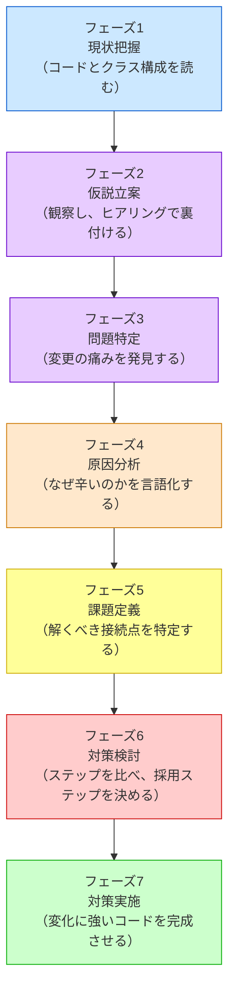

# 第一部の説明
―― 第1章から全章を貫く7つのフェーズ

---

## 私がたどり着いた「7つのフェーズ」

**このプロセスを「いつ」使うのか**

このフレームワークは一般的な問題解決プロセスに沿って設計の思考を進めます。仕様変更を起点として動き、**「すでに稼働しているシステムに、新たな仕様変更や機能追加の要望が来たとき」** に発動するプロセスです。特に、以下のような状況で威力を発揮します。

- 既存システムをあまり把握していない人が、安全に変更を加えるアプローチを探るとき
- 熟練の担当者が、複雑化した課題を改めて整理し直し、設計の妥当性を検証するとき

設計書やコードをただ眺めるのではなく、このプロセスに沿って「現状を把握する → 仮説を立てる → 問題を特定する → 原因を突き止める → 課題を定義する → 対策を考える → 実装する」と進めることで、変更の影響を確認しながら進めやすくなります。

設計に悩み、何度も失敗を繰り返す中で、私は「きれいなコードを書く」ことよりも「変更要求に対してどう思考するか」というプロセスこそが重要だと気づきました。
試行錯誤の末にたどり着いたのが、以下の7つのフェーズに沿って考えるというアプローチです。

各章は、このフェーズを1つの問題に対して一貫して適用します。
ここで、各フェーズが「なぜ必要か」「何をするか」を
丁寧に押さえておきましょう。各章の見出しには同じ色の絵文字が使われているので、「今どのフェーズにいるか」が一目でわかる仕組みになっています。

> [!IMPORTANT] 本質は「ビジネスの課題解決プロセス」と同じ
> 以下の7フェーズはプログラミング特有の魔法ではありません。ビジネスの現場で行われる基本的な課題解決プロセス（**現状把握 ⇒ 仮説立案 ⇒ 問題特定 ⇒ 原因分析 ⇒ 課題定義 ⇒ 対策検討 ⇒ 実施**）と同じ論理で進みます。
> 現状を把握せずに原因を見誤ったり、原因を特定せずに対策（パターン）を打ったりすると、期待する効果が得られないのはビジネスも設計も同じです。本質がずれたまま進めないよう、この工程を一つずつ踏んでいくことが何より重要です。

### 本書で使う3種類の番号

似た番号が登場するため、ここで役割を分けておきます。

| 呼び方 | 役割 | 読者がたどる順序 |
|---|---|---|
| **7つのフェーズ** | 現状把握から対策実施までの、本書全体の思考順序 | フェーズ1〜7 |
| **S0〜S8** | 7フェーズとの対応を確認するための補助的な整理番号 | 必要なときだけ参照 |
| **フェーズ6内のステップ** | その章で対策案を小さく比較するための実装手順 | 章ごとに数が異なる |

本文を読むときの主役は、あくまで**7つのフェーズ**です。S0〜S8とフェーズ6内のステップは、同じ順番を別名で数え直すものではありません。

### 第1章で見ると、7つのフェーズはこう動く

第1章のStrategyパターンでは、ECサイトの割引ルール変更を次の順序で扱います。この流れが、以降の章でも共通する読み方です。

| フェーズ | 第1章で行うこと |
|---|---|
| 1：現状把握 | `PaymentCalculator`に割引条件が集まっている事実を確認する |
| 2：仮説立案 | 割引ルールは今後も追加・変更されると仮説を立てる |
| 3：問題特定 | セール追加を試し、複数箇所に修正が波及する痛みを確認する |
| 4：原因分析 | 計算の流れと、変化する割引ルールが混在していると捉える |
| 5：課題定義 | 割引ルールを交換できる接続点として切り出す |
| 6：対策検討 | privateメソッド、クラス分離、抽象化、注入を段階的に比べる |
| 7：対策実施 | Strategyとして実装し、変更要求で効果を確かめる |

大切なのは、パターン名より先に、**「変更を誰が決めるのか」**と**「実際の変更要求を当てたとき、どこが痛むのか」**を見ることです。




7つのフェーズは、目的の異なる **7つの局面** に分かれています。

| フェーズ | 内容 |
|:---|:---|
| 🔵 **フェーズ1：現状把握** | コードとクラス構成を読み、変更対象を把握する |
| 🟣 **フェーズ2：仮説立案** | 観察から仮説を立て、ヒアリングで裏付ける |
| 🟣 **フェーズ3：問題特定** | 変更を試みたとき、何が痛いかを発見する |
| 🟠 **フェーズ4：原因分析** | 痛みの根本にある設計の問題を言語化する |
| 🟡 **フェーズ5：課題定義** | 解決すべき接続点を具体的に定義する |
| 🔴 **フェーズ6：対策検討** | ステップを比べ、採用ステップを決める |
| 🟢 **フェーズ7：対策実施** | 変化に強いコードを完成させる |

絵文字の色は思考の「局面」を示しています。青（🔵）は現状把握、紫（🟣）は仮説立案・問題特定、橙（🟠）は原因分析、黄（🟡）は課題定義、赤（🔴）は対策検討、緑（🟢）は対策実施です。各章の見出しでも同じ色が使われているので、今どの局面にいるかが一目でわかります。以下では各フェーズの役割を順に見ていきます。

> [!INFO] 本書における「問題」「原因」「課題」の用語定義
> この本では、3つの言葉を次のように使い分けています。
>
> - **「問題」**（フェーズ3で発見）：変更を試みたとき、変わらないはずのコードまで同時に修正しなければならない「痛み」の状態のこと。「このクラスを変えると、あちらも変えなければならない」という変更の波及が問題の正体です。
> - **「原因」**（フェーズ4で言語化）：問題が発生している構造的な理由のこと。「変わる理由が異なる2つのものが、同じ場所に混在している」ことが原因です。
> - **「課題」**（フェーズ5で定義）：原因を踏まえて「次に解くべき接続点」を具体的に絞り込んだもの。問題（症状）でも原因（診断）でもなく、「どこをどう直すか」という設計の問いの形に落とし込まれたものです。

---
## 🔵 フェーズ1：現状把握 ―― 仕様とシステムを紐づける

**目的：変更依頼の背景にある「仕様」を把握し、それが「システムのどこ（クラス構成）」で実現されているかを紐づけること**

### クラス構成を読む ―― クラスの責任と概要を把握する

> **入力：** システムのシナリオ説明 ＋ クラス構成の概要（クラス名・責任一覧・仕様表）。実装コードはまだ読まない。
> **産物：** クラス構成・仕様表・責任一覧（事実のみ。この段階では仮説を立てない）

実装コードに飛び込む前に、「このシステムに何があるか」を把握しておかないと、
コードの詳細に引きずられて「動きを追う読み方」になってしまいます。

ここでの把握対象は実装の詳細（`if` 文の中身など）ではありません。
「どんなクラスが存在し、それぞれの責任は何か」というアーキテクチャの概要です。

**このフェーズでやること（前半）**

システムのシナリオ説明を聞き、**クラス構成の概要**（クラス名・責任一覧・仕様表）を確認します。
「どのクラスが何を担当するか」という事実を把握することが、この前半の唯一の目的です。

この段階では仮説を立てません。観察した事実をフェーズ2に持ち込み、そこで初めて「変わりそうか・変わらないか」を考えます。

最後に、この章全体で使う「設計のレンズ（問い）」をセットします。

> 「このコードの中に、**『変わる理由』が異なる2つのものが、同じ場所に混在していないか？」**

---

### 実装コードを読む ―― 責任チェックで問題の行を見つける

> **入力：** 前半で把握したクラス責任 ＋ 実際の実装コード
> **産物：** 責任チェック表。「このクラスが持つべきでない知識」が混在している行の発見。

**このフェーズでやること（後半）**

クラスの責任を把握したら、**実装コードがその責任通りに書かれているか**を1行ずつ確認します。

「バグがあるか」ではなく「責任範囲外の知識がコードに混入していないか」という目線で読みます。
この違いが、設計の問題を見つけられるかどうかの分かれ目です。

#### 責任チェックの手順

「変化」を特定するには、次の3つの問いに答えます。

1. **「誰の判断で変わるか」を問う** — ビジネスルールが変わったとき、どこを触るか？
2. **「なぜ変わるか」の理由が1つか確認する** — 変わる理由が2つ以上ある箇所は、責任が混在しています。
3. **「変えたときに他に影響が出るか」を確認する** — 影響が出るなら、変わるものと変わらないものが同じ場所にいます。

この3問は責任チェックの本体です。3問に答えることで「変化の単位」が自然に浮かび上がります。

システムの全コードを読むわけではありません。前半で把握したクラス構成に基づき、「今回の仕様変更の影響を受けそうなクラス」や「変更を加える予定の箇所」に当たりをつけ、その対象クラスの実装コードを1行ずつ読んでいきます。

前半で確認した「クラスの責任」を念頭に置きながら、読み進める中で問うのは「このコードの行は、このクラスの責任の範囲内か？」です。

```text
【責任チェックの問い】
このクラスが持っている知識を変えたいとき、
誰の判断で変更が起きるか？
自分のクラスの責任オーナーとは別の人間が登場するなら、
その知識はこのクラスが持つべきではない。
```

責任の範囲外の知識を持っているコードの行が見つかれば、それが問題の核心です。

フェーズ1の最後に、変更要求を受け取ります。この変更依頼がフェーズ2以降の思考の起点になります。

---

## 🟣 フェーズ2：仮説立案 ―― 何が変わるかを観察し、ヒアリングで裏付ける

**目的：仕様とシステムの現状から「何が変わりやすく、何が変わらないか」の仮説を立て、ヒアリングで事実として裏付けること**

### 責任を整理し、仮説を立てる

> **入力：** フェーズ1のクラス構成・責任一覧 ＋ フェーズ1の責任チェック結果
> **産物：** 確定した変動/不変テーブル（根拠付き）。「誰の判断で変わるか」が明記されたもの。

> [!NOTE] フェーズ1との関係
> 責任チェックはフェーズ1の後半で行います。「誰の判断でこの行は変わるか」を確認し、責任範囲外の知識が混入している行を見つけることがフェーズ1の最終産物です。フェーズ2はその結果を起点として、「どこが変わりそうか」の仮説へと進みます。

**このフェーズでやること（3段構え）**

フェーズ1で観察した事実を踏まえ、「何が変わりそうか」の仮説を立て、ヒアリングで裏付け、最終的に変動/不変テーブルとして確定します。

**第1段：仮説を立てる**

> 「このシステムの中で、何が変わりやすく、何は変わらないか？ そしてそれは『誰の決定（都合）』で変わるのか？」

フェーズ1で把握したクラスの責任一覧を見れば、「このクラスは営業部長の施策変更で変わりそうだ」「このフローは会社の根幹だから変わらない」というように、変更の決定権を持つ人ベースでの仮説を立てることができます。

| 分類 | 仮説 | 根拠（フェーズ1の観察から） |
|---|---|---|
| 🔴 変動しそう | （例）各外部サービスのAPI仕様 | 外部ベンダーの都合で変わりそうなクラスが見える |
| 🟢 変わらなそう | （例）業務フローの骨格 | 会社の業務根幹を担うクラスは変わりにくい |

**なぜ仮説が先に必要か（仮説の価値）**

仮説なしに「今後何が変わりますか？」と漠然と聞いても、関係者は答えられません。「外部ベンダーの都合で、このAPI仕様が変わる可能性はありますか？」と具体的にぶつけることで初めて、意味のある回答（リスクの確定）が得られます。仮説は「ヒアリングで何を確認すべきか」の地図になります。

**第2段：ヒアリングで裏付ける**

コードを読んだだけで「変わる」「変わらない」と断定するのは危険です。
変わるかどうかを知っているのは、そのコードを管理している人間だけだからです。

仮説のまま進むと、見当違いの部分を「変わるもの」として分離してしまうリスクがあります。また、「この処理は変わらないはず」と思っていたものが、実は毎シーズン変わると分かることもあります。ヒアリングで仮説の精度を上げることが、フェーズ3以降の思考の土台になります。

**第3段：変動/不変テーブルを確定する**

仮説を携えて、関係者ヒアリングを行います。

> 「このAPIは今後バージョンアップの予定はありますか？」
> 「このルールは担当チームが独立して判断できますか？」
> 「この型（int）は将来変わる可能性はありますか？」

ヒアリングで得た回答をもとに、変動/不変テーブルを確定します。

| 分類 | 具体的な内容 | 変わるタイミング | 根拠 |
|---|---|---|---|
| 🔴 変動 | （変わりやすい部分） | （いつ変わるか） | （誰がそう言ったか） |
| 🟢 不変 | （変わらない部分） | 変わる日は来ない | （誰と合意したか） |

「根拠」の列に「〇〇担当との確認」と書けるまで、仮説は仮説のままにしておきます。

> **【フェーズ2のコツ：「誰が決めるか」を必ず確認する】**
> 変動/不変の仮説を立てるとき、「この仕様は変わりそうか？」と問うだけでは不十分です。「**誰の判断で変わるか**」まで確認することで、初めて分離の根拠が固まります。
>
> ヒアリングで確認すべき問いは次の3つです：
> 1. 「この仕様変更を決めるのは誰ですか？」（決定権者の特定）
> 2. 「どのくらいの頻度で変わる可能性がありますか？」（変更頻度の把握）
> 3. 「変わるとしたら、どんな変わり方が考えられますか？」（変化の方向性）
>
> 同じ「変わりそう」でも、決定権者が1人か複数かで設計の優先度が変わります。複数の部門が独立して変更を要求するなら、それぞれを別のクラスに分ける根拠になります。

**仮説が外れたら**

ヒアリングの結果がフェーズ1の観察から立てた仮説と食い違うことがあります。「変わると思っていたが、変わらない」「変わらないと思っていたが、実は頻繁に変わる」——この逆転は設計判断を変えます。

- 「変わらない」とわかった部分は、分離のコストをかける必要がなくなります。分離しないことが正しい判断です。
- 「頻繁に変わる」とわかった部分は、フェーズ6で改めて分け方を検討します。

仮説が外れること自体は失敗ではありません。ヒアリング前の仮説は「どこを重点的に確認するか」の地図として機能します。外れた仮説は確認の精度を高めた証拠です。

---

## 🟣 フェーズ3：問題特定 ―― 変更の痛みを発見する

**目的：変更を試みた際に発生する「無関係なコードまで修正が必要になる」という痛みを具体的に発見すること**

### 変更シミュレーション ―― どこが辛いかを確認する

ここで仕様変更という外部からの要求に対して、実際に変更を試みます。この変更依頼を起点に、以降のフェーズが動き出す。

設計の問題は、コードを静的に眺めているだけでは気づきにくいものです。
「変更要求が来たとき、どこに手が入るか」を実際にシミュレートしてみると、
問題の輪郭がリアルに見えてきます。

**このフェーズでやること**

フェーズ2で裏付けた変更要求を、今のコードに加えようとします。
加えようとすると、何が起きるかを追います。

- どのファイルを開くことになるか
- 変更の影響がどこまで波及するか
- 変えたくないはずのコードに触れることになるか

これが「痛み」の正体です。**変更すべきクラスの外にある、本来無関係のコードを同時に修正しなければならない状態**のことを「痛み」と呼びます。

たとえば「夏セールの割引率を15%から20%に変える」という変更要求が来たとします。この変更の決定権者は営業チームです。しかし実際に変更しようとすると、割引計算のコードだけでなく、注文処理の関数も開かなければならない——「なぜ営業施策の変更で、注文処理の関数を触るのだろう？」という違和感が生まれたなら、それが課題の所在を指しています。異なる責任のコードが同じクラスに詰まっているから、こうなるのです。

**置換・拡張のやりづらさも、ここで発見する**

「この実装を別のものに差し替えたい」と思ったとき差し替えられないなら、それが課題です。
「新しいパターンを追加したい」と思ったとき既存コードを大量に書き換える必要があるなら、それも課題です。
フェーズ4では、この痛みの根本にある「分けるべき場所」を特定します。

---

## 🟠 フェーズ4：原因分析 ―― なぜ辛いのかを構造で言語化する

**目的：発見した痛みの根本にある「変わる理由の混在」という構造的な原因を言語化すること**

### 痛みの根本にある設計の問題を言語化する

フェーズ3で発見した「痛み」は症状です。
症状に対して対症療法を施すだけでは、根本は変わりません。
「なぜこの痛みが発生しているのか」を構造的に言語化することで、
適切な設計のアプローチを選べるようになります。

**このフェーズでやること**

痛みを観察して、構造的な原因を見つけます。原因は「結論として提示する」ものではなく、症状から逆算して辿り着くものです。

**症状から原因を辿る2つの問い**

第一の問い：「なぜ、毎回このクラスを開かなければならないのか？」
このクラス自身が、外部チームの決定に基づく具体的な知識（条件・計算ルール等）をすべて直接抱え込んでいるからです。知っているものが変わると、知っているクラスも道連れになります。

第二の問い：「なぜ、変更の影響範囲が読めないのか？」
「処理の骨格（変わらない構造）」と「ビジネスロジック（変わり続ける条件）」が、同じメソッドの中で物理的に混ざり合っているからです。一方を変えると、もう一方への影響が読めなくなります。

```text
【原因分析の問い】
「なぜ、割引ルールが変わると請求計算の関数も変わるのか？」
→ 請求計算の関数が、割引ルールの具体的な条件を直接知っているから。
→ 「知りすぎているクラスは、知っているものが変わると道連れになる」
```

原因が言語化できると、解決の方向性が自然に定まります。
「知りすぎている」なら、「知る量を減らす」——インターフェースで境界を引けばいい。
「変わる理由が2つ混在している」なら、「1つに絞る」——分離すればいい。

**フェーズ4の核心：「この塊の中に、独立して変わる部分があるか？」**

設計の問題は全て「変化をどう管理するか」に集約されます。フェーズ4では、痛みを観察しながら次の1つの問いだけを問います。

> 「この塊の中に、独立して変わる部分があるか？」

この問いに答えるとき、判断基準は「変化の理由」です。

| 観察した状況 | 判断 |
|---|---|
| 変わる理由（決定者）が異なる | → **分ける** |
| いつも一緒に変わる | → **分けない** |

「割引ルールは営業チームが決め、注文処理のフローは業務チームが決める」——変わる理由が異なるなら、それらは独立して変わる部分です。分けることが原因への回答になります。

逆に「税率と消費税計算は、法改正のたびに必ず一緒に変わる」——一緒に変わるなら、分けることにコストをかける必要はありません。

**分けると「単体」と「接続点」が生まれる**

レゴブロックを分解すると、「ブロック単体」と「ブロックをつなぐジョイント」が生まれます。コードでも同じことが起きます。

```text
分ける前：[====A====B====]  ← A と B が一体になっている

分けた後： [====A====]  ＋  ◎  ＋  [====B====]
                           ↑
                       接続点（ジョイント）
```

「分ける」という判断をしたとき、次にやることはフェーズ5の課題定義です。課題が明確になってから、フェーズ6で接続点の形を決めます。

> [!NOTE] フェーズ1でセットした問いの回収
> フェーズ1の後半で「設計のレンズ」として立てた問い——「このコードの中に、変わる理由が異なる2つのものが同じ場所に混在していないか？」——への答えは、このフェーズ4で確定します。
> フェーズ3で発見した「痛み」は、まさにその混在が原因でした。この問いは各章で繰り返し使われる"探索の羅針盤"です。

**フェーズ4が答えること・答えないこと**

フェーズ4が答えるのは「なぜ辛いか」だけです。「変わる理由が異なる2つのものが混在している」という判断と、その根拠を言語化することがゴールです。

「どこで何のデータが行き来しているか」はフェーズ4の仕事ではありません。型・値・メソッドシグネチャのレベルに降りていくのは、次のフェーズ5で初めて行います。

---

## 🟡 フェーズ5：課題定義 ―― 解くべき接続点を特定する

**目的：原因を踏まえて、コードのどこをどう分けるかという「解くべき接続点」を特定すること**

### 対策に入る前に「何を解くか」を確定する

> **入力：** フェーズ4で特定した「分けるべき場所」と「接続点の存在」
> **産物：** 課題定義表（接続点と、そこで行き来するデータの整理）

フェーズ4は「なぜ分けるか」に答えました。フェーズ5が答えるのは「その境界で何のデータが流れているか」です。この2つは全く異なる問いです。

フェーズ4でコードを読んでいても、「どんな型の引数が渡されているか」「どんな文字列定数がハードコードされているか」といったデータレベルの詳細は、まだ答えとして出ていません。フェーズ5で初めて、型・値・メソッドシグネチャのレベルに降りていきます。

「分けるべき場所がある」という判断だけではフェーズ6に進むには早すぎます。対策を作る前に「接続点でどんなデータが行き来しているか」を具体化しておくことで、的外れな設計になるリスクを下げます。

**このフェーズでやること**

以下の2つの視点から、課題を整理します。

**視点1：接続点の特定（データレベルで見る）**

フェーズ4で「分ける」と判断した場所に、接続点（ジョイント）が生まれます。クラス名だけでなく、「何が」「どんな形で」つながっているかをメソッド呼び出しのレベルで確認します。クラスの境界はフェーズ1の時点で見えていますが、ここで重要なのは「どんなデータ・メソッド名・引数の型」が接続されているか、その依存の具体的な中身です。

```text
例：
- 接続点A：OrderProcessor.process() が DiscountRule.calculate(price, "Premium") を直接呼んでいる
  → 割引計算の引数の型・順序が変わるたびに、OrderProcessor の修正が必要になる
- 接続点B：DiscountRule.calculate() が PricingService.getBasePrice(itemId) を直接呼んでいる
  → 価格取得の仕組みが変わるたびに、DiscountRule の修正が必要になる
```

接続点が複数ある場合、それぞれ独立に課題を定義します。

**視点2：課題まとめ**

視点1で特定した接続点を一覧に整理します。

| 接続点 | 接続するデータ（型・値） |
|---|---|
| 接続点A | `DiscountRule.calculate(price: double, type: string)` の引数型・順序 |
| 接続点B | `PricingService.getBasePrice(itemId: int)` の戻り値型 |

この表が埋まった状態がフェーズ6の出発点になります。

---

## 🔴 フェーズ6：対策検討 ―― ステップを比べ、採用ステップを決める

**目的：「どう分けて、どうつなぐか」の具体的な解決策を複数検討し、トレードオフを比較して採用案を決めること**

### 接続点に残す知識を段階的に減らす

フェーズ5で課題が明確になりました。次にやることは、「どの知識を分け、接続点では何だけを受け渡すか」を具体的な対策として形にすることです。

ここで最も重要なのは、**「デザインパターン名を最初から思い浮かべない」**ことです。まず、変更要求を当てたときに困っている境界を見ます。

### 接続点で確認する5つの問い

クラスAとクラスBを分けても、両者の間には値や操作を受け渡す接続点が残ります。その境界で次の5つを確認します。

| 観点 | 確認すること |
|---|---|
| **受け渡すもの** | 値、型、操作、イベント、生成済みオブジェクトのうち何が境界を越えるか |
| **決定者** | 境界の両側を変更するのは、それぞれ誰か |
| **漏れている知識** | 呼び出し元が、相手のクラス名・生成方法・処理順序・条件分岐を知りすぎていないか |
| **変更影響** | 要求を1つ当てたとき、どのファイルを修正し、どこまで再テストするか |
| **安定する約束** | 呼び出し元が本当に必要とする最小限の操作やデータは何か |

ここでは、接続を4種類に分類しません。同じインターフェースを使っていても、生成方法や処理順序が呼び出し元へ漏れていれば変更は波及します。反対に、具体クラスを呼んでいても、相手が固定され変更要求がなければ、その単純さを保つ判断があります。大切なのは分類名ではなく、**今回の変更要求に対して何を知らなくてよい状態にするか**です。

### ケーブルの比喩で見るのは「分類」ではなく「困りごと」

充電器と機器の例でも、端子を固定的な種類へ分類する必要はありません。機器を交換する要求があるなら、「ケーブルを交換できるか」を見ます。利用者に複雑な変換手順を見せたくないなら、「変換をアダプタ側へ移せるか」を見ます。複数の機器を組み合わせたいなら、「ハブが必要か」を見ます。

```text
🔌 電源側 ──── 接続点 ──── 📱 利用する機器
                    ↑
       ・何を交換したいのか
       ・端子や手順を誰が知るのか
       ・交換時にどこまで直すのか
```

インターフェース、Facade、Adapter、Decoratorなどは、この困りごとを解くための候補です。どれも最初から必要なのではなく、接続点に残っている知識を減らすために必要なときだけ導入します。

### 対策を考えるときの指針：3つの原則

対策を作るとき、「どこまで変えるか」に迷ったら3つの原則を参照します。

| 原則 | 接続点での使い方 |
|---|---|
| **原則1：変わるものをカプセル化せよ** | 変わる理由が異なる知識を、同じクラスやメソッドから分ける |
| **原則2：インターフェースに依存せよ** | 複数の実装を交換する必要があるとき、呼び出し元が必要とする最小限の契約を定める |
| **原則3：コンポジションを優先せよ** | 機能を組み合わせたり、窓口や仲介役へ処理を委ねたりする必要があるとき、部品として保持する |

原則はチェックボックスではありません。インターフェースが不要な章もあれば、仲介役だけで十分な章もあります。今回の痛みを減らす最小限の対策を選びます。

### 段階的進化アプローチ

いきなり完成形へ飛ばず、小さな変更から試します。章によって不要な段階は飛ばして構いません。

1. **関数へ切り出す**：知識に名前を付け、混在している場所を見えるようにする
2. **別クラスへ移す**：変わる理由が異なる知識を、別の責任として分ける
3. **契約を定める**：交換する実装が複数ある場合だけ、共通の操作を定義する
4. **窓口や仲介役へ移す**：複雑な手順や複数の相手を、呼び出し元に知らせたくない場合に使う
5. **組み合わせられる部品にする**：機能を実行時に重ねたり、登録・解除したりする必要がある場合に使う
6. **生成責任を移す**：生成する種類や手順が変わる場合に、利用処理から生成判断を分ける

各段階で、「今回の変更要求をもう一度当てると、どこを直すか」を確認します。問題が十分に小さくなったところが、その章で止める候補です。

> [!NOTE] 各章のステップ数について
> 各章が扱う問題によって必要な段階は異なります。Strategyでは交換可能なルールの契約が中心になり、Facadeでは複雑な手順を窓口へ移すことが中心になります。すべての章を同じ分類や同じ段数へ合わせる必要はありません。

### 各案を比べる共通フォーマット

| 比較項目 | 確認すること |
|---|---|
| 移す知識 | 条件、処理順序、生成方法、通知先など、どの知識をどこへ移すか |
| 接続点の契約 | 境界を越える値・型・操作は何か |
| 減る変更 | 今回の要求で修正しなくてよくなる箇所はどこか |
| 残る変更 | 組み立て、登録、設定など、まだ必要な変更は何か |
| 導入コスト | クラス数、設定量、学習コスト、実行時コストはどれだけ増えるか |

### コスト天秤にかける

どんな設計も、柔軟性と引き換えにクラス・設定・呼び出しの段数を増やします。「このコストを払ってまで、接続点から知識を移す価値があるか」を判断します。

| 進化の段階 | 現在の対応コスト | 将来の対応コスト |
|:---|:---|:---|
| 関数へ切り出す | 低 | 変更の種類が増えると高くなりやすい |
| 別クラスへ責任を移す | 低〜中 | 関係するクラスを把握できれば抑えやすい |
| 契約・窓口・組み合わせ・生成分離を導入する | 中〜高 | 想定した変更要求では局所化しやすい |

各ステップに優劣はなく、どれが正解かはプロジェクトの文脈によって変わります。

**コストを見積もる5つの根拠：**

- **置換のしやすさ**：実装を差し替えるとき、どこを変更するか
- **拡張のしやすさ**：新しいケースを追加するとき、既存コードと組み立て箇所をどこまで触るか
- **テストのしやすさ**：依存する処理を分けて確認できるか
- **読みやすさ**：接続点をたどり、実際の処理へ到達するまでの工数
- **実行時・ビルド時コスト**：仮想呼び出し、動的確保、テンプレート展開、中間層などの影響

性能が重要な場所では、仮想呼び出しや中間層を増やさず、単純な関数やテンプレートを選ぶ判断があります。業務ルールの変更頻度が高い場所では、実行時コストより変更範囲の小ささを優先する場合があります。分類名から決めず、計測結果と変更要求から決めます。

**判断パターン：**

| 現在コスト | 未来コスト | 判断 |
|:---|:---|:---|
| 低い | 低い | 採用しやすい候補 |
| 高い | 低い | 長期重視なら採用。納期優先なら現状維持の暫定対応＋リファクタ計画を立てる |
| 低い | 高い | 関数化での暫定対応として採用。将来増えたときにクラス化・抽象化へ進化させる計画を必ず明記する |
| 高い | 高い | 対策を再検討する |

「今すぐ納期を間に合わせたいか、将来も低コストで完成させたいか」——この問いが判断の本質。

**全ケース共通・必ず行うこと：**

フェーズ2のヒアリングで出た「将来の変化」を実際のコードで試す**耐久テスト**を行います。「新しい部品を追加するだけ」でその変化に対応できることを実証し、設計の正しさを確信に変えます。

「この設計を使わない方が良い状況」については、各章末のパターン解説で詳しく示します。設計は常に採用するとよいわけではなく、変更頻度・チーム規模・将来の見通しによって判断が変わります。

---

## 🟢 フェーズ7：対策実施 ―― 変化に強いコードを完成させる

**目的：決定した対策をコードとして実装し、変更シナリオに対する効果（変更箇所の局所化）を実証すること**

> [!NOTE] コラム：実装の小手先と、設計の「分け方」の違い
> 痛みに直面したとき、「とりあえず引数を増やす」「if文を追加する」といった実装レベルの対処は、問題を先送りするだけで根本解決にはなりません。設計の「分け方」とは、コードの骨格（責任の境界線）を引き直す根本的な操作のことです。実装の小手先でも短期間は動き続けますが、変更要求が重なるたびに「触るたびに怖い」コードになっていきます。

### 決断し、変化に強い設計を手に入れる

設計の判断は、コードを書いて終わりではありません。
「何を得て、何を諦めたか」を言語化できると、同じ問題に次に直面したとき、
また同じフェーズを踏まなくても自分の判断基準として使い回せます。

**このフェーズでやること**

解決後のコードを全体として示します。
その後、変更シナリオごとに「変わるクラス・変わらないクラス」を表で整理します。

「変更が1クラスで済む設計を得る代わりに、クラス数の増加という複雑さを受け入れる」——これがこのフェーズで言語化する核心のトレードオフです。

「変更シナリオ表」は、フェーズ1〜6を通じて特定した変化の可能性を一覧にしたものです。
目的は「何を手に入れたか」の可視化——「変更が1クラスだけで済む」という事実を数字で示すことです。
「何を得て何を諦めたか」という中心の問いに直接答えます。

変化に強い設計とは、「仕様変更が起きたとき、触る場所が最小限で済む」設計です。
次の表は、よくある変更シナリオと、どこを触れば済むかを示しています。

例として、第1章のシナリオで示します：

| 変更シナリオ | 変わるクラス（触る場所） | 変わらないクラス |
|---|---|---|
| 新しい割引ルールが追加された（秋セール廃止・新キャンペーン追加） | 新しいルールクラス1つだけ | 骨格クラス・他の全ルールクラス |
| 割引率を変更（10%→15%） | 対象ルールクラスの1行だけ | 骨格クラス・他の全ルールクラス |
| 法人向け割引の条件が変わった | 法人ルールクラス1つだけ | 一般向けルールクラス・骨格クラス全て |

この表が埋まったとき、「変更が来ても、触るのは1クラスだけ」という事実が可視化されます。
それが「何を手に入れたか」の答えです。「諦めたもの」は、クラス数の増加という複雑さです。

---

### デザインパターンは「接続点の問題を解いた構造の名前」

ここまで、あえてデザインパターン名を出さずに、変わる知識を分け、接続点に残す約束を小さくする考え方で設計を解説してきました。デザインパターンは目的ではなく、特定の困りごとを解いた構造に付けられた名前だからです。

たとえば、呼び出し元から変化するルールを切り離し、同じ操作で交換できる契約を定めたとします。

- もしその振る舞いが「アルゴリズムやルール」なら、人々はその構造を **Strategyパターン** と呼びます。

- もしその振る舞いが「状態による変化」なら、人々はそれを **Stateパターン** と呼びます。

また、呼び出し元に複雑な変換や調整の手順を知らせないため、境界へ役割を追加したとします。

- その役割が「形を変換する」ものなら、**Adapterパターン** と呼びます。

- その役割が「交通整理をする」ものなら、**Mediatorパターン** と呼びます。

- その役割が「同じ操作を受け取る代理」なら、**Proxyパターン** と呼びます。

これらに共通するのは、接続点に漏れている知識を見つけ、必要な役割へ移すことです。

問題の原因を見極め、「どの知識を、どちら側から切り離すか」を言語化する。その結果の構造に既知の名前があるなら、それをデザインパターンと呼べばよいのです。パターン名は、設計意図をチームで共有するための語彙になります。

> [!INFO] この本で扱わないパターン名について
> 本書の接続点レビューだけで、GoFの全23パターンを一つの分類体系へ収めようとはしません。
> Strategy・Facade・Stateなどは、それぞれ異なる問題と意図を持つ構造です。
> パターン名を覚えることより、変更要求を接続点へ当て、「誰が何を知りすぎているか」「何を移せば変更影響が小さくなるか」を説明できることを本書の目的とします。

この考え方をマスターすれば、23のパターンを知らなくても、目の前の原因に対して適切な構造を自力で導き出せるようになります。以降の章では、この考え方を具体的なコードにどう適用し、その結果としてどんなパターンが浮かび上がるのかを追体験していきます。

---

## 今日から始める：自分のコードで7つのフェーズを試す

この本を読み終えたあとに「わかった気がするが、自分のコードでどう使えばいいか」と迷うことがあります。最初の一歩を具体的にするために、5つのステップを用意しました。

**STEP 1：「触るたびに怖い」クラスを1つ選ぶ**
修正のたびに「他が壊れないか不安」「どこを直せばいいかわからない」と感じるクラスが1つあれば、それが出発点です。

**STEP 2：そのクラスの「責任」を1文で書く**
「このクラスは〇〇するクラスだ」と1文で書いてみてください。書けない、または1文に収まらない場合は、責任が混在しているサインです。

**STEP 3：実装コードを見て「知りすぎている行」を探す**
STEP 2で書いた責任と関係ない知識（他チームの仕様・別の業務ロジック）を持っている行を見つけてください。その行が「変わる理由が混在している場所」の候補です。

**STEP 4：「誰の判断でその行は変わるか」を確認する**
見つけた行の変更を依頼してくる人が2人以上いれば、そこに設計の問題があります。チームメンバーや仕様書を確認して、変更の決定権者を特定してください。

**STEP 5：第1章〜第8章の中から「似た構造」を探す**
STEP 4で見つけた「変わる理由の種類（振る舞いの差し替え？状態の切り替え？生成の隠蔽？）」に近い章を1つ選んで、そのパターンを参考に構造を検討してみてください。

> 週1回、1クラス。それだけで3ヶ月後には「設計を考えるのが当たり前」になります。
