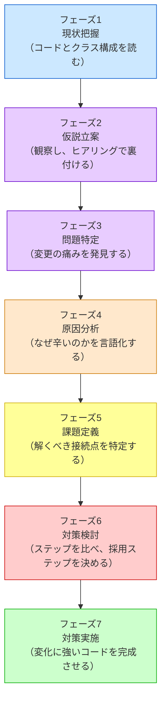

# 第一部の説明
―― 7つのフェーズと接続点の考え方

---

## 先人たちが使っていた「7つのフェーズ」

**このプロセスを「いつ」使うのか**

このフレームワークは一般的な問題解決プロセスに沿って設計の思考を進めます。仕様変更を起点として動き、**「すでに稼働しているシステムに、新たな仕様変更や機能追加の要望が来たとき」** に発動するプロセスです。特に、以下のような状況で威力を発揮します。

- 既存システムをあまり把握していない人が、安全に変更を加えるアプローチを探るとき
- 熟練の担当者が、複雑化した課題を改めて整理し直し、設計の妥当性を検証するとき

設計書やコードをただ眺めるのではなく、このプロセスに沿って「現状を把握する → 仮説を立てる → 問題を特定する → 原因を突き止める → 課題を定義する → 対策を考える → 実装する」と進めることで、安全で確実な変更が可能になります。

先人たちの記録を紐解くと、彼らもまた複雑化する要求とコードの絡み合いに向き合っていたことが窺えます。
彼らが問題を解決するとき、意識的かどうかはともかく、以下の7つのフェーズを経ていたと解釈することができます。

各章は、このフェーズを1つの問題に対して一貫して適用します。
ここで、各フェーズが「なぜ必要か」「何をするか」を
丁寧に押さえておきましょう。各章の見出しには同じ色の絵文字が使われているので、「今どのフェーズにいるか」が一目でわかる仕組みになっています。

> [!IMPORTANT] 本質は「ビジネスの課題解決プロセス」と同じ
> 以下の7フェーズはプログラミング特有の魔法ではありません。ビジネスの現場で行われる基本的な課題解決プロセス（**現状把握 ⇒ 仮説立案 ⇒ 問題特定 ⇒ 原因分析 ⇒ 課題定義 ⇒ 対策検討 ⇒ 実施**）と同じ論理で進みます。
> 現状を把握せずに原因を見誤ったり、原因を特定せずに対策（パターン）を打ったりすると、期待する効果が得られないのはビジネスも設計も同じです。本質がずれたまま進めないよう、この工程を一つずつ踏んでいくことが何より重要です。




7つのフェーズは、目的の異なる **7つの局面** に分かれています。

| フェーズ | 内容 |
|:---|:---|
| 🔵 **フェーズ1：現状把握** | コードとクラス構成を読み、変更対象を把握する |
| 🟣 **フェーズ2：仮説立案** | 観察から仮説を立て、ヒアリングで裏付ける |
| 🟣 **フェーズ3：問題特定** | 変更を試みたとき、何が痛いかを発見する |
| 🟠 **フェーズ4：原因分析** | 痛みの根本にある設計の問題を言語化する |
| 🟡 **フェーズ5：課題定義** | 解決すべき接続点を具体的に定義する |
| 🔴 **フェーズ6：対策検討** | ステップを比べ、採用ステップを決める |
| 🟢 **フェーズ7：対策実施** | 変化に強いコードを完成させる |

絵文字の色は思考の「局面」を示しています。青（🔵）は現状把握、紫（🟣）は仮説立案・問題特定、橙（🟠）は原因分析、黄（🟡）は課題定義、赤（🔴）は対策検討、緑（🟢）は対策実施です。各章の見出しでも同じ色が使われているので、今どの局面にいるかが一目でわかります。以下では各フェーズの役割を順に見ていきます。

---

## 🔵 フェーズ1：現状把握 ―― コードとクラス構成を読む

### クラス構成を読む ―― クラスの責任と概要を把握する

> **入力：** システムのシナリオ説明 ＋ クラス構成の概要（クラス名・責任一覧・仕様表）。実装コードはまだ読まない。
> **産物：** クラス構成・仕様表・責任一覧（事実のみ。この段階では仮説を立てない）

**なぜこのフェーズが必要か**

実装コードに飛び込む前に、「このシステムに何があるか」を把握しておかないと、
コードの詳細に引きずられて「動きを追う読み方」になってしまいます。

ここでの把握対象は実装の詳細（`if` 文の中身など）ではありません。
「どんなクラスが存在し、それぞれの責任は何か」というアーキテクチャの概要です。

**このフェーズでやること（前半）**

システムのシナリオ説明を聞き、**クラス構成の概要**（クラス名・責任一覧・仕様表）を確認します。
「どのクラスが何を担当するか」という事実を把握することが、この前半の唯一の目的です。

この段階では仮説を立てません。観察した事実をフェーズ2に持ち込み、そこで初めて「変わりそうか・変わらないか」を考えます。

最後に、この章全体で使う「設計のレンズ（問い）」をセットします。

> 「このコードの中に、**『変わる理由』が異なる2つのものが、同じ場所に混在していないか？」**

---

### 実装コードを読む ―― 責任チェックで問題の行を見つける

> **入力：** 前半で把握したクラス責任 ＋ 実際の実装コード
> **産物：** 責任チェック表。「このクラスが持つべきでない知識」が混在している行の発見。

**このフェーズでやること（後半）**

クラスの責任を把握したら、**実装コードがその責任通りに書かれているか**を1行ずつ確認します。

「バグがあるか」ではなく「責任範囲外の知識がコードに混入していないか」という目線で読みます。
この違いが、設計の問題を見つけられるかどうかの分かれ目です。

#### 責任チェックの手順

「変化」を特定するには、次の3つの問いに答えます。

1. **「誰の判断で変わるか」を問う** — ビジネスルールが変わったとき、どこを触るか？
2. **「なぜ変わるか」の理由が1つか確認する** — 変わる理由が2つ以上ある箇所は、責任が混在しています。
3. **「変えたときに他に影響が出るか」を確認する** — 影響が出るなら、変わるものと変わらないものが同じ場所にいます。

この3問は責任チェックの本体です。3問に答えることで「変化の単位」が自然に浮かび上がります。

システムの全コードを読むわけではありません。前半で把握したクラス構成に基づき、「今回の仕様変更の影響を受けそうなクラス」や「変更を加える予定の箇所」に当たりをつけ、その対象クラスの実装コードを1行ずつ読んでいきます。

前半で確認した「クラスの責任」を念頭に置きながら、読み進める中で問うのは「このコードの行は、このクラスの責任の範囲内か？」です。

```text
【責任チェックの問い】
このクラスが持っている知識を変えたいとき、
誰の判断で変更が起きるか？
自分のクラスの責任オーナーとは別の人間が登場するなら、
その知識はこのクラスが持つべきではない。
```

責任の範囲外の知識を持っているコードの行が見つかれば、それが問題の核心です。

フェーズ1の最後に、変更要求を受け取ります。この変更依頼がフェーズ2以降の思考の起点になります。

---

## 🟣 フェーズ2：仮説立案 ―― 何が変わるかを観察し、ヒアリングで裏付ける

### 責任を整理し、仮説を立てる

> **入力：** フェーズ1のクラス構成・責任一覧 ＋ フェーズ1の責任チェック結果
> **産物：** 確定した変動/不変テーブル（根拠付き）。「誰の判断で変わるか」が明記されたもの。

> [!NOTE] フェーズ1との関係
> 責任チェックはフェーズ1の後半で行います。「誰の判断でこの行は変わるか」を確認し、責任範囲外の知識が混入している行を見つけることがフェーズ1の最終産物です。フェーズ2はその結果を起点として、「どこが変わりそうか」の仮説へと進みます。

**このフェーズでやること（3段構え）**

フェーズ1で観察した事実を踏まえ、「何が変わりそうか」の仮説を立て、ヒアリングで裏付け、最終的に変動/不変テーブルとして確定します。

**第1段：仮説を立てる**

> 「このシステムの中で、何が変わりやすく、何は変わらないか？ そしてそれは『誰の決定（都合）』で変わるのか？」

フェーズ1で把握したクラスの責任一覧を見れば、「このクラスは営業部長の施策変更で変わりそうだ」「このフローは会社の根幹だから変わらない」というように、変更の決定権を持つ人ベースでの仮説を立てることができます。

| 分類 | 仮説 | 根拠（フェーズ1の観察から） |
|---|---|---|
| 🔴 変動しそう | （例）各外部サービスのAPI仕様 | 外部ベンダーの都合で変わりそうなクラスが見える |
| 🟢 変わらなそう | （例）業務フローの骨格 | 会社の業務根幹を担うクラスは変わりにくい |

**なぜ仮説が先に必要か（仮説の価値）**

仮説なしに「今後何が変わりますか？」と漠然と聞いても、関係者は答えられません。「外部ベンダーの都合で、このAPI仕様が変わる可能性はありますか？」と具体的にぶつけることで初めて、意味のある回答（リスクの確定）が得られます。仮説は「ヒアリングで何を確認すべきか」の地図になります。

**第2段：ヒアリングで裏付ける**

コードを読んだだけで「変わる」「変わらない」と断定するのは危険です。
変わるかどうかを知っているのは、そのコードを管理している人間だけだからです。

仮説のまま進むと、見当違いの部分を「変わるもの」として分離してしまうリスクがあります。また、「この処理は変わらないはず」と思っていたものが、実は毎シーズン変わると分かることもあります。ヒアリングで仮説の精度を上げることが、フェーズ3以降の思考の土台になります。

**第3段：変動/不変テーブルを確定する**

仮説を携えて、関係者ヒアリングを行います。

> 「このAPIは今後バージョンアップの予定はありますか？」
> 「このルールは担当チームが独立して判断できますか？」
> 「この型（int）は将来変わる可能性はありますか？」

ヒアリングで得た回答をもとに、変動/不変テーブルを確定します。

| 分類 | 具体的な内容 | 変わるタイミング | 根拠 |
|---|---|---|---|
| 🔴 変動 | （変わりやすい部分） | （いつ変わるか） | （誰がそう言ったか） |
| 🟢 不変 | （変わらない部分） | 変わる日は来ない | （誰と合意したか） |

「根拠」の列に「〇〇担当との確認」と書けるまで、仮説は仮説のままにしておきます。

> **【フェーズ2のコツ：「誰が決めるか」を必ず確認する】**
> 変動/不変の仮説を立てるとき、「この仕様は変わりそうか？」と問うだけでは不十分です。「**誰の判断で変わるか**」まで確認することで、初めて分離の根拠が固まります。
>
> ヒアリングで確認すべき問いは次の3つです：
> 1. 「この仕様変更を決めるのは誰ですか？」（決定権者の特定）
> 2. 「どのくらいの頻度で変わる可能性がありますか？」（変更頻度の把握）
> 3. 「変わるとしたら、どんな変わり方が考えられますか？」（変化の方向性）
>
> 同じ「変わりそう」でも、決定権者が1人か複数かで設計の優先度が変わります。複数の部門が独立して変更を要求するなら、それぞれを別のクラスに分ける根拠になります。

**仮説が外れたら**

ヒアリングの結果がフェーズ1の観察から立てた仮説と食い違うことがあります。「変わると思っていたが、変わらない」「変わらないと思っていたが、実は頻繁に変わる」——この逆転は設計判断を変えます。

- 「変わらない」とわかった部分は、分離のコストをかける必要がなくなります。分離しないことが正しい判断です。
- 「頻繁に変わる」とわかった部分は、フェーズ6で改めて分け方を検討します。

仮説が外れること自体は失敗ではありません。ヒアリング前の仮説は「どこを重点的に確認するか」の地図として機能します。外れた仮説は確認の精度を高めた証拠です。

---

## 🟣 フェーズ3：問題特定 ―― 変更の痛みを発見する

### 変更シミュレーション ―― どこが辛いかを確認する

ここで仕様変更という外部からの要求に対して、実際に変更を試みます。この変更依頼を起点に、以降のフェーズが動き出す。

**なぜこのフェーズが必要か**

設計の問題は、コードを静的に眺めているだけでは気づきにくいものです。
「変更要求が来たとき、どこに手が入るか」を実際にシミュレートしてみると、
問題の輪郭がリアルに見えてきます。

**このフェーズでやること**

フェーズ2で裏付けた変更要求を、今のコードに加えようとします。
加えようとすると、何が起きるかを追います。

- どのファイルを開くことになるか
- 変更の影響がどこまで波及するか
- 変えたくないはずのコードに触れることになるか

これが「痛み」の正体です。**変更すべきクラスの外にある、本来無関係のコードを同時に修正しなければならない状態**のことを「痛み」と呼びます。

たとえば「夏セールの割引率を15%から20%に変える」という変更要求が来たとします。この変更の決定権者は営業チームです。しかし実際に変更しようとすると、割引計算のコードだけでなく、注文処理の関数も開かなければならない——「なぜ営業施策の変更で、注文処理の関数を触るのだろう？」という違和感が生まれたなら、それが課題の所在を指しています。異なる責任のコードが同じクラスに詰まっているから、こうなるのです。

**置換・拡張のやりづらさも、ここで発見する**

「この実装を別のものに差し替えたい」と思ったとき差し替えられないなら、それが課題です。
「新しいパターンを追加したい」と思ったとき既存コードを大量に書き換える必要があるなら、それも課題です。
フェーズ4では、この痛みの根本にある「分けるべき場所」を特定します。

---

## 🟠 フェーズ4：原因分析 ―― なぜ辛いのかを構造で言語化する

### 痛みの根本にある設計の問題を言語化する

**なぜこのフェーズが必要か**

フェーズ3で発見した「痛み」は症状です。
症状に対して対症療法を施すだけでは、根本は変わりません。
「なぜこの痛みが発生しているのか」を構造的に言語化することで、
正しい処方箋を選べるようになります。

**このフェーズでやること**

痛みを観察して、構造的な原因を見つけます。原因は「結論として提示する」ものではなく、症状から逆算して辿り着くものです。

**症状から原因を辿る2つの問い**

第一の問い：「なぜ、毎回このクラスを開かなければならないのか？」
このクラス自身が、外部チームの決定に基づく具体的な知識（条件・計算ルール等）をすべて直接抱え込んでいるからです。知っているものが変わると、知っているクラスも道連れになります。

第二の問い：「なぜ、変更の影響範囲が読めないのか？」
「処理の骨格（変わらない構造）」と「ビジネスロジック（変わり続ける条件）」が、同じメソッドの中で物理的に混ざり合っているからです。一方を変えると、もう一方への影響が読めなくなります。

```text
【原因分析の問い】
「なぜ、割引ルールが変わると請求計算の関数も変わるのか？」
→ 請求計算の関数が、割引ルールの具体的な条件を直接知っているから。
→ 「知りすぎているクラスは、知っているものが変わると道連れになる」
```

原因が言語化できると、解決の方向性が自然に定まります。
「知りすぎている」なら、「知る量を減らす」——インターフェースで境界を引けばいい。
「変わる理由が2つ混在している」なら、「1つに絞る」——分離すればいい。

**フェーズ4の核心：「この塊の中に、独立して変わる部分があるか？」**

設計の問題は全て「変化をどう管理するか」に集約されます。フェーズ4では、痛みを観察しながら次の1つの問いだけを問います。

> 「この塊の中に、独立して変わる部分があるか？」

この問いに答えるとき、判断基準は「変化の理由」です。

| 観察した状況 | 判断 |
|---|---|
| 変わる理由（決定者）が異なる | → **分ける** |
| いつも一緒に変わる | → **分けない** |

「割引ルールは営業チームが決め、注文処理のフローは業務チームが決める」——変わる理由が異なるなら、それらは独立して変わる部分です。分けることが原因への回答になります。

逆に「税率と消費税計算は、法改正のたびに必ず一緒に変わる」——一緒に変わるなら、分けることにコストをかける必要はありません。

**分けると「単体」と「接続点」が生まれる**

レゴブロックを分解すると、「ブロック単体」と「ブロックをつなぐジョイント」が生まれます。コードでも同じことが起きます。

```text
分ける前：[====A====B====]  ← A と B が一体になっている

分けた後： [====A====]  ＋  ◎  ＋  [====B====]
                           ↑
                       接続点（ジョイント）
```

「分ける」という判断をしたとき、次にやることはフェーズ5の課題定義です。課題が明確になってから、フェーズ6で接続点の形を決めます。

> [!NOTE] フェーズ1でセットした問いの回収
> フェーズ1の後半で「設計のレンズ」として立てた問い——「このコードの中に、変わる理由が異なる2つのものが同じ場所に混在していないか？」——への答えは、このフェーズ4で確定します。
> フェーズ3で発見した「痛み」は、まさにその混在が原因でした。この問いは各章で繰り返し使われる"探索の羅針盤"です。

**フェーズ4が答えること・答えないこと**

フェーズ4が答えるのは「なぜ辛いか」だけです。「変わる理由が異なる2つのものが混在している」という判断と、その根拠を言語化することがゴールです。

「どこで何のデータが行き来しているか」はフェーズ4の仕事ではありません。型・値・メソッドシグネチャのレベルに降りていくのは、次のフェーズ5で初めて行います。

---

## 🟡 フェーズ5：課題定義 ―― 解くべき接続点を特定する

### 対策に入る前に「何を解くか」を確定する

> **入力：** フェーズ4で特定した「分けるべき場所」と「接続点の存在」
> **産物：** 課題定義表（接続点と、そこで行き来するデータの整理）

**なぜこのフェーズが必要か**

フェーズ4は「なぜ分けるか」に答えました。フェーズ5が答えるのは「その境界で何のデータが流れているか」です。この2つは全く異なる問いです。

フェーズ4でコードを読んでいても、「どんな型の引数が渡されているか」「どんな文字列定数がハードコードされているか」といったデータレベルの詳細は、まだ答えとして出ていません。フェーズ5で初めて、型・値・メソッドシグネチャのレベルに降りていきます。

「分けるべき場所がある」という判断だけではフェーズ6に進むには早すぎます。対策を作る前に「接続点でどんなデータが行き来しているか」を具体化しておくことで、的外れな設計になるリスクを下げます。

**このフェーズでやること**

以下の2つの視点から、課題を整理します。

**視点1：接続点の特定（データレベルで見る）**

フェーズ4で「分ける」と判断した場所に、接続点（ジョイント）が生まれます。クラス名だけでなく、「何が」「どんな形で」つながっているかをメソッド呼び出しのレベルで確認します。クラスの境界はフェーズ1の時点で見えていますが、ここで重要なのは「どんなデータ・メソッド名・引数の型」が接続されているか、その依存の具体的な中身です。

```text
例：
- 接続点A：OrderProcessor.process() が DiscountRule.calculate(price, "Premium") を直接呼んでいる
  → 割引計算の引数の型・順序が変わるたびに、OrderProcessor の修正が必要になる
- 接続点B：DiscountRule.calculate() が PricingService.getBasePrice(itemId) を直接呼んでいる
  → 価格取得の仕組みが変わるたびに、DiscountRule の修正が必要になる
```

接続点が複数ある場合、それぞれ独立に課題を定義します。

**視点2：課題まとめ**

視点1で特定した接続点を一覧に整理します。

| 接続点 | 接続するデータ（型・値） |
|---|---|
| 接続点A | `DiscountRule.calculate(price: double, type: string)` の引数型・順序 |
| 接続点B | `PricingService.getBasePrice(itemId: int)` の戻り値型 |

この表が埋まった状態がフェーズ6の出発点になります。

---

## 🔴 フェーズ6：対策検討 ―― ステップを比べ、採用ステップを決める

### 分け方と接続の形を段階的に決める

**なぜこのフェーズが必要か**

フェーズ5で課題が明確になりました。次にやることは、「どう分けて、どう繋ぐか」を具体的な対策として形にすることです。

ここで最も重要なのは、**「デザインパターン名を最初から思い浮かべない」** ことです。「なぜ分けたか」と「接続の形」だけを考えます。

### 接続の2軸

分けた後の接続点をどんな形にするかを決める軸は2つあります。

**軸1：具体 vs 抽象**（「相手が何でできているか知るか、知らないか」）

- **具体**：接続点が特定のクラスへの直接依存。Aは「Bというクラスが存在する」ことを知っている。Bが別のクラスに変わったらAも変える必要がある。
- **抽象**：接続点がインターフェース（抽象クラス）への依存。Aは「こういう形のものが来る」とだけ知っている。Bの中身が変わってもAは変える必要がない。

**軸2：直接 vs 間接**（「直接話すか、仲介者を通すか」）

- **直接**：AがBを直接呼び出す。AとBは直接つながっている。Bの変化がAに直に届く。
- **間接**：AはCを通じてBに働きかける。AとBは直接接触しない。BやCが変わってもAは変わらない。

### 2×2 接続マトリクス

この2軸を組み合わせると、4つの接続の形が生まれます。

| | **直接** | **間接** |
|:---:|:---:|:---:|
| **具体** | 具体×直接 | 具体×間接 |
| **抽象** | 抽象×直接 | 抽象×間接 |

### 「なぜ分けたか」と「接続の形」の対応

分けた理由が、接続の形を自動的に決めます。

| なぜ分けたか | 接続の形 |
|---|---|
| 責任を整理したい | 具体×直接 |
| 実装を差し替えたい | 抽象×直接 |
| 知らせたくない・複雑さを隠したい | 具体×間接 |
| 差し替えたい かつ 知らせたくない | 抽象×間接 |

設計の良し悪しを決める「依存の形」を、身近な充電器に例えて整理してみましょう。起点は「コンセントに挿さった充電器と、そこから直に生えている1本のケーブル」で完全に固定されているとします。

ここでは「その先をどう設計するか」という工夫だけではありません。**「繋がれる接続先の機器はどんな状況にあるのか」**という視点で、4つの段階を見ていきましょう。**「接続先がどういう状況だから、どの接続方法が適切か」**という話こそが、設計の要です。

| 接続形態 | ケーブルの先端（端子） | 接続の工夫 | 接続先の状況 |
| --- | --- | --- | --- |
| **① 具体 × 直接** | ライトニング（専用規格） | iPhoneへ直差し | iPhoneだけ（同じ口の機器のみ） |
| **② 具体 × 間接** | ライトニング（専用規格） | ゲーム機専用アダプタを挟む | 独自端子のゲーム機（口を変えられない） |
| **③ 抽象 × 直接** | Type-C（共通規格） | 各種Type-C機器へ直差し | Type-C対応機器が複数（口を共通化済み） |
| **④ 抽象 × 間接** | ライトニング（専用規格） | Type-C変換アダプタを挟む | Type-C対応機器が複数・手元はライトニングのみ |

#### 【1. 具体 × 直接】 ―― ライトニング直生え × iPhoneへ直接

充電器から「iPhone専用のライトニングケーブル」が直に生えており、それをiPhoneに直接挿している状態です。

 * **接続先の状況：** 接続先の機器は、3個ぐらいあるiPhone（同じ種類の接続口を持つ機器）だけです。
 * **設計の評価：** 接続先が同じ種類の機器しかないので、専用の「ライトニング（具体）」をそのまま繋ぐ（直接）設計で、何も問題ありません。特定の相手を名指しで呼び出している、最も変更に弱く硬直した設計ですが、接続先が一生iPhoneだけなら、これで適切なのです。

#### 【2. 具体 × 間接】 ―― ライトニング直生え ＋ ゲーム機専用アダプタ

iPhone専用のライトニングケーブルしかない充電器で、どうしても独自の端子を持つゲーム機を充電したい。そんな時、先端に「ゲーム機専用のアダプタ（中間層）」を被せて繋ぎます。

 * **接続先の状況：** 接続先の機器は、独自の専用端子を持つ特定のゲーム機です。ゲーム機側の端子は改造できません。手元にはライトニングのケーブルしかありません。
 * **設計の評価：** 相手の専用端子に繋ぐために、手元のライトニングの先端に「専用の変換機」を挟んで繋ぐ（間接）必要があります。接続先（ゲーム機）を一切改造せずに済む代わりに、繋ぐ相手の種類ごとに専用アダプタを用意する手間がかかります。

#### 【3. 抽象 × 直接】 ―― Type-C直生え × Type-C機器へ直接

ケーブルの先端を、最初から世界標準の「Type-C（共通の規格）」として設計した状態です。

 * **接続先の状況：** 接続先の機器は、ニンテンドーSwitch・Type-Cスマホ・Type-C対応タブレットなど、複数の異なる機器があります。それらはすべて**「Type-Cポートを備えている（共通のルールを持つよう加工されている）」**必要があります。
 * **設計の評価：** 充電器（起点）はそのままに、相手を自在に差し替えられます。しかしその柔軟さを得る代わりに、**「繋ぐ相手側の口をすべてType-C規格に合わせて作る（プログラム側でインターフェースを実装させる）」という大きな労力**がかかります。独自端子のゲーム機はそのままでは繋がらず、ゲーム機本体をType-C対応へと改造しなければなりません。

#### 【4. 抽象 × 間接】 ―― ライトニング直生え ＋ Type-C変換アダプタ

充電器はiPhone専用の古いものですが、その先端に「Type-C変換アダプタ」を被せた状態です。

 * **接続先の状況：** 3番と同じく、Type-C対応の複数の異なる機器が接続先として存在します。しかし、自分はライトニングしか持っていません。
 * **設計の評価：** それら複数の異なる機器に繋ぐために、手元のライトニングケーブルの先端に「Type-C変換アダプタ（中間層）」を被せて繋ぐ必要があります。最も手が込んでいますが、古い密結合のコードと新しい共通の規格をシームレスに繋ぐ強力な構造です。接続先の機器はすべてType-Cポートに加工されている必要がある点は3番と同じです。

### 対策を考えるときの指針：3つの原則

対策を作るとき、「どこまで変えるか」に迷ったら3つの原則を参照します。

| 原則 | 使いどころ |
|---|---|
| **原則1：変わるものをカプセル化せよ** | 変わる理由が異なるものが混在しているなら分ける判断軸 |
| **原則2：インターフェースに依存せよ** | 「具体」から「抽象」に踏み込むかどうかの判断軸。実装を差し替えたいなら抽象軸を選ぶ |
| **原則3：コンポジションを優先せよ** | 「直接」から「間接」に踏み込むかどうかの判断軸。変化を外から組み合わせて吸収したいなら間接軸を選ぶ |

3つの原則は「どこまで変えるか」の価値基準です。最終的にどこで止めるかは、コスト天秤で判断します。

> [!NOTE] 「置換・拡張」は接続形態選択の根拠
> 「将来、実装を置換できるか」「機能を拡張できるか」は、上記の接続の形を適切に選んだ結果として得られる**設計の目標状態**です。
> 置換・拡張のしやすさは、**コスト評価**の算出根拠として登場します。

**接続点が複数ある場合**

実際の設計では、分けた後に接続点が複数できることがあります。その場合、それぞれの接続点に対して「なぜ分けたか」を独立に問います。接続点ごとに接続の形が異なることは自然なことです。

### 段階的進化アプローチ（ステップ1〜5）

対策を作るとき、いきなり「正解のパターン」へ飛んではいけません。手続型のコードがどのような限界にぶつかり、なぜオブジェクト指向やデザインパターンが必要になるのかを、以下の5段階の進化で確認します。

*   **ステップ1：丸ごとプライベートメソッドに切り出す**（とりあえず分ける。クラスの外には出ない）
*   **ステップ2：処理単位で関数化する**（計算などの処理部分を分ける。条件の複雑さは残る）
*   **ステップ3：条件ごとに関数化する**（条件も分け、一貫した構造に気づく。if文は残る）
*   **ステップ4：具体クラスへの分離**（クラスを分けるが、呼び出し側は全クラスを名指しで知っている。「具体×直接」の限界が見える）
*   **ステップ5：インターフェース化とDI**（インターフェースを導入し、if文ごと呼び出し側に追い出す。「抽象×直接」または「抽象×間接」へ到達）

この5ステップのどこで止めるかは、接続の形（具体か抽象か、直接か間接か）の到達点を示しています。つまり、2×2の接続マトリクスは「選択肢の横並び比較表」ではなく、段階的進化の**「到達点マップ」**として機能します。

### 「接続の形を変える」とはどういうことか

ステップが進むほど、接続点の抽象度と間接度が上がります。

```text
ステップ1〜4：[A] → [B]                        ← 具体×直接（シンプルな接続）
ステップ5：   [A] → «interface» → [B]          ← 抽象×直接（型だけで接続）
さらに進化：  [A] → [C] → [B]                  ← 具体×間接（中間層を挟む）
さらに進化：  [A] → «interface» → [C] → [B]   ← 抽象×間接（型＋中間層）
```

「さらに進化」の2段階（具体×間接・抽象×間接）は、各章で扱うパターン（Adapter、Facade、Proxy、Mediator等）が到達する接続の形です。各章では、その章の問題に対して何ステップ踏んでどの形に辿り着くかが異なります。

どこまで進化させるか（どのステップで止めるか）は、コスト天秤で判断します。

### コスト天秤にかける ―― 「現在」と「未来」でステップを比べる

**なぜコスト天秤が必要か**

ステップ5の抽象化は強力ですが、ファイル数や型が増えるという「初期投資コスト」もかかります。どんな設計も万能ではなく、必ず何らかのコストを伴うからです。「このコストを払ってまで、このステップまで進化させる価値があるか」を判断します。

| 進化の段階 | 現在の対応コスト | 未来の対応コスト |
|:---|:---|:---|
| ステップ1〜3（関数化） | 低 | 高 |
| ステップ4（具体×直接のクラス化） | 低〜中 | 高〜中 |
| ステップ5（抽象化・DIの導入） | 中〜高 | 低 |

各ステップに優劣はなく、どれが正解かはプロジェクトの文脈によって変わる。

**コストを見積もる5つの根拠：**

- **置換のしやすさ**：実装を差し替えるとき、変更箇所は最小限で済むか
- **拡張のしやすさ**：新しいケースを追加するとき、既存コードを触らずに済むか
- **テストのしやすさ**：依存を切り離してテストを書けるか
- **読みやすさ**：変更前に構造を理解する工数
- **メモリ・パフォーマンスへの影響**：接続の形によって異なるオーバーヘッドがある

接続の形とパフォーマンスコストの対応は次のとおりです。

| 接続の形 | パフォーマンス上の特徴 |
|---|---|
| 具体×直接 | オーバーヘッド最小。コンパイラが最適化しやすい |
| 抽象×直接（virtual 関数） | vtable ルックアップのコスト。ヒープ確保が加わる場合もある |
| 抽象×直接（template） | 実行コストはゼロに近いが、コンパイル時間・バイナリサイズが増大する |
| 具体×間接 | 間接参照のコスト。中間層の分だけ呼び出しが1段増える |
| 抽象×間接 | vtable ルックアップ＋間接参照。最も柔軟だが実行時コストが最も高い |

パフォーマンスが重要なホットパスでは、接続の形を「具体×直接」寄りに保つ判断が合理的です。一方、ビジネスロジックが集中する部分では、置換のしやすさを優先して「抽象×直接」を選ぶことが多くなります。

**判断パターン：**

| 現在コスト | 未来コスト | 判断 |
|:---|:---|:---|
| 低い | 低い | 迷わず採用 |
| 高い | 低い | 長期重視なら採用。納期優先なら現状維持の暫定対応＋リファクタ計画を立てる |
| 低い | 高い | 関数化での暫定対応として採用。将来増えたときにクラス化・抽象化へ進化させる計画を必ず明記する |
| 高い | 高い | 対策を再検討する |

「今すぐ納期を間に合わせたいか、将来も低コストで完成させたいか」——この問いが判断の本質。

**全ケース共通・必ず行うこと：**

フェーズ2のヒアリングで出た「将来の変化」を実際のコードで試す**耐久テスト**を行います。「新しい部品を追加するだけ」でその変化に対応できることを実証し、設計の正しさを確信に変えます。

「この設計を使わない方が良い状況」については、各章末のパターン解説で詳しく示します。設計は常に採用するとよいわけではなく、変更頻度・チーム規模・将来の見通しによって判断が変わります。

---

## 🟢 フェーズ7：対策実施 ―― 変化に強いコードを完成させる

> [!NOTE] コラム：実装の小手先と、設計の「分け方」の違い
> 痛みに直面したとき、「とりあえず引数を増やす」「if文を追加する」といった実装レベルの対処は、問題を先送りするだけで根本解決にはなりません。設計の「分け方」とは、コードの骨格（責任の境界線）を引き直す根本的な操作のことです。実装の小手先でも短期間は動き続けますが、変更要求が重なるたびに「触るたびに怖い」コードになっていきます。

### 決断し、変化に強い設計を手に入れる

**なぜこのフェーズが必要か**

設計の判断は、コードを書いて終わりではありません。
「何を得て、何を諦めたか」を言語化できると、同じ問題に次に直面したとき、
また同じフェーズを踏まなくても自分の判断基準として使い回せます。

**このフェーズでやること**

解決後のコードを全体として示します。
その後、変更シナリオごとに「変わるクラス・変わらないクラス」を表で整理します。

「変更が1クラスで済む設計を得る代わりに、クラス数の増加という複雑さを受け入れる」——これがこのフェーズで言語化する核心のトレードオフです。

「変更シナリオ表」は、フェーズ1〜6を通じて特定した変化の可能性を一覧にしたものです。
目的は「何を手に入れたか」の可視化——「変更が1クラスだけで済む」という事実を数字で示すことです。
「何を得て何を諦めたか」という中心の問いに直接答えます。

変化に強い設計とは、「仕様変更が起きたとき、触る場所が最小限で済む」設計です。
次の表は、よくある変更シナリオと、どこを触れば済むかを示しています。

例として、第1章のシナリオで示します：

| 変更シナリオ | 変わるクラス（触る場所） | 変わらないクラス |
|---|---|---|
| 新しい割引ルールが追加された（秋セール廃止・新キャンペーン追加） | 新しいルールクラス1つだけ | 骨格クラス・他の全ルールクラス |
| 割引率を変更（10%→15%） | 対象ルールクラスの1行だけ | 骨格クラス・他の全ルールクラス |
| 法人向け割引の条件が変わった | 法人ルールクラス1つだけ | 一般向けルールクラス・骨格クラス全て |

この表が埋まったとき、「変更が来ても、触るのは1クラスだけ」という事実が可視化されます。
それが「何を手に入れたか」の答えです。「諦めたもの」は、クラス数の増加という複雑さです。

---

### デザインパターンは「接続の形の選択結果」に過ぎない

ここまで、あえて「デザインパターン」の名前を出さずに、「分ける」と「接続の形」という考え方で設計を解説してきました。それは、**デザインパターンとは目的ではなく、「なぜ分けたか」と「接続の形」を選んだ「結果」** だからです。

たとえば、「振る舞いが変わる」という原因に対して、「分けて、差し替えたいから接続を抽象×直接にする」という手順を踏んだとします。

- もしその振る舞いが「アルゴリズムやルール」なら、人々はその構造を **Strategyパターン** と呼びます。

- もしその振る舞いが「状態による変化」なら、人々はそれを **Stateパターン** と呼びます。

また、「直接繋ぐとマズい」という原因に対して、「分けて、知らせたくないから接続を具体×間接（または抽象×間接）にする」という手順を踏んだとします。

- 間に挟むものが「形を変換する中間層」なら、**Adapterパターン** と呼びます。

- 間に挟むものが「交通整理をするハブ」なら、**Mediatorパターン** と呼びます。

- 間に挟むものが「外見が同じ代理」なら、**Proxyパターン** と呼びます。

これらはすべて、根っこにある考え方は「分ける」と「接続の形を決める」という同じ2ステップです。

問題の「原因」を見極め、「なぜ分けるのか」を言語化し、その理由から接続の形を選ぶ。その選択の結果の構造に名前がついているなら、それをデザインパターンと呼べばいいのです。パターン名は「この設計が既知の解である」という確認になります——そしてパターンに紐づくかどうかは「その次の話」に過ぎません。

> [!INFO] この本で扱わないパターン名について
> 本書で扱う「分ける」「接続の形を決める」という考え方は、GoFの全23パターンを網羅しているわけではありません。
> 各章で登場するデザインパターン名（Strategy・Facade・Stateなど）は、「分けた後の接続の形を選んだ結果として現れる構造の名前」です。
> 本書で扱わないパターン（Singleton・Builderなど）も、同じ「分ける」と「接続の形」の考え方で理解できます。パターン名を覚えることより、「なぜ分けて、なぜその接続の形を選ぶか」を身につけることが本書の目的です。

この考え方をマスターすれば、23のパターンを知らなくても、目の前の原因に対して適切な構造を自力で導き出せるようになります。以降の章では、この考え方を具体的なコードにどう適用し、その結果としてどんなパターンが浮かび上がるのかを追体験していきます。

---

## 今日から始める：自分のコードで7つのフェーズを試す

この本を読み終えたあとに「わかった気がするが、自分のコードでどう使えばいいか」と迷うことがあります。最初の一歩を具体的にするために、5つのステップを用意しました。

**STEP 1：「触るたびに怖い」クラスを1つ選ぶ**
修正のたびに「他が壊れないか不安」「どこを直せばいいかわからない」と感じるクラスが1つあれば、それが出発点です。

**STEP 2：そのクラスの「責任」を1文で書く**
「このクラスは〇〇するクラスだ」と1文で書いてみてください。書けない、または1文に収まらない場合は、責任が混在しているサインです。

**STEP 3：実装コードを見て「知りすぎている行」を探す**
STEP 2で書いた責任と関係ない知識（他チームの仕様・別の業務ロジック）を持っている行を見つけてください。その行が「変わる理由が混在している場所」の候補です。

**STEP 4：「誰の判断でその行は変わるか」を確認する**
見つけた行の変更を依頼してくる人が2人以上いれば、そこに設計の問題があります。チームメンバーや仕様書を確認して、変更の決定権者を特定してください。

**STEP 5：第1章〜第8章の中から「似た構造」を探す**
STEP 4で見つけた「変わる理由の種類（振る舞いの差し替え？状態の切り替え？生成の隠蔽？）」に近い章を1つ選んで、そのパターンを参考に構造を検討してみてください。

> 週1回、1クラス。それだけで3ヶ月後には「設計を考えるのが当たり前」になります。
