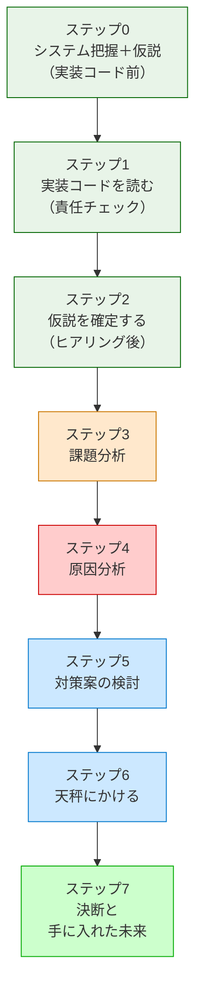

## 先人たちが使っていた「8ステップの思考プロセス」

**このプロセスを「いつ」使うのか**

この8ステップは、**「すでに稼働しているシステムに、新たな仕様変更や機能追加の要望が来たとき」** に発動するプロセスです。特に、以下のような状況で威力を発揮します。

- 既存システムをあまり把握していない人が、安全に変更を加えるアプローチを探るとき
- 熟練の担当者が、複雑化した課題を改めて整理し直し、設計の妥当性を検証するとき

設計書やコードをただ眺めるのではなく、このプロセスに沿って「現状把握 → 課題特定 → 原因特定 → 対策検討 → 比較決定」と進めることで、安全で確実な変更が可能になります。

先人たちの記録を紐解くと、彼らもまた複雑化する要求とコードの絡み合いに向き合っていたことが窺えます。
彼らが問題を解決するとき、意識的かどうかはともかく、以下の8つのステップを踏んでいたと解釈することができます。

各章は、このステップを1つの問題に対して一貫して適用します。
ここで、各ステップが「なぜ必要か」「何をするか」「3つの哲学とどう繋がるか」を
丁寧に押さえておきましょう。後の章で「あのステップの話だ」と気づけるようになります。

> [!IMPORTANT] 本質は「ビジネスの課題解決プロセス」と同じ
> 以下の8ステップはプログラミング特有の魔法ではありません。ビジネスの現場で行われる基本的な課題解決プロセス（**現状把握 ⇒ 課題特定 ⇒ 原因特定 ⇒ 対策検討 ⇒ 比較・決定**）と完全に一致しています。
> 現状を把握せずに原因を見誤ったり、原因を特定せずに対策（パターン）を打ったりすると、期待する効果が得られないのはビジネスも設計も同じです。本質がずれたまま進めないよう、この工程を一つずつ踏んでいくことが何より重要です。




★以下のステップでカテゴリ分けしたい
★**現状把握 ⇒ 課題特定 ⇒ 原因特定 ⇒ 対策検討 ⇒ 比較・決定**

8ステップは、目的の異なる **3つのフェーズ** に分かれています。

| フェーズ        | ステップ    | 問いかけ          |
| :---------- | :------ | :------------ |
| 🔵 **現状把握** | ステップ0〜2 | 「何が・なぜ問題か」を掴む |
| 🟠 **設計**   | ステップ3〜6 | 「どう解決するか」を考える |
| 🟢 **検証**   | ステップ7   | 「変化に強いか」を確かめる |

色分けはフェーズを示しています（緑系＝現状把握、橙・赤・青＝設計、明緑＝検証）。以下では各フェーズの役割とステップを順に見ていきます。

ステップ0〜2が「問題の把握」をそれぞれ異なる対象に対して行うことに注目してください。

| ステップ | 読む対象 | やること |
|---|---|---|
| **ステップ0** | クラス構成の概要（仕様表・責任一覧） | クラスの責任を把握し、「何が変わりそうか」の仮説を立てる |
| **ステップ1** | 実装コード（`if` 文の中身・各行） | 各行が責任範囲内かを確認し、責任外の知識を見つける |
| **ステップ2** | 関係者（ヒアリング） | 「なぜ変わるのか・誰が決めるのか」を確認し、仮説を確定する |

---

## 🔵 フェーズ1：現状把握（ステップ0〜2）―― 「何が・なぜ問題か」を掴む

### ステップ0：システムを把握し、仮説を立てる ―― クラス構成を見てから「変わりそうな場所」を予測する

> **入力：** システムのシナリオ説明 ＋ クラス構成の概要（クラス名・責任一覧・仕様表）。実装コードはまだ読まない。
> **産物：** 変動と不変の「仮説テーブル」

**なぜこのステップが必要か**

実装コードに飛び込む前に、「このシステムに何があるか」を把握しておかないと、
コードの詳細に引きずられて「動きを追う読み方」になってしまいます。

ここでの把握対象は実装の詳細（`if` 文の中身など）ではありません。
「どんなクラスが存在し、それぞれの責任は何か」というアーキテクチャの概要です。

**このステップでやること**

システムのシナリオ説明を聞き、**クラス構成の概要**（クラス名・責任一覧・仕様表）を確認します。
「どのクラスが何を担当するか」が把握できた段階で、仮説テーブルを埋めます。

> 「このシステムの中で、何が変わりやすく、何は変わらないか？ そしてそれは『誰の決定（都合）』で変わるのか？」

クラスの責任一覧を見れば、「このクラスは営業部長の施策変更で変わりそうだ」「このフローは会社の根幹だから変わらない」というように、変更の決定権を持つ人ベースでの仮説を立てることができます。

| 分類 | 仮説 | 根拠（クラス構成から読み取れること） |
|---|---|---|
| 🔴 変動しそう | （例）各外部サービスのAPI仕様 | 外部ベンダーの都合で変わりそうなクラスが見える |
| 🟢 変わらなそう | （例）業務フローの骨格 | 会社の業務根幹を担うクラスは変わりにくい |

**なぜ仮説を立てるのか？**

この仮説は、ステップ2で関係者にヒアリングするための「的を絞った問い」を作るために不可欠です。
仮説なしに「今後何が変わりますか？」と漠然と聞いても、関係者は答えられません。「外部ベンダーの都合で、このAPI仕様が変わる可能性はありますか？」と具体的にぶつけることで初めて、意味のある回答（リスクの確定）が得られます。仮説なきヒアリングは、ただの雑談で終わってしまいます。

最後に、この章全体で使う「設計のレンズ（問い）」をセットします。

> 「このコードの中に、**『変わる理由』が異なる2つのものが、同じ場所に混在していないか？」**

**3つの哲学との接続**

これは**哲学1**「変わるものをカプセル化せよ」の問いを意識にセットするステップです。
「クラスの責任が何か」を把握することが、「変わるもの」を見分ける出発点になります。

---

### ステップ1：実装コードを読む ―― 責任チェックで問題の行を見つける

> **入力：** ステップ0で把握したクラス責任 ＋ 実際の実装コード
> **産物：** 責任チェック表。「このクラスが持つべきでない知識」が混在している行の発見。

**なぜこのステップが必要か**

ステップ0でクラスの責任は把握しました。
このステップでは、**実装コードがその責任通りに書かれているか**を1行ずつ確認します。

「バグがあるか」ではなく「責任範囲外の知識がコードに混入していないか」という目線で読みます。
この違いが、設計の問題を見つけられるかどうかの分かれ目です。

#### 責任チェックの手順

「変化」を特定するには、次の3つの問いに答えます。

1. **「誰の判断で変わるか」を問う** — ビジネスルールが変わったとき、どこを触るか？
2. **「なぜ変わるか」の理由が1つか確認する** — 変わる理由が2つ以上ある箇所は、責任が混在しています。
3. **「変えたときに他に影響が出るか」を確認する** — 影響が出るなら、変わるものと変わらないものが同じ場所にいます。

この3問に答えると、「変化の単位」が自然に浮かび上がります。

**このステップでやること**

システムの全コードを読むわけではありません。ステップ0の仮説に基づき、「今回の仕様変更の影響を受けそうなクラス」や「変更を加える予定の箇所」に当たりをつけ、その対象クラスの実装コードを1行ずつ読んでいきます。

ステップ0で確認した「クラスの責任」を念頭に置きながら、読み進める中で問うのは「このコードの行は、このクラスの責任の範囲内か？」です。

```
【責任チェックの問い】
このクラスが持っている知識を変えたいとき、
誰の判断で変更が起きるか？
自分のクラスの責任オーナーとは別の人間が登場するなら、
その知識はこのクラスが持つべきではない。
```

責任の範囲外の知識を持っているコードの行が見つかれば、それが問題の核心です。

**3つの哲学との接続**

これは**哲学1**の「変わる理由」を1行ずつ確認するステップです。
「誰の判断で変わるか」という問いが、責任の境界線を引く基準になります。
また、責任を「1文で言えない」クラスは、複数の責任を持っている可能性があります。

---

### ステップ2：仮説を確定する ―― 関係者ヒアリングで「変わる理由」に根拠をつける

> **入力：** ステップ0の仮説 × ステップ1の責任チェック表。関係者（営業・業務担当など）に直接確認する。
> **産物：** 確定した変動/不変テーブル（根拠付き）。「誰の判断で変わるか」が明記されたもの。

**ステップ0との違い**

ステップ0では「変わりそう」という予測を立てました。
このステップでは「なぜ変わるのか」「誰が決めるのか」を関係者に確認して、**予測を事実に変えます**。

コードを読んだだけで「変わる」「変わらない」と断定するのは危険です。
変わるかどうかを知っているのは、そのコードを管理している人間だけだからです。

**なぜこのステップが必要か**

仮説のまま進むと、見当違いの部分を「変わるもの」として分離してしまうリスクがあります。
また、「この処理は変わらないはず」と思っていたものが、実は毎シーズン変わると分かることもあります。

**このステップでやること**

ステップ0の仮説を携えて、関係者ヒアリングを行います。

> 「このAPIは今後バージョンアップの予定はありますか？」
> 「このルールは担当チームが独立して判断できますか？」
> 「この型（int）は将来変わる可能性はありますか？」

ヒアリングで得た回答をもとに、変動/不変テーブルを確定します。

| 分類 | 具体的な内容 | 変わるタイミング | 根拠 |
|---|---|---|---|
| 🔴 変動 | （変わりやすい部分） | （いつ変わるか） | （誰がそう言ったか） |
| 🟢 不変 | （変わらない部分） | 変わる日は来ない | （誰と合意したか） |

「根拠」の列に「〇〇担当との確認」と書けるまで、仮説は仮説のままにしておきます。

**仮説が外れたら**

ヒアリングの結果がステップ0の仮説と食い違うことがあります。「変わると思っていたが、変わらない」「変わらないと思っていたが、実は頻繁に変わる」——この逆転は設計判断を変えます。

- 「変わらない」とわかった部分は、分離のコストをかける必要がなくなります。分離しないことが正しい判断です。
- 「頻繁に変わる」とわかった部分は、ステップ5で改めて分離の方法を検討します。

仮説が外れること自体は失敗ではありません。ヒアリング前の仮説は「どこを重点的に確認するか」の地図として機能します。外れた仮説は確認の精度を高めた証拠です。

**3つの哲学との接続**

これは**哲学1**の「変わるもの」を確定するステップです。
ここで正確に変動/不変を峻別できていないと、ステップ5の対策が的外れになります。
ヒアリングで分かった「変わりやすい部分」こそが、後でインターフェースの境界線になります。

---

## 🟠 フェーズ2：設計（ステップ3〜6）―― 「どう解決するか」を考える

### ステップ3：課題分析 ―― 変更が来たとき、どこが辛いかを確認する

**なぜこのステップが必要か**

設計の問題は、コードを静的に眺めているだけでは気づきにくいものです。
「変更要求が来たとき、どこに手が入るか」を実際にシミュレートしてみると、
問題の輪郭がリアルに見えてきます。

**このステップでやること**

ステップ2で受け取った変更要求（または想定される変更）を、今のコードに加えようとします。
加えようとすると、何が起きるかを追います。

- どのファイルを開くことになるか
- 変更の影響がどこまで波及するか
- 変えたくないはずのコードに触れることになるか

これが「痛み」の正体です。

たとえば「夏セールの割引率を15%から20%に変える」という変更要求が来たとします。この変更の決定権者は営業チームです。しかし実際に変更しようとすると、割引計算のコードだけでなく、注文処理の関数も開かなければならない——「なぜ営業施策の変更で、注文処理の関数を触るのだろう？」という違和感が生まれたなら、それが課題の所在を指しています。

**3つの哲学との接続**

**哲学1**が守られていないとき、ここで「変更の飛び火」が現れます。
変わる理由が異なる2つのものが同じ場所にいると、片方を変えると必ずもう片方が道連れになります。

---

### ステップ4：原因分析 ―― 痛みの根本にある設計の問題を言語化する

**なぜこのステップが必要か**

ステップ3で発見した「痛み」は症状です。
症状に対して対症療法を施すだけでは、根本は変わりません。
「なぜこの痛みが発生しているのか」を構造的に言語化することで、
正しい処方箋を選べるようになります。

**このステップでやること**

痛みを観察して、構造的な原因を見つけます。

```
【原因分析の問い】
「なぜ、割引ルールが変わると請求計算の関数も変わるのか？」
→ 請求計算の関数が、割引ルールの具体的な条件を直接知っているから。
→ 「知りすぎているクラスは、知っているものが変わると道連れになる」
```

原因が言語化できると、解決の方向性が自然に定まります。
「知りすぎている」なら、「知る量を減らす」——インターフェースで境界を引けばいい。
「変わる理由が2つ混在している」なら、「1つに絞る」——分離すればいい。

**「3次元・6つの手札」との接続**

原因は、この章の末尾で解説する **「要素」「関係」「発展」という3つの次元** のどこかに必ず問題を抱えています。原因の次元を特定できれば、打つべき手札（物理的な操作）が自然に絞り込まれます。

★以下それぞれに対して観察した結果を残すのが良い。全て該当するならすべて対策が必要という事になる。

| **観察できる痛みの種類**                          | **問題の次元**    | **対応する手札の方向性（物理操作）**                           |
| --------------------------------------- | ------------ | ---------------------------------------------- |
| 変わるものと変わらないものが同じ場所にある<br>無防備にデータが露出している | **1. 要素の定義** | 大きすぎるなら **①分割する**<br>見えすぎるなら **②隠蔽する**         |
| 使う側が具体詳細を直接知っている<br> 直接繋がっていて引き剥がせない    | **2. 関係の構築** | 相手に縛られるなら **③規格化する**<br>直接触れると事故るなら **④間接化する** |
| 条件によって動きを変えたい<br>将来的に新しい機能が増えそう         | **3. 構造の発展** | 動きを変えたいなら **⑤置換する**<br>機能を増やしたいなら **⑥拡張する**    |

これが、次のステップ5で「手札のリスト」を引く際の入力になります。

---

### ステップ5：対策案の検討 ―― 原因から手札を選ぶ

**なぜこのステップが必要か**

原因が言語化できれば、次にやることは1つです。この章の末尾にある **「構造的対策案の網羅的リスト」を引く** ことです。

ステップ4で特定した原因の次元に当てはめ、対応する「手札（6つの物理操作）」を選びます。

ここで最も重要なのは、**「デザインパターン名を最初から思い浮かべない」** ことです。原因と物理操作（どうブロックを動かすか）だけを考えます。

**このステップでやること**

原因に対する構造的対策の網羅的リストから原因に対応する手札を特定し、対策案を練ります。
ステップ5は「ではどうやって原因を取り除くか」を検討する場所です。

ここで最も重要なのは、**「デザインパターンを手札にしない」** ということです。

「Strategyパターンを使う」「Facadeパターンを使う」というのは、手札ではありません。現場の泥臭いコードが、カタログにある特定のパターンに都合よく1対1で当てはまることは稀です。

私たちが本当に持つべき手札とは、特定のパターン名ではなく、ステップ4で特定した **「問題の原因（何が変わるのか）」 に対して打てる、網羅的な「構造的対策」** です。

### 実装の小手先と、設計の「手札」の違い

痛みに直面したとき、「とりあえず引数を増やす」「if文を追加する」といった実装レベルの対処は、問題を先送りするだけで根本解決にはなりません。設計の手札とは、コードの骨格（責任の境界線）を引き直す根本的な操作のことです。

---

## 原因に対する構造的対策の網羅的リスト ―― 「考え方」で戦う

ステップ5は「特定した原因をどう取り除くか」を検討するフェーズです。

この本では、設計の具体的な操作のことを「構造的対策案（手札）」と呼びます。
★もしかして、この①から⑥を１つずつチェックしていって、該当するものを全て適用していく考え方がよいのでは？Chapter1の場合、全てに該当しそう。というか、責任が混在している構造では、大概全てに該当してしまうのでは？つまり、全ての対策を行えば、すっきりするように思える。むしろ、どのように対策するかのほぅが難しいかも。

### 設計の核心：構造を操る「6つの物理操作」

ソフトウェアの設計は、難しい専門用語の集まりではありません。目の前に広がる「レゴブロック」をどう扱うかという、極めて物理的でシンプルな工作と同じです。

対象の「空間（内と外）」と「時間」という次元において、私たちがブロックに対して取れる物理的アプローチは、以下の**6つの基本動作**しか存在しません。これが、漏れなくダブりない（MECEな）設計の全手札です。

そして、これまでに学んだ **「3つの哲学」は、この6つの物理操作を「どう安全に行うか」を示すガイドライン** として機能します。

#### 1. 要素の定義（境界線を引く操作）

対象の「粒度」を変え、内部を守る操作です。**【哲学1：変わるものをカプセル化せよ】** に従い、誰の決定で変わるかを基準に境界線を引きます。

- **① 分割する（切る）：** 大きな塊を解体し、独立した小さな塊に分ける。（責任の分離）
    ![[417cad0d-82b8-4ce4-a5cd-8950901fd9c9.png]]
 
- **② 隠蔽する（包む）：** 複雑な仕組みを箱に入れ、外からは中身を見せない。（状態や詳細の保護）
    ![[808ae3c1-f77b-4bab-a516-8451a5c31c35.png]]
#### 2. 関係の構築（接点と距離を操る操作）

独立した部品同士を連携させる操作です。**【哲学2：インターフェースに対してプログラムせよ】** に従い、直接的な結合を避けて間接的に繋ぎます。

- **③ 規格化する（形を揃える）：** 相手を直接掴むのではなく、互いの「接点の形」を特定のルールに合わせる。（抽象への依存）
    ![[959fb6a3-16a9-4c88-a191-1f143fb65209.png]]
- **④ 間接化する（間に挟む）：** 直接繋がず、間に「別の部品（クッション）」を挟み込む。（直接結合の回避）
    

#### 3. 構造の発展（時間と総量を操る操作）

将来の変更要求に対して、既存の構造を崩さずに適応していく操作です。この次元において、**【哲学3：継承よりコンポジションを優先せよ】**　が最も重要になります。「継承」でブロック同士を溶接して置換・拡張するのではなく、「コンポジション（①＋③の組み合わせ）」によって安全に置換・拡張を行います。

- **⑤ 置換する（入れ替える）：** 規格が揃っている穴に対し、既存の部品を外し、別の部品をはめる。（振る舞いの動的変更）
    
- **⑥ 拡張する（付け足す）：** 既存の構造は一切いじらずに、空いているポッチに新しい部品を足す。（新機能の追加）
    

---

### 構造的対策案の網羅的リスト

ソフトウェア設計におけるあらゆる「臭い（問題）」は、この6つの操作のいずれか（あるいは組み合わせ）で必ず解決できます。「パターンの名前」ではなく、「物理的にどう動かすか」という手札として原因と対策を紐付けます。

★⑤⑥は評価プロセスとして、対策からは分離したい

| **次元** | **物理操作（手札）**           | **本質的な原因（何が問題か）**                             | **使うべき構造的対策案（本質）**                    |
| ------ | ---------------------- | --------------------------------------------- | ------------------------------------- |
| **要素** | **① 分割する**<br>（切る）     | 複数の異なる責任や変更理由が、一つの塊に癒着・混在している。                | **責任ごとの分割**<br>（単一責任化・共通化）            |
| **要素** | **② 隠蔽する**<br>（包む）     | 内部の複雑な処理や脆いデータ（状態）が、無防備に露出している。               | **境界によるカプセル化**<br>（状態の保護・窓口の単一化）      |
| **関係** | **③ 規格化する**<br>（形を揃える） | 特定の相手の「具体的な実装」に直接依存しており、結合が固着している。            | **インターフェースの統一**<br>（抽象への依存・依存の逆転）     |
| **関係** | **④ 間接化する**<br>（間に挟む）  | 部品同士の「直接の結合」が不都合（規格不一致、多対多の複雑化、アクセス制約）を生んでいる。 | **中間層の導入**<br>（緩衝材の配置）                |
| **発展** | **⑤ 置換する**<br>（入れ替える）  | 状況（状態やルール）に応じて、システムの一部の振る舞いを切り替えたい。           | **同一規格の別部品への差し替え**<br>（ポリモーフィズムの活用）   |
| **発展** | **⑥ 拡張する**<br>（付け足す）   | 既存のコード（土台）を一切書き換えずに、新しい機能を追加したい。              | **拡張ポイントへの新部品の追加**<br>（オープン・クローズドの原則） |
★以下のケース①②③の説明必要か？天秤の章が、全て手段が２つの前提になっている。むしろ、当たり前の話ですよね？１つの対策案しかなかったら、天秤対象がないからスキップしてもよいという話。不要な気がします。１章以降はひとまず完成させており、流れとして良ければ、こちらを修正する形にしてほしい。

その結果によって、次の3つのケースに分かれます。ケース①②は「対策案が1つに収束する」ケース、ケース③は「複数の対策案を比較する必要がある」ケースです。

> **「手段」とは何か：** 手札のリストから選んだ対策の候補を「手段」と呼びます。手段は1つの場合も複数の場合もあります。複数の手段が存在する場合にのみ、ステップ6で天秤にかけます。

1. **ケース①：対策案（手段）が1つだけ出た場合**
    
    その手段を直接適用します。コードで実装し、変更後のクラス図を示します。パターン名は実装の後に「結果として」初登場します。ステップ6では天秤（比較表）は不要で、耐久テストと「使う/使わない判断」だけを行います。
    
2. **ケース②：対策案（手段）が複数・組み合わせで解決できる場合**
    
    「③規格化して、⑤置換する」のように、複数の手札を組み合わせ、1つの統合された実装として示します。結果として対策案は1つに収束するため、ステップ6で天秤は不要です。
    
3. **ケース③：対策案（手段）が複数・別々に試す必要がある場合**
    
    手段①を実装し、「残る課題」を言語化します——これが次の手段への橋渡しになります。手段②（場合によっては③以降も）を実装し、残る課題を解消します。ステップ6では複数の手段を天秤にかけます。
    

**3つの哲学との接続**

手札を選んで適用するプロセスは、3つの哲学の実践そのものです。

「要素を分ける・包む（①②）」手札を選べば**哲学1**の実現となり、「規格化する・間接化する（③④）」手札を選べば**哲学2**の実現となります。そして「置換・拡張（⑤⑥）」を継承ではなくコンポジションで行えば、**哲学3**の達成です。

---

### ステップ6：天秤にかける ―― 手段を評価し、耐久を確認する

**なぜこのステップが必要か**

手段を適用した後に、一度立ち止まる必要があります。どんな設計も万能ではなく、必ず複雑化というコストを伴うからです。「本当にこの複雑さのコストを払ってまでパターンを使うべきか？」を判断します。

**このステップでやること**

**ケース③（複数の手段を別々に試した場合）のみ：**

比較の前に、**評価軸を先に宣言**します（比較表より前に）。例えば：
- 「変更の局所性（1つの変更が1箇所で済むか）」
- 「テストの独立性（各部品を単独でテストできるか）」
- 「実装のシンプルさ（コードが理解しやすいか）」

次に、手段①と手段②をこの評価軸で比較した表を作成します。基準を先に置くことで、結論ありきの後付けの比較を防ぎます。比較の結果、今回の状況において優れている手段を正式に採用します。

**全ケース共通・必ず行うこと：**

ステップ2のヒアリングで出た「将来の変化」を実際にコードで試す**耐久テスト**を行います。「新しい部品を追加するだけ」でその変化に対応できることを実証し、設計の正しさを確信に変えます。

また、「この手段を使わない方が良い状況」を具体的なコード例（【過剰コード】）で示します。設計は常に採用するとよいわけではなく、変更頻度・チーム規模・将来の見通しによって判断が変わります。

**3つの哲学との接続**

天秤にかけるプロセスは、**哲学3**（コンポジションを優先して柔軟性を得る）ために払う「複雑さ」という代償が、得られるメリット（哲学1・2の恩恵）に見合っているかを検証する作業です。耐久テストで「部品の入れ替え」がスムーズに行えるなら、哲学が正しく機能している証拠です。


---

## 🟢 フェーズ3：検証（ステップ7）―― 「変化に強いか」を確かめる

### ステップ7：決断と、手に入れた未来

**なぜこのステップが必要か**

設計の判断は、コードを書いて終わりではありません。
「何を得て、何を諦めたか」を言語化できると、同じ問題に次に直面したとき、
また同じ8ステップを踏まなくても自分の判断基準として使い回せます。

**このステップでやること**

解決後のコードを全体として示します。
その後、変更シナリオごとに「変わるクラス・変わらないクラス」を表で整理します。

「変更シナリオ表」は、ステップ0〜6を通じて特定した変化の可能性を一覧にしたものです。
目的は「何を手に入れたか」の可視化——「変更が1クラスだけで済む」という事実を数字で示すことです。
「何を得て何を諦めたか」という中心の問い（ステップ7の問い）に直接答えます。

変化に強い設計とは、「仕様変更が起きたとき、触る場所が最小限で済む」設計です。
次の表は、よくある変更シナリオと、どこを触れば済むかを示しています。

例として、第1章のシナリオで示します：

| 変更シナリオ | 変わるクラス（触る場所） | 変わらないクラス |
|---|---|---|
| 新しい割引ルールが追加された（秋セール廃止・新キャンペーン追加） | 新しいルールクラス1つだけ | 骨格クラス・他の全ルールクラス |
| 割引率を変更（10%→15%） | 対象ルールクラスの1行だけ | 骨格クラス・他の全ルールクラス |
| 法人向け割引の条件が変わった | 法人ルールクラス1つだけ | 一般向けルールクラス・骨格クラス全て |

この表が埋まったとき、「変更が来ても、触るのは1クラスだけ」という事実が可視化されます。
それが「何を手に入れたか」の答えです。「諦めたもの」は、クラス数の増加という複雑さです。

最後に、変更した設計を3つの哲学と照らし合わせます。
「哲学1がコードのどこに現れているか」を指差せることが、
次の設計判断で同じ思考を使いこなせる証拠になります。

**3つの哲学との接続**

振り返りのセクションで、**哲学1・2・3**がそれぞれコードのどの部分に現れているかを確認します。
この確認が習慣になると、コードを読むとき自然に「これは哲学2の実現だ」と気づくようになります。
パターンの名前を覚えるより先に、この見方が身につくことが、この本の狙いです。

---

★８ステップのそれぞれを哲学と紐づける意味はあるか？むしろ、原因と対策のところで、哲学と紐づけたい
### 8ステップと3つの哲学の関係

各ステップがどの哲学と最も強く結びついているかを整理すると、次のようになります。

> **【復習】3つの哲学**
> - **哲学1**：変わるものをカプセル化せよ（変わる理由・決定者ごとの分離）
> - **哲学2**：インターフェースに対してプログラムせよ（抽象への依存）
> - **哲学3**：継承よりコンポジションを優先せよ（包んで組み合わせる）

| ステップ  | タイミング             | 中心の問い                   | 主な哲学との接続         |
| ----- | ----------------- | ----------------------- | ---------------- |
| ステップ0 | クラス構成を把握→**仮説**   | 誰の責任が何か。何が変わりやすそうか      | 哲学1（分離）への準備      |
| ステップ1 | 実装コードを**読みながら**   | 各クラスの責任は実装通りか。責任外の行はどこか | 哲学1（責任の単一性）      |
| ステップ2 | コードの後・**ヒアリング**   | 変わる理由を誰が決めるか（確定）        | 哲学1（変化の特定）       |
| ステップ3 | 変更要求を受け取ったとき      | 変更が来たとき、どこが痛いか          | 哲学1違反の症状確認       |
| ステップ4 | 課題分析の後・**原因特定**   | 痛みの原因は構造のどこか            | 哲学1〜3のどれを違反しているか |
| ステップ5 | 原因が確定した後・**手札選択** | 原因から手札を選び、適用する          | 哲学1→哲学2→哲学3の順に適用 |
| ステップ6 | 手札を適用した後・**耐久検証** | 解決策は未来の変化に耐えるか          | 哲学1・2が機能しているか検証  |
| ステップ7 | 解決策が確定した後・**決断**  | 何を得て何を諦めたか              | 全哲学の確認と言語化       |

各章で同じ流れが繰り返されるとき、「今どこにいるか」がわかれば迷子になりません。
ステップが変わっても、問いの根本にある哲学は変わりません。

第1章から、この8ステップを1つの問題に対して適用していきます。

---
### デザインパターンは「手札を使った結果」に過ぎない

ここまで、あえて「デザインパターン」の名前を出さずに手札を解説してきました。それは、**デザインパターンとは目的ではなく、これら6つの手札を組み合わせた「結果」** だからです。

たとえば、「振る舞いが変わる」という原因に対して、「③規格化する」と「⑤置換する」という手札を組み合わせます。この時、哲学3に従い「継承ではなくコンポジション」で置換を実現したとします。

- もしその振る舞いが「アルゴリズムやルール」なら、人々はその構造を **Strategyパターン** と呼びます。
    
- もしその振る舞いが「状態による変化」なら、人々はそれを **Stateパターン** と呼びます。
    

また、「直接結合するとマズい」という原因に対して、「④間接化する（間に挟む）」という手札を使います。

- 間に挟むものが「形を変換するブロック」なら、**Adapterパターン** と呼びます。
    
- 間に挟むものが「交通整理をするハブブロック」なら、**Mediatorパターン** と呼びます。
    
- 間に挟むものが「外見が同じダミーブロック」なら、**Proxyパターン** と呼びます。
    

これらはすべて、根っこにある手札は同じ物理操作です。

問題の「原因」を見極め、網羅的なリストの中から「手札（対策）」を選ぶ。その手札を適用した結果の構造に、たまたま名前がついているなら、それをデザインパターンと呼べばいいのです。パターンに紐づくかどうかは「その次の話」に過ぎません。

「3つの哲学」という判断基準を持ち、この「6つの手札」という物理操作をマスターすれば、23のパターンを知らなくても、目の前の原因に対して適切な構造を自力で導き出せるようになります。以降の章では、この抽象的な手札を具体的なコードにどう適用し、その結果としてどんなパターンが浮かび上がるのかを追体験していきます。
