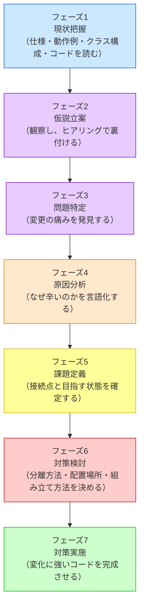
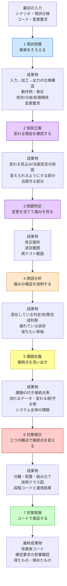
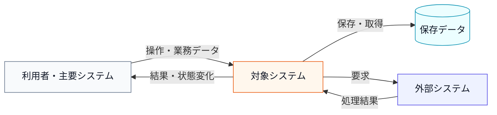
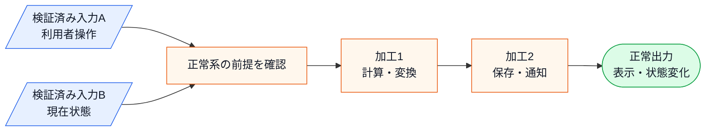
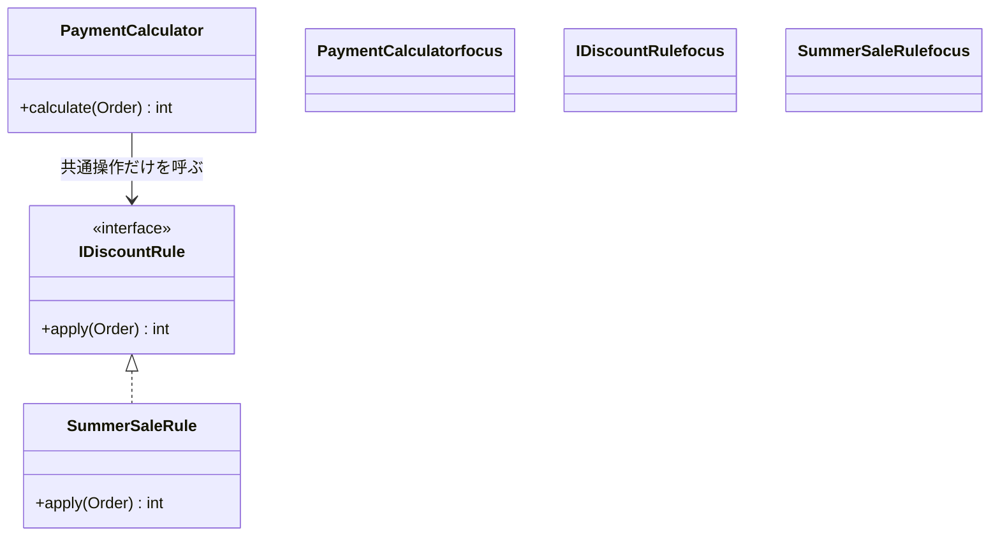

# 第一部の説明
―― 全章を貫く7つのフェーズ

---

## 私がたどり着いた「7つのフェーズ」

> [!TIP] この章の読み方
> この章は全7フェーズの詳細な説明書です。最初から通読してもよいですが、**各フェーズの冒頭にある「目的」「入力」「成果物」だけ読んで先の章へ進み、疑問が出たときに戻ってくる**という使い方が馴染みやすいかもしれません。「このフェーズで何を受け取り、何に変えているんだろう？」と感じたら、この章の該当セクションが手がかりになります。

**このプロセスを「いつ」使うのか**

この思考プロセスは一般的な問題解決の進め方に沿って設計の思考を進めます。仕様変更を起点として動き、**「すでに稼働しているシステムに、新たな仕様変更や機能追加の要望が来たとき」** に発動するプロセスです。特に、以下のような状況で威力を発揮します。

- 既存システムをあまり把握していない人が、安全に変更を加えるアプローチを探るとき
- 熟練の担当者が、複雑化した課題を改めて整理し直し、設計の妥当性を検証するとき

設計書やコードをただ眺めるのではなく、このプロセスに沿って「現状を把握する → 仮説を立てる → 問題を特定する → 原因を突き止める → 課題を定義する → 対策を考える → 実装する」と進めることで、変更の影響を確認しながら進めやすくなります。

設計に悩み、何度も失敗を繰り返す中で、私は「きれいなコードを書く」ことよりも「変更要求に対してどう思考するか」というプロセスこそが重要だと気づきました。
試行錯誤の末にたどり着いたのが、以下の7つのフェーズに沿って考えるというアプローチです。

各章は、このフェーズを1つの問題に対して一貫して適用します。
ここで、各フェーズが何を受け取り、何を次へ渡すのかを押さえます。各章の見出しには同じ色の絵文字が使われているので、「今どのフェーズにいるか」が一目でわかる仕組みになっています。

> [!IMPORTANT] 本質は「ビジネスの課題解決プロセス」と同じ
> 以下の7フェーズはプログラミング特有の魔法ではありません。たとえば店舗の売上が落ちたときも、まず現状を整理し、変わりそうな要因の仮説を立て、どこで問題が起きているかを確かめ、原因を特定し、解くべき課題を定めてから対策を選びます。ソフトウェア設計も、**現状把握 ⇒ 仮説立案 ⇒ 問題特定 ⇒ 原因分析 ⇒ 課題定義 ⇒ 対策検討 ⇒ 実施**という同じ論理で進められます。
> 現状を把握せずに原因を見誤ったり、原因を特定せずに対策（構造）を打ったりすると、期待する効果が得られないのはビジネス課題も設計課題も同じです。本質がずれたまま進めないよう、この工程を一つずつ踏んでいくことが何より重要です。

### 本書の番号の読み方

本文を読むときの主役は、あくまで**7つのフェーズ**です。
各章は、フェーズ1からフェーズ7までを同じ順序で進みます。

本書で繰り返し使う番号は、英字の略語ではなく日本語で役割を示します。「何を管理する番号か」を、表記だけで見分けられるようにするためです。

| 表記例 | 意味 | 採番する場所 | 何を追うか |
|---|---|---|---|
| 機能ID1 | システムが提供する機能 | フェーズ1 | 現行機能、変更後の扱い、最終回帰結果 |
| 要求ID1 | システムが満たす要求 | フェーズ1 | 変更前・変更後の要求と最終受入結果 |
| 変更ID1 | 今回届いた変更依頼 | フェーズ1 | 変更内容、変更後要求、変更影響 |
| リスクID1 | 将来変わる可能性 | フェーズ2 | 設計時の考慮と、将来の主な変更先 |
| 課題ID1 | 構造として解く設計課題 | フェーズ5 | 完了条件、構造差分、コード、改善結果 |

フェーズ1では、利用者または運用者から観測できる現行機能へ`機能ID1`、`機能ID2`……を付け、その機能が満たす条件を`要求ID1`、`要求ID2`……でベースライン化します。一つの機能が複数要求を持つ場合も、共通のエラー保護など一つの要求が複数機能へ関係する場合もあります。

今回届いた変更依頼には`変更ID1`、`変更ID2`……を付け、対象となる機能IDと要求IDを示します。機能の目的が同じなら、要求や内部クラスが変わっても機能IDは維持し、扱いを継続・変更として記録します。新機能には新しい機能IDを付け、廃止したIDは削除・再利用しません。分割・統合では新IDと旧IDの系譜を残します。変更後の機能・要求ベースラインはコード変更前に確定し、フェーズ7で全有効機能IDと要求IDをコードと実行結果へ照合します。

フェーズ2では、将来リスクへリスクID1、リスクID2、リスクID3の連番を付け、「変えられるようにする部分」と「当面守る部分」を確定します。リスクIDを扱うのはフェーズ2と6です。フェーズ6で採用構造へ再適用し、変化が起きても守る部分へ影響を広げない構造かを評価します。フェーズ3と7-4は今回の変更IDだけを扱い、フェーズ7-1の受入確認は変更後ベースラインの全要求IDを扱います。

フェーズ5では、原因から課題IDへ飛びません。まず課題候補を洗い出し、システム全体で必要性、重複、統合／分割、完了状態を検討します。その後、解くべき接続点ごとに「何が流れるか」「どちら側が変わるか」「どちら側を守るか」「何ができれば完了か」を課題ID1、課題ID2、課題ID3の連番で確定します。機能ID・要求IDと課題IDは直接対応させません。要求を局所変更で満たして課題が生じない場合、一つの変更試行から複数課題が見つかる場合、複数の変更試行が同じ課題を露呈する場合があるからです。課題は`変更ID→変更試行→痛み→原因→課題ID`の線だけで導きます。

フェーズ6では、確定課題から接続点を変える三つの観点――分離方法、配置場所、組み立て方法――を順に考えます。責任、継承、実装、保持、依存を変える判断ごとに部分クラス図を示し、最後にそれらを統合した最終構造をコードを書く前に確定します。組み立て方法には、生成・所有・登録・選択・注入・実行までを含めます。その後の「ステップ1」「ステップ2」は、案が揺れた履歴ではなく、確定した構造を理解できる単位で実装する順序です。
ステップ番号は、その章の採用設計をコードへ反映する順番を示します。章をまたいで同じコード操作を表す番号ではありません。

### 掲載コードを手元で動かす

各章の掲載コードは、そのまま手元で動かせます。読むだけでなく実行してみると、変更要求で何が起きるかを自分の目で確かめられます。

1. 章のコード（フェーズ1の現状コード、またはフェーズ7の最終コード）を1つの `.cpp` ファイルに貼り付けます。
2. コンパイルして実行します（例：`g++ chapter01.cpp -o app && ./app`。C++が使える環境なら `clang++` でも構いません）。
3. `main()` は自由に組み替えて構いません。各章の境界クラス（`〜Database` / `〜Repository` など）は、実行終了まで状態を覚えるインメモリの保存です。`save()` で新しいデータ（顧客・口座・イベント・メニュー・承認者など）を足し、その値で処理を呼べば、追加したデータの結果がその場の出力に表れます。

保存はプロセス実行中だけ有効で、終了すると消えます（DBのような永続化は本書の設計論点ではありません）。外部API・DB・画面・通知・ファイル出力をどこまで再現するかは章ごとに異なります。各章はコード直前で、実システムの処理、掲載コードの代替、生成される実物、生成されない実物を明記します。たとえば `cout` でPDF出力完了と表示するだけなら、PDFファイルを生成したとは扱いません。各章の「手元で動かすには」には、その章で実際に確認できる結果だけを書きます。

**共有データの持ち方（全章共通の規約）**

各章の模擬DB・台帳（`〜Database` / `〜Repository` / `〜Registry` など）は、コンストラクタで**登録済みの初期データ**（顧客・口座・イベント・メニュー・承認者など）を持って始まります。実行中は、その初期データを土台に `save()` などで新しいデータを足したり内容を更新したりでき、変えた結果はその実行の出力へそのまま表れます。更新はプロセス実行中だけ有効で、実行が終わると消え、次の実行はまた同じ初期データから始まります（実行をまたいで残す永続化は本書の設計論点ではありません）。どの保存を誰が持つか（`static` か、メンバか、注入か）は実装の細部で、章によって異なります。大事なのは「初期データから始まり、実行のたびに更新して結果を確かめられる」ことです。

### 各章に入る前の見取り図

次の表は、各章で共通して使う7フェーズの進み方です。
ここでは特定の章の内容を先取りせず、各章がどの順序で進むかを把握します。

| フェーズ | 各章で扱うこと |
|---|---|
| 1：現状把握 | 仕様・動作例・クラス構成・フェーズ1の現状コード・変更要求をそろえる |
| 2：仮説立案 | どの機能・仕様が変わりやすいかを仮説化し、根拠を確認する |
| 3：問題特定 | 変更要求を当てたとき、修正箇所・波及範囲・再テスト範囲として痛みを確認する |
| 4：原因分析 | 痛みの原因になっている混在・依存・漏れている前提を言語化する |
| 5：課題定義 | 解くべき接続点を洗い出し、流れるデータと変わる側・守る側、システム全体で目指す状態を定める |
| 6：対策検討 | 接続点の分離方法・配置場所・組み立て方法を決め、最終構造と実装順を確定する |
| 7：対策実施 | コードで実装し、変更要求に対する効果と限界を確かめる |

大切なのは、構造名より先に、**「どの種類の機能・仕様が、何をきっかけに変更されるのか」** と **「実際の変更要求を当てたとき、どこが痛むのか」** を見ることです。担当者やチームが分かる場合は、補助情報として使います。



```mermaid
graph TD
    PH1["フェーズ1<br>現状把握<br>（仕様・動作例・クラス構成・コードを読む）"]
    PH2["フェーズ2<br>仮説立案<br>（観察し、ヒアリングで裏付ける）"]
    PH3["フェーズ3<br>問題特定<br>（変更の痛みを発見する）"]
    PH4["フェーズ4<br>原因分析<br>（なぜ辛いのかを言語化する）"]
    PH5["フェーズ5<br>課題定義<br>（接続点と目指す状態を確定する）"]
    PH6["フェーズ6<br>対策検討<br>（分離方法・配置場所・組み立て方法を決める）"]
    PH7["フェーズ7<br>対策実施<br>（変化に強いコードを完成させる）"]

    PH1 --> PH2 --> PH3 --> PH4 --> PH5 --> PH6 --> PH7

    style PH1 fill:#cce8ff,stroke:#0055cc
    style PH2 fill:#e8ccff,stroke:#6600cc
    style PH3 fill:#e8ccff,stroke:#6600cc
    style PH4 fill:#ffe8cc,stroke:#cc7700
    style PH5 fill:#ffff99,stroke:#ccaa00
    style PH6 fill:#ffcccc,stroke:#cc0000
    style PH7 fill:#ccffcc,stroke:#00aa00
```

この7フェーズは、単に順番に並んでいるだけではありません。
ここで使う言葉を分けておきます。
**出力**は、システムが利用者や外部へ返す結果を指します。
**成果物**は、各フェーズを終えた時点で、次のフェーズへ渡す整理結果を指します。

各フェーズは、前のフェーズで得た成果物を入力として受け取り、次のフェーズで使える形に加工します。
つまり、読み進めるほど「材料」が変わっていきます。


```mermaid
flowchart TB
    I0["最初の入力<br>シナリオ・現状仕様<br>コード・変更要求"]

    S1["1 現状把握<br>事実をそろえる"]
    O1["成果物<br>入力→加工→出力の仕様構造<br>動作例・責任<br>依存/分岐/処理順序<br>変更要求"]

    S2["2 仮説立案<br>変わる理由を確認する"]
    O2["成果物<br>変わる見込み/当面安定の前提<br>変えられるようにする部分<br>当面守る部分"]

    S3["3 問題特定<br>変更を当てて痛みを見る"]
    O3["成果物<br>修正箇所<br>波及範囲<br>再テスト範囲"]

    S4["4 原因分析<br>痛みの構造を説明する"]
    O4["成果物<br>混在している判定/処理/生成判断<br>漏れている依存<br>保ちたい骨格"]

    S5["5 課題定義<br>接続点を洗い出す"]
    O5["成果物<br>課題ID付き接続点表<br>流れるデータ・変わる側/守る側<br>システム全体の課題"]

    S6["6 対策検討<br>三つの観点で接続点を変える"]
    O6["成果物<br>分離・配置・組み立て<br>採用クラス図<br>段階コードと適用結果"]

    S7["7 対策実施<br>コードで実証する"]
    O7["最終成果物<br>改善後コード<br>確定要求の影響確認<br>得たもの・諦めたもの"]

    I0 --> S1 --> O1
    O1 --> S2 --> O2
    O2 --> S3 --> O3
    O3 --> S4 --> O4
    O4 --> S5 --> O5
    O5 --> S6 --> O6
    O6 --> S7 --> O7

    style S1 fill:#cce8ff,stroke:#0055cc
    style S2 fill:#e8ccff,stroke:#6600cc
    style S3 fill:#e8ccff,stroke:#6600cc
    style S4 fill:#ffe8cc,stroke:#cc7700
    style S5 fill:#ffff99,stroke:#ccaa00
    style S6 fill:#ffcccc,stroke:#cc0000
    style S7 fill:#ccffcc,stroke:#00aa00
```

この図で大切なのは、**フェーズの出口が次フェーズの入口になる**ことです。
フェーズ1で事実をそろえないままフェーズ2へ進むと、仮説が思いつきになります。
フェーズ2で変わるものを根拠付きで確定しないままフェーズ3へ進むと、何を当てて痛みを見るのかが曖昧になります。
フェーズ5で接続点の変わる側と守る側を定めないままフェーズ6へ進むと、システム全体の構造設計がパターン名選びになってしまいます。

7つのフェーズは、目的の異なる **7つの局面** に分かれています。

| フェーズ | 内容 |
|:---|:---|
| 🔵 **フェーズ1：現状把握** | 仕様・動作例・クラス責任・フェーズ1の現状コード・変更要求をそろえる |
| 🟣 **フェーズ2：仮説立案** | 観察から仮説を立て、ヒアリングで裏付ける |
| 🟣 **フェーズ3：問題特定** | 変更を試みたとき、何が痛いかを発見する |
| 🟠 **フェーズ4：原因分析** | 痛みの根本にある設計の問題を言語化する |
| 🟡 **フェーズ5：課題定義** | 解くべき接続点と変わる側・守る側、システム全体で目指す状態を定める |
| 🔴 **フェーズ6：対策検討** | 接続点の分離方法・配置場所・組み立て方法を決める |
| 🟢 **フェーズ7：対策実施** | 変化に強いコードを完成させる |

各章では、この7フェーズをさらに小さな項目に分けて進みます。
フェーズ1だけでなく、フェーズ2以降も「何を確認し、何を次へ渡すか」が分かる単位に分けます。

| フェーズ | 章内の項目 | 何のために読むか |
|---|---|---|
| 1：現状把握 | 1-1：このシステムの仕様 | 最初に入力・主要処理・出力・掲載コードの代替をつかみ、その後に詳細仕様と現行要求をそろえる |
| 1：現状把握 | 1-2：動作例テーブル | 代表入力から結果を予測できるようにし、後の実行結果と照合する |
| 1：現状把握 | 1-3：登場クラスとクラス構成図 | 図を見る前に登場クラスの責任を把握し、依存関係を追えるようにする |
| 1：現状把握 | 1-4：実装コード（現状） | フェーズ1の現状コードが動作例をどう実現しているかを確認する |
| 1：現状把握 | 1-5：変更要求 | 変更ID1から変更依頼IDを付け、要求IDごとの継続・変更・追加・廃止と変更後要求ベースラインを確定する |
| 2：仮説立案 | 2-1：変わりそうな仕様の見当をつける | フェーズ1の事実から、変化しそうな仕様を仮説として言語化する |
| 2：仮説立案 | 2-2：今回の変更で確実に変わること | 変更IDを確定し、将来リスク・内部契約・対象外と分ける |
| 2：仮説立案 | 2-3：関係者ヒアリング | 仮説を独断で確定せず、変更される機能の種類・理由・頻度を確認する |
| 2：仮説立案 | 2-4：将来リスク | 今すぐ対応する変更と、将来起きそうな変更を分ける |
| 2：仮説立案 | 2-5：変わる見込み/当面安定の前提の確定 | リスクIDごとに変えられるようにする部分と当面守る部分を定め、フェーズ6の構造評価条件にする |
| 3：問題特定 | 3-1：変更を試みる | 確定変更IDだけを現状コードへ当て、変えるクラスと変えないクラスを先に示してから差分を見る |
| 3：問題特定 | 3-2：変更影響グラフ | 修正箇所・波及範囲・再確認範囲を図で見えるようにする |
| 3：問題特定 | 3-3：痛みの言語化 | 「大変そう」ではなく、何が設計上の痛みなのかを言葉にする |
| 4：原因分析 | 4-1：痛みの根源を探る | 条件分岐・処理順序・生成判断・依存のどれが混在しているかを見る |
| 4：原因分析 | 4-2：変わるもの/変わってほしくないもの | 分けるべきものと、保ちたい骨格を切り分ける |
| 4：原因分析 | 4-3：接続点に漏れている判断や前提 | 分離前に、境界へ流れる判断・値・前提を確認する |
| 5：課題定義 | 5-1〜5-3：課題候補から課題確定まで | 原因から候補を出し、システム全体で必要性・重複・統合／分割・完了状態を検討してから、接続点・流れるデータ・変わる側・守る側・完了条件を課題IDで確定する |
| 6：対策検討 | 部分クラス図と採用全体クラス図 | 分離方法・配置場所・組み立て方法の各判断を部分クラス図で説明し、その和としてフェーズ1と同じ粒度の採用全体図を作る。課題箇所のおさらいも添える |
| 6：対策検討 | 6-1：採用設計をコードへ段階的に反映する | 確定した構造の責任分離・生成・所有・選択・依存の受け渡し・安定側からの実行を、クラス単位のステップで反映する |
| 6：対策検討 | 6-2：システム全体の契約とデータ配置を確定する | 課題IDごとに目指した状態・適用コード・結果を追い、システム全体で一度だけ達成を判定する |
| 7：対策実施 | 7-1：解決後のコード | 完成クラス一覧・採用時と同じクラス図・実行シーケンスを先に示し、クラス単位のコードと全有効要求ID別の受入エビデンスで照合する |
| 7：対策実施 | 7-2：動作シーケンス図の検証 | 7-1でコード前に示した呼び出し順が、完成コードと実行結果に一致することを確認する |
| 7：対策実施 | 7-3：変更影響グラフ | 改善後の主な修正先と確認範囲を見えるようにする |
| 7：対策実施 | 7-4：変更シナリオ表 | 今回の変更IDごとに、フェーズ1の修正範囲と完成構造の結果を照合する |

この表はチェックリストではありません。各章を読むときの地図です。今読んでいる項目が全体のどこにあり、前の項目から何を受け取り、次の項目へ何を渡すのかを俯瞰したいときに、この表へ戻ってください。

各章の1-1では、要求表や詳しい仕様へ入る前に「最初にシステム全体をつかむ」を置きます。入力、システムが行う主要処理、利用者や外部へ返す出力、実DB・外部API・画面・通知などを掲載コードで何に置き換えるかを先に説明します。ここで大筋をつかんだ後、要求、保存データ、図、クラス、コードへ進むため、スタブの正体をコードで初めて知ることはありません。

各項目は前の項目の結論を受けて次へ進みます。仕様図で入力と出力が分かったら動作例で代表ケースを確認し、動作例が分かったらフェーズ1の現状コードで実現方法を見て、変更要求を当てて痛みが見えたら原因を探す、という流れです。

また、本書では文章だけで全体像を説明しきろうとはしません。
入力から出力までの流れ、クラス間の関係、変更影響の広がり、改善前後の差分は、できるだけ図や表で先に見えるようにします。
ただし、図は「入力」「加工」「出力」という箱へ分類するためのものではありません。図に出した値・条件・状態・出力名が、後で動作例、実行結果、変更要求、接続点のどこで使われるのかまで追える必要があります。クラス名・メソッド名・変数名との対応は、1-3以降で段階的に確認します。
図は装飾ではなく、「いま何を見ているのか」「入力がどう加工され、どの結果に分かれるのか」を読者が迷わないための地図です。
ただし、図だけで新しい仕様や判断を初出しすることはしません。図に出る名前・値・状態は、本文や表で説明したうえで使います。

**クラス図の読み方（全章共通の規約）**

本書のクラス図は、クラスの配置と依存の向き（誰が誰を知っているか）を示す静的な構成図です。そのうえで、矢印に「商品情報を取得」のような**やり取りの説明ラベル**を付けることがあります。厳密なUMLではデータの流れはシーケンス図の領分ですが、本書では「この依存は何のためにあるか」を図だけで掴めるよう、依存の説明としてラベルを許容しています。呼び出しの時間順を追いたいときは、各章7-1で完成コードの前に示す実行シーケンスを見てください。7-2では、そのシーケンスが完成コードと実行結果に一致することを検証します。

また、本書のクラス図では、載せるどのクラスも必ず何らかの関係線（継承・実装・利用・保持・依存など）で他のクラスとつながります。線が一本もない浮いたクラスは置きません。値・列挙・結果などデータの受け渡しだけに登場する型も、それを生成する側・利用する側から依存の矢印（`..>`）で結び、「誰が作り、誰が使うのか」を図の上で追えるようにします。もし関係線を引けないクラスが出てきたら、それはその図で追う必要のないクラスなので、図から外して本文や別の表で説明します。

対策検討では、フェーズ1のクラス図を同じ粒度で変更前後に並べ、責任や依存を変えるクラスへ色を付けます。`main()`は関数なので架空のクラスとして図へ足さず、どの具象クラスを生成・所有・登録・注入するかを図の注記、対応表、コードで示します。フェーズ7の完成後クラス図は、フェーズ6で採用した図と同じMermaid定義を使います。見た目が変わる場合は、設計から実装までに構造が変わっていないかを確認します。

### 世の中のシステムへ当てはめる入口

各章の題材は、ECサイト、予約、決済、通知、ワークフローなどに分かれています。しかし、読者に持ち帰ってほしいのは題材そのものではありません。自分の目の前にある任意のシステムを見たときに、どこから観察し、どの順番で判断するかです。

知らないシステムへこの本の考え方を当てるときは、いきなりパターン名やクラス図から入りません。まず、次の5つを集めます。

| 観察するもの | 確認する問い |
|---|---|
| システムの目的 | 誰が、何を達成するために使うシステムか |
| 入力・加工・出力 | 何を受け取り、どの判断や変換を通り、何を返すか |
| 最近の変更要求 | 何が増えたか、何が変わったか、次に何が来そうか |
| 変更時に痛い場所 | 修正箇所、再テスト範囲、影響確認が広がる場所はどこか |
| 守りたいもの | 業務フロー、共通手順、既存の利用側コード、性能、失敗時の扱いなど、簡単に壊したくないものは何か |

この5つが分かると、世の中のどんなシステムでも7フェーズへ載せられます。

```text
目的・入出力を説明する        → フェーズ1
変わりそうな仕様を見立てる    → フェーズ2
変更要求を当てて痛みを見る    → フェーズ3
痛みの原因を言語化する        → フェーズ4
接続点を一表にまとめ、システム全体の課題を定める → フェーズ5
分離・配置・組み立てで目標構造を決める         → フェーズ6
変更影響が小さくなったか見る  → フェーズ7
```

たとえば、請求書発行システムなら「税率や端数処理が変わる」「PDFとCSVの出力形式が増える」「承認済みだけ発行できる」といった変更軸を見るかもしれません。倉庫管理システムなら「在庫引当ルール」「通知先」「外部配送API」が変化軸になるかもしれません。題材が違っても、見る順番は同じです。

### 複雑度を上げても、見る順番は変えない

実際のシステムでは、処理が1回の関数呼び出しで終わるとは限りません。外部APIを順番に呼ぶ、結果を後で確認する、イベントを受けて状態を変える、通知の一部だけ失敗する、重い処理をジョブやスレッドに逃がす、といった複雑さが出てきます。

この本では、こうした複雑さを無理に消しません。ただし、複雑さを足す目的は「現実っぽく見せること」ではありません。複雑になっても、同じ7フェーズで設計判断できることを確認するためです。

複雑度が上がったときも、見る順番は次のままです。

| 複雑さの種類 | フェーズ1で見ること | フェーズ4・5で課題にすること | フェーズ6で決める構造 |
|---|---|---|---|
| 順次実行 | どの処理がどの順番で実行され、前の結果が次にどう使われるか | 呼び出し元が細かい手順を知りすぎていないか | 手順を関数へ分ける、窓口へ寄せる、骨格を固定する |
| 非同期・ポーリング | 最初の要求で何を返し、後で何を照会するか | 保留状態や完了確認が利用側へ漏れていないか | 状態や結果オブジェクトを導入する、確認処理を境界へ寄せる |
| イベント型 | どの出来事が発生し、誰が反応するか | 発生元が通知先や反応内容を知りすぎていないか | 通知先を登録制にする、イベントだけを渡す |
| 失敗・部分失敗 | どこで失敗し、何を保存・通知・再試行するか | 失敗時の判断が本来の業務処理へ混ざっていないか | 結果型、境界クラス、再試行責任を分ける |
| ジョブ・スレッド | 重い処理をいつ開始し、完了結果をどこで受け取るか | 処理開始と完了後処理が同じ場所に押し込まれていないか | 実行依頼、進捗、完了通知の責任を分ける |

大切なのは、複雑さを見つけた瞬間にパターン名へ飛ばないことです。まずフェーズ1で「何が入力され、どの順序で加工され、どの状態や出力になるか」をそろえます。次にフェーズ2で「どの仕様が変わりそうか」を見ます。フェーズ3で変更を当てたときの痛みを確認し、フェーズ4・5で原因と接続点を言葉にしてから、フェーズ6でシステム全体の構造を決めます。

複雑度が上がったときほど、この順番を守る意味が強くなります。単純な例で使えた考え方が、同期・非同期、イベント、失敗、ジョブ化を含む題材でも崩れないかを、各章で確認していきます。

この本の各章は、最終的に読者が次の一文を自分で作れるようになるための練習です。

```text
このシステムでは、【変わるもの】が【守りたいもの】の中に入り込んでいる。
だから、【接続点に残す約束】だけを残して、【変わるもの】を外へ出す。
ただし、【導入コストや制約】があるので、今回は【採用する深さ】で止める。
```

この一文を作れるようになれば、本書と同じ題材でなくても、自分の現場のシステムに対して設計判断を始められます。

もう一つ大切なのは、仕様を「コードと照合できる粒度」まで具体化することです。
仕様説明が分かりやすくても、後で出てくる `main()`、実行結果、クラス名、状態名、判定条件と結びつかなければ、読者はコードを読んだ瞬間に迷います。
そのため各章では、まずシステムの目的・利用者・扱うデータ・代表入力・判定条件・正常出力を文章や表で一通り説明します。その後で、仕様の入力・加工・出力を図として整理し、各要素が後続のどの動作例・実行結果・変更要求で使われるのかを確認します。図は「入力」「加工」「出力」の3箱だけで終わらせず、代表的な入力がどの判定・計算・変換を通り、どの正常出力へ至るのかまで細分します。エラー条件は正常系の流れを確認した後、別表で「どこで分かるか」「何を出力するか」「保存や通知を行うか」を整理します。
実際のシステムなら画面、DB、外部API、ファイル出力、通知などがあるのに、章では `print` や固定データで簡略化する場合もあります。その場合は「この図では何を省略し、掲載コードでは何で代替しているのか」を明示します。

絵文字の色は思考の「局面」を示しています。青（🔵）は現状把握、紫（🟣）は仮説立案・問題特定、橙（🟠）は原因分析、黄（🟡）は課題定義、赤（🔴）は対策検討、緑（🟢）は対策実施です。各章の見出しでも同じ色が使われているので、今どの局面にいるかが一目でわかります。以下では各フェーズの役割を順に見ていきます。

> [!INFO] 本書で使う主要な言葉
> この本では、よく似た言葉を次のように使い分けます。
>
> - **「現状」**（フェーズ1で把握）：変更要求を当てる前に、システムが今どう動き、どのクラスが何を担い、どんな入力・加工・出力を持っているかという現在の状態のこと。
> - **「要求ベースライン」**（フェーズ1で確定）：システムが満たす要求を要求ID付きで並べた一覧です。変更前と変更後を比較し、継続・変更・追加・廃止を明示します。最終コードは変更後ベースラインの全有効要求IDで受入確認します。
> - **「変更依頼」**（フェーズ1で変更ID化）：利用者や業務から届いた変更のきっかけです。変更IDは、どの要求IDをどう変えたかの根拠であり、要求IDや課題IDそのものではありません。
> - **「仮説」**（フェーズ2で立てる）：フェーズ1で見た事実から、「これは今後変わりそうだ」「ここは当面安定しそうだ」と見当をつけたもの。独断で確定せず、ヒアリングや変更要求の背景で裏付けます。
> - **「問題」**（フェーズ3で発見）：変更を試みたとき、本来触りたくないコードまで同時に修正しなければならない「痛み」の状態のこと。「このクラスを変えると、あちらも変えなければならない」という変更の波及が問題の正体です。
> - **「原因」**（フェーズ4で言語化）：問題が発生している構造的な理由のこと。たとえば、独立して変わる判定/処理/生成判断の混在、具体実装への過剰な依存、処理順序や生成方法の漏出（本来あるクラスに閉じているべき判断や前提が、別のクラスへにじみ出てしまっている状態）などが原因になります。
> - **「課題候補」**（フェーズ5で検討）：確定原因を解消するために必要そうな状態です。必要性、重複、統合／分割、完了状態をシステム全体で検討するまでは課題IDを付けません。
> - **「課題」**（フェーズ5で確定）：候補検討後に「次に解くべき接続点」を具体的に絞り込んだもの。問題（症状）でも原因（診断）でもなく、「どの境界で、何が流れ、どちら側が変わり、どちら側を守り、何ができれば完了か」を課題ID1からの連番で一表にまとめます。この時点では、対策の形（どんなクラスを作り、どこへ移すか）はまだ決めません。
> - **「システム全体の課題」**（フェーズ5で定義）：課題ID1、課題ID2……をすべて解いたとき、変わる詳細を意識せず守る処理を実行できる、という到達状態を一文にしたものです。課題別に別々の最終案を採用するのではなく、この一文を満たす一つのシステム構造をフェーズ6で考えます。
> - **「対策」**（フェーズ6で確定）：接続点をどう切るか（分離方法）、切り出した責任をどこへ置くか（配置場所）、誰が生成・所有・登録・選択・注入して繋ぐか（組み立て方法）を決めた最終構造のこと。関数化やクラス分離は、その最終構造へ到達するためのコード変更として扱います。
> - **「実施」**（フェーズ7で確認）：採用した対策をコードとして組み上げ、動作例・変更影響・得たもの/諦めたものを確認することです。
> - **「成果物」**：各フェーズを終えた時点で、次のフェーズへ渡す整理結果のこと。システムが返す「出力」とは区別します。

---
## 🔵 フェーズ1：現状把握 ―― 仕様を整理し、システムと紐付ける

**目的：仕様・動作例・クラス構成をそろえ、後続フェーズで同じ対象を追える土台を作ること**

### 仕様・動作例・クラス責任を読む

> **入力：** システムのシナリオ説明、仕様表、動作例、登場クラスの責任一覧。実装コードはまだ読まない。
> **成果物：** 入力→加工→出力の仕様構造、動作例、責任一覧（事実のみ。この段階では仮説を立てない）

実装コードに飛び込む前に、「このシステムに何があるか」を把握しておかないと、
コードの詳細に引きずられて「動きを追う読み方」になってしまいます。

ここでの把握対象は実装の詳細（`if` 文の中身など）ではありません。
まず「誰が対象システムを使い、どの保存データ・外部システムと何を受け渡すか」をシステム全体図で押さえます。次に、対象システムの箱を開き、「何を入力として受け取り、業務上どんな加工を行い、何を出力するか」をシステム内部図で確認します。そのうえで、1-3から「どんなクラスが存在し、それぞれの責任は何か」を対応づけます。

**システム全体図：利用者・対象システム・保存データ・外部境界**


```mermaid
flowchart LR
    U["利用者・主要システム"] -->|"操作・業務データ"| S["対象システム"]
    S -->|"保存・取得"| D[("保存データ")]
    S -->|"要求"| X["外部システム"]
    X -->|"処理結果"| S
    S -->|"結果・状態変化"| U

    classDef actor fill:#f8fafc,stroke:#64748b,color:#111827;
    classDef system fill:#fff7ed,stroke:#ea580c,color:#111827;
    classDef data fill:#ecfeff,stroke:#0891b2,color:#111827;
    classDef boundary fill:#eef2ff,stroke:#4f46e5,color:#111827;
    class U actor;
    class S system;
    class D data;
    class X boundary;
```

全体図ではクラス名やメソッド名を使いません。対象システムを一つの箱として扱い、境界を越えるデータと保存場所だけを示します。ここで実装語彙を出すと、読者は仕様を理解する前にクラス構造を推測することになるためです。

**システム内部図：正常系の入力・処理順・出力**


```mermaid
flowchart LR
    A[/検証済み入力A<br>利用者操作/]:::input --> B[正常系の前提を確認]:::process
    C[/検証済み入力B<br>現在状態/]:::input --> B
    B --> D[加工1<br>計算・変換]:::process
    D --> E[加工2<br>保存・通知]:::process
    E --> F([正常出力<br>表示・状態変化]):::normal

    classDef input fill:#e7f0ff,stroke:#2563eb,color:#111827;
    classDef process fill:#fff7ed,stroke:#ea580c,color:#111827;
    classDef decision fill:#fef9c3,stroke:#ca8a04,color:#111827;
    classDef normal fill:#dcfce7,stroke:#16a34a,color:#111827;
```

正常系で成功する側しか示さない判定は、ひし形と `Yes` の矢印にしません。上図のように検証済み入力と処理順として描き、失敗条件は別のエラー条件表へ分けます。正常系の中に価格帯や通知要否など複数の有効な結果がある場合だけ、両方の枝を持つ判定として描きます。

この内部図は、システムを評価するための図ではありません。
コードを読む前に、読者が「このシステムは何を受け取り、何をして、何を返すのか」を同じ粒度で見るための図です。ただし、箱を3つ並べるだけでは不十分です。入力が加工のどの段階で使われ、どの正常出力へつながるのかまで示します。これにより、読者は動作例を見る前に、基本の流れを自分の言葉で説明できるようになります。

この図から読者が得るものは、次の3点です。

- どの入力が、どの判定や加工に使われるのかを事前に把握できる。
- 正常に進む流れを先に把握できる。
- 後でコードを読んだときに、細部へ入る前に「これは仕様上どの処理を実現しているのか」を見失いにくくなる。

二つの図は同じ内容の言い換えではありません。全体図は「対象システムの外側との境界」、内部図は「対象システムの中で入力が出力へ変わる順序」を示します。各章では必ずこの順に置き、クラス名・メソッド名・結果型は1-3まで出しません。

また、変更前後を比べるときは、変更要求を基準に「今回変える要素」と「変えない共通基盤」を分けて読みます。保存方法・結果契約・入力検証・履歴・内部デバッグログ・外部境界が変更要求に含まれないなら、それらは変更前後で同じままで、1-4と7-1の差分は変更要求または課題IDで説明できる部分に限られます。内部デバッグログは業務監査ログや再実行用の操作履歴と用途を分け、現状にあるものを新しい要求へ数え直したり、要求外として削除したりしません。

正常系の流れを押さえたうえで、エラー条件は別に整理します。

| エラー条件 | どこで分かるか | 出力 | 保存・通知などの副作用 |
|---|---|---|---|
| 受付できない入力や状態 | 判定1 | 受付不可エラー | 保存・通知は行わない |

仕様が分かりづらくなる主な原因は、情報量の少なさではありません。読者が「この値は後でどこに出るのか」「この判定は何のためにあるのか」「この出力はどのケースの結果なのか」を追えないことです。

| 分かりづらくなる原因 | 直し方 |
|---|---|
| 入力・加工・出力を3つの箱にまとめただけで、値の通り道が見えない | 代表入力が、どの判定・計算・変換を通り、まず正常出力へ至るかを書く |
| 図に出した値が、動作例・コード・変更要求・接続点で使われない | 後続で使わない要素は図から外し、後続で必要な要素は仕様へ戻して追加する |
| 仕様語彙とコード語彙が対応していない | 仕様語彙を先に説明し、1-3以降でクラス名・メソッド名・変数名へ対応づける |
| 正常系と異常系が同じ扱いで並んでいる | 正常系（図と各種仕様表）をすべて先に示し、異常系はその後の表で、どの条件で止まるかを示す |
| 「この章では省略する処理」と「本当に存在しない処理」が混ざっている | 実際はどう動くか、掲載コードでは何で代替するか、なぜ論点外にするかを書く |

動作例テーブルは、この仕様構造の代表ケースとして読みます。

仕様図は、後でコードを読むための地図でもあります。
コードに出てくる入力値、状態名、フラグ、金額、エラー条件、出力名は、ここで説明した仕様の流れに対応している必要があります。
逆に、仕様図に出ていない入力や状態が動作例や `main()` に突然出てきたら、読者は「これはどこから来たのか」と迷います。図に入れた要素が後で使われない場合も、読者は「なぜこの図にあるのか」と迷います。

入力は「図とコードに同じ名前がある」だけでは対応したことになりません。1-1で定義した入力が、1-4の公開メソッドまたはデータ取得境界へ入り、判定・計算・取得先の選択・外部送信のどこで使われるかまで追います。受け取っただけで使わない引数や、注文・在庫などの業務データを `"data"` のような固定文字列へ置き換えたコードがあれば、仕様と実装の経路は切れています。仕様変更で入力を変えない場合は、フェーズ3・6・7でも同じ入力契約とデータ起点を維持します。

また、章では説明を単純にするために、実際の入出力を簡略化することがあります。
ただし、簡略化の説明は早く出しすぎません。仕様図だけを見た段階では、まだどのクラスやコードが何を代替しているのかが見えていないからです。
本書では、まず仕様・動作例・登場クラス・クラス構成を確認し、その後、1-4のコードへ入る直前で「実システムでは何があり、掲載コードでは何で代替するか」を整理します。

たとえば実際のシステムでは画面に表示する、DBへ保存する、外部APIへ送る、ファイルを出す、といった処理があります。掲載コードでは、業務ロジック本体から `Repository`、`Client`、`Gateway`、`Renderer`、`Notifier` などの境界を呼び、その先のスタブ実装だけを `print` や固定データで表す場合があります。
その場合は、次のように「実システムの要素」と「掲載コードでの表現」を対応づけます。

| 実システムの要素 | 掲載コードでの表現 | この章での扱い |
|---|---|---|
| 画面表示 | `ViewRenderer` などを呼び、スタブ実装で `print` | 表示方式そのものは設計論点ではないため簡略化 |
| DBやファイル | `Repository` や `FileGateway` を呼び、スタブ実装で固定データを返す | 永続化ではなく責任分担を見たい場合に省略 |
| 外部APIや通知 | `ApiClient` や `Notifier` を呼び、スタブ実装で `print` | 通信詳細ではなく接続点だけを見る |

この表には、さらに「掲載コードを実行すると何が生成・更新されるか」と「何は生成・送信されないか」を章固有の具体名で書きます。ログ文字列、模擬データ、プレーンテキストの確認用ファイルと、実際のPDF・Excel・メール・API送信を区別します。境界を呼んだ事実と、外部成果物が本当に作られた事実を同一視しません。

省略した要素は「存在しない」ことにしてはいけません。
この章では扱わないだけなのか、現状仕様として本当に存在しないのかを区別します。

論点から外す処理は、ただ削るのではなく、次の4点を短く補足します。

| 補足すること | 例 |
|---|---|
| 実際はどう動くか | 画面から入力され、DBへ保存される |
| 掲載コードでは何で代替するか | `main()` の固定データと `print` で表す |
| なぜ割愛するか | この章では保存処理ではなく責任分担を見たい |
| 設計論点への影響 | 保存方法を省略しても、変更影響の広がりは同じ |

この補足があると、読者は「実際の処理を忘れている」のではなく、「章の論点に集中するためにあえて省略している」と理解できます。

システムのシナリオ説明を読み、入力→加工→出力の仕様構造、動作例、登場クラスの責任を確認します。動作例テーブルは、後で掲載コードと実行結果を照合するための基準になります。クラス構成図は、クラス名と責任を把握してから読むことで、依存関係を追いやすくなります。
仕様、動作例、実行結果は同じケースを扱います。仕様で説明していない値や状態を、コードで突然使わないようにします。また、仕様図に置いた入力・加工・出力は、動作例、変更要求、接続点のいずれかで再利用されるものに絞ります。コードとの対応は、登場クラスとフェーズ1の現状コードを読む段階で確認します。

この段階では仮説を立てません。観察した事実をフェーズ2に持ち込み、そこで初めて「変わりそうか・変わらないか」を考えます。

最後に、この章全体で使う「設計のレンズ（問い）」をセットします。

> 「このコードの中に、**『変わる理由』が異なる複数のものが、同じ場所に混在していないか？」**

---

### 実装コードと変更要求を読む ―― 依存関係と処理順序を記録する

> **入力：** 先に把握した仕様・動作例・クラス責任 ＋ 実際の実装コード ＋ 今回の変更要求
> **成果物：** 動作例と実行結果の対応、具体クラスへの依存、条件分岐、処理順序、受け渡すデータの観察結果

クラスの責任を把握したら、実装コードを読み、現在の依存関係と処理順序を確認します。`main()` と実行結果は、動作例テーブルと対応している必要があります。コードに出るID、状態名、金額、エラー条件が、1-1の仕様語彙や1-2の動作例と対応しているかも確認します。

実行結果を載せるときは、「どのコードを実行した結果なのか」「動作例テーブルのどのケースに対応するのか」「何を確認するための出力なのか」を直前に示します。
複数ケースを並べる場合は、`Case 1`、`Case 2` のように区切りを入れます。
現状コード、変更途中のコード、最終コードの実行結果が混ざると読者はすぐ迷うので、見出しやラベルで対象コードを分けます。
特に「現状コード」という言葉は、読むタイミングによって指す対象がぶれやすいので、本書では必要に応じて次のように呼び分けます。

| 呼び方 | 指すコード |
|---|---|
| フェーズ1の現状コード | 変更要求を当てる前に、仕様と動作例を実現している掲載コード |
| フェーズ3の変更途中コード | 変更要求を当てて、どこに修正が広がるかを確認するためのコード |
| フェーズ6の段階コード | 確定したシステム構造を、責任と依存の差分ごとに実装したコード |
| フェーズ7の最終コード | フェーズ6で確定したシステム構造を反映し、動作例と変更要求を満たすコード |

本文で単に「現状コード」と書くと曖昧になる場合は、「フェーズ1の現状コード」「フェーズ3の変更途中コード」のように、対象フェーズを付けて書きます。

ここで記録するのは、次のフェーズで仮説を立てるためのコード上の材料です。

#### 実装を観察する4つの視点

1. **具体クラス名を直接知っている場所** — どのクラスが、どの実装を生成・呼び出しているか。
2. **条件分岐が集まっている場所** — `if` / `switch` は何を選んでいるか。
3. **処理の順序を決めている場所** — どのメソッドが一連の流れを統括しているか。
4. **境界を越えるデータ** — 引数、戻り値、メソッド名は何か（例：メソッドの引数として `int` などのプリミティブ型を渡しているか、専用のオブジェクトを渡しているか等）。

この4つは、必ず4行の表として毎章に出すという意味ではありません。
ただし、各章の1-4では、このうち章の問題に関係する観察結果を本文で回収します。
たとえば「`MainService` が種類ごとの条件分岐を持っている」「`BatchExecutor` が具体クライアント名を直接生成している」「`import()` が処理順序を固定している」「接続点では `int amount` が渡されている」のように、後続フェーズの仮説・問題・原因につながる材料として記録します。
観察しただけで終わらせず、2-1の仮説、3-1の変更シミュレーション、4-1の原因分析で同じ事実が再利用される状態にします。

システムの全コードを読むわけではありません。プロセスを始めるきっかけとなった依頼の背景と、先に把握したクラス構成に基づき、関係するクラスへ範囲を絞ります。

```text
【フェーズ1で記録する事実の例】
MainService が type と optionFlag を判定している。
同じ判定条件が PreviewService にも書かれている。
どちらのメソッドも、加工後の値を int で返している。
```

フェーズ1では、まず現状システムが提供する機能へ`機能ID1`から欠番なくIDを付け、各機能の目的と対応する要求IDを記録します。メソッドやクラス一つずつを機能として数えず、利用者または運用者が入力と結果で識別できる単位にします。そのうえで現状コードが満たす要求へ`要求ID1`から欠番なくIDを付けます。正常系だけでなく、エラー時に値を変えないこと、保存・通知・内部診断など、変更後も維持する要求を含めます。

最後に、この章で検証する具体的な変更依頼へ`変更ID1`からIDを付けます。各変更IDが対象とする機能IDと、要求IDの継続・変更・追加・廃止を確認し、変更後の機能・要求ベースラインを確定します。廃止した機能・要求も行ごと消さず、理由と系譜を残します。コードに登場する役割、種類、状態、処理順、操作は、その役割が現状にあるなら1-1で、変更依頼により追加されるなら1-5で先に説明します。読者がコードを見て初めて仕様を知る状態にはしません。

このフェーズの出口は、「現行機能IDと要求IDの一覧は何か」「変更IDによって各機能が継続・変更・追加・廃止のどれになったか」「変更後の有効な機能IDと要求IDは何か」「この章のシステムは何をし、どの入力からどの出力を返し、どのクラスが何を担うか」を言えるところです。

---

## 🟣 フェーズ2：仮説立案 ―― 何が変わるかを観察し、ヒアリングで裏付ける

**目的：仕様とシステムの現状から「何が変わりやすく、何を当面安定と見るか」の仮説を立て、ヒアリングで裏付けること**

> [!NOTE] フェーズ2では「責務の混在」を断定しない
> ここで決めるのは「どの仕様が変わりやすいか」の見立てです。責務の配置は、変更要求を当てたときの痛みと合わせてフェーズ3・4で確認します。

### 変わりそうな仕様の見当をつける

> **入力：** フェーズ1のクラス構成・責任一覧 ＋ 実装コードの観察結果
> **成果物：** 変わる見込み/当面安定の前提の確定表（根拠付き）。今回確実に変わること、将来リスク、当面安定している前提が分けて整理されたもの。

> [!NOTE] フェーズ1との関係
> フェーズ1では「どこに依存・分岐・処理順序があるか」を記録しました。フェーズ2では、その記録をもとに「何が変わりそうか」の仮説を立て、ヒアリングで裏付けます。各章の「2-1：変わりそうな仕様の見当をつける」は、この作業に当たります。

フェーズ1で観察した事実を踏まえ、「何が変わりそうか」の仮説を立て、今回確実に変わることを切り分け、ヒアリングで裏付け、最終的に変わる見込み/当面安定の前提として確定します。各章では、2-1で仮説を立て、2-2で今回の変更を変更IDとして固定し、2-3で関係者に確認し、2-4で将来リスクをリスクIDとして固定し、2-5で次のフェーズに渡す見通しをそろえます。ここで、今回の要求を実現するための戻り値や結果型などは「内部契約」、採用しない動作は「対象外」として別に置きます。将来リスク・内部契約・対象外を、確定要求の機能としてフェーズ3や7へ実装しません。

**第1段：仮説を立てる**

> 「このシステムの中で、どの仕様が変わりやすく、どの部分は変わらないか？ それはどんなビジネス上の理由・技術的な変化によるものか？」

フェーズ1で把握した仕様とコード上の事実を照らし合わせ、「変わりそうな仕様はどれか」の仮説を立てます。「業務ルールの種類は事業戦略の変化で増えそうだ」「APIの認証仕様はセキュリティ要件で変わりやすい」というように、変化が予想される仕様をビジネス・技術の観点から見当をつけます。

仮説を立てるときの問いかけ：

1. **この仕様はどんな事業上・技術上の理由で変わりそうか**
2. **何をきっかけに、どのくらいの頻度で変わるか**
3. **変わりにくい安定した部分はどこか（ドメインの本質）**

各章の2-1では、この3つを必ず回収します。
3つのうちどれかが抜けると、「なぜそれを変動箇所と見たのか」「どの頻度なら設計投資に見合うのか」「逆に何を守るべきなのか」が曖昧になり、フェーズ3以降の判断が弱くなります。

| 分類 | 仮説 | 根拠（フェーズ1の観察から） |
|---|---|---|
| 🔴 変動しそう | （例）各外部サービスのAPI仕様 | 外部ベンダーの都合で変わりそうなクラスが見える |
| 🟢 変わらなそう | （例）業務フローの骨格 | 会社の業務根幹を担うクラスは変わりにくい |

**見当をつけるときの経験則：システムの「端」は変わりやすい**

個別のヒアリングの前に、次の経験則を仮説の初期値として使えます。**入力と出力の端——画面・ボタンなどの入力手段、データの保存先、外部API、通知手段——は、変わりやすいという前提で疑ってかかる**ことです。画面はボタン操作からAPI呼び出しやバッチ起動へ、保存先はメモリからファイルやDBへ、通知はメールからチャットへと、業務の中身が同じでも周辺の都合で置き換わります。一方、業務の核——金額をどう計算するか、状態が何を意味するか、どの順で確定させるか——は、事業そのものが変わらない限り比較的安定します。

この経験則は断定ではなく初期値です。「端だから変わる」と決めつけず、ヒアリングで裏付けます。ただし設計上は、端は変わっても業務の核を巻き込まない位置（境界クラスの向こう側）に置いておくのが安全です。各章で入力を `main()` に、保存を `〜Database`／`〜Repository` に寄せているのは、この前提の表れです。

**なぜ仮説が先に必要か（仮説の価値）**

仮説なしに「今後何が変わりますか？」と漠然と聞いても、関係者は答えられません。「外部ベンダーの都合で、このAPI仕様が変わる可能性はありますか？」と具体的にぶつけることで初めて、意味のある回答（リスクの確定）が得られます。仮説は「ヒアリングで何を確認するか」の地図になります。

そのため各章では、2-1の最後に見当を質問へ変換します。質問は思いつきで足さず、フェーズ1で見た事実と現時点の仮説から導きます。

| 見当 | 現時点の仮説 | 確認する質問 | 確認先 |
|---|---|---|---|
| 外部API | ベンダー都合で形式が変わる | 形式・認証・呼出順の変更予定はあるか | API担当者 |
| 業務ルール | 季節ごとに条件が増える | 誰が、どの頻度で条件を変えるか | 業務担当者 |

この表が2-3のヒアリング計画です。2-3の会話や資料確認では、各質問の回答を得て、仮説が裏付いたか、修正されたかを記録します。2-1で見当を出しただけで、質問を決めないままヒアリングへ進みません。

**第2段：ヒアリングで裏付ける**

コードを読んだだけで「変わる」「変わらない」と断定するのは危険です。
関係者へのヒアリングに加えて、仕様書、変更履歴、障害記録、外部契約なども確認し、変化の見通しを複数の根拠から判断します。

仮説を携えて、関係者ヒアリングを行います。

> 「このAPIは今後バージョンアップの予定はありますか？」
> 「このルールは今後どのような変化が考えられますか？」
> 「この型（int）は将来変わる可能性はありますか？」

仮説のまま進むと、見当違いの部分を「変わるもの」として分離してしまうリスクがあります。また、「この処理は当面安定している」と思っていたものが、実は毎シーズン変わると分かることもあります。ヒアリングで仮説の精度を上げることが、フェーズ3以降の思考の土台になります。

**第3段：変わる見込み/当面安定の前提を確定する**

ヒアリングで得た回答をもとに、変わる見込み/当面安定の前提を確定します。

| 分類 | 具体的な内容 | 変わるタイミング | 根拠 |
|---|---|---|---|
| 🔴 変動 | （変わりやすい部分） | （いつ変わるか） | （要求内容、仕様書、変更履歴、分かれば担当者など） |
| 🟢 当面は安定 | （今回の検討範囲で変わりにくい部分） | （見直しの契機） | （合意、契約、履歴など） |

「根拠」の列に、要求内容、仕様書・変更履歴、関係者確認など、判断に使った材料を書ける状態にします。担当者名は分かる場合だけ補助情報として使います。将来を確定することはできないため、「変わらない」ではなく、見直し条件を伴う「当面は安定」として扱います。

> **【フェーズ2のコツ：「何が変わりそうか」を具体化する】**
> 変わる見込み/当面安定の前提の仮説を立てるとき、「仕様は変わりそうか？」という漠然とした問いより、「この仕様は、どんな事業上・技術上の理由で変わりそうか？」と問う方が精度の高い仮説になります。
>
> ヒアリングで確認する問いは次の3つです：
> 1. 「この仕様は今後どのような変化が考えられますか？」（変化の方向性）
> 2. 「どのくらいの頻度で変わる可能性がありますか？」（変更頻度の把握）
> 3. 「変わるとしたら、どんなきっかけが考えられますか？」（変化のトリガー）
>
> 同じ「変わりそう」でも、変更のきっかけや頻度が異なれば、設計の優先度が変わります。複数の仕様がそれぞれ異なる理由で変わるなら、それが分離の根拠になります。

**仮説が外れたら**

ヒアリングの結果がフェーズ1の観察から立てた仮説と食い違うことがあります。「変わると思っていたが、変わらない」「変わらないと思っていたが、実は頻繁に変わる」——この逆転は設計判断を変えます。

- 「当面は安定」と判断した部分は、今回の要求だけを理由に分離する優先度が下がります。既存の責任境界、テスト容易性、再利用性など別の根拠がなければ、単純な構造を保つ案が有力です。
- 「頻繁に変わる」とわかった部分は、フェーズ6で改めて分け方を検討します。

仮説が外れること自体は失敗ではありません。ヒアリング前の仮説は「どこを重点的に確認するか」の地図として機能します。外れた仮説は確認の精度を高めた証拠です。

**フェーズ2の末尾：変わる見込み/当面安定の前提の確定**

ヒアリングで判明したリスクIDごとに、「変わる見込み」「変えられるようにする部分」「当面安定として守る部分」を一表で整理します。「変わる見込み＝はい」は、その機能を今回実装するという意味ではありません。フェーズ6で、変える側と守る側をどの境界で分離し、採用構造が影響を局所化できるかを判断するための設計条件です。

このフェーズの出口は、リスクIDの変化が起きても守る部分へ影響を広げない設計にするため、何を変えられるようにし、何を当面守るかを根拠付きで説明できるところです。フェーズ3へ渡す変更対象は変更IDだけです。

---

## 🟣 フェーズ3：問題特定 ―― 変更の痛みを発見する

**目的：変更を試みた際に発生する「無関係なコードまで修正が必要になる」という痛みを具体的に発見すること**

### 変更シミュレーション ―― どこが辛いかを確認する

ここでは、フェーズ1で明文化し、フェーズ2で裏付けた変更要求を現在のコードへ当て、実際に変更を試みます。

設計の問題は、コードを静的に眺めているだけでは気づきにくいものです。
「変更要求が来たとき、どこに手が入るか」を実際にシミュレートしてみると、
問題の輪郭がリアルに見えてきます。

フェーズ2で裏付けた変更要求を、今のコードに加えようとします。
加えようとすると、何が起きるかを追います。

- どのファイルを開くことになるか
- 変更の影響がどこまで波及するか
- 変えたくないはずのコードに触れることになるか

これが「痛み」の例です。無関係なコードの同時修正だけでなく、修正箇所を特定しにくい、差し替えや組み合わせが難しい、テストの準備が過大になる、といった変更時の具体的な困難もここで記録します。

たとえば「ある業務ルールの条件値を変更する」という変更要求が来たとします。これは個別ルールという機能種類の変更です。しかし実際に変更しようとすると、個別ルールのコードだけでなく、主処理の関数も開かなければならない——「なぜ個別ルールの変更で、主処理の関数を触るのだろう？」という違和感が生まれたなら、それが問題の所在を示す観察結果です。なぜそうなるかは、次のフェーズで分析します。

**置換・拡張のやりづらさも、ここで発見する**

「この実装を別のものに差し替えたい」と思ったとき差し替えられないなら、それが問題です。
「新しいケースを追加したい」と思ったとき既存コードを大量に書き換える必要があるなら、それも問題です。
フェーズ4では、この痛みの根本にある「分けるべき場所」を特定します。

**フェーズ3の末尾：今回観測した痛みを確定する**

3-3の問題文は、今回の確定要求を現状コードへ当てて実際に観測した修正箇所、波及範囲、再テスト範囲だけから書きます。仮定の機能を追加して痛みを大きく見せず、フェーズ3のコードと変更影響グラフで確認できた事実だけを根拠にします。

このフェーズの出口は、「変更要求を当てると、どの修正・確認・再テストが増えるのか」を、単なる感想ではなく観察結果として言えるところです。

---

## 🟠 フェーズ4：原因分析 ―― なぜ辛いのかを構造で言語化する

**目的：発見した痛みの根本にある「変わる理由の混在」という構造的な原因を言語化すること**

### 痛みの根本にある設計の問題を言語化する

フェーズ3で発見した「痛み」は症状です。
症状に対して対症療法を施すだけでは、根本は変わりません。
「なぜこの痛みが発生しているのか」を構造的に言語化することで、
適切な設計のアプローチを選べるようになります。

痛みを観察して、構造的な原因を見つけます。原因は「結論として提示する」ものではなく、症状から逆算して辿り着くものです。

**症状から原因を辿る2つの問い**

第一の問い：「なぜ、毎回このクラスを開かなければならないのか？」
このクラス自身が、別種類の機能変更に属する具体的な知識（条件・計算ルール等）をすべて直接抱え込んでいるからです。知っているものが変わると、知っているクラスも道連れになります。

第二の問い：「なぜ、変更の影響範囲が読めないのか？」
「処理の骨格（変わらない構造）」と「ビジネスロジック（変わり続ける条件）」が、同じメソッドの中で物理的に混ざり合っているからです。一方を変えると、もう一方への影響が読めなくなります。

```text
【原因分析の問い】
「なぜ、個別ルールが変わると主処理の関数も変わるのか？」
→ 主処理の関数が、個別ルールの具体的な条件を直接知っているから。
→ 「知りすぎているクラスは、知っているものが変わると道連れになる」
```

原因が言語化できると、解決の方向性が自然に定まります。
「知りすぎている」なら、「知る量を減らす」——インターフェースで境界を引けばいい。
「変わる理由が2つ混在している」なら、「1つに絞る」——分離すればいい。

**フェーズ4の中心的な問い：「この塊の中に、独立して変わる部分があるか？」**

本書が扱う多くの設計問題では、「変化をどう管理するか」が重要な視点になります。フェーズ4では、痛みを観察しながら、まず次の問いを置きます。

> 「この塊の中に、独立して変わる部分があるか？」

この問いに答えるとき、判断基準は「変化の理由」です。

| 観察した状況 | 判断 |
|---|---|
| 機能種類・変更のきっかけ・頻度が異なり、独立して変わる | → **分ける候補** |
| 同じ契約のもとで一緒に変わり、分離する別の根拠がない | → **まとめておく候補** |

「個別ルール」と「主処理のフロー」——機能の種類、変更のきっかけ、変更頻度が異なるなら、それらは独立して変わる可能性が高く、分離する候補になります。担当者や関係者が分かる場合は、その判断を裏付ける補助情報として使います。

逆に「税率と消費税計算は同じ法改正をきっかけに見直す」場合、変更理由だけを根拠に別々の拡張機構を設ける必要はありません。ただし、税率を設定データとして扱う、計算を単体テストする、といった別の目的で境界を設ける判断はあります。

**分けると「単体」と「接続点」が生まれる**

レゴブロックを分解すると、「ブロック単体」と「ブロックをつなぐジョイント」が生まれます。コードでも同じことが起きます。

```text
分ける前：[====A====B====]  ← A と B が一体になっている

分けた後： [====A====]  ＋  ◎  ＋  [====B====]
                           ↑
                       接続点（ジョイント）
```

「分ける」という判断をしたとき、次に必要なのはフェーズ5の課題定義です。課題が明確になってから、フェーズ6で接続点の形を決めます。

> [!NOTE] フェーズ1でセットした問いの回収
> フェーズ1の実装観察で「設計のレンズ」として立てた問い——「このコードの中に、変わる理由が異なる複数のものが同じ場所に混在していないか？」——への答えは、このフェーズ4で確定します。
> フェーズ3で発見した「痛み」は、まさにその混在が原因でした。この問いは各章で繰り返し使う確認軸です。

**フェーズ4が答えること・答えないこと**

フェーズ4が答えるのは「なぜ辛いか」です。独立して変わる判定/処理/生成判断の混在、依存方向、生成や処理順序の漏出など、その章の痛みを生む構造と根拠を言語化することがゴールです。

フェーズ1では、どこで何のデータが行き来しているかを確認しました。フェーズ4では、その観察結果から原因を説明します。フェーズ5では観察結果を改めて整理し、接続点で受け渡す型・値と、変わる側／守る側を課題として確定します。解決の具体的な契約（メソッドシグネチャ・クラス設計・置き場所）はここでは決めず、フェーズ6で定めます。

このフェーズの出口は、「痛みの原因はどの混在・依存・漏れている前提なのか」を、フェーズ1〜3の事実に戻って説明できるところです。ここで言い当てた原因の種類（判定/条件・処理手順・生成判断・データ/状態・通知/副作用のどれか）は、続くフェーズ5で「接続点で何を見るか」、フェーズ6で「どう分離・配置するか」を決める入力になります。原因タイプごとに見る抽象観点の対応表は、フェーズ6の「接続点で確認する5つの問い」の項で示します。

---

## 🟡 フェーズ5：課題定義 ―― 原因から課題を検討して確定する

**目的：フェーズ4の原因から課題候補を導き、システム全体で統合・分割・除外を判断したうえで、解くべき接続点と完了状態を確定すること**

### 5-1：原因から課題候補を導く

> **入力：** フェーズ3で観測した変更影響と、フェーズ4で特定した原因
> **成果物：** 原因のどの構造を変える必要があるかを示す課題候補

原因からいきなり課題IDを採番しません。まず、原因を生んでいる混在・依存・漏れた前提ごとに、「何を変えれば痛みが減るか」を候補として書きます。候補は解決手段の名前ではなく、変えるべき構造です。

| 原因として確定した事実 | そのままだと残る痛み | 課題候補 | 候補を導いた理由 |
|---|---|---|---|
| 価格計算の流れが、施策ごとの判定条件と計算式を知っている | 施策の追加ごとに中心処理を修正・再確認する | 施策の判定と計算を価格計算の流れから分離する | 施策と価格計算の流れは変わる理由が異なるため |
| 利用側が施策の具体名と生成方法を知っている | 施策の切替や組合せのたびに利用側も変わる | 施策の生成・選択を利用側から外す | 実行と組み立ては別の責任だから |

ここでは、インターフェース名、具体クラス名、生成場所、パターン名をまだ決めません。変更IDは候補を見つける観測条件になり得ますが、一つの変更IDから複数候補が出ることも、複数の変更IDが同じ候補を露呈することもあります。

### 5-2：候補をシステム全体で評価する

候補を一行ずつ独立に採用すると、同じ原因を重複して解いたり、片方だけ解いて痛みを残したりします。そこで、候補同士を並べ、次の順で評価します。

1. **必要性**：その候補を解かないと、フェーズ3の影響が残るか。
2. **重複**：別の候補と同じ責任・同じ接続点を扱っていないか。
3. **独立性**：別々の理由・タイミングで変わるため、分けて追跡すべきか。
4. **網羅性**：採用候補をすべて解けば、フェーズ4の原因全体が解消するか。
5. **完了状態**：コードや構造がどうなれば、解いたと判断できるか。

| 課題候補 | 必要性と依存関係 | 統合・分割・除外 | システム全体での判断 |
|---|---|---|---|
| 施策の判定・計算を分離する | 中心処理への知識漏れを止めるため必須 | 独立した接続点として残す | 採用 |
| 施策の生成・選択を利用側から外す | 分離した部品を利用側へ再び直書きしないため必須 | 一つ目と連携するが、変更理由が異なるため分ける | 採用 |

部分的に条件式だけを関数へ移し、生成・選択を利用側へ残す案は、最終構造の候補ではありません。全候補を解いた状態を先に定め、その状態へ到達するための実装順はフェーズ6で示します。完成構造が複数成立する場合だけ、システム全体の構造差分を比較します。

### 5-3：課題IDと接続点を確定する

システム全体の評価を通過した候補だけに、課題ID1から欠番なく課題IDを付けます。接続点ごとに、流れるもの、変わる側、守る側、完了条件を一表へまとめます。

| 課題ID・接続点 | 接続するもの・変わる側 | 守る側 | 完了条件 |
|---|---|---|---|
| 課題ID1：個別ルールの呼び出し | **接続:** `Order` と割引額 `int`<br/>**変わる側:** ルールの判定条件と計算式 | 価格計算の流れ | 価格計算が個別条件・計算式を知らず、同じ操作だけで各ルールを実行できる |
| 課題ID2：個別ルールの組み立て | **接続:** 生成済みのルール群と適用順<br/>**変わる側:** 具体ルールの種類・生成・選択 | 利用側と価格計算 | 具体ルールの追加・切替が組み立て箇所に閉じ、価格計算と利用側の実行手順が変わらない |

表の後に、全課題IDを解いたシステム全体の完了状態を一文で書きます。例では「価格計算の流れは個別ルールの詳細を意識せず実行でき、ルールの追加・切替は組み立て箇所で完結する」です。ここではまだ、具体的な契約名・配置クラス・生成場所を決めません。

要求と課題は別の目的で追跡します。`要求ID → 最終コード → 受入結果`は要求の過不足を、`課題ID → 構造差分 → コード → 変更影響`は設計課題の解消を確認します。変更IDと課題IDを一対一にするために課題を増減させません。

このフェーズの出口は、「どの原因からどんな候補が出たか」「なぜ候補を統合・分割・除外したか」「確定した全課題IDを解くとシステム全体がどうなるか」を説明できることです。この課題表とシステム全体の完了状態が、そのままフェーズ6の入力になります。

---

## 🔴 フェーズ6：対策検討 ―― 接続点の分離・配置・組み立てを決める

**目的：フェーズ5の全課題を解くシステム構造を、分離方法・配置場所・組み立て方法の三つで確定し、関連コードへ段階的に反映すること**

### 三つの決定：分離方法・配置場所・組み立て方法

フェーズ5の接続点定義表とシステム全体の課題から、次の三つを直接決めます。この三つが揃って初めて、コードへ落とせる対策になります。

| 接続点を変える観点 | システム全体の問い | 決めること |
|---|---|---|
| **分離方法** | 変わる部分と守る部分を、どの契約で切るか | どの判断・処理・生成・データを境界の向こうへ出し、値・型・操作・イベントの何を接続点へ残すか |
| **配置場所** | 切り出した責任を、どこへ置くか | どの既存クラスまたは新しい具体クラスが責任を持ち、守る側に何を残すか |
| **組み立て方法** | 分離した部品を、誰がどうシステムへ接続するか | 誰が生成・所有・登録・選択・注入し、安定側がどの契約だけを呼ぶか |

### 判断を整理してから、採用設計を段階的に実装する

フェーズ5で確定した複数の課題IDは、独立した接続点（変化軸）を追跡するためのものです。フェーズ6では課題ごとに別の設計を採用せず、すべてを同時に解く一つのシステムとして考えます。

1. フェーズ5の接続点表を読み、全課題を解く分離方法・配置場所・組み立て方法を決める。
2. 設計判断ごとに、変更対象だけを抜き出した部分クラス図で責任・依存の変化を示す。
3. 部分図を統合し、採用する完成構造を変更前と同じ粒度のクラス図へ反映する。
4. 課題に関係する変更前コードだけをおさらいする。
5. 部分クラス図の差分を、課題ID・変更理由・変更後コード・減る影響が対応する段階へ分けて実装する。
6. フェーズ7で全体コードを完成させ、同じ変更依頼を当てて変更影響が縮んだか確認する。

三つを決めた結果、完成構造が一つに定まるなら比較は行いません。全課題を満たし、責任配置や依存関係が異なる完成構造が複数残る場合だけ、システム全体の効果・変更影響・導入コストで比較します。関数化だけ、責任の一部だけを移す案など、課題を残す途中状態は最終候補ではありません。読者が考えそうな場合は「なぜ途中状態に留まるか」を短く補足します。

したがって、段階コードは「試したら駄目だったので次を考えた」という失敗履歴ではありません。採用設計を一度に完成コードとして見せると理解しにくいため、責任分離、生成・選択、依存の受け渡し、安定側からの実行という意味のある単位に分けて説明します。

### 全章に共通する思考の型

全章に共通する核は、**変わる詳細を具体クラスへ分離し、その具体クラスの生成・選択を安定側から外し、安定した接続点を通して渡すことで、変えたくない処理が詳細を知らずに実行できる構造へ変える**ことです。章ごとに違うのは、分離する責任、配置するクラス、生成・所有・登録・選択・注入の方法です。

| 三つの観点 | 確認すること | 章ごとに変わる代表例 |
|---|---|---|
| 分離方法 | 条件、計算式、処理手順、状態別動作、生成判断、通知処理のどれを、どの契約の向こうへ出すか | 施策ルール、状態別動作、処理ステップ、通知処理 |
| 配置場所 | 切り出した責任をどの具体クラスが持ち、安定側に何を残すか | ルールクラス、状態クラス、コマンド、通知先 |
| 組み立て方法 | 誰が生成・所有・登録・選択・注入し、安定側は何だけを呼ぶか | Composition Root、Factory、Context、登録処理、状態遷移処理、継承フック |

「外から依存注入する」は重要な代表形ですが、すべての章を同じ注入方法へ揃えるわけではありません。Stateでは状態遷移の主体とタイミング、Observerでは登録と通知、Commandでは操作オブジェクトの生成と実行、Template Methodでは継承フックが接続方法になります。違いを曖昧にせず、**なぜその分離・生成場所・受け渡し方が今回の変更要求に合うのか**を説明します。

実行時の切替をシステムが判断すべき場合、その判断を `main()` の手動呼び出しとして残しません。たとえばStateでは、「予約済みがキャンセルされた」という業務イベントをContextが受けた時点で、次の状態の選択・生成・遷移までをシステムの責任としてつなぎます。各章では、依存を外から渡すだけでなく、**誰が、どのイベントで、いつ切り替えるか**まで確認します。

### 変更前のクラス図から、採用するクラス図を作る

責任を見直すときは、新しい種類の作業フロー図を発明しません。フェーズ1のクラス図を変更前として使い、フェーズ2〜5の結果を次の順で反映します。

1. 異なる理由で変わる責任が混在するクラスを着色する。
2. そのクラスの操作へ `【残す】` と `【移す】` を注記する。
3. 移す責任の共通操作を契約として追加する。
4. 具体クラス、生成・選択役、保持・利用関係を追加する。
5. 安定させたいクラスから、具体名・条件・生成への依存を削除する。

変更後クラス図はシステム全体の設計結論です。課題の中心となるクラス・契約・依存は色で強調し、後続のコードではクラス図のどの差分を実装しているかを毎段階で対応づけます。

ただし、最終の全体クラス図を突然示すと、どの判断がどの構造差分を生んだのかが見えません。そこで各設計判断の直後に、最終構造の関係部分だけを抜き出した**部分クラス図**を先に示します。部分クラス図は新しい図法でも、採用前の迷いを示す案でもありません。後で統合する採用全体図と同じクラス名・操作・関係を使い、その段階で着目する責任と依存だけを色で強調した抜粋です。

たとえば「個別ルールを価格計算から分離する」という判断なら、まず次の範囲だけを示してから、その契約と具体クラスのコードへ進みます。


```mermaid
classDiagram
    class PaymentCalculator {
        +calculate(Order) int
    }
    class IDiscountRule {
        <<interface>>
        +apply(Order) int
    }
    class SummerSaleRule {
        +apply(Order) int
    }
    PaymentCalculator --> IDiscountRule : 共通操作だけを呼ぶ
    IDiscountRule <|.. SummerSaleRule

    class PaymentCalculator focus
    class IDiscountRule focus
    class SummerSaleRule focus
    classDef focus fill:#fff2cc,stroke:#d6b656,stroke-width:2px
```

次に「生成・選択を利用側から外す」という判断なら、組み立て役と受け渡し関係だけを別の部分クラス図で示し、その生成・注入コードへ進みます。これにより、読者は「この理由だから、この責任と依存を変え、その差分をこのコードで実装する」と順に追えます。

対策検討のクラス図と、対策完成後のクラス図は**同じMermaid定義**を使います。前者は実装目標、後者は実装結果の照合であり、途中で粒度や掲載クラスを変えません。`main()` は仮想的なクラスとして図へ置きません。具体クラスの生成・所有・登録・選択・注入は、図の注記、クラスとコードの対応表、実際のコードで示します。改善後の変更影響グラフは、完成コードへ同じ変更要求を当てられるフェーズ7で初めて示します。

### 接続点表を設計決定へ変換する

課題IDは、独立した接続点をコードまで追跡する識別子です。課題ID1、課題ID2ごとに別々の完成案を選ぶのではありません。各行の「変わる側」を分離方法と配置場所へ、「守る側」を安定側へ、「接続するもの」を契約と組み立て方法へ変換し、全行を同時に解くクラス図を一つ作ります。

| フェーズ5の列 | フェーズ6で決めること |
|---|---|
| 課題ID・接続点 | クラス図と段階コードで追跡する境界 |
| 接続するもの | 接続点へ残す値・型・操作・イベント |
| 変わる側 | 分離する責任と、その配置先となる具体クラス |
| 守る側 | 具体的な条件・型・生成を知らず、契約だけを呼ぶ安定側 |

これが、前工程の考え方を引き継ぐ変換ロジックです。新しい表で課題を言い直すのではなく、同じ一行をクラス責任と依存へ変換します。

### 採用設計をコードへ反映する手順

各実装ステップでは、次の6点をセットで説明します。

1. **クラス図の差分**：どの操作・責任・依存を実装する段階か。
2. **変更対象**：どのクラス、メソッド、分岐、生成、登録を変えるか。
3. **分離先**：変わる詳細を、どの契約・具体クラスへ移すか（配置）。
4. **生成と受け渡し**：誰が生成・選択・所有し、どう安定側へ渡すか（組み立て）。
5. **安定側の実行**：変えたくない処理が、どの契約だけを呼ぶ状態になるか。
6. **システム全体への効果**：接続点表の変わる側を分離し、守る側が詳細を知らなくなったか。

次の流れは共通の骨格を3段階で示した例です。分離の単位、配置場所、生成・所有・登録・選択・注入の方法が異なるため、実際のステップ数と実装順は章ごとに変えます。ただし、三つの設計決定に答えず、変えたくない側へ具体的な条件や生成判断を残したままにはしません。

```text
課題ID1・課題ID2…の接続点表とシステム全体の課題
      ↓ 同じ行を分離方法・配置場所・組み立て方法へ変換
  設計判断ごとの部分クラス図
      ↓ 部分図を統合して全体を確定
  採用する変更後クラス図
      ↓ 確定した差分を実装順へ変換
  ステップ1：変わる詳細と共通契約を分離
  ステップ2：切り出した責任を具体クラスへ配置
  ステップ3：生成・所有・登録・選択・注入を実装
      ↓ フェーズ7
  完成コードへ同じ要求を当て、変更影響を確認
```

ここで最も重要なのは、パターン名を先に当てはめないことです。フェーズ1〜5の事実から三つの設計決定へ答え、システム全体の最終構造を決めます。本文では整理済みの結論を先に示し、その構造を実現するコード変更だけを段階的に説明します。

対策検討は、フェーズ5の課題文を次のように読み替えるところから始めます。

| 課題文に出てくる言葉 | 最終構造を組み立てる問い |
|---|---|
| 判定条件・計算式を切り離したい | 関数にするだけで足りるか。複数実装を交換するなら契約が必要か |
| 処理順序の骨格を守りたい | 共通手順をどこに置き、差分ステップだけをどこへ逃がすか |
| 具体クラス名や生成条件を知らなくしたい | 生成判断を利用側から外へ出す必要があるか |
| 通知先や後続処理を増減したい | 登録・解除できるリストやイベント通知が必要か |
| 機能を組み合わせたい | 部品を保持して重ねる形が必要か |
| 操作を再実行・取り消したい | 操作そのものを記録できる単位にする必要があるか |

この表はパターン名の対応表ではなく、接続点表から必要な責任・契約・依存を導く補助線です。守る側が単一の関数だけを呼べばよいなら、その構造で止めます。交換・追加・組み合わせまで必要なら、契約や登録、組み立て責任まで含む完成形を作ります。

ここでいう「知識」とは、コードの中に埋め込まれている判断や前提のことです。たとえば、どの条件で対象になるか、どの計算式を使うか、どの順序で処理するか、どの具体クラスを生成するか、どの値・型・フラグ・状態名を前提にしているか、といったものです。
判定条件だけでなく、その条件に一致したときの処理も対象になります。

### 接続点で確認する5つの問い

クラスAとクラスBを分けても、両者の間には値や操作を受け渡す接続点が残ります。その境界で次の5つを確認します。

ただし、何を確認するかは固定リストではありません。フェーズ4で見つけた原因から逆算します。まず、原因文の中から「守りたい骨格」と「変わる差分」を分けます。次に、その差分を動かすために骨格側が知ってしまっている名前・条件・順序・型を拾います。最後に、接続点に残す最小の約束を、値・型・操作・イベントとして書きます。

原因によって、接続点で見る抽象観点は変わります。

| フェーズ4で見つけた原因 | 接続点で見る抽象観点 | 具体的に確認するもの |
|---|---|---|
| 判定/条件が漏れている | 条件・定数・選択基準 | `if`条件、比較値、優先順位、対象外条件 |
| 処理手順が漏れている | 呼び出し順・前後条件・失敗時分岐 | open→parse→save→close、リトライ、例外時処理 |
| 生成判断が漏れている | 具体クラス名・生成条件・登録場所 | `new`する型、factory分岐、生成に必要な設定 |
| データ/状態が漏れている | 境界を流れる値・型・状態 | DTO、enum、状態名、フラグ、ID |
| 通知/副作用が漏れている | 通知先・タイミング・成否の扱い | observer、送信先、イベント名、失敗時の扱い |

| 観点 | 確認すること |
|---|---|
| **受け渡すもの** | 値、型、操作、イベント、生成済みオブジェクトのうち何が境界を越えるか |
| **変化の種類** | 境界の両側は、それぞれどの機能・仕様変更で変わるか |
| **漏れている知識** | 呼び出し元が、相手のクラス名・生成方法・処理順序・条件分岐を知りすぎていないか |
| **変更影響** | 要求を1つ当てたとき、どのファイルを修正し、どこまで再テストするか |
| **安定する約束** | 呼び出し元が本当に必要とする最小限の操作やデータは何か |

ここでは、接続を4種類に分類しません。同じインターフェースを使っていても、生成方法や処理順序が呼び出し元へ漏れていれば変更は波及します。反対に、具体クラスを呼んでいても、相手が固定され変更要求がなければ、その単純さを保つ判断があります。大切なのは分類名ではなく、**今回の変更要求に対して何を知らなくてよい状態にするか**です。

### 接続点を充電器の例で言い換える

ここまでの「接続点」は、コード上ではクラス同士の境界です。少し視点を変えるために、0章前半で使った充電器の例に置き換えてみます。電源側が呼び出し元、利用する機器が呼び出し先、ケーブルやアダプタが接続点だと考えてください。

この例で見たいのは、端子やケーブルの種類そのものではありません。機器を交換する要求があるなら、「ケーブルを交換できるか」を見ます。利用者に複雑な変換手順を見せたくないなら、「変換をアダプタ側へ移せるか」を見ます。複数の機器を組み合わせたいなら、「ハブが必要か」を見ます。

```text
🔌 電源側 ──── 接続点 ──── 📱 利用する機器
                    ↑
       ・何を交換したいのか
       ・端子や手順を誰が知るのか
       ・交換時にどこまで直すのか
```

インターフェース、窓口構造、変換役（Adapter）、装飾連結構造などは、この困りごとを解くための候補です。どれも最初から必要なのではなく、接続点に残っている判断や前提を減らすために必要なときだけ導入します。

### 対策を考えるときの指針：3つの原則

対策を作るとき、「どこまで変えるか」に迷ったら3つの原則を参照します。

| 原則 | 接続点での使い方 |
|---|---|
| **原則1：変わるものをカプセル化せよ** | 変わる理由が異なる判定/処理/生成判断を、同じクラスやメソッドから分ける |
| **原則2：実装ではなくインターフェースに対してプログラムせよ** | 複数の実装を交換する必要があるとき、呼び出し元が必要とする最小限の契約を定める |
| **原則3：継承よりコンポジションを優先せよ** | 機能を組み合わせたり、窓口や仲介役へ処理を委ねたりする必要があるとき、部品として保持する |

原則はチェックボックスではありません。インターフェースが不要な章もあれば、仲介役だけで十分な章もあります。フェーズ5のシステム全体の課題を満たす最小の完成構造を選びます。

### 対策検討の進め方 ―― システム全体の構造をコードへ落とす

フェーズ6で必要なのは、次の6点です。

1. フェーズ5の候補評価と確定課題表から、全課題を解く分離方法・配置場所・組み立て方法を決める。
2. 採用する完成構造を、変更前と同じ粒度のクラス図で示し、着目箇所を色と注記で示す。
3. 課題箇所の変更前コードだけをおさらいする。
4. 設計判断ごとに、完成クラス図から関係部分を抜き出した着色済みの部分クラス図を示す。
5. 部分クラス図の差分を、各課題IDに対する必要な実装ステップへ変換する。
6. フェーズ2のリスクIDを採用構造へ再適用し、将来の変更先、守れる範囲、残る設計課題を確認する。
7. 各ステップで変更理由と効果をコードレベルで回収し、フェーズ7で全体コードと変更影響を確認する。

節番号を埋めるための確認節は作りません。「クラス図とコードが一致する」とだけ書く節は、クラス図と実装結果の説明に統合します。実際の動作と改善後の変更影響はフェーズ7で確認します。

中間コードは課題に関係するクラス・メソッド・生成箇所だけを示します。部分的な操作を比較案にはせず、採用した最終構造のどの差分を実現するかで位置づけます。

| 最終システム構造 | システム全体の課題をどう解くか | 残る変更・受け入れるコスト | 判断 |
|---|---|---|---|
| 【最終構造A】 | 【全課題IDへの答え】 | 【登録・設定・クラス数・運用・性能】 | 【採用／不採用と理由】 |
| 【最終構造B】 | 【全課題IDへの答え】 | 【登録・設定・クラス数・運用・性能】 | 【採用／不採用と理由】 |

この表は、責任配置や依存関係が異なる完成システムが複数成立する場合だけ使います。完成構造が一つなら置きません。リスト保持や関数の束など読者が思いつきそうな案が課題を一部しか解かない場合は、最終候補へ混ぜず、なぜ途中状態に留まるかを本文または章末コラムで補足します。

採用構造を決めた後、リスクIDを次の形で再適用します。

| リスクID・将来リスク | 採用構造での考慮 | 将来の主な変更先 | 今回の判断 |
|---|---|---|---|
| リスクID1：【2-4と同じリスク文】 | 【どの境界で影響を受けるか】 | 【クラス・契約・生成場所】 | 【局所化／一部局所化／未解決。完成コードへ追加しない】 |

リスクを考慮するとは、将来機能を先回りして実装することではありません。採用構造へリスクを当て、変更先が予測できるか、今回守りたい範囲を守れるか、現在の構造では何が未解決かを判断することです。

採用後のコード変更は、次の形でシステム構造の差分と結びます。

| 実装操作 | 採用構造のどの差分を実現するか |
|---|---|
| 関数・クラスへ責任を移す | 変わる条件・式・手順・生成判断を安定側から外す |
| 契約を定める | 安定側が具体実装を知らずに呼べる接続点を作る |
| 仲介・登録・生成場所を実装する | 具体実装の選択・所有・切替を利用側から外す |
| 依存を注入する | 安定側を具体名ではなく契約へ依存させる |

### コスト天秤にかける

どんな設計も、柔軟性と引き換えにクラス・設定・呼び出しの段数を増やします。「このコストを払ってまで、接続点から判定/処理/生成判断を移す価値があるか」を判断します。

比較が必要な場合に比べるのは、実装途中の段階ではなく、全課題を満たす最終構造同士です。各構造について、責任配置・依存関係・変更箇所に加え、現在の導入コストと将来コストを見積もります。

**コストを見積もる5つの根拠：**

- **置換のしやすさ**：実装を差し替えるとき、どこを変更するか
- **拡張のしやすさ**：新しいケースを追加するとき、既存コードと組み立て箇所をどこまで触るか
- **テストのしやすさ**：依存する処理を分けて確認できるか
- **読みやすさ**：接続点をたどり、実際の処理へ到達するまでの工数
- **実行時・ビルド時コスト**：仮想呼び出し、動的確保、テンプレート展開（C++の `template<T>` を特定の型で使う際にコンパイル時に型ごとのコードが生成されるコスト）、中間層などの影響

性能が重要な場所では、システム全体の課題を解けるなら仮想呼び出しや中間層を増やさず、関数やテンプレートで完成させる判断があります。業務ルールの変更頻度が高い場所では、実行時コストより変更範囲の小ささを優先する場合があります。分類名から決めず、計測結果と変更要求から決めます。

**判断構造：**

| 現在コスト | 未来コスト | 判断 |
|:---|:---|:---|
| 低い | 低い | 採用しやすい候補 |
| 高い | 低い | 長期重視なら採用。延期するなら未完成案を採用せず、課題の期限・範囲をフェーズ5へ戻して合意する |
| 低い | 高い | 今回の課題は解けても継続変更に弱い。採用期間と見直し条件を明記する |
| 高い | 高い | 対策を再検討する |

「今すぐ納期を間に合わせたいか、将来の変更コストを下げたいか」——このトレードオフも判断材料の一つです。

このフェーズの出口は、「全課題を統合すると、なぜこのシステム構造になるのか」「接続点をどう切り、どこへ置き、誰がどう生成・所有・登録・選択・注入したか」「クラス図のどの差分を、どのコードで実現したか」「各リスクIDに対して将来どこが変わり、何を守れ、何が未解決か」を説明できることです。

**全ケース共通・必ず行うこと：**

フェーズ7では、変更後機能ベースラインの全有効機能IDと、その機能に対応する全有効要求IDを実際のコードと受入結果へ照合します。継続機能は既存要求の回帰、変更機能は維持部分の回帰と変更部分の受入、追加機能は新規受入、廃止機能は合意と残存動作がないことを確認します。7-4では変更IDを使い、今回の変更依頼をフェーズ1の構造へ当てた際の修正範囲と、完成構造で得られた結果を照合します。

「この設計を使わない方が良い状況」については、各章末の構造解説で詳しく示します。設計は常に採用するとよいわけではなく、変更頻度・チーム規模・将来の見通しによって判断が変わります。

---

## 🟢 フェーズ7：対策実施 ―― 変化に強いコードを完成させる

完成コードでは、構造だけでなくシステムとして処理が閉じているかを確認します。利用者の操作後にシステムが続けるべき処理（待ち行列の昇格、通知、補償、履歴記録など）は、`main()` や運用者が次のメソッドを手動で呼んで成立させず、起点となるユースケースから自動的に接続します。

内部の件数・残高・在庫・予約数などが変わる場合は、結果名だけでなく「対象ID・変更前の値→変更後の値・上限や単位」をログへ出します。満席や上限エラーは、直前の数値でその状態になったことを確認してから再操作し、エラー時に値が変わらないことまで示します。状態不変のエラーは状態遷移ではないため、状態遷移図の自己遷移へ含めず、エラー条件表と実行結果で扱います。

**目的：決定した対策をコードとして実装し、今回の確定要求に対する効果を実証すること**

> [!NOTE] コラム：実装の小手先と、設計の「分け方」の違い
> 引数の追加や小さな条件分岐で十分に解決できる変更もあります。一方、同じ種類の変更で条件分岐や影響確認が増え続けるなら、実装上の対処だけでなく、責任の境界を引き直す設計を検討します。変更規模に対して過不足のない対策を選ぶことが大切です。

### 決断し、変化に強い設計を手に入れる

設計の判断は、コードを書いて終わりではありません。
「何を得て、何を諦めたか」を言語化できると、同じ問題に次に直面したとき、
また同じフェーズを踏まなくても自分の判断基準として使い回せます。

最初に、完成コードへ登場するクラス一覧、フェーズ6と同じMermaid定義の完成後クラス図、完成コードに対応する実行シーケンスを示します。読者が全体の責任と呼び出し順を把握してから、値・境界・契約・具体クラス・組み立て・`main()`の順に、クラス単位でコードを示します。最後に全有効要求IDの受入エビデンス、全有効機能IDの回帰・受入結果、課題IDごとの構造改善結果、変更IDごとの変更影響を、それぞれ別の追跡表で整理します。

「中心となる処理へ条件分岐を増やさず、変更箇所を実装クラスと組み立て箇所へ絞る代わりに、クラス数や登録処理が増える」——これがこのフェーズで言語化する代表的なトレードオフです。

「変更シナリオ表」は、今回の変更IDをフェーズ1の現状構造と完成構造へ同じように当て、修正範囲と実装結果を比較するものです。
目的は「今回の変更に対して何を手に入れたか」の可視化です。変更依頼、現状構造で必要だった修正、完成構造で確認できた結果を一行で示します。
「何を得て何を諦めたか」という中心の問いに直接答えます。

次の表は、今回の変更依頼と、その変更に対して観測した影響を示す形式です。各章では、1-5と同じ変更ID・同じ変更文を使います。

| 変更依頼 | フェーズ1の現状構造での影響 | 完成構造での結果 |
|---|---|---|
| 変更ID1：【1-5と同じ変更文】 | 【フェーズ3で実際に修正・確認した範囲】 | 【完成コードと実行結果で確認した効果】 |

要求の過不足は別の受入エビデンス表で確認します。

| 要求ID | 最終要求 | 実装箇所 | 受入操作・入力・期待・実行結果 |
|---|---|---|---|
| 要求ID1 | 【変更後要求ベースラインと同じ要求文】 | 【クラス／メソッド】 | **入力:** 【確認方法】<br/>**期待:** 【受入条件】<br/>**結果:** 【ログ・戻り値・状態】 |

この表には、変更のなかった既存要求も含め、変更後要求ベースラインの全有効要求IDを載せます。続く機能表では、要求が機能IDごとに過不足なく回収され、既存機能の一部が落ちていないかを確認します。機能・要求の追跡と課題追跡を分離することで、「要求は満たしたが設計課題が残った」「設計課題は解いたが既存機能を落とした」の両方を検出できます。「諦めたもの」は、クラス数や組み立て管理など、採用構造によって増えたコストとして別に明記します。

このフェーズの出口は、「改善後、どこを触ればよくなり、どこを触らずに済むのか」「代わりにどんなコストを受け入れたのか」を説明できるところです。

---

### 設計構造とデザインパターンの関係

ここまで、あえてパターン名を出さずに、変わる判定／処理／生成判断を分け、接続点に残す約束を小さくする考え方で設計を解説してきました。本書では、課題から導いた責任・依存・接続点の形を**設計構造**と呼びます。その構造が、繰り返し現れる問題と解決の組として既知の名前を持つとき、その共有名が**デザインパターン**です。したがって、パターン名は設計の出発点ではなく、導いた構造の意図を共有するための語彙です。

たとえば、呼び出し元から変化するルールを切り離し、同じ操作で交換できる契約を定めたとします。

- もしその振る舞いが「アルゴリズムやルール」なら、その設計構造は **Strategyパターン（本書ではルール差し替え構造）** と対応します。

- もしその振る舞いが「状態による変化」なら、その設計構造は **Stateパターン（本書では状態分離構造）** と対応します。

また、呼び出し元に複雑な変換や調整の手順を知らせないため、境界へ役割を追加したとします。

- その役割が「形を変換する」ものなら、既知の **Adapterパターン** と対応します。

- その役割が「交通整理をする」ものなら、既知の **Mediatorパターン** と対応します。

- その役割が「同じ操作を受け取る代理」なら、既知の **Proxyパターン** と対応します。

これらに共通するのは、接続点に漏れている判断や前提を見つけ、必要な役割へ移すことです。

問題の原因を見極め、「どの判定／処理／生成判断を、どちら側から切り離すか」を言語化する。その結果の設計構造に既知の名前があるなら、対応するデザインパターン名で意図を共有できます。

> [!INFO] この本で扱わない構造名について
> 本書の接続点レビューだけで、GoFの全23パターンを一つの分類体系へ収めようとはしません。
> ルール差し替え構造・窓口構造・状態分離構造などは、それぞれ異なる問題と意図を持つ構造です。
> 構造名を覚えることより、変更要求を接続点へ当て、「どの機能・仕様の知識を持ちすぎているか」「何を移せば変更影響が小さくなるか」を説明できることを本書の目的とします。

この考え方を練習すると、未知の問題でも、変更要求と原因からシステム全体に必要な構造を導きやすくなります。完成構造が複数成立するときは、既知の構造名が差分と意図を共有する語彙になります。以降の章では、この考え方を具体的なコードに適用し、どの判断がどの構造へつながるのかを追体験します。

---

## 今日から始める：自分のコードで7つのフェーズを試す

この本を読み終えたあとに「わかった気がするが、自分のコードでどう使えばいいか」と迷うことがあります。最初の一歩を具体的にするために、5つのステップを用意しました。

**STEP 1：「触るたびに怖い」クラスを1つ選ぶ**
修正のたびに「他が壊れないか不安」「どこを直せばいいかわからない」と感じるクラスが1つあれば、それが出発点です。

**STEP 2：そのクラスの「責任」を1文で書く**
「このクラスは〇〇するクラスだ」と1文で書いてみてください。書けない、または複数の独立した変更理由を列挙しないと説明できない場合は、責任が混在している可能性を調べます。名前を付けにくいことだけで分割を決めるのではなく、実際の変更要求で確かめます。

**STEP 3：実装コードを見て「知りすぎている行」を探す**
STEP 2で書いた責任と関係ない知識（別種類の仕様・別の業務ロジック）を持っている行を見つけてください。その行が「変わる理由が混在している場所」の候補です。

**STEP 4：「どの種類の変更でその行は変わるか」を確認する**
見つけた行について、どの機能・仕様変更で、どのようなきっかけ・頻度で変更されるかを確認します。依頼者が複数でも一つの契約を共同管理している場合があり、依頼者が一人でも独立した複数の仕様を管理している場合があります。担当者名は分かる場合の補助情報として扱い、要求内容・変更契機・頻度・同時に変わる範囲を合わせて判断してください。

**STEP 5：似た構造を扱う章を探す**
STEP 4で見つけた「変わる理由の種類（振る舞いの差し替え？状態の切り替え？生成の隠蔽？）」に近い章を1つ選んで、その章の判断を参考に、自分のコードの分け方を検討してみてください。

> 週1回、1クラス。小さく続けると、「設計を考える」視点を日常のコード確認に組み込みやすくなります。
