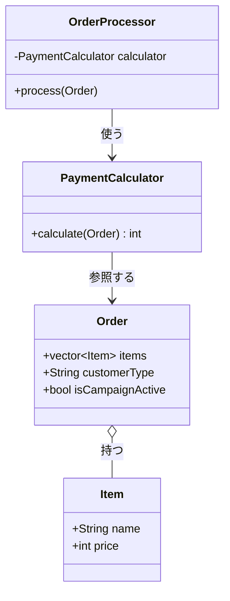
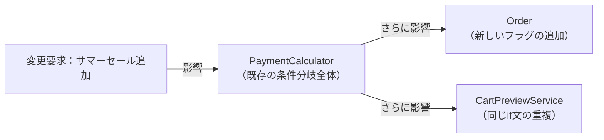
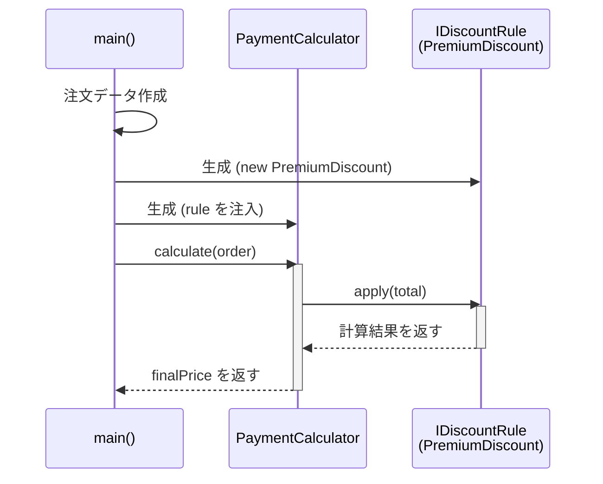
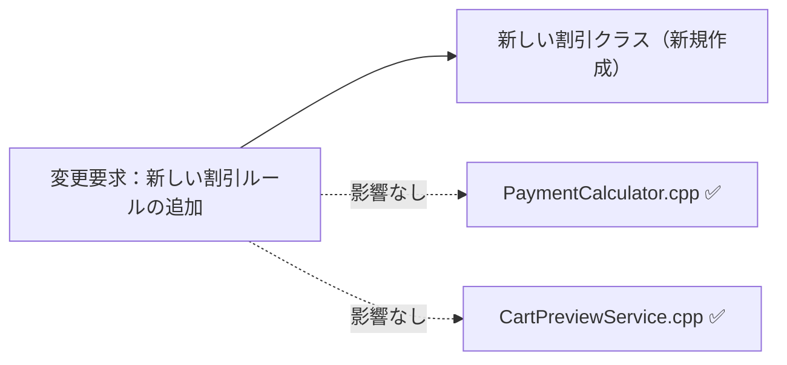
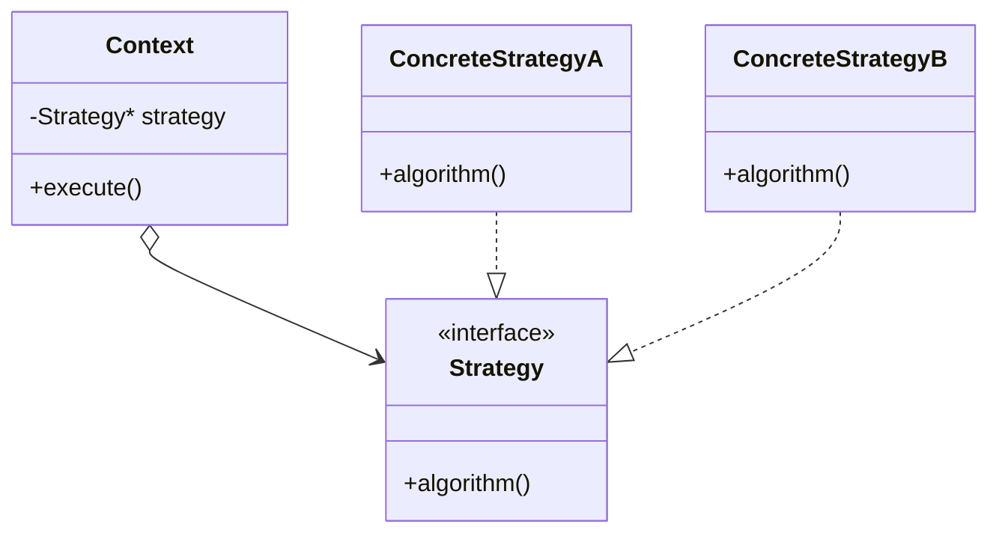

## 第1章 変わるものをカプセル化する ―― Strategy パターン

### この章の核心

**計算のルールが変わるたびに、それを呼び出す側のコードまで修正することになる。それは、「変わる理由（個別の割引ルール）」と「変わらない構造（処理の全体的な流れ）」が、同じ場所に混在しているからだ。**

---

### この章を読むと得られること

「割引ルールが増えるたびに、既存の計算ロジックに手を入れなければならない」——この痛みを経験したことがあるなら、この章はそのまま使える答えを持っています。

- **得られること1：** 「実行する振る舞い」という観点で、コードの変動箇所を識別できるようになる
- **得られること2：** 接続点（クラスとクラスのつなぎ目）が「具体×直接」になっているクラスを見て、そこが変更の痛みの発生源だと判断できるようになる
- **得られること3：** 接続点の形を変えると変更がどのように局所化されるかを、構造から説明できるようになる
- **得られること4：** 増え続けるルールに対して、いつ・どのように構造を分けるべきかの判断ができるようになる

---

## 🔵 フェーズ1：現状把握 ―― コードとクラス構成を読む
変更要求が来る前のシステムの現状を事実として把握するところから始めます。はじめに仕様と動作例で「このシステムが何をするか」を確認し、それからコードを読みます。
### 1-1：このシステムの仕様

このシステムは、ECサイトでお客様が商品を購入する際の**支払金額を計算**します。

入力として「商品リスト（各商品の名前と単価）」「会員種別（Premium / Regular）」「キャンペーン適用フラグ」を受け取ります。システムは全商品の小計を算出し、以下の割引ルールを適用した最終的な支払金額を返します。

**割引ルール一覧**

| ルール名 | 適用条件 | 割引の内容 |
|---|---|---|
| プレミアム割引 | 会員種別が "Premium" | 20%引き |
| キャンペーン割引 | 会員種別が "Regular" かつキャンペーン期間中 | 10%引き |
| 割引なし | 上記以外 | 定価（割引なし） |

**優先・排他ルール**

| 条件 | 動作 |
|---|---|
| Premium かつ キャンペーン中 | Premium のみ適用（キャンペーン割引は無効） |

**この割引計算を使う場所**

| 使用場所 | 用途 |
|---|---|
| `PaymentCalculator` | 注文確定時の支払金額の確定 |
| `CartPreviewService` | カート画面の金額プレビュー表示 |
### 1-2：動作例テーブル

仕様を定義したところで、実際にどのような入力に対してどのような結果が返るかを確認します。このテーブルは「このシステムが正しく動いているとはどういう状態か」の基準になります。後で対策案を比較するときも、この表に立ち返ります。

| # | 会員種別 | キャンペーン | 小計 | 適用ルール | 支払金額 |
|---|---|---|---|---|---|
| 1 | Premium | ✗ | 10,000円 | プレミアム20%引き | 8,000円 |
| 2 | Premium | ✓ | 10,000円 | プレミアム優先（キャンペーン無効） | 8,000円 |
| 3 | Regular | ✓ | 10,000円 | キャンペーン10%引き | 9,000円 |
| 4 | Regular | ✗ | 10,000円 | 割引なし | 10,000円 |

コードを読む前に、このシステムが「何をする必要があるか」をこの表で確認できました。次は「どのように実装されているか」を見ていきます。
### 1-3：実装コード（現状）

システムの現状の実装を確認します。コードを役割ごとに分けて読んでいきます。

#### データクラス

はじめに注文のデータを保持するクラス群から見てみます。

```cpp
// 商品クラス：商品名と単価を持つだけのシンプルなクラス
class Item {
public:
    std::string name;
    int price;
    Item(std::string n, int p) : name(n), price(p) {}
};

// 注文データクラス：カートの中身と顧客の属性を保持する
class Order {
public:
    std::vector<Item> items;
    std::string customerType;   // "Regular" または "Premium"
    bool isCampaignActive;      // キャンペーン期間中か
};
```

`Item` と `Order` は純粋なデータの入れ物です。計算のロジックは一切ありません。

#### 決済計算クラス

次に、割引を適用して最終的な支払金額を算出する計算クラスを見ます。

```cpp
class PaymentCalculator {
public:
    int calculate(const Order& order) {
        int total = 0;

        // 小計の計算：注文の全商品を足し合わせる
        for (const auto& item : order.items) {
            total += item.price;
        }

        // 割引ルール：条件ごとに if で分岐している
        if (order.customerType == "Premium") {
            total = static_cast<int>(total * 0.8);   // 20%引き
        } else if (order.customerType == "Regular"
                   && order.isCampaignActive) {
            total = static_cast<int>(total * 0.9);   // 10%引き
        }

        return total;
    }
};
```

このクラスが今章の中心です。`calculate` メソッドの中に「商品の価格を足し合わせる処理」と「割引ルールを判定する処理」が一緒に書かれていることを確認しておいてください。

#### 呼び出し元と実行確認

```cpp
class OrderProcessor {
private:
    PaymentCalculator calculator;
public:
    void process(const Order& order) {
        int finalPrice = calculator.calculate(order);
        std::cout << "支払金額は " << finalPrice << " 円です。\n";
    }
};

int main() {
    Order order;
    order.items.push_back(Item("ワイヤレスイヤホン", 10000));
    order.customerType = "Premium";
    order.isCampaignActive = false;

    OrderProcessor processor;
    processor.process(order);
    return 0;
}
```

上記コードの実行結果：

```
支払金額は 8000 円です。
```

動作例テーブルの行1（Premium / キャンペーンなし / 10,000円 → 8,000円）と一致しています。問題は機能ではなく、構造にあります。
### 1-4：クラス構成図

コードを読んだところで、クラス間の関係を図で整理します。



`OrderProcessor` が `PaymentCalculator` を使い、`PaymentCalculator` が `Order` の属性を直接参照しています。

---

### 1-5：変更要求

金曜日の午後、マーケティング部の鈴木リーダーから急な依頼が舞い込みました。

「来週の金曜日から『サマーセール』を開始します。期間中は全会員を対象に5%オフにするルールを追加してほしいです。さらに、プレミアム会員の場合は特別に15%オフになるように調整をお願いします。」

リリースは来週末。既存の `if` 文の隙間に `else if` を追加すれば間に合うかもしれません。しかし少し立ち止まって、「これは1回限りの変更なのか、今後も続くのか」を確認しましょう。


**仕様変更の内容**

変更要求を受けて、現在の割引ルールがどう変わるかを整理します。

| ルール名 | 変更前 | 変更後 |
|---|---|---|
| プレミアム割引 | Premium会員に20%引き | **サマーセール期間中は15%引き**に変更（通常時は20%引きのまま） |
| キャンペーン割引 | Regular会員にキャンペーン10%引き | 変更なし |
| **サマーセール割引（新規）** | —（なし） | **全会員に5%引きを追加**。ただしPremiumには適用されない |

**変更後の動作例**

| 会員種別 | サマーセール | 変更前の支払金額（1万円の場合） | 変更後の支払金額 |
|---|---|---|---|
| Premium | ✓ | 8,000円（20%引き） | **8,500円（15%引き）** |
| Regular | ✓ | 9,000円（10%引き） | **9,500円（5%引き）** |
| Regular | ✗ | 10,000円（割引なし） | 10,000円（変更なし） |

プレミアム会員の割引率は「20%→15%」へ変更されます。Regular会員はサマーセール中に5%引きが新たに加わります。

フェーズ1でシステムの現状と変更要求が把握できました。次のフェーズ2では、「何が変わり、何が変わらないか」を整理します。

## 🟣 フェーズ2：仮説立案 ―― 何が変わるかを観察し、ヒアリングで裏付ける

### 2-1：責任チェック表

各クラスが「何を知るべきか」を整理します。

| **クラス名** | **責任（1文）** | **知るべきこと** |
|---|---|---|
| `OrderProcessor` | 注文処理の全体フローを進行する | 計算を誰に依頼するか、結果をどう出力するか |
| `PaymentCalculator` | 注文内容をもとに最終的な支払金額を計算する | 商品の小計の出し方、適用する必要がある割引ルール |
| `Order` | 注文された内容と顧客の属性を保持する | 注文商品のリスト、顧客の種別、キャンペーン状態 |
| `Item` | 商品一つの情報を保持する | 商品名、単価 |

### 2-2：責任チェック表

コードの各行が「誰の判断で変わる知識か」を確認します。判断基準は、「このクラスの担当者（ここでは決済システム開発チーム）とは別の人間が変更を決定するかどうか」です。別の人間が決定するなら、それは「責任外（❌）」と判断します。

`PaymentCalculator.calculate()` の各行を見ると：

| **コードの行** | **持っている知識** | **誰の判断で変わるか** | **責任内か** |
|---|---|---|---|
| `total += item.price` | 商品単価を合算するロジック | 決済システム開発チーム | ✅ |
| `if (customerType == "Premium")` | プレミアム会員の条件と割引率 | 会員サービス企画チーム | ❌ 別担当者 |
| `else if (...isCampaignActive)` | キャンペーンの条件と割引率 | マーケティングチーム | ❌ 別担当者 |

1つのメソッドの中に、変える理由が異なる3つの知識が混在しています。今すぐ問題とは言えませんが、これが後の痛みの予兆です。

### 2-3：今回の変更で確実に変わること

今回の要求から直接読み取れる「確定している変更箇所」を整理します。仮説ではなく、要求書に明示されていることです。

| **変わること** | **なぜ確定か** |
|---|---|
| プレミアム会員への割引率（20% → 15%） | 「プレミアム会員は15%オフに調整」と明示 |
| サマーセール割引の追加（全会員5%オフ） | 「全会員を対象に5%オフ」と明示 |

確定している変更は2点です。しかし「この変更が1回限りか、今後も続くか」によって、どこまで設計を変えるべきかが大きく変わります。関係者に確認します。

### ヒアリングに向けた背景確認

このシステムは、私たちが運用している中堅ECサイトの決済計算を担っています。数年前にサービスが立ち上がった当初は、お客様が商品を選んでカートに入れ、そのままの合計金額で決済するシンプルな流れでした。

しかし、サービスが成長し競合他社との競争が激しくなるにつれて、様々な施策が打たれるようになりました。新規顧客向けの期間限定キャンペーンや、リピーター向けのプレミアム会員制度など、ビジネス上の要求は日々増えています。

### 2-4：関係者ヒアリング

- **開発者：** 「サマーセールの件、承知しました。今後もこのような新しい割引ルールは追加される予定はありますか？」
- **マーケティング部リーダー：** 「はい、もちろんです。秋にはハロウィンキャンペーン、冬には年末大感謝祭など、毎月のように新しい企画を予定しています。」
- **開発者：** 「ちなみに、割引の計算方法自体が変わることはありますか？今はパーセント引きですが、定額割引などです。」
- **マーケティング部リーダー：** 「実は秋のキャンペーンでは、一律1000円引きクーポンの配布を検討しています。これも対応できますか？」

> **現実のヒアリングでは——** 本書のヒアリングシーンでは設計判断を明確にするため、意図的に「理想的な回答」が返ってくるように描いています。しかし現実には、「変わるかどうか分からない」「たぶん変わらない」という答えが返ることも多いです。そのときは `git log` や過去の障害記録を「ヒアリングの代わり」として使ってみてください。「過去に何度変わったか」が最も正直な証拠です。

### 2-5：ヒアリングで判明した将来リスク

ヒアリングで浮かび上がった「確定ではないが、近い将来起こりうる変化」を記録します。これは今回の設計判断の材料です。

| **将来リスク** | **時期の目安** | **根拠** |
|---|---|---|
| 新しい割引ルールの追加が毎月続く | 継続的に | 鈴木リーダーから直接確認 |
| 計算方法が「パーセント引き」から「定額引き」に変わる | 数ヶ月後 | 秋のクーポン企画として言及 |

フェーズ2で「今変わること（確定）」と「将来変わるかもしれないこと（リスク）」を分けて整理できました。次のフェーズ3では、現在の構造で変更を試みたときに何が起きるかを確認します。

---

## 🟣 フェーズ3：問題特定 ―― 変更の痛みを発見する

### 3-1：変更を試みる

「サマーセール：全会員5%オフ、プレミアム会員は15%オフ」を現在の `PaymentCalculator` に追加してみます。

```cpp
if (order.customerType == "Premium") {
    total = static_cast<int>(total * 0.8);   // 20%引き
} else if (order.customerType == "Regular"
           && order.isCampaignActive) {
    total = static_cast<int>(total * 0.9);   // 10%引き
}
```

このコードに手を入れようとすると、問題が浮かび上がります。

「サマーセール中のプレミアム会員は15%オフ」という要件は、既存の「プレミアム会員は常に20%オフ」と競合します。単純に `else if` を追加するだけでは済はじめに、既存の `if (customerType == "Premium")` ブロック内を書き換える必要があります。さらに、`Order` クラスに `isSummerSale` フラグを追加しなければなりません。

ヒアリングで予告された「1000円引きクーポン」が来た場合はどうでしょうか。パーセント計算とは異なる「引き算」のロジックが混入し、全ての `if` ブロックの計算順序を見直す必要が出てきます。

### 3-2：変更影響グラフ



新しいルールを1つ追加するだけで、既存の計算ロジック全体・データクラス・カートプレビューにまで影響が波及しています。

### 3-3：痛みの言語化

**1つ目：影響範囲が読めない恐怖。** 新しい割引を追加するには、複雑化しつつある `if-else` の隙間にコードを差し込む必要があります。変更のたびに、無関係なはずの過去のルールも含めて全テストケースを見直す必要があります。

**2つ目：grep地獄。** キャンペーンのたびに条件分岐が追加されていくと、半年後には `PaymentCalculator` が数百行の複雑な分岐の塊になります。「どの条件が今のキャンペーンのものか」を理解するために、コードの隅々まで解読しなければなりません。

フェーズ3で「変更が辛い」ことが確認できました。次のフェーズ4では、なぜ辛いのかを構造的に言語化します。

---

## 🟠 フェーズ4：原因分析 ―― なぜ辛いのかを構造で言語化する

### 4-1：観察→原因テーブル

| **観察した症状** | **構造的な原因** |
|---|---|
| 影響範囲が読めない恐怖 | `PaymentCalculator` が各割引の具体的な条件を直接知っているから |
| grep地獄・複雑化 | 変わる理由が違う2つのものが同じメソッドの中に混在しているから |

### 4-2：変わるもの/変わらないもの

| **変わり続けるもの** | **変わってほしくないもの** |
|---|---|
| 各キャンペーンの適用条件（サマーセール、ハロウィン等） | 商品単価を順番に足す合算ロジック |
| 割引額の計算方法（パーセント引き・定額引きなど） | 計算を依頼して最終金額を受け取る呼び出し側のフロー |

### 4-3：接続形態の診断

現在の `PaymentCalculator` は、すべての割引ルールを自分自身の中に直接抱え込んでいます。

この状態は **「具体×直接」の接続形態** です。iPhoneに専用のLightningケーブルを直差ししている状態と同じで、新しいキャンペーンが増えるたびに本体側を開いて専用の配線（`else if` 文）を直接追加しなければなりません。

|  | 直接（直差し） | 間接（アダプター経由） |
|:---:|:---|:---|
| **具体**（専用規格） | **← 現在地** iPhone → Lightning直差し | iPhone → Lightning → 変換 → USB-A |
| **抽象**（汎用規格） | MacBook → USB-C → 直差し | MacBook → USB-C → ハブ → 多様な機器 |

決済の合算ロジックと個別の割引ルールは、変わる理由が全く異なります。これらが同じ場所に混在していることが、根本原因として確認できました。

フェーズ4で根本原因が言語化できました。次のフェーズ5では、解決する課題を具体的に定めます。

---

## 🟡 フェーズ5：課題定義 ―― 解くべき接続点を特定する

### 5-1：接続点の特定

「合算ロジック」と「個別の割引ルール」を分けると、そこに1つの接続点（ジョイント）が生まれます。

- **接続点A：** `PaymentCalculator`（計算の骨格）←→ 個別の割引ルール の境界

この接続点をどのような「形」でつなぐかが、この章の最大の設計テーマです。

### 5-2：非機能制約の確認

| **確認項目** | **この章での判断** |
|---|---|
| 変更頻度 | 高（毎月キャンペーンが追加される） |
| ホットパスか | はい（注文確定時に毎回呼ばれる） |
| 仮想関数のオーバーヘッド | このシステムの規模では設計の足切り要因にならない |
| スレッド安全 | タイムセール時に複数リクエストが同一ルールを共有する可能性あり。ステートレス設計が基本方針 |

### 5-3：クライアントへの影響範囲

`PaymentCalculator` を呼び出しているクライアントは `OrderProcessor` です。接続の形を変えれば、この呼び出し元も変更の影響を受ける可能性があります。

```cpp
class OrderProcessor {
private:
    PaymentCalculator calculator;   // 接続形態が変わると、ここも変わる可能性
public:
    void process(const Order& order) {
        int finalPrice = calculator.calculate(order);
        // ...
    }
};
```

### 5-4：課題まとめ表

| **接続点** | **分けた理由** | **非機能制約** | **クライアント影響** |
|---|---|---|---|
| 接続点A | 変わる理由が異なる（合算ロジック vs 割引条件） | ホットパス・ステートレス設計必要 | `OrderProcessor` に影響波及の可能性 |

フェーズ5で課題が確定しました。次のフェーズ6では、この接続点をどの形でつなぐかの対策案を4つ並べて検討します。

---

## 🔴 フェーズ6：対策検討 ―― 案を比べ、採用案を決める

フェーズ1で確認した動作例テーブルのすべてのパターンを満たす実装を、4つの異なる接続の形で比較します。**どの案も同じ動作を実現します。** 違うのは「変更が来たときにどこを触ることになるか」です。

### 6-1：接続の形 2×2マトリクス

| 接続形態 | 意味 | ケーブルの例 |
|:---:|:---|:---|
| **具体×直接**（← 現在地） | 具体クラス名を知り、直接呼ぶ | iPhone → Lightning直差し |
| **具体×間接** | 具体クラスを知るが、仲介者を経由 | Lightning → 変換アダプター → USB-A |
| **抽象×直接** | インターフェース型だけを知り、直接呼ぶ | MacBook → USB-C直差し |
| **抽象×間接** | インターフェース型を知り、仲介者を経由 | MacBook → USB-Cハブ → 多様な機器 |

---

### 案1：現状のまま ―― 接続の形を変えない（現在の設計）

**この案の考え方：**
構造を変えず、`PaymentCalculator` の `if` 文の隙間にサマーセールの条件を追加します。変更頻度が極めて低く、次の変更が数年単位で来ないような安定したビジネス環境では合理的な選択です。

**手段の比較：**

| 手段 | 方法 | 特徴 |
|---|---|---|
| 手段A：if文追加 | 既存の `if-else` チェーンに新しい条件を書き足す | 変更が最小で今すぐ対応できるが、次の変更でまた同じ作業が必要になる |
| 手段B：定数定義 | 割引率を定数として切り出し、値だけ変更する | 数値の変更には強くなるが、条件の追加には対応できない |

**手段A**（最小コストで今回の要求に対応でき、この案の方針（構造を変えない）と一致するため）のコードを以下に示します。

**変更後のコード（サマーセール追加）：**

```cpp
int calculate(const Order& order) {
    int total = 0;
    for (const auto& item : order.items) {
        total += item.price;
    }

    // サマーセール対応：既存ブロックの書き換えと新フラグが必要になった
    if (order.customerType == "Premium" && order.isSummerSale) {
        total = static_cast<int>(total * 0.85);         // 15%引き
    } else if (order.customerType == "Premium") {
        total = static_cast<int>(total * 0.80);         // 20%引き
    } else if (order.isSummerSale && order.isCampaignActive) {
        total = static_cast<int>(total * 0.95 * 0.90); // 重ね掛け
    } else if (order.isSummerSale) {
        total = static_cast<int>(total * 0.95);         // 5%引き
    } else if (order.isCampaignActive) {
        total = static_cast<int>(total * 0.90);         // 10%引き
    }
    return total;
}
```

この変更で、既存の `Premium` ブロックを書き換え、`Order` クラスへの `isSummerSale` フラグ追加が必要になりました。さらに `CartPreviewService` にも全く同じ分岐が重複します。

**この案のトレードオフ：**
- 変更容易性：低（次のキャンペーンでまた同じ作業が繰り返される）
- テスト容易性：低（ロジックが1メソッドに集中し、個別ルールだけをテストできない）
- 実装コスト：低（今すぐ対応できる）

---

### 案2：具体×直接 ―― クラスを分けるが、参照は具体型のまま

**この案の考え方：**
割引ロジックを個別のクラスに切り出して責任を整理します。ただし `PaymentCalculator` は依然として個別クラスの具体型を名指しで知っています。「計算ロジックが複雑になってきたから整理したい、でも差し替えは不要」という場合に合う形です。

**手段の比較：**

| 手段 | 方法 | 特徴 |
|---|---|---|
| 手段A：クラス分割 | 各割引ロジックを別クラスに切り出し、`PaymentCalculator` がその具体型を直接生成して使う | 責任の境界が明確になり、後のインターフェース化への移行が自然な一歩になる |
| 手段B：メソッド抽出 | 同じクラス内でプライベートメソッドに分ける | ファイル分割が不要でシンプルだが、クラス外からロジックを差し替えることができない |

**手段A**（将来のインターフェース化に向けて境界を明確にするため）のコードを以下に示します。

**この案で取りうる実装手段：**

実装方法は複数あります。どれを選ぶかで後の変更コストが変わります。

*手段A：各割引を別クラスに切り出す（クラス分割）*

```cpp
#include <iostream>
#include <string>
#include <vector>
using namespace std;

struct Item { string name; int price; };
struct Order {
    vector<Item> items;
    string customerType;
    bool isSummerSale;
    bool isCampaignActive;
};

class PremiumDiscount {
public:
    int apply(int total) {
        return static_cast<int>(total * 0.80);
    }
};
class SummerSaleDiscount {
public:
    int apply(int total) {
        return static_cast<int>(total * 0.95);
    }
};

// PaymentCalculatorは具体クラスを直接 new して使う
class PaymentCalculator {
public:
    int calculate(const Order& order) {
        int total = 0;
        for (const auto& item : order.items)
            total += item.price;
        if (order.customerType == "Premium") {
            PremiumDiscount d;       // ← 具体型を直接生成
            return d.apply(total);
        } else if (order.isSummerSale) {
            SummerSaleDiscount d;
            return d.apply(total);
        }
        return total;
    }
};

int main() {
    Order order;
    order.items = {{"ワイヤレスイヤホン", 10000}};
    order.customerType = "Premium";
    order.isSummerSale = false;
    order.isCampaignActive = false;

    PaymentCalculator calc;
    cout << "支払金額: " << calc.calculate(order) << " 円" << endl;
    return 0;
}
```

*手段B：同クラス内でプライベートメソッドに分ける（メソッド分割）*

```cpp
// 同一クラス内でプライベートメソッドに分ける
class PaymentCalculator {
    int applyPremium(int t) {
        return static_cast<int>(t * 0.80);
    }
    int applySummerSale(int t) {
        return static_cast<int>(t * 0.95);
    }
public:
    int calculate(const Order& order) {
        int total = 0;
        for (const auto& item : order.items)
            total += item.price;
        if (order.customerType == "Premium")
            return applyPremium(total);
        if (order.isSummerSale)
            return applySummerSale(total);
        return total;
    }
};
```

**手段Aを選ぶ理由：**
手段Bはクラスの外からロジックを切り離せないため、テストのためにダミーロジックに差し替えることができません。手段Aはクラスが分かれており、後の案3（インターフェース化）への移行が自然な一歩になります。

**この案のトレードオフ：**
- 変更容易性：低〜中（計算式自体の修正は局所化されるが、ルール追加のたびに `if` の書き換えが必要）
- テスト容易性：低（具体クラスを直接生成するため、差し替えてテストできない）
- 実装コスト：低（インターフェース設計が不要）

---

### 案3：抽象×直接 ―― インターフェースを挟み、型だけで接続する

**この案の考え方：**
`PaymentCalculator` は具体的な割引クラスを知らなくていい。すべての割引ルールが満たする必要があるインターフェース（契約）を定義し、呼び出し側はその型だけを知るようにします。後からいくらでも新しい実装を差し替えられるようになります。

**手段の比較：**

| 手段 | 方法 | 特徴 |
|---|---|---|
| 手段A：コンストラクタインジェクション | コンストラクタで `IDiscountRule*` を受け取り、生成時に依存を確定させる | 初期化時点で依存が確定し、オブジェクトが「未設定」状態になり得ない |
| 手段B：セッターインジェクション | `setRule()` メソッドで後からルールを設定する | 柔軟に差し替えできるが、設定前に `calculate()` が呼ばれるバグの温床になる |
| 手段C：継承 | ルールごとにサブクラスを派生させ `applyDiscount()` をオーバーライドする | 追加のたびにクラス階層が深くなり、複数ルールの組み合わせができない |

**手段A**（初期化時点で依存が確定し未設定の状態が起きない）のコードを以下に示します。

**この案で取りうる実装手段：**

**手段A：コンストラクタインジェクション**

```cpp
class PaymentCalculator {
    IDiscountRule* rule;
public:
    PaymentCalculator(IDiscountRule* r) : rule(r) {}   // 生成時に確定
    int calculate(int subtotal) {
        return rule ? rule->apply(subtotal) : subtotal;
    }
};
```

**手段B：セッターインジェクション**

```cpp
class PaymentCalculator {
    IDiscountRule* rule = nullptr;
public:
    void setRule(IDiscountRule* r) { rule = r; }       // 後から設定
    int calculate(int subtotal) {
        return rule ? rule->apply(subtotal) : subtotal;
    }
};
```

**手段C：継承（オーバーライド）**

```cpp
// 手段C：継承（オーバーライド）
class PaymentCalculator {
protected:
    // デフォルト: 割引なし
    virtual int applyDiscount(int total) { return total; }
public:
    int calculate(const Order& order) {
        int total = 0;
        for (const auto& item : order.items)
            total += item.price;
        return applyDiscount(total);
    }
};
class PremiumCalculator : public PaymentCalculator {
    int applyDiscount(int t) override {
        return static_cast<int>(t * 0.80);
    }
};
```

**手段Aを選ぶ理由：**

手段Bは「`setRule()` を呼ぶ前に `calculate()` が呼ばれる」不正状態が生まれる可能性があります。オブジェクトが「未設定」状態になり得る設計はバグの温床です。

手段Cは「ルールごとにサブクラスを派生させる」形になります。新しいルールが毎月追加されるこの状況では、クラス階層が月ごとに深くなっていきます。また「サマーセール＋キャンペーンの重ね掛け」など複数ルールの組み合わせができません。

手段Aはオブジェクト生成時に依存が確定し、後から変更されない明確さがあります。

**この案のコード（手段Aを採用）：**

```cpp
// 割引ルールの共通インターフェース
class IDiscountRule {
public:
    virtual int apply(int total) = 0;
    virtual ~IDiscountRule() = default;
};

// 実装クラス（ビジネスルールを個別に定義）
class PremiumDiscount : public IDiscountRule {
public:
    int apply(int total) override {
        return static_cast<int>(total * 0.80);
    }
};

class SummerSaleDiscount : public IDiscountRule {
public:
    int apply(int total) override {
        return static_cast<int>(total * 0.95);
    }
};

// 計算クラス：インターフェース型だけを知る
class PaymentCalculator {
private:
    IDiscountRule* rule;   // ← 抽象型で受け取る（具体クラス名を知らない）
public:
    PaymentCalculator(IDiscountRule* r) : rule(r) {}

    int calculate(const Order& order) {
        int total = 0;
        for (const auto& item : order.items) total += item.price;
        return rule ? rule->apply(total) : total;   // ← 直接呼び出し
    }
};
```

呼び出し側（具体型を知るのはここだけ）：

```cpp
PremiumDiscount rule;
PaymentCalculator calculator(&rule);
CartPreviewService preview(&rule);   // 同じルールを使い回せる
```

**この案のトレードオフ：**
- 変更容易性：中〜高（新しい割引を追加するとき、`PaymentCalculator` を一切触わらず新しいクラスを作るだけ）
- テスト容易性：高（テスト用のダミールールを渡せるため、計算ロジックだけを独立してテストできる）
- 実装コスト：中（インターフェースの設計と、依存を外から渡す仕組みが必要）

---

### 案4：抽象×間接 ―― インターフェース＋仲介役を組み合わせる

**この案の考え方：**
`PaymentCalculator` は「どのルールを選ぶか」という判断も知らなくていい。`IDiscountManager` という仲介役のインターフェースを介して、ルールの選択と適用を丸ごと委任します。「差し替えたい」かつ「選択ロジックも隠したい」という2つの動機が重なる場合に合う形です。

**手段の比較：**

| 手段 | 方法 | 特徴 |
|---|---|---|
| 手段A：DiscountManager＋IDiscountRule | `IDiscountManager` という仲介インターフェースを定義し、ルールの選択と適用を丸ごと委譲する | 生成ロジックがシンプルなため仲介クラスだけで十分。2層の抽象でテスト容易性も高い |
| 手段B：Factory Method | 案3のインターフェースに加えて `DiscountRuleFactory` でルールを生成する | 生成の責任分離という別の設計問題を混入させ、課題の焦点がぶれる |

**手段A**（生成ロジックがシンプルなため仲介クラスで十分）のコードを以下に示します。

**この案で取りうる実装手段：**

**手段A：仲介クラス（DiscountManager）＋ IDiscountRule を組み合わせる**

```cpp
class IDiscountManager {
public:
    virtual int applyDiscount(
        int total, const Order& order) = 0;
    virtual ~IDiscountManager() = default;
};

// PaymentCalculatorは仲介役のI/Fだけを知る（2層の抽象）
class PaymentCalculator {
    IDiscountManager* manager;
public:
    PaymentCalculator(IDiscountManager* m)
        : manager(m) {}
    int calculate(const Order& order) {
        int total = 0;
        for (const auto& item : order.items)
            total += item.price;
        return manager->applyDiscount(total, order);
    }
};
```

**手段B：案3（インターフェース）＋ Factory Method でルールを生成する**

```cpp
// 注文内容からルールを生成するFactoryを追加する形
class DiscountRuleFactory {
public:
    static IDiscountRule* create(const Order& order) {
        if (order.customerType == "Premium") return new PremiumDiscount();
        if (order.isCampaignActive) return new CampaignDiscount();
        return new NoDiscount();
    }
};
```

**手段Aを選ぶ理由：**
手段BのFactory Methodは「オブジェクトの生成責任の分離」という別の設計問題を混入させています。今回の課題は「ルールの差し替え」であり、生成の方法は別の文脈で考える方がよいでしょう。手段Aは今回の課題（接続の形）に集中しています。

**この案のトレードオフ：**
- 変更容易性：高（どの層の実装が変わっても他層は無影響）
- テスト容易性：高（全層でスタブ（本物の依存先の代わりに動く模擬実装）に差し替え可能）
- 実装コスト：高（インターフェース2層＋仲介クラスの設計が必要。コードを追う負担が増す）

---

### 6-2：採用案の選定

#### 評価軸の宣言

比較の前に、評価の軸とウェイトをチームで合意します。

| **評価軸** | **意味** | **ウェイト** |
|---|---|---|
| 変更容易性 | 変更要求が来たとき、触る場所が最小で済むか | ×3 |
| テスト容易性 | 依存をスタブに差し替えてテストを書けるか | ×2 |
| 可読性 | コードの読みやすさ・理解コスト | ×1 |

> **注：** このウェイトは本書の例です。チームの変更頻度・テスト文化に合わせて合意してください。スコアは「答えを決める計算式」ではなく「議論を整理する道具」です。

#### コスト天秤

| 案 | 変更容易性（×3） | テスト容易性（×2） | 可読性（×1） | 合計 |
|---|---|---|---|---|
| 案1：現状のまま | 1 | 1 | 3 | 8 |
| 案2：具体×直接 | 1 | 2 | 3 | 10 |
| 案3：抽象×直接 | 3 | 3 | 2 | **17** |
| 案4：抽象×間接 | 3 | 3 | 1 | 16 |

#### 採用案の決定

**採用する案：案3（抽象×直接）**

フェーズ2のヒアリングで「毎月のように新しいルールが追加される」ことが確認されました。この状況では、現在の実装コストを少し支払ってでも、将来の変更コストを最小化する案3が最も合理的です。

> **なぜ案4（抽象×間接）ではなく案3か**
>
> 案3（17点）と案4（16点）は僅差です。決め手は可読性の1点差と、このシステムの使われ方です。案4では仲介クラスが1つ増え、「どこで組み立てが起きるか」を追うコストが増します。割引ルールの切り替えは「月に1回の設定変更」であり、実行中に動的にルールの種類を変える要件はありません。`main()` で直接クラスを渡すだけで十分です。

**この構造は、Strategy（ストラテジー）パターンと呼ばれています。**

`PaymentCalculator` がコンテキスト（Context）、`IDiscountRule` がストラテジー（Strategy）インターフェース、`PremiumDiscount` 等が具体的なストラテジー（ConcreteStrategy）に対応します。このパターンが設計の出発点ではありません。「変わる理由が異なる2つのものを分けるにはどうするか」を考え続けた結果として、この構造にたどり着いたのです。

#### 耐久テスト

フェーズ2でヒアリングした将来リスクが実際に来たときを確認します。

| **変更シナリオ** | **触る場所** | **コスト評価** |
|---|---|---|
| ハロウィンキャンペーン（新しいパーセント割引）が追加された | `HalloweenDiscount` クラスを1つ新規作成するだけ | 低 |
| 定額1000円引きクーポンに変更された | `CouponDiscount` クラスを1つ新規作成するだけ | 低 |

定額割引の追加を確認してみましょう：

```cpp
// 追加するのはこのクラスだけ。PaymentCalculator には一切手を入れない。
class CouponDiscount : public IDiscountRule {
public:
    int apply(int total) override {
        return total - 1000;   // 一律1000円引き
    }
};
```

`PaymentCalculator` の中身は一行も変わりません。フェーズ2で予告された「計算方法が変わる」リスクが、インターフェースの境界によって無害化されています。

#### 使う場面・使わない場面

| **状況** | **適切な選択** | **理由** |
|---|---|---|
| 割引ルールが1種類で今後増えない | 案1（現状のまま） | 切り出すコストが見合わない |
| ルールが複雑で毎月増える | 案3（この設計） | ルール追加のたびに既存コードを触らずに済む |
| 実行中にルールを動的に切り替える必要がある | 案4を検討 | 仲介役が動的な組み合わせを担える |

【過剰コード：変化のないものにパターンを適用した例】

```cpp
// 割引が永遠に「5%オフ」だけなら、この1行で十分
int calculate(int total) { return static_cast<int>(total * 0.95); }
```

フェーズ6で採用案が決まりました。次のフェーズ7では、この決断を最終的なコードに落とし込みます。

## 🟢 フェーズ7：対策実施 ―― 変化に強いコードを完成させる

### 7-1：解決後のコード（全体）

```cpp
#include <iostream>
#include <string>
#include <vector>

// ─── データクラス ──────────────────────────────
class Item {
public:
    std::string name;
    int price;
    Item(std::string n, int p) : name(n), price(p) {}
};

class Order {
public:
    std::vector<Item> items;
    std::string customerType;
    bool isCampaignActive;
};

// ─── 割引ルールのインターフェース ─────────────
class IDiscountRule {
public:
    virtual int apply(int total) = 0;
    virtual ~IDiscountRule() = default;
};

// ─── 割引ルールの実装クラス群 ─────────────────
class NoDiscount : public IDiscountRule {
public:
    int apply(int total) override { return total; }
};

class PremiumDiscount : public IDiscountRule {
public:
    int apply(int total) override {
        return static_cast<int>(total * 0.80);
    }
};

class SummerSaleDiscount : public IDiscountRule {
public:
    int apply(int total) override {
        return static_cast<int>(total * 0.95);
    }
};

class CampaignDiscount : public IDiscountRule {
public:
    int apply(int total) override {
        return static_cast<int>(total * 0.90);
    }
};

// ─── 計算クラス：インターフェースのみを知る ───
class PaymentCalculator {
private:
    IDiscountRule* rule;
public:
    PaymentCalculator(IDiscountRule* r) : rule(r) {}

    int calculate(const Order& order) {
        int total = 0;
        for (const auto& item : order.items) total += item.price;
        return rule->apply(total);
    }
};

// ─── カートプレビュー：同じI/Fを使う ──────────
class CartPreviewService {
private:
    IDiscountRule* rule;
public:
    CartPreviewService(IDiscountRule* r) : rule(r) {}

    int getEstimatedTotal(const Order& order) {
        int total = 0;
        for (const auto& item : order.items) total += item.price;
        return rule->apply(total);
    }
};

// ─── 組み立て（具体型を知るのはここだけ）──────
class BatchApplication {
public:
    void run() {
        Order order;
        order.items.push_back(Item("ワイヤレスイヤホン", 10000));
        order.customerType = "Premium";
        order.isCampaignActive = false;

        PremiumDiscount rule;                         // ← ここだけ具体型
        PaymentCalculator calculator(&rule);
        CartPreviewService preview(&rule);

        int finalPrice = calculator.calculate(order);
        int previewPrice = preview.getEstimatedTotal(order);

        std::cout << "支払金額: " << finalPrice << " 円\n";
        std::cout << "プレビュー: " << previewPrice << " 円\n";
    }
};

int main() {
    BatchApplication app;
    app.run();
    return 0;
}
```

上記コードの実行結果：

```
支払金額: 8000 円
プレビュー: 8000 円
```

動作例テーブルの行1（Premium / キャンペーンなし / 10,000円 → 8,000円）と一致しています。`PaymentCalculator` の中から `if` 文が完全に消えました。

### 7-2：動作シーケンス図

採用した案3（Strategyパターン）の実行時のオブジェクト間のやり取りを可視化します。`main()` が依存関係を注入し、`PaymentCalculator` が具象クラスを知らずに抽象インターフェース経由で処理を委譲する流れが確認できます。



### 7-3：変更影響グラフ（改善後）



フェーズ3の変更影響グラフと比べると、変更要求が新規クラスの作成だけに閉じるようになりました。

### 7-4：変更シナリオ表

| **シナリオ** | **変わるクラス** | **変わらないクラス** |
|---|---|---|
| サマーセール追加 | `SummerSaleDiscount`（新規作成） | `PaymentCalculator`, `CartPreviewService` |
| クーポン割引（定額）導入 | `CouponDiscount`（新規作成） | `PaymentCalculator`, `CartPreviewService` |
| プレミアム割引率の変更 | `PremiumDiscount`（1行修正） | `PaymentCalculator`, `CartPreviewService` |

---

## 整理

### フェーズとこの章でやったこと

| **フェーズ** | **この章でやったこと** |
|---|---|
| 🔵 フェーズ1：現状把握 | 仕様と動作例テーブルを確認した後、コードをクラス単位で読んだ。クラス構成図と変更要求を把握した |
| 🟣 フェーズ2：仮説立案 | 責任チェック表でクラスごとの変わる理由を確認した。今回の確定変更とヒアリングで判明した将来リスクを分けて整理した |
| 🟣 フェーズ3：問題特定 | サマーセールの追加を試み、影響が `Order` と `CartPreviewService` にまで波及することを確認した |
| 🟠 フェーズ4：原因分析 | 変わる理由が異なる2つのものが同じ場所にいることが痛みの根本と特定した |
| 🟡 フェーズ5：課題定義 | 接続点Aを定義し、非機能制約（ステートレス設計）とクライアント影響を確認した |
| 🔴 フェーズ6：対策検討 | 4案を比較した。各案で複数の実装手段を確認し、根拠を持って1手段を選んだ。案3（抽象×直接）を選定した |
| 🟢 フェーズ7：対策実施 | 最終コードを実装し、変更影響グラフで変更の局所化を確認した |

### 各クラスの最終的な責任

| **クラス名** | **責任（1文）** | **変わる理由** |
|---|---|---|
| `PaymentCalculator` | 決済の計算フローを進行する | 決済の根本仕様（合算方法）が変わるとき |
| `IDiscountRule` | 割引ルールという契約を定義する | 割引ルールの概念自体が変わるとき |
| `PremiumDiscount` 等 | 個別の割引計算を実行する | そのルールの条件や割合が変わるとき |

---

## 振り返り

### 「この章を読むと得られること」は手に入ったか

| **得られること** | **この章のどこで示したか** |
|---|---|
| 1. 変動箇所の識別 | フェーズ2の責任チェック表で、変わる理由の異なる知識の混在を発見した |
| 2. 接続形態の診断 | フェーズ4で「具体×直接」の状態を診断した |
| 3. 変更局所化の説明 | フェーズ7の変更シナリオ表で、変更が新規クラスに閉じる構造を示した |
| 4. いつ構造を分けるか | フェーズ7の「使う場面・使わない場面」で判断基準を示した |

### 3つの設計原則はどう適用されたか

**原則1「変わるものをカプセル化せよ」の現れ**

- 具体化された場所：`PremiumDiscount` / `SummerSaleDiscount` 等の実装クラス
- 解説：頻繁に変わる「割引の計算詳細」を個別クラスに閉じ込めた。新しいルールが追加されても `PaymentCalculator` は無影響。

**原則2「実装ではなくインターフェースに対してプログラムせよ」の現れ**

- 具体化された場所：`PaymentCalculator` のメンバ変数 `IDiscountRule* rule`
- 解説：具体的な割引クラスではなく `IDiscountRule` インターフェースだけを知ることで、実行時にどの割引が適用されるかを気にせず計算フローを進められる。

**原則3「継承よりコンポジションを優先せよ」の現れ**

- 具体化された場所：`PaymentCalculator` と割引ルールの接続
- 解説：フェーズ6の案3・手段Cで確認した通り、継承を使うとルールごとにクラス階層が深くなる。コンストラクタインジェクションによるコンポジション（オブジェクトを内部に保持して機能を借りる仕組み）は、複数ルールの組み合わせも将来的に可能にする。

---

## あなたのコードで考えてみてください

1. **変動の兆候を探す：** あなたのコードに「条件が1つ増えるたびに、既存の `if-else` チェーンを開いて書き足している」メソッドがありますか？
2. **変える理由を問う：** そのメソッド内の各条件は、誰の判断で変わりますか？同じチームで完結していますか、それとも複数の部門が絡んでいますか？
3. **テストの範囲を測る：** 新しい条件を1つ追加したとき、再確認が必要だったテストは何件でしたか？
4. **分けた後を想像する：** 「変わる計算ロジック」を別クラスに切り出したとすると、次の変更要求が来たとき、触らなくて済むファイルはどこですか？

---

## パターン解説：Strategy パターン

### パターンの骨格

Strategy パターンは、アルゴリズムのファミリーを定義し、それぞれをカプセル化して、呼び出し側から自由に差し替えられるようにするパターンです。



### この章の実装との対応

GoF（Gang of Four）とは、1994年に出版された書籍『Design Patterns』の4人の著者の総称です。彼らが整理した23のパターンは、現在も設計の共通言語として広く使われています。

| GoFの名前 | この章での対応 |
|---|---|
| Context | `PaymentCalculator` / `CartPreviewService` |
| Strategy | `IDiscountRule` |
| ConcreteStrategy | `PremiumDiscount` / `SummerSaleDiscount` / `CampaignDiscount` 等 |

### 使いどころと限界

- **使うと良い：** 似たような振る舞いが複数あり、状況に応じて切り替えたい場合。または今後も新しいアルゴリズムが追加される可能性が高い場合。
- **使わない方が良い：** ルールが1種類しかなく、今後増える見込みがない場合。ファイル数とクラス数が増えるコストが見合わない。

### この章のまとめ

この章の冒頭で示した「得られること」4点を、あらためて確認します。

**得られること1**（変動箇所の識別）：フェーズ1とフェーズ2を通じて、「割引ルール」というアルゴリズム自体が変化し続けるものであることを確認しました。実行する振る舞いそのものが変動箇所になるという視点が得られたはずです。

**得られること2**（変更の痛みの発生源の判断）：フェーズ4で、条件分岐を使って各種計算ロジックを直書きしている状態を「具体×直接」の接続と診断しました。この接続形態が、仕様変更のたびに既存コードを壊すリスク（痛みの発生源）になっていると判断できるようになります。

**得られること3**（接続の形の効果を説明する）：フェーズ6と7で、「抽象×間接」へと接続の形を変えることで、既存の計算フローには一切触れずに新しい割引ルールを追加できるようになること（変更の局所化）を学びました。

**得られること4**（構造を分ける判断）：フェーズ6のコスト比較や「使いどころと限界」で見たように、ルールが一つしかない状態から、今後も増え続けると予想される状態へと変化したタイミングこそが、Strategyパターンへの移行を決断する時です。