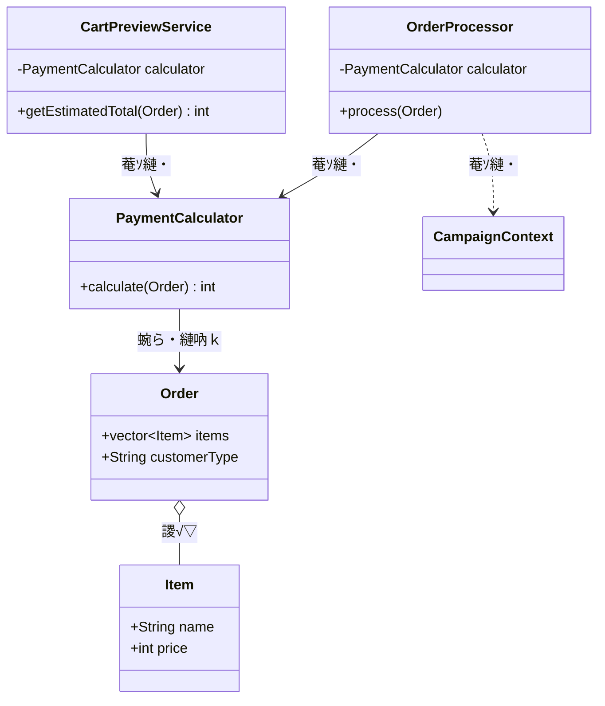
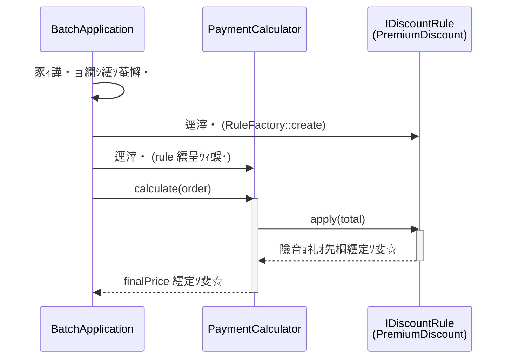
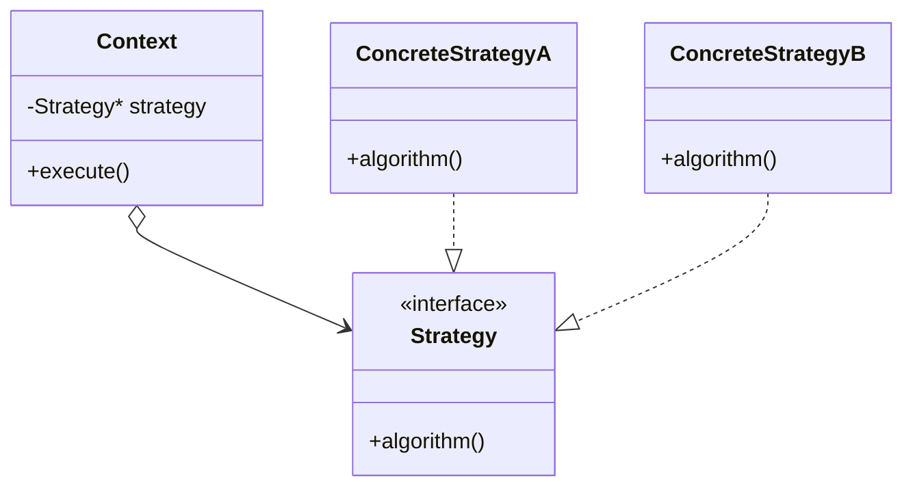

## 隨ｬ1遶 螟峨ｏ繧九ｂ縺ｮ繧偵き繝励そ繝ｫ蛹悶☆繧・窶補€・Strategy 繝代ち繝ｼ繝ｳ

### 縺薙・遶縺ｮ譬ｸ蠢・

**險育ｮ励・繝ｫ繝ｼ繝ｫ縺悟､峨ｏ繧九◆縺ｳ縺ｫ縲√◎繧後ｒ蜻ｼ縺ｳ蜃ｺ縺吝・縺ｮ繧ｳ繝ｼ繝峨∪縺ｧ菫ｮ豁｣縺吶ｋ縺薙→縺ｫ縺ｪ繧九€ゅ◎繧後・縲√€悟､峨ｏ繧狗炊逕ｱ・亥€句挨縺ｮ蜑ｲ蠑輔Ν繝ｼ繝ｫ・峨€阪→縲悟､峨ｏ繧峨↑縺・ｧ矩€・亥・逅・・蜈ｨ菴鍋噪縺ｪ豬√ｌ・峨€阪′縲∝酔縺伜ｴ謇€縺ｫ豺ｷ蝨ｨ縺励※縺・ｋ縺九ｉ縺縲・*

---

### 縺薙・遶繧定ｪｭ繧€縺ｨ蠕励ｉ繧後ｋ縺薙→

縲悟牡蠑輔Ν繝ｼ繝ｫ縺悟｢励∴繧九◆縺ｳ縺ｫ縲∵里蟄倥・險育ｮ励Ο繧ｸ繝・け縺ｫ謇九ｒ蜈･繧後↑縺代ｌ縺ｰ縺ｪ繧峨↑縺・€坂€披€斐％縺ｮ逞帙∩繧堤ｵ碁ｨ薙＠縺溘％縺ｨ縺後≠繧九↑繧峨€√％縺ｮ遶縺ｯ縺昴・縺ｾ縺ｾ菴ｿ縺医ｋ遲斐∴繧呈戟縺｣縺ｦ縺・∪縺吶€・

- **蠕励ｉ繧後ｋ縺薙→1・・* 縲悟ｮ溯｡後☆繧区険繧玖・縺・€阪→縺・≧隕ｳ轤ｹ縺ｧ縲√さ繝ｼ繝峨・螟牙虚邂・園繧定ｭ伜挨縺ｧ縺阪ｋ繧医≧縺ｫ縺ｪ繧・
- **蠕励ｉ繧後ｋ縺薙→2・・* 謗･邯夂せ縺ｧ蜻ｼ縺ｳ蜃ｺ縺怜・縺後←縺ｮ遏･隴倥ｒ謚ｱ縺医※縺・ｋ縺九ｒ隱ｿ縺ｹ縲√€悟､峨ｏ繧狗炊逕ｱ縺檎焚縺ｪ繧狗衍隴倥′蜷後§蝣ｴ謇€縺ｫ豺ｷ蝨ｨ縺励※縺・ｋ縲阪→迴ｾ迥ｶ縺ｮ蝠城｡後ｒ隱崎ｭ倥〒縺阪ｋ繧医≧縺ｫ縺ｪ繧・
- **蠕励ｉ繧後ｋ縺薙→3・・* 謗･邯夂せ縺ｮ蠖｢繧貞､峨∴繧九→螟画峩縺後←縺ｮ繧医≧縺ｫ螻€謇€蛹悶＆繧後ｋ縺九ｒ讒矩€縺九ｉ隱ｬ譏弱〒縺阪€∵隼蝟・ｾ後↓縺ｩ繧薙↑蜉ｹ譫懊′逕溘∪繧後ｋ縺九ｒ隕矩€壹○繧九ｈ縺・↓縺ｪ繧・
- **蠕励ｉ繧後ｋ縺薙→4・・* 蠅励∴邯壹￠繧九Ν繝ｼ繝ｫ縺ｫ蟇ｾ縺励※縲√＞縺､繝ｻ縺ｩ縺ｮ繧医≧縺ｫ讒矩€繧貞・縺代ｋ縺ｹ縺阪°縺ｮ蛻､譁ｭ縺後〒縺阪ｋ繧医≧縺ｫ縺ｪ繧・

---

## 鳩 繝輔ぉ繝ｼ繧ｺ1・夂樟迥ｶ謚頑升 窶補€・莉墓ｧ倥ｒ謨ｴ逅・＠縲√す繧ｹ繝・Β縺ｨ邏蝉ｻ倥￠繧・

縺薙・蝠城｡後ｒ隗｣縺上◆繧√↓7縺､縺ｮ繝輔ぉ繝ｼ繧ｺ繧剃ｽｿ縺・∪縺吶€ゅ・縺倥ａ縺ｫ迴ｾ迥ｶ謚頑升縺九ｉ髢句ｧ九＠縲∽ｻｮ隱ｬ遶区｡医・蝠城｡檎音螳壹・蜴溷屏蛻・梵繝ｻ隱ｲ鬘悟ｮ夂ｾｩ繝ｻ蟇ｾ遲匁､懆ｨ弱・蟇ｾ遲門ｮ滓命縺ｨ縺・≧鬆・〒騾ｲ縺ｿ縺ｾ縺吶€・

螟画峩隕∵ｱゅ′譚･繧句燕縺ｮ繧ｷ繧ｹ繝・Β縺ｮ迴ｾ迥ｶ繧剃ｺ句ｮ溘→縺励※謚頑升縺吶ｋ縺ｨ縺薙ｍ縺九ｉ蟋九ａ縺ｾ縺吶€ゅ・縺倥ａ縺ｫ莉墓ｧ倥→蜍穂ｽ應ｾ九〒縲後％縺ｮ繧ｷ繧ｹ繝・Β縺御ｽ輔ｒ縺吶ｋ縺九€阪ｒ遒ｺ隱阪＠縲√◎繧後°繧峨さ繝ｼ繝峨ｒ隱ｭ縺ｿ縺ｾ縺吶€・
### 1-1・壹％縺ｮ繧ｷ繧ｹ繝・Β縺ｮ莉墓ｧ・

縺薙・繧ｷ繧ｹ繝・Β縺ｯ縲・C繧ｵ繧､繝医〒縺雁ｮ｢讒倥′蝠・刀繧定ｳｼ蜈･縺吶ｋ髫帙・**謾ｯ謇暮≡鬘阪ｒ險育ｮ・*縺励∪縺吶€・

蜈･蜉帙→縺励※縲悟膚蜩√Μ繧ｹ繝茨ｼ亥推蝠・刀縺ｮ蜷榊燕縺ｨ蜊倅ｾ｡・峨€阪€御ｼ壼藤遞ｮ蛻･・・remium / Regular・峨€阪€後く繝｣繝ｳ繝壹・繝ｳ譛滄俣荳ｭ繝輔Λ繧ｰ・井ｻ･蠕後く繝｣繝ｳ繝壹・繝ｳ繝輔Λ繧ｰ・峨€阪ｒ蜿励￠蜿悶ｊ縺ｾ縺吶€ゅす繧ｹ繝・Β縺ｯ蜈ｨ蝠・刀縺ｮ蟆剰ｨ医ｒ邂怜・縺励€∽ｻ･荳九・蜑ｲ蠑輔Ν繝ｼ繝ｫ繧帝←逕ｨ縺励◆譛€邨ら噪縺ｪ謾ｯ謇暮≡鬘阪ｒ霑斐＠縺ｾ縺吶€・

**蜑ｲ蠑輔Ν繝ｼ繝ｫ荳€隕ｧ**

| 繝ｫ繝ｼ繝ｫ蜷・    | 驕ｩ逕ｨ譚｡莉ｶ                        | 蜑ｲ蠑輔・蜀・ｮｹ    | 螟画峩荳ｻ菴難ｼ医←縺ｮ繝√・繝縺ｮ隕∵ｱゅ°・・  |
| -------- | --------------------------- | -------- | ------------------- |
| 繝励Ξ繝溘い繝蜑ｲ蠑・ | 莨壼藤遞ｮ蛻･縺・"Premium"             | 20%蠑輔″    | 莨壼藤繧ｵ繝ｼ繝薙せ莨∫判繝√・繝         |
| 繧ｭ繝｣繝ｳ繝壹・繝ｳ蜑ｲ蠑・| 莨壼藤遞ｮ蛻･縺・"Regular" 縺九▽繧ｭ繝｣繝ｳ繝壹・繝ｳ譛滄俣荳ｭ | 10%蠑輔″    | 繝槭・繧ｱ繝・ぅ繝ｳ繧ｰ繝√・繝           |
| 蜑ｲ蠑輔↑縺・    | 荳願ｨ倅ｻ･螟・                       | 螳壻ｾ｡・亥牡蠑輔↑縺暦ｼ・| 窶費ｼ亥､画峩荳崎ｦ・ｼ・             |

**蜆ｪ蜈医・謗剃ｻ悶Ν繝ｼ繝ｫ**

| 譚｡莉ｶ | 蜍穂ｽ・|
|---|---|
| Premium 縺九▽ 繧ｭ繝｣繝ｳ繝壹・繝ｳ荳ｭ | Premium 縺ｮ縺ｿ驕ｩ逕ｨ・医く繝｣繝ｳ繝壹・繝ｳ蜑ｲ蠑輔・辟｡蜉ｹ・・|

**縺薙・蜑ｲ蠑戊ｨ育ｮ励ｒ菴ｿ縺・ｴ謇€**

| 菴ｿ逕ｨ蝣ｴ謇€ | 逕ｨ騾・|
|---|---|
| 豎ｺ貂郁ｨ育ｮ励Δ繧ｸ繝･繝ｼ繝ｫ | 豕ｨ譁・｢ｺ螳壽凾縺ｮ謾ｯ謇暮≡鬘阪・遒ｺ螳・|
| 繧ｫ繝ｼ繝医・繝ｬ繝薙Η繝ｼ讖溯・ | 繧ｫ繝ｼ繝育判髱｢縺ｮ驥鷹｡阪・繝ｬ繝薙Η繝ｼ陦ｨ遉ｺ |

### 1-2・壼虚菴應ｾ九ユ繝ｼ繝悶Ν

莉墓ｧ倥ｒ螳夂ｾｩ縺励◆縺ｨ縺薙ｍ縺ｧ縲∝ｮ滄圀縺ｫ縺ｩ縺ｮ繧医≧縺ｪ蜈･蜉帙↓蟇ｾ縺励※縺ｩ縺ｮ繧医≧縺ｪ邨先棡縺瑚ｿ斐ｋ縺九ｒ遒ｺ隱阪＠縺ｾ縺吶€ゅ％縺ｮ繝・・繝悶Ν縺ｯ縲後％縺ｮ繧ｷ繧ｹ繝・Β縺梧ｭ｣縺励￥蜍輔＞縺ｦ縺・ｋ縺ｨ縺ｯ縺ｩ縺・＞縺・憾諷九°縲阪・蝓ｺ貅悶↓縺ｪ繧翫∪縺吶€ょｾ後〒險ｭ險医・謾ｹ蝟・ｼ医Μ繝輔ぃ繧ｯ繧ｿ繝ｪ繝ｳ繧ｰ・峨ｒ谿ｵ髫守噪縺ｫ騾ｲ繧√ｋ縺ｨ縺阪ｂ縲√％縺ｮ陦ｨ縺ｫ遶九■霑斐ｊ縺ｾ縺吶€・

| 莨壼藤遞ｮ蛻･ | 繧ｭ繝｣繝ｳ繝壹・繝ｳ | 驕ｩ逕ｨ繝ｫ繝ｼ繝ｫ | 蟆剰ｨ・謾ｯ謇暮≡鬘・|
|---|---|---|---|
| Premium | 笨・| 繝励Ξ繝溘い繝20%蠑輔″ | 10,000蜀・竊・8,000蜀・|
| Premium | 笨・| 繝励Ξ繝溘い繝蜆ｪ蜈茨ｼ医く繝｣繝ｳ繝壹・繝ｳ辟｡蜉ｹ・・| 10,000蜀・竊・8,000蜀・|
| Regular | 笨・| 繧ｭ繝｣繝ｳ繝壹・繝ｳ10%蠑輔″ | 10,000蜀・竊・9,000蜀・|
| Regular | 笨・| 蜑ｲ蠑輔↑縺・| 10,000蜀・竊・10,000蜀・|

繧ｳ繝ｼ繝峨ｒ隱ｭ繧€蜑阪↓縲√％縺ｮ繧ｷ繧ｹ繝・Β縺後€御ｽ輔ｒ縺吶ｋ蠢・ｦ√′縺ゅｋ縺九€阪ｒ縺薙・陦ｨ縺ｧ遒ｺ隱阪〒縺阪∪縺励◆縲よｬ｡縺ｯ莉墓ｧ倥→繧ｯ繝ｩ繧ｹ繧貞ｯｾ蠢懊▼縺代∪縺吶€・

**縺薙・繧ｷ繧ｹ繝・Β縺ｮ逋ｻ蝣ｴ繧ｯ繝ｩ繧ｹ**

| 繧ｯ繝ｩ繧ｹ蜷・| 蠖ｹ蜑ｲ | 諡・ｽ薙☆繧倶ｻ墓ｧ・|
|---|---|---|
| Order / Item | 豕ｨ譁・ュ蝣ｱ縺ｨ蝠・刀繝・・繧ｿ縺ｮ菫晄戟 | 蝠・刀蜷阪・蜊倅ｾ｡繝ｻ謨ｰ驥上↑縺ｩ縺ｮ蜈・ョ繝ｼ繧ｿ |
| PaymentCalculator | 謾ｯ謇暮≡鬘阪・險育ｮ・| 蜷郁ｨ磯≡鬘阪・邂怜・縺ｨ蜑ｲ蠑輔Ν繝ｼ繝ｫ縺ｮ驕ｩ逕ｨ |
| CartPreviewService | 繧ｫ繝ｼ繝育判髱｢縺ｮ繝励Ξ繝薙Η繝ｼ陦ｨ遉ｺ | 險育ｮ礼ｵ先棡繧剃ｽｿ縺｣縺滄≡鬘阪・繝ｬ繝薙Η繝ｼ縺ｮ逕滓・ |

---

### 1-3・壹け繝ｩ繧ｹ讒区・蝗ｳ

繧ｳ繝ｼ繝峨ｒ隱ｭ繧薙□縺ｨ縺薙ｍ縺ｧ縲√け繝ｩ繧ｹ髢薙・髢｢菫ゅｒ蝗ｳ縺ｧ謨ｴ逅・＠縺ｾ縺吶€・



`OrderProcessor` 縺・`PaymentCalculator` 繧剃ｽｿ縺・€～PaymentCalculator` 縺・`Order` 縺ｮ螻樊€ｧ繧堤峩謗･蜿ら・縺励※縺・∪縺吶€・
`CartPreviewService` 繧ょ酔縺・`PaymentCalculator` 繧剃ｽｿ縺・◆繧√€∝牡蠑戊ｨ育ｮ励・螟画峩縺ｧ縺ｯ繧ｽ繝ｼ繧ｹ菫ｮ豁｣縺後↑縺上※繧り｡ｨ遉ｺ邨先棡縺ｮ蝗槫ｸｰ遒ｺ隱阪′蠢・ｦ√〒縺吶€・

---

### 1-4・壼ｮ溯｣・さ繝ｼ繝会ｼ育樟迥ｶ・・

#### 繝・・繧ｿ繧ｯ繝ｩ繧ｹ

縺ｯ縺倥ａ縺ｫ豕ｨ譁・・繝・・繧ｿ繧剃ｿ晄戟縺吶ｋ繧ｯ繝ｩ繧ｹ鄒､縺九ｉ隕九※縺ｿ縺ｾ縺吶€・

```cpp
#include <iostream>
#include <string>
#include <vector>

// 蝠・刀繧ｯ繝ｩ繧ｹ・壼膚蜩∝錐縺ｨ蜊倅ｾ｡繧呈戟縺､縺縺代・繧ｷ繝ｳ繝励Ν縺ｪ繧ｯ繝ｩ繧ｹ
class Item {
public:
    std::string name;
    int price;
    Item(std::string n, int p) : name(n), price(p) {}
};

// 繧ｭ繝｣繝ｳ繝壹・繝ｳ縺ｪ縺ｩ縺ｮ迥ｶ諷九ｒ縺ｾ縺ｨ繧√ｋ繧ｯ繝ｩ繧ｹ
class CampaignContext {
public:
    bool isCampaignActive = false;
};

// 豕ｨ譁・ョ繝ｼ繧ｿ繧ｯ繝ｩ繧ｹ・壹き繝ｼ繝医・荳ｭ霄ｫ縺ｨ鬘ｧ螳｢縺ｮ螻樊€ｧ繧剃ｿ晄戟縺吶ｋ
class Order {
public:
    std::vector<Item> items;
    std::string customerType;   // "Regular" 縺ｾ縺溘・ "Premium"
};
```

`Item` 縺ｨ `Order` 縺ｯ邏皮ｲ九↑繝・・繧ｿ縺ｮ蜈･繧檎黄縺ｧ縺吶€りｨ育ｮ励・繝ｭ繧ｸ繝・け縺ｯ荳€蛻・≠繧翫∪縺帙ｓ縲・

#### 豎ｺ貂郁ｨ育ｮ励け繝ｩ繧ｹ

谺｡縺ｫ縲∝牡蠑輔ｒ驕ｩ逕ｨ縺励※譛€邨ら噪縺ｪ謾ｯ謇暮≡鬘阪ｒ邂怜・縺吶ｋ險育ｮ励け繝ｩ繧ｹ繧定ｦ九∪縺吶€・

```cpp
class PaymentCalculator {
public:
    int calculate(const Order& order, const CampaignContext& context) {
        int total = 0;

        // 蟆剰ｨ医・險育ｮ暦ｼ壽ｳｨ譁・・蜈ｨ蝠・刀繧定ｶｳ縺怜粋繧上○繧・
        for (const auto& item : order.items) {
            total += item.price;
        }

        // 蜑ｲ蠑輔Ν繝ｼ繝ｫ・壽擅莉ｶ縺斐→縺ｫ if 縺ｧ蛻・ｲ舌＠縺ｦ縺・ｋ
        if (order.customerType == "Premium") {
            total = total * 80 / 100;   // 20%蠑輔″
        } else if (order.customerType == "Regular"
                   && context.isCampaignActive) {
            total = total * 90 / 100;   // 10%蠑輔″
        }

        return total;
    }
};
```

縺薙・繧ｯ繝ｩ繧ｹ縺御ｻ顔ｫ縺ｮ荳ｭ蠢・〒縺吶€Ａcalculate` 繝｡繧ｽ繝・ラ縺ｮ荳ｭ縺ｫ縲悟膚蜩√・萓｡譬ｼ繧定ｶｳ縺怜粋繧上○繧句・逅・€阪→縲悟牡蠑輔Ν繝ｼ繝ｫ繧貞愛螳壹☆繧句・逅・€阪′荳€邱偵↓譖ｸ縺九ｌ縺ｦ縺・ｋ縺薙→繧堤｢ｺ隱阪＠縺ｦ縺翫＞縺ｦ縺上□縺輔＞縲・

繧ｫ繝ｼ繝医・繝ｬ繝薙Η繝ｼ縺ｯ蜑ｲ蠑墓擅莉ｶ繧帝㍾隍・ｮ溯｣・○縺壹€∝酔縺倩ｨ育ｮ励け繝ｩ繧ｹ繧貞茜逕ｨ縺励※縺・∪縺吶€・

```cpp
class CartPreviewService {
private:
    PaymentCalculator calculator;
public:
    int getEstimatedTotal(const Order& order, const CampaignContext& context) {
        return calculator.calculate(order, context);
    }
};
```

#### 蜻ｼ縺ｳ蜃ｺ縺怜・縺ｨ螳溯｡檎｢ｺ隱・

```cpp
class OrderProcessor {
private:
    PaymentCalculator calculator;
public:
    void process(const Order& order, const CampaignContext& context) {
        int finalPrice = calculator.calculate(order, context);
        std::cout << "謾ｯ謇暮≡鬘阪・ " << finalPrice << " 蜀・〒縺吶€・n";
    }
};

int main() {
    OrderProcessor processor;
    Order order;
    CampaignContext context;
    order.items.push_back(Item("繝ｯ繧､繝､繝ｬ繧ｹ繧､繝､繝帙Φ", 10000));

    // 陦・・啀remium / 繧ｭ繝｣繝ｳ繝壹・繝ｳ縺ｪ縺・竊・繝励Ξ繝溘い繝20%蠑輔″
    order.customerType = "Premium";
    context.isCampaignActive = false;
    processor.process(order, context);

    // 陦・・啀remium / 繧ｭ繝｣繝ｳ繝壹・繝ｳ縺ゅｊ 竊・Premium蜆ｪ蜈茨ｼ医く繝｣繝ｳ繝壹・繝ｳ辟｡蜉ｹ・・
    order.customerType = "Premium";
    context.isCampaignActive = true;
    processor.process(order, context);

    // 陦・・啌egular / 繧ｭ繝｣繝ｳ繝壹・繝ｳ縺ゅｊ 竊・繧ｭ繝｣繝ｳ繝壹・繝ｳ10%蠑輔″
    order.customerType = "Regular";
    context.isCampaignActive = true;
    processor.process(order, context);

    // 陦・・啌egular / 繧ｭ繝｣繝ｳ繝壹・繝ｳ縺ｪ縺・竊・蜑ｲ蠑輔↑縺・
    order.customerType = "Regular";
    context.isCampaignActive = false;
    processor.process(order, context);

    return 0;
}
```

荳願ｨ倥さ繝ｼ繝峨・螳溯｡檎ｵ先棡・亥虚菴應ｾ九ユ繝ｼ繝悶Ν縺ｮ莉｣陦ｨ逧・↑螳溯｡後こ繝ｼ繧ｹ・会ｼ・

```
謾ｯ謇暮≡鬘阪・ 8000 蜀・〒縺吶€・  // 陦・・啀remium 20%蠑輔″
謾ｯ謇暮≡鬘阪・ 8000 蜀・〒縺吶€・  // 陦・・啀remium蜆ｪ蜈茨ｼ医く繝｣繝ｳ繝壹・繝ｳ辟｡蜉ｹ・・
謾ｯ謇暮≡鬘阪・ 9000 蜀・〒縺吶€・  // 陦・・啌egular 10%蠑輔″
謾ｯ謇暮≡鬘阪・ 10000 蜀・〒縺吶€・ // 陦・・壼牡蠑輔↑縺・
```

> [!NOTE]
> 荳願ｨ倥・莉｣陦ｨ逧・↑螳溯｡後こ繝ｼ繧ｹ繧堤､ｺ縺励◆繧ゅ・縺ｧ縺吶€ょ・繧ｱ繝ｼ繧ｹ縺ｮ讀懆ｨｼ縺ｯ蛻･騾斐ユ繧ｹ繝医〒陦後▲縺ｦ縺上□縺輔＞縲・

蜍穂ｽ應ｾ九ユ繝ｼ繝悶Ν縺ｮ4繝代ち繝ｼ繝ｳ繧偵さ繝ｼ繝峨′蜃ｦ逅・☆繧区ｵ√ｌ繧堤｢ｺ隱阪〒縺阪∪縺励◆縲よｬ｡縺ｮ繝輔ぉ繝ｼ繧ｺ縺ｧ螟画峩縺梧擂縺溘→縺阪↓菴輔′襍ｷ縺阪ｋ縺九ｒ遒ｺ隱阪＠縺ｾ縺吶€・

---

### 1-5・壼､画峩隕∵ｱ・

繝槭・繧ｱ繝・ぅ繝ｳ繧ｰ驛ｨ縺九ｉ莉･荳九・螟画峩隕∵ｱゅ′譚･縺ｾ縺励◆縲・

縲梧擂騾ｱ縺九ｉ縲弱し繝槭・繧ｻ繝ｼ繝ｫ縲上ｒ髢句ｧ九＠縺ｾ縺吶€よ悄髢謎ｸｭ縺ｯRegular莨壼藤繧貞ｯｾ雎｡縺ｫ5%繧ｪ繝輔ｒ霑ｽ蜉縺励※縺上□縺輔＞縲ゅ・繝ｬ繝溘い繝莨壼藤縺ｯ縺吶〒縺ｫ20%蠑輔″縺碁←逕ｨ縺輔ｌ縺ｦ縺・ｋ縺溘ａ縲∽ｻ雁屓縺ｮ繧ｻ繝ｼ繝ｫ縺ｯ蟇ｾ雎｡螟悶〒縺吶€ゅ€・

繝ｪ繝ｪ繝ｼ繧ｹ縺ｯ譚･騾ｱ譛ｫ縲よ里蟄倥・ `if` 譁・・髫咎俣縺ｫ `else if` 繧定ｿｽ蜉縺吶ｌ縺ｰ髢薙↓蜷医≧縺九ｂ縺励ｌ縺ｾ縺帙ｓ縲ゅ＠縺九＠蟆代＠遶九■豁｢縺ｾ縺｣縺ｦ縲√€後％繧後・1蝗樣剞繧翫・螟画峩縺ｪ縺ｮ縺九€∽ｻ雁ｾ後ｂ邯壹￥縺ｮ縺九€阪ｒ遒ｺ隱阪＠縺ｾ縺励ｇ縺・€・


**莉墓ｧ伜､画峩縺ｮ蜀・ｮｹ**

螟画峩隕∵ｱゅｒ蜿励￠縺ｦ縲∫樟蝨ｨ縺ｮ蜑ｲ蠑輔Ν繝ｼ繝ｫ縺後←縺・､峨ｏ繧九°繧呈紛逅・＠縺ｾ縺吶€・

| 繝ｫ繝ｼ繝ｫ蜷・| 螟画峩蜑・| 螟画峩蠕・|
|---|---|---|
| 繝励Ξ繝溘い繝蜑ｲ蠑・| Premium莨壼藤縺ｫ20%蠑輔″ | 螟画峩縺ｪ縺・|
| 繧ｭ繝｣繝ｳ繝壹・繝ｳ蜑ｲ蠑・| Regular莨壼藤縺ｫ繧ｭ繝｣繝ｳ繝壹・繝ｳ10%蠑輔″ | 螟画峩縺ｪ縺・|
| **繧ｵ繝槭・繧ｻ繝ｼ繝ｫ蜑ｲ蠑包ｼ域眠隕擾ｼ・* | 窶費ｼ医↑縺暦ｼ・| **Regular莨壼藤縺ｫ5%蠑輔″繧定ｿｽ蜉** |

窶ｻ陦ｨ縺ｮ荳€逡ｪ荳九・陦鯉ｼ・remium繝ｻ繧ｭ繝｣繝ｳ繝壹・繝ｳ繝ｻ繧ｵ繝槭・繧ｻ繝ｼ繝ｫ縺後☆縺ｹ縺ｦ驥阪↑縺｣縺溷ｴ蜷茨ｼ峨・縲√€後・繝ｬ繝溘い繝蜑ｲ蠑包ｼ・0%蠑輔″・峨€阪′譛€蜆ｪ蜈医＆繧後€∽ｻ悶・繧ｭ繝｣繝ｳ繝壹・繝ｳ繧・し繝槭・繧ｻ繝ｼ繝ｫ縺ｯ辟｡蜉ｹ縺ｫ縺ｪ繧九→縺・≧莉墓ｧ倥ｒ陦ｨ縺励※縺・∪縺吶€ゅ◎縺ｮ縺溘ａ縲∝､画峩蠕後ｂ8,000蜀・・縺ｾ縺ｾ縺ｨ縺ｪ繧翫∪縺吶€・


**螟画峩蠕後・蜍穂ｽ應ｾ・*

| 莨壼藤遞ｮ蛻･ | 繧ｭ繝｣繝ｳ繝壹・繝ｳ | 繧ｵ繝槭・繧ｻ繝ｼ繝ｫ | 螟画峩蜑・蠕後・謾ｯ謇暮≡鬘搾ｼ・荳・・縺ｮ蝣ｴ蜷茨ｼ・|
|---|---|---|---|
| Premium | 笨・| 笨・| 8,000蜀・ｼ・0%蠑輔″・俄・ 8,000蜀・ｼ亥､画峩縺ｪ縺暦ｼ・|
| Regular | 笨・| 笨・| 9,000蜀・ｼ・0%蠑輔″・俄・ **8,550蜀・ｼ磯㍾縺ｭ謗帙￠・・%蠑輔″ﾃ・0%蠑輔″・・* |
| Regular | 笨・| 笨・| 10,000蜀・ｼ亥牡蠑輔↑縺暦ｼ俄・ **9,500蜀・ｼ・%蠑輔″・・* |
| Regular | 笨・笨暦ｼ医←縺｡繧峨〒繧ゑｼ・| 笨・| 螟画峩縺ｪ縺・|

Regular莨壼藤縺ｯ繧ｵ繝槭・繧ｻ繝ｼ繝ｫ荳ｭ縺ｫ5%蠑輔″縺梧眠縺溘↓蜉繧上ｊ縺ｾ縺吶€ゅ・繝ｬ繝溘い繝莨壼藤縺ｯ縺吶〒縺ｫ20%蠑輔″縺碁←逕ｨ縺輔ｌ縺ｦ縺・ｋ縺溘ａ縲∽ｻ雁屓縺ｮ繧ｵ繝槭・繧ｻ繝ｼ繝ｫ縺ｮ蟇ｾ雎｡螟悶→縺ｪ繧翫∪縺吶€・

繝輔ぉ繝ｼ繧ｺ1縺ｧ繧ｷ繧ｹ繝・Β縺ｮ迴ｾ迥ｶ縺ｨ螟画峩隕∵ｱゅ′謚頑升縺ｧ縺阪∪縺励◆縲よｬ｡縺ｮ繝輔ぉ繝ｼ繧ｺ2縺ｧ縺ｯ縲√€御ｽ輔′螟峨ｏ繧翫€∽ｽ輔′螟峨ｏ繧峨↑縺・°縲阪ｒ謨ｴ逅・＠縺ｾ縺吶€・

## 泪 繝輔ぉ繝ｼ繧ｺ2・壻ｻｮ隱ｬ遶区｡・窶補€・菴輔′螟峨ｏ繧九°繧定ｦｳ蟇溘＠縲√ヲ繧｢繝ｪ繝ｳ繧ｰ縺ｧ陬丈ｻ倥￠繧・

### 2-1・啻PaymentCalculator`縺ｫ豺ｷ蝨ｨ縺励※縺・ｋ遏･隴倥→諡・ｽ薙メ繝ｼ繝

`PaymentCalculator.calculate()` 縺檎樟蝨ｨ謚ｱ縺医※縺・ｋ遏･隴倥→縲√◎繧後◇繧後ｒ螟画峩縺吶ｋ繝√・繝繧堤｢ｺ隱阪＠縺ｾ縺吶€・

| 遏･隴假ｼ医さ繝ｼ繝峨′逶ｴ謗･謖√▲縺ｦ縺・ｋ繧ゅ・・・| 螟画峩繧呈ｱｺ繧√ｋ繝√・繝 | 驕ｩ蛻・° |
|---|---|---|
| 蝠・刀蜊倅ｾ｡縺ｮ蜷育ｮ励Ο繧ｸ繝・け | 豎ｺ貂医す繧ｹ繝・Β髢狗匱繝√・繝 | 笨・|
| 繝励Ξ繝溘い繝蜑ｲ蠑輔・譚｡莉ｶ繝ｻ蜑ｲ蠑慕紫 | 莨壼藤繧ｵ繝ｼ繝薙せ莨∫判繝√・繝 | 笶・豺ｷ蝨ｨ |
| 繧ｭ繝｣繝ｳ繝壹・繝ｳ蜑ｲ蠑輔・譚｡莉ｶ繝ｻ蜑ｲ蠑慕紫 | 繝槭・繧ｱ繝・ぅ繝ｳ繧ｰ繝√・繝 | 笶・豺ｷ蝨ｨ |

笶後′2縺､縺ゅｋ縲ゅ％縺ｮ1縺､縺ｮ繝｡繧ｽ繝・ラ繧偵€∬､・焚縺ｮ繝√・繝縺檎焚縺ｪ繧区凾譛溘↓螟画峩縺吶ｋ縺薙→縺ｫ縺ｪ繧翫∪縺吶€ゅ％繧後′蠕後・螟画峩縺ｮ逞帙∩縺ｮ莠亥・縺ｧ縺吶€・

### 2-3・壻ｻ雁屓縺ｮ螟画峩縺ｧ遒ｺ螳溘↓螟峨ｏ繧九％縺ｨ

莉雁屓縺ｮ螟画峩隕∵ｱゅ°繧臥｢ｺ螳壹＠縺ｦ縺・ｋ螟画峩縺ｯ1轤ｹ縺ｧ縺吶€・

- **繧ｵ繝槭・繧ｻ繝ｼ繝ｫ蜑ｲ蠑輔・霑ｽ蜉**・啌egular莨壼藤繧貞ｯｾ雎｡縺ｫ5%繧ｪ繝輔ｒ霑ｽ蜉縺吶ｋ

縺溘□縺励€後％縺ｮ螟画峩縺・蝗樣剞繧翫°縲∽ｻ雁ｾ後ｂ邯壹￥縺九€阪↓繧医▲縺ｦ縲√←縺薙∪縺ｧ險ｭ險医ｒ螟峨∴繧九∋縺阪°縺悟､ｧ縺阪￥螟峨ｏ繧翫∪縺吶€る未菫り€・↓遒ｺ隱阪＠縺ｾ縺吶€・

### 繝偵い繝ｪ繝ｳ繧ｰ縺ｫ蜷代￠縺溯レ譎ｯ遒ｺ隱・

縺薙・繧ｷ繧ｹ繝・Β縺ｯ縲√≠繧倶ｸｭ蝣・C繧ｵ繧､繝医・豎ｺ貂郁ｨ育ｮ励ｒ諡・▲縺ｦ縺・∪縺吶€よ焚蟷ｴ蜑阪↓繧ｵ繝ｼ繝薙せ縺檎ｫ九■荳翫′縺｣縺溷ｽ灘・縺ｯ縲√♀螳｢讒倥′蝠・刀繧帝∈繧薙〒繧ｫ繝ｼ繝医↓蜈･繧後€√◎縺ｮ縺ｾ縺ｾ縺ｮ蜷郁ｨ磯≡鬘阪〒豎ｺ貂医☆繧九す繝ｳ繝励Ν縺ｪ豬√ｌ縺ｧ縺励◆縲・

縺励°縺励€√し繝ｼ繝薙せ縺梧・髟ｷ縺礼ｫｶ蜷井ｻ也､ｾ縺ｨ縺ｮ遶ｶ莠峨′豼€縺励￥縺ｪ繧九↓縺､繧後※縲∵ｧ倥€・↑譁ｽ遲悶′謇薙◆繧後ｋ繧医≧縺ｫ縺ｪ繧翫∪縺励◆縲よ眠隕城｡ｧ螳｢蜷代￠縺ｮ譛滄俣髯仙ｮ壹く繝｣繝ｳ繝壹・繝ｳ繧・€√Μ繝斐・繧ｿ繝ｼ蜷代￠縺ｮ繝励Ξ繝溘い繝莨壼藤蛻ｶ蠎ｦ縺ｪ縺ｩ縲√ン繧ｸ繝阪せ荳翫・隕∵ｱゅ・譌･縲・｢励∴縺ｦ縺・∪縺吶€・

### 2-4・夐未菫り€・ヲ繧｢繝ｪ繝ｳ繧ｰ

> **迴ｾ螳溘・繝偵い繝ｪ繝ｳ繧ｰ縺ｧ縺ｯ窶披€・* 譛ｬ譖ｸ縺ｮ繝偵い繝ｪ繝ｳ繧ｰ繧ｷ繝ｼ繝ｳ縺ｧ縺ｯ險ｭ險亥愛譁ｭ繧呈・遒ｺ縺ｫ縺吶ｋ縺溘ａ縲∵э蝗ｳ逧・↓縲檎炊諠ｳ逧・↑蝗樒ｭ斐€阪′霑斐▲縺ｦ縺上ｋ繧医≧縺ｫ謠上＞縺ｦ縺・∪縺吶€ゅ％繧後・繧ｷ繝溘Η繝ｬ繝ｼ繧ｷ繝ｧ繝ｳ縺ｧ縺吶€ら樟螳溘↓縺ｯ縲√€悟､峨ｏ繧九°縺ｩ縺・°蛻・°繧峨↑縺・€阪€後◆縺ｶ繧灘､峨ｏ繧峨↑縺・€阪→縺・≧譖匁乂縺ｪ遲斐∴縺瑚ｿ斐ｋ縺薙→繧ょ､壹＞縺ｧ縺吶€ゅ◎縺ｮ縺ｨ縺阪・ `git log` 繧・℃蜴ｻ縺ｮ髫懷ｮｳ險倬鹸繧偵€後ヲ繧｢繝ｪ繝ｳ繧ｰ縺ｮ莉｣繧上ｊ縲阪→縺励※菴ｿ縺｣縺ｦ縺ｿ縺ｦ縺上□縺輔＞縲ゅ€碁℃蜴ｻ縺ｫ菴募ｺｦ螟峨ｏ縺｣縺溘°縲阪′譛€繧よｭ｣逶ｴ縺ｪ險ｼ諡縺ｧ縺吶€・

- **髢狗匱閠・ｼ・* 縲後し繝槭・繧ｻ繝ｼ繝ｫ縺ｮ莉ｶ縲∵価遏･縺励∪縺励◆縲ゆｻ雁ｾ後ｂ縺薙・繧医≧縺ｪ譁ｰ縺励＞蜑ｲ蠑輔Ν繝ｼ繝ｫ縺ｯ霑ｽ蜉縺輔ｌ繧倶ｺ亥ｮ壹・縺ゅｊ縺ｾ縺吶°・溘€・
- **繝槭・繧ｱ繝・ぅ繝ｳ繧ｰ驛ｨ繝ｪ繝ｼ繝€繝ｼ・・* 縲後・縺・€√ｂ縺｡繧阪ｓ縺ｧ縺吶€らｧ九↓縺ｯ繝上Ο繧ｦ繧｣繝ｳ繧ｭ繝｣繝ｳ繝壹・繝ｳ縲∝・縺ｫ縺ｯ蟷ｴ譛ｫ螟ｧ諢溯ｬ晉･ｭ縺ｪ縺ｩ縲∵ｯ取怦縺ｮ繧医≧縺ｫ譁ｰ縺励＞莨∫判繧剃ｺ亥ｮ壹＠縺ｦ縺・∪縺吶€ゅ€・
- **髢狗匱閠・ｼ・* 縲後■縺ｪ縺ｿ縺ｫ縲∝牡蠑輔・險育ｮ玲婿豕戊・菴薙′螟峨ｏ繧九％縺ｨ縺ｯ縺ゅｊ縺ｾ縺吶°・滉ｻ翫・繝代・繧ｻ繝ｳ繝亥ｼ輔″縺ｧ縺吶′縲∝ｮ夐｡榊牡蠑輔↑縺ｩ縺ｧ縺吶€ゅ€・
- **繝槭・繧ｱ繝・ぅ繝ｳ繧ｰ驛ｨ繝ｪ繝ｼ繝€繝ｼ・・* 縲悟ｮ溘・遘九・繧ｭ繝｣繝ｳ繝壹・繝ｳ縺ｧ縺ｯ縲∽ｸ€蠕・000蜀・ｼ輔″繧ｯ繝ｼ繝昴Φ縺ｮ驟榊ｸ・ｒ讀懆ｨ弱＠縺ｦ縺・∪縺吶€ゅ％繧後ｂ蟇ｾ蠢懊〒縺阪∪縺吶°・溘€・

### 2-5・壹ヲ繧｢繝ｪ繝ｳ繧ｰ縺ｧ蛻､譏弱＠縺溷ｰ・擂繝ｪ繧ｹ繧ｯ

繝偵い繝ｪ繝ｳ繧ｰ縺ｧ豬ｮ縺九・荳翫′縺｣縺溘€檎｢ｺ螳壹〒縺ｯ縺ｪ縺・′縲∬ｿ代＞蟆・擂襍ｷ縺薙ｊ縺・ｋ螟牙喧縲阪ｒ險倬鹸縺励∪縺吶€ゅ％繧後・莉雁屓縺ｮ險ｭ險亥愛譁ｭ縺ｮ譚先侭縺ｧ縺吶€・

| **蟆・擂繝ｪ繧ｹ繧ｯ** | **譎よ悄縺ｮ逶ｮ螳・* | **譬ｹ諡** |
|---|---|---|
| 譁ｰ縺励＞蜑ｲ蠑輔Ν繝ｼ繝ｫ縺ｮ霑ｽ蜉縺梧ｯ取怦邯壹￥ | 邯咏ｶ夂噪縺ｫ | 繝槭・繧ｱ繝・ぅ繝ｳ繧ｰ雋ｬ莉ｻ閠・°繧臥峩謗･遒ｺ隱・|
| 險育ｮ玲婿豕輔′縲後ヱ繝ｼ繧ｻ繝ｳ繝亥ｼ輔″縲阪°繧峨€悟ｮ夐｡榊ｼ輔″縲阪↓螟峨ｏ繧・| 謨ｰ繝ｶ譛亥ｾ・| 遘九・繧ｯ繝ｼ繝昴Φ莨∫判縺ｨ縺励※險€蜿・|

繝輔ぉ繝ｼ繧ｺ2縺ｧ縲御ｻ雁､峨ｏ繧九％縺ｨ・育｢ｺ螳夲ｼ峨€阪→縲悟ｰ・擂螟峨ｏ繧九°繧ゅ＠繧後↑縺・％縺ｨ・医Μ繧ｹ繧ｯ・峨€阪ｒ蛻・￠縺ｦ謨ｴ逅・〒縺阪∪縺励◆縲よｬ｡縺ｮ繝輔ぉ繝ｼ繧ｺ3縺ｧ縺ｯ縲∫樟蝨ｨ縺ｮ讒矩€縺ｧ螟画峩繧定ｩｦ縺ｿ縺溘→縺阪↓菴輔′襍ｷ縺阪ｋ縺九ｒ遒ｺ隱阪＠縺ｾ縺吶€・

---

## 泪 繝輔ぉ繝ｼ繧ｺ3・壼撫鬘檎音螳・窶補€・螟画峩縺ｮ逞帙∩繧堤匱隕九☆繧・

### 3-1・壼､画峩繧定ｩｦ縺ｿ繧・

縲後し繝槭・繧ｻ繝ｼ繝ｫ・啌egular莨壼藤縺ｫ5%繧ｪ繝輔ｒ霑ｽ蜉縲阪ｒ迴ｾ蝨ｨ縺ｮ `PaymentCalculator` 縺ｫ霑ｽ蜉縺励※縺ｿ縺ｾ縺吶€ょ､画峩蜑阪・繧ｳ繝ｼ繝峨・縺薙≧縺ｧ縺励◆縲・

```cpp
if (order.customerType == "Premium") {
    total = total * 80 / 100;   // 20%蠑輔″
} else if (order.customerType == "Regular"
           && context.isCampaignActive) {
    total = total * 90 / 100;   // 10%蠑輔″
}
```

縺薙・繧ｳ繝ｼ繝峨↓繧ｵ繝槭・繧ｻ繝ｼ繝ｫ縺ｮ譚｡莉ｶ繧定ｿｽ蜉縺吶ｋ縺ｨ縲∽ｻ･荳九・繧医≧縺ｫ縺ｪ繧翫∪縺吶€・

```cpp
// 繧ｵ繝槭・繧ｻ繝ｼ繝ｫ蟇ｾ蠢懶ｼ啌egular莨壼藤蜷代￠縺ｫ譚｡莉ｶ繧定ｿｽ蜉
if (order.customerType == "Premium") {
    total = total * 80 / 100;  // 20%蠑輔″・医し繝槭・繧ｻ繝ｼ繝ｫ蟇ｾ雎｡螟厄ｼ・
} else if (context.isSummerSale && context.isCampaignActive) {
    total = (total * 95 / 100) * 90 / 100; // 驥阪・謗帙￠・・egular莨壼藤・・
} else if (context.isSummerSale) {
    total = total * 95 / 100;  // 5%蠑輔″・・egular莨壼藤・・
} else if (context.isCampaignActive) {
    total = total * 90 / 100;  // 10%蠑輔″
}
```

螟画峩蠕後・繧ｳ繝ｼ繝峨ｒ螳溯｡後☆繧九→縲∵ｬ｡縺ｮ繧医≧縺ｪ邨先棡縺ｫ縺ｪ繧翫∪縺呻ｼ・荳・・縺ｮ豕ｨ譁・〒4繧ｱ繝ｼ繧ｹ繧堤｢ｺ隱搾ｼ峨€・

```cpp
// 螟画峩蠕後・if-else繧剃ｽｿ縺｣縺溷虚菴懃｢ｺ隱・
int apply(std::string type, bool summer, bool campaign) {
    CampaignContext ctx;
    ctx.isSummerSale     = summer;
    ctx.isCampaignActive = campaign;
    int total = 10000;
    if (type == "Premium") {
        total = total * 80 / 100;
    } else if (ctx.isSummerSale && ctx.isCampaignActive) {
        total = (total * 95 / 100) * 90 / 100;
    } else if (ctx.isSummerSale) {
        total = total * 95 / 100;
    } else if (ctx.isCampaignActive) {
        total = total * 90 / 100;
    }
    return total;
}

int main() {
    std::cout << "[Premium+Summer+Camp] "
              << apply("Premium", true,  true) << " 蜀・ << std::endl;
    std::cout << "[Regular+Summer+Camp] "
              << apply("Regular", true,  true) << " 蜀・ << std::endl;
    std::cout << "[Regular+SummerOnly]  "
              << apply("Regular", true,  false) << " 蜀・ << std::endl;
    std::cout << "[Regular+蜑ｲ蠑輔↑縺余    "
              << apply("Regular", false, false) << " 蜀・ << std::endl;
    return 0;
}
```

螳溯｡檎ｵ先棡・・

```
[Premium+Summer+Camp] 8000 蜀・
[Regular+Summer+Camp] 8550 蜀・
[Regular+SummerOnly]  9500 蜀・
[Regular+蜑ｲ蠑輔↑縺余    10000 蜀・
```

1-5縺ｮ螟画峩蠕後・蜍穂ｽ應ｾ九→蟇ｾ蠢懊☆繧句・蜉帙′蠕励ｉ繧後※縺・∪縺吶€・

> [!NOTE]
> 荳願ｨ倥・莉｣陦ｨ逧・↑螳溯｡後こ繝ｼ繧ｹ繧堤､ｺ縺励◆繧ゅ・縺ｧ縺吶€ょ・繧ｱ繝ｼ繧ｹ縺ｮ讀懆ｨｼ縺ｯ蛻･騾斐ユ繧ｹ繝医〒陦後▲縺ｦ縺上□縺輔＞縲・

縺薙・螟画峩蠕後さ繝ｼ繝峨ｒ隕九ｋ縺ｨ縲∝撫鬘後′豬ｮ縺九・荳翫′繧翫∪縺吶€・

荳€隕九す繝ｳ繝励Ν縺ｪ霑ｽ蜉縺ｫ隕九∴縺ｾ縺吶′縲√し繝槭・繧ｻ繝ｼ繝ｫ縺ｯ縲軍egular莨壼藤縺ｮ縺ｿ縲阪€後く繝｣繝ｳ繝壹・繝ｳ縺ｨ驥崎､・＠縺溷ｴ蜷医・驥阪・謗帙￠縲阪→縺・≧隍・粋譚｡莉ｶ繧呈戟縺｣縺ｦ縺・∪縺吶€ょ腰邏斐↓ `else if` 繧・陦瑚ｿｽ蜉縺吶ｋ縺縺代〒縺ｯ貂医∪縺壹€～context.isSummerSale && context.isCampaignActive` 縺ｮ邨・∩蜷医ｏ縺帙ｒ閠・・縺励◆蛻・ｲ舌ｂ霑ｽ蜉縺吶ｋ蠢・ｦ√′縺ゅｊ縺ｾ縺吶€ゅ＆繧峨↓縲～CampaignContext` 繧ｯ繝ｩ繧ｹ縺ｫ `isSummerSale` 繝輔Λ繧ｰ繧定ｿｽ蜉縺吶ｋ菴懈･ｭ縺檎匱逕溘＠縺ｾ縺吶€・

```cpp
// CampaignContext 繧ｯ繝ｩ繧ｹ縺ｸ縺ｮ螟画峩・医し繝槭・繧ｻ繝ｼ繝ｫ繝輔Λ繧ｰ縺ｮ霑ｽ蜉縺悟ｿ・ｦ・ｼ・
class CampaignContext {
public:
    bool isCampaignActive = false;
    bool isSummerSale = false;   // 竊・霑ｽ蜉縲ゅョ繝ｼ繧ｿ繧ｯ繝ｩ繧ｹ縺ｫ縺ｾ縺ｧ繝輔Λ繧ｰ縺悟｢励∴邯壹￠繧・
};
```

繝偵い繝ｪ繝ｳ繧ｰ縺ｧ莠亥相縺輔ｌ縺溘€・000蜀・ｼ輔″繧ｯ繝ｼ繝昴Φ縲阪′譚･縺溷ｴ蜷医・縺ｩ縺・〒縺励ｇ縺・°縲ゅヱ繝ｼ繧ｻ繝ｳ繝郁ｨ育ｮ励→縺ｯ逡ｰ縺ｪ繧九€悟ｼ輔″邂励€阪・繝ｭ繧ｸ繝・け縺梧ｷｷ蜈･縺励€∝・縺ｦ縺ｮ `if` 繝悶Ο繝・け縺ｮ險育ｮ鈴・ｺ上ｒ隕狗峩縺吝ｿ・ｦ√′蜃ｺ縺ｦ縺阪∪縺吶€・

### 3-2・壼､画峩蠖ｱ髻ｿ繧ｰ繝ｩ繝・

```mermaid
graph LR
    T1["螟画峩隕∵ｱゑｼ壹し繝槭・繧ｻ繝ｼ繝ｫ霑ｽ蜉"] -->|蠖ｱ髻ｿ| A["PaymentCalculator<br>・域里蟄倥・譚｡莉ｶ蛻・ｲ仙・菴難ｼ・]
    A -->|縺輔ｉ縺ｫ蠖ｱ髻ｿ| B["CampaignContext<br>・域眠縺励＞繝輔Λ繧ｰ縺ｮ霑ｽ蜉・・]
    A -.->|陦ｨ遉ｺ邨先棡縺ｮ蝗槫ｸｰ遒ｺ隱鋼 C["CartPreviewService<br>・・aymentCalculator縺ｮ蛻ｩ逕ｨ蛛ｴ・・]
```

譁ｰ縺励＞繝ｫ繝ｼ繝ｫ繧・縺､霑ｽ蜉縺吶ｋ縺縺代〒縲∵里蟄倥・險育ｮ励Ο繧ｸ繝・け蜈ｨ菴薙→繝・・繧ｿ繧ｯ繝ｩ繧ｹ繧剃ｿｮ豁｣縺励€∝酔縺倩ｨ育ｮ礼ｵ先棡繧定｡ｨ遉ｺ縺吶ｋ繧ｫ繝ｼ繝医・繝ｬ繝薙Η繝ｼ繧ょ屓蟶ｰ遒ｺ隱阪☆繧句ｿ・ｦ√′縺ゅｊ縺ｾ縺吶€ゅ％縺薙〒縺ｯ縲・*繧ｽ繝ｼ繧ｹ繧剃ｿｮ豁｣縺吶ｋ蝣ｴ謇€**縺ｨ**蜍穂ｽ懊ｒ蜀咲｢ｺ隱阪☆繧句ｴ謇€**繧貞玄蛻･縺励∪縺吶€・

### 3-3・夂李縺ｿ縺ｮ險€隱槫喧

**1縺､逶ｮ・壼ｽｱ髻ｿ遽・峇縺瑚ｪｭ繧√↑縺・＄諤悶€・* 譁ｰ縺励＞蜑ｲ蠑輔ｒ霑ｽ蜉縺吶ｋ縺ｫ縺ｯ縲∬､・尅蛹悶＠縺､縺､縺ゅｋ `if-else` 縺ｮ髫咎俣縺ｫ繧ｳ繝ｼ繝峨ｒ蟾ｮ縺苓ｾｼ繧€蠢・ｦ√′縺ゅｊ縺ｾ縺吶€ょ､画峩縺ｮ縺溘・縺ｫ縲∫┌髢｢菫ゅ↑縺ｯ縺壹・驕主悉縺ｮ繝ｫ繝ｼ繝ｫ繧ょ性繧√※蜈ｨ繝・せ繝医こ繝ｼ繧ｹ繧定ｦ狗峩縺吝ｿ・ｦ√′縺ゅｊ縺ｾ縺吶€・

**2縺､逶ｮ・壽､懃ｴ｢繝ｻ隗｣隱ｭ繧ｳ繧ｹ繝医・蠅怜､ｧ縲・* 繧ｭ繝｣繝ｳ繝壹・繝ｳ縺ｮ縺溘・縺ｫ譚｡莉ｶ蛻・ｲ舌′霑ｽ蜉縺輔ｌ縺ｦ縺・￥縺ｨ縲￣aymentCalculator 縺梧焚逋ｾ陦後・隍・尅縺ｪ蛻・ｲ舌ｒ謚ｱ縺医ｋ蜿ｯ閭ｽ諤ｧ縺後≠繧翫∪縺吶€ゅ€後←縺ｮ譚｡莉ｶ縺御ｻ翫・繧ｭ繝｣繝ｳ繝壹・繝ｳ縺ｮ繧ゅ・縺九€阪€碁℃蜴ｻ縺ｮ繧ｻ繝ｼ繝ｫ譚｡莉ｶ縺ｨ縺ｩ縺・＆縺・・縺九€阪ｒ逅・ｧ｣縺吶ｋ縺溘ａ縺ｫ縲√さ繝ｼ繝峨・蠎・＞遽・峇繧堤｢ｺ隱阪☆繧倶ｽ懈･ｭ縺檎匱逕溘＠縺ｾ縺吶€よｩ溯・縺ｨ縺励※蜍輔＞縺ｦ縺・※繧ゅ€∝､画峩邂・園繧堤音螳壹☆繧玖ｲ諡・′蠕舌€・↓螟ｧ縺阪￥縺ｪ繧翫∪縺吶€・

---
> **東 蝠城｡鯉ｼ育｢ｺ螳夲ｼ・*
> 蜑ｲ蠑輔→縺・≧縲悟ｮ溯｡後☆繧区険繧玖・縺・€阪′螟峨ｏ繧九◆縺ｳ縺ｫ縲～PaymentCalculator` 縺ｨ `CampaignContext` 繧剃ｿｮ豁｣縺励€√◎縺ｮ險育ｮ励ｒ菴ｿ縺・`CartPreviewService` 縺ｾ縺ｧ蝗槫ｸｰ遒ｺ隱阪☆繧句ｿ・ｦ√′縺ゅｋ縲ょ､峨ｏ繧狗炊逕ｱ縺檎焚縺ｪ繧狗衍隴倥′險育ｮ玲悽菴薙↓豺ｷ蝨ｨ縺励※縺・ｋ縺溘ａ縲・縺､縺ｮ譁ｽ遲門､画峩縺悟ｺ・＞蠖ｱ髻ｿ遒ｺ隱阪ｒ蠑ｷ縺・ｋ縲・
---

繝輔ぉ繝ｼ繧ｺ3縺ｧ縲悟､画峩縺瑚ｾ帙＞縲阪％縺ｨ縺檎｢ｺ隱阪〒縺阪∪縺励◆縲よｬ｡縺ｮ繝輔ぉ繝ｼ繧ｺ4縺ｧ縺ｯ縲√↑縺懆ｾ帙＞縺ｮ縺九ｒ讒矩€逧・↓險€隱槫喧縺励∪縺吶€・

---

## 泛 繝輔ぉ繝ｼ繧ｺ4・壼次蝗蛻・梵 窶補€・縺ｪ縺懆ｾ帙＞縺ｮ縺九ｒ讒矩€縺ｧ險€隱槫喧縺吶ｋ

### 4-1・夂李縺ｿ縺ｮ譬ｹ貅舌ｒ謗｢繧具ｼ郁ｦｳ蟇溘→蜴溷屏・・

繝輔ぉ繝ｼ繧ｺ3縺ｧ遒ｺ隱阪＠縺溘€悟､画峩縺ｮ霎帙＆縲阪・縲√さ繝ｼ繝峨・縺ｩ縺薙°繧画擂縺ｦ縺・ｋ縺ｮ縺ｧ縺励ｇ縺・°縲ゅさ繝ｼ繝峨ｒ豕ｨ諢乗ｷｱ縺剰ｦｳ蟇溘☆繧九→縲∫李縺ｿ繧貞ｼ輔″襍ｷ縺薙＠縺ｦ縺・ｋ2縺､縺ｮ莠句ｮ溘′豬ｮ縺九・荳翫′縺｣縺ｦ縺阪∪縺吶€・

隨ｬ荳€縺ｫ縲∵眠縺励＞蜑ｲ蠑輔ｒ霑ｽ蜉縺吶ｋ縺ｨ縺阪€√↑縺懈ｯ主屓 `PaymentCalculator` 繧帝幕縺九↑縺代ｌ縺ｰ縺ｪ繧峨↑縺・・縺ｧ縺励ｇ縺・°・・
繝輔ぉ繝ｼ繧ｺ2縺ｮ雋ｬ莉ｻ繝√ぉ繝・け陦ｨ縺九ｉ隕九∴縺溘ｈ縺・↓縲∫樟迥ｶ縺ｮ PaymentCalculator 縺ｯ縺薙ｌ繧峨☆縺ｹ縺ｦ縺ｮ蜑ｲ蠑輔Ν繝ｼ繝ｫ繧定ｲｬ莉ｻ縺ｨ縺励※謖√▲縺ｦ縺・∪縺吶€ょ撫鬘後・縲√◎縺ｮ雋ｬ莉ｻ繧・*隍・焚縺ｮ繝√・繝縺九ｉ縺ｮ螟画峩隕∵ｱゅ↓繧医▲縺ｦ螟峨∴縺ｪ縺代ｌ縺ｰ縺ｪ繧峨↑縺・せ**縺ｧ縺吶€り､・焚縺ｮ繝√・繝縺ｮ蛻､譁ｭ縺・縺､縺ｮ繧ｯ繝ｩ繧ｹ縺ｫ髮・ｸｭ縺励※縺励∪縺｣縺ｦ縺・ｋ縺溘ａ縲∽ｻ墓ｧ伜､画峩縺ｮ蠖ｱ髻ｿ縺後％縺薙↓蟇・寔縺励※縺励∪縺・・縺ｧ縺吶€・

縺昴ｌ縺ｯ縲√％縺ｮ繧ｯ繝ｩ繧ｹ閾ｪ霄ｫ縺後€後・繝ｬ繝溘い繝莨壼藤縺ｪ繧・0%蠑輔″縲阪€後し繝槭・繧ｻ繝ｼ繝ｫ縺ｪ繧・%蠑輔″縲阪→縺・▲縺・*蜈ｷ菴鍋噪縺ｪ蜑ｲ蠑輔・譚｡莉ｶ繧偵☆縺ｹ縺ｦ逶ｴ謗･遏･縺｣縺ｦ縺励∪縺｣縺ｦ縺・ｋ・域干縺郁ｾｼ繧薙〒縺・ｋ・・*縺九ｉ縺ｧ縺吶€・

隨ｬ莠後↓縲√↑縺懷､画峩縺ｮ蠖ｱ髻ｿ遽・峇縺瑚ｪｭ繧√★縲∝・繝・せ繝医ｒ繧・ｊ逶ｴ縺呎＄諤悶ｒ諢溘§繧九・縺ｧ縺励ｇ縺・°・・
縺昴ｌ縺ｯ縲√€悟膚蜩√ｒ繝ｫ繝ｼ繝励〒蝗槭＠縺ｦ驥鷹｡阪ｒ雜ｳ縺怜粋繧上○繧九€阪→縺・≧蝨溷床縺ｨ縺ｪ繧矩ｪｨ譬ｼ繝ｭ繧ｸ繝・け縺ｨ縲√€檎音螳壹・繧ｭ繝｣繝ｳ繝壹・繝ｳ繧貞愛螳壹＠縺ｦ蜑ｲ蠑輔☆繧九€阪→縺・≧繝薙ず繝阪せ繝ｭ繧ｸ繝・け縺後€・*蜷後§繝｡繧ｽ繝・ラ縺ｮ荳ｭ縺ｧ迚ｩ逅・噪縺ｫ豺ｷ縺悶ｊ蜷医▲縺ｦ縺・ｋ**縺九ｉ縺ｧ縺吶€・

縺薙・縲檎裸迥ｶ・育李縺ｿ・峨€阪→縲梧ｹ譛ｬ蜴溷屏縲阪ｒ謨ｴ逅・☆繧九→縲∽ｻ･荳九・繧医≧縺ｫ縺ｪ繧翫∪縺吶€・

| **隕ｳ蟇溘＠縺溽裸迥ｶ・育李縺ｿ・・* | **讒矩€逧・↑蜴溷屏・育李縺ｿ縺ｮ譬ｹ貅撰ｼ・*                                                                                                                    |
| -------------- | ------------------------------------------------------------------------------------------------------------------------------------ |
| 蠖ｱ髻ｿ遽・峇縺瑚ｪｭ繧√↑縺・＄諤・   | `PaymentCalculator` 縺悟推蜑ｲ蠑輔・蜈ｷ菴鍋噪縺ｪ譚｡莉ｶ繧堤峩謗･遏･縺｣縺ｦ縺・ｋ縺九ｉ                                                                                            |
| 讀懃ｴ｢繝ｻ隗｣隱ｭ繧ｳ繧ｹ繝医・蠅怜､ｧ | 螟峨ｏ繧狗炊逕ｱ縺碁＆縺・縺､縺ｮ繧ゅ・・医€悟粋邂励Ο繧ｸ繝・け縲阪→縲悟牡蠑墓擅莉ｶ縲搾ｼ峨′蜷後§繝｡繧ｽ繝・ラ縺ｮ荳ｭ縺ｫ豺ｷ蝨ｨ縺励※縺・ｋ縺九ｉ縲ら焚縺ｪ繧狗炊逕ｱ縺ｧ螟峨ｏ繧九Ο繧ｸ繝・け縺悟・髮｢縺輔ｌ縺壹€∝酔縺倥Γ繧ｽ繝・ラ蜀・↓逶ｴ謗･譖ｸ縺九ｌ縺ｦ縺・ｋ縺溘ａ縲∝牡蠑墓擅莉ｶ縺悟､峨ｏ繧九◆縺ｳ縺ｫ蜷育ｮ励Ο繧ｸ繝・け繧ょ性繧√◆繝｡繧ｽ繝・ラ蜈ｨ菴薙ｒ遒ｺ隱阪☆繧倶ｽ懈･ｭ縺檎匱逕溘☆繧九€・|

### 4-2・壼､峨ｏ繧九ｂ縺ｮ/螟峨ｏ縺｣縺ｦ縺ｻ縺励￥縺ｪ縺・ｂ縺ｮ

> **縲悟､峨ｏ繧峨↑縺・ｂ縺ｮ縲阪→縲悟､峨ｏ縺｣縺ｦ縺ｻ縺励￥縺ｪ縺・ｂ縺ｮ縲阪・逡ｰ縺ｪ繧翫∪縺吶€・* 縲悟､峨ｏ繧峨↑縺・ｂ縺ｮ縲阪・邨碁ｨ鍋噪莠句ｮ滂ｼ井ｻ翫∪縺ｧ螟峨ｏ縺｣縺ｦ縺・↑縺・ｼ峨€√€悟､峨ｏ縺｣縺ｦ縺ｻ縺励￥縺ｪ縺・ｂ縺ｮ縲阪・險ｭ險域э蝗ｳ・医％縺薙ｒ螳牙ｮ壹＆縺帙※縺ｻ縺九ｒ螳医ｊ縺溘＞・峨〒縺吶€ゅ％縺薙〒謨ｴ逅・☆繧九・縺ｯ蠕瑚€・〒縺吶€・

| **螟峨ｏ繧九ｂ縺ｮ・亥牡蠑輔Ν繝ｼ繝ｫ・・* | **螟峨ｏ縺｣縺ｦ縺ｻ縺励￥縺ｪ縺・ｂ縺ｮ・郁ｨ育ｮ鈴ｪｨ譬ｼ・・* |
|---|---|
| 蜷・く繝｣繝ｳ繝壹・繝ｳ縺ｮ驕ｩ逕ｨ譚｡莉ｶ・医し繝槭・繧ｻ繝ｼ繝ｫ縲√ワ繝ｭ繧ｦ繧｣繝ｳ遲会ｼ・| 蝠・刀蜊倅ｾ｡繧帝・分縺ｫ雜ｳ縺吝粋邂励Ο繧ｸ繝・け |
| 蜑ｲ蠑暮｡阪・險育ｮ玲婿豕包ｼ医ヱ繝ｼ繧ｻ繝ｳ繝亥ｼ輔″繝ｻ螳夐｡榊ｼ輔″縺ｪ縺ｩ・・| 險育ｮ励ｒ萓晞ｼ縺励※譛€邨る≡鬘阪ｒ蜿励￠蜿悶ｋ蜻ｼ縺ｳ蜃ｺ縺怜・縺ｮ繝輔Ο繝ｼ |

**縲仙､峨ｏ繧矩Κ蛻・ｼ亥､峨ｏ繧顔ｶ壹￠繧喫f譁・→險育ｮ暦ｼ峨€・*

1-3縺ｧ遉ｺ縺励◆ `calculate` 繝｡繧ｽ繝・ラ縺ｮ蜑ｲ蠑募愛螳壹ヶ繝ｭ繝・け縺後€√く繝｣繝ｳ繝壹・繝ｳ縺ｮ縺溘・縺ｫ螟峨ｏ繧狗ｮ・園縺ｧ縺吶€・

```cpp
        if (order.customerType == "Premium") {
            total = total * 80 / 100;   // 20%蠑輔″
        } else if (context.isSummerSale && context.isCampaignActive) {
            total = (total * 95 / 100) * 90 / 100; // 隍・粋蜑ｲ蠑・
        // 竊・譁ｰ縺励＞繧ｭ繝｣繝ｳ繝壹・繝ｳ縺梧擂繧九◆縺ｳ縺ｫ縲√％縺薙↓else if縺瑚ｿｽ蜉縺輔ｌ繧・
```

**縲仙､峨ｏ縺｣縺ｦ縺ｻ縺励￥縺ｪ縺・Κ蛻・ｼ亥ｮ医ｊ縺溘＞鬪ｨ譬ｼ・峨€・*

1-3縺ｮ `calculate` 繝｡繧ｽ繝・ラ縺ｮ縺・■縲√€悟膚蜩√ｒ鬆・↓雜ｳ縺励※蜷郁ｨ医ｒ蜃ｺ縺励€∵怙邨る≡鬘阪ｒ霑斐☆縲阪→縺・≧鬪ｨ譬ｼ驛ｨ蛻・・螟峨∴縺溘￥縺ゅｊ縺ｾ縺帙ｓ縲・

```cpp
        int total = 0;
        for (const auto& item : order.items) {
            total += item.price;             // 蟆剰ｨ郁ｨ育ｮ暦ｼ亥､峨∴縺溘￥縺ｪ縺・ｼ・
        }
        // 竊・縺薙％縺ｫ縲悟､峨ｏ繧矩Κ蛻・€搾ｼ亥牡蠑募愛螳夲ｼ峨′蜑ｲ繧願ｾｼ繧薙〒縺・ｋ
        return total;                        // 邨先棡繧定ｿ斐☆・亥､峨∴縺溘￥縺ｪ縺・ｼ・
```

### 4-3・壽磁邯夂せ縺ｫ貍上ｌ縺ｦ縺・ｋ遏･隴倥ｒ遒ｺ隱阪☆繧・

莉翫€～PaymentCalculator`縺ｯ蜑ｲ蠑輔Ν繝ｼ繝ｫ縺ｮ譚｡莉ｶ・・isPremium`繧ЯisSummerSale`遲会ｼ峨ｒ閾ｪ蛻・・荳ｭ縺ｫ謚ｱ縺医※縺・∪縺吶€よ磁邯夂せ縺ｧ隕九ｋ縺ｨ縲∬ｨ育ｮ励・鬪ｨ譬ｼ縺悟ｿ・ｦ√→縺励※縺・ｋ縺ｮ縺ｯ縲悟粋險磯≡鬘阪ｒ貂｡縺励€∝牡蠑募ｾ後・驥鷹｡阪ｒ蜿励￠蜿悶ｋ縺薙→縲阪□縺代〒縺吶€ゅ◎繧後↓繧ゅ°縺九ｏ繧峨★縲・ｪｨ譬ｼ蛛ｴ縺悟€九€・・驕ｩ逕ｨ譚｡莉ｶ縺ｨ蜑ｲ蠑慕紫縺ｾ縺ｧ遏･縺｣縺ｦ縺・∪縺吶€・

迴ｾ蝨ｨ縺ｮ `PaymentCalculator` 縺ｯ縲√☆縺ｹ縺ｦ縺ｮ蜑ｲ蠑輔Ν繝ｼ繝ｫ繧定・蛻・・霄ｫ縺ｮ荳ｭ縺ｫ逶ｴ謗･謚ｱ縺郁ｾｼ繧薙〒縺・∪縺吶€・

**縲先磁邯夂せ縺ｸ蜑ｲ蠑墓擅莉ｶ縺梧ｼ上ｌ縺ｦ縺・ｋ繧ｳ繝ｼ繝峨€・*
```cpp
class PaymentCalculator {
public:
    int calculate(const Order& order) {
        // 竊・1-3縺ｧ遉ｺ縺励◆蜷育ｮ励Ν繝ｼ繝暦ｼ・or + total += item.price・峨′縺薙％縺ｫ蜈･繧・
        // 蜑ｲ蠑輔Ν繝ｼ繝ｫ・亥・菴難ｼ峨ｒ縲∬・蛻・・霄ｫ縺ｧ逶ｴ謗･蛻､譁ｭ縺励※蜃ｦ逅・＠縺ｦ縺・ｋ
        if (order.customerType == "Premium") {
            total = total * 80 / 100;
        }
        // 竊・1-3縺ｧ遉ｺ縺励◆莉悶・else if繝悶Ο繝・け縺後％縺薙↓邯壹￥
    }
};
```

譁ｰ縺励＞繧ｭ繝｣繝ｳ繝壹・繝ｳ縺悟｢励∴繧九◆縺ｳ縺ｫ縲∬ｨ育ｮ励・鬪ｨ譬ｼ繧呈戟縺､繧ｯ繝ｩ繧ｹ繧帝幕縺阪€～else if`繧定ｿｽ蜉縺吶ｋ菴懈･ｭ縺檎匱逕溘＠縺ｾ縺吶€ょ牡蠑輔Ν繝ｼ繝ｫ縺ｮ遏･隴倥′謗･邯夂せ繧定ｶ翫∴縺ｦ鬪ｨ譬ｼ蛛ｴ縺ｸ貍上ｌ縺ｦ縺・ｋ縺溘ａ縺ｧ縺吶€・

豎ｺ貂医・蜷育ｮ励Ο繧ｸ繝・け縺ｨ蛟句挨縺ｮ蜑ｲ蠑輔Ν繝ｼ繝ｫ縺ｯ縲∝､峨ｏ繧狗炊逕ｱ縺悟・縺冗焚縺ｪ繧翫∪縺吶€ゅ％繧後ｉ縺悟酔縺伜ｴ謇€縺ｫ豺ｷ蝨ｨ縺励※縺・ｋ縺薙→縺後€∵ｹ譛ｬ蜴溷屏縺ｨ縺励※遒ｺ隱阪〒縺阪∪縺励◆縲・

莉雁屓隕狗峩縺吶∋縺肴磁邯夂せ縺ｯ縲√€悟粋險磯≡鬘阪€阪→縲悟牡蠑募ｾ後・驥鷹｡阪€阪ｒ蜿励￠貂｡縺吝｢・阜縺ｧ縺吶€ょ€九€・・繧ｭ繝｣繝ｳ繝壹・繝ｳ譚｡莉ｶ縺ｯ縲√％縺ｮ蠅・阜縺ｮ螟悶∈遘ｻ縺帙∪縺吶€・

---
> **東 蜴溷屏・育｢ｺ螳夲ｼ・*
> 蜑ｲ蠑輔Ν繝ｼ繝ｫ縺後€梧ｯ取怦霑ｽ蜉縺輔ｌ繧九€阪→遒ｺ隱阪〒縺阪※縺・ｋ縺ｮ縺ｫ縲√◎縺ｮ蜈ｨ遞ｮ鬘槭ｒ`PaymentCalculator`縺梧干縺郁ｾｼ繧薙〒縺・ｋ縲りｿｽ蜉縺ｮ縺溘・縺ｫ險育ｮ励・鬪ｨ譬ｼ繧帝幕縺丞ｿ・ｦ√′縺ゅｊ縲∝牡蠑墓球蠖薙・螟画峩縺梧ｳｨ譁・ｨ育ｮ励・蜀阪ユ繧ｹ繝医∈豕｢蜿翫☆繧九€・
---

繝輔ぉ繝ｼ繧ｺ4縺ｧ譬ｹ譛ｬ蜴溷屏縺瑚ｨ€隱槫喧縺ｧ縺阪∪縺励◆縲ゅ€後←縺薙ｒ蛻・￠繧九°縲阪・譏守｢ｺ縺ｧ縺吶€よｬ｡縺ｮ繝輔ぉ繝ｼ繧ｺ5縺ｧ縺ｯ縲√◎縺ｮ蠅・阜縺ｧ螳滄圀縺ｫ菴輔′豬√ｌ縺ｦ縺・ｋ縺九ｒ蛟､繝ｻ蝙九・繝ｬ繝吶Ν縺ｧ蜈ｷ菴灘喧縺励€√€御ｽ輔′螟峨ｏ繧翫€∽ｽ輔′螟峨ｏ繧峨↑縺・°縲阪ｒ譏守｢ｺ縺ｫ縺励∪縺吶€・

---

## 泯 繝輔ぉ繝ｼ繧ｺ5・夊ｪｲ鬘悟ｮ夂ｾｩ 窶補€・謗･邯夂せ縺ｧ菴輔′豬√ｌ縺ｦ縺・ｋ縺九ｒ隕九ｋ

繝輔ぉ繝ｼ繧ｺ4縺ｯ縲後↑縺懆ｾ帙＞縺九€阪ｒ遲斐∴縺ｾ縺励◆縲ゅヵ繧ｧ繝ｼ繧ｺ5縺悟撫縺・・縺ｯ縲悟・縺代ｋ縺ｹ縺榊｢・阜縺ｧ縲∝ｮ滄圀縺ｫ菴輔′豬√ｌ縺ｦ縺・ｋ縺九€阪〒縺吶€ゅけ繝ｩ繧ｹ縺ｮ蜿ら・髢｢菫ゅ〒縺ｯ縺ｪ縺上€・*蛟､繝ｻ蝙九・繝ｬ繝吶Ν**縺ｫ髯阪ｊ縺ｦ縺・″縺ｾ縺吶€・

繝輔ぉ繝ｼ繧ｺ4縺ｮ蛻・梵縺ｫ繧医ｊ縲∝撫鬘後・縲瑚ｨ育ｮ励・鬪ｨ譬ｼ縲阪→縲悟牡蠑輔・譚｡莉ｶ蛻・ｲ舌€阪′豺ｷ蝨ｨ縺励※縺・ｋ縺薙→縺縺ｨ蛻・°繧翫∪縺励◆縲ゅ◎縺ｮ蠅・阜縺ｧ菴輔′繧・ｊ蜿悶ｊ縺輔ｌ縺ｦ縺・ｋ縺九ｒ蜈ｷ菴灘喧縺励∪縺吶€・

### 謗･邯夂せ繧堤音螳壹☆繧・

`calculate()` 縺ｮ荳ｭ縺ｧ蛻・￠繧九∋縺榊｢・阜縺ｯ1縺区園縲ゅ€悟牡蠑輔ｒ險育ｮ励☆繧句・縲阪′鬪ｨ譬ｼ縺ｫ貂｡縺励※縺・ｋ繝・・繧ｿ繧定ｦ九∪縺吶€・

```cpp
        // 鬪ｨ譬ｼ・亥､峨ｏ繧峨↑縺・ｼ・
        for (const auto& item : order.items) {
            total += item.price;
        }

        // 竊・蜑ｲ蠑輔Ν繝ｼ繝ｫ・亥､峨ｏ繧顔ｶ壹￠繧具ｼ・
        if (order.customerType == "Premium") {
            total = total * 80 / 100;
        } else if (context.isSummerSale && context.isCampaignActive) {
            total = (total * 95 / 100) * 90 / 100;
        } else if (context.isSummerSale) {
            total = total * 95 / 100;
        } else if (context.isCampaignActive) {
            total = total * 90 / 100;
        }
        // 竊・縺薙％縺ｾ縺ｧ縺悟・髮｢縺吶ｋ繧ｿ繝ｼ繧ｲ繝・ヨ

        return total;
```

蜑ｲ蠑輔Ν繝ｼ繝ｫ縺瑚ｨ育ｮ励・鬪ｨ譬ｼ縺ｫ霑斐＠縺ｦ縺・ｋ縺ｮ縺ｯ縲悟牡蠑暮←逕ｨ蠕後・蜷郁ｨ磯≡鬘搾ｼ・int`・峨€阪〒縺吶€・

| 謗･邯夂せ | 謗･邯壹☆繧九ョ繝ｼ繧ｿ | 螟峨ｏ繧九ｂ縺ｮ |
|---|---|---|
| 蜑ｲ蠑輔Ο繧ｸ繝・け 竊・`calculate()` 縺ｮ鬪ｨ譬ｼ | `int` 蝙九・蜑ｲ蠑暮←逕ｨ蠕後・蜷郁ｨ磯≡鬘・| 險育ｮ励Ο繧ｸ繝・け・郁ｪｰ縺後←縺・牡蠑輔☆繧九°・・|

### 菴輔′螟峨ｏ繧翫€∽ｽ輔′螟峨ｏ繧峨↑縺・°

- **螟峨ｏ繧九ｂ縺ｮ**・壼牡蠑輔・險育ｮ励Ο繧ｸ繝・け縲よ眠縺励＞繧ｭ繝｣繝ｳ繝壹・繝ｳ繧・｡ｧ螳｢遞ｮ蛻･縺ｮ縺溘・縺ｫ蠅励∴繧九€・
- **螟峨ｏ繧峨↑縺・ｂ縺ｮ**・壽ｵ√ｌ繧九ョ繝ｼ繧ｿ縺ｮ蝙具ｼ・int` 蝙九・驥鷹｡搾ｼ峨€ＡCartPreviewService` 縺悟女縺大叙繧句€､縺ｮ蠖｢縺ｯ螟峨ｏ繧峨↑縺・€・

蜻ｼ縺ｳ蜃ｺ縺怜・縺ｯ縲悟牡蠑募ｾ後・驥鷹｡阪ｒ蜿励￠蜿悶ｌ繧後・蜊∝・縲阪↑縺ｮ縺ｧ縲∝ｿ・ｦ√→縺吶ｋ邨先棡縺ｮ蝙九・螳牙ｮ壹＠縺ｦ縺・∪縺吶€ょ撫鬘後・縲後←縺ｮ繧医≧縺ｫ險育ｮ励☆繧九°縲阪→縺・≧**蜑ｲ蠑輔Ν繝ｼ繝ｫ縺ｮ遏･隴・*縺梧悽菴薙↓閹ｨ繧檎ｶ壹￠縺ｦ縺・ｋ縺薙→縺ｧ縺吶€・

**迴ｾ迥ｶ縺ｮ縺ｾ縺ｾ縺ｧ繧医＞蝣ｴ髱｢**・壼牡蠑輔Ν繝ｼ繝ｫ縺悟ｰ第焚縺ｧ縲∝ｽ馴擇霑ｽ蜉縺輔ｌ縺ｪ縺・→繝√・繝縺ｧ遒ｺ隱阪〒縺阪ｋ縺ｪ繧峨€～if-else`縺ｮ縺ｾ縺ｾ菫昴▽蛻､譁ｭ繧ゅ≠繧翫∪縺吶€ゆｻ雁屓縺ｯ繝ｫ繝ｼ繝ｫ縺梧ｯ取怦蠅励∴繧九◆繧√€∬ｨ育ｮ励・鬪ｨ譬ｼ縺九ｉ蜑ｲ蠑募愛譁ｭ繧貞・繧企屬縺励€∝酔縺伜女縺第ｸ｡縺玲婿縺ｧ莠､謠帙〒縺阪ｋ險ｭ險医ｒ讀懆ｨ弱＠縺ｾ縺吶€・

---
> **東 隱ｲ鬘鯉ｼ育｢ｺ螳夲ｼ・*
> 蜑ｲ蠑輔Ν繝ｼ繝ｫ縺悟｢励∴邯壹￠繧九→遒ｺ螳壹＠縺ｦ縺・ｋ莉･荳翫€～PaymentCalculator` 縺後◎縺ｮ蜈ｨ遞ｮ鬘槭ｒ逶ｴ謗･遏･繧顔ｶ壹￠繧玖ｨｭ險医・繧ｳ繧ｹ繝医′蜷医ｏ縺ｪ縺・€ょ牡蠑輔Ο繧ｸ繝・け繧貞､悶°繧牙ｷｮ縺玲崛縺医ｉ繧後ｋ繧医≧縺ｫ縺励€～PaymentCalculator` 縺ｯ蜿励￠蜿悶ｋ縺縺代↓縺吶ｋ縲・
---

## 閥 繝輔ぉ繝ｼ繧ｺ6・壼ｯｾ遲匁､懆ｨ・窶補€・谿ｵ髫守噪縺ｪ謾ｹ蝟・→豎ｺ譁ｭ

繝輔ぉ繝ｼ繧ｺ5縺ｧ縲悟､峨ｏ繧九・縺ｯ蜑ｲ蠑輔・險育ｮ励Ο繧ｸ繝・け縺ｧ縺ゅｊ縲∝牡蠑募ｾ後・驥鷹｡阪→縺・≧邨先棡縺ｮ蝙九・螳牙ｮ壹＠縺ｦ縺・ｋ縲阪％縺ｨ縺悟・縺九ｊ縺ｾ縺励◆縲ゅ％縺薙〒縺ｯ縲√◎縺ｮ蜑ｲ蠑輔Ν繝ｼ繝ｫ繧偵←縺ｮ繧医≧縺ｫ蟾ｮ縺玲崛縺亥庄閭ｽ縺ｫ縺吶ｋ縺九ｒ谿ｵ髫守噪縺ｫ讀懆ｨ弱＠縺ｾ縺吶€ゅ＞縺阪↑繧頑ｭ｣隗｣縺ｸ鬟帙・縺ｮ縺ｧ縺ｯ縺ｪ縺上€∝推繧ｹ繝・ャ繝励〒縲後←縺薙∪縺ｧ逞帙∩縺瑚ｧ｣豸医＆繧後ｋ縺九€阪ｒ遒ｺ隱阪＠縺ｪ縺後ｉ縲∽ｻ雁屓縺ｮ隕∽ｻｶ縺ｫ縺翫＞縺ｦ縲後←縺ｮ繧ｹ繝・ャ繝励〒豁｢繧√ｋ縺ｮ縺瑚憶縺・°縲阪ｒ豎ｺ譁ｭ縺励∪縺吶€・

### 繧ｹ繝・ャ繝・・壹・繝ｩ繧､繝吶・繝医Γ繧ｽ繝・ラ縺ｫ蛻・ｊ蜃ｺ縺呻ｼ亥酔縺倥け繝ｩ繧ｹ縺ｮ荳ｭ縺ｧ謨ｴ逅・☆繧具ｼ・

縲景f-else 縺御ｹｱ遶九＠縺ｦ縺・ｋ縺ｪ繧峨€√∪縺壹◎繧後ｒ繝｡繧ｽ繝・ラ縺ｫ蛻・ｊ蜃ｺ縺励※謨ｴ逅・＠繧医≧縲阪→縺・≧縺ｮ縺瑚・辟ｶ縺ｪ譛€蛻昴・逋ｺ諠ｳ縺ｧ縺吶€ゅけ繝ｩ繧ｹ繧呈眠縺励￥菴懊ｋ縺ｮ縺ｯ繧ｳ繧ｹ繝医′縺九°繧九€ょ酔縺倥け繝ｩ繧ｹ縺ｮ荳ｭ縺ｧ縲∝牡蠑輔・蝪翫ｒ繝励Λ繧､繝吶・繝医Γ繧ｽ繝・ラ縺ｨ縺励※蛻・屬縺励※縺ｿ縺ｾ縺吶€・

```cpp
class PaymentCalculator {
    // 蜑ｲ蠑輔・譚｡莉ｶ縺ｨ險育ｮ励ｒ繝励Λ繧､繝吶・繝医Γ繧ｽ繝・ラ縺ｫ蛻・ｊ蜃ｺ縺・
    int applyDiscount(int total, const Order& order, const CampaignContext& context) {
        if (order.customerType == "Premium")
            return total * 80 / 100;
        if (context.isSummerSale && context.isCampaignActive)
            return (total * 95 / 100) * 90 / 100;
        if (context.isSummerSale)
            return total * 95 / 100;
        if (context.isCampaignActive)
            return total * 90 / 100;
        return total;
    }
public:
    int calculate(const Order& order) {
        int total = 0;
        for (const auto& item : order.items) total += item.price;
        return applyDiscount(total, order); // 鬪ｨ譬ｼ縺瑚ｪｭ縺ｿ繧・☆縺上↑縺｣縺・
    }
};
```

`calculate()` 縺ｮ鬪ｨ譬ｼ縺ｯ荳€逶ｮ縺ｧ隱ｭ繧√ｋ繧医≧縺ｫ縺ｪ繧翫€∝牡蠑輔・隧ｳ邏ｰ縺ｯ `applyDiscount()` 縺ｮ荳ｭ縺ｫ髫繧後◆縲・

**縺薙・谿ｵ髫弱・隧穂ｾ｡・・* `calculate()` 縺ｯ遒ｺ縺九↓繧ｹ繝・く繝ｪ縺励∪縺励◆縲ゅ＠縺九＠謨ｴ逅・〒縺阪◆縺ｮ縺ｯ縲瑚ｦ九◆逶ｮ縲阪□縺代〒縺吶€よ眠縺励＞蜑ｲ蠑輔′譚･繧九◆縺ｳ縺ｫ `applyDiscount()` 繧帝幕縺・※ `else if` 繧呈嶌縺崎ｶｳ縺吶€√→縺・≧譬ｹ譛ｬ縺ｯ菴輔ｂ螟峨ｏ縺｣縺ｦ縺・∪縺帙ｓ縲よ紛逅・〒縺阪◆縺後€∵眠縺励＞蜑ｲ蠑輔′譚･繧九◆縺ｳ縺ｫ蜷後§繧ｯ繝ｩ繧ｹ繧剃ｿｮ豁｣縺吶ｋ譬ｹ譛ｬ縺ｯ螟峨ｏ縺｣縺ｦ縺・↑縺・€ゅ€後け繝ｩ繧ｹ繧貞・縺代ｋ縲肴婿蜷代ｒ隧ｦ縺励※縺ｿ縺ｾ縺励ｇ縺・€・

---

### 繧ｹ繝・ャ繝・・壼推蜑ｲ蠑輔ｒ蛻･縺ｮ繧ｯ繝ｩ繧ｹ縺ｫ蛻・ｊ蜃ｺ縺・

遘√′縺ｾ縺夊ｩｦ縺ｿ繧九・縺ｯ縲√け繝ｩ繧ｹ繧偵＞縺阪↑繧雁・縺代ｋ縺薙→縺ｧ縺ｯ縺ｪ縺上€∝愛螳夐Κ蛻・ｒ髢｢謨ｰ縺ｨ縺励※蛻・ｊ蜃ｺ縺吶％縺ｨ縺ｧ縺吶€ゅ＠縺九＠螳滄圀縺ｫ繧・▲縺ｦ縺ｿ繧九→縲・縺､縺ｮ繧ｯ繝ｩ繧ｹ縺ｮ荳ｭ縺ｫ髢｢謨ｰ縺ｰ縺九ｊ縺悟｢励∴邯壹￠縲√け繝ｩ繧ｹ蜈ｨ菴薙′閹ｨ螟ｧ縺ｫ縺ｪ縺｣縺ｦ縺・￥縺薙→縺ｫ豌励▼縺阪∪縺吶€ゅ◎縺薙〒蛻昴ａ縺ｦ縲後け繝ｩ繧ｹ繧貞・縺代ｋ縲阪→縺・≧逋ｺ諠ｳ縺檎函縺ｾ繧後ｋ縺ｮ縺ｧ縺ｯ縺ｪ縺・〒縺励ｇ縺・°縲・

縲悟牡蠑輔Ο繧ｸ繝・け縺悟｢励∴縺ｦ縺阪◆縺ｪ繧峨€√◎繧後◇繧後ｒ蛻･縺ｮ繧ｯ繝ｩ繧ｹ縺ｫ縺励ｈ縺・€阪→縺・≧逋ｺ諠ｳ縺ｯ閾ｪ辟ｶ縺ｧ縺吶€ゅせ繝・ャ繝・縺ｧ縺ｯ1縺､縺ｮ繝｡繧ｽ繝・ラ縺ｫ隧ｰ繧∬ｾｼ繧薙〒縺・∪縺励◆縺後€∽ｻ雁ｺｦ縺ｯ蜑ｲ蠑輔・遞ｮ鬘槭＃縺ｨ縺ｫ繧ｯ繝ｩ繧ｹ繧剃ｽ懊▲縺ｦ縺ｿ縺ｾ縺吶€・

```cpp
// 蜑ｲ蠑輔＃縺ｨ縺ｫ蛻･縺ｮ繧ｯ繝ｩ繧ｹ縺ｫ蛻・￠縺滂ｼ医う繝ｳ繧ｿ繝ｼ繝輔ぉ繝ｼ繧ｹ縺ｯ縺ｾ縺縺ｪ縺・ｼ・
class PremiumDiscount {
public:
    int apply(int total) { return total * 80 / 100; }
};

class SummerSaleDiscount {
public:
    int apply(int total) { return total * 95 / 100; }
};

class CampaignDiscount {
public:
    int apply(int total) { return total * 90 / 100; }
};

class PaymentCalculator {
public:
    int calculate(const Order& order) {
        int total = 0;
        for (const auto& item : order.items) total += item.price;

        // 竊・if譁・・縺薙％縺ｫ谿九▲縺溘∪縺ｾ縲ゅ＠縺九ｂ蜈ｨ蜈ｷ菴薙け繝ｩ繧ｹ繧堤衍繧峨↑縺代ｌ縺ｰ縺ｪ繧峨↑縺・
        if (order.customerType == "Premium") {
            PremiumDiscount rule;
            return rule.apply(total);
        } else if (context.isSummerSale && context.isCampaignActive) {
            SummerSaleDiscount s;
            CampaignDiscount c;
            return c.apply(s.apply(total));
        } else if (context.isSummerSale) {
            SummerSaleDiscount rule;
            return rule.apply(total);
        } else if (context.isCampaignActive) {
            CampaignDiscount rule;
            return rule.apply(total);
        }
        return total;
    }
};
```

蜷・牡蠑輔・險育ｮ励Ο繧ｸ繝・け縺悟挨繧ｯ繝ｩ繧ｹ縺ｫ蛻・°繧後€√◎繧後◇繧後・繧ｯ繝ｩ繧ｹ縺ｯ蟆上＆縺上↑縺｣縺溘€・

**縺薙・谿ｵ髫弱・隧穂ｾ｡・・* 蜑ｲ蠑輔・險育ｮ励′蛻･繝輔ぃ繧､繝ｫ縺ｫ蛻・°繧後◆縺ｮ縺ｯ濶ｯ縺・､牙喧縺ｧ縺吶€ゅ＠縺九＠ `PaymentCalculator` 縺ｯ `PremiumDiscount`繝ｻ`SummerSaleDiscount`繝ｻ`CampaignDiscount` 縺ｮ蜈ｨ繧ｯ繝ｩ繧ｹ蜷阪ｒ逶ｴ謗･遏･縺｣縺ｦ縺翫ｊ縲（f譁・ｂ譛ｬ菴薙↓谿九▲縺溘∪縺ｾ縺ｧ縺吶€よ眠縺励＞蜑ｲ蠑輔′譚･繧九◆縺ｳ縺ｫ譁ｰ縺励＞繧ｯ繝ｩ繧ｹ繧剃ｽ懊ｋ縺ｮ縺ｨ蜷梧凾縺ｫ `PaymentCalculator` 縺ｮ荳ｭ縺ｮ if 譁・ｂ譖ｸ縺崎ｶｳ縺輔↑縺代ｌ縺ｰ縺ｪ繧翫∪縺帙ｓ縲ゅけ繝ｩ繧ｹ縺ｫ蛻・￠繧峨ｌ縺溘′縲～PaymentCalculator` 縺悟・繧ｯ繝ｩ繧ｹ繧堤峩謗･遏･縺｣縺ｦ縺・ｋ蝠城｡後・谿九▲縺ｦ縺・∪縺吶€ゅ€檎峩謗･遏･繧九€阪→縺・≧驛ｨ蛻・ｒ菴輔→縺九〒縺阪↑縺・°縲∬€・∴縺ｦ縺ｿ縺ｾ縺励ｇ縺・€・

---

### 繧ｹ繝・ャ繝・・壼・騾壹・螂醍ｴ・ｒ蟆主・縺吶ｋ縺後€∫函謌舌・閾ｪ蛻・〒陦後≧

縲悟・繧ｯ繝ｩ繧ｹ繧堤峩謗･遏･縺｣縺ｦ縺・ｋ縺ｮ縺悟撫鬘後↑繧峨€∝・騾壹・繧､繝ｳ繧ｿ繝ｼ繝輔ぉ繝ｼ繧ｹ繧剃ｽ懊▲縺ｦ縺昴ｌ縺縺代ｒ遏･繧後・縺・＞縲阪→縺・≧逋ｺ諠ｳ縺ｧ縺吶€ＡIDiscountRule` 繧､繝ｳ繧ｿ繝ｼ繝輔ぉ繝ｼ繧ｹ繧貞ｰ主・縺励€～PaymentCalculator` 縺ｯ縺昴ｌ縺縺代ｒ遏･繧九ｈ縺・↓縺励∪縺吶€ゅ◆縺縺励€√←縺ｮ蜈ｷ菴薙け繝ｩ繧ｹ繧堤函謌舌☆繧九°縺ｯ縺ｾ縺 `PaymentCalculator` 閾ｪ霄ｫ縺・if 譁・〒蛻､譁ｭ縺励∪縺吶€・

```cpp
// 蜈ｱ騾壹・繧､繝ｳ繧ｿ繝ｼ繝輔ぉ繝ｼ繧ｹ・亥･醍ｴ・ｼ峨ｒ蟆主・縺吶ｋ
class IDiscountRule {
public:
    virtual int apply(int total) = 0;
    virtual ~IDiscountRule() = default;
};

class PremiumDiscount : public IDiscountRule {
public:
    int apply(int total) override { return total * 80 / 100; }
};

class SummerSaleDiscount : public IDiscountRule {
public:
    int apply(int total) override { return total * 95 / 100; }
};

class CampaignDiscount : public IDiscountRule {
public:
    int apply(int total) override { return total * 90 / 100; }
};

class PaymentCalculator {
public:
    int calculate(const Order& order) {
        int total = 0;
        for (const auto& item : order.items) total += item.price;

        // 竊・蝙九・謚ｽ雎｡・・DiscountRule*・峨↓縺ｪ縺｣縺溘′縲・
        //   縺ｩ繧後ｒ逕滓・縺吶ｋ縺九・蛻､譁ｭ縺ｯ縺ｾ縺if譁・↓谿九▲縺ｦ縺・ｋ
        IDiscountRule* rule = nullptr; // 非所有の参照。生存期間は呼び出し元が管理する
        PremiumDiscount premium;
        SummerSaleDiscount summer;
        CampaignDiscount campaign;

        if (order.customerType == "Premium") {
            rule = &premium;
        } else if (context.isSummerSale) {
            rule = &summer;
        } else if (context.isCampaignActive) {
            rule = &campaign;
        }

        return rule ? rule->apply(total) : total;
    }
};
```

`PaymentCalculator` 縺梧戟縺､蝙九・ `IDiscountRule*` 縺ｨ縺・≧謚ｽ雎｡蝙九↓縺ｪ繧翫€∝・菴薙け繝ｩ繧ｹ縺ｮ繝｡繧ｽ繝・ラ繧堤峩謗･蜻ｼ縺ｶ陦後・豸医∴縺溘€・

**縺薙・谿ｵ髫弱・隧穂ｾ｡・・* 蝙九ｒ謚ｽ雎｡蛹悶〒縺阪◆縺ｮ縺ｯ蜑埼€ｲ縺ｧ縺吶€ゅ＠縺九＠ `PaymentCalculator` 縺ｯ縺ｾ縺 `PremiumDiscount` 繧・`SummerSaleDiscount` 縺ｨ縺・≧蜈ｷ菴薙け繝ｩ繧ｹ蜷阪ｒ遏･縺｣縺ｦ縺翫ｊ縲（f 譁・〒逕滓・繧帝∈繧薙〒縺・∪縺吶€よ眠縺励＞蜑ｲ蠑輔け繝ｩ繧ｹ繧定ｿｽ蜉縺吶ｋ縺ｨ縺阪€～PaymentCalculator` 縺ｮ荳ｭ縺ｮ if 譁・ｂ譖ｸ縺崎ｶｳ縺輔↑縺代ｌ縺ｰ縺ｪ繧翫∪縺帙ｓ縲ょ刈縺医※縲√％縺ｮ `else if` 縺ｮ騾｣骼悶・縲√€軍egular莨壼藤縺ｧSummerSale荳ｭ縺九▽繧ｭ繝｣繝ｳ繝壹・繝ｳ荳ｭ・磯㍾縺ｭ謗帙￠・・,550蜀・ｼ峨€阪・繧ｱ繝ｼ繧ｹ繧呈ｭ｣縺励￥陦ｨ迴ｾ縺ｧ縺阪∪縺帙ｓ縲ＡisSummerSale` 縺檎悄縺ｧ縺ゅｌ縺ｰ `CampaignDiscount` 縺ｯ辟｡隕悶＆繧後ｋ縺溘ａ縺ｧ縺吶€ゅ％縺ｮ蝠城｡後・繧ｹ繝・ャ繝・縺ｧ `SummerSaleAndCampaignDiscount` 繧定ｿｽ蜉縺吶ｋ縺薙→縺ｧ隗｣豎ｺ縺励∪縺吶€ょ梛縺ｯ謚ｽ雎｡蛹悶〒縺阪◆縺後€√←繧後ｒ逕滓・縺吶ｋ縺九・蛻､譁ｭ縺ｯ縺ｾ縺 if 譁・↓谿九▲縺ｦ縺・ｋ縲ゅ€檎函謌舌・驕ｸ謚槭€阪◎縺ｮ繧ゅ・繧貞､悶↓蜃ｺ縺帙ｌ縺ｰ縲～PaymentCalculator` 縺九ｉ if 譁・′豸医∴繧九・縺壹〒縺吶€・

---

### 繧ｹ繝・ャ繝・・壹Ν繝ｼ繝ｫ繧貞､悶°繧牙女縺大叙繧具ｼ井ｾ晏ｭ俶€ｧ縺ｮ豕ｨ蜈･繝ｻStrategy・・

縲形PaymentCalculator` 縺瑚・蛻・〒繝ｫ繝ｼ繝ｫ繧堤函謌舌☆繧九°繧・if 譁・′蠢・ｦ√↓縺ｪ繧九€ゅ↑繧峨€∝､悶°繧峨Ν繝ｼ繝ｫ繧呈ｸ｡縺励※繧ゅｉ縺医・縺・＞縲阪→縺・≧逋ｺ諠ｳ縺ｧ縺吶€ゅ←縺ｮ繝ｫ繝ｼ繝ｫ繧剃ｽｿ縺・°繧呈ｱｺ繧√ｋ雋ｬ莉ｻ繧貞他縺ｳ蜃ｺ縺怜・縺ｫ遘ｻ縺励€～PaymentCalculator` 縺ｯ縺溘□蜿励￠蜿悶▲縺ｦ菴ｿ縺・□縺代↓縺励∪縺吶€・

```cpp
class IDiscountRule {
public:
    virtual int apply(int total) = 0;
    virtual ~IDiscountRule() = default;
};

class PremiumDiscount : public IDiscountRule {
public:
    int apply(int total) override { return total * 80 / 100; }
};

class SummerSaleDiscount : public IDiscountRule {
public:
    int apply(int total) override { return total * 95 / 100; }
};

class SummerSaleAndCampaignDiscount : public IDiscountRule {
public:
    int apply(int total) override {
        return (total * 95 / 100) * 90 / 100;
    }
};

class CampaignDiscount : public IDiscountRule {
public:
    int apply(int total) override { return total * 90 / 100; }
};

class NoDiscount : public IDiscountRule {
public:
    int apply(int total) override { return total; }
};

// 竊・繧ｳ繝ｳ繧ｹ繝医Λ繧ｯ繧ｿ縺ｧ繝ｫ繝ｼ繝ｫ繧貞女縺大叙繧九€り・蛻・〒縺ｯ逕滓・縺励↑縺・
class PaymentCalculator {
private:
    IDiscountRule* rule;
public:
    PaymentCalculator(IDiscountRule* r) : rule(r) {}

    int calculate(const Order& order) {
        int total = 0;
        for (const auto& item : order.items) total += item.price;
        return rule->apply(total); // 蜑ｲ蠑慕ｨｮ蛻･繧帝∈縺ｶif譁・′險育ｮ励ヵ繝ｭ繝ｼ縺九ｉ螟悶ｌ縺・
    }
};

// 笏€笏€笏€ 蜻ｼ縺ｳ蜃ｺ縺怜・・壹←縺ｮ繝ｫ繝ｼ繝ｫ繧剃ｽｿ縺・°縺ｯ縺薙％縺ｧ豎ｺ繧√ｋ 笏€笏€笏€
void processOrder(const Order& order) {
    PremiumDiscount premium;
    SummerSaleAndCampaignDiscount both;
    SummerSaleDiscount summer;
    CampaignDiscount campaign;
    NoDiscount none;

    // 縺九▽縺ｦPaymentCalculator縺ｮ荳ｭ縺ｫ縺ゅ▲縺殃f譁・′縺薙％縺ｫ遘ｻ蜍輔＠縺・
    // 螳溯｡檎ｵ先棡縺ｯ荳€蛻・､峨ｏ繧峨★縲∝愛譁ｭ縺ｮ雋ｬ莉ｻ縺縺代′螟門・縺ｫ謚ｼ縺怜・縺輔ｌ縺・
    IDiscountRule* rule = &none;
    if (order.customerType == "Premium") {
        rule = &premium;
    } else if (context.isSummerSale && context.isCampaignActive) {
        rule = &both;
    } else if (context.isSummerSale) {
        rule = &summer;
    } else if (context.isCampaignActive) {
        rule = &campaign;
    }

    PaymentCalculator calculator(rule);
    int finalPrice = calculator.calculate(order);
}
```

`PaymentCalculator` 縺ｮ荳ｭ縺九ｉ蜑ｲ蠑慕ｨｮ蛻･繧帝∈縺ｶ `if` 譁・′豸医∴縲～IDiscountRule* rule` 繧貞女縺大叙縺｣縺ｦ險育ｮ励ｒ蟋碑ｭｲ縺吶ｋ鬪ｨ譬ｼ縺ｫ縺ｪ繧翫∪縺励◆縲・

**縺薙・谿ｵ髫弱・隧穂ｾ｡・・* `PaymentCalculator` 縺九ｉ蜑ｲ蠑慕ｨｮ蛻･縺ｮ驕ｸ謚槫愛譁ｭ縺梧ｶ医∴縺ｾ縺励◆縲よ眠縺励＞蜑ｲ蠑輔ｒ霑ｽ蜉縺吶ｋ縺ｨ縺阪・縲√Ν繝ｼ繝ｫ繧ｯ繝ｩ繧ｹ縺ｨ驕ｸ謚槭ｒ諡・≧邨・∩遶九※邂・園繧貞､画峩縺励∪縺吶€ＡIDiscountRule` 縺ｮ螂醍ｴ・′螳牙ｮ壹＠縺ｦ縺・ｋ髯舌ｊ縲～PaymentCalculator` 縺ｮ險育ｮ励ヵ繝ｭ繝ｼ縺ｸ譚｡莉ｶ蛻・ｲ舌ｒ霑ｽ蜉縺帙★縺ｫ貂医∩縺ｾ縺吶€ゅ％繧後′莉雁屓逶ｮ謖・＠縺溘€悟､峨ｏ繧狗炊逕ｱ縺ｮ蛻・屬縲阪・蛻ｰ驕皮せ縺ｧ縺吶€・

縺溘□縺励€ヾtrategy縺ｯ縲悟ｮ溯｡後☆繧九い繝ｫ繧ｴ繝ｪ繧ｺ繝縺ｮ蟾ｮ縺玲崛縺医€阪ｒ隗｣豎ｺ縺吶ｋ繧ゅ・縺ｧ縲∬､・焚縺ｮ蜑ｲ蠑輔ｒ閾ｪ逕ｱ縺ｫ驥阪・繧句撫鬘後∪縺ｧ閾ｪ蜍慕噪縺ｫ隗｣豎ｺ縺吶ｋ繧上￠縺ｧ縺ｯ縺ゅｊ縺ｾ縺帙ｓ縲ゅ％縺ｮ萓九〒縺ｯ驥阪・謗帙￠繧・縺､縺ｮStrategy縺ｨ縺励※陦ｨ縺・`SummerSaleAndCampaignDiscount` 繧堤畑諢上＠縺ｦ縺・∪縺吶€ら峡遶九＠縺溷牡蠑輔′蠅励∴縲∫ｵ・∩蜷医ｏ縺帙＃縺ｨ縺ｮ繧ｯ繝ｩ繧ｹ縺悟｢励∴蟋九ａ縺溘ｉ縲∝牡蠑輔・繝ｪ繧ｹ繝医ｒ鬆・分縺ｫ驕ｩ逕ｨ縺吶ｋ莉慕ｵ・∩繧・€∫ｬｬ6遶縺ｧ謇ｱ縺・ecorator縺ｮ繧医≧縺ｪ讒矩€繧貞挨騾疲､懆ｨ弱＠縺ｾ縺吶€・

---

### 縺ｩ縺薙∪縺ｧ險ｭ險医ｒ騾ｲ繧√ｋ縺ｮ縺瑚憶縺・°・域治逕ｨ繧ｹ繝・ャ繝励・豎ｺ譁ｭ・・

縺昴ｌ縺槭ｌ縺ｮ繧ｹ繝・ャ繝励↓縺ｯ荳€髟ｷ荳€遏ｭ縺後≠繧翫∪縺吶€ゅせ繝・ャ繝・縺ｮ繧､繝ｳ繧ｿ繝ｼ繝輔ぉ繝ｼ繧ｹ蛹悶・蠑ｷ蜉帙〒縺吶′縲√ヵ繧｡繧､繝ｫ謨ｰ繧・梛縺悟｢励∴繧九→縺・≧縲悟・譛滓兜雉・さ繧ｹ繝医€阪ｂ縺九°繧翫∪縺吶€ゅ←縺薙〒豁｢繧√ｋ縺九・縲・*縲御ｻ雁ｾ後・螟画峩鬆ｻ蠎ｦ・医ン繧ｸ繝阪せ隕∵ｱゑｼ峨€・*縺ｧ豎ｺ譁ｭ縺励∪縺吶€・

*   **繧ｹ繝・ャ繝・・医・繝ｩ繧､繝吶・繝医Γ繧ｽ繝・ラ蛹厄ｼ峨〒豁｢繧√ｋ繧ｱ繝ｼ繧ｹ・・* 縲御ｻ雁屓髯舌ｊ縺ｮ迚ｹ萓九€阪・蝣ｴ蜷医€りｦ九◆逶ｮ繧呈紛逅・☆繧九□縺代〒蜊∝・縺ｧ縺吶€・
*   **繧ｹ繝・ャ繝・・亥・菴薙け繝ｩ繧ｹ縺ｸ縺ｮ蛻・屬・峨〒豁｢繧√ｋ繧ｱ繝ｼ繧ｹ・・* 繝輔ぃ繧､繝ｫ繧貞・縺代※謨ｴ逅・＠縺溘＞縺後€√う繝ｳ繧ｿ繝ｼ繝輔ぉ繝ｼ繧ｹ蟆主・縺ｮ繧ｳ繧ｹ繝医ｒ縺ｾ縺縺九￠縺溘￥縺ｪ縺・ｴ蜷医・縲御ｸｭ髢鍋ｭ悶€阪〒縺吶€・
*   **繧ｹ繝・ャ繝・・医う繝ｳ繧ｿ繝ｼ繝輔ぉ繝ｼ繧ｹ蛹悶・逕滓・縺ｯ閾ｪ蛻・ｼ峨〒豁｢繧√ｋ繧ｱ繝ｼ繧ｹ・・* 蝙九ｒ邨ｱ荳€縺励◆縺・′縲∝他縺ｳ蜃ｺ縺怜・縺ｫ繝ｫ繝ｼ繝ｫ驕ｸ謚槭・雋ｬ莉ｻ繧呈ｸ｡縺呎ｺ門ｙ縺後∪縺縺ｧ縺阪※縺・↑縺・ｴ蜷医€・
*   **繧ｹ繝・ャ繝・・井ｾ晏ｭ俶€ｧ縺ｮ豕ｨ蜈･・峨∪縺ｧ騾ｲ繧€繧ｱ繝ｼ繧ｹ・・* 縲梧ｯ取怦譁ｰ縺励＞蜑ｲ蠑輔′霑ｽ蜉縺輔ｌ繧九€阪→遒ｺ螳壹＠縺ｦ縺・ｋ蝣ｴ蜷医€ゆｻ翫☆縺仙・譛滓兜雉・さ繧ｹ繝医ｒ謇輔▲縺ｦ縺ｧ繧ゅ€∝ｰ・擂縺ｮ螟画峩邂・園繧帝剞螳壹☆繧九・縺碁←蛻・〒縺吶€・

**莉雁屓縺ｮ豎ｺ譁ｭ・・*
繝輔ぉ繝ｼ繧ｺ2縺ｮ繝偵い繝ｪ繝ｳ繧ｰ縺ｧ縲√・繝ｼ繧ｱ繝・ぅ繝ｳ繧ｰ雋ｬ莉ｻ閠・°繧峨€御ｻ雁ｾ後ｂ豈取怦繝ｫ繝ｼ繝ｫ縺瑚ｿｽ蜉縺輔ｌ繧九€阪→譏手ｨ€縺輔ｌ縺ｦ縺・∪縺吶€ゅ％縺ｮ螟画峩鬆ｻ蠎ｦ繧帝㍾隕悶＠縲∽ｻ雁屓縺ｯ**繧ｹ繝・ャ繝・・医う繝ｳ繧ｿ繝ｼ繝輔ぉ繝ｼ繧ｹ蛹悶・萓晏ｭ俶€ｧ縺ｮ豕ｨ蜈･・峨∪縺ｧ騾ｲ蛹悶＆縺帙ｋ**譯医ｒ謗｡逕ｨ縺励∪縺吶€・

縺薙・繧医≧縺ｫ縲∝､峨ｏ繧九Ο繧ｸ繝・け・亥牡蠑輔Ν繝ｼ繝ｫ・峨ｒ繧､繝ｳ繧ｿ繝ｼ繝輔ぉ繝ｼ繧ｹ縺ｧ蛻・屬縺励€∝他縺ｳ蜃ｺ縺怜・縺九ｉ閾ｪ逕ｱ縺ｫ蟾ｮ縺玲崛縺亥庄閭ｽ縺ｫ縺吶ｋ縺薙・險ｭ險域ｧ矩€繧・**Strategy・医せ繝医Λ繝・ず繝ｼ・峨ヱ繧ｿ繝ｼ繝ｳ** 縺ｨ蜻ｼ縺ｳ縺ｾ縺吶€・

繝輔ぉ繝ｼ繧ｺ6縺ｧ謗｡逕ｨ繧ｹ繝・ャ繝励′豎ｺ縺ｾ繧翫∪縺励◆縲よｬ｡縺ｮ繝輔ぉ繝ｼ繧ｺ7縺ｧ縺ｯ縲√％縺ｮ豎ｺ譁ｭ繧呈怙邨ら噪縺ｪ繧ｳ繝ｼ繝峨↓關ｽ縺ｨ縺苓ｾｼ縺ｿ縺ｾ縺吶€・

## 泙 繝輔ぉ繝ｼ繧ｺ7・壼ｯｾ遲門ｮ滓命 窶補€・螟牙喧縺ｫ蠑ｷ縺・さ繝ｼ繝峨ｒ螳梧・縺輔○繧・

### 7-1・夊ｧ｣豎ｺ蠕後・繧ｳ繝ｼ繝会ｼ亥・菴難ｼ・

繧ｹ繝・ャ繝・縺ｧ豎ｺ譁ｭ縺励◆讒矩€繧偵€∝ｮ溯｡悟庄閭ｽ縺ｪ螳悟・縺ｪ繧ｳ繝ｼ繝峨→縺励※邨・∩荳翫￡縺ｾ縺吶€ょ推蠖ｹ蜑ｲ縺斐→縺ｫ繧ｳ繝ｼ繝峨ｒ蛻・￠縺ｦ隕九※縺・″縺ｾ縺励ｇ縺・€・

**1. 繝・・繧ｿ縺ｮ螳夂ｾｩ縺ｨ繧､繝ｳ繧ｿ繝ｼ繝輔ぉ繝ｼ繧ｹ・亥･醍ｴ・ｼ・*
險育ｮ励↓蠢・ｦ√↑繝・・繧ｿ繧ｯ繝ｩ繧ｹ縺ｨ縲√☆縺ｹ縺ｦ縺ｮ蜑ｲ蠑輔Ν繝ｼ繝ｫ縺悟ｮ医ｋ縺ｹ縺榊・騾壹・繧､繝ｳ繧ｿ繝ｼ繝輔ぉ繝ｼ繧ｹ繧貞ｮ夂ｾｩ縺励∪縺吶€・

```cpp
#include <iostream>
#include <string>
#include <vector>
#include <memory>

class Item {
public:
    std::string name;
    int price;
    Item(std::string n, int p) : name(n), price(p) {}
};

class CampaignContext {
public:
    bool isCampaignActive = false;
    bool isSummerSale = false;
};

class Order {
public:
    std::vector<Item> items;
    std::string customerType;
};

// 蜑ｲ蠑輔Ν繝ｼ繝ｫ縺ｮ蜈ｱ騾壹う繝ｳ繧ｿ繝ｼ繝輔ぉ繝ｼ繧ｹ・・trategy・・
class IDiscountRule {
public:
    virtual int apply(int total) = 0;
    virtual ~IDiscountRule() = default;
};
```

**2. 蛟句挨縺ｮ蜑ｲ蠑輔Ν繝ｼ繝ｫ縺ｮ螳溯｣・ｼ亥・菴難ｼ・*
繧､繝ｳ繧ｿ繝ｼ繝輔ぉ繝ｼ繧ｹ繧呈ｺ€縺溘☆蜈ｷ菴鍋噪縺ｪ蜑ｲ蠑輔け繝ｩ繧ｹ繧剃ｽ懈・縺励∪縺吶€ょ牡蠑戊ｨ育ｮ励・霑ｽ蜉繝ｻ螟画峩縺ｯ荳ｻ縺ｫ縺薙・繧ｯ繝ｩ繧ｹ鄒､縺ｸ髢峨§縲∝茜逕ｨ縺吶ｋ繝ｫ繝ｼ繝ｫ縺ｮ驕ｸ謚槭・邨・∩遶九※邂・園縺ｧ陦後＞縺ｾ縺吶€・

```cpp
class NoDiscount : public IDiscountRule {
public:
    int apply(int total) override { return total; }
};

class PremiumDiscount : public IDiscountRule {
public:
    int apply(int total) override {
        return total * 80 / 100;
    }
};

class SummerSaleAndCampaignDiscount : public IDiscountRule {
public:
    int apply(int total) override {
        return (total * 95 / 100) * 90 / 100;
    }
};

class SummerSaleDiscount : public IDiscountRule {
public:
    int apply(int total) override {
        return total * 95 / 100;
    }
};

class CampaignDiscount : public IDiscountRule {
public:
    int apply(int total) override {
        return total * 90 / 100;
    }
};
```

**3. 譛ｬ菴薙け繝ｩ繧ｹ・医さ繝ｳ繝・く繧ｹ繝茨ｼ・*
險育ｮ励ｒ陦後≧譛ｬ菴薙け繝ｩ繧ｹ縺ｧ縺吶€ょ・菴鍋噪縺ｪ蜑ｲ蠑輔Ν繝ｼ繝ｫ繧堤衍繧峨★縲√う繝ｳ繧ｿ繝ｼ繝輔ぉ繝ｼ繧ｹ繧帝€壹§縺ｦ險育ｮ励ｒ蟋碑ｭｲ縺励∪縺吶€ゅ％繧後↓繧医ｊ縲∝牡蠑慕ｨｮ蛻･繧帝∈縺ｶ譚｡莉ｶ蛻・ｲ舌ｒ險育ｮ励ヵ繝ｭ繝ｼ縺九ｉ螟悶○縺ｾ縺吶€・

```cpp
class PaymentCalculator {
private:
    IDiscountRule* rule;
public:
    PaymentCalculator(IDiscountRule* r) : rule(r) {}

    int calculate(const Order& order) {
        int total = 0;
        for (const auto& item : order.items) total += item.price;
        return rule->apply(total);
    }
};

// 繧ｫ繝ｼ繝医・繝ｬ繝薙Η繝ｼ讖溯・縺ｯ縲∝酔縺榔aymentCalculator繧貞茜逕ｨ縺吶ｋ
class CartPreviewService {
private:
    PaymentCalculator calculator;
public:
    CartPreviewService(IDiscountRule* r) : calculator(r) {}

    int getEstimatedTotal(const Order& order) {
        return calculator.calculate(order);
    }
};
```

**4. 邨・∩遶九※縺ｨ螳溯｡鯉ｼ医Γ繧､繝ｳ髢｢謨ｰ・・*
譛€蠕後↓縲∝ｿ・ｦ√↑驛ｨ蜩√ｒ邨・∩遶九※縺ｦ螳溯｡後＠縺ｾ縺吶€ょ・菴鍋噪縺ｪ繧ｯ繝ｩ繧ｹ蜷搾ｼ・PremiumDiscount`遲会ｼ峨ｒ遏･縺｣縺ｦ縺・ｋ縺ｮ縺ｯ縲√％縺ｮ邨・∩遶九※繧定｡後≧邂・園縺縺代〒縺吶€・

```cpp
// 繝ｫ繝ｼ繝ｫ繧帝∈謚槭☆繧九ヵ繧｡繧ｯ繝医Μ・医°縺､縺ｦ譛ｬ菴薙↓縺ゅ▲縺殃f譁・ｒ髫秘屬縺吶ｋ蝣ｴ謇€・・
class RuleFactory {
public:
    static std::unique_ptr<IDiscountRule> create(const Order& order, const CampaignContext& context) {
        if (order.customerType == "Premium") return std::make_unique<PremiumDiscount>();
        if (context.isSummerSale && context.isCampaignActive) return std::make_unique<SummerSaleAndCampaignDiscount>();
        if (context.isSummerSale) return std::make_unique<SummerSaleDiscount>();
        if (context.isCampaignActive) return std::make_unique<CampaignDiscount>();
        return std::make_unique<NoDiscount>();
    }
};

class BatchApplication {
    void printCase(const std::string& label, const Order& order, const CampaignContext& context) {
        std::unique_ptr<IDiscountRule> rule = RuleFactory::create(order, context);
        PaymentCalculator calculator(rule.get());
        CartPreviewService preview(rule.get());

        std::cout << label << "\n";
        std::cout << "  謾ｯ謇暮≡鬘・ " << calculator.calculate(order) << " 蜀・n";
        std::cout << "  繝励Ξ繝薙Η繝ｼ: " << preview.getEstimatedTotal(order) << " 蜀・n";
    }

public:
    void run() {
        Order order;
        CampaignContext context;
        order.items.push_back(Item("繝ｯ繧､繝､繝ｬ繧ｹ繧､繝､繝帙Φ", 10000));

        // 螟画峩蠕後・蜍穂ｽ應ｾ九ｒ縺吶∋縺ｦ遒ｺ隱阪☆繧・
        order.customerType = "Premium";
        context.isCampaignActive = false;
        context.isSummerSale = false;
        printCase("Premium", order, context);

        order.customerType = "Premium";
        context.isCampaignActive = true;
        context.isSummerSale = true;
        printCase("Premium + Campaign + Summer", order, context);

        order.customerType = "Regular";
        context.isCampaignActive = true;
        context.isSummerSale = true;
        printCase("Regular + Campaign + Summer", order, context);

        order.customerType = "Regular";
        context.isCampaignActive = false;
        context.isSummerSale = true;
        printCase("Regular + Summer", order, context);

        order.customerType = "Regular";
        context.isCampaignActive = false;
        context.isSummerSale = false;
        printCase("Regular", order, context);
    }
};

int main() {
    BatchApplication app;
    app.run();
    return 0;
}
```

莉墓ｧ伜､画峩蠕後・荳ｻ隕√こ繝ｼ繧ｹ繧貞ｮ溯｡後＠縲∵里蟄倥・蜑ｲ蠑輔ｒ菫昴■縺ｪ縺後ｉ縲√し繝槭・繧ｻ繝ｼ繝ｫ蜊倡峡縺ｨ繧ｭ繝｣繝ｳ繝壹・繝ｳ縺ｨ縺ｮ驥阪・謗帙￠縺御ｻ墓ｧ倥←縺翫ｊ縺ｫ縺ｪ繧九％縺ｨ繧堤｢ｺ隱阪＠縺ｾ縺吶€ゆｻ雁屓縺ｮ繝ｫ繝ｼ繝ｫ霑ｽ蜉縺ｧ縺ｯ縲～PaymentCalculator` 縺ｮ險育ｮ励ヵ繝ｭ繝ｼ繧貞､画峩縺帙★縲√Ν繝ｼ繝ｫ螳溯｣・・驕ｸ謚樒ｮ・園繝ｻ蜈･蜉帙Δ繝・Ν縺ｮ螟画峩縺ｧ蟇ｾ蠢懊＠縺溽せ縺ｫ豕ｨ逶ｮ縺励※縺上□縺輔＞縲・

荳願ｨ倥さ繝ｼ繝峨・螳溯｡檎ｵ先棡・・

```
Premium
  謾ｯ謇暮≡鬘・ 8000 蜀・
  繝励Ξ繝薙Η繝ｼ: 8000 蜀・
Premium + Campaign + Summer
  謾ｯ謇暮≡鬘・ 8000 蜀・
  繝励Ξ繝薙Η繝ｼ: 8000 蜀・
Regular + Campaign + Summer
  謾ｯ謇暮≡鬘・ 8550 蜀・
  繝励Ξ繝薙Η繝ｼ: 8550 蜀・
Regular + Summer
  謾ｯ謇暮≡鬘・ 9500 蜀・
  繝励Ξ繝薙Η繝ｼ: 9500 蜀・
Regular
  謾ｯ謇暮≡鬘・ 10000 蜀・
  繝励Ξ繝薙Η繝ｼ: 10000 蜀・
```

螟画峩蜑阪°繧峨≠繧輝remium繝ｻRegular縺ｮ邨先棡縺ｨ縲∝､画峩蠕後・蜍穂ｽ應ｾ九↓縺ゅｋ繧ｵ繝槭・繧ｻ繝ｼ繝ｫ蜊倡峡繝ｻ驥阪・謗帙￠縺ｮ邨先棡縺悟ｯｾ蠢懊＠縺ｦ縺・∪縺吶€ＡPaymentCalculator` 縺ｮ荳ｭ縺ｫ縺ｯ縲∝・菴鍋噪縺ｪ蜑ｲ蠑慕ｨｮ蛻･繧帝∈縺ｶ `if` 譁・′縺ゅｊ縺ｾ縺帙ｓ縲・

> [!NOTE]
> 荳願ｨ倥・莉｣陦ｨ逧・↑螳溯｡後こ繝ｼ繧ｹ繧堤､ｺ縺励◆繧ゅ・縺ｧ縺吶€ょ・繧ｱ繝ｼ繧ｹ縺ｮ讀懆ｨｼ縺ｯ蛻･騾斐ユ繧ｹ繝医〒陦後▲縺ｦ縺上□縺輔＞縲・

### 7-2・壼虚菴懊す繝ｼ繧ｱ繝ｳ繧ｹ蝗ｳ

繧ｹ繝・ャ繝・縺ｧ蛻ｰ驕斐＠縺欖trategy繝代ち繝ｼ繝ｳ縺ｮ螳溯｡梧凾縺ｮ繧ｪ繝悶ず繧ｧ繧ｯ繝磯俣縺ｮ繧・ｊ蜿悶ｊ繧貞庄隕門喧縺励∪縺吶€Ａmain()` 縺御ｾ晏ｭ倬未菫ゅｒ豕ｨ蜈･縺励€～PaymentCalculator` 縺悟・雎｡繧ｯ繝ｩ繧ｹ繧堤衍繧峨★縺ｫ謚ｽ雎｡繧､繝ｳ繧ｿ繝ｼ繝輔ぉ繝ｼ繧ｹ邨檎罰縺ｧ蜃ｦ逅・ｒ蟋碑ｭｲ縺吶ｋ豬√ｌ縺檎｢ｺ隱阪〒縺阪∪縺吶€・



### 7-3・壼､画峩蠖ｱ髻ｿ繧ｰ繝ｩ繝包ｼ域隼蝟・ｾ鯉ｼ・

```mermaid
graph LR
    T1["螟画峩隕∵ｱゑｼ壽眠縺励＞蜑ｲ蠑輔Ν繝ｼ繝ｫ縺ｮ霑ｽ蜉"] --> F1["譁ｰ縺励＞蜑ｲ蠑輔け繝ｩ繧ｹ"]
    T1 --> F2["RuleFactory<br>驕ｸ謚樊擅莉ｶ縺ｮ霑ｽ蜉"]
    T1 -. "蜈･蜉幃・岼縺悟｢励∴繧句ｴ蜷・ .-> F3["Order<br>繝・・繧ｿ鬆・岼縺ｮ霑ｽ蜉"]
    T1 -. "蠖ｱ髻ｿ縺ｪ縺・ .-> A["PaymentCalculator 笨・]
    T1 -. "蠖ｱ髻ｿ縺ｪ縺・ .-> B["CartPreviewService 笨・]
```

繝輔ぉ繝ｼ繧ｺ3縺ｮ螟画峩蠖ｱ髻ｿ繧ｰ繝ｩ繝輔→豈斐∋繧九→縲∝牡蠑輔・險育ｮ苓ｩｳ邏ｰ縺ｯ譁ｰ縺励＞繝ｫ繝ｼ繝ｫ繧ｯ繝ｩ繧ｹ縺ｸ遘ｻ繧翫€∬ｨ育ｮ玲悽菴薙・譚｡莉ｶ蛻・ｲ舌・螟画峩縺帙★縺ｫ貂医∩縺ｾ縺吶€ゆｸ€譁ｹ縲・*縺ｩ縺ｮ繝ｫ繝ｼ繝ｫ繧帝∈縺ｶ縺・*縺ｨ縺・≧譚｡莉ｶ縺ｯ `RuleFactory` 縺ｫ谿九ｊ縲∵命遲悶ｒ陦ｨ縺吝・蜉幃・岼縺悟｢励∴繧九↑繧・`Order` 繧ょ､峨ｏ繧翫∪縺吶€４trategy縺悟・髮｢縺吶ｋ縺ｮ縺ｯ險育ｮ励い繝ｫ繧ｴ繝ｪ繧ｺ繝縺ｧ縺ゅｊ縲・∈謚樊擅莉ｶ繧・・蜉帙Δ繝・Ν縺ｾ縺ｧ閾ｪ蜍慕噪縺ｫ荳榊､峨↓縺吶ｋ繧上￠縺ｧ縺ｯ縺ゅｊ縺ｾ縺帙ｓ縲・

### 7-4・壼､画峩繧ｷ繝翫Μ繧ｪ陦ｨ

| **繧ｷ繝翫Μ繧ｪ** | **螟峨ｏ繧九け繝ｩ繧ｹ** | **螟峨ｏ繧峨↑縺・け繝ｩ繧ｹ** |
|---|---|---|
| 繧ｵ繝槭・繧ｻ繝ｼ繝ｫ霑ｽ蜉 | `SummerSaleDiscount`繝ｻ驥阪・謗帙￠逕ｨStrategy繝ｻ`RuleFactory`繝ｻ`CampaignContext::isSummerSale` | `PaymentCalculator`, `CartPreviewService` |
| 繧ｯ繝ｼ繝昴Φ蜑ｲ蠑包ｼ亥ｮ夐｡搾ｼ牙ｰ主・ | `CouponDiscount`繝ｻ`RuleFactory`縲ゅけ繝ｼ繝昴Φ諠・ｱ繧呈眠縺溘↓謖√▽縺ｪ繧荏Order` | `PaymentCalculator`, `CartPreviewService` |
| 繝励Ξ繝溘い繝蜑ｲ蠑慕紫縺ｮ螟画峩 | `PremiumDiscount` 縺ｮ險育ｮ怜ｼ・| `PaymentCalculator`, `CartPreviewService`, `RuleFactory` |

---

## 謨ｴ逅・

### 縺薙・遶縺ｧ螳夂ｾｩ縺励◆縺薙→

| | 蜀・ｮｹ |
|---|---|
| **蝠城｡・* | 蜑ｲ蠑輔・縲悟ｮ溯｡後☆繧区険繧玖・縺・€阪′螟峨ｏ繧九◆縺ｳ縺ｫ險育ｮ玲悽菴薙→蜈･蜉帙Δ繝・Ν繧剃ｿｮ豁｣縺励€∝茜逕ｨ蛛ｴ縺ｾ縺ｧ蠎・￥蝗槫ｸｰ遒ｺ隱阪☆繧九€ょ､峨ｏ繧狗炊逕ｱ縺檎焚縺ｪ繧狗衍隴倥′蜷後§蝣ｴ謇€縺ｫ豺ｷ蝨ｨ縺励※縺・ｋ縺溘ａ |
| **蜴溷屏** | 蜑ｲ蠑輔Ν繝ｼ繝ｫ縺後€梧ｯ取怦霑ｽ蜉縺輔ｌ繧九€阪→遒ｺ隱阪〒縺阪※縺・ｋ縺ｮ縺ｫ縲～PaymentCalculator`縺悟・遞ｮ鬘槭・譚｡莉ｶ縺ｨ險育ｮ玲婿豕輔ｒ謚ｱ縺郁ｾｼ繧薙〒縺・ｋ |
| **隱ｲ鬘・* | 蜑ｲ蠑輔Ο繧ｸ繝・け繧貞､悶°繧牙ｷｮ縺玲崛縺医ｉ繧後ｋ繧医≧縺ｫ縺励€～PaymentCalculator` 縺ｯ蜿励￠蜿悶ｋ縺縺代↓縺吶ｋ |
| **隗｣豎ｺ遲・* | Strategy 繝代ち繝ｼ繝ｳ・啻IDiscountRule` 繧呈磁邯夂せ縺ｨ縺励※縲∝､悶°繧峨Ν繝ｼ繝ｫ繧呈ｳｨ蜈･縺吶ｋ |

### 繝輔ぉ繝ｼ繧ｺ縺ｨ縺薙・遶縺ｧ繧・▲縺溘％縺ｨ

| **繝輔ぉ繝ｼ繧ｺ** | **縺薙・遶縺ｧ繧・▲縺溘％縺ｨ** |
|---|---|
| 鳩 繝輔ぉ繝ｼ繧ｺ1・夂樟迥ｶ謚頑升 | 莉墓ｧ倥→蜍穂ｽ應ｾ九ユ繝ｼ繝悶Ν繧堤｢ｺ隱阪＠縺溷ｾ後€√さ繝ｼ繝峨ｒ繧ｯ繝ｩ繧ｹ蜊倅ｽ阪〒隱ｭ繧薙□縲ゅけ繝ｩ繧ｹ讒区・蝗ｳ縺ｨ螟画峩隕∵ｱゅｒ謚頑升縺励◆ |
| 泪 繝輔ぉ繝ｼ繧ｺ2・壻ｻｮ隱ｬ遶区｡・| 雋ｬ莉ｻ繝√ぉ繝・け陦ｨ縺ｧ繧ｯ繝ｩ繧ｹ縺斐→縺ｮ螟峨ｏ繧狗炊逕ｱ繧堤｢ｺ隱阪＠縺溘€ゆｻ雁屓縺ｮ遒ｺ螳壼､画峩縺ｨ繝偵い繝ｪ繝ｳ繧ｰ縺ｧ蛻､譏弱＠縺溷ｰ・擂繝ｪ繧ｹ繧ｯ繧貞・縺代※謨ｴ逅・＠縺・|
| 泪 繝輔ぉ繝ｼ繧ｺ3・壼撫鬘檎音螳・| 繧ｵ繝槭・繧ｻ繝ｼ繝ｫ縺ｮ霑ｽ蜉繧定ｩｦ縺ｿ縲～Order` 縺ｮ菫ｮ豁｣縺ｨ `CartPreviewService` 縺ｮ蝗槫ｸｰ遒ｺ隱阪∪縺ｧ蠢・ｦ√↓縺ｪ繧九％縺ｨ繧堤｢ｺ隱阪＠縺・|
| 泛 繝輔ぉ繝ｼ繧ｺ4・壼次蝗蛻・梵 | 螟峨ｏ繧狗炊逕ｱ縺檎焚縺ｪ繧・縺､縺ｮ繧ゅ・縺悟酔縺伜ｴ謇€縺ｫ縺・ｋ縺薙→縺檎李縺ｿ縺ｮ譬ｹ譛ｬ縺ｨ迚ｹ螳壹＠縺・|
| 泯 繝輔ぉ繝ｼ繧ｺ5・夊ｪｲ鬘悟ｮ夂ｾｩ | 謗･邯夂せ縺ｧ縺ｯ `int` 蝙九・蜑ｲ蠑募ｾ碁≡鬘阪ｒ蜿励￠貂｡縺励€∝､峨ｏ繧句牡蠑輔Ν繝ｼ繝ｫ繧呈悽菴薙°繧牙・縺代ｋ隱ｲ鬘後ｒ螳壹ａ縺・|
| 閥 繝輔ぉ繝ｼ繧ｺ6・壼ｯｾ遲匁､懆ｨ・| 4繧ｹ繝・ャ繝励・谿ｵ髫守噪騾ｲ蛹悶〒縺昴ｌ縺槭ｌ縺ｮ逞帙∩縺ｮ髯千阜繧堤｢ｺ隱阪＠縲√せ繝・ャ繝・・医う繝ｳ繧ｿ繝ｼ繝輔ぉ繝ｼ繧ｹ蛹悶・萓晏ｭ俶€ｧ縺ｮ豕ｨ蜈･・峨∪縺ｧ騾ｲ蛹悶＆縺帙ｋ豎ｺ譁ｭ繧剃ｸ九＠縺・|
| 泙 繝輔ぉ繝ｼ繧ｺ7・壼ｯｾ遲門ｮ滓命 | 譛€邨ゅさ繝ｼ繝峨ｒ螳溯｣・＠縲∝､画峩蠖ｱ髻ｿ繧ｰ繝ｩ繝輔〒螟画峩縺ｮ螻€謇€蛹悶ｒ遒ｺ隱阪＠縺・|

### 雋ｬ莉ｻ縺ｮ遘ｻ蜍・

| **雋ｬ莉ｻ** | **螟画峩蜑・* | **螟画峩蠕・* |
|---|---|---|
| 豎ｺ貂医・險育ｮ励ヵ繝ｭ繝ｼ縺ｮ騾ｲ陦・| `PaymentCalculator` | `PaymentCalculator`・亥､峨ｏ繧峨★・・|
| 蛟句挨縺ｮ蜑ｲ蠑戊ｨ育ｮ励・螳溯｡・| `PaymentCalculator`・・f-else逶ｴ譖ｸ縺搾ｼ・| `PremiumDiscount` 遲峨・蜷・ｮ溯｣・け繝ｩ繧ｹ |
| 蜑ｲ蠑輔Ν繝ｼ繝ｫ縺ｮ螂醍ｴ・ｮ夂ｾｩ | 窶費ｼ医↑縺暦ｼ・| `IDiscountRule` |

---

## 謖ｯ繧願ｿ斐ｊ

### 縲後％縺ｮ遶繧定ｪｭ繧€縺ｨ蠕励ｉ繧後ｋ縺薙→縲阪・謇九↓蜈･縺｣縺溘°

| **蠕励ｉ繧後ｋ縺薙→** | **縺薙・遶縺ｮ縺ｩ縺薙〒遉ｺ縺励◆縺・* |
|---|---|
| 1. 螟牙虚邂・園縺ｮ隴伜挨 | 繝輔ぉ繝ｼ繧ｺ2縺ｮ雋ｬ莉ｻ繝√ぉ繝・け陦ｨ縺ｧ縲∝､峨ｏ繧狗炊逕ｱ縺ｮ逡ｰ縺ｪ繧狗衍隴倥・豺ｷ蝨ｨ繧堤匱隕九＠縺・|
| 2. 謗･邯夂せ縺ｮ險ｺ譁ｭ | 繝輔ぉ繝ｼ繧ｺ4縺ｧ縲∝牡蠑墓擅莉ｶ縺ｮ遏･隴倥′險育ｮ励・鬪ｨ譬ｼ縺ｸ貍上ｌ縺ｦ縺・ｋ迥ｶ諷九ｒ遒ｺ隱阪＠縺・|
| 3. 螟画峩螻€謇€蛹悶・隱ｬ譏・| 繝輔ぉ繝ｼ繧ｺ7縺ｮ螟画峩繧ｷ繝翫Μ繧ｪ陦ｨ縺ｧ縲∝､画峩縺ｮ荳ｭ蠢・′譁ｰ縺励＞螳溯｣・け繝ｩ繧ｹ縺ｸ遘ｻ繧区ｧ矩€繧堤､ｺ縺励◆ |
| 4. 縺・▽讒矩€繧貞・縺代ｋ縺・| 繝輔ぉ繝ｼ繧ｺ6縺ｮ縲後←縺薙∪縺ｧ險ｭ險医ｒ騾ｲ繧√ｋ縺ｮ縺瑚憶縺・°縲阪〒蛻､譁ｭ蝓ｺ貅悶ｒ遉ｺ縺励◆ |

### 3縺､縺ｮ險ｭ險亥次蜑・・縺ｩ縺・←逕ｨ縺輔ｌ縺溘°

**蜴溷援1縲悟､峨ｏ繧九ｂ縺ｮ繧偵き繝励そ繝ｫ蛹悶○繧医€阪・迴ｾ繧・*

- 蜈ｷ菴灘喧縺輔ｌ縺溷ｴ謇€・啻PremiumDiscount` / `SummerSaleDiscount` 遲峨・螳溯｣・け繝ｩ繧ｹ
- 隗｣隱ｬ・夐ｻ郢√↓螟峨ｏ繧九€悟牡蠑輔・險育ｮ苓ｩｳ邏ｰ縲阪ｒ蛟句挨繧ｯ繝ｩ繧ｹ縺ｫ髢峨§霎ｼ繧√◆縲よ眠縺励＞繝ｫ繝ｼ繝ｫ縺ｧ縺ｯ驕ｸ謚樒ｮ・園繧・・蜉帙Δ繝・Ν縺悟､峨ｏ繧句ｴ蜷医ｂ縺ゅｋ縺後€～PaymentCalculator` 縺ｮ險育ｮ励ヵ繝ｭ繝ｼ縺ｯ菫昴※繧九€・

**蜴溷援2縲悟ｮ溯｣・〒縺ｯ縺ｪ縺上う繝ｳ繧ｿ繝ｼ繝輔ぉ繝ｼ繧ｹ縺ｫ蟇ｾ縺励※繝励Ο繧ｰ繝ｩ繝縺帙ｈ縲阪・迴ｾ繧・*

- 蜈ｷ菴灘喧縺輔ｌ縺溷ｴ謇€・啻PaymentCalculator` 縺ｮ繝｡繝ｳ繝仙､画焚 `IDiscountRule* rule`
- 隗｣隱ｬ・壼・菴鍋噪縺ｪ蜑ｲ蠑輔け繝ｩ繧ｹ縺ｧ縺ｯ縺ｪ縺・`IDiscountRule` 繧､繝ｳ繧ｿ繝ｼ繝輔ぉ繝ｼ繧ｹ縺縺代ｒ遏･繧九％縺ｨ縺ｧ縲∝ｮ溯｡梧凾縺ｫ縺ｩ縺ｮ蜑ｲ蠑輔′驕ｩ逕ｨ縺輔ｌ繧九°繧呈ｰ励↓縺帙★險育ｮ励ヵ繝ｭ繝ｼ繧帝€ｲ繧√ｉ繧後ｋ縲・

**蜴溷援3縲檎ｶ呎価繧医ｊ繧ｳ繝ｳ繝昴ず繧ｷ繝ｧ繝ｳ繧貞━蜈医○繧医€阪・迴ｾ繧・*

- 蜈ｷ菴灘喧縺輔ｌ縺溷ｴ謇€・啻PaymentCalculator` 縺ｨ蜑ｲ蠑輔Ν繝ｼ繝ｫ縺ｮ謗･邯・
- 隗｣隱ｬ・壹さ繝ｳ繧ｹ繝医Λ繧ｯ繧ｿ繧､繝ｳ繧ｸ繧ｧ繧ｯ繧ｷ繝ｧ繝ｳ縺ｫ繧医ｋ繧ｳ繝ｳ繝昴ず繧ｷ繝ｧ繝ｳ縺ｧ縲∬ｨ育ｮ玲悽菴薙→驕ｸ謚槭＠縺溘Ν繝ｼ繝ｫ繧貞ｮ溯｡梧凾縺ｫ邨・∩蜷医ｏ縺帙ｋ縲り､・焚縺ｮ蜑ｲ蠑輔ｒ驥阪・繧九↓縺ｯ縲∫ｵ・∩蜷医ｏ縺帷畑Strategy縲√Ν繝ｼ繝ｫ縺ｮ蛻励€．ecorator縺ｪ縺ｩ縲∝挨縺ｮ讒区・譁ｹ豕輔′蠢・ｦ√↓縺ｪ繧九€・

---

## 縺ゅ↑縺溘・繧ｳ繝ｼ繝峨〒閠・∴縺ｦ縺ｿ縺ｦ縺上□縺輔＞

1. **螟牙虚縺ｮ蜈・€吶ｒ謗｢縺呻ｼ・* 縺ゅ↑縺溘・繧ｳ繝ｼ繝峨↓縲梧擅莉ｶ縺・縺､蠅励∴繧九◆縺ｳ縺ｫ縲∵里蟄倥・ `if-else` 繝√ぉ繝ｼ繝ｳ繧帝幕縺・※譖ｸ縺崎ｶｳ縺励※縺・ｋ縲阪Γ繧ｽ繝・ラ縺後≠繧翫∪縺吶°・・
2. **螟峨∴繧狗炊逕ｱ繧貞撫縺・ｼ・* 縺昴・繝｡繧ｽ繝・ラ蜀・・蜷・擅莉ｶ縺ｯ縲∬ｪｰ縺ｮ蛻､譁ｭ縺ｧ螟峨ｏ繧翫∪縺吶°・溷酔縺倥メ繝ｼ繝縺ｧ螳檎ｵ舌＠縺ｦ縺・∪縺吶°縲√◎繧後→繧り､・焚縺ｮ驛ｨ髢€縺檎ｵ｡繧薙〒縺・∪縺吶°・・
3. **繝・せ繝医・遽・峇繧呈ｸｬ繧具ｼ・* 譁ｰ縺励＞譚｡莉ｶ繧・縺､霑ｽ蜉縺励◆縺ｨ縺阪€∝・遒ｺ隱阪′蠢・ｦ√□縺｣縺溘ユ繧ｹ繝医・菴穂ｻｶ縺ｧ縺励◆縺具ｼ・
4. **蛻・￠縺溷ｾ後ｒ諠ｳ蜒上☆繧具ｼ・* 縲悟､峨ｏ繧玖ｨ育ｮ励Ο繧ｸ繝・け縲阪ｒ蛻･繧ｯ繝ｩ繧ｹ縺ｫ蛻・ｊ蜃ｺ縺励◆縺ｨ縺吶ｋ縺ｨ縲∵ｬ｡縺ｮ螟画峩隕∵ｱゅ′譚･縺溘→縺阪€∬ｧｦ繧峨↑縺上※貂医・繝輔ぃ繧､繝ｫ縺ｯ縺ｩ縺薙〒縺吶°・・

---

## 繝代ち繝ｼ繝ｳ隗｣隱ｬ・售trategy 繝代ち繝ｼ繝ｳ

### 繝代ち繝ｼ繝ｳ縺ｮ鬪ｨ譬ｼ

Strategy 繝代ち繝ｼ繝ｳ縺ｯ縲√い繝ｫ繧ｴ繝ｪ繧ｺ繝縺ｮ繝輔ぃ繝溘Μ繝ｼ繧貞ｮ夂ｾｩ縺励€√◎繧後◇繧後ｒ繧ｫ繝励そ繝ｫ蛹悶＠縺ｦ縲∝他縺ｳ蜃ｺ縺怜・縺九ｉ閾ｪ逕ｱ縺ｫ蟾ｮ縺玲崛縺医ｉ繧後ｋ繧医≧縺ｫ縺吶ｋ繝代ち繝ｼ繝ｳ縺ｧ縺吶€・



### 縺薙・遶縺ｮ螳溯｣・→縺ｮ蟇ｾ蠢・

GoF・・ang of Four・峨→縺ｯ縲・994蟷ｴ縺ｫ蜃ｺ迚医＆繧後◆譖ｸ邀阪€札esign Patterns縲上・4莠ｺ縺ｮ闡苓€・・邱冗ｧｰ縺ｧ縺吶€ょｽｼ繧峨′謨ｴ逅・＠縺・3縺ｮ繝代ち繝ｼ繝ｳ縺ｯ縲∫樟蝨ｨ繧りｨｭ險医・蜈ｱ騾夊ｨ€隱槭→縺励※蠎・￥菴ｿ繧上ｌ縺ｦ縺・∪縺吶€・

| GoF縺ｮ蜷榊燕 | 縺薙・遶縺ｧ縺ｮ蟇ｾ蠢・|
|---|---|
| Context | `PaymentCalculator` / `CartPreviewService` |
| Strategy | `IDiscountRule` |
| ConcreteStrategy | `PremiumDiscount` / `SummerSaleDiscount` / `CampaignDiscount` 遲・|

### 菴ｿ縺・←縺薙ｍ縺ｨ髯千阜

- **菴ｿ縺・→濶ｯ縺・ｼ・* 莨ｼ縺溘ｈ縺・↑謖ｯ繧玖・縺・′隍・焚縺ゅｊ縲∫憾豕√↓蠢懊§縺ｦ蛻・ｊ譖ｿ縺医◆縺・ｴ蜷医€ゅ∪縺溘・莉雁ｾ後ｂ譁ｰ縺励＞繧｢繝ｫ繧ｴ繝ｪ繧ｺ繝縺瑚ｿｽ蜉縺輔ｌ繧句庄閭ｽ諤ｧ縺碁ｫ倥＞蝣ｴ蜷医€・
- **菴ｿ繧上↑縺・婿縺瑚憶縺・ｼ・* 繝ｫ繝ｼ繝ｫ縺・遞ｮ鬘槭＠縺九↑縺上€∽ｻ雁ｾ悟｢励∴繧玖ｦ玖ｾｼ縺ｿ縺後↑縺・ｴ蜷医€ゅヵ繧｡繧､繝ｫ謨ｰ縺ｨ繧ｯ繝ｩ繧ｹ謨ｰ縺悟｢励∴繧九さ繧ｹ繝医′隕句粋繧上↑縺・€・
- **蛻･縺ｮ讒矩€繧よ､懆ｨ弱☆繧具ｼ・* 迢ｬ遶九＠縺溘Ν繝ｼ繝ｫ繧貞酔譎ゅ↓隍・焚驕ｩ逕ｨ縺励€∫ｵ・∩蜷医ｏ縺帙′蠅励∴邯壹￠繧句ｴ蜷医€４trategy繧堤ｵ・∩蜷医ｏ縺帷畑繧ｯ繝ｩ繧ｹ縺縺代〒陦ｨ縺吶→繧ｯ繝ｩ繧ｹ謨ｰ縺悟｢励∴繧九◆繧√€・←逕ｨ鬆・ｺ上ｒ謖√▽繝ｫ繝ｼ繝ｫ蛻励ｄDecorator縺ｪ縺ｩ縺ｨ豈碑ｼ・☆繧九€・

### 縺薙・遶縺ｮ縺ｾ縺ｨ繧・

蜑ｲ蠑戊ｨ育ｮ励→縺・≧繝峨Γ繧､繝ｳ縺ｨ Strategy繝代ち繝ｼ繝ｳ縺ｮ髢｢菫ゅｒ荳€險€縺ｧ險€縺・↑繧峨€√€瑚ｪｰ縺ｮ蛻､譁ｭ縺ｧ螟峨ｏ繧九°縲阪ｒ蝠上≧縺ｨ縲∵擅莉ｶ蛻・ｲ舌・荳ｭ縺ｫ髫繧後※縺・◆螟牙喧霆ｸ縺梧ｵｮ縺九・荳翫′繧九€√→縺・≧縺薙→縺縺ｨ諤昴＞縺ｾ縺吶€ゆｼ壼藤繧ｵ繝ｼ繝薙せ莨∫判繝√・繝縺ｨ繝槭・繧ｱ繝・ぅ繝ｳ繧ｰ繝√・繝縺ｨ縺・≧2縺､縺ｮ蛻､譁ｭ閠・′縲∝酔縺・`if-else` 縺ｮ荳ｭ縺ｫ豺ｷ蝨ｨ縺励※縺・◆窶披€斐◎縺ｮ莠句ｮ溘↓豌励▼縺・◆迸ｬ髢薙€∬ｨ育ｮ励・鬪ｨ譬ｼ縺ｨ蜑ｲ蠑輔Ν繝ｼ繝ｫ繧貞・縺代↑縺代ｌ縺ｰ縺ｪ繧峨↑縺・炊逕ｱ縺後€∬ｨｭ險郁ｫ悶→縺励※縺ｧ縺ｯ縺ｪ縺上€∫樟蝣ｴ縺ｮ繧ｳ繧ｹ繝医→縺励※閻ｹ縺ｫ關ｽ縺｡縺溘・縺ｧ縺ｯ縺ｪ縺・〒縺励ｇ縺・°縲・

7縺､縺ｮ繝輔ぉ繝ｼ繧ｺ繧帝€壹§縺ｦ縲∬ｪｭ閠・・縲悟虚縺上さ繝ｼ繝峨€阪・隕ｳ蟇溘°繧峨€悟､峨ｏ繧狗炊逕ｱ縺ｮ逋ｺ隕九€阪∈縲√◎縺励※縲梧磁邯夂せ繧帝≡鬘阪・謗亥女縺縺代↓邨槭ｋ縲阪→縺・≧蛻､譁ｭ縺ｸ縺ｨ縲∽ｸ€豁ｩ縺壹▽騾ｲ縺ｿ縺ｾ縺励◆縲ゅヵ繧ｧ繝ｼ繧ｺ2縺ｮ繝偵い繝ｪ繝ｳ繧ｰ縺ｧ縲後Ν繝ｼ繝ｫ縺ｯ莉雁ｾ後ｂ蠅励∴繧九€阪→蛻・°縺｣縺滓凾轤ｹ縺ｧ蝠城｡後・霈ｪ驛ｭ縺瑚ｦ九∴縲√ヵ繧ｧ繝ｼ繧ｺ4縺ｧ謗･邯夂せ縺ｮ蛻・梵繧偵＠縺滓凾轤ｹ縺ｧ隗｣豎ｺ縺ｮ譁ｹ蜷代′豎ｺ縺ｾ繧銀€披€斐◎縺ｮ豌励▼縺阪・鬆・ｺ上％縺昴′縲√ヱ繧ｿ繝ｼ繝ｳ蜷阪ｒ蜈医↓隕壹∴繧九％縺ｨ縺ｧ縺ｯ蠕励ｉ繧後↑縺・ｽ馴ｨ薙〒縺吶€・

縺ゅ↑縺溘・繧ｳ繝ｼ繝峨・荳ｭ縺ｫ繧ゅ€∝酔縺俶擅莉ｶ蛻・ｲ舌′縺・￥縺､縺九・繝ｫ繝ｼ繝ｫ繧呈據縺ｭ縺ｦ縺・ｋ邂・園縺後″縺｣縺ｨ縺ゅｋ縺ｯ縺壹〒縺吶€ゅ◎繧後◇繧後・繧ｱ繝ｼ繧ｹ縺後€瑚ｪｰ縺ｮ蛻､譁ｭ縺ｧ螟峨ｏ繧九°縲阪ｒ蝠上≧縺薙→縺後€∵ｬ｡縺ｮ螟牙喧縺ｫ蛯吶∴縺滓ｧ矩€繧定ｦ九▽縺代ｋ蜈･蜿｣縺ｫ縺ｪ繧翫∪縺吶€・

