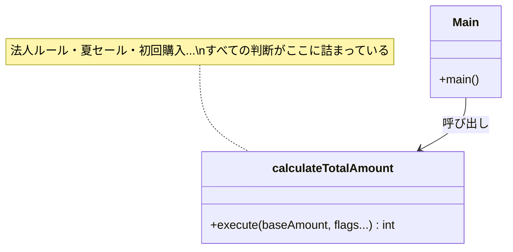
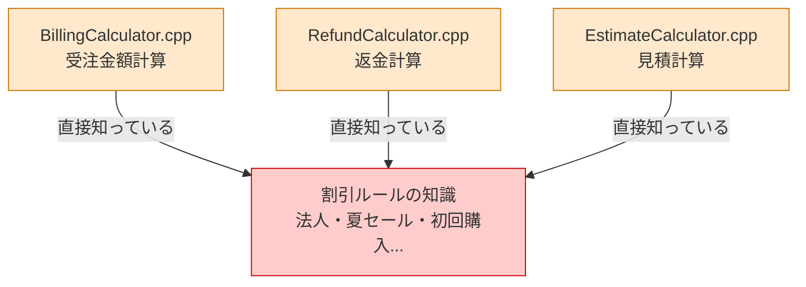
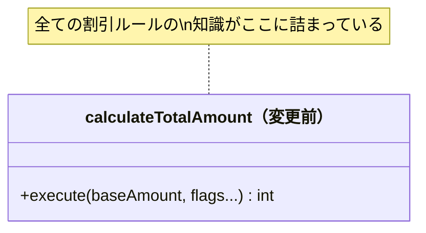
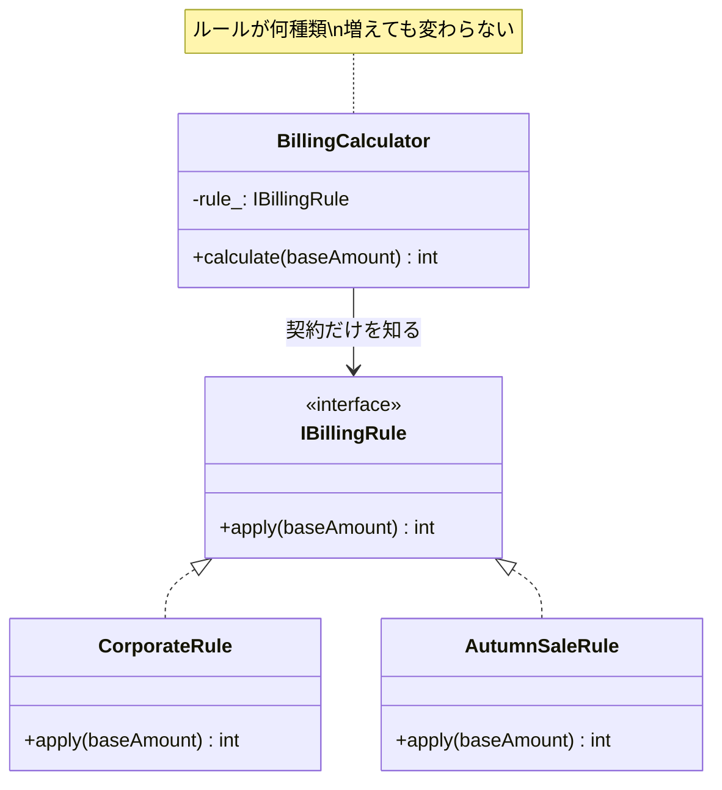
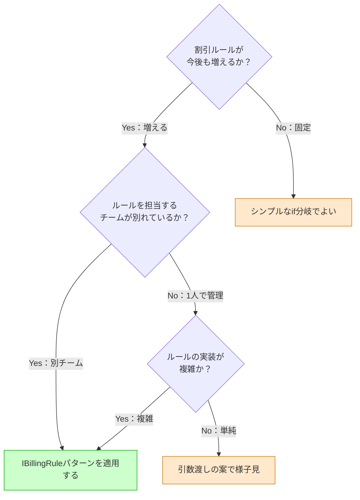
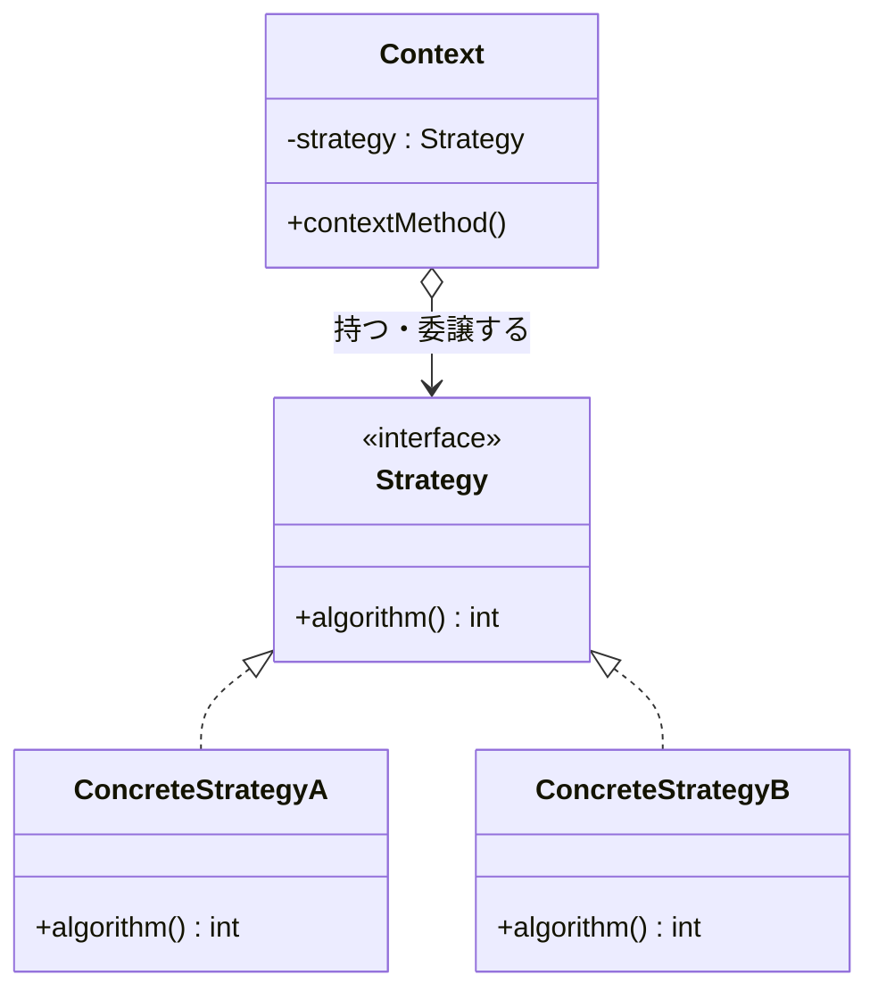
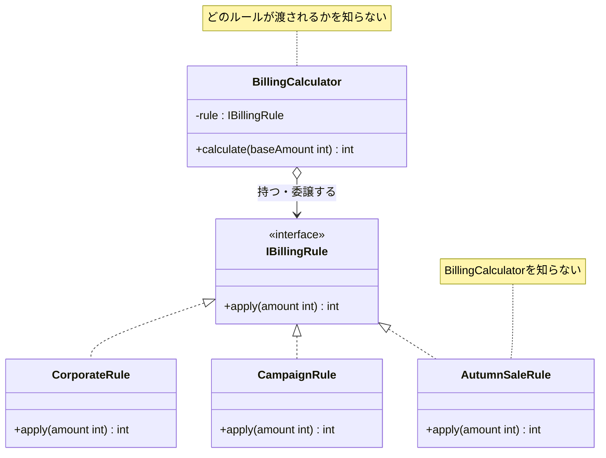

# 第1章　増え続ける割引ルールをどう整理するか（Strategy）
―― 思考の型：「変わるアルゴリズムと、変わらない骨格が同じ場所にいる」ことに気づく

> **この章の核心**
> 割引ルールが増えるたびに計算関数が育ち続けるのは、
> 「誰の判断で変わるか」が異なる2つのものが同じ場所にいるからだ。
> 分けるべきものを分けると、追加は「新しい部品を作るだけ」になる。

---

## この章を読むと得られること

- 自分のコードの中で「割引ルールを決める人」と「計算の骨格」が同じ場所に混在している状態を発見できるようになる
- 変化の速度が異なる2つのものを分離することで、新しいルールの追加が「クラスを1つ作るだけ」になる設計を作れるようになる
- このパターンが過剰になる場面（将来の変化がほぼ確実でない場合）を見極め、シンプルな代替案との使い分けができるようになる
- 変更要求が来たとき、影響が1クラスに収まる設計と全体に飛び火する設計の違いを事前に読めるようになる

## ステップ0：システムを把握し、仮説を立てる ―― クラス構成を見てから「変わりそうな場所」を予測する

> **入力：** システムのシナリオ説明 ＋ クラス構成の概要（仕様表・責任一覧）。実装コードはまだ読まない。
> **産物：** 変動と不変の「仮説テーブル」

**全パターンに共通する問い**

> 「このコードの中に、**『変わる理由』が異なる2つのものが、
> 同じ場所に混在していないか？」**

「変わる理由」とは **「誰の判断で変わるか」** のことです。
そのコードを変更するとき、答えが2人以上になるなら、変わる理由が複数混在しています。

### 1.0 この章のシステム構成と仮説

**この章で扱うシステム：**
ECサイトの受注金額計算モジュールです。
基本金額に割引ルールを適用し、消費税を加算して最終請求額を返します。
法人・一般で異なるルールが存在し、キャンペーンのたびに新しい割引が追加されます。

**仕様表（何ができるシステムか）**

| 機能 | 担当 | 入力 | 出力 |
|---|---|---|---|
| 金額計算 | `calculateTotalAmount` | 基本金額・顧客区分・各フラグ | 最終請求額 |

**クラス構成の概要**



*→ 1つの関数が「すべての割引ルール」を知っている。
割引の種類が増えるたびに、この関数に手を入れるしかない。*

**各クラスの責任一覧**

| 対象 | 責任（1文） | 知るべきこと |
|---|---|---|
| `calculateTotalAmount` | 最終請求額を返す | 基本金額と顧客区分 |
| `main()` | プログラムを起動する | 起動に必要な情報のみ |

---

この構成を踏まえた上で、仮説を立てます。
`calculateTotalAmount` に「すべての割引ルールの詳細」が詰まっていることが見えています。
どの部分が変わりやすく、どの部分は変わらないでしょうか。

**変動と不変の仮説（実装コードを読む前に立てる）**

| 分類 | 仮説 | 根拠（クラス構成から読み取れること） |
|---|---|---|
| 🔴 **変動する** | 割引ルールの種類・計算方法 | キャンペーンのたびに変わる。クラス図でも「すべての判断が詰まっている」と明記されている |
| 🔴 **変動する** | 法人契約の割引条件 | 営業ポリシーの変更で変わる |
| 🟢 **不変** | 「最終請求額を返す」という処理の骨格 | ECサイトがある限り変わらない |
| 🟢 **不変** | 消費税の適用 | 適用自体は変わらない（税率は別途） |

この仮説をステップ2（1.3）でヒアリング後に確定します。

---

## ステップ1：実装コードを読む ―― 責任チェックで問題の行を見つける

> **入力：** ステップ0で把握したクラス責任 ＋ 実際の実装コード
> **産物：** 責任チェック表。「このクラスが持つべきでない知識」が混在している行の発見。

### 1.1 実装コードと責任チェック

ステップ0でクラスの責任は把握しました。
ここでは実際の実装コードを読み、「責任通りに書かれているか」を1行ずつ確認します。

```cpp
// 【起点コード】
// billing/BillingCalculator.cpp
// 当初は法人・一般の2分岐のみ。
// 要求が増えるたびに、この関数が育ち続けてきた。

int calculateTotalAmount(
    int baseAmount,
    bool isCorporate,
    bool isPremium,
    int quantity,
    int continuationYears,
    bool isSummerSale,
    bool isFirstPurchase
) {
    int amount = baseAmount;

    if (isCorporate) {
        amount = amount * 9 / 10;            // 法人: 10%引き
        if (isPremium && quantity >= 100) {
            amount -= 50000;                 // プレミアム大量注文
        }
        if (continuationYears > 1) {
            amount -= 10000;                 // 継続1年超
        }
    } else {
        if (isSummerSale) {
            amount = amount * 8 / 10;        // 夏セール: 20%引き
        }
        if (isFirstPurchase) {
            amount -= 500;                   // 初回購入
        }
    }

    amount = static_cast<int>(amount * 1.1); // 消費税10%
    return (amount > 0) ? amount : 0;
}

int main() {
    // 法人・プレミアム・150個・2年
    int result = calculateTotalAmount(100000, true, true, 150, 2, false, false);
    return 0;
}
```

**実行結果：**
```
法人・プレミアム・150個・2年: 100000 * 0.9 - 50000 - 10000 = 30000 → 33000円
```

このコードは要件通りに動く。問題は「動くかどうか」ではなく「構造として何が混在しているか」です。**責任チェック**で確認します。

**責任チェック：`calculateTotalAmount` は自分の責任だけを持っているか**

この関数の責任は「最終請求額を計算して返すこと」です。
その責任を果たすために「知るべきこと」は何でしょうか。

> 基本金額と、適用すべき割引の結果。消費税率。

今のコードで `calculateTotalAmount` が「知っていること」を1行ずつ確認します。

| コードの行 | 持っている知識 | 責任内か |
|---|---|---|
| `amount * 9 / 10` | 法人割引率（10%） | **✗ 法人ルール担当の責任** |
| `isPremium && quantity >= 100` | プレミアム大量注文の条件 | **✗ 法人ルール担当の責任** |
| `continuationYears > 1` | 継続年数の閾値 | **✗ 法人ルール担当の責任** |
| `amount * 8 / 10` | 夏セール割引率（20%） | **✗ キャンペーン担当の責任** |
| `amount -= 500` | 初回購入割引額 | **✗ キャンペーン担当の責任** |
| `amount * 1.1` | 消費税率の適用 | ✅ 計算の骨格として自然 |

消費税の適用が ✅ なのは、「どの割引ルールが使われるかに関わらず、最後に必ず適用される」という計算の骨格そのものだからです。変更する決定権は法律（国）にあり、ルールの種類とは無関係に変わります。経理担当との合意により「消費税の適用はこの関数の責任」と確定しました（詳細は 1.3 のヒアリング）。

法人割引の計算方法を決めているのは法人営業チームです。
夏セールの割引率を決めているのはキャンペーン担当チームです。
**それぞれの「責任（誰の判断で変わるか）」が、1つの関数の中に詰め込まれています。**

これが「責任範囲外の関心が混在している」状態です。

---

### 1.2 届いた変更要求

営業チームから連絡が入りました。

「秋の特大セールを来週末に始めたいんです。
　新しい割引ルール（15%引き）を追加してもらえますか？
　リリースは5日後を想定しています。」

「またここに手を入れるのか」という感覚、うまく伝わっているでしょうか。
私自身、何度もこの状況で迷いました。


---

## ステップ2：仮説を確定する ―― 関係者ヒアリングで「変わる理由」に根拠をつける

> **入力：** ステップ0の仮説 × ステップ1の責任チェック結果。関係者（営業・業務担当など）に直接確認する。
> **産物：** 確定した変動/不変テーブル（「誰の判断で変わるか」明記）

### 1.3 仮説の検証と変動/不変の確定

ステップ0で「割引ルールは変わりやすい」「計算の骨格は変わらない」という仮説を立てました。
コードを読んだ結果、この仮説はコード上でも確認できます。
しかし——**コードを読んだだけで「変わる」「変わらない」と断定するのは危険です。**

ステップ0の仮説は予測に過ぎません。「なぜ変わるのか」「誰が決めるのか」を
関係者に確認して初めて、予測が根拠のある事実になります。

---

**関係者ヒアリング**

変動/不変を確定する前に、各ルールのオーナーに確認しました。

> **開発者**：「割引ルールは、今後も種類が増えていきますか？」
>
> **営業担当**：「はい。毎シーズンのキャンペーンで新しいルールが追加されます。
> 地域限定割引や会員ランク割引も今後検討しています。」
>
> **開発者**：「法人ルールの変更頻度はどのくらいですか？
> キャンペーン担当とは別チームで管理されていますか？」
>
> **法人営業担当**：「はい、法人ルールは私たちが決めます。
> キャンペーン担当とは完全に別です。
> 法人ルールの変更がキャンペーンに影響することはないはずです。」
>
> **開発者**：「基本金額の型（int）は将来変わりますか？
> 外貨対応などで型が変わる可能性はありますか？」
>
> **経理担当**：「現時点では円のみです。外貨対応は今のところ計画にありません。」
>
> **開発者**：「消費税率（10%）はルールによって変わることはありますか？」
>
> **経理担当**：「消費税率はシステム全体で統一です。
> 個別のルールが税率を持つことはありません。」

---

チームで話し合う価値がある部分だと思います。
このヒアリングがあって初めて、変動/不変テーブルに根拠が生まれます。

> **もし「ルールはもう増やさない」という回答だったら？**
>
> 「今後、割引ルールは一切変えない」という回答だったとすれば、
> この後のステップ5で選ぶ**インターフェース抽出**（第0章 手札）の採用は、
> コストに見合わない可能性が高くなります。
> その判断——「どれだけの変化が見込まれるときにパターンを使うか」——は
> ステップ6（1.10）で改めて扱います。
> ヒアリングの結果次第で、結論は変わります。これが「作戦を状況に応じて選ぶ」ということです。

| 分類 | 具体的な内容 | 変わるタイミング | 根拠 |
|---|---|---|---|
| 🔴 **変動する** | 割引ルールの種類と計算方法 | 毎シーズン（確定） | 営業担当への確認 |
| 🔴 **変動する** | 複数ルールの組み合わせ方 | 新機能要求のたびに | 営業担当への確認 |
| 🟢 **不変** | 「割引を適用して消費税を加算する」計算の骨格 | 変わる日は来ない | 経理担当との合意 |
| 🟢 **不変** | 基本金額の型（int・円） | 当面変わらない | 経理担当への確認 |
| 🟢 **不変** | 消費税率の適用タイミング | 統一ルールとして固定 | 経理担当との合意 |

> **設計の決断**：🟢 不変な計算の骨格を「契約（インターフェース）」として固定し、
> 🔴 変動する各割引ルールは、それぞれのインターフェースの裏側に押し込む。

**インターフェース命名の原則**：インターフェース名はビジネス上の責任で付ける。
「割引を適用する」責任なら `IBillingRule` ——
法人割引かセール割引かはインターフェースの名前に現れない。
なお `I` プレフィックス（`I` + クラス名）は「これはインターフェースである」を示す C++ の命名規約です。`IBillingRule` なら「BillingRule という責任のインターフェース」と読みます。

---

## ステップ3：課題分析 ―― 変更しようとしたときの困難と痛み

### 1.4 変更しようとしたときに現れる困難

秋の特大セール（15%引き）をこの関数に追加しようとすると、何が起きるでしょうか。

- **困難1：また引数が増える**
  `isAutumnSale` という引数を追加し、
  `calculateTotalAmount` の中にまた新しい `if` ブロックを書くことになります。
  今日の7引数が、来月は9引数、再来月は11引数——この先がイメージできてしまいます。

- **困難2：キャンペーンを変えると法人側のテストが不安になる**
  秋セール（一般向け）の1行を変えるだけで
  「法人側を壊していないか？」と全テストを走らせたくなります。
  担当チームが別なのに、互いの変更を気にしなければならない状態です。

---

**依存の広がり**



*→ 割引ルールの知識がシステムのあちこちに侵食している。これが問題の全体像。*

---

## ステップ4：原因分析 ―― 根本にある設計の問題を言語化する

### 1.5 困難の根本にあるもの

コードを観察して、困難の原因を探ります。

| 観察 | 原因の方向 |
|---|---|
| 割引が増えるたびに `calculateTotalAmount` が変わる | 関数が「変わるルールの詳細」を直接知っているから |
| 法人ルールとキャンペーンが同じ場所にある | 「変わる理由の異なる2つ」が同居しているから |
| テストが相互に干渉する | ルールの実装が隔離されていないから |

この観察から、問題の構造が見えてきます。

#### 変わるものと変わらないものが同じ場所にいる

| 変わり続けるもの | 変わってほしくないもの |
|---|---|
| 割引ルールの種類と計算方法 | 「割引を適用して消費税を加算する」骨格 |
| ルールを担当するチームの判断 | 入力（基本金額）と出力（最終請求額）の形 |

「変わり続けるもの」と「変わってほしくないもの」が
`calculateTotalAmount` という1つの場所に同居しています。
これが、変更のたびに全体が揺れる原因です。

---

## ステップ5：対策案の検討 ―― 原因から対策を逆算する

ステップ4の結論を確認します。

> **原因：割引ルールの詳細（変わる）と計算の骨格（変わらない）が、
> 同じ `calculateTotalAmount` に同居している。
> 割引ルールが「独立した単位」として存在していない。**

原因が「独立した単位として存在していない」なら、対策の方向性は一つです。

**割引ルールを独立した単位として定義する。**

第0章の手札選択表を引くと：「任意の振る舞い（計算ロジック、ルールなど）が変わる」→ **インターフェース抽出**（第0章 手札）。この原因に直接対応します。
割引ルールをインターフェースとして定義し、各ルールをそれぞれ独立したクラスとして実装します。

### 1.6 対策：「割引ルール」をインターフェースとして独立させる

```cpp
// 「割引ルール」をインターフェースとして定義する
// billing/IBillingRule.h

class IBillingRule {
public:
    virtual int apply(int baseAmount) = 0;
    virtual ~IBillingRule() {}
};
```

```cpp
// 法人割引ルール
// billing/CorporateRule.h
// 法人向けの複雑な条件を1つの部品に閉じ込める。

class CorporateRule : public IBillingRule {
public:
    CorporateRule(bool isPremium, int quantity, int continuationYears)
        : isPremium_(isPremium)
        , quantity_(quantity)
        , continuationYears_(continuationYears)
    {}

    int apply(int baseAmount) {
        int amount = baseAmount * 9 / 10;
        if (isPremium_ && quantity_ >= 100) {
            amount -= 50000;
        }
        if (continuationYears_ > 1) {
            amount -= 10000;
        }
        return amount;
    }

private:
    bool isPremium_;
    int  quantity_;
    int  continuationYears_;
};
```

```cpp
// 秋セールルール
// billing/AutumnSaleRule.h
// CorporateRule にも calculateTotalAmount にも触れずに追加できる。

class AutumnSaleRule : public IBillingRule {
public:
    int apply(int baseAmount) {
        return baseAmount * 85 / 100; // 15%引き（左から評価: baseAmount*85 を先に計算してから /100）
    }
};
```

```cpp
// コンテキスト（計算の骨格）
// billing/BillingCalculator.h

class BillingCalculator {
public:
    explicit BillingCalculator(IBillingRule* rule) : rule_(rule) {}

    int calculate(int baseAmount) {
        int amount = rule_->apply(baseAmount); // IBillingRule だけを知る
        amount = static_cast<int>(amount * 1.1);
        return (amount > 0) ? amount : 0;
    }

private:
    IBillingRule* rule_;
};
```

**インターフェース抽出** 適用後の責任チェック（BillingCalculator）

| BillingCalculator が持っている知識 | 誰の責任か |
|---|---|
| `rule_->apply(baseAmount)` を呼ぶ手順 | ✅ BillingCalculator の責任 |
| 消費税率（10%）の適用 | ✅ 計算の骨格として自然（経理担当と合意済み） |
| 法人割引率の詳細 | **見えない**（IBillingRule の裏側） |
| 秋セール割引率の詳細 | **見えない**（IBillingRule の裏側） |

`BillingCalculator` は `IBillingRule` という契約だけを知っています。
割引ルールが増えても、`BillingCalculator` には触れません。

---

**変更前後のクラス図**





変更前：`calculateTotalAmount` が全ルールの詳細を知っていた。
変更後：`BillingCalculator` は `IBillingRule` という1本の矢印しか持たない。

---

### 補足：手札を誤ると何が起きるか

「割引ルールを独立した単位として定義する」という方向性から外れた案を選ぶと何が起きるか、確認しておきます。

**割引率を引数として渡す場合**

```cpp
int calculateTotalAmount(int baseAmount, int discountPercent) { ... }

// 秋セール（15%引き）＋ 法人（10%引き）が同時に適用される注文
// → discountPercent に何を渡せばいい？
int result = calculateTotalAmount(100000, ???);  // 15? 10? 合算して25?
```

割引率を1つに圧縮するために、呼び出し元が先にルールの判断をする必要があります。判断の責任が移動しただけで、構造は変わりません。

**新しい関数を追加する場合**

```cpp
int calculateTotalAmount(int baseAmount, ...) { /* そのまま */ }

int calculateAutumnSaleAmount(int baseAmount) {
    int amount = baseAmount * 85 / 100;
    amount = static_cast<int>(amount * 1.1); // 消費税 ← 骨格のコピー
    return (amount > 0) ? amount : 0;
}
```

消費税を加算する骨格が2箇所にコピーされます。ルールが増えるたびに骨格のコピーが増え、消費税率が変わったとき変更箇所が複数に広がります。

どちらの案も「割引ルールが独立した単位になっていない」という原因を解消できていません。**インターフェース抽出**（第0章 手札）はこの原因に直接対処します。

---

## ステップ6：天秤にかける ―― 柔軟性とシンプルさのバランスを評価する

### 1.8 評価軸の宣言

比較を始める前に「何を重視するか」を明示します。
基準を後から決めると、結論ありきの比較になってしまいます。

| 基準 | なぜこの状況で重要か |
|---|---|
| テストの独立性 | 法人ルールとキャンペーンルールを互いに干渉せずテストしたい |
| 変更の局所性 | 新しいルール追加のとき、変更箇所を1か所に収めたい |
| チームの分担 | 担当チームが別れているため、コードも別れていてほしい |

---

### 1.9 各アプローチをテストで比較する

**引数渡しの案（手札なし）のテスト**

```cpp
// 引数渡しの案：法人ルールの確認
// ルールのロジックがテスト内に複製される

TEST(BillingTest, CorporatePremiumBulk) {
    int base  = 100000;
    int disc  = base * 9 / 10;
    disc -= 50000; // プレミアム大量注文
    disc -= 10000; // 継続1年超
    int tax   = static_cast<int>(disc * 1.1);
    // EXPECT_EQ(期待値, 実際の値)：等しければテスト通過という検証
    EXPECT_EQ(tax, calculateTotalAmount(base, 10));
    // テスト内にルールのロジックが重複している
}
```

**インターフェース抽出** 適用後のテスト

```cpp
// BillingCalculator のテスト：ルールを知らなくてよい

class StubBillingRule : public IBillingRule {
public:
    int apply(int baseAmount) { return 8000; }
};

TEST(BillingCalculatorTest, AppliesTaxToRuleResult) {
    StubBillingRule rule;
    BillingCalculator calc(&rule);
    EXPECT_EQ(8800, calc.calculate(10000)); // 8000 * 1.1
}
```

```cpp
// 各ルールのテスト：BillingCalculator の存在を知らなくてよい

TEST(AutumnSaleRuleTest, Applies15PercentDiscount) {
    AutumnSaleRule rule;
    EXPECT_EQ(8500, rule.apply(10000));
}

TEST(CorporateRuleTest, AppliesPremiumBulkDiscount) {
    CorporateRule rule(true, 150, 2);
    EXPECT_EQ(30000, rule.apply(100000)); // 100000*0.9 - 50000 - 10000
}
```

各部品が「自分の責任だけ」をテストしています。
法人ルールが変わっても、秋セールのテストには影響しません。

**比較のまとめ**

| 基準 | 引数渡しの案 | **インターフェース抽出**の適用（IBillingRule） |
|---|---|---|
| テストの独立性 | △ 計算器を介してしか確認できない | ○ ルール単体でテストできる |
| 変更の局所性 | △ 呼び出し元にルール知識が散らばる | ○ 新クラスを追加するだけ |
| チームの分担 | △ ルール定義が呼び出し元に混在 | ○ ルールごとにファイルが分かれる |
| 実装コスト | 少ない（クラス定義不要） | 多い（インターフェース＋クラス必要） |

*この比較はあくまで「今回の状況と基準」に対するものです。
別の状況・別の基準であれば、違う選択が正解になります。*

---

### 1.10 耐久テスト ―― ヒアリングで挙がった変化が来た

1.2のヒアリングで、営業担当からこんな話がありました。
「将来的には複数の割引を重ねて適用したい。」

この変化が実際に来た場面をシミュレートします。

```cpp
// 複数の割引ルールを順番に重ねる
// IBillingRule も CorporateRule も AutumnSaleRule も変更なし

class MultiBillingCalculator {
public:
    MultiBillingCalculator() : count_(0) {}

    void addRule(IBillingRule* rule) {
        rules_[count_] = rule;
        count_++;
    }

    int calculate(int baseAmount) {
        int amount = baseAmount;
        for (int i = 0; i < count_; i++) {
            amount = rules_[i]->apply(amount);
        }
        amount = static_cast<int>(amount * 1.1);
        return (amount > 0) ? amount : 0;
    }

private:
    IBillingRule* rules_[10];
    int           count_;
};
```

```cpp
// 秋セール＋会員割引を重ねる
class MemberDiscountRule : public IBillingRule {
public:
    explicit MemberDiscountRule(int discountAmount)
        : discountAmount_(discountAmount) {}

    int apply(int baseAmount) {
        return baseAmount - discountAmount_;
    }

private:
    int discountAmount_;
};

// 組み立て側
AutumnSaleRule     autumnRule;
MemberDiscountRule memberRule(500);

MultiBillingCalculator calc;
calc.addRule(&autumnRule);
calc.addRule(&memberRule);

int result = calc.calculate(10000);
// 10000 → 8500（秋15%引き）→ 8000（会員500円引き）→ 8800（消費税）
```

`IBillingRule` も `CorporateRule` も `AutumnSaleRule` も、一切変更していません。

---

### 1.11 使う場面・使わない場面

「では、**インターフェース抽出**を常に使えばいいのか？」という問いは自然です。
間違えても大丈夫です。
正解はないのですが、一つの考え方として——

```cpp
// 使いすぎた例：変化の予定がないものまでルール化した

class TaxRule : public IBillingRule {
public:
    int apply(int baseAmount) {
        return static_cast<int>(baseAmount * 1.1);
    }
};
```

消費税率が変わる可能性がゼロではないことは認めます。
しかし、経理担当と「統一ルール」と合意している以上、
これをわざわざ独立したクラスにする根拠はありません。
変化の予定がないものを「変わるもの」として扱うと、複雑さだけが増えます。

| 状況 | 適切な選択 | 理由 |
|---|---|---|
| ルールが複雑・チームで分担する | **インターフェース抽出**（IBillingRule） | テスト独立性・チーム分担が必要 |
| ルールが2〜3個・1人で管理 | 引数渡しの案 | 実装コストが割に合う |
| ルールが今後も確実に増える | **インターフェース抽出** | 追加コストがかからない |
| ルールが固定で変わらない | シンプルなif分岐でよい | パターン不要 |

**適用判断のフローチャート：**



*このフローは「今回の評価軸」に対するもの。別の状況・別の基準なら、違う判断になります。*

設計に絶対の正解はありません。
「今どのリスクを優先して対処するか」をチームで合意することが、設計の一歩だと私は感じています。

---

## ステップ7：決断と、手に入れた未来

### 1.12 解決後のコード（全体）

```cpp
// ────────────────────────────────────────────────────────
// インターフェース定義
// ────────────────────────────────────────────────────────

class IBillingRule {
public:
    virtual int apply(int baseAmount) = 0;
    virtual ~IBillingRule() {}
};

// ────────────────────────────────────────────────────────
// 実装クラス（各ルールが自分の責任だけを持つ）
// ────────────────────────────────────────────────────────

class CorporateRule : public IBillingRule {
public:
    CorporateRule(bool isPremium, int quantity, int continuationYears)
        : isPremium_(isPremium)
        , quantity_(quantity)
        , continuationYears_(continuationYears)
    {}

    int apply(int baseAmount) {
        int amount = baseAmount * 9 / 10;
        if (isPremium_ && quantity_ >= 100) amount -= 50000;
        if (continuationYears_ > 1)         amount -= 10000;
        return amount;
    }

private:
    bool isPremium_;
    int  quantity_;
    int  continuationYears_;
};

class AutumnSaleRule : public IBillingRule {
public:
    int apply(int baseAmount) {
        return baseAmount * 85 / 100; // 左から評価: (baseAmount*85)/100
    }
};

// ────────────────────────────────────────────────────────
// コンテキスト：計算の骨格だけに専念する
// ────────────────────────────────────────────────────────

class BillingCalculator {
public:
    explicit BillingCalculator(IBillingRule* rule) : rule_(rule) {}

    int calculate(int baseAmount) {
        int amount = rule_->apply(baseAmount);
        amount = static_cast<int>(amount * 1.1);
        return (amount > 0) ? amount : 0;
    }

private:
    IBillingRule* rule_;
};

// ────────────────────────────────────────────────────────
// BillingApplication（Composition Root）
// 「どのルールクラスを使うか」を決めて組み立てる唯一の場所。
// Composition Rootとは「具体クラスを知ってよい唯一の場所」というパターン名で、
// ここだけがインターフェースの裏に何があるかを知っている。
// ────────────────────────────────────────────────────────

class BillingApplication {
public:
    void run() {
        CorporateRule     rule(true, 150, 2);
        BillingCalculator calc(&rule);
        int result = calc.calculate(100000);
        saveResult(result);
    }

private:
    void saveResult(int amount) { /* 結果を保存 */ }
};

// ────────────────────────────────────────────────────────
// main() は BillingApplication をキックするだけ
// ────────────────────────────────────────────────────────

int main() {
    BillingApplication app;
    app.run();
    return 0;
}
```

**実行結果：**
```
[Corporate] 100000 * 0.9 - 50000 - 10000 = 30000 → 33000円（消費税込み）
```

---

### 1.13 変更シナリオ表と最終責任テーブル

**変更シナリオ表：何が変わったとき、どこが変わるか**

| シナリオ | 変わるクラス | 変わらないクラス |
|---|---|---|
| 新しい割引ルールを追加する | 新しい〇〇Rule クラスを追加 | IBillingRule / BillingCalculator |
| 法人割引率が変わる | CorporateRule のみ | AutumnSaleRule / BillingCalculator |
| 使うルールを切り替える | BillingApplication の1行 | すべてのルールクラス |
| 消費税率が変わる | BillingCalculator のみ | すべてのルールクラス |

どのシナリオでも、変わるクラスが1〜2クラスに収まっています。
`BillingCalculator` が割引ルールの追加・変更で変わることは、一切ありません。

---

**最終責任テーブル**

| クラス | 責任（1文） | 変わる理由 |
|---|---|---|
| `main()` | プログラムを起動する | 起動方法が変わるとき |
| `BillingApplication` | 依存を組み立て、処理を起動する | 使うルールの組み合わせが変わるとき |
| `BillingCalculator` | 計算の骨格（割引→消費税）を完了させる | 計算の骨格が変わるとき |
| `IBillingRule` | 割引ルールの契約を定義する | 割引責任の範囲が変わるとき |
| `CorporateRule` | 法人向け割引を計算する | 法人割引の条件・率が変わるとき |
| `AutumnSaleRule` | 秋セール割引を計算する | 秋セールの割引率が変わるとき |

各クラスが持つ「変わる理由」が1つに絞られています。
これが、ステップ4で特定した問題への答えです。

---

## 整理

### 8ステップとこの章でやったこと

| ステップ | この章でやったこと |
|---|---|
| ステップ0 | ECサイトの割引計算システムの構成を確認し、「割引ルールは変わりやすく、計算の骨格は変わらない」という仮説を立てた |
| ステップ1 | 各行が責任範囲内かを確認し、`calculateTotalAmount` に「法人ルールの詳細」「キャンペーンルールの詳細」が混在していることを発見した |
| ステップ2 | 営業・経理担当へのヒアリングで「割引ルールは毎シーズン変わる」「計算の骨格は変わらない」という仮説を事実として確定した |
| ステップ3 | 新しいセールルールを追加しようとすると関数に `if` が増え続け、担当チームが別なのにテストが相互に干渉する痛みを確認した |
| ステップ4 | 「変わる理由の異なる2つのもの（割引ルールの詳細・計算の骨格）が同じ場所にいる」という根本原因を言語化した |
| ステップ5 | 原因から対策の方向性を逆算し、**インターフェース抽出**（第0章 手札）を適用した。手札を誤った場合のアンチパターンも確認した |
| ステップ6 | テストの独立性・変更の局所性・チームの分担という評価軸で**インターフェース抽出**適用の対価を確認し、今回のケースでは採用する価値があると判断した |
| ステップ7 | 全コードを示し、変更シナリオ別に「変わるクラス・変わらないクラス」で効果を確認した |

**各クラスの最終的な責任**

| クラス | 責任 | 変わる理由 |
|---|---|---|
| `main()` | プログラムを起動する | 起動方法が変わるとき |
| `BillingApplication` | 依存を組み立て、処理を起動する | 使うルールの組み合わせが変わるとき |
| `BillingCalculator` | 計算の骨格（割引→消費税）を完了させる | 計算の骨格が変わるとき |
| `IBillingRule` | 割引ルールの契約を定義する | 割引責任の範囲が変わるとき |
| `CorporateRule` | 法人向け割引を計算する | 法人割引の条件・率が変わるとき |
| `AutumnSaleRule` | 秋セール割引を計算する | 秋セールの割引率が変わるとき |

「変わる理由が1つ」のクラスだけで構成されている。
このプロセスを回した結果にたどり着いた構造こそが **Strategyパターン** です。

設計に絶対の正解はありません。ただ「各クラスの責任は何か」「変わる理由は1つか」を問い続けることが、変更に強いコードへの入り口になります。

---

## 振り返り：第0章の3つの哲学はどう適用されたか

改めて、ここまで導き出してきた「最終的な設計（図やコード）」を、第0章でお話しした「3つの哲学」と照らし合わせてみましょう。一通り設計のプロセスを体験した今なら、あの哲学が「コードのどの部分に現れているか」がはっきりと見えるはずです。

### 哲学1「変わるものをカプセル化せよ」の現れ

**具体化された場所：** 法人ルールや夏セールといった処理を独立させた `CorporateRule`・`AutumnSaleRule` 各クラス

法人ルールやキャンペーンルールなど「毎シーズン変わり続ける部分」を、計算の骨格（`calculateTotalAmount`）に同居させるのをやめました。変わる部分だけをきれいに抜き出し、独自のクラスにカプセル化（隔離）したからです。
結果として、**割引の種類が100種類に増えても、計算の骨格（`BillingCalculator`）の中身はまったく変わらない（不変を保てる）構造**を手に入れることができました。

### 哲学2「実装ではなくインターフェースに対してプログラムせよ」の現れ

**具体化された場所：** `BillingCalculator` が具体クラスを知らず、`IBillingRule` インターフェースだけを知っている構造

`BillingCalculator` のメンバ変数は `IBillingRule* rule_` と宣言されており、`CorporateRule` や `AutumnSaleRule` の名前はどこにも出てきません。具体クラスを知っているのは `BillingApplication`（Composition Root）だけです。

この構造により、どんな割引ルールが追加・変更・削除されても `BillingCalculator` は一切変わりません。「契約だけを知り、実装を知らない」ことが、変更の飛び火を止める壁になっています。

---

### 哲学3「継承よりコンポジションを優先せよ」の現れ

**具体化された場所：** `BillingCalculator` が `IBillingRule` を「部品として持つ（`rule_`）」構造

もし基本となる「計算クラス」があり、それを継承して「ログ付き計算クラス」「税込み計算クラス」「ログ＋税込みクラス」と増やしていくと、組み合わせの数だけクラスが爆発します。`IBillingRule` という部品を差し替えるだけで、`BillingCalculator` 本体に一切触れずに振る舞いを変えられます。これが「継承よりコンポジション」の恩恵です。

---

第1章で体験したプロセスを振り返ると、Strategyパターンは「答えとして学ぶもの」ではなく、「こういう状況に直面したとき、このように考えると自然にたどり着く構造」だとわかります。

---

## パターン解説：Strategyパターン

> **GoFとは：** GoF（Gang of Four）とは1994年に発表された書籍 *Design Patterns: Elements of Reusable Object-Oriented Software* の4人の著者を指します。この書籍で定義された23種のパターンが「GoFデザインパターン」と総称されています。Strategyパターンはその中の1つです。

### パターンの骨格

Strategyパターンは3つの役割で成り立ちます。



**Context** はアルゴリズムを「使う」側です。`Strategy` インターフェースだけを知り、誰が実装しているかを知りません。**Strategy** はアルゴリズムの「契約」であり、Contextはこの契約にだけ依存します。**ConcreteStrategy** はアルゴリズムの「実装」です。Context もほかの ConcreteStrategy も知らず、ただ契約を実装するだけです。

### この章の実装との対応



`BillingCalculator` は `IBillingRule` の `apply()` を呼ぶだけです。どのルールが渡されるかを知っているのは `BillingApplication`（Composition Root）だけです。秋セールルールを追加するとき、`BillingCalculator` には一切触れません。

### どんな構造問題を解くか

「処理の骨格」と「処理の中身」が同じクラスにいる状態がStrategyパターンの出番です。

「中身」が変わるたびに「骨格」も触らなければならない——この状態では骨格のテストが安定しません。割引ルールを変えると消費税の計算まで確認し直さなければならない状態がまさにそれです。

StrategyパターンはContextに「委譲する先」というインターフェースを定義し、「中身」をその外側に追い出します。結果として「骨格（Context）」と「中身（ConcreteStrategy）」は独立して変化できるようになります。

### 使いどころと限界

**使いどころ：**「同じ種類の処理に複数の実装があり、切り替わる」とわかったときです。判断の基準は「誰の判断で変わるか」が異なるかどうかです。法人ルールは法人営業チームが決め、キャンペーンルールはキャンペーン担当チームが決める——変わる理由の持ち主が複数いるなら、Strategyとして分離を検討する時期です。

**限界：**実装が1種類しかなく今後も変わる見込みがない場合は使わないほうがよいです。インターフェースと追加クラスのコストが純粋なオーバーヘッドになります。消費税処理を `TaxRule` として切り出した例（1.11）がまさにこれです。「変わる予定がないルール」をStrategyにしても複雑さが増すだけです。