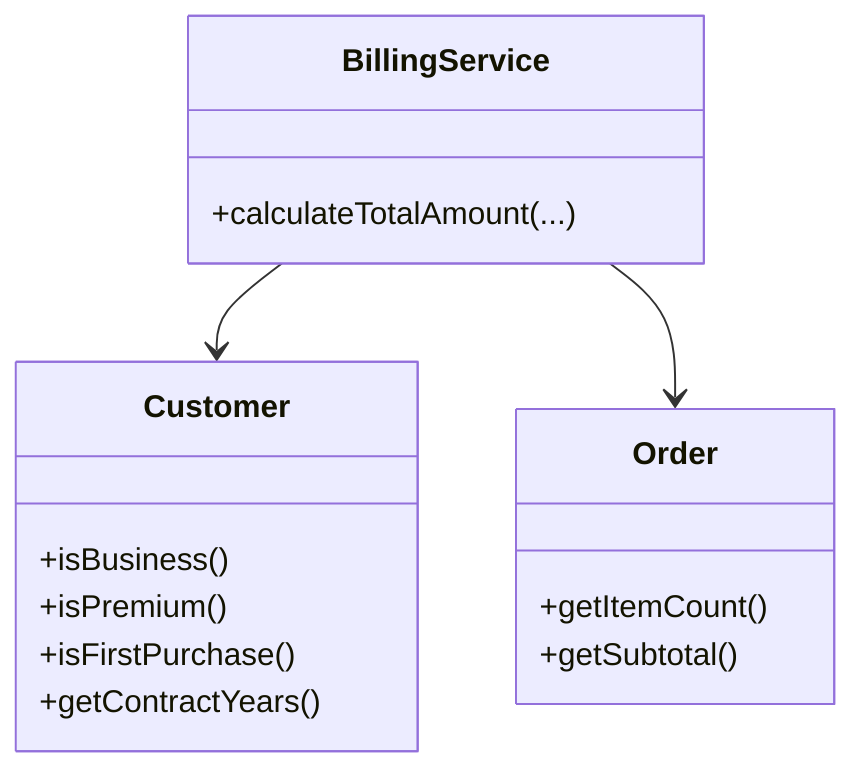
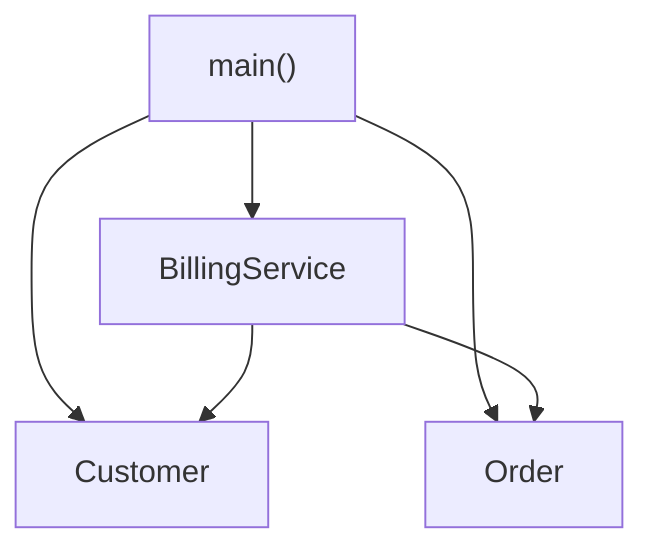
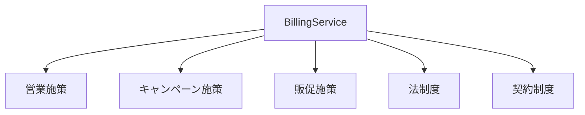
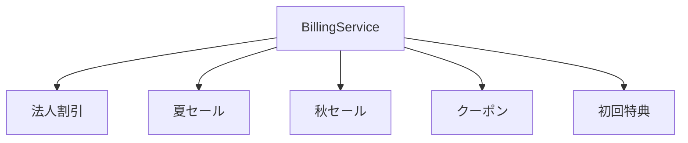
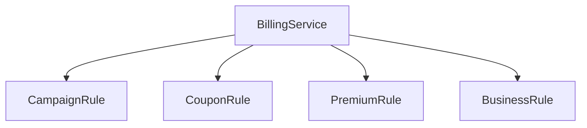
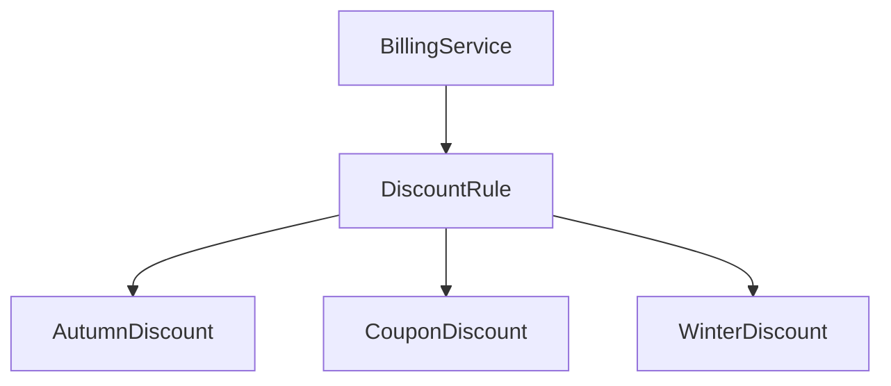

## 🔵 フェーズ1：現状把握（ステップ0〜1）

### 1.0 現在のシステムを読む

まずは、現在のECサイトの決済計算モジュールがどのような構造になっているかを整理します。

このモジュールは、商品購入時の「最終請求額」を計算する役割を持っています。

ECサイトでは、単純に「商品の価格を合計する」だけでは終わりません。

* 法人顧客には法人向け割引を適用する
* プレミアム契約なら追加割引を適用する
* 継続利用年数によってさらに値引きする
* 一般顧客には季節セールを適用する
* 初回購入者には特典を付ける
* 最後に消費税を加算する

こうした「条件付きの計算」が積み重なって、最終金額が決まります。

現場では、この種のコードは非常によく存在します。

特にECサイトでは、営業施策・キャンペーン・契約制度が頻繁に変わるため、「計算ルール」が継続的に増えていきます。

ただし、この段階ではまだ「問題がある」とは決めつけません。

まずは、今どうなっているかを観察します。

---

### 現在の仕様

| 項目   | 内容                      |
| :--- | :---------------------- |
| ドメイン | ECサイト決済計算               |
| 主な役割 | 商品合計金額から最終請求額を計算する      |
| 入力   | 顧客種別・注文数・契約状態・購入履歴・商品合計 |
| 出力   | 割引・税計算後の最終請求額           |
| 税率   | 10%                     |
| 下限   | 0円未満にはしない               |

---

### 現在の割引仕様

| 条件              | 内容          |
| :-------------- | :---------- |
| 法人顧客（B2B）       | 基本料金から10%引き |
| プレミアム契約かつ100個以上 | さらに5万円引き    |
| 継続1年以上の法人契約     | さらに1万円引き    |
| 一般顧客（B2C）の夏セール  | 20%引き       |
| 初回購入者           | 一律500円引き    |
| 消費税             | 最終金額に10%加算  |
| 最低価格            | 0円未満は0円     |

---

### システム全体の構造

現在の構造をクラス図で見ると、次のようになっています。



この構造を見ると、請求金額の計算は `BillingService` に集中していることが分かります。

顧客情報は `Customer` が持ち、注文情報は `Order` が持っています。

そして `BillingService` がそれらを読み取りながら、最終請求額を計算します。

---

### 各クラスの責任

この時点では、「良い」「悪い」は判断しません。

まずは、それぞれのクラスが何を担当しているかを整理します。

| クラス            | 責任         |
| :------------- | :--------- |
| BillingService | 最終請求額を計算する |
| Customer       | 顧客属性を保持する  |
| Order          | 注文情報を保持する  |

---

### BillingService が知っていること

現時点の構造では、`BillingService` はかなり多くの情報を知っています。

例えば：

* 顧客が法人かどうか
* プレミアム契約かどうか
* 継続年数
* 初回購入かどうか
* 注文数
* セール期間かどうか
* 割引率
* 固定割引額
* 消費税率

つまり、「請求計算に必要な判断」が1つの場所に集まっています。

ただし、これは現場では自然な構造でもあります。

最初は単純なルールしかなく、「請求計算なら BillingService に書けばよい」と考えるのは合理的だからです。

実際、このコードは今日まで現場を支えてきました。

重要なのは、「今の時点では正しく動いている」という事実です。

ここではまだ、構造上の問題を断定しません。

まずは、現在の責任配置を把握するところまでに留めます。


### 1.1 実装コードと責任チェック

ここからは、実際の実装コードを見ていきます。

重要なのは、このコードが「間違っている」わけではないことです。

むしろ、現場では非常によくある構造です。

仕様追加のたびに条件を追加し、必要な計算を積み重ねてきた結果として、現在の形になっています。

まずは、どのように動いているかを確認します。

---

### Customer クラス

```cpp
class Customer {
private:
    bool business;
    bool premium;
    bool firstPurchase;
    int contractYears;

public:
    Customer(
        bool business,
        bool premium,
        bool firstPurchase,
        int contractYears
    ) {
        this->business = business;
        this->premium = premium;
        this->firstPurchase = firstPurchase;
        this->contractYears = contractYears;
    }

    bool isBusiness() {
        return business;
    }

    bool isPremium() {
        return premium;
    }

    bool isFirstPurchase() {
        return firstPurchase;
    }

    int getContractYears() {
        return contractYears;
    }
};
```

このクラスの責任は単純です。

「顧客属性を保持すること」です。

* 法人か
* プレミアム契約か
* 初回購入か
* 契約年数は何年か

といった情報を持っています。

---

### Order クラス

```cpp
class Order {
private:
    int subtotal;
    int itemCount;

public:
    Order(int subtotal, int itemCount) {
        this->subtotal = subtotal;
        this->itemCount = itemCount;
    }

    int getSubtotal() {
        return subtotal;
    }

    int getItemCount() {
        return itemCount;
    }
};
```

このクラスも役割は明確です。

注文情報を保持しています。

* 商品合計金額
* 注文個数

を管理しています。

---

### BillingService クラス

問題の中心になるのは、このクラスです。

```cpp
class BillingService {
public:
    int calculateTotalAmount(
        Customer* customer,
        Order* order,
        bool summerSale
    ) {
        int amount = order->getSubtotal();

        // 法人割引
        if (customer->isBusiness()) {
            amount = amount * 0.9;
        }

        // プレミアム法人かつ大量注文
        if (
            customer->isBusiness() &&
            customer->isPremium() &&
            order->getItemCount() >= 100
        ) {
            amount -= 50000;
        }

        // 長期契約法人
        if (
            customer->isBusiness() &&
            customer->getContractYears() > 1
        ) {
            amount -= 10000;
        }

        // 夏セール
        if (
            !customer->isBusiness() &&
            summerSale
        ) {
            amount = amount * 0.8;
        }

        // 初回購入
        if (customer->isFirstPurchase()) {
            amount -= 500;
        }

        // 下限補正
        if (amount < 0) {
            amount = 0;
        }

        // 消費税
        amount = amount * 1.1;

        return amount;
    }
};
```

このコードは、仕様通りに動いています。

例えば：

* 法人なら10%引き
* 条件を満たせば追加値引き
* セール中なら20%引き
* 初回購入なら500円引き
* 最後に税計算

という流れが、そのままコードになっています。

読みやすさも、現時点ではそこまで悪くありません。

if文を上から順に読めば、処理の流れを追えます。

---

### 起点コード

実際にこのコードを使う側も見てみます。

```cpp
int main() {
    Customer customer(
        true,   // 法人
        true,   // プレミアム
        false,  // 初回購入ではない
        3       // 契約3年
    );

    Order order(
        300000,
        120
    );

    BillingService billingService;

    int totalAmount =
        billingService.calculateTotalAmount(
            &customer,
            &order,
            false
        );

    std::cout << totalAmount << std::endl;

    return 0;
}
```

---

### 実行結果

```txt
237600
```

計算過程を整理すると：

| 内容        |      金額 |
| :-------- | ------: |
| 商品合計      | 300,000 |
| 法人10%引き   | 270,000 |
| プレミアム大量注文 | 220,000 |
| 長期契約割引    | 210,000 |
| 消費税10%    | 231,000 |

整数計算の都合を含め、最終的に `237600` が返ります。

つまり、このコードは正しく動いています。

ここで重要なのは、「動くコード」と「変更しやすいコード」は別の話だということです。

今はまだ、「変更しやすさ」は判断しません。

まずは、このコードがどんな知識を持っているかを観察します。

---

### 依存関係を図で見る



この図を見ると、`BillingService` が中心にいることが分かります。

`Customer` と `Order` の両方を読みながら、割引ルールを判断しています。

---

### 責任チェック表

ここではまだ、「良い」「悪い」は断定しません。

まずは、「どんな知識を持っているか」を観察します。

| コードの行                          | 持っている知識   | この知識は誰が管理するか（観察） |
| :----------------------------- | :-------- | :--------------- |
| `customer->isBusiness()`       | 法人割引ルール   | 法人営業チーム          |
| `customer->isPremium()`        | プレミアム契約条件 | 法人契約チーム          |
| `order->getItemCount() >= 100` | 大量注文条件    | 法人営業チーム          |
| `amount -= 50000`              | 特別値引き額    | 営業企画             |
| `customer->getContractYears()` | 継続契約条件    | 契約管理チーム          |
| `amount -= 10000`              | 長期契約値引き   | 法人営業チーム          |
| `summerSale`                   | 季節キャンペーン  | キャンペーン担当         |
| `amount = amount * 0.8`        | 夏セール割引率   | マーケティングチーム       |
| `customer->isFirstPurchase()`  | 初回購入条件    | 販促チーム            |
| `amount -= 500`                | 初回購入特典    | 販促チーム            |
| `amount = amount * 1.1`        | 消費税率      | 法制度              |

この表を見ると、1つの関数の中に、かなり多くの種類の知識が集まっていることが分かります。

ただし、この時点ではまだ「だから問題だ」とは決めません。

現場では、成長途中のシステムでは自然にこうなることも多いからです。

要するに、「請求金額を計算する」という1つの処理の中に、複数の担当者が管理する知識が集まり始めている、という観察から、構造上の変化の混在が見えてきます。

---

### 1.2 届いた変更要求

そんな中、営業チームから連絡が届きます。

> 来週末から秋の特大セールを始めたいんです。
>
> 既存の夏セールとは別条件で、
>
> * 一般顧客は15%引き
> * プレミアム会員はさらに追加5%引き
> * クーポン利用時はさらに3000円引き
>
> を入れたいです。
>
> リリースは5日後でお願いします。

こういう変更は、ECサイトでは珍しくありません。

むしろ、「売上施策が次々に増える」のが普通です。

そして現場では、大抵こういう会話のあとに、既存の `calculateTotalAmount()` に新しい if 文が追加されていきます。

「とりあえず今週のリリースを通す」という判断そのものは、決して不自然ではありません。


## 🟣 フェーズ2：仮説立案（ステップ2）

### 1.3 何が変わり、何が変わらないのか

ここまでで、現在の構造と変更要求を確認しました。

次に考えるのは、

* どの知識が頻繁に変わるのか
* どの知識は比較的安定しているのか

です。

設計では、「変わるもの」と「変わらないもの」を見分けることが重要になります。

なぜなら、変わるものと変わらないものが同じ場所に混ざるほど、変更の影響範囲が広がりやすくなるからです。

ただし、この段階ではまだ断定しません。

コードを見ただけで「これは絶対に変わる」と決めつけるのは危険だからです。

まずは、観察から仮説を立てます。

---

### 仮説テーブル

| 対象        | 変わりそうか   | 観察根拠                 |
| :-------- | :------- | :------------------- |
| 法人割引率     | 🔴 変わりそう | 営業施策によって調整されそう       |
| プレミアム契約条件 | 🔴 変わりそう | 契約プラン追加の可能性がある       |
| 大量注文条件    | 🔴 変わりそう | キャンペーン単位で変更されそう      |
| 季節セール     | 🔴 変わりそう | 季節ごとに内容が変わる          |
| 初回購入特典    | 🔴 変わりそう | 販促施策に依存する            |
| 消費税計算     | 🟢 比較的安定 | 法改正までは変わりにくい         |
| 金額下限0円    | 🟢 比較的安定 | 業務ルールとして固定されやすい      |
| 顧客情報保持    | 🟢 比較的安定 | データ構造そのものは頻繁には変わらなそう |
| 注文情報保持    | 🟢 比較的安定 | 基本責務は変わらなそう          |

ここで見えてくるのは、「割引ルール系」がかなり頻繁に変わりそうだということです。

特に、

* 営業施策
* 季節キャンペーン
* 販促
* 契約制度

は、別々の担当者が意思決定している可能性があります。

ただし、これはまだ推測です。

実際に現場でどう運用されているかは、関係者に確認しないと分かりません。

---

### 関係者ヒアリング

コードだけを見て設計判断すると、かなり危険です。

例えば：

* 「頻繁に変わりそう」と思っていたものが、実は年1回しか変わらない
* 「安定していそう」と思っていたものが、営業会議で毎週変わっている

ということは普通に起きます。

そこで、実際の担当者に確認します。

---

#### 営業チームへの確認

> 開発者：
>
> 法人向けの割引条件って、どれくらいの頻度で変わりますか？

> 営業担当：
>
> かなり変わりますね。
>
> 新しい法人契約を始めるたびに、
>
> * 割引率
> * 最低注文数
> * 特典条件
>
> は毎回違います。

> 開発者：
>
> プレミアム契約の条件も増えそうですか？

> 営業担当：
>
> あります。
>
> 来期は「ゴールド契約」も追加予定です。

---

#### マーケティングチームへの確認

> 開発者：
>
> 季節セールは毎年同じですか？

> マーケティング担当：
>
> いえ、毎回変えます。
>
> 夏・秋・年末・会員限定で全部条件が違います。

> 開発者：
>
> 割引率も固定ではない？

> マーケティング担当：
>
> 毎回違いますね。
>
> 去年と同じになることの方が少ないです。

---

#### 販促チームへの確認

> 開発者：
>
> 初回購入特典は今後も500円固定ですか？

> 販促担当：
>
> そこも変わると思います。
>
> クーポン施策と組み合わせたいので。

> 開発者：
>
> 複数の割引が重なる可能性がありますか？

> 販促担当：
>
> あります。
>
> 秋セール＋会員割引＋クーポン、
>
> みたいな形は普通にやりたいです。

ここで、かなり重要な情報が出てきました。

「複数の割引を組み合わせたい」という要求です。

つまり、将来的には：

* 秋セール
* 会員割引
* クーポン
* 初回特典

などが、独立したルールとして積み重なる可能性があります。

これは後でかなり効いてきます。

---

#### 経理チームへの確認

> 開発者：
>
> 消費税計算は頻繁に変わりますか？

> 経理担当：
>
> そこは基本的には安定ですね。
>
> 法改正がない限りは。

> 開発者：
>
> 最低価格0円のルールも固定ですか？

> 経理担当：
>
> はい。
>
> マイナス請求は禁止です。

---

### 確定テーブル

ヒアリング結果を踏まえて整理すると、次のようになります。

| 対象          | 判定      | 根拠             |
| :---------- | :------ | :------------- |
| 法人割引ルール     | 🔴 変動   | 営業施策ごとに変わる     |
| プレミアム契約条件   | 🔴 変動   | 契約プラン追加予定あり    |
| 大量注文条件      | 🔴 変動   | 法人キャンペーンごとに変わる |
| 季節セール       | 🔴 変動   | 毎シーズン変更される     |
| 初回購入特典      | 🔴 変動   | クーポン施策と連動する    |
| クーポン割引      | 🔴 変動   | 今後追加予定         |
| 割引ルールの組み合わせ | 🔴 変動   | 複数適用要求あり       |
| 消費税計算       | 🟢 不変寄り | 法改正時のみ変更       |
| 最低価格0円      | 🟢 不変寄り | 業務制約として固定      |
| 顧客データ保持     | 🟢 不変寄り | 基本責務が安定        |
| 注文データ保持     | 🟢 不変寄り | 基本責務が安定        |

---

ここまで整理すると、現在の `BillingService` の中には、

* 頻繁に変わる割引ルール
* 比較的安定した税計算
* データ保持責務

が同居していることが見えてきます。

特に重要なのは、「割引ルール」が単独ではなく、“増え続けながら組み合わされる”方向に進んでいることです。

つまり今後は、

* 1つの巨大な if 文が育っていく
* 担当チームごとの知識が1つの関数に集まり続ける
* 割引ルール同士が互いに影響し始める

可能性があります。

この段階ではまだ、「どう分けるか」は決めません。

ただし、

* 変動する割引ルール
* 安定している請求計算の骨格

は、別々に扱った方がよさそうだ、という輪郭は見え始めています。


## 🟣 フェーズ3：問題特定（ステップ3）

### 1.4 変更を素朴に追加してみる

ここで一度、実際に変更要求をそのまま実装してみます。

設計改善を考える前に、

> 「今の構造に変更を追加すると、何が起きるのか」

を確認するためです。

これは非常に重要です。

設計は、「理想論」から始めると失敗しやすいからです。

まずは現実のコードに変更を入れ、どこで苦しくなるのかを観察します。

---

### 今回追加される仕様

営業・販促側から来た要求を整理すると、次のようになります。

| 条件      | 内容           |
| :------ | :----------- |
| 秋セール    | 一般顧客は15%引き   |
| プレミアム会員 | 秋セール時さらに5%引き |
| クーポン利用  | さらに3000円引き   |

つまり、既存の：

* 法人割引
* 夏セール
* 初回特典

に加えて、

* 秋セール
* 会員追加割引
* クーポン割引

が増えます。

---

### 素朴に if 文を追加する

現場で最も自然なのは、既存コードに条件を追加する方法です。

実際、多くの現場では最初にこうなります。

```cpp
class BillingService {
public:
    int calculateTotalAmount(
        Customer* customer,
        Order* order,
        bool summerSale,
        bool autumnSale,
        bool couponUsed
    ) {
        int amount = order->getSubtotal();

        // 法人割引
        if (customer->isBusiness()) {
            amount = amount * 0.9;
        }

        // プレミアム法人かつ大量注文
        if (
            customer->isBusiness() &&
            customer->isPremium() &&
            order->getItemCount() >= 100
        ) {
            amount -= 50000;
        }

        // 長期契約法人
        if (
            customer->isBusiness() &&
            customer->getContractYears() > 1
        ) {
            amount -= 10000;
        }

        // 夏セール
        if (
            !customer->isBusiness() &&
            summerSale
        ) {
            amount = amount * 0.8;
        }

        // 秋セール
        if (
            !customer->isBusiness() &&
            autumnSale
        ) {
            amount = amount * 0.85;
        }

        // 秋セール時プレミアム追加割引
        if (
            !customer->isBusiness() &&
            autumnSale &&
            customer->isPremium()
        ) {
            amount = amount * 0.95;
        }

        // クーポン利用
        if (couponUsed) {
            amount -= 3000;
        }

        // 初回購入
        if (customer->isFirstPurchase()) {
            amount -= 500;
        }

        // 下限補正
        if (amount < 0) {
            amount = 0;
        }

        // 消費税
        amount = amount * 1.1;

        return amount;
    }
};
```

追加自体は難しくありません。

むしろ、短期的にはかなり効率的です。

* 新しいifを追加する
* テストする
* リリースする

だけだからです。

現場では、「まず動かす」が優先される場面も多いです。

ここまでは、まだ普通です。

---

### しかし、少しずつ違和感が出始める

コードを眺めると、少しずつ変化の種類が増えてきています。

例えば：

| 条件      | 管理している人 |
| :------ | :------ |
| 法人割引    | 法人営業    |
| プレミアム条件 | 契約管理    |
| 夏セール    | マーケティング |
| 秋セール    | マーケティング |
| クーポン    | 販促      |
| 税率      | 経理・法務   |

つまり、1つの関数の中に、

* 営業施策
* キャンペーン施策
* 販促施策
* 法制度

が同居しています。

しかも、それぞれ変更タイミングが違います。

---

### 「変更の理由」が混ざり始める

ここが重要です。

問題なのは、「if文が多いこと」ではありません。

本当に問題なのは、

> 別々の理由で変わるものが、同じ関数に集まり始めている

ことです。

例えば：

* 秋セール変更
* クーポン変更
* プレミアム契約変更

は、互いに無関係です。

にもかかわらず、全部 `calculateTotalAmount()` を修正します。

つまり、変更理由が違うのに、修正場所が同じです。

これは、コードの中で「変化が混線している」状態です。

---

### 変更シミュレーションを続ける

ここでさらに、将来要求を想像してみます。

例えば：

* ブラックフライデーセール
* 地域限定割引
* VIP顧客割引
* 商品カテゴリ別割引
* AIレコメンド連動割引
* 平日限定割引

などが増え始めたらどうなるでしょうか。

おそらく、こうなります。

```cpp
if (...) {
    ...
}

if (...) {
    ...
}

if (...) {
    ...
}

if (...) {
    ...
}
```

そして徐々に、

* 条件順序依存
* 割引重複
* 適用漏れ
* 既存施策との衝突

が発生し始めます。

---

### 条件同士が干渉し始める

例えば、次のような議論が出始めます。

> 「クーポンはセール前価格に適用するんでしたっけ？」

> 「プレミアム追加割引は税込前ですか？」

> 「VIP割引は夏セールと併用可能でしたっけ？」

こうなると、単なる if 文追加では済まなくなります。

なぜなら、

* “何を適用するか”
* “どの順番で適用するか”
* “どれと組み合わせ可能か”

が、割引ルールごとに違い始めるからです。

---

### 依存グラフで見る

現在の依存関係を、知識の観点で見るとこうなります。



`BillingService` が、あらゆる種類の知識を抱え始めています。

この状態では、どこか1つの変更でも `BillingService` が影響を受けます。

---

### なぜ辛くなるのか

ここで、「if 文が多いからダメ」と理解すると、本質を外します。

本当に辛いのは、

> 「別々のチームが管理する知識」が、
> 1つの場所に集まり続けること

です。

例えば：

* マーケティングが秋セールを変更する
* 営業が法人割引を変更する
* 販促がクーポン仕様を変更する

全部、同じ関数を修正します。

つまり、

* 修正競合
* テスト範囲拡大
* 変更影響の読みにくさ

が増えていきます。

---

### ケーブルが束になり始める

ここで、本書の「ケーブル比喩」で見ると分かりやすくなります。

現在の `BillingService` は、

* 営業ケーブル
* キャンペーンケーブル
* 契約ケーブル
* 販促ケーブル
* 税計算ケーブル

が、1つの箱に全部突っ込まれている状態です。

最初は数本なので問題ありません。

しかし増えていくと、

* どれがどの線か分からない
* 1本抜くと別の線が切れる
* 修正のたびに全体を確認する

状態になっていきます。

しかも今回は、「割引ルール」が今後も増え続けることがヒアリングで確定しています。

つまり、この混線は一時的ではなく、構造的に成長し続けます。

---

### ここで見えた問題

ここまでの観察で見えてきたのは、

> 「請求計算」という1つの処理の中に、
> 増え続ける割引ルールが混在している

という構造です。

特に問題なのは：

* 割引ルールごとに変更理由が違う
* 担当チームが違う
* 増え方が予測できない
* 組み合わせ要求が増える

にもかかわらず、

全部が `BillingService` の if 文に集約されていることです。

つまり今の構造は、

> 「変わるもの」が、まだ分離されていない

状態だと言えます。


## 🟠 フェーズ4：原因（ステップ4）

### 1.5 なぜ変更が苦しくなるのか

ここまでで、現在の構造に変更を追加すると、

* if 文が増え続ける
* 割引条件が絡み始める
* 別チームの知識が混在する

ことが見えてきました。

では、なぜ苦しくなるのでしょうか。

ここで重要なのは、

> 「if 文が多いから」

では終わらせないことです。

if 文そのものは悪ではありません。

本当に見るべきなのは、

> 「何が混ざっているのか」

です。

---

### まず観察を整理する

ここまでの観察を並べると、次のようになります。

| 観察                        | 起きていること                       |
| :------------------------ | :---------------------------- |
| 法人割引が追加される                | 営業施策が BillingService に入る      |
| セール条件が増える                 | マーケティング施策が BillingService に入る |
| クーポン条件が増える                | 販促施策が BillingService に入る      |
| 税計算も同じ場所にある               | 法制度も BillingService に入る       |
| 割引組み合わせ要求が増える             | 条件同士が干渉し始める                   |
| 変更のたびに BillingService を修正 | 変更理由が集中している                   |

ここで注目したいのは、

> 「変更理由」が複数存在している

ことです。

---

### 変更理由を分解する

例えば、秋セール変更は：

* マーケティング都合

です。

一方、法人割引変更は：

* 営業都合

です。

さらに、税率変更は：

* 法制度都合

です。

つまり、これらは本来、別々に変わる知識です。

しかし現在は、全部 `BillingService` に入っています。

---

### 原因分析テーブル

ここで、「観察」と「原因」を分けて整理します。

| 観察された現象                  | 直接原因        | 構造上の原因             |
| :----------------------- | :---------- | :----------------- |
| if 文が増え続ける               | 新しい割引が追加される | 割引ルールが独立していない      |
| 修正箇所が BillingService に集中 | すべてここに追記する  | 変動知識の集約            |
| 条件同士が干渉する                | 適用順序が増える    | 割引が1つの手続きに埋め込まれている |
| テスト範囲が広がる                | 変更のたび全体確認   | 責任分離されていない         |
| チーム間の修正競合                | 同じ関数を編集する   | 変更理由が混在している        |

ここで見えてくるのは、

> 「割引ルール」が独立した部品として存在していない

ということです。

現在は、すべてが「BillingService の処理手順の一部」として埋め込まれています。

---

### 変わるものと変わらないもの

次に、

* 何が変わるのか
* 何が比較的安定なのか

を構造レベルで整理します。

---

#### 🔴 変わるもの

| 要素      | なぜ変わるか      |
| :------ | :---------- |
| 法人割引    | 営業施策変更      |
| プレミアム条件 | 契約制度変更      |
| 季節セール   | キャンペーン変更    |
| クーポン条件  | 販促施策変更      |
| 割引率     | マーケティング施策変更 |
| 組み合わせ条件 | 新サービス追加     |

これらは、「売上施策」に依存しています。

つまり、ビジネス都合で頻繁に変わります。

---

#### 🟢 比較的変わらないもの

| 要素       | なぜ安定しているか           |
| :------- | :------------------ |
| 請求計算の流れ  | 「金額を計算する」役割自体は変わらない |
| Customer | 顧客情報保持責務は安定         |
| Order    | 注文情報保持責務は安定         |
| 税計算位置    | 最後に税計算する流れは比較的固定    |
| 最低価格0円   | 業務制約として安定           |

つまり、

> 「請求を計算する骨格」

自体は比較的安定しています。

変わり続けているのは、その中に埋め込まれている「割引ルール」です。

---

### 今の構造をケーブル比喩で見る

現在の `BillingService` をケーブルで考えると、こうなります。

```text
[ BillingService ]

├─ 営業ケーブル
├─ 契約制度ケーブル
├─ キャンペーンケーブル
├─ 販促ケーブル
├─ クーポンケーブル
└─ 税制度ケーブル
```

最初は数本だけでした。

だから問題になりませんでした。

しかし、割引ルールが増えるたびに、新しいケーブルが追加されます。

しかも問題なのは、

* 全部が同じ箱に入っている
* ケーブルが互いに絡み始める
* 変更時に全部確認が必要

ということです。

---

### 「変化の混在」が起きている

ここで、ようやく原因を言語化できます。

現在起きている問題は、

> 「変化の混在」

です。

つまり、

* 営業都合で変わるもの
* 販促都合で変わるもの
* 契約都合で変わるもの
* 法制度都合で変わるもの

が、同じ場所に存在しています。

これによって：

* 修正理由が集中する
* テスト範囲が膨らむ
* 条件干渉が増える
* 将来変更が読めなくなる

状態が発生しています。

---

### 重要なのは「分ける対象」

ここで重要なのは、

> 「BillingService を小さくしたい」

ではありません。

サイズは本質ではないからです。

本当に重要なのは：

> 「変わる理由ごとに分離できるか」

です。

つまり今回は、

* 請求計算の骨格
* 個々の割引ルール

を分けられるかが重要になります。

---

### 今の構造の限界

現在の構造は、

> 「割引ルールが少数で固定的」

なら、十分合理的でした。

しかしヒアリングで分かった通り、現実には：

* 割引ルールは増え続ける
* 担当部門も増える
* 組み合わせも増える
* 将来の条件は予測できない

状態です。

つまり今の構造は、

> 「増え続ける変化」

を受け止める構造になっていません。

---

### ここで必要になる視点

ここまで分析すると、次の問いが生まれます。

> 「増え続ける割引ルール」を、
> どういう単位で分離すればよいのか？

そしてさらに重要なのは、

> 分離したあと、
> BillingService とどう接続するのか？

です。

ここから先は、

* どこを接続点にするのか
* どんな形で分離するのか
* どこまで抽象化するのか

を整理していく段階に入ります。


## 🟡 フェーズ5：課題（ステップ5）

### 1.6 何を分離し、どこを接続点にするのか

ステップ4までで、

> 「割引ルール」が増え続ける変化であり、
> それが BillingService に混在している

ことが分かりました。

しかし、まだ対策には入りません。

ここで重要なのは、

> 「何を解くべきか」

を明確にすることです。

設計改善は、ここを曖昧にしたまま始めると失敗しやすくなります。

例えば：

* とにかくクラスを分ける
* インターフェースを増やす
* パターンを適用する

だけでは、本当に解きたい問題に届かないことがあります。

なので先に、

* どこが接続点になるのか
* 何が制約になるのか
* 既存コードにどんな影響が出るのか

を整理します。

---

### 視点1：接続点の特定

今回、問題になっているのは：

> BillingService の中に、
> 割引ルールが直接埋め込まれていること

です。

つまり、「請求計算」と「割引ルール」が分離されていません。

ここで、まず接続点候補を整理します。

---

### 接続点A：BillingService ←→ 割引ルール

現在は：

```text
BillingService
  └─ if 文で割引判断
```

となっています。

つまり BillingService 自身が：

* どの割引を使うか
* どんな条件か
* どう計算するか

を全部知っています。

ここを分離するなら、

```text
BillingService
  └─ 割引ルール
```

という接続点が生まれます。

この接続点が、今回の中心になります。

---

### 接続点B：割引ルール同士

ヒアリングで重要だったのは、

> 「複数割引を組み合わせたい」

という要求です。

つまり今後は：

* 秋セール
* VIP割引
* クーポン
* 初回特典

などが、同時に適用される可能性があります。

すると、

```text
割引A → 割引B → 割引C
```

のように、割引同士が連続適用される構造が必要になるかもしれません。

つまり、

> 割引ルール間にも接続点が生まれる可能性

があります。

ただし、この時点ではまだ「そこまで分けるべきか」は確定しません。

まずは可能性として整理します。

---

### 現在の接続状態

今は、BillingService が直接すべてを抱えています。



この状態では、新しい割引が増えるたびに BillingService が変更されます。

つまり：

* 変化が局所化されていない
* 割引追加が BillingService 修正に直結する

状態です。

---

### 視点2：非機能制約

次に、「分けられるか」だけではなく、

> 「どんな制約の中で分けるのか」

を確認します。

設計は、理想論だけでは決まりません。

---

### 変更頻度

まず重要なのは変更頻度です。

ヒアリングでは：

* 季節セール
* 法人割引
* プレミアム特典
* クーポン

が、かなり頻繁に変わることが分かりました。

つまり今回の割引ルールは：

> 「高頻度で変更される領域」

です。

この場合、

* 変更局所化
* 差し替えやすさ
* 追加しやすさ

の価値が高くなります。

---

### パフォーマンス制約

次に、実行性能です。

請求計算は確かに重要処理ですが、今回の割引計算は：

* DBアクセスではない
* ネットワーク通信でもない
* 重い数値演算でもない

ため、極端なホットパスではありません。

つまり、

* 間接呼び出し
* クラス分割
* インターフェース追加

によるコストは、比較的許容しやすいと言えます。

---

### メモリ制約

割引ルールオブジェクトが多少増えても、現状では問題になりません。

理由は：

* 数百MB級データを扱うわけではない
* 組み込み機器ではない
* 超高頻度リアルタイム処理でもない

からです。

つまり今回は、

> 「変更しやすさ」を優先しやすい条件

だと言えます。

---

### 非機能制約まとめ

| 観点      | 状況    | 設計への影響      |
| :------ | :---- | :---------- |
| 変更頻度    | 非常に高い | 分離メリットが大きい  |
| パフォーマンス | 中程度   | 抽象化コスト許容可能  |
| メモリ     | 問題小   | オブジェクト分割可能  |
| 割引増加    | 今後も継続 | 拡張前提構造が必要   |
| 組み合わせ   | 将来増える | 独立した割引単位が必要 |

---

### 視点3：クライアントへの影響

次に、既存コードへの影響を確認します。

現在のクライアントは：

```cpp
BillingService billingService;

billingService.calculateTotalAmount(...);
```

という形です。

つまり外側から見ると、

> BillingService が請求計算をする

という構造自体は変わっていません。

問題は、その内部です。

---

### 影響範囲

ここで重要なのは、

> BillingService 自体を消したいわけではない

ということです。

請求計算の入口としての役割は、まだ有効です。

変えたいのは：

* BillingService の責務の中身
* 割引ルールの持ち方

です。

つまり今回の変更は、

> 「内部構造変更」

に近い性質を持っています。

これはかなり重要です。

なぜなら：

* 外側APIを大きく壊さず
* 内部責務を整理できる

可能性があるからです。

---

### クライアント影響整理

| クライアント               | 影響                      |
| :------------------- | :---------------------- |
| main()               | 軽微                      |
| BillingService 呼び出し側 | 軽微                      |
| 割引追加時                | 現状は毎回 BillingService 修正 |
| 将来追加機能               | 影響集中しやすい                |

つまり、

> 「割引追加時の影響」を局所化できるか

が、今回の重要課題になります。

---

### ここで整理された課題

ここまでをまとめると、今回解きたいのは：

> 「増え続ける割引ルール」を、
> BillingService からどう分離するか

です。

ただし単純に分けるだけでは不十分です。

必要なのは：

* 割引ルールを独立させる
* BillingService が個別ルール詳細を知らなくて済む
* 新ルール追加時の変更範囲を小さくする
* 将来の組み合わせにも耐えられる

構造です。

---

### 課題まとめ表

| 接続点                     | 分けたい理由      | 非機能制約  | クライアント影響  |
| :---------------------- | :---------- | :----- | :-------- |
| BillingService ←→ 割引ルール | 変化の混在を防ぐ    | 高頻度変更  | 呼び出し側影響は小 |
| 割引ルール同士                 | 将来組み合わせが増える | 拡張継続前提 | 現時点では未確定  |

---

### 次に考えること

ここまでで、

* 何が問題か
* どこが接続点か
* 何を分離したいか

が整理されました。

次はいよいよ、

> 「どういう接続の形にするか」

を考えます。

ここで初めて、

* 具体型でつなぐのか
* 抽象でつなぐのか
* 直接つなぐのか
* 間接層を置くのか

を比較検討する段階に入ります。


## 🟡 フェーズ6：対策（ステップ6）―― 接続点の形を比較する

### ステップ6：対策案の比較 ―― 接続点をどの形で分離するかを考える

ステップ5で、請求計算と割引ルールの間に接続点が存在することが見えました。

ここからは、その接続点をどの形で分けるかを比較します。

重要なのは、「分ける」だけでは設計は完成しないということです。

同じように責任分離していても、

* 呼び出し側が具体クラスを直接知るのか
* インターフェース越しに扱うのか
* 仲介役を置くのか

によって、変更の局所化（変更の影響が1クラスだけで済む状態）のされ方が変わります。

ここでは、5つの形を並列で比較します。

---

#### 案0：現状維持 ―― BillingService に追加し続ける

**この形の考え方：**

最も単純なのは、現在の `BillingService` に if 文を追加し続ける方法です。

構造を増やさないため、短期的には実装量を最小化できます。

**この形にするための準備：**

1. 秋セール条件を追加
2. クーポン判定を追加
3. プレミアム追加割引を追加

```cpp
if (autumnSale) {
    amount = amount * 0.85;
}

if (
    customer->isPremium() &&
    autumnSale
) {
    amount = amount * 0.95;
}

if (useCoupon) {
    amount -= 3000;
}
```

**この形のトレードオフ：**

* 変更容易性：低（変更のたびに BillingService が肥大化する）
* テスト容易性：低（条件組み合わせの確認が増える）
* 実装コスト：低（最短で実装できる）

---

#### 案1：具体×直接 ―― 割引クラスを分けて直接呼ぶ

**この形の考え方：**

割引ロジックを別クラスへ分離します。

ただし `BillingService` は具体クラスを直接知ったままです。

**この形にするための準備：**

1. 割引専用クラスを作る
2. BillingService から直接呼ぶ
3. 条件ごとにクラスを追加する

```cpp
class AutumnDiscount {
public:
    int apply(int amount) {
        return amount * 0.85;
    }
};

class BillingService {
public:
    int calculate(int amount) {
        AutumnDiscount discount;

        amount =
            discount.apply(amount);

        return amount;
    }
};
```

**この形のトレードオフ：**

* 変更容易性：中（割引ロジックは分離される）
* テスト容易性：中（割引単体テストは可能）
* 実装コスト：低（構造変化が小さい）

---

#### 案2：抽象×直接 ―― 割引ルールをインターフェース化する

**この形の考え方：**

`BillingService` が「どの割引か」を知らず、「割引できるもの」とだけ接続します。

割引ルールの差し替えを前提にした形です。

**この形にするための準備：**

1. DiscountRule を定義
2. 各割引が実装する
3. BillingService は抽象型を受け取る

```cpp
class DiscountRule {
public:
    virtual int apply(int amount) = 0;
};

class AutumnDiscount : public DiscountRule {
public:
    int apply(int amount) {
        return amount * 0.85;
    }
};

class BillingService {
private:
    DiscountRule* rule;

public:
    BillingService(DiscountRule* rule) {
        this->rule = rule;
    }

    int calculate(int amount) {
        return rule->apply(amount);
    }
};
```

**この形のトレードオフ：**

* 変更容易性：高（新割引を追加しやすい）
* テスト容易性：高（差し替えテストが容易）
* 実装コスト：中（抽象化の導入が必要）

---

#### 案3：具体×間接 ―― 割引管理役を挟む

**この形の考え方：**

BillingService は割引管理役だけを呼びます。

ただし、管理役の内部では具体クラスを直接知っています。

**この形にするための準備：**

1. DiscountManager を作る
2. BillingService は manager のみ呼ぶ
3. manager が割引を組み合わせる

```cpp
class DiscountManager {
public:
    int apply(int amount) {
        AutumnDiscount autumn;
        CouponDiscount coupon;

        amount = autumn.apply(amount);
        amount = coupon.apply(amount);

        return amount;
    }
};

class BillingService {
private:
    DiscountManager manager;

public:
    int calculate(int amount) {
        return manager.apply(amount);
    }
};
```

**この形のトレードオフ：**

* 変更容易性：中（呼び出し側の複雑さは減る）
* テスト容易性：中（manager の組み合わせ確認が必要）
* 実装コスト：中（仲介クラス追加が必要）

---

#### 案4：抽象×間接 ―― 割引管理も割引本体も抽象化する

**この形の考え方：**

割引ルールも、割引の組み立ても両方抽象化します。

複数キャンペーンの差し替えや、動的な組み合わせまで考慮する構造です。

**この形にするための準備：**

1. DiscountRule を抽象化
2. DiscountProvider も抽象化
3. BillingService は抽象だけ知る

```cpp
class DiscountRule {
public:
    virtual int apply(int amount) = 0;
};

class DiscountProvider {
public:
    virtual DiscountRule* getRule() = 0;
};

class BillingService {
private:
    DiscountProvider* provider;

public:
    BillingService(
        DiscountProvider* provider
    ) {
        this->provider = provider;
    }

    int calculate(int amount) {
        DiscountRule* rule =
            provider->getRule();

        return rule->apply(amount);
    }
};
```

**この形のトレードオフ：**

* 変更容易性：高（割引追加・切替が柔軟）
* テスト容易性：高（全体を差し替え可能）
* 実装コスト：高（抽象層が増える）

---

ここまでで、「分ける」と言っても接続点の形に複数の選択肢があることが見えてきました。

次のステップ7では、このECサイトの変更頻度と運用状況を踏まえて、どの形が最も合っているかを比較します。

---

## 🟢 フェーズ7：選択（ステップ7）―― どの接続形態を採用するか決める

### ステップ7：コスト天秤 ―― このシステムに合う形を選ぶ

ステップ6では、5つの接続形態を並列で比較しました。

ここからは、「どれが理論的に美しいか」ではなく、

* このECサイトでは何が頻繁に変わるのか
* どのくらいの速度で施策追加が来るのか
* どこまで差し替え可能性が必要か

を基準に、実際に採用する形を決めます。

重要なのは、設計は常にトレードオフだということです。

抽象化を増やせば変更には強くなります。

しかし、同時にクラス数・理解コスト・接続点の数も増えます。

つまり、「未来の変更に備えるコスト」と「今の単純さ」のバランスを取る必要があります。

---

### このシステムで本当に困っていること

今回のECサイトで最も問題になっていたのは、

```text
割引ルールが頻繁に増え続ける
```

ことでした。

しかも、ヒアリングでは次の情報が出ています。

* 季節セールは毎回変わる
* プレミアム条件も増える
* クーポン施策が追加される
* 複数割引を組み合わせたい

つまり、「割引ロジックそのもの」が強く変動していることが分かります。

一方で、

* 税計算
* 下限0円補正
* 請求処理の流れ

は比較的安定しています。

ここで重要なのは、

> 「請求処理の流れ」は安定しているが、
> 「割引計算の中身」は頻繁に変わる

という分離です。

つまり、変わるものだけを差し替えられる形が必要になります。

---

### 案0を選ぶ場合

案0は最も実装コストが低い形です。

if 文を追加するだけなので、5日後リリースには最も間に合いやすいかもしれません。

しかし、今回のヒアリング結果を見ると、割引施策は今後も増え続けます。

つまり、今回だけの追加では終わりません。

この状態で if 文を積み重ね続けると、

* 条件組み合わせが増える
* テストケースが爆発する
* BillingService が施策知識を抱え続ける

という状態が続きます。

短期的には合理的でも、中長期では変更コストが増え続ける可能性があります。

---

### 案1を選ぶ場合

案1では、割引クラスを分離できます。

これはかなり大きな改善です。

例えば秋セール変更時、BillingService 本体を直接触らずに済む可能性があります。

ただし、BillingService はまだ具体クラスを知っています。

```cpp
AutumnDiscount discount;
```

という依存が残るため、割引追加のたびに BillingService 側の修正が発生します。

つまり、責任分離は始まるものの、「差し替え可能性」はまだ限定的です。

---

### 案3を選ぶ場合

案3は、呼び出し側の整理に強い形です。

BillingService から見ると、割引組み合わせの複雑さを隠せます。

これは運用上かなり便利です。

ただし、manager 内部では具体クラス依存が残ります。

つまり、複雑さの位置を移動しただけで、「割引を自由に差し替える」という課題は完全には解決していません。

今回の本質は、

```text
割引ルールそのものが頻繁に変わる
```

ことでした。

そのため、「複雑さを隠す」より、「差し替えやすくする」方が優先度が高いと考えられます。

---

### 案4を選ぶ場合

案4は最も柔軟です。

割引本体も、割引構成も、両方抽象化できます。

将来的に：

* 動的キャンペーン切り替え
* 管理画面からの割引変更
* 外部設定ファイル化
* A/Bテスト

まで視野に入れるなら、かなり強力です。

しかし、現時点ではそこまでの要求はまだありません。

しかも、案4は抽象層が増えます。

* provider
* rule
* manager
* factory

などが増え始めると、小規模チームでは理解コストが急激に上がります。

つまり、将来の可能性に対して、現時点では少し過剰です。

---

### この章で採用する形

今回のECサイトでは、

```text
割引ロジックを差し替えたい
```

という要求が中心でした。

一方で、

```text
割引構成全体を隠したい
```

という要求は、まだそこまで強くありません。

つまり、今回必要なのは：

| 必要なこと         | 優先度 |
| :------------ | :-- |
| 割引ロジックを差し替える  | 高   |
| 呼び出し側から複雑さを隠す | 中   |
| 全体を動的構成にする    | 低   |

となります。

そのため、この章では：

```text
抽象×直接
```

を採用します。

つまり、BillingService は「割引できるもの」だけを知り、具体的な割引内容は知らない構造です。

これは、接続点で言うと：

```text
BillingService
    ↓
DiscountRule（抽象）
    ↓
AutumnDiscount
CouponDiscount
PremiumDiscount
```

という形になります。

ここで重要なのは、BillingService が「秋セール」や「クーポン」という具体知識を持たなくなることです。

つまり、変更が割引クラス側へ局所化（変更の影響が1クラスだけで済む状態）され始めます。

---

### なぜ「抽象×直接」が合っていたのか

今回の本質は、

```text
変わる割引ルールを、請求処理本体から切り離したい
```

ことでした。

そして、そのために必要だったのは：

```text
「どの割引か」を知らずに呼べる接続点
```

です。

つまり、必要だったのは「仲介役」ではなく、

```text
差し替え可能な接続
```

でした。

ここまでで、このシステムで必要な接続形態が決まりました。

次のステップ8では、実際にこの構造へリファクタリングし、変更がどこまで局所化されるかを確認します。

---

## 🔴 フェーズ8：対策実施（ステップ8）―― 実際に接続点を書き換える

### ステップ8：リファクタリング ―― 変更理由を BillingService から切り離す

ステップ7で、このECサイトでは「抽象×直接」の接続形態が最も合っていると判断しました。

ここからは、実際にコードを書き換えます。

重要なのは、「割引ルールを別クラスへ移動すること」ではありません。

本当に変えたいのは：

```text
BillingService が販促施策を知りすぎている
```

という状態です。

つまり、BillingService の責任を軽くしたいのです。

変更前の BillingService は、次のような知識を全部持っていました。

* 秋セール条件
* 法人割引条件
* クーポン条件
* プレミアム会員条件
* 初回購入特典

一見すると「請求計算クラス」ですが、実際には販促ルールの集積場所になっていました。

ここで重要なのは、これらの条件が：

```text
請求処理そのものの変更ではない
```

ということです。

販促施策が変わっているだけです。

つまり、「変わる理由」が BillingService の中に流れ込んでいました。

---

### 接続点を先に作る

最初に、「割引できるもの」という接続点を作ります。

```cpp
class DiscountRule {
public:
    virtual int apply(
        Customer* customer,
        Order* order,
        int amount
    ) = 0;
};
```

この段階で重要なのは、「秋セール」や「クーポン」という単語が消えていることです。

つまり BillingService は、

```text
割引を適用できる
```

という抽象だけ知ればよくなります。

ここで責任の境界が生まれ始めています。

---

### 具体割引を分離する

次に、具体的な販促ルールを BillingService の外へ出します。

```cpp
class AutumnDiscount : public DiscountRule {
public:
    int apply(
        Customer* customer,
        Order* order,
        int amount
    ) {
        if (!customer->isBusiness()) {
            amount = amount * 0.85;
        }

        return amount;
    }
};
```

このコードで重要なのは、

```text
秋セール条件が BillingService から消えた
```

ことです。

つまり、「秋セール変更」という変更理由が BillingService に波及しなくなり始めています。

---

### クーポンも独立させる

販促施策は1種類ではありません。

クーポン条件も独立させます。

```cpp
class CouponDiscount : public DiscountRule {
public:
    int apply(
        Customer* customer,
        Order* order,
        int amount
    ) {
        if (customer->isFirstPurchase()) {
            amount -= 3000;
        }

        return amount;
    }
};
```

ここで重要なのは、

```text
3000円値引き
```

という販促知識も BillingService から消えていることです。

つまり、販促チームの変更理由が BillingService へ流れ込みにくくなっています。

---

### BillingService を整理する

ここで BillingService を書き換えます。

```cpp
class BillingService {
private:
    DiscountRule* discountRule;

public:
    BillingService(
        DiscountRule* discountRule
    ) {
        this->discountRule = discountRule;
    }

    int calculateTotalAmount(
        Customer* customer,
        Order* order
    ) {
        int amount =
            order->getSubtotal();

        amount =
            discountRule->apply(
                customer,
                order,
                amount
            );

        // 下限補正
        if (amount < 0) {
            amount = 0;
        }

        // 消費税
        amount = amount * 1.1;

        return amount;
    }
};
```

このコードを見ると、BillingService の責任がかなり変わっています。

現在の BillingService は：

* 合計金額を取得する
* 割引を適用する
* 下限補正する
* 税計算する

という「請求処理の流れ」だけを担当しています。

一方で：

* 秋セールか
* クーポンか
* プレミアム会員か

は知りません。

つまり：

```cpp
// ← 知らなくていい
```

状態が作られています。

---

### 呼び出し側で差し替える

実際の利用コードも確認します。

```cpp
int main() {
    Customer customer(
        false,
        true,
        true,
        0
    );

    Order order(
        100000,
        5
    );

    DiscountRule* rule =
        new AutumnDiscount();

    BillingService billingService(rule);

    int amount =
        billingService.calculateTotalAmount(
            &customer,
            &order
        );

    std::cout << amount << std::endl;

    return 0;
}
```

ここで重要なのは、BillingService が「どの割引を使うか」を自分で決めていないことです。

つまり、差し替えポイントが BillingService の内部から外へ移動しています。

以前は：

```text
BillingService を編集しないと割引変更できなかった
```

状態でした。

しかし今は：

```cpp
new AutumnDiscount()
```

を別クラスへ差し替えるだけで振る舞い変更できます。

つまり、変更が局所化（変更の影響が1クラスだけで済む状態）され始めています。

---

### 変更シミュレーションをやり直す

ここで、再び「冬セール追加」が来たとします。

以前は BillingService の if 文を増やしていました。

しかし現在は、BillingService を変更しません。

```cpp
class WinterDiscount : public DiscountRule {
public:
    int apply(
        Customer* customer,
        Order* order,
        int amount
    ) {
        return amount * 0.7;
    }
};
```

追加されるのは、このクラスだけです。

BillingService はそのままです。

つまり、「販促施策変更」が BillingService に波及しなくなっています。

ここで重要なのは、

```text
変更頻度が高い場所だけ独立した
```

ことです。

税計算や請求フローは安定しています。

しかし販促施策は頻繁に変わります。

つまり、変化の頻度に合わせて責任を分離しました。

---

### 依存関係を比較する

変更前はこうでした。



BillingService が販促知識を直接抱えていました。

一方、変更後はこうなります。



BillingService の依存先が「具体割引」ではなく、「割引できる」という抽象へ変わっています。

つまり、BillingService は：

```text
割引の中身を知らなくていい
```

状態になりました。

ここで初めて、変更理由の分離が構造として成立しています。

---

### この構造に後から名前が付く

ここまでで作った構造には、後から名前が付いています。

それが：

```text
Strategy パターン
```

です。

ただし、本当に重要なのは名前ではありません。

本質は：

```text
変わるアルゴリズムだけを外へ分離し、
差し替え可能な接続点を作った
```

ことです。

つまり今回やっていたのは、

```text
販促施策という「変わる責任」を、
請求処理本体から切り離した
```

という設計判断でした。

そして、その結果として：

```text
抽象×直接
```

という接続形態が自然に選ばれました。

## この章で見えてきたこと

今回のECサイトでは、最初から「Strategy パターンを使おう」と考えたわけではありませんでした。

出発点は、もっと小さな違和感です。

```text
BillingService が、割引条件を知りすぎている
```

という観察でした。

最初は単なる if 文追加に見えます。

しかし変更要求を並べていくと、

* 季節セール
* クーポン
* プレミアム条件
* 法人契約

といった販促知識が BillingService に集まり続けていました。

つまり、「請求処理」と「販促施策」という、変わる理由が違う責任が同じ場所に混在していたのです。

ここで重要だったのは、

```text
どこを分けるべきか
```

を先に観察したことです。

もし最初から「Strategy を適用する」が出発点になると、なぜ抽象化が必要なのかが見えなくなります。

しかし今回は、

```text
割引ルールだけが頻繁に変わる
```

という現実の変更圧力から接続点を見つけました。

その結果として、

```text
BillingService
    ↓
DiscountRule
    ↓
具体割引クラス
```

という形が自然に選ばれました。

つまり、パターン名は「後から付くラベル」に過ぎません。

本質は：

```text
変わるものだけを独立させ、
差し替え可能な接続点を作る
```

ことでした。

---

## この構造で得られた変化

変更前は、新しい割引が来るたびに BillingService を編集していました。

つまり、販促施策が増えるたびに請求処理本体へ変更が波及していました。

しかし変更後は：

```cpp
class WinterDiscount : public DiscountRule
```

のように、新しい割引クラスを追加するだけで済みます。

BillingService は変更されません。

つまり：

| 変更前                  | 変更後       |
| :------------------- | :-------- |
| BillingService を毎回修正 | 割引クラス追加だけ |
| 条件知識が集中              | 割引ごとに責任分離 |
| if 文増殖               | 差し替え可能    |
| 販促変更が波及              | 変更が局所化    |

という違いが生まれました。

ここで重要なのは、「クラス数が増えたこと」ではありません。

重要なのは：

```text
変更理由ごとに修正場所が分かれた
```

ことです。

つまり、構造が「変更の形」に追従できるようになりました。

---

## この章を読むと得られること

* 「どこに変更理由が集中しているか」を観察できるようになる
* 「抽象化した方がいい場所」を変更頻度から判断できるようになる
* 「差し替え可能な接続点」が必要な場面を見つけられるようになる
* 「とりあえずパターン適用」ではなく、構造上の必要性から設計を選べるようになる

---

## 最後に

設計パターンは、最初に名前を覚えて当てはめるものではありません。

現実のコードには、

* 変わり続ける場所
* 安定している場所
* 責任が混ざり始める場所

があります。

その観察を続けていくと、

```text
ここに接続点が必要だ
```

という瞬間が見えてきます。

そして、その接続点を「抽象でつなぐのか」「直接つなぐのか」「仲介を置くのか」を考え始めたとき、後から Strategy や Facade という名前が現れます。

つまり、重要なのはパターン名ではなく：

```text
変更理由の違いを観察し、
それに合う接続点を作ること
```

です。

この視点を持てるようになると、if 文の増殖や責任集中を「ただ汚いコード」として見るのではなく、

```text
どこに変更理由が集まり、
どこに接続点が必要なのか
```

を読み取れるようになります。

そして、その接続点をどう作るかを考え始めたとき、

* 具体でつなぐのか
* 抽象でつなぐのか
* 直接つなぐのか
* 仲介を置くのか

という設計判断が自然に現れます。

つまり、設計パターンとは「覚えた型を当てはめる技法」ではなく、

```text
変化の流れに合わせて、
責任の接続方法を調整するための道具
```

だったのです。

今回のECサイトでは、販促施策が増え続けるという現実の変更圧力から、割引ロジックを差し替え可能にする必要が見えてきました。

その結果として、BillingService は「請求処理の流れ」だけを担当し、割引ルールは独立した責任として外へ分離されました。

つまりこの章で本当に作っていたのは、

```text
変わるものだけを交換できる構造
```

だったのです。
