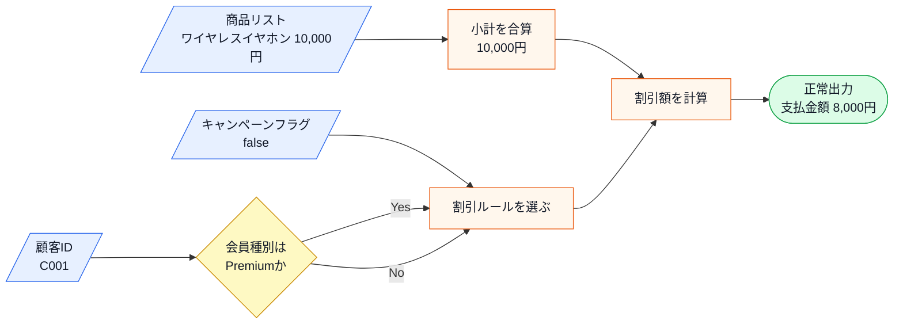
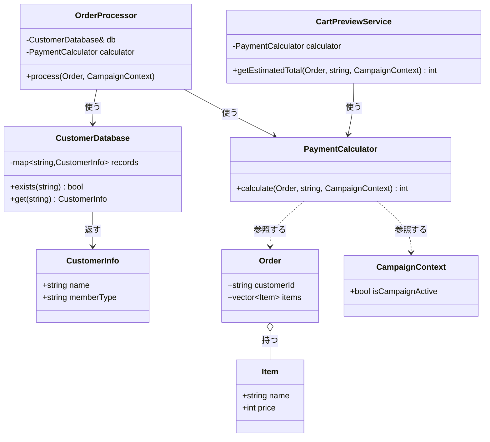
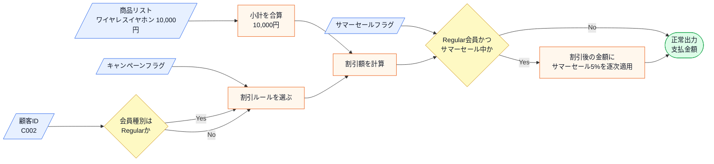
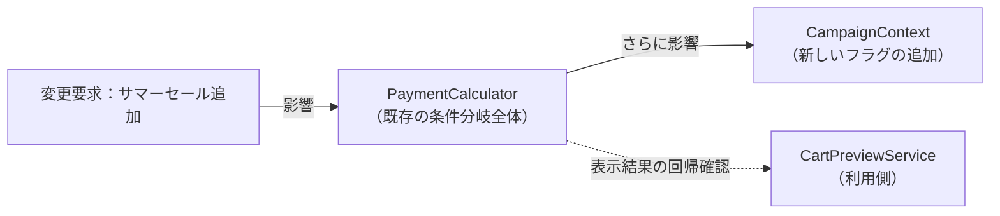
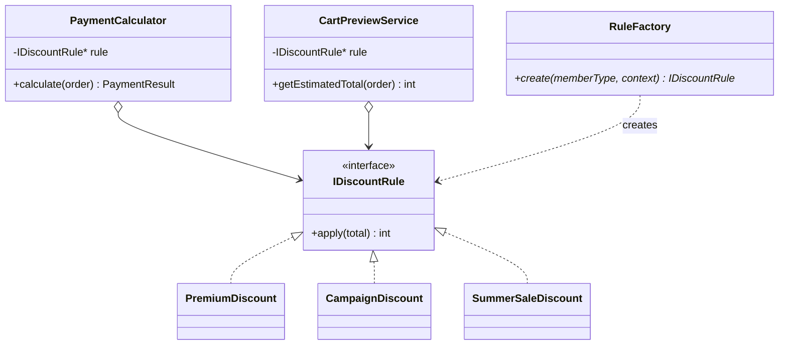
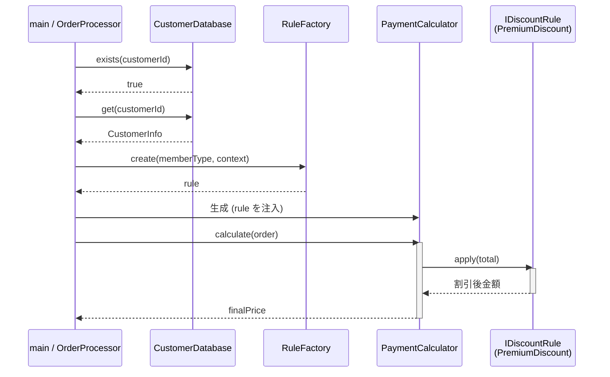
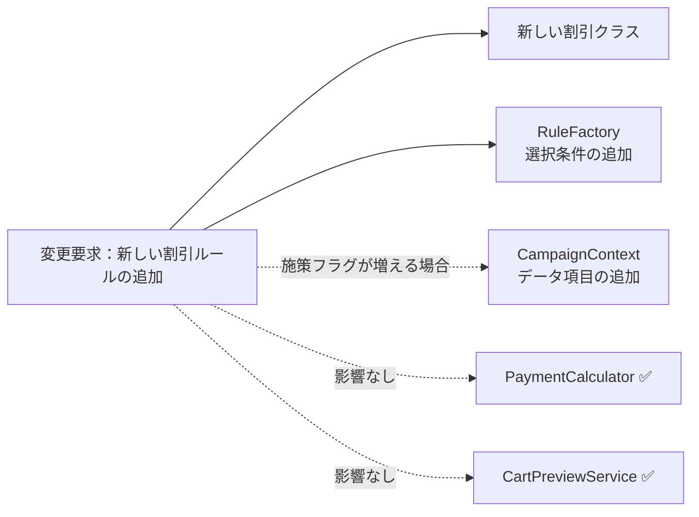
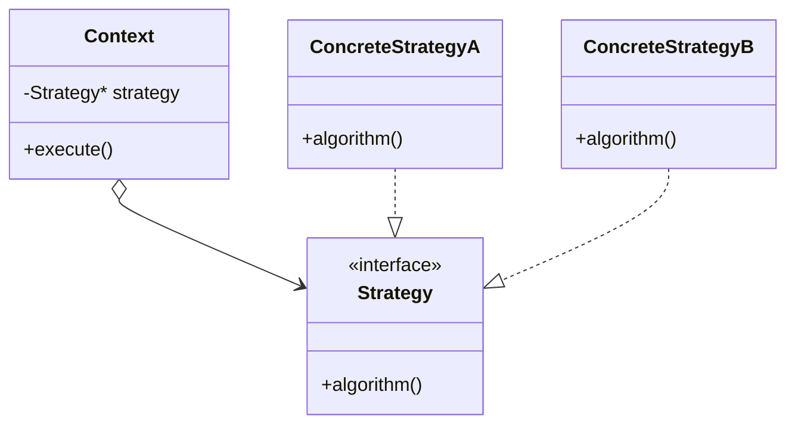
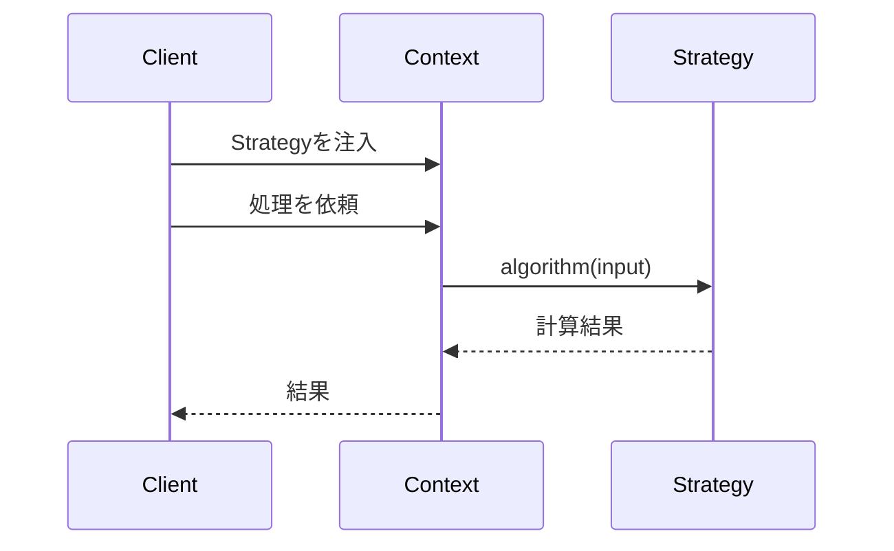

## 第1章 変わるものをカプセル化する ―― Strategy パターン

### この章の核心

**割引ルールの種類や計算方法が増えるたびに、支払金額計算の本体と入力モデルまで修正が必要になる。こういう問題は、「支払金額を計算する骨格」と「施策ごとに変わる割引ルール」が同じ場所に混在しているシステムで起きている。**

---

### この章を読むと得られること

「割引ルールが増えるたびに、既存の計算ロジックに手を入れなければならない」——この痛みを経験したことがあるなら、この章はそのまま使える答えを持っています。

- **得られること1：** 「実行する振る舞い」という観点で、コードの変動箇所を識別できるようになる
- **得られること2：** 接続点で呼び出し元がどの知識を抱えているかを調べ、「変わる理由が異なる知識が同じ場所に混在している」と現状の問題を認識できるようになる
- **得られること3：** 接続点の形を変えると変更がどのように局所化されるかを構造から説明でき、改善後にどんな効果が生まれるかを見通せるようになる
- **得られること4：** 増え続けるルールに対して、いつ・どのように構造を分けるべきかの判断ができるようになる

---

## 🔵 フェーズ1：現状把握 ―― 仕様を整理し、システムと紐付ける

ECサイトの支払金額計算が何を入力として受け取り、どの処理で加工し、何を出力するのかを整理します。

### 1-1：このシステムの仕様

このシステムは、ECサイトでお客様が商品を購入する際の**支払金額を計算**します。

入力として「商品リスト（各商品の名前と単価）」「会員種別（Premium / Regular）」「キャンペーン期間中フラグ（以後キャンペーンフラグ）」を受け取ります。システムは全商品の小計を算出し、以下の割引ルールを適用した最終的な支払金額を返します。

この章で扱う現状仕様は、次の範囲です。

| 仕様項目 | この章で扱う値 | 具体例 | 何に使うか |
|---|---|---|---|
| 商品リスト | 商品名と単価の一覧 | ワイヤレスイヤホン 10,000円 | 小計10,000円を計算する |
| 顧客IDと会員種別 | 登録済み顧客のID、Premium / Regular | C001 は Premium、C002 は Regular | 顧客IDから会員種別を確認し、Premiumなら会員割引を適用する |
| キャンペーンフラグ | 期間中 / 期間外 | 期間中なら true、期間外なら false | 期間中の場合だけキャンペーン割引を適用する |
| 割引適用順序 | 優先・排他のルール | Premiumは他割引と併用しない | 複数割引が同時に成り立つ場合の計算順序を決める |
| 出力 | 最終的な支払金額 | 10,000円から割引後の金額を返す | 動作例と実行結果で金額を照合する |

ここで確認する対象は、どの入力がどの判定や計算に使われ、最終金額へつながるかです。

上の文章と表で仕様を一通り確認したので、まず正常に計算できる場合の入力・判定・加工・出力の流れとして整理します。

**仕様整理図：正常系の入力・判定・加工・出力**



この図から読み取ることは、次の3点です。

- 支払金額は、商品リストだけでは決まらず、顧客IDから取得する会員種別とキャンペーンフラグによって変わる。
- 加工の中心は、小計の合算ではなく、どの割引ルールを選んで適用するかにある。
- 正常系の出力は支払金額であり、未登録顧客や空注文のように計算へ進めない場合は、次のエラー条件表で分けて扱う。

この図で注目するのは、中央の「加工」にある**割引ルールの選択と適用**です。入力された会員種別とキャンペーンフラグから、どの割引をいくら適用するかが決まり、支払金額が出力されます。

この仕様は、次の状態変化として読めます。

| 観点 | 内容 |
|---|---|
| 事前状態 | 顧客ID、商品リスト、キャンペーンフラグが渡されている |
| 加工 | 顧客IDから会員種別を取得し、小計を計算し、割引ルールを適用する |
| 事後状態 | 正常系では支払金額が表示される |

この図は割引計算そのものを表します。カートプレビューは図に別枠で描いていませんが、注文確定時の計算と並ぶ**この同じ加工の利用者**です。どちらも同じ計算結果として支払金額を得ます（1-1末尾の「この割引計算を使う場所」）。つまりプレビューは独立した出力ではなく、同じ加工→出力を共有しています。

割引ルールは「誰に・いつ・どれだけ還元するか」というビジネス上の決定から生まれます。会員種別による優遇はリピーター獲得施策、キャンペーンは新規顧客向けの期間限定施策と、それぞれ担当チームが異なる目的で設計しています。

**割引ルール一覧**

| ルール名     | 適用条件                        | 割引の内容    | 業務機能                |
| -------- | --------------------------- | -------- | ------------------- |
| プレミアム割引  | 会員種別が "Premium"             | 20%引き    | 料金・プロモーション管理        |
| キャンペーン割引 | 会員種別が "Regular" かつキャンペーン期間中 | 10%引き    | マーケティング・通知管理        |
| 割引なし     | 上記以外                        | 定価（割引なし） | —（変更不要）              |

Premium会員にキャンペーン割引が重ならない理由は、業務上の判断からきています。Premium会員はすでに年会費や利用実績の対価として恒常的な20%引きを受けており、さらにキャンペーン割引を重ねると採算が合わなくなる可能性があるためです。

**優先・排他ルール**

| 条件 | 動作 |
|---|---|
| Premium かつ キャンペーン中 | Premium のみ適用（キャンペーン割引は無効） |

「クーポンと会員割引は併用不可」という注意書きをショッピングサイトで見かけたことはないでしょうか。このシステムの排他ルールは、その「併用不可」ルールと同じ発想です。どちらを優先するかは会社のポリシーによりますが、上位会員の特典を守ることを優先しています。

**複雑度ストレス条件**

現状仕様の時点では、Premium割引とキャンペーン割引は排他であり、1件の注文へ両方を逐次適用しません。ここでは、変更要求を読む前から存在する複雑さだけを整理します。サマーセールと逐次割引は現状仕様へ先取りせず、1-5の変更要求で初めて追加します。

| 複雑さ | この章での扱い | 設計判断への影響 |
|---|---|---|
| 排他条件 | Premium会員にはキャンペーンを重ねない | どのルールを選ぶかの判定が計算本体にあることを確認する |
| 複数の利用場所 | 注文確定とカートプレビューが同じ計算を使う | ルール変更時に両方の出力が一致するか確認する |
| 顧客情報取得失敗 | 顧客IDから会員種別を取得できない場合はエラーにする | 外部境界の失敗は `OrderProcessor` で扱い、割引ルール差し替えとは別軸にする |

この表で見たいのは、「割引が複数あるから複雑」という事実だけではありません。複雑さのうち、割引ルールの追加・変更に関係するものはフェーズ4・5で分離対象になります。一方、顧客情報取得失敗のように外部境界の信頼性に属するものは、割引ルールの差し替え口とは別に扱います。

**この割引計算を使う場所**

| 使用場所 | 用途 |
|---|---|
| 決済計算処理 | 注文確定時の支払金額の確定 |
| カートプレビュー機能 | カート画面の金額プレビュー表示 |

**エラー条件**

正常系の金額計算へ進めない入力は、次のように分けて扱います。

| エラー条件 | どこで分かるか | 出力 | 保存・通知などの副作用 |
|---|---|---|---|
| 顧客IDが顧客データに存在しない | 顧客IDから会員種別を取得する前 | 未登録顧客エラー | なし |
| 顧客情報取得に失敗する | 顧客データ取得時 | 顧客情報取得エラー | なし |
| 注文の商品リストが空 | 小計を合算する前 | 空注文エラー | なし |

### 1-2：動作例テーブル

仕様を定義したところで、実際にどのような入力に対してどのような結果が返るかを確認します。このテーブルは「このシステムが正しく動いているとはどういう状態か」の基準になります。後で設計の改善（リファクタリング）を段階的に進めるときも、この表に立ち返ります。

| 会員種別 | キャンペーン | 適用ルール | 小計/支払金額 |
|---|---|---|---|
| Premium | ✗ | プレミアム20%引き | 10,000円 → 8,000円 |
| Premium | ✓ | プレミアム優先（キャンペーン無効） | 10,000円 → 8,000円 |
| Regular | ✓ | キャンペーン10%引き | 10,000円 → 9,000円 |
| Regular | ✗ | 割引なし | 10,000円 → 10,000円 |

コードを読む前に、このシステムが「何をする必要があるか」をこの表で確認できました。次は、この仕様を担うクラスの顔ぶれと責任を確認します。

---

### 1-3：登場クラスとクラス構成図

このシステムに登場するクラスと、それぞれが1-1のどの仕様を担うかを一覧で押さえます。1-4のコードは、この責任分担に沿って読み進めます。

| クラス名 | 役割 | 担当する仕様 |
|---|---|---|
| Item | 商品データの保持 | 商品名・単価の元データ |
| Order | 注文データの保持 | 顧客IDとカート内商品リスト |
| CampaignContext | キャンペーン状態の保持 | キャンペーン有効フラグ |
| CustomerDatabase | 顧客情報の管理 | IDから会員種別・氏名を引く。エラー条件の一次判定 |
| PaymentCalculator | 支払金額の計算 | 小計の算出と割引ルールの適用 |
| CartPreviewService | カート画面のプレビュー表示 | 計算結果を使った金額プレビューの生成 |
| OrderProcessor | 注文処理の統合 | バリデーション・計算の一連の流れを担う |

責任を把握したうえで、次の図でクラス同士の依存関係を確認します。`OrderProcessor` が中心となり、`CustomerDatabase`・`PaymentCalculator` の2つを使います。`PaymentCalculator` は `CartPreviewService` とも共有されています。



**クラス図に出てくる主なメンバーと操作**

| クラス | メンバー・操作 | 何ができるか |
|---|---|---|
| `CustomerDatabase` | `records` | 顧客IDと顧客情報を保持する |
| `CustomerDatabase` | `exists()` / `get()` | 顧客IDが登録済みか確認し、会員種別を取り出す |
| `OrderProcessor` | `db` / `calculator` | 顧客情報の取得と支払金額計算を呼び出す |
| `PaymentCalculator` | `calculate()` | 注文、会員種別、キャンペーン状態から支払金額を計算する |
| `CartPreviewService` | `getEstimatedTotal()` | 注文確定前に同じ計算結果をプレビュー用に返す |
| `Order` / `Item` / `CampaignContext` | データ項目 | 計算に必要な顧客ID、商品、キャンペーン状態を渡す |


`OrderProcessor` が `CustomerDatabase` で顧客情報を取得し、`PaymentCalculator` で支払金額を計算します。`CartPreviewService` は同じ `PaymentCalculator` を利用します。

**この章での簡略化**

1-3で登場クラスと責任を確認したので、掲載コードで何を代替しているかを整理してからフェーズ1の現状コードへ進みます。

実際のECサイトでは、顧客情報はデータベースに保存され、計算結果は画面に表示され、注文は購入フォームから届きます。この章では割引計算の設計に集中するため、これらを次のように簡略化して掲載します。

| 実システムでの動き | 掲載コードでの表現 | 割愛する理由 |
|---|---|---|
| 顧客情報をDBから取得 | `CustomerDatabase` を顧客情報Repositoryスタブとして使い、固定データを返す | 永続化は本章の論点ではない |
| 金額を画面・帳票へ表示 | `CheckoutResultRenderer` を呼び、Rendererスタブ内で表示内容を出す | 表示方式は本章の論点ではない |
| 注文を購入フォームで受け取る | `main()` で組み立てる `Order` | 入力経路は本章の論点ではない |

これらを省略しても、割引計算へ渡るデータと「割引ルールが変わるたびにどこを直すか」という本章の論点は変わりません。省略した処理は存在しないのではなく、この章では扱わない範囲として扱います。

#### 補足：省略した外部I/Oのエラー処理と非同期

簡略化した外部I/O（顧客DB＝`CustomerDatabase`、結果表示＝`CheckoutResultRenderer`）は、実運用では失敗することがあります。DB接続やAPI呼び出しは、接続失敗・タイムアウト・データ不整合で例外を返しえます。

掲載コードでも、この外部I/Oの失敗をどこで扱うかを1-4で確認します。本番ではさらに、リトライ、タイムアウト、エラー戻り値、ログ記録などを加えます。

また実運用では、外部I/Oを非同期で実行することが多くあります。非同期にすると、クラス間で受け渡す値の形が変わります。たとえば割引計算が非同期や失敗を伴うなら、`int` をそのまま返すのではなく、結果を後で受け取る形（成否や将来値を含む戻り値）になります。

ただし、これらは「割引ルールをどう差し替えるか」という本章の設計論点を変えません。本章は同期・正常系を中心に据え、外部I/Oの失敗・非同期は実運用での補足として扱います。

---

### 1-4：実装コード（現状）

#### コードを読む前の責任・境界・C++記法

| 対象 | 呼び出しと内部処理 | 戻り値・副作用 | 掲載上の表現 |
|---|---|---|---|
| `CustomerDatabase` | 顧客IDで会員種別を検索する | `CustomerInfo`を返す | `std::map`を顧客DBとして使う |
| `PaymentCalculator` | 注文と会員・施策条件を受け、条件分岐で金額を計算する | 割引後の整数金額 | 画面表示は`std::cout`で代替する |
| `std::vector` | 注文明細を順番に保持し全件を合計する | 商品小計 | `push_back`で商品を追加する |
| 例外 | DB取得など継続不能な失敗を通知する | `catch`側でエラーに変換する | 実DB/APIの失敗を`std::exception`で表す |

この章で実際に動かすのは割引判定と整数金額計算です。顧客DB、画面、外部取得はメモリデータと標準出力の境界スタブであり、失敗時は注文計算を続けません。

コードは、1-3で確認した責任の順に、固まりごとに読みます。先に、あらかじめ登録されている3件の顧客データを把握しておきます。

| 顧客ID | 氏名 | 会員種別 |
|---|---|---|
| C001 | 田中 一郎 | Premium |
| C002 | 佐藤 花子 | Regular |
| C003 | 鈴木 次郎 | Regular |

どのIDがPremiumでどれがRegularかを覚えておくと、実行結果と仕様の対応を追いやすくなります。

#### ① 入力データを表すクラス（Item / CampaignContext / Order）

最初に、1-1の「入力」にあたるデータを持つクラスを見ます。

```cpp
#include <iostream>
#include <string>
#include <vector>
#include <map>
#include <stdexcept>

class Item {
public:
    std::string name;   // 商品名
    int price;          // 単価（円）
    Item(std::string n, int p) : name(n), price(p) {}
};

class CampaignContext {
public:
    bool isCampaignActive = false;  // キャンペーン期間中なら true
};

class Order {
public:
    std::string customerId;   // 注文した顧客のID
    std::vector<Item> items;  // カートに入っている商品の一覧
};
```

- `Item` は入力「商品リスト」の1件分です。`name` が商品名、`price` が単価（円）。
- `CampaignContext` は入力「キャンペーンフラグ」を持ちます。`isCampaignActive` が `true` ならキャンペーン期間中です。
- `Order` は1件の注文で、「誰が（`customerId`）」「何を（`items`）」買うかをまとめます。会員種別はここには持たず、IDから後で引きます。

#### ② 顧客情報を管理するクラス（CustomerInfo / CustomerDatabase）

次に、顧客IDから会員種別を引く部分です。1-1の「会員種別（Premium / Regular）」と、エラー条件「顧客IDが存在しない」を担います。

```cpp
struct CustomerInfo {
    std::string name;        // 顧客の氏名
    std::string memberType;  // "Premium" または "Regular"
};

class CustomerDatabase {
private:
    std::map<std::string, CustomerInfo> records;  // ID→顧客情報
public:
    CustomerDatabase() {
        records["C001"] = {"田中 一郎", "Premium"};
        records["C002"] = {"佐藤 花子", "Regular"};
        records["C003"] = {"鈴木 次郎", "Regular"};
    }

    bool exists(const std::string& id) const {
        return records.count(id) > 0;   // IDが登録済みか
    }

    CustomerInfo get(const std::string& id) const {
        return records.at(id);          // IDから顧客情報を取り出す
    }

    void save(const std::string& id, const CustomerInfo& info) {
        records[id] = info;             // 実行中の登録表へ顧客を追加
    }
};
```

- `CustomerInfo` は顧客1人分の情報で、`memberType` が割引判定に使う会員種別です。
- `CustomerDatabase` は「ID→顧客情報」の対応表（`std::map`）で、コンストラクタで3件を登録しています。
- `exists()` はIDが登録済みかを返し、エラー条件「顧客IDが存在しない」の判定に使います。
- `get()` はIDから会員種別と氏名を取り出します。`save()` は実行中に顧客を追加する入口です。実システムのDB問い合わせを、この章では実行終了まで覚えているインメモリの登録表で代替しています。`main()` で `db.save(...)` を呼べば、追加した顧客の割引もその場で計算できます。

#### ③ 支払金額を計算するクラス（PaymentCalculator）

この章の中心です。1-1の「加工」——小計の合算と割引ルールの適用——に対応する処理を見ます。

```cpp
class PaymentCalculator {
public:
    int calculate(const Order& order,
                  const std::string& memberType,
                  const CampaignContext& context) {
        // (1) 小計：商品の単価を全部足す
        int total = 0;
        for (const auto& item : order.items) {
            total += item.price;
        }

        // (2) 割引：会員種別とキャンペーンで割引率を決める
        if (memberType == "Premium") {
            total = total * 80 / 100;   // プレミアム割引 20%引き
        } else if (memberType == "Regular" && context.isCampaignActive) {
            total = total * 90 / 100;   // キャンペーン割引 10%引き
        }
        // どちらにも当てはまらなければ割引なし（定価）

        return total;
    }
};
```

このメソッドには、1-1の加工に対応する処理が順に書かれています。

- **(1) 小計の合算**：`for` で `order.items` を回し、各 `item.price` を `total` に足します。1-1の加工「全商品の小計を算出」にあたります。
- **(2) 割引の適用**：`if` で会員種別とキャンペーンを見て割引率を掛けます。各分岐が1-1の割引ルール一覧に対応します。
  - `memberType == "Premium"` → `* 80 / 100` で20%引き（プレミアム割引）。
  - `memberType == "Regular"` かつ `isCampaignActive` → `* 90 / 100` で10%引き（キャンペーン割引）。
  - どちらでもない → 何も掛けず定価（割引なし）。
- Premiumを先に判定するため、Premium会員はキャンペーン中でも20%引きのまま（排他ルール）になります。

#### ④ カート画面のプレビュー（CartPreviewService）

カート画面でも、注文確定前に同じ支払金額を見せます。割引条件を書き直さず、同じ `PaymentCalculator` に計算を任せています。

```cpp
class CartPreviewService {
private:
    PaymentCalculator calculator;
public:
    int getEstimatedTotal(const Order& order,
                          const std::string& memberType,
                          const CampaignContext& context) {
        return calculator.calculate(order, memberType, context);
    }
};
```

- `getEstimatedTotal()` は、内部の `calculator` にそのまま計算を委ね、割引後の金額を返します。
- 決済処理と同じ `PaymentCalculator` を使うため、プレビューにも同じ計算結果が表示されます。

#### ⑤ 注文処理をまとめるクラス（OrderProcessor）

`OrderProcessor` は、エラー条件のチェック → 会員種別の取得 → 計算 → 表示、という一連の流れを担います。

```cpp
class CheckoutResultRenderer {
public:
    void showOrderResult(const CustomerInfo& customer,
                         const Order& order,
                         const CampaignContext& context,
                         int subtotal,
                         int finalPrice) {
        std::cout << customer.name << " さんの注文:";
        for (const auto& item : order.items) {
            std::cout << " " << item.name << " " << item.price << "円";
        }
        std::cout << "\n  条件: 会員=" << customer.memberType
                  << ", キャンペーン="
                  << (context.isCampaignActive ? "あり" : "なし");
        std::cout << "\n  小計 " << subtotal << "円 → 支払金額 "
                  << finalPrice << "円\n";
    }
};

class OrderProcessor {
private:
    CustomerDatabase& db;
    CheckoutResultRenderer& renderer;
    PaymentCalculator calculator;
public:
    OrderProcessor(CustomerDatabase& db, CheckoutResultRenderer& renderer)
        : db(db), renderer(renderer) {}

    void process(const Order& order, const CampaignContext& context) {
        // エラー条件1：顧客IDが存在しない
        if (!db.exists(order.customerId)) {
            std::cerr << "エラー: 顧客ID " << order.customerId
                      << " は登録されていません\n";
            return;
        }
        // エラー条件2：注文が空
        if (order.items.empty()) {
            std::cerr << "エラー: 注文が空です\n";
            return;
        }

        // 会員種別をIDから取得して計算へ渡す
        // 実運用ではDB/API呼び出し。接続失敗などに備えて捕捉する
        CustomerInfo customer;
        try {
            customer = db.get(order.customerId);
        } catch (const std::exception&) {
            std::cerr << "エラー: 顧客情報の取得に失敗しました\n";
            return;
        }
        int finalPrice =
            calculator.calculate(order, customer.memberType, context);

        // 表示形式はRenderer境界へ委ねる
        int subtotal = 0;
        for (const auto& item : order.items) {
            subtotal += item.price;
        }
        renderer.showOrderResult(customer, order, context,
                                 subtotal, finalPrice);
    }
};
```

- 先頭の2つの `if` が、1-1のエラー条件です。存在しないIDや空注文は、計算へ進まず中断します。
- `db.get()` で会員種別を取り出します（`Order` は会員種別を持たないのでIDから補う）。実運用ではこの取得がDB/API呼び出しで失敗しうるため、`try/catch` で接続失敗などを捕捉します。
- 最後に、購入した商品と単価、割引条件、小計、支払金額を表示します。会員種別とキャンペーン条件を出すことで、どの割引ルールが効いたかを実行結果だけでも追えます。

#### ⑥ 実行して動作例と照合する（main）

1-2の動作例テーブル（4行）と排他ルール・エラー条件を、実際に動かして確認します。

```cpp
int main() {
    CustomerDatabase db;
    CheckoutResultRenderer renderer;
    OrderProcessor processor(db, renderer);
    CartPreviewService preview;
    CampaignContext context;

    // 動作例1：C001（Premium）/ キャンペーンなし → 20%引き
    Order order1;
    order1.customerId = "C001";
    order1.items.push_back(Item("ワイヤレスイヤホン", 10000));
    context.isCampaignActive = false;
    processor.process(order1, context);

    // 動作例2：同じPremium会員にキャンペーンを当てても優先は変わらない
    context.isCampaignActive = true;
    processor.process(order1, context);   // → 8000（キャンペーン無効）
    context.isCampaignActive = false;

    // 動作例3：C002（Regular）/ キャンペーンあり → 10%引き
    Order order2;
    order2.customerId = "C002";
    order2.items.push_back(Item("ワイヤレスイヤホン", 10000));
    context.isCampaignActive = true;
    processor.process(order2, context);
    std::cout << "  （上と同じ佐藤さんのカート）カートプレビュー: "
              << preview.getEstimatedTotal(order2, "Regular", context)
              << "円\n";

    // 動作例4：C003（Regular）/ キャンペーンなし → 割引なし
    Order order3;
    order3.customerId = "C003";
    order3.items.push_back(Item("スマホケース", 3000));
    context.isCampaignActive = false;
    processor.process(order3, context);

    // エラー条件：存在しない顧客ID
    Order order4;
    order4.customerId = "UNKNOWN";
    order4.items.push_back(Item("ケーブル", 1000));
    processor.process(order4, context);

    return 0;
}
```

実行対象コード：1-4の現状コード
対応する動作例：1-2の動作例テーブル、排他ルール、エラー条件
確認したいこと：入力された会員種別とキャンペーン条件に応じて、支払金額が仕様どおりに計算されること

実行結果：

```
田中 一郎 さんの注文: ワイヤレスイヤホン 10000円
  条件: 会員=Premium, キャンペーン=なし
  小計 10000円 → 支払金額 8000円
田中 一郎 さんの注文: ワイヤレスイヤホン 10000円
  条件: 会員=Premium, キャンペーン=あり
  小計 10000円 → 支払金額 8000円
佐藤 花子 さんの注文: ワイヤレスイヤホン 10000円
  条件: 会員=Regular, キャンペーン=あり
  小計 10000円 → 支払金額 9000円
  （上と同じ佐藤さんのカート）カートプレビュー: 9000円
鈴木 次郎 さんの注文: スマホケース 3000円
  条件: 会員=Regular, キャンペーン=なし
  小計 3000円 → 支払金額 3000円
エラー: 顧客ID UNKNOWN は登録されていません
```

次の表は、`main()` で設定した各動作例の入力（条件・商品）と、その実行結果（小計→支払金額）を1行ずつ並べたものです。離れた `main()` と出力を行き来しなくても、入力と結果をその場で照合できます。

| 動作例 | 会員・キャンペーン | 商品（単価） | 小計→支払金額 |
|---|---|---|---|
| 1 | Premium・なし | イヤホン(10000円) | 10000 → 8000（20%引き） |
| 2 | Premium・あり | イヤホン(10000円) | 10000 → 8000（優先で無効） |
| 3 | Regular・あり | イヤホン(10000円) | 10000 → 9000（10%引き） |
| 3 | カートプレビュー | 同上 | 9000（同じ計算を共有） |
| 4 | Regular・なし | ケース(3000円) | 3000 → 3000（割引なし） |
| 異常 | 未登録ID | ケーブル(1000円) | 「登録されていません」 |

> **手元で動かすには**
> このコードは1つの `.cpp` に貼り付けて、そのままコンパイル・実行できます（例：`g++ chapter01.cpp -o app && ./app`）。`main()` は自由に組み替えて構いません。たとえば `db.save("C010", {"高橋 三郎", "Premium"});` で顧客を足し、その顧客IDで `process()` を呼べば、追加した顧客の割引計算がその場の実行結果に表れます。登録はプロセス実行中だけ有効で、終了すると消えます（DBのような永続化はこの章の論点ではありません）。

`OrderProcessor` は `CustomerDatabase` からの情報を使ってバリデーションと計算を行います。`CartPreviewService` も同じ `PaymentCalculator` を使うため、注文確定前のプレビュー表示でも同じ金額になります。

---

### 1-5：変更要求

マーケティング部から以下の変更要求が来ました。

「来週から『サマーセール』を開始します。期間中はRegular会員を対象に5%オフを追加してください。プレミアム会員はすでに20%引きが適用されているため、今回のセールは対象外です。」

この変更要求では、割引を**加算**するのではなく、すでに適用された割引後の金額に次の割引を掛ける**逐次割引**として扱います。つまり、キャンペーン10%引きとサマーセール5%引きが重なった場合は「合計15%引き」ではなく、「10,000円 → 9,000円 → 8,550円」と計算します。

リリースは来週末。既存の `if` 文の隙間に `else if` を追加すれば間に合うかもしれません。


**仕様変更の内容**

変更要求を受けて、現在の割引ルールがどう変わるかを整理します。

| ルール名 | 変更前 | 変更後 |
|---|---|---|
| プレミアム割引 | Premium会員に20%引き | 変更なし |
| キャンペーン割引 | Regular会員にキャンペーン10%引き | 変更なし |
| **サマーセール割引（新規）** | —（なし） | **Regular会員に5%引きを逐次適用** |

※表の1行目（Premium・キャンペーン・サマーセールがすべて重なった場合）は、「プレミアム割引（20%引き）」が最優先され、他のキャンペーンやサマーセールは無効になるという仕様を表しています。そのため、変更後も8,000円のままとなります。


**変更後の動作例**

| 会員種別    | キャンペーン     | サマーセール | 変更前/後の支払金額（1万円の場合）                                        |
| ------- | ---------- | ------ | --------------------------------------------------------- |
| Premium | ✓          | ✓      | 8,000円（20%引き）→ 8,000円（変更なし）                               |
| Regular | ✓          | ✓      | 9,000円（10%引き）→ **8,550円（9,000円にサマーセール5%引きを逐次適用）** |
| Regular | ✗          | ✓      | 10,000円（割引なし）→ **9,500円（5%引き）**                           |
| Regular | ✓/✗（どちらでも） | ✗      | 変更なし                                                      |

Regular会員はサマーセール中に5%引きが新たに加わります。キャンペーン割引と重なる場合は、キャンペーン適用後の金額にサマーセール割引を掛けます。プレミアム会員はすでに20%引きが適用されているため、今回のサマーセールの対象外となります。

**変更前後の入力・判定・加工・出力差分**

1-1の現状仕様を退避し、変更要求を当てた後の仕様と同じ粒度で並べます。以降の分析では、この差分を追います。

| 要素 | 変更前（1-1の現状仕様） | 変更後（今回の要求） | 差分として追うもの |
|---|---|---|---|
| 入力 | 商品リスト、顧客ID、キャンペーンフラグ | 商品リスト、顧客ID、キャンペーンフラグ、サマーセールフラグ | サマーセールフラグが追加される |
| 判定 | Premiumか、キャンペーン中か | Premiumか、キャンペーン中か、Regularかつサマーセール中か | サマーセール対象判定が追加される |
| 加工 | 小計を合算し、既存割引を適用する | 既存割引後の金額へサマーセール5%を逐次適用する | 割引の適用順序が分析対象になる |
| 出力 | 最終支払金額 | サマーセール反映後の最終支払金額 | Regular会員の出力金額が変わる |

**変更後の入力・加工・出力**

変更後の仕様を、1-1と同じ粒度で、正常系の入力・判定・加工・出力として確認します。1-1の図との差分は、入力に「サマーセールフラグ」が加わることと、割引額を計算したあとに「サマーセール5%を逐次適用する」という加工が挟まることの2点です。



この図から読み取ることは、次の3点です。

- 商品リスト・顧客ID・キャンペーンフラグの入力と、小計の合算・割引ルールの選択・割引額の計算は、1-1のまま変わらない。
- 新しい入力はサマーセールフラグで、割引額を計算したあとの金額に5%を掛ける「逐次適用」という加工が1つ加わる。
- Premium会員は新しい判定でNo側を通るため、変更後も支払金額は変わらない。

変更後も、エラー条件は正常系図へ混ぜずに別で確認します。

| エラー条件 | どこで分かるか | 出力 | 保存・通知などの副作用 |
|---|---|---|---|
| 顧客IDが顧客データに存在しない | 顧客IDから会員種別を取得する前 | 未登録顧客エラー | なし |
| 顧客情報取得に失敗する | 顧客データ取得時 | 顧客情報取得エラー | なし |
| 注文の商品リストが空 | 小計を合算する前 | 空注文エラー | なし |

図に加わった「逐次適用」が実際にコードのどこへ書かれるかは、フェーズ3で変更を試すコードと、フェーズ7の最終コード・実行結果で追います。

フェーズ1でシステムの現状と変更要求が把握できました。次のフェーズ2では、「何を変え、何を守るか」を整理します。

## 🟣 フェーズ2：仮説立案 ―― 何が変わるかを観察し、ヒアリングで裏付ける
### 2-1：変わりそうな仕様の見当をつける

ここで作る一覧は、思いつきで「変わりそう」と感じたものを並べる表ではありません。フェーズ1で確認した仕様・動作例・クラス図を材料に、次の順で候補を絞ります。

1. 仕様図と動作例から、入力・判定・加工・出力のうち条件や値が変わりそうな箇所を拾う。
2. その箇所が、1-3のどのクラス・メソッドに書かれているかを対応づける。
3. その仕様が、どんな理由で、何をきっかけに、どのくらいの頻度で変わりそうかを仮説として書く。
4. 逆に、当面変えない前提にできる処理の骨格も分けておく。

この手順で見ると、「金額を計算する」という大きな処理全体ではなく、その中のどの条件・計算式・判定が変更候補なのかを読者自身で追えるようになります。

フェーズ1で整理した仕様をもとに、「どの仕様が変わりやすいか」を見立てます。責務配置の評価は、変更を当てたときの痛みと合わせてフェーズ3・4で確認します。

変わりそうな割引ルールは、1-3のクラス図の中心 `PaymentCalculator` の `calculate()` の中にあります。この中身を、小計の合算と各割引に分け、誰がどんなきっかけで変えるかと一緒に整理します。

| `calculate()` 内の処理 | 変える主体・きっかけ | 変わりやすさの見立て |
|---|---|---|
| 商品単価の合算ロジック | 仕様の根幹。めったに変わらない | 低い |
| プレミアム割引の条件・割引率 | 料金・プロモーション管理の施策 | 高い |
| キャンペーン割引の条件・割引率 | マーケティング・通知管理の施策 | 高い |

見えてくるのは、**1つの `calculate()` を、料金・プロモーション管理とマーケティング・通知管理という別々の主体が、別々のきっかけで変えうる**という見立てです。

ただし、この時点では「責務が混在しているから分けるべき」とは決めつけません。責務は設計者が決めるもので、「割引も含めて支払金額を計算する」という今の責務配置は、それ自体が間違いというわけではありません。複数の主体が同じメソッドを変えうることが**実際に痛みになるか**はフェーズ3で変更を当てて確かめ、なぜ辛いのか（＝変わる理由の異なるものが同居している）はフェーズ4で原因として言語化します。2-1は、その検証対象に当たりをつける段階です。

### 2-2：今回の変更で確実に変わること

今回の変更要求から確定している変更は1点です。

- **サマーセール割引の追加**：Regular会員を対象に5%オフを追加する

ただし「この変更が1回限りか、今後も続くか」によって、どこまで設計を変えるべきかが大きく変わります。関係者に確認します。

#### 補足：ヒアリングに向けた背景確認

このシステムは、ある中堅ECサイトの決済計算を担っています。数年前にサービスが立ち上がった当初は、お客様が商品を選んでカートに入れ、そのままの合計金額で決済するシンプルな流れでした。

しかし、サービスが成長し競合他社との競争が激しくなるにつれて、様々な施策が打たれるようになりました。新規顧客向けの期間限定キャンペーンや、リピーター向けのプレミアム会員制度など、ビジネス上の要求は日々増えています。

### 2-3：関係者ヒアリング


- **開発者：** 「サマーセールの件、承知しました。今後もこのような新しい割引ルールは追加される予定はありますか？」
- **マーケティング部リーダー：** 「はい、もちろんです。秋にはハロウィンキャンペーン、冬には年末大感謝祭など、毎月のように新しい企画を予定しています。」
- **開発者：** 「ちなみに、割引の計算方法自体が変わることはありますか？今はパーセント引きですが、定額割引などです。」
- **マーケティング部リーダー：** 「実は秋のキャンペーンでは、一律1000円引きクーポンの配布を検討しています。これも対応できますか？」

### 2-4：ヒアリングで判明した将来リスク

ヒアリングで浮かび上がった「確定ではないが、近い将来起こりうる変化」を記録します。これは今回の設計判断の材料です。

| **将来リスク** | **時期の目安** | **根拠** |
|---|---|---|
| 新しい割引ルールの追加が毎月続く | 継続的に | マーケティング責任者から直接確認 |
| 計算方法が「パーセント引き」から「定額引き」に変わる | 数ヶ月後 | 秋のクーポン企画として言及 |

フェーズ2で「今変わること（確定）」と「将来変わるかもしれないこと（リスク）」を分けて整理できました。次はリスクをもう少し具体的な「仕様の変化」として整理します。

### 2-5：変わる見込みと当面安定の前提を確定する

ヒアリング結果をもとに、今回確定した変更・将来繰り返される変更軸・当面安定している前提を、混ぜずに整理します。変わるものだけでなく、**当面安定と見る前提**も明示して、フェーズ3で何を当て、何を守るかを確定します。

| 変更軸 | 現在（今回追加後） | 将来（数ヶ月後） |
|---|---|---|
| 割引ルールの種類 | サマーセールを追加し3種類 | 毎月新しいルールが追加され続ける |
| 割引の計算方法 | パーセント引きのみ | 定額引き（小計 − 固定額）が混入しうる |
| 計算の骨格（小計の合算） | 変更なし | 変更なし（当面安定） |
| 金額の受け渡し（int を返す形） | 変更なし | 変更なし（当面安定） |

📌 **確定**：変わり続けるのは「割引ルールの種類」と「割引の計算方法」。当面変わらないのは「小計を合算する計算の骨格」と「支払金額（int）を受け渡す形」。フェーズ3では、この変わり続ける割引を現在の構造へ当て、骨格を守れるか・どこが痛むかを確かめます。

---

## 🟣 フェーズ3：問題特定 ―― 変更の痛みを発見する
### 3-1：変更を試みる

「サマーセール：Regular会員に5%オフを追加」を現在の `PaymentCalculator` に追加してみます。変更前のコードはこうでした。

```cpp
if (memberType == "Premium") {
    total = total * 80 / 100;   // 20%引き
} else if (memberType == "Regular"
           && context.isCampaignActive) {
    total = total * 90 / 100;   // 10%引き
}
```

- これは1-4③の `calculate` にある割引部分です。Premiumを先に見て、次にRegular＋キャンペーンを見ます。
- ここに「Regular会員へサマーセール5%引きを追加」を入れたい、というのが今回の変更です。

このコードにサマーセールの条件を追加すると、以下のようになります。

```cpp
// サマーセール対応：Regular会員向けに条件を追加
if (memberType == "Premium") {
    total = total * 80 / 100;  // 20%引き（サマーセール対象外）
} else if (context.isSummerSale && context.isCampaignActive) {
    total = (total * 90 / 100) * 95 / 100; // 逐次割引（Regular会員）
} else if (context.isSummerSale) {
    total = total * 95 / 100;  // 5%引き（Regular会員）
} else if (context.isCampaignActive) {
    total = total * 90 / 100;  // 10%引き
}
```

増えたのは下の3つの分岐です。サマーセールは「Regular会員のみ」「キャンペーンと重なると逐次割引」という複合条件なので、`else if` を1行足すだけでは済みません。

- `isSummerSale && isCampaignActive` → キャンペーン10%引きの後にサマーセール5%引きを重ねる（`* 90 / 100` のあと `* 95 / 100`）。15%引きとして `* 85 / 100` する仕様ではありません。
- `isSummerSale` のみ → サマーセール5%引き（`* 95 / 100`）。
- `isCampaignActive` のみ → 従来のキャンペーン10%引き。
- この逐次割引の分岐を入れ忘れると、両方有効な顧客の金額がずれます。1つの施策追加で、既存分岐の順序と組み合わせまで見直すことになります。

変更後のコードを実行すると、次のような結果になります（1万円の注文で4ケースを確認）。

```cpp
// 変更後のクラスを使った動作確認
int main() {
    CustomerDatabase db;
    CheckoutResultRenderer renderer;
    OrderProcessor processor(db, renderer);
    CampaignContext context;
    Order order;
    order.items.push_back(Item("ワイヤレスイヤホン", 10000));

    // C001（Premium）/ キャンペーンあり / サマーセール中
    // → Premium優先（キャンペーン・サマーセール無効）
    order.customerId = "C001";
    context.isSummerSale     = true;
    context.isCampaignActive = true;
    processor.process(order, context);

    // C002（Regular）/ キャンペーンあり / サマーセール中
    // → 逐次割引（10%引き後の金額に5%引き）
    order.customerId = "C002";
    context.isSummerSale     = true;
    context.isCampaignActive = true;
    processor.process(order, context);

    // C002（Regular）/ キャンペーンなし / サマーセール中 → 5%引き
    order.customerId = "C002";
    context.isSummerSale     = true;
    context.isCampaignActive = false;
    processor.process(order, context);

    // C002（Regular）/ キャンペーンなし / サマーセールなし → 割引なし
    order.customerId = "C002";
    context.isSummerSale     = false;
    context.isCampaignActive = false;
    processor.process(order, context);

    return 0;
}
```

実行対象コード：3-1の変更試行コード
対応する動作例：1-5の変更後の動作例
確認したいこと：サマーセール追加により、既存の `PaymentCalculator` に割引分岐が増えること

実行結果：

```
田中 一郎 さんの注文: ワイヤレスイヤホン 10000円
  条件: 会員=Premium, キャンペーン=あり, サマーセール=あり
  小計 10000円 → 支払金額 8000円
佐藤 花子 さんの注文: ワイヤレスイヤホン 10000円
  条件: 会員=Regular, キャンペーン=あり, サマーセール=あり
  小計 10000円 → 支払金額 8550円
佐藤 花子 さんの注文: ワイヤレスイヤホン 10000円
  条件: 会員=Regular, キャンペーン=なし, サマーセール=あり
  小計 10000円 → 支払金額 9500円
佐藤 花子 さんの注文: ワイヤレスイヤホン 10000円
  条件: 会員=Regular, キャンペーン=なし, サマーセール=なし
  小計 10000円 → 支払金額 10000円
```

上から順に、Premium優先（10000円→8000円）、Regularの逐次割引（10000円→9000円→8550円）、Regularのサマーセール単独（10000円→9500円）、割引なし（10000円のまま）です。小計→支払金額が、1-5の変更後の動作例と対応していることを確認できます。

この変更後コードを見ると、問題が浮かび上がります。

一見シンプルな追加に見えますが、サマーセールは「Regular会員のみ」「キャンペーンと重複した場合は逐次割引」という複合条件を持っています。単純に `else if` を1行追加するだけでは済まず、`context.isSummerSale && context.isCampaignActive` の組み合わせを考慮した分岐も追加する必要があります。さらに、`CampaignContext` クラスに `isSummerSale` フラグを追加する作業が発生します。

```cpp
// CampaignContext クラスへの変更（サマーセールフラグの追加が必要）
class CampaignContext {
public:
    bool isCampaignActive = false;
    bool isSummerSale = false;   // ← 追加。データクラスにまでフラグが増え続ける
};
```

- `isSummerSale` という新しいフラグを `CampaignContext`（1-4①）に足す必要があります。施策が増えるたびに、計算の `if` だけでなく入力データのクラスにもフラグが積み重なります。

ヒアリングで予告された「1000円引きクーポン」が来た場合はどうでしょうか。パーセント計算とは異なる「引き算」のロジックが混入し、全ての `if` ブロックの計算順序を見直す必要が出てきます。

### 3-2：変更影響グラフ



新しいルールを1つ追加するだけで、既存の計算ロジック全体とデータクラスを修正し、同じ計算結果を表示するカートプレビューも回帰確認する必要があります。ここでは、**ソースを修正する場所**と**動作を再確認する場所**を区別します。

### 3-3：痛みの言語化

**1つ目：影響範囲が読めない恐怖。** 新しい割引を追加するには、複雑化しつつある `if-else` の隙間にコードを差し込む必要があります。変更のたびに、無関係なはずの過去のルールも含めて全テストケースを見直す必要があります。

**2つ目：検索・解読コストの増大。** キャンペーンのたびに条件分岐が追加されていくと、PaymentCalculator が数百行の複雑な分岐を抱える可能性があります。「どの条件が今のキャンペーンのものか」「過去のセール条件とどう違うのか」を理解するために、コードの広い範囲を確認する作業が発生します。機能として動いていても、変更箇所を特定する負担が徐々に大きくなります。

---
> **📌 問題（確定）**
> 割引という「実行する振る舞い」が変わるたびに、`PaymentCalculator` と `CampaignContext` を修正し、その計算を使う `CartPreviewService` まで回帰確認する必要がある。変わる理由が異なる知識が計算本体に混在しているため、1つの施策変更が広い影響確認を強いる。
---

フェーズ3で「変更が辛い」ことが確認できました。次のフェーズ4では、なぜ辛いのかを構造的に言語化します。

---

## 🟠 フェーズ4：原因分析 ―― なぜ辛いのかを構造で言語化する
### 4-1：痛みの根源を探る（観察と原因）

フェーズ3で確認した「変更の辛さ」は、コードのどこから来ているのでしょうか。コードを注意深く観察すると、痛みを引き起こしている2つの事実が浮かび上がってきます。

第一に、新しい割引を追加するとき、なぜ毎回 `PaymentCalculator` を開かなければならないのでしょうか？
フェーズ2で見立てたとおり、現状の PaymentCalculator はこれらすべての割引ルールを自分の責任として持っています。フェーズ3で痛みを確かめた今、その配置の問題がはっきりします。問題は、その責任を**複数の業務機能からの変更要求によって変えなければならない点**です。複数の業務機能の変化が1つのクラスに集中してしまっているため、仕様変更の影響がここに密集してしまうのです。

それは、このクラス自身が「プレミアム会員なら20%引き」「サマーセールなら5%引き」といった**具体的な割引の条件をすべて直接知ってしまっている（抱え込んでいる）**からです。

第二に、なぜ変更の影響範囲が読めず、全テストをやり直す恐怖を感じるのでしょうか？
それは、「商品をループで回して金額を足し合わせる」という土台となる骨格ロジックと、「特定のキャンペーンを判定して割引する」というビジネスロジックが、**同じメソッドの中で物理的に混ざり合っている**からです。

この「症状（痛み）」と「根本原因」を整理すると、以下のようになります。

| **観察した症状（痛み）** | **構造的な原因（痛みの根源）**                                                                                                                    |
| -------------- | ------------------------------------------------------------------------------------------------------------------------------------ |
| 影響範囲が読めない恐怖    | `PaymentCalculator` が各割引の具体的な条件を直接知っているから                                                                                            |
| 検索・解読コストの増大 | 変わる理由が違う2つのもの（「合算ロジック」と「割引条件」）が同じメソッドの中に混在しているから。異なる理由で変わるロジックが分離されず、同じメソッド内に直接書かれているため、割引条件が変わるたびに合算ロジックも含めたメソッド全体を確認する作業が発生する。 |
| 逐次割引の順序を壊しやすい | 「キャンペーン後にサマーセールを掛ける」「Premiumは他割引と併用しない」といった適用順序・排他条件が、個別の割引計算と同じ `if-else` に埋まっているから。 |

### 4-2：変わるもの/変わってほしくないもの

> **「変わらないもの」と「変わってほしくないもの」は異なります。** 「変わらないもの」は経験的事実（今まで変わっていない）、「変わってほしくないもの」は設計意図（ここを安定させてほかを守りたい）です。ここで整理するのは後者です。

| **変わるもの（割引ルール）** | **変わってほしくないもの（計算骨格）** |
|---|---|
| 各キャンペーンの適用条件（サマーセール、ハロウィン等） | 商品単価を順番に足す合算ロジック |
| 割引額の計算方法（パーセント引き・定額引きなど） | 計算を依頼して最終金額を受け取る呼び出し側のフロー |

**【変わる部分（変わり続けるif文と計算）】**

1-3で示した `calculate` メソッドの割引判定ブロックが、キャンペーンのたびに変わる箇所です。

```cpp
        if (memberType == "Premium") {
            total = total * 80 / 100;   // 20%引き
        } else if (context.isSummerSale && context.isCampaignActive) {
            total = (total * 90 / 100) * 95 / 100; // 複合割引
        // ← 新しいキャンペーンが来るたびに、ここにelse ifが追加される
```

**【変わってほしくない部分（守りたい骨格）】**

1-3の `calculate` メソッドのうち、「商品を順に足して合計を出し、最終金額を返す」という骨格部分は変えたくありません。

```cpp
        int total = 0;
        for (const auto& item : order.items) {
            total += item.price;             // 小計計算（変えたくない）
        }
        // ← ここに「変わる部分」（割引判定）が割り込んでいる
        return total;                        // 結果を返す（変えたくない）
```

### 4-3：接続点に漏れている判断や前提を確認する

ここでの「確認すること」は、前節までに見つけた原因から抽出します。まず、原因文から「守りたい骨格」と「変わる差分」を分けます。次に、その差分を動かすために骨格側が知ってしまっている名前・条件・順序・型を拾います。最後に、接続点に残す最小の約束を、値・型・操作・イベントとして書きます。

原因によって、接続点で見る抽象観点は変わります。条件分岐が原因なら条件・定数・選択基準を見ます。処理手順が原因なら呼び出し順・前後条件・失敗時分岐を見ます。生成判断が原因なら具体クラス名・生成条件・登録場所を見ます。通知や外部連携が原因なら通知先・タイミング・成否の扱いを見ます。データや状態が原因なら、境界を流れる値・型・状態を見ます。

今、`PaymentCalculator`は割引ルールの条件（`isPremium`や`isSummerSale`等）を自分の中に抱えています。接続点で見ると、計算の骨格が必要としているのは「合計金額を渡し、割引後の金額を受け取ること」だけです。それにもかかわらず、骨格側が個々の適用条件と割引率まで知っています。

現在の `PaymentCalculator` は、すべての割引ルールを自分自身の中に直接抱え込んでいます。

**【接続点へ割引条件が漏れているコード】**
```cpp
class PaymentCalculator {
public:
    int calculate(const Order& order,
                  const std::string& memberType,
                  const CampaignContext& context) {
        // ← 1-4で示した合算ループ（for + total += item.price）がここに入る
        // 割引ルール（具体）を、自分自身で直接判断して処理している
        if (memberType == "Premium") {
            total = total * 80 / 100;
        }
        // ← 1-4で示した他のelse ifブロックがここに続く
    }
};
```

新しいキャンペーンが増えるたびに、計算の骨格を持つクラスを開き、`else if`を追加する作業が発生します。割引ルールの適用条件（`memberType == "Premium"` など）と割引率（`* 80 / 100` など）が、接続点を越えて骨格側へ漏れているためです。

決済の合算ロジックと個別の割引ルールは、変わる理由が全く異なります。これらが同じ場所に混在していることが、根本原因として確認できました。

今回着目する接続点は、「合計金額」と「割引後の金額」を受け渡す境界です。個々のキャンペーン条件は、この境界の外へ移せます。

---
> **📌 原因（確定）**
> 割引ルールが「毎月追加される」と確認できているのに、その全種類を`PaymentCalculator`が抱え込んでいる。追加のたびに計算の骨格を開く必要があり、割引担当の変更が注文計算の再テストへ波及する。
---

フェーズ4で根本原因が言語化できました。「どこを分けるか」は明確です。次のフェーズ5では、フェーズ2で確定した変化の見込みと、フェーズ4で整理した守りたい骨格を振り返りながら、その境界で実際に何が流れているかを値・型のレベルで具体化します。

---

## 🟡 フェーズ5：課題定義 ―― 解くべき接続点を定める
フェーズ4は「なぜ辛いか」を答えました。フェーズ5が問うのは「分けるべき境界で、実際に何が流れているか」です。クラスの参照関係ではなく、**値・型のレベル**に降りていきます。

フェーズ4の分析により、問題は「計算の骨格」と「割引の条件分岐」が混在していることだと分かりました。その境界で何がやり取りされているかを具体化します。

### 接続点を特定する

接続点は、クラス図の線やインターフェース名から探すのではなく、変更要求を当てて特定します。まず、その要求で変えたい側と変えたくない側を分けます。次に、両者がどのメソッド呼び出し・引数・戻り値・生成・イベントでつながっているかを見ます。そのつながりのうち、変更要求のたびに知識が漏れて修正が波及する場所が、ここで解くべき接続点です。

`calculate()` の中で分けるべき境界は1か所。「割引を計算する側」が骨格に渡しているデータを見ます。

```cpp
        // 骨格（守りたい）
        for (const auto& item : order.items) {
            total += item.price;
        }

        // ↓ 割引ルール（変わり続ける）
        if (memberType == "Premium") {
            total = total * 80 / 100;
        } else if (context.isSummerSale && context.isCampaignActive) {
            total = (total * 90 / 100) * 95 / 100;
        } else if (context.isSummerSale) {
            total = total * 95 / 100;
        } else if (context.isCampaignActive) {
            total = total * 90 / 100;
        }
        // ↑ ここまでが分離するターゲット

        return total;
```

割引ルールが計算の骨格に返しているのは「割引適用後の合計金額（`int`）」です。

| 接続点 | 接続するデータ | 変わるもの |
|---|---|---|
| 割引ロジック → `calculate()` の骨格 | `int` 型の割引適用後の合計金額 | 計算ロジック（誰がどう割引するか） |
| ルール選択 → 割引ロジック | 会員種別、キャンペーン状態、適用順序 | どのルールをどの順番で適用するか |

### フェーズ2・4の整理を接続点へ落とす

- **変わるもの**：割引の計算ロジック。新しいキャンペーンや顧客種別のたびに増える。
- **守りたい前提**：接続点を流す値は `int` 型の金額にそろえる。`CartPreviewService` も、割引の種類ではなく割引後の金額を受け取れればよい。

呼び出し元は「割引後の金額を受け取れれば十分」なので、必要とする結果の型は安定しています。問題は「どのように計算するか」という**割引ルールの判定条件と割引率**が本体に膨れ続けていることです。

**現状のままでよい場面**：割引ルールが少数で、当面追加されないとチームで確認できるなら、`if-else`のまま保つ判断もあります。今回はルールが毎月増えるため、計算の骨格から割引判断を切り離し、同じ受け渡し方で交換できる設計を検討します。

### 変わるものを一緒に分離するか、分けて分離するか

割引には、変わるきっかけの異なる軸が混ざっています。これらを1つずつ独立した割引として分けるか、逐次割引の組み合わせまで含めて1単位として扱うかを、変わる理由から判断します。

| 変化軸 | 変わる理由 |
|---|---|
| 各割引ルール（プレミアム/キャンペーン/サマーセール） | それぞれの担当が独立した施策として変える |
| 割引どうしの逐次適用（サマーセール＋キャンペーン） | 併用可否と適用順序のポリシーとして変わる |

個々の割引は変わる理由が独立しているため、別々のルールとして分離します。一方、逐次割引は「どの割引を同時に効かせ、どの順序で適用するか」という別の判断なので、本章ではこの組み合わせも1つのルールとして表す方針を採り、フェーズ6で具体化します。

---
> **📌 課題（確定）**
> 割引ルールが増え続けると確定している以上、`PaymentCalculator` がその全種類を直接知り続ける設計はコストが合わない。割引ロジックを外から差し替えられるようにし、`PaymentCalculator` は受け取るだけにする。
---

## 🔴 フェーズ6：対策検討 ―― 案を比べ、採用する形を決める

フェーズ6では、第0章の段階的進化アプローチを標準フローとして使います。ただし、ここでのステップは一本道の作業手順ではなく、対策案を比較するための候補です。まず小さな整理で何が見えるかを確認し、次に責任の移動、契約、窓口、組み合わせ、生成責任の移動のうち、この章の課題に必要な案だけを比べます。章の題材に合わない案を省略したり、順序を入れ替えたり、接続点ごとに分岐させたりする場合は、論点外・効果不足・導入コスト過多・接続点が別であるなどの理由を本文中で説明します。
検討の起点は、フェーズ3でサマーセール割引という変更要求を当てて痛んだ「変更途中のコード」です。まっさらな現状コードから設計し直すのではなく、その痛んだコードに現れた割引処理どうしの共通点を抜き出し、そこから整理を始めます。フェーズ5で「変わるのは割引の計算ロジックであり、割引後の金額という結果の型は安定している」ことが分かりました。ここでは、その割引ルールをどのように差し替え可能にするかを段階的に検討します。いきなり正解へ飛ぶのではなく、各ステップで「どこまで痛みが解消されるか」を確認しながら、今回の要件において「どのステップで止めるのが良いか」を決断します。

フェーズ5の課題から、対策候補は次のように出します。

| フェーズ4で見えた原因 | フェーズ5で定めた課題 | だからフェーズ6で見る候補 |
|---|---|---|
| `PaymentCalculator` が割引条件と計算式を直接知っている | 小計計算の骨格から、割引ルールごとの判定・計算式を切り離す | まず関数化で計算式に名前を付け、次に割引ルールを独立した部品へ移す |
| 新しい割引が増えるたびに `calculate()` の条件分岐が増える | ルール追加時に既存の小計計算や他の割引へ触らない接続点を作る | 共通の割引契約を作り、複数ルールを同じ形で扱えるかを見る |
| 今回は逐次割引、将来は定額割引もありうる | 割引の種類が増えても、支払金額を返す形は守る | ルール一覧へ登録して順に適用する形まで進める必要があるか判断する |

#### ステップ1の比較元：仕様変更後の痛みコードをおさらいする

ステップ1で最初に直すのは、フェーズ1の変更前コードではありません。フェーズ3でサマーセールとキャンペーンの逐次割引を追加し、分岐が増えた次のコードです。仕様変更は残したまま、ここから処理を切り出します。

```cpp
// フェーズ3の変更途中コード（対策前）
if (memberType == "Premium") {
    total = total * 80 / 100;
} else if (context.isSummerSale
           && context.isCampaignActive) {
    total = (total * 90 / 100) * 95 / 100;
} else if (context.isSummerSale) {
    total = total * 95 / 100;
} else if (context.isCampaignActive) {
    total = total * 90 / 100;
}
```

比較点は、逐次割引を消さずに、`calculate()` が直接知る条件と計算式をどこまで外へ移せるかです。ステップ1はこのコードとの比較、ステップ2以降は直前ステップとの比較として読み進めます。

### ステップ1：各処理を独立した関数として切り出す（共通構造を発見する）

「if-else が乱立しているなら、まずそれをメソッドに切り出して整理しよう」というのが自然な最初の発想です。クラスを新しく作るのはコストがかかる。同じクラスの中で、割引の計算を種類ごとに独立したプライベートメソッドとして分離してみます。

ここで抜粋するのは `PaymentCalculator` クラスの `calculate()` と、その中から呼ばれる割引関数だけです。`Item`、`Order`、`CustomerDatabase` など、入力データや顧客取得のクラスは1-4と同じなので省略します。着目したいのは、割引の**処理**を関数へ切り出したとき、割引を**選ぶ判定**がどこに残るかです。

```cpp
class PaymentCalculator {
    // 各割引を独立した関数として切り出す（判定なし、計算だけ）
    int applyPremiumRule(int total) {
        return total * 80 / 100;
    }
    int applySummerRule(int total) {
        return total * 95 / 100;
    }
    int applyCampaignRule(int total) {
        return total * 90 / 100;
    }

    // 判定（どのルールを選ぶか）も独立した関数として切り出す
    int selectAndApply(int total, const std::string& memberType,
                       const CampaignContext& ctx) {
        if (memberType == "Premium")
            return applyPremiumRule(total);
        if (ctx.isSummerSale && ctx.isCampaignActive)
            return applySummerRule(applyCampaignRule(total));
        if (ctx.isSummerSale)
            return applySummerRule(total);
        if (ctx.isCampaignActive)
            return applyCampaignRule(total);
        return total;
    }
public:
    int calculate(const Order& order, const std::string& memberType,
                  const CampaignContext& ctx) {
        int total = 0;
        for (const auto& item : order.items)
            total += item.price;
        return selectAndApply(total, memberType, ctx);
    }
};
```

- `applyPremiumRule` などは「計算だけ」を行う関数で、各割引の式（`* 80 / 100` など）に名前が付きました。
- `selectAndApply()` は「どの割引を選ぶか」の判定だけを担います。計算と判定が別の関数に分かれました。
- `calculate()` は「小計を出して `selectAndApply()` に渡す」だけになり、骨格が読みやすくなりました。

**この段階の評価：** ここで気づくことがあります。`applyPremiumRule`・`applySummerRule`・`applyCampaignRule` の3つは、引数も戻り値の型も同じです。同じシグネチャ（`int (int)`）を持つ関数が並んでいる——これが「共通の構造」の初めての兆候です。また、`selectAndApply()` を独立させたことで、「計算の処理」と「どれを選ぶかの判定」が別の関心事だということも見えてきました。`calculate()` は確かにスッキリしましたが、新しい割引が来るたびに `applyXxx()` の追加と `selectAndApply()` の書き足しが必要です。整理と共通構造の発見はできたが、同じクラスを修正する根本は変わっていない。次のステップでは、この共通構造を持つ関数たちをクラスに昇格させてみます。

判定を関数にしないのではなく、このステップでは `selectAndApply()` にまとめています。あえて処理関数と判定関数を分けて見ることで、「個別の割引処理は同じ形をしているが、どれを選ぶかの判断はまだ `PaymentCalculator` 側に残っている」と確認できます。

---

### ステップ2：各割引を別のクラスに切り出す

ステップ1では関数を種類ごとに独立させ、「共通のシグネチャを持つ関数が並んでいる」という構造が見えてきました。しかし、関数が増えるにつれて1つのクラスの中に処理がどんどん積み重なっていきます。そこで「それぞれを別のクラスにしよう」という発想が生まれます。

「割引ロジックが増えてきたなら、それぞれを別のクラスにしよう」という発想は自然です。今度は割引の種類ごとにクラスを作ってみます。

```cpp
// 割引ごとに別のクラスに分けた（インターフェースはまだない）
class PremiumDiscount {
public:
    int apply(int total) { return total * 80 / 100; }
};

class SummerSaleDiscount {
public:
    int apply(int total) { return total * 95 / 100; }
};

class CampaignDiscount {
public:
    int apply(int total) { return total * 90 / 100; }
};

class PaymentCalculator {
public:
    int calculate(const Order& order, const std::string& memberType,
                  const CampaignContext& context) {
        int total = 0;
        for (const auto& item : order.items) total += item.price;

        // ← if文はここに残ったまま。しかも全具体クラスを知らなければならない
        if (memberType == "Premium") {
            PremiumDiscount rule;
            return rule.apply(total);
        } else if (context.isSummerSale && context.isCampaignActive) {
            SummerSaleDiscount s;
            CampaignDiscount c;
            return c.apply(s.apply(total));
        } else if (context.isSummerSale) {
            SummerSaleDiscount rule;
            return rule.apply(total);
        } else if (context.isCampaignActive) {
            CampaignDiscount rule;
            return rule.apply(total);
        }
        return total;
    }
};
```

- 各割引が `PremiumDiscount` などの独立したクラスになりました（1クラス＝1割引）。
- ただし `calculate()` の `if` は残り、`PaymentCalculator` が全クラス名（`PremiumDiscount` 等）を直接知っています。

**この段階の評価：** 割引の計算が別ファイルに分かれたのは良い変化です。しかし `PaymentCalculator` は `PremiumDiscount`・`SummerSaleDiscount`・`CampaignDiscount` の全クラス名を直接知っており、if文も本体に残ったままです。新しい割引が来るたびに新しいクラスを作るのと同時に `PaymentCalculator` の中の if 文も書き足さなければなりません。クラスに分けられたが、`PaymentCalculator` が全クラスを直接知っている問題は残っています。「直接知る」という部分を何とかできないか、考えてみましょう。

---

### ステップ3：共通の契約を導入するが、生成は自分で行う

**ステップ2との差：** 割引ごとのクラス分離は保ち、`PaymentCalculator` が具体クラス別に呼んでいた部分を共通の割引契約へ置き換えます。

「全クラスを直接知っているのが問題なら、共通のインターフェースを作ってそれだけを知ればいい」という発想です。`IDiscountRule` インターフェースを導入し、`PaymentCalculator` はそれだけを知るようにします。ただし、どの具体クラスを生成するかはまだ `PaymentCalculator` 自身が if 文で判断します。

```cpp
// 共通のインターフェース（契約）を導入する
class IDiscountRule {
public:
    virtual int apply(int total) = 0;
    virtual ~IDiscountRule() = default;
};

class PremiumDiscount : public IDiscountRule {
public:
    int apply(int total) override { return total * 80 / 100; }
};

class SummerSaleDiscount : public IDiscountRule {
public:
    int apply(int total) override { return total * 95 / 100; }
};

class CampaignDiscount : public IDiscountRule {
public:
    int apply(int total) override { return total * 90 / 100; }
};

class PaymentCalculator {
public:
    int calculate(const Order& order, const std::string& memberType,
                  const CampaignContext& context) {
        int total = 0;
        for (const auto& item : order.items) total += item.price;

        // ← 型は抽象（IDiscountRule*）になったが、
        //   どれを生成するかの判断はまだif文に残っている
        IDiscountRule* rule = nullptr;
        PremiumDiscount premium;
        SummerSaleDiscount summer;
        CampaignDiscount campaign;

        if (memberType == "Premium") {
            rule = &premium;
        } else if (context.isSummerSale) {
            rule = &summer;
        } else if (context.isCampaignActive) {
            rule = &campaign;
        }

        return rule ? rule->apply(total) : total;
    }
};
```

> [!INFO] 生ポインタの使用について
> このサンプルでは段階的な設計の変化を示すため、生ポインタ（`IDiscountRule* rule`）を使用しています。本書では全章を通じて生ポインタを使い、所有権の議論よりも構造の変化に集中します。

- `IDiscountRule` という共通の契約（`apply` だけ）を作り、各割引がそれを実装します。
- `PaymentCalculator` が扱う型は `IDiscountRule*`（抽象）になりました。ただし、どの具体クラスを生成するかの `if` はまだ内部に残っています。

**この段階の評価：** 型を抽象化できたのは前進です。しかし `PaymentCalculator` はまだ `PremiumDiscount` や `SummerSaleDiscount` という具体クラス名を知っており、if 文で生成を選んでいます。新しい割引クラスを追加するとき、`PaymentCalculator` の中の if 文も書き足さなければなりません。加えて、この `else if` の連鎖は、「Regular会員でSummerSale中かつキャンペーン中（逐次割引：8,550円）」のケースを正しく表現できません。`isSummerSale` が真であれば `CampaignDiscount` は無視されるためです。この問題は、割引ルールの適用条件や優先順位を外側でどのように制御するかによって解決を図ります。型は抽象化できたが、どれを生成するかの判断はまだ if 文に残っている。「生成の選択」そのものを外に出せれば、`PaymentCalculator` から if 文が消えるはずです。

---

### ステップ4：ルールを外から受け取る（依存性の注入）

**ステップ3との差：** 共通契約は保ち、`PaymentCalculator` 内に残っていた具体ルールの生成を組み立て側へ移します。

「`PaymentCalculator` が自分でルールを生成するから if 文が必要になる。なら、外からルールを渡してもらえばいい」という発想です。どのルールを使うかを決める責任を呼び出し側に移し、`PaymentCalculator` はただ受け取って使うだけにします。

```cpp
class IDiscountRule {
public:
    virtual int apply(int total) = 0;
    virtual ~IDiscountRule() = default;
};

class PremiumDiscount : public IDiscountRule {
public:
    int apply(int total) override { return total * 80 / 100; }
};

class SummerSaleDiscount : public IDiscountRule {
public:
    int apply(int total) override { return total * 95 / 100; }
};

class SummerSaleAndCampaignDiscount : public IDiscountRule {
public:
    int apply(int total) override {
        return (total * 90 / 100) * 95 / 100;
    }
};

class CampaignDiscount : public IDiscountRule {
public:
    int apply(int total) override { return total * 90 / 100; }
};

class NoDiscount : public IDiscountRule {
public:
    int apply(int total) override { return total; }
};

// ← コンストラクタでルールを受け取る。自分では生成しない
class PaymentCalculator {
private:
    IDiscountRule* rule;
public:
    PaymentCalculator(IDiscountRule* r) : rule(r) {}

    int calculate(const Order& order) {
        int total = 0;
        for (const auto& item : order.items) total += item.price;
        return rule->apply(total); // 割引種別を選ぶif文が計算フローから外れた
    }
};

// ─── 呼び出し側：どのルールを使うかはここで決める ───
void processOrder(const Order& order, const std::string& memberType,
                  const CampaignContext& context) {
    PremiumDiscount premium;
    SummerSaleAndCampaignDiscount both;
    SummerSaleDiscount summer;
    CampaignDiscount campaign;
    NoDiscount none;

    // かつてPaymentCalculatorの中にあったif文がここに移動した
    // 外から見える実行結果を保ったまま、判断の責任を外側に押し出した
    IDiscountRule* rule = &none;
    if (memberType == "Premium") {
        rule = &premium;
    } else if (context.isSummerSale && context.isCampaignActive) {
        rule = &both;
    } else if (context.isSummerSale) {
        rule = &summer;
    } else if (context.isCampaignActive) {
        rule = &campaign;
    }

    PaymentCalculator calculator(rule);
    int finalPrice = calculator.calculate(order);
}
```

- `PaymentCalculator` はコンストラクタで `IDiscountRule* rule` を受け取り、`calculate()` は `rule->apply(total)` を呼ぶだけになりました。割引を選ぶ `if` が計算フローから消えました。
- どのルールを使うか決める `if` は、呼び出し側（`processOrder`）へ移りました。判定の置き場所が変わっただけで、結果の金額は変わりません。

**この段階の評価：** `PaymentCalculator` から割引種別の選択判断が消えました。新しい割引を追加するときは、ルールクラスと選択を担う組み立て箇所を変更します。`IDiscountRule` の契約が安定している限り、`PaymentCalculator` の計算フローへ条件分岐を追加せずに済みます。これが今回目指した「変わる理由の分離」の到達点です。

ただし、この設計は「実行するアルゴリズムの差し替え」を解決するもので、複数の割引を自由に重ねる問題まで自動的に解決するわけではありません。この例では逐次割引を1つのルールとして表す `SummerSaleAndCampaignDiscount` を用意しています。独立した割引が増え、組み合わせごとのクラスが増え始めたら、割引のリストを順番に適用する仕組みや、ルールを入れ子にして重ねる構造を別途検討します。

---

### 採用する形を決める

それぞれのステップには一長一短があります。ステップ4のインターフェース化は強力ですが、ファイル数や型が増えるという「初期投資コスト」もかかります。どこで止めるかは、**「今後の変更頻度（ビジネス要求）」**で決断します。

ここで読者の頭に浮かべてほしいのは、「割引を分けるなら必ずインターフェース」と短絡することではありません。今回の課題は、価格計算の骨格を守りながら、会員割引・キャンペーン割引・季節割引という判定と計算式だけを差し替えられるようにすることです。その課題に対して、まず次の案を比べます。

| 案 | 解けること | 残ること | 今回の判断 |
|---|---|---|---|
| 何もしない | 追加コストはない | 割引追加のたびに計算本体を修正する | 毎月追加される前提と合わない |
| 関数へ切り出す | 計算式に名前が付く | どの割引を使うかの判断は計算本体に残る | 最初の整理として有効 |
| 具体クラスへ分ける | 割引ごとの計算を別ファイルに置ける | 呼び出し側が具体クラスを知る | 中間策として有効 |
| 共通契約を通して渡す | 計算本体は割引の種類を知らずに済む | ルールクラスと組み立て箇所が増える | 今回の変更頻度なら採用する |

*   **ステップ1（プライベートメソッド化）で止めるケース：** 「今回限りの特例」の場合。見た目を整理するだけで十分です。
*   **ステップ2（具体クラスへの分離）で止めるケース：** ファイルを分けて整理したいが、インターフェース導入のコストをまだかけたくない場合の「中間策」です。
*   **ステップ3（インターフェース化・生成は自分）で止めるケース：** 型を統一したいが、呼び出し側にルール選択の責任を渡す準備がまだできていない場合。
*   **ステップ4（依存性の注入）まで進むケース：** 「毎月新しい割引が追加される」と確定している場合。今すぐ初期投資コストを払ってでも、将来の変更箇所を限定するのが適切です。

**今回の決断：**
フェーズ2のヒアリングで、マーケティング責任者から「今後も毎月ルールが追加される」と明言されています。ステップ4はインターフェース、ルールクラス、組み立て箇所が増えるため初期投資コストはあります。一方で、今後の施策追加では `PaymentCalculator` の計算フローを開かず、新しいルールクラスと選択箇所へ変更を寄せられます。変更頻度と将来の回帰確認コストを比べると、今回は初期投資に見合うため、**ステップ4（インターフェース化・依存性の注入）まで進化させる**案を採用します。

フェーズ6で採用する形が決まりました。次のフェーズ7では、この決断を最終的なコードに落とし込みます。

## 🟢 フェーズ7：対策実施 ―― 変化に強いコードを完成させる
### 7-1：解決後のコード（全体）

ステップ4で決断した構造を、実行可能な完全なコードとして組み上げます。各役割ごとにコードを分けて確認します。

**1. データの定義とインフラ（CustomerDatabase）**
注文データ・顧客情報クラスはリファクタリング前後で変わりません。割引ロジックの分離が、これらのクラスに影響しないことを確認してください。

```cpp
#include <iostream>
#include <string>
#include <vector>
#include <map>
#include <stdexcept>

class Item {
public:
    std::string name;
    int price;
    Item(std::string n, int p) : name(n), price(p) {}
};

class CampaignContext {
public:
    bool isCampaignActive = false;
    bool isSummerSale = false;
};

class Order {
public:
    std::string customerId;
    std::vector<Item> items;
};

struct CustomerInfo {
    std::string name;
    std::string memberType;
};

class CustomerDatabase {
private:
    std::map<std::string, CustomerInfo> records;
public:
    CustomerDatabase() {
        records["C001"] = {"田中 一郎", "Premium"};
        records["C002"] = {"佐藤 花子", "Regular"};
        records["C003"] = {"鈴木 次郎", "Regular"};
    }

    bool exists(const std::string& id) const { return records.count(id) > 0; }
    CustomerInfo get(const std::string& id) const { return records.at(id); }
};

// 割引ルールの共通インターフェース（ルール差し替え構造）
// 支払計算の結果オブジェクト：小計・適用ルール名・支払金額
struct PaymentResult {
    int subtotal;
    int finalPrice;
    std::string appliedRule;
};

class IDiscountRule {
public:
    virtual int apply(int total) = 0;
    virtual std::string name() const = 0;
    virtual ~IDiscountRule() = default;
};
```

- `Item`〜`CustomerDatabase` は1-4と同じデータ群です。割引の分離では、これらを主な修正対象にしていません。
- `CampaignContext` には1-5で追加した `isSummerSale` が入っています。
- `IDiscountRule` が割引ルールの共通の契約（`apply` だけ）で、ルール差し替え構造の差し替え口になります。

**2. 個別の割引ルールの実装（具体）**
インターフェースを満たす具体的な割引クラスを作成します。割引計算の追加・変更は主にこのクラス群へ閉じ、利用するルールの選択は組み立て箇所で行います。

```cpp
class NoDiscount : public IDiscountRule {
public:
    int apply(int total) override { return total; }
    std::string name() const override { return "割引なし"; }
};

class PremiumDiscount : public IDiscountRule {
public:
    int apply(int total) override {
        return total * 80 / 100;
    }
    std::string name() const override { return "プレミアム割引"; }
};

class SummerSaleAndCampaignDiscount : public IDiscountRule {
public:
    int apply(int total) override {
        return (total * 90 / 100) * 95 / 100;
    }
    std::string name() const override {
        return "サマーセール+キャンペーン";
    }
};

class SummerSaleDiscount : public IDiscountRule {
public:
    int apply(int total) override {
        return total * 95 / 100;
    }
    std::string name() const override { return "サマーセール割引"; }
};

class CampaignDiscount : public IDiscountRule {
public:
    int apply(int total) override {
        return total * 90 / 100;
    }
    std::string name() const override { return "キャンペーン割引"; }
};
```

- 各割引が `IDiscountRule` を実装した独立クラスです。計算式（`* 80 / 100` など）はこの中だけにあります。
- 逐次割引は `SummerSaleAndCampaignDiscount` という1つのルールとして表します（フェーズ5の方針）。
- `NoDiscount` は「割引なし」を表し、定価をそのまま返します。

**3. 本体クラス（コンテキスト）**
計算を行う本体クラスです。具体的な割引ルールを知らず、インターフェースを通じて計算を委譲します。これにより、割引種別を選ぶ条件分岐を計算フローから外せます。

```cpp
class PaymentCalculator {
private:
    IDiscountRule* rule;
public:
    PaymentCalculator(IDiscountRule* r) : rule(r) {}

    PaymentResult calculate(const Order& order) {
        int subtotal = 0;
        for (const auto& item : order.items) subtotal += item.price;
        PaymentResult result;
        result.subtotal = subtotal;
        result.finalPrice = rule->apply(subtotal);
        result.appliedRule = rule->name();
        return result;
    }
};

class CartPreviewService {
private:
    PaymentCalculator calculator;
public:
    CartPreviewService(IDiscountRule* r) : calculator(r) {}

    PaymentResult getEstimatedTotal(const Order& order) {
        return calculator.calculate(order);
    }
};
```

- `PaymentCalculator` は具体的な割引を知らず、受け取った `rule` の `apply()` に計算を委ねます。割引を選ぶ `if` はありません。
- 戻り値は金額だけの `int` ではなく、小計・適用したルール名・支払金額をまとめた `PaymentResult`（結果オブジェクト）です。会員種別やキャンペーンによって「どの割引が効いたか」を、金額とあわせて呼び出し側へ返せます。
- `CartPreviewService` も同じ `rule` を受け取り、決済と同じ `PaymentResult` を返します。

**4. ルール選択と組み立て（RuleFactory・OrderProcessor）**
具体的なクラス名（`PremiumDiscount`等）を知っているのは `RuleFactory` だけです。`OrderProcessor` は CustomerDatabase・RuleFactory・PaymentCalculator を組み合わせて注文処理全体を担います。

```cpp
class RuleFactory {
public:
    static IDiscountRule* create(const std::string& memberType,
                                 const CampaignContext& context) {
        if (memberType == "Premium") return new PremiumDiscount();
        if (context.isSummerSale && context.isCampaignActive)
            return new SummerSaleAndCampaignDiscount();
        if (context.isSummerSale)  return new SummerSaleDiscount();
        if (context.isCampaignActive) return new CampaignDiscount();
        return new NoDiscount();
    }
};

class CheckoutResultRenderer {
public:
    void showOrderResult(const CustomerInfo& customer,
                         const Order& order,
                         const CampaignContext& context,
                         const PaymentResult& result,
                         int previewPrice) {
        std::cout << customer.name << " さんの注文:";
        for (const auto& item : order.items) {
            std::cout << " " << item.name << " " << item.price << "円";
        }
        std::cout << "\n  条件: 会員=" << customer.memberType
                  << ", キャンペーン="
                  << (context.isCampaignActive ? "あり" : "なし")
                  << ", サマーセール="
                  << (context.isSummerSale ? "あり" : "なし");
        std::cout << "\n  小計 " << result.subtotal
                  << "円 → 適用 " << result.appliedRule
                  << " → 支払金額 " << result.finalPrice << "円\n";
        std::cout << "  カートプレビュー: "
                  << previewPrice << "円\n";
    }
};

class OrderProcessor {
private:
    CustomerDatabase& db;
    CheckoutResultRenderer& renderer;
public:
    OrderProcessor(CustomerDatabase& db, CheckoutResultRenderer& renderer)
        : db(db), renderer(renderer) {}

    void process(const Order& order, const CampaignContext& context) {
        if (!db.exists(order.customerId)) {
            std::cerr << "エラー: 顧客ID " << order.customerId
                      << " は登録されていません\n";
            return;
        }
        if (order.items.empty()) {
            std::cerr << "エラー: 注文が空です\n";
            return;
        }

        // 顧客情報の取得（実運用ではDB/API。接続失敗などに備える）
        CustomerInfo customer;
        try {
            customer = db.get(order.customerId);
        } catch (const std::exception&) {
            std::cerr << "エラー: 顧客情報の取得に失敗しました\n";
            return;
        }
        IDiscountRule* rule = RuleFactory::create(customer.memberType, context);
        PaymentCalculator calculator(rule);
        CartPreviewService preview(rule);

        PaymentResult result = calculator.calculate(order);
        renderer.showOrderResult(
            customer, order, context, result,
            preview.getEstimatedTotal(order).finalPrice);

        delete rule;
    }
};
```

- `RuleFactory::create()` だけが具体クラス名（`PremiumDiscount` 等）を知り、会員種別とフラグから使うルールを1つ選びます。3-1で計算本体にあった `if` が、ここへ移りました。
- `OrderProcessor` は、エラー条件の確認 → 会員種別の取得（実運用ではDB/APIなので `try/catch` で失敗に備える）→ `RuleFactory` でルール選択 → 組み立てて実行、という流れだけを担います。
- 新しい割引を足すときに触るのは「新しいルールクラス」と「`RuleFactory` の1行」で、`PaymentCalculator` の計算フローは変わりません。

**5. 実行（main）と結果**
1-5の変更後の動作例を、最終コードで再現します。

```cpp
int main() {
    CustomerDatabase db;
    CheckoutResultRenderer renderer;
    OrderProcessor processor(db, renderer);
    CampaignContext context;

    // C001（Premium）/ キャンペーンなし / サマーセールなし → 20%引き
    std::cout << "--- シナリオ1: Premium割引 ---\n";
    Order order1;
    order1.customerId = "C001";
    order1.items.push_back(Item("ワイヤレスイヤホン", 10000));
    context.isCampaignActive = false;
    context.isSummerSale = false;
    processor.process(order1, context);

    // C001（Premium）/ キャンペーンあり / サマーセール中 → Premium優先
    std::cout << "\n--- シナリオ2: Premium排他 ---\n";
    Order order2;
    order2.customerId = "C001";
    order2.items.push_back(Item("ワイヤレスイヤホン", 10000));
    context.isCampaignActive = true;
    context.isSummerSale = true;
    processor.process(order2, context);

    // C002（Regular）/ キャンペーンあり / サマーセール中 → 逐次割引
    std::cout << "\n--- シナリオ3: 逐次割引 ---\n";
    Order order3;
    order3.customerId = "C002";
    order3.items.push_back(Item("ワイヤレスイヤホン", 10000));
    context.isCampaignActive = true;
    context.isSummerSale = true;
    processor.process(order3, context);

    // C002（Regular）/ サマーセールのみ → 5%引き
    std::cout << "\n--- シナリオ4: サマーセール単独 ---\n";
    Order order4;
    order4.customerId = "C002";
    order4.items.push_back(Item("ワイヤレスイヤホン", 10000));
    context.isCampaignActive = false;
    context.isSummerSale = true;
    processor.process(order4, context);

    // C003（Regular）/ 割引なし
    std::cout << "\n--- シナリオ5: 割引なし ---\n";
    Order order5;
    order5.customerId = "C003";
    order5.items.push_back(Item("スマホケース", 3000));
    context.isCampaignActive = false;
    context.isSummerSale = false;
    processor.process(order5, context);

    // エラー条件も、正常系と同じ最終コードで確認する
    std::cout << "\n--- シナリオ6: 未登録顧客 ---\n";
    Order unknown;
    unknown.customerId = "UNKNOWN";
    unknown.items.push_back(Item("ケーブル", 1000));
    processor.process(unknown, context);

    std::cout << "\n--- シナリオ7: 空注文 ---\n";
    Order empty;
    empty.customerId = "C002";
    processor.process(empty, context);

    return 0;
}
```

仕様変更後の主要ケースを実行し、既存の割引を保ちながら、サマーセール単独とキャンペーンとの逐次割引が仕様どおりになることを確認します。今回のルール追加では、`PaymentCalculator` の計算フローを変更せず、ルール実装・選択箇所・入力モデルの変更で対応した点に注目してください。

実行対象コード：7-1の解決後コード
対応する動作例：1-5の変更後の動作例
確認したいこと：外部から見える支払金額を保ちながら、割引ルールの責任が個別クラスへ分離されていること

実行結果：

```
--- シナリオ1: Premium割引 ---
田中 一郎 さんの注文: ワイヤレスイヤホン 10000円
  条件: 会員=Premium, キャンペーン=なし, サマーセール=なし
  小計 10000円 → 適用 プレミアム割引 → 支払金額 8000円
  カートプレビュー: 8000円

--- シナリオ2: Premium排他 ---
田中 一郎 さんの注文: ワイヤレスイヤホン 10000円
  条件: 会員=Premium, キャンペーン=あり, サマーセール=あり
  小計 10000円 → 適用 プレミアム割引 → 支払金額 8000円
  カートプレビュー: 8000円

--- シナリオ3: 逐次割引 ---
佐藤 花子 さんの注文: ワイヤレスイヤホン 10000円
  条件: 会員=Regular, キャンペーン=あり, サマーセール=あり
  小計 10000円 → 適用 サマーセール+キャンペーン → 支払金額 8550円
  カートプレビュー: 8550円

--- シナリオ4: サマーセール単独 ---
佐藤 花子 さんの注文: ワイヤレスイヤホン 10000円
  条件: 会員=Regular, キャンペーン=なし, サマーセール=あり
  小計 10000円 → 適用 サマーセール割引 → 支払金額 9500円
  カートプレビュー: 9500円

--- シナリオ5: 割引なし ---
鈴木 次郎 さんの注文: スマホケース 3000円
  条件: 会員=Regular, キャンペーン=なし, サマーセール=なし
  小計 3000円 → 適用 割引なし → 支払金額 3000円
  カートプレビュー: 3000円

--- シナリオ6: 未登録顧客 ---
エラー: 顧客ID UNKNOWN は登録されていません

--- シナリオ7: 空注文 ---
エラー: 注文が空です
```

次の表は、`main()` の各ケースの入力（条件・商品）と実行結果（小計→支払金額）を1行ずつ並べたものです。離れた `main()` と出力を行き来せず、その場で照合できます。

| 会員・キャンペーン・サマー | 商品(単価) | 小計→支払金額 | プレビュー |
|---|---|---|---|
| Premium・なし・なし | イヤホン(10000) | 10000 → 8000 | 8000 |
| Premium・あり・あり | イヤホン(10000) | 10000 → 8000（優先で無効） | 8000 |
| Regular・あり・あり | イヤホン(10000) | 10000 → 8550（逐次割引） | 8550 |
| Regular・なし・あり | イヤホン(10000) | 10000 → 9500（5%引き） | 9500 |
| Regular・なし・なし | ケース(3000) | 3000 → 3000（割引なし） | 3000 |
| 未登録顧客 | ケーブル(1000) | 計算せず顧客エラー | 表示なし |
| Regular・空注文 | 商品なし | 計算せず空注文エラー | 表示なし |

小計→支払金額を1-5「変更後の動作例」と照らすと、リファクタリング後も同じ金額になることを確認できます。カートプレビューも同じ計算を共有するため支払金額と一致します。

#### 解決後のクラス構成

完成コードのクラスを、章末のStrategyパターンの骨格と同じ向きで並べます。`PaymentCalculator` と `CartPreviewService` がContext、`IDiscountRule` がStrategy、各割引クラスがConcreteStrategyに対応します。`RuleFactory` は、実行時に使うルールを選んで組み立てる、このシステム固有の役割です。



現状のクラス図では、割引条件と計算式が `PaymentCalculator` の内部に集まっていました。完成後は、計算を依頼する2つのContextが同じStrategyの契約を参照し、個別の計算式は各具象ルールへ移っています。章末の抽象図と見比べると、パターン上の役割と、この章の実クラス名を1対1で対応づけられます。

### 7-2：動作シーケンス図

ステップ4で到達したルール差し替え構造の実行時のオブジェクト間のやり取りを可視化します。`main()` が依存関係を注入し、`PaymentCalculator` が具象クラスを知らずに抽象インターフェース経由で処理を委譲する流れが確認できます。



### 7-3：変更影響グラフ（改善後）



フェーズ3の変更影響グラフと比べると、割引の計算詳細は新しいルールクラスへ移り、計算本体の条件分岐は変更せずに済みます。一方、**どのルールを選ぶか**という条件は `RuleFactory` に残り、施策を表すフラグが増えるなら `CampaignContext` も変わります。ルール差し替え構造が分離するのは計算アルゴリズムであり、選択条件や入力モデルまで自動的に不変にするわけではありません。

### 7-4：変更シナリオ表

| **シナリオ** | **フェーズ1の現状コードでの影響** | **この設計での影響** |
|---|---|---|
| サマーセール5%を既存割引後へ逐次適用 | `PaymentCalculator` の if 文と適用順を修正 | `SummerSaleDiscount` を新規作成し、逐次適用する組み合わせと `RuleFactory` の選択を追加 |
| クーポン割引（定額）を追加 | `PaymentCalculator` の if 文を修正 | `CouponDiscount` を新規作成、`RuleFactory` に1行追加 |
| プレミアム割引率を変更 | `PaymentCalculator` の計算式を直接修正 | `PremiumDiscount` の計算式のみ修正 |
| 割引の適用順序を変更 | `PaymentCalculator` の分岐順序を修正し、既存ケースを広く再確認 | 組み合わせルールまたは `RuleFactory` の選択だけを見直す |
| 顧客情報取得が失敗 | `OrderProcessor` の顧客取得エラーとして扱う | 変更なし。外部境界の失敗であり、割引ルール差し替えの構造には混ぜない |

---

## 整理

### 問題・原因・課題・解決策

| | 内容 |
|---|---|
| **問題** | 割引の「実行する振る舞い」が変わるたびに計算本体と入力モデルを修正し、利用側まで広く回帰確認する。変わる理由が異なる知識が同じ場所に混在しているため |
| **原因** | 割引ルールが「毎月追加される」と確認できているのに、`PaymentCalculator`が全種類の条件と計算方法を抱え込んでいる |
| **課題** | 割引ロジックを外から差し替えられるようにし、`PaymentCalculator` は受け取るだけにする |
| **解決策** | ルール差し替え構造：`IDiscountRule` を接続点として、外からルールを注入する |

### フェーズとこの章でやったこと

| **フェーズ** | **この章でやったこと** |
|---|---|
| 🔵 フェーズ1：現状把握 | 仕様と動作例テーブルを確認した後、コードをクラス単位で読んだ。クラス構成図と変更要求を把握した |
| 🟣 フェーズ2：仮説立案 | 割引ルールが変わりやすいと見立て、誰がなぜ変えるかをヒアリングで裏付けた。今回の確定変更と将来リスクを分けて整理した |
| 🟣 フェーズ3：問題特定 | サマーセールの追加を試み、`PaymentCalculator` の条件分岐と `CampaignContext` のフラグ追加、`CartPreviewService` の回帰確認まで必要になることを確認した |
| 🟠 フェーズ4：原因分析 | 変わる理由が異なる2つのものが同じ場所にいることが痛みの根本と特定した |
| 🟡 フェーズ5：課題定義 | 接続点では `int` 型の割引後金額を受け渡し、変わる割引ルールを本体から分ける課題を定めた |
| 🔴 フェーズ6：対策検討 | 4ステップの段階的進化でそれぞれの痛みの限界を確認し、ステップ4（インターフェース化・依存性の注入）まで進化させる決断を下した |
| 🟢 フェーズ7：対策実施 | 最終コードを実装し、変更影響グラフで変更の局所化を確認した |

### 責任の移動

| **責任** | **変更前** | **変更後** |
|---|---|---|
| 支払金額の計算フローの進行 | `PaymentCalculator` | `PaymentCalculator`（変わらず） |
| 個別の割引計算の実行 | `PaymentCalculator`（if-else直書き） | `PremiumDiscount` 等の各実装クラス |
| 割引ルールの契約定義 | —（なし） | `IDiscountRule` |

### 複雑度ストレス検証

第1章では、単純な「1つの割引を掛ける」例に留めず、割引の順次適用、排他条件、顧客情報取得失敗を含めました。それでも対策の論理は変わりません。複雑さを足した結果、どの複雑さがルール差し替え構造の対象で、どれが別軸なのかを分けて見られるようになりました。

| 追加した複雑さ | 見えた原因 | 定めた課題 | 採用した扱い |
|---|---|---|---|
| キャンペーン後にサマーセールを適用する逐次割引 | 適用順序が計算本体の分岐に埋まっている | 割引後金額を返す契約を守りつつ、適用順序をルール側へ寄せる | 組み合わせルールとして `IDiscountRule` の実装に閉じる |
| Premiumは他割引と併用しない排他条件 | 選択条件が `PaymentCalculator` に漏れている | 計算本体はどの割引を選ぶかを知らない形にする | `RuleFactory` が選択し、`PaymentCalculator` は注入されたルールだけを使う |
| 顧客情報取得失敗 | 外部境界の失敗であり、割引計算の変化軸とは違う | 割引ルールの接続点へ失敗処理を混ぜない | `OrderProcessor` の顧客取得エラーとして扱い、Strategyの対象外にする |

---

## 振り返り

### 「この章を読むと得られること」は手に入ったか

| **得られること** | **この章のどこで示したか** |
|---|---|
| 1. 変動箇所の識別 | フェーズ2で割引ルールが変わりやすいと見立て、フェーズ4でその混在を原因として言語化した |
| 2. 接続点の診断 | フェーズ4で、割引条件の知識が計算の骨格へ漏れている状態を確認した |
| 3. 変更局所化の説明 | フェーズ7の変更シナリオ表で、変更の中心が新しい実装クラスへ移る構造を示した |
| 4. いつ構造を分けるか | フェーズ6の「採用する形を決める」で判断基準を示した |

### 第0章の3つの設計原則はどう適用されたか

**原則1「変わるものをカプセル化せよ」の現れ**

- 具体化された場所：`PremiumDiscount` / `SummerSaleDiscount` 等の実装クラス
- 解説：頻繁に変わる「割引の計算詳細」を個別クラスに閉じ込めた。新しいルールでは選択箇所や入力モデルが変わる場合もあるが、`PaymentCalculator` の計算フローは保てる。

**原則2「実装ではなくインターフェースに対してプログラムせよ」の現れ**

- 具体化された場所：`PaymentCalculator` のメンバ変数 `IDiscountRule* rule`
- 解説：具体的な割引クラスではなく `IDiscountRule` インターフェースだけを知ることで、実行時にどの割引が適用されるかを気にせず計算フローを進められる。

**原則3「継承よりコンポジションを優先せよ」の現れ**

- 具体化された場所：`PaymentCalculator` と割引ルールの接続
- 解説：コンストラクタインジェクションによるコンポジションで、計算本体と選択したルールを実行時に組み合わせる。複数の割引を重ねるには、組み合わせ用ルール差し替え構造、ルールの列、装飾連結構造など、別の構成方法が必要になる。

---

## あなたのコードで考えてみてください

1. **変動の兆候を探す：** あなたのコードに「条件が1つ増えるたびに、既存の `if-else` チェーンを開いて書き足している」メソッドがありますか？
2. **変える理由を問う：** そのメソッド内の各条件は、どの業務機能に属しますか？同じ業務機能で完結していますか、それとも複数の業務機能が絡んでいますか？
3. **テストの範囲を測る：** 新しい条件を1つ追加したとき、再確認が必要だったテストは何件でしたか？
4. **分けた後を想像する：** 「変わる計算ロジック」を別クラスに切り出したとすると、次の変更要求が来たとき、触らなくて済むファイルはどこですか？

---

**題材を置き換えるときの共通手順**

この章の題材名を、自分の現場のシステム名に置き換えて考えます。

1. そのシステムは、誰が何を達成するために使うものか。
2. 入力、加工、出力は何か。
3. 最近入った変更要求、または次に来そうな変更要求は何か。
4. その変更で、触りたくない場所まで修正や再テストが広がるか。
5. 変えたいものと守りたいものを分けると、接続点には何を残すべきか。
6. 何もしない、関数化、クラス分離、契約導入、登録/組み立て移動のうち、どこまで進めるのが今回の文脈に合うか。

## パターン解説：Strategy パターン

### パターンの骨格

Strategy パターンは、アルゴリズムのファミリーを定義し、それぞれをカプセル化して、呼び出し側から自由に差し替えられるようにするパターンです。



### 抽象骨格の実行シーケンス



Contextは具体Strategy名を判断せず、注入された契約へ計算を委譲します。

### この章の実装との対応

GoF（Gang of Four）とは、1994年に出版された書籍『Design Patterns』の4人の著者の総称です。彼らが整理した23のパターンは、現在も設計の共通言語として広く使われています。

| GoFの名前 | この章での対応 |
|---|---|
| Context | `PaymentCalculator` / `CartPreviewService` |
| Strategy | `IDiscountRule` |
| ConcreteStrategy | `PremiumDiscount` / `SummerSaleDiscount` / `CampaignDiscount` 等 |

### 使いどころと限界

- **使うと良い：** 似たような振る舞いが複数あり、状況に応じて切り替えたい場合。または今後も新しいアルゴリズムが追加される可能性が高い場合。
- **使わない方が良い：** ルールが1種類しかなく、今後増える見込みがない場合。ファイル数とクラス数が増えるコストが見合わない。
- **別の構造も検討する：** 独立したルールを同時に複数適用し、組み合わせが増え続ける場合。Strategyを組み合わせ用クラスだけで表すとクラス数が増えるため、適用順序を持つルール列やDecoratorなどと比較する。
- **非同期・失敗を伴う場合：** 割引計算が外部I/Oを伴って非同期化・失敗しうるなら、接続点の契約は `int apply(int)` から「将来値や成否を返す形」へ変わる。Strategyの「ルールを差し替える」分離は保てるが、境界を流れる値の形が変わる設計判断になる。

### 過剰適用になる例

割引ルールが「プレミアム割引」1種類しかなく、ヒアリングでも当面増える見込みがないなら、`IDiscountRule` インターフェースと各実装クラス、`RuleFactory` を導入するのは過剰です。この場合、`PaymentCalculator` の中に `if (memberType == "Premium")` を1つ持つだけのほうが、読む人にとってはたどる段数が少なく理解しやすくなります。

本章でステップ4まで進めた根拠は「毎月新しい割引が追加される」というヒアリング結果でした。変更頻度の裏付けがないままインターフェースとファクトリを先に用意すると、増えない柔軟性のためにクラス数・組み立てコスト・呼び出しの段数だけが増えます。変更要求の頻度が見えないうちは、ステップ1〜2の範囲で止める判断もあり得ます。

### この章のまとめ

割引計算というドメインと Strategyパターンの関係を一言で言うなら、「どの業務機能に属する知識か」を問うと、条件分岐の中に隠れていた変化軸が浮かび上がる、ということだと思います。料金・プロモーション管理とマーケティング・通知管理という2つの業務機能が、同じ `if-else` の中に混在していた——その事実に気づいた瞬間、計算の骨格と割引ルールを分けなければならない理由が、設計論としてではなく、現場のコストとして腹に落ちたのではないでしょうか。

7つのフェーズを通じて、読者は「動くコード」の観察から「変わる理由の発見」へ、そして「接続点を金額の授受だけに絞る」という判断へと、一歩ずつ進みました。フェーズ2のヒアリングで「ルールは今後も増える」と分かった時点で問題の輪郭が見え、フェーズ4で接続点の分析をした時点で解決の方向が決まる——その気づきの順序こそが、パターン名を先に覚えることでは得られない体験です。

あなたのコードの中にも、同じ条件分岐がいくつかのルールを束ねている箇所がきっとあるはずです。それぞれのケースが「どの業務機能に属する知識か」を問うことが、次の変化に備えた構造を見つける入口になります。
