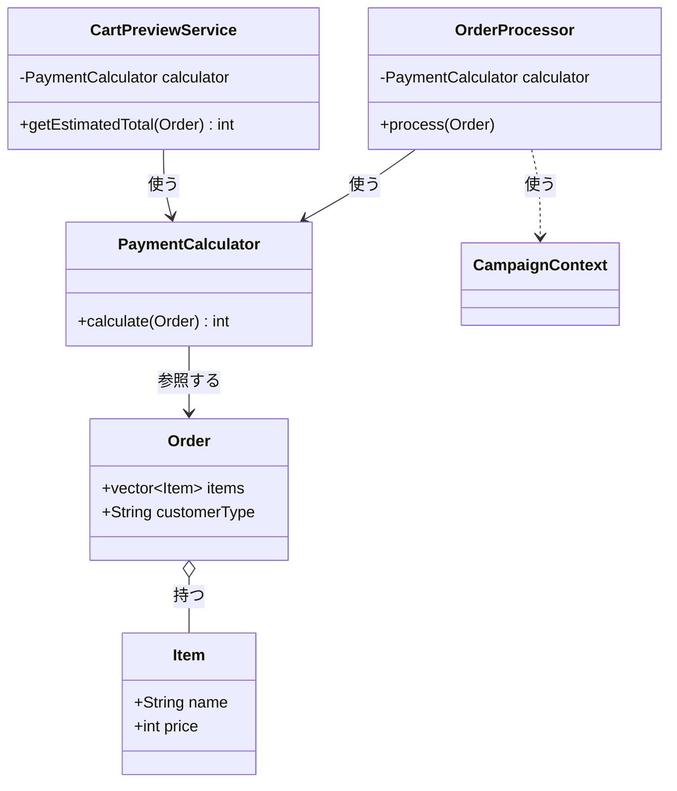
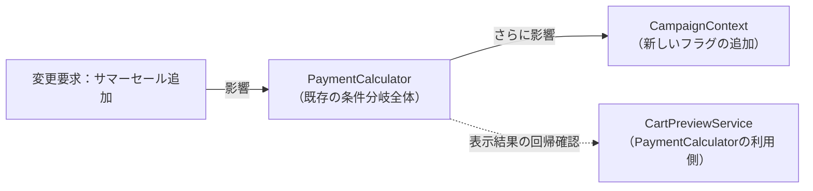
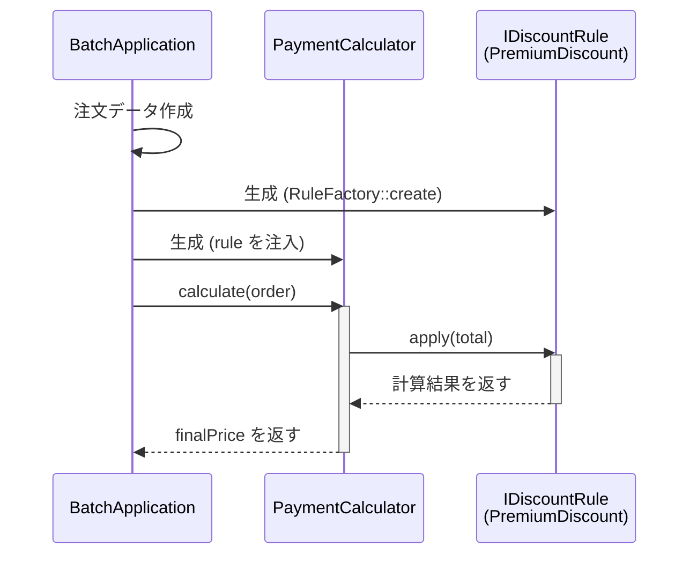
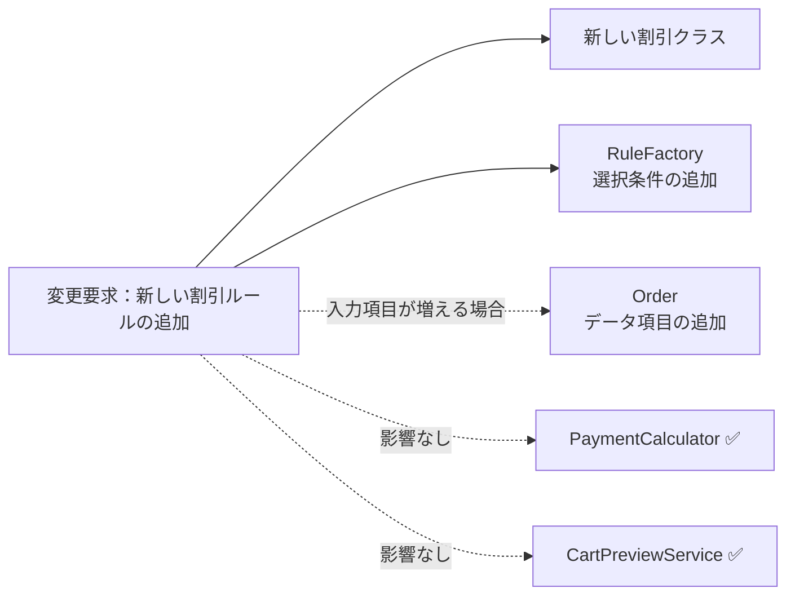
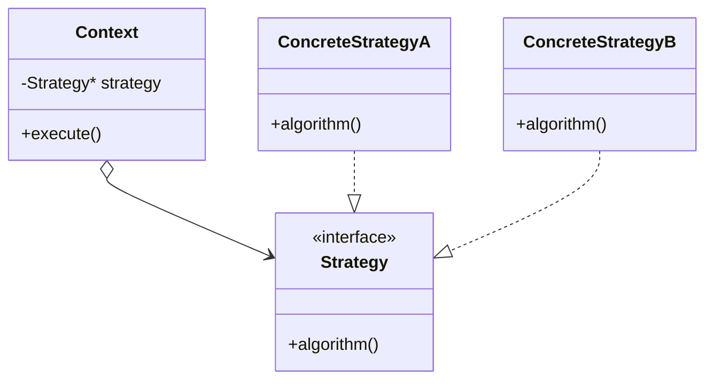

## 第1章 変わるものをカプセル化する ―― Strategy パターン

### この章の核心

**計算のルールが変わるたびに、それを呼び出す側のコードまで修正することになる。それは、「変わる理由（個別の割引ルール）」と「変わらない構造（処理の全体的な流れ）」が、同じ場所に混在しているからだ。**

---

### この章を読むと得られること

「割引ルールが増えるたびに、既存の計算ロジックに手を入れなければならない」——この痛みを経験したことがあるなら、この章はそのまま使える答えを持っています。

- **得られること1：** 「実行する振る舞い」という観点で、コードの変動箇所を識別できるようになる
- **得られること2：** 接続点で呼び出し元がどの知識を抱えているかを調べ、「変わる理由が異なる知識が同じ場所に混在している」と現状の問題を認識できるようになる
- **得られること3：** 接続点の形を変えると変更がどのように局所化されるかを構造から説明でき、改善後にどんな効果が生まれるかを見通せるようになる
- **得られること4：** 増え続けるルールに対して、いつ・どのように構造を分けるべきかの判断ができるようになる

---

## 🔵 フェーズ1：現状把握 ―― 仕様を整理し、システムと紐付ける

この問題を解くために7つのフェーズを使います。はじめに現状把握から開始し、仮説立案・問題特定・原因分析・課題定義・対策検討・対策実施という順で進みます。

変更要求が来る前のシステムの現状を事実として把握するところから始めます。はじめに仕様と動作例で「このシステムが何をするか」を確認し、それからコードを読みます。
### 1-1：このシステムの仕様

このシステムは、ECサイトでお客様が商品を購入する際の**支払金額を計算**します。

入力として「商品リスト（各商品の名前と単価）」「会員種別（Premium / Regular）」「キャンペーン期間中フラグ（以後キャンペーンフラグ）」を受け取ります。システムは全商品の小計を算出し、以下の割引ルールを適用した最終的な支払金額を返します。

**割引ルール一覧**

| ルール名     | 適用条件                        | 割引の内容    | 変更主体（どのチームの要求か）   |
| -------- | --------------------------- | -------- | ------------------- |
| プレミアム割引  | 会員種別が "Premium"             | 20%引き    | 会員サービス企画チーム         |
| キャンペーン割引 | 会員種別が "Regular" かつキャンペーン期間中 | 10%引き    | マーケティングチーム           |
| 割引なし     | 上記以外                        | 定価（割引なし） | —（変更不要）              |

**優先・排他ルール**

| 条件 | 動作 |
|---|---|
| Premium かつ キャンペーン中 | Premium のみ適用（キャンペーン割引は無効） |

**この割引計算を使う場所**

| 使用場所 | 用途 |
|---|---|
| 決済計算モジュール | 注文確定時の支払金額の確定 |
| カートプレビュー機能 | カート画面の金額プレビュー表示 |

**このシステムの登場クラス**

| クラス名 | 役割 | 担当する仕様 |
|---|---|---|
| Order / Item | 注文情報と商品データの保持 | 商品名・単価・数量などの元データ |
| PaymentCalculator | 支払金額の計算 | 合計金額の算出と割引ルールの適用 |
| CartPreviewService | カート画面のプレビュー表示 | 計算結果を使った金額プレビューの生成 |

---

### 1-2：動作例テーブル

仕様を定義したところで、実際にどのような入力に対してどのような結果が返るかを確認します。このテーブルは「このシステムが正しく動いているとはどういう状態か」の基準になります。後で設計の改善（リファクタリング）を段階的に進めるときも、この表に立ち返ります。

| # | 会員種別 | キャンペーン | 小計 | 適用ルール | 支払金額 |
|---|---|---|---|---|---|
| 1 | Premium | ✗ | 10,000円 | プレミアム20%引き | 8,000円 |
| 2 | Premium | ✓ | 10,000円 | プレミアム優先（キャンペーン無効） | 8,000円 |
| 3 | Regular | ✓ | 10,000円 | キャンペーン10%引き | 9,000円 |
| 4 | Regular | ✗ | 10,000円 | 割引なし | 10,000円 |

コードを読む前に、このシステムが「何をする必要があるか」をこの表で確認できました。次は「どのように実装されているか」を見ていきます。

---

### 1-3：クラス構成図

コードを読んだところで、クラス間の関係を図で整理します。



`OrderProcessor` が `PaymentCalculator` を使い、`PaymentCalculator` が `Order` の属性を直接参照しています。
`CartPreviewService` も同じ `PaymentCalculator` を使うため、割引計算の変更ではソース修正がなくても表示結果の回帰確認が必要です。

---

### 1-4：実装コード（現状）

#### データクラス

はじめに注文のデータを保持するクラス群から見てみます。

```cpp
// 商品クラス：商品名と単価を持つだけのシンプルなクラス
class Item {
public:
    std::string name;
    int price;
    Item(std::string n, int p) : name(n), price(p) {}
};

// キャンペーンなどの状態をまとめるクラス
class CampaignContext {
public:
    bool isCampaignActive = false;
};

// 注文データクラス：カートの中身と顧客の属性を保持する
class Order {
public:
    std::vector<Item> items;
    std::string customerType;   // "Regular" または "Premium"
};
```

`Item` と `Order` は純粋なデータの入れ物です。計算のロジックは一切ありません。

#### 決済計算クラス

次に、割引を適用して最終的な支払金額を算出する計算クラスを見ます。

```cpp
class PaymentCalculator {
public:
    int calculate(const Order& order, const CampaignContext& context) {
        int total = 0;

        // 小計の計算：注文の全商品を足し合わせる
        for (const auto& item : order.items) {
            total += item.price;
        }

        // 割引ルール：条件ごとに if で分岐している
        if (order.customerType == "Premium") {
            total = total * 80 / 100;   // 20%引き
        } else if (order.customerType == "Regular"
                   && context.isCampaignActive) {
            total = total * 90 / 100;   // 10%引き
        }

        return total;
    }
};
```

このクラスが今章の中心です。`calculate` メソッドの中に「商品の価格を足し合わせる処理」と「割引ルールを判定する処理」が一緒に書かれていることを確認しておいてください。

カートプレビューは割引条件を重複実装せず、同じ計算クラスを利用しています。

```cpp
class CartPreviewService {
private:
    PaymentCalculator calculator;
public:
    int getEstimatedTotal(const Order& order, const CampaignContext& context) {
        return calculator.calculate(order, context);
    }
};
```

#### 呼び出し元と実行確認

```cpp
class OrderProcessor {
private:
    PaymentCalculator calculator;
public:
    void process(const Order& order, const CampaignContext& context) {
        int finalPrice = calculator.calculate(order, context);
        std::cout << "支払金額は " << finalPrice << " 円です。\n";
    }
};

int main() {
    OrderProcessor processor;
    Order order;
    CampaignContext context;
    order.items.push_back(Item("ワイヤレスイヤホン", 10000));

    // 行1：Premium / キャンペーンなし → プレミアム20%引き
    order.customerType = "Premium";
    context.isCampaignActive = false;
    processor.process(order, context);

    // 行2：Premium / キャンペーンあり → Premium優先（キャンペーン無効）
    order.customerType = "Premium";
    context.isCampaignActive = true;
    processor.process(order, context);

    // 行3：Regular / キャンペーンあり → キャンペーン10%引き
    order.customerType = "Regular";
    context.isCampaignActive = true;
    processor.process(order, context);

    // 行4：Regular / キャンペーンなし → 割引なし
    order.customerType = "Regular";
    context.isCampaignActive = false;
    processor.process(order, context);

    return 0;
}
```

上記コードの実行結果（動作例テーブルの全4行と一致）：

```
支払金額は 8000 円です。   // 行1：Premium 20%引き
支払金額は 8000 円です。   // 行2：Premium優先（キャンペーン無効）
支払金額は 9000 円です。   // 行3：Regular 10%引き
支払金額は 10000 円です。  // 行4：割引なし
```

動作例テーブルの全4パターンをコードが正しく処理していることを確認できました。次のフェーズで変更が来たときに何が起きるかを確認します。

---

### 1-5：変更要求

マーケティング部から以下の変更要求が来ました。

「来週から『サマーセール』を開始します。期間中はRegular会員を対象に5%オフを追加してください。プレミアム会員はすでに20%引きが適用されているため、今回のセールは対象外です。」

リリースは来週末。既存の `if` 文の隙間に `else if` を追加すれば間に合うかもしれません。しかし少し立ち止まって、「これは1回限りの変更なのか、今後も続くのか」を確認しましょう。


**仕様変更の内容**

変更要求を受けて、現在の割引ルールがどう変わるかを整理します。

| ルール名 | 変更前 | 変更後 |
|---|---|---|
| プレミアム割引 | Premium会員に20%引き | 変更なし |
| キャンペーン割引 | Regular会員にキャンペーン10%引き | 変更なし |
| **サマーセール割引（新規）** | —（なし） | **Regular会員に5%引きを追加** |

※表の一番下の行（Premium・キャンペーン・サマーセールがすべて重なった場合）は、「プレミアム割引（20%引き）」が最優先され、他のキャンペーンやサマーセールは無効になるという仕様を表しています。そのため、変更後も8,000円のままとなります。


**変更後の動作例**

| 会員種別 | キャンペーン | サマーセール | 変更前の支払金額（1万円の場合） | 変更後の支払金額 |
|---|---|---|---|---|
| Premium | ✓ | ✓ | 8,000円（20%引き） | 8,000円（変更なし） |
| Regular | ✓ | ✓ | 9,000円（10%引き） | **8,550円（重ね掛け：5%引き×10%引き）** |
| Regular | ✗ | ✓ | 10,000円（割引なし） | **9,500円（5%引き）** |
| Regular | ✓/✗（どちらでも） | ✗ | 変更なし | 変更なし |

Regular会員はサマーセール中に5%引きが新たに加わります。プレミアム会員はすでに20%引きが適用されているため、今回のサマーセールの対象外となります。

フェーズ1でシステムの現状と変更要求が把握できました。次のフェーズ2では、「何が変わり、何が変わらないか」を整理します。

## 🟣 フェーズ2：仮説立案 ―― 何が変わるかを観察し、ヒアリングで裏付ける

### 2-1：`PaymentCalculator`に混在している知識と担当チーム

`PaymentCalculator.calculate()` が現在抱えている知識と、それぞれを変更するチームを確認します。

| 知識（コードが直接持っているもの） | 変更を決めるチーム | 適切か |
|---|---|---|
| 商品単価の合算ロジック | 決済システム開発チーム | ✅ |
| プレミアム割引の条件・割引率 | 会員サービス企画チーム | ❌ 混在 |
| キャンペーン割引の条件・割引率 | マーケティングチーム | ❌ 混在 |

❌が2つある。この1つのメソッドを、複数のチームが異なる時期に変更することになります。これが後の変更の痛みの予兆です。

### 2-3：今回の変更で確実に変わること

今回の変更要求から確定している変更は1点です。

- **サマーセール割引の追加**：Regular会員を対象に5%オフを追加する

ただし「この変更が1回限りか、今後も続くか」によって、どこまで設計を変えるべきかが大きく変わります。関係者に確認します。

### ヒアリングに向けた背景確認

このシステムは、ある中堅ECサイトの決済計算を担っています。数年前にサービスが立ち上がった当初は、お客様が商品を選んでカートに入れ、そのままの合計金額で決済するシンプルな流れでした。

しかし、サービスが成長し競合他社との競争が激しくなるにつれて、様々な施策が打たれるようになりました。新規顧客向けの期間限定キャンペーンや、リピーター向けのプレミアム会員制度など、ビジネス上の要求は日々増えています。

### 2-4：関係者ヒアリング

> **現実のヒアリングでは——** 本書のヒアリングシーンでは設計判断を明確にするため、意図的に「理想的な回答」が返ってくるように描いています。これはシミュレーションです。現実には、「変わるかどうか分からない」「たぶん変わらない」という曖昧な答えが返ることも多いです。そのときは `git log` や過去の障害記録を「ヒアリングの代わり」として使ってみてください。「過去に何度変わったか」が最も正直な証拠です。

- **開発者：** 「サマーセールの件、承知しました。今後もこのような新しい割引ルールは追加される予定はありますか？」
- **マーケティング部リーダー：** 「はい、もちろんです。秋にはハロウィンキャンペーン、冬には年末大感謝祭など、毎月のように新しい企画を予定しています。」
- **開発者：** 「ちなみに、割引の計算方法自体が変わることはありますか？今はパーセント引きですが、定額割引などです。」
- **マーケティング部リーダー：** 「実は秋のキャンペーンでは、一律1000円引きクーポンの配布を検討しています。これも対応できますか？」

### 2-5：ヒアリングで判明した将来リスク

ヒアリングで浮かび上がった「確定ではないが、近い将来起こりうる変化」を記録します。これは今回の設計判断の材料です。

| **将来リスク** | **時期の目安** | **根拠** |
|---|---|---|
| 新しい割引ルールの追加が毎月続く | 継続的に | マーケティング責任者から直接確認 |
| 計算方法が「パーセント引き」から「定額引き」に変わる | 数ヶ月後 | 秋のクーポン企画として言及 |

フェーズ2で「今変わること（確定）」と「将来変わるかもしれないこと（リスク）」を分けて整理できました。次のフェーズ3では、現在の構造で変更を試みたときに何が起きるかを確認します。

---

## 🟣 フェーズ3：問題特定 ―― 変更の痛みを発見する

### 3-1：変更を試みる

「サマーセール：Regular会員に5%オフを追加」を現在の `PaymentCalculator` に追加してみます。変更前のコードはこうでした。

```cpp
if (order.customerType == "Premium") {
    total = total * 80 / 100;   // 20%引き
} else if (order.customerType == "Regular"
           && context.isCampaignActive) {
    total = total * 90 / 100;   // 10%引き
}
```

このコードにサマーセールの条件を追加すると、以下のようになります。

```cpp
// サマーセール対応：Regular会員向けに条件を追加
if (order.customerType == "Premium") {
    total = total * 80 / 100;  // 20%引き（サマーセール対象外）
} else if (context.isSummerSale && context.isCampaignActive) {
    total = (total * 95 / 100) * 90 / 100; // 重ね掛け（Regular会員）
} else if (context.isSummerSale) {
    total = total * 95 / 100;  // 5%引き（Regular会員）
} else if (context.isCampaignActive) {
    total = total * 90 / 100;  // 10%引き
}
```

この変更後コードを見ると、問題が浮かび上がります。

一見シンプルな追加に見えますが、サマーセールは「Regular会員のみ」「キャンペーンと重複した場合は重ね掛け」という複合条件を持っています。単純に `else if` を1行追加するだけでは済まず、`context.isSummerSale && context.isCampaignActive` の組み合わせを考慮した分岐も追加する必要があります。さらに、`CampaignContext` クラスに `isSummerSale` フラグを追加する作業が発生します。

```cpp
// CampaignContext クラスへの変更（サマーセールフラグの追加が必要）
class CampaignContext {
public:
    bool isCampaignActive = false;
    bool isSummerSale = false;   // ← 追加。データクラスにまでフラグが増え続ける
};
```

ヒアリングで予告された「1000円引きクーポン」が来た場合はどうでしょうか。パーセント計算とは異なる「引き算」のロジックが混入し、全ての `if` ブロックの計算順序を見直す必要が出てきます。

### 3-2：変更影響グラフ



新しいルールを1つ追加するだけで、既存の計算ロジック全体とデータクラスを修正し、同じ計算結果を表示するカートプレビューも回帰確認する必要があります。ここでは、**ソースを修正する場所**と**動作を再確認する場所**を区別します。

### 3-3：痛みの言語化

**1つ目：影響範囲が読めない恐怖。** 新しい割引を追加するには、複雑化しつつある `if-else` の隙間にコードを差し込む必要があります。変更のたびに、無関係なはずの過去のルールも含めて全テストケースを見直す必要があります。

**2つ目：検索・解読コストの増大。** キャンペーンのたびに条件分岐が追加されていくと、PaymentCalculator が数百行の複雑な分岐を抱える可能性があります。「どの条件が今のキャンペーンのものか」「過去のセール条件とどう違うのか」を理解するために、コードの広い範囲を確認する作業が発生します。機能として動いていても、変更箇所を特定する負担が徐々に大きくなります。

---
> **📌 問題（確定）**
> 割引という「実行する振る舞い」が変わるたびに、`PaymentCalculator` と `CampaignContext` を修正し、その計算を使う `CartPreviewService` まで回帰確認する必要がある。変わる理由が異なる知識が計算本体に混在しているため、1つの施策変更が広い影響確認を強いる。
---

フェーズ3で「変更が辛い」ことが確認できました。次のフェーズ4では、なぜ辛いのかを構造的に言語化します。

---

## 🟠 フェーズ4：原因分析 ―― なぜ辛いのかを構造で言語化する

### 4-1：痛みの根源を探る（観察と原因）

フェーズ3で確認した「変更の辛さ」は、コードのどこから来ているのでしょうか。コードを注意深く観察すると、痛みを引き起こしている2つの事実が浮かび上がってきます。

第一に、新しい割引を追加するとき、なぜ毎回 `PaymentCalculator` を開かなければならないのでしょうか？
フェーズ2の責任チェック表から見えたように、現状の PaymentCalculator はこれらすべての割引ルールを責任として持っています。問題は、その責任を**複数のチームからの変更要求によって変えなければならない点**です。複数のチームの判断が1つのクラスに集中してしまっているため、仕様変更の影響がここに密集してしまうのです。

それは、このクラス自身が「プレミアム会員なら20%引き」「サマーセールなら5%引き」といった**具体的な割引の条件をすべて直接知ってしまっている（抱え込んでいる）**からです。

第二に、なぜ変更の影響範囲が読めず、全テストをやり直す恐怖を感じるのでしょうか？
それは、「商品をループで回して金額を足し合わせる」という土台となる骨格ロジックと、「特定のキャンペーンを判定して割引する」というビジネスロジックが、**同じメソッドの中で物理的に混ざり合っている**からです。

この「症状（痛み）」と「根本原因」を整理すると、以下のようになります。

| **観察した症状（痛み）** | **構造的な原因（痛みの根源）**                                                                                                                    |
| -------------- | ------------------------------------------------------------------------------------------------------------------------------------ |
| 影響範囲が読めない恐怖    | `PaymentCalculator` が各割引の具体的な条件を直接知っているから                                                                                            |
| 検索・解読コストの増大 | 変わる理由が違う2つのもの（「合算ロジック」と「割引条件」）が同じメソッドの中に混在しているから。異なる理由で変わるロジックが分離されず、同じメソッド内に直接書かれているため、割引条件が変わるたびに合算ロジックも含めたメソッド全体を確認する作業が発生する。 |

### 4-2：変わるもの/変わってほしくないもの

> **「変わらないもの」と「変わってほしくないもの」は異なります。** 「変わらないもの」は経験的事実（今まで変わっていない）、「変わってほしくないもの」は設計意図（ここを安定させてほかを守りたい）です。ここで整理するのは後者です。

| **変わるもの（割引ルール）** | **変わってほしくないもの（計算骨格）** |
|---|---|
| 各キャンペーンの適用条件（サマーセール、ハロウィン等） | 商品単価を順番に足す合算ロジック |
| 割引額の計算方法（パーセント引き・定額引きなど） | 計算を依頼して最終金額を受け取る呼び出し側のフロー |

**【変わる部分（変わり続けるif文と計算）】**

1-3で示した `calculate` メソッドの割引判定ブロックが、キャンペーンのたびに変わる箇所です。

```cpp
        if (order.customerType == "Premium") {
            total = total * 80 / 100;   // 20%引き
        } else if (context.isSummerSale && context.isCampaignActive) {
            total = (total * 95 / 100) * 90 / 100; // 複合割引
        // ← 新しいキャンペーンが来るたびに、ここにelse ifが追加される
```

**【変わってほしくない部分（守りたい骨格）】**

1-3の `calculate` メソッドのうち、「商品を順に足して合計を出し、最終金額を返す」という骨格部分は変えたくありません。

```cpp
        int total = 0;
        for (const auto& item : order.items) {
            total += item.price;             // 小計計算（変えたくない）
        }
        // ← ここに「変わる部分」（割引判定）が割り込んでいる
        return total;                        // 結果を返す（変えたくない）
```

### 4-3：接続点に漏れている知識を確認する

今、`PaymentCalculator`は割引ルールの条件（`isPremium`や`isSummerSale`等）を自分の中に抱えています。接続点で見ると、計算の骨格が必要としているのは「合計金額を渡し、割引後の金額を受け取ること」だけです。それにもかかわらず、骨格側が個々の適用条件と割引率まで知っています。

現在の `PaymentCalculator` は、すべての割引ルールを自分自身の中に直接抱え込んでいます。

**【接続点へ割引条件が漏れているコード】**
```cpp
class PaymentCalculator {
public:
    int calculate(const Order& order) {
        // ← 1-3で示した合算ループ（for + total += item.price）がここに入る
        // 割引ルール（具体）を、自分自身で直接判断して処理している
        if (order.customerType == "Premium") {
            total = total * 80 / 100;
        }
        // ← 1-3で示した他のelse ifブロックがここに続く
    }
};
```

新しいキャンペーンが増えるたびに、計算の骨格を持つクラスを開き、`else if`を追加する作業が発生します。割引ルールの知識が接続点を越えて骨格側へ漏れているためです。

決済の合算ロジックと個別の割引ルールは、変わる理由が全く異なります。これらが同じ場所に混在していることが、根本原因として確認できました。

今回見直すべき接続点は、「合計金額」と「割引後の金額」を受け渡す境界です。個々のキャンペーン条件は、この境界の外へ移せます。

---
> **📌 原因（確定）**
> 割引ルールが「毎月追加される」と確認できているのに、その全種類を`PaymentCalculator`が抱え込んでいる。追加のたびに計算の骨格を開く必要があり、割引担当の変更が注文計算の再テストへ波及する。
---

フェーズ4で根本原因が言語化できました。「どこを分けるか」は明確です。次のフェーズ5では、その境界で実際に何が流れているかを値・型のレベルで具体化し、「何が変わり、何が変わらないか」を明確にします。

---

## 🟡 フェーズ5：課題定義 ―― 接続点で何が流れているかを見る

フェーズ4は「なぜ辛いか」を答えました。フェーズ5が問うのは「分けるべき境界で、実際に何が流れているか」です。クラスの参照関係ではなく、**値・型のレベル**に降りていきます。

フェーズ4の分析により、問題は「計算の骨格」と「割引の条件分岐」が混在していることだと分かりました。その境界で何がやり取りされているかを具体化します。

### 接続点を特定する

`calculate()` の中で分けるべき境界は1か所。「割引を計算する側」が骨格に渡しているデータを見ます。

```cpp
        // 骨格（変わらない）
        for (const auto& item : order.items) {
            total += item.price;
        }

        // ↓ 割引ルール（変わり続ける）
        if (order.customerType == "Premium") {
            total = total * 80 / 100;
        } else if (context.isSummerSale && context.isCampaignActive) {
            total = (total * 95 / 100) * 90 / 100;
        } else if (context.isSummerSale) {
            total = total * 95 / 100;
        } else if (context.isCampaignActive) {
            total = total * 90 / 100;
        }
        // ↑ ここまでが分離するターゲット

        return total;
```

割引ルールが計算の骨格に返しているのは「割引適用後の合計金額（`int`）」です。

| 接続点 | 接続するデータ | 変わるもの |
|---|---|---|
| 割引ロジック → `calculate()` の骨格 | `int` 型の割引適用後の合計金額 | 計算ロジック（誰がどう割引するか） |

### 何が変わり、何が変わらないか

- **変わるもの**：割引の計算ロジック。新しいキャンペーンや顧客種別のたびに増える。
- **変わらないもの**：流れるデータの型（`int` 型の金額）。`CartPreviewService` が受け取る値の形は変わらない。

呼び出し元は「割引後の金額を受け取れれば十分」なので、必要とする結果の型は安定しています。問題は「どのように計算するか」という**割引ルールの知識**が本体に膨れ続けていることです。

**現状のままでよい場面**：割引ルールが少数で、当面追加されないとチームで確認できるなら、`if-else`のまま保つ判断もあります。今回はルールが毎月増えるため、計算の骨格から割引判断を切り離し、同じ受け渡し方で交換できる設計を検討します。

---
> **📌 課題（確定）**
> 割引ルールが増え続けると確定している以上、`PaymentCalculator` がその全種類を直接知り続ける設計はコストが合わない。割引ロジックを外から差し替えられるようにし、`PaymentCalculator` は受け取るだけにする。
---

## 🔴 フェーズ6：対策検討 ―― 段階的な改善と決断

フェーズ5で「変わるのは割引の計算ロジックであり、割引後の金額という結果の型は安定している」ことが分かりました。ここでは、その割引ルールをどのように差し替え可能にするかを段階的に検討します。いきなり正解へ飛ぶのではなく、各ステップで「どこまで痛みが解消されるか」を確認しながら、今回の要件において「どのステップで止めるのが良いか」を決断します。

### ステップ1：プライベートメソッドに切り出す（同じクラスの中で整理する）

「if-else が乱立しているなら、まずそれをメソッドに切り出して整理しよう」というのが自然な最初の発想です。クラスを新しく作るのはコストがかかる。同じクラスの中で、割引の塊をプライベートメソッドとして分離してみます。

```cpp
class PaymentCalculator {
    // 割引の条件と計算をプライベートメソッドに切り出す
    int applyDiscount(int total, const Order& order, const CampaignContext& context) {
        if (order.customerType == "Premium")
            return total * 80 / 100;
        if (context.isSummerSale && context.isCampaignActive)
            return (total * 95 / 100) * 90 / 100;
        if (context.isSummerSale)
            return total * 95 / 100;
        if (context.isCampaignActive)
            return total * 90 / 100;
        return total;
    }
public:
    int calculate(const Order& order) {
        int total = 0;
        for (const auto& item : order.items) total += item.price;
        return applyDiscount(total, order); // 骨格が読みやすくなった
    }
};
```

`calculate()` の骨格は一目で読めるようになり、割引の詳細は `applyDiscount()` の中に隠れた。

**この段階の評価：** `calculate()` は確かにスッキリしました。しかし整理できたのは「見た目」だけです。新しい割引が来るたびに `applyDiscount()` を開いて `else if` を書き足す、という根本は何も変わっていません。整理できたが、新しい割引が来るたびに同じクラスを修正する根本は変わっていない。「クラスを分ける」方向を試してみましょう。

---

### ステップ2：各割引を別のクラスに切り出す

私がまず試みるのは、クラスをいきなり分けることではなく、判定部分を関数として切り出すことです。しかし実際にやってみると、1つのクラスの中に関数ばかりが増え続け、クラス全体が膨大になっていくことに気づきます。そこで初めて「クラスを分ける」という発想が生まれるのではないでしょうか。

「割引ロジックが増えてきたなら、それぞれを別のクラスにしよう」という発想は自然です。ステップ1では1つのメソッドに詰め込んでいましたが、今度は割引の種類ごとにクラスを作ってみます。

```cpp
// 割引ごとに別のクラスに分けた（インターフェースはまだない）
class PremiumDiscount {
public:
    int apply(int total) { return total * 80 / 100; }
};

class SummerSaleDiscount {
public:
    int apply(int total) { return total * 95 / 100; }
};

class CampaignDiscount {
public:
    int apply(int total) { return total * 90 / 100; }
};

class PaymentCalculator {
public:
    int calculate(const Order& order) {
        int total = 0;
        for (const auto& item : order.items) total += item.price;

        // ← if文はここに残ったまま。しかも全具体クラスを知らなければならない
        if (order.customerType == "Premium") {
            PremiumDiscount rule;
            return rule.apply(total);
        } else if (context.isSummerSale && context.isCampaignActive) {
            SummerSaleDiscount s;
            CampaignDiscount c;
            return c.apply(s.apply(total));
        } else if (context.isSummerSale) {
            SummerSaleDiscount rule;
            return rule.apply(total);
        } else if (context.isCampaignActive) {
            CampaignDiscount rule;
            return rule.apply(total);
        }
        return total;
    }
};
```

各割引の計算ロジックが別クラスに分かれ、それぞれのクラスは小さくなった。

**この段階の評価：** 割引の計算が別ファイルに分かれたのは良い変化です。しかし `PaymentCalculator` は `PremiumDiscount`・`SummerSaleDiscount`・`CampaignDiscount` の全クラス名を直接知っており、if文も本体に残ったままです。新しい割引が来るたびに新しいクラスを作るのと同時に `PaymentCalculator` の中の if 文も書き足さなければなりません。クラスに分けられたが、`PaymentCalculator` が全クラスを直接知っている問題は残っています。「直接知る」という部分を何とかできないか、考えてみましょう。

---

### ステップ3：共通の契約を導入するが、生成は自分で行う

「全クラスを直接知っているのが問題なら、共通のインターフェースを作ってそれだけを知ればいい」という発想です。`IDiscountRule` インターフェースを導入し、`PaymentCalculator` はそれだけを知るようにします。ただし、どの具体クラスを生成するかはまだ `PaymentCalculator` 自身が if 文で判断します。

```cpp
// 共通のインターフェース（契約）を導入する
class IDiscountRule {
public:
    virtual int apply(int total) = 0;
    virtual ~IDiscountRule() = default;
};

class PremiumDiscount : public IDiscountRule {
public:
    int apply(int total) override { return total * 80 / 100; }
};

class SummerSaleDiscount : public IDiscountRule {
public:
    int apply(int total) override { return total * 95 / 100; }
};

class CampaignDiscount : public IDiscountRule {
public:
    int apply(int total) override { return total * 90 / 100; }
};

class PaymentCalculator {
public:
    int calculate(const Order& order) {
        int total = 0;
        for (const auto& item : order.items) total += item.price;

        // ← 型は抽象（IDiscountRule*）になったが、
        //   どれを生成するかの判断はまだif文に残っている
        IDiscountRule* rule = nullptr;
        PremiumDiscount premium;
        SummerSaleDiscount summer;
        CampaignDiscount campaign;

        if (order.customerType == "Premium") {
            rule = &premium;
        } else if (context.isSummerSale) {
            rule = &summer;
        } else if (context.isCampaignActive) {
            rule = &campaign;
        }

        return rule ? rule->apply(total) : total;
    }
};
```

`PaymentCalculator` が持つ型は `IDiscountRule*` という抽象型になり、具体クラスのメソッドを直接呼ぶ行は消えた。

**この段階の評価：** 型を抽象化できたのは前進です。しかし `PaymentCalculator` はまだ `PremiumDiscount` や `SummerSaleDiscount` という具体クラス名を知っており、if 文で生成を選んでいます。新しい割引クラスを追加するとき、`PaymentCalculator` の中の if 文も書き足さなければなりません。加えて、この `else if` の連鎖は、「Regular会員でSummerSale中かつキャンペーン中（重ね掛け：8,550円）」のケースを正しく表現できません。`isSummerSale` が真であれば `CampaignDiscount` は無視されるためです。この問題はステップ4で `SummerSaleAndCampaignDiscount` を追加することで解決します。型は抽象化できたが、どれを生成するかの判断はまだ if 文に残っている。「生成の選択」そのものを外に出せれば、`PaymentCalculator` から if 文が消えるはずです。

---

### ステップ4：ルールを外から受け取る（依存性の注入・Strategy）

「`PaymentCalculator` が自分でルールを生成するから if 文が必要になる。なら、外からルールを渡してもらえばいい」という発想です。どのルールを使うかを決める責任を呼び出し側に移し、`PaymentCalculator` はただ受け取って使うだけにします。

```cpp
class IDiscountRule {
public:
    virtual int apply(int total) = 0;
    virtual ~IDiscountRule() = default;
};

class PremiumDiscount : public IDiscountRule {
public:
    int apply(int total) override { return total * 80 / 100; }
};

class SummerSaleDiscount : public IDiscountRule {
public:
    int apply(int total) override { return total * 95 / 100; }
};

class SummerSaleAndCampaignDiscount : public IDiscountRule {
public:
    int apply(int total) override {
        return (total * 95 / 100) * 90 / 100;
    }
};

class CampaignDiscount : public IDiscountRule {
public:
    int apply(int total) override { return total * 90 / 100; }
};

class NoDiscount : public IDiscountRule {
public:
    int apply(int total) override { return total; }
};

// ← コンストラクタでルールを受け取る。自分では生成しない
class PaymentCalculator {
private:
    IDiscountRule* rule;
public:
    PaymentCalculator(IDiscountRule* r) : rule(r) {}

    int calculate(const Order& order) {
        int total = 0;
        for (const auto& item : order.items) total += item.price;
        return rule->apply(total); // 割引種別を選ぶif文が計算フローから外れた
    }
};

// ─── 呼び出し側：どのルールを使うかはここで決める ───
void processOrder(const Order& order) {
    PremiumDiscount premium;
    SummerSaleAndCampaignDiscount both;
    SummerSaleDiscount summer;
    CampaignDiscount campaign;
    NoDiscount none;

    // かつてPaymentCalculatorの中にあったif文がここに移動した
    // 実行結果は一切変わらず、判断の責任だけが外側に押し出された
    IDiscountRule* rule = &none;
    if (order.customerType == "Premium") {
        rule = &premium;
    } else if (context.isSummerSale && context.isCampaignActive) {
        rule = &both;
    } else if (context.isSummerSale) {
        rule = &summer;
    } else if (context.isCampaignActive) {
        rule = &campaign;
    }

    PaymentCalculator calculator(rule);
    int finalPrice = calculator.calculate(order);
}
```

`PaymentCalculator` の中から割引種別を選ぶ `if` 文が消え、`IDiscountRule* rule` を受け取って計算を委譲する骨格になりました。

**この段階の評価：** `PaymentCalculator` から割引種別の選択判断が消えました。新しい割引を追加するときは、ルールクラスと選択を担う組み立て箇所を変更します。`IDiscountRule` の契約が安定している限り、`PaymentCalculator` の計算フローへ条件分岐を追加せずに済みます。これが今回目指した「変わる理由の分離」の到達点です。

ただし、Strategyは「実行するアルゴリズムの差し替え」を解決するもので、複数の割引を自由に重ねる問題まで自動的に解決するわけではありません。この例では重ね掛けを1つのStrategyとして表す `SummerSaleAndCampaignDiscount` を用意しています。独立した割引が増え、組み合わせごとのクラスが増え始めたら、割引のリストを順番に適用する仕組みや、第6章で扱うDecoratorのような構造を別途検討します。

---

### どこまで設計を進めるのが良いか（採用ステップの決断）

それぞれのステップには一長一短があります。ステップ4のインターフェース化は強力ですが、ファイル数や型が増えるという「初期投資コスト」もかかります。どこで止めるかは、**「今後の変更頻度（ビジネス要求）」**で決断します。

*   **ステップ1（プライベートメソッド化）で止めるケース：** 「今回限りの特例」の場合。見た目を整理するだけで十分です。
*   **ステップ2（具体クラスへの分離）で止めるケース：** ファイルを分けて整理したいが、インターフェース導入のコストをまだかけたくない場合の「中間策」です。
*   **ステップ3（インターフェース化・生成は自分）で止めるケース：** 型を統一したいが、呼び出し側にルール選択の責任を渡す準備がまだできていない場合。
*   **ステップ4（依存性の注入）まで進むケース：** 「毎月新しい割引が追加される」と確定している場合。今すぐ初期投資コストを払ってでも、将来の変更箇所を限定するのが適切です。

**今回の決断：**
フェーズ2のヒアリングで、マーケティング責任者から「今後も毎月ルールが追加される」と明言されています。この変更頻度を重視し、今回は**ステップ4（インターフェース化・依存性の注入）まで進化させる**案を採用します。

このように、変わるロジック（割引ルール）をインターフェースで分離し、呼び出し側から自由に差し替え可能にするこの設計構造を **Strategy（ストラテジー）パターン** と呼びます。

フェーズ6で採用ステップが決まりました。次のフェーズ7では、この決断を最終的なコードに落とし込みます。

## 🟢 フェーズ7：対策実施 ―― 変化に強いコードを完成させる

### 7-1：解決後のコード（全体）

ステップ4で決断した構造を、実行可能な完全なコードとして組み上げます。各役割ごとにコードを分けて見ていきましょう。

**1. データの定義とインターフェース（契約）**
計算に必要なデータクラスと、すべての割引ルールが守るべき共通のインターフェースを定義します。

```cpp
#include <iostream>
#include <string>
#include <vector>
#include <memory>

class Item {
public:
    std::string name;
    int price;
    Item(std::string n, int p) : name(n), price(p) {}
};

class CampaignContext {
public:
    bool isCampaignActive = false;
    bool isSummerSale = false;
};

class Order {
public:
    std::vector<Item> items;
    std::string customerType;
};

// 割引ルールの共通インターフェース（Strategy）
class IDiscountRule {
public:
    virtual int apply(int total) = 0;
    virtual ~IDiscountRule() = default;
};
```

**2. 個別の割引ルールの実装（具体）**
インターフェースを満たす具体的な割引クラスを作成します。割引計算の追加・変更は主にこのクラス群へ閉じ、利用するルールの選択は組み立て箇所で行います。

```cpp
class NoDiscount : public IDiscountRule {
public:
    int apply(int total) override { return total; }
};

class PremiumDiscount : public IDiscountRule {
public:
    int apply(int total) override {
        return total * 80 / 100;
    }
};

class SummerSaleAndCampaignDiscount : public IDiscountRule {
public:
    int apply(int total) override {
        return (total * 95 / 100) * 90 / 100;
    }
};

class SummerSaleDiscount : public IDiscountRule {
public:
    int apply(int total) override {
        return total * 95 / 100;
    }
};

class CampaignDiscount : public IDiscountRule {
public:
    int apply(int total) override {
        return total * 90 / 100;
    }
};
```

**3. 本体クラス（コンテキスト）**
計算を行う本体クラスです。具体的な割引ルールを知らず、インターフェースを通じて計算を委譲します。これにより、割引種別を選ぶ条件分岐を計算フローから外せます。

```cpp
class PaymentCalculator {
private:
    IDiscountRule* rule;
public:
    PaymentCalculator(IDiscountRule* r) : rule(r) {}

    int calculate(const Order& order) {
        int total = 0;
        for (const auto& item : order.items) total += item.price;
        return rule->apply(total);
    }
};

// カートプレビュー機能は、同じPaymentCalculatorを利用する
class CartPreviewService {
private:
    PaymentCalculator calculator;
public:
    CartPreviewService(IDiscountRule* r) : calculator(r) {}

    int getEstimatedTotal(const Order& order) {
        return calculator.calculate(order);
    }
};
```

**4. 組み立てと実行（メイン関数）**
最後に、必要な部品を組み立てて実行します。具体的なクラス名（`PremiumDiscount`等）を知っているのは、この組み立てを行う箇所だけです。

```cpp
// ルールを選択するファクトリ（かつて本体にあったif文を隔離する場所）
class RuleFactory {
public:
    static std::unique_ptr<IDiscountRule> create(const Order& order, const CampaignContext& context) {
        if (order.customerType == "Premium") return std::make_unique<PremiumDiscount>();
        if (context.isSummerSale && context.isCampaignActive) return std::make_unique<SummerSaleAndCampaignDiscount>();
        if (context.isSummerSale) return std::make_unique<SummerSaleDiscount>();
        if (context.isCampaignActive) return std::make_unique<CampaignDiscount>();
        return std::make_unique<NoDiscount>();
    }
};

class BatchApplication {
    void printCase(const std::string& label, const Order& order, const CampaignContext& context) {
        std::unique_ptr<IDiscountRule> rule = RuleFactory::create(order, context);
        PaymentCalculator calculator(rule.get());
        CartPreviewService preview(rule.get());

        std::cout << label << "\n";
        std::cout << "  支払金額: " << calculator.calculate(order) << " 円\n";
        std::cout << "  プレビュー: " << preview.getEstimatedTotal(order) << " 円\n";
    }

public:
    void run() {
        Order order;
        CampaignContext context;
        order.items.push_back(Item("ワイヤレスイヤホン", 10000));

        // 変更後の動作例をすべて確認する
        order.customerType = "Premium";
        context.isCampaignActive = false;
        context.isSummerSale = false;
        printCase("Premium", order, context);

        order.customerType = "Premium";
        context.isCampaignActive = true;
        context.isSummerSale = true;
        printCase("Premium + Campaign + Summer", order, context);

        order.customerType = "Regular";
        context.isCampaignActive = true;
        context.isSummerSale = true;
        printCase("Regular + Campaign + Summer", order, context);

        order.customerType = "Regular";
        context.isCampaignActive = false;
        context.isSummerSale = true;
        printCase("Regular + Summer", order, context);

        order.customerType = "Regular";
        context.isCampaignActive = false;
        context.isSummerSale = false;
        printCase("Regular", order, context);
    }
};

int main() {
    BatchApplication app;
    app.run();
    return 0;
}
```

仕様変更後の主要ケースを実行し、既存の割引を保ちながら、サマーセール単独とキャンペーンとの重ね掛けが仕様どおりになることを確認します。今回のルール追加では、`PaymentCalculator` の計算フローを変更せず、ルール実装・選択箇所・入力モデルの変更で対応した点に注目してください。

上記コードの実行結果：

```
Premium
  支払金額: 8000 円
  プレビュー: 8000 円
Premium + Campaign + Summer
  支払金額: 8000 円
  プレビュー: 8000 円
Regular + Campaign + Summer
  支払金額: 8550 円
  プレビュー: 8550 円
Regular + Summer
  支払金額: 9500 円
  プレビュー: 9500 円
Regular
  支払金額: 10000 円
  プレビュー: 10000 円
```

変更前からあるPremium・Regularの結果と、変更後の動作例にあるサマーセール単独・重ね掛けの結果が一致しています。`PaymentCalculator` の中には、具体的な割引種別を選ぶ `if` 文がありません。

### 7-2：動作シーケンス図

ステップ4で到達したStrategyパターンの実行時のオブジェクト間のやり取りを可視化します。`main()` が依存関係を注入し、`PaymentCalculator` が具象クラスを知らずに抽象インターフェース経由で処理を委譲する流れが確認できます。



### 7-3：変更影響グラフ（改善後）



フェーズ3の変更影響グラフと比べると、割引の計算詳細は新しいルールクラスへ移り、計算本体の条件分岐は変更せずに済みます。一方、**どのルールを選ぶか**という条件は `RuleFactory` に残り、施策を表す入力項目が増えるなら `Order` も変わります。Strategyが分離するのは計算アルゴリズムであり、選択条件や入力モデルまで自動的に不変にするわけではありません。

### 7-4：変更シナリオ表

| **シナリオ** | **変わるクラス** | **変わらないクラス** |
|---|---|---|
| サマーセール追加 | `SummerSaleDiscount`・重ね掛け用Strategy・`RuleFactory`・`CampaignContext::isSummerSale` | `PaymentCalculator`, `CartPreviewService` |
| クーポン割引（定額）導入 | `CouponDiscount`・`RuleFactory`。クーポン情報を新たに持つなら`Order` | `PaymentCalculator`, `CartPreviewService` |
| プレミアム割引率の変更 | `PremiumDiscount` の計算式 | `PaymentCalculator`, `CartPreviewService`, `RuleFactory` |

---

## 整理

### この章で定義したこと

| | 内容 |
|---|---|
| **問題** | 割引の「実行する振る舞い」が変わるたびに計算本体と入力モデルを修正し、利用側まで広く回帰確認する。変わる理由が異なる知識が同じ場所に混在しているため |
| **原因** | 割引ルールが「毎月追加される」と確認できているのに、`PaymentCalculator`が全種類の条件と計算方法を抱え込んでいる |
| **課題** | 割引ロジックを外から差し替えられるようにし、`PaymentCalculator` は受け取るだけにする |
| **解決策** | Strategy パターン：`IDiscountRule` を接続点として、外からルールを注入する |

### フェーズとこの章でやったこと

| **フェーズ** | **この章でやったこと** |
|---|---|
| 🔵 フェーズ1：現状把握 | 仕様と動作例テーブルを確認した後、コードをクラス単位で読んだ。クラス構成図と変更要求を把握した |
| 🟣 フェーズ2：仮説立案 | 責任チェック表でクラスごとの変わる理由を確認した。今回の確定変更とヒアリングで判明した将来リスクを分けて整理した |
| 🟣 フェーズ3：問題特定 | サマーセールの追加を試み、`Order` の修正と `CartPreviewService` の回帰確認まで必要になることを確認した |
| 🟠 フェーズ4：原因分析 | 変わる理由が異なる2つのものが同じ場所にいることが痛みの根本と特定した |
| 🟡 フェーズ5：課題定義 | 接続点では `int` 型の割引後金額を受け渡し、変わる割引ルールを本体から分ける課題を定めた |
| 🔴 フェーズ6：対策検討 | 4ステップの段階的進化でそれぞれの痛みの限界を確認し、ステップ4（インターフェース化・依存性の注入）まで進化させる決断を下した |
| 🟢 フェーズ7：対策実施 | 最終コードを実装し、変更影響グラフで変更の局所化を確認した |

### 責任の移動

| **責任** | **変更前** | **変更後** |
|---|---|---|
| 決済の計算フローの進行 | `PaymentCalculator` | `PaymentCalculator`（変わらず） |
| 個別の割引計算の実行 | `PaymentCalculator`（if-else直書き） | `PremiumDiscount` 等の各実装クラス |
| 割引ルールの契約定義 | —（なし） | `IDiscountRule` |

---

## 振り返り

### 「この章を読むと得られること」は手に入ったか

| **得られること** | **この章のどこで示したか** |
|---|---|
| 1. 変動箇所の識別 | フェーズ2の責任チェック表で、変わる理由の異なる知識の混在を発見した |
| 2. 接続点の診断 | フェーズ4で、割引条件の知識が計算の骨格へ漏れている状態を確認した |
| 3. 変更局所化の説明 | フェーズ7の変更シナリオ表で、変更の中心が新しい実装クラスへ移る構造を示した |
| 4. いつ構造を分けるか | フェーズ6の「どこまで設計を進めるのが良いか」で判断基準を示した |

### 3つの設計原則はどう適用されたか

**原則1「変わるものをカプセル化せよ」の現れ**

- 具体化された場所：`PremiumDiscount` / `SummerSaleDiscount` 等の実装クラス
- 解説：頻繁に変わる「割引の計算詳細」を個別クラスに閉じ込めた。新しいルールでは選択箇所や入力モデルが変わる場合もあるが、`PaymentCalculator` の計算フローは保てる。

**原則2「実装ではなくインターフェースに対してプログラムせよ」の現れ**

- 具体化された場所：`PaymentCalculator` のメンバ変数 `IDiscountRule* rule`
- 解説：具体的な割引クラスではなく `IDiscountRule` インターフェースだけを知ることで、実行時にどの割引が適用されるかを気にせず計算フローを進められる。

**原則3「継承よりコンポジションを優先せよ」の現れ**

- 具体化された場所：`PaymentCalculator` と割引ルールの接続
- 解説：コンストラクタインジェクションによるコンポジションで、計算本体と選択したルールを実行時に組み合わせる。複数の割引を重ねるには、組み合わせ用Strategy、ルールの列、Decoratorなど、別の構成方法が必要になる。

---

## あなたのコードで考えてみてください

1. **変動の兆候を探す：** あなたのコードに「条件が1つ増えるたびに、既存の `if-else` チェーンを開いて書き足している」メソッドがありますか？
2. **変える理由を問う：** そのメソッド内の各条件は、誰の判断で変わりますか？同じチームで完結していますか、それとも複数の部門が絡んでいますか？
3. **テストの範囲を測る：** 新しい条件を1つ追加したとき、再確認が必要だったテストは何件でしたか？
4. **分けた後を想像する：** 「変わる計算ロジック」を別クラスに切り出したとすると、次の変更要求が来たとき、触らなくて済むファイルはどこですか？

---

## パターン解説：Strategy パターン

### パターンの骨格

Strategy パターンは、アルゴリズムのファミリーを定義し、それぞれをカプセル化して、呼び出し側から自由に差し替えられるようにするパターンです。



### この章の実装との対応

GoF（Gang of Four）とは、1994年に出版された書籍『Design Patterns』の4人の著者の総称です。彼らが整理した23のパターンは、現在も設計の共通言語として広く使われています。

| GoFの名前 | この章での対応 |
|---|---|
| Context | `PaymentCalculator` / `CartPreviewService` |
| Strategy | `IDiscountRule` |
| ConcreteStrategy | `PremiumDiscount` / `SummerSaleDiscount` / `CampaignDiscount` 等 |

### 使いどころと限界

- **使うと良い：** 似たような振る舞いが複数あり、状況に応じて切り替えたい場合。または今後も新しいアルゴリズムが追加される可能性が高い場合。
- **使わない方が良い：** ルールが1種類しかなく、今後増える見込みがない場合。ファイル数とクラス数が増えるコストが見合わない。
- **別の構造も検討する：** 独立したルールを同時に複数適用し、組み合わせが増え続ける場合。Strategyを組み合わせ用クラスだけで表すとクラス数が増えるため、適用順序を持つルール列やDecoratorなどと比較する。

### この章のまとめ

割引計算というドメインと Strategyパターンの関係を一言で言うなら、「誰の判断で変わるか」を問うと、条件分岐の中に隠れていた変化軸が浮かび上がる、ということだと思います。会員サービス企画チームとマーケティングチームという2つの判断者が、同じ `if-else` の中に混在していた——その事実に気づいた瞬間、計算の骨格と割引ルールを分けなければならない理由が、設計論としてではなく、現場のコストとして腹に落ちたのではないでしょうか。

7つのフェーズを通じて、読者は「動くコード」の観察から「変わる理由の発見」へ、そして「接続点を金額の授受だけに絞る」という判断へと、一歩ずつ進みました。フェーズ2のヒアリングで「ルールは今後も増える」と分かった時点で問題の輪郭が見え、フェーズ4で接続点の分析をした時点で解決の方向が決まる——その気づきの順序こそが、パターン名を先に覚えることでは得られない体験です。

あなたのコードの中にも、同じ条件分岐がいくつかのルールを束ねている箇所がきっとあるはずです。それぞれのケースが「誰の判断で変わるか」を問うことが、次の変化に備えた構造を見つける入口になります。
