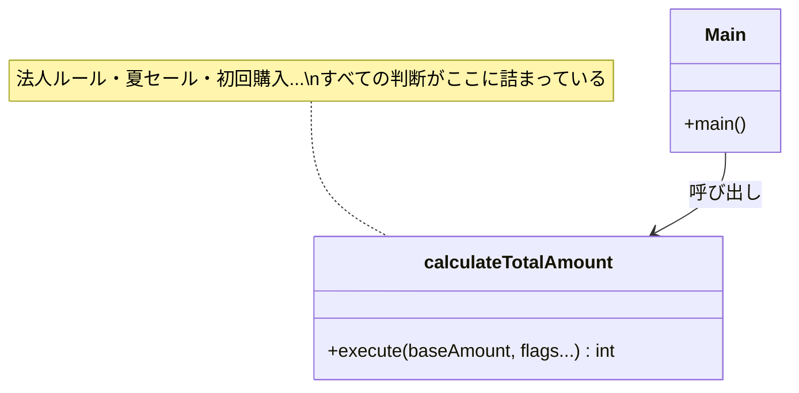
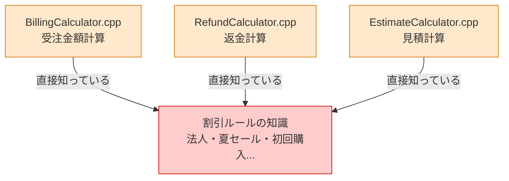
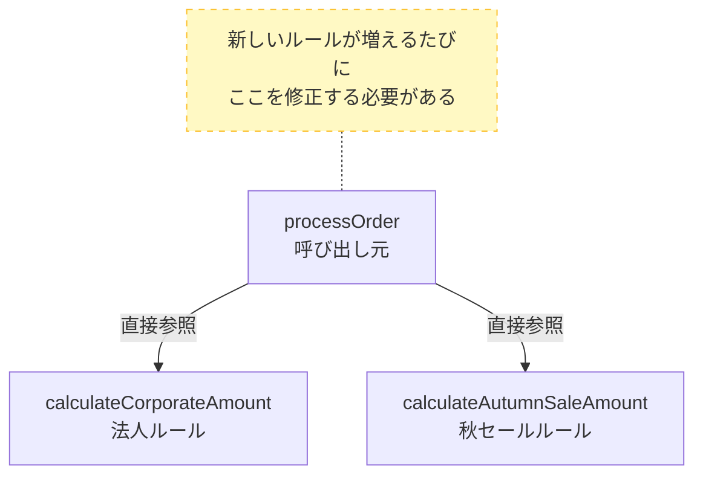
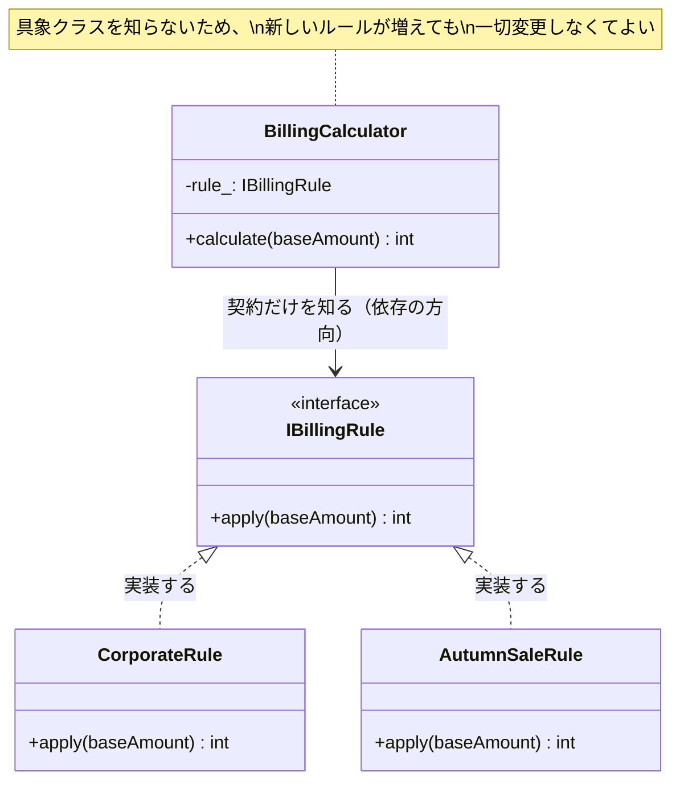
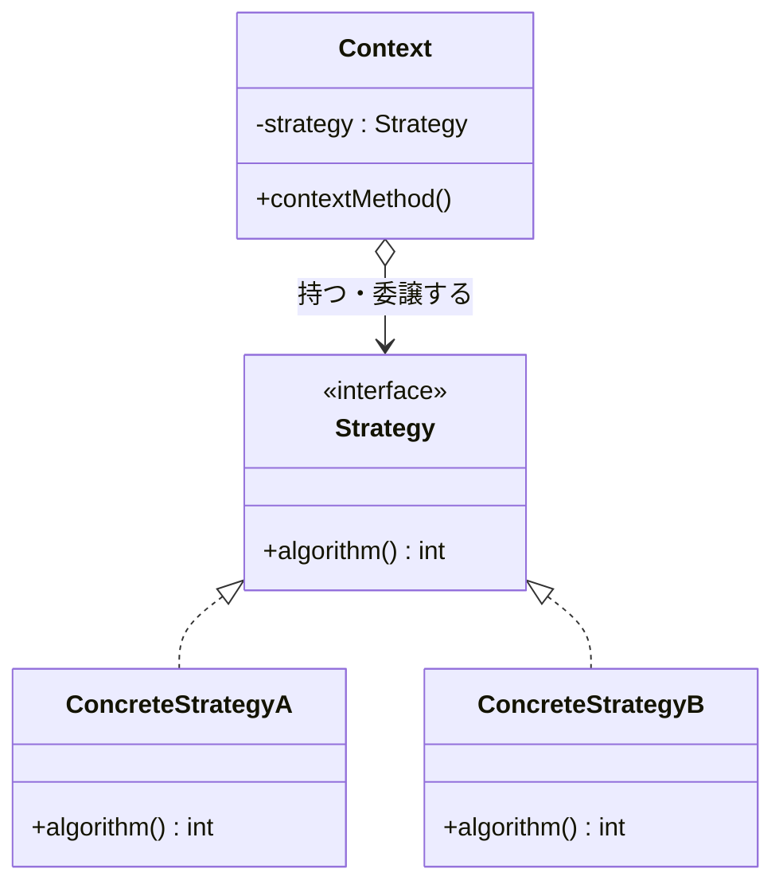
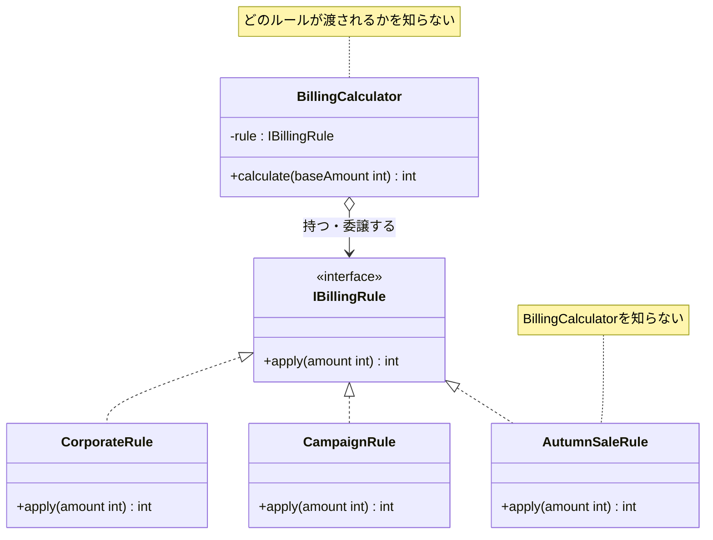

# 第1章　増え続ける割引ルールをどう整理するか（Strategy）
―― 思考の型：「変わるアルゴリズムと、変わらない骨格が同じ場所にいる」ことに気づく

> **この章の核心**
> 機能が追加されるたびに関数が肥大化し続けるのは、
> 「誰の判断で変わるか」が異なる2つのもの（ビジネスロジックと計算の骨格）が同じ場所にいるからだ。
> 変わるアルゴリズムを独立した部品に分離すれば、機能追加は「既存コードに触れず、新しい部品を作るだけ」になる。
>

> [!INFO] レゴブロックで考える：Strategyパターン
> この章のパターンは、レゴブロックの**「分ける」**操作に対応しています。
> 割引計算ロジックを「ブロックごとに分けて」差し替えられるようにします。レゴのパーツを取り外して別のパーツに付け替えるイメージです。
> コードでも同じように、変わる「割引ルール」を分離して、呼び出し元は変えずに差し替えられる構造を作ります。

---

## この章を読むと得られること

- 自分のコードの中で「変わりやすいビジネスロジック」と「変わらない全体の骨格」が混在している状態を発見できるようになる
- 変化の速度が異なる2つのものを分離することで、新しい機能の追加が「クラスを1つ作るだけ」になる設計を作れるようになる
- このパターンが過剰になる場面（将来の変化がほぼ確実でない場合）を見極め、シンプルな代替案（if文など）との使い分けができるようになる
- 変更要求が来たとき、影響が1クラスに収まる設計と、システム全体に飛び火する設計の違いを事前に読めるようになる

## ステップ0：システムを把握し、仮説を立てる ―― クラス構成を見てから「変わりそうな場所」を予測する

> **入力：** システムのシナリオ説明 ＋ クラス構成の概要（仕様表・責任一覧）。実装コードはまだ読まない。
> **産物：** 変動と不変の「仮説テーブル」

**全パターンに共通する問い**

> 「このコードの中に、**『変わる理由』が異なる2つのものが、
> 同じ場所に混在していないか？」**

「変わる理由」とは **「誰の判断で変わるか」** のことです。
そのコードを変更するとき、答えが2人以上になるなら、変わる理由が複数混在しています。

### 1.0 この章のシステム構成と仮説

**この章で扱うシステム：**
ECサイトの受注金額計算モジュールです。
基本金額に割引ルールを適用し、消費税を加算して最終請求額を返します。
法人・一般で異なるルールが存在し、キャンペーンのたびに新しい割引が追加されます。

**仕様表（何ができるシステムか）**

| 機能   | 担当                     | 入力             | 出力    |
| ---- | ---------------------- | -------------- | ----- |
| 金額計算 | `calculateTotalAmount` | 基本金額・顧客区分・各フラグ | 最終請求額 |

**クラス構成の概要**



*→ 1つの関数が「すべての割引ルール」を知っている。
割引の種類が増えるたびに、この関数に手を入れるしかない。*

**各クラスの責任一覧**

| 対象                     | 責任（1文）     | 知るべきこと     |
| ---------------------- | ---------- | ---------- |
| `calculateTotalAmount` | 最終請求額を返す   | 基本金額と顧客区分  |
| `main()`               | プログラムを起動する | 起動に必要な情報のみ |

---

この構成を踏まえた上で、仮説を立てます。
`calculateTotalAmount` に「すべての割引ルールの詳細」が詰まっていることが見えています。
どの部分が変わりやすく、どの部分は変わらないでしょうか。

**変動と不変の仮説（実装コードを読む前に立てる）**

| 分類          | 仮説                 | 根拠（クラス構成から読み取れること）                          |
| ----------- | ------------------ | ------------------------------------------- |
| 🔴 **変動する** | 割引ルールの種類・計算方法      | キャンペーンのたびに変わる。クラス図でも「すべての判断が詰まっている」と明記されている |
| 🔴 **変動する** | 法人契約の割引条件          | 営業ポリシーの変更で変わる                               |
| 🟢 **不変**   | 「最終請求額を返す」という処理の骨格 | ECサイトがある限り変わらない                             |
| 🟢 **不変**   | 消費税の適用             | 適用自体は変わらない（税率は別途）                           |

この仮説をステップ2（1.3）でヒアリング後に確定します。

---

## ステップ1：実装コードを読む ―― 責任チェックで問題の行を見つける

> **入力：** ステップ0で把握したクラス責任 ＋ 実際の実装コード
> **産物：** 責任チェック表。「このクラスが持つべきでない知識」が混在している行の発見。

### 1.1 実装コードと責任チェック

ステップ0でクラスの責任は把握しました。
ここでは実際の実装コードを読み、「責任通りに書かれているか」を1行ずつ確認します。

**要するに「変わる計算ルール」をクラスとして切り出し、呼び出し元に差し替えさせるパターン。**

```cpp
// 【起点コード】
// billing/BillingCalculator.cpp
// 当初は法人・一般の2分岐のみ。
// 要求が増えるたびに、この関数が育ち続けてきた。

int calculateTotalAmount(
    int baseAmount,
    bool isCorporate,
    bool isPremium,
    int quantity,
    int continuationYears,
    bool isSummerSale,
    bool isFirstPurchase
) {
    int amount = baseAmount;

    if (isCorporate) {
        amount = amount * 9 / 10;            // 法人: 10%引き
        if (isPremium && quantity >= 100) {
            amount -= 50000;                 // プレミアム大量注文
        }
        if (continuationYears > 1) {
            amount -= 10000;                 // 継続1年超
        }
    } else {
        if (isSummerSale) {
            amount = amount * 8 / 10;        // 夏セール: 20%引き
        }
        if (isFirstPurchase) {
            amount -= 500;                   // 初回購入
        }
    }

    amount = static_cast<int>(amount * 1.1); // 消費税10%
    return (amount > 0) ? amount : 0;
}

int main() {
    // 法人・プレミアム・150個・2年
    int result = calculateTotalAmount(100000, true, true, 150, 2, false, false);
    return 0;
}
```

**実行結果：**
```
法人・プレミアム・150個・2年: 100000 * 0.9 - 50000 - 10000 = 30000 → 33000円
```

このコードは要件通りに動く。問題は「動くかどうか」ではなく「構造として何が混在しているか」です。**責任チェック**で確認します。

**責任チェック：`calculateTotalAmount` は自分の責任だけを持っているか**

この関数の責任は「最終請求額を計算して返すこと」です。
その責任を果たすために「知るべきこと」は何でしょうか。

> 基本金額と、適用すべき割引の結果。消費税率。

今のコードで `calculateTotalAmount` が「知っていること」を1行ずつ確認します。

| コードの行 | 持っている知識 | 責任内か |
|---|---|---|
| `amount * 9 / 10` | 法人割引率（10%） | **✗ 法人ルール担当の責任** |
| `isPremium && quantity >= 100` | プレミアム大量注文の条件 | **✗ 法人ルール担当の責任** |
| `continuationYears > 1` | 継続年数の閾値 | **✗ 法人ルール担当の責任** |
| `amount * 8 / 10` | 夏セール割引率（20%） | **✗ キャンペーン担当の責任** |
| `amount -= 500` | 初回購入割引額 | **✗ キャンペーン担当の責任** |
| `amount * 1.1` | 消費税率の適用 | ✅ 計算の骨格として自然 |

消費税の適用が ✅ なのは、「どの割引ルールが使われるかに関わらず、最後に必ず適用される」という計算の骨格そのものだからです。変更する決定権は法律（国）にあり、ルールの種類とは無関係に変わります。経理担当との合意により「消費税の適用はこの関数の責任」と確定しました（詳細は 1.3 のヒアリング）。

法人割引の計算方法を決めているのは法人営業チームです。
夏セールの割引率を決めているのはキャンペーン担当チームです。
**それぞれの「責任（誰の判断で変わるか）」が、1つの関数の中に詰め込まれています。**

これが「責任範囲外の関心が混在している」状態です。

### 1.2 届いた変更要求

営業チームから連絡が入りました。

「秋の特大セールを来週末に始めたいんです。
　新しい割引ルール（15%引き）を追加してもらえますか？
　リリースは5日後を想定しています。」

「またあの巨大な条件分岐の塊に手を入れるのか」という重苦しい感覚、うまく伝わっているでしょうか。


---

## ステップ2：仮説を確定する ―― 関係者ヒアリングで「変わる理由」に根拠をつける

> **入力：** ステップ0の仮説 × ステップ1の責任チェック結果。関係者（営業・業務担当など）に直接確認する。
> **産物：** 確定した変動/不変テーブル（「誰の判断で変わるか」明記）

### 1.3 仮説の検証と変動/不変の確定

ステップ0で「割引ルールは変わりやすい」「計算の骨格は変わらない」という仮説を立てました。
コードを読んだ結果、この仮説はコード上でも確認できます。
しかし——**コードを読んだだけで「変わる」「変わらない」と断定するのは危険です。**

ステップ0の仮説は予測に過ぎません。「なぜ変わるのか」「誰が決めるのか」を
関係者に確認して初めて、予測が根拠のある事実になります。
以下のヒアリングで、変動/不変の根拠を一つひとつ確定していきます。

---

**関係者ヒアリング**

変動/不変を確定する前に、各ルールのオーナーに確認しました。

> **開発者**：「割引ルールは、今後も種類が増えていきますか？」
>
> **営業担当**：「はい。毎シーズンのキャンペーンで新しいルールが追加されます。
> 地域限定割引や会員ランク割引も今後検討しています。」
>
> **開発者**：「法人ルールの変更頻度はどのくらいですか？
> キャンペーン担当とは別チームで管理されていますか？」
>
> **法人営業担当**：「はい、法人ルールは私たちが決めます。
> キャンペーン担当とは完全に別です。
> 法人ルールの変更がキャンペーンに影響することはないはずです。」
>
> **開発者**：「基本金額の型（int）は将来変わりますか？
> 外貨対応などで型が変わる可能性はありますか？」
>
> **経理担当**：「現時点では円のみです。外貨対応は今のところ計画にありません。」
>
> **開発者**：「消費税率（10%）は、割引ルールごとに異なる値を使うことはありますか？」
>
> **経理担当**：「いいえ、消費税率はシステム全体で統一です。
> 個別の割引ルールが独自の税率を持つことはありません。」

> **補足**：消費税率は国の税制改正によって変わることがありますが、
> それは「どの割引ルールを使うか」というビジネスロジックとは性質が異なります。
> 消費税率は Strategyパターンで切り替えるものではなく、定数や設定値として一元管理します。
> 税率変更が生じた際は、その設定値を一か所で更新するだけで対応できます。

---

チームで話し合う価値がある部分だと思います。
このヒアリングがあって初めて、変動/不変テーブルに根拠が生まれます。


| 分類 | 具体的な内容 | 変わるタイミング | 根拠 |
|---|---|---|---|
| 🔴 **変動する** | 割引ルールの種類と計算方法 | 毎シーズン（確定） | 営業担当への確認 |
| 🔴 **変動する** | 複数ルールの組み合わせ方 | 新機能要求のたびに | 営業担当への確認 |
| 🟢 **不変** | 「割引を適用して消費税を加算する」計算の骨格 | 変わる日は来ない | 経理担当との合意 |
| 🟢 **不変** | 基本金額の型（int・円） | 当面変わらない | 経理担当への確認 |
| 🟢 **不変** | 消費税率（税率の値は定数・設定値として管理） | 国の税制改正により変わりうるが、Strategyパターンの対象外。設定値を一元管理で対応 | 経理担当との合意 |

> **設計の決断**：🟢 不変な計算の骨格を「契約（インターフェース）」として固定し、
> 🔴 変動する各割引ルールは、それぞれのインターフェースの裏側に押し込む。

**インターフェース命名の原則**：インターフェース名はビジネス上の責任で付ける。
「割引を適用する」責任なら `IBillingRule` ——
法人割引かセール割引かはインターフェースの名前に現れない。
なお `I` プレフィックス（`I` + クラス名）は「これはインターフェースである」を示す C++ の命名規約です。`IBillingRule` なら「BillingRule という責任のインターフェース」と読みます。

---

## ステップ3：課題分析 ―― 変更が来たとき、どこが辛いかを確認する

### 1.4 変更しようとしたときに現れる困難

秋の特大セール（15%引き）をこの関数に追加しようとすると、何が起きるでしょうか。

- **困難1：また引数が増える**
  `isAutumnSale` という引数を追加し、
  `calculateTotalAmount` の中にまた新しい `if` ブロックを書くことになります。
  今日の7引数が、来月は9引数、再来月は11引数——この先がイメージできてしまいます。

- **困難2：キャンペーンを変えると法人側のテストが不安になる**
  秋セール（一般向け）の1行を変えるだけで
  「法人側を壊していないか？」と全テストを走らせたくなります。
  担当チームが別なのに、互いの変更を気にしなければならない状態です。

---

**依存の広がり**



*→ 割引ルールの知識がシステムのあちこちに侵食している。これが問題の全体像。*

---

## ステップ4：原因分析 ―― 困難の根本にある設計の問題を言語化する

### 1.5 困難の根本にあるもの

ステップ3で「秋の特大セール」という新しい割引ルールを追加しようとしたとき、私たちは大きな壁にぶつかりました。引数が増え、巨大な `if` 文の塊にまた一つ分岐を足さなければならない。そして何より、キャンペーンルールの1行を追加するだけなのに、「法人側の計算を壊していないか？」と、システム全体への影響に怯えながらテストを流さなければならない状態でした。

あの「どこに影響するか分からないから、とりあえず呼び出し元を全部grepして確認しよう……」という疲弊感。皆さんも心当たりがあるのではないでしょうか。影響範囲の調査に開発時間の大部分を奪われ、いざ修正しても、リリース後に「思わぬところで別の計算がずれていた」というバグレポートに青ざめる。そんな現場で何度も味わうあの痛みの根本には、一体どんな構造的な問題が潜んでいるのでしょうか。

コードをじっくりと観察し、起きている事実から原因を探っていきます。

|**観察**|**原因の方向**|
|---|---|
|割引が増えるたびに `calculateTotalAmount` が変わる|関数が「変わるルールの詳細」を直接知っているから|
|法人ルールとキャンペーンが同じ場所にある|「変わる理由の異なる2つ」が同居しているから|
|テストが相互に干渉する|ルールの実装が隔離されていないから|

コードの行数や `if` 文の数が多いこと自体が問題なのではありません。この観察から見えてくるのは、「特定のルールだけを安全に変更することが極めて難しい構造になっている」という事実です。

#### 変わるものと変わらないものが同じ場所にいる

私たちが直面している痛みの正体を、さらに明確に切り分けてみましょう。今のコードの中には、性質が全く逆のものが混ざり合っています。

| **変わり続けるもの**   | **変わってほしくないもの**      |
| -------------- | -------------------- |
| 割引ルールの種類と計算方法  | 「割引を適用して消費税を加算する」骨格  |
| ルールを担当するチームの判断 | 入力（基本金額）と出力（最終請求額）の形 |

「毎シーズンのように変わり続けるもの」と「システムがある限り変わってほしくないもの」が、`calculateTotalAmount` というたった一つの関数のなかに同居しています。

`[ImagePrompt: A top-down 3D illustration of Lego blocks where a large, single block is made of swirling red and blue plastic melted together, representing mixed responsibilities that cannot be separated.]`

レゴブロックで想像してみてください。大きな一つのブロックの中に、青色（変わらない骨格）と赤色（変わり続けるルール）のプラスチックがマーブル状に溶け合って固まっています。「赤い部分の形だけを変えたい」と思っても、ブロック全体が一つになっているため、青い部分ごと削ったり壊したりしなければなりません。これが、変更のたびにシステム全体が揺らいでしまう原因です。

#### 3次元・4つの手札から構造的な原因を特定する

では、なぜこの痛みが発生しているのか。第0章で確認した「3次元・4つの手札」の視点から、今のコードが抱えている構造的な問題を分解してみます。以下の表は、各次元に対して私たちが観察した結果です。

|**次元**|**物理操作（手札）**|**本質的な原因（何が問題か）**|**使うべき構造的対策案（本質）**|
|---|---|---|---|
|**要素**|**① 分割する**<br><br>  <br><br>（切る）|法人割引やセール割引という、変更の理由（決定者）が異なる責任が、一つの塊（関数）に癒着・混在している。|**責任ごとの分割**<br><br>  <br><br>（単一責任化・共通化）|
|**要素**|**② 隠蔽する**<br><br>  <br><br>（包む）|各割引の具体的な計算式（〇%引きなど）が無防備に露出しており、計算骨格がそれを直接読み取ってしまっている。|**境界によるカプセル化**<br><br>  <br><br>（状態の保護・窓口の単一化）|
|**関係**|**③ 規格化する**<br><br>  <br><br>（形を揃える）|骨格となる処理が「法人か、セールか」という具体的な実装に直接依存しており、結合が固着している。|**インターフェースの統一**<br><br>  <br><br>（抽象への依存・依存の逆転）|
|**関係**|**④ 間接化する**<br><br>  <br><br>（間に挟む）|呼び出し元が個別の割引ルールと直接結合していることで、ルールの追加が骨格の変更（if文の追加）を強制している。|**中間層の導入**<br><br>  <br><br>（緩衝材の配置）|

観察した結果、私たちのコードは **全ての次元で対策が必要な状態** にあることが分かりました。

もし、単純に関数を分けるだけ（①分割する）であれば、「法人割引を計算する関数」と「セール割引を計算する関数」ができるだけです。しかしそれだけでは、呼び出し元が「今回はどの関数を呼べばいいか」を判断する `if` 文を持ち続けることになります。つまり、「関係」の次元（③規格化する、④間接化する）の問題が残ったままになり、新しいルールが増えればまた呼び出し元のコードを開いて修正することになります。

私たちが目指したいのは、**「既存の骨格（青いブロック）には一切触れず、新しいルール（赤いブロック）をカチッと付け足すだけで機能が追加される」** という未来です。

この原因分析を通じて、次に打つべき手が明確になりました。単にコードを別の場所に移動するのではなく、責任ごとに「分割」し、詳細を「隠蔽」し、そして呼び出し元との接点を「規格化」して「間接化」する。これらの手札を組み合わせて、初めて安全な構造が手に入ります。

次なるステップ5では、この原因を取り除くために、具体的にどの手札をどう適用していくか。まずはシンプルな「関数への分割（①）」を試し、そこに残る課題を確認した上で、「規格化（③）」へと歩を進めていきます。


---

## ステップ5：対策案の検討 ―― 原因から手札を選ぶ

> **ステップ4で特定した真因：** 法人割引やセール割引といった「変わる理由（誰の決定か）が異なる責任」が一つの関数に混在し、さらに計算の骨格が具体的な割引の条件を直接知ってしまっている。

原因が言語化できたので、次はこの構造的な問題を取り除くための物理的な操作（手札）を選び、コードに適用していきます。

最初から「〇〇パターンを使おう」と構える必要はありません。複雑に絡み合ったコードを前にしたとき、私たちができるのは「レゴブロックをどう動かすか」というシンプルな操作だけです。まずは、もっとも直感的な手札である「①分割する（切る）」から試してみましょう。

### 手段①：関数として切り出す（分離・隠蔽の試行）

巨大な `calculateTotalAmount` の中にすべてのルールが癒着しているのなら、まずはそれをルールごとに切り離して別の関数にしてみます。それぞれの関数のなかに複雑なロジックを「②隠蔽する（包む）」アプローチです。


```C++
// 手段①：割引ルールを別関数として切り出す
// 各ルールが独立した関数になり、ロジックが分離された

int calculateAutumnSaleAmount(int baseAmount) {
    int amount = baseAmount * 85 / 100;      // 秋セール: 15%引き
    amount = static_cast<int>(amount * 1.1); // 消費税の骨格がここに複製されている
    return (amount > 0) ? amount : 0;
}

int calculateCorporateAmount(int baseAmount, bool isPremium, int qty, int years) {
    int amount = baseAmount * 9 / 10;
    if (isPremium && qty >= 100) amount -= 50000;
    if (years > 1) amount -= 10000;
    
    amount = static_cast<int>(amount * 1.1); // ここにも消費税の骨格が複製されている
    return (amount > 0) ? amount : 0;
}

// 呼び出し元のコード（どこかの業務フロー制御部分）
int processOrder(std::string orderType, int base, bool isPremium, int qty, int years) {
    int result = 0;
    
    // ← 新しいルールが追加されるたびに、ここの分岐が増えていく
    if (orderType == "autumn_sale") {
        result = calculateAutumnSaleAmount(base);
    } else if (orderType == "corporate") {
        result = calculateCorporateAmount(base, isPremium, qty, years);
    }
    
    return result;
}
```

**変更影響の構造図（手段①適用後）**




**手段①（分離・隠蔽のみ）の評価：**

ロジックを関数に分けて隠蔽したことで、少なくとも「法人ルールの複雑な計算式」と「秋セールの計算式」は別の場所に分かれました。読むときの見通しは良くなっています。

しかし、この構造にはまだ深刻な痛みが残っています。

1. **変わらない骨格が複製されている：** 消費税の適用（`* 1.1`）という全ルール共通の「変わらない骨格」が、各関数にコピー＆ペーストされています。税率計算の処理を変えるとき、すべての関数を修正して回らなければなりません。
    
2. **呼び出し元の変更が避けられない：** `processOrder` という呼び出し元が、すべてのルールの名前と引数を直接知っています。冬セールが追加されれば、私たちはまたこの呼び出し元のファイルを開き、`else if` を書き足すことになります。
    

結局のところ、新しいルールを追加するたびに「他にこの関数を呼んでいる場所はないか？」と呼び出し元を片っ端からgrepして影響範囲を調べる日々の疲弊からは抜け出せていません。つまり、「⑥拡張する（既存コードに触れずに機能を追加する）」という評価軸では不合格です。

### 手段②：インターフェースで切り出す（規格化・間接化の試行）

手段①の限界は、ブロックの「接点」にありました。関数ごとに引数も名前もバラバラなため、呼び出し元は「誰にどうやって渡すか」を個別に対応しなければならなかったのです。

ここで、手札の「③規格化する（形を揃える）」と「④間接化する（間に挟む）」を組み合わせます。

`[ImagePrompt: A top-down 3D illustration of Lego blocks showing a gray baseplate with a standardized square socket, and several different colored blocks (red, blue, green) that all have the exact same square plug shape to fit into the socket. No text in the image.]`

レゴブロックで例えるなら、土台側に「四角い穴（共通の規格）」を一つだけ空けておくイメージです。そして、赤いブロック（法人ルール）も青いブロック（セールルール）も、土台にくっつく部分の形を「まったく同じ四角い出っ張り」に揃えて作ります。こうすれば、土台側は「相手が何色か」を知らなくても、ただ穴にカチッとはめるだけでよくなります。

コード上でこの「四角い穴」を作るのが、インターフェースです。


```C++
// 1. 規格化：すべての割引ルールが守るべき「共通の形」を定義する
class IBillingRule {
public:
    virtual int apply(int baseAmount) = 0; // ← どんなルールでも、このメソッド一つで計算できると約束する
    virtual ~IBillingRule() {}
};

// 2. 実装：規格に合わせて、各ルールの詳細をカプセル化する
class CorporateRule : public IBillingRule {
    bool isPremium_;
    int  quantity_;
    int  continuationYears_;
public:
    // ルール特有の条件はコンストラクタで受け取り、内部に隠蔽する
    CorporateRule(bool isPremium, int quantity, int continuationYears)
        : isPremium_(isPremium), quantity_(quantity), continuationYears_(continuationYears) {}

    int apply(int baseAmount) override {
        int amount = baseAmount * 9 / 10;
        if (isPremium_ && quantity_ >= 100) amount -= 50000;
        if (continuationYears_ > 1) amount -= 10000;
        return amount; // 消費税はここでは計算しない
    }
};

class AutumnSaleRule : public IBillingRule {
public:
    int apply(int baseAmount) override {
        return baseAmount * 85 / 100; 
    }
};

// 3. 間接化：計算の骨格（コンテキスト）は、インターフェースだけを知る
class BillingCalculator {
    IBillingRule* rule_; // ← 具体的なルール（法人かセールか）は一切知らない
public:
    explicit BillingCalculator(IBillingRule* rule) : rule_(rule) {}

    int calculate(int baseAmount) {
        // インターフェース経由で計算を依頼する（間接化）
        int amount = rule_->apply(baseAmount); 
        
        // 変わらない骨格（消費税とゼロガード）はここだけに一元管理される
        amount = static_cast<int>(amount * 1.1); 
        return (amount > 0) ? amount : 0;
    }
};
```

呼び出す側の使い方は以下のようになります。


```C++
int main() {
    // 使うルールを準備する
    AutumnSaleRule autumnRule;
    
    // 骨格にルールを渡す（注入する）
    BillingCalculator calc(&autumnRule);
    
    // 骨格を実行する
    int result = calc.calculate(100000); 
    
    return 0;
}
```

**変更影響の構造図（手段②適用後）**




**手段②（＋規格化・間接化）の評価：**

インターフェースで接点を「規格化」し、`BillingCalculator` に具象クラスではなくインターフェースを持たせて「間接化」しました。

この構造がもたらす効果は絶大です。まず、各ルールのクラスから消費税の計算が消え、`BillingCalculator` に一元化されました（骨格の重複排除）。そして何より、`BillingCalculator` は `IBillingRule` という「契約」しか知らないため、新しいルールクラスをどれだけ追加しても、`BillingCalculator` のコードは1行たりとも変更する必要がありません。

既存のコードを一切触らずに、新しい機能の部品を外から差し替える。これによって初めて、「⑤置換する」と「⑥拡張する」の能力を手に入れることができました。

二つの手段を試してみて、手段②の構造が私たちの直面していた痛みを根本から取り除く力を持っていることが見えてきました。しかし、手放しで手段②を採用する前に、次なるステップ「ステップ6：天秤にかける」で、この構造を導入することの「代償」と「真の耐久力」を冷静に測ってみたいと思います。

---

## ステップ6：天秤にかける ―― 手段を評価し、耐久を確認する

手段②（インターフェース抽出）という、一見すると「クラスが増えて複雑になっただけ」にも見える構造。これに本当に投資する価値があるのか。設計の良し悪しは、書いた直後ではなく「その後の変更やテスト」に直面したときに初めて明らかになります。

ここでは、客観的な評価軸を先に定め、手段①と手段②を冷徹に比較していきます。

### 1.6 評価軸の宣言

比較を始める前に、今回のシステムにおいて「何を重視すべきか」という評価基準（モノサシ）を宣言します。基準を後から決めると、自分の好みの設計を正当化する「後付けの理由」になってしまうからです。

|**評価軸**|**なぜこの状況で重要か**|
|---|---|
|**テストの独立性**|法人ルールとキャンペーンルールを、互いに干渉せず、骨格の計算（消費税など）とも切り離してテストしたい。|
|**変更の局所性**|新しいルールを追加するとき、既存のコード（特に呼び出し元の `if` 分岐）を一切開かずに済ませたい。|
|**チームの分担**|営業チームとキャンペーン担当チームが別々に開発を進められるよう、ファイル単位でコードを分離しておきたい。|
|**実装コスト**|クラスやインターフェースを定義する手間が、将来の変更耐性と見合っているか。|

---

### 1.7 手段①vs手段②の比較

まずは「テストの独立性」という観点から、それぞれのコードを検証してみましょう。


> [!INFO] テストコードについて
> ここで使用している `TEST(...)` と `EXPECT_EQ(...)` は **Google Test**（`gtest`）というC++用のテストフレームワークの構文です。
> - `TEST(TestSuiteName, TestName)` ： テストケースを定義する関数
> - `EXPECT_EQ(期待値, 実際の値)` ： 2つの値が等しければテスト通過。等しくなければ失敗メッセージを出力して続行する
>
> 実際のプロジェクトでは `#include <gtest/gtest.h>` を追加し、ビルド設定に gtest をリンクして使います。


**手段①（関数切り出し）のテスト**

```C++
// 手段①：法人ルールの確認
// ロジックの中に「消費税の骨格」が埋め込まれているため、
// ルール単体の正しさを検証する際にも、常に消費税計算を考慮しなければならない。
TEST(BillingTest, CorporatePremiumBulk) {
    int base = 100000;
    int result = calculateCorporateAmount(base, true, 150, 2);
    
    // 期待値: (100000 * 0.9 - 50000 - 10000) * 1.1 = 33000
    EXPECT_EQ(33000, result);
    // もし消費税率が変わったら、ルールのテストなのに全箇所の期待値を書き直す羽目になる。
}
```

**手段②（インターフェース抽出）のテスト**


```C++
// 1. 各ルールのテスト：BillingCalculator（消費税など）の存在を一切知らなくてよい
TEST(CorporateRuleTest, AppliesPremiumBulkDiscount) {
    CorporateRule rule(true, 150, 2);
    // 純粋に「割引後の金額」だけを検証できる
    EXPECT_EQ(30000, rule.apply(100000)); 
}

// 2. 骨格のテスト：ルールの具体的なロジックを知らなくてよい
class StubBillingRule : public IBillingRule {
public:
    int apply(int baseAmount) override { return 8000; } // テスト用の固定値を返す
};

TEST(BillingCalculatorTest, AppliesTaxToRuleResult) {
    StubBillingRule rule;
    BillingCalculator calc(&rule);
    // ルールが何をしようが、骨格が「1.1倍」にする責任を果たしているかを単独で検証できる
    EXPECT_EQ(8800, calc.calculate(10000));
}
```

**比較のまとめ**

|**評価軸**|**手段①（関数切り出し）**|**手段②（インターフェース抽出）**|
|---|---|---|
|**テストの独立性**|△ 骨格（消費税）が各関数に複製されているため、ルール単体での検証が難しい。|◎ ルールと骨格を完全に分離してテストできる。|
|**変更の局所性**|△ 新ルール追加時に、呼び出し元の `if` 分岐を必ず修正しなければならない。|◎ 新しいクラスを追加し、組み立て箇所（main等）を1行変えるだけで済む。|
|**チームの分担**|△ 全てのルールが同じファイル、あるいは呼び出し元に強く依存した形になる。|◎ ルールごとにファイル（クラス）が分かれ、物理的な衝突を避けられる。|
|**実装コスト**|○ 関数を作るだけなので、初期の実装スピードは速い。|△ クラスとインターフェースの定義が必要で、初期の手間は増える。|

今回の状況（ルールが今後も増え続ける見込みがあり、担当チームが分かれている）においては、初期の実装コストを払ってでも、**手段②（インターフェース抽出＝Strategyパターン）を採用する価値がある**と判断しました。

---

### 1.8 耐久テスト ―― ヒアリングで挙がった変化が来た

ステップ2のヒアリングで、営業担当からこんな要望がありました。「将来的には複数の割引を重ねて適用したい（例：秋セールを適用した後に、さらに会員割引を引く）」。

この変化が実際に来た場面をシミュレートしてみましょう。今のインターフェース設計はこの変化に耐えられるでしょうか。

```C++
// 複数の割引ルールを順番に適用する新しい「骨格」
class MultiBillingCalculator {
    std::vector<IBillingRule*> rules_;
public:
    void addRule(IBillingRule* rule) { rules_.push_back(rule); }

    int calculate(int baseAmount) {
        int amount = baseAmount;
        for (auto rule : rules_) {
            amount = rule->apply(amount); // 登録された順にルールを適用
        }
        amount = static_cast<int>(amount * 1.1); // 最後に一括で消費税
        return (amount > 0) ? amount : 0;
    }
};

// 実行例：秋セール ＋ 会員限定500円引き を重ねる
AutumnSaleRule autumnRule;
MemberDiscountRule memberRule(500); // 新しく追加したルール

MultiBillingCalculator calc;
calc.addRule(&autumnRule);
calc.addRule(&memberRule);

int result = calc.calculate(10000); 
// 10000 -> 8500（15%引） -> 8000（500円引） -> 8800（税）
```

驚くべきことに、**`IBillingRule` インターフェースも、既存の `CorporateRule` や `AutumnSaleRule` も、一切変更していません。** 既存の部品（ブロック）をそのまま使い、組み合わせ方を変えるだけで、劇的な仕様変更に即座に対応できました。これが「規格化」された部品を持つ設計の真の耐久力です。

---

### 1.9 使う場面・使わない場面

「では、常にStrategyパターンを使えばいいのか？」というと、答えは **NO** です。設計に絶対の正解はありません。この強力な構造を導入すべきかどうかの判断基準を整理します。

**適用判断のフローチャート：**

**判断テーブル：**

|**状況**|**適切な選択**|**理由**|
|---|---|---|
|**ルールが2〜3個で、今後増える予定がない**|**シンプルな `if` 分岐**|オーバーエンジニアリングを避け、コードの単純さを優先する。|
|**ルールが頻繁に増え、担当チームが分かれている**|**Strategyパターン**|変更の衝突を防ぎ、テストの独立性を守る必要がある。|
|**実行時に動的にルールを切り替えたい**|**Strategyパターン**|オブジェクトを差し替えるだけで振る舞いを変えられる利点を活かす。|

#### 【過剰な設計】変化の予定がないものまでパターン化した例

「将来、消費税以外に『地方特別税』や『環境税』が割引ルールごとに細かく適用されるかもしれないから、税金計算もStrategyにしよう！」と意気込んで、以下のようなコードを書いてしまうのは、現時点では「やりすぎ」です。


```C++
// 過剰な設計：経理担当と「税率は統一」と合意しているのに分離した
class ITaxStrategy {
public:
    virtual int applyTax(int amount) = 0;
};

class ConsumptionTax : public ITaxStrategy {
public:
    int applyTax(int amount) override { return amount * 1.1; }
};
```

経理担当との合意（ステップ2）で「税率はシステム全体で一元管理」と決まっている以上、わざわざインターフェースを作るのは複雑さを増やすだけの負債になります。将来の「かもしれない」ではなく、ヒアリングに基づいた「根拠のある変化」に対してのみ、パターンを適用しましょう。

「設計の価値は、将来の変更コストを今の実装コストで買う、投資判断である」。そう考えると、どの手札を切るべきかが自ずと見えてくるはずです。


---

## ステップ7：決断と、手に入れた未来

### 1.12 解決後のコード（全体）

> **1.10（耐久テスト）との関係について**
> 1.10 で登場した `MultiBillingCalculator` は「将来、複数のルールを重ねて適用したい」という要求が来たときに `IBillingRule` の設計がそのまま拡張できることを示すための**耐久テスト用のコード**です。最終的な本番コードとしては採用していません。今回の要求（「秋セールルールを1つ追加する」）に対しては、`BillingCalculator`（ルールを1つ受け取るシンプルな骨格）で十分であり、過剰な複雑さを避けるためにこちらを採用しました。これがステップ6（天秤にかける）での判断です。


```cpp
// ────────────────────────────────────────────────────────
// インターフェース定義
// ────────────────────────────────────────────────────────

class IBillingRule {
public:
    virtual int apply(int baseAmount) = 0;
    virtual ~IBillingRule() {}
};

// ────────────────────────────────────────────────────────
// 実装クラス（各ルールが自分の責任だけを持つ）
// ────────────────────────────────────────────────────────

class CorporateRule : public IBillingRule {
public:
    CorporateRule(bool isPremium, int quantity, int continuationYears)
        : isPremium_(isPremium)
        , quantity_(quantity)
        , continuationYears_(continuationYears)
    {}

    int apply(int baseAmount) {
        int amount = baseAmount * 9 / 10;
        if (isPremium_ && quantity_ >= 100) amount -= 50000;
        if (continuationYears_ > 1)         amount -= 10000;
        return amount;
    }

private:
    bool isPremium_;
    int  quantity_;
    int  continuationYears_;
};

class AutumnSaleRule : public IBillingRule {
public:
    int apply(int baseAmount) {
        return baseAmount * 85 / 100; // 左から評価: (baseAmount*85)/100
    }
};

// ────────────────────────────────────────────────────────
// コンテキスト：計算の骨格だけに専念する
// ────────────────────────────────────────────────────────

class BillingCalculator {
public:
    explicit BillingCalculator(IBillingRule* rule) : rule_(rule) {}

    int calculate(int baseAmount) {
        int amount = rule_->apply(baseAmount);
        amount = static_cast<int>(amount * 1.1);
        return (amount > 0) ? amount : 0;
    }

private:
    IBillingRule* rule_;
};

// ────────────────────────────────────────────────────────
// BillingApplication（Composition Root）
// 「どのルールクラスを使うか」を決めて組み立てる唯一の場所。
// Composition Rootとは「具体クラスを知ってよい唯一の場所」というパターン名で、
// ここだけがインターフェースの裏に何があるかを知っている。
// ────────────────────────────────────────────────────────

class BillingApplication {
public:
    void run() {
        CorporateRule     rule(true, 150, 2);
        BillingCalculator calc(&rule);
        int result = calc.calculate(100000);
        saveResult(result);
    }

private:
    void saveResult(int amount) {
        std::cout << "[DB] 請求金額を保存: " << amount << " 円\n";
    }
};

// ────────────────────────────────────────────────────────
// main() は BillingApplication をキックするだけ
// ────────────────────────────────────────────────────────

int main() {
    BillingApplication app;
    app.run();
    return 0;
}
```

**実行結果：**
```
[Corporate] 100000 * 0.9 - 50000 - 10000 = 30000 → 33000円（消費税込み）
```

---

### 1.13 変更シナリオ表と最終責任テーブル

**変更シナリオ表：何が変わったとき、どこが変わるか**

> **消費税率を独立したクラスにしなかった理由**
> 消費税率が変わること自体はあり得ます（実際に5%→8%→10%と変化してきました）。しかし、今回は経理担当と「消費税の適用はシステム全体で統一ルールとして `BillingCalculator` が持つ」と合意しました。税率が変わる場合も `BillingCalculator` の1行（`* 1.1`）を修正するだけです。割引ルールのように「複数のバリエーションが同時に存在する」わけではないため、インターフェース化するほどの理由がありません。変化の「種類」ではなく「バリエーションの数と切り替え頻度」を基準に判断しています。

| シナリオ | 変わるクラス | 変わらないクラス |
|---|---|---|
| 新しい割引ルールを追加する | 新しい〇〇Rule クラスを追加 | IBillingRule / BillingCalculator |
| 法人割引率が変わる | CorporateRule のみ | AutumnSaleRule / BillingCalculator |
| 使うルールを切り替える | BillingApplication の1行 | すべてのルールクラス |
| 消費税率が変わる | BillingCalculator のみ | すべてのルールクラス |

どのシナリオでも、変わるクラスが1〜2クラスに収まっています。
`BillingCalculator` が割引ルールの追加・変更で変わることは、一切ありません。

---

**最終責任テーブル**

| クラス | 責任（1文） | 変わる理由 |
|---|---|---|
| `main()` | プログラムを起動する | 起動方法が変わるとき |
| `BillingApplication` | 依存を組み立て、処理を起動する | 使うルールの組み合わせが変わるとき |
| `BillingCalculator` | 計算の骨格（割引→消費税）を完了させる | 計算の骨格が変わるとき |
| `IBillingRule` | 割引ルールの契約を定義する | 割引責任の範囲が変わるとき |
| `CorporateRule` | 法人向け割引を計算する | 法人割引の条件・率が変わるとき |
| `AutumnSaleRule` | 秋セール割引を計算する | 秋セールの割引率が変わるとき |

各クラスが持つ「変わる理由」が1つに絞られています。
これが、ステップ4で特定した問題への答えです。

---

## 整理

### 8ステップとこの章でやったこと

| ステップ  | この章でやったこと                                                                    |
| ----- | ---------------------------------------------------------------------------- |
| ステップ0 | ECサイトの割引計算システムの構成を確認し、「割引ルールは変わりやすく、計算の骨格は変わらない」という仮説を立てた                    |
| ステップ1 | 各行が責任範囲内かを確認し、`calculateTotalAmount` に「法人ルールの詳細」「キャンペーンルールの詳細」が混在していることを発見した |
| ステップ2 | 営業・経理担当へのヒアリングで「割引ルールは毎シーズン変わる」「計算の骨格は変わらない」という仮説を事実として確定した                  |
| ステップ3 | 新しいセールルールを追加しようとすると関数に `if` が増え続け、担当チームが別なのにテストが相互に干渉する痛みを確認した               |
| ステップ4 | 「変わる理由の異なる2つのもの（割引ルールの詳細・計算の骨格）が同じ場所にいる」という根本原因を言語化した                        |
| ステップ5 | 原因から対策の方向性を逆算し、**インターフェース抽出**（第0章 手札）を適用した。手札を誤った場合のアンチパターンも確認した             |
| ステップ6 | テストの独立性・変更の局所性・チームの分担という評価軸で**インターフェース抽出**適用の対価を確認し、今回のケースでは採用する価値があると判断した   |
| ステップ7 | 全コードを示し、変更シナリオ別に「変わるクラス・変わらないクラス」で効果を確認した                                    |
### **各クラスの最終的な責任**

| クラス | 責任 | 変わる理由 |
|---|---|---|
| `main()` | プログラムを起動する | 起動方法が変わるとき |
| `BillingApplication` | 依存を組み立て、処理を起動する | 使うルールの組み合わせが変わるとき |
| `BillingCalculator` | 計算の骨格（割引→消費税）を完了させる | 計算の骨格が変わるとき |
| `IBillingRule` | 割引ルールの契約を定義する | 割引責任の範囲が変わるとき |
| `CorporateRule` | 法人向け割引を計算する | 法人割引の条件・率が変わるとき |
| `AutumnSaleRule` | 秋セール割引を計算する | 秋セールの割引率が変わるとき |

「変わる理由が1つ」のクラスだけで構成されている。
このプロセスを回した結果にたどり着いた構造こそが **Strategyパターン** です。

> **GoFとは：** GoF（Gang of Four）とは1994年に発表された書籍 *Design Patterns: Elements of Reusable Object-Oriented Software* の4人の著者を指します。この書籍で定義された23種のパターンが「GoFデザインパターン」と総称されています。Strategyパターンはその中の1つです。

設計に絶対の正解はありません。ただ「各クラスの責任は何か」「変わる理由は1つか」を問い続けることが、変更に強いコードへの入り口になります。

---

## 振り返り：第0章の3つの哲学はどう適用されたか

改めて、ここまで導き出してきた「最終的な設計（図やコード）」を、第0章でお話しした「3つの哲学」と照らし合わせてみましょう。一通り設計のプロセスを体験した今なら、あの哲学が「コードのどの部分に現れているか」がはっきりと見えるはずです。

### 哲学1「変わるものをカプセル化せよ」の現れ

**具体化された場所：** 法人ルールや夏セールといった処理を独立させた `CorporateRule`・`AutumnSaleRule` 各クラス

法人ルールやキャンペーンルールなど「毎シーズン変わり続ける部分」を、計算の骨格（`calculateTotalAmount`）に同居させるのをやめました。変わる部分だけをきれいに抜き出し、独自のクラスにカプセル化（隔離）したからです。
結果として、**割引の種類が100種類に増えても、計算の骨格（`BillingCalculator`）の中身はまったく変わらない（不変を保てる）構造**を手に入れることができました。

### 哲学2「実装ではなくインターフェースに対してプログラムせよ」の現れ

**具体化された場所：** `BillingCalculator` が具体クラスを知らず、`IBillingRule` インターフェースだけを知っている構造

`BillingCalculator` のメンバ変数は `IBillingRule* rule_` と宣言されており、`CorporateRule` や `AutumnSaleRule` の名前はどこにも出てきません。具体クラスを知っているのは `BillingApplication`（Composition Root）だけです。

この構造により、どんな割引ルールが追加・変更・削除されても `BillingCalculator` は一切変わりません。「契約だけを知り、実装を知らない」ことが、変更の飛び火を止める壁になっています。

### 哲学3「継承よりコンポジションを優先せよ」の現れ

**具体化された場所：** `BillingCalculator` が `IBillingRule` を「部品として持つ（`rule_`）」構造

もし基本となる「計算クラス」があり、それを継承して「ログ付き計算クラス」「税込み計算クラス」「ログ＋税込みクラス」と増やしていくと、組み合わせの数だけクラスが爆発します。`IBillingRule` という部品を差し替えるだけで、`BillingCalculator` 本体に一切触れずに振る舞いを変えられます。これが「継承よりコンポジション」の恩恵です。

第1章で体験したプロセスを振り返ると、Strategyパターンは「答えとして学ぶもの」ではなく、「こういう状況に直面したとき、このように考えると自然にたどり着く構造」だとわかります。

## パターン解説：Strategyパターン

### パターンの骨格

Strategyパターンは3つの役割で成り立ちます。



**Context** はアルゴリズムを「使う」側です。`Strategy` インターフェースだけを知り、誰が実装しているかを知りません。**Strategy** はアルゴリズムの「契約」であり、Contextはこの契約にだけ依存します。**ConcreteStrategy** はアルゴリズムの「実装」です。Context もほかの ConcreteStrategy も知らず、ただ契約を実装するだけです。

### この章の実装との対応



`BillingCalculator` は `IBillingRule` の `apply()` を呼ぶだけです。どのルールが渡されるかを知っているのは `BillingApplication`（Composition Root）だけです。秋セールルールを追加するとき、`BillingCalculator` には一切触れません。

### どんな構造問題を解くか

「処理の骨格」と「処理の中身」が同じクラスにいる状態がStrategyパターンの出番です。

「中身」が変わるたびに「骨格」も触らなければならない——この状態では骨格のテストが安定しません。割引ルールを変えると消費税の計算まで確認し直さなければならない状態がまさにそれです。

StrategyパターンはContextに「委譲する先」というインターフェースを定義し、「中身」をその外側に追い出します。結果として「骨格（Context）」と「中身（ConcreteStrategy）」は独立して変化できるようになります。

### 使いどころと限界

**使いどころ：**「同じ種類の処理に複数の実装があり、切り替わる」とわかったときです。判断の基準は「誰の判断で変わるか」が異なるかどうかです。法人ルールは法人営業チームが決め、キャンペーンルールはキャンペーン担当チームが決める——変わる理由の持ち主が複数いるなら、Strategyとして分離を検討する時期です。

**限界：** 実装が1種類しかなく今後も変わる見込みがない場合は使わないほうがよいです。インターフェースと追加クラスのコストが純粋なオーバーヘッドになります。消費税処理を `TaxRule` として切り出した例（1.11）がまさにこれです。「変わる予定がないルール」をStrategyにしても複雑さが増すだけです。

---

## この章のまとめ

「割引ルールが増えるたびに同じ関数に手を入れる」という痛みは、**ビジネスロジック（誰かの判断で変わる部分）と計算の骨格（変わらない部分）が同居していること**が原因でした。

解決の手順は次のとおりです。

1. **誰の判断で変わるか**を関係者にヒアリングして確定する
2. **変わる部分**（割引ルール）をインターフェースとして切り出し、各ルールを独立したクラスとして実装する
3. **変わらない部分**（計算の骨格）はインターフェースの契約だけを知り、具体的なルールを知らない状態にする

この思考を辿ると自然にたどり着く構造が **Strategyパターン** です。

「こういう設計を使いなさい」という暗記ではなく、「こういう痛みがあるとき、こういう問いを立てて考えると、こういう構造が出てくる」というプロセスを体験することが、この章の目的でした。