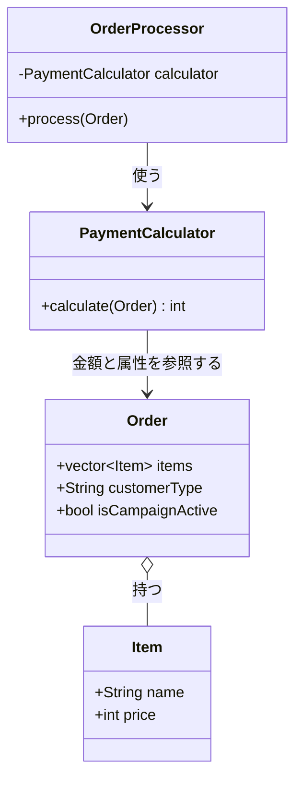
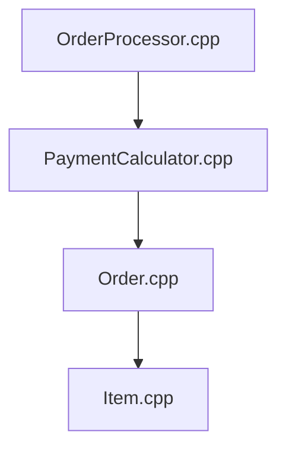
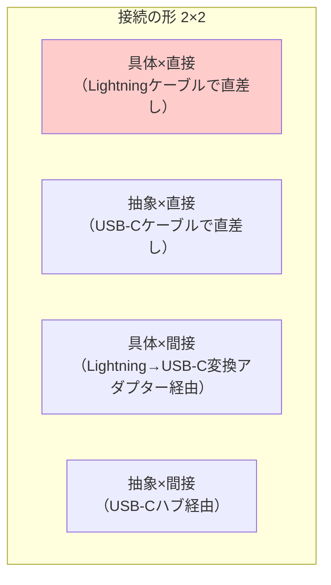
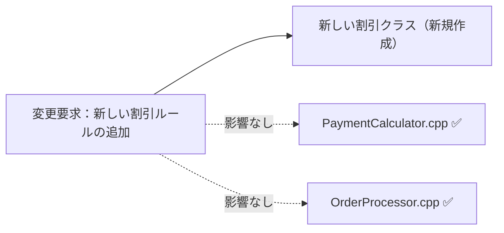
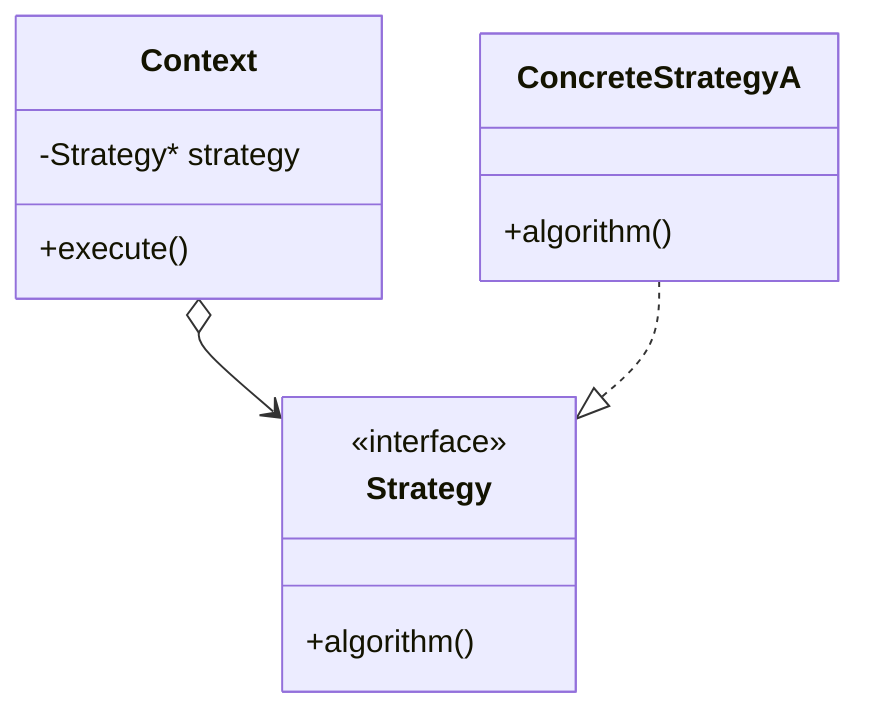
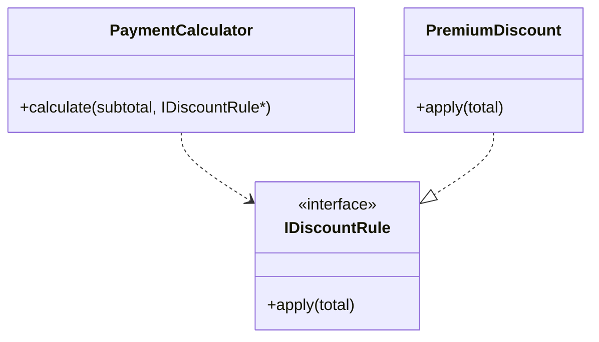

## 第1章 変わるアルゴリズム ―― Strategy

―― 思考の型：変わるアルゴリズムが、呼び出し側に直接埋め込まれている

### この章の核心

**計算のルールが変わるたびに、それを呼び出す側のコードまで修正することになる。それは、「変わる理由（個別の割引ルール）」と「変わらない構造（処理の全体的な流れ）」が、同じ場所に混在しているからだ。**

---

### この章を読むと得られること

* **得られること1：** 「実行する振る舞い」という観点で、コードの変動箇所を識別できるようになる
* **得られること2：** 接続点が「具体×直接」になっているクラスを見て、そこが変更の痛みの発生源だと判断できるようになる
* **得られること3：** 接続点の形を変えると変更がどのように局所化（変更の影響が1クラスだけで済む状態）されるかを、構造から説明できるようになる
* **得られること4：** 増え続けるルールに対して、いつ・どのように構造を分けるべきかの判断ができるようになる

## 🔵 フェーズ1：現状把握 ―― 変更が来る前にコードを把握する

まずは、変更要求が来る前のシステムの現状を事実として把握するところから始めます。システム全体がどのような仕様で動き、どう実装されているのかをフラットな視点で確認しましょう。

### 1-1：システムの背景

このシステムは、私たちが運用している中堅ECサイトの決済計算を担っています。数年前にサービスが立ち上がった当初は、お客様が商品を選んでカートに入れ、そのままの合計金額で決済するという非常にシンプルな流れでした。

しかし、サービスが成長し、競合他社との競争が激しくなるにつれて、様々な施策が打たれるようになりました。新規顧客を獲得するための期間限定のキャンペーンや、リピーターをつなぎ止めるためのプレミアム会員制度など、ビジネス上の要求は日々増えていきます。

当時の担当者が、厳しい納期や急な仕様変更の中で必死につないできた跡が、このコードには詰まっています。このコードが今日まで現場の売上を守ってきた事実を、まず率直に認めたいと思います。

一見すると、これらの割引に関わるロジックは「決済計算」という一つの場所にまとまっており、うまく整理されているように見えます。あちこちのファイルに処理が散らばっているよりは、計算式がここにあるとすぐ分かるため、当初はこれで十分だったのかもしれません。

### 1-2：仕様表

このシステムが現在持っている機能を整理してみましょう。コードを読む前に、全体で何を達成しようとしているのかを把握するための仕様表です。

| **機能名** | **担当クラス** | **入力** | **出力** |
| --- | --- | --- | --- |
| 注文の受付とフロー制御 | `OrderProcessor` | 注文データ（商品リスト、会員種別） | コンソールへの結果出力 |
| 決済金額の計算 | `PaymentCalculator` | 注文データ（商品の小計、会員種別、キャンペーン状況） | 最終的な支払金額（int） |
| 注文データの保持 | `Order` | カートに入れられた商品、会員属性 | （データ構造としての保持） |

### 1-3：クラス構成図

現状のコードがどのような構成になっているかを見てみましょう。この図は変更を加える前の今の状態を示しています。



この図から、`OrderProcessor` クラスが `PaymentCalculator` クラスを直接持ち、計算を依頼しているという事実が見えます。

### 1-4：責任配置テーブル

各クラスが持つべき責任と、それを果たすために知っておくべき知識を定義します。後のステップで、この定義と実際の実装が合致しているかを照らし合わせます。

| **クラス名** | **責任（1文）** | **知るべきこと** |
| --- | --- | --- |
| `OrderProcessor` | 注文処理の全体フローを進行する | 決済の計算を誰に依頼するか、結果をどう出力するか |
| `PaymentCalculator` | 注文内容をもとに最終的な支払金額を計算する | 商品の小計の出し方、適用すべき全ての割引ルール |
| `Order` | 注文された内容と顧客の属性を保持する | 注文された商品のリスト、顧客の種別、キャンペーン状態 |
| `Item` | 商品一つの情報を保持する | 商品名、単価 |

各クラスの責任と知識の定義が確認できました。この時点では、`PaymentCalculator` が「すべての割引ルール」を知っているのは、最終的な金額を計算するという責任を果たすために必要なことのように見えます。

### 1-5：依存グラフ

次に、依存の方向（誰が誰を参照しているか）をマクロな視点で確認します。コードの変更がどの方向に波及していくかを知るためのビューです。



このグラフを見ると、`OrderProcessor` から `PaymentCalculator` へ、そしてデータクラス群へと、矢印が単一の方向に向かって流れていることが分かります。

ここまでで、システムの全体像とクラスごとの役割が把握できました。次はいよいよ、実際のコードがどう書かれているかを確認します。

### 1-6：実装コード

このシステムは具体的にどのようなコードで動いているのでしょうか。プログラムの入り口を含め、エンドツーエンドで動作が追える起点となるコードを確認します。

```cpp
#include <iostream>
#include <string>
#include <vector>

// 商品クラス
class Item {
public:
    std::string name;
    int price;
    Item(std::string n, int p) : name(n), price(p) {}
};

// 注文データ
class Order {
public:
    std::vector<Item> items;
    std::string customerType; // "Regular", "Premium" など
    bool isCampaignActive;    // キャンペーン期間中か
};

// 決済計算クラス
class PaymentCalculator {
public:
    int calculate(const Order& order) {
        int total = 0;
        
        // 小計の計算
        for (const auto& item : order.items) {
            total += item.price;
        }

        // 割引ルール：条件ごとに if で分岐している
        if (order.customerType == "Premium") {
            total = total * 0.8; // プレミアム会員は20%オフ
        } else if (order.customerType == "Regular" && order.isCampaignActive) {
            total = total * 0.9; // 通常会員かつキャンペーン中は10%オフ
        }

        return total;
    }
};

// 注文処理クラス
class OrderProcessor {
private:
    PaymentCalculator calculator;
public:
    void process(const Order& order) {
        int finalPrice = calculator.calculate(order);
        std::cout << "最終的な支払金額は " << finalPrice << " 円です。\n";
    }
};

// プログラムの入り口
int main() {
    Order order;
    order.items.push_back(Item("ワイヤレスイヤホン", 10000));
    order.customerType = "Premium";
    order.isCampaignActive = false;

    OrderProcessor processor;
    processor.process(order);

    return 0;
}

```

このコードを見ると、`PaymentCalculator` の `calculate` メソッドの中に、顧客種別やキャンペーンに応じた割引の判定ロジックが `if` 文で直接書き込まれていることが分かります。

### 1-7：実行結果

上記のコードを実行すると、次のような結果が得られます。

> 出力：最終的な支払金額は 8000 円です。

このコードは正しく動きます。プレミアム会員向けの20%オフが適用され、10000円の商品が8000円になっています。これから変えていくのは「機能」ではなく「構造」です。

### 1-8：責任チェック表

コードの中核である計算メソッドの各行が、「誰の判断で変わる知識か」を1行ずつ丁寧に観察してみましょう。

| **コードの行** | **持っている知識** | **管理者（観察）** |
| --- | --- | --- |
| `total += item.price;` | 商品ごとの価格を合算するというロジック | 決済システム開発チームが管理する |
| `if (order.customerType == "Premium")` | プレミアム会員向けの適用条件と割引率 | 会員サービス企画チームが決める |
| `else if (order.customerType == "Regular" ...)` | キャンペーンの適用条件と割引率 | マーケティングチームが展開する |

この表をじっくり眺めてみると、`PaymentCalculator` クラスのたった一つのメソッドの中に、決済システム開発チームが管理する「金額の合算方法」という知識と、企画チームやマーケティングチームが決定する「割引の条件と割合」という、出所の異なる知識が並んでいる様子が見えてきます。

これが今すぐ問題だとはまだ言いません。しかし、異なる担当者が管理する知識が、同じ場所に混在しているという事実が観察できました。

要するに、一つの計算メソッドが複数の異なる割引条件を抱えているという観察から、「変わる理由（割引ルールの変更）」と「変わらない構造（商品の価格を合算する流れ）」が同じ場所に混在しているという構造の問題が見えてくる。

フェーズ1で責任配置の観察が完了しました。この観察をもとに、次のフェーズ2では変更要求を受けて「何が変わり、何が変わらないか」の仮説を立て、関係者に確認します。

## 🟠 フェーズ2：仮説立案 ―― 変更要求を受けて、変動と不変を整理する

フェーズ1でシステム全体のコードと各クラスの責任を把握しました。次のフェーズ2では、具体的な変更要求を受けて、「コードのどこが変わり、どこが変わらないのか」を整理します。実装と責任が一致していない箇所こそが、のちの問題の発生源になります。

### 2-1：届いた変更要求

金曜日の午後、開発チームにマーケティング部の鈴木リーダーから急な依頼が舞い込みました。

「来週の金曜日から『サマーセール』を開始することになりました。期間中は全会員を対象に5%オフにするルールを追加してほしいです。さらに、プレミアム会員の場合は特別に15%オフになるように調整をお願いします。」

リリースは来週末。それまでにテストも含めて完了させる必要があります。
既存のコードを思い浮かべると、「あの `PaymentCalculator` の `if` 文の隙間に、もう一つ `else if` を追加すれば間に合うかもしれない」という誘惑が頭をよぎるかもしれません。

しかし、ここで少し立ち止まって、考えてみてください。
「とりあえず `if` 文を足す」というアプローチをこのまま続けていって本当に大丈夫だろうか、と感じるのは、私だけでしょうか。

ビジネスの現場では、このような変更要求は日常茶飯事です。当時の担当者の苦労を想像しながら、まずはこの要求がコードのどの部分に影響を与えるのかを冷静に分析してみましょう。

### 2-2：変動・不変の仮説テーブル

いきなりコードを書き換えるのではなく、フェーズ1の観察（1-8の責任チェック表）を材料にして、仮説を立ててみます。
「この変更要求によって、コードのどの部分が変わりそうで、どの部分は変わらなそうか」を整理するのです。

コードを目の前にすると、どうしても「どう書くか」に意識が向きがちです。しかし、設計において本当に重要なのは「何を分けるか」を見極めることです。そのために、まずは現状のコードから変動のサインを拾い上げます。

| **分類** | **仮説** | **根拠（フェーズ1の観察から）** |
| --- | --- | --- |
| 🔴 **変動しそう** | 割引ルールの条件判定と割引率の計算ロジック | 1-8の観察で、割引条件はマーケティングチームや企画チームが決める知識であり、今後も追加・変更が続くと読み取れるため |
| 🟢 **不変そう** | 商品の単価を順番に足し合わせる小計の計算ロジック | 1-8の観察で、これは決済システム開発チームが管理する「金額の合算方法」という根本的な仕様であり、キャンペーンの有無には影響されなさそうに見えるため |
| 🟢 **不変そう** | 注文処理の全体フロー（処理順序） | `OrderProcessor` が持つ「計算を依頼して結果を出力する」という全体の流れは、今回の要求では変わらなそうに見えるため |

表にしてみると、「割引ルール」の判定部分だけが局所的に変動しそうな気がしてきます。
しかし、コードを読んだだけで「ここは変わる」「ここは絶対に変わらない」と断定するのは危険です。

設計に絶対の正解はありません。だからこそ、システムをとりまく関係者と対話し、ビジネスの向かう方向性をチームで確認することが大切です。
次のステップでは、この仮説を持って関係者に直接確認しに行きます。

### 2-3：関係者ヒアリング

仮説を確かなものにするため、要求元であるマーケティング部の鈴木リーダーにいくつか質問を投げかけてみます。
インターフェースの契約内容や責任の境界は、エンジニア一人の頭の中だけで決められるものではありません。ビジネスの要求がどう変化していくかを知っているのは、サービスオーナーや業務担当者だからです。

ここで大切なのは、今回の要求をこなすことだけでなく、「将来、どのような変化が起こり得るか」というリスクを探り出すことです。

* **開発者：** 「サマーセールの件、承知しました。一つ確認なのですが、今回のサマーセールが終わった後も、このような新しい割引ルールは追加されていく予定はありますか？」
* **マーケティング部リーダー：** 「はい、もちろんです。秋にはハロウィンキャンペーン、冬には年末大感謝祭など、毎月のように新しい企画を予定しています。競合の動きに合わせて、急遽ルールを変えることも増えると思います。」
* **開発者：** 「なるほど。ちなみに今は『5%オフ』のようなパーセンテージでの割引ですが、この『計算方法』自体が変わることはありますか？例えば、定額での割引などです。」
* **マーケティング部リーダー：** 「あ、お伝えし忘れていました。実は次の秋のキャンペーンでは、『購入金額から一律1000円引き』というクーポンの配布を検討しています。これも対応できますか？」
* **開発者：** 「情報ありがとうございます、対応方法を検討しておきます。もう一点、現在は会員種別を文字列（"Premium" など）で判定していますが、この判定に使う属性情報や型が今後変わる予定はありますか？」
* **マーケティング部リーダー：** 「今のところは会員種別の文字列だけで十分です。ただ、将来的には『保有しているポイント数』に応じて割引率を段階的に変える、といった施策もやりたいと話しています。ただ、これはまだ半年以上先の話ですね。」

ヒアリングを通じて、重要な事実がいくつか見えてきました。
割引ルールは今回だけでなく「毎月のように増え続ける」こと。そして、パーセンテージ割引だけでなく「定額引き」という全く異なる計算方法（将来の変更リスク）がすでに控えていることです。

これらの将来の変更をどこまで今の設計に組み込むかは、チームで話し合う価値がある部分だと思います。
今回は、ヒアリングで得られたこの「将来のリスク」をしっかりと記録しておきましょう。

### 2-4：確定した変動/不変テーブル

ヒアリングの結果を反映し、先ほどの仮説テーブルを「確定版」としてアップデートします。
いつ、誰の判断でコードが変わるのかを明確にすることが目的です。

| **分類** | **具体的な内容** | **変わるタイミング** | **根拠（誰との確認か）** |
| --- | --- | --- | --- |
| 🔴 **変動する** | 割引ルールの追加（サマーセール、ハロウィン等） | 毎月のキャンペーン企画時 | マーケティング部 鈴木リーダーとの確認 |
| 🔴 **変動する** | 割引の計算方法の変更（パーセント引きから定額引きへの変化） | 秋のキャンペーン実施時（数ヶ月後） | マーケティング部 鈴木リーダーからの予告 |
| 🟢 **不変** | 商品単価の単純な合算ロジック | 変わる日は来ない | 決済の基本仕様として開発チーム内で合意 |
| 🟢 **不変** | 判定に使う入力データの型（現状の文字列等） | 少なくとも向こう半年は変わらない | マーケティング部 鈴木リーダーとの確認 |

このテーブルが今後のすべての設計判断の土台になります。後のフェーズで対策案を比較するとき、どの案がこの変化に一番強く耐えられるかを評価するための基準になるからです。

テーブルが完成したことで、私たちが向き合うべき「変化の正体」がはっきりとしました。
「割引ルール」は、ただの `if` 文の条件ではなく、ビジネスの成長に合わせて常に変動し続ける「生き物」のような存在だったのです。

フェーズ2で「何が変わり、何が変わらないか」が確定しました。この観察をもとに、次のフェーズ3では、変更要求を実際に試みて、何が起きるかを確認します。

## 🟡 フェーズ3：問題特定 ―― 変更を試みて、痛みを発見する

フェーズ2で、システムを取り巻く関係者とのヒアリングを通じて、変更要求を整理し「何が変わり、何が変わらないか」の仮説を確定させました。次のフェーズ3では、その確定した変更要求を、現在のコードに対して実際に適用しようとしてみます。

「痛みを確認しましょう」と構えるのではなく、まずはシンプルに「変更を試みてみましょう」。現状のコードのままで素直に変更を加えようとしたとき、私たちの手元で何が起きるのかを、フラットな視点で観察していきます。

### 3-1：変更シミュレーション

さっそく、鈴木リーダーから依頼された「サマーセール：全会員5%オフ、プレミアム会員は特別に15%オフ」という新しいルールを、現在の `PaymentCalculator` クラスに追加する作業を試みてみましょう。

まずは、コードを開き、`calculate` メソッドの中にある既存の `if` 文の連なりに目を向けます。

```cpp
if (order.customerType == "Premium") {
    total = total * 0.8; // プレミアム会員は20%オフ
} else if (order.customerType == "Regular" && order.isCampaignActive) {
    total = total * 0.9; // 通常会員かつキャンペーン中は10%オフ
}

```

このコードのどこに、サマーセールのロジックを差し込めばよいのでしょうか。

最初の試みとして、既存の条件分岐の末尾に `else if` を追加して、サマーセールの処理を書くことを考えます。しかし、よく見ると「サマーセール中である」という情報を判定するためには、`Order` クラスに `isSummerSale` のような新しいフラグを足さなければならないことに気づきます。キャンペーンが増えるたびに、データクラスのプロパティが増え続けてしまうのです。

さらに、条件が複雑に絡み合ってきます。「サマーセール中のプレミアム会員は15%オフ」という要件ですが、既存のルールでは「プレミアム会員は常に20%オフ」です。どちらを優先すべきか、あるいは両方を適用するのか、単純に `else if` を足すだけでは済みそうにありません。既存の `if (order.customerType == "Premium")` のブロック内を直接書き換えて、さらにその中に `if` 文をネストさせる必要が出てきます。

少し先の未来も想像してみましょう。ヒアリングで予告された「秋の1000円引きクーポン」が来た場合はどうなるでしょうか。これまではパーセンテージの掛け算だけでしたが、今度は引き算が混ざってきます。計算の順序（割引率を掛けてから1000円引くのか、1000円引いてから割引率を掛けるのか）によって結果が変わるため、定額引きのロジックを追加しようとすると、既存の全ての `if` ブロックの中に手を入れることになりそうです。一つの計算メソッドの中で、複数のルールが互いに干渉し合い始めています。

「ただ新しい割引のルールを1つ足したいだけなのに、なぜ既存の計算ロジック全体を読み解いて、書き換える必要があるんだろう…」

### 3-2：変更影響グラフ

この変更を試みようとしたときに頭の中で起きた「影響の広がり」を図にしてみます。


このグラフを見ると、新しい割引ルールを追加するという1つの変更要求が、決済計算の既存ロジック全体を揺るがし、さらにデータクラスにまで影響が飛び火していることが分かります。

### 3-3：痛みの言語化

変更を試みてみた結果、私たちが現場でよく直面する2つの辛い状況が、より現実味を帯びて浮かび上がってきました。

1つ目は、変更のたびに「既存のロジックを壊してしまうのではないか」という、影響範囲が読めない恐怖です。
新しい割引ルールを追加するためには、巨大化しつつある `if-else` の隙間を縫うようにコードを差し込む必要があります。このとき、「もし追加した条件の順序が間違っていて、既存のプレミアム会員の割引が適用されなくなったらどうしよう」という不安が常に付きまといます。影響範囲が明確に区切られていないため、ほんの一部の変更が全体の計算結果を狂わせてしまうかもしれないというプレッシャーを抱えることになります。変更を加えるたびに、無関係なはずの過去の割引ルールも含めて、毎回テストケースをすべて見直さなければならないのは、精神的な負担が大きいです。

2つ目は、時間が経つにつれて「どこを直せばいいか分からない」というgrep地獄に陥っていくという事実です。
キャンペーンのたびに条件分岐が追加されていくと、半年後には `PaymentCalculator` クラスが数百行に及ぶ複雑な分岐の塊に成長してしまいます。新しくチームに入ったメンバーがこのコードを見たとき、「どの条件が今のキャンペーンのものなのか」「なぜここにこの不思議な計算式があるのか」を理解するために、コードの隅々まで解読しなければなりません。本来なら、新しいルールを追加するだけで済むはずの作業が、過去の経緯を解き明かす考古学のような作業になってしまうのです。このままでは、ちょっとした仕様変更にも膨大な時間がかかるようになってしまいます。

こういうとき困る、という感覚、うまく伝わっているでしょうか。間違えても大丈夫です。まずは現状の辛さをしっかりと感じ取ることが、良い設計への第一歩になります。

フェーズ3で「変更が辛い」という事実が確認できました。次のフェーズ4では、なぜ辛いのかを構造的に言語化します。

## 🔴 フェーズ4：原因分析 ―― 「なぜ辛いのか」を構造的に言語化する

フェーズ3で「変更が辛い」ことは分かりました。このフェーズでは、なぜそのような痛みが生まれるのかを、コードの構造的な観点から言語化していきます。痛みの根本原因を突き止めなければ、適切な処方箋は描けません。

### 4-1：観察→原因テーブル

私たちがフェーズ3で観察した「grep地獄」や「影響範囲が読めない」といった痛みには、必ずそれを引き起こしている構造的な原因があります。表面的な症状と、その裏にある構造を対応させてみましょう。

| **観察** | **原因の方向** |
| --- | --- |
| 既存のロジックを壊してしまうのではないかという、影響範囲が読めない恐怖 | `PaymentCalculator` クラスが、それぞれの割引の具体的な適用条件（"Premium" や "Regular" など）を直接知っているから |
| どこを直せばいいか分からない、複雑に絡み合った条件分岐のgrep地獄 | 「変わる理由（個別のキャンペーンや割引ルール）」と「変わらない部分（商品ごとの単価を合算する処理）」が、同じメソッドの中に混在しているから |

### 4-2：変わるもの / 変わらないものテーブル

原因の方向性が見えてくると、設計をどう見直せばよいかの道筋も定まってきます。「変わる側」と「変わらない側」の境界線を明確に引くことです。変わる側をカプセル化（呼び出し元が知らなくていい詳細を隠すこと）できれば、変わらない側は安定して現場を守り続けることができます。

フェーズ2で確定させた仮説をもとに、ここで改めて両者を整理しておきましょう。

| **変わり続けるもの（🔴）** | **変わってほしくないもの（🟢）** |
| --- | --- |
| 各キャンペーンの適用条件（サマーセール、プレミアム会員など） | 商品の単価を順番に足し合わせて小計を出す、根本的な合算ロジック |
| 割引額の具体的な計算方法（パーセント引きや定額引きなど） | 決済計算を依頼して最終的な金額を受け取るという、呼び出し側の全体フロー |

### 4-3：ケーブルで考える

現在の `PaymentCalculator` クラスは、すべての個別の割引ルールを自分自身の中に直接抱え込んでしまっています。

この接続形態は、iPhoneに専用のLightningケーブルを直差ししている状態（具体×直接）だと診断できます。新しい種類のキャンペーン（新しい機器）が増えるたびに、本体側である `PaymentCalculator` の中を開いて、専用の配線（`else if` 文）を直接追加しなければなりません。具体的な条件を直接知ってしまっているからこそ、ルールが一つ変わるだけで、本体全体のテストをやり直す必要が出てくるのです。

```mermaid
quadrantChart
    title Strategy パターン ── ★抽象×直接（USB-C直差し）
    x-axis 直接（直差し） --> 間接（アダプター経由）
    y-axis 抽象（汎用規格） --> 具体（専用規格）
    quadrant-1 専用アダプター経由 (具体×間接)
    quadrant-2 Lightning直差し (具体×直接)
    quadrant-3 ★ USB-C直差し (抽象×直接)
    quadrant-4 USB-Cハブ経由 (抽象×間接)
    Lightning直差し: [0.25, 0.75]
    専用アダプター経由: [0.8, 0.75]
    USB-C直差し: [0.25, 0.25]
    USB-Cハブ経由: [0.8, 0.25]
```

決済計算の根本的な合算ロジックと、個別の割引ルールは、ビジネス上変わる理由が全く異なるため明確に分けるべきです。

フェーズ4で根本原因が言語化できました。次のフェーズ5では、解決すべき問題を具体的に定めます。

## 🟣 フェーズ5：課題定義 ―― 解くべき問題を具体的に定める

フェーズ4で「変わる部分」と「変わらない部分」を分けなければならない根本的な理由が見えてきました。しかし、ただ「分ける」と決めただけでは、どのようにコードを直せばいいのかという具体的な方針としてはまだ不十分です。

対策案を作る前に、解くべき課題を複数の視点から具体化しておきましょう。「何を解くか」をあらかじめ明確にしておくことで、的外れな設計をしてしまうリスクをぐっと下げることができます。

### 5-1：接続点の特定

フェーズ4で「決済計算の根本的な合算ロジックと、個別の割引ルールは分けるべき」と判断しました。クラスや処理を分割すると、そこには必ずシステムをつなぎ合わせるための「接続点（ジョイント）」が生まれます。

最初のステップとして、その接続点がどこに、いくつあるのかを明確にします。接続点の数が多ければ多いほど、コードの構造は複雑になり、設計の難易度も跳ね上がります。今回のケースでは、幸いなことに分割する箇所は1箇所だけです。

* **接続点A：** `PaymentCalculator`（計算の骨格） ←→ 個別の割引ルール の境界

この1つの接続点をどのような「形」でつなぎ合わせるかが、この章での最大の設計テーマになります。「割引ルール」という変動しやすい知識を、どのような配線でシステム本体につなぎこむのか。私自身、ここで何度も迷いました。

### 5-2：非機能制約の確認

設計の判断は「なぜ分けたか」という動機だけで決まるわけではありません。「この処理は1秒間に何万回も呼ばれるのか」「メモリの使用量に厳しい制限があるのか」といった非機能要件も、選べる接続の形を絞り込む重要な要素になります。

現場によっては、どれだけ美しい構造であっても、パフォーマンス要件を満たせなければ採用できないケースがあります。今回の決済計算の接続点について、プロジェクトの制約を確認してみましょう。

| **確認項目** | **内容** | **この章での判断** |
| --- | --- | --- |
| 変更頻度 | この接続点はどのくらいの頻度で変わるか | 高（フェーズ2のヒアリング通り、毎月のように新しい割引ルールが追加される） |
| パフォーマンス | ホットパスか（高頻度で呼ばれるか） | いいえ（1件の注文に対して1回呼ばれる処理であり、ミリ秒を争うループ処理ではない） |
| メモリ | 間接層の追加でオーバーヘッドが問題になるか | いいえ（一般的なECサイトのサーバーリソースであれば、クラス分割による微小なメモリ増加は問題にならない） |

ここでは、パフォーマンスに対する厳しい制約であるホットパス（プログラムの中で頻繁に呼び出され、処理速度への影響が大きいコードパス）ではないことが確認できました。これは非常に重要な判断材料です。なぜなら、後で接続の形を考える際に、変更への強さを優先して「抽象」を利用する柔軟なアプローチも、気兼ねなく選べることを意味しているからです。

### 5-3：クライアントへの影響範囲

コードを分割するときに忘れてはならないのが、既存のコードへの波及効果です。分離対象のクラスを呼び出している既存コード（これをクライアントと呼びます）が、どの程度の影響を受けるかを確認します。

今回のコードでは、`PaymentCalculator` クラスを直接呼び出しているのは `OrderProcessor` クラスです。

```cpp
// 既存の OrderProcessor クラス（クライアント）
class OrderProcessor {
private:
    PaymentCalculator calculator;
public:
    void process(const Order& order) {
        int finalPrice = calculator.calculate(order);
        std::cout << "最終的な支払金額は " << finalPrice << " 円です。\n";
    }
};

```

このコードを見ると、`OrderProcessor` が `PaymentCalculator` を直接持ち、使い方を知っていることが分かります。もし、`PaymentCalculator` から割引ルールを外に切り出し、新しい割引ルールを外部から渡すような形に設計を変えようとすれば、呼び出し元である `OrderProcessor` のコードも連動して修正する必要が出てきます。

あるいは、プログラム全体の入り口である `main()` 関数で、どの割引ルールを使うかという依存関係を組み立てる形になれば、変更の波及はさらに外側へと広がります。「どこかに手を入れたら、別のどこかが影響を受ける」。この波及範囲を事前に見極めておくことが、安全なリファクタリングの鍵になります。

設計に絶対の正解はありません。だからこそ、影響範囲を正しく読み切り、チームで納得して決めるプロセスが大切だと感じています。

### 5-4：課題まとめ表

ここまでに確認した3つの視点を、一つの表に整理してまとめます。この表が埋まった状態が、具体的な対策を練るためのスタート地点になります。

| **接続点** | **分けた理由** | **非機能制約** | **クライアント影響** |
| --- | --- | --- | --- |
| 接続点A | 変わる理由が異なるため（合算の骨格と個別の割引条件） | ホットパスではない | `OrderProcessor` や `main()` に影響波及の可能性あり |

フェーズ5で「何を解くか」が明確に確定しました。次のフェーズ6では、この課題に対する具体的な解決策をいくつか並べ、コストの天秤にかけて最適なものを選び出します。

## 🟢 フェーズ6：対策案検討 ―― 解決策を並べ、コストで選ぶ

フェーズ5の課題定義で、決済計算の「骨格（合算ロジック）」と「個別の割引ルール」の間に接続点（境界）を引くべきだと確認しました。

このステップで最も重要なことは、「最初からどうコードを書くか」を決めないことです。課題の形が決まれば、そこをつなぐ「接続の形」の選択肢は自然と導き出されます。ここでは、プロジェクトの状況に応じて選びうる5つの案をフラットに並べてみましょう。

### 6-1：接続の形 2×2マトリクス

フェーズ4の診断で、現在の私たちのコードは「Lightningケーブルで直差し（具体×直接）」の状態にあることが分かりました。ここからどのような接続の形に移行するのか、全体像をマトリクスで確認します。



ここからは、これらのセルに対応する案0〜案4を順番に見ていきます。どれが正解というわけではありません。チームの規模や変更の頻度に合わせて、一つの参考として受け取っていただければと思います。

---

### 6-2：案0 現状維持 ―― 構造を変えない

**この形の考え方：**
クラスの分割も接続形態の変更もしません。既存の構造のまま、`PaymentCalculator` クラスの中に `if` 文を追加してその場の変更要求に対応します。システムの変更頻度が極めて低く、数年単位で次の変更が来ないような安定したビジネス環境であれば、この選択が合理的な判断になることもあります。

**この形にするための準備：**

1. 既存コードの中で、新ルールの条件と矛盾しない差し込み箇所を特定する
2. `PaymentCalculator` クラスの `calculate` メソッド内に `else if` を直接追記する

```cpp
int calculate(const Order& order) {
    int total = 0;
    for (const auto& item : order.items) {
        total += item.price;
    }

    // 既存の分岐の間に新しいルールを無理やり差し込む
    if (order.customerType == "Premium") {
        total = total * 0.8;
    } else if (order.isSummerSale) {
        total = total * 0.95; // ← サマーセールの追加
    } else if (order.customerType == "Regular" && order.isCampaignActive) {
        total = total * 0.9;
    }
    return total;
}

```

このコードを見ると、条件がさらに複雑になり、どれが優先されるのかが一目で分かりにくくなっていることが分かります。

**この形のトレードオフ：**

* 変更容易性：低（次のキャンペーンが来たとき、再びこの複雑な分岐を解読して追加する作業が繰り返されるため）
* テスト容易性：低（ロジックが1つのメソッドに集中しており、個別のルールだけを切り出してテストできないため）
* 実装コスト：低（新しいクラスを作らず、今すぐ対応できるため）

---

### 6-3：案1 具体×直接 ―― クラスを分けるが参照は具体型のまま

**この形の考え方：**
計算式のロジックだけでもクラスとして分割し、責任を整理しようというアプローチです。ただし、`PaymentCalculator`（呼び出し側）は、依然として「サマーセール」や「プレミアム割引」といった個別の具体クラスを直接知っている状態を維持します。「各ルールの計算式が複雑になってきたから分けたいが、ルール自体は固定されている」という場合に合う形です。

**この形にするための準備：**

1. 各割引ルールの計算ロジックを、独立した具体的なクラス（例：`PremiumDiscount`）に移動する
2. `PaymentCalculator` の `if` ブロックから、作成した具体クラスを直接生成（`new`）して呼び出す

```cpp
// 割引計算を別クラスに切り出す
class PremiumDiscount {
public:
    int apply(int total) { return total * 0.8; }
};
class SummerSaleDiscount {
public:
    int apply(int total) { return total * 0.95; }
};

// PaymentCalculatorの内部
int calculate(const Order& order) {
    int total = 0; // （小計の計算は省略）

    // 計算は別クラスに委譲するが、具体型を直接知っている
    if (order.customerType == "Premium") {
        PremiumDiscount discount;
        total = discount.apply(total);
    } else if (order.isSummerSale) {
        SummerSaleDiscount discount;
        total = discount.apply(total);
    }
    return total;
}

```

このコードを見ると、計算式そのものは別ファイルに逃がせたものの、`PaymentCalculator` が「どの割引クラスを使うか」の判定と具体型の知識を抱え込んだままであることが分かります。

**この形のトレードオフ：**

* 変更容易性：低〜中（計算ロジック自体の修正は局所化されるが、新しい割引ルールが増えるたびに `PaymentCalculator` の修正が必要になるため）
* テスト容易性：低（`PaymentCalculator` が具体クラスを直接生成しているため、依存を切り離してテストできないため）
* 実装コスト：低（抽象化のためのインターフェース設計が不要なため）

---

### 6-4：案2 抽象×直接 ―― インターフェースを挟み、型だけで接続する

**この形の考え方：**
`PaymentCalculator` は、具体的な割引ルールを知らなくてよいというアプローチです。すべての割引ルールが満たすべきインターフェース（契約）を定義し、呼び出し側はその「型（規格）」だけを知るようにします。これによって、後からいくらでも新しいルールの実装を差し替えることができるようになります。

**この形にするための準備：**

1. 「割引ルールが何を提供すべきか」を表現するインターフェース（`IDiscountRule`）を定義する
2. `PaymentCalculator` から `if` 文の分岐を削除し、外部から渡された `IDiscountRule` をただ実行するように書き換える

```cpp
// 割引ルールのインターフェース（共通規格）
class IDiscountRule {
public:
    virtual int apply(int total) = 0;
    virtual ~IDiscountRule() = default;
};

// 実装クラスはインターフェースに準拠する
class PremiumDiscount : public IDiscountRule {
public:
    int apply(int total) override { return total * 0.8; }
};

class PaymentCalculator {
private:
    IDiscountRule* discountRule; // 具体的なルールを知らない
public:
    PaymentCalculator(IDiscountRule* rule) : discountRule(rule) {}

    int calculate(const Order& order) {
        int total = 0; // （小計の計算は省略）
        
        // どんな割引ルールが渡されてきても、ただ適用するだけ
        if (discountRule != nullptr) {
            total = discountRule->apply(total);
        }
        return total;
    }
};

```

このコードを見ると、`PaymentCalculator` の中から「プレミアム」や「サマーセール」という具体的なビジネス要件が完全に消え去り、ただの計算の骨格だけが残ったことが分かります。この構造を **Strategy（ストラテジー）パターン** と呼びます。

**この形のトレードオフ：**

* 変更容易性：中〜高（新しい割引を追加するとき、`PaymentCalculator` を一切触らずに新しいクラスを作るだけで済むため）
* テスト容易性：高（`PaymentCalculator` のテスト時に、仮の割引ルールをスタブとして渡すことができるため）
* 実装コスト：中（インターフェースの設計と、依存関係を外から渡す組み立ての仕組みが必要になるため）

---

### 6-5：案3 具体×間接 ―― 仲介クラスを置くが、具体型を知っている

**この形の考え方：**
`PaymentCalculator` から複雑な割引の判断を完全に追い出すために、間に「仲介役」を置くアプローチです。`DiscountManager` という仲介クラスを作り、そこに判断を任せます。ただし、この仲介役は個別の割引ルールの具体型を知っています。「計算フロー側には何も知らせたくないが、割引ルールの決定と実行は一箇所で管理したい」という場合に合う形です。

**この形にするための準備：**

1. 仲介役となる `DiscountManager` クラスを作成し、`Order` を受け取って割引後の金額を返すメソッドを定義する
2. `DiscountManager` の内部で、案1のように各具体クラスを直接生成して処理を行う
3. `PaymentCalculator` は、この `DiscountManager` を呼び出すだけにする

```cpp
// 仲介役のマネージャークラス
class DiscountManager {
public:
    int applyDiscount(int total, const Order& order) {
        // マネージャーが具体的なルールの選択と適用を担う
        if (order.customerType == "Premium") {
            PremiumDiscount discount;
            return discount.apply(total);
        } else if (order.isSummerSale) {
            SummerSaleDiscount discount;
            return discount.apply(total);
        }
        return total;
    }
};

class PaymentCalculator {
private:
    DiscountManager manager;
public:
    int calculate(const Order& order) {
        int total = 0; // （小計の計算）
        // 仲介役に丸投げする
        return manager.applyDiscount(total, order);
    }
};

```

このコードを見ると、`PaymentCalculator` はすっきりしましたが、変更の辛さの発生源が単純に `DiscountManager` クラスへと移動しただけであることが分かります。

**この形のトレードオフ：**

* 変更容易性：中（計算クラスへの影響はないが、割引ルール追加のたびにマネージャークラスの修正が必要になるため）
* テスト容易性：中（計算クラスのテストのためにマネージャーをスタブ化することは可能だが、マネージャー自身のテストは辛いため）
* 実装コスト：中（仲介クラスという新しい層の設計が必要になるため）

---

### 6-6：案4 抽象×間接 ―― インターフェース＋仲介役を両立する

**この形の考え方：**
案2（インターフェースによる抽象化）と案3（仲介役による分離）の両方を適用し、全層を抽象化するアプローチです。`PaymentCalculator` は抽象化された `IDiscountManager` しか知らず、そのマネージャーもまた抽象化された `IDiscountRule` を組み合わせて動きます。「差し替えたい」かつ「計算クラスには何も知らせたくない」という2つの動機が重なるような、非常に複雑なシステムで求められる形です。

**この形にするための準備：**

1. 案2の手順で `IDiscountRule` を定義する
2. さらに、仲介役のインターフェース `IDiscountManager` を定義する
3. 各層がインターフェースだけを知るように組み立てる

```cpp
// 仲介役のインターフェース
class IDiscountManager {
public:
    virtual int applyDiscount(int total, const Order& order) = 0;
    virtual ~IDiscountManager() = default;
};

// 抽象に依存した計算クラス
class PaymentCalculator {
private:
    IDiscountManager* manager;
public:
    PaymentCalculator(IDiscountManager* mgr) : manager(mgr) {}
    
    int calculate(const Order& order) {
        int total = 0; // （小計の計算）
        return manager->applyDiscount(total, order);
    }
};

```

このコードを見ると、変更の影響は最も小さく抑えられますが、ファイル数が一気に増え、システム全体の繋がりを追うのが非常に難しくなっていることが分かります。

**この形のトレードオフ：**

* 変更容易性：高（どの層の実装が変わっても、インターフェースを介しているため他層は無影響で済むため）
* テスト容易性：高（すべての層でスタブに差し替えて独立したテストが可能になるため）
* 実装コスト：高（インターフェースの設計が2層分必要になり、コードを読み解く負担が増大するため）

### 6-7：評価軸

対策案が揃ったところで、どの案を選ぶべきかを決めるための「ものさし」を宣言します。

設計の議論でよくあるのが、それぞれの案のメリットを後から持ち出してしまい、議論が平行線になることです。それを避けるためにも、比較表を作る「前」にチーム内で評価の軸とウェイト（重要度）を合意しておくことが大切だと感じています。

今回のプロジェクトでは、以下の3軸で評価を行います。

| **評価軸** | **意味** | **ウェイト** |
| --- | --- | --- |
| 変更容易性 | 変更要求が来たとき、触る場所が最小で済むか | ×3 |
| テスト容易性 | 依存をスタブ/モックに差し替えてテストを書けるか | ×2 |
| 可読性 | コードの読みやすさ・構造を理解する工数 | ×1 |

フェーズ5の制約確認で、今回の接続点は「ホットパス（頻繁に呼び出されるコードパス）ではない」と判定しました。そのため、抽象化による実行時のパフォーマンス低下（仮想関数テーブルのルックアップ等）を理由に案を足切りする「VETO（拒否権）」は発動しません。純粋に上記の3軸によるスコアリングで比較を進めることができます。

---

### 6-8：コスト天秤

用意した5つの案を、まずは「現在の対応コスト（今実装する手間）」と「未来の対応コスト（次回の変更時の手間）」という大まかな観点で概観してみます。

| **案** | **現在の対応コスト** | **未来の対応コスト** |
| --- | --- | --- |
| 案0：構造を変えない | 低 | 高 |
| 案1：具体×直接 | 低〜中 | 高 |
| 案2：抽象×直接 | 中 | 低〜中 |
| 案3：具体×間接 | 中 | 中 |
| 案4：抽象×間接 | 高 | 低 |

正解はないのですが、一つの考え方として、これらのトレードオフを先ほどの評価軸に合わせて点数化（1＝低い、2＝中程度、3＝高い）してみましょう。

**ステップ1：採点表**

| 案 | 変更容易性（×3） | テスト容易性（×2） | 可読性（×1） |
| --- | --- | --- | --- |
| 案0：構造を変えない | 1 | 1 | 3 |
| 案1：具体×直接 | 1 | 2 | 3 |
| 案2：抽象×直接 | 3 | 3 | 2 |
| 案3：具体×間接 | 2 | 2 | 2 |
| 案4：抽象×間接 | 3 | 3 | 1 |

**ステップ2：加重合計表**

| 案 | 加重スコア | 判定 |
| --- | --- | --- |
| 案0 | 1×3 ＋ 1×2 ＋ 3×1 ＝ 8 |  |
| 案1 | 1×3 ＋ 2×2 ＋ 3×1 ＝ 10 |  |
| 案2 | 3×3 ＋ 3×2 ＋ 2×1 ＝ 17 | ← 採用候補 |
| 案3 | 2×3 ＋ 2×2 ＋ 2×1 ＝ 12 |  |
| 案4 | 3×3 ＋ 3×2 ＋ 1×1 ＝ 16 |  |

計算の結果、インターフェースを挟んで型だけで接続する「案2：抽象×直接（Strategyパターン）」が最大のスコアを獲得しました。

---

### 6-9：採用案の決定

**採用する案：** 案2

**理由：** フェーズ2でのヒアリングの通り、毎月のように新しい割引ルールが追加されるという明確な未来のコストに備えるため、実装の手間（現在コスト）を少し支払ってでも、変更が局所化される案2を選びます。

---

### 6-10：耐久テスト

フェーズ2でマーケティング部の鈴木リーダーからヒアリングした際、まだ確定ではない「将来のリスク」がいくつか挙がっていたのを覚えているでしょうか。

採用した案2の構造が、それらの「あのとき言っていた変化」に対して本当に耐えられるのか、実際にシミュレートしてみます。

| **変更シナリオ** | **触る場所** | **コスト評価** |
| --- | --- | --- |
| 秋のハロウィンキャンペーン（新しいパーセンテージ割引）が追加された | 新しい割引クラス（`HalloweenDiscount`）を1つ追加するだけ | 低 |
| 計算方法が全く異なる割引（1000円引きクーポン）に変更された | 新しい割引クラス（`CouponDiscount`）を1つ追加するだけ | 低 |

既存の計算フローには一切手を入れることなく、新しいクラスを1つ足すだけで対応できることが分かります。パーセント引きから定額引きへの「計算方法の抜本的な変化」であっても、インターフェースの境界を越えてシステム本体（計算の骨格）に影響が及ぶことはありません。

フェーズ6で採用案が決まりました。次のフェーズ7では、その決断を実際の最終的なコードに落とし込みます。

## 🟤 フェーズ7：対策実施 ―― 決断し、変化に強い設計を手に入れる

フェーズ6で決定した「案2（インターフェースを用いた抽象化）」を、実際のコードに実装します。ここでは、変更を局所化するために、変動する部分をインターフェースに切り離し、呼び出し元が具体クラスを知らない状態を作ります。

この設計変更の価値は、今後いくら割引ルールが増えても、決済計算の骨格（`PaymentCalculator`）には一切手を入れずに済むことです。

### 7-1：解決後のコード（全体）

新しい設計では、割引ルールを `IDiscountRule` インターフェースとして定義し、計算クラスはこれに依存します。

```cpp
#include <iostream>
#include <string>
#include <vector>
#include <memory> // ← 組み立て用

class Order { /* 省略：フェーズ1と同じ */ };

// 割引ルールのインターフェース（ビジネス責任で命名）
class IDiscountRule {
public:
    virtual int apply(int total) = 0;
    virtual ~IDiscountRule() = default;
};

// 実装クラス：技術手段として具体的な割引ルールを定義
class PremiumDiscount : public IDiscountRule {
public:
    int apply(int total) override { return total * 0.8; }
};

class SummerSaleDiscount : public IDiscountRule {
public:
    int apply(int total) override { return total * 0.95; }
};

// 決済計算クラス：インターフェースのみを知る
class PaymentCalculator {
public:
    int calculate(int subtotal, IDiscountRule* rule) {
        if (rule != nullptr) {
            return rule->apply(subtotal);
        }
        return subtotal;
    }
};

// 組み立ての責任を担うクラス（Composition Root）
class BatchApplication {
public:
    void run() {
        Order order;
        int subtotal = 10000;
        
        // どの割引を適用するかはここで決定される
        PremiumDiscount premiumDiscount;
        PaymentCalculator calculator;
        
        int finalPrice = calculator.calculate(subtotal, &premiumDiscount); // ← ここだけ変わる
        std::cout << "最終的な支払金額は " << finalPrice << " 円です。\n";
    }
};

int main() {
    BatchApplication app;
    app.run();
    return 0;
}

```

この実装により、`PaymentCalculator` クラスの中から具体的な割引条件の `if` 文が完全に消えました。`PaymentCalculator` は「どのような割引ルールが来ても、とにかく `apply` を呼ぶ」という抽象的な処理に徹するようになったのです。

### 7-2：変更影響グラフ（改善後）

フェーズ3で確認したシナリオを再び当てはめてみます。



→ **フェーズ3の変更影響グラフと比較して、新しい割引ルールの追加という変更要求が、新規作成したクラスだけに閉じるようになりました。**

### 7-3：変更シナリオ表

この設計で何を手に入れたかを確認します。

| **シナリオ** | **変わるクラス（触る場所）** | **変わらないクラス** |
| --- | --- | --- |
| サマーセール追加 | `SummerSaleDiscount` (新規作成) | `PaymentCalculator`, `Order` |
| クーポン割引（定額）導入 | `CouponDiscount` (新規作成) | `PaymentCalculator`, `Order` |

変更が来ても、触るのは新しく追加する1クラスだけ——それがこの設計で手に入れたものです。諦めたものは、割引ルールを増やすたびにクラスファイルが1つずつ増えるという、わずかな実装の複雑さです。

「設計に絶対の正解はありません」。しかし、少なくともこの構造によって、私たちは「毎月来るであろうキャンペーン」に対して、安心してコードを書き換える準備ができたと言えるのではないでしょうか。

### 整理・振り返り・パターン解説

ここまで、ECサイトの決済計算という具体的なドメインを題材に、割引ルールが追加されるたびに決済ロジックが肥大化し、変更が困難になるという「痛み」を共有しました。

最後に、この章で私たちが辿った思考のプロセスを振り返り、この章の結論である「Strategyパターン」の正体を整理しておきましょう。

---

### 7フェーズとこの章でやったこと

私たちは以下の7つのステップを通じて、単にコードを書き換えるのではなく、「なぜその構造に変えるのか」という判断プロセスを体験しました。

| **フェーズ** | **この章でやったこと** |
| --- | --- |
| 🔵 フェーズ1：現状把握 | 決済計算ロジックが `PaymentCalculator` に集中し、各割引条件が `if` 文で混在している様子を観察した。 |
| 🟠 フェーズ2：仮説立案 | 割引ルールは今後も増え続けるというヒアリングから、ルールと計算骨格を分ける仮説を立てた。 |
| 🟡 フェーズ3：問題特定 | 新しい割引の追加を試み、影響範囲が決済ロジック全体に波及する「grep地獄」の痛みを確認した。 |
| 🔴 原因分析 | 変化の理由が異なる「ルール」と「計算ロジック」が混在していることが痛みの元だと突き止めた。 |
| 🔴 フェーズ5：課題定義 | 「接続点A」を抽象化し、クライアント（`OrderProcessor`）への影響を抑えることを課題とした。 |
| 🟢 対策案検討 | 案0〜案4を比較し、将来の変更コストを抑えるためにインターフェースを採用した。 |
| 🔵 フェーズ7：対策実施 | `IDiscountRule` を導入し、決済ロジックをクラスの外に切り出した。 |

---

### 各クラスの最終的な責任

最終的に、クラスの責務は以下のように整理されました。

| **クラス名** | **責任（1文）** | **変わる理由** |
| --- | --- | --- |
| `PaymentCalculator` | 決済の計算フローを進行する | 決済計算の根本仕様（合算方法）が変わるとき |
| `IDiscountRule` | 割引ルールという契約を定義する | 割引ルールの概念が変わるとき |
| `PremiumDiscount` 等 | 個別の割引計算を実行する | そのルールの条件や割合が変わるとき |

このプロセスを回した結果にたどり着いた構造こそが **Strategy（ストラテジー）パターン** です。

---

### 振り返り：「この章を読むと得られること」は手に入ったか

| **得られること** | **この章のどこで示したか** |
| --- | --- |
| 1. 変動箇所の識別 | フェーズ1の「責任チェック表」で、変化理由の異なる知識の混在を発見した。 |
| 2. 接続形態の診断 | フェーズ4の「ケーブル比喩」で、現状が「具体×直接」の密結合だと診断した。 |
| 3. 構造改善の説明 | フェーズ7の「変更シナリオ表」で、変更が1クラスに閉じる構造を示した。 |

---

### 振り返り：第0章の3つの設計原則はどう適用されたか

* **原則1「変わるものをカプセル化せよ」の現れ**
* **具体化された場所：** 個別の割引ルール（`PremiumDiscount` など）
* **解説：** 割引の計算という「頻繁に変わる詳細」を個別のクラスに閉じ込めました。これにより、どれだけ新しいルールが増えても、決済の計算骨格には影響が及びません。


* **原則2「実装ではなくインターフェースに対してプログラムせよ」の現れ**
* **具体化された場所：** `PaymentCalculator` の `calculate` メソッド
* **解説：** `PaymentCalculator` は、具体的な割引クラスではなく `IDiscountRule` というインターフェースだけを知ることで、実行時にどの割引が適用されるかを気にせず計算フローを進められるようになりました。


* **原則3「継承よりコンポジションを優先せよ」の現れ**
* **具体化された場所：** `PaymentCalculator` と割引ルールの接続
* **解説：** もし継承を使って割引を実装していたら、ルールごとにクラスを作るたびにクラス階層が深くなっていたかもしれません。今回はコンポジション（注入）を用いたことで、柔軟にルールを差し替え可能にしました。


---

### パターン解説：Strategy パターン

#### パターンの骨格

Strategyパターンは、アルゴリズムのファミリー（一連のルール）を定義し、それぞれをカプセル化して、呼び出し側から自由に差し替えられるようにするパターンです。



#### この章の実装との対応



#### 使いどころと限界

* **使うと良い状況**：似たような機能がいくつかあり、どれを使うかを状況に応じて切り替えたい場合。または、今後も新しいアルゴリズムが追加される可能性が高い場合。
* **使わない方が良い状況**：ルールがほとんど変更されず、今後も増える見込みがない場合。無理にパターン化すると、クラスが増えるだけのオーバーエンジニアリングになります。

【過剰コード：if文で十分な例】

```cpp
// 割引が一生「5%オフ」から変わらないことが確定しているなら
int calculate(int total) { return total * 0.95; }

```

この章のまとめとして、私たちは「接続点の形」を「具体×直接」から「抽象×直接」へと変化させました。その結果、新しい割引ルールが来てもコードの一部を書き換えるのではなく、新しいクラスを一つ追加するという、極めて低コストな対応が可能になりました。これが、設計を考えることの真の価値です。