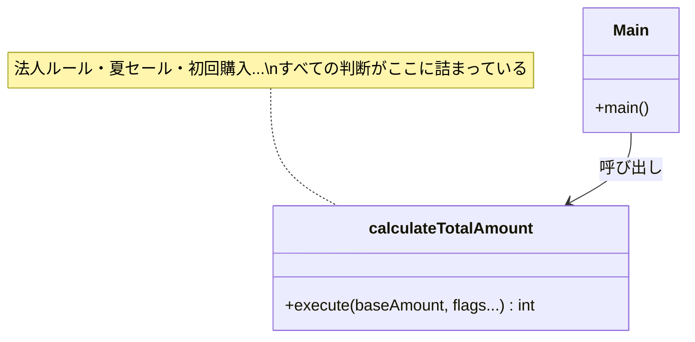
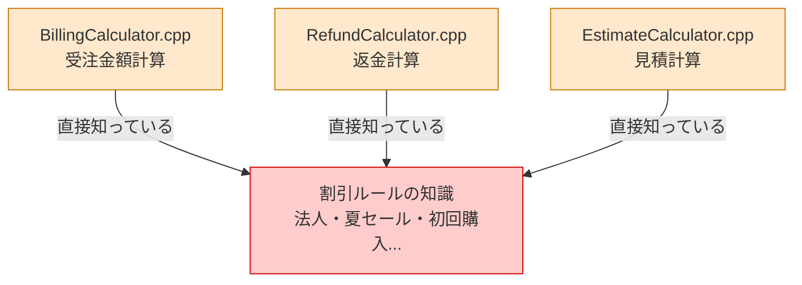
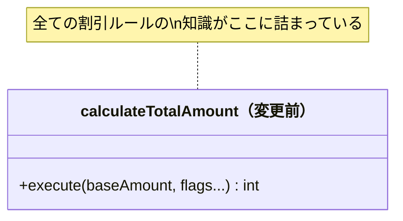
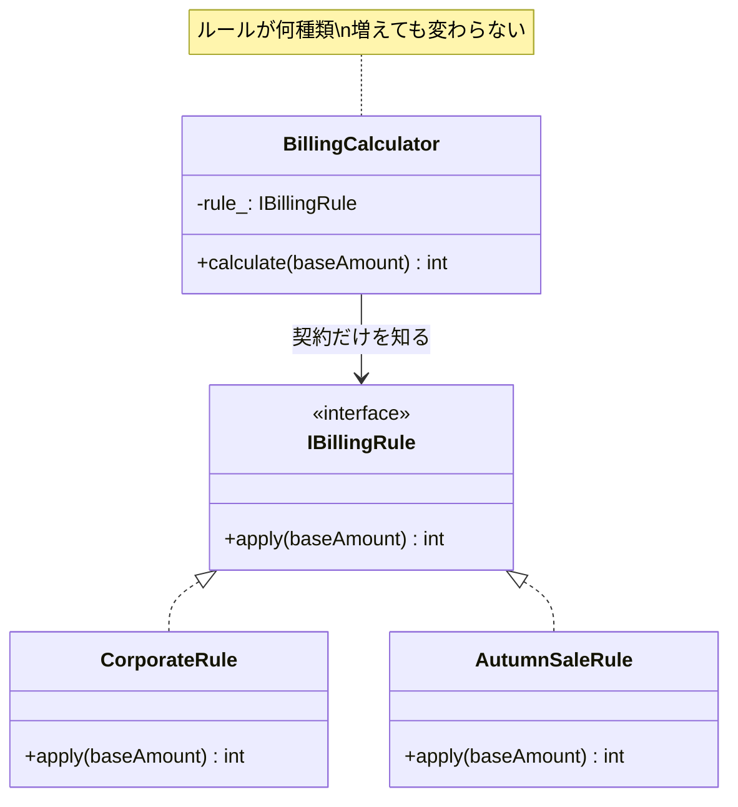

# 第1章　Strategyパターン：変わるルールを、外に出す
―― 思考の型：「変わるアルゴリズムと、変わらない骨格が同じ場所にいる」ことに気づく

> **この章の核心**
> 割引ルールが増えるたびに計算関数が育ち続けるのは、
> 「誰の判断で変わるか」が異なる2つのものが同じ場所にいるからだ。
> 分けるべきものを分けると、追加は「新しい部品を作るだけ」になる。

---

## 導入：本章の舞台となるシステム

**この章で扱うシステム：**
ECサイトの受注金額計算モジュールです。
基本金額に割引ルールを適用し、消費税を加算して最終請求額を返します。
法人・一般で異なるルールが存在し、キャンペーンのたびに新しい割引が追加されます。

---

## ステップ0：視点のチューニング ―― 「設計のレンズ」をセットする

コードを読む前に、この章で使う問いをセットアップします。
このレンズなしに読んでも、コードは「動いている処理の羅列」にしか見えません。

**【全パターン共通の問い】**

> 「このコードの中に、**『変わる理由』が異なる2つのものが、
> 同じ場所に混在していないか？」**

「変わる理由」とは **「誰の判断で変わるか」** のことです。
そのコードを変更するとき、答えが2人以上になるなら、変わる理由が複数混在しています。

---

## ステップ1：現状把握 ―― 各クラスの責任を把握し、責任外の関心を探す

> **現状把握の本質**
> コードを読んで「動きを追う」だけでは不十分です。
> **「各クラスの責任は何か」を定義し、
> 「責任範囲外の知識を持っていないか」を確認する**のが、
> 設計上の現状把握です。

### 1.1 今のシステムの仕様とコードの構造

**要するに増え続ける割引条件を1関数に詰め込んでいる構造。**

ECサイトの受注金額を計算するモジュールです。
当初は法人・一般の2分岐だけでした。
以来、要求が増えるたびにこの関数が育ち続けてきました。

| 機能 | 担当 | 入力 | 出力 |
|---|---|---|---|
| 金額計算 | `calculateTotalAmount` | 基本金額・顧客区分・各フラグ | 最終請求額 |

---

**変更前のクラス構造**



*→ 1つの関数が「すべての割引ルール」を知っている。
割引の種類が増えるたびに、この関数に手を入れるしかない。*

---

**各クラスの責任一覧**

| 対象 | 責任（1文） | 知るべきこと |
|---|---|---|
| `calculateTotalAmount` | 最終請求額を返す | 基本金額と顧客区分 |
| `main()` | プログラムを起動する | 起動に必要な情報のみ |

---

**各クラスの責任と実装**

当時の担当者の苦労を想像しながら、コードを観察します。

```cpp
// 【起点コード】
// billing/BillingCalculator.cpp
// 当初は法人・一般の2分岐のみ。
// 要求が増えるたびに、この関数が育ち続けてきた。

int calculateTotalAmount(
    int baseAmount,
    bool isCorporate,
    bool isPremium,
    int quantity,
    int continuationYears,
    bool isSummerSale,
    bool isFirstPurchase
) {
    int amount = baseAmount;

    if (isCorporate) {
        amount = amount * 9 / 10;            // 法人: 10%引き
        if (isPremium && quantity >= 100) {
            amount -= 50000;                 // プレミアム大量注文
        }
        if (continuationYears > 1) {
            amount -= 10000;                 // 継続1年超
        }
    } else {
        if (isSummerSale) {
            amount = amount * 8 / 10;        // 夏セール: 20%引き
        }
        if (isFirstPurchase) {
            amount -= 500;                   // 初回購入
        }
    }

    amount = static_cast<int>(amount * 1.1); // 消費税10%
    return (amount > 0) ? amount : 0;
}

int main() {
    // 法人・プレミアム・150個・2年
    int result = calculateTotalAmount(100000, true, true, 150, 2, false, false);
    return 0;
}
```

**実行結果：**
```
法人・プレミアム・150個・2年: 100000 * 0.9 - 50000 - 10000 = 30000 → 33000円
```

動いています。では、**責任チェック**に入ります。

---

**責任チェック：`calculateTotalAmount` は自分の責任だけを持っているか**

この関数の責任は「最終請求額を計算して返すこと」です。
その責任を果たすために「知るべきこと」は何でしょうか。

> 基本金額と、適用すべき割引の結果。消費税率。

今のコードで `calculateTotalAmount` が「知っていること」を1行ずつ確認します。

| コードの行 | 持っている知識 | 責任内か |
|---|---|---|
| `amount * 9 / 10` | 法人割引率（10%） | **✗ 法人ルール担当の責任** |
| `isPremium && quantity >= 100` | プレミアム大量注文の条件 | **✗ 法人ルール担当の責任** |
| `continuationYears > 1` | 継続年数の閾値 | **✗ 法人ルール担当の責任** |
| `amount * 8 / 10` | 夏セール割引率（20%） | **✗ キャンペーン担当の責任** |
| `amount -= 500` | 初回購入割引額 | **✗ キャンペーン担当の責任** |
| `amount * 1.1` | 消費税率の適用 | ✅ 計算の骨格として自然 |

法人割引の計算方法を決めているのは法人営業チームです。
夏セールの割引率を決めているのはキャンペーン担当チームです。
**それぞれの「責任（誰の判断で変わるか）」が、1つの関数の中に詰め込まれています。**

これが「責任範囲外の関心が混在している」状態です。

---

### 1.2 届いた変更要求

営業チームから連絡が入りました。

「秋の特大セールを来週末に始めたいんです。
　新しい割引ルール（15%引き）を追加してもらえますか？
　リリースは5日後を想定しています。」

「またここに手を入れるのか」という感覚、うまく伝わっているでしょうか。
私自身、何度もこの状況で迷いました。

---

## ステップ2：変動と不変の峻別 ―― 仮説を立て、ヒアリングで確定する

### 1.3 変動/不変の仮説と、関係者へのヒアリング

ステップ1で現状の仕様とコードを把握しました。この時点で「どこが変わりやすく、どこは変わらないか」を仮説として立てます。

**変動と不変の仮説**

| 分類 | 仮説 | 根拠 |
|---|---|---|
| 🔴 **変動する** | 割引ルールの種類と計算方法 | キャンペーン・契約内容は事業の都合で変わる |
| 🔴 **変動する** | ルールの数（今後も増え続ける） | 新キャンペーンのたびに追加要求が来る |
| 🟢 **不変** | 「割引を適用して消費税を加算する」計算の骨格 | 消費税の仕組みは変わらない |
| 🟢 **不変** | 入力（基本金額）と出力（最終請求額）の形 | 呼び出し元が必要とする情報の形 |

しかし——**コードを読んだだけで「変わる」「変わらない」と断定するのは危険です。**

変わるかどうかを知っているのは、そのルールのオーナーだけだからです。

---

**関係者ヒアリング**

変動/不変を確定する前に、各ルールのオーナーに確認しました。

> **開発者**：「割引ルールは、今後も種類が増えていきますか？」
>
> **営業担当**：「はい。毎シーズンのキャンペーンで新しいルールが追加されます。
> 地域限定割引や会員ランク割引も今後検討しています。」
>
> **開発者**：「法人ルールの変更頻度はどのくらいですか？
> キャンペーン担当とは別チームで管理されていますか？」
>
> **法人営業担当**：「はい、法人ルールは私たちが決めます。
> キャンペーン担当とは完全に別です。
> 法人ルールの変更がキャンペーンに影響することはないはずです。」
>
> **開発者**：「基本金額の型（int）は将来変わりますか？
> 外貨対応などで型が変わる可能性はありますか？」
>
> **経理担当**：「現時点では円のみです。外貨対応は今のところ計画にありません。」
>
> **開発者**：「消費税率（10%）はルールによって変わることはありますか？」
>
> **経理担当**：「消費税率はシステム全体で統一です。
> 個別のルールが税率を持つことはありません。」

---

チームで話し合う価値がある部分だと思います。
このヒアリングがあって初めて、変動/不変テーブルに根拠が生まれます。

| 分類 | 具体的な内容 | 変わるタイミング | 根拠 |
|---|---|---|---|
| 🔴 **変動する** | 割引ルールの種類と計算方法 | 毎シーズン（確定） | 営業担当への確認 |
| 🔴 **変動する** | 複数ルールの組み合わせ方 | 新機能要求のたびに | 営業担当への確認 |
| 🟢 **不変** | 「割引を適用して消費税を加算する」計算の骨格 | 変わる日は来ない | 経理担当との合意 |
| 🟢 **不変** | 基本金額の型（int・円） | 当面変わらない | 経理担当への確認 |
| 🟢 **不変** | 消費税率の適用タイミング | 統一ルールとして固定 | 経理担当との合意 |

> **設計の決断**：🟢 不変な計算の骨格を「契約（インターフェース）」として固定し、
> 🔴 変動する各割引ルールは、それぞれのインターフェースの裏側に押し込む。

**インターフェース命名の原則**：インターフェース名はビジネス上の責任で付ける。
「割引を適用する」責任なら `IBillingRule` ——
法人割引かセール割引かはインターフェースの名前に現れない。

---

## ステップ3：課題分析 ―― 変更しようとしたときの困難と痛み

### 1.4 変更しようとしたときに現れる困難

秋の特大セール（15%引き）をこの関数に追加しようとすると、何が起きるでしょうか。

- **困難1：また引数が増える**
  `isAutumnSale` という引数を追加し、
  `calculateTotalAmount` の中にまた新しい `if` ブロックを書くことになります。
  今日の7引数が、来月は9引数、再来月は11引数——この先がイメージできてしまいます。

- **困難2：キャンペーンを変えると法人側のテストが不安になる**
  秋セール（一般向け）の1行を変えるだけで
  「法人側を壊していないか？」と全テストを走らせたくなります。
  担当チームが別なのに、互いの変更を気にしなければならない状態です。

---

**依存の広がり**



*→ 割引ルールの知識がシステムのあちこちに侵食している。これが問題の全体像。*

---

## ステップ4：原因分析 ―― 根本にある設計の問題を言語化する

### 1.5 困難の根本にあるもの

コードを観察して、困難の原因を探ります。

| 観察 | 原因の方向 |
|---|---|
| 割引が増えるたびに `calculateTotalAmount` が変わる | 関数が「変わるルールの詳細」を直接知っているから |
| 法人ルールとキャンペーンが同じ場所にある | 「変わる理由の異なる2つ」が同居しているから |
| テストが相互に干渉する | ルールの実装が隔離されていないから |

この観察から、問題の構造が見えてきます。

#### 変わるものと変わらないものが同じ場所にいる

| 変わり続けるもの | 変わってほしくないもの |
|---|---|
| 割引ルールの種類と計算方法 | 「割引を適用して消費税を加算する」骨格 |
| ルールを担当するチームの判断 | 入力（基本金額）と出力（最終請求額）の形 |

「変わり続けるもの」と「変わってほしくないもの」が
`calculateTotalAmount` という1つの場所に同居しています。
これが、変更のたびに全体が揺れる原因です。

---

## ステップ5：対策案の検討 ―― 「理想の契約」から逆算して構造を作る

解決の方向は明確です。
**「変わるルール」を `calculateTotalAmount` の外へ切り出す。**

### 1.6 試み①：割引率を引数として渡す

最初に思い浮かぶのは、「割引率を外から渡す」形です。

```cpp
// 【試み①】割引率を引数として渡す
int calculateTotalAmount(
    int baseAmount,
    int discountPercent  // 外から渡す
) {
    int amount = baseAmount * (100 - discountPercent) / 100;
    amount = static_cast<int>(amount * 1.1);
    return (amount > 0) ? amount : 0;
}
```

**試み①の責任チェック**

| 呼び出し側のコード | 持っている知識 | 責任内か |
|---|---|---|
| `calculateTotalAmount(100000, 10)` | 法人の割引率（10%） | **✗ 法人ルール担当の責任** |
| `calculateTotalAmount(10000, 15)` | 秋セールの割引率（15%） | **✗ キャンペーン担当の責任** |

割引率を渡す「呼び出し側」に責任が移動しただけです。
しかも、法人ルールの「プレミアム契約かつ100個以上で5万円引き」という複雑な条件は、
数値1つでは表現できません。
試み①は単純なルールには対応できますが、ルールが複雑になると限界に達します。

**「問題の場所が変わっただけで、問題の構造は変わっていない」**——これが試み①の残課題です。

---

### 1.7 試み②：「割引ルール」をインターフェースとして独立させる

残課題の核心は「複雑なルールを1つの単位として独立させられていない」ことです。
ならば、割引ルールという概念自体をインターフェースとして定義し、
各ルールをそれぞれ独立したクラスとして実装するとどうなるでしょうか。

```cpp
// 【試み②】「割引ルール」をインターフェースとして定義する
// billing/IBillingRule.h

class IBillingRule {
public:
    virtual int apply(int baseAmount) = 0;
    virtual ~IBillingRule() {}
};
```

```cpp
// 法人割引ルール
// billing/CorporateRule.h
// 法人向けの複雑な条件を1つの部品に閉じ込める。

class CorporateRule : public IBillingRule {
public:
    CorporateRule(bool isPremium, int quantity, int continuationYears)
        : isPremium_(isPremium)
        , quantity_(quantity)
        , continuationYears_(continuationYears)
    {}

    int apply(int baseAmount) {
        int amount = baseAmount * 9 / 10;
        if (isPremium_ && quantity_ >= 100) {
            amount -= 50000;
        }
        if (continuationYears_ > 1) {
            amount -= 10000;
        }
        return amount;
    }

private:
    bool isPremium_;
    int  quantity_;
    int  continuationYears_;
};
```

```cpp
// 秋セールルール
// billing/AutumnSaleRule.h
// CorporateRule にも calculateTotalAmount にも触れずに追加できる。

class AutumnSaleRule : public IBillingRule {
public:
    int apply(int baseAmount) {
        return static_cast<int>(baseAmount * 85 / 100); // 15%引き
    }
};
```

```cpp
// コンテキスト（計算の骨格）
// billing/BillingCalculator.h

class BillingCalculator {
public:
    explicit BillingCalculator(IBillingRule* rule) : rule_(rule) {}

    int calculate(int baseAmount) {
        int amount = rule_->apply(baseAmount); // IBillingRule だけを知る
        amount = static_cast<int>(amount * 1.1);
        return (amount > 0) ? amount : 0;
    }

private:
    IBillingRule* rule_;
};
```

**試み②の責任チェック（BillingCalculator）**

| BillingCalculator が持っている知識 | 誰の責任か |
|---|---|
| `rule_->apply(baseAmount)` を呼ぶ手順 | ✅ BillingCalculator の責任 |
| 消費税率（10%）の適用 | ✅ 計算の骨格として自然（経理担当と合意済み） |
| 法人割引率の詳細 | **見えない**（IBillingRule の裏側） |
| 秋セール割引率の詳細 | **見えない**（IBillingRule の裏側） |

`BillingCalculator` は `IBillingRule` という契約だけを知っています。
割引ルールが増えても、`BillingCalculator` には触れません。

---

**変更前後のクラス図**





変更前：`calculateTotalAmount` が全ルールの詳細を知っていた。
変更後：`BillingCalculator` は `IBillingRule` という1本の矢印しか持たない。

---

## ステップ6：天秤にかける ―― 柔軟性とシンプルさのバランスを評価する

### 1.8 評価軸の宣言

比較を始める前に「何を重視するか」を明示します。
基準を後から決めると、結論ありきの比較になってしまいます。

| 基準 | なぜこの状況で重要か |
|---|---|
| テストの独立性 | 法人ルールとキャンペーンルールを互いに干渉せずテストしたい |
| 変更の局所性 | 新しいルール追加のとき、変更箇所を1か所に収めたい |
| チームの分担 | 担当チームが別れているため、コードも別れていてほしい |

---

### 1.9 各アプローチをテストで比較する

**試み①のテスト**

```cpp
// 試み①：法人ルールの確認
// ルールのロジックがテスト内に複製される

TEST(BillingTest, CorporatePremiumBulk) {
    int base  = 100000;
    int disc  = base * 9 / 10;
    disc -= 50000; // プレミアム大量注文
    disc -= 10000; // 継続1年超
    int tax   = static_cast<int>(disc * 1.1);
    EXPECT_EQ(tax, calculateTotalAmount(base, 10));
    // テスト内にルールのロジックが重複している
}
```

**試み②のテスト**

```cpp
// BillingCalculator のテスト：ルールを知らなくてよい

class StubBillingRule : public IBillingRule {
public:
    int apply(int baseAmount) { return 8000; }
};

TEST(BillingCalculatorTest, AppliesTaxToRuleResult) {
    StubBillingRule rule;
    BillingCalculator calc(&rule);
    EXPECT_EQ(8800, calc.calculate(10000)); // 8000 * 1.1
}
```

```cpp
// 各ルールのテスト：BillingCalculator の存在を知らなくてよい

TEST(AutumnSaleRuleTest, Applies15PercentDiscount) {
    AutumnSaleRule rule;
    EXPECT_EQ(8500, rule.apply(10000));
}

TEST(CorporateRuleTest, AppliesPremiumBulkDiscount) {
    CorporateRule rule(true, 150, 2);
    EXPECT_EQ(30000, rule.apply(100000)); // 100000*0.9 - 50000 - 10000
}
```

各部品が「自分の責任だけ」をテストしています。
法人ルールが変わっても、秋セールのテストには影響しません。

**比較のまとめ**

| 基準 | 試み① | 試み② |
|---|---|---|
| テストの独立性 | △ 計算器を介してしか確認できない | ○ ルール単体でテストできる |
| 変更の局所性 | △ 呼び出し元にルール知識が散らばる | ○ 新クラスを追加するだけ |
| チームの分担 | △ ルール定義が呼び出し元に混在 | ○ ルールごとにファイルが分かれる |
| 実装コスト | 少ない（クラス定義不要） | 多い（インターフェース＋クラス必要） |

*この比較はあくまで「今回の状況と基準」に対するものです。
別の状況・別の基準であれば、違う選択が正解になります。*

---

### 1.10 耐久テスト ―― ヒアリングで挙がった変化が来た

1.3のヒアリングで、営業担当からこんな話がありました。
「将来的には複数の割引を重ねて適用したい。」

この変化が実際に来た場面をシミュレートします。

```cpp
// 複数の割引ルールを順番に重ねる
// IBillingRule も CorporateRule も AutumnSaleRule も変更なし

class MultiBillingCalculator {
public:
    MultiBillingCalculator() : count_(0) {}

    void addRule(IBillingRule* rule) {
        rules_[count_] = rule;
        count_++;
    }

    int calculate(int baseAmount) {
        int amount = baseAmount;
        for (int i = 0; i < count_; i++) {
            amount = rules_[i]->apply(amount);
        }
        amount = static_cast<int>(amount * 1.1);
        return (amount > 0) ? amount : 0;
    }

private:
    IBillingRule* rules_[10];
    int           count_;
};
```

```cpp
// 秋セール＋会員割引を重ねる
class MemberDiscountRule : public IBillingRule {
public:
    explicit MemberDiscountRule(int discountAmount)
        : discountAmount_(discountAmount) {}

    int apply(int baseAmount) {
        return baseAmount - discountAmount_;
    }

private:
    int discountAmount_;
};

// 組み立て側
AutumnSaleRule     autumnRule;
MemberDiscountRule memberRule(500);

MultiBillingCalculator calc;
calc.addRule(&autumnRule);
calc.addRule(&memberRule);

int result = calc.calculate(10000);
// 10000 → 8500（秋15%引き）→ 8000（会員500円引き）→ 8800（消費税）
```

`IBillingRule` も `CorporateRule` も `AutumnSaleRule` も、一切変更していません。

---

### 1.11 使う場面・使わない場面

「では、試み②を常に選べばいいのか？」という問いは自然です。
間違えても大丈夫です。
正解はないのですが、一つの考え方として——

```cpp
// 使いすぎた例：変化の予定がないものまでルール化した

class TaxRule : public IBillingRule {
public:
    int apply(int baseAmount) {
        return static_cast<int>(baseAmount * 1.1);
    }
};
```

消費税率が変わる可能性がゼロではないことは認めます。
しかし、経理担当と「統一ルール」と合意している以上、
これをわざわざ独立したクラスにする根拠はありません。
変化の予定がないものを「変わるもの」として扱うと、複雑さだけが増えます。

| 状況 | 適切な選択 | 理由 |
|---|---|---|
| ルールが複雑・チームで分担する | 試み②（IBillingRule） | テスト独立性・チーム分担が必要 |
| ルールが2〜3個・1人で管理 | 試み①（引数渡し） | 実装コストが割に合う |
| ルールが今後も確実に増える | 試み② | 追加コストがかからない |
| ルールが固定で変わらない | シンプルなif分岐でよい | パターン不要 |

設計に絶対の正解はありません。
「今どのリスクを優先して対処するか」をチームで合意することが、設計の一歩だと私は感じています。

---

## ステップ7：決断と、手に入れた未来

### 1.12 解決後のコード（全体）

```cpp
// ────────────────────────────────────────────────────────
// インターフェース定義
// ────────────────────────────────────────────────────────

class IBillingRule {
public:
    virtual int apply(int baseAmount) = 0;
    virtual ~IBillingRule() {}
};

// ────────────────────────────────────────────────────────
// 実装クラス（各ルールが自分の責任だけを持つ）
// ────────────────────────────────────────────────────────

class CorporateRule : public IBillingRule {
public:
    CorporateRule(bool isPremium, int quantity, int continuationYears)
        : isPremium_(isPremium)
        , quantity_(quantity)
        , continuationYears_(continuationYears)
    {}

    int apply(int baseAmount) {
        int amount = baseAmount * 9 / 10;
        if (isPremium_ && quantity_ >= 100) amount -= 50000;
        if (continuationYears_ > 1)         amount -= 10000;
        return amount;
    }

private:
    bool isPremium_;
    int  quantity_;
    int  continuationYears_;
};

class AutumnSaleRule : public IBillingRule {
public:
    int apply(int baseAmount) {
        return static_cast<int>(baseAmount * 85 / 100);
    }
};

// ────────────────────────────────────────────────────────
// コンテキスト：計算の骨格だけに専念する
// ────────────────────────────────────────────────────────

class BillingCalculator {
public:
    explicit BillingCalculator(IBillingRule* rule) : rule_(rule) {}

    int calculate(int baseAmount) {
        int amount = rule_->apply(baseAmount);
        amount = static_cast<int>(amount * 1.1);
        return (amount > 0) ? amount : 0;
    }

private:
    IBillingRule* rule_;
};

// ────────────────────────────────────────────────────────
// BillingApplication：全ての具体クラスを組み立てる唯一の場所
// ────────────────────────────────────────────────────────

class BillingApplication {
public:
    void run() {
        CorporateRule     rule(true, 150, 2);
        BillingCalculator calc(&rule);
        int result = calc.calculate(100000);
        saveResult(result);
    }

private:
    void saveResult(int amount) { /* 結果を保存 */ }
};

// ────────────────────────────────────────────────────────
// main() は BillingApplication をキックするだけ
// ────────────────────────────────────────────────────────

int main() {
    BillingApplication app;
    app.run();
    return 0;
}
```

**実行結果：**
```
[Corporate] 100000 * 0.9 - 50000 - 10000 = 30000 → 33000円（消費税込み）
```

---

### 1.13 変更シナリオ表と最終責任テーブル

**変更シナリオ表：何が変わったとき、どこが変わるか**

| シナリオ | 変わるクラス | 変わらないクラス |
|---|---|---|
| 新しい割引ルールを追加する | 新しい〇〇Rule クラスを追加 | IBillingRule / BillingCalculator |
| 法人割引率が変わる | CorporateRule のみ | AutumnSaleRule / BillingCalculator |
| 使うルールを切り替える | BillingApplication の1行 | すべてのルールクラス |
| 消費税率が変わる | BillingCalculator のみ | すべてのルールクラス |

どのシナリオでも、変わるクラスが1〜2クラスに収まっています。
`BillingCalculator` が割引ルールの追加・変更で変わることは、一切ありません。

---

**最終責任テーブル**

| クラス | 責任（1文） | 変わる理由 |
|---|---|---|
| `main()` | プログラムを起動する | 起動方法が変わるとき |
| `BillingApplication` | 依存を組み立て、処理を起動する | 使うルールの組み合わせが変わるとき |

---

## 振り返り：第0章の哲学はどう適用されたか

改めて、ここまで導き出してきた「最終的な設計（図やコード）」を、第0章でお話しした「3つの哲学」と照らし合わせてみましょう。一通り設計のプロセスを体験した今なら、あの哲学が「コードのどの部分に現れているか」がはっきりと見えるはずです。

### 哲学1「変わるものをカプセル化せよ」の現れ

**具体化された場所：**法人ルールや夏セールといった処理を独立させた `CorporateRule`・`AutumnSaleRule` 各クラス

法人ルールやキャンペーンルールなど「毎シーズン変わり続ける部分」を、計算の骨格（`calculateTotalAmount`）に同居させるのをやめました。変わる部分だけをきれいに抜き出し、独自のクラスにカプセル化（隔離）したからです。
結果として、**割引の種類が100種類に増えても、計算の骨格（`BillingCalculator`）の中身はまったく変わらない（不変を保てる）構造**を手に入れることができました。

### 哲学3「継承よりコンポジションを優先せよ」の現れ

**具体化された場所：** `BillingCalculator` が `IBillingRule` を「部品として持つ（ `rule_` ）」構造

もし基本となる「計算クラス」があり、それを継承した「法人計算クラス」「キャンペーン計算クラス」を作っていたとしたら、ステップ1.10の耐久テストのような「ルールを複数組み合わせる」ような対応でクラスが爆発的に増えていたでしょう。
今回は継承を使わず、`BillingCalculator` が `IBillingRule` という部品を「コンポジション（has-a：内包）」する形にしました。部品を差し替えたり、配列に詰め込んだりする柔軟性は、コンポジションだからこそ得られたものです。
| `BillingCalculator` | 計算の骨格（割引→消費税）を完了させる | 計算の骨格が変わるとき |
| `IBillingRule` | 割引ルールの契約を定義する | 割引責任の範囲が変わるとき |
| `CorporateRule` | 法人向け割引を計算する | 法人割引の条件・率が変わるとき |
| `AutumnSaleRule` | 秋セール割引を計算する | 秋セールの割引率が変わるとき |

各クラスが持つ「変わる理由」が1つに絞られています。
これが、ステップ4で特定した問題への答えです。

---

**この構造を、先人たちは Strategyパターン と呼んでいます。**
名前は、論理的に辿り着いた構造へのラベルです。

一つの参考として受け取っていただければと思います。
