## 第1章 変わるものをカプセル化する ―― Strategy パターン

### この章の核心

**同じ目的を達成する複数の振る舞いがあり、条件に応じて選び替える場面では、利用側の手順と交換可能な判断・計算を分けて考えます。種類を増やすたびに利用側の条件分岐や入力まで直しているなら、変わるアルゴリズムが安定した処理へ漏れていることが兆候です。利用側が共通の契約だけを知り、選択と実装を局所化できるかが判断軸になります。**

---

### この章を読むと得られること

「割引ルールが増えるたびに、既存の計算ロジックに手を入れなければならない」——この痛みを経験したことがあるなら、この章はそのまま使える答えを持っています。

- **得られること1：** 「実行する振る舞い」という観点で、コードの変動箇所を識別できるようになる
- **得られること2：** 接続点で呼び出し元がどの知識を抱えているかを調べ、「変わる理由が異なる知識が同じ場所に混在している」と現状の問題を認識できるようになる
- **得られること3：** 接続点の形を変えると変更がどのように局所化されるかを構造から説明でき、改善後にどんな効果が生まれるかを見通せるようになる
- **得られること4：** 増え続けるルールに対して、いつ・どのように構造を分けるべきかの判断ができるようになる

---

## 🔵 フェーズ1：現状把握 ―― 仕様を整理し、システムと紐付ける

ECサイトの支払金額計算が何を入力として受け取り、どの処理で加工し、何を出力するのかを整理します。

### 1-1：このシステムの仕様

このシステムは、ECサイトでお客様が商品を購入する際の**支払金額を計算**します。会員ID、商品ID、数量、キャンペーンIDを受け取り、顧客情報と商品価格を登録データから取得します。入力を検証して小計を求め、会員種別とキャンペーン条件に合う割引を順に適用し、適用理由と最終支払金額を注文結果へまとめて表示します。

#### まず代表入力と実行結果から動きをつかむ

詳細な仕様やコードへ入る前に、1-4の`main()`でPremium会員の田中さんがワイヤレスイヤホン（10000円）を1件注文する入力を確認します。

**代表入力（1-4の`main()`から抜粋）：**
```cpp
    // 準備：顧客台帳・表示・注文入口を組み立てる
    CustomerDatabase db;
    CheckoutResultRenderer renderer;
    OrderProcessor processor(db, renderer);
    CampaignContext context;

    // 注文を1件つくる（C001はPremium会員）
    Order order1;
    order1.customerId = "C001";
    order1.items.push_back(Item("ワイヤレスイヤホン", 10000));

    // 同じ注文へ、キャンペーン条件だけを変えて2回通す
    context.isCampaignActive = false;   // キャンペーンなし
    processor.process(order1, context);
    context.isCampaignActive = true;    // キャンペーン中
    processor.process(order1, context);
```

この入力に対する代表的な実行結果は次のとおりです。

```
田中 一郎 さんの注文: ワイヤレスイヤホン 10000円
  条件: 会員=Premium, キャンペーン=なし
  小計 10000円 → 支払金額 8000円
田中 一郎 さんの注文: ワイヤレスイヤホン 10000円
  条件: 会員=Premium, キャンペーン=あり
  小計 10000円 → 支払金額 8000円
```

2回目に注目してください。**キャンペーンを有効にしても支払金額は8,000円のまま**です。Premium会員の20%引きが優先され、キャンペーンの10%引きは併用されません。1回だけ実行していたら、この「効かない」という仕様は見えませんでした。

この入力と出力から、(1)顧客・商品・会員条件を受け取り、(2)会員種別とキャンペーンで割引を判定して金額を計算し、(3)小計と支払金額が表示される、という一連の動きが読み取れます。同じ入力を含む完全なコードと実行結果は1-4に掲載します。

#### 最初にシステム全体をつかむ

- **入力：** 顧客ID、商品リスト、キャンペーンフラグを受け取る。
- **処理：** 顧客IDから会員種別を取得し、商品の小計を求め、会員種別とキャンペーン条件に合う割引を一つ適用する。
- **出力：** 顧客、小計、適用した割引、最終支払金額を購入結果として返し、不正な顧客や入力では計算を進めない。
- **掲載コードでの代替：** 実システムの顧客DBはメモリ上の登録表、画面や帳票への表示は標準出力を使う境界スタブで表す。割引判定と金額計算そのものは実際に行う。

まずこの一連の動きを押さえ、以降で要求、入力データ、システム境界、クラス、コードの順に詳細を確認します。

#### 現行要求ベースライン

| 要求ID  | 現行要求                                    | 受入条件                      |
| ----- | --------------------------------------- | ------------------------- |
| 要求ID1 | 商品リストの小計から最終支払金額を計算する                   | 登録商品10,000円の小計と割引後金額を返す   |
| 要求ID2 | Premium会員へ20%割引を適用し、他割引と併用しない           | Premiumの10,000円が8,000円になる |
| 要求ID3 | Regular会員はキャンペーン中だけ10%割引する              | 対象時9,000円、対象外時10,000円になる  |
| 要求ID4 | 顧客IDから会員種別を取得する                         | 登録顧客を取得し、未登録IDは計算を進めない    |
| 要求ID5 | 計算結果を注文確定時の購入結果として表示する | 顧客・小計・適用割引・支払金額を表示する |
| 要求ID6 | 注文確定前に同じ条件の支払金額をプレビューする | 同じ顧客ID・商品・キャンペーン条件なら購入結果と同額を返す |

入力として「顧客ID」「商品リスト（各商品の名前と単価）」「キャンペーン期間中フラグ（以後キャンペーンフラグ）」を受け取ります。会員種別（Premium / Regular）は顧客IDから取得します。システムは全商品の小計を算出し、割引ルールを適用した支払金額を、注文確定結果と事前プレビューの二つの入口から返します。

この章で扱う現状仕様は、次の範囲です。

| 仕様項目 | この章で扱う値 | 具体例 | 何に使うか |
|---|---|---|---|
| 商品リスト | 商品名と単価の一覧 | ワイヤレスイヤホン 10,000円 | 小計10,000円を計算する |
| 顧客IDと会員種別 | 登録済み顧客のID、Premium / Regular | C001 は Premium、C002 は Regular | 顧客IDから会員種別を確認し、Premiumなら会員割引を適用する |
| キャンペーンフラグ | 期間中 / 期間外 | 期間中なら true、期間外なら false | 期間中の場合だけキャンペーン割引を適用する |
| 割引適用順序 | 優先・排他のルール | Premiumは他割引と併用しない | 複数割引が同時に成り立つ場合の計算順序を決める |
| 出力 | 購入結果と事前プレビュー | 10,000円から割引後の8,000円を両方で返す | 同じ入力条件なら二つの入口が同額か照合する |

ここで確認する対象は、どの入力がどの判定や計算に使われ、最終金額へつながるかです。

**登録済みの顧客**

顧客IDから会員種別を引くため、次の3名があらかじめ登録されています。

| 顧客ID | 氏名 | 会員種別 |
|---|---|---|
| C001 | 田中 一郎 | Premium |
| C002 | 佐藤 花子 | Regular |
| C003 | 鈴木 次郎 | Regular |

未登録の顧客IDを指定すると、会員種別を取得できずエラーになります。

まず、ECサイトの購入機能、支払金額計算、保存済み顧客情報、表示先の境界を確認します。

**システム全体図：ECサイトと支払金額計算の境界**

最も大きな境界は「購入者 → EC購入システム」です。購入機能、金額計算、顧客情報は対象システムの内側にまとめ、ここでは内部の細かな処理順を示しません。

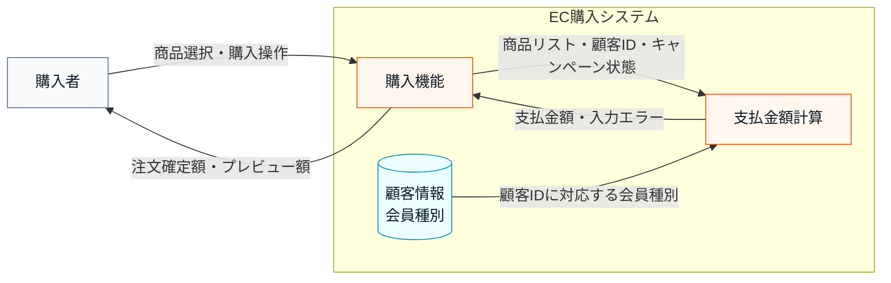
```mermaid
flowchart LR
    U["購入者"] -->|"商品選択・購入操作"| EC

    subgraph SHOP["EC購入システム"]
        EC["購入機能"]
        S["支払金額計算"]
        D[("顧客情報<br>会員種別")]
        EC -->|"商品リスト・顧客ID・キャンペーン状態"| S
        D -->|"顧客IDに対応する会員種別"| S
        S -->|"支払金額・入力エラー"| EC
    end

    EC -->|"注文確定額・プレビュー額"| U

    classDef actor fill:#f8fafc,stroke:#64748b,color:#111827;
    classDef system fill:#fff7ed,stroke:#ea580c,color:#111827;
    classDef data fill:#ecfeff,stroke:#0891b2,color:#111827;
    class U actor;
    class EC,S system;
    class D data;
```

この図では、支払金額計算を一つのシステムとして見て、どこから入力を受け、どの保存データを参照し、どこへ結果を返すかだけを示しています。

次に計算システムの箱を開き、正常に計算できる場合の入力・判定・加工・出力を整理します。

**システム内部図：正常系の入力・判定・加工・出力**
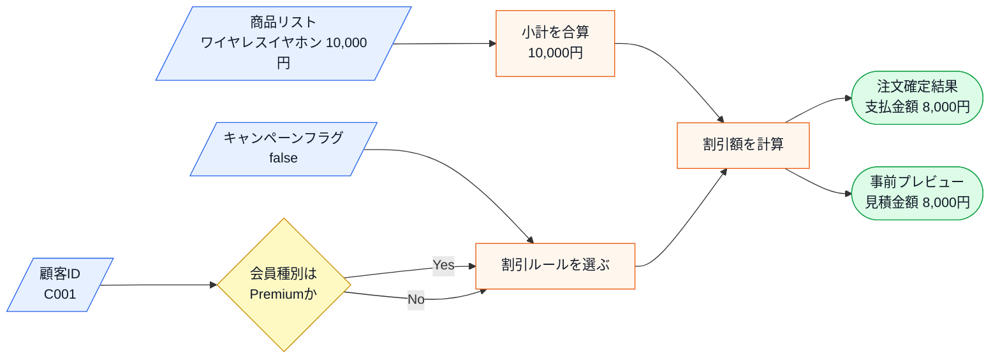
```mermaid
flowchart LR
    A[/商品リスト<br>ワイヤレスイヤホン 10,000円/]:::input --> G[小計を合算<br>10,000円]:::process
    C[/顧客ID<br>C001/]:::input --> D{会員種別は<br>Premiumか}:::decision
    E[/キャンペーンフラグ<br>false/]:::input --> H[割引ルールを選ぶ]:::process
    D -->|Yes| H
    D -->|No| H
    G --> I[割引額を計算]:::process
    H --> I
    I --> J([注文確定結果<br>支払金額 8,000円]):::normal
    I --> K([事前プレビュー<br>見積金額 8,000円]):::normal

    classDef input fill:#e7f0ff,stroke:#2563eb,color:#111827;
    classDef process fill:#fff7ed,stroke:#ea580c,color:#111827;
    classDef decision fill:#fef9c3,stroke:#ca8a04,color:#111827;
    classDef normal fill:#dcfce7,stroke:#16a34a,color:#111827;
```

この図から読み取ることは、次の3点です。

- 支払金額は、商品リストだけでは決まらず、顧客IDから取得する会員種別とキャンペーンフラグによって変わる。
- 加工の中心は、小計の合算ではなく、どの割引ルールを選んで適用するかにある。
- 同じ顧客ID・商品・キャンペーン条件から、注文確定結果と事前プレビューの二つへ同じ支払金額を返す。
- 未登録顧客や空注文のように計算へ進めない場合は、次のエラー条件表で分けて扱う。

この図で注目するのは、中央の「加工」にある**割引ルールの選択と適用**です。入力された会員種別とキャンペーンフラグから、どの割引をいくら適用するかが決まり、支払金額が出力されます。

この仕様は、次の状態変化として読めます。

| 観点 | 内容 |
|---|---|
| 事前状態 | 顧客ID、商品リスト、キャンペーンフラグが渡されている |
| 加工 | 顧客IDから会員種別を取得し、小計を計算し、割引ルールを適用する |
| 事後状態 | 正常系では支払金額が表示される |

割引ルールは「誰に・いつ・どれだけ還元するか」というビジネス上の決定から生まれます。会員種別による優遇はリピーター獲得施策、キャンペーンは新規顧客向けの期間限定施策と、それぞれ担当チームが異なる目的で設計しています。

**割引ルール一覧**

| ルール名     | 適用条件                        | 割引の内容    | 業務機能                |
| -------- | --------------------------- | -------- | ------------------- |
| プレミアム割引  | 会員種別が "Premium"             | 20%引き    | 料金・プロモーション管理        |
| キャンペーン割引 | 会員種別が "Regular" かつキャンペーン期間中 | 10%引き    | マーケティング・通知管理        |
| 割引なし     | 上記以外                        | 定価（割引なし） | —（変更不要）              |

Premium会員にキャンペーン割引が重ならない理由は、業務上の判断からきています。Premium会員はすでに年会費や利用実績の対価として恒常的な20%引きを受けており、さらにキャンペーン割引を重ねると採算が合わなくなる可能性があるためです。

**優先・排他ルール**

| 条件 | 動作 |
|---|---|
| Premium かつ キャンペーン中 | Premium のみ適用（キャンペーン割引は無効） |

「クーポンと会員割引は併用不可」という注意書きをショッピングサイトで見かけたことはないでしょうか。このシステムの排他ルールは、その「併用不可」ルールと同じ発想です。どちらを優先するかは会社のポリシーによりますが、上位会員の特典を守ることを優先しています。

**割引計算で確認する前提**

現状仕様の時点では、Premium割引とキャンペーン割引は排他であり、1件の注文へ両方を逐次適用しません。ここでは、変更要求を読む前から存在する複雑さだけを整理します。

| 複雑さ | この章での扱い | 設計判断への影響 |
|---|---|---|
| 排他条件 | Premium会員にはキャンペーンを重ねない | どのルールを選ぶかの判定が計算本体にあることを確認する |
| 複数の利用場所 | 注文確定とカートプレビューが同じ計算を使う | ルール変更時に両方の出力が一致するか確認する |
| 顧客情報取得失敗 | 顧客IDから会員種別を取得できない場合はエラーにする | 外部境界の失敗は注文処理で扱い、割引ルール差し替えとは別軸にする |

この表で見たいのは、「割引が複数あるから複雑」という事実だけではありません。複雑さには、割引ルールの追加・変更に関係するものと、顧客情報取得失敗のように外部境界の信頼性に属するものがあり、両者は性質の異なる複雑さです。

**この割引計算を使う場所**

| 使用場所 | 用途 |
|---|---|
| 決済計算処理 | 注文確定時の支払金額の確定 |
| カートプレビュー機能 | カート画面の金額プレビュー表示 |

**エラー条件**

正常系の金額計算へ進めない入力は、次のように分けて扱います。

| エラー条件 | どこで分かるか | 出力 | 保存・通知などの副作用 |
|---|---|---|---|
| 顧客IDが顧客データに存在しない | 顧客IDから会員種別を取得する前 | 未登録顧客エラー | なし |
| 顧客情報取得に失敗する | 顧客データ取得時 | 顧客情報取得エラー | なし（掲載コードでは発生しない。実運用のDB／API失敗を代替する`try`/`catch`で表す） |
| 注文の商品リストが空 | 小計を合算する前 | 空注文エラー | なし |

### 1-2：動作例テーブル

仕様を定義したところで、実際にどのような入力に対してどのような結果が返るかを確認します。このテーブルは「このシステムが正しく動いているとはどういう状態か」の基準になります。後で設計の改善（リファクタリング）を段階的に進めるときも、この表に立ち返ります。

| 会員種別    | キャンペーン | 適用ルール             | 小計/支払金額          |
| ------- | ------ | ----------------- | ---------------- |
| Premium | ✗      | プレミアム20%引き        | 10,000円 → 8,000円 |
| Premium | ✓      | プレミアム優先（キャンペーン無効） | 10,000円 → 8,000円 |
| Regular | ✓      | キャンペーン10%引き       | 10,000円 → 9,000円 |
| Regular | ✗      | 割引なし              | 3,000円 → 3,000円  |

コードを読む前に、このシステムが「何をする必要があるか」をこの表で確認できました。次は、この仕様を担うクラスの顔ぶれと責任を確認します。

---

### 1-3：登場クラスとクラス構成図

このシステムに登場するクラスと、それぞれが1-1のどの仕様を担うかを一覧で押さえます。1-4のコードは、この責任分担に沿って読み進めます。

| クラス名 | 役割 | 担当する仕様 |
|---|---|---|
| `Item` | 商品データの保持 | 商品名・単価の元データ |
| `Order` | 注文データの保持 | 顧客IDとカート内商品リスト |
| `CampaignContext` | キャンペーン状態の保持 | キャンペーン有効フラグ |
| `CustomerInfo` | 顧客1件分の情報 | 氏名と会員種別の受け渡し |
| `CustomerDatabase` | 顧客情報の管理 | IDから会員種別・氏名を引く。エラー条件の一次判定 |
| `PaymentCalculator` | 支払金額の計算 | 小計の算出と割引ルールの適用 |
| `CartPreviewService` | カート画面のプレビュー表示 | 顧客IDから会員種別を取得し、計算結果をプレビューとして返す |
| `CheckoutResultRenderer` | 注文確定結果を表示する境界 | 支払金額またはエラーの表示 |
| `OrderProcessor` | 注文処理の統合 | バリデーション・計算・結果表示の一連の流れを担う |

責任を把握したうえで、次の図でクラス同士の依存関係を確認します。注文確定を担う`OrderProcessor`と事前表示を担う`CartPreviewService`は、どちらも`CustomerDatabase`から会員種別を取得し、同じ`PaymentCalculator`へ渡します。これにより、プレビューの呼び出し元が会員種別を顧客IDとは別に指定して食い違うことを防ぎます。

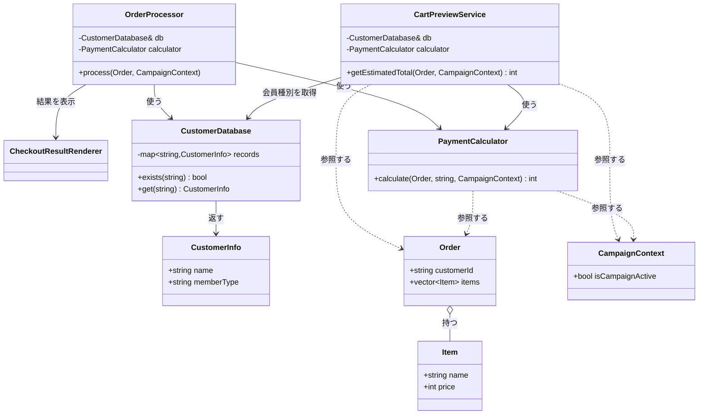
```mermaid
classDiagram
    class CheckoutResultRenderer
    class CustomerDatabase {
        -map~string,CustomerInfo~ records
        +exists(string) bool
        +get(string) CustomerInfo
    }
    class CustomerInfo {
        +string name
        +string memberType
    }
    class OrderProcessor {
        -CustomerDatabase& db
        -PaymentCalculator calculator
        +process(Order, CampaignContext)
    }
    class PaymentCalculator {
        +calculate(Order, string, CampaignContext) int
    }
    class CartPreviewService {
        -CustomerDatabase& db
        -PaymentCalculator calculator
        +getEstimatedTotal(Order, CampaignContext) int
    }
    class Order {
        +string customerId
        +vector~Item~ items
    }
    class Item {
        +string name
        +int price
    }
    class CampaignContext {
        +bool isCampaignActive
    }

    OrderProcessor --> CustomerDatabase : 使う
    OrderProcessor --> PaymentCalculator : 使う
    OrderProcessor --> CheckoutResultRenderer : 結果を表示
    CustomerDatabase --> CustomerInfo : 返す
    CartPreviewService --> CustomerDatabase : 会員種別を取得
    CartPreviewService --> PaymentCalculator : 使う
    CartPreviewService ..> Order : 参照する
    CartPreviewService ..> CampaignContext : 参照する
    PaymentCalculator ..> Order : 参照する
    PaymentCalculator ..> CampaignContext : 参照する
    Order o-- Item : 持つ
```

**クラス図に出てくる主なメンバーと操作**

| クラス | メンバー・操作 | 何ができるか |
|---|---|---|
| `CustomerDatabase` | `records` | 顧客IDと顧客情報を保持する |
| `CustomerDatabase` | `exists()` / `get()` | 顧客IDが登録済みか確認し、会員種別を取り出す |
| `OrderProcessor` | `db` / `calculator` | 顧客情報の取得と支払金額計算を呼び出す |
| `PaymentCalculator` | `calculate()` | 注文、会員種別、キャンペーン状態から支払金額を計算する |
| `CartPreviewService` | `db` / `getEstimatedTotal()` | 顧客IDから会員種別を取得し、注文確定前に同じ計算結果を返す |
| `Order` / `Item` / `CampaignContext` | データ項目 | 計算に必要な顧客ID、商品、キャンペーン状態を渡す |


`OrderProcessor`と`CartPreviewService`は別の入口ですが、どちらも注文の`customerId`を`CustomerDatabase`へ渡し、取得した会員種別で同じ`PaymentCalculator`を呼びます。クラス図の全型をコード定義と照合すると、各依存線はメンバー、引数、または呼び出しとして実在し、孤立した型はありません。

**現状システムの処理シーケンス**

クラス図は「誰が誰を持つか」という静的な関係を示します。次のシーケンス図は、正常系（会員種別あり・キャンペーン中）で、注文1件を処理する間に各クラスがどの順で呼ばれ、どの値を受け渡すかを時系列で示します。割引額を決める具体の分岐は `PaymentCalculator` の注記に書き出し、エラー系はメモとして添えます。1-4の現状コードを読む前の地図として使います。

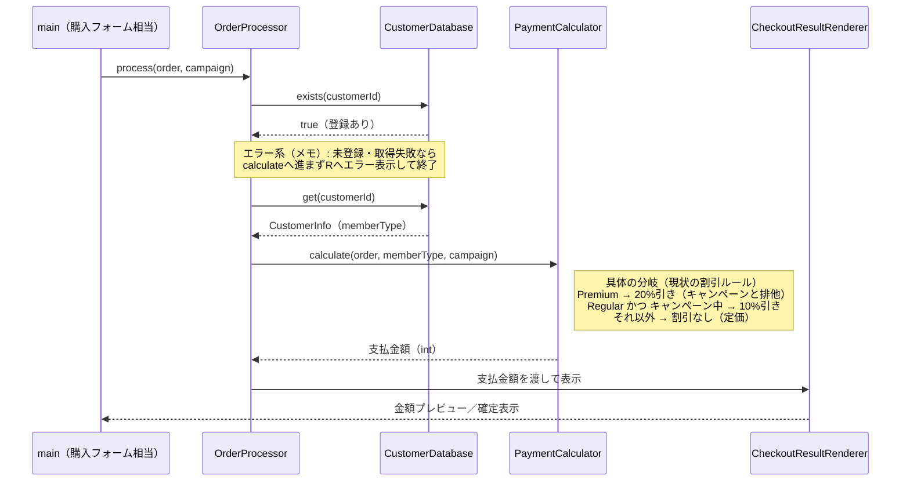
```mermaid
sequenceDiagram
    participant Main as main（購入フォーム相当）
    participant OP as OrderProcessor
    participant DB as CustomerDatabase
    participant PC as PaymentCalculator
    participant R as CheckoutResultRenderer
    Main->>OP: process(order, campaign)
    OP->>DB: exists(customerId)
    DB-->>OP: true（登録あり）
    Note over OP,DB: エラー系（メモ）: 未登録・取得失敗なら<br>calculateへ進まずRへエラー表示して終了
    OP->>DB: get(customerId)
    DB-->>OP: CustomerInfo（memberType）
    OP->>PC: calculate(order, memberType, campaign)
    Note right of PC: 具体の分岐（現状の割引ルール）<br>Premium → 20%引き（キャンペーンと排他）<br>Regular かつ キャンペーン中 → 10%引き<br>それ以外 → 割引なし（定価）
    PC-->>OP: 支払金額（int）
    OP->>R: 支払金額を渡して表示
    R-->>Main: 金額プレビュー／確定表示
```

図から読み取れるのは、`OrderProcessor` が「顧客の存在確認 → 顧客情報の取得 → 支払金額の計算 → 結果表示」の順に各クラスを呼ぶこと、割引額の算出は `PaymentCalculator::calculate()` の内側で会員種別×キャンペーンの分岐（Premium 20%／Regular×キャンペーン中 10%／それ以外なし）で決まること、顧客の取得失敗はメモのとおり `calculate` へ進まずエラー表示で終わることです。どのクラスがどの値（`memberType`・`int` 金額）を受け渡すかを、この時系列で確認できます。

**この章での簡略化**

実際のECサイトでは、顧客情報はデータベースに保存され、計算結果は画面に表示され、注文は購入フォームから届きます。この章では割引計算の設計に集中するため、これらを次のように簡略化して掲載します。

| 実システムでの動き | 掲載コードでの表現 | 割愛する理由 |
|---|---|---|
| 顧客情報をDBから取得 | `CustomerDatabase` を顧客情報Repositoryスタブとして使い、固定データを返す | 永続化は本章の論点ではない |
| 金額を画面・帳票へ表示 | `CheckoutResultRenderer` を呼び、Rendererスタブ内で表示内容を出す | 表示方式は本章の論点ではない |
| 注文を購入フォームで受け取る | `main()` で組み立てる `Order` | 入力経路は本章の論点ではない |

これらを省略しても、割引計算へ渡るデータと「割引ルールが変わるたびにどこを直すか」という本章の論点は変わりません。省略した処理は存在しないのではなく、この章では扱わない範囲として扱います。

> [!INFO] コラム：実運用での外部I/O — 失敗・非同期・API呼び出し
>
> 簡略化した外部I/O（顧客DB＝`CustomerDatabase`、結果表示＝`CheckoutResultRenderer`）は、実運用では失敗することがあります。DB接続やAPI呼び出しは、接続失敗・タイムアウト・データ不整合で例外を返しえます。実際には、これらの境界クラスがDBドライバやREST APIの呼び出しになり、本番ではさらにリトライ、タイムアウト、エラー戻り値、ログ記録などを加えます。掲載コードでも、この外部I/Oの失敗をどこで扱うかは1-4で確認します。
>
> また実運用では、外部I/Oを非同期で実行することが多くあります。非同期にすると、クラス間で受け渡す値の形が変わります。たとえば割引計算が非同期や失敗を伴うなら、`int` をそのまま返すのではなく、結果を後で受け取る形（成否や将来値を含む戻り値）になります。
>
> ただし、これらは「割引ルールをどう差し替えるか」という本章の設計論点を変えません。本章は同期・正常系を中心に据え、外部I/Oの失敗・非同期は実運用での補足として扱います。

---

### 1-4：実装コード（現状）

#### コードを読む前に：クラスの責任と境界

この表は、次のコードを責任と接続順で読むための地図です。実システムを何で代替するかは直前の簡略化節へ集約しました。

| 対象 | 主な責任 | 接続先・結果 |
|---|---|---|
| `CustomerDatabase` | 顧客IDで会員種別を検索する | `CustomerInfo`を計算側へ返す |
| `PaymentCalculator` | 注文と会員・施策条件から金額を計算する | 割引後の整数金額を返す |
| `std::vector` | 注文明細を順番に保持する | 全明細を合計して商品小計にする |
| 例外 | 継続不能な取得失敗を通知する | `catch`側が注文失敗へ変換する |

失敗時は注文計算を続けず、例外を注文単位のエラーへ変換します。

コードは、1-3で確認した責任の順に、固まりごとに読みます。先に、あらかじめ登録されている3件の顧客データを把握しておきます。

| 顧客ID | 氏名 | 会員種別 |
|---|---|---|
| C001 | 田中 一郎 | Premium |
| C002 | 佐藤 花子 | Regular |
| C003 | 鈴木 次郎 | Regular |

どのIDがPremiumでどれがRegularかを覚えておくと、実行結果と仕様の対応を追いやすくなります。

#### (1) 入力データを表すクラス（Item / CampaignContext / Order）

最初に、1-1の「入力」にあたるデータを持つクラスを見ます。

```cpp
#include <iostream>
#include <string>
#include <vector>
#include <map>
#include <stdexcept>

class Item {
public:
    std::string name;   // 商品名
    int price;          // 単価（円）
    Item(std::string n, int p) : name(n), price(p) {}
};

class CampaignContext {
public:
    bool isCampaignActive = false;  // キャンペーン期間中なら true
};

class Order {
public:
    std::string customerId;   // 注文した顧客のID
    std::vector<Item> items;  // カートに入っている商品の一覧
};
```

- `Item` は入力「商品リスト」の1件分です。`name` が商品名、`price` が単価（円）。
- `CampaignContext` は入力「キャンペーンフラグ」を持ちます。`isCampaignActive` が `true` ならキャンペーン期間中です。
- `Order` は1件の注文で、「誰が（`customerId`）」「何を（`items`）」買うかをまとめます。会員種別はここには持たず、IDから後で引きます。

#### (2) 顧客情報を管理するクラス（CustomerInfo / CustomerDatabase）

次に、顧客IDから会員種別を引く部分です。1-1の「会員種別（Premium / Regular）」と、エラー条件「顧客IDが存在しない」を担います。

```cpp
struct CustomerInfo {
    std::string name;        // 顧客の氏名
    std::string memberType;  // "Premium" または "Regular"
};

class CustomerDatabase {
private:
    std::map<std::string, CustomerInfo> records;  // ID→顧客情報
public:
    CustomerDatabase() {
        records["C001"] = {"田中 一郎", "Premium"};
        records["C002"] = {"佐藤 花子", "Regular"};
        records["C003"] = {"鈴木 次郎", "Regular"};
    }

    bool exists(const std::string& id) const {
        return records.count(id) > 0;   // IDが登録済みか
    }

    CustomerInfo get(const std::string& id) const {
        return records.at(id);          // IDから顧客情報を取り出す
    }

    void save(const std::string& id, const CustomerInfo& info) {
        records[id] = info;             // 実行中の登録表へ顧客を追加
    }
};
```

- `CustomerInfo` は顧客1人分の情報で、`memberType` が割引判定に使う会員種別です。
- `CustomerDatabase` は「ID→顧客情報」の対応表（`std::map`）で、コンストラクタで3件を登録しています。
- `exists()` はIDが登録済みかを返し、エラー条件「顧客IDが存在しない」の判定に使います。
- `get()` はIDから会員種別と氏名を取り出します。`save()` は実行中に顧客を追加する入口です。実システムのDB問い合わせを、この章では実行終了まで覚えているインメモリの登録表で代替しています。`main()` で `db.save(...)` を呼べば、追加した顧客の割引もその場で計算できます。
- `records` を `static` にしなくてもデータが保持されるのは、`CustomerDatabase` の実体を `main()` が1つだけ生成し、`OrderProcessor` などへ参照で渡して全員が同じ登録表を共有しているからです（0章「共有データの持ち方」の全章共通規約）。`static` で持つと所有者が見えなくなり、保存先を差し替える変更も難しくなるため、共有ストアは組み立て側が所有して注入します。

#### (3) 支払金額を計算するクラス（PaymentCalculator）

この章の中心です。1-1の「加工」——小計の合算と割引ルールの適用——に対応する処理を見ます。

```cpp
class PaymentCalculator {
public:
    int calculate(const Order& order,
                  const std::string& memberType,
                  const CampaignContext& context) {
        // (1) 小計：商品の単価を全部足す
        int total = 0;
        for (const auto& item : order.items) {
            total += item.price;
        }

        // (2) 割引：会員種別とキャンペーンで割引率を決める
        if (memberType == "Premium") {
            total = total * 80 / 100;   // プレミアム割引 20%引き
        } else if (memberType == "Regular" && context.isCampaignActive) {
            total = total * 90 / 100;   // キャンペーン割引 10%引き
        }
        // どちらにも当てはまらなければ割引なし（定価）

        return total;
    }
};
```

このメソッドには、1-1の加工に対応する処理が順に書かれています。

- **(1) 小計の合算**：`for` で `order.items` を回し、各 `item.price` を `total` に足します。1-1の加工「全商品の小計を算出」にあたります。
- **(2) 割引の適用**：`if` で会員種別とキャンペーンを見て割引率を掛けます。各分岐が1-1の割引ルール一覧に対応します。
  - `memberType == "Premium"` → `* 80 / 100` で20%引き（プレミアム割引）。
  - `memberType == "Regular"` かつ `isCampaignActive` → `* 90 / 100` で10%引き（キャンペーン割引）。
  - どちらでもない → 何も掛けず定価（割引なし）。
- Premiumを先に判定するため、Premium会員はキャンペーン中でも20%引きのまま（排他ルール）になります。

#### (4) カート画面のプレビュー（CartPreviewService）

カート画面でも、注文確定前に同じ支払金額を見せます。割引条件を書き直さず、同じ `PaymentCalculator` に計算を任せています。

```cpp
class CartPreviewService {
private:
    CustomerDatabase& db;
    PaymentCalculator calculator;
public:
    explicit CartPreviewService(CustomerDatabase& database)
        : db(database) {}

    int getEstimatedTotal(const Order& order,
                          const CampaignContext& context) {
        if (!db.exists(order.customerId)) {
            throw std::runtime_error("顧客IDが登録されていません");
        }
        CustomerInfo customer = db.get(order.customerId);
        return calculator.calculate(order, customer.memberType, context);
    }
};
```

- `getEstimatedTotal()` は注文の顧客IDから会員種別を取得し、内部の`calculator`へ渡して割引後金額を返します。
- 決済処理と同じ `PaymentCalculator` を使うため、プレビューにも同じ計算結果が表示されます。

#### (5) 注文処理をまとめるクラス（OrderProcessor）

`OrderProcessor` は、エラー条件のチェック → 会員種別の取得 → 計算 → 表示、という一連の流れを担います。

```cpp
class CheckoutResultRenderer {
public:
    void showOrderResult(const CustomerInfo& customer,
                         const Order& order,
                         const CampaignContext& context,
                         int subtotal,
                         int finalPrice) {
        std::cout << customer.name << " さんの注文:";
        for (const auto& item : order.items) {
            std::cout << " " << item.name << " " << item.price << "円";
        }
        std::cout << "\n  条件: 会員=" << customer.memberType
                  << ", キャンペーン="
                  << (context.isCampaignActive ? "あり" : "なし");
        std::cout << "\n  小計 " << subtotal << "円 → 支払金額 "
                  << finalPrice << "円\n";
    }
};

class OrderProcessor {
private:
    CustomerDatabase& db;
    CheckoutResultRenderer& renderer;
    PaymentCalculator calculator;
public:
    OrderProcessor(CustomerDatabase& db, CheckoutResultRenderer& renderer)
        : db(db), renderer(renderer) {}

    void process(const Order& order, const CampaignContext& context) {
        // エラー条件1：顧客IDが存在しない
        if (!db.exists(order.customerId)) {
            std::cerr << "エラー: 顧客ID " << order.customerId
                      << " は登録されていません\n";
            return;
        }
        // エラー条件2：注文が空
        if (order.items.empty()) {
            std::cerr << "エラー: 注文が空です\n";
            return;
        }

        // 会員種別をIDから取得して計算へ渡す
        // 実運用ではDB/API呼び出し。接続失敗などに備えて捕捉する
        CustomerInfo customer;
        try {
            customer = db.get(order.customerId);
        } catch (const std::exception&) {
            std::cerr << "エラー: 顧客情報の取得に失敗しました\n";
            return;
        }
        int finalPrice =
            calculator.calculate(order, customer.memberType, context);

        // 表示形式はRenderer境界へ委ねる
        int subtotal = 0;
        for (const auto& item : order.items) {
            subtotal += item.price;
        }
        renderer.showOrderResult(customer, order, context,
                                 subtotal, finalPrice);
    }
};
```

- 先頭の2つの `if` が、1-1のエラー条件です。存在しないIDや空注文は、計算へ進まず中断します。
- `db.get()` で会員種別を取り出します（`Order` は会員種別を持たないのでIDから補う）。実運用ではこの取得がDB/API呼び出しで失敗しうるため、`try/catch` で接続失敗などを捕捉します。
- 最後に、購入した商品と単価、割引条件、小計、支払金額を表示します。会員種別とキャンペーン条件を出すことで、どの割引ルールが効いたかを実行結果だけでも追えます。

#### (6) 実行して動作例と照合する（main）

1-2の動作例テーブル（4行）と排他ルール・エラー条件を、ケースごとにコードとその実行結果を並べて確認します（実行対象は1-4の現状コード）。まず依存を組み立て、動作例1（Premium会員・キャンペーンなし → 20%引き）を実行します。

```cpp
int main() {
    CustomerDatabase db;
    CheckoutResultRenderer renderer;
    OrderProcessor processor(db, renderer);
    CartPreviewService preview(db);
    CampaignContext context;

    // 動作例1：C001（Premium）/ キャンペーンなし → 20%引き
    Order order1;
    order1.customerId = "C001";
    order1.items.push_back(Item("ワイヤレスイヤホン", 10000));
    context.isCampaignActive = false;
    processor.process(order1, context);
```

動作例1の実行結果（Premiumの20%引き）：

```
田中 一郎 さんの注文: ワイヤレスイヤホン 10000円
  条件: 会員=Premium, キャンペーン=なし
  小計 10000円 → 支払金額 8000円
```

次に、動作例2（同じPremium会員にキャンペーンを当てても、排他ルールで優先は変わらない）を実行します。

```cpp
    // 動作例2：同じPremium会員にキャンペーンを当てても優先は変わらない
    context.isCampaignActive = true;
    processor.process(order1, context);   // → 8000（キャンペーン無効）
    context.isCampaignActive = false;
```

動作例2の実行結果（キャンペーンありでもPremium優先で8000円のまま）：

```
田中 一郎 さんの注文: ワイヤレスイヤホン 10000円
  条件: 会員=Premium, キャンペーン=あり
  小計 10000円 → 支払金額 8000円
```

続いて、動作例3（Regular会員・キャンペーンあり → 10%引き）を実行し、同じカートのプレビューも確認します。

```cpp
    // 動作例3：C002（Regular）/ キャンペーンあり → 10%引き
    Order order2;
    order2.customerId = "C002";
    order2.items.push_back(Item("ワイヤレスイヤホン", 10000));
    context.isCampaignActive = true;
    processor.process(order2, context);
    std::cout << "  （上と同じ佐藤さんのカート）カートプレビュー: "
              << preview.getEstimatedTotal(order2, context)
              << "円\n";
```

動作例3の実行結果（Regularの10%引き。プレビューも同じ金額を返す）：

```
佐藤 花子 さんの注文: ワイヤレスイヤホン 10000円
  条件: 会員=Regular, キャンペーン=あり
  小計 10000円 → 支払金額 9000円
  （上と同じ佐藤さんのカート）カートプレビュー: 9000円
```

次に、動作例4（Regular会員・キャンペーンなし → 割引なし）を実行します。

```cpp
    // 動作例4：C003（Regular）/ キャンペーンなし → 割引なし
    Order order3;
    order3.customerId = "C003";
    order3.items.push_back(Item("スマホケース", 3000));
    context.isCampaignActive = false;
    processor.process(order3, context);
```

動作例4の実行結果（割引なしで定価）：

```
鈴木 次郎 さんの注文: スマホケース 3000円
  条件: 会員=Regular, キャンペーン=なし
  小計 3000円 → 支払金額 3000円
```

最後に、エラー条件（存在しない顧客ID）を実行し、`main()` を終了します。

```cpp
    // エラー条件：存在しない顧客ID
    Order order4;
    order4.customerId = "UNKNOWN";
    order4.items.push_back(Item("ケーブル", 1000));
    processor.process(order4, context);

    return 0;
}
```

エラー条件の実行結果（存在しないIDは計算へ進まず中断）：

```
エラー: 顧客ID UNKNOWN は登録されていません
```

各ケースのコードとその実行結果をその場で並べたので、離れた `main()` と出力を行き来せずに、入力された会員種別・キャンペーン条件と支払金額が仕様どおりかを照合できます（確認したいこと：排他ルールとエラー条件を含め、金額が仕様どおりに計算されること）。

次の表は、`main()` で設定した各動作例の入力（条件・商品）と、その実行結果（小計→支払金額）を1行ずつ並べたものです。離れた `main()` と出力を行き来しなくても、入力と結果をその場で照合できます。

| 動作例 | 会員・キャンペーン | 商品（単価） | 小計→支払金額 |
|---|---|---|---|
| 1 | Premium・なし | イヤホン(10000円) | 10000 → 8000（20%引き） |
| 2 | Premium・あり | イヤホン(10000円) | 10000 → 8000（優先で無効） |
| 3 | Regular・あり | イヤホン(10000円) | 10000 → 9000（10%引き） |
| 3 | カートプレビュー | 同上 | 9000（同じ計算を共有） |
| 4 | Regular・なし | ケース(3000円) | 3000 → 3000（割引なし） |
| 異常 | 未登録ID | ケーブル(1000円) | 「登録されていません」 |

> **手元で動かすには**
> このコードは1つの `.cpp` に貼り付けて、そのままコンパイル・実行できます（例：`g++ chapter01.cpp -o app && ./app`）。`main()` は自由に組み替えて構いません。たとえば `db.save("C010", {"高橋 三郎", "Premium"});` で顧客を足し、その顧客IDで `process()` を呼べば、追加した顧客の割引計算がその場の実行結果に表れます。登録はプロセス実行中だけ有効で、終了すると消えます（DBのような永続化はこの章の論点ではありません）。

`OrderProcessor` は `CustomerDatabase` からの情報を使ってバリデーションと計算を行います。`CartPreviewService` も同じ `PaymentCalculator` を使うため、注文確定前のプレビュー表示でも同じ金額になります。

---

#### 仕様入力が現状コードで使われるまで

1-1の入力を、受け取り口から利用箇所、確認できる結果まで追います。構造体に値があるだけでなく、各値が判定または計算に実際に使われることを確認します。

| 仕様入力 | コード上の受け取り口 | 実際に使う箇所 | 結果への現れ方 |
|---|---|---|---|
| 商品リスト | `Order::items` を `OrderProcessor::process()` へ渡す | `PaymentCalculator::calculate()` が全商品の `price` を合計する | 小計と支払金額に反映される |
| 顧客ID | `Order::customerId` | `CustomerDatabase::exists()` / `get()` で会員種別を取得する | Premium・Regularの割引、未登録IDエラーに分かれる |
| キャンペーン状態 | `CampaignContext::isCampaignActive` | `PaymentCalculator::calculate()` のRegular向け条件判定 | 有効時だけキャンペーン割引が反映される |

### 1-5：変更要求

マーケティング部から以下の変更要求が来ました。

「来週から『サマーセール』を開始します。期間中はRegular会員を対象に5%オフを追加してください。プレミアム会員はすでに20%引きが適用されているため、今回のセールは対象外です。」

この変更要求では、割引を**加算**するのではなく、すでに適用された割引後の金額に次の割引を掛ける**逐次割引**として扱います。つまり、キャンペーン10%引きとサマーセール5%引きが重なった場合は「合計15%引き」ではなく、「10,000円 → 9,000円 → 8,550円」と計算します。

依頼文を、実行結果で判定できる変更依頼へ分けます。

| 変更依頼ID | 確定した変更内容 | 入力 | 受入条件 |
|---|---|---|---|
| 変更ID1 | Regular会員へサマーセール5%を追加し、Premium会員は対象外にする | 会員種別、サマーセールフラグ | Regularかつセール中だけ5%が適用され、Premiumの20%は変わらない |
| 変更ID2 | 既存キャンペーンと重なる場合は逐次割引する | キャンペーンフラグ、変更ID1適用前の金額 | 10,000円へ10%引き後に5%引きを適用し、8,550円になる |

#### 変更後要求ベースライン

| 要求ID | 変更種別・根拠となる変更ID | 変更後要求 | 受入条件 |
|---|---|---|---|
| 要求ID1 | 継続<br/>根拠: — | 商品リストの小計から最終支払金額を計算する | 登録商品10,000円の小計と割引後金額を返す |
| 要求ID2 | 継続<br/>根拠: 変更ID1 | Premium会員へ20%割引を適用し、他割引と併用しない | セール中でもPremiumは8,000円になる |
| 要求ID3 | 継続<br/>根拠: — | Regular会員はキャンペーン中だけ10%割引する | キャンペーンだけなら9,000円になる |
| 要求ID4 | 継続<br/>根拠: — | 顧客IDから会員種別を取得する | 登録・未登録の既存動作を維持する |
| 要求ID5 | 変更<br/>根拠: 変更ID1, 変更ID2 | 計算結果を購入結果として表示する | サマーセールの有無と適用した割引名を含め、全割引と最終金額を表示する |
| 要求ID6 | 継続<br/>根拠: — | 注文確定前に同じ条件の支払金額をプレビューする | 顧客IDから会員種別を取得し、購入結果と同じ金額を返す |
| 要求ID7 | 追加<br/>根拠: 変更ID1, 変更ID2 | Regularへサマーセール5%を追加し、既存割引後へ逐次適用する | セールのみ9,500円、キャンペーン併用8,550円、Premiumは対象外になる |

**変更前→変更後の要求対照（今回変える要求IDだけ）**

現行ベースラインと変更後ベースラインを往復せずに済むよう、今回変える要求IDだけを取り出し、変更前と変更後を同じ行へ並べます。

| 要求ID | 変更前の要求（現行） | 変更後の有効要求 | 根拠変更ID |
|---|---|---|---|
| 要求ID5 | 顧客・小計・適用割引・支払金額を表示する | サマーセールの有無と適用した割引名を含め、全割引と最終金額を表示する | 変更ID1・変更ID2 |
| 要求ID7 | （新規・現行なし） | Regularへサマーセール5%を追加し、既存割引後へ逐次適用する | 変更ID1・変更ID2 |

要求ID1〜要求ID4と要求ID6は継続（変更前＝変更後）のため対照表には載せません。変更後ベースラインで内容を確認できます。要求ID5を変更に含めたのは、サマーセールという新しい条件と、逐次適用したときの割引名を購入結果へ出す必要があり、`CheckoutResultRenderer` へ渡す値が増えるためです。

リリースは来週末。既存の `if` 文の隙間に `else if` を追加すれば間に合うかもしれません。


**仕様変更の内容**

変更要求を受けて、現在の割引ルールがどう変わるかを整理します。

| ルール名 | 変更前 | 変更後 |
|---|---|---|
| プレミアム割引 | Premium会員に20%引き | 変更なし |
| キャンペーン割引 | Regular会員にキャンペーン10%引き | 変更なし |
| **サマーセール割引（新規）** | —（なし） | **Regular会員に5%引きを逐次適用** |

今回変えるのは割引ルールです。顧客情報の取得と購入結果の表示は仕様変更の対象ではないため、次の共通基盤は変更前後で同じ契約のまま維持します。

| 変更対象外の共通基盤 | 変更前 | 変更後 |
|---|---|---|
| `CustomerDatabase` | 会員種別を取得する | **変更なし** |

表示クラス `CheckoutResultRenderer` は変更対象外ではありません。サマーセールの有無と適用した割引名を購入結果へ出す必要があるため、要求ID5の受入条件が変わり、表示に渡す値も増えます（下の変更後ベースラインを参照）。

※表の1行目（Premium・キャンペーン・サマーセールがすべて重なった場合）は、「プレミアム割引（20%引き）」が最優先され、他のキャンペーンやサマーセールは無効になるという仕様を表しています。そのため、変更後も8,000円のままとなります。


**変更後の動作例**

| 会員種別    | キャンペーン     | サマーセール | 変更前/後の支払金額（1万円の場合）                                        |
| ------- | ---------- | ------ | --------------------------------------------------------- |
| Premium | ✓          | ✓      | 8,000円（20%引き）→ 8,000円（変更なし）                               |
| Regular | ✓          | ✓      | 9,000円（10%引き）→ **8,550円（9,000円にサマーセール5%引きを逐次適用）** |
| Regular | ✗          | ✓      | 10,000円（割引なし）→ **9,500円（5%引き）**                           |
| Regular | ✓/✗（どちらでも） | ✗      | 変更なし                                                      |

Regular会員はサマーセール中に5%引きが新たに加わります。キャンペーン割引と重なる場合は、キャンペーン適用後の金額にサマーセール割引を掛けます。プレミアム会員はすでに20%引きが適用されているため、今回のサマーセールの対象外となります。

**変更前後の入力・判定・加工・出力差分**

1-1の現状仕様を退避し、変更要求を当てた後の仕様と同じ粒度で並べます。以降の分析では、この差分を追います。

| 要素 | 変更前（1-1の現状仕様） | 変更後（今回の要求） | 差分として追うもの |
|---|---|---|---|
| 入力 | 商品リスト、顧客ID、キャンペーンフラグ | 商品リスト、顧客ID、キャンペーンフラグ、サマーセールフラグ | サマーセールフラグが追加される |
| 判定 | Premiumか、キャンペーン中か | Premiumか、キャンペーン中か、Regularかつサマーセール中か | サマーセール対象判定が追加される |
| 加工 | 小計を合算し、既存割引を適用する | 既存割引後の金額へサマーセール5%を逐次適用する | 割引の適用順序が分析対象になる |
| 出力 | 最終支払金額 | サマーセール反映後の最終支払金額 | Regular会員の出力金額が変わる |

**変更後の入力・加工・出力**

変更後の仕様を、1-1と同じ粒度で、正常系の入力・判定・加工・出力として確認します。1-1の図との差分は、入力に「サマーセールフラグ」が加わることと、割引額を計算したあとに「サマーセール5%を逐次適用する」という加工が挟まることの2点です。

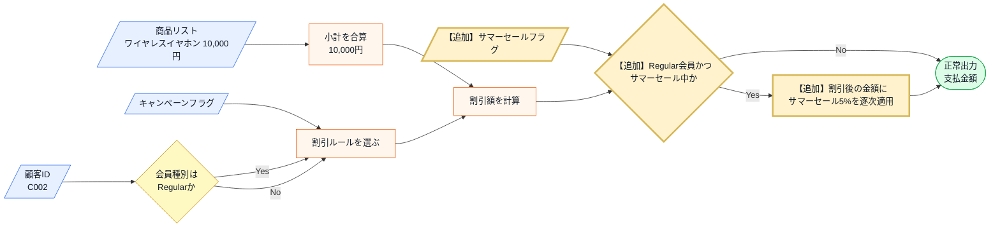
```mermaid
flowchart LR
    A[/商品リスト<br>ワイヤレスイヤホン 10,000円/]:::input --> G[小計を合算<br>10,000円]:::process
    C[/顧客ID<br>C002/]:::input --> D{会員種別は<br>Regularか}:::decision
    E[/キャンペーンフラグ/]:::input --> H[割引ルールを選ぶ]:::process
    S[/【追加】サマーセールフラグ/]:::input --> T{【追加】Regular会員かつ<br>サマーセール中か}:::decision
    D -->|Yes| H
    D -->|No| H
    G --> I[割引額を計算]:::process
    H --> I
    I --> T
    T -->|Yes| U[【追加】割引後の金額に<br>サマーセール5%を逐次適用]:::process
    T -->|No| J([正常出力<br>支払金額]):::normal
    U --> J

    classDef input fill:#e7f0ff,stroke:#2563eb,color:#111827;
    classDef process fill:#fff7ed,stroke:#ea580c,color:#111827;
    classDef decision fill:#fef9c3,stroke:#ca8a04,color:#111827;
    classDef normal fill:#dcfce7,stroke:#16a34a,color:#111827;
    classDef changed fill:#fff2cc,stroke:#d6b656,stroke-width:3px,color:#111827;
    class S,T,U changed;
```

この図から読み取ることは、次の3点です。

- 商品リスト・顧客ID・キャンペーンフラグの入力と、小計の合算・割引ルールの選択・割引額の計算は、1-1のまま変わらない。
- 新しい入力はサマーセールフラグで、割引額を計算したあとの金額に5%を掛ける「逐次適用」という加工が1つ加わる。
- Premium会員は新しい判定でNo側を通るため、変更後も支払金額は変わらない。

変更後も、エラー条件は正常系図へ混ぜずに別で確認します。

| エラー条件 | どこで分かるか | 出力 | 保存・通知などの副作用 |
|---|---|---|---|
| 顧客IDが顧客データに存在しない | 顧客IDから会員種別を取得する前 | 未登録顧客エラー | なし |
| 顧客情報取得に失敗する | 顧客データ取得時 | 顧客情報取得エラー | なし（掲載コードでは発生しない。実運用のDB／API失敗を代替する`try`/`catch`で表す） |
| 注文の商品リストが空 | 小計を合算する前 | 空注文エラー | なし |

図に加わった「逐次適用」が実際にコードのどこへ書かれるかは、フェーズ3で変更を試すコードと、フェーズ7の最終コード・実行結果で追います。

**フェーズ1のまとめ：今回追う変更ID一覧**

このフェーズで確定した変更依頼を一覧にして締めます。フェーズ2でこの変更IDを仮説・ヒアリングへ、フェーズ3で一つずつ試して痛みへ、と順につなぎます。

| 変更ID | 変更依頼の要点 | 関係する要求ID（追加は変更後ID） |
|---|---|---|
| 変更ID1 | Regular会員へサマーセール5%を追加し、Premiumは対象外にする | 要求ID2、要求ID5、要求ID7 |
| 変更ID2 | 既存キャンペーンと重なる場合は逐次割引する | 要求ID5、要求ID7 |

フェーズ1でシステムの現状と変更要求が把握できました。次のフェーズ2では、「何を変え、何を守るか」を整理します。

## 🟣 フェーズ2：仮説立案 ―― 何が変わるかを観察し、ヒアリングで裏付ける
### 2-1：変わりそうな仕様の見当をつける

ここで作る一覧は、思いつきで「変わりそう」と感じたものを並べる表ではありません。フェーズ1で確認した仕様・動作例・クラス図を材料に、次の順で候補を絞ります。

1. 仕様図と動作例から、入力・判定・加工・出力のうち条件や値が変わりそうな箇所を拾う。
2. その箇所が、1-3のどのクラス・メソッドに書かれているかを対応づける。
3. その仕様が、どんな理由で、何をきっかけに、どのくらいの頻度で変わりそうかを仮説として書く。
4. 逆に、当面変えない前提にできる処理の骨格も分けておく。

この手順で見ると、「金額を計算する」という大きな処理全体ではなく、その中のどの条件・計算式・判定が変更候補なのかを読者自身で追えるようになります。

フェーズ1で整理した仕様をもとに、「どの仕様が変わりやすいか」を見立てます。責務配置の評価は、変更を当てたときの痛みと合わせてフェーズ3・4で確認します。

変わりそうな割引ルールは、1-3のクラス図の中心 `PaymentCalculator` の `calculate()` の中にあります。この中身を、小計の合算と各割引に分け、誰がどんなきっかけで変えるかと一緒に整理します。

| `calculate()` 内の処理 | 変える主体・きっかけ | 変わりやすさの見立て |
|---|---|---|
| 商品単価の合算ロジック | 仕様の根幹。めったに変わらない | 低い |
| プレミアム割引の条件・割引率 | 料金・プロモーション管理の施策 | 高い |
| キャンペーン割引の条件・割引率 | マーケティング・通知管理の施策 | 高い |

見えてくるのは、**1つの `calculate()` を、料金・プロモーション管理とマーケティング・通知管理という別々の主体が、別々のきっかけで変えうる**という見立てです。

ただし、この時点では「責務が混在しているから分けるべき」とは決めつけません。責務は設計者が決めるもので、「割引も含めて支払金額を計算する」という今の責務配置は、それ自体が間違いというわけではありません。複数の主体が同じメソッドを変えうることが**実際に痛みになるか**はフェーズ3で変更を当てて確かめ、なぜ辛いのか（＝変わる理由の異なるものが同居している）はフェーズ4で原因として言語化します。2-1は、その検証対象に当たりをつける段階です。

#### ヒアリングで確認すること

2-1の見当のうち、事実だけでは決められない点を質問へ変換します。この質問を先に決めてから、2-3のヒアリングへ進みます。

| 見当 | 現時点の仮説 | 確認する質問 | 確認先 |
|---|---|---|---|
| 割引条件 | 新しい企画が継続して増える | 季節キャンペーンは今後も追加されるか | マーケティング部 |
| 計算式 | パーセント引き以外も増える | 定額割引など別の計算方法を予定しているか | マーケティング部 |

### 2-2：今回の変更で確実に変わること

1-5で確定した変更IDを、そのまま今回確実に変わることとして確認します。章ごとに異なる色や記号は使わず、以降でも同じ変更IDで追跡します。

- **変更ID1：Regular会員へサマーセール5%を追加し、Premium会員は対象外にする**
- **変更ID2：既存キャンペーンと重なる場合は逐次割引する**

ただし「この変更が1回限りか、今後も続くか」によって、どこまで設計を変えるべきかが大きく変わります。関係者に確認します。

#### 補足：ヒアリングに向けた背景確認

このシステムは、ある中堅ECサイトの決済計算を担っています。数年前にサービスが立ち上がった当初は、お客様が商品を選んでカートに入れ、そのままの合計金額で決済するシンプルな流れでした。

しかし、サービスが成長し競合他社との競争が激しくなるにつれて、様々な施策が打たれるようになりました。新規顧客向けの期間限定キャンペーンや、リピーター向けのプレミアム会員制度など、ビジネス上の要求は日々増えています。

### 2-3：関係者ヒアリング


- **開発者：** 「サマーセールの件、承知しました。今後もこのような新しい割引ルールは追加される予定はありますか？」
- **マーケティング部リーダー：** 「はい、もちろんです。秋にはハロウィンキャンペーン、冬には年末大感謝祭など、毎月のように新しい企画を予定しています。」
- **開発者：** 「ちなみに、割引の計算方法自体が変わることはありますか？今はパーセント引きですが、定額割引などです。」
- **マーケティング部リーダー：** 「実は秋のキャンペーンでは、一律1000円引きクーポンの配布を検討しています。これも対応できますか？」

### 2-4：ヒアリングで判明した将来リスク

ヒアリングで浮かび上がった「確定ではないが、近い将来起こりうる変化」を記録します。これは今回の設計判断の材料です。

| リスクID | 将来リスク | 時期の目安 | 根拠 |
|---|---|---|---|
| リスクID1 | 新しい割引ルールの追加が毎月続く | 継続的に | マーケティング責任者から直接確認 |
| リスクID2 | 計算方法が「パーセント引き」から「定額引き」に変わる | 数ヶ月後 | 秋のクーポン企画として言及 |

なお、計算結果の出力方法自体（画面表示からレシート印刷・APIレスポンスへの変更）もヒアリングで話題になりましたが、今回の変更対象ではないためリスクIDには起こさず対象外として記録します。出力方法は割引計算の軸とは独立した境界であり、本章で扱う割引ルールの分離には影響しません。

フェーズ2で「今変わること（確定）」と「将来変わるかもしれないこと（リスク）」を分けて整理できました。次はリスクをもう少し具体的な「仕様の変化」として整理します。

### 2-5：変わる見込みと当面安定の前提を確定する

2-4のリスクIDを、設計で扱う変化軸へ整理します。ここで「はい」とした項目は、機能を先に実装するという意味ではありません。フェーズ6で、**変えられるようにする部分を当面守る部分から分離し、その変化が起きても影響を局所化できる構造か**を判断するための印です。

| リスクID・変化軸 | 変わる見込み | 変えられるようにする部分 | 当面安定として守る部分 |
|---|---|---|---|
| リスクID1：新しい割引ルールの追加が毎月続く | はい | 割引ルールの追加と選択 | 小計の合算、注文処理、支払金額の返却 |
| リスクID2：計算方法が「パーセント引き」から「定額引き」に変わる | はい | 割引条件と金額計算式 | 割引前金額の受け渡し、注文処理、結果表示 |

したがって2-5の出力は、「割引ルールと計算式は差し替え対象にし、小計の合算から結果表示までの流れは守る」という設計条件です。フェーズ3では変更ID1・変更ID2だけを現在の構造へ適用し、このリスクIDはフェーズ6で採用構造を評価するときに使います。

---

## 🟣 フェーズ3：問題特定 ―― 変更の痛みを発見する
### 3-1：変更を試みる

「サマーセール：Regular会員に5%オフを追加」を現在の `PaymentCalculator` に追加してみます。変更前のコードはこうでした。

> **抜粋の前提（周辺は現状のまま）：** ここから示すのは、1-4[試行3]で示した `PaymentCalculator::calculate(const Order& order, const std::string& memberType, const CampaignContext& context)` のうち、`memberType` と `context` を入力に割引を選ぶ部分です。商品の合算はこの直前で `order.items` から `total` へ済んでいます。呼び出し側では `OrderProcessor` が `CustomerDatabase` から会員種別を取得し、この関数の戻り値を `CheckoutResultRenderer` へ渡します。省略した小計計算と外側の処理は変更せず、削除もしません。

```cpp
if (memberType == "Premium") {
    total = total * 80 / 100;   // 20%引き
} else if (memberType == "Regular"
           && context.isCampaignActive) {
    total = total * 90 / 100;   // 10%引き
}
```

- これは1-4[試行3]の `calculate` にある割引部分です。Premiumを先に見て、次にRegular＋キャンペーンを見ます。
- ここに「Regular会員へサマーセール5%引きを追加」を入れたい、というのが今回の変更です。

同じ `PaymentCalculator::calculate()` の割引判定部分へサマーセールの条件を追加すると、以下のようになります。

```cpp
// サマーセール対応：Regular会員向けに条件を追加
if (memberType == "Premium") {
    total = total * 80 / 100;  // 20%引き（サマーセール対象外）
} else if (context.isSummerSale && context.isCampaignActive) {
    total = (total * 90 / 100) * 95 / 100; // 逐次割引（Regular会員）
} else if (context.isSummerSale) {
    total = total * 95 / 100;  // 5%引き（Regular会員）
} else if (context.isCampaignActive) {
    total = total * 90 / 100;  // 10%引き
}
```

増えたのは下の3つの分岐です。あわせて、既存のキャンペーン分岐からは `memberType == "Regular"` の条件が落ちています（会員種別は2種なので、直前でPremiumを処理していれば残るのはRegularだけになるため）。サマーセールは「Regular会員のみ」「キャンペーンと重なると逐次割引」という複合条件なので、`else if` を1行足すだけでは済まず、既存分岐の書き換えまで巻き込みます。

- `isSummerSale && isCampaignActive` → キャンペーン10%引きの後にサマーセール5%引きを重ねる（`* 90 / 100` のあと `* 95 / 100`）。15%引きとして `* 85 / 100` する仕様ではありません。
- `isSummerSale` のみ → サマーセール5%引き（`* 95 / 100`）。
- `isCampaignActive` のみ → 従来のキャンペーン10%引き。
- この逐次割引の分岐を入れ忘れると、両方有効な顧客の金額がずれます。1つの施策追加で、既存分岐の順序と組み合わせまで見直すことになります。

変更後のコードを実行すると、次のような結果になります（1万円の注文で4ケースを確認）。

```cpp
// 変更後のクラスを使った動作確認
int main() {
    CustomerDatabase db;
    CheckoutResultRenderer renderer;
    OrderProcessor processor(db, renderer);
    CampaignContext context;
    Order order;
    order.items.push_back(Item("ワイヤレスイヤホン", 10000));

    // C001（Premium）/ キャンペーンあり / サマーセール中
    // → Premium優先（キャンペーン・サマーセール無効）
    order.customerId = "C001";
    context.isSummerSale     = true;
    context.isCampaignActive = true;
    processor.process(order, context);

    // C002（Regular）/ キャンペーンあり / サマーセール中
    // → 逐次割引（10%引き後の金額に5%引き）
    order.customerId = "C002";
    context.isSummerSale     = true;
    context.isCampaignActive = true;
    processor.process(order, context);

    // C002（Regular）/ キャンペーンなし / サマーセール中 → 5%引き
    order.customerId = "C002";
    context.isSummerSale     = true;
    context.isCampaignActive = false;
    processor.process(order, context);

    // C002（Regular）/ キャンペーンなし / サマーセールなし → 割引なし
    order.customerId = "C002";
    context.isSummerSale     = false;
    context.isCampaignActive = false;
    processor.process(order, context);

    return 0;
}
```

実行対象コード：3-1の変更試行コード
対応する動作例：1-5の変更後の動作例
確認したいこと：サマーセール追加により、既存の `PaymentCalculator` に割引分岐が増えること

実行結果：

```
田中 一郎 さんの注文: ワイヤレスイヤホン 10000円
  条件: 会員=Premium, キャンペーン=あり, サマーセール=あり
  小計 10000円 → 支払金額 8000円
佐藤 花子 さんの注文: ワイヤレスイヤホン 10000円
  条件: 会員=Regular, キャンペーン=あり, サマーセール=あり
  小計 10000円 → 支払金額 8550円
佐藤 花子 さんの注文: ワイヤレスイヤホン 10000円
  条件: 会員=Regular, キャンペーン=なし, サマーセール=あり
  小計 10000円 → 支払金額 9500円
佐藤 花子 さんの注文: ワイヤレスイヤホン 10000円
  条件: 会員=Regular, キャンペーン=なし, サマーセール=なし
  小計 10000円 → 支払金額 10000円
```

上から順に、Premium優先（10000円→8000円）、Regularの逐次割引（10000円→9000円→8550円）、Regularのサマーセール単独（10000円→9500円）、割引なし（10000円のまま）です。小計→支払金額が、1-5の変更後の動作例と対応していることを確認できます。

この変更後コードを見ると、問題が浮かび上がります。

一見シンプルな追加に見えますが、サマーセールは「Regular会員のみ」「キャンペーンと重複した場合は逐次割引」という複合条件を持っています。単純に `else if` を1行追加するだけでは済まず、`context.isSummerSale && context.isCampaignActive` の組み合わせを考慮した分岐も追加する必要があります。さらに、`CampaignContext` クラスに `isSummerSale` フラグを追加する作業が発生します。

```cpp
// CampaignContext クラスへの変更（サマーセールフラグの追加が必要）
class CampaignContext {
public:
    bool isCampaignActive = false;
    bool isSummerSale = false;   // ← 変更ID1で追加
};
```

- 変更ID1のために、計算分岐だけでなく`CampaignContext`（1-4[試行1]）にも`isSummerSale`を追加しました。一つの確定要求が入力データと計算本体の両方へ波及しています。

変更ID2の逐次割引を満たすには、既存キャンペーンとサマーセールの適用順を同じ `if` 群の中で調整します。1件の確定要求だけでも、条件の追加だけでなく既存分岐の計算順序まで確認対象になることが分かります。

### 3-2：変更影響グラフ

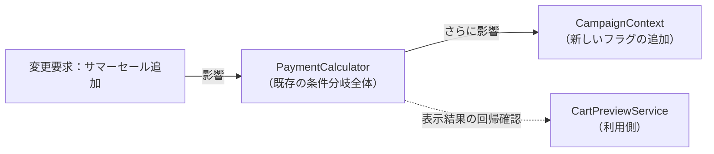
```mermaid
graph LR
    T1["変更要求：サマーセール追加"]
        -->|影響| A["PaymentCalculator<br>（既存の条件分岐全体）"]
    A -->|さらに影響| B["CampaignContext<br>（新しいフラグの追加）"]
    A -.->|表示結果の回帰確認| C["CartPreviewService<br>（利用側）"]
```

新しいルールを1つ追加するだけで、既存の計算ロジック全体とデータクラスを修正し、同じ計算結果を表示するカートプレビューも回帰確認する必要があります。ここでは、**ソースを修正する場所**と**動作を再確認する場所**を区別します。

### 3-3：痛みの言語化

**1つ目：影響範囲が広いこと。** 変更ID1のサマーセールを追加するために、`CampaignContext`と`PaymentCalculator`を同時に修正し、既存のPremium・キャンペーン割引も回帰確認しました。

**2つ目：既存分岐の解読が必要なこと。** 変更ID2の逐次割引を入れる位置を決めるために、`PaymentCalculator`内の既存キャンペーン条件、Premium条件、計算順序をまとめて読み直す必要がありました。

**3つ目：適用順序・排他条件を壊しやすい。** 先ほどのサマーセール追加で見たように、「キャンペーン後にサマーセールを掛ける」逐次割引や「Premiumは他割引と併用しない」排他条件が、個別の割引計算と同じ `if-else` に埋もれています。新しい割引を差し込むと、既存の適用順序や排他を意図せず崩しやすくなります。

---
> **📌 問題（確定）**
> 変更ID1・変更ID2を適用すると、`PaymentCalculator`と`CampaignContext`を修正し、その計算を使う`CartPreviewService`まで回帰確認する必要があった。割引条件・計算式・入力フラグが計算本体に混在し、一つの確定変更が広い影響確認を強いた。
---

観測した3つの痛みへ`問題ID`を付け、どの変更IDから来たかを対応づけます。この問題IDが、フェーズ4の原因ID、フェーズ5の課題IDへ順につながります。

| 問題ID | 観測した痛み（変更途中コード） | 起点の変更ID |
|---|---|---|
| 問題ID1 | サマーセール追加で `PaymentCalculator` と `CampaignContext` を同時修正し、既存割引まで回帰確認した | 変更ID1 |
| 問題ID2 | 逐次割引の差し込み位置を決めるのに、既存の施策条件・会員条件・計算順序を読み直した | 変更ID2 |
| 問題ID3 | 適用順序・排他条件が個別割引と同じ `if-else` に埋もれ、差し込みで既存順序を壊しやすい | 変更ID1 |

フェーズ3で「変更が辛い」ことが確認できました。次のフェーズ4では、なぜ辛いのかを構造的に言語化します。

---

## 🟠 フェーズ4：原因分析 ―― なぜ辛いのかを構造で言語化する
### 4-1：痛みの根源を探る（観察と原因）

フェーズ3で確認した「変更の辛さ」は、コードのどこから来ているのでしょうか。コードを注意深く観察すると、痛みを引き起こしている2つの事実が浮かび上がってきます。

第一に、新しい割引を追加するとき、なぜ毎回 `PaymentCalculator` を開かなければならないのでしょうか？
フェーズ2で見立てたとおり、現状の PaymentCalculator はこれらすべての割引ルールを自分の責任として持っています。フェーズ3で痛みを確かめた今、その配置の問題がはっきりします。問題は、その責任を**複数の業務機能からの変更要求によって変えなければならない点**です。複数の業務機能の変化が1つのクラスに集中してしまっているため、仕様変更の影響がここに密集してしまうのです。

それは、このクラス自身が「プレミアム会員なら20%引き」「サマーセールなら5%引き」といった**具体的な割引の条件をすべて直接知ってしまっている（抱え込んでいる）**からです。

第二に、なぜ変更の影響範囲が読めず、全テストをやり直す恐怖を感じるのでしょうか？
それは、「商品をループで回して金額を足し合わせる」という土台となる骨格ロジックと、「特定のキャンペーンを判定して割引する」というビジネスロジックが、**同じメソッドの中で物理的に混ざり合っている**からです。

この「症状（痛み）」と「根本原因」を整理すると、以下のようになります。

| **観察した症状（痛み）** | **構造的な原因（痛みの根源）**                                                                                                                    |
| -------------- | ------------------------------------------------------------------------------------------------------------------------------------ |
| 影響範囲が読めない恐怖    | `PaymentCalculator` が各割引の具体的な条件を直接知っているから                                                                                            |
| 検索・解読コストの増大 | 変わる理由が違う2つのもの（「合算ロジック」と「割引条件」）が同じメソッドの中に混在しているから。異なる理由で変わるロジックが分離されず、同じメソッド内に直接書かれているため、割引条件が変わるたびに合算ロジックも含めたメソッド全体を確認する作業が発生する。 |
| 逐次割引の順序を壊しやすい | 「キャンペーン後にサマーセールを掛ける」「Premiumは他割引と併用しない」といった適用順序・排他条件が、個別の割引計算と同じ `if-else` に埋まっているから。 |

### 4-2：変わるもの/変わってほしくないもの

> **「変わらないもの」と「変わってほしくないもの」は異なります。** 「変わらないもの」は経験的事実（今まで変わっていない）、「変わってほしくないもの」は設計意図（ここを安定させてほかを守りたい）です。ここで整理するのは後者です。

| **変わり続けるもの** | **変わってほしくないもの** |
|---|---|
| 各キャンペーンの適用条件（サマーセール、ハロウィン等） | 商品単価を順番に足す合算ロジック |
| 割引額の計算方法（パーセント引き・定額引きなど） | 計算を依頼して最終金額を受け取る呼び出し側のフロー |

**【変わる部分（変わり続けるif文と計算）】**

1-3で示した `calculate` メソッドの割引判定ブロックが、キャンペーンのたびに変わる箇所です。フェーズ3でサマーセールを足した後の割引判定を、省略せず全体で示します。

```cpp
        // 割引：会員種別・キャンペーン・サマーセールで割引率を決める
        if (memberType == "Premium") {
            total = total * 80 / 100;              // 20%引き（サマーセール対象外）
        } else if (context.isSummerSale && context.isCampaignActive) {
            total = (total * 90 / 100) * 95 / 100; // 逐次割引（10%引き後に5%引き）
        } else if (context.isSummerSale) {
            total = total * 95 / 100;              // サマーセール5%引き
        } else if (context.isCampaignActive) {
            total = total * 90 / 100;              // キャンペーン10%引き
        }
        // ← 新しいキャンペーンが来るたびに、ここに else if が増え続ける
```

**【変わってほしくない部分（守りたい骨格）】**

1-3の `PaymentCalculator::calculate(const Order&, const std::string&, const CampaignContext&)` のうち、「商品を順に足して合計を出し、最終金額を返す」という骨格部分は変えたくありません。次のコードのうち、割引判定を挟む前後の小計計算と `return` が守りたい骨格です。

```cpp
        int total = 0;
        for (const auto& item : order.items) {
            total += item.price;             // 小計計算（変えたくない）
        }
        // ← ここに「変わる部分」（割引判定）が割り込んでいる
        return total;                        // 結果を返す（変えたくない）
```

### 4-3：接続点に漏れている判断や前提を確認する

ここでの「確認すること」は、前節までに見つけた原因から抽出します。まず、原因文から「守りたい骨格」と「変わる差分」を分けます。次に、その差分を動かすために骨格側が知ってしまっている名前・条件・順序・型を拾います。最後に、接続点に残す最小の約束を、値・型・操作・イベントとして書きます。

原因によって、接続点で見る抽象観点は変わります。条件分岐が原因なら条件・定数・選択基準を見ます。処理手順が原因なら呼び出し順・前後条件・失敗時分岐を見ます。生成判断が原因なら具体クラス名・生成条件・登録場所を見ます。通知や外部連携が原因なら通知先・タイミング・成否の扱いを見ます。データや状態が原因なら、境界を流れる値・型・状態を見ます。

今、`PaymentCalculator`は割引ルールの条件（`memberType == "Premium"`や`isSummerSale`等）を自分の中に抱えています。接続点で見ると、計算の骨格が必要としているのは「合計金額を渡し、割引後の金額を受け取ること」だけです。それにもかかわらず、骨格側が個々の適用条件と割引率まで知っています。

現在の `PaymentCalculator` は、すべての割引ルールを自分自身の中に直接抱え込んでいます。同じ構造の分岐が並んでいること自体が接続点の重要な判断材料なので、1-4のコードを略さずに再掲します。

**【接続点へ割引条件が漏れているコード】**
```cpp
class PaymentCalculator {
public:
    int calculate(const Order& order,
                  const std::string& memberType,
                  const CampaignContext& context) {
        // (1) 小計：商品の単価を全部足す（守りたい骨格）
        int total = 0;
        for (const auto& item : order.items) {
            total += item.price;
        }

        // (2) 割引ルール（具体）を、自分自身で直接判断して処理している
        if (memberType == "Premium") {
            total = total * 80 / 100;   // 適用条件も割引率も骨格側にある
        } else if (memberType == "Regular" && context.isCampaignActive) {
            total = total * 90 / 100;   // 同じ構造の分岐が施策の数だけ並ぶ
        }
        // どちらにも当てはまらなければ割引なし（定価）

        return total;                   // 結果を返す（守りたい骨格）
    }
};
```

新しいキャンペーンが増えるたびに、計算の骨格を持つクラスを開き、`else if`を追加する作業が発生します。割引ルールの適用条件（`memberType == "Premium"` など）と割引率（`* 80 / 100` など）が、接続点を越えて骨格側へ漏れているためです。

決済の合算ロジックと個別の割引ルールは、変わる理由が全く異なります。これらが同じ場所に混在していることが、根本原因として確認できました。

今回着目する接続点は、「合計金額」と「割引後の金額」を受け渡す境界です。個々のキャンペーン条件は、この境界の外へ移せます。

---
> **📌 原因（確定）**
> 割引ルールが「毎月追加される」と確認できているのに、その全種類を`PaymentCalculator`が抱え込んでいる。追加のたびに計算の骨格を開く必要があり、割引担当の変更が注文計算の再テストへ波及する。
---

フェーズ3の問題IDに対応づけて、構造上の原因へ`原因ID`を付けます。次のフェーズ5は、この原因IDから課題IDを導きます。

| 原因ID | 構造上の原因（何が同じ責任へ集まっているか） | 対応する問題ID |
|---|---|---|
| 原因ID1 | 施策選択の流れが、会員種別・施策条件・優先度・適用順序まで抱えている | 問題ID2・問題ID3 |
| 原因ID2 | 金額計算の骨格が、施策ごとの割引計算式まで抱えている | 問題ID1 |

問題ID1の「同時修正」は、選択条件（原因ID1）と計算式（原因ID2）が同じクラスへ同居していることの複合症状です。したがって、問題ID1は課題ID1と課題ID2の両方が分離されて初めて解消します。

フェーズ4で根本原因が言語化できました。「どこを分けるか」は明確です。次のフェーズ5では、フェーズ2で確定した変化の見込みと、フェーズ4で整理した守りたい骨格を振り返りながら、その境界で実際に何が流れているかを値・型のレベルで具体化します。

---

## 🟡 フェーズ5：課題定義 ―― 原因から課題を検討して確定する

フェーズ4で確定した原因は、まだ課題そのものではありません。まず変えるべき構造を候補として導き、システム全体で候補の関係を整理してから、解くべき接続点を確定します。

### 5-1：原因から課題候補を洗い出す

| 原因ID・確定した事実 | そのままだと残る痛み | 課題候補 | 候補を導いた理由 |
|---|---|---|---|
| 原因ID1：割引選択の流れが会員種別・施策条件・優先度を知る | 施策追加のたびに選択処理へ分岐が増える | 施策ごとの適用条件を選択の流れから分離する | 施策と選択手順は別の理由で変わる |
| 原因ID2：金額計算の骨格が施策ごとの計算式を知る | 式・適用順の変更で小計計算まで再確認する | 施策ごとの計算式を小計計算から分離する | 小計の合算と割引式は別の理由で変わる |

この段階では、解決クラス名・契約名・パターン名・生成場所を決めません。原因のどの構造を変える必要があるかだけを候補にします。

### 5-2：課題候補をシステム全体で評価する

| 課題候補 | 必要性・他候補との関係 | 統合／分割の判断 | 採否 |
|---|---|---|---|
| 適用条件の分離 | 必須。変更ID1で選択処理への分岐追加が観測された | 計算式の分離と連携するが変更理由が異なるため独立 | 採用 |
| 計算式の分離 | 必須。変更ID2で計算骨格と各式の同時修正が観測された | 選択後の共通実行契約として残す | 採用 |

候補を一つずつ部分対策として採用するのではなく、すべてを解いた完成状態から逆算します。変更IDと課題IDは一対一とは限らないため、変更依頼の数に合わせて課題を増減させません。

### 5-3：課題IDと接続点を確定する

評価を通過した候補だけに課題ID1から欠番なくIDを付けます。

| 課題ID・接続点 | 接続するもの・変わる側 | 守る側 | 完了条件 |
|---|---|---|---|
| 課題ID1：ルール選択と個別条件の境界 | **接続:** 会員種別、施策状態、適用順序<br/>**変わる側:** 施策ごとの対象条件・優先度 | 条件に合う施策を順に選ぶ流れ | 施策追加時の主な変更先が、対象条件を持つ新ルールと組み立て時の登録になる |
| 課題ID2：割引実行と金額計算の境界 | **接続:** 適用前金額と適用後金額<br/>**変わる側:** 施策ごとの計算式 | 小計計算と結果返却 | 計算側が個別式を知らず、同じ操作で逐次適用できる |

📌 **システム全体の完了状態**：価格計算は個別施策の条件・式を知らず、選ばれた施策を共通操作で順に適用できる。施策の追加・切替は施策部品と組み立て箇所に閉じる。

課題IDを定義できたので、ここまでの追跡を一列で見渡します。3つの痛みは2つの構造原因へ集約し、2つの課題IDへ結びます。

| 問題ID（フェーズ3の痛み） | 原因ID（フェーズ4の構造原因） | 課題ID（達成目標） |
|---|---|---|
| 問題ID2・問題ID3：選択条件と適用順序の解読・破壊 | 原因ID1：選択の流れが施策条件・優先度・順序を抱える | 課題ID1：適用条件と優先度を選択の流れから分離 |
| 問題ID1：施策追加で選択と計算を同時修正 | 原因ID2：金額計算の骨格が施策ごとの計算式を抱える | 課題ID2：施策ごとの計算式を小計計算から分離 |

この表と完了状態が、そのままフェーズ6の入力です。要求の受入は要求ID、設計課題の解消は課題ID、今回の変更影響は変更IDで別々に追跡します。
## 🔴 フェーズ6：対策検討 ―― システム全体の最終構造を定める

**ここからしばらくは抽象の話です。** 個々のクラスへ入る前に、この章で「何を、どんな構造へ変えるのか」を先に決めます。

#### まず全体像 ―― どんな構造へ変えるか（抽象）

フェーズ4で、一つの`PaymentCalculator`が「小計から支払金額を出す計算の骨格」と「施策ごとに変わる割引ルール（誰に効くかの選択条件と、いくら引くかの計算式）」を同じ場所へ抱えていることを確認しました。対策は、変わる割引ルールを骨格から外し、一つの共通契約の裏へ差し替え可能にすることです。ここで使う構造は、第一部で扱った基本構造です。構造名（と対応するパターン名）を語彙として併記しますが、パターン名から設計を選ぶのではなく、上で確認した「変わる割引ルール」から必要な構造を導きます。

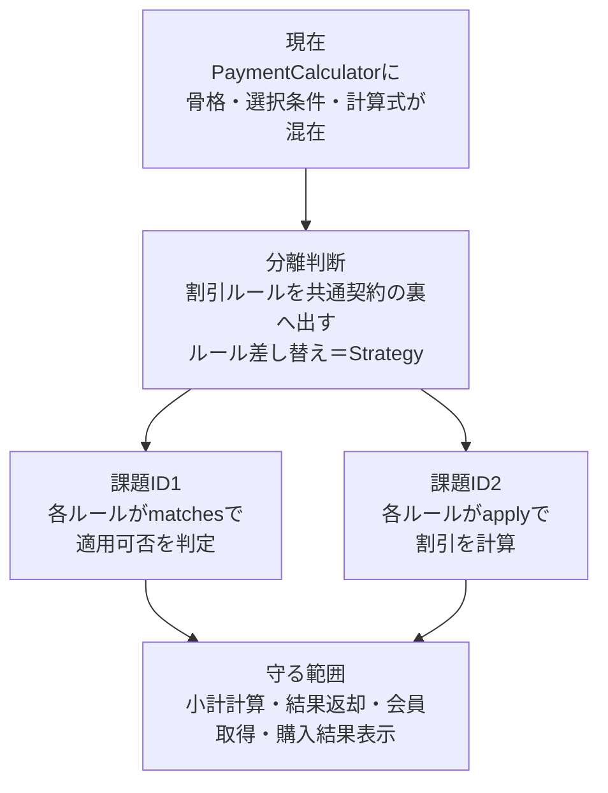
```mermaid
flowchart TB
    A[現在<br/>PaymentCalculatorに<br/>骨格・選択条件・計算式が混在] --> B[分離判断<br/>割引ルールを共通契約の裏へ出す<br/>ルール差し替え＝Strategy]
    B --> C[課題ID1<br/>各ルールがmatchesで<br/>適用可否を判定]
    B --> D[課題ID2<br/>各ルールがapplyで<br/>割引を計算]
    C --> E[守る範囲<br/>小計計算・結果返却・会員取得・購入結果表示]
    D --> E
```

まだクラスの中身は見ません。この段階でつかんでほしいのは「変わる割引ルールを骨格から切り出し、選択（課題ID1）と計算（課題ID2）を一つの契約へまとめて、骨格は契約だけを呼ぶ」という筋だけです。「どのクラスが生成し、どの契約で実行するか」という具体の結論は、この後の課題ID1・課題ID2で決めていきます。決めた結論をまとめて振り返る表は、フェーズ6の末尾（6-3 設計トレース）に置きます。ここでは先に結論表を出しません。

第0章の「設計の醍醐味」の四拍子でいえば、この章は〈共通契約 `IDiscountRule` を見つけて割引ルールを分離〉→〈各ルールを生成〉→〈`main()` が登録し `OrderProcessor` へ注入〉→〈計算側は具体施策を意識しない〉という同じ順序をたどります。

#### 構造ポイントの全貌 ―― どの責任がどこへ移るか

課題ID1・課題ID2の①〜⑥が、どのクラス・関数から、どのクラス・関数へ責任を移すかを先に一覧します。断片コードを読む前に、この表で全貌をつかんでください。各ポイントの詳しいコードは、この後の課題ID節に同じ番号で置きます。

| ポイント | 変更前の所属 → 変更後の所属 | 設計操作・生成／注入／所有 | 次の接続先 |
|---|---|---|---|
| ① 契約 | `PaymentCalculator` が施策の条件と式を直接持つ → `IDiscountRule::matches()` / `priority()` / `apply(int)` | 選択条件・優先度・計算式を1つの契約へまとめる。実体は④で生成し⑤で登録する | ③のoverride |
| ② 骨格 | `calculate()` の `if-else` 連鎖 → `RuleSelector::select()` の反復比較と `PaymentCalculator::calculate()` の合算 | 施策が増えても変えない選択順・計算順を固定する | ①の `matches()` / `apply()` |
| ③ 具体 | 分岐に埋もれた条件と式 → `PremiumDiscount` ほか各施策クラス | 施策ごとの適用条件・優先度・割引式を実装へ閉じる | ①経由で②へ戻る |
| ④ 生成 | `PaymentCalculator` 内の固定分岐 → `main()` のスタック変数 | 組み立て箇所が全施策を生成し所有する | ⑤の `selector.add()` |
| ⑤ 注入 | 利用側が施策を自前で判定 → `RuleSelector::add()` と `OrderProcessor` のコンストラクタ | 参照だけを登録し、選択役を利用側へ注入する（所有は④のまま） | ⑥が呼ぶ `process()` |
| ⑥ 利用開始 | 呼び出し側が施策の順序を知る → `main()` の `processor.process(order, context);` | ④⑤で組み立てた同じ実体を使い、公開操作を1回呼ぶ | ②の `select()` / `calculate()` |

この表の上から順に、変更前はどこに判断が集まっていたか、何をどこへ移すか、誰が生成・注入・所有するか、代表入力がどの順で流れるかを追えます。実行時の呼び出し順は表の並び（①→⑥）ではなく④→⑤→⑥→②→①→③で、課題ID節の末尾に実行接続表として置きます。

#### 接続点の分離・配置・組み立てを決める

課題ID1と課題ID2は別々に採用する対策ではありません。一つの施策では適用条件と計算式が一緒に変わるため、一つのシステムについて分離・配置・組み立てを決めます。ここでいう**組み立て**は、切り出したクラスを生成するだけでなく、所有・登録し、実行時に選択して利用側へ注入するまでの一連の処理です。

判断は次の順序で導きます。課題ID1の条件と課題ID2の式は同じ施策の変更で一緒に変わるため、同じ単位として切り出します。守る側は施策名や具体条件を知る必要がないため、「適用できるか」と「適用するといくらになるか」だけを共通操作にします。守る側が具象クラスを生成すると再び施策追加の影響を受けるため、`main()`が具象ルールとSelectorを生成・所有・登録します。注文確定用の`OrderProcessor`と独立したプレビュー用の`CartPreviewService`へ同じDB・Selectorを渡し、それぞれが実行時に選んだルールで計算役を生成します。

次の表の左列は、**接続点をどのように変えるかを考える三つの観点**です。分離方法で境界に残す操作を決め、配置場所で切り出した責任の置き場を決め、組み立て方法で実行可能なオブジェクトとして繋ぎ直します。

| 接続点を変える観点 | システム全体の考え方 | 課題ID1のコードへの反映 | 課題ID2のコードへの反映 |
|---|---|---|---|
| 分離方法 | 安定側から施策固有の条件と式を外し、共通操作だけを境界に残す | `matches(memberType, context)` を契約にする | `apply(int)` を契約にする |
| 配置場所 | 同じ施策で一緒に変わる条件・式・表示名を、同じ施策オブジェクトへ置く | `PremiumDiscount::matches()` などへ条件を置く | 同じ具象ルールの `apply()` へ式を置く |
| 組み立て方法（生成・所有・登録・注入） | `main()`が具象ルールと`RuleSelector`を生成・所有・登録し、同じDB・Selectorを注文確定とプレビューの二つの入口へ注入する | `PremiumDiscount`などを生成し、`RuleSelector::add()`で登録してから、Selectorを両入口へ渡す | 各入口が選択した`IDiscountRule&`で`PaymentCalculator`を生成する |

表の左から右へ読むと、課題定義の「変わる側／守る側」が、メソッド、クラス、生成・登録・注入のコードへ変換されます。後続のクラス図と課題ID別の①〜⑥は、この3行を同じ順序で具体化します。

#### 設計判断ごとの部分クラス図

課題ID1では、選択手順から個別条件を外し、条件と優先度を`IDiscountRule`の具体実装へ置きます。`RuleSelector`は具象名を分岐せず、登録済みルールを同じ操作で評価します。

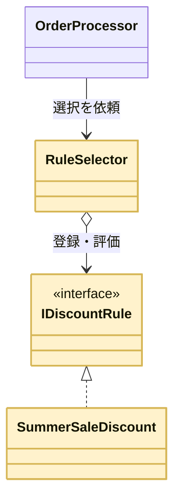
```mermaid
classDiagram
    class OrderProcessor
    class RuleSelector
    class IDiscountRule { <<interface>> }
    class SummerSaleDiscount
    OrderProcessor --> RuleSelector : 選択を依頼
    RuleSelector o--> IDiscountRule : 登録・評価
    IDiscountRule <|.. SummerSaleDiscount
    class RuleSelector:::focus
    class IDiscountRule:::focus
    class SummerSaleDiscount:::focus
    classDef focus fill:#FFF2CC,stroke:#D6B656,stroke-width:2px
```

課題ID2では、計算器に小計計算だけを残し、個別式を共通契約の`apply`へ移します。

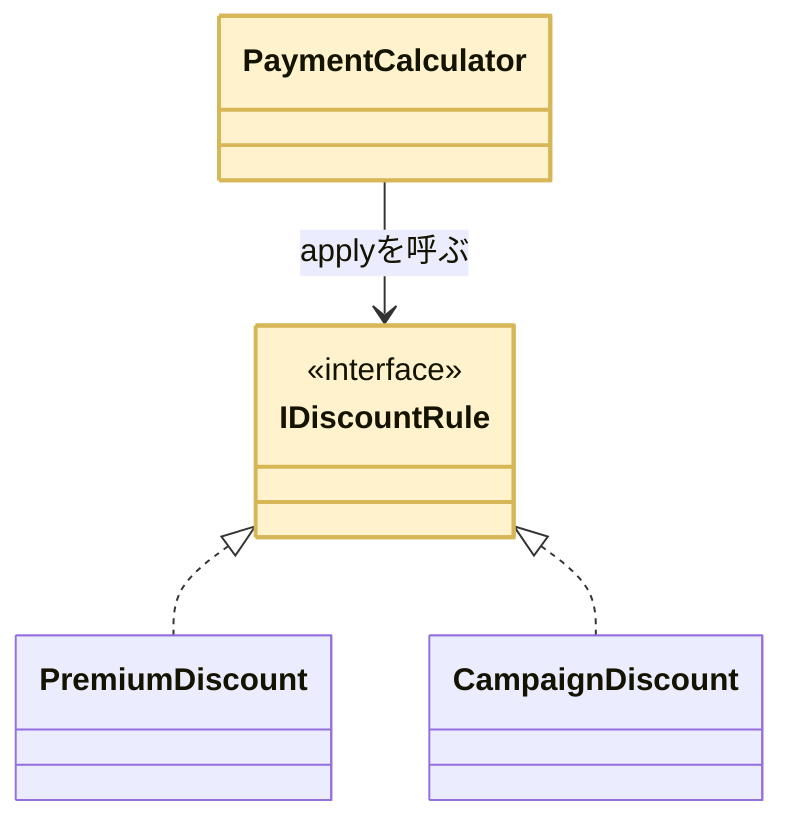
```mermaid
classDiagram
    class PaymentCalculator
    class IDiscountRule { <<interface>> }
    class PremiumDiscount
    class CampaignDiscount
    PaymentCalculator --> IDiscountRule : applyを呼ぶ
    IDiscountRule <|.. PremiumDiscount
    IDiscountRule <|.. CampaignDiscount
    class PaymentCalculator:::focus
    class IDiscountRule:::focus
    classDef focus fill:#FFF2CC,stroke:#D6B656,stroke-width:2px
```

どちらも直前の採用全体図の抜粋です。省略した顧客取得・表示・プレビューは変更しません。次のコードでは、図の順に契約、具体ルール、選択、計算を実装します。

#### システム全体の最終構造を決める

分離・配置・組み立てを決めた時点で、本章の最終構造は**具象ルールの登録システム**一つに定まります。課題ID1と課題ID2を別クラスへ分けると、同じ施策の条件クラスと計算クラスを対応づける新しい管理が必要になり、一緒に変わる知識を再び別々に修正することになります。そのため、本章の課題には合いません。

分離・配置・組み立てから異なる完成構造は分岐しないため、本章では比較を挟まず、この一つの構造をコードへ具体化します。

### 対策検討のクラス図：1-3の責任と依存をどう変えるか

フェーズ1の1-3で作ったクラス図へフェーズ2〜5の判断を反映し、変更後の形へ更新します。

| クラス図を変える材料 | 前工程で確認したこと | クラス図へ反映すること |
|---|---|---|
| フェーズ1のクラス図 | 現在のクラス、操作、依存関係 | 変更前クラス図としてそのまま使う |
| フェーズ2の変化予測 | 割引施策は毎月増える | 毎回変わる責任へ `【移す】` と注記する |
| フェーズ4の原因 | `PaymentCalculator` に小計、条件判定、割引式が混在する | 同じクラスの中で `【残す】` と `【移す】` を分ける |
| フェーズ5の接続点 | 選択側は適用可否、計算側は割引後金額だけを受け取ればよい | 課題ID1の `matches()` と課題ID2の `apply(int)` を共通契約へ置く |

**薄い黄色が着目クラス**です。変更前では`PaymentCalculator`の`【残す】`と`【移す】`、変更後では移動先の`【新設】`に加え、注文確定とプレビューが同じ選択規則を使う接続を追います。矢印は1-3と同じ利用・参照・保持関係です。

**変更前のクラス図（フェーズ3適用後の構造を責任見直し用に再掲）：**

1-3の図に、フェーズ3で変更を当てた結果を反映しています。`CampaignContext` にはフェーズ3で足した `isSummerSale` が入っています。1-3と同じく上から下へ読み、どの責任をどこへ移すかを見直します。

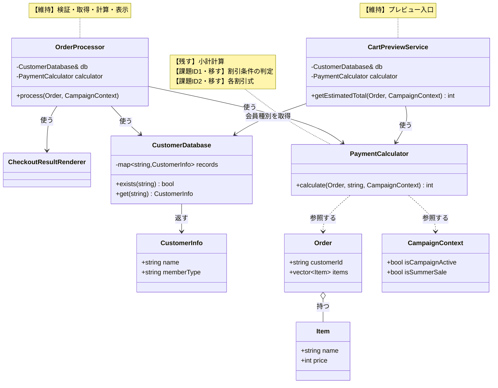
```mermaid
classDiagram
    direction TB
    class CheckoutResultRenderer
    class CustomerDatabase {
        -map~string,CustomerInfo~ records
        +exists(string) bool
        +get(string) CustomerInfo
    }
    class CustomerInfo {
        +string name
        +string memberType
    }
    class OrderProcessor {
        -CustomerDatabase& db
        -PaymentCalculator calculator
        +process(Order, CampaignContext)
    }
    class PaymentCalculator {
        +calculate(Order, string, CampaignContext) int
    }
    class CartPreviewService {
        -CustomerDatabase& db
        -PaymentCalculator calculator
        +getEstimatedTotal(Order, CampaignContext) int
    }
    class Order {
        +string customerId
        +vector~Item~ items
    }
    class Item {
        +string name
        +int price
    }
    class CampaignContext {
        +bool isCampaignActive
        +bool isSummerSale
    }

    OrderProcessor --> CustomerDatabase : 使う
    OrderProcessor --> PaymentCalculator : 使う
    OrderProcessor --> CheckoutResultRenderer : 使う
    CustomerDatabase --> CustomerInfo : 返す
    CartPreviewService --> CustomerDatabase : 会員種別を取得
    CartPreviewService --> PaymentCalculator : 使う
    PaymentCalculator ..> Order : 参照する
    PaymentCalculator ..> CampaignContext : 参照する
    Order o-- Item : 持つ

    note for PaymentCalculator "【残す】小計計算<br/>【課題ID1・移す】割引条件の判定<br/>【課題ID2・移す】各割引式"
    note for OrderProcessor "【維持】検証・取得・計算・表示"
    note for CartPreviewService "【維持】プレビュー入口"

    classDef focus fill:#FFF2CC,stroke:#D6B656,stroke-width:2px,color:#222222
    cssClass "PaymentCalculator" focus
```

変更前は `PaymentCalculator` が小計、選択条件、割引式を持ち、二つの利用側へ影響が伸びます。

課題ID1と課題ID2をクラス図の変更として書くと、次の4操作になります。

1. 課題ID2：`PaymentCalculator` から具体式を外し、小計計算と `apply()` 呼び出しだけを残す。
2. 課題ID1：具体条件を各具象ルールの `matches()` へ移す。
3. 課題ID1・課題ID2：各施策を `IDiscountRule` の実装クラスとして結ぶ。
4. 課題ID1：具体条件を持たない `RuleSelector` を追加し、登録済みルールだけを評価させる。

変更後は同じ3クラスから読み、`PaymentCalculator` の依存先が `IDiscountRule` に変わったこと、条件と式が具象ルールへ移ったこと、選択が `RuleSelector` に分かれたことを確認します。

**採用した変更後のクラス図：**


```mermaid
classDiagram
    direction TB
    class Item
    class Order
    class CampaignContext {
        -vector~string~ activeCampaigns
        +activate(code)
        +isActive(code) bool
    }
    class CustomerInfo
    class CustomerDatabase
    class CheckoutResultRenderer
    class OrderProcessor {
        -CustomerDatabase& db
        -RuleSelector& selector
        +process(Order, CampaignContext)
    }
    class PaymentResult
    class PaymentCalculator {
        -IDiscountRule& rule
        +calculate(Order) PaymentResult
    }
    class CartPreviewService {
        -CustomerDatabase& db
        -RuleSelector& selector
        +getEstimatedTotal(Order, CampaignContext) PaymentResult
    }
    class IDiscountRule {
        <<interface>>
        +matches(memberType, context) bool
        +apply(total) int
        +name() string
        +priority() int
    }
    class RuleSelector {
        +add(rule)
        +select(memberType, context) IDiscountRule
    }
    class PremiumDiscount
    class CampaignDiscount
    class SummerSaleDiscount
    class SummerSaleAndCampaignDiscount
    class NoDiscount

    Order o--> Item
    CustomerDatabase o--> CustomerInfo
    OrderProcessor --> CustomerDatabase : 使う
    OrderProcessor --> RuleSelector : 選ぶ
    OrderProcessor --> PaymentCalculator : 組み立てる
    OrderProcessor --> CheckoutResultRenderer : 使う
    CartPreviewService --> CustomerDatabase : 使う
    CartPreviewService --> RuleSelector : 選ぶ
    CartPreviewService --> PaymentCalculator : 組み立てる
    PaymentCalculator --> IDiscountRule : 使う
    PaymentCalculator ..> Order : 参照する
    PaymentCalculator ..> PaymentResult : 返す
    CartPreviewService ..> Order : 参照する
    CartPreviewService ..> CampaignContext : 参照する
    CartPreviewService ..> PaymentResult : 返す
    RuleSelector o--> IDiscountRule : 登録する
    RuleSelector ..> CampaignContext : 参照する
    IDiscountRule <|.. PremiumDiscount
    IDiscountRule <|.. CampaignDiscount
    IDiscountRule <|.. SummerSaleDiscount
    IDiscountRule <|.. SummerSaleAndCampaignDiscount
    IDiscountRule <|.. NoDiscount

    note for PaymentCalculator "【課題ID2・残した】小計計算<br/>具体的な式を知らない"
    note for OrderProcessor "注文確定を処理し<br/>選択したルールで計算役を生成"
    note for CartPreviewService "注文確定とは別の入口<br/>同じDB・Selectorを使う"
    note for IDiscountRule "【課題ID1】matches条件<br/>【課題ID2】apply計算<br/>具象実装はmain()が生成・所有"
    note for RuleSelector "【課題ID1・新設】全matchesを評価しpriority最高を選ぶ<br/>main()が生成・ルール登録"
    note for PremiumDiscount "【課題ID1】Premium条件<br/>【課題ID2】20%引き"

    classDef focus fill:#FFF2CC,stroke:#D6B656,stroke-width:2px,color:#222222
    cssClass "OrderProcessor,PaymentCalculator,IDiscountRule,RuleSelector,PremiumDiscount,CampaignDiscount,SummerSaleDiscount,SummerSaleAndCampaignDiscount,NoDiscount" focus
```

クラス図の変更と、図だけでは表しにくい生成・所有の責任をコードへ対応させると、次のようになります。`main()`はクラスではないためクラスとして追加せず、生成場所として表に明記します。

「詳しく解く節」の①〜⑥は、第0章で定義した共通の読み順です。①契約、②安定骨格、③具体実装、④生成・所有、⑤登録・注入、⑥契約経由の実行を表します。Strategyでは②に、候補を評価・選択して契約へ委譲する利用側の制御を置きます。番号は章固有の手順や必須工程数ではなく、全章で同じ観点へ戻るための索引です。

| 課題ID | クラス図をどう変えるか | コードレベルで何をするか | 詳しく解く節 |
|---|---|---|---|
| 課題ID1 | `IDiscountRule` の条件判定と `RuleSelector` の登録・選択関係を追加する | `matches()`／`priority()` を各施策へ置き、`main()` が生成・登録し `OrderProcessor` へSelectorを注入する | 課題ID1節（①〜⑥） |
| 課題ID2 | `PaymentCalculator` を小計計算と契約利用だけにする | `apply(int)` を契約に置き、具体式を各施策へ移し、選択済みルールで計算役を生成する | 課題ID2節（①〜⑥） |

このクラス図が、課題ID1・課題ID2を統合したシステム全体の設計結論です。課題IDは図の差分を追うために使い、以降はこの構造に必要なコードだけを示します。フェーズ7では、完成コードがこの設計どおりかを確認するため、同じMermaid定義をそのまま再掲します。

#### 課題箇所のおさらい（フェーズ3の関連コード）

統合表で特定した箇所だけを振り返ります。課題ID1は条件分岐、課題ID2は各分岐内の式です。小計計算など、課題に関係しないコードは省略します。

**掲載箇所：`PaymentCalculator::calculate(const Order&, const std::string&, const CampaignContext&)`** ―― 小計を出した後の割引判定部分。前後の小計計算と `return` は変更しません。

```cpp
// サマーセール対応：Regular会員向けに条件を追加
if (memberType == "Premium") {
    total = total * 80 / 100;  // 20%引き（サマーセール対象外）
} else if (context.isSummerSale && context.isCampaignActive) {
    total = (total * 90 / 100) * 95 / 100; // 逐次割引（Regular会員）
} else if (context.isSummerSale) {
    total = total * 95 / 100;  // 5%引き（Regular会員）
} else if (context.isCampaignActive) {
    total = total * 90 / 100;  // 10%引き
}
```

```cpp
// CampaignContext クラスへの変更（サマーセールフラグの追加が必要）
class CampaignContext {
public:
    bool isCampaignActive = false;
    bool isSummerSale = false;   // ← 追加。データクラスにまでフラグが増え続ける
};
```

完成形では、この「施策を増やすたびにフィールドを足す」構造も残しません。実行時に有効な施策コードを汎用の一覧として受け取ります。

```cpp
class CampaignContext {
private:
    std::vector<std::string> activeCampaigns;
public:
    void activate(const std::string& code) {
        activeCampaigns.push_back(code);
    }
    bool isActive(const std::string& code) const {
        for (const auto& active : activeCampaigns) {
            if (active == code) return true;
        }
        return false;
    }
};
```

### 課題ID1：適用条件と優先度を選択の流れから分離する

**【課題ID1の原因】** 問題ID2・問題ID3（選択条件と適用順の解読・破壊）＝原因ID1（選択の流れが施策条件・優先度・順序を抱える）。この原因を分離対象にします。

**この課題（何を解きたいか）：** 施策を1つ足すたび、選択処理へ `if` 分岐が増え、適用順・排他まで壊しやすい——問題ID2・問題ID3（痛み）／原因ID1です。**選択の流れは固定したまま、施策ごとの適用条件と優先度だけを差し替えられる**ようにするのが課題ID1です。

**どう解決するか（方針）：** 施策を共通契約の裏へ出し、選択役が各施策へ「あなたは適用対象か」を問い合わせる形にします（ルール差し替え構造＝Strategy＋選択役）。①契約 →②候補を評価・選択する安定骨格 →③具体 →④生成 →⑤注入 →⑥実行 の順で組み立てます。②では候補が増えても変えない「全候補へ適用可否を問い合わせ、採用対象を決める」制御を示します。

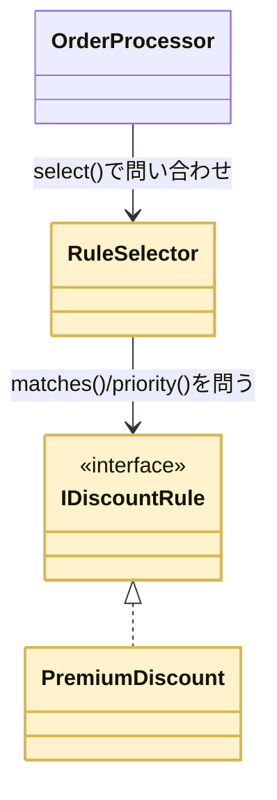
```mermaid
classDiagram
    class OrderProcessor
    class RuleSelector
    class IDiscountRule { <<interface>> }
    class PremiumDiscount
    OrderProcessor --> RuleSelector : select()で問い合わせ
    RuleSelector --> IDiscountRule : matches()/priority()を問う
    IDiscountRule <|.. PremiumDiscount
    class RuleSelector:::focus
    class IDiscountRule:::focus
    class PremiumDiscount:::focus
    classDef focus fill:#FFF2CC,stroke:#D6B656,stroke-width:2px
```

**① 共通契約 `IDiscountRule` を定義する。** 選択に使う `matches()`／`priority()`、計算用 `apply()`（課題ID2で使う）、表示用 `name()` を一つの施策契約へ集めます。`name()` はパターン適用の都合で増やした操作ではありません。要求ID5の購入結果に「適用した割引名」を表示するための出力契約であり、この表示要求がなければ契約から外せます。

```cpp
class IDiscountRule {
public:
    virtual bool matches(const std::string& memberType,
                         const CampaignContext& context) const = 0;
    virtual int apply(int total) const = 0;    // 計算面は課題ID2で詳述
    virtual std::string name() const = 0;
    virtual int priority() const = 0;   // 一致が重なったときの優先度
    virtual ~IDiscountRule() = default;
};
```

**③ 各施策が自分の適用条件と優先度を実装する（選択の流れは書かない）。** 後の `main()` が生成する5種類を、ここですべて定義します。
```cpp
class PremiumDiscount : public IDiscountRule {
public:
    bool matches(const std::string& memberType,
                 const CampaignContext&) const override {
        return memberType == "Premium";
    }
    int apply(int total) const override { return total * 80 / 100; }
    std::string name() const override { return "プレミアム割引"; }
    int priority() const override { return 1; }
};

class SummerSaleAndCampaignDiscount : public IDiscountRule {
public:
    bool matches(const std::string& memberType,
                 const CampaignContext& context) const override {
        return memberType == "Regular"
            && context.isActive("SUMMER_SALE")
            && context.isActive("REGULAR_CAMPAIGN");
    }
    int apply(int total) const override {
        return (total * 90 / 100) * 95 / 100;
    }
    std::string name() const override {
        return "サマーセール+キャンペーン";
    }
    int priority() const override { return 3; }
};

class SummerSaleDiscount : public IDiscountRule {
public:
    bool matches(const std::string& memberType,
                 const CampaignContext& context) const override {
        return memberType == "Regular"
            && context.isActive("SUMMER_SALE");
    }
    int apply(int total) const override { return total * 95 / 100; }
    std::string name() const override { return "サマーセール割引"; }
    int priority() const override { return 2; }
};
```
続いて `CampaignDiscount` です。

```cpp
class CampaignDiscount : public IDiscountRule {
public:
    bool matches(const std::string& memberType,
                 const CampaignContext& context) const override {
        return memberType == "Regular"
            && context.isActive("REGULAR_CAMPAIGN");
    }
    int apply(int total) const override { return total * 90 / 100; }
    std::string name() const override { return "キャンペーン割引"; }
    int priority() const override { return 2; }
};

class NoDiscount : public IDiscountRule {
public:
    bool matches(const std::string&,
                 const CampaignContext&) const override {
        return true;
    }
    int apply(int total) const override { return total; }
    std::string name() const override { return "割引なし"; }
    int priority() const override { return 0; }
};
```

**④ `main()` が全施策を生成・所有する。** どの施策クラスを作るかを知るのは組み立て箇所だけです（スタック上に生成し、`main()` のスコープが所有）。

**掲載箇所：`main()`** ―― 組み立ての先頭。具体施策をスタック上に生成します。

```cpp
PremiumDiscount premium;
SummerSaleAndCampaignDiscount summerAndCampaign;
SummerSaleDiscount summer;
CampaignDiscount campaign;
NoDiscount none;  // matches() は常に true
```

**⑤ 選択役へ登録し、`OrderProcessor` へ注入する。** `RuleSelector` は施策を所有せず参照だけ登録します。登録順は自由で、優先は `priority()` で決まります。

**掲載箇所：`main()`** ―― ④の直後。選択役へ参照を登録し、注文入口へ注入します。

```cpp
RuleSelector selector;
selector.add(premium);            // 参照だけを登録（非所有）
selector.add(summerAndCampaign);
selector.add(summer);
selector.add(campaign);
selector.add(none);               // 登録順は自由（priority()で選ばれる）
OrderProcessor processor(db, renderer, selector);  // 選択役を注入
```

**② 選択の安定骨格。** `RuleSelector::select()` は登録済みの候補を順に評価し、一致した中の最優先を返すだけです。施策が増えても、この反復と比較の形は変わりません。具体条件は契約 `matches()` の向こうにあります。

```cpp
class RuleSelector {
    std::vector<std::reference_wrapper<const IDiscountRule>> rules;
public:
    void add(const IDiscountRule& rule) {
        rules.push_back(std::cref(rule));  // 所有せず参照だけを登録
    }
    const IDiscountRule& select(
            const std::string& memberType,
            const CampaignContext& context) const {
        const IDiscountRule* best = nullptr;
        for (const auto& registered : rules) {
            const IDiscountRule& rule = registered.get();
            if (rule.matches(memberType, context)
                && (best == nullptr
                    || rule.priority() > best->priority())) {
                best = &rule;   // 一致かつ priority() 最大を選ぶ
            }
        }
        if (best == nullptr)
            throw std::logic_error("適用可能な割引ルールがありません");
        return *best;
    }
};
```

**⑥ 利用開始。** 注文確定の入口 `OrderProcessor::process()` が、②の `select()` を呼びます。利用側が `matches()` や具体施策を直接呼ぶことはありません。

**掲載箇所：`main()`** ―― ⑤の直後。利用者操作にあたる1行です。

```cpp
processor.process(order, context);   // ⑥ 利用開始（main から）
```

#### 代表ケースの実行接続

C002（Regular）へキャンペーンとサマーセールが重なる1件を、④から③まで実コードで追います。設計を説明する順は①から⑥ですが、実行時の呼出順は④→⑤→⑥→②→①→③です。

| 実行順・ポイント | 掲載箇所 | 実際のコード接続 | 次の呼出先 |
|---|---|---|---|
| 1. ④生成 | `main()` | `SummerSaleAndCampaignDiscount summerAndCampaign;` ほか全施策をスタックに生成・所有 | ⑤へ |
| 2. ⑤注入 | `main()` | `selector.add(summerAndCampaign);` で参照登録し、`OrderProcessor processor(db, renderer, selector);` で選択役を注入 | ⑥へ |
| 3. ⑥利用開始 | `main()` | `processor.process(order, context);` | `OrderProcessor::process()` |
| 4. ②安定骨格 | `RuleSelector::select(const std::string&, const CampaignContext&)` | 登録リストを反復し `rule.matches(...)` と `rule.priority()` を比較する | `IDiscountRule::matches()` |
| 5. ①契約 | `IDiscountRule::matches(const std::string&, const CampaignContext&)` | 登録された契約へ動的ディスパッチする | `SummerSaleAndCampaignDiscount::matches()` |
| 6. ③具体 | `SummerSaleAndCampaignDiscount::matches()` / `apply(int)` | 自分の適用条件と割引式だけを持つ | 選ばれた参照が②へ戻る |

④で生成した `summerAndCampaign` と、⑤で `add()` した実体と、⑥の呼び出しから②が反復する実体は同じものです。

これで課題ID1の完了条件「施策追加時の主な変更先が、対象条件を持つ新ルールと組み立て時の登録になる」を満たします。選ばれたルールを実際にどう計算へ使うかは、課題ID2で扱います。

### 課題ID2：施策ごとの計算式を小計計算から分離する

**【課題ID2の原因】** 問題ID1（施策追加で計算本体まで同時修正）＝原因ID2（金額計算の骨格が施策ごとの計算式を抱える）。この原因を分離対象にします。

**この課題（何を解きたいか）：** 式や適用順を変えるだけで、小計を合算する計算骨格まで再確認になる——問題ID1（痛み）／原因ID2です。**小計計算の骨格に触れず、施策ごとの割引式だけを差し替えられる**ようにするのが課題ID2です。

**どう解決するか（方針）：** 計算役は施策の具体式を知らず、同じ契約の `apply()` だけを呼びます（課題ID1と同じ `IDiscountRule` の計算面）。施策の生成・選択は課題ID1で済んでいるので、この課題は ①契約（apply）→③具体（apply式）→⑤注入 →⑥実行 に絞ります。

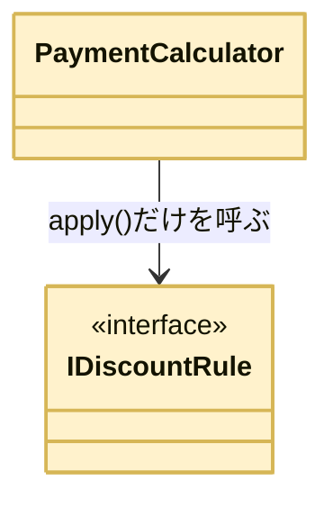
```mermaid
classDiagram
    class PaymentCalculator
    class IDiscountRule { <<interface>> }
    PaymentCalculator --> IDiscountRule : apply()だけを呼ぶ
    class PaymentCalculator:::focus
    class IDiscountRule:::focus
    classDef focus fill:#FFF2CC,stroke:#D6B656,stroke-width:2px
```

**① 契約の計算面 `apply(int)`。** 課題ID1で定義した `IDiscountRule` に含まれる、小計を受けて割引後金額を返す共通操作です。

**③ 各施策が割引式だけを実装する。**（`apply()` 部分。上の③で示した各施策が同じ場所に持ちます。）

**掲載箇所：`PremiumDiscount::apply(int)` と `SummerSaleDiscount::apply(int)`** ―― 上の③で示した各施策クラスが同じ場所に持つ計算面です。式だけを対比します。

```cpp
// PremiumDiscount::apply → total * 80 / 100
// SummerSaleDiscount::apply → total * 95 / 100
```

**⑤ 選択済みルールを計算役へ注入する。** `OrderProcessor` は `selector.select()` の結果参照で `PaymentCalculator` を生成します（具体施策を知りません）。プレビューは要求ID6の独立した操作なので、`CartPreviewService` が同じDBとSelectorを使って別に選択・計算します。

**掲載箇所：`OrderProcessor::process(const Order&, const CampaignContext&)`** ―― 顧客情報を取得した直後。選ばれたルールで計算役を組み立てます。

```cpp
const IDiscountRule& rule = selector.select(memberType, context);
PaymentCalculator calculator(rule);  // 具体ルールを知らない
```

プレビューは要求ID6の独立した操作なので、入口そのものは組み立て側で用意します。

**掲載箇所：`main()`** ―― ⑤の注入行の並び。注文入口とは別に、同じDBとSelectorでプレビュー入口を作ります。

```cpp
// 注文確定とは別に、組み立て時に独立した入口を用意する
CartPreviewService preview(db, selector);
```

**② 計算の安定骨格。** 「商品を順に足して小計を出し、割引後金額を返す」制御順は変わらず、割引式は契約 `apply()` の向こうにあります。

```cpp
class PaymentCalculator {
    const IDiscountRule& rule;
public:
    explicit PaymentCalculator(const IDiscountRule& rule) : rule(rule) {}
    int calculate(const Order& order) {
        int subtotal = 0;
        for (const auto& item : order.items) subtotal += item.price;
        return rule.apply(subtotal);   // 具体式を知らずに適用
    }
};
```

**⑥ 利用開始。** 課題ID1と同じ `processor.process(order, context)` が起点です。②の `calculate()` は `OrderProcessor` の内側から呼ばれ、利用側が `apply()` を直接呼ぶことはありません。

**掲載箇所：`main()`** ―― 課題ID1と同じ1行です。計算の差し替えは②の内側で起きます。

```cpp
processor.process(order, context);   // ⑥ 利用開始（計算は②から自動接続）
```

これで課題ID2の完了条件「計算側が個別式を知らず、同じ操作で逐次適用できる」を満たします。

### 6-1：生成・所有・実行順のまとめ

課題ID1・課題ID2を一本の実行経路へ束ね直します。上の課題別展開は試行錯誤の履歴ではなく、完成構造を理解できる単位へ分けた実装順です。

- 施策ルール：`main()` がスタック生成・所有し、`RuleSelector` は参照だけを登録（非所有）。
- 実行順：注文確定は `OrderProcessor`、事前プレビューは `CartPreviewService` がそれぞれ同じDB・Selectorへ問い合わせ、選択結果で一時的な `PaymentCalculator` を生成して `apply()` を呼ぶ。
- 二つの変化軸（選択条件と計算式）は同じ施策オブジェクトへ集まり、一つの実行経路として接続されます。

### 6-2：システム全体の契約とデータ配置を確定する

採用システムの契約、生成場所、依存注入を一表で確定します。`PaymentResult` は対策の抽象ではなく、小計・支払金額・適用ルール名をログへ渡す結果オブジェクトです。

```cpp
struct PaymentResult {
    int subtotal;              // 割引前の内部数値
    int finalPrice;            // 割引後の内部数値
    std::string appliedRule;   // 選ばれた状態
};
```

| 接続点を変える観点 | システム全体での設計判断 | 変えたくない側が知らなくなる詳細 |
|---|---|---|
| 何を分離するか | 課題ID1の適用条件と課題ID2の計算式を施策ごとの具象ルールへ置く | 具体条件と計算式 |
| どこで生成・選択するか | `main()` が生成・所有し、`RuleSelector` が一致の中から `priority()` 最高を選ぶ | 具体クラスの生成方法と選択条件 |
| どう依存を渡すか | Selectorにはルールを登録し、注文処理とプレビューには同じDB・Selectorを注入する。各入口が選択した `const IDiscountRule&` を計算役へ渡す | 選択済みルールの具体名 |
| 安定側はどう実行するか | Selectorは `matches()`、計算側は `apply()` だけを呼ぶ | 条件・式・生成の詳細 |

非所有参照を使うため、`main()` の具象ルールはSelectorと利用側より長く生存させます。

#### システム全体のコード適用結果

ここでは課題ID1・課題ID2を別々の対策として判定しません。一つの完成システムについて、各変化軸がどのコードへ反映され、その結果として守る側がどうなったかを追跡します。

| 追跡対象 | 課題定義で目指した状態 | 適用した構造とコード | 適用結果 |
|---|---|---|---|
| 課題ID1：割引ルールの種類 | 新しい条件を加えても、共通の選択手順・注文処理・プレビュー・既存施策を変えない | 条件を具象ルールの `matches()` へ置き、`RuleSelector::select()` は登録された全ルールへ同じ `matches()` を呼び一致の中から `priority()` 最高を選ぶ。`main()` は具象ルールを登録する | サマーセールの条件は対象ルールと登録へ収まり、Selector・利用側・既存ルールは具体条件を知らない |
| 課題ID2：割引の計算方法 | 新しい式を加えても、小計計算と既存施策の式を変えない | 式を同じ具象ルールの `apply(int)` へ置き、`PaymentCalculator` は小計を渡して戻り値を受け取る | パーセント引き・逐次割引は対象ルール内へ収まり、小計計算は `int`→`int` の契約だけを使う |
| 課題ID1・課題ID2を接続したシステム全体 | 施策追加の変更対象を施策固有の知識へ限定する | `main()` が生成・所有・登録し、注文処理とプレビューが同じSelectorから得た `IDiscountRule&` を各計算役へ注入する | 条件・式・生成の詳細が安定側から外れ、二つの入口が同じ選択・計算規則を使う |

**システム全体の実装結果：達成。** 課題ID1・課題ID2の責任が同じ採用構造で接続され、フェーズ5の課題定義で目指した状態を実現しました。実際の動作と変更影響はフェーズ7で確認します。

### 6-3：課題から完成構造までの設計トレース

ここまでの決定を、課題ID1→課題ID2の順に一望へまとめます。この表は設計課題だけを追います。変更要求の受入はフェーズ7の要求ID表、変更影響は7-4の変更ID表で別に確認します。

| 課題ID | 採用構造と生成・接続場所 | 完成コードの主な場所 | 確認 |
|---|---|---|---|
| 課題ID1（選択条件） | ルール差し替え。`main()`が各ルールを生成・登録し、`RuleSelector`が一致から優先度最高を選ぶ | `IDiscountRule::matches()`、`PremiumDiscount`／`CampaignDiscount`／`SummerSaleDiscount`／`SummerSaleAndCampaignDiscount`／`NoDiscount`、`RuleSelector` | 施策追加が新ルールと登録に閉じ、選択側が具体条件を持たない |
| 課題ID2（計算式） | ルール差し替え。骨格は契約`apply()`だけを呼ぶ | `IDiscountRule::apply()`、`PaymentCalculator` | 計算側が個別式を知らず、同じ操作で逐次適用できる |
| 変更対象外 | 会員情報の取得と購入結果の表示。骨格はそのまま利用する | `CustomerDatabase`、`CheckoutResultRenderer` | 1-4、登録・未登録の既存動作 |

このクラス図、コード適用結果、シーケンス、コード変更表が、フェーズ7へ渡す完成設計です。

### 6-4：将来リスクに対する設計上の確認

ここでは「未確定機能を実装しない」という当然の確認ではなく、フェーズ2のリスクIDを採用構造へ再適用し、現在の境界で何を守れ、どこに弱点が残るかを評価します。

| リスクID・将来リスク | 現在の構造による備え | リスク発生時の変更先 | 守れる範囲・残る弱点 |
|---|---|---|---|
| リスクID1：新しい割引ルールの追加が毎月続く | 割引ごとの差分をIDiscountRule実装として追加し、選択と計算の共通経路から分ける | 新しいRule、RuleSelectorへの登録、組み立て | OrderProcessorを守り、追加を新Ruleと登録へ限定できる。ルール間優先順位が複雑化した場合はSelectorの競合規則が追加課題になる |
| リスクID2：計算方法が「パーセント引き」から「定額引き」に変わる | 条件と計算式を同じ具体Ruleへ置き、金額を返す契約を維持する | 対象Ruleのmatches()とapply() | 計算経路を守り、式の変更を対象Ruleへ閉じられる。複数Rule併用へ変わる場合は単一選択の契約を見直す必要がある |

リスクID1・リスクID2は、採用構造を評価する根拠の一部です。ただし今回実装する機能は変更後要求ベースラインの要求IDで確定した範囲だけであり、リスクIDは構造が将来の変化を局所化できるかの評価に使います。

## 🟢 フェーズ7：対策実施 ―― 変化に強いコードを完成させる
### 7-1：解決後のコード（全体）

フェーズ6で確定・実装した採用構造を、実行可能な完全なコードとして組み上げます。各役割ごとにコードを分けて確認します。

**1. データの定義とインフラ（CustomerDatabase）**
注文データ・顧客情報クラスはリファクタリング前後で変わりません。割引ロジックの分離が、これらのクラスに影響しないことを確認してください。

#### 完成後のクラス一覧

完成コードで定義する型を先に一覧化します。各型の依存方向と実現関係は、直後のクラス図で確認します。

- `Item`、`Order`、`CampaignContext`、`CustomerInfo`
- `CustomerDatabase`、`CheckoutResultRenderer`、`OrderProcessor`、`PaymentResult`
- `PaymentCalculator`、`CartPreviewService`、`IDiscountRule`、`RuleSelector`
- `PremiumDiscount`、`CampaignDiscount`、`SummerSaleDiscount`、`SummerSaleAndCampaignDiscount`
- `NoDiscount`

#### 完成後のクラス図

フェーズ6の採用後クラス図と同じMermaid定義を再掲します。設計から完成まで構造は変えていないため、クラスの順序・操作・関係・注記・色も同じです。`PaymentCalculator` と `CartPreviewService` が計算を依頼する利用側、`IDiscountRule` が差し替え可能なルール契約、各割引クラスがその具象ルールに対応します。`RuleSelector` は、具体条件を知らずに登録ルールを選ぶ、このシステム固有の役割です。

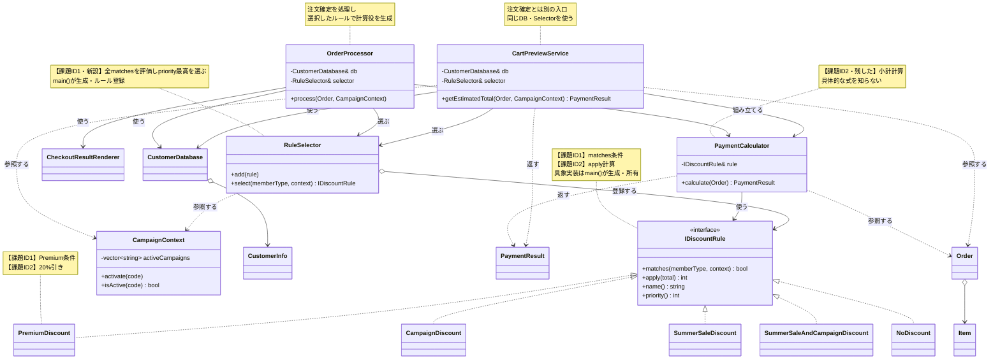
```mermaid
classDiagram
    direction TB
    class Item
    class Order
    class CampaignContext {
        -vector~string~ activeCampaigns
        +activate(code)
        +isActive(code) bool
    }
    class CustomerInfo
    class CustomerDatabase
    class CheckoutResultRenderer
    class OrderProcessor {
        -CustomerDatabase& db
        -RuleSelector& selector
        +process(Order, CampaignContext)
    }
    class PaymentResult
    class PaymentCalculator {
        -IDiscountRule& rule
        +calculate(Order) PaymentResult
    }
    class CartPreviewService {
        -CustomerDatabase& db
        -RuleSelector& selector
        +getEstimatedTotal(Order, CampaignContext) PaymentResult
    }
    class IDiscountRule {
        <<interface>>
        +matches(memberType, context) bool
        +apply(total) int
        +name() string
        +priority() int
    }
    class RuleSelector {
        +add(rule)
        +select(memberType, context) IDiscountRule
    }
    class PremiumDiscount
    class CampaignDiscount
    class SummerSaleDiscount
    class SummerSaleAndCampaignDiscount
    class NoDiscount

    Order o--> Item
    CustomerDatabase o--> CustomerInfo
    OrderProcessor --> CustomerDatabase : 使う
    OrderProcessor --> RuleSelector : 選ぶ
    OrderProcessor --> PaymentCalculator : 組み立てる
    OrderProcessor --> CheckoutResultRenderer : 使う
    CartPreviewService --> CustomerDatabase : 使う
    CartPreviewService --> RuleSelector : 選ぶ
    CartPreviewService --> PaymentCalculator : 組み立てる
    PaymentCalculator --> IDiscountRule : 使う
    PaymentCalculator ..> Order : 参照する
    PaymentCalculator ..> PaymentResult : 返す
    CartPreviewService ..> Order : 参照する
    CartPreviewService ..> CampaignContext : 参照する
    CartPreviewService ..> PaymentResult : 返す
    RuleSelector o--> IDiscountRule : 登録する
    RuleSelector ..> CampaignContext : 参照する
    IDiscountRule <|.. PremiumDiscount
    IDiscountRule <|.. CampaignDiscount
    IDiscountRule <|.. SummerSaleDiscount
    IDiscountRule <|.. SummerSaleAndCampaignDiscount
    IDiscountRule <|.. NoDiscount

    note for PaymentCalculator "【課題ID2・残した】小計計算<br/>具体的な式を知らない"
    note for OrderProcessor "注文確定を処理し<br/>選択したルールで計算役を生成"
    note for CartPreviewService "注文確定とは別の入口<br/>同じDB・Selectorを使う"
    note for IDiscountRule "【課題ID1】matches条件<br/>【課題ID2】apply計算<br/>具象実装はmain()が生成・所有"
    note for RuleSelector "【課題ID1・新設】全matchesを評価しpriority最高を選ぶ<br/>main()が生成・ルール登録"
    note for PremiumDiscount "【課題ID1】Premium条件<br/>【課題ID2】20%引き"

    classDef focus fill:#FFF2CC,stroke:#D6B656,stroke-width:2px,color:#222222
    cssClass "OrderProcessor,PaymentCalculator,IDiscountRule,RuleSelector,PremiumDiscount,CampaignDiscount,SummerSaleDiscount,SummerSaleAndCampaignDiscount,NoDiscount" focus
```

現状では、割引条件と計算式が `PaymentCalculator` の内部に集まっていました。完成後は、計算を依頼する2つの利用側が同じルール契約を参照し、適用条件と計算式は各具象ルールへ移っています。`RuleSelector` 自体には施策固有の条件分岐がないため、新しい集約点へ移しただけではありません。

#### 完成後の実行シーケンス

フェーズ6で採用したルール差し替え構造について、実行時のオブジェクト間のやり取りを可視化します。`main()` が注文確定とプレビューを別々に呼び、どちらも同じDB・Selector・計算規則を使うことを確認できます。

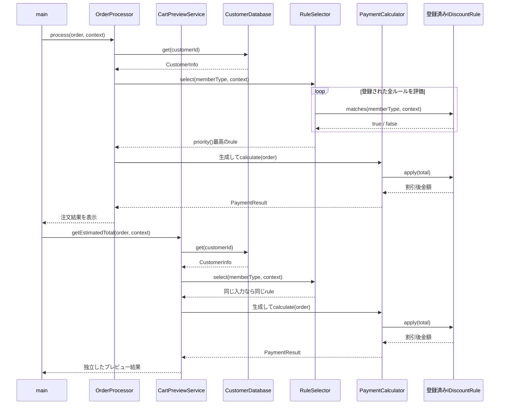
```mermaid
sequenceDiagram
    participant M as main
    participant O as OrderProcessor
    participant V as CartPreviewService
    participant DB as CustomerDatabase
    participant S as RuleSelector
    participant P as PaymentCalculator
    participant I as 登録済みIDiscountRule

    M->>O: process(order, context)
    O->>DB: get(customerId)
    DB-->>O: CustomerInfo
    O->>S: select(memberType, context)
    loop 登録された全ルールを評価
        S->>I: matches(memberType, context)
        I-->>S: true / false
    end
    S-->>O: priority()最高のrule
    O->>P: 生成してcalculate(order)
    P->>I: apply(total)
    I-->>P: 割引後金額
    P-->>O: PaymentResult
    O-->>M: 注文結果を表示

    M->>V: getEstimatedTotal(order, context)
    V->>DB: get(customerId)
    DB-->>V: CustomerInfo
    V->>S: select(memberType, context)
    S-->>V: 同じ入力なら同じrule
    V->>P: 生成してcalculate(order)
    P->>I: apply(total)
    I-->>P: 割引後金額
    P-->>V: PaymentResult
    V-->>M: 独立したプレビュー結果
```

#### 完成コード

まずファイル冒頭です。共通ヘッダーと、会員種別・キャンペーンコードを名前で扱う `MemberType`／`CampaignCode`、値クラス `Item`、施策状態を持つ `CampaignContext` を置きます。ここはどのクラスにも属さない宣言で、以降のすべてのクラスが使います。

```cpp
#include <iostream>
#include <string>
#include <vector>
#include <functional>
#include <map>
#include <stdexcept>

// 会員種別（ルール判定で使う直文字列を名前へ置き換える）
namespace MemberType {
    const std::string Premium = "Premium";
    const std::string Regular = "Regular";
}

namespace CampaignCode {
    const std::string RegularCampaign = "REGULAR_CAMPAIGN";
    const std::string SummerSale = "SUMMER_SALE";
}

class Item {
public:
    std::string name;
    int price;
    Item(std::string n, int p) : name(n), price(p) {}
};

class CampaignContext {
private:
    std::vector<std::string> activeCampaigns;
public:
    void activate(const std::string& code) {
        activeCampaigns.push_back(code);
    }

    bool isActive(const std::string& code) const {
        for (const auto& active : activeCampaigns) {
            if (active == code) return true;
        }
        return false;
    }
};

class Order {
public:
    std::string customerId;
    std::vector<Item> items;
};
```
続いて `CustomerInfo` です。

```cpp
struct CustomerInfo {
    std::string name;
    std::string memberType;
};

class CustomerDatabase {
private:
    std::map<std::string, CustomerInfo> records;
public:
    CustomerDatabase() {
        records["C001"] = {"田中 一郎", "Premium"};
        records["C002"] = {"佐藤 花子", "Regular"};
        records["C003"] = {"鈴木 次郎", "Regular"};
    }

    bool exists(const std::string& id) const { return records.count(id) > 0; }
    CustomerInfo get(const std::string& id) const { return records.at(id); }
};

// 割引ルールの共通インターフェース（ルール差し替え構造）
// 支払計算の結果オブジェクト：小計・適用ルール名・支払金額
struct PaymentResult {
    int subtotal;
    int finalPrice;
    std::string appliedRule;
};
```
続いて `IDiscountRule` です。

```cpp
class IDiscountRule {
public:
    virtual bool matches(const std::string& memberType,
                         const CampaignContext& context) const = 0;
    virtual int apply(int total) const = 0;
    virtual std::string name() const = 0;
    // 優先度：複数のルールが一致したとき、システムがどれを選ぶかの基準。
    // 条件が具体的（当てはまる状況が狭い）なルールほど高くする。
    virtual int priority() const = 0;
    virtual ~IDiscountRule() = default;
};
```

- `MemberType` は会員種別（`Premium`／`Regular`）を名前付き定数へまとめたものです。各割引ルールの `matches()` はこの定数で判定し、直文字列の打ち間違いを防ぎます。
- `Item`〜`CustomerDatabase` は1-4と同じデータ群です。割引の分離では、これらを主な修正対象にしていません。
- `CampaignContext` は実行時に有効な施策コードだけを持ちます。新しい施策が増えても、施策ごとの `bool` フィールドをこのクラスへ追加する必要はありません。
- `IDiscountRule` が割引ルールの共通契約です。`matches()` は適用条件、`apply()` は計算式、`name()` は結果表示名を表します。条件と式を施策単位で差し替える接続点になります。

**2. 個別の割引ルールの実装（具体）**
インターフェースを満たす具体的な割引クラスを作成します。割引計算の追加・変更は主にこのクラス群へ閉じ、利用するルールの選択は組み立て箇所で行います。

```cpp
class NoDiscount : public IDiscountRule {
public:
    bool matches(const std::string&,
                 const CampaignContext&) const override {
        return true;
    }
    int apply(int total) const override { return total; }
    std::string name() const override { return "割引なし"; }
    int priority() const override { return 0; }   // 常に一致する土台。最下位
};

class PremiumDiscount : public IDiscountRule {
public:
    bool matches(const std::string& memberType,
                 const CampaignContext&) const override {
        return memberType == MemberType::Premium;
    }
    int apply(int total) const override {
        return total * 80 / 100;
    }
    std::string name() const override { return "プレミアム割引"; }
    int priority() const override { return 1; }   // 会員種別だけの単独条件
};

class SummerSaleAndCampaignDiscount : public IDiscountRule {
public:
    bool matches(const std::string& memberType,
                 const CampaignContext& context) const override {
        return memberType == MemberType::Regular
            && context.isActive(CampaignCode::SummerSale)
            && context.isActive(CampaignCode::RegularCampaign);
    }
    int apply(int total) const override {
        return (total * 90 / 100) * 95 / 100;
    }
    std::string name() const override {
        return "サマーセール+キャンペーン";
    }
    int priority() const override { return 3; }   // 2条件が重なる最も具体的なルール
};
```
続いて `SummerSaleDiscount` です。

```cpp
class SummerSaleDiscount : public IDiscountRule {
public:
    bool matches(const std::string& memberType,
                 const CampaignContext& context) const override {
        return memberType == MemberType::Regular
            && context.isActive(CampaignCode::SummerSale);
    }
    int apply(int total) const override {
        return total * 95 / 100;
    }
    std::string name() const override { return "サマーセール割引"; }
    int priority() const override { return 2; }   // Regular＋1条件
};

class CampaignDiscount : public IDiscountRule {
public:
    bool matches(const std::string& memberType,
                 const CampaignContext& context) const override {
        return memberType == MemberType::Regular
            && context.isActive(CampaignCode::RegularCampaign);
    }
    int apply(int total) const override {
        return total * 90 / 100;
    }
    std::string name() const override { return "キャンペーン割引"; }
    int priority() const override { return 2; }   // Regular＋1条件
};
```

- 各割引が `IDiscountRule` を実装した独立クラスです。適用条件と計算式（`* 80 / 100` など）は、同じ施策クラスの中にあります。
- 逐次割引は `SummerSaleAndCampaignDiscount` という1つのルールとして表します（フェーズ5の方針）。
- Premium以外のルールは `memberType == "Regular"` も自分で確認します。登録順だけに排他条件を隠さず、ルール単体でも適用条件を読めるようにするためです。
- `NoDiscount` は「割引なし」を表し、必ず一致して定価を返します。`priority()` を最下位（0）にしているので、他のどのルールも一致しないときだけ選ばれ、Selectorがルール未選択になりません。登録順に依存しません。
- `name()` は要求ID5の購入結果へ適用割引名を表示するために実装します。選択や計算だけが要件なら不要ですが、本章では表示要求に追跡できるため契約に含めます。

**3. 本体クラス（コンテキスト）**
計算を行う本体クラスです。具体的な割引ルールを知らず、インターフェースを通じて計算を委譲します。これにより、割引種別を選ぶ条件分岐を計算フローから外せます。

```cpp
class PaymentCalculator {
private:
    const IDiscountRule& rule;
public:
    explicit PaymentCalculator(const IDiscountRule& r) : rule(r) {}

    PaymentResult calculate(const Order& order) {
        int subtotal = 0;
        for (const auto& item : order.items) subtotal += item.price;
        PaymentResult result;
        result.subtotal = subtotal;
        result.finalPrice = rule.apply(subtotal);
        result.appliedRule = rule.name();
        return result;
    }
};
```

- `PaymentCalculator` は具体的な割引を知らず、受け取った `rule` の `apply()` に計算を委ねます。割引を選ぶ `if` はありません。
- 戻り値は金額だけの `int` ではなく、小計・適用したルール名・支払金額をまとめた `PaymentResult`（結果オブジェクト）です。会員種別やキャンペーンによって「どの割引が効いたか」を、金額とあわせて呼び出し側へ返せます。

**4. ルール選択と二つの利用入口**

長い一続きのコードを役割ごとに分けます。まず `RuleSelector` は、組み立て側から登録されたルールへ同じ `matches()` を問い、一致したルールのうち `priority()` が最も高いものを返します。具体的な条件やクラス名は知りません。

```cpp
class RuleSelector {
private:
    std::vector<std::reference_wrapper<const IDiscountRule>> rules;
public:
    void add(const IDiscountRule& rule) {
        rules.push_back(std::cref(rule));
    }

    const IDiscountRule& select(
            const std::string& memberType,
            const CampaignContext& context) const {
        // 登録順ではなく、一致したルールのうち priority() が最も高いものを
        // システムが選ぶ。利用者は登録順で優先度を意識しなくてよい。
        const IDiscountRule* best = nullptr;
        for (const auto& registered : rules) {
            const IDiscountRule& rule = registered.get();
            if (rule.matches(memberType, context)
                && (best == nullptr
                    || rule.priority() > best->priority())) {
                best = &rule;
            }
        }
        if (best == nullptr)
            throw std::logic_error("適用可能な割引ルールがありません");
        return *best;
    }
};
```

次に、要求ID6のプレビューを独立した入口として実装します。`CartPreviewService` は顧客IDから会員種別を取得し、注文確定と同じSelectorと計算器を使いますが、`OrderProcessor::process()` は呼びません。

```cpp
class CartPreviewService {
private:
    CustomerDatabase& db;
    const RuleSelector& selector;
public:
    CartPreviewService(CustomerDatabase& db,
                       const RuleSelector& selector)
        : db(db), selector(selector) {}

    PaymentResult getEstimatedTotal(
            const Order& order,
            const CampaignContext& context) const {
        if (!db.exists(order.customerId))
            throw std::invalid_argument("未登録の顧客IDです");
        if (order.items.empty())
            throw std::invalid_argument("注文が空です");

        const CustomerInfo customer = db.get(order.customerId);
        const IDiscountRule& rule =
            selector.select(customer.memberType, context);
        PaymentCalculator calculator(rule);
        return calculator.calculate(order);
    }
};
```

結果表示は注文確定の結果だけを受け取ります。プレビュー値を引数に含めないことで、購入結果の表示と事前プレビューを同じ操作へ戻してしまうのを防ぎます。

```cpp

class CheckoutResultRenderer {
public:
    void showOrderResult(const CustomerInfo& customer,
                         const Order& order,
                         const CampaignContext& context,
                         const PaymentResult& result) {
        std::cout << customer.name << " さんの注文:";
        for (const auto& item : order.items) {
            std::cout << " " << item.name << " " << item.price << "円";
        }
        std::cout << "\n  条件: 会員=" << customer.memberType
                  << ", キャンペーン="
                  << (context.isActive(CampaignCode::RegularCampaign)
                      ? "あり" : "なし")
                  << ", サマーセール="
                  << (context.isActive(CampaignCode::SummerSale)
                      ? "あり" : "なし");
        std::cout << "\n  小計 " << result.subtotal
                  << "円 → 適用 " << result.appliedRule
                  << " → 支払金額 " << result.finalPrice << "円\n";
    }
};
```

最後に、`OrderProcessor` はCustomerDatabase・RuleSelector・PaymentCalculator・Rendererを接続し、注文確定だけを担います。

```cpp

class OrderProcessor {
private:
    CustomerDatabase& db;
    CheckoutResultRenderer& renderer;
    const RuleSelector& selector;
public:
    OrderProcessor(CustomerDatabase& db,
                   CheckoutResultRenderer& renderer,
                   const RuleSelector& selector)
        : db(db), renderer(renderer), selector(selector) {}

    void process(const Order& order, const CampaignContext& context) {
        if (!db.exists(order.customerId)) {
            std::cerr << "エラー: 顧客ID " << order.customerId
                      << " は登録されていません\n";
            return;
        }
        if (order.items.empty()) {
            std::cerr << "エラー: 注文が空です\n";
            return;
        }

        // 顧客情報の取得（実運用ではDB/API。接続失敗などに備える）
        CustomerInfo customer;
        try {
            customer = db.get(order.customerId);
        } catch (const std::exception&) {
            std::cerr << "エラー: 顧客情報の取得に失敗しました\n";
            return;
        }
        const IDiscountRule& rule =
            selector.select(customer.memberType, context);
        PaymentCalculator calculator(rule);

        PaymentResult result = calculator.calculate(order);
        renderer.showOrderResult(customer, order, context, result);
    }
};
```

- `RuleSelector::select()` に施策固有の `if` はありません。条件は各ルールの `matches()` に分かれ、Selectorは同じ問い合わせを繰り返すだけです。
- `OrderProcessor` は、エラー条件の確認 → 会員種別の取得（実運用ではDB/APIなので `try/catch` で失敗に備える）→ Selectorでルール選択 → 注文結果の計算と表示、という手順だけを担います。
- `CartPreviewService` は別の公開操作として、同じ入力から同じSelector・計算器を使います。このため購入確定を実行せずに、同額を事前取得できます。
- `std::reference_wrapper` は、`main()` が所有するルールへの非所有参照をコンテナへ登録するために使います。`new` / `delete` は発生しません。
- 新しい割引を足すときに触るのは「適用条件と式を持つ新しいルールクラス」と「`main()` の登録1行」です。`PaymentCalculator` と `RuleSelector` の処理は変わりません。

**5. 実行（main）と結果**
1-5の変更後の動作例を、最終コードで再現します。

1-5の変更後の動作例を、最終コードでシナリオごとに再現します。まず依存を組み立て、シナリオ1（Premium会員の20%引き）を実行します。ここで、`add()` の**登録順は優先度と無関係**です。どのルールを優先するかは各ルールの `priority()` を見て `RuleSelector` が決めるため、利用者は登録順を気にする必要がありません。そのことを示すために、あえて土台の `NoDiscount` を最初に、`PremiumDiscount` を最後に登録します（同じルールを重複登録しても、`select()` は一致した中の最高優先度を1つ返すだけで、二重には適用されません）。

`selector.add()` は「この実行環境が対応できる施策」を起動時に登録する操作で、個々の注文で「いま有効な施策」を表す操作ではありません。有効なルールだけを注文ごとに登録すると、実行時入力のたびにSelectorを組み直す責任が生まれます。そこで実行時の事実は `CampaignContext` の施策コード一覧へ分けます。新しいキャンペーンでも `CampaignContext` のフィールド追加は不要で、ルールの登録と注文入力という性質の異なる二つを重複知識として持ちません。

```cpp
int main() {
    CustomerDatabase db;
    CheckoutResultRenderer renderer;

    // 具体ルールは組み立て側が所有する。登録順は自由でよい。
    // どれを優先するかは各ルールの priority() でシステムが決める。
    NoDiscount none;
    CampaignDiscount campaign;
    SummerSaleDiscount summer;
    SummerSaleAndCampaignDiscount summerAndCampaign;
    PremiumDiscount premium;

    RuleSelector selector;
    selector.add(none);              // あえて土台を最初に登録しても…
    selector.add(campaign);
    selector.add(summer);
    selector.add(summerAndCampaign);
    selector.add(premium);           // …priority() で正しく選ばれる

    OrderProcessor processor(db, renderer, selector);
    CartPreviewService preview(db, selector);

    // C001（Premium）/ キャンペーンなし / サマーセールなし → 20%引き
    std::cout << "--- シナリオ1: Premium割引 ---\n";
    Order order1;
    order1.customerId = "C001";
    order1.items.push_back(Item("ワイヤレスイヤホン", 10000));
    CampaignContext context1;
    processor.process(order1, context1);
    PaymentResult preview1 = preview.getEstimatedTotal(order1, context1);
    std::cout << "  カートプレビュー: "
              << preview1.finalPrice << "円\n";
```

シナリオ1の実行結果：

```
--- シナリオ1: Premium割引 ---
田中 一郎 さんの注文: ワイヤレスイヤホン 10000円
  条件: 会員=Premium, キャンペーン=なし, サマーセール=なし
  小計 10000円 → 適用 プレミアム割引 → 支払金額 8000円
  カートプレビュー: 8000円
```

`main()` はこのまま続きます。シナリオ2は、同じPremium会員にキャンペーンとサマーセールを当てても、Premium優先で20%引きのままです。

```cpp
    // C001（Premium）/ キャンペーンあり / サマーセール中 → Premium優先
    std::cout << "\n--- シナリオ2: Premium排他 ---\n";
    Order order2;
    order2.customerId = "C001";
    order2.items.push_back(Item("ワイヤレスイヤホン", 10000));
    CampaignContext context2;
    context2.activate(CampaignCode::RegularCampaign);
    context2.activate(CampaignCode::SummerSale);
    processor.process(order2, context2);
    PaymentResult preview2 = preview.getEstimatedTotal(order2, context2);
    std::cout << "  カートプレビュー: "
              << preview2.finalPrice << "円\n";
```

シナリオ2の実行結果：

```
--- シナリオ2: Premium排他 ---
田中 一郎 さんの注文: ワイヤレスイヤホン 10000円
  条件: 会員=Premium, キャンペーン=あり, サマーセール=あり
  小計 10000円 → 適用 プレミアム割引 → 支払金額 8000円
  カートプレビュー: 8000円
```

同じ `main()` の中で、シナリオ3はRegular会員へサマーセールとキャンペーンを逐次適用です。

```cpp
    // C002（Regular）/ キャンペーンあり / サマーセール中 → 逐次割引
    std::cout << "\n--- シナリオ3: 逐次割引 ---\n";
    Order order3;
    order3.customerId = "C002";
    order3.items.push_back(Item("ワイヤレスイヤホン", 10000));
    CampaignContext context3;
    context3.activate(CampaignCode::RegularCampaign);
    context3.activate(CampaignCode::SummerSale);
    processor.process(order3, context3);
    PaymentResult preview3 = preview.getEstimatedTotal(order3, context3);
    std::cout << "  カートプレビュー: "
              << preview3.finalPrice << "円\n";
```

シナリオ3の実行結果：

```
--- シナリオ3: 逐次割引 ---
佐藤 花子 さんの注文: ワイヤレスイヤホン 10000円
  条件: 会員=Regular, キャンペーン=あり, サマーセール=あり
  小計 10000円 → 適用 サマーセール+キャンペーン → 支払金額 8550円
  カートプレビュー: 8550円
```

同じ `main()` の中で、シナリオ4はRegular会員へサマーセール単独（5%引き）です。

```cpp
    // C002（Regular）/ サマーセールのみ → 5%引き
    std::cout << "\n--- シナリオ4: サマーセール単独 ---\n";
    Order order4;
    order4.customerId = "C002";
    order4.items.push_back(Item("ワイヤレスイヤホン", 10000));
    CampaignContext context4;
    context4.activate(CampaignCode::SummerSale);
    processor.process(order4, context4);
    PaymentResult preview4 = preview.getEstimatedTotal(order4, context4);
    std::cout << "  カートプレビュー: "
              << preview4.finalPrice << "円\n";
```

シナリオ4の実行結果：

```
--- シナリオ4: サマーセール単独 ---
佐藤 花子 さんの注文: ワイヤレスイヤホン 10000円
  条件: 会員=Regular, キャンペーン=なし, サマーセール=あり
  小計 10000円 → 適用 サマーセール割引 → 支払金額 9500円
  カートプレビュー: 9500円
```

同じ `main()` の中で、シナリオ4bはRegular会員へキャンペーン単独（10%引き）です。1-2動作例の行3にあたり、サマーセール追加後も変わらないことを確認する継続要求（要求ID3）の回帰です。

```cpp
    // C002（Regular）/ キャンペーンのみ → 10%引き（変更前と同じ）
    std::cout << "\n--- シナリオ4b: キャンペーン単独 ---\n";
    Order order4b;
    order4b.customerId = "C002";
    order4b.items.push_back(Item("ワイヤレスイヤホン", 10000));
    CampaignContext context4b;
    context4b.activate(CampaignCode::RegularCampaign);
    processor.process(order4b, context4b);
    PaymentResult preview4b = preview.getEstimatedTotal(order4b, context4b);
    std::cout << "  カートプレビュー: "
              << preview4b.finalPrice << "円\n";
```

シナリオ4bの実行結果：

```
--- シナリオ4b: キャンペーン単独 ---
佐藤 花子 さんの注文: ワイヤレスイヤホン 10000円
  条件: 会員=Regular, キャンペーン=あり, サマーセール=なし
  小計 10000円 → 適用 キャンペーン割引 → 支払金額 9000円
  カートプレビュー: 9000円
```

サマーセールを追加しても、キャンペーン単独の支払金額は変更前と同じ9,000円のままです。要求ID3の回帰はこの1件で確認できます。

同じ `main()` の中で、シナリオ5はRegular会員で割引なしです。

```cpp
    // C003（Regular）/ 割引なし
    std::cout << "\n--- シナリオ5: 割引なし ---\n";
    Order order5;
    order5.customerId = "C003";
    order5.items.push_back(Item("スマホケース", 3000));
    CampaignContext context5;
    processor.process(order5, context5);
    PaymentResult preview5 = preview.getEstimatedTotal(order5, context5);
    std::cout << "  カートプレビュー: "
              << preview5.finalPrice << "円\n";
```

シナリオ5の実行結果：

```
--- シナリオ5: 割引なし ---
鈴木 次郎 さんの注文: スマホケース 3000円
  条件: 会員=Regular, キャンペーン=なし, サマーセール=なし
  小計 3000円 → 適用 割引なし → 支払金額 3000円
  カートプレビュー: 3000円
```

同じ `main()` の中で、シナリオ6は未登録顧客のエラーです。

```cpp
    // エラー条件も、正常系と同じ最終コードで確認する
    std::cout << "\n--- シナリオ6: 未登録顧客 ---\n";
    Order unknown;
    unknown.customerId = "UNKNOWN";
    unknown.items.push_back(Item("ケーブル", 1000));
    processor.process(unknown, context5);
```

シナリオ6の実行結果：

```
--- シナリオ6: 未登録顧客 ---
エラー: 顧客ID UNKNOWN は登録されていません
```

同じ `main()` の中で、シナリオ7は空注文のエラーです。

```cpp
    std::cout << "\n--- シナリオ7: 空注文 ---\n";
    Order empty;
    empty.customerId = "C002";
    processor.process(empty, context5);
```

シナリオ7の実行結果：

```
--- シナリオ7: 空注文 ---
エラー: 注文が空です
```

`main()` を終了します。

```cpp
    return 0;
}
```

次の表は、`main()` の各ケースの入力（条件・商品）と実行結果（小計→支払金額）を1行ずつ並べたものです。離れた `main()` と出力を行き来せず、その場で照合できます。

| 会員・キャンペーン・サマー | 商品(単価) | 小計→支払金額 | プレビュー |
|---|---|---|---|
| Premium・なし・なし | イヤホン(10000) | 10000 → 8000 | 8000 |
| Premium・あり・あり | イヤホン(10000) | 10000 → 8000（優先で無効） | 8000 |
| Regular・あり・あり | イヤホン(10000) | 10000 → 8550（逐次割引） | 8550 |
| Regular・なし・あり | イヤホン(10000) | 10000 → 9500（5%引き） | 9500 |
| Regular・あり・なし | イヤホン(10000) | 10000 → 9000（10%引き） | 9000 |
| Regular・なし・なし | ケース(3000) | 3000 → 3000（割引なし） | 3000 |
| 未登録顧客 | ケーブル(1000) | 計算せず顧客エラー | 表示なし |
| Regular・空注文 | 商品なし | 計算せず空注文エラー | 表示なし |

小計→支払金額を1-5「変更後の動作例」と照らすと、リファクタリング後も同じ金額になることを確認できます。カートプレビューも同じ計算を共有するため支払金額と一致します。

#### 最終要求の実装・受入エビデンス

変更後要求ベースラインの全有効要求IDを同じ順序で照合します。今回変わらなかった既存要求も対象にするため、要求の消失を検出できます。

| 要求ID | 最終要求 | 適用コード | 実行シナリオ・観測結果・判定 |
|---|---|---|---|
| 要求ID1 | 商品リストの小計から最終支払金額を計算する | `PaymentCalculator::calculate()` | 10,000円の小計と割引後金額を出力<br/>**判定:** 合格 |
| 要求ID2 | Premium会員へ20%割引を適用し、他割引と併用しない | `PremiumDiscount`、`RuleSelector` | セール併用でも8,000円<br/>**判定:** 合格 |
| 要求ID3 | Regular会員はキャンペーン中だけ10%割引する | `CampaignDiscount` | シナリオ4bでキャンペーン単独9,000円（変更前と同額）<br/>**判定:** 合格 |
| 要求ID4 | 顧客IDから会員種別を取得する | `CustomerDatabase`、`OrderProcessor` | 登録顧客を取得し、未登録IDをエラー表示<br/>**判定:** 合格 |
| 要求ID5 | 計算結果を購入結果として表示する | `CheckoutResultRenderer::showOrderResult()` | 全シナリオで会員種別・キャンペーン・サマーセールの条件と、適用した割引名・支払金額を表示<br/>**判定:** 合格 |
| 要求ID6 | 注文確定前に同じ条件の支払金額をプレビューする | `CartPreviewService::getEstimatedTotal()` | 各正常シナリオで購入結果と同額のプレビューを独立操作で取得<br/>**判定:** 合格 |
| 要求ID7 | Regularへサマーセール5%を追加し、既存割引後へ逐次適用する | `SummerSaleDiscount`、`SummerSaleAndCampaignDiscount` | セールのみ9,500円、併用8,550円、Premium対象外<br/>**判定:** 合格 |

上の表は継続・変更（要求ID1〜要求ID6）と追加（要求ID7）を同じ順序で並べ、変わらなかった既存要求も回帰対象に含めています。継続要求が合格していることで、既存動作が落ちていないことを確認できます。要求の受入・回帰はここで完了します。課題IDへ直接対応付けず、以下では変更試行の痛みから導いた構造課題だけを別に確認します。

#### 設計課題の構造改善結果

要求の受入とは分けて、課題IDごとに構造と変更影響を確認します。

| 課題ID | 構造差分・コード適用先 | 確認できた効果 | 残る変更先 |
|---|---|---|---|
| 課題ID1 | `IDiscountRule::matches()`と`RuleSelector`へ条件・優先度を分離 | 新施策が具象ルールと登録に閉じた | 新ルールと組み立て時の登録 |
| 課題ID2 | 各`apply()`へ式を移し、`PaymentCalculator`は共通操作だけを実行 | 小計計算が個別式を知らず逐次適用できた | 対象ルールの式・優先度 |
#### 変更前→変更後の不変条件照合

| 変更対象外 | 変更前 | 変更後 | 確認根拠 |
|---|---|---|---|
| 顧客・注文の取得 | `CustomerDatabase` から取得 | 同じID・同じ取得契約 | 現状コードと完成コードのDB呼び出し |
| 結果表示 | `CheckoutResultRenderer` へ渡す | 同じ結果境界へ渡す | 7-1の正常・エラー出力 |

### 7-2：動作シーケンス図の検証

完成クラス図と実行シーケンスは、完成コードへ入る前に示しました。ここまでのコード、要求追跡表、不変条件照合を証拠として、次節で変更影響を再確認します。

### 7-3：変更影響グラフ（改善後）

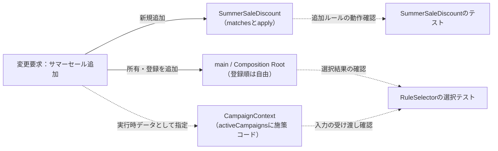
```mermaid
graph LR
    T1["変更要求：サマーセール追加"]
        -->|新規追加| N1["SummerSaleDiscount<br>（matchesとapply）"]
    T1 -->|所有・登録を追加| N2["main / Composition Root<br>（登録順は自由）"]
    T1 -.->|実行時データとして指定| N3["CampaignContext<br>（activeCampaignsに施策コード）"]
    N1 -.->|追加ルールの動作確認| T2["SummerSaleDiscountのテスト"]
    N2 -.->|選択結果の確認| T3["RuleSelectorの選択テスト"]
    N3 -.->|入力の受け渡し確認| T3
```

フェーズ3の変更影響グラフと同じ要求・同じ粒度で比べると、`PaymentCalculator`、`CartPreviewService`、`CampaignContext` のクラス定義は変更先から消えました。さらに、条件を各ルールの `matches()` へ分けたため、`RuleSelector` の固定ループも変更しません。コード変更として残るのは、新しいルールクラス内の`matches()`・`apply()`・`priority()`と、その所有・登録です。注文ごとの有効状態は既存の施策コード一覧へ入力する実行時データであり、登録順も変更対象ではありません。

| 3-2で影響した場所 | 修正後 | 構造変更との対応 |
|---|---|---|
| `PaymentCalculator` の既存分岐全体 | **修正しない** | 小計計算だけを残し、条件と式を各ルールへ移した |
| `CampaignContext` | **修正しない**。既存の施策コード一覧へ値を渡す | 施策ごとの真偽値フィールドを持たない入力形式にした |
| `CartPreviewService` | **修正しない** | 注文確定とは独立した入口のまま、同じDB・Selector・計算器を使う |
| 3-2には分離先がなかった | `SummerSaleDiscount` と登録行を追加する | 施策固有の変更先を新しく作った |
| 3-2には存在しなかった選択役 | **`RuleSelector` は修正しない** | 具体条件を持たず、全ルールの `matches()` を呼び一致の中から `priority()` 最高を選ぶ固定処理にした |

この結果は、コードを書く前に確定した採用設計を完成コードへ統合した後に得たものです。関数抽出やFactoryだけでは `PaymentCalculator` または選択側の分岐が残るため、この変更影響にはなりません。CIで既存テスト一式を実行することと、変更影響として個別に再確認する範囲は区別します。

### 7-4：変更シナリオ表

ここでは今回の変更ID1・変更ID2だけを完成構造へ再適用し、フェーズ1で必要だった修正範囲と、実装後の結果を比較します。

| 変更依頼 | フェーズ1の現状構造での影響 | 完成構造での結果 |
|---|---|---|
| 変更ID1：Regular会員へサマーセール5%を追加し、Premium会員は対象外にする | `CampaignContext`と`PaymentCalculator`の分岐を同時に修正 | `SummerSaleDiscount`へ条件と式を置き、Regularだけに5%を適用。既存Premiumルールは変更しない |
| 変更ID2：既存キャンペーンと重なる場合は逐次割引する | `PaymentCalculator`の既存分岐と適用順を修正 | `RuleSelector`が選んだルールを優先順に適用し、10,000円から8,550円になることを実行結果で確認 |

---

## 整理

### 問題・原因・課題・解決策

| | 内容 |
|---|---|
| **問題** | 割引の「実行する振る舞い」が変わるたびに計算本体と入力モデルを修正し、利用側まで広く回帰確認する。変わる理由が異なる知識が同じ場所に混在しているため |
| **原因** | 割引ルールが「毎月追加される」と確認できているのに、`PaymentCalculator`が全種類の条件と計算方法を抱え込んでいる |
| **課題ID1** | 割引種類の条件を具象ルールへ分離し、固定の選択手順へ登録できるようにする |
| **課題ID2** | 割引の計算式を具象ルールへ分離し、`PaymentCalculator` は `apply()` を呼ぶだけにする |
| **解決策** | ルール差し替え構造：各 `IDiscountRule` に適用条件と計算式を閉じ、`RuleSelector` へ登録して外から注入する |

### フェーズとこの章でやったこと

| **フェーズ** | **この章でやったこと** |
|---|---|
| 🔵 フェーズ1：現状把握 | 仕様と動作例テーブルを確認した後、コードをクラス単位で読んだ。クラス構成図と変更要求を把握した |
| 🟣 フェーズ2：仮説立案 | 割引ルールが変わりやすいと見立て、誰がなぜ変えるかをヒアリングで裏付けた。今回の確定変更と将来リスクを分けて整理した |
| 🟣 フェーズ3：問題特定 | サマーセールの追加を試み、`PaymentCalculator` の条件分岐と `CampaignContext` のフラグ追加、`CartPreviewService` の回帰確認まで必要になることを確認した |
| 🟠 フェーズ4：原因分析 | 小計の骨格と割引詳細が混在し、割引詳細の中にも「種類」と「計算方法」の2軸があると特定した |
| 🟡 フェーズ5：課題定義 | 選択を課題ID1、計算を課題ID2として分け、`matches()` と `apply()` の接続点を定めた |
| 🔴 フェーズ6：対策検討 | 課題ID1・課題ID2を一つのシステムとして分離・配置・組み立てへ変換し、一意に定まった具象ルールの登録構造を課題ID別の【1】〜【6】でコードへ反映した |
| 🟢 フェーズ7：対策実施 | 最終コードを実装し、変更影響グラフで変更の局所化を確認した |

### 責任の移動

| **責任** | **変更前** | **変更後** |
|---|---|---|
| 支払金額の計算フローの進行 | `PaymentCalculator` | `PaymentCalculator`（変わらず） |
| 個別の割引計算の実行 | `PaymentCalculator`（if-else直書き） | `PremiumDiscount` 等の各実装クラス |
| 各割引の適用条件 | `PaymentCalculator` の `if-else` | 各実装クラスの `matches()` |
| 一致するルールの選択手順 | `PaymentCalculator` の分岐順 | `RuleSelector` の固定ループ |
| ルールの優先順位 | `if-else` の記述順 | 各ルールの `priority()`（登録順に依存しない） |
| 割引ルールの契約定義 | —（なし） | `IDiscountRule` |

### 複雑さを足しても対策は変わるか

第1章では、単純な「1つの割引を掛ける」例に留めず、割引の順次適用、排他条件、顧客情報取得失敗を含めました。それでも対策の論理は変わりません。複雑さを足した結果、どの複雑さがルール差し替え構造の対象で、どれが別軸なのかを分けて見られるようになりました。

| 追加した複雑さ | 見えた原因 | 定めた課題 | 採用した扱い |
|---|---|---|---|
| キャンペーン後にサマーセールを適用する逐次割引 | 適用順序が計算本体の分岐に埋まっている | 割引後金額を返す契約を守りつつ、適用順序をルール側へ寄せる | 組み合わせルールとして `IDiscountRule` の実装に閉じる |
| Premiumは他割引と併用しない排他条件 | 選択条件が `PaymentCalculator` に漏れている | 計算本体と選択役は具体条件を知らない形にする | `PremiumDiscount::matches()` が条件を持ち、最優先でSelectorへ登録する |
| 顧客情報取得失敗 | 外部境界の失敗であり、割引計算の変化軸とは違う | 割引ルールの接続点へ失敗処理を混ぜない | `OrderProcessor` の顧客取得エラーとして扱い、割引ルール差し替え（接続点）の対象外にする |

---

## 振り返り

### 「この章を読むと得られること」は手に入ったか

| **得られること** | **この章のどこで示したか** |
|---|---|
| 1. 変動箇所の識別 | フェーズ2で割引ルールが変わりやすいと見立て、フェーズ4でその混在を原因として言語化した |
| 2. 接続点の診断 | フェーズ4で、割引条件の知識が計算の骨格へ漏れている状態を確認した |
| 3. 変更局所化の説明 | フェーズ7の変更シナリオ表で、変更の中心が新しい実装クラスへ移る構造を示した |
| 4. いつ構造を分けるか | フェーズ6の「システム全体の最終構造を決める」で判断基準を示した |

### 第0章の3つの設計原則はどう適用されたか

**原則1「変わるものをカプセル化せよ」の現れ**

- 具体化された場所：`PremiumDiscount` / `SummerSaleDiscount` 等の実装クラス
- 解説：頻繁に変わる「適用条件」と「割引の計算詳細」を施策ごとのクラスに閉じ込めた。新しいルールでは登録や入力モデルが変わる場合もあるが、`PaymentCalculator` と `RuleSelector` の処理は保てる。

**原則2「実装ではなくインターフェースに対してプログラムせよ」の現れ**

- 具体化された場所：`PaymentCalculator` のメンバ変数 `const IDiscountRule& rule`
- 解説：具体的な割引クラスではなく `IDiscountRule` インターフェースだけを知ることで、実行時にどの割引が適用されるかを気にせず計算フローを進められる。

**原則3「継承よりコンポジションを優先せよ」の現れ**

- 具体化された場所：`PaymentCalculator` と割引ルールの接続
- 解説：コンストラクタインジェクションによるコンポジションで、計算本体と選択したルールを実行時に組み合わせる。複数の割引を重ねるには、組み合わせ用ルール差し替え構造、ルールの列、装飾連結構造など、別の構成方法が必要になる。

---

## あなたのコードで考えてみてください

1. **変動の兆候を探す：** あなたのコードに「条件が1つ増えるたびに、既存の `if-else` チェーンを開いて書き足している」メソッドがありますか？
2. **変える理由を問う：** そのメソッド内の各条件は、どの業務機能に属しますか？同じ業務機能で完結していますか、それとも複数の業務機能が絡んでいますか？
3. **テストの範囲を測る：** 新しい条件を1つ追加したとき、再確認が必要だったテストは何件でしたか？
4. **最終構造を描く：** 適用条件と計算方法を分離したとき、選択手順と計算骨格は具体ルールを知らずに実行できますか？

---

**題材を置き換えるときの共通手順**

この章の題材名を、自分の現場のシステム名に置き換えて考えます。

1. そのシステムは、誰が何を達成するために使うものか。
2. 入力、加工、出力は何か。
3. 最近入った変更要求、または次に来そうな変更要求は何か。
4. その変更で、触りたくない場所まで修正や再テストが広がるか。
5. 変えたいものと守りたいものを分けると、接続点には何を残すべきか。
6. 分離・配置・組み立てを決めると最終構造は一つに定まるか。異なる完成構造へ分岐するときだけ、変更影響と導入コストを比較したか。

## パターン解説：Strategy パターン

### パターンの骨格

Strategy パターンは、アルゴリズムのファミリーを定義し、それぞれをカプセル化して、呼び出し側から自由に差し替えられるようにするパターンです。

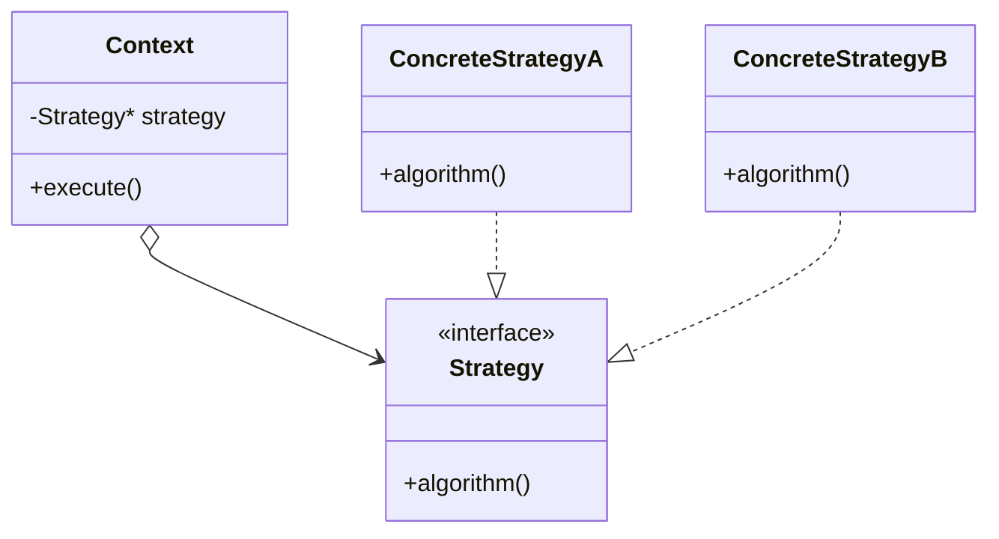
```mermaid
classDiagram
    class Context {
        -Strategy* strategy
        +execute()
    }
    class Strategy {
        <<interface>>
        +algorithm()
    }
    class ConcreteStrategyA {
        +algorithm()
    }
    class ConcreteStrategyB {
        +algorithm()
    }
    Context o--> Strategy
    ConcreteStrategyA ..|> Strategy
    ConcreteStrategyB ..|> Strategy
```

### 抽象骨格の実行シーケンス

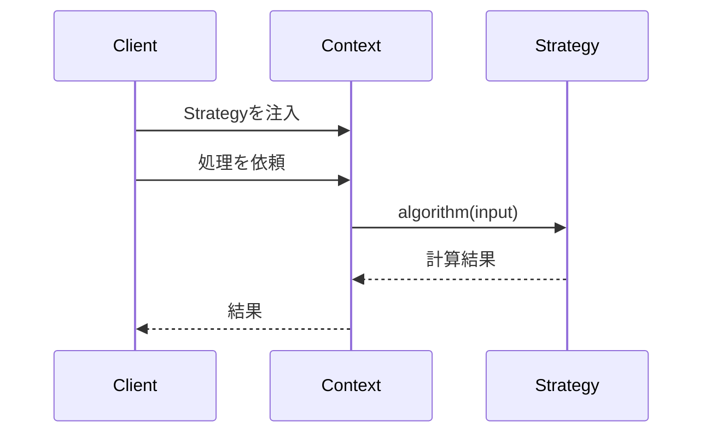
```mermaid
sequenceDiagram
    participant C as Client
    participant X as Context
    participant S as Strategy
    C->>X: Strategyを注入
    C->>X: 処理を依頼
    X->>S: algorithm(input)
    S-->>X: 計算結果
    X-->>C: 結果
```

Contextは具体Strategy名を判断せず、注入された契約へ計算を委譲します。

### この章の実装との対応

GoF（Gang of Four）とは、1994年に出版された書籍『Design Patterns』の4人の著者の総称です。彼らが整理した23のパターンは、現在も設計の共通言語として広く使われています。

| GoFの名前 | この章での対応 |
|---|---|
| Context | `PaymentCalculator` |
| Strategy | `IDiscountRule` |
| ConcreteStrategy | `PremiumDiscount` / `SummerSaleDiscount` / `CampaignDiscount` 等 |

`OrderProcessor` と `CartPreviewService` はStrategyのContextそのものではなく、入力からルールを選び `PaymentCalculator` を組み立てる二つの利用側です。

### 使いどころと限界

- **使うと良い：** 似たような振る舞いが複数あり、状況に応じて切り替えたい場合。または今後も新しいアルゴリズムが追加される可能性が高い場合。
- **使わない方が良い：** ルールが1種類しかなく、今後増える見込みがない場合。ファイル数とクラス数が増えるコストが見合わない。
- **別の構造も検討する：** 独立したルールを同時に複数適用し、組み合わせが増え続ける場合。Strategyを組み合わせ用クラスだけで表すとクラス数が増えるため、適用順序を持つルール列やDecoratorなどと比較する。
- **非同期・失敗を伴う場合：** 割引計算が外部I/Oを伴って非同期化・失敗しうるなら、接続点の契約は `int apply(int)` から「将来値や成否を返す形」へ変わる。Strategyの「ルールを差し替える」分離は保てるが、境界を流れる値の形が変わる設計判断になる。

### 過剰適用になる例

割引ルールが「プレミアム割引」1種類しかなく、ヒアリングでも当面増える見込みがないなら、`IDiscountRule` インターフェース、各実装クラス、`RuleSelector` を導入するのは過剰です。この場合、`PaymentCalculator` の中に `if (memberType == "Premium")` を1つ持つだけのほうが、読む人にとってはたどる段数が少なく理解しやすくなります。

本章で共通契約とSelectorを採用した根拠は「毎月新しい割引が追加される」というヒアリング結果でした。変更頻度の裏付けがない別の題材なら、まず変わる側と守る側を定め直します。単純な分岐のままで守る側へ影響が広がらないなら、構造を増やさない方が適切な場合もあります。

### この章のまとめ

割引計算というドメインとStrategyパターンの関係を一言で言えば、条件分岐の中に「どの割引を使うか」と「選んだ割引をどう計算するか」という2つの変化軸が隠れていた、ということです。課題ID1の条件を `matches()`、課題ID2の式を `apply()` として施策クラスへ移したことで、選択手順と小計計算は具体ルールを知らずに実行できるようになりました。

7つのフェーズを通じて、読者は「動くコード」の観察から「変わる理由の発見」へ、そして「接続点を金額の授受だけに絞る」という判断へと、一歩ずつ進みました。フェーズ2のヒアリングで「ルールは今後も増える」と分かった時点で問題の輪郭が見え、フェーズ4で接続点の分析をした時点で解決の方向が決まる——その気づきの順序こそが、パターン名を先に覚えることでは得られない体験です。

あなたのコードの中にも、同じ条件分岐がいくつかのルールを束ねている箇所がきっとあるはずです。それぞれのケースが「どの業務機能に属する知識か」を問うことが、次の変化に備えた構造を見つける入口になります。

この章で見どころとして持ち帰ってほしいのは、割引の「判定（どの割引に当てはまるか）」と「処理（いくら引くか）」が、どちらも同じ共通情報（注文・会員種別・キャンペーン状態）を入力に取りながら、`IDiscountRule` の `matches()` と `apply()` という別々の契約として分かれている点です。とくに、判定そのものが `matches()` という契約になっているからこそ、「どの判定を使うか」を選ぶ役割（`RuleSelector`）を独立して用意できます。選ぶ側は具体的な割引条件を知らず、登録されたルールへ同じ `matches()` を尋ねるだけ、計算する側も具体式を知らず、選ばれたルールの `apply()` を呼ぶだけです。判定と処理を別の契約に切り出すことで、「選ぶ」と「計算する」がそれぞれ独立して差し替えられるようになります。
