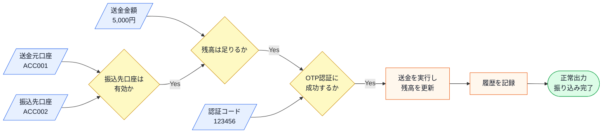
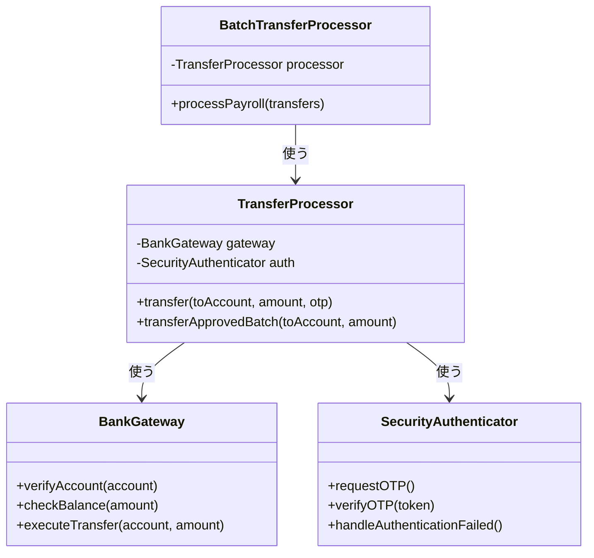
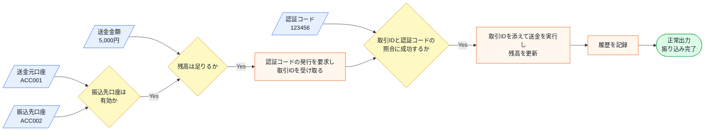
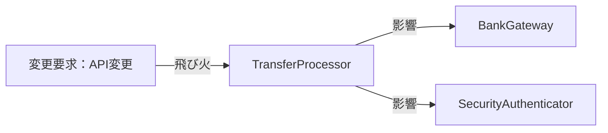
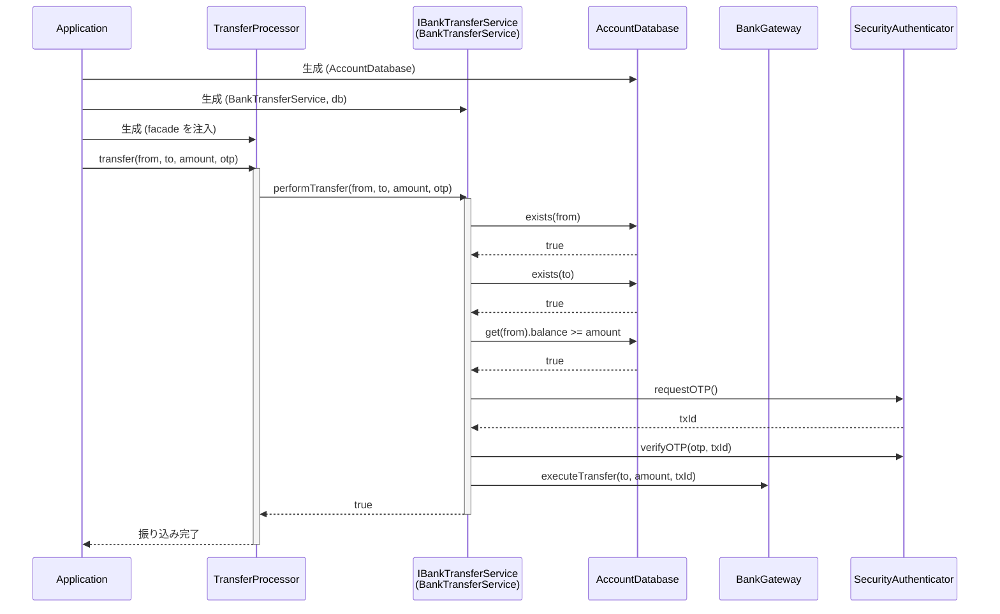
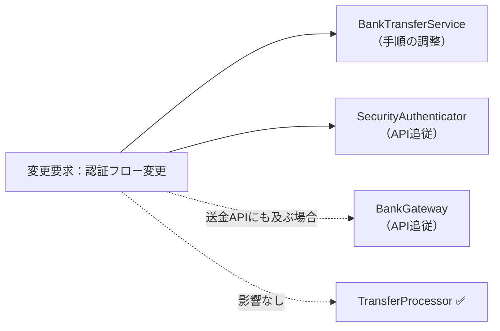
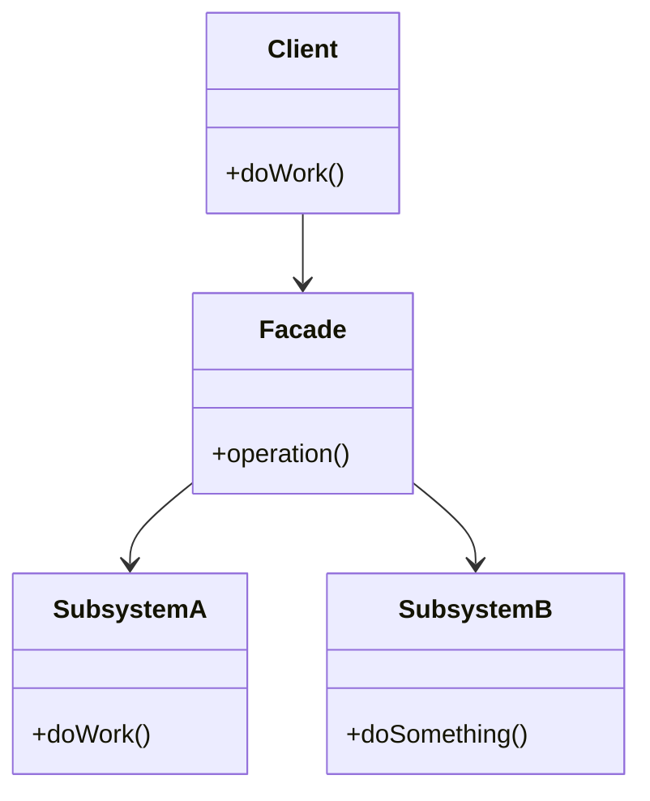

## 第2章 窓口を一本化する ―― Facade パターン

### この章の核心

**銀行APIの認証手順や送金パラメータが変わるたびに、振込業務フローまで修正が必要になる。こういう問題は、「振込を成立させる業務」と「外部システムごとの呼び出し詳細」が同じ場所に混在しているシステムで起きている。**

---

### この章を読むと得られること

この章の痛みは「外部システムの詳細を、自社のコードが直接知りすぎている」問題です。

* **得られること1：** 「依存の広がり」という観点で、コードの波及範囲を識別できるようになる
* **得られること2：** 外部システムの詳細を知りすぎているクラスを見つけ、そこが変更に弱い接続点（変更の痛みの発生源）だと判断できるようになる
* **得られること3：** 複雑な呼び出し手順をカプセル化することで、クライアントコードをスッキリ保つ方法を説明できるようになる
* **得られること4：** 外部システムと自社システムの境界線（窓口）をどこに引くべきか判断できるようになる

---

## 🔵 フェーズ1：現状把握 ―― 仕様を整理し、システムと紐付ける

ネット銀行の振り込み処理が何を入力として受け取り、どの処理で加工し、何を出力するのかを整理します。

### 1-1：このシステムの仕様

このシステムは、ネット銀行の**振り込み処理を実行**します。

「振込先口座番号」「送金金額」を入力として受け取り、銀行の外部システムを通じて以下の手順で振り込みを完了させます。送金後の残高表示は、この章のフェーズ1の現状コードでは扱いません。ここでは振り込み処理が成功・失敗のどちらで終わるかを確認します。

この手順の順番には業務上の理由があります。「口座が存在しない相手に送金しようとする」「残高が足りないのに認証コードを発行する」といった無駄なコストを避けるため、この章のシステムでは安価な確認（口座・残高）を先に行い、コストのかかる認証・送金を後回しにしています。

この章で扱う現状仕様は、次の範囲です。

| 仕様項目 | この章で扱う値 | 具体例 | 何に使うか |
|---|---|---|---|
| 振込先口座番号 | 送金先の口座ID | ACC002 | 口座が存在するかを確認する |
| 送金金額 | 1円以上の金額 | 10,000円 | 残高確認と送金実行に使う |
| 認証コード | 銀行側が発行するOTP | 123456 | 口座と残高が確認できた後に検証する |
| 出力 | 成功 / 失敗 | 振り込み完了、口座エラー、残高不足、認証エラー | どの確認で止まったかを動作例で照合する |

ここで確認する対象は、振り込みがどの確認を通って完了または失敗になるかです。

上の文章と表で仕様を一通り確認したので、まず正常に振り込みが完了する場合の入力・判定・加工・出力の流れとして整理します。

**仕様整理図：正常系の入力・判定・加工・出力**



この図から読み取ることは、次の3点です。

- 振り込みは、送金元・振込先・金額・認証情報がそろって初めて実行できる。
- 口座確認、残高確認、認証は、送金実行の前に満たすべき条件として順に確認される。
- 正常系では、送金実行で残高を更新し、履歴を記録してから振り込み完了を返す。

**振り込みの処理手順**

| 手順 | 処理内容 | 失敗した場合 |
|---|---|---|
| ① 口座確認 | 振込先口座が存在し有効であることを確認する | エラーで中止 |
| ② 残高確認 | 送金元の残高が十分あることを確認する | エラーで中止 |
| ③ OTP認証 | ワンタイムパスワードで本人確認を行う | エラーで中止 |
| ④ 送金実行 | 銀行の外部システムへ送金指示を送信する | エラーで中止 |
| ⑤ 送金結果照会 | 銀行側で送金が確定したか確認する | 未確定なら保留または再試行 |

「失敗したら中止」というルールは、途中まで実行した状態で処理が止まることによる不整合（お金は引き落とされたのに振込先に届かない、など）を防ぐためです。料理のレシピと同じで、前の工程が成立していないと次の工程が意味をなさないため、この章のフェーズ1の現状コードではどのステップが失敗しても後続の手順を実行しません。

**複雑度ストレス条件**

この章では、外部銀行APIを単純な1回の呼び出しとして扱いません。振り込みは、複数の確認を順番に通し、前のAPI応答を次のAPIへ渡す処理です。さらに実運用では、送金実行後の結果照会、タイムアウト、再試行も起こります。

| 複雑さ | この章での扱い | 設計判断への影響 |
|---|---|---|
| 順次API実行 | 口座確認→残高確認→認証→送金→結果照会の順で進める | 呼び出し元が細かいAPI順序を知りすぎる痛みを確認する |
| 一時値の受け渡し | 認証発行で得た取引IDを検証と送金へ渡す | 外部APIの一時値を業務フローへ漏らすべきかが接続点になる |
| タイムアウト・再試行 | 掲載コードでは詳細な通信制御を省略し、窓口内の責任として扱う | 失敗処理を業務フローではなく窓口側へ寄せる理由になる |

送金結果照会は、掲載コードでは `executeTransfer()` の成功応答と履歴記録で簡略化しています。実際の銀行APIで照会APIや再試行制御が必要になっても、この章の判断は変わりません。呼び出し元は「振込を依頼し、結果を受け取る」ことだけを知り、細かい順次APIや再試行は窓口の内側へ閉じ込めます。

**エラー条件**

正常系の送金実行へ進めない入力や外部確認の失敗は、次のように分けて扱います。

| エラー条件 | どこで分かるか | 出力 | 保存・通知などの副作用 |
|---|---|---|---|
| 振込先口座が存在しない、または無効 | 口座確認時 | 口座エラー | 残高更新なし、履歴記録なし |
| 送金元残高が不足している | 残高確認時 | 残高不足エラー | 残高更新なし、履歴記録なし |
| OTP認証に失敗する | 認証コード検証時 | 認証エラー | 残高更新なし、履歴記録なし |
| 銀行API送信に失敗する | 送金実行時 | 送金エラー | この章では外部API境界の詳細なリトライ処理は扱わない |
| 送金結果照会がタイムアウトする | 結果照会時 | 保留または送金エラー | 実運用では窓口内で再試行・保留記録を行う |

**この仕様を決める業務機能**

| 業務機能 | この章の仕様で決めていること |
|---|---|
| インフラ・システム管理（銀行API） | 口座確認・残高確認・送金APIの仕様 |
| インフラ・システム管理（認証） | OTP認証の手順・認証方式 |
| 処理の骨格（開発設計判断） | 振り込みの処理フロー全体 |

後のフェーズで変更要求を扱うとき、どの業務機能の知識なのかを確認するための名前として使います。

---

### 1-2：動作例テーブル

仕様を定義したところで、実際にどのような入力に対してどのような結果が返るかを確認します。このテーブルは「このシステムが正しく動いているとはどういう状態か」の基準になります。後で設計の改善（リファクタリング）を段階的に進めるときも、この表に立ち返ります。

| 送金元口座 | 振込条件 | 結果 | 適用ルール |
|---|---|---|---|
| ACC001 田中一郎（残高150,000円） | ACC002へ5,000円 | 振り込み完了 | 口座確認→残高確認→認証→送金 |
| ACC001 田中一郎（残高150,000円） | UNKNOWNへ5,000円 | エラー：口座なし | 口座確認で中止 |
| ACC001 田中一郎（残高150,000円） | ACC002へ1,000,000円 | エラー：残高不足 | 残高確認で中止 |
| ACC001 田中一郎（残高150,000円） | ACC002へ5,000円 | エラー：認証失敗 | 認証コード検証で中止 |
| ACC003 鈴木次郎（残高500,000円） | ACC002へ30,000円（バッチ） | 振り込み完了 | 事前承認済みのためOTP不要 |

コードを読む前に、このシステムが「何をする必要があるか」をこの表で確認できました。次は「どのように実装されているか」を確認します。

---

### 1-3：登場クラスとクラス構成図

#### このシステムの登場クラス

| クラス名 | 役割 | 担当する仕様 |
|---|---|---|
| AccountDatabase | 口座データの保持・検索・残高更新 | 口座存在確認・残高照会・入出金 |
| TransferRecord | 振り込み1件分のデータ | 振り込み履歴の1レコード |
| TransferHistory | 振り込み履歴の管理 | 成功した振り込みの記録・一覧表示 |
| TransferProcessor | 個別振り込みフロー進行 | 仕様全体 |
| BatchTransferProcessor | 一括振り込み（バッチ）進行 | 複数の振り込みの呼び出し |
| BankGateway | 銀行API通信 | 仕様①、②、④ |
| SecurityAuthenticator | 認証制御 | 仕様③ |

データの流れ：BatchTransferProcessor → TransferProcessor → BankGateway / SecurityAuthenticator → 外部API
この章で注目するポイント：振り込み業務の流れと、銀行APIの呼び出し手順がどのように結びついているか

各クラスの役割を把握したところで、クラス間の関係を図で整理します。



**クラス図に出てくる主なメンバーと操作**

| クラス | メンバー・操作 | 何ができるか |
|---|---|---|
| `BatchTransferProcessor` | `processor` | 複数の振り込みを個別処理へ渡す |
| `BatchTransferProcessor` | `processPayroll()` | 給与振込などの一括処理を進める |
| `TransferProcessor` | `gateway` / `auth` | 銀行APIと認証処理を直接呼び出す |
| `TransferProcessor` | `transfer()` | 口座確認、残高確認、認証、送金を順に実行する |
| `BankGateway` | `verifyAccount()` / `checkBalance()` / `executeTransfer()` | 口座・残高・送金APIを扱う |
| `SecurityAuthenticator` | `requestOTP()` / `verifyOTP()` | OTP認証を要求し、入力された認証情報を検証する |


`BatchTransferProcessor` は `TransferProcessor` を使って一括処理を行い、`TransferProcessor` が `BankGateway` と `SecurityAuthenticator` の両方を直接保持し、それぞれのメソッドを順番に呼び出してフローを制御しています。

---

### 1-4：実装コード（現状）


#### 銀行システムと通信するクラス群

はじめに、銀行APIとの通信を担うクラスと認証を担うクラスを見てみます。

このシステムには以下の3件の口座データがあらかじめ登録されています。

| 口座ID | 名義 | 残高 |
|---|---|---|
| ACC001 | 田中 一郎 | 150,000円 |
| ACC002 | 佐藤 花子 | 30,000円 |
| ACC003 | 鈴木 次郎 | 500,000円 |

コードを読む前に、どのIDがどの口座かを把握しておくと、動作結果と仕様の対応が追いやすくなります。

```cpp
#include <iostream>
#include <map>
#include <string>
#include <vector>
#include <utility>

// 口座情報を保持する構造体
struct AccountInfo {
    std::string ownerName;  // 口座名義
    int balance;            // 残高（円）
};

// 口座データを管理するクラス
class AccountDatabase {
private:
    std::map<std::string, AccountInfo> records;
public:
    AccountDatabase() {
        records["ACC001"] = {"田中 一郎", 150000};
        records["ACC002"] = {"佐藤 花子",  30000};
        records["ACC003"] = {"鈴木 次郎", 500000};
    }

    bool exists(const std::string& id) const {
        return records.count(id) > 0;
    }

    AccountInfo get(const std::string& id) const {
        return records.at(id);
    }

    void withdraw(const std::string& id, int amount) {
        records[id].balance -= amount;
    }

    void deposit(const std::string& id, int amount) {
        records[id].balance += amount;
    }

    void save(const std::string& id, const AccountInfo& info) {
        records[id] = info;             // 実行中の口座表へ追加
    }
};

// 銀行との通信を担うクラス
class BankGateway {
public:
    bool verifyAccount(const std::string& account) {
        std::cout << "口座確認: " << account << "\n";
        return true;
    }
    bool checkBalance(int /*amount*/) {
        std::cout << "残高確認\n";
        return true;
    }
    void executeTransfer(
            const std::string& /*account*/, int amount) {
        std::cout << "送金実行: " << amount << "円\n";
    }
};

// 認証を担うクラス
class SecurityAuthenticator {
public:
    void handleAuthenticationFailed() {
        std::cout << "エラー: 認証失敗\n";
    }
    void requestOTP() { std::cout << "認証コード発行\n"; }
    bool verifyOTP(const std::string& token) {
        std::cout << "認証コード検証\n";
        if (token == "INVALID") {
            handleAuthenticationFailed();
            return false;
        }
        return true;
    }
};
```

`BankGateway` と `SecurityAuthenticator` は、それぞれ銀行APIとの通信・認証の詳細を担う専門クラスです。

次に、振り込み履歴を管理するクラスを見ます。

振り込み履歴はシステム起動時は空で、振り込みが成功するたびに1件追記されます。

```cpp
// 振り込み1件分のデータを保持する構造体
struct TransferRecord {
    std::string fromId;
    std::string fromName;
    std::string toId;
    std::string toName;
    int amount;
};

// 振り込み履歴を管理するクラス
class TransferHistory {
private:
    std::vector<TransferRecord> records;
public:
    void add(const std::string& fromId,
             const std::string& fromName,
             const std::string& toId,
             const std::string& toName,
             int amount) {
        records.push_back(
            {fromId, fromName, toId, toName, amount});
    }

    void printAll() const {
        for (const auto& r : records) {
            std::cout << r.fromName << " → " << r.toName
                      << " : " << r.amount << "円\n";
        }
    }
};
```

`TransferHistory` は振り込みが成功するたびに `add()` で1件追記され、`printAll()` で全履歴を出力します。

#### 振り込み処理クラス

次に、振り込みの全体フローを管理するクラスを見ます。

```cpp
// 振り込み処理クラス
class TransferProcessor {
private:
    AccountDatabase& db;
    TransferHistory& history;
    BankGateway gateway;
    SecurityAuthenticator auth;
public:
    TransferProcessor(AccountDatabase& database,
                      TransferHistory& hist)
        : db(database), history(hist) {}

    bool transfer(
        const std::string& fromAccount,
        const std::string& toAccount, int amount,
        const std::string& otp) {
        // 銀行システムの複雑な手順を直接制御している
        if (!db.exists(fromAccount)) {
            std::cout << "エラー: 送金元口座なし\n";
            return false;
        }
        if (!db.exists(toAccount)) {
            std::cout << "エラー: 送金先口座なし\n";
            return false;
        }
        if (db.get(fromAccount).balance < amount) {
            std::cout << "エラー: 残高不足\n";
            return false;
        }

        gateway.verifyAccount(toAccount);
        gateway.checkBalance(amount);
        auth.requestOTP();
        if (!auth.verifyOTP(otp)) return false;

        gateway.executeTransfer(toAccount, amount);
        db.withdraw(fromAccount, amount);
        db.deposit(toAccount, amount);
        history.add(fromAccount,
                    db.get(fromAccount).ownerName,
                    toAccount,
                    db.get(toAccount).ownerName,
                    amount);
        std::cout << "振り込み完了\n";
        return true;
    }

    bool transferApprovedBatch(
        const std::string& fromAccount,
        const std::string& toAccount, int amount) {
        // 社内承認済みバッチ用。通常振込と手順が重複している
        if (!db.exists(fromAccount)) {
            std::cout << "エラー: 送金元口座なし\n";
            return false;
        }
        if (!db.exists(toAccount)) {
            std::cout << "エラー: 送金先口座なし\n";
            return false;
        }
        if (db.get(fromAccount).balance < amount) {
            std::cout << "エラー: 残高不足\n";
            return false;
        }

        gateway.verifyAccount(toAccount);
        gateway.checkBalance(amount);
        gateway.executeTransfer(toAccount, amount);
        db.withdraw(fromAccount, amount);
        db.deposit(toAccount, amount);
        history.add(fromAccount,
                    db.get(fromAccount).ownerName,
                    toAccount,
                    db.get(toAccount).ownerName,
                    amount);
        std::cout << "振り込み完了（OTP不要）\n";
        return true;
    }
};

// 給与振り込みなどの一括処理バッチ（もう1つの呼び出し元）
class BatchTransferProcessor {
private:
    TransferProcessor processor;
public:
    BatchTransferProcessor(AccountDatabase& database,
                           TransferHistory& hist)
        : processor(database, hist) {}

    void processPayroll(
            const std::string& fromAccount,
            const std::vector<std::pair<std::string, int>>&
                transfers) {
        for (int i = 0; i < (int)transfers.size(); i++) {
            const std::string& account = transfers[i].first;
            int amount = transfers[i].second;
            processor.transferApprovedBatch(
                fromAccount, account, amount);
        }
    }
};
```

このクラス群が今章の中心です。`TransferProcessor` の二つのメソッドには、
「振り込みという業務フローの制御」と「銀行APIの具体的な呼び出し手順」が
一緒に書かれています。バッチではOTPを省略できますが、口座確認・残高確認・
送金という手順を通常振込とは別に記述しています。

#### 呼び出し元と実行確認

```cpp
int main() {
    AccountDatabase db;
    TransferHistory history;
    TransferProcessor processor(db, history);

    // ACC001（田中 一郎、残高15万円）から ACC002（佐藤 花子）へ送金
    std::cout << "--- 行1: 正常な個別振り込み ---\n";
    processor.transfer("ACC001", "ACC002", 5000, "999999");

    // 存在しない送金先口座
    std::cout << "--- 行2: 存在しない口座 ---\n";
    processor.transfer("ACC001", "UNKNOWN", 5000, "999999");

    // 送金元残高（15万円）より多い額を送金しようとする
    std::cout << "--- 行3: 残高不足 ---\n";
    processor.transfer("ACC001", "ACC002", 1000000, "999999");

    std::cout << "--- 行4: 認証失敗 ---\n";
    processor.transfer("ACC001", "ACC002", 5000, "INVALID");

    // ACC003（鈴木 次郎、残高50万円）から ACC002 へバッチ送金
    std::cout << "--- 行5: 社内承認済みバッチ ---\n";
    BatchTransferProcessor batch(db, history);
    std::vector<std::pair<std::string, int>> payroll = {
        {"ACC002", 30000}
    };
    batch.processPayroll("ACC003", payroll);

    std::cout << "\n--- 振り込み履歴 ---\n";
    history.printAll();

    return 0;
}
```

実行対象コード：1-4の現状コード
対応する動作例：1-2の動作例テーブル
確認したいこと：口座確認、残高確認、認証、送金、履歴記録が、入力条件に応じて仕様どおりに実行または中止されること

実行結果：

```
--- 行1: 正常な個別振り込み ---
口座確認: ACC002
残高確認
認証コード発行
認証コード検証
送金実行: 5000円
振り込み完了
--- 行2: 存在しない口座 ---
エラー: 送金先口座なし
--- 行3: 残高不足 ---
エラー: 残高不足
--- 行4: 認証失敗 ---
口座確認: ACC002
残高確認
認証コード発行
認証コード検証
エラー: 認証失敗
--- 行5: 社内承認済みバッチ ---
口座確認: ACC002
残高確認
送金実行: 30000円
振り込み完了（OTP不要）

--- 振り込み履歴 ---
田中 一郎 → 佐藤 花子 : 5000円
鈴木 次郎 → 佐藤 花子 : 30000円
```

動作例テーブルの全5行について、成功時の処理順、失敗時の中止位置、
バッチでOTPを実行しないことを確認できました。現状でも仕様は満たしています。

> **手元で動かすには**
> このコードは1つの `.cpp` に貼り付けて、そのままコンパイル・実行できます（例：`g++ chapter02.cpp -o app && ./app`）。`main()` は自由に組み替えて構いません。たとえば `db.save("ACC010", {"高橋 三郎", 80000});` で口座を足し、その口座を送金元にして `processor.transfer("ACC010", "ACC002", 20000, "999999");` を呼べば、追加した口座からの送金の成否や残高変化がその場の実行結果に表れます。口座データはプロセス実行中だけ有効で、終了すると消えます（DBのような永続化はこの章の論点ではありません）。

次のフェーズで変更が来たときに何が起きるかを確認します。

---

### 1-5：変更要求

ある月曜日の朝、銀行のシステム担当者から緊急の連絡が入りました。

「来月から、銀行APIの認証仕様が大幅に変わります。これまでは単一のOTP（ワンタイムパスワード）認証だけで十分でしたが、今後は、はじめに『認証コードの発行』をリクエストし、その応答で返る『取引ID』とあわせて検証する必要があります。」

さらに、これに続いて「銀行側の送金APIのインターフェースもセキュリティ強化のため、送金時のパラメータに『トランザクションID』が必須になります」とのこと。

リリースは来月の頭。

**仕様変更の内容**

変更要求を受けて、認証と送金の手順がどう変わるかを整理します。（この変更は「インフラ・システム管理の業務機能」に属する要求です）

| 手順 | 変更前 | 変更後 |
|---|---|---|
| ① 口座確認 | 既存の口座確認を実行 | 同じ確認手順を継続 |
| ② 残高確認 | 既存の残高確認を実行 | 同じ確認手順を継続 |
| **③ 認証** | OTP（ワンタイムパスワード）1ステップで完了 | **「認証コードの発行」→「取引IDと認証コードの照合」の2ステップに変更** |
| **④ 送金実行** | 振込先口座と金額だけを指定して送金 | **「トランザクションID」が必須パラメータとして追加** |

現行の認証では発行と検証の間に識別子を受け渡していませんでした。新仕様では `requestOTP()` の応答から取引IDを受け取り、`verifyOTP(authCode, transactionId)` で検証します。検証済みの同じ取引IDを、`executeTransfer(account, amount, transactionId)` にも渡します。

**変更前後の入力・判定・加工・出力差分**

1-1の現状仕様を退避し、変更要求を当てた後の仕様と同じ粒度で並べます。以降の分析では、この差分を追います。

| 要素 | 変更前（1-1の現状仕様） | 変更後（今回の要求） | 差分として追うもの |
|---|---|---|---|
| 入力 | 振込先口座、送金金額、認証コード | 振込先口座、送金金額、認証コード、取引ID | 取引IDが認証と送金の間を流れる |
| 判定 | 口座有効、残高十分、OTP一致 | 口座有効、残高十分、取引IDと認証コードの照合成功 | 認証判定が2段階になる |
| 加工 | OTP検証後に送金する | 認証コードを発行し、取引ID付きで送金する | 認証発行と送金実行の手順が増える |
| 出力 | 振込成功または各種エラー | 振込成功、認証発行エラー、照合エラー、送金エラー | どの手順で失敗したかを追う |

**変更後の入力・加工・出力**

変更後の仕様を、1-1と同じ粒度で、正常系の入力・判定・加工・出力として確認します。1-1の図との差分は、認証が「発行」と「照合」の2ステップになることと、発行時に受け取る「取引ID」が送金実行にも受け渡されることの2点です。



この図から読み取ることは、次の3点です。

- 口座確認・残高確認と、送金後の履歴記録は1-1のまま変わらない。
- 認証が「認証コードの発行」と「取引IDと認証コードの照合」の2ステップになり、発行の応答で受け取る「取引ID」という新しい値が加わる。
- 取引IDは認証の中で完結せず、送金実行にも必須の値として受け渡される。

変更後も、失敗条件は正常系図へ混ぜずに別で確認します。

| エラー条件 | どこで分かるか | 出力 | 保存・通知などの副作用 |
|---|---|---|---|
| 振込先口座が存在しない、または無効 | 口座確認時 | 口座エラー | 残高更新なし、履歴記録なし |
| 送金元残高が不足している | 残高確認時 | 残高不足エラー | 残高更新なし、履歴記録なし |
| 認証コードの発行に失敗する | 認証コード発行時 | 認証発行エラー | 残高更新なし、履歴記録なし |
| 取引IDと認証コードの照合に失敗する | 認証コード検証時 | 認証エラー | 残高更新なし、履歴記録なし |
| 取引ID付き送金に失敗する | 送金実行時 | 送金エラー | この章では外部API境界の詳細なリトライ処理は扱わない |

図に加わった「取引ID」の受け渡しが実際にコードのどこへ書かれるかは、フェーズ3で変更を試すコードと、フェーズ7の最終コード・実行結果で追います。

フェーズ1でシステムの現状と変更要求が把握できました。次のフェーズ2では、「何を変え、何を守るか」を整理します。

---

## 🟣 フェーズ2：仮説立案 ―― 何が変わるかを観察し、ヒアリングで裏付ける
### 2-1：変わりそうな仕様の見当をつける

ここで作る一覧は、思いつきで「変わりそう」と感じたものを並べる表ではありません。フェーズ1で確認した仕様・動作例・クラス図を材料に、次の順で候補を絞ります。

1. 仕様図と動作例から、入力・判定・加工・出力のうち条件や値が変わりそうな箇所を拾う。
2. その箇所が、1-3のどのクラス・メソッドに書かれているかを対応づける。
3. その仕様が、どんな理由で、何をきっかけに、どのくらいの頻度で変わりそうかを仮説として書く。
4. 逆に、当面変えない前提にできる処理の骨格も分けておく。

この手順で見ると、「振り込みを実行する」という大きな処理全体ではなく、その中のどの確認・認証・送金呼び出しが変更候補なのかを読者自身で追えるようになります。

フェーズ2では、フェーズ1で見た仕様のうち、どの条件・手順・外部呼び出しが変わりそうかを見当づけます。責務の配置は、変更要求を当てた後の痛みと合わせて確認します。

| 仕様候補 | 仕様上の場所 | フェーズ1の現状コードでの場所 | 見立て |
|---|---|---|---|
| 口座確認・残高確認 | 判定、外部API呼び出し | `TransferProcessor.transfer()` | 銀行APIの仕様変更で確認順序や入力値が変わる可能性があるため、今回見る |
| OTP認証 | 判定、認証手順 | `TransferProcessor.transfer()` | 認証方式や検証方法が変わる可能性があるため、今回見る |
| 送金実行 | 加工、外部API呼び出し | `TransferProcessor.transfer()` | 送金APIの呼び出し形式が変わる可能性があるため、今回見る |
| 振り込みの大枠 | 入力から確認・認証・送金へ進む順序 | `TransferProcessor.transfer()` | この章の変更要求では、順序の大枠は当面維持する前提で見る |

この表から、今回の検討対象は「銀行API確認」「OTP認証」「送金API呼び出し」の3つに絞れます。これらが同じ場所に書かれていて困るかどうかは、フェーズ3で変更を入れてから確認します。

### 2-2：今回の変更で確実に変わること

今回の変更要求から確定している変更は2点です。

- **銀行APIの認証手順の変更**：OTP1ステップから、認証コード発行＋取引IDとの照合という2ステップに変更される
- **送金APIのパラメータ追加**：送金時にトランザクションIDが必須になる

ただし「この変更が1回限りか、今後も続くか」によって、どこまで設計を変えるべきかが大きく変わります。関係者に確認します。

### ヒアリングに向けた背景確認

このシステムは、あるネット銀行の振り込み処理を自動化するためのものです。銀行のシステムは非常に堅牢で、安全に送金を行うために、口座情報の確認、残高チェック、手数料の計算、そして実際の送金指示という、いくつもの手順を正しい順番で実行する必要があります。

開発チームは、この銀行のAPIを直接叩いて振り込みを行うプログラムをメンテナンスしています。当初は単純な送金機能だけでしたが、最近では、振り込み先に応じた送金限度額の確認や、二要素認証の呼び出しなど、銀行側から求められるセキュリティ要件が年々厳しくなってきました。

### 2-3：関係者ヒアリング


今回の変更が一時的なものか、将来も続くリスクがあるのかを確認するため、銀行のAPI担当者にヒアリングを行いました。

- **開発者：** 「認証の仕様が変わるとのことですが、今回の変更は一時的なものでしょうか？今後、さらに認証方式が増える予定はありますか？」
- **銀行API担当者：** 「申し訳ありませんが、セキュリティ強化の波は止まりません。数ヶ月後には、生体認証を導入する予定もあります。今後も認証手順はさらに複雑になる可能性が高いです。」
- **開発者：** 「なるほど。送金APIについても、今後パラメータが増えたり、呼び出し順序が変わったりすることは考えられますか？」
- **銀行API担当者：** 「ええ、来年以降には、さらに上位のトランザクション管理システムと連携するため、送金時のリクエスト形式が現在のJSONからXMLへ移行する計画もあります。」
- **開発者：** 「分かりました。かなり頻繁に接続仕様が変わりそうですね。今回の認証フローの変更についても、将来的にさらに手順が増えるリスクはありますか？」
- **銀行API担当者：** 「おっしゃる通りです。現在は二段階認証ですが、将来的には三段階になるかもしれません。現時点での固定的な手順に縛られない設計にしておいた方が、お互いのためかもしれませんね。」

### 2-4：ヒアリングで判明した将来リスク

ヒアリングで浮かび上がった「確定ではないが、近い将来起こりうる変化」を記録します。これは今回の設計判断の材料です。

| **将来リスク** | **時期の目安** | **根拠** |
|---|---|---|
| 認証フローの多段階化（二段階→三段階認証） | 銀行側のセキュリティ強化時 | 銀行API担当者との確認 |
| 送金リクエスト形式の変更（JSON→XML移行計画） | 来年以降の基幹システム連携時 | 銀行API担当者との確認 |
| 生体認証の導入 | 数ヶ月後の予定 | 銀行API担当者との確認 |

フェーズ2で「今変わること（確定）」と「将来変わるかもしれないこと（リスク）」を分けて整理できました。次のフェーズ3では、現在の構造で変更を試みたときに何が起きるかを確認します。

### 2-5：変わる見込みと当面安定の前提を確定する

2-4で把握した将来リスクを、「現在の状態」と「将来起こりうる変化」の対比で整理します。設計判断の根拠を一覧にしておくことで、フェーズ6で採用する形を決める判断基準になります。

| 変更内容 | 現在 | 将来（時期の目安） |
|---|---|---|
| 認証ステップ数 | OTP 1ステップ（発行→検証） | 三段階認証へ拡張（銀行セキュリティ強化時） |
| 認証方式 | OTP（ワンタイムパスワード） | 生体認証の追加（数ヶ月後の予定） |
| 送金リクエスト形式 | JSON 形式 | XML 形式へ移行（来年以降の基幹システム連携時） |

この変化が来たとき、現在の `TransferProcessor` がどこまで影響を受けるかを次のフェーズ3で確認します。

---

## 🟣 フェーズ3：問題特定 ―― 変更の痛みを発見する
### 3-1：変更を試みる

「銀行APIの認証フロー変更（発行と検証の2段階化）」と「送金時のトランザクションID付与」を、現在の `TransferProcessor` クラスの `transfer` メソッドに直接書き込む作業を試みてみましょう。変更前の `transfer` メソッドの中心部分はこうでした。

```cpp
gateway.verifyAccount(toAccount);
gateway.checkBalance(amount);

auth.requestOTP();
auth.verifyOTP(otp);

gateway.executeTransfer(toAccount, amount);
```

このコードに今回の変更を適用すると、以下のようになります。

```cpp
void transfer(
        const std::string& toAccount, int amount,
        const std::string& otp) {
    gateway.verifyAccount(toAccount);
    gateway.checkBalance(amount);

    // 【痛み：認証の手順が変わる】
    // 既存のコードを書き換える必要がある
    // 認証コードの発行応答から取引IDを受け取る
    std::string transactionId = auth.requestOTP();
    // 検証時に取引IDを渡す必要がある
    auth.verifyOTP(otp, transactionId);

    // 【痛み：送金APIの仕様が変わる】
    // 認証済みの取引IDを送金APIにも渡す
    gateway.executeTransfer(toAccount, amount, transactionId);

    std::cout << "振り込み完了\n";
}
```

変更後のコードを実行すると、次のような結果になります。


```cpp
// スタブ：本物の銀行APIの代わりに決まった応答を返す差し替えクラス
// （変更後の実行を確認するための最小構成）
struct Auth {
    std::string requestOTP() {
        std::cout << "OTP発行 → 取引ID取得" << std::endl;
        return "TX-9001";
    }
    void verifyOTP(const std::string& otp,
                   const std::string& txId) {
        std::cout << "OTP検証（txId=" << txId
                  << "）" << std::endl;
    }
};

struct Gateway {
    void verifyAccount(const std::string& to) {
        std::cout << "口座確認: " << to << std::endl;
    }
    void checkBalance(int amount) {
        std::cout << "残高確認: " << amount << " 円"
                  << std::endl;
    }
    void executeTransfer(const std::string& to,
                         int amount,
                         const std::string& txId) {
        std::cout << "送金: " << to << " / "
                  << amount << " 円（txId="
                  << txId << "）" << std::endl;
    }
};

int main() {
    Auth auth;
    Gateway gateway;
    gateway.verifyAccount("987-654321");
    gateway.checkBalance(50000);
    std::string txId = auth.requestOTP();
    auth.verifyOTP("123456", txId);
    gateway.executeTransfer("987-654321", 50000, txId);
    std::cout << "振り込み完了" << std::endl;
    return 0;
}
```

実行対象コード：3-1の変更試行コード
対応する動作例：変更要求後の代表ケース（ACC001から987-654321へ50,000円を送金）
確認したいこと：銀行APIの認証仕様変更により、取引IDが業務フロー側へ流れ込んでいること

実行結果：

```
口座確認: 987-654321
残高確認: 50000 円
OTP発行 → 取引ID取得
OTP検証（txId=TX-9001）
送金: 987-654321 / 50000 円（txId=TX-9001）
振り込み完了
```

コード自体は正しく動いていますが、`transactionId` という一時的な状態が `transfer` メソッドの中を流れていることが分かります。

この変更を試みたとき、はじめに気づくのは `TransferProcessor` クラスが「銀行APIの細かな使い方」をあまりにも詳細に知りすぎているという点です。認証のステップが増えただけでメソッドのシグネチャ（名前・引数・戻り値の形）を追いかける必要があり、ロジックの修正が連鎖的に発生してしまいます。

「振り込みを実行する」という業務上の命令を処理しているはずの `TransferProcessor` が、銀行システム側から送られてくる「取引IDを保持する」といった一時的な状態管理まで背負わされています。銀行側のAPI仕様が一つ変わるたびに、私たちの業務フローを制御するクラスのコードを書き換え、その結果、振り込み処理全体のテストをやり直さなければならないのです。

### 3-2：変更影響グラフ



このグラフを見ると、銀行APIの仕様という「外部システム都合の変更」が、私たちの業務フローの中枢である `TransferProcessor` を経由して、通信クラスや認証クラス全体に飛び火していることが分かります。

> **グラフの読み方：** この矢印は「フェーズ3で実際に変更したクラス」ではなく、「変更要求が来たときに影響が波及するリスクのある依存関係」を示しています。`TransferProcessor` が `BankGateway` と `SecurityAuthenticator` を直接知っているため、銀行APIの仕様が変わると `TransferProcessor` を経由して両クラスへの影響が及ぶ可能性があることを可視化しています。

### 3-3：痛みの言語化

**1つ目：仕様変更の波が業務ロジックに直撃する恐怖。** 今回の認証フローの変更は、本来であれば「振り込み」という業務プロセスには影響しないはずのものです。しかし、今の構造では、銀行APIという「外部システムの使い方」を `TransferProcessor` が直接知っているため、APIの引数が増えたり手順が変わったりするたびに、業務フローを記述している核心部分を書き換える羽目になります。

**2つ目：目的が見えなくなる複雑化。** コードを見れば、口座確認、残高確認、認証発行、検証、送金実行と、手続きが淡々と並んでいます。しかし、新しい仕様に対応するために一時的なIDを保持したり、条件分岐を足したりすることで、コードは「何のために振り込んでいるのか」という業務上の目的よりも、「銀行のAPIにどうやって命令を通すか」という技術的な手順の記述で埋め尽くされてしまいます。

---
> **📌 問題（確定）**
> 振り込み処理の認証手順や送金パラメータが変わるたびに、業務フローを管理する `TransferProcessor` のコードを直接書き換えなければならない。変わる理由が異なるコードが同じ場所に混在しているため、銀行API側の仕様変更が振り込み業務ロジック全体に波及し、影響範囲が読めない。
---

フェーズ3で「変更が辛い」ことが確認できました。次のフェーズ4では、なぜ辛いのかを構造的に言語化します。

---

## 🟠 フェーズ4：原因分析 ―― なぜ辛いのかを構造で言語化する
### 4-1：痛みの根源を探る（観察と原因）

フェーズ3で確認した「変更の辛さ」は、コードのどこから来ているのでしょうか。コードを注意深く観察すると、痛みを引き起こしている2つの事実が浮かび上がってきます。

第一に、新しい認証ステップが追加されたとき、なぜ毎回 `TransferProcessor` を開かなければならないのでしょうか？
それは、このクラス自身が「`auth.requestOTP()` を呼んで、取引IDを取得して、`auth.verifyOTP()` を呼ぶ」といった**銀行APIの具体的な呼び出し手順をすべて直接知ってしまっている（抱え込んでいる）**からです。

第二に、なぜ変更の影響範囲が読めず、振り込み全体のテストをやり直す恐怖を感じるのでしょうか？
それは、「振り込みという業務プロセスの進行」という責任と、「銀行APIという外部システムの技術的な利用手順」という責任が、**同じメソッドの中で物理的に混ざり合っている**からです。

この「症状（痛み）」と「根本原因」を整理すると、以下のようになります。

| **観察した症状（痛み）** | **構造的な原因（痛みの根源）** |
|---|---|
| 仕様変更の波が業務ロジックに直撃する | `TransferProcessor` が銀行APIの具体的な呼び出し手順を直接知っているから |
| 複雑化して目的が見えなくなる | 変わる理由が違う2つのもの（「振り込み業務のフロー」と「銀行APIの技術手順」）が同じメソッドの中に混在しているから |
| タイムアウトや結果照会が増えるたびに分岐が増える | 再試行・照会・保留判断といった通信上の都合が、振り込み業務の目的と同じメソッドに書かれるから |

### 4-2：変わるもの/変わってほしくないもの

> **「変わらないもの」と「変わってほしくないもの」は異なります。** 「変わらないもの」は経験的事実（今まで変わっていない）、「変わってほしくないもの」は設計意図（ここを安定させてほかを守りたい）です。ここで整理するのは後者です。

| **変わり続けるもの（外部システムの詳細）** | **変わってほしくないもの（業務フローの骨格）** |
|---|---|
| 銀行APIの認証手順（発行・検証のステップ） | 振り込みの全体フロー（口座確認→残高確認→送金） |
| 送金APIのパラメータ（IDの追加や型変更） | 振り込みという業務上の目的 |

**【変わる部分（外部システムの技術詳細）】**
```cpp
        // ← 銀行側の都合で変わり続ける部分
        std::string transactionId = auth.requestOTP();
        auth.verifyOTP(otp, transactionId);
        gateway.executeTransfer(toAccount, amount, transactionId);
```

**【変わってほしくない部分（守りたい業務フローの骨格）】**
```cpp
        // ← 振り込みという業務の意図は変わらない
        // （口座を確認する）
        // （認証する）
        // （送金を実行する）
        std::cout << "振り込み完了\n";
```

### 4-3：接続点に漏れている手順を確認する

ここでの「確認すること」は、前節までに見つけた原因から抽出します。まず、原因文から「守りたい骨格」と「変わる差分」を分けます。次に、その差分を動かすために骨格側が知ってしまっている名前・条件・順序・型を拾います。最後に、接続点に残す最小の約束を、値・型・操作・イベントとして書きます。

原因によって、接続点で見る抽象観点は変わります。条件分岐が原因なら条件・定数・選択基準を見ます。処理手順が原因なら呼び出し順・前後条件・失敗時分岐を見ます。生成判断が原因なら具体クラス名・生成条件・登録場所を見ます。通知や外部連携が原因なら通知先・タイミング・成否の扱いを見ます。データや状態が原因なら、境界を流れる値・型・状態を見ます。

現在、`TransferProcessor`は銀行APIのクラス名だけでなく、口座確認・認証・送金・確認という呼び出し順序まで知っています。接続点で必要なのは「振込を依頼し、結果を受け取ること」ですが、外部APIの技術的な手順が業務側へ漏れています。

現在の `TransferProcessor` は、銀行APIという「特定の機器」に対して、専用のケーブルを直に配線しているような状態です。

**【銀行APIの手順が呼び出し元へ漏れているコード】**
```cpp
class TransferProcessor {
private:
    BankGateway gateway;         // ← 具体：型名を直接宣言
    SecurityAuthenticator auth;  // ← 具体：型名を直接宣言
public:
    void transfer(...) {
        // ← 直接：各APIメソッドを窓口なしに直接順に呼び出す
        gateway.verifyAccount(toAccount);
        auth.requestOTP();
        // gateway.executeTransfer(fromAccount, toAccount, amount);
        // gateway.confirmTransaction(); など送金実行処理が直接続く
    }
};
```

銀行側の認証方式や送金パラメータが変わるたびに、業務フローを持つ`TransferProcessor`まで修正する必要があります。

「振り込み業務」と「銀行APIの仕様」は、変わる理由が全く異なります。これらが同じ場所に混在していることが、根本原因として確認できました。

今回着目する接続点は、「振込依頼」と「振込結果」の境界です。銀行APIの手順は、その境界の向こう側へ移せます。

---
> **📌 原因（確定）**
> `TransferProcessor`が銀行APIの呼び出し順序を抱え込んでいるため、外部システムの都合で変わる知識と、振込業務のフローが同じクラスに混在している。
---

フェーズ4で根本原因が言語化できました。「どこを分けるか」は明確です。次のフェーズ5では、その境界で実際に何が流れているかを値・型のレベルで具体化し、「何を変え、何を守るか」を明確にします。

---

## 🟡 フェーズ5：課題定義 ―― 解くべき接続点を定める
フェーズ4は「なぜ辛いか」を答えました。フェーズ5が問うのは「分けるべき境界で、実際に何が流れているか」です。クラスの参照関係ではなく、**値・型のレベル**に降りていきます。

フェーズ4の分析により、問題は「振り込み業務のフロー」と「銀行APIの技術的な呼び出し手順」が混在していることだと分かりました。その境界で何がやり取りされているかを具体化します。

### 接続点を特定する

接続点は、クラス図の線やインターフェース名から探すのではなく、変更要求を当てて特定します。まず、その要求で変えたい側と変えたくない側を分けます。次に、両者がどのメソッド呼び出し・引数・戻り値・生成・イベントでつながっているかを見ます。そのつながりのうち、変更要求のたびに知識が漏れて修正が波及する場所が、ここで解くべき接続点です。

`transfer()` の中で分けるべき境界は1か所です。銀行APIの呼び出し手順と、業務フローとの間で受け渡しているデータを見ます。

```cpp
void transfer(
        const std::string& toAccount, int amount,
        const std::string& otp) {

    // ↓ 銀行APIの呼び出し手順（変わり続ける）
    gateway.verifyAccount(toAccount);
    gateway.checkBalance(amount);
    std::string transactionId = auth.requestOTP();
    auth.verifyOTP(otp, transactionId);
    gateway.executeTransfer(toAccount, amount, transactionId);
    // ↑ ここまでが分離するターゲット

    std::cout << "振り込み完了\n"; // ← 変わらない骨格
}
```

「銀行API呼び出し群」が受け取るのは振り込み先・金額・OTPです。内部では認証応答の取引IDを検証と送金へ引き継ぎます。完了は副作用（void）で表現されます。

| 接続点 | 接続するデータ | 変わるもの |
|---|---|---|
| 銀行API群 → 通常振込の骨格 | toAccount（string）・amount（int）・otp（string）→ 振込結果 | APIの呼び出し手順・実装詳細 |
| 結果照会・再試行 → 通常振込の骨格 | 取引ID・照会結果・再試行可否 | タイムアウト、保留、照会APIの扱い |

### 何を変え、何を守るか

- **変わるもの**：銀行APIの呼び出し手順（gateway/auth のメソッド群・順序・パラメータ）。外部システムの仕様変更のたびに内部が変わる。
- **比較的安定しているもの**：通常振込という業務上の操作、および口座・金額・認証コードという入力。外部API内の取引ID受け渡しは窓口の外へ見せない。

呼び出し元（`TransferProcessor` 等）が知る必要があるのは、口座・金額・OTPを窓口へ渡す方法です。問題は「どのAPIをどの順番でどう呼ぶか」という**外部連携の手順**まで呼び出し元へ漏れていることです。

**現状のままでよい場面**：銀行APIの手順が単純で、当面変更されず、利用箇所も1か所だけなら現状を保つ判断もあります。今回は認証と送金手順の変更が続くため、呼び出し元から手順を隠す窓口を検討します。

---
> **📌 課題（確定）**
> ヒアリングで確認した認証フローや送金仕様の変更に備えるには、`TransferProcessor` が外部APIの呼び出し手順を直接知り続ける構造では変更箇所が広がりやすい。銀行APIの具体的な呼び出し手順を窓口の内側へまとめ、`TransferProcessor` からは安定したインターフェース越しに処理を委譲できる構造に変える。
---

## 🔴 フェーズ6：対策検討 ―― 案を比べ、採用する形を決める

フェーズ6の出発点は、フェーズ3で変更要求を当てて痛んだ「変更途中コード」です。変更要求を容れる前の現状コードには戻しません。フェーズ3で `transfer()` に書き込んだ変更途中コードには、認証コードの発行から取引IDを受け取り、それを検証と送金の呼び出しへ引き回すという、変更要求を受けて増えた判定・処理・引数が具体物として現れています。ここからは、その痛んだコードに現れた銀行API呼び出しの手順を見て、同じ形で扱える共通点（確認・認証・送金という呼び出しの並びと、そこを流れる口座・金額・取引IDという値の契約）を抜き出し、変わる差分を接続点の外へ出す形へ整理していきます。読者が「痛み → 共通点の発見 → 抽象化」の順で追えるよう、最初の小さな案も、この変更途中コードを整理する形から始めます。

フェーズ6では、第0章の段階的進化アプローチを標準フローとして使います。ただし、ここでのステップは一本道の作業手順ではなく、対策案を比較するための候補です。まず小さな整理で何が見えるかを確認し、次に責任の移動、契約、窓口、組み合わせ、生成責任の移動のうち、この章の課題に必要な案だけを比べます。章の題材に合わない案を省略したり、順序を入れ替えたり、接続点ごとに分岐させたりする場合は、論点外・効果不足・導入コスト過多・接続点が別であるなどの理由を本文中で説明します。
フェーズ5で「変わるのは銀行APIの呼び出し手順であり、業務フローが窓口へ渡す引数の型は比較的安定している」ことが分かりました。ここでは、その手順をどのように窓口の内側へ閉じ込めるかを段階的に検討します。いきなり正解へ飛ぶのではなく、各ステップで「どこまで痛みが解消されるか」を確認しながら、今回の要件において「どのステップで止めるべきか」を決断します。

フェーズ5の課題から、対策候補は次のように出します。

| フェーズ4で見えた原因 | フェーズ5で定めた課題 | だからフェーズ6で見る候補 |
|---|---|---|
| `TransferProcessor` が口座確認・残高確認・認証・送金のAPI詳細を順に知っている | 振込フローの呼び出し元から、銀行APIごとの手順と失敗処理を隠す | まず処理を関数へ分け、どの手順が外部API詳細かを見えるようにする |
| 銀行ごとに呼び出し順や必要な確認が変わる | 業務フローは「振込を依頼する」だけにし、手順差分を窓口の内側へ閉じ込める | 銀行ごとの窓口クラスを作り、共通の振込操作で呼べるかを見る |
| 失敗条件が増えると呼び出し元の分岐も増える | 成功・失敗の扱いを、呼び出し元が銀行別に判断しなくて済む形にする | 窓口の戻り値とエラー表現をそろえ、採用コストと効果を比べる |

### ステップ1：各処理を独立したメソッドに切り出す（同じクラスの中で整理する）

「API呼び出しが複雑に絡み合っているなら、1つひとつの操作を独立したメソッドに切り出してみよう」というのが自然な最初の発想です。クラスを新しく作るのはコストがかかる。まずは `TransferProcessor` の中で、各API呼び出しをそれぞれ独立したメソッドとして切り出してみます。

```cpp
class TransferProcessor {
    BankGateway gateway;
    SecurityAuthenticator auth;

    // 口座確認を独立したメソッドとして切り出す
    bool checkAccountExists(const std::string& account) {
        return gateway.verifyAccount(account);
    }

    // 残高確認を独立したメソッドとして切り出す
    bool checkBalanceSufficient(int amount) {
        return gateway.checkBalance(amount);
    }

    // 認証コード発行を独立したメソッドとして切り出す
    std::string issueAuthCode() {
        return auth.requestOTP();
    }

    // 認証コード検証を独立したメソッドとして切り出す
    bool verifyAuthCode(
            const std::string& otp,
            const std::string& txId) {
        return auth.verifyOTP(otp, txId);
    }

    // 送金実行を独立したメソッドとして切り出す
    void executeTransfer(
            const std::string& account, int amount,
            const std::string& txId) {
        gateway.executeTransfer(account, amount, txId);
    }

    // 「どの処理をどの順序で実行するか」の判断を
    // 独立したメソッドとして切り出す
    bool conductTransfer(
            const std::string& toAccount, int amount,
            const std::string& otp) {
        if (!checkAccountExists(toAccount))  return false;
        if (!checkBalanceSufficient(amount)) return false;
        std::string txId = issueAuthCode();
        if (!verifyAuthCode(otp, txId))      return false;
        executeTransfer(toAccount, amount, txId);
        return true;
    }

public:
    void transfer(
            const std::string& toAccount, int amount,
            const std::string& otp) {
        if (conductTransfer(toAccount, amount, otp))
            std::cout << "振り込み完了\n";
    }
};
```

`transfer()` の本文から銀行API呼び出しの詳細が消え、各操作が独立したメソッドとして名前を持つようになりました。

**この段階の評価：** 各API操作が独立したメソッドになったことで、`conductTransfer()` に「何をどの順序でやるか」の判断ロジックが集まりました。ここで気づくことがあります。`checkAccountExists`・`checkBalanceSufficient`・`verifyAuthCode` の3つは、戻り値がいずれも `bool` です。「確認して成否を返す」という同じ形の処理が並んでいる——これが「共通の構造」の初めての兆候です。また、「実行」（`conductTransfer`）を独立させたことで、「個々のAPI操作」と「どれをどの順で呼ぶかの判断」が別の関心事だということも見えてきました。

しかし、これらのメソッドはすべて `TransferProcessor` クラスの内部にあります。銀行側の認証仕様が変わるたびに、結局はこの `TransferProcessor` を開いて書き直す必要があるのではないでしょうか。銀行APIの手順という知識がクラスの中に残ったままです。次のステップでは、このAPI呼び出しの知識を別のクラスに移す方向を試してみましょう。

---

### ステップ2：銀行API手順を専用の窓口へ集約する（銀行操作の窓口クラス）

「銀行APIとのやり取りをすべて別のクラスに任せてしまえば、`TransferProcessor` は呼ぶだけでよくなる」という発想です。手順全体を担当するクラスを新しく作り、呼び出し元はそのクラスを1つ呼ぶだけにします。

ここで使う `Helper` は、「補助役として、複雑な処理をまとめるクラス」という意味の仮名です。設計用語として特別な構造を指しているわけではありません。この段階では、銀行APIの細かい手順を `TransferProcessor` から外へ出すための一時的な置き場所として見てください。

```cpp
// 銀行APIとのやり取りをすべて担う専用の窓口（銀行操作の窓口クラス）
class BankTransferHelper {
    BankGateway gateway;         // ← 具体クラスを直接保持
    SecurityAuthenticator auth;  // ← 具体クラスを直接保持
public:
    void execute(const std::string& account, int amount,
                 const std::string& otp) {
        // 複雑な手順はすべてここに集まる
        gateway.verifyAccount(account);
        gateway.checkBalance(amount);
        std::string txId = auth.requestOTP();
        auth.verifyOTP(otp, txId);
        gateway.executeTransfer(account, amount, txId);
    }

    void executeApprovedBatch(const std::string& account, int amount) {
        gateway.verifyAccount(account);
        gateway.checkBalance(amount);
        gateway.executeTransfer(account, amount, "APPROVED-BATCH");
    }
};

// 振り込み処理クラス（呼び出し元1）
class TransferProcessor {
    BankTransferHelper* helper; // ← 具体クラスを直接知っている
public:
    TransferProcessor(BankTransferHelper* h) : helper(h) {}
    void transfer(const std::string& toAccount, int amount,
                  const std::string& otp) {
        helper->execute(toAccount, amount, otp); // 1行に集約された
        std::cout << "振り込み完了\n";
    }
};

// 給与振り込みなどの一括処理バッチ（呼び出し元2）
class BatchTransferProcessor {
    BankTransferHelper* helper; // ← 同じ具体クラスをここでも直接保持
public:
    BatchTransferProcessor(BankTransferHelper* h) : helper(h) {}
    void processPayroll(
            const std::vector<std::pair<std::string, int>>& transfers) {
        for (int i = 0; i < (int)transfers.size(); i++) {
            const std::string& account = transfers[i].first;
            int amount = transfers[i].second;
            helper->executeApprovedBatch(account, amount);
        }
    }
};
```

`TransferProcessor` も `BatchTransferProcessor` も `helper->execute()` の1行を呼ぶだけになり、呼び出し元は大幅にシンプルになった。

**この段階の評価：** 呼び出し元はシンプルになり、銀行APIの複雑な手順が `BankTransferHelper` に集まりました。これはすでに単一の窓口クラスとしての基本形です。`BankTransferHelper` の公開メソッドを保ったまま内部のAPI呼び出しを変える限り、`TransferProcessor` と `BatchTransferProcessor` の修正は不要です。

一方、呼び出し元は具体型 `BankTransferHelper` に依存しています。別銀行向けの実装やテスト用の偽物へ差し替えたい場合、または業務側が所有する安定した契約を明示したい場合には、抽象インターフェースを追加する価値があります。次のステップは窓口クラスを完成させるためではなく、**窓口の差し替え可能性とテスト容易性を追加するため**の設計です。

---

### ステップ3：窓口クラスの前に抽象インターフェースを置く

「呼び出し元には業務側が所有する抽象インターフェースを見せ、具体的な窓口クラスを組み立て時に注入しよう」という発想です。窓口クラスは `BankTransferService` であり、`IBankTransferService` はその差し替えを可能にする契約です。

```cpp
// 業務フロー側に見せる窓口（インターフェース）
class IBankTransferService {
public:
    virtual void performTransfer(
        const std::string& account, int amount,
        const std::string& otp) = 0;
    virtual void performApprovedBatchTransfer(
        const std::string& account, int amount) = 0;
    virtual ~IBankTransferService() = default;
};

// 銀行との複雑なやり取りをすべて隠蔽する窓口クラス（窓口構造）
class BankTransferService : public IBankTransferService {
    BankGateway gateway;         // ← サブシステムは窓口の内側に隠れる
    SecurityAuthenticator auth;  // ← サブシステムは窓口の内側に隠れる
public:
    void performTransfer(
            const std::string& account, int amount,
            const std::string& otp) override {
        // 複雑な手順はすべてこの窓口の中に閉じる
        gateway.verifyAccount(account);
        gateway.checkBalance(amount);
        std::string txId = auth.requestOTP();
        auth.verifyOTP(otp, txId);
        gateway.executeTransfer(account, amount, txId);
    }

    void performApprovedBatchTransfer(
            const std::string& account, int amount) override {
        gateway.verifyAccount(account);
        gateway.checkBalance(amount);
        // 実際には事前承認処理が発行した取引IDを受け取る
        gateway.executeTransfer(account, amount, "APPROVED-BATCH");
    }
};

// 振り込み処理クラス：銀行APIの詳細を直接扱わない
class TransferProcessor {
private:
    IBankTransferService* facade; // ← 抽象型だけを知る
public:
    TransferProcessor(IBankTransferService* f) : facade(f) {}
    void transfer(
            const std::string& toAccount, int amount,
            const std::string& otp) {
        facade->performTransfer(toAccount, amount, otp);
        std::cout << "振り込み完了\n";
    }
};

// 給与振り込みなどの一括処理バッチ
class BatchTransferProcessor {
private:
    IBankTransferService* facade; // ← 同じ抽象型を共有する
public:
    BatchTransferProcessor(IBankTransferService* f) : facade(f) {}
    void processPayroll(
            const std::vector<std::pair<std::string, int>>& transfers) {
        for (int i = 0; i < (int)transfers.size(); i++) {
            const std::string& account = transfers[i].first;
            int amount = transfers[i].second;
            facade->performApprovedBatchTransfer(account, amount);
        }
    }
};

// ─── 呼び出し側のコード（依存性の注入） ───
int main() {
    // 具体クラス名を知っているのはここだけ
    BankTransferService facade;
    TransferProcessor processor(&facade);
    processor.transfer("12345678", 5000, "999999");
    return 0;
}
```

> [!INFO] 生ポインタの使用について
> このサンプルでは依存性の注入を示すため、生ポインタ（`IBankTransferService* facade`）を使用しています。本書では全章を通じて生ポインタを使い、所有権の議論よりも構造の変化に集中します。

`TransferProcessor` は `BankGateway` や `SecurityAuthenticator` という具体クラスを直接参照せず、窓口となる `IBankTransferService* facade` だけを知る状態になりました。

**この段階の評価：** `TransferProcessor` と `BatchTransferProcessor` は、銀行APIの具体的な呼び出し順序を知らず、窓口へ必要な値を渡すだけになりました。認証手順など窓口の内側の変更は `BankTransferService` へ局所化できます。一方、送金パラメータや戻り値など窓口の契約自体が変わる場合は、インターフェースと呼び出し元の変更も必要です。この構造は、安定させたい窓口と変わりやすい内部手順の境界を作る設計です。

---

### 採用する形を決める

それぞれのステップには一長一短があります。ステップ3のインターフェース化は強力ですが、ファイル数や型が増えるという「初期投資コスト」もかかります。どこで止めるかは、**「今後の変更頻度（ビジネス要求）」**で決断します。

今回の課題は、振り込み処理そのものを作り替えることではありません。口座確認、OTP認証、送金API呼び出しという外部サブシステムの手順を、呼び出し元が細かく知らなくてよい状態にすることです。そこで、次の案を順に比べます。

| 案 | 解けること | 残ること | 今回の判断 |
|---|---|---|---|
| 何もしない | 追加コストはない | API変更のたびに振り込み本体を読む必要がある | 変更頻度と複数呼び出し元に合わない |
| 補助メソッド化 | 手順に名前が付く | 外部APIの複雑さは同じクラスに残る | 最初の整理として有効 |
| 具体的な窓口クラス | 複雑な手順を1か所へ隠せる | テスト用・別銀行用に差し替えにくい | 最低限ここまでは必要 |
| 窓口の契約を導入 | 呼び出し元は窓口の実装を差し替えられる | インターフェースと組み立てが増える | 複数呼び出し元とテスト要件があるため採用する |

*   **ステップ1（補助メソッド化）で止めるケース：** 「銀行APIの仕様変更が過去5年で一度も起きていない」場合。現在のコードを整理するだけで十分です。
*   **ステップ2（具体的な窓口クラスへの集約）で止めるケース：** 呼び出し元から複雑な手順を隠すことが目的で、窓口実装の差し替えやテスト用実装が不要な場合。内部APIの変更は、この段階でも窓口クラス内へ集約できます。
*   **ステップ3（窓口クラスの抽象化）まで進むケース：** 別銀行向け実装への差し替え、外部通信を行わない単体テスト、複数の呼び出し元で共有する安定契約が必要な場合。インターフェース導入のコストを払う根拠は、外部APIの変更頻度だけではなく、窓口を交換する必要性です。

**今回の決断：**
フェーズ2のヒアリングで、銀行APIの変更が続くと確認できたため、まず具体的な窓口クラスへの集約が必要です。さらに本章には通常振込と給与バッチという複数の呼び出し元があり、外部通信を切り離した単体テストにも価値があります。そこで今回は、具体的な窓口クラスに加えて**ステップ3（窓口インターフェースの導入）まで進める**案を採用します。

フェーズ6で採用する形が決まりました。次のフェーズ7では、この決断を最終的なコードに落とし込みます。

## 🟢 フェーズ7：対策実施 ―― 変化に強いコードを完成させる
### 7-1：解決後のコード（全体）

ステップ3で決断した構造を、実行可能な完全なコードとして組み上げます。各役割ごとにコードを分けて確認します。

**1. サブシステム群（銀行APIと認証）**
銀行との通信を担うクラスと認証クラスです。今後も銀行側の仕様変更に応じて変わり続けるクラスですが、それを `TransferProcessor` は知らなくてよくなります。

```cpp
#include <iostream>
#include <map>
#include <string>
#include <vector>

// 口座情報を保持する構造体
struct AccountInfo {
    std::string ownerName;  // 口座名義
    int balance;            // 残高（円）
};

// 口座データを管理するクラス
class AccountDatabase {
private:
    std::map<std::string, AccountInfo> records;
public:
    AccountDatabase() {
        records["ACC001"] = {"田中 一郎", 150000};
        records["ACC002"] = {"佐藤 花子",  30000};
        records["ACC003"] = {"鈴木 次郎", 500000};
    }

    bool exists(const std::string& id) const {
        return records.count(id) > 0;
    }

    AccountInfo get(const std::string& id) const {
        return records.at(id);
    }

    void withdraw(const std::string& id, int amount) {
        records[id].balance -= amount;
    }

    void deposit(const std::string& id, int amount) {
        records[id].balance += amount;
    }

    void save(const std::string& id, const AccountInfo& info) {
        records[id] = info;             // 実行中の口座表へ追加
    }
};

// 銀行との通信を担うクラス（サブシステム1）
class BankGateway {
public:
    bool verifyAccount(const std::string& account) {
        std::cout << "口座確認: " << account << "\n";
        return true;
    }
    bool checkBalance(int /*amount*/) {
        std::cout << "残高確認\n";
        return true;
    }
    void executeTransfer(const std::string& account, int amount,
                         const std::string& txId) {
        (void)account;
        (void)txId;
        std::cout << "送金実行: " << amount << "円\n";
    }
};

// 認証を担うクラス（サブシステム2）
class SecurityAuthenticator {
public:
    std::string requestOTP() {
        std::cout << "認証コード発行\n";
        return "TXN12345"; // 銀行APIの応答で返る取引ID
    }
    void verifyOTP(const std::string& token,
                   const std::string& txId) {
        (void)token;
        (void)txId;
        std::cout << "認証コード検証\n";
    }
};
```

**2. 振り込み履歴**
振り込み履歴はシステム起動時は空で、振り込みが成功するたびに1件追記されます。

```cpp
// 振り込み1件分のデータを保持する構造体
struct TransferRecord {
    std::string fromId;
    std::string fromName;
    std::string toId;
    std::string toName;
    int amount;
};

// 振り込み履歴を管理するクラス
class TransferHistory {
private:
    std::vector<TransferRecord> records;
public:
    void add(const std::string& fromId,
             const std::string& fromName,
             const std::string& toId,
             const std::string& toName,
             int amount) {
        records.push_back(
            {fromId, fromName, toId, toName, amount});
    }

    void printAll() const {
        for (const auto& r : records) {
            std::cout << r.fromName << " → " << r.toName
                      << " : " << r.amount << "円\n";
        }
    }
};
```

**3. 窓口となるインターフェースと窓口構造実装**
業務フロー側に見せる窓口インターフェースと、銀行APIの複雑な手順を隠蔽する窓口構造実装です。契約が保たれる別実装やテスト用実装は、組み立て箇所で差し替えられます。

```cpp
// 業務フロー側に見せる窓口（インターフェース）
class IBankTransferService {
public:
    virtual bool performTransfer(
        const std::string& fromAccount,
        const std::string& toAccount, int amount,
        const std::string& otp) = 0;
    virtual bool performApprovedBatchTransfer(
        const std::string& fromAccount,
        const std::string& toAccount, int amount) = 0;
    virtual ~IBankTransferService() = default;
};

// 銀行との複雑なやり取りをすべて隠蔽する窓口クラス（窓口構造）
class BankTransferService : public IBankTransferService {
private:
    AccountDatabase& db;
    TransferHistory& history;
    BankGateway gateway;
    SecurityAuthenticator auth;
public:
    BankTransferService(AccountDatabase& database,
                        TransferHistory& hist)
        : db(database), history(hist) {}

    bool performTransfer(
            const std::string& fromAccount,
            const std::string& toAccount, int amount,
            const std::string& otp) override {
        // 複雑な手順はすべてこの窓口の中に閉じる
        if (!db.exists(fromAccount)) {
            std::cout << "エラー: 送金元口座なし\n";
            return false;
        }
        if (!db.exists(toAccount)) {
            std::cout << "エラー: 送金先口座なし\n";
            return false;
        }
        if (db.get(fromAccount).balance < amount) {
            std::cout << "エラー: 残高不足\n";
            return false;
        }

        gateway.verifyAccount(toAccount);
        gateway.checkBalance(amount);
        std::string txId = auth.requestOTP();
        auth.verifyOTP(otp, txId);
        gateway.executeTransfer(toAccount, amount, txId);
        db.withdraw(fromAccount, amount);
        db.deposit(toAccount, amount);
        history.add(fromAccount,
                    db.get(fromAccount).ownerName,
                    toAccount,
                    db.get(toAccount).ownerName,
                    amount);
        return true;
    }

    bool performApprovedBatchTransfer(
            const std::string& fromAccount,
            const std::string& toAccount,
            int amount) override {
        if (!db.exists(fromAccount)) {
            std::cout << "エラー: 送金元口座なし\n";
            return false;
        }
        if (!db.exists(toAccount)) {
            std::cout << "エラー: 送金先口座なし\n";
            return false;
        }
        if (db.get(fromAccount).balance < amount) {
            std::cout << "エラー: 残高不足\n";
            return false;
        }

        gateway.verifyAccount(toAccount);
        gateway.checkBalance(amount);
        gateway.executeTransfer(toAccount, amount,
                                "APPROVED-BATCH");
        db.withdraw(fromAccount, amount);
        db.deposit(toAccount, amount);
        history.add(fromAccount,
                    db.get(fromAccount).ownerName,
                    toAccount,
                    db.get(toAccount).ownerName,
                    amount);
        return true;
    }
};
```

**3. 本体クラス（コンテキスト）**
振り込みという業務フローを担うクラスです。具体的なAPIの呼び出し手順を知らず、インターフェースだけを通じて処理を委譲します。銀行APIへの依存自体が消えるのではなく、窓口構造の背後へ間接化され、業務クラスから技術的な手順が見えなくなります。

```cpp
// 振り込み処理クラス：銀行APIの詳細を直接扱わない
class TransferProcessor {
private:
    IBankTransferService* facade;
public:
    TransferProcessor(IBankTransferService* f) : facade(f) {}
    void transfer(
            const std::string& fromAccount,
            const std::string& toAccount, int amount,
            const std::string& otp) {
        // 振り込みという業務プロセスに集中できる
        if (facade->performTransfer(
                fromAccount, toAccount, amount, otp))
            std::cout << "振り込み完了\n";
    }
};

// 給与振り込みなどの一括処理バッチ
class BatchTransferProcessor {
private:
    IBankTransferService* facade;
public:
    BatchTransferProcessor(IBankTransferService* f)
        : facade(f) {}
    void processPayroll(
            const std::string& fromAccount,
            const std::vector<std::pair<std::string, int>>&
                transfers) {
        for (int i = 0; i < (int)transfers.size(); i++) {
            const std::string& account = transfers[i].first;
            int amount = transfers[i].second;
            if (facade->performApprovedBatchTransfer(
                    fromAccount, account, amount))
                std::cout << "振り込み完了（OTP不要）\n";
        }
    }
};

// 4. 組み立てと実行（メイン関数）
// 最後に、必要な部品を組み立てて実行します。
// 具体的なクラス名（`BankTransferService`）を知っているのは、
// この組み立てを行う箇所だけです。

// 依存の組み立てを担うクラス（Composition Root）
class Application {
public:
    void run() {
        AccountDatabase db;
        TransferHistory history;
        BankTransferService facade(db, history);
        TransferProcessor processor(&facade);

        // ACC001（田中 一郎）から ACC002（佐藤 花子）へ送金
        processor.transfer(
            "ACC001", "ACC002", 5000, "999999");

        // 存在しない送金先口座
        processor.transfer(
            "ACC001", "UNKNOWN", 5000, "999999");

        // ACC003（鈴木 次郎）から ACC002 へバッチ送金
        BatchTransferProcessor batch(&facade);
        std::vector<std::pair<std::string, int>> payroll = {
            {"ACC002", 30000}
        };
        batch.processPayroll("ACC003", payroll);
    }
};

int main() {
    Application app;
    app.run();
    return 0;
}
```

実行対象コード：7-1の解決後コード
対応する動作例：1-2の動作例テーブルの行1、行2、行5
確認したいこと：外部から見える振り込み結果を保ちながら、銀行APIの具体手順が窓口構造の窓口内に閉じていること

実行結果：

```
口座確認: ACC002
残高確認
認証コード発行
認証コード検証
送金実行: 5000円
振り込み完了
エラー: 送金先口座なし
口座確認: ACC002
残高確認
送金実行: 30000円
振り込み完了（OTP不要）
```

動作例テーブルの行1（正常振り込み完了）、行2（存在しない送金先口座でのエラー中止）、行5（バッチ送金完了）の動作を確認しました。`AccountDatabase` による口座存在確認・残高確認が `BankTransferService` の窓口内に閉じ込められ、`TransferProcessor` は `IBankTransferService` という窓口に依存する形へ変わりました。

### 7-2：動作シーケンス図

具体窓口構造に抽象インターフェースを加えた最終構造の、実行時のオブジェクト間のやり取りを可視化します。`Application` が依存関係を組み立て、`TransferProcessor` が具象クラスを知らずに抽象インターフェース経由で処理を委譲する流れが確認できます。



### 7-3：変更影響グラフ（改善後）



フェーズ3の変更影響グラフと比べると、変更は窓口構造とその内側のサブシステムへ集まり、業務側の呼び出し元へは波及しにくくなりました。窓口構造の効果は「必ず1クラスだけが変わる」ことではなく、サブシステム側の変更境界をクライアントから隠すことです。

### 7-4：変更シナリオ表

| **シナリオ** | **フェーズ1の現状コードでの影響** | **この設計での影響** |
|---|---|---|
| 銀行APIの手順が変わる（OTP方式など） | `TransferProcessor` の振込メソッドを修正 | `BankTransferService` の内部のみ修正 |
| 生体認証を追加（2-4の将来リスク） | `TransferProcessor` の認証手順を修正し全体を再テスト | `BankTransferService` の内部と `SecurityAuthenticator` を修正 |
| 送金リクエスト形式がJSON→XMLへ変わる | `TransferProcessor` の送金呼び出しを修正 | `BankGateway` と `BankTransferService` の内部のみ修正 |
| 送金後の結果照会APIが追加される | `TransferProcessor` に照会・保留・再試行分岐を追加 | `BankTransferService` の内部に照会手順を追加 |
| APIタイムアウト時に1回だけ再試行する | `TransferProcessor` が通信失敗と再試行ポリシーを知る | 窓口内の再試行ポリシーとして扱い、呼び出し元の契約を保つ |

---

## 整理

### 問題・原因・課題・解決策

| | 内容 |
|---|---|
| **問題** | 振り込み処理の認証手順や送金パラメータが変わるたびに、変わる理由が異なるコードが同じ場所に混在しているため `TransferProcessor` への修正が連鎖し、影響範囲が読めない |
| **原因** | 認証フローの多段階化・送金パラメータの変更という外部都合の変化を、`TransferProcessor` が銀行APIの呼び出し手順として直接抱え込んでいる |
| **課題** | 銀行APIの呼び出し手順を窓口の内側へまとめ、`TransferProcessor` は安定したインターフェース越しに処理を委譲できる構造にする |
| **解決策** | 窓口構造：`BankTransferService` を単一窓口として銀行サブシステム群を隠し、必要に応じて `IBankTransferService` で差し替え可能にする |

### フェーズとこの章でやったこと

| **フェーズ** | **この章でやったこと** |
|---|---|
| 🔵 フェーズ1：現状把握 | 仕様と動作例テーブルを確認した後、コードをクラス単位で読んだ。クラス構成図と変更要求を把握した |
| 🟣 フェーズ2：仮説立案 | 業務機能の所在表と変わる理由の分析で、`TransferProcessor` が外部システムの詳細を多く抱え込んでいる状態を整理した。今回の確定変更とヒアリングで判明した将来リスクを分けて扱った |
| 🟣 フェーズ3：問題特定 | API変更の適用を試み、影響が `TransferProcessor` を経由して全体に飛び火することを確認した |
| 🟠 フェーズ4：原因分析 | 振り込み業務のフローと銀行APIの技術詳細が同じ場所にいることが痛みの根本と特定した |
| 🟡 フェーズ5：課題定義 | 接続点では toAccount/amount/otp を受け渡し、変わるAPI呼び出し手順を窓口の内側へまとめる課題を定めた |
| 🔴 フェーズ6：対策検討 | 具体窓口構造への集約と、その前に抽象インターフェースを置く追加設計を分けて比較し、差し替えとテストのためステップ3まで進める決断を下した |
| 🟢 フェーズ7：対策実施 | 最終コードを実装し、変更影響グラフで変更の局所化を確認した |

### 責任の移動

| **責任** | **変更前** | **変更後** |
|---|---|---|
| 振り込み業務フローの進行 | `TransferProcessor` | `TransferProcessor`（変わらず） |
| 銀行APIの呼び出し手順の管理 | `TransferProcessor`（直書き） | `BankTransferService` |
| 銀行API窓口の契約定義 | —（なし） | `IBankTransferService` |

### 複雑度ストレス検証

第2章では、単純な送金API呼び出しではなく、順次API実行、取引IDの受け渡し、結果照会、タイムアウト・再試行を含めて考えました。それでも対策の論理は変わりません。複雑な手順が増えたときほど、業務フロー側に見せる約束を小さく保つ必要があります。

| 追加した複雑さ | 見えた原因 | 定めた課題 | 採用した扱い |
|---|---|---|---|
| 口座確認→残高確認→認証→送金→結果照会の順次API | 呼び出し元がAPI順序を直接知っている | 細かいAPI手順を振込依頼の境界の内側へ寄せる | `BankTransferService` を窓口にする |
| 認証発行で得た取引IDを送金へ渡す | 外部APIの一時値が業務フローへ漏れている | 呼び出し元は取引IDを知らず、振込結果だけ受け取る | 取引IDは窓口内部の値として扱う |
| タイムアウト・再試行・保留 | 通信上の失敗判断が業務フローへ混ざりやすい | 失敗処理を銀行API境界側へ閉じ込める | 窓口内の戻り値・再試行ポリシーとして整理する |

---

## 振り返り

### 「この章を読むと得られること」は手に入ったか

| **得られること** | **この章のどこで示したか** |
|---|---|
| 1. 依存の広がりを識別 | フェーズ2の変わる理由の分析で、`TransferProcessor` のほぼ全行がインフラ・システム管理の業務機能に属する知識であることを発見した |
| 2. 接続点の診断 | フェーズ4で、銀行APIのクラス名と呼び出し順序が業務側へ漏れている状態を確認した |
| 3. 変更局所化の説明 | フェーズ7の変更シナリオ表で、変更が窓口構造とその内側のサブシステムへ集まり、業務側へ波及しにくい構造を示した |
| 4. 境界線の引き方 | フェーズ5の課題定義とフェーズ2のヒアリングを通じて、「どの業務機能に属するか」を境界線の根拠にする原則を体験した |

### 3つの設計原則はどう適用されたか

**原則1「変わるものをカプセル化せよ」の現れ**

- 具体化された場所：`BankTransferService` クラス
- 解説：銀行APIの複雑な手順という「頻繁に変わる詳細」を、`BankTransferService` の中に閉じ込めた。これにより、業務クラスは銀行APIの詳細を知る必要がなくなった。

**原則2「実装ではなくインターフェースに対してプログラムせよ」の現れ**

- 具体化された場所：`TransferProcessor` のメンバ変数 `IBankTransferService* facade`
- 解説：業務クラスは「どのようなAPIか」ではなく、「振り込みを実行する（`performTransfer`）」という窓口のインターフェースに対して命令を送るようになった。

**原則3「継承よりコンポジションを優先せよ」の現れ**

- 具体化された場所：`TransferProcessor` に `IBankTransferService` を持たせる構造
- 解説：（もし継承を使って銀行APIの変更に対応しようとすると）継承を使うと銀行APIの変更のたびにクラス階層が深くなる。コンストラクタインジェクションによるコンポジションは、窓口構造を切り替えたり将来的な窓口構造の増設にも容易に対応できる。

---

## あなたのコードで考えてみてください

1. **変動の兆候を探す：** あなたのコードに「外部APIやライブラリの呼び出し手順（認証→接続→送信→確認など）を、ビジネスロジックと同じ場所に書いている」箇所がありますか？
2. **変える理由を問う：** そのコードの各行は、どの業務機能に属しますか？同じ業務機能の中で完結していますか、それとも異なる業務機能が混在していますか？
3. **知りすぎを測る：** ビジネスロジックのコードが、外部システムの「エラーコードの体系」や「接続パラメータの名前」を直接知っていますか？
4. **窓口を想像する：** もし「外部システムとのやりとりをすべて担う窓口クラス」を1つ置いたとすると、外部仕様が変わったときの修正は主にどこに絞られるようになりますか？（窓口構造内部の実装も含む場合があります）

---

**題材を置き換えるときの共通手順**

この章の題材名を、自分の現場のシステム名に置き換えて考えます。

1. そのシステムは、誰が何を達成するために使うものか。
2. 入力、加工、出力は何か。
3. 最近入った変更要求、または次に来そうな変更要求は何か。
4. その変更で、触りたくない場所まで修正や再テストが広がるか。
5. 変えたいものと守りたいものを分けると、接続点には何を残すべきか。
6. 何もしない、関数化、クラス分離、契約導入、登録/組み立て移動のうち、どこまで進めるのが今回の文脈に合うか。

## パターン解説：Facade パターン

### パターンの骨格

Facadeパターンは、サブシステム（銀行APIなど）の一連のインターフェースに対する統合された窓口を提供し、サブシステムを使いやすくするパターンです。



### この章の実装との対応

GoF（Gang of Four）とは、1994年に出版された書籍『Design Patterns』の4人の著者の総称です。彼らが整理した23のパターンは、現在も設計の共通言語として広く使われています。

| GoFの名前 | この章での対応 |
|---|---|
| Client | `TransferProcessor` |
| Facade | `BankTransferService` |
| Subsystem | `BankGateway` / `SecurityAuthenticator` |

`IBankTransferService` はGoFのFacade構造に必須の役ではなく、この章で差し替えとテストをしやすくするために追加した抽象契約です。

### 使いどころと限界

- **使うと良い：** サブシステムが複雑で、クライアントが直接扱うには手順が多すぎる場合。または、サブシステムとクライアントの依存関係を減らしたい場合。
- **使わない方が良い：** サブシステムが十分に単純であり、Facadeを介すことでかえってコードが複雑になる場合。ファイル数とクラス数が増えるコストが見合わない。

【過剰コード：ただのラッパー（元のメソッドを包んで呼ぶだけのクラス）に過ぎない例】

```cpp
// Facadeを導入しても元のメソッドをそのまま呼ぶだけで
// 隠蔽の効果がない場合
class SimpleFacade {
    OriginalClass sub;
public:
    void doIt() { sub.doIt(); } // Facadeの意味が薄い
};
```

### この章のまとめ

振り込み処理というドメインと Facadeパターンの関係を一言で言うなら、外部システムの詳細な呼び出し手順を業務コードが直接知ることが「依存の広がり」を生む、ということです。銀行APIのセッション管理・認証・エラーハンドリングを窓口クラスの後ろへ集めることで、サブシステム側の変更が業務クラスへ直接波及する連鎖を抑えられます。

7つのフェーズを通じて、読者は「動いているコード」の観察から「どの業務機能に属するか」の分析へ、そして「どこまでを窓口の後ろに隠すか」という境界線の決断へと進みました。フェーズ2のヒアリングで銀行API仕様の変更頻度が分かった時点で隠す対象の輪郭が見え、フェーズ4で接続点を特定した時点で窓口クラスの責任が確定する——その順序で判断が積み上がっていくことを体験できたはずです。「実装の都合」ではなく「どの業務機能に属するか」で境界線を引くという原則は、この章の核心でした。

あなたのコードの中にも、外部システムの呼び出し手順が業務ロジックの中に直書きされている箇所があるはずです。その呼び出し手順が「どの業務機能に属するか」を問うことが、窓口クラスを設ける理由を見つける入口になります。
