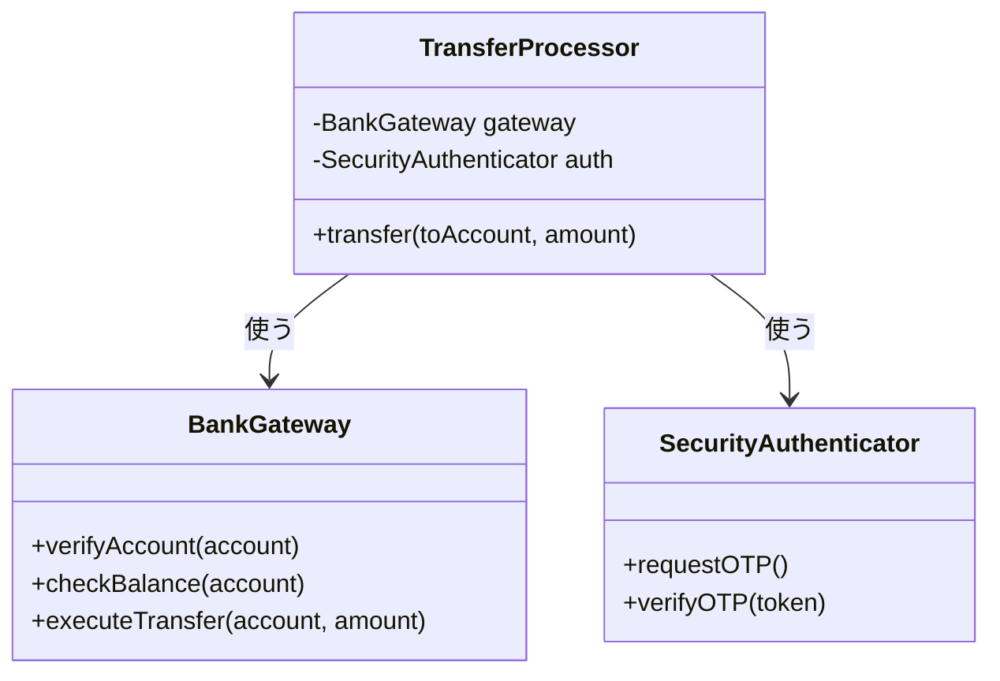
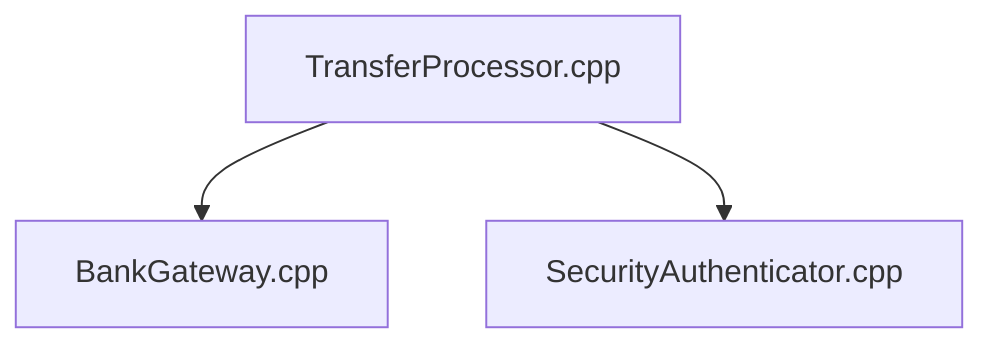
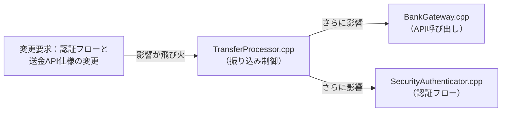
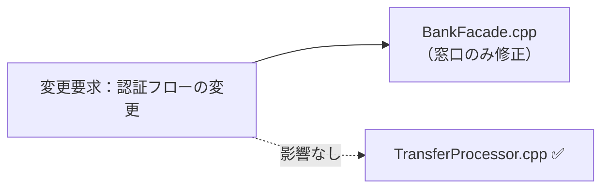
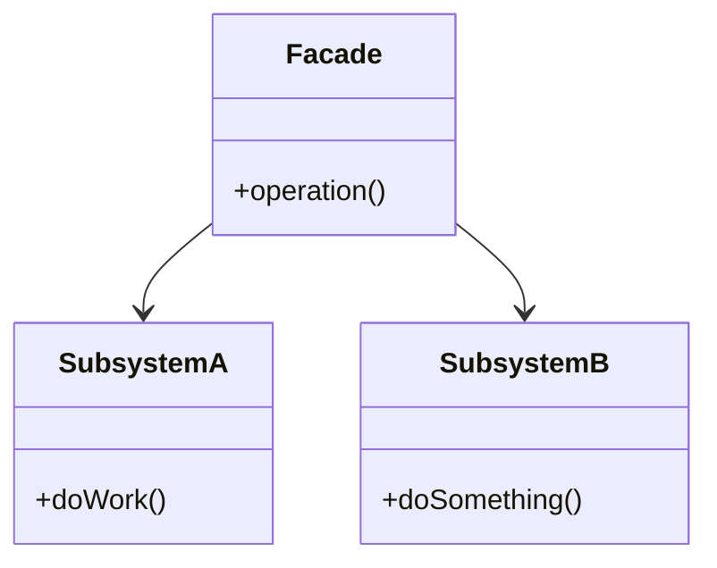
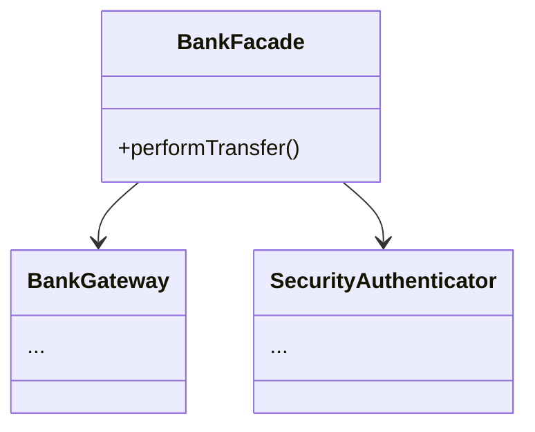

## 第2章・Facade・ネット銀行の振り込み処理

### 前-1：章タイトル

**変わる処理の組み合わせ ―― Facade パターン**

### 前-2：核心

**複雑な外部システムの仕様変更が、私たちのビジネスロジック全体に波及してしまう。それは、相手の「詳細な使い方」を私たちが直接知りすぎているからだ。**

### 前-3：得られること

第1章では「自社のロジックに外部のルールが混在する」痛みを扱いました。この章の痛みは異なります——「外部システムの詳細を、自社のコードが直接知りすぎている」問題です。どちらも「知りすぎている」という同じ根を持ちながら、現れ方が違います。

* **得られること1：** 「依存の広がり」という観点で、コードの波及範囲を識別できるようになる
* **得られること2：** 接続点が「具体×間接」になっていないクラスを見て、そこが変更の痛みの発生源だと判断できるようになる
* **得られること3：** 複雑な呼び出し手順をカプセル化することで、クライアントコードをスッキリ保つ方法を説明できるようになる
* **得られること4：** 外部システムと自社システムの境界線（窓口）をどこに引くべきか判断できるようになる

## 🔵 フェーズ1：現状把握 ―― 変更が来る前にコードを把握する

システム全体がどのような仕様で動き、どう実装されているのかをフラットな視点で確認していきましょう。まずはこのシステムの背景から見ていきます。

### 1-1：システムの背景

このシステムは、あるネット銀行の振り込み処理を自動化するためのものです。銀行のシステムは非常に堅牢で、安全に送金を行うために、口座情報の確認、残高チェック、手数料の計算、そして実際の送金指示という、いくつもの手順を正しい順番で実行する必要があります。

開発チームは、この銀行のAPIを直接叩いて振り込みを行うプログラムをメンテナンスしています。当初は単純な送金機能だけでしたが、最近では、振り込み先に応じた送金限度額の確認や、二要素認証の呼び出しなど、銀行側から求められるセキュリティ要件が年々厳しくなってきました。

当時の担当者が、銀行側の複雑な仕様と納期の中で必死につないできた跡が、このコードには詰まっています。このコードが今日まで銀行との安全な取引を支えてきたという事実は、まず率直に認めたいと思います。

一見すると、このプログラムは一つのクラスの中に必要な手順がすべて網羅されており、手続き通りに順番を追えば良いため、うまく整理されているように見えます。必要な手続きはすべて揃っており、コードを上から下に読めば何が起きているか理解できるため、当初はこれで十分だったのかもしれません。

### 1-2：仕様表

このシステムが現在持っている機能を整理してみましょう。

| **機能名** | **担当クラス** | **入力** | **出力** |
| --- | --- | --- | --- |
| 振り込みの全体制御 | `TransferProcessor` | 振り込み依頼情報（送金先・金額） | 処理結果（成功・失敗） |
| 銀行システムとの通信 | `BankGateway` | APIリクエスト（口座情報等） | APIレスポンス |
| セキュリティ認証 | `SecurityAuthenticator` | 認証トークン | 認証ステータス |

### 1-3：クラス構成図

現状のコードがどのような構成になっているかを見てみましょう。`TransferProcessor` が銀行システムの機能に深く依存している様子が見て取れます。



このクラス図から、`TransferProcessor` クラスが `BankGateway` や `SecurityAuthenticator` といった、外部システムと通信するクラスを直接保持し、その複雑な手順を制御しているという事実が見えます。

### 1-4：責任配置テーブル

各クラスが「何を知るべきか」を定義します。

| **クラス名** | **責任（1文）** | **知るべきこと** |
| --- | --- | --- |
| `TransferProcessor` | 振り込みの全体フローを進行する | 銀行との通信手順、認証手順の正しい呼び出し順 |
| `BankGateway` | 銀行APIを呼び出し、口座や送金を操作する | APIの仕様、通信のプロトコル、リクエストの組み立て方 |
| `SecurityAuthenticator` | 銀行システムの認証手順を制御する | 認証の手順、OTP（ワンタイムパスワード）の検証方法 |

各クラスの責任と知識の定義が確認できました。この時点では、`TransferProcessor` が「銀行システムの使い方」をすべて知っているのは、送金という複雑な処理を完了させるために必要なことのように見えます。

### 1-5：依存グラフ

次に、クラス間の「依存の方向」を確認します。



このグラフを見ると、`TransferProcessor` に銀行システムとの通信を担う `BankGateway` と、認証を担う `SecurityAuthenticator` の両方への依存が集中していることが分かります。

### 1-6：実装コード

このシステムは具体的にどのようなコードで動いているのでしょうか。振り込みを実行する起点となるコードを確認します。

```cpp
#include <iostream>
#include <string>

// 銀行との通信を担うクラス
class BankGateway {
public:
    void verifyAccount(const std::string& account) {
        std::cout << "口座確認: " << account << "\n";
    }
    void checkBalance(const std::string& account) { std::cout << "残高確認\n"; }
    void executeTransfer(const std::string& account, int amount) {
        std::cout << "送金実行: " << amount << "円\n";
    }
};

// 認証を担うクラス
class SecurityAuthenticator {
public:
    void requestOTP() { std::cout << "認証コード発行\n"; }
    void verifyOTP(const std::string& token) { std::cout << "認証コード検証\n"; }
};

// 振り込み処理クラス
class TransferProcessor {
private:
    BankGateway gateway;
    SecurityAuthenticator auth;
public:
    void transfer(
        const std::string& toAccount, int amount,
        const std::string& otp) {
        // 銀行システムの複雑な手順を直接制御している
        gateway.verifyAccount(toAccount);
        gateway.checkBalance(toAccount);
        
        auth.requestOTP();
        auth.verifyOTP(otp);
        
        gateway.executeTransfer(toAccount, amount);
        std::cout << "振り込み完了\n";
    }
};

int main() {
    TransferProcessor processor;
    processor.transfer("12345678", 5000, "999999");
    return 0;
}

```

このコードを見ると、`TransferProcessor` の `transfer` メソッドの中に、銀行APIの手順や認証のフローがそのまま書き込まれていることが分かります。

### 1-7：実行結果

上記のコードを実行すると、次のような結果が得られます。

> 出力：
> 口座確認: 12345678
> 残高確認
> 認証コード発行
> 認証コード検証
> 送金実行: 5000円
> 振り込み完了

このコードは正しく動きます。これから変えていくのは「機能」ではなく「構造」だ。

### 1-8：責任チェック表

コードの各行が「誰の判断で変わる知識か」を観察してみましょう。

| **コードの行** | **持っている知識** | **管理者（観察）** |
| --- | --- | --- |
| `gateway.verifyAccount(toAccount);` | 銀行APIの口座確認手順 | 銀行側のシステム仕様変更で変わる |
| `auth.requestOTP();` | 認証のための手順 | 銀行側のセキュリティポリシーで変わる |
| `gateway.executeTransfer(toAccount, amount);` | 送金実行のAPI呼び出し方法 | 銀行側の送金仕様変更で変わる |

`TransferProcessor` クラスの中に、銀行側のAPI仕様や認証手順という、外部システム由来の知識が色濃く混在している様子が見えてきます。

要するに、銀行のAPI呼び出し手順や認証フローが `TransferProcessor` に埋め込まれているという観察から、「業務の流れ（振り込み）」と「外部システムの使い方（API通信や認証手順）」が同じ場所に混在しているという構造の問題が見えてくる。

フェーズ1で責任配置の観察が終わりました。次のフェーズ2では、変更要求を受けて「何が変わり、何が変わらないか」の仮説を立てます。


---

## 🟠 フェーズ2：仮説立案 ―― 変更要求を受けて、変動と不変を整理する

フェーズ1で、銀行システムとの連携処理が `TransferProcessor` クラスに集中している現状を把握しました。このフェーズでは、実際に届いた変更要求を起点にして、「コードのどこが変わり、どこが変わらないか」を整理し、関係者とヒアリングを行いながら設計の方向性を定めます。

### 2-1：届いた変更要求

ある月曜日の朝、銀行のシステム担当者から緊急の連絡が入りました。

「来月から、銀行のAPIの認証仕様が大幅に変更になります。これまでは単一のOTP（ワンタイムパスワード）認証だけで十分でしたが、今後は、まず『認証コードの発行』をリクエストし、その後、銀行から送られてくる『取引ID』とあわせて検証しなければなりません。」

さらに、これに続いて「銀行側の送金APIのインターフェースもセキュリティ強化のため、送金時のパラメータに『トランザクションID』が必須になります」とのこと。

リリースは来月の頭。既存の `TransferProcessor` クラスの中身を書き換え、認証手順や送金手順を今のコードの `transfer` メソッドに直接追加しようとすれば、あっという間に複雑なスパゲッティ状態になってしまうのは目に見えています。

設計に絶対の正解はありません。だからこそ、この変更がどこまで広がるのか、慎重に見極める必要があります。

### 2-2：変動・不変の仮説テーブル

フェーズ1の観察（責任チェック表）を材料に、今回の変更要求で何が変わり、何が変わらないかの仮説を立ててみます。

| **分類** | **仮説** | **根拠（フェーズ1の観察から）** |
| --- | --- | --- |
| 🔴 **変動しそう** | 銀行APIの認証手順と呼び出し順序 | 認証仕様の変更に伴い、`SecurityAuthenticator` の使い方が根本から変わるため |
| 🔴 **変動しそう** | 送金APIのパラメータと呼び出し手順 | 送金APIに必須パラメータが増えたため、`BankGateway` の呼び出しコードの修正が必要になるため |
| 🟢 **不変そう** | 振り込みの全体フロー（口座確認→残高確認→送金） | 銀行APIの仕様が変わっても、私たちの銀行機能としての「振り込み」という業務の流れ自体は変わらないため |

今回の変更は、銀行側の「詳細な使い方（APIの仕様）」に起因するものです。私たちが持っている「振り込み」という業務プロセス自体には、何の影響もありません。

### 2-3：関係者ヒアリング

仮説を確かなものにするため、銀行のAPI担当者にヒアリングを行いました。

* **開発者：** 「認証の仕様が変わるとのことですが、今回の変更は一時的なものでしょうか？今後、さらに認証方式が増える予定はありますか？」
* **銀行API担当者：** 「申し訳ありませんが、セキュリティ強化の波は止まりません。数ヶ月後には、生体認証を導入する予定もあります。今後も認証手順はさらに複雑になる可能性が高いです。」
* **開発者：** 「なるほど。送金APIについても、今後パラメータが増えたり、呼び出し順序が変わったりすることは考えられますか？」
* **銀行API担当者：** 「ええ、来年以降には、さらに上位のトランザクション管理システムと連携するため、送金時のリクエスト形式が現在のJSONからXMLへ移行する計画もあります。」
* **開発者：** 「分かりました。かなり頻繁に接続仕様が変わりそうですね。今回の認証フローの変更についても、将来的にさらに手順が増えるリスクはありますか？」
* **銀行API担当者：** 「おっしゃる通りです。現在は二段階認証ですが、将来的には三段階になるかもしれません。現時点での固定的な手順に縛られない設計にしておいた方が、お互いのためかもしれませんね。」

ヒアリングにより、今回の変更が単なる一時的な修正ではなく、今後も「銀行側のAPIの仕様変更」が繰り返されるという将来リスクがはっきりしました。

### 2-4：確定した変動/不変テーブル

ヒアリングの結果、変動/不変を以下のように確定しました。

| **分類** | **具体的な内容** | **変わるタイミング** | **根拠（誰との確認か）** |
| --- | --- | --- | --- |
| 🔴 **変動する** | 銀行APIの認証・送金の手順（接続仕様） | 銀行側のセキュリティ改修時 | 銀行API担当者との確認 |
| 🟢 **不変** | 振り込みという業務プロセス | 変わらない | チーム内での合意 |

テーブルを見ると、私たちが今解決すべき課題が浮かび上がってきました。
それは、銀行システムという「変動する詳細な使い方」を、私たちの「振り込み」という業務プロセスからどうやって切り離すか、という問題です。

フェーズ2で「何が変わり、何が変わらないか」が確定しました。次のフェーズ3では、今のコードでこの変更を試みたときに何が起きるかを確認します。

## 🟡 フェーズ3：問題特定 ―― 変更を試みて、痛みを発見する

フェーズ2で、銀行APIの認証仕様変更という「将来的に繰り返されるであろう変更要求」が確定しました。このフェーズでは、その変更要求を今のコードのまま適用しようとしたとき、システムにどのような「痛み」が生じるのかを観察していきます。

### 3-1：変更シミュレーション

さっそく、銀行から要求された「認証フローの変更（発行と検証の2段階化）」と「送金時のトランザクションID付与」を、現在の `TransferProcessor` クラスの `transfer` メソッドに直接書き込む作業を試みてみましょう。

```cpp
void transfer(
        const std::string& toAccount, int amount,
        const std::string& otp) {
    gateway.verifyAccount(toAccount);
    gateway.checkBalance(toAccount);
    
    // 【痛み：認証の手順が変わる】
    // 既存のコードを書き換える必要がある
    auth.requestOTP(); 
    // ここで銀行から発行された取引IDを保持しなければならない
    std::string transactionId = auth.getTransactionId(); 
    // 検証時に取引IDを渡す必要がある
    auth.verifyOTP(otp, transactionId); 
    
    // 【痛み：送金APIの仕様が変わる】
    // トランザクションIDを生成し、送金時に渡さなければならない
    std::string txId = generateTxId();
    gateway.executeTransfer(toAccount, amount, txId);
    
    std::cout << "振り込み完了\n";
}

```

この変更を試みたとき、まず気づくのは `TransferProcessor` クラスが、「銀行APIの細かな使い方」をあまりにも詳細に知りすぎているという点です。認証のステップが増えただけでメソッドのシグネチャ（引数や戻り値）を追いかける必要があり、ロジックの修正が連鎖的に発生してしまいます。

「振り込みを実行する」という業務上の命令を処理しているはずの `TransferProcessor` が、銀行システム側から送られてくる「取引IDを保持する」といった一時的な状態管理まで背負わされています。銀行側のAPI仕様が一つ変わるたびに、私たちの業務フローを制御するクラスのコードを書き換え、その結果、振り込み処理全体のテストをやり直さなければならないのです。

### 3-2：変更影響グラフ

変更を試みようとしたときに頭の中で起きた「影響の広がり」を図にしてみます。



このグラフを見ると、銀行APIの仕様という「外部システム都合の変更」が、私たちの業務フローの中枢である `TransferProcessor` を経由して、通信クラスや認証クラス全体に飛び火していることが分かります。

### 3-3：痛みの言語化

変更を試みてみた結果、私たちが現場でよく直面する2つの辛い状況がより鮮明になりました。

1つ目は、銀行側の都合による「仕様変更の波」に、私たちの業務ロジックが直接さらされてしまうことです。
今回の認証フローの変更は、本来であれば「振り込み」という業務プロセスには影響しないはずのものです。しかし、今の構造では、銀行APIという「外部システムの使い方」を `TransferProcessor` が直接知っているため、APIの引数が増えたり手順が変わったりするたびに、業務フローを記述している核心部分を書き換える羽目になります。まるで、銀行側の仕様変更という嵐の中に、私たちの心臓部が直接さらされているようなものです。

2つ目は、複雑な手続きの連鎖が「振り込み」の目的を見えにくくしていることです。
コードを見れば、口座確認、残高確認、認証発行、検証、送金実行と、手続きが淡々と並んでいます。しかし、新しい仕様に対応するために一時的なIDを保持したり、条件分岐を足したりすることで、コードは「何のために振り込んでいるのか」という業務上の目的よりも、「銀行のAPIにどうやって命令を通すか」という、技術的な手順の記述で埋め尽くされてしまいました。

「今のままだと、銀行側のAPIが新しくなるたびに、私たちは振り込みの処理フローを壊すリスクを背負い続けることになる」という感覚が伝わっているでしょうか。まずは現状の辛さを言語化することが、良い設計への第一歩になります。

フェーズ3で「変更が辛い」という事実が確認できました。次のフェーズ4では、なぜ辛いのかを構造的に言語化します。

## 🔴 フェーズ4：原因分析 ―― 「なぜ辛いのか」を構造的に言語化する

フェーズ3で、銀行APIの仕様変更が私たちの業務コードに直接飛び火し、変更のたびにコードの核心部分を書き換えなければならないという痛みが確認できました。このフェーズでは、なぜそのような痛みが生まれるのかを、コードの構造（接続形態）の観点から言語化していきます。

### 4-1：観察→原因テーブル

フェーズ3で観察した「痛み」と、その裏にある構造的な原因を紐解いてみましょう。

| **観察** | **原因の方向** |
| --- | --- |
| 認証フローやAPI仕様が変わるたびに、業務フローを記述している `TransferProcessor` が修正を強いられる | `TransferProcessor` クラスが、銀行システムの「詳細な使い方（APIの認証手順やパラメータ）」を直接知っているから |
| 複雑な手順が並び、本来の「振り込み」という目的が見えにくくなっている | 「振り込みという業務プロセス」と「銀行APIの技術的な利用手順」が、同じメソッドの中に混在しているから |

### 4-2：変わるもの / 変わらないものテーブル

原因がはっきりしてくると、どこに境界線を引くべきかが見えてきます。「変わる側」をカプセル化（呼び出し元が知らなくていい詳細を隠すこと）できれば、「変わらない側」である業務ロジックは安定します。

| **変わり続けるもの（🔴）** | **変わってほしくないもの（🟢）** |
| --- | --- |
| 銀行APIの認証手順（発行・検証のステップ） | 振り込みの全体フロー（口座確認→残高確認→送金） |
| 送金APIのパラメータ（IDの追加や型変更） | 振り込みという業務上の目的 |

### 4-3：接続形態を診断する

現在の `TransferProcessor` は、銀行のAPIという「特定の機器」に対して、専用のケーブルを直に配線しているような状態です。

この接続形態は、iPhoneに専用のLightningケーブルを直差ししている状態（具体×直接）だと診断できます。認証方式が変わり、送金時のパラメータが増えるたびに、私たちはその専用端子に合わせてコードという名の「配線」を直接付け替えなければなりません。これでは、銀行側の仕様変更が起こるたびに、私たちの業務フローを制御するクラスの心臓部を切り刻むことになってしまいます。

本来であれば、業務ロジック側は「振り込みたい」という命令を送るだけでよく、具体的な接続手順は窓口の向こう側に隠すべきです。

|  | 直接（直差し） | 間接（アダプター経由） |
|:---:|:---|:---|
| **具体**（専用規格） | **← 現在地**　iPhone → [Lightning] → Apple純正ドック（Lightning端子） | iPhone → [Lightning] → [変換] → USB-A充電器（汎用端子） |
| **抽象**（汎用規格） | MacBook → [USB-C] → USB-C対応モニター（汎用端子） | MacBook → [USB-C] → [ハブ] → HDMI・USB-A・LAN |

このコードで言うと：

| ケーブル比喩 | コードの対応箇所 |
|---|---|
| 「具体」＝専用規格ケーブル | `BankGateway gateway;` / `SecurityAuthenticator auth;` — 銀行APIの具体クラス名を `TransferProcessor` がメンバとして直接宣言している |
| 「直接」＝直差し | `gateway.verifyAccount(toAccount); auth.requestOTP();` など — Facade なしに各APIメソッドを `transfer()` 内で直接順に呼び出している |

銀行の認証フローや送金APIの使い方は、私たちの業務フローとは「変わる理由」が異なるため、業務フローから切り離すべき存在です。

フェーズ4で根本原因が言語化できました。次のフェーズ5では、解決すべき問題を具体的に定めます。

## 🟣 フェーズ5：課題定義 ―― 解くべき問題を具体的に定める

フェーズ4で「銀行APIの接続手順」と「振り込みという業務プロセス」が密接に絡み合い、互いの変更理由を引きずり合っているという構造的問題が明らかになりました。対策案（フェーズ6）に進む前に、ここで「何を解くべき課題とするか」を具体的に確定させます。

### 5-1：接続点の特定

今回のリファクタリングにおいて、もっとも深刻な影響が出ている場所、つまり、解決すべき「接続点（ジョイント）」は以下の1箇所です。

* **接続点A：** `TransferProcessor`（業務フロー管理クラス） ←→ `BankGateway` ＋ `SecurityAuthenticator`（外部システム利用クラス）の境界

この接続点は、「振り込み」という業務上の命令と、「銀行APIを叩く」という技術的な手順が直接つながっている場所です。ここを切り離すことで、銀行側の仕様変更が業務フローを破壊する波及を止めることが課題となります。

### 5-2：非機能制約の確認

この接続点における非機能制約を整理します。

| **確認項目** | **内容** | **この章での判断** |
| --- | --- | --- |
| 変更頻度 | この接続点はどのくらいの頻度で変わるか | 高（銀行側のセキュリティ要件やAPI仕様変更により頻繁に変わる） |
| パフォーマンス | ホットパスか（高頻度で呼ばれるか） | いいえ（銀行のAPI呼び出しであり、ネットワーク待機が支配的で、クラス分割によるオーバーヘッドは微小） |
| メモリ | 間接層の追加でオーバーヘッドが問題になるか | いいえ（サーバーのリソースは十分であり、微小なメモリ増加は問題にならない） |

今回のケースでは、パフォーマンスやメモリへの厳しい制約はありません。そのため、変更への強さを最大限に確保するために「間接層」を挟む選択肢も、気兼ねなく検討できます。

### 5-3：クライアントへの影響範囲

「接続点A」を変えることで、どのクラスに修正が及ぶかを確認します。

現在の `TransferProcessor` クラスがこの接続点のクライアントです。`TransferProcessor` は銀行の具体的なゲートウェイや認証のクラスを直接持っているため、この境界を抽象化して切り離す設計変更を行うと、`TransferProcessor` クラス自身のコンストラクタやメンバ変数の定義を変更する必要があります。

しかし、一度切り離してしまえば、以降の銀行側の変更時には `TransferProcessor` に一切手を触れることなく、裏側の接続用クラスを差し替えるだけで済むようになります。

### 5-4：課題まとめ表

以上の情報をまとめ、フェーズ6での対策案検討の基盤となる課題定義を確定させます。

| **接続点** | **分けた理由** | **非機能制約** | **クライアント影響** |
| --- | --- | --- | --- |
| 接続点A | 外部システムという「変わる理由」を業務フローから隔離するため | ホットパスではないため抽象化によるコストは許容可 | `TransferProcessor` の内部実装に影響あり |

フェーズ5で「何を解くか」が具体化されました。次のフェーズ6では、この課題に対してどのような「接続の形」を採用すべきか、案0〜案4を並べてコスト比較を行います。


---

### 6-1：接続の形 2×2マトリクス

現在の `TransferProcessor` と外部システム群との接続は、銀行のAPIという「特定の仕様」に対して、コードという配線を直にハンダ付けしている状態（具体×直接）です。ここから、今後予想される「認証手順の複雑化」や「APIの仕様変更」に耐えうる柔軟な接続形態へ移行するため、以下の4つの案を検討します。

| 接続形態 | ケーブル例 | 特徴 |
|:---:|:---|:---|
| **具体×直接**（← 現在地） | iPhone → [Lightning] → Apple純正ドック（Lightning端子） | 専用端子のみ対応。差し替え不可 |
| **具体×間接** | iPhone → [Lightning] → [変換] → USB-A充電器（汎用端子） | 変換器を挟むが規格は専用のまま |
| **抽象×直接** | MacBook → [USB-C] → USB-C対応モニター（汎用端子） | どのメーカーでも同じ口で繋がる |
| **抽象×間接** | MacBook → [USB-C] → [ハブ] → HDMI・USB-A・LAN | ハブを介して多様な機器へ展開可能 |

---

#### 案0：現状維持 ―― 構造を変えない

**この形の考え方：**
クラスの分割やインターフェースの導入を行わず、既存の `transfer` メソッドの中に、銀行APIの新しい仕様を `if` 文で追加します。銀行側の接続仕様が極めて安定しており、今後数年は変更が来ないような場合にのみ、実装コストを最小化するための選択肢となります。

**この形にするための準備：**

* 既存のメソッド内に、認証ステップや送金ID生成のロジックを条件分岐として書き足す。

```cpp
void transfer(
        const std::string& toAccount, int amount,
        const std::string& otp) {
    gateway.verifyAccount(toAccount);
    // 新しい認証手順をif文でねじ込む
    // ← 具体："新仕様"という条件を呼び出し側が直接書いている
    if (/* 新仕様 */) {
        auth.requestOTP();
        std::string txId = auth.getTransactionId();
        auth.verifyOTP(otp, txId);
    } else {
        // 既存の認証
    }
    gateway.executeTransfer(toAccount, amount, generateTxId());
}

```

**呼び出し側から見た違い（main() 例）：**

```cpp
// 案0（現状維持）の呼び出し側
int main() {
    TransferProcessor processor;
    processor.transfer("12345678", 5000, "999999");  // ← 具体：認証手順の詳細が内部に直書きされている
    return 0;
}
```

**この形のトレードオフ：**

* 変更容易性：低（銀行APIが変わるたびに業務フローであるメソッドが破壊される）
* テスト容易性：低（銀行APIと業務フローが分離されておらずテスト困難）
* 実装コスト：低（今のコードに数行足すだけ）

---

#### 案1：具体×直接 ―― クラスを分けるが参照は具体型のまま

**この形の考え方：**
銀行通信用のクラスを切り出して責任を分担させますが、呼び出し側の `TransferProcessor` は、相変わらず銀行専用クラス（`BankGateway` 等）の具体型を直接知っている状態です。「責任の分担」という第一段階の整理だけを行いたい場合に合う形です。

**この形にするための準備：**

1. 外部接続に関連する処理を新しいクラスに移動する
2. `TransferProcessor` のコンストラクタで、移動したクラスを直接インスタンス化する

```cpp
// ← 具体：BankTransferServiceという型名を直接書いている
class BankTransferService { // 通信ロジックを切り出した
public:
    void execute(std::string account, int amount) { /* 手順を実装 */ }
};
// TransferProcessorは具体型を直接知っている
// ← 直接：呼び出し側がこのクラスを直接インスタンス化している
TransferProcessor(BankTransferService* s) : service(s) {}

```

**呼び出し側から見た違い（main() 例）：**

```cpp
// 案1（具体×直接）の呼び出し側
int main() {
    BankTransferService service;             // ← 直接：呼び出し側が具体クラスを直接生成
    TransferProcessor processor(&service);
    processor.transfer("12345678", 5000, "999999");
    return 0;
}
```

**この形のトレードオフ：**

* 変更容易性：低〜中（APIクラスのインターフェースが変わると、Processor側も修正が必要）
* テスト容易性：低（具体クラスを生成しているため、切り離しができない）
* 実装コスト：低（既存コードを別のクラスにコピー＆ペーストする程度）

---

#### 案2：抽象×直接 ―― インターフェースを挟み、型だけで接続する

**この形の考え方：**
銀行APIの具体的な実装を隠すためにインターフェースを導入し、業務クラスはインターフェース型に対してプログラムします。これにより、APIの実装が銀行Aから銀行Bへ変わろうと、私たちの業務クラスは影響を受けません。この構造を **Facade（ファサード）パターン** の一部、あるいはこの場合は業務的な窓口として **Facade** 的な役割を担わせる構造と呼ぶことができます。

**この形にするための準備：**

1. `IBankService` というインターフェースを定義する
2. 既存の銀行関連処理を `BankService` クラスとして実装する
3. `TransferProcessor` をインターフェース依存に書き換える

```cpp
class IBankService { // 共通の窓口（Facadeとなるインターフェース）
public:
    virtual void send(std::string acc, int amt) = 0;
};
// ← 抽象：IBankService*型で受け取り、具体クラスを知らない
void transfer(IBankService* service, std::string acc, int amt) {
    service->send(acc, amt); 
}

```

**呼び出し側から見た違い（main() 例）：**

```cpp
// 案2（抽象×直接）の呼び出し側
int main() {
    BankTransferService bankService;           // ← 具体：呼び出し側だけが具体クラスを生成
    TransferProcessor processor(&bankService); // ← 直接：インターフェース経由で直接注入
    processor.transfer("12345678", 5000, "999999");
    return 0;
}
```

**この形のトレードオフ：**

* 変更容易性：中〜高（実装が変わっても、業務フロー側は影響を受けない）
* テスト容易性：高（I/Fにスタブを差し込んでテストできる）
* 実装コスト：中（インターフェースの設計が必要）

---

#### 案3：具体×間接 ―― 仲介クラスを置くが、具体型を知っている

**この形の考え方：**
AとBの間に `TransferManager` のような「仲介者」を配置し、複雑な通信手順を隠します。ただし、仲介者は具体的なAPIを知っています。外部システムとの複雑なやり取りを一つの窓口に集中させ、業務フロー側には簡素なインタフェースだけを見せたい場合に適しています。

**この形にするための準備：**

1. `TransferManager` クラスを作成し、そこにAPIの手順をまとめる
2. `TransferProcessor` はマネージャーを呼ぶだけにする

```cpp
// ← 具体：TransferManagerという具体型を持っている
// ← 間接：呼び出し側はManagerのみ知り、内部のクラス群は見えない
class TransferManager {
public:
    void perform(std::string acc, int amt) {
        // ここに銀行の複雑な通信手順をすべて隠す
        gateway.verify(); 
        auth.doAuth();
        gateway.execute();
    }
};

```

**呼び出し側から見た違い（main() 例）：**

```cpp
// 案3（具体×間接）の呼び出し側
int main() {
    TransferProcessor processor;             // ← 間接：TransferManagerが内部に隠れており呼び出し側には見えない
    processor.transfer("12345678", 5000, "999999");  // 内部でTransferManagerが動くが、呼び出し側は知らない
    return 0;
}
```

**この形のトレードオフ：**

* 変更容易性：中（API側の変更はManagerだけで完結する）
* テスト容易性：中（Managerを差し替えればOK）
* 実装コスト：中（仲介クラスの作成が必要）

---

#### 案4：抽象×間接 ―― インターフェース＋仲介役を両立する

**この形の考え方：**
`TransferProcessor` に対しては抽象的な窓口を提供し、かつその窓口の中で具体的なAPIの複雑な手順を隠蔽します。最も柔軟ですが、全層にインターフェースと仲介クラスを導入するため、実装コストは最大になります。

**この形にするための準備：**

1. 窓口となるインターフェース `IBankFacade` を定義する
2. 具体的な通信手順を隠蔽するクラス `BankFacade` を作成する
3. 業務クラスは `IBankFacade` を通じてのみ外部システムと会話する

```cpp
class IBankFacade {
public:
    virtual void transfer(std::string acc, int amt) = 0;
};

// Facade が詳細をすべて隠し、窓口として振る舞う
class BankFacade : public IBankFacade {
    void transfer(std::string acc, int amt) override { /* 複雑な手順 */ }
};

// TransferProcessorのメンバ変数：
// ← 抽象：IBankFacade*型で受け取り、具体実装を知らない
// ← 間接：Facadeを経由するため内部クラス群が見えない

```

**呼び出し側から見た違い（main() 例）：**

```cpp
// 案4（抽象×間接）の呼び出し側
int main() {
    BankFacade facade;                        // ← 具体：組み立て側だけが具体型を知る
    TransferProcessor processor(&facade);     // ← 間接：抽象Facadeのみ見えて具体実装は隠れる
    processor.transfer("12345678", 5000, "999999");
    return 0;
}
```

**この形のトレードオフ：**

* 変更容易性：高（どの層の変更も他層に影響しない）
* テスト容易性：高（ Facade をスタブに差し替え可能）
* 実装コスト：高（インターフェースとFacadeクラスが必須となる）

### 6-7：評価軸

対策案が揃ったところで、どの案を採用すべきかを決めるための「ものさし」を宣言します。後から基準を持ち出すと議論が混迷しやすいため、比較表を提示する前に、チーム内で評価軸とその重要度を合意しておくことが大切です。

今回の銀行システム連携では、以下の3軸で評価を行います。

| **評価軸** | **意味** | **ウェイト** |
| --- | --- | --- |
| 変更容易性 | 変更要求が来たとき、触る場所が最小で済むか | ×3 |
| テスト容易性 | 依存をスタブ/モックに差し替えてテストを書けるか | ×2 |
| 可読性 | コードの読みやすさ・構造を理解する工数 | ×1 |

採点基準は、全章共通で以下の通りとします。

| 点数 | 変更容易性 | テスト容易性 | 可読性 |
| --- | --- | --- | --- |
| 3 | 変更が1クラスのみで完結する | スタブ1つで完全に切り離せる | クラス数が増えない・既存構造と同じ読み方で理解できる |
| 2 | 変更が2〜3クラスに及ぶ | 一部スタブが必要だが差し替え可能 | クラスが1〜2増える |
| 1 | 変更が4クラス以上に波及する | 実装に依存しテストが困難 | 中間層・インターフェースが複数増え理解コストが高い |

パフォーマンスのVETO（拒否権）については、フェーズ5で「ホットパスではない」と判断したため、今回はスコアリングを優先して検討します。

---

### 6-8：コスト天秤

案0〜案4を定量的に比較します。

| **案** | **現在の対応コスト** | **未来の対応コスト** |
| --- | --- | --- |
| 案0：現状維持 | 低 | 高 |
| 案1：具体×直接 | 低〜中 | 高 |
| 案2：抽象×直接 | 中 | 低〜中 |
| 案3：具体×間接 | 中 | 中 |
| 案4：抽象×間接 | 高 | 低 |

**ステップ1：採点表**

| 案 | 変更容易性（×3） | テスト容易性（×2） | 可読性（×1） |
| --- | --- | --- | --- |
| 案0：構造を変えない | 1 | 1 | 3 |
| 案1：具体×直接 | 1 | 2 | 3 |
| 案2：抽象×直接 | 2 | 3 | 2 |
| 案3：具体×間接 | 3 | 2 | 2 |
| 案4：抽象×間接 | 3 | 3 | 1 |

**ステップ2：加重合計表**

| 案 | 加重スコア | 判定 |
| --- | --- | --- |
| 案0 | 8 |  |
| 案1 | 10 |  |
| 案2 | 14 |  |
| 案3 | 15 | ← 採用候補 |
| 案4 | 16 | 今回は見送り（理由は下記） |

**案4を見送った理由：** スコアは最高値（16）ですが、可読性の評価で最低点（1）を付けた通り、インターフェース＋仲介クラスを両方導入する構造は実装コストが高く、今回の「銀行API 1本を窓口化する」という要件規模に対しては過剰な複雑さを持ち込むと判断しました。パフォーマンスのVETO（拒否権）はフェーズ5で「ホットパスではない」と確認済みのため今回は除外していませんが、設計コストの観点から案3を優先します。案3の `TransferManager`（仲介者）が最もバランスが取れています。この構造を **Facade（ファサード）パターン** と呼びます。

---

### 6-9：採用案の決定

**採用する案：** 案3

**理由：** 銀行APIの複雑な手順を `TransferManager` クラスという一つの窓口（Facade）に閉じ込めることで、業務フロー側をシンプルに保ちつつ、将来的なAPIの仕様変更が業務ロジック全体に波及するリスクを最小化できるため、案3を採用します。

---

### 6-10：耐久テスト

フェーズ2で挙がっていた「将来のリスク」をシミュレートします。

| **変更シナリオ** | **触る場所** | **コスト評価** |
| --- | --- | --- |
| 銀行側APIのJSON→XML移行計画が発生 | `TransferManager` (内部の変換処理のみ) | 低 |
| 三段階認証へのフロー変更が発生 | `TransferManager` (内部の手順のみ) | 低 |

今回の設計変更により、たとえ銀行側の認証やAPI形式がどれだけ複雑になろうとも、私たちの業務フロー側のクラス（`TransferProcessor`）を書き換える必要はなくなりました。「あのとき言っていた変化」が来たとしても、私たちはただ `TransferManager` クラスだけを修正すればよいのです。

## 🟤 フェーズ7：対策実施 ―― 決断し、変化に強い設計を手に入れる

フェーズ6で採用した「Facadeパターンによる窓口の導入」を、実際のコードに実装します。これにより、銀行システムの詳細な通信手順を `BankFacade` クラスという一つの窓口に閉じ込め、業務フローを記述する `TransferProcessor` から「銀行APIの具体的な使い方」という知識を追い出します。

この設計変更の最大の価値は、今後銀行側のAPI仕様がどれほど複雑になっても、業務フロー全体には一切影響を与えないという安定性を手に入れたことです。

### 7-1：解決後のコード（全体）

新しい設計では、銀行システムとのやり取りをすべて隠蔽する `BankFacade` クラスを作成します。

```cpp
#include <iostream>
#include <string>

class BankGateway { /* 既存のAPI通信処理 */ };
class SecurityAuthenticator { /* 既存の認証処理 */ };

// 銀行との複雑なやり取りを隠蔽する窓口（Facade）
class BankFacade {
private:
    BankGateway gateway;
    SecurityAuthenticator auth;
public:
    void performTransfer(
            const std::string& account, int amount,
            const std::string& otp) {
        // 複雑な手順はすべてこの窓口の中に閉じる
        gateway.verifyAccount(account);
        gateway.checkBalance(account);
        auth.requestOTP();
        auth.verifyOTP(otp, "TXN12345"); // 内部的に取引IDを扱う
        gateway.executeTransfer(account, amount, "TXN12345");
    }
};

// 振り込み処理クラス：銀行の仕様を一切知らなくてよい
class TransferProcessor {
private:
    BankFacade* facade; //Facadeに依存する
public:
    TransferProcessor(BankFacade* f) : facade(f) {}
    void transfer(
        const std::string& toAccount, int amount,
        const std::string& otp) {
        // 振り込みという業務プロセスに集中できる
        facade->performTransfer(toAccount, amount, otp);
        std::cout << "振り込み完了\n";
    }
};

class BatchApplication {
public:
    void run() {
        BankFacade facade; // 組み立て（Composition Root）
        TransferProcessor processor(&facade); // ← ここだけ変わる
        processor.transfer("12345678", 5000, "999999");
    }
};

int main() {
    BatchApplication app;
    app.run();
    return 0;
}

```

この実装により、`TransferProcessor` クラスの中から銀行特有の複雑な認証フローやAPI呼び出しの記述が消えました。このクラスは「窓口（`BankFacade`）を使って送金を実行する」という業務上の責務に専念できるようになりました。

### 7-2：変更影響グラフ（改善後）

フェーズ3で確認したシナリオを再び当てはめてみます。



→ **フェーズ3の変更影響グラフと比較して、銀行側の認証フロー変更という要求が、窓口クラスである `BankFacade` クラスだけに閉じた設計になりました。**

### 7-3：変更シナリオ表

この設計で何を手に入れたかを確認します。

| **シナリオ** | **変わるクラス（触る場所）** | **変わらないクラス** |
| --- | --- | --- |
| 認証フローの変更 | `BankFacade` | `TransferProcessor`, `Order` |
| 送金APIのパラメータ追加 | `BankFacade` | `TransferProcessor`, `Order` |

変更が来ても、触るのは1クラスだけ——それがこの設計で手に入れたものです。諦めたものは、窓口となるクラスを1つ増やすという、わずかな実装の複雑さです。

---

### 7-4：接続形態の確認 ── この設計はどの接続か

フェーズ4-3で診断した通り、変更前のコードは **具体×直接** の状態でした。
採用した Facade パターンでは、接続形態が **具体×間接（専用アダプター経由）** へと変化しています。

**「具体×間接」の証拠となるコード：**

```cpp
class TransferProcessor {
    BankFacade* facade; // ← 具体クラス型 = 「具体」の証拠
public:
    void transfer(string toAccount, int amount, string otp) {
        facade->performTransfer(toAccount, amount, otp); // ← Facade 経由 = 「間接」の証拠
    }
};
```

- メンバ変数 `facade` の型が `BankFacade*`（具体クラス）→ **「具体」** の証拠
- `TransferProcessor` は `BankGateway` や `SecurityAuthenticator` を直接知らず、`BankFacade` を経由して間接的に操作する → **「間接」** の証拠

「銀行APIの複雑さを知らせたくない・隠したい」という動機から、**具体×間接** が選ばれました。

銀行システムという外部環境の変化に対して、私たちの業務ロジックを守り抜く。これこそがFacadeパターンによるカプセル化の真骨頂です。


---

### 整理：7フェーズとこの章でやったこと

この章では、外部システム（銀行API）との複雑な連携が、私たちの業務ロジックをどれほど困難にしているかを学びました。7フェーズの思考プロセスを適用して、その構造的課題をどう解決したのかを振り返ります。

| **フェーズ** | **この章でやったこと** |
| --- | --- |
| 🔵 フェーズ1：現状把握 | 銀行APIの認証・送金手順が `TransferProcessor` クラスに直接記述されている現状を可視化しました。 |
| 🟠 フェーズ2：仮説立案 | ヒアリングを通じ、銀行側のAPI仕様が今後も繰り返し変わるリスクを特定しました。 |
| 🟡 フェーズ3：問題特定 | API仕様変更をシミュレーションし、業務フロー全体が破壊される「飛び火」という痛みを確認しました。 |
| 🔴 フェーズ4：原因分析 | 業務ロジックと外部システムの詳細な利用手順が密結合していることが原因だと言語化しました。 |
| 🟣 フェーズ5：課題定義 | 「接続点A」を外部システムとの窓口として定義し、業務フローから詳細を切り離す課題を設定しました。 |
| 🟢 フェーズ6：対策案検討 | 案0〜案4を比較し、複雑さを隠蔽する「Facade（窓口）」を採用しました。 |
| 🟤 フェーズ7：対策実施 | `BankFacade` クラスを導入し、`TransferProcessor` から直接的な依存を取り除きました。 |

### 各クラスの最終的な責任

今回の設計変更により、各クラスの責任は以下のように整理されました。

| **クラス名** | **責任（1文）** | **変わる理由** |
| --- | --- | --- |
| `TransferProcessor` | 振り込みという業務フローを進行する | 銀行との送金ルール（業務）が変わるとき |
| `BankFacade` | 銀行APIの複雑な手順を窓口として隠蔽する | 銀行側のAPI仕様（通信手順やパラメータ）が変わるとき |
| `BankGateway` 他 | 外部システムと通信する詳細を担う | 通信プロトコルや認証方式が変わるとき |

> **このプロセスを回した結果にたどり着いた構造こそが Facade パターンです。**

---

### 振り返り：「この章を読むと得られること」は手に入ったか

| **得られること** | **この章のどこで示したか** |
| --- | --- |
| 1. 依存の広がりを識別 | フェーズ3の「変更影響グラフ」で、変更が全体に波及する様子を可視化したこと。 |
| 2. 接続形態の診断 | フェーズ4で、現在の密結合を「Lightning直差し」という比喩で診断したこと。 |
| 3. 構造改善の説明 | フェーズ7の「変更シナリオ表」で、Facadeの導入により影響が局所化されたこと。 |

---

### 振り返り：第0章の3つの設計原則はどう適用されたか

* **原則1「変わるものをカプセル化せよ」の現れ**
* **具体化された場所：** `BankFacade` クラス
* **解説：** 銀行APIの複雑な手順という「頻繁に変わる詳細」を、`BankFacade` の中に閉じ込めました。これにより、業務クラスは銀行APIの詳細を知る必要がなくなりました。


* **原則2「実装ではなくインターフェースに対してプログラムせよ」の現れ**
* **具体化された場所：** `TransferProcessor` が `BankFacade` を通して処理を依頼する構造
* **解説：** 業務クラスは「どのようなAPIか」ではなく、「振り込みを実行する（`performTransfer`）」という窓口のインターフェースに対して命令を送るようになりました。


* **原則3「継承よりコンポジションを優先せよ」の現れ**
* **具体化された場所：** `TransferProcessor` に `BankFacade` を持たせる構造
* **解説：** 継承を使って銀行機能を拡張するのではなく、コンポジションを用いることで、Facadeを切り替えたり、あるいは将来的なFacadeの増設にも容易に対応できるようになりました。


---

### パターン解説：Facade パターン

Facadeパターンは、サブシステム（銀行APIなど）の一連のインターフェースに対する統合された窓口を提供し、サブシステムを使いやすくするパターンです。

#### パターンの骨格

Facadeは、サブシステムのクラス群を「Facadeクラス」で包み込み、クライアントに対してはシンプルな窓口を提供します。



#### この章の実装との対応



`TransferProcessor` は `BankGateway` や `SecurityAuthenticator` を直接呼ぶ必要はなくなり、`BankFacade` を通すことで、安全かつ単純に振り込み処理を行えるようになりました。

#### 使いどころと限界

* **使うと良い状況**：サブシステムが複雑で、クライアントが直接扱うには手順が多すぎる場合。または、サブシステムとクライアントの依存関係を減らしたい場合。
* **使わない方が良い状況**：サブシステムが十分に単純であり、Facadeを介すことでかえってコードが複雑になる場合。

【過剰コード：ただのラッパーに過ぎない例】

```cpp
// facadeを導入しても元のメソッドをそのまま呼ぶだけで、隠蔽の効果がない場合
class SimpleFacade {
    OriginalClass sub;
public:
    void doIt() { sub.doIt(); } // facadeの意味が薄い
};

```

### この章のまとめ

銀行APIの仕様変更という嵐から私たちの業務ロジックを守るために、Facadeという窓口を設けました。私たちは、銀行APIの複雑な手順（通信や認証）をFacadeに「閉じ込める」ことで、業務フローという「守るべきもの」を安全な場所へ移動させたのです。接続点の形を「具体×直接」から「具体×間接」へ変えることは、外側の変化を内部で消化する「クッション」を手に入れることと同義なのです。