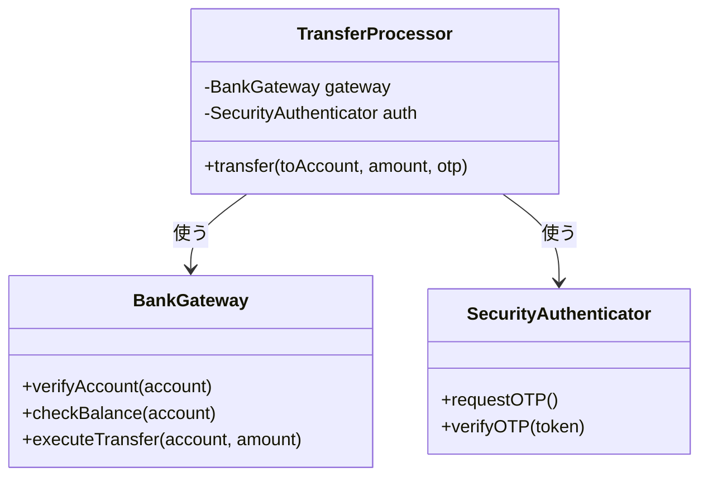
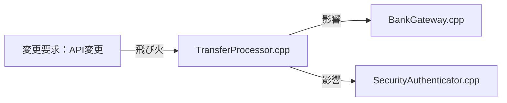
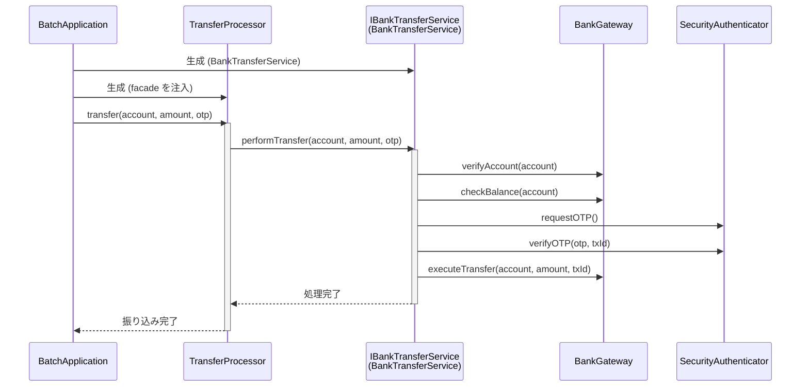
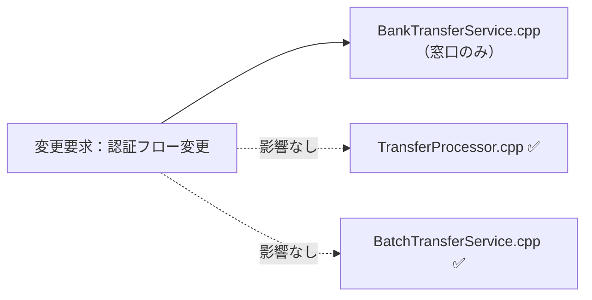
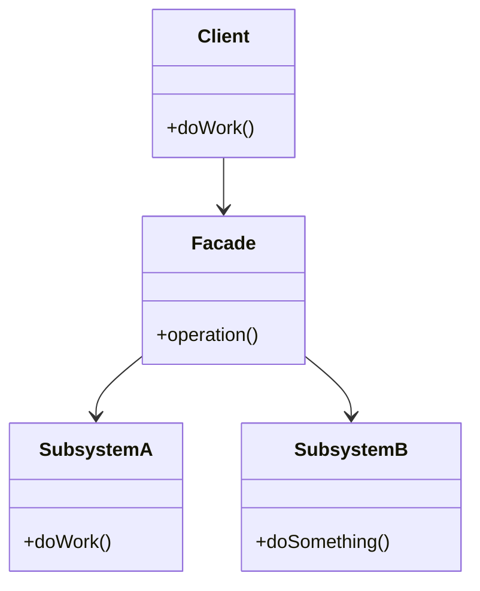

## 第2章 窓口を一本化する ―― Facade パターン

### この章の核心

**複雑な外部システムの仕様変更が、私たちのビジネスロジック全体に波及してしまう。それは、相手の「詳細な使い方」を私たちが直接知りすぎているからだ。**

---

### この章を読むと得られること

この章の痛みは「外部システムの詳細を、自社のコードが直接知りすぎている」問題です。

* **得られること1：** 「依存の広がり」という観点で、コードの波及範囲を識別できるようになる
* **得られること2：** 外部システムの詳細を知りすぎているクラスを見つけ、そこが変更に弱い接続点（変更の痛みの発生源）だと判断できるようになる
* **得られること3：** 複雑な呼び出し手順をカプセル化することで、クライアントコードをスッキリ保つ方法を説明できるようになる
* **得られること4：** 外部システムと自社システムの境界線（窓口）をどこに引くべきか判断できるようになる

---

## 🔵 フェーズ1：現状把握 ―― コードとクラス構成を読む

この問題を解くために7つのフェーズを使います。はじめに現状把握から開始し、仮説立案・問題特定・原因分析・課題定義・対策検討・対策実施という順で進みます。

変更要求が来る前のシステムの現状を事実として把握するところから始めます。はじめに仕様と動作例で「このシステムが何をするか」を確認し、それからコードを読みます。

### 1-1：このシステムの仕様

このシステムは、ネット銀行の**振り込み処理を実行**します。

「振込先口座番号」「送金金額」を入力として受け取り、銀行のAPIを通じて以下の手順で振り込みを完了させます。

**振り込みの処理手順**

| 手順 | 処理内容 | 失敗した場合 |
|---|---|---|
| ① 口座確認 | 振込先口座が存在し有効であることを確認する | エラーで中止 |
| ② 残高確認 | 送金元の残高が十分あることを確認する | エラーで中止 |
| ③ 手数料計算 | 振込手数料を算出する | エラーで中止 |
| ④ OTP認証 | ワンタイムパスワードで本人確認を行う | エラーで中止 |
| ⑤ 送金実行 | 銀行APIへ送金指示を送信する | エラーで中止 |

この5つの手順は必ず順番通りに実行される必要があります。どこかで失敗すれば後続の手順は実行されません。

---

### 1-2：動作例テーブル

仕様を定義したところで、実際にどのような入力に対してどのような結果が返るかを確認します。このテーブルは「このシステムが正しく動いているとはどういう状態か」の基準になります。後で設計の改善（リファクタリング）を段階的に進めるときも、この表に立ち返ります。

| # | 振り込み先口座 | 送金金額 | 結果 | 適用ルール |
|---|---|---|---|---|
| 1 | 12345678（有効） | 5,000円（残高十分） | 振り込み完了 | 口座確認→残高確認→認証→送金 |
| 2 | 99999999（存在しない） | 5,000円 | エラー：口座なし | 口座確認で中止 |
| 3 | 12345678（有効） | 1,000,000円（残高不足） | エラー：残高不足 | 残高確認で中止 |
| 4 | 12345678（有効） | 5,000円（残高十分） | エラー：認証失敗 | 認証コード検証で中止 |
| 5 | 87654321（有効・バッチ） | 30,000円（残高十分） | 振り込み完了（OTP不要） | 口座確認→残高確認→送金（バッチ処理は事前に社内承認が完了しているため、OTPによる追加認証が不要） |

コードを読む前に、このシステムが「何をする必要があるか」をこの表で確認できました。次は「どのように実装されているか」を見ていきます。

---

### 1-3：実装コード（現状）

システムの現状の実装を確認します。コードを役割ごとに分けて読んでいきます。

#### 銀行システムと通信するクラス群

はじめに、銀行APIとの通信を担うクラスと認証を担うクラスを見てみます。

```cpp
#include <iostream>
#include <string>

// 銀行との通信を担うクラス
class BankGateway {
public:
    void verifyAccount(const std::string& account) {
        std::cout << "口座確認: " << account << "\n";
    }
    void checkBalance(const std::string& account) {
        std::cout << "残高確認\n";
    }
    void executeTransfer(const std::string& account, int amount) {
        std::cout << "送金実行: " << amount << "円\n";
    }
};

// 認証を担うクラス
class SecurityAuthenticator {
public:
    void requestOTP() { std::cout << "認証コード発行\n"; }
    void verifyOTP(const std::string& token) {
        std::cout << "認証コード検証\n";
    }
};
```

`BankGateway` と `SecurityAuthenticator` は、それぞれ銀行APIとの通信・認証の詳細を担う専門クラスです。

#### 振り込み処理クラス

次に、振り込みの全体フローを管理するクラスを見ます。

```cpp
// 振り込み処理クラス
class TransferProcessor {
private:
    BankGateway gateway;
    SecurityAuthenticator auth;
public:
    void transfer(
        const std::string& toAccount, int amount,
        const std::string& otp) {
        // 銀行システムの複雑な手順を直接制御している
        gateway.verifyAccount(toAccount);
        gateway.checkBalance(toAccount);

        auth.requestOTP();
        auth.verifyOTP(otp);

        gateway.executeTransfer(toAccount, amount);
        std::cout << "振り込み完了\n";
    }
};
```

このクラスが今章の中心です。`transfer` メソッドの中に「振り込みという業務フローの制御」と「銀行APIの具体的な呼び出し手順」が一緒に書かれていることを確認しておいてください。

#### 呼び出し元と実行確認

```cpp
int main() {
    TransferProcessor processor;
    processor.transfer("12345678", 5000, "999999");
    return 0;
}
```

上記コードの実行結果：

```
口座確認: 12345678
残高確認
認証コード発行
認証コード検証
送金実行: 5000円
振り込み完了
```

動作例テーブルの行1（12345678 / 5,000円 → 振り込み完了）と一致しています。次のフェーズで変更が来たときに何が起きるかを確認します。

---

### 1-4：クラス構成図

コードを読んだところで、クラス間の関係を図で整理します。



`TransferProcessor` が `BankGateway` と `SecurityAuthenticator` の両方を直接保持し、それぞれのメソッドを順番に呼び出してフローを制御しています。

---

### 1-5：変更要求

ある月曜日の朝、銀行のシステム担当者から緊急の連絡が入りました。

「来月から、銀行のAPIの認証仕様が大幅に変更になります。これまでは単一のOTP（ワンタイムパスワード）認証だけで十分でしたが、今後は、はじめに『認証コードの発行』をリクエストし、その後、銀行から送られてくる『取引ID』とあわせて検証しなければなりません。」

さらに、これに続いて「銀行側の送金APIのインターフェースもセキュリティ強化のため、送金時のパラメータに『トランザクションID』が必須になります」とのこと。

リリースは来月の頭。既存の `TransferProcessor` クラスの中身を書き換え、認証手順や送金手順を今のコードの `transfer` メソッドに直接追加しようとすれば、あっという間に複雑なスパゲッティ状態になってしまうのは目に見えています。

設計に絶対の正解はありません。だからこそ、この変更がどこまで広がるのか、慎重に見極める必要があります。

**仕様変更の内容**

変更要求を受けて、認証と送金の手順がどう変わるかを整理します。

| 手順 | 変更前 | 変更後 |
|---|---|---|
| ① 口座確認 | 変更なし | 変更なし |
| ② 残高確認 | 変更なし | 変更なし |
| ③ 手数料計算 | 変更なし | 変更なし |
| **④ 認証** | OTP（ワンタイムパスワード）1ステップで完了 | **「認証コードの発行」→「取引IDと認証コードの照合」の2ステップに変更** |
| **⑤ 送金実行** | 振込先口座と金額だけを指定して送金 | **「トランザクションID」が必須パラメータとして追加** |

現行の単一OTP認証では `verifyOTP(code)` を1回呼ぶだけでよかったところ、新仕様では `requestAuthCode()` で認証コードを発行し、返ってきた取引IDと合わせて `verifyWithTransactionID(authCode, txId)` を呼ぶ流れに変わります。送金APIも `executeTransfer(account, amount, transactionId)` という形にパラメータが増えます。

フェーズ1でシステムの現状と変更要求が把握できました。次のフェーズ2では、「何が変わり、何が変わらないか」を整理します。

---

## 🟣 フェーズ2：仮説立案 ―― 何が変わるかを観察し、ヒアリングで裏付ける

### 2-1：責任チェック表

各クラスが「何を知るべきか」を整理します。

| **クラス名** | **責任（1文）** | **知るべきこと** |
|---|---|---|
| `TransferProcessor` | 振り込みの全体フローを進行する | 振り込みという業務フローの手順、誰に処理を依頼するか |
| `BankGateway` | 銀行APIを呼び出し、口座や送金を操作する | APIの仕様、通信のプロトコル、リクエストの組み立て方 |
| `SecurityAuthenticator` | 銀行システムの認証手順を制御する | 認証の手順、OTP（ワンタイムパスワード）の検証方法 |

### 2-2：変わる理由の分析

責任チェック表でクラスの責任が整理できました。次に、コードの各行が「誰の判断で変わる知識か」を確認することで、混在している責任をさらに細かく特定します。判断基準は、「このクラスの担当者（ここでは振り込みシステム開発チーム）とは別の人間が変更を決定するかどうか」です。別の人間が決定するなら、それは「責任外（❌）」と判断します。

`TransferProcessor.transfer()` の各行を見ると：

| **コードの行** | **持っている知識** | **誰の判断で変わるか** | **責任内か** |
|---|---|---|---|
| `gateway.verifyAccount(toAccount);` | 銀行APIの口座確認手順 | 銀行側のシステム担当者 | ❌ 別担当者 |
| `gateway.checkBalance(toAccount);` | 銀行APIの残高確認手順 | 銀行側のシステム担当者 | ❌ 別担当者 |
| `auth.requestOTP();` | 認証のための手順（OTP発行） | 銀行側のセキュリティ担当者 | ❌ 別担当者 |
| `auth.verifyOTP(otp);` | 認証コードの検証方法 | 銀行側のセキュリティ担当者 | ❌ 別担当者 |
| `gateway.executeTransfer(toAccount, amount);` | 送金APIの呼び出し方法 | 銀行側のシステム担当者 | ❌ 別担当者 |

1つのメソッドの中に、ほぼすべての行が「外部の担当者の判断で変わる知識」で占められています。振り込みという業務フローを管理するはずのクラスが、銀行APIという外部システムの詳細を丸ごと抱え込んでいます。今すぐ問題とは言えませんが、これが後の痛みの予兆です。

### 2-3：今回の変更で確実に変わること

今回の変更要求から確定している変更は2点です。

- **銀行APIの認証手順の変更**：OTP1ステップから、認証コード発行＋取引IDとの照合という2ステップに変更される
- **送金APIのパラメータ追加**：送金時にトランザクションIDが必須になる

ただし「この変更が1回限りか、今後も続くか」によって、どこまで設計を変えるべきかが大きく変わります。関係者に確認します。

### ヒアリングに向けた背景確認

このシステムは、あるネット銀行の振り込み処理を自動化するためのものです。銀行のシステムは非常に堅牢で、安全に送金を行うために、口座情報の確認、残高チェック、手数料の計算、そして実際の送金指示という、いくつもの手順を正しい順番で実行する必要があります。

開発チームは、この銀行のAPIを直接叩いて振り込みを行うプログラムをメンテナンスしています。当初は単純な送金機能だけでしたが、最近では、振り込み先に応じた送金限度額の確認や、二要素認証の呼び出しなど、銀行側から求められるセキュリティ要件が年々厳しくなってきました。

### 2-4：関係者ヒアリング

> **現実のヒアリングでは——** 本書のヒアリングシーンでは設計判断を明確にするため、意図的に「理想的な回答」が返ってくるように描いています。これはシミュレーションです。現実には、「変わるかどうか分からない」「たぶん変わらない」という曖昧な答えが返ることも多いです。そのときは `git log` や過去の障害記録を「ヒアリングの代わり」として使ってみてください。「過去に何度変わったか」が最も正直な証拠です。

今回の変更が一時的なものか、将来も続くリスクがあるのかを確認するため、銀行のAPI担当者にヒアリングを行いました。

- **開発者：** 「認証の仕様が変わるとのことですが、今回の変更は一時的なものでしょうか？今後、さらに認証方式が増える予定はありますか？」
- **銀行API担当者：** 「申し訳ありませんが、セキュリティ強化の波は止まりません。数ヶ月後には、生体認証を導入する予定もあります。今後も認証手順はさらに複雑になる可能性が高いです。」
- **開発者：** 「なるほど。送金APIについても、今後パラメータが増えたり、呼び出し順序が変わったりすることは考えられますか？」
- **銀行API担当者：** 「ええ、来年以降には、さらに上位のトランザクション管理システムと連携するため、送金時のリクエスト形式が現在のJSONからXMLへ移行する計画もあります。」
- **開発者：** 「分かりました。かなり頻繁に接続仕様が変わりそうですね。今回の認証フローの変更についても、将来的にさらに手順が増えるリスクはありますか？」
- **銀行API担当者：** 「おっしゃる通りです。現在は二段階認証ですが、将来的には三段階になるかもしれません。現時点での固定的な手順に縛られない設計にしておいた方が、お互いのためかもしれませんね。」

### 2-5：ヒアリングで判明した将来リスク

ヒアリングで浮かび上がった「確定ではないが、近い将来起こりうる変化」を記録します。これは今回の設計判断の材料です。

| **将来リスク** | **時期の目安** | **根拠** |
|---|---|---|
| 認証フローの多段階化（二段階→三段階認証） | 銀行側のセキュリティ強化時 | 銀行API担当者との確認 |
| 送金リクエスト形式の変更（JSON→XML移行計画） | 来年以降の基幹システム連携時 | 銀行API担当者との確認 |
| 生体認証の導入 | 数ヶ月後の予定 | 銀行API担当者との確認 |

フェーズ2で「今変わること（確定）」と「将来変わるかもしれないこと（リスク）」を分けて整理できました。次のフェーズ3では、現在の構造で変更を試みたときに何が起きるかを確認します。

---

## 🟣 フェーズ3：問題特定 ―― 変更の痛みを発見する

### 3-1：変更を試みる

「銀行APIの認証フロー変更（発行と検証の2段階化）」と「送金時のトランザクションID付与」を、現在の `TransferProcessor` クラスの `transfer` メソッドに直接書き込む作業を試みてみましょう。変更前のコードはこうでした。

```cpp
gateway.verifyAccount(toAccount);
gateway.checkBalance(toAccount);

auth.requestOTP();
auth.verifyOTP(otp);

gateway.executeTransfer(toAccount, amount);
```

このコードに今回の変更を適用すると、以下のようになります。

```cpp
void transfer(
        const std::string& toAccount, int amount,
        const std::string& otp) {
    gateway.verifyAccount(toAccount);
    gateway.checkBalance(toAccount);

    // 【痛み：認証の手順が変わる】
    // 既存のコードを書き換える必要がある
    auth.requestOTP();
    // 銀行から発行された取引IDを保持しなければならない
    std::string transactionId = auth.getTransactionId();
    // 検証時に取引IDを渡す必要がある
    auth.verifyOTP(otp, transactionId);

    // 【痛み：送金APIの仕様が変わる】
    // TxIDを生成し、送金時に渡さなければならない
    std::string txId = generateTxId();
    gateway.executeTransfer(toAccount, amount, txId);

    std::cout << "振り込み完了\n";
}
```

この変更を試みたとき、はじめに気づくのは `TransferProcessor` クラスが「銀行APIの細かな使い方」をあまりにも詳細に知りすぎているという点です。認証のステップが増えただけでメソッドのシグネチャを追いかける必要があり、ロジックの修正が連鎖的に発生してしまいます。

「振り込みを実行する」という業務上の命令を処理しているはずの `TransferProcessor` が、銀行システム側から送られてくる「取引IDを保持する」といった一時的な状態管理まで背負わされています。銀行側のAPI仕様が一つ変わるたびに、私たちの業務フローを制御するクラスのコードを書き換え、その結果、振り込み処理全体のテストをやり直さなければならないのです。

### 3-2：変更影響グラフ



このグラフを見ると、銀行APIの仕様という「外部システム都合の変更」が、私たちの業務フローの中枢である `TransferProcessor` を経由して、通信クラスや認証クラス全体に飛び火していることが分かります。

### 3-3：痛みの言語化

**1つ目：仕様変更の波が業務ロジックに直撃する恐怖。** 今回の認証フローの変更は、本来であれば「振り込み」という業務プロセスには影響しないはずのものです。しかし、今の構造では、銀行APIという「外部システムの使い方」を `TransferProcessor` が直接知っているため、APIの引数が増えたり手順が変わったりするたびに、業務フローを記述している核心部分を書き換える羽目になります。

**2つ目：目的が見えなくなる複雑化。** コードを見れば、口座確認、残高確認、認証発行、検証、送金実行と、手続きが淡々と並んでいます。しかし、新しい仕様に対応するために一時的なIDを保持したり、条件分岐を足したりすることで、コードは「何のために振り込んでいるのか」という業務上の目的よりも、「銀行のAPIにどうやって命令を通すか」という技術的な手順の記述で埋め尽くされてしまいます。

フェーズ3で「変更が辛い」ことが確認できました。次のフェーズ4では、なぜ辛いのかを構造的に言語化します。

---

## 🟠 フェーズ4：原因分析 ―― なぜ辛いのかを構造で言語化する

### 4-1：痛みの根源を探る（観察と原因）

フェーズ3で確認した「変更の辛さ」は、コードのどこから来ているのでしょうか。コードを注意深く観察すると、痛みを引き起こしている2つの事実が浮かび上がってきます。

第一に、新しい認証ステップが追加されたとき、なぜ毎回 `TransferProcessor` を開かなければならないのでしょうか？
それは、このクラス自身が「`auth.requestOTP()` を呼んで、取引IDを取得して、`auth.verifyOTP()` を呼ぶ」といった**銀行APIの具体的な呼び出し手順をすべて直接知ってしまっている（抱え込んでいる）**からです。

第二に、なぜ変更の影響範囲が読めず、振り込み全体のテストをやり直す恐怖を感じるのでしょうか？
それは、「振り込みという業務プロセスの進行」という責任と、「銀行APIという外部システムの技術的な利用手順」という責任が、**同じメソッドの中で物理的に混ざり合っている**からです。

この「症状（痛み）」と「根本原因」を整理すると、以下のようになります。

| **観察した症状（痛み）** | **構造的な原因（痛みの根源）** |
|---|---|
| 仕様変更の波が業務ロジックに直撃する | `TransferProcessor` が銀行APIの具体的な呼び出し手順を直接知っているから |
| 複雑化して目的が見えなくなる | 変わる理由が違う2つのもの（「振り込み業務のフロー」と「銀行APIの技術手順」）が同じメソッドの中に混在しているから |

### 4-2：変わるもの/変わってほしくないもの

> **「変わらないもの」と「変わってほしくないもの」は異なります。** 「変わらないもの」は経験的事実（今まで変わっていない）、「変わってほしくないもの」は設計意図（ここを安定させてほかを守りたい）です。ここで整理するのは後者です。

| **変わり続けるもの（外部システムの詳細）** | **変わってほしくないもの（業務フローの骨格）** |
|---|---|
| 銀行APIの認証手順（発行・検証のステップ） | 振り込みの全体フロー（口座確認→残高確認→送金） |
| 送金APIのパラメータ（IDの追加や型変更） | 振り込みという業務上の目的 |

**【変わる部分（外部システムの技術詳細）】**
```cpp
        // ← 銀行側の都合で変わり続ける部分
        auth.requestOTP();
        std::string transactionId = auth.getTransactionId();
        auth.verifyOTP(otp, transactionId);
        std::string txId = generateTxId();
        gateway.executeTransfer(toAccount, amount, txId);
```

**【変わらない部分（業務フローの不変の骨格）】**
```cpp
        // ← 振り込みという業務の意図は変わらない
        // （口座を確認する）
        // （認証する）
        // （送金を実行する）
        std::cout << "振り込み完了\n";
```

### 4-3：接続形態の診断

現在の `TransferProcessor` は、銀行APIという「特定の機器」に対して、専用のケーブルを直に配線しているような状態です。

**【具体×直接のコード】**
```cpp
class TransferProcessor {
private:
    BankGateway gateway;         // ← 具体：型名を直接宣言
    SecurityAuthenticator auth;  // ← 具体：型名を直接宣言
public:
    void transfer(...) {
        // ← 直接：各APIメソッドを窓口なしに直接順に呼び出す
        gateway.verifyAccount(toAccount);
        auth.requestOTP();
        // gateway.executeTransfer(fromAccount, toAccount, amount);
        // gateway.confirmTransaction(); など送金実行処理が直接続く
    }
};
```

この状態は **「具体×直接」の接続形態** です。iPhoneに専用のLightningケーブルを直差ししている状態と同じで、銀行側の認証方式が変わり送金時のパラメータが増えるたびに、私たちはその専用端子に合わせてコードという名の「配線」を直接付け替えなければなりません。

|  | 直接（直差し） | 間接（アダプター経由） |
|:---:|:---|:---|
| **具体**（専用規格） | **← 現在地** ライトニング直生え → iPhone（直差し） | ライトニング直生え → ゲーム機専用アダプタを挟む → ゲーム機 |
| **抽象**（汎用規格） | Type-C直生え → 各種機器（直差し） | ライトニング直生え → Type-C変換アダプタを挟む → 各種機器 |

「振り込み業務」と「銀行APIの仕様」は、変わる理由が全く異なります。これらが同じ場所に混在していることが、根本原因として確認できました。

私たちは今、最も密結合で変更に弱い「具体×直接」の地点にいます。

フェーズ4で根本原因が言語化できました。分けるべき場所（変わる理由が異なる2つのもの）が特定できた段階です。しかし「どこを分けるか」は分かっても、「何を（どの塊を）取り出せばいいか」はまだ曖昧です。次のフェーズ5では、この「取り出すターゲット」を具体的に特定します。

---

## 🟡 フェーズ5：課題定義 ―― 解くべき「塊」を特定する

フェーズ4は「なぜ辛いか」を答えました。フェーズ5が問うのは「その境界でどんなデータが流れているか」です。型・値のレベルに降りていきます。

フェーズ4の分析により、問題の根本原因は「振り込み業務のフロー」と「銀行APIの技術的な呼び出し手順」という、変わる理由が違う2つのものが混在していることだと分かりました。

したがって、今回私たちが解くべき課題は、`TransferProcessor.transfer()` の中にある **「銀行APIの具体的な呼び出し手順の塊」を、丸ごと外に分離すること** です。

```cpp
void transfer(
        const std::string& toAccount, int amount,
        const std::string& otp) {

    // ↓↓↓ 今回分離するターゲット（変わり続ける外部システムの技術詳細） ↓↓↓
    gateway.verifyAccount(toAccount);
    gateway.checkBalance(toAccount);

    auth.requestOTP();
    std::string transactionId = auth.getTransactionId();
    auth.verifyOTP(otp, transactionId);

    std::string txId = generateTxId();
    gateway.executeTransfer(toAccount, amount, txId);
    // ↑↑↑ ここまで ↑↑↑

    std::cout << "振り込み完了\n"; // ← 変わらない骨格
}
```

最終的な目標は、この `TransferProcessor` から「どのAPIをどの順番でどうパラメータを渡して呼ぶか」という知識すらも完全に追い出し、振り込み業務の意図だけが残る状態にすることです。

フェーズ5でターゲットが明確になりました。次のフェーズ6では、この「API呼び出しの塊」をどのように分離していくか、関数化・クラス化・抽象化と段階的に対策を検討していきます。

---

## 🔴 フェーズ6：対策検討 ―― 段階的な改善と決断

ターゲットである「銀行API呼び出しの塊」を外に出すために、いきなり正解へ飛ぶのではなく、段階的にリファクタリングを進めてみます。それぞれの段階（ステップ）でどこまで痛みが解消されるかを確認し、今回の要件において「どのステップで止めるべきか」を決断します。

### ステップ1：丸ごと関数に切り出す（とりあえず分ける）

はじめに、クラスを分けずに、ターゲットの塊を丸ごとプライベートメソッド（関数）として分離してみます。

```cpp
class TransferProcessor {
    BankGateway gateway;
    SecurityAuthenticator auth;

    // API呼び出しの塊をそのままプライベートメソッドに移動
    void executeTransferFlow(
            const std::string& toAccount, int amount,
            const std::string& otp) {
        gateway.verifyAccount(toAccount);
        gateway.checkBalance(toAccount);
        auth.requestOTP();
        std::string txId = "TXN12345";
        auth.verifyOTP(otp, txId);
        gateway.executeTransfer(toAccount, amount, txId);
    }

public:
    void transfer(
            const std::string& toAccount, int amount,
            const std::string& otp) {
        executeTransferFlow(toAccount, amount, otp); // 関数を呼ぶだけ
        std::cout << "振り込み完了\n";
    }
};
```

**この段階の評価：**
メインの `transfer()` の本文は非常にスッキリしました。しかし、分離した `executeTransferFlow()` の中を見ると、銀行APIの呼び出し手順が相変わらず `TransferProcessor` の内部に存在したままです。銀行側の認証仕様が変わるたびに、結局はこの関数を開いて書き直さなければなりません。

### ステップ2：処理を個別のメソッドに分ける

ステップ1の「関数の中身がぐちゃぐちゃ」という問題を解決するために、変わりやすい「各APIの呼び出し（処理）」の部分をそれぞれ個別の関数に切り出してみます。

```cpp
class TransferProcessor {
    BankGateway gateway;
    SecurityAuthenticator auth;

    // 処理の意味ごとに個別の関数に分ける
    void verifyAccount(const std::string& account) {
        gateway.verifyAccount(account);
        gateway.checkBalance(account);
    }

    void authenticate(const std::string& otp) {
        auth.requestOTP();
        std::string txId = "TXN12345";
        auth.verifyOTP(otp, txId);
    }

    void sendMoney(const std::string& account, int amount) {
        gateway.executeTransfer(account, amount, "TXN12345");
    }

public:
    void transfer(
            const std::string& toAccount, int amount,
            const std::string& otp) {
        verifyAccount(toAccount);   // ← 手順の意味が読める
        authenticate(otp);
        sendMoney(toAccount, amount);
        std::cout << "振り込み完了\n";
    }
};
```

**この段階の評価：**
`transfer()` の本文が「振り込みの手順」として読めるようになりました。各処理がメソッド名で意図を伝えており、格段に読みやすくなっています。しかし、`verifyAccount`・`authenticate`・`sendMoney` はすべて `TransferProcessor` クラスの内部に存在しており、このクラスはまだ銀行APIの具体的な呼び出し方を知り続けています。

### ステップ3：条件も個別のメソッドに分ける

ステップ2をさらに進め、OTPが必要なケース（通常振り込み）とOTP不要なケース（バッチ処理）のような条件ごとの分岐も、個別のメソッドに切り出してみましょう。

```cpp
class TransferProcessor {
    BankGateway gateway;
    SecurityAuthenticator auth;

    // 通常の振り込みの認証（OTPあり）
    void authenticateWithOTP(const std::string& otp) {
        auth.requestOTP();
        std::string txId = "TXN12345";
        auth.verifyOTP(otp, txId);
    }

    // バッチ振り込みの認証（OTPなし）
    void authenticateForBatch() {
        // バッチは事前承認済みのため追加認証不要
    }

    bool isBatchAccount(const std::string& account) {
        return account == "87654321"; // バッチ口座の判定
    }

    void verifyAccount(const std::string& account) {
        gateway.verifyAccount(account);
        gateway.checkBalance(account);
    }

    void sendMoney(const std::string& account, int amount) {
        gateway.executeTransfer(account, amount, "TXN12345");
    }

public:
    void transfer(
            const std::string& toAccount, int amount,
            const std::string& otp) {
        verifyAccount(toAccount);
        if (isBatchAccount(toAccount)) {
            authenticateForBatch();
        } else {
            authenticateWithOTP(otp);
        }
        sendMoney(toAccount, amount);
        std::cout << "振り込み完了\n";
    }
};
```

**この段階の評価：**
コードが英語の文章のように読みやすくなりました。**これが「関数化（手続き型プログラミング）」によるコード整理の限界（最終到達点）**です。

ここで、この `TransferProcessor` クラスをよく観察してください。`verifyAccount()`・`authenticate()`・`sendMoney()` という処理の関数も、`isBatchAccount()` という条件の関数も、すべて同じクラスの中にあります。銀行側の新しい認証方式が追加されるたびに、結局はこの `TransferProcessor` クラスを開いて新しいメソッドを追加し、`transfer()` の分岐を書き直さなければなりません。「クラスが永遠に変わり続ける」という根本問題は解決していません。

### ステップ4：別のクラスに切り出してみる（具体×直接）

「メソッドが増えて `TransferProcessor` クラスが肥大化してきたので、とりあえず銀行APIとのやり取りを別のクラス（別ファイル）に分けてみよう」という発想を試してみます。

```cpp
// 通信ロジックを切り出したクラス（インターフェースはない）
class BankTransferService {
public:
    void execute(const std::string& account, int amount,
                 const std::string& otp) {
        std::cout << "口座確認: " << account << "\n";
        std::cout << "残高確認\n";
        std::cout << "認証コード発行\n";
        std::cout << "認証コード検証\n";
        std::cout << "送金実行: " << amount << "円\n";
    }
};

// 振り込み処理クラス（呼び出し元1）
class TransferProcessor {
    BankTransferService* service; // ← 具体：型名を直接宣言
public:
    TransferProcessor(BankTransferService* s) : service(s) {}
    void transfer(const std::string& toAccount, int amount,
                  const std::string& otp) {
        service->execute(toAccount, amount, otp);
        std::cout << "振り込み完了\n";
    }
};

// 給与振り込みなどの一括処理バッチ（呼び出し元2）
class BatchTransferService {
    BankTransferService* service; // ← 同じ具体クラスをここでも直接保持
public:
    BatchTransferService(BankTransferService* s) : service(s) {}
    void processPayroll(
            const std::vector<std::pair<std::string, int>>& transfers) {
        for (int i = 0; i < (int)transfers.size(); i++) {
            const std::string& account = transfers[i].first;
            int amount = transfers[i].second;
            service->execute(account, amount, "");
        }
    }
};
```

**この段階の評価：**
銀行APIの呼び出し手順が `BankTransferService` に集約され、`TransferProcessor` の中身はスッキリしました。しかし、これでは**半分しか解決していません**。

`TransferProcessor` も `BatchTransferService` も `BankTransferService` という具体クラスを名指しで知っており、その依存関係が両方に重複しています。銀行APIの仕様が変わるたびに2か所を同時に修正しなければならない問題は解消されていません。これが「具体×直接」の限界です。

### ステップ5：インターフェース化して「具体クラス名」ごと追い出す（抽象×間接）

既存コード（本体）を一切触らずに銀行APIの変更に対応するにはどうすればよいでしょうか？
「銀行APIの具体クラス名」という知識すらも本体から完全に追い出し、窓口となるインターフェース（抽象）だけを通じてやり取りする形にします。

```cpp
// 業務フロー側に見せる窓口（インターフェース）
class IBankTransferService {
public:
    virtual void performTransfer(
        const std::string& account, int amount,
        const std::string& otp) = 0;
    virtual ~IBankTransferService() = default;
};

// 銀行との複雑なやり取りを隠蔽する窓口（Facade実装）
class BankTransferServiceImpl : public IBankTransferService {
    BankGateway gateway;
    SecurityAuthenticator auth;
public:
    void performTransfer(
            const std::string& account, int amount,
            const std::string& otp) override {
        // 複雑な手順はすべてこの窓口の中に閉じる
        gateway.verifyAccount(account);
        gateway.checkBalance(account);
        // バッチ処理（otp=""）は社内承認済みのためOTPをスキップ
        if (!otp.empty()) {
            auth.requestOTP();
            auth.verifyOTP(otp, "TXN12345"); // 内部的に取引IDを扱う
        }
        gateway.executeTransfer(account, amount, "TXN12345");
    }
};

// 振り込み処理クラス：銀行の仕様を一切知らなくてよい
class TransferProcessor {
private:
    // ← 抽象：IBankTransferService*型で受け取る
    // ← 間接：Facade経由のため内部クラス群が見えない
    IBankTransferService* facade;
public:
    TransferProcessor(IBankTransferService* f) : facade(f) {}
    void transfer(
            const std::string& toAccount, int amount,
            const std::string& otp) {
        facade->performTransfer(toAccount, amount, otp);
        std::cout << "振り込み完了\n";
    }
};

// ─── 呼び出し側のコード（依存性の注入） ───
int main() {
    // ★具体クラス名を知っているのはここだけ
    BankTransferServiceImpl facade;
    TransferProcessor processor(&facade);
    processor.transfer("12345678", 5000, "999999");
    return 0;
}
```

**この段階の評価：**
ついに、`TransferProcessor` の中から `BankGateway` や `SecurityAuthenticator` という具体クラス名が完全に消え去りました！ 銀行APIの認証手順が変わっても、送金パラメータが増えても、`BankTransferServiceImpl` の中だけを修正すればよく、`TransferProcessor` は無傷のままです。接続の形が**「抽象×間接」**へ到達したことで、本体は外部システムの変化から完全に守られるようになりました。

---

### どこまで設計を進めるべきか（採用ステップの決断）

それぞれのステップには一長一短があります。ステップ5のインターフェース化は強力ですが、ファイル数や型が増えるという「初期投資コスト」もかかります。どこで止めるかは、**「今後の変更頻度（ビジネス要求）」**で決断します。

*   **ステップ1（丸ごと関数化）で止めるケース：** 「銀行APIの仕様変更が過去5年で一度も起きていない」場合。現在のコードをプライベートメソッドで整理するだけで十分です。
*   **ステップ2・3（処理・条件の関数化）で止めるケース：** 将来APIの変更があるかもしれないが、まだ確証がない場合。処理を綺麗に整理するだけにとどめ、本当に変化が来たときにステップ5へ進化させる「様子見」の判断です。
*   **ステップ4（具体クラスへの分離）で止めるケース：** ファイルを分けて整理したいが、インターフェース導入のコストをまだかけたくない場合の「中間策」です。
*   **ステップ5（インターフェース化・抽象化）まで進むケース：** 認証手順や通信仕様が今後頻繁に変わると確定している場合。今すぐ初期投資コストを払ってでも、業務フロー（`TransferProcessor`）を保護するのが適切です。

**今回の決断：**
フェーズ2のヒアリングで、銀行API担当者から「生体認証の追加」「JSONからXMLへの移行」など、今後も頻繁に仕様変更が発生することが明言されています。したがって、今回は迷わず**ステップ5（インターフェース化・抽象×間接）まで進化させる**決断を下します。

このように、銀行APIとのやり取りをインターフェースで包み込んだ単一の窓口クラスに集約し、呼び出し元はその窓口だけを知る形にするこの設計構造を **Facade（ファサード）パターン** と呼びます。

フェーズ6で採用ステップが決まりました。次のフェーズ7では、この決断を最終的なコードに落とし込みます。

## 🟢 フェーズ7：対策実施 ―― 変化に強いコードを完成させる

### 7-1：解決後のコード（全体）

ステップ5で決断した構造を、実行可能な完全なコードとして組み上げます。各役割ごとにコードを分けて見ていきましょう。

**1. サブシステム群（銀行APIと認証）**
銀行との通信を担うクラスと認証クラスです。今後も銀行側の仕様変更に応じて変わり続けるクラスですが、それを `TransferProcessor` は知らなくてよくなります。

```cpp
#include <iostream>
#include <string>
#include <vector>

// 銀行との通信を担うクラス（サブシステム1）
class BankGateway {
public:
    void verifyAccount(const std::string& account) {
        std::cout << "口座確認: " << account << "\n";
    }
    void checkBalance(const std::string& account) {
        std::cout << "残高確認\n";
    }
    void executeTransfer(const std::string& account, int amount,
                         const std::string& txId) {
        std::cout << "送金実行: " << amount << "円\n";
    }
};

// 認証を担うクラス（サブシステム2）
class SecurityAuthenticator {
public:
    void requestOTP() { std::cout << "認証コード発行\n"; }
    void verifyOTP(const std::string& token,
                   const std::string& txId) {
        std::cout << "認証コード検証\n";
    }
};
```

**2. 窓口となるインターフェースと実装（Facade）**
業務フロー側に見せる窓口インターフェースと、銀行APIの複雑な手順をすべて隠蔽する実装クラスです。本体コードに触れることなく、このクラスだけを差し替えることができます。

```cpp
// 業務フロー側に見せる窓口（インターフェース）
class IBankTransferService {
public:
    virtual void performTransfer(
        const std::string& account, int amount,
        const std::string& otp) = 0;
    virtual ~IBankTransferService() = default;
};

// 銀行との複雑なやり取りをすべて隠蔽する窓口クラス（Facade）
class BankTransferService : public IBankTransferService {
private:
    BankGateway gateway;
    SecurityAuthenticator auth;
public:
    void performTransfer(
            const std::string& account, int amount,
            const std::string& otp) override {
        // 複雑な手順はすべてこの窓口の中に閉じる
        gateway.verifyAccount(account);
        gateway.checkBalance(account);
        // バッチ処理（otp=""）は社内承認済みのためOTPをスキップ
        if (!otp.empty()) {
            auth.requestOTP();
            auth.verifyOTP(otp, "TXN12345"); // 内部的に取引IDを扱う
        }
        gateway.executeTransfer(account, amount, "TXN12345");
    }
};
```

**3. 本体クラス（コンテキスト）**
振り込みという業務フローを担うクラスです。具体的なAPIの呼び出し手順を知らず、インターフェースだけを通じて処理を委譲します。これにより、銀行API依存が存在しないクリーンな業務クラスが完成します。

```cpp
// 振り込み処理クラス：銀行の仕様を一切知らなくてよい
class TransferProcessor {
private:
    IBankTransferService* facade;
public:
    TransferProcessor(IBankTransferService* f) : facade(f) {}
    void transfer(
            const std::string& toAccount, int amount,
            const std::string& otp) {
        // 振り込みという業務プロセスに集中できる
        facade->performTransfer(toAccount, amount, otp);
        std::cout << "振り込み完了\n";
    }
};

// 給与振り込みなどの一括処理バッチ
// フェーズ3で発見した「同じ依存の重複」問題は、
// このインターフェース共有によって自動的に解消される
class BatchTransferService {
private:
    IBankTransferService* facade;
public:
    BatchTransferService(IBankTransferService* f) : facade(f) {}
    void processPayroll(
            const std::vector<std::pair<std::string, int>>&
            transfers) {
        for (int i = 0; i < (int)transfers.size(); i++) {
            const std::string& account = transfers[i].first;
            int amount = transfers[i].second;
            facade->performTransfer(account, amount, "");
        }
    }
};
```

**4. 組み立てと実行（メイン関数）**
最後に、必要な部品を組み立てて実行します。具体的なクラス名（`BankTransferService`）を知っているのは、この組み立てを行う箇所だけです。

```cpp
// 依存の組み立てを担うクラス（Composition Root）
class BatchApplication {
public:
    void run() {
        BankTransferService facade;
        TransferProcessor processor(&facade);
        BatchTransferService batch(&facade);

        processor.transfer("12345678", 5000, "999999");

        std::vector<std::pair<std::string, int>> payroll;
        payroll.push_back(std::make_pair("87654321", 30000));
        payroll.push_back(std::make_pair("11112222", 25000));
        batch.processPayroll(payroll);
    }
};

int main() {
    BatchApplication app;
    app.run();
    return 0;
}
```

上記コードの実行結果：

```
口座確認: 12345678
残高確認
認証コード発行
認証コード検証
送金実行: 5000円
振り込み完了
口座確認: 87654321
残高確認
送金実行: 30000円
口座確認: 11112222
残高確認
送金実行: 25000円
```

動作例テーブルの行1（12345678 / 5,000円 → 振り込み完了）と行5（87654321 / 30,000円 → OTPスキップで送金）の動作を確認しました。バッチ処理では `otp=""` を渡すことで `BankTransferService` 内のOTPステップがスキップされ、テーブルの「OTP不要」仕様と一致しています。行2〜4（口座なし・残高不足・認証失敗）は本番実装では各サブシステムがエラーを返すことで対応します。`TransferProcessor` の中から `BankGateway` や `SecurityAuthenticator` への依存が完全に消えました。

### 7-2：動作シーケンス図

ステップ5で到達したFacadeパターンの実行時のオブジェクト間のやり取りを可視化します。`BatchApplication` が依存関係を組み立て、`TransferProcessor` が具象クラスを知らずに抽象インターフェース経由で処理を委譲する流れが確認できます。



### 7-3：変更影響グラフ（改善後）



フェーズ3の変更影響グラフと比べると、変更要求が窓口クラスの修正だけに閉じるようになりました。

### 7-4：変更シナリオ表

| **シナリオ** | **変わるクラス** | **変わらないクラス** |
|---|---|---|
| 認証フローの変更（2段階→3段階） | `BankTransferService`（内部手順のみ） | `TransferProcessor`, `BatchTransferService` |
| 送金APIのパラメータ追加 | `BankTransferService`（内部手順のみ） | `TransferProcessor`, `BatchTransferService` |
| 生体認証の導入 | `BankTransferService`（内部手順のみ） | `TransferProcessor`, `BatchTransferService` |
| 送金リクエスト形式のJSON→XML移行 | `BankTransferService`（内部の変換処理のみ） | `TransferProcessor`, `BatchTransferService` |

---

## 整理

### フェーズとこの章でやったこと

| **フェーズ** | **この章でやったこと** |
|---|---|
| 🔵 フェーズ1：現状把握 | 仕様と動作例テーブルを確認した後、コードをクラス単位で読んだ。クラス構成図と変更要求を把握した |
| 🟣 フェーズ2：仮説立案 | 責任チェック表と変わる理由の分析で、`TransferProcessor` が外部システムの詳細を全て抱え込んでいることを確認した。今回の確定変更とヒアリングで判明した将来リスクを分けて整理した |
| 🟣 フェーズ3：問題特定 | API変更の適用を試み、影響が `TransferProcessor` を経由して全体に飛び火することを確認した |
| 🟠 フェーズ4：原因分析 | 振り込み業務のフローと銀行APIの技術詳細が同じ場所にいることが痛みの根本と特定した |
| 🟡 フェーズ5：課題定義 | `transfer()` 内の「銀行API呼び出しの塊」を分離することをターゲットとして確定した |
| 🔴 フェーズ6：対策検討 | 5ステップの段階的進化でそれぞれの痛みの限界を確認し、ステップ5（インターフェース化・抽象×間接）まで進化させる決断を下した |
| 🟢 フェーズ7：対策実施 | 最終コードを実装し、変更影響グラフで変更の局所化を確認した |

### 各クラスの最終的な責任

| **クラス名** | **責任（1文）** | **変わる理由** |
|---|---|---|
| `TransferProcessor` | 振り込みという業務フローを進行する | 業務ルール：送金フロー自体が変わるとき |
| `IBankTransferService` | 振り込みの窓口という契約を定義する | 窓口の概念自体が変わるとき |
| `BankTransferService` | 銀行APIの複雑な手順を窓口として隠蔽する | API仕様：銀行側の通信手順やパラメータが変わるとき |

---

## 振り返り

### 「この章を読むと得られること」は手に入ったか

| **得られること** | **この章のどこで示したか** |
|---|---|
| 1. 依存の広がりを識別 | フェーズ2の変わる理由の分析で、`TransferProcessor` のほぼ全行が外部担当者の判断で変わる知識であることを発見した |
| 2. 接続形態の診断 | フェーズ4で「具体×直接」の状態を診断した |
| 3. 変更局所化の説明 | フェーズ7の変更シナリオ表で、変更が窓口クラス1つに閉じる構造を示した |
| 4. 境界線の引き方 | フェーズ5の課題定義とフェーズ2のヒアリングを通じて、「誰の判断で変わるか」を境界線の根拠にする原則を体験した |

### 3つの設計原則はどう適用されたか

**原則1「変わるものをカプセル化せよ」の現れ**

- 具体化された場所：`BankTransferService` クラス
- 解説：銀行APIの複雑な手順という「頻繁に変わる詳細」を、`BankTransferService` の中に閉じ込めた。これにより、業務クラスは銀行APIの詳細を知る必要がなくなった。

**原則2「実装ではなくインターフェースに対してプログラムせよ」の現れ**

- 具体化された場所：`TransferProcessor` のメンバ変数 `IBankTransferService* facade`
- 解説：業務クラスは「どのようなAPIか」ではなく、「振り込みを実行する（`performTransfer`）」という窓口のインターフェースに対して命令を送るようになった。

**原則3「継承よりコンポジションを優先せよ」の現れ**

- 具体化された場所：`TransferProcessor` と `BatchTransferService` に `IBankTransferService` を持たせる構造
- 解説：（もし継承を使って銀行APIの変更に対応しようとすると）継承を使うと銀行APIの変更のたびにクラス階層が深くなる。コンストラクタインジェクションによるコンポジションは、Facadeを切り替えたり将来的なFacadeの増設にも容易に対応できる。

---

## あなたのコードで考えてみてください

1. **変動の兆候を探す：** あなたのコードに「外部APIやライブラリの呼び出し手順（認証→接続→送信→確認など）を、ビジネスロジックと同じ場所に書いている」箇所がありますか？
2. **変える理由を問う：** そのコードの各行は、誰の判断で変わりますか？同じチームで完結していますか、それとも外部の担当者が絡んでいますか？
3. **知りすぎを測る：** ビジネスロジックのコードが、外部システムの「エラーコードの体系」や「接続パラメータの名前」を直接知っていますか？
4. **窓口を想像する：** もし「外部システムとのやりとりをすべて担う窓口クラス」を1つ置いたとすると、外部仕様が変わったときの修正はどこだけで完結するようになりますか？

---

## パターン解説：Facade パターン

### パターンの骨格

Facadeパターンは、サブシステム（銀行APIなど）の一連のインターフェースに対する統合された窓口を提供し、サブシステムを使いやすくするパターンです。



### この章の実装との対応

GoF（Gang of Four）とは、1994年に出版された書籍『Design Patterns』の4人の著者の総称です。彼らが整理した23のパターンは、現在も設計の共通言語として広く使われています。

| GoFの名前 | この章での対応 |
|---|---|
| Client | `TransferProcessor` / `BatchTransferService` |
| Facade | `IBankTransferService` / `BankTransferService` |
| Subsystem | `BankGateway` / `SecurityAuthenticator` |

### 使いどころと限界

- **使うと良い：** サブシステムが複雑で、クライアントが直接扱うには手順が多すぎる場合。または、サブシステムとクライアントの依存関係を減らしたい場合。
- **使わない方が良い：** サブシステムが十分に単純であり、Facadeを介すことでかえってコードが複雑になる場合。ファイル数とクラス数が増えるコストが見合わない。

【過剰コード：ただのラッパーに過ぎない例】

```cpp
// Facadeを導入しても元のメソッドをそのまま呼ぶだけで
// 隠蔽の効果がない場合
class SimpleFacade {
    OriginalClass sub;
public:
    void doIt() { sub.doIt(); } // Facadeの意味が薄い
};
```

### この章のまとめ

この章の冒頭で示した「得られること」4点を、あらためて確認します。

**得られること1**（依存の広がりの識別）：フェーズ2の変わる理由の分析を通じて、`TransferProcessor` が銀行APIの個々の呼び出し手順をすべて直接知っている状態を確認しました。「依存の広がり」という観点で、変動箇所を探す視点が養われたはずです。

**得られること2**（痛みの発生源の判断）：フェーズ4で、外部APIの詳細な呼び出し手順を自社コードが直接知っている接続形態が、変更の痛みの根本原因だと診断しました。この診断ができると、なぜ銀行側の仕様変更が業務ロジック全体に波及するのかが接続の形から読めるようになります。

**得られること3**（複雑な呼び出し手順のカプセル化）：フェーズ7で、`BankTransferService` を挟んだことで呼び出し元のコードが大幅にシンプルになった構造を確認しました。「複雑な処理を一つの窓口の後ろに隠す」という手法が、チームのコードレビューで説明できる状態になったと思います。

**得られること4**（境界線の引き方）：フェーズ5の課題定義とフェーズ2のヒアリングを通じて、「どの範囲を窓口の後ろに隠すか」はビジネスの境界線と一致させるべきだという判断基準を体験しました。境界線の引き方は「実装の都合」ではなく「誰の判断で変わるか」で決めるという原則です。

振り込み処理というドメインを通じて、外部依存の管理という設計上の判断を体験できたのではないかと思います。この章で辿った7つのフェーズは、どんな現場のコードにも同じように使える思考の型です。
