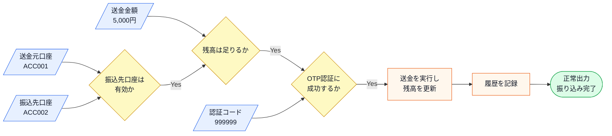
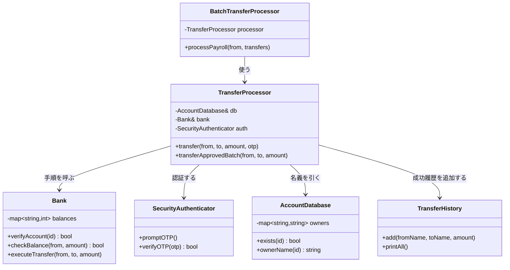
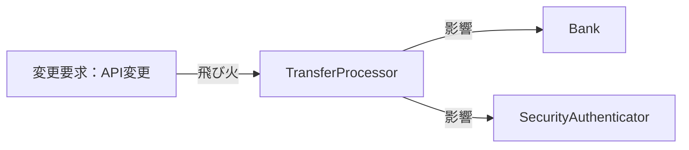
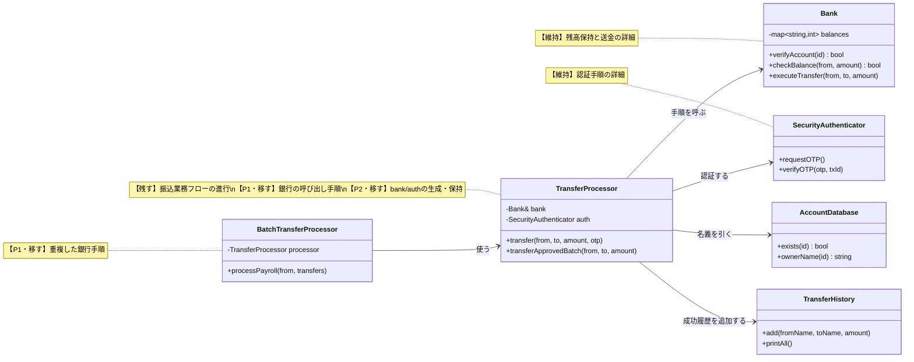
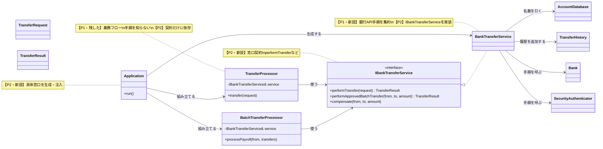
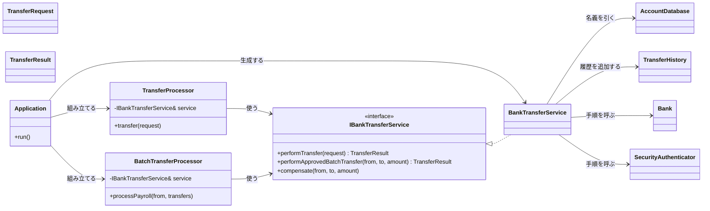
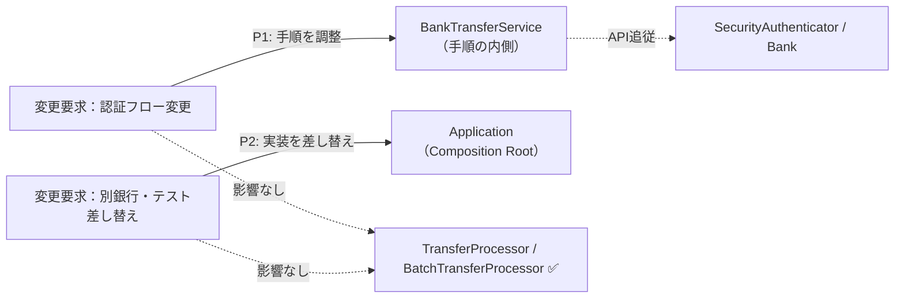
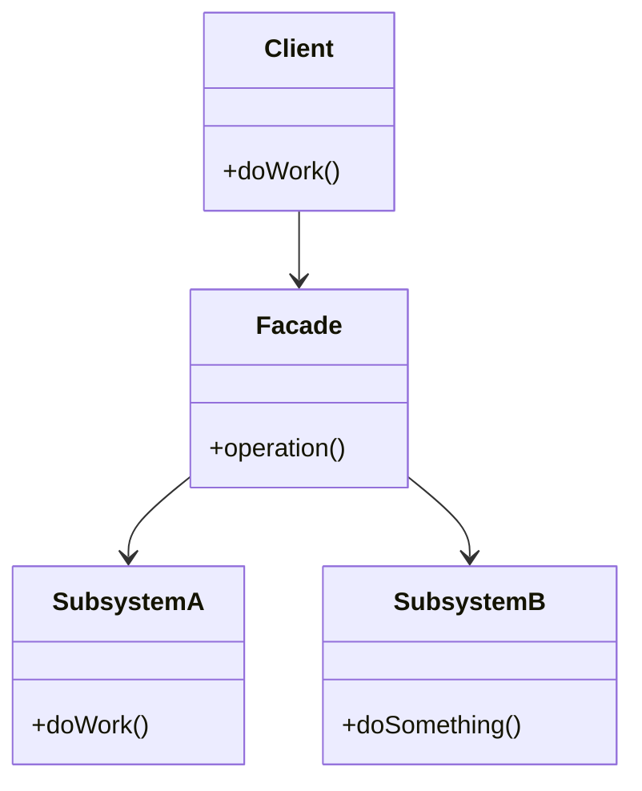
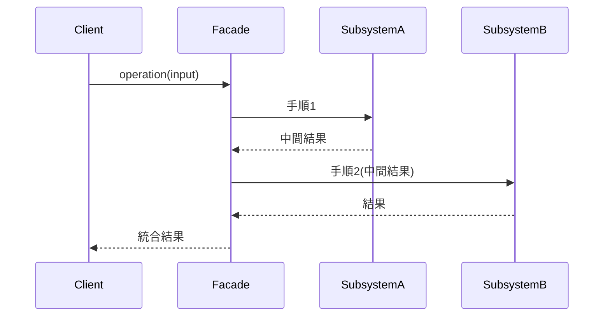

## 第2章 窓口を一本化する ―― Facade パターン

### この章の核心

**銀行APIの認証手順や送金パラメータが変わるたびに、振込業務フローまで修正が必要になる。こういう問題は、「振込を成立させる業務」と「外部システムごとの呼び出し詳細」が同じ場所に混在しているシステムで起きている。**

---

### この章を読むと得られること

この章の痛みは「外部システムの詳細を、自社のコードが直接知りすぎている」問題です。

* **得られること1：** 「依存の広がり」という観点で、コードの波及範囲を識別できるようになる
* **得られること2：** 外部システムの詳細を知りすぎているクラスを見つけ、そこが変更に弱い接続点（変更の痛みの発生源）だと判断できるようになる
* **得られること3：** 複雑な呼び出し手順をカプセル化することで、クライアントコードをスッキリ保つ方法を説明できるようになる
* **得られること4：** 外部システムと自社システムの境界線（窓口）をどこに引くべきか判断できるようになる

---

## 🔵 フェーズ1：現状把握 ―― 仕様を整理し、システムと紐付ける

ネット銀行の振り込み処理が何を入力として受け取り、どの処理で加工し、何を出力するのかを整理します。

### 1-1：このシステムの仕様

このシステムは、ネット銀行の**振り込み処理を実行**します。

「振込先口座番号」「送金金額」を入力として受け取り、銀行の外部システムを通じて以下の手順で振り込みを完了させます。成功時は送金元残高を減らし、送金先残高を増やし、振り込み履歴を1件保存します。失敗時は残高も履歴も変更しません。

この手順の順番には業務上の理由があります。「口座が存在しない相手に送金しようとする」「残高が足りないのに認証コードを発行する」といった無駄なコストを避けるため、この章のシステムでは安価な確認（口座・残高）を先に行い、コストのかかる認証・送金を後回しにしています。

この章で扱う現状仕様は、次の範囲です。

| 仕様項目 | この章で扱う値 | 具体例 | 何に使うか |
|---|---|---|---|
| 振込先口座番号 | 送金先の口座ID | ACC002 | 口座が存在するかを確認する |
| 送金金額 | 1円以上の金額 | 10,000円 | 残高確認と送金実行に使う |
| 認証コード | 利用者が入力するOTP | 999999 | 口座と残高が確認できた後に検証する |
| 口座残高 | 送金元と送金先の現在残高 | ACC001: 150,000円 | 成功時だけ送金額を減算・加算する |
| 振込履歴 | 成功した振り込みの記録 | ACC001→ACC002: 5,000円 | 送金元・送金先・金額を後から確認する |
| 出力 | 成功 / 失敗 | 振り込み完了、口座エラー、残高不足、認証エラー | どの確認で止まったかを動作例で照合する |

ここで確認する対象は、振り込みがどの確認を通って完了または失敗になるかです。

上の文章と表で仕様を一通り確認したので、まず正常に振り込みが完了する場合の入力・判定・加工・出力の流れとして整理します。

**仕様整理図：正常系の入力・判定・加工・出力**



この図から読み取ることは、次の3点です。

- 振り込みは、送金元・振込先・金額・認証情報がそろって初めて実行できる。
- 口座確認、残高確認、認証は、送金実行の前に満たすべき条件として順に確認される。
- 正常系では、送金実行で残高を更新し、履歴を記録してから振り込み完了を返す。

**振り込みの基本手順**

| 手順 | 入力 | 成功時に次へ渡すもの |
|---|---|---|
| ① 口座確認 | 振込先口座ID | 有効な振込先口座 |
| ② 残高確認 | 送金元口座ID・送金額 | 送金可能という確認結果 |
| ③ OTP認証 | 利用者が入力した認証コード | 本人確認済みという結果 |
| ④ 送金実行 | 口座・金額 | 送金受付結果 |
| ⑤ 送金結果照会 | 送金受付結果 | 確定した送金結果 |
| ⑥ 保存 | 確定した送金結果 | 更新後残高・振込履歴 |

「失敗したら中止」というルールは、途中まで実行した状態で処理が止まることによる不整合（お金は引き落とされたのに振込先に届かない、など）を防ぐためです。料理のレシピと同じで、前の工程が成立していないと次の工程が意味をなさないため、この章のフェーズ1の現状コードではどのステップが失敗しても後続の手順を実行しません。

**この仕様を決める業務機能**

| 業務機能 | この章の仕様で決めていること |
|---|---|
| 振込業務 | 成功時の残高更新と履歴記録、失敗時に更新しないこと |
| 銀行API | 口座確認・残高確認・送金・結果照会の仕様 |
| 認証 | OTPの発行・検証手順 |
| 処理の骨格 | 各確認を実行する順序 |

この基本仕様を押さえたうえで、通信を伴う詳細条件とエラー条件を確認します。

**この章が扱う複雑さ**

この章では、外部銀行APIを単純な1回の呼び出しとして扱いません。振り込みは、複数の確認を順番に通し、前のAPI応答を次のAPIへ渡す処理です。さらに実運用では、送金実行後の結果照会、タイムアウト、再試行も起こります。

| 複雑さ | 実際の仕様 | 掲載コードでの表現 |
| ---------- | ------------------------------ | ----------------------------- |
| 順次API実行 | 口座確認→残高確認→認証→送金→結果照会の順で進める | 各境界メソッドを同じ順序で呼ぶ |
| 認証入力 | 利用者が入力したOTPを1回検証する | OTP文字列を認証境界へ渡す。取引IDはまだ存在しない |
| タイムアウト・再試行 | 結果が確定しなければ照会を再試行し、上限後は保留にする | 通信待ち時間は省略し、境界から失敗・保留結果を返す |

送金結果照会は、掲載コードでは `executeTransfer()` の成功応答と履歴記録で簡略化しています。実際の銀行APIで照会APIや再試行制御が必要になっても、この章の判断は変わりません。呼び出し元は「振込を依頼し、結果を受け取る」ことだけを知り、細かい順次APIや再試行は窓口の内側へ閉じ込めます。

**エラー条件**

正常系の送金実行へ進めない入力や外部確認の失敗は、次のように分けて扱います。

| エラー条件             | どこで分かるか  | 出力         | 保存・通知などの副作用                 |
| ----------------- | -------- | ---------- | --------------------------- |
| 振込先口座が存在しない、または無効 | 口座確認時    | 口座エラー      | 残高更新なし、履歴記録なし               |
| 送金元残高が不足している      | 残高確認時    | 残高不足エラー    | 残高更新なし、履歴記録なし               |
| OTP認証に失敗する        | 認証コード検証時 | 認証エラー      | 残高更新なし、履歴記録なし               |
| 銀行API送信に失敗する      | 送金実行時    | 送金エラー      | この章では外部API境界の詳細なリトライ処理は扱わない |
| 送金結果照会がタイムアウトする   | 結果照会時    | 保留または送金エラー | 実運用では窓口内で再試行・保留記録を行う        |
|                   |          |            |                             |

---

### 1-2：動作例テーブル

仕様を定義したところで、入力に対する結果と保存後の状態を確認します。成功ケースでは送金元・送金先の残高と履歴件数が変わり、失敗ケースではいずれも変わりません。

| ケース | 振込条件 | 処理後残高 | 結果・履歴 |
|---|---|---|---|
| 通常振込成功 | ACC001（150,000円）→ACC002（30,000円）へ5,000円 | ACC001: 145,000円、ACC002: 35,000円 | 完了、履歴0→1件 |
| 振込先なし | ACC001→UNKNOWNへ5,000円 | 150,000円のまま | 口座エラー、履歴0件 |
| 残高不足 | ACC001→ACC002へ1,000,000円 | 150,000円、30,000円のまま | 残高不足、履歴0件 |
| 認証失敗 | ACC001→ACC002へ5,000円 | 150,000円、30,000円のまま | 認証エラー、履歴0件 |
| バッチ成功 | ACC003（500,000円）→ACC002（30,000円）へ30,000円 | ACC003: 470,000円、ACC002: 60,000円 | 完了、履歴0→1件 |

この表の各行は、口座残高と履歴を初期状態へ戻して1ケースずつ実行した場合の期待値です。1-4の `main()` は同じDBで行1〜5を連続実行するため、行1の5,000円入金後に行5の30,000円入金が続き、最後のACC002残高は65,000円、履歴は2件になります。

コードを読む前に、このシステムが「何をする必要があるか」をこの表で確認できました。次は「どのように実装されているか」を確認します。

---

### 1-3：登場クラスとクラス構成図

#### このシステムの登場クラス

`AccountDatabase` と `Bank` は境界が違います。`AccountDatabase` は自社が保持する口座の名義を読む台帳境界、`Bank` は別システムである外部銀行で、残高を保持し送金を実際に実行する通信境界です。

掲載コードでは、台帳と銀行残高を `std::map`、外部への表示を `std::cout` で表します。ただし `Bank.executeTransfer()` は残高を実際に増減し、認証は入力コードを照合します。printは境界の先で起きる通信・保存・画面表示を手元で確認できる形に置き換えたもので、状態は実際に変化します。

| クラス名 | 役割 | 担当する仕様 |
|---|---|---|
| AccountDatabase | 自社台帳（口座名義の保持・検索） | 口座名義の照会 |
| Bank | 外部銀行（残高保持・照会・送金・補償） | 仕様①口座確認・②残高確認・④送金 |
| SecurityAuthenticator | 認証制御（コード発行・照合） | 仕様③認証 |
| TransferRecord | 振り込み1件分のデータ | 振り込み履歴の1レコード |
| TransferHistory | 振り込み履歴の管理 | 成功した振り込みの記録・一覧表示 |
| TransferProcessor | 個別振り込みフロー進行 | 仕様全体 |
| BatchTransferProcessor | 一括振り込み（バッチ）進行 | 複数の振り込みの呼び出し |

データの流れ：BatchTransferProcessor → TransferProcessor → Bank / SecurityAuthenticator（外部銀行）
この章で注目するポイント：振り込み業務の流れと、銀行の呼び出し手順がどのように結びついているか

各クラスの役割を把握したところで、クラス間の関係を図で整理します。



**クラス図に出てくる主なメンバーと操作**

| クラス | メンバー・操作 | 何ができるか |
|---|---|---|
| `BatchTransferProcessor` | `processPayroll()` | 給与振込などの一括処理を進める |
| `TransferProcessor` | `bank` / `auth` | 外部銀行と認証処理を直接呼び出す |
| `TransferProcessor` | `transfer()` | 口座確認・残高確認・認証・送金を順に実行する |
| `Bank` | `checkBalance()` / `executeTransfer()` | 残高を照会し、実際に送金する |
| `SecurityAuthenticator` | `promptOTP()` / `verifyOTP()` | 入力された認証コードを照合する |

| 実システムの処理 | 掲載コードでの代替 | この章で確認すること |
|---|---|---|
| 自社台帳の名義照会 | `AccountDatabase` 内の `std::map` | 名義で履歴を記録できること |
| 銀行の残高保持・送金 | `Bank` 内の `std::map` を実際に増減 | 成功時だけ残高が動くこと |
| 振込履歴テーブルへの追加 | `TransferHistory` 内の `std::vector` | 成功1件につき履歴が1件増えること |
| OTP認証 | `SecurityAuthenticator` の照合 | 認証失敗時に送金へ進まないこと |


`BatchTransferProcessor` は `TransferProcessor` を使って一括処理を行い、`TransferProcessor` が `Bank` と `SecurityAuthenticator` の両方を直接保持し、それぞれのメソッドを順番に呼び出してフローを制御しています。

---

### 1-4：実装コード（現状）

#### コードを読む前に：クラスの責任と境界

| 対象 | 呼び出しと内部処理 | 戻り値・副作用 | 掲載上の表現 |
|---|---|---|---|
| `AccountDatabase` | 自社が知る口座を名義で引く | 名義文字列 | `std::map` を自社台帳として使う |
| `Bank` | 口座・残高を照会し、送金で残高を増減する | 成否・残高の変化 | `std::map` の残高を実際に書き換える |
| 認証 | 発行した正しいコードと入力を照合する | 成否 | 仮決めのコードと文字列比較する |
| `TransferHistory` | 成立した送金から1レコードを受け取る | 履歴件数が増える | `std::vector` へ順番に追記する |

残高は外部銀行（`Bank`）が権威として保持し、自社台帳（`AccountDatabase`）は名義だけを持ちます。`Bank` はprintで通信を表しますが、`executeTransfer` は実際に残高を増減させ、認証は入力コードを照合します。失敗時に残高と履歴を更新しない契約は実システムと同じです。

#### 銀行システム・自社台帳・認証のクラス群

はじめに、外部銀行との通信を担う `Bank`、自社の口座名義を持つ `AccountDatabase`、認証を担うクラスを見ます。

このシステムが扱う3口座は次のとおりです。名義は自社台帳が、残高は銀行が保持します。

| 口座ID | 名義（自社台帳） | 残高（銀行） |
|---|---|---|
| ACC001 | 田中 一郎 | 150,000円 |
| ACC002 | 佐藤 花子 | 30,000円 |
| ACC003 | 鈴木 次郎 | 500,000円 |

`std::map` は口座IDから名義・残高を引く保存領域、`std::vector` は成功した履歴を順に追加する領域です。基本操作は第0章「サンプルで使うC++標準ライブラリ」を参照してください。

```cpp
#include <iostream>
#include <map>
#include <string>
#include <vector>
#include <utility>

// 自社台帳：口座の名義を保持する（残高は持たない）
class AccountDatabase {
private:
    std::map<std::string, std::string> owners;
public:
    AccountDatabase() {
        owners["ACC001"] = "田中 一郎";
        owners["ACC002"] = "佐藤 花子";
        owners["ACC003"] = "鈴木 次郎";
    }
    bool exists(const std::string& id) const {
        return owners.count(id) > 0;
    }
    std::string ownerName(const std::string& id) const {
        return owners.at(id);
    }
};

// 外部銀行サブシステム：残高を保持し、実際に送金する
class Bank {
private:
    std::map<std::string, int> balances;
public:
    Bank() {
        balances["ACC001"] = 150000;
        balances["ACC002"] =  30000;
        balances["ACC003"] = 500000;
    }
    bool verifyAccount(const std::string& id) {
        bool ok = balances.count(id) > 0;
        std::cout << "口座確認: " << id
                  << (ok ? " OK" : " NG") << "\n";
        return ok;
    }
    bool checkBalance(const std::string& from, int amount) {
        bool ok = balances[from] >= amount;
        std::cout << "残高確認: " << from << " " << balances[from]
                  << "円 >= " << amount << "円 "
                  << (ok ? "OK" : "NG") << "\n";
        return ok;
    }
    void executeTransfer(const std::string& from,
                         const std::string& to, int amount) {
        balances[from] -= amount;
        balances[to]   += amount;
        std::cout << "送金実行: " << from << " -" << amount
                  << "→" << balances[from] << "円 / "
                  << to << " +" << amount
                  << "→" << balances[to] << "円\n";
    }
    int balanceOf(const std::string& id) const {
        return balances.at(id);
    }
};

// 認証サブシステム：正しいコードを仮決めし、検証で照合する
class SecurityAuthenticator {
public:
    void promptOTP() { std::cout << "認証コード入力受付\n"; }
    bool verifyOTP(const std::string& otp) {
        bool ok = (otp == "999999");  // 仮決めの正しいコードと照合
        std::cout << "認証コード検証: "
                  << (ok ? "一致" : "不一致") << "\n";
        return ok;
    }
};
```

`Bank` は残高を実際に増減させる外部サブシステム、`AccountDatabase` は自社が知る名義、`SecurityAuthenticator` は発行した正しいコードとの照合を担います。

次に、振り込み履歴を管理するクラスを見ます。履歴はシステム起動時は空で、振り込みが成功するたびに1件追記されます。

```cpp
// 自社の振込記録
struct TransferRecord {
    std::string fromName;
    std::string toName;
    int amount;
};
class TransferHistory {
private:
    std::vector<TransferRecord> records;
public:
    void add(const std::string& fromName,
             const std::string& toName, int amount) {
        records.push_back({fromName, toName, amount});
    }
    void printAll() const {
        for (const auto& r : records)
            std::cout << r.fromName << " → " << r.toName
                      << " : " << r.amount << "円\n";
    }
};
```

`TransferHistory` は成功のたびに `add()` で1件追記され、`printAll()` で全履歴を出力します。

#### 振り込み処理クラス

次に、振り込みの全体フローを管理する `TransferProcessor` を見ます。`main()` と `BatchTransferProcessor` から呼ばれ、送金元・送金先・金額・OTPを受け取ります。内部では口座確認・残高確認・認証・送金を順に呼び、どこかが失敗すれば後続を実行せず `false` を返します。すべて成功したときだけ `Bank.executeTransfer()` で残高を動かし、`TransferHistory.add()` で履歴を追加して `true` を返します。

```cpp
// 振り込み処理クラス：銀行APIの手順を直接制御している
class TransferProcessor {
private:
    AccountDatabase& db;
    Bank& bank;
    TransferHistory& history;
    SecurityAuthenticator auth;
public:
    TransferProcessor(AccountDatabase& database, Bank& b,
                      TransferHistory& hist)
        : db(database), bank(b), history(hist) {}

    bool transfer(const std::string& from, const std::string& to,
                  int amount, const std::string& otp) {
        if (!db.exists(from)) {
            std::cout << "エラー: 送金元口座なし\n";
            return false;
        }
        if (!bank.verifyAccount(to)) {
            std::cout << "エラー: 送金先口座なし\n";
            return false;
        }
        if (!bank.checkBalance(from, amount)) {
            std::cout << "エラー: 残高不足\n";
            return false;
        }
        auth.promptOTP();
        if (!auth.verifyOTP(otp)) {
            std::cout << "エラー: 認証失敗\n";
            return false;
        }
        bank.executeTransfer(from, to, amount);
        history.add(db.ownerName(from), db.ownerName(to), amount);
        std::cout << "振り込み完了\n";
        return true;
    }

    bool transferApprovedBatch(const std::string& from,
                               const std::string& to, int amount) {
        if (!db.exists(from)) {
            std::cout << "エラー: 送金元口座なし\n";
            return false;
        }
        if (!bank.verifyAccount(to)) {
            std::cout << "エラー: 送金先口座なし\n";
            return false;
        }
        if (!bank.checkBalance(from, amount)) {
            std::cout << "エラー: 残高不足\n";
            return false;
        }
        bank.executeTransfer(from, to, amount);
        history.add(db.ownerName(from), db.ownerName(to), amount);
        std::cout << "振り込み完了（OTP不要）\n";
        return true;
    }
};

// 給与振り込みなどの一括処理バッチ（もう1つの呼び出し元）
class BatchTransferProcessor {
private:
    TransferProcessor processor;
public:
    BatchTransferProcessor(AccountDatabase& database, Bank& b,
                           TransferHistory& hist)
        : processor(database, b, hist) {}
    void processPayroll(
            const std::string& from,
            const std::vector<std::pair<std::string, int>>& transfers) {
        for (const auto& t : transfers)
            processor.transferApprovedBatch(from, t.first, t.second);
    }
};
```

`TransferProcessor` の二つのメソッドには「振り込みという業務フローの制御」と「銀行の具体的な呼び出し手順」が一緒に書かれています。バッチではOTPを省略できますが、口座確認・残高確認・送金という手順を通常振込とは別に記述しています。

#### 呼び出し元と実行確認

```cpp
int main() {
    AccountDatabase db;
    Bank bank;
    TransferHistory history;
    TransferProcessor processor(db, bank, history);

    std::cout << "--- 行1: 正常な個別振り込み ---\n";
    processor.transfer("ACC001", "ACC002", 5000, "999999");
    std::cout << "--- 行2: 存在しない口座 ---\n";
    processor.transfer("ACC001", "UNKNOWN", 5000, "999999");
    std::cout << "--- 行3: 残高不足 ---\n";
    processor.transfer("ACC001", "ACC002", 1000000, "999999");
    std::cout << "--- 行4: 認証失敗 ---\n";
    processor.transfer("ACC001", "ACC002", 5000, "INVALID");
    std::cout << "--- 行5: 社内承認済みバッチ ---\n";
    BatchTransferProcessor batch(db, bank, history);
    batch.processPayroll("ACC003", {{"ACC002", 30000}});

    std::cout << "--- 最終残高 ---\n";
    std::cout << "ACC001: " << bank.balanceOf("ACC001") << "円\n";
    std::cout << "ACC002: " << bank.balanceOf("ACC002") << "円\n";
    std::cout << "ACC003: " << bank.balanceOf("ACC003") << "円\n";
    std::cout << "--- 振り込み履歴 ---\n";
    history.printAll();
    return 0;
}
```

実行対象コード：1-4の現状コード
対応する動作例：1-2の動作例テーブル
確認したいこと：口座確認・残高確認・認証・送金・履歴記録が入力条件に応じて仕様どおり実行または中止され、銀行残高が実際に増減すること

実行結果：

```
--- 行1: 正常な個別振り込み ---
口座確認: ACC002 OK
残高確認: ACC001 150000円 >= 5000円 OK
認証コード入力受付
認証コード検証: 一致
送金実行: ACC001 -5000→145000円 / ACC002 +5000→35000円
振り込み完了
--- 行2: 存在しない口座 ---
口座確認: UNKNOWN NG
エラー: 送金先口座なし
--- 行3: 残高不足 ---
口座確認: ACC002 OK
残高確認: ACC001 145000円 >= 1000000円 NG
エラー: 残高不足
--- 行4: 認証失敗 ---
口座確認: ACC002 OK
残高確認: ACC001 145000円 >= 5000円 OK
認証コード入力受付
認証コード検証: 不一致
エラー: 認証失敗
--- 行5: 社内承認済みバッチ ---
口座確認: ACC002 OK
残高確認: ACC003 500000円 >= 30000円 OK
送金実行: ACC003 -30000→470000円 / ACC002 +30000→65000円
振り込み完了（OTP不要）
--- 最終残高 ---
ACC001: 145000円
ACC002: 65000円
ACC003: 470000円
--- 振り込み履歴 ---
田中 一郎 → 佐藤 花子 : 5000円
鈴木 次郎 → 佐藤 花子 : 30000円
```

動作例テーブルの全5行について、成功時の処理順、失敗時の中止位置、バッチでOTPを実行しないことを確認できました。行3は銀行の残高照会で、行4はOTPの照合で実際に弾かれ、成功時は銀行残高が増減しています。現状でも仕様は満たしています。

> **手元で動かすには**
> このコードは1つの `.cpp` に貼り付けて、そのままコンパイル・実行できます（例：`g++ chapter02.cpp -o app && ./app`）。`main()` は自由に組み替えて構いません。口座の名義は自社台帳、残高は銀行が持ち、プロセス実行中だけ有効です（永続DBはこの章の論点ではありません）。

次のフェーズで変更が来たときに何が起きるかを確認します。

---


### 1-5：変更要求

ある月曜日の朝、銀行のシステム担当者から緊急の連絡が入りました。

「来月から、銀行APIの認証仕様が大幅に変わります。これまでは単一のOTP（ワンタイムパスワード）認証だけで十分でしたが、今後は、はじめに『認証コードの発行』をリクエストし、その応答で返る『取引ID』とあわせて検証する必要があります。」

さらに、これに続いて「銀行側の送金APIのインターフェースもセキュリティ強化のため、送金時のパラメータに『トランザクションID』が必須になります」とのこと。

リリースは来月の頭。

**仕様変更の内容**

変更要求を受けて、認証と送金の手順がどう変わるかを整理します。（この変更は「インフラ・システム管理の業務機能」に属する要求です）

| 手順 | 変更前 | 変更後 |
|---|---|---|
| ① 口座確認 | 既存の口座確認を実行 | 同じ確認手順を継続 |
| ② 残高確認 | 既存の残高確認を実行 | 同じ確認手順を継続 |
| **③ 認証** | OTP（ワンタイムパスワード）1ステップで完了 | **「認証コードの発行」→「取引IDと認証コードの照合」の2ステップに変更** |
| **④ 送金実行** | 振込先口座と金額だけを指定して送金 | **「トランザクションID」が必須パラメータとして追加** |

現行の認証では発行と検証の間に識別子を受け渡していませんでした。新仕様では `requestOTP()` の応答から取引IDを受け取り、`verifyOTP(otp, txId)` で検証します。検証済みの同じ取引IDを、`executeTransfer(from, to, amount, txId)` にも渡します。

**変更前後の入力・判定・加工・出力差分**

1-1の現状仕様を退避し、変更要求を当てた後の仕様と同じ粒度で並べます。以降の分析では、この差分を追います。

| 要素 | 変更前（1-1の現状仕様） | 変更後（今回の要求） | 差分として追うもの |
|---|---|---|---|
| 入力 | 振込先口座、送金金額、認証コード | 振込先口座、送金金額、認証コード、取引ID | 取引IDが認証と送金の間を流れる |
| 判定 | 口座有効、残高十分、OTP一致 | 口座有効、残高十分、取引IDと認証コードの照合成功 | 認証判定が2段階になる |
| 加工 | OTP検証後に送金する | 認証コードを発行し、取引ID付きで送金する | 認証発行と送金実行の手順が増える |
| 出力 | 振込成功または各種エラー | 振込成功、認証発行エラー、照合エラー、送金エラー | どの手順で失敗したかを追う |

**変更後の入力・加工・出力**

変更後の仕様を、1-1と同じ粒度で、正常系の入力・判定・加工・出力として確認します。1-1の図との差分は、認証が「発行」と「照合」の2ステップになることと、発行時に受け取る「取引ID」が送金実行にも受け渡されることの2点です。


この図から読み取ることは、次の3点です。

- 口座確認・残高確認と、送金後の履歴記録は1-1のまま変わらない。
- 認証が「認証コードの発行」と「取引IDと認証コードの照合」の2ステップになり、発行の応答で受け取る「取引ID」という新しい値が加わる。
- 取引IDは認証の中で完結せず、送金実行にも必須の値として受け渡される。

変更後も、失敗条件は正常系図へ混ぜずに別で確認します。

| エラー条件 | どこで分かるか | 出力 | 保存・通知などの副作用 |
|---|---|---|---|
| 振込先口座が存在しない、または無効 | 口座確認時 | 口座エラー | 残高更新なし、履歴記録なし |
| 送金元残高が不足している | 残高確認時 | 残高不足エラー | 残高更新なし、履歴記録なし |
| 認証コードの発行に失敗する | 認証コード発行時 | 認証発行エラー | 残高更新なし、履歴記録なし |
| 取引IDと認証コードの照合に失敗する | 認証コード検証時 | 認証エラー | 残高更新なし、履歴記録なし |
| 取引ID付き送金に失敗する | 送金実行時 | 送金エラー | この章では外部API境界の詳細なリトライ処理は扱わない |

図に加わった「取引ID」の受け渡しが実際にコードのどこへ書かれるかは、フェーズ3で変更を試すコードと、フェーズ7の最終コード・実行結果で追います。

フェーズ1でシステムの現状と変更要求が把握できました。次のフェーズ2では、「何を変え、何を守るか」を整理します。

---

## 🟣 フェーズ2：仮説立案 ―― 何が変わるかを観察し、ヒアリングで裏付ける
### 2-1：変わりそうな仕様の見当をつける

ここで作る一覧は、思いつきで「変わりそう」と感じたものを並べる表ではありません。フェーズ1で確認した仕様・動作例・クラス図を材料に、次の順で候補を絞ります。

1. 仕様図と動作例から、入力・判定・加工・出力のうち条件や値が変わりそうな箇所を拾う。
2. その箇所が、1-3のどのクラス・メソッドに書かれているかを対応づける。
3. その仕様が、どんな理由で、何をきっかけに、どのくらいの頻度で変わりそうかを仮説として書く。
4. 逆に、当面変えない前提にできる処理の骨格も分けておく。

この手順で見ると、「振り込みを実行する」という大きな処理全体ではなく、その中のどの確認・認証・送金呼び出しが変更候補なのかを読者自身で追えるようになります。

フェーズ2では、フェーズ1で見た仕様のうち、どの条件・手順・外部呼び出しが変わりそうかを見当づけます。責務の配置は、変更要求を当てた後の痛みと合わせて確認します。単に「すべて `transfer()` にある」とせず、関数内のどの処理が何をきっかけに変わるかまで分けます。

| 仕様候補 | 仕様上の場所 | フェーズ1の現状コードでの場所 | 見立て |
|---|---|---|---|
| 口座確認・残高確認 | 判定、外部API呼び出し | `transfer()` 冒頭の `verifyAccount` / `checkBalance` 呼び出し | 銀行APIの入力や確認順序が変わる可能性がある |
| OTP認証 | 判定、認証手順 | `transfer()` 中盤の `promptOTP` / `verifyOTP` 呼び出し | 新仕様では`requestOTP`が取引IDを返すため、戻り値・引数・順序が変わる |
| 送金実行 | 加工、外部API呼び出し | `transfer()` 後半の `executeTransfer` 呼び出し | 送金APIが取引IDや冪等キーを要求すると変わる |
| 残高更新・履歴 | 保存 | `transfer()` 成功分岐の `db.transfer` / `history.add` | 外部送金確定後だけ行うという条件は維持したい |
| 振り込みの大枠 | 入力から確認・認証・送金へ進む順序 | `TransferProcessor.transfer()` | この章の変更要求では、順序の大枠は当面維持する前提で見る |

この表から、今回の検討対象は「銀行API確認」「OTP認証」「送金API呼び出し」の3つに絞れます。これらが同じ場所に書かれていて困るかどうかは、フェーズ3で変更を入れてから確認します。

### 2-2：今回の変更で確実に変わること

今回の変更要求から確定している変更は2点です。

- **銀行APIの認証手順の変更**：OTP1ステップから、認証コード発行＋取引IDとの照合という2ステップに変更される
- **送金APIのパラメータ追加**：送金時にトランザクションIDが必須になる

ただし「この変更が1回限りか、今後も続くか」によって、どこまで設計を変えるべきかが大きく変わります。関係者に確認します。

### ヒアリングに向けた背景確認

このシステムは、あるネット銀行の振り込み処理を自動化するためのものです。銀行のシステムは非常に堅牢で、安全に送金を行うために、口座情報の確認、残高チェック、手数料の計算、そして実際の送金指示という、いくつもの手順を正しい順番で実行する必要があります。

開発チームは、この銀行のAPIを直接叩いて振り込みを行うプログラムをメンテナンスしています。当初は単純な送金機能だけでしたが、最近では、振り込み先に応じた送金限度額の確認や、二要素認証の呼び出しなど、銀行側から求められるセキュリティ要件が年々厳しくなってきました。

### 2-3：関係者ヒアリング


今回の変更が一時的なものか、将来も続くリスクがあるのかを確認するため、銀行のAPI担当者にヒアリングを行いました。

- **開発者：** 「認証の仕様が変わるとのことですが、今回の変更は一時的なものでしょうか？今後、さらに認証方式が増える予定はありますか？」
- **銀行API担当者：** 「申し訳ありませんが、セキュリティ強化の波は止まりません。数ヶ月後には、生体認証を導入する予定もあります。今後も認証手順はさらに複雑になる可能性が高いです。」
- **開発者：** 「なるほど。送金APIについても、今後パラメータが増えたり、呼び出し順序が変わったりすることは考えられますか？」
- **銀行API担当者：** 「ええ、来年以降には、さらに上位のトランザクション管理システムと連携するため、送金時のリクエスト形式が現在のJSONからXMLへ移行する計画もあります。」
- **開発者：** 「分かりました。かなり頻繁に接続仕様が変わりそうですね。今回の認証フローの変更についても、将来的にさらに手順が増えるリスクはありますか？」
- **銀行API担当者：** 「おっしゃる通りです。現在は二段階認証ですが、将来的には三段階になるかもしれません。現時点での固定的な手順に縛られない設計にしておいた方が、お互いのためかもしれませんね。」

### 2-4：ヒアリングで判明した将来リスク

ヒアリングで浮かび上がった「確定ではないが、近い将来起こりうる変化」を記録します。これは今回の設計判断の材料です。

| **将来リスク** | **時期の目安** | **根拠** |
|---|---|---|
| 認証フローの多段階化（二段階→三段階認証） | 銀行側のセキュリティ強化時 | 銀行API担当者との確認 |
| 送金リクエスト形式の変更（JSON→XML移行計画） | 来年以降の基幹システム連携時 | 銀行API担当者との確認 |
| 生体認証の導入 | 数ヶ月後の予定 | 銀行API担当者との確認 |

フェーズ2で「今変わること（確定）」と「将来変わるかもしれないこと（リスク）」を分けて整理できました。次のフェーズ3では、現在の構造で変更を試みたときに何が起きるかを確認します。

### 2-5：変わる見込みと当面安定の前提を確定する

2-4で把握した将来リスクを、「現在の状態」と「将来起こりうる変化」の対比で整理します。設計判断の根拠を一覧にしておくことで、フェーズ6で採用する形を決める判断基準になります。

| 変更内容 | 現在 | 将来（時期の目安） |
|---|---|---|
| 認証ステップ数 | OTP 1ステップ（発行→検証） | 三段階認証へ拡張（銀行セキュリティ強化時） |
| 認証方式 | OTP（ワンタイムパスワード） | 生体認証の追加（数ヶ月後の予定） |
| 送金リクエスト形式 | JSON 形式 | XML 形式へ移行（来年以降の基幹システム連携時） |

この変化が来たとき、現在の `TransferProcessor` がどこまで影響を受けるかを次のフェーズ3で確認します。

---

## 🟣 フェーズ3：問題特定 ―― 変更の痛みを発見する
### 3-1：変更を試みる

「銀行APIの認証フロー変更（発行と検証の2段階化）」と「送金時のトランザクションID付与」を、現在の `TransferProcessor` クラスの `transfer` メソッドに直接書き込む作業を試みてみましょう。変更前の `transfer` メソッドの中心部分はこうでした。

> **中間コードの継続条件：** 以下は認証・送金手順の差分抜粋です。フェーズ1の `AccountDatabase` による名義照会、`Bank` による残高確認と送金、`TransferHistory` への記録は変更せず、抜粋の前後で実行されます。`from`・`to`・`amount`・`otp` を直接書くのは、フェーズ1の公開入口と同じ位置引数を展開して手順の痛みを見せるためです。

```cpp
bank.verifyAccount(to);
bank.checkBalance(from, amount);

auth.promptOTP();
auth.verifyOTP(otp);

bank.executeTransfer(from, to, amount);
```

このコードに今回の変更を適用すると、以下のようになります。

```cpp
bool transfer(const std::string& from, const std::string& to,
              int amount, const std::string& otp) {
    bank.verifyAccount(to);
    bank.checkBalance(from, amount);

    // 【痛み：認証の手順が変わる】既存コードを書き換える
    // 認証コードの発行応答から取引IDを受け取る
    std::string txId = auth.requestOTP();
    // 検証時に取引IDを渡す必要がある
    auth.verifyOTP(otp, txId);

    // 【痛み：送金の仕様が変わる】取引IDを送金にも渡す
    bank.executeTransfer(from, to, amount, txId);

    std::cout << "振り込み完了\n";
    return true;
}
```

変更後のコードを実行すると、次のような結果になります。


```cpp
// 最小構成：変更後の手順（取引IDの受け渡し）だけを確認する
struct Auth {
    std::string requestOTP() {
        std::cout << "OTP発行 → 取引ID取得\n";
        return "TX-9001";
    }
    bool verifyOTP(const std::string& otp, const std::string& txId) {
        std::cout << "OTP検証（txId=" << txId << "）\n";
        return otp == "999999";  // 仮決めの正しいコードと照合
    }
};

struct Bank {
    void verifyAccount(const std::string& id) {
        std::cout << "口座確認: " << id << "\n";
    }
    void checkBalance(const std::string& from, int amount) {
        std::cout << "残高確認: " << from << " " << amount << "円\n";
    }
    void executeTransfer(const std::string& from,
                         const std::string& to, int amount,
                         const std::string& txId) {
        std::cout << "送金: " << from << "→" << to << " "
                  << amount << "円（txId=" << txId << "）\n";
    }
};

int main() {
    Auth auth;
    Bank bank;
    bank.verifyAccount("ACC002");
    bank.checkBalance("ACC001", 50000);
    std::string txId = auth.requestOTP();
    auth.verifyOTP("999999", txId);
    bank.executeTransfer("ACC001", "ACC002", 50000, txId);
    std::cout << "振り込み完了\n";
    return 0;
}
```

実行対象コード：3-1の変更試行コード
対応する動作例：変更要求後の代表ケース（ACC001からACC002へ50,000円を送金）
確認したいこと：銀行の認証仕様変更により、取引IDが業務フロー側へ流れ込んでいること

実行結果：

```
口座確認: ACC002
残高確認: ACC001 50000円
OTP発行 → 取引ID取得
OTP検証（txId=TX-9001）
送金: ACC001→ACC002 50000円（txId=TX-9001）
振り込み完了
```

コード自体は正しく動いていますが、`txId`（取引ID）という一時的な状態が `transfer` メソッドの中を流れていることが分かります。

この変更を試みたとき、はじめに気づくのは `TransferProcessor` クラスが「銀行APIの細かな使い方」をあまりにも詳細に知りすぎているという点です。認証のステップが増えただけでメソッドのシグネチャ（名前・引数・戻り値の形）を追いかける必要があり、ロジックの修正が連鎖的に発生してしまいます。

「振り込みを実行する」という業務上の命令を処理しているはずの `TransferProcessor` が、銀行システム側から送られてくる「取引IDを保持する」といった一時的な状態管理まで背負わされています。銀行側のAPI仕様が一つ変わるたびに、私たちの業務フローを制御するクラスのコードを書き換え、その結果、振り込み処理全体のテストをやり直さなければならないのです。

### 3-2：変更影響グラフ



このグラフを見ると、銀行APIの仕様という「外部システム都合の変更」が、私たちの業務フローの中枢である `TransferProcessor` を経由して、通信クラスや認証クラス全体に飛び火していることが分かります。

> **グラフの読み方：** この矢印は「フェーズ3で実際に変更したクラス」ではなく、「変更要求が来たときに影響が波及するリスクのある依存関係」を示しています。`TransferProcessor` が `Bank` と `SecurityAuthenticator` を直接知っているため、銀行APIの仕様が変わると `TransferProcessor` を経由して両クラスへの影響が及ぶ可能性があることを可視化しています。

### 3-3：痛みの言語化

**1つ目：仕様変更の波が業務ロジックに直撃する恐怖。** 今回の認証フローの変更は、本来であれば「振り込み」という業務プロセスには影響しないはずのものです。しかし、今の構造では、銀行APIという「外部システムの使い方」を `TransferProcessor` が直接知っているため、APIの引数が増えたり手順が変わったりするたびに、業務フローを記述している核心部分を書き換える羽目になります。

**2つ目：目的が見えなくなる複雑化。** コードを見れば、口座確認、残高確認、認証発行、検証、送金実行と、手続きが淡々と並んでいます。しかし、新しい仕様に対応するために一時的なIDを保持したり、条件分岐を足したりすることで、コードは「何のために振り込んでいるのか」という業務上の目的よりも、「銀行のAPIにどうやって命令を通すか」という技術的な手順の記述で埋め尽くされてしまいます。

---
> **📌 問題（確定）**
> 振り込み処理の認証手順や送金パラメータが変わるたびに、業務フローを管理する `TransferProcessor` のコードを直接書き換えなければならない。変わる理由が異なるコードが同じ場所に混在しているため、銀行API側の仕様変更が振り込み業務ロジック全体に波及し、影響範囲が読めない。
---

フェーズ3で「変更が辛い」ことが確認できました。次のフェーズ4では、なぜ辛いのかを構造的に言語化します。

---

## 🟠 フェーズ4：原因分析 ―― なぜ辛いのかを構造で言語化する
### 4-1：痛みの根源を探る（観察と原因）

フェーズ3で確認した「変更の辛さ」は、コードのどこから来ているのでしょうか。コードを注意深く観察すると、痛みを引き起こしている2つの事実が浮かび上がってきます。

第一に、新しい認証ステップが追加されたとき、なぜ毎回 `TransferProcessor` を開かなければならないのでしょうか？
それは、このクラス自身が「`auth.requestOTP()` を呼んで、取引IDを取得して、`auth.verifyOTP()` を呼ぶ」といった**銀行APIの具体的な呼び出し手順をすべて直接知ってしまっている（抱え込んでいる）**からです。

第二に、なぜ変更の影響範囲が読めず、振り込み全体のテストをやり直す恐怖を感じるのでしょうか？
それは、「振り込みという業務プロセスの進行」という責任と、「銀行APIという外部システムの技術的な利用手順」という責任が、**同じメソッドの中で物理的に混ざり合っている**からです。

この「症状（痛み）」と「根本原因」を整理すると、以下のようになります。

| **観察した症状（痛み）** | **構造的な原因（痛みの根源）** |
|---|---|
| 仕様変更の波が業務ロジックに直撃する | `TransferProcessor` が銀行APIの具体的な呼び出し手順を直接知っているから |
| 複雑化して目的が見えなくなる | 変わる理由が違う2つのもの（「振り込み業務のフロー」と「銀行APIの技術手順」）が同じメソッドの中に混在しているから |
| タイムアウトや結果照会が増えるたびに分岐が増える | 再試行・照会・保留判断といった通信上の都合が、振り込み業務の目的と同じメソッドに書かれるから |

### 4-2：変わるもの/変わってほしくないもの

> **「変わらないもの」と「変わってほしくないもの」は異なります。** 「変わらないもの」は経験的事実（今まで変わっていない）、「変わってほしくないもの」は設計意図（ここを安定させてほかを守りたい）です。ここで整理するのは後者です。

ここで注意したいのは、`bank.verifyAccount()` や `bank.checkBalance()` という**呼び出しそのものは銀行APIの一部**だということです。メソッド名・引数・確認の仕方は銀行側の都合で変わり得るため、変わる側に属します。守りたいのは、その呼び出しではなく「**送金の前に口座と残高を確認し、認証を通し、送金したら記録する**」という業務手順の意図と順序です。

| **変わり続けるもの（外部システムの詳細）** | **変わってほしくないもの（業務フローの骨格）** |
|---|---|
| 銀行APIの呼び出し一式（`verifyAccount`・`checkBalance`・`executeTransfer` の呼び方・パラメータ） | 「確認→認証→送金→記録」という業務手順の意図と順序 |
| 認証手順（`promptOTP`・`verifyOTP` の発行・検証ステップ） | 振り込みという業務上の目的と、依頼へ成否を返すこと |
| 送金APIのパラメータ（IDの追加や型変更） | 自社台帳での送金元検証（`db.exists`）と履歴の記録（`history.add`） |

1-4の `transfer()` を、行ごとに「変わる側」「守る側」へ塗り分けると次のようになります。接続点の判断材料なので、略さず全行を示します。

```cpp
    bool transfer(const std::string& from, const std::string& to,
                  int amount, const std::string& otp) {
        if (!db.exists(from)) {                  // 守る側：自社台帳の検証
            std::cout << "エラー: 送金元口座なし\n";
            return false;
        }
        if (!bank.verifyAccount(to)) {           // 変わる側：銀行APIの口座確認
            std::cout << "エラー: 送金先口座なし\n";
            return false;
        }
        if (!bank.checkBalance(from, amount)) {  // 変わる側：銀行APIの残高確認
            std::cout << "エラー: 残高不足\n";
            return false;
        }
        auth.promptOTP();                        // 変わる側：認証手順
        if (!auth.verifyOTP(otp)) {              // 変わる側：認証検証
            std::cout << "エラー: 認証失敗\n";
            return false;
        }
        bank.executeTransfer(from, to, amount);  // 変わる側：送金API
        history.add(db.ownerName(from),          // 守る側：履歴の記録
                    db.ownerName(to), amount);
        std::cout << "振り込み完了\n";            // 守る側：依頼への結果報告
        return true;
    }
```

「確認してから認証し、送金したら記録する」という順序は業務の要請なので守ります。しかしその順序を構成している個々の呼び出し（`bank.〜`・`auth.〜`）は銀行・認証仕様の一部で、変わる側です。つまりこのメソッドは、**守りたい順序の骨組みの中に、変わる呼び出しの詳細が直接編み込まれている**状態です。

### 4-3：接続点に漏れている手順を確認する

ここでの「確認すること」は、前節までに見つけた原因から抽出します。まず、原因文から「守りたい骨格」と「変わる差分」を分けます（4-2で実施済み）。次に、その差分を動かすために骨格側が知ってしまっている名前・条件・順序・型を拾います。最後に、接続点に残す最小の約束を、値・型・操作・イベントとして書きます。この3段階の結果は、この節の最後の表にまとめます。

原因によって、接続点で見る抽象観点は変わります。条件分岐が原因なら条件・定数・選択基準を見ます。処理手順が原因なら呼び出し順・前後条件・失敗時分岐を見ます。生成判断が原因なら具体クラス名・生成条件・登録場所を見ます。通知や外部連携が原因なら通知先・タイミング・成否の扱いを見ます。データや状態が原因なら、境界を流れる値・型・状態を見ます。

現在、`TransferProcessor`は銀行APIのクラス名だけでなく、口座確認・認証・送金・確認という呼び出し順序まで知っています。接続点で必要なのは「振込を依頼し、結果を受け取ること」ですが、外部APIの技術的な手順が業務側へ漏れています。

現在の `TransferProcessor` は、銀行APIという「特定の機器」に対して、専用のケーブルを直に配線しているような状態です。接続点の判断材料なので、漏れている手順を略さず全て示します。

**【銀行APIの手順が呼び出し元へ漏れているコード】**
```cpp
class TransferProcessor {
private:
    Bank& bank;                  // ← 具体：外部銀行を直接保持
    SecurityAuthenticator auth;  // ← 具体：型名を直接宣言
public:
    bool transfer(const std::string& from, const std::string& to,
                  int amount, const std::string& otp) {
        // ← 直接：銀行・認証の各手順を窓口なしに順に呼び出す
        bank.verifyAccount(to);              // 手順1：口座確認
        bank.checkBalance(from, amount);     // 手順2：残高確認
        auth.promptOTP();                    // 手順3：認証コード受付
        auth.verifyOTP(otp);                 // 手順4：認証検証
        bank.executeTransfer(from, to, amount);  // 手順5：送金実行
        return true;
    }
};
```

骨格側が知ってしまっている名前・順序・型を拾い、接続点に残す最小の約束としてまとめると次のようになります。

| 抽出段階 | 内容 |
|---|---|
| 骨格側が知っている名前 | `Bank`・`SecurityAuthenticator` という具体クラス名と、`verifyAccount`・`checkBalance`・`promptOTP`・`verifyOTP`・`executeTransfer` というメソッド名 |
| 骨格側が知っている順序 | 手順1〜5の並びと、途中失敗時に後続を実行しないという前後条件 |
| 骨格側が知っている型 | 各メソッドの引数（口座ID `std::string`・金額 `int`・OTP `std::string`）と戻り値（`bool`） |
| 接続点に残す最小の約束 | 「振込依頼（送金元・送金先・金額・認証コード）を渡すと、振込結果（成否と理由）が返る」という1往復だけ |

銀行側の認証方式や送金パラメータが変わるたびに、業務フローを持つ`TransferProcessor`まで修正する必要があります。

「振り込み業務」と「銀行APIの仕様」は、変わる理由が全く異なります。これらが同じ場所に混在していることが、根本原因として確認できました。

今回着目する接続点は、「振込依頼」と「振込結果」の境界です。銀行APIの手順は、その境界の向こう側へ移せます。

---
> **📌 原因（確定）**
> `TransferProcessor`が銀行APIの呼び出し順序を抱え込んでいるため、外部システムの都合で変わる知識と、振込業務のフローが同じクラスに混在している。
---

フェーズ4で根本原因が言語化できました。「どこを分けるか」は明確です。次のフェーズ5では、その境界で実際に何が流れているかを値・型のレベルで具体化し、「何を変え、何を守るか」を明確にします。

---

## 🟡 フェーズ5：課題定義 ―― 解くべき接続点を洗い出す
フェーズ4は「なぜ辛いか」を答えました。フェーズ5が問うのは「分けるべき境界で、実際に何が流れているか」「どちら側が変わり、どちら側を守るのか」です。クラスの参照関係ではなく、**値・型のレベル**に降りていきます。このフェーズでは対策の形（どんなクラスを作るか、切り出した知識の置き場所）はまだ決めません。

フェーズ4の分析により、問題は「振り込み業務のフロー」と「銀行APIの技術的な呼び出し手順」が混在していることだと分かりました。その境界で何がやり取りされているかを具体化します。

### 接続点を特定する

接続点は、クラス図の線やインターフェース名から探すのではなく、変更要求を当てて特定します。まず、その要求で変えたい側と変えたくない側を分けます。次に、両者がどのメソッド呼び出し・引数・戻り値・生成・イベントでつながっているかを見ます。そのつながりのうち、変更要求のたびに知識が漏れて修正が波及する場所が、ここで解くべき接続点です。

`transfer()` の中で分けるべき境界を見ます。4-2で塗り分けたとおり、自社側の検証・記録・結果報告は守る側、銀行・認証の呼び出し一式は変わる側です。両者の間で受け渡しているデータを見ます。

```cpp
bool transfer(const std::string& from, const std::string& to,
              int amount, const std::string& otp) {
    if (!db.exists(from)) {            // 自社台帳の検証（守る側の実処理）
        std::cout << "エラー: 送金元口座なし\n";
        return false;
    }

    // ↓ 銀行・認証の呼び出し手順（変わり続ける）：分離するターゲット
    if (!bank.verifyAccount(to)) {
        std::cout << "エラー: 送金先口座なし\n";
        return false;
    }
    if (!bank.checkBalance(from, amount)) {
        std::cout << "エラー: 残高不足\n";
        return false;
    }
    auth.promptOTP();
    if (!auth.verifyOTP(otp)) {
        std::cout << "エラー: 認証失敗\n";
        return false;
    }
    bank.executeTransfer(from, to, amount);
    // ↑ ここまでが分離するターゲット

    history.add(db.ownerName(from),    // 履歴の記録（守る側の実処理）
                db.ownerName(to), amount);
    std::cout << "振り込み完了\n";      // 結果の報告（表示は境界スタブ）
    return true;
}
```

守る側は表示だけではありません。送金元の検証（`db.exists`）と、確定した振込の履歴記録（`history.add`）という自社側の実処理が、変わる側の手順の前後にあります。境界を越えて流れているのは「振込依頼（送金元・送金先・金額・認証コード）」と「振込結果（成否）」だけで、その間の手順1〜5は呼び出し元へ見せる必要がありません。

| 課題ID・接続点 | 接続するデータ | 変わる側 | 守る側 |
|---|---|---|---|
| P1：銀行API手順 ↔ 振込業務フロー | 振込依頼（`from`・`to`・`amount`・`otp`）を渡し、成否（`bool`）を受け取る | `Bank::verifyAccount`／`checkBalance`／`executeTransfer` と `SecurityAuthenticator::promptOTP`／`verifyOTP` の呼び出し順・パラメータ | `db.exists` の検証、`history.add` の記録、依頼へ成否を返す業務フロー |
| P2：実装の選択 ↔ 振込業務フロー | どの実装で振込依頼を処理するかの決定 | 接続先の実装（本物の銀行連携か、テスト用か、別銀行か） | 呼び出し元（`TransferProcessor`・`BatchTransferProcessor`）が依頼と結果だけを知る接続 |

### フェーズ2・4の整理を接続点へ落とす

- **変化軸1：銀行APIの呼び出し手順**：認証ステップの増加、送金パラメータの追加、JSON→XMLなど、呼び出し順とパラメータが外部都合で変わる。
- **変化軸2：窓口の実装**：別銀行への対応や、外部通信を切り離したテスト用への差し替えなど、同じ振込依頼をどの実装で処理するかが変わる。
- **守りたい前提**：呼び出し元は「振込を依頼し結果を受け取る」ことだけを知り、手順の並びも具体窓口の名前も知らない。境界を流すのは振込依頼と振込結果にそろえる。

呼び出し元（`TransferProcessor`・`BatchTransferProcessor`）に必要な安定操作は「振込を依頼し、結果を受け取れること」です。つまり境界に残るのは「依頼を渡すと成否が返る」という1往復の操作だけです。この操作にどんな名前を付け、手順一式をどこに置き、実装の差し替えをどう実現するかは、フェーズ6で決めます。2つの変化軸は別々に追跡しますが、両方を同時に扱える一つのシステム構造として解決します。

**現状のままでよい場面**：銀行APIの手順が単純で当面変更されず、利用箇所も1か所だけなら現状を保つ判断もあります。今回は認証と送金手順の変更が続き、通常振込と給与バッチという複数の呼び出し元があるため、手順を隠し差し替えられる構造を検討します。

### 二つの課題IDをシステム全体の課題へ束ねる

P1とP2は別の接続点ですが、フェーズ4の観察から「手順の一式」と「差し替えの単位」が同じ範囲を指していることが分かっています。この観察は、フェーズ6で分離方法を決める材料になります。給与バッチが持つ重複手順もP1として追跡します。

---
> **📌 システム全体の課題（確定）**
> 振込業務フローと銀行・認証APIの間の接続点では、振込依頼（送金元・送金先・金額・認証コード）と振込結果（成否）だけが流れている。変わるのは銀行APIの呼び出し手順（P1）と接続先の実装（P2）であり、2つの呼び出し元・自社の口座検証・履歴記録は安定させたい。現在は手順と具体実装名が両方の呼び出し元へ漏れており、銀行仕様の変更や実装差し替えのたびに業務側を開いている。
---

## 🔴 フェーズ6：対策検討 ―― システム全体の最終構造を定める

フェーズ5の一表から、P1とP2を同時に解くシステム構造を直接決めます。前工程の内容を別表へ再統合せず、「変わる側」を分離・配置し、「守る側」が接続データだけを扱える組み立てに変換します。

#### 接続点の分離・配置・組み立てを決める

フェーズ5の接続点を、次の三つの観点で設計へ変換します。

| 接続点を変える観点 | システム全体の考え方 | この章での答え |
|---|---|---|
| 分離方法 | 接続点をどう切るか | 銀行・認証の呼び出し手順一式（手順1〜5）を業務フローから切り出す。境界には「振込依頼を渡すと振込結果が返る」1往復だけを残す |
| 配置場所 | 切り出した責任をどこへ置くか | 手順の一式と差し替えの単位が同じなので、`BankTransferService` へまとめる。守る側には自社検証・履歴記録・公開入口を残す |
| 組み立て方法（生成・所有・登録・注入） | 誰がどう接続するか | `Application` が具体窓口を生成・所有し、`TransferProcessor` と `BatchTransferProcessor` へ `IBankTransferService` 参照を注入する。登録は不要で、選択もここで行う |

この3つの決定を満たす実装形を次で確認します。

#### システム全体の最終構造を決める

この章の最終構造は、三つの設計決定から**一つに定まります**。銀行API手順を呼び出し元から隠し、接続先を差し替える必要があるため、「手順一式を窓口の後ろへ閉じ、呼び出し元は契約越しに依頼する」窓口構造になります。

読者が思いつきそうな「手順を自由関数 `performTransferSteps()` に切り出す」形は、手順の重複（P1）だけを解く途中状態です。テスト用実装への切替（P2）では呼び出し側が具体関数を選び直すため、完成構造の比較対象にはしません。設定で手順を解釈する汎用アダプタも、設定言語という別問題を増やし、この規模では最終候補になりません。関数案のコードイメージは章末コラムで確認できます。

一意に定まった窓口構造を、`BankTransferService`（手順の集約）、`IBankTransferService`（差し替えの契約）、`Application`（生成・注入）の責任として具体化します。

### 対策検討のクラス図：1-3の責任と依存をどう変えるか

フェーズ1の1-3で作ったクラス図へフェーズ2〜5の判断を反映し、変更後の形へ更新します。

| クラス図を変える材料 | 前工程で確認したこと | クラス図へ反映すること |
|---|---|---|
| フェーズ1のクラス図 | 現在のクラス、操作、依存関係 | 変更前クラス図としてそのまま使う |
| フェーズ2の変化予測 | 銀行APIの手順は今後も変わり続ける | 毎回変わる責任へ `【移す】` と注記する |
| フェーズ4の原因 | `TransferProcessor` に業務フロー、銀行API手順、具体依存の生成が混在する | 同じクラスの中で `【残す】` と `【移す】` を分ける |
| フェーズ5の接続点 | 呼び出し元は振込依頼と振込結果だけを受け渡せばよい | P1の手順集約とP2の契約を窓口クラスと `IBankTransferService` へ置く |

**薄い黄色が着目クラス**です。変更前では `TransferProcessor` の `【残す】` と `【移す】`、変更後では移動先の `【新設】` を追います。矢印は1-3と同じ利用・保持・参照関係です。

**変更前のクラス図（1-3を責任見直し用に再掲）：**



変更前は `TransferProcessor` が業務フロー、銀行API手順、具体依存の生成を持ち、給与バッチにも同じ手順が重複しています。

P1とP2をクラス図の変更として書くと、次の4操作になります。

1. P1：`TransferProcessor` と `BatchTransferProcessor` から銀行API手順（口座確認→残高確認→認証→送金→履歴）を外す。
2. P1：手順一式を `BankTransferService` の内側へ集約する。
3. P2：`BankTransferService` の前に共通契約 `IBankTransferService` を置く。
4. P2：具体窓口の生成・注入を `Application`（組み立て側）へ移し、呼び出し元は契約だけを保持する。

変更後は同じ2つの呼び出し元から読み、`TransferProcessor` の依存先が `IBankTransferService` に変わったこと、手順が `BankTransferService` へ移ったこと、生成が `Application` に分かれたことを確認します。

**採用した変更後のクラス図：**



クラス図の変更とコード変更を一対一で対応させると、次のようになります。

| 課題ID | クラス図をどう変えるか | コードレベルで何をするか | 実装ステップ |
|---|---|---|---|
| P1 | `TransferProcessor` から手順を外し `BankTransferService` へ集約する | 手順一式を `performTransfer` / `performApprovedBatchTransfer` へ移す | ステップ1 |
| P2 | `BankTransferService` の前に契約 `IBankTransferService` を置く | 契約をpure virtualで宣言し `BankTransferService` でoverrideする | ステップ2 |
| P2 | 具体窓口の生成・注入を `Application` へ移す | `Application` が生成し、呼び出し元へ契約参照を注入する | ステップ3 |
| P1・P2 | 2つの呼び出し元の関連を契約中心へ変える | `TransferProcessor` と `BatchTransferProcessor` へ同じ契約を注入する | ステップ3 |

このクラス図が、P1・P2を統合したシステム全体の設計結論です。課題IDは図の差分を追うために使い、以降はこの構造に必要なコードだけを示します。

#### 課題箇所のおさらい（フェーズ3の関連コード）

統合表で特定した箇所だけを振り返ります。P1は手順の並び、P2はその手順を持つクラスの具体依存です。口座残高検証や履歴記録など、課題に関係しないコードは省略し、フェーズ3で明記した維持条件をそのまま引き継ぎます。

```cpp
// P1：呼び出し元が銀行の手順を順に直接知っている
std::string txId = auth.requestOTP();
auth.verifyOTP(otp, txId);
bank.executeTransfer(from, to, amount, txId);
```

```cpp
// P2：業務クラスが具体依存を型名で直接保持している
class TransferProcessor {
private:
    Bank& bank;                  // ← 具体の外部銀行を業務側が握る
    SecurityAuthenticator auth;  // ← 差し替えられない
};
```

### 6-1：採用設計をコードへ段階的に反映する

採用するクラス図と責任配置は、コードを書く前に確定しています。ここからの区切りは試行錯誤の履歴ではありません。完成形を理解できる大きさに分け、各ステップで「クラス図のどの操作・関連を実装したか」を確認します。

#### 実装ステップ1（P1）：手順を窓口クラスへ集約する

変更前は、口座確認→残高確認→認証→送金→履歴という手順が呼び出し元に並んでいました。この手順一式を `BankTransferService` の内側へ移し、通常振込と給与バッチの重複手順も同じクラスへまとめます。

```cpp
class BankTransferService {
    AccountDatabase& db;
    Bank& bank;
    TransferHistory& history;
    SecurityAuthenticator auth;
public:
    BankTransferService(AccountDatabase& d, Bank& b, TransferHistory& h)
        : db(d), bank(b), history(h) {}

    TransferResult performTransfer(const TransferRequest& req) {
        if (!db.exists(req.fromAccount))
            return {false, "送金元口座なし"};
        if (!bank.verifyAccount(req.toAccount))
            return {false, "送金先口座なし"};
        if (!bank.checkBalance(req.fromAccount, req.amount))
            return {false, "残高不足"};
        std::string txId = auth.requestOTP();     // 手順は窓口の内側
        if (!auth.verifyOTP(req.otp, txId))
            return {false, "認証失敗"};
        bank.executeTransfer(req.fromAccount, req.toAccount,
                             req.amount, txId);    // 残高を実際に動かす
        history.add(db.ownerName(req.fromAccount),
                    db.ownerName(req.toAccount), req.amount);
        return {true, "振り込み完了"};
    }
};
```

**P1との対応：** 手順を `BankTransferService` へ集約し、呼び出し元は `performTransfer(req)` を1回呼ぶだけになります。手順が変わっても、変更先はこの窓口の内側だけです。ただしこの段階では窓口が具体クラスのままで、差し替えはできません（P2は未達）。

#### 実装ステップ2（P2）：窓口契約を切り出し、呼び出し元を契約へ向ける

窓口を差し替え可能にするため、呼び出し元が依存する契約 `IBankTransferService` を切り出します。`BankTransferService` はその実装になり、呼び出し元は契約参照だけを保持します。

```cpp
class IBankTransferService {
public:
    virtual TransferResult performTransfer(const TransferRequest& req) = 0;
    virtual ~IBankTransferService() = default;
};

class BankTransferService : public IBankTransferService {
    // ステップ1の手順集約はそのまま override する
public:
    TransferResult performTransfer(const TransferRequest& req) override;
};

class TransferProcessor {
    IBankTransferService& service;              // 契約だけに依存
public:
    explicit TransferProcessor(IBankTransferService& service)
        : service(service) {}
    void transfer(const TransferRequest& req) {
        TransferResult result = service.performTransfer(req);
        if (result.success) std::cout << "振り込み完了\n";
    }
};
```

**P2との対応：** `TransferProcessor --> IBankTransferService` の依存関係を実装しました。呼び出し元は具体窓口名を知らず、契約だけを保持します。同じ契約を給与バッチにも渡せば、2つの入口が別々に手順を持つ問題も解けます。

#### 実装ステップ3（P1・P2）：組み立て側で生成・注入し、2つの入口へ同じ契約を渡す

具体窓口の生成と選択は業務クラスの外側へ集めます。`Application`（Composition Root）が `BankTransferService` を生成し、`TransferProcessor` と `BatchTransferProcessor` へ同じ契約参照を注入します。

```cpp
class Application {
public:
    void run() {
        AccountDatabase db;
        TransferHistory history;
        BankTransferService service(db, history);   // 具体窓口を生成する組み立て箇所
        TransferProcessor processor(service);        // 契約を注入
        BatchTransferProcessor batch(service);       // 同じ契約を注入

        processor.transfer({"ACC001", "ACC002", 5000, "999999"});
    }
};
```

**P1・P2との対応：** `Application --> BankTransferService` の生成関係と、2つの入口への契約注入を実装しました。ここで2つの変化軸が一つの実行経路として接続されました。

### 6-2：システム全体の契約とデータ配置を確定する

採用システムの契約、生成場所、依存注入を一表で確定します。`TransferRequest` は対策の抽象ではなく、振込1件に必要な入力（口座・金額・認証コード）を窓口へ渡す要求オブジェクト、`TransferResult` は成否と理由を返す結果オブジェクトです。

```cpp
struct TransferRequest {
    std::string fromAccount;   // 送金元
    std::string toAccount;     // 送金先
    int amount;                // 金額
    std::string otp;           // 認証コード
};

struct TransferResult {
    bool success;              // 成否
    std::string message;       // 完了、または失敗理由
};
```

| 共通の問い | システム全体での答え | 変えたくない側が知らなくなる詳細 |
|---|---|---|
| 何を分離するか | P1の銀行API手順とP2の具体窓口選択を窓口クラスと契約へ置く | 手順の並びと具体窓口名 |
| どこで生成・選択するか | `Application` が `BankTransferService` を生成・所有・選択する | 具体窓口の生成方法 |
| どう依存を渡すか | 呼び出し元へ `IBankTransferService&` を注入する | 選ばれた窓口の具体実体 |
| 安定側はどう実行するか | 呼び出し元は `performTransfer` など契約の操作だけを呼ぶ | 手順・認証・補償の詳細 |

参照で非所有の依存を保持するため、`Application` の `BankTransferService` は呼び出し元より長く生存させます。

#### システム全体のコード適用結果

| 受け入れ条件 | 対応する構造とコード | 変更後に残る作業 | 判定 |
|---|---|---|---|
| 銀行API手順の変更を窓口内側に限定する | `BankTransferService` の手順集約、`performTransfer` | 窓口内側の手順と必要な入力 | 達成 |
| 差し替えを組み立ての1か所に限定する | 契約 `IBankTransferService`、`Application` の生成・注入 | `Application` の1行 | 達成 |
| 2つの呼び出し元を安定させる | 契約だけに依存する `TransferProcessor`・`BatchTransferProcessor` | 既存クラスの修正なし | 達成 |
| 振込依頼・振込結果の契約を守る | `TransferRequest`→`TransferResult` の受け渡し | 口座残高検証・履歴記録を維持 | 達成 |

**システム全体の実装結果：達成。** P1・P2の責任が同じ採用構造で接続され、フェーズ5の受け入れ条件をすべて満たしました。実際の動作と変更影響はフェーズ7で確認します。

## 🟢 フェーズ7：対策実施 ―― 変化に強いコードを完成させる
### 7-1：解決後のコード（全体）

フェーズ6で確定・実装した窓口構造を、実行可能な完全なコードとして組み上げます。各役割ごとにコードを分けて確認します。

**1. 自社台帳・外部銀行・認証（AccountDatabase / Bank / SecurityAuthenticator）**
残高を保持し実際に送金する `Bank`、名義を持つ自社台帳 `AccountDatabase`、コードを照合する認証です。今後も銀行側の仕様変更で変わりますが、それを `TransferProcessor` は知らなくてよくなります。

```cpp
#include <iostream>
#include <map>
#include <string>
#include <vector>

// 自社台帳：口座の名義を保持する（残高は持たない）
class AccountDatabase {
private:
    std::map<std::string, std::string> owners;
public:
    AccountDatabase() {
        owners["ACC001"] = "田中 一郎";
        owners["ACC002"] = "佐藤 花子";
        owners["ACC003"] = "鈴木 次郎";
    }
    bool exists(const std::string& id) const {
        return owners.count(id) > 0;
    }
    std::string ownerName(const std::string& id) const {
        return owners.at(id);
    }
};

// 外部銀行サブシステム：残高を保持し、実際に送金する
class Bank {
private:
    std::map<std::string, int> balances;
public:
    Bank() {
        balances["ACC001"] = 150000;
        balances["ACC002"] =  30000;
        balances["ACC003"] = 500000;
    }
    bool verifyAccount(const std::string& id) {
        bool ok = balances.count(id) > 0;
        std::cout << "口座確認: " << id
                  << (ok ? " OK" : " NG") << "\n";
        return ok;
    }
    bool checkBalance(const std::string& from, int amount) {
        bool ok = balances[from] >= amount;
        std::cout << "残高確認: " << from << " " << balances[from]
                  << "円 >= " << amount << "円 "
                  << (ok ? "OK" : "NG") << "\n";
        return ok;
    }
    void executeTransfer(const std::string& from,
                         const std::string& to, int amount,
                         const std::string& txId) {
        balances[from] -= amount;
        balances[to]   += amount;
        std::cout << "送金実行(txId=" << txId << "): "
                  << from << " -" << amount
                  << "→" << balances[from] << "円 / "
                  << to << " +" << amount
                  << "→" << balances[to] << "円\n";
    }
    void reverseTransfer(const std::string& from,
                         const std::string& to, int amount,
                         const std::string& txId) {
        balances[to]   -= amount;
        balances[from] += amount;
        std::cout << "補償(txId=" << txId << "): "
                  << to << " -" << amount
                  << "→" << balances[to] << "円 / "
                  << from << " +" << amount
                  << "→" << balances[from] << "円\n";
    }
    int balanceOf(const std::string& id) const {
        return balances.at(id);
    }
};

// 認証サブシステム：発行時に正しいコードを仮決めし、検証で照合する
class SecurityAuthenticator {
private:
    int seq = 9000;
    std::map<std::string, std::string> issued;  // txId -> 正しいコード
public:
    std::string requestOTP() {
        std::string txId = "TX-" + std::to_string(++seq);
        issued[txId] = "999999";  // 本来は利用者端末へ送る。ここは仮決め
        std::cout << "認証コード発行: txId=" << txId << "\n";
        return txId;
    }
    bool verifyOTP(const std::string& otp, const std::string& txId) {
        bool ok = issued.count(txId) && issued.at(txId) == otp;
        std::cout << "認証コード検証(txId=" << txId << "): "
                  << (ok ? "一致" : "不一致") << "\n";
        return ok;
    }
};
```

**2. 振り込み履歴**
成功のたびに1件追記される自社の記録です。

```cpp
// 自社の振込記録
struct TransferRecord {
    std::string fromName;
    std::string toName;
    int amount;
};
class TransferHistory {
private:
    std::vector<TransferRecord> records;
public:
    void add(const std::string& fromName,
             const std::string& toName, int amount) {
        records.push_back({fromName, toName, amount});
    }
    void printAll() const {
        for (const auto& r : records)
            std::cout << r.fromName << " → " << r.toName
                      << " : " << r.amount << "円\n";
    }
};
```

**3. 振り込み要求・結果と窓口インターフェース（TransferRequest / TransferResult / IBankTransferService）**
業務フロー側に見せる窓口契約と、振込の要求・結果を表す型です。契約を保つ別実装やテスト用実装は、組み立て箇所で差し替えられます。

```cpp
// 窓口へ渡す要求と結果
struct TransferRequest {
    std::string fromAccount;
    std::string toAccount;
    int amount;
    std::string otp;
};
struct TransferResult {
    bool success;
    std::string message;
};

// 窓口の契約
class IBankTransferService {
public:
    virtual TransferResult performTransfer(
        const TransferRequest& req) = 0;
    virtual TransferResult performApprovedBatchTransfer(
        const std::string& from, const std::string& to,
        int amount) = 0;
    virtual void compensate(
        const std::string& from, const std::string& to,
        int amount) = 0;
    virtual ~IBankTransferService() = default;
};
```

**4. 窓口構造の実装（BankTransferService）**
銀行の多段手順（口座確認・残高確認・認証・送金・補償）と自社台帳・履歴を、この窓口の内側へ閉じ込めます。残高は注入された `Bank` が実際に増減します。

```cpp
// 窓口：銀行の多段手順と認証・台帳・履歴を束ねて隠す
class BankTransferService : public IBankTransferService {
private:
    AccountDatabase& db;
    Bank& bank;
    TransferHistory& history;
    SecurityAuthenticator auth;
public:
    BankTransferService(AccountDatabase& database, Bank& b,
                        TransferHistory& hist)
        : db(database), bank(b), history(hist) {}

    TransferResult performTransfer(
            const TransferRequest& req) override {
        if (!db.exists(req.fromAccount))
            return {false, "送金元口座なし"};
        if (!bank.verifyAccount(req.toAccount))
            return {false, "送金先口座なし"};
        if (!bank.checkBalance(req.fromAccount, req.amount))
            return {false, "残高不足"};
        std::string txId = auth.requestOTP();
        if (!auth.verifyOTP(req.otp, txId))
            return {false, "認証失敗"};
        bank.executeTransfer(req.fromAccount, req.toAccount,
                             req.amount, txId);
        history.add(db.ownerName(req.fromAccount),
                    db.ownerName(req.toAccount), req.amount);
        return {true, "振り込み完了"};
    }

    TransferResult performApprovedBatchTransfer(
            const std::string& from, const std::string& to,
            int amount) override {
        if (!db.exists(from)) return {false, "送金元口座なし"};
        if (!bank.verifyAccount(to))
            return {false, "送金先口座なし"};
        if (!bank.checkBalance(from, amount))
            return {false, "残高不足"};
        bank.executeTransfer(from, to, amount, "APPROVED-BATCH");
        history.add(db.ownerName(from), db.ownerName(to), amount);
        return {true, "振り込み完了"};
    }

    void compensate(const std::string& from,
                    const std::string& to, int amount) override {
        bank.reverseTransfer(from, to, amount, "COMPENSATE");
        history.add(db.ownerName(to), db.ownerName(from), amount);
    }
};
```

**5. 振り込み処理のコンテキスト（TransferProcessor / BatchTransferProcessor）**
業務フローを担い、銀行手順を知らず窓口契約だけへ委譲します。一括送金は途中失敗時に、完了済みを逆順で `compensate`（銀行が残高を戻す）します。

```cpp
// 業務フロー：銀行手順を知らず、窓口契約だけを使う
class TransferProcessor {
private:
    IBankTransferService& service;
public:
    explicit TransferProcessor(IBankTransferService& s)
        : service(s) {}
    void transfer(const TransferRequest& req) {
        TransferResult r = service.performTransfer(req);
        std::cout << (r.success ? "振り込み完了\n"
                                : "エラー: " + r.message + "\n");
    }
};

class BatchTransferProcessor {
private:
    IBankTransferService& service;
public:
    explicit BatchTransferProcessor(IBankTransferService& s)
        : service(s) {}
    void processPayroll(
            const std::string& from,
            const std::vector<std::pair<std::string, int>>&
                transfers) {
        std::vector<std::pair<std::string, int>> completed;
        for (const auto& t : transfers) {
            TransferResult r =
                service.performApprovedBatchTransfer(
                    from, t.first, t.second);
            if (r.success) {
                std::cout << "振り込み完了（OTP不要）\n";
                completed.push_back(t);
            } else {
                std::cout << "一括処理を中断し、完了済み"
                          << (int)completed.size()
                          << "件を取り消します\n";
                for (int j = (int)completed.size() - 1;
                     j >= 0; j--)
                    service.compensate(from, completed[j].first,
                                       completed[j].second);
                return;
            }
        }
    }
};
```

**6. 組み立てと実行（Application / main）**
必要な部品を組み立てて実行します。具体窓口 `BankTransferService` と外部銀行 `Bank` を生成・注入するのは、この組み立て箇所だけです。

```cpp
// 依存の組み立てを担うクラス（Composition Root）
class Application {
public:
    void run() {
        AccountDatabase db;
        Bank bank;
        TransferHistory history;
        BankTransferService service(db, bank, history);
        TransferProcessor processor(service);

        std::cout << "--- 行1: 正常な個別振り込み ---\n";
        processor.transfer({"ACC001", "ACC002", 5000, "999999"});
        std::cout << "--- 行2: 存在しない口座 ---\n";
        processor.transfer({"ACC001", "UNKNOWN", 5000, "999999"});
        std::cout << "--- 行3: 残高不足 ---\n";
        processor.transfer({"ACC001", "ACC002", 1000000, "999999"});
        std::cout << "--- 行4: 認証失敗 ---\n";
        processor.transfer({"ACC001", "ACC002", 5000, "INVALID"});

        std::cout << "--- 行5: 社内承認済みバッチ ---\n";
        BatchTransferProcessor batch(service);
        batch.processPayroll("ACC003", {{"ACC002", 30000}});

        std::cout << "--- 行6: バッチ途中失敗と補償 ---\n";
        batch.processPayroll("ACC003",
                             {{"ACC002", 20000}, {"ACC001", 600000}});

        std::cout << "--- 最終残高 ---\n";
        std::cout << "ACC001: " << bank.balanceOf("ACC001")
                  << "円\n";
        std::cout << "ACC002: " << bank.balanceOf("ACC002")
                  << "円\n";
        std::cout << "ACC003: " << bank.balanceOf("ACC003")
                  << "円\n";
        std::cout << "--- 振り込み履歴 ---\n";
        history.printAll();
    }
};

int main() {
    Application app;
    app.run();
    return 0;
}
```

実行対象コード：7-1の解決後コード
対応する動作例：1-2の動作例テーブル全5ケース＋補償
確認したいこと：外部から見える振り込み結果を保ちながら、銀行の具体手順が窓口の内側に閉じ、銀行残高が実際に増減・復元すること

実行結果：

```
--- 行1: 正常な個別振り込み ---
口座確認: ACC002 OK
残高確認: ACC001 150000円 >= 5000円 OK
認証コード発行: txId=TX-9001
認証コード検証(txId=TX-9001): 一致
送金実行(txId=TX-9001): ACC001 -5000→145000円 / ACC002 +5000→35000円
振り込み完了
--- 行2: 存在しない口座 ---
口座確認: UNKNOWN NG
エラー: 送金先口座なし
--- 行3: 残高不足 ---
口座確認: ACC002 OK
残高確認: ACC001 145000円 >= 1000000円 NG
エラー: 残高不足
--- 行4: 認証失敗 ---
口座確認: ACC002 OK
残高確認: ACC001 145000円 >= 5000円 OK
認証コード発行: txId=TX-9002
認証コード検証(txId=TX-9002): 不一致
エラー: 認証失敗
--- 行5: 社内承認済みバッチ ---
口座確認: ACC002 OK
残高確認: ACC003 500000円 >= 30000円 OK
送金実行(txId=APPROVED-BATCH): ACC003 -30000→470000円 / ACC002 +30000→65000円
振り込み完了（OTP不要）
--- 行6: バッチ途中失敗と補償 ---
口座確認: ACC002 OK
残高確認: ACC003 470000円 >= 20000円 OK
送金実行(txId=APPROVED-BATCH): ACC003 -20000→450000円 / ACC002 +20000→85000円
振り込み完了（OTP不要）
口座確認: ACC001 OK
残高確認: ACC003 450000円 >= 600000円 NG
一括処理を中断し、完了済み1件を取り消します
補償(txId=COMPENSATE): ACC002 -20000→65000円 / ACC003 +20000→470000円
--- 最終残高 ---
ACC001: 145000円
ACC002: 65000円
ACC003: 470000円
--- 振り込み履歴 ---
田中 一郎 → 佐藤 花子 : 5000円
鈴木 次郎 → 佐藤 花子 : 30000円
鈴木 次郎 → 佐藤 花子 : 20000円
佐藤 花子 → 鈴木 次郎 : 20000円
```

動作例テーブルの全5ケースに加え、バッチ途中失敗と補償を確認しました。残高は銀行側で実際に増減し、行3は残高照会、行4はOTP照合で弾かれ、補償では送金先から送金元へ残高が戻ります。失敗した要求は残高を更新しません。


#### 解決後のクラス構成

6-3で確定したクラス構成が完成コードでも成立しているかを確認します。薄い黄色は、変更前クラス図の責任を見直した結果、操作または依存を変更・新設したクラスです。`TransferProcessor` / `BatchTransferProcessor` がFacadeのClient、`BankTransferService` がFacade、DB・履歴・銀行API・認証がSubsystemに対応します。`IBankTransferService` は、具体窓口を知らずに差し替えるために追加した契約です。



現状では、銀行API手順と具体依存の生成が `TransferProcessor` の内部に集まっていました。完成後は、振込を依頼する2つのClientが同じ窓口契約を参照し、手順は `BankTransferService` の内側へ、具体窓口の生成は `Application` へ移っています。`IBankTransferService` 自体には手順がないため、新しい集約点へ移しただけではありません。

#### 変更軸ごとの完成コード追跡

| 課題ID | 完成コードの適用先 | 実装後に起きたこと | システム全体で維持できた範囲 |
|---|---|---|---|
| P1 | `BankTransferService`、`performTransfer`、`TransferProcessor`、給与バッチ | 通常振込と給与バッチは同じ窓口契約を呼び、銀行API手順を保持しなくなった | 手順を変えても呼び出し元・口座残高検証・履歴記録を修正しない |
| P2 | `IBankTransferService`、`Application` の生成・注入 | 具体窓口の生成が組み立て側へ集まり、呼び出し元は契約参照だけを持った | 別銀行やテスト用へ差し替えても呼び出し元と契約を修正しない |

2行は別々の採用結果ではなく、一つの完成システムを2つの変化軸から追跡した結果です。両方が同時に成立し、フェーズ5で定めた受け入れ条件を維持しています。

### 7-2：動作シーケンス図

具体窓口構造に抽象インターフェースを加えた最終構造の、実行時のオブジェクト間のやり取りを可視化します。`Application` が依存関係を組み立て、`TransferProcessor` が具象クラスを知らずに抽象インターフェース経由で処理を委譲する流れが確認できます。


### 7-3：変更影響グラフ（改善後）



フェーズ3の変更影響グラフと同じ要求・同じ粒度で比べると、`TransferProcessor` と `BatchTransferProcessor` は変更先から消えました。P1（手順変更）は `BankTransferService` の内側とサブシステムに集まり、P2（実装差し替え）は `Application` の組み立て1か所に集まります。窓口構造の効果は「必ず1クラスだけが変わる」ことではなく、サブシステム側の変更境界と具体窓口の選択をクライアントから隠すことです。

| 3-2で影響した場所 | 修正後 | 構造変更との対応 |
|---|---|---|
| `TransferProcessor` の手順全体 | **修正しない** | 手順を `BankTransferService` へ移し、契約だけを呼ぶようにした |
| `BatchTransferProcessor` の重複手順 | **修正しない** | 同じ契約を注入し、重複手順を窓口へ集約した |
| 3-2には窓口がなかった | `BankTransferService` の内側を修正する | 銀行固有の変更先を新しく作った |
| 3-2には差し替え点がなかった | `Application` の1行を差し替える | 具体窓口の選択を組み立て側へ集めた |

### 7-4：変更シナリオ表

| **シナリオ** | **フェーズ1の現状コードでの影響** | **この設計での影響** |
|---|---|---|
| OTP発行で受け取った取引IDを照合・送金へ渡す | `TransferProcessor` に発行・照合・送金の手順と取引IDの受け渡しを追加 | `BankTransferService` 内の `requestOTP()` から送金までを修正。`TransferProcessor` の契約は保つ |
| 生体認証を追加（2-4の将来リスク） | `TransferProcessor` の認証手順を修正し全体を再テスト | `BankTransferService` の内部と `SecurityAuthenticator` を修正 |
| 送金リクエスト形式がJSON→XMLへ変わる | `TransferProcessor` の送金呼び出しを修正 | `Bank` と `BankTransferService` の内部のみ修正 |
| 送金後の結果照会APIが追加される | `TransferProcessor` に照会・保留・再試行分岐を追加 | `BankTransferService` の内部に照会手順を追加 |
| APIタイムアウト時に1回だけ再試行する | `TransferProcessor` が通信失敗と再試行ポリシーを知る | 窓口内の再試行ポリシーとして扱い、呼び出し元の契約を保つ |

---

## 整理

### 問題・原因・課題・解決策

| | 内容 |
|---|---|
| **問題** | 振り込み処理の認証手順や送金パラメータが変わるたびに、変わる理由が異なるコードが同じ場所に混在しているため `TransferProcessor` への修正が連鎖し、影響範囲が読めない |
| **原因** | 認証フローの多段階化・送金パラメータの変更という外部都合の変化を、`TransferProcessor` が銀行APIの呼び出し手順として直接抱え込んでいる |
| **課題P1** | 銀行APIの呼び出し手順を窓口の内側へまとめ、`TransferProcessor` と `BatchTransferProcessor` が手順を直接持たないようにする |
| **課題P2** | 窓口を `IBankTransferService` 契約の背後へ置き、具体窓口の生成・選択を組み立て側へ移して差し替え可能にする |
| **解決策** | 窓口構造：`BankTransferService` に手順を集約して銀行サブシステム群を隠し、`IBankTransferService` 契約で差し替え、`Application` が生成・注入する |

### フェーズとこの章でやったこと

| **フェーズ** | **この章でやったこと** |
|---|---|
| 🔵 フェーズ1：現状把握 | 仕様と動作例テーブルを確認した後、コードをクラス単位で読んだ。クラス構成図と変更要求を把握した |
| 🟣 フェーズ2：仮説立案 | 業務機能の所在表と変わる理由の分析で、`TransferProcessor` が外部システムの詳細を多く抱え込んでいる状態を整理した。今回の確定変更とヒアリングで判明した将来リスクを分けて扱った |
| 🟣 フェーズ3：問題特定 | API変更の適用を試み、影響が `TransferProcessor` を経由して全体に飛び火することを確認した |
| 🟠 フェーズ4：原因分析 | 振り込み業務のフローと銀行APIの技術詳細が同じ場所にいることが痛みの根本と特定した |
| 🟡 フェーズ5：課題定義 | 手順の集約をP1、窓口の差し替えをP2として分け、振込依頼・振込結果の接続点を定めた |
| 🔴 フェーズ6：対策検討 | P1・P2を両方満たす完成構造だけを比較し、採用クラス図を3ステップでコードへ反映した |
| 🟢 フェーズ7：対策実施 | 最終コードを実装し、変更影響グラフで変更の局所化を確認した |

### 責任の移動

| **責任** | **変更前** | **変更後** |
|---|---|---|
| 振り込み業務フローの進行 | `TransferProcessor` | `TransferProcessor`（変わらず） |
| 銀行APIの呼び出し手順の管理（P1） | `TransferProcessor`（直書き） | `BankTransferService` |
| 窓口契約の定義と差し替え（P2） | —（なし） | `IBankTransferService` |
| 具体窓口の生成・選択（P2） | `TransferProcessor`（bank/authを直接保持） | `Application`（Composition Root） |

### 複雑さを足しても対策は変わるか

第2章では、単純な送金API呼び出しではなく、順次API実行、取引IDの受け渡し、結果照会、タイムアウト・再試行を含めて考えました。それでも対策の論理は変わりません。複雑な手順が増えたときほど、業務フロー側に見せる約束を小さく保つ必要があります。

| 追加した複雑さ | 見えた原因 | 定めた課題 | 採用した扱い |
|---|---|---|---|
| 口座確認→残高確認→認証→送金→結果照会の順次API | 呼び出し元がAPI順序を直接知っている | 細かいAPI手順を振込依頼の境界の内側へ寄せる | `BankTransferService` を窓口にする |
| 認証発行で得た取引IDを送金へ渡す | 外部APIの一時値が業務フローへ漏れている | 呼び出し元は取引IDを知らず、振込結果だけ受け取る | 取引IDは窓口内部の値として扱う |
| タイムアウト・再試行・保留 | 通信上の失敗判断が業務フローへ混ざりやすい | 失敗処理を銀行API境界側へ閉じ込める | 窓口内の戻り値・再試行ポリシーとして整理する |

---

## 振り返り

### 「この章を読むと得られること」は手に入ったか

| **得られること** | **この章のどこで示したか** |
|---|---|
| 1. 依存の広がりを識別 | フェーズ2の変わる理由の分析で、`TransferProcessor` のほぼ全行がインフラ・システム管理の業務機能に属する知識であることを発見した |
| 2. 接続点の診断 | フェーズ4で、銀行APIのクラス名と呼び出し順序が業務側へ漏れている状態を確認した |
| 3. 変更局所化の説明 | フェーズ7の変更シナリオ表で、変更が窓口構造とその内側のサブシステムへ集まり、業務側へ波及しにくい構造を示した |
| 4. 境界線の引き方 | フェーズ5の課題定義とフェーズ2のヒアリングを通じて、「どの業務機能に属するか」を境界線の根拠にする原則を体験した |

### 3つの設計原則はどう適用されたか

**原則1「変わるものをカプセル化せよ」の現れ**

- 具体化された場所：`BankTransferService` クラス
- 解説：銀行APIの複雑な手順という「頻繁に変わる詳細」を、`BankTransferService` の中に閉じ込めた。これにより、業務クラスは銀行APIの詳細を知る必要がなくなった。

**原則2「実装ではなくインターフェースに対してプログラムせよ」の現れ**

- 具体化された場所：`TransferProcessor` のメンバ変数 `IBankTransferService* facade`
- 解説：業務クラスは「どのようなAPIか」ではなく、「振り込みを実行する（`performTransfer`）」という窓口のインターフェースに対して命令を送るようになった。

**原則3「継承よりコンポジションを優先せよ」の現れ**

- 具体化された場所：`TransferProcessor` に `IBankTransferService` を持たせる構造
- 解説：（もし継承を使って銀行APIの変更に対応しようとすると）継承を使うと銀行APIの変更のたびにクラス階層が深くなる。コンストラクタインジェクションによるコンポジションは、窓口構造を切り替えたり将来的な窓口構造の増設にも容易に対応できる。

---

## あなたのコードで考えてみてください

1. **変動の兆候を探す：** あなたのコードに「外部APIやライブラリの呼び出し手順（認証→接続→送信→確認など）を、ビジネスロジックと同じ場所に書いている」箇所がありますか？
2. **変える理由を問う：** そのコードの各行は、どの業務機能に属しますか？同じ業務機能の中で完結していますか、それとも異なる業務機能が混在していますか？
3. **知りすぎを測る：** ビジネスロジックのコードが、外部システムの「エラーコードの体系」や「接続パラメータの名前」を直接知っていますか？
4. **窓口を想像する：** もし「外部システムとのやりとりをすべて担う窓口クラス」を1つ置いたとすると、外部仕様が変わったときの修正は主にどこに絞られるようになりますか？（窓口構造内部の実装も含む場合があります）

---

**題材を置き換えるときの共通手順**

この章の題材名を、自分の現場のシステム名に置き換えて考えます。

1. そのシステムは、誰が何を達成するために使うものか。
2. 入力、加工、出力は何か。
3. 最近入った変更要求、または次に来そうな変更要求は何か。
4. その変更で、触りたくない場所まで修正や再テストが広がるか。
5. 変えたいものと守りたいものを分けると、接続点には何を残すべきか。
6. 何もしない、関数化、クラス分離、契約導入、登録/組み立て移動のうち、どこまで進めるのが今回の文脈に合うか。

## パターン解説：Facade パターン

### パターンの骨格

Facadeパターンは、サブシステム（銀行APIなど）の一連のインターフェースに対する統合された窓口を提供し、サブシステムを使いやすくするパターンです。



### 抽象骨格の実行シーケンス



Clientはサブシステムの順序や中間値を知らず、Facadeの1操作だけを呼びます。

### この章の実装との対応

GoF（Gang of Four）とは、1994年に出版された書籍『Design Patterns』の4人の著者の総称です。彼らが整理した23のパターンは、現在も設計の共通言語として広く使われています。

| GoFの名前 | この章での対応 |
|---|---|
| Client | `TransferProcessor` |
| Facade | `BankTransferService` |
| Subsystem | `Bank` / `SecurityAuthenticator` |

`IBankTransferService` はGoFのFacade構造に必須の役ではなく、この章で差し替えとテストをしやすくするために追加した抽象契約です。

### 使いどころと限界

- **使うと良い：** サブシステムが複雑で、クライアントが直接扱うには手順が多すぎる場合。または、サブシステムとクライアントの依存関係を減らしたい場合。
- **使わない方が良い：** サブシステムが十分に単純であり、Facadeを介すことでかえってコードが複雑になる場合。ファイル数とクラス数が増えるコストが見合わない。

【過剰コード：ただのラッパー（元のメソッドを包んで呼ぶだけのクラス）に過ぎない例】

```cpp
// Facadeを導入しても元のメソッドをそのまま呼ぶだけで
// 隠蔽の効果がない場合
class SimpleFacade {
    OriginalClass sub;
public:
    void doIt() { sub.doIt(); } // Facadeの意味が薄い
};
```

### コラム：採用しなかった構造：手順の関数化

フェーズ6の最終構造決定で触れた「手順を自由関数へ切り出す」案が、実際にどんなコードになるかを示します。受け入れ条件P1（手順変更の局所化）はこれでも解けるため、差し替え要求がない状況なら十分に選べる形です。

```cpp
// 手順一式を1つの関数へ集約する（クラスも契約も作らない）
bool performTransferSteps(Bank& bank, SecurityAuthenticator& auth,
                          const std::string& from, const std::string& to,
                          int amount, const std::string& otp) {
    if (!bank.verifyAccount(to))          return false;  // 手順1
    if (!bank.checkBalance(from, amount)) return false;  // 手順2
    auth.promptOTP();                                    // 手順3
    if (!auth.verifyOTP(otp))             return false;  // 手順4
    bank.executeTransfer(from, to, amount);              // 手順5
    return true;
}
```

呼び出し元は `performTransferSteps(...)` を1回呼ぶだけになり、手順の重複と漏れ（P1）は解消します。しかしこの関数は差し替えの単位になりません。テスト時に外部通信を止めたい、別銀行に接続したいという要求（P2）が来ると、関数の中身へ分岐を入れるか、呼び出し側を書き換えることになります。P2の受け入れ条件「修正が組み立ての1か所に収まる」を満たせないため、本章では手順の集約と差し替えの単位を兼ねられる窓口クラス＋契約の形を採用しました。逆に言えば、差し替え要求のないシステムでは、この関数案で止める判断が十分に成立します。

### この章のまとめ

振り込み処理というドメインと Facadeパターンの関係を一言で言うなら、外部システムの詳細な呼び出し手順を業務コードが直接知ることが「依存の広がり」を生む、ということです。銀行APIのセッション管理・認証・エラーハンドリングを窓口クラスの後ろへ集めることで、サブシステム側の変更が業務クラスへ直接波及する連鎖を抑えられます。

7つのフェーズを通じて、読者は「動いているコード」の観察から「どの業務機能に属するか」の分析へ、そして「どこまでを窓口の後ろに隠すか」という境界線の決断へと進みました。フェーズ2のヒアリングで銀行API仕様の変更頻度が分かった時点で隠す対象の輪郭が見え、フェーズ4で接続点を特定した時点で窓口クラスの責任が確定する——その順序で判断が積み上がっていくことを体験できたはずです。「実装の都合」ではなく「どの業務機能に属するか」で境界線を引くという原則は、この章の核心でした。

あなたのコードの中にも、外部システムの呼び出し手順が業務ロジックの中に直書きされている箇所があるはずです。その呼び出し手順が「どの業務機能に属するか」を問うことが、窓口クラスを設ける理由を見つける入口になります。
