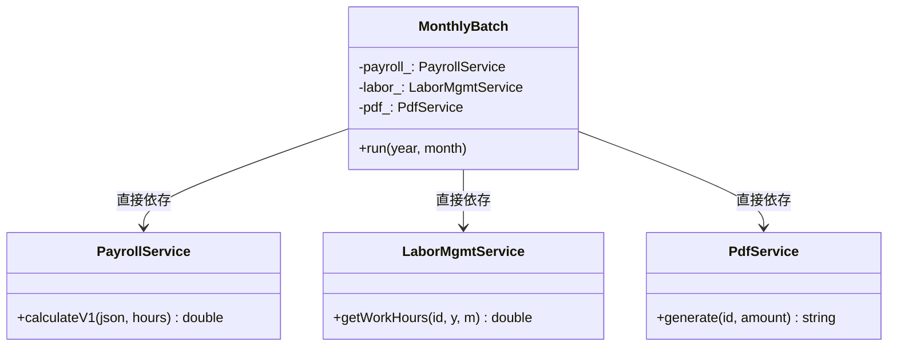
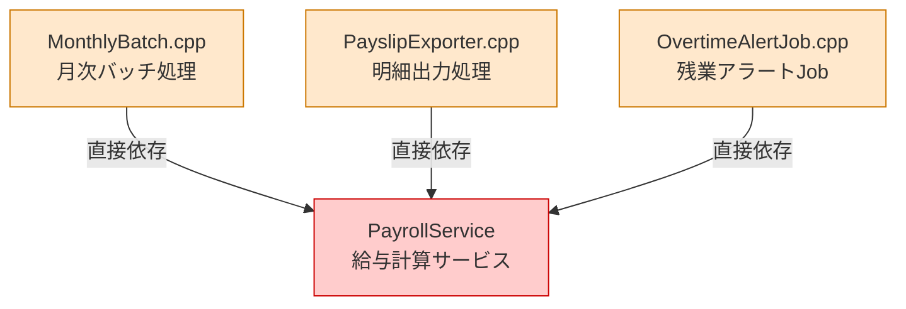
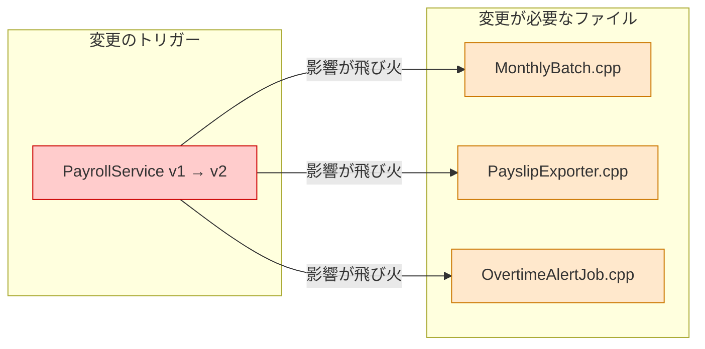
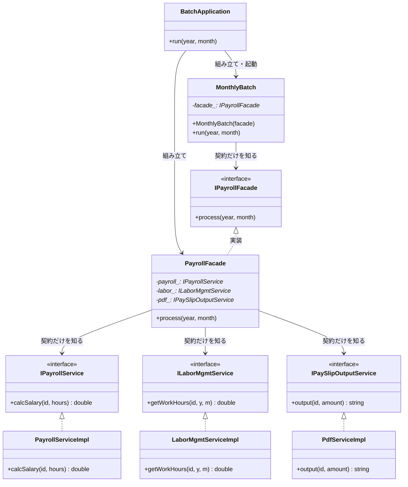
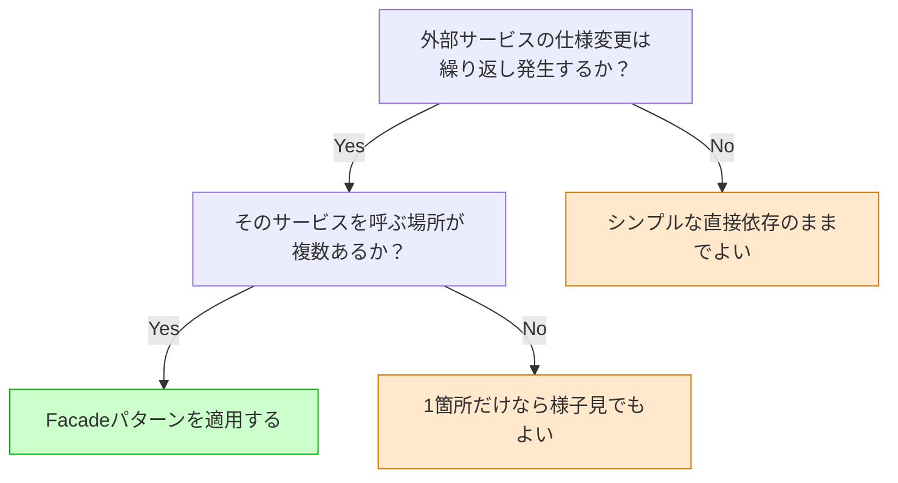
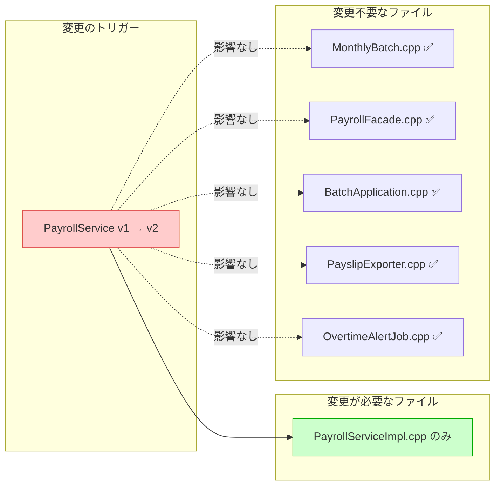

# 第2章　Facadeパターン：使う側に知らせない勇気
―― 思考の型：「各クラスの責任を把握し、責任外の関心を切り出す」

> **この章の核心**
> あるクラスが自分の責任ではない知識を持つと、
> その知識の持ち主が変わるたびに道連れになる。
> 責任を明確にし、変わる理由を1つに絞ることが、変更に強い設計への入り口だ。

---

## ステップ0：視点のチューニング ―― 「設計のレンズ」をセットする

コードを読む前に、この章で使う問いをセットアップします。

**【全パターン共通の問い】**

> 「このコードの中に、**『変わる理由』が異なる2つのものが、
> 同じ場所に混在していないか？」**

「変わる理由」とは **「誰の判断で変わるか」** のことです。
答えが2人以上になるなら、「変わる理由」が複数混在しています。

### 2.0 この章のシナリオと仮説

**この章で扱うシステム：**
毎月末に全社員の給与処理を完了させる月次バッチシステムです。
`MonthlyBatch` クラスが起動し、3つの外部サービス（勤怠管理・給与計算・明細出力）
を呼び出して処理を完了させます。

コードの詳細はステップ1で見ますが、このシナリオを聞いた段階で
「どこが変わりやすく、どこは変わらないか」を先に仮説として立てておきます。

**変動と不変の仮説（コードを読む前に立てる）**

| 分類 | 仮説 | 根拠 |
|---|---|---|
| 🔴 **変動する** | 各外部サービスのAPI仕様・引数形式 | 外部ベンダーの都合で変わる |
| 🔴 **変動する** | 給与計算の詳細アルゴリズム | 労務規則の改定で変わる |
| 🟢 **不変** | 「月末に全社員の給与処理を完了する」業務フロー | 会社がある限り変わらない |
| 🟢 **不変** | 「処理できたか」という結果の形 | 経理上の必須要件 |

この仮説をステップ2（2.3）でコードと照合します。

---

## ステップ1：現状把握 ―― 各クラスの責任を把握し、責任外の関心を探す

> **現状把握の本質**
> コードを読んで「動きを追う」だけでは不十分です。
> **「各クラスの責任は何か」を定義し、
> 「責任範囲外の知識を持っていないか」を確認する**のが、
> 設計上の現状把握です。

### 2.1 今のシステムの仕様とコードの構造

**要するに変わりやすい複数の外部サービスを隠して、窓口を一本化するパターン。**

月次給与バッチシステムです。`MonthlyBatch` が毎月末に起動し、
3つの外部サービスと連携して給与処理を完了させます。

| 機能 | 担当クラス | 入力 | 出力 |
|---|---|---|---|
| 勤怠取得 | LaborMgmtService | 社員ID・年・月 | 実働時間 |
| 給与計算 | PayrollService | 社員情報JSON・実働時間 | 給与額 |
| 明細生成 | PdfService | 社員ID・給与額 | PDFファイル名 |
| 処理統括 | MonthlyBatch | 年・月 | （記録・出力） |

---

**変更前のクラス構造**



*→ `MonthlyBatch` が3つの具体クラスを直接知っている。
この「直接依存」が、のちの変更飛び火の原因になる。*

**各クラスの責任一覧**

| クラス | 責任（1文） | 知るべきこと |
|---|---|---|
| `MonthlyBatch` | 月次給与処理のフローを完了させる | 年・月・処理の手順 |
| `PayrollService` | 給与額を計算する | 計算ルール・自分のAPI形式 |
| `LaborMgmtService` | 勤怠時間を集計する | 出退勤ログの集計方法 |
| `PdfService` | 給与明細を出力する | ファイル命名規則・出力形式 |

---

**各クラスの責任と実装**

設計を読むときは、まず「このクラスの責任は何か」を確認します。
実装の中身を見ることで、責任の範囲が具体的に把握できます。

```cpp
// LaborMgmtService
// 責任：「勤怠時間を管理する」
class LaborMgmtService {
public:
    double getWorkHours(
        int employeeId, int year, int month
    );
};

double LaborMgmtService::getWorkHours(
    int employeeId, int year, int month
) {
    // 出退勤ログを集計して実働時間を返す
    // （ここでは固定値で代表）
    return 172.5; // 2024年12月の実働時間
}
```

LaborMgmtServiceが知っていること：社員IDと年月から実働時間を導く方法。
給与の計算ルールも、PDFの生成方法も、関知しません。

```cpp
// PayrollService
// 責任：「給与額を計算する」
// API仕様：社員情報はJSON形式で受け取る（例: {"base":300000}）
class PayrollService {
public:
    double calculateV1(
        const std::string& employeeJson,
        double workHours
    );
private:
    double parseBaseSalary(const std::string& json);
};

double PayrollService::calculateV1(
    const std::string& employeeJson,
    double workHours
) {
    double base = parseBaseSalary(employeeJson);
    // 160時間超は時給2500円で残業代を加算
    double overtime = (workHours > 160.0)
        ? (workHours - 160.0) * 2500.0
        : 0.0;
    return base + overtime;
}

double PayrollService::parseBaseSalary(
    const std::string& json
) {
    // {"base":300000} → 300000.0
    return 300000.0;
}
```

PayrollServiceが知っていること：給与の計算ルールと、自分のAPI形式（JSON形式）。
勤怠の集計方法も、PDF生成方法も、関知しません。

```cpp
// PdfService
// 責任：「給与明細PDFを生成する」
class PdfService {
public:
    std::string generate(int employeeId, double amount);
};

std::string PdfService::generate(
    int employeeId, double amount
) {
    // ファイル名規則: slip_{社員ID}_{給与額}.pdf
    return "slip_"
        + std::to_string(employeeId)
        + "_" + std::to_string((int)amount)
        + ".pdf";
}
```

PdfServiceが知っていること：ファイル命名規則とPDFのレイアウト。
給与の計算方法も、勤怠の集計方法も、関知しません。

---

これで3つのサービスの責任と実装が見えました。
次に、これらを呼び出す `MonthlyBatch` を見ます。

```cpp
// MonthlyBatch（今の設計）
// 責任のはず：「月次給与処理を完了させる」
class MonthlyBatch {
public:
    void run(int year, int month);
private:
    PayrollService   payroll_;
    LaborMgmtService labor_;
    PdfService       pdf_;
};

void MonthlyBatch::run(int year, int month) {
    int employeeId = 1001;

    double hours = labor_.getWorkHours(
        employeeId, year, month
    );

    // PayrollServiceのAPI仕様に従ってJSONを組み立てる
    std::string json = "{\"base\":300000}";
    double amount = payroll_.calculateV1(json, hours);

    std::string slipFile = pdf_.generate(employeeId, amount);

    saveResult(year, month, amount, slipFile);
}

int main() {
    MonthlyBatch batch;
    batch.run(2024, 12);
    return 0;
}
```

**実行結果：**
```
[LaborMgmt]    社員1001: 実働 172.5時間
[Payroll]      基本給 300000円 + 残業 31250円 = 331250円
[Pdf]          slip_1001_331250.pdf を生成
[MonthlyBatch] 2024年12月 処理完了
```

動いています。では、**責任チェック**に入ります。

---

**責任チェック：MonthlyBatchは自分の責任だけを持っているか**

MonthlyBatchの責任は「月次給与処理を完了させること」です。
その責任を果たすために、MonthlyBatchが「知るべきこと」は何でしょうか。

> 対象の年・月。処理の流れ（勤怠取得→計算→明細生成→保存）。

今のコードで `MonthlyBatch::run()` が「知っていること」を1行ずつ確認します。

| コードの行 | 持っている知識 | MonthlyBatchの責任か |
|---|---|---|
| `labor_.getWorkHours(id, year, month)` | 勤怠取得の流れ | ○ 処理の流れとして自然 |
| `"{\"base\":300000}"` のJSON組み立て | PayrollServiceのAPI形式 | **✗ PayrollServiceの責任** |
| `payroll_.calculateV1(json, hours)` | APIメソッド名・バージョン | **✗ PayrollServiceの内部事情** |
| `pdf_.generate(employeeId, amount)` | 引数の意味（id・amount） | △ 呼び出し自体は自然 |

MonthlyBatchは `"{\"base\":300000}"` というJSON文字列を自分で組み立てています。
このJSON形式を決めているのはPayrollServiceです。
**PayrollServiceの責任（API仕様の定義）が、MonthlyBatchのコードの中に染み出しています。**

これが「責任範囲外の関心が混在している」状態です。

---

### 2.2 届いた変更要求

以上の責任チェックを踏まえた上で、変更要求を受け取ります。

---

**インフラ担当**：「PayrollServiceがv2になります。
引数の形式が変わり、`calcSalary(employeeId, hours)` になります。
JSONは不要です。」

**開発者**：「PayrollServiceが変わっただけなのに、
　　　　　　なぜMonthlyBatchを開いているのだろう…」

---

責任チェックで確認した通り、PayrollServiceのAPI形式という
「PayrollServiceの責任」がMonthlyBatchの中に染み出していたため、
その持ち主（PayrollService）が変わればMonthlyBatchも変わります。

**依存の広がり**



*→ PayrollServiceの都合がシステムのあちこちに侵食している。これが問題の全体像。*

```bash
$ grep -r "PayrollService\|calculateV1" .
MonthlyBatch.cpp:9      PayrollService payroll_;
MonthlyBatch.cpp:24     payroll_.calculateV1(json, hours);
PayslipExporter.cpp:7   PayrollService payroll_;
PayslipExporter.cpp:19  payroll_.calculateV1(json, hours);
OvertimeAlertJob.cpp:5  PayrollService payroll_;
OvertimeAlertJob.cpp:15 payroll_.calculateV1(json, hours);
# → 3ファイルにPayrollServiceの責任が染み出している
```

---

## ステップ2：変動と不変の峻別 ―― 仮説をコードで検証する

### 2.3 仮説の検証と変動/不変の確定

変動/不変の仮説は立てた。しかし——**コードを読んだだけで「変わる」「変わらない」と断定するのは危険です。**

変わるかどうかを知っているのは、そのサービスのオーナーだけだからです。

---

**関係者ヒアリング**

変動/不変を確定する前に、各サービスのオーナーに確認しました。

> **開発者**：「PayrollServiceのAPIについて確認させてください。
> 今後バージョンアップの予定はありますか？」
>
> **インフラ担当**：「はい、次の四半期でv2への移行を予定しています。
> 今のJSON形式の引数はなくなり、`calcSalary(employeeId, hours)` のシンプルな形になります。」
>
> **開発者**：「LaborMgmtServiceの引数形式について確認させてください。
> 社員IDの型（int）は今後変更になる可能性はありますか？」
>
> **人事システム担当**：「現時点ではintのままですが、将来的に文字列IDに変わる
> 外部システムとの統合の可能性があります。まだ確定していませんが。」
>
> **開発者**：「給与明細の出力はPDFですが、将来フォーマットが変わる可能性はありますか？」
>
> **経理担当**：「来年度からExcel出力の要望が上がっています。
> 確定ではないですが、対応できれば嬉しいです。」

---

この「社員IDの型変更リスク」には、一つ注意が必要です。
社員IDは `ILaborMgmtService`・`IPayrollService`・`IPaySlipOutputService` の
3つのインターフェースに共通して使われています。
もし `int` から `string` に変わった場合、
**3つのインターフェース全てのシグネチャが変わります**。
「具体クラスの差し替え」を1箇所に局所化する構造を作っても、
「インターフェース自体のシグネチャが変わる」状況では、その保護の外側に出てしまいます。
こういう場合は、型をどう扱うかをチームで検討する必要があります。
型変更リスクへの対処の選択肢は、2.10（耐久テスト）で改めて示します。

チームで話し合う価値がある部分だと思います。
このヒアリングがあって初めて、変動/不変テーブルに根拠が生まれます。

| 分類 | 具体的な内容 | 変わるタイミング | 根拠 |
|---|---|---|---|
| 🔴 **変動する** | PayrollServiceのAPI仕様・バージョン | 次の四半期（確定） | インフラ担当への確認 |
| 🔴 **変動する** | LaborMgmtServiceの引数形式 | 海外拠点統合時（可能性） | 人事システム担当への確認 |
| 🔴 **変動する** | 給与明細の出力フォーマット | 来年度（可能性） | 経理担当への確認 |
| 🟢 **不変** | 「給与処理を完了する」業務フロー | 変わる日は来ない | ビジネスの根幹ルール |

> **設計の決断**：🟢 不変な業務フローを「契約（インターフェース）」として固定し、
> 🔴 変動する各サービスの詳細は、それぞれのインターフェースの裏側に押し込む。

**インターフェース命名の原則**：インターフェース名はビジネス上の責任で付ける。
実装手段（PDF・メール等）で付けない。
「給与明細を出力する」責任ならば `IPaySlipOutputService` ——
PDFかExcelかはインターフェースの名前には現れない。

---

## ステップ3：課題分析 ―― 変更しようとしたときの困難と痛み

### 2.4 変更しようとしたときの困難

PayrollService が v2 になる場合の修正：

```cpp
// 変更前：MonthlyBatchがPayrollServiceのJSON形式を知っていた
std::string json = "{\"base\":300000}";
double amount = payroll_.calculateV1(json, hours);

// 変更後：API形式が変わったのでMonthlyBatchも変更
double amount = payroll_.calcSalary(employeeId, hours);
```

**「PayrollServiceの責任範囲が変わっただけ」で、
MonthlyBatch（月次処理の本体）のコードを開いて変更しています。**

MonthlyBatchの責任（月次処理の完了）は何も変わっていないのに。

**変更影響グラフ（改善前）**



*1つの変更が、MonthlyBatch・PayslipExporter・OvertimeAlertJobの3ファイルを道連れにする。これが設計の病巣。*

---

## ステップ4：原因分析 ―― 困難の根本にあるもの

### 2.5 困難の根本にあるもの

| 問い | 答え |
|---|---|
| なぜMonthlyBatchを変更しなければならないか？ | PayrollServiceのAPI知識がMonthlyBatchの中にあるから |
| なぜMonthlyBatchにその知識があるか？ | 「処理の流れ（What）」と「各サービスの呼び方（How）」を同じクラスに書いたから |
| 根本原因は？ | **各クラスの責任が混在している。MonthlyBatchがPayrollServiceの責任を代わりに持っている** |

**構造的原因の言語化：**

> 「知りすぎているクラスは、知っている相手の変更に道連れになる。」
>
> 知識の持ち主（PayrollService）が変われば、
> その知識を借りているクラス（MonthlyBatch）も変わらざるを得ない。
> 解決策は「各クラスが自分の責任の知識だけを持つ」構造を作ることだ。

---

## ステップ5：対策案の検討 ―― 責任の境界線を引く

> **この章の思考の進め方**
> 1つの解決案を作るたびに「責任チェック」を行います。
> チェックをパスしない限り、次の改善へ進みます。
> この繰り返しが、最終設計へ至る思考の道筋です。

### 2.6 最初の試み：【試行コード】

**試み①：3サービスの呼び出しを専用クラスに移す**

MonthlyBatchからPayrollServiceの知識を追い出すために、
3サービスへの呼び出しを `PayrollFacade` クラスに集めます。

```cpp
class PayrollFacade {
public:
    void process(int year, int month);
private:
    PayrollService   payroll_; // ← 具体クラスを直接持っている
    LaborMgmtService labor_;
    PdfService       pdf_;
};

void PayrollFacade::process(int year, int month) {
    int employeeId = 1001;
    double hours = labor_.getWorkHours(
        employeeId, year, month
    );
    std::string json = "{\"base\":300000}";
    double amount = payroll_.calculateV1(json, hours);
    std::string slip = pdf_.generate(employeeId, amount);
    saveResult(year, month, amount, slip);
}

class MonthlyBatch {
public:
    void run(int year, int month);
private:
    PayrollFacade facade_; // ← 3サービスの代わりに1つ
};

void MonthlyBatch::run(int year, int month) {
    facade_.process(year, month);
}
```

**責任チェック（MonthlyBatch）**

| コードの行 | 持っている知識 | MonthlyBatchの責任か |
|---|---|---|
| `facade_.process(year, month)` | 給与処理を依頼する | ○ |

MonthlyBatchの責任チェックは通過しました。

**しかし新たな問題が見えてきます。**

PayrollFacadeの責任チェックを確認します。

| PayrollFacadeが持っている知識 | 誰の責任か |
|---|---|
| `PayrollService` の具体クラス | PayrollServiceの実装 |
| `LaborMgmtService` の具体クラス | LaborMgmtServiceの実装 |
| `PdfService` の具体クラス | PdfServiceの実装 |
| `"{\"base\":300000}"` のJSON形式 | PayrollServiceのAPI仕様 |

PayrollFacadeは3つのサービスの具体クラスを直接持っています。
変わる理由が3つある状態です。
また、PayrollServiceが変わればPayrollFacadeも変わります。
**「MonthlyBatchからPayrollFacadeへ」問題が移動しただけです。**

私自身、ここで何度も迷いました。「クラスを1つ作れば解決」という思いに走りがちですが、
責任チェックなしに次へ進んでしまうと、また同じ問題を作り直すことになります。

さらに、テストの問題も残ります。

```cpp
TEST(MonthlyBatchTest, RunsPayrollProcess) {
    MonthlyBatch batch;
    // PayrollFacadeが具象クラスなので差し替えられない
    // テスト中に本物の3サービスが全て動く
    batch.run(2024, 12);
}
```

試み①では不十分です。次の改善へ進みます。

---

**試み②：MonthlyBatchとPayrollFacadeの間に契約を置く**

MonthlyBatchが「具体的なPayrollFacade」を知っているのが問題です。
「給与処理を完了してくれる何か」という契約（インターフェース）を定義します。

```cpp
// MonthlyBatchが知るべき「契約」だけを定義する
class IPayrollFacade {
public:
    virtual ~IPayrollFacade() {}
    virtual void process(int year, int month) = 0;
};

// MonthlyBatchは契約だけを知る
class MonthlyBatch {
public:
    explicit MonthlyBatch(IPayrollFacade* facade);
    void run(int year, int month);
private:
    IPayrollFacade* facade_; // ← 契約だけを知る
};

MonthlyBatch::MonthlyBatch(IPayrollFacade* facade)
    : facade_(facade) {}

void MonthlyBatch::run(int year, int month) {
    facade_->process(year, month);
}
```

**責任チェック（MonthlyBatch）**

MonthlyBatchは `IPayrollFacade` という契約だけを知っています。
PayrollService・LaborMgmtService・PdfServiceの名前は一切見えません。
責任チェック：通過。

テストも可能になりました。

```cpp
class StubPayrollFacade : public IPayrollFacade {
public:
    bool called = false;
    void process(int year, int month) override {
        called = true;
    }
};

TEST(MonthlyBatchTest, CallsFacade) {
    StubPayrollFacade stub;
    MonthlyBatch batch(&stub);
    batch.run(2024, 12);
    EXPECT_TRUE(stub.called);
}
```

MonthlyBatchの問題は解決しました。

**しかし、PayrollFacadeはまだ改善できます。**

```cpp
// 現状のPayrollFacade：3つの具体クラスを直接持っている
class PayrollFacade : public IPayrollFacade {
private:
    PayrollService   payroll_; // ← 具体クラス
    LaborMgmtService labor_;   // ← 具体クラス
    PdfService       pdf_;     // ← 具体クラス
};
```

PayrollFacadeが具体クラスを直接持っているため、
PayrollServiceが変わればPayrollFacadeが変わります。
PayrollFacadeが各サービスの実装詳細（具体クラス）に依存したままです。

試み②はMonthlyBatchを救いましたが、PayrollFacadeはまだ改善できます。

---

**試み③：各サービスにも契約を定義する**

各サービスに対しても、同じ考え方を適用します。
「具体的なPayrollService」ではなく「給与を計算してくれる何か」という契約を定義します。

インターフェース名は「ビジネス上の責任」で付けます。
「明細を出力する責任」ならば `IPaySlipOutputService`——
PDFかExcelかは名前に現れません。

```cpp
// 各サービスの契約（インターフェース）
class IPayrollService {
public:
    virtual ~IPayrollService() {}
    virtual double calcSalary(
        int employeeId, double workHours) = 0;
};

class ILaborMgmtService {
public:
    virtual ~ILaborMgmtService() {}
    virtual double getWorkHours(
        int employeeId, int year, int month) = 0;
};

// ビジネス責任で命名：「明細を出力する」責任
// PDF か Excel かは名前に現れない
class IPaySlipOutputService {
public:
    virtual ~IPaySlipOutputService() {}
    virtual std::string output(
        int employeeId, double amount) = 0;
};
```

```cpp
// PayrollFacadeは契約だけを知る
class PayrollFacade : public IPayrollFacade {
public:
    PayrollFacade(
        IPayrollService*      payroll,
        ILaborMgmtService*    labor,
        IPaySlipOutputService* pdf
    );
    void process(int year, int month) override;
private:
    IPayrollService*      payroll_; // ← 契約だけを知る
    ILaborMgmtService*    labor_;
    IPaySlipOutputService* pdf_;
};

PayrollFacade::PayrollFacade(
    IPayrollService*      payroll,
    ILaborMgmtService*    labor,
    IPaySlipOutputService* pdf
) : payroll_(payroll), labor_(labor), pdf_(pdf) {}

void PayrollFacade::process(int year, int month) {
    int employeeId = 1001;
    double hours = labor_->getWorkHours(
        employeeId, year, month
    );
    double amount = payroll_->calcSalary(
        employeeId, hours
    );
    std::string slip = pdf_->output(employeeId, amount);
    saveResult(year, month, amount, slip);
}
```

**責任チェック（PayrollFacade）**

| PayrollFacadeが持っている知識 | 誰の責任か |
|---|---|
| IPayrollService（契約） | 給与計算の「できること」の定義 |
| ILaborMgmtService（契約） | 勤怠取得の「できること」の定義 |
| IPaySlipOutputService（契約） | 明細出力の「できること」の定義 |
| 3サービスを協調させる手順 | ○ PayrollFacadeの責任 |

PayrollFacadeは各サービスの「契約」だけを知っています。
具体クラスは見えていません。責任チェック：通過。

**もう1つ問題が残っています。**
「誰が具体クラスを生成し、注入するか」です。

現在の `main()` を見てみます：

```cpp
// ← main()がここで全ての具体クラスを知っている
int main() {
    PayrollServiceImpl    payroll;
    LaborMgmtServiceImpl  labor;
    PdfServiceImpl        pdf;
    PayrollFacade facade(&payroll, &labor, &pdf);
    MonthlyBatch  batch(&facade);
    batch.run(2024, 12);
}
```

`main()` はプログラムの入り口です。機能をキックする責任を持ちます。
「どのクラスをどう組み立てるか」は `main()` の責任ではありません。
この組み立ての責任は、専用のクラスが持つべきです。

---

### 2.7 発想の転換：【解決コード】

**試み④：BatchApplicationが組み立てを担う**

組み立ての責任を `BatchApplication` クラスに与えます。
具体クラスを知っているのは `BatchApplication` だけです。

```cpp
// BatchApplication
// 責任：「依存を組み立て、バッチを起動する」
class BatchApplication {
public:
    void run(int year, int month);
};

void BatchApplication::run(int year, int month) {
    // 具体クラスを知っているのはここだけ
    PayrollServiceImpl    payroll;
    LaborMgmtServiceImpl  labor;
    PdfServiceImpl        pdf;

    PayrollFacade facade(&payroll, &labor, &pdf);
    MonthlyBatch  batch(&facade);

    batch.run(year, month);
}

// main()は入り口としてキックするだけ
int main() {
    BatchApplication app;
    app.run(2024, 12);
    return 0;
}
```

**最終的な責任チェック（全クラス）**

| クラス | 責任（1文） | 知っていること |
|---|---|---|
| `main()` | プログラムを起動する | `BatchApplication` の存在のみ |
| `BatchApplication` | 依存を組み立て、バッチを起動する | 全具体クラス（ここだけ） |
| `MonthlyBatch` | 月次給与処理のフローを完了させる | `IPayrollFacade`（契約） |
| `PayrollFacade` | 3サービスを協調させて給与処理を完了する | 3つのインターフェース（契約） |
| `PayrollServiceImpl` | 給与額を計算する | 計算ルール・自分の実装 |
| `LaborMgmtServiceImpl` | 勤怠時間を管理する | 勤怠ログ・自分の実装 |
| `PdfServiceImpl` | 給与明細を出力する | ファイル命名規則・自分の実装 |

各クラスの「知っていること」に、他のクラスの責任範囲が混入していません。
これが目指した状態です。

**変更後のクラス図**



変更前と変更後を見比べてみてください。
`MonthlyBatch` から出ていた矢印が3本→1本に減り、
`PayrollFacade` は具体クラスへの矢印がゼロになりました。
矢印の数の変化が、責任の整理の成果を物語っています。

---

## ステップ6：天秤にかける ―― 柔軟性とシンプルさのバランスを評価する

### 2.8 比較の基準を先に宣言する

1. **変更の局所性** ―― サービス仕様変更の影響が1箇所に収まるか
2. **テストの独立性** ―― 各クラスを他クラスなしで単独テストできるか
3. **責任の明確さ** ―― 各クラスが自分の責任だけを持っているか
4. **実装コスト** ―― 今すぐ払う手間はどれくらいか

### 2.9 比較と判断

| 評価軸 | ❌ 改善前 | ✅ 解決後 |
|---|---|---|
| 変更の局所性 | PayrollService変更 → 3ファイル変更 | PayrollServiceImpl のみ変更 |
| テストの独立性 | 本番サービスなしでテスト不可 | 各クラスをスタブで単独テスト可 |
| 責任の明確さ | MonthlyBatchに3サービスの責任が混在 | 各クラスが自分の責任のみを持つ |
| 実装コスト | 少ない | 多い（インターフェース・クラス数が増える） |

設計に絶対の正解はありません。
ただ「責任が明確な設計」では、変更の影響が予測できます。
「このクラスを変えれば、影響するのはここだけ」と言える状態です。

**適用判断のフローチャート**



一つの参考として受け取っていただければと思います。

### 2.10 より難しい変化への耐久テスト

「PayrollServiceとLaborMgmtServiceが同時に変わった」とします。

**【深化コード】**

```cpp
// PayrollService v2: 新しいインターフェースを実装
class PayrollServiceV2Impl : public IPayrollService {
public:
    double calcSalary(
        int employeeId, double workHours) override {
        // v2の計算ルールで実装
        double base = fetchBaseSalary(employeeId);
        double rate = (workHours > 160.0) ? 3000.0 : 0.0;
        double overtime = (workHours - 160.0) * rate;
        return base + overtime;
    }
private:
    double fetchBaseSalary(int employeeId) {
        return 320000.0; // v2では社員ごとの基本給を参照
    }
};

// BatchApplicationで新しい実装に差し替えるだけ
void BatchApplication::run(int year, int month) {
    PayrollServiceV2Impl payroll; // ← ここだけ変わる
    LaborMgmtServiceImpl labor;
    PdfServiceImpl       pdf;
    PayrollFacade facade(&payroll, &labor, &pdf);
    MonthlyBatch  batch(&facade);
    batch.run(year, month);
}

// MonthlyBatch・PayrollFacade・各インターフェースは
// 一行も変わらない
```

変更は `PayrollServiceV2Impl` の追加と
`BatchApplication` の1行差し替えだけです。
「責任が明確な設計」だから変更が局所化されています——
この感覚、うまく伝わっているでしょうか。

---

**次の変化：明細をExcelファイルでGitHubに登録する要求**

2.3のヒアリングで「来年度からExcel出力の要望が上がっています」という言葉がありました。
その変化が実際に来たとします。

> 「給与明細をPDFではなく、Excelファイルとして社内GitHubリポジトリに登録してほしい。」

この要求に応えるには、`ExcelGitHubServiceImpl` という新しい実装クラスを追加します。

```cpp
// ExcelGitHubServiceImpl
// 責任：給与明細をExcelファイルとしてGitHubに登録する
class ExcelGitHubServiceImpl : public IPaySlipOutputService {
public:
    std::string output(
        int employeeId, double amount) override {
        // Excelファイルを生成し、GitHubリポジトリに登録する
        std::string fileName = "slip_"
            + std::to_string(employeeId)
            + "_" + std::to_string((int)amount)
            + ".xlsx";
        // pushToGitHub(fileName); // GitHubへの登録処理
        return fileName;
    }
};
```

BatchApplicationでの差し替えは、たった1行だけです。

```cpp
void BatchApplication::run(int year, int month) {
    PayrollServiceImpl     payroll;
    LaborMgmtServiceImpl   labor;
    ExcelGitHubServiceImpl pdf;   // ← ここだけ変わる
    PayrollFacade facade(&payroll, &labor, &pdf);
    MonthlyBatch  batch(&facade);
    batch.run(year, month);
}
```

インターフェース名 `IPaySlipOutputService` は変わりません。
「給与明細を出力する」という責任の名前は、PDFでもExcelでもGitHubでも同じです。
2.3で決めた「ビジネス責任で命名する」原則が、ここで実証されました。

---

**型変更リスクへの対処：社員IDがstring型に変わった場合**

ここで、2.3のヒアリングで挙がったもう一つのリスクを確認します。
「社員IDが将来的にstring型に変わるかもしれない」——この変化が実際に来たとします。

現在の3つのインターフェースは、どれも `int employeeId` を引数に持っています。

```cpp
class IPayrollService {
    virtual double calcSalary(
        int employeeId, double workHours) = 0;
    //  ↑ int
};
class ILaborMgmtService {
    virtual double getWorkHours(
        int employeeId, int year, int month) = 0;
    //  ↑ int
};
class IPaySlipOutputService {
    virtual std::string output(
        int employeeId, double amount) = 0;
    //  ↑ int
};
```

`int` が `string` に変われば、**3つのインターフェース全てのシグネチャが変わります**。
具体クラスの差し替えを1行に局所化する設計を作っても、「インターフェース自体が変わる」状況は、
その構造の外側で起きます。こういう状況に直面したときは、次の問いを立てます。

**「この型はどこまで安定していると言えるか？チームで合意できているか？」**

この型変更リスクへの対処には、チームで検討できる選択肢があります。

| 選択肢 | 内容 | メリット | デメリット |
|---|---|---|---|
| 型を合意・固定 | `int` のまま使い続けることを関係者と合意する | 変更なし・シンプル | 変更時に全インターフェースが変わる |
| `EmployeeId` 型を定義 | `int` を独自型でラップする | 変更が型定義1箇所に絞られる | 型定義が増える |
| `void*` / 不完全型 | 型の知識をインターフェースに持たせない | 最大の変更耐性 | 型安全を失う |

どれが正解かはチームで決める話です。設計に絶対の正解はありません。
「今どのリスクを優先して対処するか」をチームで合意することが、設計の一歩だと私は感じています。

### 2.11 使う場面・使わない場面

**【過剰コード】**

```cpp
// ❌ やりすぎの例
// 変わらない1行の計算にFacadeとインターフェースを作る
class ITaxCalcService {
public:
    virtual ~ITaxCalcService() {}
    virtual double calculate(double amount) = 0;
};
class TaxCalcServiceImpl : public ITaxCalcService {
public:
    double calculate(double amount) override {
        return amount * 0.1; // 消費税10%。変わらない。
    }
};
// 責任の混在が起きていない場所に
// Facadeを入れる必要はない。
```

| 使う場面 | 使わない場面 |
|---|---|
| 複数サービスの責任が呼び出し元に混在している | 責任の混在が起きていない |
| 外部サービスの仕様変更が繰り返し発生する | 一度作ったら変わらない処理 |
| 各クラスを単独でテストしたい | 結合テストで十分な場面 |

---

## ステップ7：決断と、手に入れた未来

### 2.12 解決後のコード（全体）

**変更に強い設計の完成形**

```cpp
// ── インターフェース定義 ─────────────────────────

class IPayrollService {
public:
    virtual ~IPayrollService() {}
    virtual double calcSalary(
        int employeeId, double workHours) = 0;
};

class ILaborMgmtService {
public:
    virtual ~ILaborMgmtService() {}
    virtual double getWorkHours(
        int employeeId, int year, int month) = 0;
};

// ビジネス責任で命名：「給与明細を出力する」責任
// PDF か Excel かは名前に現れない
class IPaySlipOutputService {
public:
    virtual ~IPaySlipOutputService() {}
    virtual std::string output(
        int employeeId, double amount) = 0;
};

class IPayrollFacade {
public:
    virtual ~IPayrollFacade() {}
    virtual void process(int year, int month) = 0;
};

// ── 実装クラス ─────────────────────────────────────

class PayrollServiceImpl : public IPayrollService {
public:
    double calcSalary(
        int employeeId, double workHours) override {
        double base = 300000.0;
        double overtime = (workHours > 160.0)
            ? (workHours - 160.0) * 2500.0
            : 0.0;
        return base + overtime;
    }
};

class LaborMgmtServiceImpl : public ILaborMgmtService {
public:
    double getWorkHours(
        int employeeId, int year, int month) override {
        return 172.5;
    }
};

class PdfServiceImpl : public IPaySlipOutputService {
public:
    std::string output(
        int employeeId, double amount) override {
        return "slip_"
            + std::to_string(employeeId)
            + "_" + std::to_string((int)amount)
            + ".pdf";
    }
};

// ── Facade ─────────────────────────────────────────

class PayrollFacade : public IPayrollFacade {
public:
    PayrollFacade(
        IPayrollService*      payroll,
        ILaborMgmtService*    labor,
        IPaySlipOutputService* pdf
    ) : payroll_(payroll), labor_(labor), pdf_(pdf) {}

    void process(int year, int month) override {
        int employeeId = 1001;
        double hours = labor_->getWorkHours(
            employeeId, year, month
        );
        double amount = payroll_->calcSalary(
            employeeId, hours
        );
        std::string slip = pdf_->output(
            employeeId, amount
        );
        saveResult(year, month, amount, slip);
    }
private:
    IPayrollService*      payroll_;
    ILaborMgmtService*    labor_;
    IPaySlipOutputService* pdf_;
};

// ── MonthlyBatch ───────────────────────────────────

class MonthlyBatch {
public:
    explicit MonthlyBatch(IPayrollFacade* facade)
        : facade_(facade) {}

    void run(int year, int month) {
        facade_->process(year, month);
    }
private:
    IPayrollFacade* facade_;
};

// ── 組み立てと起動 ─────────────────────────────────

class BatchApplication {
public:
    void run(int year, int month) {
        PayrollServiceImpl    payroll;
        LaborMgmtServiceImpl  labor;
        PdfServiceImpl        pdf;
        PayrollFacade facade(&payroll, &labor, &pdf);
        MonthlyBatch  batch(&facade);
        batch.run(year, month);
    }
};

int main() {
    BatchApplication app;
    app.run(2024, 12);
    return 0;
}
```

**実行結果：**
```
[LaborMgmt]    社員1001: 実働 172.5時間
[Payroll]      基本給 300000円 + 残業 31250円 = 331250円
[Pdf]          slip_1001_331250.pdf を生成
[MonthlyBatch] 2024年12月 処理完了
```

---

**テストで動作を保証する**

インターフェースがあるため、各クラスを独立してテストできます。

```cpp
// スタブ：本物のサービスを呼ばずに動く差し替えクラス。
// IPayrollFacadeを継承することで
// 本番のPayrollFacadeとそのまま入れ替えられる。
class StubPayrollFacade : public IPayrollFacade {
public:
    bool called      = false;
    int  calledYear  = 0;
    int  calledMonth = 0;

    void process(int year, int month) override {
        called      = true;
        calledYear  = year;
        calledMonth = month;
    }
};

TEST(MonthlyBatchTest, CallsFacadeWithCorrectYearMonth) {
    StubPayrollFacade stub;
    MonthlyBatch batch(&stub);

    batch.run(2024, 12);

    // EXPECT_TRUE(条件)：条件が真ならテスト通過。Google Testのマクロ。
    EXPECT_TRUE(stub.called);
    // EXPECT_EQ(期待値, 実際の値)：等しければテスト通過。
    EXPECT_EQ(2024, stub.calledYear);
    EXPECT_EQ(12,   stub.calledMonth);
}
```

```
[  PASSED  ] MonthlyBatchTest.CallsFacadeWithCorrectYearMonth
```

---

**変更に強いことを確認する**

| 変更のシナリオ | 変わるクラス | 変わらないクラス |
|---|---|---|
| PayrollService APIが変わる | `PayrollServiceImpl` のみ | 他の全クラス |
| 別の給与計算エンジンに切り替える | `BatchApplication`（差し替え先を指定） | 他の全クラス |
| LaborMgmtService APIが変わる | `LaborMgmtServiceImpl` のみ | 他の全クラス |
| 明細をExcel出力に切り替える | `ExcelServiceImpl` を追加し `BatchApplication` で差し替え | 他の全クラス |
| 月次処理の業務フローが変わる | `MonthlyBatch` | 各サービス実装 |

「変わる理由が異なるクラス」が「別の場所にいる」。
これが変更に強い設計の正体です。

間違えても大丈夫です。設計は一度決めたら終わりではなく、
状況が変わればまた考え直せばいい、という軽さで向き合ってほしいと思います。

**変更影響グラフ（改善後）**



ステップ1で感じた「なぜ給与処理の本体が、PayrollServiceのAPI形式まで知っているんだ？」
という違和感は完全に消えました。
新しい通知手段やサービスのバージョンが変わっても、変更は1クラスに収まります。

---

## 整理

### 2.13 8ステップとこの章でやったこと

| ステップ | この章でやったこと |
|---|---|
| ステップ0 | 「API仕様は変動、業務フローは不変」という仮説を立てた |
| ステップ1 | 各クラスの責任を定義し、責任チェックでMonthlyBatchに責任外の知識が混在していることを確認した |
| ステップ2 | 関係者ヒアリングで変動/不変の根拠を固め、表で確定させた |
| ステップ3 | PayrollService変更が3ファイルに飛び火する痛みを確認した |
| ステップ4 | 「知りすぎているクラスは道連れになる」という根本原因を言語化した |
| ステップ5 | 試行①→②→③→④と段階的に責任を整理し、最終設計に至った |
| ステップ6 | 変更の局所性・責任の明確さを評価軸にして適用を判断した |
| ステップ7 | 全コードを示し、変更シナリオ別に「変わるクラス・変わらないクラス」で効果を確認した |

**各クラスの最終的な責任**

| クラス | 責任 | 変わる理由 |
|---|---|---|
| `main()` | プログラムを起動する | 起動方法が変わるとき |
| `BatchApplication` | 依存を組み立て、バッチを起動する | 使うクラスの組み合わせが変わるとき |
| `MonthlyBatch` | 月次給与処理のフローを完了させる | 業務フローが変わるとき |
| `PayrollFacade` | 3サービスを協調させて給与処理を完了する | 協調の手順が変わるとき |
| `PayrollServiceImpl` | 給与額を計算する | 計算ルールやAPIが変わるとき |
| `LaborMgmtServiceImpl` | 勤怠時間を管理する | 勤怠APIが変わるとき |
| `PdfServiceImpl` | 給与明細を出力する | 出力仕様が変わるとき |

「変わる理由が1つ」のクラスだけで構成されている。
このプロセスを回した結果にたどり着いた構造こそが **Facadeパターン** です。

設計に絶対の正解はありません。ただ「各クラスの責任は何か」「変わる理由は1つか」を
問い続けることが、変更に強いコードへの入り口になると私は感じています。
