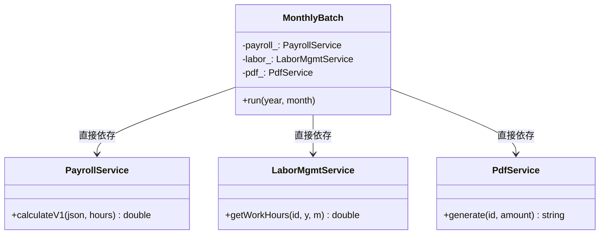
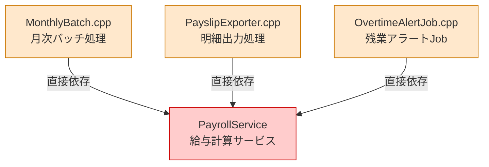
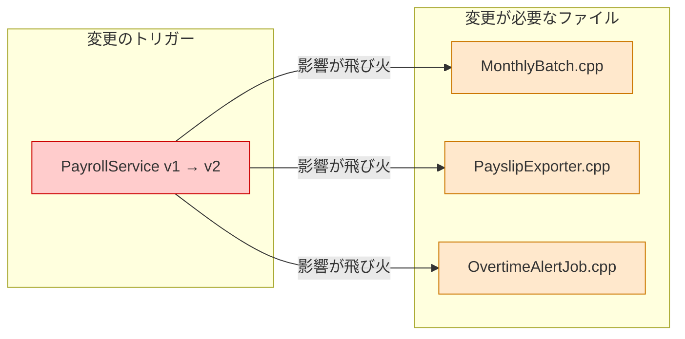
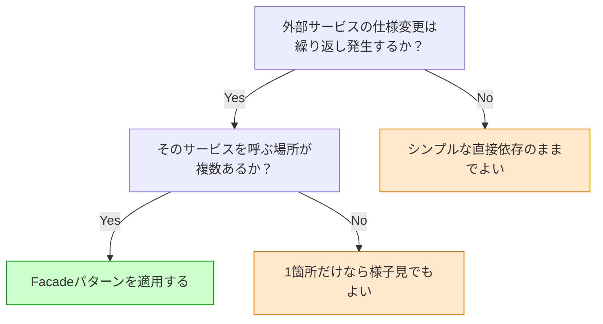
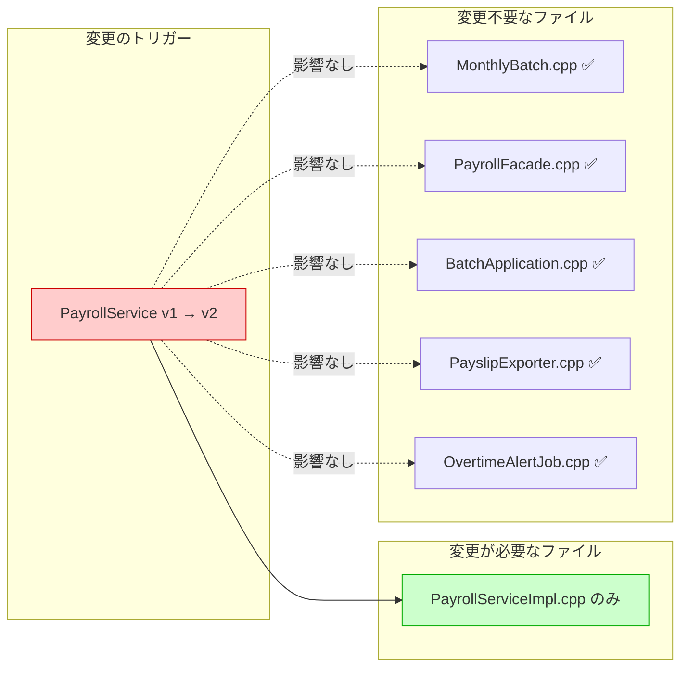
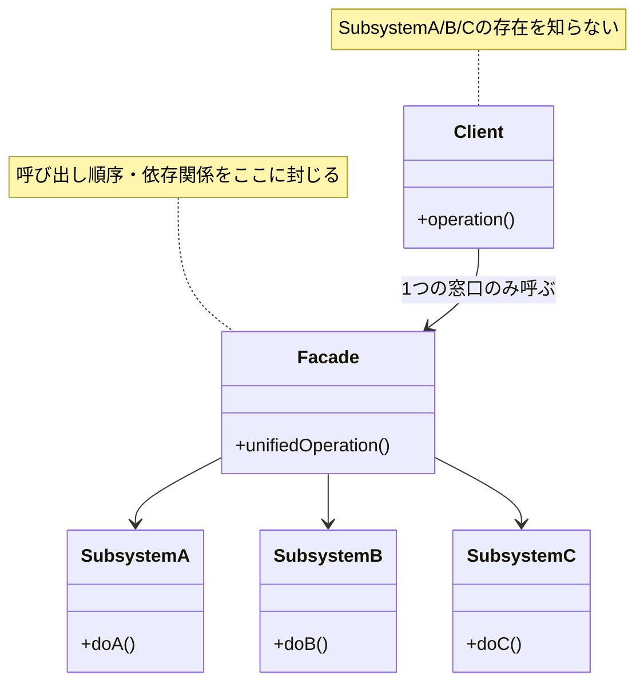
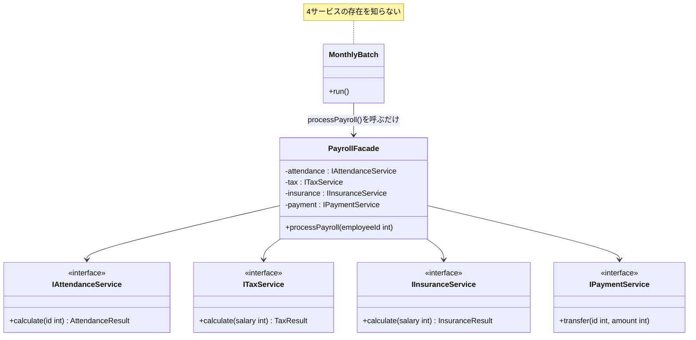

# 第2章　複雑な外部連携をどうシンプルにするか（Facade）
―― 思考の型：「各クラスの責任を把握し、責任外の関心を切り出す」

> **この章の核心**
> あるクラスが自分の責任ではない知識を持つと、
> その知識の持ち主が変わるたびに道連れになる。
> 責任を明確にし、変わる理由を1つに絞ることが、変更に強い設計への入り口だ。

> [!INFO] レゴブロックで考える：Facadeパターン
> この章のパターンは、レゴブロックの**「まとめる」**操作に対応しています。
> 複数の外部システムへの窓口を「1つのブロックにまとめて」シンプルにします。散らばった複雑さを1つの入り口に集約するイメージです。
> コードでも同じように、複雑な依存関係を1つのFacadeクラスの裏に隠し、呼び出し元はシンプルなインターフェースだけ知っていれば済む構造を作ります。
---

---
## この章を読むと得られること

- 「使う側が知らなくていいこと」を知ってしまっているクラスを、コードの中から発見できるようになる
- 外部サービスの変更が内部実装に飛び火するパターンを、構造によって防ぐFacadeの設計を作れるようになる
- Facadeが過剰になる状況（外部依存が1つしかない場合、変更予定がない場合）を判断し、最小コストの代替案との使い分けができるようになる
- 変更要求が来たとき「どのクラスに知らせないか」を設計の出発点として考えられるようになる


## ステップ0：システムを把握し、仮説を立てる ―― クラス構成を見てから「変わりそうな場所」を予測する

> **入力：** システムのシナリオ説明 ＋ クラス構成の概要（仕様表・責任一覧）。実装コードはまだ読まない。
> **産物：** 変動と不変の「仮説テーブル」

**全パターンに共通する問い**

> 「このコードの中に、**『変わる理由』が異なる2つのものが、
> 同じ場所に混在していないか？」**

「変わる理由」とは **「誰の判断で変わるか」** のことです。
答えが2人以上になるなら、「変わる理由」が複数混在しています。

### 2.0 この章のシステム構成と仮説

**この章で扱うシステム：**
毎月末に全社員の給与処理を完了させる月次バッチシステムです。
`MonthlyBatch` クラスが起動し、3つの外部サービス（勤怠管理・給与計算・明細出力）を呼び出して処理を完了させます。

**仕様表（何ができるシステムか）**

| 機能 | 担当クラス | 入力 | 出力 |
|---|---|---|---|
| 勤怠取得 | LaborMgmtService | 社員ID・年・月 | 実働時間 |
| 給与計算 | PayrollService | 社員情報JSON・実働時間 | 給与額 |
| 明細生成 | PdfService | 社員ID・給与額 | PDFファイル名 |
| 処理統括 | MonthlyBatch | 年・月 | （記録・出力） |

**クラス構成の概要**



*→ `MonthlyBatch` が3つの具体クラスを直接知っている。
この「直接依存」が、のちの変更飛び火の原因になる。*

**各クラスの責任一覧**

| クラス | 責任（1文） | 知るべきこと |
|---|---|---|
| `MonthlyBatch` | 月次給与処理のフローを完了させる | 年・月・処理の手順 |
| `PayrollService` | 給与額を計算する | 計算ルール・自分のAPI形式 |
| `LaborMgmtService` | 勤怠時間を集計する | 出退勤ログの集計方法 |
| `PdfService` | 給与明細を出力する | ファイル命名規則・出力形式 |

---

この構成を踏まえた上で、仮説を立てます。
`MonthlyBatch` が3つの外部サービスに直接依存していることが見えています。
どの部分が変わりやすく、どの部分は変わらないでしょうか。

**変動と不変の仮説（実装コードを読む前に立てる）**

| 分類 | 仮説 | 根拠（クラス構成から読み取れること） |
|---|---|---|
| 🔴 **変動する** | 各外部サービスのAPI仕様・引数形式 | 外部ベンダーの都合で変わる。3つの外部依存が直接見える |
| 🔴 **変動する** | 給与計算の詳細アルゴリズム | 労務規則の改定で変わる |
| 🟢 **不変** | 「月末に全社員の給与処理を完了する」業務フロー | 会社がある限り変わらない |
| 🟢 **不変** | 「処理できたか」という結果の形 | 経理上の必須要件 |

この仮説をステップ2（2.3）でヒアリング後に確定します。

---

## ステップ1：実装コードを読む ―― 責任チェックで問題の行を見つける

> **入力：** ステップ0で把握したクラス責任 ＋ 実際の実装コード
> **産物：** 責任チェック表。「このクラスが持つべきでない知識」が混在している行の発見。

### 2.1 実装コードと責任チェック

ステップ0でクラスの責任は把握しました。
ここでは実際の実装コードを読み、「責任通りに書かれているか」を1行ずつ確認します。

**要するに複数のサービス呼び出しを1つの窓口に集め、呼び出し元の複雑な依存を隠すパターン。**

```cpp
// LaborMgmtService
// 責任：「勤怠時間を管理する」
class LaborMgmtService {
public:
    double getWorkHours(
        int employeeId, int year, int month
    );
};

double LaborMgmtService::getWorkHours(
    int employeeId, int year, int month
) {
    // 出退勤ログを集計して実働時間を返す
    // （ここでは固定値で代表）
    return 172.5; // 2024年12月の実働時間
}
```

LaborMgmtServiceが知っていること：社員IDと年月から実働時間を導く方法。
給与の計算ルールも、PDFの生成方法も、関知しません。

```cpp
// PayrollService
// 責任：「給与額を計算する」
// API仕様：社員情報はJSON形式で受け取る（例: {"base":300000}）
class PayrollService {
public:
    double calculateV1(
        const std::string& employeeJson,
        double workHours
    );
private:
    double parseBaseSalary(const std::string& json);
};

double PayrollService::calculateV1(
    const std::string& employeeJson,
    double workHours
) {
    double base = parseBaseSalary(employeeJson);
    // 160時間超は時給2500円で残業代を加算
    double overtime = (workHours > 160.0)
        ? (workHours - 160.0) * 2500.0
        : 0.0;
    return base + overtime;
}

double PayrollService::parseBaseSalary(
    const std::string& json
) {
    // {"base":300000} → 300000.0
    return 300000.0;
}
```

PayrollServiceが知っていること：給与の計算ルールと、自分のAPI形式（JSON形式）。
勤怠の集計方法も、PDF生成方法も、関知しません。

```cpp
// PdfService
// 責任：「給与明細PDFを生成する」
class PdfService {
public:
    std::string generate(int employeeId, double amount);
};

std::string PdfService::generate(
    int employeeId, double amount
) {
    // ファイル名規則: slip_{社員ID}_{給与額}.pdf
    return "slip_"
        + std::to_string(employeeId)
        + "_" + std::to_string((int)amount)
        + ".pdf";
}
```

PdfServiceが知っていること：ファイル命名規則とPDFのレイアウト。
給与の計算方法も、勤怠の集計方法も、関知しません。

---

これで3つのサービスの責任と実装が見えました。
次に、これらを呼び出す `MonthlyBatch` を見ます。

```cpp
// MonthlyBatch（今の設計）
// 責任のはず：「月次給与処理を完了させる」
class MonthlyBatch {
public:
    void run(int year, int month);
private:
    PayrollService   payroll_;
    LaborMgmtService labor_;
    PdfService       pdf_;
};

void MonthlyBatch::run(int year, int month) {
    int employeeId = 1001;

    double hours = labor_.getWorkHours(
        employeeId, year, month
    );

    // PayrollServiceのAPI仕様に従ってJSONを組み立てる
    std::string json = "{\"base\":300000}";
    double amount = payroll_.calculateV1(json, hours);

    std::string slipFile = pdf_.generate(employeeId, amount);

    saveResult(year, month, amount, slipFile);
}

int main() {
    MonthlyBatch batch;
    batch.run(2024, 12);
    return 0;
}
```

**実行結果：**
```
[LaborMgmt]    社員1001: 実働 172.5時間
[Payroll]      基本給 300000円 + 残業 31250円 = 331250円
[Pdf]          slip_1001_331250.pdf を生成
[MonthlyBatch] 2024年12月 処理完了
```

動いています。では、**責任チェック**に入ります。

**責任チェック：MonthlyBatchは自分の責任だけを持っているか**

MonthlyBatchの責任は「月次給与処理を完了させること」です。
その責任を果たすために、MonthlyBatchが「知るべきこと」は何でしょうか。

> 対象の年・月。処理の流れ（勤怠取得→計算→明細生成→保存）。

今のコードで `MonthlyBatch::run()` が「知っていること」を1行ずつ確認します。

| コードの行 | 持っている知識 | MonthlyBatchの責任か |
|---|---|---|
| `labor_.getWorkHours(id, year, month)` | 勤怠取得の流れ | ○ 処理の流れとして自然 |
| `"{\"base\":300000}"` のJSON組み立て | PayrollServiceのAPI形式 | **✗ PayrollServiceの責任** |
| `payroll_.calculateV1(json, hours)` | APIメソッド名・バージョン | **✗ PayrollServiceの内部事情** |
| `pdf_.generate(employeeId, amount)` | 引数の意味（id・amount） | △ 呼び出し自体は自然 |

MonthlyBatchは `"{\"base\":300000}"` というJSON文字列を自分で組み立てています。
このJSON形式を決めているのはPayrollServiceです。
**PayrollServiceの責任（API仕様の定義）が、MonthlyBatchのコードの中に染み出しています。**

これが「責任範囲外の関心が混在している」状態です。

---

### 2.2 届いた変更要求

以上の責任チェックを踏まえた上で、変更要求を受け取ります。

---

**インフラ担当**：「PayrollServiceがv2になります。
引数の形式が変わり、`calcSalary(employeeId, hours)` になります。
JSONは不要です。」

**開発者**：「PayrollServiceが変わっただけなのに、
　　　　　　なぜMonthlyBatchを開いているのだろう…」

---

責任チェックで確認した通り、PayrollServiceのAPI形式という
「PayrollServiceの責任」がMonthlyBatchの中に染み出していたため、
その持ち主（PayrollService）が変わればMonthlyBatchも変わります。

**依存の広がり**



*→ PayrollServiceの都合がシステムのあちこちに侵食している。これが問題の全体像。*

```bash
$ grep -r "PayrollService\|calculateV1" .
MonthlyBatch.cpp:9      PayrollService payroll_;
MonthlyBatch.cpp:24     payroll_.calculateV1(json, hours);
PayslipExporter.cpp:7   PayrollService payroll_;
PayslipExporter.cpp:19  payroll_.calculateV1(json, hours);
OvertimeAlertJob.cpp:5  PayrollService payroll_;
OvertimeAlertJob.cpp:15 payroll_.calculateV1(json, hours);
# → 3ファイルにPayrollServiceの責任が染み出している
```

---

## ステップ2：仮説を確定する ―― 関係者ヒアリングで「変わる理由」に根拠をつける

> **入力：** ステップ0の仮説 × ステップ1の責任チェック結果。関係者（インフラ担当・業務担当など）に直接確認する。
> **産物：** 確定した変動/不変テーブル（「誰の判断で変わるか」明記）

### 2.3 仮説の検証と変動/不変の確定

ステップ0で「外部サービスのAPI仕様は変わりやすい」「業務フローは変わらない」という仮説を立てました。
コードを読んだ結果、この仮説はコード上でも確認できます。
しかし——**コードを読んだだけで「変わる」「変わらない」と断定するのは危険です。**

変わるかどうかを知っているのは、そのサービスのオーナーだけだからです。

---

**関係者ヒアリング**

変動/不変を確定する前に、各サービスのオーナーに確認しました。

> **開発者**：「PayrollServiceのAPIについて確認させてください。
> 今後バージョンアップの予定はありますか？」
>
> **インフラ担当**：「はい、次の四半期でv2への移行を予定しています。
> 今のJSON形式の引数はなくなり、`calcSalary(employeeId, hours)` のシンプルな形になります。」
>
> **開発者**：「LaborMgmtServiceの引数形式について確認させてください。
> 社員IDの型（int）は今後変更になる可能性はありますか？」
>
> **人事システム担当**：「現時点ではintのままですが、将来的に文字列IDに変わる
> 外部システムとの統合の可能性があります。まだ確定していませんが。」
>
> **開発者**：「給与明細の出力はPDFですが、将来フォーマットが変わる可能性はありますか？」
>
> **経理担当**：「来年度からExcel出力の要望が上がっています。
> 確定ではないですが、対応できれば嬉しいです。」

---

この「社員IDの型変更リスク」には、一つ注意が必要です。
社員IDは `ILaborMgmtService`・`IPayrollService`・`IPaySlipOutputService` の
3つのインターフェースに共通して使われています。
もし `int` から `string` に変わった場合、
**3つのインターフェース全てのシグネチャが変わります**。
「具体クラスの差し替え」を1箇所に局所化する構造を作っても、
「インターフェース自体のシグネチャが変わる」状況では、その保護の外側に出てしまいます。
こういう場合は、型をどう扱うかをチームで検討する必要があります。
型変更リスクへの対処の選択肢は、2.10（耐久テスト）で改めて示します。

チームで話し合う価値がある部分だと思います。
このヒアリングがあって初めて、変動/不変テーブルに根拠が生まれます。

| 分類 | 具体的な内容 | 変わるタイミング | 根拠 |
|---|---|---|---|
| 🔴 **変動する** | PayrollServiceのAPI仕様・バージョン | 次の四半期（確定） | インフラ担当への確認 |
| 🔴 **変動する** | LaborMgmtServiceの引数形式 | 海外拠点統合時（可能性） | 人事システム担当への確認 |
| 🔴 **変動する** | 給与明細の出力フォーマット | 来年度（可能性） | 経理担当への確認 |
| 🟢 **不変** | 「給与処理を完了する」業務フロー | 変わる日は来ない | ビジネスの根幹ルール |

> **設計の決断**：🟢 不変な業務フローを「契約（インターフェース）」として固定し、
> 🔴 変動する各サービスの詳細は、それぞれのインターフェースの裏側に押し込む。

**インターフェース命名の原則**：インターフェース名はビジネス上の責任で付ける。
実装手段（PDF・メール等）で付けない。
「給与明細を出力する」責任ならば `IPaySlipOutputService` ——
PDFかExcelかはインターフェースの名前には現れない。

---

## ステップ3：課題分析 ―― 変更が来たとき、どこが辛いかを確認する

PayrollService が v2 になる場合の修正：

```cpp
// 変更前：MonthlyBatchがPayrollServiceのJSON形式を知っていた
std::string json = "{\"base\":300000}";
double amount = payroll_.calculateV1(json, hours);

// 変更後：API形式が変わったのでMonthlyBatchも変更
double amount = payroll_.calcSalary(employeeId, hours);
```

**「PayrollServiceの責任範囲が変わっただけ」で、
MonthlyBatch（月次処理の本体）のコードを開いて変更しています。**

MonthlyBatchの責任（月次処理の完了）は何も変わっていないのに。

**変更影響グラフ（改善前）**



*1つの変更が、MonthlyBatch・PayslipExporter・OvertimeAlertJobの3ファイルを道連れにする。これが設計の病巣。*

---

## ステップ4：原因分析 ―― 困難の根本にある設計の問題を言語化する

ステップ3で確認したように、`PayrollService` のAPI仕様が変わっただけなのに、影響は `MonthlyBatch`、`PayslipExporter`、`OvertimeAlertJob` と複数のファイルに飛び火してしまいました。

修正範囲を調べようとエディタで `grep -r "PayrollService"` を実行してみます。すると、画面いっぱいに検索結果が広がります。「では、この `PayslipExporter` を呼び出しているのは誰だ？」と、さらに呼び出し元をgrepする……。その呼び出し元をまたgrepする。終わりの見えない連鎖を辿り、影響範囲を追いきれずに疲弊していく。これは、私自身が現場で何度も味わってきた、泥臭くて痛みを伴う実体験でもあります。

影響範囲が読めず、何度もgrepを繰り返してはテストをやり直す。この終わりのない作業の根本的な原因は、どこにあるのでしょうか。コードの構造から探っていきましょう。

まず、現状のコードで起きている事実（観察）と、その背後にある構造的な理由（原因の方向）を整理します。

|**観察**|**原因の方向**|
|---|---|
|`PayrollService` のAPI変更（引数の変更）が、呼び出し元の `MonthlyBatch` に直接修正を強いている|`MonthlyBatch` が、「給与を計算する」という結果だけでなく、「引数にJSON文字列を組み立てて渡す」という詳細な手続きを知りすぎているから|
|`PayrollService` を呼び出している複数の機能（月次バッチ、明細出力、残業アラート）すべてが道連れになっている|システムの各クラスが、それぞれの場所で個別に具体的なクラスを生成し、直接依存してしまっているから|

#### 変わるものと変わらないものが同じ場所にいる

設計の不吉な匂いは、「変わる理由が異なるもの」が同じ場所に同居しているときに強くなります。今回のコードの中で、何が変わり続け、何が変わってほしくないのかを明確に仕分けます。

|**変わり続けるもの**|**変わってほしくないもの**|
|---|---|
|各外部サービスのAPI仕様や引数の形式（外部ベンダーの都合で四半期ごとに変わる）|「月末に全社員の給与処理を完了させる」というビジネスの中核フロー（会社が存在する限り変わらない）|
|外部サービスをどのような順序で、どう組み合わせて呼び出すかという連携の手順|各外部サービスが提供しているコアな機能の目的（給与を計算する、明細を生成する）|

本来であれば、絶対に変わってほしくない「月次給与処理のフロー」の中に、外部ベンダーの都合でコロコロと「変わり続ける」APIの知識が混入しています。

「何をするか（What）」と「どうやって呼び出すか（How）」が完全に癒着している状態です。この構造では、APIのバージョンアップというシステム外部の変更が起こるたびに、ビジネスロジックの中核である `MonthlyBatch` に手を入れることになります。

> **立ち止まって考える：知識の持ち主は誰か？**
> 
> 「知りすぎているクラスは、知っている相手の変更に道連れになる。」
> 
> `MonthlyBatch` は本来、給与処理の進行役（オーケストレーター）に過ぎません。その責任は「勤怠を取得し、給与を計算し、明細を出力する」という全体の流れを統括することです。
> 
> しかし現状は、JSONの組み立て方という `PayrollService` の個人的な事情にまで首を突っ込んでいます。知識の持ち主（PayrollService）の都合が変われば、その知識を勝手に内包しているクラス（MonthlyBatch）も変わらざるを得ないのです。

#### 哲学1「変わるものをカプセル化せよ」との繋がり

ここで、第0章でお話しした設計の哲学1「変わるものをカプセル化せよ」を思い出してみたいと思います。

カプセル化とは、単にメンバ変数を `private` にすることではありません。「変わる部分を、変わらない部分から切り離して隠すこと」が大切な原則になります。

今の `MonthlyBatch` は、変わりやすい「外部サービスの呼び出し方」をそのまま自分のお腹の中に抱え込んでいます。これでは、外部サービスが変わるたびに `MonthlyBatch` のお腹を切り開いて手術をしなければなりません。

私たちが目指すのは、この「変わりやすい呼び出しの手続き」を `MonthlyBatch` の外へ追い出し、安全なカプセルの中に閉じ込めることです。そうすれば、`MonthlyBatch` は「給与処理を完了させる」という自身の変わらない責任だけに集中できるようになります。外部の都合がどう変わろうと、カプセルの外にいる `MonthlyBatch` には影響が及ばなくなる、という自然な結果をもたらすことができます。

#### 構造的対策案の特定

これらの原因を第0章の「4つの物理操作」に当てはめると、現在のシステムが抱える病巣と、打つべき対策の方向性が見えてきます。

以下それぞれに対して観察した結果を残します。全て原因に該当するならすべて対策が必要という事になります。

|**次元**|**物理操作（手札）**|**本質的な原因（何が問題か）**|**使うべき構造的対策案（本質）**|
|---|---|---|---|
|**要素**|**① 分割する**<br><br>  <br><br>（切る）|`MonthlyBatch` に「フローの進行」と「各サービスの呼び出し準備」という複数の異なる責任が癒着・混在している。|**責任ごとの分割**<br><br>  <br><br>（単一責任化・共通化）|
|**要素**|**② 隠蔽する**<br><br>  <br><br>（包む）|複雑なAPIの呼び出し手順や、複数の外部サービスを連携させる手続きが、呼び出し元に無防備に露出している。|**境界によるカプセル化**<br><br>  <br><br>（状態の保護・窓口の単一化）|
|**関係**|**③ 規格化する**<br><br>  <br><br>（形を揃える）|`MonthlyBatch` が `PayrollService` などの「具体的な実装クラス」に直接依存しており、結合が固着している。|**インターフェースの統一**<br><br>  <br><br>（抽象への依存・依存の逆転）|

今回のケースでは、「要素」**と**「関係」の両方の次元で問題が起きています。

特に大きな課題は、複数のサービスへの依存が散らばっていることと、具体的な実装に直接依存していることです。

この構造的な痛みを和らげるためには、まずは **「② 隠蔽する（包む）」** アプローチで、複雑な外部サービス群の呼び出し手順を一つの窓口に集約します。そしてさらに、その窓口と各サービスを **「③ 規格化する（形を揃える）」** ことで、呼び出し元から直接の実装を見えないように保護します。

コンポーネントを差し替え可能にしたり、機能を拡張しやすくしたりといった柔軟性は、これらの「分離、隠蔽、規格化、間接化」といった物理的な整理を地道に行った後に、評価として得られるものだと考えています。

「呼び出し元が多すぎて影響範囲が分からない」というgrep地獄から抜け出すために。

次のステップ5では、この方針に従って、手札を段階的に適用しながら設計を少しずつ良くしていく過程を一緒に体験していきましょう。

---

## ステップ5：対策案の検討 ―― 方向性を決め、手段を順に試す

ステップ4で特定した根本原因は、「『処理の流れを進行する責任』と『外部APIをどう呼び出すかという手続きの知識』が同じクラスに混在していること」でした。

この問題を解消するため、第0章でお話しした4つの物理操作（手札）の中から、まずは **「② 隠蔽する（包む）」** アプローチを試みます。複雑な外部サービス群の呼び出し手順を一つの窓口クラスに集約し、`MonthlyBatch` から詳細を隠し去る方向で進めてみましょう。

そして、ただ分けただけで満足するのではなく、分離と隠蔽を行った後に、**「置換（差し替え）」** や **「拡張」** といった**評価基準**に照らし合わせて、本当に変更に強い構造になっているかを検証していきます。

### 手段①：窓口集約のみ（単純な集約クラスでまとめる）

まずは直感的に、3つの外部サービスへの呼び出しを専門に引き受ける `PayrollCoordinator` というクラスを作り、`MonthlyBatch` から処理を移してみます。

```C++
// 3サービスの呼び出しをまとめた単純な窓口クラス
class PayrollCoordinator {
public:
    void process(int year, int month);
private:
    // ← 各サービスの「具体的な実装クラス」を直接持っている
    PayrollService   payroll_; 
    LaborMgmtService labor_;
    PdfService       pdf_;
};

void PayrollCoordinator::process(int year, int month) {
    int employeeId = 1001;
    
    double hours = labor_.getWorkHours(employeeId, year, month);
    
    // PayrollServiceのAPI仕様（JSON）はここで組み立てる
    std::string json = "{\"base\":300000}";
    double amount = payroll_.calculateV1(json, hours);
    
    std::string slip = pdf_.generate(employeeId, amount);
    saveResult(year, month, amount, slip);
}
```

これにより、`MonthlyBatch` は非常にシンプルになります。


```C++
// 改善された MonthlyBatch
class MonthlyBatch {
public:
    void run(int year, int month);
private:
    PayrollCoordinator coordinator_; // ← 3サービスの代わりに1つの窓口だけを持つ
};

void MonthlyBatch::run(int year, int month) {
    coordinator_.process(year, month); // ← 依頼するだけ
}
```

**手段①の責任チェックと評価（残る課題）**

このコードを読むと、`MonthlyBatch` の責任チェックは綺麗に通過します。JSONの組み立て方など、余計な知識は一切持っていません。

しかし、新しく作った `PayrollCoordinator` に目を向けてみてください。

このクラスは、`PayrollService`、`LaborMgmtService`、`PdfService` の3つの**具体クラス**を直接持っています。もし、四半期後に `PayrollService` のAPIがv2に変わったらどうなるでしょうか？

結局、`PayrollCoordinator` を開いてコードを書き換えることになります。

つまり、物理的な操作として「分離」と「隠蔽」は行えましたが、**「外部サービスを安全に置換できるか？」という評価基準**に照らすと、合格とは言えません。問題の発生場所（grepで探すべき場所）が `MonthlyBatch` から `PayrollCoordinator` に移動しただけで、呼び出し元が依存先の変更理由を引き継いでしまうという構造的な弱点は残ったままです。

### 手段②：インターフェース層を加える（規格化と間接化）

「置換」や「拡張」という評価基準を満たすためには、手段①の「分離・隠蔽」に加えて、**「③ 規格化する（形を揃える）」** と **「④ 間接化する（間に挟む）」** という手札を重ねる必要があります。

窓口クラスと各サービスの間に「契約（インターフェース）」を導入し、呼び出し元が具体的な実装クラスを一切知らない構造を作ります。

[ImagePrompt: A top-down 3D illustration of Lego blocks. A complex, messy cluster of uniquely shaped and different colored Lego pieces is completely enclosed and hidden within a larger, simple, hollow rectangular Lego block. The larger block presents a clean, smooth, unified connection surface (representing an interface) on top, connecting seamlessly to a standard, simple block above it.]

この「複雑なサブシステムの集まりに対して、単一のシンプルなインターフェース（窓口）を提供する」設計構造を、**Facade（ファサード）パターン** と呼びます。

今回は層が深いため、段階を踏んでインターフェースを導入していきます。

#### 第1段階：MonthlyBatchとFacadeの間に契約を置く

`MonthlyBatch` が「具体的な `PayrollCoordinator`」を知っている状態から、「給与処理を完了してくれる何か（契約）」だけを知る状態へ変えます。

```C++
// MonthlyBatchが知るべき「契約」だけを定義する
class IPayrollFacade {
public:
    virtual ~IPayrollFacade() {}
    virtual void process(int year, int month) = 0;
};

// MonthlyBatchは契約だけを知り、具体クラスは一切知らない
class MonthlyBatch {
public:
    explicit MonthlyBatch(IPayrollFacade* facade);
    void run(int year, int month);
private:
    IPayrollFacade* facade_; // ← ポインタでインターフェースだけを持つ
};

MonthlyBatch::MonthlyBatch(IPayrollFacade* facade)
    : facade_(facade) {}

void MonthlyBatch::run(int year, int month) {
    facade_->process(year, month);
}
```

これにより、`MonthlyBatch` は具体クラスへの依存から完全に解放されました。テスト時には、ネットワークに繋がらない「偽物のFacade（スタブ）」を差し込んで、単独で安全にテストすることが可能になります。

#### 第2段階：各サービスへの契約定義と、型変更リスクの隠蔽

次に、Facadeと3つの外部サービスの間にもインターフェースを導入します。

ここで、ステップ2のヒアリングで判明した「将来的に社員IDがint型からstring型に変わるかもしれない」という情報を思い出してください。

カプセル化とは、メソッドのシグネチャ（引数の型）も隠蔽の対象に含めることができます。もし `int employeeId` のままインターフェースを定義してしまうと、将来型が変わったときにすべてのインターフェースと実装クラスを修正する羽目になります。

ここで、型情報を値オブジェクトでくるんで隠蔽します。

```C++
// EmployeeId：社員IDの型を値オブジェクトとして隠蔽する
// 将来 int → string になっても、この構造体の中だけを変えれば
// 呼び出し元のシグネチャは一切変わらない
struct EmployeeId {
    int value;
    explicit EmployeeId(int v) : value(v) {}
};

// 各サービスの契約（インターフェース）
// 引数に EmployeeId を使うことで、型変更リスクをカプセル化する
class IPayrollService {
public:
    virtual ~IPayrollService() {}
    virtual double calcSalary(EmployeeId employeeId, double workHours) = 0;
};

class ILaborMgmtService {
public:
    virtual ~ILaborMgmtService() {}
    virtual double getWorkHours(EmployeeId employeeId, int year, int month) = 0;
};

// ビジネス上の責任で命名：「給与明細を出力する」責任
// （PdfServiceという実装手段の名前にはしない。将来Excelに変わった時に嘘になるため）
class IPaySlipOutputService {
public:
    virtual ~IPaySlipOutputService() {}
    virtual std::string output(EmployeeId employeeId, double amount) = 0;
};
```

インターフェースの命名にも注目してください。「PDFを出力する」ではなく「給与明細を出力する（`IPaySlipOutputService`）」というビジネスの目的で名前をつけています。技術的な手段は変わっても、ビジネスの目的はそう簡単には変わらないからです。

これで、Facadeクラスもインターフェースだけを知る形に書き換えられます。


```C++
class PayrollFacade : public IPayrollFacade {
public:
    PayrollFacade(
        IPayrollService*       payroll,
        ILaborMgmtService*     labor,
        IPaySlipOutputService* output
    ) : payroll_(payroll), labor_(labor), output_(output) {}

    void process(int year, int month) override {
        EmployeeId employeeId(1001); // 型が隠蔽された値オブジェクト
        
        double hours = labor_->getWorkHours(employeeId, year, month);
        double amount = payroll_->calcSalary(employeeId, hours);
        
        // JSONの知識はここにはない。各サービスの内部に閉じ込められた。
        std::string slip = output_->output(employeeId, amount);
        saveResult(year, month, amount, slip);
    }
private:
    IPayrollService*       payroll_;
    ILaborMgmtService*     labor_;
    IPaySlipOutputService* output_;
};
```

#### 第3段階：組み立て点（Composition Root）の導入

ここまでで、すべてのクラスが「インターフェース（契約）」だけを知るようになりました。

では、最終的に誰が「具体的なクラス（`PayrollServiceImpl`など）」を `new` して組み立てるのでしょうか？プログラムの入り口である `main()` に書くこともできますが、`main()` はプログラムの起動に専念させるべきです。

依存関係を組み立てる責任だけを持つ、**Composition Root（コンポジションルート）** という専用のクラスを作ります。

```C++
// 責任：「依存を組み立て、バッチを起動する」
class BatchApplication {
public:
    void run(int year, int month) {
        // 具体クラスを生成し、知っているのはこの場所だけ
        PayrollServiceImpl    payroll;
        LaborMgmtServiceImpl  labor;
        PdfServiceImpl        pdf;

        // Facadeに具象クラスを注入
        PayrollFacade facade(&payroll, &labor, &pdf);
        
        // MonthlyBatchにFacadeを注入
        MonthlyBatch batch(&facade);

        // 実行
        batch.run(year, month);
    }
};

// main() は組み立てクラスを呼ぶだけ
int main() {
    BatchApplication app;
    app.run(2024, 12);
    return 0;
}
```

このように、責任の分離、インターフェースによる規格化、そして組み立て箇所の局所化を行うことで、変更要求が来たとしても「どのファイルを開けばいいか」が明確になります。grep地獄に陥ることなく、安全に部品を置換できる構造へと進化を遂げたと言えるのではないでしょうか。


---

## ステップ6：天秤にかける ―― 手段①と手段②を評価軸で比べる

解決策（手段②：Facade + インターフェース層）を導き出しましたが、ここで一度立ち止まります。手段①（単純な窓口集約）の方が実装がシンプルで済むからです。本当に今回の状況で、層を厚くするコストを払う価値があるかを天秤にかけます。

### 2.6.1 評価軸の宣言

比較を始める前に、今回の状況で重視する基準を明示します。

| 評価軸 | なぜこの状況で重要か |
|---|---|
| 変更の局所性 | 四半期ごとのAPI変更が確定的であり、修正範囲を最小化したい |
| テストの独立性 | 外部サービスの実機がない環境でも、ロジックを検証可能にしたい |
| 実装のシンプルさ | コードの理解しやすさと、今すぐリリースできるスピード |

### 2.6.2 手段①vs手段②の比較

宣言した評価軸で両方を測ります。

**比較のまとめ**

| 評価軸 | 手段①（窓口集約のみ） | 手段②（Facade + インターフェース） |
|---|---|---|
| 変更の局所性 | 窓口クラスの修正が必要 | 実装クラスの追加/修正のみで完了 |
| テストの独立性 | 依然として外部依存が残り、テストしづらい | 完全にスタブ化でき、単独テストが可能 |
| 実装のシンプルさ | ✅ 非常にシンプル。クラス数も少ない | ❌ クラス数・インターフェースが増える |

今回の状況では、将来のAPI変更が確実であること、および開発環境で実機テストが困難であることを考慮し、**手段②（Facadeパターンによる層化）を採用します。**

---

**適用判断のフローチャート**



一つの参考として受け取っていただければと思います。

### より難しい変化への耐久テスト

「PayrollServiceとLaborMgmtServiceが同時に変わった」とします。

**実装例：2サービスが同時に変わった場合**

```cpp
// PayrollService v2: 新しいインターフェースを実装
class PayrollServiceV2Impl : public IPayrollService {
public:
    double calcSalary(
        EmployeeId employeeId, double workHours) override {
        // v2の計算ルールで実装
        double base = fetchBaseSalary(employeeId);
        double rate = (workHours > 160.0) ? 3000.0 : 0.0;
        double overtime = (workHours - 160.0) * rate;
        return base + overtime;
    }
private:
    double fetchBaseSalary(EmployeeId employeeId) {
        return 320000.0; // v2では社員ごとの基本給を参照
    }
};

// BatchApplicationで新しい実装に差し替えるだけ
void BatchApplication::run(int year, int month) {
    PayrollServiceV2Impl payroll; // ← ここだけ変わる
    LaborMgmtServiceImpl labor;
    PdfServiceImpl       pdf;
    PayrollFacade facade(&payroll, &labor, &pdf);
    MonthlyBatch  batch(&facade);
    batch.run(year, month);
}

// MonthlyBatch・PayrollFacade・各インターフェースは
// 一行も変わらない
```

変更は `PayrollServiceV2Impl` の追加と
`BatchApplication` の1行差し替えだけです。
「責任が明確な設計」だから変更が局所化されています——
この感覚、うまく伝わっているでしょうか。

---

**次の変化：明細をExcelファイルでGitHubに登録する要求**

2.3のヒアリングで「来年度からExcel出力の要望が上がっています」という言葉がありました。
その変化が実際に来たとします。

> 「給与明細をPDFではなく、Excelファイルとして社内GitHubリポジトリに登録してほしい。」

この要求に応えるには、`ExcelGitHubServiceImpl` という新しい実装クラスを追加します。

```cpp
// ExcelGitHubServiceImpl
// 責任：給与明細をExcelファイルとしてGitHubに登録する
class ExcelGitHubServiceImpl : public IPaySlipOutputService {
public:
    std::string output(
        EmployeeId employeeId, double amount) override {
        // Excelファイルを生成し、GitHubリポジトリに登録する
        std::string fileName = "slip_"
            + std::to_string(employeeId.value)
            + "_" + std::to_string((int)amount)
            + ".xlsx";
        // pushToGitHub(fileName); // GitHubへの登録処理
        return fileName;
    }
};
```

BatchApplicationでの差し替えは、たった1行だけです。

```cpp
void BatchApplication::run(int year, int month) {
    PayrollServiceImpl     payroll;
    LaborMgmtServiceImpl   labor;
    ExcelGitHubServiceImpl pdf;   // ← ここだけ変わる
    PayrollFacade facade(&payroll, &labor, &pdf);
    MonthlyBatch  batch(&facade);
    batch.run(year, month);
}
```

インターフェース名 `IPaySlipOutputService` は変わりません。
「給与明細を出力する」という責任の名前は、PDFでもExcelでもGitHubでも同じです。
2.3で決めた「ビジネス責任で命名する」原則が、ここで実証されました。

---

**型変更リスクへの耐久テスト：社員IDがstring型に変わった場合**

2.3のヒアリングで「社員IDが将来的にstring型に変わる可能性がある」ことが判明していました。
第3段階のインターフェース定義時点で `EmployeeId` を導入していたため、
**この変化が来ても修正は1箇所だけ**です。

```cpp
// EmployeeId の value フィールドの型を int → string に変えるだけ
struct EmployeeId {
    std::string value;  // ← ここだけを変える
    explicit EmployeeId(const std::string& v) : value(v) {}
};
```

3つのインターフェースのシグネチャを確認します。

```cpp
// インターフェースのシグネチャは変わらない
class IPayrollService {
    virtual double calcSalary(
        EmployeeId employeeId, double workHours) = 0;
    //  ↑ EmployeeId のまま。変更不要。
};
class ILaborMgmtService {
    virtual double getWorkHours(
        EmployeeId employeeId, int year, int month) = 0;
    //  ↑ EmployeeId のまま。変更不要。
};
class IPaySlipOutputService {
    virtual std::string output(
        EmployeeId employeeId, double amount) = 0;
    //  ↑ EmployeeId のまま。変更不要。
};
```

| 変更のシナリオ | 変わる場所 | 変わらない場所 |
|---|---|---|
| 社員IDの型が `int` → `string` | `EmployeeId::value` の型のみ | 3つのインターフェース・全クラスのシグネチャ |

2.3のヒアリングで判明したリスクを「インターフェース定義のタイミング」に活かした結果、
型変更の影響が `EmployeeId` の中だけに封じ込められています。

> **ヒアリングで得た知識は、設計の決断に変換して初めて価値を持ちます。**
> ステップ2で「変わりうる」と判明した情報を、ステップ5の設計に閉じたループで返す——
> この往復がなければ、ヒアリングは単なる記録で終わります。

### 使う場面・使わない場面

**使いすぎた例**

```cpp
// ❌ やりすぎの例
// 変わらない1行の計算にFacadeとインターフェースを作る
class ITaxCalcService {
public:
    virtual ~ITaxCalcService() {}
    virtual double calculate(double amount) = 0;
};
class TaxCalcServiceImpl : public ITaxCalcService {
public:
    double calculate(double amount) override {
        return amount * 0.1; // 消費税10%。変わらない。
    }
};
// 責任の混在が起きていない場所に
// Facadeを入れる必要はない。
```

| 使う場面 | 使わない場面 |
|---|---|
| 複数サービスの責任が呼び出し元に混在している | 責任の混在が起きていない |
| 外部サービスの仕様変更が繰り返し発生する | 一度作ったら変わらない処理 |
| 各クラスを単独でテストしたい | 結合テストで十分な場面 |

---

## ステップ7：決断と、手に入れた未来

### 解決後のコード（全体）

**変更に強い設計の完成形**

```cpp
// ── 値オブジェクト ──────────────────────────────────

// EmployeeId：社員IDの型を封じ込める値オブジェクト
// int → string に変わっても、この1箇所だけを変えればよい
struct EmployeeId {
    int value;
    explicit EmployeeId(int v) : value(v) {}
};

// ── インターフェース定義 ─────────────────────────

class IPayrollService {
public:
    virtual ~IPayrollService() {}
    virtual double calcSalary(
        EmployeeId employeeId, double workHours) = 0;
};

class ILaborMgmtService {
public:
    virtual ~ILaborMgmtService() {}
    virtual double getWorkHours(
        EmployeeId employeeId, int year, int month) = 0;
};

// ビジネス責任で命名：「給与明細を出力する」責任
// PDF か Excel かは名前に現れない
class IPaySlipOutputService {
public:
    virtual ~IPaySlipOutputService() {}
    virtual std::string output(
        EmployeeId employeeId, double amount) = 0;
};

class IPayrollFacade {
public:
    virtual ~IPayrollFacade() {}
    virtual void process(int year, int month) = 0;
};

// ── 実装クラス ─────────────────────────────────────

class PayrollServiceImpl : public IPayrollService {
public:
    double calcSalary(
        EmployeeId employeeId, double workHours) override {
        double base = 300000.0;
        double overtime = (workHours > 160.0)
            ? (workHours - 160.0) * 2500.0
            : 0.0;
        return base + overtime;
    }
};

class LaborMgmtServiceImpl : public ILaborMgmtService {
public:
    double getWorkHours(
        EmployeeId employeeId, int year, int month) override {
        return 172.5;
    }
};

class PdfServiceImpl : public IPaySlipOutputService {
public:
    std::string output(
        EmployeeId employeeId, double amount) override {
        return "slip_"
            + std::to_string(employeeId.value)
            + "_" + std::to_string((int)amount)
            + ".pdf";
    }
};

// ── Facade ─────────────────────────────────────────

class PayrollFacade : public IPayrollFacade {
public:
    PayrollFacade(
        IPayrollService*      payroll,
        ILaborMgmtService*    labor,
        IPaySlipOutputService* pdf
    ) : payroll_(payroll), labor_(labor), pdf_(pdf) {}

    void process(int year, int month) override {
        EmployeeId employeeId(1001);
        double hours = labor_->getWorkHours(
            employeeId, year, month
        );
        double amount = payroll_->calcSalary(
            employeeId, hours
        );
        std::string slip = pdf_->output(
            employeeId, amount
        );
        saveResult(year, month, amount, slip);
    }
private:
    IPayrollService*      payroll_;
    ILaborMgmtService*    labor_;
    IPaySlipOutputService* pdf_;
};

// ── MonthlyBatch ───────────────────────────────────

class MonthlyBatch {
public:
    explicit MonthlyBatch(IPayrollFacade* facade)
        : facade_(facade) {}

    void run(int year, int month) {
        facade_->process(year, month);
    }
private:
    IPayrollFacade* facade_;
};

// ── 組み立てと起動 ─────────────────────────────────

class BatchApplication {
public:
    void run(int year, int month) {
        PayrollServiceImpl    payroll;
        LaborMgmtServiceImpl  labor;
        PdfServiceImpl        pdf;
        PayrollFacade facade(&payroll, &labor, &pdf);
        MonthlyBatch  batch(&facade);
        batch.run(year, month);
    }
};

int main() {
    BatchApplication app;
    app.run(2024, 12);
    return 0;
}
```

**実行結果：**
```
[LaborMgmt]    社員1001: 実働 172.5時間
[Payroll]      基本給 300000円 + 残業 31250円 = 331250円
[Pdf]          slip_1001_331250.pdf を生成
[MonthlyBatch] 2024年12月 処理完了
```

---

**テストで動作を保証する**

インターフェースがあるため、各クラスを独立してテストできます。

```cpp
// スタブ：本物のサービスを呼ばずに動く差し替えクラス。
// IPayrollFacadeを継承することで
// 本番のPayrollFacadeとそのまま入れ替えられる。
class StubPayrollFacade : public IPayrollFacade {
public:
    bool called      = false;
    int  calledYear  = 0;
    int  calledMonth = 0;

    void process(int year, int month) override {
        called      = true;
        calledYear  = year;
        calledMonth = month;
    }
};

TEST(MonthlyBatchTest, CallsFacadeWithCorrectYearMonth) {
    StubPayrollFacade stub;
    MonthlyBatch batch(&stub);

    batch.run(2024, 12);

    EXPECT_TRUE(stub.called);
    // EXPECT_EQ(期待値, 実際の値)：等しければテスト通過という検証
    EXPECT_EQ(2024, stub.calledYear);
    EXPECT_EQ(12,   stub.calledMonth);
}
```

```
[  PASSED  ] MonthlyBatchTest.CallsFacadeWithCorrectYearMonth
```

---

**変更に強いことを確認する**

| 変更のシナリオ | 変わるクラス | 変わらないクラス |
|---|---|---|
| PayrollService APIが変わる | `PayrollServiceImpl` のみ | 他の全クラス |
| 別の給与計算エンジンに切り替える | `BatchApplication`（差し替え先を指定） | 他の全クラス |
| LaborMgmtService APIが変わる | `LaborMgmtServiceImpl` のみ | 他の全クラス |
| 明細をExcel出力に切り替える | `ExcelServiceImpl` を追加し `BatchApplication` で差し替え | 他の全クラス |
| 月次処理の業務フローが変わる | `MonthlyBatch` | 各サービス実装 |
| 社員IDの型が `int` → `string` に変わる | `EmployeeId::value` の型のみ | 3インターフェース・全クラスのシグネチャ変わらない |

「変わる理由が異なるクラス」が「別の場所にいる」。
これが変更に強い設計の正体です。

間違えても大丈夫です。設計は一度決めたら終わりではなく、
状況が変わればまた考え直せばいい、という軽さで向き合ってほしいと思います。

**変更影響グラフ（改善後）**



ステップ1で感じた「なぜ給与処理の本体が、PayrollServiceのAPI形式まで知っているんだ？」
という違和感は完全に消えました。
新しい通知手段やサービスのバージョンが変わっても、変更は1クラスに収まります。

---

## 整理

### 8ステップとこの章でやったこと

| ステップ  | この章でやったこと                                            |
| ----- | ---------------------------------------------------- |
| ステップ0 | システムの構成と現状のコードを共有し、設計のレンズ（問い）をセットアップした               |
| ステップ1 | 各クラスの責任を定義し、責任チェックでMonthlyBatchに責任外の知識が混在していることを確認した |
| ステップ2 | 関係者ヒアリングで変動/不変の根拠を固め、表で確定させた                         |
| ステップ3 | PayrollService変更が3ファイルに飛び火する痛みを確認した                  |
| ステップ4 | 「知りすぎているクラスは道連れになる」という根本原因を言語化した                     |
| ステップ5 | 試行①→②→③→④と段階的に責任を整理し、最終設計に至った                        |
| ステップ6 | 変更の局所性・責任の明確さを評価軸にして適用を判断した                          |
| ステップ7 | 全コードを示し、変更シナリオ別に「変わるクラス・変わらないクラス」で効果を確認した            |

### **各クラスの最終的な責任**

| クラス | 責任 | 変わる理由 |
|---|---|---|
| `main()` | プログラムを起動する | 起動方法が変わるとき |
| `BatchApplication` | 依存を組み立て、バッチを起動する | 使うクラスの組み合わせが変わるとき |
| `MonthlyBatch` | 月次給与処理のフローを完了させる | 業務フローが変わるとき |
| `PayrollFacade` | 3サービスを協調させて給与処理を完了する | 協調の手順が変わるとき |
| `PayrollServiceImpl` | 給与額を計算する | 計算ルールやAPIが変わるとき |
| `LaborMgmtServiceImpl` | 勤怠時間を管理する | 勤怠APIが変わるとき |
| `PdfServiceImpl` | 給与明細を出力する | 出力仕様が変わるとき |

「変わる理由が1つ」のクラスだけで構成されている。
このプロセスを回した結果にたどり着いた構造こそが **Facadeパターン** です。

設計に絶対の正解はありません。ただ「各クラスの責任は何か」「変わる理由は1つか」を問い続けることが、変更に強いコードへの入り口になります。

---

## 振り返り：第0章の3つの哲学はどう適用されたか

改めて、ここまで導き出してきた「最終的な設計」を、第0章でお話しした「3つの哲学」と照らし合わせてみましょう。

### 哲学1「変わるものをカプセル化せよ」の現れ

**具体化された場所：** `MonthlyBatch` から追い出された「各APIの仕様や呼び方」の知識

外部サービスの都合で変わりやすい「APIのバージョンや引数の形式」を、`PayrollFacade` と各インターフェースの裏側に分離（カプセル化）しました。「外部サービスの都合が変わっただけで、システムの中核が道連れになる」という負の連鎖を断ち切った部分です。

### 哲学2「実装ではなくインターフェースに対してプログラムせよ」の現れ

**具体化された場所：** `MonthlyBatch` が `IPayrollFacade` のみを知り、`PayrollFacade` が各インターフェースのみを知っている依存関係

`MonthlyBatch` は具体クラスではなく契約（`IPayrollFacade`）にのみ依存します。相手のAPI仕様がどれほど変わろうとも、影響はインターフェースの裏側に封じ込められます。矢印の数の変化（3本→1本）が責任の整理の成果を物語っています。

### 哲学3「継承よりコンポジションを優先せよ」の現れ

**具体化された場所：** `PayrollFacade` が3つのサービスインターフェースを「部品として持つ（`payroll_`・`labor_`・`pdf_`）」構造

もし `PayrollFacade` が各サービスを継承して実装していたら、サービスの変更が `PayrollFacade` に直接波及します。「部品として持つ」ことで、差し替えは外からの注入だけで済み、`PayrollFacade` 自身には一切触れません。


---

## パターン解説：Facadeパターン

### パターンの骨格

Facadeパターンは、複数のサブシステムへの入り口を1つに集約します。



**Facade** は複数のSubsystemを束ね、1つの窓口を提供します。呼び出し順序・エラーハンドリング・依存関係をここに封じます。**Client** はFacadeの1メソッドだけを呼びます。Subsystemの数・種類・順序を知りません。**Subsystem** はそれぞれ独立した責任を持ちます。FacadeやClientの存在を知りません。

### この章の実装との対応



`MonthlyBatch` は `processPayroll()` を呼ぶだけです。勤怠・税務・保険・振込みの4サービスをどの順序でどう組み合わせるかは `PayrollFacade` の内部知識であり外に漏れません。サービスが追加・変更されても `MonthlyBatch` は一切変わりません。

### どんな構造問題を解くか

「複数のサービスを決まった手順で使う知識」が、使う側に漏れ出している状態がFacadeパターンの出番です。

この章では、勤怠・税務・保険・振込みという4サービスを正しい順序で呼び出す知識が `MonthlyBatch` に直接埋まっていました。「どのサービスを使うか」「どの順番か」「どの結果を次に渡すか」——これらはすべて `MonthlyBatch` が知る必要のない知識です。

FacadeパターンはそれらをFacadeに集め、Clientを「呼び出し元」だけに専念させます。Subsystemの構成が変わっても、ClientはFacadeの窓口が変わらない限り影響を受けません。

### 使いどころと限界

**使いどころ：**「複数の依存先を決まった手順で組み合わせる処理」をひとまとめにしたい場合です。呼び出し元が「複数の具体的なサービスの存在」を知っていること自体が問題の兆候です。

**限界：** Facadeは「窓口」であり「制御の主体」ではありません。処理の途中結果を使って呼び出し元が判断を変える必要がある場合、Facadeに全部隠すと呼び出し元が制御を失います。依存しているサービスが1つだけの場合はFacadeを挟む意味がありません。


---

## この章のまとめ

この章では、複雑に絡み合った外部連携をどう整理するかというテーマで、Facadeパターンを一緒に体験してきました。

システムの開発や保守を続けていると、ある日突然、外部サービスのAPI仕様が変わったり、新しいプラットフォームへの移行を打診されたりすることがあります。そのとき、本来なら「外部サービスとの通信部分」だけを直せばいいはずなのに、なぜかシステムの中心部である業務フロー（今回の例では `MonthlyBatch`）のコードまで書き換えなければならない事態に直面します。

影響範囲を調べようとgrepをかけてみると、あちこちのファイルでそのサービスが直接呼ばれていて、思わずため息をついてしまう……そんな現場の痛みを、私自身も何度も味わってきました。

その痛みの根本的な原因は、クラスが「自分が知らなくていいこと」まで知ってしまっていることにありました。

レゴブロックで例えるなら、それぞれの外部サービスは「形の違う特殊なパーツ」です。それらを直接、システムの中核パーツにくっつけようとすると、つなぎ目が複雑になり、特殊パーツの形が変わるたびに中核パーツまで削り直さなければならなくなります。

そこで、Facadeという「まとめるブロック」の出番です。

複雑な特殊パーツ群を1つの大きなブロックの中にすっぽりと隠し、外側には「シンプルな接続面（インターフェース）」だけを用意します。こうすることで、中核パーツはFacadeブロックの平らな面とだけ繋がればよくなり、内側でどれだけ特殊パーツが変わろうとも、全く影響を受けずに済む構造ができあがります。

`[ImagePrompt: A top-down 3D illustration of Lego blocks. A complex, messy cluster of uniquely shaped and different colored Lego pieces is completely enclosed and hidden within a larger, simple, hollow rectangular Lego block. The larger block presents a clean, smooth, unified connection surface on top, demonstrating how a Facade hides complexity and provides a simple interface.]`

この章のステップで段階的に進めたように、まずは「分ける」こと。そして、分けたもの同士の間に「インターフェース（契約）」を挟んでいくこと。

途中のステップで「たったこれだけの処理のために、Facadeクラスとインターフェースまで作るのは少し大げさかもしれない」と迷う瞬間があったかもしれません。そうやって天秤にかけること自体が、設計と真剣に向き合っている証拠です。

変更が繰り返し起こる場所なのか、それとも一度作ったら当分変わらない場所なのか。その見極めは、関係者へのヒアリングや、現場での運用実感の中からしか見えてきません。

「このクラスが持っている知識は、本当にこのクラスの責任だろうか？」

「もしあの外部サービスの仕様が変わったら、どのクラスが道連れになるだろうか？」

日々の開発の中で、この問いを設計の出発点に置いてみてください。

設計に「どんな時でも必ずこう書くべき」という絶対の正解はありません。状況が変われば、またその時に一番良い形をチームで話し合って決めていけばいいのです。

次の変更要求がやってきたとき、この章で考えた「責任外の関心の切り出し」と「窓口の集約」という思考の型が、少しでも皆さんのシステムと心を守る盾になれば嬉しく思います。