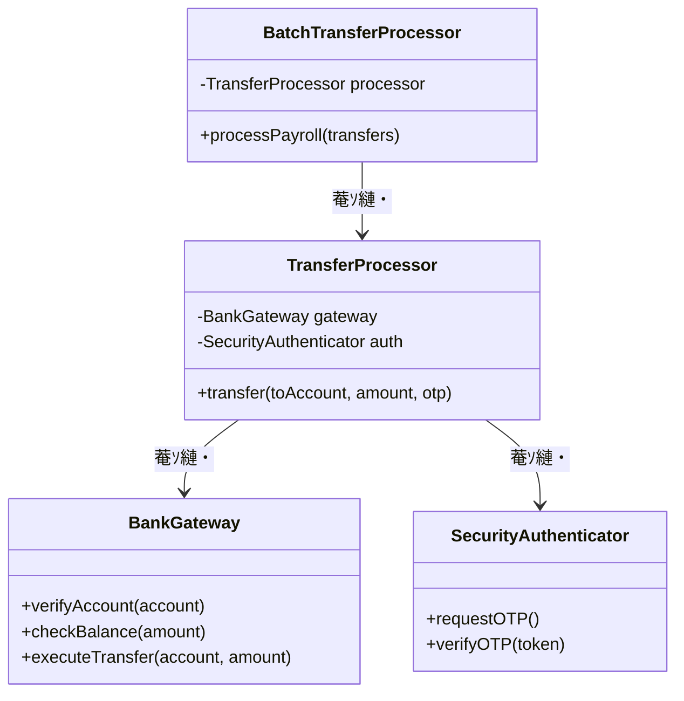
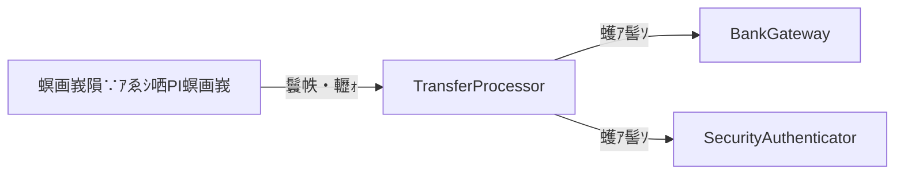
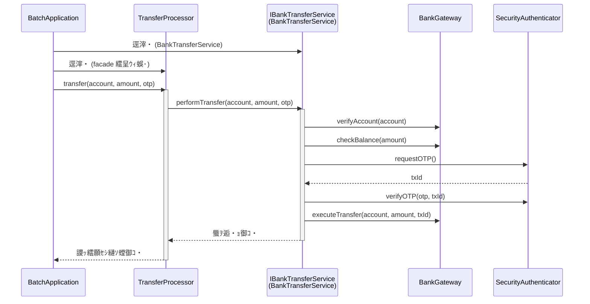
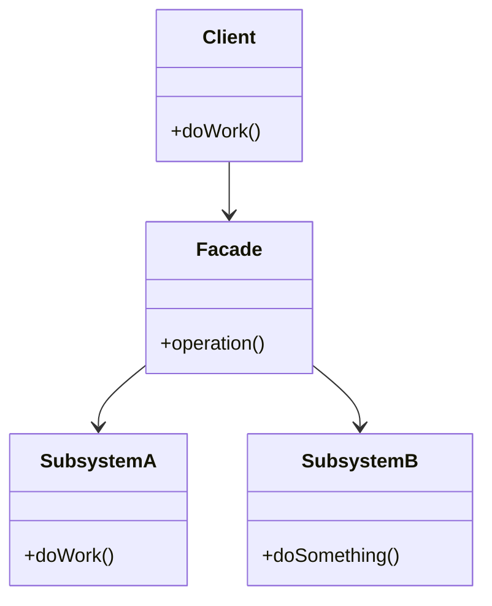

## 隨ｬ2遶 遯灘哨繧剃ｸ€譛ｬ蛹悶☆繧・窶補€・Facade 繝代ち繝ｼ繝ｳ

### 縺薙・遶縺ｮ譬ｸ蠢・

**隍・尅縺ｪ螟夜Κ繧ｷ繧ｹ繝・Β縺ｮ莉墓ｧ伜､画峩縺後€∫ｧ√◆縺｡縺ｮ繝薙ず繝阪せ繝ｭ繧ｸ繝・け蜈ｨ菴薙↓豕｢蜿翫＠縺ｦ縺励∪縺・€ゅ◎繧後・縲∫嶌謇九・縲瑚ｩｳ邏ｰ縺ｪ菴ｿ縺・婿縲阪ｒ遘√◆縺｡縺檎峩謗･遏･繧翫☆縺弱※縺・ｋ縺九ｉ縺縲・*

---

### 縺薙・遶繧定ｪｭ繧€縺ｨ蠕励ｉ繧後ｋ縺薙→

縺薙・遶縺ｮ逞帙∩縺ｯ縲悟､夜Κ繧ｷ繧ｹ繝・Β縺ｮ隧ｳ邏ｰ繧偵€∬・遉ｾ縺ｮ繧ｳ繝ｼ繝峨′逶ｴ謗･遏･繧翫☆縺弱※縺・ｋ縲榊撫鬘後〒縺吶€・

* **蠕励ｉ繧後ｋ縺薙→1・・* 縲御ｾ晏ｭ倥・蠎・′繧翫€阪→縺・≧隕ｳ轤ｹ縺ｧ縲√さ繝ｼ繝峨・豕｢蜿顔ｯ・峇繧定ｭ伜挨縺ｧ縺阪ｋ繧医≧縺ｫ縺ｪ繧・
* **蠕励ｉ繧後ｋ縺薙→2・・* 螟夜Κ繧ｷ繧ｹ繝・Β縺ｮ隧ｳ邏ｰ繧堤衍繧翫☆縺弱※縺・ｋ繧ｯ繝ｩ繧ｹ繧定ｦ九▽縺代€√◎縺薙′螟画峩縺ｫ蠑ｱ縺・磁邯夂せ・亥､画峩縺ｮ逞帙∩縺ｮ逋ｺ逕滓ｺ撰ｼ峨□縺ｨ蛻､譁ｭ縺ｧ縺阪ｋ繧医≧縺ｫ縺ｪ繧・
* **蠕励ｉ繧後ｋ縺薙→3・・* 隍・尅縺ｪ蜻ｼ縺ｳ蜃ｺ縺玲焔鬆・ｒ繧ｫ繝励そ繝ｫ蛹悶☆繧九％縺ｨ縺ｧ縲√け繝ｩ繧､繧｢繝ｳ繝医さ繝ｼ繝峨ｒ繧ｹ繝・く繝ｪ菫昴▽譁ｹ豕輔ｒ隱ｬ譏弱〒縺阪ｋ繧医≧縺ｫ縺ｪ繧・
* **蠕励ｉ繧後ｋ縺薙→4・・* 螟夜Κ繧ｷ繧ｹ繝・Β縺ｨ閾ｪ遉ｾ繧ｷ繧ｹ繝・Β縺ｮ蠅・阜邱夲ｼ育ｪ灘哨・峨ｒ縺ｩ縺薙↓蠑輔￥縺ｹ縺阪°蛻､譁ｭ縺ｧ縺阪ｋ繧医≧縺ｫ縺ｪ繧・

---

## 鳩 繝輔ぉ繝ｼ繧ｺ1・夂樟迥ｶ謚頑升 窶補€・莉墓ｧ倥ｒ謨ｴ逅・＠縲√す繧ｹ繝・Β縺ｨ邏蝉ｻ倥￠繧・

縺薙・蝠城｡後ｒ隗｣縺上◆繧√↓7縺､縺ｮ繝輔ぉ繝ｼ繧ｺ繧剃ｽｿ縺・∪縺吶€ゅ・縺倥ａ縺ｫ迴ｾ迥ｶ謚頑升縺九ｉ髢句ｧ九＠縲∽ｻｮ隱ｬ遶区｡医・蝠城｡檎音螳壹・蜴溷屏蛻・梵繝ｻ隱ｲ鬘悟ｮ夂ｾｩ繝ｻ蟇ｾ遲匁､懆ｨ弱・蟇ｾ遲門ｮ滓命縺ｨ縺・≧鬆・〒騾ｲ縺ｿ縺ｾ縺吶€・

螟画峩隕∵ｱゅ′譚･繧句燕縺ｮ繧ｷ繧ｹ繝・Β縺ｮ迴ｾ迥ｶ繧剃ｺ句ｮ溘→縺励※謚頑升縺吶ｋ縺ｨ縺薙ｍ縺九ｉ蟋九ａ縺ｾ縺吶€ゅ・縺倥ａ縺ｫ莉墓ｧ倥→蜍穂ｽ應ｾ九〒縲後％縺ｮ繧ｷ繧ｹ繝・Β縺御ｽ輔ｒ縺吶ｋ縺九€阪ｒ遒ｺ隱阪＠縲√◎繧後°繧峨さ繝ｼ繝峨ｒ隱ｭ縺ｿ縺ｾ縺吶€・

### 1-1・壹％縺ｮ繧ｷ繧ｹ繝・Β縺ｮ莉墓ｧ・

縺薙・繧ｷ繧ｹ繝・Β縺ｯ縲√ロ繝・ヨ驫€陦後・**謖ｯ繧願ｾｼ縺ｿ蜃ｦ逅・ｒ螳溯｡・*縺励∪縺吶€・

縲梧険霎ｼ蜈亥哨蠎ｧ逡ｪ蜿ｷ縲阪€碁€・≡驥鷹｡阪€阪ｒ蜈･蜉帙→縺励※蜿励￠蜿悶ｊ縲・橿陦後・API繧帝€壹§縺ｦ莉･荳九・謇矩・〒謖ｯ繧願ｾｼ縺ｿ繧貞ｮ御ｺ・＆縺帙∪縺吶€・

**謖ｯ繧願ｾｼ縺ｿ縺ｮ蜃ｦ逅・焔鬆・*

| 謇矩・| 蜃ｦ逅・・螳ｹ | 螟ｱ謨励＠縺溷ｴ蜷・|
|---|---|---|
| 竭 蜿｣蠎ｧ遒ｺ隱・| 謖ｯ霎ｼ蜈亥哨蠎ｧ縺悟ｭ伜惠縺玲怏蜉ｹ縺ｧ縺ゅｋ縺薙→繧堤｢ｺ隱阪☆繧・| 繧ｨ繝ｩ繝ｼ縺ｧ荳ｭ豁｢ |
| 竭｡ 谿矩ｫ倡｢ｺ隱・| 騾・≡蜈・・谿矩ｫ倥′蜊∝・縺ゅｋ縺薙→繧堤｢ｺ隱阪☆繧・| 繧ｨ繝ｩ繝ｼ縺ｧ荳ｭ豁｢ |
| 竭｢ OTP隱崎ｨｼ | 繝ｯ繝ｳ繧ｿ繧､繝繝代せ繝ｯ繝ｼ繝峨〒譛ｬ莠ｺ遒ｺ隱阪ｒ陦後≧ | 繧ｨ繝ｩ繝ｼ縺ｧ荳ｭ豁｢ |
| 竭｣ 騾・≡螳溯｡・| 驫€陦窟PI縺ｸ騾・≡謖・､ｺ繧帝€∽ｿ｡縺吶ｋ | 繧ｨ繝ｩ繝ｼ縺ｧ荳ｭ豁｢ |

縺薙・4縺､縺ｮ謇矩・・蠢・★鬆・分騾壹ｊ縺ｫ螳溯｡後＆繧後ｋ蠢・ｦ√′縺ゅｊ縺ｾ縺吶€ゅ←縺薙°縺ｧ螟ｱ謨励☆繧後・蠕檎ｶ壹・謇矩・・螳溯｡後＆繧後∪縺帙ｓ縲・

**縺薙・繧ｷ繧ｹ繝・Β縺ｮ髢｢菫り€・*

| 蠖ｹ蜑ｲ | 諡・ｽ楢€・| 邂｡霓・☆繧狗衍隴・|
|---|---|---|
| 謖ｯ繧願ｾｼ縺ｿ繧ｷ繧ｹ繝・Β髢狗匱繝√・繝 | 閾ｪ繝√・繝 | 謖ｯ繧願ｾｼ縺ｿ縺ｮ蜃ｦ逅・ヵ繝ｭ繝ｼ蜈ｨ菴・|
| 驫€陦悟・縺ｮ繧ｷ繧ｹ繝・Β諡・ｽ楢€・| 驫€陦窟PI邂｡逅・Κ髢€ | 蜿｣蠎ｧ遒ｺ隱阪・谿矩ｫ倡｢ｺ隱阪・騾・≡API縺ｮ莉墓ｧ・|
| 驫€陦悟・縺ｮ繧ｻ繧ｭ繝･繝ｪ繝・ぅ諡・ｽ楢€・| 驫€陦後そ繧ｭ繝･繝ｪ繝・ぅ驛ｨ髢€ | OTP隱崎ｨｼ縺ｮ謇矩・・隱崎ｨｼ譁ｹ蠑・|

蠕後・繝輔ぉ繝ｼ繧ｺ縺ｧ縲瑚ｪｰ縺ｮ蛻､譁ｭ縺ｧ螟峨ｏ繧狗衍隴倥°縲阪ｒ遒ｺ隱阪☆繧九→縺阪€√％縺ｮ髢｢菫り€・｡ｨ縺悟渕貅悶↓縺ｪ繧翫∪縺吶€・

---

### 1-2・壼虚菴應ｾ九ユ繝ｼ繝悶Ν

莉墓ｧ倥ｒ螳夂ｾｩ縺励◆縺ｨ縺薙ｍ縺ｧ縲∝ｮ滄圀縺ｫ縺ｩ縺ｮ繧医≧縺ｪ蜈･蜉帙↓蟇ｾ縺励※縺ｩ縺ｮ繧医≧縺ｪ邨先棡縺瑚ｿ斐ｋ縺九ｒ遒ｺ隱阪＠縺ｾ縺吶€ゅ％縺ｮ繝・・繝悶Ν縺ｯ縲後％縺ｮ繧ｷ繧ｹ繝・Β縺梧ｭ｣縺励￥蜍輔＞縺ｦ縺・ｋ縺ｨ縺ｯ縺ｩ縺・＞縺・憾諷九°縲阪・蝓ｺ貅悶↓縺ｪ繧翫∪縺吶€ょｾ後〒險ｭ險医・謾ｹ蝟・ｼ医Μ繝輔ぃ繧ｯ繧ｿ繝ｪ繝ｳ繧ｰ・峨ｒ谿ｵ髫守噪縺ｫ騾ｲ繧√ｋ縺ｨ縺阪ｂ縲√％縺ｮ陦ｨ縺ｫ遶九■霑斐ｊ縺ｾ縺吶€・

| 謖ｯ繧願ｾｼ縺ｿ蜈亥哨蠎ｧ | 騾・≡驥鷹｡・| 邨先棡 | 驕ｩ逕ｨ繝ｫ繝ｼ繝ｫ |
|---|---|---|---|
| 12345678・域怏蜉ｹ・・| 5,000蜀・ｼ域ｮ矩ｫ伜香蛻・ｼ・| 謖ｯ繧願ｾｼ縺ｿ螳御ｺ・| 蜿｣蠎ｧ遒ｺ隱坂・谿矩ｫ倡｢ｺ隱坂・隱崎ｨｼ竊帝€・≡ |
| 99999999・亥ｭ伜惠縺励↑縺・ｼ・| 5,000蜀・| 繧ｨ繝ｩ繝ｼ・壼哨蠎ｧ縺ｪ縺・| 蜿｣蠎ｧ遒ｺ隱阪〒荳ｭ豁｢ |
| 12345678・域怏蜉ｹ・・| 1,000,000蜀・ｼ域ｮ矩ｫ倅ｸ崎ｶｳ・・| 繧ｨ繝ｩ繝ｼ・壽ｮ矩ｫ倅ｸ崎ｶｳ | 谿矩ｫ倡｢ｺ隱阪〒荳ｭ豁｢ |
| 12345678・域怏蜉ｹ・・| 5,000蜀・ｼ域ｮ矩ｫ伜香蛻・ｼ・| 繧ｨ繝ｩ繝ｼ・夊ｪ崎ｨｼ螟ｱ謨・| 隱崎ｨｼ繧ｳ繝ｼ繝画､懆ｨｼ縺ｧ荳ｭ豁｢ |
| 87654321・域怏蜉ｹ繝ｻ繝舌ャ繝・ｼ・| 30,000蜀・ｼ域ｮ矩ｫ伜香蛻・ｼ・| 謖ｯ繧願ｾｼ縺ｿ螳御ｺ・ｼ・TP荳崎ｦ・ｼ・| 蜿｣蠎ｧ遒ｺ隱坂・谿矩ｫ倡｢ｺ隱坂・騾・≡・医ヰ繝・メ蜃ｦ逅・・莠句燕縺ｫ遉ｾ蜀・価隱阪′螳御ｺ・＠縺ｦ縺・ｋ縺溘ａ縲＾TP縺ｫ繧医ｋ霑ｽ蜉隱崎ｨｼ縺御ｸ崎ｦ・ｼ・|

繧ｳ繝ｼ繝峨ｒ隱ｭ繧€蜑阪↓縲√％縺ｮ繧ｷ繧ｹ繝・Β縺後€御ｽ輔ｒ縺吶ｋ蠢・ｦ√′縺ゅｋ縺九€阪ｒ縺薙・陦ｨ縺ｧ遒ｺ隱阪〒縺阪∪縺励◆縲よｬ｡縺ｯ縲後←縺ｮ繧医≧縺ｫ螳溯｣・＆繧後※縺・ｋ縺九€阪ｒ隕九※縺・″縺ｾ縺吶€・

---

### 1-3・壹け繝ｩ繧ｹ讒区・蝗ｳ

繧ｳ繝ｼ繝峨ｒ隱ｭ繧薙□縺ｨ縺薙ｍ縺ｧ縲√け繝ｩ繧ｹ髢薙・髢｢菫ゅｒ蝗ｳ縺ｧ謨ｴ逅・＠縺ｾ縺吶€・



`BatchTransferProcessor` 縺ｯ `TransferProcessor` 繧剃ｽｿ縺｣縺ｦ荳€諡ｬ蜃ｦ逅・ｒ陦後＞縲～TransferProcessor` 縺・`BankGateway` 縺ｨ `SecurityAuthenticator` 縺ｮ荳｡譁ｹ繧堤峩謗･菫晄戟縺励€√◎繧後◇繧後・繝｡繧ｽ繝・ラ繧帝・分縺ｫ蜻ｼ縺ｳ蜃ｺ縺励※繝輔Ο繝ｼ繧貞宛蠕｡縺励※縺・∪縺吶€・

---

### 1-4・壼ｮ溯｣・さ繝ｼ繝会ｼ育樟迥ｶ・・

#### 縺薙・繧ｷ繧ｹ繝・Β縺ｮ逋ｻ蝣ｴ繧ｯ繝ｩ繧ｹ

| 繧ｯ繝ｩ繧ｹ蜷・| 蠖ｹ蜑ｲ | 諡・ｽ薙☆繧倶ｻ墓ｧ・|
|---|---|---|
| TransferProcessor | 蛟句挨謖ｯ繧願ｾｼ縺ｿ繝輔Ο繝ｼ騾ｲ陦・| 莉墓ｧ伜・菴・|
| BatchTransferProcessor | 荳€諡ｬ謖ｯ繧願ｾｼ縺ｿ・医ヰ繝・メ・蛾€ｲ陦・| 隍・焚縺ｮ謖ｯ繧願ｾｼ縺ｿ縺ｮ蜻ｼ縺ｳ蜃ｺ縺・|
| BankGateway | 驫€陦窟PI騾壻ｿ｡ | 莉墓ｧ倪蔵縲≫贈縲≫促 |
| SecurityAuthenticator | 隱崎ｨｼ蛻ｶ蠕｡ | 莉墓ｧ倪造 |

繝・・繧ｿ縺ｮ豬√ｌ・咤atchTransferProcessor 竊・TransferProcessor 竊・BankGateway / SecurityAuthenticator 竊・螟夜ΚAPI
縺薙・遶縺ｧ豕ｨ逶ｮ縺吶ｋ繝昴う繝ｳ繝茨ｼ壽険繧願ｾｼ縺ｿ讌ｭ蜍吶・豬√ｌ縺ｨ縲・橿陦窟PI縺ｮ蜻ｼ縺ｳ蜃ｺ縺玲焔鬆・′縺ｩ縺ｮ繧医≧縺ｫ邨舌・縺､縺・※縺・ｋ縺・


#### 驫€陦後す繧ｹ繝・Β縺ｨ騾壻ｿ｡縺吶ｋ繧ｯ繝ｩ繧ｹ鄒､

縺ｯ縺倥ａ縺ｫ縲・橿陦窟PI縺ｨ縺ｮ騾壻ｿ｡繧呈球縺・け繝ｩ繧ｹ縺ｨ隱崎ｨｼ繧呈球縺・け繝ｩ繧ｹ繧定ｦ九※縺ｿ縺ｾ縺吶€・

```cpp
#include <iostream>
#include <string>
#include <vector>
#include <utility>

// 驫€陦後→縺ｮ騾壻ｿ｡繧呈球縺・け繝ｩ繧ｹ
class BankGateway {
public:
    bool verifyAccount(const std::string& account) {
        std::cout << "蜿｣蠎ｧ遒ｺ隱・ " << account << "\n";
        if (account == "99999999") {
            std::cout << "繧ｨ繝ｩ繝ｼ: 蜿｣蠎ｧ縺ｪ縺予n";
            return false;
        }
        return true;
    }
    bool checkBalance(int amount) {
        std::cout << "谿矩ｫ倡｢ｺ隱構n";
        if (amount > 100000) {
            std::cout << "繧ｨ繝ｩ繝ｼ: 谿矩ｫ倅ｸ崎ｶｳ\n";
            return false;
        }
        return true;
    }
    void executeTransfer(const std::string& /*account*/, int amount) {
        std::cout << "騾・≡螳溯｡・ " << amount << "蜀・n";
    }
};

// 隱崎ｨｼ繧呈球縺・け繝ｩ繧ｹ
class SecurityAuthenticator {
public:
    void requestOTP() { std::cout << "隱崎ｨｼ繧ｳ繝ｼ繝臥匱陦圭n"; }
    bool verifyOTP(const std::string& token) {
        std::cout << "隱崎ｨｼ繧ｳ繝ｼ繝画､懆ｨｼ\n";
        if (token == "INVALID") {
            std::cout << "繧ｨ繝ｩ繝ｼ: 隱崎ｨｼ螟ｱ謨予n";
            return false;
        }
        return true;
    }
};
```

`BankGateway` 縺ｨ `SecurityAuthenticator` 縺ｯ縲√◎繧後◇繧碁橿陦窟PI縺ｨ縺ｮ騾壻ｿ｡繝ｻ隱崎ｨｼ縺ｮ隧ｳ邏ｰ繧呈球縺・ｰる摩繧ｯ繝ｩ繧ｹ縺ｧ縺吶€・

#### 謖ｯ繧願ｾｼ縺ｿ蜃ｦ逅・け繝ｩ繧ｹ

谺｡縺ｫ縲∵険繧願ｾｼ縺ｿ縺ｮ蜈ｨ菴薙ヵ繝ｭ繝ｼ繧堤ｮ｡逅・☆繧九け繝ｩ繧ｹ繧定ｦ九∪縺吶€・

```cpp
// 謖ｯ繧願ｾｼ縺ｿ蜃ｦ逅・け繝ｩ繧ｹ
class TransferProcessor {
private:
    BankGateway gateway;
    SecurityAuthenticator auth;
public:
    bool transfer(
        const std::string& toAccount, int amount,
        const std::string& otp) {
        // 驫€陦後す繧ｹ繝・Β縺ｮ隍・尅縺ｪ謇矩・ｒ逶ｴ謗･蛻ｶ蠕｡縺励※縺・ｋ
        if (!gateway.verifyAccount(toAccount)) return false;
        if (!gateway.checkBalance(amount)) return false;

        auth.requestOTP();
        if (!auth.verifyOTP(otp)) return false;

        gateway.executeTransfer(toAccount, amount);
        std::cout << "謖ｯ繧願ｾｼ縺ｿ螳御ｺ・n";
        return true;
    }

    bool transferApprovedBatch(
        const std::string& toAccount, int amount) {
        // 遉ｾ蜀・価隱肴ｸ医∩繝舌ャ繝∫畑縲る€壼ｸｸ謖ｯ霎ｼ縺ｨ謇矩・′驥崎､・＠縺ｦ縺・ｋ
        if (!gateway.verifyAccount(toAccount)) return false;
        if (!gateway.checkBalance(amount)) return false;
        gateway.executeTransfer(toAccount, amount);
        std::cout << "謖ｯ繧願ｾｼ縺ｿ螳御ｺ・ｼ・TP荳崎ｦ・ｼ噂n";
        return true;
    }
};

// 邨ｦ荳取険繧願ｾｼ縺ｿ縺ｪ縺ｩ縺ｮ荳€諡ｬ蜃ｦ逅・ヰ繝・メ・医ｂ縺・縺､縺ｮ蜻ｼ縺ｳ蜃ｺ縺怜・・・
class BatchTransferProcessor {
private:
    TransferProcessor processor;
public:
    void processPayroll(
            const std::vector<std::pair<std::string, int>>& transfers) {
        for (int i = 0; i < (int)transfers.size(); i++) {
            const std::string& account = transfers[i].first;
            int amount = transfers[i].second;
            processor.transferApprovedBatch(account, amount);
        }
    }
};
```

縺薙・繧ｯ繝ｩ繧ｹ鄒､縺御ｻ顔ｫ縺ｮ荳ｭ蠢・〒縺吶€ＡTransferProcessor` 縺ｮ莠後▽縺ｮ繝｡繧ｽ繝・ラ縺ｫ縺ｯ縲・
縲梧険繧願ｾｼ縺ｿ縺ｨ縺・≧讌ｭ蜍吶ヵ繝ｭ繝ｼ縺ｮ蛻ｶ蠕｡縲阪→縲碁橿陦窟PI縺ｮ蜈ｷ菴鍋噪縺ｪ蜻ｼ縺ｳ蜃ｺ縺玲焔鬆・€阪′
荳€邱偵↓譖ｸ縺九ｌ縺ｦ縺・∪縺吶€ゅヰ繝・メ縺ｧ縺ｯOTP繧堤怐逡･縺ｧ縺阪∪縺吶′縲∝哨蠎ｧ遒ｺ隱阪・谿矩ｫ倡｢ｺ隱阪・
騾・≡縺ｨ縺・≧謇矩・ｒ騾壼ｸｸ謖ｯ霎ｼ縺ｨ縺ｯ蛻･縺ｫ險倩ｿｰ縺励※縺・ｋ縺溘ａ縲・橿陦窟PI縺ｮ謇矩・､画峩縺ｧ縺ｯ
荳｡譁ｹ繧剃ｿｮ豁｣縺吶ｋ蠢・ｦ√′縺ゅｊ縺ｾ縺吶€・

#### 蜻ｼ縺ｳ蜃ｺ縺怜・縺ｨ螳溯｡檎｢ｺ隱・

```cpp
int main() {
    TransferProcessor processor;

    std::cout << "--- 陦・: 豁｣蟶ｸ縺ｪ蛟句挨謖ｯ繧願ｾｼ縺ｿ ---\n";
    processor.transfer("12345678", 5000, "999999");

    std::cout << "--- 陦・: 蟄伜惠縺励↑縺・哨蠎ｧ ---\n";
    processor.transfer("99999999", 5000, "999999");

    std::cout << "--- 陦・: 谿矩ｫ倅ｸ崎ｶｳ ---\n";
    processor.transfer("12345678", 1000000, "999999");

    std::cout << "--- 陦・: 隱崎ｨｼ螟ｱ謨・---\n";
    processor.transfer("12345678", 5000, "INVALID");

    std::cout << "--- 陦・: 遉ｾ蜀・価隱肴ｸ医∩繝舌ャ繝・---\n";
    BatchTransferProcessor batch;
    std::vector<std::pair<std::string, int>> payroll = {
        {"87654321", 30000}
    };
    batch.processPayroll(payroll);

    return 0;
}
```

荳願ｨ倥さ繝ｼ繝峨・螳溯｡檎ｵ先棡・・

```
--- 陦・: 豁｣蟶ｸ縺ｪ蛟句挨謖ｯ繧願ｾｼ縺ｿ ---
蜿｣蠎ｧ遒ｺ隱・ 12345678
谿矩ｫ倡｢ｺ隱・
隱崎ｨｼ繧ｳ繝ｼ繝臥匱陦・
隱崎ｨｼ繧ｳ繝ｼ繝画､懆ｨｼ
騾・≡螳溯｡・ 5000蜀・
謖ｯ繧願ｾｼ縺ｿ螳御ｺ・
--- 陦・: 蟄伜惠縺励↑縺・哨蠎ｧ ---
蜿｣蠎ｧ遒ｺ隱・ 99999999
繧ｨ繝ｩ繝ｼ: 蜿｣蠎ｧ縺ｪ縺・
--- 陦・: 谿矩ｫ倅ｸ崎ｶｳ ---
蜿｣蠎ｧ遒ｺ隱・ 12345678
谿矩ｫ倡｢ｺ隱・
繧ｨ繝ｩ繝ｼ: 谿矩ｫ倅ｸ崎ｶｳ
--- 陦・: 隱崎ｨｼ螟ｱ謨・---
蜿｣蠎ｧ遒ｺ隱・ 12345678
谿矩ｫ倡｢ｺ隱・
隱崎ｨｼ繧ｳ繝ｼ繝臥匱陦・
隱崎ｨｼ繧ｳ繝ｼ繝画､懆ｨｼ
繧ｨ繝ｩ繝ｼ: 隱崎ｨｼ螟ｱ謨・
--- 陦・: 遉ｾ蜀・価隱肴ｸ医∩繝舌ャ繝・---
蜿｣蠎ｧ遒ｺ隱・ 87654321
谿矩ｫ倡｢ｺ隱・
騾・≡螳溯｡・ 30000蜀・
謖ｯ繧願ｾｼ縺ｿ螳御ｺ・ｼ・TP荳崎ｦ・ｼ・
```

蜍穂ｽ應ｾ九ユ繝ｼ繝悶Ν縺ｮ蜈ｨ5陦後↓縺､縺・※縲∵・蜉滓凾縺ｮ蜃ｦ逅・・€∝､ｱ謨玲凾縺ｮ荳ｭ豁｢菴咲ｽｮ縲・
繝舌ャ繝√〒OTP繧貞ｮ溯｡後＠縺ｪ縺・％縺ｨ繧堤｢ｺ隱阪〒縺阪∪縺励◆縲ら樟迥ｶ縺ｧ繧ゆｻ墓ｧ倥・貅€縺溘＠縺ｦ縺・∪縺吶€・
蝠城｡後・縲・€壼ｸｸ謖ｯ霎ｼ縺ｨ繝舌ャ繝∵険霎ｼ縺碁橿陦窟PI縺ｮ謇矩・ｒ縺昴ｌ縺槭ｌ遏･繧翫€∝酔縺伜､画峩繧・
隍・焚縺ｮ繝｡繧ｽ繝・ラ縺ｸ蜿肴丐縺励↑縺代ｌ縺ｰ縺ｪ繧峨↑縺・ｧ矩€縺ｫ縺ゅｊ縺ｾ縺吶€・

谺｡縺ｮ繝輔ぉ繝ｼ繧ｺ縺ｧ螟画峩縺梧擂縺溘→縺阪↓菴輔′襍ｷ縺阪ｋ縺九ｒ遒ｺ隱阪＠縺ｾ縺吶€・

---

### 1-5・壼､画峩隕∵ｱ・

縺ゅｋ譛域屆譌･縺ｮ譛昴€・橿陦後・繧ｷ繧ｹ繝・Β諡・ｽ楢€・°繧臥ｷ頑€･縺ｮ騾｣邨｡縺悟・繧翫∪縺励◆縲・

縲梧擂譛医°繧峨€・橿陦窟PI縺ｮ隱崎ｨｼ莉墓ｧ倥′螟ｧ蟷・↓螟峨ｏ繧翫∪縺吶€ゅ％繧後∪縺ｧ縺ｯ蜊倅ｸ€縺ｮOTP・医Ρ繝ｳ繧ｿ繧､繝繝代せ繝ｯ繝ｼ繝会ｼ芽ｪ崎ｨｼ縺縺代〒蜊∝・縺ｧ縺励◆縺後€∽ｻ雁ｾ後・縲√・縺倥ａ縺ｫ縲手ｪ崎ｨｼ繧ｳ繝ｼ繝峨・逋ｺ陦後€上ｒ繝ｪ繧ｯ繧ｨ繧ｹ繝医＠縲√◎縺ｮ蠢懃ｭ斐〒霑斐ｋ縲主叙蠑肘D縲上→縺ゅｏ縺帙※讀懆ｨｼ縺吶ｋ蠢・ｦ√′縺ゅｊ縺ｾ縺吶€ゅ€・

縺輔ｉ縺ｫ縲√％繧後↓邯壹＞縺ｦ縲碁橿陦悟・縺ｮ騾・≡API縺ｮ繧､繝ｳ繧ｿ繝ｼ繝輔ぉ繝ｼ繧ｹ繧ゅそ繧ｭ繝･繝ｪ繝・ぅ蠑ｷ蛹悶・縺溘ａ縲・€・≡譎ゅ・繝代Λ繝｡繝ｼ繧ｿ縺ｫ縲弱ヨ繝ｩ繝ｳ繧ｶ繧ｯ繧ｷ繝ｧ繝ｳID縲上′蠢・医↓縺ｪ繧翫∪縺吶€阪→縺ｮ縺薙→縲・

繝ｪ繝ｪ繝ｼ繧ｹ縺ｯ譚･譛医・鬆ｭ縲よ里蟄倥・ `TransferProcessor` 繧ｯ繝ｩ繧ｹ縺ｮ荳ｭ霄ｫ繧呈嶌縺肴鋤縺医€∬ｪ崎ｨｼ謇矩・ｄ騾・≡謇矩・ｒ莉翫・繧ｳ繝ｼ繝峨・ `transfer` 繝｡繧ｽ繝・ラ縺ｫ逶ｴ謗･霑ｽ蜉縺励ｈ縺・→縺吶ｌ縺ｰ縲√≠縺｣縺ｨ縺・≧髢薙↓隍・尅縺ｫ邨｡縺ｿ蜷医▲縺溽憾諷九↓縺ｪ縺｣縺ｦ縺励∪縺・・縺ｯ逶ｮ縺ｫ隕九∴縺ｦ縺・∪縺吶€・

險ｭ險医↓邨ｶ蟇ｾ縺ｮ豁｣隗｣縺ｯ縺ゅｊ縺ｾ縺帙ｓ縲ゅ□縺九ｉ縺薙◎縲√％縺ｮ螟画峩縺後←縺薙∪縺ｧ蠎・′繧九・縺九€∵・驥阪↓隕区･ｵ繧√ｋ蠢・ｦ√′縺ゅｊ縺ｾ縺吶€・


**莉墓ｧ伜､画峩縺ｮ蜀・ｮｹ**

螟画峩隕∵ｱゅｒ蜿励￠縺ｦ縲∬ｪ崎ｨｼ縺ｨ騾・≡縺ｮ謇矩・′縺ｩ縺・､峨ｏ繧九°繧呈紛逅・＠縺ｾ縺吶€ゑｼ医％繧後ｉ縺ｮ螟画峩縺ｯ縺吶∋縺ｦ縲碁橿陦悟・縺ｮ繧ｷ繧ｹ繝・Β諡・ｽ楢€・・繧ｻ繧ｭ繝･繝ｪ繝・ぅ諡・ｽ楢€・€阪・蛻､譁ｭ縺ｧ逋ｺ逕溘＠縺溯ｦ∵ｱゅ〒縺呻ｼ・


| 謇矩・| 螟画峩蜑・| 螟画峩蠕・|
|---|---|---|
| 竭 蜿｣蠎ｧ遒ｺ隱・| 螟画峩縺ｪ縺・| 螟画峩縺ｪ縺・|
| 竭｡ 谿矩ｫ倡｢ｺ隱・| 螟画峩縺ｪ縺・| 螟画峩縺ｪ縺・|
| **竭｢ 隱崎ｨｼ** | OTP・医Ρ繝ｳ繧ｿ繧､繝繝代せ繝ｯ繝ｼ繝会ｼ・繧ｹ繝・ャ繝励〒螳御ｺ・| **縲瑚ｪ崎ｨｼ繧ｳ繝ｼ繝峨・逋ｺ陦後€坂・縲悟叙蠑肘D縺ｨ隱崎ｨｼ繧ｳ繝ｼ繝峨・辣ｧ蜷医€阪・2繧ｹ繝・ャ繝励↓螟画峩** |
| **竭｣ 騾・≡螳溯｡・* | 謖ｯ霎ｼ蜈亥哨蠎ｧ縺ｨ驥鷹｡阪□縺代ｒ謖・ｮ壹＠縺ｦ騾・≡ | **縲後ヨ繝ｩ繝ｳ繧ｶ繧ｯ繧ｷ繝ｧ繝ｳID縲阪′蠢・医ヱ繝ｩ繝｡繝ｼ繧ｿ縺ｨ縺励※霑ｽ蜉** |

迴ｾ陦後・隱崎ｨｼ縺ｧ縺ｯ逋ｺ陦後→讀懆ｨｼ縺ｮ髢薙↓隴伜挨蟄舌ｒ蜿励￠貂｡縺励※縺・∪縺帙ｓ縺ｧ縺励◆縲よ眠莉墓ｧ倥〒縺ｯ `requestOTP()` 縺ｮ蠢懃ｭ斐°繧牙叙蠑肘D繧貞女縺大叙繧翫€～verifyOTP(authCode, transactionId)` 縺ｧ讀懆ｨｼ縺励∪縺吶€よ､懆ｨｼ貂医∩縺ｮ蜷後§蜿門ｼ肘D繧偵€～executeTransfer(account, amount, transactionId)` 縺ｫ繧よｸ｡縺励∪縺吶€・

繝輔ぉ繝ｼ繧ｺ1縺ｧ繧ｷ繧ｹ繝・Β縺ｮ迴ｾ迥ｶ縺ｨ螟画峩隕∵ｱゅ′謚頑升縺ｧ縺阪∪縺励◆縲よｬ｡縺ｮ繝輔ぉ繝ｼ繧ｺ2縺ｧ縺ｯ縲√€御ｽ輔′螟峨ｏ繧翫€∽ｽ輔′螟峨ｏ繧峨↑縺・°縲阪ｒ謨ｴ逅・＠縺ｾ縺吶€・

---

## 泪 繝輔ぉ繝ｼ繧ｺ2・壻ｻｮ隱ｬ遶区｡・窶補€・菴輔′螟峨ｏ繧九°繧定ｦｳ蟇溘＠縲√ヲ繧｢繝ｪ繝ｳ繧ｰ縺ｧ陬丈ｻ倥￠繧・

### 2-1・啻TransferProcessor`縺ｫ豺ｷ蝨ｨ縺励※縺・ｋ遏･隴倥→諡・ｽ薙メ繝ｼ繝

`TransferProcessor.transfer()` 縺檎樟蝨ｨ謚ｱ縺医※縺・ｋ遏･隴倥→縲√◎繧後◇繧後ｒ螟画峩縺吶ｋ諡・ｽ楢€・ｒ遒ｺ隱阪＠縺ｾ縺吶€・

| 遏･隴假ｼ医さ繝ｼ繝峨′逶ｴ謗･謖√▲縺ｦ縺・ｋ繧ゅ・・・| 螟画峩繧呈ｱｺ繧√ｋ諡・ｽ楢€・| 驕ｩ蛻・° |
|---|---|---|
| 謖ｯ繧願ｾｼ縺ｿ繝輔Ο繝ｼ縺ｮ蜈ｨ菴捺焔鬆・| 謖ｯ繧願ｾｼ縺ｿ繧ｷ繧ｹ繝・Β髢狗匱繝√・繝 | 笨・|
| 驫€陦窟PI縺ｮ蜿｣蠎ｧ遒ｺ隱阪・谿矩ｫ倡｢ｺ隱肴焔鬆・| 驫€陦悟・縺ｮ繧ｷ繧ｹ繝・Β諡・ｽ楢€・| 笶・豺ｷ蝨ｨ |
| OTP隱崎ｨｼ縺ｮ謇矩・・讀懆ｨｼ譁ｹ豕・| 驫€陦悟・縺ｮ繧ｻ繧ｭ繝･繝ｪ繝・ぅ諡・ｽ楢€・| 笶・豺ｷ蝨ｨ |
| 騾・≡API縺ｮ蜻ｼ縺ｳ蜃ｺ縺玲婿豕・| 驫€陦悟・縺ｮ繧ｷ繧ｹ繝・Β諡・ｽ楢€・| 笶・豺ｷ蝨ｨ |

笶後′3縺､縺ゅｋ縲ゅ％縺ｮ繝｡繧ｽ繝・ラ縺ｫ謇九ｒ蜈･繧後ｋ縺溘・縺ｫ縲・橿陦悟・縺ｮ隍・焚縺ｮ諡・ｽ楢€・・莉墓ｧ伜､画峩縺悟ｽｱ髻ｿ縺励∪縺吶€ゅ％繧後′蠕後・螟画峩縺ｮ逞帙∩縺ｮ莠亥・縺ｧ縺吶€・

### 2-3・壻ｻ雁屓縺ｮ螟画峩縺ｧ遒ｺ螳溘↓螟峨ｏ繧九％縺ｨ

莉雁屓縺ｮ螟画峩隕∵ｱゅ°繧臥｢ｺ螳壹＠縺ｦ縺・ｋ螟画峩縺ｯ2轤ｹ縺ｧ縺吶€・

- **驫€陦窟PI縺ｮ隱崎ｨｼ謇矩・・螟画峩**・唹TP1繧ｹ繝・ャ繝励°繧峨€∬ｪ崎ｨｼ繧ｳ繝ｼ繝臥匱陦鯉ｼ句叙蠑肘D縺ｨ縺ｮ辣ｧ蜷医→縺・≧2繧ｹ繝・ャ繝励↓螟画峩縺輔ｌ繧・
- **騾・≡API縺ｮ繝代Λ繝｡繝ｼ繧ｿ霑ｽ蜉**・夐€・≡譎ゅ↓繝医Λ繝ｳ繧ｶ繧ｯ繧ｷ繝ｧ繝ｳID縺悟ｿ・医↓縺ｪ繧・

縺溘□縺励€後％縺ｮ螟画峩縺・蝗樣剞繧翫°縲∽ｻ雁ｾ後ｂ邯壹￥縺九€阪↓繧医▲縺ｦ縲√←縺薙∪縺ｧ險ｭ險医ｒ螟峨∴繧九∋縺阪°縺悟､ｧ縺阪￥螟峨ｏ繧翫∪縺吶€る未菫り€・↓遒ｺ隱阪＠縺ｾ縺吶€・

### 繝偵い繝ｪ繝ｳ繧ｰ縺ｫ蜷代￠縺溯レ譎ｯ遒ｺ隱・

縺薙・繧ｷ繧ｹ繝・Β縺ｯ縲√≠繧九ロ繝・ヨ驫€陦後・謖ｯ繧願ｾｼ縺ｿ蜃ｦ逅・ｒ閾ｪ蜍募喧縺吶ｋ縺溘ａ縺ｮ繧ゅ・縺ｧ縺吶€る橿陦後・繧ｷ繧ｹ繝・Β縺ｯ髱槫ｸｸ縺ｫ蝣・欧縺ｧ縲∝ｮ牙・縺ｫ騾・≡繧定｡後≧縺溘ａ縺ｫ縲∝哨蠎ｧ諠・ｱ縺ｮ遒ｺ隱阪€∵ｮ矩ｫ倥メ繧ｧ繝・け縲∵焔謨ｰ譁吶・險育ｮ励€√◎縺励※螳滄圀縺ｮ騾・≡謖・､ｺ縺ｨ縺・≧縲√＞縺上▽繧ゅ・謇矩・ｒ豁｣縺励＞鬆・分縺ｧ螳溯｡後☆繧句ｿ・ｦ√′縺ゅｊ縺ｾ縺吶€・

髢狗匱繝√・繝縺ｯ縲√％縺ｮ驫€陦後・API繧堤峩謗･蜿ｩ縺・※謖ｯ繧願ｾｼ縺ｿ繧定｡後≧繝励Ο繧ｰ繝ｩ繝繧偵Γ繝ｳ繝・リ繝ｳ繧ｹ縺励※縺・∪縺吶€ょｽ灘・縺ｯ蜊倡ｴ斐↑騾・≡讖溯・縺縺代〒縺励◆縺後€∵怙霑代〒縺ｯ縲∵険繧願ｾｼ縺ｿ蜈医↓蠢懊§縺滄€・≡髯仙ｺｦ鬘阪・遒ｺ隱阪ｄ縲∽ｺ瑚ｦ∫ｴ隱崎ｨｼ縺ｮ蜻ｼ縺ｳ蜃ｺ縺励↑縺ｩ縲・橿陦悟・縺九ｉ豎ゅａ繧峨ｌ繧九そ繧ｭ繝･繝ｪ繝・ぅ隕∽ｻｶ縺悟ｹｴ縲・宍縺励￥縺ｪ縺｣縺ｦ縺阪∪縺励◆縲・

### 2-4・夐未菫り€・ヲ繧｢繝ｪ繝ｳ繧ｰ

> **迴ｾ螳溘・繝偵い繝ｪ繝ｳ繧ｰ縺ｧ縺ｯ窶披€・* 譛ｬ譖ｸ縺ｮ繝偵い繝ｪ繝ｳ繧ｰ繧ｷ繝ｼ繝ｳ縺ｧ縺ｯ險ｭ險亥愛譁ｭ繧呈・遒ｺ縺ｫ縺吶ｋ縺溘ａ縲∵э蝗ｳ逧・↓縲檎炊諠ｳ逧・↑蝗樒ｭ斐€阪′霑斐▲縺ｦ縺上ｋ繧医≧縺ｫ謠上＞縺ｦ縺・∪縺吶€ゅ％繧後・繧ｷ繝溘Η繝ｬ繝ｼ繧ｷ繝ｧ繝ｳ縺ｧ縺吶€ら樟螳溘↓縺ｯ縲√€悟､峨ｏ繧九°縺ｩ縺・°蛻・°繧峨↑縺・€阪€後◆縺ｶ繧灘､峨ｏ繧峨↑縺・€阪→縺・≧譖匁乂縺ｪ遲斐∴縺瑚ｿ斐ｋ縺薙→繧ょ､壹＞縺ｧ縺吶€ゅ◎縺ｮ縺ｨ縺阪・ `git log` 繧・℃蜴ｻ縺ｮ髫懷ｮｳ險倬鹸繧偵€後ヲ繧｢繝ｪ繝ｳ繧ｰ縺ｮ莉｣繧上ｊ縲阪→縺励※菴ｿ縺｣縺ｦ縺ｿ縺ｦ縺上□縺輔＞縲ゅ€碁℃蜴ｻ縺ｫ菴募ｺｦ螟峨ｏ縺｣縺溘°縲阪′譛€繧よｭ｣逶ｴ縺ｪ險ｼ諡縺ｧ縺吶€・

莉雁屓縺ｮ螟画峩縺御ｸ€譎ら噪縺ｪ繧ゅ・縺九€∝ｰ・擂繧らｶ壹￥繝ｪ繧ｹ繧ｯ縺後≠繧九・縺九ｒ遒ｺ隱阪☆繧九◆繧√€・橿陦後・API諡・ｽ楢€・↓繝偵い繝ｪ繝ｳ繧ｰ繧定｡後＞縺ｾ縺励◆縲・

- **髢狗匱閠・ｼ・* 縲瑚ｪ崎ｨｼ縺ｮ莉墓ｧ倥′螟峨ｏ繧九→縺ｮ縺薙→縺ｧ縺吶′縲∽ｻ雁屓縺ｮ螟画峩縺ｯ荳€譎ら噪縺ｪ繧ゅ・縺ｧ縺励ｇ縺・°・滉ｻ雁ｾ後€√＆繧峨↓隱崎ｨｼ譁ｹ蠑上′蠅励∴繧倶ｺ亥ｮ壹・縺ゅｊ縺ｾ縺吶°・溘€・
- **驫€陦窟PI諡・ｽ楢€・ｼ・* 縲檎筏縺苓ｨｳ縺ゅｊ縺ｾ縺帙ｓ縺後€√そ繧ｭ繝･繝ｪ繝・ぅ蠑ｷ蛹悶・豕｢縺ｯ豁｢縺ｾ繧翫∪縺帙ｓ縲よ焚繝ｶ譛亥ｾ後↓縺ｯ縲∫函菴楢ｪ崎ｨｼ繧貞ｰ主・縺吶ｋ莠亥ｮ壹ｂ縺ゅｊ縺ｾ縺吶€ゆｻ雁ｾ後ｂ隱崎ｨｼ謇矩・・縺輔ｉ縺ｫ隍・尅縺ｫ縺ｪ繧句庄閭ｽ諤ｧ縺碁ｫ倥＞縺ｧ縺吶€ゅ€・
- **髢狗匱閠・ｼ・* 縲後↑繧九⊇縺ｩ縲る€・≡API縺ｫ縺､縺・※繧ゅ€∽ｻ雁ｾ後ヱ繝ｩ繝｡繝ｼ繧ｿ縺悟｢励∴縺溘ｊ縲∝他縺ｳ蜃ｺ縺鈴・ｺ上′螟峨ｏ縺｣縺溘ｊ縺吶ｋ縺薙→縺ｯ閠・∴繧峨ｌ縺ｾ縺吶°・溘€・
- **驫€陦窟PI諡・ｽ楢€・ｼ・* 縲後∴縺医€∵擂蟷ｴ莉･髯阪↓縺ｯ縲√＆繧峨↓荳贋ｽ阪・繝医Λ繝ｳ繧ｶ繧ｯ繧ｷ繝ｧ繝ｳ邂｡逅・す繧ｹ繝・Β縺ｨ騾｣謳ｺ縺吶ｋ縺溘ａ縲・€・≡譎ゅ・繝ｪ繧ｯ繧ｨ繧ｹ繝亥ｽ｢蠑上′迴ｾ蝨ｨ縺ｮJSON縺九ｉXML縺ｸ遘ｻ陦後☆繧玖ｨ育判繧ゅ≠繧翫∪縺吶€ゅ€・
- **髢狗匱閠・ｼ・* 縲悟・縺九ｊ縺ｾ縺励◆縲ゅ°縺ｪ繧企ｻ郢√↓謗･邯壻ｻ墓ｧ倥′螟峨ｏ繧翫◎縺・〒縺吶・縲ゆｻ雁屓縺ｮ隱崎ｨｼ繝輔Ο繝ｼ縺ｮ螟画峩縺ｫ縺､縺・※繧ゅ€∝ｰ・擂逧・↓縺輔ｉ縺ｫ謇矩・′蠅励∴繧九Μ繧ｹ繧ｯ縺ｯ縺ゅｊ縺ｾ縺吶°・溘€・
- **驫€陦窟PI諡・ｽ楢€・ｼ・* 縲後♀縺｣縺励ｃ繧矩€壹ｊ縺ｧ縺吶€ら樟蝨ｨ縺ｯ莠梧ｮｵ髫手ｪ崎ｨｼ縺ｧ縺吶′縲∝ｰ・擂逧・↓縺ｯ荳画ｮｵ髫弱↓縺ｪ繧九°繧ゅ＠繧後∪縺帙ｓ縲ら樟譎らせ縺ｧ縺ｮ蝗ｺ螳夂噪縺ｪ謇矩・↓邵帙ｉ繧後↑縺・ｨｭ險医↓縺励※縺翫＞縺滓婿縺後€√♀莠偵＞縺ｮ縺溘ａ縺九ｂ縺励ｌ縺ｾ縺帙ｓ縺ｭ縲ゅ€・

### 2-5・壹ヲ繧｢繝ｪ繝ｳ繧ｰ縺ｧ蛻､譏弱＠縺溷ｰ・擂繝ｪ繧ｹ繧ｯ

繝偵い繝ｪ繝ｳ繧ｰ縺ｧ豬ｮ縺九・荳翫′縺｣縺溘€檎｢ｺ螳壹〒縺ｯ縺ｪ縺・′縲∬ｿ代＞蟆・擂襍ｷ縺薙ｊ縺・ｋ螟牙喧縲阪ｒ險倬鹸縺励∪縺吶€ゅ％繧後・莉雁屓縺ｮ險ｭ險亥愛譁ｭ縺ｮ譚先侭縺ｧ縺吶€・

| **蟆・擂繝ｪ繧ｹ繧ｯ** | **譎よ悄縺ｮ逶ｮ螳・* | **譬ｹ諡** |
|---|---|---|
| 隱崎ｨｼ繝輔Ο繝ｼ縺ｮ螟壽ｮｵ髫主喧・井ｺ梧ｮｵ髫寂・荳画ｮｵ髫手ｪ崎ｨｼ・・| 驫€陦悟・縺ｮ繧ｻ繧ｭ繝･繝ｪ繝・ぅ蠑ｷ蛹匁凾 | 驫€陦窟PI諡・ｽ楢€・→縺ｮ遒ｺ隱・|
| 騾・≡繝ｪ繧ｯ繧ｨ繧ｹ繝亥ｽ｢蠑上・螟画峩・・SON竊湛ML遘ｻ陦瑚ｨ育判・・| 譚･蟷ｴ莉･髯阪・蝓ｺ蟷ｹ繧ｷ繧ｹ繝・Β騾｣謳ｺ譎・| 驫€陦窟PI諡・ｽ楢€・→縺ｮ遒ｺ隱・|
| 逕滉ｽ楢ｪ崎ｨｼ縺ｮ蟆主・ | 謨ｰ繝ｶ譛亥ｾ後・莠亥ｮ・| 驫€陦窟PI諡・ｽ楢€・→縺ｮ遒ｺ隱・|

繝輔ぉ繝ｼ繧ｺ2縺ｧ縲御ｻ雁､峨ｏ繧九％縺ｨ・育｢ｺ螳夲ｼ峨€阪→縲悟ｰ・擂螟峨ｏ繧九°繧ゅ＠繧後↑縺・％縺ｨ・医Μ繧ｹ繧ｯ・峨€阪ｒ蛻・￠縺ｦ謨ｴ逅・〒縺阪∪縺励◆縲よｬ｡縺ｮ繝輔ぉ繝ｼ繧ｺ3縺ｧ縺ｯ縲∫樟蝨ｨ縺ｮ讒矩€縺ｧ螟画峩繧定ｩｦ縺ｿ縺溘→縺阪↓菴輔′襍ｷ縺阪ｋ縺九ｒ遒ｺ隱阪＠縺ｾ縺吶€・

---

## 泪 繝輔ぉ繝ｼ繧ｺ3・壼撫鬘檎音螳・窶補€・螟画峩縺ｮ逞帙∩繧堤匱隕九☆繧・

### 3-1・壼､画峩繧定ｩｦ縺ｿ繧・

縲碁橿陦窟PI縺ｮ隱崎ｨｼ繝輔Ο繝ｼ螟画峩・育匱陦後→讀懆ｨｼ縺ｮ2谿ｵ髫主喧・峨€阪→縲碁€・≡譎ゅ・繝医Λ繝ｳ繧ｶ繧ｯ繧ｷ繝ｧ繝ｳID莉倅ｸ弱€阪ｒ縲∫樟蝨ｨ縺ｮ `TransferProcessor` 繧ｯ繝ｩ繧ｹ縺ｮ `transfer` 繝｡繧ｽ繝・ラ縺ｫ逶ｴ謗･譖ｸ縺崎ｾｼ繧€菴懈･ｭ繧定ｩｦ縺ｿ縺ｦ縺ｿ縺ｾ縺励ｇ縺・€ょ､画峩蜑阪・繧ｳ繝ｼ繝峨・縺薙≧縺ｧ縺励◆縲・

```cpp
gateway.verifyAccount(toAccount);
gateway.checkBalance(amount);

auth.requestOTP();
auth.verifyOTP(otp);

gateway.executeTransfer(toAccount, amount);
```

縺薙・繧ｳ繝ｼ繝峨↓莉雁屓縺ｮ螟画峩繧帝←逕ｨ縺吶ｋ縺ｨ縲∽ｻ･荳九・繧医≧縺ｫ縺ｪ繧翫∪縺吶€・

```cpp
void transfer(
        const std::string& toAccount, int amount,
        const std::string& otp) {
    gateway.verifyAccount(toAccount);
    gateway.checkBalance(amount);

    // 縲千李縺ｿ・夊ｪ崎ｨｼ縺ｮ謇矩・′螟峨ｏ繧九€・
    // 譌｢蟄倥・繧ｳ繝ｼ繝峨ｒ譖ｸ縺肴鋤縺医ｋ蠢・ｦ√′縺ゅｋ
    // 隱崎ｨｼ繧ｳ繝ｼ繝峨・逋ｺ陦悟ｿ懃ｭ斐°繧牙叙蠑肘D繧貞女縺大叙繧・
    std::string transactionId = auth.requestOTP();
    // 讀懆ｨｼ譎ゅ↓蜿門ｼ肘D繧呈ｸ｡縺吝ｿ・ｦ√′縺ゅｋ
    auth.verifyOTP(otp, transactionId);

    // 縲千李縺ｿ・夐€・≡API縺ｮ莉墓ｧ倥′螟峨ｏ繧九€・
    // 隱崎ｨｼ貂医∩縺ｮ蜿門ｼ肘D繧帝€・≡API縺ｫ繧よｸ｡縺・
    gateway.executeTransfer(toAccount, amount, transactionId);

    std::cout << "謖ｯ繧願ｾｼ縺ｿ螳御ｺ・n";
}
```

螟画峩蠕後・繧ｳ繝ｼ繝峨ｒ螳溯｡後☆繧九→縲∵ｬ｡縺ｮ繧医≧縺ｪ邨先棡縺ｫ縺ｪ繧翫∪縺吶€・

```cpp
// 蜍穂ｽ懃｢ｺ隱咲畑縺ｮ繧ｹ繧ｿ繝厄ｼ亥､画峩蠕後・螳溯｡後ｒ遒ｺ隱搾ｼ・
struct Auth {
    std::string requestOTP() {
        std::cout << "OTP逋ｺ陦・竊・蜿門ｼ肘D蜿門ｾ・ << std::endl;
        return "TX-9001";
    }
    void verifyOTP(const std::string& otp,
                   const std::string& txId) {
        std::cout << "OTP讀懆ｨｼ・・xId=" << txId
                  << "・・ << std::endl;
    }
};

struct Gateway {
    void verifyAccount(const std::string& to) {
        std::cout << "蜿｣蠎ｧ遒ｺ隱・ " << to << std::endl;
    }
    void checkBalance(int amount) {
        std::cout << "谿矩ｫ倡｢ｺ隱・ " << amount << " 蜀・
                  << std::endl;
    }
    void executeTransfer(const std::string& to,
                         int amount,
                         const std::string& txId) {
        std::cout << "騾・≡: " << to << " / "
                  << amount << " 蜀・ｼ・xId="
                  << txId << "・・ << std::endl;
    }
};

int main() {
    Auth auth;
    Gateway gateway;
    gateway.verifyAccount("987-654321");
    gateway.checkBalance(50000);
    std::string txId = auth.requestOTP();
    auth.verifyOTP("123456", txId);
    gateway.executeTransfer("987-654321", 50000, txId);
    std::cout << "謖ｯ繧願ｾｼ縺ｿ螳御ｺ・ << std::endl;
    return 0;
}
```

螳溯｡檎ｵ先棡・・

```
蜿｣蠎ｧ遒ｺ隱・ 987-654321
谿矩ｫ倡｢ｺ隱・ 50000 蜀・
OTP逋ｺ陦・竊・蜿門ｼ肘D蜿門ｾ・
OTP讀懆ｨｼ・・xId=TX-9001・・
騾・≡: 987-654321 / 50000 蜀・ｼ・xId=TX-9001・・
謖ｯ繧願ｾｼ縺ｿ螳御ｺ・
```

繧ｳ繝ｼ繝芽・菴薙・豁｣縺励￥蜍輔＞縺ｦ縺・∪縺吶′縲～transactionId` 縺ｨ縺・≧荳€譎ら噪縺ｪ迥ｶ諷九′ `transfer` 繝｡繧ｽ繝・ラ縺ｮ荳ｭ繧呈ｵ√ｌ縺ｦ縺・ｋ縺薙→縺悟・縺九ｊ縺ｾ縺吶€・

縺薙・螟画峩繧定ｩｦ縺ｿ縺溘→縺阪€√・縺倥ａ縺ｫ豌励▼縺上・縺ｯ `TransferProcessor` 繧ｯ繝ｩ繧ｹ縺後€碁橿陦窟PI縺ｮ邏ｰ縺九↑菴ｿ縺・婿縲阪ｒ縺ゅ∪繧翫↓繧りｩｳ邏ｰ縺ｫ遏･繧翫☆縺弱※縺・ｋ縺ｨ縺・≧轤ｹ縺ｧ縺吶€りｪ崎ｨｼ縺ｮ繧ｹ繝・ャ繝励′蠅励∴縺溘□縺代〒繝｡繧ｽ繝・ラ縺ｮ繧ｷ繧ｰ繝阪メ繝｣繧定ｿｽ縺・°縺代ｋ蠢・ｦ√′縺ゅｊ縲√Ο繧ｸ繝・け縺ｮ菫ｮ豁｣縺碁€｣骼也噪縺ｫ逋ｺ逕溘＠縺ｦ縺励∪縺・∪縺吶€・

縲梧険繧願ｾｼ縺ｿ繧貞ｮ溯｡後☆繧九€阪→縺・≧讌ｭ蜍吩ｸ翫・蜻ｽ莉､繧貞・逅・＠縺ｦ縺・ｋ縺ｯ縺壹・ `TransferProcessor` 縺後€・橿陦後す繧ｹ繝・Β蛛ｴ縺九ｉ騾√ｉ繧後※縺上ｋ縲悟叙蠑肘D繧剃ｿ晄戟縺吶ｋ縲阪→縺・▲縺滉ｸ€譎ら噪縺ｪ迥ｶ諷狗ｮ｡逅・∪縺ｧ閭瑚ｲ繧上＆繧後※縺・∪縺吶€る橿陦悟・縺ｮAPI莉墓ｧ倥′荳€縺､螟峨ｏ繧九◆縺ｳ縺ｫ縲∫ｧ√◆縺｡縺ｮ讌ｭ蜍吶ヵ繝ｭ繝ｼ繧貞宛蠕｡縺吶ｋ繧ｯ繝ｩ繧ｹ縺ｮ繧ｳ繝ｼ繝峨ｒ譖ｸ縺肴鋤縺医€√◎縺ｮ邨先棡縲∵険繧願ｾｼ縺ｿ蜃ｦ逅・・菴薙・繝・せ繝医ｒ繧・ｊ逶ｴ縺輔↑縺代ｌ縺ｰ縺ｪ繧峨↑縺・・縺ｧ縺吶€・

### 3-2・壼､画峩蠖ｱ髻ｿ繧ｰ繝ｩ繝・



縺薙・繧ｰ繝ｩ繝輔ｒ隕九ｋ縺ｨ縲・橿陦窟PI縺ｮ莉墓ｧ倥→縺・≧縲悟､夜Κ繧ｷ繧ｹ繝・Β驛ｽ蜷医・螟画峩縲阪′縲∫ｧ√◆縺｡縺ｮ讌ｭ蜍吶ヵ繝ｭ繝ｼ縺ｮ荳ｭ譫｢縺ｧ縺ゅｋ `TransferProcessor` 繧堤ｵ檎罰縺励※縲・€壻ｿ｡繧ｯ繝ｩ繧ｹ繧・ｪ崎ｨｼ繧ｯ繝ｩ繧ｹ蜈ｨ菴薙↓鬟帙・轣ｫ縺励※縺・ｋ縺薙→縺悟・縺九ｊ縺ｾ縺吶€・

> **繧ｰ繝ｩ繝輔・隱ｭ縺ｿ譁ｹ・・* 縺薙・遏｢蜊ｰ縺ｯ縲後ヵ繧ｧ繝ｼ繧ｺ3縺ｧ螳滄圀縺ｫ螟画峩縺励◆繧ｯ繝ｩ繧ｹ縲阪〒縺ｯ縺ｪ縺上€√€悟､画峩隕∵ｱゅ′譚･縺溘→縺阪↓蠖ｱ髻ｿ縺梧ｳ｢蜿翫☆繧九Μ繧ｹ繧ｯ縺ｮ縺ゅｋ萓晏ｭ倬未菫ゅ€阪ｒ遉ｺ縺励※縺・∪縺吶€ＡTransferProcessor` 縺・`BankGateway` 縺ｨ `SecurityAuthenticator` 繧堤峩謗･遏･縺｣縺ｦ縺・ｋ縺溘ａ縲・橿陦窟PI縺ｮ莉墓ｧ倥′螟峨ｏ繧九→ `TransferProcessor` 繧堤ｵ檎罰縺励※荳｡繧ｯ繝ｩ繧ｹ縺ｸ縺ｮ蠖ｱ髻ｿ縺悟所縺ｶ蜿ｯ閭ｽ諤ｧ縺後≠繧九％縺ｨ繧貞庄隕門喧縺励※縺・∪縺吶€・

### 3-3・夂李縺ｿ縺ｮ險€隱槫喧

**1縺､逶ｮ・壻ｻ墓ｧ伜､画峩縺ｮ豕｢縺梧･ｭ蜍吶Ο繧ｸ繝・け縺ｫ逶ｴ謦・☆繧区＄諤悶€・* 莉雁屓縺ｮ隱崎ｨｼ繝輔Ο繝ｼ縺ｮ螟画峩縺ｯ縲∵悽譚･縺ｧ縺ゅｌ縺ｰ縲梧険繧願ｾｼ縺ｿ縲阪→縺・≧讌ｭ蜍吶・繝ｭ繧ｻ繧ｹ縺ｫ縺ｯ蠖ｱ髻ｿ縺励↑縺・・縺壹・繧ゅ・縺ｧ縺吶€ゅ＠縺九＠縲∽ｻ翫・讒矩€縺ｧ縺ｯ縲・橿陦窟PI縺ｨ縺・≧縲悟､夜Κ繧ｷ繧ｹ繝・Β縺ｮ菴ｿ縺・婿縲阪ｒ `TransferProcessor` 縺檎峩謗･遏･縺｣縺ｦ縺・ｋ縺溘ａ縲、PI縺ｮ蠑墓焚縺悟｢励∴縺溘ｊ謇矩・′螟峨ｏ縺｣縺溘ｊ縺吶ｋ縺溘・縺ｫ縲∵･ｭ蜍吶ヵ繝ｭ繝ｼ繧定ｨ倩ｿｰ縺励※縺・ｋ譬ｸ蠢・Κ蛻・ｒ譖ｸ縺肴鋤縺医ｋ鄒ｽ逶ｮ縺ｫ縺ｪ繧翫∪縺吶€・

**2縺､逶ｮ・夂岼逧・′隕九∴縺ｪ縺上↑繧玖､・尅蛹悶€・* 繧ｳ繝ｼ繝峨ｒ隕九ｌ縺ｰ縲∝哨蠎ｧ遒ｺ隱阪€∵ｮ矩ｫ倡｢ｺ隱阪€∬ｪ崎ｨｼ逋ｺ陦後€∵､懆ｨｼ縲・€・≡螳溯｡後→縲∵焔邯壹″縺梧ｷ｡縲・→荳ｦ繧薙〒縺・∪縺吶€ゅ＠縺九＠縲∵眠縺励＞莉墓ｧ倥↓蟇ｾ蠢懊☆繧九◆繧√↓荳€譎ら噪縺ｪID繧剃ｿ晄戟縺励◆繧翫€∵擅莉ｶ蛻・ｲ舌ｒ雜ｳ縺励◆繧翫☆繧九％縺ｨ縺ｧ縲√さ繝ｼ繝峨・縲御ｽ輔・縺溘ａ縺ｫ謖ｯ繧願ｾｼ繧薙〒縺・ｋ縺ｮ縺九€阪→縺・≧讌ｭ蜍吩ｸ翫・逶ｮ逧・ｈ繧翫ｂ縲√€碁橿陦後・API縺ｫ縺ｩ縺・ｄ縺｣縺ｦ蜻ｽ莉､繧帝€壹☆縺九€阪→縺・≧謚€陦鍋噪縺ｪ謇矩・・險倩ｿｰ縺ｧ蝓九ａ蟆ｽ縺上＆繧後※縺励∪縺・∪縺吶€・

---
> **東 蝠城｡鯉ｼ育｢ｺ螳夲ｼ・*
> 謖ｯ繧願ｾｼ縺ｿ蜃ｦ逅・・隱崎ｨｼ謇矩・ｄ騾・≡繝代Λ繝｡繝ｼ繧ｿ縺悟､峨ｏ繧九◆縺ｳ縺ｫ縲∵･ｭ蜍吶ヵ繝ｭ繝ｼ繧堤ｮ｡逅・☆繧・`TransferProcessor` 縺ｮ繧ｳ繝ｼ繝峨ｒ逶ｴ謗･譖ｸ縺肴鋤縺医↑縺代ｌ縺ｰ縺ｪ繧峨↑縺・€ょ､峨ｏ繧狗炊逕ｱ縺檎焚縺ｪ繧九さ繝ｼ繝峨′蜷後§蝣ｴ謇€縺ｫ豺ｷ蝨ｨ縺励※縺・ｋ縺溘ａ縲・橿陦窟PI蛛ｴ縺ｮ莉墓ｧ伜､画峩縺梧険繧願ｾｼ縺ｿ讌ｭ蜍吶Ο繧ｸ繝・け蜈ｨ菴薙↓豕｢蜿翫＠縲∝ｽｱ髻ｿ遽・峇縺瑚ｪｭ繧√↑縺・€・
---

繝輔ぉ繝ｼ繧ｺ3縺ｧ縲悟､画峩縺瑚ｾ帙＞縲阪％縺ｨ縺檎｢ｺ隱阪〒縺阪∪縺励◆縲よｬ｡縺ｮ繝輔ぉ繝ｼ繧ｺ4縺ｧ縺ｯ縲√↑縺懆ｾ帙＞縺ｮ縺九ｒ讒矩€逧・↓險€隱槫喧縺励∪縺吶€・

---

## 泛 繝輔ぉ繝ｼ繧ｺ4・壼次蝗蛻・梵 窶補€・縺ｪ縺懆ｾ帙＞縺ｮ縺九ｒ讒矩€縺ｧ險€隱槫喧縺吶ｋ

### 4-1・夂李縺ｿ縺ｮ譬ｹ貅舌ｒ謗｢繧具ｼ郁ｦｳ蟇溘→蜴溷屏・・

繝輔ぉ繝ｼ繧ｺ3縺ｧ遒ｺ隱阪＠縺溘€悟､画峩縺ｮ霎帙＆縲阪・縲√さ繝ｼ繝峨・縺ｩ縺薙°繧画擂縺ｦ縺・ｋ縺ｮ縺ｧ縺励ｇ縺・°縲ゅさ繝ｼ繝峨ｒ豕ｨ諢乗ｷｱ縺剰ｦｳ蟇溘☆繧九→縲∫李縺ｿ繧貞ｼ輔″襍ｷ縺薙＠縺ｦ縺・ｋ2縺､縺ｮ莠句ｮ溘′豬ｮ縺九・荳翫′縺｣縺ｦ縺阪∪縺吶€・

隨ｬ荳€縺ｫ縲∵眠縺励＞隱崎ｨｼ繧ｹ繝・ャ繝励′霑ｽ蜉縺輔ｌ縺溘→縺阪€√↑縺懈ｯ主屓 `TransferProcessor` 繧帝幕縺九↑縺代ｌ縺ｰ縺ｪ繧峨↑縺・・縺ｧ縺励ｇ縺・°・・
縺昴ｌ縺ｯ縲√％縺ｮ繧ｯ繝ｩ繧ｹ閾ｪ霄ｫ縺後€形auth.requestOTP()` 繧貞他繧薙〒縲∝叙蠑肘D繧貞叙蠕励＠縺ｦ縲～auth.verifyOTP()` 繧貞他縺ｶ縲阪→縺・▲縺・*驫€陦窟PI縺ｮ蜈ｷ菴鍋噪縺ｪ蜻ｼ縺ｳ蜃ｺ縺玲焔鬆・ｒ縺吶∋縺ｦ逶ｴ謗･遏･縺｣縺ｦ縺励∪縺｣縺ｦ縺・ｋ・域干縺郁ｾｼ繧薙〒縺・ｋ・・*縺九ｉ縺ｧ縺吶€・

隨ｬ莠後↓縲√↑縺懷､画峩縺ｮ蠖ｱ髻ｿ遽・峇縺瑚ｪｭ繧√★縲∵険繧願ｾｼ縺ｿ蜈ｨ菴薙・繝・せ繝医ｒ繧・ｊ逶ｴ縺呎＄諤悶ｒ諢溘§繧九・縺ｧ縺励ｇ縺・°・・
縺昴ｌ縺ｯ縲√€梧険繧願ｾｼ縺ｿ縺ｨ縺・≧讌ｭ蜍吶・繝ｭ繧ｻ繧ｹ縺ｮ騾ｲ陦後€阪→縺・≧雋ｬ莉ｻ縺ｨ縲√€碁橿陦窟PI縺ｨ縺・≧螟夜Κ繧ｷ繧ｹ繝・Β縺ｮ謚€陦鍋噪縺ｪ蛻ｩ逕ｨ謇矩・€阪→縺・≧雋ｬ莉ｻ縺後€・*蜷後§繝｡繧ｽ繝・ラ縺ｮ荳ｭ縺ｧ迚ｩ逅・噪縺ｫ豺ｷ縺悶ｊ蜷医▲縺ｦ縺・ｋ**縺九ｉ縺ｧ縺吶€・

縺薙・縲檎裸迥ｶ・育李縺ｿ・峨€阪→縲梧ｹ譛ｬ蜴溷屏縲阪ｒ謨ｴ逅・☆繧九→縲∽ｻ･荳九・繧医≧縺ｫ縺ｪ繧翫∪縺吶€・

| **隕ｳ蟇溘＠縺溽裸迥ｶ・育李縺ｿ・・* | **讒矩€逧・↑蜴溷屏・育李縺ｿ縺ｮ譬ｹ貅撰ｼ・* |
|---|---|
| 莉墓ｧ伜､画峩縺ｮ豕｢縺梧･ｭ蜍吶Ο繧ｸ繝・け縺ｫ逶ｴ謦・☆繧・| `TransferProcessor` 縺碁橿陦窟PI縺ｮ蜈ｷ菴鍋噪縺ｪ蜻ｼ縺ｳ蜃ｺ縺玲焔鬆・ｒ逶ｴ謗･遏･縺｣縺ｦ縺・ｋ縺九ｉ |
| 隍・尅蛹悶＠縺ｦ逶ｮ逧・′隕九∴縺ｪ縺上↑繧・| 螟峨ｏ繧狗炊逕ｱ縺碁＆縺・縺､縺ｮ繧ゅ・・医€梧険繧願ｾｼ縺ｿ讌ｭ蜍吶・繝輔Ο繝ｼ縲阪→縲碁橿陦窟PI縺ｮ謚€陦捺焔鬆・€搾ｼ峨′蜷後§繝｡繧ｽ繝・ラ縺ｮ荳ｭ縺ｫ豺ｷ蝨ｨ縺励※縺・ｋ縺九ｉ |

### 4-2・壼､峨ｏ繧九ｂ縺ｮ/螟峨ｏ縺｣縺ｦ縺ｻ縺励￥縺ｪ縺・ｂ縺ｮ

> **縲悟､峨ｏ繧峨↑縺・ｂ縺ｮ縲阪→縲悟､峨ｏ縺｣縺ｦ縺ｻ縺励￥縺ｪ縺・ｂ縺ｮ縲阪・逡ｰ縺ｪ繧翫∪縺吶€・* 縲悟､峨ｏ繧峨↑縺・ｂ縺ｮ縲阪・邨碁ｨ鍋噪莠句ｮ滂ｼ井ｻ翫∪縺ｧ螟峨ｏ縺｣縺ｦ縺・↑縺・ｼ峨€√€悟､峨ｏ縺｣縺ｦ縺ｻ縺励￥縺ｪ縺・ｂ縺ｮ縲阪・險ｭ險域э蝗ｳ・医％縺薙ｒ螳牙ｮ壹＆縺帙※縺ｻ縺九ｒ螳医ｊ縺溘＞・峨〒縺吶€ゅ％縺薙〒謨ｴ逅・☆繧九・縺ｯ蠕瑚€・〒縺吶€・

| **螟峨ｏ繧顔ｶ壹￠繧九ｂ縺ｮ・亥､夜Κ繧ｷ繧ｹ繝・Β縺ｮ隧ｳ邏ｰ・・* | **螟峨ｏ縺｣縺ｦ縺ｻ縺励￥縺ｪ縺・ｂ縺ｮ・域･ｭ蜍吶ヵ繝ｭ繝ｼ縺ｮ鬪ｨ譬ｼ・・* |
|---|---|
| 驫€陦窟PI縺ｮ隱崎ｨｼ謇矩・ｼ育匱陦後・讀懆ｨｼ縺ｮ繧ｹ繝・ャ繝暦ｼ・| 謖ｯ繧願ｾｼ縺ｿ縺ｮ蜈ｨ菴薙ヵ繝ｭ繝ｼ・亥哨蠎ｧ遒ｺ隱坂・谿矩ｫ倡｢ｺ隱坂・騾・≡・・|
| 騾・≡API縺ｮ繝代Λ繝｡繝ｼ繧ｿ・・D縺ｮ霑ｽ蜉繧・梛螟画峩・・| 謖ｯ繧願ｾｼ縺ｿ縺ｨ縺・≧讌ｭ蜍吩ｸ翫・逶ｮ逧・|

**縲仙､峨ｏ繧矩Κ蛻・ｼ亥､夜Κ繧ｷ繧ｹ繝・Β縺ｮ謚€陦楢ｩｳ邏ｰ・峨€・*
```cpp
        // 竊・驫€陦悟・縺ｮ驛ｽ蜷医〒螟峨ｏ繧顔ｶ壹￠繧矩Κ蛻・
        std::string transactionId = auth.requestOTP();
        auth.verifyOTP(otp, transactionId);
        gateway.executeTransfer(toAccount, amount, transactionId);
```

**縲仙､峨ｏ繧峨↑縺・Κ蛻・ｼ域･ｭ蜍吶ヵ繝ｭ繝ｼ縺ｮ荳榊､峨・鬪ｨ譬ｼ・峨€・*
```cpp
        // 竊・謖ｯ繧願ｾｼ縺ｿ縺ｨ縺・≧讌ｭ蜍吶・諢丞峙縺ｯ螟峨ｏ繧峨↑縺・
        // ・亥哨蠎ｧ繧堤｢ｺ隱阪☆繧具ｼ・
        // ・郁ｪ崎ｨｼ縺吶ｋ・・
        // ・磯€・≡繧貞ｮ溯｡後☆繧具ｼ・
        std::cout << "謖ｯ繧願ｾｼ縺ｿ螳御ｺ・n";
```

### 4-3・壽磁邯夂せ縺ｫ貍上ｌ縺ｦ縺・ｋ謇矩・ｒ遒ｺ隱阪☆繧・

迴ｾ蝨ｨ縲～TransferProcessor`縺ｯ驫€陦窟PI縺ｮ繧ｯ繝ｩ繧ｹ蜷阪□縺代〒縺ｪ縺上€∝哨蠎ｧ遒ｺ隱阪・隱崎ｨｼ繝ｻ騾・≡繝ｻ遒ｺ隱阪→縺・≧蜻ｼ縺ｳ蜃ｺ縺鈴・ｺ上∪縺ｧ遏･縺｣縺ｦ縺・∪縺吶€よ磁邯夂せ縺ｧ蠢・ｦ√↑縺ｮ縺ｯ縲梧険霎ｼ繧剃ｾ晞ｼ縺励€∫ｵ先棡繧貞女縺大叙繧九％縺ｨ縲阪〒縺吶′縲∝､夜ΚAPI縺ｮ謚€陦鍋噪縺ｪ謇矩・′讌ｭ蜍吝・縺ｸ貍上ｌ縺ｦ縺・∪縺吶€・

迴ｾ蝨ｨ縺ｮ `TransferProcessor` 縺ｯ縲・橿陦窟PI縺ｨ縺・≧縲檎音螳壹・讖溷勣縲阪↓蟇ｾ縺励※縲∝ｰら畑縺ｮ繧ｱ繝ｼ繝悶Ν繧堤峩縺ｫ驟咲ｷ壹＠縺ｦ縺・ｋ繧医≧縺ｪ迥ｶ諷九〒縺吶€・

**縲宣橿陦窟PI縺ｮ謇矩・′蜻ｼ縺ｳ蜃ｺ縺怜・縺ｸ貍上ｌ縺ｦ縺・ｋ繧ｳ繝ｼ繝峨€・*
```cpp
class TransferProcessor {
private:
    BankGateway gateway;         // 竊・蜈ｷ菴難ｼ壼梛蜷阪ｒ逶ｴ謗･螳｣險€
    SecurityAuthenticator auth;  // 竊・蜈ｷ菴難ｼ壼梛蜷阪ｒ逶ｴ謗･螳｣險€
public:
    void transfer(...) {
        // 竊・逶ｴ謗･・壼推API繝｡繧ｽ繝・ラ繧堤ｪ灘哨縺ｪ縺励↓逶ｴ謗･鬆・↓蜻ｼ縺ｳ蜃ｺ縺・
        gateway.verifyAccount(toAccount);
        auth.requestOTP();
        // gateway.executeTransfer(fromAccount, toAccount, amount);
        // gateway.confirmTransaction(); 縺ｪ縺ｩ騾・≡螳溯｡悟・逅・′逶ｴ謗･邯壹￥
    }
};
```

驫€陦悟・縺ｮ隱崎ｨｼ譁ｹ蠑上ｄ騾・≡繝代Λ繝｡繝ｼ繧ｿ縺悟､峨ｏ繧九◆縺ｳ縺ｫ縲∵･ｭ蜍吶ヵ繝ｭ繝ｼ繧呈戟縺､`TransferProcessor`縺ｾ縺ｧ菫ｮ豁｣縺吶ｋ蠢・ｦ√′縺ゅｊ縺ｾ縺吶€・

縲梧険繧願ｾｼ縺ｿ讌ｭ蜍吶€阪→縲碁橿陦窟PI縺ｮ莉墓ｧ倥€阪・縲∝､峨ｏ繧狗炊逕ｱ縺悟・縺冗焚縺ｪ繧翫∪縺吶€ゅ％繧後ｉ縺悟酔縺伜ｴ謇€縺ｫ豺ｷ蝨ｨ縺励※縺・ｋ縺薙→縺後€∵ｹ譛ｬ蜴溷屏縺ｨ縺励※遒ｺ隱阪〒縺阪∪縺励◆縲・

莉雁屓隕狗峩縺吶∋縺肴磁邯夂せ縺ｯ縲√€梧険霎ｼ萓晞ｼ縲阪→縲梧険霎ｼ邨先棡縲阪・蠅・阜縺ｧ縺吶€る橿陦窟PI縺ｮ謇矩・・縲√◎縺ｮ蠅・阜縺ｮ蜷代％縺・・縺ｸ遘ｻ縺帙∪縺吶€・

---
> **東 蜴溷屏・育｢ｺ螳夲ｼ・*
> `TransferProcessor`縺碁橿陦窟PI縺ｮ蜻ｼ縺ｳ蜃ｺ縺鈴・ｺ上ｒ謚ｱ縺郁ｾｼ繧薙〒縺・ｋ縺溘ａ縲∝､夜Κ繧ｷ繧ｹ繝・Β縺ｮ驛ｽ蜷医〒螟峨ｏ繧狗衍隴倥→縲∵険霎ｼ讌ｭ蜍吶・繝輔Ο繝ｼ縺悟酔縺倥け繝ｩ繧ｹ縺ｫ豺ｷ蝨ｨ縺励※縺・ｋ縲・
---

繝輔ぉ繝ｼ繧ｺ4縺ｧ譬ｹ譛ｬ蜴溷屏縺瑚ｨ€隱槫喧縺ｧ縺阪∪縺励◆縲ゅ€後←縺薙ｒ蛻・￠繧九°縲阪・譏守｢ｺ縺ｧ縺吶€よｬ｡縺ｮ繝輔ぉ繝ｼ繧ｺ5縺ｧ縺ｯ縲√◎縺ｮ蠅・阜縺ｧ螳滄圀縺ｫ菴輔′豬√ｌ縺ｦ縺・ｋ縺九ｒ蛟､繝ｻ蝙九・繝ｬ繝吶Ν縺ｧ蜈ｷ菴灘喧縺励€√€御ｽ輔′螟峨ｏ繧翫€∽ｽ輔′螟峨ｏ繧峨↑縺・°縲阪ｒ譏守｢ｺ縺ｫ縺励∪縺吶€・

---

## 泯 繝輔ぉ繝ｼ繧ｺ5・夊ｪｲ鬘悟ｮ夂ｾｩ 窶補€・謗･邯夂せ縺ｧ菴輔′豬√ｌ縺ｦ縺・ｋ縺九ｒ隕九ｋ

繝輔ぉ繝ｼ繧ｺ4縺ｯ縲後↑縺懆ｾ帙＞縺九€阪ｒ遲斐∴縺ｾ縺励◆縲ゅヵ繧ｧ繝ｼ繧ｺ5縺悟撫縺・・縺ｯ縲悟・縺代ｋ縺ｹ縺榊｢・阜縺ｧ縲∝ｮ滄圀縺ｫ菴輔′豬√ｌ縺ｦ縺・ｋ縺九€阪〒縺吶€ゅけ繝ｩ繧ｹ縺ｮ蜿ら・髢｢菫ゅ〒縺ｯ縺ｪ縺上€・*蛟､繝ｻ蝙九・繝ｬ繝吶Ν**縺ｫ髯阪ｊ縺ｦ縺・″縺ｾ縺吶€・

繝輔ぉ繝ｼ繧ｺ4縺ｮ蛻・梵縺ｫ繧医ｊ縲∝撫鬘後・縲梧険繧願ｾｼ縺ｿ讌ｭ蜍吶・繝輔Ο繝ｼ縲阪→縲碁橿陦窟PI縺ｮ謚€陦鍋噪縺ｪ蜻ｼ縺ｳ蜃ｺ縺玲焔鬆・€阪′豺ｷ蝨ｨ縺励※縺・ｋ縺薙→縺縺ｨ蛻・°繧翫∪縺励◆縲ゅ◎縺ｮ蠅・阜縺ｧ菴輔′繧・ｊ蜿悶ｊ縺輔ｌ縺ｦ縺・ｋ縺九ｒ蜈ｷ菴灘喧縺励∪縺吶€・

### 謗･邯夂せ繧堤音螳壹☆繧・

`transfer()` 縺ｮ荳ｭ縺ｧ蛻・￠繧九∋縺榊｢・阜縺ｯ1縺区園縺ｧ縺吶€る橿陦窟PI縺ｮ蜻ｼ縺ｳ蜃ｺ縺玲焔鬆・→縲∵･ｭ蜍吶ヵ繝ｭ繝ｼ縺ｨ縺ｮ髢薙〒蜿励￠貂｡縺励※縺・ｋ繝・・繧ｿ繧定ｦ九∪縺吶€・

```cpp
void transfer(
        const std::string& toAccount, int amount,
        const std::string& otp) {

    // 竊・驫€陦窟PI縺ｮ蜻ｼ縺ｳ蜃ｺ縺玲焔鬆・ｼ亥､峨ｏ繧顔ｶ壹￠繧具ｼ・
    gateway.verifyAccount(toAccount);
    gateway.checkBalance(amount);
    std::string transactionId = auth.requestOTP();
    auth.verifyOTP(otp, transactionId);
    gateway.executeTransfer(toAccount, amount, transactionId);
    // 竊・縺薙％縺ｾ縺ｧ縺悟・髮｢縺吶ｋ繧ｿ繝ｼ繧ｲ繝・ヨ

    std::cout << "謖ｯ繧願ｾｼ縺ｿ螳御ｺ・n"; // 竊・螟峨ｏ繧峨↑縺・ｪｨ譬ｼ
}
```

縲碁橿陦窟PI蜻ｼ縺ｳ蜃ｺ縺礼ｾ､縲阪′蜿励￠蜿悶ｋ縺ｮ縺ｯ謖ｯ繧願ｾｼ縺ｿ蜈医・驥鷹｡阪・OTP縺ｧ縺吶€ょ・驛ｨ縺ｧ縺ｯ隱崎ｨｼ蠢懃ｭ斐・蜿門ｼ肘D繧呈､懆ｨｼ縺ｨ騾・≡縺ｸ蠑輔″邯吶℃縺ｾ縺吶€ょｮ御ｺ・・蜑ｯ菴懃畑・・oid・峨〒陦ｨ迴ｾ縺輔ｌ縺ｾ縺吶€・

| 謗･邯夂せ | 謗･邯壹☆繧九ョ繝ｼ繧ｿ | 螟峨ｏ繧九ｂ縺ｮ |
|---|---|---|
| 驫€陦窟PI鄒､ 竊・騾壼ｸｸ謖ｯ霎ｼ縺ｮ鬪ｨ譬ｼ | toAccount・・tring・峨・amount・・nt・峨・otp・・tring・俄・ 螳御ｺ・ｼ・oid・・| API縺ｮ蜻ｼ縺ｳ蜃ｺ縺玲焔鬆・・螳溯｣・ｩｳ邏ｰ |
| 驫€陦窟PI鄒､ 竊・莠句燕謇ｿ隱肴ｸ医∩繝舌ャ繝・| toAccount・・tring・峨・amount・・nt・俄・ 螳御ｺ・ｼ・oid・・| 莠句燕謇ｿ隱咲ｵ先棡繧帝€・≡縺ｸ蠑輔″邯吶＄謇矩・|

### 菴輔′螟峨ｏ繧翫€∽ｽ輔′螟峨ｏ繧峨↑縺・°

- **螟峨ｏ繧九ｂ縺ｮ**・夐橿陦窟PI縺ｮ蜻ｼ縺ｳ蜃ｺ縺玲焔鬆・ｼ・ateway/auth 縺ｮ繝｡繧ｽ繝・ラ鄒､繝ｻ鬆・ｺ上・繝代Λ繝｡繝ｼ繧ｿ・峨€ょ､夜Κ繧ｷ繧ｹ繝・Β縺ｮ莉墓ｧ伜､画峩縺ｮ縺溘・縺ｫ蜀・Κ縺悟､峨ｏ繧九€・
- **豈碑ｼ・噪螳牙ｮ壹＠縺ｦ縺・ｋ繧ゅ・**・夐€壼ｸｸ謖ｯ霎ｼ縺ｨ莠句燕謇ｿ隱肴ｸ医∩繝舌ャ繝√→縺・≧讌ｭ蜍吩ｸ翫・謫堺ｽ懊€√♀繧医・蜿｣蠎ｧ繝ｻ驥鷹｡阪・隱崎ｨｼ繧ｳ繝ｼ繝峨→縺・≧蜈･蜉帙€ょ､夜ΚAPI蜀・・蜿門ｼ肘D蜿励￠貂｡縺励・遯灘哨縺ｮ螟悶∈隕九○縺ｪ縺・€・

蜻ｼ縺ｳ蜃ｺ縺怜・・・BatchTransferService` 遲会ｼ峨′遏･繧句ｿ・ｦ√′縺ゅｋ縺ｮ縺ｯ縲∝哨蠎ｧ繝ｻ驥鷹｡阪・OTP繧堤ｪ灘哨縺ｸ貂｡縺呎婿豕輔〒縺吶€ょ撫鬘後・縲後←縺ｮAPI繧偵←縺ｮ鬆・分縺ｧ縺ｩ縺・他縺ｶ縺九€阪→縺・≧**螟夜Κ騾｣謳ｺ縺ｮ謇矩・*縺ｾ縺ｧ蜻ｼ縺ｳ蜃ｺ縺怜・縺ｸ貍上ｌ縺ｦ縺・ｋ縺薙→縺ｧ縺吶€・

**迴ｾ迥ｶ縺ｮ縺ｾ縺ｾ縺ｧ繧医＞蝣ｴ髱｢**・夐橿陦窟PI縺ｮ謇矩・′蜊倡ｴ斐〒縲∝ｽ馴擇螟画峩縺輔ｌ縺壹€∝茜逕ｨ邂・園繧・縺区園縺縺代↑繧臥樟迥ｶ繧剃ｿ昴▽蛻､譁ｭ繧ゅ≠繧翫∪縺吶€ゆｻ雁屓縺ｯ隱崎ｨｼ縺ｨ騾・≡謇矩・・螟画峩縺檎ｶ壹￥縺溘ａ縲∝他縺ｳ蜃ｺ縺怜・縺九ｉ謇矩・ｒ髫縺咏ｪ灘哨繧呈､懆ｨ弱＠縺ｾ縺吶€・

---
> **東 隱ｲ鬘鯉ｼ育｢ｺ螳夲ｼ・*
> 繝偵い繝ｪ繝ｳ繧ｰ縺ｧ遒ｺ隱阪＠縺溯ｪ崎ｨｼ繝輔Ο繝ｼ繧・€・≡莉墓ｧ倥・螟画峩縺ｫ蛯吶∴繧九↓縺ｯ縲～TransferProcessor` 縺悟､夜ΚAPI縺ｮ蜻ｼ縺ｳ蜃ｺ縺玲焔鬆・ｒ逶ｴ謗･遏･繧顔ｶ壹￠繧区ｧ矩€縺ｧ縺ｯ螟画峩邂・園縺悟ｺ・′繧翫ｄ縺吶＞縲る橿陦窟PI縺ｮ蜈ｷ菴鍋噪縺ｪ蜻ｼ縺ｳ蜃ｺ縺玲焔鬆・ｒ遯灘哨縺ｮ蜀・・縺ｸ縺ｾ縺ｨ繧√€～TransferProcessor` 縺九ｉ縺ｯ螳牙ｮ壹＠縺溘う繝ｳ繧ｿ繝ｼ繝輔ぉ繝ｼ繧ｹ雜翫＠縺ｫ蜃ｦ逅・ｒ蟋碑ｭｲ縺ｧ縺阪ｋ讒矩€縺ｫ螟峨∴繧九€・
---

## 閥 繝輔ぉ繝ｼ繧ｺ6・壼ｯｾ遲匁､懆ｨ・窶補€・谿ｵ髫守噪縺ｪ謾ｹ蝟・→豎ｺ譁ｭ

繝輔ぉ繝ｼ繧ｺ5縺ｧ縲悟､峨ｏ繧九・縺ｯ驫€陦窟PI縺ｮ蜻ｼ縺ｳ蜃ｺ縺玲焔鬆・〒縺ゅｊ縲∵･ｭ蜍吶ヵ繝ｭ繝ｼ縺檎ｪ灘哨縺ｸ貂｡縺吝ｼ墓焚縺ｮ蝙九・豈碑ｼ・噪螳牙ｮ壹＠縺ｦ縺・ｋ縲阪％縺ｨ縺悟・縺九ｊ縺ｾ縺励◆縲ゅ％縺薙〒縺ｯ縲√◎縺ｮ謇矩・ｒ縺ｩ縺ｮ繧医≧縺ｫ遯灘哨縺ｮ蜀・・縺ｸ髢峨§霎ｼ繧√ｋ縺九ｒ谿ｵ髫守噪縺ｫ讀懆ｨ弱＠縺ｾ縺吶€ゅ＞縺阪↑繧頑ｭ｣隗｣縺ｸ鬟帙・縺ｮ縺ｧ縺ｯ縺ｪ縺上€∝推繧ｹ繝・ャ繝励〒縲後←縺薙∪縺ｧ逞帙∩縺瑚ｧ｣豸医＆繧後ｋ縺九€阪ｒ遒ｺ隱阪＠縺ｪ縺後ｉ縲∽ｻ雁屓縺ｮ隕∽ｻｶ縺ｫ縺翫＞縺ｦ縲後←縺ｮ繧ｹ繝・ャ繝励〒豁｢繧√ｋ縺ｹ縺阪°縲阪ｒ豎ｺ譁ｭ縺励∪縺吶€・

### 繧ｹ繝・ャ繝・・壼他縺ｳ蜃ｺ縺怜・縺ｧ繝倥Ν繝代・繝｡繧ｽ繝・ラ縺ｫ蛻・ｊ蜃ｺ縺呻ｼ亥酔縺倥け繝ｩ繧ｹ縺ｮ荳ｭ縺ｧ謨ｴ逅・☆繧具ｼ・

縲窟PI蜻ｼ縺ｳ蜃ｺ縺励′隍・尅縺ｫ邨｡縺ｿ蜷医▲縺ｦ縺・ｋ縺ｪ繧峨€∵э蜻ｳ縺ｮ縺ゅｋ蜊倅ｽ阪〒繝｡繧ｽ繝・ラ縺ｫ蛻・ｊ蜃ｺ縺励※謨ｴ逅・＠繧医≧縲阪→縺・≧縺ｮ縺瑚・辟ｶ縺ｪ譛€蛻昴・逋ｺ諠ｳ縺ｧ縺吶€ゅけ繝ｩ繧ｹ繧呈眠縺励￥菴懊ｋ縺ｮ縺ｯ繧ｳ繧ｹ繝医′縺九°繧九€ＡTransferProcessor` 縺ｮ荳ｭ縺ｧ縲∝推謇矩・ｒ諢丞袖縺ｮ縺ゅｋ蜊倅ｽ阪↓縺ｾ縺ｨ繧√※縺ｿ縺ｾ縺吶€・

```cpp
class TransferProcessor {
    BankGateway gateway;
    SecurityAuthenticator auth;

    // 蜿｣蠎ｧ縺ｮ遒ｺ隱肴焔鬆・ｒ縺ｾ縺ｨ繧√ｋ
    void checkAccount(const std::string& account, int amount) {
        gateway.verifyAccount(account);
        gateway.checkBalance(amount);
    }

    // 隱崎ｨｼ謇矩・ｒ縺ｾ縺ｨ繧√ｋ
    std::string authenticate(const std::string& otp) {
        std::string txId = auth.requestOTP();
        auth.verifyOTP(otp, txId);
        return txId;
    }

    // 騾・≡謇矩・ｒ縺ｾ縺ｨ繧√ｋ
    void sendMoney(const std::string& account, int amount,
                   const std::string& txId) {
        gateway.executeTransfer(account, amount, txId);
    }

public:
    void transfer(
            const std::string& toAccount, int amount,
            const std::string& otp) {
        checkAccount(toAccount, amount);  // 竊・謇矩・・諢丞峙縺瑚ｪｭ繧√ｋ繧医≧縺ｫ縺ｪ縺｣縺・
        std::string txId = authenticate(otp);
        sendMoney(toAccount, amount, txId);
        std::cout << "謖ｯ繧願ｾｼ縺ｿ螳御ｺ・n";
    }
};
```

`transfer()` 縺ｮ譛ｬ譁・′縲梧険繧願ｾｼ縺ｿ縺ｮ謇矩・€阪→縺励※隱ｭ繧√ｋ繧医≧縺ｫ縺ｪ繧翫€∝推繧ｹ繝・ャ繝励・諢丞峙縺御ｼ昴ｏ繧九ｈ縺・↓縺ｪ縺｣縺溘€・

**縺薙・谿ｵ髫弱・隧穂ｾ｡・・* `transfer()` 縺ｯ譬ｼ谿ｵ縺ｫ隱ｭ縺ｿ繧・☆縺上↑繧翫∪縺励◆縲ゅ＠縺九＠ `checkAccount()`繝ｻ`authenticate()`繝ｻ`sendMoney()` 縺ｯ縺吶∋縺ｦ TransferProcessor 繧ｯ繝ｩ繧ｹ縺ｮ蜀・Κ縺ｫ縺ゅｊ縺ｾ縺吶€る橿陦悟・縺ｮ隱崎ｨｼ莉墓ｧ倥′螟峨ｏ繧九◆縺ｳ縺ｫ縲∫ｵ仙ｱ€縺ｯ縺薙・ TransferProcessor 繧帝幕縺・※譖ｸ縺咲峩縺吝ｿ・ｦ√′縺ゅｋ縺ｮ縺ｧ縺ｯ縺ｪ縺・〒縺励ｇ縺・°縲ょ他縺ｳ蜃ｺ縺怜・縺後″繧後＞縺ｫ縺ｪ縺｣縺溘′縲・橿陦窟PI縺ｮ謇矩・→縺・≧遏･隴倥・蜻ｼ縺ｳ蜃ｺ縺怜・縺ｫ谿九▲縺溘∪縺ｾ縺ｧ縺吶€・

遘√′隧ｦ縺ｿ繧九・縺ｯ縲√＞縺阪↑繧翫け繝ｩ繧ｹ繧貞・縺代ｋ縺薙→縺ｧ縺ｯ縺ｪ縺上€√∪縺壹・縺薙・繧医≧縺ｫ蜃ｦ逅・ｒ髢｢謨ｰ縺ｫ蛻・ｊ蜃ｺ縺吶％縺ｨ縺ｧ縺吶€ゅｄ縺｣縺ｦ縺ｿ繧九→縲√◎繧後〒繧ょ酔縺倥け繝ｩ繧ｹ縺ｮ荳ｭ縺ｫ遏･隴倥′谿九ｊ邯壹￠繧九％縺ｨ縺ｫ豌励▼縺阪€√け繝ｩ繧ｹ繧貞・縺代ｋ縺ｨ縺・≧逋ｺ諠ｳ縺ｫ閾ｳ繧翫∪縺吶€・

縺薙ｌ繧貞､悶↓蜃ｺ縺吶◆繧√↓縲悟ｰら畑縺ｮ繧ｯ繝ｩ繧ｹ繧剃ｽ懊ｋ縲肴婿蜷代ｒ隧ｦ縺励※縺ｿ縺ｾ縺励ｇ縺・€・

---

### 繧ｹ繝・ャ繝・・夐橿陦窟PI謇矩・ｒ蟆ら畑縺ｮ遯灘哨縺ｸ髮・ｴ・☆繧具ｼ・acade縺ｮ蝓ｺ譛ｬ蠖｢・・

縲碁橿陦窟PI縺ｨ縺ｮ繧・ｊ蜿悶ｊ繧偵☆縺ｹ縺ｦ蛻･縺ｮ繧ｯ繝ｩ繧ｹ縺ｫ莉ｻ縺帙※縺励∪縺医・縲～TransferProcessor` 縺ｯ蜻ｼ縺ｶ縺縺代〒繧医￥縺ｪ繧九€阪→縺・≧逋ｺ諠ｳ縺ｧ縺吶€よ焔鬆・・菴薙ｒ諡・ｽ薙☆繧九け繝ｩ繧ｹ繧呈眠縺励￥菴懊ｊ縲∝他縺ｳ蜃ｺ縺怜・縺ｯ縺昴・繧ｯ繝ｩ繧ｹ繧・縺､蜻ｼ縺ｶ縺縺代↓縺励∪縺吶€・

```cpp
// 驫€陦窟PI縺ｨ縺ｮ繧・ｊ蜿悶ｊ繧偵☆縺ｹ縺ｦ諡・≧蟆ら畑縺ｮ遯灘哨・・acade・・
class BankTransferHelper {
    BankGateway gateway;         // 竊・蜈ｷ菴薙け繝ｩ繧ｹ繧堤峩謗･菫晄戟
    SecurityAuthenticator auth;  // 竊・蜈ｷ菴薙け繝ｩ繧ｹ繧堤峩謗･菫晄戟
public:
    void execute(const std::string& account, int amount,
                 const std::string& otp) {
        // 隍・尅縺ｪ謇矩・・縺吶∋縺ｦ縺薙％縺ｫ髮・∪繧・
        gateway.verifyAccount(account);
        gateway.checkBalance(amount);
        std::string txId = auth.requestOTP();
        auth.verifyOTP(otp, txId);
        gateway.executeTransfer(account, amount, txId);
    }

    void executeApprovedBatch(const std::string& account, int amount) {
        gateway.verifyAccount(account);
        gateway.checkBalance(amount);
        gateway.executeTransfer(account, amount, "APPROVED-BATCH");
    }
};

// 謖ｯ繧願ｾｼ縺ｿ蜃ｦ逅・け繝ｩ繧ｹ・亥他縺ｳ蜃ｺ縺怜・1・・
class TransferProcessor {
    BankTransferHelper* helper; // 竊・蜈ｷ菴薙け繝ｩ繧ｹ繧堤峩謗･遏･縺｣縺ｦ縺・ｋ
public:
    TransferProcessor(BankTransferHelper* h) : helper(h) {}
    void transfer(const std::string& toAccount, int amount,
                  const std::string& otp) {
        helper->execute(toAccount, amount, otp); // 1陦後↓髮・ｴ・＆繧後◆
        std::cout << "謖ｯ繧願ｾｼ縺ｿ螳御ｺ・n";
    }
};

// 邨ｦ荳取険繧願ｾｼ縺ｿ縺ｪ縺ｩ縺ｮ荳€諡ｬ蜃ｦ逅・ヰ繝・メ・亥他縺ｳ蜃ｺ縺怜・2・・
class BatchTransferProcessor {
    BankTransferHelper* helper; // 竊・蜷後§蜈ｷ菴薙け繝ｩ繧ｹ繧偵％縺薙〒繧ら峩謗･菫晄戟
public:
    BatchTransferProcessor(BankTransferHelper* h) : helper(h) {}
    void processPayroll(
            const std::vector<std::pair<std::string, int>>& transfers) {
        for (int i = 0; i < (int)transfers.size(); i++) {
            const std::string& account = transfers[i].first;
            int amount = transfers[i].second;
            helper->executeApprovedBatch(account, amount);
        }
    }
};
```

`TransferProcessor` 繧・`BatchTransferProcessor` 繧・`helper->execute()` 縺ｮ1陦後ｒ蜻ｼ縺ｶ縺縺代↓縺ｪ繧翫€∝他縺ｳ蜃ｺ縺怜・縺ｯ螟ｧ蟷・↓繧ｷ繝ｳ繝励Ν縺ｫ縺ｪ縺｣縺溘€・

**縺薙・谿ｵ髫弱・隧穂ｾ｡・・* 蜻ｼ縺ｳ蜃ｺ縺怜・縺ｯ繧ｷ繝ｳ繝励Ν縺ｫ縺ｪ繧翫€・橿陦窟PI縺ｮ隍・尅縺ｪ謇矩・′ `BankTransferHelper` 縺ｫ髮・∪繧翫∪縺励◆縲ゅ％繧後・縺吶〒縺ｫFacade縺ｮ蝓ｺ譛ｬ蠖｢縺ｧ縺吶€ＡBankTransferHelper` 縺ｮ蜈ｬ髢九Γ繧ｽ繝・ラ繧剃ｿ昴▲縺溘∪縺ｾ蜀・Κ縺ｮAPI蜻ｼ縺ｳ蜃ｺ縺励ｒ螟峨∴繧矩剞繧翫€～TransferProcessor` 縺ｨ `BatchTransferProcessor` 縺ｮ菫ｮ豁｣縺ｯ荳崎ｦ√〒縺吶€・

荳€譁ｹ縲∝他縺ｳ蜃ｺ縺怜・縺ｯ蜈ｷ菴灘梛 `BankTransferHelper` 縺ｫ萓晏ｭ倥＠縺ｦ縺・∪縺吶€ょ挨驫€陦悟髄縺代・螳溯｣・ｄ繝・せ繝育畑縺ｮ蛛ｽ迚ｩ縺ｸ蟾ｮ縺玲崛縺医◆縺・ｴ蜷医€√∪縺溘・讌ｭ蜍吝・縺梧園譛峨☆繧句ｮ牙ｮ壹＠縺溷･醍ｴ・ｒ譏守､ｺ縺励◆縺・ｴ蜷医↓縺ｯ縲∵歓雎｡繧､繝ｳ繧ｿ繝ｼ繝輔ぉ繝ｼ繧ｹ繧定ｿｽ蜉縺吶ｋ萓｡蛟､縺後≠繧翫∪縺吶€よｬ｡縺ｮ繧ｹ繝・ャ繝励・Facade繧呈・遶九＆縺帙ｋ縺溘ａ縺ｧ縺ｯ縺ｪ縺上€・*遯灘哨縺ｮ蟾ｮ縺玲崛縺亥庄閭ｽ諤ｧ縺ｨ繝・せ繝亥ｮｹ譏捺€ｧ繧定ｿｽ蜉縺吶ｋ縺溘ａ**縺ｮ險ｭ險医〒縺吶€・

---

### 繧ｹ繝・ャ繝・・哥acade縺ｮ蜑阪↓謚ｽ雎｡繧､繝ｳ繧ｿ繝ｼ繝輔ぉ繝ｼ繧ｹ繧堤ｽｮ縺・

縲悟他縺ｳ蜃ｺ縺怜・縺ｫ縺ｯ讌ｭ蜍吝・縺梧園譛峨☆繧区歓雎｡繧､繝ｳ繧ｿ繝ｼ繝輔ぉ繝ｼ繧ｹ繧定ｦ九○縲∝・菴鍋噪縺ｪFacade繧堤ｵ・∩遶九※譎ゅ↓豕ｨ蜈･縺励ｈ縺・€阪→縺・≧逋ｺ諠ｳ縺ｧ縺吶€・acade縺ｯ `BankTransferService` 縺ｧ縺ゅｊ縲～IBankTransferService` 縺ｯ縺昴・蟾ｮ縺玲崛縺医ｒ蜿ｯ閭ｽ縺ｫ縺吶ｋ螂醍ｴ・〒縺吶€・

```cpp
// 讌ｭ蜍吶ヵ繝ｭ繝ｼ蛛ｴ縺ｫ隕九○繧狗ｪ灘哨・医う繝ｳ繧ｿ繝ｼ繝輔ぉ繝ｼ繧ｹ・・
class IBankTransferService {
public:
    virtual void performTransfer(
        const std::string& account, int amount,
        const std::string& otp) = 0;
    virtual void performApprovedBatchTransfer(
        const std::string& account, int amount) = 0;
    virtual ~IBankTransferService() = default;
};

// 驫€陦後→縺ｮ隍・尅縺ｪ繧・ｊ蜿悶ｊ繧偵☆縺ｹ縺ｦ髫阡ｽ縺吶ｋ遯灘哨繧ｯ繝ｩ繧ｹ・・acade・・
class BankTransferService : public IBankTransferService {
    BankGateway gateway;         // 竊・繧ｵ繝悶す繧ｹ繝・Β縺ｯ遯灘哨縺ｮ蜀・・縺ｫ髫繧後ｋ
    SecurityAuthenticator auth;  // 竊・繧ｵ繝悶す繧ｹ繝・Β縺ｯ遯灘哨縺ｮ蜀・・縺ｫ髫繧後ｋ
public:
    void performTransfer(
            const std::string& account, int amount,
            const std::string& otp) override {
        // 隍・尅縺ｪ謇矩・・縺吶∋縺ｦ縺薙・遯灘哨縺ｮ荳ｭ縺ｫ髢峨§繧・
        gateway.verifyAccount(account);
        gateway.checkBalance(amount);
        std::string txId = auth.requestOTP();
        auth.verifyOTP(otp, txId);
        gateway.executeTransfer(account, amount, txId);
    }

    void performApprovedBatchTransfer(
            const std::string& account, int amount) override {
        gateway.verifyAccount(account);
        gateway.checkBalance(amount);
        // 螳滄圀縺ｫ縺ｯ莠句燕謇ｿ隱榊・逅・′逋ｺ陦後＠縺溷叙蠑肘D繧貞女縺大叙繧・
        gateway.executeTransfer(account, amount, "APPROVED-BATCH");
    }
};

// 謖ｯ繧願ｾｼ縺ｿ蜃ｦ逅・け繝ｩ繧ｹ・夐橿陦後・莉墓ｧ倥ｒ荳€蛻・衍繧峨↑縺上※繧医＞
class TransferProcessor {
private:
    IBankTransferService* facade; // 竊・謚ｽ雎｡蝙九□縺代ｒ遏･繧・
public:
    TransferProcessor(IBankTransferService* f) : facade(f) {}
    void transfer(
            const std::string& toAccount, int amount,
            const std::string& otp) {
        facade->performTransfer(toAccount, amount, otp);
        std::cout << "謖ｯ繧願ｾｼ縺ｿ螳御ｺ・n";
    }
};

// 邨ｦ荳取険繧願ｾｼ縺ｿ縺ｪ縺ｩ縺ｮ荳€諡ｬ蜃ｦ逅・ヰ繝・メ
class BatchTransferProcessor {
private:
    IBankTransferService* facade; // 竊・蜷後§謚ｽ雎｡蝙九ｒ蜈ｱ譛峨☆繧・
public:
    BatchTransferProcessor(IBankTransferService* f) : facade(f) {}
    void processPayroll(
            const std::vector<std::pair<std::string, int>>& transfers) {
        for (int i = 0; i < (int)transfers.size(); i++) {
            const std::string& account = transfers[i].first;
            int amount = transfers[i].second;
            facade->performApprovedBatchTransfer(account, amount);
        }
    }
};

// 笏€笏€笏€ 蜻ｼ縺ｳ蜃ｺ縺怜・縺ｮ繧ｳ繝ｼ繝会ｼ井ｾ晏ｭ俶€ｧ縺ｮ豕ｨ蜈･・・笏€笏€笏€
int main() {
    // 蜈ｷ菴薙け繝ｩ繧ｹ蜷阪ｒ遏･縺｣縺ｦ縺・ｋ縺ｮ縺ｯ縺薙％縺縺・
    BankTransferService facade;
    TransferProcessor processor(&facade);
    processor.transfer("12345678", 5000, "999999");
    return 0;
}
```

`TransferProcessor` 縺ｯ `BankGateway` 繧・`SecurityAuthenticator` 縺ｨ縺・≧蜈ｷ菴薙け繝ｩ繧ｹ繧堤峩謗･蜿ら・縺帙★縲∫ｪ灘哨縺ｨ縺ｪ繧・`IBankTransferService* facade` 縺縺代ｒ遏･繧狗憾諷九↓縺ｪ繧翫∪縺励◆縲・

**縺薙・谿ｵ髫弱・隧穂ｾ｡・・* `TransferProcessor` 縺ｨ `BatchTransferProcessor` 縺ｯ縲・橿陦窟PI縺ｮ蜈ｷ菴鍋噪縺ｪ蜻ｼ縺ｳ蜃ｺ縺鈴・ｺ上ｒ遏･繧峨★縲∫ｪ灘哨縺ｸ蠢・ｦ√↑蛟､繧呈ｸ｡縺吶□縺代↓縺ｪ繧翫∪縺励◆縲りｪ崎ｨｼ謇矩・↑縺ｩ遯灘哨縺ｮ蜀・・縺ｮ螟画峩縺ｯ `BankTransferService` 縺ｸ螻€謇€蛹悶〒縺阪∪縺吶€ゆｸ€譁ｹ縲・€・≡繝代Λ繝｡繝ｼ繧ｿ繧・綾繧雁€､縺ｪ縺ｩ遯灘哨縺ｮ螂醍ｴ・・菴薙′螟峨ｏ繧句ｴ蜷医・縲√う繝ｳ繧ｿ繝ｼ繝輔ぉ繝ｼ繧ｹ縺ｨ蜻ｼ縺ｳ蜃ｺ縺怜・縺ｮ螟画峩繧ょｿ・ｦ√〒縺吶€・acade縺ｯ縲∝ｮ牙ｮ壹＆縺帙◆縺・ｪ灘哨縺ｨ螟峨ｏ繧翫ｄ縺吶＞蜀・Κ謇矩・・蠅・阜繧剃ｽ懊ｋ繝代ち繝ｼ繝ｳ縺ｧ縺吶€・

---

### 縺ｩ縺薙∪縺ｧ險ｭ險医ｒ騾ｲ繧√ｋ縺ｮ縺瑚憶縺・°・域治逕ｨ繧ｹ繝・ャ繝励・豎ｺ譁ｭ・・

縺昴ｌ縺槭ｌ縺ｮ繧ｹ繝・ャ繝励↓縺ｯ荳€髟ｷ荳€遏ｭ縺後≠繧翫∪縺吶€ゅせ繝・ャ繝・縺ｮ繧､繝ｳ繧ｿ繝ｼ繝輔ぉ繝ｼ繧ｹ蛹悶・蠑ｷ蜉帙〒縺吶′縲√ヵ繧｡繧､繝ｫ謨ｰ繧・梛縺悟｢励∴繧九→縺・≧縲悟・譛滓兜雉・さ繧ｹ繝医€阪ｂ縺九°繧翫∪縺吶€ゅ←縺薙〒豁｢繧√ｋ縺九・縲・*縲御ｻ雁ｾ後・螟画峩鬆ｻ蠎ｦ・医ン繧ｸ繝阪せ隕∵ｱゑｼ峨€・*縺ｧ豎ｺ譁ｭ縺励∪縺吶€・

*   **繧ｹ繝・ャ繝・・医・繝ｫ繝代・繝｡繧ｽ繝・ラ蛹厄ｼ峨〒豁｢繧√ｋ繧ｱ繝ｼ繧ｹ・・* 縲碁橿陦窟PI縺ｮ莉墓ｧ伜､画峩縺碁℃蜴ｻ5蟷ｴ縺ｧ荳€蠎ｦ繧りｵｷ縺阪※縺・↑縺・€榊ｴ蜷医€ら樟蝨ｨ縺ｮ繧ｳ繝ｼ繝峨ｒ謨ｴ逅・☆繧九□縺代〒蜊∝・縺ｧ縺吶€・
*   **繧ｹ繝・ャ繝・・亥・菴擢acade縺ｸ縺ｮ髮・ｴ・ｼ峨〒豁｢繧√ｋ繧ｱ繝ｼ繧ｹ・・* 蜻ｼ縺ｳ蜃ｺ縺怜・縺九ｉ隍・尅縺ｪ謇矩・ｒ髫縺吶％縺ｨ縺檎岼逧・〒縲∫ｪ灘哨螳溯｣・・蟾ｮ縺玲崛縺医ｄ繝・せ繝育畑螳溯｣・′荳崎ｦ√↑蝣ｴ蜷医€ょ・驛ｨAPI縺ｮ螟画峩縺ｯ縲√％縺ｮ谿ｵ髫弱〒繧・acade蜀・∈髮・ｴ・〒縺阪∪縺吶€・
*   **繧ｹ繝・ャ繝・・・acade縺ｮ謚ｽ雎｡蛹厄ｼ峨∪縺ｧ騾ｲ繧€繧ｱ繝ｼ繧ｹ・・* 蛻･驫€陦悟髄縺大ｮ溯｣・∈縺ｮ蟾ｮ縺玲崛縺医€∝､夜Κ騾壻ｿ｡繧定｡後ｏ縺ｪ縺・腰菴薙ユ繧ｹ繝医€∬､・焚縺ｮ蜻ｼ縺ｳ蜃ｺ縺怜・縺ｧ蜈ｱ譛峨☆繧句ｮ牙ｮ壼･醍ｴ・′蠢・ｦ√↑蝣ｴ蜷医€ゅう繝ｳ繧ｿ繝ｼ繝輔ぉ繝ｼ繧ｹ蟆主・縺ｮ繧ｳ繧ｹ繝医ｒ謇輔≧譬ｹ諡縺ｯ縲∝､夜ΚAPI縺ｮ螟画峩鬆ｻ蠎ｦ縺縺代〒縺ｯ縺ｪ縺上€∫ｪ灘哨繧剃ｺ､謠帙☆繧句ｿ・ｦ∵€ｧ縺ｧ縺吶€・

**莉雁屓縺ｮ豎ｺ譁ｭ・・*
繝輔ぉ繝ｼ繧ｺ2縺ｮ繝偵い繝ｪ繝ｳ繧ｰ縺ｧ縲・橿陦窟PI縺ｮ螟画峩縺檎ｶ壹￥縺ｨ遒ｺ隱阪〒縺阪◆縺溘ａ縲√∪縺壼・菴擢acade縺ｸ縺ｮ髮・ｴ・′蠢・ｦ√〒縺吶€ゅ＆繧峨↓譛ｬ遶縺ｫ縺ｯ騾壼ｸｸ謖ｯ霎ｼ縺ｨ邨ｦ荳弱ヰ繝・メ縺ｨ縺・≧隍・焚縺ｮ蜻ｼ縺ｳ蜃ｺ縺怜・縺後≠繧翫€∝､夜Κ騾壻ｿ｡繧貞・繧企屬縺励◆蜊倅ｽ薙ユ繧ｹ繝医↓繧ゆｾ｡蛟､縺後≠繧翫∪縺吶€ゅ◎縺薙〒莉雁屓縺ｯ縲∝・菴擢acade縺ｫ蜉縺医※**繧ｹ繝・ャ繝・・育ｪ灘哨繧､繝ｳ繧ｿ繝ｼ繝輔ぉ繝ｼ繧ｹ縺ｮ蟆主・・峨∪縺ｧ騾ｲ繧√ｋ**譯医ｒ謗｡逕ｨ縺励∪縺吶€・

縺薙・繧医≧縺ｫ縲・橿陦窟PI縺ｨ縺ｮ隍・尅縺ｪ繧・ｊ蜿悶ｊ繧貞腰荳€縺ｮ遯灘哨繧ｯ繝ｩ繧ｹ縺ｸ髮・ｴ・＠縲∝他縺ｳ蜃ｺ縺怜・縺ｸ蜊倡ｴ斐↑謫堺ｽ懊ｒ謠蝉ｾ帙☆繧区ｧ矩€繧・**Facade・医ヵ繧｡繧ｵ繝ｼ繝会ｼ峨ヱ繧ｿ繝ｼ繝ｳ** 縺ｨ蜻ｼ縺ｳ縺ｾ縺吶€らｪ灘哨縺ｮ蜑阪↓繧､繝ｳ繧ｿ繝ｼ繝輔ぉ繝ｼ繧ｹ繧堤ｽｮ縺上°縺ｩ縺・°縺ｯ縲∝ｷｮ縺玲崛縺医ｄ繝・せ繝医・隕∽ｻｶ縺ｫ蠢懊§縺溯ｿｽ蜉蛻､譁ｭ縺ｧ縺吶€・

繝輔ぉ繝ｼ繧ｺ6縺ｧ謗｡逕ｨ繧ｹ繝・ャ繝励′豎ｺ縺ｾ繧翫∪縺励◆縲よｬ｡縺ｮ繝輔ぉ繝ｼ繧ｺ7縺ｧ縺ｯ縲√％縺ｮ豎ｺ譁ｭ繧呈怙邨ら噪縺ｪ繧ｳ繝ｼ繝峨↓關ｽ縺ｨ縺苓ｾｼ縺ｿ縺ｾ縺吶€・

## 泙 繝輔ぉ繝ｼ繧ｺ7・壼ｯｾ遲門ｮ滓命 窶補€・螟牙喧縺ｫ蠑ｷ縺・さ繝ｼ繝峨ｒ螳梧・縺輔○繧・

### 7-1・夊ｧ｣豎ｺ蠕後・繧ｳ繝ｼ繝会ｼ亥・菴難ｼ・

繧ｹ繝・ャ繝・縺ｧ豎ｺ譁ｭ縺励◆讒矩€繧偵€∝ｮ溯｡悟庄閭ｽ縺ｪ螳悟・縺ｪ繧ｳ繝ｼ繝峨→縺励※邨・∩荳翫￡縺ｾ縺吶€ゅ↑縺翫€√ヵ繧ｧ繝ｼ繧ｺ6縺ｮ讀懆ｨ弱〒縺ｯ `BatchTransferProcessor` 縺ｨ縺・≧蜷榊燕繧剃ｽｿ縺｣縺ｦ縺・∪縺励◆縺後€∵怙邨ょｮ溯｣・〒縺ｯ蠖ｹ蜑ｲ繧偵ｈ繧頑ｭ｣遒ｺ縺ｫ陦ｨ縺・`BatchTransferService` 縺ｫ螟峨∴縺ｦ縺・∪縺吶€ょ推蠖ｹ蜑ｲ縺斐→縺ｫ繧ｳ繝ｼ繝峨ｒ蛻・￠縺ｦ隕九※縺・″縺ｾ縺励ｇ縺・€・

**1. 繧ｵ繝悶す繧ｹ繝・Β鄒､・磯橿陦窟PI縺ｨ隱崎ｨｼ・・*
驫€陦後→縺ｮ騾壻ｿ｡繧呈球縺・け繝ｩ繧ｹ縺ｨ隱崎ｨｼ繧ｯ繝ｩ繧ｹ縺ｧ縺吶€ゆｻ雁ｾ後ｂ驫€陦悟・縺ｮ莉墓ｧ伜､画峩縺ｫ蠢懊§縺ｦ螟峨ｏ繧顔ｶ壹￠繧九け繝ｩ繧ｹ縺ｧ縺吶′縲√◎繧後ｒ `TransferProcessor` 縺ｯ遏･繧峨↑縺上※繧医￥縺ｪ繧翫∪縺吶€・

```cpp
#include <iostream>
#include <string>
#include <vector>

// 驫€陦後→縺ｮ騾壻ｿ｡繧呈球縺・け繝ｩ繧ｹ・医し繝悶す繧ｹ繝・Β1・・
class BankGateway {
public:
    void verifyAccount(const std::string& account) {
        std::cout << "蜿｣蠎ｧ遒ｺ隱・ " << account << "\n";
    }
    void checkBalance(int /*amount*/) {
        std::cout << "谿矩ｫ倡｢ｺ隱構n";
    }
    void executeTransfer(const std::string& account, int amount,
                         const std::string& txId) {
        (void)account;
        (void)txId;
        std::cout << "騾・≡螳溯｡・ " << amount << "蜀・n";
    }
};

// 隱崎ｨｼ繧呈球縺・け繝ｩ繧ｹ・医し繝悶す繧ｹ繝・Β2・・
class SecurityAuthenticator {
public:
    std::string requestOTP() {
        std::cout << "隱崎ｨｼ繧ｳ繝ｼ繝臥匱陦圭n";
        return "TXN12345"; // 驫€陦窟PI縺ｮ蠢懃ｭ斐〒霑斐ｋ蜿門ｼ肘D
    }
    void verifyOTP(const std::string& token,
                   const std::string& txId) {
        (void)token;
        (void)txId;
        std::cout << "隱崎ｨｼ繧ｳ繝ｼ繝画､懆ｨｼ\n";
    }
};
```

**2. 遯灘哨縺ｨ縺ｪ繧九う繝ｳ繧ｿ繝ｼ繝輔ぉ繝ｼ繧ｹ縺ｨFacade螳溯｣・*
讌ｭ蜍吶ヵ繝ｭ繝ｼ蛛ｴ縺ｫ隕九○繧狗ｪ灘哨繧､繝ｳ繧ｿ繝ｼ繝輔ぉ繝ｼ繧ｹ縺ｨ縲・橿陦窟PI縺ｮ隍・尅縺ｪ謇矩・ｒ髫阡ｽ縺吶ｋFacade螳溯｣・〒縺吶€ょ･醍ｴ・′菫昴◆繧後ｋ蛻･螳溯｣・ｄ繝・せ繝育畑螳溯｣・・縲∫ｵ・∩遶九※邂・園縺ｧ蟾ｮ縺玲崛縺医ｉ繧後∪縺吶€・

```cpp
// 讌ｭ蜍吶ヵ繝ｭ繝ｼ蛛ｴ縺ｫ隕九○繧狗ｪ灘哨・医う繝ｳ繧ｿ繝ｼ繝輔ぉ繝ｼ繧ｹ・・
class IBankTransferService {
public:
    virtual void performTransfer(
        const std::string& account, int amount,
        const std::string& otp) = 0;
    virtual void performApprovedBatchTransfer(
        const std::string& account, int amount) = 0;
    virtual ~IBankTransferService() = default;
};

// 驫€陦後→縺ｮ隍・尅縺ｪ繧・ｊ蜿悶ｊ繧偵☆縺ｹ縺ｦ髫阡ｽ縺吶ｋ遯灘哨繧ｯ繝ｩ繧ｹ・・acade・・
class BankTransferService : public IBankTransferService {
private:
    BankGateway gateway;
    SecurityAuthenticator auth;
public:
    void performTransfer(
            const std::string& account, int amount,
            const std::string& otp) override {
        // 隍・尅縺ｪ謇矩・・縺吶∋縺ｦ縺薙・遯灘哨縺ｮ荳ｭ縺ｫ髢峨§繧・
        gateway.verifyAccount(account);
        gateway.checkBalance(amount);
        std::string txId = auth.requestOTP();
        auth.verifyOTP(otp, txId);
        gateway.executeTransfer(account, amount, txId);
    }

    void performApprovedBatchTransfer(
            const std::string& account, int amount) override {
        gateway.verifyAccount(account);
        gateway.checkBalance(amount);
        // 螳溘す繧ｹ繝・Β縺ｧ縺ｯ縲∽ｺ句燕謇ｿ隱榊・逅・°繧牙女縺大叙縺｣縺溷叙蠑肘D繧呈ｸ｡縺・
        gateway.executeTransfer(account, amount, "APPROVED-BATCH");
    }
};
```

**3. 譛ｬ菴薙け繝ｩ繧ｹ・医さ繝ｳ繝・く繧ｹ繝茨ｼ・*
謖ｯ繧願ｾｼ縺ｿ縺ｨ縺・≧讌ｭ蜍吶ヵ繝ｭ繝ｼ繧呈球縺・け繝ｩ繧ｹ縺ｧ縺吶€ょ・菴鍋噪縺ｪAPI縺ｮ蜻ｼ縺ｳ蜃ｺ縺玲焔鬆・ｒ遏･繧峨★縲√う繝ｳ繧ｿ繝ｼ繝輔ぉ繝ｼ繧ｹ縺縺代ｒ騾壹§縺ｦ蜃ｦ逅・ｒ蟋碑ｭｲ縺励∪縺吶€る橿陦窟PI縺ｸ縺ｮ萓晏ｭ倩・菴薙′豸医∴繧九・縺ｧ縺ｯ縺ｪ縺上€：acade縺ｮ閭悟ｾ後∈髢捺磁蛹悶＆繧後€∵･ｭ蜍吶け繝ｩ繧ｹ縺九ｉ謚€陦鍋噪縺ｪ謇矩・′隕九∴縺ｪ縺上↑繧翫∪縺吶€・

```cpp
// 謖ｯ繧願ｾｼ縺ｿ蜃ｦ逅・け繝ｩ繧ｹ・夐橿陦後・莉墓ｧ倥ｒ荳€蛻・衍繧峨↑縺上※繧医＞
class TransferProcessor {
private:
    IBankTransferService* facade;
public:
    TransferProcessor(IBankTransferService* f) : facade(f) {}
    void transfer(
            const std::string& toAccount, int amount,
            const std::string& otp) {
        // 謖ｯ繧願ｾｼ縺ｿ縺ｨ縺・≧讌ｭ蜍吶・繝ｭ繧ｻ繧ｹ縺ｫ髮・ｸｭ縺ｧ縺阪ｋ
        facade->performTransfer(toAccount, amount, otp);
        std::cout << "謖ｯ繧願ｾｼ縺ｿ螳御ｺ・n";
    }
};

// 邨ｦ荳取険繧願ｾｼ縺ｿ縺ｪ縺ｩ縺ｮ荳€諡ｬ蜃ｦ逅・ヰ繝・メ
// 騾壼ｸｸ謖ｯ霎ｼ縺ｨ繝舌ャ繝√・縲∝酔縺倡ｪ灘哨螂醍ｴ・ｒ蛻ｩ逕ｨ縺吶ｋ
class BatchTransferService {
private:
    IBankTransferService* facade;
public:
    BatchTransferService(IBankTransferService* f) : facade(f) {}
    void processPayroll(
            const std::vector<std::pair<std::string, int>>&
            transfers) {
        for (int i = 0; i < (int)transfers.size(); i++) {
            const std::string& account = transfers[i].first;
            int amount = transfers[i].second;
            facade->performApprovedBatchTransfer(account, amount);
        }
    }
};
```

**4. 邨・∩遶九※縺ｨ螳溯｡鯉ｼ医Γ繧､繝ｳ髢｢謨ｰ・・*
譛€蠕後↓縲∝ｿ・ｦ√↑驛ｨ蜩√ｒ邨・∩遶九※縺ｦ螳溯｡後＠縺ｾ縺吶€ょ・菴鍋噪縺ｪ繧ｯ繝ｩ繧ｹ蜷搾ｼ・BankTransferService`・峨ｒ遏･縺｣縺ｦ縺・ｋ縺ｮ縺ｯ縲√％縺ｮ邨・∩遶九※繧定｡後≧邂・園縺縺代〒縺吶€・

```cpp
// 萓晏ｭ倥・邨・∩遶九※繧呈球縺・け繝ｩ繧ｹ・・omposition Root・・
class BatchApplication {
public:
    void run() {
        BankTransferService facade;
        TransferProcessor processor(&facade);
        BatchTransferService batch(&facade);

        processor.transfer("12345678", 5000, "999999");

        std::vector<std::pair<std::string, int>> payroll;
        payroll.push_back(std::make_pair("87654321", 30000));
        payroll.push_back(std::make_pair("11112222", 25000));
        batch.processPayroll(payroll);
    }
};

int main() {
    BatchApplication app;
    app.run();
    return 0;
}
```

荳願ｨ倥さ繝ｼ繝峨・螳溯｡檎ｵ先棡・・

```
蜿｣蠎ｧ遒ｺ隱・ 12345678
谿矩ｫ倡｢ｺ隱・
隱崎ｨｼ繧ｳ繝ｼ繝臥匱陦・
隱崎ｨｼ繧ｳ繝ｼ繝画､懆ｨｼ
騾・≡螳溯｡・ 5000蜀・
謖ｯ繧願ｾｼ縺ｿ螳御ｺ・
蜿｣蠎ｧ遒ｺ隱・ 87654321
谿矩ｫ倡｢ｺ隱・
騾・≡螳溯｡・ 30000蜀・
蜿｣蠎ｧ遒ｺ隱・ 11112222
谿矩ｫ倡｢ｺ隱・
騾・≡螳溯｡・ 25000蜀・
```

蜍穂ｽ應ｾ九ユ繝ｼ繝悶Ν縺ｮ陦・・・2345678 / 5,000蜀・竊・謖ｯ繧願ｾｼ縺ｿ螳御ｺ・ｼ峨→陦・・・7654321 / 30,000蜀・竊・OTP荳崎ｦ√〒騾・≡・峨・蜍穂ｽ懊ｒ遒ｺ隱阪＠縺ｾ縺励◆縲ゅヰ繝・メ蜃ｦ逅・・遨ｺ譁・ｭ励→縺・≧證鈴ｻ吶・蜷亥峙縺ｧ縺ｯ縺ｪ縺上€∽ｺ句燕謇ｿ隱肴ｸ医∩縺ｮ謖ｯ霎ｼ繧定｡ｨ縺・`performApprovedBatchTransfer()` 繧貞他縺ｳ縺ｾ縺吶€り｡・縲・・亥哨蠎ｧ縺ｪ縺励・谿矩ｫ倅ｸ崎ｶｳ繝ｻ隱崎ｨｼ螟ｱ謨暦ｼ峨・譛ｬ逡ｪ螳溯｣・〒縺ｯ蜷・し繝悶す繧ｹ繝・Β縺後お繝ｩ繝ｼ繧定ｿ斐☆縺薙→縺ｧ蟇ｾ蠢懊＠縺ｾ縺吶€ＡTransferProcessor` 縺ｯ `BankGateway` 繧・`SecurityAuthenticator` 繧堤峩謗･蜿ら・縺帙★縲～IBankTransferService` 縺ｨ縺・≧遯灘哨縺ｫ萓晏ｭ倥☆繧句ｽ｢縺ｸ螟峨ｏ繧翫∪縺励◆縲・

### 7-2・壼虚菴懊す繝ｼ繧ｱ繝ｳ繧ｹ蝗ｳ

蜈ｷ菴擢acade縺ｫ謚ｽ雎｡繧､繝ｳ繧ｿ繝ｼ繝輔ぉ繝ｼ繧ｹ繧貞刈縺医◆譛€邨よｧ矩€縺ｮ縲∝ｮ溯｡梧凾縺ｮ繧ｪ繝悶ず繧ｧ繧ｯ繝磯俣縺ｮ繧・ｊ蜿悶ｊ繧貞庄隕門喧縺励∪縺吶€ＡBatchApplication` 縺御ｾ晏ｭ倬未菫ゅｒ邨・∩遶九※縲～TransferProcessor` 縺悟・雎｡繧ｯ繝ｩ繧ｹ繧堤衍繧峨★縺ｫ謚ｽ雎｡繧､繝ｳ繧ｿ繝ｼ繝輔ぉ繝ｼ繧ｹ邨檎罰縺ｧ蜃ｦ逅・ｒ蟋碑ｭｲ縺吶ｋ豬√ｌ縺檎｢ｺ隱阪〒縺阪∪縺吶€・



### 7-3・壼､画峩蠖ｱ髻ｿ繧ｰ繝ｩ繝包ｼ域隼蝟・ｾ鯉ｼ・

```mermaid
graph LR
    T1["螟画峩隕∵ｱゑｼ夊ｪ崎ｨｼ繝輔Ο繝ｼ螟画峩"] --> F1["BankTransferService<br>・域焔鬆・・隱ｿ謨ｴ・・]
    T1 --> S1["SecurityAuthenticator<br>・・PI霑ｽ蠕難ｼ・]
    T1 -. "騾・≡API縺ｫ繧ょ所縺ｶ蝣ｴ蜷・ .-> S2["BankGateway<br>・・PI霑ｽ蠕難ｼ・]
    T1 -. "蠖ｱ髻ｿ縺ｪ縺・ .-> A["TransferProcessor 笨・]
    T1 -. "蠖ｱ髻ｿ縺ｪ縺・ .-> B["BatchTransferService 笨・]
```

繝輔ぉ繝ｼ繧ｺ3縺ｮ螟画峩蠖ｱ髻ｿ繧ｰ繝ｩ繝輔→豈斐∋繧九→縲∝､画峩縺ｯFacade縺ｨ縺昴・蜀・・縺ｮ繧ｵ繝悶す繧ｹ繝・Β縺ｸ髮・∪繧翫€∵･ｭ蜍吝・縺ｮ蜻ｼ縺ｳ蜃ｺ縺怜・縺ｸ縺ｯ豕｢蜿翫＠縺ｫ縺上￥縺ｪ繧翫∪縺励◆縲・acade縺ｮ蜉ｹ譫懊・縲悟ｿ・★1繧ｯ繝ｩ繧ｹ縺縺代′螟峨ｏ繧九€阪％縺ｨ縺ｧ縺ｯ縺ｪ縺上€√し繝悶す繧ｹ繝・Β蛛ｴ縺ｮ螟画峩蠅・阜繧偵け繝ｩ繧､繧｢繝ｳ繝医°繧蛾國縺吶％縺ｨ縺ｧ縺吶€・

### 7-4・壼､画峩繧ｷ繝翫Μ繧ｪ陦ｨ

| **繧ｷ繝翫Μ繧ｪ** | **螟峨ｏ繧九け繝ｩ繧ｹ** | **螟峨ｏ繧峨↑縺・け繝ｩ繧ｹ** |
|---|---|---|
| 隱崎ｨｼ繝輔Ο繝ｼ縺ｮ螟画峩・・谿ｵ髫寂・3谿ｵ髫趣ｼ・| `SecurityAuthenticator` 縺ｨ縲∵焔鬆・ｒ隱ｿ謨ｴ縺吶ｋ `BankTransferService` | `TransferProcessor`, `BatchTransferService` |
| 騾・≡API縺ｮ繝代Λ繝｡繝ｼ繧ｿ霑ｽ蜉 | `BankGateway` 縺ｨ縲∝€､繧貞女縺第ｸ｡縺・`BankTransferService` | 遯灘哨螂醍ｴ・′菫昴◆繧後ｋ縺ｪ繧・`TransferProcessor`, `BatchTransferService` |
| 逕滉ｽ楢ｪ崎ｨｼ縺ｮ蟆主・ | 隱崎ｨｼ繧ｵ繝悶す繧ｹ繝・Β縺ｨ `BankTransferService` | 遯灘哨螂醍ｴ・′菫昴◆繧後ｋ縺ｪ繧画･ｭ蜍吝・縺ｮ蜻ｼ縺ｳ蜃ｺ縺怜・ |
| 騾・≡繝ｪ繧ｯ繧ｨ繧ｹ繝亥ｽ｢蠑上・JSON竊湛ML遘ｻ陦・| 螟画鋤繧呈球縺・`BankGateway`縲・acade蜀・・蜻ｼ縺ｳ蜃ｺ縺玲婿繧ょ､峨ｏ繧九↑繧・`BankTransferService` | `TransferProcessor`, `BatchTransferService` |

---

## 謨ｴ逅・

### 縺薙・遶縺ｧ螳夂ｾｩ縺励◆縺薙→

| | 蜀・ｮｹ |
|---|---|
| **蝠城｡・* | 謖ｯ繧願ｾｼ縺ｿ蜃ｦ逅・・隱崎ｨｼ謇矩・ｄ騾・≡繝代Λ繝｡繝ｼ繧ｿ縺悟､峨ｏ繧九◆縺ｳ縺ｫ縲∝､峨ｏ繧狗炊逕ｱ縺檎焚縺ｪ繧九さ繝ｼ繝峨′蜷後§蝣ｴ謇€縺ｫ豺ｷ蝨ｨ縺励※縺・ｋ縺溘ａ `TransferProcessor` 縺ｸ縺ｮ菫ｮ豁｣縺碁€｣骼悶＠縲∝ｽｱ髻ｿ遽・峇縺瑚ｪｭ繧√↑縺・|
| **蜴溷屏** | 隱崎ｨｼ繝輔Ο繝ｼ縺ｮ螟壽ｮｵ髫主喧繝ｻ騾・≡繝代Λ繝｡繝ｼ繧ｿ縺ｮ螟画峩縺ｨ縺・≧螟夜Κ驛ｽ蜷医・螟牙喧繧偵€～TransferProcessor` 縺碁橿陦窟PI縺ｮ蜻ｼ縺ｳ蜃ｺ縺玲焔鬆・→縺励※逶ｴ謗･謚ｱ縺郁ｾｼ繧薙〒縺・ｋ |
| **隱ｲ鬘・* | 驫€陦窟PI縺ｮ蜻ｼ縺ｳ蜃ｺ縺玲焔鬆・ｒ遯灘哨縺ｮ蜀・・縺ｸ縺ｾ縺ｨ繧√€～TransferProcessor` 縺ｯ螳牙ｮ壹＠縺溘う繝ｳ繧ｿ繝ｼ繝輔ぉ繝ｼ繧ｹ雜翫＠縺ｫ蜃ｦ逅・ｒ蟋碑ｭｲ縺ｧ縺阪ｋ讒矩€縺ｫ縺吶ｋ |
| **隗｣豎ｺ遲・* | Facade 繝代ち繝ｼ繝ｳ・啻BankTransferService` 繧貞腰荳€遯灘哨縺ｨ縺励※驫€陦後し繝悶す繧ｹ繝・Β鄒､繧帝國縺励€∝ｿ・ｦ√↓蠢懊§縺ｦ `IBankTransferService` 縺ｧ蟾ｮ縺玲崛縺亥庄閭ｽ縺ｫ縺吶ｋ |

### 繝輔ぉ繝ｼ繧ｺ縺ｨ縺薙・遶縺ｧ繧・▲縺溘％縺ｨ

| **繝輔ぉ繝ｼ繧ｺ** | **縺薙・遶縺ｧ繧・▲縺溘％縺ｨ** |
|---|---|
| 鳩 繝輔ぉ繝ｼ繧ｺ1・夂樟迥ｶ謚頑升 | 莉墓ｧ倥→蜍穂ｽ應ｾ九ユ繝ｼ繝悶Ν繧堤｢ｺ隱阪＠縺溷ｾ後€√さ繝ｼ繝峨ｒ繧ｯ繝ｩ繧ｹ蜊倅ｽ阪〒隱ｭ繧薙□縲ゅけ繝ｩ繧ｹ讒区・蝗ｳ縺ｨ螟画峩隕∵ｱゅｒ謚頑升縺励◆ |
| 泪 繝輔ぉ繝ｼ繧ｺ2・壻ｻｮ隱ｬ遶区｡・| 雋ｬ莉ｻ繝√ぉ繝・け陦ｨ縺ｨ螟峨ｏ繧狗炊逕ｱ縺ｮ蛻・梵縺ｧ縲～TransferProcessor` 縺悟､夜Κ繧ｷ繧ｹ繝・Β縺ｮ隧ｳ邏ｰ繧貞・縺ｦ謚ｱ縺郁ｾｼ繧薙〒縺・ｋ縺薙→繧堤｢ｺ隱阪＠縺溘€ゆｻ雁屓縺ｮ遒ｺ螳壼､画峩縺ｨ繝偵い繝ｪ繝ｳ繧ｰ縺ｧ蛻､譏弱＠縺溷ｰ・擂繝ｪ繧ｹ繧ｯ繧貞・縺代※謨ｴ逅・＠縺・|
| 泪 繝輔ぉ繝ｼ繧ｺ3・壼撫鬘檎音螳・| API螟画峩縺ｮ驕ｩ逕ｨ繧定ｩｦ縺ｿ縲∝ｽｱ髻ｿ縺・`TransferProcessor` 繧堤ｵ檎罰縺励※蜈ｨ菴薙↓鬟帙・轣ｫ縺吶ｋ縺薙→繧堤｢ｺ隱阪＠縺・|
| 泛 繝輔ぉ繝ｼ繧ｺ4・壼次蝗蛻・梵 | 謖ｯ繧願ｾｼ縺ｿ讌ｭ蜍吶・繝輔Ο繝ｼ縺ｨ驫€陦窟PI縺ｮ謚€陦楢ｩｳ邏ｰ縺悟酔縺伜ｴ謇€縺ｫ縺・ｋ縺薙→縺檎李縺ｿ縺ｮ譬ｹ譛ｬ縺ｨ迚ｹ螳壹＠縺・|
| 泯 繝輔ぉ繝ｼ繧ｺ5・夊ｪｲ鬘悟ｮ夂ｾｩ | 謗･邯夂せ縺ｧ縺ｯ toAccount/amount/otp 繧貞女縺第ｸ｡縺励€∝､峨ｏ繧帰PI蜻ｼ縺ｳ蜃ｺ縺玲焔鬆・ｒ遯灘哨縺ｮ蜀・・縺ｸ縺ｾ縺ｨ繧√ｋ隱ｲ鬘後ｒ螳壹ａ縺・|
| 閥 繝輔ぉ繝ｼ繧ｺ6・壼ｯｾ遲匁､懆ｨ・| 蜈ｷ菴擢acade縺ｸ縺ｮ髮・ｴ・→縲√◎縺ｮ蜑阪↓謚ｽ雎｡繧､繝ｳ繧ｿ繝ｼ繝輔ぉ繝ｼ繧ｹ繧堤ｽｮ縺剰ｿｽ蜉險ｭ險医ｒ蛻・￠縺ｦ豈碑ｼ・＠縲∝ｷｮ縺玲崛縺医→繝・せ繝医・縺溘ａ繧ｹ繝・ャ繝・縺ｾ縺ｧ騾ｲ繧√ｋ豎ｺ譁ｭ繧剃ｸ九＠縺・|
| 泙 繝輔ぉ繝ｼ繧ｺ7・壼ｯｾ遲門ｮ滓命 | 譛€邨ゅさ繝ｼ繝峨ｒ螳溯｣・＠縲∝､画峩蠖ｱ髻ｿ繧ｰ繝ｩ繝輔〒螟画峩縺ｮ螻€謇€蛹悶ｒ遒ｺ隱阪＠縺・|

> [!NOTE]
> 荳願ｨ倥・繝輔ぉ繝ｼ繧ｺ縺ｨ遒ｺ隱榊・螳ｹ縺ｯ險ｭ險域€晁€・・讎ょｿｵ逧・↑謨ｴ逅・ｒ遉ｺ縺励◆繧ゅ・縺ｧ縺吶€ょｮ滄圀縺ｮ蜍穂ｽ應ｿ晁ｨｼ縺ｯ螳溯｡悟庄閭ｽ縺ｪ繝・せ繝医さ繝ｼ繝臥ｭ峨〒陦後▲縺ｦ縺上□縺輔＞縲・

### 雋ｬ莉ｻ縺ｮ遘ｻ蜍・

| **雋ｬ莉ｻ** | **螟画峩蜑・* | **螟画峩蠕・* |
|---|---|---|
| 謖ｯ繧願ｾｼ縺ｿ讌ｭ蜍吶ヵ繝ｭ繝ｼ縺ｮ騾ｲ陦・| `TransferProcessor` | `TransferProcessor`・亥､峨ｏ繧峨★・・|
| 驫€陦窟PI縺ｮ蜻ｼ縺ｳ蜃ｺ縺玲焔鬆・・邂｡逅・| `TransferProcessor`・育峩譖ｸ縺搾ｼ・| `BankTransferService` |
| 驫€陦窟PI遯灘哨縺ｮ螂醍ｴ・ｮ夂ｾｩ | 窶費ｼ医↑縺暦ｼ・| `IBankTransferService` |

---

## 謖ｯ繧願ｿ斐ｊ

### 縲後％縺ｮ遶繧定ｪｭ繧€縺ｨ蠕励ｉ繧後ｋ縺薙→縲阪・謇九↓蜈･縺｣縺溘°

| **蠕励ｉ繧後ｋ縺薙→** | **縺薙・遶縺ｮ縺ｩ縺薙〒遉ｺ縺励◆縺・* |
|---|---|
| 1. 萓晏ｭ倥・蠎・′繧翫ｒ隴伜挨 | 繝輔ぉ繝ｼ繧ｺ2縺ｮ螟峨ｏ繧狗炊逕ｱ縺ｮ蛻・梵縺ｧ縲～TransferProcessor` 縺ｮ縺ｻ縺ｼ蜈ｨ陦後′螟夜Κ諡・ｽ楢€・・蛻､譁ｭ縺ｧ螟峨ｏ繧狗衍隴倥〒縺ゅｋ縺薙→繧堤匱隕九＠縺・|
| 2. 謗･邯夂せ縺ｮ險ｺ譁ｭ | 繝輔ぉ繝ｼ繧ｺ4縺ｧ縲・橿陦窟PI縺ｮ繧ｯ繝ｩ繧ｹ蜷阪→蜻ｼ縺ｳ蜃ｺ縺鈴・ｺ上′讌ｭ蜍吝・縺ｸ貍上ｌ縺ｦ縺・ｋ迥ｶ諷九ｒ遒ｺ隱阪＠縺・|
| 3. 螟画峩螻€謇€蛹悶・隱ｬ譏・| 繝輔ぉ繝ｼ繧ｺ7縺ｮ螟画峩繧ｷ繝翫Μ繧ｪ陦ｨ縺ｧ縲∝､画峩縺熊acade縺ｨ縺昴・蜀・・縺ｮ繧ｵ繝悶す繧ｹ繝・Β縺ｸ髮・∪繧翫€∵･ｭ蜍吝・縺ｸ豕｢蜿翫＠縺ｫ縺上＞讒矩€繧堤､ｺ縺励◆ |
| 4. 蠅・阜邱壹・蠑輔″譁ｹ | 繝輔ぉ繝ｼ繧ｺ5縺ｮ隱ｲ鬘悟ｮ夂ｾｩ縺ｨ繝輔ぉ繝ｼ繧ｺ2縺ｮ繝偵い繝ｪ繝ｳ繧ｰ繧帝€壹§縺ｦ縲√€瑚ｪｰ縺ｮ蛻､譁ｭ縺ｧ螟峨ｏ繧九°縲阪ｒ蠅・阜邱壹・譬ｹ諡縺ｫ縺吶ｋ蜴溷援繧剃ｽ馴ｨ薙＠縺・|

### 3縺､縺ｮ險ｭ險亥次蜑・・縺ｩ縺・←逕ｨ縺輔ｌ縺溘°

**蜴溷援1縲悟､峨ｏ繧九ｂ縺ｮ繧偵き繝励そ繝ｫ蛹悶○繧医€阪・迴ｾ繧・*

- 蜈ｷ菴灘喧縺輔ｌ縺溷ｴ謇€・啻BankTransferService` 繧ｯ繝ｩ繧ｹ
- 隗｣隱ｬ・夐橿陦窟PI縺ｮ隍・尅縺ｪ謇矩・→縺・≧縲碁ｻ郢√↓螟峨ｏ繧玖ｩｳ邏ｰ縲阪ｒ縲～BankTransferService` 縺ｮ荳ｭ縺ｫ髢峨§霎ｼ繧√◆縲ゅ％繧後↓繧医ｊ縲∵･ｭ蜍吶け繝ｩ繧ｹ縺ｯ驫€陦窟PI縺ｮ隧ｳ邏ｰ繧堤衍繧句ｿ・ｦ√′縺ｪ縺上↑縺｣縺溘€・

**蜴溷援2縲悟ｮ溯｣・〒縺ｯ縺ｪ縺上う繝ｳ繧ｿ繝ｼ繝輔ぉ繝ｼ繧ｹ縺ｫ蟇ｾ縺励※繝励Ο繧ｰ繝ｩ繝縺帙ｈ縲阪・迴ｾ繧・*

- 蜈ｷ菴灘喧縺輔ｌ縺溷ｴ謇€・啻TransferProcessor` 縺ｮ繝｡繝ｳ繝仙､画焚 `IBankTransferService* facade`
- 隗｣隱ｬ・壽･ｭ蜍吶け繝ｩ繧ｹ縺ｯ縲後←縺ｮ繧医≧縺ｪAPI縺九€阪〒縺ｯ縺ｪ縺上€√€梧険繧願ｾｼ縺ｿ繧貞ｮ溯｡後☆繧具ｼ・performTransfer`・峨€阪→縺・≧遯灘哨縺ｮ繧､繝ｳ繧ｿ繝ｼ繝輔ぉ繝ｼ繧ｹ縺ｫ蟇ｾ縺励※蜻ｽ莉､繧帝€√ｋ繧医≧縺ｫ縺ｪ縺｣縺溘€・

**蜴溷援3縲檎ｶ呎価繧医ｊ繧ｳ繝ｳ繝昴ず繧ｷ繝ｧ繝ｳ繧貞━蜈医○繧医€阪・迴ｾ繧・*

- 蜈ｷ菴灘喧縺輔ｌ縺溷ｴ謇€・啻TransferProcessor` 縺ｨ `BatchTransferService` 縺ｫ `IBankTransferService` 繧呈戟縺溘○繧区ｧ矩€
- 隗｣隱ｬ・夲ｼ医ｂ縺礼ｶ呎価繧剃ｽｿ縺｣縺ｦ驫€陦窟PI縺ｮ螟画峩縺ｫ蟇ｾ蠢懊＠繧医≧縺ｨ縺吶ｋ縺ｨ・臥ｶ呎価繧剃ｽｿ縺・→驫€陦窟PI縺ｮ螟画峩縺ｮ縺溘・縺ｫ繧ｯ繝ｩ繧ｹ髫主ｱ､縺梧ｷｱ縺上↑繧九€ゅさ繝ｳ繧ｹ繝医Λ繧ｯ繧ｿ繧､繝ｳ繧ｸ繧ｧ繧ｯ繧ｷ繝ｧ繝ｳ縺ｫ繧医ｋ繧ｳ繝ｳ繝昴ず繧ｷ繝ｧ繝ｳ縺ｯ縲：acade繧貞・繧頑崛縺医◆繧雁ｰ・擂逧・↑Facade縺ｮ蠅苓ｨｭ縺ｫ繧ょｮｹ譏薙↓蟇ｾ蠢懊〒縺阪ｋ縲・

---

## 縺ゅ↑縺溘・繧ｳ繝ｼ繝峨〒閠・∴縺ｦ縺ｿ縺ｦ縺上□縺輔＞

1. **螟牙虚縺ｮ蜈・€吶ｒ謗｢縺呻ｼ・* 縺ゅ↑縺溘・繧ｳ繝ｼ繝峨↓縲悟､夜ΚAPI繧・Λ繧､繝悶Λ繝ｪ縺ｮ蜻ｼ縺ｳ蜃ｺ縺玲焔鬆・ｼ郁ｪ崎ｨｼ竊呈磁邯壺・騾∽ｿ｡竊堤｢ｺ隱阪↑縺ｩ・峨ｒ縲√ン繧ｸ繝阪せ繝ｭ繧ｸ繝・け縺ｨ蜷後§蝣ｴ謇€縺ｫ譖ｸ縺・※縺・ｋ縲咲ｮ・園縺後≠繧翫∪縺吶°・・
2. **螟峨∴繧狗炊逕ｱ繧貞撫縺・ｼ・* 縺昴・繧ｳ繝ｼ繝峨・蜷・｡後・縲∬ｪｰ縺ｮ蛻､譁ｭ縺ｧ螟峨ｏ繧翫∪縺吶°・溷酔縺倥メ繝ｼ繝縺ｧ螳檎ｵ舌＠縺ｦ縺・∪縺吶°縲√◎繧後→繧ょ､夜Κ縺ｮ諡・ｽ楢€・′邨｡繧薙〒縺・∪縺吶°・・
3. **遏･繧翫☆縺弱ｒ貂ｬ繧具ｼ・* 繝薙ず繝阪せ繝ｭ繧ｸ繝・け縺ｮ繧ｳ繝ｼ繝峨′縲∝､夜Κ繧ｷ繧ｹ繝・Β縺ｮ縲後お繝ｩ繝ｼ繧ｳ繝ｼ繝峨・菴鍋ｳｻ縲阪ｄ縲梧磁邯壹ヱ繝ｩ繝｡繝ｼ繧ｿ縺ｮ蜷榊燕縲阪ｒ逶ｴ謗･遏･縺｣縺ｦ縺・∪縺吶°・・
4. **遯灘哨繧呈Φ蜒上☆繧具ｼ・* 繧ゅ＠縲悟､夜Κ繧ｷ繧ｹ繝・Β縺ｨ縺ｮ繧・ｊ縺ｨ繧翫ｒ縺吶∋縺ｦ諡・≧遯灘哨繧ｯ繝ｩ繧ｹ縲阪ｒ1縺､鄂ｮ縺・◆縺ｨ縺吶ｋ縺ｨ縲∝､夜Κ莉墓ｧ倥′螟峨ｏ縺｣縺溘→縺阪・菫ｮ豁｣縺ｯ荳ｻ縺ｫ縺ｩ縺薙↓邨槭ｉ繧後ｋ繧医≧縺ｫ縺ｪ繧翫∪縺吶°・滂ｼ・acade蜀・Κ縺ｮ螳溯｣・ｂ蜷ｫ繧€蝣ｴ蜷医′縺ゅｊ縺ｾ縺呻ｼ・

---

## 繝代ち繝ｼ繝ｳ隗｣隱ｬ・哥acade 繝代ち繝ｼ繝ｳ

### 繝代ち繝ｼ繝ｳ縺ｮ鬪ｨ譬ｼ

Facade繝代ち繝ｼ繝ｳ縺ｯ縲√し繝悶す繧ｹ繝・Β・磯橿陦窟PI縺ｪ縺ｩ・峨・荳€騾｣縺ｮ繧､繝ｳ繧ｿ繝ｼ繝輔ぉ繝ｼ繧ｹ縺ｫ蟇ｾ縺吶ｋ邨ｱ蜷医＆繧後◆遯灘哨繧呈署萓帙＠縲√し繝悶す繧ｹ繝・Β繧剃ｽｿ縺・ｄ縺吶￥縺吶ｋ繝代ち繝ｼ繝ｳ縺ｧ縺吶€・



### 縺薙・遶縺ｮ螳溯｣・→縺ｮ蟇ｾ蠢・

GoF・・ang of Four・峨→縺ｯ縲・994蟷ｴ縺ｫ蜃ｺ迚医＆繧後◆譖ｸ邀阪€札esign Patterns縲上・4莠ｺ縺ｮ闡苓€・・邱冗ｧｰ縺ｧ縺吶€ょｽｼ繧峨′謨ｴ逅・＠縺・3縺ｮ繝代ち繝ｼ繝ｳ縺ｯ縲∫樟蝨ｨ繧りｨｭ險医・蜈ｱ騾夊ｨ€隱槭→縺励※蠎・￥菴ｿ繧上ｌ縺ｦ縺・∪縺吶€・

| GoF縺ｮ蜷榊燕 | 縺薙・遶縺ｧ縺ｮ蟇ｾ蠢・|
|---|---|
| Client | `TransferProcessor` / `BatchTransferService` |
| Facade | `BankTransferService` |
| Subsystem | `BankGateway` / `SecurityAuthenticator` |

`IBankTransferService` 縺ｯGoF縺ｮFacade讒矩€縺ｫ蠢・医・蠖ｹ縺ｧ縺ｯ縺ｪ縺上€√％縺ｮ遶縺ｧ蟾ｮ縺玲崛縺医→繝・せ繝医ｒ縺励ｄ縺吶￥縺吶ｋ縺溘ａ縺ｫ霑ｽ蜉縺励◆謚ｽ雎｡螂醍ｴ・〒縺吶€・

### 菴ｿ縺・←縺薙ｍ縺ｨ髯千阜

- **菴ｿ縺・→濶ｯ縺・ｼ・* 繧ｵ繝悶す繧ｹ繝・Β縺瑚､・尅縺ｧ縲√け繝ｩ繧､繧｢繝ｳ繝医′逶ｴ謗･謇ｱ縺・↓縺ｯ謇矩・′螟壹☆縺弱ｋ蝣ｴ蜷医€ゅ∪縺溘・縲√し繝悶す繧ｹ繝・Β縺ｨ繧ｯ繝ｩ繧､繧｢繝ｳ繝医・萓晏ｭ倬未菫ゅｒ貂帙ｉ縺励◆縺・ｴ蜷医€・
- **菴ｿ繧上↑縺・婿縺瑚憶縺・ｼ・* 繧ｵ繝悶す繧ｹ繝・Β縺悟香蛻・↓蜊倡ｴ斐〒縺ゅｊ縲：acade繧剃ｻ九☆縺薙→縺ｧ縺九∴縺｣縺ｦ繧ｳ繝ｼ繝峨′隍・尅縺ｫ縺ｪ繧句ｴ蜷医€ゅヵ繧｡繧､繝ｫ謨ｰ縺ｨ繧ｯ繝ｩ繧ｹ謨ｰ縺悟｢励∴繧九さ繧ｹ繝医′隕句粋繧上↑縺・€・

縲宣℃蜑ｰ繧ｳ繝ｼ繝会ｼ壹◆縺縺ｮ繝ｩ繝・ヱ繝ｼ縺ｫ驕弱℃縺ｪ縺・ｾ九€・

```cpp
// Facade繧貞ｰ主・縺励※繧ょ・縺ｮ繝｡繧ｽ繝・ラ繧偵◎縺ｮ縺ｾ縺ｾ蜻ｼ縺ｶ縺縺代〒
// 髫阡ｽ縺ｮ蜉ｹ譫懊′縺ｪ縺・ｴ蜷・
class SimpleFacade {
    OriginalClass sub;
public:
    void doIt() { sub.doIt(); } // Facade縺ｮ諢丞袖縺瑚埋縺・
};
```

### 縺薙・遶縺ｮ縺ｾ縺ｨ繧・

謖ｯ繧願ｾｼ縺ｿ蜃ｦ逅・→縺・≧繝峨Γ繧､繝ｳ縺ｨ Facade繝代ち繝ｼ繝ｳ縺ｮ髢｢菫ゅｒ荳€險€縺ｧ險€縺・↑繧峨€∝､夜Κ繧ｷ繧ｹ繝・Β縺ｮ隧ｳ邏ｰ縺ｪ蜻ｼ縺ｳ蜃ｺ縺玲焔鬆・ｒ讌ｭ蜍吶さ繝ｼ繝峨′逶ｴ謗･遏･繧九％縺ｨ縺後€御ｾ晏ｭ倥・蠎・′繧翫€阪ｒ逕溘・縲√→縺・≧縺薙→縺ｧ縺吶€る橿陦窟PI縺ｮ繧ｻ繝・す繝ｧ繝ｳ邂｡逅・・隱崎ｨｼ繝ｻ繧ｨ繝ｩ繝ｼ繝上Φ繝峨Μ繝ｳ繧ｰ繧堤ｪ灘哨繧ｯ繝ｩ繧ｹ縺ｮ蠕後ｍ縺ｸ髮・ａ繧九％縺ｨ縺ｧ縲√し繝悶す繧ｹ繝・Β蛛ｴ縺ｮ螟画峩縺梧･ｭ蜍吶け繝ｩ繧ｹ縺ｸ逶ｴ謗･豕｢蜿翫☆繧矩€｣骼悶ｒ謚代∴繧峨ｌ縺ｾ縺吶€・

7縺､縺ｮ繝輔ぉ繝ｼ繧ｺ繧帝€壹§縺ｦ縲∬ｪｭ閠・・縲悟虚縺・※縺・ｋ繧ｳ繝ｼ繝峨€阪・隕ｳ蟇溘°繧峨€瑚ｪｰ縺ｮ蛻､譁ｭ縺ｧ螟峨ｏ繧九°縲阪・蛻・梵縺ｸ縲√◎縺励※縲後←縺薙∪縺ｧ繧堤ｪ灘哨縺ｮ蠕後ｍ縺ｫ髫縺吶°縲阪→縺・≧蠅・阜邱壹・豎ｺ譁ｭ縺ｸ縺ｨ騾ｲ縺ｿ縺ｾ縺励◆縲ゅヵ繧ｧ繝ｼ繧ｺ2縺ｮ繝偵い繝ｪ繝ｳ繧ｰ縺ｧ驫€陦窟PI莉墓ｧ倥・螟画峩鬆ｻ蠎ｦ縺悟・縺九▲縺滓凾轤ｹ縺ｧ髫縺吶∋縺咲ｯ・峇縺ｮ霈ｪ驛ｭ縺瑚ｦ九∴縲√ヵ繧ｧ繝ｼ繧ｺ4縺ｧ謗･邯夂せ繧堤音螳壹＠縺滓凾轤ｹ縺ｧ遯灘哨繧ｯ繝ｩ繧ｹ縺ｮ雋ｬ莉ｻ縺檎｢ｺ螳壹☆繧銀€披€斐◎縺ｮ鬆・ｺ上〒蛻､譁ｭ縺檎ｩ阪∩荳翫′縺｣縺ｦ縺・￥縺薙→繧剃ｽ馴ｨ薙〒縺阪◆縺ｯ縺壹〒縺吶€ゅ€悟ｮ溯｣・・驛ｽ蜷医€阪〒縺ｯ縺ｪ縺上€瑚ｪｰ縺ｮ蛻､譁ｭ縺ｧ螟峨ｏ繧九°縲阪〒蠅・阜邱壹ｒ蠑輔￥縺ｨ縺・≧蜴溷援縺ｯ縲√％縺ｮ遶縺ｮ譬ｸ蠢・〒縺励◆縲・

縺ゅ↑縺溘・繧ｳ繝ｼ繝峨・荳ｭ縺ｫ繧ゅ€∝､夜Κ繧ｷ繧ｹ繝・Β縺ｮ蜻ｼ縺ｳ蜃ｺ縺玲焔鬆・′讌ｭ蜍吶Ο繧ｸ繝・け縺ｮ荳ｭ縺ｫ逶ｴ譖ｸ縺阪＆繧後※縺・ｋ邂・園縺後≠繧九・縺壹〒縺吶€ゅ◎縺ｮ蜻ｼ縺ｳ蜃ｺ縺玲焔鬆・′縲瑚ｪｰ縺ｮ蛻､譁ｭ縺ｧ螟峨ｏ繧九°縲阪ｒ蝠上≧縺薙→縺後€∫ｪ灘哨繧ｯ繝ｩ繧ｹ繧定ｨｭ縺代ｋ逅・罰繧定ｦ九▽縺代ｋ蜈･蜿｣縺ｫ縺ｪ繧翫∪縺吶€・

